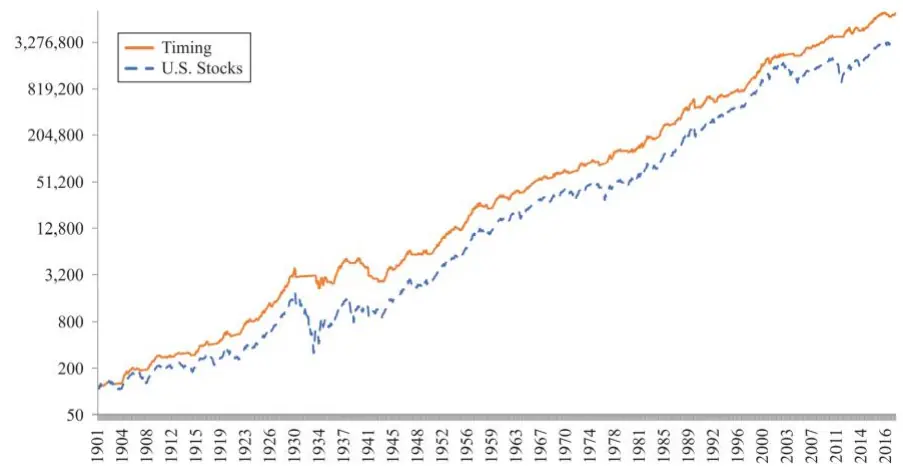
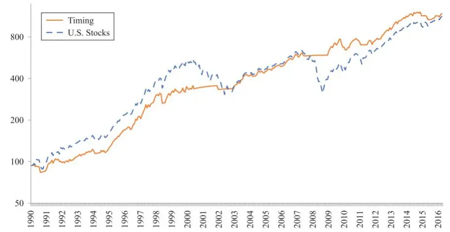
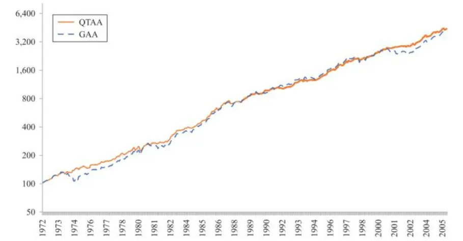
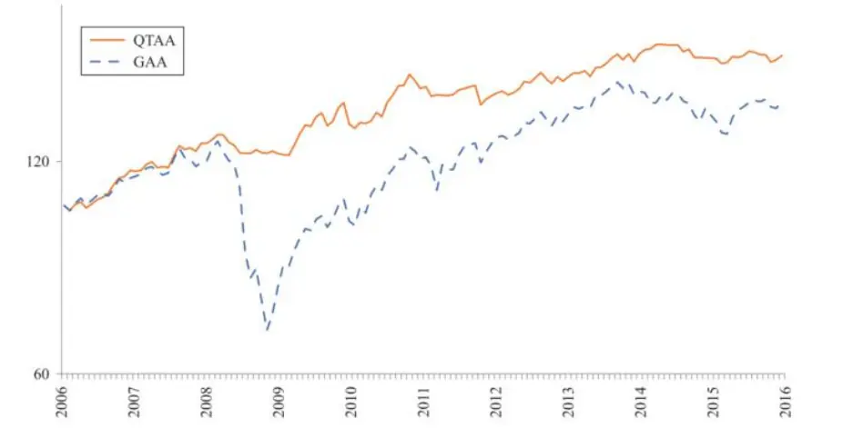
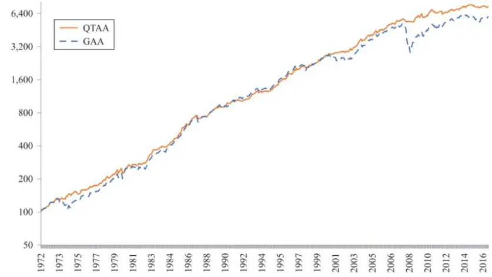

[Table_Title2021.05.26

# 战术资产配置的量化方法（下）

## ——精品文献解读系列（十四）

## 本报告导读：

本篇报告承接《战术资产配置的量化方法（上）——精品文献解读系列（十三）》，对量化择时系统进行了样本外跟踪检验，并从现金管理策略、权重配置策略和增加资产类别三个方面进行了拓展研究。

## 摘要：

le_Summary]投资学是一门学术界与业界紧密结合的学科，其中大类资产配置是这种紧密结合的代表。从Markowitz（1952）开创现代投资组合理论开始，学术界为业界提供了丰富的理论参考和方法模型，推动了大类资产配置实践的繁荣发展。为了帮助读者及时跟踪学术前沿，我们推出了“精品文献解读”系列报告，从大量学术文献中挑选出精品论文进行剖析解读，为读者呈现大类资产配置领域最新的思路和方法。

本篇为读者解读的文献是 Faber（2017）在期刊 The Journal ofPortfolio Management 上发表的论文“A Quantitative Approach toTactical Asset Allocation Revisited 10 Years Later”。

该文献跟踪检验了量化择时系统（Faber,2007）的表现，并进行了相关拓展研究。作者对择时系统进行了样本外（2006-2017年）检验，回测结果符合预期——无论是单类资产还是投资组合，应用择时系统后均能够提高风险调整收益。除此之外，作者还对择时系统从三个方面进行了拓展，包括现金管理策略、权重配置策略和增加资产类别。

本文承接 Faber 于 2007 年发表的文章“A Quantitative Approach toTactical Asset Allocation”（详见研报《战术资产配置的量化方法（上）——精品文献解读系列（十三）》），使用 11 年来（2006-2017年）的最新数据对原文提出的量化择时系统进行了样本外检验，以更好地对该模型进行评估。本文提出的择时系统简单而有效，投资者可以以此为基础，进一步进行拓展和完善，构建自己的量化战术资产配置策略，来应对各种可能出现的金融市场环境。

大类资产配置研究

## or] 报告作者

李祥文(分析师)

8 021-38031560

lixiangwen@gtjas.com

证书编号 S0880520100001

王瑞韬(研究助理)

8 021-38038208

wangruitao@gtjas.com

证书编号 S0880121010024

## cReport] 相关报告

战术资产配置的量化方法（上）

2021.05.11

机构投资者的“碳中和”之路

2021.05.10

如何理解出口对我国经济的贡献

2021.05.09

如何使用投资观点增强风险平价组合

2021.04.29

根深叶茂：金融监管视角下的公共养老金发展（上）

2021.04.27

## 文献概述

## 文献来源：

Meb Faber . "A Quantitative Approach to Tactical Asset Allocation Revisited 10 Years Later ". The Journal of Portfolio Management. 44.2(2017): 156-167.

## 文献摘要：

该文献跟踪检验了量化择时系统（Faber,2007）的表现，并进行了相关拓展研究。作者对择时系统进行了样本外（2006-2017 年）检验，回测结果符合预期——无论是单类资产还是投资组合，应用择时系统后均能够提高风险调整收益。除此之外，作者还对择时系统从三个方面进行了拓展，包括现金管理策略、权重配置策略和增加资产类别。

## 文献评述：

本文承接 Faber 于 2007 年发表的文章“A Quantitative Approach toTactical Asset Allocation”（详见研报《战术资产配置的量化方法（上）——精品文献解读系列（十三）》），使用 11 年来（2006-2017 年）的最新数据对原文提出的量化择时系统进行了样本外检验，以更好地对该模型进行评估。本文提出的择时系统简单而有效，投资者可以以此为基础，进一步进行拓展和完善，构建自己的量化战术资产配置策略，来应对各种可能出现的金融市场环境。

## 引言

2007 年，我们发表了题为“A Quantitative Approach to Tactical AssetAllocation”的文章（该文献的解读详见研报《战术资产配置的量化方法（上）——精品文献解读系列（十三）》），介绍了一种简单易行的市场择时系统。在原论文发表至今的 10 年时间里，我们经历了诸如全球金融危机等各种风险事件，此时再回顾择时系统的效果将会很有意义。

我们在本文中对择时系统进行了样本外（2006-2017）检验，并从现金管理策略、权重配置策略和增加资产类别三个方面对择时系统进行了拓展研究。

## 择时系统概述

我们在原论文中提出的择时系统是一种趋势跟踪策略（Faber，2007）。趋势跟踪策略可以追溯至20世纪初由Charles Dow提出的道氏理论（DowTheory）。在技术分析领域中，最常使用的长期趋势衡量指标是 200 日简单移动均线（200-day SMA）。本文使用的是 10 个月简单移动均线（10-month SMA），可以看做是 200-day SMA 的月度版本。

要构建一个投资者易于遵循、足够机械化的量化模型来消除情绪和主观

影响，需要符合以下标准：

1. 简单的、纯机械化的逻辑；

2. 模型和参数对于各类资产都是相同的；

3. 仅以价格为基础。

基于此标准，我们的择时系统只有一条规则：在处于上升趋势时买入，在处于下降趋势时卖出。具体如下：

买入规则：当月价格大于10个月 SMA时，买入；

卖出规则：当月价格小于 10 个月 SMA 时，卖出。

除此之外，还需明确 4 个要点：

1.买入和卖出价格均采用当日收盘价。该模型仅在每月的最后一天执行一次，其余时间的价格波动均不予考虑；

2.月度收益率为包含股息在内的总收益率数据；

3.现金收益率基于 90 天国库券收益率来估算；

4.不考虑税收、佣金和滑点。

在检验模型的业绩表现之前，需要注意原文（Faber,2007）中的一段话：

“本文的目的并不是建立一个优化模型，而是要建立一个适用于绝大多数市场的简单交易策略。研究结果表明，市场择时的作用更多的是降低风险，而不是增强收益。……实证结果表明，使用该模型构建的投资组合具有股票资产的收益率水平，同时波动性和回撤水平与债券类资产相当。”

这里需要再次强调的是，该模型的目的并非是要“击败市场”（beat themarket），而是要在取得市场收益率水平的同时，最大程度地降低波动性。其原因是情绪很有可能会严重影响投资者对既定投资计划的执行。大多数时候，投资者因为对市场下跌的恐慌而几乎总是在最糟糕的时机卖出持仓。尽管大多数股票指数从长期来看收益率水平很好，但是如果投资者因为恐慌情绪总是在市场低点附近抛售，那么这些长期收益率似乎也不能为投资者带来回报。

正是考虑到这些问题，我们开始尝试寻找一种能够显著降低波动性和回撤的量化择时系统，希望投资者可以通过遵循该系统来规避因情绪而做出的亏损决策。

## 择时系统检验

我们在原论文中检验了择时系统在截至 2005 年的历史样本区间中的业绩表现（Faber,2007）。在本文中，我们将重点研究在此之后 11年的样本外的回测结果。在深入研究这些数据之前，让我们来回归这十年间发生的事情：

在头条新闻上，我们看到了波士顿马拉松爆炸案；俄罗斯入侵乌克兰；《平价医疗法案》（Affordable Care Act）；与 Isis、埃博拉（Ebola）和寨卡（Zika）病毒的持续战斗；美国党派之争在川普当选之时达到顶点，等等。在投资界，我们看到了全球金融危机和美国房地产崩盘，接下来是美国历史性牛市的稳步推进，美联储结束量化宽松政策，债券收益率持续处于历史低位(一些全球主权债券收益率甚至为负值)，以及原油价格的剧烈波动，等等。

我们需要考虑的问题是，这一切对于资产配置策略意味着什么？这些风险事件的发生是否意味着“这次情况变得不同了”？我们的择时系统是否会因此失效？为了回答这些问题，我们先来研究一下美国股票市场的择时模型，然后再从投资组合的角度来进一步分析。

## 4.1. 将择时系统应用于美国股票市场

我们将择时系统应用于美国股票市场，图1展示了美股指数和择时系统在过去一个多世纪（1901-2016 年）的业绩表现。从图中可以看到，择时系统在很大程度上避开了 1930s 和 2000s 的两次大熊市。当然，趋势策略通常具有滞后性，因此也不可能使投资者在1920s至 1930s初期的暴跌中毫发无损。

图1：S&P 500 指数和择时系统的累计收益率比较（1901-2016 年）

数据来源：Faber（2017）

图2放大了 1990-2016 年的业绩对比曲线，从中可以观察到择时系统的明显特征：一方面，在 1990s美国股票的牛市期间，择时系统的表现差于买入持有策略；另一方面，择时系统能够规避漫长的熊市。因此，择时系统需要在至少跨越一个市场周期的时间区间中才能表现出优势。

图2：S&P 500 指数和择时系统的累计收益率比较（1990-2016 年）

数据来源：Faber（2017）

从图1和图 2 中都可以看到，从整个回测区间来看，买入持有策略和择时策略的最终累计收益率差异不大。如果投资者能够承受下跌 40%、60%甚至 80%的熊市并坚持下去，那么他们可能并不需要使用择时系统。然而，正如前文所述，许多投资者无法应对这样的回撤，在面临熊市时通常倾向于抛售资产。另一方面，我们也发现择时系统面临的挑战——在不断波动的市场中经常会出现虚假信号，这使得它在市场上涨时期的表现要差于指数。

在这一历史视角下，我们研究了自原论文（Faber，2007）发表以来的模型表现情况。表1给出了择时系统在样本内和样本外的业绩表现。从表中可以看到，无论是样本内还是样本外，择时系统均提高了收益率水平，同时降低了波动率与最大回撤。

表 1：S&P 500 指数和择时系统的表现（1901-2005 年、2006-2016 年）

|  | 1901-2005 |  | 2006-2016 |  |
| --- | --- | --- | --- | --- |
|  | U.S. Stocks | Timing | U.S. Stocks | Timing |
| Return | 9.65% | 10.36% | 7.66% | 8.53% |
| Volatility | 17.97% | 12.14% | 14.67% | 9.38% |
| Sharpe Ratio | 0.33 | 0.55 | 0.45 | 0.80 |
| MaxDD | -83.66% | -50.29% | -50.95% | -16.73% |
| Inflation | 3.16% | 3.16% | 1.86% | 1.86% |

数据来源：Faber（2017）

表2展示了逐年收益率的对比情况，详细说明了择时系统在样本外的表现。从表中可以看到，尽管择时系统在 2008 年熊市期间的表现相当出色，但是在接下来的 8 年里有 6 年表现不佳。许多在 2008 年金融危机之后才开始使用择时系统的投资者面临着业绩差于S&P 500指数的窘境。

表 2：S&P 500 指数和择时系统的年收益率（2006-2016 年）

| Year | U.S. Stocks | Timing |
| --- | --- | --- |
| 2006 | 15.80% | 15.80% |
| 2007 | 5.49% | 5.49% |
| 2008 | -37.00% | 1.24% |
| 2009 | 26.46% | 22.71% |
| 2010 | 15.06% | -1.25% |
| 2011 | 2.11% | -1.77% |
| 2012 | 16.00% | 11.03% |
| 2013 | 32.39% | 32.39% |
| 2014 | 13.69% | 13.69% |
| 2015 | 1.38% | -4.12% |
| 2016 | 11.96% | 5.04% |

数据来源：Faber（2017）

## 4.2. 将择时系统应用于投资组合

Dimson et al.（2002）在《Triumph of the Optimists: 101 Years ofGlobal Investment Returns illustrates》一书中表示，许多全球资产在 20 世纪为买入并长期持有的投资者创造了可观的收益。但是，这些资产同样也经历了诸如 2008 年金融危机这种尾部风险事件导致的巨大回撤。所有的七国集团（G7）国家都至少经历过一段股票价值缩水75%的时期。从数学上看，在承受75%的跌幅之后，投资者需要再获得300%的收益才能回到初始资金水平。如果按照上个世纪股市的平均收益率（约10%）估算，这大约需要 15年的时间。

对于投资者而言，对这个问题的解决方法是在不相关资产类别之间进行多元化配置。2000-2003 年的熊市主要归因于科技股泡沫的破裂，但是其他许多资产类别几乎没有遭受重大损失。因此，大多数投资者不仅仅拥有美国股票，还会多元化配置债券、外国资产以及实物资产等。鉴于此，我们接下来将择时系统应用于投资组合并进行分析。

表3详细说明了1972-2005年期间5种主要资产类别的收益情况。虽然这些资产类别的收益走势大不相同，但是随着时间的推移，大多数资产的最终收益率是相似的。唯一例外的是债券，债券的波动性比较低，收益率表现不如其他资产。我们还通过等权重配置5类资产得到投资组合，记为“GAA”（Global Asset Allocation）。从表 3 中可以看到，通过多元化配置，GAA的夏普比率相比单个资产有了显著提高。

表 3：5种主要资产类别以及GAA 的样本内表现（1972-2005 年）

|  | U.S. | Foreign | U.S. |  |  |  |
| --- | --- | --- | --- | --- | --- | --- |
| 1972-2005 | Stocks | Stocks | Bonds | REITs | Commodities | GAA |
| Return | 11.15% | 11.31% | 8.24% | 10.57% | 12.00% | 11.51% |
| Volatility | 15.32% | 16.81% | 8.42% | 15.35% | 19.14% | 8.88% |
| Sharpe Ratio | 0.32 | 0.31 | 0.24 | 0.29 | 0.30 | 0.60 |
| MaxDD | -44.73% | -47.47% | -15.79% | -58.10% | -48.25% | -19.62% |
| Inflation | 4.70% | 4.70% | 4.70% | 4.70% | 4.70% | 4.70% |

数据来源：Faber（2017）

基于一般经验，风险资产类别的夏普比率约为 0.2 到 0.3，而多元化投资组合的夏普比率约为 0.4 到 0.6。从表 3 中可以看到，尽管整体来看各资产类别都取得了可观的收益，但是与此同时也伴随着大幅度的回撤。除美国国债回撤较小（-15.79%）之外，其他四类资产的回撤幅度达到了-40%至-60%。如果投资者将通货膨胀考虑在内，或者拉长回测区间，其回撤幅度将会更大。

表 4 展示了自 2005 年以来，这些资产类别在样本外区间的业绩表现情况。在 2008 年金融危机期间，许多原本相关性很低的资产同时经历了大幅度的下跌。历史上每一轮熊市都具备各自的特点，比如 2000-2003年的熊市主要局限于科技股，而2008-2009年的熊市则对大部分资产都产生了负面影响。从表 4 中可以看到，各类资产的样本外（2006-2016年）业绩表现均差于样本内（1972-2005年），GAA投资组合的最大回撤幅度也达到了样本内的两倍。

表 4：5种主要资产类别以及GAA 的样本外表现（2006-2016 年）

| 2006-2016 | U.S. Stocks | Foreign Stocks | U.S. Bonds | REITs | Commodities | GAA |
| --- | --- | --- | --- | --- | --- | --- |
| Return | 7.66% | 3.29% | 4.48% | 7.05% | -8.70% | 3.51% |
| Volatility | 14.67% | 18.33% | 7.67% | 23.28% | 23.40% | 12.81% |
| Sharpe Ratio | 0.45 | 0.12 | 0.45 | 0.26 | -0.42 | 0.19 |
| MaxDD | -50.95% | -56.40% | -10.14% | -67.88% | -80.90% | -46.00% |
| Inflation | 1.86% | 1.86% | 1.86% | 1.86% | 1.86% | 1.86% |

数据来源：Faber（2017）

接下来，我们将择时系统应用于GAA投资组合，并称之为量化战术资产配置（Quantitative Tactical Asset Allocation，QGAA）。具体来说，对于 QGAA 投资组合中的每一类资产，根据择时系统的规则，要么买入做多该资产类别，要么卖出该资产持有现金。表 5 比较了 GAA 和 QTAA在样本内（1972-2005年）和样本外（2006-2016年）的业绩表现情况。从表中可以看到，无论是在样本内还是样本外，择时配置策略均可以将波动性和最大回撤降低至个位数水平。

表 5：GAA 和 QTAA 的业绩表现（1972-2005 年和 2006-2016 年）

|  | 1972-2005 |  | 2006-2016 |  |
| --- | --- | --- | --- | --- |
|  | GAA | QTAA | GAA | QTAA |
| Return | 11.51% | 11.73% | 3.51% | 4.88% |
| Volatility | 8.88% | 6.84% | 12.81% | 6.55% |
| Sharpe Ratio | 0.60 | 0.81 | 0.19 | 0.59 |
| MaxDD | -19.62% | -9.54% | -46.00% | -9.45% |
| Inflation | 4.70% | 4.70% | 1.86% | 1.86% |

数据来源：Faber（2017）

图 3 和图 4 给出了 GAA 与 QTAA 在样本内（1972-2005 年）和样本外（2006-2016 年）的累计收益率曲线，图 5 则展示了二者在全样本区间（1972-2016年）的累计收益率曲线。

图 3：GAA 和 QTAA 的样本内累计收益率曲线（1972-2005 年）

数据来源：Faber（2017）

图 4：GAA 和 QTAA 的样本外累计收益率曲线（2006-2016 年）

数据来源：Faber（2017）

图5：GAA 和QTAA 的全样本区间累计收益率曲线（1972-2016 年）

数据来源：Faber（2017）

从图3至图 5 中可以看到，择时系统在样本外的应用是有效的。为了进一步检验择时系统的稳健性，我们分别使用 6-Month SMA、8-Month SMA、12-Month SMA作为择时系统的参数进行了回测，结果如表 6 所示。从表中可以看到，SMA 参数的选择并没有那么重要，采用任何一种长度 SMA的择时系统其业绩表现都明显优于买入持有配置策略。

表6：择时系统参数稳健性检验（2006-2016 年）

|  | GAA | QTAA | 6-Month SMA | 8-Month SMA | 12-Month SMA |
| --- | --- | --- | --- | --- | --- |
| 2006-2016 Return | 3.51% | 4.88% | 5.46% | 5.73% | 3.62% |
| Volatility | 12.81% | 6.55% | 6.62% | 6.43% | 6.75% |
| Sharpe Ratio | 0.19 | 0.59 | 0.67 | 0.73 | 0.38 |
| MaxDD | -46.00% | -9.45% | -10.30% | -7.09% | -14.76% |
| Inflation | 1.86% | 1.86% | 1.86% | 1.86% | 1.86% |

数据来源：Faber（2017）

总而言之，尽管近十年来发生了地缘政治冲突、恐怖主义、全球健康恐慌等各类风险事件，但是择时系统的表现仍然符合预期，表现良好。

## 拓展研究

本文的主要目的是介绍一个简单的量化择时系统，投资者可以在此基础上进行完善，构造自己的战术资产配置策略。我们自己也对该系统进行了诸多拓展，这里简单介绍如下几个方面：

1. 现金管理策略；

2. 权重配置策略；

3. 增加资产类别。

## 5.1. 拓展 1：现金管理策略

平均而言，QTAA投资组合中大约持有 30%的现金，这在一定程度上会拖累投资组合的收益水平。我们可以将投资组合的现金部分投资于 10 年期国债（原有策略投资的是国库券）,通过承担一定的久期风险来提高投资组合的收益，回测结果如表 7 所示。从表中可以看到，在波动性和最大回撤略微增大的情况下，通过将现金购买 10 年期国债可以实现近2%的额外年化收益。

表7：资产配置和QTAA 投资组合指标情况（1972-2016年）

| 1972-2016 | GAA | QTAA Bills | QTAA Bonds |
| --- | --- | --- | --- |
| Return | 9.24% | 9.79% | 11.77% |
| Volatility | 10.10% | 6.85% | 8.23% |
| Sharpe Ratio | 0.43 | 0.71 | 0.83 |
| MaxDD | -46.00% | -9.54% | -11.12% |
| Inflation | 4.02% | 4.02% | 4.02% |

数据来源：Faber（2017）

## 5.2. 拓展 2：权重配置策略

不同投资者的风险偏好是完全不同的。基于投资者的风险偏好，我们设置三种不同的配置方案：（1）保守型 QTAA（QTAA Conservative）；（2）温和型 QTAA （QTAA Moderate）；（3）激进型 QTAA（QTAA Aggressive）。

我们将已经检验过的基本模型定义为温和型 QTAA。保守型 QTAA 在温和型QTAA的基础上将债券的配置比例从20%增加到 40%，且现金被投资于国库券。

激进型 QTAA 同样基于温和型 QTAA，构造方法为：根据最近 1 个月、3个月、6 个月、12 个月总收益的平均值将待配置的 5 类资产进行排序，从中选出前三项作为配置资产（该方法在作者 Faber 于 2010 年发表的文章《Relative Strength Strategies for Investing》中有详细介绍）。简单来说，只有当资产收益高于其长期移动均值时才会被纳入投资组合，否则相应的资金将被投资于国库券。

表 8 展示了 1972-2016 年 GAA 与三种 QTAA 配置的业绩表现。从表中可以看到，尽管激进型 QTAA 的波动率和回撤量有所增加，但其收益率和夏普比率也是最高的。

表 8：GAA 与三种 QTAA 的业绩比较（1972-2016 年）

| 1972-2016 | GAA | QTAA Conservative | QTAA Moderate | QTAA Aggressive |
| --- | --- | --- | --- | --- |
| Return | 9.24% | 9.11% | 9.79% | 13.40% |
| Volatility | 10.10% | 5.85% | 6.85% | 9.52% |
| Sharpe Ratio | 0.43 | 0.72 | 0.71 | 0.89 |
| MaxDD | 46.00% | -7.14% | -9.54% | -12.96% |
| Inflation | 4.02% | 4.02% | 4.02% | 4.02% |

数据来源：Faber（2017）

## 5.3. 拓展 3：增加资产类别

增加投资组合中配置的资产类别，会对整个投资组合的风险和收益特征产生边际影响。我们将待配置资产从原来的 5 类拓展到 13 类，并基于投资经验对这 13 类资产的配置比例进行了调整，如表 9 所示。我们发现这13种资产类别可以涵盖大部分我们想要配置的全球市场投资组合，同时还能保持足够大的配置规模以影响整体投资组合的表现。

表 10 给出了 5 类资产投资组合与 13 类资产投资组合的业绩表现（“+”表示13类资产投资组合）。从表中可以看到，包含更多资产类别的投资组合（GAA+和 QTAA+）可以提高约 150 个基点的收益，夏普比率也有明显提高。由此可见，增加资产类别有助于提高投资组合的业绩表现。

表9：13 类资产及其配置比例

| Allocation | Asset Class or Subgroup |
| --- | --- |
| 5% | U.S. Large-Cap Value |
| 5% | U.S. Large-Cap Momentum |
| 5% | U.S. Small-Cap Value |
| 5% | U.S. Small-Cap Momentum |
| 10% | Foreign Developed |
| 10% | Foreign Emerging |
| 5% | U.S. 10-Year Government Bonds |
| 5% | Foreign 10-Year Government Bonds |
| 5% | U.S. Corporate Bonds |
| 5% | U.S. 30-Year Government Bonds |
| 10% | Commodities |
| 10% | Gold |
| 20% | Real Estate Investment Trusts |

数据来源：Faber（2017）

表10：GAA、QTAA 与包含更多资产类别情况下的收益（1972-2016 年）

| 1972-2016 | GAA | GAA+ | QTAA | QTAA+ |
| --- | --- | --- | --- | --- |
| Return | 9.24% | 10.82% | 9.79% | 11.29% |
| Volatility | 10.10% | 10.43% | 6.85% | 7.03% |
| Sharpe Ratio | 0.43 | 0.57 | 0.71 | 0.91 |
| MaxDD | -46.00% | -41.93% | -9.54% | -10.75% |
| Inflation | 4.02% | 4.02% | 4.02% | 4.02% |

数据来源：Faber（2017）

## 现实考虑因素

在将择时系统应用于投资实践之前，投资者必须考虑一些现实因素——管理费、佣金、滑点和税收。（本小节的分析与原论文（Faber,2007）保持一致。）

对于管理费，买入持有策略和择时策略应该相同，且均视投资工具而异。如果使用 ETF 基金或和低费率共同基金（no-load mutual funds），管理费用大约为 0.03%-0.70%。许多使用 ETF 基金的投资组合的管理费大约为 0.05%-0.50%。

由于择时策略的低换手率，佣金的影响也较小。对于整个投资组合，择时配置策略的年换手率平均约为 3-4,其中每类资产每年换手率不超过1。同样地，滑点的影响也可以忽略不计，因为投资者可以选择共同基金（0滑点）以及流动性较好的 ETF 基金。而且许多证券公司会为其平台上的部分或全部资金提供免佣金交易。

税收是一个非常实际的考虑因素。捐赠基金和养老基金等许多投资机构享有免税待遇。对于个人投资者来说，较好的方案是通过一个递延税款账户(如 IRA 或 401(k))来进行择时交易。由于不同投资者有不同的资本收益率（不同时期税率以及股息也不同），所以很难估计投资者在使用择时配置策略时应该缴纳的税费。择时系统的特点是承担大量的短期小额亏损，但在长期获得较高的收益回报，这有助于减轻投资者的税收负担，对于那些必须在应税账户中采用择时策略的投资者是非常有益的。

## 结论

本文的目的是创建一个简单易行的方法来管理某类资产或投资组合的风险。进行分散化投资并应用市场择时策略可以帮助投资者提高风险调整收益。此外，趋势跟踪模型还能够帮助投资者规避各类资产的熊市，最终在取得股票资产收益率水平的同时，只承担债券水平的波动率和回撤。在此基础上，投资者还可以考虑使用现金管理策略、权重配置策略以及在投资组合中增加资产类别等，以构建更加完善的战术资产配置策略。

尽管择时系统的表现满足预期，我们依然有必要去展望未来金融市场的发展情况。自 2008 年全球金融危机以来，投资者已经从表现强劲的股票市场中收益颇丰。但是，目前美国股市的周期调整市盈率（CAPE）已经超过 30，远高于长期均值 17。这表明股票市场未来的收益率水平可能跑输历史长期均值。指数基金之父 John Bogle 最近也指出，美国股市未来 10 年的收益率可能只有 4%。同时，债券在未来的表现也不容乐观，美国国债收益率已经降至 2.3%的历史最低水平。

那么在未来 10 年，美国股票收益率会大大低于其长期平均水平吗？美国国债收益率将走向何方？全球其他资产类别是否是更好的配置标的？其实没有人可以完全准确地回答这些问题。鉴于此，每一位投资者都应该制定详细完整的投资计划，来应对各种可能出现的金融市场环境。而本文提出的择时系统因为具有动态性，可以帮助投资者进行战术资产配置，及时规避各类资产的熊市，进而提高投资组合的风险调整收益。

## 本公司具有中国证监会核准的证券投资咨询业务资格

## 分析师声明

作者具有中国证券业协会授予的证券投资咨询执业资格或相当的专业胜任能力，保证报告所采用的数据均来自合规渠道，分析逻辑基于作者的职业理解，本报告清晰准确地反映了作者的研究观点，力求独立、客观和公正，结论不受任何第三方的授意或影响，特此声明。

## 免责声明

本报告仅供国泰君安证券股份有限公司（以下简称“本公司”）的客户使用。本公司不会因接收人收到本报告而视其为本公司的当然客户。本报告仅在相关法律许可的情况下发放，并仅为提供信息而发放，概不构成任何广告。

本报告的信息来源于已公开的资料，本公司对该等信息的准确性、完整性或可靠性不作任何保证。本报告所载的资料、意见及推测仅反映本公司于发布本报告当日的判断，本报告所指的证券或投资标的的价格、价值及投资收入可升可跌。过往表现不应作为日后的表现依据。在不同时期，本公司可发出与本报告所载资料、意见及推测不一致的报告。本公司不保证本报告所含信息保持在最新状态。同时，本公司对本报告所含信息可在不发出通知的情形下做出修改，投资者应当自行关注相应的更新或修改。

本报告中所指的投资及服务可能不适合个别客户，不构成客户私人咨询建议。在任何情况下，本报告中的信息或所表述的意见均不构成对任何人的投资建议。在任何情况下，本公司、本公司员工或者关联机构不承诺投资者一定获利，不与投资者分享投资收益，也不对任何人因使用本报告中的任何内容所引致的任何损失负任何责任。投资者务必注意，其据此做出的任何投资决策与本公司、本公司员工或者关联机构无关。

本公司利用信息隔离墙控制内部一个或多个领域、部门或关联机构之间的信息流动。因此，投资者应注意，在法律许可的情况下，本公司及其所属关联机构可能会持有报告中提到的公司所发行的证券或期权并进行证券或期权交易，也可能为这些公司提供或者争取提供投资银行、财务顾问或者金融产品等相关服务。在法律许可的情况下，本公司的员工可能担任本报告所提到的公司的董事。

市场有风险，投资需谨慎。投资者不应将本报告作为作出投资决策的唯一参考因素，亦不应认为本报告可以取代自己的判断。
在决定投资前，如有需要，投资者务必向专业人士咨询并谨慎决策。

本报告版权仅为本公司所有，未经书面许可，任何机构和个人不得以任何形式翻版、复制、发表或引用。如征得本公司同意进行引用、刊发的，需在允许的范围内使用，并注明出处为“国泰君安证券研究”，且不得对本报告进行任何有悖原意的引用、删节和修改。

若本公司以外的其他机构（以下简称“该机构”）发送本报告，则由该机构独自为此发送行为负责。通过此途径获得本报告的投资者应自行联系该机构以要求获悉更详细信息或进而交易本报告中提及的证券。本报告不构成本公司向该机构之客户提供的投资建议，本公司、本公司员工或者关联机构亦不为该机构之客户因使用本报告或报告所载内容引起的任何损失承担任何责任。

## 评级说明

## 1.投资建议的比较标准

投资评级分为股票评级和行业评级。

以报告发布后的12个月内的市场表现为比较标准，报告发布日后的 12个月内的公司股价（或行业指数）的涨跌幅相对同期的沪深 300 指数涨跌幅为基准。

## 2.投资建议的评级标准

报告发布日后的 12 个月内的公司股价（或行业指数）的涨跌幅相对同期的沪深 300 指数的涨跌幅。

|  | 评级 说明 |  |
| --- | --- | --- |
| 股票投资评级 | 增持 | 相对沪深 300指数涨幅15%以上 |
|  | 谨慎增持 | 相对沪深300指数涨幅介于5%～15%之间 |
|  | 中性 | 相对沪深300指数涨幅介于-5%～5% |
|  | 减持 | 相对沪深300指数下跌5%以上 |
| 行业投资评级 | 增持 | 明显强于沪深300指数 |
|  | 中性 | 基本与沪深300指数持平 |
|  | 减持 | 明显弱于沪深300指数 |

## 国泰君安证券研究所

|  | 上海 | 深圳 | 北京 |
| --- | --- | --- | --- |
| 地址 | 上海市静安区新闸路669号博华广场 20层 | 深圳市福田区益田路 6009 号新世界 商务中心34层 | 北京市西城区金融大街甲9号金融 街中心南楼18层 |
| 邮编 | 200041 | 518026 | 100032 |
| 电话 | （021)38676666 | （0755)23976888 | (010)83939888 |
|  | E-mail: gtjaresearch@gtjas.com |  |  |