[Table_Title2021.06.24

# 基于拥挤交易的板块轮动与因子择时策略——精品文献解读系列（十七）

## 本报告导读：

本篇报告解读的文献使用资产中心性和相对估值这两个指标来识别拥挤交易，并据此构建板块轮动和因子择时策略，能够有效抓住市场泡沫机会来增强投资收益。

## 摘要：

le_Summary]投资学是一门学术界与业界紧密结合的学科，其中大类资产配置是这种紧密结合的代表。从Markowitz（1952）开创现代投资组合理论开始，学术界为业界提供了丰富的理论参考和方法模型，推动了大类资产配置实践的繁荣发展。为了帮助读者及时跟踪学术前沿，我们推出了“精品文献解读”系列报告，从大量学术文献中挑选出精品论文进行剖析解读，为读者呈现大类资产配置领域最新的思路和方法。

本篇为读者解读的文献是 Kinlaw（2019）在期刊 The Journal ofPortfolio Management 上 发 表 的 论 文 “ Crowded Trades:Implications for Sector Rotation and Factor Timing”。

拥挤交易（crowded trades）通常伴随着泡沫的产生，如果我们能够提前识别泡沫并进入市场，然后在泡沫破裂、股价崩塌前退出市场，那么就可以在此轮泡沫中获取显著的超额收益。为了抓住市场泡沫机会,本文提出了资产中心性（asset centrality）和相对估值（relative value）两个指标：资产中心性用来识别拥挤交易，进而预测泡沫的形成；相对估值则可以帮助我们区分泡沫的膨胀期和抛售期。本文基于这两个指标构建了板块轮动策略和因子择时策略，并对股票市场和商品市场等进行了回测分析，结果显示这两个策略均可以显著跑赢市场指数。

泡沫是资本市场经常发生的现象。比如，2020年下半年至 2021年初的基金抱团行为导致了某些股票和板块的拥挤交易，进而引发了市场泡沫。其中，中证白酒指数在 2020年Q4 暴涨了53.12%，但在2021年2月18 日达到历史高点后开始迅速回落，在不到1 个月的时间内回撤幅度达到-25.45%。

对于投资者来说，泡沫蕴含着巨大风险，但是如果操作得当，则可以在享受泡沫膨胀期巨大收益的同时，规避泡沫破裂期的大幅回撤。我们可以参考本文的方法，借助资产中心性和相对估值这两个指标，构建自己的板块轮动策略或因子择时策略，以更好地抓住市场中的泡沫机会，增强投资收益。

大类资产配置研究

## or] 报告作者

李祥文(分析师)

8 021-38031560

lixiangwen@gtjas.com

证书编号 S0880520100001

## cReport] 相关报告

如何使用“碳交易”助力“碳中和”2021.06.20

Black-Litterman 模型的理论应用与拓展 2021.06.18

2020年挪威主权基金表现为何如此优秀2021.06.04

投资模型的新视角解读 2021.06.03

战术资产配置的量化方法（下）2021.05.26

## 文献概述

## 文献来源：

Kinlaw, William, Mark Kritzman, and David Turkington. "Crowded Trades: Implications for Sector Rotation and Factor Timing". The Journal of Portfolio Management. 45.5(2019):46-57.

## 文献摘要：

拥挤交易（crowded trades）通常伴随着泡沫的产生，如果我们能够提前识别泡沫并进入市场，然后在泡沫破裂、股价崩塌前退出市场，那么就可以在此轮泡沫中获取显著的超额收益。为了抓住市场泡沫机会,本文提出了资产中心性（asset centrality）和相对估值（relative value）两个指标：资产中心性用来识别拥挤交易，进而预测泡沫的形成；相对估值则可以帮助我们区分泡沫的膨胀期和抛售期。本文基于这两个指标构建了板块轮动策略和因子择时策略，并对股票市场和商品市场等进行了回测分析，结果显示这两个策略均可以显著跑赢市场指数。

## 文献评述：

泡沫是资本市场经常发生的现象。比如2020年下半年至 2021年初的基金抱团行为导致了某些股票和板块的拥挤交易，进而引发了市场泡沫。其中，中证白酒指数在 2020 年 Q4 暴涨了 53.12%，但在 2021 年 2 月 18日达到历史高点后开始迅速回落，在不到1个月的时间内回撤幅度达到-25.45%。

对于投资者来说，泡沫蕴含着巨大风险，但是如果操作得当，则可以在享受泡沫膨胀期巨大收益的同时，规避泡沫破裂期的大幅回撤。我们可以参考本文的方法，借助资产中心性和相对估值这两个指标，构建自己的板块轮动策略或因子择时策略，以更好地抓住市场中的泡沫机会，增强投资收益。

## 引言

拥挤交易（crowded trading）指的是资金大规模买入或卖出一种资产（或具有相似特征的一类资产）的行为，这种行为会对资产价格产生显著的影响，催生市场泡沫。当然，也并非所有资产价格的剧烈波动都是由拥挤交易所致。如果投资者发现一种资产的基本面发生了变化，那么无论拥挤交易是否发生，该资产的价格都会进行相应调整。但是，当资产价格因为投资者心理状态的转变或对某种策略的追随而发生剧烈变化时，则市场很有可能发生了拥挤交易。二者的这种区别至关重要：基本面变化导致的价格调整一般来说其持续时间无法确定，所以难以被利用；而在基本面没有变化的情况下发生的价格调整通常只是暂时的，因此更容易被利用。拥挤交易会导致资产价格在基本面无相应变化的情况

下发生大幅度的涨跌，通常人们也称之为泡沫。本文的目的即是识别泡沫，并判断泡沫处于膨胀期还是收缩期。

在学术界，学者们尚未就是否可以在泡沫破灭前识别泡沫达成一致结论。比如，Fama（2014）在其诺贝尔奖获奖感言中表示：“现有研究表明股票价格的下跌是难以被预测的”。后来在接受Chicago Booth Review的采访中，Fama（2016）再次补充道：“从统计意义上讲，人们尚未提出识别泡沫的有效方法”。但是，也有学者尝试应对这一挑战。Greenwood等（2017）研究了美国市场上发生的 40 次泡沫事件，以及国际市场上发生的107次泡沫事件（他们将泡沫定义为价格在绝对水平或相对市场水平基础上上涨 100%以上的事件），发现单独依据价格上涨无法有效地预测股票未来价格的下跌，但可以进一步通过波动性增加、新股发行、价格加速上涨等来判断价格的上涨是否会持续或面临崩塌。

本文提出了一种与Greenwood等（2017）不同的预测泡沫的方法。我们使用资产中心性（asset centrality）作为拥挤交易的代理变量来识别泡沫，并将其与相对估值（relative value）的度量相结合，以判断拥挤交易发生在泡沫上升期（bubble’s run-up）还是抛售期（bubble’ssell-off）。

本文拓展了 Greenwood 等（2017）的研究。我们发现在美国股票市场中，投资者可以通过增持出现拥挤交易但尚未被高估的板块、减持出现拥挤交易但已经被高估的板块来获利。我们在其他股票市场上也验证了这一方法的有效性。除此之外，我们发现投资者还可以通过部署相同的策略来管理股票因子敞口进而获得超额收益。

本文首先阐释资产中心性（asset centrality）的概念，并讨论为何可以用资产中心性作为拥挤交易的代理变量；然后，我们提出了一种度量相对估值的方法，可以用它来区分泡沫上升期和抛售期；接下来，我们检验了一些众所周知的泡沫事件，并展示资产中心性和相对估值在整个泡沫过程中如何演变；进一步地，我们使用上述方法在样本外进行回测，识别美国股市各个板块中发生的泡沫；最后，我们还在其他股票市场以及因子配置中验证了这一方法的有效性。

## 资产中心性（Asset Centrality）

本文并没有直接从资金流的角度去识别拥挤交易，而是通过资产中心性这一指标，从价格行为中推断拥挤交易。下面将阐述资产中心性的计算方法。

1. 计算吸收率（absorption ratio）。首先计算股票板块收益的协方差矩阵，然后进行主成分分析来识别能够解释各板块收益的特征向量。接下来，计算吸收率（absorption ratio）1指标，它等于总体方差被前 n个特征向量解释（或吸收）的部分，如式（1）所示：

$$
\begin{array}{r}{AR=\frac{\sum_{i=1}^{n}\sigma_{Ei}^{2}}{\sum_{j=1}^{N}\sigma_{Aj}^{2}}}\end{array}\tag{1}
$$

在式（1）中，N是股票板块的个数；n是特征向量的个数； $\sigma_{Ei}^{2}$ 表示第i个特征向量的方差； $\sigma_{Aj}^{2}$ 表示股票板块j的方差。吸收率通常被用来度量风险集中度。

2. 计算资产中心性。资产中心性可以简单理解为该资产的收益变动对整个市场收益变动的影响程度，计算方法如式（2）所示：

$$
\begin{array}{r}{C_{i}=\frac{\sum_{j=1}^{n}\left(AR^{j}\times\frac{\left|EV_{i}^{j}\right|}{\sum_{k=1}^{N}\left|EV_{k}^{j}\right|}\right)}{\sum_{j=1}^{n}AR^{j}}}\end{array}\tag{2}
$$

在式（2）中， $C_{i}$ 表示股票板块 i的中心性得分； $AR^{j}$ 表示第j 个特征向量的吸收比； $EV_{i}^{j}$ 表示在第 j 个特征向量中，股票板块 i 的权重；n 表示吸收比分子中的特征向量的个数；N表示股票板块的总个数。

为了对中心性有一些直观的了解，可以考虑仅使用第 1 个特征向量作为吸收率分子的情况（即式（1）中的 n取1）。这种特殊情况与 Google的PageRank 算法中使用的技术非常相似（详见 Brin and Page，1998）：将每个股票板块看作是地图上的一个节点，定义某个节点的重要性得分是其所有邻居节点的重要性得分的总和（乘以某个常数），那么该得分将恰好等于第1个特征向量中该节点的权重。我们在计算吸收率时使用了多个特征向量（即式（1）中 n 取值大于 1），因为对资产收益有重要影响的因子往往不只 1 个。

为什么可以用中心性来识别拥挤交易？首先，考虑中心性较高的股票板块具有哪些特点：（1）波动性相对较大；（2）与其他板块关联性较强。然后，考虑拥挤交易如何影响板块的波动性和关联性：（1）波动性。拥挤交易从两个方面提高了板块的波动性：首先，当有一笔大额资金买入或卖出某个板块时，会导致价格的大幅调整，即增加了波动性；其次，投资者通常将板块作为一个整体来投资，因此该板块内部股票的相关性变得更强，导致板块整体的波动性也随之增大。（2）关联性。随着资金涌入某个股票板块，该板块会成为市场中领涨的领头羊，进而会推动其他板块的上涨，这会提高他们的关联性。综上所述，拥挤交易会提高股票板块的波动性及其与其他板块的关联性，进而提高了该板块的中心性，因此可以使用中心性作为拥挤交易的代理指标。

图1是美国股票市场主要板块的中心性热力图，展示了各板块中心性百分位排名。随着颜色从深蓝色变为浅蓝色、绿色、黄色、橙色、浅红色、深红色，中心性逐渐上升。从图中可以看到，在科技泡沫期间，科技板块的中心性非常高；在全球金融危机期间，金融板块的中心性非常高；在能源价格波动的期间，能源板块的中心性非常高；REITs 的中心性在几十年来一直很低，但是在导致金融危机的房地产泡沫期间，它的中心性有显著提高。图1提供了有力的证据，表明高中心性伴随着资产价格的泡沫。

图 1：美国股票市场主要板块的中心性热力图

| Utilities |
| --- |
| Telecom |
| Industrials |
| Health |
| Staples |
| Tech |
| Financials |
| Discretionary |
| Energy |
| Materials |

数据来源：Kinlaw（2019）

## 相对估值（Relative Value）

为了从泡沫中获利，我们必须把握好时机，即在泡沫形成时尽早买入资产，并在泡沫破裂前卖出资产。但是中心性本身对于把握泡沫的时机没有多大价值，因为它在整个泡沫期间会持续上升，并且在泡沫破裂期间上升斜率更加陡峭。因此，本文进一步提出了一种相对估值的度量方法，以区分泡沫上升期和抛售期。

我们使用市净率来计算相对估值。首先，计算每个板块的市净率；然后，将每个板块的市净率除以该板块过去 10 年市净率的均值，得到标准化估值；最后，将每个板块的标准化估值除以所有其他板块的标准化估值的平均值，得到该板块相对估值的横截面度量。

当某个板块内部出现拥挤交易时，该板块的中心性及其相对估值就会上升（资金涌入，买入股票）。中心性的上升标志着潜在泡沫的出现。随着拥挤交易的继续，中心性和相对估值继续上升，直到某些消息或事件引发投资者心理的转变，此时投资者开始退出市场。当这种情况发生时，中心性持续上升，因为拥挤交易依然存在，但是方向相反（资金流出，卖出股票）。事实上，当投资者退出市场时，拥挤交易通常比进入市场时更为激烈，并开始压低该板块的相对估值。

结合中心性和相对估值的优点，我们可以综合运用二者来抓住市场泡沫机会：首先，使用中心性来识别泡沫，区分由基本面变化驱动的价格变动和由投资者心理变化驱动的价格变动；其次，使用相对估值来区分泡沫膨期胀和抛售期，并以此做出交易决策。

## 中心性与相对估值在泡沫期间的演变

本小节以科技泡沫和房地产泡沫为例，展示了中心性和相对估值在泡沫期间是如何演变的。

科技泡沫发生在 1998 年至 2000 年，在这期间投资者痴迷于科技股票。图2展示了科技泡沫期间科技板块股票价格及其中心性和相对估值的演变过程。其中，PanelA 展示了科技板块股票价格的上涨和下跌；PanelB 显示，中心性水平在泡沫的形成阶段显著增加，并在泡沫破裂阶段急剧上升；Panel C 显示，科技板块相对估值的变化与其股票价格的变化保持一致。其中，垂直虚线表示泡沫破裂的时刻。

图 2：科技泡沫期间科技板块股票价格、中心性和相对估值的演变
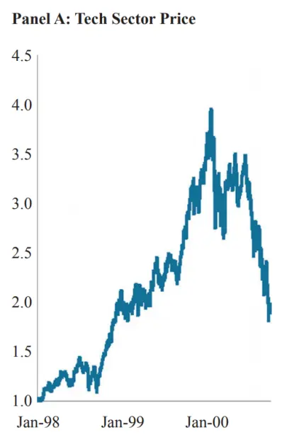
数据来源：Kinlaw（2019）

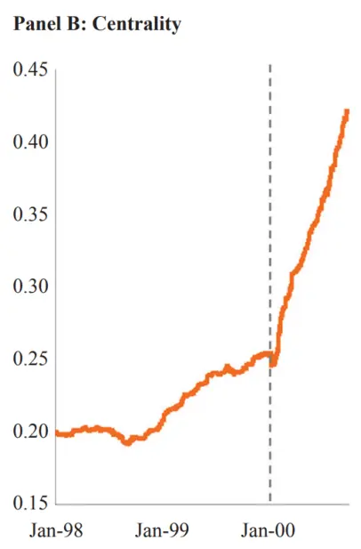

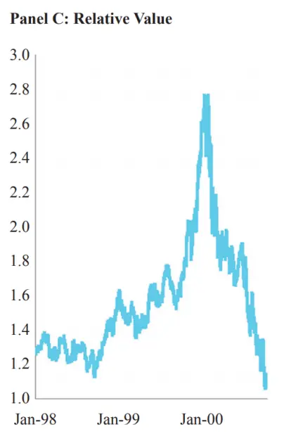

图 3 展示了最终导致全球金融危机的房地产泡沫期间 REIT 板块的中心性和相对估值的演变。与科技泡沫的情况一样，中心性提供了识别泡沫的极好信号，相对估值则可以区分泡沫的膨胀期和抛售期。

除了科技泡沫和房地产泡沫，我们还研究了投资组合保险泡沫（theportfolio insurance bubble）、信贷泡沫（the credit bubble）和风险平价泡沫（the risk parity bubble）等。在所有这些泡沫的案例中，我们都观察到股票价格、中心性和相对估值遵循类似的演变模式。这再次表明，中心性可以在泡沫开始出现时将其识别出来，同时，相对估值可以将泡沫的上涨期间和抛售期间区分开来。

图 3：房地产泡沫期间REIT板块股票价格、中心性和相对估值的演变
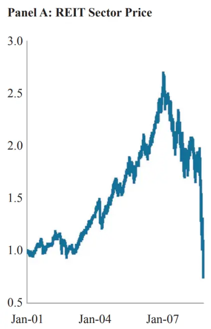
数据来源：Kinlaw（2019）

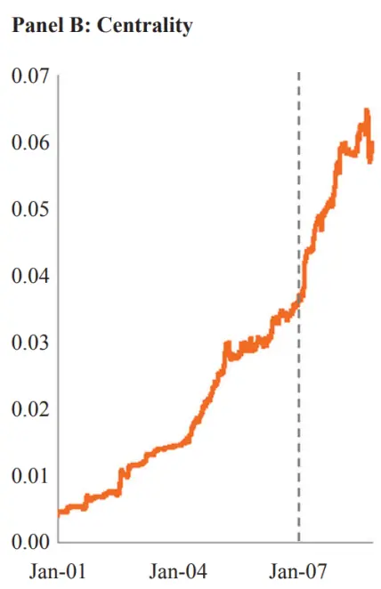

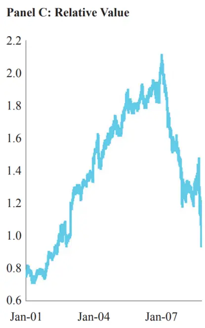

本文接下来将这种方法应用到板块轮动策略以及因子择时策略。在此之前，我们必须解决一个现实问题，即这些历史泡沫事件并没有为中心性和相对估值的度量提供一个统一的阈值。我们尝试通过两种方法来解决这个问题：首先，我们并不关心中心性的绝对水平，而是通过标准化转移（standardized shift）来关注其取值的变化；其次，我们在横截面上比较这些指标，而不去关注股票板块或因子自身的绝对取值。

## 板块轮动策略

基于前文所述，我们推测中心性较高且相对估值较低的板块处于泡沫的上升期，而中心性较高且相对估值较高的板块处于泡沫的抛售期。我们对泡沫的定义是在没有基本面变化的情况下，资产价格发生显著的上涨2和下跌。同时，我们的目标并不是要精确地识别所有泡沫确切的开始、高峰和结束时点，而是在大多数泡沫中尽可能早地确定上涨和抛售阶段，以便为被动股票策略增强收益。

接下来阐述如何校准中心性和相对估值的度量。

## 6.1. 板块中心性

1. 在每个交易日，从 Thomson Datastream 数据库中获取美国 11 个股票板块指数在过去2年的日度收益率数据。

2. 将每个板块的日度收益率乘以其市值权重的平方根，这是因为大市值板块相比小市值板块更加重要。

3. 应用指数时间衰减（半衰期设为一年）来调整日度收益率数据，使

得历史事件的影响随着滚动窗口的推进而逐渐消退。

4. 估计各个股票板块的协方差矩阵并使用式（2）计算中心性得分，其中参数n 取值为2（即考虑 2个特征向量）。

5. 计算每个板块中心性的标准化转移：将当天的中心性得分减去过去 3年的中心性得分均值，然后将这一差值除以过去 3年中心性得分的标准差。

## 6.2. 板块相对估值

1. 在每个交易日，从 Thomson Datastream 数据库中获取 11 个股票板块的市净率数据。

2. 将每个板块的市净率除以其过去10 年的市净率均值，以考虑到某些板块的估值一直相对较高（或较低）的情况。

3. 将第2步得到的标准化市净率除以其他10个板块的标准化市净率均值，得到该板块的相对标准化市净率。

4. 移动到下一个交易日，重复上述步骤。

## 6.3. 板块投资组合的业绩分析

我们基于上文所述的中心性和相对估值构建板块投资组合，并计算该投资组合的业绩表现，具体步骤如下：

1. 在每个交易日，按照拥挤程度（中心性的标准化转移）和相对估值对所有股票板块进行排名。

2. 根据排名构建 4 组投资组合：（1）无泡沫：拥挤排名非前 3 名，相对估值排名非前 3 名；（2）无泡沫：拥挤排名非前3 名，相对估值排名前 3 名；（3）泡沫上升期：拥挤排名前 3 名，相对估值排名非前 3 名；（4）泡沫抛售期：拥挤排名前 3名，相对估值排名前 3名。

3. 在第二个交易日，配置第 2步得到投资组合，并记录其收益情况（如果没有板块满足相关条件，则标记为空）。

4. 移动到下一个交易日，重复上述步骤。

表1展示了 4 种投资组合相对于标准普尔500指数的年化收益率（斜体数字是相对于标准普尔500 指数的收益风险比率）。从表中可以看到，拥挤或相对估值本身并不能提供有用的信息，但是将二者结合起来使用则特别有效。比较拥挤但是相对估值不高的板块其业绩表现最好，这一结果验证了我们的猜想——这些板块正处于泡沫的上升期。相比之下，比较拥挤同时相对估值也较高的板块业绩表现最差，因为这些板块正处于泡沫的抛售期。

表1：美国股市板块投资组合相对于 S&P 500 指数的业绩（1985-2017）

|  | Not Crowded | Crowded |
| --- | --- | --- |
| Not Overvalued | No Bubble | Bubble Run-Up |
|  | 0.3% | 6.7% |
|  | 0.05 | 0.70 |
| Overvalued | No Bubble | Bubble Sell-Off |
|  | 0.6% | -6.5% |
|  | 0.07 | -0.50 |

数据来源：Kinlaw（2019）

接下来，我们基于上述方法开发了一个板块轮动交易策略，来检验我们能够在多大程度上获取泡沫上升与抛售之间的价差收益。

## 6.4. 板块轮动交易策略

1. 在每个交易日，识别出处于泡沫上升期的板块，为其设置+5%的预期收益率；识别出处于泡沫抛售期的板块，为其设置-5%的预期收益率；其他板块的预期收益率设置为零。

2. 根据过去五年日度收益数据估计板块的年化协方差矩阵。

3. 基于均值方差优化模型求解最优板块配置权重（只允许做多，风险厌恶系数设为1）。

4. 将过去1个季度的最优板块配置权重的均值作为最终的配置权重（目的是为了控制换手率）。

5. 在第二个交易日，配置第4 步得到投资组合，并记录其收益情况。

表2展示了基于上述策略配置投资组合取得的业绩情况。从表中可以看到，与标准普尔500指数相比，该交易策略取得了更高的年化收益，同时风险更小，大大提高了收益风险比率。对于关注相对表现的投资者来说，这个策略提供了极具吸引力的信息比率。

表2：板块轮动策略的业绩表现（1985-2017）

|  | S&P 500 Index | Sector Rotation Strategy | Sector Rotation Relative Performance |
| --- | --- | --- | --- |
| Return | 11.3% | 15.5% | 4.2% |
| Risk | 17.3% | 15.6% | 8.5% |
| Ratio | 0.66 | 1.00 | 0.49 |

数据来源：Kinlaw（2019）

图4展示了板块轮动策略的累计超额收益曲线，以及相应的板块配置权重。从Panel A中可以看到，板块轮动策略在回测区间的大部分时期都取得了较好的超额收益。而且值得注意的是，目前的策略相对来说比较保守，因为我们在进行最优化时设置板块配置权重必须为正，这限制了我们减持相应板块的程度。

图4：板块轮动策略累计超额收益率与板块权重设置
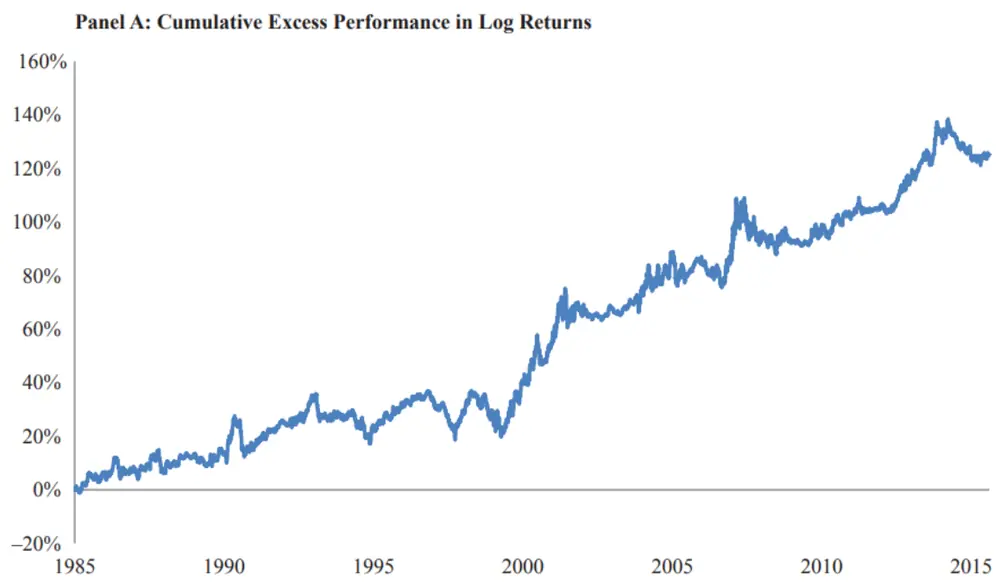

Panel B: Sector Rotation Strategy Weights
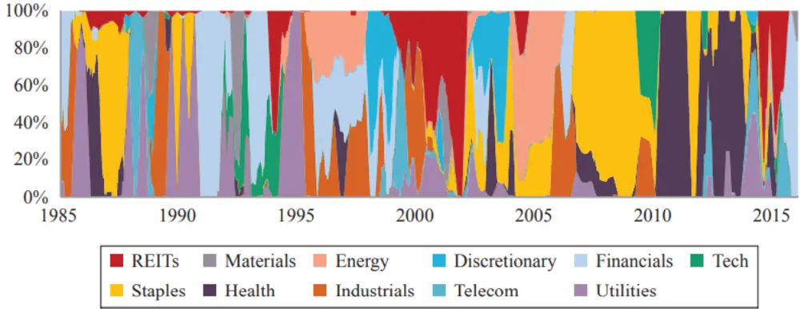
数据来源：Kinlaw（2019）

我们将这个板块轮动策略应用到其他几个主要的股票市场（数据均来自于Datastream数据库），业绩表现如图5所示。从图中可以看到，相对于业绩基准，板块轮动策略在所有股票市场中均取得了正的超额收益，同时风险水平也均有所降低（超额风险只有在澳大利亚股票市场中为正值，在其他市场中均为负值）。

该板块轮动策略在澳大利亚股票市场的业绩表现差强人意，但我们也无需感到惊讶或气馁。这是因为澳大利亚股票市场的行业分布非常集中，其 HHI 指数（Herfindahl Hirschmann Index,市场集中度指标）达到了0.24，而美国股票市场只有 0.12。所以，澳大利亚股票市场本身就不适合使用板块轮动策略。

图5：板块轮动策略在全球几个主要股票市场中的业绩表现（1985-2017）
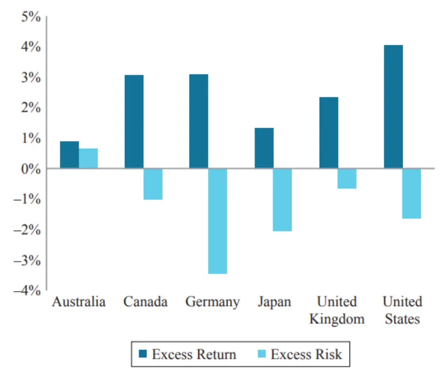
数据来源：Kinlaw（2019）

## 因子择时策略

下面我们来考虑股票风险因子。我们分析了投资者普遍采用的四种因子：规模（size）、估值（value）、质量（quality）和低波动性（low volatility）。我们没有考虑动量（momentum）因子，原因有两个：首先，动量投资组合的组成经常变化，这削弱了拥挤交易与价格之间的联系；其次，动量本身可能是其他因子发生拥挤交易的结果，这可能会混淆我们对拥挤的分析。

我们首先描述如何定义因子投资组合以及如何计算因子中心性和相对估值。

## 7.1. 因子投资组合

1. 在标准普尔500指数成分股票中，按照如下4 个指标进行排序：

a. 市值（小市值）

b. 市净率（低估值）

c. 净资产收益率（高质量）

d. 过去 2年日度收益率的波动率（低波动率）

2. 基于每个指标，按照第 1 步的排序将股票分为10 组，保证每组的股票数量相同，然后针对每组股票构建市值加权投资组合。

3. 在第二个交易日，配置第2步得到的投资组合，并记录其收益情况。

4. 将每个指标排名前 2 名的 2 组投资组合，按照市值加权计算平均收益率，作为相应因子的总收益。

5. 用因子的总收益减去标准普尔 500 指数成分股票的市值加权收益，得到因子的相对收益。

6. 1年之后，重新选择股票并调整投资组合权重。

## 7.2. 因子中心性

1. 在每个交易日，对于每个因子，计算其对应的 10 个投资组合过去 2年的日收益率。

2. 应用指数时间衰减（半衰期设为一年）来调整日度收益率数据，使得历史事件的影响随着滚动窗口的推进而逐渐消退。

3. 估计每个因子对应的 10 个投资组合的协方差矩阵，并使用式（2）计算投资组合的中心性得分，其中参数 n 取值为 2（即考虑 2 个特征向量）。

4. 将每个指标排名前 2 名的 2 组投资组合的中心性得分进行加总，作为相应因子的中心性得分。

5. 计算每个因子中心性的标准化偏移：将当天的中心性得分减去过去 3年的中心性得分均值，然后将这一差值除以过去 3年中心性得分的标准差。

## 7.3. 因子相对估值

1. 对于每个因子，我们计算 10组投资组合的市值加权市净率。

2. 将 10 组投资组合的市净率分别除以其过去 10 年的市净率均值，以

考虑到投资组合的估值一直以来相对较高（或较低）的情况。

3. 对于每组投资组合，将第 2 步得到的标准化市净率除以其他 9 个投资组合的标准化市净率均值，得到该投资组合的相对标准化市净率。

4. 计算每个指标排名前 2 名的 2 组投资组合的相对标准化市净率的市值加权平均值，作为相应因子的相对估值。

5. 移动到下一个交易日，重复上述步骤。

我们将符合如下条件的因子判定为处于泡沫上升期：（1）拥挤排名前 2名；（2）相对估值排名非前 2 名；（3）在过去1 年中业绩跑赢市场指数。将拥挤排名前2名，同时相对估值排名前 2 名的因子判定为处于泡沫抛售期。此外，我们采用与股票板块相似的方法，构建因子择时策略并进行回测。

表3展示了因子择时策略的业绩表现。从表中可以看到，因子择时策略的业绩表现与板块轮动策略同样出色。处于泡沫上升期的因子的超额收益率比泡沫抛售期高 9.0%。值得注意的是，处于泡沫抛售期的因子依然跑赢了市场，这是因为因子本身具有一定的风险溢价。

表3：美国股市因子投资组合相对于 S&P 500 指数的业绩（1985-2017）

|  | Not Crowded | Crowded |
| --- | --- | --- |
| Not Overvalued | No Bubble | Bubble Run-Up |
|  | -2.4% | 11.4% |
| Overvalued | -0.32 | 1.22 |
|  | No Bubble | Bubble Sell-Off |
|  | 0.1% | 2.4% |
|  | 0.02 | 0.34 |

数据来源：Kinlaw（2019）

表4展示了因子择时策略的业绩表现，其中有几点值得注意：首先，基于等权重静态因子构建的投资组合其业绩表现比标准普尔 500 指数高3.0%，这验证了股票因子具有风险溢价；其次，因子择时策略跑赢标准普尔500 指数6.3%，这说明因子择时策略进一步增厚了收益；第三，对于关注相对业绩表现的投资者来说，因子择时策略的信息比例明显高于静态因子组合。

表 4：因子择时策略的业绩表现（1995-2017）

| Static |  |  |  | Static Factors Relative Performance | Factor Timing Relative Performance |
| --- | --- | --- | --- | --- | --- |
|  | S&P 500 | Factors | Factor Timing |  |  |
| Return | 8.6% | 11.6% | 14.9% | 3.0% | 6.3% |
| Risk | 18.6% | 20.5% | 20.8% | 3.7% | 5.7% |
| Ratio | 0.46 | 0.56 | 0.71 | 0.82 | 1.10 |

图6展示了因子择时策略的累计收益曲线和相应的因子配置权重。从图中可以看到，因子择时策略在回测区间的大部分时期都取得了较好的超额收益。

图6：板块轮动策略累计超额收益率与板块权重设置
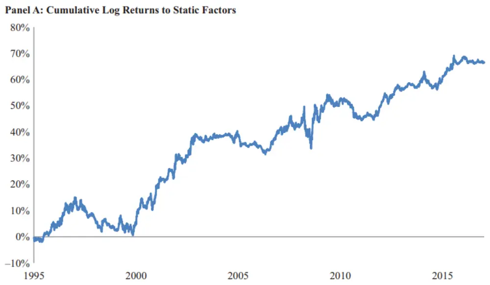

Panel B: Factor Timing Strategy Weights
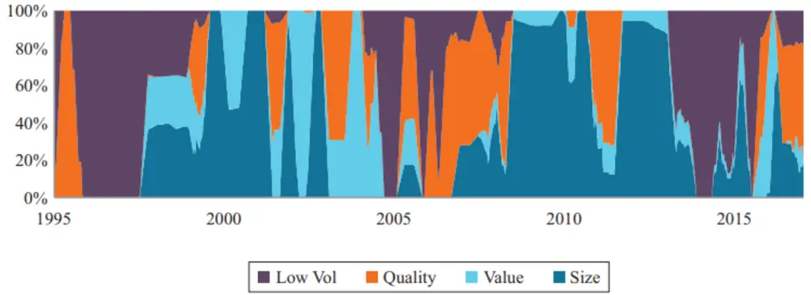
数据来源：Kinlaw（2019）

## 结论

本文提出了一种度量资产中心性的方法，并以此来识别导致泡沫形成的拥挤交易。进一步地，本文提出了一种度量相对估值的方法，用来判断泡沫处于上升期还是抛售期。

我们的研究表明，单独使用中心性或相对估值都不足以用来管理泡沫风险。这是因为中心性在整个泡沫期间会持续上升，而且通常在泡沫抛售期上升得更加显著，而相对估值则无法区分因基本面变化而导致的价格变动与因投资者心理转变或投资策略转变而导致的价格变动。然而，综合运用中心性和相对估值这两个指标，则可以在有效识别泡沫的基础上，区分泡沫的上涨期和抛售期。我们的回测结果表明，基于这两个指标构建的板块轮动策略在美国和其他主要国家股票市场上能够显著跑赢市场指数。类似地，基于这两个指标构建的因子择时策略在美国股票市场中同样可以显著跑赢市场指数。

除此之外，我们还将同样的策略应用于美国大宗商品市场，同样取得了较好的业绩，获得了 11.1%的年化超额收益。这表明除股票市场外，本文提出的方法还可以应用于其他市场和投资领域。

## 本公司具有中国证监会核准的证券投资咨询业务资格

## 分析师声明

作者具有中国证券业协会授予的证券投资咨询执业资格或相当的专业胜任能力，保证报告所采用的数据均来自合规渠道，分析逻辑基于作者的职业理解，本报告清晰准确地反映了作者的研究观点，力求独立、客观和公正，结论不受任何第三方的授意或影响，特此声明。

## 免责声明

本报告仅供国泰君安证券股份有限公司（以下简称“本公司”）的客户使用。本公司不会因接收人收到本报告而视其为本公司的当然客户。本报告仅在相关法律许可的情况下发放，并仅为提供信息而发放，概不构成任何广告。

本报告的信息来源于已公开的资料，本公司对该等信息的准确性、完整性或可靠性不作任何保证。本报告所载的资料、意见及推测仅反映本公司于发布本报告当日的判断，本报告所指的证券或投资标的的价格、价值及投资收入可升可跌。过往表现不应作为日后的表现依据。在不同时期，本公司可发出与本报告所载资料、意见及推测不一致的报告。本公司不保证本报告所含信息保持在最新状态。同时，本公司对本报告所含信息可在不发出通知的情形下做出修改，投资者应当自行关注相应的更新或修改。

本报告中所指的投资及服务可能不适合个别客户，不构成客户私人咨询建议。在任何情况下，本报告中的信息或所表述的意见均不构成对任何人的投资建议。在任何情况下，本公司、本公司员工或者关联机构不承诺投资者一定获利，不与投资者分享投资收益，也不对任何人因使用本报告中的任何内容所引致的任何损失负任何责任。投资者务必注意，其据此做出的任何投资决策与本公司、本公司员工或者关联机构无关。

本公司利用信息隔离墙控制内部一个或多个领域、部门或关联机构之间的信息流动。因此，投资者应注意，在法律许可的情况下，本公司及其所属关联机构可能会持有报告中提到的公司所发行的证券或期权并进行证券或期权交易，也可能为这些公司提供或者争取提供投资银行、财务顾问或者金融产品等相关服务。在法律许可的情况下，本公司的员工可能担任本报告所提到的公司的董事。

市场有风险，投资需谨慎。投资者不应将本报告作为作出投资决策的唯一参考因素，亦不应认为本报告可以取代自己的判断。
在决定投资前，如有需要，投资者务必向专业人士咨询并谨慎决策。

本报告版权仅为本公司所有，未经书面许可，任何机构和个人不得以任何形式翻版、复制、发表或引用。如征得本公司同意进行引用、刊发的，需在允许的范围内使用，并注明出处为“国泰君安证券研究”，且不得对本报告进行任何有悖原意的引用、删节和修改。

若本公司以外的其他机构（以下简称“该机构”）发送本报告，则由该机构独自为此发送行为负责。通过此途径获得本报告的投资者应自行联系该机构以要求获悉更详细信息或进而交易本报告中提及的证券。本报告不构成本公司向该机构之客户提供的投资建议，本公司、本公司员工或者关联机构亦不为该机构之客户因使用本报告或报告所载内容引起的任何损失承担任何责任。

## 评级说明

## 1.投资建议的比较标准

投资评级分为股票评级和行业评级。

以报告发布后的12个月内的市场表现为比较标准，报告发布日后的 12个月内的公司股价（或行业指数）的涨跌幅相对同期的沪深 300 指数涨跌幅为基准。

## 2.投资建议的评级标准

报告发布日后的 12 个月内的公司股价（或行业指数）的涨跌幅相对同期的沪深 300 指数的涨跌幅。

|  | 评级 说明 |  |
| --- | --- | --- |
| 股票投资评级 | 增持 | 相对沪深 300指数涨幅15%以上 |
|  | 谨慎增持 | 相对沪深300指数涨幅介于5%～15%之间 |
|  | 中性 | 相对沪深300指数涨幅介于-5%～5% |
|  | 减持 | 相对沪深300指数下跌5%以上 |
| 行业投资评级 | 增持 | 明显强于沪深 300指数 |
|  | 中性 | 基本与沪深300指数持平 |
|  | 减持 | 明显弱于沪深300指数 |

## 国泰君安证券研究所

|  | 上海 | 深圳 | 北京 |
| --- | --- | --- | --- |
| 地址 | 上海市静安区新闸路669号博华广场 20层 | 深圳市福田区益田路 6009 号新世界 商务中心34层 | 北京市西城区金融大街甲9号金融 街中心南楼18层 |
| 邮编 | 200041 | 518026 | 100032 |
| 电话 | （021)38676666 | （0755)23976888 | (010)83939888 |
|  | E-mail: gtjaresearch@gtjas.com |  |  |