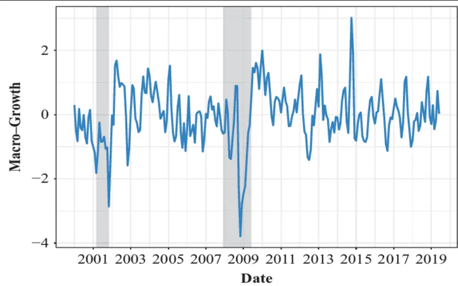
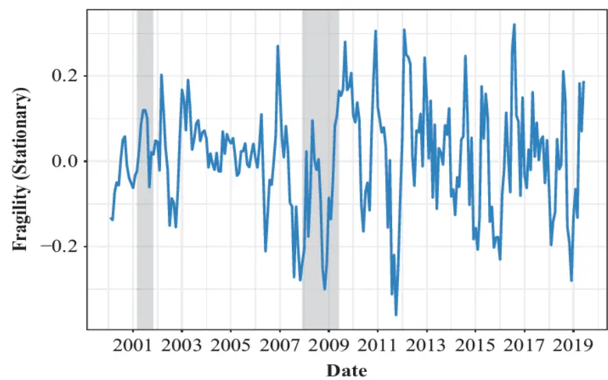
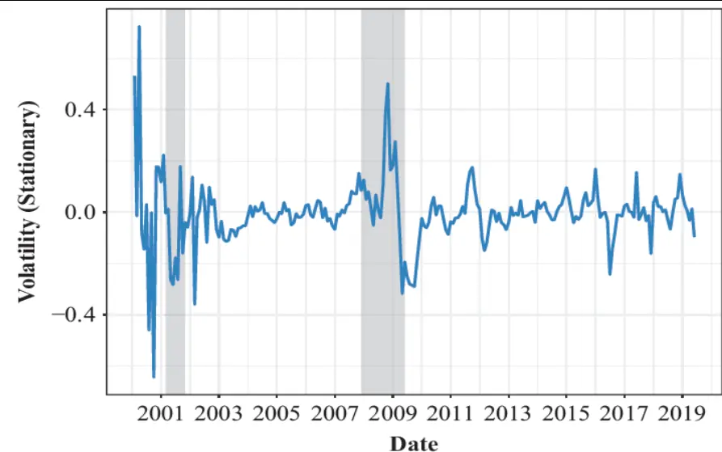
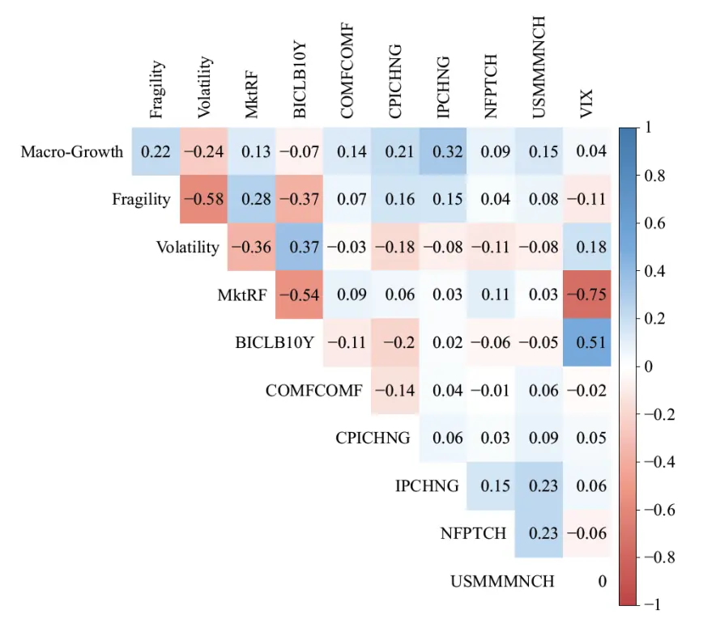
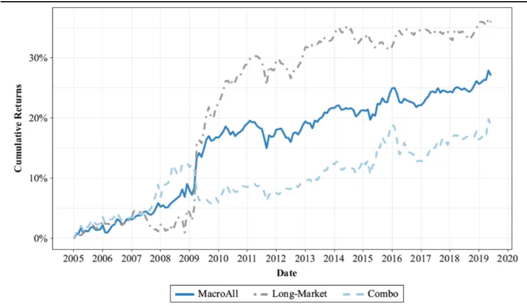
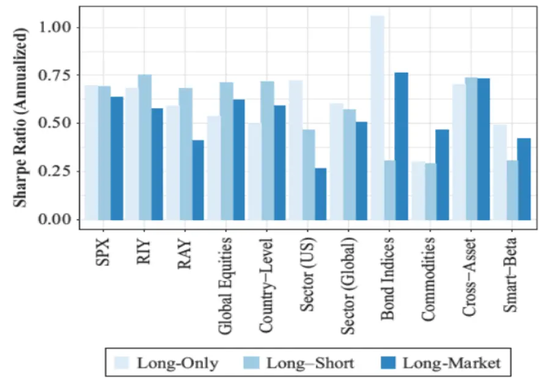

[Table_Title2021.07.01

# 如何获取宏观经济风险溢价

## --精品文献解读系列（十八）

## 本报告导读：

本篇报告解读的文献以描述宏观经济的不同维度为目标构建了宏观增长、脆弱性以及波动性因子，并探讨了这些宏观因子对配置组合的改善效果。

## 摘要：

le_Summary]投资学是一门学术界与业界紧密结合的学科，其中大类资产配置是这种紧密结合的代表。从Markowitz（1952）开创现代投资组合理论开始，学术界为业界提供了丰富的理论参考和方法模型，推动了大类资产配置实践的繁荣发展。为了帮助读者及时跟踪学术前沿，我们推出了“精品文献解读”系列报告，从大量学术文献中挑选出精品论文进行剖析解读，为读者呈现大类资产配置领域最新的思路和方法。

本期为读者解读的文章为 Chousakos & Giamouridis 于 2020 年发布于期 刊 The Journal of Portfolio Management 的 文 章 :“HarvestingMacroeconomic Risk Premia”。

传统资产定价理论认为，金融资产的预期收益随经济周期的演进而变化。对经济周期以及经济周期和金融资产预期收益关系的研究有助于构建更优的资产配置组合。然而现实环境中，并不存在可以对经济周期的演进进行全面有效描述的单一变量。这一问题为相关研究带来了困难。本文作者结合最新的计量方法，构建了描述宏观经济不同维度的三个宏观因子。他们发现三个因子都对应了显著的风险溢价，并探讨了这三个因子的应用对配置组合的提升效果。

作者分别构建了宏观增长、脆弱性以及波动性三个因子用以描述宏观经济。作者使用即时预测(nowcasting)的方法，利用与经济增长相关的宏观变量构建了宏观增长(macro-growth)因子；使用结构化信用模型的方法，利用市场波动、信用违约等变量构建了脆弱性(fragility)因子；使用股票市场截面波动的变量构建了波动性(volatility)因子。三个因子描述了宏观经济的不同维度，相互之间具有较低的相关性。

作者使用多元资产ETF以及罗素 1000作为资产池，对三个宏观因子的风险溢价进行检验。他们发现三个因子都对应了显著的风险溢价。其中宏观增长因子的风险溢价无法被传统的资产定价模型所解释，而脆弱性以及波动性因子的风险溢价则可以被传统的资产定价模型所解释。纳入因子组合可以提升有效前沿的风险调整收益，带来更优的配置组合。

大类资产配置研究

## or] 报告作者

李祥文(分析师)

8 021-38031560

lixiangwen@gtjas.com

证书编号 S0880520100001

王瑞韬(研究助理)

8 021-38038208

wangruitao@gtjas.com

证书编号 S0880121010024

## cReport] 相关报告

基于拥挤交易的板块轮动与因子择时策略2021.06.24

如何使用“碳交易”助力“碳中和”2021.06.20

Black-Litterman 模型的理论应用与拓展 2021.06.18

2020年挪威主权基金表现为何如此优秀2021.06.04

投资模型的新视角解读 2021.06.03

## 1. 文献概述

## 文献来源：

Chousakos & Giamouridis(2020). Harvesting Macroeconomic Risk Premia. The Journal of Portfolio Management, 46(6), 93-109.

## 文献摘要：

作者使用宏观金融研究中常用的宏观变量度量经济的整体状态。他们聚焦于宏观经济的三个主要维度：宏观增长(macro-growth)、脆弱性(fragility)以及波动性(volatility)。其中宏观增长因子使用与经济增长相关的宏观变量估计得到，是一个顺周期指标。脆弱性因子使用与公司违约的变量估计得到，也是一个顺周期指标。波动性因子使用与股票市场信息量相关的变量估计得到，是一个逆周期指标。作者发现这三个宏观因子对应了显著的风险溢价，并可以通过投资于多元资产ETF的方式获取。

## 文献解读：

传统资产定价理论认为，金融资产的预期收益随经济周期的演进变化。对经济周期以及经济周期和金融资产关系的研究有助于构建更优的资产配置组合。然而现实环境中，并不存在可以对经济周期的演进进行全面有效描述的单一变量。这一问题为相关研究带来了困难。本文作者结合最新的计量方法，构建了描述宏观经济不同维度的三个宏观因子。他们发现三个因子都对应了显著的风险溢价，并探讨了这三个因子的应用对配置组合的提升效果。

本文作者分别构建了宏观增长、脆弱性以及波动性三个因子用以描述宏观经济。作者使用即时预测(nowcasting)的方法，利用与经济增长相关的宏观变量构建了宏观增长(macro-growth)因子；使用结构化信用模型的方法，利用市场波动、信用违约等变量构建了脆弱性(fragility)因子；使用股票市场截面波动变量构建了波动性(volatility)因子。三个因子描述了宏观经济的不同维度，相互之间具有较低的相关性。

作者使用多元资产 ETF 以及罗素 1000 作为资产池，对三个宏观因子的风险溢价进行检验。他们发现三个因子都对应了显著的风险溢价。其中宏观增长因子的风险溢价无法被传统的资产定价模型所解释，而脆弱性以及波动性因子的风险溢价则可以被传统的资产定价模型所解释。纳入因子组合可以提升有效前沿的风险调整收益，带来更优的配置组合。

## 2. 前言

大量学术研究认为金融资产的预期收益随经济周期波动。本文中，我们借助近期的学术研究成果，构建了三个代表整体经济活动的指标(宏观增长、脆弱性以及不确定性)。三个指标都使用相对高频的宏观变量构建，因而可以为投资者提供更为及时的信息。我们发现这三个指标与主流的宏观经济指数以及经济周期高度相关。投资者可以使用三个指标的因子模拟组合获取对应的宏观经济风险溢价。

宏观增长(macro-growth)度量了整体经济活动的增长维度。我们参考Beber, Brandt, & Luisi(2015)的方法，将多个宏观经济变量合成为单一的宏观增长因子。所得到的因子序列具有平稳与顺周期的特征。我们认为，持有对宏观增长因子有正向暴露的金融资产可以获取与整体经济增长相关的风险溢价。

脆弱性(fragile)度量了经济体的整体金融稳定性。我们参考 Atkeson,Eisfeldt, & Weill(2017)的方法，使用结构化信用风险模(参考 Leland,1994;Merton, 1974)对脆弱性因子进行估计。脆弱性因子的估计依赖于整体信用风险以及可观测的股票市场波动率。更高的股票波动率代表着更大的违约可能。我们认为持有对脆弱性因子有正向暴露的金融资产可以获取与信用风险相关的风险溢价。

波动性(volatility)度量了经济参与者所产出的信息量。我们参考Chousakos, Gorton, & Ordonez(2018)的方法，使用与公司股票波动相关的截面信息对波动性因子进行估计。更高的波动性水平代表了更大的经济衰退与金融危机的风险。

宏观增长、脆弱性与波动性有几个特征。首先，每个因子都描述了宏观经济周期的某一维度，并可以为投资者提供更为及时的更新。其次，在我们的实证研究中，我们发现宏观增长因子对应了每年 3.96%的风险溢价。此外，我们发现脆弱性因子以及波动性因子在股票收益截面中并未被充分定价，代表了他们被更为主要的风险因子所掩盖。

早期的相关研究更多聚焦于股票与债券市场。大量研究发现，工业生产、利率曲线、通胀(Chen, Roll, & Ross, 1986)以及其他与经济周期相关的变量(Fama & French, 1989)与同期的股票和债券收益高度相关。然而，只有极少数宏观变量可以被用于预测未来的金融资产收益。Lettau &Ludvigson(2001)发现消费财富比例(consumption-wealth ratio)可以用于预测未来的股票收益。近年来，更多的研究将注意力转移到宏观因子与风格风险溢价之间的关系。Chordia & Shivakumar(2002)发现动量风险溢价可以被宏观变量完全解释。Zhang et al(2009)发现价值以及市值风险溢价与通胀高度相关。我们的研究与这些结论基本一致。我们发现，尽管用于构建宏观增长因子的单一宏观变量都不具备对未来金融资产预期收益的预测能力，宏观增长因子却可以预测未来金融资产的收益。

同样存在大量研究探索如何使用宏观经济因子指导战术资产配置。这类研究通常使用打分度量金融资产对宏观经济变量的敏感性。这些打分可能是经济景气评级(Chong & Phillips. 2014)、资产截面信号(Hodges et al.2017)或者仪表盘(Clewell et al. 2017)的形式。还存在部分研究认为宏观变量对资产价格的影响是以宏观情景的形式存在(参考 Kritzman, Page,& Turkington, 2012)。本文中，我们假设资产对三个宏观因子时变的因子暴露反映了变化的宏观情景。我们提出了一个简单但是稳健的战术资产配置框架以获取三种与经济活动风险相关的风险溢价。

## 3. 宏观经济因子

宏观经济的状态可以由一系列不同频率的总量指标来表述(比如：周度的失业初请、月度的人均可支配收入等)。需要注意的是，宏观指标较低的观测频率不利于快速变化的资本市场决策。此外，宏观指标扩散的特征使得如何将代表经济状态的信息与噪音进行分离也成为一个难题。近期有学者提出了新的统计方法用于弥合宏观指标较低的观测频率与市场参与者所需频率的差异。本章中，我们借助这些方法，尝试构建三个宏观因子序列以描述宏观经济的不同维度。此后我们将使用这三个宏观因子作为宏观经济风险的代理变量，研究他们与资产价格之间的关系。

## 3.1. 宏观增长

参考 Beber, Brandt, & Luisi(2015)的研究，我们使用多个宏观经济变量的加总作为宏观增长因子的估计。Beber, Brandt, & Luisi(2015)的方法可以提取多个不同频率且不同发布期的宏观变量的共有信息。这一方法可以用于提供任意时间点的快照信息，并被研究者称作即时预测(nowcasting)。

表1中展示了用于构建宏观增长因子的变量。为了避免在后续分析中使用到未来信息，我们选择使用各宏观增长变量的初次发布数值进行宏观增长因子的估计。对于不同宏观变量不同最早发布日期的问题，我们使用相关性矩阵对变量的矩估计进行调整。

## 表 1：宏观增长变量

ISM Manufacturing PMI SA 
US Manufacturers' New Orders Total MOM SA 
ISM Non-Manufacturing NMI 
Merchant Wholesalers Inventories Total Monthly % Change 
Adjusted Retail & Food Services Sales SA Total Monthly % Change 
Adjusted Retail Sales Less Autos SA Monthly % Change 
GDP US Personal Consumption Chained 2012 Dlrs % Change from 
Previous Period SAAR 
US Personal Income MOM SA 
US Industrial Production MOM SA 
US Capacity Utilization % of Total Capacity SA 
US Manufacturing & Trade Inventories Total MOM SA 
US Durable Goods New Order sIndustries MOM SA 
US Durable Goods New Orders Total Ex Transportation MOM SA 
GDP US Chained 2012 Dollars QoQ SAAR 
US Personal Consumption Expenditures Nominal Dollars MOM SA 
Consumer Price Index
数据来源：Chousakos & Giamouridis(2020)

图1中展示了使用上述方法得到的宏观增长因子。可以发现因子的取值在 2007-2009 的金融危机期间最小。我们使用向量自回归模型分析了宏观增长因子与经济周期之间的关系，并发现两者之间存在着紧密联系。宏观增长因子的正向变化会带来工业增长、消费以及非农就业的上升。

这一实证结果也说明了宏观经济增长是一个可以预测经济生产维度的顺周期指标。

图 2：宏观增长因子

数据来源：Chousakos & Giamouridis(2020)

## 3.2. 脆弱性

大量文献研究了宏观经济与金融市场损耗之间的关系(Bernanke &Gertler, 1989; Kiyotaki & Moore, 1997)。这些研究使用公司部门的金融稳定性作为金融市场整体损耗的代理变量。Atkeson, Eisfeldt, & Weill(2017)使用类似结构化信用风险模型的方式对市场的脆弱性进行了估计。他们发现自1926到2012年间，该指标在大衰退以及次贷危机期间取值最低。

参考上述方法，我们使用上市公司的波动率倒数中位数作为整体经济的脆弱性代表并构建了对应的平稳因子序列。脆弱性可以理解为市场整体破产的风险。图 2 给出了2001至2019年的脆弱性因子取值序列。

图 2：脆弱性因子

数据来源：Chousakos & Giamouridis(2020)

相关研究发现，脆弱性因子同样是顺周期的宏观经济指标。更低的经济信用风险预示着未来金融市场更高的收益、更低的信用利差以及更低的市场隐含波动率。

## 3.3. 波动性

相关研究认为，宏观经济的波动与市场参与者对公司部门质量的不同认知有关(Gorton & Ordonez, 2014)。在经济减速的前期，市场参与者会发现这一迹象并将资金转移到质量更高的公司项目中。也因此股票价格中蕴含了关于市场波动性的信息。

我们参考 Chousakos, Gorton, & Ordonez(2018)的方法，使用公司截面波动构建了波动性因子的时间序列。正如研究中发现的，这一因子随经济周期的变化而波动。波动性因子的上升代表了下一季度经济衰退与金融危机的可能性增大。

图 3：波动性因子

数据来源：Chousakos & Giamouridis(2020)

图 3 展示了波动性因子的取值时间序列。波动性因子分别在 2002 年的互联网泡沫与 2008 年的次贷危机期间达到最大值。这一因子是逆周期的宏观经济指标。波动性的上升对应着未来更低的工业生产、更低的非农就业、更低的股票超额收益、跟高的信用利差以及更高的恐慌指数(VIX)。我们的研究发现，波动性描述了与宏观增长以及脆弱性不同的宏观经济维度。三个宏观因子相互补充，可以为宏观经济的状态提供一个及时清晰的描述。

## 3.4. 宏观因子变量与总体经济活动紧密相关

三个宏观因子序列与其他的主流宏观经济变量之间存在着紧密的关系。图5中列示了主要宏观经济变量与三个宏观因子的相关性矩阵。宏观增长因子与脆弱性因子、波动性因子以及工业生产(IPCHNG)有着较弱的正相关关系。脆弱性因子与波动性因子负相关，这也代表了两个因子度量了宏观经济不同维度的信息。

图 4：相关性矩阵

数据来源：Chousakos & Giamouridis(2020)

除相关性外，我们还对三个因子进行了同期回归分析(表 2)。可以发现宏观增长因子的变化与同期工业生产(IPCHNG)、消费(COMFCOMF)以及制造业非农就业(USMMMNCH)紧密相关。脆弱性因子与信用利差(BICLB10Y)之间显著负相关，与工业生产正相关。此外，波动性因子与股票市场超额收益显著负相关，与恐慌指数(VIX)显著正相关。整体来说，表2中的回归结果印证了我们关于三个因子捕捉了不同经济维度的判断。

表 2：因子回归分析

|  | MktRF (1) | BICLB10Y (2) | COMFCOMF (3) | IPCHNG (4) | USMMMNCH (5) | VIX (6) |
| --- | --- | --- | --- | --- | --- | --- |
| Macro-Growth | 0.033 | 0.041 | 0.131** | 0.305*** | 0.133*** | 0.095 |
| Fragility | (0.067) 0.101 | (0.064) -0.249*** | (0.055) 0.058 | (0.095) 0.118* | (0.046) 0.025 | (0.062) -0.014 |
| Volatility | (0.071) -0.295*** | (0.078) 0.233 | (0.056) 0.032 | (0.062) 0.058 | (0.056) -0.038 | (0.060) 0.199** |
| Constant | (0.087) 0.000 (0.058) | (0.159) 0.000 (0.063) | (0.043) -0.000 (0.046) | (0.046) 0.000 (0.087) | (0.063) -0.000 (0.038) | (0.083) 0.000 (0.047) |
| Observations R2 | 232 0.138 | 232 | 232 | 232 | 232 | 232 |
| Adjusted R² | 0.127 | 0.175 0.164 | 0.021 0.008 | 0.110 0.098 | 0.025 0.012 | 0.042 0.030 |
| F-Statistic (df= 3; 228) | 0.934 |  |  |  |  |  |
|  |  |  | 0.996 |  |  |  |
| Res. Std. Error (df= 228) | 12.216*** | 0.914 16.152*** | 1.610 | 0.950 9.374*** | 0.994 1.932 | 0.985 3.354** |

数据来源：Chousakos & Giamouridis(2020)

## 4. 宏观经济与资产收益的关系

## 4.1. 研究方法

宏观增长因子、脆弱性因子以及波动性因子与经济周期密切相关，并且提供了整体经济不同维度的及时更新。本章中，我们研究三个因子作为宏观经济的代理变量，研究他们与资产价格之间的关系。

我们首先使用两步回归法(Fama & MacBeth, 1973)与三步回归法(Giglio& Xiu, 2017)研究因子与股票截面定价的关系。我们的实证结果证明，宏观增长因子的暴露带来了显著的风险溢价(每年 3.96%)，然而脆弱性因子与波动性因子并未被股票截面所定价，这可能代表了他们的解释能力被其他更强的因子所稀释了。

此外，我们以多空分组组合的方式对三个宏观因子与股票以及其他资产的强弱关系进行分析。我们使用下列时间序列回归的方法估计资产相对宏观因子的因子暴露：

$$
\mathrm{R_{i,t}^{e}=a_{i,t}+\beta_{i,t}^{F}F_{t}+\epsilon_{i,t}}
$$

其中 $\mathbf{R_{i,t}^{e}}$ 是资产i在时间 t的超额收益， $\mathrm{F_{t}}$ 是平稳的因子序列， $\beta_{\mathrm{i,t}}^{\mathrm{F}}$ 是资产在因子F上的因子暴露。随后，我们使用资产的因子暴露对资 $产$ 进行排序，并据此构建多空组合。其中分组1代表了对宏观因子暴露最低的资产，而分组5代表了对宏观因子暴露最高的资产。分组 5与分组1的多空组合的预期收益则代表了资产类别中包含的宏观因子风险溢价。

## 4.2. 股票模拟组合

我们首先构建了以罗素 1000 股票为资产池的因子模拟组合。表 3 给出了使用三个宏观因子进行股票分组下的分组以及多空组合的历史表现。表3的A,B,C三组分别对应了宏观增长因子、脆弱性因子以及波动性因子的信息。

参考A组的结果我们可以发现，在宏观增长上有更大暴露的股票有着更高的收益。基于宏观增长暴露得到的5 个分组在长期收益上具有单调递增的特性，从分组1的 5.51%上升到分组5的 16.36%。这样的收益差异在控制了 Fama & French(2015)五因子模型以及 Carhart(1997)的四因子模型后依然显著。而基于宏观增长因子的多空组合有着 0.72的夏普比率以及6%的历史最大回撤。

参考B 组的结果可以发现，在脆弱性因子上有着更大暴露的股票同时有着更高的收益以及更高的 beta。与宏观增长因子类似，基于脆弱性因子暴露得到的5 个分组在长期收益上同样具有单调递增的特性。因子的多空组合获得 2.26%的收益，并同样通过了五因子模型以及四因子模型的考验。

最后我们来看C 组的结果，在波动性因子上具有更大暴露的股票同时有着更低的收益以及更高的 beta。这种互相关系单调递减，对应了-2.4%的多空组合收益。需要注意的是，波动性因子对应的多空组合收益并未通过四因子模型以及五因子模型的检验。

表 3：股票分组组合统计

|  | Short (1) | Quintile 2 (2) | Quintile 3 (3) | Quintile 4 (4) | Long (5) | Long-Short (6) | Long-Market (7) |
| --- | --- | --- | --- | --- | --- | --- | --- |
| Panel A: Macro |  |  |  |  |  |  |  |
| αFF5 | -3.23% | 0.34% | 1.47% | 3.85% | 7.30% | 5.26% | 3.61% |
| tStatfFs | -1.78 | 0.36 | 1.04 | 1.90 | 3.03 | 3.05 | 2.93 |
| αCAR | -2.70% | 0.81% | 2.34% | 3.98% | 8.25% | 5.48% | 4.09% |
| tStatCAR | -1.36 | 0.94 | 2.73 | 2.41 | 3.46 | 2.72 | 3.46 |
| Returns | 5.51% | 8.99% | 10.73% | 12.54% | 16.36% | 5.43% | 3.96% |
| Std. Dev. | 16.06% | 16.05% | 17.16% | 17.92% | 22.16% | 7.51% | 6.10% |
| Betas | -0.03 | 0.04 | 0.08 | 0.12 | 0.18 | 0.21 | 0.18 |
| Sharpe | 0.34 | 0.56 | 0.62 | 0.70 | 0.74 | 0.72 | 0.65 |
| Drawdown | 0.70 | 0.61 | 0.52 | 0.45 | 0.45 | 0.06 | 0.04 |
| Turnover | 0.32 |  |  |  | 0.32 | 0.32 | 0.16 |
| Panel B: Fragility |  |  |  |  |  |  |  |
| αFF5 | 1.84% | 2.06% | 2.00% | 2.18% | 1.65% | -0.09% | 0.79% |
| tStatfFs | 1.47 | 2.27 | 1.53 | 1.38 | 0.68 | -0.06 | 0.59 |
| αCAR | 2.13% | 2.30% | 2.44% | 3.01% | 2.79% | 0.33% | 1.36% |
| tStatCcAR | 1.70 | 2.65 | 2.75 | 1.88 | 1.57 | 0.26 | 1.53 |
| Returns | 8.25% | 9.86% | 10.98% | 12.26% | 12.77% | 2.26% | 2.16% |
| Std. Dev. | 11.46% | 14.44% | 17.48% | 20.37% | 24.73% | 8.75% | 6.54% |
| Betas | 0.02 | 0.07 | 0.10 | 0.14 | 0.19 | 0.18 | 0.19 |
| Sharpe | 0.72 | 0.68 | 0.63 | 0.60 | 0.52 | 0.26 | 0.33 |
| Drawdown | 0.44 | 0.46 | 0.50 | 0.59 | 0.71 | 0.24 | 0.17 |
| Turnover | 0.28 |  |  |  | 0.31 | 0.30 | 0.16 |
| Panel C: Volatility |  |  |  |  |  |  |  |
| αFF5 | 2.20% | 1.14% | 2.11% | 2.02% | 2.26% | 0.03% | 1.09% |
| tStatfFs | 0.76 | 0.63 | 2.22 | 2.10 | 1.78 | 0.02 | 2.10 |
| CαCAR | 3.79% | 1.69% | 2.53% | 2.21% | 2.46% | -0.66% | 1.19% |
| tStatCcAR | 1.86 | 1.36 | 3.24 | 2.21 | 1.90 | -0.47 | 1.89 |
| Returns | 13.58% | 10.84% | 11.15% | 9.79% | 8.77% | -2.40% | 0.16% |
| Std. Dev. | 26.56% | 19.64% | 16.90% | 14.30% | 11.63% | 9.94% | 3.17% |
| Betas | -0.40 | -0.28 | -0.21 | -0.15 | -0.04 | 0.36 | -0.04 |
| Sharpe | 0.51 | 0.55 | 0.66 | 0.68 | 0.75 | -0.24 | 0.05 |
| Drawdown | 0.71 | 0.59 | 0.50 | 0.47 | 0.43 | 0.51 | 0.08 |
| Turnover | 0.31 |  |  |  | 0.28 | 0.30 | 0.14 |

数据来源：Chousakos & Giamouridis(2020)

图5中，我们对三个因子进行了等权加总(MacroAll),并将其与一个对冲版 本 (Long-Market) 和 一 个 动 量 加 总 版 本 (Combo) 进 行 了 对 比 。Long-Market 版本的宏观因子组合获得了最高的历史收益。此外我们还发现，MacroAll组合在金融危机时期有着最优的表现。这是由于波动性因子在这一阶段表现出众所导致的。

图 5：因子组合加总收益

数据来源：Chousakos & Giamouridis(2020)

## 4.3. 多元资产模拟组合

前边一节中，我们展示了使用股票构建的宏观因子组合(MacroAll)可以获得 1.73%的超额收益。这代表了宏观因子组合中包含了传统多因子模型未曾囊括的风险因子。根据金融学理论我们可以得知，如果前文提及的三个因子确实对应了全新来源的风险，我们应当同样可以通过多元资产的模拟组合来获取这种风险溢价。

本节中，我们以多元资产ETF以及其他资产类别作为资产池，探索三个因子的模拟组合是否仍具有显著的溢价。可以发现，使用多元资产、聪明的 beta、全球股票以及行业板块构筑的因子组合都具备显著大于 0 的夏普比率。

此外我们还发现，在三个宏观因子中，宏观增长是因子组合超额收益的最大来源。而脆弱性因子以及波动性因子则在宏观增长因子表现不佳时起到分散风险的对冲效果。

图 6：多元资产因子组合夏普

数据来源：Chousakos & Giamouridis(2020)

## 5. 收益来源讨论

本文中，我们构建了三个衡量宏观经济不同维度的因子，并探索了他们在资产定价以及组合构建中的意义。在这三个因子中，宏观增长因子是一个顺周期的指标，可以区分资产间的收益差异。基于宏观增长的因子暴露得到的风险溢价并不能被传统的多因子模型所解释。参考消费资产定价模型理论(consumption based asset pricing model)，我们认为与经济增长正相关的收益序列应当对应更高的预期收益以补偿其在经济下行阶段较差的表现。另一个可以用于解释这一现象的理论则是 Merton(1973)所提出的跨期资本资产定价模型(ICAPM)。

我们还发现剩余的两个因子(脆弱性因子和波动性因子)同样具有对应的风险溢价。但是他们的风险溢价可以被Fama & French(2015)的五因子模型以及 Carhart(1997)的四因子模型部分或者全部解释。当然，这并不意味着对于这两个因子的研究没有意义。从因子优化的角度看，这两个因子为经济增长因子提供了分散投资的效果。将两个因子纳入因子组合可以提升宏观因子组合27%的夏普，对有效前沿起到了显著的改善作用。

这些发现证实了，基于宏观的投资组合可以用于优化战略资产配置以及战术资产配置的框架。我们推荐使用多元大类资产的ETF作为资产池来实施这类宏观策略。我们发现，当使用ETF作为资产池时，宏观增长因子可以带来非常可观的超额收益，而脆弱性因子以及波动性因子则可以在宏观因子表现处于低潮时期提供收益。在不同的策略实施框架下，将宏观经济风险纳入大类资产配置的考虑都有效提升了配置组合的夏普比率。

## 6. 总结

在本文中，我们参考学术界对宏观金融研究的进展，构建了三个度量宏观经济维度的宏观因子：宏观增长、脆弱性以及波动性。宏观增长因子是一个总结了多个经济增长变量信息的顺周期因子。脆弱性是一个代表了结构性风险的顺周期因子。而波动性则是总结了投资者关于股票市场产生信息量的逆周期因子。我们发现尽管脆弱性因子以及波动性因子的因子溢价可以被传统多因子模型所解释，宏观增长因子提供了显著且全新的风险溢价(3.96%)。基于全球股票指数以及多元资产构建的因子组合可以显著提升配置组合的夏普比率并扩展有效前沿。

# 本公司具有中国证监会核准的证券投资咨询业务资格

## 分析师声明

作者具有中国证券业协会授予的证券投资咨询执业资格或相当的专业胜任能力，保证报告所采用的数据均来自合规渠道，分析逻辑基于作者的职业理解，本报告清晰准确地反映了作者的研究观点，力求独立、客观和公正，结论不受任何第三方的授意或影响，特此声明。

## 免责声明

本报告仅供国泰君安证券股份有限公司（以下简称“本公司”）的客户使用。本公司不会因接收人收到本报告而视其为本公司的当然客户。本报告仅在相关法律许可的情况下发放，并仅为提供信息而发放，概不构成任何广告。

本报告的信息来源于已公开的资料，本公司对该等信息的准确性、完整性或可靠性不作任何保证。本报告所载的资料、意见及推测仅反映本公司于发布本报告当日的判断，本报告所指的证券或投资标的的价格、价值及投资收入可升可跌。过往表现不应作为日后的表现依据。在不同时期，本公司可发出与本报告所载资料、意见及推测不一致的报告。本公司不保证本报告所含信息保持在最新状态。同时，本公司对本报告所含信息可在不发出通知的情形下做出修改，投资者应当自行关注相应的更新或修改。

本报告中所指的投资及服务可能不适合个别客户，不构成客户私人咨询建议。在任何情况下，本报告中的信息或所表述的意见均不构成对任何人的投资建议。在任何情况下，本公司、本公司员工或者关联机构不承诺投资者一定获利，不与投资者分享投资收益，也不对任何人因使用本报告中的任何内容所引致的任何损失负任何责任。投资者务必注意，其据此做出的任何投资决策与本公司、本公司员工或者关联机构无关。

本公司利用信息隔离墙控制内部一个或多个领域、部门或关联机构之间的信息流动。因此，投资者应注意，在法律许可的情况下，本公司及其所属关联机构可能会持有报告中提到的公司所发行的证券或期权并进行证券或期权交易，也可能为这些公司提供或者争取提供投资银行、财务顾问或者金融产品等相关服务。在法律许可的情况下，本公司的员工可能担任本报告所提到的公司的董事。

市场有风险，投资需谨慎。投资者不应将本报告作为作出投资决策的唯一参考因素，亦不应认为本报告可以取代自己的判断。
在决定投资前，如有需要，投资者务必向专业人士咨询并谨慎决策。

本报告版权仅为本公司所有，未经书面许可，任何机构和个人不得以任何形式翻版、复制、发表或引用。如征得本公司同意进行引用、刊发的，需在允许的范围内使用，并注明出处为“国泰君安证券研究”，且不得对本报告进行任何有悖原意的引用、删节和修改。

若本公司以外的其他机构（以下简称“该机构”）发送本报告，则由该机构独自为此发送行为负责。通过此途径获得本报告的投资者应自行联系该机构以要求获悉更详细信息或进而交易本报告中提及的证券。本报告不构成本公司向该机构之客户提供的投资建议，本公司、本公司员工或者关联机构亦不为该机构之客户因使用本报告或报告所载内容引起的任何损失承担任何责任。

## 评级说明

## 1.投资建议的比较标准

投资评级分为股票评级和行业评级。

以报告发布后的12个月内的市场表现为比较标准，报告发布日后的 12个月内的公司股价（或行业指数）的涨跌幅相对同期的沪深 300 指数涨跌幅为基准。

## 2.投资建议的评级标准

报告发布日后的 12 个月内的公司股价（或行业指数）的涨跌幅相对同期的沪深 300 指数的涨跌幅。

|  | 评级 说明 |  |
| --- | --- | --- |
| 股票投资评级 | 增持 | 相对沪深 300指数涨幅15%以上 |
|  | 谨慎增持 | 相对沪深300指数涨幅介于5%～15%之间 |
|  | 中性 | 相对沪深300指数涨幅介于-5%～5% |
|  | 减持 | 相对沪深300指数下跌5%以上 |
| 行业投资评级 | 增持 | 明显强于沪深 300指数 |
|  | 中性 | 基本与沪深300指数持平 |
|  | 减持 | 明显弱于沪深300指数 |

## 国泰君安证券研究所

|  | 上海 | 深圳 | 北京 |
| --- | --- | --- | --- |
| 地址 | 上海市静安区新闸路669号博华广场 20层 | 深圳市福田区益田路 6009 号新世界 商务中心34层 | 北京市西城区金融大街甲9号金融 街中心南楼18层 |
| 邮编 | 200041 | 518026 | 100032 |
| 电话 | (021)38676666 | (0755)23976888 | (010)83939888 |
|  | E-mail: gtjaresearch@gtjas.com |  |  |