# MVO 模型在资产配置中的应用

## ——精品文献解读系列（十九）

## 本报告导读：

本篇报告解读的文献讨论了 MVO 模型在资产配置中的应用情况。作者基于对投资经历的调研，梳理了 MVO模型的缺陷及其解决方法，并进行了相应的实证检验，具有很高的参考价值。

## 摘要：

le_Summary]投资学是一门学术界与业界紧密结合的学科，其中大类资产配置是这种紧密结合的代表。从 Markowitz（1952）开创现代投资组合理论开始，学术界为业界提供了丰富的理论参考和方法模型，推动了大类资产配置实践的繁荣发展。为了帮助读者及时跟踪学术前沿，我们推出了“精品文献解读”系列报告，从大量学术文献中挑选出精品论文进行剖析解读，为读者呈现大类资产配置领域最新的思路和方法。

本篇为读者解读的文献是 Kim 等（2021）在期刊 The Journal ofPortfolio Management 上发表的论文“Mean–Variance Optimization forAsset Allocation”。

MVO 模型是一种广为人知的资产配置方法，它提供了通过权衡风险与收益来获得组合分散化收益的分析框架。尽管该模型存在一定的局限性，但投资者仍然将其作为资产配置的基本工具。本文梳理了MVO模型的缺陷及其解决方法，并进行了相应的实证检验。同时，本文还纳入了投资经理的调研反馈来说明 MVO 模型在投资实践中的应用情况。

本文指出MVO模型存在参数敏感性高、假设过于严格（要求资产收益为正态分布）以及投资目标单一等缺陷，并通过实证分析验证了高参数敏感性对模型稳健性的影响。同时，针对上述缺陷，本文梳理了一系列改进方法以提升模型稳健性，包括添加资产配置权重的约束条件、使用GMV优化目标或使用投资组合重抽样方法等，并进一步证实了这些方法能够有效降低参数敏感性、增强投资组合表现，为投资者在实践中更好地应用MVO 模型提供了参考建议。

## or] 报告作者

李祥文(分析师)

8 021-38031560

lixiangwen@gtjas.com

证 书 S0880520100001

## cReport] 相关报告

如何获取宏观经济风险溢价

2021.07.01

基于拥挤交易的板块轮动与因子择时策略2021.06.24

如何使用“碳交易”助力“碳中和”2021.06.20

Black-Litterman 模型的理论应用与拓展 2021.06.18

2020年挪威主权基金表现为何如此优秀2021.06.04

## 1. 文献概述

## 文献来源：

Kim, Jang Ho, et al. "Mean-Variance Optimization for Asset Allocation". 
The Journal of Portfolio Management. 47.5(2021): 24-40.

## 文献摘要：

MVO 模型是一种广为人知的资产配置方法，它提供了通过权衡风险与收益来获得组合分散化收益的分析框架。尽管该模型存在一定的局限性，但投资者仍然将其作为资产配置的基本工具。本文梳理了 MVO 模型的缺陷及其解决方法，并进行了相应的实证检验。同时，本文还纳入了投资经理的调研反馈来说明MVO 模型在投资实践中的应用情况。

## 文献评述：

本文指出 MVO 模型存在参数敏感性高、假设过于严格（要求资产收益为正态分布）以及投资目标单一等缺陷，并通过实证分析验证了高参数敏感性对模型稳健性的影响。同时，针对上述缺陷，本文梳理了一系列改进方法以提升模型稳健性，包括添加资产配置权重的约束条件、使用GMV 优化目标或使用投资组合重抽样方法等，并进一步证实了这些方法能够有效降低参数敏感性、增强投资组合表现，为投资者在实践中更好地应用MVO模型提供了参考建议。

## 2. 引言

MVO（Mean-Variance Optimization）模型作为现代投资组合理论（Modern Portfolio Theory，MPT）的奠基石，建立了风险-收益的均衡分析框架，为构建优化组合、获取分散化收益提供了指引（Markowitz1952）。如今，风险-收益均衡、分散化以及有效前沿等多个概念已经成为投资组合理论的关键要素，在金融管理等各个领域中被广泛使用（Fabozzi，Gupta，and Markowitz 2002；Kolm，Tütüncü，and Fabozzi 2014）。

资产配置一般是指对长期持有的各类资产进行比例分配的决策。Arnott（1985）指出“没人能够否认资产配置的重要性”，这一观点也得到了大量实证文献的支持。在资产配置的过程中，MVO 模型及其多种衍生模型被广泛使用。如今，在投资管理的自动化服务中，也采用了基于MVO 模型进行投资组合资产配置的方法（Beketov，Lehmann，and Wittke2018）。

尽管 MVO 模型具有广泛适用性，但其缺陷也十分明显。例如，模型的输入参数需要估计，而资产配置结果对输入参数的变动十分敏感，这为实践中获取组合收益带来了一定挑战（DeMiguel，Garlappi，and Uppal2009）。本文后续章节将会对 MVO 模型的具体缺陷进行详细介绍。

综上所述，本文讨论的内容主要围绕 MVO 模型及其改进方法，而关于MVO 模型的数学公式不予以过多赘述。本文的核心目的在于比较几种改进方法的稳健性提升效果，为资产配置决策的优化方法提供改进建议。

## 3. MVO在实践中的应用

本文首先阐述了投资经理们对于组合优化有效性的观点，并讨论了实际应用中具体使用的量化方法。

为了解投资组合模型在实际资产配置中的应用情况，我们调研了多家知名资产管理公司（包含 Amundi、BNY Mellon Investor Solutions、CapitalGroup 、 PGIM 、 State Street Global Advisors 和 Wells Fargo AssetManagement等）。由于投资经理的个人观点并不代表其资产管理公司，且投资经理之间回答的详细程度不尽相同，故本文仅提供观点总结，并不进行管理公司之间的比较。

## 在资产配置过程中是否使用 MVO 模型？

在被调研的九家机构投资者中，六家在资产配置过程中使用MVO模型。尽管 MVO 模型一般应用于长期战略资产配置，但我们在调研中发现投资者在进行短期决策（投资期限小于一年，甚至为单日）时也常常会使用MVO 模型。

MVO 模型的分析框架有助于理解风险-收益的权衡过程，然而，投资者通常不会将模型得出的最优资产配置结果直接应用于投资实践，而只是将其作为投资组合的参考建议。投资者会在 MVO 最优资产配置的基础上，根据自己的主观判断等进行人工调整，以得到最终的投资决策。

## 应用 MVO 模型的主要局限性是什么？

MVO 模型最广为诟病的局限性是其具有很高的参数敏感性。模型的角点解会导致最优权重的极端分配，这个问题在无约束状态下会更为突出。此外，MVO 模型未考虑输入参数估计的不确定性，而实际上资产收益均值和协方差矩阵通常具有区制转换（regime-switching）特性，会随时间发生变化。

在投资实践中应用 MVO 模型还存在着如下局限性:（1）无法对收益非正态分布的资产进行建模；（2）除收益和风险外，没有考虑其他的投资目标（如流动性需求等）；（3）MVO为单期模型且参数敏感性高，导致再平衡操作时换手率很高。

## 在实践过程中如何解决 MVO 模型的局限性？

1、改进输入参数的估计方法。在估计输入参数时，除了考虑各类资产的历史收益数据外，还可以纳入宏观经济数据、主观观点和因子模型。例如，经济周期会对协方差矩阵的估计产生影响。同时值得注意的是，对参数的估计需要与投资期限相匹配，这是因为其短期分布与长期分布往往差异较大。受访者还提到，关注市场当前状况与过去的相似性比单纯扩展估计窗口或使用指数加权方法更加有效。

2、使用模拟分析方法、BL模型和贝叶斯方法等解决 MVO模型的参数敏感性问题。除了能够降低 MVO 模型的参数敏感性，模拟分析方法（simulation- based approach）还允许预设不同的机制与情景（包括市场崩盘、经济危机等），BL模型和贝叶斯方法还允许投资者在模型中加入主观观点。

此外，投资者还通过最小化条件在险价值（CVaR）等方法来规避MVO模型对资产收益正态分布的要求。

## 进行资产配置使用的其他方法

1、超过一半的受访者使用了模拟情景分析的方法。如前文所述，情景分析允许投资者考察投资组合在不同市场环境中的业绩表现。这些市场环境可以根据宏观经济预期、市场机制（market regimes）、经济周期以及对各类资产的表现预期来设定。

2、部分受访者使用了收缩估计量（shrinkage estimators）。收缩估计量一般应用于协方差矩阵、稳健最优化以及包括 BL 模型在内的贝叶斯方法。

3、其他方法包括最小化下行风险（optimization minimizing downsiderisk）、 多 目 标 优 化 （ multi-objective optimization ） 以 及 随 机 规 划（stochastic programming）等。

通过调查结果来看，并不存在一个所有投资者普遍使用的量化配置模型。投资者通常需要根据自己的投资目标、投资约束等，结合使用不同的量化模型来得到有效的配置策略。

## 4. MVO模型的缺陷

在投资实践中，较高的参数敏感性是 MVO 模型最大的缺陷（Best andGrauer，1991；Chopra and Ziemba，1993）。MVO 模型输出的最优资产配置权重对于输入参数（资产收益率、波动性和相关性）的微小变动具有很高的敏感性，同时输入参数本身也是估计的结果，这就为在实践中应用MVO模型带来了一定挑战。

为了检验 MVO 模型的参数敏感性，我们选用不同长度的滚动窗口来估计输入参数，可以发现据此得到的最优资产配置结果显著不同。具体来说，我们构造了一个全球资产投资组合，包含的资产类别和投资标的如表1所示，资产标的的业绩表现如表2 所示。

表 1：待配置资产及其代表标的

| Asset Classes |
| --- |
| 1. US Large Cap (Vanguard 500 Index Fund) |
| 2. US Small Cap (Vanguard Small Cap Index Fund) 3. International Developed ex-US Market (Vanguard Developed |
| Markets Index Fund) 4. Emerging Markets (Vanguard Emerging Markets Stock Index |
| Fund) 5. Total US Bond Market (Vanguard Total Bond Market |
| Index Fund) |
| 6. High Yield Corporate Bonds (Vanguard High Yield Corporate Fund) |

数据来源：Kim等（2021）

表 2：待配置资产标的特征（统计区间为 2000年至 2020年）

| Compound |  |  |  |  |  |  |
| --- | --- | --- | --- | --- | --- | --- |
|  | Annual Growth Rate | St Dev | Best Year | Worst Year | Max. Drawdown | Sharpe Ratio |
| US Large Cap | 6.50% | 15.18% | 32.18% | -37.02% | -50.97% | 0.39 |
| US Small Cap | 8.91% | 19.94% | 45.63% | -36.07% | -53.95% | 0.45 |
| Int'Il Developed ex-US Market | 3.78% | 17.14% | 38.67% | -41.27% | -57.06% | 0.21 |
| Emerging Markets | 6.89% | 21.80% | 75.98% | -52.81% | -62.70% | 0.34 |
| Total US Bond Market | 4.94% | 3.44% | 11.39% | -2.26% | -3.99% | 0.96 |
| High-Yield Corporate Bonds | 6.04% | 7.82% | 39.09% | -21.29% | -28.90% | 0.58 |

数据来源：Kim等（2021）

我们使用 MVO 模型构建最大化夏普比率的投资组合，基于 2000 年至2020 年的月度收益数据进行滚动回测（滚动窗口长度分别设置为 24 个月、36 个月和 48 个月），结果如图 1 所示。从图 1 中可以看到，尽管MVO 模型的优化目标相同，但是不同的滚动周期得到的最优资产配置权重差异巨大。例如，在 2000 年，24 个月滚动窗口得到的最优投资组合主要配置国际发达市场资产，而 48 个月滚动窗口的优化结果则建议全部配置美国大盘股。

Panel A: Lookback Period of 24 Months

图 1：不同滚动时间窗口下的最优资产配置权重
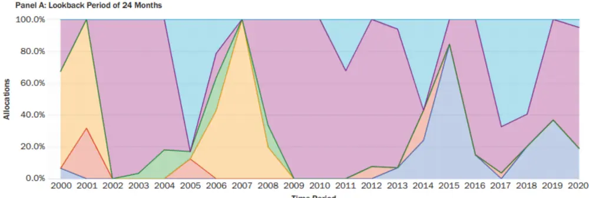

Panel B: Lookback Period of 36 Months
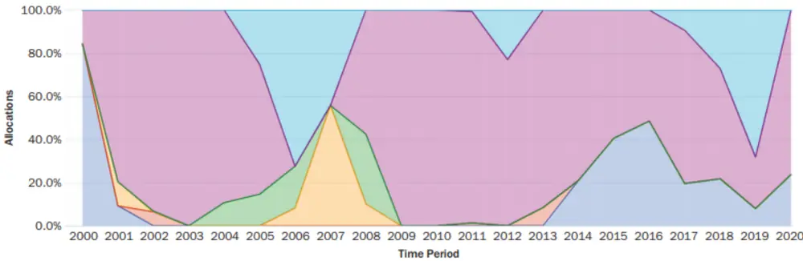

Panel C: Lookback Period of 48 Months
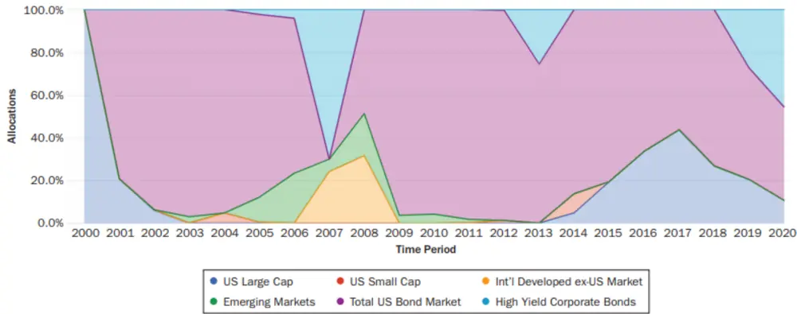
数据来源：Kim等（2021）

为了进一步检验 MVO 模型对于输入参数的敏感性，我们使用 MVO 模型构建了目标波动率最优投资组合（目标波动率分别设置为5%和10%），同样基于2000年至2020年的月度收益数据进行滚动回测，结果如图2、图 3 所示。

图 2 展示了目标波动率为 5%的最优资产配置权重。从图中可以看到，在使用不同长度滚动窗口得到的配置结果中，债券资产的配置比例比较一致，但是美国小盘股的配置比例存在明显差异。24个月的回测组合在某些时段配置了美国小盘股，而 36 个月的回测组合则基本不建议配置美国小盘股。

图 2：不同滚动时间窗口下的最优资产配置结果（目标波动率为 5%）
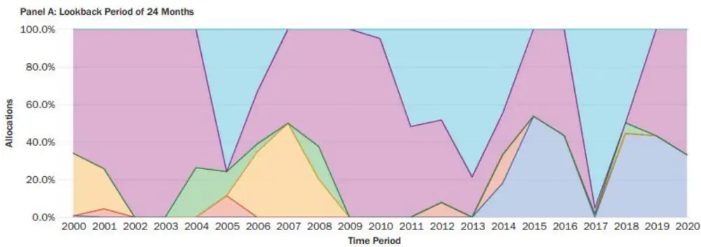

Panel B: Lookback Period of 36 Months
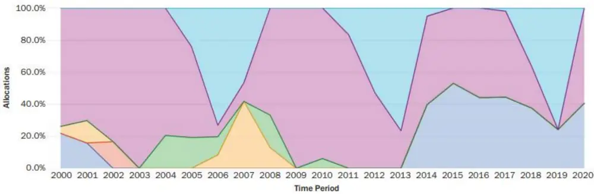

Panel C: Lookback Period of 48 Months
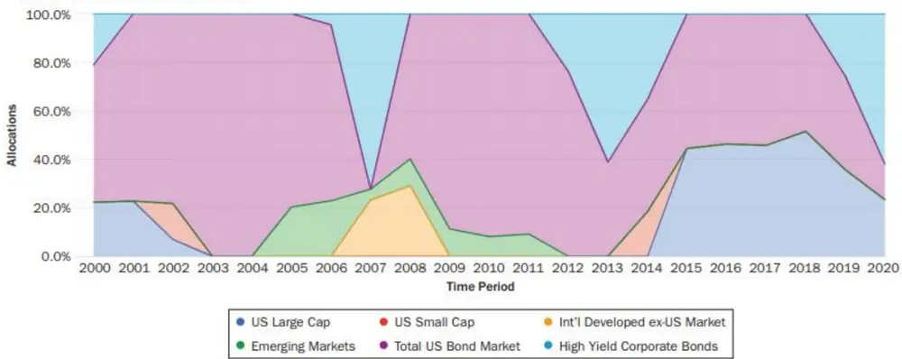
数据来源：Kim等（2021）

图 3 展示了目标波动率为 10%的最优资产配置权重。从图中可以看到，不同长度滚动窗口下获得的最优资产配置结果也存在较大差异。

上述两种情况都能够证实 MVO 模型具有较高的参数敏感性。使用不同长度的滚动窗口来估计输入参数，不仅会影响最优投资组合中各类资产的配置比例，还会影响组合中所包含的资产类型。

图 3：不同滚动时间窗口下的最优资产配置结果（目标波动率为 10%）
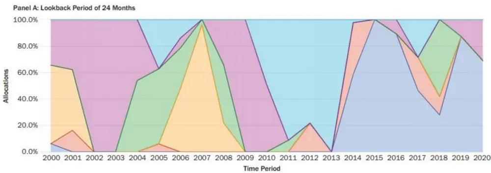

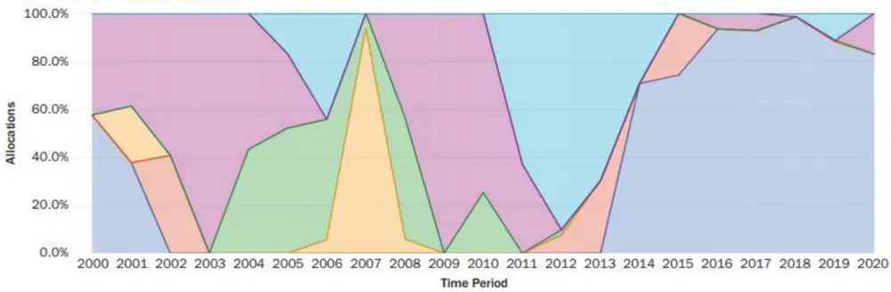

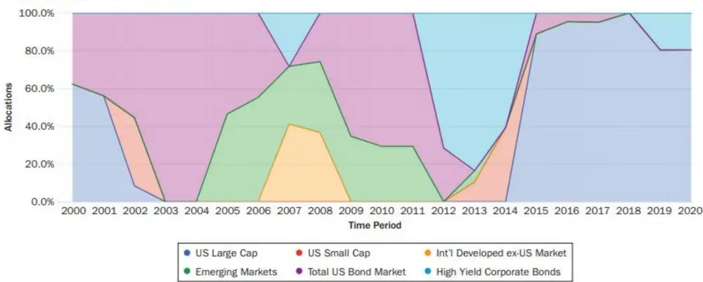
数据来源：Kim等（2021）

再举一个例子，假设我们在 2020 年底使用 MVO 模型来构建最优投资组合，估计输入参数时所选取的历史数据长度分别为 24~28个月，目标优化函数是最大化夏普比率（Maximum Sharpe Ratio，MSR），最终的配置权重如表 3 所示。

从表 3 中可以看到，对于 MSR，若估计输入参数用到的历史数据长度由 24 个月变为 27 个月，则最优投资组合中 4%的美国大盘股配置权重将转移至美国债券。同时，我们可以发现当历史数据长度为26个月时，最优投资组合配置了少量的（0.05%）新兴市场资产。

综上所述，MVO 模型具有较高的参数敏感性，投资者在将MVO 模型应用于投资实践时要谨记这一点。

表 3：不同滚动时间窗口下的最优资产配置结果

| Lookback Length (months) | MSR |  |  |  |  |
| --- | --- | --- | --- | --- | --- |
|  | 24 | 25 | 26 | 27 | 28 |
| Lookback start | January 2019 | December 2018 | November 2018 | October 2018 | September 2018 |
| Lookback end | December 2020 | December 2020 | December 2020 | December 2020 | December 2020 |
| US Large Cap | 9.61% | 7.15% | 7.16% | 5.26% | 6.11% |
| US Small Cap | 0.00% | 0.00% | 0.00% | 0.00% | 0.00% |
| Int'I Developed ex-US Market | 0.00% | 0.00% | 0.00% | 0.00% | 0.00% |
| Emerging Markets | 0.00% | 0.00% | 0.05% | 0.00% | 0.00% |
| Total US Bond Market | 90.39% | 92.85% | 92.79% | 94.74% | 93.89% |
| High-Yield Corporate Bonds | 0.00% | 0.00% | 0.00% | 0.00% | 0.00% |

数据来源：Kim等（2021）

## 5. 提高 MVO模型稳健性的方法

如何提高 MVO 模型的稳健性一直是学界和业界关注的焦点问题，我们将改进方法分为如下 5 类：

1、添加资产配置权重的约束条件，从而减少投资组合的可行集。

2、降低输入参数估计的敏感性，比如使用均值向量或者协方差矩阵的收缩估计量（Ledoit and Wolf，2003；Disatnik and Benninga，2007）。

3、通过情景模拟方法来找到在不同情景下均表现良好的投资组合。特别地，投资组合重抽样方法（portfolioresampling）将各种情景下的最优配置权重进行平均，以提高投资组合的稳健性（Michaud and Michaud，2008）；同时，在解决多期投资组合问题时也可以使用随机规划方法。

4、为存在不确定性的输入参数（如资产预期收益率）定义一个不确定性集合（uncertaintyset），通过强调不确定性集合中的最坏情况来增强投资组合优化的稳健性（Fabozzi 等，2007；Kim 等，2015）。

5、使用风险配置模型，如风险平价模型（Qian，2011）、最大分散化模型（Choueifaty and Coignard，2008）等。这些模型规避了 MVO 模型的高参数敏感性问题。

接下来，我们使用与上一节相似的实证研究方法，检验了这些改进方法对于增强 MVO 模型稳健性的效果，并将得出的最优资产配置结果直接与上一节进行比较。

## 添加资产配置权重的约束条件

我们在 MVO 模型中添加了资产配置权重约束条件——单一资产配置比例不超过 30%，目标优化函数为最大化夏普比率（MSR），得到的最优资产配置结果如图4所示。

与图1（未添加资产权重约束条件）相比，图3中24个月的回测组合对于美国大盘股和国际市场股票的配置比例大幅减少。我们可以发现最优资产配置权重对于滚动窗口长度的敏感性有所降低。然而，这一改进方法的缺陷在于，模型得出的最优资产配置权重常常由约束权重决定（本例中为30%）。

图 4：添加资产权重约束后，不同滚动时间窗口下的最优资产配置结果（MSR）
Panel A: Lookback Period of 24 Months
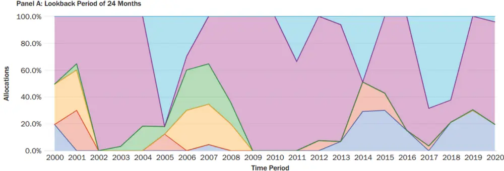

Panel B: Lookback Period of 36 Months
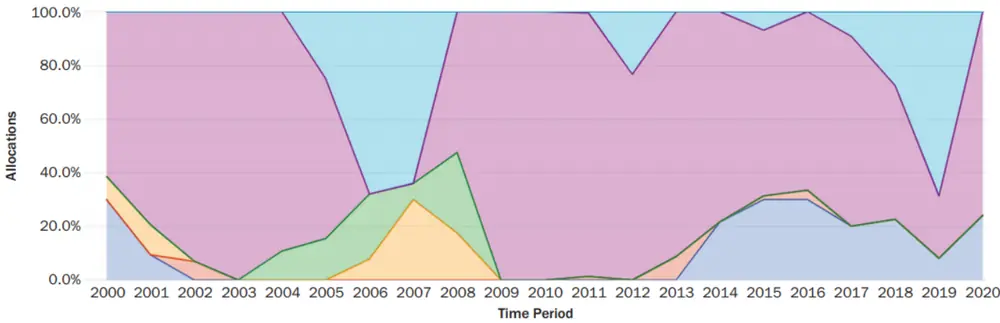

Panel C: Lookback Period of 48 Months
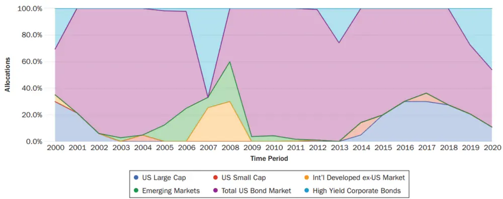
数据来源：Kim等（2021）

## 使用 GMV投资组合

图 5 展示了使用全球最小方差（Global MinimumVariance，GMV）优化目标的最优资产配置结果。由于 GMV 组合较其他均值-方差组合具有更好的稳健性，因此，在不同长度的滚动窗口下得到的最优资产配置结果更加一致（相较图 1、图2及图3）。从图5 中可以看到，三组不同滚动窗口下的 GMV 回测组合均建议配置较高比例的债券，对于大盘股、小盘股和国际股票的配置比例差异较小。

图 5：不同滚动时间窗口下的最优资产配置结果（GMV）
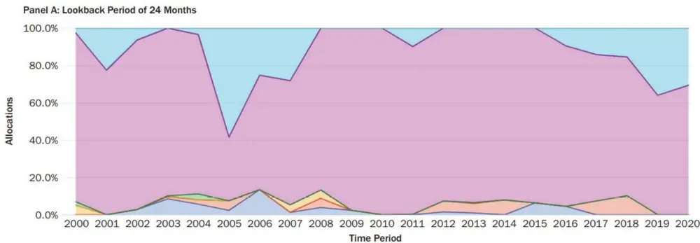

Panel B: Lookback Period of 36 Months
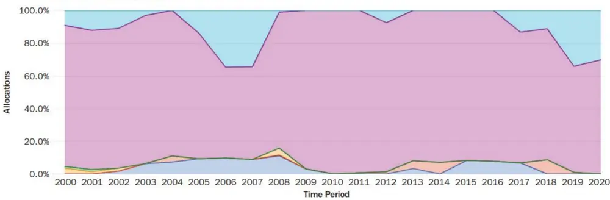

Panel C: Lookback Period of 48 Months
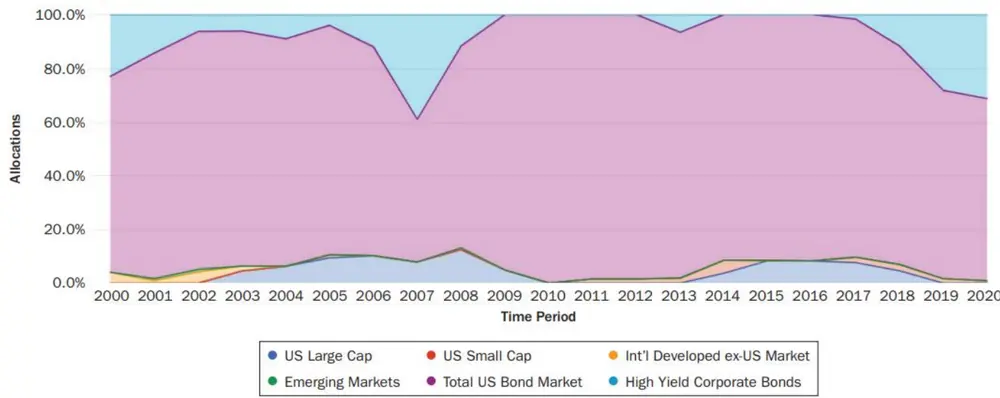
数据来源：Kim等（2021）

## 使用投资组合重抽样方法

投资组合重抽样（portfolio resampling）是一种基于模拟的方法，同时也是投资者在进行资产配置时最常用方法之一。与表 3中使用的实证方法类似，我们主要考察添加（或删除）几个数据点对于最优资产配置结果的影响。

表4展示了通过投资组合重抽样得到的最优资产配置结果，并与未进行重抽样的结果对比。由于投资组合重抽样的方法是将所有抽样样本得到的最优配置权重进行平均，因此 GMV 重抽样组合中各个资产均能得到权重分配。

表 4 中两组 GMV 回测组合的最后一列为不同长度的估计时间窗口下，各资产最高配置权重与最低配置权重之间的差异。其中，GMV 回测组合中美国大盘股的最优配置权重差异超过了3%，而GMV 重抽样回测组合中各类资产的最优配置权重差异均小于1.5%。

此外，表 4的最后一行展示了使用不同长度估计时间窗口得到的最优资产配置权重与基准（24 个月估计时间窗口）的绝对偏差均值（mean-absolute deviation，MAD）。从表 4 中可以看到，使用重抽样方法后，GMV回测组合的绝对偏差均值明显减小。

表 4：使用（或不使用）投资组合重抽样得到的最优资产配置结果对比

| Lookback Length (months) | GMV |  |  |  |  | Max Min | GMV with Resampling |  |  |  |  | Max Min |
| --- | --- | --- | --- | --- | --- | --- | --- | --- | --- | --- | --- | --- |
|  | 24 | 25 | 26 | 27 | 28 |  | 24 | 25 | 26 | 27 | 28 |  |
| Lookback start | January 2019 | December November 2018 | 2018 | October 2018 | September 2018 |  | January 2019 | December November 2018 | 2018 | October 2018 | September 2018 |  |
| Lookback end | December December December December December 2020 | 2020 | 2020 | 2020 | 2020 |  | December December December December December 2020 | 2020 | 2020 | 2020 | 2020 |  |
| US Large Cap | 0.00% | 2.88% | 3.04% | 2.29% | 2.16% | 3.04% | 0.80% | 1.83% | 2.03% | 1.43% | 1.14% | 1.23% |
| US Small Cap Int'I Developed ex-US | 0.00% | 0.00% | 0.00% | 0.00% | 0.00% | 0.00% | 0.04% | 0.13% | 0.14% | 0.05% | 0.02% | 0.12% |
| Market | 2.53% | 0.60% | 0.45% | 0.00% | 0.00% | 2.53% | 1.23% | 1.17% | 0.97% | 0.36% | 0.76% | 0.87% |
| Emerging Markets | 0.00% | 0.00% | 0.00% | 0.00% | 0.00% | 0.00% | 0.89% | 0.50% | 0.52% | 0.37% | 0.28% | 0.61% |
| Total US Bond Market | 97.47% | 96.52% | 96.52% | 97.71% | 97.33% | 1.19% | 96.64% | 95.78% | 95.88% | 96.42% | 96.00% | 0.86% |
| High-Yield Corporate Bonds | 0.00% | 0.00% | 0.00% | 0.00% | 0.51% | 0.51% | 0.39% | 0.59% | 0.46% | 1.36% | 1.80% | 1.41% |
| MAD with 24 month |  | 5.76% | 6.07% | 5.06% | 5.34% |  |  | 2.63% | 2.79% | 3.22% | 3.49% |  |

数据来源：Kim等（2021）

除此之外，上述方法在提高 MVO 模型稳健性的同时，还能够在一定程度上增强投资组合的表现。比如，基于配置风险思想的风险平价模型可以显著降低投资组合的业绩回撤。具体分析此处不再展开。

## 6. 风险度量方法的改进

在 MVO 模型中，使用方差来度量风险并非是模型的缺陷，但存在更适用于其他目的的风险度量方法。例如，当投资者的目的是控制下行风险时，下半绝对方差（lower semi-absolute deviation，LSAD）及条件在险价值（conditional value-at-risk，CVaR）等风险度量方法被广泛使用。

图6展示了目标优化函数为条件在险价值（CVaR）最小化时的最优资产配置结果。由于 CVaR 最小化模型未对组合收益添加任何限制，因此最优投资组合配置了较高比例的债券资产。此外，与图 1、图 2 及图 3 对比，使用CVaR最小化作为目标优化函数增强了模型的稳健性。

图 6：不同滚动时间窗口下的最优资产配置结果（Minimize CVaR）
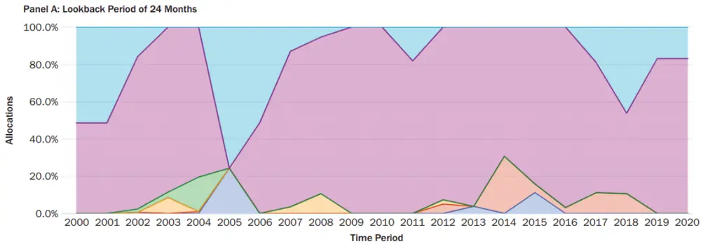

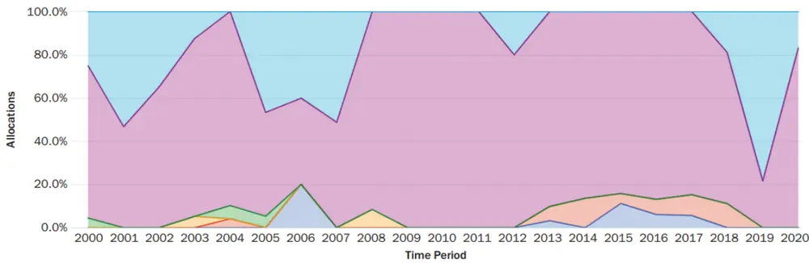

Panel C: Lookback Period of 48 Months
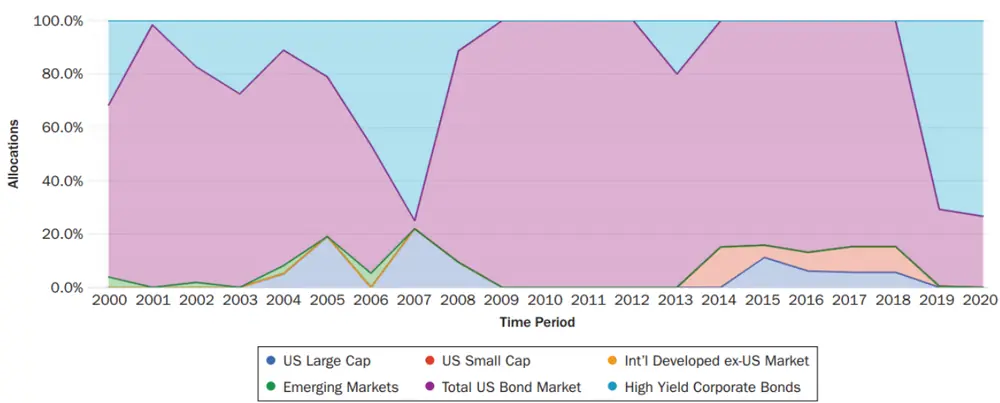
数据来源：Kim等（2021）

## 7. 结论

作为最广为人知的定量资产配置方法，MVO 模型虽然存在局限性，但仍然被投资者广泛使用。同时，学界和业界已经充分认识到 MVO 模型的局限性，并提出了诸多改进方法。比如，学界提出了基于模拟的改进方法和稳健优化模型等，业界也综合使用不同技术方法来构建理想的资产配置模型。投资者在将 MVO 模型应用于资产配置实践时，应充分警惕模型本身的缺陷，并可以参考本文梳理的多种改进方法来提高模型的稳健性。

## 本公司具有中国证监会核准的证券投资咨询业务资格

## 分析师声明

作者具有中国证券业协会授予的证券投资咨询执业资格或相当的专业胜任能力，保证报告所采用的数据均来自合规渠道，分析逻辑基于作者的职业理解，本报告清晰准确地反映了作者的研究观点，力求独立、客观和公正，结论不受任何第三方的授意或影响，特此声明。

## 免责声明