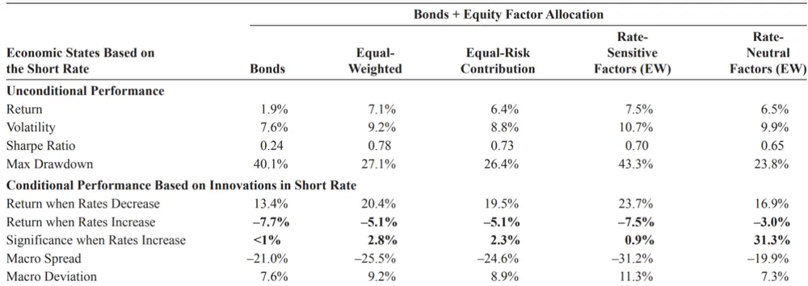
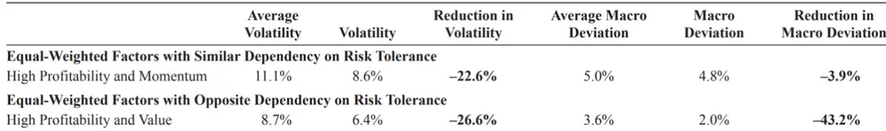

inInfo][Table_Title]2021.08.08

# 因子投资中的宏观经济风险

## ——精品文献解读系列（二十）

## 本报告导读：

本篇报告解读的文献从因子配置角度出发，提出了一套识别和分散宏观经济风险的思路方法，非常值得投资者参考借鉴。

## 摘要：

le_Summary]投资学是一门学术界与业界紧密结合的学科，其中大类资产配置是这种紧密结合的代表。从 Markowitz（1952）开创现代投资组合理论开始，学术界为业界提供了丰富的理论参考和方法模型，推动了大类资产配置实践的繁荣发展。为了帮助读者及时跟踪学术前沿，我们推出了“精品文献解读”系列报告，从大量学术文献中挑选出精品论文进行剖析解读，为读者呈现大类资产配置领域最新的思路和方法。

- 本篇为读者解读的文献是 Amenc et al.（2019）在期刊 The Journal ofPortfolio Management 上发表的论文“Macroeconomic Risks in EquityFactor Investing”。

宏观经济状态对因子收益率有重要影响，因此在进行因子配置时，不能忽视因子的宏观经济风险。本文提出了一套识别和分散因子宏观风险的方法。具体来说，本文首先筛选出 个对因子收益有重要影响的宏观经济状态变量，包括短期利率（Short Interest Rate）、期限利差（Term Spread）、信用利差（Default Spread）、总体股息率（AggregateDividend Yield）、系统性波动率（Systematic Volatility）、总体有效买卖 价 差 （ Aggregate Effective Bid-Ask Spread ） 和 总 体 价 格 影 响（Aggregate Price Impact）；然后，基于宏观经济状态变量构建 4 个宏观综合指标，用来从不同维度衡量宏观风险，包括宏观经济预期指标（Macro Outlook）、风险容忍度指标（Risk Tolerance）、宏观稳定性指标（Macro Stability）和冒险环境指标（Risk-on Environment）；最后，实证检验了因子的宏观经济风险，并提出了最小化宏观敏感性（Minimum Regime-Dependent，MRD）因子配置方法，能够有效降低宏观经济形势对因子组合收益的影响，进而分散因子组合的宏观经济风险。

2020 年初在新冠疫情导致的市场剧烈震荡当中，包括风险平价策略在内各种分散化配置模型均承受了较大的回撤。实际上，回顾历次市场暴跌行情，传统的配置模型均难以有效分散风险，多样化在人们最需要它的时候反而消失了。导致这种情况的原因之一是投资者忽视了宏观经济风险——在不同的宏观经济状态下，各资产/因子的相关性或风险贡献度存在显著差异。因此，如何分散宏观经济风险，是投资者需要关注的重点问题。本文围绕因子配置，提出了一套识别和分散宏观经济风险的思路和方法，非常值得投资者参考借鉴。

大类资产配置研究

## hor] 报告作者

李祥文(分析师)

8 021-38031560

lixiangwen@gtjas.com

证 书 S0880520100001

## cReport] 相关报告

边际流动性视角下的投资时钟

2021.07.30

全球如何定价碳转型风险

2021.07.27

“碳中和”：欧洲如何测度气候风险

2021.07.14

根深叶茂：金融监管视角下的公共养老金发展（下）

2021.07.13

MVO 模型在资产配置中的应用

2021.07.08

## 1. 文献概述

## 文献来源：

Amenc N, Esakia M, Goltz F, Luyten B. Macroeconomic Risks in Equity Factor Investing. Journal of Portfolio Management. 2019;45(6):39-60.

## 文献摘要：

宏观经济状态对因子收益率有重要影响，因此在进行因子配置时，不能忽视因子的宏观经济风险。本文提出了一套识别和分散因子宏观风险的方法。具体来说，本文首先筛选出 7 个对因子收益有重要影响的宏观经济状态变量，包括短期利率（Short Interest Rate）、期限利差（Term Spread）、信用利差（Default Spread）、总体股息率（Aggregate Dividend Yield）、系统性 波动 率 （Systematic Volatility ）、 总体 有 效买 卖 价差 （ AggregateEffective Bid-Ask Spread）和总体价格影响（Aggregate Price Impact）；然后，基于宏观经济状态变量构建 4 个宏观综合指标，用来从不同维度衡量宏观风险，包括宏观经济预期指标（Macro Outlook）、风险容忍度指标（Risk Tolerance）、宏观稳定性指标（Macro Stability）和冒险环境指标（Risk-on Environment）；最后，实证检验了因子的宏观经济风险，并提出了最小化宏观敏感性（Minimum Regime-Dependent，MRD）因子配置方法，能够有效降低宏观经济形势对因子组合收益的影响，进而分散因子组合的宏观经济风险。

## 文献评述：

年初在新冠疫情导致的市场剧烈震荡当中，包括风险平价策略在内各种分散化配置模型均承受了较大的回撤。实际上，回顾历次市场暴跌行情，传统的配置模型均难以有效分散风险，多样化在人们最需要它的时候反而消失了。导致这种情况的原因之一是投资者忽视了宏观经济风险——在不同的宏观经济状态下，各资产/因子的相关性或风险贡献度存在显著差异。因此，如何分散宏观经济风险，是投资者需要关注的重点问题。本文围绕因子配置，提出了一种识别和分散宏观经济风险的思路和方法，非常值得投资者参考借鉴。

值得说明的是，本篇报告解读的文献其题目直译为“权益因子投资中的宏观经济风险”。其中“权益因子”（EquityFactor）主要指的是诸如规模、价值、动量等风格因子。如不特别说明，本篇报告在行文中的“因子”均表示权益因子。

## 2. 引言

在长期投资过程中，权益因子（如规模、价值、动量、盈利等）能够为投资者带来超额收益。然而，也有大量研究表明因子溢价会随时间发生变化，甚至可能在相当长的时间内保持负收益（Harvey，1989；Asness，1992）。因此，在认识到因子之间存在不完全相关的关系后，投资者倾向于选择多个因子来对冲潜在损失、降低收益的波动。

然而，在进行因子配置过程中，投资者往往容易忽视宏观经济环境对因子收益的影响。鉴于对风险溢价的潜在驱动因素了解有限，投资者一般采用等权分配因子权重或因子风险贡献的方法来进行因子的分散化配置。但是这种做法可能并不妥当，因为不同的因子可能取决于相同或相似的宏观经济驱动因素。如果投资者关注的几种因子对于宏观经济有相似的暴露，那么当经济状况恶化时，即使在这几种因子之间进行平衡配置，依然无法实现投资组合的有效分散化。此外，基于风险平价的配置方法虽然研究了因子收益的相关性，但是也没有充分考虑宏观经济环境对于相关性的影响，所以也未必能在不同的宏观经济形势下都取得较好的分散效果。

为了说明宏观经济环境的重要性，本文选取了美国从1963年7月至2017年 12 月的因子收益率月度数据，并建立了如表 1 的相关性矩阵。表 1 阐释了为什么在构建因子组合时，不仅需要考虑因子之间的相关性，还需要考虑所处的宏观经济状态。

表 1：不同宏观经济环境下的因子收益相关性矩阵

| Pairwise Correlation |  | Size | Value | Mom | Low Risk | High Prof | Low Inv |
| --- | --- | --- | --- | --- | --- | --- | --- |
| July 1963–December 2017 |  | Full Sample |  |  |  |  |  |
| Size |  |  | -0.07 | -0.03 | -0.02 | -0.35 | -0.10 |
| Value |  | 0.18 |  | -0.18 | 0.32 | 0.07 | 0.70 |
| Mom |  | 0.22 | 0.29 | 一 | 0.18 | 0.11 | -0.02 |
| Low Risk |  | 0.07 | 0.28 | 0.34 | 一 | 0.28 | 0.31 |
| High Prof | Aisune Dinue Aeros Remes | 0.05 | 0.52 | 0.49 | 0.22 |  | -0.03 |
| Low Inv |  | 0.02 | 0.01 | 0.07 | 0.36 | 0.43 | 一 |

数据来源：Amenc et al.（2019）

在表 1 中，矩阵对角线上方给出了因子的全样本相关性，可以看到因子收益的相关性普遍较低，有的甚至为负；对角线下方给出了在宏观经济形势极好和极差时因子收益相关系数差异的绝对值，可以看出，相关系数在不同宏观经济形势下的差异巨大，最高可达 0.52。这说明全样本相关性无法反映特定宏观经济条件下的因子表现。特别是在宏观经济恶化的状态下，原本低相关性的因子通常会出现相关性增强的情况，预期的分散化效果在人们最需要它的时候反而减弱了。因此，在评估因子组合的分散化潜力时，不能简单地依赖于无条件因子收益相关性，还需要考虑宏观经济形势对因子收益相关性的影响。

综上所述，理解宏观经济环境如何影响权益因子，对于因子分散化配置策略来说至关重要。基于这种背景，本文提出了一套方法来分析因子的宏观经济风险。具体来说，我们验证了一组标准因子对于宏观经济环境的依赖性，并针对如何在不同的宏观经济环境中进行多因子配置进行了探究。

本文的内容安排如下：首先，提出了一套选择宏观经济状态变量的标准，这些宏观经济状态变量能够很好地划分宏观经济状态；然后，验证了权益因子对于宏观经济变量具有显著的风险暴露；其次，基于宏观经济状态变量构建宏观综合指标，用来划分宏观经济形势；最后，提出了最小化宏观敏感性（Minimum Regime-Dependent，MRD）因子配置方法，能够有效降低宏观经济形势对因子组合收益的影响，进而降低组合的宏观风险。

## 3. 选择宏观经济变量

对于宏观经济风险的分析依赖于对宏观经济状态变量的选择，所以对变量的选取方法进行仔细论证是很有必要的。本文建立了一套筛选宏观经济变量的标准，以避免在选取过程中对大量的候选变量进行盲目测试从而导致过拟合等问题。

我们对变量的选取要求参考了资产定价实证（Petkova，2006；Boons，2016）和经济领先指标（Marcellino，2006）相关文献中的成熟标准。具体来说，我们按照如下三个标准来筛选宏观经济变量：

1. 必须足够灵敏，能够及时捕捉投资者的预期变化。这是在资产定价研究中挑选宏观经济变量的标准。基于这一标准，我们应该排除那些经常进行事后修正的宏观基本面数据（Franz，2018）。

2. 与总体经济状况（aggregate economic conditions）有关。投资者关注的是与他们总财富（aggregate wealth）相关的宏观经济风险，这些风险不仅涉及股票和债券，还应包含房产和工资收入等（Cochrane，2005）。因此，选取的宏观经济变量应该与总财富的各组成部分相关。

3. 与因子收益之间的联系已经被现有文献验证。利用已有文献的结论可以缩小变量的选择范围，从而降低数据挖掘风险。同时，文献通常提供了宏观经济变量影响权益因子的理论基础，这有助于排除基于特定样本数据得出的错误结论（Harvey，Liu and Zhu，2016；Harvey，2017）。

根据以上三个标准，本文选取了如下 7 个宏观经济状态变量。对于每个变量，我们在后续研究中使用其超预期信息（shocks orsurprises）而非其本身的取值水平：

短期利率（Short Interest Rate）——反映利率期限结构的水平；

期限利差（Term Spread）——反映利率期限结构的斜率；

信用利差（Default Spread）——反映公司债券市场的风险补偿；

总体股息率（Aggregate Dividend Yield）——反映股票市场的风险补偿；
系统性波动率（Systematic Volatility）——反映股票市场的风险；

总体有效买卖价差（Aggregate Effective Bid-Ask Spread）——根据证券买卖双方的报价差异，反映股票市场的总体流动性；

总体价格影响（Aggregate Price Impact）——根据证券交易引起的价格变化，反映股票市场的总体流动性。

接下来，我们围绕这三个标准，对宏观经济变量的选择和使用进行详细说明。

## 3.1. 超预期变化信息比已实现的经济基本面信息更加重要

选取变量的第一条标准要求变量的变化足够灵敏，从而能够捕捉与因子收益同期发生的经济预期变化。已实现的宏观经济基本面数据（如 GDP、通货膨胀率等）变化十分缓慢，而资产价格对信息的反应非常迅速，因此权益因子收益不太可能对这类缓慢变化的经济指标做出反应。事实上，Fama（1981）发现资产价格变动领先于未来经济活动。除此之外，宏观经济基本面数据的公布具有滞后性，而且存在事后修正的情况，无法反映实时的经济预期（Runkle，1998）。因此，本文在研究中不使用已实现的宏观经济基本面指标变量。

有一些反应灵敏的变量（fast-moving variables）能够更加可靠地捕捉宏观经济预期的变化。比如，Geske and Roll（1983）通过实证研究，发现股票价格和债券利率能够迅速反应投资者对财政和货币政策的预期变化。除了实证研究以外，经济理论也表明快速变化的变量（如股息率、短期利率、信用利差、期限利差等）能够反映人们对经济基本面的预期。比如，DDM 模型表明股息率能够反映预期权益溢价和未来股利增长（Gordon，1962）；货币政策模型表明短期利率能够反映通胀预期、产出缺口和宏观经济政策冲击（Ang，2014)。因此，我们使用反应灵敏的变量来捕捉宏观经济预期。

需要特别指出的是，我们关注的是变量的超预期变化（UnexpectedChanges/Surprises/Innovations/Shocks），而不是变量本身的取值水平。这些变量本身的取值通常比较稳定，因而难以影响资产价格。如果投资者对于这些变量的预期保持不变，那么资产价格一般也不会发生改变。从理论上来说，如果一个变量与未来投资机会相关，那么这个变量的超预期变化就是投资者的风险来源（Merton，1973）。因此，我们参考Campbell（1996）、Petkova（2006）和 Boons（2016）等使用的标准方法，构建一阶自回归模型（VAR）来提取状态变量中的超预期信息（模型中的残差项即表示状态变量的超预期信息），如式（1）所示：

$$
Z=\begin{pmatrix}TB\\TERM\\DEF\\DIV\\BAS\\AMH\\VDL\end{pmatrix}\quad Z_{t}=\alpha+\beta Z_{t-1}+\varepsilon_{t}\tag{1}
$$

其中，Z是包含所选取状态变量的列向量矩阵，模型的残差项 $\varepsilon_{t}$ 即表示 t时刻的超预期信息。这里有两点值得说明：（1）使用简化模型（比如简单的一阶差分）依然可以得到相似的结果；（ ）残差项 $\varepsilon_{t}$ 与市场超额收益是正交关系，这一点至关重要，因为我们想要检验宏观经济对超出市场风险敞口的权益因子收益率的影响。

综上所述，我们关注的是各状态变量的超预期变化，并且其与市场风险不存在相关性。

## 3.2. 变量必须与总体经济状况相关

选取变量的第二条标准要求变量中包含未来经济状况的信息。如果一个状态变量与未来宏观经济活动呈正相关关系，则对于投资者而言，与变量超预期信息正相关的股票是具有风险的，这些股票在经济低迷时期往往表现不佳。我们分析的状态变量应该与未来的宏观经济活动（比如工业产值等）相关，这与经济学家使用的领先指标类似。

此外，风险溢价的逆周期变动现象已被学术界充分证实（Constantinidesand Duffie，1996；Campbell and Cochrane，1999），即投资者在不利的经济环境中会变得更加厌恶风险，从而推高市场的风险溢价。因此，如果一个变量能够很好地反应经济状态，那么该变量应该与股票市场溢价（股票市场超额收益）有关。与经济活动相比，权益溢价与状态变量之间的相关性则相对较小，特别是在短期之内（Fama and French，1988；Cochrane，2008）。

大量的实证检验和理论论证都表明我们选取的变量能够反映未来的总体经济状况，下面进行简要说明：

（1）短期利率（Short-Term Interest）与经济状况正相关，它能够反映通胀预期，并且与经济周期紧密相关（Fama and Schwert，1977；Famaand Gibbons，1984）。在经济不景气时，财政政策和投资者的安全投资转移（flight to quality）行为都会导致利率下行（Longstaff，2004）。

（2）期限利差（TermSpread）能够反映货币政策和长期证券贴现率的风险补偿预期（Fama and French，1989），这也是为什么期限利差与各类资产的未来收益密切相关，比如债券和股票（Famaand French，1989）、人力资本（Campbell，1996）、商品（Hong and Yogo，2012）和房地产（Ang，Nabar andWald，2013）等。期限利差与经济状况有很强的相关性，以至于有时候仅仅通过期限利差就可以估计经济衰退的概率（Estrella and Trubin，2006）。

（3）信用利差（Default Spread）和股息率（Dividend Yield）能够反应市场的风险厌恶程度。比如，在经济不景气时，股票和债券投资者要求更高的风险补偿，因此推高了信用利差和股息率。这一关系得到了 Famaand French（1988，1989）和 Keim and Stambaugh（1986）的实证验证。

（4）市场流动性与未来经济活动紧密相关。Chen，Eaton and Paye（2018）发现流动性包含了经济活动和权益溢价等重要信息。

（5）系统性波动率（SystematicVolatility）也与未来经济活动存在显著关系。股市波动性加剧与未来经济增长放缓有关，因为资产价格的不确定性可能会抑制投资和消费。这一关系得到了 Schwert（1989）、Campbellet al.（2001）和 Bansal et al.（2014）的验证。

综上所述，学术证据表明我们选取的宏观变量能够充分反映宏观经济预期（Macro Outlook）或市场风险容忍度（Risk Tolerance）。

## 3.3. 变量对因子溢价的影响已被现有文献证实

选取变量的第三条标准要求变量与因子收益的相关性已被现有文献证实。

大量的文献证据表明我们选取的状态变量与因子的超额收益有关（无论是从时间序列角度还是横截面角度）。比如，Hahn and Lee（2006）发现规模和价值因子与期限利差和信用利差存在相关关系；Petkova（2006）、Petkova and Zhang（2005）和 Kang et al.（2011）认为规模因子、价值因子受到期限利差、信用利差、短期利率的影响；Wurgler（2012）、Cederburgand Doherty（2016）发现低风险因子与期限利差、股息率、信用利差和短期利率相关。

## 4. 评估因子收益对宏观经济状态的敏感性

在进行权益因子投资时，考虑宏观经济对因子收益的影响是十分重要的。本文基于美国 1963 年 7 月至 2017 年 12 月的因子月度收益率数据，评估了 6 个标准权益因子的宏观经济风险，然后进一步分析宏观经济风险给因子投资者带来的影响。

本文选取的 6 个权益因子分别是：

1. 规模因子（Size）

2. 价值因子（Value）（Fama and French，1993）

3. 高盈利因子（High Profitability）

4. 低投资因子（Low Investment）（Fama and French，2016）

5. 低风险因子（Low Risk）（Frazzini and Pedersen，2014）

6. 动量因子（Momentum）（Carhart，1997）

## 4.1. 宏观经济状态的超预期信息对因子收益的影响

为考察不同宏观经济状态下的权益因子收益率，本文将各个宏观经济状态变量的超预期程度从高到底分成四组，并将超预期程度最高和最低两种情况下的因子或组合收益之差定义为宏观价差（Macro Spread），以此来衡量因子或组合的宏观风险。表 2 的 PanelA给出了不考虑宏观经济状态时 6 个因子的年化收益率，Panel B给出了在给定宏观变量条件下，不同因子的宏观价差。其中，*、**与***分别表示该宏观价差数值在Welch t-检验的 10%、5%与 1%水平上显著。

表 2：因子收益对宏观经济状态的敏感性

|  | Size | Value | Mom | Low Risk | High Prof | Low Inv |
| --- | --- | --- | --- | --- | --- | --- |
| Panel A: Unconditional Performance |  |  |  |  |  |  |
| Annualized Return | 2.5%** | 3.7%*** | 7.0%*** | 9.3%*** | 2.7%*** | 3.2%*** |
| Panel B: Macro Spreads |  |  |  |  |  |  |
| Short Rate | 3.8% | -8.4%* | 1.4% | -10.5%** | -0.6% | -7.8%*** |
| Term Spread | 1.2% | 9.2%** | -13.5%** | 5.4% | -5.6%* | 7.8%*** |
| Default Spread | -5.3% | -0.1% | -2.0% | 2.5% | 6.8%** | -1.8% |
| Dividend Yield | 4.3% | -5.9% | -6.1% | -18.5%*** | -14.8%*** | -3.5% |
| Effective Spread | 11.1%** | 0.1% | 6.7% | 4.5% | 2.5% | -0.8% |
| Price Impact | -3.0% | -0.3% | 4.8% | 0.1% | -1.9% | -2.6% |
| Systematic Volatility | -9.9%** | -6.8% | -4.9% | -16.2%*** | 1.8% | -4.6% |

数据来源：Amenc et al.（2019）

通过解读表 2，我们可以得到如下结论：

（ ）因子收益存在显著的宏观经济风险。大部分因子对宏观经济状态有着高度的敏感性，这具有重要的经济意义。比如，价值因子（Value）和低投资因子（Low Inv）在短期利率（Short Rate）和期限利差（Term Spread）下的宏观价差绝对值均超过了7%，该值是无条件年化收益（3.7%和3.2%）的近两倍。由此可见，配置价值因子和低投资因子的投资者，其收益可能会因为短期利率或期限利差的变化而发生重大波动。

（2）不同因子会对相同的宏观状态表现出相反的敏感性。比如，价值因子（Value）和低投资因子（Low Inv）对于期限利差（Term Spread）具有正向的敏感性，而动量因子（Mom）和高盈利因子（HighProf）则对其表现出负向的敏感性。此外，任何因子对于股息率（Dividend Yield）和系统性波动率（Systematic Volatility）都不具有显著的正向敏感性，这意味着投资者无法使用任何一个因子对这两个宏观经济状态进行有效对冲。

（3）部分因子对于某些宏观变量的敏感性较低或不敏感。比如，规模因子（Size）对于股息率（Dividend Yield）不敏感，高盈利因子（High Prof）对于系统性波动率（Systematic Volatility）的敏感性接近于零。投资者可以基于宏观经济对因子的影响，分析不同因子组合的宏观经济敏感性，进而选择适当的因子组合使目标投资风险在因子之间、甚至在不同宏观形势之间被充分分散。

（4）不同因子的宏观经济敏感性与其遵循的经济运行机制一致，都可以由传统的金融理论解释。比如，价值因子（Value）对期限利差（TermSpread）十分敏感，其宏观价差在 5%的显著性水平下可达 9.2%，说明在期限利差的正向超预期程度越高时，价值因子的超额收益越高。这一统计结果可以由价值型企业和成长型企业之间的现金流模式差异来解释：价值型企业预期现金流回收早于成长型企业，使得价值型股票对于收益率曲线长端相对不敏感，因此在期限利差超预期程度上升时，价值因子更容易获得超额收益。

## 4.2. 因子的宏观经济状态敏感性对投资者有何影响？

如果不考虑因子的宏观经济敏感性，那么即使通过因子进行分散化配置可能也会面临巨大的亏损风险，特别是在经济恶化时期。比如，如果投资者同时持有一个长期债券组合和一个多因子股票组合。如果该股票组合对利率的敏感性与债券组合同向，那么投资者在利率异常波动时就有可能遭受较大损失，此时在债券组合中加入多因子股票组合并不能降低组合整体的利率风险。

表 3 展示了纯债券组合在不同利率环境下的业绩表现，以及同时配置债券与因子组合的业绩表现。本文首先使用等权重（Equal-Weighted）和等风险贡献（Equal-Risk Contribution）的方式来配置 6 个因子，然后根据表 2 额外构造了利率敏感因子组合（Rate-Sensitive Factors）和利率中性因子组合（Rate-Neutral Factors），用于评估利率环境对因子组合的影响。其中，利率敏感因子组合等权分配了价值因子、低风险因子和低投资因子，利率中性因子组合等权分配了规模因子、动量因子和高盈利因子。

此外，本文将某一宏观状态变量不同的超预期程度下因子收益率的均方根误差（Root Mean Squared Error，RMSE）定义为宏观 偏差（ MacroDeviation），用来衡量不同宏观状态下因子收益相对于无条件状态下因子收益的偏离程度。宏观偏差也是一个衡量因子或组合宏观风险的指标。

表 3：理解因子的宏观经济敏感性对于投资者至关重要

数据来源：Amenc et al.（2019）

从表 中可以看到，因子的不同配置方式对整体组合的宏观经济敏感性有明显的影响。在面临短期利率变化时，债券组合中加入利率敏感因子组合会使宏观价差高达-31.2%，加入等权重或等风险贡献因子组合的宏观价差接近-25%，而在债券组合中加入利率中性因子组合可使宏观价差降至-19.9%。观察宏观偏差指标也能得到相同的结论：利率敏感组合的宏观偏差最高，达到 11.3%；而利率中性组合的宏观偏差仅为 7.3%。因此，在债券组合中加入合理的因子组合能够显著降低组合在不同利率环境下的收益偏离程度，从而达到对冲宏观风险的效果。

此外，这样的宏观风险对冲能够提升组合在宏观条件不利时的收益。当短期利率预期提升时，相比纯债券组合，利率中性组合能够降低 60%以上的损失（收益率由-7.7%上升为-3%），因此利率中性组合有效降低了组合损失。同时，通过宏观风险对冲还能够降低组合的最大回撤。相比无条件下的利率敏感组合，利率中性组合的最大回撤由43.3%降低至23.8%。

## 5. 如何使用宏观经济变量划分宏观经济形势？

在本节中，我们使用前文筛选出来的宏观经济变量来构建描述经济形势（economicregimes）的综合指标。引入多个变量是为了提高统计稳健性以及经济相关性。同时，由于我们无法得知何种变量组合能够完美捕捉总体宏观经济风险，本文使用了多种变量组合方式以避免对单一综合指标的过度依赖，进而分散模型风险。

从统计稳健性角度来看，综合使用多个变量来构建宏观经济形势指标可以避免数据挖掘风险。举例来说，如果要从宏观经济变量中选择与宏观经济最相关的变量，通常需要后验地分析数据检验结果并选择显著性最强的变量，这会带来数据窥探及选择偏差的问题（Lo and MacKinley，1990）。同时，综合多个变量的超预期信息来定义宏观经济形势能够提升模型的稳健性，并且能够调和不同变量对经济形势判断的差异，从而降低模型的误判风险。

从经济相关性角度来看，综合指标相较单一变量能够更好地捕捉宏观经济风险。通过上一章的分析，我们知道本文中 7 个状态变量的超预期信息都能够在一定程度上解释因子溢价的宏观周期性。但是对于具体的投资者来说，由于资产组合及风险偏好不同，他们在判断宏观经济形势时往往会关注不同的变量。而通过合适的方法将多种状态变量进行组合，可以得到具有普适性的经济形势划分标准。此外，Marcellino（2006）指出，经济衰退的原因和特征各不相同，使用单一变量来判断经济形势具有很大风险。因此，将多个单一变量组合为综合指标能够捕捉宏观经济风险的多方来源，从而更好地判断宏观经济形势。

进一步地，虽然使用综合指标能够捕获更多的宏观信息及风险来源，但是不同的综合指标有着不同的组合逻辑，对宏观经济周期和波动规律的判断也可能存在显著差异。因此，如果仅依赖某一个综合指标来判断经济形势，依然会带来模型的选择风险。而使用多个不同组合逻辑的综合指标并对其进行平均，可以进一步降低模型的选择风险（Morleyand Piger，2012；Faust et al.，2013）。

基于上述讨论，本文使用多种方式对宏观经济状态变量进行组合，从而得到多个综合指标，并统筹利用这些综合指标来判断宏观经济形势。表列示了本文所使用的综合指标及其构造方式。后文还将详细阐述这些综合指标判断经济形势的有效性和差异性。

表 4：宏观综合指标概览

| Composite Variable | State Variables Used | Transformation | Combination Method | Interpretation |
| --- | --- | --- | --- | --- |
| Risk Tolerance | All | Innovations from VAR model | Regression relation with future equity premium | Good times means an improvement in risk tolerance |
| Macro Outlook | All | VAR innovations | Regression relation with future industrial production growth | Good times means an improvement in the economic outlook |
| Macro Stability | All except systematic volatility | Conditional Volatility (GARCH) of innovations from VAR model | Principal component analysis | Good times means a decrease in the economic uncertainty |
| Risk-On Conditions | Div. Yield + Systematic volatility | Innovations from VAR model | High/high versus low/low | Good times means a decrease in both the dividend yield and systematic volatility |

数据来源：Amenc et al.（2019）

## 5.1. 宏观综合指标的构建逻辑与方法

根据 节中的分析，本文选取的宏观经济状态变量蕴含了宏观经济预期（Macro Outlook）和市场风险容忍度（Risk Tolerance）信息。我们将各个宏观状态变量以适当方式组合，构建综合指标来反映宏观经济预期和市场风险容忍度。这两个指标能够帮助我们掌握经济形势变化时因子的表现。比如，可以根据宏观经济下行时因子的收益变化情况，判定该因子在经济下行时是具有更高的损失风险，还是能够对冲宏观风险。

除了宏观经济预期和市场风险容忍度，研究宏观经济形势变化的不确定性也非常重要。不确定性高意味着可预测性差，在此情况下，即便宏观经济形势的变动可能带来投资机会，投资者也难以真正把握住这些机会。相关学术研究也表明，宏观经济不确定性是宏观风险的重要来源。经济的高度不确定性会影响公司的雇佣及投资决策（Bloom，2009；Chen，2010），并且还会抑制消费。

因此，本文也使用宏观经济的不确定性来判断宏观形势的好坏。具体来说，本文定义了一个宏观稳定性（Macro Stability）指标。Jurado，Ludvigson and Ng（2015）将经济不确定性（economic uncertainty）定义为不可预测的市场扰动的条件波动率（conditional volatility）。据此，本文对除系统性波动率外的 6 个宏观经济变量使用 GARCH 模型，从而得到各变量的条件波动率；然后，对各条件波动率进行主成分分析，并将第一主成分作为总体经济不确定性的度量；最后，对该不确定性取相反数，得到宏观稳定性指标值。该指标值越大则表示宏观经济的稳定性越高。

以上三个综合指标（宏观经济预期指标、市场风险容忍度指标、宏观稳定性指标）都与宏观风险有着紧密联系，在判断宏观形势时具有很强的合理性。但是，这三个综合指标的构建都涉及到计量模型的选择及参数估计，这会带来一定的模型选择与参数估计风险。鉴于此，本文选取股息率和系统性波动率，单独构建了一个不受模型选择限制的简单宏观经济综合指标。大量研究表明，股息率和系统性波动率可以简单有效地划分经济形势。当股息率和市场波动率处于较低水平时，投资者倾向于选择具有更高风险的资产以增加收益，本文称之为冒险环境（Risk-on

Environment）；反之，当股息率和系统性波动率处于较高水平时，本文称之为避险环境（Risk-off Environment）。在冒险环境中，如果股息率和市场波动率进一步超预期下跌，则表示经济形势向好；在避险环境中，如果股息率和市场波动率进一步超预期提高，则表示经济形势恶化。

综上所述，本文定义了四个宏观经济形势综合指标，分别为宏观经济预期指标（Macro Outlook）、风险容忍度指标（Risk Tolerance）、宏观稳定性指标（Macro Stability）以及冒险环境指标（Risk-on Environment）。

## 5.2. 宏观经济形势对因子收益的影响

为了更好地了解因子投资者面临的宏观经济风险，本节将研究在不同的宏观形势分类方法下，各个权益因子收益表现的差异。

首先，定义用宏观综合指标来判断经济形势好坏的标准。对于宏观经济预期、风险容忍度、宏观稳定性三个指标，我们首先将指标值在时间序列上按照四分位等分为四组，然后按照各指标的经济意义判断各组形势优劣：风险容忍度指标值最低组即代表经济形势好，指标值最高组即代表经济形势差；宏观经济预期和宏观稳定性指标值最高组即代表经济形势好，最低组即代表经济形势差。而对于冒险环境指标，当市场处于冒险环境则代表经济形势好，市场处于避险环境则代表经济形势差。

表5展示了6个因子在 4种宏观综合指标划分下的形势价差（RegimeSpreads），即形势最好组与形势最差组的因子收益之差。需要指出的是，此处的形势价差与前文定义的宏观价差在本质上并无差异，其唯一区别在于形势价差针对的是综合宏观形势，而宏观价差针对的是单个宏观经济状态变量。

从表 5 中可以看到，每个因子至少在一种宏观形势划分标准下具有显著的形势价差，这说明因子收益在不同的宏观经济形势下具有重大差异。同时，表中所有显著的形势价差均为正数，这说明权益因子通常都存在宏观经济风险。当宏观经济预期恶化，或风险容忍度降低，或宏观不确定性上升，或市场进入避险环境时，权益因子的收益会大幅降低。

表 5：因子超额收益对于宏观综合指标的敏感性

| July 1963–December 2017 | Size | Value | Mom | Low Risk | High Prof | Low Inv |
| --- | --- | --- | --- | --- | --- | --- |
| Regime Spreads |  |  |  |  |  |  |
| Risk Tolerance | 0.2% | -4.5% | 14.0%** | 5.3% | 12.2%*** | -1.7% |
| Macro Outlook | 7.3%* | 9.6%** | -3.4% | 17.6%*** | -1.3% | 5.4%* |
| Macro Stability | 4.0% | 4.3% | 1.2% | 14.4%*** | 2.2% | 1.2% |
| Risk-On Conditions | 6.8% | 8.8%** | 7.1% | 20.0%*** | 5.5% | 6.2%** |
| Correlation Between Factor Returns |  |  |  |  |  |  |
| Size | 1.00 | -0.07 | -0.03 | -0.02 | -0.35 | -0.10 |
| Value |  | 1.00 | -0.18 | 0.32 | 0.07 | 0.70 |
| Momentum |  |  | 1.00 | 0.18 | 0.11 | -0.02 |
| Low Risk |  |  |  | 1.00 | 0.28 | 0.31 |
| High Profitability |  |  |  |  | 1.00 | -0.03 |
| Low Investment |  |  |  |  |  | 1.00 |

数据来源：Amenc et al.（2019）

基于表 5，我们还可以对部分因子进行深入探究：（1）低风险因子在三种宏观形势划分标准下都具有显著的形势价差，说明该因子具有巨大的宏观风险；（2）规模因子是唯一一个在 5%显著性水平下、在 4 种宏观形势划分标准下形势价差都不显著的因子，说明该因子的宏观形势敏感性最低，因而在多因子组合中，规模因子可以对分散宏观风险产生重要作用。

从多因子投资视角出发，各个因子宏观经济敏感性的异同非常重要。比如，动量因子和高盈利因子对宏观形势的敏感性十分相似，它们基于风险容忍度划分的形势价差都显著为正，因此在这两个因子之间进行配置无法分散宏观风险。相反地，规模因子、价值因子、低投资因子和低风险因子在基于风险容忍度的形势划分下对宏观经济都不敏感，因此将它们与动量或高盈利因子结合可以有效分散宏观风险。

## 5.3. 因子间宏观敏感性的相似性与收益的相关性不匹配

在使用多因子进行风险分散时，最常见的方法就是将收益相关性较低的因子进行组合，但这种方法无法有效分散宏观风险。表 5 的下半部分给出了 个权益因子收益率的相关系数。综合表 的上、下两部分可以看到，某些因子之间虽然相关系数很低甚至为负，但是它们具有相似的宏观风险敏感性，因而将这些因子进行组合并不能起到很好的风险分散作用。这是因为因子收益率相关性的计算是基于全样本数据，而忽略了不同时段宏观经济形势的差异。当考虑到宏观经济形势时，会发现即使在整体相关度很低的情况下，两个因子也可能会在经济形势较差时同时产生较大损失。

以高盈利因子为例，它与动量因子收益率的相关性非常低（仅为 0.11），然而它们的宏观经济敏感性却十分相似——二者基于风险容忍度划分的形势价差都显著为正。同时，高盈利因子与价值因子收益率的相关性也很低（仅为 0.07），然而这两个因子的宏观经济敏感性则截然相反。

表 6：去相关性无法充分分散宏观风险

数据来源：Amenc et al.（2019）

表 6 定量分析了高盈利因子与动量因子、价值因子等权组合（下文称之为“盈利动量因子组合”和“盈利价值因子组合”）的业绩表现。表中的平均波动率（Average Volatility）是两个因子收益波动率的算数平均；波动率（Volatility）则是因子等权组合收益的波动率；波动率差值（Reductionin Volatility）即衡量了因子组合降低波动率的效果。类似地，表中的平均宏观偏差（Average Macro Deviation）是两个因子基于风险容忍度划分的宏观偏差算数平均值；宏观偏差（Macro Deviation）是因子组合在风险容忍度划分下的宏观偏差；宏观偏差差值（Reduction in Macro

Deviation）即衡量了因子组合降低宏观偏差的效果。

从表 6 中可以看到，盈利动量因子组合使得波动率下降了 22.6%，盈利价值因子组合使得波动率下降了 ，后者效果略优于前者。类似地，盈利价值组合降低宏观偏差的效果大幅优于盈利动量因子组合。高盈利因子与动量因子的宏观敏感性相似，对二者进行配置无法显著降低宏观风险，所以盈利动量因子组合的宏观偏差仅下降了 3.9%；相反地，高盈利因子与价值因子的宏观敏感性恰好相反，所以盈利价值因子组合的宏观偏差大幅下降了 43.2%。由此可见，评估各个因子的宏观经济敏感性为分散化投资提供了一个新视角。

## 6. 如何分散因子组合的宏观经济风险？

## 6.1. 构建最小化宏观敏感性（MRD）组合

本节我们通过优化方法来构建因子组合，使得组合能够有效分散宏观经济风险。具体来说，本文使用 6 个权益因子构建因子组合，使得该组合在某种宏观形势或宏观状态划分下的条件平均收益与无条件平均收益的偏差程度最小。本文将这种方法称为最小宏观敏感性（MinimumRegime- Dependent）方法，简称为 MRD。优化模型如下：

$$
\begin{array}{r}{\omega^{*}=argmin\{\sum_{i=1}^{N}(\omega^{T}x_{i}-\omega^{T}x_{0})^{2}\}}\end{array}\tag{3}
$$

其中，N 代表在某种划分标准下，宏观形势/状态（regimes/conditions）的数量。举例来说，如果我们按照短期利率的预期高低，将宏观经济等分为四个状态（好、较好、较差、差），那么此时模型中的 N 即为 4。 $x_{i}$ 是因子的条件平均收益向量，该向量中的每个元素代表了对应因子在第i 种宏观形势/状态下的平均收益。承接前面的例子，基于短期利率将宏观经济分为好、较好、较差、差共 种状态， $x_{1}!$ 向量的 个元素即代表6 个因子在宏观状态为“好”时的平均收益， $x_{2}$ 即为 6 个因子在宏观状态“较好”时的平均收益向量，以此类推。 $x_{0}$ 则表示因子的无条件平均收益向量，其元素代表各个因子序列在整个样本区间内的收益均值。因此，（3）式的目标函数即为最小化组合的各个条件收益与无条件收益的离差平方和。除此之外，在执行优化模型时，还可以按照需要设置具体的约束条件，例如对权重向量ω设置上、下限等。

表 7 给出了三种 MRD 组合的业绩表现。表 7 的第一部分汇报了三种MRD 组合以及等权、等风险基准组合在全样本区间内的收益表现。表 7的第二、三、四部分分别汇报了三种 MRD 组合在不同宏观经济形势/状态下的表现及其宏观风险分散效果。

表 7：MRD 组合的业绩表现

| July 1963– December 2017 | MRD on Short-Term Rates | MRD on Macro Outlook | MRD on all Composites | Equal Risk Contribution | Equal- Weighted |
| --- | --- | --- | --- | --- | --- |
| Ann. Return | 3.9% | 4.2% | 4.9% | 4.5% | 5.2% |
| Ann. Volatility | 5.2% | 4.8% | 5.5% | 4.2% | 4.8% |
| Sharpe Ratio | 0.75 | 0.88 | 0.89 | 1.06 | 1.08 |
| Max Drawdown | 19.0% | 18.1% | 18.6% | 15.7% | 16.9% |
| Return—Low Quartile | 3.9% |  |  | 5.5% | 6.2% |
| Return—High Quartile | 3.9% |  |  | 2.8% | 2.7% |
| Macro Spread | 0.0% |  |  | -2.7% | -3.6% |
| Reduction in Macro Spread | -98.6% |  |  | -23.5% |  |
| Macro Deviation | 0.0% |  |  | 1.1% | 1.6% |
| Reduction in Macro Deviation | -97.7% |  |  | -26.9% |  |
| Return—Low Quartile |  | 3.8% |  | 1.9% | 2.0% |
| Return—High Quartile |  | 5.6% |  | 6.8% | 7.8% |
| Macro Spread |  | 1.8% |  | 4.9% | 5.8% |
| Reduction in Macro Spread |  | -69.2% |  | -15.5% |  |
| Macro Deviation |  | 0.9% |  | 1.7% | 2.1% |
| Reduction in Macro Deviation |  | -57.8% |  | -15.8% |  |
| Avg. Return—Low Quartiles |  |  | 3.3% | 2.5% | 2.7% |
| Avg. Return—High Quartiles |  |  | 7.8% | 7.7% | 8.7% |
| Avg. Macro Spread |  |  | 4.4% | 5.2% | 5.9% |
| Reduction in Avg. Macro Spread |  |  | -25.5% | -11.6% |  |
| Macro Deviation |  |  | 1.9% | 2.1% | 2.3% |
| Reduction in Macro Deviation |  |  | -19.9% | -9.3% |  |

数据来源：Amenc et al.（2019）

其中，基于短期利率的 MRD 组合（MRD on Short-Term Rates）即为前文的示例组合。表 7 的第二部分展示了该组合及基准组合在基于短期利率划分的不同宏观状态下的表现。具体来说，表 7 的第二部分展示了该组合及基准组合在宏观状态最好与最差情况下的条件平均收益，并汇报了组合在短期利率划分下的宏观价差与宏观偏差，同时还汇报了该组合与风险平价组合的宏观风险分散效果（即其宏观价差与宏观偏差相较于等权组合的下降百分比）。从表 7 中可以看到，基于短期利率的 MRD 组合的宏观价差与宏观偏差均为 0，说明该组合几乎完全对冲了短期利率的宏观风险，其对于短期利率的敏感性几乎为 0，宏观风险分散效果明显优于风险平价组合。

表 7 中基于宏观经济预期的 MRD 组合（MRD on Macro Outlook）的构建方式与基于短期利率的 MRD 组合类似，不同之处是前者基于宏观经济预期综合指标来划分宏观经济形势。在构建该组合时，根据宏观经济预期指标的高低将宏观经济划分为 4 个形势，然后按照式（3）的优化模型得到组合权重。表 的第三部分汇报该 组合及基准组合在宏观形势最好与最差情况下的条件平均收益、宏观价差与宏观偏差，以及该MRD 组合与风险平价组合的宏观风险分散效果。从表 7 中可以看到，该MRD组合同样具有很好的宏观风险分散效果——相较于等权重组合，该 MRD 组合的宏观价差降低了约 70%，宏观偏差降低了约 58%。

表 7 还展示了一个基于所有宏观综合指标构建的 MRD 组合（MRD onallComposites）。为了构建该组合，首先需要分别构建基于宏观经济预期、风险容忍度、宏观稳定性以及冒险环境的 MRD 组合，然后将四个组合的权重取算数平均，即得到基于所有综合指标的 组合。表 的第四部分报告了该组合的表现。与前两种组合的结果汇报略有不同，该部分汇报的结果均为组合在 4 种宏观形势划分方式下的平均结果。从表 7中可以看到，相较于等权组合，该 MRD 组合的宏观价差降低了约 25%，宏观偏差降低了约 20%，因此同样具有一定的宏观风险分散效果，且分散效果也明显优于风险平价组合。

## 6.2. 基于股市牛熊状态构建 MRD 组合是否有效？

由上一节的分析可知，使用本文定义的宏观经济状态变量或者宏观综合指标，都能构建出有效分散宏观风险的 组合。本节将讨论另一种定义宏观经济形势的方法，即利用股票市场的收益表现（牛市或熊市）来定义经济形势的好坏。

在现有文献中，有学者采用股票市场的牛熊状态进行宏观形势分类（Ungand Luk，2016；Gormsen and Greenwood，2017）；在业界中，也有很多投资者喜欢把牛熊状态作为整体经济好坏的反映。但是，如前文所述，代表投资者最终利益的是总体财富，其并不能完全由股市收益信息反映；同时，事后的利好形势（股票市场已实现的高收益）有可能反映的是事前的利空形势（高期望收益，即高风险）。因此，本文认为无法使用已实现的股票收益对宏观形势进行准确分类。

为进一步论证上述观点，本文首先根据各个季度股票市场上涨或下跌来划分牛熊状态，然后构建基于牛熊状态的 MRD 组合。该组合的构建方式与前文类似——基于股票市场的牛熊状态，利用式（3）的优化模型得到对牛熊状态敏感性最低的组合权重。本文从多个宏观视角评估了该组合能否削减宏观经济周期性的影响，从而降低宏观风险。表 将该组合在不同宏观形势划分标准下的表现与等权重和风险平价组合进行了对比。

如表 8 的 Panel A 所示，如果将宏观经济划分为牛市、熊市两个形势，那么牛熊 组合在牛市形势和熊市形势下的平均收益之差为 。从这个角度来看，牛熊 MRD 组合似乎充分分散了宏观风险。但是表 8 的Panel B ~ Panel E 告诉我们事实并非如此。Panel B ~ Panel E 展示了在本文选取的 4 种宏观形势划分标准下，牛熊 MRD 组合与基准组合的业绩表现。通过对比可以看到，在宏观经济预期、风险容忍度、宏观稳定性以及冒险环境这 种宏观形势划分标准下，牛熊 组合的形势价差都要高于两个基准组合。因此，牛熊 组合实际上并没有很好地分散宏观风险，其宏观风险分散效果甚至不如简单的等权重组合。由此可见，使用股票市场牛熊状态来划分宏观经济形势，并据此构建宏观敏感性最小组合是不合理的。

表 8：股票牛熊MRD 组合在不同宏观形势下的表现

| Sensitivities of Equity | Equity Factor Allocation |  |  |
| --- | --- | --- | --- |
|  | Equal- Weighted | Equal Risk Contribution | Bull/Bear Diversification |
| Panel A: Conditional Performance Based on Bull/Bear Conditions |  |  |  |
| Return in Bull Quarter | 4.1%*** | 3.4%*** | 7.6%*** |
| Return in Bear Quarter | 7.7%*** | 6.9%*** | 7.6%*** |
| Bull/Bear Spread | -3.6%** | -3.5%** | -0.0% |
| Panel B: Conditional Performance Based on Risk-Tolerance Regimes |  |  |  |
| Return in Good Times | 7.6%*** | 7.1%*** | 9.8%*** |
| Return in Bad Times | 3.2%** | 2.7%** | 3.0% |
| Macro Spread | 4.4%** | 4.4%** | 6.7%* |
| Panel C: Conditional Performance Based on Macro Outlook Regimes |  |  |  |
| Return in Good Times | 7.8%*** | 6.8%*** | 11.3%*** |
| Return in Bad Times | 2.0% | 1.9%* | 2.2% |
| Macro Spread | 5.8%*** | 4.9%*** | 9.2%*** |
| Panel D: Conditional Performance Based on Macro Stability |  |  |  |
| Regimes Return in Good Times | 8.6%*** | 7.6%*** | 12.6%*** |
| Return in Bad Times | 4.2%** | 4.0%*** | 4.6%* |
| Macro Spread | 4.4%* | 3.6%* | 8.0%** |
| Panel E: Conditional Performance Based on Risk-On Conditions |  |  |  |
| Regimes |  |  |  |
| Return in Good Times Return in Bad Times | 10.6%*** | 9.3%*** | 15.3%*** |
|  | 1.5% | 1.3% | 1.7% |
| Macro Spread | 9.1%*** | 8.1%*** | 13.6%*** |

数据来源：Amenc et al.（2019）

## 7. 结论

本文从因子配置的视角出发，提出了一种识别和分散因子宏观风险的方法。综合来看，本文的工作与贡献可以总结为如下几点：

1. 筛选出7个对因子收益有重要影响的宏观经济状态变量。这7个宏观经济状态变量包含了宏观经济形势及预期变化的信息，具体包括短期利率（Short Interest Rate）、期限利差（Term Spread）、信用利差（DefaultSpread ）、 总 体 股 息 率 （ Aggregate Dividend Yield ）、 系 统 性 波 动 率（Systematic Volatility）、总体有效买卖价差（Aggregate Effective Bid-AskSpread）和总体价格影响（Aggregate Price Impact）。

2. 构建了宏观综合指标以衡量宏观经济形势变化，进而反映不同维度的宏观经济风险。本文基于宏观经济状态变量，构建了 4 个宏观综合指标，包括宏观经济预期指标（Macro Outlook）、风险容忍度指标（Risk

Tolerance）、宏观稳定性指标（Macro Stability）和冒险环境指标（Risk-on Environment）。

3. 验证了权益因子的宏观经济风险，并提出了分散宏观经济风险的因子配置方法。传统的等权重或风险平价配置方法忽视了因子收益率对宏观经济的依赖性，而本文提出的最小宏观敏感性（MRD）配置方法能够有效降低宏观经济形势对因子组合收益的影响，进而分散了因子组合的宏观经济风险。

## 本公司具有中国证监会核准的证券投资咨询业务资格

## 分析师声明

作者具有中国证券业协会授予的证券投资咨询执业资格或相当的专业胜任能力，保证报告所采用的数据均来自合规渠道，分析逻辑基于作者的职业理解，本报告清晰准确地反映了作者的研究观点，力求独立、客观和公正，结论不受任何第三方的授意或影响，特此声明。

## 免责声明

君安证券股份有限公司（以下简称“本公司”）的客户使用。本公司不会因接收人收到本报告而视其为本公司的当然客户。本报告仅在相关法律许可的情况下发放，并仅为提供信息而发放，概不构成任何广告。

本报告的信息来源于已公开的资料，本公司对该等信息的准确性、完整性或可靠性不作任何保证。本报告所载的资料、意见及推测仅反映本公司于发布本报告当日的判断，本报告所指的证券或投资标的的价格、价值及投资收入可升可跌。过往表现不应作为日后的表现依据。在不同时期，本公司可发出与本报告所载资料、意见及推测不一致的报告。本公司不保证本报告所含信息保持在最新状态。同时，本公司对本报告所含信息可在不发出通知的情形下做出修改，投资者应当自行关注相应的更新或修改。

本报告中所指的投资及服务可能不适合个别客户，不构成客户私人咨询建议。在任何情况下，本报告中的信息或所表述的意见均不构成对任何人的投资建议。在任何情况下，本公司、本公司员工或者关联机构不承诺投资者一定获利，不与投资者分享投资收益，也不对任何人因使用本报告中的任何内容所引致的任何损失负任何责任。投资者务必注意，其据此做出的任何投资决策与本公司、本公司员工或者关联机构无关。

本公司利用信息隔离墙控制内部一个或多个领域、部门或关联机构之间的信息流动。因此，投资者应注意，在法律许可的情况下，本公司及其所属关联机构可能会持有报告中提到的公司所发行的证券或期权并进行证券或期权交易，也可能为这些公司提供或者争取提供投资银行、财务顾问或者金融产品等相关服务。在法律许可的情况下，本公司的员工可能担任本报告所提到的公司的董事。

市场有风险，投资需谨慎。投资者不应将本报告作为作出投资决策的唯一参考因素，亦不应认为本报告可以取代自己的判断。
在决定投资前，如有需要，投资者务必向专业人士咨询并谨慎决策。

本报告版权仅为本公司所有，未经书面许可，任何机构和个人不得以任何形式翻版、复制、发表或引用。如征得本公司同意进行引用、刊发的，需在允许的范围内使用，并注明出处为“国泰君安证券研究”，且不得对本报告进行任何有悖原意的引用、删节和修改。

若本公司以外的其他机构（以下简称“该机构”）发送本报告，则由该机构独自为此发送行为负责。通过此途径获得本报告的投资者应自行联系该机构以要求获悉更详细信息或进而交易本报告中提及的证券。本报告不构成本公司向该机构之客户提供的投资建议，本公司、本公司员工或者关联机构亦不为该机构之客户因使用本报告或报告所载内容引起的任何损失承担任何责任。

## 评级说明

## 1.投资建议的比较标准

投资评级分为股票评级和行业评级。以报告发布后的 12 个月内的市场表现为比较标准，报告发布日后的 12 个月内的公司股价（或行业指数）的涨跌幅相对同期的沪深 300 指数涨跌幅为基准。

## 2.投资建议的评级标准

报告发布日后的 12 个月内的公司股价（或行业指数）的涨跌幅相对同期的沪深300 指数的涨跌幅。

| 评级 | 说明 |  |
| --- | --- | --- |
| 股票投资评级 | 增持 | 相对沪深 300指数涨幅15%以上 |
|  | 谨慎增持 | 相对沪深300指数涨幅介于5%～15%之间 |
|  | 中性 | 相对沪深300指数涨幅介于-5%～5% |
|  | 减持 | 相对沪深 300 指数下跌 5%以上 |
| 行业投资评级 | 增持 | 明显强于沪深 300 指数 |
|  | 中性 | 基本与沪深 300指数持平 |
|  | 减持 | 明显弱于沪深 300指数 |

## 国泰君安证券研究所

|  | 上海 | 深圳 | 北京 |
| --- | --- | --- | --- |
| 地址 | 上海市静安区新闸路669 号博华广 场20层 | 深圳市福田区益田路6009号新世界 商务中心34层 | 北京市西城区金融大街甲9号金融 街中心南楼18层 |
| 邮编 | 200041 | 518026 | 100032 |
| 电话 | （021）38676666 | （0755）23976888 | (010)83939888 |
|  | E-mail: gtjaresearch@gtjas.com |  |  |