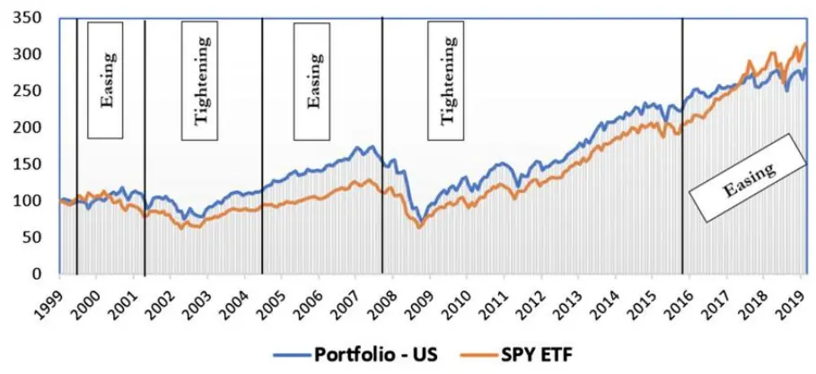
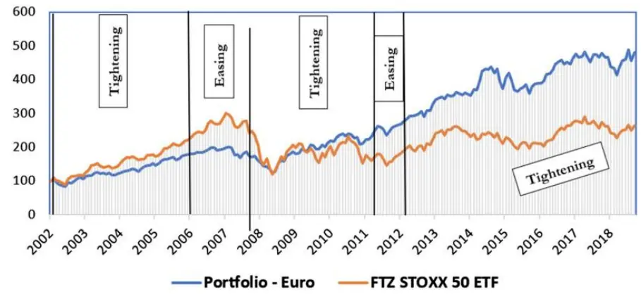
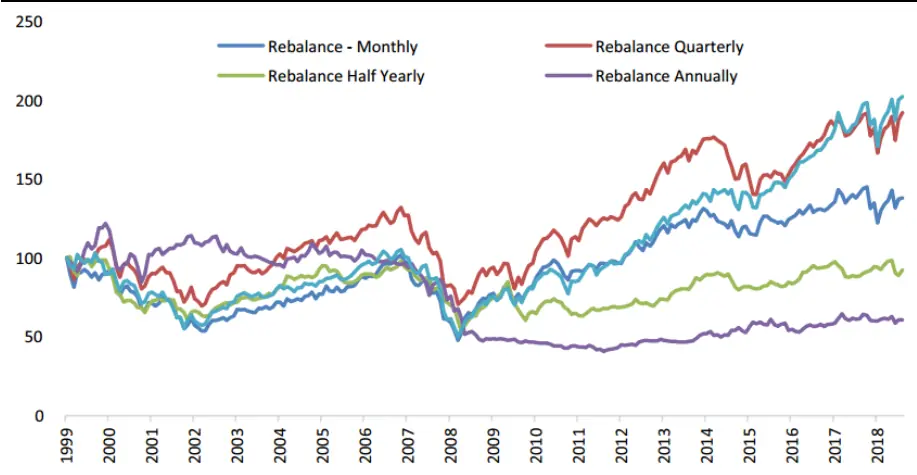
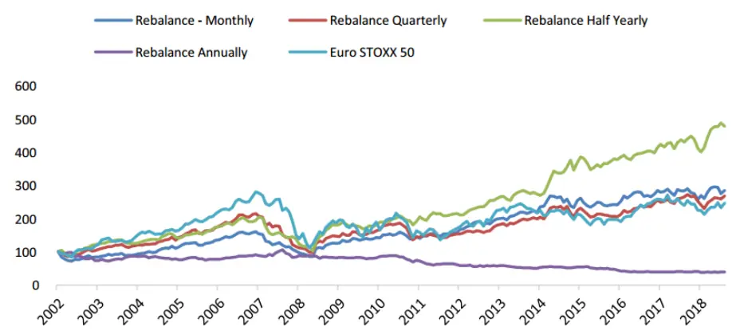
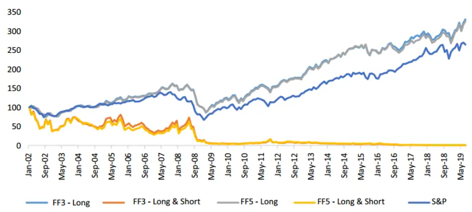
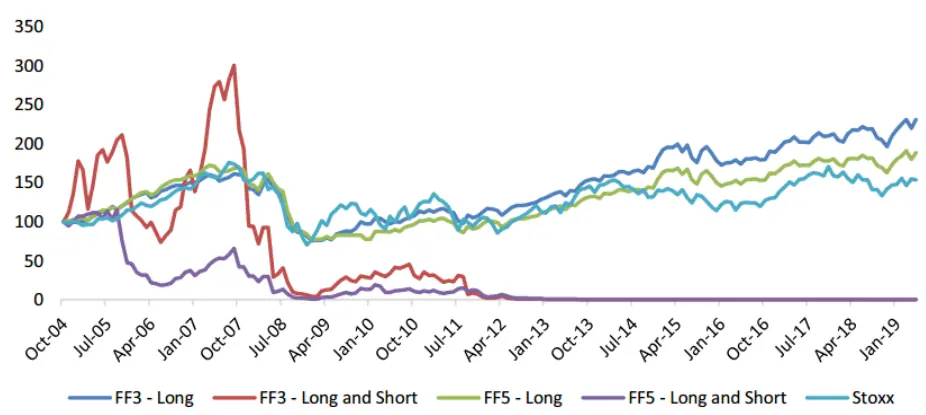

inInfo][Table_Title]2021.08.23

# 板块轮动策略的有效性探究

## ——精品文献解读系列（二十一）

## 本报告导读：

本篇报告解读的文献使用利率、动量以及超额收益这三个指标构建了板块轮动策略，并基于美国和欧洲市场进行了回测分析，验证了板块轮动策略的有效性。

## 摘要：

le_Summary]投资学是一门学术界与业界紧密结合的学科，其中大类资产配置是这种紧密结合的代表。从 Markowitz（1952）开创现代投资组合理论开始，学术界为业界提供了丰富的理论参考和方法模型，推动了大类资产配置实践的繁荣发展。为了帮助读者及时跟踪学术前沿，我们推出了“精品文献解读”系列报告，从大量学术文献中挑选出精品论文进行剖析解读，为读者呈现大类资产配置领域最新的思路和方法。

本篇为读者解读的文献是 Alexiou and Tyagi（2020）在期刊 Journal of Asset Management 上发表的论文“Gauging the effectiveness of sector rotation strategies: evidence from the USA and Europe”。

该文献使用利率、动量以及超额收益这三个指标来构建板块轮动策略，并在美国和欧洲两个市场上，使用 1999 至 2019 年间的板块 ETF数据进行回测检验。实证结果显示，基于利率、动量的板块轮动策略在欧洲市场上都能取得超额收益，而在美国市场表现不佳；基于FF3/FF5 模型 alpha 的多头板块轮动策略在两个市场上均取得了较高的超额收益。

本文基于美国和欧洲市场，系统评估了使用宏观经济指标、技术指标和绩效指标构建板块轮动策略的有效性，对投资者进行板块配置有很大的参考意义。板块轮动策略是一种战术资产配置行为，如果使用得当可以有效提高投资组合收益。但是使用单一指标作为板块轮动的信号往往容易受到其他因素干扰，最终导致板块轮动策略的失效。因此，我们需要多维度选取信号指标来构建稳健的板块轮动策略，以更好地获取板块配置带来的超额收益。

大类资产配置研究

## hor] 报告作者

玉李祥文(分析师)

8 021-38031560

lixiangwen@gtjas.com

证 书 S0880520100001

赵索(分析师)

8 0755-23976601

zhaosuo024832@gtjas.com

证书编号 S0880521080002

## cReport 相关报告]

风从虎，云从龙，券商配置正当时

2021.08.13

因子投资中的宏观经济风险

2021.08.08

边际流动性视角下的投资时钟2021.07.30

全球如何定价碳转型风险2021.07.27

“碳中和”：欧洲如何测度气候风险 2021.07.14

## 1. 文献概述

文献来源：

Alexiou C, Tyagi A. Gauging the effectiveness of sector rotation strategies: evidence from the USA and Europe. Journal of Asset Management. 2020;21(3):239-260.

## 文献摘要：

本文使用利率、动量以及超额收益这三个指标来构建板块轮动策略，并在美国和欧洲两个市场上，使用 1999至 2019 年间的板块 ETF 数据进行回测检验。实证结果显示，基于利率、动量的板块轮动策略在欧洲市场上都能取得超额收益，而在美国市场表现不佳；基于 FF3/FF5 模型 alpha的多头板块轮动策略在两个市场上均取得了较高的超额收益。

## 文献评述：

本文基于美国和欧洲市场，系统评估了使用宏观经济指标、技术指标和绩效指标构建板块轮动策略的有效性，对投资者进行板块配置有很大的参考意义。板块轮动策略是一种战术资产配置行为，如果使用得当可以有效提高投资组合收益。但是使用单一指标作为板块轮动的信号往往容易受到其他因素干扰，最终导致板块轮动策略的失效。因此，我们需要多维度选取信号指标来构建稳健的板块轮动策略，以更好地获取配置板块带来的超额收益。

## 2. 引言

作为一种有效的动态资产配置策略，板块轮动（sectorrotation）一直以来广受投资者关注。板块轮动策略兼顾被动指数跟踪和主动选股，其基本操作是适时做多预期收益较好的板块，做空预期收益较差的板块。目前，全球市场上已涌现出数千只 ETF 基金，充分满足投资者对各类板块的投资需求，这也进一步提高了投资者对板块轮动策略的青睐。

进行板块轮动配置的基本思想是板块的预期收益会随着某种指标的变化而变化。现有文献主要从宏观经济指标（利率）、技术指标（动量）、绩效指标（超额收益）等方面对板块轮动进行了研究，下面分别进行阐述。

（1）利率对板块预期收益的影响。Jensen and Johnson（1995）研究了利率调整后的股票收益，发现货币宽松会导致一段时间内的正向超额收益，而货币紧缩则会带来负向超额收益。进一步地，Ehrmann and Fratzscher（2004）发现周期性板块对利率变化相对更为敏感。Bernanke and Kuttner（2005）研究了货币政策变化对股票价格的影响，发现联邦基金利率下降 25 个基点能使宽基指数上升 1%，同时该研究也指出周期性板块对利率变化的反应更为敏感。Kouzmenko and Nagy（2009）也验证了经济周期与板块表现之间存在相关关系，他们发现在经济扩张期，强周期性板块能够跑赢强防御属性板块，反之亦然。类似地，Conover et al.（2008）

的研究表明，宽松的货币政策能够提升周期性板块的业绩表现，而紧缩的货币政策能够提升非周期板块的业绩表现。

（2）板块收益的动量效应。随着行为金融的不断发展，很多研究尝试从投资者行为理论的角度分析股价变化和股价趋势，其中动量效应就是一种受到广泛关注的行为理论。Robert（1967）指出，买入当前价格大幅高于过去 27 周均价的股票能够获得显著的超额收益。Sorensen andBurke（1986）研究了 1972 年至 1982 年期间，美国 43 个板块的相对强度指数（RSI），发现通过买入并持有表现最佳的板块能够显著提高收益。Grinblatt and Titman（1989，1992）研究了 1975 年至 1984 年期间大量的共同基金，发现大多数共同基金更愿意购买当前价格较上一季度大幅上涨的股票。Jegadeesh and Titman（1993）则更加系统化地证明了股价在短期和中期存在着动量效应。该研究表明在 3 到 12 个月的持有期内，做多过去表现优异的股票并做空过去表现不佳的股票能够产生显著的正向超额收益。Moskowitz and Grinblatt（1999）指出，通过构建行业板块组合，可以获取大部分基于动量效应的超额收益。该研究利用板块动量构建了板块轮动策略，具体做法是根据最近 6 个月的收益对 20 个板块进行排序，然后做多业绩最好的三个板块，做空业绩最差的三个板块。该策略在 1963 年到 1995 年期间获得了 0.43%的月均回报率。在该研究的基础之上，O'Neal（2000）发现使用动量效应来配置美国共同基金可以获得更高的收益。此后，Swinkels and Tjong-A-Tjoe（2006）还使用美国的 ETF 产品来构建基于动量的板块轮动策略。

（ ）使用多因子模型来计算板块的预期收益。自从资本资产定价模型（CAPM）提出以来，学术界在定价模型上进行了大量研究，其中最著名的当属 Fama and French（1993）的三因子模型（下文简写为“FF3 模型”）、Carhart（1997）的四因子模型，以及 Fama and French（2015）的五因子模型（下文简写为“FF5 模型”）。随着定价模型的不断改进，越来越多的异象能够得到解释，模型的定价能力也越来越强。投资者可以基于这些经典多因子模型来计算板块的预期收益。

基于上述文献综述，本文基于利率（宏观经济指标）、动量（技术指标）和 FF3/FF5 模型的 alpha（绩效指标），分别构建板块轮动策略，并在美国和欧洲两大市场上进行回测分析，检验这三种板块轮动策略的有效性。

## 3. 板块轮动策略构建

## 3.1. 基于利率的板块轮动策略

为了研究利率作为板块轮动指标的有效性，本文遵循 Conover et al.（2008）等的观点，认为在货币宽松期间（利率较低）应该配置周期性板块，在货币紧缩期间（利率较高）应该配置非周期性板块。本文采用的利率指标是美国联邦基金目标利率（Fed Funds Target rate）和欧洲市场欧元主要再融资公告利率（Euro Main Refinancing Announcement Rate），数据来源是 Bloomberg 和 DATASTREAM。我们进一步根据利率的变动将样本区间分为货币宽松和货币紧缩两类时期。

就具体的研究标的而言，本文选取了 9 只美国市场上的板块 ETF 和 10只欧洲市场上的板块 ETF。根据 MSCI 的分类标准，我们进一步将这些板块划分为周期性板块或非周期性板块。此外，本文分别选取标普 500指数（S&P 500）和斯托克指数（Stoxx）的收益水平作为美国与欧洲两个市场的基准收益。

## 3.2. 基于动量的板块轮动策略

对于基于动量的板块轮动策略，本文参考 Jegadeesh and Titman（1993）的方法，并对之稍作改进。为了反映价格的动量，在每个调仓时点，本文根据前J 个月（观察期）的收益构建投资组合，并在 K个月（持有期）之后衡量组合业绩。

本文为美国和欧洲市场分别构建了 16 个投资组合，即J 和 K分别取 1、、 和 个月。其中，选取 个月的观察期和 个月的持有期是本文对 Jegadeesh and Titman（1993）的改进，因为实证研究发现，板块的动量效应在 1 个月的时间窗口上最强（Moskowitz and Grinblatt，1999；Grundy and Spencer，2001）。在每个观察期 J 下，本文通过单边做多业绩最好的 3 个板块来构建动量组合。

本文对观察期内持有板块的月度收益进行算数平均，如式（1）所示，并据此考察该板块业绩表现的优劣。之所以采用算术平均，是因为对于短期投资，算术平均值的结果更接近于“无偏复利率”；而对于长期投资，几何平均值的结果更接近于“无偏复利率”（Jacquier et al.，2003）。

$$
\begin{array}{r}{R_{i}=\frac{1}{T}*\sum_{t=1}^{T}R_{i,t}}\end{array}\tag{1}
$$

其中， $R_{i}$ 代表观察期内板块 i的持有收益； $R_{i,t}$ 代表板块 i在观察期内的第 t 月的月度收益；T 则代表观察期的长度。

根据上述标准对各板块 进行业绩排名，将排名前三的板块 按照等权重构建动量投资组合，然后买入该组合，持有 K个月并观察其收益。K个月后，按照上述步骤重新构建投资组合并计算收益，直至样本期结束。

## 3.3. 基于超额收益的板块轮动策略

本文参考 Sarwar et al.（2017）的做法，将 FF3 和 FF5 模型的 alpha 作为板块的业绩指标，并据此进行各个板块的配置。其中 FF3 和FF5 模型分别如式（2）和式（3）所示：

$$
R_{it}-R_{ft}=\alpha_{it}+\beta_{1}\big(R_{Mt}-R_{ft}\big)+\beta_{2}SMB_{t}+\beta_{3}HML_{t}+\varepsilon_{it}\tag{2}
$$

$$
\begin{array}{r}{R_{it}-R_{ft}=\alpha_{it}+\beta_{1}\big(R_{Mt}-R_{ft}\big)+\beta_{2}SMB_{t}+\beta_{3}HML_{t}}\\{+\beta_{4}RMW_{t}+\beta_{5}CMA_{t}+\varepsilon_{it}\quad\quad}\end{array}\tag{3}
$$

其中， $R_{it}{'}$ 代表股票或组合 i在 t 期的总收益； $R_{ft}$ 代表 t 期的无风险利率（本文使用 1 月期的美国国债利率作为无风险利率）； $R_{Mt}$ 是市场组合在t 期的总收益， $R_{Mt}-R_{ft}$ 则代表市场组合的超额收益； $SMB_{t}$ 代表规模因子； $HML_{t}$ 代表价值因子； $RMW_{t}$ 代表盈利因子； $CMA_{t}$ 代表投资因子； $\beta_{i}$ 即为各因子的系数； $\alpha_{it}$ 代表 FF3 或 FF5 模型无法解释的超额收益。

本文在 36 个月的时间窗口上使用 FF3 和 FF5 模型，对选取的板块 ETF数据进行滚动回归，将每个月得到的 alpha 作为调仓信号，构建多头组合和多空组合。具体来说，以 FF5 模型为例，在 1999至 2019 年中的每一个月，使用最近 36 个月的数据进行 FF5 回归并得到相应的 alpha。对于多头策略而言，若模型在 t 月具有正的 alpha，则在 t+1 月买入该板块ETF，否则不买入。对于多空组合，若模型在 t 月具有正的 alpha，则在t+1 月买入该板块 ETF，反之若模型在 t 月具有负的 alpha，则在 t+1 月卖出该板块 ETF。依此构建组合并每月调仓，最后考察策略在样本期间的业绩表现。在评价组合表现时，本文将买入并持有标普 500 指数或斯托克指数的收益作为基准收益，并引入夏普比率以评价组合的风险调整收益。

## 4. 策略回测结果与分析

## 4.1. 基于利率的板块轮动策略

表1和表 2分别总结了美国和欧洲市场从1999至2019年间的货币政策变化情况。从 1999 年到 2019 年，美国在货币宽松（Easing）和紧缩（Tightening）期间的平均利率分别为 3.34%和 3.22%，其间利率在 2015年 12 月达到最低点 0.13%，在 2001 年1 月达到最高点 6.5%。从表 1 可以明显看出，在样本期间内美国的货币政策大部分时间是紧缩的。该表还反映出美联储在 2007 年底至 2015 年底期间采取了宽松的货币政策，以克服 2008 年金融危机，缓解信贷市场紧张状况。此外，美联储近年来降低了变更货币政策的频率，从 2016 年初开始实施紧缩性货币政策并一直持续至今。

表 1：美国货币政策变化（1999-2019）

| Policy period | Policy | Start date | Start rate (%) | End rate (%) | No. of rate changes | Total changes in rates (%) |
| --- | --- | --- | --- | --- | --- | --- |
| 1 | Tightening | 30/06/1999 | 4.75 | 6.50 | 6 | 1.75 |
| 2 | Easing | 31/01/2001 | 6.50 | 1.00 | 12 | -5.50 |
| 3 | Tightening | 30/06/2004 | 1 | 5.25 | 17 | 4.25 |
| 4 | Easing | 28/09/2007 | 5.25 | 0.13 | 8 | -5.12 |
| 5 | Tightening | 31/12/2015 | 0.13 | 2.38 as on 28/06/2019 | 9 until 28/06/2019 | 2.25 |

数据来源：Alexiou and Tyagi（2020）

从 1999 年到 2019 年，欧洲市场在货币紧缩和宽松期间的平均利率分别为 2.88%和 1.75%，其间利率在 2019 年 6 月达到最低点 0.00%，在 2006年 1 月和 2008 年 11 月达到最高点 4.25%。与美国不同的是，在样本期内欧盟的货币政策以宽松为主。表 2 能够反映出欧洲央行为应对 2008年金融危机和 2011 年欧债危机，都主动采取了相应的货币政策。此外表

2还显示欧洲央行从2012年初开始便实施货币宽松政策并一直持续至今。

表 2：欧洲货币政策变化（1999-2019）

| Policy period | Policy | Start date | Start rate (%) | End rate (%) | No. of rate changes | Total changes in rates (%) |
| --- | --- | --- | --- | --- | --- | --- |
| 1 | Easing | 31/12/2001 | 3.75 | 2.00 | 4 | -1.75 |
| 2 | Tightening | 31/01/2006 | 2.00 | 4.25 | 9 | 2.25 |
| 3 | Easing | 30/11/2008 | 4.25 | 1.50 | 7 | -2.75 |
| 4 | Tightening | 31/05/2011 | 1.00 | 1.50 | 2 | 0.50 |
| 5 | Easing | 31/12/2011 | 0.05 | 0.00 as on 28/06/2019 | 8 until 28/06/2019 | -0.05 |

数据来源：Alexiou and Tyagi（2020）

此外，由表1和表 2可知，基于利率的板块轮动策略的调仓频率非常低。
在样本期间，美国和欧洲的投资组合都只进行了 5 次调仓。

表 列出了本文选取的美国和欧洲的板块 的年均收益和标准差。由表 可见，两个市场上各板块的年均收益和标准差具有较大差异。此外，周期性板块的标准差比非周期性板块高，体现出周期性板块对市场的变化更为敏感，这与之前的研究一致。这也进一步表明，如果在合适的时点配置合适的板块，则有可能获得超额收益并降低波动性。

表 3：各板块平均收益与标准差（1999-2019）

|  | USA |  | Europe |  |
| --- | --- | --- | --- | --- |
|  | Mean (%) | SD (%) | Mean (%) | SD (%) |
| Non-cyclical |  |  |  |  |
| Consumer staples | 9 | 12 | 12 | 15 |
| Energy | 17 | 22 | 5 | 16 |
| Health care | 5 | 13 | 7 | 15 |
| Utilities | 9 | 16 | 9 | 19 |
| Average for non-cyclical | 10 | 16 | 8 | 16 |
| Cyclical |  |  |  |  |
| Consumer discretionary | 8 | 20 | 10 | 22 |
| Financial | 11 | 22 | 6 | 25 |
| Industrial | 11 | 19 | 14 | 23 |
| Materials | 11 | 21 | 16 | 28 |
| Technology | 4 | 25 | 9 | 24 |
| Communication | 一 | 一 | 9 | 18 |
| Average for cyclical | 9 | 21 | 11 | 23 |

数据来源：Alexiou and Tyagi（2020）

表4和表 5总结了两个市场上各板块在货币宽松与紧缩时期的不同表现。表 4 显示，在美国市场上，纵向来看，各个板块自身在货币宽松与紧缩时期的表现差异都不太大。然而横向来看，在宽松期间，周期性板块的表现优于非周期性板块；在紧缩期间，非周期性板块的表现优于周期性板块。这与 Kouzmenko and Nagy（2009）以及 Conover et al.（2005）的研究结论一致。此外，不论处在货币宽松期还是紧缩期，周期性板块的标准差均高于非周期性板块，这表明周期性板块对利率变化更为敏感。这与 Ehrmann and Fratzscher（2004）的研究结论一致。以上分析表明，在美国市场上，通过利率的变化来配置不同类型的板块，可以提高投资组合收益。

表 4：美国市场各板块在货币宽松期与紧缩期的业绩比较（1999-2019）

|  | Expansionary |  | Restrictive |
| --- | --- | --- | --- |
|  | Mean (%) | SD (%) | Mean (%) SD (%) |
| Non-cyclical |  |  |  |
| Consumer staples | 2.39 | 9.32 | 2.47 7.66 |
| Energy | 0.72 | 16.48 5.73 | 13.04 |
| Health care | 4.88 | 11.24 2.04 | 8.18 |
| Utilities | -0.48 | 11.51 5.05 | 8.35 |
| Average for non-cyclical | 1.88 | 12.14 | 3.82 9.31 |
| Cyclical |  |  |  |
| Consumer discretionary | 6.11 | 15.01 2.78 | 9.89 |
| Financial | -0.04 | 17.87 3.85 | 11.07 |
| Industrial | 2.12 | 15.34 4.59 | 9.46 |
| Materials | 3.12 | 16.94 3.23 | 10.88 |
| Technology | 2.22 | 18.77 4.18 | 12.91 |
| Average for cyclical | 2.71 | 16.79 3.73 | 10.84 |

数据来源：Alexiou and Tyagi（2020）

表 5 表明，欧洲市场有着与美国市场类似的结果。首先，周期性板块在货币宽松期间的表现优于非周期性板块，而非周期性板块在货币紧缩期间的表现优于周期性板块。此外，在不同时期，周期性板块的标准差均高于非周期性板块，表明周期性板块对利率变化更为敏感。但与美国市场有所不同的是，在欧洲市场上，各个板块在货币宽松期与紧缩期的表现具有较大差异：对于周期性板块，宽松期与紧缩期的各板块平均收益率之差为 12.12%，而对于非周期性板块，该差值只有 8.27%。这一结论也进一步证明了周期性板块对利率的变化更加敏感。以上分析表明，在欧洲市场上，同样可以通过在货币宽松与紧缩时期配置不同类型的板块来提高投资组合的收益。

表 5：欧洲市场各板块在货币宽松期与紧缩期的业绩比较（1999-2019）

|  | Expansionary |  | Restrictive |
| --- | --- | --- | --- |
|  | Mean (%) SD (%) | Mean (%) | SD (%) |
| Non-cyclical |  |  |  |
| Utilities | 7.42 | 12.97 | -0.61 7.52 |
| Consumer staples | 8.53 | 11.02 | 0.26 6.03 |
| Health care | 7.75 | 11.50 -1.25 | 5.82 |
| Energy | 6.82 | 15.11 -0.97 | 10.24 |
| Average for non-cyclical | 7.63 | 12.65 -0.64 | 7.40 |
| Cyclical |  |  |  |
| Communication | 2.90 | 15.35 | 0.14 7.41 |
| Consumer discretionary | 11.11 | 16.00 -3.02 | 9.64 |
| Industrials | 12.09 | 15.35 -2.82 | 10.62 |
| Technology | 8.46 | 23.35 -3.69 | 9.86 |
| Materials | 11.93 | 16.69 -2.51 | 12.43 |
| Financials | 8.70 | 20.55 -5.61 | 10.82 |
| Average for cyclical | 9.20 | 17.88 -2.92 | 10.13 |

数据来源：Alexiou and Tyagi（2020）

表 6、图 1 和图 2 展示了基于利率变化进行板块轮动配置的业绩表现。从回测结果来看，该策略在美国市场上的表现不佳，轮动组合的平均年化收益低于基准组合，且波动率高于基准组合。然而，该策略在欧洲市场上具有良好的效果，其平均年化收益高于基准组合，同时波动率低于基准组合，因而夏普比率也大幅高于基准组合。此外，由于该策略的调仓频率很低，因而受交易成本以及交易风险的影响也很小。

表 6：基于利率的板块轮动策略业绩表现（1999-2019）

|  | USA |  |  | Europe |  |  |
| --- | --- | --- | --- | --- | --- | --- |
|  | Mean (%) | SD (%) | Sharpe ratio | Mean (%) | SD (%) | Sharpe ratio |
| Portfolio | 6.73 | 16.60 | 0.406 | 11.14 | 15.24 | 0.73 |
| Benchmark | 7.04 | 14.70 | 0.48 | 8.53 | 21.76 | 0.39 |
| Excess return | -0.31 |  |  | 2.61 |  | 1 |

数据来源：Alexiou and Tyagi（2020）

图 1：基于利率的板块轮动策略表现（美国市场）

数据来源：Alexiou and Tyagi（2020）

图 2：基于利率的板块轮动策略表现（欧洲市场）

数据来源：Alexiou and Tyagi（2020）

## 4.2. 基于动量的板块轮动策略

表 7 和表8 汇总了在美国和欧洲市场上，基于动量的板块轮动策略的业绩表现。具体来说，对于每对 J-K组合以及基准组合，表 7 和表 8 分别展示了其月均收益、年均收益、标准差、月度夏普比率以及单样本 t 检验下的 p 值。图 3 和图 4 分别展示了两个市场上观察期 J 为 1 个月的四个组合以及基准组合的净值走势。根据以上图表，可以得出丰富的结论。

根据表 7，在美国市场上，所有 16 个轮动组合的月均收益都不是显著非零，这说明动量效应在本文所考虑的美国样本期间和板块中并不显著。

然而表 8 显示，在欧洲市场上，大多数基于动量的轮动组合的收益显著为正。换言之，动量效应在本文所考虑的欧洲样本期间和板块中表现出显著的统计意义。

对于不同的 J 值进行比较，还可以得出以下结论：（1）无论是在美国市场还是欧洲市场，当观察期 J=1 时，各个组合的 p 值都相对较高，说明当观察期较短时动量效应不明显，但存在较强的反转效应，这与Jegadeesh（1990）和 Lehmann（1990）的研究结论一致。尤其是美国市场，当 J=1 时，四个动量组合的平均年收益仅有 1.5%，这进一步表明动量效应在短周期内十分微弱；（2）在两个市场上，观察期 J=3 时，动量组合的收益都达到最佳，其次 J=6 时组合的表现也较好；（3）在两个市场上，除了 J=1、K=12 这一组合无法产生正向年化收益，其余各组合都具有正向年化收益，这进一步表明在短周期内难以捕捉到动量效应。

表 7 表明，在美国市场上，当 J=1 时，四个组合的夏普比率都达到最小，这意味着动量效应在观察期为 1 个月时最弱。这与上一章节提及的Moskowitz and Grinblatt（1999）的结果相矛盾，该矛盾的产生可能是因为在实证中使用了不同的样本区间或不同的资产。然而，在 3 个月和 6个月的观察期下，各个动量组合的波动率与基准组合均基本持平，但年化收益要高于基准组合约 2%，因而动量效应使得组合的夏普比率较基准组合有所增加。当观察期为 12 个月时，仍然具有一定的动量效应，但与 3 个月和 6 个月的观察期相比，动量效应明显减弱。

表 7：基于动量的板块轮动组合收益（美国市场）

|  |  | K=1 | K=3 | K=6 | K=12 | S&P 500 |
| --- | --- | --- | --- | --- | --- | --- |
| J=1 | Monthly return | 0% | 0% | 0% | 0% | 0% |
|  | Annual return | 3% | 4% | 0% | -2% | 4% |
|  | p value | 41% | 18% | 91% | 55% | 16% |
|  | SD | 4% | 4% | 3% | 4% | 4% |
|  | Sharpe ratio (monthly) | 0.05 | 0.09 | 0.01 | -0.04 | 0.09 |
|  | Monthly return | 0% | 0% | 1% | 1% | 0% |
|  | Annual return | 6% | 5% | 6% | 6% | 4% |
|  | p value | 9% | 12% | 8% | 9% | 16% |
| J=6 | SD | 4% | 4% | 4% | 5% | 4% |
|  | Sharpe ratio (monthly) | 0.11 | 0.10 | 0.11 | 0.11 | 0.09 |
|  | Monthly return | 0% | 0% | 0% | 0% | 0% |
|  | Annual return | 6% | 5% | 6% | 6% | 4% |
|  | p value | 9% | 11% | 10% | 11% | 16% |
|  | SD | 4% | 4% | 4% | 5% | 4% |
| J=12 | Sharpe ratio (monthly) | 0.11 | 0.10 | 0.11 | 0.10 | 0.09 |
|  | Monthly return | 0% | 0% | 0% | 0% | 0% |
|  | Annual return | 5% | 5% | 3% | 5% | 4% |
|  | p value | 13% | 15% | 35% | 16% | 16% |
|  | SD | 4% | 4% | 4% | 4% | 4% |
|  | Sharpe ratio (monthly) | 0.10 | 0.09 | 0.06 | 0.09 | 0.09 |

数据来源：Alexiou and Tyagi（2020）

表 8 表明，在欧洲市场上，16 个基于动量的板块轮动组合中有 15 个能够产生高于基准组合的夏普比率。然而，这一结果大部分可归因于这一策略降低了组合的波动性，而不是其产生了更高的收益。在 16 个组合中，其实只有 4 个组合产生了正向超额收益。从这一角度来说，虽然动量策略在欧洲市场上的收益普遍为正，但并不能明确表明欧洲市场存在显著的动量效应。

表 8：基于动量的板块轮动组合收益（欧洲市场）

|  |  | K=1 | K=3 | K=6 | K=12 | Euro Stoxx 50 |
| --- | --- | --- | --- | --- | --- | --- |
| J=1 | Monthly return | 1% | 1% | 1% | 0% | 1% |
|  | Annual return | 8% | 7% | 11% | -5% | 8% |
|  | p value | 5% | 6% | 0% | 8% | 15% |
|  | SD | 4% | 5% | 4% | 3% | 6% |
|  | Sharpe ratio (monthly) | 0.14 | 0.13 | 0.21 | -0.12 | 0.10 |
| J=3 | Monthly return | 1% | 1% | 1% | 0% | 1% |
|  | Annual return | 10% | 8% | 7% | 6% | 8% |
|  | p value | 1% | 3% | 5% | 9% | 15% |
|  | SD | 4% | 4% | 4% | 4% | 6% |
|  | Sharpe ratio (monthly) | 0.19 | 0.16 | 0.14 | 0.12 | 0.10 |
| J=6 | Monthly return | 0% | 0% | 1% | 1% | 1% |
|  | Annual return | 4% | 6% | 7% | 9% | 8% |
|  | p value | 3% | 10% | 5% | 2% | 15% |
|  | SD | 2% | 4% | 4% | 4% | 6% |
|  | Sharpe ratio (monthly) | 0.16 | 0.12 | 0.14 | 0.17 | 0.10 |
| J=12 | Monthly return | 0% | 1% | 1% | 1% | 1% |
|  | Annual return | 4% | 7% | 7% | 8% | 8% |
|  | p value | 4% | 5% | 5% | 4% | 15% |
|  | SD | 2% | 4% | 4% | 4% | 6% |
|  | Sharpe ratio (monthly) | 0.15 | 0.14 | 0.14 | 0.15 | 0.10 |

数据来源：Alexiou and Tyagi（2020）

图 3：美国市场基于动量的板块轮动策略表现（观察期J=1）

数据来源：Alexiou and Tyagi（2020）

图 4：欧洲市场基于动量的板块轮动策略表现（观察期J=1）

数据来源：Alexiou and Tyagi（2020）

除了动量效应，本文还尝试从投资者情绪的角度来构建板块轮动组合，以进一步丰富本文在投资者行为理论方面的探究。本文利用经合组织（OECD）编制的消费者信心指数（CCI）作为板块轮动信号。CCI 指标根据人们的预期财务状况、消费者对市场未来的总体情绪、就业水平等反映了人们的消费和储蓄潜力。CCI 指标超过 100 表示消费者较为乐观，这将导致更少的储蓄和更多的支出。相反地，该指标低于 100 则表示消费者较为悲观，这将导致更多的储蓄和更少的支出。

我们基于 CCI 指数构建了一个新的板块轮动策略：当 CCI 指数超过 100时，投资于由所有周期性板块 ETF 组成的等权重组合；当 CCI 指数低于100 时，投资于由所有非周期性板块 ETF 组成的等权重组合。表 9 展示了该策略在美国和欧洲市场上的表现。从表中可以看到，无论是在美国市场还是欧洲市场，该轮动策略的表现都不及基准组合，表明消费者信心指数（CCI）无法作为板块轮动的良好信号。

表 9：基于消费者信心指数（CCI）的板块轮动策略收益（1999-2019）

|  | USA |  |  | Europe |  |  |
| --- | --- | --- | --- | --- | --- | --- |
|  | Mean (%) | SD (%) | Sharpe ratio | Mean (%) | SD (%) | Sharpe ratio |
| Portfolio | 6.70 | 60.73 | 0.11 | 5.06 | 59.81 | 0.08 |
| Benchmark | 7.04 | 14.70 | 0.48 | 8.53 | 21.76 | 0.39 |
| Excess return | -0.34 | 1 | 1 | -3.47 | 1 | 1 |

数据来源：Alexiou and Tyagi（2020）

## 4.3. 基于超额收益的板块轮动策略

根据前文所述，本文基于 FF3和 FF5 模型，对样本期内美国的 9 只板块ETF 和欧洲的 10 只板块 ETF 在 36 个月的窗口下进行滚动回归。表 10和表 11 分别汇总了美国和欧洲市场上各板块使用 FF5 模型进行滚动回归得到的平均 alpha 以及 alpha 的标准差。

根据表10可知，在美国市场上，平均 alpha最高的板块为能源板块（15%）和医疗健康板块（14%），而平均 alpha 最低的板块则为工业板块（-56%）和金融板块（-42%）。9 个板块的 alpha 均值为负（-17%），这一结论与Dellva et al.（2001）的研究结论相反，其差异可能来源于两个方面：首先，本文研究标的为板块 ETF 基金，而 Dellva et al.（2001）使用的是共同基金；其次，二者选择的样本区间是不同的。但是本节的结论与 Sarwaret al.（2017）和 Dou et al.（2014）的研究是类似的，他们都指出美国市场的能源和医疗健康板块具有正的 alpha，而工业和必选消费板块具有负的 alpha。

表 10：美国市场各板块 FF5 滚动回归的 alpha

| Sector | Sector ETF | Mean alpha (%) SD (%) |
| --- | --- | --- |
| Consumer discretionary | XLY US equity | -6 36 |
| Consumer staples | XLP US equity | -16 41 |
| Energy | XLE US equity | 15 42 |
| Financial | XLF U S equity -42 | 50 |
| Health care | XLV US equity | 14 32 |
| Industrial | XLI U S equity -56 | 63 |
| Materials | XLB US equity -22 | 40 |
| Technology | XLK US equity -18 | 22 |
| Utilities | XLU US equity -20 | 61 |
|  | Net -17 | 43 |

数据来源：Alexiou and Tyagi（2020）

由表11可知，与美国市场相比，欧洲市场的板块ETF普遍具有正的alpha。10 个板块 ETF 的平均 alpha 约为 30%，其中 alpha 最高的板块为医疗健康板块（75%），而 alpha 最低的板块则为能源板块（-46%）。

表 11：欧洲市场各板块 FF5 滚动回归的 alpha

| Sector | ETF | Mean alpha (%) | SD (%) |
| --- | --- | --- | --- |
| Consumer discretionary | STR FP equity | 25 | 106 |
| Consumer staples | STS FP equity | 45 | 51 |
| Energy | STN FP equity | -46 | 101 |
| Financials | STZ FP equity | 51 | 106 |
| Health care | STW FP equity | 75 | 83 |
| Industrials | STQ FP equity | 48 | 57 |
| Technology | STK FP equity | 56 | 122 |
| Materials | STP FP equity | 16 | 49 |
| Communication | STT FP equity | 14 | 78 |
| Utilities | STU FP equity | 18 | 50 |
|  | Net | 30 | 80 |

数据来源：Alexiou and Tyagi（2020）

表 和表 统计了在美国和欧洲市场上使用 和 模型的多头板块轮动策略以及多空板块轮动策略的业绩表现。从表中可以看到，在美国市场上，基于 模型和 模型的多头策略都能够获得正向超额收益，且二者的波动率均低于基准组合，因而两个策略的夏普比率都高于基准组合。但在欧洲市场上，只有基于 FF3 模型的多头策略才能获得正向超额收益，而基于FF5模型的多头策略略微跑输基准组合。尽管如此，由于二者的波动率较低，因而其夏普比率依然都高于基准组合。同时，无论是在美国市场还是欧洲市场，FF5 模型和FF3 模型的多头板块轮动策略的收益非常接近。

此外，与多头策略不同的是，多空板块轮动策略的表现在两个市场上都很差，其收益大幅低于基准组合，且波动率极高，从而导致夏普比率很低。

表 12：基于 FF3/FF5 模型 alpha 的板块轮动策略收益（美国市场）

| Trading strategy | Mean return (%) | SD (%) | Sharpe ratio |
| --- | --- | --- | --- |
| Long only based on five-factor alpha | 8.20 | 13.70 | 0.34 |
| Long & short based on five-factor alpha | -7.60 | 61.10 | -0.18 |
| Long only based on three-factor alpha | 8.10 | 13.80 | 0.33 |
| Long & short based on three-factor alpha | -10.60 | 60.10 | -0.23 |
| Buy & hold S&P 500 | 6.80 | 14.10 | 0.23 |

数据来源：Alexiou and Tyagi（2020）

表 13：基于 FF3/FF5 模型 alpha 的板块轮动策略收益（欧洲市场）

| Trading strategy | Mean return (%) | SD (%) | Sharpe ratio |
| --- | --- | --- | --- |
| Long only based on five-factor alpha | 5.50 | 14.13 | 0.20 |
| Long and short based on five-factor alpha | -26.45 | 94.80 | -0.31 |
| Long only based on three-factor alpha | 6.96 | 14.03 | 0.31 |
| Long and short based on three-factor alpha | -30.69 | 92.15 | -0.36 |
| Buy & hold Stoxx | 5.52 | 22.06 | 0.13 |

数据来源：Alexiou and Tyagi（2020）

图 和图 展示了两个市场上四类组合及基准组合的净值走势。通过收益曲线也可以清晰地看到，基于 alpha 的纯多头板块轮动策略通常能够跑赢市场基准，获得超额收益。

图 5：美国市场基于 FF3 和 FF5 模型 alpha 的板块轮动策略表现

数据来源：Alexiou and Tyagi（2020）

图 6：欧洲市场基于 FF3 和 FF5 模型 alpha 的板块轮动策略表现

数据来源：Alexiou and Tyagi（2020）

## 5. 结论

本文主要构建了三类不同的板块轮动策略，并在美国和欧洲市场上进行了回测分析，检验了板块轮动策略的有效性。回测结果表明，基于利率的板块轮动策略在欧洲市场具有较好的表现，而在美国市场表现不佳；基于动量的轮动策略同样在欧洲市场效果较好，在美国市场效果一般；基于 FF3 或FF5 模型 alpha 的多头轮动策略在两个市场上均取得了较高的超额收益。

总体而言，本文考察了多种指标作为板块轮动信号的有效性。然而在大多数情况下，同一个策略在两个市场上的业绩表现存在一定差异。这在一定程度上说明，可能很难找到一个真正的“通用”指标来准确把握各个板块之间的切换时点。但是，在特定市场和特定情况下，我们确实可以通过合适的板块轮动策略来提升投资组合收益。

## 本公司具有中国证监会核准的证券投资咨询业务资格

## 分析师声明

作者具有中国证券业协会授予的证券投资咨询执业资格或相当的专业胜任能力，保证报告所采用的数据均来自合规渠道，分析逻辑基于作者的职业理解，本报告清晰准确地反映了作者的研究观点，力求独立、客观和公正，结论不受任何第三方的授意或影响，特此声明。

## 免责声明

的当然客户。本报告仅在相关法律许可的情况下发放，并仅为提供信息而发放，概不构成任何广告。

本报告的信息来源于已公开的资料，本公司对该等信息的准确性、完整性或可靠性不作任何保证。本报告所载的资料、意见及推测仅反映本公司于发布本报告当日的判断，本报告所指的证券或投资标的的价格、价值及投资收入可升可跌。过往表现不应作为日后的表现依据。在不同时期，本公司可发出与本报告所载资料、意见及推测不一致的报告。本公司不保证本报告所含信息保持在最新状态。同时，本公司对本报告所含信息可在不发出通知的情形下做出修改，投资者应当自行关注相应的更新或修改。

本报告中所指的投资及服务可能不适合个别客户，不构成客户私人咨询建议。在任何情况下，本报告中的信息或所表述的意见均不构成对任何人的投资建议。在任何情况下，本公司、本公司员工或者关联机构不承诺投资者一定获利，不与投资者分享投资收益，也不对任何人因使用本报告中的任何内容所引致的任何损失负任何责任。投资者务必注意，其据此做出的任何投资决策与本公司、本公司员工或者关联机构无关。

本公司利用信息隔离墙控制内部一个或多个领域、部门或关联机构之间的信息流动。因此，投资者应注意，在法律许可的情况下，本公司及其所属关联机构可能会持有报告中提到的公司所发行的证券或期权并进行证券或期权交易，也可能为这些公司提供或者争取提供投资银行、财务顾问或者金融产品等相关服务。在法律许可的情况下，本公司的员工可能担任本报告所提到的公司的董事。

市场有风险，投资需谨慎。投资者不应将本报告作为作出投资决策的唯一参考因素，亦不应认为本报告可以取代自己的判断。
在决定投资前，如有需要，投资者务必向专业人士咨询并谨慎决策。

本报告版权仅为本公司所有，未经书面许可，任何机构和个人不得以任何形式翻版、复制、发表或引用。如征得本公司同意进行引用、刊发的，需在允许的范围内使用，并注明出处为“国泰君安证券研究”，且不得对本报告进行任何有悖原意的引用、删节和修改。

若本公司以外的其他机构（以下简称“该机构”）发送本报告，则由该机构独自为此发送行为负责。通过此途径获得本报告的投资者应自行联系该机构以要求获悉更详细信息或进而交易本报告中提及的证券。本报告不构成本公司向该机构之客户提供的投资建议，本公司、本公司员工或者关联机构亦不为该机构之客户因使用本报告或报告所载内容引起的任何损失承担任何责任。

## 评级说明

## 1.投资建议的比较标准

投资评级分为股票评级和行业评级。

以报告发布后的12个月内的市场表现为比较标准，报告发布日后的 12个月内的公司股价（或行业指数）的涨跌幅相对同期的沪深 300 指数涨跌幅为基准。

## 2.投资建议的评级标准

报告发布日后的 12 个月内的公司股价（或行业指数）的涨跌幅相对同期的沪深300 指数的涨跌幅。

| 评级 | 说明 |  |
| --- | --- | --- |
| 股票投资评级 | 增持 | 相对沪深 300 指数涨幅 15%以上 |
|  | 谨慎增持 | 相对沪深 300指数涨幅介于 5%～15%之间 |
|  | 中性 | 相对沪深 300指数涨幅介于-5%～5% |
|  | 减持 | 相对沪深 300 指数下跌 5%以上 |
| 行业投资评级 | 增持 | 明显强于沪深 300 指数 |
|  | 中性 | 基本与沪深 300指数持平 |
|  | 减持 | 明显弱于沪深 300指数 |

## 国泰君安证券研究所

|  | 上海 | 深圳 | 北京 |
| --- | --- | --- | --- |
| 地址 | 上海市静安区新闸路669号博华广场 20层 | 深圳市福田区益田路 6009 号新世界 商务中心34层 | 北京市西城区金融大街甲 9号金融 街中心南楼18层 |
| 邮编 | 200041 | 518026 | 100032 |
| 电话 | (021)38676666 | (0755)23976888 | （010)83939888 |
|  | E-mail: gtjaresearch@gtjas.com |  |  |