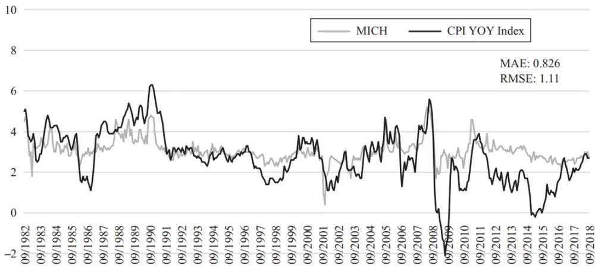
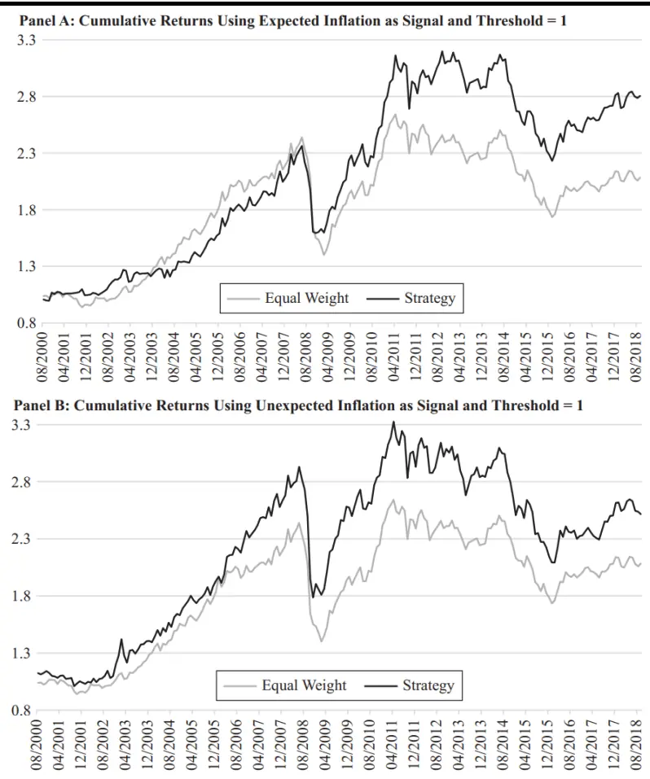
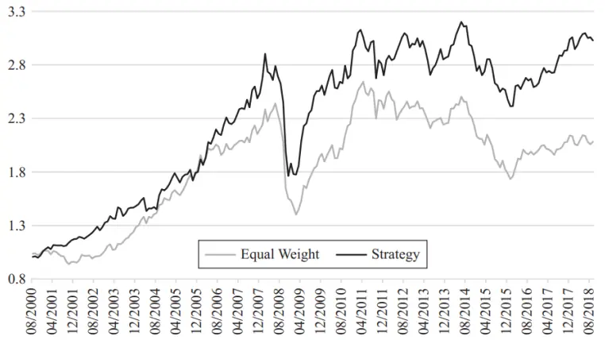

inInfo][Table_Title]2021.09.07

## 如何利用预期和超预期通胀构建多元化实物资产投资组合

## ——精品文献解读系列（二十二）

本报告导读：

本篇报告解读的文献从通胀指标的选择入手，提出了一套基于通胀状态统计学识别的多元化实物资产配置方法，并通过回溯测试和 模拟证明该方法优于等权重配置策略，非常值得投资者参考借鉴。

## 摘要：

le_Summary]投资学是一门学术界与业界紧密结合的学科，其中大类资产配置是这种紧密结合的代表。从 Markowitz（1952）开创现代投资组合理论开始，学术界为业界提供了丰富的理论参考和方法模型，推动了大类资产配置实践的繁荣发展。为了帮助读者及时跟踪学术前沿，我们推出了“精品文献解读”系列报告，从大量学术文献中挑选出精品论文进行剖析解读，为读者呈现大类资产配置领域最新的思路和方法。

本篇为读者解读的文献是 Simonian and Wu（2019）在期刊 The Journalof Portfolio Management 上 发 表 的 论 文 “Great Expectations: ATactical Asset Allocation Framework for Diversified Real AssetPortfolios”。

通胀预期对于资产配置的影响显而易见，但如何进行有效度量却难有共识。本文梳理了基于市场和基于问卷调查的两大类通胀指标，选择了 CPI 和 UMS-CPI 分别作为预期通胀和超预期通胀的代理变量，并利用 z-score 方法对此两类通胀指标定义了稳定和异常状态。在此基础上，本文根据各资产在不同通胀状态下的历史收益，通过 t-stat 建立了分类原则，并设计了一个通胀敏感策略。利用样本外的回溯测试和 bootstrap 模拟，该策略能有效跑赢等权重策略和通胀自身。

通胀敏感策略的核心在于“追胀杀缩”，本质上是一种利用资产收益的通胀敏感度的差异、在各种通胀状态下、动态地超配通胀资产的策略。为了定量分析这种敏感度，本文不仅对通胀做了类型划分：预期通胀和超预期通胀，还对通胀做了状态划分：稳定状态和异常状态。本文通过描述性统计，发现不同类别的资产收益确实在通胀敏感度上具备异质性，而这正是通胀敏感策略得以优于等权重策略的收益结构基础。

大类资产配置研究

## hor] 报告作者

玉赵索(分析师)

8 0755-23976601

zhaosuo024832@gtjas.com

证 书 S0880521080002

李祥文(分析师)

8 021-38031560

lixiangwen@gtjas.com

证书编号 S0880520100001

## cReport 相关报告]

再论券商配置逻辑

2021.09.05

2021 年全球 ESG投资的进化与分化

2021.09.04

板块轮动策略的有效性探究

2021.08.24

风从虎，云从龙，券商配置正当时 2021.08.13

因子投资中的宏观经济风险2021.08.08

## 1. 文献概述

## 文献来源：

Simonian J, Wu C. Great Expectations: A Tactical Asset Allocation Framework for Diversified Real Asset Portfolios[J]. The Journal of Portfolio Management, 2018, 45(2):38-45.

## 文献摘要：

通胀预期对于资产配置的影响显而易见，但如何进行有效度量却难有共识。本文梳理了基于市场和基于问卷调查的两大类通胀指标，选择了 CPI和UMS-CPI分别作为预期通胀和超预期通胀的代理变量，并利用z-score方法对此两类通胀指标定义了稳定和异常状态。在此基础上，本文根据各资产在不同通胀状态下的历史收益，通过 建立了分类原则，并设计了一个通胀敏感策略。利用样本外的回溯测试和 bootstrap 模拟，该策略能有效跑赢等权重策略和通胀自身。

## 文献评述：

通胀敏感策略的核心在于“追胀杀缩”，本质上是一种利用资产收益的通胀敏感度的差异、在各种通胀状态下、动态地超配通胀资产的策略。为了定量分析这种敏感度，本文不仅对通胀做了类型划分：预期通胀和超预期通胀，还对通胀做了状态划分：稳定状态和异常状态。本文通过描述性统计，发现不同类别的资产收益确实在通胀敏感度上具备异质性，而这正是通胀敏感策略得以优于等权重策略的收益结构基础。

## 2. 引言

对多元化实物资产投资组合（diversified real asset portfolio）而言，投资者关注的出发点多种多样。公共养老金计划（public pension plan）等机构投资者可能有一个与通胀挂钩的基准，而其他投资者则更多被实际回报策略（real return strategy）的收益所吸引。例如，有些投资者担心2008 年后超宽松货币政策导致的购买力下降，抑或相信中国和印度的经济持续增长将产生与日俱增的商品需求，再或认为全球贸易保护主义加剧将导致实物资产价格持续上涨。但无论动机如何，那些关注通胀的投资者不仅仅关注个别资产类别的通胀敏感性，还关注如何配置各种资产，以期战胜通胀，实现资产组合的保值增值。

在设计任何考虑预 期和超预 期通胀（expected inflation and unexpectedinflation）的通胀敏感策略时，必须选择一个参考通胀指标。在这里，我们使用消费者物价指数（CPI）作为参考通胀指标，用密歇根大学的消费者态度和行为调查指标（UMS）作为预期通胀指标的代理变量。最后，超预期通胀指标等于预期通胀指标与参考通胀指标之间的差值。

本文的目的是研究预期和超预期通胀信息在实物资产的战术配置策略中的应用，涉及的资产类别包括国债通胀保值证券（TIPS）、房地产投资信托（REITs）、自然资源股票（natural resources stocks）、能源、工业金属、贵金属、牲畜和农产品。

图 1：密歇根预测通常指标和实际通胀

数据来源：Simonian and Wu（2019）

## 3. 通胀预期

通胀预期（inflation expectation）在投资中发挥着核心作用。然而，通胀预期没有一个统一的定义。通常有两大类指标可用作通胀预期的代理变量：基于市场的和基于问卷调查的。本文使用基于问卷调查的 UMS 指标，而其原因将稍后再做解释。但首先需要指出的是，这两大类指标相当不同，指标选择的差异很有可能产生与本文论述相左的结论。

基于市场的通胀预期指标主要涉及两种。第一种是最近 12 个月的 CPI通胀率，但该指标完全基于历史数据，预测能力有限；第二种来自 Fisher（1930）的利率模型。在该模型中，预期通胀等于名义利率减去预期实际利率。假设预期实际利率为常数，Fama（1975）发现该模型提供了通胀预期的一个无偏估计。然而 Fama and Gibbons（1984）的研究表明，Fama 早期的结论依赖于 1950 年代和 1960 年代初期的历史数据，在此期间实际利率确实表现出较高的稳定性，因此由此模型计算出的通货膨胀的普适性值得怀疑。

另一类通胀预期指标则来自对公众或经济学家的问卷调查，诸如 UMS、专业预测员调查（Survey of Professional Forecasters，SPF）、利文斯顿调查（Livingston Survey，LS）和蓝筹调查（Blue Chip Survey，BCS）。每月进行一次的 UMS 的受访者包含至少 500 户家庭的随机样本，他们会被问及以下问题：“在接下来的 12 个月中，您认为价格总体上会上涨、下跌还是保持不变？在接下来的 12 个月内，您预计价格平均会上涨/下跌百分之多少？”这些问题相当宽泛，但与任何具体的（学术上的）通货膨胀指标无关。SPF 和 BCS 会就特定季度的一些通胀指标（CPI、PCE）

问卷调查经济学家，对应的年度通胀预期则根据这些季度数据计算得出。LS 要求受访者预测 CPI 和 PPI（Purchasing Power Index）的水平。在周期上，SPF 每季度进行一次，而 BCS 和 LS 则分别每月和每半年进行一次。本文选择 UMS 的原因如下。首先，它是基于问卷调查，因此能更直接地反映经济生活中的个人观点。其次，它是基于对家庭的问卷调查，因此更能反映公众的观点而非专业人员。最后，UMS 在预测准确度方面的表现优于其他（参见 Thomas，1999）。图 1 展示了 UMS 与实际通胀的显著联动（co-movement）。

## 4. 投资方法

资产类别的通货膨胀敏感性分析关注资产收益和通货膨胀之间的关系，特别是在给定的时间范围内、资产收益在多大程度和可靠性上与已实现的通货膨胀的关系。反过来，利用这些信息，我们能在资产组合中动态地配置与通胀关系最强的资产，从而实现资产之间的轮动配置。

表 1：投资方法具体细节

| 变量计算 |  |  |
| --- | --- | --- |
| 1. 通胀的 |  | $z-score:z-score=\frac{\left\|当前通胀值-通胀值过去36月均值\right\|}{通胀值过去36月标准差}$ |
|  |  | $2.\quad 资产的\quad t-stat:\quad t_{ij}=\frac{资产asset_{i}在通胀状态\quad j\quad 中的历史平均回报}{资产asset_{i}在通胀状态\quad j\quad 中的历史平均标准差}\times\sqrt{通胀状态\quad j\quad 的持续时间}$ |
| 交易规则 |  |  |
|  | 1. 计算通胀状态（异常状态对应 $\mathrm{.z-score\geq1}$ ，正常状态对 $应z-score<1)$ |  |
|  | 2. 计算资产的 t-stat: tij; |  |
|  | 3. 定义阈值 $\mathbf{t_{threshold}};$ |  |
|  | $\mathrm{d}_{\mathrm{i}}=\begin{cases}1,&\mathrm{t}_{\mathrm{ij}}\geq\mathrm{t}_{\mathrm{threshold}}\\0,&-\mathrm{t}_{\mathrm{threshold}}<\mathrm{t}_{\mathrm{ij}}<\mathrm{t}_{\mathrm{threshold}}\\-1&\mathrm{t}_{\mathrm{ij}}\leq-\mathrm{t}_{\mathrm{threshold}}\end{cases}$ |  |
|  | 4. 标注资产类别 |  |
| 权重设置 |  |  |
|  | 1. 如果存在1类资产，则在1类资产中等权重配置； |  |
|  | 2. 如果1类资产不存在，但0类资产存在，则在0类资产中等权重配置； |  |
|  | 3. 若1，0类资产都不存在，则在基准资产中等权重配置。 |  |

数据来源：Simonian and Wu（2019），国泰君安证券研究

依照上述思路，我们构建了一种基于资产通货膨胀敏感性的动态资产配置策略。策略涉及通胀状态划分和资产权重设置两个过程。第一个过程首先选定通胀指标，如果当月该指标的 z-score（基于最近 36 个月数据）大于等于 1 则为异常状态（deviant state），否则为稳定状态（stable state）。而根据通胀指标的选择，可以有三种不同的模式：（1）根据预期通货膨胀；（2）根据超预期通货膨胀；（3）联合预期和超预期通胀。第二个过程首先计算实物资产在当前通胀状态下的 t-stat 值，再根据 t-stat 值决定资产类别的月度调仓权重。注意 t-stat 的计算需要在多个时段上进行，而非单个完整的时间序列。表 1 详细描述了该配置策略的细节，图 2 为策略和作为对比的等权重组合的累计净值曲线，回测区间为 2000 年 8 月至 2018 年 9 月，回测使用的阈值和评价请参考表 2。

表 2： 实物资产策略表现结果（2000.08-2018.09）

| State Signal | t-Stat Threshold | Annualized Return (%) | Annualized Volatility (%) | Return/ Risk | Monthly Turnover (%) | P-Sharpe (%) |  |  |  | P-IR (%) |  |  |  |
| --- | --- | --- | --- | --- | --- | --- | --- | --- | --- | --- | --- | --- | --- |
|  |  |  |  |  |  | 0 | 0.1 | 0.2 | 0.3 | 0 | 0.1 | 0.2 | 0.3 |
| Equal Weight |  | 4.8 | 11.6 | 0.41 | 0.0 | 84.2 | 33.1 | 4.2 | 0.2 | NA | NA | NA | NA |
| Expected Inflation | 1 | 6.6 | 12.0 | 0.55 | 45.6 | 94.0 | 53.7 | 10.4 | 0.6 | 87.1 | 37.4 | 4.8 | 0.2 |
| Unexpected Inflation | 1 | 6.2 | 13.8 | 0.45 | 40.3 | 89.8 | 42.7 | 6.2 | 0.3 | 77.2 | 24.3 | 2.1 | 0.1 |
| Expected and Unexpected Inflation | 1 | 7.1 | 12.3 | 0.58 | 73.9 | 95.6 | 59.3 | 13.1 | 0.9 | 88.0 | 39.0 | 5.2 | 0.2 |

数据来源：Simonian and Wu（2019）

如表 2 所示，相比于等权重策略，该策略在避免了过度换手的同时，又在各类风险调整指标上表现优异。此处的风险调整指标分别是 Baily andLópez de Prado（2012）引入的概率夏普比率（PSharpe）1的通胀版本变体，和概率信息比率（P-IR）的通胀版本变体。

图 2：实物资产策略和等权重策略累计净值表现（2000.08-2018.09）

$$
\mathrm{PSR}(\mathrm{SR}^*)=\mathrm{Z}\left[\frac{(\mathrm{SR}-\mathrm{SR}^*)\sqrt{\mathrm{n}-1}}{\sqrt{1-\hat{\gamma}_3\mathrm{SR}^*+\frac{\hat{\gamma}_4-1}{4}\mathrm{SR}^2}}\right]
$$

Panel C: Cumulative Returns Using Expected and Unexpected Inflation as Signal and Threshold = 1

数据来源：Simonian and Wu（2019），国泰君安证券研究。注：从上到下分别对应于根据预期通胀、根据超预期通胀和联合两者的回测结果。

我们通过进一步的 bootstrap模拟验证该策略的稳健性。此处使用的是由Politis and Romano (1994)引入的稳定 bootstrap 方法，该方法使用规模（block size）服从随机指数分布的块（块的平均长度为 6 个月）进行模拟。此处总共生成 200 个引导样本。表 3 显示了该策略的平均重采样性能与原始数据的性能相当。

表 3： bootstrap 表 现 （ 2000.08-2018.09）

| State Signal | t-Stat Threshold | Annualized Return (%) | Annualized Volatility (%) | Return/ Risk | Monthly Turnover (%) | P-Sharpe (%) |  |  |  |  | P-IR (%) |  |  |
| --- | --- | --- | --- | --- | --- | --- | --- | --- | --- | --- | --- | --- | --- |
|  |  |  |  |  |  | 0 | 0.1 | 0.2 | 0.3 | 0 | 0.1 | 0.2 | 0.3 |
| Equal Weight |  | 4.7 | 11.4 | 0.4 | 0.0 | 71.5 | 41.0 | 15.1 | 3.0 | NA | NA | NA | NA |
| Expected Inflation | 1 | 8.2 | 12.4 | 0.7 | 43.2 | 87.7 | 63.3 | 29.9 | 8.2 | 85.4 | 56.6 | 24.3 | 6.2 |
| Unexpected Inflation | 1 | 7.4 | 12.3 | 0.6 | 47.4 | 84.7 | 57.3 | 25.3 | 6.6 | 80.1 | 46.6 | 17.4 | 4.2 |
| Expected and Unexpected Inflation | 1 | 8.1 | 12.8 | 0.6 | 72.3 | 86.6 | 61.3 | 28.5 | 7.4 | 83.0 | 51.9 | 21.4 | 5.3 |

数据来源：Simonian and Wu（2019）

## 5. 资产类别行为

我们发现无论是在数值幅度还是统计显着性上，各类实物资产的通胀敏感性存在很大的异质性（heterogeneity）。由于异质性表明各类实物资产收益在不同通胀状态下具有差异，所以通过动态权重调整可以使它们发挥互补作用。

表 4 为各类实物资产的收益表现。从具体数值上看，TIPS 的收益在两种通胀状态中始终为正，但在异常通胀状态下略好，且各状态间收益的波动性较小。对于 ，预期通胀和超预期通胀对收益有相反的影响：当预期通胀稳定但超预期通胀异常时，回报会急剧上升。同样，自然资源类股票的回报也更多地受到超预期通胀的推动——当超预期通胀异常时，回报更高。对于商品子组，可以看到能源在稳定的通货膨胀状态下产生的回报最高；工业金属同样在通胀的稳定状态下表现出最高的回报；贵金属回报表明它们对预期通胀的异常状态更为敏感；最后，无论通胀是预期的还是超预期的，畜牧业都表现出微弱的正或负通胀回报；

而农产品在异常状态下则表现出强烈的负回报。

表 4： 各资产类别月度平均表现（2000.08-2018.09）

| State |  |  |  |  |  |  |  |  |  |
| --- | --- | --- | --- | --- | --- | --- | --- | --- | --- |
| Expected Inflation | Unexpected Inflation | TIPS | US Real Estate | Natural Resources | Energy | Industrial Metals | Precious Metals | Livestock | Agriculture |
| Panel A: Returns |  |  |  |  |  |  |  |  |  |
| Stable |  | 0.40% | 1.16% | 0.60% | 0.76% | 0.77% | 0.43% | -0.17% | 0.22% |
| Deviant |  | 0.55% | -0.16% | 0.48% | -0.35% | -0.26% | 1.25% | -0.19% | -1.65% |
|  | Stable | 0.37% | 0.40% | 0.35% | 0.96% | 0.54% | 0.64% | 0.12% | -0.41% |
|  | Deviant | 0.60% | 1.80% | 1.11% | -0.73% | 0.38% | 0.67% | -0.89% | 0.03% |
| Stable | Stable | 0.33% | 0.71% | 0.31% | 1.31% | 0.94% | 0.53% | 0.08% | 0.23% |
| Stable | Deviant | 0.59% | 2.45% | 1.44% | -0.84% | 0.29% | 0.13% | -0.89% | 0.20% |
| Deviant | Stable | 0.50% | -0.67% | 0.47% | -0.22% | -0.79% | 1.01% | 0.26% | -2.55% |
| Deviant | Deviant | 0.63% | 0.64% | 0.50% | -0.54% | 0.55% | 1.63% | -0.89% | -0.27% |
| Panel B: Standard Deviation |  |  |  |  |  |  |  |  |  |
| Stable |  | 1.53% | 5.19% | 6.19% | 8.27% | 5.90% | 5.09% | 4.16% | 5.82% |
| Deviant |  | 1.83% | 7.07% | 7.18% | 10.85% | 6.16% | 5.09% | 4.49% | 6.34% |
|  | Stable | 1.66% | 5.67% | 6.73% | 8.72% | 6.30% | 5.30% | 4.35% | 6.31% |
|  | Deviant | 1.48% | 5.91% | 5.73% | 9.66% | 5.15% | 4.57% | 3.91% | 5.21% |
| Stable | Stable | 1.55% | 4.96% | 6.27% | 8.12% | 6.28% | 5.28% | 4.28% | 6.24% |
| Stable | Deviant | 1.46% | 5.64% | 5.92% | 8.59% | 4.64% | 4.52% | 3.74% | 4.42% |
| Deviant | Stable | 2.01% | 7.55% | 8.18% | 10.54% | 6.24% | 5.43% | 4.61% | 6.15% |
| Deviant | Deviant | 1.55% | 6.32% | 5.44% | 11.51% | 6.05% | 4.60% | 4.28% | 6.49% |
| Panel C: Return/Risk (monthly returns) |  |  |  |  |  |  |  |  |  |
| Stable |  | 0.26 | 0.22 | 0.10 | 0.09 | 0.13 | 0.08 | -0.04 | 0.04 |
| Deviant |  | 0.30 | -0.02 | 0.07 | -0.03 | -0.04 | 0.25 | -0.04 | -0.26 |
|  | Stable | 0.22 | 0.07 | 0.05 | 0.11 | 0.09 | 0.12 | 0.03 | -0.06 |
|  | Deviant | 0.41 | 0.30 | 0.19 | -0.08 | 0.07 | 0.15 | -0.23 | 0.01 |
| Stable | Stable | 0.21 | 0.14 | 0.05 | 0.16 | 0.15 | 0.10 | 0.02 | 0.04 |
| Stable | Deviant | 0.40 | 0.43 | 0.24 | -0.10 | 0.06 | 0.03 | -0.24 | 0.05 |
| Deviant | Stable | 0.25 | -0.09 | 0.06 | -0.02 | -0.13 | 0.19 | 0.06 | -0.41 |
| Deviant | Deviant | 0.41 | 0.10 | 0.09 | -0.05 | 0.09 | 0.35 | -0.21 | -0.04 |
| Panel D: t-Stats |  |  |  |  |  |  |  |  |  |
| Stable |  | 3.53 | 3.02 | 1.31 | 1.24 | 1.76 | 1.14 | -0.55 | 0.51 |
| Deviant |  | 2.44 | -0.18 | 0.54 | -0.26 | -0.34 | 2.00 | -0.34 | -2.11 |
|  | Stable | 2.95 | 0.93 | 0.69 | 1.46 | 1.13 | 1.60 | 0.36 | -0.86 |
|  | Deviant | 3.46 | 2.60 | 1.66 | -0.65 | 0.63 | 1.25 | -1.94 | 0.05 |
| Stable | Stable | 2.47 | 1.66 | 0.57 | 1.87 | 1.74 | 1.17 | 0.22 | 0.43 |
| Stable | Deviant | 2.77 | 2.98 | 1.67 | -0.67 | 0.43 | 0.20 | -1.63 | 0.31 |
| Deviant | Stable | 1.57 | -0.56 | 0.36 | -0.13 | -0.80 | 1.18 | 0.36 | -2.62 |
| Deviant | Deviant | 2.07 | 0.52 | 0.47 | -0.24 | 0.46 | 1.81 | -1.06 | -0.21 |

数据来源：Simonian and Wu（2019）

## 6. 结论

投资者青睐多元化的实际回报策略的出发点还是收益，因为这些策略能够对预期或超预期通胀做出适当反应，因此能够在不同的通胀环境中实现投资组合的保值增值。在本文中，我们构建了一种投资策略，该策略依据通胀的稳定和异常状态，对资产权重进行动态调整。在回溯测试和bootstrap 模拟中，该策略既跑赢了通胀又优于等权重策略。文章最后讨论了不同资产类别对预期和超预期通胀的敏感性及其在不同通胀状态下的收益表现。结果表明，实物资产收益之间的通胀敏感性存在很大差异，这揭示了相应投资策略本身具有良好的“通胀-收益”结构基础。

## 本公司具有中国证监会核准的证券投资咨询业务资格

## 分析师声明

作者具有中国证券业协会授予的证券投资咨询执业资格或相当的专业胜任能力，保证报告所采用的数据均来自合规渠道，分析逻辑基于作者的职业理解，本报告清晰准确地反映了作者的研究观点，力求独立、客观和公正，结论不受任何第三方的授意或影响，特此声明。

## 免责声明

本报告仅供国泰君安证券股份有限公司（以下简称“本公司”）的客户使用。本公司不会因接收人收到本报告而视其为本公司的当然客户。本报告仅在相关法律许可的情况下发放，并仅为提供信息而发放，概不构成任何广告。

本报告的信息来源于已公开的资料，本公司对该等信息的准确性、完整性或可靠性不作任何保证。本报告所载的资料、意见及推测仅反映本公司于发布本报告当日的判断，本报告所指的证券或投资标的的价格、价值及投资收入可升可跌。过往表现不应作为日后的表现依据。在不同时期，本公司可发出与本报告所载资料、意见及推测不一致的报告。本公司不保证本报告所含信息保持在最新状态。同时，本公司对本报告所含信息可在不发出通知的情形下做出修改，投资者应当自行关注相应的更新或修改。

本报告中所指的投资及服务可能不适合个别客户，不构成客户私人咨询建议。在任何情况下，本报告中的信息或所表述的意见均不构成对任何人的投资建议。在任何情况下，本公司、本公司员工或者关联机构不承诺投资者一定获利，不与投资者分享投资收益，也不对任何人因使用本报告中的任何内容所引致的任何损失负任何责任。投资者务必注意，其据此做出的任何投资决策与本公司、本公司员工或者关联机构无关。

本公司利用信息隔离墙控制内部一个或多个领域、部门或关联机构之间的信息流动。因此，投资者应注意，在法律许可的情况下，本公司及其所属关联机构可能会持有报告中提到的公司所发行的证券或期权并进行证券或期权交易，也可能为这些公司提供或者争取提供投资银行、财务顾问或者金融产品等相关服务。在法律许可的情况下，本公司的员工可能担任本报告所提到的公司的董事。

市场有风险，投资需谨慎。投资者不应将本报告作为作出投资决策的唯一参考因素，亦不应认为本报告可以取代自己的判断。
在决定投资前，如有需要，投资者务必向专业人士咨询并谨慎决策。

本报告版权仅为本公司所有，未经书面许可，任何机构和个人不得以任何形式翻版、复制、发表或引用。如征得本公司同意进行引用、刊发的，需在允许的范围内使用，并注明出处为“国泰君安证券研究”，且不得对本报告进行任何有悖原意的引用、删节和修改。

若本公司以外的其他机构（以下简称“该机构”）发送本报告，则由该机构独自为此发送行为负责。通过此途径获得本报告的投资者应自行联系该机构以要求获悉更详细信息或进而交易本报告中提及的证券。本报告不构成本公司向该机构之客户提供的投资建议，本公司、本公司员工或者关联机构亦不为该机构之客户因使用本报告或报告所载内容引起的任何损失承担任何责任。

## 评级说明

## 1.投资建议的比较标准

投资评级分为股票评级和行业评级。以报告发布后的 12 个月内的市场表现为比较标准，报告发布日后的 12 个月内的公司股价（或行业指数）的涨跌幅相对同期的沪深 300 指数涨跌幅为基准。

## 2.投资建议的评级标准

报告发布日后的 12 个月内的公司股价（或行业指数）的涨跌幅相对同期的沪深300 指数的涨跌幅。

| 评级 | 说明 |  |
| --- | --- | --- |
| 股票投资评级 | 增持 | 相对沪深 300 指数涨幅 15%以上 |
|  | 谨慎增持 | 相对沪深300指数涨幅介于5%～15%之间 |
|  | 中性 | 相对沪深300指数涨幅介于-5%～5% |
|  | 减持 | 相对沪深300指数下跌5%以上 |
| 行业投资评级 | 增持 | 明显强于沪深300指数 |
|  | 中性 | 基本与沪深300指数持平 |
|  | 减持 | 明显弱于沪深 300指数 |

## 国泰君安证券研究所

|  | 上海 | 深圳 | 北京 |
| --- | --- | --- | --- |
| 地址 | 上海市静安区新闸路669 号博华广 场 20层 | 深圳市福田区益田路6009号新世界 商务中心34层 | 北京市西城区金融大街甲9号金融 街中心南楼18层 |
| 邮编 | 200041 | 518026 | 100032 |
| 电话 | (021)38676666 | （0755）23976888 | （010)83939888 |
|  | E-mail: gtjaresearch@gtjas.com |  |  |