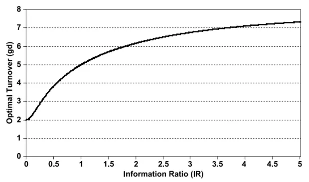
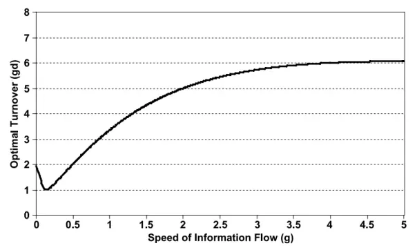
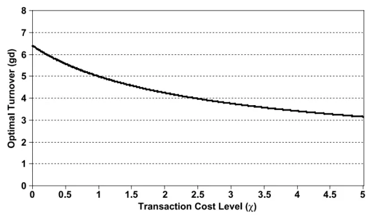
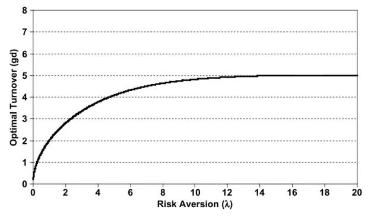

inInfo][Table_Title]2021.10.12

# 跨市场配置中的换手率预算最优化

## ——精品文献解读系列（二十三）

## 本报告导读：

本篇报告解读的文献从Grinold动态资产分析模型出发，论证了有总换手率预算约束的跨市场配置问题，并利用数值模拟方法进行了验证，对投资者进行战术性资产配置具有一定的指导意义。

## 摘要：

le_Summary]投资学是一门学术界与业界紧密结合的学科，其中大类资产配置是这种紧密结合的代表。从 （ ）开创现代投资组合理论开始，学术界为业界提供了丰富的理论参考和方法模型，推动了大类资产配置实践的繁荣发展。为了帮助读者及时跟踪学术前沿，我们推出了“精品文献解读”系列报告，从大量学术文献中挑选出精品论文进行剖析解读，为读者呈现大类资产配置领域最新的思路和方法。

- 本篇为读者解读的文献是 Yin（2009）在期刊 The Journal of PortfolioManagement 上发表的论文“Optimal Turnover Constraints: ScarcityIs Everywhere”。

跨市场配置需要考虑换手率预算的最优化问题。本文利用Grinorld动态资产分析模型，提出了一种跨市场配置的换手率预算最优化框架。本文发现最优换手率预算水平，随着市场的信息比率、信息流动速度和风险厌恶水平的增加而增加，但负相关于市场交易成本水平。本文还利用数值模拟进行了敏感性分析，发现和单市场模型相比，多市场模型中的部分因子表现存在显著差异。

与权重配置不同，换手率预算配置侧重的是过程的优化而非结果的优化。在跨市场投资时，市场信号存在异质性，常用的全局最优化再平衡策略可能对低频优质市场形成“挤出”。为了解决这一问题，本文利用 Grinold 动态资产分析框架，对换手率预算配置问题进行了研究。本文对战术性资产配置具有一定的指导意义。

大类资产配置研究

## hor] 报告作者

赵索(分析师)

8 0755-23976601

zhaosuo024832@gtjas.com

证书编号 S0880521080002

李祥文(分析师)

8 021-38031560

lixiangwen@gtjas.com

证书编号 S0880520100001

余齐文(研究助理)

8 0755-23976212

yuqiwen@gtjas.com

证书编号 S0880121090049

## cReport 相关报告]

如何利用预期和超预期通胀构建多元化实物资产投资组合

——精品文献解读系列（二十二）

2021.09.08

板块轮动策略的有效性探究——精品文献解读系列（二十一）

2021.08.24

因子投资中的宏观经济风险——精品文献解读系列（二十）

2021.08.08

## 1. 文献概述

## 文献来源：

Hao, Yin. Optimal Turnover Constraints: Scarcity Is Everywhere[J]. The Journal of Portfolio Management, 2009, 35(4):69-75.

## 文献摘要：

跨市场配置需要考虑换手率预算的最优化问题。本文利用Grinorld动态资产分析模型，提出了一种跨市场配置中的换手率预算最优化框架。本文发现最优换手率预算水平，随着市场的信息比率、信息流动速度和风险厌恶水平的增加而增加，但负相关于市场交易成本水平。本文还利用数值模拟进行了敏感性分析，发现和单市场模型相比，多市场模型中的部分因子表现存在显著差异。

## 文献评述：

与权重配置不同，换手率预算配置侧重的是过程的优化而非结果的优化。在跨市场投资时，市场信号存在异质性，常用的全局最优化再平衡策略可能对低频优质市场形成“挤出”。为了解决这一问题，本文利用 Grinold动态资产分析框架，对换手率预算配置问题进行了研究。本文对战术性资产配置具有一定的指导意义。

## 2. 引言

如同资产组合的权重配置一样，投资经理需要经常思考如何跨市场配置换手率预算。在实践中，不同市场的模型往往独立研发，而后再在一个全局最优化框架中被拼接起来。这种方法虽然从静态角度来看问题不大，但当我们采用动态视角时，由于不同市场的信号存在异质性，最终可能导致严重问题。例如，当不同市场的 alpha 信号存在速度差异时，信号变动更快的市场会挤占更多的换手率，所以在全局换手率预算存在约束的情况下，信息流动缓慢的市场最终将被“挤出”，即使它们在信息比率等 alpha 信号上存在更好的表现。29

作为回应，投资经理需要一个合理的换手率预算表。但诸如“投资经理应该如何确定每个市场的换手率预算”以及“应该考虑市场的哪些特征”等问题将纷至沓来。本文将试图回答这些问题。

本文基于 Grinold（2006，2007）引入的动态资产分析模型，并将其扩展到多市场场景。在单一市场场景中，最优换手率直接取决于交易成本、信息流动速度和风险厌恶水平。对于多市场模型，则该将更高比例的换手率预算分配给具有如下性质的市场：（1）拥有更高的信息比率，（2）信息流速度更快，或（3）交易成本更低。然而数值模拟发现，最优预算对特定市场的风险厌恶水平不敏感。

## 3. 模型

在本节中，我们将首先回顾 Grinold（2007）的单一市场模型，并将其扩展到多市场模型，并最终得到一个涉及最优换手率预算的方程。

## 3.1. 单一市场模型

假设市场中一共有 N 种资产，并引入如下记号：

$$
\{\begin{array}{ll}{\mathbb{R}^{\mathrm{N}}\ni\boldsymbol{\mathrm{m}}(\mathbf{t})=\frac{\lambda+\frac{1}{2}\lambda+\frac{1}{2}\lambda}{\sqrt{5}}\frac{\lambda}{\sqrt{5}}\frac{\lambda}{\sqrt{5}}\frac{\lambda}{\sqrt{6}}\mathbb{E}\cdot\hat{\boldsymbol{\mathrm{e}}}_{\perp}^{\lambda}\hat{\mathrm{f}}_{\perp}\hat{\mathcal{X}}\cdot\frac{\hat{\boldsymbol{\mathrm{e}}}_{\perp}^{\lambda}}{\sqrt{7}}\frac{\lambda}{\sqrt{2}}}\\{\mathbb{R}^{\mathrm{N}}\ni\boldsymbol{\mathrm{p}}(\mathbf{t})=\frac{\lambda+\frac{1}{4}}{\sqrt{5}}\frac{\lambda}{\sqrt{5}}\frac{\lambda}{\sqrt{5}}\mathbb{E}\cdot\hat{\boldsymbol{\mathrm{e}}}_{\perp}^{\lambda}\hat{\mathrm{f}}_{\perp}\hat{\mathcal{X}}\cdot\frac{\hat{\mathrm{e}}_{\perp}^{\lambda}}{\sqrt{7}}\frac{\lambda}{\sqrt{2}}}\\\mathbb{R}^{\mathrm{N}}\ni\boldsymbol{\mathrm{u}}(\mathbf{t})=\frac{\lambda}{\sqrt{5}}\int_{\mathrm{1}}^{\frac{1}{5}}\frac{\lambda}{\sqrt{5}}\frac{\lambda}{\sqrt{5}}\frac{\lambda}{\sqrt{5}}\frac{\lambda}{\sqrt{5}}\mathbb{E}\cdot\frac{\hat{\mathrm{e}}}{\sqrt{7}}\frac{\lambda}{\sqrt{6}}\frac{\lambda}{\sqrt{5}}\frac{\lambda}{\sqrt{5}}\frac{\lambda}{\sqrt{5}}\frac{\lambda}{\sqrt{5}}\frac{\lambda}{\sqrt{5}}\frac{\lambda}{\sqrt{5}}\frac{\lambda}{\sqrt{5}}\frac{\lambda}\end{array}
$$

其中，投资组合以Δt 为恒定间隔执行再平衡策略。表 1 中给出了不同频率的再平衡策略的时间间隔的具体数值。

表 1：时间间隔数值

| 频率 | 年度 | 月度 | 周度 | 日度 |
| --- | --- | --- | --- | --- |
| ∆t | 1 | 1/12 | 1/52 | 1/252 |

数据来源：Yin（2009）

如记号中交代的一样，此处涉及的投资组合的权重向量有二：模型投资组合 m(t)和持有投资组合 p(t)。前者是理想投资组合，后者是实际投资组合。再平衡策略的目的即主动缩小持有投资组合与模型投资组合之间的差异。

假设权重向量满足如下演化方程：

$$
\begin{array}{rl}&{\{\Delta\mathrm{m}(\mathrm{t}):=\mathrm{m}(\mathrm{t})-\mathrm{m}(\mathrm{t}-\Delta\mathrm{t})=-\mathbf{g}\cdot\mathrm{m}(\mathrm{t}-\Delta\mathrm{t})\cdot\Delta\mathrm{t}+\mathrm{u}(\mathrm{t})}\\&{\{\Delta\mathrm{p}(\mathrm{t}):=\mathrm{p}(\mathrm{t})-\mathrm{p}(\mathrm{t}-\Delta\mathrm{t})=\mathrm{d}\cdot[\mathrm{m}(\mathrm{t})-\mathrm{p}(\mathrm{t}-\Delta\mathrm{t})]\cdot\Delta\mathrm{t}=\dot{\mathrm{p}}(\mathrm{t})\cdot\Delta\mathrm{t}}\end{array}
$$

此处，d⋅Δt 可以解释为（当期）模型投资组合与（前期）持有投资组合之间的执行效率，在没有交易成本的情况下，d⋅Δt 将约等于 100%。尽管对 d 有不同的解释（例如，Grinold（2007）将其视为交易成本的摊销因子），但稍后可以看到其与投资组合的换手率水平直接相关。需要指出的是，Grinold 已经证明 d 的最优值取决于交易成本水平，这与投资经理使用交易成本模型来调整换手率预算的经验事实是相符的。

定义持有投资组合风险、模型投资组合风险和交易风险如下：

$$
\left\{\begin{array}{ll}{\omega_{\mathrm{P}}^{2}:=\mathbb{E}[\mathrm{p}^{\mathrm{T}}(\mathrm{t})\cdot\boldsymbol{\Omega}\cdot\mathrm{p}(\mathrm{t})]}\\{\omega_{\mathrm{M}}^{2}:=\mathbb{E}[\mathrm{m}^{\mathrm{T}}(\mathrm{t})\cdot\boldsymbol{\Omega}\cdot\mathrm{m}(\mathrm{t})]}\\{\omega_{\dot{\mathrm{P}}}^{2}:=\mathbb{E}[\dot{\mathrm{p}}^{\mathrm{T}}(\mathrm{t})\cdot\boldsymbol{\Omega}\cdot\dot{\mathrm{p}}(\mathrm{t})]}\end{array}\right.
$$

在新信息 $\dot{\mathcal{P}}$ 生的权重改变满足零均值、且两种投资组合权重相互独立的假设下，利用上述演化方程，Grinold（2007）证明了：

$$
\omega_{\dot{\mathrm{p}}}^{2}=\mathrm{gd}\cdot\omega_{\mathrm{p}}^{2}={\frac{\mathrm{gd}^{2}}{\mathrm{d}+\mathrm{g}}}\cdot\omega_{\mathrm{M}}^{2}
$$

进一步地，可以证明 m(t)和 p(t)之间的相关系数满足

$$
\rho_{\mathrm{M,P}}=\sqrt{\frac{\mathrm{d}}{\mathrm{d}+\mathrm{g}}}
$$

而信息比率之间满足

$$
\mathrm{IR}_{\mathrm{P}}=\rho_{\mathrm{M,P}}\cdot\mathrm{IR}_{\mathrm{M}}
$$

## 3.2. 投资组合换手率

众所周知，换手率预算正相关于信息流速度 g 和交易速度 d。这是由于信息流速度 g 决定了市场的 alpha 信号的自我更新速度；而交易速度 d负相关于模型投资组合和持有投资组合之间的跟踪误差，所以在跟踪误差较小的约束下，相应的换手率预算也将增多。

以下的理想状况虽然并不总是如实际发生的一样，但有助于帮助我们理解模型的基本逻辑。假设前一期持有投资组合与模型投资组合完美匹配，即跟踪误差为 0：

$$
\mathrm{p(t-}\Delta\mathrm{t)}=\mathrm{m(t-}\Delta\mathrm{t)}
$$

那么在 t 时刻的预期投资组合换手率可以被表示为

$$
\mathbb{E}[\mathrm{TR(t)}|\mathrm{p}(\mathrm{t}-\Delta\mathrm{t})]
$$

注意到，实际换手率应该满足

$$
\mathbb{E}[\mathrm{TR(t)}]=\mathbb{E}\left[\frac{1_{\mathrm{N}}^{\mathrm{T}}\cdot|\Delta\mathrm{p(t)}|}{\left|1_{\mathrm{N}}^{\mathrm{T}}\cdot\mathrm{p(t-\Delta t)}\right|}\right]
$$

利用三角不等式，此处我们使用与实际换手率相比偏小的一个估计量作为代理变量

$$
\Phi_{\mathrm{t}}=\left|\mathbb{E}\left[\frac{1_{\mathrm{N}}^{\mathrm{T}}\cdot\Delta\mathrm{p(t)}}{1_{\mathrm{N}}^{\mathrm{T}}\cdot\mathrm{p}(\mathrm{t}-\Delta\mathrm{t})}\right]\right|\leq\mathbb{E}[\mathrm{TR}(\mathrm{t})]
$$

利用演化方程

$$
\begin{array}{rl}&{\mathfrak{e}_{\mathrm{t}}=\mathrm{d}\Delta\mathfrak{t}\cdot\Bigg|\mathbb{E}\Bigg[\frac{1_{\mathrm{N}}^{\mathrm{T}}\cdot\{\mathrm{m}(\mathfrak{t})-\mathrm{p}(\mathfrak{t}-\Delta\mathfrak{t})\}}{1_{\mathrm{N}}^{\mathrm{T}}\cdot\mathrm{p}(\mathfrak{t}-\Delta\mathfrak{t})}\Bigg]\Bigg|}\\&{\qquad=\mathrm{d}\Delta\mathfrak{t}\cdot\Bigg|\mathbb{E}\Bigg[\frac{1_{\mathrm{N}}^{\mathrm{T}}\cdot\{(1-\mathrm{g}\Delta\mathfrak{t})\cdot\mathrm{m}(\mathfrak{t}-\Delta\mathfrak{t})+\mathrm{u}(\mathfrak{t})\}}{1_{\mathrm{N}}^{\mathrm{T}}\cdot\mathrm{p}(\mathfrak{t}-\Delta\mathfrak{t})}-1\Bigg]\Bigg|}\\&{\qquad=\mathrm{d}\Delta\mathfrak{t}\cdot(1-\mathrm{g}\Delta\mathfrak{t}-1)=\mathrm{d}\mathrm{g}\Delta\mathfrak{t}^{2}}\end{array}
$$

如果取 Grinold（2007）中推荐的经验参数 d=3.00、g=2.50 和 $\Delta\mathrm{t}{=}1/12$ 那么此时的月度换手率将等于

$$
\mathbb{E}[\mathrm{TR(t)}|(\mathbf{g},\mathbf{d},\Delta\mathbf{t})=(2.5,3,1/12)]\approx5.21\%
$$

根据投资经验，这是一个比较合理的数字。

需要注意到的是，信息流速度 g在换手率预算的估计中是一个外生变量。因此在时间间隔一定的条件下，投资经理此时唯一能控制的变量就是交易速度 d。所以投资经理优化换手率预算的本质是在为每个市场选择一个最优的 d。

## 3.3. 多市场优化

为简单起见，本文仅讨论双市场情况。两个市场分别用下标 1 和 2 以示区别。这里的两个市场可以是指两个国家、两个类型或两个板块。

类似于上一节，我们引入如下记号：

$$
\{\begin{array}{ll}{\alpha_{\mathrm{Pi}}=\mp\mp\frac{\sqrt{3}}{9}\frac{1}{9}\frac{\sqrt{5}}{9}\frac{1}{16}\frac{\sqrt{6}}{9}\frac{1}{9}\frac{1}{9}\frac{1}{9}\frac{1}{9}\frac{\sqrt{6}}{9}\frac{1}{9}\frac{\sqrt{5}}{16}\frac{\sqrt{6}}{9}\frac{1}{9}\frac{\sqrt{5}}{16}}\\{\omega_{\mathrm{Pi}}=\mp\mp\frac{\sqrt{3}}{9}\frac{1}{9}\frac{1}{9}\frac{1}{9}\frac{1}{9}\frac{1}{9}\frac{1}{9}\frac{1}{9}\frac{1}{9}\frac{1}{9}\frac{1}{9}\frac{1}{9}\frac{\sqrt{5}}{16}\frac{\sqrt{6}}{9}\frac{1}{9}\frac{1}{9}}\\{\omega_{\mathrm{Mi}}=\mp\mp\frac{\sqrt{3}}{9}\frac{1}{9}\frac{1}{9}\frac{1}{9}\frac{1}{9}\frac{\sqrt{5}}{16}\frac{\sqrt{6}}{3}\frac{1}{9}\frac{1}{9}\frac{\sqrt{5}}{16}\frac{\sqrt{5}}{9}\frac{1}{9}\frac{1}{9}\frac{1}{9}\frac{1}{9}}\\\omega_{\mathrm{Pi}}=\mp\mp\frac{\sqrt{3}}{9}\frac{1}{9}\frac{1}{9}\frac{1}{9}\frac{1}{9}\frac{1}{9}\frac{1}{9}\frac{1}{9}\frac{1}{9}\frac{1}{9}\frac{1}{9}\frac{1}{9}\frac{1}{9}\ \end{array}
$$

多市场优化的目标是最大化上述两个市场的经过风险调整的预期回报，目标函数形如：

$$
\mathrm{U_{P}}(\mathrm{d_{1}},\mathrm{d_{2}})=\sum_{\mathrm{i=1,2}}\left(\alpha_{\mathrm{Pi}}-\frac{\lambda_{\mathrm{i}}}{2}\cdot\omega_{\mathrm{Pi}}^{2}-\frac{\chi_{\mathrm{i}}}{2}\cdot\omega_{\mathrm{Pi}}^{2}\right)
$$

之所以对不同市场进行差异化设置是因为，投资经理在不同的市场中往往具有不同的风险承受能力。例如，与发达国家相比，投资经理对发展中国家市场的风险可能更为敏感。因此，模型允许投资经理的风险厌恶水平随市场变化。同理，平均交易成本也是一个随市场变化的变量，但通常都假设交易成本与交易风险成正比。

注意到信息比率满足

$$
\mathrm{IR}_{\mathrm{Pi}}=\frac{\alpha_{\mathrm{Pi}}}{\omega_{\mathrm{Pi}}}
$$

利用各种风险之间的关系，目标函数可以改写成

$$
\mathrm{U}_{\mathrm{P}}(\mathrm{d}_{1},\mathrm{d}_{2})=\sum_{\mathrm{i}=1,2}\frac{\mathrm{d}_{\mathrm{i}}}{\mathrm{d}_{\mathrm{i}}+\mathrm{g}_{\mathrm{i}}}\bigg(\mathrm{IR}_{\mathrm{Mi}}\cdot\omega_{\mathrm{Mi}}-\frac{\lambda_{\mathrm{i}}+\chi_{\mathrm{i}}\cdot\mathrm{d}_{\mathrm{i}}\mathrm{g}_{\mathrm{i}}}{2}\cdot\omega_{\mathrm{Mi}}^{2}\bigg)
$$

再利用目标函数关于模型投资组合风险 ${\bf{\dot{\omega}}}_{\omega_{\mathrm{{i}}}}$ 的一阶条件

$$
\omega_{\mathrm{Mi}}^{*}=\frac{\ I\mathrm{R_{Mi}}}{\lambda_{\mathrm{i}}+\chi_{\mathrm{i}}\cdot\mathrm{d_{i}}\mathrm{g_{i}}}
$$

得到：

$$
\mathrm{U_{P}^{*}(d_{1},d_{2})}=\sum_{\mathrm{i=1,2}}\frac{\mathrm{d_{i}}}{\mathrm{d_{i}+g_{i}}}\cdot\frac{\mathrm{IR_{Mi}^{2}}}{2}\cdot\frac{1}{\lambda_{\mathrm{i}}+\chi_{\mathrm{i}}\cdot\mathrm{d_{i}}\mathrm{g_{i}}}
$$

假设全局换手率总预算为 D，那么此时的多市场优化问题即：

$$
\begin{array}{rl}{\displaystyle\operatorname*{max}_{\mathbf{d_{1}},\mathbf{d_{2}}}\quad}&{\mathbf{U_{p}^{*}}(\mathbf{d_{\rho1}},\mathbf{d_{2}})}\\{\displaystyle\mathbf{d_{1}g_{1}}+\mathbf{d_{2}g_{2}}=\mathbf{D}}\end{array}
$$

利用 Lagrange 乘子法我们有

$$
\mathcal{L}=\mathrm{U}_{\mathrm{p}}^{\ast}(\mathrm{d}_{1},\mathrm{d}_{2})-\kappa\cdot(\mathrm{d}_{1}\mathrm{g}_{1}+\mathrm{d}_{2}\mathrm{g}_{2}-\mathrm{D})
$$

此时

$$
\partial_{\mathbf{d}_{\mathrm{i}}}\mathcal{L}=\frac{\mathrm{IR}_{\mathrm{Mi}}^{2}}{2}\cdot\frac{(\mathbf{d}_{\mathrm{i}}+\mathbf{g}_{\mathrm{i}})(\lambda_{\mathrm{i}}+\chi_{\mathrm{i}}\cdot\mathbf{d}_{\mathrm{i}}\mathbf{g}_{\mathrm{i}})-\mathbf{d}_{\mathrm{i}}(\lambda_{\mathrm{i}}+\chi_{\mathrm{i}}\cdot\mathbf{d}_{\mathrm{i}}\mathbf{g}_{\mathrm{i}}+\chi_{\mathrm{i}}\cdot\mathbf{d}_{\mathrm{i}}\mathbf{g}_{\mathrm{i}}+\chi_{\mathrm{i}}\cdot\mathbf{g}_{\mathrm{i}}^{2})}{(\mathbf{d}_{\mathrm{i}}+\mathbf{g}_{\mathrm{i}})^{2}(\lambda_{\mathrm{i}}+\chi_{\mathrm{i}}\cdot\mathbf{d}_{\mathrm{i}}\mathbf{g}_{\mathrm{i}})^{2}}-\kappa\cdot\mathbf{g}_{\mathrm{i}}
$$

化简后即

$$
\kappa=\frac{\mathrm{IR}_{\mathrm{Mi}}^{2}}{2}\cdot\frac{\lambda_{\mathrm{i}}-\chi_{\mathrm{i}}\cdot\mathrm{d}_{\mathrm{i}}^{2}}{(\mathrm{d}_{\mathrm{i}}+\mathrm{g}_{\mathrm{i}})^{2}(\lambda_{\mathrm{i}}+\chi_{\mathrm{i}}\cdot\mathrm{d}_{\mathrm{i}}\mathrm{g}_{\mathrm{i}})^{2}},\mathrm{i}=1,2
$$

消去乘子后即得到

$$
\begin{array}{rl}&{\cfrac{\mathrm{IR}_{\mathrm{M1}}^{2}}{2}\cdot\cfrac{\lambda_{1}-\chi_{1}\cdot\mathrm{d}_{1}^{2}}{(\mathrm{d}_{1}+\mathrm{g}_{1})^{2}\cdot(\lambda_{1}+\chi_{1}\cdot\mathrm{d}_{1}\mathrm{g}_{1})^{2}}}\\&{\qquad=\cfrac{\mathrm{IR}_{\mathrm{M2}}^{2}}{2}\cdot\cfrac{\lambda_{2}-\chi_{2}\cdot\mathrm{d}_{2}^{2}}{(\mathrm{d}_{2}+\mathrm{g}_{2})^{2}\cdot(\lambda_{2}+\chi_{2}\cdot\mathrm{d}_{2}\mathrm{g}_{2})^{2}}}\end{array}
$$

可以看到，在单市场模型中，此时最优换手率（令分子等于零）总是等于：

$$
\mathrm{d}^{*}=\sqrt{\lambda/\chi}
$$

而在多市场模型中，换手率预算的最优取值确实将发生跨市场联动。

## 4. 数值模拟

为了研究最优成交水平在各个外生变量变化时的取值，我们对信息比率、信息流速度、交易成本和风险厌恶水平进行了数值模拟，以度量最优成交水平关于这些变量的敏感性水平。

参考 Grinold（2007）的推荐数值和我们的数值模拟结果，我们设置了如下推荐数值用于模拟：

表 2：数值模拟参数推荐数值

| 外生变量 | 推荐数值 |
| --- | --- |
| D | 10 |
| $\mathrm{{IR}_{\mathrm{{Mi}}}}$ | 1 |
| $\mathbf{g_{i}}$ | 2 |
| $\chi_{\mathrm{i}}$ | 1 |
| $\lambda_{\mathrm{i}}$ | 16 |

数据来源：Yin（2009）

## 4.1. 信息比率（IR）

在 Grinold框架内，最优换手率与alpha模型隐含的信息比率无关。然而，即使没有数值模拟，从相关一阶条件中也很容易看出 d 和 g·d 将随着信息比率的单调上升而上升。简单来说，在直观上，换手率预算将向着那些信息捕捉能力更强的市场倾斜。这一结论对于跨市场的投资组合经理来说具有参考价值，但是在单一市场中并不存在。

## 4.2. 信息流速度（g）

信息流速度 g 因市场而异。这种速度差异可能归咎于国家层面的投资风格的差异，例如，某些国家秉持成长战略而另一些国家选择价值战略。与常识相符，数值模拟结果表情在其他条件不变的情况下，更快的信息流速度理应分配更高的换手率预算。然而与 Grinold的论证不一样的是，信息流速度与最优换手率预算之间并非线性关系而是一个凹函数。换句话说，即使市场信息流速度骤然提升，相应的最佳换手率预算也应该保持大致稳定。图上对比表明，在敏感性上，信息比率要强于信息流速度。

## 4.3. 交易成本水平（χ）

不同市场在交易成本水平方面存在巨大差异。不出所料，交易成本水平越高，应分配给该市场的最优换手率预算就越小。

## 4.4. 风险厌恶（λ）

（ ）表明，最优换手率随着市场风险厌恶程度的增加而增加，表现为幂函数的形式。然而，当存在全局换手率预算约束的时候，数值模拟结果展示出了一个完全不同的故事。具体而言，最优换手率预算在风险厌恶上并不敏感。除非投资经理的风险偏好在不同市场之间存在巨大差异，但这种情况其实非常罕见。

## 5. 结论

跨市场分配换手率预算对投资经理来说异常重要。然而，现有文献缺乏对此问题的深入研究。本文依据 （ ）提供的动态资产组合分析框架，介绍了一种多市场配置换手率预算的理论模型。本文发现最优换手率预算水平，随着该市场的信息比率、信息流动速度和风险厌恶水平的增加而增加，但负相关于市场交易成本水平的增加。

图 1：敏感性分析

数据来源：Yin（2009）

注：从上到下从左到右分别是信息比率、信息流动速度、交易成本水平和风险厌恶。

## 参考文献

Grinold, R. “A Dynamic Model of Portfolio Management.” Journal of Investment Management, 4 (2006), pp. 5–22.

Grinold, R. “Dynamic Portfolio Analysis.” Journal of Portfolio Management, Vol. 34, No. 1 (Fall 2007), pp. 12–26.

## 本公司具有中国证监会核准的证券投资咨询业务资格

## 分析师声明

作者具有中国证券业协会授予的证券投资咨询执业资格或相当的专业胜任能力，保证报告所采用的数据均来自合规渠道，分析逻辑基于作者的职业理解，本报告清晰准确地反映了作者的研究观点，力求独立、客观和公正，结论不受任何第三方的授意或影响，特此声明。

## 免责声明

本报告仅供国泰君安证券股份有限公司（以下简称“本公司”）的客户使用。本公司不会因接收人收到本报告而视其为本公司的当然客户。本报告仅在相关法律许可的情况下发放，并仅为提供信息而发放，概不构成任何广告。

本报告的信息来源于已公开的资料，本公司对该等信息的准确性、完整性或可靠性不作任何保证。本报告所载的资料、意见及推测仅反映本公司于发布本报告当日的判断，本报告所指的证券或投资标的的价格、价值及投资收入可升可跌。过往表现不应作为日后的表现依据。在不同时期，本公司可发出与本报告所载资料、意见及推测不一致的报告。本公司不保证本报告所含信息保持在最新状态。同时，本公司对本报告所含信息可在不发出通知的情形下做出修改，投资者应当自行关注相应的更新或修改。

本报告中所指的投资及服务可能不适合个别客户，不构成客户私人咨询建议。在任何情况下，本报告中的信息或所表述的意见均不构成对任何人的投资建议。在任何情况下，本公司、本公司员工或者关联机构不承诺投资者一定获利，不与投资者分享投资收益，也不对任何人因使用本报告中的任何内容所引致的任何损失负任何责任。投资者务必注意，其据此做出的任何投资决策与本公司、本公司员工或者关联机构无关。

本公司利用信息隔离墙控制内部一个或多个领域、部门或关联机构之间的信息流动。因此，投资者应注意，在法律许可的情况下，本公司及其所属关联机构可能会持有报告中提到的公司所发行的证券或期权并进行证券或期权交易，也可能为这些公司提供或者争取提供投资银行、财务顾问或者金融产品等相关服务。在法律许可的情况下，本公司的员工可能担任本报告所提到的公司的董事。

市场有风险，投资需谨慎。投资者不应将本报告作为作出投资决策的唯一参考因素，亦不应认为本报告可以取代自己的判断。
在决定投资前，如有需要，投资者务必向专业人士咨询并谨慎决策。

本报告版权仅为本公司所有，未经书面许可，任何机构和个人不得以任何形式翻版、复制、发表或引用。如征得本公司同意进行引用、刊发的，需在允许的范围内使用，并注明出处为“国泰君安证券研究”，且不得对本报告进行任何有悖原意的引用、删节和修改。

若本公司以外的其他机构（以下简称“该机构”）发送本报告，则由该机构独自为此发送行为负责。通过此途径获得本报告的投资者应自行联系该机构以要求获悉更详细信息或进而交易本报告中提及的证券。本报告不构成本公司向该机构之客户提供的投资建议，本公司、本公司员工或者关联机构亦不为该机构之客户因使用本报告或报告所载内容引起的任何损失承担任何责任。

## 评级说明

## 1.投资建议的比较标准

投资评级分为股票评级和行业评级。

以报告发布后的 12 个月内的市场表现为比较标准，报告发布日后的 12 个月内的公司股价（或行业指数）的涨跌幅相对同期的沪深 300 指数涨跌幅为基准。

## 2.投资建议的评级标准

报告发布日后的 12 个月内的公司股价（或行业指数）的涨跌幅相对同期的沪深300 指数的涨跌幅。

|  | 评级 | 说明 |
| --- | --- | --- |
| 股票投资评级 | 增持 | 相对沪深300指数涨幅15%以上 |
|  | 谨慎增持 | 相对沪深300指数涨幅介于5%～15%之间 |
|  | 中性 | 相对沪深300指数涨幅介于-5%～5% |
|  | 减持 | 相对沪深300 指数下跌 5%以上 |
| 行业投资评级 | 增持 | 明显强于沪深 300 指数 |
|  | 中性 | 基本与沪深 300指数持平 |
|  | 减持 | 明显弱于沪深 300 指数 |

## 国泰君安证券研究所

|  | 上海 | 深圳 | 北京 |
| --- | --- | --- | --- |
| 地址 | 上海市静安区新闸路 669 号博华广 | 深圳市福田区益田路6009号新世界 商务中心34层 | 北京市西城区金融大街甲9号金融 街中心南楼18层 |
| 邮编 | 场20层 200041 | 518026 | 100032 |
| 电话 | (021)38676666 | (0755）23976888 | （010)83939888 |
|  | E-mail: gtjaresearch@gtjas.com |  |  |