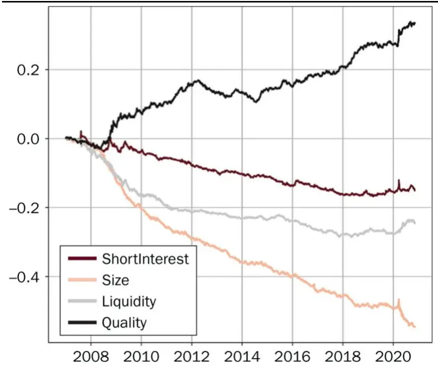
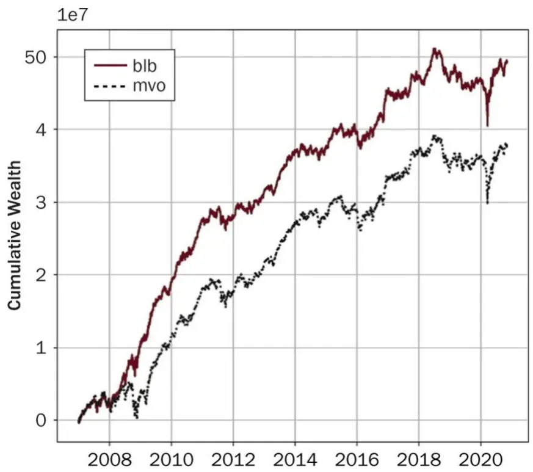

[Table_Title]2021.11.29

# 如何在多因子模型中使用BL框架

## ——精品文献解读系列（二十四）

## 本报告导读：

基于通用的Black-Litterman-Bayes框架，本文介绍了一种在多因子模型中结合因子观点进行资产配置的方法，并通过实证研究比较了其与传统的 MVO 模型的差异，值得战术资产配置者借鉴。

## 摘要：

投资学是一门学术界与业界紧密结合的学科，其中大类资产配置是这种紧密结合的代表。从 Markowitz（1952）开创现代投资组合理论开始，学术界为业界提供了丰富的理论参考和方法模型，推动了大类资产配置实践的繁荣发展。为了帮助读者及时跟踪学术前沿，我们推出了“精品文献解读”系列报告，从大量学术文献中挑选出精品论文进行剖析解读，为读者呈现大类资产配置领域最新的思路和方法。

本篇为读者解读的文献是 Kolm and Ritter（2020）在期刊 The Journalof Portfolio Management 上发表的论文“Factor Investing with Black–Litterman–Bayes: Incorporating Factor Views and Priors in PortfolioConstruction”。值得一提的是，本文的第一作者 Kolm 刚刚获得本年度 JPM 颁发的“Quant of the Year Award 2021”奖项。

本文针对因子投资中常见的 APT 多因子模型构建了所谓 Black-Litterman-Bayes（BLB）框架。与传统的 BL 模型类似，该框架综合考虑了投资者观点和因子风险溢价两方面因素。本文的另外一个贡献是得到了一组在计算上非常有效的公式。通过实证案例，本文最后展示了如何逐步构建 BLB框架，并对比了其和均值方差最优化（MVO）的差异。

本文通过 BLB 框架，将投资经理关于因子风险溢价的观点整合进传统的 APT 多因子模型，贯通了 APT 和 BL两大类在资产配置领域中被广泛使用的方法，对指导战略资产配置有很好的借鉴意义。

大类资产配置研究

## hor] 报告作者

赵索(分析师)

8 0755-23976601

zhaosuo024832@gtjas.com

证书编号 S0880521080002

李祥文(分析师)

8 021-38031560

lixiangwen@gtjas.com

证书编号 S0880520100001

余齐文(研究助理)

8 0755-23976212

yuqiwen@gtjas.com

证书编号 S0880121090049

## cReport 相关报告]

上证 50配置时点渐行渐近

2021.11.20

券商板块将成为跨年行情的胜负手

2021.11.18

短期回调正是跨年布局良机

2021.11.02

投资者适当性门槛下降，北交所微观结构大幅改善

2021.10.21

跨市场配置中的换手率预算最优化

2021.10.12

## 1. 文献概述

## 文献来源：

Kolm, Petter N. , and G. Ritter. Factor Investing with Black–Litterman–Bayes: Incorporating Factor Views and Priors in Portfolio Construction. The Journal of Portfolio Management, 2020, 47(2).

## 文献摘要：

本文针对因子投资中常见的 APT 多因子模型构建了所谓 Black-Litterman-Bayes（BLB）框架。与传统的 BL 模型类似，该框架综合考虑了投资者观点和因子风险溢价两方面因素。本文的另外一个贡献是得到了一组在计算上非常有效的公式。通过实证案例，本文最后展示了如何逐步构建 BLB框架，并对比了其和均值方差最优化（MVO）的差异。

## 文献评述：

本文通过 BLB 框架，将投资经理关于因子风险溢价的观点整合进传统的 APT 多因子模型，贯通了 APT 和 BL 两大类在资产配置领域中被广泛使用的方法，对战略资产配置有很好的借鉴意义。

## 记号提示：

本文提及的收益率均为相对于无风险收益率的超额收益率。形式上有

$$
\mathrm{r}=\mathrm{r}_{\mathrm{real}}-\mathrm{r}_{\mathrm{f}}
$$

其中 $\boldsymbol{\Gamma}_{\mathrm{real}}$ 代表资产的实际收益率， $\boldsymbol{\mathrm{r_{f}}}$ 代表无风险收益率。

## 2. BL 模型

考虑一个包含 n 种资产的市场，假设收益率向量服从多元正态分布1：

$$
\displaystyle\mathbf{r}\sim\mathrm{N}(\mu_{\mathrm{n}\times1},\Sigma_{\mathrm{n}\times\mathrm{n}})
$$

假设投资组合的持仓（holding）被如下列向量表示

$$
\mathtt{h}=\mathtt{h}_{\mathtt{n}\times1}\mathrm{:=(h}_{1}\mathrm{,\cdots,h}_{\mathtt{n}}\mathrm{)^{T}\in\mathbb{R}^{n}}
$$

那么给定风险厌恶水平

$$
\lambda\in\mathbb{R}_{\ge0}:=[0,\infty)
$$

对应的 MVO 问题即如下求解规划：

$$
\operatorname*{max}_{\mathrm{h}}\left(\mu_{\mathrm{h}}-\frac{\lambda}{2}\cdot\sigma_{\mathrm{h}}^{2}\right)
$$

$$
\left\{\begin{array}{ll}{\mu_{\mathrm{h}}:=\mathbb{E}[{\mathrm{h}^{\mathrm{T}}}\mathrm{r}]=\mathrm{h}^{\mathrm{T}}\mu}\\{\sigma_{\mathrm{h}}^{2}:=\mathbb{V}[{\mathrm{h}^{\mathrm{T}}}\mathrm{r}]=\mathrm{h}^{\mathrm{T}}\Sigma\mathrm{h}}\end{array}\right.
$$

分别代表投资组合的期望收益和方差。

MVO 的优势在于它有一个简单明了的解析解：

$$
\mathsf{h}^{*}=\lambda^{-1}\Sigma^{-1}\mathsf{\mu}
$$

而其缺点同样显而易见：最优持仓完全依赖于基于市场数据给出的收益率和方差的估计，但对投资影响巨大的主观判断却只字不提，而这正是BL模型要解决的问题。

在 BL 模型中，对市场的主观判断或者观点（view）被表达为一系列特定投资组合的期望收益率：

$$
\mathbb{E}\big[\mathrm{p}_{\mathrm{i}}^{\mathrm{T}}\mathrm{r}\big]=\mathrm{q}_{\mathrm{i}}\in\mathbb{R},\mathrm{i}=1,\dots,\mathrm{m}
$$

$$
\mathtt{p}_{\mathrm{i}}=(\mathtt{p}_{\mathrm{i}})_{\mathtt{n}\times1}\in\mathbb{R}^{\mathtt{n}}
$$

代表对应投资组合的持仓向量。与 h 不一样的是，通常并不要求上述持仓向量为幺和向量：即各分量之和为 1。例如，在一个完全对冲投资组合中，持仓向量是一个零和向量。

进一步地，可以将上述的关于资产的 m 个观点写成矩阵形式：

$$
\mathbb{E}[\mathrm{Pr}]=\mathrm{P}\mu=\ q
$$

$$
\mathrm{{P=P_{m\times n}:={\binom{p_{1}^{T}}{\vdots}},q=q_{m\times1}:={\binom{q_{1}}{\vdots}}}}
$$

遗憾的是，单纯通过上述关于期望收益率的方程并不能反映投资者关于这些观点的信心水平（confidence）。所以在 BL 模型中，观点被表达为如下包含随机变量的方程组：

$$
\mathrm{P}\mu+\epsilon_{\mathrm{q}}=\epsilon_{\mathrm{\mu}},\epsilon_{\mathrm{q}}\sim\mathrm{N}(0_{\mathrm{m\times1}},\Omega_{\mathrm{m\times m}})
$$

也就是说，信心水平通常被一个零均值的正态分布随机变量所表达。

Black 和 Litterman 的原始出发点基于如下观察：假如 BL 模型中不涉及任何观点，那么此时得到的最优持仓应该是 CAPM 模型给出的市场投资组合。这意味着，在形式上，对于资产收益率有如下估计

$$
\mu\sim\mathrm{N}(\pi_{\mathrm{n}\times1},\Sigma_{\mathrm{n}\times\mathrm{n}})
$$

其中π是 CAPM 模型给出的期望收益率，而 C 的逆矩阵代表的是投资者关于π的信心水平2。通过 BL模型，最终得到的期望收益率和方差分别表示为：

$$
\begin{array}{rl}&{\mathrel{\phantom{=}}\biggl\{\mathfrak{k}_{\mathrm{BL}}:=\Sigma_{\mathrm{BL}}\cdot(\mathrm{P}^{\mathrm{T}}\Omega^{-1}\mathfrak{q}+\mathrm{C}^{-1}\pi)}\\&{\mathrel{\phantom{=}}\bigl\{\Sigma_{\mathrm{BL}}:=\mathbb{V}[\mu_{\mathrm{BL}}]=(\mathrm{P}^{\mathrm{T}}\Omega^{-1}\mathrm{P}+\mathrm{C}^{-1})^{-1}}\end{array}
$$

## 3. APT 模型

为行文自洽，本文将首先回顾 APT 多因子模型。

假设 t 时刻，资产收益率和因子收益率满足如下等式

$$
\mathrm{r_{ti}=x_{ti,1}f_{t1}+x_{ti,2}f_{t2}+\cdots+x_{ti,k}f_{tk}+\epsilon_{ti}}
$$

$$
\left\{\begin{array}{ll}{\mathrm{f}_{\mathrm{tj}}=\mathbb{E}\vec{\rvert}\vec{\mathcal{T}}\vec{\mathcal{K}}\frac{\dot{\vec{z}}}{\sqrt{\hbar}}\frac{\dot{\vec{z}}}{\mathcal{F}}}\\{\mathrm{x}_{\mathrm{ti,j}}=\frac{\dot{\vec{y}}\dot{\vec{z}}}{\mathtt{N}}\dot{\vec{\mathcal{T}}}\mathrm{~i~}\hat{\mathcal{L}}\mathrm{~j~}\mathbb{E}\vec{\mathcal{I}}\vec{\mathcal{Z}}\pm\dot{\vec{y}}\vec{\mathcal{Z}}\vec{\mathcal{Z}}}\\{\epsilon_{\mathrm{ti}}=\frac{\dot{\vec{y}}\dot{\vec{z}}}{\mathtt{N}}\dot{\vec{\mathcal{T}}}\mathrm{~i~}\dot{\vec{y}}\dot{\vec{\mathcal{J}}}\vec{\mathcal{X}}\frac{\dot{\vec{z}}}{\sqrt{\hbar}}\vec{\mathcal{Z}}\vec{\mathcal{L}}\mathrm{~i~}\hat{\mathcal{K}}\frac{\dot{\vec{z}}\dot{\vec{z}}}{\sqrt{\hbar}}\frac{\dot{\vec{z}}\dot{\vec{z}}}{\vec{\mathcal{F}}}}\end{array}\right.
$$

在 模型中，因子载荷通常为外生的非随机变量。例如，规模因子（size）的因子载荷往往是股票市值的某种非线性变换。由于因子收益率不可直接观测，具体数值需要通过回归获得。

为简单起见，本文假设残差收益率为白噪声

$$
\epsilon_{\mathrm{ti}}\sim\mathrm{N}\big(0,\sigma_{\mathrm{ti}}^{2}\big),\mathrm{i}=1,\dots,\mathrm{n}
$$

因子收益率和残差收益率满足

$$
\left\{\begin{array}{ll}{\mathrm{cov}\big(\mathrm{f}_{\mathrm{ti}},\epsilon_{\mathrm{sj}}\big)=0}\\{\mathrm{cov}\big(\epsilon_{\mathrm{ti}},\epsilon_{\mathrm{sj}}\big)=\delta_{\mathrm{ij}}\delta_{\mathrm{ts}}\cdot\sigma_{\mathrm{ti}}^{2}}\end{array}\right.
$$

其中δ代表 Kronecker 记号，当且仅当下标相等时为 1，否则为 0。

利用矩阵形式，APT 模型可以改写成

$$
\boldsymbol{\mathrm{r_{t}}}=\mathrm{X_{t}}\boldsymbol{\mathrm{f_{t}}}+\boldsymbol{\epsilon_{t}},\boldsymbol{\epsilon_{t}}\sim\mathrm{N}(\boldsymbol{0}_{\mathrm{n}\times1},\boldsymbol{\mathrm{D_{t}}})
$$

$$
{\mathrm{X}}_{\mathrm{t}}={\left(\begin{array}{lll}{{\mathrm{X}}_{\mathrm{t}1,1}}&{\cdots}&{{\mathrm{X}}_{\mathrm{t}1,\mathrm{k}}}\\{\vdots}&{\ddots}&{\vdots}\\{{\mathrm{X}}_{\mathrm{tn},1}}&{\cdots}&{{\mathrm{X}}_{\mathrm{tn,k}}}\end{array}\right)}_{\mathrm{n}\times\mathrm{k}},{\mathrm{f}}_{\mathrm{t}}={\left(\begin{array}{l}{\mathrm{f}_{\mathrm{t}1}}\\{\vdots}\\{{\mathrm{f}}_{\mathrm{tk}}}\end{array}\right)}_{\mathrm{k}\times1}
$$

而

$$
\mathrm{D}_{\mathrm{t}}=\mathrm{diag}(\sigma_{\mathrm{t1}}^{2},\cdots,\sigma_{\mathrm{tn}}^{2})
$$

进一步地，假设因子收益率只有有限的均值和方差：

$$
\begin{array}{r}{\{\mu_{\mathrm{f}}:=\mathbb{E}[\mathrm{f}_{\mathrm{t}}]<\infty}\\{[\mathrm{F}_{\mathrm{t}}:=\mathbb{V}[\mathrm{f}_{\mathrm{t}}]<\infty}\end{array}
$$

那么 APT 模型表明资产收益率和因子收益率之间的关系是

$$
\begin{array}{c}\begin{array}{rl}&{\left\{\mathbb{E}[\mathrm{r}_{\mathrm{t}}]=\mathrm{X}_{\mathrm{t}}\mu_{\mathrm{f}}\right.}\\&{\left.\mathbb{V}[\mathrm{r}_{\mathrm{t}}]=\mathrm{X}_{\mathrm{t}}\mathrm{F}_{\mathrm{t}}\mathrm{X}_{\mathrm{t}}^{\mathrm{T}}+\mathrm{D}_{\mathrm{t}}=:\mathrm{\Sigma}_{\mathrm{t}}\right.}\end{array}\end{array}
$$

在实际计算中，由于会大量涉及方差-协方差矩阵的求逆，本文推荐利用Woodbury 逆矩阵技巧3计算

$$
\Sigma_{\mathrm{t}}^{-1}=\mathrm{D}_{\mathrm{t}}^{-1}-\mathrm{Z}_{\mathrm{t}}[\mathrm{F}_{\mathrm{t}}^{-1}+\mathrm{X}_{\mathrm{t}}^{\mathrm{T}}\mathrm{Z}_{\mathrm{t}}]^{-1}\mathrm{Z}_{\mathrm{t}}
$$

$$
\mathrm{Z_{t}=\left(Z_{t}\right)_{n\times k}:=D_{t}^{-1}X_{t}}
$$

注意到上述计算最多只涉及到 n×k 的矩阵，由于 k（因子数量）远小于n（资产数量），相比于原始公式多处涉及 n×n 矩阵，能极大地减少模型计算量。

## 4. APT 模型的 BLB 框架

借助 Kolm and Ritter（2017）中构建的一般 BLB 框架，本文对 APT 模型构建了相应的 BLB框架。为了简单起见，本文总是假设因子收益率的

$$
(\mathrm{A}+\mathrm{UBV})^{-1}=\mathrm{A}^{-1}-\mathrm{A}^{-1}\mathrm{UB}(\mathrm{B}+\mathrm{BVA}^{-1}\mathrm{UB})^{-1}\mathrm{BVA}^{-1}
$$

方差-协方差矩阵 $\operatorname{F}_{\mathrm{t}}\bar{\mathrm{{C}}}$ 知，所以一旦给定因子载荷 $\mathrm{\cdot X_{t}}$ 和 $\mathrm{\Delta D_{t}}$ ，利用

$$
\Sigma_{\mathrm{t}}=\mathrm{X}_{\mathrm{t}}\mathrm{F}_{\mathrm{t}}\mathrm{X}_{\mathrm{t}}^{\mathrm{T}}+\mathrm{D}_{\mathrm{t}}
$$

可以很自然地得到相应资产的期望收益率和方差-协方差矩阵的估计。

因此，在整个 BLB框架中唯一需要明确的就是先验数据的选取。本文将考虑两种不同的先验，即：数据驱动型（data-driven）先验和基准（benchmark）先验。

## 4.1. 数据驱动型先验

如果因子收益率 $\cdot\mathrm{f_{t}}$ 是稳定的，那么相应的 $\mu_{\mathrm{f}}$ 将几乎保持为一个常数，这自然给出了因子收益率的数据驱动先验 $\pi_{\mathrm{f}}$

具体来说，本文利用 OLS 估计量

$$
\hat{\boldsymbol{\mathrm{f}}}_{\mathrm{t}}=(\mathrm{X}_{\mathrm{t}}^{\mathrm{T}}\mathrm{X}_{\mathrm{t}})^{-1}\mathrm{X}_{\mathrm{t}}^{\mathrm{T}}\mathrm{r}_{\mathrm{t}+1}
$$

的均值或者移动平均来估计 $\mu_{\mathrm{f}}$ 。而更为老练的方式，诸如层次模型（hierarchical model）或者混合作用模型（mixed-effects model）同样可以在此使用，具体细节参见 Gelman et al（2003）。数据驱动型先验的优势在于它不需要一个基准投资组合，因此在以现金为对照的绝对收益策略中被广泛使用。

## 4.2. 基准先验

如果存在一个基准投资组合h ，那么与传统 BL 模型类似，我们需要寻 $\iota_{\mathrm{B}};$ 找一个相应的最优基准先验。Kolmand Ritter（2017）对基准先验有很深入的探讨。为了行文的可读性，本节我们将省略各个变量的时间下标 t。本节所指的基准先验是指形如

$$
\pi_{\mathrm{f}}\sim\mathrm{N}(\xi_{\mathrm{k}\times1},\mathrm{V}_{\mathrm{k}\times\mathrm{k}})
$$

的先验。利用上述先验，如果记

$$
\mathrm{H}=\mathrm{H}_{\mathrm{k}\times\mathrm{k}}{:=\mathrm{V}^{-1}+\mathrm{X}^{\mathrm{T}}\Sigma^{-1}\mathrm{X}}
$$

可以证明相应的资 $\cdot\dot{\vec{r}}$ 的先验期望收益率和方差-协方差矩阵等于

$$
\begin{array}{rl}&{\{\mu_{\pi}:=\mathbb{E}_{\pi}[\mathrm{r}]=\Sigma_{\pi}\cdot\Sigma^{-1}\mathrm{XH}^{-1}\mathrm{V}^{-1}\xi}\\&{\{\Sigma_{\pi}:=\mathbb{V}_{\pi}[\mathrm{r}]=(\Sigma^{-1}+\Sigma^{-1}\mathrm{XH}^{-1}\mathrm{X}^{\mathrm{T}}\Sigma^{-1})^{-1}}\end{array}
$$

其中Σ是 n×n 的资产收益率的方差-协方差矩阵。同样，利用 MVO 可以求得此先验下的最优持仓表达：

$$
\begin{array}{r}{{\mathrm{h}}_{\mathrm{prior}}=\lambda^{-1}\Sigma_{\pi}^{-1}{\mu_{\pi}}=\lambda^{-1}\Sigma^{-1}\mathrm{XH}^{-1}\nabla^{-1}\xi}\end{array}
$$

从上式可以看出，并非所有的组合都可以成为 APT-BLB 的最优先验持仓，因为它必须要形如

$$
\lambda^{-1}\Sigma^{-1}\Pi
$$

其中 Π 是 X 的列向量的线性组合。注意到 CAPM 中的市场组合也是一个投资组合，但与传统的 BL 模型的情况不一样的是，市场组合只有在满足上述必要条件后才有可能成为一个最优先验持仓。

## 4.3. 因子观点与BL 期望收益和方差-协方差矩阵

类似于原始 BL模型中关于资产组合的观点，因子观点的数学表达为

$$
\mathbf{q}_{\mathrm{f}}=\mu_{\mathrm{f}}+\epsilon_{\mathrm{f}},\epsilon_{\mathrm{f}}\sim\mathrm{N}(0,\Omega_{\mathrm{f}}),\Omega_{\mathrm{f}}{:=}{\mathrm{diag}}\big(\omega_{1}^{2},\cdots,\omega_{\mathrm{k}}^{2}\big)
$$

如果令

$$
\begin{array}{rl}&{\{\widetilde{\mathbb{V}}{:=}(\mathbb{V}^{-1}+\Omega_{\mathrm{f}}^{-1})^{-1}}\\&{\{\widetilde{\xi}{:=}\widetilde{\mathbb{V}}(\mathbb{V}^{-1}\xi+\Omega_{\mathrm{f}}^{-1}\mathbb{q}_{\mathrm{f}})}\end{array}
$$

那么对于因子的 BL模型可以最终写成

$$
\begin{array}{rl}&{\{\Vert_{\mathrm{BLF}}:=\Sigma_{\mathrm{BLF}}\cdot\Sigma^{-1}\mathrm{X}\big(\widetilde{\mathrm{V}}^{-1}+\mathrm{X}^{\mathrm{T}}\Sigma^{-1}\mathrm{X}\big)^{-1}\widetilde{\mathrm{V}}^{-1}\widetilde{\xi}}\\&{_{\mathrm{BLF}}:=(\Sigma^{-1}+\Sigma^{-1}\mathrm{X}\big(\widetilde{\mathrm{V}}^{-1}+\mathrm{X}^{\mathrm{T}}\Sigma^{-1}\mathrm{X}\big)^{-1}\mathrm{X}^{\mathrm{T}}\Sigma^{-1})^{-1}}\end{array}
$$

$$
\Sigma=\mathrm{XFX^{T}+D}
$$

最后可以得到关于资产的最优先验持仓为

$$
\begin{array}{r}{\mathtt{h}^{*}=\lambda^{-1}\Sigma^{-1}\Pi}\end{array}
$$

$$
\Pi=\Pi_{\mathrm{n}\times1}\colon=\mathrm{X}\widetilde{\mu}_{\mathrm{f}}
$$

而

$$
\tilde{\mathsf{\boldsymbol{\mu}}}_{\mathrm{f}}=\left(\tilde{\mathsf{\boldsymbol{\mu}}}_{\mathrm{f}}\right)_{\mathrm{k}\times1}=\left(\mathrm{V}^{-1}+\Omega_{\mathrm{f}}^{-1}+\mathrm{X}^{\mathrm{T}}\Sigma^{-1}\mathrm{X}\right)^{-1}\left(\mathrm{V}^{-1}\xi+\Omega_{\mathrm{f}}^{-1}\mathrm{q}_{\mathrm{f}}\right)
$$

代表的是经过因子观点调整的风险溢价，其各个分量正相关于先验均值方差比率（prior mean-variance ratio）和期望回归不确定比率（expectedreturn-uncertainty ratio），即：

$$
\frac{\xi_{\mathrm{i}}}{\ V_{\mathrm{ii}}}\ \not=\frac{{\sf q}_{\mathrm{i}}}{\omega_{\mathrm{i}}^{2}}
$$

## 4.4. 讨论

原始的 BL 模型基于收益率分布的正态假设，这是因为正态先验是正态似然的共轭先验，所以其对应的后验分布也是正态的。尽管如此，非正态情况的研究同样颇具意义。

Chamberlain（1983）证明了对于任意的凹（concave）效用函数，只要收益率分布隶属椭圆分布族，那么其期望效用函数就只依赖于投资组合的收益率和方差。椭圆分布族是一类较为常见的分布，包括了诸如 Student-t 分布等肥尾分布。这意味着，在 BLB的框架下，只要后验分布p(r |q)隶属于椭圆分布族，可以使用任意的先验和观点，即便分布的充分统计量并不只是均值和方差。换句话说，任意风险厌恶型期望效用函数的最优化，都可以通过最大化后验资产组合期望收益减去后验资产组合方差的一个常数倍得到。当然，在非正态的情况下，投资者得到的期望收益率和方差的公式将有别于 BL 模型的结果。而且假如先验和似然函数之间不存在共轭关系的话，那么后验的计算将变得非常困难甚至举步维艰。

BL 模型的早期成功的因素之一是因为它提供了一种收益率的方差-协方差矩阵的正则化实现。然而，BL 模型关于方差-协方差矩阵的正则化只是该模型的副产品，而利用 Woodbury 技巧，只要 APT 多因子模型是合理的，产生的方差-协方差矩阵通常将是稳定可逆的。

需要强调的是，即便方差-协方差矩阵是稳定的，BL 过程仍然非常有价值——也许更有价值，这是因为 BL 模型对方差-协方差矩阵的不稳定性较为迟钝。由于 BL 模型为投资经理提供了额外的、以观点的信心水平ω 为参数的自由度，所以会更有优势，而这一切在 MVO 的分析中并不存在。

## 5. 实证研究

在实证研究部分，本文选择了具有一定流动性门槛的股票形成资产池，具体来说：对应股票的价格必须高于$5，价差（spread）需要少于 100bps，每日必须要有高于 10,000 股的交易量和$1,000,000 的交易金额。在美国市场，满足该条件的股票通常约有 1,800-2,000 只，但在 2008 年的金融危机时期则只有约 1,400 只。

本文的因子模型包括基于全球行业分类标准（GICS）的行业分类中的 58个行业，这些行业要么是全球行业分类中的标准子行业，或者是几个密切相关的子行业的合并。本文的因子模型还包括通常被称为风格因子的价值、反转，或股息获取等因子。

粗略地说，因子择时其实是在试图预测哪些因子将具有更高的收益率，因此任何此类预测都可以自然地被转化为对因子或因子组合的观点。

接下来的例子将构造一位虚拟的、善于因子择时的投资经理，并揭示如何逐步使用 BLB 框架将该投资经理的因子择时观点纳入到最优持仓的构建之中。具体来说，该投资经理的因子观点被上一节中的

$$
\mathbf{q}_{\mathrm{f}}=(\mathbf{q}_{\mathrm{f}})_{\mathrm{k}\times1}\nVdash\Omega_{\mathrm{f}}=\mathrm{diag}(\omega_{1}^{2},\cdots,\omega_{\mathrm{k}}^{2})
$$

给出，其中 $\omega_{\mathrm{i}}$ 可以视为关于因子收益率的置信区间的宽度。为简单起见，本文假设这些观点在 2007-01-01 被设定后就保持不变。

图 1：各风格因子的累计因子收益

数据来源：Kolm and Ritter（2020）
注：时间窗口为 2007-01-01 至 2020-11-01，纵轴为 $\widehat{\boldsymbol{\mathrm{f}}}_{\mathrm{t}}$ 的每一天的和。

图 1 描绘了在美国市场中短期利率、规模、流动性和基于财务数据的质量四个风格因子在 2007-2020 年间的累积因子收益率。由于本文假定该模拟投资经理具有先见之明，所以他将对上述因子“未卜先知”地给与正向或者负向的观点，并对价值和动量因子保持沉默，这是因为这两个因子在样本区间内表现不佳。下面将逐步阐述 BLB模型的构建：

1. 对于每一天 t，构建因子载荷矩阵 $X_{\mathrm{t}},$ 。此处将采取一系列正则化手段。

2. 对于每一天 t，利用 OLS

$$
\hat{\boldsymbol{\mathrm{f}}}_{\mathrm{t}}=(\mathrm{X}_{\mathrm{t}}^{\mathrm{T}}\mathrm{X}_{\mathrm{t}})^{-1}\mathrm{X}_{\mathrm{t}}^{\mathrm{T}}\boldsymbol{\mathrm{r}}_{\mathrm{t+1}}
$$

估计因子收益率 $\mathrm{f_{tj}}$ ，其中 j=1,…,k。

3. 选择一段时间用于估计因子收益率的方差-协方差矩阵

$$
\mathrm{F}=\mathbb{V}\big[\widehat{\mathbf{f}}_{\mathrm{t}}\big]
$$

具体来说，本文选择了 2007-2015 年。

4. 本文将 F 的估计拆分为两个部分：波动率估计和相关性估计。为此方差-协方差矩阵将被拆分成 F=SRS，其中 S 为因子收益率标准差组成的对角矩阵，R 为相关系数矩阵。然后再将 S 中小于 0.01 的元素变为 0.01 生成 S'，最后再计算得到 F的估计量 F'=S'RS'。

5. 在市场中性研究中，先验被设定为

$$
\xi=0,\mathtt{V}=\mathtt{S}\mathtt{R}_{\mathrm{S}}\mathtt{S}
$$

其中 $\mathrm{R}_{S^{\ j}}$ 为 Ledoit-Wolf 收缩估计量。在此设定下，全现金资 $\dot{\mathcal{P}}$ 组合将成为最优先验。如果投资者想使用例如 S&P500 的其他基准组合作为最优先验，那么需要去解一个关于正态分布 $\mathsf{N}(\xi,\nabla)$ 的方程如下

$$
\lambda\Sigma_{\mathrm{t}}\mathrm{h}_{\mathrm{B}}=\mathrm{X}_{\mathrm{t}}(\mathrm{V}^{-1}+\mathrm{X}^{\mathrm{T}}\Sigma^{-1}\mathrm{X})^{-1}\mathrm{V}^{-1}\xi
$$

其中 $\mathrm{h_{B}}$ 代表基准组合的持仓。

6. 设定 $\mathtt{q}_{\mathrm{f}}\mathtt{\ddag}\mathtt{a}\Omega_{\mathrm{f}}$ 。对于所有的行业因子和未明确提及的风格因子我们都设定 $\mathbf{\nabla}_{\cdot}\mathbf{q}_{\mathrm{i}}=0$ 并且 $.\omega_{\mathrm{i}}=0.05$ 。对于规模、流动性、短期利率、质量因子和截距因子对应的 ${\bf q}_{\mathrm{i}}$ 分别为-3bp、-1bp、-0.5bp、1bp 和 1bp。

7. 对于每一天 t，估计 $\mathrm{\cdot D_{t}}$ 。此步直接通过历史数据进行估算。

8. 对于每一天 t，计算 $\cdot\mathrm{Z}_{\mathrm{t}}=\mathrm{D}_{\mathrm{t}}^{-1}\mathrm{X}_{\mathrm{t}^{\circ}}$

9. 对于每一天 t，计算

$$
\left\{\begin{array}{ll}{\mathrm{K}_{\mathrm{t}}=\mathrm{Z}_{\mathrm{t}}-\mathrm{Z}_{\mathrm{t}}(\mathrm{F}_{\mathrm{t}}^{-1}+\mathrm{X}_{\mathrm{t}}^{\mathrm{T}}\mathrm{Z}_{\mathrm{t}})^{-1}\mathrm{Z}_{\mathrm{t}}\mathrm{X}_{\mathrm{t}}}\\{\tilde{\mu}_{\mathrm{f}}=\left(\mathrm{V}^{-1}+\Omega_{\mathrm{f}}^{-1}+\mathrm{X}_{\mathrm{t}}^{\mathrm{T}}\mathrm{K}_{\mathrm{t}}\right)^{-1}\left(\mathrm{V}^{-1}\xi+\Omega_{\mathrm{f}}^{-1}\mathrm{q}_{\mathrm{f}}\right)}\\{\mathrm{h}_{\mathrm{t}}^{\ast}=\lambda^{-1}\mathrm{K}_{\mathrm{t}}\tilde{\mu}_{\mathrm{f}}}\end{array}\right.
$$

10. 最后计算资产组合收益率

$$
\mathrm{r_{p,t+1}}=(\mathrm{h}_{\mathrm{t}}^{\ast})^{\mathrm{T}}\mathrm{r}_{\mathrm{t}+1}
$$

图 2 对比了最终的 BLB 框架产生的持仓和来自原始的 MVO 的持仓之间的差异。从 Sharpe 比率来看，BLB 为 1.16 而 MVO 仅有 0.9。另外，这两种方式的换手率大致相当，每日平均换仓约为总市值的 10%-15%，这种较高的换手率主要是因为在模型中暂时并没有考虑换仓成本。

事实上，上述 BLB框架可以很自然地扩展到考虑成本的 MVO 之中。假设 $\mathrm{h}_{0}$ 代表初期持仓，h为目标持仓，那么考虑成本的最优化问题为：

$$
\operatorname*{max}_{\mathrm{h}}\left(\mathrm{h}^{\mathrm{T}}\mu_{\mathrm{BLF}}-\frac{\lambda}{2}\cdot\mathrm{h}^{\mathrm{T}}\Sigma_{\mathrm{BLF}}\mathrm{h}-\ c(\mathrm{h}-\mathrm{h}_{0})\right)
$$

其中 ${\mathfrak{c}}(\mathrm{h}_{0},\mathrm{h})$ 代表持仓转换的预期成本。特别地，对于机构投资者而 $\frac{1}{\overline{{\overline{{\varepsilon}}}}}$ ，c 主要是因为临时或者永久的滑点成本所造成。

图 2：BLB 和 MVO的对比

数据来源：Kolm and Ritter（2020）

注：时间窗口为 2007-01-01 至 2020-11-01，纵轴为累计净值，两个投资组合经过了适当的比例调整从而具有相同的波动率。此处 BLB框架使用了数据驱动型先验。

## 6. 结论

本文构建了基于因子投资的 BLB 框架，与经典的 Black-Litterman 模型类似，该框架能结合各异的因子观点和先验。本文还提供了一组在计算上非常高效的公式，用于计算后验预期收益率和方差-协方差矩阵。最后，本文通过一个实例展示了如何针对 APT 模型构建 BLB模型。

## 参考文献

Black, F., and R. B. Litterman. 1990. “Asset Allocation: Combining Investor Views with Market Equilibrium.” Technical report.

——. 1991a. “Asset Allocation: Combining Investor Views with Market Equilibrium.” The Journal of Fixed Income 1 (2): 7–18.

——. 1991b. “Global Asset Allocation with Equities, Bonds and Currencies.” Technical report.

——. 1992. “Global Portfolio Optimization.” Financial Analysts Journal 48 (5): 28–43.

Chamberlain, G. 1983. “A Characterization of the Distributions That Imply Mean–Variance Utility Functions.” Journal of Economic Theory 29 (1): 185– 201.

Gelman, A., J. B. Carlin, H. S. Stern, and D. B. Rubin. Bayesian Data Analysis. 2nd ed. Taylor & Francis, 2003.

Kolm, P. N., and G. Ritter. 2017. “On the Bayesian Interpretation of Black– Litterman.” European Journal of Operational Research 258 (2): 564–572.

Ledoit, O., and M. Wolf. 2004. “Honey, I Shrunk the Sample Covariance Matrix.” The Journal of Portfolio Management 30 (4): 110–119.

## 本公司具有中国证监会核准的证券投资咨询业务资格

## 分析师声明

作者具有中国证券业协会授予的证券投资咨询执业资格或相当的专业胜任能力，保证报告所采用的数据均来自合规渠道，分析逻辑基于作者的职业理解，本报告清晰准确地反映了作者的研究观点，力求独立、客观和公正，结论不受任何第三方的授意或影响，特此声明。

## 免责声明

本报告仅供国泰君安证券股份有限公司（以下简称“本公司”）的客户使用。本公司不会因接收人收到本报告而视其为本公司的当然客户。本报告仅在相关法律许可的情况下发放，并仅为提供信息而发放，概不构成任何广告。

本报告的信息来源于已公开的资料，本公司对该等信息的准确性、完整性或可靠性不作任何保证。本报告所载的资料、意见及推测仅反映本公司于发布本报告当日的判断，本报告所指的证券或投资标的的价格、价值及投资收入可升可跌。过往表现不应作为日后的表现依据。在不同时期，本公司可发出与本报告所载资料、意见及推测不一致的报告。本公司不保证本报告所含信息保持在最新状态。同时，本公司对本报告所含信息可在不发出通知的情形下做出修改，投资者应当自行关注相应的更新或修改。

本报告中所指的投资及服务可能不适合个别客户，不构成客户私人咨询建议。在任何情况下，本报告中的信息或所表述的意见均不构成对任何人的投资建议。在任何情况下，本公司、本公司员工或者关联机构不承诺投资者一定获利，不与投资者分享投资收益，也不对任何人因使用本报告中的任何内容所引致的任何损失负任何责任。投资者务必注意，其据此做出的任何投资决策与本公司、本公司员工或者关联机构无关。

本公司利用信息隔离墙控制内部一个或多个领域、部门或关联机构之间的信息流动。因此，投资者应注意，在法律许可的情况下，本公司及其所属关联机构可能会持有报告中提到的公司所发行的证券或期权并进行证券或期权交易，也可能为这些公司提供或者争取提供投资银行、财务顾问或者金融产品等相关服务。在法律许可的情况下，本公司的员工可能担任本报告所提到的公司的董事。

市场有风险，投资需谨慎。投资者不应将本报告作为作出投资决策的唯一参考因素，亦不应认为本报告可以取代自己的判断。
在决定投资前，如有需要，投资者务必向专业人士咨询并谨慎决策。

本报告版权仅为本公司所有，未经书面许可，任何机构和个人不得以任何形式翻版、复制、发表或引用。如征得本公司同意进行引用、刊发的，需在允许的范围内使用，并注明出处为“国泰君安证券研究”，且不得对本报告进行任何有悖原意的引用、删节和修改。

若本公司以外的其他机构（以下简称“该机构”）发送本报告，则由该机构独自为此发送行为负责。通过此途径获得本报告的投资者应自行联系该机构以要求获悉更详细信息或进而交易本报告中提及的证券。本报告不构成本公司向该机构之客户提供的投资建议，本公司、本公司员工或者关联机构亦不为该机构之客户因使用本报告或报告所载内容引起的任何损失承担任何责任。

## 评级说明

## 1.投资建议的比较标准

投资评级分为股票评级和行业评级。

以报告发布后的 12 个月内的市场表现为比较标准，报告发布日后的 12 个月内的公司股价（或行业指数）的涨跌幅相对同期的沪深 300 指数涨跌幅为基准。

## 2.投资建议的评级标准

报告发布日后的 12 个月内的公司股价（或行业指数）的涨跌幅相对同期的沪深300 指数的涨跌幅。

|  | 评级 | 说明 |
| --- | --- | --- |
| 股票投资评级 | 增持 | 相对沪深300指数涨幅15%以上 |
|  | 谨慎增持 | 相对沪深300指数涨幅介于 5%～15%之间 |
|  | 中性 | 相对沪深300指数涨幅介于-5%～5% |
|  | 减持 | 相对沪深300 指数下跌5%以上 |
| 行业投资评级 | 增持 | 明显强于沪深 300 指数 |
|  | 中性 | 基本与沪深 300指数持平 |
|  | 减持 | 明显弱于沪深 300 指数 |

## 国泰君安证券研究所

|  | 上海 | 深圳 | 北京 |
| --- | --- | --- | --- |
| 地址 | 上海市静安区新闸路669 号博华广 | 深圳市福田区益田路6009号新世界 商务中心34层 | 北京市西城区金融大街甲9号金融 街中心南楼18层 |
| 邮编 | 场20层 200041 | 518026 | 100032 |
| 电话 | (021)38676666 | (0755)23976888 | （010)83939888 |
|  | E-mail: gtjaresearch@gtjas.com |  |  |