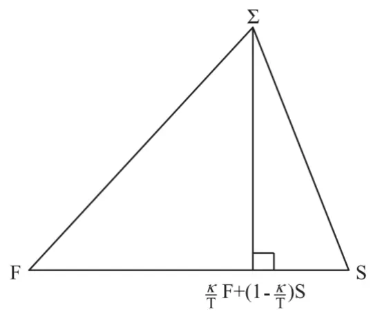
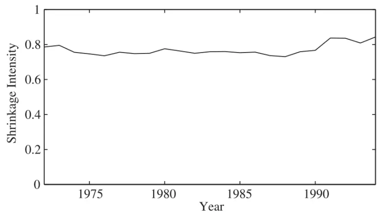

inInfo][Table_Title]2022.01.06

# 基于 Ledoit-Wolf 方差缩减技术的协方差矩阵估计方法

## ——精品文献解读系列（二十五）

## 本报告导读：

基于统计决策论中的缩减技术，本文利用矩阵的Frobenius范数给出了一种估计资产收益率协方差矩阵的方法。由于本文提供的方法更多从统计学而非金融学视角入手，因此具有很强的普适性，值得战术资产配置投资者借鉴。

## 摘要：

投资学是一门学术界与业界紧密结合的学科，其中大类资产配置是这种紧密结合的代表。从 Markowitz（1952）开创现代投资组合理论开始，学术界为业界提供了丰富的理论参考和方法模型，推动了大类资产配置实践的繁荣发展。为了帮助读者及时跟踪学术前沿，我们推出了“精品文献解读”系列报告，从大量学术文献中挑选出精品论文进行剖析解读，为读者呈现大类资产配置领域最新的思路和方法。

本篇为读者解读的文献是 Ledoit and Wolf（2003）在期刊 Journal ofEmpirical Finance 上 发 表 的 论 文 “ Improved estimation of thecovariance matrix of stock returns with an application to portfolioselection”。

本文提供了一种利用缩减技术（shrinkage）估计股票收益率协方差矩阵的改进方法。在最优化框架下，该方法综合考虑了样本协方差和市场协方差两种估计，从而得到所谓市场缩减估计。在实证部分，本文利用 NYSE 和 AMEX 市场 1972-1995 年的数据，发现依赖缩减技术的资产组合要比其他备选方法拥有更低的样本外方差，改进效果明显。

鉴于协方差矩阵在均值方差模型中的关键作用，其估计方法一直是资产配置领域中的核心问题之一。本文提供的方法更多从统计学而非金融学视角入手，因此具有很强的普适性，值得战术资产配置投资者借鉴。

大类资产配置研究

## hor] 报告作者

李祥文(分析师)

8 021-38031560

lixiangwen@gtjas.com

证书编号 S0880520100001

赵索(分析师)

8 0755-23976601

zhaosuo024832@gtjas.com

证书编号 S0880521080002

## 余齐文(研究助理)

8 0755-23976212

yuqiwen@gtjas.com

证书编号 S0880121090049

## 陶金(研究助理)

8 010-83939769

taojin025532@gtjas.com

证书编号 S0880121120067

## cReport] 相关报告

基建板块配置逻辑：正反馈或刚刚开始2021.12.29

否极泰来：中概互联板块配置价值逐渐显现2021.12.24

周期股配置逻辑：反弹还是反转20

21.12.22

A股战场形势变化，胜利天平逐渐转向多头 2021.12.07

开往春天的列车将至，机会在于前半程2021.11.30

## 1. 文献概述

## 文献来源：

Ledoit, O. , and M. Wolf . "Improved estimation of the covariance matrix of stock returns with an application to portfolio selection." Journal of Empirical Finance 10.5(2003):603-621.

## 文献摘要：

本文提供了一种利用缩减技术（shrinkage）估计股票收益率协方差矩阵的改进方法。在最优化框架下，该方法综合考虑了样本协方差和市场协方差两种估计，从而得到所谓市场缩减估计。在实证部分，本文利用NYSE和 AMEX 市场 1972-1995 年的数据，发现依赖缩减技术的资产组合要比其他备选方法拥有更低的样本外方差，改进效果明显。

## 文献评述：

鉴于协方差矩阵在均值方差模型中的关键作用，其估计方法一直是资产配置领域中的核心问题之一。本文提供的方法更多从统计学而非金融学视角入手，因此具有很强的普适性，值得战术资产配置投资者借鉴。

## 记号提示：

本文中的撇号若无特别交代均代表矩阵转置。矩阵的形状由 a×b 的下标给出。例如一个 3×5 的矩阵 A 直接记为 $\mathsf{A}_{3\times5}$ 。而行、列向量分别写作：

$$
A_{\mathrm{i-}}\mathrm{:=}\mathrm{A}\not\not\equiv\not\Theta\not\Im\not\ni\mathrm{~i~}\not\Im
$$

$$
\mathsf{A}_{-\mathrm{j}}\colon=\mathsf{A}\ \pm\mathsf{E}\left.\ddag\lbrack\dot{\mp}\dot{\Psi}^{\mathrm{j}}\stackrel{\star\star}{\doublebarwedge}\ \mathrm{j}\ \bar{\hbar}\right.
$$

## 2. 协方差矩阵的缩减估计

## 2.1. 统计模型

假设 N 支股票一共 T 期的收益率由矩阵 X 给出：

$$
\mathrm{X=X_{N\times T}:=\left(\begin{array}{ccc}{X_{11}}&{\cdots}&{X_{1T}}\\{\vdots}&{\ddots}&{\vdots}\\{X_{N1}}&{\cdots}&{X_{NT}}\end{array}\right)}
$$

并假设：

假设 1：单只股票的收益率在时间序列上是独立同分布的（IID）。

假设 2：股票数量 N 是一个固定的有限数，而时刻数量 T 则随着观察区间的延伸可以增到无穷。大

假设 3：不同股票收益率之间的任意 4 阶矩有限：

$$
\mathbb{E}\big[\big|\mathrm{x}_{\mathrm{it}}\mathrm{x}_{\mathrm{jt}}\mathrm{x}_{\mathrm{kt}}\mathrm{x}_{\mathrm{lt}}\big|\big]<\infty,\forall\mathrm{i},\mathrm{j},\mathrm{k},\mathrm{l}=1,\dots,\mathrm{N},\forall\mathrm{t}=1,\dots,\mathrm{T}
$$

此处并不要求股票的收益率服从某一正态分布。

## 2.2. 样本协方差矩阵

首先，股票收益率的样本均值向量 m 和样本协方差矩阵 S 可以写成：

$$
\left\{\begin{array}{ll}{\displaystyle\mathrm{m=(m_{i})_{i\in[N]}=m_{N\times1}:=\frac{1}{T}X_{N\times T}1_{T\times1}=\frac{1}{T}X1}}\\{\displaystyle\mathrm{S=\binom{S_{ij}}{ij}_{ij\in[N]}=S_{N\times N}:=\frac{1}{T}X_{N\times T}\left({\mathrm{I}_{T\times T}-\frac{1}{T}1_{T\times1}1_{1\times\mathrm{T}}}\right)X_{T\times N}^{\prime}=\frac{1}{T}X\Big([-\frac{1}{T}11^{\prime}\Big)X^{\prime}\Big)}}\end{array}\right.
$$

各等式中最后出现的 1 代表的是与矩阵乘法相匹配的幺元矩阵（各分量均为 1）。由上述矩阵分解可以看到，样本协方差 S 在 $\mathrm{N}{\geq}\mathrm{T}$ 时必定是奇异矩阵。这是因为 S 的秩最多等于

$$
\mathrm{~X}\left(\mathrm{I}-\frac{1}{\mathrm{T}}\boldsymbol{1}\boldsymbol{1}^{\prime}\right)\mathrm{X}^{\prime}
$$

的秩 T-1（只用注意到各行向量之和等于 0）。换句话说，当观察期数T≤N+1 时，样本协方差矩阵必定是一个秩亏（rank-deficient）矩阵，而这势必将会带来一系列技术上的问题。

## 2.3. 市场协方差矩阵

在 Sharpe（1963）的 CAPM 模型中，股票 i的收益率满足

$$
\mathrm{x_{it}=\alpha_{i}+\beta_{i}\mathrm{x_{Mt}+\varepsilon\varepsilon_{it}}}
$$

$$
\left\{\begin{array}{ll}{\mathrm{x_{Mt}=\Delta\Psi\Sigma}\pm3\mathrm{\Im}\psi\mathrm{\downarrow}\mp\frac{\mathrm{\Im}^{2}}{\mathrm{\Im}\mathrm{\Im}}\mp}\\{\varepsilon_{\mathrm{it}}=\xi_{\mathrm{\pm}}^{\mathrm{k}}\frac{\mathrm{\partial\xi}}{\pm}\mathrm{\downarrow}\xi_{\mathrm{\mp}}\frac{\mathrm{{\bf\Sigma}}^{\prime}}{\mathrm{\Im}\mathrm{\Im}}\frac{\dddot{\mathrm{\Im}}^{2}}{\mathrm{\partial\xi}}}\end{array}\right.
$$

因此，市场协方差矩阵可以被表达为

$$
\begin{array}{c}{{\Phi=\left(\Phi_{\mathrm{ij}}\right)_{\mathrm{i,j\in[N]}}=\Phi_{\mathrm{N\times N}}=\sigma_{\mathrm{MM}}^{2}\beta_{\mathrm{N\times1}}\beta_{1\times\mathrm{N}}^{\prime}+\Delta_{\mathrm{N\times N}}=\sigma_{\mathrm{MM}}^{2}\beta\beta^{\prime}+\Delta}}\\{{\Delta=\mathrm{diag}(\delta_{11},\ldots,\delta_{\mathrm{NN}}),\delta_{\mathrm{jj}}=\mathrm{Var}\left(\varepsilon_{\mathrm{j}}\right)}}\end{array}
$$

对应的回归估计量为（注意拉丁字母与希腊字母之间的对应）：

$$
\mathrm{F}=\left(\mathrm{f_{ij}}\right)_{\mathrm{ij\in[N]}}=\mathrm{F_{N\times N}}=s_{\mathrm{MM}}^{2}\mathrm{b_{N\times1}}\mathrm{b_{1\times N}^{\prime}}+\mathrm{D_{N\times N}}=s_{\mathrm{MM}}^{2}\mathrm{b}\mathrm{b^{\prime}}+\mathrm{D}
$$

更进一步地，本文还需要如下技术性假设：

假设 4：Φ≠Σ，即市场协方差矩阵与真实协方差矩阵不同。

假设 5：市场组合具有正方差，即：

$$
\sigma_{\mathrm{MM}}^{2}>0
$$

## 2.4. 缩减估计的一般形式

市场协方差矩阵和样本协方差矩阵其实是协方差估计的两种极端，前者表明市场被一种共同因素驱动，而后者则将每一只股票视为一种因子（因此该模型中所有股票都没有残差收益）。所以符合金融从业人员直觉的论断是，协方差矩阵的最优模型应该介于上述两种极端之间，它通常应该被一个 K因子模型所实现（此时 K＜N）。

这种直觉也存在一个纯粹的统计学解释。在统计决策论的基本框架下，任何估计模型都需要在误差和偏差之间做出合理的讨价还价。该统计学解释的关键在于将市场协方差理解为一个高偏差（bias）低误差（estimationerror）模型（高偏差是因为用一个因子解释所有股票必然有偏差，低误差是因为估计市场因子用到了全市场数据因此估计误差很低），而将样本协方差视为一个低偏差高误差模型（低偏差是因为每只股票都单独建模因此偏差很低，而高误差则是因为估计每一只股票能用的数据相对于前者十分有限所以误差较高）。所以缩减估计不仅提供了一种实现这种讨价还价的工具，也从纯粹的统计学角度为多因子模型的存在提供了合理性。

## 2.5. 最优缩减强度

毫无疑问缩减技术的核心在于求解最优缩减强度。为此，我们需要首先对矩阵引入 Frobenius 范数，并定义最优化需要用到的损失函数。

定理 1 假设对称矩阵

$$
\mathbf{A}=\left(\mathbf{a_{ij}}\right)_{\mathbf{i,j\in[N]}}=\mathbf{A_{N\times N}}
$$

的特征值组成的集合为

$$
\{\lambda_{\mathrm{i}}\}_{\mathrm{i\in[N]}}
$$

则矩阵 A的 Frobenius 范数的平方等于所有特征值的平方和：

$$
\|\mathbf{A}\|^{2}:=\mathbf{tr}(\mathbf{A}^{2})=\sum_{\mathrm{ij}}\mathbf{a}_{\mathrm{ij}}^{2}=\sum_{\mathrm{i}}\lambda_{\mathrm{i}}^{2}
$$

本文使用的损失函数如下

$$
\mathrm{L}(\alpha)=\|\alpha\mathrm{F}+(1-\alpha)\mathrm{S}-\Sigma\|^{2}
$$

对应的风险函数即损失函数的期望：

$$
\begin{array}{rl}{{\mathbb{E}[\mathrm{L}(\alpha)]=\sum_{\mathrm{ij}}\mathbb{E}[(\alpha t_{\mathrm{ij}}+(1-\alpha)s_{\mathrm{ij}}-\sigma_{\mathrm{ij}})^{2}]=\sum_{\mathrm{ij}}(\mathrm{Var}\big(\alpha t_{\mathrm{ij}}+(1-\alpha)s_{\mathrm{ij}}\big)+\mathbb{E}\big[\alpha t_{\mathrm{ij}}+(1-\alpha)s_{\mathrm{ij}}-\sigma_{\mathrm{ij}}\big]^{2})}}\\&{=\sum_{\mathrm{ij}}(\alpha^{2}\mathrm{Var}\big(t_{\mathrm{ij}}\big)+(1-\alpha)^{2}\mathrm{Var}\big(s_{\mathrm{ij}}\big)+2\alpha(1-\alpha)\mathrm{Cov}\big(t_{\mathrm{ij}},s_{\mathrm{ij}}\big)+\big(\alpha\phi_{\mathrm{ij}}+(1-\alpha)\sigma_{\mathrm{ij}}-\sigma_{\mathrm{ij}}\big)^{2})}\\&{=\displaystyle\sum_{\mathrm{ij}}(\alpha^{2}\mathrm{Var}\big(t_{\mathrm{ij}}\big)+(1-\alpha)^{2}\mathrm{Var}\big(s_{\mathrm{ij}}\big)+2\alpha(1-\alpha)\mathrm{Cov}\big(t_{\mathrm{ij}},s_{\mathrm{ij}}\big)+\alpha^{2}\big(\phi_{\mathrm{ij}}-\sigma_{\mathrm{ij}}\big)^{2})=:\mathrm{R}(\alpha)}\end{array}
$$

于是对应的一阶条件（FOC）变为

$$
\begin{array}{l}{\displaystyle\partial_{\alpha}\mathrm{R}(\alpha)=2\sum_{\mathrm{ij}}\left(\alpha\mathrm{Var}\big(\mathrm{f}_{\mathrm{ij}}\big)-(1-\alpha)\mathrm{Var}\big(s_{\mathrm{ij}}\big)+(1-2\alpha)\mathrm{Cov}\big(\mathrm{f}_{\mathrm{ij}}-s_{\mathrm{ij}}\big)+\alpha\big(\phi_{\mathrm{ij}}-\sigma_{\mathrm{ij}}\big)^{2}\right)}\\{\displaystyle\partial_{\alpha}^{2}\mathrm{R}(\alpha)=2\sum_{\mathrm{ij}}\left(\mathrm{Var}\big(\mathrm{f}_{\mathrm{ij}}-\mathrm{s}_{\mathrm{ij}}\big)+\big(\phi_{\mathrm{ij}}-\sigma_{\mathrm{ij}}\big)^{2}\right)\geq0}\end{array}
$$

所以最优缩减强度等于

$$
\partial_{\alpha}\mathrm{R(\alpha)}=0\Rightarrow\alpha^{*}=\frac{\sum_{\mathrm{ij}}\left(\mathrm{Var\bigl(s_{\mathrm{ij}}\bigr)}-\mathrm{Cov\bigl(f_{\mathrm{ij}},{s_{\mathrm{ij}}}\bigr)}\right)}{\sum_{\mathrm{ij}}\left(\mathrm{Var\bigl(f_{\mathrm{ij}}}-{s_{\mathrm{ij}}}\bigr)+\left({\phi_{\mathrm{ij}}}-{\sigma_{\mathrm{ij}}}\right)^{2}\right)}=\mathcal{O}(\mathrm{T}^{-1})
$$

可以看到该强度是渐进零化的，而利用渐进方差的定义我们可以证明：

定义【渐进方差】设 $\{\mathrm{k_{n}}\}$ 为一正数列，τ为一常数，如果估计序列 $\mathrm{{T}_{n}}$ 满足

$$
\mathrm{k_{n}(T_{n}-\tau)_{d}\Delta N(0,}\sigma^{2})
$$

则称 $\cdot\sigma^{2}$ 为 $\mathrm{T}_{\mathrm{n}}$ 的渐进方差。

有此概念后我们有

定理 2 定义渐进估计量：

$$
\left\{\begin{array}{ll}{\displaystyle\boldsymbol{\pi}=\sum_{\mathrm{ij}}\boldsymbol{\pi}_{\mathrm{ij}}=\sum_{\mathrm{ij}}\mathrm{AsyVar}\big(\sqrt{\boldsymbol{\mathsf{T}}}\boldsymbol{\mathsf{s}}_{\mathrm{ij}}\big)}\\{\displaystyle\boldsymbol{\mathsf{p}}=\sum_{\mathrm{ij}}\boldsymbol{\mathsf{p}}_{\mathrm{ij}}=\sum_{\mathrm{ij}}\mathrm{AsyCov}\big(\sqrt{\boldsymbol{\mathsf{T}}}\boldsymbol{\mathsf{f}}_{\mathrm{ij}},\sqrt{\boldsymbol{\mathsf{T}}}\boldsymbol{\mathsf{s}}_{\mathrm{ij}}\big)}\\{\displaystyle\boldsymbol{\gamma}=\sum_{\mathrm{ij}}\boldsymbol{\mathsf{Y}}_{\mathrm{ij}}=\sum_{\mathrm{ij}}\big(\boldsymbol{\Phi}_{\mathrm{ij}}-\boldsymbol{\sigma}_{\mathrm{ij}}\big)^{2}}\end{array}\right.
$$

则

$$
\alpha^{*}=\frac{1}{\mathbf{T}}\cdot\frac{\pmb{\pi}-\mathbf{p}}{\pmb{\gamma}}+\pmb{\mathcal{O}}(\mathbf{T}^{-2})
$$

所以缩减技术其实就是在

$$
\left\{\alpha=\frac{\mathrm{c}}{\mathrm{T}}\mathrm{:c}\in[0,\mathrm{T}]\right\}
$$

形成的单指标参数族之中找到了一个最优解：

$$
\kappa=\frac{\pi-\rho}{\gamma}
$$

从而使得风险函数达到最小。在几何上，最优解对应于从真实的∑向 F和 S 组成的一维子空间上的正交投影，而这里的正交性则依赖于前期定义的 Frobenius 范数。

图 1：方差缩减技术的几何化含义

数据来源：Ledoit and Wolf（2003）

## 2.6. 最优缩减强度的一致估计量

由于最优缩减强度的公式中依赖于一些不可观测的变量，所以并不能直接使用，为此我们需要对κ中的各个部分进行估计，可以证明：

引理 1p是π的一致估计量，其中

$$
\bf p_{ij}=\frac{1}{T}\sum_{t}((x_{it}-m_{i})\bigl(x_{jt}-m_{j}\bigr)-s_{ij})
$$

r 是 $\pmb{\rho}$ 的一致估计量，

$$
\bf{r_{ij}}=\left\{\begin{array}{ll}{\bf p_{ij}}&{\qquad\bf\sigma\ne{i}=j}\\{\frac{\sum_{t}\bf r_{ijt}}{T}}&{\qquad\bf\sigma\ne{i}\ne j}\end{array}\right.
$$

$$
\bf{r}_{\mathrm{ijt}}=\frac{S_{\mathrm{jM}}S_{\mathrm{MM}}(\bf x_{\mathrm{it}}-m_{\mathrm{i}})+\it S_{\mathrm{iM}}S_{\mathrm{MM}}(\bf x_{\mathrm{jt}}-m_{\mathrm{j}})-\it S_{\mathrm{iM}}S_{\mathrm{jM}}(\bf x_{\mathrm{Mt}}-m_{\mathrm{M}})}{S_{\mathrm{MM}}^{2}}(\bf x_{\mathrm{Mt}}-m_{\mathrm{M}})(\bf x_{\mathrm{it}}-m_{\mathrm{i}})(\bf x_{\mathrm{jt}}-m_{\mathrm{j}})-\itGamma_{\mathrm{ij}}S_{\mathrm{ij}}(\bf x_{\mathrm{it}}-m_{\mathrm{j}})(\bf x_{\mathrm{it}}-m_{\mathrm{j}})(\bf x_{\mathrm{it}}-m_{\mathrm{j}})\it S_{\mathrm{ij}}(\bf x_{\mathrm{it}}-m_{\mathrm{j}})\it S_{\mathrm{ij}}(\bf x_{\mathrm{it}}-m_{\mathrm{j}})\it S_{\mathrm{ij}}(\bf x_{\mathrm{it}}-m_{\mathrm{j}})\it S_{\mathrm{ij}}(\bf x_{\mathrm{it}}-m_{\mathrm{j}})\it S_{\mathrm{ij}}(\bf x_{\mathrm{it}}-m_{\mathrm{j}})\it S_{\mathrm{ij}}(\bf x_{\mathrm{it}}-m_{\mathrm{j}})\it S_{\mathrm{ij}}(\bf x_{\mathrm{it}}-m_{\mathrm{j}})\it S_{\mathrm{ij}}(\bf x_{\mathrm{it}}-m_{\mathrm{j}})\it S_{\mathrm{ij}}(\bf x_{\mathrm{it}}-m_{\mathrm{j}})\it S_{\mathrm{ij}}(\bf x_{\mathrm{it}}-m_{\mathrm{j}}
$$

## c 是γ的一致估计量

$$
\bf c_{ij}=\left(f_{ij}-s_{ij}\right)^{2}
$$

利用上述引理，我们实际上得到了

定理 2 协方差矩阵的市场缩减估计为：

$$
\hat{\mathbf{S}}=\frac{\mathbf{k}}{\mathbf{T}}\mathbf{F}+\frac{\mathbf{T}-\mathbf{k}}{\mathbf{T}}\mathbf{S}
$$

$$
\mathbf{k}={\frac{\mathbf{p}-\mathbf{r}}{\mathbf{c}}}
$$

是κ的一致估计量。

## 3. 实证结果

在实证部分，我们通过比较基于不同协方差估计的投资组合的样本外方差来比较不同协方差估计的优劣。

## 3.1. 投资组合的构建

首先回溯 MVO 框架如下：

$$
\operatorname*{min}_{\mathbf{w}}\mathbf{w}^{\prime}\Sigma\mathbf{w}\quad\mathrm{s.t.}\mathbf{w}^{\prime}1=1,\mathbf{w}^{\prime}\mu=\mathbf{q}
$$

其中 $\mathbf{W}$ 代表权重向量， $\mp\mathsf{q}$ 代表给定的预期收益率，此时最优权重满足

$$
\mathbf{w}^{*}={\frac{\mathbf{C}-\mathbf{q}\mathbf{B}}{\mathbf{A}\mathbf{C}-\mathbf{B}^{2}}}\Sigma^{-1}\mathbf{1}+{\frac{\mathbf{q}\mathbf{A}-\mathbf{B}}{\mathbf{A}\mathbf{C}-\mathbf{B}^{2}}}\Sigma^{-1}\mathbf{\mu}
$$

$$
\left\{\begin{array}{ll}{\mathtt{A}=1^{\prime}\Sigma^{-1}1}\\{\mathtt{B}=1^{\prime}\Sigma^{-1}\mu}\\{\mathtt{C}=\mu^{\prime}\Sigma^{-1}\mu}\end{array}\right.
$$

所以从公式上看，一旦协方差矩阵奇异，那么最优权重的计算公式将会

失效。由于市场缩减估计本身是两个半正定矩阵的加权平均，而 F 矩阵本身又是一个正定矩阵，因此根据线性代数的相关知识我们知道市场缩减估计是一个非奇异矩阵。所以在此视角下，缩减估计可以被视为一种正规化的处理。

另外需要指出的是，一个在样本内数据上拟合很优秀的方差估计有可能会产生很糟糕预测效果，因此本文更加关注方差估计在投资组合中的“效用”，而非样本内的准确性。

## 3.2. 数据

本文实证使用的股票收益数据来自 CRSP（center for research in securityprices）的月度数据库，时间从 1972 年至 1994 年为止。在协方差矩阵的计算上，本文使用的数据会向前回溯 10 年，确切地讲是从第 t-10 年的 8月开始到第 t 年的 7 月的月度数据计算协方差，然后在 t 年的 8 月第一个交易日构建投资组合并持仓到 t+1 年的 7 月底。

在股票池的选择上，我们仅纳入第 t 年的 8 月时，在 NYSE（New YorkStock Exchange）和 ASE（American Stock Exchange）两个交易所交易的至少存续 10 年和 SIC（Standard Industrial Classification）代码可用的股票。

在具体资产组合的选择上，我们仅考虑最小方差投资组合和收益率 q=20%的投资组合，并且允许个券卖空。而在 MVO 中另外一个非常重要的输入变量——收益率——的预测上，本文直接使用过去 10 年已实现收益的平均作为基准。虽然这样处理在收益率的预测层面上这并不是一个非常有效的指标，但是考虑到本文的实证在于验证方差缩减估计的有效性，而非构造 MVO 策略本身，因此仍属于可以接受的范畴。

## 3.3. 备选估计

除了前面构造的市场缩减估计，实证中还比较了如下估计：

1. 单位矩阵估计：该估计为数量阵，即单位矩阵乘以一个常值系数。该估计其实是 Fama-MacBeth 等使用 OLS 方法的隐含假设条件之一。

2. 常值相关估计：该估计一共有 N+1 个参数，除对角线上的 N 个方差外，两两股票之间的协方差都假设为统一常数。

3. 伪逆矩阵估计：为了解决协方差矩阵的奇异性，通常使用所谓的广义逆矩阵或者 Moore-Penrose 逆矩阵作为代替。

4. 市场因子估计：即 Sharpe定义的单因子模型。

5. 行业因子估计：该模型是市场模型的细化，通常形如

$$
\mathrm{\Delta x_{it}=\alpha_{i}+\beta_{i}\mathrm{x_{Mt}+\sum_{k}\mathrm{c_{ik}\mathrm{z_{kt}+\varepsilon}}}}
$$

其中 K代表行业因子的数量，c 是单只股票所属行业的哑变量，z 是行业的因子收益，ε是残差收益。在本文中，行业的因子收益等于行业内股票等权重形成的投资组合的收益。

6. 主成分估计：该估计使用通常的主成分分析方法，本文使用的主成分数量为 5。

7. 单位缩减估计：该估计是以单位矩阵为目标的缩减估计，其框架与本文略有不同，详情请参考 Ledoit and Wolf（2000）。

8. 市场模型缩减：该估计即本文给出的缩减估计。

## 3.4. 样本外标准差

表 1 列举了上述 8 种估计对应的样本外标准差。

表 1：最小方差组合的样本外标准差

| Risk of minimum variance portfolios |  |  |
| --- | --- | --- |
|  | Standard deviation unconstrained | Standard deviation constrained |
| Identity | 17.75 (0.44) | 17.94 (0.42) |
| Constant correlation | 14.27 (0.19) | 16.30 (0.29) |
| Pseudo-inverse | 12.37 (0.23) | 13.73 (0.32) |
| Market model | 12.00 (0.16) | 13.77 (0.27) |
| Industry factors | 10.84 (0.17) | 12.32 (0.23) |
| Principal components | 10.31 (0.16) | 11.30 (0.22) |
| Shrinkage to identity | 10.21 (0.17) | 11.11 (0.21) |
| Shrinkage to market | 9.55 (0.15) | 10.43 (0.20) |

“Unconstrained"refers to the global minimum variance portfolio, while “constrained" refers to the minimum variance portfolio with 20% expected return. Standard deviation is measured out-of-sample at the monthly frequency, annualized through multiplication by √12 and expressed in percents. Standard errors on these standard deviation estimates are reported in parenthesis.
数据来源：Ledoit and Wolf（2003）

可以看到在所有的估计量中，单位矩阵估计最差，而市场缩减估计最好。但令人吃惊的是，单位缩减估计排名第二，好于除市场缩减估计之外的其他备选估计。

## 3.5. 权重分布

在表 2 中列出了关于投资组合的权重分布，它们涉及投资组合的许多指标：成交量、空头数量、最低和最高权重。

表 2：权重分布

|  | Turnover | Short interest | Lowest weight | Highest weight | Cash position |
| --- | --- | --- | --- | --- | --- |
| Identity | 6 | 0 | 0.09 | 0.09 | 2.50 |
| Constant correlation | 24 | 68 | -0.17 | 2.86 | –1.40 |
| Pseudo-inverse | 96 | 99 | -1.16 | 1.12 | 1.46 |
| Market model | 23 | 51 | -0.41 | 2.10 | 0.13 |
| Industry factors | 43 | 89 | -1.08 | 2.81 | 0.54 |
| Principal components | 49 | 80 | -0.84 | 2.95 | 0.78 |
| Shrinkage to identity | 71 | 113 | -1.23 | 1.19 | 0.99 |
| Shrinkage to market | 61 | 98 | –1.01 | 3.81 | 0.78 |

These are for the global minimum variance portfolio, expressed in percents, and averaged over the 23 years in our sample. A short interest of 68%, say, means that for every dollar invested in the portfolio we short 68 cents worth of stocks, while buying $1.68 worth of other stocks. Annual turnover above 100% is possible because of short sales.
数据来源：Ledoit and Wolf（2003）

事实上，如果投资组合中空头数量太大，那么投资组合可操作性将会大幅下降。而在实证中，每当一只股票缺少样本外的观察值时，我们总是假设它的收益率为无风险利率。因此，将投资组合中的现金头寸单独列出就显得尤为重要。表 2 表明利用缩减技术得到的投资组合的现金头寸相对较小，所以其得到的样本外标准差较为可靠。否则，仅仅任意的投资组合都可以通过加大现金头寸而显著地降低风险水平，这将使得实证结果变得毫无意义。

## 3.6. 缩减强度

图 2 显示了最优缩减强度的时序变化。正如定理 2 所预测的那样，取值上它总是在 0 和 1 之间约为 80%左右，且表现出相当的稳定性。所以虽然 k/T 是一个渐近可忽略的修正，但在实践中它可以产生很大的不同。

图 2：缩减强度

数据来源：Ledoit and Wolf（2003）

## 4. 结论

本文提出了一种估计股票收益率协方差矩阵的方法。该方法通过将样本协方差缩减到市场协方差矩阵上，得到了一个更为有效的估计。

## 5. 附录：技术性细节

## 5.1. 样本均值与协方差矩阵的矩阵表达推导

对于样本均值和样本协方差，我们只用验证通常定义和矩阵形式定义的分量是一致的即可。事实上：

$$
\begin{array}{rl}{{\operatorname*{m}_{1}=\mathbf{E}[\mathbf{x}_{1}]=\frac{1}{7}\sum_{k=1}^{N_{\mathrm{A}}}-\frac{1}{{\mathrm{T}}}{\mathrm{X}}_{\mathrm{A}}-{\mathrm{I}}_{\mathrm{T}}^{1}{\mathrm{X}}_{\mathrm{A}},}}\\&{s_{1}=\mathbf{E}[(s_{1}-{\mathrm{\bf~F}}{\mathrm{\bf~x}}_{1})](s_{1}-{\mathrm{\bf~F}}{\mathrm{\bf~\bar{x}}}_{1}])\rVert-\frac{1}{7}\sum_{k=1}^{N}\Bigg({\mathrm{\bf~x}}_{1k}-\frac{1}{7}\sum_{k=1}^{N_{\mathrm{A}}}\Bigg)\Bigg(x_{1k}-\frac{1}{7}\sum_{s=1}^{N_{\mathrm{A}}}\Bigg)}\\&{=\frac{1}{1}\Bigg[\Bigg[\sum_{k=1}^{N}x_{1}x_{1}-\frac{1}{1}\Bigg(\sum_{s=1}^{N}\Bigg)\Bigg(\sum_{s=1}^{N}x_{1}\Bigg)\Bigg]}\\&{=\frac{1}{1}\Bigg[{\mathrm{\bf~x}}_{1}\times{\mathrm{\bf~x}}_{-1}-\frac{1}{7}{\mathrm{\bf~x}}_{1-1,1,1,1,1,1,1,1,1}x_{1}^{-1}\Bigg]}\\&=\frac{1}{1}\times_{-1}\Bigg({\mathrm{\bf~x}}_{1-1}-\frac{1}{1}{\mathrm{\bf~x}}_{1-1,1,1,1,1,1,1}x_{1}^{-1}\end{array}
$$

所以上述矩阵分解与通常定义是一致的。

## 5.2. 定理 1 的证明

根据矩阵对角化理论，由于 A是对称矩阵，故有对角化

$$
\Lambda=\mathrm{UAU}^{-1}=\mathrm{diag}(\lambda_{1},\ldots,\lambda_{\mathrm{N}}),\mathrm{U}\in0(\mathrm{N})
$$

其中 U是正交变换。由于方阵 X 和 Y满足 $\operatorname{tr}(\mathrm{XY}){\mathrm{=tr}}(\mathrm{YX})$ ，所以

$$
\begin{array}{l}{{\displaystyle\sum_{\mathrm{i},\mathrm{j}}a_{\mathrm{ij}}^{2}=\mathrm{tr}(\mathrm{A}A^{\prime})=\mathrm{tr}(A^{2})=\mathrm{tr}(A^{2}\mathrm{UU}^{-1})}}\\{{\displaystyle=\mathrm{tr}(\mathrm{UA}^{2}\mathrm{U}^{-1})=\mathrm{tr}(\mathrm{UAU}^{-1}\mathrm{UAU}^{-1})=\mathrm{tr}(\Lambda^{2})=\sum_{\mathrm{i}}\lambda_{\mathrm{i}}^{2}}}\end{array}
$$

证毕。

## 5.3. 定理 2 的证明

首先我们回忆中心极限定理（CLT）。CLT 断言 IID 的样本均值

$$
\overline{{\mathrm{X}}}=\frac{1}{\mathrm{T}}\sum_{\mathrm{i}}\mathrm{X}_{\mathrm{i}}
$$

作为一个随机变量，其均值和方差满足

$$
\mu_{\mathrm{X}}=\mu_{\mathrm{X}},\sigma_{\mathrm{\overline{{X}}}}=\frac{\sigma_{\mathrm{X}}}{\sqrt{\mathrm{T}}}
$$

利用定理 2 前最优缩减强度的表达式，我们有

$$
\mathrm{T\alpha^{*}=\frac{\sum_{ij}\left(\mathrm{Var}\left(\sqrt{T}s_{ij}\right)-\mathrm{Cov}\left(\sqrt{T}f_{ij},\sqrt{T}s_{ij}\right)\right)}{\sum_{ij}\left(\mathrm{Var}\left(f_{ij}-s_{ij}\right)+\left(\phi_{ij}-\sigma_{ij}\right)^{2}\right)}}
$$

因此只需要证明：

$$
\left\{\begin{array}{ll}{\displaystyle\sum_{\mathrm{ij}}\mathrm{Var}\big(\sqrt{\mathsf{T}}s_{\mathrm{ij}}\big)\to\pi}\\{\displaystyle\sum_{\mathrm{ij}}\mathrm{Var}\big(\sqrt{\mathsf{T}}s_{\mathrm{ij}}\big)\to\rho}\\{\displaystyle\left\lfloor\sum_{\mathrm{ij}}\mathrm{Var}\big(\mathsf{f}_{\mathrm{ij}}-s_{\mathrm{ij}}\big)\to\mathcal{O}(\mathsf{T}^{-2})\right.}\end{array}\right.
$$

更进一步，只需要在各个分量上验证即可。由于各个极限的计算都是类似的，此处只证明：

$$
\operatorname*{lim}_{\mathrm{T}\to\infty}\mathrm{Var}\big(\sqrt{\mathrm{T}}s_{\mathrm{ij}}\big)=\pi_{\mathrm{ij}}=\mathrm{AsyVar}(\sqrt{\mathrm{T}}s_{\mathrm{ij}})
$$

不失一般性，假设各股票收益率零均值

$$
\mathbb{E}[\mathrm{x}_{\mathrm{it}}]=\mathbb{E}\big[\mathrm{x}_{\mathrm{jt}}\big]=0
$$

考虑样本协方差

$$
\widehat{\sigma}_{\mathrm{ij}}=\frac{1}{\mathrm{T}}\sum_{\mathrm{~t~}}\mathrm{x}_{\mathrm{it}}\mathrm{x}_{\mathrm{jt}}
$$

利用求和项序列的 IID 性质可以知道，

$$
\mathrm{x_{it}\mathrm{x_{jt}}\sim N(\pi_{ij},\it{\zeta_{ij}^{2}}<\infty)}
$$

而 CLT 断言此时有如下依分布收敛

$$
\sqrt{\mathrm{T}}\big(\mathfrak{F}_{\mathrm{ij}}-\mathfrak{o}_{\mathrm{ij}}\big)\to_{\mathrm{d}}\mathrm{N}(0,\zeta_{\mathrm{ij}}^{2})
$$

但是如果令

$$
\bar{\mathrm{x}}_{\mathrm{i}}=\frac{1}{\mathrm{T}}\sum_{\mathrm{t}}\mathrm{x}_{\mathrm{it}},\bar{\mathrm{x}}_{\mathrm{j}}=\frac{1}{\mathrm{T}}\sum_{\mathrm{t}}\mathrm{x}_{\mathrm{jt}}
$$

$$
{\sqrt{\mathsf{T}}}{\bigl(}{\widehat{\sigma}}_{\mathrm{ij}}-\mathsf{s}_{\mathrm{ij}}{\bigr)}={\sqrt{\mathsf{T}}}\left({\frac{1}{\mathsf{T}}}\sum_{\mathrm{ij}}{\bigl[}\mathrm{x}_{\mathrm{it}}\mathrm{x}_{\mathrm{jt}}-{\bigl(}\mathrm{x}_{\mathrm{it}}-{\overline{{\mathrm{x}}}}_{\mathrm{i}}{\bigr)}{\bigl(}\mathrm{x}_{\mathrm{jt}}-{\overline{{\mathrm{x}}}}_{\mathrm{j}}{\bigr)}{\bigr]}\right)={\sqrt{\mathsf{T}}}\ \mathbf{\overline{{x}}}_{\mathrm{i}}{\overline{{\mathrm{x}}}}_{\mathrm{j}}
$$

由于 CLT 断言

$$
\sqrt{\mathsf{T}}\overline{{\mathbf{x}}}_{\mathrm{i}}\sim0(1),\overline{{\mathbf{x}}}_{\mathrm{j}}\sim0(1)\Rightarrow\sqrt{\mathsf{T}}\overline{{\mathbf{x}}}_{\mathrm{i}}\overline{{\mathbf{x}}}_{\mathrm{j}}\sim0(1)
$$

再由 Slutzky 定理可知

$$
\sqrt{\mathsf{T}}\big(s_{\mathrm{ij}}-\sigma_{\mathrm{ij}}\big)=\sqrt{\mathsf{T}}\big[\big(\widehat{\sigma}_{\mathrm{ij}}-\sigma_{\mathrm{ij}}\big)-\big(\widehat{\sigma}_{\mathrm{ij}}-s_{\mathrm{ij}}\big)\big]_{\mathrm{d}}\mathrm{N}\big(0,\zeta_{\mathrm{ij}}^{2}\big)+\mathsf{o}(1)=\mathrm{N}(0,\zeta_{\mathrm{ij}}^{2})
$$

从而由渐进方差的定义我们得到

$$
\mathrm{Var(\sqrt{T}s_{ij})\zeta_{ij}^{2}=:\pi_{ij}}
$$

而其他分量的证明是类似的，证毕。

## 参考文献

Fama, Eugene F , and J. D. Macbeth . "Risk, Return, and Equilibrium: Empirical Tests." Journal of Political Economy 81.3(1973):607-636.

Wolf, M. , and O. Ledoit . "A well conditioned estimator for large dimensional covariance matrices." DES - Working Papers. Statistics and Econometrics. WS (2000).

## 本公司具有中国证监会核准的证券投资咨询业务资格

## 分析师声明

作者具有中国证券业协会授予的证券投资咨询执业资格或相当的专业胜任能力，保证报告所采用的数据均来自合规渠道，分析逻辑基于作者的职业理解，本报告清晰准确地反映了作者的研究观点，力求独立、客观和公正，结论不受任何第三方的授意或影响，特此声明。

## 免责声明

本报告仅供国泰君安证券股份有限公司（以下简称“本公司”）的客户使用。本公司不会因接收人收到本报告而视其为本公司的当然客户。本报告仅在相关法律许可的情况下发放，并仅为提供信息而发放，概不构成任何广告。

本报告的信息来源于已公开的资料，本公司对该等信息的准确性、完整性或可靠性不作任何保证。本报告所载的资料、意见及推测仅反映本公司于发布本报告当日的判断，本报告所指的证券或投资标的的价格、价值及投资收入可升可跌。过往表现不应作为日后的表现依据。在不同时期，本公司可发出与本报告所载资料、意见及推测不一致的报告。本公司不保证本报告所含信息保持在最新状态。同时，本公司对本报告所含信息可在不发出通知的情形下做出修改，投资者应当自行关注相应的更新或修改。

本报告中所指的投资及服务可能不适合个别客户，不构成客户私人咨询建议。在任何情况下，本报告中的信息或所表述的意见均不构成对任何人的投资建议。在任何情况下，本公司、本公司员工或者关联机构不承诺投资者一定获利，不与投资者分享投资收益，也不对任何人因使用本报告中的任何内容所引致的任何损失负任何责任。投资者务必注意，其据此做出的任何投资决策与本公司、本公司员工或者关联机构无关。

本公司利用信息隔离墙控制内部一个或多个领域、部门或关联机构之间的信息流动。因此，投资者应注意，在法律许可的情况下，本公司及其所属关联机构可能会持有报告中提到的公司所发行的证券或期权并进行证券或期权交易，也可能为这些公司提供或者争取提供投资银行、财务顾问或者金融产品等相关服务。在法律许可的情况下，本公司的员工可能担任本报告所提到的公司的董事。

市场有风险，投资需谨慎。投资者不应将本报告作为作出投资决策的唯一参考因素，亦不应认为本报告可以取代自己的判断。
在决定投资前，如有需要，投资者务必向专业人士咨询并谨慎决策。

本报告版权仅为本公司所有，未经书面许可，任何机构和个人不得以任何形式翻版、复制、发表或引用。如征得本公司同意进行引用、刊发的，需在允许的范围内使用，并注明出处为“国泰君安证券研究”，且不得对本报告进行任何有悖原意的引用、删节和修改。

若本公司以外的其他机构（以下简称“该机构”）发送本报告，则由该机构独自为此发送行为负责。通过此途径获得本报告的投资者应自行联系该机构以要求获悉更详细信息或进而交易本报告中提及的证券。本报告不构成本公司向该机构之客户提供的投资建议，本公司、本公司员工或者关联机构亦不为该机构之客户因使用本报告或报告所载内容引起的任何损失承担任何责任。

## 评级说明

## 1.投资建议的比较标准

投资评级分为股票评级和行业评级。

以报告发布后的 12 个月内的市场表现为比较标准，报告发布日后的 12 个月内的公司股价（或行业指数）的涨跌幅相对同期的沪深 300 指数涨跌幅为基准。

## 2.投资建议的评级标准

报告发布日后的 12 个月内的公司股价（或行业指数）的涨跌幅相对同期的沪深300 指数的涨跌幅。

|  | 评级 | 说明 |
| --- | --- | --- |
| 股票投资评级 | 增持 | 相对沪深300指数涨幅15%以上 |
|  | 谨慎增持 | 相对沪深300指数涨幅介于 5%～15%之间 |
|  | 中性 | 相对沪深300指数涨幅介于-5%～5% |
|  | 减持 | 相对沪深300 指数下跌 5%以上 |
| 行业投资评级 | 增持 | 明显强于沪深 300 指数 |
|  | 中性 | 基本与沪深 300 指数持平 |
|  | 减持 | 明显弱于沪深 300 指数 |

## 国泰君安证券研究所

|  | 上海 | 深圳 | 北京 |
| --- | --- | --- | --- |
| 地址 | 上海市静安区新闸路 669 号博华广 | 深圳市福田区益田路6009号新世界 商务中心34层 | 北京市西城区金融大街甲9号金融 街中心南楼18层 |
| 邮编 | 场20层 200041 | 518026 | 100032 |
| 电话 | (021)38676666 | (0755)23976888 | （010)83939888 |
|  | E-mail: gtjaresearch@gtjas.com |  |  |