inInfo][Table_Title]2022.02.23

## 如何衡量观测因子拥挤度

## ——精品文献解读系列（二十六）

本报告导读：

本文提供了从多角度衡量因子拥挤度的方法，值得战略和战术资产配置投资者借鉴。

## 摘要：

投资学是一门学术界与业界紧密结合的学科，其中大类资产配置是这种紧密结合的代表。从 Markowitz（1952）开创现代投资组合理论开始，学术界为业界提供了丰富的理论参考和方法模型，推动了大类资产配置实践的繁荣发展。为了帮助读者及时跟踪学术前沿，我们推出了 精品文献解读 系列报告，从大量学术文献中挑选出精品论文进行剖析解读，为读者呈现大类资产配置领域最新的思路和方法。

- 本篇为读者解读的文献是 Bonne et al （2018）发表的工作论文“MSCIintegrated factor crowding model”。

因子观念的广泛传播既导致了因子投资的流行，也产生了因子拥挤。偶发但显著的因子回撤，使得市场对因子拥挤预警模型的需求渐成刚需。为此 MSCI 引入了所谓 MSCI 的综合因子拥挤模型，通过一个标准化的因子拥挤程度指标，为投资者提供择时决策依据。该指标涉及（1）持仓、（2）定价-收益、（3）估值价差、（4）做空率差、（5）两两相关、（6）相对波动率和（7）因子动量。研究表明，上述信息对在因子波动和收益上都有解释效力，而且本文发现出现了拥挤信号的因子在后续的 12 个月中比没有拥挤信号的因子将有更大的频率（相差 7 倍）出现显著的因子回撤。

因子模型显然不是免费的午餐，产生超额收益同时往往也产生了超额的风险，而这正是所谓因子拥挤。本文综合多方面的信息，提供了一种评价因子拥挤程度的方法，值得战略和战术资产配置投资者借鉴。

大类资产配置研究

## hor] 报告作者

赵索(分析师)

8 0755-23976601

zhaosuo024832@gtjas.com

证书编号 S0880521080002

刘凯至(研究助理)

8 0755-23976911

liukaizhi025861@gtjas.com

证书编号 S0880122010098

## cReport 相关报告]

俄乌局势紧张，对大类资产影响几何

2022.02.13

短期阳光普照,中线扑朔迷离

2022.02.06

二次探底：中概互联板块配置机会再现

2022.02.02

上证 50进入“二次探底”阶段，配置价值再度显现

2022.01.27

一念之间：上证指数正处于技术上的关键节点

2022.01.17

## 1. 文献概述

## 文献来源：

Bonne G, Roisenberg L, Kouzmenko R, et al. MSCI integrated factor crowding model. 2018.

## 文献摘要：

因子观念的广泛传播既导致了因子投资的流行，也产生了因子拥挤。偶发但显著的因子回撤，使得市场对因子拥挤预警模型的需求渐成刚需。为此 MSCI 引入了所谓 MSCI 的综合因子拥挤模型，通过一个标准化的因子拥挤程度指标，为投资者提供择时决策依据。该指标涉及（1）持仓、（2）定价-收益、（3）估值价差、（4）做空率差、（5）两两相关、（6）相对波动率和（ ）因子动量。研究表明，上述信息对在因子波动和收益上都有解释效力，而且本文发现出现了拥挤信号的因子在后续的 个月中比没有拥挤信号的因子将有更大的频率（相差 7 倍）出现显著的因子回撤。

## 文献评述：

因子模型显然不是免费的午餐，产生超额收益同时往往也产生了超额的风险，而这正是所谓因子拥挤。本文综合多方面的信息，提供了一种评价因子拥挤程度的方法，值得战略、战术资产配置投资者借鉴。

## 2. 引言

毫无疑问，一系列极端市场事件的发生，包括 1998 年长期资本管理公司(Long-Term Capital Management)的失败，上世纪 90 年代末和 21 世纪初的科技泡沫和破裂，2007 年 8 月的量化危机，以及 2009 年危机后市场反弹期间动量因素表现的极端下降等，使得学界和业界都意识到因子拥挤的破坏性力量。这些事件虽然不能说是全部，但是在一定程度上是拜策略拥挤所赐：即过多的资本追逐或清算了相同的战略。

与拥挤相关的一个话题是策略的效能（capacity）。虽然效能和拥挤都关心资本规模对给定策略的影响，但效能更侧重于策略的长期收益与风险，而拥挤更关注危机动力学和尾部事件中的策略行为。由于单个策略上的资本存量难以估计，通常拥挤的测度都建立在一些相对基准之上，例如：

- 一组证券相对于基准证券或者其自身历史价格水平的相对值。

- 一组证券或基金相对于历史水平的相关性。

- 一组证券在机构持仓上相对于基准证券或者其自身历史持仓水平的相对值。

需要指出的是，几乎所有的拥挤的研究都围绕着持仓信息和定价-收益信息展开，而本文则基于 Bayraktar（2015a）中的讨论。

## 3. MSCI 因子拥挤度量

MSCI 综合因子拥挤模型结合了五种因子拥挤度量。这五种度量通过时间上的标准化和加权平均合成了一个评估因子拥挤度的综合分数。给定一种拥挤度量，本文将以每半年为一个观察区间，在随后的 24 个月中，对因子的收益和波动进行观察。在本文中，因子的大小对应了拥挤程度的高低。因此从指标设计的理念上看，我们当然期望因子拥挤度量负相关于因子未来的收益率，而正相关于因子未来的波动率。这五个因子是：

表 1：MSCI因子拥挤度量

| 度量 | 描述 |
| --- | --- |
| 估值利差 | 给定因子，综合BP、SP和预测EP形成的首尾五分位估值之差 |
| 做空利差 | 给定因子，首尾五分位数的空头利用率之差 |
| 两两相关 | 给定因子，首尾五分位组合的平均收益的相关性 |
| 因子波动 | 相对于市场波动预测值的MSCIBarra因子波动预测值 |
| 因子反转 | 过去36个月的累计尾随的因子收益 |

数据来源：Bonne et al（2018）

## 3.1. 估值价差

显而易见，受资本追逐的证券要比不受追逐的证券更加昂贵，因此估值价差是一个在直观上非常有力的拥挤度的度量。在本文的模型中，该指标衡量的是给定因子后，排名前五分之一的股票相对于后五分之一的股票的昂贵程度。对于 BP 和 SP 指标，具体的计算公式是

$$
\log\left(\frac{\mathrm{median}(X_{\mathrm{i}}|\mathrm{qf_{i}}\leq0.2)}{\mathrm{median}(X_{\mathrm{i}}|\mathrm{qf_{i}}\geq0.8)}\right)
$$

其中 log 代表自然对数，median 代表中位数，X=BP 或者 SP，i 代表股票代码，qf代表股票 i的因子分位数（分位数最高为 1，最低为 0）。在上述公式中，正值越大，因子的拥挤程度就越高，这是因为分母相对于分子较小。此处使用中位数的比值而不是算术差，是因为差值对整体市场估值较为敏感，但比值不会。但由于每股收益在理论上可能变为负值或接近于零，因此 EP 指标将使用算术差而不是比值来估计因子的拥挤程度如下：

$$
\mathrm{median(X_{i}|qf_{i}\leq0.2)-median(X_{i}|qf_{i}\geq0.8)}
$$

进一步地，需要对上述三种估值拥挤度度量分别进行标准化，并使用其平均值作为最终的估值价差。图一中给出了一些常见因子的估值价差度量与因子未来的收益率和波动性的相关性。

从图中可以看到，几乎所有的高波动性因子——价值、净收益率、规模、Beta 和残差波动——在第一个(0 -6 个月)和第二(7 -12 个月)6 个月时间段内，估值价差度量都与未来收益率存在较高的负相关性，并且正如通常所预料的那样在随后的时间内快速衰减。而估值价差度量与因子未来波动率的关系则表现地不那么一致。

图 1 估值价差与因子未来收益率和波动的相关性
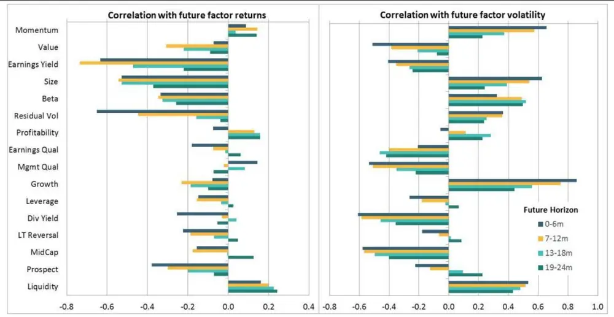
数据来源：Bonne et al（2018）。样本区间为 1996-2017。

## 3.2. 做空率差

做空率差衡量了给定因子后，因子水平头尾两端股票的做空比率在筛除价值、规模和动量的影响后的差异。此处的头尾也是使用和估值价差一样的五分位数方法进行划断。由于对冲基金是做空的主力，当股票的做空率上升的时候，这表明对冲基金有可能在该股票上投入了大量资金。具体来说，利用横截面回归，有如下表达式：

$$
\begin{array}{rl}&{\mathrm{SI}=\mathrm{a}_{\mathrm{f}}+\mathrm{k}_{\mathrm{Q1}}\mathrm{I}_{\mathrm{Q1,f}}+\cdots+\mathrm{k}_{\mathrm{Q5}}\mathrm{I}_{\mathrm{Q5,f}}}\\&{\mathrm{~\ ~\ }+\mathrm{k}_{\mathrm{Q1}}\mathrm{I}_{\mathrm{Q1,m}}+\cdots+\mathrm{k}_{\mathrm{Q5}}\mathrm{I}_{\mathrm{Q5,m}}}\\&{\mathrm{~\ ~\ }+\mathrm{k}_{\mathrm{Q1}}\mathrm{I}_{\mathrm{Q1,v}}+\cdots+\mathrm{k}_{\mathrm{Q5}}\mathrm{I}_{\mathrm{Q5,v}}}\\&{\mathrm{~\ ~\ }+\mathrm{k}_{\mathrm{Q1}}\mathrm{I}_{\mathrm{Q1,{s}}}+\cdots+\mathrm{k}_{\mathrm{Q5}}\mathrm{I}_{\mathrm{Q5,s}}}\end{array}
$$

而最终的做空率差等于

$$
\mathrm{SIS}=\mathrm{k_{Q1,f}-k_{Q5,f}}
$$

其中 $\operatorname{I}_{\mathrm{Qj,x}}$ 代表由因子 x 形成的第j（=1,2,3,4,5）个五分位区间的示性函数当且仅当股票的因子水平属于对应区间时为1否则为0，SI代表做空率，SIS 代表做空率差。在数据训练时，本文使用了后继的 63 个交易日以减少噪声和增加回归系数的稳定性。

在做空率差的正规化处理上，本文使用了依赖于单个因子的均值数据，但使用了不依赖单个因子，而由所有因子共同决定的标准差数据，这样做的原因是为了保留一些因子绝对水平的信息。事实上，此处使用的标准差数据等于所有因子的标准差的算数平均。

图 2 做空率差与因子未来收益率和波动的相关性
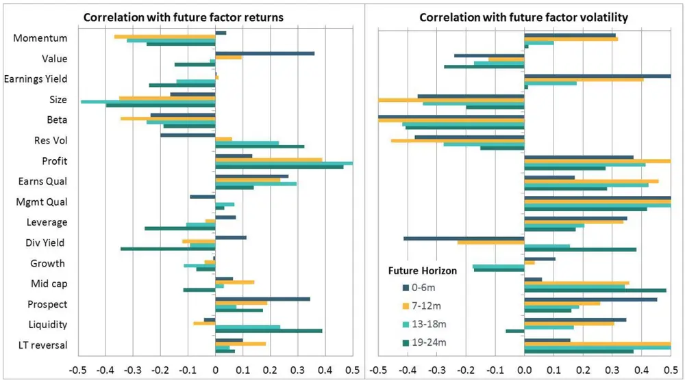
数据来源：Bonne et al（2018）。样本区间为 2007-2017。

与估值价差类似，在高波动性因子中观察到与因子未来回报相当一致的负相关性，这些因子更容易出现拥挤。

## 3.3. 两两相关

两两相关衡量了给定因子后，因子水平头尾两端股票在筛除市场、规模beta、残差波动因子的影响后的协同性。如果一个因子被大量投资者同时关注，那么处于极端因子暴露水平（较高或较低）分组内的股票收益将呈现较高的相关性。

图 3 两两相关与因子未来收益率和波动的相关性
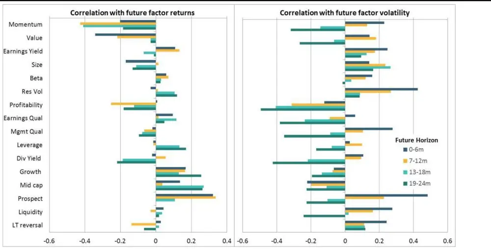
数据来源：Bonne et al（2018）。样本区间为 1996-2017。

具体来说，本文对于因子水平处于头尾的两组股票采取如下操作。对于其中任意一个分组，首先计算单只股票的收益和排除该只股票后该分组中剩下股票的平均收益之间的相关系数，数据区间为过去的 63 天。此处收益需要将市场、规模、beta 和残差波动等等剔除再做分析。然后再计算首尾两端相关系数的平均值。接着，与做空率差类似，利用依赖于因子的平均值和不依赖于因子的标准差计算最后的两两相关度量。

## 3.4. 因子波动

相对波动率衡量的是因子的预期波动率相对于市场波动率的强弱。如果有大量资金青睐于一个因子，那么该因子收益的波动大概率会增加。特别是因子达到转折点或情绪开始转向的时候。具体来说，相对波动率指标定义为 Barra USTMM 中因子的预期波动率除以市场的预测波动率，然后再进行类似于前述的时间序列标准化。

图 4 相对波动率与因子未来收益率和波动的相关性
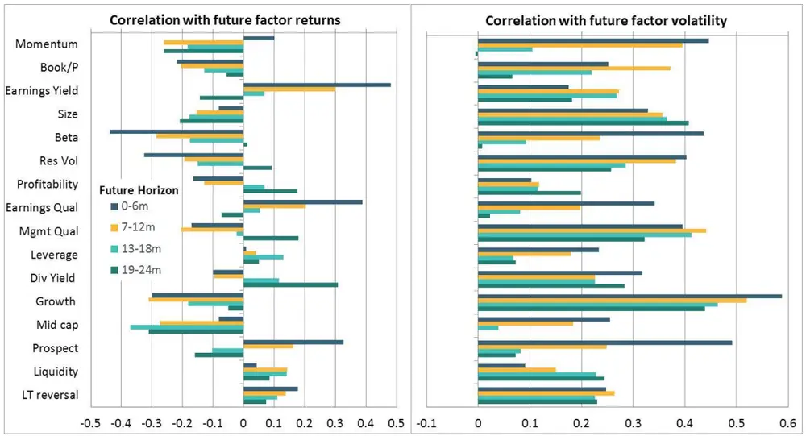
数据来源：Bonne et al（2018）。样本区间为 1996-2017。

从经验上讲，波动性倾向于聚集或呈现序列相关性，因此有理由期望相对波动率指标与因子未来波动率正相关。而从图中可以看到，几乎所有因子的相对波动性都与因子未来波动呈现正相关性，但当我们拉长观察期，特别是超过 12 个月时，相关性又呈现出显著的下降关系。而与估值价差和空头率差一样，在因子的未来收益上，不稳定的因子会呈现更大的负相关性。

## 3.5. 因子反转

由于投资者通常有追涨杀跌的倾向，如果一个因子在一段时间内表现良好，则很容易吸引大量的资本。这种现象可能在一开始时确实有利于因子表现，但盈亏同源，也为因子表现地反转埋下了伏笔。异常强劲的因子表现难以永远持续。对于因子反转指标，此处使用了与许多基金业绩评价相一致的为期 3 年的跟踪窗口。与其他度量一样，此处也对因子反转度量使用了标准化框架。

可以看到，对于高波动率因子，其与因子未来收益的相关性大多为负，而与因子未来波动率的相关性大多为正。

图 5：因子反转与因子未来收益率和波动的相关性
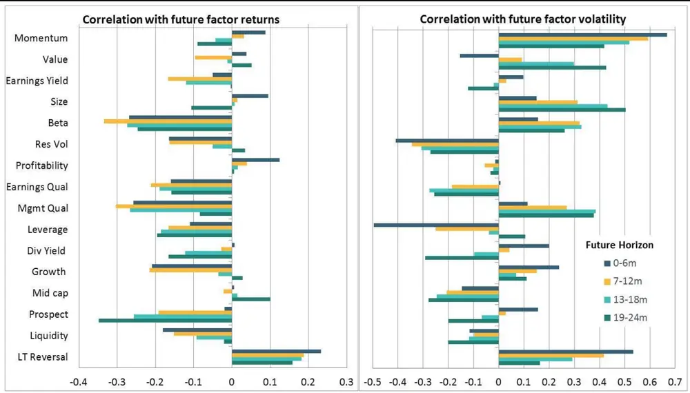
数据来源：Bonne et al（2018）。样本区间为 1996-2017。

## 4. 综合分数

为了得到最后的综合分数，本文综合考虑了上述五种拥挤度量。下图为五种拥挤度量与因子未来收益和波动的相关性的平均值。可以看到，综合分数与因子未来回报和波动性的相关性峰值一般出现在 7-12 个月的水平，这表明在反转发生之前，市场持续将持续一段时间。

图 6：综合分数与因子未来收益率和波动的相关性
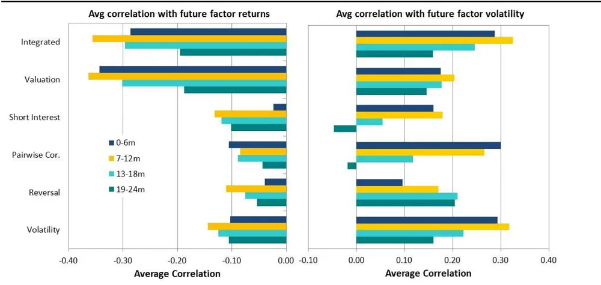
数据来源：Bonne et al（2018）。样本区间为 1996-2017。

## 4.1. 超越相关

由于对拥挤的关注主要集中在极端事件上，本文单独研究了因子收益大幅下降的发生频率，并将其视为综合拥挤指数的函数。更精细地，本文划定了综合分数在六种不同范围内时，相关因子会在接下来的一年中经历 5%或以上回撤的频率。这六种范围分别是：

表 2 不同综合分数区间

| 编号 | 综合分数范围 |
| --- | --- |
| 1 | (-∞,-1] |
| 2 | (-1,−0.5] |
| 3 | (−0.5,0] |
| 4 | (0,0.5] |
| 5 | (0.5,1] |
| 6 | (1,∞) |

数据来源：Bonne et al（2018）

其中综合拥挤分数为-1，-0.5,0,0.5,1 对应于 7%，20%，50%，80%和 93%分位数。

从下图可以看到，当综合分数高于 1 时，出现 5%及以上的因子回撤的概率 7.5 倍于综合分数小于 0.5 的情况：此时该概率约为 23%。而利用z-分数同样可以得到相似的结果。而更换相关阈值(如 2%、10%)和时间期限(如 6、18、24 个月)，同样可以发现类似结果。

图 7：综合分数与5%以上因子回撤发生频率分布图
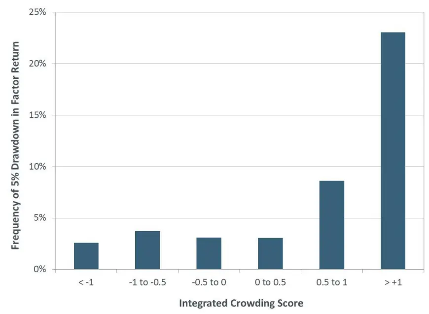
数据来源：Bonne et al（2018）。样本区间为 2007-2017，因子包含了 Barra USTMM中的所有长期因子。

本文还比较了拥挤因子和非拥挤因子在时间上的演进。利用阈值 0.5 和-

0.5，本文将各个因子依据得分高低划分成拥挤的、中性的和不拥挤三类。可以看到，拥挤的和非拥挤的因子收益率会先发生背离，并在大约 6 个月左右后达到顶峰，而之后因子收益将趋于收敛。我们观察到类似的波动性行为。而从图上看，拥挤因子的波动性往往最高，同步于收益率 6个月后达到峰值。但趣意思的是，非拥挤因子的波动率比中性因子的波动率更高。这一现象的部分原因是，波动率较高的因子会有更加极端的综合分数，因此拥挤的和不拥挤的因子的波动率要高于中性的因子。

图 8：因子收益与波动的时间演进
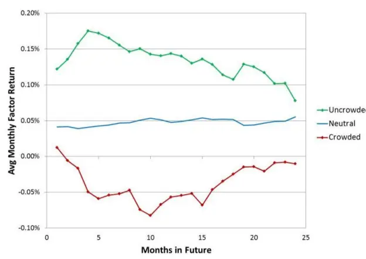

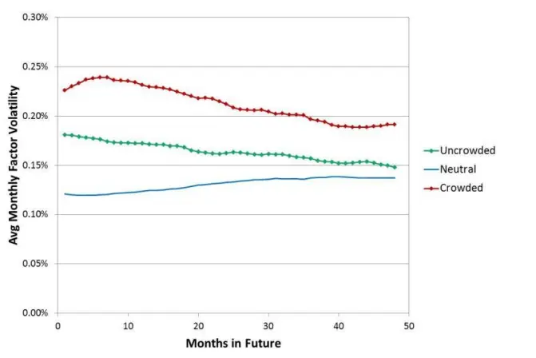
数据来源：Bonne et al（2018）。样本区间为 2007-2017，因子包含了 Barra USTMM 中的所有长期因子。

## 5. 关于动量的更加细致的观察

事实上，动量是在拥挤方面可以说最为有趣的因子。下图绘制了自 1998年以来该因子的综合得分和累积因子回归。从图中可以看到，每逢重大市场事件发生，动量指标的综合分数都及时给与了提醒。

图 9：动量因子的历史拥挤水平
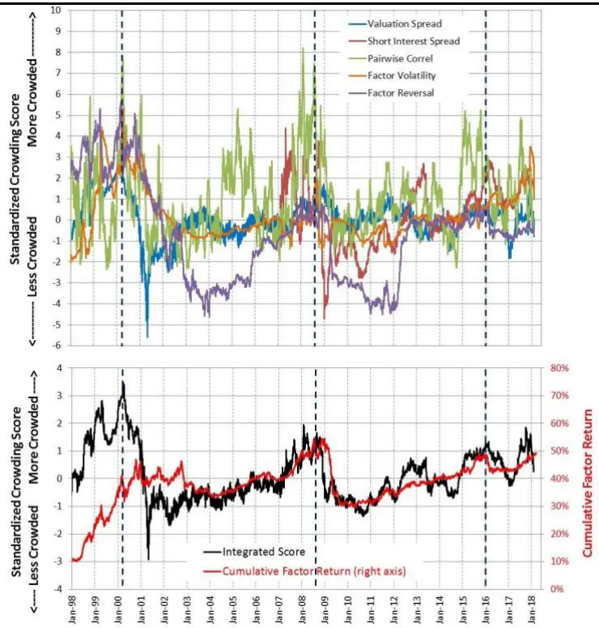

数据来源：Bonne et al（2018）。标记分别为 2000/02/01（科技股泡沫）、2008/08/01（金融危机前）、2015/12/31（动量回撤前）。

例如，在科技泡沫时期，几乎所有的拥挤指标，尤其是估值价差、因子动量和相对波动率，都呈现高企状态，这也将动量的综合得分推到了极端水平。而泡沫破裂后，由于所有指标的数值都大幅下降，综合分数为负，这表明动量因子的拥挤性不再。

在随后的几年里，综合得分保持负值直到 年，动量因子才开始重新拥挤起来。2008 年，在金融危机之前，动量因子的综合得分接近 2。但当市场在 2009 年开始反弹时，动量因子的累计收益崩溃了。然而，在其崩溃前的几个月，综合分数下降的事实表明，2009 年的动量崩溃不是由拥挤驱动的。

此后到 2015 年之前，动量的综合得分通常保持负值或中性水平。2015年，综合得分再次升至 1 以上，表明拥挤程度有所增加。截至 2018 年 2月，动量因子的综合分数回到了中性区间，接近 0.5。而且没有任何度量呈现出显著的拥挤。由于只有规模因子的综合得分低于-1，这表明大盘股并不拥挤，估值价差和做空率差是综合分数较低的主要原因。

最后，下图显示了综合分数中在不同时期，各个拥挤度量的贡献度。

图 10：综合分数与贡献度
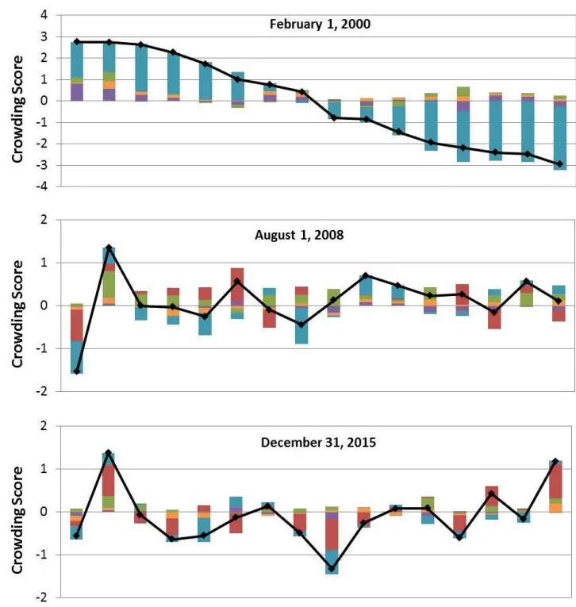

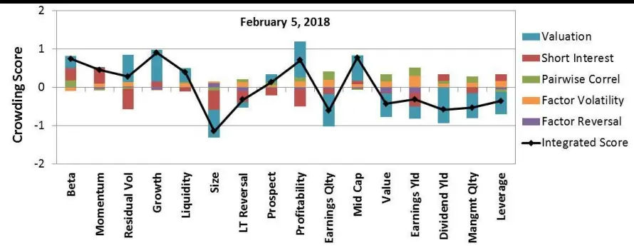
数据来源：Bonne et al（2018）。

## 6. 结论

本文提出了基于多视角度量因子拥挤度的方法，为投资者观察因子拥挤提供了便利。

## 参考文献

Bayraktar, M., S. Doole, A. Kassam and S. Radchenko. (2015a). “Lost in the Crowd? Identifying and Measuring Crowded Strategies and Trades.” MSCI Research Insight.

## 本公司具有中国证监会核准的证券投资咨询业务资格

## 分析师声明

作者具有中国证券业协会授予的证券投资咨询执业资格或相当的专业胜任能力，保证报告所采用的数据均来自合规渠道，分析逻辑基于作者的职业理解，本报告清晰准确地反映了作者的研究观点，力求独立、客观和公正，结论不受任何第三方的授意或影响，特此声明。

## 免责声明

本报告仅供国泰君安证券股份有限公司（以下简称“本公司”）的客户使用。本公司不会因接收人收到本报告而视其为本公司的当然客户。本报告仅在相关法律许可的情况下发放，并仅为提供信息而发放，概不构成任何广告。

本报告的信息来源于已公开的资料，本公司对该等信息的准确性、完整性或可靠性不作任何保证。本报告所载的资料、意见及推测仅反映本公司于发布本报告当日的判断，本报告所指的证券或投资标的的价格、价值及投资收入可升可跌。过往表现不应作为日后的表现依据。在不同时期，本公司可发出与本报告所载资料、意见及推测不一致的报告。本公司不保证本报告所含信息保持在最新状态。同时，本公司对本报告所含信息可在不发出通知的情形下做出修改，投资者应当自行关注相应的更新或修改。

本报告中所指的投资及服务可能不适合个别客户，不构成客户私人咨询建议。在任何情况下，本报告中的信息或所表述的意见均不构成对任何人的投资建议。在任何情况下，本公司、本公司员工或者关联机构不承诺投资者一定获利，不与投资者分享投资收益，也不对任何人因使用本报告中的任何内容所引致的任何损失负任何责任。投资者务必注意，其据此做出的任何投资决策与本公司、本公司员工或者关联机构无关。

本公司利用信息隔离墙控制内部一个或多个领域、部门或关联机构之间的信息流动。因此，投资者应注意，在法律许可的情况下，本公司及其所属关联机构可能会持有报告中提到的公司所发行的证券或期权并进行证券或期权交易，也可能为这些公司提供或者争取提供投资银行、财务顾问或者金融产品等相关服务。在法律许可的情况下，本公司的员工可能担任本报告所提到的公司的董事。

市场有风险，投资需谨慎。投资者不应将本报告作为作出投资决策的唯一参考因素，亦不应认为本报告可以取代自己的判断。
在决定投资前，如有需要，投资者务必向专业人士咨询并谨慎决策。

本报告版权仅为本公司所有，未经书面许可，任何机构和个人不得以任何形式翻版、复制、发表或引用。如征得本公司同意进行引用、刊发的，需在允许的范围内使用，并注明出处为“国泰君安证券研究”，且不得对本报告进行任何有悖原意的引用、删节和修改。

若本公司以外的其他机构（以下简称“该机构”）发送本报告，则由该机构独自为此发送行为负责。通过此途径获得本报告的投资者应自行联系该机构以要求获悉更详细信息或进而交易本报告中提及的证券。本报告不构成本公司向该机构之客户提供的投资建议，本公司、本公司员工或者关联机构亦不为该机构之客户因使用本报告或报告所载内容引起的任何损失承担任何责任。

## 评级说明

## 1.投资建议的比较标准

投资评级分为股票评级和行业评级。

以报告发布后的 12 个月内的市场表现为比较标准，报告发布日后的 12 个月内的公司股价（或行业指数）的涨跌幅相对同期的沪深 300 指数涨跌幅为基准。

## 2.投资建议的评级标准

报告发布日后的 12 个月内的公司股价（或行业指数）的涨跌幅相对同期的沪深300 指数的涨跌幅。

|  | 评级 | 说明 |
| --- | --- | --- |
| 股票投资评级 | 增持 | 相对沪深300指数涨幅15%以上 |
|  | 谨慎增持 | 相对沪深300指数涨幅介于 5%～15%之间 |
|  | 中性 | 相对沪深300指数涨幅介于-5%～5% |
|  | 减持 | 相对沪深300 指数下跌 5%以上 |
| 行业投资评级 | 增持 | 明显强于沪深 300 指数 |
|  | 中性 | 基本与沪深 300 指数持平 |
|  | 减持 | 明显弱于沪深 300 指数 |

## 国泰君安证券研究所

|  | 上海 | 深圳 | 北京 |
| --- | --- | --- | --- |
| 地址 | 上海市静安区新闸路 669 号博华广 场20层 | 深圳市福田区益田路6009号新世界 商务中心34层 | 北京市西城区金融大街甲9号金融 街中心南楼18层 |
| 邮编 | 200041 | 518026 | 100032 |
| 电话 | (021)38676666 | (0755)23976888 | (010)83939888 |
|  | E-mail: gtjaresearch@gtjas.com |  |  |