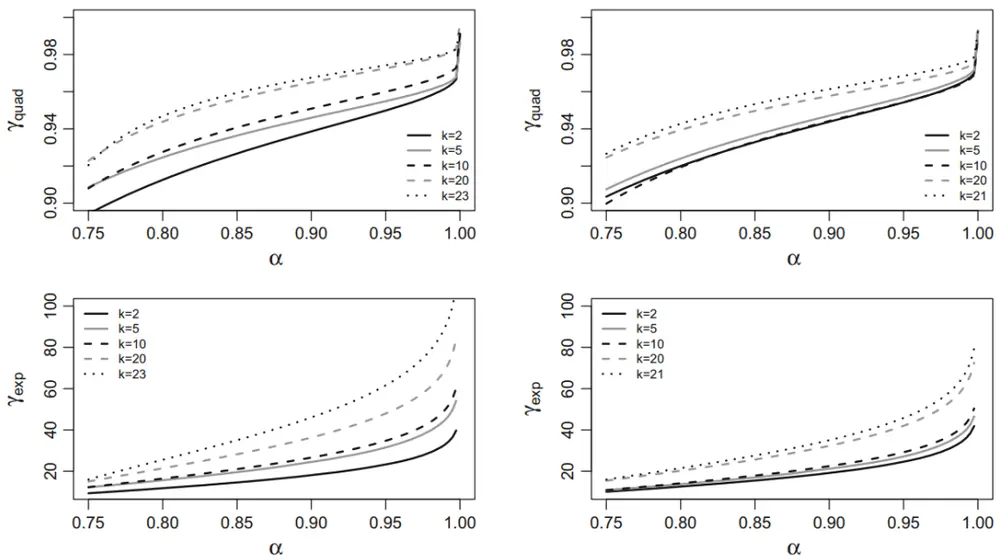
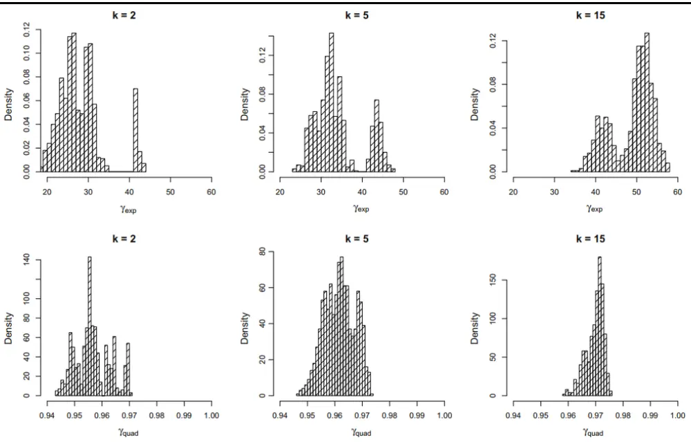
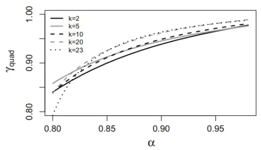
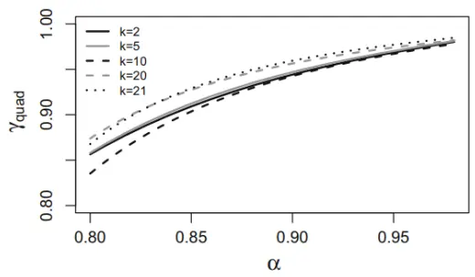
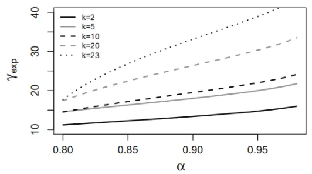
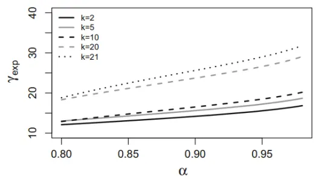
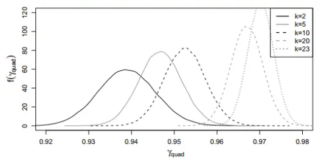
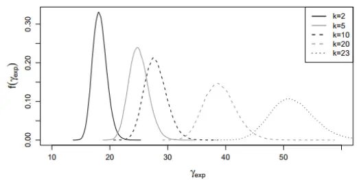
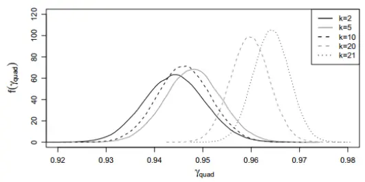
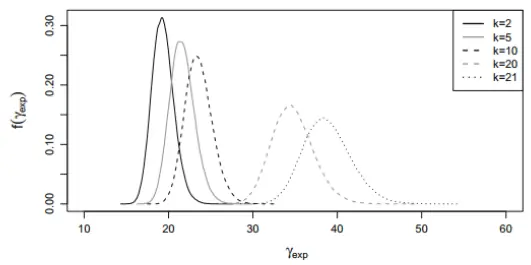

inInfo][Table_Title]2022.03.29

# 如何通过VaR确定风险厌恶系数

## ——精品文献解读系列（二十七）

## 本报告导读：

在MVO中，风险厌恶系数通常被视为外生变量，但本文另辟蹊径给出了其与风险度量 VaR之间的函数关系，值得战略资产配置投资者借鉴。

## 摘要：

投资学是一门学术界与业界紧密结合的学科，其中大类资产配置是这种紧密结合的代表。从 （ ）开创现代投资组合理论开始，学术界为业界提供了丰富的理论参考和方法模型，推动了大类资产配置实践的繁荣发展。为了帮助读者及时跟踪学术前沿，我们推出了“精品文献解读”系列报告，从大量学术文献中挑选出精品论文进行剖析解读，为读者呈现大类资产配置领域最新的思路和方法。

本篇为读者解 读的文献是 Bodnar et al（2018）在 ComputationalManagement Science 上发表的论文“Determination and estimation ofrisk aversion coefficients”。

本文考虑了投资组合配置问题中常用的两类效用函数，即指数效用（exponential utility）函数和二次效用（quadratic utility）函数。利用最优化框架，本文得以将不同效用函数下的最优投资组合和 VaR（value at risk）相联系，并最终将风险厌恶系数表达为 VaR 的解析表达式。本文首先假设资产收益向量为多元正态分布，然后将结果推广到椭圆等值分布族上。本文发现风险厌恶系数的选择与收益率数据的生成模型有关。最后，本文考虑了模型中参数的不确定性，并给出了风险厌恶系数的置信区间。

- 在 MVO 中，风险厌恶系数通常被视为外生变量，但本文另辟蹊径给出了其与风险度量 VaR 之间的函数关系，值得战略资产配置投资者借鉴。

大类资产配置研究

## hor] 报告作者

赵索(分析师)

8 0755-23976601

zhaosuo024832@gtjas.com

证书编号 S0880521080002

## cReport] 相关报告

无悲无喜，不忌多空，市场进入战略相持期2022.03.14

如何衡量观测因子拥挤度

2022.02.24

俄乌局势紧张，对大类资产影响几何

2022.02.13

短期阳光普照,中线扑朔迷离2022.02.06

## 1. 文献概述

## 文献来源：

Bodnar, T. , et al. "Determination and estimation of risk aversion coefficients." Computational Management Science 15.2(2018):1-21.

## 文献摘要：

本文考虑了投资组合配置问题中常用的两类效用函数，即指数效用（exponential utility）函数和二次效用（quadratic utility）函数。利用最优化框架，本文得以将不同效用函数下的最优投资组合和VaR（valueat risk）相联系，并最终将风险厌恶系数表达为 VaR 的解析表达式。本文首先假设资产收益向量为多元正态分布，然后将结果推广到椭圆等值分布族上。本文发现风险厌恶系数的选择与收益率数据的生成模型有关。最后，本文考虑了模型中参数的不确定性，并给出了风险厌恶系数的置信区间。

## 文献评述：

在 MVO 中，风险厌恶系数通常被视为外生变量，但本文另辟蹊径给出了其与风险度量 VaR 之间的函数关系，值得战略资产配置投资者借鉴。

## 2. 引言

风险厌恶系数量化了投资者对风险的态度，虽然在配置模型中被广泛应用，但它的具体选择通常较为主观，很难使用经济推理加以规范。本文将尝试将通过 VaR 系数对其进行估计。

风险厌恶系数的确认离不开对效用函数的建模。但基于数学和经济的考虑，通常使用的效用函数主要有两类，即二次效用和指数效用。假设投资组合的权重向量为

$$
\mathbf{w}=\mathbf{w}_{\mathbf{k}\times\mathbf{1}}=(\mathbf{w}_{\mathbf{1}},\ldots,\mathbf{w}_{\mathbf{k}})^{\mathrm{T}}\mathbf{:}\mathbf{1}^{\mathrm{T}}\cdot\mathbf{w}=1
$$

两种效用函数分别为：

$$
\begin{aligned}\mathrm{U}_{\mathrm{quad}}(\mathrm{R}_{\mathrm{w}})=\mathrm{R}_{\mathrm{w}}-\frac{\gamma_{\mathrm{quad}}}{2}\cdot\mathrm{R}_{\mathrm{w}}^{2}=\mathrm{X}^{\mathrm{T}}\mathrm{w}-\frac{\gamma_{\mathrm{quad}}}{2}\cdot(\mathrm{X}^{\mathrm{T}}\mathrm{w})^{2}\\\mathrm{U}_{\mathrm{exp}}(\mathrm{R}_{\mathrm{w}})=1-\mathrm{e}^{-\gamma_{\mathrm{exp}}\cdot\mathrm{R}_{\mathrm{w}}}\end{aligned}
$$

$$
\left\{\begin{aligned}\mathrm{X}=\mathrm{X}_{\mathrm{k}\times1}=(\mathrm{X}_1,\ldots,\mathrm{X}_{\mathrm{k}})^{\mathrm{T}}\\\mathrm{R}_{\mathrm{w}}=\mathrm{X}^{\mathrm{T}}\mathrm{w}\end{aligned}\right.
$$

分别代表资产的收益率和对应的投资组合的收益率，不同下标的γ对应的即两种不同的风险厌恶系数。可以证明，如果资产收益服从多元正态分布，那么指数型效用函数的最优解等同于

$$
\mathrm{U_{mu}(R_w)}=\mu^{\mathrm{T}}\mathrm{w}-\frac{\gamma_{\mathrm{mu}}}{2}\cdot\mathrm{w^{T}}\Sigma\mathrm{w}
$$

$$
\left\{\begin{aligned}\mu=\mathbb{E}(\mathrm{X})\\\Sigma=\mathrm{Cov}(\mathrm{X})\end{aligned}\right.
$$

分别是期望收益率和协方差矩阵。需要指出的是，在正态假设下，虽然上述三种效用模型的数学模型是等价的，但是其随机性质是有差异的，详情参见 Bodnar et al（2013）。

在实践中，由于风险厌恶系数的选择难以量化，利用市场数据对风险厌恶系数进行估计的研究已不多见。虽然如此，将风险厌恶系数和 关联起来的想法并不新鲜，这是因为使用 VaR 的置信系数比抽象的风险厌恶系数更容易表征对风险的态度。但在已有的文献之中，通常都假设资产收益是高斯的，且是效用函数为二次函数。例如 Das et al（2010）和Alexander and Baptista（2011）。

本文考虑前述两种不同的效用函数，并将资产收益的结果从多元正态推广到椭圆分布上。更准确地说，本文将把由特定效用函数得到的最优投资组合的解析表达式与最小 VaR 最优投资组合联系起来。后一个投资组合将由依据监管建议的确定显著性系数α来决定。因此本文量化了投资者对不同效用函数下，且在不同但更加实际的收益分布假设下的风险态度。而本文的实证研究证明实践中常用的风险厌恶系数的数值是合理的。

## 3. 正态分布下的风险厌恶

假设资产收益满足多元正态：

$$
\mathrm{X}\sim\mathrm{N}_{\mathrm{k}}(\mu,\Sigma)
$$

假设最优化目标分别为

$$
\mathrm{w}_{\mathrm{quad}}^{*}=\arg\max_{\mathrm{1}^{\mathrm{T}}\mathrm{w}=1}\mathbb{E}\left(\mathrm{U}_{\text{quad}}\left(\mathrm{R}_{\mathrm{w}}\right)\right)
$$

$$
\mathbf{w}_{\mathrm{exp}}^{*}=\arg\max_{\mathbf{1}^{\mathrm{T}}\mathbf{w}=1}\mathbb{E}\left(\mathbf{U}_{\mathrm{exp}}(\mathbf{R}_{\mathrm{w}})\right)
$$

Merton（1969）证明，在上述假设下，指数效用函数的最优解等价于前述 $\mathbf{U_{mu}}$ 给出的解，并且被如下参数所决定

$$
\left\{\begin{aligned}\mathsf{R}_{GMV}&=\frac{1^{\mathrm{T}}\Sigma^{-1}\mu}{1^{\mathrm{T}}\Sigma^{-1}1}\\\mathsf{V}_{GMV}&=\frac{1}{1^{\mathrm{T}}\Sigma^{-1}1}\\\mathsf{s}&=\mu^{\mathrm{T}}\mathsf{R}^{-1}\mu\end{aligned}\right.
$$

$$
\mathbb{R}=\Sigma^{-1}-\frac{\Sigma^{-1}11^{\mathrm{T}}\Sigma^{-1}}{1^{\mathrm{T}}\Sigma^{-1}1}
$$

GMV（global minimum variance）代表全局最小方差投资组合， $\mathrm{R}_{\mathrm{GMV}}$ 和$\mathrm{V_{GMV}}$ 分别代表其期望收益率和方差（两者共同决定了有效前沿的顶点位置），而 s 代表了有效前沿的斜率参数。利用数学知识，可以得到指数效用函数对应的最优解：

$$
\mathbf{w}_{\mathrm{exp}}^{*}=\frac{\Sigma^{-1}1}{1^{\mathrm{T}}\Sigma^{-1}1}+\gamma_{\mathrm{exp}}^{-1}\cdot\mathbf{R}\boldsymbol{\mu}
$$

而二次效用函数的表达式稍微复杂：

$$
\mathbf{w}_{\mathrm{quad}}^{*}=\frac{\mathbf{A}^{-1}\mathbf{1}}{\mathbf{1}^{\mathrm{T}}\mathbf{A}^{-1}\mathbf{1}}+\gamma_{\mathrm{quad}}^{-1}\cdot\mathbf{R}_{\mathrm{A}}\boldsymbol{\mu}
$$

$$
\left\{\begin{aligned}\mathsf{A}&=\mathbb{E}(\mathsf{XX^T})\\\mathsf{R_A}&=\mathsf{A^{-1}}-\frac{\mathsf{A^{-1}}11^{\mathrm{T}}\mathsf{A^{-1}}}{1^{\mathrm{T}}\mathsf{A^{-1}}1}\end{aligned}\right.
$$

特别的，Bodnar et al（2012）证明了最优权重的另外一种形式：

$$
\mathbf{w}_{\mathrm{quad}}^{*}=\frac{\Sigma^{-1}1}{1^{\mathrm{T}}\Sigma^{-1}1}+\tilde{\gamma}_{\mathrm{quad}}^{-1}\cdot\mathbf{R}\boldsymbol{\mu}
$$

$$
\tilde{\gamma}_{\mathrm{quad}}=\frac{1+s}{\gamma_{\mathrm{quad}}^{-1}-1-\mathrm{R}_{\mathrm{GMV}}}
$$

下面我们回顾最小 VaR 投资组合的公式。注意到 VaR 的计算等于概率：

$$
\mathbb{P}(\mathrm{X}^{\mathrm{T}}\mathrm{w}<-\mathrm{VaR}_{\alpha})=1-\alpha,\alpha\in(0.5,1)
$$

若收益率为多元正态，那么

$$
\mathrm{VaR}_{\alpha}=-\boldsymbol{\mu}^{\mathrm{T}}\boldsymbol{\mathrm{w}}-\boldsymbol{\mathrm{z}}_{1-\alpha}\cdot\sqrt{\boldsymbol{\mathrm{w}}^{\mathrm{T}}\boldsymbol{\Sigma}\boldsymbol{\mathrm{w}}}
$$

$$
\mathbf{z}_{\beta}=\Phi^{-1}(\beta)
$$

代表的是标准 $证$ 态分布的β-分位数。通常α的取值要大于 0.95。Alexander and Baptista（2002）则提出了如下规划问题

$$
\mathbf{w}_{\mathrm{VaR},\alpha}^{*}=\arg\max_{1^{\mathrm{T}}\mathbf{w}=1}\mathrm{VaR}_{\alpha}
$$

而该投资组合有这非常好的样本外表现。进一步地，Bodnar et al（2012）给出了上述规划问题解的形式如下

$$
\mathrm{w}_{\mathrm{VaR},\alpha}^{*}=\mathrm{w}_{\mathrm{GMV}}+\sqrt{\frac{\mathrm{V}_{\mathrm{GMV}}}{\mathrm{z}_{1-\alpha}^{2}-\mathrm{s}}}\cdot\mathrm{R}\mu.
$$

下面我们略作总结：

1. $\mathbf{w}_{\mathrm{quad}}^{*},\mathbf{w}_{\mathrm{exp}}^{*},\mathbf{w}_{\mathrm{VaR},\alpha}^{*}$ 都落在 Markowitz 的有效前沿上。

2. 上述三种最优投资组合在形式上都具有相同的内部结构。

于是有定理：

定理 1 设

$$
\mathbf{X}\sim\mathbf{N}_{\mathbf{k}}(\boldsymbol{\mu},\boldsymbol{\Sigma})\quad 且\quad\mathbf{z}_{\mathbf{1}-\boldsymbol{\alpha}}^2>\mathbf{s}
$$

则两种风险厌恶系数可以被VaR 及置信系数α表达为

$$
\gamma_{\mathrm{exp}}=\sqrt{\frac{\mathbf{z}_{1-\alpha}^{2}-\mathbf{s}}{\mathbf{V}_{\mathrm{GMV}}}}
$$

$$
\mathbf{\gamma}_{\mathrm{quad}}=\left(\mathbf{1}+\mathbf{R}_{\mathrm{GMV}}+\frac{\mathbf{1}+\mathbf{s}}{\mathbf{\gamma}_{\mathrm{exp}}}\right)^{-1}
$$

通过定理 1 可以看到， $\alpha$ 实际上在一定程度上反映了投资者的风险厌恶系数。当α很高的时候，极端损失金额将被关注，这意味着此时的投资者将有较高的风险厌恶系数；而α很低的时候，投资者更关注一般情况下损失金额，因此对极端损失金额较为迟钝，这表明投资者的风险厌恶系数相对适度。

乍看之下，风险厌恶系数对有效前沿特征的依赖着实出人意料。然而从直观的角度来看，投资者显然会对特定的风险的类型和数量产生差异化的厌恶，这意味着γ绝非常数。在面对风险很高的投资组合时，相比于风险中等的投资组合，投资者的冒险意愿显然将会更低。注意到投资者对风险的态度取决于有效前沿，而其在均值-方差空间中的位置和形状完全由 $\mathrm{R}_{\mathrm{GMV}},\mathrm{V}_{\mathrm{GMV}}$ 和 s 三个参数决定，故而风险厌恶实数对这些参数的依赖也就不足为奇。

## 4. 椭圆分布下的风险厌恶

椭圆等高分布（elliptically contoured distribution，ECD）的密度函数满足

$$
\mathbf{f}_{\mathrm{X}}(\mathrm{x})=\mathbf{c}_{\mathrm{k}}\cdot\mathbf{g}\left((\mathrm{x}-\boldsymbol{\mu})^{\mathrm{T}}\mathbf{D}^{-1}(\mathrm{x}-\boldsymbol{\mu})\right),\mathbf{c}_{\mathrm{k}}>0
$$

其中 $\mathbf{g}$ 称该分布的类型函数，符号上记为：

$$
\mathrm{X}\sim\mathrm{E}_{\mathrm{k}}(\mu,\mathrm{D},\mathsf{g})
$$

其中 $\mu$ 称为位置向量（location vector），D 称为散布矩阵（dispersionmatrix）。假设 X 的二阶矩存在，那么有

$$
\mu=\mathbb{E}(\mathbb{X})以及\Sigma=\mathrm{Cov}(\mathbb{X})=\omega\mathrm{D}
$$

以及 ECD 的随机表达

$$
\mathrm{X}\triangleq\mu+\mathrm{rD}^{1/2}\mathrm{Z}\mathrm{其中}\ \mathrm{Z}\sim\mathrm{N}_{\mathrm{k}}(0,\mathrm{I}_{\mathrm{k}})
$$

同正态分布的例子一样，对于 ECD 同样有

$$
\mathbb{E}\left(\mathsf{U}_{\mathsf{quad}}(\mathsf{R}_{\mathsf{w}})\right)=\mathbb{E}(\mathsf{X})^{\mathsf{T}}\mathsf{w}-\frac{\mathsf{Y}_{\mathsf{quad}}}{2}\cdot\mathbb{E}\left((\mathsf{X}^{\mathsf{T}}\mathsf{w})^{2}\right)=\mathsf{\mu}^{\mathsf{T}}\mathsf{w}-\frac{\mathsf{Y}_{\mathsf{quad}}}{2}\cdot\mathsf{w}^{\mathsf{T}}\Sigma\mathsf{w}
$$

而对于指数期望效用函数，利用

$$
\mathbb{R}_{\mathbf{w}}|\mathbf{r}\sim\mathrm{N}(\mathbf{\mu}^{\mathrm{T}}\mathbf{w},\mathbf{r}^{2}\mathbf{w}^{\mathrm{T}}\mathrm{D}\mathbf{w})
$$

满足

$$
\begin{aligned}\mathbb{E}\left(\mathsf{U}_{\mathrm{exp}}(\mathsf{R}_{\mathrm{w}})\right)=&1-\mathbb{E}\Big(\mathrm{e}^{-\gamma_{\mathrm{exp}}\cdot\mathsf{R}_{\mathrm{w}}}\Big)=1-\mathbb{E}\Big(\mathbb{E}\Big(\mathrm{e}^{-\gamma_{\mathrm{exp}}\cdot\mathsf{R}_{\mathrm{w}}}\Big|\mathbf{r}\Big)\Big)\\=&1-\mathbb{E}\Big(\mathrm{e}^{-\gamma_{\mathrm{exp}}\cdot\mathsf{\mu}^{\mathrm{T}}\mathbf{w}+\frac{1}{2}\gamma_{\mathrm{exp}}^{2}\cdot\mathbf{w}^{\mathrm{T}}\mathbf{D}\mathbf{w}\cdot\mathbf{r}^{2}}\Big)\\=&1-\mathrm{e}^{-\gamma_{\mathrm{exp}}\cdot\mathsf{\mu}^{\mathrm{T}}\mathbf{w}}\cdot\mathbb{E}\Big(\mathrm{e}^{\frac{1}{2}\gamma_{\mathrm{exp}}^{2}\cdot\mathbf{w}^{\mathrm{T}}\mathbf{D}\mathbf{w}}\Big)\\=&1-\mathrm{e}^{-\gamma_{\mathrm{exp}}\cdot\mathsf{\mu}^{\mathrm{T}}\mathbf{w}}\cdot\mathbf{m}_{\mathrm{r}^{2}}\Big(\frac{\gamma_{\mathrm{exp}}^{2}\cdot\mathbf{w}^{\mathrm{T}}\mathbf{D}\mathbf{w}}{2}\Big)\\=&1-\mathrm{e}^{-\gamma_{\mathrm{exp}}\cdot\mathsf{\mu}^{\mathrm{T}}\mathbf{w}}\cdot\mathbf{m}_{\mathrm{r}^{2}}\Big(\frac{\gamma_{\mathrm{exp}}^{2}\cdot\mathbf{w}^{\mathrm{T}}\mathbf{D}\mathbf{w}}{2\mathbb{E}(\mathbf{r}^{2})}\Big)\end{aligned}
$$

$$
\mathbf{m}_{\mathbf{r}^{2}}(\mathbf{t})=\mathbb{E}\left(\mathbf{e}^{\mathbf{t}\cdot\mathbf{r}^{2}}\right)
$$

是相应的矩生成函数。利用对数的单调性，此时的规划问题等价于解：

$$
\mathbf{w}_{\mathrm{ell}}^{*}=\arg\max_{\mathbf{w}^{\mathrm{T}}1=1}\mu^{\mathrm{T}}\mathbf{w}-\gamma_{\mathrm{exp}}^{-1}\cdot\log\mathbf{m}_{\mathrm{r}^{2}}\left(\frac{\gamma_{\mathrm{exp}}^{2}\cdot\mathbf{w}^{\mathrm{T}}\Sigma\mathbf{w}}{2\mathbb{E}\left(\mathbf{r}^{2}\right)}\right)
$$

引理 1 设X ∼ $\mathbf{E}_{\mathbf{k}}(\mathbf{\mu},\mathbf{D},\mathbf{g})$ 且m $\mathbf{r}^{2}\left(\cdot\right)$ 为对应的矩生成函数，则

$$
\mathbf{w}_{\mathrm{ell}}^{*}=\frac{\mathbf{\Sigma}^{-1}\mathbf{1}}{\mathbf{1}^{\mathrm{T}}\mathbf{\Sigma}^{-1}\mathbf{1}}+\mathbf{\tilde{\gamma}}_{\mathrm{exp}}^{-1}\cdot\mathbf{R}\mathbf{\mu}.
$$

而以κ为未知数的微分方程

$$
\kappa\psi^{\prime}\left(\frac{\gamma_{\mathrm{exp}}^{2}\cdot\left(\mathbf{V}_{\mathrm{GMV}}+\mathbf{c}^{2}\cdot\mathbf{s}\right)}{2\mathbb{E}\left(\mathbf{r}^{2}\right)}\right)=\frac{\mathbb{E}\left(\mathbf{r}^{2}\right)}{\gamma_{\mathrm{exp}}}
$$

的解给出了 $\tilde{\bf{Y}}_{\bf{exp}},$ , 其中

$$
\mathbf{\nabla}\mathbf{\Psi}\mathbf{\Psi}(\mathbf{x})=\mathbf{log}(\mathbf{m}_{\mathbf{r}^{2}}(\mathbf{x})).
$$

需要指出的是，上述引理在实操层面上具有相当的吸引力。虽然指数效用函数对应的规划问题是一个高度非线性的问题，但上述引理将其简化为一个单变元方程的解。

与正态分布情况类似，ECD 给出的 VaR 的值等于

$$
\mathrm{VaR}_{\alpha}=-\mu^{\mathrm{T}}\mathbf{w}-\mathrm{d}_{1-\alpha}\cdot\sqrt{\mathbf{w}^{\mathrm{T}}\mathbf{D}\mathbf{w}}=-\mu^{\mathrm{T}}\mathbf{w}-\frac{\mathrm{d}_{1-\alpha}}{\sqrt{\mathbb{E}(\mathbf{r}^{2})}}\cdot\sqrt{\mathbf{w}^{\mathrm{T}}\mathbf{\Sigma}\mathbf{w}}
$$

其中 d 是一个仅依赖维数 k 和类型函数 g 的常数。相应的最优化解为：

$$
\mathbf{w}_{\mathrm{VaR,\alpha}}^{*}=\mathbf{w}_{\mathrm{GMV}}+\sqrt{\frac{\mathbf{V}_{\mathrm{GMV}}}{\frac{\mathbf{d}_{1-\alpha}^{2}}{\mathbb{E}(\mathbf{r}^{2})}-\mathbf{s}}}\cdot\mathbf{R}\boldsymbol{\mu}.
$$

这意味着：

定理 2 设X $\sim\mathbf{E_{k}}(\mathbf{\mu},\mathbf{D},\mathbf{g})$ 且相应的矩生成函数 $\mathbf{\bar{m}_{r^{2}}}(\cdot)$ 。假如

$$
\frac{\mathbf{d}_{\mathbf{1}-\alpha}^{2}}{\mathbb{E}(\mathbf{r}^{2})}>\mathbf{s}
$$

那么

$$
\mathbf{Y_{quad}}=\left(\mathbf{1}+\mathbf{R_{GMV}}+(\mathbf{1}+\mathbf{s})\cdot\sqrt{\frac{\mathbf{V_{GMV}}}{\mathbf{d_{1-\alpha}^{2}}-\mathbf{s}}}\right)^{-1},
$$

而 $\mathbf{\gamma_{exp}}$ 是如下关于κ的微分方程的解

$$
\kappa\psi^{\prime}\left(\frac{\kappa^{2}(\bf{V}_{GMV}+\lambda^{2}s)}{2\mathbb{E}(\bf{r}^{2})}\right)=\frac{\mathbb{E}(\bf{r}^{2})}{\lambda}
$$

$$
\pmb{\lambda}=\sqrt{\frac{\mathbf{V}_{\mathrm{GMV}}}{\frac{\mathbf{d}_{1-\alpha}^{2}}{\mathbb{E}\left(\mathbf{r}^{2}\right)}-\pmb{s}}}
$$

## 5. 估计和推断过程

由于在上述的模型中，收益率和协方差矩阵需要估计，因此本节着重于模型中各个参数的推导。假设

$$
\mathtt{X_{1},\dots,X_{n}}
$$

是资产收益率的样本数据，则收益率和方差的样本估计为：

$$
\begin{aligned}\hat{\boldsymbol{\mu}}=&\frac{1}{\mathrm{n}}\sum_{\mathrm{i}}\mathrm{X}_{\mathrm{i}}\\\hat{\boldsymbol{\Sigma}}=&\frac{1}{\mathrm{n}-1}\sum_{\mathrm{i}}(\mathrm{X}_{\mathrm{i}}-\hat{\boldsymbol{\mu}})(\mathrm{X}_{\mathrm{i}}-\hat{\boldsymbol{\mu}})^{\mathrm{T}}\end{aligned}
$$

利用上述估计量我们得到

$$
\left\{\widehat{\mathsf{R}}_{\mathrm{GMV}}=\frac{1^{\mathrm{T}}\widehat{\Sigma}^{-1}\widehat{\mu}}{1^{\mathrm{T}}\widehat{\Sigma}^{-1}1}\right\}
$$

$$
\left\{\widehat{\mathsf{V}}_{\mathrm{GMV}}=\frac{1}{1^{\mathrm{T}}\widehat{\Sigma}^{-1}1}\right.
$$

$$
\hat{\mathrm{~\bf~\cal~S~}}=\hat{\boldsymbol{\mu}}^{\mathrm{T}}\hat{\mathrm{\bf\cal{R}}}^{-1}\hat{\boldsymbol{\mu}}
$$

$$
\widehat{\mathbb{R}}=\widehat{\Sigma}^{-1}-\frac{\widehat{\Sigma}^{-1}11^{\mathrm{T}}\widehat{\Sigma}^{-1}}{1^{\mathrm{T}}\widehat{\Sigma}^{-1}1}
$$

再利用下列引理，参见 Bodnar and Schmid（2008，2009）：

引理 2 设 $\mathbf{X_{1},\ldots,X_{n}}$ 为随机向量X $\sim\mathbf{N_{k}}(\mathbf{\mu},\Sigma>\mathbf{0})$ 的独立采样。那么有

a) $\widehat{\mathbf{V}}_{\mathbf{GMV}}$ 独立于 $(\widehat{\mathbf{R}}_{\mathbf{G}\mathbf{M}\mathbf{V}},\widehat{\mathbf{s}})$

$$
\frac{(\mathbf{n}-1)\widehat{\mathbf{V}}_{\mathrm{GMV}}}{\mathbf{V}_{\mathrm{GMV}}}\sim\chi_{\mathbf{n}-\mathbf{k}}^{2}.
$$

c)

$$
\begin{array}{r}{\frac{\mathbf{n}\left(\mathbf{n}-\mathbf{k}+\mathbf{1}\right)\hat{s}}{\left(\mathbf{n}-\mathbf{1}\right)\left(\mathbf{k}-\mathbf{1}\right)}\sim\mathbf{F_{k-1,n-k+1,ns}}}\end{array}
$$

$$
\begin{array}{rl}{\mathrm{~d)}}&{{}\widehat{\bf R}_{\mathrm{GMV}}|\widehat{\bf s}={\bf y}\sim\mathrm{~N}\left({\bf R}_{\mathrm{GMV}},\left(\frac{1}{\bf n}+\frac{\bf y}{\bf n-1}\right){\bf V}_{\mathrm{GMV}}\right)}\end{array}
$$

$$
\begin{array}{rl}{\mathbf{e})}&{{}\mathbf{f}_{\mathbf{\hat{R}}_{\mathrm{GMV}},\mathbf{\hat{V}}_{\mathrm{GMV}},\mathbf{\hat{S}}}(\mathbf{x},\mathbf{y},\mathbf{z})=\frac{\mathbf{n}(\mathbf{n}-\mathbf{k}+1)}{(\mathbf{k}-\mathbf{1})V_{\mathrm{GMV}}}\cdot\mathbf{f}_{\mathbf{\chi}_{\mathbf{n}-\mathbf{k}}^{2}}\left(\frac{\mathbf{n}-\mathbf{1}}{V_{\mathrm{GMV}}}\cdot\mathbf{z}\right).}\end{array}
$$

$$
\begin{array}{r}{\mathbf{f}_{\mathrm{N}\left(\mathrm{R}_{\mathrm{GMV}},\left(\frac{1}{\mathrm{n}}+\frac{\mathrm{y}}{\mathrm{n}-1}\right)\mathrm{V}_{\mathrm{GMV}}\right)}(\mathbf{x})\cdot\mathbf{f}_{\mathrm{F}_{\mathrm{k}-1,\mathrm{n}-\mathrm{k}+1,\mathrm{ns}}}(\frac{\mathrm{n}(\mathrm{n}-\mathrm{k}+1)\mathrm{y}}{(\mathrm{n}-1)(\mathrm{k}-1)})}\end{array}
$$

利用上述结论我们最后得到如下定理。该定理表明，风险厌恶系数的仿真并不需要生成 n 个独立的 k 维正态分布，只需要利用相应的一维正态分布和卡方分布即可。

## 定理 3 设 $\mathbf{X_{1}},\dots,\mathbf{X_{n}}$ 为随机向量

$$
\mathbf{X}\sim\mathbf{N_{k}}(\mathbf{\mu,}\Sigma>\mathbf{0})
$$

的独立采样。那么有如下随机表达

$$
\hat{\mathbf{y}}_{\mathrm{exp}}^{*}\triangleq\sqrt{\frac{(\mathbf{n}-\mathbf{1})\left(\mathbf{z}_{1-\alpha}^{2}-\hat{\mathbf{s}}^{*}\right)}{\mathbf{V}_{\mathrm{GMV}}\cdot\mathbf{\chi}_{\mathbf{n}-\mathbf{k}}^{2}}}
$$

$$
\hat{\mathbf{\gamma}}_{\mathrm{quad}}^{*}\triangleq\left(1+\mathbf{R}_{\mathrm{GMV}}+\sqrt{\left(\frac{1}{n}+\frac{\hat{s}^{*}}{n-1}\right)\mathbf{V}_{\mathrm{GMV}}}\cdot\mathbf{N}(0,1)+\frac{1+\hat{s}^{*}}{\hat{\gamma}_{\mathrm{exp}}^{*}}\right)^{2}
$$

## 6. 稳健资产组合上的扩展

本文的主要结果可以扩展到如下规划问题上

$$
\mathrm{w}^*=\arg\max_{\mathrm{1}^{\mathrm{T}}\mathrm{w}=1}\mathbb{E}\left(\mathrm{u}(\mathrm{X}^{\mathrm{T}}\mathrm{w})\right)
$$

其中 u 是效用函数。如果收益率分布能被部分地知道，那么上述规划问题可以被 Fabozziet al（2010）提及的所谓稳健最优化技巧所解决：

$$
\mathbf{w}_{\mathrm{robust}}^{*}=\arg\max_{\mathbf{1}^{\mathrm{T}}\mathbf{w}=1}\min_{\mathbf{X}\sim(\mu,\Sigma)}\mathbb{E}(\mathbf{u}(\mathbf{X}^{\mathrm{T}}\mathbf{w}))
$$

$$
\mathbf{X}\sim(\mathbf{\mu,}\Sigma)
$$

是指随机变量的均值和协方差矩阵已知。

定义

$$
\mathrm{V}(\mathrm{w}):=\min_{\mathrm{X}\sim(\mu,\Sigma)}\mathbb{E}\left(\mathrm{u}(\mathrm{X}^{\mathrm{T}}\mathrm{w})\right)
$$

为 $\mathbf{W}$ 固定时的期望效用函数的最小值，Popescu（2007）证明了该函数等于

$$
\mathrm{V}(\mathrm{w})=\min_{\mathrm{R}_{\mathrm{w}}\sim\left(\mu_{\mathrm{w}},\sigma_{\mathrm{w}}^{2}\right)}\mathbb{E}\left(\mathrm{u}(\mathrm{R}_{\mathrm{w}})\right)
$$

更进一步地，如果 V(w)关于 $\mu_{\mathrm{w}}和\sigma_{\mathrm{w}}^{2}$ 是连续的非减函数，并且是拟凹函数（quasi-concave），那么 Fabozzi 的稳健最优化技巧等价于如下二次规划问题

$$
\mathbf{w}^{*}(\gamma)=\arg\max_{\mathbf{1}^{\mathrm{T}}\mathbf{w}=1}\gamma\cdot\mathbf{\mu}^{\mathrm{T}}\mathbf{w}-(1-\gamma)\mathbf{w}^{\mathrm{T}}\Sigma\mathbf{w}
$$

而且此时的 $\operatorname{V}(\mathsf{w}^{*}(\gamma))$ 关于γ是单峰的（unimodal）。Fabozzi et al（2010）引入了所谓稳健的 VaR 指标（robust VaR，RVaR）：

$$
\mathrm{RVA}_{\alpha}:=\max_{\mathrm{R}_{\mathrm{w}}\sim\left(\mu_{\mathrm{w}},\sigma_{\mathrm{w}}^{2}\right)}\mathrm{VaR}_{\alpha}
$$

利用 Chebyshev 不等式（参见 Alexander and Baptista（2002））可以证明

$$
\mathrm{RVaR}_{\alpha}=-\mu^{\mathrm{T}}\mathbf{w}+\sqrt{\frac{\mathbf{w}^{\mathrm{T}}\Sigma\mathbf{w}}{1-\alpha}}
$$

此时的

$$
\mathbf{w}_{\alpha}^{*}=\arg\max_{\mathbf{1}^{\mathrm{T}}\mathbf{w}=1}\mathrm{RVA}_{\alpha}
$$

将会给出一个如下的风险厌恶系数

$$
\gamma_{\alpha}^{*}=\left(1+\frac{1}{2}\sqrt{\frac{\displaystyle\frac{1}{1-\alpha}-\mathrm{s}}{\displaystyle\mathrm{V}_{\mathrm{GMV}}}}\right)^{-1}.
$$

## 7. 实证

本文使用了摩根士丹利资本（MSCI）国际发达市场指数(澳大利亚、奥地利、比利时、加拿大、丹麦、芬兰、法国、德国、香港、爱尔兰、以色列、意大利、日本、荷兰、新西兰、挪威、葡萄牙、新加坡、西班牙、瑞典、瑞士、英国、美国)和摩根士丹利资本（MSCI）国际新兴市场指数(巴西、智利、中国、哥伦比亚、捷克共和国、埃及、希腊、匈牙利、印度、印度尼西亚、韩国、马来西亚、墨西哥、秘鲁、菲律宾、波兰、俄罗斯、南非、台湾、泰国、土耳其) 的月度数据。市场分别覆盖 23 个和21 个国家或地区，时间跨度为 2004 年 6 月至 2014 年 3 月，共得出 117个观察结果。为了评估维度的影响，我们考虑由资产数量 $\mathrm{~k~}=$ 2,5,10,15,21(或 23)资产组成的投资组合。为了简单起见，我们在研究的第一部分按字母顺序选择资产，例如，当 k = 2 时，国家是澳大利亚和奥地利为发达市场，巴西和智利为新兴市场。有效前沿的特征总结可以在表 1 中看到。正如我们预期的那样，GMV组合的方差 $\mathrm{V_{GMV}}$ 随 k 的增加而减小，而收益 $\mathrm{{.R}_{GMV}}$ 和斜率 s 则随之增大。此外，与新兴市场相比，发达市场的全球最小方差组合的收益率和方差更低，这与常识相符。

## 7.1. 正态分布情况

对于正态分布的情况，风险厌恶系数随着α的变化如图 1 所示。根据定理 1，这些系数在α和 k 上都是单调递增的。因此，如果投资组合的涉及的品种规模增大，那么最小 VaR 组合对应的风险厌恶系数就会越大。通过比较可以看到，在新兴市场中，尽管市场的波动率较高，但其隐含的风险厌恶系数其实较低。一般来说，对于α>0.95 表明风险厌恶度高，此时最优化组合的权重更趋近于 GMV 组合。但即便α的取值很小，最优的风险规避系数也远高于指数型效用函数中常用的 1 到 10 的取值。这意味着，如果投资者真的考虑常用的 99%置信程度上的 VaR 的话，那么他们就应该采用比现实中高得多的风险厌恶系数。

图 1：风险厌恶系数与资产数量的关系

Fig. 1 The risk aversion coefficients $\gamma_{quad}$ (top) and $\gamma_{exp}$ (bottom) as functions of α for portfolios consisting of the first k developed markets (left) and emerging markets (right)
数 据来源：Bodnar et al（ 2018）

为了考虑指数选择产生的稳健性问题，我们将α固定在 99%，并从两个指数池中选取了 200 个不同规模的投资组合。图 2 显示的是不同规模的投资组合的风险厌恶系数。结果表明，组合规模扩大后风险厌恶系数的增加仍然成立。这表明，前述机理分析的结果是稳健的。此外从图 2 中可以看到，规模较小的投资组合的风险厌恶系数确实也较小。

## 7.2. 椭圆分布情况

图 2：风险厌恶系数在不同资产数量下的概率密度

Fig. 2 Histograms of risk aversion coefficients γquad (top) and γexp (bottom) for α = 0.99 and portfolios consisting of k = 2 (left), k = 5 (middle) and k = 15 (right) randomly sampled emerging markets
数 据来源：Bodnar et al（ 2018）

由于椭圆分布类型较多，本节主要关注 Laplace 分布。与正态分布相比，Laplace 分布有更重的尾部，因此常被视为金融应用中收益率建模的合理选择。图 3 显示了 Laplace 分布情况下，作为α的函数的风险厌恶系数形态。与正态分布类似，即使是在选择中等水平的α，风险厌恶系数的也会高企。注意到同等α水平下的值比正态分布的值要低，这意味着如果从正态分布转向更加厚尾的分布，投资者在新框架下的风险厌恶程度会有所降低。

图 3：ECD情况下，风险厌恶系数的精度与置信水平的关系

Fig. 3 The risk aversion coefficients $\gamma_{quad}$ (top) and $\gamma_{exp}$ (bottom) as functions of α for portfolios consisting of the first k developed markets (left) and emerging markets (right) assuming multivariate Laplace distribution for the returns
数 据来源：Bodnar et al（ 2018）

## 7.3. 风险估计

图 4：风险厌恶系数的精度与资产数量的关系

Fig. 4 The conditional densities of $\gamma_{quad}^{*}$ (top) and $\gamma_{exp}^{*}$ (bottom) given s* for portfolios consisting of the first k developed markets (left) and emerging markets (right) assuming multivariate normal distribution for the returns
数 据来源：Bodnar et al（ 2018）

依据定理 3，图 4 展示了样本风险厌恶系数的模拟密度函数。此处使用了与上面例子条件相同的数据，其中

$$
\hat{\mathbf{s}}^{*}=\hat{\mathbf{s}}
$$

是依据每个投资组合单独计算得到的。但需要注意的是，资产的数量对这两种风险厌恶系数的精度有相反的影响。对于指数效用，概率密度函数随着资产数量的增加逐渐松散，而对于二次效用，它们将变得凝聚。

## 8. 总结

本文针对投资收益为正态分布和椭圆分布的情况，利用投资组合管理中常用的指数和二次效用函数，得到了风险厌恶系数与 VaR 水平之间的函数关系。进一步地，本文给出了经验风险厌恶系数的随机表示，并通过实证予以验证。

## 参考文献

[1] Alexander GJ, Baptista AM (2002) Economic implication of using a mean-VaR model for portfolio selection: a comparison with mean-variance analysis. J Econ Dyn Control 26:1159–1193.

[2] Alexander GJ, Baptista AM (2011) Portfolio selection with mental accounts and delegation. J Bank Finance 35:2637–2656.

[3] Bodnar T, Schmid W, Zabolotskyy T (2012) Minimum VaR and minimum CVaR optimal portfolios: estimators, confidence regions, and tests. Stat Risk M odel 29:281–314.

[4] Bodnar T, Parolya N, Schmid W (2013) On the equivalence of quadratic optimization problems commonly used in portfolio theory. Eur J Oper Res 229:637–644.

[5] Das S, Markowitz H, Scheid J, Statman M (2010) Portfolio optimization with mental accounts. J Financ Quant Anal 45:311–334.

[6] Fabozzi FJ, Huang D, Zhou G (2010) Robust portfolios: contributions from operations research and finance. J Ann Oper Res 176:191–220.

[7] Merton RC (1969) Lifetime portfolio selection under uncertainty: the continuous time case. Rev Econ Stat 50:247–257.

[8] Popescu I (2007) Robust mean-covariance solutions for stochastic optimization. Oper Res 55:98–112.

## 本公司具有中国证监会核准的证券投资咨询业务资格

## 分析师声明

作者具有中国证券业协会授予的证券投资咨询执业资格或相当的专业胜任能力，保证报告所采用的数据均来自合规渠道，分析逻辑基于作者的职业理解，本报告清晰准确地反映了作者的研究观点，力求独立、客观和公正，结论不受任何第三方的授意或影响，特此声明。

## 免责声明

本报告仅供国泰君安证券股份有限公司（以下简称“本公司”）的客户使用。本公司不会因接收人收到本报告而视其为本公司的当然客户。本报告仅在相关法律许可的情况下发放，并仅为提供信息而发放，概不构成任何广告。

本报告的信息来源于已公开的资料，本公司对该等信息的准确性、完整性或可靠性不作任何保证。本报告所载的资料、意见及推测仅反映本公司于发布本报告当日的判断，本报告所指的证券或投资标的的价格、价值及投资收入可升可跌。过往表现不应作为日后的表现依据。在不同时期，本公司可发出与本报告所载资料、意见及推测不一致的报告。本公司不保证本报告所含信息保持在最新状态。同时，本公司对本报告所含信息可在不发出通知的情形下做出修改，投资者应当自行关注相应的更新或修改。

本报告中所指的投资及服务可能不适合个别客户，不构成客户私人咨询建议。在任何情况下，本报告中的信息或所表述的意见均不构成对任何人的投资建议。在任何情况下，本公司、本公司员工或者关联机构不承诺投资者一定获利，不与投资者分享投资收益，也不对任何人因使用本报告中的任何内容所引致的任何损失负任何责任。投资者务必注意，其据此做出的任何投资决策与本公司、本公司员工或者关联机构无关。

本公司利用信息隔离墙控制内部一个或多个领域、部门或关联机构之间的信息流动。因此，投资者应注意，在法律许可的情况下，本公司及其所属关联机构可能会持有报告中提到的公司所发行的证券或期权并进行证券或期权交易，也可能为这些公司提供或者争取提供投资银行、财务顾问或者金融产品等相关服务。在法律许可的情况下，本公司的员工可能担任本报告所提到的公司的董事。

市场有风险，投资需谨慎。投资者不应将本报告作为作出投资决策的唯一参考因素，亦不应认为本报告可以取代自己的判断。
在决定投资前，如有需要，投资者务必向专业人士咨询并谨慎决策。

本报告版权仅为本公司所有，未经书面许可，任何机构和个人不得以任何形式翻版、复制、发表或引用。如征得本公司同意进行引用、刊发的，需在允许的范围内使用，并注明出处为“国泰君安证券研究”，且不得对本报告进行任何有悖原意的引用、删节和修改。

若本公司以外的其他机构（以下简称“该机构”）发送本报告，则由该机构独自为此发送行为负责。通过此途径获得本报告的投资者应自行联系该机构以要求获悉更详细信息或进而交易本报告中提及的证券。本报告不构成本公司向该机构之客户提供的投资建议，本公司、本公司员工或者关联机构亦不为该机构之客户因使用本报告或报告所载内容引起的任何损失承担任何责任。

## 评级说明

## 1.投资建议的比较标准

投资评级分为股票评级和行业评级。

以报告发布后的 12 个月内的市场表现为比较标准，报告发布日后的 12 个月内的公司股价（或行业指数）的涨跌幅相对同期的沪深 300 指数涨跌幅为基准。

## 2.投资建议的评级标准

报告发布日后的 12 个月内的公司股价（或行业指数）的涨跌幅相对同期的沪深300 指数的涨跌幅。

|  | 评级 | 说明 |
| --- | --- | --- |
| 股票投资评级 | 增持 | 相对沪深300指数涨幅15%以上 |
|  | 谨慎增持 | 相对沪深300指数涨幅介于 5%～15%之间 |
|  | 中性 | 相对沪深300指数涨幅介于-5%～5% |
|  | 减持 | 相对沪深300 指数下跌 5%以上 |
| 行业投资评级 | 增持 | 明显强于沪深 300 指数 |
|  | 中性 | 基本与沪深 300 指数持平 |
|  | 减持 | 明显弱于沪深 300 指数 |

## 国泰君安证券研究所

|  | 上海 | 深圳 | 北京 |
| --- | --- | --- | --- |
| 地址 | 上海市静安区新闸路 669 号博华广 | 深圳市福田区益田路6009号新世界 商务中心34层 | 北京市西城区金融大街甲9号金融 街中心南楼18层 |
| 邮编 | 场20层 200041 | 518026 | 100032 |
| 电话 | (021)38676666 | (0755)23976888 | （010)83939888 |
|  | E-mail: gtjaresearch@gtjas.com |  |  |