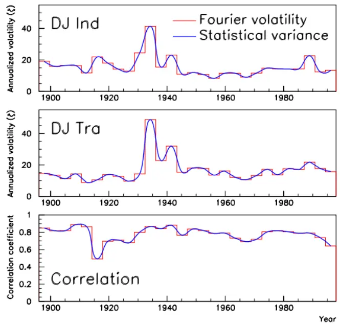

inInfo][Table_Title]2022.05.02

# 如何使用傅里叶级数估计波动率

## ——精品文献解读系列（二十八）

## 本报告导读：

本文基于傅里叶分析，提供了一种全新的波动率测算方法。由于该方法基于积分而非微分，因此其不仅比来自二次变差的传统方法具有更强的稳健性，而且对高频场景的适用性也会更强，值得战略、战术配置投资者参考借鉴。

## 摘要：

投资学是一门学术界与业界紧密结合的学科，其中大类资产配置是这种紧密结合的代表。从 （ ）开创现代投资组合理论开始，学术界为业界提供了丰富的理论参考和方法模型，推动了大类资产配置实践的繁荣发展。为了帮助读者及时跟踪学术前沿，我们推出了“精品文献解读”系列报告，从大量学术文献中挑选出精品论文进行剖析解读，为读者呈现大类资产配置领域最新的思路和方法。

本篇为读者解读的文献是 Malliavin and Mancino（2002）在 Finance &Stochastics 上发表的论文“Fourier series method for measurement ofmultivariate volatilities”。

本文提出了一种针对半鞅（semi-martingale）数据的波动性测算方法，主要数学工具为傅里叶分析。该方法本质上一种无模型（model-free）的非参数（nonparametric）方法，因此具有很强的数据适应性。

本文基于傅里叶分析，提供了一种全新的波动率测算方法。由于该方法基于积分而非微分，因此其不仅比来自二次变差的传统方法具有更强的稳健性，而且对高频场景的适用性也会更强，值得战略、战术配置投资者参考借鉴。

大类资产配置研究

## hor] 报告作者

玉赵索(分析师)

8 0755-23976601

zhaosuo024832@gtjas.com

证书编号 S0880521080002

## cReport] 相关报告

如何基于PEAD超预期因子构建行业轮动策略

2022.04.26

基金重仓股当前“三重困境”深度解析

2022.04.18

如何基于景气度构建行业轮动策略——行业配置研究系列01

2022.04.12

观象析理：“政策底”后的“市场底”需季度级别的等待

2022.04.01

## 1. 文献概述

## 文献来源：

Malliavin P, Mancino M E. Fourier series method for measurement of multivariate volatilities[J]. Finance & Stochastics, 2002, 6(1):49-61.

## 文献摘要：

本文提出了一种针对半鞅（semi-martingale）数据的波动性测算方法，主要数学工具为傅里叶分析。该方法本质上一种无模型（model-free）的非参数（nonparametric）方法，因此具有很强的数据适应性。

## 文献评述：

本文基于傅里叶分析，提供了一种全新的波动率测算方法。由于该方法基于积分而非微分，因此其不仅比来自二次变差传统方法具有更强的稳健性，而且对高频场景的适用性也会更强，值得战略、战术配置投资者参考借鉴。

## 符号说明：

本文中，方括号在求和指标上视同如下集合：

$$
[\mathsf{d}]=\{1,2,\dots,\mathsf{d}\}
$$

## 2. 二次变差中的Wiener定理

二次变差（quadratic variation）的定义如下。假设函数

$$
\Phi,\Psi\colon[0,1]\to\mathbb{R}
$$

于是对任意的时间 t 可以定义

$$
\langle\Phi,\Psi\rangle_{\mathrm{t}}:=\operatorname*{lim}_{\mathfrak{n}\to\infty}\left(\sum_{0\le\mathtt{k}\le2^{\mathtt{n}}\mathtt{t}}\left[\Phi\left(\frac{\mathtt{k}+1}{2^{\mathtt{n}}}\right)-\Phi\left(\frac{\mathtt{k}}{2^{\mathtt{n}}}\right)\right]\left[\Psi\left(\frac{\mathtt{k}+1}{2^{\mathtt{n}}}\right)-\Psi\left(\frac{\mathtt{k}}{2^{\mathtt{n}}}\right)\right]\right),\mathfrak{t}\in[0,1]
$$

此时，利用 Ito 引理不难证明所谓 Wiener 定理如下：

定理 1 考虑一个实值 d 维 Brownian 运动，

$$
(\mathbf{x}^{1},\cdots,\mathbf{x}^{\mathrm{d}})
$$

则有：

$$
\left.{{\bf{x}}^{\mathrm{j}},{\bf{x}}^{\mathrm{k}}}\right._{\mathrm{t}}=\delta_{\mathrm{k}}^{\mathrm{j}}\mathrm{t},\forall\mathrm{t}\in[0,1],\forall\mathrm{j},\mathrm{k}\in[\mathrm{d}]
$$

其中 $\delta_{k}^{j}$ 仅在j=k 时为 1，其余时候为 0。

## 3. Bachelier 范式下的二次变差

所谓的 Bachelier 假设如下：

【Bachelier 假设】数据u 作为一个半鞅，其Ito微分形如：

$$
\mathrm{d}\mathsf{u}^{\mathrm{j}}=\sum_{\mathrm{i}\in[\mathrm{d}]}\alpha_{\mathrm{i}}^{\mathrm{j}}\mathrm{d}\mathrm{x}^{\mathrm{i}}+\beta^{\mathrm{j}}\mathrm{d}\mathrm{t},\forall\mathrm{j}\in[\mathrm{m}]
$$

$$
\left\{\begin{array}{l}{\mathrm{x}^{\ast}=\mathbb{\lambda}\mathrm{\underline{{k}}}\mathrm{\underline{{\hat{x}}}}\mathrm{\underline{{\hat{y}}}}\mathrm{\ brownian}\mathrm{\underline{{i}}}\mathrm{\underline{{\hat{z}}}}\mathrm{\underline{{\hat{z}}}}\mathrm{\underline{{\hat{y}}}}}\\{\mathrm{\alpha}_{\ast}^{\ast}=\mathbb{H}\mathrm{\underline{{\hat{x}}}}\mathrm{\underline{{\hat{x}}}}\mathrm{\underline{{\hat{y}}}}\mathrm{\underline{{\hat{y}}}}\mathrm{\underline{{\hat{z}}}}}\\{\mathrm{\beta}^{\ast}=\mathbb{H}\mathrm{\underline{{\hat{x}}}}\mathrm{\underline{{\hat{y}}}}\mathrm{\underline{{\hat{z}}}}\mathrm{\underline{{\hat{y}}}}\mathrm{\underline{{\hat{z}}}}\mathrm{\underline{{\hat{y}}}}\mathrm{\underline{{\hat{z}}}}}\end{array}\right.
$$

在上述假设下可以证明

定理 2 假设函数

$$
\alpha_{\mathrm{i}}^{\mathrm{j}},\beta^{\mathrm{j}}\colon[0,\mathrm{t}]\to{\mathbb{R}}
$$

为一致有界的时变函数，那么我们几乎必然（almostsurely）有如下恒等式成立：

$$
\left.\mathrm{u}^{\mathrm{j}},\mathrm{u}^{\mathrm{k}}\right._{\mathrm{t}}=\int_{0}^{\mathrm{t}}\sum_{\mathrm{i}}\alpha_{\mathrm{i}}^{\mathrm{j}}(s)\alpha_{\mathrm{j}}^{\mathrm{k}}(s)\mathrm{d}s
$$

该定理的原始证明较长（参见文献原文），但利用 Ito 引理（此处我们使用了 Einstein 和号约定）在形式上直接可以“看出”:

$$
\begin{array}{rl}&{\left.\mathbf{u}^{\mathrm{j}},\mathbf{u}^{\mathrm{k}}\right._{\mathrm{t}}=\left.\alpha_{\mathrm{i}}^{\mathrm{j}}\mathrm{d}\mathbf{x}^{\mathrm{i}}+\beta^{\mathrm{j}}\mathrm{d}\mathrm{t},\alpha_{\mathrm{1}}^{\mathrm{k}}\mathrm{d}\mathbf{x}^{\mathrm{l}}+\beta^{\mathrm{k}}\mathrm{d}\mathrm{t}\right._{\mathrm{t}}=\left.\alpha_{\mathrm{i}}^{\mathrm{j}}\mathrm{d}\mathbf{x}^{\mathrm{j}},\alpha_{\mathrm{1}}^{\mathrm{k}}\mathrm{d}\mathbf{x}^{\mathrm{k}}\right.+\displaystyle\int_{0}^{\mathrm{t}}{\mathcal{O}}(\mathrm{d}\mathrm{t}^{3/2})}\\&{\qquad=\displaystyle\int_{0}^{\mathrm{t}}\alpha_{\mathrm{i}}^{\mathrm{j}}\alpha_{\mathrm{l}}^{\mathrm{k}}\delta_{\mathrm{i}}^{\mathrm{l}}\mathrm{d}s=\displaystyle\int_{0}^{\mathrm{t}}\sum_{\mathrm{i}}\alpha_{\mathrm{i}}^{\mathrm{j}}(s)\alpha_{\mathrm{i}}^{\mathrm{k}}(s)\mathrm{d}s}\end{array}
$$

因此，我们称下列时变（矩阵）函数

$$
\Sigma=\left(\Sigma^{\mathrm{j,k}}\right)_{\mathrm{j,k\in[m]}}\quad\sharp\sharp\quad\Sigma^{\mathrm{j,k}}(\mathrm{t})=\sum_{\mathrm{i}}\alpha_{\mathrm{i}}^{\mathrm{j}}(\mathrm{t})\alpha_{\mathrm{i}}^{\mathrm{k}}(\mathrm{t})
$$

为（瞬时）波动率矩阵。

## 4. 多元波动率的傅里叶级数计算

定理 2 给出的波动率估计虽然在形式上是无懈可击的，但是由于依赖于微分计算，其结果并不稳健。本文采用傅里叶技术规避了这一问题。

本文首先对固定时间窗口的单半鞅情况进行分析。利用坐标变换，可以将时间窗口固定在[0,2π]之间，于是

$$
\mathrm{d}\mathrm{u}=\sum_{\mathrm{i}}\alpha_{\mathrm{i}}(\mathrm{t})\mathrm{d}\mathrm{x}^{\mathrm{i}}+\beta\mathrm{d}\mathrm{t},\Sigma(\mathrm{t})=\sum_{\mathrm{i}}(\alpha_{\mathrm{i}}(\mathrm{t}))^{2}
$$

本文的核心思路如下：

1. 首先计算 du 的傅里叶系数。

2. 利用 du 的傅里叶系数构造Σ的傅立叶系数。

3. 利用反演公式从Σ的傅里叶系数重建Σ。

对于 du 而言，其常数项为

$$
{\sf a}_{0}({\sf du})=\frac{1}{2\pi}\int_{0}^{2\pi}{\sf du}({\sf t})
$$

类似可以得到：

$$
\left\{{\begin{array}{l}{\displaystyle\mathbf{a}_{\mathrm{k}}({\mathrm{d}}\mathbf{u})=\frac{1}{\pi}\int_{0}^{2\pi}{\cos({\mathrm{kt}})\ \mathrm{d}}\mathbf{u}(\mathrm{t})}\\{\displaystyle\mathbf{b}_{\mathrm{k}}({\mathrm{d}}\mathbf{u})=\frac{1}{\pi}\int_{0}^{2\pi}{\sin({\mathrm{kt}})\ \mathrm{d}}\mathbf{u}(\mathrm{t})}\end{array}}\right.
$$

由于是单半鞅情况，相应的波动率矩阵的傅里叶系数为

$$
{\sf a}_{0}(\Sigma)=\frac{1}{{2\pi}}\int_{0}^{2\pi}\Sigma({\mathrm{t}}){\sf d}{\mathrm{u}}({\mathrm{t}})
$$

其余的傅里叶系数为

$$
\begin{array}{l}{\displaystyle\left\{\mathsf{a}_{\mathrm{k}}(\Sigma)=\frac{1}{\pi}\int_{0}^{2\pi}\cos(\mathrm{kt})\Sigma(\mathrm{t})\mathrm{d}\mathrm{u}(\mathrm{t})\right.}\\{\displaystyle\left.\left\{\mathsf{b}_{\mathrm{k}}(\Sigma)=\frac{1}{\pi}\int_{0}^{2\pi}\sin(\mathrm{kt})\Sigma(\mathrm{t})\mathrm{d}\mathrm{u}(\mathrm{t})\right.\right.}\end{array}
$$

再利用 Fourier-Fejer 反演公式，有

$$
\Sigma(\mathrm{t})=\operatorname*{lim}_{\mathrm{N}\to\infty}\Sigma_{\mathrm{N}}(\mathrm{t})
$$

$$
\Sigma_{\mathrm{{N}}}(\mathrm{{t})=\sum_{k=0}^{N}\left(1-\frac{k}{N}\right)\left(a_{\mathrm{{k}}}(\Sigma)\cos(\mathrm{{kt})+b_{\mathrm{{k}}}(\Sigma)\sin(kt)}}\right)
$$

不仅如此，利用傅里叶分析中的能量估计和三角函数的和差化积公式，可以得到本文的主要结果如下。

定理 3 给定整数 $\mathtt{n}_{0}>0$ ，波动率水平的傅里叶系数满足：

$$
{\sf a}_{0}(\Sigma)=\operatorname*{lim}_{{\bf N}\to\infty}\frac{\pi}{{\bf N}+1-{\bf n}_{0}}\sum_{s={\bf n}_{0}}^{\bf N}\left({\sf a}_{s}^{2}(\mathrm{d}{\bf u})+{\bf b}_{s}^{2}(\mathrm{d}{\bf u})\right)
$$

以及

$$
\left\{\mathsf{a}_{\mathsf{q}}(\Sigma)=\operatorname*{lim}_{\mathbf{N}\to\infty}\frac{2\pi}{\mathrm{N}+1-\mathrm{n}_{0}}\sum_{s=\mathrm{n}_{0}}^{\mathrm{N}}\mathsf{a}_{s}(\mathrm{d}\mathsf{u})\mathsf{a}_{s+\mathrm{q}}(\mathrm{d}\mathsf{u}),\mathsf{q}>0\right.
$$

$$
\Biggl|\mathfrak{b}_{\mathfrak{q}}(\Sigma)=\operatorname*{lim}_{\mathrm{N\to\infty}}\frac{2\pi}{\mathrm{N+1}-\mathrm{n}_{0}}\sum_{s=\mathrm{n}_{0}}^{\mathrm{N}}\mathfrak{a}_{s}(\mathrm{{du})\mathrm{{b}}_{s+\mathrm{q}}(\mathrm{{du}}),\mathrm{q}\geq0}
$$

对于高维情况，则可以得到

定理 4 对于多元波动率有

$$
\mathrm a_{0}(\Sigma^{i,j})=\operatorname*{lim}_{N\infty}\frac{2\pi}{N+1-\mathrm{n_{0}}}\sum_{s=\mathrm{n_{0}}}^{\mathrm{N}}\frac{\mathrm{a_{s}(du^{i})a_{s}(du^{j})+b_{s}(du^{i})b_{s}(du^{j})}}{2}
$$

以及

$$
(\mathsf{a}_{\mathsf{q}}\big(\Sigma^{\mathrm{i},\mathrm{j}}\big)=\operatorname*{lim}_{\mathrm{N}\to\infty}\frac{2\pi}{\mathrm{N}+1-\mathsf{n}_{0}}\sum_{s=\mathsf{n}_{0}}^{\mathrm{N}}\frac{\mathsf{a}_{s}\big(\mathrm{d}\ u^{\mathrm{i}}\big)\mathsf{a}_{s+\mathsf{q}}\big(\mathrm{d}\ u^{\mathrm{j}}\big)+\mathsf{a}_{s}\big(\mathrm{d}\ u^{\mathrm{i}}\big)\mathsf{a}_{s+\mathsf{q}}\big(\mathrm{d}\ u^{\mathrm{j}}\big)}{2},\mathsf{q}>0
$$

$$
|\mathbf{b}_{\mathsf{q}}\big(\Sigma^{\mathsf{i,j}}\big)=\operatorname*{lim}_{\mathrm{N\to\infty}}\frac{2\pi}{\mathrm{N+1}-\mathbf{n}_{0}}\sum_{s=\mathbf{n}_{0}}^{\mathrm{N}}\frac{a_{s}\big(\mathrm{du^{i}}\big)\mathbf{b}_{s+\mathbf{q}}\big(\mathrm{du^{j}}\big)+a_{s}\big(\mathrm{du^{i}}\big)\mathbf{b}_{s+\mathbf{q}}\big(\mathrm{du^{j}}\big)}{2},\mathsf{q}\geq0
$$

高维情况的证明是一维情况的类推，而定理 3 的证明请参考本文附录。

## 5. 数值实现

本节主要是关于上述公式数值实现的一些注记。

窗口选择

显而易见，时间窗口的选择会对傅里叶分析的结果产生影响。假设时间

窗口为长度为 2Lπ 的区间

$$
[\mathsf{t}_{0}-\mathsf{L}\cdot\pi,\mathsf{t}_{0}+\mathsf{L}\cdot\pi]
$$

对于每一个 L，都可以计算得到一个相应的波动率的傅里叶估计， $\bar{\hbar}$ 随着 L的减少，相应的估计误差将会提升。准确地说，随着观察样本的数量的增加，估计误差会按照

$$
\frac{1}{\sqrt{\mathsf{N}}}
$$

的速度进行衰减。

正定性

波动率矩阵Σ是一个正定阵，因此其傅里叶重建也应该保障这个性质不变。注意到 Fejer 反演公式的每一个部分和都是正定阵，因此最终得到的极限至少是半正定的，这一点在数值结果上也得到了验证。

连续性处理

给定如下半鞅

$$
\mathrm{d}\mathrm{u}=\alpha\mathrm{d}\mathrm{x}+\beta\mathrm{d}\mathrm{t}
$$

分部积分法表明

$$
\mathrm{a}_{\mathrm{k}}(\mathrm{d}\mathrm{u})=\frac{1}{\pi}\int_{0}^{2\pi}\cos\left(\mathrm{kt}\right)\mathrm{d}\mathrm{u}(\mathrm{t})=-\frac{\mathrm{k}}{\pi}\int_{0}^{2\pi}\sin(\mathrm{kt})\mathrm{u}(\mathrm{t})\mathrm{d}\mathrm{t}+\frac{\mathrm{u}(2\pi)-\mathrm{u}(0)}{\pi}
$$

可以看到，由于不涉及到微分计算，上述表达式具有数值稳定性（numerically stable）。但是由于观察时点总是一个有限集合，需要对真实数据进行连续性处理。此处总是设

$$
\mathsf{u}(\mathrm{t})=\mathsf{u}(\mathrm{t}_{\mathrm{i}}),\forall\mathrm{t}\in[\mathrm{t}_{\mathrm{i}},\mathrm{t}_{\mathrm{i}+1})
$$

因此在该区间段上的积分就化为

$$
\frac{\mathrm{k}}{\pi}\int_{\mathrm{t_{i}}}^{\mathrm{t_{i+1}}}\sin(\mathrm{kt})\mathrm{u(t)}\mathrm{dt}=\mathrm{u(t_{i})}\cdot\frac{\mathrm{k}}{\pi}\int_{\mathrm{t_{i}}}^{\mathrm{t_{i+1}}}\sin{(\mathrm{kt})}\mathrm{dt}=\frac{\mathrm{u(t_{i})}}{\pi}\cdot(\cos{(\mathrm{kt_{i+1}})}-\cos{(\mathrm{kt_{i}})})
$$

上述公式避免了当 k 充分大的时候可能 $\dot{\mathcal{P}}$ 生的抵消错误（即量纲相差非常大的两个数进行计算时，有时会完全忽略小量纲数的影响，例如1e15+0.2 最后得到的数仍然是 1e15）。

最大频率

对于傅里叶分析中使用的最大频率，本文给出了经验公式：

$$
\Nu_{1}=\lfloor\mathrm{L}/\delta\rfloor
$$

其中δ代表了两个观察时点的时间间隔，文中的下方括号代表取整运算。因此各个公式中的求和计算只在

$$
\boldsymbol{\mathrm{n}}_{0}<\boldsymbol{\mathrm{N}}_{1}
$$

时才发生。同时建议刨除 $\mathtt{n_{0}}$ 取值较小时候的项，这主要是因为其对于β较为敏感，容易引入噪声。具体来说，数值实验结果表明只需要刨除首项系数即可。本文推荐的具体数值为：

$$
\mathrm{n}_{0}\le\mathrm{k}\le\mathrm{J},\mathrm{n}_{0}+\mathrm{J}\le\mathrm{N}_{1}
$$

磨光函数

虽然定理 3的计算公式允许对一个时间窗口中的任意时点进行波动率重建，但 Monte Carlo 实验表明窗口中部的准确度要高于窗口两端的准确度。为了解决这个问题，本文使用了一个紧支撑的磨光函数（smoothingfunction），其支撑集的上下端点分别落在 0 和 $2\pi$ 的领域之中:

$$
\varphi\colon[0,2\pi][0,1],\operatorname{supp}(\varphi)\subset(0,2\pi)
$$

这意味着磨光修正后的傅里叶系数形如：

$$
\widehat{\sf a}_{\bf k}({\sf du})=\frac{1}{\pi}\int_{0}^{2\pi}\varphi({\mathrm{t}}){\cos}({\mathrm{kt}}){\sf du}({\mathrm{t}})
$$

计算示例

图 1 中展示的即是从 1896 到 1998 的 Dow Jones Industrial 和 Dow JonesTransportation 之间的波动率估计。相应的数据一共用 28000 条，本文将其划分为 28 段，每段包含 1000 条数据用于波动率的测算。

图 1：Fourier 波动率估计示例

数据来源：Malliavin and Mancino（2002）

## 6. 总结

由于传统的波动性测算方法需要数据具有规整性和同步性，因此对于呈现出病态空间分布的逐笔数据或者异步性的交易数据而言，依赖于可微条件的二次变差理论就显得力不从心。本文提供了一种基于傅里叶分析的波动率计算方法，该方法对于高频数据甚至是逐笔数据都具有很好的亲和性，这主要是因为傅里叶分析技术本质是积分而非微分，因此能提供稳健性更好的波动率估计。

## 7. 附录

本文的附录包含两部分，一部分是为不熟悉随机微分的读者阐明半鞅的定义，另一部分则是补全定理 3 的数学证明。

## 7.1. 半鞅的定义

半鞅的定义涉及到诸多概率论中的概念。

滤子（Filtration）

在数学中，一个滤子 $\mathrm{F=\Gamma(F_{i})_{i\in I}}$ 是一族对象满足：

$$
\mathrm{i}<\mathrm{j}\Rightarrow\mathrm{F_{i}}\subset\mathrm{F_{j}}
$$

鞅（martingale）设

$$
\left\{\begin{array}{l}{\mathrm{T}=\emptyset\dag\forall\dag\forall\dag}\\{\Omega=\dot{\ast}\ddag\ddag\ddag\ddag}\\{\mathrm{S}=\mathrm{Banach}\ \dot{\underset{\ast}{\div}}\mathrm{I}\ddot{\ast}}\end{array}\right.
$$

随机过程

$$
\Upsilon\colon\mathrm{T}\times\Omega\mathrm{S}
$$

称为滤子F 上的关于概率ℙ的一个鞅（martingale），当且仅当：

1. $\mathrm{F}_{\ast}$ 是概率空间 (Ω,F,ℙ) 上的滤子。

2. Y 适应于（adapted to）F ，即对于任意的 $\mathrm{t}\in\mathrm{T},\mathrm{Y}_{\mathrm{t}}$ 是 $\Sigma_{\mathrm{t}}$ 可测函数。

3. 对于任意的 $\mathrm{t}\in\mathrm{T},\ \mathrm{Y_{t}}\in\mathrm{L}^{1}(\Omega,\Sigma_{\mathrm{t}},\mathbb{P};S)$ ，即 $\mathbb{E}_{\mathbb{P}}(|\mathrm{Y}_{\mathrm{t}}|)<\infty$

4. 对所有的 $s<t\in$ T，以及 $\mathtt{F}\in\Sigma_{s},\mathbb{E}_{\mathbb{P}}\big(\chi_{\mathtt{F}}(\Upsilon_{\mathrm{t}}-\Upsilon_{s})\big)=0$ ，其中 $\tt{\tt X}_{\mathrm{F}}$ 代表事件 F 的示性函数.

局部鞅（local martingale）

设 (Ω,F,ℙ) 为一个概率空间， $\mathrm{F}_{\ast}=\{\mathrm{F}_{\mathrm{t}}|\mathrm{t}\geq0\}$ 为 F 的一个滤子，

$$
\mathrm{X}\colon~[0,\infty)\times\Omega\mathrm{S}
$$

为取值于 S 上的适应于 F 的随机过程。称 X 是F 上的一个局部鞅，如果存在 F∗—停时（stopping time）：

$$
\tau_{\mathrm{k}}{:}\Omega[0,\infty)
$$

使得

1. 停时满足单调性 $\mathbb{P}(\tau_{\mathrm{k}}<\tau_{\mathrm{k}+1})=1$

2. 停时满足发散性 $\mathbb{\rho}_{\mathrm{\lambda}}(\operatorname*{lim}_{\mathrm{k\infty}}\tau_{\mathrm{k}}=\infty)=1$

3. 停过程（stopped process） ${\Chi}_{\operatorname*{min}({\mathrm{t}},{\tau_{\mathrm{k}}})}$ 对于任意的 k 而言都是F -鞅。

Càdlàg 函数

该类型的函数又称右连左极函数，即 RCLL（right continuous with leftlimits），或者 corlol（continuous on right, limit on left)函数。常见的累积分布函数就是一类典型的 càdlàg 函数。

图 2：累计分布函数是典型的右连左极函数

数据来源：Wikipedia，国泰君安证券研究

有界变差函数（bounded variation）对于连续函数

$$
\operatorname{f}\colon[{\mathsf{a}},{\mathsf{b}}]\to\mathbb{R}^{1}
$$

二次变差被定义成为

$$
\mathrm{V_{a}^{b}(f)=\operatorname*{sup}_{P\in\mathcal{P}[a,b]}\sum_{i=0}^{n_{P}-1}|f(x_{i+1})-f(x_{i})|}
$$

$$
\mathcal{P}[\mathrm{a},\mathrm{b}]{:=\left\{\mathrm{P}=\left(\mathrm{a}=\mathrm{x}_{1}<\cdots<\mathrm{x}_{\mathrm{n}_{\mathrm{P}}}=\mathrm{b}\right)\right\}}
$$

为[a,b]上的全体拆分的集合。对于可微函数，则有：

$$
\begin{array}{r}{\nabla_{\mathbf{a}}^{\mathbf{b}}(\mathbf{f})=\displaystyle\int_{\mathbf{a}}^{\mathbf{b}}|\mathbf{f}^{\prime}(\mathbf{x})|\mathrm{d}\mathbf{x}}\end{array}
$$

所谓有界变差函数即

$$
\mathsf{V}_{\mathsf{a}}^{\mathsf{b}}(\mathsf{f})<\infty
$$

半鞅（semi-martingale）

设 $(\Omega,{\mathrm{F}},({\mathrm{F}}_{\mathrm{t}})_{{\mathrm{t}}\geq0},\mathbb{P}){\stackrel{\ominus}{\operatorname{\wedge}}}-.$ 个已滤概率空间（filtered probability space），实值随机过程 X 称为其上的一个半鞅过程，当且仅当有如下分解：

$$
\mathrm{X}_{\mathrm{t}}=\mathrm{M}_{\mathrm{t}}+\mathrm{A}_{\mathrm{t}}
$$

其中 M 是一个局部鞅，A 是一个局部有界变差的右连左极适应过程（adapted process of locally bounded variation）。

## 7.2. 定理 3 的证明

在 Bachelier 的范式中，被观察的历史演进（observed historical evolution）只是概率空间Ω中的一种可能。确切地讲，推动该历史演进的 Brownian运动x∗，以及对应的 $\alpha_{\mathrm{i}},\beta$ 都是在概率空间的一个采样上的实现。由于我们没有对概率空间的结构做任何的假设，因此在分析时需要引入一个对应的辅助概率空间 X。

假设 X 是该采样形成的概率空间，此处即给出了一个保概率映射：

$$
\Phi\colon\Omega\mathrm{X};\omega\mapsto\mathrm{X}
$$

通过决定函数（deterministic functions）

$$
\begin{array}{r}{\widetilde{\alpha}_{\mathrm{i}}(\mathrm{t})=\alpha_{\mathrm{i}}(\omega,\mathrm{t})}\\{\widetilde{\beta}(\mathrm{t})=\beta(\omega,\mathrm{t})}\end{array}
$$

我们得以将历史演进表达为 X 上的随机过程

$$
\mathrm{d}\widetilde\mathrm{u}_{\mathrm{x}}=\sum_{\mathrm{i}}\widetilde\mathrm{\alpha}_{\mathrm{i}}(\mathrm{t})\mathrm{d}\mathrm{x}^{\mathrm{i}}+\widetilde\beta(\mathrm{t})\mathrm{d}\mathrm{t}
$$

首先注意的到是，由于三角函数构成L2[0,2π]上的正交基，因此

$$
\int_{0}^{2\pi}{\widetilde{\beta}}^{2}({\mathrm{t}}){\mathrm{d}}{\mathrm{t}}=\sum_{\mathrm{k}}\left({\mathrm{a}}_{\mathrm{k}}^{2}{\left({\widetilde{\beta}}\right)}+{\mathrm{b}}_{\mathrm{k}}^{2}{\left({\widetilde{\beta}}\right)}\right)<\infty
$$

所以对于定理 3 中的每一个等式， $\beta\sharp\sharp$ 贡献都是为 0 的。因此只需要考虑 Brownian 运动的部分即可：

$$
\mathrm{d}\mathrm{v}=\mathrm{d}\tilde{\mathrm{u}}-\tilde{\beta}\mathrm{d}\mathrm{t}
$$

若记

$$
\mathrm{C_{k}=a_{k}(dv),S_{k}=b_{k}(dv)}
$$

则

$$
\begin{array}{rl}{\mathbb{E}\big[\Gamma_{\mathrm{c}}\Gamma_{\mathrm{d}+\mathrm{d}+1}\big]=\frac{1}{\pi^{2}}\mathbb{E}\Bigg[\int_{0}^{2\pi}\cos(\mathrm{ta})\mathrm{d}\Psi(\mathbf{f})\int_{0}^{2\pi}\cos((\mathrm{ta}+\mathrm{q})s)\mathrm{d}\Psi(s)\Bigg]}&{}\\&{=\frac{1}{\pi^{2}}\int_{0}^{2\pi}\cos(\mathrm{ta})\cos((\mathrm{ta}+\mathrm{q})s)\sum_{\mathrm{d}}\alpha_{1}(\mathrm{i})\alpha_{2}(\mathrm{i})\alpha_{1}(\mathrm{i})\mathrm{d}\mathrm{t}s}\\&{=\frac{1}{\pi^{2}}\int_{0}^{2\pi}\cos(\mathrm{ta})\cos((\mathrm{ta}+\mathrm{q})s)\sum_{\mathrm{d}}\big(\mathrm{e}_{\mathrm{i}})^{2}(\mathrm{tb})\mathrm{d}\mathrm{t}}\\&{=\frac{1}{\pi^{2}}\int_{0}^{2\pi}\big\{0\}\cos(\mathrm{ta})\cos((\mathrm{ta}+\mathrm{q})s)\mathrm{d}\mathrm{t}}\\&=\frac{1}{\pi^{2}}\int_{0}^{2\pi}\sum_{\Sigma(\Sigma)\cos(\mathrm{ta})\cos(\mathrm{ta}+\mathrm{q})s)\mathrm{d}\mathrm{t}}\\&{=\frac{1}{\pi^{2}}\int_{0}^{2\pi}\Sigma(\mathbf{f})\frac{\cos(\mathrm{ta})+\cos((2\mathrm{ta}+\mathrm{q})s)}{2}\mathrm{d}\mathrm{t}}\\&=\frac{1}{2\pi}\int_{0}^{2\pi}\big(\alpha_{1}(\Sigma)+\frac\cos(\end{array}
$$

注意到

$$
\|\Sigma\|_{2}^{2}=\sum_{\bf k}({\sf a}_{\bf k}(\Sigma)^{2}+{\sf b}_{\bf k}(\Sigma)^{2})
$$

现在考虑

$$
\mathrm{U}_{\mathrm{N}}^{\mathrm{q}}=\frac{1}{\mathrm{N}}\sum_{\mathrm{k}\in\lbrack\mathrm{N}]}\mathrm{C}_{\mathrm{k}}\mathrm{C}_{\mathrm{k}+\mathrm{q}}
$$

利用三角公式可得

$$
\mathbb{E}\big[\mathrm{U}_{\mathrm{N}}^{\mathrm{q}}\big]=\mathsf{a}_{\mathrm{q}}(\Sigma)+\mathsf{R}_{\mathrm{N}}
$$

$$
|\mathrm{R}_{\mathrm{N}}|=\left|\frac{1}{\mathrm{N}}\sum_{\mathbf{k}=1}^{\mathrm{N}}\mathsf{a}_{2\mathbf{k}+\mathbf{q}}(\boldsymbol{\Sigma})\right|\leq\frac{1}{\mathrm{N}}\|\boldsymbol{\Sigma}\|_{1}\leq\frac{1}{\mathrm{N}}\sqrt{\|\boldsymbol{\Sigma}\|_{2}^{2}\cdot\mathrm{N}}=\frac{1}{\sqrt{\mathrm{N}}}\|\boldsymbol{\Sigma}\|_{2}
$$

注意到

$$
\begin{array}{rl}&{\quad\mathbb{E}\left[\left(\mathbf{U}_{\mathrm{N}}^{\ P}\right)^{2}\right]=\frac{1}{\mathrm{N}^{2}}\mathbb{E}\left[\left(\displaystyle\sum_{\mathbf{k}}\mathbf{C}_{\mathbf{k}}\mathbf{C}_{\mathbf{k}+\mathbf{q}}\right)^{2}\right]=\frac{1}{\mathrm{N}^{2}}\mathbb{E}\left[\displaystyle\sum_{{\mathrm{i}},{\mathrm{j}}}\mathbf{C}_{\mathbf{i}}\mathbf{C}_{\mathbf{i}+\mathbf{q}}\mathbf{C}_{\mathbf{j}}\mathbf{C}_{\mathbf{j}+\mathbf{q}}\right]}\\&{\leq\frac{1}{2\mathrm{N}^{2}}\mathbb{E}\left[\displaystyle\sum_{{\mathrm{i}},{\mathrm{j}}}\mathbf{C}_{\mathbf{i}}^{2}\mathbf{C}_{\mathbf{j}+\mathbf{q}}^{2}+\mathbf{C}_{\mathbf{j}}^{2}\mathbf{C}_{\mathbf{i}+\mathbf{q}}\right]=\frac{1}{\mathrm{N}^{2}}\mathbb{E}\left[\displaystyle\sum_{{\mathrm{i}},{\mathrm{j}}}\mathbf{C}_{\mathbf{i}}^{2}\mathbf{C}_{\mathbf{j}+\mathbf{q}}^{2}\right]=\frac{1}{\mathrm{N}^{2}}\sum_{{\mathrm{i}},{\mathrm{j}}}\mathbb{E}[\mathbf{C}_{\mathbf{i}}^{2}\mathbf{C}_{\mathbf{j}+\mathbf{q}}^{2}]}\end{array}
$$

最终可以证明（需要指出的是，此处需要一定的L4边界条件，但在原文中并未提及，当然相关条件在应用场景中其实很容易满足。此处我们略去了细节讨论，具体证明读者可以参考本文的两位作者在 Malliavin andMancino（2009）中的证明）

$$
\mathbb{V}\big[\mathrm{U}_{\mathrm{N}}^{\mathrm{q}}\big]\leq\frac{1}{\mathrm{N}}\|\Sigma\|_{2}^{2}
$$

这意味着

$$
\mathbb{E}\big[\mathrm{U}_{\mathrm{N}}^{\mathrm{q}}\big]\mathsf{a}_{\mathrm{q}}(\Sigma)
$$

给出了对应的估计。而对于定理 3 中剩余的等式，只需要注意到有恒等式即可：

$$
\begin{array}{c}{{\displaystyle\mathbb{E}[S_{\mathrm{k}}]=\frac{1}{\pi}\big({\mathsf{a}}_{0}(\Sigma)-{\mathsf{a}}_{2\mathrm{k}}(\Sigma)\big)}}\\{{\displaystyle\mathbb{E}\big[C_{\mathrm{k}}S_{\mathrm{k+q}}\big]=\frac{1}{2\pi}\Big({\mathsf{b}}_{\mathrm{q}}(\Sigma)+{\mathsf{b}}_{2\mathrm{k+q}}(\Sigma)\Big)}}\end{array}
$$

最后需要特别说明的是，上述方法之所以能成功主要还是因为三角函数有积化和差公式成立。如果选择的正交基不再是三角函数，例如常见的小波基，由于积化和差公式在小波分析中并不存在，因此很难得到相应版本的定理 3。

## 8. 参考文献

Malliavin P, Mancino M E. A Fourier transform method for nonparametric estimation of multivariate volatility[J]. Ann. Statist. 2009.

## 本公司具有中国证监会核准的证券投资咨询业务资格

## 分析师声明

作者具有中国证券业协会授予的证券投资咨询执业资格或相当的专业胜任能力，保证报告所采用的数据均来自合规渠道，分析逻辑基于作者的职业理解，本报告清晰准确地反映了作者的研究观点，力求独立、客观和公正，结论不受任何第三方的授意或影响，特此声明。

## 免责声明

本报告仅供国泰君安证券股份有限公司（以下简称“本公司”）的客户使用。本公司不会因接收人收到本报告而视其为本公司的当然客户。本报告仅在相关法律许可的情况下发放，并仅为提供信息而发放，概不构成任何广告。

本报告的信息来源于已公开的资料，本公司对该等信息的准确性、完整性或可靠性不作任何保证。本报告所载的资料、意见及推测仅反映本公司于发布本报告当日的判断，本报告所指的证券或投资标的的价格、价值及投资收入可升可跌。过往表现不应作为日后的表现依据。在不同时期，本公司可发出与本报告所载资料、意见及推测不一致的报告。本公司不保证本报告所含信息保持在最新状态。同时，本公司对本报告所含信息可在不发出通知的情形下做出修改，投资者应当自行关注相应的更新或修改。

本报告中所指的投资及服务可能不适合个别客户，不构成客户私人咨询建议。在任何情况下，本报告中的信息或所表述的意见均不构成对任何人的投资建议。在任何情况下，本公司、本公司员工或者关联机构不承诺投资者一定获利，不与投资者分享投资收益，也不对任何人因使用本报告中的任何内容所引致的任何损失负任何责任。投资者务必注意，其据此做出的任何投资决策与本公司、本公司员工或者关联机构无关。

本公司利用信息隔离墙控制内部一个或多个领域、部门或关联机构之间的信息流动。因此，投资者应注意，在法律许可的情况下，本公司及其所属关联机构可能会持有报告中提到的公司所发行的证券或期权并进行证券或期权交易，也可能为这些公司提供或者争取提供投资银行、财务顾问或者金融产品等相关服务。在法律许可的情况下，本公司的员工可能担任本报告所提到的公司的董事。

市场有风险，投资需谨慎。投资者不应将本报告作为作出投资决策的唯一参考因素，亦不应认为本报告可以取代自己的判断。
在决定投资前，如有需要，投资者务必向专业人士咨询并谨慎决策。

本报告版权仅为本公司所有，未经书面许可，任何机构和个人不得以任何形式翻版、复制、发表或引用。如征得本公司同意进行引用、刊发的，需在允许的范围内使用，并注明出处为“国泰君安证券研究”，且不得对本报告进行任何有悖原意的引用、删节和修改。

若本公司以外的其他机构（以下简称“该机构”）发送本报告，则由该机构独自为此发送行为负责。通过此途径获得本报告的投资者应自行联系该机构以要求获悉更详细信息或进而交易本报告中提及的证券。本报告不构成本公司向该机构之客户提供的投资建议，本公司、本公司员工或者关联机构亦不为该机构之客户因使用本报告或报告所载内容引起的任何损失承担任何责任。

## 评级说明

## 1.投资建议的比较标准

投资评级分为股票评级和行业评级。

以报告发布后的 12 个月内的市场表现为比较标准，报告发布日后的 12 个月内的公司股价（或行业指数）的涨跌幅相对同期的沪深 300 指数涨跌幅为基准。

## 2.投资建议的评级标准

报告发布日后的 12 个月内的公司股价（或行业指数）的涨跌幅相对同期的沪深300 指数的涨跌幅。

|  | 评级 | 说明 |
| --- | --- | --- |
| 股票投资评级 | 增持 | 相对沪深300 指数涨幅15%以上 |
|  | 谨慎增持 | 相对沪深300指数涨幅介于 5%～15%之间 |
|  | 中性 | 相对沪深300指数涨幅介于-5%～5% |
|  | 减持 | 相对沪深300 指数下跌 5%以上 |
| 行业投资评级 | 增持 | 明显强于沪深 300 指数 |
|  | 中性 | 基本与沪深 300 指数持平 |
|  | 减持 | 明显弱于沪深 300 指数 |

## 国泰君安证券研究所

|  | 上海 | 深圳 | 北京 |
| --- | --- | --- | --- |
| 地址 | 上海市静安区新闸路669 号博华广 | 深圳市福田区益田路6009号新世界 商务中心34层 | 北京市西城区金融大街甲9号金融 街中心南楼18层 |
| 邮编 | 场20层 200041 | 518026 | 100032 |
| 电话 | (021)38676666 | (0755)23976888 | （010)83939888 |
|  | E-mail: gtjaresearch@gtjas.com |  |  |