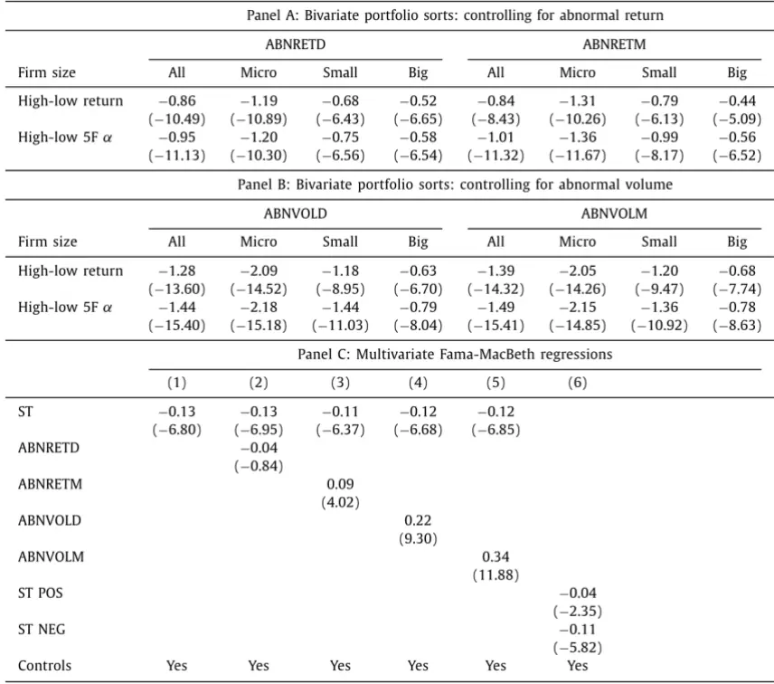

inInfo][Table_Title]2022.06.02

# 凸显理论（Salience Theory）对权益资产价格的影响

## ——精品文献解读系列（二十九）

## 本报告导读：

本篇报告解读的文献通过对资产定价模型的推导，展现了凸显理论如何影响股票价格，并对其影响程度做了较为细致的实证检验分析。

## 摘要：

le_Summary]投资学是一门学术界与业界紧密结合的学科，其中大类资产配置是这种紧密结合的代表。从 Markowitz（1952）开创现代投资组合理论开始，学术界为业界提供了丰富的理论参考和方法模型，推动了大类资产配置实践的繁荣发展。为了帮助读者及时跟踪学术前沿，我们推出了“精品文献解读”系列报告，从大量学术文献中挑选出精品论文进行剖析解读，为读者呈现大类资产配置领域最新的思路和方法。

本篇为读者解读的文献是 Mathijs Cosemans 和 Rik Frehen（2021）在期刊 Journal of Financial Economics 上发表的论文“Salience theory andstock prices: Empirical evidence”。

传统的资产定价模型假设投资者完全理性并且可以利用市场上所有可得信息。但是，大量的研究发现投资者的注意力实际上是有限的，Bordalo 在 2012 年指出决策者的注意力更容易被选项中的不寻常收益所吸引。这些不寻常的收益被称为具有“凸显性”的收益,这种机制也被称为“凸显理论”。

文中给出了把凸显理论与股票价格联系起来的实证证据。在资产定价模型的框架下，文章认为投资者会根据历史收益估计未来收益，并在估计时对显著异于市场的收益赋予更多权重。这种偏离客观的估计方法会对股价预测带来负面影响，进而出现套利空间。

本文系统地构建了基于凸显理论的 ST 指标，并在此指标的基础上构建了多空投资组合，从而说明这种套利方式的可持续性以及利润空间的大小。并且，本文根据进一步的稳健性检验分析，论证这种凸显理论对股票价格的影响并不是某种反转效应或者与过去的市场吸引注意力机制相同，而是一种全新的行为金融指标。文章还指出，当市场情绪高涨时，ST 指标的效用更加明显。

大类资产配置研究

## hor] 报告作者

李祥文(分析师)

8 021-38031560

lixiangwen@gtjas.com

证书编号 S0880520100001

陶金(研究助理)

8 010-83939769

taojin025532@gtjas.com

证书编号 S0880121120067

## cReport 相关报告]

基于 PEAD效应的超预期因子选股效果如何2022.06.01

反弹半渡莫要贪胜，借机优化行业配置2022.05.31

论指数的“价值守恒律”

2022.05.22

如何基于景气度构建行业轮动策略

2022.05.12

如何基于PEAD超预期因子构建行业轮动策略——行业配置研究系列02

2022.05.11

感谢实习生朱惠东对本文的贡献。

## 1. 文献概述

文献来源：

Mathijs Cosemans, Rik Frehen. Salience theory and stock prices: Empirical evidence. Journal of Financial Economics 2021; Vol 140 Issue 2;P460-483

## 文献摘要：

本文展示了一系列“凸显理论”（Salience Theory，简称 ST）对股票资产定价产生影响的证据。“凸显理论”阐释了决策者在形成对未来收益的估计时会更多地受那些显著异于市场表现的历史信息影响。因此，投资者会被显著上涨的股票所吸引，从而导致这些股票价格被高估，进而导致了较低的回报；相反地，过去表现相较市场平平无奇的股票则容易被低估，从而倾向于获得更高的超额收益。文章在美国市场找到了此理论的实证支持。文章还指出，在股票市场情绪高涨的时期，此效应更强。

## 文献评述：

作为行为金融学最前沿的研究方向，本文发现了“凸显理论”对资产定价产生影响的直接证据。本文不仅根据资产定价模型设计 ST 指标，并运用该指标构建了模拟投资组合，检验了指标的有效性与稳健性。此外，文章还对 指标与过去所发现的反转效应和投资者注意力理论进行了比较，指出这种指标所带来的超额收益并不仅仅是由于反转效应所引起的，且在作用机理上与投资者注意力理论具有本质区别。文中还在市场情绪高涨与市场情绪低迷时期对 ST 指标效果进行了比较，并指出当市场情绪高涨时，ST 指标的效果更好。

凸显理论是行为金融学的最新发展方向，该理论表明基于集体的非理性行为构造的投资策略可以带来超额收益，值得投资者参考借鉴。

## 2. 引言

传统的资产定价理论假设投资者是完全理性的，投资者在选择风险资产时使用了所有可用的信息。但有研究发现，投资者的注意力和处理能力是有限的。Bordaloet al.（2012）认为，决策者在面临决策时，常被选项中的不寻常收益所吸引。这些不寻常收益被称为具有“凸显性”的收益。

根据凸显理论，投资者会用过去收益的“凸显性”代替客观概率去估计未来收益。举例来说，投资者会更关注市场收益 0%且个股收益 5%，而不是市场收益 5%个股收益 5%的交易日。这会导致投资者在对未来回报进行估计时，产生对股价过分高估或低估，进而影响股票定价。

本文根据凸显理论，构造了 ST 指标（SalienceTheoryMetric），旨在刻画股票每日收益的“凸显性”和股票日收益的相关性。ST 为正时，说明股票的最高回报较为突出，投资者过分关注股票的上涨潜力，从而接受负的风险溢价；ST 为负时，投资者会更强调其下行风险，并做出规避风险的行为，接受正的风险溢价。因此 ST 更高的股票容易拥有更低的下一阶段回报。

本文根据实证数据，检验了 ST 指标和月度收益的负向相关性。与此同时，本文构建了基于 ST 指标的多空组合，解释其超额收益的来源并非反转效应且与传统的投资者注意力机制不同。最后本文还验证了该指标在市场情绪高涨时期效果更强的事实。

## 3. 凸显理论与股票价格

## 3.1. 凸显性简介

凸显理论，简单来说就是决策者的注意力会被最显著的回报所吸引。凸显理论揭示了一个事实，即较大的尾部收益会导致决策者高估尾部收益的影响。受此机制影响，人们在做选择的时候，会倾向于选择回报最显著的一个选项。

为了衡量“凸显性”，Bordalo（2012）针对彩票提出了模型：

$$
\sigma(\mathrm{x_{is},\mathrm{\overline{{x}}_{s}}})=\frac{|\mathrm{x_{is}-\mathrm{\overline{{x}}_{s}}}|}{|\mathrm{x_{is}}|+|\mathrm{\overline{{x}}_{s}}|+\theta}\tag{1}
$$

这里的 $\mathbf{X}_{\mathrm{i}s}$ 表示的是对于s状态下（这里的状态是指用来估计收益的所有收益状态构成的集合S，s为S中的一个元素），第i只彩票所具有的收益。$\overline{{\mathbf{X}}}_{s}$ 表示市场上所有彩票的平均收益。这里的θ>0，目的是为了使上式的分母不为 0。

(1)中的函数满足三个条件：保序性，敏感性递减和对称性。保序性意味着，随着 $\mathbf{X}_{\mathrm{i}s}$ 偏离市场程度上升，函数数值变大。敏感性递减意味着随着所有彩票的绝对收益水平统一上升，“凸显性”下降，即当市场整体收益水平较高时，收益差异会被相对减小。对称性指的是“凸显性”只取决于相对收益的大小，并不取决于相对收益的符号。根据函数(1)，决策者会根据“凸显性”去改变其购买彩票的选择。

根据凸显理论，决策者会参考收益状态对预期收益进行估计。具体来说，决策者将每个彩票的收益排序，状态s的“凸显性”所影响的加权概率会替代原有概率。因此有：

$$
\widetilde{\pi}_{\mathrm{i}s}=\pi_{s}\cdot\ w_{\mathrm{i}s}\tag{2}
$$

$$
\mathbf{w_{is}}=\frac{\delta^{\mathbf{k_{is}}}}{\sum_{s\prime}\delta^{\mathbf{k_{is\prime}}}\cdot\boldsymbol{\pi}_{s\prime}},\delta\in\left(0,1\right]\tag{3}
$$

这里的 $\mathbf{k}_{\mathrm{i}s}$ 是根据函数(1)计算的凸显性的倒序排序。“凸显性”最强的是1，最弱的是 S，S 为状态集合的元素个数。 $\pi_{s}$ 为其状态原有概率。 $\widetilde{\pi}_{\mathrm{i}s}$ 为受“凸显性”所影响的加权概率。δ为“凸显性”的敏感系数，如果δ为 1，表明决策者对于凸显收益不敏感，表现为理性的决策者，其决策权重等于客观概率。当 0<δ<1 时，决策者的决策受凸显理论影响，其会放大显著收益对收益估计的影响。当δ接近 0 时，说明决策者几乎只关注彩票最突出的收益部分，而忽略其他收益。

## 3.2. 基于凸显性的资产定价模型

基于凸显性的资产定价模型由 Bordalo et al. (2013a)提出，其解释了“凸显性”如何影响投资者的交易决策，进而如何影响股票价格。Bordalo etal. (2013a)通过一个两期投资模型，针对个体投资者行为进行了阐释和解析。在不考虑货币的时间价值的情况下，定义 t=0 时期为现在，t=1 时期为未来。在 t=0 时期，投资者持有市场上每只股票（共 N 只）各一个单位，现有总市值为 $\mathbf{W}_{0}.$ 。第i只股票的现价为 $\mathrm{p}_{\mathrm{i}}$ ，在收益状态 s 下，t=1 时该股票产生了 $\mathbf{X}_{\mathrm{i}s}$ 的回报。为了最大化如下定义的效用函数，在 t=0时期，投资者对第 i只股票进行了交易量为 ${\mathfrak{a}}_{\mathrm{i}}$ 的交易。

$$
\operatorname*{max}_{\alpha_{\mathrm{i}}}\mathrm{u}(\mathrm{c}_{0})+\mathbb{E}\big[\mathrm{w_{is}u}\big(\mathrm{c}_{1,s}\big)\big]\tag{4}
$$

其中：

$$
{\tau_{0}}={\ w_{0}}-\sum_{\mathrm{i}}^{\mathrm{N}}{\alpha_{\mathrm{i}}\mathrm{p}_{\mathrm{i}}}\tag{5}
$$

$$
{\tau}_{1,s}=\sum_{\mathrm{i}}^{\mathrm{N}}({\alpha}_{\mathrm{i}}+1){\alpha}_{\mathrm{i}s}\tag{6}
$$

这里的 $(\alpha_{\mathrm{i}}+1)$ 是第i只股票基于现有持仓增加或减少额外数量后的仓位。优化(4)所需要的一阶条件为：

$$
\mathsf{p}_{\mathrm{i}}\mathrm{u}^{\prime}(\mathsf{c}_{0})=\mathbb{E}\bigl[\mathbf{w}_{\mathrm{i}\mathrm{s}}\mathbf{x}_{\mathrm{i}\mathrm{s}}\mathrm{u}^{\prime}\bigl(\mathsf{c}_{1,s}\bigr)\bigr]=\sum_{s}^{s}\pi_{s}\left(\mathbf{w}_{\mathrm{i}s}\mathbf{x}_{\mathrm{i}s}\mathrm{u}^{\prime}\left(\mathsf{c}_{1,s}\right)\right),\forall\mathrm{i}\in\mathsf{N}\tag{7}
$$

由凸显性驱动的定价模型实际上是最大化所有投资者的效用函数。均衡状态下的股价实际上可以被以下方程所描述：

$$
\mathrm{p_{i}=\mathbb{E}[w_{is}x_{is}]=\mathbb{E}[x_{is}]+cov[w_{is},x_{is}],\forall i\in\mathbb{N}}\tag{8}
$$

等式(8)的右侧表明，在没有“凸显性”的影响下，股票的价格等于其未来收益的期望。这里的预期值是使用客观概率估计的结果。当$\mathrm{cov}\mathrm{[w_{is},x_{is}]}>0$ 时，投资者的注意力被其上行能力所吸引，股票价格被高估；当 $\mathrm{cov}[\mathrm{w}_{\mathrm{is}},\mathrm{x}_{\mathrm{is}}]<0$ 时，投资者关注其下行风险，并且只有当股票定价低于理性决策价格时，才愿意持有该股票，故股票价格被低估。

将等式(8)的左右两边同时除以股价 $\mathrm{\Delta p_{i}}$ ，有：

$$
\mathrm{{\mathbb{E}}[r_{is}]=-cov[w_{is},r_{is}]\equiv-ST_{i}\nabla,\forall i\in\mathbb{N}}\tag{8}
$$

上述推导揭示了 ST 指标的隐含意义：具有正 ST 指标的股票，其未来收益低于具有负 ST 指标的股票。基于以上观察，我们将对 ST 指标构建过程展开详细的说明与论述。

## 3.3. 凸显性指标的构建

正如前文所述，投资者会根据每只股票过去的收益推断其未来的收益。假设收益状态空间是由过去一个月的每日回报所构成，即投资者会根据过去一个月的每日收益表现推测未来收益表现。那么，过去一个月内每日的收益率是确定的，则估计预期收益时对每日收益率分配的权重应等于过去一个月的交易日数量的倒数。根据这种做法，“凸显性”由如下函数定义：

$$
\sigma({\bf r}_{\mathrm{is}},\bar{\bf r}_{s})=\frac{|{\bf r}_{\mathrm{is}}-\bar{\bf r}_{s}|}{|{\bf r}_{\mathrm{is}}|+|\bar{\bf r}_{s}|+\theta}\tag{9}
$$

即通过比较股票收益和市场收益来计算“凸显性”。对于每只股票，我们按凸显性对每个月的每日收益进行降序排序，并使用等式(3)计算相应的凸显性权重w，其中定义参数θ=0.1 和δ=0.7。最终得到 ST 指标为：

$$
\begin{array}{l}{{\displaystyle\mathrm{ST}_{\mathrm{i,t}}\equiv\mathrm{cov}\big[\mathrm{w}_{\mathrm{is,t}},\mathrm{r}_{\mathrm{is,t}}\big]=\sum_{s}^{S_{\mathrm{t}}}\pi_{s,\mathrm{t}}\mathrm{w}_{\mathrm{is,t}}\mathrm{r}_{\mathrm{is,t}}-\sum_{s}^{S_{\mathrm{t}}}\pi_{s,\mathrm{t}}\mathrm{r}_{\mathrm{is,t}}}}\\{~=\mathbb E^{S\mathrm{T}}\left[\mathrm{r}_{\mathrm{is,t}}\right]-\bar{\mathrm{r}}_{\mathrm{is,t}}}\end{array}\tag{10}
$$

其中， $\mathsf{S}_{\mathrm{t}}$ 是第t月的交易日数目； $\pi_{\mathrm{s,t}}=1/\mathrm{S}_{\mathrm{t}};$ ，表示的是客观概率的估计权重。等式(10)表明了 ST 指标为投资者在估计预期收益时由凸显理论加权和等权加权过去一个月日收益的差异，因此 ST 指标可以衡量由于凸显理论引起的回报期望的偏差。

## 4. 实证分析

## 4.1. 数据准备

本文的数据来自 CRSP 和 Compustat，涵盖了纽约证券交易所（NYSE），美国证券交易所（Amex）和纳斯达克（Nasdaq）的上市公司的日度和月度收益率，账面价值，市值以及成交量数据。回测的样本期为 1926 年 1月至 2015 年 12 月。回测时排除上个月末股票价格低于 5 美元的股票，以减轻市场微观结构对回测结果的影响。并且，对于某一指定月份，被回测的公司在该月应至少有 15 个正常的交易日。

## 4.2. 截面数据上凸显性与股票收益的关系

在每个月结束的时候，我们会根据凸显理论所计算出的 ST 指标把股票排序并分为十组，在分组内部根据等权(EW)和市值加权(VW)构建股票投资组合。然后对每组投资组合下个月的超额收益α进行了计算，得到其平均α。这里的α，分别通过 Carhart (1997) 的四因子模型，Carhart(1997) 五因子模型和 Fama and French(2018)六因子模型计算得到。

表 1：根据 ST指标排序的投资组合收益

|  | EW portfolios |  |  |  | VW portfolios |  |  |  |
| --- | --- | --- | --- | --- | --- | --- | --- | --- |
| Decile | Raw return | 4F alpha | 5F alpha | 6F alpha | Raw return | 4F alpha | 5F alpha | 6F alpha |
| Low ST | 1.37 | 0.47 | 0.47 | 0.52 | 0.92 | 0.16 | 0.16 | 0.24 |
| 2 | 1.10 | 0.30 | 0.29 | 0.26 | 0.80 | 0.14 | 0.14 | 0.10 |
| 3 | 0.98 | 0.21 | 0.20 | 0.14 | 0.80 | 0.16 | 0.16 | 0.11 |
| 4 | 0.91 | 0.16 | 0.16 | 0.08 | 0.71 | 0.08 | 0.08 | 0.02 |
| 5 | 0.82 | 0.11 | 0.10 | 0.05 | 0.65 | 0.02 | 0.03 | -0.03 |
| 6 | 0.89 | 0.09 | 0.09 | 0.04 | 0.65 | -0.00 | -0.00 | -0.04 |
| 7 | 0.83 | 0.00 | -0.00 | -0.04 | 0.68 | -0.01 | -0.01 | -0.01 |
| 8 | 0.72 | -0.18 | -0.19 | -0.19 | 0.56 | -0.20 | -0.20 | -0.19 |
| 9 | 0.56 | -0.38 | -0.39 | -0.35 | 0.59 | -0.24 | -0.26 | -0.15 |
| High ST | 0.09 | -0.96 | -0.97 | -0.80 | 0.32 | -0.63 | -0.64 | -0.40 |
| High-low | -1.28 | -1.43 | -1.44 | -1.32 | -0.60 | -0.79 | -0.80 | -0.64 |
|  | (-10.73) | (-12.70) | (-12.50) | (−11.01) | (-4.08) | (−5.24) | (-5.17) | (-3.91) |

数据来源：Mathijs Cosemans and Rik Frehen（2021）

如表 1 所示，该表显示了根据 ST 指标所构建的十组投资组合的原始超额收益和α。投资组合 1（10）包含具有最低（最高）ST 值的股票。对于所有的投资组合，我们在下个月末重新调仓，并记录收益。随着 ST 指标的上升，EW 和 VW 投资组合的超额收益几乎单调下降，这种差异不能被市场因子、规模因子、价值因子、动量因子和流动性因子所解释。

为了更好的解释 ST 排序投资组合的构成，我们计算了每个投资组合中股票的各类特征指标的截面平均值。结果如表 2 所示：

表 2：ST分类投资组合的具体特征

| Decile | ST | PRICE | ME | BM | MOM | ILLIQ | BETA | IVOL | REV | MAX | MIN | TK | SKEW | COSKEW | ISKEW | DBETA |
| --- | --- | --- | --- | --- | --- | --- | --- | --- | --- | --- | --- | --- | --- | --- | --- | --- |
| Low ST | -2.33 | 21.16 | 17.90 | 1.25 | 20.42 | 2.55 | 1.14 | 2.18 | -8.82 | 4.56 | -7.26 | -0.07 | 0.23 | -4.56 | 0.32 | 1.15 |
| 2 | -1.20 | 26.45 | 18.34 | 1.08 | 17.11 | 1.82 | 0.91 | 1.66 | -4.34 | 3.91 | -5.01 | -0.06 | 0.26 | -3.61 | 0.35 | 0.98 |
| 3 | -0.66 | 29.52 | 18.54 | 1.01 | 16.03 | 1.57 | 0.81 | 1.46 | -2.10 | 3.66 | -4.14 | -0.06 | 0.27 | -3.17 | 0.37 | 0.90 |
| 4 | -0.24 | 31.24 | 18.62 | 0.99 | 16.49 | 1.47 | 0.78 | 1.38 | -0.54 | 3.58 | -3.69 | -0.06 | 0.28 | -3.13 | 0.41 | 0.87 |
| 5 | 0.12 | 31.25 | 18.61 | 0.98 | 17.08 | 1.44 | 0.80 | 1.40 | 0.35 | 3.87 | -3.54 | -0.06 | 0.30 | -3.17 | 0.45 | 0.88 |
| 6 | 0.50 | 30.41 | 18.59 | 1.00 | 17.19 | 1.51 | 0.87 | 1.51 | 1.30 | 4.59 | -3.64 | -0.06 | 0.30 | -3.42 | 0.44 | 0.93 |
| 7 | 0.93 | 29.03 | 18.50 | 1.01 | 17.98 | 1.65 | 0.97 | 1.67 | 2.79 | 5.39 | -3.83 | -0.06 | 0.32 | -3.61 | 0.47 | 0.99 |
| 8 | 1.44 | 27.01 | 18.34 | 1.04 | 18.93 | 1.82 | 1.10 | 1.89 | 4.68 | 6.43 | -4.12 | -0.06 | 0.36 | -4.06 | 0.52 | 1.08 |
| 9 | 2.16 | 24.19 | 18.11 | 1.10 | 20.16 | 2.09 | 1.26 | 2.23 | 7.41 | 8.06 | -4.56 | -0.06 | 0.42 | -4.66 | 0.61 | 1.18 |
| High ST | 3.74 | 20.05 | 17.68 | 1.26 | 23.35 | 2.80 | 1.59 | 2.98 | 13.81 | 11.90 | -5.56 | -0.06 | 0.51 | -5.52 | 0.82 | 1.32 |
| High-low | 6.07 | -1.11 | -0.22 | 0.01 | 2.93 | 0.25 | 0.45 | 0.80 | 22.63 | 7.34 | 1.70 | 0.01 | 0.28 | -0.96 | 0.50 | 0.17 |

数据来源：Mathijs Cosemans and Rik Frehen（2021）

表 2 的列名为股票的各类特征指标名称。其中，Price 指的是股票价格；ME 是公司市值的对数；BM 是账面价值与市值的比例；动量（MOM）是两个月前的股票滚动 11 个月的累积收益率；ILLIQ 是 Amihud（2002）度量的非流动性指标，我们这里采用的计算方式是把该指标在一个月内的所有交易日表现取平均值；BETA 是根据过去一个月内股票的每日超额收益与市场的每日超额股票收益进行回归计算得到的市场的β；IVOL是从该回归计算出的特质波动率；REV 是上个月的股票收益率；MAX（MIN）是一个月内股票的最大（最小）日收益率；TK是由 Barberis 等（2016）构建的由五年月收益构建的的股票前景理论价值；SKEW 是一年内计算的股票日收益的偏度；COSKEW 是按照 Harvey 和 Siddique（2000）计算的股票日收益与一年内市场日收益的协偏度；ISKEW 是用Fama 和 French（1993）三因子模型的残差偏度；DBETA是下β，根据一年内日股票超额收益和日市场超额收益回归计算，这里仅使用该年市场日超额收益低于个股日超额收益的日子；表中最后一行显示了高和低ST 十分位数投资组合之间各项特征的平均差异。

从表 中可以获悉，最高或最低的 指标所对应的股票的平均市值大概是全市场平均市值的一半。他们的流动性看起来更弱，同时拥有更高的β和特质波动率。ST 指标和过去一个月的收益率正相关，同时也和日收益偏度、三因子模型的残差偏度正相关。

整体而言，对 ST 指标的单变量分析证明股票的 ST指标与其下个月的回报率之间存在显著的负相关关系，高 指标组和低指标 之间的收益差异在经济学上有明显差异并且具有统计显著性。同时，这种差异并不能通过常见的因子来解释。然而，通过前面的探索，我们也发现 ST 指标与一些股票特征有关，因此我们进行了进一步的检验，在控制这些特征的前提下检验 ST 指标的效果。

## 4.3. 双重排序投资组合

我们通过创建双重排序投资组合以控制与 ST 指标相关的股票特征。具体做法是每月根据其中一个特征指标将股票池排序并分为十组，并在每组内根据 指标进一步将组内股票进行更进一步排序并再分为十组，最后一共构建 100组投资组合（投资组合构建采用等权或者市值加权）。对于每个投资组合，计算下个月的收益率，然后计算某个股票特征在每个十分位分组内 ST 指标高低组之间的收益率差异，结果如表 3 和表 4所示：

表 3：双重排序投资组合（等权）

| Decile | Panel A: EW portfolios |  |  |  |  |  |  |  |  |  |  |  |  |  |
| --- | --- | --- | --- | --- | --- | --- | --- | --- | --- | --- | --- | --- | --- | --- |
|  | ME | BM | MOM | ILLIQ | BETA | IVOL | REV | MAX | MIN | TK | SKEW | COSKEW | ISKEW | DBETA |
| Low control | -2.59 | -0.62 | -2.65 | 0.03 | -1.40 | -0.22 | -0.87 | -0.70 | -2.43 | -1.91 | -1.01 | -1.70 (−7.71) | -1.22 | -1.61 |
| 2 | (−12.56) -2.05 | (-3.60) -0.75 | (−11.82) -1.58 | (0.23) -0.18 | (−6.51) -1.01 | (−1.98) -0.38 | (−3.38) -0.68 | (-4.96) -0.76 | (-9.53) -1.83 | (−8.11) -1.42 | (-6.63) -0.65 | -1.14 | (−7.04) -1.03 | (−10.14) -1.21 |
|  | (−8.53) | (-4.68) | (−8.68) | (−1.11) | (−6.18) | (−3.40) | (-4.02) | (−5.57) | (−8.99) | (−8.22) | (-4.38) | (-6.28) | (-6.25) | (−6.83) |
| 3 | -1.46 | -0.72 | -1.41 | -0.45 | -0.69 | -0.52 | -0.75 | -0.73 | -1.57 | -1.38 | -0.98 | -1.12 | -0.85 | -1.00 |
| 4 | (−8.07) | (-4.06) | (−6.71) | (-2.25) | (−4.51) | (−3.79) | (−4.67) | (−5.12) | (−6.51) | (−7.12) | (-5.25) | (-6.62) | (−5.76) | (-5.91) |
|  | -1.36 | -0.79 | -0.84 | -0.65 | -0.70 | -0.90 | -0.50 | -0.72 | -1.16 | -1.33 | -1.01 | -1.12 | -1.08 | -0.94 |
|  | (-6.93) | (-4.69) | (-4.73) | (−3.61) | (−5.40) | (−7.34) | (−3.12) | (-4.69) | (−6.94) | (−7.67) | (−6.78) | (−7.31) | (-7.37) | (−6.14) |
|  | -1.14 | -1.23 | -0.68 | -0.77 | -1.02 | -0.97 | -0.36 | -0.68 | -1.14 | -1.19 | -1.55 | -0.91 | -1.38 | -1.18 |
| 6 | (−5.43) | (−6.49) | (−5.45) | (−4.41) | (-6.93) | (−6.65) | (−2.15) | (−4.08) | (−6.85) | (-7.23) | (−8.96) | (-5.70) | (-8.27) | (−6.01) |
| 7 | -0.75 | -1.26 | -0.57 (−3.73) | -0.83 | -0.92 | -0.78 | -0.32 | -0.81 | -0.75 | -0.98 | -1.03 | -1.14 | -1.27 | -1.18 |
|  | (-4.50) | (−7.09) |  | (-4.28) | (-5.55) | (−5.17) | (−2.44) | (−5.14) | (−4.71) | (−6.75) | (-5.53) | (-7.32) | (−6.48) | (−5.37) |
|  | -0.74 | -1.37 | -0.74 | -1.40 | -0.95 | -0.85 | -0.21 | -0.72 | -0.56 | -1.08 | -1.17 | -0.96 | -1.09 | -1.19 |
|  | (−4.67) | (−8.37) | (−4.44) | (−7.83) | (−7.15) | (−5.84) | (−1.29) | (−4.12) | (−4.22) | (−7.37) | (-6.25) | (-6.27) | (−6.60) | (−7.09) |
|  | -0.66 | -1.58 | -0.93 | -1.67 | -1.12 | -0.92 | -0.35 | −0.38 | -0.56 | -0.82 | -1.45 | -0.99 | -0.82 | -1.14 |
|  | (-4.43) | (−10.89) | (−6.19) | (−9.01) | (−6.94) | (−5.19) | (−2.15) | (−2.27) | (−5.22) | (-4.57) | (-7.65) | (-6.45) | (−3.66) | (−6.26) |
|  | -0.38 | -1.80 | -0.71 | -1.73 | -1.11 | -1.17 | -0.15 | -0.69 | -0.50 | -0.87 | -1.40 | -1.09 | -1.29 | -0.87 |
| High control | (−2.49) | (-9.64) | (-4.93) | (−9.12) | (−6.40) | (−5.80) | (−0.86) | (−4.05) | (-4.51) | (−5.22) | (−7.44) | (-6.61) | (−6.83) | (-4.77) |
|  | -0.18 | -2.04 | -1.07 | -2.79 | -1.56 | -2.13 | -0.61 | -1.26 | -0.27 | -1.02 | -1.44 | -1.52 | -2.18 | -1.45 |
|  | (−1.47) | (-9.22) | (-5.55) | (-15.71) | (−7.69) | (−7.87) | (−2.91) | (−5.50) | (-2.35) | (−6.07) | (−7.89) | (−8.62) | (−9.30) | (−7.57) |
| # Sign. pos. | 0 | 0 | 0 | 0 | 0 | 0 | 0 | 0 |  | 0 | 0 | 0 | 0 | 0 |
| # Sign. neg. | 9 | 10 | 10 | 8 | 10 | 10 | 8 | 10 | 0 10 | 10 | 10 | 10 | 10 | 10 |
| Mean H-L ret | -1.13 | -1.22 | -1.12 | -1.04 | -1.05 | -0.88 | -0.48 |  |  | -1.20 | -1.17 | -1.17 | -1.22 | -1.17 |
|  |  | (−12.35) | (-10.93) |  |  |  |  | -0.74 | -1.08 |  |  | (-11.53) |  | (−11.49) |
| Mean H-L 4F α | (−10.37) | -1.32 | -1.30 | (-10.55) | (-11.63) | (−10.18) | (-4.82) | (−7.79) | (−11.57) | (-11.68) | (-12.05) |  | (-12.20) | -1.29 |
|  | -1.26 |  |  | -1.19 | -1.18 | -0.95 | -0.58 | -0.71 | -1.23 | -1.33 | -1.28 | -1.30 | -1.31 |  |
|  | (-11.86) | (-13.31) | (-13.37) | (-12.12) | (-12.68) | (-10.40) | (-6.71) | (−7.95) | (-15.10) | (-13.51) | (-13.73) | (-13.18) | (-13.26) | (-12.36) |
| Mean H-L 5F α | -1.30 | -1.34 | -1.32 | -1.22 | -1.21 | -1.00 | -0.60 | -0.75 (−8.45) | -1.25 (−15.19) | -1.37 (-13.63) | -1.32 (-14.04) | -1.34 (-13.42) | -1.34 (-13.42) | -1.33 (-12.64) |

数据来源：Mathijs Cosemans and Rik Frehen（2021）

表 4：双重排序投资组合（市值加权）

| Decile | ME | BM | MOM | ILLIQ | BETA | IVOL | REV | MAX | MIN | TK | SKEW | COSKEW | ISKEW | DBETA |
| --- | --- | --- | --- | --- | --- | --- | --- | --- | --- | --- | --- | --- | --- | --- |
| Low control | -2.42 | -0.66 | -1.86 | -0.01 | -0.63 | -0.27 | -0.11 | -0.45 | -1.27 | -1.01 (-3.52) | -0.38 | -0.92 | -0.88 | -1.30 |
| 2 | (−10.27) -2.05 | (-2.97) -0.58 | (−7.19) -1.15 | (−0.10) -0.38 | (-2.37) -0.62 | (−2.09) -0.40 | (−0.41) -0.56 | (−2.81) -0.52 | (-4.54) -1.08 | -0.93 | (−1.86) -0.10 | (-3.62) -0.77 | (−4.15) -0.44 | (−5.76) -1.22 |
|  | (−8.42) | (−2.98) | (-4.79) | (-2.35) | (-3.32) | (−3.11) | (−2.34) | (−3.06) | (−4.04) | (−3.96) | (-0.50) | (-2.97) | (−2.01) | (−5.84) |
| 3 | -1.45 | -0.41 | -1.22 | -0.60 | -0.45 | -0.21 | -0.36 | -0.32 | -1.18 | -0.89 | -0.49 | -0.68 | -0.26 | -0.73 |
| 4 | (−8.04) | (−1.87) | (-4.96) | (-3.00) | (−2.69) | (−1.32) | (−1.56) | (−1.84) | (-4.63) | (−3.89) | (−2.20) | (-3.59) | (−1.37) | (−3.63) |
|  | -1.39 | -0.43 | -0.24 | -0.65 | -0.48 | -0.50 | -0.34 | -0.40 | -0.72 | -0.74 | -0.40 | -0.40 | -0.51 | -0.41 |
|  | (−6.91) | (−2.13) | (−1.30) | (-3.33) | (-2.64) | (−2.92) | (−1.67) | (−2.31) | (−3.09) | (−3.69) | (−1.99) | (−1.84) | (−2.49) | (−2.41) |
|  | -1.13 | -0.77 | -0.14 | -0.94 | -0.35 | -0.34 | 0.01 | -0.30 | -0.72 | -0.50 | -0.87 | -0.22 | -0.89 | -0.35 |
|  | (−5.43) | (−3.55) | (−0.76) | (−5.06) | (−2.13) | (−1.68) | (0.06) | (−1.69) | (−3.22) | (−2.22) | (-4.00) | (−0.96) | (-4.25) | (−1.62) |
|  | -0.72 | -0.70 | -0.19 | -0.92 | -0.35 | -0.29 | -0.41 | -0.07 | -0.36 | -0.58 | -0.54 | -0.90 | -0.86 | -0.44 |
|  | (−4.39) | (-3.27) | (−1.08) | (-4.10) | (−1.58) | (−1.56) | (−2.41) | (−0.34) | (−1.97) | (−2.80) | (−2.22) | (-4.79) | (−3.59) | (−2.10) |
|  | -0.76 | -0.84 | -0.27 | -1.46 | -0.58 | -0.55 | 0.34 | -0.30 | -0.36 | -0.83 | -0.46 | -0.54 | -0.65 | -0.50 |
|  | (−4.61) | (−3.97) | (−1.35) | (−7.75) | (−3.42) | (-3.23) | (1.72) | (−1.34) | (−2.00) | (-4.54) | (−2.10) | (-2.65) | (−3.23) | (−2.54) |
|  | -0.65 | -1.06 | -0.49 | -1.75 | -0.47 | -0.39 | -0.31 | -0.03 | -0.31 | -0.61 | -0.91 | -0.57 | -0.31 | -0.48 |
|  | (−4.36) | (−4.85) | (-2.35) | (−8.37) | (-2.32) | (−1.90) | (−1.70) | (−0.13) | (−2.20) | (−2.96) | (−4.14) | (−2.97) | (−1.32) | (−2.48) |
|  | -0.40 | -1.07 | -0.39 | -1.77 | -0.43 | -0.68 | 0.07 | -0.12 | -0.32 | -0.45 | -0.96 | -0.09 | -0.67 | -0.23 |
| High control | (−2.61) | (-4.21) | (−1.98) | (-8.51) | (−1.66) | (−2.51) | (0.29) | (−0.52) | (−2.11) | (−2.11) | (−3.89) | (−0.51) | (-2.92) | (−0.96) |
|  | -0.13 | -1.39 | -0.72 | -2.62 | -1.12 | -1.45 | -0.59 | -0.85 | -0.21 | -0.78 | -1.05 | -0.96 | -1.18 | -0.82 |
|  | (−1.03) | (-5.56) | (-2.92) | (-12.69) | (-4.50) | (-4.23) | (-2.31) | (−3.08) | (−1.59) | (−3.21) | (-4.73) | (-4.03) | (-4.35) | (−3.40) |
| # Sign. pos. |  |  |  |  |  |  |  |  |  |  |  |  |  |  |
| # Sign. neg. | 09 | 0 10 | 06 | 09 | 09 | 08 | 15 | 0 6 | 09 | 0 10 | 0 | 0 | 08 | 08 |
| Mean H-L ret |  |  |  |  |  |  |  |  |  | -0.73 | 9 -0.62 | 8 |  |  |
|  | -1.11 | -0.79 | -0.67 | -1.11 | -0.55 | -0.51 | -0.22 | -0.34 | -0.65 |  |  | -0.61 | -0.67 | -0.65 |
| Mean H-L 4F α | (−9.94) | (−7.24) | (-6.77) | (-11.27) | (-5.53) | (-4.95) | (−2.11) | (−2.98) | (−6.31) | (-6.68) | (-5.93) | (-5.75) | (-6.26) | (−6.61) |
|  | -1.24 | -0.94 | -0.87 | -1.26 | -0.71 | -0.58 | -0.28 | -0.32 | -0.83 | -0.88 | -0.76 | -0.77 | -0.75 | -0.76 |
|  | (−11.33) | (−8.21) | (−8.33) | (−12.86) | (-6.57) | (-5.47) | (−2.64) | (−2.97) | (−8.56) | (−7.83) | (−7.00) | (-6.93) | (-6.77) | (−7.15) |
| Mean H-L 5F α |  | -0.96 | -0.88 | -1.28 | -0.74 | -0.62 | -0.30 | -0.36 | -0.85 | -0.91 | -0.78 | -0.80 | -0.77 | -0.79 |
|  | -1.29 |  |  | (-12.77) | (−6.71) | (−5.79) | (−2.68) | (−3.36) | (−8.59) | (−7.87) | (-7.01) | (−7.09) | (-6.77) | (−7.31) |

数据来源：Mathijs Cosemans and Rik Frehen（2021）

通过表 3 和表 4 可以看出，在逐一考虑 14 个股票特征指标之后，ST 指标的高低组收益差仍然在经济学意义上差异明显并且在统计学上显著。对于等权投资组合，ST 指标高低组之间的平均月度收益差异大约在−0.48%到−1.22%之间，并且均在 1%的置信水平下显著。五因子α的差异范围在−0.60%到−1.37%之间，也都具有统计学意义。重要的是，在十个市值分组中，有九个分组的 ST 指标高低组收益差都显著，这说明凸显理论在市场中广泛发挥着作用。

对比表 1，大多数的股票特征对 ST 指标高低组收益率差的影响幅度有限。由于其变化有限，这些特征无法解释 ST 指标高低组之间的巨大回报差异。当控制股票特征（如 REV和 MAX）时，可以观察到高低组的平均收益率和α差异的明显降低。

## 4.4. 公司层面的 Fama-MacBeth 回归

前文所进行的投资组合分析的好处是没有预先假设 ST 指标和未来收益的关系。但是，当使用控制某一股票特征所构建的投资组合去进行检验时，可能会导致我们忽略了其他个股特征差异所隐含的有效信息。通过使用 Fama-MacBeth 回归，我们可以同时控制多种的公司特征指标。

Fama-MacBeth 回归模型如下所示：

$$
\mathrm{r_{it+1}}=\lambda_{\mathrm{0t}}+\lambda_{\mathrm{1t}}\mathrm{ST_{it}}+\lambda_{\mathrm{2t}}\mathrm{W_{it}}+\mathrm{v_{it}}\tag{11}
$$

在模型(11)中， $\mathrm{{W_{it}}}$ 包括了公司的特征。我们把 ME，BM，MOM，ILLIQ，BETA，IVOL，REV，MAX，MIN，TK，SKEW，COSKEW，ISKEW 和DBETA 都放入 $.W_{\mathrm{it}}$ 中。同时，我们对于这些变量进行了标准化处理，旨在衡量一个标准差变化下，个股变量对于公司收益的影响。

表 5：公司层面的 Fama-MacBeth 回归

|  | (1) | (2) | (3) | (4) | (5) | (6) | (7) | (8) | (9) | (10) |
| --- | --- | --- | --- | --- | --- | --- | --- | --- | --- | --- |
| ST | -0.32 (−9.47) | -0.35 (−12.26) | -0.17 (-6.55) | -0.16 (-6.65) | -0.13 (-6.45) | -0.12 (-6.75) | -0.13 (-6.78) | -0.12 (-6.53) | -0.13 (−6.82) | -0.13 (−6.80) |
| BETA |  | 0.03 (0.88) | 0.02 (0.55) | 0.01 (0.29) | 0.06 (2.44) | 0.05 (2.36) | 0.06 (2.66) | 0.06 (2.65) | 0.06 (2.67) | 0.06 (3.54) |
| ME |  | -0.11 (-2.36) | -0.08 (−1.86) | -0.12 (−2.56) | -0.18 (-4.42) | -0.20 (−5.05) | -0.20 (−5.08) | -0.21 (−5.29) | -0.21 (-5.32) | -0.20 (-5.22) |
| BM |  | 0.18 (4.52) | 0.16 (3.94) | 0.15 (3.92) | 0.14 (3.68) | 0.13 (3.66) | 0.12 (3.42) | 0.12 (3.43) | 0.12 (3.48) | 0.12 (3.53) |
| MOM |  | 0.36 (8.12) | 0.37 (8.13) | 0.37 (8.11) | 0.38 (8.55) | 0.39 (8.67) | 0.41 (8.96) | 0.41 (9.06) | 0.43 (9.24) | 0.43 (9.81) |
| REV |  |  | -0.35 (-7.73) | -0.35 (-7.73) | -0.41 (-9.68) | -0.41 (-9.76) | -0.41 (-9.96) | -0.42 (−10.08) | -0.41 (−10.04) | -0.43 (−10.82) |
| ILLIQ |  |  |  | -0.06 (-2.46) | -0.01 (-0.51) | -0.00 (−0.16) | -0.00 (-0.10) | -0.00 (-0.13) | -0.00 (-0.01) | 0.01 (0.26) |
| MAX |  |  |  |  | -0.08 (−2.51) | -0.05 (−1.63) | -0.05 (−1.60) | -0.04 (−1.33) | -0.03 (−0.90) | -0.03 (−0.98) |
| MIN |  |  |  |  | 0.22 (7.32) | 0.19 (6.49) | 0.19 (6.89) | 0.20 (6.85) | 0.21 (6.86) | 0.22 (7.49) |
| IVOL |  |  |  |  |  | -0.08 (−1.56) | -0.08 (−1.73) | -0.09 (−1.85) | -0.09 (−1.90) | -0.08 (−1.77) |
| TK |  |  |  |  |  |  | -0.06 (−2.23) | -0.06 (−2.19) | -0.06 (−2.06) | -0.06 (−2.28) |
| SKEW |  |  |  |  |  |  |  | -0.04 (-2.65) | 0.02 (0.99) | 0.03 (1.84) |
| COSKEW |  |  |  |  |  |  |  | 0.02 (1.23) | 0.01 (0.55) | -0.00 (−0.18) |
| ISKEW |  |  |  |  |  |  |  |  | -0.09 (-4.72) | -0.10 (-5.51) |
| DBETA |  |  |  |  |  |  |  |  |  | -0.01 (-0.25) |

数据来源：Mathijs Cosemans and Rik Frehen（2021）

表 5 的结果与之前的单变量或者双变量构建投资组合的结果一致，都说明了 ST 指标负向预测了下个月的月度收益。第1 列单变量回归中 ST指标的系数在 1%水平上具有统计学意义（t 值= −9.47)。ST 指标的两个标准差增加暗藏着下个月股票收益率将下降 64个基点。第 2列结果显示，BETA，ME，BM 和 MOM 几乎不会改变 ST 指标的系数估计。但控制短期的反转会使 ST 指标的效用下降一半，尽管如此，ST 指标的效用仍然显著。控制其他变量对 ST 指标的效用影响不大。

## 4.5. ST指标和市场情绪

在论证 ST 指标的效用大小因公司而异后，我们将检查 ST指标的预测能力是否随时间变化。进行此分析是为了把截面上的超额收益的与投资者情绪和联系起来。Stambaugh et al.（2012）和 Antoniou et al.（2016）表明，在市场情绪高涨时期，市场被过度定价是很普遍的现象。投资者往往在市场情绪高涨时期过于乐观，更有可能参与市场交易。由于普通投资者更容易受凸显理论影响，我们猜测在市场情绪高涨时期 ST 指标对股票价格的影响会有所增加。

我们通过分别计算 指标排序投资组合在市场情绪高涨时期和市场情绪低迷时期的收益来检验这一假设。文中市场情绪高涨月份定义为前一个月 Baker 和 Wurgler（2006）情绪指数高于样本期中位数的月份，市场情绪低迷月份是情绪指数低于样本期中位数的月份。情绪指数从 1965年7 月开始计算。表 6 中的结果证实，市场情绪高涨加强了 ST 指标与后续股票收益之间的负相关关系。等权构建的 ST 指标高低组之间的月度收益差等于−1.41%。而在情绪低迷时期，这一数值为-0.88%。二者之差为53 个基点。如果采用市值加权配置，二者之差为 72 个基点。

表 6：市场情绪高涨时期和低迷时期ST排序投资组合收益情况

| Decile | EW portfolios |  |  | VW portfolios |  |  |
| --- | --- | --- | --- | --- | --- | --- |
|  | High sent | Low sent | High-low sent | High sent | Low sent | High-low sent |
| Low ST | 0.96 | 1.30 | -0.34 | 0.56 | 0.64 | -0.08 |
| 2 | 0.88 | 0.96 | -0.08 | 0.73 | 0.62 | 0.11 |
| 3 | 0.73 | 0.81 | -0.08 | 0.77 | 0.57 | 0.20 |
| 4 | 0.73 | 0.77 | -0.04 | 0.76 | 0.40 | 0.36 |
| 5 | 0.69 | 0.71 | -0.02 | 0.58 | 0.45 | 0.13 |
| 6 | 0.70 | 0.79 | -0.09 | 0.55 | 0.50 | 0.05 |
| 7 | 0.63 | 0.77 | -0.14 | 0.52 | 0.51 | 0.01 |
| 8 | 0.44 | 0.76 | -0.32 | 0.32 | 0.65 | -0.33 |
| 9 | 0.16 | 0.60 | -0.44 | 0.13 | 0.69 | -0.56 |
| High ST | -0.45 | 0.42 | -0.87 | -0.09 | 0.71 | -0.80 |
| H-L return | -1.41 | -0.88 | -0.53 | -0.65 | 0.07 | -0.72 |
| H-L 5F α | (-6.24) | (-5.10) | (−1.99) | (-2.50) | (0.37) | (−2.44) |
|  | -1.45 | -1.05 | -0.40 | -0.68 | -0.18 | -0.50 |
|  | (−7.21) | (−6.13) | (−1.60) | (−2.95) | (−0.95) | (−1.80) |

数据来源：Mathijs Cosemans and Rik Frehen（2021）

## 5. 凸显效应和短期反转

尽管目前所有的实证证据都显示出 ST 指标在股票市场中是有效的，但是关于 ST 指标与未来收益之间的负相关性存在其它可能的解释。其中之一就是 ST 指标是不是一种反转效应的强化。Lehmann (1990) andJegadeesh (1990) 表明了，一个高（低）的当月收益可能会导致下个月的低（高）的月收益，这就是所谓的反转效应。前文已经通过控制 REV变量来控制反转效应，本节会继续进行一系列的更详尽的检验。

## 5.1. 控制收益状态集合的规模

我们在计算 ST 指标时，把收益状态空间设置为过去一个月的日度收益率。这里的逻辑是假设投资者从过去一个月每日收益中推断出可能的未来收益。之所以选择一个相对较短的窗口，是因为根据凸显理论，投资者由于他们的认知限制，可能只会用近期的日收益去推测股票未来走势。投资者也会有意降低过去更长时间的股票收益在估计未来收益中的权重，因为投资者相信股票的近期表现更加能说明问题。这两种解释都说明了随着 指标估计窗口的增长， 指标的有效性会下降。但是，如果 ST 指标是月度的反转效应的另一种表现形式的话，在反转效应消失后，ST 指标的有效性也会随之消失。

我们比较了使用过去一个月，过去一个季度，过去一年的日度收益去计算的 ST 指标的预测能力。考虑到一些投资者只看月线，我们还考虑了用过去五年的月度收益计算的 ST 指标的预测能力。表 7 中展示了这几种预测能力的对比，这里对预测能力的衡量还是采用 ST 指标高低组的月度收益差。正如所预期的那样，当在较长的时间窗口上计算 ST 指标时， ST 指标高低组的月度收益差和α差逐渐减小，但仍然显著。

表 7：拓展状态空间后的ST指标预测能力对比

| Panel A: Portfolio sorts |  |  |  |  |  |  |  |  |
| --- | --- | --- | --- | --- | --- | --- | --- | --- |
| Window | EW portfolios |  |  |  | VW portfolios |  |  |  |
|  | Month Daily (1) | Quarter Daily (2) | Year Daily (3) | 5-year Monthly (4) | Month Daily (5) | Quarter Daily (6) | Year Daily (7) | 5-year Monthly (8) |
| H-L return | -1.28 (−10.73) | -0.68 (-5.23) | -0.35 (−2.12) | -0.20 (−2.01) | -0.60 (-4.08) | -0.40 (−2.49) | -0.21 (−1.10) | -0.09 (−0.68) |
| H-L 5F α | -1.44 (−12.50) | -1.05 (-9.31) | -0.81 (−7.60) | -0.46 (-5.79) | -0.80 (-5.17) | -0.84 (−5.81) | -0.79 | -0.35 (-3.27) |
| H-L 7F α | -1.02 (−10.35) | -0.77 (-6.38) | -0.82 (−6.91) | -0.43 (-4.91) | -0.32 (−2.24) | -0.56 (-3.62) | (-5.73) -0.83 (-4.87) | -0.35 (-2.77) |
| Panel B: Multivariate Fama-MacBeth regressions |  |  |  |  |  |  |  |  |
| Window Frequency | Month Daily (1) | Quarter Daily (2) | Year Daily (3) | 5-year Monthly (4) | Month Daily (5) | Quarter Daily (6) | Year Daily (7) | 5-year Monthly (8) |
| STt | -0.13 (−6.80) | -0.09 (-4.66) | -0.07 (-2.35) | -0.07 (-3.32) |  |  |  |  |
| STt-1 |  |  |  |  | -0.10 (−5.94) | -0.07 (-2.69) | -0.06 (-2.59) | -0.07 (-3.28) |
| Controls | Yes | Yes | Yes | Yes | Yes | Yes | Yes | Yes |

数据来源：Mathijs Cosemans and Rik Frehen（2021）

表 7 中的 B组展示了采用 ST 指标预测间隔一个月后的下月收益率的效果。B 组的结果说明，尽管间隔了一个月 ST 指标仍然有不俗的预测能力。这直接说明，基于凸显理论构建的 ST 指标不同于反转效应。

## 5.2. 时序上的凸显性和反转效应

接下来，我们比较 ST 指标和反转效应的影响能力的历史变化趋势。现有的研究(如 Kaniel et al., 2008; Hameed and Mian, 2015 等)已经说明，在反转效应被人们所发现之后，短期反转效应的强度在逐渐减弱。为了检验 指标和反转效应的时间变化趋势，我们对不同的历史期间进行检验。由于股票的市值可能会影响反转效应，文中根据月末市值把股票分为大盘（Big），中盘（Small）和小盘（Micro）做了检验。

表 8：历史时期上的 ST指标和反转效应对比

|  | Panel A: Portfolio sorts |  |  |  |  |  |  |  |
| --- | --- | --- | --- | --- | --- | --- | --- | --- |
|  | Reversal effect |  |  |  | Salience effect |  |  |  |
| Firm size | All | Micro | Small | Big | All | Micro | Small | Big |
| 1931/01 - 2015/12 | -1.53 | -2.33 | -1.62 | -0.88 | -1.28 | -1.97 | -1.15 | -0.62 |
| 1931/01 - 1963/06 | (-9.25) -2.27 | (-9.25) -3.44 | (-6.77) -2.89 | (-5.46) -1.45 | (−10.73) -1.55 | (−11.73) -2.54 | (−7.71) -1.48 | (−5.79) -0.80 |
|  | (-7.73) | (−6.15) | (-6.70) | (-5.30) | (−8.87) | (−7.98) | (-6.09) | (−5.45) |
| 1963/07 - 1979/12 | -1.93 | -2.96 | -1.53 | -1.02 | -1.50 | -2.49 | -1.26 | -0.70 |
|  | (−7.15) | (-8.55) | (-4.49) | (-4.40) | (-7.71) | (−10.67) | (-6.73) | (-4.06) |
| 1980/01 - 1999/12 | -0.80 | -1.18 | -0.65 | -0.46 | -0.92 | -1.21 | -0.72 | -0.34 |
|  | (-3.40) | (-5.16) | (−2.15) | (−1.45) | (-4.43) | (-6.08) | (−2.43) | (−1.41) |
| 2000/01 - 2015/12 | -0.54 | -0.95 | -0.36 | -0.11 | -0.98 | -1.22 | -0.88 | -0.52 |
|  | (-1.86) | (-3.24) | (−0.94) | (−0.29) | (−3.48) | (-3.76) | (−2.40) | (−1.75) |
|  |  | Panel B: Univariate Fama-MacBeth regressions |  |  |  |  |  |  |
|  | Reversal effect |  |  |  |  |  |  |  |
| Firm size | All | Micro | Small | Big | All | Micro | Small | Big |
| 1931/01 - 2015/12 | -0.39 | -0.66 | -0.46 | -0.24 | -0.32 | -0.54 | -0.33 | -0.17 |
| 1931/01 - 1963/06 | (−8.03) | (-5.47) | (-9.28) | (−5.15) | (−9.47) | (−13.45) | (−7.92) | (−5.38) |
|  | -0.54 | -0.93 | -0.77 | -0.36 | -0.37 | -0.65 | -0.41 | -0.19 |
|  | (-5.73) | (−3.04) | (−9.07) | (-4.53) | (−7.06) | (−11.44) | (−6.24) | (−4.04) |
| 1963/07 - 1979/12 | -0.51 | -0.96 | -0.48 | -0.28 | -0.37 | -0.75 | -0.35 | -0.16 |
|  | (-6.55) | (−11.04) | (−5.89) | (−3.93) | (-4.73) | (-9.32) | (-4.74) | (-3.17) |
| 1980/01 - 1999/12 | -0.24 | -0.31 | -0.21 | -0.18 | -0.24 | -0.32 | -0.25 | -0.12 |
|  | (-3.22) | (-4.89) | (−2.79) | (−2.38) | (-3.47) | (-4.62) | (−2.81) | (−2.02) |
| 2000/01 - 2015/12 | -0.16 | -0.26 | -0.11 | -0.03 | -0.26 | -0.34 | -0.23 | -0.18 |
|  | (−2.26) | (-2.36) | (−0.75) | (-0.22) | (-3.09) | (-4.02) | (-2.40) | (−1.98) |

数据来源：Mathijs Cosemans and Rik Frehen（2021）

根据表 8，ST 指标的效用几乎不随着历史时期更迭而产生改变，但反转效用在 1963 年后的历史时期回测中逐渐走弱，这两种效应强度的不同趋势表明 ST 指标的预测能力不是由导致短期反转的流动性冲击所驱动的。

## 6. 凸显性和投资者注意力

我们接下来研究 ST 指标的效果是否可以通过 Barber 和 Odean（2008）的注意力理论来解释。注意力理论假设散户购买股票的时候只会买他自己注意到的股票，受制于散户的注意力是有限的，散户更倾向于买那些更吸引眼球的股票。

为了区别凸显理论和注意力理论，文章构建了基于凸显理论和注意力理论的双重排序投资组合。文章考虑了四个注意力理论的代理变量：（ ）每个月内的最大的绝对超额日收益（ABNRETD），（ii）绝对月度超额收益（ABNRETM），（iii）月度最高的异常日交易量（ABNVOLD），以及（iv）异常月成交量（ABNVOLM）。我们定义超额收益为股票收益与市场收益的差值。异常日（月）成交量定义为股票日（月）成交量除以过去一年的平均日（月）成交量。

无论用于排序的注意力理论的代理变量是什么，ST 指标高低组的收益差均在统计学上 1%水平显著。基于收益率构建的注意力代理变量可将 ST指标高低组收益差降低约三分之一（表 9A），但其经济效用仍然明显，即使在大市值股票中也是如此。表 9B 中基于成交量的注意力理论代理变量几乎不影响 ST 指标高低组收益差。

表 9：凸显性和投资者注意力的实证结果

数据来源：Mathijs Cosemans and Rik Frehen（2021）

我们把注意力理论代理变量作为 Fama-MacBeth 回归中的附加变量进行回归。从表 9C 的结果可以看出，在控制注意力理论代理变量的前提下，ST 指标与后一个月的月回报之间的负向影响十分显著，且几乎不受注意力理论代理变量的效果所影响。

最后，我们检验了 ST 模型和注意力理论对具有吸引力的股票所作出的相反预测。具体而言，在 ST 模型中，投资者的注意力是被具有“凸显性”的收益率所吸引，而不是被吸引眼球的股票所吸引。因此，凸显理论通过让投资者错误估计回报预期而影响投资者的交易决策和进而影响股票价格，而不是通过缩小投资者考虑购买的股票池而影响股票价格。基于以上机制的不同，在某些股票上二者会做出相反的预测。对于同一只股票，凸显理论预测，ST 指标为负的股票价格被低估，并将获得更高的未来收益，因为投资者过分关注其下行风险。相比之下，注意力理论则预测他们会被高估并获得较低的未来收益。

为了验证上文所述，我们把 ST 指标分为正负进行了检验。如表 9C 第 6列所展示，当 ST 指标为正时，ST POS 等于 ST 指标值，否则 ST POS 为0。当 ST 指标为负时，ST NEG 等于 ST 指标值，否则 ST NEG 为 0。根据检验结果可以看出，第t个月有符合凸显理论的显著下跌的股票往往在第t+1个月获得较高的收益。这一发现验证了“凸显性”理论的预测，且说明凸显性不能用注意力理论来解释。

## 7. 结论

文章从资产定价模型出发，指出在该模型中，投资者将其有限的认知资源集中在相对市场收益表现最突出的股票收益上。投资者在形成对未来收益的预期时，更重视这些表现突出的历史收益。因此，投资者会被显著上涨的股票所吸引，从而导致这些股票价格被高估，进而导致了较低的回报，而相较市场表现平平的股票容易被市场低估并获得较高的后续收益。

文章在美国股票市场中找到了强有力的实证证据支持凸显理论。单变量投资组合分析显示，过去一个月每日最高收益突出的股票，在下个月的收益率低于过去最低收益突出的股票的下个月收益率。 指标的高低组之间的收益差在经济学意义上明显并且在统计学意义上显著，且此收益差不能通过常见的风险因素来解释。双变量投资组合分析和个股层面的Fama-MacBeth 回归证实，在控制了一系列的股票特征之后，ST 指标与未来一个月的收益仍然显著负相关。此外，文章还进一步论证，在投资者情绪较高的时期，ST 指标的效用更大。

## 本公司具有中国证监会核准的证券投资咨询业务资格

## 分析师声明

作者具有中国证券业协会授予的证券投资咨询执业资格或相当的专业胜任能力，保证报告所采用的数据均来自合规渠道，分析逻辑基于作者的职业理解，本报告清晰准确地反映了作者的研究观点，力求独立、客观和公正，结论不受任何第三方的授意或影响，特此声明。

## 免责声明

本报告仅供国泰君安证券股份有限公司（以下简称“本公司”）的客户使用。本公司不会因接收人收到本报告而视其为本公司的当然客户。本报告仅在相关法律许可的情况下发放，并仅为提供信息而发放，概不构成任何广告。

本报告的信息来源于已公开的资料，本公司对该等信息的准确性、完整性或可靠性不作任何保证。本报告所载的资料、意见及推测仅反映本公司于发布本报告当日的判断，本报告所指的证券或投资标的的价格、价值及投资收入可升可跌。过往表现不应作为日后的表现依据。在不同时期，本公司可发出与本报告所载资料、意见及推测不一致的报告。本公司不保证本报告所含信息保持在最新状态。同时，本公司对本报告所含信息可在不发出通知的情形下做出修改，投资者应当自行关注相应的更新或修改。

本报告中所指的投资及服务可能不适合个别客户，不构成客户私人咨询建议。在任何情况下，本报告中的信息或所表述的意见均不构成对任何人的投资建议。在任何情况下，本公司、本公司员工或者关联机构不承诺投资者一定获利，不与投资者分享投资收益，也不对任何人因使用本报告中的任何内容所引致的任何损失负任何责任。投资者务必注意，其据此做出的任何投资决策与本公司、本公司员工或者关联机构无关。

本公司利用信息隔离墙控制内部一个或多个领域、部门或关联机构之间的信息流动。因此，投资者应注意，在法律许可的情况下，本公司及其所属关联机构可能会持有报告中提到的公司所发行的证券或期权并进行证券或期权交易，也可能为这些公司提供或者争取提供投资银行、财务顾问或者金融产品等相关服务。在法律许可的情况下，本公司的员工可能担任本报告所提到的公司的董事。

市场有风险，投资需谨慎。投资者不应将本报告作为作出投资决策的唯一参考因素，亦不应认为本报告可以取代自己的判断。
在决定投资前，如有需要，投资者务必向专业人士咨询并谨慎决策。

本报告版权仅为本公司所有，未经书面许可，任何机构和个人不得以任何形式翻版、复制、发表或引用。如征得本公司同意进行引用、刊发的，需在允许的范围内使用，并注明出处为“国泰君安证券研究”，且不得对本报告进行任何有悖原意的引用、删节和修改。

若本公司以外的其他机构（以下简称“该机构”）发送本报告，则由该机构独自为此发送行为负责。通过此途径获得本报告的投资者应自行联系该机构以要求获悉更详细信息或进而交易本报告中提及的证券。本报告不构成本公司向该机构之客户提供的投资建议，本公司、本公司员工或者关联机构亦不为该机构之客户因使用本报告或报告所载内容引起的任何损失承担任何责任。

## 评级说明

## 1.投资建议的比较标准

投资评级分为股票评级和行业评级。

以报告发布后的 12 个月内的市场表现为比较标准，报告发布日后的 12 个月内的公司股价（或行业指数）的涨跌幅相对同期的沪深 300 指数涨跌幅为基准。

## 2.投资建议的评级标准

报告发布日后的 12 个月内的公司股价（或行业指数）的涨跌幅相对同期的沪深300 指数的涨跌幅。

|  | 评级 | 说明 |
| --- | --- | --- |
| 股票投资评级 | 增持 | 相对沪深300指数涨幅15%以上 |
|  | 谨慎增持 | 相对沪深300指数涨幅介于 5%～15%之间 |
|  | 中性 | 相对沪深300指数涨幅介于-5%～5% |
|  | 减持 | 相对沪深300 指数下跌 5%以上 |
| 行业投资评级 | 增持 | 明显强于沪深 300 指数 |
|  | 中性 | 基本与沪深 300 指数持平 |
|  | 减持 | 明显弱于沪深 300 指数 |

## 国泰君安证券研究所

|  | 上海 | 深圳 | 北京 |
| --- | --- | --- | --- |
| 地址 | 上海市静安区新闸路 669 号博华广 | 深圳市福田区益田路6009号新世界 商务中心34层 | 北京市西城区金融大街甲9号金融 街中心南楼18层 |
| 邮编 | 场20层 200041 | 518026 | 100032 |
| 电话 | (021)38676666 | (0755)23976888 | （010)83939888 |
|  | E-mail: gtjaresearch@gtjas.com |  |  |