inInfo][Table_Title]2022.06.06

# 追逐凹性还是凸性：资产配置的动态策略——精品文献解读系列（三十）

## 本报告导读：

本文基于盈余图和敞口图，对四种动态资产配置策略：买入持有策略（B&H），常数混合策略（CM），固定比例投资组合保险策略（CPPI）和基于期权的投资组合保险策略（OBPI）进行了分析和比较，值得动态和战术配置投资者参考借鉴。

## 摘要：

投资学是一门学术界与业界紧密结合的学科，其中大类资产配置是这种紧密结合的代表。从 （ ）开创现代投资组合理论开始，学术界为业界提供了丰富的理论参考和方法模型，推动了大类资产配置实践的繁荣发展。为了帮助读者及时跟踪学术前沿，我们推出了“精品文献解读”系列报告，从大量学术文献中挑选出精品论文进行剖析解读，为读者呈现大类资产配置领域最新的思路和方法。

本篇为读者解读的文献是 Perold and Sharpe（1988）在 FinancialAnalysts Journal 上 发 表 的 论 文 “ Dynamic strategies for assetallocation”。

本文基于股票/票据的双资产配置场景，通过构造盈余图和敞口图，综合分析比较了四种常见的动态配置策略。结合理论分析和仿真模拟，本文对各种配置策略的适用场景进行了综合分析。本文最终发现，并没有一种严格占优的投资策略，但在不同的市场状态下，可以通过相应的策略调整战胜市场平均水平。

本文基于盈余图和敞口图，对四种常见的动态资产配置策略：买入持有策略（B&H），常数混合策略（CM），固定比例投资组合保险策略（CPPI）和基于期权的投资组合保险策略（OBPI）进行了分析和比较，值得动态和战术配置投资者参考借鉴。

大类资产配置研究

## hor] 报告作者

玉赵索(分析师)

8 0755-23976601

zhaosuo024832@gtjas.com

证书编号 S0880521080002

## cReport] 相关报告

凸显理论（Salience Theory）对权益资产价格的影响

2022.06.05

基于 PEAD效应的超预期因子选股效果如何2022.06.01

反弹半渡莫要贪胜，借机优化行业配置2022.05.31

论指数的“价值守恒律”

2022.05.12

## 1. 文献概述

## 文献来源：

Perold, Andre F., and William F. Sharpe. "Dynamic strategies for asset allocation." Financial Analysts Journal 44.1 (1988): 16-27.

## 文献摘要：

本文基于股票 票据的双资产配置场景，通过构造盈余图和敞口图，综合分析比较了四种常见的动态配置策略。结合理论分析和仿真模拟，本文对各种配置策略的适用场景进行了综合分析。本文最终发现，并没有一种严格占优的投资策略，但在不同的市场状态下，可以通过相应的策略调整战胜市场平均水平。

## 文献评述：

本文基于盈余图和敞口图，对四种常见的动态资产配置策略：买入持有策略（B&H），常数混合策略（CM），固定比例投资组合保险策略（CPPI）和基于期权的投资组合保险策略（OBPI）进行了分析和比较，值得动态和战术配置投资者参考借鉴。

## 2. 引言

绝大多数投资组合中都包含风险资产。如果风险资产的价值波动，那么它们在投资组合中的占比也会波动，因此投资者必然面临如何再平衡配置权重的问题，而动态策略正是为解决这些问题应运而生。在本文中，我们将对四种常见动态策略进行了研究和比较，它们分别是：

1. 买入持有策略（buy-and-hold，B&H）

2. 常数混合策略（constant-mix，CM）

3. 固定比例投资组合保险策略（constant-proportion portfolio insurance，CPPI）

4. 基于期权的投资组合保险策略（option-based portfolio insurance，OBPI）

B&H 策略和 CM 策略可能是上述四种策略中最广为人知的策略。OBPI策略则利用了期权定价公式进行配置权重的动态调整。CPPI 策略作为固定比例策略的一种特例，其实现比 OBPI 要简单得多。

上述策略在长期和短期视角下自然有不同的策略效果。本文展示了各个策略在牛市、熊市、波动市和平稳市（后两者都是平市，但前者波动性高于后者）中的具体表现。

本文也讨论了投资者的策略选择与其风险承受能力之间的关系。为了简单起见，本文只研究了股票（stocks）和票据（bills）的双资产配置场景，当然文中出现概念很容易推广到多资产场景之中。为了方便起见，我们总是假设股票市场的当前价格水平为 100，而总资产的当前价值为$100。

## 3. 盈余图与敞口图

本文主要使用了两类型的图用于策略分析。盈余图（payoffdiagram，PD）的目的在于展示策略表现与股票市场表现之间的关联性。敞口图（exposurediagram，ED）的目的在于展示投资于股票的头寸在总资产之中的占比。

考虑两种极端的策略——100%的票据和 100%的股票。在所有既不借入也不卖空股票的动态策略中，这两种策略分别对应的是风险最小和收益最大的策略。

图 1：盈余图：最大收益策略与最小风险策略
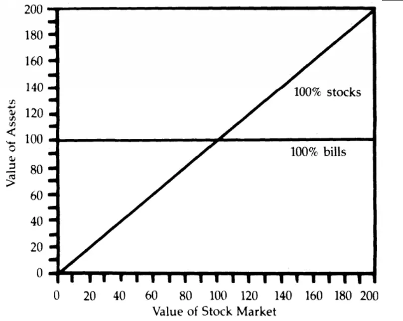
数据来源：Perold and Sharpe (1988)

图 2：敞口图：最大收益策略与最小风险策略
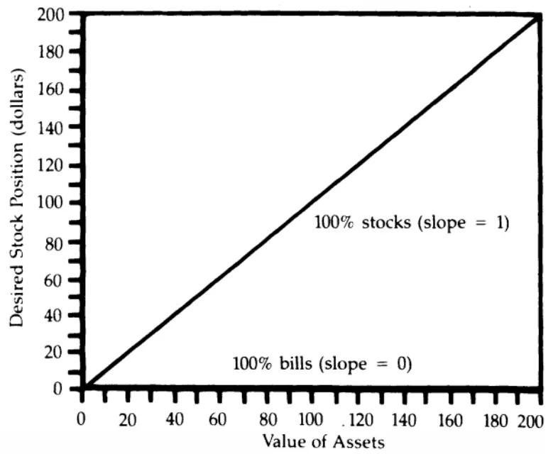
数据来源：Perold and Sharpe (1988)

图 1 是两种策略的盈余图。在最小风险策略（100%票据）中，总资产不受股市的影响；而在最大收益策略（100%股票）中，总资产与股市直接相关。

图 2 是两种策略的敞口图。在最小风险策略（100%票据）中，股票的敞口始终为 0；而在最大收益策略（100%股票）中，投资组合拥有 100%的股票敞口。事实上，敞口图同时也在表明投资者的风险容忍会对其最优策略的选择产生影响。例如，如果投资者的风险厌恶水平是 0，那么最小风险策略将成为不二选择。

## 4. 买入持有（B&H）策略

策略的特点以既定比例（例如股票 票据占比为 ）先买入后持有的投资策略。最小风险策略和最大收益策略都是其特例。B&H策略是一种惰性策略：不论市场的相对价值如何改变，都不需要对组合的配置权重进行再平衡。图 3是股票/票据占比为60/40 的B&H策略的盈余图。

图 3：盈余图：60/40-B&H策略
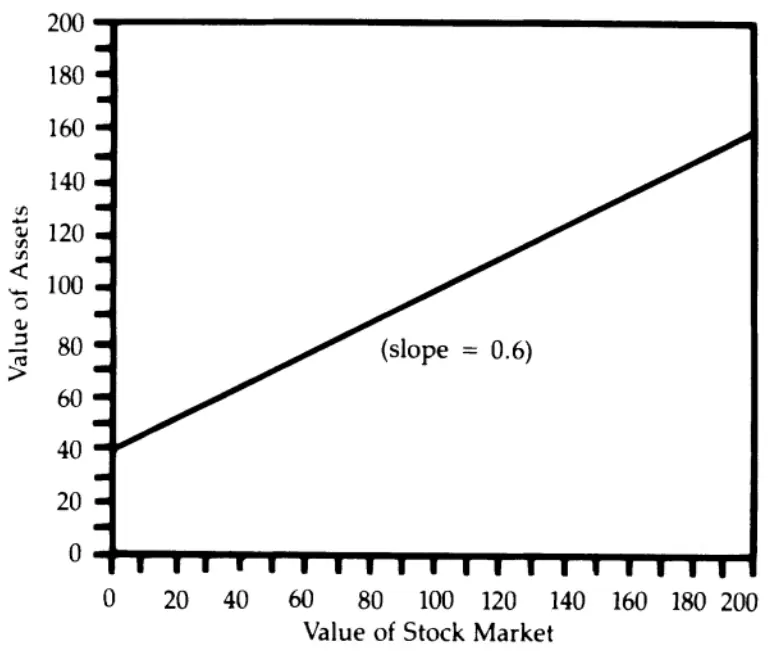
数据来源：Perold and Sharpe (1988)

从图 3 可以看出：

1. 总资产与股票价值线性相关。直线斜率等于股票的占比。

2. 总资产永远不会低于期初投资于票据的价值。

3. 总资产的上行潜力无限。

4. 若股票表现优于票据，则股票的占比越大，B&H策略表现越好，反之越差。

5. 股票/票据的期初占比完全决定了 B&H 策略盈余图中的截距（直线与纵轴相交的点）和斜率。

图 4 为 60/40-B&H策略的敞口图。显而易见的是，当总资产低于期初总资产的 60%的时候，投资者对风险的容忍度为零。不同股票/票据占比的B&H策略的敞口图的斜率也都为 1，不同之处仅反映在总资产的截距项上。

图 4：敞口图：60/40-B&H策略
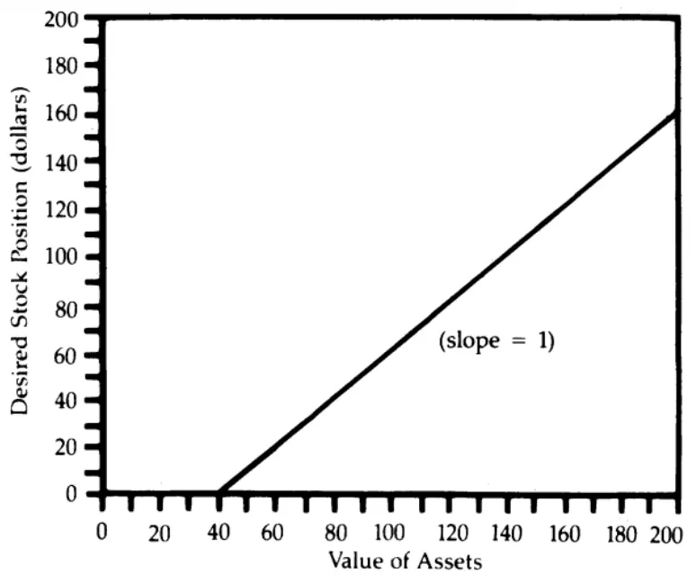
数据来源：Perold and Sharpe (1988)

## 5. 常数混合（CM）策略

CM 策略的核心理念在于保持股票敞口在总资产中的比例不变。

图 5：敞口图：60/40 策略
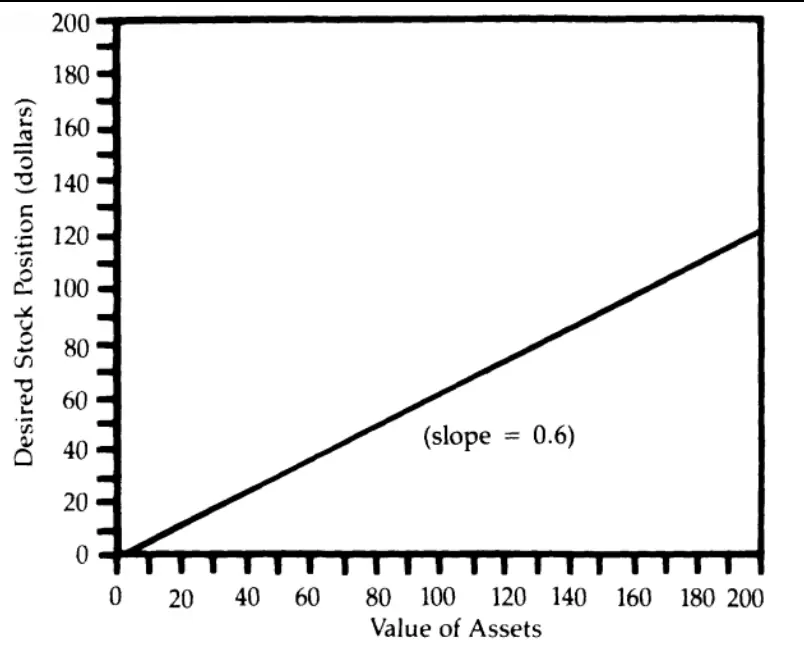
数据来源：Perold and Sharpe (1988)

图 5 显示了 60/40-CM 策略的敞口图，根据定义它是 0 截距的。CM 策略是一种真正的动态策略：相比于 B&H 策略什么都不做，该策略确实会对配置权重进行动态调整。如果投资者希望一直维持股票 票据的60/40 比例，那么股市下跌 10%（股票指数从 100 跌至 90）时，总资产变为$94，股票变为$54。此时股票占比变为$54/$94=57.4%，所以再平衡要求投资者出售价值$2.40=$94*60%-$54=$56.40-$54.00 的票据用于购买股票。表 1 陈列的即是上述再平衡的具体步骤。

表 1：再平衡：60/40-CM策略

| Case | Stock Market | Value of Stock | Value of Bills | Value of Assets | Percentage in Stocks |
| --- | --- | --- | --- | --- | --- |
| Initial | 100 | 60.00 | 40.00 | 100.00 | 60.0% |
| After Change | 90 | 54.00 | 40.00 | 94.00 | 57.4% |
| After Rebalancing | 90 | 56.40 | 37.60 | 94.00 | 60.0% |

数据来源：Perold and Sharpe (1988)

在实际使用中，再平衡调整的触发则需要进行确认。典型的方法是，再平衡仅在价值变化充分显著时才会进行。为了便于说明，我们在表 2 和表 3 中分别展示了股市每变动 10 个点时产生的再平衡调整。

表 2：再平衡（股票下行）：60/40-CM策略

| Case | Stock Market | Value of Stock | Value of Bills | Value of Assets | Percentage in Stocks |
| --- | --- | --- | --- | --- | --- |
| Initial | 100 | 60.00 | 40.00 | 100.00 | 60.0% |
| After Change | 90 | 54.00 | 40.00 | 94.00 | 57.4% |
| After Rebalancing | 90 | 56.40 | 37.60 | 94.00 | 60.0% |
| After Change | 80 | 50.13 | 37.60 | 87.73 | 57.1% |
| After Rebalancing | 80 | 52.64 | 35.09 | 87.73 | 60.0% |
| After Change | 70 | 46.06 | 35.09 | 81.15 | 56.8% |
| After Rebalancing | 70 | 48.69 | 32.46 | 81.15 | 60.0% |
| After Change | 60 | 41.74 | 32.46 | 74.20 | 56.3% |
| After Rebalancing | 60 | 44.52 | 29.68 | 74.20 | 60.0% |
| After Change | 50 | 37.10 | 29.68 | 66.78 | 55.6% |
| After Rebalancing | 50 | 40.07 | 26.71 | 66.78 | 60.0% |
| After Change | 40 | 32.05 | 26.71 | 58.76 | 54.5% |
| After Rebalancing | 40 | 35.26 | 23.51 | 58.76 | 60.0% |
| After Change | 30 | 26.44 | 23.51 | 49.95 | 52.9% |
| After Rebalancing | 30 | 29.97 | 19.98 | 49.95 | 60.0% |
| After Change | 20 | 19.98 | 19.98 | 39.96 | 50.0% |
| After Rebalancing | 20 | 23.98 | 15.98 | 39.96 | 60.0% |
| After Change | 10 | 11.99 | 15.98 | 27.97 | 42.9% |
| After Rebalancing | 10 | 16.78 | 11.19 | 27.97 | 60.0% |
| After Change | 0 | 0.00 | 11.19 | 11.19 | 0.0% |
| After Rebalancing | 0 | 6.71 | 4.48 | 11.19 | 60.0% |

数据来源：Perold and Sharpe (1988)

图 6 展示了上述情况对应的盈余图。为了方便比较，我们还显示了 60/40-B&H 策略的结果。可以看到，B&H 策略明显优于 CM 策略：因此无论股票是单边上涨还是单边下跌，B&H策略将会始终优于 CM 策略！既然如此，那么为什么还会有人愿意使用 CM 策略来进行资产配置呢？事实上，策略的优劣不仅取决于市场的方向，还取决于市场的波动过程。为了回答这个问题，我们将在接下来的章节中对股市的波动方式进行详细分析。

表 3：再平衡（股票上行）：60/40-CM策略

| Case | Stock Market | Value of Stock | Value of Bills | Value of Assets | Percentage in Stocks |
| --- | --- | --- | --- | --- | --- |
| Initial | 100 | 60.00 | 40.00 | 100.00 | 60.0% |
| After Change | 110 | 66.00 | 40.00 | 106.00 | 62.3% |
| After Rebalancing | 110 | 63.60 | 42.40 | 106.00 | 60.0% |
| After Change | 120 | 69.38 | 42.40 | 111.78 | 62.1% |
| After Rebalancing | 120 | 67.07 | 44.71 | 111.78 | 60.0% |
| After Change | 130 | 72.66 | 44.71 | 117.37 | 61.9% |
| After Rebalancing | 130 | 70.42 | 46.95 | 117.37 | 60.0% |
| After Change | 140 | 75.84 | 46.95 | 122.79 | 61.8% |
| After Rebalancing | 140 | 73.67 | 49.12 | 122.79 | 60.0% |
| After Change | 150 | 78.94 | 49.12 | 128.05 | 61.6% |
| After Rebalancing | 150 | 76.83 | 51.22 | 128.05 | 60.0% |
| After Change | 160 | 81.95 | 51.22 | 133.17 | 61.5% |
| After Rebalancing | 160 | 79.90 | 53.27 | 133.17 | 60.0% |
| After Change | 170 | 84.90 | 53.27 | 138.17 | 61.4% |
| After Rebalancing | 170 | 82.90 | 55.27 | 138.17 | 60.0% |
| After Change | 180 | 87.78 | 55.27 | 143.04 | 61.4% |
| After Rebalancing | 180 | 85.83 | 57.22 | 143.04 | 60.0% |
| After Change | 190 | 90.59 | 57.22 | 147.81 | 61.3% |
| After Rebalancing | 190 | 88.69 | 59.12 | 147.81 | 60.0% |
| After Change | 200 | 93.35 | 59.12 | 152.48 | 61.2% |
| After Rebalancing | 200 | 91.49 | 60.99 | 152.48 | 60.0% |

数据来源：Perold and Sharpe (1988)

图 6：盈余图：60/40-B&H策略和 60/40-CM策略
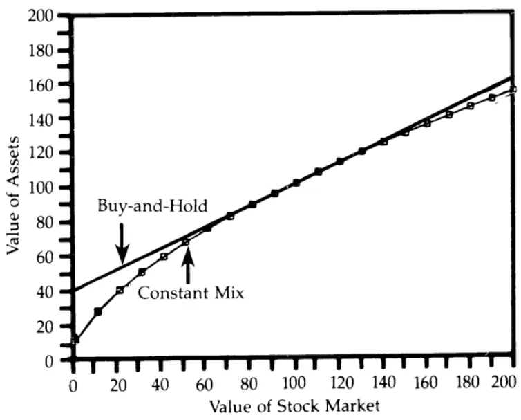
数据来源：Perold and Sharpe (1988)

## 5.1. 波动的影响

前文的例子总是假设股市的变化是单向的，即一直上涨或者下降。但现实中的股市并非如此：股市完全有能力实现趋势的自我逆转。事实上，正是因为这种逆转的存在，使得人们更加更青睐 CM 策略而非 B&H 策略。

考虑股票市场从 100跌至 90然后再恢复到 100的情况。在这种情况下，B&H 策略的期初总资产和期末总资产是完全一样的，但是使用 CM 策略的总资产却会有所差异。表 4 给出了策略的再平衡结果。

表 4：波动的影响：CM策略

| Case | Stock Market | Value of Stock | Value of Bills | Value of Assets | Percentage in Stocks |
| --- | --- | --- | --- | --- | --- |
| Initial | 100 | 60.00 | 40.00 | 100.00 | 60.0% |
| After Change | 90 | 54.00 | 40.00 | 94.00 | 57.4% |
| After Rebalancing | 90 | 56.40 | 37.60 | 94.00 | 60.0% |
| After Change | 100 | 62.67 | 37.60 | 100.27 | 62.5% |
| After Rebalancing | 100 | 60.16 | 40.11 | 100.27 | 60.0% |

数据来源：Perold and Sharpe (1988)

从表 4 可以看出，CM 策略赚了$0.27，图 7 很好地解释了该现象发生的原因。当股市从 100 跌至 90 时，总资产跌至$94，在图中这一过程对应了一条从 点到 点的直线（投资组合中持有的股票数量决定了这条直线的斜率）。对于 策略来说，如果市场继续跌至 ，总资产将跌至c 点；如果回升至 100，B&H策略重新回到 a 点。但对于 CM 策略来说，情况并非如此。由于每次再平衡都会改变持股数量，因此 CM 策略盈余图中的直线斜率也会随之改变。在从 a 点下跌到 b 点之后，CM 策略将购买更多的股票，这将增加直线的斜率。因此，如果市场进一步下跌至， 策略将处于 点而不是 点，其总资产将低于 策略的总资产。但当市场反攻到 100 时，CM 策略将到达 e 点，因此会高于 B&H策略的总资产。

图 7：盈余图（局部展开）：60/40-B&H策略和60/40-CM策略
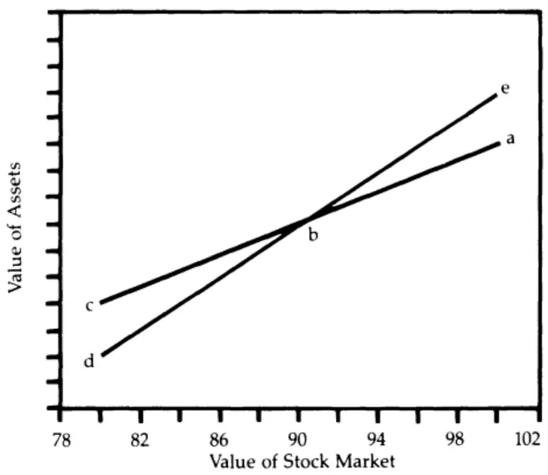
数据来源：Perold and Sharpe (1988)

那么两种策略最终谁会胜出？答案是，这取决于市场的运行模式。

如果股票从 100 下降到 90 后又回到 100，那么 CM 策略会最终获胜。一般来说，在股票下跌时买入，在股票上涨时卖出的策略将会在反转中获利。边际上的买入和售出决策都是好的决策。因此在震荡的平市中，CM策略的表现将超过可比的 B&H 策略，这是因为它利用了反转带来的机会。更大的波动（即，更多次数或者更大幅度的逆转）将加剧这两种策略之间的差异。相反，如果市场从 100 到 90 再到 80，那么两种策略都将蒙受损失，但 B&H 策略的损失较小。一般来说，趋势市场中 CM 策略的表现将逊于可比的 B&H策略：牛市或熊市中发生的情况正是如此。从统计上看，趋势市中大多数的边际买入和售出最终都会被证明是不合时宜的。而经过多次再平衡后，CM 策略的总价值既和股市的最终状态有关，也取决于市场的波动方式。总体上看，在期末状态与期初状态相近的情况下，CM 策略会更有优势，而一旦期末状态远离期初状态，B&H策略就会更加有利可图。

图 8：盈余图：B&H策略和 CM策略的仿真模拟
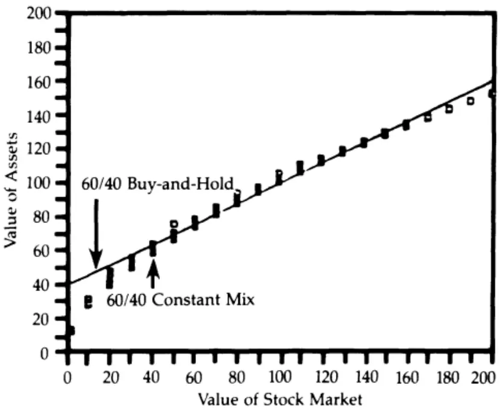
数据来源：Perold and Sharpe (1988)

图 8 给出了上述机理分析的一个具体例子。横轴表示经过再平衡后股票市场的水平，纵轴表示总资产。图中直线显示了 B&H 策略的总价值，而每一个竖着的方块都代表了 CM 策略在一共 2000 次模拟中的可能结果。其中单次模拟的时间长度均为 20 个周期，每次以等概率的可能性上涨 10 个点/持平/下跌 10 个点。仿真结果表明，两种策略明没有任何一种策略处于严格优势。

总的来说，如果市场呈现逆转而非趋势，那么 CM 策略往往更有优势；
如果市场只有单方向的变动，那么 B&H策略会表现地更好。

## 6. 常数比例（CP）策略

常数比例（constant proportion，CP）策略的形式如下:

$$
\mathsf{D}=\mathsf{m}\cdot(\mathsf{A}-\mathsf{F})
$$

其中 D 是投资于股票的资金，m 为一个固定乘数，A 为总资产价值，F为底部价值。固定比例投资组合保险（CPPI）策略则是该类策略中乘数m 大于 1 的特例。

在 CPPI 策略中，投资者需要选择乘数 m 和底部价值 F，前者代表了风险偏好，后者代表了总资产的下跌下限。该下限通常以票据回报率的速度增长，其初始值必须小于总资产的初始值。如果将总资产和底部价值之间的差额看作“缓冲”的话，那么 CPPI 策略即是将股票风险敞口维持为“缓冲”的常数倍的一种策略。

图 9：敞口图：CPPI策略
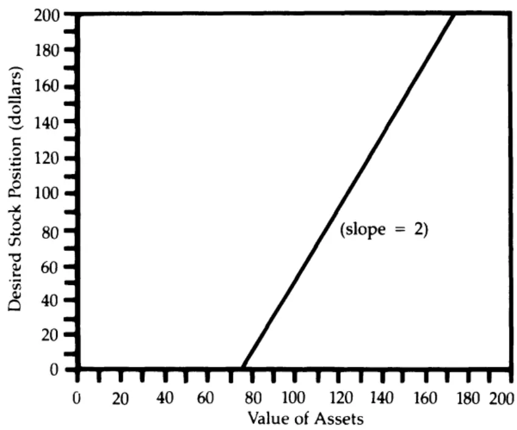
数据来源：Perold and Sharpe (1988)，F=$75，m=2。

图 9 显示了底部价值 F 为$75、乘数 m 为 2 的 CPPI 策略的敞口图。与B&H 策略一样，CPPI 策略对于低于特定下限的风险是零容忍的（此时没有股票敞口）。不同点在于，CPPI 策略对风险的容忍度上升速度较快。因为 B&H 策略其实是底部价值 F 等于期初票据价值，乘数 m 为 1 的CPPI 策略，所以 CPPI 策略的敞口图表类似于 B&H 策略。而 CM 策略则是底部价值 F 等于 0，乘数 m（即投资于股票的比例）在 0 到 1 之间的 CPPI 策略。

下面我们来研究 CPPI 策略的盈余图。假设总资产为$100，底部价值为$75，乘数 m 为 2，“缓冲”等于$25=$100-$75。因此股票的期初敞口为上述“缓冲”的两倍，即$50=2×$25。假如股票市场从 100 跌到 90，CPPI策略中的股票价值将下跌 10%（从$50 降至$45），总资产变为$95，“缓冲”则等于$20=$95-$75。此时的股票敞口为$40= 2×$20。因此投资者需要出售$5=$45-$40 的股票，并将收益用于购买票据。如果股市进一步下跌，则应该抛售更多股票确保底部价值足够“安全”。相反地，如果股价上涨，就应该买入股票。

从这个分析可以看出，CPPI 策略其实是一种趋势跟随策略：在股票下跌时卖出，在股票上涨时买入。

基于上述分析，CPPI 策略即使是在严重的熊市中也至少会表现地和底部价值一样好。这是因为其在股市下跌时将在票据中投入更多资金，而在总资产接近底部价值时将清空股票敞口。CPPI 策略当然也会有风险，即市场在有机会再平衡之前发生了急剧的下跌，其严重程度取决于乘数的选择。在乘数为 的情况下，如果股市下跌多达 ，那么底部价值就会受到威胁。更普遍地说，假设市场的下跌比例为 1/m 时，如果没有再平衡机会，那么底部价值就会受到威胁。由于跟随了趋势，在牛市中，CPPI 策略会有很好的表现，但在平市中，CPPI 策略则会相对较差。这是因为市场反转的出现会损害 CPPI 策略：策略在市场弱势时卖出，市场反弹时就会踏空；在市场强势时买入，市场走软时就会套牢。

图 10：盈余图：CPPI策略与两种 B&H策略
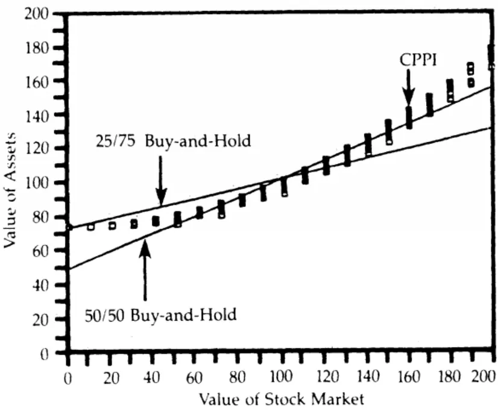
数据来源：Perold and Sharpe (1988)，F=$75，m=2。

图 10 展示了 CPPI 策略的盈余图。与图 8 类似，我们同样利用仿真实验进行说明，横轴表示经过一系列再平衡后股市的水平，纵轴则表示策略总资产。每一个方块代表了 CPPI 策略（底价为$75，乘数为 2）的 2000次仿真模拟可能结果中的一种。图 10 还给出了两种可比的 B&H策略的盈余图。其中斜率较为陡峭的直线对应的是与 CPPI 策略满足相同的初始股票/票据权重（50/50）的 B&H 策略的盈余图。可以看到 CPPI 策略的总价值永远不会低于$75 的底部。

当然，图 10 中显示的三种策略中没有任何一种能严格优于其他策略，最终的赢家都将由市场的具体行为模式所决定。

## 6.1. 凹性策略与凸性策略

从上述分析来看，盈余图的基本形状受具体策略类型的影响较小，但是非常依赖策略的再平衡方式。目前为止，我们已经研究了三种不同的再平衡方法：

1. 躺平策略：无论股票的涨跌，什么也不做；

2. 反转策略：股票下跌时买入，上涨时卖出；

3. 趋势策略：股票下跌时卖出，上涨时买入。

躺平策略（B&H策略）的盈余图当然是直线。反转策略也称凹性策略则会生成凹（concave）的收益曲线（即股票市场从亏损向盈利移动时，盈余曲线会以递减的速度增加）：它们缺乏下行保护而在上行市场中表现差劲；但在震荡的平市中，它们表现较好。趋势策略也称凸性策略则会生成凸（convex）的收益曲线（即股票市场从亏损向盈利移动时，盈余曲线会以递增的速度增加）：他们提供良好的下行保护且在上行市场中表现良好；但在震荡的平市中，它们表现较差。CM 策略和 CPPI 策略则分别是最简单的凹性策略和凸性策略。

从投资组合保险（portfolio insurance，PI）的视角来看，凸性策略（CPPI）实际上买入了 PI，而凹性策略（CM）卖出了 PI。因此，如果以 B&H作为基准，凹性策略和凸性策略其实互为镜像。凸性策略的每个“买方”都是凹性策略的“卖方”，反之亦然。因此同时买入凹性策略和凸性策略，相当于采用 B&H 策略。盈余图的凹凸性和敞口图的斜率之间存在简单而直接的关系（这里对应乘数 m）：斜率小于 1 的敞口图对应了凹性的盈余图，斜率大于 的敞口图会产生凸性的盈余图。

由于凸性策略和凹性策略彼此对称，单侧策略的需求越大，其实施成本就会越高，于市场整体而言就越不健康。如果越来越多的投资者转向凸性策略（趋势策略），那么市场将变得更加不稳定，这是因为相对于之前的“公平”价格，市场下行将缺乏的买家，市场上行将缺乏卖家。在这种情况下，那些采用凹性策略的人可能会获得丰厚回报。相反，如果越来越多的投资者转向凹性策略（反转策略），那么市场可能会变得过于稳定，这使得价格调整到“公平”水平的速度可能太慢。在这种情况下，那些采用凸性策略的人，将获得理想的回报。一般来说，单侧策略越是市场共识，其镜像策略的收益就会渐入佳境，随着时间的推移，这将提高镜像策略的受欢迎程度，从而在策略选择的层面上最终推动市场走向均衡。

## 7. 基于期权的投资组合保险（OBPI）策略

OBPI 策略首先要指定一个期限（horizon）和期限内的底部价值。需要指出的是，底部价值的数值在 OBPI 策略中是和期限选择有关的。例如，如果期限是 1 年，期末的底部价值是$82.50，那么之前任何时刻的底部价值都是期末底部价值使用无风险利率折现后的现值。特别地，若票据的年化收益率为 10%，那期初底部价值就等于$75=$82.5/(1+10%)。正如CPPI 策略和 B&H 策略一样，随着时间的推移，OBPI 中的底部价值也会以无风险利率的水平逐渐增长。而一旦选择了底部价值，OBPI 策略不过是一个在期限内利用看多期权和票据构造的投资组合而已。图 11 就提供了这样的一个示例。

图 11：盈余图：OBPI策略
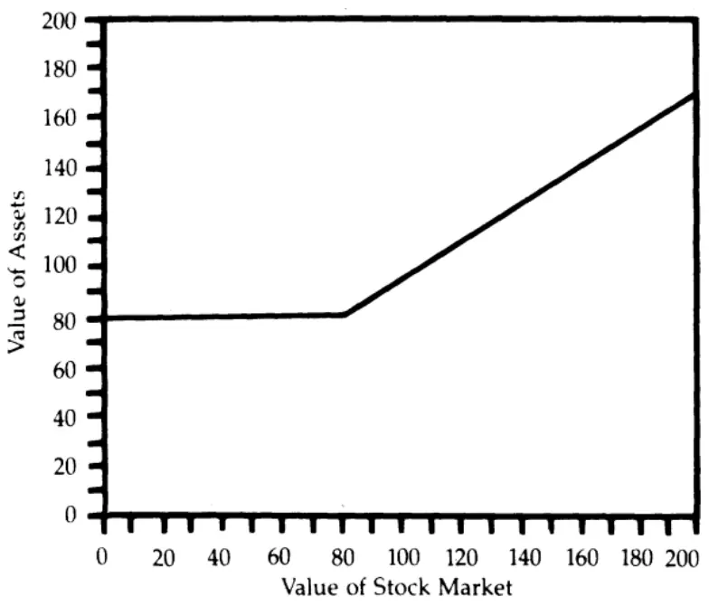
数据来源：Perold and Sharpe (1988)，F=$82.5。

在OBPI中，敞口图在很大程度上取决于当前时点到行权日的时间间隔。在行权日来前的一瞬间，如果总价值等于底部价值，那么 OBPI 策略的期权敞口为 0，如果总价值超过底部价值，策略则会满仓期权。而在行权日之前的某个时刻，因为期权的 BS 公式的原因，对应的敞口图是一条比较复杂的曲线。

图 12：敞口图：OBPI策略
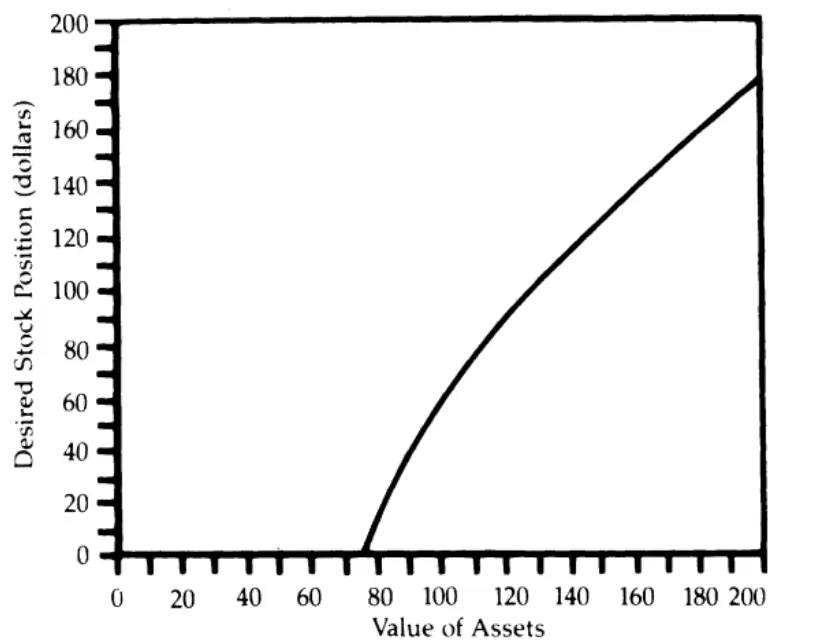
数据来源：Perold and Sharpe (1988)，F=$82.5。

图 12 展示了一个距离期限还有 1 年的例子。而随着时间的推移，我们必须不断更新敞口图中的曲线。图 12 中的曲线部分的切线斜率在所有点上都大于 1：它从一个远大于 1 的值开始，随着“缓冲”的增大而收敛于 1。因此，OBPI 策略也是一个趋势策略，其必然产生凸性收益：在期限内的盈余图上看，OBPI 策略由两条直线构成，因此总体上仍旧是凸函数（数学中称为分段线性的凸函数）。

在 OBPI 策略中，给定非负的“缓冲”后，股票敞口会随着时间的推移而增加，并在行权日那一天变为总价值的 100%。因此，OBPI 策略依赖于日历时间，这与 CPPI 策略形成了鲜明对比，后者的风险敞口只取决于“缓冲”的规模。越是临近行权日，日历时间对 OBPI 策略的影响就会越发特别严重，此时需要及时重置该策略。简单来说，到期前资产组合中的股票/票据比例（0/100 或 100/0）会与到期后的比例存在很大不同。因此从金融的视角来看，仅仅因为日历时间的改变，就使得配置权重发生不连续的变化绝非明智之举。所以对于长期投资者而言，如果他们的投资期限超出了 OBPI 策略中的投资期限，日历时间的影响将无疑是一个必须克服的缺点。这使得我们不得不在接下来的章节中讨论动态策略的重置问题。

## 7.1. 带重置的动态策略

什么时候（如果有的话）应该“重置”动态策略的参数？这个问题的答案不仅取决于策略选择背后的基本原理，也取决于所选择的动态策略的类型。例如对于 OBPI 策略而言，重置就意味着我们要选择新的期限，虽然很多时候这种重置是不得已而为之。

比起重置的直接结果，更重要的是我们需要意识到重置动态策略参数的方式会极大地改变策略的基本属性。换句话说，策略的凹凸性可能反转，一种策略可能因为参数改变而被重置为另外一种策略。

例如在图 12 中，使用 OBPI 时，不同级别的“缓冲”对应的乘数是也是不同的，因此 OBPI 策略可以被认为乘数随着“缓冲”的变化而变化的一种 CPPI 策略。作为第二个例子，考虑如下的“滚动”CPPI 策略。它的设定和通常的 CPPI 策略几乎一致，但总是假设:

$$
\mathrm{F}=0.8\times\mathrm{A}
$$

这意味着，我们成功（或者应该说失败）地将 CPPI 策略转化成了 CM 策略。这种重置显然改变了策略的基本属性，因为重置后的策略丧失了应对股票市场下行的保护功能。另外的一个重要例子则是“滚动”的 OBPI策略。在形式上，这种策略满足（ ）动态重置期限，比如 年，以便策略总是处于期限的起点；（2）重置末期底部价值，以保证它在总资产中维持恒定的比例。遗憾的是，可以证明，此时得到的重置策略也只是一个 CM 策略而已。

事实上，市场中充斥着不少很受欢迎的重置方式。以 CPPI 策略为例，一种“合理”的重置要求在市场持平或下跌时坚持 CPPI 的规则，但在市场上行时则逐渐提高底部价值，从而“锁定”利润。对于这种重置方式，其对动态策略的基本属性的影响，将在很大程度上取决于它的具体实施方式。但在通常情况下，它会导致股票在上涨和下跌过程中都被抛售：在下跌市场中，抛售发生是因为底部价值固定，从而触发了策略的 PI 性质；而在上涨市场中的抛售则是因为：股价上涨→总价值上升→底部价值上升→缓冲减少→引发抛售，此处只需要底部价值上升地足够多或者足够快。总的来说，这样的重置扭曲了 CPPI 的盈余图的凹凸性，最终提供了一种右凹左凸的盈余图。

正是由于重置可以极大地改变策略的基本属性，重置规则应被视为动态战略的一个组成部分，其影响不容小觑。总结起来，OBPI 策略由于自身属性需要经常重置，但 B&H策略、CM 策略和 CPPI 策略则可以在关键参数不变的情况下长期实施，因此对于长期投资者而言，这些投资策略的吸引力会更强。

## 8. 动态策略的选择

哪种动态策略是最好的？这其实不是个好问题。本文的目的在于强调“最佳”策略其实要看策略敞口图是否匹配投资者自身的风险容忍（作为“缓冲”的适当的函数）。没有任何理由去相信特定类型的动态策略是适合所有投资人的全局最优解（事实上，唯有 B&H 策略可以被每个人接受)。所以，分析师的工作意义在于帮助投资者正确理解策略的切实含义，他们不能也不应该在没有充分了解投资者的情况下，在投资策略的选择上越俎代庖。

## 9. 附录

本附录将解释盈余图和敞口图的相关技术。首先我们引入一些记号。设

$$
\begin{array}{rl}&{(\mathrm{A}_{\mathrm{t}}=\mathrm{t}\ \sharp\ddot{\mathcal{Z}})\dot{\mathcal{H}}\big\langle\dot{\mathcal{T}}\big\rangle_{\mathrm{s}}^{\sharp}\frac{\dot{\mathcal{Z}}}{\mathfrak{p}}\big\langle\dot{\mathcal{P}}^{\sharp}\big\rangle_{\mathrm{r}}^{\sharp}}\\&|\begin{array}{l}{\mathrm{S}_{\mathrm{t}}=\mathrm{t}\ \ H\ddot{\mathcal{H}}\big\rangle\frac{\dot{\mathcal{H}}^{\prime}}{\widetilde{\mathcal{R}}}\big\rangle\frac{\dot{\mathcal{H}}^{\prime}}{\widetilde{\mathcal{K}}}\frac{\dot{\mathcal{H}}^{\prime}}{\widetilde{\mathcal{P}}^{\sharp}}\big\rangle_{\mathrm{r}}^{\sharp\sharp}}\\{\{\mathrm{F}_{\mathrm{t}}=\mathrm{t}\ \ \ H\ddot{\mathcal{H}}\big\}\frac{\dot{\mathcal{H}}^{\prime}}{\widetilde{\mathcal{K}}}\big\rangle\frac{\dot{\mathcal{H}}^{\prime}}{\widetilde{\mathcal{K}}}\frac{\dot{\mathcal{H}}^{\prime}}{\widetilde{\mathcal{P}}^{\sharp}}\big\langle\dot{\mathcal{H}}\big\rangle_{\mathrm{r}}\big\langle\dot{\mathcal{H}}\big\rangle}\\{|\mathrm{E}_{\mathrm{t}}=\mathrm{t}\ \ \ H\ddot{\mathcal{H}}\frac{\dot{\mathcal{H}}^{\prime}}{\widetilde{\mathcal{K}}}\frac{\dot{\mathcal{H}}^{\prime}}{\widetilde{\mathcal{T}}^{\sharp}}\frac{\dot{\mathcal{H}}^{\prime}}{\widetilde{\mathcal{P}}^{\sharp}}\frac{\dot{\mathcal{H}}^{\prime}}{\widetilde{\mathcal{P}}^{\sharp}}\big\langle\Omega}\\\mathrm{r}=\frac{\Phi}\end{array}\end{array}
$$

## 9.1. B&H 策略

设 x 代表股票的期初投资比例，则期初的底部价值为

$$
\mathrm{F}_{0}=(1-\mathrm{x})\mathrm{A}_{0}
$$

于是 t 时刻的底部价值为

$$
\mathrm{F_{t}}=(1-\mathrm{x})\mathrm{A}_{0}\mathrm{e}^{\mathrm{rt}}=\mathrm{F}_{0}\mathrm{e}^{\mathrm{rt}}
$$

总资产为

$$
\mathrm{A_{t}}=\mathrm{F_{t}}+\mathrm{xA_{0}}\mathrm{S_{t}}/\mathrm{S_{0}}
$$

股票敞口为

$$
\mathrm{E}_{\mathrm{t}}=\mathrm{A}_{\mathrm{t}}-\mathrm{F}_{\mathrm{t}}
$$

## 9.2. CP 策略

CM 策略是 CP 策略的特例，满足

$$
\mathrm{F_{t}}=\mathrm{F_{0}}=0
$$

CP 策略与 B&H策略类似，此时总资产为

$$
{\cal A}_{\mathrm{t}}=\mathrm{F}_{\mathrm{t}}+\left({\cal A}_{0}-\mathrm{F}_{0}\right)\left(\frac{\mathrm{S}_{\mathrm{t}}}{\mathrm{S}_{0}}\right)^{\mathrm{m}}\mathrm{e}^{(1-\mathrm{m})\left(\mathrm{r}+\frac{\mathrm{m}\sigma^{2}}{2}\right)\mathrm{t}}
$$

其中 $\sigma$ 是波动率参数。股票敞口变为

$$
\mathrm{E}_{\mathrm{t}}=\mathrm{m}(\mathrm{A}_{\mathrm{t}}-\mathrm{F}_{\mathrm{t}})
$$

如果不允许借贷，那么股票敞口变为

$$
\mathrm{E_{t}}=\operatorname*{min}\bigl(\mathrm{A_{t}},\mathrm{m}(\mathrm{A_{t}}-\mathrm{F_{t}})\bigr)
$$

此时的总资 $\cdot\dot{\bar{r}}$ 则没有一个简单的显式解。

## 9.3. OBPI 策略

考虑行权价格为 K的，行权日期为 T 的欧式期权的 BS 公式。设

$$
\mathrm{d}_{\mathrm{t}}={\frac{\displaystyle\log{\frac{S_{\mathrm{t}}}{K}}+\mathrm{r}+{\frac{\sigma^{2}(\mathrm{T}-\mathrm{t})}{2}}}{\sigma{\sqrt{\mathrm{T}-\mathrm{t}}}}}
$$

那么有期权价格等于

$$
\mathrm{B(S,K,r,\sigma,t,T)=S_{t}\cdot N(d_{t})-Ke^{-r(T-t)}\cdot N(d_{t}-\sigma\sqrt{T-t})}
$$

其中 N 是标准正态分布的累计分布函数。

OBPI 策略中期权购买数量为下列等式给出：

$$
\boldsymbol{\mathrm{n}}_{0}\cdot\mathrm{B}(\mathrm{S}_{0},\mathrm{K},\mathrm{r},\sigma,0,\mathrm{T})=\boldsymbol{\mathrm{A}}_{0}-\boldsymbol{\mathrm{F}}_{0}
$$

并且

$$
\boldsymbol{\mathrm{n_{T}}}\cdot\mathrm{K}=\boldsymbol{\mathrm{F_{T}}}=\boldsymbol{\mathrm{F_{0}}}\mathrm{e^{\mathrm{rT}}}
$$

因此在 0 到 T 之间，总资产等于

$$
\mathrm{A_{t}=F_{t}+n_{t}\cdot B(S,K,r,\sigma,t,T)}
$$

其中

$$
\mathrm{F_{t}}=\mathrm{F_{0}}\mathrm{e^{\mathrm{rt}}}
$$

而在 T 时，有

$$
\mathrm{A_{T}}=\mathrm{F_{T}}+\mathrm{n_{T}}\cdot\mathrm{max}(\mathrm{S_{T}}-\mathrm{K},0)
$$

期权敞口为

$$
\mathrm{E}_{\mathrm{T}}=\mathrm{n}_{\mathrm{T}}\cdot\mathrm{N}(\mathrm{d}_{\mathrm{T}})
$$

## 本公司具有中国证监会核准的证券投资咨询业务资格

## 分析师声明

作者具有中国证券业协会授予的证券投资咨询执业资格或相当的专业胜任能力，保证报告所采用的数据均来自合规渠道，分析逻辑基于作者的职业理解，本报告清晰准确地反映了作者的研究观点，力求独立、客观和公正，结论不受任何第三方的授意或影响，特此声明。

## 免责声明

本报告仅供国泰君安证券股份有限公司（以下简称“本公司”）的客户使用。本公司不会因接收人收到本报告而视其为本公司的当然客户。本报告仅在相关法律许可的情况下发放，并仅为提供信息而发放，概不构成任何广告。

本报告的信息来源于已公开的资料，本公司对该等信息的准确性、完整性或可靠性不作任何保证。本报告所载的资料、意见及推测仅反映本公司于发布本报告当日的判断，本报告所指的证券或投资标的的价格、价值及投资收入可升可跌。过往表现不应作为日后的表现依据。在不同时期，本公司可发出与本报告所载资料、意见及推测不一致的报告。本公司不保证本报告所含信息保持在最新状态。同时，本公司对本报告所含信息可在不发出通知的情形下做出修改，投资者应当自行关注相应的更新或修改。

本报告中所指的投资及服务可能不适合个别客户，不构成客户私人咨询建议。在任何情况下，本报告中的信息或所表述的意见均不构成对任何人的投资建议。在任何情况下，本公司、本公司员工或者关联机构不承诺投资者一定获利，不与投资者分享投资收益，也不对任何人因使用本报告中的任何内容所引致的任何损失负任何责任。投资者务必注意，其据此做出的任何投资决策与本公司、本公司员工或者关联机构无关。

本公司利用信息隔离墙控制内部一个或多个领域、部门或关联机构之间的信息流动。因此，投资者应注意，在法律许可的情况下，本公司及其所属关联机构可能会持有报告中提到的公司所发行的证券或期权并进行证券或期权交易，也可能为这些公司提供或者争取提供投资银行、财务顾问或者金融产品等相关服务。在法律许可的情况下，本公司的员工可能担任本报告所提到的公司的董事。

市场有风险，投资需谨慎。投资者不应将本报告作为作出投资决策的唯一参考因素，亦不应认为本报告可以取代自己的判断。
在决定投资前，如有需要，投资者务必向专业人士咨询并谨慎决策。

本报告版权仅为本公司所有，未经书面许可，任何机构和个人不得以任何形式翻版、复制、发表或引用。如征得本公司同意进行引用、刊发的，需在允许的范围内使用，并注明出处为“国泰君安证券研究”，且不得对本报告进行任何有悖原意的引用、删节和修改。

若本公司以外的其他机构（以下简称“该机构”）发送本报告，则由该机构独自为此发送行为负责。通过此途径获得本报告的投资者应自行联系该机构以要求获悉更详细信息或进而交易本报告中提及的证券。本报告不构成本公司向该机构之客户提供的投资建议，本公司、本公司员工或者关联机构亦不为该机构之客户因使用本报告或报告所载内容引起的任何损失承担任何责任。

## 评级说明

## 1.投资建议的比较标准

投资评级分为股票评级和行业评级。

以报告发布后的 12 个月内的市场表现为比较标准，报告发布日后的 12 个月内的公司股价（或行业指数）的涨跌幅相对同期的沪深 300 指数涨跌幅为基准。

## 2.投资建议的评级标准

报告发布日后的 12 个月内的公司股价（或行业指数）的涨跌幅相对同期的沪深300 指数的涨跌幅。

|  | 评级 | 说明 |
| --- | --- | --- |
| 股票投资评级 | 增持 | 相对沪深300指数涨幅15%以上 |
|  | 谨慎增持 | 相对沪深300指数涨幅介于 5%～15%之间 |
|  | 中性 | 相对沪深300指数涨幅介于-5%～5% |
|  | 减持 | 相对沪深300 指数下跌5%以上 |
| 行业投资评级 | 增持 | 明显强于沪深 300 指数 |
|  | 中性 | 基本与沪深 300指数持平 |
|  | 减持 | 明显弱于沪深 300 指数 |

## 国泰君安证券研究所

|  | 上海 | 深圳 | 北京 |
| --- | --- | --- | --- |
| 地址 | 上海市静安区新闸路 669 号博华广 | 深圳市福田区益田路6009号新世界 商务中心34层 | 北京市西城区金融大街甲9号金融 街中心南楼18层 |
| 邮编 | 场20层 200041 | 518026 | 100032 |
| 电话 | (021)38676666 | (0755)23976888 | （010)83939888 |
|  | E-mail: gtjaresearch@gtjas.com |  |  |