inInfo][Table_Title2022.07.21

# ESG取值的组合优化与动态资产定价

## ——精品文献解读系列（三十一）

## 本报告导读：

本文将ESG整合进了动态资产定价理论之中，构造了ESG版本的组合优化、资本市场线、风险度量、期权定价以及影子无风险利率，值得战略、战术配置投资者参考。摘要：

投资学是一门学术界与业界紧密结合的学科，其中大类资产配置是这种紧密结合的代表。从 （ ）开创现代投资组合理论开始，学术界为业界提供了丰富的理论参考和方法模型，推动了大类资产配置实践的繁荣发展。为了帮助读者及时跟踪学术前沿，我们推出了“精品文献解读”系列报告，从大量学术文献中挑选出精品论文进行剖析解读，为读者呈现大类资产配置领域最新的思路和方法。

本篇为读者解读的文献是 Lauria et al（2022）在 arXiv 上的预印本论文“ESG-Valued Portfolio Optimization and Dynamic Asset Pricing”。

ESG 评级为社会责任投资提供了一种量化的衡量标准。本文提出了一种将 评级纳入到动态定价理论中的统一框架。通过引入取值的收益率作为传统的收益率的替代，本文形成一个由回报、风险和 ESG 评分综合决定组合优化框架。该框架保留了组合优化中的风险厌恶系数（α），并引入了 ESG 亲和系数（λ）。利用该框架，本文构造了 ESG 版本的组合优化、资本市场线、风险度量、期权定价以及影子无风险利率。

本文将 ESG 整合进了动态资产定价理论之中，构造了 ESG 版本的组合优化、资本市场线、风险度量、期权定价以及影子无风险利率，值得战略、战术配置投资者参考。

大类资产配置研究

## hor] 报告作者

赵索(分析师)

8 0755-23976601

zhaosuo024832@gtjas.com

证书编号 S0880521080002

## cReport] 相关报告

使用基本面因子构建中证500指数增强策略初探

2022.07.20

反弹后段注重节奏，行一观三未雨绸缪

2022.07.03

从春季行情“爽约”到强力反弹“未料而至”

2022.06.27

行业配置多面观——通过多维建模构建行业轮动策略

2022.06.20

## 1. 文献概述

## 文献来源：

D. Lauria, W. B. Lindquist, S. Mittnik and S. T. Rachev. " ESG - Valued Portfolio Optimization and Dynamic Asset Pricing." Preprint version. https: //arxiv.org/abs/2206.02854

## 文献摘要：

ESG 评级为社会责任投资提供了一种量化的衡量标准。本文提出了一种将 ESG 评级纳入到动态定价理论中的统一框架。通过引入 ESG 取值的收益率作为传统的收益率的替代，本文形成一个由回报、风险和 ESG 评分综合决定组合优化框架。该框架保留了组合优化中的风险厌恶系数（α），并引入了 ESG 亲和系数（λ）。利用该框架，本文构造了 ESG 版本的组合优化、资本市场线、风险度量、期权定价以及影子无风险利率。

## 文献评述：

本文将 ESG 整合进了动态资产定价理论之中，构造了 ESG 版本的组合优化、资本市场线、风险度量、期权定价以及影子无风险利率，值得战略、战术配置投资者参考。

## 说明：

为方便起见“ESG-valued XX”一词在本文中被统一翻译成“ESG 取值的XX”，或者更简单“E值 XX”。

## 2. 引言

社会责任投资（socially responsible investing，SRI）是一种倡导在投资和公司层面对环境和社会产生正向影响的投资理念。虽然 SRI 涵盖的范围较广，但在狭义语境中，它主要是指 ESG 评级（ESGrating）。粗糙地讲，ESG 评级的目的在于从环境、社会和治理三个范畴对任何一家公司进行评分，以期提供公司级别的“可持续发展性”排序。

ESG 投资方兴未艾。例如共同基金和养老基金，当下皆提供与 SRI 相关的金融产品。但在如何将 整合进投资决策中则有数量不菲的尝试。主流的整合方式可以分为三种：（1）排除途径，（2）纳入途径，（3）经验途径。前两种途径可以被简单理解为“赏善罚恶”，而第三种途径则是“赏善不罚恶”，因此采用此种途径的资产管理人在寻求更多的风险敞口于 ESG 得分较高的公司的同事，也有可能投资于不那么有道德的企业实体，详情参见 Berry et al（2013）。

虽然 ESG 投资的背后推动力可以粗糙地分为道德信念和业绩改善，但从文献角度来看，大家更倾向于从后者为 ESG 投资提供合理性支撑，此处略去不表。

ESG 评级经常遇到的一个技术问题是不同评级机构之间存在得分差异。

Berget al（2019）分析了六家大型数据提供商的 ESG 分数，最终发现可以主要归因于：

i) 范围（scope，占比 56%），由决定 ESG 评级的指标范围所决定；
ii) 测量（measurement，占比 38%），由指标的具体计算方式所决定；
iii) 权重（weight，6%），由 ESG 评级的组合权重所决定。

组合优化是现代金融理论的基石，而相关理论需要给定回报和风险的测度后才能展开。将 信息整合进入组合优化的最初尝试是通过负面筛查来实现的。在 Geczy and Guerard（2021）中，作者利用因子模型和 MVO整合了负面筛查信息。随后有大量研究试图将 ESG 信息直接整合进组合优化。Bilbao et al（2013）等人构建了一个两阶段模型。第一步仍然是计算基于回报和风险的有效前沿，并计算有效前沿上的社会行为满意指标。第二步则基于第一步的计算，选择金融和社会行为表现较好的标的来组成投资组合。Hirschberger et al（2013）和 Utz et al（2015）则将可持续发展度作为仅次于收益和风险之后用于资产筛选的第三维度。Gasser etal（2017）将 ESG 视为经典 MVO 优化目标的一个线性组成部分。Chenet al（2021）给出了一个三阶段模型。第一步通过对 ESG 的数据包络分析得到一个信息含量更高的综合分数；第二步则利用第一步的综合分数和金融指标，构造了一个受限投资共相（restricted investment universe）；第三步再使用标准的MVO框架得到最优权重组合。Pedersenet al（2021）将相对 ESG 分数整合进了目标函数，并考虑了环境和治理分数对组合业绩的微分冲击（differential impact）。Schmidt（2020）给出了由收益率、平均方差和 ESG 分数共同决定的资产权重分析。Cesarone et al（2022）将 ESG 作为 MVO 框架的一个硬约束，对不可做空的市场利用数据驱动的风险场景，做了一些数值模拟，他们发现在 DJIA、Euro Stocxx 50、FTSE100、NASDAQ100 和 S&P500 等市场中，只有 DJIA 和 S&P500 才会有高 ESG 超额表现。

本文的目的在于构建依据于 信息的定价、优化以及风险管理的框架。本文将 ESG 视为动态资产定价理论中的第三维度，即构造“回报-风险 ”资产配置理论。我们的工作从整合 与资产收益率的值收益率开始，并逐渐扩展到现代金融理论的其他主要部分，包括但不限于组合优化、资本市场线、风险度量、期权定价以及影子无风险利率。

## 3. ESG 取值的收益率

粗糙地讲，E 值收益率（ESG-valued return，ER）是资产的收益率和 E 值（ESGscore，ES）的某种线性组合。本文主要涉及两种版本的 E值，即原始的 E值和正规化后的 E值（normalizedES，NES）。E值通常是一个非负数。如果用 $\mathrm{ESG_{i,t^{'}}}$ 代表资产 i在 t 时刻的 E值，那么 NES 即由映射

$$
\varsigma\colon\mathbb{R}_{\geq0}\to[-1,1],\mathrm{ESG}_{\mathrm{i},\mathrm{t}}\mapsto\varsigma\big(\mathrm{ESG}_{\mathrm{i},\mathrm{t}}\big)=\varsigma_{\mathrm{i},\mathrm{t}}
$$

给出。在此基础上，定义 λ-E值收益率形如

$$
\zeta_{\mathrm{i},\mathrm{t}}(\lambda):=\lambda\cdot\frac{\zeta_{\mathrm{i},\mathrm{t}}}{\mathrm{c}}+(1-\lambda)\cdot\mathrm{r}_{\mathrm{i},\mathrm{t}},\lambda\in[0,1],\mathrm{c}\in\mathbb{R}_{\geq0}
$$

其中 $\mathbf{r_{i,t}}^{\prime}$ 代表资产 i在 t 时刻的收益率，c 需要适当选择使得 NES 的大小与收益率相对可比，λ称为 ESG 亲和系数。例如，由于 E值通常是年度更新，对于日收益率而言，本文将选择 c=255。

从定义中可以看到，亲和系数 λ 代表了投资者对 NES 的重视程度。为简单起见，本文总是假设亲和系数的选择与资产 i和时刻 t 无关。

## 3.1. NES 的计算

NES 的计算需要注意两个问题：数据填充方法和数值正规化方法。

从公式上看， 值收益率的各个组成部分的更新频率并不一致： 值通常为年度更新，而收益率则要高频得多，因此 E值收益率的计算必然涉及到低频数据向高频数据的填充问题。虽然存在明显的缺点，但考虑到多方面的原因，本文总是采用最简单的“前向填充”方法，即若无单期数据更新，均使用上期数据进行计算。

数值正规化方法的选择与 ESG 的值域有很大关系。由于本文使用的 E值来自 Refinitiv，其取值始终保持在[0,100]中变动，因此正规化映射形如：

$$
\varsigma_{\mathrm{Refi}}\colon[0{,}100]\to[-1{,}1],\mathrm{x}\mapsto\frac{\mathrm{x}}{50}-1.
$$

本文的主要实证数据是涵盖了 30 只股票的 DJIA（Dow Jones IndustrialAverage）指数，但是排除了 DOW Inc 公司，因此实际使用的股票数为29 只。表 1 和图 1 分别给出了 DJIA中 29 只股票的年度E值和 NES。

图 1：Refinitiv ESG的正规化表现
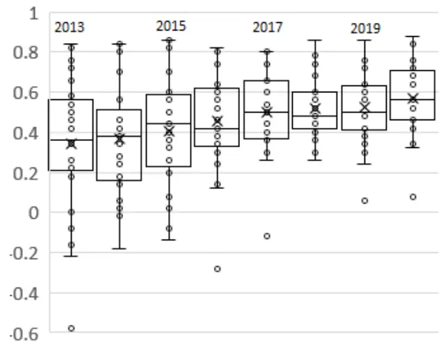
数据来源：Lauria et al（2022）

表 1：DJIA 指数个股的 RefinitivESG分数

| Ticker | 12/31 2013 | 12/31 2014 | 12/31 2015 | 12/30 2016 | 12/29 2017 | 12/31 2018 | 12/31 2019 | 12/31 2020 |
| --- | --- | --- | --- | --- | --- | --- | --- | --- |
| MMM | 88 | 90 | 86 | 88 | 88 | 87 | 89 | 92 |
| AXP | 50 | 51 | 51 | 68 | 73 | 73 | 78 | 78 |
| AMGN | 67 | 65 | 68 | 66 | 75 | 72 | 74 | 74 |
| AAPL | 61 | 57 | 54 | 62 | 69 | 70 | 67 | 73 |
| BA | 59 | 73 | 66 | 69 | 80 | 78 | 80 | 83 |
| CAT | 75 | 69 | 75 | 73 | 65 | 69 | 69 | 72 |
| CVX | 73 | 73 | 80 | 77 | 88 | 84 | 79 | 84 |
| CSCO | 83 | 85 | 85 | 87 | 87 | 88 | 88 | 89 |
| KO | 77 | 72 | 73 | 77 | 75 | 70 | 65 | 76 |
| GS | 63 | 67 | 72 | 62 | 70 | 73 | 86 | 86 |
| HD | 63 | 78 | 70 | 81 | 83 | 74 | 72 | 73 |
| HON | 68 | 53 | 63 | 67 | 68 | 74 | 75 | 83 |
| IBM | 79 | 73 | 81 | 76 | 77 | 80 | 71 | 73 |
| INTC | 86 | 91 | 91 | 90 | 87 | 88 | 88 | 88 |
| JNJ | 91 | 92 | 93 | 91 | 90 | 89 | 88 | 89 |
| JPM | 71 | 71 | 78 | 81 | 83 | 77 | 82 | 82 |
| MCD | 77 | 70 | 64 | 69 | 71 | 75 | 70 | 78 |
| MRK | 78 | 71 | 72 | 80 | 81 | 77 | 80 | 82 |
| MSFT | 92 | 92 | 93 | 91 | 90 | 93 | 93 | 93 |
| NKE | 68 | 65 | 75 | 65 | 70 | 71 | 72 | 74 |
| PG | 60 | 59 | 72 | 68 | 66 | 65 | 71 | 73 |
| CRM | 46 | 41 | 46 | 56 | 63 | 72 | 62 | 67 |
| TRV | 42 | 49 | 43 | 36 | 44 | 63 | 70 | 66 |
| UNH | 62 | 64 | 67 | 82 | 78 | 80 | 72 | 71 |
| VZ | 72 | 69 | 60 | 57 | 66 | 68 | 75 | 76 |
| V | 21 | 51 | 52 | 71 | 72 | 71 | 53 | 54 |
| WBA | 39 | 53 | 60 | 71 | 72 | 74 | 81 | 94 |
| WMT | 78 | 78 | 79 | 78 | 77 | 74 | 81 | 85 |
| DIS | 61 | 62 | 64 | 67 | 65 | 76 | 78 | 71 |

数据来源：Lauria et al（2022）

## 4. ESG 取值的组合优化

本报告会用到两种类型的遍历指标集合：

$$
\begin{aligned}[x]&=\{1,2,\ldots,x\},x\in\mathbb{Z}_{>0}\\(x:x+y)&=\{x,x+1,\ldots,x+y\},x,y\in\mathbb{Z}_{>0}\end{aligned}
$$

例如

$$
\begin{aligned}&[5]=\{1,2,3,4,5\}\\&(9;12)=\{9,10,11,12\}\\\end{aligned}
$$

E值组合优化的基本设定如下：

$$
\begin{cases}則时点:&\mathsf{t}\in\mathbb{Z}\\回溯窗口:&\mathbb{T}\in\mathbb{Z}_{>0}\\资产池:&\mathsf{i}\in[\mathsf{I}]\\资产收益率:\mathsf{r}_{\mathsf{i},\mathsf{r}},\mathsf{i}\in[\mathsf{I}],\mathsf{r}\in(\mathsf{t}-\mathbb{T}+1:\mathsf{t})\\场景收益率:\hat{\mathsf{r}}_{\mathsf{i},\mathsf{t}+1}^{\mathsf{s}},\mathsf{s}\in[\mathsf{S}],\mathsf{i}\in[\mathsf{I}]\\资产权重:&\mathsf{\theta}_{\mathsf{\tau}}=\big(\mathsf{\theta}_{1,\mathsf{\tau}},\ldots,\mathsf{\theta}_{1,\mathsf{\tau}}\big),\mathsf{\tau}\in(\mathsf{t}-\mathbb{T}+1:\mathsf{t}+1)\end{cases}
$$

从 t 到 t+1 时刻，所有的风险场景 s 共同形成了收益率系综（ensemble）：

$$
\widehat{\mathbb{R}}_{\mathsf{t}+\mathsf{1}}=\left\{\widehat{\mathbb{R}}_{\mathsf{t}+\mathsf{1}}^{\mathsf{s}}=\sum_{\mathsf{i}\in[\mathsf{I}]}\mathfrak{g}_{\mathsf{i},\mathsf{t}+\mathsf{1}}\widehat{\mathsf{r}}_{\mathsf{t}+\mathsf{1}}^{\mathsf{s}}:\mathsf{s}\in[\mathsf{S}]\right\}
$$

一旦选定了风险度量，相应的最优化问题就变成：

$$
\begin{aligned}\min_{\boldsymbol{\Theta}}\Biggl\{-\boldsymbol{\alpha}\cdot\mathbb{E}&\Bigl[\widehat{\mathbb{R}}_{\mathsf{t}+1}\Bigr]+(1-\boldsymbol{\alpha})\cdot\mathbb{V}\Bigl[\widehat{\mathbb{R}}_{\mathsf{t}+1}\Bigr]\Biggr\}\\s.t.\begin{array}{l}\left\{\begin{aligned}\boldsymbol{\Theta}_{\mathsf{i},\mathsf{t}+1}&\geq0,\mathsf{i}\in[\mathsf{I}]\\\Sigma_{\mathsf{i}}&\boldsymbol{\Theta}_{\mathsf{i},\mathsf{t}+1}=1\\\Sigma_{\mathsf{i}}&\left|\boldsymbol{\Theta}_{\mathsf{i},\mathsf{t}+1}-\boldsymbol{\Theta}_{\mathsf{i},\mathsf{t}}\right|\leq\gamma\end{aligned}\right.\end{array}\end{aligned}
$$

其中 α 为风险厌恶系数，三个约束条件分别对应了权重的幺和性，换手率限制和做空限制。

## 4.1. ESG 取值的有效前沿

与收益率一样，不同的风险场景 s 同样也形成了 E值收益率系综：

$$
\begin{aligned}\hat{\mathrm{Z}}_{\mathrm{t}+1}=\left\{\hat{\mathrm{Z}}_{\mathrm{t}+1}^{s}=\sum_{\mathrm{i}\in[\mathrm{I}]}\theta_{\mathrm{i},\mathrm{t}+1}\hat{\zeta}_{\mathrm{i},\mathrm{t}+1}^{s}\colon\mathrm{s}\in[\mathrm{S}]\right\}\\\hat{\zeta}_{\mathrm{i},\mathrm{t}+1}^{s}(\lambda)=\lambda\frac{\varsigma_{\mathrm{i},\mathrm{t}}}{\mathrm{c}}+(1-\lambda)\hat{\mathrm{r}}_{\mathrm{i},\mathrm{t}+1}^{s}\end{aligned}
$$

需要注意到的是，公式表明我们并不对 NES 进行预测，模型的随机性完全由传统收益率决定。而为了估计收益率系综

$$
\left\{\hat{\mathbf{r}}_{\mathrm{i},\mathrm{t}+1}^{s}\mathrm{:}s\in[\mathsf{S}]\right\}
$$

本文使用了历史收益率数据

$$
\left\{\mathrm{r}_{\mathrm{i},\tau}:\tau\in(\mathrm{t}-\mathrm{T}+1:\mathrm{t}),\mathrm{i}\in[\mathrm{I}]\right\}
$$

结合 ARMA(p,q)-GARCH(1,1)模型进行分析，其中 $\mathtt{p},\mathtt{q}\in[2]$ o对于风险度量，本文选择了均值方差模型（mean-variance，MV），以及β=0.95 或 0.99 两种置信水平的 $\mathrm{mCVaR}_{\beta}$ 。为以示区别，最优权重向量：

$$
\boldsymbol{\theta}^{*}=(\boldsymbol{\theta}_{1}^{*},\dots,\boldsymbol{\theta}_{\mathrm{I}}^{*})
$$

会用标记不同的参数表明其对应的最优化框架。例如

$$
\Theta^{*}(\alpha)和\Theta^{*}(\alpha,\lambda)
$$

分别代表了只关心收益率 R 和关心 E值收益率给出的最优权重。对于 E值版本的最优权重：

$$
\begin{align*}\widehat{\mathbb{R}}_{\mathsf{t}+1}^*(\alpha,\lambda)=\sum_{\mathsf{i}\in[1]}\mathfrak{9}_{\mathsf{i},\mathsf{t}+1}^*(\alpha,\lambda)\mathrm{r}_{\mathsf{i},\mathsf{t}+1}&=\mathfrak{9}_{\mathsf{t}+1}^*(\alpha,\lambda)\cdot\mathrm{r}_{\mathsf{t}+1}^{\mathrm{T}}\\\widehat{\mathbb{Z}}_{\mathsf{t}+1}^*(\alpha,\lambda)=\sum_{\mathsf{i}\in[1]}\mathfrak{9}_{\mathsf{i},\mathsf{t}+1}^*(\alpha,\lambda)\cdot\zeta_{\mathsf{i},\mathsf{t}+1}(\lambda)&=\mathfrak{9}_{\mathsf{t}+1}^*(\alpha,\lambda)\cdot[\zeta_{\mathsf{t}+1}(\lambda)]^{\mathrm{T}}\end{align*}
$$

所以最优权重向量对应的 E值和 NES 为：

$$
\begin{aligned}\mathrm{ESG}_{\mathrm{t}+1}^{*}=\mathrm{ESG}_{\mathrm{t}+1}^{*}(\alpha,&\lambda)=\sum_{\mathrm{i}\in[\mathrm{I}]}\theta_{\mathrm{i},\mathrm{t}+1}^{*}(\alpha,\lambda)\mathrm{ESG}_{\mathrm{i},\mathrm{t}+1}\\\varsigma_{\mathrm{t}+1}^{*}=\varsigma_{\mathrm{t}+1}^{*}(\alpha,&\lambda)=\sum_{\mathrm{i}\in[\mathrm{I}]}\theta_{\mathrm{i},\mathrm{t}+1}^{*}(\alpha,\lambda)\varsigma_{\mathrm{i},\mathrm{t}+1}\end{aligned}
$$

如果设

$$
\mu_{\mathrm{ER}}=\left(\mu_{1},\ldots,\mu_{\mathrm{I}}\right)\mathrm{和}\ \Sigma_{\mathrm{ER}}=\left(\sigma_{\mathrm{ij}}\right)_{\mathrm{i},\mathrm{j}\in[\mathrm{I}]}
$$

为 E 值收益率的样本均值和方差，那么风险度量为 MV 时组合优化为：

$$
\begin{aligned}\min_{\boldsymbol{\Theta}}(-\alpha\boldsymbol{\Theta}^{\mathrm{T}}\boldsymbol{\mu}_{\mathrm{ER}}+(1-\alpha)\boldsymbol{\Theta}^{\mathrm{T}}\boldsymbol{\Sigma}_{\mathrm{ER}}\boldsymbol{\Theta})\\s.t.\quad\begin{cases}\boldsymbol{\Theta}_{\mathrm{i}}\geq0,\mathrm{i}\in[\mathrm{I}]\\\quad\Sigma_{\mathrm{i}}\boldsymbol{\Theta}_{\mathrm{i}}=1\end{cases}\end{aligned}
$$

风险度量为 mCVaR 时组合优化为

$$
\begin{aligned}\min_{\Theta,\xi}\left\{-\alpha\Theta^{\mathrm{T}}\mu+(1-\alpha)\left[\xi+\frac{1}{\mathrm{S}(1-\beta)}\sum_{\mathrm{s}\in[\mathrm{S}]}\max(\mathrm{x}_{\mathrm{s}}(\lambda)-\xi,0)\right]\right\}\\s.t.\begin{cases}\Theta_{\mathrm{i}}\geq0,\mathrm{i}\in[\mathrm{I}]\\\Sigma_{\mathrm{i}}\Theta_{\mathrm{i}}=1\\\quad\xi\in\mathbb{R}\end{cases}\end{aligned}
$$

$$
\boxed{\mathrm{x}_{\mathrm{s}}(\lambda)=\sum_{\mathrm{i}\in[\mathrm{I}]}\theta_{\mathrm{i}}\hat{\zeta}_{\mathrm{i},\mathrm{t}+1}^{\mathrm{s}}(\lambda)}
$$

此时规划问题的求解，请参见 Rockafellar and Uryasev（2000）。

参照连续收益率的计算方法，最优投资组合的组合净值等于

$$
\mathbb{R}_{\mathrm{cum}}(\mathrm{t},\alpha,\lambda)=\sum_{\tau\in[\mathrm{t}]}\hat{\mathbb{R}}_{\tau}^*(\alpha,\lambda)\rightarrow\mathbb{P}_{\mathrm{t}}(\alpha,\lambda)=\mathbb{P}_0\mathrm{e}^{\mathbb{R}_{\mathrm{cum}}(\mathrm{t},\alpha,\lambda)}
$$

类似可以定义 E值组合净值（需要特别强调的是，该模型并非是投资组合的价格，而是一个 E值指标！）

$$
\mathrm{Z}_{\mathrm{cum}}(\mathrm{t},\alpha,\lambda)=\sum_{\tau\in[\mathrm{t}]}\mathrm{Z}_{\tau}^*(\alpha,\lambda)\rightarrow\mathrm{P}_{\mathrm{t}}^{(\mathrm{Z})}(\alpha,\lambda)=\mathrm{P}_{0}^{(\mathrm{Z})}\mathrm{e}^{\mathrm{Z}_{\mathrm{cum}}(\mathrm{t},\alpha,\lambda)}
$$

本节将通过实证比较 E值有效前沿与传统有效前沿的差异，实证数据的选择与前文保持一致。利用 2019 年 12 月 30 日前溯 T=510 日的历史数据，以及总数为 S=10000 的风险场景（riskscenarios），本文计算了 MV、$\mathrm{mCVaR}_{0.95}$ 和 $\mathrm{mCVaR}_{0.99}$ 三种风险度量下的有效前沿，其中 $\mathbf{a}\in$ $\{0{,}0.01{,}0.02{,}...{,}0.99\},\lambda\in\{0{,}0.25{,}0.5{,}0.75\}$ 。为了体现 E值对有限前沿的影响，本文使用两种不同的坐标体系来呈现 E值有效前沿：

$$
\begin{array}{r}{\mathrm{Span}_{\mathbb{R}}\langle\mathbb{V}\big[\widehat{\mathbb{Z}}^{*}\big],\mathbb{E}\big[\widehat{\mathbb{Z}}^{*}\big],\mathrm{ESG}^{*}\rangle\cong\mathbb{R}^{3}}\\{\mathrm{Span}_{\mathbb{R}}\langle\mathbb{V}\big[\widehat{\mathbb{R}}^{*}\big],\mathbb{E}\big[\widehat{\mathbb{R}}^{*}\big],\mathrm{ESG}^{*}\rangle\cong\mathbb{R}^{3}}\end{array}
$$

为行文简单，上述两种坐标分别为 E值坐标和传统坐标。

图 2：E值坐标中的 E值有效前沿
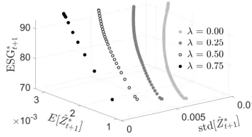
(a)

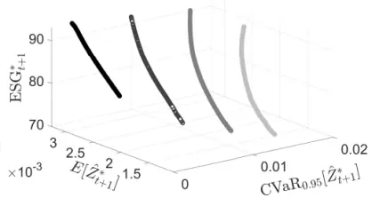
(b)

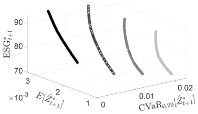
(c)

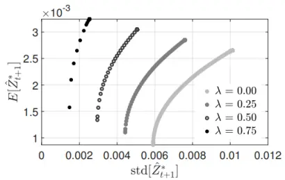
(d)

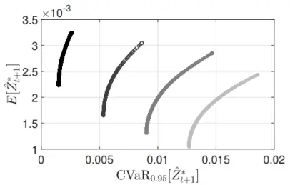
(e)

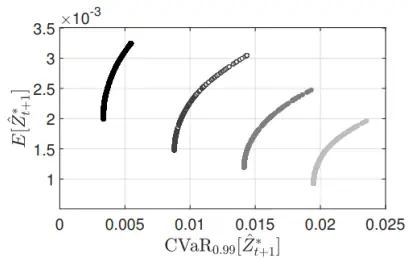
(f)
数据来源：Lauria et al（2022）。注：E 值有效前沿在 E 值坐标 ${\mathrm{Span}}_{\mathbb{R}}\langle\mathbb{V}|$ [Ẑ∗], E[Ẑ∗],ESG∗⟩ 中的形态（第一排），以及在平面$\mathtt{Span}_{\mathbb{R}}\langle\mathbb{V}[\hat{\mathtt{Z}}^{*}]$ ,E[Ẑ∗]⟩中的投射（第二排），从左到右分别对应于 MV， $\mathrm{mCVaR}_{0.95}$ 和 $\mathrm{mCVaR}_{0.99}$ 三种风险度量。E值坐标中的点的分量为 $(\mathbb{V}[\hat{\mathrm{Z}}_{\mathrm{t}+1}^{*}],\mathbb{E}[\hat{\mathrm{Z}}_{\mathrm{t}+1}^{*}],\mathrm{ESG}_{\mathrm{t}+1}^{*})$

图 2 展示的是 E值坐标下的 E 值有效前沿。可以看到，对于较大的 λ，ESG*或者E[Ẑ ∗]的数值会随着 α 的提升而快速提升。例如，图 2（a）中的 λ=0.5 或者 0.75 时显得尤为明显。从 E 值收益率的公式可以看到，λ正相关于E[Ẑ ∗]，但与V[Ẑ ∗]负相关，这是因为 E值的“前向填充”使得 E值收益率的波动性主要由资产收益率贡献，但 λ 的提高会减少收益率在E值收益率中的权重，因此两者呈现负相关性。

图 3 展示的是传统坐标下的 E值有效前沿。传统有效前沿对应于 λ=0 时的 E值有效前沿，与 E值坐标类似，图像上呈现出 ESG*伴随着 α 的提升而提升的现象。但是这一结论并不具备普适性，它与时间窗口的选择关系密切。虽然 λ 较高时E[R̂∗]与 α 呈现正相关性，然而对于任意固定的α，当 λ 上升时V[R̂∗]和E[R̂∗]会双双呈现出非线性的下降趋势。这种趋势在底平面 $\mathrm{Span}_{\mathbb{R}}\langle\mathbb{V}[\widehat{\mathbb{R}}^{*}]$ ,E[R̂ ∗]⟩中虽然较难观察，但从传统坐标可以看到，其背后的主要原因仍然是 ESG*的增加造成的。

图 3：传统坐标中的 E值有效前沿
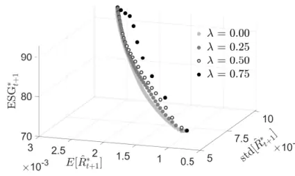
(a)

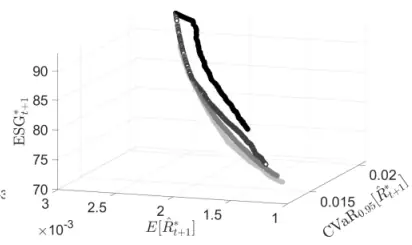
(b)

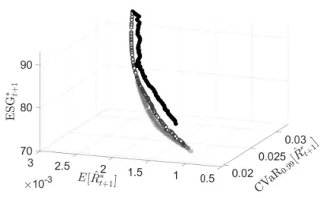
(c)

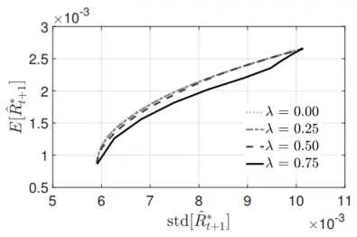
(d)

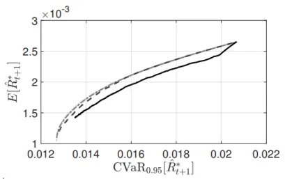
(e)

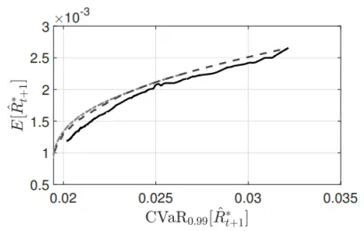
(f)
数据来源：Lauria et al（2022）。注：E 值有效前沿在传统坐标 $\mathrm{Span}_{\mathbb{R}}\langle\mathbb{V}[\hat{\mathbb{R}}^{*}]$ ,E[R̂ ∗],ESG∗⟩中的形态（第一排），以及在平面$\mathrm{Span}_{\mathbb{R}}\langle\mathbb{V}[\hat{\mathbb{R}}^{*}]$ ,E[R̂ ∗]⟩上的投射（第二排），从左到右分别对应于 MV， $\mathrm{mCVaR}_{0.95}和\mathrm{mCVaR}_{0.99}$ 种类型的风险度量。传统坐标中的点的分量为 $\begin{array}{r}{(\mathbb{V}\big[\widehat{\mathsf{R}}_{\mathsf{t}+1}^{*}\big],}\end{array}$ E $\left[\hat{R}_{\mathrm{t}+1}^{*}\right],\operatorname{ESG}_{\mathrm{t}+1}^{*})$

以 2019 年 12 月 30 日和 2019 年 12 月 31 日为例，我们将分析新旧时点的 E值对最优权重组合的影响。图 4 展示了 E 值更新产生的相对差异。具体来说，旧的 E值对应了

$$
\begin{aligned}\hat{\zeta}_{\mathrm{i},\mathrm{t}+1}^{\mathrm{s}}(\lambda)=\lambda\frac{\zeta_{\mathrm{i},\mathrm{t}}}{\mathrm{c}}+(1-\lambda)\hat{\mathrm{r}}_{\mathrm{i},\mathrm{t}+1}^{\mathrm{s}}\quad&\\\hat{\zeta}_{\mathrm{i},\mathrm{t}+1}^{\mathrm{s}}(\lambda)\rightarrow\boldsymbol{\theta}^{*}(\boldsymbol{\alpha},\lambda)\end{aligned}
$$

而新的 E值对应了

$$
\begin{aligned}\tilde{\zeta}_{\mathrm{i},\mathrm{t}+1}^{\mathrm{s}}(\lambda)=\lambda\frac{\zeta_{\mathrm{i},\mathrm{t}+1}}{\mathrm{c}}+(1-\lambda)\hat{\mathrm{r}}_{\mathrm{i},\mathrm{t}+1}^{\mathrm{s}}\quad&\\\tilde{\zeta}_{\mathrm{i},\mathrm{t}+1}^{\mathrm{s}}(\lambda)\rightarrow\boldsymbol{\theta}^{**}(\alpha,&\lambda)\end{aligned}
$$

进而最优权重组合的 ESG**为

$$
\mathrm{ESG}^{**}=\mathrm{ESG}^{**}(\alpha,\lambda)=\sum_{\mathrm{i}\in[1]}\theta_{\mathrm{i},\mathrm{t}+1}^{**}(\alpha,\lambda)\mathrm{ESG}_{\mathrm{i},\mathrm{t}+1}
$$

定义相对差异（relative difference，RD）为

$$
\mathrm{RD}(\alpha,\lambda)=\frac{|\mathrm{ESG}^{**}-\mathrm{ESG}^{*}|}{\mathrm{ESG}^{*}}
$$

图 4：不同风险度量的RD表现
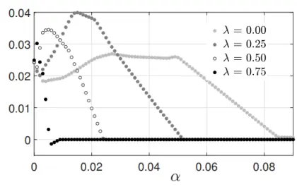
(a) MV

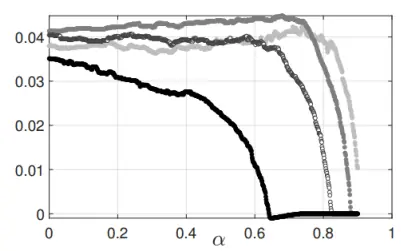
(b) $\mathrm{mCVaR_{0.95}}$

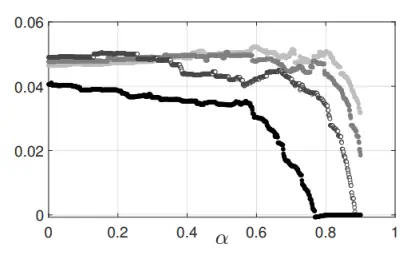
(c) $\mathrm{mCVaR_{0.99}}$
数据来源： （ ）。注：风险度量从左到右分别为 ， $\mathrm{mCVaR}_{0.95}和\mathrm{mCVaR}_{0.99}$ ，RD 的计算时点为 2019 年 12月31 日，E 值对应时点为 2018 年 12 月 31 日和 2019 年 12 月 31 日。

从图 4 可以看出，E值的更新产生的 RD 变化小于 5%，这表明 E 值最优权重向量相对稳健。更进一步，RD 指标负相关于 α，并且在 λ 较高时，这种负相关性越强（见图 4（a））。对于 MV，RD 通常在 0<α<0.1 时即快速衰减，这是因为 θ*的分量会随着α 的提升迅速集中。对于mCVaR，图 4 则展示出 RD 在 α<0.6 时保持相对稳健。

图 5：E值最优权重组合的参数依赖
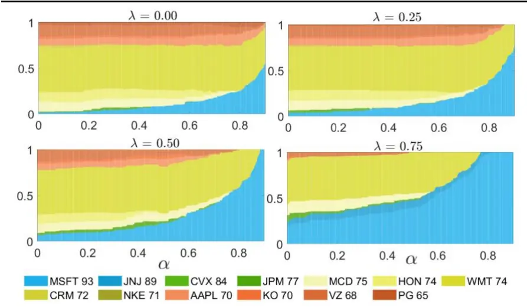
数据来源：Lauriaet al（2022）。注：风险度量 $\mathrm{mCVaR_{0.99}}$ ，图中 ESGS更新时点为 2018 年 12 月 31 日。

图 5 展示了风险度量为 $\mathrm{mCVaR}_{0.99}$ 时，最优权重 θ*与 α 的关系，其中 E值较低的资产的颜色较暖。可以看到，无论λ的大小，最优权重 θ*的分散度都与α呈现负相关性。此处未做展示的另外两种风险度量的情况是类似的。

## 5. ESG 取值的业绩度量

投资策略的业绩度量通常由某种回报风险比率（reward-risk ratio，RRR）给出，相关参考文献请见 Cheridito and Kromer（2013）。需要指出的是，一些常见的 RRR 其实存在明显的缺陷，例如被广泛使用的 Sharpe 比率就不满足单调性，因而会在配置时产生诸多问题。E值 RRR 涉及了 ESG投资内核的深层次问题，但关于这一问题的细究显然超出了本文应该覆盖的范围，因此此处仅给出了非常直接的业绩度量设计方案。

RRR 指标的最简单的 E值化即将资产收益率替换为相应的 E值收益率。例如传统的稳定尾部调整收益（stable tail adjusted return，STAR）比率1：

$$
\mathrm{STAR}_{\beta}(\widehat{\mathrm{R}})=\frac{\left(\mathbb{E}[\widehat{\mathrm{R}}-\mathrm{r}_{\mathrm{f},\mathrm{t}}]\right)^{+}}{\mathrm{ETL}_{\beta}[\widehat{\mathrm{R}}-\mathrm{r}_{\mathrm{f},\mathrm{t}}]}
$$

其中 ETL 即尾部期望损失（expected tail loss，ETL），也就是 CVaR 值，对应的 $\mathbf{r_{f,t}}$ 为 t 时刻的无风险利率（此处为 10年期美国国债利率）。因此，E 值 STAR 即

$$
\mathrm{STAR}_{\beta}(\hat{\mathrm{Z}})=\frac{\left(\mathbb{E}[\hat{\mathrm{Z}}-\mathrm{r}_{\mathrm{f},\mathrm{t}}]\right)^{+}}{\mathrm{ETL}_{\beta}[\hat{\mathrm{Z}}-\mathrm{r}_{\mathrm{f},\mathrm{t}}]}
$$

特别地，此时的 STAR 满足一致（coherent）风险度量的全部四条属性2。

与最优权重θ∗一样，STAR 是 α 和 λ 的函数。图 6 展示了风险度量为$\mathrm{mCVaR}_{0.99}$ 时的 $\mathrm{STR}(\alpha,\lambda)$ 曲面（黑色部分）。该曲面呈现明显的凸性。需要注意的是，当 λ=0.75 时，α变动形成的有效前沿呈现出一定程度的折裂（kink），即曲面的凸性出现了破坏。

STAR 的另外一种 E值化形如：

$$
\mathrm{STAR}_{\beta}(\hat{\mathrm{Z}})=\frac{\mathbb{E}[\hat{\mathrm{Z}}-\zeta_{\mathrm{f},\mathrm{t}}(\lambda)]}{\mathrm{ETL}_{\beta}[\hat{\mathrm{Z}}-\zeta_{\mathrm{f},\mathrm{t}}(\lambda)]}
$$

$$
\zeta_{\mathrm{f},\mathrm{t}}(\lambda)=\lambda\frac{1}{\mathrm{c}}+(1-\lambda)\mathrm{r}_{\mathrm{f},\mathrm{t}}
$$

称为 E值无风险利率。对比一般的资产的 E值收益可知，这意味着无风险利率的 E值为 100。

图 6：E值版本的STAR曲面
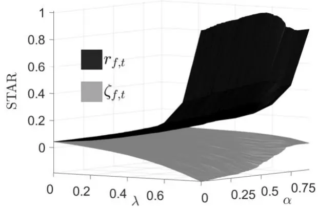
数据来源：Lauria et al（2022）。注：风险度量为mCVaR0.99。

图6的灰色部分展示了相应的STAR曲面。原始的无风险利率与λ无关，因此当 λ 上升时，STAR 指标被为E $\left[\widehat{\mathrm{Z}}\right]/\mathrm{ETL}_{\beta}$ [Ẑ]所主导，两者呈现正相关性。相反，由于 E值无风险利率 $\zeta_{\mathrm{f,t}}$ 与 λ 关联性较强，因此当 λ 增大时，该指标将是 指标分子和分母端的主导因素。特别的，此种 值STAR 与α的关联度较小，但随着λ的增加，STAR 曲面与α的依赖性逐渐增强（风险厌恶水平正相关于该 E值 STAR 水平）特别是在某些情况下STAR 的取值将会为负。

## 5.1. 区间表现

本节使用的资产池与前文保持一致，回测时间窗口为 2017 年 1 月 3 日至 2020 年 12 月 30 日，参数设定与 3.1 节相仿，风险度量包括 MV 和$\mathrm{mCVaR}_{0.99},$ 分别用于监测策略的中部和尾部表现，交易成本则设定为单边买卖 2bps，换手率限制为日均 0.4%（即约束条件中的 $\gamma=0.004)$ ，基准组合为 DJIA指数中 29 只股票（排除了 DOW Inc，完整的股票池有 30只）的等权买入持有组合（equally weighted buy and hold portfolio，EWBH）。

具体来说，t=0 时，所有股票的资金权重都等于 1/29，但是随着时间推移，各个股票的持仓数不变但是资金权重会发生改变：如果期初的持股数为 $\mathbf{n_{i}}$ ，那么

$$
\theta_{\mathrm{i},\mathrm{t}+1}=\mathrm{n}_{\mathrm{i}}\mathrm{P}_{\mathrm{i}}(\mathrm{t})/\Sigma_{\mathrm{j}\in[\mathrm{I}]}\mathrm{n}_{\mathrm{j}}\mathrm{P}_{\mathrm{j}}(\mathrm{t})
$$

本文涉及的业绩表现度量包括：总收益（TotRtn），年化收益（AnnRtn），平均换手率（AvgTO），期望尾部损失（ETL95）和期望尾部收益（ETR95），两者均为 95%显著水平，以及最大回撤（MDD）。其中 ETR95 代表了高于 95%分位数的平均收益。除此之外本文还考虑了投资组合的 ESGS 及其标准差。具体情况详见表 2。

表 2：不同风险度量下最优权重组合的业绩差异

| Model |  | Tot. Ret | Ann. Ret | AvgTO | ETL95 | ETR95 | MDD | ESG* |  |
| --- | --- | --- | --- | --- | --- | --- | --- | --- | --- |
|  |  | (%) | (%) | (%) | (%) | (%) | (%) | avg | std |
| EWBH |  | 90.14 | 17.68 | 0.00 | -3.41 | 2.86 | 33.00 | 72.72 | 2.97 |
| λ | α |  |  | mCVaR0.99 |  |  |  |  |  |
| 0.00 | 0.0 0.3 | 70.75 | 14.53 | 0.40 | -2.74 | 2.41 | 28.47 | 71.97 | 2.05 |
|  | 0.5 | 71.53 | 14.66 | 0.40 | -2.74 | 2.40 | 28.36 | 71.99 | 2.06 |
|  | 0.7 | 71.85 | 14.71 | 0.40 | -2.75 | 2.41 | 28.36 | 72.02 | 2.01 |
|  |  | 73.88 | 15.05 | 0.40 | -2.76 | 2.44 | 27.62 | 72.33 | 2.17 |
| 0.25 | 0.9 | 82.60 | 16.49 | 0.40 | -2.90 | 2.55 | 28.23 | 72.61 | 2.93 |
|  | 0.0 | 71.17 | 14.60 | 0.40 | -2.73 | 2.40 | 28.20 | 72.55 1.78 |  |
|  | 0.3 | 70.80 | 14.53 | 0.40 | -2.73 | 2.41 | 28.05 | 72.86 | 1.71 |
|  | 0.5 | 71.60 | 14.67 | 0.40 | -2.73 | 2.41 | 27.66 | 73.17 1.68 |  |
|  | 0.7 | 73.35 | 14.96 | 0.40 | -2.75 | 2.44 | 26.94 | 74.83 1.77 |  |
| 0.50 | 0.9 | 92.13 | 18.00 | 0.39 | -2.96 | 2.65 | 25.71 | 78.59 | 2.53 |
|  | 0.0 | 69.77 | 14.36 | 0.40 | -2.73 | 2.40 | 28.01 | 73.78 1.56 |  |
|  | 0.3 | 69.62 | 14.33 | 0.40 | -2.73 | 2.41 | 27.89 | 74.30 1.57 |  |
|  | 0.5 | 84.62 | 16.81 | 0.39 | -2.86 | 2.57 | 25.23 | 80.36 | 2.72 |
|  | 0.7 | 93.51 | 18.22 | 0.38 | -2.97 | 2.68 | 24.78 | 82.13 | 3.18 |
| 0.75 | 0.9 | 112.02 | 20.98 | 0.36 | -3.20 | 2.94 | 24.37 | 84.51 | 4.14 |
|  | 0.0 | 68.57 | 14.15 | 0.40 | -2.74 | 2.41 | 27.43 | 76.50 1.95 |  |
|  | 0.3 | 72.50 | 14.82 | 0.40 | -2.79 | 2.46 | 26.67 | 78.85 | 2.38 |
|  | 0.5 | 80.31 | 16.12 | 0.39 | -2.84 | 2.53 | 25.69 | 80.89 | 2.87 |
|  | 0.7 | 112.57 | 21.06 | 0.34 | -3.26 | 2.98 | 25.39 | 86.65 | 4.97 |
|  | 0.9 | 143.49 | 25.30 | 0.33 | -3.61 | 3.35 | 27.40 | 88.19 | 5.66 |
| λ | α |  |  | MV |  |  |  |  |  |
| 0.00 | 0.0 | 76.82 | 15.54 | 0.40 | -2.84 | 2.46 | 29.17 | 71.93 | 2.59 |
|  | 0.05 | 84.53 | 16.80 | 0.40 | -3.06 | 2.61 | 30.62 | 72.38 | 2.80 |
|  | 0.10 | 90.68 | 17.77 | 0.38 | -3.33 | 2.80 | 32.39 | 73.49 3.22 |  |
|  | 0.15 | 90.64 | 17.77 | 0.39 | -3.55 | 2.96 | 35.00 | 74.17 | 3.46 |
| 0.25 | 0.20 | 88.69 | 17.46 | 0.40 | -3.73 | 3.08 | 37.27 | 74.303.63 |  |
|  | 0.0 | 85.13 | 16.90 | 0.40 | -2.95 | 2.52 | 30.21 | 72.01 2.81 |  |
|  | 0.05 | 84.74 | 16.83 | 0.40 | -3.21 | 2.74 | 30.96 | 77.46 | 3.49 |
|  | 0.10 | 102.24 | 19.54 | 0.40 | -3.51 | 3.08 | 30.64 | 81.10 | 4.29 |
|  | 0.15 | 109.34 | 20.60 | 0.40 | -3.74 | 3.31 | 31.39 | 82.49 | 4.72 |
| 0.50 | 0.20 | 114.60 | 21.36 | 0.40 | -3.87 | 3.43 | 32.07 | 83.14 5.01 |  |
|  | 0.0 | 92.87 | 18.12 | 0.40 | -3.14 | 2.63 | 31.68 | 72.00 | 2.78 |
|  | 0.05 | 93.35 | 18.19 | 0.40 | -3.42 | 3.01 | 29.52 | 81.58 | 4.96 |
|  | 0.10 | 144.99 | 25.50 | 0.35 | -3.76 | 3.54 | 27.01 | 86.22 | 5.80 |
|  | 0.15 | 170.92 | 28.74 | 0.32 | -3.95 | 3.75 | 27.47 | 87.59 | 5.94 |
|  | 0.20 | 180.31 | 29.86 | 0.30 | -4.05 | 3.84 | 27.72 | 88.01 | 5.99 |
| 0.75 | 0.0 | 100.63 | 19.30 | 0.40 | -B.42 | 2.87 | 33.14 | 72.14 2.97 |  |

数据来源：Lauria et al（2022）。注：回测区间为 2017 年 01 月 03 日至 2020 年 12月 30 日，风险度量分别为 MV 和mCVaR0.99。

具体来说，最优权重组合在 $.\alpha\geq0.7$ 的 $\mathrm{mCVaR}_{0.99}$ 情况下和 $\alpha\ge0.1$ 的 MV情况下，其总收益和年化收益都强于基准组合。对于 $\lambda\geq0.5,$ ，伴随着α的增加，平均换手率将低于日均 0.4%；对于 $\alpha>0$ ，平均换手率则伴随着λ的增加而减少。这主要可以归咎于 MV 框架下解的稳健性问题。对于$\mathrm{mCVaR}_{0.99'}$ 情况，除开较大的 $(\lambda,\alpha)$ 参数，最优权重组合的ETL95和ETR95都会明显少于基准组合；而 MV情况则恰恰相反。对于 MV，ETL95 的数值始终要大于 ETR95，但两者的差在λ较大的情况下会随着α的增加而减少。所有最优权重组合的 MDD 都会优于基准组合。对于α固定的$\mathrm{mCVaR}_{0.99},$ ，MDD 会随着λ的增加而衰减。最优权重组合的平均 ESGS 大于基准组合；其 ESGS 的方差在 $\mathrm{mCVaR}_{0.99}$ 上也会更小，但在 MV 上则劣于基准组合。

图 7 在 $\mathrm{mCVaR}_{0.99}下,\alpha=0.7,\lambda\in\{0,0.25,0.5,0.75\}$ 的最优权重组合的组合净值和 值组合净值进行了刻画。图中同时列出了有换手率限制和没有换手率限制的情况。在没有换手率约束的情况下，最优权重组合的组合净值和 E值组合净值都优于基准组合。在有换手率约束的情况下，基准组合在 Covid-19 流行前表现更好，但是疫情后 $\alpha=0.7,\;\lambda\in\{0.5{,}0.75\}$ 则表现出了相对于基准组合强劲的组合净值恢复姿态。相应的最优权重组合的 E值则呈现分层现象，特别是 2020 年 1 月 1 日后 E值出现了明显的跳跃（参见表 1）。

图 7：最优权重组合与切线组合的组合净值和 E值
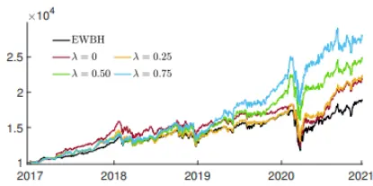
(a) Price

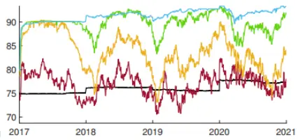

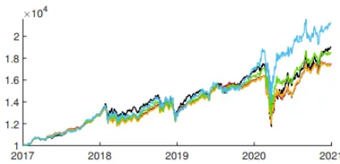
(c) Price

(b) ESG Score
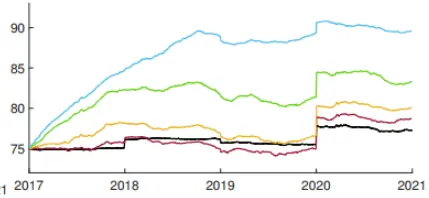

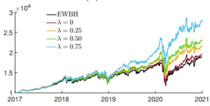
(e) Price

(d) ESG Score
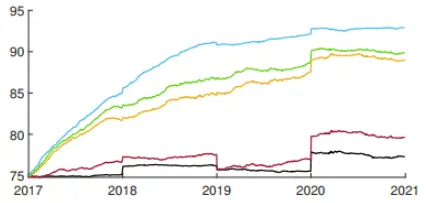
(f) ESG Score
数据来源： （ ）。注：回测区间为 年 月 日至 年月30日，风险度量分别为 $MV和mCVaR_{0.99}$ 。图（a-d）为α = 0.7时最优权重组合的组合净值和 E值组合净值，此处的风险度量为 $\mathrm{mCVaR}_{0.99}$ ，其中（a）和（b）为换手率无限制模型，（c）和（d）的日度换手率约束为 0.4%。（e）和（f）为切线组合在日度换手率约束为 0.4%下的表现。所有的图都和基准组合进行了比较。

在表 3 中，我们对最优权重组合的矩估计进行了汇总，包括：均值、中位数、标准差（Std）、偏度（Skew）、超额峰度（ExKurt）。可以看到，相对于 MV，固定λ时，均值、中位数以及标准差随着α的增长速度要更强，偏度和超额峰度则伴随着α的增长而下降。

表 3：不同风险度量下最优权重组合的矩估计

| Model |  | Mean ×1-4 | Median x1-4 | Std ×1-2 | Skew | ExKurt | Model | Mean ×1-4 | Median x1-4 | Std x1-2 | Skew | ExKurt |
| --- | --- | --- | --- | --- | --- | --- | --- | --- | --- | --- | --- | --- |
| EWBH |  | 6.4 | 11.1 | 1.3 | -1.02 | 21.9 |  |  |  |  |  |  |
| λ α |  |  | mCVaR0.99 |  |  |  | α |  |  | MV |  |  |
| 0.00 | 0.0 | 5.3 | 8.3 | 1.1 | -0.92 | 22.1 | 0.00 | 5.7 | 9.3 | 1.1 | -0.93 | 20.4 |
|  | 0.3 | 5.4 | 8.0 | 1.1 | -0.92 | 22.2 | 0.05 | 6.1 | 10.7 | 1.2 | -1.08 | 22.9 |
|  | 0.5 | 5.4 | 8.5 | 1.1 | -0.92 | 22.3 | 0.10 | 6.4 | 11.1 | 1.3 | -1.17 | 23.1 |
|  | 0.7 | 5.5 | 9.6 | 1.1 | -0.90 | 22.4 | 0.15 | 6.4 | 11.2 | 1.4 | -1.32 | 23.9 |
|  | 0.9 | 6.0 | 9.9 | 1.2 | -0.97 | 22.7 | 0.20 | 6.3 | 11.5 | 1.5 | -1.40 | 24.1 |
|  | 0.0 | 5.3 | 8.7 | 1.1 | -0.88 | 21.8 | 0.00 | 6.1 | 10.1 | 1.1 | -1.02 | 21.0 |
|  | 0.3 | 5.3 | 8.6 | 1.1 | -0.89 | 21.8 | 0.05 | 6.1 | 10.6 | 1.3 | -1.05 | 23.2 |
|  | 0.5 | 5.4 | 8.5 | 1.1 | -0.88 | 21.8 | 0.10 | 7.0 | 12.3 | 1.4 | -0.91 | 20.8 |
|  | 0.7 | 5.5 | 10.2 | 1.1 | -0.82 | 22.1 | 0.15 | 7.4 | 12.5 | 1.5 | -0.90 | 20.2 |
| 0.50 | 0.9 | 6.5 | 10.6 | 1.2 | -0.68 | 20.4 | 0.20 | 7.6 | 12.0 | 1.5 | -0.88 | 19.4 |
|  | 0.0 | 5.3 | 9.6 | 1.1 | -0.83 | 21.2 | 0.0 | 6.5 | 11.7 | 1.2 | -1.08 | 22.3 |
|  | 0.3 | 5.3 | 9.5 | 1.1 | -0.83 | 21.4 | 0.05 | 6.6 | 10.6 | 1.4 | -0.74 | 22.0 |
|  | 0.5 | 6.1 | 11.1 | 1.1 | -0.51 | 19.0 | 0.10 | 8.9 | 13.4 | 1.5 | -0.43 | 17.5 |
|  | 0.7 | 6.6 | 11.2 | 1.2 | -0.43 | 18.7 | 0.15 | 9.9 | 12.6 | 1.6 | -0.46 | 16.2 |
| 0.75 | 0.9 | 7.5 | 11.0 | 1.3 | -0.34 | 17.3 | 0.20 | 10.3 | 11.7 | 1.6 | -0.49 | 16.0 |
|  | 0.0 | 5.2 | 9.4 | 1.1 | -0.70 | 19.8 | 0.0 | 6.9 | 12.3 | 1.3 | -1.11 | 23.3 |
|  | 0.3 | 5.4 | 10.4 | 1.1 | -0.60 | 19.0 | 0.05 | 7.0 | 12.2 | 1.4 | -0.52 | 20.1 |
|  | 0.5 | 5.9 | 10.8 | 1.1 | -0.47 | 18.3 | 0.10 | 9.7 | 13.3 | 1.6 | -0.43 | 16.4 |
|  | 0.7 | 7.5 | 11.5 | 1.3 | -0.23 | 15.8 | 0.15 | 10.7 | 11.8 | 1.6 | -0.48 | 15.8 |
| 0.9 | 8.9 | 12.8 | 1.4 | -0.36 |  | 16.0 | 0.20 | 11.0 | 11.8 | 1.7 | -0.52 | 16.0 |

数据来源：Lauria et al（2022）。注：回测区间为 2017 年 01 月 03 日至 2020 年 12月 30 日，风险度量分别为 MV 和mCVaR0.99。

表 4：不同风险度量下最优权重组合的 RRR

| Model |  | SR (%) | Sortino (%) | STAR (%) | Rachev (%) | Gini (%) | Model | SR (%) | Sortino (%) | STAR (%) | Rachev (%) | Gini (%) |
| --- | --- | --- | --- | --- | --- | --- | --- | --- | --- | --- | --- | --- |
| EWBH |  | 4.86 | 6.59 | 1.88 | 83.86 12.26 |  |  |  |  |  |  |  |
| λ | α |  |  | mCVaR0.99 |  |  | α |  |  | MV |  |  |
| 0.00 | 0.0 | 4.87 | 6.69 | 1.94 | 87.79 | 12.42 | 0.0 | 5.09 6.96 | 2.00 | 86.56 | 12.97 |  |
| 0.25 | 0.3 | 4.91 | 6.75 | 1.96 | 87.84 | 12.55 | 0.05 5.09 | 6.92 | 1.99 | 85.10 | 13.03 |  |
|  | 0.5 | 4.92 | 6.76 | 1.96 87.76 | 12.55 | 0.10 | 4.92 | 6.66 | 1.93 | 83.94 | 12.35 |  |
|  | 0.7 | 4.98 | 6.85 | 2.00 | 88.42 | 12.66 0.15 | 4.62 | 6.21 | 1.81 | 83.29 | 11.47 |  |
|  | 0.9 | 5.16 | 7.08 | 2.07 | 88.03 | 13.11 0.20 | 4.34 | 5.81 | 1.69 | 82.50 | 10.68 |  |
|  | 0.0 | 4.91 | 6.76 | 1.96 | 87.99 | 12.53 | 0.0 5.34 | 7.28 | 2.08 | 85.36 | 13.70 |  |
|  | 0.3 | 4.89 | 6.73 | 1.95 | 88.13 | 12.46 | 0.05 4.85 | 6.60 | 1.90 | 85.36 | 12.30 |  |
|  | 0.5 | 4.93 | 6.79 | 1.97 | 88.32 | 12.56 | 0.10 5.02 | 6.89 | 2.00 | 87.79 | 12.40 |  |
| 0.50 | 0.7 4.95 | 6.84 | 1.99 | 88.64 | 12.61 | 0.15 | 4.93 | 6.78 | 1.97 | 88.48 | 12.05 |  |
|  | 0.9 | 5.45 | 7.59 | 2.20 | 89.56 13.77 | 0.20 | 4.93 | 6.78 | 1.96 | 88.78 | 11.96 |  |
|  | 0.0 | 4.85 | 6.67 1.93 | 87.92 | 12.33 | 0.0 | 5.38 | 7.31 | 2.08 | 83.94 | 13.87 |  |
|  | 0.3 | 4.83 | 6.65 | 1.92 | 88.02 12.27 | 0.05 | 4.82 | 6.66 | 1.92 | 88.23 | 12.03 |  |
|  | 0.5 | 5.31 7.43 | 2.13 | 89.90 | 13.41 | 0.10 | 5.84 | 8.26 | 2.37 | 94.17 | 14.38 |  |
| 0.75 | 0.7 | 5.49 | 7.72 | 2.21 | 90.18 | 13.81 0.15 | 6.18 | 8.76 | 2.51 | 94.89 |  | 15.14 |
|  | 0.9 | 5.80 | 8.21 | 2.34 | 91.87 | 14.46 | 0.20 | 6.24 | 8.84 | 2.53 | 94.94 | 15.26 |
|  |  | 4.78 | 6.60 | 1.90 | 88.23 | 12.05 | 0.0 | 5.22 | 7.08 | 2.03 | 83.98 |  |
|  | 0.0 0.3 | 4.90 | 6.80 | 1.95 | 88.27 | 12.36 | 0.05 | 4.87 | 6.80 | 1.95 | 89.64 | 13.32 11.97 |
|  | 0.5 | 5.19 | 7.24 | 2.07 | 89.17 | 13.07 | 0.10 | 6.20 | 8.80 | 2.51 | 94.65 | 15.28 |
|  | 0.7 | 5.77 | 8.17 | 2.30 | 91.53 | 14.39 | 0.15 | 6.48 | 9.20 | 2.63 | 95.40 | 15.94 |
|  |  |  |  | 92.86 | 15.27 | 0.20 | 6.54 | 9.28 | 2.66 | 95.63 | 16.10 |  |
| 0.9 | 6.13 | 8.69 | 2.45 |  |  |  |  |  |  |  |  |  |

数据来源：Lauria et al（2022）。注：回测区间为 2017 年 01 月 03 日至 2020 年 12月 30 日，风险度量分别为 MV 和mCVaR 。

表 4 中计算了最优投资组合的一些经典的 RRR：Sharpe 比率（SR）、Sortino 比率、STAR、Rachev 和 Gini 系数。总体上看，MV 场景中的 RRR表现强于 mCVaR 场景中的 RRR，而且相对于基准组合 RRR 都有一定程度的提升。

## 6. ESG 切线组合

平面 $\langle\mathrm{Span}_{\mathbb{R}}\langle\mathbb{V}\big[\widehat{\mathbb{Z}}^{*}\big],\mathbb{E}\big[\widehat{\mathbb{Z}}^{*}\big]\rangle$ 上的 E 值有效前沿将给出 E 值切线组合，以及相应的 E值版本的资本资 $:产$ 定价模型（CAPM）、证券市场线（SML）和两基金分离定理，而这些推广的核心在于如何确定 E值无风险利率。需要注意的是，与前面基于收益率和 E值收益率的最优权重组合不同，此时的切线组合的权重只与亲和系数有关：

$$
\Theta^{*}=\Theta^{*}(\lambda)
$$

显然，E值无风险利率也应该遵循一般资产 E值收益率的构造方式。和上一节一样，本文利用 10年期的美国国债利率作为通常的无风险利率，并且将其对应的 E值设置为 100。这样操作主要是依据简洁性的考虑，因为赋予国债利率任何的 值都没有直接选取极大 值更有说服力。最终，E值切线组合将会 E值坐标下的 $(0,\zeta_{\mathrm{f,t}}(\lambda))$ 和相应的有效前沿共同确定。需要注意到的是，有效前沿为参数 $(\lambda,\alpha,\mathrm{t})$ 所决定，而整个有效前沿只依赖于(λ,t)。

图 7 同样展示了风险度量为 $\mathrm{mCVaR}_{0.99}$ 时，不同λ水平下切线组合的 E值组合净值。当 $\lambda>0时$ ，带换手率约束的切线组合相比于无换手率约束的$\alpha=0.$ 7组合具备相当的竞争力。

图 8：切线组合的E值组合净值
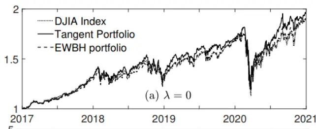

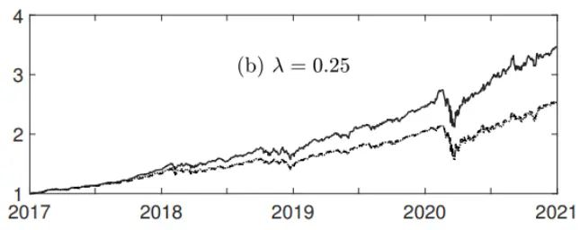

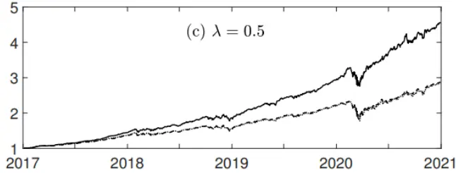

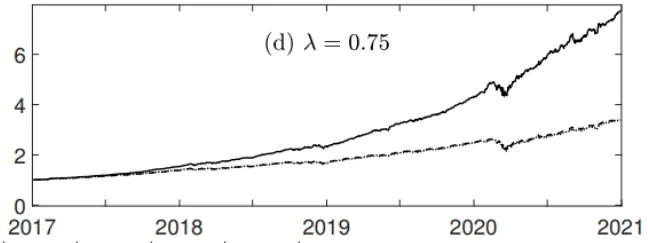

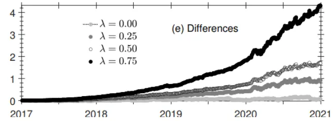
数据来源：Lauria et al（2022）。注：（a-d）图为mCVa $\vec{\mathrm{{!R}}_{0.99}\mathrm{{}^{\vec{}}}}$ 下的 E值组合净值，回测区间为 2017年 01月 03 日至 2020 年 12

月30 日。图（e）为不同λ水平下切线组合与 DJIA 之间的 E值组合净值之差。

图 8 展示了风险度量为 $\mathrm{mCVaR_{0.99}}$ 切线组合的 E 值组合净值 $\mathrm{P}_{\mathrm{t}}^{\mathrm{(Z)}}(\lambda)$ 作为对比，我们同时展示了 EWBH 和 DJIA 的 E 值组合净值。严格地讲，在计算 DJIA的 E值组合净值时，由于只涉及 29 只股票，因此 E值计算涉及的股票权重会和指数的本身权重略有调整：

$$
\tilde{\mathbf{w}}_{\mathrm{i}}^{\mathrm{DIA}}=\mathbf{w}_{\mathrm{i}}^{\mathrm{DIA}}/(1-\mathbf{w}_{\mathrm{DOW}}^{\mathrm{DIA}})
$$

即需要排除 DOW Inc 公司的权重。事实上，EWBH和 DJIA指数的 E值组合净值表现非常近似，但是伴随着λ的提升，切线组合的表现和它们的表现则呈现巨大差别。

表 5：不同风险度量下切线组合的 RRR

| Model | Tot. Ret | Ann. Ret | AvgTO | ETL95 | ETR95 | MDD | $\mathrm{ESG^{*}}$ |  |  |  |
| --- | --- | --- | --- | --- | --- | --- | --- | --- | --- | --- |
|  | (%) 90.14 | (%) | (%) | (%) | (%) | (%) | avg | std |  |  |
| EWBH λ |  | 17.69 | 0.00 | -3.41 | 2.86 | 32.87 | 72.72 | 2.97 |  |  |
|  |  |  |  | $\mathrm{mCVaR}_{0.99}$ |  |  | 74.04 | 3.49 |  |  |
| 0.00 0.25 | 95.01 114.91 | 18.45 21.40 | 0.40 0.35 | -3.48 -3.80 | 2.92 3.38 | 34.06 31.09 | 82.98 | 4.67 |  |  |
| 0.50 | 129.63 | 23.46 | 0.33 | -3.60 | 3.36 | 26.86 | 84.58 | 4.69 |  |  |
| 0.75 | 176.66 | 29.43 | 0.23 | -3.97 | 3.78 | 27.49 | 88.08 | 5.83 |  |  |
| λ |  |  |  | MV |  |  |  |  |  |  |
| 0.00 | 93.80 | 18.26 | 0.42 | -3.76 | 3.13 | 37.23 | 74.64 | 3.76 |  |  |
| 0.25 | 118.44 | 21.90 | 0.33 | -4.10 | 3.60 | 34.23 | 83.64 | 5.22 |  |  |
| 0.50 | 154.95 | 26.77 | 0.25 | -4.12 | 3.83 | 30.23 | 86.09 | 5.62 |  |  |
| 0.75 | 207.56 | 32.95 | 0.16 | -4.21 | 4.03 | 28.14 | 88.51 | 6.06 |  |  |
| Model | Mean | Median | Std | Skew | ExKurt | Mean | Median | Std | Skew | ExKurt |
| EWBH | $\times10^{-4}$ 6.4 | $\times10^{-4}$ 11.1 | $\times10^{-2}$ 1.3 |  | 21.9 | $\times10^{-4}$ | $\times10^{-4}$ | $\times10^{-2}$ |  |  |
| λ |  |  | $\mathrm{mCVaR}_{0.99}$ | -1.02 |  |  |  | MV |  |  |
| 0.00 |  |  | 1.4 | -1.28 | 23.9 | 6.6 | 11.6 | 1.5 | -1.36 | 23.7 |
| 0.25 | 6.7 7.6 | 11.4 11.9 | 1.5 | -0.86 | 19.1 | 7.8 | 11.7 | 1.6 | -0.92 | 18.7 |
| 0.50 | 8.3 | 12.6 | 1.4 | -0.50 | 16.8 | 9.3 | 12.9 | 1.7 | -0.64 | 16.7 |
| 0.75 | 10.1 | 11.7 | 1.6 | -0.45 | 15.8 | 11.2 | 13.0 | 1.7 | -0.51 | 15.1 |
| Model | SR |  |  |  |  |  |  |  |  | Gini |
|  | (%) | Sortino (%) | STAR (%) | Rachev (%) | Gini (%) | SR (%) | Sortino (%) | STAR (%) | (%) | (%) |
| EWBH λ | 4.86 | 6.59 | 1.88 | 83.86 | 12.26 |  |  |  |  |  |
|  |  |  | $\mathrm{mCVaR_{0.99}}$ |  |  |  |  | MV |  |  |
| 0.00 | 4.87 | 6.57 | 1.91 | 83.82 | 12.19 | 4.48 | 6.00 | 1.75 | 83.05 | 11.02 |
| 0.25 | 5.02 | 6.92 | 2.00 | 88.87 | 12.18 | 4.79 | 6.57 | 1.90 | 87.84 | 11.51 |
| 0.50 | 5.69 | 8.01 | 2.30 | 93.20 | 13.92 | 5.61 | 7.85 | 2.26 | 92.94 | 13.57 |

数据来源：Lauria et al（2022）。注：回测区间为 2017 年 01 月 03 日至 2020 年 12 月 30 日。

表 5 展示了λ不同取值时的切线组合的业绩、矩和 RRR。当λ较大时，切线组合的表现远超基准组合。除了 Gini 系数，伴随着λ的增大，切线组合所有的 RRR 都优于基准组合。平均换手率则随着λ的增大而减小。

## 7. ESG 期权估值

本节考虑 E值对期权定价模型的影响。依据附录中的方法，任给时刻 t，考虑一系列的到期日 $\mathrm{t}+\mathrm{T},\mathrm{T}\in\left[\mathrm{T}_{\text{min }},\mathrm{T}_{\text{max }}\right]$ ，执行价格K ∈ $\mathbf{\Xi}\left[\mathbf{K}_{\mathrm{min}},\mathbf{K}_{\mathrm{max}}\right],$ 并且使用 E值切线组合作为相应期权的底层资产。实证部分的设定与前文类似，此处选择了 2019 年 12 月 30 日的数据。另外本节也对比了 E值的 DJIA 指数作为底层资产时的定价效果。本节主要关心的是两种不同的底层资产上的期权的表现。

此处期权的具体值由 T 和 E 值货币（ESG-moneyness）

$$
\mathrm{M}=\mathrm{K}/\mathrm{P_{t}^{Z}}
$$

共同决定。其中

$$
\mathsf{M}\in[0.5{,}1.5]{,}\mathsf{T}\in[15{,}252]
$$

图 9：不同底层资产对应的 E值期权价格
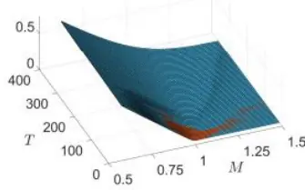

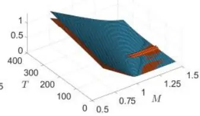

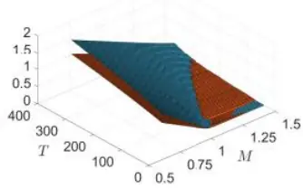

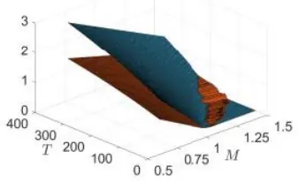

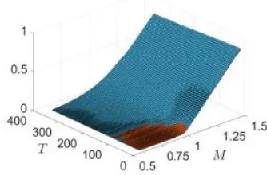
(a) λ= 0

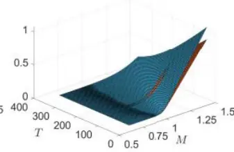
(b) λ = 0.25

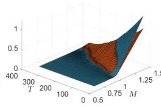
(c) λ = 0.5

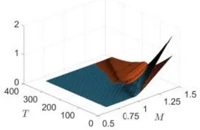
(d) $\lambda=0.75$

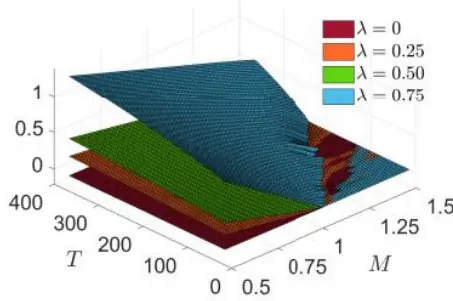
(e) Call

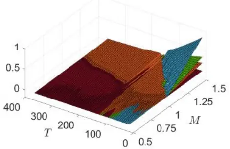
(f) $Put$
数据来源：Lauriaet al（2022）。注：第一排为欧式看多期权，第二排为欧式看空期权，棕色曲面以 E值的 DJIA 为底层资产，蓝色曲面 $\mathrm{mCVaR_{0.99}}$ 风险度量下的 E值切线组合为底层资产。第三排为不同λ水平下两种底层资产对应的期权价格的差。

图 9 反映的是两种不同基准的看多期权和看空期权的差

$$
\begin{aligned}&\Phi_{\mathrm{c}}^{(\mathrm{mCVaR}_{0.99})}(\mathrm{T},\mathrm{K},\lambda)-\Phi_{\mathrm{c}}^{(\mathrm{DIA})}(\mathrm{T},\mathrm{K},\lambda)\\&\Phi_{\mathrm{p}}^{(\mathrm{mCVaR}_{0.99})}(\mathrm{T},\mathrm{K},\lambda)-\Phi_{\mathrm{p}}^{(\mathrm{DIA})}(\mathrm{T},\mathrm{K},\lambda)\\\end{aligned}
$$

可以看到，对于λ = 0，期权价差几乎为零。随着λ的增加，期权价差主要发生在行权价格更偏价内（into-the-money）的情况。E值切线组合由于拥有较高的 E值，因此会产生向高 E值标的的倾斜，从而生成更高的期权价格。λ会因为久期的差异，而在看多和看空期权上产生不同的效果；对于一个常数的价内 K，看多期权会随着 T 同向变化，而看空期权恰恰相反。

图 10 展示了两种底层资产对应的隐含波动率（impliedvolatility，VI）曲面。对于λ = 0的价内期权，IV显示，DJIA给出的曲面（橙色）在短久期上要高于切线组合，长久期上则完全相反。λ的提升会使得两个曲面同时上升，但他们的差会减少，而“波动率微笑”将更陡峭。

图 10：不同底层资产对应的 E值隐含波动率
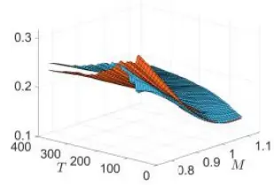
(a) λ = 0

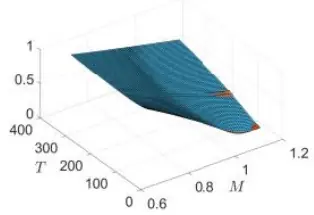
(b) λ = 0.25

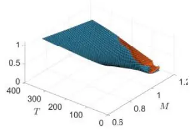
(c) λ = 0.5

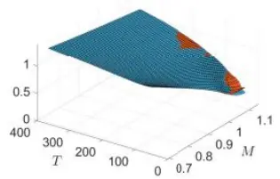
(d) λ = 0.75
数据来源：Lauriaet al（2022）。注：棕色曲面以 E值的 DJIA 为底层资产，蓝色曲面以mCVa $\mathrm{R}_{0.99}$ 风险度量下的 E值切线组合为底层资产。

## 8. E 值影子无风险利率

无风险利率的存在性通常是现代金融理论的隐含假设之一。然而，没有无风险利率的金融市场亦被学术界研究过。在 Black（1972，1995）的一系列开创性的工作中，他提出了一个不依赖于无风险利率存在的 CAPM模型，而后引入的影子无风险利率（shadow riskless rate，SRR），其本质上是一种关于固定收益衍生品的期权。针对 SRR，Rachev et al（2017）提供了另外一种视角，该指标被定义为一组风险证券的某个永续期权，同时还给出了相应的解析表达式。

考虑 N 种风险资 $\cdot 产$ 由 N-1 维 Brownian 运动决定：

$$
\frac{\mathrm{d}\mathrm{P}_{\mathrm{i},\mathrm{t}}}{\mathrm{P}_{\mathrm{i},\mathrm{t}}}=\mu_{\mathrm{i}}\mathrm{dt}+\sum_{\mathrm{j}\in[\mathrm{N}-1]}\sigma_{\mathrm{ij}}\mathrm{dB}_{\mathrm{j},\mathrm{t}},\mathrm{i}\in[\mathrm{N}]
$$

为了消除套利机会，我们考虑如下价格平减过程

$$
\frac{\mathrm{d}\pi_{\mathrm{t}}}{\pi_{\mathrm{t}}}=\mu_{\mathrm{\pi}}\mathrm{d}t+\sum_{\mathrm{j}\in[\mathrm{N}-1]}\sigma_{\mathrm{\pi}\mathrm{j}}\mathrm{dB}_{\mathrm{j},\mathrm{t}}
$$

使得

$$
\mathrm{P_{i,t}\pi_{t},i\in[N]}
$$

成为鞅。Ito 引理告诉我们，上述平减过程存在唯一等于

$$
\mu_{\mathrm{i}}+\mu_{\pi}+\sum_{\mathrm{j}\in[\mathrm{N}-1]}\sigma_{\mathrm{ij}}\sigma_{\pi\mathrm{j}}=0,\mathrm{i}\in[\mathrm{N}]
$$

给出的方程组有解。如果将其改写成矩阵形式

$$
\begin{bmatrix}-1&-\sigma_{1,1}&\cdots&-\sigma_{1,\mathrm{N}-1}\\-1&-\sigma_{2,1}&\cdots&-\sigma_{2,\mathrm{N}-1}\\\vdots&\vdots&\ddots&\vdots\\-1&-\sigma_{\mathrm{N},1}&\cdots&-\sigma_{\mathrm{N},\mathrm{N}-1}\end{bmatrix}\begin{bmatrix}\mathfrak{u}_{\pi}\\\sigma_{\pi,1}\\\vdots\\\sigma_{\pi,\mathrm{N}-1}\end{bmatrix}=\begin{bmatrix}\mathfrak{u}_{1}\\\mathfrak{u}_{2}\\\vdots\\\mathfrak{u}_{\mathrm{N}}\end{bmatrix}
$$

那么 Cramer 法则即给出了相应的无风险利率的解析式

$$
\mathbf{r}_{\mathrm{f}}=-\mathbf{\mu}_{\pi}=-{\frac{\operatorname*{det}\Phi_{\mu}}{\operatorname*{det}\Phi}}
$$

$$
\Phi=\begin{bmatrix}-1&-\sigma_{1,1}&\cdots&-\sigma_{1,\mathrm{N}-1}\\-1&-\sigma_{2,1}&\cdots&-\sigma_{2,\mathrm{N}-1}\\\vdots&\vdots&\ddots&\vdots\\-1&-\sigma_{\mathrm{N},1}&\cdots&-\sigma_{\mathrm{N},\mathrm{N}-1}\end{bmatrix}
$$

$$
\Phi_{\mu}=\left[\begin{matrix}{\mu_{1}}&{-\sigma_{1,1}}&{\cdots}&{-\sigma_{1,\mathrm{N}-1}}\\{\mu_{2}}&{-\sigma_{2,1}}&{\cdots}&{-\sigma_{2,\mathrm{N}-1}}\\{\vdots}&{\vdots}&{\ddots}&{\vdots}\\{\mu_{\mathrm{N}}}&{-\sigma_{\mathrm{N},1}}&{\cdots}&{-\sigma_{\mathrm{N},\mathrm{N}-1}}\end{matrix}\right]
$$

因此对于 E值 SRR，我们只需要计算相应的 E值收益率和资产与 Brown运动的协方差即可。

实证部分的设定与前文保持一致。在 2017 年 01 月 03 日到 2020 年 12月 31 日的回测区间内，我们使用了长度为 2 年的移动窗口来估计 E 值均值和方差。对于 DJIA中的 29 只股票，我们得到相应的

$$
(\mu_{\lambda},\Sigma_{\lambda})
$$

其中资 $\text{: }\begin{aligned}&\text{" }\\&\text{" }\end{aligned}$ 的排序遵循 E 值收益率方差衰减原则。为了得到 28 个 Brown运动，我们将利用协方差矩阵的 Cholesky 分解

$$
\Sigma_{\lambda}=\mathrm{LL^{T}}
$$

并将 $\mathrm{{\cdot}L^{T}}$ 的最后一列替换为它自己的最后两列的和来完成估计。

本节计算了 $\lambda\in\{0,0.25,0.5,0.75\}$ 的 SRR，参见图 11。可以看到 Covid-19的冲击改变了 SRR 曲线之间的相对位置和分化程度，但冲击结束之后不同 SRR 又开始呈现分化。

图 11：E值影子无风险利率
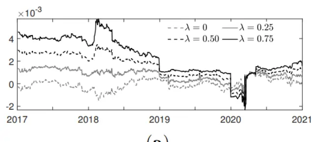
(a)

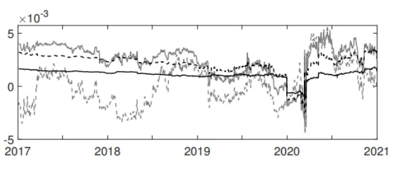
(b)
数据来源：Lauriaet al（2022）。注：回测区间为 2017 年 01 月 03 日至 2020 年 12 月 30 日。图（a）DJIA 中 29 只股票决定的SRR，图（b）SRR 的信息比率。

注意到价格平减过程的标准差被定义为

$$
\sigma_{\pi}=\left(\sum_{\mathrm{j}\in[\mathrm{N}-1]}\sigma_{\pi,\mathrm{j}}^{2}\right)^{1/2}
$$

因此可以定义 SRR 的信息比率（information ratio，IR）如下

$$
\mathrm{IR}_{\mathrm{SRR}}(\lambda)=\mu_{\pi}/\sigma_{\pi}
$$

最后我们在图 12 中展示了 $\mathrm{IR}_{\mathrm{SRR}}$ 指标的均值和方差之间的关系。

图 12：E值 SRR的信息比率
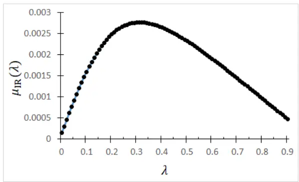

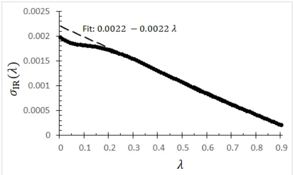

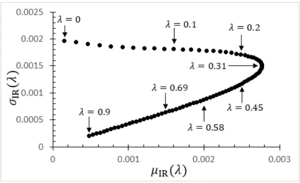
数据来源：Lauria et al（2022）

## 9. 讨论与总结

本文介绍了一种将 E值整合进动态资产定价理论的框架。该框架主要参数有二：传统的风险厌恶系数α ∈ [0,1]以及 ESG 亲和系数λ ∈[0,1]。本文将该框架应用于组合优化、风险测度、期权定价和影子无风险利率的计算上。尽管 E 值收益率与λ呈现线性依赖，但可以看到最终结果往往呈现为高度的非线性依赖。

毫无疑问的是，本文的框架与 E值的具体选择是无关的，因此当我们使用不同的 E值进行论证时，结果势必会产生一定的差异。

从技术上看，一个整合了 E 值的动态资产定价框架需要解决如下问题：

1. E值需要和收益率相对可比：一方面，E值需要上下有界，例如对于NES 而言取值一般为：

$$
[\varsigma_{-},\varsigma_{+}],\varsigma_{-}<0<\varsigma_{+}
$$

另一方面，需要一个用于区别资产的“好坏”的 E值中枢，例如

$$
\varsigma=0
$$

2. 收益和风险度量都需要 E 值化，并且更新后的风险度量需要兼顾一致性。

3. 超额收益的计算必然涉及到无风险利率，因此思考以国债利率为代表的无风险利率的 ESG 性质就显得非常重要。

4. 本文的期权定价遵循的是一种连续定价模型的离散化方法，由于它只涉及到收益率的标准差信息，模型捕捉能力相对有限。我们认为，未来的研究可以聚焦到涵盖底层资产更多微观结构的思路上。

5. 本文的影子无风险利率的计算需要界定 N×(N-1)个标准差参数，它们又涉及到资产收益率矩阵中的 N×N 个参数。然而上述界定并没有一个非常完备的理论来处理该模型的方方面面，并且此处使用的Cholesky 分解也较为特殊。

## 10.附录：E值期权定价的离散模型

本节的主要参考来自于 Duffie（2001）。考虑底层资产S，行权价格为 K，当前时点为 t，行权日为 t+T。E值系综的构建分为如下五个步骤：

第一步，假设新息（innovations）服从正则逆 Gauss 过程（normal inverseGaussian，NIG）分布。利用滚动两年的时间窗口，我们得以拟合历史收益率序列的 ARMA(p,q)-GRACH(1,1)模型。

第二步，利用上述 NIG 拟合，生成

$$
\{\mathbf{\hat{r}_{t+T}}\mathbf{:}\mathbf{T}\in(\mathrm{T_{min}},\mathrm{T_{max}})\}
$$

第三步，对于 S=20000 生成相应的系综

$$
\{\hat{\mathbf{r}}_{\mathrm{t}+\mathrm{T}}^{s}\colon\mathrm{T}\in(\mathrm{T}_{\operatorname*{min}},\mathrm{T}_{\operatorname*{max}}),s\in[\mathrm{S}]\}
$$

第四步，计算相应的 ER 系综：

$$
\{\hat{\zeta}_{\mathrm{t}+\mathrm{T}}^{s}:\mathrm{T}\in(\mathrm{T}_{\mathrm{min}},\mathrm{T}_{\mathrm{max}}),s\in[\mathrm{S}]\}
$$

第五步，得到 E值系综：

$$
\{\widehat{\mathrm{P}}_{\mathrm{t}+\mathrm{T}}^{(\mathrm{Z},\mathrm{s})}\colon\mathrm{T}\in(\mathrm{T}_{\mathrm{min}},\mathrm{T}_{\mathrm{max}}),\mathrm{s}\in[\mathrm{S}]\}
$$

下面计算相应的欧式期权的价格。形式上我们总是有

$$
\mathrm{P}_{\mathrm{t}}^{(\mathrm{Z})}(\lambda)=\mathbb{E}^{\mathbb{Q}}\left[\mathrm{P}_{\mathrm{t}+\mathrm{T}}^{(\mathrm{Z})}(\lambda)\mathrm{e}^{-\zeta_{\mathrm{f},\mathrm{t}}(\lambda)\mathrm{T}}\right]
$$

$$
\left\{\begin{aligned}\mathcal{F}_{t}&=滤链\\\mathbb{Q}&=风险中性测度\end{aligned}\right.
$$

于是

$$
\Phi_{\mathrm{c}}=\mathbb{E}^{\mathbb{Q}}[\max(\hat{\mathrm{P}}_{\mathrm{t}+\mathrm{T}}^{(\mathrm{Z})}(\lambda)-\mathrm{K},0)\mathrm{e}^{-\zeta_{\mathrm{f},\mathrm{t}}(\lambda)\mathrm{T}}|\mathcal{F}_{\mathrm{t}}]
$$

$$
\Phi_{\mathrm{p}}=\mathbb{E}^{\mathbb{Q}}\left[\max\left(\mathrm{K}-\widehat{\mathrm{P}}_{\mathrm{t}+\mathrm{T}}^{(\mathrm{Z})}(\lambda),0\right)\mathrm{e}^{-\zeta_{\mathrm{f},\mathrm{t}}(\lambda)\mathrm{T}}\right]\mathcal{F}_{\mathrm{t}}
$$

对于离散情况有

$$
\mathbb{E}^{\mathbb{Q}}\left[\widehat{\mathrm{P}}_{\mathrm{t}+\mathrm{T}}^{(\mathrm{Z})}(\lambda)\mathrm{e}^{-\zeta_{\mathrm{f},\mathrm{t}}(\lambda)\mathrm{T}}\right|\mathcal{F}_{\mathrm{t}}=\sum_{s\in[S]}\mathrm{q}_{s}^{*}\mathrm{P}_{\mathrm{t}+\mathrm{T}}^{(\mathrm{Z},s)}(\lambda)\mathrm{e}^{-\zeta_{\mathrm{f},\mathrm{t}}\mathrm{T}}
$$

其中 $\mathbf{q}_{s}^{*}$ 是如下 Kullback-Leibler 散度优化问题的解

$$
\begin{aligned}\min_{(\mathbf{q}_{\mathsf{s}})}\sum_{\mathsf{s}\in[\mathsf{S}]}\mathsf{q}_{\mathsf{s}}\ln\mathsf{q}_{\mathsf{s}}/\mathsf{p}_{\mathsf{s}}\\s.t.\left\{\begin{matrix}\mathsf{q}_{\mathsf{s}}>0,\mathsf{s}\in[\mathsf{S}]\\\Sigma_{\mathsf{s}}\mathsf{q}_{\mathsf{s}}=1\\\Sigma_{\mathsf{s}}\mathsf{q}_{\mathsf{s}}\mathsf{P}_{\mathsf{t}+\mathrm{T}}^{(\mathsf{Z},\mathsf{s})}(\lambda)\mathsf{e}^{-\zeta_{\mathsf{f},\mathsf{t}}\mathrm{T}}=\mathsf{P}_{\mathsf{t}}^{(\mathsf{Z})}\end{matrix}\right.\end{aligned}
$$

其中 ${\mathfrak{p}}_{s^{\prime}}$ 代表的是 s 在ℙ中的概率，例如对于等可能情况，我们有

$$
\mathbf{p}_{s}=1/S
$$

因此最终有期权价格公式

$$
\begin{aligned}\Phi_{\mathrm{c}}(\mathrm{t},\mathrm{T},\mathrm{K})&=\sum_{\mathrm{s}\in[\mathrm{S}]}\mathrm{q}_{\mathrm{s}}^{*}\left[\max\left(\mathrm{P}_{\mathrm{t}+\mathrm{T}}^{(\mathrm{Z},\mathrm{s})}(\lambda)-\mathrm{K},0\right)\mathrm{e}^{-\zeta_{\mathrm{f},\mathrm{t}}\mathrm{T}}\right]\\\Phi_{\mathrm{p}}(\mathrm{t},\mathrm{T},\mathrm{K})&=\sum_{\mathrm{s}\in[\mathrm{S}]}\mathrm{q}_{\mathrm{s}}^{*}\left[\max\left(\mathrm{K}-\mathrm{P}_{\mathrm{t}+\mathrm{T}}^{(\mathrm{Z},\mathrm{s})}(\lambda),0\right)\mathrm{e}^{-\zeta_{\mathrm{f},\mathrm{t}}\mathrm{T}}\right]\end{aligned}
$$

## 11.参考文献

[1] Artzner, P., Delbaen, F., Eber, J.-M., and Heath, D. Coherent measures of risk. Mathematical Finance 9, 3 (1999), 203–228

[2] Berg, F., Koelbel, J. F., and Rigobon, R. Aggregate confusion: The divergence of ESG ratings. MIT Sloan School of Management Cambridge, MA, USA, 2019.

[3] Berry, T. C., and Junkus, J. C. Socially responsible investing: An investor perspective. Journal of Business Ethics 112, 4 (2013), 707–720.

[4] Bilbao-Terol, A., Arenas-Parra, M., Cañal-Fernández, V., and Bilbao-Terol, C. Selection of socially responsible portfolios using hedonic prices. Journal of business ethics 115, 3 (2013), 515–529

[5] Black, F. Capital market equilibrium with restricted borrowing. The Journal of Business 45, 3 (1972), 444–55.

[6] Black, F. Interest rates as options. The Journal of Finance 50, 5 (1995), 1371–1376.

[7] Cesarone, F., Martino, M. L., and Carleo, A. Does ESG impact really enhance portfolio profitability?, January 2022.

[8] Chen, L., Zhang, L., Huang, J., Xiao, H., and Zhou, Z. Social responsibility portfolio optimization incorporating ESG criteria. Journal of Management Science and Engineering 6, 1 (2021), 75–85.

[9] Cheridito, P., and Kromer, E. Reward-risk ratios. Journal of Investment Strategies, Forthcoming (2013).

[10] Delbaen, F., and Schachermayer, W. A general version of the fundamental theorem of asset pricing. Mathematische Annalen 300, 1 (1994), 463–520.

[11] Duffie, D. Dynamic asset pricing theory, 3. ed ed. Princeton Univ. Press, Princeton, NJ, 2001.

[12] Gasser, S. M., Rammerstorfer, M., and Weinmayer, K. Markowitz revisited: Social portfolio engineering. European Journal of Operational Research 258, 3 (2017), 1181–1190.

[13] Geczy, C. C., and Guerard, J. ESG and expected returns on equities: The case of environmental ratings. Wharton Pension Research Council Working Paper No. 2021-15 (August 2021).

[14] Hirschberger, M., Steuer, R. E., Utz, S., Wimmer, M., and Qi, Y. Computing the nondominated surface in tri-criterion portfolio selection. Operations Research 61, 1 (2013), 169–183.

[15] Martin, R. D., Rachev, S. T., and Siboulet, F. Phi-alpha optimal portfolios and extreme risk management. Wilmott 2003 (2003), 70–83.

[16] Pedersen, L. H., Fitzgibbons, S., and Pomorski, L. Responsible investing: The ESG-efficient frontier. Journal of Financial Economics 142, 2 (2021), 572–597.

[17] Rachev, S. T., Stoyanov, S. V., and Fabozzi, F. J. Financial markets with no riskless (safe) asset. International Journal of Theoretical and Applied Finance 20, 08 (2017), 1750054.

[18] Rockafellar, R. T., and Uryasev, S. Optimization of conditional value-atrisk. Journal of risk 2 (2000), 21–42.

[19] Schmidt, A. B. Optimal ESG portfolios: an example for the Dow Jones Index. Journal of Sustainable Finance & Investment 0, 0 (2020), 1–7.

[20] Utz, S., Wimmer, M., and Steuer, R. E. Tri-criterion modeling for constructing more-sustainable mutual funds. European Journal of Operational Research 246, 1 (2015), 331–338.

## 本公司具有中国证监会核准的证券投资咨询业务资格

## 分析师声明

作者具有中国证券业协会授予的证券投资咨询执业资格或相当的专业胜任能力，保证报告所采用的数据均来自合规渠道，分析逻辑基于作者的职业理解，本报告清晰准确地反映了作者的研究观点，力求独立、客观和公正，结论不受任何第三方的授意或影响，特此声明。

## 免责声明

本报告仅供国泰君安证券股份有限公司（以下简称“本公司”）的客户使用。本公司不会因接收人收到本报告而视其为本公司的当然客户。本报告仅在相关法律许可的情况下发放，并仅为提供信息而发放，概不构成任何广告。

本报告的信息来源于已公开的资料，本公司对该等信息的准确性、完整性或可靠性不作任何保证。本报告所载的资料、意见及推测仅反映本公司于发布本报告当日的判断，本报告所指的证券或投资标的的价格、价值及投资收入可升可跌。过往表现不应作为日后的表现依据。在不同时期，本公司可发出与本报告所载资料、意见及推测不一致的报告。本公司不保证本报告所含信息保持在最新状态。同时，本公司对本报告所含信息可在不发出通知的情形下做出修改，投资者应当自行关注相应的更新或修改。

本报告中所指的投资及服务可能不适合个别客户，不构成客户私人咨询建议。在任何情况下，本报告中的信息或所表述的意见均不构成对任何人的投资建议。在任何情况下，本公司、本公司员工或者关联机构不承诺投资者一定获利，不与投资者分享投资收益，也不对任何人因使用本报告中的任何内容所引致的任何损失负任何责任。投资者务必注意，其据此做出的任何投资决策与本公司、本公司员工或者关联机构无关。

本公司利用信息隔离墙控制内部一个或多个领域、部门或关联机构之间的信息流动。因此，投资者应注意，在法律许可的情况下，本公司及其所属关联机构可能会持有报告中提到的公司所发行的证券或期权并进行证券或期权交易，也可能为这些公司提供或者争取提供投资银行、财务顾问或者金融产品等相关服务。在法律许可的情况下，本公司的员工可能担任本报告所提到的公司的董事。

市场有风险，投资需谨慎。投资者不应将本报告作为作出投资决策的唯一参考因素，亦不应认为本报告可以取代自己的判断。
在决定投资前，如有需要，投资者务必向专业人士咨询并谨慎决策。

本报告版权仅为本公司所有，未经书面许可，任何机构和个人不得以任何形式翻版、复制、发表或引用。如征得本公司同意进行引用、刊发的，需在允许的范围内使用，并注明出处为“国泰君安证券研究”，且不得对本报告进行任何有悖原意的引用、删节和修改。

若本公司以外的其他机构（以下简称“该机构”）发送本报告，则由该机构独自为此发送行为负责。通过此途径获得本报告的投资者应自行联系该机构以要求获悉更详细信息或进而交易本报告中提及的证券。本报告不构成本公司向该机构之客户提供的投资建议，本公司、本公司员工或者关联机构亦不为该机构之客户因使用本报告或报告所载内容引起的任何损失承担任何责任。

## 评级说明

## 1.投资建议的比较标准

投资评级分为股票评级和行业评级。以报告发布后的 12 个月内的市场表现为比较标准，报告发布日后的 12 个月内的公司股价（或行业指数）的涨跌幅相对同期的沪深 300 指数涨跌幅为基准。

## 2.投资建议的评级标准

报告发布日后的 12 个月内的公司股价（或行业指数）的涨跌幅相对同期的沪深300 指数的涨跌幅。

| 评级 | 说明 |  |
| --- | --- | --- |
| 股票投资评级 | 增持 | 相对沪深 300 指数涨幅 15%以上 |
|  | 谨慎增持 | 相对沪深300指数涨幅介于5%～15%之间 |
|  | 中性 | 相对沪深300指数涨幅介于-5%～5% |
|  | 减持 | 相对沪深300指数下跌5%以上 |
| 行业投资评级 | 增持 | 明显强于沪深300指数 |
|  | 中性 | 基本与沪深300指数持平 |
|  | 减持 | 明显弱于沪深 300指数 |

## 国泰君安证券研究所

|  | 上海 | 深圳 | 北京 |
| --- | --- | --- | --- |
| 地址 | 上海市静安区新闸路669 号博华广 场20层 | 深圳市福田区益田路6009号新世界 商务中心34层 | 北京市西城区金融大街甲9号金融 街中心南楼18层 |
| 邮编 | 200041 | 518026 | 100032 |
| 电话 | （021）38676666 | （0755）23976888 | (010)83939888 |
|  | E-mail: gtjaresearch@gtjas.com |  |  |