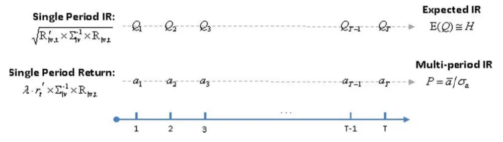
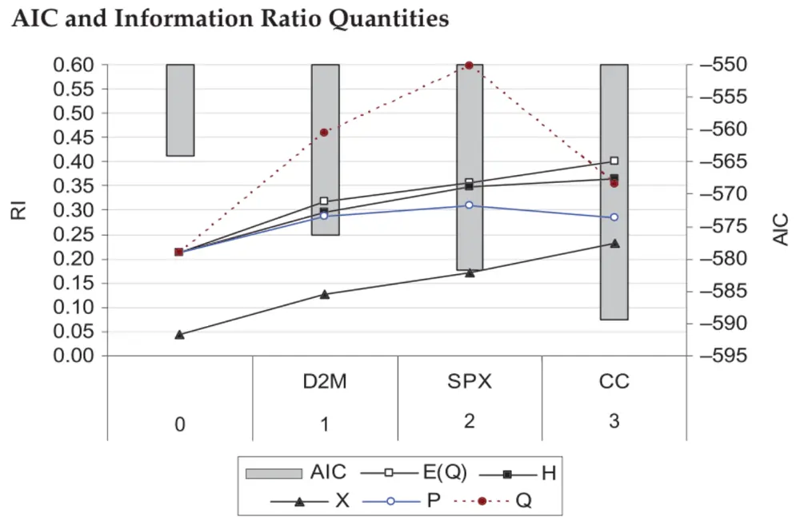
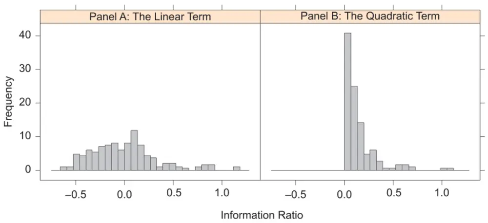

[Table_Title]2022.08.24

## 因子择时模型的泛用框架

## ——精品文献解读系列（三十三）

## 本报告导读：

对于多因子模型这种静态因子模型而言，其核心逻辑即寻找收益较高但风险较低的因子进行趋势配置。但本报告表明，收益较低而风险较高的因子同样具有策略价值。在联合正态分布的假设下，通过引入条件变量，本报告对价值策略、质量策略和热点策略使用的主要因子，利用条件模型的一般范式，构建了因子择时模型，值得战术资产配置者参考。

## 摘要：

le_Summary]投资学是一门学术界与业界紧密结合的学科，其中大类资产配置是这种紧密结合的代表。从 Markowitz（1952）开创现代投资组合理论开始，学术界为业界提供了丰富的理论参考和方法模型，推动了大类资产配置实践的繁荣发展。为了帮助读者及时跟踪学术前沿，我们推出了“精品文献解读”系列报告，从大量学术文献中挑选出精品论文进行剖析解读，为读者呈现大类资产配置领域最新的思路和方法。

- 本篇为读者解读的文献是 Hua et al.（2012）在 Journal of PortfolioManagement 上发表的论文"Factor-Timing Model"。

本报告利用 Akaike 信息准则通过逐步纳入条件变量，将静态因子模型的最优化框架推广成了一个泛用的因子择时模型。进一步地，本报告还导出了一些信息比率指标，用于追踪该因子择时模型的改进效率，并对改进各种途径的影响进行了分析。

对于多因子模型这种静态因子模型而言，其核心逻辑即寻找收益较高但风险较低的因子进行趋势配置。但本报告表明，收益较低而风险较高的因子同样具有策略价值。在联合正态分布的假设下，通过引入条件变量，本报告对价值策略、质量策略和热点策略使用的主要因子，利用条件模型的一般范式，构建了因子择时模型，值得战术资产配置者参考。

- 风险提示：量化模型基于历史数据有失效风险。

大类资产配置研究

## hor] 报告作者

赵索(分析师)

8 0755-23976601

zhaosuo024832@gtjas.com

证书编号 S0880521080002

## cReport] 相关报告

如何选择业绩评价指标

2022.08.04

当量化行业配置插上择时的翅膀

2022.08.01

使用基本面因子构建中证500指数增强策略初探

2022.08.01

攻防两端短兵相接，调仓换股做好准备

2022.07.31

欲速则不达，周线级回踩后方为配置良机

2022.07.30

## 1. 文献概述

## 文献来源：

Hua, R. , D. Kantsyrev , and E. Qian. "Factor-Timing Model." Journal of Portfolio Management 39.1(2012):75-87.

## 文献摘要：

本报告利用 Akaike 信息准则通过逐步纳入条件变量，将静态因子模型的最优化框架推广成了一个泛用的因子择时模型。进一步地，本报告还导出了一些信息比率指标，用于追踪该因子择时模型的改进效率，并对改进各种途径的影响进行了分析。

## 文献评述：

对于多因子模型这种静态因子模型而言，其核心逻辑一言以蔽之即寻找收益较高但风险较低的因子进行趋势配置。但本报告表明，收益较低而风险较高的因子同样具有策略价值。在联合正态分布的假设下，通过引入条件变量，本报告对价值策略、质量策略和热点策略使用的主要因子，利用条件模型的一般范式，构建了因子择时模型，值得战术资产配置者参考。

## 2. 引言

自 2007 年大萧条和 2008 年金融危机以来，全球金融市场进入了一个伴随以极端宏观条件、波动率大幅提升、多市场相关性增强、货币和财政政策反馈不确定性频发的未知时期。在此情况下，一些传统的静态权益投资策略陷入苦战，很大程度可以归因于其在某些量化因子上的不当行为。

在静态量化模型中，因子权重通常基于长周期视角下的风险回报统计量，并在短时间内难有较大的边际变化。因此，尽管静态量化模型能在长周期中最终呈现良好表现，但也同时容易受到那些在短期内对模型或者因子表现有不利影响的市场因素的影响。

例如随着市场波动的持续，静态模型可能会面临业绩困难。而本报告发现，此时投资者可以通过因子择时模型获利。事实上，该模型成功将市场波动率转化为全新的超额收益来源。

与静态模型的最大区别在于，动态模型的因子权重依赖于一组市场条件变量的时变信息。例如 S&P500 的隐含波动率指标 VIX 可以视为一个条件变量：当 VIX 较高时，更应该逆市做多风险较高、同时做空动量较强的股票；而当 VIX 相对较低的时候，反其道而行之则可能更加有效。但无论如何，该策略的有效性取决于VIX指标对动量的预期收益率和方差、估值和其他量化因子的影响。

显然，因子择时模型的权重依赖于收益率的条件期望和条件协方差。由

于市场条件随时而变，因子择时模型给出的最优权重自然也就随时而变。

而给定一个静态模型后，为了构造相应的因子择时模型，还需要给定条件变量集和触发机制。此处采用的动态触发机制类似于 Qianet al.（2004）中的既有框架，而本报告的主要创新在于提供了一套如何筛选条件变量的方法。同时，本报告还通过导出有用的信息比率指标，展示了如何跟踪模型改进，并验证了该动态模型如何提升组合业绩。

本报告的目标是构建一个泛用的、依据逐步增加的条件变量来进行因子择时的模型。相比之下，现有文献往往关注如何使用条件变量来提升动态资产配置策略的业绩，两者视角确有不同。

## 3. 因子择时模型的最优权重

本报告关注的变量主要有两种，即因子收益率（factorreturn）和条件变量（conditional variable）。令

$$
\begin{array}{r}{\left\{\mathrm{R}_{\mathrm{t}+1}=\left(\mathrm{R}_{\mathrm{t}+1}\right)_{\mathrm{N}\times1}=\mathrm{N}\mathrm{\Omega}\wedge\sharp\left.\sharp\frac{\ d}{\ dt}\right\}\sharp\frac{1}{\sqrt{\pi}}\mathrm{\#}\frac{1}{\sqrt{\pi}}\frac{1}{\sqrt{\pi}}\frac{1}{\sqrt{\pi}}\frac{1}{\sqrt{\pi}}\right\}}\\{\mathrm{V}_{\mathrm{t}}=\left(\mathrm{V}_{\mathrm{t}}\right)_{\mathrm{K}\times1}=\mathrm{K}\mathrm{\Omega}\wedge\sharp\left.\sharp\frac{\ d}{\ dt}\frac{\ dH}{\ dt}\frac{1}{\sqrt{\pi}}\frac{1}{\sqrt{\pi}}\frac{1}{\sqrt{\pi}}\frac{1}{\sqrt{\pi}}\right\}}\end{array}
$$

为方便起见，后文总是在不至于混淆的情况下省略时间脚标。本报告总是假设因子收益率与条件变量服从多元正态分布

$$
\mathrm{\bigl(\mathrm{\frac{R}{V}}\bigr)\sim N((\frac{\overline{{R}}}{\overline{{V}}}),\int_{\Omega_{\mathrm{VR}}}^{\Sigma_{\mathrm{RR}}}\Sigma_{\mathrm{VV}}))}
$$

假设 v 是条件变量 V的一个具体实现，根据条件期望公式，可以将 R 的条件均值（conditional mean）和条件协方差（conditional covariance）写作

$$
\left\{\begin{array}{ll}{\mathsf{R}_{|\mathrm{v}}=\overline{{\mathsf{R}}}+\Delta\mathsf{R}}\\{\Sigma_{|\mathrm{v}}=\Sigma_{\mathrm{RR}}-\Sigma_{\Delta\Delta}}\end{array}\right.
$$

$$
\left\{\begin{array}{ll}{\Delta\mathrm{R}=\Sigma_{\mathrm{RV}}\Sigma_{\mathrm{VV}}^{-1}(\mathrm{v}-\overline{{\nabla}})}\\{\Sigma_{\Delta\Delta}=\Sigma_{\mathrm{RV}}\Sigma_{\mathrm{VV}}^{-1}\Sigma_{\mathrm{VR}}}\end{array}\right.
$$

分别称为因子收益和协方差的调整项。 $\bar{\mho}$ 条件模型最优权重（conditionalmodel optimal weights，CMOW）为

$$
\begin{array}{r}{\mathsf{M}_{|\mathrm{v}}^{*}=\lambda\Sigma_{|\mathrm{v}}^{-1}\mathsf{R}_{|\mathrm{v}}}\end{array}
$$

其中λ是某个由最优化过程决定的常数（此处其实是最优化组合的信息比率）。从公式可以看出，动态模型与静态模型的区别在于因子收益率的调整项ΔR和协方差矩阵的风险约化部分 $\cdot\Sigma_{\Delta\Delta}$

## 4. 条件变量的选择

研究模型排序的文献汗牛充栋。由于一个具体模型往往由变量的选择、参数的估计以及逻辑结构的嵌套方式等具体特征所刻画，因此对于特定问题而言，候选模型的适定性当然取决于先验的筛选逻辑。但金融市场过于复杂，通常很难找到一个一劳永逸的模型，因此只能寄希望于一组能从不同侧面，洞见市场动力机制和内部运作模式的近似模型作为替代。

如何依据先验知识，普世地寻找最优模型的方法显然超出了本报告的能力范围。这方面的成功例子依赖于研究者的经验、知识和创造力。总体来说，研究者需要平衡“一大一小”两方面的需求：一方面需要关注可信假设，使得候选模型集尽可能地小；另一方面则要保证候选模型集有适当的规模，以免遗漏那些合理的先验模型。

在本报告关注的条件变量的选择问题上，增加条件变量的数量虽然会增加模型的拟合精度并降低样本内残差，但同时也会增加模型的样本外预测误差并降低拟合的可处理性。本报告提供了一种基于 Akaike 信息准则的条件变量筛选方法，尝试解答“到底需要纳入多少条件变量”这一现实问题。

## 4.1. Akaike 信息准则

自从 19 世纪热力学首次引入熵（entropy）的概念以来，该概念在包括信息论在内多学科内已经有了广泛使用。1951 年，Kullback 和 Leibler 提出了一种用来衡量两个模型之间差异的测度，即大名鼎鼎的 KL 散度。Akaike（1973）发现了 KL 散度和 Fisher 的极大对数似然之间的关系，并据此提出了一种用于筛选模型的方法。这种度量被 Akaike 称之为信息准则（Akaike information criterion，AIC），形式上是信息熵和模型复杂度的数量和：

$$
\mathtt{AIC}=-2\ln\mathtt{L}+2\kappa
$$

其中 L代表估计模型的似然函数，而κ代表模型的参数个数。粗糙地讲，越小的候选模型越接近真实情况。

本报告中，因子择时模型的 AIC 形如

$$
\mathsf{AIC}=\mathrm{T}\cdot\mathrm{ln}\bigl[\bigl|\Sigma_{|\mathrm{v}}\bigr|\bigr]+2\mathrm{NK}
$$

其中 T 是观察的样本数，N 代表量化因子个数，K 代表条件变量个数，其中似然函数由条件协方差矩阵的行列式给出

$$
\left|\Sigma_{|\mathrm{v}}\right|=\operatorname*{det}\left(\Sigma_{|\mathrm{v}}\right)
$$

我们在此处简要给出因子择时模型 AIC 的推导过程。设因子收益率，条件收益率和残差收益率之间的关系如下

$$
\mathtt{R}=\mathtt{R}_{\vert\mathrm{v}}+\varepsilon_{\mathrm{t}}
$$

特别地，我们假设残差收益率是独立同分布且对于时间序列 $t=1,2,\dots,T$ 保持序列无关性（虽然此条件可以放宽，但技术上我们需要用到偏似然估计），那么对于条件 v 而言，有似然函数

$$
\mathrm{L}(\mathrm{v})=\frac{1}{(2\pi)^{\mathrm{NT}/2}\left|\boldsymbol{\Sigma}_{|\mathrm{v}}\right|^{\mathrm{T}/2}}\cdot\exp\left[-\frac{1}{2}\cdot\sum_{\mathrm{t=1}}^{\mathrm{T}}\varepsilon_{\mathrm{t}}^{\mathrm{T}}\Sigma_{|\mathrm{v}}^{-1}\varepsilon_{\mathrm{t}}\right]
$$

其中指数部分有近似估计

$$
\sum_{\mathfrak{t}=1}^{\mathrm{T}}\varepsilon_{\mathfrak{t}}^{\mathrm{T}}\Sigma_{|\mathrm{v}}^{-1}\varepsilon_{\mathfrak{t}}\approx\mathrm{T}\cdot\mathbb{E}\left[\varepsilon^{\mathrm{T}}\Sigma_{|\mathrm{v}}^{-1}\varepsilon\right]=\mathrm{TN}
$$

代入后有

$$
\mathrm{L}(\mathrm{v})=(2\pi\mathrm{e})^{-\mathrm{NT}/2}\cdot\left|\Sigma_{|\mathrm{v}}^{-1}\right|^{-\mathrm{T}/2}
$$

再注意到协方差矩阵的自由度为N(N+ 1)/2，而条件变量与因子收益之间的关联自由度为 NK，因子的截距自由度为 N，因此未化简的 AIC 为

$$
\begin{array}{r}{\widetilde{\mathrm{AIC}}=\mathrm{NT}\cdot\left[\ln2\pi+1\right]+\mathrm{T}\cdot\ln\left[\left|\Sigma_{|\mathrm{v}}\right|\right]+\mathrm{N}(\mathrm{N}+1)+2\mathrm{NK}+2\mathrm{N}}\end{array}
$$

将与条件变量（v 或者 K）无关的常数去掉，最后即有

$$
\mathsf{AIC}=\mathrm{T}\cdot\mathrm{ln}\bigl[\bigl|\Sigma_{|\mathrm{v}}\bigr|\bigr]+2\mathrm{NK}
$$

更进一步，在分量上有

$$
\Sigma_{|\mathrm{v}}=\left(\sigma_{\mathrm{ij}|\mathrm{v}}\right)=\left(\sigma_{\mathrm{i}|\mathrm{v}}\sigma_{\mathrm{j}|\mathrm{v}}\rho_{\mathrm{ij}|\mathrm{v}}\right)=\mathrm{D}_{|\mathrm{v}}\rho_{|\mathrm{v}}\mathrm{D}_{|\mathrm{v}}
$$

$$
{\sf D}_{|\mathrm{v}}=\mathrm{diag}\big(\sigma_{1|\mathrm{v}},\dots,\sigma_{\mathrm{N}|\mathrm{v}}\big),\qquad\rho_{|\mathrm{v}}=(\rho_{\mathrm{ij}|\mathrm{v}})
$$

分别是条件标准差组成的对角阵和条件相关系数矩阵。

从 AIC 的上述形式可以看到，在 T 和 N 给定的情况下，条件变量个数K和协方差矩阵的行列式将在相反方向上影响 AIC。注意到

$$
\left|\Sigma_{|\mathrm{v}}\right|=\mathsf{det}\bigl(\Sigma_{|\mathrm{v}}\bigr)=\mathsf{det}(\mathsf{D}_{|\mathrm{v}})\mathsf{det}\bigl(\mathsf{\rho}_{|\mathrm{v}}\bigr)\mathsf{det}(\mathsf{D}_{|\mathrm{v}})=|\mathsf{\rho}_{|\mathrm{v}}|\cdot\Pi_{\mathrm{i}}\sigma_{\mathrm{i}|\mathrm{v}}^{2}
$$

因此当K越大时，数据拟合将越精细，因此资产条件方差将会变得越小，其行列式将变得更小，但由于 AIC 指标中的第二项包含了条件变量数作为惩罚项，因此一味提升条件变量的个数可能会使 AIC 不降反升。

从 AIC 的具体形式出发还可以得到一些有意思的推论。例如，假设资产之间的相关性都为 0，那么协方差阵是资产方差形成的对角阵，因此有

$$
\mathrm{AIC}=2\mathrm{T}\cdot\ln\bigl(\sigma_{1|\mathrm{v}}\cdots\sigma_{\mathrm{N|v}}\bigr)+2\mathrm{NK}
$$

故而当条件变量数 K 固定时，最优模型等于所有方差乘积最小的模型。再注意到协方差矩阵是个半正定阵，因此行列式在最极端的情况最小等于 0，此时的 AIC 则趋于负无穷。

需要注意的是，有两种比较简单的情况会使得 等于负无穷。第一种情况，是某个因子的条件方差为零，此种情况代表模型可以精确预测某个因子收益。换而言之，利用该因子收益率，可以设计一个无风险套利组合。第二种情况则是条件协方差矩阵退化，此时利用共线性性，同样可以通过抵消某些因子回报设计出一个无风险套利组合。

更有意思的是，如果考虑条件协方差矩阵的特征值

$$
\lambda_{1}\ge\lambda_{2}\ge\cdots\ge\lambda_{\mathrm{N}}\ge0
$$

注意到

$$
\left|{\Sigma_{|\mathrm{v}}}\right|=\lambda_{1}\cdots\lambda_{\mathrm{N}}
$$

那么

$$
{\mathrm{AIC}}={\mathrm{T}}\cdot\ln(\lambda_{1}\cdots\lambda_{\mathrm{N}})+2{\mathrm{NK}}={\mathrm{T}}\cdot\sum\ln\lambda_{\mathrm{i}}+2{\mathrm{NK}}
$$

上述公式表明，一个优秀的条件变量会带来条件协方差矩阵特征值的大比例衰减（简单来说就是衰减的比例而非幅度才是决定条件变量优劣的标准，将某个因子收益标准差从 100 衰减为 50 和从 1 衰减到 0.5 在 AIC上的效用是一样的）。因此条件变量应该选择那些在协方差上解释力度更显著的变量。

上述讨论主要是站在风险约化的视角，聚焦于如何依据 AIC 指标选择最优的因子择时模型。但作为同一枚硬币的另一面，条件因子收益 $\mathrm{R}_{|\mathrm{v}}$ 也会受到 的影响，而且我们最终将会看到，这种影响表现为一系列的信息比率指标，从而决定因子择时模型的效率。

## 4.2. 条件变量选择的步骤

本节将给出一个逐轮筛选条件变量的框架。设

$$
\left\{\begin{array}{l}{{\mathrm{S}_{\mathrm{i}}}{\mathrm{\Omega}}=\tilde{\vec{\beta}}{\mathrm{\Omega}}{\mathrm{i}}\tilde{\mp}\hat{\mathrm{e}}{\mathrm{\Omega}}{\forall}\tilde{\mathbb{R}}{\mathrm{\Omega}}/\tilde{\mathrm{e}}\tilde{\mathrm{\Omega}}{\mathrm{\lesssim}}1\mp\tilde{\mathrm{\Omega}}\mathrm{\Omega}\tilde{\mathbb{Z}}\mathrm{\frac{\partial\Omega}{\mathrm{\lesssim}}\tilde{\mathrm{\Omega}}\tilde{\mathbb{R}}}}\\{{\mathrm{AIC}_{\mathrm{i}}}=\tilde{\vec{\beta}}{\mathrm{\Omega}}{\mathrm{i}}\tilde{\ddag}\hat{\mathrm{e}}{\mathrm{\Omega}}{\mathrm{\rlap/{H}}\mathrm{\Sigma}}\mathrm{\ AIC}}\end{array}\right.
$$

1. 初始状态下，最优条件变量集为空集，此时的 AIC 等于无条件 AIC

$$
\mathrm{S}_{0}=\emptyset,\mathrm{AIC}_{0}=\mathrm{T}\cdot\mathrm{ln}[|\Sigma_{\mathrm{RR}}|]
$$

2. 假设第 i轮筛选已经完成，那么通过纳入剩余的候选条件变量 k，可以得到相应的 AIC

$$
\mathrm{AIC}_{\mathrm{i}}\to\mathrm{AIC}_{\mathrm{i,k}}
$$

3. 如果存在一个候选条件变量 k 使得

$$
\mathrm{{AIC}_{\mathrm{{i,k}}}<\mathrm{{AIC}_{\mathrm{{i}}}}}
$$

那么跳转到第 4 步；否则流程停止，此时最优条件变量集即第 i轮的条件变量集。

4. 更新第 i+1 轮的最优条件变量集为

$$
\mathrm{S}_{\mathrm{i}+1}=\mathrm{S}_{\mathrm{i}}\cup\{\mathrm{k}\}
$$

并跳转到第 2 步。

## 5. 信息比率

自从 Treynor and Black（1973）引入信息比率（information ratio，IR）——超额收益的均值除以超额收益的标准差——以来，该指标长期被奉为评价基金经理主动管理能力的业绩指标。因此，建立 IR 和 AIC 之间的关系，对于评价因子择时模型的业绩就显得非常重要。

本报告一共引入了 4种不同的 IR指标，用于追踪因子择时模型的改进，并展示了这些指标是如何依赖于条件收益率和条件协方差。

## 5.1. 条件模型信息比率（CMIR=Q）

本报告首先推导 IR 的矩阵形式。考虑模型收益和模型方差如下

$$
\left\{\begin{array}{ll}{\mathrm{R}_{\mathrm{m}}=(\mathrm{M}^{\ast})^{\mathrm{T}}\mathrm{R}=\lambda_{\mathrm{m}}\cdot\mathrm{R}^{\mathrm{T}}\Sigma^{-1}\mathrm{R}}\\{\sigma_{\mathrm{m}}^{2}=(\mathrm{M}^{\ast})^{\mathrm{T}}\Sigma\mathrm{M}^{\ast}=\lambda_{\mathrm{m}}^{2}\cdot\mathrm{R}^{\mathrm{T}}\Sigma^{-1}\Sigma\Sigma^{-1}\mathrm{R}=\lambda_{\mathrm{m}}\cdot\mathrm{R}^{\mathrm{T}}\Sigma^{-1}\mathrm{R}}\end{array}\right.
$$

下标 m 代表 model，因此模型的 IR 等于

$$
\mathrm{IR}_{\mathrm{m}}={\frac{\mathrm{R}_{\mathrm{m}}}{\sigma_{\mathrm{m}}}}={\frac{\mathrm{R}^{\mathrm{T}}\Sigma^{-1}\mathrm{R}}{\lambda_{\mathrm{m}}\cdot(\mathrm{R}^{\mathrm{T}}\Sigma^{-1}\mathrm{R})^{1/2}}}=(\mathrm{R}^{\mathrm{T}}\Sigma^{-1}\mathrm{R})^{1/2}
$$

类比上述公式，条件模型信息比率（conditional model IR，CMIR）为：

$$
0=\mathrm{IR}_{|\mathrm{v}}=\left(\mathrm{R}_{|\mathrm{v}}^{\mathrm{T}}\Sigma_{|\mathrm{v}}^{-1}\mathrm{R}_{|\mathrm{v}}\right)^{1/2}
$$

注意到

$$
\left\{\begin{array}{ll}{\mathsf{R}_{|\mathrm{v}}=\overline{{\mathsf{R}}}+\Delta\mathsf{R}}\\{\Sigma_{|\mathrm{v}}=\Sigma_{\mathrm{RR}}-\Sigma_{\Delta\Delta}}\end{array}\right.
$$

因此 CMIR 指标 Q 是调整项ΔR和 $\mathtt{!}\Sigma_{\Delta\Delta}$ 的函数。由于 $\cdot\Sigma_{\Delta\Delta}$ 依赖于条件变量集的选择，因此 CMIR 也同样依赖。简单来说，CMIR 是 $\Sigma_{\Delta\Delta}$ 的协变变量，即随着后者的增加而增加，也随着后者的减 $\cdot\mathcal{V}$ 而减少。更重要的是注意到 $\Delta\mathrm{R}=\Sigma_{\mathrm{RV}}\Sigma_{\mathrm{VV}}^{-1}(\mathrm{v}-\overline{{\mathsf{V}}})$ ，因此 CMIR 也与条件变量的当前读数有关，即它是一个时变的逐点测度。

## 5.2. 期望模型信息比率（EMIR≠H）

期望模型信息比率（expected model IR，EMIR）是 CMIR 的关于因子收益率调整项分布的期望

$$
\mathtt{EMIR}=\mathbb{E}_{\Delta\mathtt{R}}[\mathrm{Q}]
$$

其中期望将遍历所有可能的ΔR。

由于 EMIR 没有解析表达，利用 Taylor 展开有

$$
\mathrm{IR}_{|\mathrm{v}}\big[\mathrm{R}_{|\mathrm{v}}\big]=\mathrm{IR}_{|\mathrm{v}}[\overline{{\mathrm{R}}}]+\left\{\frac{\partial\big(\mathrm{IR}_{|\mathrm{v}}\big)}{\partial\mathrm{R}_{|\mathrm{v}}}[\overline{{\mathrm{R}}}]\right\}^{\mathrm{T}}\cdot\Delta\mathrm{R}+\frac{1}{2}\Delta\mathrm{R}^{\mathrm{T}}\cdot\left\{\frac{\partial^{2}\big(\mathrm{IR}_{|\mathrm{v}}\big)}{\partial\big(\mathrm{R}_{|\mathrm{v}}\big)^{2}}[\overline{{\mathrm{R}}}]\right\}\cdot\Delta\mathrm{R}+\mathcal{O}[\|\Delta\mathrm{R}\|^{3}]
$$

或者写成

$$
\operatorname{IR}_{|\mathbf{v}}\left[\operatorname{R}_{|\mathbf{v}}\right]=:\tau+\eta\cdot\Delta\mathrm{R}+\frac{1}{2}\Delta\mathrm{R}^{\mathrm{T}}\cdot\Theta\cdot\Delta\mathrm{R}+\mathcal{O}\left[\|\Delta\mathrm{R}\|^{3}\right]
$$

$$
\begin{array}{rl}&{\left\{\tau=\left(\overline{{\mathsf{R}}}^{\mathrm{T}}\Sigma_{|\mathrm{v}}^{-1}\overline{{\mathsf{R}}}\right)^{1/2}\right.}\\&{\left\{\boldsymbol{\eta}=\tau^{-1}\overline{{\mathsf{R}}}^{\mathrm{T}}\Sigma_{|\mathrm{v}}^{-1}\right.}\\&{\left.\boldsymbol{\Theta}=\tau^{-1}\Sigma_{|\mathrm{v}}^{-1}-\tau^{-3}\left(\Sigma_{|\mathrm{v}}^{-1}\overline{{\mathsf{R}}}\overline{{\mathsf{R}}}^{\mathrm{T}}\Sigma_{|\mathrm{v}}^{-1}\right)\right.}\end{array}
$$

下面将逐项各部分对 IR 的影响。

常数项：风险约化。可以看到基线模型信息比率（baselinemodel IR，BMIR）即上述公式中的

$$
\tau=\left(\overline{{\mathsf{R}}}^{\mathrm{T}}\Sigma_{|\mathrm{v}}^{-1}\overline{{\mathsf{R}}}\right)^{1/2}
$$

由于此时的期望收益R̅与静态模型完全一致，因此 BMIR 的改进度量完全由风险约化决定。注意到 $\Sigma_{|\mathrm{v}}=\Sigma_{\mathrm{RR}}-\Sigma_{\Delta\Delta}$ ，因此去掉被解释部分后的条件协方差矩阵将会更“小”，其逆矩阵将会更“大”（无论是从模长、特征值还是算子演算的角度），因此 BMIR 会更大。特别地，BMIR 将比无条件 IR，也就是 $(\overline{{\mathsf{R}}}^{\mathrm{T}}\Sigma_{\mathrm{RR}}^{-1}\overline{{\mathsf{R}}})^{1/2}$ 来的更大。

线性部分：R̅和ΔR的交叉影响。从公式上，可以将此部分写成一个内积的形式，注意到内积核 $\Sigma_{\parallel\mathrm{v}}$ 的正定性，因此

$$
\eta\cdot\Delta\mathrm{R}=\tau^{-1}\overline{{\mathrm{R}}}^{\mathrm{T}}\Sigma_{|\mathrm{v}}^{-1}\Delta\mathrm{R}=\tau^{-1}\langle\overline{{\mathrm{R}}},\Delta\mathrm{R}\rangle_{|\mathrm{v}}
$$

线性部分的变化完全由R̅和ΔR的协变或者反变关系决定。当两者协变时，该部分将使得 IR 增加，反之则会减少 IR 的数值。

二次部分：择时影响。该部分也可以写成一个内积形式：

$$
\frac{1}{2}\Delta\mathrm{R}^{\mathrm{T}}\cdot\Theta\cdot\Delta\mathrm{R}=\frac{1}{2}\langle\Delta\mathrm{R},\Delta\mathrm{R}\rangle_{\Theta}
$$

可以断言Θ是半正定的，这意味着这部分总是对 I 有正的提升，而与条件变量的具体行为无关。特别地，当且仅当ΔR是R̅的常数倍时，此部分对IR 的影响为 0。

为证明Θ的半正定性，只需要注意到对于任意的 X 有

$$
\begin{array}{rl}&{\mathbf{X}^{\mathrm{\scriptscriptstyle T}}\Theta\mathbf{X}=\tau^{-3}\left[\overline{{\mathsf{R}}}^{\mathrm{\scriptscriptstyle T}}\Sigma_{|\mathrm{v}}^{-1}\overline{{\mathsf{R}}}\cdot\mathbf{X}^{\mathrm{\scriptscriptstyle T}}\Sigma_{|\mathrm{v}}^{-1}\mathbf{X}-\left({\mathbf{X}}^{\mathrm{\scriptscriptstyle T}}\Sigma_{|\mathrm{v}}^{-1}\overline{{\mathsf{R}}}\overline{{\mathsf{R}}}^{\mathrm{\scriptscriptstyle T}}\Sigma_{|\mathrm{v}}^{-1}\mathbf{X}\right)\right]}\\&{\qquad=\tau^{-3}\left[\langle\overline{{\mathsf{R}}},\overline{{\mathsf{R}}}\rangle_{|\mathrm{v}}\langle\mathbf{X},\mathbf{X}\rangle_{|\mathrm{v}}-\langle\mathbf{X},\overline{{\mathsf{R}}}\rangle_{|\mathrm{v}}^{2}\right]\ge0}\end{array}
$$

由于 $\cdot\Sigma_{|v}$ 的正定性以及内积的 Schwarz 不等式即得。

综合上面三个部分的分析，最后可以得到：

$$
\begin{array}{l}{{\displaystyle\mathbb{E}_{\Delta\mathbb{R}}[{\mathbb Q}]\approx{\textrm{ H }=\mathbb{E}_{\Delta\mathbb{R}}\bigg[\tau+\eta\cdot\Delta{\mathbb R}+\frac{1}{2}\Delta{\mathbb R}^{\top}\cdot\Theta\cdot\Delta{\mathbb R}\bigg]}}}\\{~}\\{{\displaystyle\quad=\tau+\frac{1}{2}\mathbb{E}_{\Delta\mathbb{R}}[\Delta{\mathbb R}^{\top}\cdot\Theta\cdot\Delta{\mathbb R}]}}\\{~}\\{{\displaystyle\quad=\tau+\frac{1}{2}\mathrm{tr}\{\Theta\mathbb{E}_{\Delta\mathbb{R}}[\Delta{\mathbb R}\Delta{\mathbb R}^{\top}]\}}}\\{~}\\{{\displaystyle\quad=\big(\overline{{{\mathbb R}}}^{\top}\Sigma_{\mathbb{V}}^{-1}\overline{{{\mathbb R}}}\big)^{1/2}+\frac{1}{2}\mathrm{tr}[\Theta\Sigma_{\Delta\Delta}]}}\end{array}
$$

其中 tr 代表的是矩阵的求迹运算。第二行的等式是因为线性部分在期望中零化。而从最终公式可以看到，线性部分只对逐点的 CMIR 有贡献，但对 EMIR 没有贡献。

从上述公式可以看到，EMIR 只与 $\Sigma_{\Delta\Delta}$ 有关，并不关心条件变量的具体实现（此部分信息将决定ΔR）。这表明从 EMIR 的视角来看，本报告选择只关注风险约化的 AIC 作为因子择时模型的挑选准则其实是合理的。

正如本报告在前文提及的一样，AIC 青睐于能产生更小的条件协方差的条件变量。而从 EMIR 指标的代理指标 H的来看，无论是第一项还是第二项都会随着 $\cdot\Sigma_{\Delta\Delta}$ 的增加而增加。因此，本报告建议对因子择时模型进行业绩评价时应该更加关注全局型的 IR 指标 EMIR，而非局部型的 IR 指标 CMIR。

## 5.3. 期望模型信息比率平方（EMIRS=X）

虽然 EMIR 指标并无解析表达式，但是 Q 的平方期望有解析形式

$$
\begin{array}{rl}&{\mathrm{X}=\mathbb{E}_{\Delta\mathrm{R}}[\mathrm{Q}^{2}]=\mathbb{E}_{\Delta\mathrm{R}}\big[(\overline{{\mathrm{R}}}+\Delta\mathrm{R})^{\mathrm{T}}\Sigma_{|\mathrm{v}}^{-1}(\overline{{\mathrm{R}}}+\Delta\mathrm{R})\big]}\\&{\quad=\mathbb{E}_{\Delta\mathrm{R}}\big\{\mathrm{tr}\big[(\overline{{\mathrm{R}}}+\Delta\mathrm{R})^{\mathrm{T}}\Sigma_{|\mathrm{v}}^{-1}(\overline{{\mathrm{R}}}+\Delta\mathrm{R})\big]\big\}}\\&{\quad=\mathrm{tr}\big\{\Sigma_{|\mathrm{v}}^{-1}\mathbb{E}_{\Delta\mathrm{R}}[(\overline{{\mathrm{R}}}+\Delta\mathrm{R})(\overline{{\mathrm{R}}}+\Delta\mathrm{R})^{\mathrm{T}}]\big\}}\\&{\quad=\mathrm{tr}\big[\Sigma_{|\mathrm{v}}^{-1}(\overline{{\mathrm{R}\mathrm{R}}}^{\mathrm{T}}+\Sigma_{\Delta\Delta})\big]}\end{array}
$$

中间的第二步和第三步分别利用了 tr 的性质

$$
\begin{array}{c}{\operatorname{tr}(\mathsf{a})=\mathsf{a},\mathsf{a}\in\mathbb{R}}\\{\operatorname{tr}(\mathsf{A}\mathsf{B})=\operatorname{tr}(\mathsf{B}\mathsf{A}),\mathsf{A}\in\mathbb{R}^{\mathsf{n}\times\mathsf{m}},\mathsf{B}\in\mathbb{R}^{\mathsf{m}\times\mathsf{n}}}\end{array}
$$

和 EMIR 不一样的是，此处的 EMIRS 并非近似值而是准确值。

从 X 的公式可以看到，条件变量的使用能增加 X 的大小，这也意味着使用 AIC 作为因子择时模型的评价指标其实非常合理。

## 5.4. 多阶段信息比率（MPIR=P）

在投资组合管理实践中，投资经理和投资顾问经常使用实现的多阶段信息比率（multi-period IR，MPIR）来评估策略附加值。但必须强调的是，MPIR 与 EMIR 不同。它需要首先计算每个阶段的模型收益，然后再计算收益的期望与收益的标准差之间的商作为 MPIR。

和平均模型信息比率（average model IR，AMIR）不一样的是，由于 IR是一个商，商的期望并不等于期望的商：

$$
{\frac{\mathbb{E}[x]}{\mathbb{E}[y]}}\neq\mathbb{E}\left[{\frac{x}{y}}\right]
$$

图 1：EMIR和 MPIR之间的区别
Expected IR vs. Multi-Period IR
数据来源：Hua et al.（2012）

图 1 给出了 EMIR 和 MPIR 之间的区别。

为了计算 MPIR 指标 P，首先需要计算每一期的收益

$$
\begin{array}{r}{\mathsf{a}_{\mathrm{t}}=\mathrm{r}_{\mathrm{t}}^{\mathrm{T}}\mathsf{M}_{|\mathrm{v}}^{*}=\lambda\cdot\mathrm{r}_{\mathrm{t}}^{\mathrm{T}}\Sigma_{|\mathrm{v}}^{-1}\mathrm{R}_{|\mathrm{v},\mathrm{t}}=\lambda\cdot\left(\mathrm{R}_{|\mathrm{v},\mathrm{t}}+\varepsilon_{\mathrm{t}}\right)^{\mathrm{T}}\Sigma_{|\mathrm{v}}^{-1}\mathrm{R}_{|\mathrm{v},\mathrm{t}}}\end{array}
$$

$$
\left\{\begin{array}{ll}{\mathrm{r}_{\mathrm{t}}~=\mathrm{t}~\mathbb{H}\breve{\mathfrak{T}}\breve{\mathfrak{A}}|\mathfrak{L}\breve{\mathfrak{A}}\breve{\mathfrak{T}}\breve{\mathfrak{T}}^{\sharp}\breve{\mathfrak{A}}\breve{\mathfrak{T}}^{\sharp}}\\{\mathrm{M}_{\mathrm{t}}^{*}~=\mathrm{t}~\mathbb{H}\breve{\mathfrak{T}}\breve{\mathfrak{A}}|\frac{\mathfrak{s}}{\mathbb{H}^{2}}\jmath\mathcal{K}\jmath\mathcal{K}\mathcal{K}\breve{\mathfrak{T}}}\\{\mathrm{R}_{|\mathrm{v,t}}=\mathrm{t}~\mathbb{H}\breve{\mathfrak{T}}\breve{\mathfrak{A}}|\frac{\mathfrak{s}}{\mathfrak{A}}|+\jmath\mathcal{K}\frac{\breve{\mathfrak{s}}}{\mathfrak{T}\breve{\mathfrak{m}}}\frac{\mathfrak{s}\sharp}{\mathfrak{T}}}\\{\varepsilon_{\mathrm{t}}~=\mathrm{t}~\mathbb{H}\breve{\mathfrak{T}}\breve{\mathfrak{A}}|\bar{\mathfrak{T}}\breve{\mathfrak{K}}\breve{\mathfrak{T}}=\jmath\mathcal{K}\frac{\mathfrak{s}\sharp}{\mathfrak{T}\mathfrak{m}}}\end{array}\right.
$$

此时 MPIR 等于

$$
\mathrm{P}={\frac{\overline{{\alpha}}}{\sigma_{\mathrm{{a}}}}}={\frac{\mathbb{E}[{\mathrm{a}}]}{{\sqrt{\mathbb{E}[{\mathrm{a}}^{2}]-\mathbb{E}[{\mathrm{a}}]^{2}}}}}={\frac{\mathrm{X}}{\sqrt{\mathbb{E}[{\mathrm{a}}^{2}]-\mathrm{X}^{2}}}}
$$

其中 X 即前文定义的 EMIRS。需要注意的是，此处

$$
\mathbb{E}[\mathbf{a}]=\lambda\mathbb{E}\left[\left(\mathrm{R}_{|\mathrm{v},\mathrm{t}}+\varepsilon_{\mathrm{t}}\right)^{\mathrm{T}}\Sigma_{|\mathrm{v}}^{-1}\mathrm{R}_{|\mathrm{v},\mathrm{t}}\right]=\lambda\mathrm{X}
$$

这是因为 $\mathrm{R}_{|\mathrm{v}}\varepsilon^{\mathrm{T}}$ 期望零化。

不幸的是，分母中的平方期望和 EMIR 一样同样没有解析解，所以为了计算 MPIR 同样需要进行数值计算。所以虽然 MPIR 是一个较好的行业基准，但 EMIR 显然有着更好的可追踪性，而两者的差别则在一定程度上度量了因子择时模型带来的价值增量。

## 6. 实证结果

本报告的实证周期始于 1994 年 1 月，终于 2009 年 5 月，共 185 个自然月，每次的预测期限为 1 个月。股票池为 Citigroup Primary BMI 指数中市值较大的美国公司，月均股票数约为 410 家。基本面和估值数据则来自 Worldscope 和 IDC 数据库。

## 6.1. 因子描述和条件变量

本报告选择了三个因子：净收益率（earning yield，E2P）、资产收益率（return on equity，ROE）和 6 个月价格动量（six-month price momentum，PM6）。之所以选择上述三个因子主要出于下面两种考虑。

首先，上述因子都拥有较高的策略风险（即较高的因子收益率标准差）和较低的策略回报（即较低的因子收益率）。这是因为相对较高的策略风险将能在因子择时模型中提供更高的超额收益，而策略风险较小的因子则更适合静态模型。其次，上述因子分别代表了三类不同的投资思路：价值策略（买入便宜公司）、质量策略（买入优质公司）和动量策略（买入热点公司）。因此可以检验因子择时模型在不同的策略上的效果。

条件变量的候选池则包括：S&P500 的隐含波动率指数 VIX，最近 12 个月 S&P500 指数收益 SPX，美国消费者信心指数 CC，日历月指标 CAL，债务市值比价差 D2M，已经净市比价差 B2P。

为消除前视偏差，条件变量的读数都相对于其自身前 60 个月的数据进行了正则化处理，最终取值均在在 0到 100之间。其中 100代表最高值，0 代表最低值，对于 CAL 指标，其取值在 1 到 12 之间，其中 1 代表 1月，12 代表 12 月。

表 1：因子和条件变量的部分统计量

|  |  |  | Covariance Matrix |  |  |  |  |  |  |  |  |  |
| --- | --- | --- | --- | --- | --- | --- | --- | --- | --- | --- | --- | --- |
|  |  | Mean | ROE | E2P | PM6 | B2P | D2M | FED | CC | SPX | VIX | CAL |
| Factors | ROE | 0.02 | 0.02 | 0.01 | 0.01 | -0.17 | -0.24 | 0.24 | 0.25 | 0.12 | 0.32 | -0.01 |
|  | E2P PM6 | 0.03 | 0.01 | 0.03 | 0.00 | -0.70 | -0.92 | 0.21 | 0.02 | 0.65 | -0.02 | -0.02 |
|  |  | 0.02 | 0.01 | 0.00 | 0.04 | -0.47 | -0.61 | 0.47 | 0.84 | -0.41 | -0.08 | 0.01 |
| Condining | B2P | 57.3 | -0.17 | -0.70 | -0.47 | 782.7 | 639.0 | -45.5 | -79.2 | 250.8 | 279.8 | -6.2 |
|  | D2M | 55.0 | -0.24 | -0.92 | -0.61 | 639.0 | 773.5 | -88.0 | -32.6 | 191.3 | 307.4 | 2.6 |
|  | FED | 38.3 | 0.24 | 0.21 | 0.47 | -45.5 | -88.0 | 664.3 | 508.1 | -335.9 | -17.6 | 6.7 |
| Varbles | CC | 51.4 | 0.25 | 0.02 | 0.84 | -79.2 | -32.6 | 508.1 | 1025.2 | -622.2 | 340.3 | -4.8 |
|  | SPX | 57.6 | 0.12 | 0.65 | -0.41 | 250.8 | 191.3 | -335.9 | -622.2 | 878.2 | -41.8 | 0.8 |
|  | VIX | 55.4 | 0.32 | -0.02 | -0.08 | 279.8 | 307.4 | -17.6 | 340.3 | -41.8 | 1137.3 | 2.2 |
|  | CAL | 6.5 | -0.01 | -0.02 | 0.01 | -6.2 | 2.6 | 6.7 | -4.8 | 0.8 | 2.2 | 11.8 |

数据来源：Hua et al.（2012）

表 1 展示了因子和条件变量之间的部分统计量。对于因子，Mean 一栏代表了因子取值和向后一期收益之间的平均秩 IC（averagerank IC）。协方差矩阵则分为因子和因子之间的秩协方差，以及因子和条件变量之间的协方差。对于条件变量，Mean 一栏代表了条件变量的秩的平均值，协方差则是秩协方差。需要注意的是，由于正则化的窗口始终会向后移动，因此条件变量的均值和中位数并不见得始终是 50。

## 6.2. 条件变量的选择

本节将通过实例来展示最优条件变量集的逐轮筛选流程。在第一轮中，每个条件变量都会被单独测试，表 2 给出了纳入相应条件变量后 AIC 和IR 指标的取值。由于 Q 指标是一个时变指标，因此表格中仅展示了测试期末的 Q 指标数值。

表 2：条件变量——初轮筛选

| Conditioning |  |  | IR Quantiities |  |  |  |  |
| --- | --- | --- | --- | --- | --- | --- | --- |
| Step | Variable | AIC | Q | H | X | E(Q) | P |
| 1 | B2P | -570.3 | 0.614 | 0.262 | 0.092 | 0.272 | 0.288 |
| 1 | D2M | -576.4 | 0.460 | 0.295 | 0.128 | 0.317 | 0.288 |
| 1 | FED | -564.2 | 0.106 | 0.219 | 0.057 | 0.221 | 0.222 |
| 1 | CC | -565.1 | 0.177 | 0.238 | 0.062 | 0.238 | 0.268 |
| 1 | SPX | -566.0 | 0.263 | 0.250 | 0.067 | 0.251 | 0.257 |
| 1 | VIX | -564.7 | 0.249 | 0.244 | 0.059 | 0.242 | 0.239 |
| 1 | CAL | -562.6 | 0.217 | 0.216 | 0.048 | 0.216 | 0.219 |

数据来源：Hua et al.（2012）

表 2 显示，H确实是 EMIR 指标E[Q]的一个良好的代理变量：它们的秩指标完全一致。而E[Q]和 P 则存在不同，仅有 4/7 的数据保持一致。特别地，两者的秩相关性为 0.89。

表 3：条件变量——逐轮筛选

| Step | Conditioning Variable | AIC | IR Quantiities |  |  |  |  |
| --- | --- | --- | --- | --- | --- | --- | --- |
|  |  |  | Q | H | X | E(Q) | P |
| 0 |  | -564.2 | 0.212 | 0.212 | 0.045 | 0.212 | 0.212 |
| 1 | D2M | -576.4 | 0.460 | 0.295 | 0.128 | 0.317 | 0.288 |
| 2 | SPX | -581.7 | 0.598 | 0.348 | 0.171 | 0.357 | 0.309 |
| 3 | CC | -589.5 | 0.354 | 0.366 | 0.233 | 0.401 | 0.285 |

数据来源：Hua et al.（2012）

表 4：条件变量——末轮筛选

| Conditioning Step Variable AIC |  |  | IR Quantiities |  |  |  |  |
| --- | --- | --- | --- | --- | --- | --- | --- |
|  |  |  | Q | H | x | E(Q) | P |
| 4 | B2P | -587.6 | 0.403 | 0.367 | 0.234 | 0.402 | 0.287 |
| 4 | FED | -588.0 | 0.326 | 0.368 | 0.236 | 0.403 | 0.279 |
| 4 | VIX | -589.4 | 0.422 | 0.387 | 0.243 | 0.414 | 0.294 |
| 4 | CAL | -587.9 | 0.357 | 0.371 | 0.235 | 0.404 | 0.291 |

数据来源：Hua et al.（2012）

由于条件变量 D2M 拥有最低的 AIC 取值-576.4，因此其将作为最优条件变量集中的首个变量。表 3 展示了逐轮筛选后 AIC 值的变化趋势。事实上，筛选流程终止于第三轮。尽管 IR 指标还在提升，但进一步纳入新的条件变量将使得 不升反降。另外，虽然 是第二好的条件变量，但由于它与 B2P 存在高度的相关性（通过计算可得两者的相关系数等于0.82 = 639/√782.7⋅ 773.5），因此最优条件指标集并不包含该变量。

虽然 AIC 指标的立足点是风险约化，但最终筛选出来的条件变量集带来了最高的 EMIR。图 2 展示了逐步筛选过程中，AIC 和 IR 指标的变化过程。可以看到第一轮筛选出的 D2M 带来了 EMIR 最大幅度的提升，而随着 AIC 的逐步下降，H、X 和E[Q]指标都单调上涨，而 CMIR 指标 Q则并未呈现出单调性。另外 MPIR指标 P的改进幅度明显不及E[Q]指标，并且在最后一轮筛选中出现了下降。

图 2：逐步筛选过程对AIC和 IR的影响

数据来源：Hua et al.（2012）

除此之外，有两件事情值得关注。第一件是图 2 再次验证 H指标确实是E[Q]的优秀的代理变量，因为从图上可以看出，两者的数值差异较小。第二件是尽管E[IR2] ≠ E[IR]2，EMIRS 指标 X 也是追踪 EMIR 指标E[Q]变动情况的优秀变量。事实上 X 和E[Q]的相关系数高达 0.997，但 H和E[Q]之间的相关系数只有 0.985。

## 6.3. 绩效提升来源分析

在前文相关章节中，本报告已经就 CMIR 的改进来源进行了分析。本节将对实证例子进行论证。

## 常数项

由于条件变量将协方差矩阵从 $\scriptstyle\sum_{\mathrm{RR}}$ 约化为 $\Sigma_{|\mathrm{v}}$ ，这使得 EMIR 的常数项修

## 正等于

$$
(\overline{{\mathsf{R}}}^{\mathrm{T}}\Sigma_{\mathrm{{RR}}}^{-1}\overline{{\mathsf{R}}})^{\frac{1}{2}}\to\left(\overline{{\mathsf{R}}}^{\mathrm{T}}\Sigma_{|\mathrm{v}}^{-1}\overline{{\mathsf{R}}}\right)^{\frac{1}{2}}
$$

在实证例子中，该部分共提升了 5.7%的信息比率（H指标从 0.212 变为了 0.224），相对较小。

## 线性部分

根据前述分析，线性部分对 EMIR 的贡献是零。图 3 展示了线性部分在IR 上贡献度的分布情况。可以看到该部分对 IR 的贡献从-0.653 到 1.181不等，但均值为 0。

图 3：线性部分和二次部分对IR的贡献
Histograms of IR Contributions

数据来源：Hua et al.（2012）

## 二次部分

该部分对 IR 的贡献总是非负，且在数值上等于1 $./2\mathrm{tr}[\Theta\Sigma_{\Delta\Delta}]$ ]。实证显示，该部分对 EMIR 的正向贡献为 0.142，即相较于静态模型有 67%的性能提升。

总结起来，二次部分构成了 IR 改进的主要部分。这并不奇怪，因为随着条件收益调整项ΔR的边际变化，模型的权重将随之改变其在因子上的暴露。因此当ΔR正确预测了因子收益的方向时，动态权重机制将显著地改变组合业绩。

## 7. 结论

本报告利用 Akaike 信息准则通过逐步纳入条件变量，将静态因子模型的最优化框架推广成了一个泛用的因子择时模型。进一步地，本报告还导出了一些信息比率指标，用于追踪该因子择时模型的改进效率，并对改进各种途径的影响进行了分析。

应该看到，动态权重的研究目前还处于起步阶段。本报告的结果可以向多个方向进行推广。首先，本报告的模型推导需要因子收益率和条件变量服从多元正态分布。但在具体实践中，这一假设通常并不成立。因此也许可以设计一个非参数框架作为本报告中相关部分的替代。其次，尽管 AIC 极力避免模型出现过拟合，但本文计算的 IR 指标仍然是样本内指标，因此呈现出了一点不切实际的乐观性态。在未来，利用交叉验证等技术可能会使得相关估计更具现实意义。事实上，这种扩展对于后续模型的改进来说可能是不可或缺的。

## 8. 参考文献

[1] Akaike, H. “Information Theory as an Extension of the Maximum Likelihood Principle, in Petrov and Csake (eds.).” Second International Symposium on Information Theory, Academiai Kiado, Budapest, (1973).

[2] Qian, E., E. Sorensen, R. Hua, and R. Schoen. “Multiple Alpha Sources and Active Management.” The Journal of Portfolio Management, 30 (2004), pp. 39-45.

[3] Treynor, J.L., and F. Black. “How to Use Security Analysis to Improve Portfolio Selection.” Journal of Business, 46 (1973), pp. 66-86.

## 本公司具有中国证监会核准的证券投资咨询业务资格

## 分析师声明

作者具有中国证券业协会授予的证券投资咨询执业资格或相当的专业胜任能力，保证报告所采用的数据均来自合规渠道，分析逻辑基于作者的职业理解，本报告清晰准确地反映了作者的研究观点，力求独立、客观和公正，结论不受任何第三方的授意或影响，特此声明。

## 免责声明

本报告仅供国泰君安证券股份有限公司（以下简称“本公司”）的客户使用。本公司不会因接收人收到本报告而视其为本公司的当然客户。本报告仅在相关法律许可的情况下发放，并仅为提供信息而发放，概不构成任何广告。

本报告的信息来源于已公开的资料，本公司对该等信息的准确性、完整性或可靠性不作任何保证。本报告所载的资料、意见及推测仅反映本公司于发布本报告当日的判断，本报告所指的证券或投资标的的价格、价值及投资收入可升可跌。过往表现不应作为日后的表现依据。在不同时期，本公司可发出与本报告所载资料、意见及推测不一致的报告。本公司不保证本报告所含信息保持在最新状态。同时，本公司对本报告所含信息可在不发出通知的情形下做出修改，投资者应当自行关注相应的更新或修改。

本报告中所指的投资及服务可能不适合个别客户，不构成客户私人咨询建议。在任何情况下，本报告中的信息或所表述的意见均不构成对任何人的投资建议。在任何情况下，本公司、本公司员工或者关联机构不承诺投资者一定获利，不与投资者分享投资收益，也不对任何人因使用本报告中的任何内容所引致的任何损失负任何责任。投资者务必注意，其据此做出的任何投资决策与本公司、本公司员工或者关联机构无关。

本公司利用信息隔离墙控制内部一个或多个领域、部门或关联机构之间的信息流动。因此，投资者应注意，在法律许可的情况下，本公司及其所属关联机构可能会持有报告中提到的公司所发行的证券或期权并进行证券或期权交易，也可能为这些公司提供或者争取提供投资银行、财务顾问或者金融产品等相关服务。在法律许可的情况下，本公司的员工可能担任本报告所提到的公司的董事。

市场有风险，投资需谨慎。投资者不应将本报告作为作出投资决策的唯一参考因素，亦不应认为本报告可以取代自己的判断。
在决定投资前，如有需要，投资者务必向专业人士咨询并谨慎决策。

本报告版权仅为本公司所有，未经书面许可，任何机构和个人不得以任何形式翻版、复制、发表或引用。如征得本公司同意进行引用、刊发的，需在允许的范围内使用，并注明出处为“国泰君安证券研究”，且不得对本报告进行任何有悖原意的引用、删节和修改。

若本公司以外的其他机构（以下简称“该机构”）发送本报告，则由该机构独自为此发送行为负责。通过此途径获得本报告的投资者应自行联系该机构以要求获悉更详细信息或进而交易本报告中提及的证券。本报告不构成本公司向该机构之客户提供的投资建议，本公司、本公司员工或者关联机构亦不为该机构之客户因使用本报告或报告所载内容引起的任何损失承担任何责任。

## 评级说明

## 1.投资建议的比较标准

投资评级分为股票评级和行业评级。

以报告发布后的 12 个月内的市场表现为比较标准，报告发布日后的 12 个月内的公司股价（或行业指数）的涨跌幅相对同期的沪深 300 指数涨跌幅为基准。

## 2.投资建议的评级标准

报告发布日后的 12 个月内的公司股价（或行业指数）的涨跌幅相对同期的沪深300 指数的涨跌幅。

|  | 评级 | 说明 |
| --- | --- | --- |
| 股票投资评级 | 增持 | 相对沪深300指数涨幅15%以上 |
|  | 谨慎增持 | 相对沪深300指数涨幅介于 5%～15%之间 |
|  | 中性 | 相对沪深300指数涨幅介于-5%～5% |
|  | 减持 | 相对沪深300 指数下跌 5%以上 |
| 行业投资评级 | 增持 | 明显强于沪深 300 指数 |
|  | 中性 | 基本与沪深 300 指数持平 |
|  | 减持 | 明显弱于沪深 300 指数 |

## 国泰君安证券研究所

|  | 上海 | 深圳 | 北京 |
| --- | --- | --- | --- |
| 地址 | 上海市静安区新闸路 669 号博华广 | 深圳市福田区益田路6009号新世界 商务中心34层 | 北京市西城区金融大街甲9号金融 街中心南楼18层 |
| 邮编 | 场20层 200041 | 518026 | 100032 |
| 电话 | (021)38676666 | (0755)23976888 | （010)83939888 |
|  | E-mail: gtjaresearch@gtjas.com |  |  |