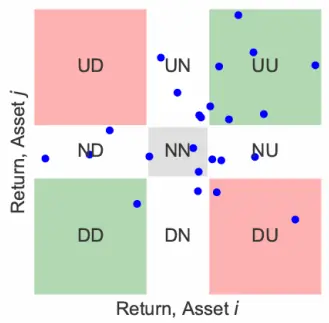
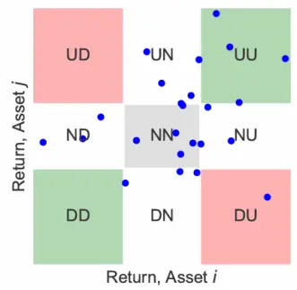
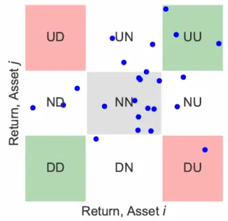
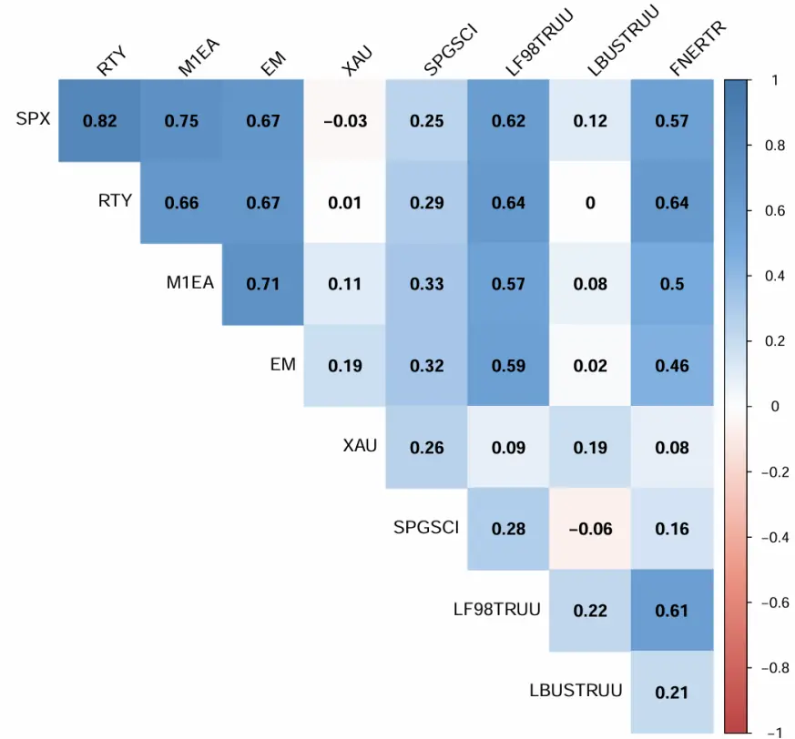
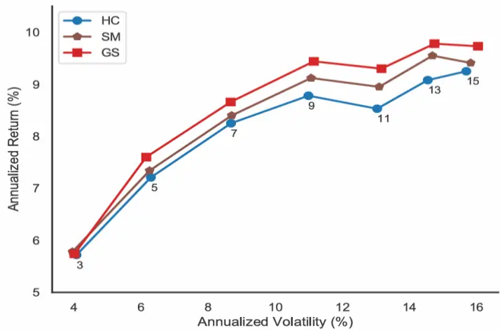
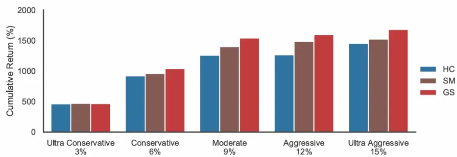
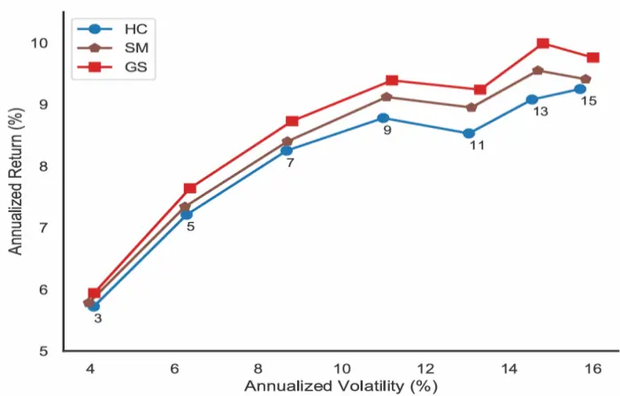
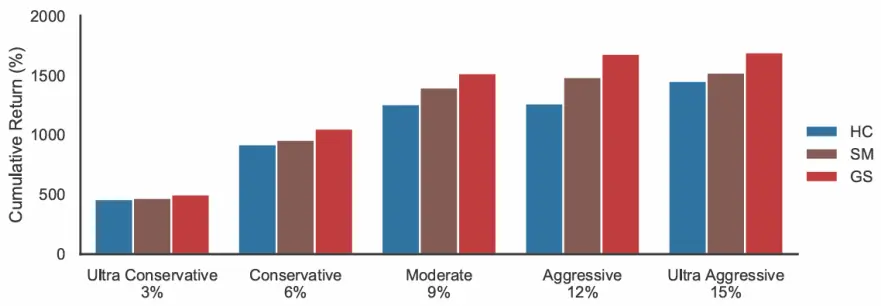
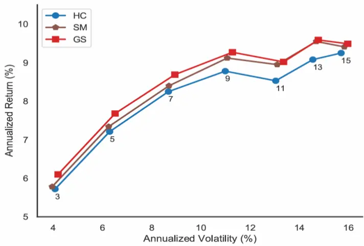
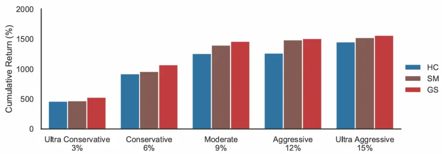

# Gerber统计法：估计投资组合协方差矩阵的新方法

# ——精品文献解读系列（三十四）

## 本报告导读：

本文介绍了一种新的组合协方差矩阵估计法——Gerber统计法，一种用于协方差矩阵估计的稳健协动测量方法。实证证明，相比于传统的历史协方差以及 Ledoit-Wolf(2004) 的收缩估计法，使用 Gerber 统计法估计协方差矩阵在进行资产配置时可以获得更高的收益率和夏普比率，表现了其在处理金融时间序列数据时的独特优势和实际应用价值。

## 摘要：

le_Summary] 文献概述：本篇为读者解读的文献是 Gerber, S., Markowitz, H. M.,Ernst, P. A., Miao, Y., Javid, B., & Sargen, P. (2021, July 6) 发表的工作论 The Gerber statistic: A robust co-movement measure for portfoliooptimization。在投资组合优化中，协方差矩阵的准确估计至关重要。传统方法如历史协方差矩阵和 Ledoit-Wolf 收缩法虽然广泛应用，但在面对极端值和噪声时存在显著局限性。Gerber 统计法通过扩展Kendall's Tau，引入阈值以忽略小幅波动和极端值，提供了更稳健的协动性测量方法。本文在 Markowitz 的均值-方差优化框架下，比较了Gerber 统计法与传统方法的性能。

理论介绍：Gerber 统计法基于变量自身波动率设计了高低阈值，通过计算 2 个变量相对于阈值同时运动的频率，来计算变量之间的相关系数，即 Gerber 统计量，进而计算资产之间的协方差矩阵。对于传统的相关系数，由于只计算同向或反向运动的频率，Gerber 统计量对变量间极大的共动性不敏感，同时由于阈值的存在，也会忽略较小的噪音扰动，从而能够提升协方差矩阵估计的准确性，同时也不依赖于样本协方差的输入。

实证结果：在Markowitz的均值方差投资组合优化框架内，针对9种资产，对 Gerber 统计法估计协方差矩阵的效果进行了实证研究。结果表明，相比于传统的历史协方差以及 Ledoit-Wolf (2004) 的收缩估计法，使用 Gerber 统计法估计协方差矩阵在进行资产配置时可以获得更高的收益率和夏普比率。

总结：Gerber 统计法在提高累计收益率和夏普比率方面表现优异，表明其在处理金融时间序列数据时的独特优势和实际应用价值。这一新方法为投资组合管理提供了更有效的工具，增强了在复杂市场环境中的适应能力。

风险提示：量化模型失效风险：本篇报告所述文章的结论是基于量化模型和历史数据的得到的，请注意样本外存在失效可能性，详细结论请参考文献原文。

0755-23976911

liukaizhi025861@gtjas.com

登记编号 S0880522110002

## [相关报告 Table_Rep

| 订单流数据特征挖掘的机器学习方法 |  |
| --- | --- |
| 如何构建更有效的股票间动量 | 2024.05.27 |
|  | 2023.11.17 |
| 日夜收益差的形成机制 | 2023.09.27 |
| 防御型股票的特征 |  |
| 基于未来现金流构建新价值因子 | 2023.08.21 |
|  | 2023.07.29 |

感谢实习生唐海昕对本文的贡献。

## 1. 文献概述

投资学是一门学术界与业界紧密结合的学科，其中大类资产配置是这种紧密结合的代表。从Markowitz (1952) 开创现代投资组合理论开始，学术界为业界提供了丰富的理论参考和方法模型，推动了大类资产配置实践的繁荣发展。为了帮助读者及时跟踪学术前沿，我们推出了“精品文献解读”系列报告，从大量学术文献中挑选出精品论文进行剖析解读，为读者呈现大类资产配置领域最新的思路和方法。

## 文献来源：

Gerber, S., Markowitz, H. M., Ernst, P. A., Miao, Y., Javid, B., & Sargen, P. (2021, July 6). The Gerber statistic: A robust co-movement measure for portfolio optimization.

## 文献摘要：

本文旨在介绍 Gerber 统计法，这是一种用于协方差矩阵估计的稳健协动测量方法，可用于构建投资组合。Gerber 统计法对 Kendall's Tau 进行了扩展，它计算的是当振幅超过数据阈值时，序列中同时出现的共动比例。由于该统计量不受极端大和极端小运动的影响，因此特别适用于经常出现剧烈运动和大量噪声的金融时间序列。在 Markowitz 的均值方差投资组合操作框架内，我们考虑了 Gerber 统计法与其他两种常用的股票收益协方差矩阵估计方法的性能对比。这两种常用的股票收益协方差矩阵估计方法是：1. 样本协方差矩阵（也称为历史协方差矩阵）2. Ledoit-Wolf (2004) 提出的样本协方差矩阵收缩法。通过对 30 年内（1990年1月至 2020年 12月）9种资产的分散投资组合进行实证分析，我们发现在几乎所有情况下，Gerber 统计法的收益率都优于历史协方差以及Ledoit-Wolf(2004) 的收缩法。

## 文献评述：

本文介绍了 Gerber 统计法，这是一种用于评估投资组合中股票收益协动性的稳健方法。通过扩展Kendall's Tau，Gerber 统计法能够忽略小幅度的波动和极端值，专注于“实质性”共动性。在与传统的历史协方差矩阵和Ledoit-Wolf 收缩法的比较中，Gerber 统计法展示了更优越的性能，在不同风险目标下实现了更高的累计收益率和夏普比率。研究表明，Gerber 统计法在实际投资组合优化中具有显著优势，并提供了一个不依赖样本协方差矩阵的更为稳健的替代方法。

## 2. 引言

投资组合构建 (Markowitz, 1952, 1959) 依赖于证券收益之间协方差矩阵的可用性。通常，样本协方差矩阵被用作实际协方差矩阵的估计值 (Jobson &Korkie, 1980)。尽管模型不断改进以减轻计算负担并改善估计值的统计特性，但基于乘积矩的估计方法并不稳健，特别是在收益分布包含极端值时(Tukey, 1960; Huber & Ronchetti, 2009; Hampel, 1968, 1974)。稳健估计在一定程度上克服了这些问题 (Shevlyakov & Smirnov, 2011)。

然而，金融时间序列的噪声大，使得标准稳健技术不适用，可能导致相关性估计失真。Gerber 统计法是一种新的共动测量方法，能够忽略低于某一阈值的波动，并限制极端变动的影响，旨在识别“实质性”的共同运动。

本文在 Markowitz的均值-方差优化框架下，比较了Gerber 统计法与历史协方差矩阵和 Ledoit-Wolf (2004) 的收缩估计方法的性能。研究显示，Gerber统计法在概念上的关键优势是不依赖于样本协方差矩阵，且在几乎所有情况下收益均优于其他方法。本文的结构如下：第 3 节介绍 Gerber 统计法的公式，第4节介绍数据集和回溯测试框架，第5节展示实证分析结果，第6节讨论未来研究方向，第7节总结。

## 3. Gerber 统计法的公式

本节旨在阐述 Gerber 统计法和相应的 Gerber 相关矩阵，然后将其转换为Gerber 协方差矩阵，输入均值方差投资组合优化器（第 3.3 节）。首先，我们对Gerber 统计法的计算方法进行必要的说明。

## 3.1 基本公式

我们考虑 $k=1,\dots,K$ 种证券， ${\mathrm{t}}=1,\ldots,{\mathrm{T}}$ 个时间段。让 $r_{tk}$ 成为证券 k在 t 时间段的收益率。令统计量 $m_{ij}(t)$ 的公式为：

$$
\begin{array}{r}{m_{ij}(t)=\left\{\begin{array}{ll}{+1\mathrm{~if~}r_{ti}\geq+H_{i}\mathrm{~and~}r_{tj}\geq+H_{j},}\\{+1\mathrm{~if~}r_{ti}\leq-H_{i}\mathrm{~and~}r_{tj}\leq-H_{j},}\\{-1\mathrm{~if~}r_{ti}\geq+H_{i}\mathrm{~and~}r_{tj}\leq-H_{j},}\\{-1\mathrm{~if~}r_{ti}\leq-H_{i}\mathrm{~and~}r_{tj}\geq+H_{j},}\\{\quad\mathrm{~0~otherwise}.}\end{array}\right.}\end{array}\tag{1}
$$

在上述公式中， $H_{k}$ 是证券k 的阈值，计算公式为：

$$
H_{k}=c*s_{k}\tag{2}
$$

其中，c 是某个分数（通常为 0.5，但也可能增加到 0.7 或 0.9）， $s_{k}$ 是证券k 收益的样本标准差。当然，在计算阈值时可以使用比标准偏差更稳健的测量方法，但这超出了本报告的范围。

观察公式 (1) 可知：

（1） 如果序列 i 和j 在时间 t 同时向同一方向突破阈值，则联合观测值$m_{ij}(t)$ 设为 +1。

（2） 如果序列 i 和j 在时间 t 同时向相反方向突破阈值，则联合观测值$m_{ij}(t)$ 设为 -1。

（3） 如果在时间 t 时至少有一个序列没有突破阈值，则联合观测值$m_{ij}(t)$ 设为 0。

此后，我们将把两个成分在同方向移动时均穿透阈值的资产对称为“一致”资产对，把两个成分在相反方向移动时均穿透阈值的资产对称为“不一致”

资产对。

进一步，我们定义一对资产的Gerber 统计量为:

$$
g_{ij}=\frac{\sum_{t=1}^{T}m_{ij}(t)}{\sum_{t=1}^{T}\bigl|m_{ij}(t)\bigr|}\tag{3}
$$

设 $\mathrm{n_{ij}^{c}}$ 为资产 i 和 j 的“一致”资产对的对数，nijd 为“不一致”资产对的对数，则公式 (3)等价于:

$$
g_{ij}=\frac{n_{ij}^{c}-n_{ij}^{d}}{n_{ij}^{c}+n_{ij}^{d}}\tag{4}
$$

易知，若所有k 的阈值 $H_{k}$ 设为零，则 (4) 中的统计量与 Kendall's Tau 相同。

由于 (4) 中的 Gerber 统计量依赖的是同时突破阈值的次数，而不是突破阈值的程度，因此它对变量的极端变动不敏感。同时，由于一个序列必须在超过阈值后才会被计算（即 $m_{ij}$ 的值为 +1 或 -1），因此Gerber统计量对可能只是噪音的微小变动也不敏感。

## 3.2 Gerber 矩阵

现在我们来讨论 Gerber 矩阵G，即第i 行，第j 列中是 Gerber 统计量 $g_{ij}$ 的矩阵。让我们定义 $\pmb{R}\in\mathbb{R}^{\mathrm{T}\times\mathrm{K}}$ 为收益率矩阵，其第 t 行和第 k 列的条目为 $r_{tk}$ 。此外，让U成为一个指标矩阵，其大小与 R相同，用于表示超过上限阈值的回报，其元素为 $u_{tj}$ ，即：

$$
u_{tj}={\left\{\begin{array}{ll}{1}&{{\mathrm{if~}}r_{tj}\geq+H_{j},}\\{0}&{{\mathrm{otherwise.}}}\end{array}\right.}
$$

根据这一定义，超过上限阈值的样本数的矩阵为：

$$
\pmb{N}^{\mathrm{UU}}=\pmb{U}^{\top}\pmb{U}.\tag{5}
$$

$N^{\mathrm{UU}}$ 的第 $ij$ 个元素 $\mathrm{n_{ij}^{UU}}$ 是时间序列 i 超过上阈值和时间序列j 同时超过上阈值的样本数。

设D是一个指标矩阵，其大小与R相同，用于表示低于下临界值的收益，其元素 $d_{tj}$ 为

$$
d_{tj}={\left\{\begin{array}{ll}{1}&{{\mathrm{if~}}r_{tj}\leq-H_{j},}\\{0}&{{\mathrm{otherwise.}}}\end{array}\right.}
$$

低于下限的样本数矩阵可写成：

$$
\pmb{N}^{\mathrm{DD}}=\pmb{D}^{\top}\pmb{D}.\tag{6}
$$

$N^{\mathrm{DD}}$ 的第ij 个元素 $\mathrm{n_{ij}^{DD}}$ 是时间序列i 低于低阈值和时间序列j 同时低于低请务必阅读正文之后的免责条款部分 5of19阈值的样本数。

有了(5) 和(6)，包含一致数对的矩阵为：

$$
N_{\mathrm{CONC}}=N^{\mathrm{UU}}+N^{\mathrm{DD}}=U^{\top}U+D^{\top}D\tag{7}
$$

包含不一致数对的矩阵为：

$$
{\pmb{N}}_{\mathrm{DISC}}={\pmb{U}}^{\top}{\pmb{D}}+{\pmb{D}}^{\top}{\pmb{U}}\tag{8}
$$

现在，我们可以用下面的矩阵形式写出与 (4) 中的 Gerber 统计量相对应的Gerber matrix G：

$$
{\pmb G}=({\pmb N}_{\mathrm{CONC}}-{\pmb N}_{\mathrm{DISC}})\oslash({\pmb N}_{\mathrm{CONC}}+{\pmb N}_{\mathrm{DISC}})
$$

其中符号 $\oslash$ 代表 Hadamard 除法。相应的 Gerber 协方差矩阵 $\pmb{\Sigma}_{\mathbf GS}$ 相应定义为：

$$
\Sigma_{{\mathrm GS}}=\mathrm{diag}(\pmb{\sigma}){\cal G}\mathrm{diag}(\pmb{\sigma})\tag{9}
$$

其中，σ是历史资产收益率样本标准差的N ×1向量。

证券收益的协方差矩阵必须是半正定的。然而，在处理真实数据时，我们发现 (9) 中的协方差矩阵往往不是半正定的。我们进而开发了 Gerber 统计量的另一种形式，它能产生一个半正定的协方差矩阵。

在讨论Gerber 统计量的修正形式时，我们首先考虑下表 1 中两只证券之间关系的图形表示。在该表中，字母 U代表证券收益率高于上阈值（即上涨）的情况，字母 N 代表证券收益率介于上阈值和下阈值之间（即中性）的情况，字母 D 代表证券收益率低于下阈值（即下跌）的情况。在表 1 中，行代表证券 i 的分类，列代表证券j 的分类。行与列之间的界限是所选的阈值。例如，如果在 t 时刻，证券 i 的收益率高于上阈值，则该观测值位于顶行。如果在同一时间 t，证券j的收益率位于两个阈值之间，则该观测值位于中间一列。因此，该具体观测值将位于UN 区域。

Table 1: A graphical relationship between two securities.

$$
\begin{array}{lll}{UD}&{UN}&{UU}\\{ND}&{NN}&{NU}\\{DD}&{DN}&{DU}\end{array}
$$

在 $t=1,\dots,T$ 的历史中，会有观察结果分散在 9 个区域中。设 $n_{ij}^{pq}$ 为证券 i 和j 的收益率分别位于 p 和 q 区域的观测值的数量，条件为 $p,q\in$ $\{U,N,D\}$ 。有了这个符号，我们就可以写出与（4）中的统计量等价的表达式，即：

$$
\mathrm{\Delta g_{ij}=\frac{n_{ij}^{UU}+n_{ij}^{DD}-n_{ij}^{UD}-n_{ij}^{DU}}{n_{ij}^{UU}+n_{ij}^{DD}+n_{ij}^{UD}+n_{ij}^{DU}}}\tag{10}
$$

如前所述，我们必须改变(4)中的分母，以获得Gerber 矩阵，从而得到半正请务必阅读正文之后的免责条款部分 6of19

定的相应协方差矩阵。根据下文第 3.3 节对Gerber 统计量的说明，我们的另一种选择是：

$$
\mathrm{\bf g_{\mathrm{ij}}=\frac{n_{\mathrm{ij}}^{UU}+n_{\mathrm{ij}}^{DD}-n_{\mathrm{ij}}^{UD}-n_{\mathrm{ij}}^{DU}}{T-n_{\mathrm{ij}}^{NN}}}\tag{11}
$$

（本文 2019 年版（Gerber et al. (2019)）中记载的另一种选择是：

$$
\mathrm{g_{ij}=\frac{n_{ij}^{UU}+n_{ij}^{DD}-n_{ij}^{UD}-n_{ij}^{DU}}{\sqrt{n_{ij}^{(A)}n_{ij}^{(B)}}},\frac{j!}{\mathcal{F}}\Psi\ u_{ij}^{(A)}=n_{ij}^{UU}+n_{ij}^{UN}+n_{ij}^{UD}+n_{ij}^{DU}+n_{ij}^{DU}+n_{ij}^{DN}+n_{ij}^{DD},}
$$

$$
\mathrm{n_{ij}^{(B)}=n_{ij}^{UU}+n_{ij}^{NU}+n_{ij}^{UD}+n_{ij}^{DU}+n_{ij}^{ND}+n_{ij}^{DD}+n_{ij}^{DD}\ }
$$

在第 4 节进行的实证研究中，对于所考虑的Gerber阈值 c 的所有情况，我们总是观察到与(11) 中Gerber 统计量相对应的协方差矩阵是半正定的。

在本节的最后，我们将对(11) 中的修正Gerber 统计量进行更详细的讨论。$g_{ij}$ 的一些直接性质如下：

（1） 与 Pearson 相关系数和 Kendall’s Tau 相关系数一样，Gerber 统计量g 的值必须位于区间 [-1, 1]。

（2） 根据定义，(11) 中的分母为非负。如果 $n_{ij}^{UU}$ 和 $\mathrm{n_{ij}^{DD}}$ 之和超过 $\mathrm{n_{ij}^{UD}}$ 和 $\mathrm{n_{ij}^{DU}}$ 之和，则分子为正；如果这两个和相等，则分子为零；否则分子为负。

现在我们来讨论 Gerber 统计量与标准 Pearson 相关系数在概念上的一个重要区别。Pearson 相关系数输入了资产 i 和j 的样本协方差以及资产 i 和j的样本标准差（以及资产i 和j的样本平均值）。根据定义，样本协方差、样本平均值和样本标准差是对所有数据点进行计算的，无论这些点对应的是有意义的共线运动还是纯粹的噪声。这就导致 Pearson 相关系数对可能仅由噪声引起的微小共同运动高度敏感。与此相反，Gerber 统计量的分子中只包含数据集的子集，该子集包含与有意义的共同移动相对应的点（等同于Gerber统计量剔除了噪声数据）。这就是Gerber统计量比标准Pearson相关系数更稳健的主要原因。此外，需要注意的是，Gerber 统计量的计算不需要任何矩估计。事实上，我们可以用一种更稳健的标准差度量来代替公式（2）中的 $s_{k},$ ，从而实现 Gerber 统计量的完全自由算法。我们将在今后的工作中探讨这一方法的候选方案。

## 3.3 Gerber 统计量说明

现在我们讨论图 1，以说明 (11) 中的 Gerber 统计量是如何在给定的一对资产之间计算出来的。在图 1 中，我们计算了 S&P 500 (SPX) 和黄金 (XAU)这两种资产在 2019年 1 月至 2020 年 12 月期间的 24 对月度回报。考虑到(2) 中定义的 $H_{k}$ 临界值可以改变，我们考虑了三个不同的 c 值：c = 0.5、c$=0.7$ 和 ${\mathfrak{c}}=0.9$图 1：在 c = 0.5、c = 0.7 和 c = 0.9 的条件下，评估 Gerber 统计量的成对回报图示

(a) c = 0.5

(b) c = 0.7

(c) c = 0.9
数据来源：The Gerber statistic: A robust co-movement measure for portfolio optimization

每个配对月度收益率显示为一个蓝点。绿色区域内的点代表一致的配对，红色区域内的点代表不一致的配对。资产 i 和 j 的收益序列通过公式 (2) 计算出的上下限转换为{-1，0，1}。

我们在(11) 中选择Gerber 统计量分母的关键直觉来自以下观察：随着 c 变大，区域 NN 中会包含更多的数据点。(11) 中的分母会减去这些点，从而使统计量变得更稳健，对数据中的噪声不那么敏感。我们将 Gerber 统计量的这种人工痕迹称为“数据中的噪声”。

现在，我们通过计算每个区域内的点数来计算Gerber 统计量。下面给出了c = 0.5、c = 0.7 和 c = 0.9 这三种情况下的结果。所有结果的 Gerber 统计量都不同于 0.22 的标准 Pearson 相关系数。

(1) 在 c = 0. 5 （图 1(a)），9 个区域的计数分别是 $n_{ij}^{UD}=0,n_{ij}^{UN}=4$

$$
n_{ij}^{UU}=7,n_{ij}^{ND}=3,n_{ij}^{NN}=3,n_{ij}^{NU}=3,n_{ij}^{DD}=1,n_{ij}^{DN}=
$$

$1andn_{ij}^{DU}=2$ 。根据 (11) 中Gerber 统计量的定义，我们可以得到：

$$
\mathrm{g_{ij}=\frac{7+1-0-2}{24-3}=\frac{2}{7}\approx0.286}
$$

(2) 在 c = 0.7 （图 1(b)），9个区域的计数分别是 $n_{ij}^{UD}=0,n_{ij}^{UN}=5$

$$
n_{ij}^{UU}=4,~{\bf n}_{ij}^{ND}=3,~n_{ij}^{NN}=6,~n_{ij}^{NU}=2,~n_{ij}^{DD}=0,~n_{ij}^{DN}=
$$

3 and nijDU = 1。根据 (11) 中Gerber 统计量的定义，我们可以得到：

$$
\mathrm{{g}_{ij}=\frac{4+0-0-1}{24-6}=\frac{1}{6}\approx0.166}
$$

(3) 在 c = 0.9（图 1(c)），9个区域的计数分别是 $n_{ij}^{UD}=0,n_{ij}^{UN}=3$

$$
n_{ij}^{UU}~=3~{\mathrm{\bf~n}}_{ij}^{ND}=3,~n_{ij}^{NN}=11,~n_{ij}^{NU}=2,~n_{ij}^{DD}=0,~n_{ij}^{DN}=
$$

1 and $n_{ij}^{DU}=1$ 。根据 (11) 中Gerber 统计量的定义，我们可以得到：

$$
\mathrm{g_{ij}={\frac{3+0-0-1}{24-11}}}={\frac{2}{13}}\approx0.154
$$

## 4. 实证研究

在本节中，我们将开始对 Gerber 统计法的性能进行实证研究，并与两种常用的用于构建投资组合的协方差估计方法（历史协方差以及 Ledoit-Wolf(2004) 的收缩估计法）进行比较。

## 4.1 数据集

我们所考虑的数据集是 1988年 1月至 2020年 12月期间 9种资产的多样化集合，具体如下：

（1）S&P 500 index（美国大盘股）

（2）Russell 2000 index（美国小型股）

（3）MSCI EAFE index（涵盖除美国和加拿大之外的 21 个发达国家的大盘股和中盘股）

（4）MSCI Emerging Markets index（涵盖 27 个新兴市场的大盘股和中盘股）

（5）Bloomberg Barclays U.S. Aggregate Bond index（包括国债、政府相关债券和公司债券）

（6）Bloomberg Barclays U.S. Corporate High Yield Bond index（美国高收益公司债）

（7）Real estate FTSE NAREIT all equity REITS index（REITS 房地产信托）

（8）S&P GSCI Goldman Sachs Commodity index（高盛商品指数）

上述9种资产在1988年1月至2020年12月期间的月度总回报(TR) 来自彭博终端。在此期间，每种资产均包含 396 个观测值。彭博社提供的 TR 指数跟踪资本收益，并计入通过资产再投资获得的股息或利息等现金分配。正如我们将在第 4.3.1 节详述的，我们的均值-方差优化回溯测试程序需要两年的月度回报来初始化第一个投资组合。因此，下文表 2 中 9 种资产投资组合月度总回报的描述性统计是从 1990年 1月到 2020年 12月，而不是1988 年 1 月到 2020 年 12 月。

表 2： 9种资产组合的描述性统计

| Index | Arithmetic Return (%) | Geometric Return (%) | Annualized SD (%) |
| --- | --- | --- | --- |
| S&P 500 TR | 11.90 | 10.47 | 14.63 |
| Russel 2000 TR | 11.74 | 10.14 | 19.36 |
| MSCI EAFE TR | 6.60 | 4.77 | 16.89 |
| MSCI Emerging Market TR | 12.13 | 7.61 | 22.31 |
| U.S. Agg Bond TR | 6.11 | 6.00 | 3.57 |
| U.S. Corp High Yield Bond TR | 9.35 | 8.36 | 8.74 |
| REITS TR | 11.97 | 10.37 | 18.32 |
| Gold TR | 6.04 | 5.03 | 15.26 |
| S&P GSCI TR | 5.27 | 2.36 | 21.48 |

数据来源：The Gerber statistic: A robust co-movement measure for portfolio optimization

描述性统计采用 1990年 1月至 2020年 12月的月度数据计算。TR 表示总回报数据，包括资本利得和股息再投资带来的资产增值。

由于上述 9 种资产已充分分散，我们预计不会观察到强烈的成对相关结构。下图 2 显示了1990年1月至 2020年12月，9种资产总回报序列的相关矩阵，证实了这一预期。

图 2：9种资产之间的相关矩阵热图（给定 1990 年 1 月至 2020 年 12 月的总回报序列）

数据来源：The Gerber statistic: A robust co-movement measure for portfolio optimization

## 4.2 对照方法

如前所述，我们要考虑的 Gerber 统计法的两种对照方法是历史协方差矩阵和 Ledoit-Wolf (2004) 的收缩法。历史协方差矩阵 (HC) 是通过 Pearson(Jobson & Korkie, 1980) 计算出的样本相关相关系数计算出来的。现在我们简要回顾一下 Ledoit-Wolf (2004) 引入的收缩估计法。

Ledoit-Wolf (2004) 提出了结构协方差矩阵 $\pmb{\Sigma}_{\mathrm{F}}$ 和样本历史协方差矩阵 $\pmb{\Sigma}_{\mathrm{HC}}$ 的凸组合，从而得到收缩矩阵 $\pmb{\Sigma}_{S\mathbf{M}}$ ：

$$
{\pmb{\Sigma}}_{\mathrm{SM}}=\delta{\pmb{\Sigma}}_{\mathrm{F}}+(1-\delta){\pmb{\Sigma}}_{\mathrm{HC}}\tag{12}
$$

其中 δ 是一个介于 0 和 1 之间的收缩常数。 此后，我们将这种技术称为“收缩法” (SM)。其名称来源于这样一个事实，即样本协方差矩阵被“收缩”为一个目标结构化估计值。在计算 $\pmb{\Sigma}_{F}$ 时，Ledoit-Wolf (2004) 建议采用恒定相关模型，即样本相关矩阵中所有对角元素的平均样本相关性（见 Ledoit-Wolf (2004) 附录A）。他们进而构建了相应的协方差矩阵。

在指定δ 的选择时，Ledoit-Wolf (2004) 建议通过最小化渐近真实协方差矩阵Σ 与收缩估计值 $\pmb{\Sigma}_{SM}$ 之间的弗罗贝尼斯范数来找到收缩参数。

在本节的最后，我们将强调 Gerber 统计法与 Ledoit-Wolf (2004) 的收缩方法在概念上的一些关键区别。我们认为主要区别如下：

（1） 从上式(12) 可以看出，收缩法 (SM) 直接输入样本协方差矩阵$\pmb{\Sigma}_{HC}$ 。而上文(11) 中给出的Gerber 统计法不依赖于样本协方差矩阵的输入。Gerber 统计法可计算一致和不一致的配对计数，从而将Kendall's Tau 扩展到投资组合管理中。

（2） Gerber 统计法的框架是在一个数据集（本文中为历史收益数据集）上考虑资产的一致和不一致资产对，这一框架可以自然地扩展到多个数据集上。例如，假设投资组合经理希望同时考虑三个数据集：历史收益率、交易量和隐含波动率。此外，假设该投资组合经理希望将A 和B 两种资产视为一致资产，条件是这两种资产的收益率高于x%，同时交易量增长超过y%，隐含波动率增长超过z%，其中x、y 和 z 是大于零的任意（有限）实数。Gerber 统计法为设计这样的规则（以及更复杂的基于规则的系统）提供了一个自然的框架，可以用来构建上表1 并计算相应的Gerber 统计量。相比之下，基于矩的方法（如缩减法和历史协方差法）并没有提供同样的自然框架来考虑这种基于规则的系统以确定共动性。

至于 Gerber 统计法与 Ledoit-Wolf (2004) 的收缩法之间的相似之处，应该指出的是，收缩常数 δ 控制着样本协方差矩阵的收缩程度。Gerber 统计量有一个类似的值 c（如公式 (2) 所示）。c 值决定了阈值 $H_{k}$ 的大小。如第 3.3节图 1 所示，可将 c 值从 0.5 增加到 0.7（或 0.9），以从数据集中去除更多噪声。

## 4.3 优化框架

我们将考虑的投资组合优化框架是均值-方差优化 (MVO) (Markowitz, 1952)。我们简要回顾一下关键步骤和必要的符号，以便在第 4.3.1 节中严格制定回溯测试程序。

均值-方差优化框架的目的是在已知每种资产 $i\in\{1,\cdots,K\}$ 的未来资产特征（即预期收益率 $\mu_{i}$ 、方差 $\sigma_{ii}^{2}$ 和协方差 $\sigma_{ij}$ ）的情况下，在一定的风险和收益限制条件下找到最优资产配置（或投资组合权重 $\omega_{i})$ ）。投资组合的预期收 益 率 及 其 方 差 可 推 导 为 $\mu_{P}=\pmb{\omega}^{T}\pmb{\mu}$ 和 $\begin{array}{r}{\sigma_{P}^{2}=\pmb{\omega}^{T}\pmb{\Sigma}\pmb{\omega}}\end{array}$ ， 其 中 $\pmb{\omega}=$ $[\omega_{1},\cdots,\omega_{K}]$ 是 K 种资产的投资组合权重向量， $\pmb{\mu}=[\mu_{1},\cdots,\mu_{K}]$ 是预期收益率向量，Σ 是资产收益率的协方差矩阵。

有交易成本的长期MVO 表示法被表述为以下优化问题：

$$
\mathrm{Maximize:}\ \pmb{\omega}^{T}\pmb{\mu}-\psi\pmb{1}^{T}|\pmb{\omega}-\pmb{\omega}_{0}|\tag{13}
$$

$$
\begin{array}{c}{{\mathrm{Subject:o:}\pmb{\omega}^{T}\pmb{\Sigma}\pmb{\omega}\leq\sigma_{\mathrm{target}}^{2}}}\\{{\pmb{\omega}^{T}\pmb{1}=\mathbf{0}}}\\{{0\leq\omega_{K}\leq1,\forall k=\{1,2,\cdots,N\}}}\end{array}
$$

上述投资组合优化问题最大化了投资组合 ${\pmb{\omega}}^{T}{\pmb{\mu}}$ 的预期收益，并扣除了交易成本或 $\mathbf{1}^{T}|\pmb{\omega}-\pmb{\omega}_{0}|$ 。该交易项跟踪投资组合权重变化的比例成本，即新权重向量 $\pmb{\omega}$ 与之前权重向量 $\pmb{\omega}_{0}$ 的绝对偏差。交易惩罚有助于调节投资组合的周转率，降低相关的交易成本。符号 $\psi$ 是一个固定比例的交易成本，在本文中选择为 10 个基点或 0.1%。投资组合权重向量 $\pmb{\omega}$ 受 Markowitz(1952) 中给出的标准约束条件限制，不允许做空。因此，我们可以通过求解确定性最优化问题 (13)，为具有风险约束 $\sigma_{target}$ 和换手率惩罚 ψ 的投资者求得最优投资组合权重 $\omega^{*}$ 。给定周转率约束 $\psi$ ，每个风险水平 $\sigma_{target}\in$ $\mathrm{R}^{+}$ 的最优解 $\pmb{\omega}\in[0,1]^{\mathrm{N}}$ 的集合构成有效前沿。前沿上的每一点都决定 $\vec{\mathsf{J}}-$ 个有效的投资组合，它能在预先规定的风险水平下 $\dot{\mathcal{P}}$ 生尽可能高的收益。

现在要做的就是提供预期资产收益向量 μ 和资产收益协方差矩阵 Σ 的估计值。资产 i 在t 时间的预期收益率或 $\mu_{ti}$ 是利用其历史收益率的样本均值估算的，其回溯窗口为T 个月或 $\begin{array}{r}{\mu_{ti}=\frac{1}{T}\sum_{d=t-1}^{t-T}r_{di}}\end{array}$ 。对于协方差矩阵Σ，我们在以下三种对照方法中对收益率进行基准比较。

（1） 历史协方差法 (HC)；

（2） Ledoit-Wolf (2004) 的收缩法 (SM)；

（3） Gerber 统计法 (GS)；

相应的协方差矩阵分别用 $\pmb{\Sigma}_{\mathrm{HC}}$ $\pmb{\Sigma}_{S\mathbf{M}}$ 和 $\pmb{\Sigma}_{\mathrm{GS}}$ 表示。 我们可以回顾一下第 3.2节中的 $\pmb{\Sigma}_{\mathrm{GS}}=\mathrm{diag}(\pmb{\sigma})\pmb{G}\mathrm{diag}(\pmb{\sigma})$ ，其中 G 是由 (11) 中的 Gerber 统计量得到的Gerber矩阵，σ是历史资产收益率样本标准差的 $\mathrm{~N~}\times1$ 向量。

## 4.3.1 投资组合回测规则

我们采用以下回溯测试程序来衡量不同协方差估计方法在投资组合优化下的表现。自 1990年 1月起，每月月初，利用T = 24个月回溯窗口中当前资产列表的月收益率来估计预期收益率向量 μ 和协方差矩阵Σ。然后，在给定风险目标 $\sigma_{target}$ 的情况下，应用二次优化器求解最佳投资组合权重向量 $\omega^{*}$ 。然 $\mathcal{F}$ ，我们根据最优权重向量 $\omega^{*}$ 重新平衡之前的投资组合，并将优化后的投资组合持有一个月。

在一个月结束时，通过 ${{\pmb{\omega}}^{\ast T}}\tilde{\pmb{r}}$ 计算组合的已实现收益，其中 r̃ 是本月已实现资产收益的向量。换句话说，我们的投资组合是按月重新平衡的。我们重复这一过程，将样本内期间向前推移一个月，并计算下一个月的更新有效投资组合。这种滚动窗口投资程序的优势在于能更好地适应市场结构变化，同时也有助于改善数据挖掘偏差。由于初始化第一个投资组合需要两年的月度回报，因此我们的绩效评估范围为1990年 1月至2020年12月。

## 5. 经验结果

利用第4.1 节中介绍的数据集和第4.3 节中考虑的交易成本，并采用第4.3.1

节中的回溯测试算法，我们考虑了 Gerber 统计法 (GS) 与历史协方差 (HC)以及 Ledoit-Wolf (2004) 的收缩法 (SM) 在等式 (2) 中给出的三个不同临界值c (c = 0.5、c = 0.7 和 c = 0.9)下的性能比较。

## 5.1 临界值 c = 0.5

我们首先研究了阈值为 c = 0.5 的 Gerber 统计法 (GS)。主要结论如下：

（1） 对于所有风险目标水平，Gerber 统计法都比 HC 统计法提供了更有利的风险收益状况。除了 3% 的超保守风险目标水平外，Gerber 统计法的风险收益情况比 SM 更有利（见下图 3）。

（2） 在所有风险目标下，Gerber 统计法的累计收益都高于HC。除了3%这一非常保守的风险目标水平外，Gerber 统计法的累计收益都高于SM（见下图4 和表 3）。

（3） 在投资组合换手率、偏度和峰度值与 HC 和 SM 投资组合相似的情况下，Gerber 统计法在所有风险目标水平上都比 HC 投资组合获得更高的几何收益率和夏普比率（见本节末表 6）。除了非常保守的 3%风险目标水平外（见本节末表 6），在所有其他风险目标水平上，Gerber 统计法的几何收益率和夏普比率均高于SM。

（4） 在某些风险目标水平下，GS 的平均几何年收益率比 SM 高 30 多个基点，比 HC 高 75 个基点。鉴于 HC 的局限性 (Jobson & Korkie(1980)；Ledoit-Wolf (2004))，后一个结果并不令人惊讶，因此我们转而关注 GS 相对 SM 的优势。对于 9%的风险目标水平，在 1990-2020年期间，GS 的平均几何年化收益率比SM 高出约32 个基点，其累计收益率比 SM 高出 10.16%（见本节末尾的表 6）。就 15%的风险目标水平而言，在1990-2020年期间，GS 的平均几何年回报率比 SM 高出约 32 个基点，其累计回报率比 SM 高出 10.32%（见本节末尾的表6）。

图 3： c = 0.5不同风险目标水平的投资组合表现

数据来源：The Gerber statistic: A robust co-movement measure for portfolio optimization

图 4：c = 0.5 不同风险目标水平的投资组合累计回报百分比 (1990-2020)

数据来源：The Gerber statistic: A robust co-movement measure for portfolio optimization

表 3：c = 0.5不同风险目标水平的投资组合账户期末美元价值

| Method | HC | SM | GS |
| --- | --- | --- | --- |
| Ultra Conservative (3%) | $561,276.27 | $570,161.82 | $564,972.97 |
| Conservative (6%) | $1,020,099.74 | $1,058,096.16 | $1,138,042.25 |
| Moderate (9%) | $1,356,911.18 | $1,497,204.43 | $1,639,089.77 |
| Aggressive (12%) | $1,364,148.39 | $1,584,491.30 | $1,695,255.50 |
| Ultra Aggressive (15%) | $1,551,338.93 | $1,622,590.70 | $1,779,756.04 |

数据来源：The Gerber statistic: A robust co-movement measure for portfolio optimization

## 5.2 临界值 c = 0.7

我们接着研究c = 0.7 的Gerber 统计法（GS）。主要结论如下：

（1） 在所有风险目标水平下，Gerber 统计法都比 HC 和 SM 提供了更有利的风险收益状况（见下图 5）。

（2） 在所有风险目标水平下，Gerber 统计法的几何收益率和夏普比率均高于 HC 和 SM，其投资组合换手率、偏斜度和峰度值也与 HC 和SM 相似（见本节末尾的表6 和表7）。

（3） 在某些风险目标水平下，GS 的平均几何年化收益率比 SM 高 40 多个基点，比HC 高 90 多个基点。鉴于HC 的局限性 (Jobson & Korkie(1980)；Ledoit-Wolf (2004))，后者不足为奇，因此我们将重点放在GS 相对 SM 的优势上。就 12%的风险目标水平而言，在 1990-2020年期间，GS 的平均几何年化收益率比 SM 高出约 41 个基点，其累计收益率比 SM 高出 13.12%（见本节末尾的表 6 和表 7）。就15%的风险目标水平而言，在1990-2020年期间，GS 的平均几何年回报率比 SM 高约 35 个基点，其累计回报率比 SM 高 11.18%（见本节末尾的表6 和表7）。

图 5：c = 0.7不同风险目标水平的投资组合表现

数据来源：The Gerber statistic: A robust co-movement measure for portfolio optimization

图 6：c = 0.7不同风险目标水平的投资组合累计回报百分比 (1990-2020)

数据来源：The Gerber statistic: A robust co-movement measure for portfolio optimization

表 4： c = 0.7不同风险目标水平的投资组合账户期末美元价值

| Method | HC | SM | GS |
| --- | --- | --- | --- |
| Ultra Conservative (3%) | $561,276.27 | $570,161.82 | $599,043.19 |
| Conservative (6%) | $1,020,099.74 | $1,058,096.16 | $1,151,575.55 |
| Moderate (9%) | $1,356,911.18 | $1,497,204.43 | $1,617,126.27 |
| Aggressive (12%) | $1,364,148.39 | $1,584,491.30 | $1,779,267.42 |
| Ultra Aggressive (15%) | $1,551,338.93 | $1,622,590.70 | $1,792,846.87 |

数据来源：The Gerber statistic: A robust co-movement measure for portfolio optimization

## 5.3 临界值 c = 0.9

我们接着研究c = 0.9 的Gerber 统计法（GS）。主要结论如下：

（1） 在所有风险目标水平下，Gerber 统计法都比 HC 和 SM 提供了更有请务必阅读正文之后的免责条款部分 15of19利的风险收益状况（见下图 7）。

（2） 在所有风险目标水平下，Gerber 统计法的累计回报都优于 HC 和SM（见下图8 和表 5）。

（3） 在所有风险目标水平下，Gerber 统计法的几何收益率和夏普比率均高于SM 和HC，其投资组合换手率、偏斜度和峰度值与HC 和SM相似（见本节末尾的表 6 和表7）。

（4） 在3%和6%的风险目标水平下，GS 的平均几何年回报率分别比SM高出约 32 个基点和 35 个基点。1990-2020 年期间的累计回报分别比 SM 高 12.11%和 11.67%（见本节末表 6 和表 7）。我们还注意到，在6%的风险目标水平上，GS 的平均几何年化回报率比HC 高48 个基点以上。

图 7：c = 0.9不同风险目标水平的投资组合表现

数据来源：The Gerber statistic: A robust co-movement measure for portfolio optimization

图 8：c = 0.9不同风险目标水平的投资组合累计回报百分比 (1990-2020)

数据来源：The Gerber statistic: A robust co-movement measure for portfolio optimization

表 5：c = 0.9不同风险目标水平的投资组合账户期末美元价值

| Method | HC | SM | GS |
| --- | --- | --- | --- |
| Ultra Conservative (3%) | $561,276.27 | $570,161.82 | $627,077.52 |
| Conservative (6%) | $1,020,099.74 | $1,058,096.16 | $1,169,911.24 |
| Moderate (9%) | $1,356,911.18 | $1,497,204.43 | $1,560,198.02 |
| Aggressive (12%) | $1,364,148.39 | $1,584,491.30 | $1,607,572.21 |
| Ultra Aggressive (15%) | $1,551,338.93 | $1,622,590.70 | $1,660,628.94 |

数据来源：The Gerber statistic: A robust co-movement measure for portfolio optimization

表 6： 基于 HC、SM 和 GS 的投资组合在不同风险目标水平下的绩效指标

|  | Ultra-Conservative (3%) |  |  | Conservative (6%) |  |  | Moderate (9%) |  |  | Aggressive (12%) |  |  | Ultra-aggressive (15%) |  |  |
| --- | --- | --- | --- | --- | --- | --- | --- | --- | --- | --- | --- | --- | --- | --- | --- |
| Covariance Method | HC | SM | GS | HC | SM | GS | HC | SM | GS | HC | SM | GS | HC | SM | GS |
| Arithmetic Return (%) | 5.83 | 5.90 | 5.85 | 8.10 | 8.22 | 8.46 | 9.41 | 9.77 | 10.09 | 9.69 | 10.32 | 10.50 | 10.54 | 10.78 | 11.17 |
| Geometric Return (%) | 5.72 | 5.78 | 5.74 | 7.78 | 7.91 | 8.16 | 8.78 | 9.12 | 9.44 | 8.79 | 9.32 | 9.56 | 9.25 | 9.41 | 9.73 |
| Cumulative Return (%) | 461.28 | 470.16 | 464.97 | 920.10 | 958.10 | 1038.04 | 1256.91 | 1397.20 | 1539.09 | 1264.15 | 1484.49 | 1595.26 | 1451.34 | 1522.59 | 1679.76 |
| Annualized SD (%) | 4.07 | 3.95 | 4.01 | 7.49 | 7.50 | 7.43 | 10.99 | 11.07 | 11.15 | 13.82 | 13.92 | 13.98 | 15.70 | 15.83 | 16.05 |
| Annualized Skewness | -0.90 | -0.90 | -0.88 | -0.93 | -0.98 | -0.99 | -0.85 | -0.88 | -0.93 | -0.93 | -0.92 | -0.93 | -0.86 | -0.86 | -0.87 |
| Annualized Kurtosis | 5.21 | 5.37 | 5.31 | 5.53 | 5.85 | 6.07 | 4.97 | 5.11 | 5.60 | 5.27 | 5.30 | 5.56 | 5.34 | 5.42 | 5.55 |
| Maximum Drawdown (%) | -10.03 | -7.67 | -7.73 | -20.30 | -19.10 | -17.74 | -28.83 | -28.03 | -26.58 | -36.47 | -35.22 | -32.47 | -41.76 | -41.13 | -43.01 |
| Monthly 95% VaR (%) | -1.53 | -1.52 | -1.58 | -2.85 | -2.69 | -2.68 | -4.35 | -4.29 | -4.29 | -5.99 | -5.81 | -5.84 | -6.70 | -6.59 | -6.42 |
| Sharpe Ratio | 0.73 | 0.77 | 0.75 | 0.67 | 0.69 | 0.73 | 0.55 | 0.58 | 0.60 | 0.44 | 0.47 | 0.49 | 0.42 | 0.42 | 0.44 |
| Annualized Turnover | 1.80 | 1.39 | 1.58 | 2.78 | 2.53 | 2.49 | 3.69 | 3.40 | 3.37 | 4.45 | 4.27 | 4.19 | 4.46 | 4.33 | 4.23 |

数据来源：The Gerber statistic: A robust co-movement measure for portfolio optimization

表 7：基于 GS 的投资组合对 c=0.5、c=0.7 和 c=0.9 阈值的性能敏感性研究

|  | Ultra-Conservative (3%) |  |  | Conservative (6%) |  |  | Moderate (9%) |  |  | Aggressive (12%) |  |  | Ultra-aggressive (15%) |  |  |
| --- | --- | --- | --- | --- | --- | --- | --- | --- | --- | --- | --- | --- | --- | --- | --- |
| GS Threshold c | 0.50 | 0.70 | 0.90 | 0.50 | 0.70 | 0.90 | 0.50 | 0.70 | 0.90 | 0.50 | 0.70 | 0.90 | 0.50 | 0.70 | 0.90 |
| Arithmetic Return (%) | 5.85 | 6.06 | 6.22 | 8.46 | 8.52 | 8.59 | 10.09 | 10.05 | 9.94 | 10.50 | 10.68 | 10.34 | 11.17 | 11.17 | 10.90 |
| Geometric Return (%) | 5.74 | 5.94 | 6.10 | 8.16 | 8.20 | 8.26 | 9.44 | 9.39 | 9.27 | 9.56 | 9.73 | 9.37 | 9.73 | 9.76 | 9.49 |
| Cumulative Return (%) | 464.97 | 499.04 | 527.08 | 1038.04 | 1051.58 | 1069.91 | 1539.09 | 1517.13 | 1460.20 | 1595.26 | 1679.27 | 1507.57 | 1679.76 | 1692.85 | 1560.63 |
| Annualized SD (%) | 4.01 | 4.08 | 4.19 | 7.43 | 7.62 | 7.76 | 11.15 | 11.20 | 11.28 | 13.98 | 14.02 | 14.15 | 16.05 | 16.01 | 15.97 |
| Annualized Skewness | -0.88 | -1.06 | -1.04 | -0.99 | -1.04 | -0.98 | -0.93 | -0.90 | -0.87 | -0.93 | -0.94 | -0.98 | -0.87 | -0.89 | -0.86 |
| Annualized Kurtosis | 5.31 | 6.26 | 6.13 | 6.07 | 6.30 | 5.84 | 5.60 | 5.42 | 5.12 | 5.56 | 5.58 | 5.66 | 5.55 | 5.59 | 5.38 |
| Maximum Drawdown (%) | -7.73 | -9.11 | -9.67 | -17.74 | -19.08 | -20.03 | -26.58 | -27.75 | -28.12 | -32.47 | -33.94 | -34.01 | -43.01 | -43.12 | -40.94 |
| Monthly 95% VaR (%) | -1.58 | -1.50 | -1.55 | -2.68 | -2.79 | -2.82 | -4.29 | -4.37 | -4.40 | -5.84 | -5.78 | -5.71 | -6.42 | -6.49 | -6.53 |
| Sharpe Ratio | 0.75 | 0.78 | 0.80 | 0.73 | 0.72 | 0.71 | 0.60 | 0.60 | 0.58 | 0.49 | 0.50 | 0.47 | 0.44 | 0.44 | 0.42 |
| Annualized Turnover | 1.58 | 1.49 | 1.51 | 2.49 | 2.55 | 2.58 | 3.37 | 3.43 | 3.44 | 4.19 | 4.19 | 4.26 | 4.23 | 4.21 | 4.32 |

数据来源：The Gerber statistic: A robust co-movement measure for portfolio optimization

## 6. 今后的工作

我们总结了本文中提到的未来工作的两个主要方向。首先，如第 3.2 节所述，Gerber 统计量的分子只包括实质性的共同变动，从而排除了可能仅由噪声引起的小规模共同变动。Pearson 相关系数输入了资产i 和j 的样本协方差以及资产i 和j 的样本标准差（因此也是资产 i 和j 的样本均值）。根据定义，样本协方差、样本平均值和样本标准差是对所有数据点进行计算的，无论这些点对应的是有意义的共同运动还是纯粹的噪声。这导致Pearson 相关系数对可能仅由噪声引起的微小共同运动高度敏感。因此，在今后的工作中，我们将努力开发一种不需要任何矩的估计的现有 Gerber 统计量版本。为此，我们将用一种更稳健的标准差度量来替代公式 (2) 中的s 。其次，正如我们在第3.2 节中所讨论的，Gerber 统计量的表述方式为其提供了一个天然的框架，可用于确定资产对在多个金融信号中的共同运动。我们未来的工作将致力于开发基于规则的复杂系统，为多个金融数据集提供有意义的共动计算。

## 7. 结论

本文介绍了一种称为 Gerber 统计法的协动测量方法。Gerber 统计量非常适合评估金融时间序列之间的共动性，因为它对极大的共动性不敏感，而极大的共动性会扭基于乘积矩的测量。它对可能是噪音的微小变动也不敏感。我们在 Markowitz 的均值方差投资组合优化框架内研究了 Gerber 统计量的性能。在考虑的每种情况下，Gerber 统计法的表现都优于历史协方差。在所考虑的几乎所有情景中（见第 5 节），Gerber 统计法在投资者关心的关键指标上，累计收益率、平均几何收益率和夏普比率，都优于收缩估计法。Gerber 统计法的另一个优势在于，与收缩法不同，它不依赖于样本协方差矩阵作为输入。第 6 节讨论了Gerber 统计法的未来研究方向。最后，我们想强调的是，Gerber 统计法易于计算，而且可以在任何均方差优化软件中直接实现。我们希望它能成为历史协方差以及 Ledoit-Wolf(2004) 的收缩估计法的一个受欢迎的替代工具。

## 8. 风险提示

量化模型失效风险：本篇报告所述文章的结论是基于量化模型和历史数据的得到的，请注意样本外存在失效可能性，详细结论请参考文献原文。

## 本公司具有中国证监会核准的证券投资咨询业务资格

## 分析师声明

作者具有中国证券业协会授予的证券投资咨询执业资格或相当的专业胜任能力，保证报告所采用的数据均来自合规渠道，分析逻辑基于作者的职业理解，本报告清晰准确地反映了作者的研究观点，力求独立、客观和公正，结论不受任何第三方的授意或影响，特此声明。

## 免责声明

本报告仅供国泰君安证券股份有限公司（以下简称“本公司”）的客户使用。本公司不会因接收人收到本报告而视其为本公司的当然客户。本报告仅在相关法律许可的情况下发放，并仅为提供信息而发放，概不构成任何广告。

本报告的信息来源于已公开的资料，本公司对该等信息的准确性、完整性或可靠性不作任何保证。本报告所载的资料、意见及推测仅反映本公司于发布本报告当日的判断，本报告所指的证券或投资标的的价格、价值及投资收入可升可跌。过往表现不应作为日后的表现依据。在不同时期，本公司可发出与本报告所载资料、意见及推测不一致的报告。本公司不保证本报告所含信息保持在最新状态。同时，本公司对本报告所含信息可在不发出通知的情形下做出修改，投资者应当自行关注相应的更新或修改。

本报告中所指的投资及服务可能不适合个别客户，不构成客户私人咨询建议。在任何情况下，本报告中的信息或所表述的意见均不构成对任何人的投资建议。在任何情况下，本公司、本公司员工或者关联机构不承诺投资者一定获利，不与投资者分享投资收益，也不对任何人因使用本报告中的任何内容所引致的任何损失负任何责任。投资者务必注意，其据此做出的任何投资决策与本公司、本公司员工或者关联机构无关。

本公司利用信息隔离墙控制内部一个或多个领域、部门或关联机构之间的信息流动。因此，投资者应注意，在法律许可的情况下，本公司及其所属关联机构可能会持有报告中提到的公司所发行的证券或期权并进行证券或期权交易，也可能为这些公司提供或者争取提供投资银行、财务顾问或者金融产品等相关服务。在法律许可的情况下，本公司的员工可能担任本报告所提到的公司的董事。

市场有风险，投资需谨慎。投资者不应将本报告作为作出投资决策的唯一参考因素，亦不应认为本报告可以取代自己的判断。在决定投资前，如有需要，投资者务必向专业人士咨询并谨慎决策。

本报告版权仅为本公司所有，未经书面许可，任何机构和个人不得以任何形式翻版、复制、发表或引用。如征得本公司同意进行引用、刊发的，需在允许的范围内使用，并注明出处为“国泰君安证券研究”，且不得对本报告进行任何有悖原意的引用、删节和修改。

若本公司以外的其他机构（以下简称“该机构”）发送本报告，则由该机构独自为此发送行为负责。通过此途径获得本报告的投资者应自行联系该机构以要求获悉更详细信息或进而交易本报告中提及的证券。本报告不构成本公司向该机构之客户提供的投资建议，本公司、本公司员工或者关联机构亦不为该机构之客户因使用本报告或报告所载内容引起的任何损失承担任何责任。

## 评级说明

|  |  | 评级 | 说明 |
| --- | --- | --- | --- |
| 投资建议的比较标准 投资评级分为股票评级和行业评级。 | 股票投资评级 | 增持 | 相对沪深 300指数涨幅 15%以上 |
| 以报告发布后的12个月内的市场表现为比 较标准，报告发布日后的12个月内的公司 股价（或行业指数）的涨跌幅相对同期的 沪深300指数涨跌幅为基准。 |  | 谨慎增持 | 相对沪深 300指数涨幅介于5%~15%之间 |
|  |  | 中性 | 相对沪深300指数涨幅介于-5%~5% |
|  | 行业投资评级 | 减持 | 相对沪深 300指数下跌 5%以上 |
|  |  | 增持 | 明显强于沪深 300指数 |
|  |  | 中性 减持 | 基本与沪深300指数持平 明显弱于沪深300指数 |

## 国泰君安证券研究所

| 上海 |  | 深圳 | 北京 |
| --- | --- | --- | --- |
| 地址 | 上海市静安区新闸路669号博华广场 20层 | 深圳市福田区益田路6003号荣超商 务中心 B 栋 27 层 | 北京市西城区金融大街甲9号金融街 中心南楼18层 |
| 邮编 | 200041 | 518026 | 100032 |
| 电话 | （021）38676666 | （0755）23976888 | （010）83939888 |
| E-mail: gtjaresearch@gtjas.com |  |  |  |