inInfo][Table_Title]2022.06.01

# 基于 PEAD效应的超预期因子选股效果如何

## ——权益配置因子研究系列 01

## 本报告导读：

我们对超预期因子进行单因子测试，对于不同股票池分别筛选出投资逻辑强、回测效果显著的超预期因子；然后等权加权合成复合因子，考察选股效果。测算发现，沪深300内，复合因子组合优化的年化超额9.51%，超额最大回撤-10.87%，信息比率2.03。中证 500 内，年化超额 15.13%，超额最大回撤-8.33%，信息比率 3.07。全市场内，年化超额 21.85%，超额最大回撤-10.17%，信息比率 3.23。

## 摘要：

le_Summary]超预期因子。参考国内外 PEAD 学术文献和业内投资经验，构建 6 种超预期因子，分别为盈余公告前后异常收益、公告前后交易量变动、标准化预期外盈利 SUE、SUE 衍生因子、过去 N 日券商/报告上下调比例、过去 N 日盈利/营收预测调整。

单因子测试。综合考察组合优化超额收益、IC、分组测试、多空收益等指标，沪深 300 股票池内，筛选出标准化预期外单季度营业利润、标准化预期外扣非 ROE(TTM)、过去 90 日报告上调-下调比例、JUMP跳空等 16 个有效因子，组合优化的年化超额普遍在 6-9%。中证 500股票池内，筛选出标准化预期外单季度归母净利润、标准化预期外单季度扣非 ROE、过去 90 日报告上调比例、过去 60 天盈利调整、跳空等 17 个有效因子，组合优化的年化超额普遍在 8-12%。全市场股票池，筛选出标准化预期外单季度归母净利润、标准化预期外单季度归母 ROA、过去 90 日报告上调比例、过去 60 天营收调整等 17 个有效因子，组合优化的年化超额普遍在 12-16%。

超预期复合因子表现。沪深300股票池内，超预期复合因子组合优化的年化超额收益 9.51%，超额最大回撤-10.87%，信息比率 2.03，周度双边换手率 18.69%。2022 年以来超额收益 2.77%，超额最大回撤-1.70%。中证 500 股票池内，超预期复合因子组合优化的年化超额收益 15.13%，超额最大回撤-8.33%，信息比率 3.07，周度双边换手率14.02%。2022 年以来超额收益 6.98%，超额最大回撤-0.86%。全市场股票池内，超预期复合因子组合优化的年化超额收益 21.85%，超额最大回撤-10.17%，信息比率 3.23，周度双边换手率 17.34%。2022 年以来超额收益 5.14%，最大回撤-2.59%。

- 风险提示：量化模型基于历史数据构建，而历史规律存在失效风险。

大类资产配置研究

## hor] 报告作者

张雪杰(分析师)

0755-23976751

zhangxuejie025900@gtjas.com

证书编号 S0880522040001

余齐文(分析师)

8 0755-23976212

yuqiwen@gtjas.com

证书编号 S0880522010001

## 廖静池(研究助理)

8 0755-23976716

liaojingchi024655@gtjas.com

证书编号 S0880121110024

## 刘凯至(研究助理)

8 0755-23976911

liukaizhi025861@gtjas.com

证书编号 S0880122010098

## cReport] 相关报告

反弹半渡莫要贪胜，借机优化行业配置

2022.05.31

论指数的“价值守恒律”

2022.05.22

如何基于景气度构建行业轮动策略

2022.05.12

如何基于PEAD超预期因子构建行业轮动策略——行业配置研究系列02

2022.05.11

行稳致远，做好以“拉锯战”获得最终胜利的准备

2022.05.05

我们国泰君安量化配置团队的行业轮动策略报告《如何基于 PEAD 超预期因子构建行业轮动策略 ——行业配置研究系列 02 _20220426》发布后，很多投资者关心这些超预期因子在选股上的效果如何。本报告主要展示基于 PEAD 效应的超预期因子在 A 股不同股票池的因子测试结果，供感兴趣的投资者参考。本文首先介绍一般的多因子模型框架。然后，对所有超预期因子，进行单因子测试，详细展示超预期因子在不同股票池（沪深 300 成分股、中证 500 成分股、全市场）中的选股效果表现。最后，筛选出效果较好的因子，以等权加权合成复合因子为例，展示超预期复合因子三种股票池的选股效果，供投资者参考。

## 1. 多因子模型介绍

多因子模型（Multiple-Factor Model, MFM）属于国内外主流量化选股模型之一。使用多个因子预测股票未来收益，筛选预期收益较好的股票，以期战胜基准指数。学术研究上，这类模型属于资产定价理论，最早起源于 CAPM 资产定价理论，1970 年罗斯提出 APT 多因素模型，该模型认为股票未来的收益可以用若干因素来解释：

$$
r_{n}=f_{0}+x_{n1}f_{1}+x_{n2}f_{2}{+}...x_{nk}f_{k}
$$

但是并没有指出哪些具体的因素。实证研究方面，1992 年 Fama 和French提出三因素模型，使用市场、市值、估值三个因子作为自变量解释股票未来收益，效果不错。

$$
R_{i}-R_{f}=\alpha+\beta_{1}\Big(R_{i}-R_{f}\Big)+\beta_{2}SMB+\beta_{3}HML+\varepsilon_{i}
$$

Fama-French 三因子模型论文发表后，其他学者提出更多的市场异象，比如盈利效应、投资效应等。这表明 FF 三因子模型的框架体系对这些异象解释能力不足，需要引入新的定价因子。2015 年 Fama 和 French 从股利贴现模型出发，推导出与股票收益相关的因素，加入盈利和投资因子，提出五因子模型，发现模型的解释能力提升，模型表示形式如下：

$$
R_{i}-\;R_{f}=\;\alpha+\;\beta_{1}\big(R_{m}-\;R_{f}\big)+\;\beta_{2}SMB+\;\beta_{3}HML+\;\varepsilon_{i}
$$

其中，RMW 为盈利因子收益率、CMA为投资因子收益率。随后，Fama和 French 使用五因子模型分析了多种常见的市场异象，也研究了五因子模型在国际其他股票市场的效果。

在目前实际投资研究过程中，多因子模型使用估值、盈利、成长、公司治理、价量（反转、流动性、波动性等）、分析师预测、超预期等几大类因子进行选股，构建一篮子股票的投资组合。多因子选股模型的体系广义上讲，一般由有三部分组成：收益预测模型、风险模型、交易成本模型。目前国内研究主要集中在前两类模型，其中收益预测模型主要是通过多因子打分选股、量化模型预测收益率选股，一般直接称为多因子选股模型。多因子模型选股基础性工作是各类单因子和大类因子选股效果的测试和跟踪。多因子选股模型体系见下图。

图 1：多因子选股模型体系
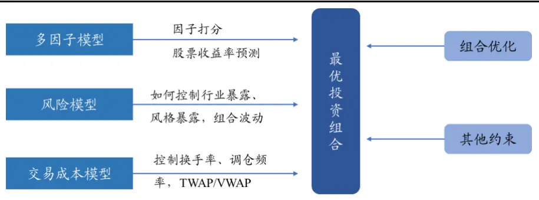
数据来源：国泰君安证券研究

下面介绍本报告用到多因子模型中单因子测试、多因子加权两部分内容。

## 1.1. 单因子测试

对各类因子进行单个因子选股效果测试是多因子选股的基础工作。下面介绍因子的数据处理方法、单因子选股测试的一般步骤。

## 1.1.1. 股票池与比较基准

为了测试单个因子的选股效果，首先需要确定比较基准和股票池。不同股票池中，股票的风格分布特征会有所不同，因子的选股效果会略有区别。比如，沪深 300 以大盘蓝筹为主，行业也多是分布在金融、周期性行业，选股逻辑与小盘股的投资逻辑明显不同，使用的因子也会不一样。对于不同的股票池，都有对应的基准指数。

我们为了构建对应不同基准的选股策略，会对不同股票池进行单因子选股效果的测算，找出在特定股票池中选股效果较好的因子。实际研究中使用沪深 300 成分股、中证 500 成分股、全体 A股等作为股票池，对应基准指数一般为沪深 300 指数、中证 500 指数、中证 500 指数。

初始股票池：全体 A 股（沪深 300 成分股、中证 500 成分股等）。为了使测试结果更符合实际投资过程，对无法交易的股票进行剔除，主要有以下几种情形：（1）剔除选股当日的 ST 股票；（2）剔除上市不满半年的股票；（3）剔除选股日由于涨停、停牌等原因而无法买入的股票。

## 1.1.2. 数据处理

在确定股票池 S $(\;s_{1},\;s_{2},\;s_{3},\;\ldots s_{N})$ ）之后，对于 N 只股票，K类因子，某类因子有f个子因子。按照因子公式计算每只股票在因子f上的取值 ，一般称为因子暴露（Factor Exposure）。对于因子原始值，一般需要进行去极值、标准化、缺失值填充、市值行业中性化等数据处理操作。

## （1） 去极值

个别股票可能存在因子数据错误、因子值过大过小等极端情况，为了保证数据质量，需要进行去极值操作。因子去极值有固定比例缩尾、3σ 去极值法、中位数去极值 MAD 法等，我们主要使用中位数去极值法。

中位数去极值（Median Absolute Deviation 绝对中位数）法是针对 3 倍标准差法的改进，原因在于国内大部分股票因子值的分布并不服从正态分布，因此国内大多数研究采用此方法处理极值。计算方法如下：对于某一期所有股票因子值，首先计算中位数med，然后计算MAD、$MAD_{e}$ ：

$$
\begin{aligned}&\#model=median(x_i)\\&MAD=median(|x_i-model|)\\&\quad MAD_e=1.483*MAD\\\end{aligned}
$$

通常把偏离中位数三倍 $MAD_{e}$ 以上的数据作为异常值。这种处理不受极端异常值的影响，结果更加稳健。

## （2）标准化

由于不同因子在量纲上存在差别，因此在因子加权、多元回归中需要对单个因子在横截面上进行标准化，从而让不同因子的暴露度之间具有可比性。一般的标准化方法，将当期去极值后的因子值序列减去全部股票的均值、再除以其标准差，得到一个新的近似服从 N(0,1)分布的序列：

$$
x_{i}^{s}=\frac{x_{i}^{raw}-\mu}{\sigma}
$$

## （3）缺失值处理

对于个别股票的因子值缺失的情况，需要使用数据替代算法处理。由于不同因子可能在不同个股上存在缺失，如果不做处理则每个因子选股的股票池并不完全相同，不同因子之间选股效果的可比性会受到影响。

单因子选股测试时，对于因子缺失的股票，可以考虑直接剔除，也可以使用替代算法替代。大类复合因子选股时，可以借鉴 Barra 模型，当大类因子中只有部分因子缺失时，利用其余未缺失的因子指标来合成大类因子；当某支股票大类因子中子因子全部缺失时，运用数据替换算法来替代。具体有全市场均值替代、行业均值替代、回归方程估计多种方式。我们在本报告使用行业中值替代，当某只股票某个因子缺失时，考虑使用该行业的均值或中值替代。

## （4）市值行业中性化处理

对于选股而言，股票市值、行业差异较大，原始因子的选股效果受到市值、行业因素的影响。例如，不同行业、不同市值股票之际估值差别很大；以市盈率因子为例，按照分组法，低市盈率的一组主要是大市值的股票，行业多属于银行、周期性行业，市值、行业因素的直接影响低 PE分组的股票组合收益。

目前使用最多的做法是对因子进行市值行业中性化处理。具体做法是：将每个股票标准化后的因子作为因变量，对对数市值和中信一级行业虚拟变量进行横截面回归，将回归后的残差作为每个股票因子值。一般认为，在全市场股票池中经过中性化处理后的因子，排除了市值和行业的影响，更好地反映因子的投资逻辑和选股效果。例如，使用市盈率因子分组，做了中性化处理之后，每组在各行业、市值区间上分布比较均匀。在实际使用上，除市值因子以外，其他因子均进行中性化处理。

$$
Factor_{n}=\beta_{mkt}\ln(MktVal_{i})+\sum_{i=1}^{I}\beta_{i}Industry_{ni}+\varepsilon_{ni}
$$

$Factor_{n}$ 是第 T 期股票 n 的因子值， $ln(MktVal_{i})_{i}$ 是第 T 期对数总市值因子的值， $Industry_{ni},$ 是第 T 期第 i个中信一级行业因子哑变量（属于该行业为 1，否则为 0）。 $\varepsilon_{n}.$ 是回归残差。我们以上述回归方程的残差项 $\varepsilon_{n}$ 作为原因子在市值行业中性化后的代理变量。

## 1.1.3. 因子测试方法

我们通过因子 IC 测试、分组回测、单因子组合优化等多种方式来考察因子收益预测的有效性与稳定性。

## （1）因子 IC 测试

我们计算T期因子值与T+1期股票收益率的Pearson相关系数（RawIC），同时计算因子 T 期因子值排序与 $\mathbf{T}\mathbf{+1}$ 期股票收益率的 Spearman相关系数（RankIC）。因子的 IC 值是指第 T 期的因子值（因子中性化处理后残差） $\vec{\mathbf{X}}_{\mathbf{t}}$ 与 $\mathbf{T}\mathbf{+1}$ 期的股票收益 $\vec{\mathbf{r}}_{\mathbf{t}+\mathbf{1}}$ 的相关系数——Pearson 相关系数，公式表示为：

$$
IC_{t}=corr(\vec{x}_{t},\vec{r}_{t+1})
$$

此外，可以计算秩相关系数——Spearman 相关系数，使用两个变量的位次计算，是与因子分布无关的，公式表示为：

$$
IC_{rank,t}=corr\left(rank(\vec{x}_{t}),rank(\vec{r}_{t+1})\right)
$$

可以通过以下指标评价因子效果：

a) IC 值的均值——因子显著性；

b) ICIR 比率（IC 均值/标准差）——因子有效性；

c) IC 序列 T 值（IC 均值*sqrt(样本数-1)/IC 标准差）——因子显著性；

d) IC 值的胜率（因子值与 IC 值同向的截面数占比）。

## （2）因子分组测试

因子分组测试是根据因子值打分排序分多组测试各组组合累计净值表现。我们本报告采用分 10 组，周度定期调仓的方法进行测试。因子多空测试是分组测试中第一组与第十组多空强弱表现，多空测试与分组测试可以一并进行。我们可以从多个维度考察分组测试效果：

a) 分组测试结果是否具备单调性，即各分组累计净值表现与其排序是否具有一致性，分组测试结果单调性越高越好；

b) 分组多空收益表现，即考察第一组和第十组累计净值相对强弱表现及其最大回撤；

c) 多头组合相对市场基准表现，即考察第一组与市场基准指数相对强弱及最大回撤。

因子分组测试主要考察以下绩效指标：

a) 分组测试的累计收益率、最大回撤等；

b) 多头、空头组合的年化收益率、年化波动率、夏普比率、最大回撤等；

c) 多头、空头组合相对市场基准的超额年化收益率、超额年化波动率、信息比率、超额最大回撤等。

分组测试操作方便，结果直观，是使用最广的一种单因子测试方法，可以分析因子分组后各组收益的单调性。

## （3）单因子组合优化

除了常用的 IC、分组测试以外，还可以使用组合优化的方式构建跟踪基准指数的组合，考察因子的超额收益表现。我们使用组合优化方式，添加多种约束条件，构建单因子的最大化股票得分组合，考察单因子的选股效果。具体每期的组合构建上，严格控制市值行业中性，并对个股权重进行约束，使用组合优化求解个股权重构建组合。组合优化参数设置上，对于沪深 300 股票池，控制市值行业严格中性，设置个股权重上限8%和个股权重偏离上限 3%；对于中证 500 股票池和全市场股票池，控制市值行业严格中性，设置个股权重偏离上限 1%和个股权重上限 1%。

单因子组合优化模型公式表达。得到每周末股票的得分scoreT后，控制跟踪误差、行业暴露、风格暴露等约束条件，以最大化股票组合得分$\textstyle\sum_{1}^{N}score_{i}^{T}*w_{i}$ 为目标，求解组合股票的权重 $w^{*}$ ，具体如下：

$$
\begin{aligned}&\max_{w_{i}}\sum_{1}^{N}score_{i}^{T}*w_{i}\\&s.t.\quad\sum_{i}w_{i}=1\\&\quad w^{lower}\leq w_{i}\leq w^{upper},i=1,\ldots,N\quad\quad\quad\quad(\text{II }2)\\&\quad w_{active}^{lower}\leq w_{i}-w_{基准指数}\leq w_{active}^{upper},i=1,\ldots,N\\&\quad\sum_{1}^{N}x_{iI}w_{i}=w^{I}\quad\quad\quad\quad\quad\quad(\text{I }4)\\&\quad\left|\sum_{1}^{N}x_{ik}*w_{i}\right|\leq x_{k}^{limit}\quad\quad\quad\quad\quad\quad(\text{I }5)\\\end{aligned}\tag{3}
$$

公式（2）为个股上下限约束：主要是不能卖空、避免某些个股权重过高。公式（3）为个股权重相对基准指数偏离约束：主要是控制个股权重偏离程度。

公式（4）为行业权重约束：可以按照基准中行业的权重设置行业偏离约束，也可以自行确定某些行业暴露程度。

公式（5）为因子暴露约束：控制某些风格因子上暴露，主要是控制市值上暴露。

组合构建。根据每期组合优化计算得到的股票名单和权重，对单因子选股组合进行历史业绩测算。计算组合的相对比较基准超额收益、最大回撤、超额收益信息比率等绩效指标。本报告，我们每周构建组合，对组合的表现进行历史回测。

## 1.2. 多因子加权

基于单因子测试结果，我们筛选每类因子中单因子表现较好的因子作为备选因子。每类因子都有多个候选因子进行单因子选股测试后，可能有多个因子效果较好，此时需要考虑同一类中多个因子值或因子得分如何加权合成大类因子值或大类因子得分，对于第 k 类因子 ，由于同一类中因子的经济学含义，投资逻辑比较趋同，相关性也较高，我们建议做等权合并处理。事实上每类内部也可以按照 IC 加权、IC_IR 加权等方式进行加权。除了每类选多个因子加权，也有每类只选效果最强的因子作为大类因子。为了选股效果的长期稳定，建议使用多个子因子加权合成大类因子。本报告只涉及超预期一类因子，我们后面会以单因子等权相加的方式合成复合因子为例，展示超预期复合因子的效果。

## 1.2.1. 相关性处理

合成大类因子以后，大类因子之间会有一定相关性。在加权时，因子共线性使得组合在某些因子上有重复的暴露，导致选股组合的表现受到影响。在多因子回归，因子共线性会导致回归模型基本假设不满足，将使回归模型评估失真或者不准确。所以需要对相关性进行处理。常用分析相关性方式有计算相关系数矩阵、方差膨胀因子等。处理相关性的方法有：逐步回归方式筛选因子、正交化方法使因子向量正交等。常用的正交化方法有施密特正交化、对称正交、正则正交等。

## 1.2.2. 多因子加权

在得到各大类复合因子,进行正交化处理后，也需要考虑大类因子如何加权选股。经常使用的加权方式有：等权、IC 均值加权、IC 的 IR 加权、最大化复合因子 IR 加权、最大化复合因子单期 IC 加权、半衰期 IC 加权等。我们简单介绍以下几种。

因子等权加权，即每个因子分配相同的权重，其权重向量：

$$
w=(\frac{1}{K},\frac{1}{K},\ldots,\frac{1}{K})^{T}
$$

这种加权方式较为简单，但是没有考虑因子有效性的差异。基本思想是平等看待每类因子代表的投资逻辑，不做有偏好和预测的主观判断。避免了数据过度拟合，忽略了因子预测能力的差别。

IC 均值加权，是直接用各因子过去 T 期的因子 IC 的均值作为权重，即权重向量为：

$$
\boldsymbol{w}=(\overline{{IC_{1}}},\overline{{IC_{2}}},\dots,\overline{{IC_{K}}})^{T}
$$

其中， $\overline{{IC_{k}}}.$ 为复合因子 k 过去 N 期 IC 的均值，计算方式为 $\overline{{IC_{k}}}=$ $\begin{array}{r}{\frac{1}{T}{\sum}_{t=1}^{T}IC_{k^{\circ}}^{t}}\end{array}$ 。这种方式考虑了因子过去一段时间的有效性。

IC_IR 加权，是以因子过去 T 期的因子 IC 的均值除以其标准差作为当期因子 K的权重，即权重向量：

$$
\boldsymbol{w}=(\boldsymbol{IR}_{1,IC},\boldsymbol{IR}_{2,IC},\dots,\boldsymbol{IR}_{K,IC})^{T}
$$

其中 $\overline{{IC_{k}}}$ 为因子 IC 的 IR，计算公式为 $\begin{array}{r}{\overline{{IC_{k}}}=\frac{1}{T}{\sum_{t=1}^{T}IC_{k}^{t}},}\end{array}$ ，这种方式同时考虑了因子过去一段时间的有效性和稳定性。

最优化复合 IR加权。Qian(2006)提出以最大化复合因子IC_IR为目标函数，对因子权重进行组合优化计算因子权重方法，给定各因子的 IC 均值向量 $\overrightarrow{\overline{{IC}}}=(\overline{{IC_{1}}},\overline{{IC_{2}}},\dots,\overline{{IC_{K}}})^{T}$ ，IC 的协方差矩阵 $\cdot\Sigma_{IC}$ ，复合因子的 IR 为：

$$
\mathit{IR}_{max}=\frac{w^{T}\overrightarrow{\overrightarrow{IC}}}{\sqrt{w^{T}{\sum_{IC}}w}}
$$

对w求偏导数，令偏导为0，可以推导出最优化权重的解为 $\begin{array}{r}{{w^{*}}={\sum_{IC}}^{-1}\overline{{IC}}.}\end{array}$ 这种方法的优点是综合考虑了过去一段时间的有效性、稳定性和相关性。

加权后得到的复合因子测试方法与单因子测试相同，可以通过因子 IC测试、分组测试、组合优化考察复合因子收益预测的有效性与稳定性。复合因子测试时也计算多头组合的年化收益率、夏普比率、最大回撤，以及多头组合相对市场基准的年化超额收益率、信息比率和超额最大回撤等绩效指标。

## 1.2.3. 提升树等机器学习模型

对于因子加权，以往的常规做法是每类因子内部先加权，然后大类因子之间再做加权，加权方式的选择因人而异。近几年的机器学习模型广泛的应用于股票收益预测。实战中应用较多、比较知名的是 Xgboost、LightGBM、CatBoost 等提升树模型。使用机器学习模型，可以将因子库中大量的因子作为特征输入，预测股票下期超额收益。其中提升树模型与分组打分、线性加权相比，可以学习因子和下期收益之间的非线性关系，预测效果更好。Xgboost 和 LightGBM 都是梯度提升决策树 GBDT的实现框架。GBDT (Gradient Boosting Decision Tree)的主要思想是利用一系列决策树作为弱分类器，迭代训练得到最优模型。GBDT 模型具有训练效果好、不易过拟合等优点。下面简要介绍 Xgboost 和 LightGBM。

XGBoost（eXtreme Gradient Boosting）是华盛顿大学陈天奇开发是目前使用最多的大规模并行开源 Boosting tree 工具包。在数据科学方面，有大量的 Kaggle 选手选用 XGBoost 进行数据挖掘比赛，是各大数据科学比赛的必杀武器；在工业界大规模数据方面，XGBoost 的分布式版本有广泛的可移植性，支持在 Hadoop、Dask 等各个分布式环境上运行，使得它可以很好地解决工业界大规模数据的问题。

LightGBM（Light Gradient Boosting Machine)是微软亚洲研究院分布式机器学习工具包（DMTK）团队开源的基于决策树算法的分布式梯度提升框架。相对于 XGBoost，LightGBM 在很多方面表现更为优秀，主要的改进有：基于 Histogram 的决策树算法、直方图做差加速、单边梯度采样 GOSS、互斥特征捆绑算法、直接支持类别特征(Categorical Feature)、带深度限制的 Leaf-wise 的叶子生长策略、高效并行、Cache 命中率优化等。从实验数据上看，LightGBM 比 XGBoost 快将近 10 倍，内存占用率大约只有 1/6，并且准确率也有提升。

## 2. 超预期因子介绍

业绩超预期一般是指上市公司发布业绩报告（定期报告、业绩预告、业绩快报等）时，如果出现盈利超预期，股价会在发布后持续上涨一段时间。学术上称之为盈余公告后价格漂移效应（Post-Earnings AnnouncementDrift）。PEAD 效应最早由芝加哥大学 Ball 和 Brown(1968)发现，之后很多学者研究发现，PEAD 在不同市场、不同的时间阶段普遍存在。近几年在国内量化选股的投资实战中也应用较多，属于基本面量化选股中表现名列前茅的一类因子。

在学术和实际投资中，超预期因子的计算方法有两种，一是基于价量数据的，计算公告前后价量表现。价量类因子关注公告前后股票相对基准的异常收益、交易量的变动。另一种是基于基本面数据，主要使用财务和分析师数据计算业绩超预期因子来衡量公告业绩超预期程度。比如，计算标准化预期外盈利 SUE 因子（Standardized Unexpected Earnings），衡量新发布业绩数据相对于预期盈利的幅度；对于预期盈利，也有两种方式来估计，一是用历史盈利数据建模，二是使用分析师预期数据。下面介绍本文中各种超预期因子的计算方式。

## 2.1. PEAD 效应学术研究

盈余公告后价格漂移效应最早由芝加哥大学 Ball 和 Brown(1968)提出。他们发现，超预期盈利的股票在公告后出现明显的正收益，超预期亏损的股票在公告后出现明显的负收益。此后四五十年，大量国内外学者进行了相关研究，发现 PEAD 现象在各个国家的股票市场都普遍存在，对有效市场假说提出了挑战。我们在《如何基于 PEAD超预期因子构建行业轮动策略》中对国内外学者的代表性研究进行详细介绍，感兴趣的投资者可以查阅相关报告，此处不再罗列。

## 2.2. 超预期因子计算方法

我们借鉴学术文献中研究 PEAD 效应使用的指标，结合实际投资中常用的个股超预期因子计算方法，构建了 2 种价量类、4 种财务类的超预期因子。这些因子尝试从不同角度刻画业绩超预期程度，都要较强的投资逻辑。下面介绍计算方法。

## 2.2.1. 价量类因子

价量类因子使用业绩公告前后市场价格和交易量的变化幅度来衡量业绩超预期程度。一般认为超预期的信息可以综合反映公告前后股价和成交量变化上。

## 2.2.1.1. 盈余公告前后异常收益因子

## 1） ABR_N_M 和 EAR_N_M 因子

参考学术文献做法，我们使用公告前后股票价格数据，计算个股的ABR_N_M 和 EAR_N_M 因子。两个因子计算方式略有差异。ABR_N_M是盈余公告（正式报告、业绩预告、业绩快报）前 N 日至公告后 M 日的每日超额收益之和。EAR_N_M 表示盈余公告（正式报告、业绩预告、业绩快报）前 N 日至公告后 M 日时间区间个股收益减去期间基准指数收益后的超额收益。计算个股因子时，基准指数我们统一使用中证 500指数。公告日 t 日股票 i的因子计算公式如下：

$$
\begin{array}{r}{ear\_N\_M_{i,t}=\prod_{j=t-N}^{t+M-1}\bigl(1+R_{i,j}\bigr)-\prod_{j=t-N}^{t+M-1}\mathrm{~(~}1+R_{\mathrm{~中证~}500,j}\mathrm{~)~}}\end{array}\tag{2.1}
$$

$$
\begin{aligned}abr\_N\_M_{i,t}=\sum_{j=t-N}^{t+M-1}(R_{i,j}-R_{中证500,j})\end{aligned}\tag{2.2}
$$

和 的取值尝试多种参数组合。对于每只股票，我们计算多组参数的abr 和 ear 因子。得到个股公告日 t 日的因子后，对于非公告日，均使用之前最近公告日计算的因子进行填充。

## 2）公告后开盘跳空因子 Jump

开盘跳空也是常用因子,计算方法是股票业绩公告后t日的开盘价相对t-1 日收盘价的收益率减去中证 500 的收益：

$$
jump_{i,t}=\frac{open_{i,t}}{close_{i,t-1}}-\frac{open_{中证500,t}}{close_{中证500,t-1}}\tag{2.3}
$$

对于非公告日，均使用之前最近公告日计算的因子进行填充，得到股票的每个交易日 T 的跳空因子。

## 3）FE3 和 FE4 因子

此外，我们还计算 Foster(1984)文献中提到的 FE3 和 FE4 因子。本文测试的盈余公告前后异常收益因子，见下表：

表 1：盈余公告前后异常收益因子列表

| 因子名 |  | 名 |
| --- | --- | --- |
| 公告后1天异常收益 FE3（1984) |  | 公告后跳空 Jump |
|  |  | FE4（1984) |
|  | 公告后2天异常收益之和 | 盈余公告前1天后2天异常收益之和 |
|  | 公告后3天异常收益之和 | 盈余公告前1天后3天异常收益之和 |
|  | 公告后4天异常收益之和 | 盈余公告前1天后4天异常收益之和 |
|  | 盈余公告后5天异常收益之和 | 盈余公告前2天后2天异常收益之和 |
|  | 盈余公告前1天后1天异常收益之和 | 盈余公告前2天后3天异常收益之和 |
| EAR | 公告后2天累计异常收益 | 盈余公告前1天后2天累计异常收益 |
|  | 公告后3天累计异常收益 | 盈余公告前1天后3天累计异常收益 |
|  | 公告后4天累计异常收益 | 盈余公告前1天后4天累计异常收益 |
|  | 盈余公告后5天累计异常收益 | 盈余公告前2天后2天累计异常收益 |
|  | 盈余公告前1天后1天累计异常收益 | 盈余公告前2天后3天累计异常收益 |

数据来源：国泰君安证券研究

需要说明的是，对于没有业绩公告的交易日，股票因子值使用最近的因子值填充。以 Jump因子为例，比如亿纬锂能（300014.SZ）在2019 年 12 月 24 日 公 告 2019 年 度 业 绩 预 告 ，2020 年 2 月 28 日 发布 2019 年度业绩快报，2020 年 4 月 9 日发布 2020年一季度业绩预 告 ；在 2019 年 12 月 25 日 可 以 计 算 Jump 因 子 ，2019 年 12 月 26日 至 2020 年 2 月 28 日 期 间 的 Jump 因 子 使 用 2019 年 12 月 25 日的值填充；2020 年 3 月 1 日至 2020 年 4 月 9 日的 Jump 因子使用2020 年 2 月 29 日的值填充，其他以此类推。

## 2.2.1.2. 盈余公告前后量的变动

除了公告前后“价”的变动可以反映市场对于业绩超预期的认可程度，公告前后“量”的变动也可以作为参考指标。业绩公告后，股票的成交量放量、成交金额扩大，也表明市场对股票业绩超预期的认可程度。我们使用成交量、成交金额、换手率等数据，计算公告前后“量”的变动来构造因子。测算发现选股效果不佳，篇幅原因不做展示。

## 2.2.2. 财务类因子

基于基本面数据的财务类因子，主要使用财务和分析师数据计算 SUE因子来衡量公告业绩超预期程度。其中，最常用因子的是标准化预期外盈利 SUE 因子（Standardized Unexpected Earnings），考察新发布业绩数据相对于预期盈利的幅度；对于预期盈利，也有两种方式来估计，一是用历史盈利数据建模，二是使用分析师预期数据。此外，实际投资实践中，还可以基于朝阳永续分析师预测数据构建预测上调下调比例、预测调整幅度等因子来衡量股票业绩超预期程度。

## 2.2.2.1. SUE 因子

超预期最知名的因子是标准化预期外盈利 SUE，其投资逻辑是实际公告盈利值相对于盈利预期值的增幅越大，业绩越超预期，股票未来表现越好。在学术文献中计算 SUE 时，分子是单季度预期外收益（ $X_{i,q}-$ $\mathbb{E}(X_{i,q})$ ），预期收益E $(X_{i,q})$ 可以使用历史财务数据估计，也可以使用分析师数据估计；标准化操作中的分母可以用去年同期单季度净利润的绝对值，也可以用预期外收益的标准差。

## 1）使用历史财务数据估计预期收益E $(\boldsymbol{X}_{i,q})$ ，分母使用预期外收益标准差

我们先采用预期外收益的标准差作为分母。对于股票 i，SUE 是单季度预期外收益 $\left(X_{i,q}-\mathbb{E}(X_{i,q})\right)$ 除以预期外收益的标准差：

$$
\begin{array}{r}{SUE_{i,q}=\frac{X_{i,q}-\mathbb{E}(X_{i,q})}{\sigma_{i,q}}}\end{array}\tag{2.4}
$$

其中， $X_{i,q}$ 是公司 i在 q 季度的实际收益， $\mathbb{E}(X_{i,q})$ 是 q 季度的预期收益，$\sigma_{i,q}$ 是过去 4 个季度预期外收益的标准差。

对于预期收益E $(X_{i,q})$ ，参考学术文献做法，可以采用多种方式估计。对

于无漂移项的情况，预期收益为上季度净利润：

$$
\mathbb{E}\big(X_{i,q}\big)=X_{i,q-4}\tag{2.5}
$$

其中：

$$
\begin{array}{r}{\sigma_{i,q}=\sqrt{\frac{\left(X_{i,q-1}-X_{i,q-5}\right)^{2}+\cdots+\left(X_{i,q-4}-X_{i,q-8}\right)^{2}}{4}}}\end{array}\tag{2.6}
$$

对于带漂移项的情况，预期收益E $\left(X_{i,q}\right)$ 等于去年本季度收益加上预期外收益的期望 $\mu_{i,q},$

$$
\mathbb{E}\big(X_{i,q}\big)=X_{i,q-4}+\mu_{i,q}\tag{2.7}
$$

其中：

$$
\begin{array}{r}{\mu_{i,q}=\frac{\sum_{n=1}^{4}(X_{i,q-4}-X_{i,q-n-4})}{4}}\end{array}\tag{2.8}
$$

$$
\sigma_{i,q}=\sqrt{\frac{\left(X_{i,q-1}-X_{i,q-5}-\mu_{i,q}\right)^2+\cdots+\left(X_{i,q-4}-X_{i,q-8}-\mu_{i,q}\right)^2}{4}}\tag{2.9}
$$

个股净利润的选择上，在类型上，可以使用归母净利润、扣非净利润、营业利润等；在时间区间选择上，可以使用单季度净利润（qfa）、最近12 个月净利润（TTM）。我们使用业绩预告、业绩快报、定期报告三种财务报告数据计算 SUE等因子。其中，归母净利润使用业绩预告、业绩快报和定期报告数据；营业利润使用业绩快报和定期报告数据；扣非净利润只使用定期报告数据。同时，净利润数据计算时，考虑会计调整、更正处理，保证在任意时点都使用当时可以获得的最新数据。此外，业绩预告一般公布净利润上下限，我们使用净利润上下限的均值，作为净利润使用。

## 2）使用分析师预期数据作为预期净利润的估计，分母使用分析师预期数据绝对值

计算单季度归母净利润超分析师预期幅度因子。使用分析师预期数据作为预期净利润的估计，计算实际公告的单季度净利润相对分析师预期单季度利润的增长幅度。实际公告的单季度净利润使用业绩预告、业绩快报、正式财报三种数据计算。我们需要使用分析师预测净利润年度数据估算单季度预期净利润，以第 季度为例，假设刚发布了 季度业绩预告，我们需要计算分析师预期的 2 季度净利润，计算过程如下：

首先，计算分析师预测的后 3 个季度净利润=分析师预测年度利润-已预告或公告的 1 季度归母净利润得到。

然后，计算分析师预测增长率=分析师预测的后 3 个季度净利润个季度净利润/去年对应的后 3 季度净利润。隐含假设未来三个季度增长率一样。

其次，分析师预期第 2 季度净利润=去年第 2 季度净利润*（1+分析师预测增长率）。

最后，单季度归母净利润超分析师预期幅度=（第 2 季度公告净利润-分析师预期第 2 季度净利润）/abs(分析师预期第 2 季度净利润) 。对于每只股票，计算得到多种 SUE 因子。对于非公告日，均使用之前最近公告日计算的因子进行填充。本文主要测试的 SUE因子如下表：

表 2：SUE因子列表

| 因子名 |  |  |  |
| --- | --- | --- | --- |
| 单季度 | 利润 | 标准化预期外单季度归母净利润 | 标准化预期外单季度归母净利润-带漂移项 |
|  |  | 标准化预期外单季度扣非净利润 | 标准化预期外单季度扣非净利润-带漂移项 |
|  |  | 标准化预期外单季度毛利润 | 标准化预期外单季度毛利润-带漂移项 |
|  |  | 标准化预期外单季度营业利润 | 标准化预期外单季度营业利润-带漂移项 |
|  |  | 营收 | 标准化预期外单季度营业收入 标准化预期外单季度营业收入-带漂移项 |
| TTM |  | 标准化预期外归母净利润TTM | 标准化预期外归母净利润TTM-带漂移项 |
|  | 利润 | 标准化预期外扣非净利润TTM | 标准化预期外扣非净利润TTM-带漂移项 |
|  |  | 标准化预期外毛利润 TTM | 标准化预期外毛利润TTM-带漂移项 |
|  |  | 标准化预期外营业利润TTM | 标准化预期外营业利润TTM-带漂移项 |
|  | 营收 | 标准化预期外营业收入TTM | 标准化预期外营业收入TTM-带漂移项 |
|  | 分析师 | 单季度归母净利润超分析师预期幅度 |  |

数据来源：国泰君安证券研究

## 2.2.2.2. SUE 衍生因子

除了使用净利润计算 SUE，我们还使用营业收入、ROE、ROA等财务指标替换公式中的净利润，计算标准化预期外营业收入、标准化预期外ROE、标准化预期外 ROA等 SUE 衍生因子，考察这些因子的选股效果。计算公式和方法与 SUE因子相同。主要测试的 SUE衍生因子如下表：

表 3：SUE衍生因子列表

| 因子名 |  |  |  |
| --- | --- | --- | --- |
|  | 标准化预期外 BP |  | 标准化预期外 BP-带漂移项 |
| 单季度归母净利润 |  | 标准化预期外单季度 GPOA | 标准化预期外单季度GPOA-带漂移项 |
|  |  | 标准化预期外单季度 SP | 标准化预期外单季度SP-带漂移项 |
|  |  | 标准化预期外单季度归母ROA | 标准化预期外单季度归母ROA-带漂移项 |
|  | 扣非净利润 | 标准化预期外单季度归母ROE | 标准化预期外单季度归母ROE-带漂移项 |
|  |  | 标准化预期外单季度扣非 ROA | 标准化预期外单季度扣非ROA-带漂移项 |
|  |  | 标准化预期外单季度扣非 ROE | 标准化预期外单季度扣非ROE-带漂移项 |
| 标准化预期外 GPOA(TTM) |  | 标准化预期外 GPOA(TTM)-带漂移项 |  |
| TTM | 归母净利润 | 标准化预期外 SP(TTM) | 标准化预期外 SP(TTM)-带漂移项 |
|  |  | 标准化预期外归母 ROA(TTM) | 标准化预期外归母ROA(TTM)-带漂移项 |
|  |  | 标准化预期外归母 ROE(TTM) | 标准化预期外归母 ROE(TTM)-带漂移项 |
|  | 扣非净利润 | 标准化预期外扣非 ROA(TTM) | 标准化预期外扣非 ROA(TTM)-带漂移项 |
|  |  | 标准化预期外扣非 ROE(TTM) | 标准化预期外扣非ROE(TTM)-带漂移项 |

数据来源：国泰君安证券研究

## 2.2.2.3. 过去 N日分析师预测上下调比例

我们使用朝阳永续分析师预测数据，计算个股过去 日分析师预测上调减去下调比例，来衡量股票业绩超预期的幅度。分析师预测上调减去下调比例的值越大，说明业绩超预期程度越高。具体个股指标上，可以计算上调和下调报告数、上调和下调券商家数。计算公式如下：

过去 N 日报告上调比例-下调比例=（上调报告数-下调报告数）/总报告 数 (2.10)

过去 N 日券商上调比例-下调比例=（上调家数-下调家数）/总家数 (2.11)

$$
\begin{align*}过去\mathbb{N}日报告上调比例=&上调报告数/总报告数\quad&(2.12)\\过去\mathbb{N}日券商上调比例=&上调家数/总家数\quad&(2.13)\end{align*}
$$

对于 N，取值为 60、90、180。主要测试的过去 N 日分析师预测上调减去下调比例因子列表如下：

表 4：过去 N日分析师预测上下调比例因子列表

| 因子名 |  |  |
| --- | --- | --- |
| 上调-下调比例 | 过去180日券商上调-下调比例 | 过去180日报告上调-下调比例 |
|  | 过去60日券商上调-下调比例 | 过去60日报告上调-下调比例 |
|  | 过去90日券商上调-下调比例 | 过去90日报告上调-下调比例 |
| 上调比例 | 过去180日券商上调比例 | 过去180日报告上调比例 |
|  | 过去60日券商上调比例 | 过去60日报告上调比例 |
|  | 过去90日券商上调比例 | 过去90日报告上调比例 |

数据来源：国泰君安证券研究

## 2.2.2.4. 过去 N日分析师预测净利润/营收调整幅度

我们使用朝阳永续分析师预测数据，计算过去 N 日分析师预测净利润调整幅度、预测营收上调幅度因子衡量股票业绩超预期的幅度。分析师调整幅度越大，说明业绩超预期程度越高。首先计算股票 s 在过去 N 日每个发布预测报告的分析师净利润上调幅度，然后等权平均得到个股的净利润上调因子：

$$
\frac{Profit\_adjust\_Nday_{i,s}}{n}=\frac{1}{n}\sum_{s=1}^{n}\frac{Profit_{i,s}-Profit\_last_{i,s}}{Profit\_last_{i,s}}\tag{2.14}
$$

营收上调幅度因子类似：

$$
\frac{Revenue_{-}adjust_{-}Nday_{i,s}}{n}=\frac{1}{n}\sum_{s=1}^{n}\frac{Revenue_{i,s}-Revenue_{-}last_{i,s}}{Revenue_{-}last_{i,s}}\tag{2.15}
$$

对于 N，取值为 60、90、120、180、360。主要测试的过去 N 日分析师预测净利润/营收调整等因子列表如下：

表 5：过去 N日分析师预测净利润/营收调整因子列表

| 因子名 |  |  |
| --- | --- | --- |
| 盈利调整 | 过去120天盈利调整 | 过去60天盈利调整 |
|  | 过去180天盈利调整 | 过去90天盈利调整 |
|  | 过去360天盈利调整 |  |
| 营收调整 | 过去120天营收调整 | 过去60天营收调整 |
|  | 过去180天营收调整 | 过去90天营收调整 |
|  | 过去360天营收调整 |  |

数据来源：国泰君安证券研究

## 3. 单因子测试结果

我们采用因子 IC、分组测试、组合优化等对超预期因子进行单因子测试。根据业绩超预期的投资逻辑，股票因子值越大，预期股票的未来收益越高；在每周末进行分组调仓操作，按因子值从小到大排序分 10 组，分别为 t0、t1、t2、…、t8、t9 组，因子最小的 t0 组为空头组，因子最大的 t9组为多头组。回测日期区间为 2010 年 1 月至 2022 年 5 月。下面对三种股票池（沪深 300 成分股、中证 500 成分股、全市场）内超预期因子选股的测试结果进行展示。

## 3.1. 沪深 300 股票池

## 3.1.1. 盈余公告前后异常收益

我们认为，公告前后异常收益越大，个股的业绩超预期程度越高，未来表现越好。通过因子分组测试和单因子组合优化发现：

1）公告后 1 天异常收益因子、公告前 1 后 2 天异常收益因子、跳空因子效果较好，组合优化相对基准（沪深 300）的年化超额收益分别为5.52%、5.72%和 5.37%，信息比率分别为 1.03、1.05 和 1.04。

2）包含公告前交易日收益计算的因子效果略差。使用异常收益之和的ABR 因子整体略优于使用累计异常收益相减的 EAR 因子。分组测试具体结果和单因子组合优化的绩效指标如下。

表 6：沪深 300股票池 盈余公告前后异常收益因子 主要绩效指标

|  |  |  |  | t9多 |  | 头组 |  |  | 单因子组合优化 |  |  |  |  |  | 组合优化 |
| --- | --- | --- | --- | --- | --- | --- | --- | --- | --- | --- | --- | --- | --- | --- | --- |
| 沪深300内 | 因子名 | t0空头组 |  | t9多头组 | 超额最大回撤 | 超额收益波动率 | 超额收益信息比率 | 多空收益 | 超额收益 | 超额收益 | 超额收益波动率 | 超额收益信息比率 | IC | RankIC |  |
|  |  |  |  |  |  |  |  |  |  |  |  |  |  |  | 换手率 |
| ABR | 公告后1天异常收益 | -4. | 3% | 6.80% | -1983% | 9.76% | 0.70 | 11.13% | 5.52% | -7.59% | 5.36% | 1.03 | 1.51% | 1.33% | 19.70% |
|  | 公告后2天异常收益之和 | -5.6 | 60% | 5.57% | -1957% | 9.48% | 0.59 | 11.17% | 5.22% | -10.93% | 5.41% | 0.97 | 1.34% | 1.32% | 19.16% |
|  | 公告后3天异常收益之和 | -6.4 | 4% | 4.45% | -29.90% | 9.76% | 0.46 | 10.89% | 3.36% | -14.15% | 5.41% | 0.62 | 1.02% | 0.97% | 19.45% |
|  | 公告后4天异常收益之和 | 45 | 8% | 0.69% | -38.61% | 9.92% | 0.07 | 5.26% | 3.95% | -14.46% | 5.51% | 0.72 | 0.92% | 0.80% | 19.59% |
|  | 盈余公告后5天异常收益之和 | 44 | 9% | 1.50% | -38.18% | 10.01% | 0.15 | 5.99% | 3.41% | -14.89% | 5.58% | 0.61 | 0.79% | 0.65% | 19.49% |
|  | 盈余公告前1天后1天异常收益之和 | B | 7% | 6.54% | -1829% | 9.49% | 0.69 | 10.41% | 3.79% | -8.76% | 5.38% | 0.70 | 1.25% | 1.36% | 18.87% |
|  | 盈余公告前1天后2天异常收益之和 | 4 | 2% | 5.96% | -1790% | 9.95% | 0.60 | 10.87% | 5.72% | -6.49% | 5.45% | 1.05 | 1.32% | 1.26% | 19.71% |
|  | 盈余公告前1天后3天异常收益之和 | 49 | 1% | 4.21% | -15.35% | 10.06% | 0.42 | 9.12% | 4.79% | -7.72% | 5.39% | 0.89 | 1.06% | 0.96% | 19.59% |
|  | 盈余公告前1天后4天异常收益之和 | 39 | 8% | 1.45% | 31.37% | 10.26% | 0.14 | 5.44% | 4.29% | -15.85% | 5.62% | 0.76 | 1.00% | 0.89% | 19.40% |
|  | 盈余公告前2天后2天异常收益之和 | -5 | 7% | 5.75% | -15.66% | 10.17% | 0.57 | 11.22% | 4.37% | -10.41% | 5.59% | 0.78 | 1.26% | 1.19% | 19.95% |
|  | 盈余公告前2天后3天异常收益之和 | 5 | 8% | 1.61% | -29.04% | 10.58% | 0.15 | 6.90% | 4.02% | -11.39% | 5.62% | 0.71 | 1.01% | 0.96% | 19.60% |
| EAR | 公告后2天累计异常收益 | -5 | 3% | 2.93% | 30.98% | 9.51% | 0.31 | 8.46% | 3.63% | -16.98% | 5.38% | 0.68 | 1.05% | 1.31% | 19.27% |
|  | 公告后3天累计异常收益 | 4 | 6% | 3.34% | 33.05% | 9.81% | 0.34 | 8.10% | 3.26% | -17.84% | 5.40% | 0.60 | 0.81% | 0.97% | 19.45% |
|  | 公告后4天累计异常收益 | 3 | 0% | 1.44% | -35.25% | 9.89% | 0.15 | 5.04% | 4.17% | -15.57% | 5.53% | 0.75 | 0.79% | 0.87% | 19.39% |
|  | 盈余公告后5天累计异常收益 | 5 | 6% | 1.30% | -37.62% | 10.06% | 0.13 | 5.06% | 4.00% | -9.03% | 5.55% | 0.72 | 0.70% | 0.71% | 19.57% |
|  | 盈余公告前1天后1天累计异常收益 | 5 | 7% | 5.98% | -21.07% | 9.42% | 0.63 | 9.35% | 4.70% | -7.23% | 5.35% | 0.88 | 1.25% | 1.37% | 19.05% |
|  | 盈余公告前1天后2天累计异常收益 | B | 3% | 5.75% | 15.76% | 10.09% | 0.57 | 9.08% | 4.92% | 12.85% | 5.44% | 0.90 | 1.07% | 1.26% | 19.60% |
|  | 盈余公告前1天后3天累计异常收益 | 国 | 2% | 3.33% | 31.25% | 10.16% | 0.33 | 7.05% | 4.41% | -8.84% | 5.37% | 0.82 | 0.88% | 0.99% | 19.60% |
|  | 盈余公告前1天后4天累计异常收益 | -1 | 4% | 1.92% | 27.91% | 10.24% | 0.19 | 4.46% | 3.86% | -18.65% | 5.62% | 0.69 | 0.88% | 0.98% | 19.38% |
|  | 盈余公告前2天后2天累计异常收益 | 51 | 07% | 3.50% | 31.37% | 10.21% | 0.34 | 8.57% | 3.95% | 13.22% | 5.60% | 0.71 | 1.01% | 1.19% | 19.50% |
|  | 盈余公告前2天后3天累计异常收益 | -2.6 | 8% | 1.00% | 31.52% | 10.36% | 0.10 | 3.68% | 3.39% | -13.21% | 5.58% | 0.61 | 0.84% | 0.97% | 19.44% |
|  | FE3 | 0.4 | 8% | 3.39% | -24.84% | 9.44% | 0.36 | 2.91% | 1.35% | -13.29% | 5.40% | 0.25 | 0.39% | 0.62% | 19.18% |
|  | FE4 | -1 | 9% | 2.55% | 31.95% | 11.71% | 0.22 | 4.13% | 2.86% | -14.68% | 6.76% | 0.42 | 0.61% | 10.33% | 18.11% |
|  | Jump | 33 | 1% | 6.73% | -1755% | 9.65% | 0.70 | 10.04% | 5.37% | -13.28% | 5.14% | 1.04 | 1.39% | 1.79% | 18.84% |

数据来源：Wind，国泰君安证券研究。测试区间：2010.01-2022.05。

表 7：沪深 300股票池 盈余公告前后异常收益因子 分组年化超额收益

|  |  |  | 年化超额收益 |  |  |  |  |  |  |  |  |  |  |  |
| --- | --- | --- | --- | --- | --- | --- | --- | --- | --- | --- | --- | --- | --- | --- |
| 沪深300内因子名 |  | t0空头组t1 |  | t2 | t3 | t4 | t5 | t6 |  | t7 | t8 |  | t9多头组 | 多空收益 |
| ABR | 公告后1天异常收益 | 4.33% | B2.62% | .68% | 0.14% |  | 2.61% | -0.13% | 0.13% | 83% |  | 4.56% | 6.80% | 11.13% |
|  | 公告后2天异常收益之和 | .60% | 1.23% | .31% | 0.21% |  | 日.83% | .65% | .40% |  | 2.34% | 5.32% | 5.57% | 11.17% |
|  | 公告后3天异常收益之和 | 5.44% | 22% | .36% |  | 0.16% | 2.04% | 2.04% | .61% |  | 2.28% | 0.17% | 4.45% | 10.89% |
|  | 公告后4天异常收益之和 | .58% | 0.47% | 2.79% | 0.23% |  | 11% | 0.57% | 0.15% |  | 12% | 5.39% | .69% | 15.26% |
|  | 盈余公告后5天异常收益之和 | .49% | .03% | 0.28% | 0.07% |  | 45% | 0.17% | 9.45% |  | 68% | 82% | 50% | 5.99% |
|  | 盈余公告前1天后1天异常收益之和 | .87% | B.01% | 16% | 口 .29% |  | -0.22% | 日 2.05% | .86% |  | 0.55% | 3.92% | 6.54% | 10.41% |
|  | 盈余公告前1天后2天异常收益之和 | .92% | .72% | 日.90% | -0.60% |  | -0.60% | 草 0.78% | -0.32% |  | 13% | 3.61% | 5.96% | 10.87% |
|  | 盈余公告前1天后3天异常收益之和 | .91% | .69% | -0.73% |  | -0.25% | -0.60% | 日 .78% | 9.66% |  | 212% | 2.70% | 4.21% | 9.12% |
|  | 盈余公告前1天后4天异常收益之和 | .98% | .89% | .70% |  | 0.15% | 日.83% | -0.42% | 73% |  | 195% | $.62% | 45% | 5.44% |
|  | 盈余公告前2天后2天异常收益之和 | .47% | -0.49% | 2.26% |  | -0.24% | 日.68% | 078% | 10% |  | 2.07% | 22% | 5.75% | 11.22% |
|  | 盈余公告前2天后3天异常收益之和 公告后2天累计异常收益 | .28% | 0.45% | 日.85% |  | 39% | .32% | 088% | .53% |  | -0.76% | 5.05% | 61% | 6.90% |
|  |  | .53% | 日.31% | 0.41% | -0.33% | .70% | 72% |  | 日.51% | 0.38% | 6.98% | 2.93% | 8.46% |  |
| EAR | 公告后3天累计异常收益 | .76% | 0.12% | .81% | 巴 1.27% |  | .27% | 2.99% | 100% | 0.43% |  | 25% | 3.34% | 8.10% |
|  | 公告后4天累计异常收益 | .60% | 1.44% | 日.69% | 0.91% |  | -0.30% | 0.21% | 9.57% |  | 2.07% | 3.77% | 44% | 5.04% |
|  | 盈余公告后5天累计异常收益 | .76% | -0.14% | 0.20% | 口 | 1.45% | 100% | 104% | 18% |  | .16% | 2.59% | 30% | 5.06% |
|  | 盈余公告前1天后1天累计异常收益 | .37% | .47% | 107% | 1 1.15% |  | .81% | .25% | 0.08% | .26% |  | 4.68% | 5.98% | 9.35% |
|  | 盈余公告前1天后2天累计异常收益 | B .33% | B2.38% | 0.17% | B 2.43% |  | 198% | 2.06% | .99% |  | 3.06% | 2.43% | 5.75% | 9.08% |
|  | 盈余公告前1天后3天累计异常收益 | .72% | 0.28% | 2.38% | 0.33% |  | 0.87% | 口 .28% | 54% | 192% |  | 3.10% | 3.33% | 7105% |
|  | 盈余公告前1天后4天累计异常收益 | B 2.54% | .93% | 日.99% | 日 | 1.68% | .73% | .21% | 88% |  | 2.20% | 4.89% | 92% |  |
|  | 盈余公告前2天后2天累计异常收益 | 5.07% | -0.52% | 2.10% | 日 | 1.63% | -φ.02% | 07% | 2.08% |  | 52% | 191% |  | 4.46% |
|  | 盈余公告前2天后3天累计异常收益 | B | 2.68% B2.70% |  | 0.74% | -0.63% | 0.53% | -0.39% | 0.69% |  | 68% | 3.84% | 3.50% 100% | 8.57% 3.68% |
|  | FE3 |  | 0.48% | B2.95% | 0.44% | 0.11% | .40% | 56% | -.07% |  | 2.96% | -0.54% | 3.39% | 2.91% |
|  | FE4 |  | 日 .59% | .31% | 0.25% | 0.30% | 2.03% | .93% |  | .98% | 68% | 78% | 2.55% | 4.13% |
| Jump |  | .31% | 2.12% | 3.67% | D.27% | -0.51% |  | 084% | .77% | -0.07% | 5.18% | 6.73% | 10.04% |  |

数据来源：Wind，国泰君安证券研究。测试区间：2010.01-2022.05。

沪深 300 股票池内，历史回测效果较好的公告前后异常收益因子多头组超额收益曲线、单因子组合优化超额收益曲线如下。

图 2：沪深300股票池 公告前后异常收益因子 多头组超额收益曲线
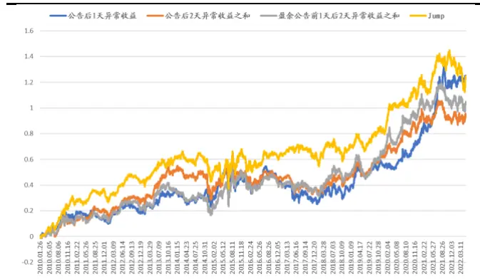
数据来源：Wind，国泰君安证券研究测试区间：2010.01-2022.05。

图 3：沪深300股票池 公告前后异常收益因子 组合优化超额收益曲线
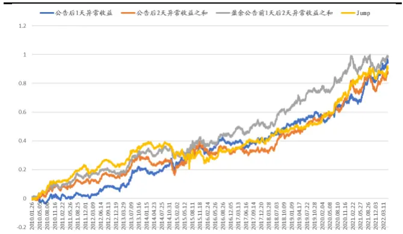
数据来源：Wind，国泰君安证券研究测试区间：2010.01-2022.05。

## 3.1.2. 标准化预期外盈利 SUE

我们认为，标准化预期外盈利 SUE 值越大，个股的业绩超预期程度越高，未来表现越好。通过因子分组测试和单因子组合优化发现：

1） 标准化预期外单季度归母净利润、标准化预期外单季度扣非净利润、标准化预期外单季度毛利润、标准化预期外单季度营业利润效果较好，组合优化后相对基准（沪深 300）的年化超额收益分别为6.81%、8.12%、8.00%和 8.48%，信息比率分别为 1.27、1.58、1.45 和 1.62。

2）单季度净利润计算的 SUE效果均好于净利润 TTM 计算的 SUE。

3）净利润计算的 SUE优于营收计算的因子。

4）单季度中不带漂移项好于带漂移项，TTM 中结果相反。

表 8：沪深 300股票池 SUE因子主要绩效指标

|  |  |  |  | t9多头 |  |  |  | 组 |  |  | 单因子组合优化 |  |  |  |  |  |  | 组合优化 |  |
| --- | --- | --- | --- | --- | --- | --- | --- | --- | --- | --- | --- | --- | --- | --- | --- | --- | --- | --- | --- |
| 沪深300内 | 因子名 | t0空头组 |  | t9多头组 |  |  |  |  |  |  |  |  |  |  |  |  |  |  |  |
|  |  |  |  |  |  | 回撤 |  | 波动率 | 信息比率 | 多空收益 | 超额收益 | 最大回撤 |  | 波动率 | 信息比率 |  | KankiC | 换手率 |  |
|  | 标准化预期外单季度归母净利润 | G | 73% | 9.0 | 9% | 14.9 | % | 10.46% | 0.87 | 16.82% | 6.81% | -11.7% |  | 5.38% | 1.27 | 2.20% | 2.35% | 16.40% |  |
|  | 标准化预期外单季度归母净利润-带漂移项 |  | 81% | 74 | 1% | -19.1 | % | 9.84% | 0.75 | 14.22% | 5.50% | -14.3 | % | 5.11% | 1.08 | 2.02% | 2.00% | 16.99% |  |
|  | 标准化预期外单季度扣非净利润 | 18 | % | 10 | 23% | 13.9 | % | 9.76% | 1.05 | 15.41% | 8.12% | -1.61 | % | 5.14% | 1.58 | 2.14% | 2.18% | 14.94% |  |
|  | 标准化预期外单季度扣非净利润-带漂移项 | 38 | 7% | 9.3 | 3% | -12.6 | 2% | 9.05% | 1.03 | 13.19% | 7.21% | -8.27 | % | 5.12% | 1.41 | 1.96% | 1.87% | 1 | 4.94% |
| 单季度 | 标准化预期外单季度毛利润 | -7 | 60% | 11 | 28% | -16.92 | 2% | 10.74% | 1.05 | 18.88% | 8.00% | T | % | 5.52% | 1.45 | 2.29% | 2.03% | 1 | 3.67% |
|  | 标准化预期外单季度毛利润-带漂移项 | 4 | 74% | 10 | 91% | -17.0 | 2% | 10.87% | 1.00 | 15.65% | 7.39% | 8.72 | % | 5.67% | 1.30 | 1.98% | 1.69% | 1 | 4.13% |
|  | 标准化预期外单季度营业利润 | -65 | 1% | 12 | 74% | 13.9 | % | 9.84% | 1.29 | 19.24% | 8.48% | -8.26 | 名 | 5.24% | 1.62 | 2.31% | 2.39% | 1 | 5.55% |
|  | 标准化预期外单季度营业利润-带漂移项 | F0 | 1% | 10 | 18% | 13.3 | 2% | 9.26% | 1.10 | 16.19% | 7.49% | 1 |  | 5.17% | 1.45 | 2.10% | 1.96% | 15.80% |  |
|  | 标准化预期外单季度营业收入 | -79 | % | 61 | 7% | -19.6 | % | 9.75% | 0.63 | 12.96% | 5.40% | 9.12 | % | 5.35% | 1.01 | 2.07% | 2.10% | 15.09% |  |
|  | 标准化预期外单季度营业收入-带漂移项 | 34 | 5% | 68 | 6% | F | 15.68% | 8.88% | 0.77 | 10.31% | 5.61% | -1L.6 | % | 5.28% | 1.06 | 1.76% | 1.73% | 15.14% |  |
| TTM | 标准化预期外归母净利润TTM | 4 | 22% | 7.8 | 9% | -16.65 | % | 10.33% | 0.76 | 12.11% | 5.42% | 8.75 | % | 5.26% | 1.03 | 1.55% | 1.87% | 13.11% |  |
|  | 标准化预期外归母净利润TTM-带漂移项 | 48 | 3% | 9.7 | 0% | -18.18 | % | 9.71% | 1.00 | 14.53% | 6.73% | 139 | 2 | 5.13% | 1.31 | 1.73% | 1.71% | 1 | 4.06% |
|  | 标准化预期外扣非净利润TTM | ☐ | 99% | 5 | 96% | -20.2 | 0% | 9.98% | 0.60 | 8.95% | 4.10% | 8.92 | % | 5.22% | 0.78 | 1.34% | 1.57% | 1 | 2.30% |
|  | 标准化预期外扣非净利润TTM-带漂移项 | 48 | 8% | 59 | 3% | -18.3 | 9% | 9.20% | 0.64 | 10.81% | 5.54% | 1.99 | % | 4.97% | 1.11 | 1.45% | 1.35% |  | 12.76% |
|  | 标准化预期外毛利润TTM | B3 | 7% | 82 | 6% - | 20.4 | 5% | 10.72% | 0.77 | 13.63% | 4.86% | B.10 | % | 5.65% | 0.86 | 1.64% | 1.49% | 1 | 1.00% |
|  | 标准化预期外毛利润TTM-带漂移项 | 33 | 36% | 73 | 4% | -18.4 | 2% | 10.63% | 0.69 | 10.70% | 5.43% | 8.64 | % | 5.46% | 1.00 | 1.64% | 1.37% | 1 | 1.81% |
|  | 标准化预期外营业利润TTM | 日 | 11% | 77 | 0% | -17.2 | 7% | 9.59% | 0.80 | 11.81% | 5.78% | D | % | 5.20% | 1.11 | 1.68% | 1.85% | 1 | 3.14% |
|  | 标准化预期外营业利润TTM-带漂移项 | -46 | 1% | 8.6 | 6% | F16.4 | % | 9.22% | 0.94 | 13.27% | 7.34% | T |  | 5.06% | 1.45 | 1.86% | 1.77% | 1 | 3.69% |
|  | 标准化预期外营业收入TTM | B | 29% | 59 | 4% | -17.6 | 7% | 10.25% | 0.58 | 11.23% | 4.83% | 6.92 | % | 5.38% | 0.90 | 1.68% | 1.51% | 1 | 2.40% |
|  | 标准化预期外营业收入TTM-带漂移项 | B8 | 6% | 76 | 5% | -172 | % | 9.87% | 0.77 | 13.51% | 5.02% | 8.00 | 名 | 5.25% | 0.96 | 1.70% | 1.54% | 1 | 3.07% |
| 分析师 | 单季度归母净利润超分析师预期幅度 | -66 | 2% | 6.5 | 0% 15.50 |  | % | 9.78% | 0.66 | 13.12% | 4.89% | 9.57% |  | 5.07% 0.96 |  | 1.55% | 2.03% | 15.89% |  |

数据来源：Wind，朝阳永续，国泰君安证券研究。测试区间：2010.01-2022.05。

表 9：沪深 300股票池 SUE因子 分组年化超额收益

|  |  | 年化超额收益 |  |  |  |  |  |  |  |  |  |  |  |  |  |  |  |  |  |  |  |  |  |
| --- | --- | --- | --- | --- | --- | --- | --- | --- | --- | --- | --- | --- | --- | --- | --- | --- | --- | --- | --- | --- | --- | --- | --- |
| 沪深300内 | 因子名 | t0空头组t |  | 1 |  | t2 |  | t3 |  | t4 |  | t5 |  | t6 |  | t7 |  | t8 |  | t9多头组 |  | 多空收益 |  |
|  | 标准化预期外单季度归母净利润 |  | 7.73% | 1 | .84% |  | 0.49% | 2. | 03% |  | 4.40% |  | 0.71% |  | 0.84% |  | 3.14% |  | 7.41% |  | 9.09% | 16.82% |  |
|  |  | 标准化预期外单季度归母净利润-带漂移项 |  | 6.81% | 0 | .98% |  | 0.63% | ■3 | .04% | 0 | .97% |  | 02.07% |  | 2.26% |  | 2.21% |  | 8.68% |  | 7.41% | 14.22% |
|  |  | 标准化预期外单季度扣非净利润 |  |  |  |  |  |  |  |  |  | 5.18% | 0 | 1.85% | 1 | 2.67% |  | 6.79% |  | 1.61% |  | 0.08% |  |
|  | 标准化预期外单季度扣非净利润-带漂移项 | 口 | 3.87% |  | 0.91% |  | 4.90% | 2. | 62% | 2. | 51% | 1 | .62% |  | 0.16% |  | 4.38% |  | 396% |  | 9.33% | 13.19% |  |
| 单季度 | 标准化预期外单季度毛利润 |  | 7.60% | 口 | 3.30% | C | 2.23% | 1 | .15% |  | 2.06% |  | 0.42% |  | 1.01% |  | 0.14% |  | 2.97% |  | 11.28% | 18.88% |  |
|  | 标准化预期外单季度毛利润-带漂移项 |  | 4.74% | D | 3.07% | 巴 | 1.75% | 3. | 91% |  | 1.65% |  | 0.56% | 2 | .13% |  | 1.26% |  | 1.58% |  | 10.91% | 15.65% |  |
|  | 标准化预期外单季度营业利润 |  | 6.51% | 口 | 3.29% | C | 2.22% | 口 | 2.77% |  | 0.96% | 3. | 28% | 1 | .08% |  | 0.42% |  | 6.90% |  | 12.74% | 19.24% |  |
|  | 标准化预期外单季度营业利润-带漂移项 |  | 6.01% |  | 01.86% | ■ | 4.26% | 1 | .82% | 口 | 2.90% |  | 0.57% | 2 | .31% |  | 0.82% |  | 5.54% |  | 10.18% | 16.19% |  |
|  | 标准化预期外单季度营业收入 |  | 6.79% | 口 | 4.72% |  | 0.40% | 2 | .37% |  | 0.50% | 1 | .99% |  | 2.62% |  | 2.13% |  | 7.37% | 6 | .17%7%% | 12.96% |  |
|  | 标准化预期外单季度营业收入-带漂移项 |  | 3.45% | 12 | .58% |  | 3.55% | D | 2.36% | 0 | 2.49% | I | 2.24% |  | 2.21% |  | 1.67% |  | 7.22% |  | 6.86% | 10.31% |  |
| TTM | 标准化预期外归母净利润TTM |  | 4.22% | 口 | -2.56% | 1 | .36% | 0 | .97% |  | 4.53% | ■ | 3.17% |  | 1.46% |  | 1.34% |  | 7.32% |  | 7.89% | 1211% |  |
|  | 标准化预期外归母净利润TTM-带漂移项 |  | 4.83% |  | 0.44% | D | 3.00% | 1 | .65% | D | 1.95% | D | 2.72% |  | 1.07% |  | 3.30% |  | 1.75% |  | 9.70% | 14.53% |  |
|  | 标准化预期外扣非净利润TTM | ■ | 2.99% | ■4 | .40% |  | -0.95% |  | 0.63% | L | 3.34% | L | 1.67% |  | 1.55% |  | 1.79% |  | 4.46% |  | 5.96% | 8.95% |  |
|  | 标准化预期外扣非净利润TTM-带漂移项 | L | 4.88% | 0 | -2.29% |  | 0.03% | 2. | 47% |  | 1.49% | 口 | 2.57% |  | 0.36% |  | 0.71% |  | 4.61% |  | 5.93% | 10.81% |  |
|  | 标准化预期外毛利润TTM |  | 5.37% | 0 | .83% |  | 0.39% | 2. | 00% |  | 0.88% | 3. | 20% | 2 | .06% |  | 2.28% |  | 2.95% |  | 8.26% | 13.63% |  |
|  | 标准化预期外毛利润TTM-带漂移项 |  | 3.36% | 口 | 3.81% | 1 | .19% |  | 0.08% |  | 1.80% | 12 | .26% |  | 2.93% |  | 0.31% |  | 447% |  | 7.34% | 10.70% |  |
|  | 标准化预期外营业利润TTM |  | 4.11% | 2. | 27% |  | 11.86% | 1 | .31% |  | 4.90% |  | 1.18% |  | 0.92% |  | 2.75% |  | 5.38% |  | 770%% | 1181% |  |
|  | 标准化预期外营业利润TTM-带漂移项 |  | 4.61% | 口 | 4.06% |  | 01.74% | D | 2.31% | 0 | .82% |  | 3.81% |  | 447% |  | 2.43% |  | 3.15% |  | 8.66% | 13.27% |  |
|  | 标准化预期外营业收入TTM |  | 5.29% | 口 | 4.27% | 1 | .25% | 口 | 4.19% |  | 3.14% |  | 0.78% |  | 1.11% |  | 2.90% |  | 2.15% |  | 5.94% | 11.23% |  |
|  | 标准化预期外营业收入TTM-带漂移项 |  | 5.86% |  | 0.15% | 口 | 3.29% | 0 | .08% |  | 4.83% |  | 1.67% |  | 0.96% |  | 3.08% |  | 409% |  | 7.65% | 13.51% |  |
| 分析师 | 单季度归母净利润超分析师预期幅度 |  | 6.62% | 2 | .70% |  | 1.25% | 2 | .24% |  | 0.28% 2. |  | 62% |  | 2.72% |  | 2.25% |  | 5.51% |  | 6.50% | 13.12% |  |

数据来源：Wind，朝阳永续，国泰君安证券研究。测试区间：2010.01-2022.05。

沪深 300 股票池内，历史回测效果较好的 SUE 因子多头组超额收益曲线、单因子组合优化超额收益曲线如下。

图 4：沪深 300股票池 SUE因子 多头组超额收益曲线
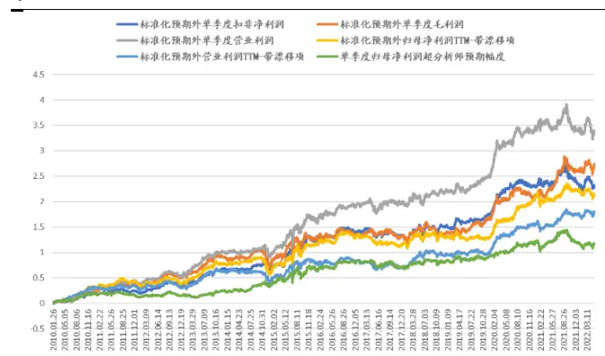
数据来源：Wind，朝阳永续，国泰君安证券研究测试区间：2010.01-2022.05。

图 5：沪深 300股票池 SUE因子 组合优化超额收益曲线
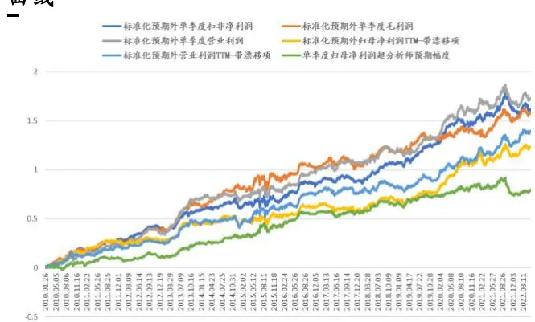
数据来源：Wind，朝阳永续，国泰君安证券研究
测试区间：2010.01-2022.05。

## 3.1.3. SUE 衍生因子

我们认为，SUE 衍生因子值越大，个股的业绩超预期程度越高，未来表现越好。通过因子分组测试和单因子组合优化发现：

1） 标准化预期外单季度 GPOA、标准化预期外单季度归母 ROA、标准化预期外单季度归母 ROE、标准化预期外单季度扣非 ROA、标准化预期外扣非 ROE(TTM)效果较好，组合优化后相对基准（沪深 300）的年化超额收益分别为 7.15%、6.64%、7.07%、7.99%和 9.02%，信息比率分别为 1.29、1.33、1.41、1.57 和 1.76。

2）ROE、ROA计算的 SUE 衍生因子效果明显好于 GPOA、BP、SP 等计算的 SUE衍生因子。

3）不带漂移项的因子效果好于漂移项的因子。

表 10：沪深 300 股票池 SUE衍生因子 主要绩效指标

|  |  |  |  | t9多头组 |  |  |  |  |  | 单因子组合优化 |  |  |  |  |  |  | 组合优化 |
| --- | --- | --- | --- | --- | --- | --- | --- | --- | --- | --- | --- | --- | --- | --- | --- | --- | --- |
| 沪深300内 | 因子名 | t0空头组 |  | t9多头组 |  | 超额最大回撤 | 超额收益 | 超额收益 | 多空收益 |  |  |  |  |  |  |  |  |
|  |  |  |  |  |  |  | 波动率 | 信息比率 | 少生收益 | 超硕收益 | 最大回撤 |  |  |  |  |  |  |
|  |  |  |  |  |  |  |  |  |  |  |  |  | 波动率 | 超额收益信息比率 | IC | RankIC | 周度双边换手率 |
|  | 标准化预期外BP | -420% |  | 018% |  | -30.49 | 9.84% | 0.02 | 4.38% | 3.86% | -9.14% |  | 5.08% | 0.76 | 0.77% | 1.10% | 1397% |
|  | 标准化预期外BP-带漂移项 | 366% |  | 272% |  | -17.499 | 8.63% | 0.32 | 6.38% | 2.90% | LOT% |  | 5.17% | 0.56 | 0.75% | 0.87% | 15.19% |
|  | 标准化预期外单季度GPOA | -557% |  | 1008% |  | -17.99 | 10.68% | 0.94 | 15.66% | 7.15% | -9.36% |  | 5.54% | 1.29 | 2.00% | 1.61% | 13.58% |
|  | 标准化预期外单季度GPOA-带漂移项 | -528% |  | 7.95% |  | 17.229 | 10.54% | 0.75 | 13.23% | 6.50% | -8.34% |  | 5.57% | 1.17 | 1.78% | 1.42% | 13.03% |
|  | 标准化预期外单季度SP | -679% |  | 617% |  | 9.639 | 9.75% | 0.63 | 12.96% | 5.40% | -9.12% |  | 5.35% | 1.01 | 2.07% | 2.10% | 15.09% |
|  | 标准化预期外单季度SP-带漂移项 | 345% |  | 6.86% |  | -15.689 | 8.88% | 0.77 | 10.31% | 5.61% | 1.6 | % | 5.28% | 1.06 | 1.76% | 1.73% | 15.14% |
|  | 标准化预期外单季度归母ROA | 542% |  | 1002% |  | -1138% | 9.40% | 1.07 | 15.43% | 6.64% | -13.75 | % | 5.00% | 1.33 | 1.84% | 1.95% | 16.12% |
| 单季度 | 标准化预期外单季度归母ROA-带漂移项 | -634% |  | 5.3 | 2% | -177 | 9.41% | 0.57 | 11.66% | 5.55% | -9.68 | % | 5.09% | 1.09 | 1.68% | 1.75% | 16.27% |
|  | 标准化预期外单季度归母ROE | 32% |  | 9.5 | 3% | -1314 | 9.67% | 0.99 | 15.85% | 7.07% | -8.88 | % | 5.02% | 1.41 | 1.92% | 1.97% | 15.85% |
|  | 标准化预期外单季度归母ROE-带漂移项 | -497% |  | 6.2 | 5% | -12199 | 8.97% | 0.70 | 11.22% | 5.45% | -9.02 | % | 5.04% | 1.08 | 1.59% | 1.69% | 16.02% |
|  | 标准化预期外单季度扣非ROA | 335% |  | 9.5 | 6% | -12259 | 8.62% | 1.11 | 12.91% | 7.99% | 8.91 | % | 5.07% | 1.57 | 1.89% | 1.93% | 14.53% |
|  | 标准化预期外单季度扣非ROA-带漂移项 | 373% |  | 7.6 | 0% | -10.559 | 8.70% | 0.87 | 11.33% | 6.88% | -9.52 | % | 5.13% | 1.34 | 1.74% | 1.63% | 14.56% |
|  | 标准化预期外单季度扣非ROE | -45 | 9% | 9.5 | 2% | -14.60% | 8.99% | 1.06 | 14.12% | 8.40% | -724 | % | 5.04% | 1.67 | 1.88% | 1.89% | 14.43% |
|  | 标准化预期外单季度扣非ROE-带漂移项 | E3 | 43% | 6.6 | 0% | -10.B7% | 8.54% | 0.77 | 10.02% | 5.86% | -8.86 | % | 5.07% | 1.16 | 1.65% | 1.53% | 14.55% |
| TTM | 标准化预期外GPOA(TTM) | 35 | 6% | 73 | 69% | -17.06% | 10.09% | 0.76 | 11.26% | 4.99% | -8.15% | % | 5.29% | 0.94 | 1.05% | 0.87% | 10.95% |
|  | 标准化预期外GPOA(TTM)-带漂移项 | 2 | 85% | 5 | 92% | 16.649 | 9.84% | 0.60 | 8.78% | 4.87% | -8.42 | % | 5.27% | 0.93 | 1.07% | 0.93% | 12.16% |
|  | 标准化预期外SP（TTM） | 5529% |  | 59 | 4% | 17.679 | 10.25% | 0.58 | 11.23% | 4.89% | -692 | % | 5.40% | 0.91 | 1.68% | 1.51% | 12.40% |
|  | 标准化预期外SP（TTM)-带漂移项 | 86% |  | 7.6 | 5% | 17.249 | 9.87% | 0.77 | 13.51% | 5.02% | -8.00% | % | 5.25% | 0.96 | 1.70% | 1.54% | 13.07% |
|  | 标准化预期外归母ROA(TTM) | -485% |  | 6.9 | 0% | -16.44 | 9.05% | 0.76 | 11.76% | 4.84% | -8.17 | % | 4.83% | 1.00 | 1.29% | 1.41% | 12.85% |
|  | 标准化预期外归母ROA(TTM)-带漂移项 | 453% |  | 5.7 | 8% | 17.879 | 9.59% | 0.60 | 10.31% | 6.30% | 8.63 | % | 5.06% | 1.24 | 1.29% | 1.51% | 14.08% |
|  | 标准化预期外归母ROE(TTM) | -603% |  | 10 | 81% | -15.299 | 10.01% | 1.08 | 16.84% | 6.51% | -16.54 | % | 5.18% | 1.26 | 1.94% | 1.85% | 15.95% |
|  | 标准化预期外归母ROE(TTM)-带漂移项 | 585% |  | 7.1 | 9% | -15.579 | 9.10% | 0.79 | 13.05% | 5.66% | -12.42 | % | 5.09% | 1.11 | 1.67% | 1.76% | 16.03% |
|  | 标准化预期外扣非ROA(TTM) | 410% |  | 5 | 98% | -16.51% | 8.82% | 0.68 | 10.08% | 3.43% | -76 | % | 4.81% | 0.71 | 1.09% | 1.11% | 1.33% |
|  | 标准化预期外扣非ROA(TTM)-带漂移项 | 407% |  | 6.1 | 5% | -14.19% | 8.87% | 0.69 | 10.22% | 4.88% | -8.58 | % | 4.97% | 0.98 | 1.20% | 1.10% | 12.34% |
|  | 标准化预期外扣非ROE(TTM) | B321% |  | 10 | 42% | -15.31% | 9.23% | 1.13 | 13.64% | 9.02% | -6.62 | % | 5.14% | 1.76 | 1.82% | 1.78% | 1405% |
|  | 标准化预期外扣非ROE(TTM)-带漂移项 | 308% |  | 8.8 | 0% | -12969 | 8.76% | 1.00 | 11.87% | 6.51% | -12.6 | % | 5.12% | 1.27 | 1.60% | 1.49% | 1466% |

数据来源：Wind，国泰君安证券研究。测试区间：2010.01-2022.05。

表 11：沪深 300股票池 SUE衍生因子 分组年化超额收益

|  |  | 年化超额收益 |  |  |  |  |  |  |  |  |  |  |  |  |  |  |  |  |  |  |  |  |
| --- | --- | --- | --- | --- | --- | --- | --- | --- | --- | --- | --- | --- | --- | --- | --- | --- | --- | --- | --- | --- | --- | --- |
| 沪深300内 | 因子名 | t0空头组 t |  | 1 |  | t2 |  | t3 |  | t4 |  | t5 |  | t6 |  | t7 |  | t8 |  | t9多头组 |  | 多空收益 |
|  | 标准化预期外BP |  | 4.20% | 1 | .41% | 1 | .39% | 2. | 16% | 1 | .34% |  | 0.67% |  | 368% | 1 | .09% |  | 307% | 0 | .18% | 4.38% |
|  | 标准化预期外BP-带漂移项 |  | 3.66% | L | 1.27% |  | 1.71% | 0 | .03% | 3. | 69% | 1 | .54% | 0 | .84% |  | 276% |  | 1.44% |  | 2.72% | 6.38% |
|  | 标准化预期外单季度GPOA |  | 5.57% | D | 1.16% |  | 4.03% | 1 | .34% |  | 1.92% | 1 | .02% | D | 1.78% |  | 0.46% |  | 291% | 10 | .08% | 15.66% |
|  | 标准化预期外单季度GPOA-带漂移项 | 7 | 5.28% | 0 | .83% | 「 | 3.37% | 0 | .03% |  | .52% | 「 | 3.62% | 2 | .11% |  | 335% |  | 2.41% | 7 | .95% | 13.23% |
|  | 标准化预期外单季度SP |  | 6.79% |  | 4.72% |  | 0.40% | D | 2.37% |  | 0.51% | 01 | .99% | 2 | .62% |  | 2.13% |  | 7.37% |  | 6.17% | 12.96% |
|  | 标准化预期外单季度SP-带漂移项 | 「 | 3.45% | 「 | 2.58% | 「 | 3.55% | 2. | 36% | 2. | 48% | 2. | 24% |  | 2.21% |  | 1.67% |  | 7.22% |  | 6.86% | 10.31% |
|  | 标准化预期外单季度归母ROA |  | 5.42% | 「 | 3.50% | 1 | .04% | 0 | .56% | 口 | 2.86% | 「 | 11.46% | 3 | .47% |  | 3.92% |  | 4.78% | 10 | .02% | 15.43% |
| 单季度 | 标准化预期外单季度归母ROA-带漂移项 |  | 6.34% | 口 | 1.86% | 1 | .05% | 2. | 33% | 1 | .41% |  | 0.03% |  | 0.96% |  | 2.54% |  | 5.42% |  | 5.32% | 11.66% |
|  | 标准化预期外单季度归母ROE |  | 6.32% |  | 2.39% |  | 0.80% |  | 2.38% |  | 0.61% |  | 1.69% |  | D2.42% |  | 2.79% |  | 5.71% |  | 9.53% | 15.85% |
|  | 标准化预期外单季度归母ROE-带漂移项 | 7 | 4.97% | 「 | 2.84% |  | 0.85% | 2. | 74% | 3. | 72% | 0 | .06% |  | 333% |  | 303% |  | 3.81% |  | 6.25% | 11.22% |
|  | 标准化预期外单季度扣非ROA | 3 | .35% | 7 | 4.03% |  | 1.75% | 口 | 3.62% | 1 | 0.64% | 口 | 3.04% |  | 1.29% |  | 2.40% |  | 4.54% |  | 9.56% | 12.91% |
|  | 标准化预期外单季度扣非ROA-带漂移项 |  | 3.73% | 「 | 3.24% | 「 | 2.09% | 口 | 2.84% | 1 | .36% | 0 | .90% | 1 | .01% |  | 4.04% |  | 4.70% |  | 7.60% | 11.3% |
|  | 标准化预期外单季度扣非ROE |  | 4.59% | 4 | .30% | 0 | 2.41% |  | 0.30% | L | 1.26% | 02 | .48% |  | 0.26% |  | 2.01% |  | 4.81% |  | 9.52% | 14.12% |
|  | 标准化预期外单季度扣非ROE-带漂移项 | 3 | .43% | 「 | 1.83% | 1 | 2.46% | 3 | .41% | 0 | .90% |  | 1.03% |  | 1.43% |  | 1.87% |  | 4.11% |  | 6.60% | 10.02% |
| TTM | 标准化预期外GPOA(TTM) |  | 3.56% |  | 2.59% | 2. | 16% | 1 | .60% | 1 | .01% | 0 | .83% |  | 0.64% |  | 0.05% | 1 | .59% |  | 7.69% | 11.26% |
|  | 标准化预期外GPOA(TTM)-带漂移项 | 「 | 2.85% | 0 | .79% |  | 10.90% |  | 0.53% |  | 0.57% | 2. | 22% |  | 0.89% | L | 1.74% |  | 2.21% |  | 5.92% | 8.78% |
|  | 标准化预期外SP（TTM） |  | 5.29% |  | 4.27% | 1 | .25% | 4 | .19% |  | 315% |  | 0.78% | 1 | .11% |  | 290% |  | 2.15% |  | 5.94% | 1123% |
|  | 标准化预期外SP（TTM）-带漂移项 |  | 5.86% | 0 | .15% | 3 | .29% |  | 0.08% | 4 | .84% |  | 1.68% | 0 | .96% |  | 308% |  | 4.09% |  | 7.65% | 13.51% |
|  | 标准化预期外归母ROA(TTM) |  | 4.85% | 1 | .75% | 1 | .37% |  | 1.52% |  | 1.74% |  | 1.20% |  | D1.80% | 1 | .61% |  | 3.99% |  | 6.90% | 11.76% |
|  | 标准化预期外归母ROA(TTM)-带漂移项 |  | 4.53% | 0 | .99% |  | 0.24% | 「 | 2.99% | 口 | 2.50% | 0 | .55% | 1 | .09% |  | 2.61% |  | 4.47% |  | 5.78% | 10.31% |
|  | 标准化预期外归母ROE(TTM) |  | 6.03% |  | 3.75% |  | 0.54% | 0 | .45% | L | 1.37% | 「 | 2.66% | 2. | 29% |  | 0.09% |  | 6.59% | 10 | .81% | 16.84% |
|  | 标准化预期外归母ROE(TTM)-带漂移项 |  | 5.85% | 「 | 2.47% | 0 | .99% | 1 | .62% | 「 | 2.67% | 02 | .16% | 1 | .73% |  | 2.02% |  | 6.17% |  | 7.19% | 13.05% |
|  | 标准化预期外扣非ROA(TTM) | 7 | 4.10% | 「 | 2.05% |  | 0.02% |  | 2.16% |  | 2.22% | 4 | .01% |  | 0.43% |  | 2.14% |  | 2.68% |  | 5.98% | 10.08% |
|  | 标准化预期外扣非ROA(TTM)-带漂移项 |  | 4.07% |  | 0.80% |  | 4.04% | 2 | .40% | 1 | .44% | L | 1.28% | 1 | .40% |  | 0.47% |  | 3.44% |  | 6.15% | 10.22% |
|  | 标准化预期外扣非ROE(TTM) |  | 3.21% |  | 4.05% |  | 5.22% |  | 2.04% | 1 | .28% | 口 | 2.95% |  | 0.37% | 0 | .15% |  | 5.26% | 10 | .42% | 13.64% |
|  | 标准化预期外扣非ROE(TTM)-带漂移项 |  | 3.08% |  | 4.45% | 0 | .92% | 口 | 2.87% |  | 0.70% | 1 | 0.86% |  | 0.11% |  | 2.33% |  | 1.49% |  | 8.80% | 11.87% |

数据来源：Wind，国泰君安证券研究。测试区间：2010.01-2022.05。

沪深 300 股票池内，历史回测效果较好的 SUE衍生因子多头组超额收益曲线、单因子组合优化超额收益曲线如下。

图 6：沪深300股票池 SUE衍生因子 多头组超额收益曲线
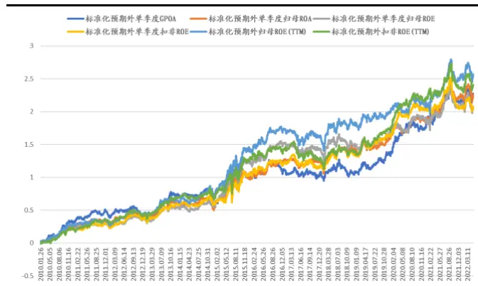
数据来源：Wind，国泰君安证券研究
测试区间：2010.01-2022.05。

图 7：沪深300股票池 SUE衍生因子 组合优化超额收益曲线
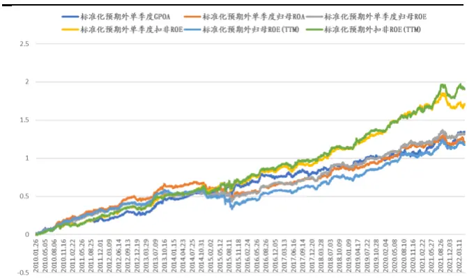
数据来源：Wind，国泰君安证券研究
测试区间：2010.01-2022.05。

## 3.1.4. 过去 N日券商/报告上下调比例

我们认为，过去 N 日券商/报告上下调比例越大，个股的业绩超预期程度越高，未来表现越好。通过因子分组测试和单因子组合优化发现：1） 过去 90 日券商上调-下调比例、过去 90 日报告上调-下调比例、过去 60 日券商上调比例、过去 90 日报告上调比例效果较好，相对基准（沪深 300）的年化超额收益分别为 8.17%、9.92%、8.52%和 9.15%，信息比率分别为 1.61、1.99、1.75 和 1.84。

2）整体上，90 日的因子效果最好。

）报告数量计算的因子效果好于券商数量计算的因子。
分组测试具体结果和单因子组合优化的绩效指标如下。

表 12：沪深 300 股票池 过去 N日券商/报告上下调比例因子 主要绩效指标

|  |  |  | t9多头 |  |  | 组 |  |  | 单因子组合优化 |  |  |  |  |  | 组合优化 |
| --- | --- | --- | --- | --- | --- | --- | --- | --- | --- | --- | --- | --- | --- | --- | --- |
| 沪深300内 | 因子名 | t0空头组t | 9多头组 |  | 超额最大超回撤 | 额收益波动率 | 超额收益信息比率 | 多空收益 | 超额收益 | 超额收益超最大回撤 | 额收益波动率 | 超额收益信息比率 | IC | RankIC | 周度双边换手率 |
| 上调-下调 |  |  |  |  |  |  |  |  |  |  |  |  |  |  |  |
|  | 过去60日券商上调-下调比例 | C4.25% | 11% -15.01% |  |  | 8.63% | 0.94 | 12.36% | 7.40% | -9.911% | 5.00% | 1.48 | 1.61% | 1.75% | 33.73% |
|  | 过去90日券商上调-下调比例 | 5.41% | 19.08% |  | F12.07% | 8.55% | 1.18 | 15.49% | 8.17% | -6.33% | 5.07% | 1.61 | 1.93% | 1.91% | 28.18% |
| 比例 | 过去180日报告上调-下调比例 D | 4.79% | 13.56% |  | -16.28% | 8.95% | 1.52 | 18.34% | 8.94% | -9.97% | 5.26% | 1.70 | 2.26% | 2.26% | 19.59% |
|  | 过去60日报告上调-下调比例 | D8.62% | 10.93% -12$0% |  |  | 8.39% | 1.30 | 14.55% | 8.49% | -6.877% | 4.99% | 1.70 | 1.83% | 1.97% | 30.96% |
|  | 过去90日报告上调-下调比例 口 | 4.79% | 11 | .45% F12%1% |  | 8.64% | 1.33 | 16.24% | 9.92% | -5.89% | 4.98% | 1.99 | 2.04% | 2.13% | 25.56% |
| 上调比例 | 过去180日券商上调比例 | D8.47% | $. | 01% -12.69% |  | 7.97% | 1.01 | 11.48% | 5.59% | -8.94% | 4.94% | 1.13 | 1.43% | 1.52% | 24.64% |
|  | 过去60日券商上调比例 | 日1.96% | $. | 19% 116% |  | 8.50% | 0.96 | 10.15% | 8.52% | -8.86% | 4.88% | 1.75 | 1.71% | 1.76% | 34.39% |
|  | 过去90日券商上调比例 | 口6.98% | 8. | 59% 12$7% |  | 8.38% | 1.02 | 12.58% | 8.20% | 630% | 4.92% | 1.67 | 1.93% | 2.06% | 28.33% |
|  | 过去180日报告上调比例 | D4.32% | 11 | .82%-1341% |  | 8.74% | 1.35 | 16.14% | 8.37% | -10.91% | 5.12% | 1.63 | 2.19% | 2.10% | 19.71% |
|  | 过去60日报告上调比例 | D8.04% | 10 | .64%-133% |  | 8.26% | 1.29 | 13.69% | 7.83% | 6.17% | 5.05% | 1.55 | 1.84% | 1.80% | 31.04% |

数据来源：Wind，朝阳永续，国泰君安证券研究。测试区间：2010.01-2022.05。

表 13：沪深 300 股票池 过去 N日券商/报告上下调比例因子 分组年化超额收益

|  |  | 年化超额收益 |  |  |  |  |  |  |  |  |  |  |  |  |  |  |  |  |  |  |  |  |
| --- | --- | --- | --- | --- | --- | --- | --- | --- | --- | --- | --- | --- | --- | --- | --- | --- | --- | --- | --- | --- | --- | --- |
| 沪深300内 | 因子名 t | 0空头组 t |  | 1 |  | t2 |  | t3 |  | t4 |  | t5 |  | t6 |  | t7 |  | t8 |  | t9多头组 |  | 多空收益 |
|  | 过去180日券商上调-下调比例 | C | -4.59% | ■ | -2.49% |  | 1.48% |  | -0.91% | 0 | -2.26% | -3 | .16% | 1 | -3.08% |  | 3.37% |  | 4.50% |  | 8.24% | 12.83% |
|  | 过去60日券商上调-下调比例 | 7 | -4.25% | 1 | -2.50% |  | 0.70% |  | -3.33% | 口 | -2.63% |  | -4.30% |  | 0.72% |  | 3.53% |  | 6.36% |  | 8.11% | 12.36% |
| 上调-下 | 过去90日券商上调-下调比例 |  | -5.41% | 口 | -2.96% |  | -0.51% | 日 | -3.21% |  | -1.69% |  | 口-3.04% |  | 0.58% |  | 1.64% |  | 5.66% |  | 10.08% | 15.49% |
| 调比例 | 过去180日报告上调-下调比例 |  | -4.79% | 0 | -2.18% | à | -3.24% | -2 | .63% | C | -2.97% | 1 | -2.01% | D | -4.58% |  | 5.09% |  | 5.48% |  | 13.56% | 18.34% |
|  | 过去60日报告上调-下调比例 | -3.62% |  | 1 | -2.49% |  | 0.04% | -3 | .65% | 口 | -4.03% |  | -1.51% | 口 | -2.82% |  | 3.00% |  | 522% |  | 10.93% | 14.55% |
|  | 过去90日报告上调-下调比例 | -4.79% |  |  | -3.71% |  | -0.99% |  | -3.31% | C | -2.18% | 口 | -2.56% |  | -0.43% |  | 0.97% |  | 6.98% |  | 1.45% | 16.24% |
| 上调比例 | 过去180日券商上调比例 |  | -3.47% | 一 | -1.64% |  | -0.44% |  | -0.62% |  | -4.18% | -1 | .28% |  | -3.59% |  | 5.44% |  | 2.71% |  | 8.01% | 1148% |
|  | 过去60日券商上调比例 | 1 | -1.96% | 1 | -1.23% |  | -4.22% | -2 | .17% |  | -5.71% | 「 | -3.24% |  | 0.87% |  | 3.17% |  | 7.42% |  | 8.19% | 10.15% |
|  | 过去90日券商上调比例 |  | -3.98% |  | -0.07% |  | -4.99% |  | -5.69% | 口 | -2.92% | 「 | D-1.64% |  | 2.35% |  | 3.56% |  | 6.13% |  | 8.59% | 12.58% |
|  | 过去180日报告上调比例 |  | -4.32% |  | -4.73% |  | -1.07% |  | -0.44% | 0 | -2.42% | 「 | -2.39% |  | -3.14% |  | 0.50% |  | 7.78% |  | 1.82% | 16.14% |
|  | 过去60日报告上调比例 | L | -3.04% |  | -0.41% | 口 | -1.99% | D | -4.29% | 口 | -3.85% |  | L-1.06% |  | -1.62% |  | 1.71% |  | 486% | 1 | 0.64% | 13.69% |
|  | 过去90日报告上调比例 |  | -4.96% |  | -1.45% |  | -2.79% |  | -3.72% | C | -2.59% | -2 | .79% | C | -2.07% |  | 498% |  | 542% |  | 1.42% | 16.38% |

数据来源：Wind，朝阳永续，国泰君安证券研究。测试区间：2010.01-2022.05。

沪深 300 股票池内，历史回测效果较好的过去 N 日券商/报告上下调因

子多头组超额收益曲线、单因子组合优化超额收益曲线如下。

图 8：沪深 300股票池 过去 N日券商/报告上下调比例因子多头组超额收益曲线
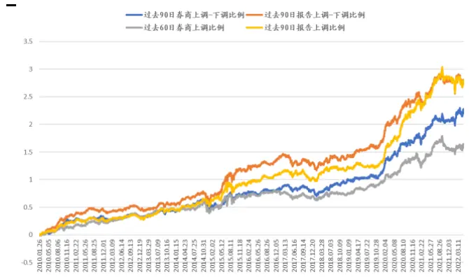
数据来源：Wind，朝阳永续，国泰君安证券研究
测试区间：2010.01-2022.05。

图 9：沪深 300股票池 过去 N日券商/报告上下调比例因子组合优化超额收益曲线
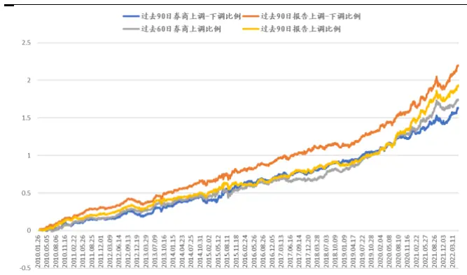
数据来源：Wind，朝阳永续，国泰君安证券研究测试区间：2010.01-2022.05。

## 3.1.5. 过去 N日盈利/营收预测调整

我们认为，过去 N 日盈利/营收预测调整幅度越大，个股的业绩超预期程度越高，未来表现越好。通过因子分组测试和单因子组合优化发现：1） 过去 90 天盈利调整、过去 90 天营收调整效果较好，相对基准（沪深 300）的年化超额收益为 5.98%、4.37%，信息比率为 1.11、0.85。2）盈利调整效果明显好于营收调整。

表 14：过去 N日盈利/营收预测调整因子主要绩效指标

|  |  |  | t9多 |  | 头组 |  |  |  | 单因子组合优化 |  |  |  |  | 组合优化 |
| --- | --- | --- | --- | --- | --- | --- | --- | --- | --- | --- | --- | --- | --- | --- |
| 沪深300内 | 因子名 | t0空头组 | t9多头组 | 超额最大回撤 | 超额收益波动率 | 超额收益信息比率 | 多空收益 | 超额收益 | 超额收益最大回撤 | 超额收益波动率 | 超额收益信息比率 | IC | RankIC | 周度双边换手率 |
| 盈利 | 过去120天盈利调整 | -6.05% | 5.03% | -24.47% | 10.62% | 0.47 | 11.08% | 6.24% | -10.26% | 5.37% | 1.16 | 1.64% | 2.03% | 20.35% |
|  | 过去180天盈利调整 | 5.07% | 5.12% | -24.77% | 10.80% | 0.47 | 10.18% | 5.67% | -9.18% | 5.34% | 1.06 | 1.49% | 1.96% | 18.41% |
|  | 过去360天盈利调整 | 4.65% | 1.91% | -32.67% | 10.59% | 0.18 | 6.56% | 2.71% | -11.5% | 5.21% | 0.52 | 1.03% | 1.37% | 15.34% |
|  | 过去60天盈利调整 | -6.31% | 3.73% | -12.72% | 10.47% | 0.36 | 10.04% | 5.81% | -8.15% | 5.37% | 1.08 | 1.71% | 2.04% | 27.13% |
|  | 过去90天盈利调整 | -7.92% | 5.07% | 23.43% | 10.59% | 0.48 | 13.00% | 5.98% | -7.90% | 5.38% | 1.11 | 1.81% | 2.11% | 22.80% |
| 营收 | 过去120天营收调整 | -3.67% | 2.77% | -23.60% | 10.10% | 0.27 | 6.45% | 4.08% | -8.02% | 5.23% | 0.78 | 1.56% | 1.81% | 20.69% |
|  | 过去180天营收调整 | -5.77% | 4.84% | -20.77% | 10.43% | 0.46 | 10.61% | 5.14% | -9.62% | 5.28% | 0.97 | 1.51% | 1.67% | 17.68% |
|  | 过去360天营收调整 | -5.73% | 0.37% | -32.80% | 10.47% | 0.04 | 6.10% | 2.15% | -9.16% | 5.11% | 0.42 | 1.07% | 1.28% | 14.81% |
|  | 过去60天营收调整 | 4.95% | 4.50% | -1740% | 9.27% | 0.49 | 9.45% | 4.25% | -11.22% | 5.08% | 0.84 | 1.43% | 1.60% | 28.20% |
|  | 过去90天营收调整 | 5.12% | 4.64% | -1773% | 9.75% | 0.48 | 9.76% | 4.37% | -10.1% | 5.12% | 0.85 | 1.63% | 1.98% | 23.46% |

数据来源：Wind，朝阳永续，国泰君安证券研究。测试区间：2010.01-2022.05。

表 ：过去 日盈利营收预测调整因子分组年化超额收益

|  |  | 年化超额收益 |  |  |  |  |  |  |  |  |  |  |  |  |  |  |  |  |  |  |  |  |
| --- | --- | --- | --- | --- | --- | --- | --- | --- | --- | --- | --- | --- | --- | --- | --- | --- | --- | --- | --- | --- | --- | --- |
| 沪深300内 | 因子名 t | 0空头组 t |  | 1 |  | t2 |  | t3 |  | t4 |  | t5 |  | t6 |  | t7 |  | t8 |  | t9多头组 |  | 多空收益 |
|  | 过去120天盈利调整 |  | 6.05% |  | .30% | 日 | .99% |  | .48% | -0 | .06% |  | 28% |  | 98% |  | 2.47% |  | .10% | $ | .03% | 11.08% |
|  | 过去180天盈利调整 | 7 | .07% | D | .07% | C | .58% | -0 | .79% |  | 51% |  | 106% |  | -.04% | 3 | .36% | 4 | .31% | 5 | .12% | 10.18% |
| 盈利 | 过去360天盈利调整 | D | .65% |  | 5.92% | 0 | .34% | 0 | .19% |  | .07% | 3 | .97% |  | 61% |  | 64% | 3 | .88% |  | 91% | 16.56% |
|  | 过去60天盈利调整 | 7 | 5.31% | 7 | .17% | -0 | .58% | -φ | .03% | .2 | 8% | 0 | .27% |  | -.11% | 4 | .66% | 7 | .99% | 3 | .73% | 10.04% |
|  | 过去90天盈利调整 | _ | .92% |  | .18% | -0 | .27% | -0 | .71% | .6 | 1% |  | 37% |  | 78% |  | 63% | 6 | .99% | $ | .07% | 13.00% |
| 营收 | 过去120天营收调整 | B | .67% | 7 | .16% | 0 | .48% |  | 40% |  | .97% | .7 | 6% | -. | 25% |  | 65% | $ | .61% | 2 | .77% | 6.45% |
|  | 过去180天营收调整 | 7 | .77% | B | .50% | .6 | 1% | φ | .21% |  | 17% |  | 35% | 1 | 17% |  | 126% | 5 | .14% | 4 | .84% | 10.61% |
|  | 过去360天营收调整 | 7 | .73% | B | 2.56% | 2. | 85% |  | 24% |  | .87% | 0 | .69% |  | 93% | 2 | .59% | $. | 46% | 0 | .37% | 6.10% |
|  | 过去60天营收调整 | 7 | .95% | B | .56% |  | 22% | .9 | 0% | 2. | 09% | B.6 | 8% | 1 | 02% |  | 68% | $ | .61% | 4 | .50% | 9.45% |
|  | 过去90天营收调整 | 7 | .12% | B | .98% | .7 | 7% | 0. | 42% | 2. | 80% | 0. | 80% |  | 34% | 5 | .20% | 6 | .76% | 4 | .64% | 9.76% |

数据来源：Wind，朝阳永续，国泰君安证券研究。测试区间：2010.01-2022.05。

沪深 300 股票池内，历史回测效果较好的过去 N 日盈利/营收预测调整因子多头组超额收益曲线、单因子组合优化超额收益曲线如下。

图 10：沪深 300 股票池 过去 N日盈利/营收预测调整因子 多头组超额收益曲线
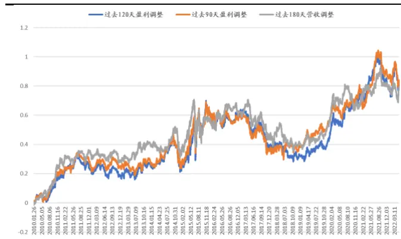
数据来源：Wind，朝阳永续，国泰君安证券研究测试区间：2010.01-2022.05。

图 11：沪深 300股票池 过去 N日盈利/营收预测调整因子 组合优化超额收益曲线
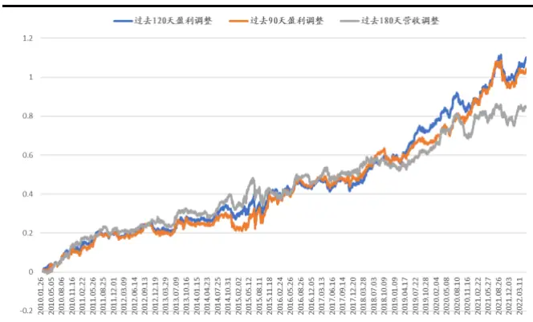
数据来源：Wind，朝阳永续，国泰君安证券研究测试区间：2010.01-2022.05。

## 3.2. 中证 500 股票池

## 3.2.1. 盈余公告前后异常收益

我们认为，公告前后异常收益越大，个股的业绩超预期程度越高，未来表现越好。通过因子分组测试和单因子组合优化发现：

1）公告后 1 天异常收益因子、跳空因子效果较好，组合优化相对基准（中证 500）的年化超额收益分别为 5.46%和 7.71%，信息比率分别为1.10 和 1.61。

2）公告前后异常收益因子在全市场的选股效果整体不佳。
分组测试具体结果和单因子组合优化的绩效指标如下。

表 16：中证 500 股票池 盈余公告前后异常收益因子 主要绩效指标

|  |  |  |  | t9多头组 |  |  |  |  | 单因子组合优化 |  |  |  |  |  | 组合优化 |
| --- | --- | --- | --- | --- | --- | --- | --- | --- | --- | --- | --- | --- | --- | --- | --- |
| 中证500内 | 因子名 | t0空头组 |  | t9多头组 | 超额最大回撤 | 超额收益波动率 | 超额收益信息比率 | 多空收益 | 超额收益 | 超额收益最大回撤 | 超额收益波动率 | 超额收益信息比率 | IC | RankIC | 周度双边换手率 |
| 单季度 | 公告后1天异常收益 | -9.10 | % | 5.88% | 12.85% | 7.08% | 0.83 | 14.99% | 5.46% | -9.42% | 4.96% | 1.10 | 1.68% | 1.43% | 16.76% |
|  | 公告后2天异常收益之和 | -6.21% | % | 4.29% | -12.52% | 6.94% | 0.62 | 10.50% | 3.95% | -11.94 | 4.97% | 0.79 | 1.21% | 1.17% | 16.53% |
|  | 公告后3天异常收益之和 | -4.92 | % | 4.03% | 4.61% | 7.10% | 0.57 | 8.94% | 2.79% | -15.79 | 4.97% | 0.56 | 0.99% | 0.88% | 16.71% |
|  | 公告后4天异常收益之和 | -5.60 | % | 4.27 | 13.94% | 7.23% | 0.59 | 9.88% | 2.14% | -15.77 | 5.10% | 0.42 | 0.93% | 0.72% | 16.71% |
|  | 盈余公告后5天异常收益之和 | -430 | % | 1.81% | 4.41% | 7.23% | 0.25 | 6.11% | 2.39% | -15.65 | 5.18% | 0.46 | 0.74% | 0.43% | 16.70% |
|  | 盈余公告前1天后1天异常收益之和 | -3.0 | % | 5.14 | -15.09% | 6.82% | 0.75 | 8.17% | 4.55% | 12.65 | 4.95% | 0.92 | 1.28% | 1.55% | 16.47% |
|  | 盈余公告前1天后2天异常收益之和 | 5.92 | % | 5.87 | -116 | 7.14% | 0.82 | 11.79% | 4.67% | 10.93 | 5.05% | 0.93 | 1.35% | 1.26% | 16.51% |
|  | 盈余公告前1天后3天异常收益之和 | 5.80% | % | 3.31% | 16.65 | 7.29% | 0.45 | 9.11% | 3.29% | -13.50 | 5.11% | 0.64 | 1.15% | 1.05% | 16.76% |
|  | 盈余公告前1天后4天异常收益之和 | 5.72 | % | 3.31% | -19.57 | 7.31% | 0.45 | 9.03% | 2.72% | 1.58 | 5.08% | 0.54 | 1.07% | 0.84% | 16.56% |
|  | 盈余公告前2天后2天异常收益之和 | 5.76% | % | 4.40 | -143 | 7.14% | 0.62 | 10.16% | 4.65% | 1.59 | 5.03% | 0.92 | 1.33% | 1.30% | 16.46% |
|  | 盈余公告前2天后3天异常收益之和 | 1.85% | % | 3.82 | 15.83% | 7.29% | 0.52 | 8.67% | 4.11% | -9.84% | 5.11% | 0.81 | 1.16% | 1.06% | 16.64% |
| TTM | 公告后2天累计异常收益 | -4.71 | % | 1.40% | 16.93% | 7.04% | 0.20 | 6.11% | 2.79% | -13.10 | 4.90% | 0.57 | 0.75% | 1.06% | 16.54% |
|  | 公告后3天累计异常收益 | -2.60 | % | 3.25% | 17.72% | 7.03% | 0.46 | 5.85% | 1.63% | -19.50 | 4.94% | 0.33 | 0.58% | 0.79% | 16.63% |
|  | 公告后4天累计异常收益 | -2.33 | % | 3.91% | -15.13% | 7.25% | 0.54 | 6.25% | 1.88% | -15.45% | 5.02% | 0.38 | 0.59% | 0.64% | 16.67% |
|  | 盈余公告后5天累计异常收益 | -1.52 | % | 1.05% | 18.00% | 7.38% | 0.14 | 2.58% | 2.19% | -17.45 | 5.08% | 0.43 | 0.46% | 0.39% | 16.67% |
|  | 盈余公告前1天后1天累计异常收益 | -3.D1 | % | 5.42 | -1 L.05% | 6.75% | 0.80 | 8.44% | 4.49% | -12.86 | 4.91% | 0.91 | 1.26% | 1.54% | 16.46% |
|  | 盈余公告前1天后2天累计异常收益 | -3 | % | 3.10% | 19.16 | 7.08% | 0.44 | 6.14% | 2.92% | 2.14 | 4.94% | 0.59 | 0.90% | 1.16% | 16.49% |
|  | 盈余公告前1天后3天累计异常收益 | -3 |  | 1.81% | -23.67 | 7.20% | 0.25 | 5.32% | 2.35% | 14.15 | 5.02% | 0.47 | 0.76% | 0.97% | 16.59% |
|  | 盈余公告前1天后4天累计异常收益 | -375 | % | 2.74% | -22.67 | 7.28% | 0.38 | 6.50% | 2.09% | -13.96 | 5.03% | 0.42 | 0.74% | 0.79% | 16.55% |
|  | 盈余公告前2天后2天累计异常收益 | 420 | % | 2.25% | -21.51% | 7.13% | 0.32 | 6.45% | 2.88% | 12.69 | 4.95% | 0.58 | 0.89% | 1.18% | 16.47% |
|  | 盈余公告前2天后3天累计异常收益 | -3.03 | % | 3.029 | -21.82 | 7.23% | 0.42 | 6.05% | 3.11% | 1.83 | 5.08% | 0.61 | 0.78% | 0.99% | 16.61% |
|  | FE3 | 0.74 | % | 2.44% | -14.65% | 6.49% | 0.38 | 1.70% | 3.01% | 1.59 | 4.82% | 0.62 | 0.62% | 0.75% | 16.62% |
|  | FE4 | -0.89 | % | 3.55% | -15.21% | 7.94% | 0.45 | 4.44% | 1.59% | -10.12 | 5.52% | 0.29 | 0.45% | -0.12% | 15.12% |
| Jump |  | -4.0 | 0 | 10.27% | -10.17% | 6.46% | 1.59 | 14.26% | 7.71% | -10.69% | 4.77% | 1.61 | 1.94% | 2.33% | 16.35% |

数据来源： ，国泰君安证券研究。测试区间： 。

表 17：中证 500 股票池 盈余公告前后异常收益因子 分组年化超额收益

|  |  | 年化超额收益 |  |  |  |  |  |  |  |  |  |  |
| --- | --- | --- | --- | --- | --- | --- | --- | --- | --- | --- | --- | --- |
| 中证500内因子名 |  | t0空头组t1 | t2 | t3 | t4 | t5 | t6 |  | t7 | t8 | t9多头组 | 多空收益 |
| 公告后1天异常收益 |  | 9.10% | 0.84% .61% | 0.00% 189% | 1.22% 0.03% | 1.19% 1.00% | 2.75% 3.35% | 153% 3.13% | 5.03% 4.82% | 7.09% | 5.88% | 14.99% |
| 单季度 | 公告后2天异常收益之和 公告后3天异常收益之和 | 6.21% 4.92% | 4.62% | 0.89% | 5.74% | 4.33% | 138% | 2.74% | 83% | 3.58% 2.97% | 4.29% | 10.50% |
|  |  |  |  |  |  |  |  |  |  |  | 4.03% | 8.94% |
|  | 公告后4天异常收益之和 | 5.60% | -0.13% | 0.94% | 3.24% | 235% | 2.82% | 3.60% | 33% | 220% | 4.27% | 9.88% |
|  | 盈余公告后5天异常收益之和 | 1 4.30% | 0.86% | 136% | 1.05% | 4.16% | 4.72% | 4.03% | 178% | 2138% | 181% | 6.11% |
|  | 盈余公告前1天后1天异常收益之和 | F.02% | 2.48% | 日1.76% | 1.05% | -0.57% | 248% | 3.19% | 4.87% | 7.48% | 5.14% | 8.17% |
|  | 盈余公告前1天后2天异常收益之和 | 5.92% | 2.17% | 155% | 0.71% | 0.36% | 3.33% | 2.71% | 5.63% | 4.40% | 5.87% | 11.79% |
|  | 盈余公告前1天后3天异常收益之和 | 5.80% | 2.93% | 0.37% | 2.70% | 226% | 3.77% | 2.82% | 2.60% | 5.14% | 3.31% | 9.11% |
|  | 盈余公告前1天后4天异常收益之和 | 5.72% | 11.57% | 11.05% | 3.83% | 2.49% | 3.09% | 2.66% | 3.23% | 3.93% | 3.31% | 9.03% |
|  | 盈余公告前2天后2天异常收益之和 | B5.76% | 2.55% | -0.88% | 0.99% | 74% | 0.95% | 5.32% | 14% | 6.07% | 4.40% | 10.16% |
|  | 盈余公告前2天后3天异常收益之和 | 4.85% | D2.67% | 0.64% | 1.06% | 3.96% | 3.58% | 238% | 19% | 5.23% | 3.82% | 8.67% |
| 公告后2天累计异常收益 | 4.71% | 11.33% | 139% | 0.70% | 0.30% | 3.21% | 4.43% | 4.09% | 4.69% | 140% | 6.11% |  |
| TTM | 公告后3天累计异常收益 | L2.60% | 日8.70% | 1.09% | 3.77% | 189% | 197% | 218% | 3.32% | 195% | 3.25% | 5.85% |
|  | 公告后4天累计异常收益 | 2.33% | 2.46% | -0.11% | 3.14% | 2.66% | 2.47% | 237% | 3.03% | 127% | 3.91% | 6.25% |
|  | 盈余公告后5天累计异常收益 | .52% | 3.05% | 2.95% | -0.68% | 3.21% | 3.36% | 3.90% | 150% | 3.22% | 105% | 2.58% |
|  | 盈余公告前1天后1天累计异常收益 | B8.01% | 2.09% | 2.07% | -0.21% | 日.69% | 3.83% | 217% | 4.66% | 7.30% | 5.42% | 8.44% |
|  | 盈余公告前1天后2天累计异常收益 | B8.04% | 3.31% | 0.42% | -0.35% | 0.91% | 3.32% | 3.08% | 6.31% | 3.76% | .10% | 6.14% |
|  | 盈余公告前1天后3天累计异常收益 | B 8.51% | 1.83% | -0.39% | 0.63% | 83% | 4.34% | 199% | 4.32% | 4.90% | 81% | 5.32% |
|  | 盈余公告前1天后4天累计异常收益 | L6.75% | .88% | 0.69% | 179% | 2.62% | 3.26% | 1.15% | 3.82% | 3.95% | 2.74% | 6.50% |
|  | 盈余公告前2天后2天累计异常收益 | 4.20% | -0.26% | 2.05% | 0.91% | 217% | 3.00% | 4.74% | 4.20% | 5.18% | 225% | 6.45% |
|  | 盈余公告前2天后3天累计异常收益 | L6.03% | 01.74% | 0.73% | B1.91% | 3.06% | 2.50% | 4.34% | 228% | 4.80% | 3.02% | 6.05% |
|  | FE3 | 0.74% | L8.22% | -0.51% | 0.89% | 0.75% | -0.64% | 3.74% | 4.29% | 5.63% | 2.14% | 1.70% |
|  | FE4 | 0.89% | -0.33% | 219% | 0.71% | 86% | 0.04% | 3.08% | 13% | 133% | 3.55% | 4.44% |
| Jump |  | - 4.00% | 8.99% | 1.73% | 2.26% | -0.52% | 84% | 2.89% | 2.46% | 9.84% 1027% | 14.26% |  |

数据来源：Wind，国泰君安证券研究。测试区间：2010.01-2022.05。

中证 500 股票池内，历史回测效果较好的公告前后异常收益因子多头组超额收益曲线、单因子组合优化超额收益曲线如下。

图 12：中证500股票池 公告前后异常收益因子 多头组超额收益曲线
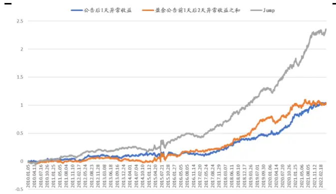
数据来源：Wind，国泰君安证券研究
测试区间：2010.01-2022.05。

图 13：中证500股票池 公告前后异常收益因子 组合优化超额收益曲线
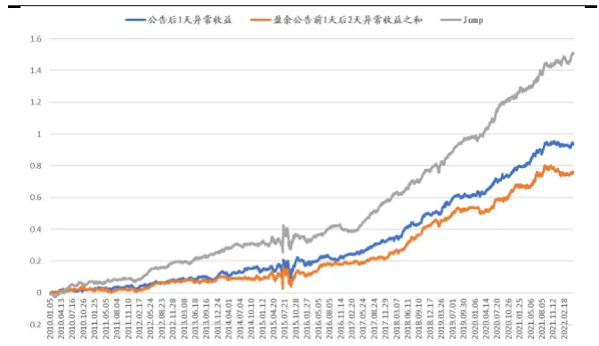
数据来源：Wind，国泰君安证券研究
测试区间：2010.01-2022.05。

## 3.2.2. 标准化预期外盈利 SUE

我们认为，标准化预期外盈利 SUE 值越大，个股的业绩超预期程度越高，未来表现越好。通过因子分组测试和单因子组合优化发现：

1） 标准化预期外单季度归母净利润、标准化预期外单季度扣非净利润、标准化预期外单季度毛利润、标准化预期外单季度营业利润、单季度归母净利润超分析师预期幅度效果较好，组合优化后相对基准（中证 500）的年化超额收益分别为 12.10%、11.88%、10.08%、11.88%和 8.18%，信息比率分别为 2.51、2.50、2.10 、2.46 和 1.71。

2）单季度净利润计算的 SUE效果均好于净利润 TTM 计算的 SUE。

3）净利润计算的 SUE优于营收计算的因子。

4）单季度中不带漂移项好于带漂移项。

表 18：中证 500 股票池 SUE因子主要绩效指标

|  |  |  |  | t9多头 |  |  |  | 组 |  |  | 单因子组合优化 |  |  |  |  |  |  |  | 组合优化 |
| --- | --- | --- | --- | --- | --- | --- | --- | --- | --- | --- | --- | --- | --- | --- | --- | --- | --- | --- | --- |
| 中证500内 | 因子名 | t0空头组 |  | t9多头组 |  | 超额最大 |  | 超额收益 | 超额收益 | 多空收益 | 超额收益 |  | 超额收益超 |  | 额收益 | 超额收益 |  |  |  |
|  |  |  |  |  |  | 回撤 |  | 波动率 | 信息比率 | 少空收益 | 超硕 | 仅益 | 最大回撤 |  | 波动率 | 信息比率 |  |  |  |
|  |  |  |  |  |  |  |  |  |  |  |  |  |  |  |  |  | IC | RankIC | 周度双边换手率 |
|  | 标准化预期外单季度归母净利润 | 6.5 | 3% | 16. | 10% | -8.4 | 9% | 6.45% | 2.49 | 22.63% | 12. | 10% | -8.07% |  | 4.81% | 2.51 | 2.91% | 3.44% | 13.58% |
|  | 标准化预期外单季度归母净利润-带漂移项 | 6. | 0% | 13. | 58% |  | 76% | 6.37% | 2.15 | 19.77% | 10. | 10% | -9.40% |  | 4.72% | 2.14 | 2.47% | 2.72% | 13.67% |
| 单季度 | 标准化预期外单季度扣非净利润 | 70 | 8% | 15. | 54% | -8 | 2% | 6.21% | 2.50 | 22.62% | 11. | 88% | -8.06% |  | 4.76% | 2.50 | 2.88% | 3.38% | 12.08% |
|  | 标准化预期外单季度扣非净利润-带漂移项 | -55 | 9% | 15. | 79% | -89 | 8% | 6.22% | 2.54 | 21.38% | 10.26% |  | -103 | 3% | 4.70% | 2.18 | 2.47% | 2.59% | 12.18% |
|  | 标准化预期外单季度毛利润 | 6. | 6% | 14. | 03% | 7 | 89% | 6.34% | 2.21 | 20.58% | 10.08% |  | -8.99 | 6% | 4.81% | 2.10 | 2.59% | 2.90% | 11.57% |
|  | 标准化预期外单季度毛利润-带漂移项 | 6.8 | 9% | 13. | 79% | 区 | 59% | 6.47% | 2.13 | 20.19% | 8.94% |  | -8. | 5% | 4.77% | 1.88 | 2.26% | 2.14% | 12.02% |
|  | 标准化预期外单季度营业利润 | 64 | 42% | 15. | 06% | -10 | 76% | 6.35% | 2.37 | 21.48% | 11.88% |  | -9.0 | 3% | 4.82% | 2.46 | 2.92% | 3.28% | 12.66% |
|  | 标准化预期外单季度营业利润-带漂移项 | -5. | 5% | 13. | 5% | -10 | 35% | 6.18% | 2.24 | 19.60% | 10. | 1% | -10. | 55% | 4.74% | 2.18 | 2.47% | 2.53% | 12.98% |
|  | 标准化预期外单季度营业收入 | 62 | 9% | 8.8 | 0% | -12 | 79% | 6.51% | 1.35 | 15.09% | 7.0 | 0% | -113 | 4% | 4.76% | 1.47 | 1.99% | 2.41% | 12.09% |
|  | 标准化预期外单季度营业收入-带漂移项 | -35 | 2% | 8.5 | 6% | -12 | 12% | 6.51% | 1.32 | 12.09% | 6.7 | 5% | -103 | 3% | 4.78% | 1.41 | 1.60% | 1.73% | 12.50% |
| TTM | 标准化预期外归母净利润TTM | 6.9 | 7% | 11.0 | 1% | -8. | 22% | 6.53% | 1.69 | 17.98% | 7.9 | 0% | -9. | 9% | 4.81% | 1.64 | 2.29% | 2.74% | 10.27% |
|  | 标准化预期外归母净利润TTM-带漂移项 | 58 | 2% | 11.9 | 7% | -10 | 87% | 6.58% | 1.82 | 17.79% | 8.09% |  | -9.2 | 9% | 4.85% | 1.67 | 2.09% | 2.30% | 10.90% |
|  | 标准化预期外扣非净利润TTM | 78 | 9% | 9.1 | % | 9 | 7% | 6.68% | 1.45 | 17.10% | 7.55% |  | -8.7 | 0% | 4.71% | 1.60 | 2.09% | 2.69% | 9.76% |
|  | 标准化预期外扣非净利润TTM-带漂移项 | 658% |  | 11.2 | 9% | 日 | 34% | 6.57% | 1.72 | 17.87% | 7.29% |  | -9.44 | 1% | 4.73% | 1.54 | 1.99% | 2.27% | 10.04% |
|  | 标准化预期外毛利润TTM | 663% |  | 9.2 | 5% | 815 | 5% | 6.41% | 1.44 | 15.58% | 6.61% |  | -8.2 | 8% | 4.72% | 1.40 | 1.79% | 2.18% | 9.37% |
|  | 标准化预期外毛利润TTM-带漂移项 | -41 | 9% | 9.0 | 9% | 95 | 0% | 6.37% | 1.43 | 13.28% | 6.20% |  | -9. | 0% | 4.84% | 1.28 | 1.61% | 1.66% | 9.91% |
|  | 标准化预期外营业利润TTM | -8.8 | 0% | 9.4 | 3% | 8 | 50% | 6.43% | 1.47 | 18.24% | 7.52% |  | -10. | 18% | 4.73% | 1.59 | 2.15% | 2.51% | 9.96% |
|  | 标准化预期外营业利润TTM-带漂移项 | 592% |  | 10.6 | 5% | -12 | 13% | 6.53% | 1.63 | 16.57% | 8.30% |  | -8.8 | 8% | 4.71% | 1.76 | 2.02% | 2.12% | 10.47% |
|  | 标准化预期外营业收入TTM | 区 | 98% | 5.4 | 9% |  | 55% | 6.51% | 0.84 | 11.47% | 4.9 | 7% | -9.9 | 0% | 4.74% | 1.05 | 1.42% | 1.75% | 9.76% |
|  | 标准化预期外营业收入TTM-带漂移项 | -4. | 4% | 6.8 | 9% | 四 | 02% | 6.44% | 1.07 | 11.83% | 5.2 | 6% | -10 | 3% | 4.74% | 1.11 | 129% | 1.42% | 10.10% |
| 分析师 单季度归母净利润超分析师预期幅度 |  |  |  |  |  |  |  |  |  |  |  |  |  |  |  |  |  |  |  |

数据来源：Wind，朝阳永续，国泰君安证券研究。测试区间：2010.01-2022.05。

表 19：中证 500 股票池 SUE因子分组年化超额收益

|  |  | 年化超额收益 |  |  |  |  |  |  |  |  |  |  |  |  |  |  |  |  |  |  |  |  |
| --- | --- | --- | --- | --- | --- | --- | --- | --- | --- | --- | --- | --- | --- | --- | --- | --- | --- | --- | --- | --- | --- | --- |
| 中证500内 | 因子名 t | 0空头组 t |  | l |  | t2 |  | t3 |  | t4 |  | t5 |  | t6 |  | t7 |  | t8 |  | t9多头组 |  | 多空收益 |
|  | 标准化预期外单季度归母净利润 |  | 6.53% |  | 7.35% | 4. | 68% | -3 | .32% |  | -1.41% |  | -0.37% |  | 4.67% |  | 8.45% | 1 | 0.81% | 16.10% |  | 22.63% |
|  | 标准化预期外单季度归母净利润-带漂移项 | 1 | -6.10% | I | 3.23% |  | -5.24% | 7 | 4.17% |  | -0.54% |  | 1.05% |  | 4.72% |  | 5.64% |  | 9.85% | 13.68% |  | 19.77% |
| 单季度 | 标准化预期外单季度扣非净利润 |  | 7.08% |  | 5.82% | 口 | -4.77% | 0 | -2.29% | L | 1.91% |  | 0.83% |  | 2.07% |  | 7.93% | 1 | 1.78% | 1 | 5.54% | 22.62% |
|  | 标准化预期外单季度扣非净利润-带漂移项 |  | 5.59% |  | 4.60% | L | -1.75% |  | 0-2.97% |  | 0.58% |  | 0.82% |  | 1.66% |  | 551% |  | 7.16% | 1 | 5.79% | 21.38% |
|  | 标准化预期外单季度毛利润 |  | 6.56% |  | 4.49% | 口 | -3.96% | 0 | -2.33% | 1 | .31% |  | 1.06% |  | 2.82% |  | 6.56% |  | 9.78% | 1 | 4.03% | 20.58% |
|  | 标准化预期外单季度毛利润-带漂移项 |  | 6.39% |  | 2.10% | 0 | .78% |  | -0.87% | D | 2.53% |  | -0.92% |  | 3.30% |  | 3.73% |  | 7.94% | 1 | 3.79% | 20.19% |
|  | 标准化预期外单季度营业利润 |  | -6.42% |  | -7.90% | 0 | -3.57% | D | -2.97% | 1 | .16% |  | 0.45% |  | 2.63% |  | 7.31% | 1 | 2.77% | 1 | 5.06% | 21.48% |
|  | 标准化预期外单季度营业利润-带漂移项 |  | -5.75% | 「 | 4.89% | -2 | .76% | 口 | -3.18% |  | 0.35% |  | 0.36% |  | 3.82% |  | 4.43% | 1 | 0.05% | 1 | 3.85% | 19.60% |
|  | 标准化预期外单季度营业收入 |  | 6.29% |  | 5.13% | D | -2.22% |  | -1.59% |  | 1.81% |  | 1.25% |  | 517% |  | 527% |  | 7.8%8 |  | 8.80% | 15.09% |
|  | 标准化预期外单季度营业收入-带漂移项 | 口 | -3.52% | 「 | 3.84% |  | -0.64% |  | -0.64% |  | 1.33% |  | -0.28% |  | 1.41% |  | 6.41% |  | 5.85% |  | 8.56% | 12.09% |
| TTM | 标准化预期外归母净利润TTM |  | 6.97% | 1 | 2.55% | -5 | .51% |  | -1.33% |  | 0.55% |  | 3.03% |  | 2.88% |  | 4.71% |  | 9.39% | 1 | 1.01% | 17.98% |
|  | 标准化预期外归母净利润TTM-带漂移项 |  | 5.82% | 口 | 3.16% | 2 | .97% |  | 1.02% |  | 0.35% |  | 1.09% |  | 2.58% |  | 6.04% |  | 6.69% | 1 | 1.97% | 17.79% |
|  | 标准化预期外扣非净利润TTM |  | 7.39% | 口 | -4.53% |  | 0.32% | 0 | -2.14% |  | 1.22% |  | 0.50% |  | 4.23% |  | 5.96% |  | 7.91% |  | 9.71% | 17.10% |
|  | 标准化预期外扣非净利润TTM-带漂移项 |  | 6.58% | D | 2.77% | D | -2.44% |  | -0.14% |  | 0.88% |  | 4.01% |  | 2.03% |  | 5107% |  | 522% | 1 | 1.29% | 17.87% |
|  | 标准化预期外毛利润TTM |  | 6.33% | 7 | 4.67% |  | 0.21% |  | -0.52% |  | 0.18% |  | B.50% |  | 2.23% |  | 551% |  | 5.80% |  | 9.25% | 15.58% |
|  | 标准化预期外毛利润TTM-带漂移项 | 口4 | .19% | L | -1.40% | I | -2.05% |  | -0.34% |  | 0.98% |  | 1.16% |  | 1.65% |  | 4.63% |  | 494% |  | 9.09% | 13.28% |
|  | 标准化预期外营业利润TTM |  | 8.80% | I | -2.15% | D | -2.31% |  | 1.10% |  | 0.92% |  | 3.00% |  | 2.44% |  | 548% |  | 8.20% |  | 9.43% | 18.24% |
|  | 标准化预期外营业利润TTM-带漂移项 | 7 | 5.92% | 1 | .43% | 「 | D-2.76% | 「 | D-2.47% | 1 | .01% |  | 1.70% |  | 3.78% |  | 509% |  | 7.33% | 1 | 0.65% | 16.57% |
|  | 标准化预期外营业收入TTM | 5 | .98% | 2 | .12% | 1 | .13% |  | 0.68% |  | 1.57% |  | 2.34% |  | 4.48% |  | 2.56% |  | 6.52%% |  | 549% | 11.47% |
|  | 标准化预期外营业收入TTM-带漂移项 | 4 | .94% | 0 | .82% |  | 0.71% |  | -0.67% |  | 1.48% |  | 0.11% |  | 3.68% |  | 3.52% |  | 4.60% |  | 6.89% | 11.83% |
| 分析师 | 单季度归母净利润超分析师预期幅度 4 |  | .82% | 1 | .33% | 5 | .12% |  | -1.45% |  | 0.27% 1 |  | .85% |  | 3.54% |  | 6.39% |  | 8.28% | 1 | 1.65% | 16.47% |

数据来源：Wind，朝阳永续，国泰君安证券研究。测试区间：2010.01-2022.05。

中证 500 股票池内，历史回测效果较好的 SUE 因子多头组超额收益曲线、单因子组合优化超额收益曲线如下。

图 14：中证 500 股票池 SUE因子 多头组超额收益曲线
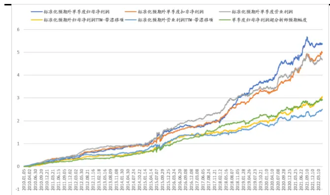
数据来源：Wind，朝阳永续，国泰君安证券研究测试区间：2010.01-2022.05。

图 15：中证 500 股票池 SUE因子 组合优化超额收益曲线
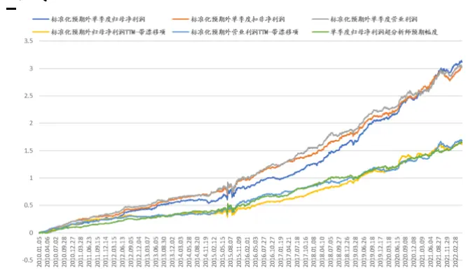
数据来源：Wind，朝阳永续，国泰君安证券研究测试区间：2010.01-2022.05。

## 3.2.3. SUE 衍生因子

我们认为，SUE 衍生因子值越大，个股的业绩超预期程度越高，未来表现越好。通过因子分组测试和单因子组合优化发现：

1） 标准化预期外单季度归母 ROA、标准化预期外单季度归母 ROE、标准化预期外单季度扣非 ROA、标准化预期外单季度扣非 ROE效果较好，组合优化后相对基准（中证 500）的年化超额收益分别为 9.44%、9.70%、9.72%和 10.60%，信息比率分别为 1.97、2.04、2.04 和 2.23。2）ROE、ROA计算的 SUE 衍生因子效果明显好于 GPOA、BP、SP 等计算的 SUE衍生因子。

3）不带漂移项的因子效果好于漂移项的因子。

表 20：中证 500 股票池 SUE衍生因子主要绩效指标

|  |  |  |  | t9多头组 |  |  |  |  |  |  | 单因子组合优化 |  |  |  |  |  |  |  | 组合优化 |
| --- | --- | --- | --- | --- | --- | --- | --- | --- | --- | --- | --- | --- | --- | --- | --- | --- | --- | --- | --- |
| 中证500内 | 因子名 | t0空头组 |  | t9多头组 |  | 超额最大回撤 |  | 超额收益波动率 | 超额收益信息比率 | 多空收益 | 超额收益 |  | 超额收益最大回撤 |  | 超额收益波动率 | 超额收益信息比率 | IC | RankIC | 周度双边换手率 |
|  | 标准化预期外BP | -5. | 9% | 5.9 | 9% | O9 | 3% | 6.42% | 0.93 | 11.98% | 4.66% |  | -10.9 | 7% | 4.80% | 0.97 | 1.16% | 1.84% | 10.70% |
|  | 标准化预期外BP-带漂移项 | 4 | 2% | 6.9 | 7% | -105 | 7% | 6.15% | 1.13 | 11.69% | 4.97% |  | -11. | 7% | 4.76% | 1.04 | 1.11% | 1.48% | 11.27% |
|  | 标准化预期外单季度GPOA | 1 | 7% | 14. | 74% | 8.1 | 20% | 6.47% | 2.28 | 19.60% | 7.77% |  | -8.99 | % | 4.74% | 1.64 | 1.90% | 1.77% | 11.65% |
|  | 标准化预期外单季度GPOA-带漂移项 | -2B | 83% | 9.7 | 6% | 血 | 74% | 6.35% | 1.54 | 12.58% | 6.2 | 9% | -12.6 | 1% | 4.77% | 1.32 | 1.48% | 1.25% | 12.10% |
|  | 标准化预期外单季度SP | 國 | 7% | 8.7 | 7% | -127 | 9% | 6.51% | 1.35 | 15.04% | 7.0 | 0% | BTE | 4% | 4.76% | 1.47 | 1.99% | 2.41% | 12.09% |
|  | 标准化预期外单季度SP-带漂移项 | -35 | 3% | 8.5 | 6% | -2 | 12% | 6.51% | 1.32 | 12.09% | 6.7 | 6% | -103 | 3% | 4.78% | 1.41 | 1.60% | 1.73% | 12.50% |
|  | 标准化预期外单季度归母ROA | -1 | 1% | 13. | 67% | -10 | 35% | 6.32% | 2.16 | 19.08% | 9.44 | % | -8.26 | % | 4.78% | 1.97 | 2.41% | 2.71% | 13.30% |
| 单季度 | 标准化预期外单季度归母ROA-带漂移项 | D | 9% | 11. | 73% | 8 | 25% | 6.44% | 1.82 | 16.72% | 7.3 | 2% | -8.7 | 2% | 4.65% | 1.57 | 1.91% | 2.05% | 13.57% |
|  | 标准化预期外单季度归母ROE | 6.6 | 6% | 14. | 78% | 76 | 3% | 6.31% | 2.34 | 21.44% | 9.70 | % | -8.56 | % | 4.76% | 2.04 | 2.47% | 2.85% | 13.28% |
|  | 标准化预期外单季度归母ROE-带漂移项 | 35 | 0% | 13. | 03% | 正 | 0% | 6.37% | 2.05 | 16.72% | 7.8 | % | -9.4 | % | 4.81% | 1.62 | 1.95% | 2.17% | 13.43% |
|  | 标准化预期外单季度扣非ROA | D | 3% | 14. | 11% | -10 | 22% | 6.33% | 2.23 | 19.34% | 9.72 | % | -9.29 | % | 4.76% | 2.04 | 2.39% | 2.57% | 11.96% |
|  | 标准化预期外单季度扣非ROA-带漂移项 | -3B | 0% | 13.0 | 4% | 9.4 | 5% | 6.28% | 2.08 | 16.54% | 8.2 | 4% | -10.8 | 9% | 4.81% | 1.71 | 1.93% | 1.91% | 12.19% |
|  | 标准化预期外单季度扣非ROE | 匯 | 30% | 14. | 57% | -10.8 | 8% | 6.35% | 2.29 | 20.87% | 10.6 | 0% | -8.39 | % | 4.76% | 2.23 | 2.44% | 2.72% | 11.89% |
|  | 标准化预期外单季度扣非ROE-带漂移项 | 4 | 64% | 13.6 | 4% | 日 | 23% | 6.30% | 2.16 | 18.28% | 8.2 | % | 9.3 | 7% | 4.82% | 1.70 | 1.97% | 2.02% | 12.14% |
| TTM | 标准化预期外GPOA(TTM) | -3D | 3% | 6 | 5% | Sn | 11% | 6.35% | 1.00 | 9.39% | 4.90 | % | -9.92 | 2% | 4.79% | 1.02 | 1.20% | 1.23% | 9.39% |
|  | 标准化预期外GPOA(TTM)-带漂移项 | -0. | 3% | 5.2 | 2% | -14 | 11% | 6.67% | 0.78 | 6.05% | 3.36 | % | -13.5 | 7% | 4.97% | 0.68 | 0.92% | 0.82% | 10.47% |
|  | 标准化预期外SP（TTM） | -匯 | 5% | 5.5 | 3% | 9. | 5% | 6.51% | 0.85 | 11.48% | 4.96 | % | -9.96 | 0% | 4.74% | 1.05 | 1.42% | 1.75% | 9.76% |
|  | 标准化预期外SP（TTM）-带漂移项 | 1 | 2% | 6.9 | 0% | -11. | 02% | 6.44% | 1.07 | 11.81% | 5.25 | % | -10.4 | 3% | 4.74% | 1.11 | 1.29% | 1.42% | 10.10% |
|  | 标准化预期外归母ROA(TTM) | 1 | 7% | 9.1 | 6% | 9.8 | 3% | 6.45% | 1.42 | 15.43% | 6.19 | % | -8.5 | % | 4.89% | 1.27 | 1.85% | 2.10% | 9.97% |
|  | 标准化预期外归母ROA(TTM)-带漂移项 | 1 | 66% | 80 | 5% | -13 | 12% | 6.50% | 1.38 | 14.61% | 4.87 | % | -13.7 | 3% | 4.83% | 1.01 | 1.54% | 1.66% | 11.19% |
|  | 标准化预期外归母ROE(TTM) | -1 | 5% | 14. | 53% | 7 | 0% | 6.26% | 2.32 | 20.58% | 9.82 | % | 9.21 | 2% | 4.84% | 2.03 | 2.41% | 2.78% | 13.16% |
|  | 标准化预期外归母ROE(TTM)-带漂移项 | 4 | 1% | 12.2 | 3% | 9.0 | 4% | 6.28% | 1.95 | 16.75% | 7.4 | 4% | -9.4 | 3% | 4.74% | 1.57 | 1.93% | 2.12% | 13.56% |
|  | 标准化预期外扣非ROA(TTM) | 6 | 3% | 7.8 | 5% | -13 | 28% | 6.57% | 1.19 | 14.48% | 5.5 | 5% | -10.9 | 8% | 4.77% | 1.16 | 1.74% | 2.01% | 9.42% |
|  | 标准化预期外扣非ROA(TTM-带漂移项 | D | 3% | 7.3 | 0% | 13 | 70% | 6.58% | 1.11 | 11.53% | 6.5 |  | -10.7 | 8% | 4.77% | 1.38 | 1.56% | 1.73% | 10.30% |
|  |  |  |  |  |  |  |  |  | 2.13 | 19.24% | 10.0 |  | -8.66 | % | 4.76% | 2.12 | 2.32% | 2.55% | 11.97% |
|  | 标准化预期外扣非ROE(TTM)-带漂移项 | -通 | 0% | 13.3 | 5% | -10 | 89% | 6.29% | 2.12 | 18.55% | 7.05 | % | -11.1 | 0% | 4.81% | 1.47 | 1.84% | 1.86% | 12.13% |

数据来源：Wind，国泰君安证券研究。测试区间：2010.01-2022.05。

表 21：中证 500 股票池 SUE衍生因子 分组年化超额收益

|  |  | 年化超额收益 |  |  |  |  |  |  |  |  |  |  |  |  |  |  |  |  |  |  |  |  |
| --- | --- | --- | --- | --- | --- | --- | --- | --- | --- | --- | --- | --- | --- | --- | --- | --- | --- | --- | --- | --- | --- | --- |
| 中证500内 | 因子名 t | 0空头组 t |  | 1 |  | t2 |  | t3 |  | t4 |  | t5 |  | t6 |  | t7 |  | t8 |  | t9多头组 |  | 多空收益 |
|  | 标准化预期外BP |  | -5.99% |  | -1.40% |  | 0.16% |  | 2.10% |  | -0.22% |  | 3.99% |  | 3.58% |  | 2.12% |  | 4.08% |  | 5.99% | 11.98% |
|  | 标准化预期外BP-带漂移项 |  | -4.72% | 0 | -1.49% |  | 0.38% |  | 1.24% |  | 1.68% |  | 1.39% |  | 0.72% |  | 3.75% |  | 4.39% |  | 6.97% | 1.69% |
|  | 标准化预期外单季度GPOA |  | -4.87% |  | -1.43% |  | -1.13% |  | -0.94% |  | -0.02% |  | 2.41% |  | 0.31% |  | 1.02% |  | 483% |  | 14.74% | 19.60% |
|  | 标准化预期外单季度GPOA-带漂移项 |  | -2.83% | 「 | -2.63% | 1 | .93% |  | -0.56% | -1 | .25% |  | 0.63% |  | 2.45% |  | -0.13% |  | 7.3% |  | 9.76% | 12.58% |
|  | 标准化预期外单季度SP |  | -6.27% |  | -5.15% | D | -2.20% |  | -1.61% |  | 1.86% | 1 | .23% |  | 519% |  | 523% |  | 7.91% |  | 8.77% | 15.04% |
|  | 标准化预期外单季度SP-带漂移项 |  | -3.53% |  | -3.87% |  | -0.58% |  | -0.68% |  | 1.27% |  | -0.20% |  | 1.41% |  | 6.36% |  | 5.91% |  | 8.56% | 12.09% |
|  | 标准化预期外单季度归母ROA |  | -5.41% |  | -3.79% |  | -5.86% | 1 | -1.92% |  | -1.49% |  | 1.31% |  | 3.13% |  | 6.05% |  | 9.87% |  | 13.67% | 19.08% |
| 单季度 | 标准化预期外单季度归母ROA-带漂移项 |  | -4.99% |  | -1.03% |  | -3.82% | I | -0.89% |  | -1.03% |  | -0.84% |  | 4.04% |  | 514% |  | 6.59% |  | 1.73% | 16.72% |
|  | 标准化预期外单季度归母ROE |  | -6.66% |  | -4.26% |  | -4.40% | 0 | -2.70% | 1 | .11% |  | -0.01% |  | 4.08% |  | 6.02% |  | 7.69% |  | 14.78% | 21.44% |
|  | 标准化预期外单季度归母ROE-带漂移项 |  | -3.70% | ■ | -3.50% | 「 | -3.7%8% |  | -0.70% | -1 | .41% |  | 0.94% |  | 2.96% |  | 4.69% |  | 6.47% |  | 13.03% | 16.72% |
|  | 标准化预期外单季度扣非ROA |  | -5.23% | -3 | .25% |  | -4.26% |  | -1.29% | 1 | -2.00% | D | -2.21% |  | 554% |  | 7.04% |  | 7.02% |  | 14.11% | 19.34% |
|  | 标准化预期外单季度扣非ROA-带漂移项 | 「 | -3.50% |  | 0-1.67% | 「 | -3.49% |  | -0.14% |  | -0.63% |  | 0.99% |  | -0.24% |  | 4.62% |  | 5.90% |  | 13.04% | 16.54% |
|  | 标准化预期外单季度扣非ROE |  | -6.30% | 「 | -3.73% | 「 | -2.46% | 「 | -3.40% |  | -0.51% |  | -1.21% |  | 3.24% |  | 7.06% |  | 8.32% |  | 14.57% | 20.87% |
|  | 标准化预期外单季度扣非ROE-带漂移项 |  | -4.64% |  | -1.14% | 「 | -3.05% |  | -0.45% | I | -1.79% |  | 1.94% |  | 1.07% |  | 3.04% |  | 6.31% |  | 13.64% | 18.28% |
| TTM | 标准化预期外GPOA(TTM) |  | -3.03% | -2 | .21% |  | 0.44% |  | 1.40% |  | 0.60% |  | 0.28% |  | 1.31% |  | 3.70% |  | 534% |  | 6.35% | 9.39% |
|  | 标准化预期外GPOA(TTM)-带漂移项 |  | -0.83% |  | -1.35% |  | -0.18% |  | 1.45% |  | -0.02% |  | 1.60% |  | 1.55% |  | 1.98% |  | 4.62% |  | 522% | 6.05% |
|  | 标准化预期外SP（TTM） |  | -5.95% | -2 | .10% | L | -1.10% |  | 0.67% |  | 1.52% |  | 2.40% |  | 4.43% |  | 2.51% |  | 6.48% |  | 553% | 11.48% |
|  | 标准化预期外SP（TTM）-带漂移项 | C | -4.92% |  | -0.78% |  | 0.64% |  | -0.64% |  | 1.50% |  | -0.14% |  | 3.69% |  | 3.45% |  | 4.64% |  | 6.90% | 1.81% |
|  | 标准化预期外归母ROA(TTM) |  | -6.27% | 「 | -3.55% | L | -1.96% |  | -1.41% |  | 2.56% |  | -0.07% |  | 6.82% |  | 521% |  | 4.37% |  | 9.16% | 15.43% |
|  | 标准化预期外归母ROA(TTM)-带漂移项 |  | -5.66% |  | -1.04% |  | -0.05% |  | 0.64% |  | 0.53% |  | 0.25% |  | 2.56% |  | 1.59% |  | 6.76% |  | 8.95% | 14.61% |
|  | 标准化预期外归母ROE(TTM) |  | -6.05% |  | -4.47% |  | -4.23% | 「 | D-2.50% |  | 0.21% |  | 0.02% |  | 4.11% |  | 4.59% |  | 9.35% |  | 14.53% | 20.58% |
|  | 标准化预期外归母ROE(TTM)-带漂移项 |  | -4.51% | 「 | -3.10% | 0 | -291% | -1 | .22% |  | -0.75% |  | 1.15% |  | 2.50% |  | 5.05% |  | 6.50% |  | 12.23% | 16.75% |
|  | 标准化预期外扣非ROA(TTM) |  | -6.63% | 「 | -2.47% | -1 | .47% |  | 0.36% |  | 1.88% |  | 1.49% |  | 3.35% |  | 4.23% |  | 6.11% |  | 7.85% | 14.48% |
|  | 标准化预期外扣非ROA(TTM)-带漂移项 |  | -4.23% | 0 | -1.76% |  | -0.62% | I | -1.27% | -1 | .21% |  | 3.28% |  | 3.58% |  | 2.45% |  | 6.92% |  | 7.30% | 1.53% |
|  | 标准化预期外扣非ROE(TTM) |  | -5.61% | 0 | -2.88% |  | -4.08% |  | -0.48% | -1 | .36% | -1 | .72% |  | 1.55% |  | 8.98% |  | 7.36% |  | 13.63% | 19.24% |
|  | 标准化预期外扣非ROE(TTM)-带漂移项 |  | -5.20% |  | 0.49% | 「 | -3.34% |  | -0.91% |  | 0.00% | 1 | .87% |  | 1.29% |  | 2.47% |  | 4.83% |  | 13.35% | 18.55% |

数据来源：Wind，国泰君安证券研究。测试区间：2010.01-2022.05。

中证 500 股票池内，历史回测效果较好的 SUE衍生因子多头组超额收益曲线、单因子组合优化超额收益曲线如下。

图 16：中证500股票池 SUE衍生因子 多头组超额收益收益曲线
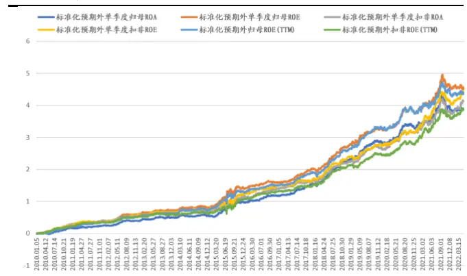
数据来源：Wind，国泰君安证券研究
测试区间：2010.01-2022.05。

图 17：中证500股票池 SUE衍生因子 组合优化超额曲线
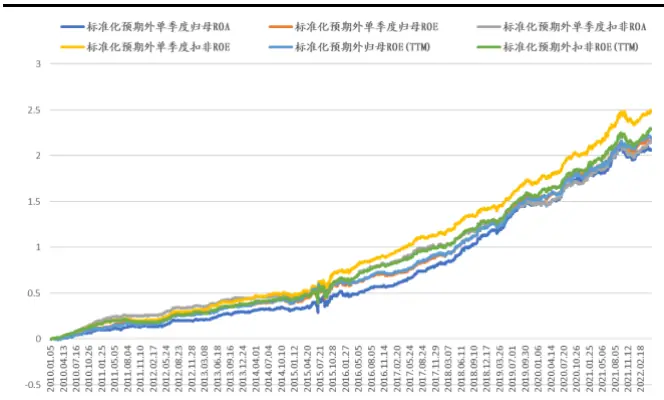
数据来源：Wind，国泰君安证券研究
测试区间：2010.01-2022.05。

## 3.2.4. 过去 N日券商/报告上下调比例

我们认为，过去 N 日券商/报告上下调比例越大，个股的业绩超预期程度越高，未来表现越好。通过因子分组测试和单因子组合优化发现：

1） 过去 180 日券商上调-下调比例、过去 90 日报告上调-下调比例、过去 180 日券商上调比例、过去 90 日报告上调比例效果较好，相对基准（中证 500）的年化超额收益分别为 7.61%、9.11%、8.32%和 9.27%，信息比率分别为 1.50、1.82、1.65 和 1.86。

2）报告数量计算的因子效果好于券商数量计算的因子。
分组测试具体结果和单因子组合优化的绩效指标如下。

表 ：中证 股票池 过去 日券商 报告上下调比例因子 主要绩效指标

|  |  |  |  | t9多头组 |  |  |  |  |  |  | 单因子组合优化 |  |  |  |  |  |  |  | 组合优化 |
| --- | --- | --- | --- | --- | --- | --- | --- | --- | --- | --- | --- | --- | --- | --- | --- | --- | --- | --- | --- |
| 中证500内 | 因子名 | t0空头组 |  | t9多头组 |  |  |  |  |  |  |  |  |  |  |  |  |  |  |  |
|  |  |  |  |  |  | 回撤 |  | 波动率 | 信息比率 | 多空收益 | 超额收益 |  | 最大回撤波 |  | 动率 | 信息比率 |  |  |  |
|  |  |  |  |  |  |  |  |  |  |  |  |  |  |  |  |  | IC | RankIC | 周度双边换手率 |
|  | 过去180日券商上调-下调比例 | -1. | 5% | 9.0 | 8% | -9.5 | 8% | 6.41% | 1.42 | 10.83% | 7.612% |  | -8.9 | 6% | 5.06% | 1.50 | 1.13% | 1.35% | 21.30% |
|  | 过去60日券商上调-下调比例 | -1. | 16% | 9.8 | 9% | -8. | 1% | 6.64% | 1.49 | 11.05% | 6.48% |  | -12.0 | 1% | 5.13% | 1.26 | 1.26% | 1.47% | 26.84% |
| 上调-下调 | 过去90日券商上调-下调比例 | -2. | 0% | 11.7 | 3% | -10. | 06% | 6.62% | 1.77 | 13.73% | 7.29% |  | -9.80 | % | 5.01% | 1.46 | 1.38% | 1.47% | 23.11% |
| 比例 | 过去180日报告上调-下调比例 | -2F | 0% | 10.4 | 1% | -10. | 21% | 6.60% | 1.58 | 13.11% | 8.85% |  | -9.16% |  | 4.99% | 1.78 | 1.71% | 1.97% | 18.10% |
|  | 过去60日报告上调-下调比例 | -2 | 5% | 9.7 | 2% | -112 | 6% | 6.71% | 1.45 | 12.37% | 7.60% |  | -14.40% |  | 5.38% | 1.41 | 1.50% | 1.65% | 27.06% |
|  | 过去90日报告上调-下调比例 | -2 | 9% | 10. | 96% | 8.2 | 4% | 6.52% | 1.68 | 13.95% | 9.11% |  | -10.4 | 3% | 5.01% | 1.82 | 1.61% | 1.76% | 21.45% |
| 上调比例 | 过去180日券商上调比例 | 0.1 | 7% | 9.8 | 8% | 6.8 | 6% | 6.44% | 1.53 | 9.71% | 8.32% |  | -7.8 | % | 5.06% | 1.65 | 1.31% | 1.74% | 21.16% |
|  | 过去60日券商上调比例 | -1. | 2% | 9.7 | 7% | -110 | 0% | 6.67% | 1.46 | 10.79% | 7.5 | 8% | -11.6 | 7% | 5.28% | 1.44 | 1.55% | 1.90% | 29.26% |
|  | 过去90日券商上调比例 | 0.5 | 0% | 10. | 8% | -9.8 | 2% | 6.76% | 1.58 | 10.18% | 7.4 | 3% | -13.6 | 5% | 5.14% | 1.44 | 1.46% | 1.77% | 24.22% |
|  | 过去180日报告上调比例 | -1. | 6% | 13. | 41% | -8. | 4% | 6.50% | 2.06 | 14.57% | 10.0 | 8% | -9.8 | 4% | 5.02% | 2.01 | 1.83% | 2.18% | 18.22% |
|  | 过去60日报告上调比例 | 0.1 | 5% | 12. | 38% | -9.2 | 9% | 6.70% | 1.85 | 12.22% | 8.2 | 9% | -12.0 | 0% | 5.38% | 1.54 | 1.55% | 1.90% | 27.12% |
|  | 过去90日报告上调比例 | -0.5 | 2% | 12. | 22% | -13 | 13% | 6.69% | 1.83 | 12.74% | 9.2 | 7% | -9.1 | 6% | 4.99% | 1.86 | 1.69% | 1.94% | 21.60% |

数据来源：Wind，朝阳永续，国泰君安证券研究。测试区间：2010.01-2022.05。

表 23：中证 500 股票池 过去 N日券商/报告上下调比例因子 分组年化超额收益

|  |  | 年化超额收益 |  |  |  |  |  |  |  |  |  |  |  |  |  |  |  |  |  |  |  |  |
| --- | --- | --- | --- | --- | --- | --- | --- | --- | --- | --- | --- | --- | --- | --- | --- | --- | --- | --- | --- | --- | --- | --- |
| 中证500内 | 因子名 | t0空头组 t |  | 1 |  | t2 |  | t3 |  | t4 |  | t5 |  | t6 |  | t7 |  | t8 |  | t9多头组 |  | 多空收益 |
|  | 过去180日券商上调-下调比例 | I | -1.75% |  | 2.61% | -2.28% |  |  | -2.72% | -1 | .76% | -2 | .61% |  | 2.36% |  | 537% |  | 5.87% |  | 9.08% | 10.83% |
|  | 过去60日券商上调-下调比例 | D | -1.16% |  | 0.54% | -1.39% |  |  | -2.69% |  | -2.71% |  | -0.53% |  | 0.87% |  | 3.15% |  | 7.98% |  | 9.89% | 1.05% |
| 上调-下调比例 | 过去90日券商上调-下调比例 |  | -2.00% |  | 0.88% | 1-2.35% |  |  | -3.13% | ı | -1.82% | -2 | .39% |  | 2.28% |  | 3.45% |  | 7.68% |  | 1.73% | 1373% |
|  | 过去180日报告上调-下调比例 |  | -2.70% | 2 | .20% | -4.39% |  |  | -5.52% |  | -2.67% |  | 1.08% |  | 0.58% |  | 7.76% |  | 7.93% |  | 10.41% | 13.11% |
|  | 过去60日报告上调-下调比例 | 「 | -2.65% |  | 0.86% | 0 | -1.75% | 「 | -2.75% | 「 | 2.75%% |  | -0.43% |  | 1.11% |  | 5.00% |  | 7.76% |  | 9.72% | 12.37% |
|  | 过去90日报告上调-下调比例 | 「 | -2.99% |  | 1.31% | -1 | .97% |  | -2.90% | 0 | -2.35% | -2 | .54% |  | -0.09% |  | 536% |  | 9.77% |  | 10.96% | 1395% |
| 上调比例 | 过去180日券商上调比例 |  | 0.17% |  | -0.27% |  | -4.11% | 「 | -2.42% | 0 | -2.82% | I | -1.82% |  | 3.45% |  | 511% |  | 7.20% |  | 9.88% | 9.71% |
|  | 过去60日券商上调比例 |  | -1.02% |  | -4.07% | 「 | -2.69% |  | -0.96% |  | 0.10% |  | -3.32% |  | 1.62% |  | 7.08% |  | 7.78% |  | 9.77% | 10.79% |
|  | 过去90日券商上调比例 |  | 0.50% | 「 | D-2.38% |  | -3.63% |  | -3.01% |  | -1.24% | -2 | .50% |  | 3.88% |  | 6.19% |  | 5.84% |  | 10.68% | 10.18% |
|  | 过去180日报告上调比例 |  | -1.16% | 2 | -2.62% |  | -3.78% | 7 | -3.74% | 「 | -2.20% |  | -0.40% |  | 0.68% |  | 8.18% |  | 6.44% |  | 13.41% | 14.57% |
|  | 过去60日报告上调比例 |  | 0.16% |  | -3.34% |  | -3.45% |  | -3.55% |  | -0.87% |  | -0.19% |  | 2.53% |  | 3.13% |  | 7.60% | 1 | 2.38% | 12.22% |
|  | 过去90日报告上调比例 |  | -0.52% |  | 0.00% |  | -5.64% |  | -3.22% | 「 | -2.08% | 「 | -2.56% |  | 2.63% |  | 7.00% |  | 6.84% |  | 12.22% | 12.74% |

数据来源：Wind，朝阳永续，国泰君安证券研究。测试区间：2010.01-2022.05。

中证 500 股票池内，历史回测效果较好的过去 N 日券商/报告上下调因子多头组超额收益曲线、单因子组合优化超额收益曲线如下。

图 18：中证 500 股票池 过去 N日券商/报告上下调比例因子多头组超额收益曲线
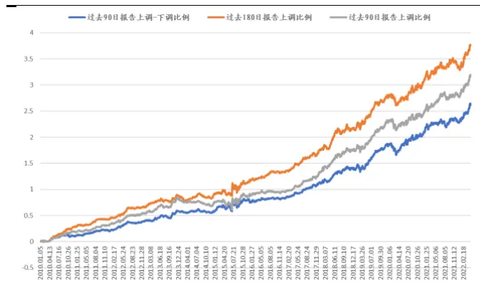
数据来源：Wind，朝阳永续，国泰君安证券研究测试区间：2010.01-2022.05。

图 19：中证 500股票池 过去 N日券商/报告上下调比例因子组合优化超额收益曲线
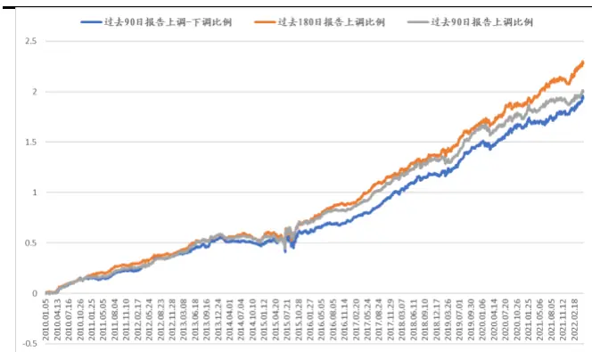
数据来源：Wind，朝阳永续，国泰君安证券研究测试区间：2010.01-2022.05。

## 3.2.5. 过去 N日盈利/营收预测调整

我们认为，过去 N 日盈利/营收预测调整幅度越大，个股的业绩超预期程度越高，未来表现越好。通过因子分组测试和单因子组合优化发现：1） 过去 90 天盈利调整、过去 60 天营收调整效果较好，相对基准（中证 500）的年化超额收益为 9.59%、7.79%，信息比率为 1.97、1.58。2）盈利调整效果明显好于营收调整。

表 24：中证 500 股票池 过去 N日盈利/营收预测调整因子 主要绩效指标

|  |  |  |  | t9多头组 |  |  |  |  |  |  | 单因子组合优化 |  |  |  |  |  |  |  | 组合优化 |
| --- | --- | --- | --- | --- | --- | --- | --- | --- | --- | --- | --- | --- | --- | --- | --- | --- | --- | --- | --- |
| 中证500内 | 因子名 | t0空头组 |  | t9多头组 |  | 超额最大回撤 |  | 超额收益波动率 | 超额收益信息比率 | 多空收益 | 超额收益 |  | 超额收益超 |  |  |  |  |  |  |
|  |  |  |  |  |  |  |  |  |  |  | 超额收益 |  | 最大回撤 |  |  |  |  |  |  |
|  |  |  |  |  |  |  |  |  |  |  |  |  |  |  | 额收益波动率 | 超额收益信息比率 | IC | RankIC | 周度双边换手率 |
| 盈利 | 过去120天盈利调整 | -499% |  | 11.44% |  | 9.8% |  | 7.03% | 1.63 | 16.43% | 8.9 | 3% | 73 | % | 4.75% | 1.88 | 1.76% | 2.18% | 16.25% |
|  | 过去180天盈利调整 | -3.45% |  | 9.99% |  | -14.66% |  | 6.94% | 1.44 | 13.44% | 8.1 | 8% | -9.7 | 8% | 4.73% | 1.73 | 1.70% | 2.14% | 14.18% |
|  | 过去360天盈利调整 | -3.25% |  | 8.08% |  | 10.77% |  | 7.25% | 1.11 | 11.33% | 7.1 | 0% | -9.4 | % | 4.82% | 1.47 | 1.31% | 1.90% | 12.09% |
|  | 过去60天盈利调整 | 474% |  | 10.28% |  | -10.96% |  | 6.91% | 1.49 | 15.01% | 9.5 | 9% | STK | 1% | 4.88% | 1.97 | 1.75% | 2.21% | 22.35% |
|  | 过去90天盈利调整 | -43 | 9% | 10.6 | 9% | 8.75% |  | 6.96% | 1.54 | 15.08% | 9.2 | % | -102 | 2% | 4.85% | 1.90 | 1.78% | 2.24% | 18.33% |
| 营收 | 过去120天营收调整 | -53 | 0% | 6.9 | % | 8.3 | % | 6.15% | 1.13 | 12.26% | 7.1 | 8% | -9.2 | 2% | 4.75% | 1.51 | 1.40% | 1.50% | 16.56% |
|  | 过去180天营收调整 | -35 | % | 6.8 | 1% | 9.4 | 0% | 6.10% | 1.12 | 10.09% | 6.2 | 7% | -11.8 | 4% | 4.63% | 1.35 | 1.19% | 1.39% | 13.90% |
|  | 过去360天营收调整 | 44 | 4% | 5.8 | 3% | 8.5 | % | 6.28% | 0.93 | 10.27% | 6.4 | 3% | -10.9 | 4% | 4.58% | 1.40 | 1.24% | 1.38% | 11.71% |
|  | 过去60天营收调整 | 42 | 8% | 9.0 | 7% | -12.2 | 1% | 6.26% | 1.45 | 13.35% | 7.7 | 9% | -10.8 | 2% | 5.06% | 1.54 | 1.24% | 1.21% | 25.56% |
|  | 过去90天营收调整 | 44 | 4% | 6.61% |  | 8.2 | % | 6.14% | 1.08 | 11.05% | 7.5 | 1% | -8.2 | 7% | 4.76% | 1.58 | 1.34% | 1.44% | 19.98% |

数据来源：Wind，朝阳永续，国泰君安证券研究。测试区间：2010.01-2022.05。

表 25：中证 500 股票池 过去 N日盈利/营收预测调整因子 分组超额收益

| 中证500内 | 因子名 | t0空头组 t |  | 1 |  | t2 |  | t3 |  | t4 |  | t5 |  | t6 |  | t7 |  | t8 |  | t9多头组 |  | 多空收益 |
| --- | --- | --- | --- | --- | --- | --- | --- | --- | --- | --- | --- | --- | --- | --- | --- | --- | --- | --- | --- | --- | --- | --- |
|  | 过去120天盈利调整 |  | -4.99% |  | -4.40% | -1 | .90% |  | 1.52% |  | -0.13% |  | -0.27% |  | 1.67% |  | 3.74% |  | 7.98% |  | 1.44% | 16.43% |
|  | 过去180天盈利调整 |  | -3.45% |  | -4.60% | 口 | -3.52% |  | 0.12% |  | 0.16% | 1 | .71% |  | 2.67% |  | 3.74% |  | 7.73% |  | 9.99% | 13.44% |
| 盈利 | 过去360天盈利调整 |  | -3.25% |  | -3.25% | D | -2.10% | -2 | .15% |  | 0.81% |  | 0.21% |  | 4.65% |  | 5.43% |  | 6.02% |  | 8.08% | 1.33% |
|  | 过去60天盈利调整 |  | -4.74% | D | -1.86% | 口 | -3.31% | -1 | .70% | 0 | -2.48% |  | 0.73% |  | 2.59% |  | 5.01% |  | 10.24% |  | 10.28% | 15.01% |
|  | 过去90天盈利调整 |  | -4.39% |  | -4.40% |  | -2.08% | D | -2.03% | 1 | .43% |  | 0.09% |  | 2.07% |  | 5.81% |  | 7.49% |  | 10.69% | 15.08% |
| 营收 | 过去120天营收调整 |  | -5.30% |  | -0.78% |  | 0.00% |  | -0.34% | -1 | .21% |  | 2.63% |  | 0.04% |  | 2.91% |  | 9.40% |  | 6.96% | 12.26% |
|  | 过去180天营收调整 |  | -3.28% |  | 0.54% |  | -0.16% |  | -0.61% | L | -1.54% |  | -0.37% |  | 1.01% |  | 3.86% |  | 7.89% |  | 6.81% | 10.09% |
|  | 过去360天营收调整 |  | -4.44% |  | -0.45% | 1 | .44% |  | -0.03% |  | 0.31% | -1 | .89% |  | 3.62% |  | 3.37% |  | 6.63% |  | 5.83% | 10.27% |
|  | 过去60天营收调整 |  | -4.28% |  | 2.07% |  | 0.75% |  | -0.27% |  | 0-1.05% | 1 | .03% | -1 | .99% |  | 2.49% |  | 6.11% |  | 9.07% | 13.35% |
|  | 过去90天营收调整 |  | -4.44% |  | -0.32% |  | 0.68% | I | -1.77% |  | -1.54% |  | 1.15% |  | 1.43% |  | 2.76% |  | 9.57% |  | 6.61% | 11.05% |

数据来源：Wind，朝阳永续，国泰君安证券研究。测试区间：2010.01-2022.05。

中证 500 股票池内，历史回测效果较好的过去 N 日盈利/营收预测调整因子多头组超额收益曲线、单因子组合优化超额收益曲线如下。

图 20：中证 500 股票池 过去 N日盈利/营收预测调整因子 多头组超额收益曲线
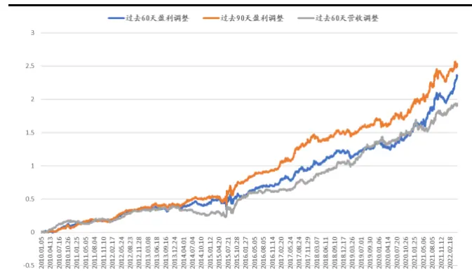
数据来源：Wind，朝阳永续，国泰君安证券研究测试区间：2010.01-2022.05。

图 21：中证 500股票池 过去 N日盈利/营收预测调整因子 组合优化超额收益曲线
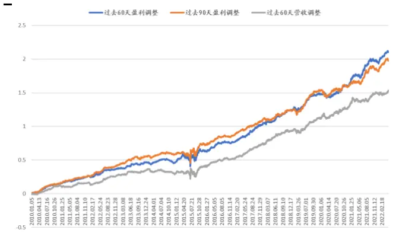
数据来源：Wind，朝阳永续，国泰君安证券研究测试区间：2010.01-2022.05。

## 3.3. 全市场股票池

## 3.3.1. 盈余公告前后异常收益

我们认为，盈利公告前后异常收益越大，个股的业绩超预期程度越高，未来表现越好。通过因子分组测试和单因子组合优化发现：

1）跳空因子效果较好，组合优化相对基准（中证 500）的年化超额收益为 9.97%，信息比率为 1.42。

2）使用异常收益之和的 ABR 因子整体略优于使用累计异常收益相减的EAR 因子。

表 26：全市场股票池 盈余公告前后异常收益因子 主要绩效指标

|  |  |  |  |  | t9多头组 |  |  |  | 单因子组合优 |  |  |  | 化 |  |  |  |  |  |  | 组合优化 |
| --- | --- | --- | --- | --- | --- | --- | --- | --- | --- | --- | --- | --- | --- | --- | --- | --- | --- | --- | --- | --- |
| 全市场 | 因子名 | t0空头组 | t9多头组 |  | 超额最大回撤 | 超额收益波动率 | 超额收益信息比率 | 多空收益 | 超额收益 |  | 超额收益最大回撤 |  |  |  |  |  |  |  |  |  |
|  |  |  |  |  |  |  |  |  |  |  |  | 波动率 |  | 信息比率 |  |  |  |  |  |  |
|  |  |  |  |  |  |  |  |  |  |  |  |  |  |  |  | IC |  | RankIC |  | 周度双边换手率 |
| ABR | 公告后1天异常收益 | 750% | 568% |  | -24.35% | 8.25% | 0.69 | 13.18% | 3.11% |  | -16.58% | 7.90% |  | 0.39 |  |  | 1.32% | 1 | .08% | 2185% |
|  | 公告后2天异常收益之和 | 346% | 245% |  | -25.24% | 7.96% | 0.31 | 5.91% | 115% |  | -26.64% | 7.85% |  | 0.15 |  |  | 71% | 0 | .65% | 21.52% |
|  | 公告后3天异常收益之和 | 381% | 189% |  | -26.21% | 8.31% | 0.23 | 5.69% | 11.08% |  | -33.57% | 8.29% |  | 0.13 |  | 0. | 61% | 0 | .39% | 21.83% |
|  | 公告后4天异常收益之和 | 442% | 070% |  | 29.71% | 8.70% | 0.08 | 5.12% | 2.46% |  | 40.86% | 8.45% |  | 0.29 |  | 0 | .50% | 0 | 16% | 2193% |
|  | 盈余公告后5天异常收益之和 | 354% | 017% |  | 32.10% | 8.86% | 0.02 | 3.71% | .66% |  | -37.79% | 8.59% |  | 10.19 |  |  | 36% | -0 | .12% | 2166% |
|  | 盈余公告前1天后1天异常收益之和 | 343% | 318% |  | -25.52% | 8.13% | 0.39 | 6.62% | 1.79% |  | -26.25% | 7.82% |  | 0.23 |  | 0. | 79% | 1 | .00% | 21.06% |
|  | 盈余公告前1天后2天异常收益之和 | B338% | 231% |  | -25.33% | 8.29% | 0.28 | 5.69% | 61% |  | -24.98% | 8.18% |  | 0.07 |  | 0 | .65% | 0 | .60% | 21.44% |
|  | 盈余公告前1天后3天异常收益之和 | 60% | 111% |  | 18.56% | 8.55% | 0.13 | 4.71% | -0.64% |  | -34.69% | 8.56% |  | 0.08 |  | 0 | .58% | 0 | .41% | 2187% |
|  | 盈余公告前1天后4天异常收益之和 | 5373% | 104% |  | 29.32% | 8.91% | 0.12 | 4.77% | -2.33% |  | 39.95% | 8.73% |  | 0.27 |  |  | .51% |  | 22% | 2166% |
|  | 盈余公告前2天后2天异常收益之和 | 338% | 164% |  | -26.30% | 8.48% | 0.19 | 5.02% | 0.37% |  | -28.49% | 8.54% |  | 0.04 |  | 0 | .54% | 0 | .47% | 21.31% |
|  | 盈余公告前2天后3天异常收益之和 | -443% | 088% |  | -28.94% | 8.67% | 0.10 | 5.31% | 1.73% |  | -33.73% | 8.72% |  | 0.20 |  | 0. | 50% |  | 29% | 21.50% |
| EAR | 公告后2天累计异常收益 | 290% | 022% |  | -35.54% | 8.11% | 0.03 | 3.12% | 4.10% |  | -55.78% | 7.96% |  | 0.52 |  |  | 41% | 0 | .68% | 21.43% |
|  | 公告后3天累计异常收益 | -233% | 071% |  | -31.84% | 8.41% | 0.09 | 3.04% | 2.77% |  | -46.90% | 8.20% |  | 0.34 |  | 3 | 4% | 0 | .39% | 2162% |
|  | 公告后4天累计异常收益 | 237% | 002% |  | -35.29% | 8.67% | 0.00 | 2.39% | -1.61% |  | -37.63% | 8.46% |  | 0.19 |  |  | 028% |  | q18% | 21.49% |
|  | 盈余公告后5天累计异常收益 | -180% | 014% |  | 34.04% | 8.88% | 0.02 | 1.94% | 11.89% |  | -42.87% | 8.56% |  | 0 | .22 |  | 17% | -0 | .09% | 21.48% |
|  | 盈余公告前1天后1天累计异常收益 | 342% | 264% |  | -27.30% | 8.10% | 0.33 | 6.06% | 90% |  | -30.56% | 7.78% |  |  | 0.12 | 0. | 74% | 0 | .99% | 21.07% |
|  | 盈余公告前1天后2天累计异常收益 | D85% | 02 | 3% | -35.82% | 8.44% | 0.03 | 3.08% | 8.88% |  | -53.29% | 8.21% |  | 0.47 |  | 0 | .39% | 0 | .63% | 21.39% |
|  | 盈余公告前1天后3天累计异常收益 | 225% | -03 | 4% | -38.07% | 8.58% | -0.04 | 1.90% | 2.62% |  | -45.59% | 8.55% |  | B0.31 |  | 0 | 34% | 0 | .43% | 2163% |
|  | 盈余公告前1天后4天累计异常收益 | -168% | 05 | 5% | 34.40% | 8.98% | 0.06 | 2.23% | 2.82% |  | 44.14% | 8.78% |  | 0.32 |  | 0 | .29% |  | 25% | 21.46% |
|  | 盈余公告前2天后2天累计异常收益 | 236% | -02 | 5% | -38.10% | 8.57% | -0.03 | 2.10% | 2.97% |  | -50.25% | 8.48% |  | 0.35 |  | 0 | 0131% | 0 | .51% | 21.29% |
|  | 盈余公告前2天后3天累计异常收益 | 284% | -0 | 85% | -39.75% | 8.78% | -0.10 | 1.99% | 8.79% |  | -48.32% | 8.79% |  | 0.43 |  | 0 | 28% | 0 | .34% | 21.36% |
|  | FE3 | 217% |  | 180% | -17.49% | 7.15% | 0.25 | -0.37% | 4.31% |  | 42.11% | 6.56% |  | 0.66 |  | 0 | .06% | 0 | 16% | 20.29% |
|  | FE4 | 4.25% | 0 | .29% | -35.19% | 8.77% | -0.03 | -4.55% |  | -1.93% | -36.94% | 9.14% |  |  | -0.21 | -0 | .39% |  | -1.11% | 18.47% |
|  | Jump | 6.37% |  | 2.01% | -1705% | 7.51% | 1.60 | 18.39% |  | 9.97% | -15.08% | 7.02% |  |  | 1.42 |  | 1.90% |  | 2.38% | 21.36% |

数据来源：Wind，朝阳永续，国泰君安证券研究。测试区间：2010.01-2022.05。

表 27：全市场股票池 盈余公告前后异常收益因子 分组年化超额收益

|  |  |  |  |  |  |  |  |  |  | 年化超额 |  | 收益 |  |  |  |  |  |  |  |  |  |  |  |  |
| --- | --- | --- | --- | --- | --- | --- | --- | --- | --- | --- | --- | --- | --- | --- | --- | --- | --- | --- | --- | --- | --- | --- | --- | --- |
| 全市场 | 因子名 | t0空头组 t |  | 1 |  | t2 |  | t3 |  | t4 |  | t5 |  | t6 |  | t7 |  | t8 |  | t9多头组 |  | 多空收益 |  |  |
| ABR | 公告后1天异常收益 |  | 7.50% | 1 | .83% |  | 365% |  | 4.46% |  | 390% |  | 4.48% |  | 5.75% |  | 5.90% |  | 7.07% |  | 5.68% |  | 13 | .18% |
|  | 公告后2天异常收益之和 |  | 3.46% | 1 | .44% |  | 324% |  | 397% |  | 365% |  | 5.71% |  | 6.01% |  | 6.10% |  | 5.77% |  | 2.45% |  |  | 5.91% |
|  | 公告后3天异常收益之和 |  | 3.81% | 1 | .86% |  | 392% |  | 5.06% |  | 369% |  | 5.09% |  | 6.51% |  | 5.87% |  | 4.76% |  | 1.89% |  |  | 5.69% |
|  | 公告后4天异常收益之和 |  | 4.42% |  | 357% |  | 4.41% |  | 4.46% |  | 4.35% |  | 5.66% |  | 6.37% |  | 4.15% |  | 5.62% |  | 0.70% |  |  | 5.12% |
|  | 盈余公告后5天异常收益之和 |  | 3.54% |  | 3.97% |  | 5.23% |  | 4.49% |  | 4.39% |  | 5.84% |  | 5.09% |  | 5.44% |  | 366% |  | 0.17% |  |  | 3.71% |
|  | 盈余公告前1天后1天异常收益之和 |  | 3.43% |  | 0.07% |  | 2.08% |  | 4.02% |  | 340% |  | 4.63% |  | 6.57% |  | 6.59% |  | 7.85% |  | 318% |  |  | 6.62% |
|  | 盈余公告前1天后2天异常收益之和 |  | 3.38% | 1 | .88% |  | 2.84% |  | 2.59% |  | 3.87% |  | 5.50% |  | 6.11% |  | 6.65% |  | 6.47% |  | 2.31% |  |  | 5.69% |
|  | 盈余公告前1天后3天异常收益之和 |  | 3.60% | 1 | .24% |  | 364% |  | 4.28% |  | 4.77% |  | 4.25% |  | 5.65% |  | 7.29% |  | 6.20% |  | 1.11% |  |  | 4.71% |
|  | 盈余公告前1天后4天异常收益之和 |  | 3.73% |  | 1.83% |  | 4.72% |  | 4.53% |  | 4.55% |  | 4.71% |  | 5.34% |  | 6.24% |  | 5.54% |  | 1.04% |  |  | 4.77% |
|  | 盈余公告前2天后2天异常收益之和 |  | 口3.38% | 1 | .17% |  | 2.93% |  | 4.51% |  | 4.55% |  | 5.15% |  | 6.48% |  | 6.28% |  | 5.47% |  | 1.64% |  |  | 5.02% |
|  | 盈余公告前2天后3天异常收益之和 |  | 4.43% |  | 2.49% |  | 323% |  | 5.49% |  | 4.44% |  | 4.78% |  | 6.12% |  | 6.79% |  | 5.05% |  | 0.88% |  |  | 5.31% |
| EAR | 公告后2天累计异常收益 | 2. | 90% |  | 1.76% |  | 329% |  | 4.43% |  | 339% |  | 5.56% |  | 6.99% |  | 6.47% |  | 5.67% |  | 0.22% |  | 3.12% |  |
|  | 公告后3天累计异常收益 | 02 | .33% | 2 | .33% |  | 340% |  | 4.59% |  | 379% |  | 5.18% |  | 6.20% |  | 6.28% |  | 4.59% |  | 0.71% |  | 3.04% |  |
|  | 公告后4天累计异常收益 | D | 2.37% |  | 2.93% |  | 4.44% |  | 394% |  | 4.46% |  | 4.93% |  | 6.44% |  | 4.81% |  | 5.5% |  | 0.02% |  | 2.39% |  |
|  | 盈余公告后5天累计异常收益 | L | 1.80% |  | 370% |  | 5.00% |  | 4.21% |  | 4.44% |  | 5.26% |  | 4.57% |  | 5.1% |  | 4.02% |  | 0.14% |  | 1.94% |  |
|  | 盈余公告前1天后1天累计异常收益 | 口 | 3.42% |  | 0.69% |  | 1.54% |  | 4.36% |  | 328% |  | 4.96% |  | 6.54% |  | 6.26% |  | 8.10% |  | 2.64% |  | 6.06% |  |
|  | 盈余公告前1天后2天累计异常收益 | 02 | .85% | 1 | .83% |  | 299% |  | 336% |  | 325% |  | 6.25% |  | 6.38% |  | 7.32% |  | 6.09% |  | 0.23% |  | 3.08% |  |
|  | 盈余公告前1天后3天累计异常收益 | 2. | 25% |  | 1.57% |  | 329% |  | 3.86% |  | 4.91% |  | 4.36% |  | 5.97% |  | 6.58% |  | 6.85% |  | 0.34% |  | 1.90% |  |
|  | 盈余公告前1天后4天累计异常收益 |  | L1.68% |  | 1.54% |  | 4.36% |  | 4.01% |  | 372% |  | 4.90% |  | 5.98% |  | 6.31% |  | 4.95% |  | 0.55% |  | 2.23% |  |
|  | 盈余公告前2天后2天累计异常收益 | D | 2.36% |  | 1.49% |  | 2.78% |  | 363% |  | 5.18% |  | 4.67% |  | 7.26% |  | 6.76% |  | 5.64% |  | 0.25% |  | 2.10% |  |
|  | 盈余公告前2天后3天累计异常收益 | 02 | .84% |  | 2.37% |  | 2.83% |  | 5.01% |  | 4.42% |  | 5.20% |  | 6.26% |  | 6.68% |  | 5.70% |  | 0.85% |  | I 1.99% |  |
|  | FE3 |  | 2.17% |  | 2.10% |  | 2.28% |  | 334% |  | 2.56% |  | 380% |  | 5.57% |  | 4.94% |  | 6.10% |  | 1.80% |  | -0.37% |  |
|  | FE4 |  | 4.25% |  | 4.93% |  | 4.30% |  | 4.85% |  | 348% |  |  |  |  |  | 378% |  | 2.47% |  | 0.29% |  | -4.55% |  |
|  | Jump |  | 6.37% | 1 | .60% |  | 1.02% |  | 2.82% |  | 1.28% |  | 349% |  | 5.90% |  | 8.05% |  | 9.18% |  | 12.01% |  | 18.39% |  |

数据来源：Wind，朝阳永续，国泰君安证券研究。测试区间：2010.01-2022.05。

全市场股票池内，历史回测效果较好的公告前后异常收益因子多头组超额收益曲线、单因子组合优化超额收益曲线如下。

图 22：全市场股票池 公告前后异常收益因子 多头组超额收益曲线
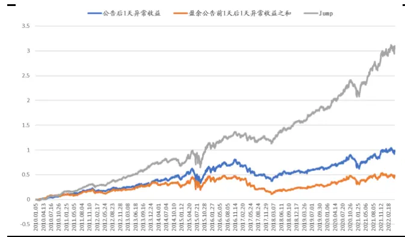
数据来源：Wind，国泰君安证券研究
测试区间：2010.01-2022.05。

图 23：全市场股票池 公告前后异常收益因子 组合优化超额收益曲线
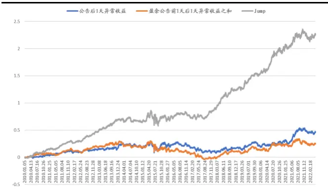
数据来源：Wind，国泰君安证券研究测试区间：2010.01-2022.05。

## 3.3.2. 标准化预期外盈利 SUE

我们认为，标准化预期外盈利 SUE 值越大，个股的业绩超预期程度越高，未来表现越好。通过因子分组测试和单因子组合优化发现：

1） 标准化预期外单季度归母净利润、标准化预期外单季度扣非净利润、标准化预期外单季度毛利润、标准化预期外单季度营业利润效果较好，组合优化后相对基准（中证 500）的年化超额收益分别为15.25%、14.28%、13.89%和 14.72%，信息比率分别为 2.42、2.31、2.23 和 2.31。

2）单季度净利润计算的 SUE效果均好于净利润 TTM 计算的 SUE。
分组测试具体结果和单因子组合优化的绩效指标如下。

表 28：全市场股票池 SUE因子主要绩效指标

|  |  |  |  | t9多头 |  |  |  | 组 |  |  | 单因子组合优化 |  |  |  |  |  |  | 组合优化 |  |
| --- | --- | --- | --- | --- | --- | --- | --- | --- | --- | --- | --- | --- | --- | --- | --- | --- | --- | --- | --- |
| 全市场 | 因子名 | t0空头组 |  | t9多头组 |  |  |  |  |  |  |  |  |  |  |  |  |  |  |  |
|  |  |  |  |  |  | 回撤 |  | 波动率 | 信息比率 | 多空收益 | 超额收益 | 最大回撤 |  | 波动率 |  |  |  |  |  |
|  |  |  |  |  |  |  |  |  |  |  |  |  |  |  | 超额收益信息比率 | IC | RankIC | 周度双边换手率 |  |
|  | 标准化预期外单季度归母净利润 口 | 4.45% |  |  | 18.07% | -1229% |  | 6.99% | 2.58 | 22.52% | 15.25% | 9. | 7% | 6.30% | 2.42 | 2.45% | 2.93% | 17.82% |  |
|  | 标准化预期外单季度归母净利润-带漂移项 |  | 3.59% |  | 17.15% | 127% |  | 6.91% | 2.48 | 20.75% | 14.21% | F | 10.48% | 6.30% | 2.25 | 2.11% | 2.25% | 17.26% |  |
| 单季度 | 标准化预期外单季度扣非净利润 |  | 3.77% |  | 15.35% | m43% |  | 6.47% | 2.37 | 19.12% | 14.28% | -9. | 0% | 6.17% | 2.31 | 2.06% | 2.47% |  | 15.01% |
|  | 标准化预期外单季度扣非净利润-带漂移项 |  | 02.71% |  | 15.00% | 106% |  | 6.36% | 2.36 | 17.71% | 12.93% | F10.20% |  | 6.17% | 2.10 | 1.77% | 1.81% |  | 15.07% |
|  | 标准化预期外单季度毛利润 |  | 3.66% |  | 15.06% | -1313% |  | 6.97% | 2.16 | 18.72% | 13.89% | F10 | 40% | 6.24% | 2.23 | 2.01% | 2.38% |  | 14.48% |
|  | 标准化预期外单季度毛利润-带漂移项 |  | 2.67% |  | 14.14% | -1377% |  | 6.75% | 2.09 | 16.82% | 13.18% | -12 | 04% | 6.17% | 2.13 | 1.76% | 1.79% |  | 14.83% |
|  | 标准化预期外单季度营业利润 |  | 3.72% |  | 17.25% | 163% |  | 6.77% | 2.55 | 20.97% | 14.72% | 9.9 | 5% | 6.39% | 2.31 | 2.21% | 2.60% |  | 16.43% |
|  | 标准化预期外单季度营业利润-带漂移项 |  | 3.53% |  | 16.36% | 日80% |  | 6.62% | 2.47 | 19.89% | 13.22% | -10. | 59% | 6.26% | 2.11 | 1.91% | 1.99% |  | 16.08% |
|  | 标准化预期外单季度营业收入 |  | -2.72% |  | 2.18% | -14.04% |  | 7.10% | 1.71 | 14.90% | 8.81% | 113 | 3% | 5.96% | 1.48 | 1.73% | 2.10% |  | 15.02% |
|  | 标准化预期外单季度营业收入-带漂移项 |  | 1.66% |  | 11.13% | -1318% |  | 6.78% | 1.64 | 12.79% | 8.68% | F | 10.38% | 5.98% | 1.45 | 1.43% | 1.51% |  | 15.55% |
| TTM | 标准化预期外归母净利润TTM | 2.05% |  | 14.04% |  | -1403% |  | 6.94% | 2.02 | 16.09% | 13.95% | -10.2 | 3% | 6.32% | 2.21 | 1.63% | 1.99% | 1 | 3.30% |
|  | 标准化预期外归母净利润TTM-带漂移项 | 02.85% |  | 13.72% |  | -1382% |  | 6.64% | 2.07 | 16.57% | 12.74% | -10. | 85% | 6.16% | 2.07 | 1.59% | 1.69% |  | 14.78% |
|  | 标准化预期外扣非净利润TTM |  | 1.96% |  | 10.22% | -1425% |  | 6.52% | 1.57 | 12.18% | 9.58% | -12 | 41% | 5.99% | 1.60 | 1.29% | 1.64% | 1 | 1.86% |
|  | 标准化预期外扣非净利润TTM-带漂移项 |  | 1.62% |  | 9.47% | -13 | 72% | 6.29% | 1.51 | 11.09% | 8.23% | -13 | 14% | 5.92% | 1.39 | 1.25% | 1.42% | 1 | 3.12% |
|  | 标准化预期外毛利润TTM |  | 02.26% |  | 10.04% | -16. | 03% | 7.03% | 1.43 | 12.30% | 9.37% | -13 | 40% | 6.20% | 1.51 | 1.24% | 1.48% | 1 | 1.78% |
|  | 标准化预期外毛利润TTM-带漂移项 |  | 1.42% |  | 10.14% | -13 | 14% | 6.60% | 1.54 | 11.56% | 9.82% | -14 | 39% | 6.05% | 1.62 | 1.13% | 1.17% |  | 12.75% |
|  | 标准化预期外营业利润TTM |  | D2.05% |  | 11.86% | -1421% |  | 6.93% | 1.71 | 13.92% | 10.13% | 9.9 | 6% | 6.12% | 1.65 | 1.42% | 1.71% |  | 12.62% |
|  | 标准化预期外营业利润TTM-带漂移项 |  | 02.60% |  | 10.83% | -1331% |  | 6.61% | 1.64 | 13.43% | 10.03% | -10.9 | 1% | 6.00% | 1.67 | 1.39% | 1.49% |  | 14.10% |
|  | 标准化预期外营业收入TTM |  | 1.30% |  | 9.75% | -1670% |  | 7.11% | 1.37 | 11.05% | 7.35% | -14 | 50% | 5.90% | 1.25 | 1.23% | 1.52% |  | 12.59% |
|  | 标准化预期外营业收入TTM-带漂移项 |  | 1.12% |  | 10.22% | -1485%1 |  | 6.71% | 1.52 | 11.33% | 7.94% | -132 | 8% | 6.12% | 1.30 | 111% | 113% |  | 13.36% |
| 分析师 单季度归母净利润超分析师预期幅度 I |  |  | 2.07% |  | 11.58% -1234% |  |  | 5.38% | 2.15 | 13.65% | 10.28% -1132% |  |  | 5.51% | 1.87 | 1.37% | 2.52% | 15.14% |  |

数据来源：Wind，朝阳永续，国泰君安证券研究。测试区间：2010.01-2022.05。

表 29：全市场股票池 SUE因子分组年化超额收益

|  |  | 年化超额收益 |  |  |  |  |  |  |  |  |  |  |  |  |  |  |  |  |  |  |  |  |
| --- | --- | --- | --- | --- | --- | --- | --- | --- | --- | --- | --- | --- | --- | --- | --- | --- | --- | --- | --- | --- | --- | --- |
| 全市场 | 因子名 | t0空头组 |  | t1 |  | t2 |  | t3 |  | t4 |  | t5 |  | t6 |  | t7 |  | t8 |  | t9多头组 |  | 多空收益 |
|  | 标准化预期外单季度归母净利润 |  | -4.45% |  | -3.85% |  | -1.25% |  | -1.10% |  | -0.85% | 1 | .81% |  | 6.57% |  | 8.54% |  | 13.20% |  | 18.07% | 22.52% |
|  | 标准化预期外单季度归母净利润-带漂移项 |  | -3.59% |  | -1.12% |  | -0.99% |  | 0.69% |  | 0.18% |  | 0.82% |  | 5.60% |  | 6.85% |  | 10.45% |  | 17.15% | 20.75% |
| 单季度 | 标准化预期外单季度扣非净利润 |  | -3.77% |  | -1.37% |  | -1.35% |  | -0.82% |  | -0.17% | I | 2.74% |  | 7.26% |  | 6.73% |  | 11.28% |  | 15.35% | 19.12% |
|  | 标准化预期外单季度扣非净利润-带漂移项 |  | -2.71% |  | 0.38% |  | 0.76% |  | 0.20% |  | 0.25% | I | 2.66% |  | 2.85% |  | 6.95% |  | 9.00% |  | 15.00% | 17.71% |
|  | 标准化预期外单季度毛利润 |  | -3.66% |  | -2.49% |  | 0.18% |  | -0.95% |  | 1.45% | à | 1.89% |  | 6.02% |  | 7.08% |  | 11.14% |  | 15.06% | 18.72% |
|  | 标准化预期外单季度毛利润-带漂移项 |  | -2.67% |  | -0.35% |  | 0.75% |  | 1.85% |  | -0.48% | à | 1.71% |  | 4.31% |  | 7.00% |  | 9.03% |  | 14.14% | 16.82% |
|  | 标准化预期外单季度营业利润 |  | -3.72% |  | -2.56% |  | -1.34% |  | -0.22% |  | -0.68% | 3 | .50% |  | 5.43% |  | 6.79% |  | 11.75% |  | 17.25% | 20.97% |
|  | 标准化预期外单季度营业利润-带漂移项 |  | -3.53% |  | -0.06% |  | 0.82% |  | 0.82% |  | -0.06% |  | 0.80% |  | 4.43% |  | 6.00% |  | 10.18% |  | 16.36% | 19.89% |
|  | 标准化预期外单季度营业收入 |  | -2.72% |  | -1.71% |  | -0.48% |  | -0.07% |  | 0.07% |  | 4.12% |  | 5.25% |  | 8.70% |  | 10.20% |  | 12.18% | 14.90% |
|  | 标准化预期外单季度营业收入-带漂移项 |  | -1.66% |  | -0.46% |  | 1.88% |  | 1.34% |  | -0.28% | à | 1.56% |  | 5.26% |  | 7.04% |  | 9.35% |  | 11.13% | 12.79% |
| TTM | 标准化预期外归母净利润TTM |  | -2.05% |  | -0.45% |  | 0.25% |  | 0.84% |  | -0.76% | è | 1.55% |  | 7.19% |  | 6.12% |  | 859% |  | 14.04% | 16.09% |
|  | 标准化预期外归母净利润TTM-带漂移项 |  | -2.85% |  | 0.90% |  | 0.96% |  | 1.00% |  | 0.73% | I | 2.52% |  | 3.78% |  | 5.99% |  | 834% |  | 13.72% | 16.57% |
|  | 标准化预期外扣非净利润TTM |  | -1.96% |  | -0.54% |  | 1.20% |  | 1.17% |  | 0.03% | 3 | .60% |  | 814% |  | 5.95% |  | 7.04% |  | 10.22% | 12.18% |
|  | 标准化预期外扣非净利润TTM-带漂移项 |  | -1.62% |  | -0.98% |  | 1.09% |  | 1.61% |  | 0.28% |  | 5.13% |  | 6.24% |  | 6.51% |  | 6.93% |  | 9.47% | 11.09% |
|  | 标准化预期外毛利润TTM |  | -2.26% |  | 0.22% |  | 2.12% |  | 0.69% |  | 1.10% |  | 3.69% |  | 7.12% |  | 5.18% |  | 6.77% |  | 10.04% | 12.30% |
|  | 标准化预期外毛利润TTM-带漂移项 |  | -1.42% |  | 0.91% |  | 1.95% |  | 0.52% |  | 3.54% | ■ | 2.90% |  | 5.66% |  | 4.51% |  | 5.79% |  | 10.14% | 11.56% |
|  | 标准化预期外营业利润TTM |  | -2.05% |  | -0.37% |  | 1.71% |  | 1.58% |  | 0.08% | I | 2.37% |  | 6.98% |  | 4.74% |  | 813% |  | 11.86% | 1392% |
|  | 标准化预期外营业利润TTM-带漂移项 |  | -2.60% |  | 0.77% |  | 1.46% |  | 1.72% |  | 0.31% | ı | 2.88% |  | 5.01% |  | 5.92% |  | 8.58% |  | 10.83% | 1343% |
|  | 标准化预期外营业收入TTM |  | -1.30% |  | 0.13% |  | 1.40% |  | 1.18% |  | -0.55% |  | 4.06% |  | 5.57% |  | 7.15% |  | 7.36% |  | 9.75% | 11.05% |
|  | 标准化预期外营业收入TTM-带漂移项 |  | -1.12% |  | 1.27% |  | 1.67% |  | 2.20% |  | 0.91% | 1 | 2.59% |  | 4.96% |  | 5.38% |  | 6.58% |  | 10.22% | 11.33% |
| 分析师 单季度归母净利润超分析师预期幅度 |  |  | -2.07% |  | 0.79% |  | -4.12% |  | -4.04% |  | -0.27% |  | 3.95% |  | 7.49% |  | 11.91% |  | 10.66% |  | 11.58% | 1365% |

数据来源：Wind，朝阳永续，国泰君安证券研究。测试区间：2010.01-2022.05。

全市场股票池内，历史回测效果较好的 SUE 因子多头组超额收益曲线、单因子组合优化超额收益曲线如下。

图 24：全市场股票池 SUE因子 多头组超额收益曲线
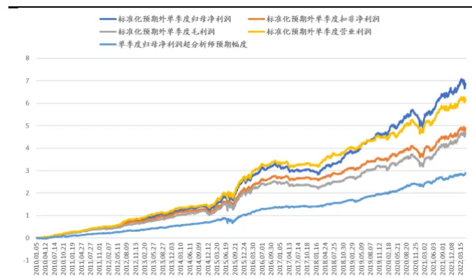
数据来源：Wind，朝阳永续，国泰君安证券研究测试区间：2010.01-2022.05。

图 25：全市场股票池 SUE因子 组合优化超额收益曲线
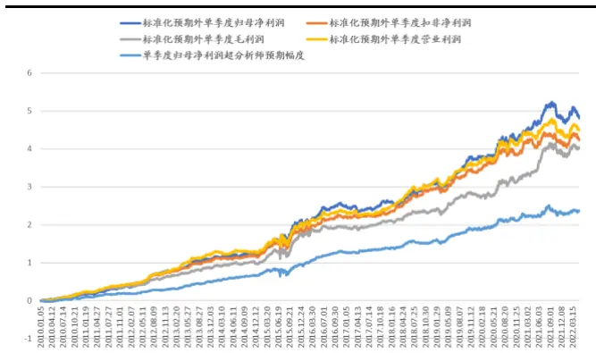
数据来源：Wind，朝阳永续，国泰君安证券研究测试区间：2010.01-2022.05。

## 3.3.3. SUE 衍生因子

我们认为，SUE 衍生因子值越大，个股的业绩超预期程度越高，未来表现越好。通过因子分组测试和单因子组合优化发现：

1） 标准化预期外单季度 GPOA、标准化预期外单季度归母 ROA、标准化预期外单季度归母 ROE、标准化预期外单季度扣非 ROA、标准化预期外扣非 ROE（TTM）效果较好，组合优化后相对基准（中证 500）的年化超额收益分别为 13.33%、13.38%、13.23%和 13.12%，信息比率分别为 2.16、2.25、2.16 和 2.15。

2）ROE、ROA计算的 SUE 衍生因子效果明显好于 GPOA、BP、SP 等计算的 SUE衍生因子。

表 30：全市场股票池 SUE衍生因子主要绩效指标

|  |  |  |  | t9多头组 |  |  |  |  |  |  | 单因子组合优化 |  |  |  |  |  |  | 组合优化 |  |
| --- | --- | --- | --- | --- | --- | --- | --- | --- | --- | --- | --- | --- | --- | --- | --- | --- | --- | --- | --- |
| 全市场 | 因子名 | t0空头组 |  | t9多头组 |  | 超额最大回撤 |  | 超额收益波动率 | 超额收益信息比率 | 多空收益 | 超额收益 | 超额收益最大回撤 |  | 超额收益波动率 | 超额收益信息比率 | IC | RankIC | 周度双边换手率 |  |
|  | 标准化预期外BP |  | 0.01% |  | 6.81% | -7 | 2% | 6.77% | 1.01 | 6.81% | 3.00% | -14.89% |  | 5.88% | 0.51 | 0.76% | 1.24% | 16.12% |  |
|  | 标准化预期外BP-带漂移项 |  | 1.22% |  | 7.24% | - | 50% | 6.26% | 1.16 | 8.46% | 5.33% | 10.87% |  | 5.71% | 0.93 | 0.66% | 0.71% | 17.34% |  |
|  | 标准化预期外单季度GPOA |  | I1.55% |  | 13.93% | -14 | 2% | 6.73% | 2.07 | 15.48% | 13.33% | -12%0% |  | 6.18% | 2.16 | 1.53% | 1.52% | 14.29% |  |
|  | 标准化预期外单季度GPOA-带漂移项 |  | 1.53% |  | 1.70% | -16 | 85% | 6.73% | 1.74 | 13.23% | 10.72% | -1598% |  | 5.95% | 1.80 | 1.36% | 1.39% | 1 | 4.53% |
|  | 标准化预期外单季度SP |  | 02.75% |  | 2.21% | -13 | 9% | 7.10% | 1.72 | 14.95% | 8.79% | 正 | 3% | 5.96% | 1.47 | 1.73% | 2.10% | 1 | 5.04% |
|  | 标准化预期外单季度SP-带漂移项 |  | D1.66% |  | 1.11% | F13 | 2% | 6.78% | 1.64 | 12.77% | 8.70% | 10% | 8% | 5.98% | 1.46 | 1.43% | 1.52% | 1 | 5.54% |
|  | 标准化预期外单季度归母ROA |  | 口3.46% |  | 15.48% | E | 7% | 6.57% | 2.36 | 18.94% | 13.38% | -9.6 | 7% | 5.94% | 2.25 | 1.98% | 2.22% | 1 | 7.22% |
| 单季度 | 标准化预期外单季度归母ROA-带漂移项 |  | 2.68% |  | 13.60% | -13 | 54% | 6.85% | 1.99 | 16.28% | 11.05% | 10.8 | 5% | 5.98% | 1.85 | 1.72% | 1.84% | 1 | 6.83% |
|  | 标准化预期外单季度归母ROE |  | 3.98% |  | 5.90% | F12 | 1% | 6.68% | 2.38 | 19.88% | 13.23% | -8.6 | 5% | 6.12% | 2.16 | 2.04% | 2.33% | 1 | 6.98% |
|  | 标准化预期外单季度归母ROE-带漂移项 |  | 2.61% |  | 13.86% | F12 | 3% | 6.84% | 2.03 | 16.47% | 11.00% | 9.4 | 5% | 6.13% | 1.80 | 1.71% | 1.89% | 16.90% |  |
|  | 标准化预期外单季度扣非ROA |  | 02.70% |  | 14.08% | E | 54% | 6.19% | 2.27 | 16.78% | 13.12% | 511.4 | 1% | 6.11% | 2.15 | 1.70% | 1.80% | 14.87% |  |
|  | 标准化预期外单季度扣非ROA-带漂移项 |  | D1.63% |  | 13.10% | F1B | 05% | 6.35% | 2.06 | 14.73% | 12.11% | 正1 | 0% | 6.00% | 2.02 | 1.52% | 1.49% |  | 14.98% |
|  | 标准化预期外单季度扣非ROE |  | 02.67% |  | 14.60% | -135 | 1% | 6.44% | 2.27 | 17.26% | 12.87% | 正 | 2% | 6.16% | 2.09 | 1.77% | 1.95% | 1 | 4.71% |
|  | 标准化预期外单季度扣非ROE-带漂移项 |  | L1.89% |  | 13.15% | -12 | 55% | 6.30% | 2.09 | 15.04% | 12.37% | -118 | 4% | 5.94% | 2.08 | 1.53% | 1.57% | 1 | 4.94% |
| TTM | 标准化预期外GPOA(TTM) |  | 0.49% |  | 7.65% | -16 | 6% | 6.79% | 1.13 | 8.14% | 5.55% | -15 | 6% | 5.95% | 0.93 | 0.77% | 0.67% | 1 | 1.82% |
|  | 标准化预期外GPOA(TTM)-带漂移项 |  | 0.37% |  | 7.44% | -16 | 1% | 6.70% | 1.11 | 7.07% | 7.28% | 11 | 3% | 5.75% | 1.27 | 0.72% | 0.73% | 1 | 2.75% |
|  | 标准化预期外SP（TTM） |  | 1.31% |  | 9.75% | -16 | 57% | 7.11% | 1.37 | 11.06% | 7.36% | -14.6 | 0% | 5.90% | 1.25 | 1.23% | 1.52% | 1 | 2.59% |
|  | 标准化预期外SP（TTM）-带漂移项 |  | 1.11% |  | 10.28% | -14. | 88% | 6.71% | 1.53 | 11.39% | 7.94% | -137 | 8% | 6.12% | 1.30 | 1.12% | 1.13% | 1 | 3.36% |
|  | 标准化预期外归母ROA(TTM) |  | I2.00% |  | 9.44% | -14 | 3% | 6.46% | 1.46 | 11.44% | 9.29% | -12.0 | 8% | 5.94% | 1.56 | 1.24% | 1.44% | 1 | 3.05% |
|  | 标准化预期外归母ROA(TTM)-带漂移项 |  | 11.49% |  | 10.61% | -14 | 08% | 6.71% | 1.58 | 12.10% | 10.58% | -10.8 | 3% | 5.89% | 1.80 | 1.29% | 1.38% | 14.88% |  |
|  | 标准化预期外归母ROE(TTM) |  | 4.26% |  | 15.82% | m | 3% | 6.64% | 2.38 | 20.07% | 13.55% | -9.8 | 7% | 6.15% | 2.20 | 2.00% | 2.20% | 16.79% |  |
|  | 标准化预期外归母ROE(TTM)-带漂移项 |  | 口3.18% |  | 14.67% | 12 | 0% | 6.69% | 2.19 | 17.85% | 12.81% | -9.6 | 0% | 6.06% | 2.11 | 1.77% | 1.88% | 16.67% |  |
|  | 标准化预期外扣非ROA(TTM) |  | L1.96% |  | 7.76% | - | $0% | 6.41% | 1.21 | 9.71% | 7.04% | -1294% |  | 5.71% | 1.23 | 1.00% | 1.12% | 11.80% |  |
|  | 标准化预期外扣非ROA(TTM)-带漂移项 |  | 0.44% |  | 7.65% | -15 | 81% | 6.37% | 1.20 | 8.09% | 7.30% | -14.608% |  | 5.81% | 1.26 | 1.03% | 1.12% | 13.10% |  |
|  | 标准化预期外扣非ROE(TTM) |  | 2.94% |  | 13.89% | -13 | 59% | 6.40% | 2.17 | 16.84% | 13.36% | -10.89% |  | 6.13% | 2.18 | 1.65% | 1.72% | 14.61% |  |

数据来源：Wind，国泰君安证券研究。测试区间：2010.01-2022.05。

数据来源： ，国泰君安证券研究测试区间：2010.01-2022.05。

数据来源： ，国泰君安证券研究测试区间：2010.01-2022.05。

表 31：全市场股票池 SUE衍生因子 分组年化超额收益

|  |  | 年化超额收益 |  |  |  |  |  |  |  |  |  |  |  |  |  |  |  |  |  |  |  |  |
| --- | --- | --- | --- | --- | --- | --- | --- | --- | --- | --- | --- | --- | --- | --- | --- | --- | --- | --- | --- | --- | --- | --- |
| 全市场 | 因子名 t | 0空头组 t |  | l |  | t2 |  | t3 |  | t4 |  | t5 |  | t6 |  | t7 |  | t8 |  | t9多头组 |  | 多空收益 |
|  | 标准化预期外BP |  | 0.01% |  | -1.14% |  | 1.36% |  | 3.67% |  | 4.12% |  | 4.69% |  | 5.58% |  | 4.45% |  | 5.11% |  | 6.81% | 6.81% |
|  | 标准化预期外BP-带漂移项 |  | -1.22% |  | 1.45% |  | 2.87% |  | 4.15% |  | 3.65% |  | 4.14% |  | 4.58% |  | 2.87% |  | 4.90% |  | 724% | 8.46% |
| 单季度 | 标准化预期外单季度GPOA |  | -1.55% |  | 0-1.32% |  | 1.53% |  | 2.18% |  | 2.39% |  | 0.17% |  | 3.74% |  | 5.89% |  | 8.15% |  | 13.93% | 15.48% |
|  | 标准化预期外单季度GPOA-带漂移项 |  | -1.53% |  | -0.30% |  | 1.97% |  | 3.11% |  | 0.57% |  | 1.24% |  | 2.77% |  | 705% |  | 8.31% |  | 11.70% | 13.23% |
|  | 标准化预期外单季度SP |  | -2.75% |  | -1.69% | - | 0.51% |  | -0.03% |  | 0.09% |  | 4.02% |  | 5.38% |  | 8.67% |  | 10.13% |  | 12.21% | 14.95% |
|  | 标准化预期外单季度SP-带漂移项 |  | -1.66% |  | -0.42% |  | 1.84% | 1 | .32% | - | 0.29% |  | 1.52% |  | 5.34% |  | 702% |  | 9.38% |  | 11.11% | 12.177% |
|  | 标准化预期外单季度归母ROA |  | -3.46% |  | -2.13% |  | -0.55% |  | 1.15% |  | -0.03% |  | 2.21% |  | 4.82% |  | 8.19% |  | 10.18% |  | 15.48% | 18.94% |
|  | 标准化预期外单季度归母ROA-带漂移项 |  | -2.68% |  | -0.68% |  | 0.40% |  | 0.83% |  | 1.26% |  | 0.65% |  | 4.84% |  | 6.62% |  | 10.68% |  | 13.60% | 16.28% |
|  | 标准化预期外单季度归母ROE |  | -3.98% |  | -2.74% |  | -0.56% |  | 1.60% |  | 0.10% |  | 1.88% |  | 5.24% |  | 7.84% |  | 10.63% |  | 15.90% | 19.88% |
|  | 标准化预期外单季度归母ROE-带漂移项 |  | -2.61% |  | -0.89% |  | -0.01% |  | 1.14% |  | 0.90% |  | 0.62% |  | 5.58% |  | 6.82% |  | 10.12% |  | 13.86% | 16.47% |
|  | 标准化预期外单季度扣非ROA |  | -2.70% |  | -0.03% |  | 0.46% | - | 0.19% |  | 0.38% |  | 2.11% |  | 5.78% |  | 6.00% |  | 9.41% |  | 14.08% | 16.78% |
|  | 标准化预期外单季度扣非ROA-带漂移项 |  | -1.63% |  | 0.07% |  | 1.76% |  | 1.67% |  | 0.73% |  | 1.51% |  | 3.02% |  | 6.68% |  | 8.08% |  | 13.10% | 14.73% |
|  | 标准化预期外单季度扣非ROE |  | -2.67% |  | -1.12% |  | -0.37% |  | 1.49% |  | 0.55% |  | 1.28% |  | 5.64% |  | 7.09% |  | 8.88% |  | 14.60% | 17.26% |
|  | 标准化预期外单季度扣非ROE-带漂移项 |  | -1.89% |  | 0.16% |  | 1.33% |  | 0.78% |  | 0.97% |  | 2.33% |  | 3.57% |  | 6.20% |  | 8.43% |  | 13.15% | 15.04% |
| TTM | 标准化预期外GPOA(TTM) |  | -0.49% |  | 1.13% |  | 3.11% |  | 3.00% |  | 5.15% |  | 1.77% |  | 3.33% |  | 3.26% |  | 6.43% |  | 7.65% | 8.14% |
|  | 标准化预期外GPOA(TTM)-带漂移项 |  | 0.37% |  | 1.08% |  | 2.03% |  | 3.02% |  | 3.19% |  | 12.19% |  | 4.53% |  | 4.84% |  | 5.61% |  | 744% | 7.07% |
|  | 标准化预期外SP（TTM） |  | -1.31% |  | 0.09% | 1 | .47% |  | 1.15% |  | -0.51% |  | 4.13% |  | 5.53% |  | 707% |  | 738% |  | 9.75% | 11.06% |
|  | 标准化预期外SP（TTM）-带漂移项 |  | -1.11% |  | 1.29% |  | 1.64% |  | 2.22% |  | 0.86% |  | 2.57% |  | 5.03% |  | 5.37% |  | 6.52% |  | 10.28% | 11.39% |
|  | 标准化预期外归母ROA(TTM) |  | -2.00% |  | 0.47% |  | 0.42% |  | 1.40% |  | 1.44% |  | 3.82% |  | 5.50% |  | 6.83% |  | 744% |  | 9.44% | 11.44% |
|  | 标准化预期外归母ROA(TTM)-带漂移项 |  | -1.49% |  | 1.08% |  | 0.65% |  | 2.01% |  | 1.32% |  | 1.96% |  | 4.71% |  | 5.69% |  | 8.21% |  | 10.61% | 1210% |
|  | 标准化预期外归母ROE(TTM) |  | -4.26% |  | -2.15% |  | 0.27% |  | 1.57% |  | 1.24% |  | 0.52% |  | 4.46% |  | 7.79% |  | 10.47% |  | 15.82% | 20.07% |
|  | 标准化预期外归母ROE(TTM)-带漂移项 |  | -3.18% |  | -0.52% |  | 0.13% |  | 1.93% |  | 0.87% |  | 0.25% |  | 4.97% |  | 6.67% |  | 9.64% |  | 14.67% | 17.85% |
|  | 标准化预期外扣非ROA(TTM) |  | -1.96% |  | 0.41% |  | 2.53% |  | 1.29% |  | 0.57% |  | 5.41% |  | 6.81% |  | 6.10% |  | 5.59% |  | 7.76% | 9.71% |
|  | 标准化预期外扣非ROA(TTM)-带漂移项 |  | -0.44% |  | -0.05% |  | 1.55% |  | 0.28% |  | 2.14% |  | 4.06% |  | 5.93% |  | 6.28% |  | 706% |  | 7.65% | 8.09% |
|  | 标准化预期外扣非ROE(TTM) |  | -2.94% |  | -0.81% |  | 0.26% |  | 0.66% |  | ı2.60% |  | 3.18% |  | 4.63% |  | 6.16% |  | 740% |  | 13.89% | 16.84% |
|  | 标准化预期外扣非ROE(TTM)-带漂移项 C |  | -2.17% |  | -0.20% |  | 1.96% |  | 0.89% |  | 3.44% |  | 3.14% |  | 3.07% |  | 5.21% |  | 6.63% |  | 12.82% | 14.99% |

数据来源：Wind，国泰君安证券研究。测试区间：2010.01-2022.05。

中证 500 股票池内，历史回测效果较好的 SUE衍生因子多头组超额收益曲线、单因子组合优化超额收益曲线如下。

图 26：全市场股票池 SUE衍生因子 多头组超额收益收益曲线
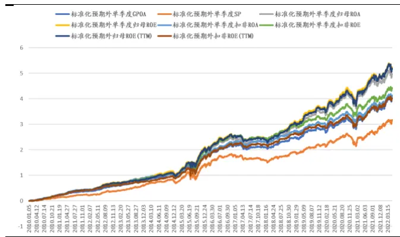
图 27：全市场股票池 SUE衍生因子 组合优化超额曲线

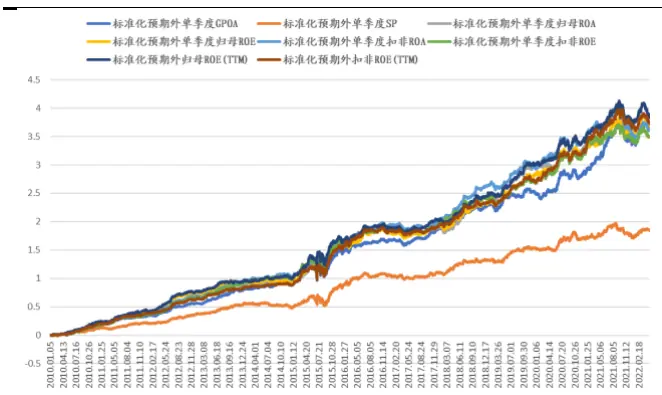

## 3.3.4. 过去 N日券商/报告上下调比例

我们认为，过去 N 日券商/报告上下调比例越大，个股的业绩超预期程度越高，未来表现越好。通过因子分组测试和单因子组合优化发现：

1） 过去 90 日券商上调-下调比例、过去 90 日报告上调-下调比例、过去 60 日券商上调比例、过去 90 日报告上调比例效果较好，相对基准（中证 500）的年化超额收益分别为 14.20%、16.04%、14.91%和 17.23%，信息比率分别为 2.20、2.51、2.37 和 2.75。

2）报告数量计算的因子效果好于券商数量计算的因子。
分组测试具体结果和单因子组合优化的绩效指标如下。

表 32：全市场股票池 过去 N日券商/报告上下调比例因子 主要绩效指标

|  |  |  | t9多头 |  | 组 |  |  | 单因子组合优化 |  |  |  |  |  |  | 组合优化 |
| --- | --- | --- | --- | --- | --- | --- | --- | --- | --- | --- | --- | --- | --- | --- | --- |
| 全市场 | 因子名 t | 0空头组t | 9多头组 |  |  |  |  |  |  |  |  |  |  |  |  |
|  |  |  |  | 回撤 | 波动率 | 信息比率 | 多空收益 | 超额收益 | 最大回撤 |  | 波动率 | 信息比率 |  |  |  |
|  |  |  |  |  |  |  |  |  |  |  |  |  |  | RankIC | 周度双边换手率 |
|  | 过去180日券商上调-下调比例 | 0.80% | 9.46% | L-12.$1% | 5.65% | 1.68 | 8.67% | 12.31% | -1170% |  | 6.29% | 1.96 | 0.88% | 1.15% | 27.18% |
|  | 过去60日券商上调-下调比例 | -0.37% | 11.12% | -15.05% | 5.77% | 1.93 | 11.50% | 13.50% | -13 | 70% | 6.31% | 2.14 | 1.04% | 1.17% | 36.54% |
| 上调-下 | 过去90日券商上调-下调比例 | 0.12% | 12.72% | -1327% | 5.79% | 2.20 | 12.60% | 14.20% | -147 | 0% | 6.47% | 2.20 | 1.19% | 1.40% | 29.94% |
| 调比例 | 过去180日报告上调-下调比例 1 | -1.02% | 13.47% | -13.68% | 5.96% | 2.26 | 14.49% | 16.25% | T | 39% | 6.58% | 2.47 | 1.42% | 1.88% | 21.64% |
|  | 过去60日报告上调-下调比例 | -1.37% | 11.66% | -139% | 5.89% | 1.98 | 13.03% | 14.45% | -13 | 72% | 6.60% | 2.19 | 1.27% | 1.41% | 32.72% |
|  | 过去90日报告上调-下调比例 | -0.57% | 14.11% | -133% | 5.85% | 2.41 | 14.68% | 16.04% | -12 | 59% | 6.39% | 2.51 | 1.40% | 1.69% | 27.07% |
|  | 过去180日券商上调比例 | 1.53% | 10.48% | 12% | 5.65% | 1.86 | 8.95% | 12.32% | -98 | 9% | 6.07% | 2.03 | 1.07% | 2.11% | 27.24% |
|  | 过去60日券商上调比例 | 0.29% | 10.43% | -16.03% | 6.24% | 1.67 | 10.14% | 14.91% | -12 | 09% | 6.29% | 2.37 | 1.26% | 2.16% | 39.73% |
| 上调比例 | 过去90日券商上调比例 | 0.69% | 12.70% | -13.9% | 6.00% | 2.12 | 12.01% | 14.79% | -10 | 92% | 6.27% | 2.36 | 1.36% | 2.31% | 31.04% |
|  | 过去180日报告上调比例 | 0.28% | 13.73% | F11.65% | 5.73% | 2.40 | 13.45% | 16.88% | -110 | 4% | 6.34% | 2.66 | 1.53% | 2.62% | 21.65% |
|  | 过去60日报告上调比例 | 0.57% | 11.58% | -14.651% | 5.81% | 1.99 | 11.01% | 14.47% |  | 20% | 6.56% | 2.21 | 1.36% | 2.20% | 32.27% |
|  | 过去90日报告上调比例 | 0.73% | 14.09% | F11.65% | 5.79% | 2.43 | 13.35% | 17.23% | -10 | 18% | 6.26% | 2.75 | 1.51% | 2.45% | 26.92% |

数据来源：Wind，朝阳永续，国泰君安证券研究。测试区间：2010.01-2022.05。

表 33：全市场股票池 过去 N日券商/报告上下调比例因子 分组年化超额收益

|  |  | 年化超额收益 |  |  |  |  |  |  |  |  |  |  |  |  |  |  |  |  |  |  |  |  |
| --- | --- | --- | --- | --- | --- | --- | --- | --- | --- | --- | --- | --- | --- | --- | --- | --- | --- | --- | --- | --- | --- | --- |
| 全市场 | 因子名 | t0空头组 t |  | 1 |  | t2 |  | t3 |  | t4 |  | t5 |  | t6 |  | t7 |  | t8 |  | t9多头组 |  | 多空收益 |
|  | 过去180日券商上调-下调比例 |  | 0.80% |  | 1.37% |  | 0.30% |  | -0.38% |  | 3.26% |  | 2.26% |  | 3.49% |  | 6.49% |  | 7.12% |  | 9.46% | 8.67% |
|  | 过去60日券商上调-下调比例 |  | -0.37% |  | -0.39% |  | 2.09% |  | 2.38% |  | 0.99% |  | 4.28% |  | 4.43% |  | 4.22% |  | 535% |  | 1.12% | 11.50% |
| 上调-下 | 过去90日券商上调-下调比例 |  | 0.12% | D | -1.87% |  | 0.13% |  | 2.31% |  | 3.23% |  | 3.33% |  | 2.68% |  | 4.61% |  | 7.20% |  | 12.72% | 12.60% |
| 调比例 | 过去180日报告上调-下调比例 |  | -1.02% | -1 | .04% | 1 | -1.73% |  | -1.01% |  | 1.57% |  | 3.42% |  | 6.84% |  | 6.11% |  | 8.21% |  | 13.47% | 14.49% |
|  | 过去60日报告上调-下调比例 | D | -1.37% |  | 0.02% | 1 | .38% |  | 2.00% |  | 2.72% |  | 2.92% |  | 3.40% |  | 5.15% |  | 6.33% |  | 11.66% | 13.03% |
|  | 过去90日报告上调-下调比例 |  | -0.57% |  | -1.32% | -1 | .45% |  | 1.46% |  | 2.60% |  | 2.55% |  | 515% |  | 558% |  | 6.56% |  | 14.11% | 14.68% |
| 上调比例 | 过去180日券商上调比例 |  | 1.53% |  | -0.89% |  | -5.13% | ■è | -3.18% |  | 0.20% |  | 4.75% |  | 6.79% |  | 12.03% |  | 8.82% |  | 10.48% | 895% |
|  | 过去60日券商上调比例 |  | 0.29% | 0 | -2.48% |  | -4.36% | D | -2.01% |  | -0.20%% |  | 4.78% |  | 8.03% |  | 10.01% |  | 10.91% |  | 10.43% | 10.14% |
|  | 过去90日券商上调比例 |  | 0.69% | 「 | -3.04% |  | -4.08% |  | -3.80% |  | 0.43% |  | 4.44% |  | 7.78% |  | 11.77% |  | 8.76% |  | 12.70% | 12.01% |
|  | 过去180日报告上调比例 |  | 0.28% | 「 | -2.65% |  | -4.65% |  | -4.20% | -1 | .87% |  | 3.28% |  | 8.40% |  | 14.25% |  | 9.51% |  | 13.73% | 13.45% |
|  | 过去60日报告上调比例 |  | 0.57% | 1 | -2.40% |  | -3.11% | 「 | -2.61% | D | -1.05% |  | 3.55% |  | 7.05% |  | 11.44% |  | 10.37% |  | 11.58% | 11.01% |
|  | 过去90日报告上调比例 |  | 0.73% | 1 | -2.18% |  | -5.51% |  | -3.87% |  | -0.54% |  | 3.14% |  | 9.33% |  | 12.00% |  | 8.74% |  | 14.09% | 13.35% |

数据来源：Wind，朝阳永续，国泰君安证券研究。测试区间：2010.01-2022.05。

全市场股票池内，历史回测效果较好的过去 N 日券商/报告上下调因子多头组超额收益曲线、单因子组合优化超额收益曲线如下。

图 28：全市场股票池 过去N日券商/报告上下调比例因子多头组超额收益曲线
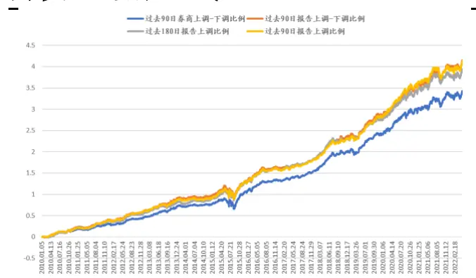
数据来源：Wind，朝阳永续，国泰君安证券研究测试区间：2010.01-2022.05。

图 29：全市场股票池 过去N日券商/报告上下调比例因子组合优化超额收益曲线
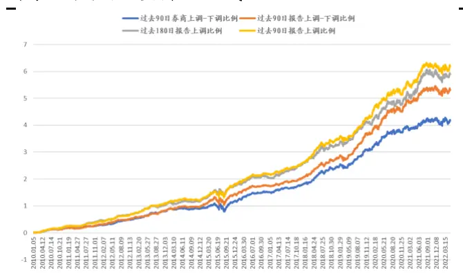
数据来源：Wind，朝阳永续，国泰君安证券研究测试区间：2010.01-2022.05。

## 3.3.5. 过去 N日盈利/营收预测调整

我们认为，过去 N 日盈利/营收预测调整幅度越大，个股的业绩超预期程度越高，未来表现越好。通过因子分组测试和单因子组合优化发现：1） 过去 60 天盈利调整、过去 60 天营收调整效果较好，相对基准（中证 500）的年化超额收益为 9.98%、10.38%，信息比率为 1.62、1.63。2）盈利调整效果相对好于营收调整。

表 34：全市场股票池 过去 N日盈利/营收预测调整因子主要绩效指标

|  |  |  | t9多头 |  |  | 组 |  |  | 单因子组合优化 |  |  |  |  |  | 组合优化 |
| --- | --- | --- | --- | --- | --- | --- | --- | --- | --- | --- | --- | --- | --- | --- | --- |
| 全市场 | 因子名 t0 | 空头组 | t9多头组 | 超额最大回撤 |  | 超额收益波动率 | 超额收益信息比率 | 多空收益 | 超额收益 | 超额收益超最大回撤波 | 额收益动率 | 超额收益信息比率 | IC | RankIC | 周度双边换手率 |
| 盈利 | 过去120天盈利调整 2 | .17% | 12.02% | -14.8 | 1% | 6.10% 1.97 |  | 14.19% | 8.75% | -11.629% | 6.29% | 1.39 | 1.34% | 1.92% | 19.45% |
|  | 过去180天盈利调整 | 0-1.43% | 11.37% | -16.4 | 5% | 6.12% | 1.86 | 12.80% | 10.38% | -11.56% | 6.20% | 1.68 | 1.24% | 1.85% | 17.03% |
|  | 过去360天盈利调整 | 0.37% | 8.23% | -15.2 | 9% | 6.22% | 1.32 | 7.85% | 5.86% | 13.19% | 6.13% | 0.96 | 0.87% | 1.49% | 13.93% |
|  | 过去60天盈利调整 1过去90天盈利调整 | .90% | 12.36% | -13.8 | 7% | 5.84% | 2.11 | 14.26% | 9.98% | -14.93% | 6.15% | 1.62 | 1.28% | 1.74% | 26.91% |
|  |  | 日-2.92% | 12.87% | -13.7 | 2% | 5.97% | 2.15 | 15.79% | 9.36% | 13.209% | 6.26% | 1.50 | 1.36% | 1.91% | 2211% |
| 营收 | 过去120天营收调整 1 | .70% | 9.41% | -14.7 | 1% | 5.88% | 1.60 | 11.11% | 8.32% | -14.26% | 6.18% | 1.35 | 1.04% | 1.27% | 19.50% |
|  | 过去180天营收调整 | 1.25% | 9.12% | -143 | 6% | 5.99% | 1.52 | 10.37% | 8.08% | -13.501% | 6.23% | 1.30 | 1.00% | 1.37% | 16.46% |
|  | 过去360天营收调整 | 0.53% | 7.19% |  | 8% | 6.15% | 1.17 | 7.72% | 7.27% | -15.46% | 6.05% | 1.20 | 0.84% | 1.21% | 13.44% |
|  | 过去60天营收调整 | -0.98% | 9.66% | 114 | 5% | 5.62% | 1.72 | 10.64% | 10.38% | -15.422% | 6.37% | 1.63 | 0.96% | 0.72% | 28.28% |
|  | 过去90天营收调整 | 1.84% | 10.01% | -16.0 | 7% | 5.81% | 1.72 | 11.86% | 9.64% | -18.27% | 6.22% | 1.55 | 1.04% | 1.11% | 22.95% |

数据来源：Wind，朝阳永续，国泰君安证券研究。测试区间：2010.01-2022.05。

表 35：全市场股票池 过去 N日盈利/营收预测调整因子 分组超额收益

|  |  | 年化超额收益 |  |  |  |  |  |  |  |  |  |  |  |  |  |  |  |  |  |
| --- | --- | --- | --- | --- | --- | --- | --- | --- | --- | --- | --- | --- | --- | --- | --- | --- | --- | --- | --- |
| 全市场 | 因子名 t | 0空头组 | tl t2 |  |  | t3 t4 |  |  |  | t5 |  | t6 t7 |  |  | t8 |  | t9多头组 |  | 多空收益 |
| 盈利 | 过去120天盈利调整 | -2.17% |  | -0.56% | -0.40% |  | -2.67% |  | 1.32% |  | 4.80% |  | 7.33% | 6.68% |  | 8.77% |  | 12.02% | 14.19% |
|  | 过去180天盈利调整 | -1.43% |  | -0.63% | -0.56% |  | -1.90% |  | -2.15% |  | 4.62% |  | 9.14% | 8.82% |  | 8.07% |  | 11.37% | 12.80% |
|  | 过去360天盈利调整 | 0.37% |  | -0.27% | 0.38% |  | -2.50% | -0.75% |  |  | 3.93% |  | 9.04% | 8.51% |  | 8.15% |  | 8.23% | 7.85% |
|  | 过去60天盈利调整 | -1.90% |  | -0.99% | 0.39% |  | -0.90% |  | 1.62% |  | 4.50% |  | 596% | 6.83% |  | 6.88% |  | 12.36% | 14.26% |
|  | 过去90天盈利调整 口 | -2.92% |  | -0.03% | 0.55% |  | -2.52% |  | 0.14% |  | 578% |  | 6.49% | 6.71% |  | 7.99% |  | 12.87% | 15.79% |
| 营收 | 过去120天营收调整 | -1.70% |  | 2.18% | 1.63% |  | 0.23% |  | 1.37% |  | 2.36% |  | 5.13% | 5.45% |  | 8.35% |  | 9.41% | 11.11% |
|  | 过去180天营收调整 | -1.25% |  | 1.95% | 0.28% |  | -0.78% |  | 0.44% |  | 3.34% |  | 6.53% | 6.82% |  | 8.21% |  | 9.12% | 10.37% |
|  | 过去360天营收调整 | -0.53% |  | 1.45% | 0.59% |  | -1.17% |  | -0.66% |  | 4.26% |  | 7.57% | 8.80% |  | 7.33% |  | 7.19% | 7.72% |
|  | 过去60天营收调整 | -0.98% |  | 4.32% | 2.93% |  | 2.26% |  | ı3.05% |  | 2.88% |  | 0.82% | 2.11% |  | 7.05% |  | 9.66% | 10.64% |
|  | 过去90天营收调整 | -1.84% |  | 2.76% | 1.66% |  | 0.43% |  | 3.21% |  | 3.32% |  | 2.35% | 4.26% |  | 8.14% |  | 10.01% | 11.86% |

数据来源：Wind，朝阳永续，国泰君安证券研究。测试区间：2010.01-2022.05。

全市场股票池内，历史回测效果较好的过去 N 日盈利/营收预测调整因子多头组超额收益曲线、单因子组合优化超额收益曲线如下。

图 30：全市场股票池 过去 N日盈利/营收预测调整因子 多头组超额收益曲线
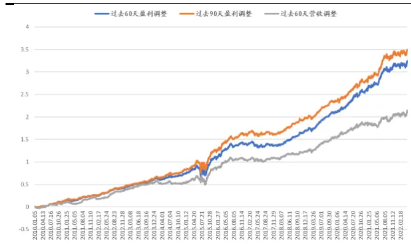
数据来源：Wind，朝阳永续，国泰君安证券研究
测试区间：2010.01-2022.05。

图 31：全市场股票池 过去 N日盈利/营收预测调整因子 组合优化超额收益曲线
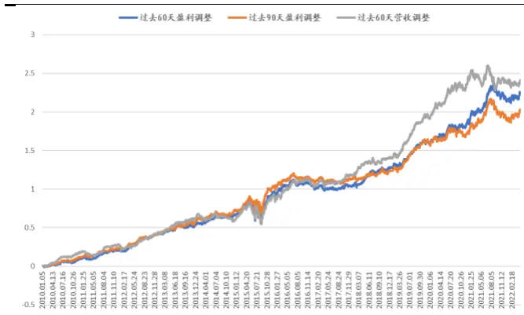
数据来源：Wind，朝阳永续，国泰君安证券研究
测试区间：2010.01-2022.05。

## 4. 超预期复合因子表现

综合考察组合优化超额收益、 、分组测试、多空收益等指标，我们筛选出适用于三个股票池的超预期因子合成大类因子。具体筛选标准是，对于 5 种因子，每一种超预期因子内部，在不同的基础指标（净利润、毛利润、ROE、ROA、券商数、报告数等）类型的中选组合优化超额收益效果最好的一个。本部分以等权加权为例，展示超预期复合因子的选股效果。对于不同股票池的每只股票，将多个因子的分位数得分等权平均得到大类因子得分。分位数得分加权是指使用个股因子值的分位数作为得分，将多个因子的得分，等权平均计算大类因子得分。等权加权方式简单直接，基本思想是平等看待每类因子代表的投资逻辑，不做有偏好和预测的主观判断，避免了数据过度拟合。下面展示三个股票池（沪深 成分股、中证 成分股、全市场）超预期复合因子的选股表现测试结果。

## 4.1. 沪深 300 股票池

通过单因子测试，沪深 300股票池内筛选出 15个效果不错的因子。首先分析因子之间的相关性情况。计算两两因子之间的相关系数矩阵发现，五种因子内部由于投资逻辑相似，内部相关性较高；五种因子之间相关性上，公告后异常收益因子与其他相关性较低，相关系数低于 0.3；SUE因子和 SUE衍生因子相关性较高，在 0.8 附近；上下调比例、盈利/营收调整与其他因子相关性不高，在 0.3 附近。因子相关系数矩阵见下表。

表 36：沪深 300 内 超预期因子相关系数

| 沪深300内因子相关系数 | 标准化预期外单季度归母净利润 | 标准化预期外单季度扣非净利润 | 标准化预标准化预期外单季期外单季度营业利度毛利润润 |  | 标准化预期外单季 | 标准化预期外单季 | 标准化预期外单季 | 标准化预期外单季 | 标准化预期外扣非 | 过去90日券商上调 | 过去90日报告上调 | 过去60日券商上调 | 过去90日报告上调 | 过去90天盈利调整 | 过去90天营收调整 | JUMP |
| --- | --- | --- | --- | --- | --- | --- | --- | --- | --- | --- | --- | --- | --- | --- | --- | --- |
|  |  |  |  |  | 度GPOA | 度归母 | 度归母 | 度扣非 | ROE(TTM | -下调比 | -下调比 | 券同工调 |  |  |  |  |
| 标准化预期外单季度归母净利润 |  | 0.65 | 0.47 | 0.77 | 0.36 | 0.84 | 0.84 | 0.53 | 0.53 | 0.30 | 0.34 | 0.27 | 0.31 | 0.36 | 0.21 | 0.35 |
| 标准化预期外单季度扣非净利润 | 0.65 |  | 0.64 | 0.73 | 0.51 | 0.54 | 0.54 | 0.83 | 0.83 | 0.30 | 0.33 | 0.25 | 0.30 | 0.34 | 0.22 | 0.30 |
| 标准化预期外单季度毛利润 | 0.47 | 0.64 |  | 0.59 | 0.75 | 0.36 | 0.39 | 0.51 | 0.54 | 0.23 | 0.25 | 0.19 | 0.23 | 0.28 | 0.24 | 0.22 |
| 标准化预期外单季度营业利润 | 0.77 | 0.73 | 0.59 |  | 0.46 | 0.64 | 0.64 | 0.61 | 0.60 | 0.31 | 0.34 | 0.26 | 0.31 | 0.36 | 0.22 | 0.30 |
| 标准化预期外单季度GPOA | 0.36 | 0.51 | 0.75 | 0.46 |  | 0.47 | 0.44 | 0.63 | 0.57 | 0.20 | 0.22 | 0.16 | 0.19 | 0.21 | 0.18 | 0.19 |
| 标准化预期外单季度归母ROA | 0.84 | 0.54 | 0.36 | 0.64 | 0.47 |  | 0.91 | 0.66 | 0.57 | 0.28 | 0.31 | 0.24 | 0.28 | 0.30 | 0.16 | 0.32 |
| 标准化预期外单季度归母ROE | 0.84 | 0.54 | 0.39 | 0.64 | 0.44 | 0.91 |  | 0.59 | 0.62 | 0.28 | 0.31 | 0.24 | 0.27 | 0.30 | 0.18 | 0.32 |
| 标准化预期外单季度扣非ROA | 0.53 | 0.83 | 0.51 | 0.61 | 0.63 | 0.66 | 0.59 |  | 0.88 | 0.28 | 0.31 | 0.22 | 0.26 | 0.28 | 0.18 | 0.27 |
| 标准化预期外扣非ROE(TTM) | 0.53 | 0.83 | 0.54 | 0.60 | 0.57 | 0.57 | 0.62 | 0.88 |  | 0.28 | 0.31 | 0.22 | 0.26 | 0.28 | 0.20 | 0.27 |
| 过去90日券商上调-下调比例 | 0.30 | 0.30 | 0.23 | 0.31 | 0.20 | 0.28 | 0.28 | 0.28 | 0.28 |  | 0.90 | 0.61 | 0.78 | 0.49 | 0.30 | 0.20 |
| 过去90日报告上调-下调比例 | 0.34 | 0.33 | 0.25 | 0.34 | 0.22 | 0.31 | 0.31 | 0.31 | 0.31 | 0.90 |  | 0.67 | 0.87 | 0.53 | 0.32 | 0.23 |
| 过去60日券商上调比例 | 0.27 | 0.25 | 0.19 | 0.26 | 0.16 | 0.24 | 0.24 | 0.22 | 0.22 | 0.61 | 0.67 |  | 0.76 | 0.38 | 0.22 | 0.18 |
| 过去90日报告上调比例 | 0.31 | 0.30 | 0.23 | 0.31 | 0.19 | 0.28 | 0.27 | 0.26 | 0.26 | 0.78 | 0.87 | 0.76 |  | 0.47 | 0.28 | 0.21 |
| 过去90天盈利调整 | 0.36 | 0.34 | 0.28 | 0.36 | 0.21 | 0.30 | 0.30 | 0.28 | 0.28 | 0.49 | 0.53 | 0.38 | 0.47 |  | 0.35 | 0.21 |
| 过去90天营收调整 | 0.21 | 0.22 | 0.24 | 0.22 | 0.18 | 0.16 | 0.18 | 0.18 | 0.20 | 0.30 | 0.32 | 0.22 | 0.28 | 0.35 |  | 0.13 |

数据来源：Wind，朝阳永续，国泰君安证券研究

计算因子 IC 的相关系数矩阵发现，结论与因子相关系数基本一致，整体相关系数数值更大一些。因子 IC 的相关系数矩阵见下表。

表 37：沪深 300 内 超预期因子 IC的相关系数
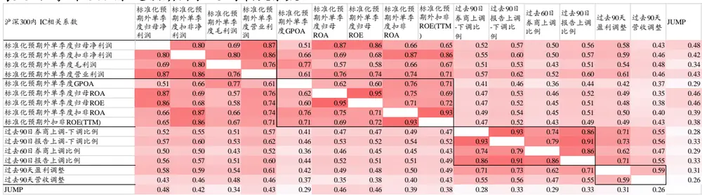
数据来源：Wind，朝阳永续，国泰君安证券研究

以等权加权为例，展示沪深300内超预期复合因子的选股效果。超预期复合因子将沪深 300 成分股分 10 组进行测算。测试发现，复合因子多头组年化超额收益 15.47%，超额最大回撤 14.7%，信息比率 1.61；空头组年化超额-4.45%，多空年化收益 19.92%。分组超额收益曲线、多头组收益曲线、超额收益曲线和期间回撤情况如下。

图 32：沪深 300 股票池 复合因子分组超额收益曲线
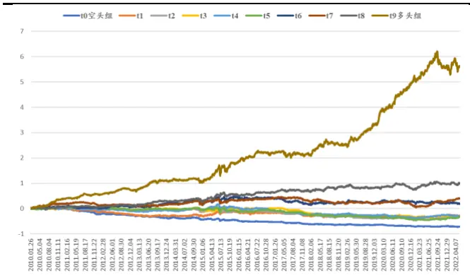
数据来源：Wind，朝阳永续，国泰君安证券研究

图 33：沪深 300 股票池 复合因子 t9 多头组收益曲线
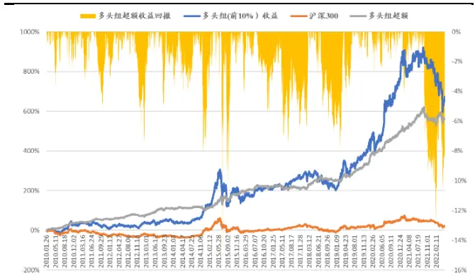
数据来源：Wind，朝阳永续，国泰君安证券研究

超预期复合因子组合优化测试。通过控制市值行业中性化，设置个股权重上限 8%、权重偏离上限 3%的约束条件求解个股权重构建组合。测算发现，超预期复合因子组合优化的年化超额收益 9.51%，超额收益最大回撤-10.87%，信息比率 2.03，周度双边换手率 18.69%。2022 年以来超额收益 2.77%，超额收益最大回撤-1.70%。复合因子组合优化每年收益情况如下表。组合优化的收益曲线、超额收益曲线和期间回撤情况如下图。

表 38：沪深 300 股票池 复合因子组合优化每年收益

| 年份 | 组合优化累计收益 |  | 沪深300指数 |  | 超额收益 | 超额收益波动率 | 超额收益信息比率 | 超额收益最大回撤 |
| --- | --- | --- | --- | --- | --- | --- | --- | --- |
| 2010 |  | 4.78% | 1-5.90% |  | 10.68% | 4.34% | 2.46 | -1.977% |
| 2011 | 一1 | 6.42% | 25.01% |  | 8.60% | 3.38% | 2.55 | -1.28% |
| 2012 | 2 | 0.22% | 7.56% |  | 12.66% | 3.18% | 3.98 | -1.63% |
| 2013 |  | 0.84% | 1-7.65% |  | 8.48% | 4.18% | 2.03 | -3.10% |
| 2014 | 5 | 9.26% | 5 | 1.66% | 7.60% | 3.70% | 2.06 | -2.48% |
| 2015 |  | 3.18% |  | 5.58% | -2.41% | 7.65% | -0.31 | -10.87% |
| 2016 | D | -6.15% | 1 | 1.28% | 5.13% | 3.56% | 1.44 | -1.98% |
| 2017 | 3 | 9.08% |  | 2178% | 17.30% | 3.97% | 4.36 | -1.81% |
| 2018 | 1 | 7.54% |  | 25.31% | 7.77% | 4.67% | 1.66 | -3.68% |
| 2019 | 53.03% | 3% |  | 36.07% | 16.96% | 4.29% | 3.95 | -3.50% |
| 2020 | 4 | 9.72% |  | 27.21% | 22.51% | 4.70% | 4.79 | -2.91% |
| 2021 |  | -1.11% |  | -5.20% | 4.09% | 6.20% | 0.66 | 5.70% |
| 2022.05.13 | 1 | 14.70% |  | 17.46% | 2.77% | 5.04% | 0.55 | -1.70% |
| 整体 |  | 1.08% |  | 1.68% | 9.51% | 4.67% | 2.03 | -10.87% |

数据来源：Wind，朝阳永续，国泰君安证券研究
测试区间：2010.01-2022.05。

图 34：沪深 300股票池 复合因子组合优化收益曲线
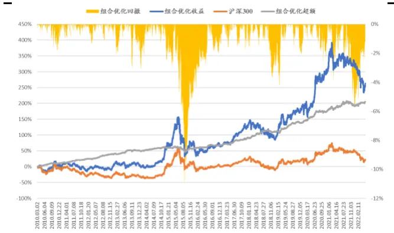
数据来源：Wind，朝阳永续，国泰君安证券研究测试区间：2010.01-2022.05。

沪深 300 内，超预期复合因子主要绩效指标与单因子对比见下表。可以发现，过去 90 日报告上调-下调比例因子的绩效指标比复合因子都要好一些，尤其是超额收益的最大回撤明显小于复合因子。从模型稳健性角度考虑，我们建议选用多个因子合成，不建议一类因子中只使用历史回测最好的因子。

表 39：沪深 300 内 复合因子主要绩效指标与单因子对比

|  |  |  |  | t9多头组 |  |  |  |  | 单因子组合优化 |  |  |  |  |  |  | 组合优化 |
| --- | --- | --- | --- | --- | --- | --- | --- | --- | --- | --- | --- | --- | --- | --- | --- | --- |
| 沪深300内 | 因子名 | t0空头组 |  | t9多头组 |  | 超额最大回撤 | 超额收益波动率 | 超额收益信息比率 | 多空收益 | 超额收益 |  |  |  |  |  |  |
|  |  |  |  |  |  |  |  |  |  |  | 最大回撤 |  |  |  |  |  |
|  |  |  |  |  |  |  |  |  |  |  |  | 超额收益波动率 | 超额收益信息比率 | IC | RankIC | 周度双边换手率 |
| SUE | 标准化预期外单季度归母净利润 |  | -7.73% |  | 9.09% | -14.95% | 10.46% | 0.87 | 16.82% | 6.81% | -11.72% | 5.38% | 1.27 | 2.20% | 2.35% | 16.40% |
|  | 标准化预期外单季度扣非净利润 |  | -5.18% |  | 10.23% | 13.91% | 9.76% | 1.05 | 15.41% | 8.12% | -7.61% | 5.14% | 1.58 | 2.14% | 2.18% | 14.94% |
|  | 标准化预期外单季度毛利润 |  | -7.60% | 1 | 1.28% | 16.92% | 10.74% | 1.05 | 18.88% | 8.00% | -7.51% | 5.52% | 1.45 | 2.29% | 2.03% | 13.67% |
|  | 标准化预期外单季度营业利润 |  | -6.51% |  | 12.74% | -13.95% | 9.84% | 1.29 | 19.24% | 8.48% | -8.26% | 5.24% | 1.62 | 2.31% | 2.39% | 15.55% |
|  | 标准化预期外单季度GPOA |  | -5.57% |  | 10.08% | -17.99% | 10.68% | 0.94 | 15.66% | 7.15% | -9.36% | 5.54% | 1.29 | 2.00% | 1.61% | 13.58% |
|  | 标准化预期外单季度归母ROA |  | -5.42% |  | 10.02% | -11.38% | 9.40% | 1.07 | 15.43% | 6.64% | -13.75% | 5.00% | 1.33 | 1.84% | 1.95% | 16.12% |
| SUE衍生 | 标准化预期外单季度归母ROE |  | -6.32% |  | 9.53% | -13.14% | 9.67% | 0.99 | 15.85% | 7.07% | -8.88% | 5.02% | 1.41 | 1.92% | 1.97% | 15.85% |
|  | 标准化预期外单季度扣非ROA | 「 | -3.35% |  | 9.56% | -12.25% | 8.62% | 1.11 | 12.91% | 7.99% | -8.91% | 5.07% | 1.57 | 1.89% | 1.93% | 14.53% |
|  | 标准化预期外扣非ROE(TTM) | 「 | -3.21% |  | 10.42% | 16.31% | 9.23% | 1.13 | 13.64% | 9.02% | -6.62% | 5.14% | 1.76 | 1.82% | 1.78% | 14.05% |
| 上下调 | 过去90日券商上调-下调比例 |  | -5.41% |  | 10.08% | -12.07% | 8.55% | 1.18 | 15.49% | 8.17% | -633% | 5.07% | 1.61 | 1.93% | 1.91% | 28.18% |
|  | 过去90日报告上调-下调比例 | 7 | -4.79% |  | 11.45% | -12.31% | 8.64% | 1.33 | 16.24% | 9.92% | -5.89% | 4.98% | 1.99 | 2.04% | 2.13% | 25.56% |
|  | 过去60日券商上调比例 |  | -1.96% |  | 8.19% | -12.76% | 8.50% | 0.96 | 10.15% | 8.52% | -8.86% | 4.88% | 1.75 | 171% | 1.76% | 34.39% |
|  | 过去90日报告上调比例 |  | -4.96% |  | 11.42% | -11.60% | 8.38% | 1.36 | 16.38% | 9.15% | -5.72% | 4.96% | 1.84 | 2.08% | 2.09% | 25.54% |
| 盈利调整 | 过去90天盈利调整 |  | -7.92% |  | 507% | -23.43% | 10.59% | 0.48 | 13.00% | 5.98% | -7.90% | 5.38% | 1.11 | 1.81% | 2.11% | 22.80% |
|  | 过去90天营收调整 |  | -5.12% |  | 464% | F17.73% | 9.75% | 0.48 | 9.76% | 4.37% | -10.11% | 5.12% | 0.85 | 1.63% | 1.98% | 23.46% |
| 异常收益 | JUMP |  | -3.31% |  | 6.73% | -17.55% | 9.65% | 0.70 | 10.04% | 5.37% | -13.28% | 5.14% | 1.04 | 1.39% | 1.79% | 18.84% |
|  | 复合因子 | 日 | .45% | 15 | .47% | -14.70% | 9.61% | 1.61 | 19.92% | 9.51% | -10.87% | 4.67% | 2.03 | 2.94% | 2.67% | 18.69% |

数据来源：Wind，朝阳永续，国泰君安证券研究

## 4.2. 中证 500 股票池

通过单因子测试，中证 股票池内筛选出 个效果不错的因子。首先分析因子之间的相关性情况。计算两两因子之间的相关系数矩阵发现，五种因子内部由于投资逻辑相似，内部相关性较高；五种因子之间相关性上，公告后异常收益因子与其他相关性较低，相关系数普遍低于 0.3；SUE因子和 SUE 衍生因子相关性较高，在 0.8 附近；上下调比例、盈利/营收调整与其他因子相关性不高，在 0.2 附近。因子相关系数矩阵见下表。

表 40：中证 500 内 超预期因子相关系数

| 中证500内因子相关系数 | 标准化预 标准化预 标准化预 单季度归 期外单季 期外单季 度归母净 度扣非净 利润 | 标准化预 期外单季 度毛利润 | 期外单季 度营业利 | 母净利润 超分析师 | 度归母 | 期外单季 度归母 | 期外单季 期外单季 度扣非 | 期外单季 度扣非 | 日券商上 调-下调 | -下调比 | 报告上调 | 过去180 日券商上 | 过去90日 报告上调 | 过去60天 盈利调整 | 过去60天 营收调整 | 公告后1 天异常收 Jump |
| --- | --- | --- | --- | --- | --- | --- | --- | --- | --- | --- | --- | --- | --- | --- | --- | --- |
| 标准化预期外单季度归母净利润 | 利润 | 0.56 | 润 0.42 | 0.70 | 预期幅度 ROA 0.37 | ROE 0.88 | ROA 0.89 | ROE 0.49 | 比例 0.49 | 例 0.14 | 0.22 | 比例 0.13 | 0.20 | 0.25 | 0.12 | 0.07 |
| 标准化预期外单季度扣非净利润 | 0.56 |  | 0.63 | 0.71 | 0.31 | 0.49 | 0.50 | 0.89 | 0.90 | 0.18 | 0.22 0.17 | 0.16 | 0.20 | 0.23 | 0.13 | 0.33 0.06 0.28 |
| 标准化预期外单季度毛利润 | 0.42 | 0.63 |  | 0.58 | 0.22 | 0.35 | 0.38 | 0.55 | 0.57 | 0.14 |  | 0.13 | 0.15 | 0.15 | 0.06 | 0.20 |
| 标准化预期外单季度营业利润 | 0.70 | 0.71 | 0.58 |  | 0.32 | 0.61 | 0.62 | 0.63 | 0.64 | 0.18 |  | 0.16 |  | 0.13 | 0.07 | 0.29 |
| 单季度归母净利润超分析师预期幅度 | 0.37 | 0.31 | 0.22 | 0.32 |  | 0.33 | 0.32 | 0.27 | 0.26 | 0.14 | 0.24 0.19 | 0.14 | 0.22 0.18 | 0.09 | 0.04 | 0.20 |
| 标准化预期外单季度归母ROA | 0.88 | 0.49 | 0.35 | 0.61 | 0.33 |  | 0.94 | 0.57 | 0.53 | 0.14 | 0.22 | 0.12 | 0.24 0.19 0.23 | 0.10 | 0.07 | 0.30 |
| 标准化预期外单季度归母ROE | 0.89 | 0.50 | 0.38 | 0.62 | 0.32 | 0.94 |  | 0.53 | 0.57 | 0.14 | 0.22 | 0.11 | 0.23 | 0.11 | 0.07 | 0.30 |
| 标准化预期外单季度扣非ROA | 0.49 | 0.89 | 0.55 | 0.63 | 0.27 | 0.57 | 0.53 |  | 0.94 | 0.18 | 0.22 | 0.14 | 0.19 0.19 | 0.11 | 0.05 | 0.25 |
| 标准化预期外单季度扣非ROE | 0.49 | 0.90 | 0.57 | 0.64 | 0.26 | 0.53 | 0.57 | 0.94 |  | 0.17 | 0.21 | 0.13 | 0.18 | 0.12 | 0.05 | 0.25 |
| 过去180日券商上调-下调比例 | 0.14 | 0.18 | 0.14 | 0.18 | 0.14 | 0.14 | 0.14 | 0.18 | 0.17 |  | 0.45 | 0.81 | 0.36 | 0.15 | 0.02 | 0.08 |
| 过去90日报告上调-下调比例 | 0.22 | 0.22 | 0.17 | 0.24 | 0.19 | 0.22 | 0.22 0.11 | 0.22 0.14 | 0.21 | 0.45 0.81 |  | 0.35 | 0.24 0.41 | 0.24 | 0.05 | 0.16 |
| 过去180日券商上调比例 | 0.13 | 0.16 | 0.13 | 0.16 | 0.14 | 0.12 |  | 0.13 |  | 0.36 | 0.35 | 0.82 0.43 | 0.20 | 0.12 | 0.01 | 0.07 |
| 过去90日报告上调比例 | 0.20 | 0.20 | 0.15 | 0.22 | 0.18 | 0.19 | 0.19 |  |  |  | 0.43 |  | 0.36 | 0.20 | 0.04 | 0.14 |
| 过去60天盈利调整 | 0.25 | 0.23 | 0.18 | 0.25 | 0.24 | 0.23 |  | 0.18 |  |  | 0.20 | 0.36 |  | 0.30 | 0.04 | 0.15 |
| 过去60天营收调整 | 0.12 | 0.13 | 0.15 | 0.13 | 0.09 | 0.10 | 0.23 |  |  | 0.24 |  | 0.20 | 0.30 |  | 0.04 | 0.09 |
| 公告后1天异常收益 | 0.07 | 0.06 | 0.06 | 0.07 | 0.04 | 0.07 | 0.11 0.07 | 0.11 0.05 | 0.12 0.05 | 0.15 0.02 | 0.24 0.05 | 0.12 | 0.04 0.15 | 0.04 |  | 0.11 |
| Jump | 0.33 | 0.28 | 0.20 | 0.29 | 0.20 | 0.30 | 0.30 | 0.25 | 0.25 | 0.08 | 0.16 | 0.01 0.07 |  | 0.09 | 0.11 |  |

数据来源：Wind，朝阳永续，国泰君安证券研究

计算因子 IC 的相关系数矩阵发现，结论与因子相关系数基本一致，整体相关系数数值更大一些。因子 IC 的相关系数矩阵见下表。

表 41：中证 500 内 超预期因子 IC的相关系数
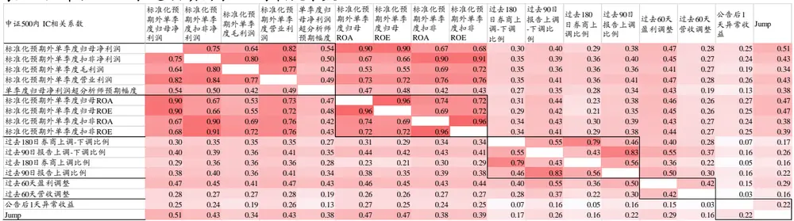
数据来源：Wind，朝阳永续，国泰君安证券研究

以等权加权为例，展示中证500内超预期复合因子的选股效果。超预期复合因子将中证 500 成分股分 10 组进行测算。测试发现，复合因子多头组年化超额收益 19.55%，超额最大回撤 7.96%，信息比率 3.03；空头组年化超额-7.61%，多空年化收益 27.16%。分组超额收益曲线、多头组收益曲线、超额收益曲线和期间回撤情况如下。

图 35：中证 500 股票池 复合因子分组超额收益曲线
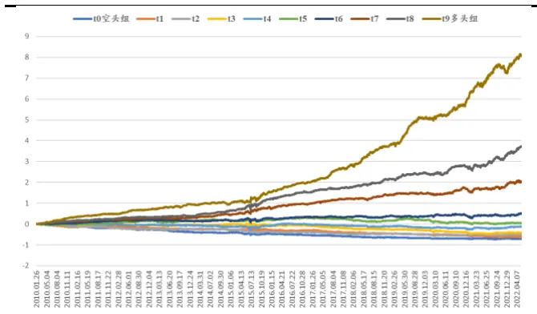
数据来源：Wind，朝阳永续，国泰君安证券研究

图 36：中证 500 股票池 复合因子 t9 多头组收益曲线
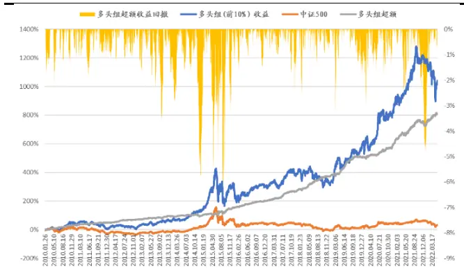
数据来源：Wind，朝阳永续，国泰君安证券研究

超预期复合因子组合优化测试。通过控制市值行业中性化，设置个股权重上限 1%的约束条件求解个股权重构建组合。测算发现，超预期复合因子组合优化的年化超额收益 15.13%，超额收益最大回撤-8.33%，信息比率 3.07，周度双边换手率 14.02%。2022 年以来超额收益 6.98%，超额收益最大回撤-0.86%。复合因子组合优化每年收益情况如下表。组合优化的收益曲线、超额收益曲线和期间回撤情况如下图。

表 42：中证 500 股票池 复合因子组合优化每年收益

| 年份 | 组合优化累计收益 |  | 中证500指数 |  | 超额收益 | 超额收益波动率 |  | 超额收益信息比率 |  | 超额收益最大回撤 |
| --- | --- | --- | --- | --- | --- | --- | --- | --- | --- | --- |
| 2010 |  | 37.27% |  | 13.98% | 23.29% | 3.62% |  | 6.44 |  | -0.96% |
| 2011 |  | 29.41% |  | 33.83% | 4.41% |  | 2.80% | 1.58 |  | -1.06% |
| 2012 |  | 4.31% |  | 0.28% | 14.04% |  | 3.00% | 4.68 |  | -0.90% |
| 2013 |  | 29.69% |  | 16.89% | 12.80% |  | 3.28% | 3.90 |  | -2.12% |
| 2014 |  | 44.92% |  | 39.01% | 5.91% |  | 3.24% | 1.82 |  | -2.72% |
| 2015 |  | 65.17% |  | 43.12% | 22.05% |  | 12.17% | 1.81 |  | -8.33% |
| 2016 | I | -6.06% | 17 | .78% | 11.72% |  | 3.79% | 3.09 |  | -1.33% |
| 2017 |  | 20.95% |  | -0.20% | 21.15% |  | 3.42% | 6.19 |  | -1.23% |
| 2018 |  | -21.54% |  | 33.32% | 11.78% |  | 4.16% | 2.83 |  | -1.10% |
| 2019 |  | 50.71% |  | 26.38% | 24.32% |  | 4.07% | 5.98 |  | -3.57% |
| 2020 |  | 36.02% |  | 20.87% | 15.15% |  | 3.77% | 4.01 |  | -2.82% |
| 2021 |  | 33.17% |  | 15.59% | 17.58% |  | 4.27% | 4.11 |  | -2.37% |
| 2022.05.13 |  | 12.45% | -19 | .43% | 6.98% |  | 3.67% | 1.90 |  | -0.86% |
| 整体 |  | 17.53% |  | 2.58% | 15.13% |  | 4.92% |  | 3.07 | -8.33% |

数据来源：Wind，朝阳永续，国泰君安证券研究测试区间：2010.01-2022.05。

图 37：中证 500股票池 复合因子组合优化收益曲线
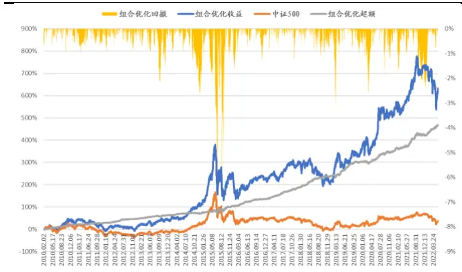
数据来源：Wind，朝阳永续，国泰君安证券研究测试区间：2010.01-2022.05。

中证 500股票池内，超预期复合因子主要绩效指标与单因子对比见下表。

表 43：中证 500 内 复合因子主要绩效指标与单因子对比

|  |  |  |  | t9多头 |  |  | 组 |  |  | 单因子组合优化 |  |  |  |  |  | 组合优化 |
| --- | --- | --- | --- | --- | --- | --- | --- | --- | --- | --- | --- | --- | --- | --- | --- | --- |
| 中证500内 | 因子名 | t0空头组 |  | t9多头组 |  | 超额最大回撤 | 超额收益波动率 | 超额收益信息比率 | 多空收益 | 超额收益 | 超额收益超最大回撤波 | 额收益动率 | 超额收益信息比率 | IC | RankIC | 周度双边换手率 |
| SUE | 标准化预期外单季度归母净利润 |  | -6.53% |  | 16.10% | -8.49% | 6.45% | 2.49 | 22.63% | 12.10% | -8.07% | 4.81% | 2.51 | 2.91% | 3.44% | 13.58% |
|  | 标准化预期外单季度扣非净利润 |  | -7.08% |  | 15.54% | -8.92% | 6.21% | 2.50 | 22.62% | 11.88% | -8.06% | 4.76% | 2.50 | 2.88% | 3.38% | 12.08% |
|  | 标准化预期外单季度毛利润 |  | -6.56% |  | 14.03% | 7.89% | 6.34% | 2.21 | 20.58% | 10.08% | -8.96% | 4.81% | 2.10 | 2.59% | 2.90% | 11.57% |
|  | 标准化预期外单季度营业利润 | 口 | -6.42% |  | 15.06% | -10.76% | 6.35% | 2.37 | 21.48% | 11.88% | -9.03% | 4.82% | 2.46 | 2.92% | 3.28% | 12.66% |
|  | 单季度归母净利润超分析师预期幅度 |  | -4.82% |  | 11.65% | 7.90% | 6.45% | 1.81 | 16.47% | 8.18% | -9.23% | 4.79% | 1.71 | 1.83% | 2.51% | 12.36% |
| SUE衍生 | 标准化预期外单季度归母ROA |  | -5.41% |  | 13.67% | -10.35% | 6.32% | 2.16 | 19.08% | 9.44% | -8.20% | 4.78% | 1.97 | 2.41% | 2.71% | 13.30% |
|  | 标准化预期外单季度归母ROE |  | -6.66% |  | 14.78% | -7.63% | 6.31% | 2.34 | 21.44% | 9.70% | -8.50% | 4.76% | 2.04 | 2.47% | 2.85% | 13.28% |
|  | 标准化预期外单季度扣非ROA |  | -5.23% |  | 14.11% | -10.22% | 6.33% | 2.23 | 19.34% | 9.72% | -9.29% | 4.76% | 2.04 | 239% | 2.57% | 11.96% |
|  | 标准化预期外单季度扣非ROE |  | -6.30% |  | 14.57% | -10.88% | 6.35% | 2.29 | 20.87% | 10.60% | -8.39% | 4.76% | 2.23 | 2.44% | 2.72% | 11.89% |
| 上下调比 | 过去180日券商上调-下调比例 |  | -1.75% |  | 9.08% | -9.58% | 6.41% | 1.42 | 10.83% | 7.61% | -8.96% | 5.06% | 1.50 | 1.13% | 1.35% | 21.30% |
|  | 过去90日报告上调-下调比例 | D | -2.99% |  | 10.96% | 8.24% | 6.52% | 1.68 | 13.95% | 9.11% | -10.43% | 5.01% | 1.82 | 1.61% | 1.76% | 21.45% |
| 例 | 过去180日券商上调比例 |  | 0.17% |  | 9.88% | -6.86% | 6.44% | 1.53 | 19.71% | 8.32% | -7.80% | 5.06% | 1.65 | 1.31% | 1.74% | 21.16% |
|  | 过去90日报告上调比例 |  | -0.52% |  | 12.22% | -13.13% | 6.69% | 1.83 | 12.74% | 9.27% | -9.16% | 4.99% | 1.86 | 1.69% | 1.94% | 21.60% |
| 盈利调整 | 过去60天盈利调整 | 7 | -4.74% |  | 10.28% | -10.96% | 6.91% | 1.49 | 15.01% | 9.59% | -11.31% | 4.88% | 1.97 | 1.75% | 2.21% | 22.35% |
|  | 过去60天营收调整 | 「 | -4.28% |  | 9.07% | -12.21% | 6.26% | 1.45 | 13.35% | 7.79% | -10.82% | 5.06% | 1.54 | 1.24% | 1.21% | 25.56% |
| 异常收益 | 公告后1天异常收益 |  | -9.10% |  | 5.88% | -12.85% | 7.08% | 0.83 | 14.99% | 5.46% | -9.42% | 4.96% | 1.10 | 1.68% | 1.43% | 16.76% |
|  | Jump | 「 | -4.00% |  | 10.27% | -10.17% | 6.46% | 1.59 | 14.26% | 7.71% | -10.69% | 4.77% | 1.61 | 1.94% | 233% | 16.35% |
|  | 复合因子 |  | -7.61% |  | 19.55% 7.96% |  | 6.45% | 3.03 | 27.16% | 15.13% -8.33% |  | 4.92% | 3.07 | 3.66% 4.14% |  | 14.02% |

数据来源：Wind，朝阳永续，国泰君安证券研究

## 4.3. 全市场股票池

通过单因子测试，全市场股票池内筛选出17个效果不错的因子。首先分析因子之间的相关性情况。计算两两因子之间的相关系数矩阵发现，五种因子内部由于投资逻辑相似，内部相关性较高；五种因子之间相关性上，公告后异常收益因子与其他相关性较低，相关系数普遍低于 0.3；因子和 衍生因子相关性较高，在 附近；上下调比例、盈利/营收调整与其他因子相关性不高，在 0.2 附近。因子相关系数矩阵见下表。

表 44：全市场 超预期因子的相关系数

| 全市场内因子相关系数 | 标准化预 标准化预 标准化预 单季度归 标准化预 期外单季 期外单季 母净利润 度归母净 度扣非净 利润 预期幅度 | 标准化预 期外单季 期外单季 度毛利润 | 度营业利 润 | 超分析师 | 度归母 | 期外单季 | 期外单季 度归母 | 期外单季 度扣非 | 期外单季 度扣非 调-下调 | 日券商上 -下调比 | 报告上调 调比例 | 过去180 日券商上 比例 | 过去90日 报告上调 | 过去60天 盈利调整 | 过去60天 营收调整 | 公告后1 天异常收 Jump |  |
| --- | --- | --- | --- | --- | --- | --- | --- | --- | --- | --- | --- | --- | --- | --- | --- | --- | --- |
| 标准化预期外单季度归母净利润 | 利润 | 0.55 | 0.43 | 0.68 | ROA 0.32 | ROE 0.34 | ROA 0.87 | 0.86 | 0.48 | 0.47 例y | 0.17 | 0.20 | 0.16 | 0.18 | 0.22 | 0.11 | 0.29 |
| 标准化预期外单季度扣非净利润 | 0.55 |  | 0.66 | 0.73 | 0.28 | 0.55 | 0.49 | 0.49 | 0.89 | 0.87 | 0.18 | 0.20 | 0.15 | 0.18 | 0.22 | 0.12 | 0.22 |
| 标准化预期外单季度毛利润 | 0.43 | 0.66 |  | 0.60 | 0.20 | 0.79 | 0.36 | 0.38 | 0.57 | 0.57 | 0.14 | 0.15 | 0.12 | 0.14 | 0.17 | 0.13 | 0.18 |
| 标准化预期外单季度营业利润 | 0.68 | 0.73 | 0.60 |  | 0.29 | 0.50 | 0.58 | 0.58 | 0.65 | 0.63 | 0.20 | 0.22 | 0.16 | 0.19 | 0.23 | 0.13 | 0.24 |
| 单季度归母净利润超分析师预期幅度 | 0.32 | 0.28 | 0.20 | 0.29 |  | 0.17 | 0.28 | 0.28 | 0.25 | 0.24 | 0.17 | 0.19 | 0.15 | 0.18 | 0.23 | 0.10 | 0.16 |
| 标准化预期外单季度GPOA | 0.34 | 0.55 | 0.79 | 0.50 | 0.17 |  | 0.43 | 0.41 | 0.65 | 0.58 | 0.14 | 0.15 | 0.10 | 0.12 | 0.15 | 0.11 | 0.15 |
| 标准化预期外单季度归母ROA | 0.87 | 0.49 | 0.36 | 0.58 | 0.28 | 0.43 |  | 0.94 | 0.56 | 0.50 | 0.17 | 0.19 | 0.13 | 0.16 | 0.20 | 0.09 | 0.27 |
| 标准化预期外单季度归母ROE | 0.86 | 0.49 | 0.38 | 0.58 | 0.28 | 0.41 | 0.94 |  | 0.52 | 0.53 | 0.16 | 0.19 | 0.13 | 0.16 | 0.19 | 0.10 | 0.26 |
| 标准化预期外单季度扣非ROA | 0.48 | 0.89 | 0.57 | 0.65 | 0.25 | 0.65 | 0.56 | 0.52 |  | 0.90 | 0.18 | 0.20 | 0.13 | 0.16 | 0.20 | 0.10 | 0.20 |
| 标准化预期外扣非ROE(TTM) | 0.47 | 0.87 | 0.57 | 0.63 | 0.24 | 0.58 | 0.50 | 0.53 | 0.90 |  | 0.17 | 0.19 | 0.12 | 0.16 | 0.19 | 0.11 | 0.20 |
| 过去90日券商上调-下调比例 | 0.17 | 0.18 | 0.14 | 0.20 | 0.17 | 0.14 | 0.17 | 0.16 | 0.18 | 0.17 |  | 0.87 | 0.51 | 0.71 | 0.35 | 0.22 | 0.11 |
| 过去90日报告上调-下调比例 | 0.20 | 0.20 | 0.15 | 0.22 | 0.19 | 0.15 | 0.19 | 0.19 | 0.20 | 0.19 | 0.87 |  | 0.59 | 0.82 | 0.42 | 0.26 | 0.13 |
| 过去60日券商上调比例 | 0.16 | 0.15 | 0.12 | 0.16 | 0.15 | 0.10 | 0.13 | 0.13 | 0.13 | 0.12 | 0.51 | 0.59 |  | 0.70 | 0.33 | 0.18 | 0.10 |
| 过去90日报告上调比例 | 0.18 | 0.18 | 0.14 | 0.19 | 0.18 | 0.12 | 0.16 | 0.16 | 0.16 | 0.16 | 0.71 | 0.82 | 0.70 |  | 0.36 | 0.21 | 0.12 |
| 过去60天盈利调整 | 0.22 | 0.22 | 0.17 | 0.23 | 0.23 | 0.15 | 0.20 | 0.19 | 0.20 | 0.19 | 0.35 | 0.42 | 0.33 | 0.36 |  | 0.34 | 0.12 |
| 过去60天营收调整 | 0.11 | 0.12 | 0.13 | 0.13 | 0.10 | 0.11 | 0.09 | 0.10 | 0.10 | 0.11 | 0.22 | 0.26 | 0.18 | 0.21 | 0.34 |  | 0.07 |
| Jump | 0.29 | 0.22 | 0.18 | 0.24 | 0.16 | 0.15 | 0.27 | 0.26 | 0.20 | 0.20 | 0.11 | 0.13 | 0.10 | 0.12 | 0.12 | 0.07 |  |

数据来源：Wind，朝阳永续，国泰君安证券研究

计算因子 IC 的相关系数矩阵发现，结论与因子相关系数基本一致，整体相关系数数值更大一些。因子 IC 的相关系数矩阵见下表。

表 45：全市场 超预期因子 IC的相关系数
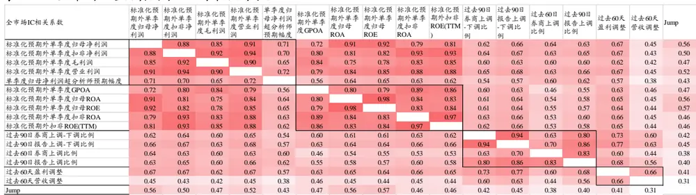
数据来源：Wind，朝阳永续，国泰君安证券研究

以等权加权为例，展示全市场超预期复合因子的选股效果。超预期复合因子将全市场股票分 10 组进行测算。测试发现，复合因子多头组年化超额收益 21.20%，超额最大回撤 9.78%，信息比率 3.50；空头组年化超额-6.97%，多空年化收益 28.17%。分组超额收益曲线、多头组收益曲线、超额收益曲线和期间回撤情况如下。

图 38：全市场股票池 复合因子分组超额收益曲线
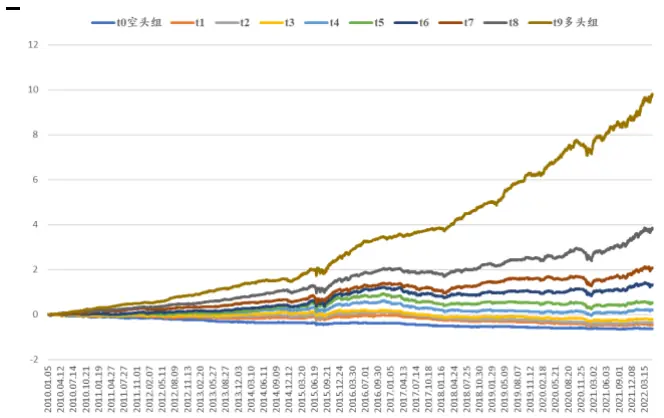
数据来源：Wind，朝阳永续，国泰君安证券研究

图 39：全市场股票池 复合因子t9 多头组收益曲线
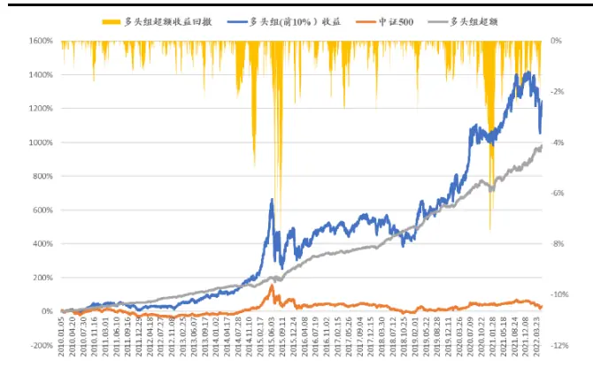
数据来源：Wind，朝阳永续，国泰君安证券研究

超预期复合因子组合优化测试。通过控制市值行业中性化，设置个股权重上限 1%的约束条件求解个股权重构建组合。测算发现，超预期复合因子组合优化的年化超额收益 21.85%，超额收益最大回撤-10.17%，信息比率 3.23，周度双边换手率 17.34%。2022 年以来超额收益 5.14%，超额收益最大回撤-2.59%。复合因子组合优化每年收益情况如下表。组合优化的收益曲线、超额收益曲线和期间回撤情况如下图。

数据来源： ，朝阳永续，国泰君安证券研究测试区间：2010.01-2022.05。

表 46：全市场股票池 复合因子组合优化每年收益

| 年份 | 组合优化累计收益 |  | 中证500指数 |  | 超额收益 | 超额收益波动率 | 超额收益信息比率 | 超额收益最大回撤 |
| --- | --- | --- | --- | --- | --- | --- | --- | --- |
| 2010 |  | 44.75% |  | 13.98% | 30.78% | 4.26% | 7.23 | -1.44% |
| 2011 |  | 22.39% |  | 33.83% | 11.44% | 3.86% | 2.96 | -2.51% |
| 2012 |  | 27.27% |  | 0.28% | 26.99% | 4.97% | 5.44 | -1.94% |
| 2013 |  | 44.03% |  | 16.89% | 27.14% | 6.07% | 4.47 | -3.28% |
| 2014 |  | 47.14% |  | 39.01% | 8.13% | 4.98% | 1.63 | -3.97% |
| 2015 |  | 88.51% |  | 43.12% | 45.40% | 13.60% | 3.34 | -10.17% |
| 2016 |  | -1.87% | 口 | 17.78% | 15.91% | 5.62% | 2.83 | -3.18% |
| 2017 |  | 20.09% |  | -0.20% | 20.29% | 4.21% | 4.82 | -1.65% |
| 2018 |  | 13.67% |  | 33.32% | 19.65% | 6.12% | 3.21 | -2.40% |
| 2019 |  | 57.47% |  | 26.38% | 31.09% | 5.92% | 5.25 | 4.85% |
| 2020 |  | 49.95% |  | 20.87% | 29.08% | 6.99% | 4.16 | -3.53% |
| 2021 |  | 26.61% |  | 15.59% | 11.03% | 7.78% | 1.42 | -5.67% |
| 2022.05.13 |  | 14.29% |  | 19.43% | 5.14% | 8.28% | 0.62 | -2.59% |
| 整体 |  | 24.49% |  | 2.58% | 21.85% | 6.76% | 3.23 | -10.17% |

数据来源： ，朝阳永续，国泰君安证券研究
测试区间：2010.01-2022.05。

图 40：全市场股票池 复合因子组合优化收益曲线
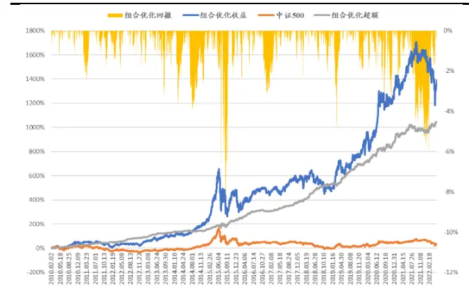

全市场股票池内，超预期复合因子主要绩效指标与单因子对比见下表。

表 47：全市场内 复合因子主要绩效指标与单因子对比

|  |  |  | t9多头 |  | 组 |  |  | 单因子组合优化 |  |  |  |  |  | 组合优化 |  |
| --- | --- | --- | --- | --- | --- | --- | --- | --- | --- | --- | --- | --- | --- | --- | --- |
| 全市场 | 选用因子 | t0空头组 | t9多头组 | 超额最大回撤 |  |  |  |  |  |  |  |  |  |  |  |
|  |  |  |  |  |  |  |  | 超额收益 | 最大回撤 | 波动率 | 信息比率 |  |  |  |  |
|  |  |  |  |  |  |  |  |  |  |  |  | IC | RankIC | 周度双边换手率 |  |
| SUE | 标准化预期外单季度归母净利润 | 4.45% | 18.07% | -12.29% | 6.99% | 2.58 | 22.52% | 15.25% | -9.17% | 6.30% | 2.42 | 2.45% | 2.93% | 17.82% |  |
|  | 标准化预期外单季度扣非净利润 | -3.77% | 15.35% | 1.43% | 6.47% | 2.37 | 19.12% | 14.28% | -960% | 6.17% | 2.31 | 2.06% | 2.47% | 15.01% |  |
|  | 标准化预期外单季度毛利润 | -3.66% | 15.06% | 13.13% | 6.97% | 2.16 | 18.72% | 13.89% | 10.40% | 6.24% | 2.23 | 2.01% | 2.38% | 14.48% |  |
|  | 标准化预期外单季度营业利润 | -3.72% | 17.25% | -10.63% | 6.77% | 2.55 | 20.97% | 14.72% | -9.95% | 6.39% | 2.31 | 2.21%6 | 2.60% | 16. | 43% |
|  | 单季度归母净利润超分析师预期幅度 | -2.07 | 11.58% | 2.34% | 5.38% | 2.15 | 13.65% | 10.28% | 11.32% | 5.51% | 1.87 | 1.37% | 2.52% | 15 | .14% |
|  | 标准化预期外单季度GPOA | -1.55% | 13.93% | 14.72% | 6.73% | 2.07 | 15.48% | 13.33% | 12.50% | 6.18% | 2.16 | 1.53% | 1.52% | 14 | .29% |
|  | 标准化预期外单季度归母ROA | -3.46% | 15.48% | 11.47% | 6.57% | 2.36 | 18.94% | 13.38% | -967% | 5.94% | 2.25 | 1.98% | 2.22% | 17.22% |  |
|  | 标准化预期外单季度归母ROE | 398% | 15.90% | 2.11% | 6.68% | 2.38 | 19.88% | 13.23% | -8.66% | 6.12% | 2.16 | 2.04% | 2.33% | 1698% |  |
| SUE衍生 | 标准化预期外单季度扣非ROA | -2.70% | 14.08% | -11.64% | 6.19% | 2.27 | 16.78% | 13.12% | 11.41% | 6.11% | 2.15 | 1.70% | 1.80% | 14.87% |  |
|  | 标准化预期外单季度扣非ROE | -2.67% | 14.60% | 13.61% | 6.44% | 2.27 | 17.26% | 12.87% | 11.72% | 6.16% | 2.09 | 1.77% | 1.95% | 14.71% |  |
|  | 标准化预期外归母ROE(TTM) | 426% | 15.82% | -11.53% | 6.64% | 2.38 | 20.07% | 13.55% | -9.87% | 6.15% | 2.20 | 2.00% | 2.20% | 16.79% |  |
|  | 标准化预期外扣非ROE(TTM) | -2.94% | 13.89% | 13.59% | 6.40% | 2.17 | 16.84% | 13.36% | 10.89% | 6.13% | 2.18 | 1.65% | 1.72% | 14.61% |  |
| 上下调比 | 过去90日券商上调-下调比例 | 0.12% | 12.72% | 13.27% | 5.79% | 2.20 | 12.60% | 14.20% | -14.70% | 6.47% | 2.20 | 1.19% | 1.40% | 29.94% |  |
|  | 过去90日报告上调-下调比例 | -0.57% | 14.11% | 13.73% | 5.85% | 2.41 | 14.68% | 16.04% | -12.59% | 6.39% | 2.51 | 1.40% | 1.69% | 27.07% |  |
| 例 | 过去180日报告上调比例 | 0.28% | 13.73% | -1.65% | 5.73% | 2.40 | 13.45% | 16.88% | -11.04% | 6.34% | 2.66 | 1.53% | 2.62% | 21.65% |  |
|  | 过去90日报告上调比例 | 0.73% | 14.09% | -11.65% | 5.79% | 2.43 | 13.35% | 17.23% | -10.18% | 6.26% | 2.75 | 1.51% | 2.45% | 26.92% |  |
| 盈利调整 | 过去60天盈利调整 | -1.90 | 12.36% | 13.87% | 5.84% | 2.11 | 14.26% | 9.98% | -14.93% | 6.15% | 1.62 | 128% | 1.74% | 26.91% |  |
|  | 过去60天营收调整 | -0.98% | 9.66% | -11.45% | 5.62% | 1.72 | 10.64% | 10.38% | -15.42% | 6.37% | 1.63 | 0.96% | 0.72% | 28.28% |  |
| 异常收益 | Jump | -6.37% | 12.01% | -17.05% | 7.51% | 1.60 | 18.39% | 9.97% | -15.08% | 7.02% | 1.42 | 1.90% | 2.38% | 21.36% |  |
| 复合因子 |  | -6.97 | 21.20% | 78% | 6.06% | 3.50 | 28.17% | 21.75% | -10.71% | 6.71% | 3.24 | 2.78% | 3.41% | 17.34% |  |

数据来源：Wind，朝阳永续，国泰君安证券研究

## 5. 总结

本报告主要展示超预期因子在沪深 300 成分股、中证 500 成分股、全市场中的选股效果。首先，简要介绍多因子选股模型的主要步骤。其次，参考国内外 PEAD 学术文献和业内投资经验，构建 6 种超预期因子，分别为盈余公告前后异常收益、公告前后交易量变动、标准化预期外盈利SUE、SUE 衍生因子、过去 N 日券商/报告上下调比例、过去 N 日盈利/营收预测调整。然后，对超预期因子在三个股票池（沪深 300 成分股、中证 500 成分股、全市场）的选股效果进行单因子测试，筛选出效果较好的因子。最后，以等权加权合成复合因子为例，展示复合因子在三个股票池的效果。通过历史回测发现，超预期因子的选股效果优秀。

单因子测试结果。综合考察单因子组合优化超额收益、IC、分组测试、多空收益等指标，沪深 300 股票池内，筛选出标准化预期外单季度营业利润、标准化预期外扣非 ROE(TTM)、过去 90 日报告上调-下调比例、JUMP 跳空等 16 个有效因子，组合优化的年化超额收益普遍在 6-9%。

中证 500 股票池内，筛选出标准化预期外单季度归母净利润、标准化预期外单季度扣非 ROE、过去 90 日报告上调比例、过去 60 天盈利调整、跳空等 17 个有效因子，组合优化的年化超额收益普遍在 8-12%。全市场股票池，筛选出标准化预期外单季度归母净利润、标准化预期外单季度归母 ROA、过去 90 日报告上调比例、过去 60 天营收调整等 17 个有效因子，组合优化的年化超额收益普遍在 12-16%。

超预期复合因子选股表现。沪深 股票池内，超预期复合因子组合优化的年化超额收益 9.51%，超额收益最大回撤-10.87%，信息比率 2.03，周度双边换手率 18.69%。2022 年以来超额收益 2.77%，超额收益最大回撤-1.70%。中证 500 股票池内，超预期复合因子组合优化的年化超额收益 15.13%，超额收益最大回撤-8.33%，信息比率 3.07，周度双边换手率14.02%。2022 年以来超额收益 6.98%，超额收益最大回撤-0.86%。全市场股票池内，超预期复合因子组合优化的年化超额收益 21.85%，超额收益最大回撤-10.17%，信息比率 3.23，周度双边换手率 17.34%。2022 年以来超额收益 5.14%，超额收益最大回撤-2.59%。

## 6. 风险提示

量化模型基于历史数据构建，而历史规律存在失效风险。

## 本公司具有中国证监会核准的证券投资咨询业务资格

## 分析师声明

作者具有中国证券业协会授予的证券投资咨询执业资格或相当的专业胜任能力，保证报告所采用的数据均来自合规渠道，分析逻辑基于作者的职业理解，本报告清晰准确地反映了作者的研究观点，力求独立、客观和公正，结论不受任何第三方的授意或影响，特此声明。

## 免责声明

本报告仅供国泰君安证券股份有限公司（以下简称“本公司”）的客户使用。本公司不会因接收人收到本报告而视其为本公司的当然客户。本报告仅在相关法律许可的情况下发放，并仅为提供信息而发放，概不构成任何广告。

本报告的信息来源于已公开的资料，本公司对该等信息的准确性、完整性或可靠性不作任何保证。本报告所载的资料、意见及推测仅反映本公司于发布本报告当日的判断，本报告所指的证券或投资标的的价格、价值及投资收入可升可跌。过往表现不应作为日后的表现依据。在不同时期，本公司可发出与本报告所载资料、意见及推测不一致的报告。本公司不保证本报告所含信息保持在最新状态。同时，本公司对本报告所含信息可在不发出通知的情形下做出修改，投资者应当自行关注相应的更新或修改。

本报告中所指的投资及服务可能不适合个别客户，不构成客户私人咨询建议。在任何情况下，本报告中的信息或所表述的意见均不构成对任何人的投资建议。在任何情况下，本公司、本公司员工或者关联机构不承诺投资者一定获利，不与投资者分享投资收益，也不对任何人因使用本报告中的任何内容所引致的任何损失负任何责任。投资者务必注意，其据此做出的任何投资决策与本公司、本公司员工或者关联机构无关。

本公司利用信息隔离墙控制内部一个或多个领域、部门或关联机构之间的信息流动。因此，投资者应注意，在法律许可的情况下，本公司及其所属关联机构可能会持有报告中提到的公司所发行的证券或期权并进行证券或期权交易，也可能为这些公司提供或者争取提供投资银行、财务顾问或者金融产品等相关服务。在法律许可的情况下，本公司的员工可能担任本报告所提到的公司的董事。

市场有风险，投资需谨慎。投资者不应将本报告作为作出投资决策的唯一参考因素，亦不应认为本报告可以取代自己的判断。
在决定投资前，如有需要，投资者务必向专业人士咨询并谨慎决策。

本报告版权仅为本公司所有，未经书面许可，任何机构和个人不得以任何形式翻版、复制、发表或引用。如征得本公司同意进行引用、刊发的，需在允许的范围内使用，并注明出处为“国泰君安证券研究”，且不得对本报告进行任何有悖原意的引用、删节和修改。

若本公司以外的其他机构（以下简称“该机构”）发送本报告，则由该机构独自为此发送行为负责。通过此途径获得本报告的投资者应自行联系该机构以要求获悉更详细信息或进而交易本报告中提及的证券。本报告不构成本公司向该机构之客户提供的投资建议，本公司、本公司员工或者关联机构亦不为该机构之客户因使用本报告或报告所载内容引起的任何损失承担任何责任。

## 评级说明

## 1.投资建议的比较标准

投资评级分为股票评级和行业评级。以报告发布后的 12 个月内的市场表现为比较标准，报告发布日后的 12 个月内的公司股价（或行业指数）的涨跌幅相对同期的沪深 300 指数涨跌幅为基准。

## 2.投资建议的评级标准

报告发布日后的 12 个月内的公司股价（或行业指数）的涨跌幅相对同期的沪深300 指数的涨跌幅。

| 评级 | 说明 |  |
| --- | --- | --- |
| 股票投资评级 | 增持 | 相对沪深 300 指数涨幅 15%以上 |
|  | 谨慎增持 | 相对沪深300指数涨幅介于5%～15%之间 |
|  | 中性 | 相对沪深300指数涨幅介于-5%～5% |
|  | 减持 | 相对沪深300指数下跌5%以上 |
| 行业投资评级 | 增持 | 明显强于沪深300指数 |
|  | 中性 | 基本与沪深300指数持平 |
|  | 减持 | 明显弱于沪深 300指数 |

## 国泰君安证券研究所

|  | 上海 | 深圳 | 北京 |
| --- | --- | --- | --- |
| 地址 | 上海市静安区新闸路 669 号博华广 场20层 | 深圳市福田区益田路6009号新世界 商务中心34层 | 北京市西城区金融大街甲9号金融 街中心南楼18层 |
| 邮编 | 200041 | 518026 | 100032 |
| 电话 | （021）38676666 | （0755）23976888 | (010)83939888 |
|  | E-mail: gtjaresearch@gtjas.com |  |  |