inInfo][Table_Title]2022.07.20

# 使用基本面因子构建中证500指数增强策略初探

## ——权益配置因子研究系列 02

## 本报告导读：

我们对因子库的11类因子在中证500指数成分股内进行选股测试，筛选出投资逻辑强、效果较好的因子构建指数增强策略。测算发现，中证500指数增强组合历史年化超额收益 ，超额收益最大回撤 ，信息比率 ，周度双边换手率16.15%。样本外 2022 年以来超额收益 8.87%，超额收益最大回撤-1.11%。

## 摘要：

le_Summary]中证 500内选用因子介绍。用于中证500 内选股的因子主要有11个类别，分别为北上资金、超预期（传统）、成长、分析师、超预期（分析师）、总量、估值、超预期衍生（估值）、盈利、超预期衍生（盈利）、价量因子。对这些因子在中证 指数成分股内的选股表现进行详细测算和展示，筛选出投资逻辑强、效果较好的近百个因子。

多因子加权。除了北上资金和总量因子权重为 5%，其他大类因子权重为 10%，大类因子内部权重也使用等权加权方式。其中，四类超预期因子的总权重达到 40%。我们也初步尝试了根据因子表现加权、LightGBM 模型加权，年化超额没有明显提升。

- 中证 500指数增强策略表现。在中证500股票池构建指数增强策略，组合年化超额收益17.86%，超额收益最大回撤-6.63%，信息比率3.65，周度双边换手率 16.15%。样本外 2022 年以来超额收益 8.87%，超额收益最大回撤-1.11%。

- 风险提示：量化模型基于历史数据构建，而历史规律存在失效风险。

大类资产配置研究

## hor] 报告作者

张雪杰(分析师)

8 0755-23976751

zhangxuejie025900@gtjas.com

证书编号 S0880522040001

廖静池(研究助理)

8 0755-23976716

liaojingchi024655@gtjas.com

证书编号 S0880121110024

## cReport 相关报告]

反弹后段注重节奏，行一观三未雨绸缪2022.07.03

从春季行情“爽约”到强力反弹“未料而至” 2022.06.27

行业配置多面观——通过多维建模构建行业轮动策略

2022.06.21

从春季行情“爽约”到强力反弹“未料而至” 2022.06.20

行业景气度追踪——通过景气度构建行业 轮动策略

2022.06.13

我们国泰君安量化配置团队在《权益因子观察周报》中对公募指数增强基金业绩、常用选股因子表现以及指数增强策略组合进行了跟踪展示。本报告主要介绍使用基本面因子在中证 股票池中构建指数增强策略的具体过程。首先介绍常用的多因子模型框架。然后，对各类因子进行单因子测试，详细展示近百个单因子在中证 500 指数成分股中的选股效果。最后，每类筛选出效果较好的因子，以类内等权、大类等权的方式计算因子总得分；在控制市值、行业中性和个股权重约束下，求解得分最大化股票权重构建指数增强组合；展示中证 500 指数增强策略的历史表现，供投资者参考。

## 1. 多因子模型介绍

多因子模型（Multiple-Factor Model, MFM）属于国内外主流量化选股模型之一。使用多个因子预测股票未来收益，筛选预期收益较好的股票，以期战胜基准指数。学术研究上，这类模型属于资产定价理论，最早起源于 CAPM 资产定价理论，1970 年罗斯提出 APT 多因素模型，该模型认为股票未来的收益可以用若干因素来解释。但是并没有指出哪些具体的因素。实证研究方面，1992 年 Fama 和 French 提出三因素模型，使用市场、市值、估值三个因子作为自变量解释股票未来收益，效果不错。2015 年 Fama 和 French 从股利贴现模型出发，推导出与股票收益相关的因素，加入盈利和投资因子，提出五因子模型：

$$
R_{i}-R_{f}=\alpha+\beta_{1}\big(R_{m}-R_{f}\big)+\beta_{2}SMB+\beta_{3}HML+\beta_{4}RMW+\beta_{5}CMA+\varepsilon_{i}
$$

其中，SMB为市值因子收益率，HML为估值因子收益率，RMW 为盈利因子收益率、CMA为投资因子收益率。Fama 和 French 使用五因子模型分析了多种常见的市场异象，也研究了五因子模型在国际其他股票市场的效果。

在目前实际投资研究过程中，多因子模型使用估值、盈利、成长、公司治理、价量（反转、流动性、波动性等）、分析师预测、超预期等几大类因子进行选股，构建一篮子股票的投资组合。多因子选股模型的体系广义上讲，一般由有三部分组成：收益预测模型、风险模型、交易成本模型。目前国内研究主要集中在前两类模型，其中收益预测模型主要是通过多因子打分选股、量化模型预测收益率选股，一般直接称为多因子选股模型。多因子模型选股基础性工作是各类单因子和大类因子选股效果的测试和跟踪。多因子选股模型体系见下图。

图 1：多因子选股模型体系
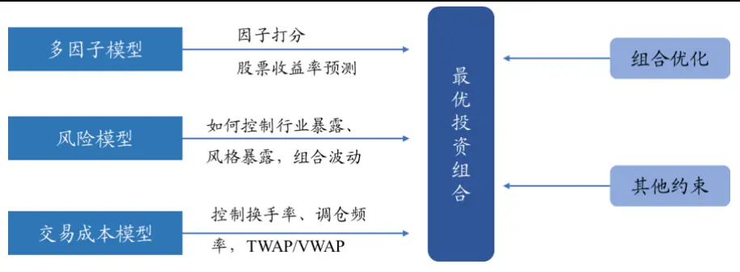
数据来源：国泰君安证券研究

下面介绍本报告用到单因子测试、多因子加权、指数增强组合构建等内容。

## 1.1. 单因子测试

对各类因子进行单个因子选股效果测试是多因子选股的基础工作。下面介绍因子的数据处理方法、单因子选股测试的一般步骤。

## 1.1.1. 股票池与比较基准

为了测试单个因子的选股效果，首先需要确定比较基准和股票池。不同股票池中，股票的风格分布特征会有所不同，因子的选股效果会略有区别。比如，沪深 300 以大盘蓝筹为主，行业也多是分布在金融、周期性行业，选股逻辑与小盘股的投资逻辑明显不同，使用的因子也会不一样。为了构建对应不同基准的选股策略，会对不同股票池进行单因子选股效果的测算，找出在特定股票池中选股效果较好的因子。

初始股票池：选股日中证 500 指数成分股。为了使测试结果更符合实际投资过程，对无法交易的股票进行剔除：（1）剔除选股当日的 ST 股票；（2）剔除上市不满半年的股票；（3）剔除选股日由于涨停、停牌等原因而无法买入的股票。

## 1.1.2. 数据处理

在确定股票池之后，按照因子公式计算每只股票在因子 f 上的取值，一般称为因子暴露（Factor Exposure）。对于因子原始值，一般需要进行去极值、标准化、缺失值填充、市值行业中性化等数据处理操作。

## （1） 去极值

个别股票可能存在因子数据错误、因子值过大过小等极端情况，为了保证数据质量，需要进行去极值操作。我们主要使用中位数去极值法，是针对 3 倍标准差法的改进，原因在于国内大部分股票因子值的分布并不服从正态分布，因此国内大多数研究采用此方法处理极值。

## （2）标准化

由于不同因子在量纲上存在差别，因此在因子加权、多元回归中需要对单个因子在横截面上进行标准化，从而让不同因子的暴露度之间具有可比性。一般的标准化方法，将当期去极值后的因子值序列减去全部股票的均值、再除以其标准差，得到一个新的近似服从 N(0,1)分布的序列。

## （3）缺失值处理

对于个别股票的因子值缺失的情况，需要使用数据替代算法处理。由于不同因子可能在不同个股上存在缺失，如果不做处理则每个因子选股的股票池并不完全相同，不同因子之间选股效果的可比性会受到影响。处理方法具体有全市场均值替代、行业均值替代、回归方程估计多种方式。我们在本报告使用行业中值替代，当某只股票某个因子缺失时，考虑使用该行业的均值或中值替代。

## （4）市值行业中性化处理

对于选股而言，股票市值、行业差异较大，原始因子的选股效果受到市值、行业因素的影响。例如，不同行业、不同市值股票之际估值差别很大；以市盈率因子为例，按照分组法，低市盈率的一组主要是大市值的股票，行业多属于银行、周期性行业，市值、行业因素的直接影响低 PE分组的股票组合收益。目前使用最多的做法是对因子进行市值行业中性化处理。具体做法是：将每个股票标准化后的因子作为因变量，对对数市值和中信一级行业虚拟变量进行横截面回归，将回归后的残差作为每个股票因子值。一般认为，在全市场股票池中经过中性化处理后的因子，排除了市值和行业的影响，更好地反映因子的投资逻辑和选股效果。

## 1.1.3. 因子测试方法

我们通过因子 IC 测试、分组回测、单因子组合优化等多种方式来考察因子收益预测的有效性与稳定性。

## （1）因子 IC 测试

因子的 IC 值是指第 T 期的因子值（因子中性化处理后残差） $\vec{\bf x}_{\mathrm{t}}$ 与 T+1期的股票收益 $\vec{\bf r}_{\mathrm{t}+1}$ 的相关系数——Pearson 相关系数。此外，可以计算秩相关系数——Spearman 相关系数，使用两个变量的位次计算，是与因子分布无关。

## （2）因子分组测试

因子分组测试是根据因子值打分排序分多组测试各组组合累计净值表现。本报告我们采用分 10 组，周度定期调仓的方法进行测试。因子多空测试是分组测试中第一组与第十组多空强弱表现，多空测试与分组测试可以一并进行。主要考察以下绩效指标：a)分组测试的累计收益率、最大回撤等；b)多头、空头组合的年化收益率、年化波动率、夏普比率、最大回撤等；c)多头、空头组合相对市场基准的超额年化收益率、超额年化波动率、信息比率、超额最大回撤等。分组测试操作方便，结果直观，是使用最广的一种单因子测试方法，可以分析因子分组后各组收益的单调性。

## （3）单因子组合优化

除了常用的 IC、分组测试以外，还可以使用组合优化的方式构建跟踪基准指数的组合，考察因子的超额收益表现。我们使用组合优化方式，添加多种约束条件，构建单因子的最大化股票得分组合，考察单因子的选股效果。具体每期的组合构建上，严格控制市值行业中性，并对个股权重进行约束，使用组合优化求解个股权重构建组合。组合优化参数设置上，对于中证 500 股票池，控制市值行业严格中性，设置个股权重偏离上限 1%和个股权重上限 1%。根据每周组合优化计算得到的股票名单和权重，对单因子选股组合进行历史业绩测算。计算组合的相对比较基准超额收益、最大回撤、超额收益信息比率等绩效指标。

## 1.2. 多因子加权

基于单因子测试结果，我们筛选每类因子中单因子表现较好的因子作为备选因子。每类因子都有多个候选因子进行单因子选股测试后，可能有多个因子效果较好，此时需要考虑同一类中多个因子值或因子得分如何加权合成大类因子值或大类因子得分，对于第 类因子 ，由于同一类中因子的经济学含义，投资逻辑比较趋同，相关性也较高，我们建议做等权合并处理。事实上每类内部也可以按照 IC 加权、IC_IR 加权等方式进行加权。除了每类选多个因子加权，也有每类只选效果最强的因子作为大类因子。为了选股效果的长期稳定，建议使用多个子因子加权合成大类因子。

## 1.2.1. 相关性处理

合成大类因子以后，大类因子之间会有一定相关性。在加权时，因子共线性使得组合在某些因子上有重复的暴露，导致选股组合的表现受到影响。在多因子回归，因子共线性会导致回归模型基本假设不满足，将使回归模型评估失真或者不准确。所以需要对相关性进行处理。常用分析相关性方式有计算相关系数矩阵、方差膨胀因子等。处理相关性的方法有：逐步回归方式筛选因子、正交化方法使因子向量正交等。常用的正交化方法有施密特正交化、对称正交、正则正交等。

## 1.2.2. 多因子加权

在得到各大类复合因子,进行正交化处理后，也需要考虑大类因子如何加权选股。经常使用的加权方式有：因子等权加权，即每个因子分配相同的权重。这种加权方式较为简单，但是没有考虑因子有效性的差异。基本思想是平等看待每类因子代表的投资逻辑，不做有偏好和预测的主观判断。避免了数据过度拟合，忽略了因子预测能力的差别。IC 均值加权，是直接用各因子过去 T 期的因子 IC 的均值作为权重。这种方式考虑了因子过去一段时间的有效性。IC_IR 加权，是以因子过去 T 期的因子 IC的均值除以其标准差作为当期因子 的权重。这种方式同时考虑了因子过去一段时间的有效性和稳定性。最优化复合 IR 加权。Qian(2006)提出以最大化复合因子 IC_IR 为目标函数，对因子权重进行组合优化计算因子权重方法。这种方法的优点是综合考虑了过去一段时间的有效性、稳定性和相关性。

加权后得到的复合因子测试方法与单因子测试相同，可以通过因子 IC测试、分组测试、组合优化考察复合因子收益预测的有效性与稳定性。

## 1.2.3. 提升树等机器学习模型

对于因子加权，以往的常规做法是每类因子内部先加权，然后大类因子之间再做加权，加权方式的选择因人而异。近几年的机器学习模型广泛的应用于股票收益预测。实战中应用较多、比较知名的是 Xgboost、LightGBM、CatBoost 等提升树模型。使用机器学习模型，可以将因子库中大量的因子作为特征输入，预测股票下期超额收益。其中提升树模型与分组打分、线性加权相比，可以学习因子和下期收益之间的非线性关系，预测效果更好。Xgboost 和 LightGBM 都是梯度提升决策树 GBDT的实现框架。GBDT (Gradient Boosting Decision Tree)的主要思想是利用一系列决策树作为弱分类器，迭代训练得到最优模型。GBDT 模型具有训练效果好、不易过拟合等优点。下面简要介绍 Xgboost 和 LightGBM。

XGBoost（eXtreme Gradient Boosting）是华盛顿大学陈天奇开发是目前使用最多的大规模并行开源 Boosting tree 工具包。在数据科学方面，有大量的 Kaggle 选手选用 XGBoost 进行数据挖掘比赛，是各大数据科学比赛的必杀武器；在工业界大规模数据方面，XGBoost 的分布式版本有广泛的可移植性，支持在 Hadoop、Dask 等各个分布式环境上运行，使得它可以很好地解决工业界大规模数据的问题。

LightGBM（Light Gradient Boosting Machine)是微软亚洲研究院分布式机器学习工具包（DMTK）团队开源的基于决策树算法的分布式梯度提升框架。相对于 XGBoost，LightGBM在很多方面表现更为优秀，主要的改进有：基于 Histogram 的决策树算法、直方图做差加速、单边梯度采样 GOSS、互斥特征捆绑算法、直接支持类别特征(Categorical Feature)、带深度限制的 Leaf-wise 的叶子生长策略、高效并行、Cache 命中率优化等。从实验数据上看，LightGBM 比 XGBoost 快将近 10 倍，内存占用率大约只有 1/6，并且准确率也有提升。

## 1.3. 构建指数增强组合

基于多因子模型的指数增强组合构建。我们首先对于不同的宽基指数，筛选出适用的有效因子。其次，每周计算成分股因子值，并对因子进行去极值、标准化、缺失值填充、市值行业中性化处理。然后，按照各类因子逻辑，将股票池股票因子值排序，计算各类因子得分 Score（分位数），对因子得分等权加权每只股票的最终得分。最后，使用多因子模型计算得到每周末股票的得分 ${\cdot}score_{i}^{T}$ 或预期收益率 $\hat{r_{i}}^{T+1}$ 、股票协方差矩阵ˆ 。最后代入下面的组合优化模型，在控制跟踪误差、行业暴露、风格暴露等约束条件下，以最大化股票组合得分 $\begin{array}{r}{\sum_{1}^{N}score_{i}^{T}*w_{i}}\end{array}$ 或最大化预期收益 $\sum_{1}^{N}\hat{r}_{i}^{T+1}\ast\boldsymbol{w}_{i}$ 为目标，求解组合股票的权重 $w^{*}$ ：

$$
\begin{array}{rl}&{\underset{mu_{1}}{\overset{N}{\sum}}\displaystyle\sum_{i\in\mathcal{N}_{i}}Sor\delta_{i}^{\top}\ne\mathcal{W}_{i}~Or\displaystyle\sum_{1}^{N}\hat{T}_{i}^{\top+1}\star\mathcal{W}_{i}}\\{\ }&{\qquad1}\\{\ }&{\displaystyle\sum_{i\in\mathcal{N}_{i}}\sum_{w_{i}=1}\qquad\quad\quad\quad\quad\quad\quad\quad\quad\quad\quad\quad\quad\quad\quad\quad\quad\quad\quad\quad\quad\quad\quad\quad\quad\quad\quad\quad\quad\quad\quad\quad(1)}\\&{\displaystyle\mathcal{W}^{\mathrm{toomer}}\leq w_{i}\leq w_{i}\leq w^{wpp\pi},\quad\phantom{\hat{W}^{1}\hat{W}^{1}\hat{W}^{1}}=1,\dots,N}\\&{\displaystyle\mathcal{W}^{\mathrm{iotorw}}\leq w_{i}-w_{\Sigma,\Sigma,\hat{\Phi}\hat{W}\hat{\Phi}}\leq w_{w\mathrm{Toiter}}^{wp\pi},\ i=1,\dots,N}\\&{\displaystyle\quad\mathcal{W}^{\top}\sum_{N=1}\qquad\quad\quad\quad\quad\quad\quad\quad\quad\quad\quad\quad\quad\quad\quad\quad\quad\quad\quad\quad\quad\quad\quad\quad\quad\quad\quad\quad\quad\times}\\&{\displaystyle\quad\sum_{i=1}^{N}\times_{i}w_{i}-w^{i}}&&{\quad\quad\quad\quad\quad\quad\quad\quad\quad\quad\quad\quad\quad\quad\quad\quad\quad\quad\quad\quad\quad\quad\quad\quad\quad\quad\quad\quad\quad}\\&{\displaystyle\quad\displaystyle\sum_{i=1}^{N}\frac{x_{i}}{x_{i}+w_{i}}\leq w_{i}^{in\mu\lambda}}&&{\quad\quad\quad\quad\quad\quad\quad\quad\quad\quad\quad\quad\quad\quad\quad\quad\quad\quad\quad\quad\quad\quad\quad}\\&\end{array}\tag{3}
$$

$$
x_{\scriptscriptstyle{\frac{1+\zeta}{2\leq u}\gamma_{\bf\tt S}}+\zeta_{\bf\tt S}\ll\zeta}w_{i}\geq0.8\qquad({\mathrm{~7~}})
$$

$$
\sum\left|w_{i}^{t}-w_{i}^{t-1}\right|\leq T\tag{8}
$$

公式（2）为个股上下限约束：主要是不能卖空、避免某些个股权重过高。
对于中证 500指数增强组合，设置个股权重上下限为[0%,1%]。

公式（3）为个股权重相对基准指数偏离约束：主要是控制个股权重偏离程度。

公式（4）为跟踪误差约束：对于指数增强策略，可以设置目标跟踪误差。
由于个股、行业权重设置严格，此约束未使用。

公式（5）为行业权重约束：可以按照基准中行业的权重设置行业偏离约束，也可以自行确定某些行业暴露程度。一般按照中信一级行业分类严格控制行业中性。

公式（6）为因子暴露约束：控制某些风格因子上暴露，主要是控制市值上暴露。目前主要设置市值中性约束。

公式（7）为成分股权重约束：对于指数增强产品，指数成分股及备选股的权重不少于80%。在本报告只考虑中证500指数成分股内选股，相当于设置参数为 100%。

公式（8）为换手率约束：对于换手率较高的选股策略，可以通过这个约束达到控制交易成本的目的。基本面因子的换手率不高，目前没有做控制。

指数增强策略组合构建和测试。根据每周组合优化计算得到的股票名单和权重，对选股组合进行历史业绩回溯。计算选股组合的累计收益、相对比较基准超额收益、最大回撤、超额收益的 IR、胜率等指标。

## 2. 中证 500内选用因子介绍

我们对因子库的因子在中证500指数成分股内进行历史回测，筛选出效果较好的因子。我们对这些因子划分为 11 个类别，分别为北上资金、超预期（传统）、成长、分析师、超预期（分析师）、总量、估值、超预期衍生（估值）、盈利、超预期衍生（盈利）、价量因子。其中业绩超预期逻辑的因子有四类，超预期（传统）为采用净利润、营业收入计算的传统 SUE 因子；超预期衍生（估值）、超预期衍生（盈利）是估值、盈利因子带入 SUE 公式计算得到；超预期（分析师）因子是基于分析师预测数据计算，体现超预期逻辑的因子。业绩超预期逻辑的因子的详细介绍参见报告《基于PEAD效应的超预期因子选股效果如何 ——权益配置因子研究系列 01 _20220601》。

大类因子权重分配上，除了北上资金和总量因子权重为 5%，其他大类因子权重为 10%，大类因子内部权重也使用等权加权方式。整体而言，四类超预期因子的总权重达到 40%。等权加权方式简单直接，基本思想是相对平等看待每类因子代表的投资逻辑，不做有偏好和预测的主观判断，避免了数据过度拟合。具体见下图。

图 2：中证 500 股票池内选用的大类因子及权重分配
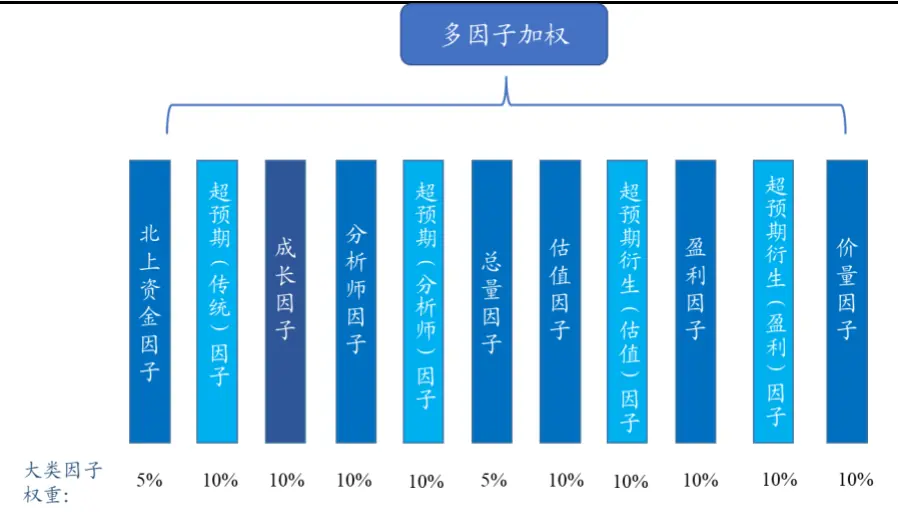
数据来源：国泰君安证券研究

我们对中证500指数成分股内各类因子，采用因子IC、分组测试、组合优化等方式进行单因子测试。每周进行调仓操作，分组测试按因子值从小到大排序分 10 组，分别为 t0、t1、t2、…、t8、t9 组，每组 50 只股票。计算分组收益、多头组超额收益、组合优化超额收益等绩效指标考察因子表现。回测日期区间为 2010 年 1 月至 2021 年 12 月，2022 年以来为样本外；由于篇幅限制，展示因子绩效合并两个时间段。

## 2.1. 北上资金因子

北上资金作为机构资金 “聪明的钱”的代表，其资金的进出包含独特的Alpha信息。我们在报告《20220610_如何基于北向资金构建行业轮动策略——行业配置研究系列03》中对行业的北向因子有详细介绍，个股的计算方法类似，感兴趣的投资者可参考。

## 1）北上资金因子列表

经过历史回测筛选，我们选择北上资金的 4个因子用于中证 500内选股。北向资金因子的整体权重为 5%，每个单因子权重为 1.25%。具体指标和计算方法如下表：

表 1：中证 500股票池 北上资金因子列表

| 因子名 | 方向 | 计算方法 | 因子权重 |
| --- | --- | --- | --- |
| 5 日持股比例变动 | 越大越好 | 持股比例减去5日前持股比例 | 1.2500% |
| 60日持股比例变动 | 越大越好 | 持股比例减去60日前持股比例 | 1.2500% |
| 5 日净流入 | 越大越好 | 5日净流入金额 | 1.2500% |
| 60日净流入 | 越大越好 | 60日净流入金额 | 1.2500% |

数据来源：国泰君安证券研究

中证 500 指数成分股内，北上资金的 4 个因子相关系数的平均值和因子IC 的相关系数如下。

数据来源：Wind，国泰君安证券研究测试区间：2017.04-2022.07。

数据来源：Wind，国泰君安证券研究测试区间：2017.04-2022.07。

表 2：中证 500内 北上资金相关系数的平均值

| 北上资金因子相关系数平均值 | 5日持股 比例变动 | 5日净流 入 | 60日持股 比例变动 | 60日净流 入 |
| --- | --- | --- | --- | --- |
| 5日持股比例变动 | 1.00 | 0.92 | 0.27 | 0.26 |
| 5日净流入 | 0.92 | 1.00 | 0.26 | 0.27 |
| 60日持股比例变动 | 0.27 | 0.26 | 1.00 | 0.90 |
| 60日净流入 | 0.26 | 0.27 | 0.90 | 1.00 |

数据来源： ，国泰君安证券研究

表 3：中证 500内 北上资金 IC的相关系数

| 北上资金因子 | 5日持股 比例变动 | 5日净流 入 | 60日持股 比例变动 | 60日净流 入 |
| --- | --- | --- | --- | --- |
| 5日持股比例变动 | 1.00 | 0.94 | 0.41 | 0.41 |
| 5日净流入 | 0.94 | 1.00 | 0.39 | 0.40 |
| 60日持股比例变动 | 0.41 | 0.39 | 1.00 | 0.94 |
| 60日净流入 | 0.41 | 0.40 |  | 1.00 |

数据来源： ，国泰君安证券研究

## 2）北上资金单因子测试结果

北上资金因子的分组测试具体结果和单因子组合优化的绩效指标如下。单因子组合优化下，超额收益为 9%-10%，最大回撤为-3~-4%，信息比率为 2.4-2.8。

表 4：中证 500股票池 北上资金因子 主要绩效指标

|  |  |  | 多头组 |  |  |  |  |  | 单因子组合优化 |  |  |  |  |  |  | 组合优化 |
| --- | --- | --- | --- | --- | --- | --- | --- | --- | --- | --- | --- | --- | --- | --- | --- | --- |
| 北上资金因子 | 空头组超额收益 |  | 超额收益 |  | 超额收益超最大回撤 | 额收益超额收益波动率 信息比率 |  | 多空收益 | 超额收益 |  | 超额收益超额收益最大回撤波动率 |  | 超额收益信息比率 | IC | RankIC | 周度双边换手率 |
| 5日持股比例变动 | 0 | 5% | 14. | 10% | -142% | 6.26% | 2.25 | 13.55% | 917% |  | 362% | 3.54% | 2.59 | 173% | 206% | 67.02% |
| 5日净流入 | -0 | 9% | 13.6 | 6% | -106% | 6.78% | 2.01 | 1374% | 99 | 6% | 393% | 3.52% | 2.83 | 159% | 196% | 67.30% |
| 60日持股比例变动 | -1. | 7% | 12 | 3% | -6100% | 6.01% | 2.08 | 14.40% |  | 900% | B91% | 3.68% | 2.45 | 166% | 155% | 25.14% |
| 60日净流入 | -4E | 0% | 12. | 7% | -5168% | 6.50% | 1.87 | 16.67% | 9 | 45% | 332% | 3.71% | 2.55 | 191% | 176% | 25.14% |

数据来源：Wind，国泰君安证券研究。测试区间：2017.04-2022.07。

表 5：中证 500股票池 北上资金因子 分组年化超额收益

|  | 分组年化超额收益 |  |  |  |  |  |  |  |  |  |  |  |  |  |  |
| --- | --- | --- | --- | --- | --- | --- | --- | --- | --- | --- | --- | --- | --- | --- | --- |
| 北上资金因子 | t0 t1 t2 t3 t4 t5 t6 t7 t8 t9 |  |  |  |  |  |  |  |  |  |  |  |  |  | 多空收益 |
| 5日持股比例变动 |  | 0.55% | 1.54% |  | 2.54% | 2 | .44% | 4.61% | 7.72% |  | 3.80% | 2.11% | 9.58% | 4.10% | 13.55% |
| 5日净流入 |  | 0.09% | 0.05% | 口 | 2.78% | 3 | .02% | 5.57% | 6.64% | D | 2.76% | 1.66% | 8.97% | 3.66% | 13.74% |
| 60日持股比例变动 | L | 1.87% | 4.91% |  | 5.39% |  | 0.42% | 2.59% | 3.60% | 1 | .41% | 1.18% | 10.04% | 2.53% | 1440% |
| 60日净流入 |  | 4.50% | 4.18% | 「 | 3.28% | 2 | .46% | 4.68% | -0.61% |  | 0.38% | 0.60% | 10.38% | 2.17% | 16.67% |

数据来源：Wind，国泰君安证券研究。测试区间：2017.04-2022.07。

中证 500 指数成分股内，4 个北上资金因子的多头组超额收益和单因子组合优化超额收益曲线如下。

图 3：中证 500股票池 北上资金因子 多头组超额收益曲线
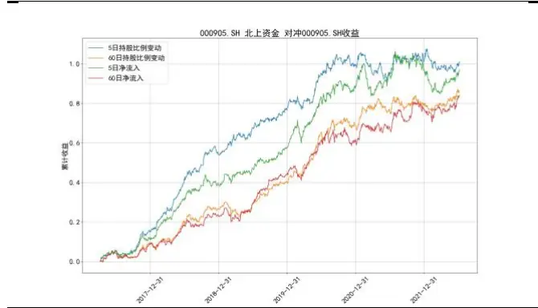

图 4：中证 500 股票池 北上资金因子 组合优化超额收益曲线
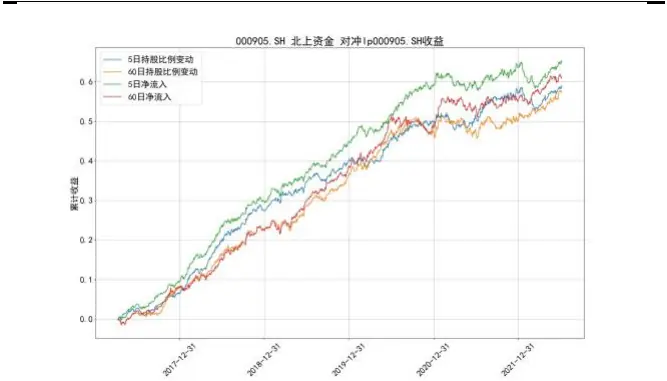

## 3）北上资金复合因子绩效表现

中证 500 股票池内，北上资金复合因子多头组年化超额收益 13.99%，超额最大回撤-4.29%，信息比率 2.33；空头组年化超额-6.32%，多空年化收益 20.31%。北上资金复合因子组合优化的年化超额收益 10.8%，超额收益最大回撤-3.12%，信息比率 2.98，周度双边换手率 50.82%。等权合成的北上资金复合因子多头组超额收益曲线、单因子组合优化超额收益曲线如下。

图 5：中证 500股票池 北上资金复合因子 分组超额收益曲线
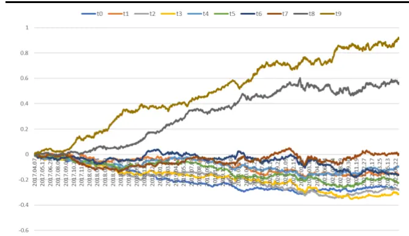
数据来源：Wind，国泰君安证券研究测试区间：2017.04-2022.07。

图 6：中证 500 股票池 北上资金复合因子 组合优化收益曲线
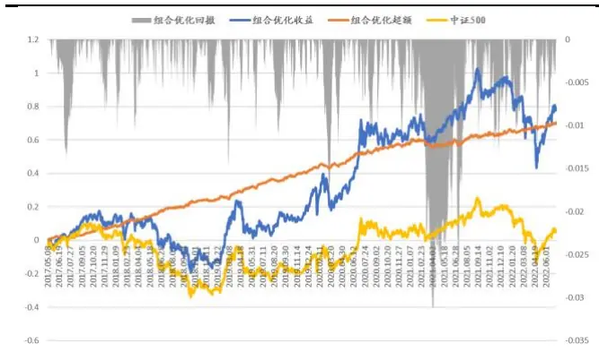
数据来源：Wind，国泰君安证券研究
测试区间：2017.04-2022.07。

## 2.2. 超预期（传统）因子

我们参照学术文献中研究 PEAD 效应使用的超预期 SUE 指标，使用多种类型的净利润、营业收入代入公式计算超预期（传统）因子。对于股票 i，SUE是单季度预期外收益 $(X_{i,q}-\mathbb{E}(X_{i,q})$ ）除以预期外收益的标准差，公式为：

$$
SUE_{i,q}=\frac{X_{i,q}-\mathbb{E}(X_{i,q})}{\sigma_{i,q}}
$$

其中， $X_{i,q}$ 是公司 i在 q 季度的实际收益，E $(X_{i,q})$ 是 q 季度的预期收益，$\sigma_{i,q}$ 是过去 4 个季度预期外收益的标准差。

## 1）超预期（传统）因子列表

经过历史回测筛选，我们选择超预期（传统）的 8 个因子用于中证 500内选股，超预期（传统）因子的权重为 10%，每个单因子权重为 1.25%。具体指标和计算方法如下表：

表 6：中证 500股票池 超预期（传统）因子列表

| 因子名 | 方向 | 计算方法 | 因子权重 |
| --- | --- | --- | --- |
| 标准化预期外单季度扣非净利润 | 越大越好 | 将单季度扣非净利润代入 SUE公式计算 | 1.2500% |
| 标准化预期外单季度扣非净利润-带漂移项 | 越大越好 | 将单季度扣非净利润代入SUE-带漂移项公式计算 | 1.2500% |
| 标准化预期外单季度毛利润-带漂移项 | 越大越好 | 将单季度毛利润代入SUE-带漂移项公式计算 | 1.2500% |
| 标准化预期外单季度毛利润 | 越大越好 | 将单季度毛利润代入 SUE公式计算 | 1.2500% |
| 标准化预期外单季度归母净利润-带漂移项 | 越大越好 | 将单季度归母净利润代入SUE-带漂移项公式计算 | 1.2500% |
| 标准化预期外单季度归母净利润 | 越大越好 | 将单季度归母净利润代入 SUE公式计算 | 1.2500% |
| 标准化预期外单季度营业收入-带漂移项 | 越大越好 | 将单季度营业收入代入SUE-带漂移项公式计算 | 1.2500% |
| 标准化预期外单季度营业收入 | 越大越好 | 将单季度营业收入代入 SUE公式计算 | 1.2500% |

数据来源：国泰君安证券研究

超预期（传统）因子相关系数的平均值和因子 IC 的相关系数如下。

表 7：中证 500内 超预期（传统）因子 相关系数的平均值

| 超预期因子相关系数平均值 | 标准化预期外单季度归母净利润 | 标准化预期外单季度归母净利润-带漂移项 | 标准化预期外单季度扣非净利润 | 标准化预期外单季度扣非净利润-带漂移项 | 标准化预期外单季度毛利润 | 标准化预期外单季度毛利润-带漂移项 | 标准化预期外单季度营业收入 | 标准化预期外单季度营业收入-带漂移项 |
| --- | --- | --- | --- | --- | --- | --- | --- | --- |
| 标准化预期外单季度归母净利润 | 1.00 | 0.91 | 0.56 | 0.49 | 0.42 | 0.37 | 0.70 | 0.62 |
| 标准化预期外单季度归母净利润-带漂移项 | 0.91 | 1.00 | 0.47 | 0.54 | 0.35 | 0.41 | 0.60 | 0.67 |
| 标准化预期外单季度扣非净利润 | 0.56 | 0.47 | 1.00 | 0.89 | 0.63 | 0.57 | 0.71 | 0.62 |
| 标准化预期外单季度扣非净利润-带漂移项 | 0.49 | 0.54 | 0.89 | 1.00 | 0.56 | 0.64 | 0.63 | 0.70 |
| 标准化预期外单季度毛利润 | 0.42 | 0.35 | 0.63 | 0.56 | 1.00 | 0.86 | 0.58 | 0.51 |
| 标准化预期外单季度毛利润-带漂移项 | 0.37 | 0.41 | 0.57 | 0.64 | 0.86 | 1.00 | 0.51 | 0.58 |
| 标准化预期外单季度营业收入 | 0.70 | 0.60 | 0.71 | 0.63 | 0.58 | 0.51 | 1.00 | 0.90 |
| 标准化预期外单季度营业收入-带漂移项 | 0.62 | 0.67 | 0.62 | 0.70 | 0.51 | 0.58 | 0.90 | 1.00 |

数据来源：Wind，国泰君安证券研究

表 8：中证 500内 超预期（传统）因子IC 的相关系数

| 超预期因子 | 标准化预期外单季度归母净利润 | 标准化预期外单季度归母净利润-带漂移项 | 标准化预期外单季度扣非净利润 | 标准化预期外单季度扣非净利润-带漂移项 | 标准化预期外单季度毛利润 | 标准化预期外单季度毛利润-带漂移项 | 标准化预期外单季度营业收入 | 标准化预期外单季度营业收入-带漂移项 |
| --- | --- | --- | --- | --- | --- | --- | --- | --- |
| 标准化预期外单季度归母净利润 | 1.00 | 0.93 | 0.75 | 0.67 | 0.64 | 0.55 | 0.82 | 0.75 |
| 标准化预期外单季度归母净利润-带漂移项 | 0.93 | 1.00 | 0.66 | 0.70 | 0.52 | 0.56 | 0.74 | 0.78 |
| 标准化预期外单季度扣非净利润 | 0.75 | 0.66 | 1.00 | 0.91 | 0.80 | 0.72 | 0.84 | 0.75 |
| 标准化预期外单季度扣非净利润-带漂移项 | 0.67 | 0.70 | 0.91 | 1.00 | 0.70 | 0.77 | 0.75 | 0.80 |
| 标准化预期外单季度毛利润 | 0.64 | 0.52 | 0.80 | 0.70 | 1.00 | 0.88 | 0.77 | 0.67 |
| 标准化预期外单季度毛利润-带漂移项 | 0.55 | 0.56 | 0.72 | 0.77 | 0.88 | 1.00 | 0.68 | 0.71 |
| 标准化预期外单季度营业收入 | 0.82 | 0.74 | 0.84 | 0.75 | 0.77 | 0.68 | 1.00 | 0.92 |
| 标准化预期外单季度营业收入-带漂移项 | 0.75 | 0.78 | 0.75 | 0.80 | 0.67 | 0.71 | 0.92 | 1.00 |

数据来源：Wind，国泰君安证券研究

## 2）超预期（传统）单因子测试结果

超预期（传统）因子的分组测试具体结果和单因子组合优化的绩效指标如下。单因子组合优化下，超额收益为 9%-11%，最大回撤为-8~-10%，信息比率为 1.8-2.5。

表 9：中证 500股票池 超预期（传统）因子 主要绩效指标

|  |  |  | 多头组 |  |  |  |  |  |  | 单因子组合优化 |  |  |  |  |  |  |  |  | 组合优化 |  |
| --- | --- | --- | --- | --- | --- | --- | --- | --- | --- | --- | --- | --- | --- | --- | --- | --- | --- | --- | --- | --- |
| 超预期因子 | 空头组超额收益 |  | 超额收益 |  |  |  |  |  |  |  |  |  |  |  |  |  |  |  |  |  |
|  |  |  |  |  | 最大回撤 |  | 波动率 | 信息比率 | 益 | 超额 | 仅益 | 最大回 | 撤 | 波动率 | 信息比率 |  |  |  |  |  |
|  |  |  |  |  |  |  |  |  |  |  |  |  |  |  |  | IC | RankIC |  | 周度双边换手率 |  |
| 标准化预期外单季度归母净利润 | -6. | 6% | 15.7 | 5% | -8.49% |  | 6.44% | 2.45 | 21.81% | 12 | 33% | -8 | 32% | 4.80% 2.57 |  | 287% | 340% |  | 13.46% |  |
| 标准化预期外单季度归母净利润-带漂移项 | 5 | 8% | 13 | 2% | -D6% |  | 6.37% | 2.16 | 19.50% | 10 | 30% | -9 | 25% | 4.70% | 2.19 | 244% |  | 69% | 13.56% |  |
| 标准化预期外单季度扣非净利润 |  | 7% | 15.2 | 0% | -8.92% |  | 6.20% | 2.45 | 22.37% | 11 | 94% | -8 | 16% | 4.75% | 2.51 | 287% | 33 | 6% | 11.96% |  |
| 标准化预期外单季度扣非净利润-带漂移项 | 5 | 4% | 15.6 | 1% | -8.998% |  | 6.22% | 2.51 | 21.05% | 10 | 25% | -10 | 44% | 4.70% | 2.18 | 247% | 2.5 | 8% | 12.11% |  |
| 标准化预期外单季度毛利润 | -6 | 8% | 14. | 6% | -1889% |  | 6.31% | 2.24 | 20.94% | 10 | 05% | -9 | 24% | 4.79% | 2.10 | 259% | 28 | 9% | 11.48% |  |
| 标准化预期外单季度毛利润-带漂移项 | 6 | 9% | 13.8 | 8% | -1 | 9% | 6.45% | 2.15 | 20.28% | 89 | 5% | -8 | 27% | 4.74% | 1.89 | 2.28% | 21 | 5% |  | 11.93% |
| 标准化预期外单季度营业收入 | -6 | 3% | 14.7 | 7% | -10 | 6% | 6.35% | 2.33 | 20.90% | 11 | 84% | -9 | 09% | 4.80% | 2.46 | 289% | 32 | 6% |  | 12.55% |
| 标准化预期外单季度营业收入-带漂移项 | -5 | 1% | 13.8 | 6% | 10% | 5% | 6.18% | 2.24 | 19.37% | 10 | 46% | -100 | 74% | 4.71% | 2.22 | 246% | 25 | 1% |  | 12.90% |

数据来源：Wind，国泰君安证券研究。测试区间：2010.01-2022.07。

表 10：中证 500股票池 超预期（传统）因子 分组年化超额收益

|  | 分组年化超额收益 |  |  |  |  |  |  |  |  |  |  |  |  |  |  |  |  |  |  |  |
| --- | --- | --- | --- | --- | --- | --- | --- | --- | --- | --- | --- | --- | --- | --- | --- | --- | --- | --- | --- | --- |
| 超预期因子 | t0 |  | t1 |  | t2 |  | t3 |  | t4 t5 |  |  | t6 |  | t7 t8 |  |  |  | t9 |  | 多空收益 |
| 标准化预期外单季度归母净利润 |  | -6.06% |  | 7.69% | 4 | .79% | -3 | .53% |  | -1.24% | -0.40% |  | 4.59% |  | 8.41% | 1 | 0.90% |  | 15.75% | 21.81% |
| 标准化预期外单季度归母净利润-带漂移项 |  | -5.78% |  | 3.32% |  | 5.49% |  | 4.19% |  | -0.89% | 1.22% |  | 480% |  | 5.62% |  | 9.58% |  | 13.72% | 19.50% |
| 标准化预期外单季度扣非净利润 |  | -7.17% |  | -5.94% | 4 | .68% |  | -2.23% | L | -1.97% | 0.66% |  | 2.25% |  | 7.91% |  | 1.87% |  | 15.20% | 22.37% |
| 标准化预期外单季度扣非净利润-带漂移项 | 7 | -5.44% |  | 4.75% | 1 | .93% | D | -3.25% |  | -0.69% | 1.00% |  | 1.62% |  | 548% |  | 7.45% |  | 15.61% | 21.05% |
| 标准化预期外单季度毛利润 |  | -6.78% |  | 4.25% | 口 | 4.16% | -2 | .09% |  | -1.51% | 0.90% |  | 2.88% |  | 6.48% |  | 9.65% | 1 | 4.16% | 20.94% |
| 标准化预期外单季度毛利润-带漂移项 | 7 | -6.39% | 「 | -2.52% | 0 | .81% |  | -0.65% | 口 | -2.45% | 0.84% |  | 3.18% |  | 3.72% |  | 7.67% |  | 13.88% | 20.28% |
| 标准化预期外单季度营业收入 | 7 | -6.13% |  | -8.04% | ■3 | .78% | -3 | .08% |  | -0.92% | 0.05% |  | 2.77% |  | 7.39% |  | 12.86% |  | 14.77% | 20.90% |
| 标准化预期外单季度营业收入-带漂移项 |  | -5.51% |  | -5.07% | 口 | -2.95% | 「 | 3.13% |  | -0.63% | 0.50% |  | 3.98% |  | 4.41% |  | 9.70% |  | 13.86% | 19.37% |

数据来源：Wind，国泰君安证券研究。测试区间：2010.01-2022.07。

中证 500 股票池内，8 个超预期（传统）因子的多头组超额收益和单因子组合优化超额收益曲线如下。

图 7：中证 500股票池 超预期（传统）因子 多头组超额收益曲线
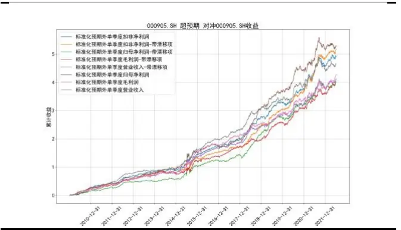
数据来源：Wind，国泰君安证券研究
测试区间：2010.01-2022.07。

图 8：中证 500 股票池 超预期（传统）因子 组合优化超额收益曲线
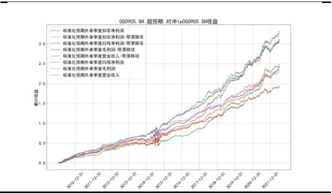
测试区间：2010.01-2022.07。

数据来源：Wind，国泰君安证券研究

## 3）超预期（传统）复合因子绩效表现

中证 500 股票池内，超预期（传统）复合因子多头组年化超额收益 16.22%，超额最大回撤-9.97%，信息比率-0.1；空头组年化超额-8.27%，多空年化收益 24.49%。超预期（传统）复合因子组合优化的年化超额收益 12.73%，超额收益最大回撤-8.53%，信息比率 2.63，周度双边换手率 11.74%。等权合成的超预期（传统）复合因子多头组超额收益曲线、单因子组合优化超额收益曲线如下。

图 9：中证 500股票池 超预期（传统）复合因子分组超额收益曲线
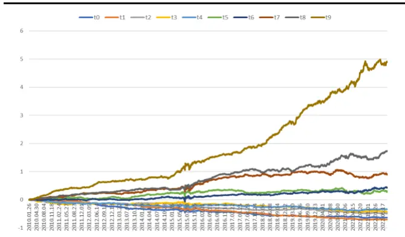
数据来源：Wind，国泰君安证券研究
测试区间：2010.01-2022.07。

图 10：中证 500 股票池 超预期（传统）复合因子组合优化收益曲线
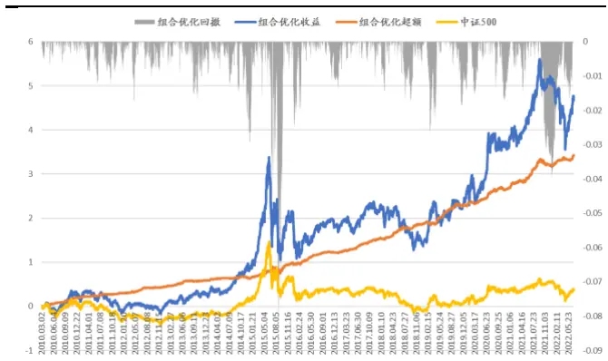
数据来源：Wind，国泰君安证券研究
测试区间：2010.01-2022.07。

## 2.3. 成长因子

我们基于净利润、营业收入计算常用的增长率因子；同时使用 ROA、ROE计算 ROA变动、ROE变动衡量股票的成长性。

## 1）成长因子列表

经过历史回测筛选，我们选择成长的 8 个因子用于中证 500 内选股，估值因子的整体权重为 10%，每个单因子权重为 1.25%。具体指标和计算方法如下表：

表 11：中证 500 股票池 成长因子列表

| 因子名 | 方向 | 计算方法 | 因子权重 |
| --- | --- | --- | --- |
| 单季度扣非净利润同比增长率 | 越大越好 | 单季度扣非净利润同比增长率 | 1.2500% |
| 单季度扣非 ROA 变动 | 越大越好 | 单季度扣非 ROA 减去去年同期 | 1.2500% |
| 单季度扣非 ROE 变动 | 越大越好 | 单季度扣非 ROE减去去年同期 | 1.2500% |
| 单季度归母净利润同比增长率 | 越大越好 | 单季度归母净利润同比增长率 | 1.2500% |
| 单季度归母 ROA 变动 | 越大越好 | 单季度归母 ROA 减去去年同期 | 1.2500% |
| 单季度归母 ROE 变动 | 越大越好 | 单季度归母 ROE减去去年同期 | 1.2500% |
| 单季度营业利润同比增长率 | 越大越好 | 单季度营业利润同比增长率 | 1.2500% |
| 单季度营业收入同比增长率 | 越大越好 | 单季度营业收入同比增长率 | 1.2500% |

数据来源：国泰君安证券研究

成长因子相关系数的平均值和因子 IC 的相关系数如下。

表 12：中证 500内 成长因子 相关系数的平均值

| 成长因子相关系数平均值 | 单季度归 母ROA变 动 | 单季度归 母ROE变 | 单季度归 母净利润 同比增长 | 单季度扣 非ROA变 动 | 单季度扣 非ROE变 动 | 单季度扣 非净利润 同比增长 | 单季度营 业利润同 比增长率 | 单季度营 业收入同 比增长率 |
| --- | --- | --- | --- | --- | --- | --- | --- | --- |
| 单季度归母ROA变动 | 1.00 | 动 0.91 | 率 0.72 | 0.61 | 率 0.55 | 0.39 | 0.51 | 0.24 |
| 单季度归母ROE变动 | 0.91 | 1.00 | 0.75 | 0.55 | 0.61 | 0.41 | 0.53 | 0.27 |
| 单季度归母净利润同比增长率 | 0.72 | 0.75 | 1.00 | 0.46 | 0.49 | 0.57 | 0.67 | 0.28 |
| 单季度扣非ROA变动 | 0.61 | 0.55 | 0.46 | 1.00 | 0.90 | 0.68 | 0.56 | 0.33 |
| 单季度扣非ROE变动 | 0.55 | 0.61 | 0.49 | 0.90 | 1.00 | 0.72 | 0.59 | 0.36 |
| 单季度扣非净利润同比增长率 | 0.39 | 0.41 | 0.57 | 0.68 | 0.72 | 1.00 | 0.72 | 0.34 |
| 单季度营业利润同比增长率 | 0.51 | 0.53 | 0.67 | 0.56 | 0.59 | 0.72 | 1.00 | 0.36 |
| 单季度营业收入同比增长率 | 0.24 | 0.27 | 0.28 | 0.33 | 0.36 | 0.34 | 0.36 | 1.00 |

数据来源：Wind，国泰君安证券研究

数据来源：Wind，国泰君安证券研究测试区间：2010.01-2022.07。

表 13：中证 500内 成长因子 IC的相关系数

| 成长因子 | 单季度归 母ROA变 动 | 单季度归 母ROE变 | 单季度归 母净利润 同比增长 | 单季度扣 非ROA变 动 | 单季度扣 非ROE变 动 | 单季度扣 非净利润 同比增长 | 单季度营 业利润同 比增长率 | 单季度营 业收入同 比增长率 |
| --- | --- | --- | --- | --- | --- | --- | --- | --- |
| 单季度归母ROA变动 | 动 1.00 | 率 0.95 | 0.80 | 0.77 | 率 0.74 | 0.59 | 0.66 | 0.35 |
| 单季度归母ROE变动 | 0.95 | 1.00 | 0.83 | 0.72 | 0.76 | 0.60 | 0.68 | 0.41 |
| 单季度归母净利润同比增长率 | 0.80 | 0.83 | 1.00 | 0.64 | 0.68 | 0.73 | 0.80 | 0.47 |
| 单季度扣非ROA变动 | 0.77 | 0.72 | 0.64 | 1.00 | 0.94 | 0.76 | 0.70 | 0.43 |
| 单季度扣非ROE变动 | 0.74 | 0.76 | 0.68 | 0.94 | 1.00 | 0.80 | 0.74 | 0.48 |
| 单季度扣非净利润同比增长率 | 0.59 | 0.60 | 0.73 | 0.76 | 0.80 | 1.00 | 0.82 | 0.53 |
| 单季度营业利润同比增长率 | 0.66 | 0.68 | 0.80 | 0.70 | 0.74 | 0.82 | 1.00 | 0.54 |
| 单季度营业收入同比增长率 | 0.35 | 0.41 | 0.47 | 0.43 | 0.48 | 0.53 | 0.54 | 1.00 |

数据来源：Wind，国泰君安证券研究

## 2）成长单因子测试结果

成长因子的分组测试具体结果和单因子组合优化的绩效指标如下。单因子组合优化下，超额收益为 6%-10%，最大回撤为-8~-11%，信息比率为1.3-2.2。

表 14：中证 500股票池 成长因子 主要绩效指标

|  |  |  | 多头组 |  |  |  |  |  | 单因子组合优化 |  |  |  |  |  |  |  |  | 组合优化 |
| --- | --- | --- | --- | --- | --- | --- | --- | --- | --- | --- | --- | --- | --- | --- | --- | --- | --- | --- |
| 成长因子 | 空头组超额收益 |  | 超额收益 |  | 超额收益超 | 额收益 | 超额收益 | 多空收 | 超额收益 |  | 超额收益超 |  | 额收益 | 超额收益 |  |  |  |  |
|  |  |  |  |  | 最大回撤波 | 动率 | 信息比率 | 益 | 超额收益 |  | 最大回 | 撤波 | 动率 | 信息比率 |  |  |  |  |
|  |  |  |  |  |  |  |  |  |  |  |  |  |  |  |  | RankIC |  | 周度双边换手率 |
| 单季度归母ROA变动 | -6 | 9% | 12.0% |  | -D225% | 6.54% | 185 | 18.50% | 855% |  | -8 | 79% | 4.83% | 1.77 | 244% | 284% |  | 13.27% |
| 单季度归母ROE变动 | -82 | 5% | 10.93% |  | 17% | 6.71% | 1.63 | 19.18% | 913% -8 |  |  | 99% | 4.86% | 1.88 | 256% | 3.04% |  | 13.25% |
| 单季度归母净利润同比增长率 | -9 | 2% | 9.52% |  | 10.443% | 7.01% | 1.36 | 19.44% | 861% -8 |  |  | 53% | 4.85% | 1.77 | 251% | 295% |  | 13.52% |
| 单季度扣非ROA变动 |  | 3% | 11.6 | 3% | -8.666% | 6.48% | 1.79 | 20.76% | 957% -8 |  |  | 28% | 4.78% | 2.00 | 269% | 289% |  | 11.99% |
| 单季度扣非ROE变动 | 区 | 67% | 12.4 | 6% | -10.43% | 6.64% | 1.88 | 22.13% | 1065% -8 |  |  | 71% | 4.75% | 2.24 | 278% | 305% |  | 12.09% |
| 单季度扣非净利润同比增长率 | -8.5 | 7% | 9.2 | 8% | 2.009% | 7.23% | 1.28 | 17.84% |  | 924% | -88 | 86% | 4.87% | 1.90 | 250% | 29 | 4% | 11.99% |
| 单季度营业利润同比增长率 | -1 | 6% | 6.7 | 1% | 2.00% | 7.10% | 0.95 | 15.87% |  | 870% | -9 | 20% | 4.87% | 1.79 | 2.50% | 28 | 9% | 12.71% |
| 单季度营业收入同比增长率 | 1 | 3% | 6.2 | 8% | 康1% | 7.04% | 0.89 | 1442% |  | 664% | -11 | 76% | 4.93% | 1.35 | 1.84% | 219% |  | 11.87% |

数据来源：Wind，国泰君安证券研究。测试区间：2010.01-2022.07。

表 15：中证 500股票池 成长因子 分组年化超额收益

|  | 分组年化超额收益 |  |  |  |  |  |  |  |  |  |  |  |  |  |  |  |  |  |
| --- | --- | --- | --- | --- | --- | --- | --- | --- | --- | --- | --- | --- | --- | --- | --- | --- | --- | --- |
| 成长因子 | t0 |  | t1 |  | t2 | t3 | t4 |  | t5 |  | t6 t7 |  |  | t8 |  | t9 |  | 多空收益 |
| 单季度归母ROA变动 | 6 | .39% | 6 | .85% | 2.29% | 4.45% | 0 | .06% |  | 3.36% |  | 2.06% | 7.68% |  | 9.96% |  | 12.10% | 18.50% |
| 单季度归母ROE变动 |  | 8.25% | 7 | 6.47% | 6.03% | 1.14% | 2 | .10% |  | 2.17% |  | 3.43% | 7.48% | 1 | 1.29% |  | 10.93% | 19.18% |
| 单季度归母净利润同比增长率 |  | 9.92% | 74 | .94% | 5.15% | D2.51% | 0 | .49% |  | 2.54% |  | 8.83% | 8.85% |  | 8.70% |  | 9.52% | 19.44% |
| 单季度扣非ROA变动 |  | 9.13% | F4.55% |  | B1.80% | D3.80% |  | 0.12% |  | 0.18% |  | 4.72% | 8.02% | 1 | 0.04% |  | 11.63% | 20.76% |
| 单季度扣非ROE变动 |  | 9.67% | 6.78% |  | 2.23% | L1.38% | 0 | .84% |  | 2.44% |  | 5.42% | 5.58% |  | 10.58% | 1 | 2.46% | 22.13% |
| 单季度扣非净利润同比增长率 |  | 8.57% | 6.54% |  | C5.00% | D2.82% |  | 0.56% |  | 4.07% |  | 6.68% | 7.21% |  | 10.42% |  | 9.28% | 17.84% |
| 单季度营业利润同比增长率 |  | 9.16% | 7.67% |  | 3.31% | D2.82% |  | 235% |  | 325% |  | 5.67% | 7.29% | 1 | 3.18% |  | 6.71% | 15.87% |
| 单季度营业收入同比增长率 |  | 8.13% | 5.34% |  | 4.15% | 1.89% |  | 303% |  | 3.94% |  | 4.64% | 7.54% |  | 5.01% |  | 6.28% | 1442% |

数据来源：Wind，国泰君安证券研究。测试区间：2010.01-2022.07。

中证 500 股票池内，8 个成长因子的多头组超额收益和单因子组合优化超额收益曲线如下。

图 11：中证 500 股票池 成长因子 多头组超额收益曲线
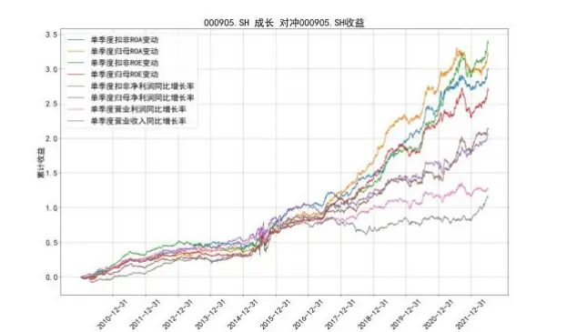
数据来源：Wind，国泰君安证券研究
测试区间：2010.01-2022.07。

图 12：中证 500 股票池 成长因子 组合优化超额收益曲线
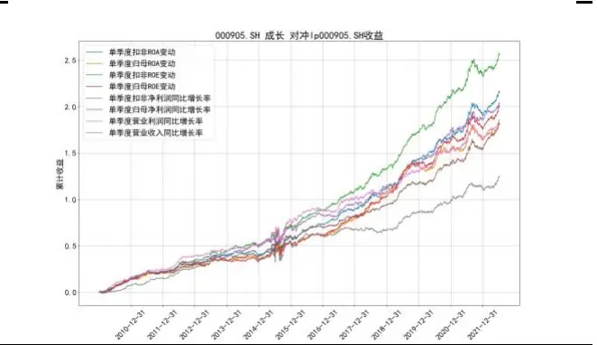

## 3）成长复合因子绩效表现

中证 500 股票池内，成长复合因子多头组年化超额收益 13.11%，超额最大回撤-9.58%，信息比率 1.99；空头组年化超额-12.8%，多空年化收益25.91%。成长复合因子组合优化的年化超额收益 10.88%，超额收益最大回撤-7.53%，信息比率 2.23，周度双边换手率 11.85%。等权合成的成长复合因子多头组超额收益曲线、单因子组合优化超额收益曲线如下。

图 13：中证500股票池 成长复合因子 分组超额收益曲线
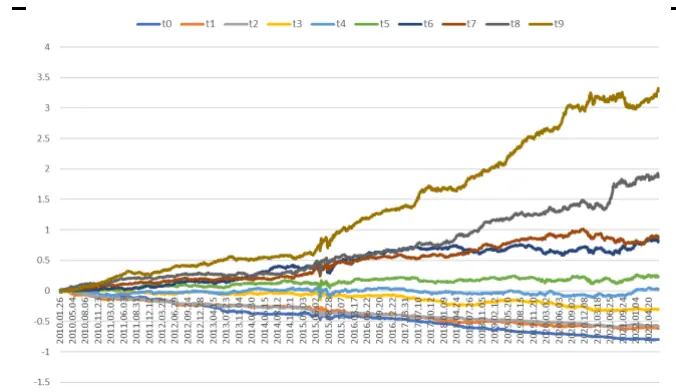
数据来源：Wind，国泰君安证券研究测试区间：2010.01-2022.07。

图 14：中证500股票池 成长复合因子组合优化收益曲线
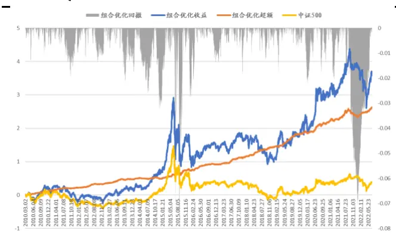
数据来源：Wind，国泰君安证券研究测试区间：2010.01-2022.07。

## 2.4. 分析师因子

我们基于朝阳永续分析师预测数据，计算分析师覆盖度、分析师预测市盈率、分析师预测 ROE等常用的分析师类因子。

## 1）分析师因子列表

经过历史回测筛选，我们选择分析师的 13个因子用于中证 500内选股。分析师因子的整体权重为 10%，每个单因子权重为 0.77%。具体指标和计算方法如下表：

表 16：中证 500股票池 分析师因子列表

| 因子名 | 方向 | 计算方法 | 因子权重 |
| --- | --- | --- | --- |
| 分析师覆盖度 | 越大越好 | 过去90日覆盖报告数量 | 0.7692% |
| 分析师预测 BPROE 分位数 | 越大越好 | 过去 90 日分析师预测 BP 分位数+ROE分位数 | 0.7692% |
| 分析师盈利预测标准差 | 越小越好 | 过去90日分析师预测净利润的标准差 | 0.7692% |
| 分析师预测 EP | 越大越好 | 过去90日分析师预测净利润/总市值 | 0.7692% |
| 分析师预测 PEG | 越大越好 | （过去90日分析师预测净利润/总市值）*过去90日净 利润增长率 | 0.7692% |
| 分析师预测 ROE | 越大越好 | 过去90日分析师预测净利润/股东权益 | 0.7692% |
| 分析师预测目标价收益率 | 越大越好 | 过去90日分析师预测目标价/当前股价-1 | 0.7692% |
| 过去90日机构最新盈利预测调整幅度 | 越大越好 | 过去90日机构预测净利润调账幅度加权平均 | 0.7692% |
| 分析师预测 SP20 日变化 | 越大越好 | 过去 90日分析师预测 SP20日变化 | 0.7692% |
| 分析师预测 EP20 日变化 | 越大越好 | 过去90日分析师预测EP20日变化 | 0.7692% |
| 分析师预测净利润增长率FY1 | 越大越好 | 过去90日分析师预测净利润增长率FY1 | 0.7692% |
| 分析师预测 EPG 分位数（FY1） | 越大越好 | 过去90日分析师预测EP分位数+g（FY1）分位数 | 0.7692% |
| 分析师预测 EPG 分位数（FY2） | 越大越好 | 过去90日分析师预测 EP分位数+g（FY2）分位数 | 0.7692% |

数据来源：国泰君安证券研究

分析师因子相关系数的平均值和因子 IC 的相关系数如下。

表 17：中证 500内 分析师因子相关系数的平均值

| 分析师因子相关系数平均值 | 分析师覆盖度 | 分析师盈利预测标准差 | 分析师预测BPROE分位数 | 分析师预测EP | 分析师预测EP20日变化 | 分析师预测EPG分位数(FY1) | 分析师预测EPG分位数 | 分析师预测PEG | 分析师预测ROE | 分析师预测SP20日变化 | 分析师预测净利润增长率FY1 | 分析师预测目标价收益率 | 过去90日机构最新盈利预测调整幅度 |
| --- | --- | --- | --- | --- | --- | --- | --- | --- | --- | --- | --- | --- | --- |
|  |  |  |  |  |  |  | (FY2) |  |  |  |  |  |  |
| 分析师覆盖度 | 1.00 | 0.03 | 0.16 | 0.14 | 0.01 | 0.08 | 0.10 | 0.05 | 0.23 | 0.02 | 0.04 | 0.06 | -0.01 |
| 分析师盈利预测标准差 | 0.03 | 1.00 | -0.17 | -0.12 | -0.03 | -0.05 | -0.02 | 0.09 | -0.19 | 0.00 | -0.06 | -0.01 | -0.10 |
| 分析师预测BPROE分位数 | 0.16 | -0.17 | 1.00 | 0.86 | 0.14 | 0.57 | 0.51 | 0.21 | 0.51 | 0.08 | 0.23 | 0.14 | 0.12 |
| 分析师预测EP | 0.14 | -0.12 | 0.86 | 1.00 | 0.14 | 0.60 | 0.53 | 0.23 | 0.50 | 0.07 | 0.25 | 0.14 | 0.13 |
| 分析师预测EP20日变化 | 0.01 | -0.03 | 0.14 0.14 |  | 1.00 | 0.23 | 0.21 | 0.16 | 0.11 | 0.54 | 0.23 | 0.17 | 0.15 |
| 分析师预测EPG分位数（FY1） | 0.08 | -0.05 | 0.57 0.60 |  | 0.23 | 1.00 | 0.89 | 0.69 | 0.43 | 0.08 | 0.51 | 0.16 | 0.25 |
| 分析师预测EPG分位数（FY2） | 0.10 | -0.02 | 0.51 0.53 |  | 0.21 | 0.89 | 1.00 | 0.76 | 0.38 | 0.08 | 0.47 | 0.19 | 0.22 |
| 分析师预测PEG | 0.05 | 0.09 | 0.21 0.23 |  | 0.16 | 0.69 | 0.76 | 1.00 | 0.18 | 0.06 | 0.41 | 0.15 | 0.17 |
| 分析师预测ROE | 0.23 | -0.19 | 0.51 0.50 |  | 0.11 | 0.43 0.38 |  | 0.18 | 1.00 | 0.03 | 0.30 | 0.10 | 0.16 |
| 分析师预测SP20日变化 | 0.02 | 0.00 | 0.08 0.07 |  | 0.54 | 0.08 | 0.08 | 0.06 | 0.03 | 1.00 | 0.04 | 0.21 | 0.02 |
| 分析师预测净利润增长率FY1 | 0.04 | -0.06 | 0.23 0.25 |  | 0.23 | 0.51 | 0.47 | 0.41 | 0.30 | 0.04 | 1.00 | 0.05 | 0.33 |
| 分析师预测目标价收益率 | 0.06 | -0.01 | 0.14 0.14 |  | 0.17 | 0.16 | 0.19 | 0.15 | 0.10 | 0.21 | 0.05 | 1.00 | 0.02 |
| 过去90日机构最新盈利预测调整幅度 | -0.01 | -0.10 | 0.12 0.13 |  | 0.15 | 0.25 0.22 |  | 0.17 | 0.16 | 0.02 | 0.33 | 0.02 | 1.00 |

数据来源： ，朝阳永续，国泰君安证券研究

表 18：中证 500内 分析师因子IC的相关系数

| 分析师因子 | 分析师覆 盖度 | 分析师盈 利预测标 准差 | 分析师预 测BPROE 分位数 | 分析师预 测EP | 分析师预 测EP20日 变化 | 分析师预 测EPG分 位数 (FY1) | 分析师预 测EPG分 位数 (FY2) | 分析师预 测PEG | 分析师预 测ROE | 分析师预 测SP20日 变化 | 分析师预 测净利润 增长率 FY1 | 分析师预 测目标价 收益率 | 过去90日 机构最新 盈利预测 |
| --- | --- | --- | --- | --- | --- | --- | --- | --- | --- | --- | --- | --- | --- |
| 分析师覆盖度 | 1.00 | -0.15 | 0.21 | 0.18 | 0.13 | 0.13 | 0.16 | 0.11 | 0.55 | 0.08 | 0.14 | 0.12 | 调整幅度 0.08 |
| 分析师盈利预测标准差 | -0.15 | 1.00 | -0.19 | -0.12 | 0.05 | -0.01 | 0.04 | 0.21 | -0.25 | 0.07 | -0.03 | 0.06 | -0.17 |
| 分析师预测BPROE分位数 | 0.21 | -0.19 | 1.00 | 0.94 | 0.10 | 0.68 | 0.63 | 0.27 | 0.39 | 0.06 | 0.16 | 0.08 | 0.16 |
| 分析师预测EP | 0.18 | -0.12 | 0.94 | 1.00 | 0.10 | 0.72 | 0.66 | 0.33 | 0.38 | 0.07 | 0.19 | 0.09 | 0.17 |
| 分析师预测EP20日变化 | 0.13 | 0.05 | 0.10 | 0.10 | 1.00 | 0.17 | 0.20 | 0.15 | 0.18 | 0.82 | 0.17 | 0.53 | 0.05 |
| 分析师预测EPG分位数（FY1） | 0.13 | -0.01 | 0.68 | 0.72 | 0.17 | 1.00 | 0.92 | 0.75 | 0.43 | 0.08 | 0.55 | 0.17 | 0.33 |
| 分析师预测EPG分位数（FY2） | 0.16 | 0.04 | 0.63 | 0.66 | 0.20 | 0.92 | 1.00 | 0.81 | 0.41 | 0.13 | 0.54 | 0.24 | 0.30 |
| 分析师预测PEG | 0.11 | 0.21 | 0.27 | 0.33 | 0.15 | 0.75 | 0.81 | 1.00 | 0.25 | 0.07 | 0.56 | 0.20 | 0.27 |
| 分析师预测ROE | 0.55 | -0.25 | 0.39 | 0.38 | 0.18 | 0.43 | 0.41 | 0.25 | 1.00 | 0.11 | 0.36 | 0.19 | 0.24 |
| 分析师预测SP20日变化 | 0.08 | 0.07 | 0.06 | 0.07 | 0.82 | 0.08 | 0.13 | 0.07 | 0.11 | 1.00 | 0.05 | 0.56 | -0.06 |
| 分析师预测净利润增长率FY1 | 0.14 | -0.03 | 0.16 | 0.19 | 0.17 | 0.55 | 0.54 | 0.56 | 0.36 | 0.05 | 1.00 | 0.08 | 0.49 |
| 分析师预测目标价收益率 | 0.12 | 0.06 | 0.08 | 0.09 | 0.53 | 0.17 | 0.24 | 0.20 | 0.19 | 0.56 | 0.08 | 1.00 | -0.07 |
| 过去90日机构最新盈利预测调整幅度 | 0.08 | -0.17 | 0.16 | 0.17 | 0.05 | 0.33 | 0.30 | 0.27 | 0.24 | -0.06 | 0.49 | -0.07 | 1.00 |

数据来源：Wind，朝阳永续，国泰君安证券研究

## 2）分析师单因子测试结果

分析师因子的分组测试具体结果和单因子组合优化的绩效指标如下。单因子组合优化下，超额收益为 5%-8%，最大回撤为-6~-11%，信息比率为 0.9-1.8。

表 19：中证 500股票池 分析师因子 主要绩效指标

|  |  |  | 多头组 |  |  |  |  |  |  |  | 单因子组合优化 |  |  |  |  |  |  |  |  |  |  | 组合优化 |
| --- | --- | --- | --- | --- | --- | --- | --- | --- | --- | --- | --- | --- | --- | --- | --- | --- | --- | --- | --- | --- | --- | --- |
| 分析师因子 | 空头组超额收益 |  | 超额收益 |  | 超额收益超 |  | 额收益超 | 额收益 |  | 多空收 |  |  | 超额收益超 |  | 额收益 | 超额收益 |  | IC |  | RankIC |  | 周度双边换手率 |
|  |  |  |  |  | 最大回撤 |  | 波动率 | 信息比率 |  | 益 | 超额收益 |  | 最大回撤 |  | 波动率 | 信息比率 |  |  |  |  |  |  |
| 分析师覆盖度 | -52 | % | 7.3 | 1% | -14.44% |  | 7.15% |  | 1.02 | 12.43% | 6 | 95% | -105 | 9% | 5.34% | 1.30 |  | 158% |  | 2.09% |  | 11.88% |
| 分析师盈利预测标准差 | 3.9 | 9% | 6.7 | 5% | 区 | 1% | 6.58% |  | 1.03 | 2.76% |  | 479% | -111 | 80% | 5.11% |  | 0.94 | -014% |  | -100% |  | 14.80% |
| 分析师预测BPROE分位数 | -50 | % | 6.8 | 4% | 17 | 8% | 7.50% |  | 0.91 | 12.14% |  | 532% | -8 | 48% | 5.10% |  | 1.04 | 122% |  | 214% |  | 12.38% |
| 分析师预测EP | -46 | 1% | 6.8 | 7% | -26.50% |  | 8.88% |  | 0.77 | 11.48% |  | 599% | -8 | 04% | 5.31% |  | 1.13 | 125% |  | 237% |  | 12.65% |
| 分析师预测EP20日变化 | -8.3 | 9% | 10.2 | 5% | -D.663% |  | 7.47% | 1.37 |  | 18.64% |  | 873% | -7 | 65% | 5.57% | 1.57 |  | 214% |  | 317% |  | 40.37% |
| 分析师预测EPG分位数（FY1） | -4B | 3% | 7.2 | 0% | 1449% |  | 6.78% | 1.14 |  | 12.52% |  | 663% | -7 | 26% | 4.86% | 1.36 |  | 138% |  | 195% |  |  |
| 分析师预测EPG分位数（FY2） | -4F | 0% | 9.7 | 6% | -8.91% |  | 6.95% | 1.40 |  | 1436% |  | 884% | -5 | 68% | 4.88% | 1.81 |  | 165% |  | 219% |  |  |
| 分析师预测PEG | -50 | % | 7.3 | 6% | -9.338% |  | 7.13% |  | 1.03 | 12.66% |  | 746% | -63 | 1% | 4.82% | 1.55 |  | 161% |  |  | 182% |  |
| 分析师预测ROE | -3F | 2% | 6.7 | 3% | 正1% |  | 6.73% |  | 1.00 | 10.46% |  | 567% | -9 | 67% | 4.99% | 1.14 |  | 120% |  |  | 59% | 11.07% |
| 分析师预测SP20日变化 | -6 | 3% | 9.0 | 0% | -114 | 43% | 7.82% |  | 1.15 | 15.53% |  | 737% | -10 | 15% | 5.77% | 1.28 |  | 20 | 4% | 29 | 0% | 39.99% |
| 分析师预测净利润增长率FY1 | -53 | % | 8.7 | 8% | -13. | 03% | 6.95% |  | 1.26 | 1411% |  | 726% | -89 | 1% | 4.88% | 1.49 |  | 16 | 4% | 1. | 79% | 17.67% |
| 分析师预测目标价收益率 |  | 3% |  | 70k | -10 | 8% | 7.31% | 1.39 |  | 16.60% |  | 73% | -9 | 53% | 5.41% | 1.61 |  |  | 80% | 2.08% |  | 24.18% |
| 过去90日机构最新盈利预测调整幅度 | -3.6 | 1% | 9.7 | 4% | 2 | 0% | 6.79% | 1.43 |  | 13.35% | 765% |  | -11 | 41% | 4.96% | 1.54 |  | 132% |  | 170% |  | 19.87% |

数据来源：Wind，朝阳永续，国泰君安证券研究。测试区间：2010.01-2022.07。

表 20：中证 500股票池 分析师因子 分组年化超额收益

|  | 分组年化超额收益 |  |  |  |  |  |  |  |  |  |  |
| --- | --- | --- | --- | --- | --- | --- | --- | --- | --- | --- | --- |
| 分析师因子 | t0 | t1 t2 | t3 |  | t4 | t5 | t6 | t7 | t8 | t9 | 多空收益 |
| 分析师覆盖度 | -5.12% | U1.53% | 0.57% | .65% | H1.96% | 0.82% |  | 2.63% | 8.16% | 6.45% 7.31% | 12.43% |
| 分析师盈利预测标准差 | 5.75% | 5.80% | 1.12% | 0.88% | 日1.98% | 2.28% | .88% |  | 9.69% 2.88% | 3.99% | 2.76% |
| 分析师预测BPROE分位数 | 5.30% | 0.86% | D.48% | 140% | -0.43% | 0.61% | 4.59% |  | 3.18% 4.43% | 6.84% | 12.14% |
| 分析师预测EP | F 4.61% | 0.58% | E2.90% | 87% | 0.07% | .23% |  | 3.33% | 2.69% | 6.69% 6.87% | 11.48% |
| 分析师预测EP20日变化 | 8.39% | 3.32% | 157% | 0.26% | 1.14% | -0.02% | 0.03% |  | 5.49% 7.17% | 10.25% | 18.64% |
| 分析师预测EPG分位数（FY1） | D 4.83% | 1.06% | 2.01% | 0.64% | 2.24% | 203% | -0.40% |  | 6.94% 7.33% | 7.70% | 12.52% |
| 分析师预测EPG分位数（FY2） | 1.60% | 日1.88% | 0.58% | 3.58% | 2.16% | 0.65% |  | 169% | 6.18% | 8.80% 9.76% | 1436% |
| 分析师预测PEG | 5.30% | -0.18% | 0.61% | D.76% | .21% | 227% |  | 20% | 5.18% | 7.86% 7.36% | 12.66% |
| 分析师预测ROE | 日 8.72% | 0.06% | 2.41% | 0.07% | 2.66% | 1.18% |  | 0.68% | 3.55% | 4.83% 6.73% | 10.46% |
| 分析师预测SP20日变化 | 6.53% | 2.20% | 3.07% | 3.90% | .29% | .00% |  | 1.12% | 2131% 7.52% | 9.00% | 15.53% |
| 分析师预测净利润增长率FY1 | 5.33% | -0.67% | 0.95% | -0.13% | 11.51% | 0.39% |  | 3.94% | 214% | 7.28% 8.78% | 1411% |
| 分析师预测目标价收益率 | 5.43% | 127% | φ.02% | 0.49% | 1.27% | .45% |  | -0.15% | 1.01% | 8.15% 10.17% | 16.60% |
| 过去90日机构最新盈利预测调整幅度 | B 3.61% | 日1.56% | -0.30% | -0.02% | 1.28% | .16% |  | 226% | 4.43% | 5.28% 9.74% | 13.35% |

数据来源：Wind，朝阳永续，国泰君安证券研究。测试区间：2010.01-2022.07。

中证 500 股票池内，13 个分析师因子的多头组超额收益和单因子组合优化超额收益曲线如下。

图 15：中证 500股票池 分析师因子 多头组超额收益曲线
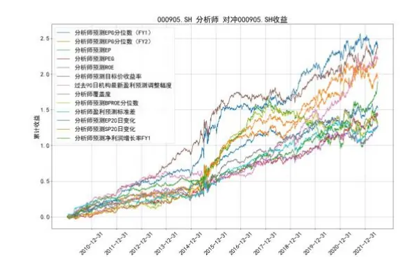
数据来源：Wind，朝阳永续，国泰君安证券研究测试区间：2010.01-2022.07。

图 16：中证 500 股票池 分析师因子 组合优化超额收益曲线
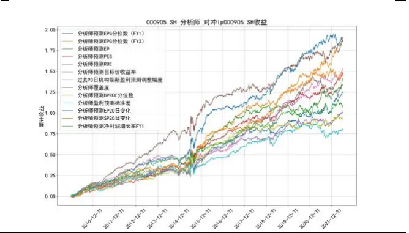
数据来源：Wind，朝阳永续，国泰君安证券研究测试区间：2010.01-2022.07。

## 3）分析师复合因子绩效表现

中证 500 股票池内，分析师复合因子多头组年化超额收益 14.05%，超额最大回撤-7.88%，信息比率 1.98；空头组年化超额-10.06%，多空年化收益 24.11%。分析师复合因子组合优化的年化超额收益 11.63%，超额收益最大回撤-8.08%，信息比率 2.27，周度双边换手率 19.5%。等权合成的分析师复合因子多头组超额收益曲线、单因子组合优化超额收益曲线如下。

图 17：中证 500股票池 分析师复合因子 分组超额收益曲线
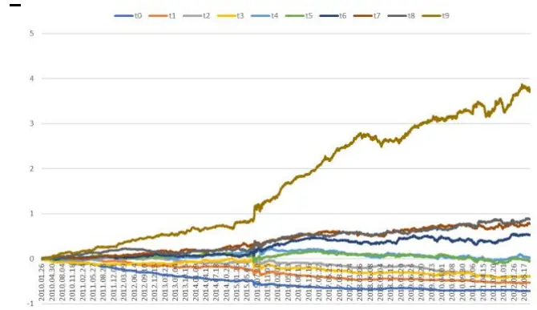
数据来源：Wind，朝阳永续，国泰君安证券研究测试区间：2010.01-2022.07。

图 18：中证 500 股票池 分析师复合因子组合优化收益曲线
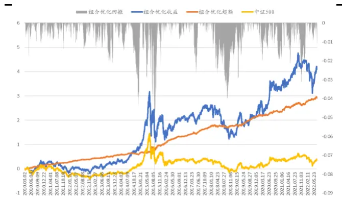
数据来源：Wind，朝阳永续，国泰君安证券研究测试区间：2010.01-2022.07。

## 2.5. 超预期（分析师）因子

我们基于朝阳永续分析师预测数据，计算分析师上下调比例、调整幅度等常用的超预期（分析师）因子。

## 1）超预期（分析师）因子列表

经过历史回测筛选，我们选择超预期（分析师）的 11 个因子用于中证500 内选股。超预期（分析师）因子的整体权重为 10%，每个单因子权重为 0.91%。具体指标和计算方法如下表：

表 21：中证 500股票池 超预期（分析师）因子列表

| 因子名 | 方向 | 计算方法 | 因子权 重 |
| --- | --- | --- | --- |
| 90日盈利上调占比 | 越大越好 | 过去90日（低于最新盈利预测报告数-高于最新盈利预测报告数）/总报告数 | 0.9091% |
| 180日盈利上调占比 | 越大越好 | 过去180日（低于最新盈利预测报告数-高于最新盈利预测报告数）/总报告数 | 0.9091% |
| 过去120天盈利调整 | 越大越好 | 过去120天分析师预测的净利润上调幅度平均值 | 0.9091% |
| 过去60天盈利调整 | 越大越好 | 过去60天分析师预测的净利润上调幅度平均值 | 0.9091% |
| 过去120天营收调整 | 越大越好 | 过去120天分析师预测的营业收入上调幅度平均值 | 0.9091% |
| 过去60天营收调整 | 越大越好 | 过去60天分析师预测的营业收入上调幅度平均值 | 0.9091% |
| 单季度归母净利润超分析师预期幅度越大越好 |  | (单季度公告净利润-分析师预期单季度净利润）/abs(分析师预期单季度净利 | 0.9091% |
| 过去90日报告上调-下调比例 | 越大越好 | 润) 过去90日（上调报告数-下调报告数）/总报告数 | 0.9091% |
| 过去90日公告后报告上调-下调比例 | 越大越好 | 过去90日公告后（上调报告数-下调报告数）/总报告数 | 0.9091% |
| 过去90日报告上调比例 | 越大越好 | 过去90日上调报告数/总报告数 | 0.9091% |
| 过去90日公告后报告上调比例 | 越大越好 | 过去90日公告后上调报告数/总报告数 | 0.9091% |

数据来源：国泰君安证券研究

中证 500 成分股内，超预期（分析师）因子相关系数的平均值和因子 IC的相关系数如下。

表 22：中证 500内 超预期（分析师）因子相关系数的平均值

| 超预期（分析师）因子相关系数平均值 | 180日盈 利上调占 比 | 90日盈利 上调占比 | 单季度归 母净利润 超分析师 整 预期幅度 | 过去120 天营收调 | 过去120 天盈利调 整 | 过去60天 营收调整 | 过去60天 盈利调整 | 过去90日 报告上调 -下调比 | 过去90日 报告上调 比例 | 过去90日 公告后报 告上调- | 过去90日 公告后报 告上调比 |
| --- | --- | --- | --- | --- | --- | --- | --- | --- | --- | --- | --- |
| 180日盈利上调占比 | 1.00 | 0.81 | 0.24 | 0.22 | 0.44 | 0.19 | 例 0.42 | 0.40 | 0.35 | 下调比例 例 0.25 | 0.23 |
| 90日盈利上调占比 | 0.81 | 1.00 | 0.26 | 0.26 | 0.52 | 0.21 | 0.46 | 0.44 | 0.38 | 0.27 | 0.24 |
| 单季度归母净利润超分析师预期幅度 | 0.24 | 0.26 | 1.00 | 0.11 | 0.26 | 0.09 | 0.24 | 0.19 | 0.18 | 0.14 | 0.13 |
| 过去120天营收调整 | 0.22 | 0.26 | 0.11 | 1.00 | 0.33 | 0.66 | 0.27 | 0.24 | 0.20 | 0.17 | 0.14 |
| 过去120天盈利调整 | 0.44 | 0.52 | 0.26 | 0.33 | 1.00 | 0.23 | 0.71 | 0.38 | 0.34 | 0.23 | 0.20 |
| 过去60天营收调整 | 0.19 | 0.21 | 0.09 | 0.66 | 0.23 | 1.00 | 0.31 | 0.24 | 0.20 | 0.18 | 0.15 |
| 过去60天盈利调整 | 0.42 | 0.46 | 0.24 | 0.27 | 0.71 | 0.31 | 1.00 | 0.41 | 0.36 | 0.25 | 0.22 |
| 过去90日报告上调-下调比例 | 0.40 | 0.44 | 0.19 | 0.24 | 0.38 | 0.24 | 0.41 | 1.00 | 0.82 | 0.51 | 0.43 |
| 过去90日报告上调比例 | 0.35 | 0.38 | 0.18 | 0.20 | 0.34 | 0.20 | 0.36 | 0.82 | 1.00 | 0.43 | 0.47 |
| 过去90日公告后报告上调-下调比例 | 0.25 | 0.27 | 0.14 | 0.17 | 0.23 | 0.18 | 0.25 | 0.51 | 0.43 | 1.00 | 0.83 |
| 过去90日公告后报告上调比例 | 0.23 | 0.24 | 0.13 | 0.14 | 0.20 | 0.15 | 0.22 | 0.43 | 0.47 | 0.83 | 1.00 |

数据来源：Wind，朝阳永续，国泰君安证券研究

表 23：中证 500内 超预期（分析师）因子 IC 的相关系数

| 超预期（分析师）因子 | 180日盈利90日盈利 上调占比 | 上调占比 | 单季度归 母净利润 超分析师 预期幅度 | 过去120天 营收调整 | 过去120天 盈利调整 | 过去60天 营收调整 | 过去60天 盈利调整 | 过去90日 报告上调- 下调比例 | 过去90日 报告上调 比例 | 过去90日 公告后报 告上调-下 | 过去90日 公告后报 告上调比 |
| --- | --- | --- | --- | --- | --- | --- | --- | --- | --- | --- | --- |
| 180日盈利上调占比 | 1.00 | 0.88 | 0.41 | 0.28 | 0.60 | 0.30 | 0.58 | 0.55 | 0.52 | 调比例 例 0.36 | 0.33 |
| 90日盈利上调占比 | 0.88 | 1.00 | 0.42 | 0.31 | 0.67 | 0.30 | 0.62 | 0.55 | 0.53 | 0.40 | 0.35 |
| 单季度归母净利润超分析师预期幅度 | 0.41 | 0.42 | 1.00 | 0.18 | 0.44 | 0.19 | 0.43 | 0.36 | 0.34 | 0.26 | 0.25 |
| 过去120天营收调整 | 0.28 | 0.31 | 0.18 | 1.00 | 0.43 | 0.70 | 0.37 | 0.32 | 0.28 | 0.23 | 0.20 |
| 过去120天盈利调整 | 0.60 | 0.67 | 0.44 | 0.43 | 1.00 | 0.39 | 0.78 | 0.55 | 0.51 | 0.38 | 0.36 |
| 过去60天营收调整 | 0.30 | 0.30 | 0.19 | 0.70 | 0.39 | 1.00 | 0.43 | 0.37 | 0.30 | 0.32 | 0.27 |
| 过去60天盈利调整 | 0.58 | 0.62 | 0.43 | 0.37 | 0.78 | 0.43 | 1.00 | 0.55 | 0.50 | 0.42 | 0.39 |
| 过去90日报告上调-下调比例 | 0.55 | 0.55 | 0.36 | 0.32 | 0.55 | 0.37 | 0.55 | 1.00 | 0.83 | 0.60 | 0.51 |
| 过去90日报告上调比例 | 0.52 | 0.53 | 0.34 | 0.28 | 0.51 | 0.30 | 0.50 | 0.83 | 1.00 | 0.53 | 0.57 |
| 过去90日公告后报告上调-下调比例 | 0.36 | 0.40 | 0.26 | 0.23 | 0.38 | 0.32 | 0.42 | 0.60 | 0.53 | 1.00 | 0.84 |
| 过去90日公告后报告上调比例 | 0.33 | 0.35 | 0.25 | 0.20 | 0.36 | 0.27 | 0.39 | 0.51 | 0.57 | 0.84 | 1.00 |

数据来源： ，朝阳永续，国泰君安证券研究

## 2）超预期（分析师）单因子测试结果

超预期（分析师）因子的分组测试具体结果和单因子组合优化的绩效指标如下。单因子组合优化下，超额收益为 7%-10%，最大回撤为-8~-12%，信息比率为 1.5-1.9。

表 24：中证 500股票池 超预期（分析师）因子 主要绩效指标

|  |  |  | 多头组 |  |  |  |  |  | 单因子组合优化 |  |  |  |  |  |  |  |  | 组合优化 |
| --- | --- | --- | --- | --- | --- | --- | --- | --- | --- | --- | --- | --- | --- | --- | --- | --- | --- | --- |
| 超预期（分析师）因子 | 空头组超额收益 |  | 超额收益 |  | 超额收益超 | 额收益超 | 额收益 | 多空收 |  |  | 超额收益超 |  | 额收益 | 超额收益 |  |  |  |  |
|  |  |  |  |  | 最大回撤 | 波动率 | 信息比率 | 益 | 超额收益 |  | 最大回撤 |  | 波动率 | 信息比率 |  |  |  |  |
|  |  |  |  |  |  |  |  |  |  |  |  |  |  |  | IC | RankIC |  | 周度双边换手率 |
| 180日盈利上调占比 | -0.5 | 58% | 9.8 | 3% | 8.82% | 6.31% | 1.56 | 10.41% |  | 818% | -102 | 5% | 4.79% | 1.71 | 185% |  | 190% | 27.01% |
| 90日盈利上调占比 | -3. | 2% | 9.5 | 0% | -8.05% | 6.29% | 1.51 | 12.92% |  | 945% | -7 | 89% | 4.80% | 1.97 | 197% |  | 211% | 16.14% |
| 单季度归母净利润超分析师预期幅度 | -4E | 4% | 11.6 | 8% | 10% | 6.44% | 1.81 | 16.52% |  | 826% | -9 | 21% | 4.79% | 1.72 | 182% |  | 246% | 12.28% |
| 过去120天盈利调整 | -49 | 0% | 11.2 | 8% | 区83% | 7.03% | 1.60 | 16.18% | 883% |  | -7 | 44% | 4.75% | 1.86 | 173% | 214% |  | 16.15% |
| 过去120天营收调整 | -5 | 6% | 6.8 | 6% | 匯5% | 6.13% | 1.12 | 12.03% | 714% |  | -9 | 36% | 4.75% | 1.50 | 139% | 1,49% |  | 16.44% |
| 过去60天盈利调整 | -48 | 4% | 10.3 | 6% | D6% | 6.90% | 1.50 | 15.19% |  | 947% | -11 | 86% | 4.87% | 1.94 | 175% |  | 219% | 22.23% |
| 过去60天营收调整 | -47 | % | 8.9 | 1% | 2.21% | 6.26% | 1.42 | 13.18% |  | 784% | -10 | 36% | 5.07% | 1.55 | 123% |  | 121% | 25.51% |
| 过去90日报告上调比例 | -0. | 8% | 11.8 | 4% | 3.3% | 6.69% | 1.77 | 12.52% |  | 914% | -8 | 98% | 4.99% | 1.83 | 167% | 1.93% |  | 21.52% |
| 过去90日报告上调-下调比例 | -2.8 | 9% | 10.7 | 5% | -54% | 6.50% | 1.65 | 1364% |  | 923% | -10 | 27% | 5.00% | 1.85 | 160% | 175% |  | 21.36% |
| 过去90日公告后报告上调比例 | 1.6 | 6% | 15.2 | 0% | -8229% | 6.90% | 2.20 | 13.55% | 10 | 14% | -10 | 67% | 5.62% | 1.81 | 144% |  | 165% | 28.73% |
| 过去90日公告后报告上调-下调比例 | 0.4 | 5% | 14. | 77% | 17% | 7.03% | 2.10 | 1432% |  | 990% | -11 | 95% | 5.68% | 1.74 | 139% | 12 | 9% | 27.86% |

数据来源：Wind，朝阳永续，国泰君安证券研究。测试区间：2010.01-2022.07。

表 25：中证 500股票池 超预期（分析师）因子 分组年化超额收益

|  | 分组年化超额收益 |  |  |  |  |  |  |  |  |  |  |  |  |  |  |  |  |  |  |  |  |
| --- | --- | --- | --- | --- | --- | --- | --- | --- | --- | --- | --- | --- | --- | --- | --- | --- | --- | --- | --- | --- | --- |
| 超预期（分析师）因子 | t0 t1 |  |  |  | t2 |  | t3 |  | t4 |  | t5 |  | t6 t7 |  |  |  | t8 |  | t9 |  | 多空收益 |
| 180日盈利上调占比 |  | -0.58% |  | -5.07% | 口 | -2.54% | L | -2.01% | -1 | .63% |  | 0.59% |  | 0.86% |  | 6.03% |  | 8.81% |  | 9.83% | 10.41% |
| 90日盈利上调占比 | 「 | -3.42% |  | -5.43% | 1 | -1.90% | 口 | -2.48% |  | 0.54% |  | -0.32% |  | 3.12% |  | 5.97% |  | 8.74% |  | 9.50% | 12.92% |
| 单季度归母净利润超分析师预期幅度 |  | -4.84% |  | -1.10% |  | -5.16% | L | -1.60% |  | -0.26% | -1 | .52% |  | 3.51% |  | 5.79% |  | 8.11% |  | 11.68% | 16.52% |
| 过去120天盈利调整 |  | -4.90% |  | -4.47% | C | -1.55% |  | 1.68% |  | -0.21% |  | -0.24% |  | 1.28% |  | 3.41% |  | 7.95%5%% |  | 11.28% | 16.18% |
| 过去120天营收调整 |  | -5.16% |  | -0.91% |  | 0.21% |  | -0.54% | L | -1.43% |  | 2.39% |  | 0.18% |  | 3.03% |  | 9.30% |  | 6.86% | 12.03% |
| 过去60天盈利调整 |  | -4.84% | 0 | -1.86% | 「 | -3.29% | D | -1.48% | -2 | .42% |  | 0.73% |  | 2.48% |  | 4.65% |  | 10.04% |  | 10.36% | 15.19% |
| 过去60天营收调整 |  | -4.27% |  | 1.81% |  | 0.84% |  | -0.47% |  | -0.73% |  | 0.70% | I | -1.94% |  | 2.60% | 6.09% | 09% |  | 8.91% | 13.18% |
| 过去90日报告上调比例 |  | -0.68% |  | -0.03% |  | -5.03% | 口 | -3.70% | 0 | -2.27% | - | 2.59% |  | 2.48% |  | 6.96% |  | 7.31% |  | 11.84% | 12.52% |
| 过去90日报告上调-下调比例 | -2 | .89% |  | 1.25% | D | -1.89% | -3 | .08% | 1- | 2.31% | 「 | -2.76% | - | 0.36% |  | 5.26% |  | 10.25% |  | 10.75% | 13.64% |
| 过去90日公告后报告上调比例 |  | 1.66% | I | -1.70% |  | -6.28% | -3 | .27% |  | -0.80% |  | 0.65% |  | 0.00% |  | 2.74% | 576% | 6% |  | 15.20% | 13.55% |
| 过去90日公告后报告上调-下调比例 |  | 0.45% |  | -0.23% |  | -2.58% | 0 | -2.35% |  | -0.09% |  | -0.76% |  | 1.12% | 「 | -1.69% |  | 4.98% |  | 14.77% | 14.32% |

数据来源：Wind，朝阳永续，国泰君安证券研究。测试区间：2010.01-2022.07。

中证 500 股票池内，11 个超预期（分析师）因子多头组超额收益曲线、单因子组合优化超额收益曲线如下。

数据来源：Wind，国泰君安证券研究测试区间：2010.01-2022.07。

数据来源：Wind，朝阳永续，国泰君安证券研究测试区间：2010.01-2022.07。

图 19：中证 500股票池 超预期（分析师）因子多头组超额收益曲线
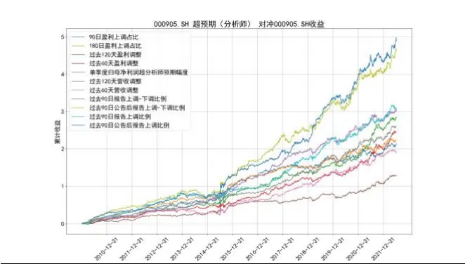

图 20：中证 500股票池 超预期（分析师）因子组合优化超额收益曲线
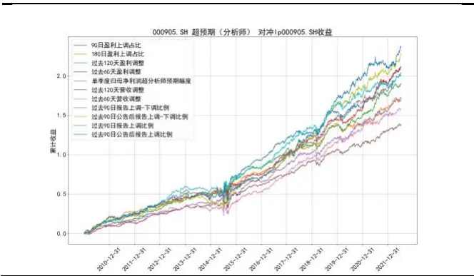
数据来源：Wind，朝阳永续，国泰君安证券研究
测试区间：2010.01-2022.07。

## 3）超预期衍生（分析师）复合因子绩效表现

中证 500 股票池内，超预期（分析师）复合因子多头组年化超额收益16.03%，超额最大回撤-8.71%，信息比率 2.53；空头组年化超额-6.57%，多空年化收益 22.6%。超预期（分析师）复合因子组合优化的年化超额收益 12.18%，超额收益最大回撤-8.51%，信息比率 2.51，周度双边换手率 16.17%。等权合成的超预期衍生（分析师）复合因子多头组超额收益曲线、单因子组合优化超额收益曲线如下。

图 21：中证 500股票池 超预期（分析师）复合因子分组超额收益曲线
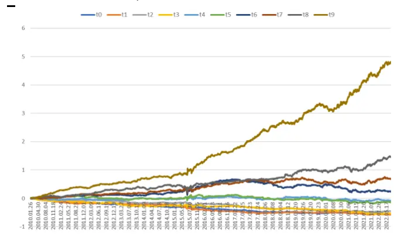

图 22：中证 500 股票池 超预期（分析师）复合因子组合优化收益曲线
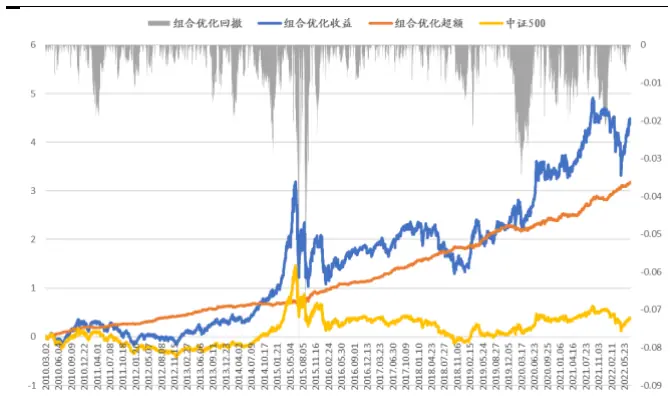
数据来源：Wind，国泰君安证券研究
测试区间：2010.01-2022.07。

## 2.6. 总量因子

我们把净利润、前三高管薪酬等指标划分为总量因子。这类因子必须先做对数化处理，然后进行市值行业中性化处理，将回归残差作为因子进行选股。总量类因子的投资逻辑是，同等的市值和同样行业的情况下，残差越大，个股的财务状况越好，预期收益越高。

## 1）总量因子列表

经过历史回测筛选，我们选择总量的 5 个因子用于中证 500 内选股。总量因子的整体权重为 5%，每个单因子权重为 1%。具体指标和计算方法如下表：

表 26：中证 500股票池 总量因子列表

| 因子名 | 方向 | 计算方法 | 因子权重 |
| --- | --- | --- | --- |
| 单季度毛利润 | 越大越好 | 单季度毛利润 | 1.0000% |
| 单季度扣非净利润 | 越大越好 | 单季度扣非净利润 | 1.0000% |
| 单季度归母净利润 | 越大越好 | 单季度归母净利润 | 1.0000% |
| 单季度营业利润 | 越大越好 | 单季度营业利润 | 1.0000% |
| 前三高管薪酬 | 越大越好 | 前三高管薪酬之和 | 1.0000% |

数据来源：国泰君安证券研究

中证 500 成分股内，总量因子相关系数的平均值和因子 IC 的相关系数如下。其中，前三高管薪酬和净利润的相关性均较低。

表 27：中证 500内 总量因子相关系数的平均值

| 总量因子相关系数平均值 | 单季度归母净利润 | 单季度扣非净利润 | 单季度毛利润 | 单季度营业利润同比增长率 | 前三高管薪酬 |
| --- | --- | --- | --- | --- | --- |
| 单季度归母净利润 | 1.00 | 0.63 | 0.35 | 0.69 | 0.10 |
| 单季度扣非净利润 | 0.63 | 1.00 | 0.38 | 0.72 | 0.08 |
| 单季度毛利润 | 0.35 | 0.38 | 1.00 | 0.43 | 0.19 |
| 单季度营业利润 | 0.69 0.72 |  | 0.43 | 1.00 | 0.11 |
| 前三高管薪酬 | 0.10 0.08 |  | 0.19 0.11 |  | 1.00 |

数据来源：Wind，国泰君安证券研究

表 28：中证 500内 总量因子 IC的相关系数

| 总量因子IC的相关系数 | 单季度归母净利润 | 单季度扣非净利润 | 单季度毛利润 | 单季度营业利润同比增长率 | 前三高管薪酬 |
| --- | --- | --- | --- | --- | --- |
| 单季度归母净利润 | 1.00 | 0.83 | 0.67 | 0.85 | 0.32 |
| 单季度扣非净利润 | 0.83 | 1.00 | 0.71 | 0.87 | 0.290.29 |
| 单季度毛利润 | 0.67 | 0.71 | 1.00 | 0.74 |  |
| 单季度营业利润 | 0.85 | 0.87 | 0.74 | 1.00 | 0.29 |
| 前三高管薪酬 | 0.32 0.29 0.29 0.29 |  |  |  | 1.00 |

数据来源：Wind，国泰君安证券研究

## 2）总量单因子测试结果

总量因子的分组测试具体结果和单因子组合优化的绩效指标如下。单因子组合优化下，超额收益为 3%-9%，最大回撤为-7~-10%，信息比率为0.7-1.8。

表 29：中证 500股票池 总量因子 主要绩效指标

|  |  |  | 多头组 |  |  |  |  | 单因子组合优化 |  |  |  |  |  |  |  |  | 组合优化 |
| --- | --- | --- | --- | --- | --- | --- | --- | --- | --- | --- | --- | --- | --- | --- | --- | --- | --- |
| 总量因子 | 空头组超额收益 |  | 超额收益 |  | 超额收益超额收益最大回撤波动率 | 超额收益信息比率 | 多空收益 | 超额收益超额收益超额收益最大回撤波动率 |  |  |  | 超额收益信息比率 | IC |  | RankIC |  | 周度双边换手率 |
| 单季度归母净利润 | -6.28% |  | 10. | 7% | -113% 7.36% | 1.40 | 16.55% | 9 | 915% 765% |  | 5.09% | 1.80 |  | 98% | 29 | 2% | 13.37% |
| 单季度扣非净利润单季度毛利润 | -5 | 1% | 9.8 | 6% | -10.84% 7.43% | 1.33 | 15.16% | 86 | 6% 7 | 70% | 5.16% | 1.68 |  | 170% | 27 | 6% | 12.25% |
|  | -8. | 7% | 8.0 | 9% | 1Z0% 7.68% | 1.05 | 16.25% | 6 | 685% -8 | 15% | 5.14% | 1.33 |  | 168% |  | 54% | 10.00% |
| 单季度营业利润前三高管薪酬 | -61 | 1% | 9. | 2% | 1655% 7.24% | 1.26 | 15.23% | 8 | 809% 日27% |  | 5.17% | 1.56 |  | 183% | 28 | 0% | 12.34% |
|  | -32 | 4% | 2.9 | 9% | -10.4% 6.30% | 0.47 | 6.23% |  | 321%-1068% |  | 4.52% | 0.71 | 085% |  |  | 103% | 6.69% |

数据来源：Wind，国泰君安证券研究。测试区间：2010.01-2022.07。

表 30：中证 500股票池 总量因子 分组年化超额收益

|  | 分组年化超额收益 |  |  |  |  |  |  |  |  |  |  |  |  |  |  |  |  |
| --- | --- | --- | --- | --- | --- | --- | --- | --- | --- | --- | --- | --- | --- | --- | --- | --- | --- |
| 总量因子 | t0 t1 t2 t3 |  |  |  |  | t4 |  | t5 t6 t7 t8 |  |  |  |  |  | t9 |  |  | 多空收益 |
| 单季度归母净利润 | 5.28% | F | 3.32% | 3. | 60% | 10.79% | -0 | .10% | 2 | .58% |  | 2.98% | 4.10% | 8.62% | 10 | .27% | 16.55% |
| 单季度扣非净利润 | 5.31% | 「 | b.69% |  | 11.04% | .89% |  | 36% | 0 | .96% | 5 | .13% | 5.27% | 6.30% |  | 9.86% | 15.16% |
| 单季度毛利润 | 8.17% |  | 11.66% | -0 | .26% | 0.60% |  | 18% |  | 13% |  | 1.65% | 5.09% | 4.33% |  | 3.09% | 16.25% |
| 单季度营业利润前三高管薪酬 | 5.11% | D | 3.46% |  | 日1.84% | 1.20% | 0 | .72% |  | 3.62% |  | 249% | 241% | 8.52% |  | 9.12% | 15.23% |
|  | 3.24% |  | 0.03% |  | 0.73% 2. | 43% | 2 | .22% | 2 | .57% | 5 | .27% | 2.33% | 3.35% |  | 2.99% | 6.23% |

数据来源：Wind，国泰君安证券研究。测试区间：2010.01-2022.07。

中证 500 股票池内，5 个总量因子的多头组超额收益和单因子组合优化

超额收益曲线如下。从收益去选可以看出 19 年以前，该类因子整体效果不错，超额收益显著；19 年以来超额收益波动变大，选股能力减弱。

图 23：中证 500股票池 总量因子 多头组超额收益曲线
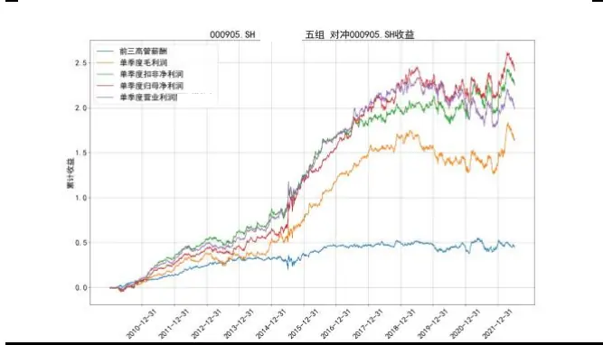
数据来源：Wind，国泰君安证券研究测试区间：2010.01-2022.07。

图 24：中证 500 股票池 总量因子 组合优化超额收益曲线
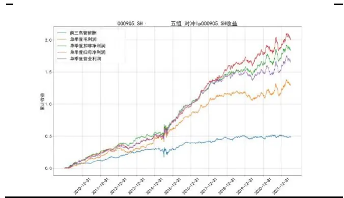
数据来源：Wind，国泰君安证券研究
测试区间：2010.01-2022.07。

## 3）总量复合因子绩效表现

中证 500 股票池内，总量复合因子多头组年化超额收益 11.2%，超额最大回撤-14.98%，信息比率 1.57；空头组年化超额-8.8%，多空年化收益20%。总量复合因子组合优化的年化超额收益 8.57%，超额收益最大回撤-8.3%，信息比率 1.66，周度双边换手率 10.48%。等权合成的北上资金因子多头组超额收益曲线、单因子组合优化超额收益曲线如下。

图 25：中证 500股票池 总量复合因子 分组超额收益曲线
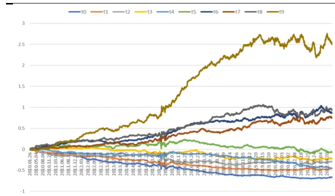
数据来源：Wind，国泰君安证券研究测试区间：2010.01-2022.07。

图 26：中证 500 股票池 总量复合因子组合优化收益曲线
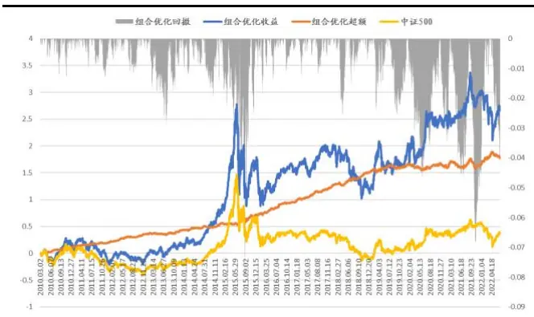
数据来源：Wind，国泰君安证券研究测试区间：2010.01-2022.07。

## 2.7. 估值因子

我们不仅计算常用的估值因子市盈率倒数、市净率倒数、股息率等，还计算估值的变化、估值在历史时间序列中的分位数等因子衡量股票的估值水平。

## 1）估值因子列表

经过历史回测筛选，我们选择估值的 13 个因子用于中证 500 内选股。估值因子的整体权重为 10%，每个单因子权重为 0.77%。具体指标和计算方法如下表：

表 31：中证 500股票池 估值因子列表

| 因子名 | 方向 | 计算方法 | 因子权重 |
| --- | --- | --- | --- |
| PCF 倒数 | 越大越好 | 经营现金流 TTM/总市值 | 0.7692% |
| 市盈率（扣非）倒数 | 越大越好 | 单季度扣非净利润/总市值 | 0.7692% |
| 市净率倒数 | 越大越好 | 股东权益/总市值 | 0.7692% |
| 市盈率（归母）倒数 | 越大越好 | 单季度归母净利润/总市值 | 0.7692% |
| BPROE分位数 | 越大越好 | BP 分位数+ROE 分位数 | 0.7692% |
| EPG 分位数 | 越大越好 | EP 分位数+g分位数 | 0.7692% |
| 单季度EP（营业利润）倒数 | 越大越好 | 单季度营业利润/总市值 | 0.7692% |
| 单季度 SP 倒数 | 越大越好 | 单季度营业收入/总市值 | 0.7692% |
| 股息率 | 越大越好 | 股息/总市值 | 0.7692% |
| EBIT2EV | 越大越好 | EBIT 除以企业价值 EV | 0.7692% |
| EP60日变化 | 越大越好 | EP 减去 60 日前的 EP | 0.7692% |
| EP120 日 score | 越大越好 | EP 在 120 日历史数据上的 score | 0.7692% |
| EP120日分位数 | 越大越好 | EP在过去120日的时序分位数 | 0.7692% |

数据来源：国泰君安证券研究

中证 500 成分股内，估值因子相关系数的平均值和因子 IC 的相关系数如下。

表 32：中证 500内 估值因子相关系数的平均值

| 估值因子相关系数平均值 | BPROE分 位数 | EBIT2EV | EP120日 score | EP120日 分位数 | EP60日变 化 | EPG分位 数 | PCF倒数 | 单季度EP (营业利 | 单季度SP |  | 股息率 数 | 市净率倒 市盈率 倒数 | (归母) | 市盈率 (扣非) 倒数 |
| --- | --- | --- | --- | --- | --- | --- | --- | --- | --- | --- | --- | --- | --- | --- |
|  |  |  |  |  |  |  |  |  | 润）倒数 | 倒数 |  |  |  |  |
| BPROE分位数 | 1.00 | 0.53 | 0.25 | 0.23 |  | 0.26 | 0.69 | 0.22 | 0.66 | 0.33 | 0.39 | 0.48 | 0.81 | 0.62 |
| EBIT2EV | 0.53 | 1.00 | 0.12 | 0.12 | 0.14 |  | 0.30 | 0.28 | 0.58 | 0.38 | 0.42 | 0.33 | 0.51 | 0.53 |
| EP120日 score | 0.25 | 0.12 | 1.00 | 0.92 |  | 0.73 | 0.50 | 0.05 | 0.23 | 0.03 | 0.02 | 0.00 | 0.32 | 0.21 |
| EP120日分位数 | 0.23 | 0.12 | 0.92 | 1.00 |  | 0.70 | 0.47 | 0.05 | 0.22 | 0.03 | 0.02 | 0.00 | 0.30 | 0.20 |
| EP60日变化 | 0.26 | 0.14 | 0.73 | 0.70 |  | 1.00 | 0.49 | 0.06 | 0.29 | 0.04 | 0.02 | 0.00 | 0.39 | 0.25 |
| EPG分位数 | 0.69 | 0.30 | 0.50 | 0.47 |  | 0.49 | 1.00 | 0.12 | 0.59 | 0.12 | 0.17 | 0.05 | 0.77 | 0.55 |
| PCF倒数 | 0.22 | 0.28 | 0.05 | 0.05 |  | 0.06 | 0.12 | 1.00 | 0.23 | 0.21 | 0.18 | 0.20 | 0.18 | 0.21 |
| 单季度EP（营业利润）倒数 | 0.66 | 0.58 | 0.23 | 0.22 |  | 0.29 | 0.59 | 0.23 | 1.00 | 0.27 | 0.36 | 0.19 | 0.78 | 0.84 |
| 单季度SP倒数 | 0.33 | 0.38 | 0.03 | 0.03 |  | 0.04 | 0.12 | 0.21 | 0.27 | 1.00 | 0.10 | 0.44 | 0.20 | 0.19 |
| 股息率 | 0.39 | 0.42 | 0.02 | 0.02 |  | 0.02 | 0.17 | 0.18 | 0.36 | 0.10 | 1.00 | 0.24 | 0.35 | 0.37 |
| 市净率倒数 | 0.48 | 0.33 | 0.00 |  | 0.00 | 0.00 | 0.05 | 0.20 | 0.19 | 0.44 | 0.24 | 1.00 | 0.16 | 0.13 |
| 市盈率（归母）倒数 | 0.81 | 0.51 | 0.32 | 0.30 |  | 0.39 | 0.77 | 0.18 | 0.78 | 0.20 | 0.35 | 0.16 | 1.00 | 0.75 |
| 市盈率（扣非）倒数 | 0.62 | 0.53 | 0.21 | 0.20 |  | 0.25 | 0.55 | 0.21 | 0.84 | 0.19 | 0.37 | 0.13 | 0.75 | 1.00 |

数据来源：Wind，国泰君安证券研究

表 33：中证 500内 估值因子 IC的相关系数

| 估值因子 | BPROE分位数 | EBIT2EV | EP120日score | EP120日 | EP60日变化 | EPG分位数 | PCF倒数 | 单季度EP(营业利润）倒数 | 单季度SP倒数 | 股息率 | 市净率倒数 | 市盈率(归母)倒数 | 市盈率(扣非)倒数 |
| --- | --- | --- | --- | --- | --- | --- | --- | --- | --- | --- | --- | --- | --- |
|  |  |  |  | 分位数 |  |  |  |  |  |  |  |  |  |
| BPROE分位数 | 1.00 | 0.80 | 0.21 0.19 |  | 0.26 | 0.73 | 0.58 | 0.83 | 0.60 | 0.71 | 0.68 | 0.87 | 0.79 |
| EBIT2EV | 0.80 | 1.00 | 0.17 | 0.15 | 0.20 | 0.51 | 0.58 | 0.78 | 0.62 | 0.70 | 0.63 | 0.72 | 0.74 |
| EP120日 score | 0.21 | 0.17 | 1.00 | 0.95 | 0.79 | 0.38 | 0.03 | 0.26 | 0.01 | 0.08 | 0.00 | 0.31 | 0.23 |
| EP120日分位数 | 0.19 | 0.15 | 0.95 | 1.00 | 0.76 | 0.36 | 0.01 | 0.25 | -0.03 | 0.07 | -0.03 | 0.29 | 0.23 |
| EP60日变化 | 0.26 | 0.20 | 0.79 | 0.76 | 1.00 | 0.45 | 0.10 | 0.34 | 0.08 | 0.15 | 0.04 | 0.40 | 0.31 |
| EPG分位数 | 0.73 | 0.51 | 0.38 | 0.36 | 0.45 | 1.00 | 0.35 | 0.76 | 0.23 | 0.46 | 0.14 | 0.86 | 0.75 |
| PCF倒数 | 0.58 | 0.58 | 0.03 | 0.01 | 0.10 | 0.35 | 1.00 | 0.53 | 0.53 | 0.53 | 0.52 | 0.48 | 0.51 |
| 单季度EP（营业利润）倒数 | 0.83 | 0.78 | 0.26 | 0.25 | 0.34 | 0.76 | 0.53 | 1.00 | 0.45 | 0.66 | 0.41 | 0.91 | 0.94 |
| 单季度SP倒数 | 0.60 | 0.62 | 0.01 | -0.03 | 0.08 | 0.23 | 0.53 | 0.45 | 1.00 | 0.39 | 0.75 | 0.40 | 0.37 |
| 股息率 | 0.71 | 0.70 | 0.08 | 0.07 | 0.15 | 0.46 | 0.53 | 0.66 | 0.39 | 1.00 | 0.49 | 0.65 | 0.66 |
| 市净率倒数 | 0.68 | 0.63 | 0.00 | -0.03 | 0.04 | 0.14 | 0.52 | 0.41 | 0.75 | 0.49 | 1.00 | 0.38 | 0.34 |
| 市盈率（归母）倒数 | 0.87 | 0.72 | 0.31 | 0.29 | 0.40 | 0.86 | 0.48 | 0.91 | 0.40 | 0.65 | 0.38 | 1.00 | 0.89 |
| 市盈率（扣非）倒数 | 0.79 | 0.74 | 0.23 | 0.23 | 0.31 | 0.75 | 0.51 | 0.94 | 0.37 | 0.66 | 0.34 | 0.89 | 1.00 |

数据来源：Wind，国泰君安证券研究

## 2）估值单因子测试结果

估值因子的分组测试具体结果和单因子组合优化的绩效指标如下。单因子组合优化下，超额收益为 3%-12%，最大回撤为-7~-14%，信息比率为0.5-2.5。传统估值因子（市盈率倒数、市净率倒数等）的表现近三年表现不佳，估值变化类（BPROE 分位数、EPG 分位数、EP120 日分位数）

的因子效果较好。

表 34：中证 500股票池 估值因子 主要绩效指标

|  |  |  | 多头组 |  |  |  |  |  |  | 单因子组合优化 |  |  |  |  |  |  |  |  |  | 组合优化 |
| --- | --- | --- | --- | --- | --- | --- | --- | --- | --- | --- | --- | --- | --- | --- | --- | --- | --- | --- | --- | --- |
| 估值因子 | 空头组超额收益 |  | 超额收益 |  | 超额收益超 |  | 额收益超 | 额收益多 | 空收 |  | 超额收益超 |  |  | 额收益超 | 额收益 | IC |  | RankIC |  | 周度双边 |
|  |  |  |  |  | 最大回撤 |  | 波动率 | 信息比率 | 益 | 超额收益 | 最大回撤波 |  |  | 动率 | 信息比率 |  |  |  |  | 换手率 |
| BPROE分位数 | 1 | 1% | 11.2 | 8% | 22% |  | 7.58% | 1.49 | 22.39% | 928% | 7 |  | 89% | 5.29% | 1.75 | 263% |  | 4 | 405% | 12.89% |
| EBIT2EV | -6. | 1% | 4.3 | 2% | -278% |  | 9.06% | 0.48 | 10.73% | 385% | -14 |  | 32% | 5.24% | 0.74 | 127% |  | 2. | 72% | 9.68% |
| EP120日 score | 10.8 | 7% | 10.9 | 2% | D.63% |  | 7.39% | 1.48 | 21.79% | 964% |  | -7 | 97% | 5.30% | 1.82 | 314% |  |  | 460% | 27.76% |
| EP120日分位数 | 正 | 6% | 10.4 | 1% | 16% |  | 7.18% | 1.45 | 21.96%6 | 795% |  | -7 | 44% | 5.39% | 1.47 | 309% |  | 4 | 440% | 34.87% |
| EP60日变化 | -8. | 4% | 11. | 7% | B7% |  | 8.08% | 1.38 | 19.71% | 962% |  | -61 | 6% | 5.09% | 1.89 | 2.59% |  | 40 | 1% | 24.70% |
| EPG分位数 | -9 | 8% | 15.8 | 4% | -9.48% |  | 7.22% | 2.19 | 25.32% | 1217% | -69 |  | 2% | 4.81% | 2.53 | 337% |  |  | 437% | 13.92% |
| PCF倒数 | -34 | % | 5.1 | 0% | 18.6 | 9% | 9.29% | 0.55 | 8.84% | 463% | -8 |  | 62% | 4.94% | 0.94 | 107% |  |  | 187% | 9.51% |
| 单季度EP（营业利润）倒数 | -5.0 | 9% | 10.4 | 3% | -19. | 5% | 8.93% | 1.17 | 19.52% | 877% | -8 |  | 78% | 5.15% | 1.70 | 25 | 0% |  | 395% | 12.63% |
| 单季度SP倒数 | -2.8 | 6% | 5.1 | 0% | 151 | 6% | 7.83% | 0.65 | 7.96% | 343% | -9 |  | 36% | 5.03% | 0.68 | 08 | 4% |  | 136% | 9.43% |
| 股息率 | -39 | % | 7.0 | 0% | -23. | 3% | 8.40% | 0.83 | 10.78% | 550% | -8 |  | 09% | 4.96% | 1.11 | 123% |  |  | 249% | 8.41% |
| 市净率倒数 | -38 | % | 3.7 | 7% | -25.8 | 30% | 9.88% | 0.38 | 7.55% | 275% | -14 |  | 20% | 5.63% | 0.49 | 063% |  |  | 177% | 8.64% |
| 市盈率（归母）倒数 | -10.4 | 1% | 12.5 | 1% | -13.4 | 8% | 8.69% | 1.44 | 22.92% | 996% | -9 |  | 21% | 5.07% | 1.96 | 276% |  |  | 26% | 13.47% |
| 市盈率（扣非）倒数 | Z | 4% | 10.$ | 8% | 3 | 0% | 8.86% | 1.19 | 18.52% | 915% | 8 |  | 77% | 5.17% | 1.77 | 252% |  |  | 398% | 12.41% |

数据来源：Wind，国泰君安证券研究。测试区间：2010.01-2022.07。

表 35：中证 500股票池 估值因子 分组年化超额收益

|  | 分组年化超额收益 |  |  |  |  |  |  |  |  |  |  |  |  |  |  |  |  |  |  |  |  |
| --- | --- | --- | --- | --- | --- | --- | --- | --- | --- | --- | --- | --- | --- | --- | --- | --- | --- | --- | --- | --- | --- |
| 估值因子 | t0 |  | t1 |  | t2 |  | t3 |  | t4 t5 |  |  |  | t6 |  | t7 |  | t8 |  | t9 |  | 多空收益 |
| BPROE分位数 | 1.1 | 1% | D4.70% |  |  | 1.87% | 0 | .32% | 0 | .72% | 1 | .28% |  | 3.99% |  | 5.00% | 1 | 0.80% |  | 11.28% | 22.39% |
| EBIT2EV |  | 6.41% | 日2.38% |  | 1 | 1.35% |  | 0.80% | 2 | .09% | 1 | .35% |  | 5.20% |  | 4.75% |  | 5.07% |  | 4.32% | 10.73% |
| EP120日 score | -1 | 0.87% | -10.58% |  |  | 2.65% |  | 11.84% |  | 338% | 1 | .62% |  | 6.33% | 1 | 0.24% |  | 9.47% |  | 10.92% | 21.79% |
| EP120日分位数 | -1 | 1.56% | 18.16% |  | D | 5.28% |  | 0.09% |  | 2.23% |  | .29% |  | 8.67% |  | 9.59% |  | 6.48% |  | 10.41% | 21.96% |
| EP60日变化 |  | 8.54% | 7.64% |  | E | 3.26% | B | 2.17% | 0 | .79% | 2 | .64% | 6 | .94% |  | 7.60% |  | 9.20% |  | 11.17% | 19.71% |
| EPG分位数 |  | -9.48% | -10.74% |  | 口 | 5.46% | 1 | .15% | 1 | .48% | 0 | .85% |  | 5.94% |  | 6.94% | 1 | 2.24% |  | 15.84% | 25.32% |
| PCF倒数 | L | 3.74% | L2.75% |  | 0 | .62% |  | 0.05% | 2 | .65% |  | 2.27% |  | 292% |  | 3.55% |  | 362% |  | 5.10% | 8.84% |
| 单季度EP（营业利润）倒数 | 19 | .09% | D5.76% |  | B | 2.17% | 2 | .59% |  | 0.69% |  | .12% |  | 4.53% |  | 7.26% |  | 9.14% | 1 | 0.43% | 19.52% |
| 单季度SP倒数 | L | 2.86% | 11.29% |  |  | 0.48% |  | -0.20% |  | 320% | 0 | .23% | 2 | .12% |  | 2.23% |  | 420% |  | 5.10% | 7.96% |
| 股息率 | D | 3.79% | 1 | .51% | 0 | .68% |  | 0.11% | 0 | .42% | 1 | .60% |  | 0.81% |  | 5.01% |  | 7.00% |  | 7.00% | 10.78% |
| 市净率倒数 | L | 3.78% | 0 | .96% | 1 | .27% |  | 0.82% | 0 | .38% | 3 | .65% | 0 | .30% |  | 2.33% |  | 335% |  | 3177% | 7.55% |
| 市盈率（归母）倒数 | -10 | .41% | 口6.23% |  |  | 1.49% | 3 | .38% | 1 | .01% |  | 2.66% |  | 322% |  | 8.28% |  | 11.05% |  | 12.51% | 22.92% |
| 市盈率（扣非）倒数 | 7 | -7.94% | 6.54% |  | 1 | .86% | 2 | .99% | 0 | .51% | 1 | .84% |  | 4.24% |  | 6.19% | 11.67% |  | 1 | 0.58% | 18.52% |

数据来源：Wind，国泰君安证券研究。测试区间：2010.01-2022.07。

中证 500 股票池内，13 个估值因子多头组超额收益曲线、单因子组合优化超额收益曲线如下。

图 27：中证 500股票池 估值因子 多头组超额收益曲线
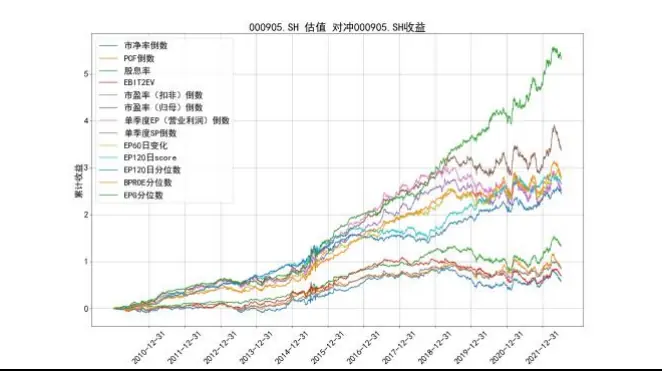
数据来源：Wind，国泰君安证券研究
测试区间：2010.01-2022.07。

图 28：中证 500 股票池 估值因子 组合优化 超额收益曲线
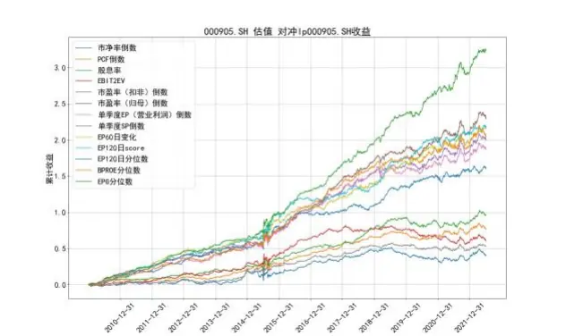
数据来源：Wind，国泰君安证券研究
测试区间：2010.01-2022.07。

## 3）估值复合因子绩效表现

中证 500 股票池内，估值复合因子多头组年化超额收益 13.85%，超额最大回撤-17.96%，信息比率 1.66；空头组年化超额-14.1%，多空年化收益27.94%。估值复合因子组合优化的年化超额收益 11.64%，超额收益最大回撤-7.39%，信息比率 2.12，周度双边换手率 14.48%。等权合成的超预期衍生（估值）复合因子多头组超额收益曲线、单因子组合优化超额收益曲线如下。

图 29：中证 500股票池 估值复合因子 分组超额收益曲线
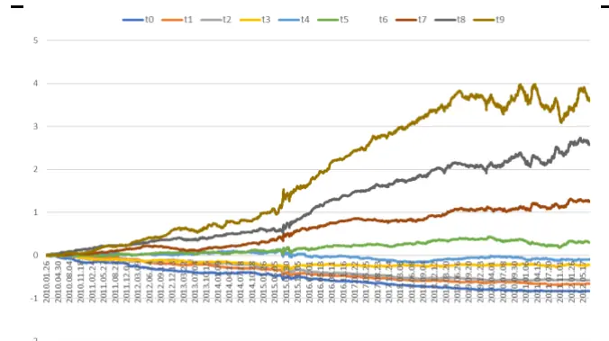
数据来源：Wind，国泰君安证券研究测试区间：2010.01-2022.07。

图 30：中证 500 股票池 估值复合因子组合优化收益曲线
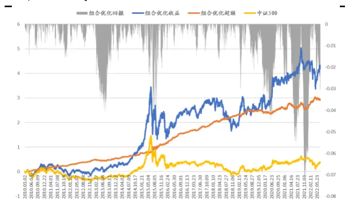
数据来源：Wind，国泰君安证券研究
测试区间：2010.01-2022.07。

## 2.8. 超预期衍生（估值）因子

我们使用市盈率倒数、市销率倒数等估值指标替换公式中的净利润，计算标准化预期外市盈率、标准化预期外市销率等超预期衍生（估值）因子，考察这些因子的选股效果。计算公式和方法与 SUE 因子相同。

## 1）超预期衍生（估值）因子列表

经过历史回测筛选，我们选择超预期衍生（估值）的 9 个因子用于中证500 内选股。超预期衍生（估值）因子的整体权重为 10%，每个单因子权重为 1.11%。具体指标和计算方法如下表：

表 36：中证 500股票池 超预期衍生（估值）因子列表

| 因子名 | 方向 | 计算方法 | 因子权重 |
| --- | --- | --- | --- |
| 标准化预期外市盈率（扣非）-带漂移项 | 越大越好 | 将市盈率（扣非，单季度）倒数代入SUE-带漂移项公式计算 | 1.1111% |
| 标准化预期外市盈率（扣非） | 越大越好 | 将市盈率（扣非，单季度）倒数代入SUE公式计算 | 1.1111% |
| 标准化预期外市净率 | 越大越好 | 将市净率倒数代入 SUE公式计算 | 1.1111% |
| 标准化预期外市盈率（归母）-带漂移项 | 越大越好 | 将市盈率（归母，单季度）倒数代入SUE-带漂移项公式计算 | 1.1111% |
| 标准化预期外市盈率（归母） | 越大越好 | 将市盈率（归母，单季度）倒数代入SUE公式计算 | 1.1111% |
| 标准化预期外市盈率（营业利润）-带漂 移项 | 越大越好 | 将市盈率（营业利润，单季度）倒数代入SUE-带漂移项公式 计算 | 1.1111% |
| 标准化预期外市销率-带漂移项 | 越大越好 | 将市销率倒数代入 SUE公式计算 | 1.1111% |
| 标准化预期外市盈率（营业利润） | 越大越好 | 将市盈率（营业利润，单季度）倒数代入SUE公式计算 | 1.1111% |
| 标准化预期外市销率 | 越大越好 | 将市销率倒数代入 SUE公式计算 | 1.1111% |

数据来源：国泰君安证券研究

中证 500 成分股内，超预期衍生（估值）因子相关系数的平均值和因子IC 的相关系数如下。

表 37：中证 500内 超预期衍生（估值）因子 相关系数的平均值

| 超预期衍生（估值）因子相关系数平均值 | 标准化预期外市净率 | 标准化预期外市销率 | 标准化预期外市销率-带漂移项 | 标准化预期外市盈率（归母） | 标准化预期外市盈率（归母）-带漂移项 | 标准化预期外市盈率（扣非） | 标准化预期外市盈率（扣非）-带漂移项 | 标准化预期外市盈率（营业利润） | 标准化预期外市盈率（营业利润）-带漂移项 |
| --- | --- | --- | --- | --- | --- | --- | --- | --- | --- |
| 标准化预期外市净率 | 1.00 | 0.13 | 0.10 | 0.26 0.17 |  | 0.27 | 0.19 | 0.28 | 0.20 |
| 标准化预期外市销率 | 0.13 | 1.00 | 0.86 | 0.31 | 0.26 | 0.38 | 0.33 | 0.40 | 0.35 |
| 标准化预期外市销率-带漂移项 | 0.10 | 0.86 | 1.00 | 0.27 | 0.29 | 0.34 | 0.38 | 0.37 | 0.40 |
| 标准化预期外市盈率（归母） | 0.26 | 0.31 | 0.27 | 1.00 | 0.91 | 0.56 | 0.49 | 0.70 | 0.62 |
| 标准化预期外市盈率（归母）-带漂移项 | 0.17 | 0.26 | 0.29 | 0.91 | 1.00 | 0.47 | 0.54 | 0.60 | 0.67 |
| 标准化预期外市盈率（扣非） | 0.27 | 0.38 | 0.34 | 0.56 0.47 |  | 1.00 | 0.89 | 0.71 | 0.62 |
| 标准化预期外市盈率（扣非）-带漂移项 | 0.19 | 0.33 0.38 |  | 0.49 | 0.54 | 0.89 | 1.00 | 0.63 | 0.70 |
| 标准化预期外市盈率（营业利润） | 0.28 | 0.40 | 0.37 | 0.70 | 0.60 | 0.71 | 0.63 | 1.00 | 0.90 |
| 标准化预期外市盈率（营业利润）-带漂移 | 0.20 | 0.35 | 0.40 | 0.62 | 0.67 | 0.62 | 0.70 | 0.90 | 1.00 |

数据来源：Wind，国泰君安证券研究

表 38：中证 500内 超预期衍生（估值）因子 IC 的相关系数

| 超预期衍生（估值）因子 | 标准化预期外市净率 | 标准化预期外市销率 | 标准化预期外市销率-带漂移项 | 标准化预期外市盈率（归母） | 标准化预期外市盈率（归母）-带漂移项 | 标准化预期外市盈率（扣非） | 标准化预期外市盈率（扣非）-带漂移项 | 标准化预期外市盈率（营业利润） | 标准化预期外市盈率（营业利润）-带漂移项 |
| --- | --- | --- | --- | --- | --- | --- | --- | --- | --- |
| 标准化预期外市净率 | 1.00 | 0.33 | 0.33 | 0.38 | 0.32 | 0.40 | 0.31 | 0.42 | 0.37 |
| 标准化预期外市销率 | 0.33 | 1.00 | 0.87 | 0.57 | 0.47 | 0.61 | 0.51 | 0.62 | 0.52 |
| 标准化预期外市销率-带漂移项 | 0.33 | 0.87 | 1.00 | 0.49 | 0.49 | 0.53 | 0.52 | 0.55 | 0.55 |
| 标准化预期外市盈率（归母） | 0.38 | 0.57 | 0.49 | 1.00 | 0.93 | 0.75 | 0.67 | 0.82 | 0.75 |
| 标准化预期外市盈率（归母）-带漂移项 | 0.32 | 0.47 | 0.49 | 0.93 | 1.00 | 0.66 | 0.70 | 0.74 | 0.78 |
| 标准化预期外市盈率（扣非） | 0.40 | 0.61 | 0.53 | 0.75 | 0.66 | 1.00 | 0.91 | 0.84 | 0.75 |
| 标准化预期外市盈率（扣非）-带漂移项 | 0.31 | 0.51 | 0.52 | 0.67 | 0.70 | 0.91 | 1.00 | 0.75 | 0.80 |
| 标准化预期外市盈率（营业利润） | 0.42 | 0.62 | 0.55 | 0.82 | 0.74 | 0.84 | 0.75 | 1.00 | 0.92 |
| 标准化预期外市盈率（营业利润）-带漂移项 | 0.37 | 0.52 | 0.55 | 0.75 | 0.78 | 0.75 | 0.80 | 0.92 | 1.00 |

数据来源：Wind，朝阳永续，国泰君安证券研究

## 2）超预期衍生（估值）单因子测试结果

超预期衍生（估值）因子的分组测试具体结果和单因子组合优化的绩效指标如下。单因子组合优化下，超额收益为 5%-11%，最大回撤为-8~-11%，信息比率为 1-2.5。市盈率倒数计算的 SUE 衍生因子效果不错，主要和 SUE本身相关性较高；从数值上看，跟净利润计算的 SUE 因子相比，超预期衍生（估值）因子的分子分母都除以了市值。

表 39：中证 500股票池 超预期衍生（估值） 因子 主要绩效指标

|  |  |  | 多头组 |  |  |  |  |  | 单因子组合优化 |  |  |  |  |  |  |  |  | 组合优化 |
| --- | --- | --- | --- | --- | --- | --- | --- | --- | --- | --- | --- | --- | --- | --- | --- | --- | --- | --- |
| 超预期衍生（估值）因子 | 空头组超额收益 |  | 超额收益 |  | 超额收益超 | 额收益 | 超额收益 | 多空收 | 超额收益 |  | 超额收益超 |  |  |  |  |  |  |  |
|  |  |  |  |  | 最大回撤 | 波动率 | 信息比率 | 益 | 超额收益 |  | 最大回 | 撤波 |  |  |  |  |  |  |
|  |  |  |  |  |  |  |  |  |  |  |  |  | 额收益动率 | 超额收益信息比率 | IC | RankIC |  | 周度双边换手率 |
| 标准化预期外市净率 | -4 | 3% | 6.9 | 2% | 107% | 6.15% | 1.13 | 11.65% | 499% |  | -11 | 38% | 4.75% | 1.05 | 111% | 1.47% |  | 11.15% |
| 标准化预期外市销率 | -6 | 3% | 8.9 | 9% | 四9% | 6.50% | 1.38 | 15.12% | 719% |  | 11 | 42% | 4.75% | 1.51 | 199% | 241% |  | 12.01% |
| 标准化预期外市销率-带漂移项 | -3. | 6% | 8.6 | 8% | 区2% | 6.51% | 1.33 | 12.15% |  | 692% | -10 | 39% | 4.76% | 1.45 | 161% | 174% |  | 12.38% |
| 标准化预期外市盈率（归母） | -6.0 | 6% | 15. | 75% | 8.49% | 6.44% | 2.45 | 21.81% | 12 | 33% | -8 | 32% | 4.80% | 2.57 | 287% |  | 340% | 13.46% |
| 标准化预期外市盈率（归母)-带漂移项 | -5 | 8% | 13.7 | 2% | 四6% | 6.37% | 2.16 | 19.50% | 10 | 30% | -9 | 25% | 4.70% | 2.19 | 244% |  | 269% | 13.56% |
| 标准化预期外市盈率（扣非） | -1 | 7% | 15. | 20% | B2% | 6.20% | 2.45 | 22.37% | 11 | 94% | -8 | 16% | 4.75% | 2.51 | 287% |  | 336% | 11.96% |
| 标准化预期外市盈率（扣非)-带漂移项 | -54 | % | 15. | 61% | -8.98% | 6.22% | 2.51 | 21.05% | 10 | 25% | -10 | 44% | 4.70% | 2.18 | 247% |  | 258% | 12.11% |
| 标准化预期外市盈率(营业利润) | -63 | % | 14.7 | 7% | -106% | 6.35% | 2.33 | 20.90% | 11 | 84% | -9 | 09% | 4.80% | 2.46 | 289% |  | 26% | 12.55% |
| 标准化预期外市盈率（营业利润）-带漂移 | -5 | 1% | 13.8 | 6% | 10.35% | 6.18% | 2.24 | 19.37% | 10 | 46% | -10 | 74% | 4.71% | 2.22 | 246% |  | 251% | 12.90% |

数据来源：Wind，国泰君安证券研究。测试区间：2010.01-2022.07。

表 40：中证 500股票池 超预期衍生（估值） 因子 分组年化超额收益

|  | 分组年化超额收益 |  |  |  |  |  |  |  |  |  |  |  |  |  |  |  |  |  |  |  |  |
| --- | --- | --- | --- | --- | --- | --- | --- | --- | --- | --- | --- | --- | --- | --- | --- | --- | --- | --- | --- | --- | --- |
| 超预期衍生（估值）因子 | t0 |  | t1 |  | t2 |  | t3 |  | t4 |  | t5 |  | t6 |  | t7 |  | t8 |  | t9 |  | 多空收益 |
| 标准化预期外市净率 | L | -4.73% |  | -1.36% | 0 | .52% |  | 1.06% |  | 1.53% | 1 | .17% |  | 0.61% |  | 4.05% |  | 4.15% |  | 6.92% | 11.65% |
| 标准化预期外市销率 |  | -6.13% |  | -5.11% | I | -2.40% | D | -1.89% |  | 1.79% | 1 | .26% |  | 530% |  | 504% |  | 7.73% |  | 8.99% | 15.12% |
| 标准化预期外市销率-带漂移项 |  | -3.46% |  | -3.92% | 0 | .54% |  | -0.68% |  | 0.87% |  | 0.17% |  | 1.26% |  | 6.14% |  | 6.08% |  | 8.68% | 12.15% |
| 标准化预期外市盈率(归母) |  | -6.06% |  | -7.69% | 4 | .79% | L | -3.53% |  | 1.24% |  | 0.40% |  | 4.59% |  | 8.41% |  | 10.90% |  | 15.75% | 21.81% |
| 标准化预期外市盈率(归母)-带漂移项 |  | -5.78% |  | 3.32% |  | 5.49% | ■ | 4.19% |  | -0.89% | 1 | .22% |  | 480% |  | 5.62% |  | 9.58% | 1 | 3.72% | 19.50% |
| 标准化预期外市盈率(扣非) |  | -7.17% |  | 5.94% |  | 4.68% | D | -2.23% |  | 11.97% |  | 0.66% |  | 2.25% |  | 7.91% |  | 1.87% | 1 | 5.20% | 22.37% |
| 标准化预期外市盈率（扣非)-带漂移项 |  | -5.44% |  | 4.75% |  | L1.93% | L | -3.25% |  | -0.69% |  | 1.00% |  | 1.62% |  | 548% |  | 7.45% | 1 | 5.61% | 21.05% |
| 标准化预期外市盈率(营业利润) |  | -6.13% |  | 8.04% | 口 | 3.78% | C | 3.08% |  | -0.92% |  | 0.05% |  | 2.77% |  | 7.39% | 1 | 2.86% | 1 | 4.77% | 20.90% |
| 标准化预期外市盈率（营业利润）-带漂移 |  | -5.51% | L | -5.07% | D | 2.95% | L | -3.13% |  | -0.63% |  | 0.50% |  | 3.98% |  | 4.41% |  | 9.70% | 1 | 3.86% | 19.37% |

数据来源：Wind，国泰君安证券研究。测试区间：2010.01-2022.07。

图 31：中证500股票池 超预期衍生（估值）因子多头组超额收益曲线
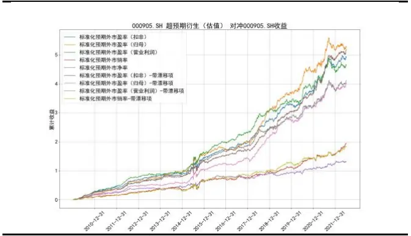
数据来源：Wind，国泰君安证券研究
测试区间：2010.01-2022.07。

图 32：中证500股票池 超预期衍生（估值）因子组合优化 超额收益曲线
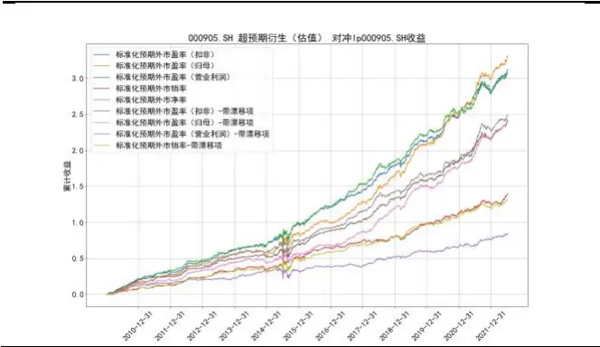
数据来源：Wind，国泰君安证券研究
测试区间：2010.01-2022.07。

## 3）超预期衍生（估值）复合因子绩效表现

中证 500 股票池内，超预期衍生（估值）复合因子多头组年化超额收益15.75%，超额最大回撤-9.45%，信息比率 2.5；空头组年化超额-9.14%，多空年化收益 24.89%。超预期衍生（估值）复合因子组合优化的年化超额收益 12.39%，超额收益最大回撤-9.51%，信息比率 2.52，周度双边换手率 11.76%。等权合成的超预期衍生（估值） 复合因子多头组超额收益曲线、单因子组合优化超额收益曲线如下。

图 33：中证 500 股票池 超预期衍生（估值）因子分组超额收益曲线
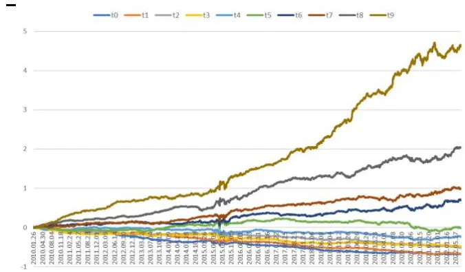
数据来源：Wind，国泰君安证券研究
测试区间：2010.01-2022.07。

图 34：中证 500 股票池 超预期衍生（估值）复合因子组合优化收益曲线
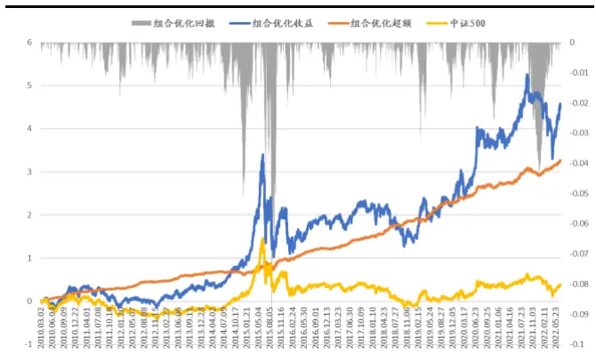
数据来源：Wind，国泰君安证券研究
测试区间：2010.01-2022.07。

## 2.9. 盈利因子

我们基于净利润、净经营资产计算常用的盈利因子。

## 1）盈利因子列表

经过历史回测筛选，我们选择盈利的 6 个因子用于中证 500 内选股。盈利因子的整体权重为 10%，每个单因子权重为 1.67%。具体指标和计算方法如下表：

表 41：中证 500股票池 盈利因子列表

| 因子名 | 方向 | 计算方法 | 因子权重 |
| --- | --- | --- | --- |
| 单季度 GPOA | 越大越好 | 单季度毛利润/总资产均值 | 1.6667% |
| 单季度扣非 ROA | 越大越好 | 单季度扣非净利润/总资产均值 | 1.6667% |
| 单季度归母 ROA | 越大越好 | 单季度归母净利润/总资产均值 | 1.6667% |
| 单季度扣非 ROE | 越大越好 | 单季度扣非净利润/股东权益均值 | 1.6667% |
| 单季度归母 ROE | 越大越好 | 单季度归母净利润/股东权益均值 | 1.6667% |
| 净经营资产收益率 | 越大越好 | 净经营资产/股东权益均值 | 1.6667% |

数据来源：国泰君安证券研究

中证 500 成分股内，盈利因子相关系数的平均值和因子 IC 的相关系数如下。

表 42：中证 500 内 盈利因子 相关系数的平均值

| 盈利因子相关系数平均值 | 单季度 GPOA | 单季度 ROA归母 ROA扣非 | 单季度 | 单季度 ROE归母 | 单季度 ROE扣非 | 净经营资 产收益率 |
| --- | --- | --- | --- | --- | --- | --- |
| 单季度GPOA | 1.00 | 0.62 | 0.67 | 0.49 | 0.56 | 0.59 |
| 单季度ROA归母 | 0.62 | 1.00 | 0.88 | 0.74 | 0.67 | 0.72 |
| 单季度ROA扣非 | 0.67 | 0.88 | 1.00 | 0.66 | 0.78 | 0.82 |
| 单季度ROE归母 | 0.49 | 0.74 | 0.66 | 1.00 | 0.88 | 0.55 |
| 单季度ROE扣非 | 0.56 | 0.67 | 0.78 | 0.88 | 1.00 | 0.65 |
| 净经营资产收益率 | 0.59 | 0.72 | 0.82 | 0.55 | 0.65 | 1.00 |

数据来源：Wind，国泰君安证券研究

表 43：中证 500 内 盈利因子IC的相关系数

| 盈利因子 | 单季度GPOA | 单季度归母ROA | 单季度归母ROE | 单季度扣非ROA | 单季度扣非ROE | 净经营资产收益率 |
| --- | --- | --- | --- | --- | --- | --- |
| 单季度GPOA | 1.00 | 0.82 | 0.75 | 0.87 | 0.81 | 0.83 |
| 单季度归母ROA | 0.82 | 1.00 | 0.88 | 0.94 | 0.86 | 0.87 |
| 单季度归母ROE | 0.75 | 0.88 | 1.00 | 0.83 | 0.94 | 0.77 |
| 单季度扣非ROA | 0.87 | 0.94 | 0.83 | 1.00 | 0.91 | 0.93 |
| 单季度扣非ROE | 0.81 | 0.86 | 0.94 | 0.91 | 1.00 | 0.85 |
| 净经营资产收益率 | 0.83 | 0.87 | 0.77 | 0.93 | 0.85 | 1.00 |

数据来源：Wind，国泰君安证券研究

## 2）盈利单因子测试结果

盈利因子的分组测试具体结果和单因子组合优化的绩效指标如下。单因子组合优化下，超额收益为 5%-10%，最大回撤为-9~-11%，信息比率为1-1.9。

表 44：中证 500股票池 盈利因子 主要绩效指标

|  |  |  | 多头组 |  |  |  |  |  | 单因子组合优化 |  |  |  |  |  |  |  | 组合优化 |
| --- | --- | --- | --- | --- | --- | --- | --- | --- | --- | --- | --- | --- | --- | --- | --- | --- | --- |
| 盈利因子 | 空头组超额收益 |  | 超额收益 |  | 超额收益最大回撤 | 超额收益波动率 | 超额收益信息比率 | 多空收益 | 超额收益 | 超额收益超最大回撤 |  | 额收益波动率 | 超额收益信息比率 | IC | RankIC |  | 周度双边换手率 |
| 单季度GPOA | -57% |  | 7.39% |  | 15.63% | 7.36% | 1.00 | 12.95% | 638% | -104 | 8% | 5.02% | 1.27 | 1.87% | 251% |  | 10.09% |
| 单季度ROA归母 | -72% |  | 12.86% |  | -12990% | 6.52% | 1.97 | 20.48% | 965% | -9 | 32% | 4.93% | 1.96 | 2.59% | 348% |  | 11.32% |
| 单季度ROA扣非 | -8. | 0% | 11. 18% |  | -区3% | 7.16% | 1.56 | 19.28% | 750% | -11 | 28% | 5.07% | 1.48 | 232% | 32 | 1% | 10.44% |
| 单季度ROE归母 | -5.0 | 4% | 12.8 | 5% | -10.220% | 6.36% | 2.02 | 21.89% | 980% | -9 | 44% | 4.93% | 1.99 | 278% | 37 | 2% | 12.22% |
| 单季度ROE扣非 | -8. | 1% | 11.3 | 5% | 回18% | 6.85% | 1.66 | 19.67% | 747% | -9 | 71% | 5.08% | 1.47 | 241% | 33 | 4% | 11.31% |
| 净经营资产收益率 | -64 | 1% | 6.4 | 9% | -B06% | 7.16% | 0.91 | 12.89% | 558% | -10 | 82% | 5.14% | 1.08 | 183% | 286% |  | 9.87% |

数据来源：Wind，国泰君安证券研究。测试区间：2010.01-2022.07。

表 45：中证 500股票池 盈利因子 分组年化超额收益

|  | 分组年化超额收益 |  |  |  |  |  |  |  |  |  |  |  |  |  |  |  |
| --- | --- | --- | --- | --- | --- | --- | --- | --- | --- | --- | --- | --- | --- | --- | --- | --- |
| 盈利因子 | t0 t1 t2 |  |  |  | t3 t4 |  |  |  | t5 |  | t6 t7 t8 t9 |  |  |  |  | 多空收益 |
| 单季度GPOA | 5.57% E3.93% |  | 3.26% |  | 0.82% |  | 0.61% |  | 1 | .00% | 4 | .75% | 4.87% | 8.64% | 7.39% | 12.95% |
| 单季度ROA归母 | 7.62% | 6.84% | L2.80% |  | L1.92% |  | 1.13% |  |  | 3.63% | 1 | .63% | 6.31% | 8.66% | 12.86% | 20.48% |
| 单季度ROA扣非 | 8.10% | 3.63% | L2.22% |  | L2.00% |  | 1.11% |  | 2 | .38% | 4 | .60% | 6.44% | 7.14% | 11.18% | 19.28% |
| 单季度ROE归母 | 9.04% | 6.24% | B4.53% |  | D2.86% |  | 2.03% |  | 0 | .58% | 5 | .04% | 8.14% | 9.67% | 12.85% | 21.89% |
| 单季度ROE扣非 | 8.31% | 3.88% |  | 4.39% | 「 | 2.36% |  | 1.43% |  | 1.65% |  | 319% | 6.54% | 9.68% | 11.35% | 19.67% |
| 净经营资产收益率 | 6.41% | 4.06% |  | D3.49% |  | 0.62% | 2 | .04% | 1 | .02% | 3 | 37% | 7.94% | 6.59% | 6.49% | 12.89% |

数据来源：Wind，国泰君安证券研究。测试区间：2010.01-2022.07。

中证 500 成分股内，6 个盈利因子的多头组超额收益和单因子组合优化超额收益曲线如下。

图 35：中证 500股票池 盈利因子 多头组 超额收益曲线
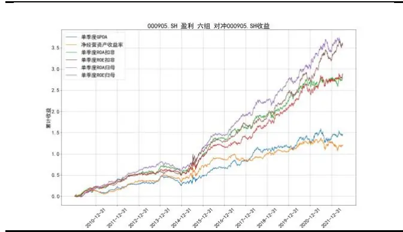
数据来源：Wind，国泰君安证券研究测试区间：2010.01-2022.07。

图 36：中证 500 股票池 盈利因子 组合优化 超额收益曲线
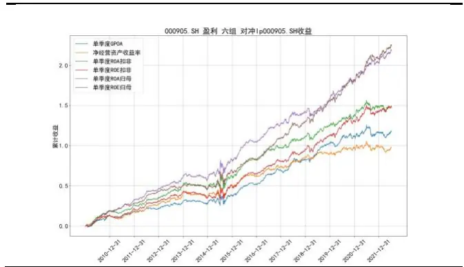
数据来源：Wind，国泰君安证券研究
测试区间：2010.01-2022.07。

## 3）盈利复合因子绩效表现

中证 500 股票池内，盈利复合因子多头组年化超额收益 13.47%，超额最大回撤-12.07%，信息比率 1.94；空头组年化超额-9.36%，多空年化收益22.83%。盈利复合因子组合优化的年化超额收益 9.12%，超额收益最大回撤-11.56%，信息比率 1.76，周度双边换手率 10.16%。等权合成的盈利复合因子多头组超额收益曲线、单因子组合优化超额收益曲线如下。

图 37：中证 500 股票池 盈利复合因子 分组超额收益曲线
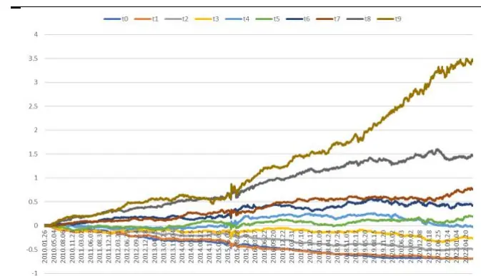
数据来源：Wind，国泰君安证券研究测试区间：2010.01-2022.07。

图 38：中证 500股票池 盈利复合因子组合优化收益曲线
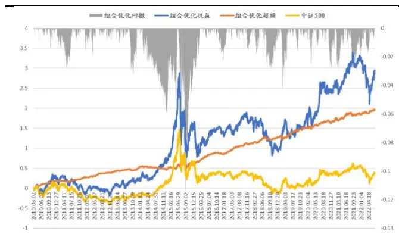
数据来源：Wind，国泰君安证券研究测试区间：2010.01-2022.07。

## 2.10. 超预期衍生（盈利）因子

我们使用 ROE、ROA 等财务指标替换公式中的净利润，计算标准化预期外 ROE、标准化预期外 ROA 等超预期衍生（盈利）因子，考察这些因子的选股效果。计算公式和方法与 SUE因子相同。

## 1）超预期衍生（盈利）因子列表

经过历史回测筛选，我们选择超预期衍生（盈利）的 11 个因子用于中证500 内选股。超预期衍生（盈利）因子的整体权重为 10%，每个单因子权重为 0.91%。具体指标和计算方法如下表：

表 46：中证 500股票池 超预期衍生（盈利）因子列表

| 因子名 | 方向 | 计算方法 | 因子权重 |
| --- | --- | --- | --- |
| 标准化预期外单季度扣非ROA-带漂移项 | 越大越好 | 将单季度扣非 ROA 代入 SUE-带漂移项公式计算 | 0.9091% |
| 标准化预期外单季度扣非ROE-带漂移项 | 越大越好 | 将单季度扣非 ROE代入 SUE-带漂移项公式计算 | 0.9091% |
| 标准化预期外单季度 GPOA | 越大越好 | 将单季度 GPOA 代入 SUE 公式计算 | 0.9091% |
| 标准化预期外单季度扣非 ROA | 越大越好 | 将单季度扣非 ROA 代入 SUE 公式计算 | 0.9091% |
| 标准化预期外单季度扣非 ROE | 越大越好 | 将单季度扣非 ROE 代入 SUE 公式计算 | 0.9091% |
| 标准化预期外单季度归母ROA-带漂移项 | 越大越好 | 将单季度归母 ROA 代入 SUE-带漂移项公式计算 | 0.9091% |
| 标准化预期外单季度归母ROE-带漂移项 | 越大越好 | 将单季度归母 ROE代入 SUE-带漂移项公式计算 | 0.9091% |
| 标准化预期外单季度归母ROA | 越大越好 | 将单季度归母 ROA 代入 SUE 公式计算 | 0.9091% |
| 标准化预期外单季度归母 ROE | 越大越好 | 将单季度归母 ROE代入 SUE公式计算 | 0.9091% |
| 标准化预期外归母净利润同比-带漂移项 | 越大越好 | 将归母净利润同比代入SUE-带漂移项公式计算 | 0.9091% |
| 标准化预期外归母净利润同比 | 越大越好 | 将归母净利润同比代入 SUE公式计算 | 0.9091% |

数据来源：国泰君安证券研究

中证 500 成分股内，超预期衍生（盈利）因子相关系数的平均值和因子IC 的相关系数如下。

表 47：中证 500 内 超预期衍生（盈利）因子 IC的相关系数

| 超预期衍生（盈利）因子 | 标准化预期外单季度GPOA | 标准化预期外单季度归母ROA | 标准化预期外单季度归母ROA-带漂移项 | 标准化预期外单季度归母ROE | 标准化预期外单季度归母ROE-带漂移项 | 标准化预标准化预期外单季期外单季度扣非度扣非 ROA-带漂ROA移项 |  | 标准化预期外单季度扣非ROE | 标准化预期外单季度扣非ROE-带漂移项 | 标准化预期外归母净利润同比 | 标准化预期外归母净利润同比-带漂移项 |
| --- | --- | --- | --- | --- | --- | --- | --- | --- | --- | --- | --- |
| 标准化预期外单季度GPOA | 1.00 | 0.63 | 0.50 | 0.60 | 0.49 | 0.78 | 0.70 | 0.77 | 0.69 | 0.41 | 0.31 |
| 标准化预期外单季度归母ROA | 0.63 | 1.00 | 0.90 | 0.97 | 0.87 | 0.74 | 0.67 | 0.72 | 0.66 | 0.70 | 0.61 |
| 标准化预期外单季度归母ROA-带漂移项 | 0.50 | 0.90 | 1.00 | 0.87 | 0.96 | 0.60 | 0.69 | 0.60 | 0.67 | 0.69 | 0.66 |
| 标准化预期外单季度归母ROE | 0.60 | 0.97 | 0.87 | 1.00 | 0.90 | 0.70 | 0.64 | 0.73 | 0.67 | 0.69 | 0.60 |
| 标准化预期外单季度归母ROE-带漂移项 | 0.49 | 0.87 | 0.96 | 0.90 | 1.00 | 0.57 | 0.65 | 0.60 | 0.68 | 0.69 | 0.65 |
| 标准化预期外单季度扣非ROA | 0.78 | 0.74 | 0.60 | 0.70 | 0.57 | 1.00 | 0.90 | 0.96 | 0.87 | 0.48 | 0.37 |
| 标准化预期外单季度扣非ROA-带漂移项 | 0.70 | 0.67 | 0.69 | 0.64 | 0.65 | 0.90 | 1.00 | 0.87 | 0.96 | 0.50 | 0.42 |
| 标准化预期外单季度扣非ROE | 0.77 | 0.72 | 0.60 | 0.73 | 0.60 | 0.96 | 0.87 | 1.00 | 0.90 | 0.47 | 0.37 |
| 标准化预期外单季度扣非ROE-带漂移项 | 0.69 | 0.66 0.67 |  | 0.67 | 0.68 | 0.87 | 0.96 | 0.90 | 1.00 | 0.49 | 0.42 |
| 标准化预期外归母净利润同比 | 0.41 | 0.70 0.69 |  | 0.69 | 0.69 | 0.48 | 0.50 | 0.47 | 0.49 | 1.00 | 0.95 |
| 标准化预期外归母净利润同比-带漂移项 | 0.31 | 0.61 0.66 |  | 0.60 0.65 |  | 0.37 | 0.42 | 0.37 | 0.42 | 0.95 | 1.00 |

数据来源：Wind，国泰君安证券研究

表 48：中证 500 内 超预期衍生（盈利）因子 相关系数的平均值

| 超预期衍生（盈利）因子相关系数平均 值 | 标准化预 期外单季 度GPOA | 标准化预 期外单季 度归母 ROA | 标准化预 期外单季 度归母 ROA-带 ROE | 标准化预 期外单季 度归母 | 标准化预 期外单季 度归母 ROE-带漂 ROA | 标准化预 期外单季 度扣非 | 标准化预 期外单季 度扣非 ROA-带 ROE | 标准化预 期外单季 度扣非 | 标准化预 期外单季 度扣非 ROE-带漂 | 标准化预 期外归母 净利润同 | 标准化预 期外归母 净利润同 比-带漂 |
| --- | --- | --- | --- | --- | --- | --- | --- | --- | --- | --- | --- |
| 标准化预期外单季度GPOA | 1.00 | 0.44 | 漂移项 0.35 | 0.42 | 移项 0.33 | 0.64 | 漂移项 0.57 | 0.62 | 移项 0.55 | 比 | 移项 0.18 |
| 标准化预期外单季度归母ROA | 0.44 | 1.00 | 0.87 | 0.94 | 0.83 | 0.57 | 0.49 | 0.54 | 0.46 | 0.25 0.59 | 0.51 |
| 标准化预期外单季度归母ROA-带漂移项 | 0.35 | 0.87 | 1.00 | 0.84 | 0.94 | 0.44 | 0.55 | 0.43 | 0.52 | 0.61 | 0.59 |
| 标准化预期外单季度归母ROE | 0.42 | 0.94 | 0.84 | 1.00 | 0.88 | 0.53 | 0.47 | 0.58 | 0.50 | 0.60 | 0.52 |
| 标准化预期外单季度归母ROE-带漂移项 | 0.33 | 0.83 | 0.94 | 0.88 | 1.00 | 0.41 | 0.51 | 0.45 | 0.55 | 0.61 | 0.59 |
| 标准化预期外单季度扣非ROA | 0.64 | 0.57 | 0.44 | 0.53 | 0.41 | 1.00 | 0.86 | 0.94 | 0.82 | 0.32 | 0.24 |
| 标准化预期外单季度扣非ROA-带漂移项 | 0.57 | 0.49 | 0.55 | 0.47 | 0.51 | 0.86 | 1.00 | 0.83 | 0.94 | 0.36 | 0.32 |
| 标准化预期外单季度扣非ROE | 0.62 | 0.54 | 0.43 | 0.58 | 0.45 | 0.94 | 0.83 | 1.00 | 0.87 | 0.33 | 0.25 |
| 标准化预期外单季度扣非ROE-带漂移项 | 0.55 | 0.46 | 0.52 | 0.50 | 0.55 | 0.82 | 0.94 | 0.87 | 1.00 | 0.37 | 0.33 |
| 标准化预期外归母净利润同比 | 0.25 | 0.59 | 0.61 | 0.60 | 0.61 | 0.32 | 0.36 | 0.33 | 0.37 | 1.00 | 0.94 |
| 标准化预期外归母净利润同比-带漂移项 | 0.18 | 0.51 | 0.59 | 0.52 | 0.59 | 0.24 | 0.32 | 0.25 | 0.33 | 0.94 | 1.00 |

数据来源：Wind，国泰君安证券研究

## 2）超预期衍生（盈利）单因子测试结果

超预期衍生（盈利）因子的分组测试具体结果和单因子组合优化的绩效指标如下。单因子组合优化下，超额收益为 4%-10%，最大回撤为-8~-

12%，信息比率为 0.8-2.1。其中，使用 ROE、ROA 计算的超预期衍生（盈利）因子效果较好.

表 49：中证 500 股票池 超预期衍生（盈利）因子 主要绩效指标

|  |  |  | 多头组 |  |  |  |  |  | 单因子组合优化 |  |  |  |  |  |  |  |  | 组合优化 |  |
| --- | --- | --- | --- | --- | --- | --- | --- | --- | --- | --- | --- | --- | --- | --- | --- | --- | --- | --- | --- |
| 超预期衍生（盈利）因子 | 空头组超额收益 |  | 超额收益 |  | 超额收益超 | 额收益 | 超额收益 | 多空收 | 超额收益 |  | 超额收益超 |  | 额收益 | 超额收益 | IC | RankIC |  | 周度双边换手率 |  |
|  |  |  |  |  | 最大回撤波 | 动率 | 信息比率 | 益 | 超额收益 |  | 最大回撤波 |  | 动率 | 信息比率 |  |  |  |  |  |
| 标准化预期外单季度GPOA | -48 | 7% | 14.6 | 1% | 10% | 6.44% | 2.27 | 19.48% | 7 | 81% | -8 | 90% | 4.72% | 1.65 | 1.90% | 1.77% |  | 11.58% |  |
| 标准化预期外单季度归母ROA | -49 | 8% | 13.5 | 2% | 107% | 6.31% | 2.14 | 18.50% |  | 933% | -8 | 55% | 4.79% | 1.95 | 237% | 2. | 68% |  | 13.17% |
| 标准化预期外单季度归母ROA-带漂移项 | -4L | 1% | 11.9 | 0% | 15% | 6.44% | 1.85 | 16.71% |  | 735% | -8 | 82% | 4.64% | 1.58 | 188% |  | 02% |  | 13.52% |
| 标准化预期外单季度归母ROE | -6 | 8% | 14.5 | 2% | -6.9% | 6.31% | 2.30 | 20.91% |  | 986% | -8 | 45% | 4.76% | 2.07 | 243% |  | 282% |  | 13.17% |
| 标准化预期外单季度归母ROE-带漂移项 | -3.B | 1% | 12.9 | 3% | 10% | 6.37% | 2.03 | 16.44% |  | 777% | -9 | 33% | 4.78% | 1.62 | 193% | 215% |  |  | 13.44% |
| 标准化预期外单季度扣非ROA | -5 | 0% | 13.8 | 8% | 10.22% | 6.31% | 2.20 | 18.99% |  | 970% | -9 | 27% | 4.75% | 2.04 | 238% |  | 255% |  | 11.86% |
| 标准化预期外单季度扣非RQA-带漂移项 | -3. | 9% | 13.0 | 9% | 9.45% | 6.27% | 2.09 | 16.59% |  | 819% | -10 | 74% | 4.77% | 1.72 | 194% | 1 | 90% |  | 12.14% |
| 标准化预期外单季度扣非ROE | -6 | 8% | 14.3 | 8% | 0.88% | 6.35% | 2.26 | 20.55% | 10 | 35% | -8 | 68% | 4.74% | 2.18 | 244% | 271% |  |  | 11.87% |
| 标准化预期外单季度扣非ROE-带漂移项 | -4B | 7% | 13.6 | 0% | 13% | 6.30% | 2.16 | 18.17% |  | 833% | -9 | 49% | 4.80% | 1.74 | 198% | 202% |  |  | 12.11% |
| 标准化预期外归母净利润同比 | -2. | 6% | 7.7 | 4% | 五1% | 6.38% | 1.21 | 10.49% |  | 547% | -11 | 31% | 4.75% | 1.15 | 133% | 157% |  |  | 13.63% |
| 标准化预期外归母净利润同比-带漂移项 | -0. | 61% | 7.0 | 9% | 9% | 6.35% | 1.12 | 7.69% |  | 410% | -12 | 51% | 4.67% | 0.88 | 1200% | 106% |  | 13.43% |  |

数据来源：Wind，国泰君安证券研究。测试区间：2010.01-2022.07。

表 50：中证 500 股票池 超预期衍生（盈利）因子 分组年化超额收益

|  | 分组年化超额收益 |  |  |  |  |  |  |  |  |  |  |  |  |  |  |  |  |  |  |  |
| --- | --- | --- | --- | --- | --- | --- | --- | --- | --- | --- | --- | --- | --- | --- | --- | --- | --- | --- | --- | --- |
| 超预期衍生（盈利）因子 | t0 |  | t1 |  | t2 t3 |  |  |  | t4 t5 |  |  |  | t6 t7 |  |  | t8 |  | t9 |  | 多空收益 |
| 标准化预期外单季度GPOA |  | -4.87% | -1 | .57% |  | -1.35% |  | -0.47% |  | -0.25% | 2 | .38% |  | 0.14% | 1.08% |  | 4.81% |  | 14.61% | 19.48% |
| 标准化预期外单季度归母ROA |  | -4.98% |  | -3.81% |  | -6.00% | 1 | -1.80% | I | -2.02% |  | 1.21% | 3 | .32% | 6.07% |  | 9.63% | 1 | 3.52% | 18.50% |
| 标准化预期外单季度归母ROA-带漂移项 |  | -4.81% |  | -0.94% |  | -3.88% |  | -1.05% | D | -1.50% |  | -0.53% |  | 4.08% | 490% |  | 6.34% |  | 11.90% | 16.71% |
| 标准化预期外单季度归母ROE |  | -6.38% |  | -4.32% |  | -4.41% | 口 | -2.78% | 0 | .81% |  | 0.01% |  | 4.24% | 5.51% |  | 8.00% |  | 14.52% | 20.91% |
| 标准化预期外单季度归母ROE-带漂移项 | 「 | -3.51% | -3 | .48% | 「 | -3.86% |  | -0.75% | L | -1.88% |  | 1.05% |  | 3.17% | 4.69% |  | 6.25% |  | 12.93% | 16.44% |
| 标准化预期外单季度扣非ROA |  | -5.10% | 口 | -3.33% |  | -4.30% |  | -1.26% |  | -2.46% |  | -1.91% |  | 5.52% | 7.00% |  | 7.03% |  | 13.88% | 18.99% |
| 标准化预期外单季度扣非ROA-带漂移项 |  | -3.49% | L | -1.84% | 「 | -3.35% |  | -0.53% |  | -0.39% |  | 0.72% |  | -0.18% | 4.60% |  | 5.88% |  | 13.09% | 16.59% |
| 标准化预期外单季度扣非ROE |  | -6.18% |  | -3.93% | 口 | -2.43% | 「 | -3.53% |  | -0.45% | D | -1.49% |  | 3.49% | 6.79% |  | 8.54% |  | 14.38% | 20.55% |
| 标准化预期外单季度扣非ROE-带漂移项 | 7 | -4.57% | -1 | .36% | 口 | -2.89% |  | -1.00% | D | -1.83% |  | 2.12% |  | 1.40% | 2.71% |  | 6.38% |  | 13.60% | 18.17% |
| 标准化预期外归母净利润同比 | 「 | -2.76% | L | -1.80% |  | -0.24% | 「 | -2.65% | 0 | -2.10% |  | 1.86% |  | 3.14% | 4.33% |  | 6.52% |  | 7.74%4 | 10.49% |
| 标准化预期外归母净利润同比-带漂移项 |  | -0.61% | L | -1.42% |  | -1.27% |  | -0.68% |  | 0.42% |  | 1.27% |  | 1.10% | 2.99% |  | 492% |  | 7.09% | 7.69% |

数据来源：Wind，国泰君安证券研究。测试区间：2010.01-2022.07。

中证 500 成分股内，11 个超预期衍生（盈利）因子的多头组超额收益和单因子组合优化超额收益曲线如下。

图 39：中证 500 股票池 超预期衍生（盈利）因子多头组超额收益曲线
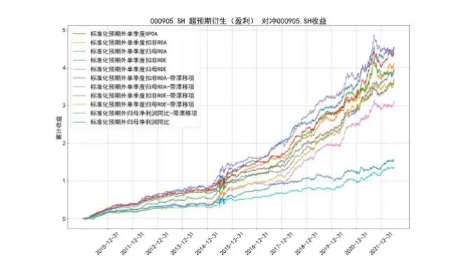
数据来源：Wind，国泰君安证券研究
测试区间：2010.01-2022.07。

图 40：中证 500股票池 超预期衍生（盈利）因子组合优化 超额收益曲线
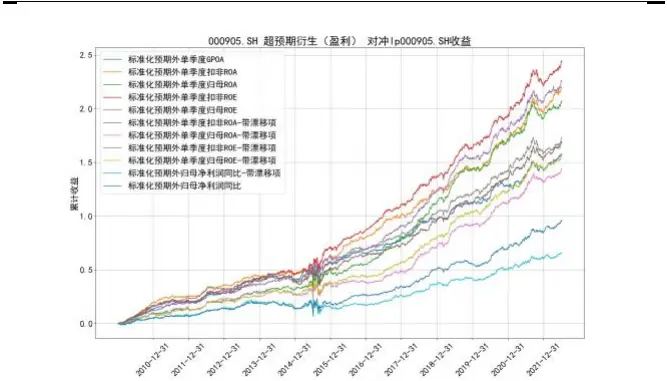
数据来源：Wind，国泰君安证券研究
测试区间：2010.01-2022.07。

## 3）超预期衍生（盈利）复合因子绩效表现

中证 500 股票池内，超预期衍生（盈利）复合因子多头组年化超额收益12.78%，超额最大回撤-10.37%，信息比率 1.96；空头组年化超额-6.49%，多空年化收益 19.27%。超预期衍生（盈利）复合因子组合优化的年化超额收益 9.4%，超额收益最大回撤-8.99%，信息比率 1.95，周度双边换手率 12%。等权合成的超预期衍生（盈利）复合因子多头组超额收益曲线、单因子组合优化超额收益曲线如下。

图 41：中证500股票池 超预期衍生（盈利）因子 分组超额收益曲线
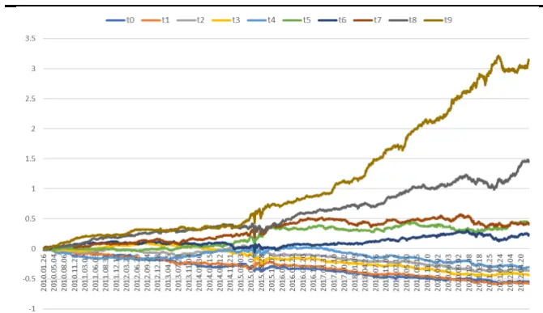
数据来源：Wind，国泰君安证券研究
测试区间：2010.01-2022.07。

图 42：中证500股票池 超预期衍生（盈利）复合因子组合优化收益曲线
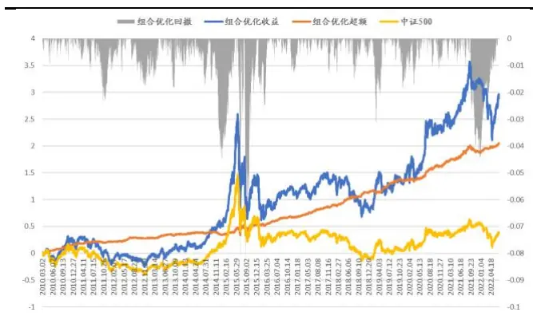
数据来源：Wind，国泰君安证券研究
测试区间：2010.01-2022.07。

## 2.11. 价量因子

我们基于行情数据，计算股票的波动率、流动性、反转等因子，全部归入价量类因子。

## 1）价量因子列表

经过历史回测筛选，我们选择价量的 10 个因子用于中证 500 内选股。价量因子的权重为 10%，每个单因子权重为 1%。具体指标和计算方法如下表：

表 51：中证 500股票池 价量因子列表

| 因子名 | 方向 | 计算方法 | 因子权重 |
| --- | --- | --- | --- |
| 公告后1天异常收益 | 越大越好 | 公告后1天收益减去中证500收益 | 1.0000% |
| 公告后跳空 | 越大越好 | 公告后相对中证500跳空幅度 | 1.0000% |
| 20日特质波动率 | 越小越好 | 20 日 Fama-French 三因子模型的残差波动率 | -1.0000% |
| 60日特异度 | 越大越好 | 1-60 日 Fama-French 三因子模型的 R 方 | 1.0000% |
| 3个月换手率标准差 | 越小越好 | 3个月换手率标准差 | -1.0000% |
| 1个月换手率 | 越小越好 | 1个月换手率 | -1.0000% |
| 3个月换手率 | 越小越好 | 3个月换手率 | -1.0000% |
| 20日日均交易金额 | 越小越好 | 20日日均交易金额 | -1.0000% |
| 5日交易金额/波动率 | 越小越好 | 5日交易金额/波动率 | -1.0000% |
| 一个月反转 | 越小越好 | 一个月涨跌幅 | -1.0000% |

数据来源：国泰君安证券研究

中证 500 指数成分股内，价量因子相关系数的平均值和因子 IC 的相关系数如下。

表 52：中证 500 内 价量因子IC的相关系数

| 价量因子 | 1个月换手率 | 20日日均交易金额 | 20日特质波动率 | 3个月换手率 | 3个月换 | 5日交易金额/波动率 | 60日特异度 | 公告后1天异常收益 | 公告后跳 | 一个月动量 |
| --- | --- | --- | --- | --- | --- | --- | --- | --- | --- | --- |
| 1个月换手率 | 1.00 | 0.91 | 0.78 | 0.94 | 0.93 | 0.74 | -0.82 | -0.01 | -0.19 | 0.13 |
| 20日日均交易金额 | 0.91 | 1.00 | 0.71 | 0.86 | 0.84 | 0.83 | -0.80 | 0.02 | -0.19 | 0.10 |
| 20日特质波动率 | 0.78 | 0.71 | 1.00 | 0.66 | 0.71 | 0.55 | -0.77 | 0.05 | -0.14 | 0.36 |
| 3个月换手率 | 0.94 | 0.86 | 0.66 | 1.00 | 0.95 | 0.66 | -0.84 | -0.04 | -0.23 | -0.06 |
| 3个月换手率标准差 | 0.93 | 0.84 | 0.71 | 0.95 | 1.00 | 0.66 | -0.83 | -0.06 | -0.26 | 0.04 |
| 5日交易金额/波动率 | 0.74 0.83 |  | 0.55 | 0.66 | 0.66 | 1.00 | -0.56 | 0.07 | -0.09 | 0.23 |
| 60日特异度 | -0.82 -0.80 |  | -0.77 | -0.84 | -0.83 | -0.56 | 1.00 | 0.05 | 0.23 | 0.06 |
| 公告后1天异常收益 | -0.01 | 0.02 | 0.05 | -0.04 | -0.06 | 0.07 | 0.05 | 1.00 | 0.22 | 0.23 |
| 公告后跳空 | -0.19 | -0.19 | -0.14 | -0.23 | -0.26 | -0.09 | 0.23 | 0.22 | 1.00 | 0.17 |
| 一个月反转 | 0.13 0.10 |  | 0.36 | -0.06 | 0.04 | 0.23 | 0.06 | 0.23 | 0.17 | 1.00 |

数据来源：Wind，国泰君安证券研究

表 53：中证 500 内 价量因子 相关系数的平均值

| 价量因子相关系数平均值 | 1个月换 手率 | 20日日均 交易金额 | 20日特质 波动率 | 3个月换 手率 | 3个月换 手率标准 差 | 5日交易 金额/波 动率 | 60日特异 度 | 公告后1 天异常收 益 | 公告后跳 空 | 一个月动 量 |
| --- | --- | --- | --- | --- | --- | --- | --- | --- | --- | --- |
| 1个月换手率 | 1.00 | 0.74 | 0.56 | 0.89 | 0.83 | 0.51 | -0.50 | 0.03 | -0.03 | 0.19 |
| 20日日均交易金额 | 0.74 | 1.00 | 0.51 | 0.65 | 0.60 | 0.76 | -0.50 | 0.03 | -0.02 | 0.16 |
| 20日特质波动率 | 0.56 | 0.51 | 1.00 | 0.39 | 0.44 | 0.21 | -0.60 | 0.05 | -0.03 | 0.35 |
| 3个月换手率 | 0.89 | 0.65 | 0.39 | 1.00 | 0.91 | 0.45 | -0.53 | 0.01 | -0.05 | 0.04 |
| 3个月换手率标准差 | 0.83 | 0.60 | 0.44 | 0.91 | 1.00 | 0.41 | -0.54 | 0.02 | -0.05 | 0.08 |
| 5日交易金额/波动率 | 0.51 | 0.76 | 0.21 | 0.45 | 0.41 | 1.00 | -0.21 | 0.02 | 0.00 | 0.14 |
| 60日特异度 | -0.50 | -0.50 | -0.60 | -0.53 | -0.54 | -0.21 | 1.00 | -0.03 | 0.05 | -0.07 |
| 公告后1天异常收益 | 0.03 | 0.03 | 0.05 | 0.01 | 0.02 | 0.02 | -0.03 | 1.00 | 0.11 | 0.11 |
| 公告后跳空 | -0.03 | -0.02 | -0.03 | -0.05 | -0.05 | 0.00 | 0.05 | 0.11 | 1.00 | 0.09 |
| 一个月动量 | 0.19 | 0.16 | 0.35 | 0.04 | 0.08 | 0.14 | -0.07 | 0.11 | 0.09 | 1.00 |

数据来源：Wind，国泰君安证券研究

## 2）价量单因子测试结果

价量因子的分组测试具体结果和单因子组合优化的绩效指标如下。单因子组合优化下，超额收益为 4%-10%，最大回撤为-8~-12%，信息比率为0.8-2.1。其中，使用 ROE、ROA计算的超预期衍生（盈利）因子效果较好

表 54：中证 500 股票池 价量因子 主要绩效指标

|  |  |  | 多头组 |  |  |  |  |  |  | 单因子组合优化 |  |  |  |  |  |  |  | 组合优化 |
| --- | --- | --- | --- | --- | --- | --- | --- | --- | --- | --- | --- | --- | --- | --- | --- | --- | --- | --- |
| 价量因子 | 空头组超额收益 |  | 超额收益 |  | 超额收益超 |  | 额收益 | 超额收益 | 多空收 |  | 超额收益超 |  | 额收益 | 超额收益 |  |  |  |  |
|  |  |  |  |  | 最大回撤 |  | 波动率 | 信息比率 | 益 | 超额收益 | 最大回 | 撤 | 波动率 | 信息比率 | IC |  |  |  |
|  |  |  |  |  |  |  |  |  |  |  |  |  |  |  |  | RankIC |  | 周度双边换手率 |
| 1个月换手率 | -13 | 3% | 7. 1 | 3% | -10 | 2% | 6.23% | 1.15 | 20.87% | 652% | 9 | 67% | 5.55% | 1.17 | 284% | -4 | 66% | 15.83% |
| 20日日均交易金额 | 正 | 4% | 4.7 | 5% | 20.2 | 0% | 7.75% | 0.61 | 16.68% | 4.62% | -13 | 39% | 5.66% | 0.82 | 222% | -4 | 34% | 17.26% |
| 20日特质波动率 | 4 | 6% | 9.4 | 2% | -14.4 | 0% | 7.50% | 1.25 | 24.17% | 649% | -11 | 88% | 5.63% | 1.15 | 337% | -3 | 85% | 31.92% |
| 3个月换手率 | D | 6% | 6.78% |  | -1035% |  | 6.34% | 1.07 | 19.14% | 587% | -10 | 40% | 5.51% | 1.07 | 226% | 3 | 70% | 10.46% |
| 3个月换手率标准差 | 15 | 1% | 7.0 | 2% | -0.80% |  | 6.57% | 1.07 | 22.43% | 728% | -9 | 63% | 5.39% | 1.35 | 303% | 4 | 65% | 14.45% |
| 5日交易金额/波动率 | 16.9 | 2% | 6.5 | 9% | 正0% |  | 7.27% | 0.91 | 23.51% | 674% | -8 | 61% | 5.43% | 1.24 | 313% | -4 | 08% | 42.19% |
| 60日特异度 | -10 | 0% | 4.1 | 4% | 21 | 1% | 8.96% | 0.46 | 1443% | 334% | -122 | 12% | 5.82% | 0.57 | 141% |  | 360% | 19.27% |
| 公告后1天异常收益 |  | 0% | 5.9 | 0% | -12 8 | 85% | 7.08% | 0.83 | 15.19% | 540% | -9 | 48% | 4.94% | 1.09 | 169% |  | 143% | 16.66% |
| 公告后跳空 | -39 | % | 10.0 | 1% | -10 | 7% | 6.44% | 1.55 | 14.00% | 785% | -10 | 81% | 4.76% | 1.65 | 193% |  | 31% | 16.21% |
| 一个月反转 | -13.5 | 4% | 5.4 | 1% | 18.5 | 0% | 8.77% | 0.62 | 18.95% | 564% | 10 | 76% | 6.58% | 0.86 | 292% | -50 | 2% | 44.06% |

数据来源：Wind，国泰君安证券研究。测试区间：2010.01-2022.07。

表 55：中证 股票池 价量因子 分组年化超额收益

|  | 分组年化超额收益 |  |  |  |  |  |  |  |  |  |  |
| --- | --- | --- | --- | --- | --- | --- | --- | --- | --- | --- | --- |
| 价量因子 | t0 t1 | t2 | t3 | t4 | t5 |  | t6 | t7 | t8 | t9 | 多空收益 |
| 1个月换手率 | 7.13% | 8.31% | 5.34% | 4.76% | 2.04% | 3.86% | 0.66% | -0.51% |  | -301% -13.73% | 20.87% |
| 20日日均交易金额 | 4.75% | 6.32% | 6.18% | 4.43% | 3.0% | 5.36% | 2.48% | -302% | -2198% | -1194% | 16.68% |
| 20日特质波动率 | 9.42% | 7.36% | 5.91% | 6.17% | 3.57% | 4.36% | 2.05% | -185% |  | 6.53% -14 76% | 24.17% |
| 3个月换手率 | 6.78% | 5.73% | 6.25% | 2.41% | 4.17% | 1.42% | 2.71% | -0.19% |  | -2107% -12.3 36% | 19.14% |
| 3个月换手率标准差 | 7.02% | 9.53% | 6.25% | 6.01% | 3.96% | 1.34% | 0.06% | 0.65% |  | -181% -15.41% | 22.43% |
| 5日交易金额/波动率 | 6.59% | 10.33% | 4.46% | 6.43% | 5.17% | 3.23% | 1.40% | -142% |  | -313% -16. 92% | 23.51% |
| 60日特异度 | 10.80% | -0. 55% | 1.35% | 3.48% | 4.92% | 3.00% | 1.07% |  | 3.48% | 3.40% 4.4% | 1443% |
| 公告后1天异常收益 | -9.80% | -0. 99% | 0.03% | 1.28% | 1.09% | 2.73% | 1.58% |  | 4.95% | 7.13% 5.90% | 15.19% |
| 公告后跳空 | -3.99% | -424% | -1183% | -238% | -0.88% | 2.00% | 2.78% |  | 2.63% | 9.82% 10.1% | 1400% |
| 一个月反转 | 5.41% | 8.51% | 5.35% | 7.59% | 2.74% | 5.78% | 0.69% |  | -184% | 634% -1354% | 18.95% |

数据来源：Wind，国泰君安证券研究。测试区间：2010.01-2022.07。

中证 500 成分股内，10 个价量因子的多头组超额收益和单因子组合优化超额收益曲线如下。

图 43：中证 500 股票池 价量因子 多头组超额收益曲线
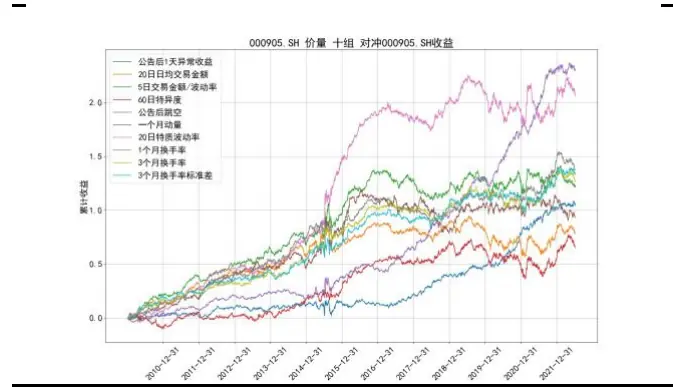
数据来源：Wind，国泰君安证券研究测试区间：2010.01-2022.07。

图 44：中证 500股票池 价量因子 组合优化超额收益曲线
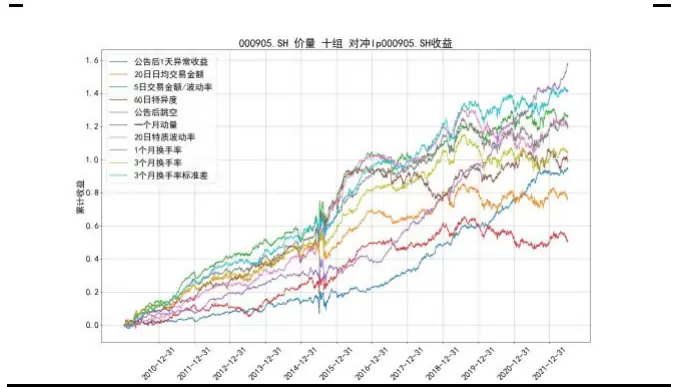
数据来源：Wind，国泰君安证券研究
测试区间：2010.01-2022.07。

## 3）价量复合因子绩效表现

中证 500 股票池内，价量复合因子多头组年化超额收益 14.97%，超额最大回撤-8.62%，信息比率 2.09；空头组年化超额-20.82%，多空年化收益35.8%。价量复合因子组合优化的年化超额收益 10.18%，超额收益最大回撤-8.37%，信息比率 1.78，周度双边换手率 19.14%。等权合成的价量复合因子多头组超额收益曲线、单因子组合优化超额收益曲线如下。

图 45：中证 500 股票池 价量复合因子 分组超额收益曲线
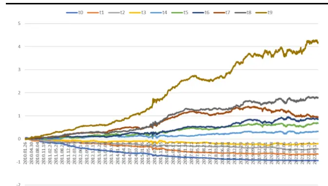
数据来源：Wind，国泰君安证券研究测试区间：2010.01-2022.07。

图 46：中证 500股票池 价量复合因子组合优化收益曲线
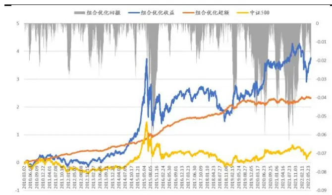
数据来源：Wind，国泰君安证券研究
测试区间：2010.01-2022.07。

## 3. 多因子选股构建指数增强策略

我们在得到 11 个大类因子后，对大类因子加权计算得到大类复合因子。使用大类复合因子的分位数得分作为当期股票最终得分。然后，以得分最大化为目标，约束市值行业中性和个股权重，求解个股权重，构建指数增强策略周度组合。

## 3.1. 大类因子选股效果

## 3.1.1. 大类因子历史选股表现汇总

汇总大类因子选股的绩效指标，可以看出各大类因子组合优化的年化超额收益为 8-12%，超额最大回撤为 7-11%，信息比率为 1.6~2.9。其中，四类超预期因子的超额收益较高，选股表现比较稳定。

表 56：中证 500 股票池 大类因子的主要绩效指标

|  |  |  | 多头组 |  |  |  |  |  |  |  | 单因子组合优化 |  |  |  |  |  |  | 组合优化 |  |
| --- | --- | --- | --- | --- | --- | --- | --- | --- | --- | --- | --- | --- | --- | --- | --- | --- | --- | --- | --- |
| 大类因子 | 空头组超额收益 |  | 超额收益 |  | 超额收益 |  |  | 超额收益 | 超额收益 | 多空收益 | 超额收益 | 超额收益 |  | 超额收益 | 超额收益 |  |  | 周度双边换手率 |  |
|  |  |  |  |  | 最大回撤 |  |  | 波动率 | 信息比率 | 多空收益 | 超额收益 | 最大回撤 |  | 波动率 | 信息比率 | IC | KankiC |  |  |
| 北上资金 | 63 | 2% | 13 | 99% | 42 |  | 9% | 6.01% | 2.33 | 20.31% | 10.80% | 5.12% |  | 3.63% | 2.98 | 2.20% | 2.32% | 50.8% |  |
| 超预期（传统） | -8 | 27% | 16 | 22% | - | 99 | 7% | 6.39% | 2.54 | 24.49% | 12.73% | - | 3.53% | 4.84% | 2.63 | 3.23% | 3.53% |  | 11.7% |
| 超预期（分析师） | 65 | 7% | 16 | 03% |  | -8 | 71% | 6.33% | 2.53 | 22.60% | 12.18% |  | .51% | 4.86% | 2.51 | 2.67% | 2.98% |  | 16.2% |
| 超预期衍生（估值） | -91 | 4% | 15 | 75% |  | -94 | 5% | 6.31% | 2.50 | 24.89% | 12.39% |  | 9.51% | 4.92% | 2.52 | 3.20% | 3.63% |  | 11.8% |
| 超预期衍生（盈利） | +6 | 49% | 12 | 78% | 1 | 03 | 7% | 6.51% | 1.96 | 19.27% | 9.40% | 8.99% |  | 4.81% | 1.95 | 2.53% | 2.74% |  | 12.0% |
| 成长 | -12 | 80% | 13 | 11% |  | -95 | 8% | 6.60% | 1.99 | 25.91% | 10.88% |  | .53% | 4.88% | 2.23 | 3.20% | 3.60% |  | 11.9% |
| 分析师 | 100 | 6% | 14 | 05% |  | -78 | 8% | 7.09% | 1.98 | 24.11% | 11.63% |  | .08% | 5.13% | 2.27 | 2.83% | 3.88% | 19.5% |  |
| 总量 | -88 | 0% | 11 | 20% | -149 |  | 8% | 7.14% | 1.57 | 20.00% | 8.57% |  | .30% | 5.16% | 1.66 | 2.29% | 3.31% | 10.5% |  |
| 估值 | -141 | 0% | 13 | 85% | -1 | 79 | 6% | 8.34% | 1.66 | 27.94% | 11.64% |  | .39% | 5.49% | 2.12 | 3.56% | 5.44% | 14.5% |  |
| 价量 | -200 | 82% | 14 | 97% | - | 86 | 2% | 7.16% | 2.09 | 35.80% | 10.18% |  | 8.37% | 5.71% | 1.78 | 4.15% | 6.43% | 19.1% |  |
| 盈利 | -93 | 6% | 13 | 47% |  | 12 | 07% | 6.96% | 1.94 | 22.83% | 9.12% |  | .56% | 5.18% | 1.76 | 2.65% | 3.63% | 10.2% |  |

数据来源：Wind，朝阳永续，国泰君安证券研究。测试区间：2010.01-2022.07。

表 57：中证 500 股票池 大类因子的分组年化超额收益

|  | 分组年化超额收益 |  |  |  |  |  |  |  |  |  |  |  |  |  |  |  |  |  |  |  |  |  |  |
| --- | --- | --- | --- | --- | --- | --- | --- | --- | --- | --- | --- | --- | --- | --- | --- | --- | --- | --- | --- | --- | --- | --- | --- |
| 大类因子 | t0 t1 |  |  |  |  |  | t2 t3 t4 |  |  |  |  |  | t5 |  | t6 t7 t8 t9 |  |  |  |  |  |  |  | 多空收益 |
| 北上资金 | -63 |  | 2% | -33 |  | 7% | 62 | 7% | 72 | 2% | -19 | 8% -4 | .97% | 6 | -3.46 | % 0.12% |  | 9.41% |  |  | 13.99 | % | 20.31% |
| 超预期 | -8 |  | 27% |  | -9 | 96% | -5 | 53% | 4 | 65% | -3 | 41% | 2.30% |  | 3.12 | % | 5.65% |  | 8.93% |  | 16.22 | % | 24.49% |
| 超预期（分析师） | 6 |  | 57% |  | 6 | 94% | -4 | 95% | 6 | 18% | -06 | 7%- | 1.23% |  | 1.93 | % | 4.54% |  | 7.91% |  | 16.03 | % | 22.60% |
| 超预期衍生（估值） |  | -9 | 14% |  | 9 | 02% | 59 | 9% | -5 | 137% | -21 | 22% | 0.00% |  | 4.63 | % | 6.03% |  | 9.89% |  | 15.75 | % | 24.89% |
| 超预期衍生（盈利） |  | 6 | 49% |  | 7 | 00% | -3 | 73% | -4 | 79% | -30 | 8% | 2.98 | % | 1.83 | % | 3.06% |  | 7.89% |  | 12.78 | % | 19.27% |
| 成长 | -12 |  | 80% |  | 7 | 186% | 70 | 6% | -21 | 93% | 02 | 1% | 1.81 | % | 5.23% |  | 5.50% |  | 9.39% |  | 13.11 | % | 25.91% |
| 分析师 | 10 |  | 06% | 6 |  | 24% | -4 | 04% | -4 | 118% | 01 | 9% - | 0.41 | % | 3.68% |  | 5.00% |  | 5.52% |  | 14.05 | % | 24.11% |
| 总量 | -8 |  | 80% |  | -4 | 99% | -28 | 4% | -21 | 04% | -5 | 04% | -0.54 |  | 5.42% |  | 4.89% |  | 5.80% |  | 11.20 | % | 20.00% |
| 估值 | -14 |  | 10% |  | -8 | 87% | 7 | 709% | -21 | 6% | -08 | 3% | 2.27 | % | 3.26 | % | 7.13% |  | 11.41 | % | 13.85 | % | 27.94% |
| 价量 | -20 |  | 82% |  | -8 | 78% | -4 | 74% | -19 | 4% | 24 | 3% | 4.53 | % | 5.38% |  | 5.83% |  | 9.09% |  | 14.97 | % | 35.80% |
| 盈利 |  | -9 | 36% |  | -9 | 44% | -5 | 51% | -21 | 58% | -0 | 17% | 1.47% |  | 3.03 | % | 4.95% |  | 7.96% |  | 13.47 | % | 22.83% |

数据来源：Wind，朝阳永续，国泰君安证券研究。测试区间：2010.01-2022.07。

从下图大类因子组合优化的超额收益曲线上可以看出，近三年价量、总量因子超额收益震荡走平，超额收益不高。估值因子在2019-2021年始终没有获得超额收益，今年上半年超额显著，目前有所回撤。除了2014年无明显超额收益外，超预期类因子的表现最为出色和稳定。中证 500内大类因子组合优化超额收益曲线和年度超额收益如下。

图 47：中证 500 股票池 大类因子组合优化超额收益曲线
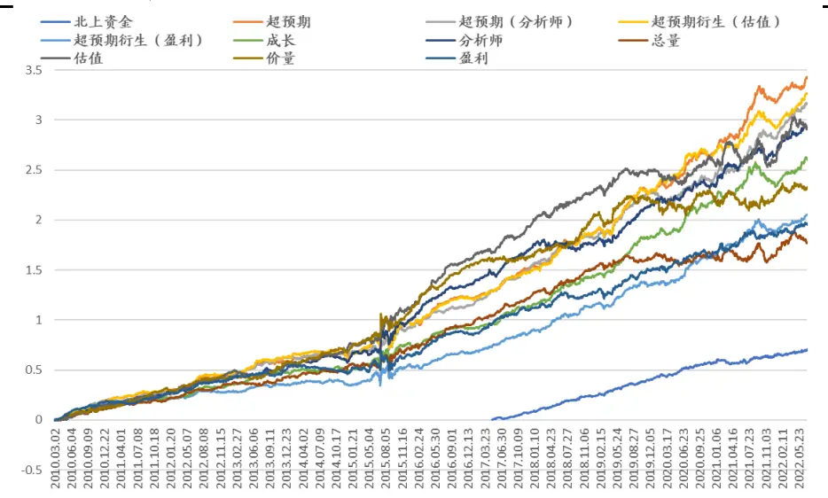
数据来源：Wind，朝阳永续，国泰君安证券研究

表 58：中证 500股票池 大类因子组合优化的年度超额收益

| 组合优化每年超额收益 | 2010 | 2011 |  | 2012 | 2013 | 2014 |  | 2015 | 2016 | 2017 | 2018 2019 |  |  |  | 2020 |  | 2021 2022.07 |  |  |
| --- | --- | --- | --- | --- | --- | --- | --- | --- | --- | --- | --- | --- | --- | --- | --- | --- | --- | --- | --- |
| 北上资金 |  |  |  |  |  | - - - - - - |  |  |  | 8.47% |  | 9.19% |  | 19.39% |  | 12.98% |  | 4.44% | 3.24% |
| 超预期 | 20.69% |  | 5.79% | 10.45% | 11.88% | 3.33% |  | 24.07% | 8.75% | 14.04% |  | 8.60% |  | 18.31% |  | 14.66%6% |  | 15.44% | 5.03% |
| 超预期（分析师） | 20.84% |  | 3.91% | 12.46% | 16.00% | 1 2.62% |  | 17.43% | 8.54% | 18.53% |  | 6.67% |  | 20.72% |  | 7.08% |  | 11.48% | 7.76% |
| 超预期衍生（估值） | 20.57% |  | 6.26% | 11.57% | 13.77 | %-2.16% |  | 25.37% | 8.87% | 12.55% |  | 9.51% |  | 19.31% |  | 14.17% |  | 7.22% | 7.58% |
| 超预期衍生（盈利） | 17.08% |  | 2.95% | 5.53% | 6.37%H | -1.97% |  | 14.67% | 5.66% | 13.17% |  | 8.81% |  | 12.93% |  | 14.54% |  | 9.73% | 5.16% |
| 成长 | 13.01% |  | 5.77% | 9.56% | 11.34% |  | 0.92% | 19.36% | 6.18% | 11.89% |  | 8.48% |  | 20.48% |  | 16.96% |  | 3.88% | 6.80% |
| 分析师 | 15.50% |  | 7.00% | 11.21% | 11.50% |  | 4.04% | 30.02% | 14.07% | 15.31% |  | 0.18% |  | 19.68% |  | 6.60% |  | 10.80% | 6.08% |
| 总量 | 11.37% |  | 5.64% | 12.70% | 6.78% |  | 10.06% | 11.15% | 11.33% | 15.30% |  | 7.34% | 6.82% |  |  | -0.79% |  | 1.36% | 4.19% |
| 估值 | 15.78% |  | 6.44% | 16.19% | 6.93% |  | 17.26% | 24.54% | 19.33% | 137%8% |  | 6.59% | 8.94% |  |  | 2.04% |  | 1.40% | 8.12% |
| 价量 | 13.61% | 11.88% |  | 8.44% | 14.36% |  | 9.86% | 28.18% | 18.93% | 4.18% |  | 9.84% | 7.41% |  |  | 1.96% |  | 2.31% | 2.46% |
| 盈利 | 20.23% | 4.87% |  | 9.49% | 9.79% |  | -5.20% | 12.31% | 10.06% | 13.80% |  | 4.83% 12.68% |  |  |  | 8.53% |  | 7.46% | 3.14% |

数据来源：Wind，朝阳永续，国泰君安证券研究。测试区间：2010.01-2022.07。

## 3.1.2. 大类因子相关性分析

分析大类因子的相关性，发现三种基于 公式计算的超预期（传统、估值、盈利）因子相关性很高，达到 0.8-0.9；同时超预期因子从更广义上来说，属于刻画和计算更精细的成长因子，和传统的成长因子相关性也很高，达 0.8。此外，超预期（分析师）因子和三类 SUE计算的超预期因子相关性不高，仅 0.4-0.5 左右。剩余几类因子的相关性不高，大多在 0.2-0.4 左右，其中北上资金和其他因子的相关性最低。计算因子 IC的相关系数矩阵发现，结论基本一致，整体相关系数数值更大一些。因子 IC 的相关系数矩阵见下表。

表 59：中证 500内 大类因子相关系数的平均值

| 因子相关系数的平均值 | 北上资金 | 超预期 | 超预期(分析 | 超预期衍生（估 | 预期衍 | 超预期衍 | 超预 |  |  | 总量 | 估值 | 价量 |
| --- | --- | --- | --- | --- | --- | --- | --- | --- | --- | --- | --- | --- |
|  |  |  |  |  | 生（盈 |  | 成长 | 分析师 |  |  |  |  |
|  |  |  | 师） | 值） | 利） |  |  |  |  |  |  |  |
| 北上资金 |  | 0.07 | 0.08 | 0.06 | 0.05 |  | 0.04 | 0.02 | 0.01 | 0.00 | 0.02 | 0.06 |
| 超预期 | 0.07 |  | 0.45 | 0.95 | 0.86 |  | 0.80 | 0.25 | 0.19 | 0.40 | 0.03 | 0.41 |
| 超预期（分析师） | 0.08 | 0.45 |  | 0.44 | 0.35 |  | 0.44 | 0.43 | 0.18 | 0.29 | 0.01 | 0.27 |
| 超预期衍生（估值） | 0.06 | 0.95 | 0.44 |  | 0.82 |  | 0.78 | 0.23 | 0.16 | 0.37 | 0.03 | 0.35 |
| 超预期衍生（盈利） | 0.05 | 0.86 | 0.35 | 0.82 |  |  | 0.78 | 0.16 | 0.08 | 0.32 | 0.01 | 0.24 |
| 成长 | 0.04 | 0.80 | 0.44 | 0.78 | 0.78 |  |  | 0.25 | 0.11 | 0.45 | 0.02 | 0.36 |
| 分析师 | 0.02 | 0.25 | 0.43 | 0.23 | 0.16 |  | 0.25 |  | 0.32 | 0.41 | 0.12 | 0.33 |
| 总量 | 0.01 | 0.19 | 0.18 | 0.16 | 0.08 |  | 0.11 | 0.32 |  | 0.60 | 0.16 | 0.39 |
| 估值 | 0.00 | 0.40 | 0.29 | 0.37 | 0.32 |  | 0.45 | 0.41 | 0.60 |  | 0.25 | 0.49 |
| 价量 | 0.02 | 0.03 | 0.01 | 0.03 | 0.01 |  | 0.02 | 0.12 | 0.16 | 0.25 |  | 0.10 |
| 盈利 | 0.06 | 0.41 | 0.27 | 0.35 | 0.24 |  | 0.36 | 0.33 | 0.39 | 0.49 | 0.10 |  |

数据来源：Wind，朝阳永续，国泰君安证券研究

表 60：中证 500内 大类因子 IC的相关系数

| 因子IC的相关系数 | 北上资金 | 超预期 | 超预期(分析师） | 超预期衍生（估 | 超预期衍生（盈 | 成长 | 分析师 | 总量 | 估值 | 价量 | 盈利 |
| --- | --- | --- | --- | --- | --- | --- | --- | --- | --- | --- | --- |
|  |  |  |  | 值） | 利） |  |  |  |  |  |  |
| 北上资金 |  | 0.32 | 0.26 | 0.33 | 0.27 | 0.27 | 0.11 | 0.02 | 0.06 | 0.18 | 0.32 |
| 超预期 | 0.32 |  | 0.62 | 0.98 | 0.90 | 0.87 | 0.32 | 0.22 | 0.32 | 0.05 | 0.58 |
| 超预期（分析师） | 0.26 | 0.62 |  | 0.63 | 0.56 | 0.61 | 0.53 | 0.34 | 0.39 | 0.13 | 0.45 |
| 超预期衍生（估值） | 0.33 | 0.98 | 0.63 |  | 0.87 | 0.87 | 0.34 | 0.21 | 0.34 | 0.07 | 0.59 |
| 超预期衍生（盈利） | 0.27 | 0.90 | 0.56 | 0.87 |  | 0.86 | 0.19 | 0.15 | 0.29 | 0.02 | 0.42 |
| 成长 | 0.27 | 0.87 | 0.61 | 0.87 | 0.86 |  | 0.32 | 0.21 | 0.41 | 0.04 | 0.52 |
| 分析师 | 0.11 | 0.32 | 0.53 | 0.34 | 0.19 | 0.32 |  | 0.53 | 0.59 | 0.31 | 0.48 |
| 总量 | 0.02 | 0.22 | 0.34 | 0.21 | 0.15 | 0.21 | 0.53 |  | 0.80 | 0.45 | 0.39 |
| 估值 | 0.06 | 0.32 | 0.39 | 0.34 | 0.29 | 0.41 | 0.59 | 0.80 |  | 0.52 | 0.45 |
| 价量 | 0.18 | 0.05 | 0.13 | 0.07 | 0.02 | 0.04 | 0.31 | 0.45 | 0.52 |  | 0.30 |
| 盈利 | 0.32 | 0.58 | 0.45 | 0.59 | 0.42 | 0.52 | 0.48 | 0.39 | 0.45 | 0.30 |  |

数据来源：Wind，朝阳永续，国泰君安证券研究

## 3.1.3. 大类复合因子选股效果

我们使用之前确定的权重（图 2）进行加权得到大类复合因子，按因子大小将中证 500 成分股分 10 组进行历史回测。测算发现，大类复合因子多头组年化超额收益 23.32%，超额最大回撤-8.77%，信息比率 3.59，周度双边换手率 16%。多头组每年收益情况如下表。多头组收益曲线、超额收益曲线和期间回撤情况如下图。

表 61：中证 500股票池 大类复合因子多头组每年收益

| 年度 | 多头组收益 |  | 中证500指数 |  | 多头组超额收益 | 超额收益波动率 | 超额收益信息比率 | 超额收益最大回撤 | 月胜率 | 周度双边换手率 |  |
| --- | --- | --- | --- | --- | --- | --- | --- | --- | --- | --- | --- |
| 2010 | 4 | 6.52% |  | 10.17% | 36.35% | 5.65% | 6.44 | -1.98% | 92% | 15% |  |
| 2011 |  | 21.36% |  | 33.83% | 12.47% | 4.31% | 2.89 | -1.36% | 92% | 16% |  |
| 2012 |  | 23.60% |  | 0.28% | 23.32% | 3.93% | 5.94 | -1.12% | 100% | 14% |  |
| 2013 |  | 35.48% |  | 16.89% | 18.59% | 5.39% | 3.45 | -2.85% | 83% | 15% |  |
| 2014 |  | 4311% |  | 3901% | 4.10% | 5.46% | 0.75 | 4.23% | 42% | 14% |  |
| 2015 |  | 02.72% |  | 43.12% | 59.60% | 13.75% | 4.33 | -8.77% | 92% |  | 16% |
| 2016 |  | 6.04% |  | 017.78% | 23.82% | 4.48% | 5.32 | -1.18% | 92% |  | 15% |
| 2017 |  | 26.42% |  | -0.20% | 26.62% | 4.37% | 6.09 | -1.84% | 92% |  | 17% |
| 2018 | D | 15.39% |  | 33.32% | 17.93% | 5.32% | 3.37 | -1.75% | 100% | 17% |  |
| 2019 |  | 56.64% |  | 26.38% | 30.25% | 5.16% | 5.87 | -3.70% | 83% | 18% |  |
| 2020 |  | 45.46% |  | 20.87% | 24.58% | 5.88% | 4.18 | -2.59% | 83% | 18% |  |
| 2021 |  | 29.94% |  | 15.59% | 14.36% | 8.15% | 1.76 | -6.91% | 67% | 16% |  |
| 2022.07 |  | 2.20% |  | 11.52% | 13.72% | 5.33% | 2.57 | -2.31% | 86% | 20% |  |
| 整体 |  | 26.72% |  | 3.04% | 23.32% | 6.50% | 3.59 | -8.77% | 85% | 16% |  |

数据来源：Wind，朝阳永续，国泰君安证券研究

图 48：中证 500股票池 大类复合因子多头组收益曲线
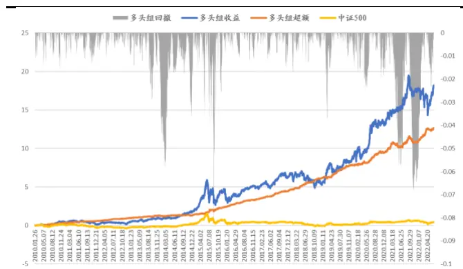
数据来源：Wind，朝阳永续，国泰君安证券研究

需要说明的是，除了等权的加权方式，我们还测试了根据因子历史表现动态加权，发现近 年超额收益有所提高，但历史整个区间的年化超额收益没有明显增加。我们也初步尝试使用了LightGBM模型做因子加权，测试发现年化超额收益没有明显增加。所以，最终对于目前选用的因子，本报告只使用等权方式加权。

## 3.2. 构建中证 500 指数增强策略

公募指数增强基金是指数基金的 加强版 ，具体是指基金经理在力求对基准指数进行有效跟踪的基础上，通过数量化方法进行积极的指数组合管理与风险控制，力争实现投资收益能够跟踪并适度超越基准指数的一类基金。指数增强基金合同主要条款一般有：1)投资标的指数成份股及其备选成份股的比例不低于非现金基金资产的 80%；2)每个交易日保持不低于基金资产净值 5%的现金或到期日在一年以内的政府债券；3)力争控制基金净值增长率与业绩比较基准之间的年化跟踪误差一般不超过7~8%。指数增强型基金，既秉持了指数化投资的理念，也认同主动管理能够获取超额收益的观点。

指数增强基金主要是在指数成分股内使用多因子选股模型，一般会控制行业和个股的偏离程度，保证对指数的有效跟踪；而通过对行业和个股权重的小幅偏离可以获取一定超额收益。除了多因子选股外，还有一些辅助性的投资策略，主要有以下几种：（1）行业轮动策略，适度调高（调低）看好（看空）的行业、板块在组合中的权重，获取增强收益。（2）网下打新策略，2020、2021 年打新收益很高，对于规模在 1-3 亿的基金产品， 年的每年打新收益可以达到 ；基金规模增大的话，收益会摊薄。2022 年受行情拖累，打新收益明显减少。（3）负基差下，做多股指期货。在股指期货长期处于负基差的情况下，可以买入一定比例股指期货合约来替代股票现货，从而获取基差收敛的增强收益。

（4）对于 20%的非成分股仓位，还可以使用全市场选股的策略做增强收益。由于选股空间更大，全市场选股可以构建更多样的策略，超额收益会比成分股内选股要高一些。

我们在构建指数增强策略时，直接使用中证500成分股作为股票池；没有采用在全市场选股，同时约束中证500成分股不少于80%的常规做法。原因在于我们认为另外 非成分股的仓位不必拘泥于传统多因子选股方式，可以使用更多样的全市场量化选股策略来操作。下面介绍我们的中证500指数增强策略回测结果。我们每周对大类因子加权计算得到大类复合因子，使用大类复合因子的分位数得分作为当期股票最终得分。然后，以得分最大化为目标，设置市值行业严格中性约束和个股权重约束，求解个股最优权重，构建周度指数增强组合。测算发现，在中证 500成分股内构建指数增强策略，年化超额收益 17.86%，超额收益最大回撤-6.63%，信息比率 3.65，周度双边换手率 16.15%。样本外 2022 年以来超额收益 8.87%，超额收益最大回撤-1.11%。策略每年收益情况如下表。策略历史收益曲线、超额收益曲线和期间回撤情况如下图。我们在每周的《权益因子观察周报》中对中证500指数增强策略组合的表现进行持续的跟踪和展示。

表 62：中证 500指数增强策略每年收益

| 年度 | 增强组合收益 |  | 中证500指数 |  | 增强组合超额收益 | 超额收益波动率 | 超额收益信息比率 | 超额收益最大回撤 | 月胜率 | 周度双边换手率 |
| --- | --- | --- | --- | --- | --- | --- | --- | --- | --- | --- |
| 2010 |  | 3389% |  | 0.17% | 23.73% | 3.44% | 6.90 | -1.44% | 100% | 16.74% |
| 2011 | 2 | 2.74% | 8 | 3.83% | 11.09% | 2.88% | 3.85 | -0.62% | 100% | 18.32% |
| 2012 |  | 18.97% |  | 0.28% | 18.69% | 2.76% | 6.77 | -0.71% | 92% | 16.29% |
| 2013 |  | 3248% | 1 | 6.89% | 15.59% | 3.43% | 4.55 | -1.63% | 75% | 15.49% |
| 2014 |  | 43.83% | 3 | 9.01% | 4.82% | 3.30% | 1.46 | -3.43% | 50% | 15.54% |
| 2015 |  | 83.56% | 4 | 3.12% | 40.45% | 12.32% | 3.28 | -6.72% | 75% | 15.56% |
| 2016 |  | -0.31% | 17 | .78% | 17.47% | 3.65% | 4.78 | -0.76%6 | 100% | 14.55% |
| 2017 |  | 22.91% |  | 0.20% | 23.11% | 3.17% | 7.29 | -0.89% | 100% | 15.72% |
| 2018 | 19 | .68% | 83 | .32% | 13.64% | 3.90% | 3.50 | -1.17% | 92% | 16.61% |
| 2019 |  | 50.47% | 2 | 6.38% | 24.08% | 4.21% | 5.73 | -4.14% | 83% | 15.86% |
| 2020 |  | 37.16% | 2 | 0.87% | 16.29% | 3.83% | 4.25 | -1.73% | 92% | 15.60% |
| 2021 |  | 27.57% |  | 5.59% | 11.99% | 4.24% | 2.83 | -4.46% | 58% | 15.53% |
| 2022.07 |  | -2.65% | B | 11.52% | 8.87% | 3.18% | 2.79 | -1.11% | 86% | 20.24% |
| 整体 |  | 21.06% |  | 3.04% | 17.86% | 4.89% | 3.65 | -6.72% | 85% | 16.15% |

数据来源：Wind，朝阳永续，国泰君安证券研究
测试区间：2010.01-2022.07。

图 49：中证 500 指数增强策略收益曲线
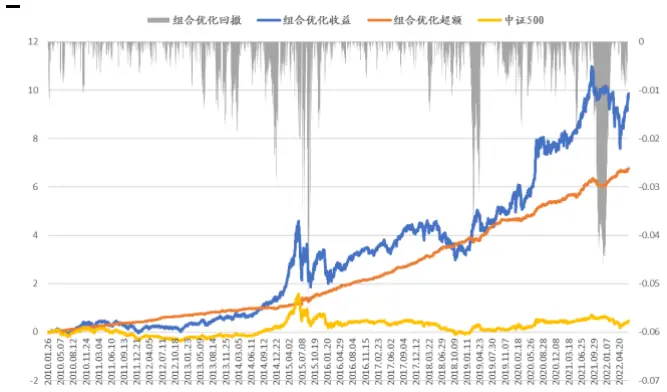
数据来源：Wind，朝阳永续，国泰君安证券研究测试区间：2010.01-2022.07。
注：具体持仓可以关注 Wind 组合管理中的 “配置-中证 500 指数增强组合”。

## 4. 总结

本报告主要展示中证 500 指数增强策略的构建过程。首先，简要介绍多因子选股模型的主要步骤。然后，依次介绍用到的 大类因子，展示每类因子的单因子选股和复合因子选股效果。最后，控制市值行业中性和个股权重约束构建中证 500 指数增强组合。

首先，我们对因子库的因子在中证 指数成分股内进行历史回测，筛选出效果较好的因子。我们对这些因子划分为11个类别，分别为北上资金、超预期（传统）、成长、分析师、超预期（分析师）、总量、估值、超预期衍生（估值）、盈利、超预期衍生（盈利）、价量因子。大类因子权重分配上，除了北上资金和总量因子权重为 5%，其他大类因子权重为 10%，大类因子内部权重也使用等权加权方式。整体而言，四类超预期因子的总权重达到 40%。经过对这些因子在中证 500 指数成分股内的选股表现进行详细测试，筛选出效果较好的近百个因子。

然后，使用 11个大类因子在中证 500成分股内构建指数增强策略。测算发现，指数增强组合年化超额收益 17.86%，超额收益最大回撤-6.63%，信息比率 3.65，周度双边换手率 16.15%。2022 年以来超额收益 8.87%，超额收益最大回撤-1.11%。

## 5. 风险提示

量化模型基于历史数据构建，而历史规律存在失效风险。

## 6. 附录

表 63：中证 500指数增强策略选用因子列表

| 类别 因子名 计算方法 用法 权重 |  |  |  |  |  |
| --- | --- | --- | --- | --- | --- |
|  | 5日持股比例变动 持股比例-5日前持股比例 越大越好 |  | 0.0125 |  |  |
| 北上资金 | 60日持股比例变动 | 持股比例-60日前持股比例 越大越好 | 0.0125 |  |  |
|  | 5日净流入 | 5日净流入金额 越大越好 | 0.0125 |  |  |
|  | 60日净流入 | 60日净流入金额 越大越好 | 0.0125 |  |  |
|  | 标准化预期外单季度扣非净利润 | 越大越好 | 0.0125 |  |  |
|  | 标准化预期外单季度扣非净利润-带漂移项 | 将单季度扣非净利润代入SUE-带漂移项公式计算 越大越好 | 0.0125 |  |  |
|  | 标准化预期外单季度毛利润-带漂移项 | 将单季度毛利润代入SUE-带漂移项公式计算 越大越好 | 0.0125 |  |  |
| 超预期 | 标准化预期外单季度毛利润 | 将单季度毛利润代入SUE公式计算 越大越好 | 0.0125 |  |  |
|  | 标准化预期外单季度归母净利润-带漂移项 | 将单季度归母净利润代入SUE-带漂移项公式计算 越大越好 | 0.0125 |  |  |
|  | 标准化预期外单季度归母净利润 | 越大越好 | 0.0125 |  |  |
|  | 标准化预期外单季度营业收入-带漂移项 | 将单季度营业收入代入SUE-带漂移项公式计算 越大越好 | 0.0125 |  |  |
|  | 标准化预期外单季度营业收入 | 将单季度营业收入代入SUE公式计算 越大越好 | 0.0125 |  |  |
|  |  | 过去90日（低于最新盈利预测报告数-高于最新盈利预测报告数）越大越好 | 0.0090909 |  |  |
|  |  |  | 180日盈利上调占比 | 过去180日（低于最新盈利预测报告数-高于最新盈利预测报告数）越大越好 | 0.0090909 |
|  | 过去120天盈利调整 | 过去120天分析师预测的净利润上调幅度平均值 越大越好 | 0.0090909 |  |  |
|  | 过去60天盈利调整 | 过去60天分析师预测的净利润上调幅度平均值 越大越好 | 0.0090909 |  |  |
| 超预期（分析师） |  | 过去120天营收调整 | 过去120天分析师预测的营业收入上调幅度平均值 越大越好 |  |  |
|  | 过去60天营收调整 | 过去60天分析师预测的营业收入上调幅度平均值 越大越好 | 0.0090909 |  |  |
|  | 单季度归母净利润超分析师预期幅度 | （单季度公告净利润-分析师预期单季度净利润）/abs(分析师预期越大越好 | 0.0090909 |  |  |
|  | 过去90日报告上调-下调比例 | 过去90日（上调报告数-下调报告数）/总报告数 越大越好 | 0.0090909 |  |  |
|  | 过去90日公告后报告上调-下调比例 | 过去90日公告后（上调报告数-下调报告数）/总报告数 越大越好 | 0.0090909 |  |  |
|  | 过去90日报告上调比例 | 越大越好 | 0.0090909 |  |  |
|  | 过去90日公告后报告上调比例 | 过去90日公告后上调报告数/总报告数 越大越好 | 0.0090909 |  |  |
|  | 标准化预期外市盈率（扣非）-带漂移项 | 将市盈率（扣非，单季度）倒数代入SUE-带漂移项公式计算 越大越好 | 0.0111111 |  |  |
|  | 标准化预期外市盈率（扣非） | 将市盈率（扣非，单季度）倒数代入SUE公式计算 越大越好 | 0.0111111 |  |  |
| 超预期衍生 | 标准化预期外市净率 | 将市净率倒数代入SUE公式计算 越大越好 | 0.0111111 |  |  |
|  | 标准化预期外市盈率（归母）-带漂移项 | 将市盈率（归母，单季度）倒数代入SUE-带漂移项公式计算 越大越好 | 0.0111111 |  |  |
| (估值) | 标准化预期外市盈率（归母） | 将市盈率（归母，单季度）倒数代入SUE公式计算 越大越好 | 0.0111111 |  |  |
|  |  |  | 0.0111111 |  |  |
|  | 标准化预期外市销率-带漂移项 | 将市销率倒数代入SUE公式计算 越大越好 | 0.0111111 |  |  |
|  | 标准化预期外市盈率(营业利润） | 将市盈率（营业利润，单季度）倒数代入SUE公式计算 越大越好 | 0.0111111 |  |  |
|  | 标准化预期外市销率 | 越大越好 | 0.0111111 |  |  |
|  | 标准化预期外单季度扣非ROA-带漂移项标准化预期外单季度扣非ROE-带漂移项 | 将单季度扣非ROA代入SUE-带漂移项公式计算 越大越好 | 0.0090909 |  |  |
|  |  | 将单季度扣非ROE代入SUE-带漂移项公式计算 越大越好 | 0.0090909 |  |  |
| 超预期衍生 | 标准化预期外单季度GPOA | 将单季度GPOA代入SUE公式计算 越大越好 | 0.0090909 |  |  |
|  | 标准化预期外单季度扣非ROA | 将单季度扣非ROA代入SUE公式计算 越大越好 | 0.0090909 |  |  |
|  | 标准化预期外单季度扣非ROE | 将单季度扣非ROE代入SUE公式计算 越大越好 | 0.0090909 |  |  |
| (盈利) | 标准化预期外单季度归母ROA-带漂移项 | 将单季度归母ROA代入SUE-带漂移项公式计算 越大越好 | 0.0090909 |  |  |
|  | 标准化预期外单季度归母ROE-带漂移项 | 将单季度归母ROE代入SUE-带漂移项公式计算 越大越好 | 0.0090909 |  |  |
|  | 标准化预期外单季度归母ROA | 将单季度归母ROA代入SUE公式计算 越大越好 | 0.0090909 |  |  |
|  | 标准化预期外单季度归母ROE | 将单季度归母ROE代入SUE公式计算 越大越好 | 0.0090909 |  |  |
|  | 标准化预期外归母净利润同比-带漂移项 | 将归母净利润同比代入SUE-带漂移项公式计算 越大越好 | 0.0090909 |  |  |
|  | 标准化预期外归母净利润同比 | 将归母净利润同比代入SUE公式计算 越大越好 | 0.0090909 |  |  |
|  | 单季度扣非净利润同比增长率 | 单季度扣非净利润同比增长率 越大越好 | 0.0125 |  |  |
|  | 单季度扣非ROA变动 | 单季度扣非ROA减去去年同期 越大越好 | 0.0125 |  |  |
|  | 单季度扣非ROE变动 | 单季度扣非ROE减去去年同期 越大越好 | 0.0125 |  |  |
| 成长 | 单季度归母净利润同比增长率 | 单季度归母净利润同比 越大越好 | 0.0125 |  |  |
|  | 单季度归母ROA变动 | 单季度归母ROA减去去年同期 越大越好 | 0.0125 |  |  |
|  | 单季度归母ROE变动 | 单季度归母ROE减去去年同期 越大越好 | 0.0125 |  |  |
|  | 单季度营业利润同比增长率 | 单季度营业利润同比增长率 越大越好 | 0.0125 |  |  |
|  | 单季度营业收入同比增长率 | 单季度营业收入同比增长率 越大越好 | 0.0125 |  |  |
|  | 分析师覆盖度 | 过去90日覆盖报告数量 越大越好 | 0.0076923 |  |  |
|  | 分析师预测BPROE分位数 | 过去90日分析师预测BP分位数+ROE分位数 越大越好 | 0.0076923 |  |  |
|  | 分析师盈利预测标准差 | 过去90日分析师预测净利润的标准差 越小越好 | -0.007692 |  |  |
|  | 分析师预测EP | 过去90日分析师预测净利润/总市值 越大越好 | 0.0076923 |  |  |
|  | 分析师预测PEG | (过去90日分析师预测净利润/总市值)*过去90日净利润增长率越大越好 | 0.0076923 |  |  |
|  | 分析师预测ROE | 过去90日分析师预测净利润/股东权益 越大越好 | 0.0076923 |  |  |
| 分析师 | 分析师预测目标价收益率 | 过去90日分析师预测目标价/当前股价-1 越大越好 | 0.0076923 |  |  |
|  | 过去90日机构最新盈利预测调整幅度 | 过去90日机构预测净利润调账幅度加权平均 越大越好 | 0.0076923 |  |  |
|  | 分析师预测SP20日变化 | 过去90日分析师预测SP20日变化 越大越好 | 0.0076923 |  |  |
|  | 分析师预测EP20日变化 | 过去90日分析师预测EP20日变化 越大越好 | 0.0076923 |  |  |
|  | 分析师预测净利润增长率FY1 | 过去90日分析师预测净利润增长率FY1 越大越好 | 0.0076923 |  |  |
|  | 分析师预测EPG分位数（FY1） | 过去90日分析师预测EP分位数+g（FY1）分位数 越大越好 | 0.0076923 |  |  |
|  | 分析师预测EPG分位数（FY2） | 过去90日分析师预测EP分位数+g（FY2）分位数 越大越好 | 0.0076923 |  |  |
| 总量 | 单季度毛利润 | 单季度毛利润 越大越好 | 0.01 |  |  |
|  | 单季度扣非净利润 | 单季度扣非净利润 越大越好 | 0.01 |  |  |
|  |  | 单季度归母净利润 | 单季度归母净利润 越大越好 | 0.01 |  |
|  | 单季度营业利润 单季度营业利润 越大越好 |  | 0.01 |  |  |
|  | 前三高管薪酬 前三高管薪酬之和 越大越好 |  | 0.01 |  |  |
|  | 市盈率（扣非）倒数 | 单季度扣非净利润/总市值 越大越好 | 0.0076923 |  |  |
| 估值 | 市净率倒数 | 股东权益/总市值 越大越好 | 0.0076923 |  |  |
|  | 市盈率（归母）倒数 | 单季度归母净利润/总市值 越大越好 | 0.0076923 |  |  |
|  | BPROE分位数 | BP分位数+ROE分位数 越大越好 | 0.0076923 |  |  |
|  | EPG分位数 | EP分位数+g分位数 越大越好 | 0.0076923 |  |  |
|  | 单季度EP(营业利润)倒数 | 单季度营业利润/总市值 越大越好 |  |  |  |
|  | 单季度SP倒数 | 单季度营业收入/总市值 越大越好 | 0.0076923 |  |  |
|  | 股息率 | 股息/总市值 越大越好 | 0.0076923 |  |  |
|  | EBIT2EV | EBIT除以企业价值EV 越大越好 | 0.0076923 |  |  |
|  | EP60日变化 | EP减去60日前的EP 越大越好 | 0.0076923 |  |  |
|  | EP120日 score | EP在120日历史数据上的score 越大越好 | 0.0076923 |  |  |
|  | EP120日分位数 | EP在过去120日的时序分位数 越大越好 | 0.0076923 |  |  |
|  | 公告后跳空 | 公告后相对中证500跳空幅度 越大越好 | 0.01 |  |  |
| 价量 | 60日特异度 | 1-60日Fama-French三因子模型的R方 越大越好 | 0.01 |  |  |
|  | 3个月换手率标准差 | 3个月换手率标准差 越小越好 | -0.01 |  |  |
|  | 1个月换手率 | 1个月换手率 越小越好 | -0.01 |  |  |
|  | 3个月换手率 | 3个月换手率 越小越好 | -0.01 |  |  |
|  | 20日日均交易金额 | 20日日均交易金额 越小越好 | -0.01 |  |  |
|  | 5日交易金额/波动率 | 5日交易金额/波动率 越小越好 | -0.01 |  |  |
|  | 一个月反转 | 一个月涨跌幅 越小越好 | -0.01 |  |  |
| 盈利 | 单季度GPOA | 单季度毛利润/总资产均值 越大越好 | 0.0166667 |  |  |
|  | 单季度扣非ROA | 单季度扣非净利润/总资产均值 越大越好 | 0.0166667 |  |  |
|  |  | 单季度归母净利润/总资产均值 越大越好 | 0.0166667 |  |  |
|  | 单季度扣非ROE | 单季度扣非净利润/股东权益均值 越大越好 | 0.0166667 |  |  |
|  | 单季度归母ROE 单季度归母净利润/股东权益均值 越大越好 |  | 0.0166667 |  |  |

数据来源：国泰君安证券研究

## 本公司具有中国证监会核准的证券投资咨询业务资格

## 分析师声明

作者具有中国证券业协会授予的证券投资咨询执业资格或相当的专业胜任能力，保证报告所采用的数据均来自合规渠道，分析逻辑基于作者的职业理解，本报告清晰准确地反映了作者的研究观点，力求独立、客观和公正，结论不受任何第三方的授意或影响，特此声明。

## 免责声明

本报告仅供国泰君安证券股份有限公司（以下简称“本公司”）的客户使用。本公司不会因接收人收到本报告而视其为本公司的当然客户。本报告仅在相关法律许可的情况下发放，并仅为提供信息而发放，概不构成任何广告。

本报告的信息来源于已公开的资料，本公司对该等信息的准确性、完整性或可靠性不作任何保证。本报告所载的资料、意见及推测仅反映本公司于发布本报告当日的判断，本报告所指的证券或投资标的的价格、价值及投资收入可升可跌。过往表现不应作为日后的表现依据。在不同时期，本公司可发出与本报告所载资料、意见及推测不一致的报告。本公司不保证本报告所含信息保持在最新状态。同时，本公司对本报告所含信息可在不发出通知的情形下做出修改，投资者应当自行关注相应的更新或修改。

本报告中所指的投资及服务可能不适合个别客户，不构成客户私人咨询建议。在任何情况下，本报告中的信息或所表述的意见均不构成对任何人的投资建议。在任何情况下，本公司、本公司员工或者关联机构不承诺投资者一定获利，不与投资者分享投资收益，也不对任何人因使用本报告中的任何内容所引致的任何损失负任何责任。投资者务必注意，其据此做出的任何投资决策与本公司、本公司员工或者关联机构无关。

本公司利用信息隔离墙控制内部一个或多个领域、部门或关联机构之间的信息流动。因此，投资者应注意，在法律许可的情况下，本公司及其所属关联机构可能会持有报告中提到的公司所发行的证券或期权并进行证券或期权交易，也可能为这些公司提供或者争取提供投资银行、财务顾问或者金融产品等相关服务。在法律许可的情况下，本公司的员工可能担任本报告所提到的公司的董事。

市场有风险，投资需谨慎。投资者不应将本报告作为作出投资决策的唯一参考因素，亦不应认为本报告可以取代自己的判断。
在决定投资前，如有需要，投资者务必向专业人士咨询并谨慎决策。

本报告版权仅为本公司所有，未经书面许可，任何机构和个人不得以任何形式翻版、复制、发表或引用。如征得本公司同意进行引用、刊发的，需在允许的范围内使用，并注明出处为“国泰君安证券研究”，且不得对本报告进行任何有悖原意的引用、删节和修改。

若本公司以外的其他机构（以下简称“该机构”）发送本报告，则由该机构独自为此发送行为负责。通过此途径获得本报告的投资者应自行联系该机构以要求获悉更详细信息或进而交易本报告中提及的证券。本报告不构成本公司向该机构之客户提供的投资建议，本公司、本公司员工或者关联机构亦不为该机构之客户因使用本报告或报告所载内容引起的任何损失承担任何责任。

## 评级说明

## 1.投资建议的比较标准

投资评级分为股票评级和行业评级。以报告发布后的 12 个月内的市场表现为比较标准，报告发布日后的 12 个月内的公司股价（或行业指数）的涨跌幅相对同期的沪深 300 指数涨跌幅为基准。

## 2.投资建议的评级标准

报告发布日后的 12 个月内的公司股价（或行业指数）的涨跌幅相对同期的沪深300 指数的涨跌幅。

| 评级 | 说明 |  |
| --- | --- | --- |
| 股票投资评级 | 增持 | 相对沪深 300 指数涨幅 15%以上 |
|  | 谨慎增持 | 相对沪深300指数涨幅介于5%～15%之间 |
|  | 中性 | 相对沪深300指数涨幅介于-5%～5% |
|  | 减持 | 相对沪深300指数下跌5%以上 |
| 行业投资评级 | 增持 | 明显强于沪深300指数 |
|  | 中性 | 基本与沪深300指数持平 |
|  | 减持 | 明显弱于沪深 300指数 |

## 国泰君安证券研究所

|  | 上海 | 深圳 | 北京 |
| --- | --- | --- | --- |
| 地址 | 上海市静安区新闸路 669 号博华广 场20层 | 深圳市福田区益田路6009号新世界 商务中心34层 | 北京市西城区金融大街甲9号金融 街中心南楼18层 |
| 邮编 | 200041 | 518026 | 100032 |
| 电话 | （021）38676666 | （0755）23976888 | (010)83939888 |
|  | E-mail: gtjaresearch@gtjas.com |  |  |