inInfo][Table_Title]2023.09.12

# 中证 1000 和中证 2000 指数增强策略构建

## ——权益配置因子研究系列 03

## 本报告导读：

本报告介绍在中证 1000 和中证 2000 指数成分股内构建指数增强策略。由于指数发布时间较短，参考编制规则对发布日前的成分股进行估算。回测发现，中证 1000 指数增强组合 2010 年以来历史年化超额 29.4%，超额最大回撤-8.2%，周度双边换手率 41%，2023 年超额 10.9%。中证 2000 指数增强组合 2014 年以来历史年化超额26.8%，超额最大回撤-10.9%，周度双边换手率35%，2023 年超额 12.8%。

## 摘要：

le_Summary]指数发布日前成分股估算。由于指数发布时间较短，按照编制规则对发布日期前的成分股进行估算。将中证 1000 指数成分股前推至2010年1月，将中证2000指数成分股前推至2014年12月，用于测试因子的选股效果。

选用因子介绍。在中证1000和中证2000成分股内进行单因子测试，筛选出投资逻辑强、效果较好的因子；其中的大部分因子和之前中证 500 策略一致，主要增加的是分析师因子、价量因子；另外由于覆盖度原因，中证 2000 不使用北向因子。因子加权上，使用过去一段时间（1 年、3 年、10 年）因子 rankIC_IR 平均值作为权重。

中证 1000 指数增强策略表现。测试个股上限 1%或0.5%、市值行业无暴露或放松四种约束下的效果。对于中证 1000 股票池，建议设置个股1%、市值暴露0.5个标准差、行业权重偏离2.5%的上限约束，增强策略2010年2月以来年化超额29.4%（除去2015年，年化超额26.7%），超额最大回撤-8.2%，信息比率 4.4，周度双边换手率41%；每期持股 100 只，持股自由流通市值中位数均值 38 亿，日均交易额中位数在 1.1-1.8 亿之间。2023 年超额 10.9%，回撤-3.1%。

中证 指数增强策略表现。对于中证 股票池，建议设置个股权重 0.5%、市值暴露 0.5 个标准差、行业权重偏离 2.5%的上限约束，指数增强策略 2014 年 12 月以来年化超额 26.8%（除去 2015年，年化超额23.4%），超额最大回撤-10.9%，信息比率4.1，周度双边换手率 35%；每期持股 200 只，持股自由流通市值中位数均值在20 亿左右，日均交易额中位数在 1.2-1.9 亿之间。2023 年超额12.8%，超额回撤-1.5%。

- 风险提示：量化模型基于历史数据构建，而历史规律存在失效风险。

大类资产配置研究

## hor] 报告作者

廖静池(分析师)

8 0755-23976176

liaojingchi024655@gtjas.com

证书编号 S0880522090003

张雪杰(分析师)

8 0755-23976751

zhangxuejie025900@gtjas.com

证书编号 S0880522040001

## cReport 相关报告]

指数相关性规律盘点：宽基、风格与行业2023.09.02

金融正搭台，成长将唱戏

2023.08.25

如何将定量行业配置策略拓展至港股市场2023.08.09

市场转势渐入佳境，先手价值后手成长2023.08.06

价格动量因子在行业轮动上的效果研究2023.08.05

我们在之前的系列报告中研究了超预期因子在不同股票池的选股效果、中证 指数增强策略构建。本报告主要介绍如何构建中证 和中证 2000 指数增强策略。首先介绍常用的选股模型框架。然后，按照编制规则对两个指数发布日前的成分股进行估算。之后，对各类因子进行单因子测试，筛选出效果较好的因子。最后，以过去一段时间rankIC_IR 的方式加权计算因子总得分，考察设置不同个股、市值、行业约束，构建指数增强组合。

## 1. 量化选股模型和常用因子介绍

## 1.1. 量化选股模型

多因子模型（Multiple-Factor Model, MFM）属于国内外主流量化选股模型之一。使用多个因子预测股票未来收益，筛选预期收益较好的股票，以期战胜基准指数。学术研究上，这类模型属于资产定价理论。在目前实际投资研究过程中，多因子模型使用估值、盈利、成长、公司治理、价量（反转、流动性、波动性等）、分析师预测、超预期等因子进行选股，构建一篮子股票的投资组合。多因子模型认为股票未来的收益可以用若干因素 $f_{1}...f_{k}$ 来解释，不能解释的部分记作残差 $\varepsilon_{n}$ ：

$$
r_{n}=f_{0}+x_{n1}f_{1}+x_{n2}f_{2}{+}...x_{nk}f_{k}+\varepsilon_{n}
$$

从上式可以看出，量化选股和主动选股殊途同归，本质都是为了对收益率 $r_{n}$ 进行预测。区别在于，量化研究的主要是共性部分（ $(x_{n1}f_{1}+$ $x_{n2}f_{2}{+}...x_{nk}f_{k}\;)$ ），主动研究的是股票的个性部分 $\varepsilon_{n}$ 。量化选股中所谓开发新的 Alpha 因子，很多时候其实是借鉴主动研究的投资逻辑，不断地从残差 $.\varepsilon_{i}$ 中抽取可以反映股票共性部分的因子 $.f_{k}$ 。事实上，量化选股和主动选股不是对立的，两个研究是可以统一在资产定价理论的框架内的。广义上讲，量化选股模型的体系一般由有三部分组成：收益预测模型、风险模型、交易成本模型。

图 1：量化选股模型体系
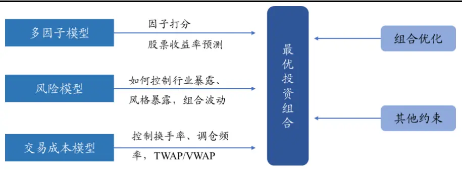
数据来源：国泰君安证券研究

## 1.1.1. 单因子测试

对各类因子进行单个因子选股效果测试是多因子选股的基础工作。

## 1）股票池与比较基准

s.

不同股票池中，股票的风格分布特征会有所不同，因子的选股效果会略有区别。初始股票池：选股日中证1000或中证2000指数成分股。对无法交易的股票进行剔除：（1）剔除选股日的 ST 股票；（2）剔除上市不满 3 个月的股票；（3）剔除选股日涨停、停牌的股票。

## 2）因子测试方法

我们通过因子 IC 测试、分组回测、单因子组合优化等多种方式来考察因子收益预测的有效性与稳定性。其中，单因子组合优化是指，我们使用组合优化方式，添加多种约束条件，构建单因子的最大化股票得分组合，考察单因子的选股效果。组合优化参数设置上，对于中证1000 和中证 2000 股票池，控制市值行业严格中性，设置个股权重偏离上限1%和个股权重上限1%。根据每周组合优化计算得到的股票名单和权重，对单因子选股组合进行历史业绩测算。计算组合的相对比较基准超额收益、最大回撤、超额收益信息比率等绩效指标。

## 1.1.2. 指数增强组合构建

首先，对于不同的宽基指数，筛选出适用的有效因子。其次，每周计算成分股因子值，并对因子进行去极值、标准化、缺失值填充、市值行业中性化处理。然后，按照各类因子逻辑，将股票池股票因子值排序，计算各类因子得分 Score（分位数），对因子得分使用 rankIC_IR 加权得到每只股票的最终得分。最后，将每周末股票的得分scoreT、股票协方差矩阵 代入组合优化模型，在控制跟踪误差、行业暴露、风格暴露等约束条件下，以最大化股票组合得分∑ N $score_{i}^{T}*w_{i}$ 为目标，求解组合股票的权重 ${\boldsymbol{w}}^{\mathrm{~\textquotedblleft~}}$ ：

$$
\begin{aligned}\begin{aligned}&\begin{aligned}\\&max_{w_{i}}\sum_{1}^{N}score_{i}^{T}*w_{i}\\\end{aligned}\\&s.t.\quad\sum_{}w_{i}=1\\&w^{lower}\leq w_{i}\leq w^{upper},i=1,\ldots,N\quad(1)\\&w_{active}^{lower}\leq w_{i}-w_{基准指数}\leq w_{active}^{upper},i=1,\ldots,N\\&w^{T}\widehat{\sum}w\leq\sigma_{trace\ error}^{2}\quad(4)\\&\sum_{1}^{N}x_{iI}w_{i}=w^{I}\\&\left|\sum_{1}^{N}x_{ik}*w_{i}\right|\leq x_{k}^{limit}\quad(6)\\&x_{基准指数}w_{i}\geq0.8\quad(7)\\&\sum_{}\left|w_{i}^{t}-w_{i}^{t-1}\right|\leq T\quad(8)\\&\end{aligned}\\&(8)\\\begin{aligned}\\&(5)\\&\end{aligned}\\&(8)\\\end{aligned}\tag{3}
$$

公式（2）为个股上下限约束：主要是不能卖空、避免某些个股权重过高。

公式（3）为个股权重相对基准偏离约束：主要是控制个股权重偏离。公式（4）为跟踪误差约束：对于指数增强策略，可以设置目标跟踪误差。由于个股、行业权重设置严格，此约束未使用。

公式（5）为行业权重约束：可以按照基准中行业的权重设置行业偏离约束，也可以自行确定某些行业暴露程度。

公式（6）为因子暴露约束：控制某些风格因子上暴露，主要是控制市值上暴露。目前主要设置市值中性约束。

公式（7）为成分股权重约束：对于指数增强产品，指数成分股及备选股的权重不少于 80%。在本报告只考虑中证 1000 和 2000 指数成分股内选股，相当于设置参数为 100%。

公式（8）为换手率约束：对于换手率较高的选股策略，可以通过这个约束达到控制交易成本的目的。由于所用因子换手率整体不高，本报告未设置。

指数增强策略组合构建和测试。根据每周组合优化计算得到的股票名单和权重，对选股组合进行历史业绩回溯。计算选股组合的累计收益、相对比较基准超额收益、最大回撤、超额收益的 IR、胜率等指标。

由于篇幅原因，本报告用到的多因子模型等内容介绍，详见本系列中第二篇报告《使用基本因子构建中证 500 指数增强策略初探》。

## 1.2. 使用因子说明

因子大类上，主要有超预期（传统、估值衍生、盈利衍生）、成长、盈利、估值、分析师、分析师超预期、价量、总量、北上资金因子。我们对因子库的因子在中证 1000、中证 2000 成分股内分别进行历史回测，筛选出效果较好的因子。其中的大部分因子和《使用基本因子构建中证 500 指数增强策略——初探权益配置因子研究系列 02_20230801》一致。主要增加的是分析师因子、价量因子。北向因子由于覆盖度原因，在中证 2000 中没有选用。中证 1000 和中证 2000股票池具体使用的因子列表以及计算方法见附录7.1和 7.2。其中:

1) 超预期因子的详细介绍参见报告《如何基于 PEAD 超预期因子构建——行业轮动策略行业配置研究系列 02_20220426》、《基于PEAD 效应的超预期因子选股效果如何——权益配置因子研究系列01 _20220601》。

2) 分析师因子，本报告相比中证500增强策略中所用因子增加了基于FY3 数据计算的环比变动因子，在《如何基于分析师预测数据构建行业轮动策略——行业配置研究系列 06_20221005》中对行业的分析师因子有详细介绍，个股的计算方法类似。

3) 价量因子中新增的因子可参见《价格动量因子在行业轮动上的效果研究——行业配置研究系列 09_20230805》。

4) 北上资金因子在报告《如何基于北向资金构建行业轮动策略——行业配置研究系列 03_20220610》中对行业的北向因子有详细介绍，个股的计算方法类似。

此外，原中证 500 策略因子在中证 1000、中证 2000 上的效果见附录7.4。虽然 500 策略所用因子在中证 500 上近期表现不佳，但在中证1000、中证 2000 的超额收益仍可观。

## 2. 指数发布日期前的成分股估算

由于中证 2000 指数最近才发布，历史成分股数据无法获得。为了测试因子在中证 2000 指数成分股中的选股效果，我们按照指数公司的编制方法，估算历史成分股名单用于历史回测。其中，对于中证 1000 指数，为了增加回测区间，估算 2010-2014 年的成分股名单；对于中证 2000指数，估算 2014-2023 年的成分股名单。

## 2.1. 中证 1000 指数 2010-2014 年成分股名单估算

中证 1000 指数在2014-10-17 发布，我们采用其指数编制方案的主要规则估算 2010 年-2014 年 6 月的成分股名单。

## 2.1.1. 中证 1000 指数编制方案

根据中证指数公司《中证1000指数编制方案》（2021 年 12 月更新 ，版本号 V1.0），样本选取方法主要为：

1) 样本空间：同中证全指指数的样本空间。

2) 选样方法:

a) 剔除样本空间内中证 800 指数样本及过去一年日均总市值排名前 300 名的证券；

b) 将样本空间内证券按照过去一年的日均成交金额由高到低排名，剔除排名后 20%的证券。

c) 将样本空间内剩余证券按照过去一年日均总市值由高到低排名，选取排名在 1000 名之前的证券作为指数样本。

## 3) 定期调整:

指数样本每半年调整一次，样本调整实施时间分别为每年 6 月和12 月的第二个星期五的下一交易日。每次调整的样本比例一般不超过 。定期调整设置缓冲区 日均成交金额排名在样本空间前90%的老样本可参与下一步日均总市值排名；日均总市值排名在800名之前的新样本优先进入，排名在1200名之前的老样本优先保留。

其中，中证全指指数的样本股由满足以下条件的沪深 A 股构成：①上市时间超过一个季度，除非该股票自上市以来的日均 A 股总市值在全部沪深 A 股中排在前 30 位；②非 ST、 *ST 股票、非暂停上市股票。此外，2010 年以来沪深股票数量变化情况见附录7.3。

## 2.1.2. 中证 1000 指数成分股估算结果

我们参照选样方法和定期调整的调仓频率估算成分股，使用自由流通市值计算股票权重。为了简化处理，缓冲区规则没有采用。

使用估算的成分股计算指数在 2010.1-2014.5 期间收益曲线，对比发现，整体区别很小，见下图。

图 2：2010.1-2014.5 估算成分股和实际中证 1000 指数收益对比
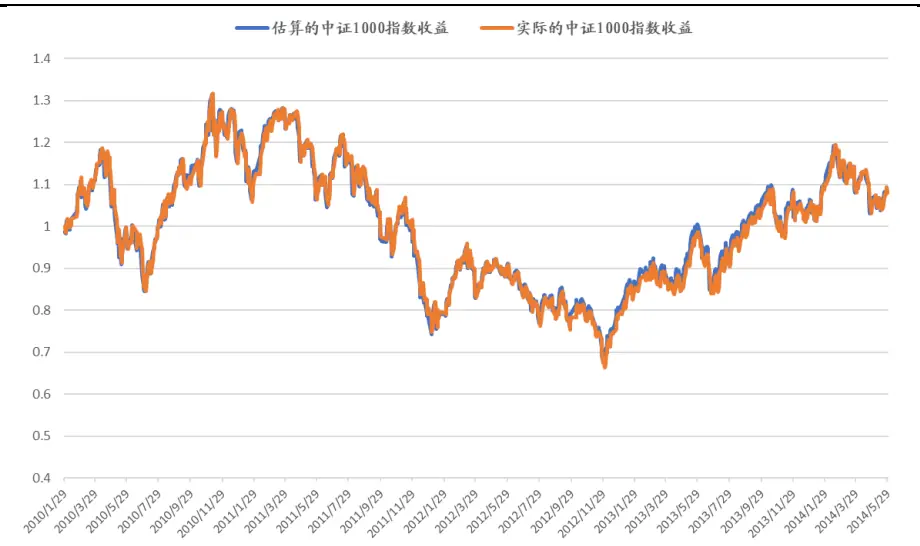
数据来源：Wind，国泰君安证券研究

## 2.2. 中证 2000 指数 2014-2022 年成分股估算

中证 2000 指数在 2023-08-11 发布，我们采用其指数编制方案的主要规则估算 2014 年-2022 年 6 月的成分股名单。

## 2.2.1. 中证 2000 指数编制方案

根据中证指数公司《中证 2000 指数编制方案》（2023 年 8 月版本号V1.0），样本选取方法主要为：

1) 样本空间：同中证全指指数的样本空间

2) 可投资性筛选：过去一年日均成交金额排名位于样本空间前 90%。

3) 选样方法

a) 对于样本空间内符合可投资性筛选条件的证券，剔除属于中证 800 和中证 1000 指数样本的证券，同时剔除样本空间中过去一年日均总市值排名前 1500 名的证券，将剩余证券作为待选样本；

b) 在上述待选样本中，按照过去一年日均总市值由高到低排名，选取排名在 2000 名之前的证券作为指数样本、

## 4) 定期调整

指数样本每半年调整一次，样本调整实施时间分别为每年 6 月和12 月的第二个星期五的下一交易日。每次调整的样本比例一般不超过 20%。定期调整设置缓冲区 待选样本中过去一年日均总市值排名在1600名之前的新样本优先进入，排名在2400名之前的老样本优先保留。

## 2.2.2. 中证 2000 指数成分股估算结果

我们参照选样方法和定期调整的调仓频率估算成分股，使用自由流通市值计算股票权重。为了简化处理，缓冲区规则没有采用。使用估算

的成分股计算指数在 2014.12-2023.07 期间收益曲线，对比发现，除了2015、2016 年股市异常波动期间有一定差异外，整体区别不大，见下图。

图 3：2014.12-2023.07 估算成分股和实际中证 2000 指数收益对比
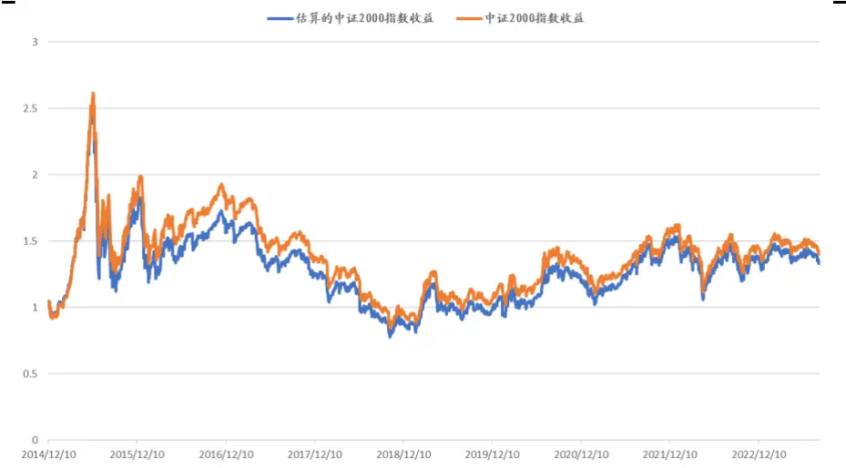
数据来源：Wind，国泰君安证券研究

## 3. 中证 1000指数增强策略构建

## 3.1. 中证 1000 股票池选用因子说明

我们对因子库的因子在中证 1000 指数成分股内进行历史回测，筛选出效果较好的因子。

## 3.1.1. 单因子绩效

我们对中证 1000指数成分股内各类因子，采用因子 IC、分组测试、组合优化等方式进行单因子测试。每周进行调仓操作，分组测试按因子值从小到大排序分 10 组，分别为 t0、t1、t2、…、t8、t9 组。计算分组收益、多头组超额收益、组合优化超额收益等绩效指标考察因子表现。回测日期区间为2010年2月至2023年8月。单因子测试结果见下表。

表 1：中证 1000股票池选用因子 主要绩效指标

| 因于类列 |  |  |  |  |  |  |  |  |  |  |  |  | 多空收益 |  |  |  |  |
| --- | --- | --- | --- | --- | --- | --- | --- | --- | --- | --- | --- | --- | --- | --- | --- | --- | --- |
| 分析师 |  |  | 18% | 46% |  | 049% | 04%- | 82% | 287% | 502% | 530%961%985% -15.66 |  | 14.03% | 8.88%-16.71% |  | 219% | 0.30 |
| 分析师 | 分析师预测净利润增长率FY3 |  | 09% | 72% |  | 34% | 02% | 10% | 015% | 481% | 754%970% 1024%-16.008 |  | 10.33% | 9.32% | -17.10% | 143% | 0.29 |
| 分析师分析师预测PEG-FY2分位数 |  |  | 52% | 37% |  | 78% | 89% | 79% | 95% | 297% | 760% 1089% 1199% -13.97 |  | 6.52% | 9.81% | -14.29% | 255% | 10.5 |
| 分析师分析师预测ROA-FY3 |  |  | 27% | 06% |  | 148% | 199% | 25% | 133% | 391% | 997% 1095% 1018% -18549 |  | 8.92% | 211.05% | -14.32% | 191% | 0.34 |
|  |  |  | 80% | 08% |  | 37% | 041%- | 41% |  |  |  |  |  |  |  |  |  |
|  |  |  |  |  |  |  |  | 57% | 25% | 220% | 179% 1044% 1614% -12.549 |  | 23.74% | 13.23% | -12.63% | 203% | 0.39 |
|  |  |  |  |  |  |  |  | 15% | 004% | 333% | 574%937% 1214% -20.75% |  | 15.03% | 10.23% | -17.63% | 190% | 0.41 |
|  |  |  | 36% | 101% |  | 10% | 38%- | 31% |  |  |  |  |  |  |  |  |  |
|  |  |  | 75% | 057% |  | 84% | 11%- | 35% | 01% | 3:04% | 781%997%1012%-1866% |  | 10.87% | 10.18% | -16.02% | 168% | 0.39 |
| 分析新师超预期日盈利调比 |  |  |  | 174% |  |  | 97% |  | 240% | 4839% | 54% 100% 1200% -12.129 |  | 13.963% |  | -14.94% | 2 10% | 10.401 |
| 分析师超预期过天盈利调 |  |  |  |  |  | 7% |  |  | 07%%% | 1818% | 810%% 1073% 1233% -15.7989% |  | 13.62% | 111.590%6 | -13.2% | 2110% |  |
|  |  |  | 19% | 118% |  | 95% | 85% | 23% | 286% | 164% | 139%818%915% -14.26% |  | 9.34% | 9.45% | -14.96% | 115% | 0.24 |
|  |  |  | 96% | 410% |  | 042% | 064% | 94% | 289% | 617% | 670%870%890%-17.11% |  | 16.86% | 7.12% | -14.20% | 2539% | 0.35 |
|  |  |  | 76% | 654% |  | 80% | 073% | 06% | 872% | 513% | 797% 1166% 1062%-10.31% |  | 19.38% | 8.63% | -12.03% | 320% | 0.47 |
|  |  |  | 94% | 573% |  | 17% | 119% | 00% | 867% | 651% | 863% 1000% 1081%-13.64% |  | 16.75% | 7.28% | -20.16% | 259% | 0.51 |
|  |  |  | 40% | 685% |  | 37% | 13% | 05% | 287% | 641% | 858% 1078%963% -13.94% |  | 17.03% | 6.82% | -17.25% | 262% | 0.49 |
|  |  |  | 58% | 417% |  | 82% | 13% | 07% | 155% | 687% | 827%1069% 1070%-14.60% |  | 18.28% | 8.79% | =15.25% | 246% | 0.47 |
|  |  | 2 | 06% | 825% |  | 81% | 51% | 43% | 29% | 094% | -6.59% |  | 18.68% | 14.90% | -5.06% | 216% | 0.55 |
|  |  |  |  |  |  |  |  | 202% | 175% | 332% | 381% 986% 1284% -6.259 |  | 16.48% | 11.99% | -3.78% | 216% | 0.55 |
| 公司治理 单季度营业利润公司治理 前三高管薪酬 |  |  | 37%141% | 06%002% |  | 181% | 69% 0113% | 55% 0137% | 65%302% | 322%475% | 809% 244% 1204% -11.969 15.41%343% 450% 455% -17.29% 6.95% |  |  | 10.18%2.45% -18.05% |  | 12%114% | 0.530.29 |
| 价量 20日日均交易金额 |  | 8 | 55% 1267% 9 |  |  | 42% 9 | 50% 8 | 36% | 547% | 093% | 102% 662% 93% 5.3 29.47% |  |  | 670% |  | 28% | 0.61 |
| 价量 20日日内收益价量 60日信息比率 |  | 1213 | 03% 1061% 1053% 876% 8 |  |  | 48% 1057% | 31%64% 5 | 730%43% | 580%338% | 281%142% | 128% 区22% 79% -9.96% 36.82%155% E29% 1423% -12.36% 27.77% |  |  | 10.47%011.01% |  | 17%14% | -0.62-0.47 |
| 价量 20日特质波动率 |  |  | 54% 1316% |  |  | 1278% | 831% 8 | 28% | 52% | 142% | -171% 798% 87% -12.72% 38.41% |  |  | 11.64% |  | 84% | 0.85 |
| 价量 1个月自由流通换手率价量 一个月涨跌幅 |  | 7 | 64% | 1137% 11 |  | 30% | 177% 8 | 650%43% | 750% | 343%372% | 187% 778% 77% -16.55% 35.36%178% D004% 2266% 1771% 31.30% |  |  | 8.07% 14.41%7.45% |  | 17%13% | -0.66-0.55 |
| 价量 3个月换手率标准差 |  | 15 | 37% 10 | 62% 11 |  | 78% 9 | 83% 6 | 98% | 154% | 062% | 133% 698% 80% -16.0% 35.17% |  |  | 12.04% 14.91% |  | 623% | -0.66 |
| 价量 1个月换手率价量 3个月换手率 |  | 12 | 64%124% 9 | 1154%26% |  | 901% | 891%842% | 433% 457% 2 | 51%50% | 231%137% | -007% -144% 07% -15. 36.71%-221% E47% -1599% -13.1% 27.23% |  |  | 9.85%9.67% 14.84% |  | 51%18% | -0.64-0.50 |
| 超预期 标准化预期外市净率超预期 标准化预期外市盈率（归母）-带漂移项 |  | B | E42%33% | 067% 0418% |  | 39%72% | 234%35% | 354%-034% 0 | 377%49% | 221%472% | 099% 474% 694% -16.12% 10.36%705% 1005% 1532% -13.4 20.65% |  |  | 4.07% -15.53%12.02% |  | 096%259% | 0.230.52 |
| 超预期 标准化预期外归母净利润同比-带漂移项超预期 标准化预期外单季度归母ROA-带漂移项 |  | -0 | 67%E22% | 27%-354% |  | 167%-036% | 104% 0219% | 53%-104% | 126%155% | 170%426% | 581% 448% 755% -1873% 8.22%621% 830% 1312% -14.29% 16.34% |  |  | 4.93% 9.87%9.93% 14.26 |  | 095%205% | 0.240.40 |
| 超预期 标准化预期外单季度归母ROE-带漂移项超预期 标准化预期外市销率-带漂移项 |  | DE | 06%40% | 08%-082% |  | -B81%92% | 78% 0007% -0 | 07%04% 0 | 088%45% | 430%380% | 539% 1066% 1263% -14.2 16.68%518% 1063% 991% -13.8 14.30% |  |  | 9.92%6.45% | 5.51% | 209%175% | 0.400.40 |
| 超预期 标准化预期外单季度GPOA |  |  | 196% | -146% |  | 02% -0 | 70% | -074% | 113% | 267% | 622% 946% 1232% -14.92% 15.28% |  |  | 9.12% | 16.14% | 188% | 0.41 |
| 超预期 标准化预期外单季度扣非净利润-带漂移项 |  | 出 | 01% | -B89% |  | -108% -0 | 69% -1 | 30% -0 | 31% | 214% | 621% 1069% 1414% -15.221% 17.15% |  |  |  |  |  |  |
| 超预期 标准化预期外单季度营业收入-带漂移项 |  |  | 178% | 28% |  | 160% | 067% | -081% | 08% | 164% | 669% 1027% 1462% -14.9 19.39% |  |  | 11.31% | -15.74% | 222% | 0.45 |
| 估值 股息率 |  | -0 | 69% | 14% |  |  |  |  |  |  |  |  |  |  |  |  |  |
| 估值 PCF倒数 |  |  |  | -019% |  | -130% 0 | 35% 0 | 59% |  |  | 359% 861% 589% 24.47% 6.12% |  |  |  |  |  |  |
| 估值 EP60日变化 |  | E | 35% S | 23% | 店 | 24% -0 | 81% | 026% | 320% | 749% | 998% 1179% 1430% -15.6 23.66% |  |  | 11.28% | -16.37% | 420% | 0.72 |
| 估值 市盈率（扣非）倒数 |  | E | 22% | 56% |  | 11% | 473% 0 | 12% | 277% | 7303% | 687% 1317% 1441% -13.05% 9.63% |  |  | 11.15%% | -14.73% | 392% | 0.0 |
| 估值 EP120日 score |  | 13 | 38% | 81% | 6 | 95% | 35% | 437% | 57% | 909% 1 | 033% 1159% 1567% -16.60% 29.06% |  |  | 11.55% | 13.24% | 499% | 200.76 |
| 估值 单季度SP |  |  | 35% | 04% |  | -065% 0 | 64% 0 | 23% | 19% | 465% | 440% | 753% 728% -17.06% 10.63% |  | 4.61% | -16.16% | 215% | 30 |
|  |  |  |  |  |  |  |  |  |  |  |  | 139% 714% -1973% 25.29% |  | -3.65% -365% |  |  | 0.29 |

数据来源：Wind，朝阳永续，国泰君安证券研究。测试区间：2010.02-2023.08。注：市值因子未使用。

## 3.1.2. 大类因子表现

因子权重分配上，我们使用各因子1年、3年、10年的因子rankIC_IR平均值作为权重进行加权，考察大类因子在中证 1000 股票池中的表现。

1) 从因子多头组超额收益上，估值、价量、分析师因子表现较好。近几年，成长、盈利表现稍弱。小市值因子在 2019-2021 年表现不佳，在 2021 年下半年开始大幅占优。

2) 从因子权重上可以看出，大类因子的权重分配基本和该类别的因子数量成比例，单因子选择的主观性会影响最终的结果。超预期因子近一年表现不佳，导致权重下降；价量因子权重明显提高。

中证 1000 股票池中大类因子的主要绩效指标、多头组超额收益曲线以及每年的平均权重如下。

表 2：中证 1000股票池大类因子的主要绩效指标

| 股票池 |  | 年化超额收益 |  | 最大回撤 |  | 跟踪误差 | 信息比率 |
| --- | --- | --- | --- | --- | --- | --- | --- |
| 000852.SH | 北向 |  | 17.8% | 5 | .5% | 4.7% | 3.78 |
| 000852.SH | 超预期 |  | 18.3% |  | 4.9% | 6.5% | 2.81 |
| 000852.SH | 成长 |  | 15.0% |  | 3.2% | 6.6% | 2.25 |
| 000852.SH | 分析师 |  | 20.6% |  | 10.4% | 7.0% | 2.95 |
| 000852.SH | 分析师超预期 |  | 18.5% |  | 3.6% | 7.1% | 2.60 |
| 000852.SH | 公司治理 |  | 14.3% |  | 3.4% | 7.6% | 1.88 |
| 000852.SH | 估值 |  | 20.9% |  | 1.3% | 8.7% | 2.40 |
| 000852.SH | 价量 |  | 20.0% |  | 2.7% | 8.0% | 2.49 |
| 000852.SH | 市值 |  | 18.0% |  | 9.8% | 10.4% |  |
| 000852.SH | 盈利 |  | 12.5% |  | 4.4% | 7.4% | 1.69 |

数据来源：Wind，朝阳永续，国泰君安证券研究。测试区间：2014.12.10-2023.09.05。

图 4：中证 1000 股票池 大类因子多头组超额收益曲线
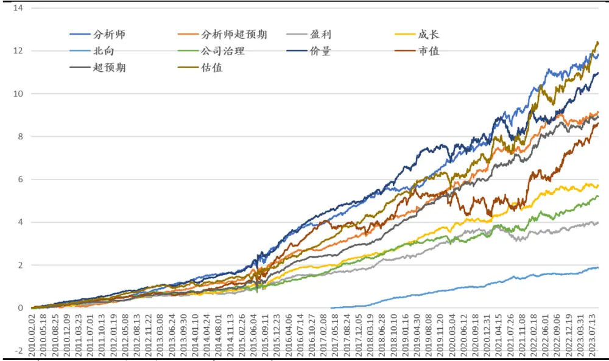
数据来源：Wind，朝阳永续，国泰君安证券研究。2010.02.01-2023.09.05。

表 3：中证 1000 股票池大类因子每年平均权重

| 年度平均权重 | 分析师 | 分析师超预期 |  | 盈利 |  | 成长 |  | 北向 |  | 公司治理 |  | 价量 | 超预期 | 估值 |
| --- | --- | --- | --- | --- | --- | --- | --- | --- | --- | --- | --- | --- | --- | --- |
| 2010 | 20.0% |  | 10.0% |  | 6.4% |  | 8.6% |  |  |  | 5.0% | 15.0% | 15.0% | 13.5% |
| 2011 | 20.0% |  | 10.0% |  | 6.4% |  | 8.6% |  |  |  | 5.0% | 15.0% | 15.0% | 14.4% |
| 2012 | 20.0% |  | 10.0% |  | 6.4% |  | 8.6% |  |  |  | 5.0% | 15.0% | 15.0% | 14.7% |
| 2013 | 22.2% |  | 10.2% |  | 5.2% |  | 8.8% |  |  |  | 5.5% | 14.8% | 18.1% | 15.1% |
| 2014 | 22.1% |  | 10.6% |  | 5.2% |  | 8.5% |  |  |  | 4.8% | 15.3% | 17.9% | 15.5% |
| 2015 | 21.9% |  | 10.9% |  | 4.3% |  | 8.9% |  |  |  | 5.0% | 16.6% | 17.9% | 14.5% |
| 2016 | 22.3% |  | 10.8% |  | 5.3% |  | 9.1% |  |  |  | 4.4% | 15.1% | 19.2% | 13.9% |
| 2017 | 19.7% |  | 9.7% |  | 4.9% |  | 8.3% |  | 5.0% |  | 5.8% | 15.1% | 17.8% | 15.3% |
| 2018 | 16.8% |  | 9.5% |  | 5.7% |  | 9.2% |  | 5.0% |  | 5.1% | 13.7% | 20.1% | 15.1% |
| 2019 | 14.4% |  | 9.4% |  | 5.3% |  | 8.6% |  | 5.0% |  | 5.9% | 15.6% | 18.5% | 16.5% |
| 2020 | 13.6% |  | 8.4% |  | 7.3% |  | 10.2% |  | 4.7% |  | 4.9% | 15.1% | 19.4% | 16.4% |
| 2021 | 14.0% |  | 9.3% |  | 6.4% |  | 10.0% |  | 4.1% |  | 4.8% | 15.3% | 19.9% | 16.3% |
| 2022 | 15.6% |  | 10.8% |  | 6.3% |  | 9.0% |  | 4.7% |  | 4.3% | 16.1% | 18.1% | 15.3% |
| 2023 | 15.8% |  | 9.2% |  | 5.3% |  | 8.0% |  | 4.7% |  | 5.0% | 20.2% | 15.6% | 16.1% |
| 总计 | 18.3% |  | 9.9% |  | 5.7% |  | 8.8% |  | 4.7% |  | 5.0% | 15.9% | 17.6% | 15.3% |

数据来源：Wind，朝阳永续，国泰君安证券研究。测试区间：2010.02.01-2023.09.05。

## 3.2. 构建中证 1000 指数增强策略

我们在构建指数增强策略时，直接使用中证 1000 成分股作为股票池；没有采用在全市场选股，同时约束中证 1000 成分股不少于 80%的常规做法。原因在于我们认为另外20%非成分股的仓位不必拘泥于传统多因子选股方式，可以使用更多样的全市场量化选股策略来操作。

虽然在因子上没有使用市值因子，但考虑的小市值风格未来可能持续占优，我们在构建中证 1000 指数增强策略时，设置了四种不同的约束条件，对比了放松市值、行业约束的效果。

表 4：指数增强策略约束条件说明

|  | 个股权重约束 | 市值约束 | 行业约束 |
| --- | --- | --- | --- |
| 个股上限1%，放松市值、行业约束 | 上限1% | 最大偏离0.5标准差 | 最大偏离权重2.5% |
| 个股上限1%，市值、行业无暴露 | 上限1% | 最大偏离0.05标准差 | 最大偏离权重0.05% |
| 个股上限0.5%，放松市值、行业约束 | 上限0.5% | 最大偏离0.5标准差 | 最大偏离权重2.5% |
| 个股上限0.5%，市值、行业无暴露 | 上限0.5% | 最大偏离0.05标准差 | 最大偏离权重0.05% |

数据来源：国泰君安证券研究。

从不同约束条件下，从中证 1000 指数增强策略绩效指标来看，个股上限越高（持仓数量越少），超额收益越高；放松市值、行业约束，可以明显增加超额收益。其中，个股上限 0.5%，放松市值、行业约束的结果最好；本报告收益为费前收益，按照 41%的周度双边换手率，双边0.3%交易费用，费用对收益影响大约为 41%*48 周*(0.3%/2)=2.95%。具体结果见下表。不同约束下，中证 1000 指数增强策略曲线如下图。

表 5：不同约束条件下中证1000 指数增强年度绩效指标

|  | 个股上限1%，放松市值、行业约束 |  | 个股上限1%，市值行业无暴露 |  | 个股上限0.5%，放松市值、行业约束 |  | 个股上限0.5%，市值、行业无暴露 |  |  |
| --- | --- | --- | --- | --- | --- | --- | --- | --- | --- |
| 年度 | 超额收益 | 超额收益最大回撤 | 超额收益 | 超额收益最大回撤 | 超额收益 | 超额收益最大回撤 | 超额收益 |  | 超额收益最大回撤 |
| 2010.02 | 35.5% | -1.4% | 28.7% | -1.6% | 20.2% | -1.0% | 16.6% |  | -1.3% |
| 2011 | 17.8% | -1.0% | 16.3% | -1.2% | 12.3% | -1.0% | 11.7% |  | -1.3% |
| 2012 | 38.1% | -1.0% | 35.7% | -0.9% | 29.1% | -0.9% | 27.6% |  | -0.9% |
| 2013 | 35.0% | -1.4% | 30.6% | -1.3% | 26.4% | -1.1% | 23.7% |  | -1.0% |
| 2014 | 21.9% | -2.2% | 18.9% | -1.8% | 19.5% | -2.7% | 14.5% |  | -1.5% |
| 2015 | 89.5% | -8.2% | 82.8% | -8.4% | 82.8% | -12.1% | 66.5% |  | -12.2% |
| 2016 | 33.3% | -1.1% | 30.6% | -1.1% | 29.4% | -0.9% | 24.0% |  | -1.0% |
| 2017 | 26.3% | -0.6% | 25.2% | -0.8% | 17.9% | -0.6% | 18.6% |  | -0.4% |
| 2018 | 22.2% | -1.5% | 19.0% | -1.4% | 17.8% | -1.5% | 15.8% |  | -1.0% |
| 2019 | 37.0% | -1.8% | 32.4% | -3.6% | 30.5% | -1.1% | 25.6% |  | -3.6% |
| 2020 | 16.1% | -3.2% | 30.2% | -3.4% | 16.0% | -3.1% | 21.2% |  | -2.4% |
| 2021 | 27.5% | -5.0% | 21.6% | -43% | 22.0% | -43% | 21.4% |  | -3.0% |
| 2022 | 16.6% | -3.6 | % 11.0% | -3.3% | 15.8% | -2.1% | 10.6% |  | -2.8% |
| 2023.09.05 | 10.9% | -3.1 | % 8.2% | -3.0% | 11.9% | -2.8% | 8.7% |  | -2.6% |
| 整体收益 | 29.4% | -8.2% | 26.7% | -8.4% | 23.9% | -11.8% |  | 21.0% | -12.2% |
| 整体收益(除去2015年) | 26.7% |  | 24.3% |  | 21.3% |  |  | 19.0% |  |
| 周度双边换手率 | 41.0% |  | 42.2% |  | 31.7% |  | 31.6% |  |  |

数据来源：Wind，朝阳永续，国泰君安证券研究。2010.02.01-2023.09.05。

图 5：不同约束条件下中证 1000指数增强策略收益曲线
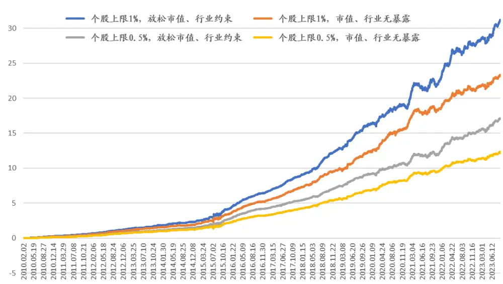
数据来源：Wind，朝阳永续，国泰君安证券研究。

综合考虑历史回测结果和投资操作性，建议使用个股上限 1%，放松市值、行业约束的结果。下面展示该约束下中证 1000 指数增强策略的具体结果。

测算发现，在中证 1000成分股内构建指数增强策略：

1) 收益方面，2010 年 2 月以来，年化超额收益 29.4%（若除去 2015年，年化超额 26.7%），超额收益最大回撤-8.2%，信息比率 4.41，周度双边换手率 41.0%。截至 2023 年 9 月 5 日，本年超额收益10.9%，超额收益最大回撤-3.1%。

2) 持仓方面，每期股票数量在100只左右，历史各期股票市值平均分布上，自由流通市值中位数的平均值 38 亿，最小 6 亿，最大 334亿；日均交易金额的中位数在 1.09 -1.77 之间。

该策略每年收益情况、历史收益曲线、持仓行业权重、市值和日均交易金额、因子暴露情况如下。

表 6：中证 1000指数增强策略（个股上限 1%，放松市值、行业约束）每年收益情况

| 年度 | 增强组合收益 |  | 中证1000指数 |  | 增强组合超额收益 | 超额收益波动率 | 超额收益信息比率 | 超额收益最大回撤 | 月胜率 | 周度双边换手率 |
| --- | --- | --- | --- | --- | --- | --- | --- | --- | --- | --- |
| 2010.02 |  | 57.1% |  | 21.6% | 35.5% | 3.9% | 9.11 | -1.4% | 90.9% | 38.4% |
| 2011 | 2 | -15.1% |  | -33.0% | 17.8% | 3.6% | 4.98 | -1.0% | 100.0% | 42.4% |
| 2012 |  | 36.7% |  | -1.4% | 38.1% | 3.4% | 11.08 | -1.0% | 100.0% | 41.8% |
| 2013 |  | 66.6% |  | 31.6% | 35.0% | 4.8% | 7.25 | -1.4% | 100.0% | 42.8% |
| 2014 |  | 56.4% |  | 34.5% | 21.9% | 4.5% | 4.83 | -2.2% | 83.3% | 43.1% |
| 2015 |  | 165.6% |  | 76.1% | 89.5% | 17.4% | 5.15 | -8.2% | 100.0% | 44.3% |
| 2016 |  | 13.3% |  | -20.0% | 33.3% | 4.9% | 6.86 | -1.1% | 100.0% | 40.1% |
| 2017 |  | 8.9% |  | -17.4% | 26.3% | 3.1% | 8.54 | -0.6% | 100.0% | 43.4% |
| 2018 |  | -14.7% |  | -36.9% | 22.2% | 4.2% | 5.31 | -1.5% | 100.0% | 39.9% |
| 2019 |  | 62.7% |  | 25.7% | 37.0% | 4.7% | 7.90 | -1.8% | 91.7% | 39.8% |
| 2020 |  | 35.5% |  | 19.4% | 16.1% | 5.9% | 2.73 | -3.2% | 66.7% | 41.0% |
| 2021 |  | 48.0% |  | 20.5% | 27.5% | 7.3% | 3.79 | -5.0% | 58.3% | 37.8% |
| 2022 |  | -5.0% |  | -21.6% | 16.6% | 5.7% | 2.91 | 3.6% | 83.3% | 38.8% |
| 2023.09.05 |  | 9.1% |  | -1.8% | 10.9% | 5.5% | 1.98 | -3.1% | 77.8% | 39.2% |
| 整体 |  | 32.2% |  | 2.8% 29.4% |  | 6.7% | 4.41 | -8.2% | 89.6% | 41.0% |

数据来源：Wind，朝阳永续，国泰君安证券研究。测试区间：2012.02.01-2023.09.05。

图 6：中证 1000 指数增强策略收益曲线（个股上限1%，放松市值、行业约束）
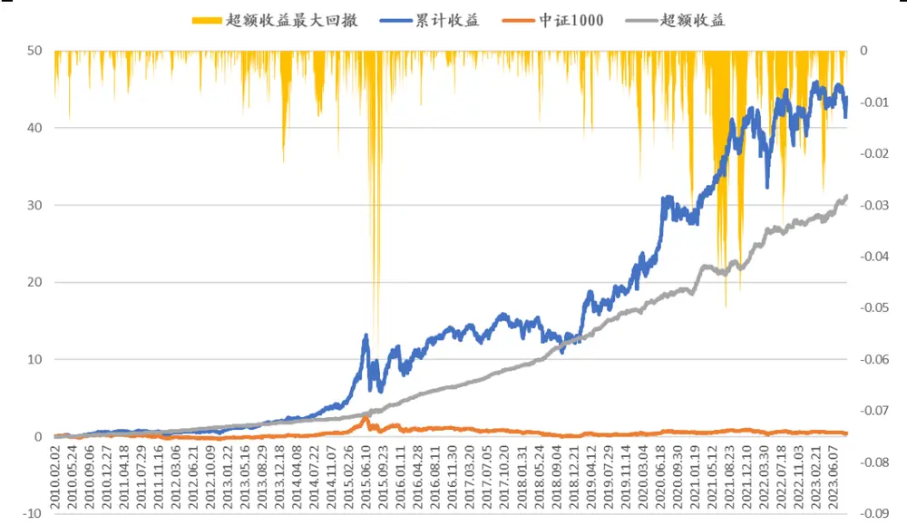
数据来源：Wind，朝阳永续，国泰君安证券研究。测试区间：2010.02.01-2023.09.05。

数据来源：Wind，朝阳永续，国泰君安证券研究测试区间：2010.02.01-2023.09.05。

图 7：持仓的行业分布（20230831）
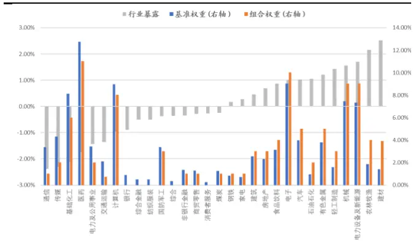
数据来源：Wind，朝阳永续，国泰君安证券研究测试区间：2010.02.01-2023.09.05。

图 8：持仓股票的平均市值、交易金额情况
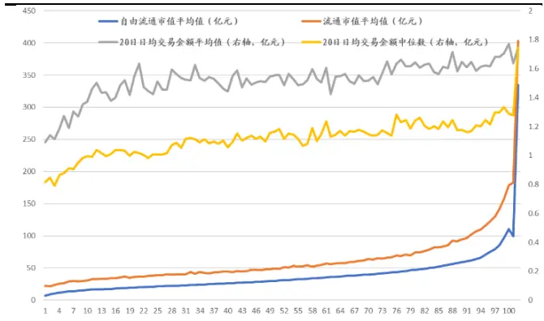

表 7：持仓股票因子暴露每年平均值（单位：标准差）

| 度 | 分析师 |  | 分析师超盈利 |  |  | 成长 | 北向 |  | 公司治理 |  | 价量 |  | 超预期 | 估值 |
| --- | --- | --- | --- | --- | --- | --- | --- | --- | --- | --- | --- | --- | --- | --- |
| 2010.12 | 0.15 |  | 0.18 |  | 0.57 | 0.57 | 0.40 |  | 0.21 |  | 0.37 |  | 0.55 | 0.54 |
| 2011 |  | 0.25 | 0.29 |  | 0.76 | 0.66 |  | 0.47 |  | 0.29 | 0.39 |  | 0.62 | 0.67 |
| 2012 |  | 0.33 |  | 0.37 | 0.75 | 0.72 |  | 0.45 |  | 0.28 | 0.30 |  | 0.68 | 0.64 |
| 2013 |  | 0.29 |  | 0.36 | 0.71 | 0.77 |  | 0.51 |  | 0.29 | 0.33 |  | 0.83 | 0.78 |
| 2014 |  | 0.28 |  | 0.32 | 0.71 | 0.80 |  | 0.49 |  | 0.36 | 0.38 |  | 0.86 | 0.75 |
| 2015 |  | 0.33 |  | 0.33 | 0.70 | 0.77 |  | 0.47 | 0.35 |  | 0.25 |  | 0.83 | 0.67 |
| 2016 |  | 0.34 | 0.40 |  | 0.71 | 0.80 |  | 0.50 |  | 0.26 | 0.22 |  | 0.86 | 0.78 |
| 2017 |  | 0.32 | 0.38 |  | 0.70 | 0.76 |  | 0.54 |  | 0.27 | 0.22 |  | 0.85 | 0.76 |
| 2018 |  | 0.26 | 0.32 |  | 0.62 | 0.81 |  | 0.44 |  | 0.25 | 0.43 |  | 0.90 | 0.69 |
| 2019 |  | 0.25 |  | 0.34 | 0.75 | 0.91 |  | 0.53 |  | 0.28 |  | 0.47 | 0.94 | 0.77 |
| 2020 |  | 0.25 |  | 0.36 | 0.87 | 0.97 |  | 0.48 |  | 0.24 |  | 0.51 | 0.99 | 0.79 |
| 2021 |  | 0.26 |  | 0.34 | 0.82 | 0.89 | 0.57 |  |  | 0.25 |  | 0.54 | 0.96 | 0.78 |
| 2022 |  | 0.31 |  | 0.43 | 0.79 | 0.90 |  | 0.46 |  | 0.24 | 0.41 |  | 0.92 | 0.71 |
| 2023.09 |  | 0.34 |  | 0.48 | 0.83 | 0.93 |  | 0.48 |  | 0.26 | 0.34 |  | 0.92 | 0.70 |

数据来源： ，朝阳永续，国泰君安证券研究

## 4. 中证 2000指数增强策略构建

## 4.1. 中证 2000 股票池选用因子说明

我们对因子库的因子在中证 2000 指数成分股内进行历史回测，筛选出效果较好的因子。其中，北向因子覆盖度原因，没有采用。其他大类因子和中证 1000 中选用的基本相同。

## 4.1.1. 单因子绩效

我们对中证 2000 指数成分股内各类因子，采用因子 IC、分组测试、组合优化等方式进行单因子测试。回测日期区间为 2014 年 12 月至 2023年 8 月。单因子测试结果见下表。

表 8：中证 2000股票池选用因子主要绩效指标

|  |  |  |  |  |  |  |  |  |  |  |  |  |  |  | 单因子组合优化 |  |  |  |  |  |  |
| --- | --- | --- | --- | --- | --- | --- | --- | --- | --- | --- | --- | --- | --- | --- | --- | --- | --- | --- | --- | --- | --- |
| 周子类 |  | 10 11 12 13 14 15 16 17 18 19 多组 |  |  |  |  |  |  |  |  |  |  |  | 多空收年化超 |  |  | 超极额收 |  | ranki raankic ir |  |  |
|  | 分析师预测BPROE-FY3 |  | 46% | 45% | 72% | 42% | 167% | 31% | 63% | 9.25% | 595%1748% |  | 14.45% | 20.95% |  | 13.2% |  | 5.0 | 6223% |  | 0.3 |
|  | 分析师预测PEGFY 分位数 |  |  | 34% |  | 114% |  |  | 25% | 520% 1054% 1596% |  |  | 15.189% | 15.12% |  | 11.2%6 |  | 6.5% |  | 31% | 0.4 |
|  | 分析师预测ROA-FY3的120动 |  |  | 79% |  | 149%4 | 21% |  | 74% | 763% 1467% 1000% |  |  | 2.62% | 5.24% |  | 18% |  | 7.7% 251% |  |  | 0. |
|  | 分析师预测ROE-FY3 |  | 85% | 87% | 93% | 70% | 70% | 94% | .51% | 4.24% 1414% 1220% |  |  | 15.53% | 8.34% |  | 8.7% |  | 8.3%266% |  |  | 0.4 |
|  | 过去90日机构最新盈利预测调整幅度 |  | 143% | 48% | 65% | 63% | 122% | 86% | 25% | 6.67%800%1128% |  |  | 14.46% | 11.72% |  | 6.3% |  | 23.2%158% |  |  | 0.2 |
|  | 分析师预测EP20日变化 |  | 96% | 46% | 10% | 28% |  |  | 103% | 1.75% 117% 1636% |  |  | 12.25% | 21.31% |  | 94% |  | 6.3%1.00% |  |  | 0.1 |
|  |  |  | 2446% | 45% | 72% |  | 167% | 31% | 63% | 925% 595% 1748% |  |  | 14.45% | 20.95% |  | 13.2% |  | 5.0% 223% |  |  | 0.3 |
|  | 分析师预测营收FY3的120日变动 |  | 82% | 97% | .08% | 61% | 15% | 27% | 37% | 116% 1472% 1080% |  |  | 18.93% | 7.97% |  | 6.2% |  | 20.3% |  | 214% | 0.3 |
|  |  |  |  |  |  |  |  | 57% | 62% | 277%1138%1044% |  |  | 18.18% | 11.46% |  | 9.6% |  | 9.8% |  | 221% | 0.4 |
|  | 180日盈利上调占比 |  | 48% | .09% | 10% |  |  |  |  |  |  |  |  |  |  |  |  |  |  |  |  |
|  |  |  |  |  |  |  |  |  |  | 918% 1594%1340% |  |  | 13.45% | 115.45% |  | 9.2% |  | 5.4% |  | 254% | è0.4 |
|  |  |  |  |  |  |  |  | 25% | 98% | 0.48%933%1043% |  |  | 14.97% | 10.75% |  | 7.8% |  | 9.5% |  | 194% | 0.30 |
|  | 单季度归母净利润超分析师预期幅度 |  | 13% | 75% | 74% | 95% | 67% | 67% | 54% | 1.76% 1661%1052% |  |  | 14.10% | 10.40% |  | 7.7% |  | 20.6% |  | 291% | è0.4 |
|  |  |  |  |  |  |  |  |  |  | 132% 1085% 1141% |  |  | 15.37% | 10.78% |  | 7.8% |  | 20.5% |  | 1299% | 0.3 |
|  | 过去60天营收调整 |  | 29% | 43% | 41% | 27% | 21% | 66% | 74% | 526%1108%895% |  |  |  |  |  |  |  |  |  |  |  |
|  | 过去90日报告上调比例 |  | 71% | 62% | 46% | 98% | 100% | 05% | 84% | 0.99% 1454% 1704% |  |  | 12.57% | 18.75% |  | 4.9% |  | 22.2% |  | 298% | 0.4 |
|  |  |  |  |  |  |  |  |  |  | 6.94%42%27% |  |  | 22.28% | 7.87% |  | 39% |  | 24.0% |  | 29% | 0.12 |
|  |  |  |  | 79% | 36% | 13%3% | 71% | 239% | 71% | 900% 1071% 12% |  |  | 20.79% | 14.58% |  | 5.5% |  | 7.9% |  | 179% | 10.2 |
|  |  |  |  | 71% | 283% |  |  |  |  | 203% 1258% 1072% |  |  | 11.69% | 15.79% |  | 151.9%6 |  | 3.3% |  |  |  |
|  | 单季度归母ROE |  | 71% | 78% | 42% | 82% | 92% | 21% | 35% | 2.47% 1178% |  | 477% | 1.51% | 21.48% |  | 10.2% |  | 4.4% |  | 22% | 0.4 |
|  |  |  |  | 19% | 765% | 27% |  | 128% |  |  |  | 76% | 15.02% | 18.05% |  | 1% |  | 4.4% |  |  | 06 |
|  | 单季度营业收入比增长率 |  |  | 180% | 8%6 | 2088%6 | 79%6 |  | 3%6 |  |  |  | 1.229 | 13.75% |  | 4%46 |  | 5.39% |  |  |  |
|  | 单季度 归母ROA变动 |  | 5%% |  | 35% | 43% | 13%6% |  |  | 253% 1475% |  | 21% | 15.63% | 7.79% |  | .2% |  | 5.5% |  |  | 10.4 |
|  | 单季度归ROE变动 |  | 8% | 72% |  | 52% | 21% |  | 87% | 177% 1788% |  | 489% | 1.249% | 22.85% |  | 1.7% |  | 5.5% |  | 91% | 0.5 |
| 公司治理 | 单季度归母净利润单季度营业利润 |  | 04%58% | 38%67% | E84%66% | -E24%-138% | 020%063% | 462%18% 1 | 98%205% 1 | 1190% 1579%094% 1472% |  | 89%79% G | 1.47%6.86% | 24.93%18.37% |  | 17.9%4.0% |  | 4.0%3.4% |  | 411%62% | 0.760.64 |
|  | 前三高管薪酬公告后1天异常收益 | L | 88%04% 0 | 053%.19% | 43%624% | 50%657% | 270%582% | 327%91% | 584%633% | 622% 984%465% 833% |  | 48%25% | 94%.92% | 9.37%11.29% |  | 3.8%1.8% |  | 3.7%5.7% |  | 140%034% | 0350.17 |
|  | 20日交易金额/波动率5日交易金额/波动率 | 1414 | .88% 1830% 19 | 68%44% | 978% 1779% | 33B%1561% | 74%1094% | 92%688% | 438%372% | -0.05% 599%-2-0.63% 区05% |  | 522%90% | .13%日33% | 12%2748% |  | 9.8%10.0% |  | 2.6%4.3% |  | 7%6% | 0.610.78 |
| 价量 | 20日日内收益60日日内收益 | 1416 | 32% 1804% | 74%1373% | 16.80%14.83% | 1737%1532% | 1093% 11055% | 002%802% | 9.64%789% | -082% 区30%268% 103% |  | 68%62% | 3.48%日.09% | 29.91%36.66% |  | 10.7%2.1% |  | 4.2%1.8% |  | 3%7% | 0.780.73 |
|  | 60日信息比率20日特质波动率 | 20 | 90% | 1273%2190% 1 | 10.54%9.64% 1 | 953%219% 1 | 23%138% | 859%992% | 526%0.48% | 170% E26%1.02% 正42% |  | 11%15% | 4.90%日00.90% | 38.55936.43% |  | 10.9%15.4% |  | 3.6%3.5% |  | 57% | 0.561.05 |
|  | 60日特异度公告后跳空 | 国 | 77%94% | E88% 5 | 94%00% | 400%329% | 422%247% | 860%446% | 1127%3% | 12.99% 1606% 1954% 1110% 1 |  | 224%075% | 0.43%1.63% | 28.01%19.69% |  | 9.0%1% |  | 6.8%8.9% |  | 6% | 0.600.59 |
|  | 一个月涨跌幅 |  | 856% | 1623% 1 | 618% 16 | .09% | 1435% 1 | 349% | 36% | 200% B96% |  | 01% | 0.12% | 2633% |  | 5.2% |  | 0.9% |  | 07% | 0.65 |
|  | 3个月换手率标准差1个月换手率 | 16 | .55% | 1531% 1 | 1313%423% 13 | 07% | 0%1099% | 87%23% | 0.40%555% | -0.46% S35%094% 124% - |  | 43%53% | .79%3.29% | 28.91%31.30% |  | 15.7%5.5% |  | 6.1%3.5% |  | 9943% | 0.580.60 |
|  | 3个月换手率标准化预期外市净率标准化预期外市盈率（归母）-带漂移项 | 1 | 552%16% -075% -0 | 13.64%.31%.43% | 10.91%488%49% | 1011%548%-72% | 585%258%-166% | 561%451%071% | 77%596%840% | 1.41% B22%549% 576%9.68% 1081% 1 |  | 84%874%9.04% - | .23%日18%172% | 29.96%12.90%21.79% |  | 2.4%1.9%12.7% |  | 5.2%8.8%5.6% |  | 6%20%18% | 0.470.280.49 |
|  | 标准化预期外归母净利润同比-带漂移项标准化预期外单季度归母ROA-带漂移项 |  | 370%1.57% | 315%203% | 04%163% | 180%104% | 114%66% | 095%110% | 273%744% | 612% 422% 1777% 1096% 1 |  | 150%390% | 8.77%6.14% | 7.79%16.47% |  | 58%10.2% |  | 7.7%7.6% |  | 058%158% | 0.17o34 |
|  | 标准化预期外单季度归母ROE-带漂移项 | -0 | 07% | 052% | 0.45% | 124% | 124% | 78% | 440% | 9.05% 1069% 1 |  | 4.06% | 5.44% | 14.13% |  | 93% |  | 6.7% |  | 156% | 0.32 |
| 超预期 |  |  |  |  |  |  |  |  |  |  |  |  |  |  |  |  |  |  |  |  |  |
|  | 标准化预期外单季度GPOA标准化预期外归母净利润同比 |  | 011%224% | -0.78%83% | 0.38%279% | 294%-078% | 96%92% | -023%46% | 874%50% | 644% 1051% 1527% 595% 1 |  | 191%228% - | .08%17.26% | 11.80%10.04% |  | 72%3.0% |  | 6.1%7.8% |  | 133%106% | 0.310.26 |
|  | 标准化预期外单季度归母ROA标准化预期外单季度归母ROE |  | 153%-0.89% | 1.01%1.50% | 71%37% | 106%-101% | 148%-071% | 330%133% | 484%688% | 1375% 1249% 11313% 1351% 1 |  | 702%614% | 2.50%-14.07% | 19.55%17.03% |  | 11.1%12.0% |  | 6.7%5.6% |  | 240%214% | 0.520.52 |
|  | 标准化预期外市销率 |  | 17% | -0.69% | 086% 0 | 85% | -027% | 549% | B6% | 703% 1025% 1 |  | 234% | 8.42% | 15.51% |  | 5.6% |  | 8.1% |  | 193% | 0.35 |
|  | 标准化预期外单季度扣非净利润-带漂移项 |  | 21% | 073% | 185% | -040% | -160% | 095% | 686% | 997% 836% 1 |  | 315% | 39% | 12.94% |  | 9.4% |  | 6.3% |  | 151% | 0.35 |
|  |  |  |  |  | 149% | 72% | 66% | 071% |  |  |  | 1904% | 3.72% | 21.79% |  | 12.7% |  | 5.6% |  | 218% | 0.49 |
|  | 标准化预期外单季度归母净利润 |  | 03% | 171% | 72% | -482% | -151% | 412% | 770% 1 | 428% 1123% 1 |  | 974% | 2.65% | 23.76% |  | 14.1% |  | 4.1% |  | 299% | 0.61 |
|  | 标准化预期外单季度营业收入市净率倒数 | 区 | 162%86% | 21%81% | -214%.16% | 008%154% | -030%469% | 176%496% | 879%957% | 1028% 1149% 11196% 919% 1 |  | 570%271% | 15.19%4.29% | 18.32%21.57% |  | 9.4%77% |  | 7.3%8.6% |  | 247%459 | 0.490.48 |
|  | 股息率 |  | 166% 0 | .18% | 077% | 103% | 26% | 034% | 532% | 859% 880% 1 |  | 155% | 4.40% | 9.89% |  | 519% |  | 4.4% |  | 231% | 035 |
| 估值 | BP60日变化EP60日变化EBIT2EV | 正 | 37% L-22% D196% | 50% -0.50%57% | .50% 8E32% 0E.52% | 86%25%52% | 610%448%092% | 946%419%516% | 27% 169% 17% 1 | 041% 1159% 1328%3.87% 1730% 1369%141% 1491% 1084% 日 |  |  | .26%.85%5.02% | 32.65%8.91%8.87% |  | 79%1.5%8.1% |  | 2.5%7.7%3.8% |  | 511%376%360% | 0.580.610.55 |
|  | 市盈率（扣非）倒数市盈率（归母）倒数 |  | 197%-B04% 6 | 88%82% E | 34%37% | 96%81% | -128%-314% | 238%3101% | 57% 1148% 1 | 518% 1588% 1688%305% 1730% 2555% |  |  | D.87%10.12% | 14.92%30.59% |  | 15.8%20.5% |  | 2.0%2.6% |  | 999508% | .0590.78 |
|  | 单季度EP（营业利润）倒数EP120日 score | -0-D | .63%16% G | 72%28% B | E.60%26% | E18%47% | 055%200% | 38% 11 | 0.02% 1222% 1 | 078% 1643% 1832%5.68% 1525% 1756% |  |  | 日à.28%5.97% | 8.95%28.71% |  | 5.4%11.1% |  | 2.9%5.0% |  | 428%4749 | 0.670.79 |
|  | EP250日 score | 6 | 84% | 34% E | .00% | 103% | 174% | 92% | 38% 1 | 0.60% 1480% 19.41% |  |  | 7.18% | 2625% |  | 14.4% |  | 2.7% |  | 426% | .072 |
|  | BPROE分位数 | 正 | 08% | E71% F | 88% | 167% | 47% | 59% 1 | 030% | 955% 1447% 2302% |  |  | .40% | 36.10% |  | 20.1% |  | 2.6% |  | 575% | 0.8 |
|  |  |  |  |  |  |  |  |  |  | 1175% 1601% 2841% |  |  | L.65% | 35.96% |  | 20.5% |  | 4.0% |  | 460% | 0.74 |
| 市值 市值 |  |  |  |  |  |  |  |  | 51% 44% 71% 正50% G14.99% 46.37% 08% |  |  |  |  |  |  |  |  |  |  |  | 0.52 |

数据来源：Wind，朝阳永续，国泰君安证券研究。测试区间：2014.12-2023.08。注：市值因子未使用。

## 4.1.2. 大类因子表现

因子权重分配上，我们使用各因子 1 年、3 年、10 年的因子 rankIC_IR平均值作为权重进行加权，考察大类因子在中证 2000 股票池中的表现。

1) 从因子多头组超额收益上，估值、价量因子表现较好。分析师因子近期表现不佳。小市值因子仅在2020年表现不佳，在2021年开始超额收益大幅提升。

2) 从因子权重上，大类因子的权重分配基本和该类别的因子数量成比例。超预期、盈利、分析师因子权重有所下降；价量、估值因子权重明显提高。

中证 2000 股票池中大类因子的主要绩效指标、多头组超额收益曲线以及每年的平均权重如下。

表 9：中证 2000股票池大类因子的主要绩效指标

| 股票池 |  | 年化超额收益 |  | 最大回撤 |  | 跟踪误差 | 信息比率 |  |
| --- | --- | --- | --- | --- | --- | --- | --- | --- |
| 932000.CSI | 超预期 |  | 19.7% |  | -14.0% | 7.9% | 2.48 |  |
| 932000.CSI | 成长 |  | 15.5% |  | -13.6% | 7.8% | 2.00 |  |
| 932000.CSI | 分析师 |  | 18.3% |  | -12.3% | 8.6% | 2.12 |  |
| 932000.CSI | 分析师超预期 |  | 17.4% |  | -15.6% | 8.9% | 1.95 |  |
| 932000.CSI | 公司治理 |  | 15.9% |  | -11.4% | 8.1% | 1.96 |  |
| 932000.CSI | 估值 |  | 26.0% |  | -9.9% | 8.6% | 3.02 |  |
| 932000.CSI | 价量 |  | 27.0% |  | -9.6% | 8.5% | 3.19 |  |
| 932000.CSI | 市值 |  | 32.9% |  | -15.0% | 11.0% | 2.98 |  |
| 932000.CSI | 盈利 |  | 13.6% |  | -12.4% | 9.0% |  | 1.51 |

数据来源：Wind，朝阳永续，国泰君安证券研究。测试区间：2014.12.10-2023.09.05。

图 9：中证 2000 股票池 大类因子多头组超额收益曲线
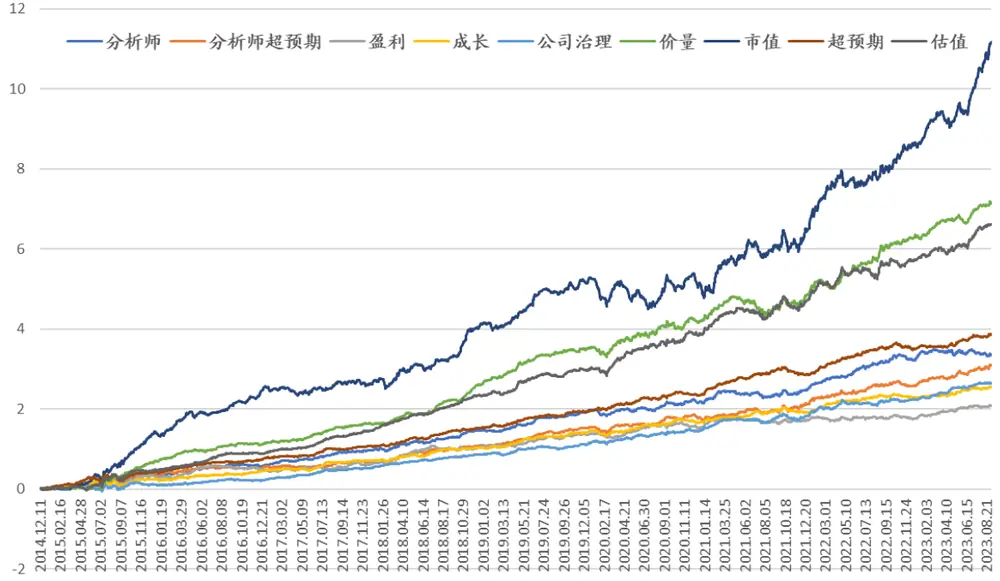
数据来源：Wind，朝阳永续，国泰君安证券研究

表 10：中证 2000 股票池大类因子每年平均权重

| 因子权重分 | 析师 | 分析师超预期 |  | 盈利 |  | 成长 |  | 公司治理 |  | 价量 | 超预期 | 估值 |
| --- | --- | --- | --- | --- | --- | --- | --- | --- | --- | --- | --- | --- |
| 2014 | 21.00% | 10.00% |  |  | 6.86% |  | 9.14% |  | 5.00% | 15.87% | 16.00% | 16.00% |
| 2015 | 21.00% | 9.79% |  |  | 6.86% |  | 9.14% |  | 5.00% | 15.87% | 16.00% | 16.00% |
| 2016 | 21.00% | 9.96% |  |  | 6.86% |  | 9.14% |  | 5.00% | 15.87% | 16.00% | 16.00% |
| 2017 | 21.00% | 10.00% |  |  | 6.86% |  | 9.14% |  | 5.00% | 15.87% | 16.00% | 16.00% |
| 2018 | 19.97% | 7.65% |  | 3.80% |  |  | 8.12% |  | 6.55% | 17.50% | 17.23% | 19.17% |
| 2019 | 18.42% | 7.52% |  | 3.30% |  |  | 8.25% |  | 6.57% | 19.39% | 16.60% | 19.95% |
| 2020 | 16.24% | 7.88% |  | 4.96% |  |  | 8.78% |  | 6.32% | 18.58% | 16.56% | 20.68% |
| 2021 | 15.02% | 8.43% |  |  | 4.55% |  | 8.94% |  | 6.12% | 18.24% | 17.64% | 21.07% |
| 2022 | 16.99% |  | 10.16% |  | 3.67% |  | 8.11% |  | 6.01% | 20.55% | 14.85% | 19.66% |
| 2023 | 16.57% |  | 9.34% |  | 3.90% | 6.84% |  |  | 6.28% | 24.30% | 11.69% | 21.08% |
| 总计 | 18.72% |  | 9.07% |  | 5.16% |  | 8.56% |  | 5.78% | 18.20% | 15.86% | 18.56% |

数据来源：Wind，朝阳永续，国泰君安证券研究。

## 4.2. 构建中证 2000 指数增强策略

我们在构建指数增强策略时，直接使用中证 2000 成分股作为股票池。在构建中证 2000 指数增强策略时，同样设置了四种不同的约束条件，对比了放松市值、行业约束的效果。

从不同约束条件下，从中证 2000 指数增强策略绩效指标来看，个股上限越高（持仓数量越少），超额收益越高；放松市值、行业约束，可以明显增加超额收益。其中，个股上限 1%，放松市值、行业约束的结果最好；本报告收益为费前收益，按照 42.3%的周度双边换手率，双边0.3%交易费用，费用对收益影响大约为42.3%*48周*（0.3%/2）=3.05%。具体结果见下表。不同约束下，中证 2000 指数增强策略曲线如下图。

表 11：不同约束条件下中证2000 指数增强年度绩效指标

|  | 个股上限1%，放松市值、行业约束 |  |  | 个股上限1%，市值、行业无暴露 |  |  | 个股上限0.5%，放松市值、行业约束 |  | 个股上限0.5%，市值、行业无暴露 |  |  |
| --- | --- | --- | --- | --- | --- | --- | --- | --- | --- | --- | --- |
| 年度 | 超额收益 |  | 超额收益最大回撤 | 超额收益 |  | 超额收益最大回撤 | 超额收益 | 超额收益最大回撤 | 超额收益 |  | 超额收益最大回撤 |
| 2014.12 | 2.3% |  | -0.5% | 2.5% |  | -0.4% | 2.3% | -0.5% | 2.4% |  | -0.4% |
| 2015 | 99.0% |  | -10.9% | 58.7% |  | -10.8% | 80.5% | -10.9% | 45.8% |  | -11.0% |
| 2016 | 26.6% |  | -1.8% | 22.0% |  | -1.9% | 19.3% | -1.5% | 13.9% |  | -2.1% |
| 2017 | 23.7% |  | -1.5% | 25.6% |  | -1.0% | 15.9% | -1.3% | 16.6% |  | -1.0% |
| 2018 | 26.9% |  | -1.6% | 22.8% |  | -1.2% | 22.6% | -1.9% | 22.5% |  | -0.7% |
| 2019 | 43.4% |  | -2.5% | 37.3% |  | -3.7% | 38.9% | -1.5% | 33.1% |  | -2.8% |
| 2020 | 26.1% |  | -4.4% | 25.5% |  | -2.5% | 24.1% | 4.3% | 24.4% |  | -2.5% |
| 2021 | 25.6% |  | 4.9% | 17.1% |  | -5.1% | 24.0% | 4.2% | 28.5% |  | -3.4% |
| 2022 | 19.1% |  | -3.1% | 13.9% |  | -3.5% | 22.3% | -1.8% | 16.6% |  | -2.4% |
| 2023.09.05 | 9.1% |  | -2.7% | 6.8% |  | -2.2% | 12.8% | -1.5% | 10.3% |  | -1.6% |
| 整体收益 |  | 30.4% | -10.9% |  | 24.8% | -10.8% | 26.8% | -10.9% | 23.1% |  | -11.0% |
| 整体收益(除去2015年) |  | 25.9% |  |  | 22.1% |  | 23.4% |  |  | 21.5% |  |
| 周度双边换手率 | 42.3% |  |  | 42.8% |  |  | 34.9% |  | 33.9% |  |  |

数据来源：Wind，朝阳永续，国泰君安证券研究。测试区间：2014.12.10-2023.09.05。

图 10：不同约束条件下中证 2000指数增强策略收益曲线
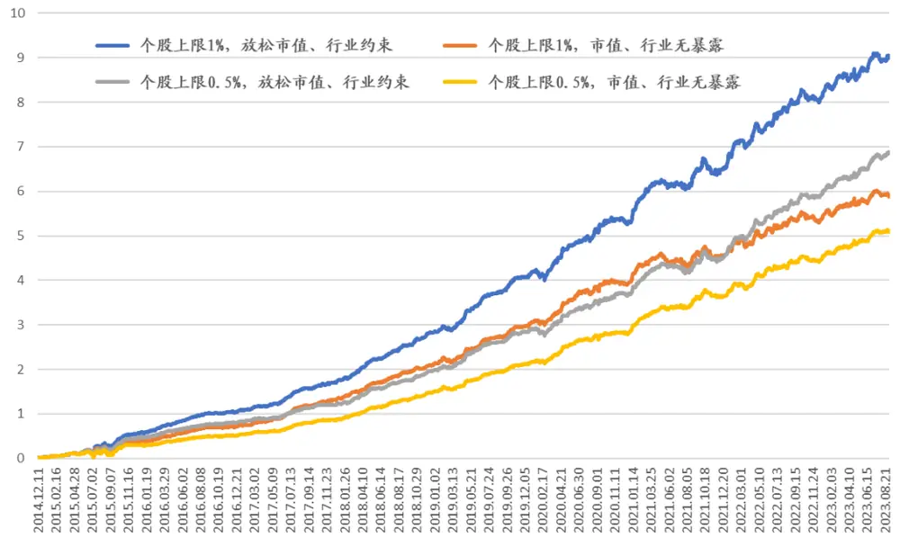
数据来源：Wind，朝阳永续，国泰君安证券研究。测试区间：2014.12.10-2023.09.05。

综合考虑历史回测结果和投资操作性，建议使用个股上限 0.5%，放松市值、行业约束的结果。下面展示该约束下中证 2000 指数增强策略的具体结果。

测算发现，在中证 2000成分股内构建指数增强策略：

3) 收益方面，2014 年 12 月以来年化超额收益 26.8%（若除去 2015年，年化超额 23.4%），超额收益最大回撤-10.9%，信息比率 4.09，周度双边换手率 34.9%。截至 2023 年 9 月 5 日，本年超额收益12.8%，超额收益最大回撤-1.5%。

4) 持仓方面，每期股票数量在200只左右，容纳资金规模较高（其中2014、2015 股票池较小，平均选 100 只股票）；历史各期股票市值平均分布上，自由流通市值中位数的平均值在 20 亿左右，最小 4亿，最大79亿；流通市值平均值在32亿左右，最小11亿 ，最大125 亿。日均交易金额的中位数在 1.2 -1.9 亿之间。

该策略每年收益情况、历史收益曲线、持仓行业权重、市值和日均交易金额、因子暴露情况如下。

表 12：中证 2000指数增强策略（个股上限 0.5%，放松市值、行业约束）

| 年度 | 增强组合收益 |  | 中证2000指数 |  | 增强组合超额收益 | 超额收益波动率 | 超额收益信息比率 | 超额收益最大回撤 | 月胜率 | 周度双边换手率 |
| --- | --- | --- | --- | --- | --- | --- | --- | --- | --- | --- |
| 2014.12 |  | -5.2% |  | -7.5% | 2.3% | 4.3% | 0.54 | -0.5% | 100.0% | 43.3% |
| 2015 |  | 190.2% |  | 109.8% | 80.5% | 14.2% | 5.66 | -10.9% | 100.0% | 37.5% |
| 2016 |  | 11.7% |  | -7.6% | 19.3% | 4.8% | 4.07 | -1.5% | 83.3% | 26.4% |
| 2017 |  | -8.2% |  | -24.1% | 15.9% | 3.8% | 4.22 | -1.3% | 100.0% | 28.5% |
| 2018 |  | -10.7% |  | -33.3% | 22.6% | 4.0% | 5.66 | -1.9% | 100.0% | 35.4% |
| 2019 |  | 60.9% |  | 22.0% | 38.9% | 3.9% | 10.02 | -1.5% | 91.7% | 36.0% |
| 2020 |  | 39.5% |  | 15.4% | 24.1% | 5.6% | 4.31 | 4.3% | 83.3% | 36.5% |
| 2021 |  | 49.8% |  | 25.9% | 24.0% | 6.1% | 3.91 | 4.2% | 75.0% | 35.1% |
| 2022 |  | 7.5% |  | -14.8% | 22.3% | 4.7% | 4.71 | -1.8% | 91.7% | 37.7% |
| 2023.09.05 |  | 17.1% |  | 4.3% | 12.8% | 4.0% | 3.17 | -1.5% | 77.8% | 41.2% |
| 整体 |  | 30.9% |  | 4.1% | 26.8% | 6.6% | 4.09 | -10.9% | 89.6% | 34.9% |

数据来源：Wind，朝阳永续，国泰君安证券研究。测试区间：2014.12.10-2023.09.05。

图 11：中证 2000指数增强策略收益曲线（个股上限0.5%，放松市值、行业约束）
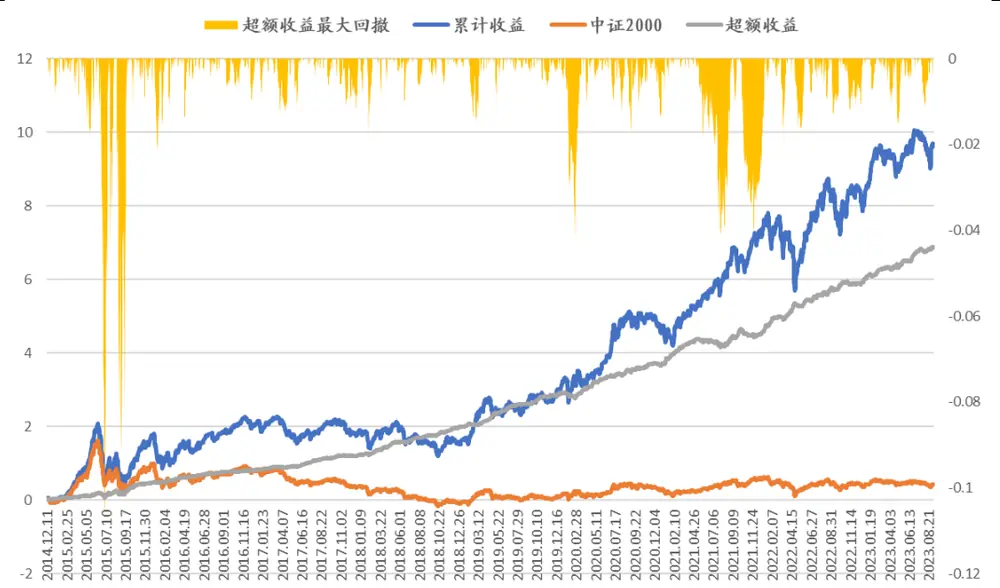
数据来源：Wind，朝阳永续，国泰君安证券研究。测试区间：2014.12.10-2023.09.05。

图 12：持仓的行业分布（20230901）
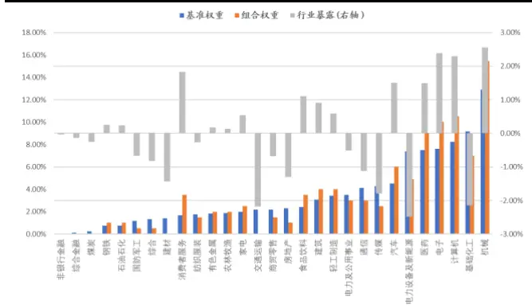
数据来源：Wind，朝阳永续，国泰君安证券研究测试区间：2014.12.10-2023.09.05。

图 13：持仓股票的平均市值、交易金额情况
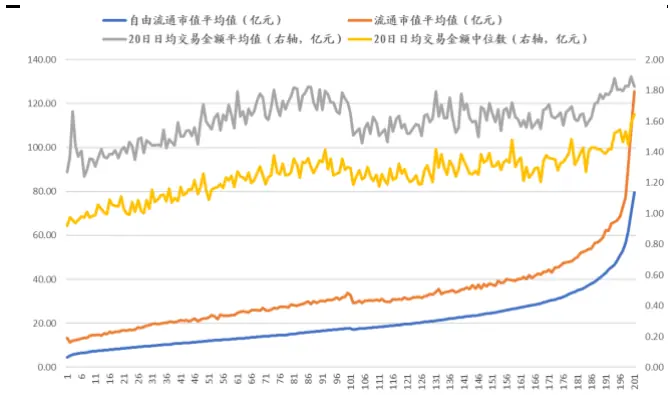
数据来源：Wind，朝阳永续，国泰君安证券研究测试区间：2014.12.10-2023.09.05。

表 13：持仓股票因子暴露的每年平均值（单位：标准差）

| 年度 | 分析师 |  | 分析师超预期 |  | 盈利 | 成长 | 公司治理价 | 量 |  | 市值 |  | 超预期 | 估值 |
| --- | --- | --- | --- | --- | --- | --- | --- | --- | --- | --- | --- | --- | --- |
| 2014.12 | 0.07 |  | 0.06 |  | 0.61 | 0.54 | 0.23 | 0.29 |  | 0.28 |  | 0.57 | 0.49 |
| 2015 | 0.07 |  | 0.06 |  | 0.46 | 0.43 | 0.23 | 0.16 |  | 0.20 |  | 0.43 | 0.36 |
| 2016 |  | 0.12 | 0.10 |  | 0.44 | 0.39 | 0.23 | 0.17 |  | 0.35 |  | 0.35 | 0.39 |
| 2017 |  | 0.15 |  | 0.14 | 0.50 | 0.44 | 0.29 | 0.17 |  | 0.42 |  | 0.46 | 0.47 |
| 2018 |  | 0.18 |  | 0.12 | 0.54 | 0.61 | 0.41 |  | 0.28 | 0.38 |  | 0.62 | 0.65 |
| 2019 |  | 0.13 | 0.10 |  | 0.65 | 0.70 | 0.43 |  | 0.30 | 0.44 |  | 0.73 | 0.68 |
| 2020 |  | 0.13 |  | 0.11 | 0.77 | 0.77 | 0.44 |  | 0.30 | 0.50 |  | 0.84 | 0.71 |
| 2021 |  | 0.14 | 0.13 |  | 0.79 | 0.77 | 10.53 |  | 0.32 | 0.35 |  | 0.92 | 0.77 |
| 2022 |  | 0.18 |  | 0.19 | 0.91 | 0.86 | 0.55 |  | 0.32 | 0.28 |  | 0.88 | 0.77 |
| 2023.09 |  | 0.19 |  | 0.21 | 0.86 | 0.78 | 0.56 |  | 0.37 |  | 0.32 | 0.80 | 0.77 |

数据来源：Wind，朝阳永续，国泰君安证券研究

## 5. 总结

本报告主要介绍中证 1000 和中证 2000 指数增强策略的构建。

首先，简要介绍量化选股模型和常用因子。

然后，为了延长单因子测试时间区间，参考指数编制规则估算两个指数的历史成分股名单。由于中证 2000 指数最近才发布，历史成分股数据无法获得。为了测试因子在指数成分股中的选股效果，我们按照指数公司的编制方法，估算历史成分股名单用于历史回测。

之后，对因子库的因子在中证1000和中证2000指数成分股内进行历史回测，筛选出效果较好的因子。其中的大部分因子和之前中证500策略一致，主要增加的是分析师因子、价量因子；另外，中证 2000 不使用北向因子。

最后，设置多种市值、行业权重约束，构建指数增强组合。考虑历史回测结果和投资操作性，对于中证 指数增强策略，建议使用个股上限 1%，市值暴露最大偏离 0.5 个标准差、行业权重最大偏离 2.5%的约束。收益方面，2010 年 2 月以来年化超额收益 29.4%（若除去 2015年，年化超额 26.7%），超额最大回撤-8.2%，信息比率 4.41，周度双边换手率 41.0%。持仓方面，每期股票数量在 100 只左右，历史各期股票自由流通市值平均值38亿；日均交易金额的中位数在1.09 -1.77之间。

对于中证 2000 指数增强策略，建议使用个股上限 0.5%，市值暴露最大偏离 个标准差、行业权重最大偏离 的约束。收益方面， 年12 月以来年化超额收益 26.8%（若除去 2015 年，年化超额 23.4%），超额收益最大回撤-10.9%，信息比率 4.09，周度双边换手率 34.9%。持仓方面，每期股票数量在200只左右；历史各期股票市值平均分布上，自由流通市值平均值在20亿左右；日均交易金额的中位数在1.2-1.9亿之间。

本篇报告不足之处：首先是缺少高频类因子，我们会在后续报告中进行研究。其次，因子加权合成上，目前还是线性加权为主，后续考虑尝试机器学习算法。

## 6. 风险提示

量化模型基于历史数据构建，而历史规律存在失效风险。

## 7. 附录

## 7.1. 中证 1000 因子列表及计算方法

表 14：中证 1000因子列表和计算方法

| 因子类别 | 因于名 | 计算方法 | 用法 因于类荆 因于名 |  | 计算方法 | 用法 |
| --- | --- | --- | --- | --- | --- | --- |
| 分析师 分析师 | 分析师覆盖度 | 过去90日覆盖报告数量 | 越大越好 公司治理 | 单季度毛利润 | 单季度毛利润 | 越大越好 |
| 分析师 | 分析师预测BPROE-FY3 分析师预测BPROE-FY2分位数 | BP乘以分析师预测ROE-FY3 分析师预测BP分位数+ROE-FY2分位数 | 越大越好 越大越好 公司治理 | 公司治理 单季度扣非净利润 单季度归母净利润 | 单季度扣非净利润 单季度归母净利润 | 越大越好 |
| 分析师 | 分析师预测净利润增长率FY3 | 分析师预测净利润FY3除以最新净利润-1 | 越大越好 | 公司治理 单季度营业利润 | 单季度营业利润同比增长率 | 越大越好 越大越好 |
| 分析师 | 分析师预测营收增长率-FY3 | 分析师预测营收FY3除以最新净利润-1 | 越大越好 | 公司治理 前三高管薪酬 | 前三高管薪酬之和 | 越大越好 |
| 分析师 | 分析师预测PEG-FY2分位数 | 分析师预测EP分位数+净利润FY2增长率分位数 | 越大越好 价量 | 20日日均交易金额 | 20日日均交易金额 | 越小越好 |
| 分析师 | 分析师预测PEG-FY3 | 分析师预测PEG-FY3 | 越大越好 价量 | 5日交易金额/波动率 | 5日交易金额/波动率 | 越小越好 |
| 分析师 | 分析师预测ROA-FY3 | 分析师预测ROA-FY3 | 越大越好 价量 | 20日日内收益 | 20日日内收益 | 越小越好 |
| 分析师 分析师 | 分析师预测ROA-FY3的120变动 | 分析师预测ROA-FY3减去120日前的分析师预测ROA-FY3 | 越大越好 价量 | 60日信息比率 | 60日信息比率 | 越小越好 |
| 分析师 | 分析师预测ROE-FY3的120变动 | 分析师预测ROE-FY3减去120日前的分析师预测ROE-FY3 | 越大越好价量 | 20日特质波动率 | 20日Fama-French三因子模型的残差波动率 | 越小越好 |
| 分析师 | 分析师预测ROE-FY3 | 分析师预测ROE-FY3 | 越大越好 价量 | 60日特异度 | 60日Fama-French三因子模型的R方 | 越大越好 |
| 分析师 | 分析师预测目标价收益率 过去90日机构最新盈利预测调整幅度 | 分析师预测目标价/当前股价-1 | 越大越好 价量 | 公告后跳空 | 公告后相对中证500跳空幅度 | 越大越好 |
| 分析师 | 分析师预测SP20日变化 | 机构预测净利润调账幅度加权平均 分析师预测SP-20日前分析师预测SP | 越大越好 价量 | 1个月自由流通换手率 一个月涨跌幅 | 1个月换手率-自由流通 | 越小越好 |
| 分析师 | 分析师预测EP20日变化 | 分析师预测EP-20日前分析师预测EP | 越大越好 价量 | 3个月换手率标准差 | 一个月涨跌幅 3个月换手率标准差 | 越小越好 |
| 分析师 | 分析师预测EP-FY3的120日变化 | 分析师预测EP-FY3减去120日前分析师预测-FY3 | 越大越好价量 越大越好 价量 | 1个月换手率 | 1个月换手率 | 越小越好 |
| 分析师 | 分析师预测EP-FY3 | 分析师预测EP-FY3 | 越大越好 价量 | 3个月换手率 | 3个月换手率 | 越小越好 |
| 分析师 | EPS120日变动FY3 | 分析师预测epsFY3除以120日前的分析师预测epsFY3-1 | 越大越好 超预期 | 标准化预期外市净率 | 将市净率倒数代入SUE公式计算 | 越小越好 |
| 分析师 | 分析师预测净利润FY1的120日变动 | 分析师预测净利润FY1除以120日前的分析师预测净利润FY1-1 | 越大越好 超预期 | 标准化预期外市盈率（归母）-带漂移项 | 将市盈率（归母，单季度）倒数代入SUE-带漂移项公式计算 | 越大越好 越大越好 |
| 分析师 | 分析师预测净利润FY3的120日变动 | 分析师预测净利润FY3除以120日前的分析师预测净利润FY3-1 | 越大越好 超预期 | 标准化预期外归母净利润同比-带漂移项 | 将归母净利润同比代入SUE-带漂移项公式计算 | 越大越好 |
| 分析师 | 分析师预测营收FY3的120日变动 | 分析师预测营收FY1除以120日前的分析师预测营收FY1-1 | 越大越好 超预期 | 标准化预期外单季度归母ROA-带漂移项 | 将单季度归母ROA代入SUE-带漂移项公式计算 | 越大越好 |
|  | 分析师超预期90日盈利上调占比 | 过去90日（低于最新盈利预测报告数-高于最新盈利预测报告数）/总报告数 | 越大越好 超预期 | 标准化预期外单季度归母ROE-带漂移项 | 将单季度归母ROE代入SUE-带漂移项公式计算 | 越大越好 |
|  | 分析师超预期180日盈利上调占比 | 过去180日（低于最新盈利预测报告数-高于最新盈利预测报告数）/总报告数 | 越大越好 超预期 | 标准化预期外市销率-带漂移项 | 将市销率倒数代入SUE公式计算 | 越大越好 |
|  | 分析师超预期过去120天盈利调整 分析师超预期过去60天盈利调整 | 过去120天分析师预测的净利润上调幅度平均值 | 越大越好 超预期 | 标准化预期外市盈率（归母） | 将市盈率（归母，单季度）倒数代入SUE公式计算 | 越大越好 |
|  | 分析师超预期单季度归母净利润超分析师预期幅度 | 过去60天分析师预测的净利润上调幅度平均值 (单季度公告净利润-分析师预期单季度净利润)/abs(分析师预期单季度净利润) | 越大越好 超预期 越大越好 超预期 | 标准化预期外单季度GPOA 标准化预期外归母净利润同比 | 将单季度GPOA代入SUE公式计算 将归母净利润同比代入SUE公式计算 | 越大越好 |
|  | 分析师超预期过去120天营收调整 | 过去120天分析师预测的营业收入上调幅度平均值 | 越大越好 超预期 | 标准化预期外单季度归母ROA | 将单季度归母ROA代入SUE公式计算 | 越大越好 |
|  | 分析师超预期过去60天营收调整 | 过去60天分析师预测的营业收入上调幅度平均值 | 越大越好 超预期 | 标准化预期外单季度归母ROE | 将单季度归母ROE代入SUE公式计算 | 越大越好 |
|  | 分析师超预期过去90日报告上调-下调比例 | 过去90日（上调报告数-下调报告数）/总报告数 | 越大越好 | 超预期 标准化预期外市销率 | 将市销率倒数代入SUE公式计算 | 越大越好 越大越好 |
|  | 分析师超预期过去90日公告后报告上调-下调比例 | 过去90日公告后（上调报告数-下调报告数）/总报告数 | 越大越好 | 超预期 标准化预期外单季度扣非净利润 | 将单季度扣非净利润代入SUE公式计算 | 越大越好 |
|  | 分析师超预期过去90日报告上调比例 分析师超预期过去90日公告后报告上调比例 | 过去90日上调报告数/总报告数 | 越大越好 | 超预期 标准化预期外单季度扣非净利润-带漂移项 | 将单季度扣非净利润代入SUE-带漂移项公式计算 | 越大越好 |
|  | 单季度GPOA | 过去90日公告后上调报告数/总报告数 单季度毛利润/总资产均值 | 越大越好 越大越好 | 超预期 标准化预期外单季度归母净利润-带漂移项 标准化预期外单季度营业收入-带漂移项 | 将单季度归母净利润代入SUE-带漂移项公式计算 将单季度营业收入代入SUE-带漂移项公式计算 | 越大越好 |
| 盈利 盈利 | 净经营资产收益率 | 净经营资产/股东权益 | 越大越好 | 超预期 超预期 标准化预期外单季度归母净利润 | 将单季度归母净利润代入SUE公式计算 | 越大越好 |
| 盈利 | 单季度扣非ROA | 单季度扣非净利润/总资产均值 | 越大越好 | 超预期 标准化预期外单季度营业收入 | 将单季度营业收入代入SUE公式计算 | 越大越好 |
| 盈利 | 单季度扣非ROE | 单季度扣非净利润/股东权益均值 | 越大越好 估值 | 市净率倒数 | 股东权益/总市值 | 越大越好 |
| 盈利 | 单季度归母ROA | 单季度归母净利润/总资产均值 | 越大越好 估值 | 股息率 | 股息/总市值 | 越大越好 越大越好 |
| 盈利 | 单季度归母ROE | 单季度归母净利润/股东权益均值 | 越大越好 估值 | PCF倒数 | 经营现金流TTM/总市值 | 越大越好 |
| 成长 | 单季度扣非净利润同比增长率 | 单季度扣非净利润同比增长率 | 越大越好估值 | EP60日变化 | EP减去60日前的EP | 越大越好 |
| 成长 | 单季度归母净利润同比增长率 | 单季度归母净利润同比 | 越大越好估值 | EBIT2EV | EBIT除以企业价值EV | 越大越好 |
| 成长 | 单季度营业利润同比增长率 | 单季度营业利润同比增长率 | 越大越好 估值 | 市盈率（扣非）倒数 市盈率（归母）倒数 | 单季度扣非净利润/总市值 | 越大越好 |
| 成长 | 单季度营业收入同比增长率 | 单季度营业收入同比增长率 | 越大越好 估值 越大越好 | 单季度EP（营业利润）倒数 | 单季度归母净利润/总市值 | 越大越好 |
| 成长 | 单季度扣非ROA变动 单季度归母ROA变动 | 单季度扣非ROA减去去年同期 单季度归母ROA减去去年同期 | 估值 越大越好 估值 | EP120日 score | 单季度营业利润/总市值 EP在120日历史数据上的score | 越大越好 |
| 成长 | 单季度扣非ROE变动 | 单季度扣非ROE减去去年同期 | 越大越好 估值 | EP120日分位数 | EP在过去120日的时序分位数 | 越大越好 |
| 成长 | 单季度归母ROE变动 | 单季度归母ROE减去去年同期 | 越大越好估值 | BPROE分住数 | BP分位数+ROE分位数 | 越大越好 越大越好 |
| 成长 北向 | 5日持股比例变动 | 5日持股比例变动 | 越大越好 估值 | EPG分位数 | EP分位数+g分位数 | 越大越好 |
| 北向 | 60日持股比例变动 | 60日持股比例变动 | 越大越好 估值 | 单季度SP | 单季度营业收入/总市值 | 越大越好 |
| 北向 北向 | 5日净流入 60日净流入 | 5日净流入 | 越大越好 越大越好 | 市值 市值 | 总市值 | 越小越好 |

数据来源：国泰君安证券研究。注：市值因子未使用，仅做展示。

## 7.2. 中证 2000 因子列表和计算方法

表 15：中证 2000因子列表和计算方法

| 类刑 | 因于名 | 计算方法 | 用法 类别因于名 |  | 计算方法 | 用法 |  |
| --- | --- | --- | --- | --- | --- | --- | --- |
|  | 分析师覆盖度 | 过去90日覆盖报告数量 | 越大越好 | 公告后1天异常收益 | 公告后1天收益减去中证500收益 | 越大越好 |  |
|  | 分析师预测BPROE-FY3 分析师预测BPROE-FY2分位数 | BP乘以分析师预测ROE-FY3 过去90日分析师预测BP分位数+ROE-FY2分位数 | 越大越好 越大越好 | 20日日均交易金额 20日交易金额/波动率 | 20日日均交易金额 20日交易金额/波动率 | 越小越好 |  |
|  | 分析师预测净利润增长率FY3 |  |  |  |  | 越小越好 |  |
|  |  | 分析师预测净利润FY3除以最新净利润-1 | 越大越好 | 5日交易金额/波动率 | 5日交易金额/波动率 | 越小越好 |  |
|  | 分析师预测营收增长率-FY3 | 分析师预测营收FY3除以最新净利润-1 | 越大越好 | 20日日内收益 | 20日日内收益 | 越小越好 |  |
|  | 分析师预测PEG-FY1分位数 | 分析师预测EP分位数+净利润FY1增长率分位数 | 越大越好 | 60日日内收益 | 60日日内收益 | 越小越好 |  |
|  | 分析师预测PEG-FY2分位数 | 分析师预测EP分位数+净利润FY2增长率分位数 | 越大越好 | 60日信息比率 价量 | 60日信息比率 | 越小越好 |  |
|  | 分析师预测PEG | (过去90日分析师预测净利润/总市值)*过去90日净利润增长率 | 越大越好 越大越好 | 20日特质波动率 | 20日Fama-French三因子模型的残差波动率 | 越小越好 |  |
|  | 分析师预测ROA-FY3 | 分析师预测ROA-FY3 |  | 60日特异度 | 60日Fama-French三因子模型的R方 | 越大越好 |  |
|  | 分析师预测ROA-FY3的120日变动 分析师预测ROE-FY3 | 分析师预测ROA-FY3减去120日前的分析师预测ROA-FY3 | 越大越好 越大越好 | 公告后跳空 一个月涨跌幅 | 公告后相对中证500跳空幅度 一个月涨跌幅 | 越大越好 |  |
|  | 分析师预测ROE-FY3的120日变动 | 分析师预测ROE-FY3 | 越大越好 | 三个月涨跌幅 | 三个月涨跌幅 | 越小越好 |  |
| 过去90日机构最新盈利预测调整幅度 | 分析师预测ROE-FY3减去120日前的分析师预测ROE-FY3 过去90日机构预测净利润调账幅度加权平均 | 越大越好 | 3个月换手率标准差 | 3个月换手率标准差 | 越小越好 越小越好 |  |  |
|  | 分析师预测SP-FY3 | 分析师预测SP-FY3 | 越大越好 | 1个月换手率 | 1个月换手率 |  |  |
|  | 分析师预测SP20日变化 | 过去90日分析师预测SP20日变化 | 越大越好 | 3个月换手率 | 3个月换手率 | 越小越好 越小越好 |  |
|  | 分析师预测EP20日变化 |  | 越大越好 | 标准化预期外市净率 | 将市净率倒数代入SUE公式计算 | 越大越好 |  |
|  | 分析师预测EP-FY1 | 分析师预测EP-FY1 | 越大越好 | 标准化预期外市盈率（归母）-带漂移项 | 将市盈率（归母，单季度）倒数代入SUE-带漂移项公式计算 | 越大越好 |  |
|  | 分析师预测EP-FY3 | 分析师预测EP-FY3 | 越大越好 | 标准化预期外归母净利润同比-带漂移项 | 将归母净利润同比代入SUE-带漂移项公式计算 | 越大越好 |  |
|  | EPS120日变动FY3 EPS同比增长率FY3 | 分析师预测epsFY3除以120日前的分析师预测epsFY3-1 | 越大越好 | 标准化预期外单季度归母ROA-带漂移项 | 将单季度归母ROA代入SUE-带漂移项公式计算 | 越大越好 |  |
|  | 分析师预测净利润FY1的120日变动 | EPS-FY3相对实际EPS增长率 | 越大越好 | 标准化预期外单季度归母ROE-带漂移项 | 将单季度归母ROE代入SUE-带漂移项公式计算 | 越大越好 |  |
|  | 分析师预测净利润FY3的120日变动 | 分析师预测净利润FY1除以120日前的分析师预测净利润FY1-1 分析师预测净利润FY3除以120日前的分析师预测净利润FY3-1 | 越大越好 | 标准化预期外市销率-带漂移项 | 将市销率倒数代入SUE公式计算 | 越大越好 |  |
|  | 分析师预测营收FY3的120日变动 |  | 越大越好 | 标准化预期外市盈率（归母） | 将市盈率(归母，单季度)倒数代入SUE公式计算 | 越大越好 |  |
|  | 90日盈利上调占比 | 分析师预测营收FY1除以120日前的分析师预测营收FY1-1 | 越大越好 | 标准化预期外单季度GPOA |  | 越大越好 |  |
|  | 180日盈利上调占比 | 过去90日（低于最新盈利预测报告数-高于最新盈利预测报告数）/总报告数 | 越大越好 | 标准化预期外归母净利润同比 | 将归母净利润同比代入SUE公式计算 | 越大越好 |  |
| 过去120天盈利调整 | 过去180日(低于最新盈利预测报告数-高于最新盈利预测报告数)/总报告数 | 越大越好 超预期 | 标准化预期外单季度归母ROA | 将单季度归母ROA代入SUE公式计算 | 越大越好 |  |  |
| 分析师超 预期 |  | 过去120天分析师预测的净利润上调幅度平均值 | 越大越好 | 标准化预期外单季度归母ROE | 将单季度归母ROE代入SUE公式计算 | 越大越好 |  |
|  | 过去60天盈利调整 单季度归母净利润超分析师预期幅度 | 过去60天分析师预测的净利润上调幅度平均值 | 越大越好 | 标准化预期外市销率 |  | 越大越好 |  |
|  |  | (单季度公告净利润-分析师预期单季度净利润)/abs(分析师预期单季度净利润)越大越好 |  | 标准化预期外单季度扣非净利润 | 将单季度扣非净利润代入SUE公式计算 | 越大越好 |  |
|  | 过去120天营收调整 | 过去120天分析师预测的营业收入上调幅度平均值 | 越大越好 | 标准化预期外单季度扣非净利润-带漂移项 | 将单季度扣非净利润代入SUE-带漂移项公式计算 | 越大越好 |  |
|  | 过去60天营收调整 | 过去60天分析师预测的营业收入上调幅度平均值 | 越大越好 | 标准化预期外单季度归母净利润-带漂移项 | 将单季度归母净利润代入SUE-带漂移项公式计算 | 越大越好 |  |
|  | 过去90日报告上调-下调比例 过去90日公告后报告上调-下调比例 | 过去90日（上调报告数-下调报告数）/总报告数 | 越大越好 | 标准化预期外单季度营业收入-带漂移项 | 将单季度营业收入代入SUE-带漂移项公式计算 | 越大越好 |  |
|  | 过去90日报告上调比例 | 过去90日公告后（上调报告数-下调报告数）/总报告数 过去90日上调报告数/总报告数 | 越大越好 越大越好 | 标准化预期外单季度归母净利润 | 将单季度归母净利润代入SUE公式计算 | 越大越好 |  |
|  | 盈利 | 过去90日公告后报告上调比例 | 过去90日公告后上调报告数/总报告数 | 越大越好 | 标准化预期外单季度营业收入 市净率倒数 | 将单季度营业收入代入SUE公式计算 | 越大越好 |
|  |  | 单季度GPOA | 单季度毛利润/总资产均值 | 越大越好 | 股息率 | 股东权益/总市值 股息/总市值 | 越大越好 |
|  |  | 净经营资产收益率 | 净经营资产/股东权益 |  | PCF倒数 | 经营现金流TTM/总市值 | 越大越好 |
|  |  | 单季度扣非ROA | 单季度扣非净利润/总资产均值 | 越大越好 越大越好 | BP60日变化 | BP减去60日前的BP | 越大越好 |
| 单季度扣非ROE |  | 单季度扣非净利润/股东权益均值 |  | EP60日变化 | EP减去60日前的EP | 越大越好 |  |
| 单季度归母ROA |  |  | 越大越好 越大越好 | EBIT2EV | EBIT除以企业价值EV | 越大越好 |  |
| 单季度归母ROE |  | 单季度归母净利润/总资产均值 |  |  |  | 越大越好 |  |
| 成长 | 单季度扣非净利润同比增长率 | 单季度归母净利润/股东权益均值 单季度扣非净利润同比增长率 | 越大越好 越大越好 | 市盈率（扣非）倒数 市盈率（归母)倒数 | 单季度扣非净利润/总市值 单季度归母净利润/总市值 | 越大越好 |  |
|  | 单季度归母净利润同比增长率 | 单季度归母净利润同比 | 越大越好 | 估值 单季度EP（营业利润）倒数 | 单季度营业利润/总市值 | 越大越好 |  |
|  | 单季度营业利润同比增长率 | 单季度营业利润同比增长率 | 越大越好 | EP120日 score | EP在120日历史数据上的score | 越大越好 |  |
|  | 单季度营业收入同比增长率 | 单季度营业收入同比增长率 | 越大越好 | EP250日 score | EP在250日历史数据上的score | 越大越好 越大越好 |  |
|  | 单季度扣非ROA变动 |  | 越大越好 | EP120日分位数 | EP在过去120日的时序分位数 |  |  |
|  | 单季度归母ROA变动 | 单季度扣非ROA减去去年同期 单季度归母ROA减去去年同期 | 越大越好 | BPROE分位数 | BP分位数+ROE分位数 | 越大越好 |  |
|  | 单季度扣非ROE变动 |  |  | EPG分位数 | EP分位数+g分位数 | 越大越好 越大越好 |  |
|  | 单季度归母ROE变动 | 单季度扣非ROE减去去年同期 单季度归母ROE减去去年同期 | 越大越好 越大越好 | 单季度SP | 单季度营业收入/总市值 |  |  |
|  | 单季度毛利润 | 单季度毛利润 | 越大越好 |  |  | 越大越好 |  |
|  | 单季度扣非净利润 | 单季度扣非净利润 | 越大越好 |  |  |  |  |
|  | 公司治理单季度归母净利润 单季度营业利润 |  | 越大越好 |  |  |  |  |
| 前三高管薪酬 | 单季度归母净利润 单季度营业利润同比增长率 |  | 越大越好 越大越好 |  |  |  |  |

数据来源：国泰君安证券研究。注：市值因子未使用，仅做展示。

## 7.3. 2010 年以来沪深股票变化数量情况

图 14： 2010 年以来沪深股票数量变化情况
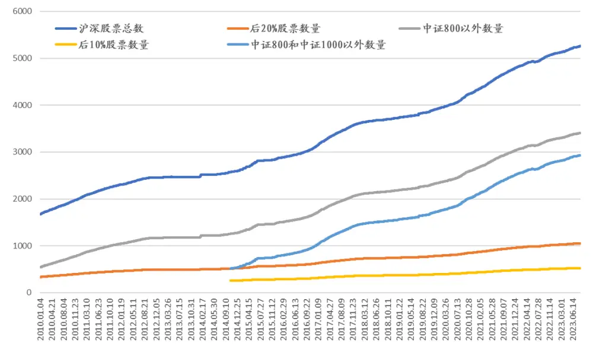
数据来源：Wind，国泰君安证券研究。测试区间：2010-2023.08。

## 7.4. 原中证 500 策略因子在中证 1000、中证 2000 上的效果

我们也测算了报告《使用基本因子构建中证500指数增强策略初探》中使用的因子，在中证 1000、中证 2000 股票池上构建指数增强策略的具体结果。设置个股上限 1%，市值、行业无暴露的约束。从结果看出，虽然所用因子在中证 500 上近期超额收益不佳，但在中证 1000、中证2000 的超额收益仍然可观。

表 16：中证 1000指数增强策略每年收益

| 年度 | 累计收益 |  | 中证1000 |  | 超额收益 | 超额收益波动率 | 超额收益信息比率 | 超额收益最大回撤 |
| --- | --- | --- | --- | --- | --- | --- | --- | --- |
| 2010.02 |  | 48.0% |  | 21.6% | 26.4% | 4.1% | 6.5 | -2.1% |
| 2011 |  | -19.4% |  | -33.0% | 13.5% | 3.4% | 4.0 | -1.0% |
| 2012 |  | 31.4% |  | -1.4% | 32.8% | 4.0% | 8.3 | -1.2% |
| 2013 |  | 61.4% |  | 31.6% | 29.8% | 4.2% | 7.1 | -2.0% |
| 2014 |  | 49.3% |  | 34.5% | 14.9% | 4.1% | 3.7 | -2.1% |
| 2015 |  | 153.1% |  | 76.1% | 77.0% | 16.6% | 4.6 | -8.6% |
| 2016 |  | 5.2% |  | -20.0% | 25.3% | 4.9% | 5.2 | -1.4% |
| 2017 |  | 7.5% |  | -17.4% | 24.9% | 3.3% | 7.5 | -0.6% |
| 2018 |  | -16.6% |  | -36.9% | 20.3% | 4.2% | 4.9 | -1.9% |
| 2019 |  | 53.2% |  | 25.7% | 27.6% | 4.9% | 5.6 | 4.8% |
| 2020 |  | 44.7% |  | 19.4% | 25.3% | 5.8% | 4.4 | -B.9% |
| 2021 |  | 41.7% |  | 20.5% | 21.2% | 5.5% | 3.9 | 4.6% |
| 2022 |  | -10.2% |  | -21.6% | 11.4% | 4.9% | 2.3 | 4.8% |
| 2023.09 |  | 5.2% |  | -1.8% | 7.0% | 5.1% | 1.4 | -28% |
| 整体 |  | 27.2% |  | 2.8% | 24.5% | 6.4% | 3.8 | -8.6% |

数据来源：Wind，朝阳永续，国泰君安证券研究测试区间：2010.02.01-2023.09.05。

图 15：中证 1000 指数增强策略收益曲线
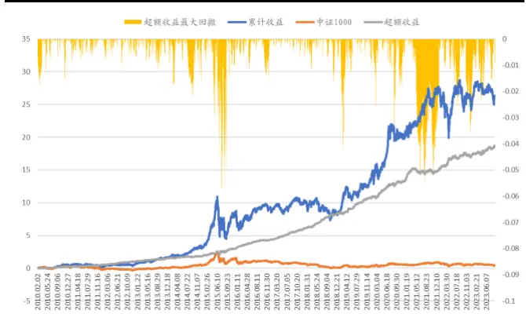
数据来源：Wind，朝阳永续，国泰君安证券研究测试区间：2010.02.01-2023.09.05。

表 17：中证 2000指数增强策略每年收益

| 年度 | 累计收益 |  | 中证2000 |  | 超额收益 | 超额收益波动率 | 超额收益信息比率 | 超额收益最大回撤 |
| --- | --- | --- | --- | --- | --- | --- | --- | --- |
| 2014.12 |  | -4.19% | 雪 | -7.51% | 3.33% | 4.3% | 0.8 | -0.30% |
| 2015 |  | 147.6% |  | 109.8% | 37.8% | 16.8% | 2.3 | -11.7% |
| 2016 |  | 12.0% | 国 | -7.6% | 19.7% | 4.7% | 4.2 | -1.8% |
| 2017 |  | -1.0% |  | -24.1% | 23.1% | 4.0% | 5.8 | -0.9% |
| 2018 | C | -12.9% |  | -33.3% | 20.4% | 4.1% | 5.0 | -1.4% |
| 2019 |  | 55.2% |  | 22.0% | 33.2% | 4.9% | 6.8 | 42% |
| 2020 |  | 40.8% |  | 15.4% | 25.4% | 6.3% | 4.1 | -2.6% |
| 2021 |  | 47.0% |  | 25.9% | 21.1% | 5.9% | 3.6 | -5.3% |
| 2022 |  | -2.0% | 心 | -14.8% | 12.8% | 5.6% | 2.3 | 4.8% |
| 2023.8 |  | 15.7% |  | 4.3% | 11.4% | 5.4% | 2.1 | -3. 1% |
| 整体 |  | 27.3% |  | 4.1% | 23.2% | 7.5% | 3.1 | -11.7% |

数据来源：Wind，朝阳永续，国泰君安证券研究测试区间：2014.12.10-2023.09.05。

图 16：中证 2000 指数增强策略收益曲线
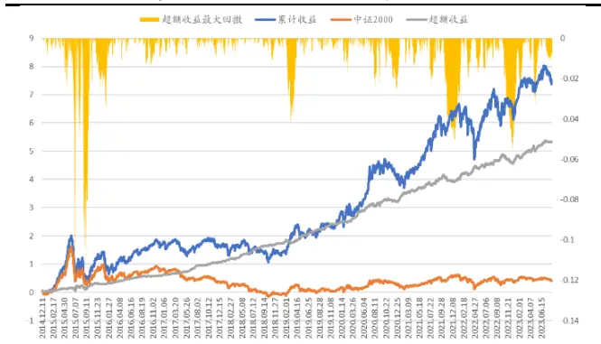
数据来源：Wind，朝阳永续，国泰君安证券研究测试区间：2014.12.10-2023.09.05。

## 本公司具有中国证监会核准的证券投资咨询业务资格

## 分析师声明

作者具有中国证券业协会授予的证券投资咨询执业资格或相当的专业胜任能力，保证报告所采用的数据均来自合规渠道，分析逻辑基于作者的职业理解，本报告清晰准确地反映了作者的研究观点，力求独立、客观和公正，结论不受任何第三方的授意或影响，特此声明。

## 免责声明

本报告仅供国泰君安证券股份有限公司（以下简称“本公司”）的客户使用。本公司不会因接收人收到本报告而视其为本公司的当然客户。本报告仅在相关法律许可的情况下发放，并仅为提供信息而发放，概不构成任何广告。

本报告的信息来源于已公开的资料，本公司对该等信息的准确性、完整性或可靠性不作任何保证。本报告所载的资料、意见及推测仅反映本公司于发布本报告当日的判断，本报告所指的证券或投资标的的价格、价值及投资收入可升可跌。过往表现不应作为日后的表现依据。在不同时期，本公司可发出与本报告所载资料、意见及推测不一致的报告。本公司不保证本报告所含信息保持在最新状态。同时，本公司对本报告所含信息可在不发出通知的情形下做出修改，投资者应当自行关注相应的更新或修改。

本报告中所指的投资及服务可能不适合个别客户，不构成客户私人咨询建议。在任何情况下，本报告中的信息或所表述的意见均不构成对任何人的投资建议。在任何情况下，本公司、本公司员工或者关联机构不承诺投资者一定获利，不与投资者分享投资收益，也不对任何人因使用本报告中的任何内容所引致的任何损失负任何责任。投资者务必注意，其据此做出的任何投资决策与本公司、本公司员工或者关联机构无关。

本公司利用信息隔离墙控制内部一个或多个领域、部门或关联机构之间的信息流动。因此，投资者应注意，在法律许可的情况下，本公司及其所属关联机构可能会持有报告中提到的公司所发行的证券或期权并进行证券或期权交易，也可能为这些公司提供或者争取提供投资银行、财务顾问或者金融产品等相关服务。在法律许可的情况下，本公司的员工可能担任本报告所提到的公司的董事。

市场有风险，投资需谨慎。投资者不应将本报告作为作出投资决策的唯一参考因素，亦不应认为本报告可以取代自己的判断。
在决定投资前，如有需要，投资者务必向专业人士咨询并谨慎决策。

本报告版权仅为本公司所有，未经书面许可，任何机构和个人不得以任何形式翻版、复制、发表或引用。如征得本公司同意进行引用、刊发的，需在允许的范围内使用，并注明出处为“国泰君安证券研究”，且不得对本报告进行任何有悖原意的引用、删节和修改。

若本公司以外的其他机构（以下简称“该机构”）发送本报告，则由该机构独自为此发送行为负责。通过此途径获得本报告的投资者应自行联系该机构以要求获悉更详细信息或进而交易本报告中提及的证券。本报告不构成本公司向该机构之客户提供的投资建议，本公司、本公司员工或者关联机构亦不为该机构之客户因使用本报告或报告所载内容引起的任何损失承担任何责任。

## 评级说明

## 1.投资建议的比较标准

投资评级分为股票评级和行业评级。以报告发布后的 12 个月内的市场表现为比较标准，报告发布日后的 12 个月内的公司股价（或行业指数）的涨跌幅相对同期的沪深 300 指数涨跌幅为基准。

## 2.投资建议的评级标准

报告发布日后的 12 个月内的公司股价（或行业指数）的涨跌幅相对同期的沪深 300 指数的涨跌幅。

| 评级 |  | 说明 |
| --- | --- | --- |
| 股票投资评级 | 增持 | 相对沪深 300 指数涨幅 15%以上 |
|  | 谨慎增持 | 相对沪深300指数涨幅介于5%～15%之间 |
|  | 中性 | 相对沪深300指数涨幅介于-5%～5% |
|  | 减持 | 相对沪深300指数下跌5%以上 |
| 行业投资评级 | 增持 | 明显强于沪深 300 指数 |
|  | 中性 | 基本与沪深300指数持平 |
|  | 减持 | 明显弱于沪深 300指数 |

## 国泰君安证券研究所

|  | 上海 | 深圳 | 北京 |
| --- | --- | --- | --- |
| 地址 | 上海市静安区新闸路 669 号博华广 场20层 | 深圳市福田区益田路6003号荣超商 务中心 B 栋 27 层 | 北京市西城区金融大街甲9号金融 街中心南楼18层 |
| 邮编 | 200041 | 518026 | 100032 |
| 电话 | (021)38676666 | (0755)23976888 | (010)83939888 |
|  | E-mail: gtjaresearch@gtjas.com |  |  |