# 基于分钟数据的高频因子选股效果研究

## ——权益配置因子研究系列 04

## 本报告导读：

本报告研究分钟数据高频因子的选股效果。首先，简要介绍常用的高频数据处理软件 KDB+和 DolphinDB。然后，对于不同股票池，筛选效果较好的因子。最后，等权加权计算复合因子，控制市值行业无暴露，构建因子得分最大化组合；历史回测发现，整体上看，高频分钟因子在中小市值股票池的选股效果较好，表现比较稳定；近 3 年受益于小市值风格占优，在不同市值区间股票池中多头组超额收益均较好。

## 摘要：

le_Summary]高频数据和处理软件介绍。对高频数据的研究和因子开发是量化选股研究热点。本报告使用分钟行情数据，计算常用的高频因子。高频数据处理主流软件推荐 KDB+和 DolphinDB。KDB+属于国外著名的金融高频数据处理软件，优点是速度极快，针对金融高频场景开发，缺点是学习曲线陡峭。DolphinDB 是国内自主开发的软件，性能优异，技术支持完善，已广泛应用于国内头部金融机构，在时序DB-Engines 排名一路飙升。

分钟行情高频因子。因子逻辑主要是基于错误定价（过度反应后的反转效应）、承担风险溢价（低流动性、低波动的风险补偿）。因子类别有收益率分布、成交量分布、残差波动率、量价相关性等。

在各股票池进行单因子测试，筛选效果较好的因子。在五个指数成分股内都被选用的因子有：1分钟ILLIQ、5分钟特质残差的峰度、1分钟收益率偏度、5 分钟收益率峰度、除去早盘后的涨跌幅、1 分钟下行波动率占比。中小盘的四个指数成分股内都被选用的因子有：5分钟特质残差的偏度、尾盘成交量波动率。

等权加权的复合因子在各股票池的表现。从结果来看，高频分钟因子在中小市值股票池的选股效果较好，表现比较稳定；近 3 年受益于小市值风格占优，在不同市值区间股票池中多头组超额收益均较好。控制市值行业无暴露，构建因子得分最大化组合，测算发现，2010 年 2 月以来，沪深 300 内年化超额 9.09%（2016 年以来年化超额 5.83%），超额最大回撤-6.08%；截至 2023 年 9 月 21 日，本年超额 11.2%。中证 500 内年化超额 10.04%（2016 年以来年化超额7.0%），超额最大回撤-8.34%；本年超额8.86%。中证1000内年化超额收益 15.5%（2016 年以来年化超额 12.24%），超额最大回撤-13.45%；本年超额 12.85%。中 证 2000 内 年化超额收益 19.55%（2016 年以来年化超额 16.3%），超额最大回撤-13.34%；本年超额12.18%。

- 风险提示：量化模型基于历史数据构建，而历史规律存在失效风险。

## 报告作者

廖静池(分析师)

8 0755-23976176

liaojingchi024655@gtjas.com

证书编号 S0880522090003

张雪杰(分析师)

8 0755-23976751

zhangxuejie025900@gtjas.com

证书编号 S0880522040001

信心修复看两端：万亿国债与华为

2023.10.29

人民币兑美元汇率即将开启一轮升值趋势2023.10.21

市场底构造进行时，四季度中线行情可期2023.10.18

硬科技相对排名亮眼，医药蝉联多头组合2023.10.07

感谢实习生吕嘉庆、姚乐曦对本文的贡献。

我们在之前的因子研究系列报告中研究了超预期因子在不同股票池的选股效果，分别介绍了中证 500、中证 1000 和中证 2000 指数增强策略的构建。本篇报告对使用分钟数据计算的常用高频因子选股效果进行测试。首先介绍常用的高频数据处理软件。然后，介绍分钟行情高频因子的计算方法。之后，在各股票池进行单因子测试，筛选出效果较好的因子。最后，等权加权得到复合因子，测试其在各股票池的表现，供投资者参考。

## 1. 高频数据和处理软件介绍

## 1.1. 高频数据

沪深 Level2 行情数据是目前 A 股市场上最完整、颗粒度最细、信息含量最丰富的行情数据。目前 Level2 数据主要有四种类型：盘口快照数据（3 秒）、逐笔成交数据、逐笔委托数据、委托队列数据（前 50 笔）。从市场微观结构出发，对于高频数据的研究和因子开发一直是近期量化选股研究的热点。我们在本报告主要是用分钟行情数据，计算常用的高频因子。

## 1.2. 常用的高频数据处理软件介绍

由于Level2数据量极大，2014年以来全部数据压缩后也有7T，每天增长几个 G。一般的软件比如 python、Matlab 等难以应对即使是数据量较小的分钟行情数据，处理起来也会相对吃力。实际量化研究过程中，只靠一种编程软件包打天下也不太实际。对于高频数据的处理和分析，除了使用编程难度和要求较高的 C++，还可以使用专门的高频时间序列数据处理软件。常用的有国外著名软件 KDB+、国内自主研发的后起之秀 DolphinDB软件等。我们下面对两种软件做简要介绍。

## 1.2.1. KDB+

KDB+1是国外一款号称是世界上最快、性能极高的内存数据库，q 是内置语言。由 Arthur Whitney 开发，KxSystems 公司于 2003 年推出，其前身 k 和 kdb/ksql 分别于 1993 年和 1998 年推出。事实上，kdb+不只是内存数据库，更是一款高性能大数据平台，使用统一的数据库处理实时数据和历史数据，同时具备 CEP（复杂事件处理）引擎、内存数据库、磁盘数据库等功能。kdb+/q 最初主要被用于国外顶尖金融机构海量数据分析和高频交易，目前在人工智能、机器学习、物联网等领域发挥越来越大的作用。

kdb+/q的核心优势[8]主要有：

1) 强大的一体化平台。流数据处理、内存数据库和磁盘数据库的一体化。数据的采集、存储和分析的应用一体化。数据库和开发语言的一体化。代码与数据一体化。

2) 高性能的列式内存数据库。kdb+采用列式存储和有序化存储，数据聚集和列向查询性能得到极大提升，在数据库运行时可以方便地对数据列进行增删改。内存数据库可以实时更新索引，方便对流数据进行分类汇总统计。

3) 强大的编程和查询语言q。内置矢量语言q是一种抽象编程的APL系语言，非常适合低成本地对大数据进行复杂计算。q 跟 SQL 有一些类似，对于有数据库基础的人较容易掌握。

4) 简单的数据管理和低廉的成本。原生 64 位架构，软件大小不足1MB，适应海量数据处理需求。自身占用极少的内存和磁盘资源，可部署于多处理器服务器上，可任意动态扩展。

5) 优越的可移植性和互操作性。使用 ANSI C开发，未使用任何专有扩展，可快速移植到最新的芯片和操作系统之上。可简单部署在多种操作系统下共同运行。

6) 分布式并行扩展以保证查询速度。内置多线程并行计算功能。支持分区并行访问庞大历史数据库，能将查询分配至多个内核或多台机器。进程间通讯功能可以轻易支持多服务器的并行计算或网格计算。

图 1：Kdb+在国外金融市场的主要用途非常广泛-Kx 的用例
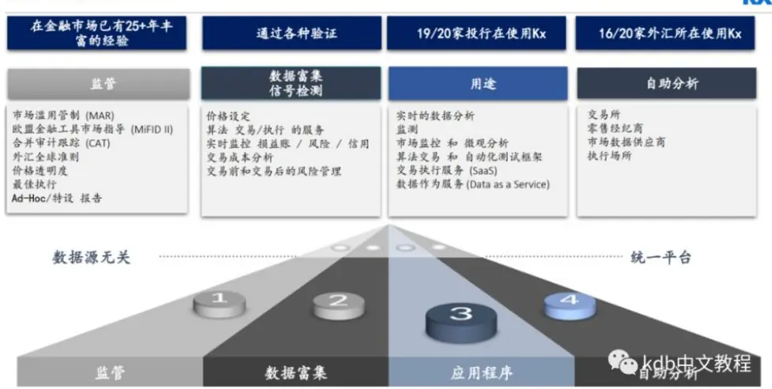
数据来源：KxSystems公司，kdb+中文教程。

KDB+的缺点：首先是学习曲线相对陡峭，思维方式比较特别，不像常规语言那么好上手和容易切换。其次国内用户较少，学习交流的社群较少。最后，KX 公司似乎对国内市场不太重视，市场推广较少，相应的技术支持较少。

为满足不同的需求，kdb+提供了多种许可类型可供选择[5]。下表列出了各种许可的比较。64 位个人版可以从 https://ondemand.kx.com 下载，需要申请授权文件 kc.lic，可以试用 1年。

表 1：KDB+提供了多种许可类型可供客户选择

| 版本 | 学术版 | 32 位个人版 | 64位个人版 | 不限期限版 | 订阅版 | 按需定(OnDemand) | OEM版 |
| --- | --- | --- | --- | --- | --- | --- | --- |
| 费用 | 免费 | 免费 | 免费 | 按核数收授权费，按年收维护费（可选） | 按每年每核收费 | 按核数及使用分钟数收费 | 按安排 |
| Linux/Mac/Windows 版本 | √ | √ | √ | √ | √ | √ | √ |
| 64 位版本 | √ | X | √ | √ | √ | √ | √ |
| 允许商业用途 | X(仅用于研究和教学) | X | X | ↓ | √ | ↓ | √ |
| 需要联网 | X | X | √ | X | X | √ | X |
| 允许在云上运行 | √ | √ | X | √ | √ | √ | √ |
| 允许在本地运行 | √ | √ | √ | √ | √ | √ | √ |
| 支持 Kx Developer 模块 | √ | X | √ | √ | √ | √ | √ |
| 支持 Kx Analyst 模块 | √ | X | √ | √ | √ | √ | √ |
| 获得技术支持 | X | X | X | √ | √ | 按安排 | √ |
| 进入客户问答论坛 | X | X | X | √ | √ | √ | √ |
| 获得社区支持（GitHub /Google 网上论坛等） | √ | √ | √ | √ | √ | √ | √ |
| 立即获得升级、补丁和Beta版本 | X | X | X | J | √ | J | √ |
| 定期升级 | √ | √ | √ | √ | √ | kdb | 中文教程 |

数据来源：KX公司，kdb+中文教程。

## 1.2.2. DolphinDB

DolphinDB是国内一款高性能分布式时序数据库，由浙江智臾科技有限公司自主研发。根据官方产品简介2，DolphinDB 集成了功能强大的编程语言和流数据分析系统，为结构化数据的快速存储、检索、分析及计算提供一站式解决方案，在大规模数据处理与分析领域拥有世界领先的性能水平，特别适用于量化金融与物联网等领域对数据存储、查询及分析有极高要求的场景。DolphinDB主要优势是快，体现在四个方面：开发快、运行快、部署快和学习快。能够对海量数据特别是时间序列数据和实时流数据进行存储、管理及复杂的交互分析。核心功能主要包括：高性能数据库、功能齐全的脚本语言、可扩展的分布式计算、实时数据流计算和便捷的系统访问方式。DolphinDB已经广泛应用于国内的头部券商、公募基金、私募基金和银行等机构。

## DolphinDB[10]作为数据后台时具有以下 7 大优势:

1) 一站式大数据解决方案。适用于金融及物联网数据采集、存储、查询、实时计算、预警、结果展示及反馈。

2) 轻量级跨平台部署。使用 C++开发，仅 20 余兆，非常轻量，可部署于从嵌入式到云端的各类平台。

3) 安全可控。由国人自主研发，无任何外部依赖、安全可控。同时适配国产 CPU，实现软硬件同时自主可控。

4) 数据存储和计算。采用列式存储，支持数据压缩。在同样的硬件设备上，关系型数据库可支持亿级的时序数据，DolphinDB 则可支 持万亿级。

5) 实时流计算。天然具备流表对偶性，可对物联网、金融市场采集的实时数据进行清洗、实时统计与分析、即时入库及可视化展示。

6) 丰富的计算功能。计算功能最丰富的数据库系统使用内置脚本语言，可实现复杂的分布式库内计算，避免数据迁移，性能超越其

他数据库 1-3个数量级。

7) 降低综合使用成本。一站式解决方案、跨平台部署能力、强大的实时数据和历史数据处理能力、丰富的计算功能及扩展能力极大的降低了企业的综合使用成本。

DB-Engines最新发布的2023年11月时序数据库排名榜单中，国产时序数据库 DolphinDB荣登该榜单前 6，也是目前唯一排名前 10 的国产时序数据库。自 2019 年参与 DB-Engines 排名以来，DolphinDB 凭借广大用户的支持与产品优异的性能，排名一路飙升，发展势头迅猛。

表 2：2023年 11月时序数据库排名中，DolphinDB排名大幅上升

| include secondary database models |  |  |  | 42 systems in ranking, November 2023 |  |  |  |  |
| --- | --- | --- | --- | --- | --- | --- | --- | --- |
| Nov | Rank Oct | Nov | DBMS | Database Model | Score Nov | Oct | Nov |  |
| 1. | 2023 2023 1. | 2022 1. | InfluxDB + |  | 团 | 2023 2023 -0.72 | 2022 |  |
| 2. | 2. | 2. | Kdb + |  | Time Series, Multi-model Multi-model | 29.02 8.87 |  | -0.94 |
| 3. | 3. |  | Prometheus | Time Series | 7.82 | +0.48 +0.54 | +1.39 +1.54 |  |
| 4. |  | ↑4. | TimescaleDB | Time Series, Multi-model 团 |  |  |  |  |
| 5. | 4. | ↑5. | Graphite | Time Series | 5.53 | +0.15 | +0.21 |  |
|  | 5. | ↓3. | DolphinDB | Time Series, Multi-model 团 | 5.21 | -0.01 | -1.59 |  |
| 6. 7. | 6. | ↑9. | Apache Druid | Multi-model | 4.00 | +0.06 | +1.68 |  |
| 8. | 7. | ↑8. | TDengine + | Time Series, Multi-model | 3.09 | -0.01 | +0.70 |  |
| 9. | 9. | ↑13. | RRDtool | 团 Time Series | 2.85 | -0.02 | +1.25 |  |
| 10. | 8. | ↓6. | QuestDB | Time Series, Multi-model | 2.79 | -0.27 | +0.10 |  |
| 11. 12. | 10. | 10. | + GridDB + | 日 | 2.01 | -0.14 | +0.09 |  |
| 12. |  | 11. |  | Time Series, Multi-model 日 | 2.00 | +0.03 | +0.20 |  |
| 13. | 11. | 7. | OpenTSDB | Time Series | 1.87 | -0.13 | -0.76 |  |
| 14. | 13. | ↓12. | Fauna | Multi-model | 1.79 | -0.11 | +0.08 |  |
|  | 14. ↑16. |  | VictoriaMetrics + | Time Series | 1.48 | +0.20 | +0.50 |  |
| 15. | 15. ↑19. |  | M3DB | Time Series | 1.20 | -0.07 | +0.37 |  |
| 16. | 16. ↑20. |  | Apache IoTDB | Time Series | 1.12 | -0.06 | +0.39 |  |
| 17. | 17. | 14. | Amazon Timestream | Time Series | 1.00 | -0.14 | -0.21 |  |
| 18. ↑20. |  | 15. | CrateDB + | Multi-model | 0.90 | +0.04 | -0.19 |  |
| 19. | 18. | ↓17. | eXtremeDB + | Multi-model | 0.88 | -0.05 | -0.08 |  |
| 20. 19. |  | 18. | KairosDB | Time Series | 0.82 | -0.09 | -0.10 |  |

数据来源：DB-Engines。

相比于同类产品，DolphinDB的技术支持、相关培训和售后服务非常完善，响应及时迅速，有很好的学习社区和社群。目前有社区版可以免费试用，许可永久有效，提供的函数与企业版一致；有一定资源限制，可点击 https://dolphindb.cn/product#downloads 下载。

## 2. 分钟行情高频因子介绍

我们使用分钟行情数据，计算常用的分钟因子，主要有收益率分布、成交量分布、量价相关性、残差收益率等。从因子的算法可以看出，这些因子有一定的投资逻辑，主要是基于错误定价（过度反应后的反转效应）、承担风险溢价（低流动性、低波动的风险补偿），整体不如财务类因子的投资逻辑强。

1) 收益率分布因子主要有分钟收益率峰度、收益率偏度、收益率的波动率、收益率上行/下行波动率、收益率上行波动率占比等

2) 成交量分布因子主要有成交量占比、分钟成交量波动率、成交量峰度、成交量偏度、下行成交量波动率、下行波动率占比等。

3) 量价相关性因子主要有分钟收益率/价格和成交量的相关系数。

4) 特质波动相关因子主要有日内特质波动率、特质残差的峰度、分钟偏度、特异度等。

5) 其他因子还有 Amihud的分钟 ILLIQ指标、分钟路径动量、日内涨跌幅、日内 beta等。具体见下表 3和表 4。

具体计算细节上，有几点需要说明，1）时间频率上，分别计算 1 分钟和 5 分钟两种时间频率的因子。2）时间区间上，分别计算全天、开盘前30分钟、收盘前30分钟、以及前1/3大成交量（成交量排名前1/3）的因子。3）分别使用 5日平均和 20日平均作为因子，用于周度选股效果测试。

表 3：分钟高频因子列表 1，从算法可以看出，投资逻辑整体不如财务类因子的投资逻辑强

| 因子类别 因子名称 算法 |  |  | 用法 |
| --- | --- | --- | --- |
| ILLIQ | 1分钟ILLIQ | 1分钟行情，收益率绝对值除以成交额的平均值 | 越大越好 |
|  | 5分钟ILLIQ | 5分钟行情，收益率绝对值除以成交额的平均值 | 越大越好 |
|  | 大成交量ILLIQ | 1分钟行情，大成交量收益率绝对值除以成交额的平均值 | 越大越好 |
|  | 早盘ILLIQ | 1分钟行情，尾盘收益率绝对值除以成交额的平均值 | 越大越好 |
|  | 尾盘ILLIQ | 1分钟行情，早盘收益率绝对值除以成交额的平均值 | 越大越好 |
| 收益率成交量相关性 | 1分钟收益率成交量相关性 | 1分钟行情，成交量和收益率相关性 | 越小越好 |
|  | 5分钟收益率成交量相关性 | 5分钟行情，成交量和收益率相关性 | 越小越好 |
|  | 大成交量收益率成交量相关性 | 1分钟行情，大成交量和收益率相关性 | 越小越好 |
|  | 1分钟收益率成交量滞后相关性 | 1分钟行情，成交量和下一分钟收益率相关性 | 越大越好 |
|  | 5分钟收益率成交量滞后相关性 | 5分钟行情，成交量和下一分钟收益率相关性 | 越大越好 |
|  | 1分钟收益率成交量滞后相关性 | 1分钟行情，大成交量和下一分钟收益率相关性 | 越大越好 |
|  | 尾盘收益率成交量滞后相关性 | 1分钟行情，尾盘成交量和下一分钟收益率相关性 | 越小越好 |
|  | 早盘收益率成交量滞后相关性 | 1分钟行情，早盘成交量和下一分钟收益率相关性 | 越大越好 |
|  | 1分钟收益率成交量领先相关性 | 1分钟行情，成交量和上一分钟收益率相关性 | 越小越好 |
|  | 5分钟收益率成交量领先相关性 | 5分钟行情，成交量和上一分钟收益率相关性 | 越小越好 |
|  | 大成交量收益率成交量领先相关性 | 1分钟行情，大成交量和上一分钟收益率相关性 | 越小越好 |
|  | 尾盘收益率成交量领先相关性 | 1分钟行情，尾盘成交量和上一分钟收益率相关性 | 越小越好 |
|  | 早盘收益率成交量领先相关性 | 1分钟行情，早盘成交量和上一分钟收益率相关性 | 越小越好 |
|  | 尾盘收益率成交量相关性 | 1分钟行情，尾盘成交量和收益率相关性 | 越小越好 |
|  | 早盘收益率成交量相关性 | 1分钟行情，早盘成交量和收益率相关性 | 越大越好 |
| 最大回撤 | 1分钟最大回撤 | 1分钟行情，全天最大回撤 | 越大越好 |
|  | 5分钟最大回撤 | 5分钟行情，全天最大回撤 | 越大越好 |
|  | 大成交量最大回撤 | 1分钟行情，排名前1/3的分钟成交量最大回撤 | 越大越好 |
|  | 尾盘最大回撤 | 1分钟行情，尾盘30分钟最大回撤 | 越大越好 |
|  | 早盘最大回撤 | 1分钟行情，早盘30分钟最大回撤 | 越大越好 |
| 收益率峰度 | 1分钟收益率峰度 | 1分钟行情，全天收益率峰度 | 越小越好 |
|  | 5分钟收益率峰度 | 5分钟行情，全天收益率峰度 | 越小越好 |
|  | 大成交量收益率峰度 | 1分钟行情，排名前1/3的分钟成交量收益率峰度 | 越小越好 |
|  | 尾盘收益率峰度 | 1分钟行情，尾盘30分钟收益率峰度 | 越小越好 |
|  | 早盘收益率峰度 | 1分钟行情，早盘30分钟收益率峰度 | 越小越好 |
| 路径动量 | 1分钟路径动量 | 1分钟行情，累计涨跌幅除以涨跌绝对值之和 | 越小越好 |
|  | 5分钟路径动量 | 5分钟数据行情，累计涨跌幅除以涨跌绝对值之和 | 越小越好 |
|  | 大成交量路径动量 | 1分钟行情，大成交量累计涨跌幅除以涨跌绝对值之和 | 越小越好 |
|  | 尾盘路径动量 | 1分钟行情，尾盘累计涨跌幅除以涨跌绝对值之和 | 越小越好 |
|  | 早盘路径动量 | 1分钟行情，早盘累计涨跌幅除以涨跌绝对值之和 | 越大越好 |
| 收益率偏度 | 1分钟收益率偏度 | 1分钟行情，全天收益率偏度 | 越小越好 |
|  | 5分钟收益率偏度 | 5分钟行情，全天收益率偏度 | 越小越好 |
|  | 大成交量收益率偏度 | 1分钟行情，排名前1/3的分钟成交量收益率偏度 | 越小越好 |
|  | 尾盘成交量收益率偏度 | 1分钟行情，尾盘30分钟收益率偏度 | 越小越好 |
|  | 早盘成交量收益率偏度 | 1分钟行情，早盘30分钟收益率偏度 | 越小越好 |
| 极端大收益率 | 1分钟极端大收益率均值 | 1分钟行情，收益率大于均值两倍标准差以外的收益率平均值 | 越小越好 |
|  | 5分钟极端大收益率均值 | 5分钟行情，收益率大于均值两倍标准差以外的收益率平均值 | 越小越好 |
|  | 大成交量极端大收益率均值 | 1分钟行情，大成交量中收益率大于均值两倍标准差以外的1分钟收益率 | 越小越好 |
|  | 尾盘1极端大收益率均值 | 1分钟行情，尾盘中收益率大于均值两倍标准差以外的收益率平均值 | 越小越好 |
|  | 早盘1分钟极端大收益率均值 | 1分钟行情，早盘中收益率大于均值两倍标准差以外的收益率平均值 | 越小越好 |
| 日内涨跌幅相关 | 除去早盘30分钟后的涨跌幅 | 1分钟行情，除去早盘30分钟后的累计涨跌幅 | 越小越好 |
|  | 大成交量的涨跌幅 | 1分钟行情，大成交量对应的累计涨跌幅 | 越小越好 |
|  | 尾盘涨跌幅 | 1分钟行情，尾盘30分钟的累计涨跌幅 | 越小越好 |
|  | 早盘涨跌幅 | 1分钟行情，早盘30分钟的累计涨跌幅 | 越小越好 |
| 收益率波动率 | 1分钟收益率波动率 | 1分钟行情，1分钟收益率波动率 | 越小越好 |
|  | 5分钟收益率波动率 | 5分钟行情，5分钟收益率波动率 | 越小越好 |
|  | 大成交量收益率波动率 | 1分钟行情，大成交量收益率波动率 | 越小越好 |
|  | 尾盘收益率波动率 | 1分钟行情，尾盘30分钟收益率波动率 | 越小越好 |
|  | 早盘收益率波动率 | 1分钟行情，早盘30分钟收益率波动率 | 越小越好 |
| 下行波动率占比 | 1分钟下行波动率占比 | 1分钟行情，下行波动率除以波动率 | 越大越好 |
|  | 5分钟下行波动率占比 | 5分钟行情，下行波动率除以波动率 | 越大越好 |
|  | 大成交量下行波动率占比 | 1分钟行情，大成交量下行波动率除以大成交量波动率 | 越大越好 |
|  | 尾盘下行波动率占比 | 1分钟行情，早盘30分钟下行波动率除以早盘30分钟波动率 | 越大越好 |
|  | 早盘下行波动率占比 | 1分钟行情，尾盘30分钟下行波动率除以尾盘30分钟波动率 越大越好 |  |

数据来源：国泰君安证券研究。

表 4：分钟高频因子列表 2，从算法可以看出，投资逻辑整体不如财务类因子的投资逻辑强

| 因子类别 | 因子名称 算法 用法 |  |  |
| --- | --- | --- | --- |
| 上行-下行波动率 | 1分钟的上行减下行波动率占比 1分钟行情，（上行-下行波动率）除以波动率 |  | 越小越好 |
|  | 5分钟的上行减下行波动率占比 | 5分钟行情，（上行-下行波动率）除以波动率 | 越小越好 |
|  | 1分钟的上行减下行波动率占比 | 1分钟行情，大成交量的（上行-下行波动率）除以大成交量波动率 | 越小越好 |
|  | 尾盘上行减下行波动率占比 | 1分钟行情，早盘30分钟的（上行-下行波动率）除以早盘30分钟波动率 | 越小越好 |
|  | 早盘上行减下行波动率占比 | 1分钟行情，尾盘30分钟的（上行-下行波动率)除以尾盘30分钟波动率 | 越小越好 |
| 下行波动率 | 1分钟下行波动率 | 1分钟行情，下行波动率 | 越小越好 |
|  | 5分钟下行波动率 | 5分钟行情，下行波动率 | 越小越好 |
|  | 大成交量下行波动率 | 1分钟行情，大成交量下行波动率 | 越小越好 |
|  | 尾盘下行波动率 | 1分钟行情，尾盘30分钟下行波动率 | 越小越好 |
|  | 早盘下行波动率 | 1分钟行情，早盘30分钟下行波动率 | 越小越好 |
| 上行波动率 | 1分钟上行波动率 | 1分钟行情，上行波动率 | 越小越好 |
|  | 5分钟上行波动率 | 5分钟行情，上行波动率 | 越小越好 |
|  | 大成交量上行波动率 | 1分钟行情，大成交量上行波动率 | 越小越好 |
|  | 尾盘上行波动率 | 1分钟行情，尾盘30分钟上行波动率 | 越小越好 |
|  | 早盘上行波动率 | 1分钟行情，早盘30分钟上行波动率 | 越小越好 |
| 成交量的峰度 | 1分钟成交量峰度 | 1分钟行情，成交量峰度 | 越大越好 |
|  | 5分钟成交量峰度 | 5分钟行情，成交量峰度 | 越大越好 |
|  | 大成交量成交量峰度 | 1分钟行情，大成交量成交量峰度 | 越大越好 |
|  | 尾盘成交量峰度 | 1分钟行情，尾盘30分钟成交量峰度 | 越大越好 |
|  | 早盘成交量峰度 | 1分钟行情，早盘30分钟成交量峰度 | 越大越好 |
| 成交量的偏度 | 1分钟成交量偏度 | 1分钟行情，成交量偏度 | 越大越好 |
|  | 5分钟成交量偏度 | 5分钟行情，成交量偏度 | 越大越好 |
|  | 大成交量成交量偏度 | 1分钟行情，大成交量成交量偏度 | 越大越好 |
|  | 尾盘成交量偏度早盘成交量偏度 | 1分钟行情，尾盘30分钟成交量偏度 | 越大越好 |
|  |  | 1分钟行情，早盘30分钟成交量偏度 | 越大越好 |
| 成交量波动率 | 1分钟成交量波动率5分钟成交量波动率 | 1分钟行情，成交量波动率 | 越小越好 |
|  |  | 5分钟行情，成交量波动率 | 越小越好 |
|  | 大成交量成交量波动率 | 1分钟行情，大成交量成交量波动率 | 越小越好 |
|  | 尾盘成交量波动率 | 1分钟行情，尾盘30分钟成交量波动率 | 越小越好 |
|  | 早盘成交量波动率 | 1分钟行情，早盘30分钟成交量波动率 | 越小越好 |
| 成交量变异系数 | 1分钟成交量变异系数 | 1分钟行情，交易量标准差除以交易量平均值 | 越小越好 |
|  | 5分钟成交量变异系数 | 5分钟行情，交易量标准差除以交易量平均值 | 越小越好 |
|  | 大成交量成交量变异系数 | 1分钟行情，交易量标准差除以交易量平均值 | 越小越好 |
|  | 尾盘成交量变异系数 | 1分钟行情，尾盘30分钟交易量标准差除以交易量平均值 | 越大越好 |
|  | 早盘成交量变异系数 | 1分钟行情，早盘交易量标准差除以交易量平均值 | 越大越好 |
| 成交量占比 | 半小时成交量占比1 | 开盘后半小时成交金额占全天比例 | 越小越好 |
|  | 半小时成交量占比2 | 开盘后第2个半小时成交金额占全天比例 | 越大越好 |
|  | 半小时成交量占比3 | 开盘后第3个半小时成交金额占全天比例 | 越大越好 |
|  | 半小时成交量占比4 | 开盘后第4个半小时成交金额占全天比例 | 越大越好 |
|  | 半小时成交量占比5 | 开盘后第5个半小时成交金额占全天比例 | 越大越好 |
|  | 半小时成交量占比6 | 开盘后第6个半小时成交金额占全天比例 | 越大越好 |
|  | 半小时成交量占比7 | 开盘后第7个半小时成交金额占全天比例 | 越大越好 |
|  | 半小时成交量占比8 | 尾盘半小时成交金额占全天比例 | 越小越好 |
| beta | 1分钟beta | 1分钟收益率beta | 越小越好 |
|  | 5分钟bata | 5分钟收益率beta | 越小越好 |
| 特质波动率相关 | 1分钟特质残差的峰度 | 1分钟行情，三因子模型的残差峰度 | 越小越好 |
|  | 5分钟特质残差的峰度 | 5分钟行情，三因子模型的残差峰度 | 越小越好 |
|  | 1分钟特质残差的偏度 | 1分钟行情，三因子模型的残差偏度 | 越小越好 |
|  | 5分钟特质残差的偏度 | 5分钟行情，三因子模型的残差偏度 | 越小越好 |
|  | 1分钟特质波动率 | 1分钟行情，三因子模型的残差波动率 | 越小越好 |
|  | 5分钟特质波动率 | 5分钟行情，三因子模型的残差波动率 | 越小越好 |
| 最高涨幅分钟的序号 | 最高涨幅分钟的序号 | 最高涨幅分钟的出现位置 | 越小越好 |
| 特质波动率相关2 | 1分钟特异度 | 1分钟行情，三因子模型的回归R方 | 越小越好 |
|  | 5分钟特异度 | 5分钟行情，三因子模型的回归R方 | 越小越好 |
|  | 1分钟残差下行波动率 | 1分钟行情，三因子模型残差的下行波动率 | 越小越好 |
|  | 5分钟残差下行波动率 | 5分钟行情，三因子模型残差的下行波动率 | 越小越好 |
|  | 1分钟残差下行波动率占比 | 1分钟行情，三因子模型的残差下行波动率占残差波动率比例 | 越大越好 |
|  | 5分钟残差下行波动率占比 | 5分钟行情，三因子模型的残差下行波动率占残差波动率比例 | 越大越好 |
| 成交量方差比率 成交量方差比率 5分钟成交量方差除以10分钟成交量 越小越好 |  |  |  |

数据来源：国泰君安证券研究。

## 3. 分钟因子选股效果

我们分别测算将 5 日、 20 日的平均值作为原始因子，进行市值行业中性化后的周度选股的效果。分别将沪深 300、中证 500、中证 1000、中证 2000、中证全指五个指数成分股作为股票池，采用因子 IC、分组测试等方式进行单因子测试。每周进行调仓操作，分组测试按因子值从小到大排序分10组，分别为t0、t1、t2、…、t8、t9组。计算因子IC、分组收益、多头组超额收益等绩效指标考察因子表现。回测日期区间主要为 2010年 2月至 2023年 9月。分组超额收益使用第二天的 VWAP价格进行买卖。对于中证 1000 和中证 2000 指数，我们和系列报告 03《中证 1000和中证 2000指数增强策略构建》中做法一样，按照指数编制方法，估算历史成分股名单用于回测。其中，对于中证 1000 指数，估算 2010-2014 年的成分股名单；对于中证 2000 指数，估算 2014-2023年的成分股名单。

## 3.1. 单因子效果

## 3.1.1. 不同股票池的因子 IC

表 5：不同股票池因子rankIC，ILLIQ、收益率峰度等效果较好

|  |  | 20日平均值作为因子，周度rankIC |  |  |  |  |  |  |  |  |  |
| --- | --- | --- | --- | --- | --- | --- | --- | --- | --- | --- | --- |
| 因子类别 | 因子名称 | 000300.SH |  | 000852.SH |  | 000905.SH |  | 000985.SH |  | 932000.CSI |  |
| ILLIQ | 1分钟ILLIQ |  | 177% |  | 4.01% |  | 2.66% |  | 4.04% |  | 5.49% |
|  | 5分钟ILLIQ |  | 165% |  | 4.23% |  | 2.71% |  | 4.26% |  | 5.49% |
|  | 大成交量ILLIQ | 1 | .33% |  | 4.41% |  | 2.95% |  | 4.15% |  | 5.50% |
|  | 早盘ILLIQ |  | 189% |  | 4.69% |  | 3.23% |  | 4.56% |  | 5.63% |
|  | 尾盘ILLIQ |  | 173% |  | 4.28% |  | 3.02% |  | 4.13% |  | 5.03% |
| 收益率成交量相关性 | 1分钟收益率成交量相关性 | L | 1.85% | L | 3.50% | 3. | 11% | 3. | 62% |  | 4.72% |
|  | 5分钟收益率成交量相关性 | 口 | 1.50% |  | 3.13% | 口 | 2.67% | □3 | .16% |  | 4.22% |
|  | 大成交量收益率成交量相关性 | C | 1.81% | L | 3.39% | D | 3.01% | D | 3.31% |  | 4.11% |
|  | 1分钟收益率成交量滞后相关性 |  | 0.39% |  | 0.77% |  | 0.61% |  | 0.59% |  | 0.73% |
|  | 5分钟收益率成交量滞后相关性 |  | 0.90% |  | 159% |  | 1.12% |  | 162% |  | 2.20% |
|  | 1分钟收益率成交量滞后相关性 |  | 0.61% |  | 0.41% |  | 0.41% |  | 0.45% |  | 0.46% |
|  | 尾盘收益率成交量滞后相关性 |  | 0.25% | 0 | .62% | 0 | .57% |  | H0.72% | H | 0.99% |
|  | 早盘收益率成交量滞后相关性 | 0 | .88% | 1 | .16% | 0 | .98% |  | 0.99% |  | 0.74% |
|  | 1分钟收益率成交量领先相关性 | 7 | 3.14% |  | 5.71% |  | 4.62% |  | 5.89% |  | 7.30% |
|  | 5分钟收益率成交量领先相关性 | 口 | 2.09% |  | 4.51% | L | 3.23% |  | 4.51% |  | 5.71% |
|  | 大成交量收益率成交量领先相关性 |  | 3.13% |  | 5.83% |  | 4.58% |  | 5.84% |  | 7.14% |
|  | 尾盘收益率成交量领先相关性 | L | 0.94% |  | 1.82% | L | 1.92% | D | 1.85% | 口 | 2.30% |
|  | 早盘收益率成交量领先相关性 |  | 0.16% |  | 0.56% |  | 0.51% | H | 0.72% | L | 1.36% |
|  | 尾盘收益率成交量相关性 | B | 0.88% | L | 1.43% | L | 1.31% | L | 1.44% | L | 1.51% |
|  | 早盘收益率成交量相关性 |  | 164% |  | 175% |  | 161% |  | 176% |  | 1.17% |
| 最大回撤 | 1分钟最大回撤 | 2 | .49% |  | 4.41% |  | 3.55% |  | 5.44% |  | 6.29% |
|  | 5分钟最大回撤 |  | 227% |  | 3.87% |  | 3.17% |  | 4.95% |  | 5.71% |
|  | 大成交量最大回撤 |  | 2.54% |  | 4.50% |  | 3.65% |  | 5.51% |  | 6.34% |
|  | 尾盘最大回撤 |  | 210% |  | 4.11% |  | 3.14% |  | 4.83% |  | 5.74% |
|  | 早盘最大回撤 |  | 3.09% |  | 5.33% |  | 4.40% |  | 6.25% |  | 7.03% |
| 收益率偏度 | 1分钟收益率偏度 | 口 | 2.42% |  | 3.94% | 口 | 3.01% |  | 4.70% |  | 6.12% |
|  | 5分钟收益率偏度 | D | 2.22% | L | 3.29% | C | 2.44% |  | 4.10% |  | 5.57% |
|  | 大成交量收益率偏度 | D | 1.92% |  | 2.86% | 口 | 2.21% |  | 3.54% |  | 4.65% |
|  | 尾盘成交量收益率偏度 |  | 0.29% | 1 | 0.57% | 0 | .26% | B | 1.25% | 口 | 2.16% |
|  | 早盘成交量收益率偏度 |  | 0.13% |  | 0.01% |  | 0.47% |  | 0.65% | L | 1.35% |
| 路径动量 | 1分钟路径动量 | C | 2.17% |  | 4.85% | 3 | .89% | 4 | .86% |  | 6.02% |
|  | 5分钟路径动量 | 心 | 1.81% |  | 4.33% | D | 3.44% |  | 4.29% |  | 5.31% |
|  | 大成交量路径动量 | 0 | .86% | D | 2.47% |  | L1.95% | 口 | 2.55% | 口 | 3.78% |
|  | 尾盘路径动量 | L | 1.40% | C | 1.70% | L | 1.76% | L | 1.63% | L | 1.43% |
|  | 早盘路径动量 |  | 0.45% | 0 | .33% | 0 | .13% |  | 0.24% | E | 0.94% |
| 峰度 | 1分钟收益率峰度 |  | 3.02% |  | 5.28% | 4. | 47% |  | 5.77% |  | 7.15% |
|  | 5分钟收益率峰度 |  | 3.18% |  | 5.57% | 4 | .58% |  | 5.95% |  | 7.40% |
|  | 大成交量收益率峰度 |  | 2.47% |  | 4.33% | 3 | .82% |  | 4.76% |  | 6.04% |
|  | 尾盘收益率峰度 |  | 1.28% | 7 | 2.21% | 口 | 2.27% | 口 | 2.48% |  | 2.82% |
|  | 早盘收益率峰度 |  | 0.15% |  | 0.77% | 0 | .87% | 1 | .14% |  | 2.21% |
| 极端大收益率 | 1分钟极端大收益率均值 | L | 2.55% |  | 4.27% | L | 3.50% |  | 5.08% |  | 6.26% |
|  | 5分钟极端大收益率均值 | L | 2.56% |  | 4.36% | L | 3.56% |  | 5.16% |  | 6.34% |
|  | 大成交量极端大收益率均值 |  | 3.21% |  | 5.67% |  | 4.54% |  | 6.41% |  | 7.66% |
|  | 尾盘1极端大收益率均值 | 口 | 1.83% |  | 3.26% |  | 2.56% |  | 3.86% |  | 4.91% |
|  | 早盘1分钟极端大收益率均值 | 1 | 2.75% |  | 4.65% |  | 3.77% |  | 5.61% |  | 6.87% |
| 日内涨跌幅相关 | 除去早盘30分钟后的涨跌幅 | L | 3.27% |  | 6.11% |  | 4.94% |  | 6.06% |  | 7.12% |
|  | 大成交量的涨跌幅 | D | 2.21% |  | 3.91% |  | 3.17% |  | 4.01% |  | 5.07% |
|  | 尾盘涨跌幅 | D | 1.57% | D | 2.49% | 口 | 2.33% | D | 2.42% | 口 | 2.28% |
|  | 早盘涨跌幅 |  | 0.27% |  | 0.01% |  | 0.00% |  | 0.03% |  | 0.33% |
| 收益率波动率 | 1分钟收益率波动率 | D | 1.90% |  | 4.44% | 3. | 38% |  | 5.08% |  | 6.39% |
|  | 5分钟收益率波动率 | 口 | 1.85% |  | 4.33% | 3 | .32% |  | 4.97% |  | 6.24% |
|  | 大成交量收益率波动率 |  | 2.48% |  | 5.37% | 4 | .19% |  | 6.08% |  | 7.49% |
|  | 尾盘收益率波动率 |  | 1.15% | L | 2.72% | L | 2.06% | L | 3.17% | L | 4.03% |
|  | 早盘收益率波动率 | F2 | .38% |  | 4.74% |  | 3.73% |  | 5.60% |  | 6.96% |
| 下行波动率占比 | 1分钟下行波动率占比 | 3 | .67% |  | 6.31% |  | 5.19% |  | 6.65% |  | 7.85% |
|  | 5分钟下行波动率占比 |  | 3.50% |  | 6.05% |  | 5.00% |  | 6.33% |  | 7.45% |
|  | 大成交量下行波动率占比 | 2 | .48% |  | 4.39% |  | 3.76% |  | 4.74% |  | 5.84% |
|  | 尾盘下行波动率占比 |  | 183% |  | 2.49% |  | 2.56% |  | 2.68% |  | 2.46% |
|  | 早盘下行波动率占比 |  | 0.36% |  | 1.07% |  | 1.04% |  | 1.34% |  | 198% |

数据来源：Wind，国泰君安证券研究。测试区间：2010.02-2023.09。

表 6：不同股票池因子rankIC（续），特质残差的峰度、偏度等效果较好
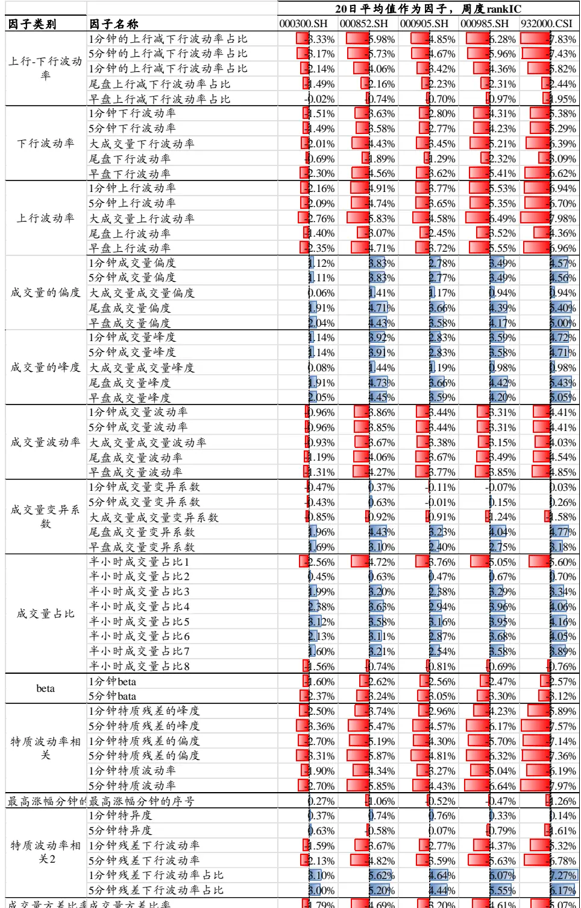
数据来源：Wind，国泰君安证券研究。测试区间：2010.02-2023.09。

## 3.1.2. 不同股票池的因子多头组、输家组超额收益

计算发现，使用 5 日平均值作为因子，周度换手率很高，几乎是 20 日平均值的2倍，导致费后收益较低甚至为0。因此我们下面使用20日的平均值作为因子，展示周度选股的效果。由于篇幅原因，5 日的平均值作为因子的选股收益不做展示。

## 由下表可以看出：

1) 和日频价量因子类似，输家组合的负超额收益数值一般较大。从多头组超额收益数值较小。多空收益中，主要是输家组合贡献的

2) 对比不同股票池，多头组超额在中小市值股票池超额水平更高，在中小市值中选股效果更好。

3) 需要指出的是，虽然整体看，一些因子的多头组超额较高。但分析每年的超额收益可以发现，不少因子的超额收益在年度上主要集中在 17 年以前，17 年以后超额收益不高。因此选择因子时，要兼顾年度超额收益的分布情况。效果较好因子的年度超额收益见附录 7.1。

表 7：不同股票池多头组、输家组超额收益，ILLIQ、收益率峰度、偏度效果较高

|  |  |  |  | 多头组年化超额收益 |  |  |  |  |  |  |  | 输家组 | 合年化超额 | 收益 |  |
| --- | --- | --- | --- | --- | --- | --- | --- | --- | --- | --- | --- | --- | --- | --- | --- |
| 因子类别 | 因子名称 0 | 00300.SH 0 |  | 00852.SH000905.SH 000985.SH |  |  |  |  |  | 932000.CSI | 000300.SH | 000852.SH | 000905.SH | 000985.SH | 932000.CSI |
| ILLIQ | 1分钟ILLIQ |  | 4.16% | 13.84% |  | 8.79% |  | 17.27% |  | 22.77% | 0.23% | -979% | -4.28% | -961% | -1048% |
|  | 5分钟ILLIQ |  | 4.60% | 1453% |  | 8.69% |  | 16.70% |  | 22.81% | 0.42% | -970% | -4.63% | -989% | -1056% |
|  | 大成交量ILLIQ |  | 3.06% | 14.92% |  | 10.06% |  | 19.51% |  | 23.46% | -1.97 | -11.98% | -8.29% | -11.40% | -13.28% |
|  | 早盘ILLIQ |  | 5.13% | 13.42% |  | 10.67% |  | 16.50% |  | 22.82% | -1.47 | -1024% | -5.59% | -1067% | -1037% |
|  | 尾盘ILLIQ |  | 4.40% | 13.23% |  | 8.53% |  | 15.48% |  | 22.21% | -0.29% | -953% | -5.90% | -923% | -7.72% |
|  | 1分钟收益率成交量相关性 | 1.42% |  | 4.42% |  | 1.70% |  | 6.19% |  | 10.15% | -4.59% | -1016% | -8.04% | -1031% | -16.00% |
|  | 5分钟收益率成交量相关性 | 0.67% |  | 3.72% |  | -0.32% |  | 4.33% |  | 8.18% | -4.06 | -8.88% | -6.21% | -8.85% | -13.26% |
|  | 大成交量收益率成交量相关性 | 2.59% |  | 5.06% |  | 2.97% |  | 6.97% |  | 10.42% | -4.81% | -963% | -8.02% | -8.57% | -12.55% |
|  | 1分钟收益率成交量滞后相关性 | -0.15% |  | 0.86% |  | 0.75% |  | 0.68% |  | -0.51% | -1.14% | -1.46% | -2.36 | -0.73% | -1.738 |
|  | 5分钟收益率成交量滞后相关性 | 1.31% |  | 3.92% |  | 3.47% |  | 5.64% |  | 7.44% | -2.86 | -4.11% | -2.25 | -2.82 | -6.07% |
|  | 1分钟收益率成交量滞后相关性 | 0.12% |  | 0.62% |  | 1.05% |  | 1.53% |  | 1.31% | -3.22 | 1.23% | -0.51% | 0.92% | -0.33% |
| 收益率成交量相关性 | 尾盘收益率成交量滞后相关性 | L 1.76% |  | 4.16% |  | 4.07% |  | 6.48% |  | 6.81% | 0.54% | 0.68% | 0.82% | 1.99% | 0.07% |
|  | 早盘收益率成交量滞后相关性 1 | -1.43% |  | 4.31% |  | 2.73% |  | 4.81% |  | 2.96% | -1.83 | -2.39 | -1.85 | -0.75% | 0.50% |
|  | 1分钟收益率成交量领先相关性 | 3.38% |  | 8.63% |  | 3.37% |  | 9.28% |  | 12.68% | -9.60% | 18.60% | -12.79% | 19.26% | -26.90% |
|  | 5分钟收益率成交量领先相关性 | 4.59% |  | 10.12% |  | 6.06% |  | 10.30% |  | 12.62% | -8.45% | -15.82% | -9.05% | -14.69% | -19.90% |
|  | 大成交量收益率成交量领先相关性 | 3.97% |  | 11.20% |  | 5.52% |  | 11.93% |  | 15.38% | -1012% | -20.08% | -12.51% | -19.74% | -25.23% |
|  | 尾盘收益率成交量领先相关性 | 0 2.26% |  | 3.39% |  | 4.62% |  | 6.69% |  | 9.25% | -4.76% | -6.71% | -4.80% | -5.95% | -9.19% |
|  | 早盘收益率成交量领先相关性 | -1.33% |  | -0.95% |  | -0.58% |  | 0.64% |  | 1.34% | -1.23% | 1.04% | 2.15% | 0.27% | -2.62 |
|  | 尾盘收益率成交量相关性 | 1.54% |  | 4.76% |  | 4.34% |  | 5.76% |  | 6.99% | -2.11% | -3.62 | -0.32% | -2.78 | -3.58% |
|  | 早盘收益率成交量相关性 | 5.08% |  | 7.44% |  | 7.27% |  | 8.34% |  | 7.38% | -2.97 | -6.45% | -5.31% | -4.88% | -3.79% |
| 最大回撤 | 1分钟最大回撤 | 2.80% |  | ■ 2.85% |  | 1.04% |  | 6.08% |  | 7.70% | -3.87% | -8.65% | -6.44% | -1042% | -13.49% |
|  | 5分钟最大回撤 | 1.57% |  | 1.61% |  | 0.69% |  | 4.83% |  | 6.63% | -2.73 | -6.76% | -5.60% | -8.30% | -1094% |
|  | 大成交量最大回撤 | 2.85% |  | 0 2.98% |  | 0.97% |  | 6.24% |  | 7.70% | -3.87% | -9.46% | -5.81% | -1078% | 13.81% |
|  | 尾盘最大回撤 | 2.62% |  | à 3.05% |  | 2.32% |  | 5.11% |  | 5.69% | -7.74% | -12.43% | -8.78% | 14.08% | -21.52% |
|  | 早盘最大回撤 | 3.61% |  | 5.56% |  | 3.60% |  | 9.24% |  | 8.69% | -5.87% | 12.80% | -8.73% | 13.85% | 18.67% |
|  | 1分钟收益率偏度 | 7.93% |  | 8.43% |  |  | 7.20% | 14.42% |  | 19.88% | -6.83% | -12.73% | -9.12% | 13.82% | 19.41% |
|  | 5分钟收益率偏度 | 7.08% |  | 7.34% |  |  | 5.56% | 12.36% |  | 15.99% | -6.21% | -1015% | -7.93% | -1130% | 16.57% |
| 收益率偏度 | 大成交量收益率偏度 | 7.18% |  | 7.09% |  |  | 6.00% | 12.00% |  | 17.83% | -6.71% | -8.80% | -7.29% | -9.59% | 16.21% |
|  | 尾盘成交量收益率偏度 | 2.94% |  | . 1.50% |  | -0.82% |  |  | 5.65% | 9.35% | -0.78% | 0.85% | 0.07% | -1.04% | -6.34% |
|  | 早盘成交量收益率偏度 | 1.98% |  | 1.65% |  | 0.87% |  |  | 6.44% | 7.54% | -2.64 | 0.51% | 2.68% | -0.12% | -3.23 |
|  | 1分钟路径动量 | 5.16% |  |  | 8.13% | 4.47% |  |  | 9.88% | 12.64% | -5.23% | -21.15% | -1111.27% | 19.62% | -27.32% |
|  | 5分钟路径动量 | 2.98% |  |  | 7.66% | 3.72% |  |  | 8.96% | 11.22% | -5.65% | 19.28% | -992% | 17.98% | -24.64% |
| 路径动量 | 大成交量路径动量 | 1.78% |  | 3.19% |  | 0.82% |  | 5.60% |  | 7.76% | -1.90% | -6.07% | -3.48% | -6.65% | -1152% |
|  | 尾盘路径动量 | 1 2.29% |  | 7.18% |  | 3.17% |  | 6.97% |  | 6.29% | -3.47% | -967% | -7.69% | -7.73% | -9.50% |
|  | 早盘路径动量 | 2.57% |  | 0.33% |  | 1.83% |  | 1.80%E |  | -2.02% | 0.29% | -1.44% | -0.91% | 0.81% | 3.09% |
|  | 1分钟收益率峰度 | 6.09% |  | 10.22% |  | 8.00% |  | 13.31% |  | 18.18% | -11.42% | 16.93% | -12.34% | 18.18% | -24.43% |
|  | 5分钟收益率峰度 | 6.65% |  | 10.61% |  | 8.80% |  | 13.28% |  | 17.19% | -1038% | 18.04% | -1058% | 18.79% | -26.09% |
| 峰度 | 大成交量收益率峰度 | 4.21% |  | 8.19% |  |  | 7.07% | 11.58% |  | 15.89% | -7.96% | -13.45% | -9.25% | 14.64% | -19.77% |
|  | 尾盘收益率峰度 | 2.68% |  | 7.09% |  |  | 6.36% | 9.24% |  | 10.64% | -5.40% | -7.36% | -7.10% | -7.92% | -11.43% |
|  | 早盘收益率峰度 | 0.80% |  | 3.27% |  | 0.38% |  | 4.58% |  | 6.61% | 0.45% | -0.65% | 1.71% | -1.249 | -5.41% |
| 极端大收益率 | 1分钟极端大收益率均值 |  | 5.24% | 3.57% |  | 1.97% |  | 7.75% |  | 8.05% | -5.98% | -112.59% | -8.58% | -12.24% | 18.08% |
|  | 5分钟极端大收益率均值 |  | 6.34% | I 3.13% |  | 1.54% |  | 7.63% |  | 8.09% | -5.93% | -12.64% | -7.73% | -12.18% | 18.56% |
|  | 大成交量极端大收益率均值 |  | 5.73% | 7.35% |  | 5.39% |  | 10.47% |  | 8.27% | -7.03% | 18.02% | 110% | 17.65% | -23.84% |
|  | 尾盘1极端大收益率均值 |  | 4.37% | 3.41% |  | 3.32% |  | 7.69% |  | 6.34% | -5.48% | -12.44% | -5.249 | -1064% | -14.82% |
|  | 早盘1分钟极端大收益率均值 |  | 4.30% | 4.34% |  | 3.56% |  | 8.44% |  | 8.11% | -7.42% | 13.57% | -8.66% | -13.86% | -20.46% |
| 日内涨跌幅 | 除去早盘30分钟后的涨跌幅 |  | 6.31% | 12.70% |  | 10.18% |  | 1461% |  | 18.08% | -1046% | -27.23% | 17.46% | -25.20% | -33.21% |
|  | 大成交量的涨跌幅 | 3.53% |  | 7.68% |  | 5.96% |  | 9.77% |  | 11.69% | -5.29% | -13.80% | -8.67% | 13.69% | 19.21% |
| 相关 | 尾盘涨跌幅 | 1.63% |  | 4.93% |  | 1.91% |  | 4.56% |  | 1.10% | -6.85% | -13.82% | -9.32% | -12.47% | -16.71% |
|  | 早盘涨跌幅 | -0.83% |  | 0.58% |  | -0.24% |  | 1.00% |  | -1.23% | 0.47% | 0.04% | -0.09% | 0.11% | -3.80% |
| 收益率波动率 | 1分钟收益率波动率 | 3.45% |  | 2.03% |  | 1.38% |  | 5.10% |  | 5.70% | -2.29% | 13.91% | -7.004% | 13.76% | -20.23% |
|  | 5分钟收益率波动率 | 3.02% |  | 1 2.05% |  | 1.11% |  | 5.06% |  | 5.55% | -2.10 | -13.27% | -6.79% | -13.43% | -20.27% |
|  | 大成交量收益率波动率 | 4.30% |  | 3.23% |  | 2.90% |  | 6.53% |  | 7.13% | -4.0% | 17.62% | -1019% | 17.17% | -24.15% |
|  | 尾盘收益率波动率 | 2.57% |  | 0.66% |  | 2.12% |  | 3.35% |  | 3.26% | -2.40D | -1039% | -5.41% | -9.08% | -13.46% |
|  | 早盘收益率波动率 | 5.16% |  | 2.41% |  | 1.08% |  | 5.69% |  | 6.88% | -4.70% | -13.66% | -8.06% | 4.44% | -20.66% |
| 下行波动率占比 | 1分钟下行波动率占比 |  | 5.81% | 9.96% |  | 7.10% |  | 13.17% |  | 18.28% | -1066% | -20.40% | 12.99% | -19.92% | -28.06% |
|  | 5分钟下行波动率占比 |  | 5.71% | 9.71% |  | 7.07% |  | 12.37% |  | 18.16% | -943% | 19.62% | -11.42% | 19.18% | -28.27% |
|  | 大成交量下行波动率占比 | 3.23% |  | 6.02% |  | 4.29% |  | 9.42% |  | 12.24% | -6.18% | -11.48% | -8.4.5% | -12.07% | 17.47% |
|  | 尾盘下行波动率占比 | 3.47% |  | 5.72% |  | 4.27% |  | 8.64% |  | 8.92% | -5.52% | -9.17% | -7.86% | -8.18% | -1056% |
|  | 早盘下行波动率占比 | -0.62% |  | 0.95% |  | 0.71% |  | 2.25% |  | 5.88% | 1.41% | -0.39% | 2.52% | -0.63% | 6 -4.12% |

数据来源：Wind，国泰君安证券研究。测试区间：2010.02-2023.09。

表 8：不同股票池多头组、输家组超额收益（续），特质残差的峰度、偏度效果较好

|  |  | 多头组年化超额收益 |  |  |  |  |  |  |  |  |  |  |  | 输家组合年化超额收益 |  |  |  |  |  |  |  |  |  |  |  |
| --- | --- | --- | --- | --- | --- | --- | --- | --- | --- | --- | --- | --- | --- | --- | --- | --- | --- | --- | --- | --- | --- | --- | --- | --- | --- |
| 因子类别 | 因子名称 | 000300.SH 000852.SH0 |  |  |  |  | 00905.SH000985.SH |  |  |  | 932000.CSI |  |  | 000300.SH |  | 000852.S |  | H000905.SH000985.SH |  |  |  |  |  | 932000.CSI |  |
| 上行-下行波动率 | 1分钟的上行减下行波动率占比 |  |  | 5.81% |  | 9.94% |  | 7.17% |  | 13.17% |  | 18.24% |  | 10.6 | 9% |  | -20.4 | 4% | 12.9 | 8% |  | -19.9 | 2% | -28.0 | 5% |
|  | 5分钟的上行减下行波动率占比 |  |  | 5.77% |  | 9.70% |  | 7.09% |  | 12.37% |  | 18.10% |  | 9.4 | 0% |  | -19.6 | 4% | 11.4 | 5% |  | -19.1 | 7% | -28.2 | 1% |
|  | 1分钟的上行减下行波动率占比 |  | 3.35% |  | 6.01% |  |  | 4.31% |  | 9.41% |  | 12.22% |  | 62 | 6% | 11.4 |  | 5% | 8.4 | 5% | 12.0 |  | 9% | -17.4 | 8% |
|  | 尾盘上行减下行波动率占比 |  | 3.36% |  | 5.71% |  |  | 4.31% |  | 8.66% |  | 8.94% |  | -55 | 0% | 9.1 |  | 0% | -7.9 | 1% | -8.4 |  | 5% | -10.5 | 9% |
|  | 早盘上行减下行波动率占比 |  | -0.59% |  | 0.94% |  |  | 0.71% |  | 2.25% |  | 5.88% |  | 1.4 | 2% | -0.2 |  | 9% | 2.4 | 3% | -0.6 |  | 1% | -40 | 0% |
|  | 1分钟下行波动率 |  | 2.02% |  | 0.69% |  |  | 0.06% |  | 3.74% |  | 4.43% |  | -1.4 | 3% | -11.0 |  | 0% | -45 | 3% | 10.7 |  | 1% | -16.2 | 3% |
|  | 5分钟下行波动率 |  | 1.87% |  | 0.71% |  |  | 0.70% |  | 3.59% |  | 4.26% |  | -1.3 | 3% | 10.9 |  | 9% | -47 | % | 10.5 |  | 5% | -16.0 | 3% |
| 下行波动率 | 大成交量下行波动率 |  | 2.99% |  | 1.91% |  |  | 1.79% |  | 4.84% |  | 5.65% |  | -2 | 3% | -15.3 |  | 5% | 8.4 | 2% | F |  | 14.04% | -20.1 | 9% |
|  | 尾盘下行波动率 |  | 1.92% |  | -0.36% |  |  | 0.83% |  | 1.26% |  | 0.12% |  | -1. | 7% | 6.8 |  | 8% | -2.7 | 5% | -53 |  | 9% | -10.9 | 7% |
|  | 早盘下行波动率 |  | 4.83% |  | 2.97% |  |  | 1.98% |  | 6.07% |  | 4.79% |  | -4B | % | -14.0 |  | 2% | -8.5 | 5% | 13.1 |  | 2% | -19.6 | 6% |
|  | 1分钟上行波动率 |  | 3.83% |  | 2.29% |  |  | 2.52% |  | 5.95% |  | 7.12% |  | -2.0 | 6% | -15.7 |  | 4% | 8.9 | 4% | -15.4 |  | 0% | -22.6 | 1% |
|  | 5分钟上行波动率 |  | 3.88% |  | 2.08% |  |  | 2.05% |  | 5.40% |  | 6.49% |  | -2.0 | 9% | -15.2 |  | 6% | -8.0 | 4% | 14.7 |  | 1% | -22.1 | 4% |
| 上行波动率 | 大成交量上行波动率 |  | 5.61% |  | 4.61% |  |  | 3.23% |  | 7.55% |  | 8.55% |  | -52 | 3% | -18.7 |  | 16% | -日1.45 | 5% | -18.4 |  | 6% | -25.9 | 2% |
|  | 尾盘上行波动率 |  | 2.57% |  | 1.77% |  |  | 2.63% |  | 4.83% |  | 4.64% |  | -1.6 | 5% | 12.1 |  | 4% | 6.5 | 4% | -10.9 |  | 5% | -14.7 | 5% |
|  | 早盘上行波动率 |  | 5.22% |  | 2.49% |  |  | 0.57% |  | 5.50% |  | 6.74% |  | -56 | 2% | 13.6 |  | 1% | -7.6 | 5% | -14.9 |  | 8% | -22.5 | 0% |
| 成交量的峰度 | 1分钟成交量峰度 |  | -2.88% |  | 1.85% |  |  | 0.73% |  | 3.59% |  | 10.17% |  | 2.1 | 3% | 4.0 |  | 5% | 2.2 | 4% | 7.8 |  | 4% | 6.3 | 9% |
|  | 5分钟成交量峰度 |  | -0.79% |  | 3.17% |  |  | 0.88% |  | 6.45% |  | 11.18% |  |  | 2% | 4.6 |  | 0% | 2.2 | 5% | 8.3 |  | 6% | 7.3 | 5% |
|  | 大成交量成交量峰度 |  | 1.88% |  | 6.47% |  |  | 8.47% |  | 7.83% |  | 9.43% |  | -3.0 | 9% | -53 |  | 9% | -3.2 | 2% | -40 |  | 3% | 6.3 | 8% |
|  | 尾盘成交量峰度 |  | 3.75% |  | 7.30% |  |  | 4.72% |  | 19.66% |  | 12.81% |  | -2.2 | 1% | -489 |  | 9% | -50 | 7% | -3.1 |  | 2% | -79 | 6% |
|  | 早盘成交量峰度 |  | -0.36% |  | 7.42% |  |  | 2.70% |  | 10.55% |  | 16.72% |  | -1.3 | 9% | -3. |  | 3% | -0.9 | 8% | -3.6 |  | 0% | -6.7 | 2% |
| 成交量的偏度 | 1分钟成交量偏度 |  | 4.28% |  | 1350% |  |  | 8.86% |  | 12.81% |  | 16.68% |  | -4 | 7%B | -18.4 |  | 7% | -17 | 9% | -16.4 |  | 7% | -24.4 | 3% |
|  | 5分钟成交量偏度 |  | 4.22% |  | 14.43% |  |  | 9.44% |  | 1361% |  | 18.52% |  | -417 | 8% | -19. |  | 3% | 13.1 | 7% | -17.5 |  | 7% | -25.9 | 5% |
|  | 大成交量成交量偏度尾盘成交量偏度 |  | 3.07% |  | 10.42% |  |  | 8.64% |  | 10.35% |  | 12.94% |  | -53 | 8% | B |  | 5% | -5 | 1% | -6.7 |  | 4% | 9.8 | 1% |
|  |  |  | 1.09% |  | 8.15% |  |  | 5.02% |  | 10.74% |  | 14.62% |  | 2.8 | 8% | 9.7 |  | 3% | -6 | 0% | 8.8 |  | 9% | -18.7 | 4% |
|  | 早盘成交量偏度 |  | 2.36% |  | 11.04% |  |  | 7.36% |  | 14.85% |  | 19.66% |  | -510 | 5% | -16.8 |  | 7% | 11.0 | 0% | -16.1 |  | 4% | -20.5 | 5% |
| 成交量波动率 | 1分钟成交量波动率 |  | 1.64% |  | 8.31% |  |  | 5.71% |  | 8.81% |  | 11.43% |  | -1.4 | 9% | 11.6 |  | 5% | -6.9 | 5%5 | 11.0 |  | 2% | -14.6 | 2% |
|  | 5分钟成交量波动率 |  | 1.42% |  | 8.25% |  |  | 5.96% |  | 8.70% |  | 11.51% |  | -1.4 | 4% | 11.5 |  | 0% | 6.8 | 4% | 10.7 |  | 9% | -14.3 | 4% |
|  | 大成交量成交量波动率 |  | 4.02% |  | -0.63% |  |  | 0.91% |  | 1.89% |  | 4.01% |  | -0.1 | 5% | o |  | 2% | -2.9 | 7% | -44 |  | 9% | -8.4 | 7% |
|  | 尾盘成交量波动率 |  | 2.91% |  | 11.33% |  |  |  | 7.99% | 13.01% |  | 14.57% |  | -41 | % | 14.3 |  | 9% | 10.2 | 5% | 12.6 |  | 0% | -15.4 | 6% |
|  | 早盘成交量波动率 |  | 5.47% |  | 9.95% |  |  |  | 7.48% | 12.03% |  | 13.48% |  | -2.2 | 5% | 11.6 |  | 7% | 通 | 7% | 10.4 |  | 9% | 12.8 | 1% |
| 成交量变异系数 | 1分钟成交量变异系数 |  | 2.34% |  | -2.92% |  |  | -0.63% |  | -0.77% |  | 0.64% |  | -1.5 | 3% | -55 |  | 5% | -3.7 | 0% | -6.0 |  | 0% | -7.9 | 5% |
|  | 5分钟成交量变异系数 |  | 2.87% |  | -4.31% |  |  | -1.46% |  | -1.00% |  | -0.18% |  | -0.1 | 9% | -3.6 |  | 9% | -1.9 | % | -3.9 |  | 0% | -z0 | 0% |
|  | 大成交量成交量变异系数 |  | 4.18% |  | 0.49% |  |  | 1.70% |  | 3.09% |  | 4.77% |  | -3.3 | 5% | 9.0 |  | 3% | -52 | 1% | -8.7 |  | 5% | 11.5 | 8% |
|  | 尾盘成交量变异系数 |  | 4.63% |  | 9.83% |  |  |  | 5.32% | 9.78% |  | 10.10% |  | -2.1 | 3% | 13.4 |  | 2% | -11.1 | 2% | 10.9 |  | 5% | 113 | 1% |
|  | 早盘成交量变异系数 |  | 4.38% |  | 4.31% |  |  |  | 3.46% | 4.50% |  | 2.47% |  | -1. | 6% | 9.0 |  | 6% | -5.6 | 5% | -11 |  | 0% | 10.1 | 0% |
|  | 半小时成交量占比1 |  | 6.25% |  | 6.82% |  |  |  | 4.29% | 8.76% |  | 8.39% |  | 7.0 | 3% | -14.7 |  | 9% | 8.7 | 5% | -13.9 |  | 5% | -16.6 | 2% |
|  | 半小时成交量占比2 |  | 2.41% |  | 4.96% |  |  |  | 2.38% | 5.78% |  | 4.42% |  | -2. | 0% | 6 |  | 9% | -1.8 | 9% | -2.6 |  | 4% | 6.7 | 3% |
|  | 半小时成交量占比3 |  | 5.84% |  | 8.87% |  |  |  | 6.52% | 9.77% |  | 1376% |  | 6.8 | 6% | 月1.8 |  | 4% | 7.6 | 9% | 9.9 |  | 9% | 13.1 | 5% |
| 成交量占比 | 半小时成交量占比4 |  | 6.89% |  | 8.34% |  |  |  | 6.01% | 10.44% |  | 4.84% |  | T.0 | 8% | 12.1 |  | 1% | 9.53 | 3% | 11.9 |  | 8% | 13.9 | 2% |
|  | 半小时成交量占比5 |  | 5.35% |  | 8.31% |  |  |  | 6.23% | 9.93% |  | 9.75% |  | 1 | 7% | 122 |  | 1% | 日 | 2% | 17 |  | 0% | 13.5 | 7% |
|  | 半小时成交量占比6 |  | 5.57% |  | 4.71% |  |  |  | 4.04% | 8.26% |  | 6.85% |  | -3.1 | 3% | 9.7 |  | 2% | 8.5 | 1% | 9.3 |  | 2% | -10.8 | 9% |
|  | 半小时成交量占比7 |  | 3.15% |  | 3.58% |  |  |  | 2.09% | 6.49% |  | 5.31% |  | -1.8 | 0% | 8.4 |  | 3% | -46 | 7%7 | 8.2 |  | 0% | 8.9 | 5% |
|  | 半小时成交量占比8 |  | 6.99% |  | 4.04% |  |  |  | 6.06% | 5.96% |  | 7.37% |  | 2 | 7% | 8.7 |  | 3% | 67 | 5% | 6.5 |  | 5% | 9.5 | 9% |
| beta | 1分钟beta |  | -0.53% |  | 2.10% |  |  | 3.22% |  | 2.14% |  | 2.39% |  | -2. | 4% | 6.6 |  | 6% | 5B | 0% | -49 |  | 2% | -44 | 3% |
|  | 5分钟bata |  | 1.05% |  | 3.97% |  |  | 3.76% |  | 4.11% |  | 0.14% |  | -5 | 2% | 9.8 |  | 8% | 718 | 7% | -8.2 |  | 0% | 8.8 | 5% |
|  | 1分钟特质残差的峰度 |  | 8.16% |  | 8.32% |  |  | 6.14% |  | 15.27% |  | 18.45% |  | 9.0 | 3% | 11.5 |  | % | 8.9 | 0% | -日14 |  | 1% | -17.7 | 5% |
|  | 5分钟特质残差的峰度 |  | 9.25% |  | 12.18% |  |  | 9.86% |  | 16.76% |  | 19.46% |  | 13.2 | 9% | -16.8 |  | % | 13.0 | % | -18.0 |  | % | -22.0 | 9% |
| 特质波动率 | 1分钟特质残差的偏度 |  | 5.62% |  | 11.36% |  |  | 10.55% |  | 14.96% |  | 15.89% |  | 日1.8 | 3% | -17.6 |  | 1% | 日0 | 5% | -17.6 |  | % | -22. | 3% |
| 相关 | 5分钟特质残差的偏度 |  | 6.27% |  | 14.60% |  |  | 8.00% |  | 16.39% |  | 16.72% |  | 12.8 | 6% | -19. |  | 1% | 14.05 | 5% | -19.5 |  | % | -23.4 | 5% |
|  | 1分钟特质波动率 |  | 3.64% |  | 0.86% |  |  | 0.67% |  | 4.90% |  | 5.36% |  | -2. | 0% | -14. |  | 70%0 | -67 | 0% | 13.4 |  | 8% | -21 | 6% |
|  | 5分钟特质波动率 |  | 3.75% |  | 5.52% |  |  | 3.48% |  | 8.73% |  | 9.62% |  | 5 | 7% | -17.2 |  | 1% | 10.7 | 6% | -17.7 |  | 6% | -25.8 | 5% |
| 最高涨幅分最 | 高涨幅分钟的序号 |  | 2.11% |  | 2.56% |  |  | 1.52% |  | 5.14% |  | 9.68% |  | -2.0 | 1% | 8.5 |  | 7% | -57 | 7% | -54 |  | 5% | -8.7 | 5% |
|  | 1分钟特异度 |  | -3.35% |  | -0.39% |  |  | -2.52% |  | 0.93% |  |  | 8.03% | -0.4 | 1% | 1.3 |  | 2% | 0.7 | 3% | 0.3 |  | 0% | 2.6 | 0% |
|  | 5分钟特异度 |  | -1.31% |  | 2.64% |  |  | -0.23% |  | 5.10% |  |  | 8.24% | 0.9 | 5% | -0.8 |  | 3% | -0.1 | 2% | -1.3 |  | 9% | -3.9 | 3% |
| 特质波动率相关2 | 1分钟残差下行波动率 |  | 3.43% |  | -0.03% |  |  | -0.84% |  | 3.55% |  | 2.83% |  | -2.1 | 0% | 日1.8 |  | 7% | -46 | 9% | 10.5 |  | 4% | -17.1 | 3% |
|  | 5分钟残差下行波动率 |  | 3.32% |  | 4.02% |  |  | 1.82% |  | 6.73% |  | 6.33% |  | -3. | 1% | 12.9 |  | 9% | 8.3 | 4% | -13.7 |  | 5% | -20.7 | 1% |
|  | 1分钟残差下行波动率占比 |  | 5.44% |  | 10.84% |  |  | 9.64% |  | 1360% |  | 16.61% |  | 11.0 | 3% |  | -18.1 | 1% | 11.8 | 2% | -17.8 |  | 5% | -23.8 | 9% |
|  | 5分钟残差下行波动率占比 |  | 4.50% |  | 12.50% |  |  | 10.29% |  | 14.42% |  | 15.77% |  | 9.5 | 8% |  | -17.5 | 1% | -113 | 0% | -16.6 |  | 4% | -22.6 | 3% |
| 成交量方差成交量方差比率 |  |  | 4.40% |  | 9.73% |  |  | 6.12% |  | 11.02% |  | 10.87% |  | -3.4 | 5% |  | -10.8 | 0% | -518 | 0% | -8.6 |  | 9% | -8.4 | 8% |

数据来源：Wind，国泰君安证券研究。测试区间：2010.02-2023.09。

## 3.2. 复合因子效果

## 3.2.1. 选用因子介绍

我们按照年化超额收益大小、年度超额收益的均匀分布程度的标准，在每个股票池筛选效果较好的因子，等权合成复合因子。具体选用因子见下表 9。

在五个指数成分股内中都被选用的因子有：1 分钟 ILLIQ、5 分钟特质残差的峰度、1分钟收益率峰度、5分钟收益率偏度、除去早盘30分钟后的涨跌幅、1 分钟下行波动率占比。可以认为，这些因子在不同市值区间的适用性均较强。

除沪深 300 以外，在其他四个指数成分股内中都被选用的因子有：5 分钟特质残差的偏度、尾盘成交量波动率。可以认为，这些因子在中小市值区间的适用性较强。

表 9：不同股票池选用因子列表，其中都被选用的因子适用性较广

| 因子名称 | 000300.SH 0 | 00852.SH | 000905.SH | 000985.SH 9 | 32000.CSI入 | 选次数总计 |
| --- | --- | --- | --- | --- | --- | --- |
| 1分钟ILLIQ | √ | √ | √ | √ | √ | 5 |
| 5分钟收益率成交量领先相关性 |  | √ |  | √ | √ | 3 |
| 5分钟特质残差的峰度 | √ | √ | √ | √ | √ | 5 |
| 5分钟特质残差的偏度 |  | √ | √ | √ | √ | 4 |
| 1分钟收益率峰度 | √ | √ | √ | √ | √ | 5 |
| 1分钟路径动量 |  | √ |  | √ | √ | 3 |
| 5分钟收益率偏度 | √ | √ | √ | √ | √ | 5 |
| 5分钟极端大收益率均值 | √ |  |  | √ |  | 2 |
| 除去早盘30分钟后的涨跌幅 | √ | √ | √ | √ | √ | 5 |
| 1分钟下行波动率占比 | √ | √ | √ | √ | √ | 5 |
| 1分钟残差下行波动率占比 |  |  | √ |  | √ | 2 |
| 成交量方差比率 |  | √ |  | √ |  | 2 |
| 5分钟成交量偏度 |  | √ |  | √ | √ | 3 |
| 尾盘成交量波动率 |  | √ | √ | √ | √ | 4 |
| 半小时成交量占比4 | √ |  |  | √ |  | 2 |
| 半小时成交量占比8 | √ |  |  |  |  | 1 |
| 股票池因子个数 | 9 | 12 | 9 | 14 | 12 |  |

数据来源：国泰君安证券研究。注：√表示被选用。

效果较好的因子分组绩效详细结果见附录 7.1。需要全部因子绩效结果的客户可联系我们获取。

## 因子相关性分析

我们计算高频分钟因子和常用的日频价量因子的相关系数，发现相关性并不高，可以认为高频数据确实提供了和日频因子不同的信息。

表 10：从分钟高频因子和传统价量因子相关系数平均值看出，整体相关性不高

|  |  | 20日 公告 特质 后跳 波动 空 率 | 1个月 60日 自由 特异 流通 度 换手 准差 率 |  | 3个月 1个月 换手 率标 换手 | 20日 3个月 日均 换手 交易 率 金额 | 5日交 易金 额/波 月涨 跌幅 动率 | 20日 60日 日内 信息 收益 比率 | 收益 率成 1分钟 ILLIQ 交量 领先 | 5分钟 1分钟 收益 率峰 | 5分钟 1分钟 5分钟 收益 极端 路径 率偏 大收 动量 益率 度 | 除去 1分钟 早盘 30分 下行 钟后 波动 率占 的涨 | 5分钟 尾盘 成交 成交 量偏 量波 动率 | 半小 半小 时成 时成 交量 交量 占比4占比8 | 5分钟 特质 残差 的峰 的偏 率占 | 5分钟 1分钟 残差 成交 特质 下行 量方 残差 波动 差比 章 |
| --- | --- | --- | --- | --- | --- | --- | --- | --- | --- | --- | --- | --- | --- | --- | --- | --- |
| 传统价量因子 |  |  |  |  |  |  |  |  | 度 相关 性 |  | 均值 跌幅 比 | 度 |  | 度 度 | 比 |  |
|  | 公告后跳空 | 1.00 -0.02 | 0.04 -0.03 | -0.05 | -0.03 -0.05 | -0.03 0.00 | 0.09 -0.01 | 0.10 0.01 | -0.01 -0.02 | 0.00 -0.02 | -0.02 -0.02 | 0.02 0.00 0.01 | 0.02 -0.03 | -0.03 | -0.04 0.03 -0.01 |  |
|  | 20日特质波动率 | -0.02 1.00 | -0.64 0.65 | 0.47 | 0.59 0.43 | 0.54 | 0.24 0.36 0.40 | 0.39 -0.25 | 0.30 0.38 | 0.37 0.39 | 0.64 0.33 -0.39 | 0.33 -0.32 | -0.26 -0.20 | 0.40 0.30 | -0.28 0.39 |  |
|  | 60日特异度 | 0.04 -0.64 | 1.00 -0.60 | -0.57 1.00 0.71 | -0.54 -0.56 | -0.52 | -0.22 -0.09 | -0.16 -0.29 0.28 | -0.18 -0.24 | -0.13 -0.27 | -0.50 -0.11 | 0.25 -0.22 0.39 | 0.22 0.14 | -0.29 -0.20 | 0.20 -0.43 |  |
|  | 1个月自由流通换手率 3个月换手率标准差 | -0.03 0.65 -0.05 0.47 | -0.60 -0.57 | 0.71 1.00 | 0.84 0.83 0.91 | 0.73 0.77 0.58 | 0.50 0.21 0.38 0.09 | 0.31 0.30 -0.44 0.24 | 0.27 0.27 | 0.26 0.40 0.22 0.13 0.30 | 0.47 0.22 0.11 | -0.40 0.36 | -0.57 -0.25 | -0.16 0.36 0.33 | -0.36 0.55 |  |
|  | 1个月换手率 | -0.03 | 0.59 -0.54 0.84 | 0.83 | 1.00 | 0.88 0.70 | 0.47 0.19 | 0.17 0.29 0.27 | -0.35 0.17 -0.41 0.24 | 0.24 0.23 | 0.35 0.36 0.46 | -0.29 0.30 0.20 -0.37 0.37 | -0.45 -0.22 -0.52 -0.23 -0.17 | -0.08 0.28 0.26 0.31 0.30 | -0.27 0.41 -0.31 0.49 |  |
|  | 3个月换手率 20日日均交易金额 | -0.05 -0.03 | 0.43 -0.56 0.54 -0.52 | 0.73 0.77 0.58 | 0.91 0.88 0.70 | 1.00 0.61 0.61 1.00 | 0.41 0.05 | 0.14 0.20 | -0.40 0.16 | 0.18 0.10 | 0.29 0.34 | 0.08 -0.28 | 0.30 -0.51 -0.20 | -0.10 0.25 0.23 | -0.26 0.46 |  |
|  | 5日交易金额/波动率 | 0.00 | 0.24 -0.22 | 0.50 0.38 | 0.47 | 0.41 0.74 | 0.74 0.15 | 0.24 0.26 | -0.49 0.24 | 0.12 0.19 | 0.31 0.38 | 0.15 -0.31 | 0.42 -0.64 -0.21 | -0.21 0.26 0.28 |  |  |
|  | 一个月涨跌幅 | 0.09 | 0.36 -0.09 | 0.21 0.09 | 0.19 | 0.05 0.15 | 1.00 0.13 | 0.18 0.14 | -0.38 0.18 | 0.01 0.15 | 0.21 0.15 | 0.11 -0.22 | 0.33 -0.47 -0.11 | -0.15 0.14 | -0.30 0.58 0.21 -0.22 0.38 |  |
|  | 20日日内收益 | -0.01 0.40 | -0.16 0.31 | 0.17 | 0.29 | 0.14 0.24 | 0.13 1.00 0.18 0.82 | 0.82 0.49 1.00 0.46 | 0.00 0.39 -0.06 0.45 | 0.15 0.67 0.17 0.75 | 0.39 0.30 0.47 0.38 | 0.54 -0.45 0.09 | 0.00 -0.08 | -0.15 0.15 0.28 | -0.31 0.06 |  |
|  | 60日信息比率 1分钟ILLIQ | 0.10 0.39 0.01 | -0.29 -0.25 0.28 | 0.30 0.24 -0.44 -0.35 | 0.27 -0.41 -0.40 | 0.20 0.26 -0.49 | 0.14 0.49 -0.38 0.00 | 0.46 1.00 | -0.10 0.23 | 0.13 0.39 | 0.28 0.39 | 0.67 -0.55 0.15 0.31 -0.31 0.14 | -0.07 -0.09 -0.10 -0.10 -0.10 -0.11 | 0.20 0.38 0.13 0.18 | -0.39 0.13 -0.20 0.16 |  |
| 高频分钟因子 | 5分钟收益率成交量领先相关性 |  | 0.27 | 0.17 | 0.24 0.16 | 0.24 | 0.18 0.39 | -0.06 -0.10 1.00 0.23 | -0.13 -0.08 0.14 | -0.03 -0.21 0.49 | -0.05 -0.01 0.28 | 0.20 -0.27 | 0.68 0.12 0.14 | -0.20 -0.17 | 0.23 | -0.54 |
|  |  | -0.01 0.30 -0.18 -0.02 0.38 | -0.24 | 0.27 0.22 | 0.24 | 0.18 0.12 | 0.01 0.15 | 0.45 | -0.13 1.00 |  | 0.43 | 0.29 -0.44 | 0.18 -0.17 -0.12 | -0.09 | 0.27 0.39 | -0.32 0.22 |
|  | 1分钟收益率峰度 1分钟路径动量 | 0.00 0.37 | -0.13 0.40 | 0.26 0.13 | 0.23 | 0.10 0.19 | 0.15 0.67 | 0.17 0.13 0.75 0.39 | -0.08 0.14 -0.03 0.49 | 1.00 0.22 1.00 | 0.48 0.23 0.58 0.34 | 0.16 -0.50 | 0.26 -0.05 -0.19 | 0.04 0.64 | 0.39 -0.47 | 0.08 |
|  | 5分钟收益率偏度 | -0.02 0.39 -0.27 | 0.64 -0.50 | 0.30 0.47 0.35 | 0.36 | 0.29 0.31 | 0.21 0.39 | 0.47 0.28 | -0.21 0.43 | 0.22 0.48 0.58 | 1.00 0.33 | 0.66 -0.66 | 0.15 -0.03 -0.10 0.24 -0.23 -0.17 | -0.09 0.22 | 0.38 -0.40 | 0.08 |
|  | 5分钟极端大收益率均值 | -0.02 | -0.11 | 0.22 0.11 | 0.46 | 0.34 0.38 | 0.15 0.30 | 0.38 0.39 | -0.05 0.28 | 0.23 0.34 | 0.33 1.00 | 0.37 -0.93 0.32 -0.35 | 0.34 -0.10 -0.16 | 0.00 0.50 | 0.60 | -0.79 0.24 |
|  | 除去早盘30分钟后的涨跌幅 | -0.02 0.33 |  | -0.40 -0.29 | 0.20 -0.37 | 0.08 0.15 | 0.11 0.54 | 0.67 0.31 | -0.01 0.29 | 0.16 0.66 | 0.37 0.32 | 1.00 -0.46 | 0.13 0.00 | -0.22 | 0.22 0.23 | -0.20 0.16 |
|  | 1分钟下行波动率占比 | 0.02 -0.39 0.25 | -0.22 | 0.36 0.30 | 0.37 0.30 | -0.28 -0.31 0.42 | -0.22 -0.45 | -0.55 -0.31 | 0.20 -0.44 | -0.50 -0.66 | -0.93 -0.35 | -0.46 1.00 | -0.24 0.21 | -0.05 0.05 0.16 -0.01 -0.49 | 0.20 0.28 -0.62 | -0.25 0.04 |
|  | 5分钟成交量偏度 | 0.00 0.33 | -0.32 0.39 | -0.57 -0.45 | -0.52 | -0.51 -0.64 | 0.33 0.09 -0.47 0.00 | 0.15 0.14 | -0.27 0.18 | 0.26 0.15 | 0.24 0.34 | 0.13 -0.24 | 1.00 -0.39 | -0.13 -0.13 | 0.27 0.21 -0.21 | 0.82 -0.22 0.24 |
|  | 尾盘成交量波动率 | 0.01 | -0.26 0.22 -0.25 | -0.22 | -0.23 | -0.20 -0.21 | -0.11 | -0.07 -0.08 -0.09 | -0.10 0.68 | -0.17 -0.05 -0.12 | -0.03 -0.23 | -0.10 0.00 | 0.21 -0.39 1.00 | 0.17 0.16 | -0.23 -0.21 | 0.25 -0.73 |
|  | 半小时成交量占比4 | 0.02 | -0.20 0.14 | -0.16 | -0.08 -0.17 | -0.10 | -0.21 -0.15 | -0.15 -0.10 | -0.10 0.12 | -0.19 | -0.10 -0.17 | -0.16 -0.05 | 0.16 -0.13 | 0.17 1.00 -0.14 | -0.23 -0.17 | 0.16 -0.25 |
|  | 半小时成交量占比8 | -0.03 -0.03 | 0.40 -0.29 | 0.36 | 0.28 0.31 | 0.25 | 0.26 0.14 | 0.15 0.20 | -0.11 0.14 0.13 | -0.09 0.04 | -0.09 0.00 0.22 0.50 | -0.22 0.05 | -0.01 -0.13 | 0.16 -0.14 | 1.00 0.04 0.04 | -0.03 -0.16 |
|  | 5分钟特质残差的峰度 | -0.04 | 0.30 -0.20 0.33 | -0.27 | 0.26 0.30 | 0.23 | 0.28 0.21 | 0.28 0.38 0.18 | -0.20 0.27 -0.17 0.39 | 0.64 0.39 | 0.38 0.60 0.23 | 0.22 0.20 -0.49 0.28 -0.62 | 0.27 -0.23 0.21 -0.21 | -0.23 0.04 0.04 | 1.00 0.65 | -0.51 0.26 |
|  | 5分钟特质残差的偏度 | 0.03 -0.28 0.20 | -0.36 0.39 -0.43 | 0.55 0.41 | -0.31 0.49 | -0.26 -0.30 0.46 | -0.22 -0.31 | -0.39 -0.20 | 0.23 -0.32 | -0.47 -0.40 | -0.79 -0.20 | -0.25 0.82 | -0.21 0.25 | -0.17 0.16 -0.03 | 0.65 1.00 | -0.66 0.21 |
|  | 1分钟残差下行波动率占比 | -0.01 |  |  |  |  | 0.58 0.38 | 0.06 0.13 | 0.16 -0.54 0.22 | 0.08 0.08 | 0.24 0.16 | 0.04 -0.22 | 0.24 -0.73 | -0.25 -0.16 | -0.51 -0.66 0.26 0.21 | 1.00 -0.23 1.00 |
|  | 成交量方差比率 |  |  |  |  |  |  |  |  |  |  |  |  |  | -0.23 |  |

数据来源：Wind，国泰君安证券研究。测试区间：2010.02-2023.09。

数据来源：Wind，国泰君安证券研究测试区间 2010.02-2023.09。

## 3.2.2. 不同股票池高频分钟复合因子效果

我们使用组合优化方式，添加多种约束条件，构建复合因子的最大化股票得分组合，考察复合因子的选股效果。具体每期构建组合的参数设置上，对于沪深 300股票池，控制市值行业无暴露，设置个股权重上限8%和个股权重偏离上限3%；对于中证500、中证1000、中证2000、中证全指股票池，控制市值行业无暴露，设置个股权重偏离上限 1%和个股权重上限 1%。从下面结果可以看到，高频分钟因子在中小市值股票池的选股效果较好，表现比较稳定；受益于小市值风格占优，在不同市值区间股票池，分钟高频因子多头组近 3年超额收益均较好。

## 3.2.2.1. 沪深 300 成分股

测算发现，沪深300成分股内复合因子分组超额收益单调性一般；年度上，2017-2020 年没有超额收益，2021 年以来超额收益不错。整体上，多头组 2010年 2月以来，年化超额收益 9.4%（2016年以来，年化超额5.39%），超额收益最大回撤-20.92%，信息比率 0.93。截至 2023 年 9月21日，本年超额收益 26.57%，超额收益最大回撤-2.7%。

图 2：沪深 300内复合因子分组单调性一般
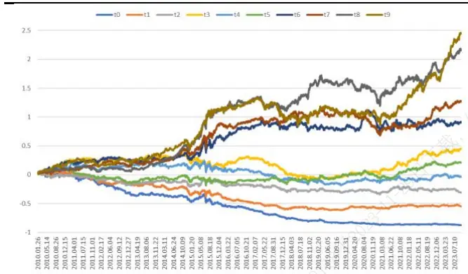
数据来源：Wind，国泰君安证券研究测试区间：2010.02-2023.09。

表 11：沪深 300内复合因子多头组近 3年超额较好

| 度 | 组合收益基 |  | 准收益 |  | 超额收益 |  | 跟踪误差最 | 大回撤信 | 息比率 |  |
| --- | --- | --- | --- | --- | --- | --- | --- | --- | --- | --- |
| 2010.02 |  | 9.29% |  | -6.00% |  | 15.29% | 10.69% | -4.78% |  | 1.43 |
| 2011 |  | 25.82% |  | 25.01% |  | -0.81% | 8.53% | -10.67% |  | -0.09 |
| 2012 |  | 15.04% |  | 7.56% |  | 7.49% | 7.16% | -3.60% |  | 1.05 |
| 2013 |  | 0.96% |  | -7.65% |  | 8.60% | 8.93% | -4.87% |  | 0.96 |
| 2014 |  | 62.78%% |  | 51.66% |  | 11.12% | 10.06% | -10.00% |  | 1.11 |
| 2015 |  | 55.80% |  | 5.58% |  | 50.22% | 14.21% | -5.25% |  | 3.54 |
| 2016 |  | -5.22% | L | 11.28% |  | 6.06% | 9.10% | -4.75% |  | 0.67 |
| 2017 |  | 8.40% |  | 21.78% |  | -13.38% | 8.37% | 14.52% |  | -1.60 |
| 2018 |  | 22.99% |  | 25.31% |  | 2.31% | 11.58% | -948% |  | 0.20 |
| 2019 |  | 36.19% |  | 36.07% |  | 0.12% | 9.64% | -8.34% |  | 0.01 |
| 2020 |  | 22.37% |  | 27.21% |  | -4.84% | 11.11% | -5.97% | 口 | -0.44 |
| 2021 |  | 9.37% |  | -5.20% |  | 14.57% | 12.05% | -7.40% |  | 1.21 |
| 2022 | D | -9.91% |  | 21.63% |  | 1.73% | 9.81% | -5.95% |  | 1.20 |
| 2023.09.21 |  | 2314% |  | -3.43% |  | 26.57% | 7.38% | -2.70% |  | 3.60 |
| 整体 |  | 10.26% |  | 0.85% |  | 9.4% | 10.16% | -20.92% |  | 0.93 |
| 2016年以来 |  | 7.67% |  | 2.28% |  | 5.39% |  |  |  |  |

数据来源：Wind，国泰君安证券研究
测试区间 2010.02-2023.09。

控制市值行业无暴露，在沪深300成分股中构建复合因子得分最大化组合。测算发现：2010年2月以来，年化超额收益9.09%（2016年以来，年化超额 5.83%），超额收益最大回撤-6.08%，信息比率 1.17，周度双边换手率 69.9%。截至 2023 年 9 月 21 日，本年超额收益 11.2%，超额收益最大回撤-2.22%。

表 12：沪深 300内复合因子组合优化近3年收益较好

| 年度 | 组合收益 |  | 基准收益 |  | 超额收益 | 跟踪误差 | 超额收益最大回撤 | 信息比率 | 周度双边换手率 |
| --- | --- | --- | --- | --- | --- | --- | --- | --- | --- |
| 2010.02 |  | -0.67% |  | -6.00% | 5.34% | 9.15% | -3.03% | 0.58 | 79.9% |
| 2011 | -1 | 9.77% |  | -25.01% | 5.24% | 7.61% | -2.29 | % 0.69 | 81.6% |
| 2012 |  | 6.23% |  | 7.56% | 8.68% | 6.80% | -1.53% | 1.27 | 78.5% |
| 2013 |  | 0.44% |  | -7.65% | 8.09% | 6.85% | -1.78% | 1.18 | 71.0% |
| 2014 |  | 78.94% |  | 51.66% | 27.28% | 6.85% | -1.27% | 3.98 | 77.2% |
| 2015 |  | 3403% |  | 5.58% | 28.45% | 11.16% | -5.15% | 2.55 | 78.6% |
| 2016 |  | -5.08% |  | -11.28% | 6.20% | 7.48% | -2261% | 0.83 | 71.0% |
| 2017 |  | 28.00% |  | 21.78% | 6.22% | 4.51% | -2.41% | 1.38 | 64.4% |
| 2018 |  | -16.68% |  | -25.31% | 8.63% | 7.59% | -1.69% | 1.14 | 60.1% |
| 2019 |  | 38.25% |  | 36.07% | 2.18% | 7.72% | -3.45 | % 0.28 | 61.6% |
| 2020 |  | 26.65% |  | 27.21% | -0.56% | 9.01% | -4.20% | -0.06 | 64.2% |
| 2021 |  | -1.20% |  | -5.20% | 4.00% | 7.99% | 4.03% | 0.50 | 57.3% |
| 2022 |  | -12.86% |  | -21.63% | 8.77% | 7.32% | 3.78% | 1.20 | 62.9% |
| 2023.09.21 |  | 7.77% |  | -3.43% | 11.20% | 6.37% | -2.22% | 1.76 | 70.6% |
| 整体 |  | 9.94% |  | 0.85% | 9.09% | 7.78% | -6.08% | 1.17 | 69.9% |
| 2016年以来 |  | 8.11% |  | 2.28% | 5.83% |  |  |  | 64.02% |

数据来源： ，国泰君安证券研究
测试区间：2010.02-2023.09。

图 3：沪深 300内组合优化收益曲线近期走势较好
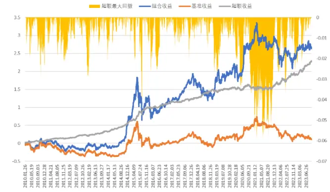

本报告收益为费前收益，按照69.9%的周度双边换手率，双边0.3%交易费用，费用对收益影响大约为 69.9%*48 周*（0.3%/2）=5.03%。

## 3.2.2.2. 中证 500 成分股

测算发现，中证500成分股内复合因子分组超额收益单调性良好；年度上，2017 年以后超额收益水平整体下台阶，2021 年以来超额收益尚可。整体上，多头组 2010年 2月以来，年化超额收益 13.49%（2016年以来，年化超额 7.35%），超额收益最大回撤-12.43%，信息比率 1.74。截至2023年 9月 21日，本年超额收益 8.77%，超额收益最大回撤-2.62%。

图 4：中证 500内复合因子分组单调性较好
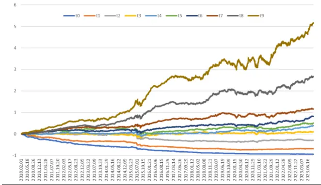
数据来源：Wind，国泰君安证券研究测试区间：2010.02-2023.09。

表 13：中证 500内复合因子近 3年多头组超额不高

| 年度 | 组合收益 |  | 基准收益 |  | 超额收益 | 跟踪误差 | 最大回撤 | 信息比率 |  |  |
| --- | --- | --- | --- | --- | --- | --- | --- | --- | --- | --- |
| 2010.02 |  | 28.34% |  | 12.85% | 15.50% | 7.30% | -3.48% |  | 2.12 |  |
| 2011 | 0 | -16.59% |  | -33.83% | 17.24% | 5.27% | -1.84% |  | 3.27 |  |
| 2012 |  | 15.90% |  | 0.28% | 15.62% | 4.94% | -2.78% |  | 3.16 |  |
| 2013 |  | 20.86% |  | 16.89% | 3.97% | 7.40% | -6.05% |  | 0.54 |  |
| 2014 |  | 58.70% |  | 39.01% | 19.69% | 6.14% | -4.43% |  | 3.21 |  |
| 2015 |  | 113.77% |  | 43.12% | 70.65% | 13.48% | -12.43% |  | 5.24 |  |
| 2016 |  | 4.82% |  | -17.78% | 22.60% | 4.85% | -2.58% |  | 4.65 |  |
| 2017 |  | -5.57% |  | -0.20% | -5.36% | 5.58% | -8.49% |  | -0.96 |  |
| 2018 |  | -21.17% |  | -33.32% | 12.15% | 7.07% | -44.99% |  | 1.72 |  |
| 2019 |  | 26.20% |  | 22.11% | 4.09% | 6.18% | -5.30% |  | 0.66 |  |
| 2020 |  | 18.96% |  | 20.87% | -1.91% | 10.12% | -10.21% |  | -0.19 |  |
| 2021 |  | 28.44% |  | 15.59% | 12.86% | 10.80% | -9.96% |  | 1.19 |  |
| 2022 | D | -14.72% |  | -20.31% | 5.60% | 7.34% | -4.39% |  | 0.76 |  |
| 2023.09.21 |  | 4.46% |  | -4.31% | 8.77% | 5.40% | -2.62% |  |  | 1.63 |
| 整体 |  | 15.07% |  | 1.58% | 13.49% | 7.76% | -12.43% |  |  | 1.74 |
| 2016年以来 |  | 5.18% |  | -2.17% | 7.35% |  |  |  |  |  |

数据来源：Wind，国泰君安证券研究测试区间 2010.02-2023.09。

控制市值行业无暴露，在中证500成分股中构建复合因子得分最大化组合。测算发现：2010 年 2 月以来，年化超额收益 10.04%（2016 年以来，年化超额 7.0%），超额收益最大回撤-8.34%，信息比率 1.17，周度双边换手率 60.1%。截至 2023年 9月 21日，本年超额收益 8.86%，超额收益最大回撤-1.73%。

表 14：中证 500内复合因子组合优化近3年超额不高

| 年度 | 组合收益 |  | 基准收益 |  | 超额收益 | 跟踪误差 | 超额收益最大回撤 | 信息比率 | 周度双边换手率 |
| --- | --- | --- | --- | --- | --- | --- | --- | --- | --- |
| 2010.02 | 2 | 677% | 1 | 2.85% | 13.92% | 8.62% | -1.81% | 1.62 | 74.3% |
| 2011 | 2 | 3.67% |  | 33.83% | 10.16% | 7.11% | -1.50% | 143 | 69.9% |
| 2012 | 1 | 0.11% |  | 0.28% | 9.84% | 7.41% | -1.32%6 | 1.33 | 71.0% |
| 2013 | 2 | 5.62% | 1 | 6.89% | 8.73% | 8.83% | -1.58 | 0.99 | 63.6% |
| 2014 | 4 | 9.65%% | 3 | 9.01% | 10.65% | 6.24% | -3.21% | 1.71 | 66.6% |
| 2015 | 74.73% | 3 | 4 | 3.12% | 31.61% | 16.94% | -8.34% | 1.87 | 75.3% |
| 2016 |  | -2.98% | D | 17.78% | 14.79% | 8.17% | -1.46% | 1.81 | 62.0% |
| 2017 |  | 2.56% |  | -0.20% | 2.76% | 4.17% | -2.31% | 0.66 | 57.7% |
| 2018 | 2 | 5.48% | 3 | 3.32% | 7.84% | 7.98% | -1.12% | 0.98 | 55.0% |
| 2019 |  | 34.14% |  | 2605% | 8.09% | 10.54% | -2.66% | 0.77 | 54.4% |
| 2020 | 2 | 2.53% |  | 20.87% | 1.66% | 8.21% | -4.25% | 0.20 | 53.0% |
| 2021 |  | 22.55% |  | 15.59% | 6.97% | 6.55% | -3.17% | 1.06 | 46.5% |
| 2022 | L | 15.25% | 2 | 0.31% | 5.06% | 6.54% | -2.41% | 0.77 | 45.8% |
| 2023.09.21 |  | 4.55% |  | -4.31% | 8.86% | 4.69% | -1.73% | 1.89 | 45.9% |
| 整体 | 1 | .86% |  | 1.82% | 10.04% | 8.61% | -8.34% | 1.17 | 60.1% |
| 2016年以来 |  | 5.33% |  | -1.68% | 7.00% |  |  |  | 52.54% |

数据来源：Wind，国泰君安证券研究测试区间：2010.02-2023.09。

图 5：中证500内组合优化收益曲线近期走势一般
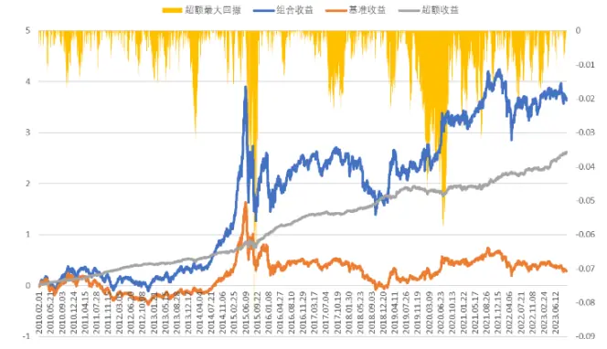
数据来源：Wind，国泰君安证券研究测试区间 2010.02-2023.09。

本报告收益为费前收益，按照60.1%的周度双边换手率，双边0.3%交易费用，费用对收益影响大约为 60.1%*48 周*（0.3%/2）=4.33%。

## 3.2.2.3. 中证 1000 成分股

测算发现，中证 1000 成分股内复合因子适用性较强，分组超额收益单调性较好；年度上，2020 年以后超额收益水平有所下降，2023 年以来超额收益尚可。整体上，多头组 2010年 2月以来，年化超额收益19.98%（2016 年以来，年化超额 14.83%），超额收益最大回撤-14.29%，信息比率2.46。截至2023年9月21日，本年超额收益14.34%，超额收益最大回撤-2.77%。

图 6：中证 1000内复合因子分组效果较好
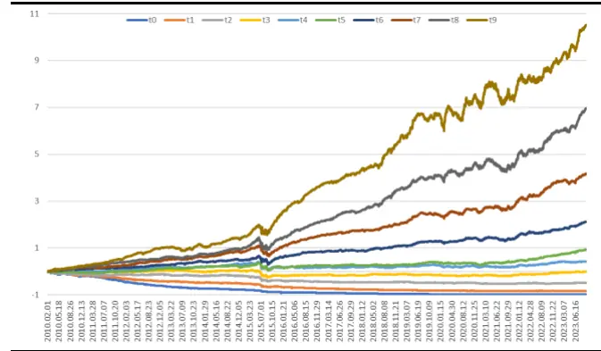
数据来源：Wind，国泰君安证券研究测试区间：2010.02-2023.09。

表 15：中证 1000内复合因子多头组近 3年超额良好

| 2 | 年度 | 组合收益 |  | 基准收益 |  | 超额收益 | 跟踪误差 | 最大回撤信 | 息比率 |  |
| --- | --- | --- | --- | --- | --- | --- | --- | --- | --- | --- |
|  | 2010.02 |  | 46.47% |  | 20.17% | 26.31% | 7.31% | -5.29% | 3.60 |  |
|  | 2011 |  | D-15.38% |  | -32.96% | 17.58% | 5.24% | -2.34% | 3.35 |  |
|  | 2012 |  | 28.95% |  | -1.43% | 30.38% | 4.76% | -2.77% | 6.38 |  |
|  | 2013 |  | 39.03% |  | 31.59% | 7.45% | 7.96% | -9.57% | 0.94 |  |
|  | 2014 |  | 53.01% |  | 34.46% | 18.55% | 6.00% | -5.11% | 3.09 |  |
|  | 2015 |  | 149.65% |  | 76.10% | 73.56% | 15.97% | -14.29% | 4.61 |  |
|  | 2016 |  | 8.85% |  | -20.01% | 28.86% | 4.61% | -1.59% | 6.26 |  |
|  | 2017 |  | -6.61% |  | -17.35% | 10.74% | 3.97% | -1.61% | 2.71 |  |
|  | 2018 |  | -21.81% |  | -36.87% | 15.06% | 6.42% | -3.42% | 2.35 |  |
|  | 2019 |  | 43.67% |  | 21.22% | 22.45% | 6.26% | -4.20% | 3.59 |  |
|  | 2020 |  | 27.01% |  | 19.39% | 7.62% | 10.12% | -9.43% | 0.75 |  |
|  | 2021 |  | 30.94% |  | 20.52% | 10.42% | 11.07% | -10.94% | 0.94 |  |
|  | 2022 |  | -12.45% |  | -21.58% | 9.13% | 8.70% | -4.24% | 1.05 |  |
|  | 023.09.21 |  | 8.90% |  | -5.44% | 14.34% | 5.26% | -2.77% |  | 2.73 |
|  | 整体 |  | 22.11% |  | 2.14% | 19.98% | 8.11% | -14.29% |  | 2.46 |
|  | 2016年以来 |  | 9.81% |  | -5.02% | 14.83% |  |  |  |  |

数据来源：Wind，国泰君安证券研究测试区间 2010.02-2023.09。

控制市值行业无暴露，在中证 1000 成分股中构建复合因子得分最大化组合。测算发现：2010 年 2 月以来，年化超额收益 15.50%（2016年以来，年化超额 12.24%），超额收益最大回撤-13.45%，信息比率 1.59，周度双边换手率80.3%。截至2023年9月21日，本年超额收益12.85%，超额收益最大回撤-3.17%。

表 16：中证 1000内复合因子组合优化本年超额良好

| 年度 | 组合收益 |  | 基准收益 |  | 超额收益 |  | 跟踪误差 | 超额收益最大回撤 | 信息比率 | 周度双边换手率 |
| --- | --- | --- | --- | --- | --- | --- | --- | --- | --- | --- |
| 2010.02 |  | 40.11% |  | 20.17% | 19.95% |  | 9.14% | -1.92% | 218 | 73.9% |
| 2011 |  | 1-23.36% |  | -32.96% | 9.61% |  | 7.48% | -2.406 | 1.28 | 85.8% |
| 2012 |  | 19.30% |  | -1.43% | 20.74% |  | 8.12% | -1.63% | 2.55 | 101.1% |
| 2013 |  | 41.61% |  | 31.59% | 10.02% |  | 10.28% | -3.80% | 0.98 | 88.4% |
| 2014 |  | 46.94% |  | 34.46% | 12.48% |  | 7.70% | -3.41% | 1.62 | 84.7% |
| 2015 |  | 132.07% |  | 76.10% | 55.97% |  | 19.67% | -13.45% | 2.85 | 95.5% |
| 2016 |  | 2.29% |  | -20.01% | 22.30% |  | 9.08% | -1.73% | 2.46 | 83.4% |
| 2017 |  | -5.61% |  | -17.35% | 11.75% |  | 4.47% | -1.08% | 2.63 | 76.8% |
| 2018 |  | -24.53% |  | -36.87% | 12.34% |  | 8.45% | -1.23% | 1.46 | 75.9% |
| 2019 |  | 39.62% |  | 25.08% | 14.54% |  | 11.07% | -2.59% | 1.31 | 75.8% |
| 2020 |  | 35.71% | 1 | 9.39% | 16.32% |  | 8.82% | -4.76% | 1.85 | 77.3% |
| 2021 |  | 22.23% |  | 20.52% | 1.71% |  | 8.58% | -6.68% | 0.20 | 67.7% |
| 2022 |  | 0-15.45% |  | -21.58% | 6.14% |  | 7.93% | -2.92% | 0.77 | 679% |
| 2023.09.21 |  | 7.41% |  | -5.44% |  | 12.85% | 5.61% | -3.17% | 2.29 | 70.1% |
| 整体 |  | 17.87% |  | 2.37% |  | 15.50% | 9.73% | -13.45% | 1.59 | 80.3% |
| 2016年以来 |  | 7.71% |  | -4.53% | 12.24% |  |  |  |  | 74.36% |

数据来源：Wind，国泰君安证券研究测试区间：2010.02-2023.09。

图 7：中证 1000内组合优化收益曲线近期走势较好
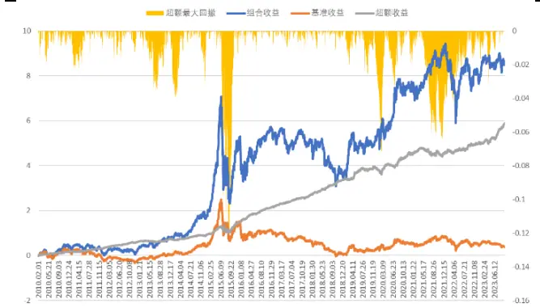
数据来源：Wind，国泰君安证券研究测试区间 2010.02-2023.09。

本报告收益为费前收益，按照80.3%的周度双边换手率，双边0.3%交易费用，费用对收益影响大约为 80.3%*48 周*（0.3%/2）=5.78%。

## 3.2.2.4. 中证 2000 成分股

测算发现，中证 成分股内复合因子适用性仍很强，分组超额收益单调性很好；年度上，超额收益水平保持在 20%左右。整体上，多头组 2010 年 2 月以来，年化超额收益 26.86%（2016 年以来，年化超额20.9%），超额收益最大回撤-11.2%，信息比率 3.07。截至 2023 年 9 月21日，本年超额收益 14.82%，超额收益最大回撤-3.63%。

图 8：中证 2000内复合因子分组效果很好
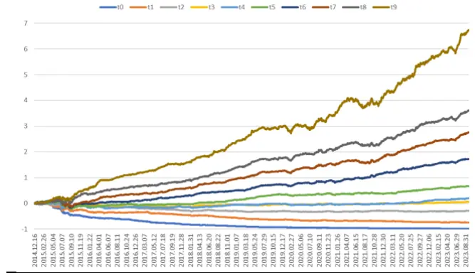
数据来源：Wind，国泰君安证券研究测试区间：2014.12-2023.09。

表 17：中证2000内复合因子多头组近3年超额较好

| 年度 | 组合收益 | 基准收益 | 超额收益 | 跟踪误差 | 最大回撤信 | 息比率 |
| --- | --- | --- | --- | --- | --- | --- |
| 2014.12.16 | -8.99% | -11.52% | 2.53% | 6.29% | -1.09% | 0.40 |
| 2015 | 216.58% | 109.78% | 106.80% | 18.30% | -11.20% | 5.84 |
| 2016 | 27.66% | -7.63% | 35.29% | 7.31% | -2.84% | 4.83 |
| 2017 | -9.11% | -24.10% | 14.99% | 4.30% | -1.71% | 3.49 |
| 2018 | -13.40% | -33.34% | 19.94% | 5.43% | -1.73% | 3.67 |
| 2019 | 41.32% | 17.38% | 23.93% | 4.81% | -2.27% | 4.98 |
| 2020 | 27.35% | 15.39% | 11.96% | 8.09% | -7.79% | 1.48 |
| 2021 | 44.94% | 25.89% | 19.05% | 8.58% | -7.88% | 2.22 |
| 2022 | 12.42% | -14.78% | 27.20% | 6.99% | -1.87% | 3.89 |
| 2023.09.21 | 14.96% | 0.14% | 14.82% | 4.77% | -3.63% | 3.11 |
| 整体 | 29.54% | 2.68% | 26.86% | 8.75% | -11.20% | 3.07 |
| 2016年以来 | 18.27% | -2.63% | 20.90% |  |  |  |

数据来源：Wind，国泰君安证券研究测试区间 2014.12-2023.09。

控制市值行业无暴露，在中证 2000 成分股中构建复合因子得分最大化组合。测算发现：2010 年 2 月以来，年化超额收益 19.55%（2016年以来，年化超额 16.3%），超额收益最大回撤-13.34%，信息比率 1.91，周度双边换手率77.1%。截至2023年9月21日，本年超额收益12.18%，超额收益最大回撤-3.54%。

表 18：中证 2000内复合因子组合优化近3年超额较好

| 年度 | 组合收益 | 基准收益 | 超额收益 | 跟踪误差 | 超额收益最大回撤 | 信息比率 | 周度双边换手率 |
| --- | --- | --- | --- | --- | --- | --- | --- |
| 2014.12.16 | -9.51% | -11.52% | 2.01% | 6.28% | -0.47% | 0.32 | 69.6% |
| 2015 | 153.27% | 102.08% | 51.19% | 18.50% | -13.34% | 2.77 | 67.3% |
| 2016 | 19.51% | -7.63% | 27.14% | 8.69% | -2.06% | 3.12 | 68.8% |
| 2017 | -10.44% | -24.10% | 13.66% | 4.50% | -1.16% | 3.04 | 72.7% |
| 2018 | -18.45% | -33.34% | 14.89% | 8.86% | -2.14% | 1.68 | 83.3% |
| 2019 | 42.03% | 21.03% | 21.00% | 10.90% | -2.37à | 1.93 | 82.9% |
| 2020 | 27.43% | 15.39% | 12.04% | 9.42% | -5.21% | 1.28 | 86.1% |
| 2021 | 33.97% | 25.89% | 8.07% | 8.95% | 7.86% | 0.90 | 77.6% |
| 2022 | 6.63% | -14.78% | 21.40% | 9.14% | -2.20% | 234 | 83.8% |
| 2023.09.21 | 12.32% | 0.14% | 12.18% | 6.05% | -3.54% | 2.01 | 79.0% |
| 整体 | 22.16% | 2.61% | 19.55% | 10.22% | -13.34% | 1.91 | 77.1% |
| 2016年以来 | 14.12% | -2.17% | 16.30% |  |  |  | 79.27% |

数据来源：Wind，国泰君安证券研究测试区间：2014.12-2023.09。

图 9：中证 2000内组合优化收益曲线走势较好
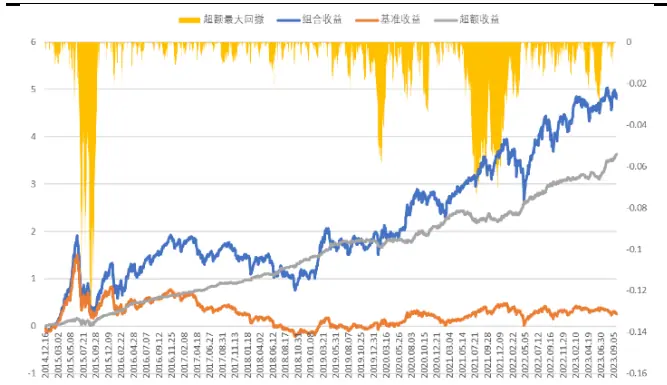
数据来源：Wind，国泰君安证券研究测试区间 2014.12-2023.09。

本报告收益为费前收益，按照77.1%的周度双边换手率，双边0.3%交易费用，费用对收益影响大约为 77.1%*48 周*（0.3%/2）=5.55%。

## 3.2.2.5. 中证全指成分股

测算发现，在中证全指成分股内分组单调性较好；年度上，2017-2020年受小市值失效影响超额收益较低甚至跑输，2021 年以来超额收益很好。整体上，多头组 2010年 2月以来，年化超额收益 20.24%（2016年以来，年化超额 14.27%），超额收益最大回撤-21.31%，信息比率 1.95。截至 2023 年 9 月 21 日，本年超额收益 20.30%，超额收益最大回撤-3.78%。

图 10：中证全指内复合因子分组效果较好
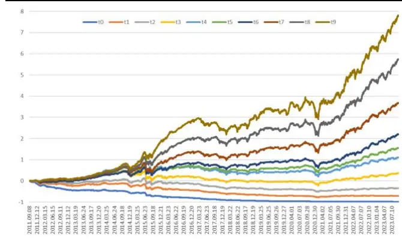
数据来源：Wind，国泰君安证券研究测试区间：2011.09-2023.09。

表 19：中证全指内复合因子多头组近 3年超额较好

| 年度 | 组合收益 | 基准收益 |  | 超额收益 | 跟踪误差 | 最大回撤 | 信息比率 |
| --- | --- | --- | --- | --- | --- | --- | --- |
| 2011.09.08 | -20.37% |  | -19.08% | -1.29% | 6.45% | -5.43% | -0.20 |
| 2012 | 13.86% |  | 4.58% | 9.28% | 6.58% | -5.35% | 1.41 |
| 2013 | 33.96% |  | 5.21% | 28.74% | 5.71% | -3.56% | 5.03 |
| 2014 | 67.12% |  | 45.82% | 21.29% | 8.75% | 14.31% | 2.43 |
| 2015 | 147.14% |  | B2.56% | 114.58% | 18.71% | 15.30% | 6.12 |
| 2016 | 13.04% |  | -14.41% | 27.45% | 6.61% | -2.47% | 4.15 |
| 2017 | -8.54% |  | 2.34% | -10.88% | 8.01% | 14.80% | -1.36 |
| 2018 | -19.90% |  | -29.94% | 10.03% | 10.56% | -913% | 0.95 |
| 2019 | 39.40% |  | 26.94% | 12.45% | 7.81% | -5.90% | 1.59 |
| 2020 | 27.08% |  | 24.92% | 2.15% | 9.99% | -11.40% | 0.22 |
| 2021 | 35.30% |  | 6.19% | 29.11% | 14.74% | -10.88% | 1.97 |
| 2022 | 3.25% |  | -20.32% | 23.57% | 11.49% | -7.22% | 2.05 |
| 2023.09.21 | 16.11% |  | -4.19% | 20.30% | 7.23% | -3.78% | 2.81 |
| 整体 | 22.81% |  | 2.57% | 20.24% | 10.40% | -21.31% | 1.95 |
| 2016年以来 | 13.22% |  | -1.06% | 14.27% |  |  |  |

数据来源：Wind，国泰君安证券研究
测试区间 2011.09-2023.09。

控制市值行业无暴露，在中证全指成分股中构建复合因子得分最大化组合。测算发现：2010 年 2 月以来，年化超额收益 9.41%（2016 年以来，年化超额 5.78%），超额收益最大回撤-9.07%，信息比率 1.14，周度双边换手率74.3%。截至2023年9月21日，本年超额收益13.42%，超额收益最大回撤-1.87%。对比表 19和表 20可以看出，在全市场，高频分钟因子受市值因子表现影响较大， 控制市值暴露，超额收益下降明显。

表 20：中证全指内复合因子组合优化每年超额不高

| 年度 | 组合收益 |  | 基准收益 |  | 超额收益 | 跟踪误差 | 超额收益最大回撤 | 信息比率 | 周度双边换手率 |
| --- | --- | --- | --- | --- | --- | --- | --- | --- | --- |
| 2011 | 16 | .87% | 1 | 9.08% | 2.21% | 7.42% | -1.16 | % 0.30 | 74.7% |
| 2012 | 8 | .93% |  | 4.58% | 4.35% | 6.78% | -2.86% | 0.64 | 73.2% |
| 2013 | 1 | 5.64% |  | 5.21% | 10.42% | 9.07% | -2.39% | 1.15 | 75.4% |
| 2014 | 6 | 3.12% | 4 | 5.82% | 17.29% | 5.94% | -1.92% | 2.91 | 85.2% |
| 2015 | 7 | 4.05% | 3 | 2.56% | 41.49% | 13.80% | -9.07% | 3.01 | 82.1% |
| 2016 |  | 1.47% | 1 | 4.41% | 15.88% | 7.55% | -1.58% | 2.10 | 74.2% |
| 2017 |  | 4.75% |  | 2.34% | 2.42% | 4.23% | -4.96% | 0.57 | 71.4% |
| 2018 | 2 | 1.55% | 2 | 9.94% | 8.39% | 7.91% | -3.00% | 1.06 | 71.9% |
| 2019 | 3 | 188% | 3 | 026% | 1.62% | 9.61% | -3.119% | 0.17 | 69.8% |
| 2020 | 2 | 2.48% | 2 | 4.92% | -2.44% | 8.29% | -402% | -0.29 | 68.7% |
| 2021 |  | 7.60% |  | 6.19% | 1.41% | 8.05% | 5.73% | 0.17 | 69.8% |
| 2022 | 14 | .74% | 2 | 0.32% | 5.58% | 8.13% | 5.45% | 0.69 | 75.4% |
| 2023.09.21 | 9 | .24% |  | -4.19% | 13.42% | 4.99% | -1.87% | 2.69 | 74.3% |
| 整体 | 1 | 2.20% |  | 2.79% | 9.41% | 8.24% | -9.07% | 1.14 | 74.3% |
| 2016年以来 |  | 5.14% |  | -0.64% | 5.78% |  |  |  | 71.9% |

数据来源：Wind，国泰君安证券研究
测试区间：2011.09-2023.09。

图 11：中证全指内组合优化收益曲线近期走势较好
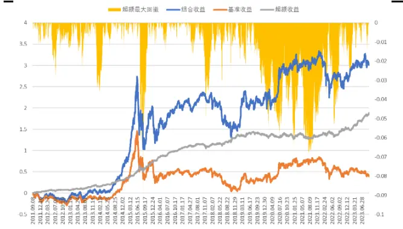
数据来源：Wind，国泰君安证券研究测试区间 2011.09-2023.09。

本报告收益为费前收益，按照74.3%的周度双边换手率，双边0.3%交易费用，费用对收益影响大约为 74.3%*48 周*（0.3%/2）=5.35%。

## 4. 总结

本报告主要对使用分钟数据计算的常用高频因子选股效果进行测试。

首先介绍高频数据和常用的高频数据处理软件。Level2数据是目前A股最完整、信息含量最丰富的行情数据。对于高频数据的研究和因子开发一直是量化选股研究的热点。本报告使用分钟行情数据计算常用的高频因子。高频数据处理软件选择上，主流软件是 KDB+和 DolphinDB。其中 KDB+属于国外著名的金融高频数据处理软件，优点是速度极快，专门针对金融高频场景开发，缺点是学习曲线陡峭，国内用户较少。DolphinDB是国内自主开发的时序数据库软件，性能优异，技术支持完善，已广泛应用于国内的头部券商、公募、私募和银行等机构，同时在时序 DB-Engines 上的排名也一路飙升。

然后，介绍分钟行情高频因子的计算方法。常用因子主要有收益率分布、成交量分布、量价相关性、残差收益率等。主要是基于错误定价（过度反应后的反转效应）、承担风险溢价（低流动性、低波动的风险补偿），整体不如财务类因子的投资逻辑强。具体计算上，（1）时间频率上，分别计算 1分钟和 5分钟两种因子。（2）时间区间上，分别计算全天、开盘后 30 分钟、收盘前 30 分钟、以及前 1/3 大成交量的因子。（3）分别使用 5日平均值和 20日平均值作为因子，用于周度选股效果测试。由于 5 日平均值的换手率过高，费前收益没有显著好于 20 日平均值，本报告推荐使用 20日平均值作为因子。

之后，在各股票池进行单因子测试，通过 IC、分组超额收益筛选出效果较好的因子。通过单因子测试发现，（1）和日频价量因子类似，分钟高频因子的输家组合负超额收益数值一般较大，多头组超额收益数值较小；多空收益主要是输家组合贡献的。（2）多头组超额在中小市值股票池超额水平更高，选股效果更好。（ ）虽然整体看一些因子的多头组超额较高；但不少因子的超额收益集中在 2017 年以前，2017 年以后超额收益不高。选择因子时，要兼顾年度超额收益的分布情况。

按照年化超额收益、年度超额收益的均匀分布程度，在每个股票池筛选效果较好的因子。（1）在五个指数成分股内都被选用的因子有：1 分钟 ILLIQ、5分钟特质残差的峰度、1分钟收益率偏度、5分钟收益率峰度、除去早盘30分钟后的涨跌幅、1分钟下行波动率占比。这些因子在不同市值区间的适用性均较强。（2）除沪深 300以外，在其他四个指数成分股内都被选用的因子有： 5分钟特质残差的偏度、尾盘成交量波动率。这些因子在中小市值股票池的适用性较强。

最后，测试等权合成的复合因子在各股票池的选股表现。从结果来看，高频分钟因子在中小市值股票池的选股效果较好，表现比较稳定。受益于小市值风格占优，在不同市值区间股票池，分钟高频因子多头组近 3年超额收益均较好。控制市值行业无暴露，构建复合因子得分最大化组合，测算发现：在沪深 300 成分股中， 2010 年 2 月以来，年化超额收益9.09%（2016年以来年化超额5.83%），超额收益最大回撤-6.08%，周度双边换手率69.9%。截至2023年9月21日，本年超额收益11.2%。

在中证 500 成分股中，2010 年 2 月以来，年化超额收益 10.04%（2016年以来年化超额 7.0%），超额收益最大回撤-8.34%，周度双边换手率60.1%；本年超额收益8.86%。在中证1000成分股，2010年2月以来，年化超额收益 15.50%（2016 年以来年化超额 12.24%），超额收益最大回撤-13.45%，周度双边换手率 80.3%；本年超额收益 12.85%。在中证2000成分股中，2010年 2月以来，年化超额收益 19.55%（2016年以来年化超额 16.3%），超额收益最大回撤-13.34%，周度双边换手率 77.1%；本年超额收益 12.18%。在中证全指成分股中，2010 年 2 月以来，年化超额收益 9.41%（2016 年以来年化超额 5.78%），超额收益最大回撤-9.07%，周度双边换手率 74.3%；本年超额收益 13.42%。在全市场，高频分钟因子受市值因子影响较大， 控制市值暴露，超额收益下降明显。

本篇报告不足之处：在历史回测上，没有划分样本外区间，如果担心过拟合，可以样本外观察跟踪一段时间；目前还是因子合成还是线性加权为主，可以考虑尝试机器学习、深度学习等算法；虽然有些因子选股效果较弱没有选用，但可以尝试作为深度学习模型的特征使用。

## 5. 参考文献

[1]深圳证券市场 2022 年度股票市场质量报告.深圳证券交易所研究所（金融创新实验室）.2023年 5月.

[2]市场的微观结构理论.奥哈拉.中国人民大学出版社。2007.

[3]市场微观结构与交易机制设计：高级指南.刘逖.上海人民出版社.2012.

[4]证券市场微观结构研究.曾勇、李平、刘波、王志刚.科学出版社.2008.

[5]kdb+中文教程.张文璋、郑轶、陈青、张瀛文、李书忞、钱嘉韵、吴 晶、杨琨等. https://mp.weixin.qq.com/s/2cVyuebVzhGN1J142LDCkg .

[6]KDB+数据库/Q 语言.人民英雄 cxs.

https://www.zhihu.com/column/kdb2019.

[7]KDB 教程官网. KxSystems 公司.https://code.kx.com/home/ .

[8]http://itfin.f3322.org/opt/cgi/wiki.pl/KdbPlus. 徐左乾 .2012.

[9]应用实例：DolphinDB与量化金融. 浙江智叟科技 DolphinDB . https://www.zhihu.com/column/DolphinDBinQuantitativeFinance .

[10]DolphinDB 作为工业物联网数据后台的 7 大优势. 浙江智叟科技DolphinDB. https://zhuanlan.zhihu.com/p/50654275

[11]DolphinDB用户手册 . 浙江智叟科技 .

https://docs.dolphindb.cn/zh/help/index.html .

## 6. 风险提示

量化模型基于历史数据构建，而历史规律存在失效风险。

## 7. 附录

## 7.1. 效果较好因子在各股票池的分组绩效、年度超额收益3

表 21：各股票池内效果较好因子的分组绩效指标，整体效果不错

|  |  |  |  |  |  |  |  |  |  |  |  |  |  |  |  |  |  |  |  | rankic |  |  | ic |
| --- | --- | --- | --- | --- | --- | --- | --- | --- | --- | --- | --- | --- | --- | --- | --- | --- | --- | --- | --- | --- | --- | --- | --- |
| 1分钟ILLIQ | 023% | - | 88% | E | 47% |  | 75% |  | 32% |  | 01%256% |  |  |  | 34% |  | 12% | 4.16% |  |  | 1.77% |  | 0.93% |
| 5分钟收益率成交量领先相关 | 459% |  | 83% |  | 64% |  | 97% |  | 68% |  | 12% |  | 190% |  | 82% |  | 84% | -8.45% |  |  | 2.09% |  | 1.38% |
| 1分钟收益率峰度 | 7.93% |  | 98% |  | 00% |  | 17% |  | é18% |  | 95% |  | 91% |  | 26% |  | 36% | -6.83% |  | L | 2.42% |  | 1.92% |
| 1分钟路径动量 | 516% |  | 24% |  | 69% |  | 95% |  | 66% |  | 16% |  | 38% |  | 53% | t | 25% | 5.23% |  |  | 2.17% |  | 1.37% |
| 5分钟收益率偏度 | 6.65% |  | 32% | 463% |  | 317% |  |  | 77% |  | 92%-106% |  |  |  | 36% |  | 93% | -10.38% |  | L | .18% |  | 2.16% |
| 5分钟极端大收益率均值 | 6.34%0 |  | 86% |  | 35% | 194% |  |  | 92% |  | 03%021% |  |  |  | 56% |  | 61% | L-593% |  | L | 2.56% |  | 0.97% |
| 除去早盘30分钟后的涨跌 | 6.31% |  | 72% |  | 06% | 264% |  |  | 19% |  | 15%213% |  |  |  | 83% | E | 71% | -10.46% |  | L | .27% |  | 2.73% |
| 1分钟下行波动率占比 | -1066% |  | 61% |  | 59% |  | 44% |  | 71% |  | 57%396% |  |  |  | 21% |  | 09% | 5.81% |  |  | 3.67% |  | 2.24% |
| 5分钟成交量偏度 | 422% |  | 74% |  | 26% |  | 52% |  | 13% |  | 37%2426% |  |  |  | 38% | E | 64% | 4.78% |  |  | 1.84% |  | 1.59% |
| 尾盘成交量波动率 | -411% |  | 10% |  | 33% |  | 88% |  | 01% |  | 31%231% |  |  |  | 78% |  | 74% | 2.91% |  |  | 2.00% |  | Q96% |
| 半小时成交量占比4 | 708% |  | 25% | 396% |  | 164% |  |  | 72% | 207% |  | 106% |  |  | 01% |  | 49% | 6.89% |  |  | 2.38% |  | 1.69% |
| 半小时成交量占比8 | 6.99% |  | 73% |  | 24% | 245% |  |  | 39% |  | 78% | -090% |  | - | 05% | 330% |  | L-7.27% |  |  | 1.56% |  | 2.13% |
| 5分钟特质残差的峰度 | 9.25% | 6 | 03% |  | 99% | 153% |  |  | 72% |  | 77% | 147% |  |  | 76% | 259% |  | -13.29% |  | L | .36% |  | 2.72% |
| 5分钟特质残差的偏度 | 6.27% | 7 | 74% | 575% |  | -046% |  |  | 55% |  | 79% | 305% |  |  | 09% |  | 79% | -12.86% |  | L | 3.31% |  | 2.74% |
| 1分钟残差下行波动率占比 | -1103% |  | 73% | 0.04% |  | 078% |  |  | 31% | 151% |  | 293% |  |  | 06% |  | 04% | 5.44% |  |  | 3.10% |  | 2.02% |
| 成交量方差比率 | 440% |  | 25% | 1.77% |  | 287% |  | 0 | 82% | -023% |  | 381% |  | 1 | 62% | 0 | 39% | B45% |  |  | .79% |  | 0.79% |
| 中证1000 |  |  |  |  |  |  |  |  |  |  |  |  |  |  |  |  |  |  |  |  |  |  |  |
| 1分钟ILLIQ | -979% | 56% |  | 156% |  | 0.58% |  | 2. | 00% | 2.56% |  | 4.31% |  | 7.73% |  | 11.80% |  | 13.84% |  |  | 4.01 | % | 2.37% |
| 5分钟收益率成交量领先相 | 10.12% | 7.77% |  | 6.94% |  | 6.88% |  | 2. | 79% | 5.98% |  | 5.06% |  | 2. | 32% | 3172% |  | 15.82% |  |  | .51% | B | .02% |
| 1分钟收益率峰度 | 8.43% | 9.46% |  | 5.56% |  | 6.52% |  | 3. | 83% | 4.78% |  | 4.44% |  | 0. | 58% | -253% |  | 口73% |  | L | .94% |  | 2.88% |
| 1分钟路径动量 | 8.13% | 9.36% |  | 9.13% |  | 8.40% |  | 7. | 42% | 5.74% |  | 6.14% |  | 1 | .50% | 42% |  | 2115% |  | L | .85% | L | .65% |
| 5分钟收益率偏度 | 10.51% | 12.21% |  | 10.56% |  | 7.50% |  |  | 43% | 2.33% |  | 2.45% |  |  | 85% | H19% |  | 18.04% |  |  | .57% | L | .76% |
| 5分钟极端大收益率均值 | 3.13% | 6.91% |  | 6.01% |  | 6.68% |  | 4.82% |  | 5.08% |  | 3.21% |  | 3.98% |  | -0.07% |  | 264% |  |  | .36% |  | .21% |
| 除去早盘30分钟后的涨跌幅 | 12.70% | 12.76% |  | 10.55% |  | 10.00% |  | 7. | 72% | 5.65% |  | 5.10% |  | 2.04% |  | -d04% |  | -27.23% |  |  | .11% |  | -5.36% |
| 1分钟下行波动率占比 | 2040% | -621% |  | 1.92% |  | 1.91% |  | 3. | 71% | 5.63% |  | 9.12% |  | 11.35% |  | 13.86% |  | 9.96% |  |  | 6.31% |  | 11% |
| 5分钟成交量偏度 | 14.43% | 10.25% |  | 9.19% |  | 6.23% |  |  | 81% | 3.58% |  | 3.61% |  | 0.41% |  | -507% |  | 1913% |  |  | .18% | L | .08% |
| 尾盘成交量波动率 | -1439% | -5138% |  | -0.50% |  | 1.24% |  | 2. | 54% | 6.00% |  | 5.98% |  | 10.33% |  | 11.69% |  | 11.33% |  |  | $.07% |  | 3.02% |
| 半小时成交量占比4 | 口11% | -189% |  | 1.13% |  | 2.57% |  | 3. | 79% | 3.81% |  | 6.32% |  | 6.76% |  | 9.31% |  | 8.34% |  |  | .63% |  | 2.34% |
| 半小时成交量占比8 | 4.04% | 9.31% |  | 7.92% |  | 4.42% |  | 3. | 40% | 2.95% |  | 3.73% |  | -0.35% |  | 0.52% |  | -873% |  |  | 0.74% |  | E1.74% |
| 5分钟特质残差的峰度 | 12.18% | 9.33% |  | 9.17% |  | 8.12% |  |  | 29% | 6.24% |  | 3.20% |  | -046% |  | -135% |  | 1681% |  |  | .47% | L | .92% |
| 5分钟特质残差的偏度 | 14.50% | 12.27% |  | 10.16% |  | 8.42% |  | 4. | 44% | 6.33% |  | 2.44% |  | -202% |  | -652% |  | 19 | 21% |  | 5.87% | L | .24% |
| 1分钟残差下行波动率占比 | 1811% | -5139% |  | -0.22% |  | 1.93% |  | 4. | 20% | 7.54% |  | 9.00% |  | 8.86% |  | 11.39% |  | 10 | .84% |  | 5.62% |  | 3.66% |
| 成交量方差比率 | 9.73% | 9.57% |  | 9.91% |  | 6.71% |  | 2. | 37% | 4.42% |  | 1.25% |  | -072% |  | 440% |  | 1080% |  | 2 | .69% | 2 | .50% |
| 中证500 |  |  |  |  |  |  |  |  |  |  |  |  |  |  |  |  |  |  |  |  |  |  |  |
| 1分钟ILLIQ | 428% | -25% |  | -058% |  | 149% |  | 088% |  | 056% |  | 298% |  | 443% |  | 736% |  | 8.79% |  |  | 2.66% |  | 46% |
| 1分钟收益率峰度 | 720% | 477% |  | 298% |  | 255% |  | 116% |  | 277% |  | 167% |  | 8.11% |  | -204% |  | 豆12% |  | B | 3.01% | E | 2.01% |
| 5分钟收益率偏度 | 8.80% | 757% |  | 493% |  | 535% |  | 465% |  | 201% |  | 188% |  | 1B2% |  | 527% |  | D58% |  | L | .58% |  | B2.81% |
| 5分钟极端大收益率均值 | 154% | 569% |  | 473% |  | 225% |  | 361% |  | 182% |  | 583% |  | 398% |  | -217% |  | -773% |  | B | .56% |  | I.44% |
| 除去早盘30分钟后的涨跌帽 | 10.18% | 10.34% |  | 632% |  | 8.70% |  | 589% |  | 217% |  | 132% |  | -095% |  | 422% |  | 1746% |  |  | .94% | 1 | .12% |
| 5分钟成交量偏度 | 9.44% | 9.19% |  | 585% |  | 387% |  | 288% |  | 375% |  | 210% |  | 092% |  | -199% |  | 317% |  | L | .80% | 2 | .91% |
| 尾盘成交量波动率 | -1025% | 072% |  | 026% |  | 042% |  | 271% |  | 145% |  | 659% |  | 498% |  | 666% |  | 7.99% |  |  | .59% |  | 85% |
| 半小时成交量占比4 | 53% | 084% |  | 318% |  | 036% |  | 302% |  | 292% |  | 569% |  | 481% |  | 467% |  | 6.01% |  |  | 2.94% |  | 72% |
| 半小时成交量占比8 | 606% | 683% |  | 603% |  | 381% |  | 343% |  | 057% |  | 090% |  | 225% |  | B15% |  | a75% |  |  | .81% |  | 1.86% |
| 5分钟特质残差的峰度 | 9.86% | 651% |  | 535% |  | 760% |  | 359% |  | 090% |  | 348% |  | 015% |  | B22% |  | 13. | 07% | L | .57% | L | .99% |
| 5分钟特质残差的偏度 | 800% | 9.79% |  | 727% |  | 353% |  | 500% |  | 284% |  | 295% |  | 081% |  | 469% |  | 14. | 05% |  | .81% |  | .18% |
| 1分钟残差下行波动率占比 | -1182% | -052% |  | -035% |  | -069% |  | 410% |  | 283% |  | 339% |  | 503% |  | 10.30% |  | 9.6 | 4% |  | .64% |  | 2.78% |
| 成交量方差比率 | 612% | 381% |  | 557% |  | 420% |  | 127% |  | 152% |  | 281% |  | 109% |  | 104% |  | -5 | 580% | B | .20% |  | .35% |
| 中证全指 |  |  |  |  |  |  |  |  |  |  |  |  |  |  |  |  |  |  |  |  |  |  |  |
| 1分钟ILLIQ | 961% | -1.05% |  | 2.20% |  | 2.80% |  | 1.54% |  | 3.77% |  | 4.84% |  | 9.52% |  | 14.83% |  | 17.27% |  |  | 4.04% |  | 2.38% |
| 5分钟收益率成交量领先相 | 10.30% | 9.68% |  | 9.59% |  | 9.57% |  | 7.11% |  | 5.68% |  | 7.47% |  | 4.26% |  | -204% |  | 14. | 69% | L | .51% | B | .98% |
| 1分钟收益率峰度 | 14.42% | 11.49% |  | 9.56% |  | 10.18% |  | 5.99% |  | 2.86% |  | 4.30% |  | 2.39% |  | -C67% |  | -13. | 82% | - | .70% | B | .38% |
| 1分钟路径动量 | 9.88% | 10.95% |  | 9.67% |  | 11.10% |  | 8.82% |  | 9.89% |  | 6.76% |  | 4.2% |  | 3161% |  | -19 | 2% |  | .86% | B | .61% |
| 5分钟收益率偏度 | 13.28% | 13.05% |  | 11.60% |  | 12.06% |  | 8.39% |  | 6.44% |  | 4.50% |  | 2.25% |  | 08% |  | -18. | 9% |  | .95% | B | .98% |
| 5分钟极端大收益率均值 | 7.63% | 8.26% |  | 8.46% |  | 10.36% |  | 9.11% |  | 7.76% |  | 4.45% |  | 3.23% |  | 48% |  | 2 | 18% |  | .16% | B | 2.60% |
| 除去早盘30分钟后的涨跌幅 | 14.61% | 13.57% |  | 12.54% |  | 11.78% |  | 10.55% |  | 8.20% |  | 6.59% |  | 3.72% |  | 40% |  | -25 | 20% |  | .06% | 1 | .27% |
| 1分钟下行波动率占比 | 19.92% | -5135% |  | 1.29% |  | 5.84% |  | 7.28% |  | 9.55% |  | 11.54% |  | 12.69% |  | 13.75% |  | 13. | 17% |  | 6.65% |  | 4.26% |
| 5分钟成交量偏度 | 13.61% | 11.99% |  | 10.10% |  | 8.07% |  | 7.25% |  | 6.58% |  | 5.90% |  | 3.70% |  | 86% |  | 17 | 57% |  | .23% | L | .59% |
| 尾盘成交量波动率 | D60% | 26% |  | 2.11% |  | 4.73% |  | 6.41% |  | 5.15% |  | 8.29% |  | 10.05% |  | 12.60% |  | 13.01% |  |  | .71% |  | 2.60% |
| 半小时成交量占比4 | -品98% | -0.24% |  | 2.73% |  | 4.37% |  | 5.31% |  | 7.90% |  | 8.92% |  | 9.10% |  | 9.73% |  | 10.44% |  |  | 3.96% |  | .40% |
| 半小时成交量占比8 | 5.96% | 10.05% |  | 8.49% |  | 8.32% |  | 7.15% |  | 4.86% |  | 5.02% |  | 3.81% |  | 44% |  | 6. | 55% |  | 0.69% |  | .74% |
| 5分钟特质残差的峰度 | 16.76% | 13.74% |  | 12.98% |  | 10.71% |  | 6.80% |  | 4.87% |  | 4.50% |  | 1.51% |  | 495% |  | 18 | 07% |  | .17% | 7 | .29% |
| 5分钟特质残差的偏度 | 16.39% | 14.92% |  | 11.66% |  | 12.04% |  | 7. | 41% | 6.59% |  | 4.64% |  |  | 17% | 5169% |  | -19. | 53% |  | 5.32% | L | .43% |
| 1分钟残差下行波动率占比 | 1785% | D80% |  | 1.44% |  | 3.87% |  | 6. | 55% | 7.76% |  | 11.27% |  | 12. | 10% | 12.99% |  | 13. | 60% |  | 5.07% |  | 6.85% |
| 成交量方差比率 | 11.02% | 11.66% |  | 10.50% |  | 8.13% |  | 5. | 65% | 4.30% |  | 2.96% |  | 1 | .29% | -1.15% |  | -8 | 69% | L | .61% |  | .22% |
| 中证2000 |  |  |  |  |  |  |  |  |  |  |  |  |  |  |  |  |  |  |  |  |  |  |  |
| 1分钟ILLIQ | -1048% | -774% |  | -126% |  | -0.49% |  | 0.57% |  | 5.65% |  | 5.21% |  | 9.45% |  | 16.22% |  | 22. | 17% |  | 5.49% |  | 2.92% |
| 5分钟收益率成交量领先相 | 12.62% | 14. | 20% | 10.20% |  | 10.93% |  | 5.56% |  | 4.54% |  | 6.31% |  | 2 | 16% | 142% |  | -19. | 90% |  | 5.71% | 7 | .62% |
| 1分钟收益率峰度 | 19.88% | 14. | 08% | 12. | 53% | 8.45% |  | 5.15% |  | 1.55% |  | 4.52% |  |  | 58% | 73% |  | -19. | 41% |  | .12% | L | .27% |
| 1分钟路径动量 | 12.64% | 11. | 1% | 14 | 4% | 10.35% |  | 12.1% |  | 8.36% |  | 7.56% |  |  | à7% | 021% |  | -27.2% |  |  | .02% |  | .54% |
| 5分钟收益率偏度 | 17.19% | 18. | 22% | 13. | 57% | 11.70% |  | 6.95% |  | 8.65% |  | 5.52% |  | -2 | 12% | 日58% |  | -26.09% |  |  | .40% | L | .80% |
| 5分钟极端大收益率均值 | 8.09% | 8.6 | 5% | 9.89% |  | 10.39% |  | 9.88% |  | 6.14% |  | 8.79% |  | 0 | .2% | -378% |  | 18.56% |  |  | .34% |  | .12% |
| 除去早盘30分钟后的涨跌幅 | 18.08% | 15. | 78% | 13.73% |  | 12.12% |  | 11.02% |  | 9.40% |  | 8.31% |  | 2 | .75% | 963% |  | -331% |  |  | .12% |  | .98% |
| 1分钟下行波动率占比 | -28.06% | -7 | 35% | 3150% |  | 3.50% |  | 8.17% |  | 11.45% |  | 12.48% |  | 13. | 12% | 17.15% |  | 18.28% |  |  | 1.85% |  | 5.19% |
| 5分钟成交量偏度 | 18.52% | 14. | 8% | 14.17% |  | 9.65% |  | 8.01% |  | 6.24% |  | 6.26% |  | -0 | .40% | -693% |  | 2596% |  |  | 5.74% |  | .91% |
| 尾盘成交量波动率 | 1546% | 1 | 59% | -179% |  | 3.4% |  | 5.59% |  | 4.66% |  | 8.53% |  | 11. | 29% | 14.48% |  | 14.57% |  |  | 5.90% |  | 2.92% |
| 半小时成交量占比4 | 1392% |  | 49% | 3.59% |  | 5.07% |  | 3. | 92% | 4.68% |  | 8.42% |  | 11. | $3% | 14.54% |  | 4.84% |  |  | 1.06% |  | .40% |
| 半小时成交量占比8 | 7.37% | 8 | 74% | 6.91% |  | 9.98% |  |  | 68% | 4.78% |  | 0.58% |  | 2 | .50% | 0.53% |  | D59% |  |  | .76% |  | 1.73% |
| 5分钟特质残差的峰度 | 19.46% | 18.6 | 1% | 13.43% |  | 14.59% |  | 5.8 | 8% | 0.96% |  | 2.60% |  |  | 182% | -768% |  | -2209% |  |  | .57% |  | .88% |
| 5分钟特质残差的偏度 | 16.72% | 18. | 07% | 17.66% |  | 11.15% |  | 5. | 87% | 7.79% |  | 4.05% |  |  | 34% | -897% |  | -235% |  |  | .36% | L | .80% |
| 1分钟残差下行波动率占比 | 2389% | -85 | 0% 145% |  |  | 2.46% 5. |  |  | 09% | 7.55% |  | 11.91% |  | 18. | 09% 16.29% |  |  | 16.61% |  |  | 7.27% |  | .70% |
| 成交量方差比率 | 10.87% 12. |  | 60% 8.73% |  |  | 12% 4. |  |  | 57% | 45% |  |  |  | -0 | 87% 6% |  |  | 8.48% |  |  | .07% |  | 2.02% |

数据来源：Wind，国泰君安证券研究。注：加粗为选用的因子。

表 22：各股票池内效果较好因子的多头组每年超额，近3年效果不错

|  |  |  |  | 2012y | 013y | 014y | 015y | 016y | 2017y | 018y | 2019 | 2020y | 2021y | 2022 | 2023 | 平均 |
| --- | --- | --- | --- | --- | --- | --- | --- | --- | --- | --- | --- | --- | --- | --- | --- | --- |
| 1分钟ILLIQ | 3.10% |  | 0.88% | -0.95% | 12.14% | 1.40% | 26.17% | 8.29% | -15.66% | 0.73% | -7.43% | -17.56% | 23.74% | 15.29% | 18.41% | 4.90% |
| 5分钟收益率成交量领先相关性 | 13.78% |  | -4.29% | -2.06% | 19.77% | -13.66% | 26.29% | 10.21% | -6.69% | 6.56% | 0.95% | 1.72% | 3.73% | 2.51% | 11.28% | 5.01% |
| 1分钟收益率峰度 | 11.07% |  | 4.22% | 4.56% | 7.19% | 28.43% | 40.02% | 4.72% | -12.89% | -1.14% | -3.24% | -16.26% | 19.66% | 11.63% | 25.68% | 8.83% |
| 1分钟路径动量 | 22.77% |  | -8.21% | 1.25% | 12.67% | -5.34% | 36.72% | 8.44% | -14.70% | 0.44% | 10.75% | -5.73% | 16.08% | 6.01% | 0.71% | 5.85% |
| 5分钟收益率偏度 | 22.58% |  | -6.57% | 0.49% | 11.58% | 4.16% | 42.33% | 5.04% | -7.91% | 8.56% | 4.00% | -3.95% | 4.36% | 7.91% | 7.93% | 7.18% |
| 5分钟极端大收益率均值 | 10.64% |  | -0.05% | 6.59% | 12.90% | 12.40% | 41.60% | 2.77% | -9.46% | -0.24% | -3.35% | -11.48% | 10.73% | 8.11% | 15.81% | 6.93% |
| 除去早盘30分钟后的涨跌幅 | 13.81% |  | -3.17% | 12.08% | 16.92% | -6.52% | 37.30% | 7.50% | -9.30% | -1.17% | 13.82% | -4.95% | 21.94% | 1.66% | -3.02% | 6.92% |
| 1分钟下行波动率占比 | 23.25% |  | -7.15% | -0.98% | 16.64% | -1.30% | 34.82% | 5.30% | -10.31% | 3.19% | 3.91% | 0.28% | 3.26% | 6.15% | 11.22% | 6.31% |
| 5分钟成交量偏度 | 7.28% |  | -5.18% | -4.20% | 23.32% | -4.96% | 36.07% | 9.15% | -17.80% | -1.96% | -8.45% | -13.86% | 16.37% | 19.71% | 17.73% | 5.23% |
| 尾盘成交量波动率 | 13.32% |  | -1.75% | -9.79% | 16.54% | -4.89% | 34.27% | 4.69% | -15.32% | -5.27% | -15.47% | -19.83% | 24.87% | 11.82% | 24.91% | 4.15% |
| 半小时成交量占比4 | 4.95% |  | 3.21% | -0.54% | 13.26% | 10.18% | 27.47% | 14.74% | -5.70% | 2.86% | 1.98% | -11.63% | 23.43% | 7.95% | 9.29% | 7.25% |
| 半小时成交量占比8 | 6.25% |  | 2.56% | -0.27% | 19.75% | 5.57% | 18.91% | 1.15% | 0.77% | -0.14% | 20.87% | 6.10% | 19.16% | 2.10% | -2.20% | 7.18% |
| 5分钟特质残差的峰度 | 24.20% |  | 1.94% | 1.32% | 1.26% | 12.29% | 29.72% | 12.89% | -7.50% | 11.53% | -3.04% | -9.57% | 20.91% | 17.88% | 22.83% | 9.76% |
| 5分钟特质残差的偏度 | 23.18% |  | -4.25% | 3.53% | 17.88% | -3.15% | 21.14% | 110.71% | -5.38% | 110.11% | 10.82% | 2.10% | -0.34% | 4.46% | 0.69% | 6.54% |
| 1分钟残差下行波动率占比 | 23.92% |  | -0.73% | -2.39% | 16.60% | 3.13% | 25.45% | 8.70% | -5.36% | 2.74% | 8.09% | -6.02% | 6.22% | -1.96% | 2.48% | 5.78% |
| 成交量方差比率 | 7.09% |  | 9.29% | -2.23% | 11.97% | 3.60% | 30.35% | 9.40% | -13.60% | 0 | -15.07% | -21.36% | 21.65% | 13.09% | 21.93% | 5.35% |
| 中证1000 |  |  |  |  |  |  |  |  |  |  |  |  |  |  |  |  |
| 1分钟ILLIQ | 10.38% |  | 3.28% | 16.22% | 3.66% | 8.52% | 37.96% | 37.76% | 1.27% | 20.19% | 0.70% | -1.56% | 19.69% | 3.21% | 16.21% | 14.11% |
| 5分钟收益率成交量领先相关性 | 7.05% |  | 8.44% | 3.48% | 4.95% | -3.43% | 35.12% | 24.02% | -3.69% | 19.82% | 13.83% | -1.20% | 8.59% | 9.48% | 8.41% | 10.35% |
| 1分钟收益率峰度 | -7.68% |  | 10.37% | 1.83%I | -10.04% | 6.15% | 0.90% | 21.35% | 5.95% | 6.78% | 12.00% | -4.62% | 26.97% | 21.52% | 11.95% | 8.82% |
| 1分钟路径动量 | 7.48% |  | 3.55% | 7.94% | 6.64% | -3.41% | 27.28% | 19.80% | 0.65% | 20.14% | 5.06% | -7.16% | 6.46% | 8.73% | 3.42% | 8.33% |
| 5分钟收益率偏度 | 3.75% |  | 10.79% | 5.59% | 0.82% | 5.96% | 8.42% | 2B.91% | 4.40% | 26.13% | 5.85% | -0.22% | 3.19% | 7.34% | 12.79% | 10.62% |
| 5分钟极端大收益率均值 | -0.47% |  | 3.66% | -0.50% | -7.55% | -0.75% | 3.99% | 15.05% | 1.22% | 9.40% | 3.19% | -5.81% | 7.68% | 6.11% | 10.01% | 3.23% |
| 除去早盘30分钟后的涨跌幅 | 4.59% |  | 5.74% | 10.28% | 8.25% | 2.61% | 41.20% | 27.40% | 3.43% | 21.30% | 9.29% | -1.88% | 12.31% | 7.61% | 8.25% | 12.88% |
| 1分钟下行波动率占比 | 2.87% |  | 12.84% | 14.08% | 2.67% | 5.52% | 6.08% | 22.91% | 4.80% | 23.40% | 4.54% | 0.47% | 7.28% | 9.73% | 11.95% | 9.94% |
| 5分钟成交量偏度 | 8.41% |  | 21.98% | 11.76% | 10.19% | 3.53% | 33.93% | 3118% | 9.86% | 19.35% | 11.49% | -3.44% | 4.16% | 5.74% | 4.37% | 14.47% |
| 尾盘成交量波动率 | 5.02% |  | 9.95% | 18.37% | 8.21% | 2.31% | 27.78% | 2934% | 6.34% | 10.76% | 2.17% | -5.00% | 12.69% | 9.61% | 12.48% | 11.43% |
| 半小时成交量占比4 | -2.15% |  | 10.44% | 10.86% | 3.94% | 9.51% | 11.48% | 12.62% | 5.86% | 19.65% | 4.62% | 7.88% | 9.52% | 7.76% | 3.68% | 8.26% |
| 半小时成交量占比8 | 5.00% |  | 0.55% | 6.86% | 3.48% | -4.75% | 4.74% | 10.19% | 10.85% | 10.66% | 0.41% | 7.54% | 18.69% | -3.42% | -11.75% | 4.22% |
| 5分钟特质残差的峰度 | 7.83% |  | 13.06% | 21.24% | -3.84% | 3.39% | 8.23% | 27.95% | 7.52% | 6.00% | 11.27% | -4.04% | 21.00% | 6.83% | 5.29% | 12.27% |
| 5分钟特质残差的偏度 | 13.26% |  | 3.66% | 23.96% | 7.97% | 4.67% | 3092% | 2991% | 8.00% | 15.32% | 6.57% | 4.84% | 11.03% | 5.36% | 8.13% | 14.54% |
| 1分钟残差下行波动率占比 | 5.73% |  | 13.94% | 16.44% | 1.30% | 3.93% | 22.02% | 2984% | 7.90% | 23.72% | 9.55% | -1.41% | 6.47% | 10.75% | 2.96% | 10.94% |
| 成交量方差比率 | 19.43% |  | 14.67% | 18.63% | 15.02% | 4.00% | 4.30% | 3107% | 5.18% | 5.44% | -3.41% | -8.96% | 15.18% | 6.97% | 11.70% | 9.94% |
| 中证500 |  |  |  |  |  |  |  |  |  |  |  |  |  |  |  |  |
| 1分钟ILLIQ | 10.26% |  | 19.11% | 4.49% | -0.23% | 9.11% | 28.80% | 28.27% | -8.91% | 10.78% | -0.32% | -8.59% | 21.86% | 6.42% | 8.41% | 9.25% |
| 5分钟收益率成交量领先相关性 | 4.45% |  | 2.21% | 3.16% | 0.59% | -1.65% | 23.40% | 16.74% | -3.27% | 4.54% | 8.06% | -2.04% | 6.91% | 2.07% | 1.77% | 6.21% |
| 1分钟收益率峰度 | -9.31% |  | 17.90% | 6.50% | -10.46% | 19.32% | 12.23% | 19.51% | -8.30% | 5.39% | 5.36% | -9.40% | 25.63% | 12.76% | 11.69% | 7.77% |
| 1分钟路径动量 | -2.47% |  | 6.97% | 6.14% | 3.21% | -1.66% | 21.17% | 17.45% | -2.16% | -5.47% | 13.97% | -1.05% | 5.27% | 3.67% | 0.29% | 4.67% |
| 5分钟收益率偏度 | 4.10% |  | 11.69% | 4.52% | 11.21% | 6.64% | 21.27% | 18.31% | 0.60% | 6.93% | 11.73% | -7.64% | 4.39% | 6.19% | 4.87% | 8.92% |
| 5分钟极端大收益率均值 | -9.04% |  | 7.67% | 1.39% | -2.94% | 3.60% | -4.31% | 6.90% | -5.10% | 5.29% | -3.65% | -13.59% | 4.76% | 4.17% | D11.16% | 1.88% |
| 除去早盘30分钟后的涨跌幅 | 18.85% |  | 5.56% | 5.94% | 3.66% | 3.75% | 34.99% | 19.49% | 7.51% | 4.02% | 7.60% | 12.53% | -0.36% | 1.94% | 0.06% | 10.39% |
| 1分钟下行波动率占比 | -2.76% |  | 10.61% | 6.91% | 3.55% | 5.24% | 21.35% | 6.22% | 0.15% | 3.46% | 11.22% | -2.75% | 9.18% | 4.28% | 4.06% | 7.19% |
| 5分钟成交量偏度 | 8.94% | 20.17% |  | 11.79% | 11.47% | 10.66% | 28.98% | 25.82% | -6.54% | 4.37% | 2.55% | -6.91% | 1.74% | 4.06% | 9.29% | 9.74% |
| 尾盘成交量波动率 | 24.69% | 5.57% |  | 6.66% | 2.82% | 6.82% | 6.60% | 20.03% | -4.82% | 5.27% | -3.75% | -9.11% | 21.49% | 7.77% | 6.37% | 8.31% |
| 半小时成交量占比4 | 8.70% | 7.82% |  | 7.50% | 0.89% | 8.26% | 16.16% | 1.83% | -1.45% | -3.01% | -0.82% | 2.02% | 11.56% | 9.89% | 5.40% | 6.05% |
| 半小时成交量占比8 | 19.39% | 6.84% |  | 11.21% | 1.59% | 12.33% | 5.32% | 13.64% | 5.57% | 6.50% | -1.91% | 3.29% | 5.67% | -0.97% | -2.55% | 6.14% |
| 5分钟特质残差的峰度 | 12.50% | 12.62% |  | 3.14% | -0.48% | 12.08% | 19.33% | 27.64% | -1.37% | 6.10% | -0.16% | -7.06% | 18.85% | 10.41% | 7.55% | 10.08% |
| 5分钟特质残差的偏度 | 12.07% | 2.27% |  | 9.93% | -0.86% | -0.70% | 26.89% | 18.74% | 0.23% | 12.87% | 7.52% | 6.41% | 10.85% | -1.43% | -0.53% | 8.16% |
| 1分钟残差下行波动率占比 | 5.99% | 4.94% |  | 9.03% | 2.58% | 10.48% | 19.05% | 23.38% | 1.97% | 3.63% | 1.87% | 0.03% | 5.41% | 6.20% | 1.07% | 9.69% |
| 成交量方差比率 | 6.28% | 3.80% |  | 6.35% | 1.94% | 10.26% | 11.21% | 5.62% | I-7.38% | 4.55% | -7.73% | -13.00% | 22.43% | 5.74% | 10.73% | 6.49% |
| 中证全指 |  |  |  |  |  |  |  |  |  |  |  |  |  |  |  |  |
| 1分钟ILLIQ |  | -2.12% |  | 4.93% | 23.68% | 5.19% | 73.85% | 42.16%日 | -17.76% | 12.10% | 3.03% | -4.59% | 41.08% | 37.57% | 18.35% | 18.27% |
| 5分钟收益率成交量领先相关性 |  | -2.15% |  | 2.44% | 22.99% | -5.13% | 56.72% | 24.30% | -16.71% | 10.03% | 6.48% | -6.83% | 20.01% | 16.45% | 13.12% | 10.90% |
| 1分钟收益率峰度 |  | -3.79% |  | 1.11% | 9.86% | 22.68% | 28.78% | 26.44% | -11.95% | 9.66% | 8.04% | -3.94% | 50.19% | 36.45% | 6.46% | 14.61% |
| 1分钟路径动量 |  | -2.68% |  | 1.71% | 24.53% | -5.55% | 55.08% | 20.15% | -16.92% | 10.86% | 11.48% | 1-11.73% | 24.66% | 6.04% | 9.95% | 10.58% |
| 5分钟收益率偏度 |  | -3.76% |  | 3.20% | 22.11% | 7.19% | 40.93% | 26.56% | -12.89% | 19.16% | 10.33% | -6.26% | 29.37% | 23.02% | 14.22% | 13.32% |
| 5分钟极端大收益率均值 |  | -4.38% |  | -0.64% | 6.40% | 1.01% | 28.97% | 21.06% | -13.37% | 3.70% | 0.23%D | -10.78% | 27.07% | 17.65% | 6.31% | 7.94% |
| 除去早盘30分钟后的涨跌幅 |  | -1.20% |  | 7.49% | 3434% | 4.17% | 70.36% | 30.75% | -13.97% | 16.53% | 8.15% | -7.80% | 27.58% | 11.06% | 11.04% | 15.27% |
| 1分钟下行波动率占比 |  | -3.53% |  | 5.10% | 24.03% | 4.79% | 41.59% | 27.10% | -13.66% | 7.18% | 11.40% | -6.59% | 28.99% | 21.63% | 4.13% | 13.24% |
| 5分钟成交量偏度 |  | -2.36% |  | 5.38% | 26.68% | 4.36% | 50.97% | 3187%0 | -10.21% | 5.35% | 4.61% | -5.16% | 3496% | 17.64% | 6.15% | 14.86% |
| 尾盘成交量波动率 |  | -2.73% |  | 4.09% | 25.61% | 3.30% | 55.97% | 3118% | -12.59% | 4.91% | -0.44% | -9.23% | 35.61% | 25.55% | 5.90% | 13.62% |
| 半小时成交量占比4 |  | -2.12% |  | 4.55% | 27.35% | 4.38% | 40.04% | 16.45% | -11.69% | 10.07% | 0.40% | -2.56% | 28.64% | 12.13% | 9.32% | 10.54% |
| 半小时成交量占比8 |  | -3.74% |  | 0.40% | 3348% | -4.13% | 2995% | 10.77% | -9.58% | 5.45% | -4.26% | -3.56% | 30.63% | 3.74% | -5.10% | 6.46% |
| 5分钟特质残差的峰度 |  | -1.15% |  | 3.20% | 18.60% | 13.24% | 55.38% | 3078% | -10.37% | 14.21% | 5.06% | -5.07% | 39.17% | 29.16% | 16.45% | 16.82% |
| 5分钟特质残差的偏度 |  | -0.62% |  | 12.71% | 3344% | 4.35% | 58.34% | 30.21% | -10.67% | 7.33% | 11.55% | -4.24% | 27.50% | 21.43% | 12.62% | 16.46% |
| 1分钟残差下行波动率占比 |  | -1.86% |  | 9.63% | 26.80% | 3.53% | 46.23% | 30.90% | -8.86% | 6.36% | I10.05% | -7.34% | 25.53% | 18.55% | 7.61% | 13.63% |
| 成交量方差比率 |  | -1.59% |  | 10.43% | 3451% | 4.84% | 3161% | 29.02% | -12.78% | 3.07% | -5.03% | -12.58% | 3424% | 19.38% | 3.84% | 11.46% |
| 中证2000 |  |  |  |  |  |  |  |  |  |  |  |  |  |  |  |  |
| 1分钟ILLIQ |  |  |  |  |  | -0.57% | 52.79% | 35.59% | 5.21% | 7.29% | 8.48% | 9.68% | 3232% | 25.50% | 11.37% | 20.77% |
| 5分钟收益率成交量领先相关性 |  |  |  |  |  | 1.50% | 21.84% | 21.33% | 9.32% | 18.61% | 13.01% | -3.67% | 8.09% | 3.33% | 10.16% | 11.35% |
| 1分钟收益率峰度 |  |  |  |  |  | -1.15% | 3160% | 14.73% | 7.29% | 19.68% | 16.90% | 8.98% | 2970% | 25.15% | 4.58% | 17.75% |
| 1分钟路径动量 |  |  |  |  |  | 1.99% | 42.78% | 5.26% | 9.19% | 23.38% | 13.31% | -7.22% | 9.82% | 12.44% | 6.76% | 11.77% |
| 5分钟收益率偏度 |  |  |  |  |  | 1.51% | 25.51% | 25.92% | 5.17% | 28.66% | 9.66% | 7.02% | 3.82% | 6.32% | 9.91% | 15.35% |
| 5分钟极端大收益率均值 |  |  |  |  |  | -1.67% | 8.26% | 6.56% | 7.72% | 10.99% | 3.91% | -0.94% | 9.11% | 9.46% | 9.15% | 7.26% |
| 除去早盘30分钟后的涨跌幅 |  |  |  |  |  | 1.88% | 42.52% | 20.02% | 18.49% | 3393% | 22.84%D | -10.03% | 18.16% | 1.77% | 7.58% | 16.72% |
| 1分钟下行波动率占比 |  |  |  |  |  | 1.45% | 36.36% | 20.09% | 10.89% | 3303% | 13.00% | 9.93% | 5.60% | 5.26% | 8.65% | 16.43% |
| 5分钟成交量偏度 |  |  |  |  |  | 0.49% | 28.25% | 19.52% | 20.02% | 17.58% | 15.12% | 10.40% | 26.73% | 11.57% | 4.85% | 14.86% |
| 尾盘成交量波动率 |  |  |  |  |  | -2.50% | 24.82% | 26.41% | 5.34% | 10.70% | ■10.49% | 0.85% | 21.83% | 3.48% | 9.90% | 13.13% |
| 半小时成交量占比4 |  |  |  |  |  | -2.71% | -6.34% | 5.30% | 0.68% | 21.83% | 3.68% | 4.98% | 12.29% | 5.09% | 0.46% | 4.53% |
| 半小时成交量占比8 |  |  |  |  |  | 1.07% | 19.57% | 13.92% | 4.83% | 9.98% | 2.42% | 8.04% | 6.14% | 0.96% | -8.97% | 6.80% |
| 5分钟特质残差的峰度 |  |  |  |  |  | -2.57% | 27.15% | 25.90% | 5.31% | 21.11% | ■10.87% | 14.09% | 22.61% | 25.85% | 3.14% | 17.35% |
| 5分钟特质残差的偏度 |  |  |  |  |  | 0.19% | 3167% | 18.41% | 1.76% | 23.62% | 8.17% | 5.45% | 3.35% | 18.47% | 8.54% | 14.96% |
| 1分钟残差下行波动率占比 |  |  |  |  |  | -0.60% | 34.11% | 19.42% | 13.78% | 26.31% | 18.74% | 2.17% | 5.58% | 6.03% | 4.39% | 14.99% |

数据来源：Wind，国泰君安证券研究。注：加粗为选用的因子。

## 本公司具有中国证监会核准的证券投资咨询业务资格

## 分析师声明

作者具有中国证券业协会授予的证券投资咨询执业资格或相当的专业胜任能力，保证报告所采用的数据均来自合规渠道，分析逻辑基于作者的职业理解，本报告清晰准确地反映了作者的研究观点，力求独立、客观和公正，结论不受任何第三方的授意或影响，特此声明。

## 免责声明

本报告仅供国泰君安证券股份有限公司（以下简称“本公司”）的客户使用。本公司不会因接收人收到本报告而视其为本公司的当然客户。本报告仅在相关法律许可的情况下发放，并仅为提供信息而发放，概不构成任何广告。

本报告的信息来源于已公开的资料，本公司对该等信息的准确性、完整性或可靠性不作任何保证。本报告所载的资料、意见及推测仅反映本公司于发布本报告当日的判断，本报告所指的证券或投资标的的价格、价值及投资收入可升可跌。过往表现不应作为日后的表现依据。在不同时期，本公司可发出与本报告所载资料、意见及推测不一致的报告。本公司不保证本报告所含信息保持在最新状态。同时，本公司对本报告所含信息可在不发出通知的情形下做出修改，投资者应当自行关注相应的更新或修改。

本报告中所指的投资及服务可能不适合个别客户，不构成客户私人咨询建议。在任何情况下，本报告中的信息或所表述的意见均不构成对任何人的投资建议。在任何情况下，本公司、本公司员工或者关联机构不承诺投资者一定获利，不与投资者分享投资收益，也不对任何人因使用本报告中的任何内容所引致的任何损失负任何责任。投资者务必注意，其据此做出的任何投资决策与本公司、本公司员工或者关联机构无关。

本公司利用信息隔离墙控制内部一个或多个领域、部门或关联机构之间的信息流动。因此，投资者应注意，在法律许可的情况下，本公司及其所属关联机构可能会持有报告中提到的公司所发行的证券或期权并进行证券或期权交易，也可能为这些公司提供或者争取提供投资银行、财务顾问或者金融产品等相关服务。在法律许可的情况下，本公司的员工可能担任本报告所提到的公司的董事。

市场有风险，投资需谨慎。投资者不应将本报告作为作出投资决策的唯一参考因素，亦不应认为本报告可以取代自己的判断。
在决定投资前，如有需要，投资者务必向专业人士咨询并谨慎决策。

本报告版权仅为本公司所有，未经书面许可，任何机构和个人不得以任何形式翻版、复制、发表或引用。如征得本公司同意进行引用、刊发的，需在允许的范围内使用，并注明出处为“国泰君安证券研究”，且不得对本报告进行任何有悖原意的引用、删节和修改。

若本公司以外的其他机构（以下简称“该机构”）发送本报告，则由该机构独自为此发送行为负责。通过此途径获得本报告的投资者应自行联系该机构以要求获悉更详细信息或进而交易本报告中提及的证券。本报告不构成本公司向该机构之客户提供的投资建议，本公司、本公司员工或者关联机构亦不为该机构之客户因使用本报告或报告所载内容引起的任何损失承担任何责任。

## 评级说明

## 1.投资建议的比较标准

投资评级分为股票评级和行业评级。以报告发布后的 12 个月内的市场表现为比较标准，报告发布日后的 12 个月内的公司股价（或行业指数）的涨跌幅相对同期的沪深 300 指数涨跌幅为基准。

## 2.投资建议的评级标准

报告发布日后的 12 个月内的公司股价（或行业指数）的涨跌幅相对同期的沪深 300 指数的涨跌幅。

| 评级 |  | 说明 |
| --- | --- | --- |
| 股票投资评级 | 增持 | 相对沪深 300 指数涨幅 15%以上 |
|  | 谨慎增持 | 相对沪深 300指数涨幅介于5%～15%之间 |
|  | 中性 | 相对沪深300指数涨幅介于-5%～5% |
|  | 减持 | 相对沪深300指数下跌5%以上 |
| 行业投资评级 | 增持 | 明显强于沪深 300 指数 |
|  | 中性 | 基本与沪深300指数持平 |
|  | 减持 | 明显弱于沪深 300指数 |

## 国泰君安证券研究所

|  | 上海 | 深圳 | 北京 |
| --- | --- | --- | --- |
| 地址 | 上海市静安区新闸路 669 号博华广 场20层 | 深圳市福田区益田路6003号荣超商 务中心 B 栋 27 层 | 北京市西城区金融大街甲9号金融 街中心南楼18层 |
| 邮编 | 200041 | 518026 | 100032 |
| 电话 | (021)38676666 | (0755)23976888 | (010)83939888 |
|  | E-mail: gtjaresearch@gtjas.com |  |  |