2024.04.22

# 从量化视角复盘 A 股 1995 年以来的风格轮动和选股因子表现

## ——权益配置因子研究系列 05

## 本报告导读：

A 股大小盘风格 4~10 年轮动一次，按照小样本统计和因子择时指标，中期看小市值风格未来一两年大概率延续。

## 摘要：

le_Summary]美股市场存在典型的大小盘轮动现象，平均 5-10 年切换一次。由于大小市值轮动频繁，在整个 83 年的时间区间，小市值平均每年仅跑赢大市值 2.06%。美股估值因子长期较为有效，高低估值轮动并不频繁。在整个 46 年的时间区间，低估值组跑赢高估值组的年化超额收益（年化多空收益）为 10.8%。

市值因子是 A 股最强的风格因子，中期看小市值风格未来一两年大概率延续。历史表现上，1995 年以来市值因子的年化多空收益达22%，年化超额收益达20%。从轮动上看，大小盘风格切换有4次，小市值失效有两次： 年失效四年、 年初 年初失效 4 年。月度上存在明显日历效应，2、3、5、8、11 月小市值很强，月均超额达 3%以上；4、12 月超额明显为负。小市值在 A股大部分时间有效，主要因为：经济处于复苏时期， 流动性宽松， 新产业趋势出现初期，监管政策放松或宽容时， 增量资金推动、成本结构良好；失效是由于因子过于拥挤、估值过高、政策变化、资金推动等。按照过往30年的小样本总结规律，市值风格4~10年左右轮动一次，可考虑战略性超配或低配。估值价差和滚动五年收益对市值因子择时有较强指导意义。在经济稳步复苏、流动性宽松、AI 可能引发新科技浪潮、IPO 放缓的背景下，如果多种影响因素持续，中期看小市值风格未来一两年大概率延续。

估值因子长期超额明显低于市值因子，但高低估值的风格轮动并不明显。1995 年以来估值因子年化超额为 11%，年化多空为 13%。估值因子持续失效主要是2019年4月-2021年1月，是因为机构持续抱团白马蓝筹赛道股，市场不关心估值高低，估值因子超额累计回撤30%。没有行情的年份超额收益较高，超过 10%。

常用选股因子在 2017 年以后超额收益相对之前有所降低。估值、股息率因子整体上在震荡市和没有行情时超额表现较好。价量因子跟小市值高度相关，小市值占优时价量因子表现均较好。 基本面因子整体上看有效性较强；主要失效发生在 2022 年~2023 年，基本面因子均大幅跑输基准；2023年 11月超额开始反弹，未来或有望重新有效。选股因子日常跟踪参见《权益因子观察周报》。

风险提示：量化模型基于历史数据构建，而历史规律存在失效风险。本报告结论基于小样本归纳，或存在较大失效风险。

大类资产配置研究

## 报告作者

张雪杰(分析师)

8 0755-23976751

zhangxuejie025900@gtjas.com

证书编号 S0880522040001

## 相关报告

三维度刻画十年期美债隐含通胀预期

2024.04.16

印度的政体、政党、政教、政商以及大选

2024.04.15

宏观因子资产配置框架的改进

2024.03.28

畜牧业、煤炭化工等二级行业排名靠前

2024.03.27

详解社保投资最新政策，三大利好

2024.03.26

感谢实习生蒋广、陈起对本文的贡献。

我们在之前的因子研究系列报告中研究了超预期因子、分钟高频因子在不同股票池的选股效果，介绍了中证 500、中证 1000 和中证 2000 指数增强策略的构建。本篇报告对A股历史上的风格轮动、因子轮动现象进行复盘，尝试归纳出中长期轮动的规律，供投资者参考。首先，介绍美股市场过去几十年市值、估值因子轮动表现。然后，介绍A股主要风格（市值、估值）因子 1995 年以来表现。之后，介绍常用的选股因子 2005 年以来表现，分三个阶段进行复盘。最后，基于小样本，尝试归纳总结 A股风格因子1轮动和选股因子有效的中长期规律。

## 1. A股风格（市值、估值）因子 1995年以来历史表现回顾

本部分对 A 股市值因子、估值因子历史表现进行回顾和复盘，尝试归纳出风格因子中长期轮动的规律。在资产定价经典理论 Fama-French三因子模型，除了市场因子（基准收益）外，市值因子和估值因子是影响和解释股票收益最重要的两个因子。

本部分考察 股因子表现时，使用全市场沪深股票池，对无法交易的股票进行剔除：（1）剔除选股当日的 ST 股票；（2）剔除上市不满三个月的股票；（3）剔除选股日由于开盘涨停、停牌等原因而无法买入的股票。根据因子的投资逻辑，对股票排序分 10 组；在每月进行分组调仓操作，股票权重等权配置，计算多头组（前10%）和输家组合（后10%）相对基准的超额收益、多空收益（多头组相对输家组合的超额收益）等指标。

收益计算方法：以市值因子为例，多空收益是每月多头组（市值最小的 10%股票组合）收益-输家组合（市值最大的 10%股票组合）收益+1累乘后再-1。市值因子的超额收益是每月多头组-基准指数2（万得全 A）收益+1累乘后再-1。具体公式如下，其他因子算法类似。

$$
\begin{aligned}市盘历子乡空收益&=\prod_{t=1,\ldots,n}\left(多头组月收益_t^{市盘}-输家组合月收益_t^{市盘}+1\right)-1\\&市盘历子买空收益_t市盘=市盘历子买空收益+1\\市盘历子起额收益&=\prod_{t=1,\ldots,n}\left(多头组月收益_t^{市盘}-盐滩月收益_t^{市盘}+1\right)-1\\&市盘历子起额收益_t市盘=市盘历子起额收益+1\end{aligned}
$$

由于本报告部分图表展示收益表现会使用对数坐标轴，此时不能有负数，会使用超额收益净值、多空收益净值替代来展示。不管使用收益还是收益净值，都不影响结论。

## 1.1. 他山之石：美股市场风格（市值、估值因子）轮动情况

本部分主要介绍美股市场，市值和估值两大风格因子历史表现情况。由于数据可得性问题，本部分内容主要援引詹姆斯·奥肖内西的《投资策略实战分析》3，该书中详细展示了美国股票市场常用选股因子(市值、市盈率、股息率、股东收益率、利润率等)的历史表现，考察的时间跨度达近百年，感兴趣读者可以自行查阅。

## 1.1.1. 美股市值因子过去80年存在典型的轮动现象，平均5-10年切换一次

美股市场存在典型的大小盘轮动现象，平均 5-10 年切换一次。按照詹姆斯·奥肖内西书中的定义，“所有股票”组合指的是所有市值高于 2 亿美元(经通货膨胀调整后的值)的股票。“大盘股票”组合是包括的是市值高于数据库市值平均水平的股票(通常包括该数据库中按市值排列在前17%的股票) 。“小盘股”组合是包括市值超过 2 亿美元(经通货膨胀调整后的值)但低于平均值的股票，并且不含微型股票。

詹姆斯·奥肖内西分别考察小盘股组合相对“所有股票”组合、“所有股票”组合相对大盘股组合的超额收益情况，具体展示指标是 5年滚动平均超额收益率。见下图 1和图 2。可以得到以下几点结论：

1) 美股市场存在典型的大小盘轮动现象，平均 5-10年切换一次。

2) 小市值组合跑赢所有股票组合和所有股票组合跑赢大市值组合基本是同步的。

3) 整体上来看，小市值组合跑赢所有股票组合、所有股票组合跑赢大市值组合5年滚动超额收益在0轴上的面积较大，整体上小市值组合强于大市值组合。

由于大小市值轮动频繁，在整个 83 年的时间区间，小市值组平均每年跑赢大市值组仅2.06%。如果美股所有股票按市值十分位分组，市值最小组相对市值最大组的年均超额收益（年化多空收益）也只有 2.1%。具体见表 1和图 3。

图 1：美股小盘股组合相对“所有股票”组合 5年滚动平均超额收益率
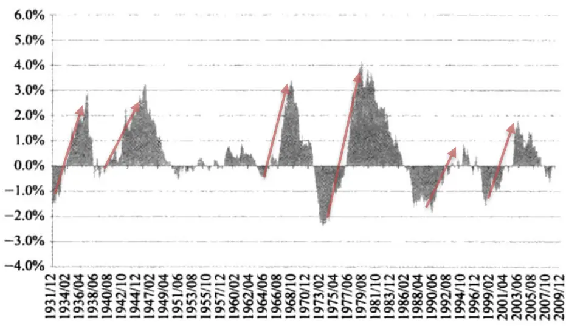
5年期滚动年复合平均超额收益率（或超额损失率）
(“小盘股”投资组合减去“所有股票”投资组合，1927年1月1日~2009年12月31日)

数据来源：詹姆斯·奥肖内西《投资策略实战分析》。注：红色箭头代表小市值跑赢基准的时间区间。

图 2：美股“所有股票”组合相对大盘股组合的5年滚动平均超额收益率
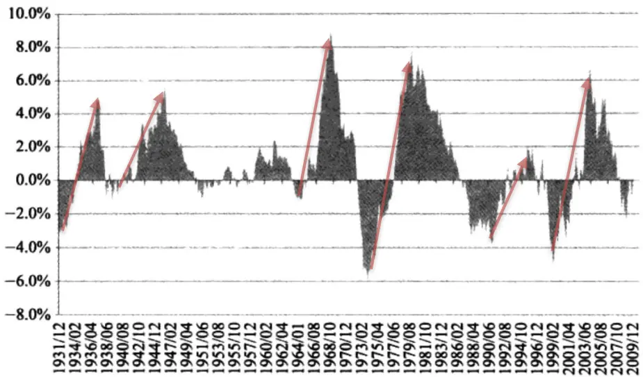
5年期滚动年复合平均超额收益率（或超额损失率）
(“所有股票”投资组合减去“大盘股”投资组合，1927年1月1日~2009年12月31日)
数据来源：詹姆斯·奥肖内西《投资策略实战分析》。注：红色箭头代表大市值跑输基准的时间区间。

表 1：美股小盘股相对大盘股组合的年平均超额收益2.06%
14“小盘股”投资组合与“大盘股”投资组合的基本比率(1927年1月1日~2009年12月31日)

| 项目 | “小盘股”投资组合战胜“大盘股”投资组合的时间 | 百分比(%) | 年平均超额收益率(%) |
| --- | --- | --- | --- |
| 1年期收益率 | 985期中有538期 | 55 | 2.06 |
| 滚动的3年期复合收益率 | 961 期中有531 期 | 55 | 1.35 |
| 滚动的5年期复合收益率 | 937 期中有579期 | 62 | 1.43 |
| 滚动的7年期复合收益率 | 913期中有623期 | 68 | 1.44 |
| 滚动的10年期复合收益率 | 877 期中有652期 | 74 | 1.35 |

数据来源：詹姆斯·奥肖内西《投资策略实战分析》。

图 3：美股所有股票按市值十分位分组的年复合平均收益率
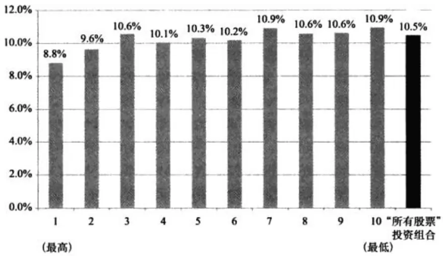
“所有股票”投资组合按十分位（10%）分组的年复合平均收益率(1927年1月1日~2009年12月31日)
数据来源：詹姆斯·奥肖内西《投资策略实战分析》。

## 1.1.2. 美股估值因子过去 40年表现

美股估值因子长期较为有效，高低估值轮动不明显，没有市值因子频繁。詹姆斯·奥肖内西使用市盈率对所有股票分十组，分别考察低估值组合（估值最低 10%股票）相对“所有股票”组合、“所有股票”组合相对高估值组合（估值最高10%股票）的5年滚动超额收益情况。具体见图4和图 5。可以得到以下几点结论：

1) 估值因子轮动没有市值因子频繁。

2) 低估市值跑赢所有股票组合、高估值跑输所有股票组合的同步性比较差。

3) 低估值组合相对所有股票组合5年滚动超额收益在零轴以下面积较小，说明以5年时间作为考察区间，估值因子连续5年累计超额为负的时候较少。高估值组合相对所有股票组合的5年滚动超额收益在零轴以上面积较小，说明高估值组合在连续5年维度超额为正的时候很少。整体认为以5年的投资时间看，估值因子失效的时间很少。

不同于大小盘的频繁轮动，估值因子的有效性较为长期持久。在整个46 年的时间区间，低估值组跑赢高估值组的年均超额收益（年化多空收益）为 10.8%。具体见图 6。

图 4：美股低估值组合相对所有股票组合的5年滚动超额收益率
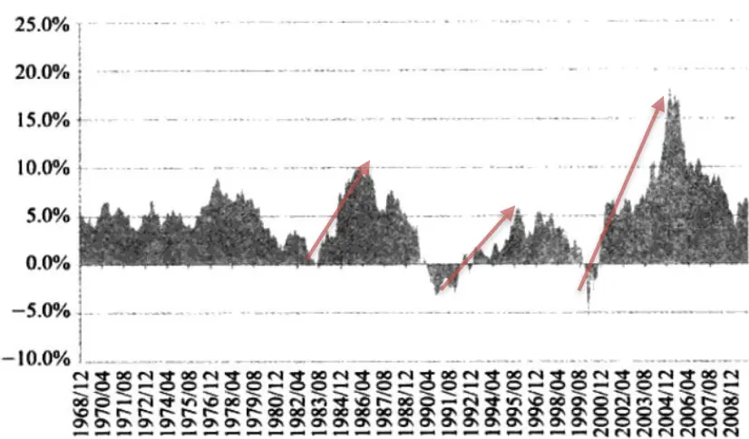
5年期滚动年复合平均超额收益率（或超额损失率）[“所有股票”投资组合中的低市盈率股票（前10%）减去“所有股票”投资组合，1964年1月1日~2009年12月31日]
数据来源：詹姆斯·奥肖内西《投资策略实战分析》。

图 5：美股高估值组合相对所有股票组合的5年滚动超额收益率
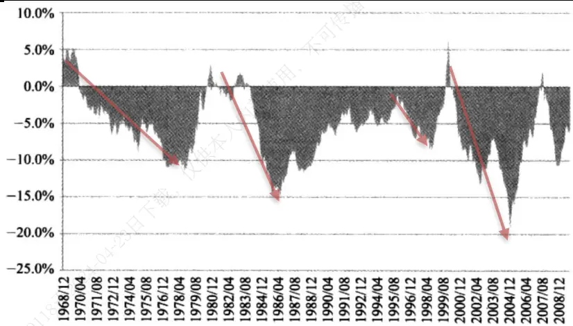
5年期滚动年复合平均超额收益率（或超额损失率）（“所有股票”投资组合中前10%高市盈率股票投资组合的收益减去“所有股票”投资组合的收益，1964年1月1日～2009年12月31日）
数据来源：詹姆斯·奥肖内西《投资策略实战分析》。

图 6：美股所有股票按市盈率十分位分组的年复合平均收益率
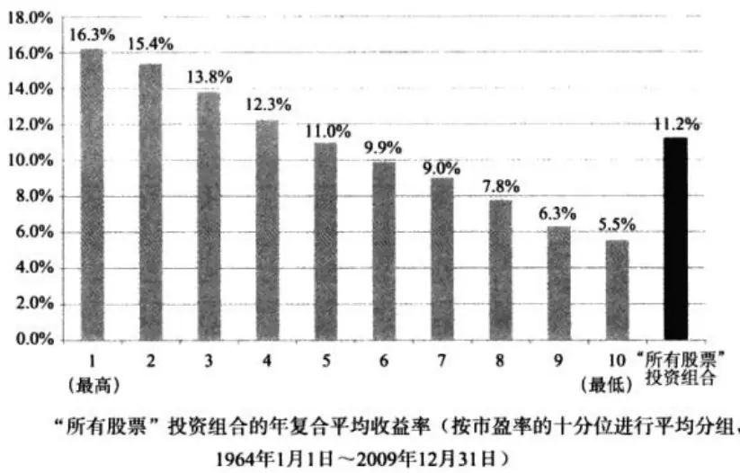
数据来源：詹姆斯·奥肖内西《投资策略实战分析》。

## 1.2. A股市值因子 1995年以来表现回顾

市值因子是 A股最强的风格因子。由于A股成立时间较短，市场有效性有所不足，市值因子的累计多空收益、累计超额收益都非常高。1995 年以来市值因子的年化多空收益达 22%，年化超额收益达 20%。

从轮动上看，大小盘风格切换有4次，小市值失效有两次：2003-2006年、2017 年初-2021 年初。月度上存在明显日历效应，2、3、5、8、11 月有效性很高，月均超额达 3%以上；4、12月超额收益明显为负。

从配置视角，小市值在 A 股大部分时间有效。主要因为：经济处于复苏时期，流动性宽松的环境， 新产业趋势出现的初期，监管政策放松或宽容时， 增量资金推动、成本结构良好。因子失效主要由于小市值因子过于拥挤、估值过高、政策资金推动等。

市值因子 4-10年轮动一次，从择时角度上来说，可以考虑战略性超配或低配。估值价差和滚动五年收益两个拥挤度指标对市值因子择时有较强指导意义。在经济稳步复苏、流动性宽松、AI 可能引发新科技浪潮、IPO放缓的背景下，站在中期视角，小市值风格未来一两年有望延续4

## 1.2.1. 市值因子表现分析

市值因子是 A股最强的风格因子，站在 1-3年中期视角，小市值甚至可以认为是 A股大部分时间有效的 Alpha因子。

图 7：市值因子1995年以来多空收益净值曲线、超额收益净值曲线
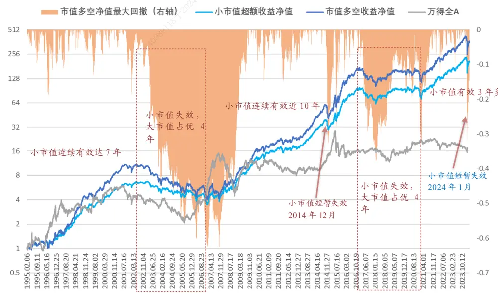

数据来源：wind，国泰君安证券研究

## 1.2.1.1. 市值因子年度超额和月度超额情况

使用总市值作为市值因子，按照十分组考察因子表现，我们计算了市值因子年度和月度超额收益，具体见表 2。可以发现以下结论：

1) 超额收益上：1995 年以来，小市值组（市值最小 10%股票）相对于大市值组的年化超额收益（即市值因子的年化多空收益）达22%，相对于基准指数（万得全 A，881001.WI）的年化超额收益达 20%。具体见图 7和表 2。大市值组的年度和月度超额收益见附录 4.3。

2) 从轮动上看，大小盘风格切换有4次，小市值失效时段有两次：

a) 1995-2002年小市值持续，有效近八年时间。

b) 2003-2006 年市值因子失效 4 年左右。

c) 2007 下半年-2017 年初，小市值因子有效 10 年。期间短暂失效 1 次（2014 年 12 月）。

d) 2017 年初-2021 年初，失效 4 年多。

e) 2021 年春节后有效至今 3 年多。期间短暂失效 1 次（2024年1月）。

3) 具体年份上，2003、2006 年超额收益为-20%，2004、2005 没有超额。在2017 -2021年1月市值因子失效期间，2017年超额收益-30%左右；2018 年由于大盘股超跌，小市值超额有所修复；2020 年超额-7%。2024年由于 1月份小市值因子出现大幅回撤，目前超额收益-5%。其他年份超额较高。

4)月度收益上，有明显的日历效应。2、3、5、8、11 月有效性很高，月均超额达 3%以上，而且胜率（70%-80%）和盈亏比（1.7-2）均较高。7、9月超额收益略低，也超过 1%。4月、12月因子失效，超额收益明显为负。

5) 行业上，TMT、新能源、汽车、医药等行业市值暴露偏小市值，金融、食品饮料、家电、地产等行业市值暴露偏大市值。具体见附录 4.4。

表 2：市值因子月度超额收益（相对万得全 A）

| 小市值组（市值最小10%） |  | 月度超额收益 | 1月 2月 3月 |  |  |  |  |  | 4月 |  | 5月 |  | 6月 |  | 7月 |  | 8月 |  | 9月 |  | 10月 |  | 11月 |  | 12月 |  | 年度平均 |  |
| --- | --- | --- | --- | --- | --- | --- | --- | --- | --- | --- | --- | --- | --- | --- | --- | --- | --- | --- | --- | --- | --- | --- | --- | --- | --- | --- | --- | --- |
|  | 小市值占优8年 | 1995 |  |  |  | 0.26% | 1 | .78% | 0 | .89% |  | 532% |  | 6.15% | 0 | .21% | L | 2.99% |  | 1.01% |  | 0.86% |  | 5.97% |  | 3.28% |  | 21% |
|  |  | 1996 |  | 0.48% |  | 1.57% | 2. | 97% |  | 558% | E | 2.94% | 口 | 5.98% |  | 9.59% | 口 | 7.24% | 2 | .42% | 1 | 5.11% |  | 481% | L | 3.65% |  | 8% |
|  |  | 1997 |  | 2.03% | 7 | .69% | 4 | 26% | 2 | .19% | 1 | .44% | 0 | .86% | 8 | .03% |  | 7.4% |  | 6.41% | 3 | .00% |  | 5.49% |  | 2.17% |  | 39% |
|  |  | 1998 |  | 3.79% |  | 5.71% |  | 7.55% |  | 534% |  | 9.43% | 0 | .59% |  | 529% |  | 3.36% | 1 | 2.49% |  | 507% | B | 2.68% |  | 0.64% |  | 54% |
|  |  | 1999 |  | 1.61% | 1 | .79% |  | 710% | 1 | 1.47% | 04 | .48% | 1 | .54% |  | 2.20% |  | 8.05% |  | 1.76% |  | 3.40% |  | 446% | L | 3.35% |  | 20% |
|  |  | 2000 | L | 3.80% |  | 2.79% | 1 | 3.05% | 0 | .07% |  | 474% | 0 | .47% |  | 2.37% |  | 496% |  | 5.28% |  | 4.75% |  | 1.99% |  | 1.33% |  | 37% |
|  |  | 2001 | 1 | 1.59% | 0 | .35% |  | 3.45% | 3 | .58% |  | 6.71% |  | 0.43% |  | 0.24% |  | 3.16% | B | 1.92% | 2 | .46% |  | 2.87% |  | 1.14% |  | 13% |
|  |  | 2002 |  | 3.32% | 2 | .44% |  | 3.34% |  | 448% |  | 0.04% | 2 | .84% |  | 0.75% |  | 1.35% |  | 0.18% |  | 1.11% |  | 2.02% |  | 1.73% |  | 5% |
|  | 大市值占优4年 | 2003 | 2 | .68% |  | 0.90% | 3. | 04% | 7. | 98% | 1 | .51% |  | 1.07% | 3 | .27% |  | 2.70% | 0 | .94% | C | 6.81% | 0 | .74% | 7. | 86% |  | -25% |
|  |  | 2004 |  | 3.73% |  | 501% | 1 | .27% | 日 | 2.61% |  | 2.31% | 日 | 2.55% | L | 4.74% | 1 | .07% | 1 | .74% | 04 | .75% |  | 564% | 1 | .85% |  | -1% |
|  |  | 2005 |  | 1.44% |  | 1.44% | L | 3.63% | 7 | .22% |  | 6.65% |  | 0.78% | L | 6.50% | 1 | 1.92% |  | 3.58% | E | 1.92% |  | 524% | L | 5.82% |  | 2% |
|  |  | 2006 | 口 | 7.38% |  | 3.09% | L | 3.37% | G | 3.26% |  | 8.32% |  | 336% |  | 467% |  | 0.89% |  | 4.24% |  | 3.50% | -1. | 74% | 1.9 | 3% |  | -28% |
|  | 小市值占优10年 | 2007 | 0 | .63% | 1 | 3.33% |  | 13.44% | 2 | .67% |  | 0.42% | -1. | 84% | 8 | .53% |  | 0.68% | 1 | .52% | -13 | .45% | 1 | 6.45% |  | 453% |  | 33% |
|  |  | 2008 |  | 515% |  | 8.05% |  | 2.86% | ☐10 | .79% |  | 8.26% |  | 0.88% |  | 10.21% | 4. | 67% |  | 3.52% |  | 529% |  | 11.02% |  | 12.35% |  | 43% |
|  |  | 2009 |  | 1.78% |  | 6.91% |  | 533% | 3 | .47% |  | 3.24% | 0 | .54% | 2 | .64% | 1 | 2.12% |  | 0.22% | 3 | .36% |  | 8.21% |  | 2.15% |  | 44% |
|  |  | 2010 |  | 8.48% |  | 5.60% |  | 413% | 1 | .31% | 0 | .95% | 0 | .89% |  | 511% |  | 7.50% |  | 0.50% | L | 4.23% | 1 | 0.56% |  | 0.33% |  | 37% |
|  |  | 2011 | 2 | .14% |  | 478% |  | 2.92% | B | 2.68% | 0 | .40% |  | 1.65% |  | 4.06% |  | 6.47% | 2 | .70% | 1 | .46% |  | 2.59% | 10 | .13% |  | 6% |
|  |  | 2012 | L | 2.97% |  | 8.23% | 0 | .72% | 0 | .00% |  | 1.74% |  | 2.95% | D | 5.82% |  | 9.01% | 0 | .84% |  | 1.13% | L | 4.14% |  | 1.92% |  | 10% |
|  |  | 2013 |  | 0.65% |  | 450% |  | 1.71% | 0 | .41% |  | 7.21% |  | 0.71% | 7 | .91% |  | 2.78% |  | 2.06% |  | 2.63% |  | 7.87% |  | 3.38% |  | 41% |
|  |  | 2014 |  | 477% |  | 529% |  | 3.79% |  | 2.48% |  | 413% |  | 449% | 0 | .22% |  | 6.66% | 1 | 0.01% | 0 | .61% | L | 3.10% | -20 | .27% |  | 18% |
|  |  | 2015 |  | 7.83% |  | 2.47% |  | 574% |  | 1.30% | 20 | .46% |  | 529% | 2 | .83% |  | 7.59% | 7 | .34% | 1 | 0.71% | 1 | 3.73% |  | 9.86% |  | 89% |
|  |  | 2016 | 4. | 65% |  | 3.53% |  | 8.51% |  | 793% | 2 | .85% |  | 3.05% | 0 | .34% |  | 3.39% |  | 7.28% |  | 1.93% |  | 1.13% |  | 536% |  | 34% |
|  | 大市值占优4年 | 2017 |  | 4.33% |  | 1.90% | L | 3.41% | 口 | 7.18% | 口 | 6.09% | 0 | .44% | 口 | 6.51% |  | 5153% |  | 1.23% | L | 2.84% | 口 | 6.37% | B | 1.87% |  | -30% |
|  |  | 2018 |  | 4.32% |  | 2.54% |  | 13.94% |  | 0.37% |  | 489% | L | 2.95% |  | 1.94% |  | 2.20% |  | 0.21% |  | 3.63% |  | 6.32% |  | 2.30% |  | 20% |
|  |  | 2019 | 1 | 1.39% |  | 521% |  | 3.42% |  | 1.18% |  | 6.14% |  | 1.70% |  | 1.06% | B | 1.94% |  | 1.24% | 0 | .34% | 0 | .58% |  | 1.62% |  | 9% |
|  |  | 2020 | 2 | .20% | 3. | 41% |  | 9.99% | D | 5.79% |  | 1.53% | 3. | 89% | 0 | .81% |  | 6.29% |  | 0.64% | 1 | .33% |  | 0.18% | -10 | .60% |  | -7% |
|  | 小市值占优3年多 | 2021 | 9. | 63% |  | 6.19% |  | 8.66% | 2 | .38% |  | 2.77% |  | 491% | 2 | .33% |  | 5.65% |  | 0.03% | 3 | .86% |  | 7.89% |  | 5.99% |  | 29% |
|  |  | 2022 |  | 6.28% |  | 416% |  | 7.94% |  | 8.16% |  | 6.81% |  | 2.20% | 9 | .47% |  | 3.00% | 1 | 0.98% | 9 | .63% |  | 1.55% | 2 | .19% |  | 35% |
|  |  | 2023 |  | 1.20% |  | 535% |  | 0.02% |  | 3.68% |  | 8.41% |  | 380% |  | 3.34% |  | 6.137% |  | 2.46% |  | 2.35% |  | 6.32% | 1 | .29% |  | 37% |
|  |  | 2024 | D | 4.24% | 13. | 28% |  | 10.83% | 1 | .53% |  |  |  |  |  |  |  |  |  |  |  |  |  |  |  |  |  | -5% |
|  |  | 月均超额 | -0.06% |  | 3.18% |  | 4.26% |  | -1.35% |  | 3.51% |  | -0.10% |  | 1 | .79% | 3.62% |  | 1 | .77% | 0.82% |  | 3.40 |  | %-0.75% |  |  | 20% |
|  |  | 月度胜率 | 48% |  | 83% |  | 80% |  | 43% |  | 76% |  | 41% |  | 66% |  | 76% |  |  | 66% | 55% |  | 69% |  | 55% |  | 80% |  |

数据来源：Wind，国泰君安证券研究。数据区间 1995.02.01-2024.04.03。

## 1.2.1.2. 小市值因子失效情况分析

## （1） 持续失效的时间段

小市值持续失效主要有两段，2003年-2007年中、2017年 1月-2021年 2月。两段失效持续时间都有 4年之久。具体见图 7。

1)2003年-2007年中，小市值因子持续跑输基准，期间甚至没有反弹，2007 年 1 月超额回撤达到最大值 48%，意味着四年时间小市值组累计跑输基准指数48%，多空收益回撤达到61%。之后2017年2、3 季度，市值因子的超额收益曲线有所震荡筑底，直到 2007 年 10月指数见顶后，小市值因子开始重新有效，超额收益曲线迅速上升。此后小市值因子有效长达 10 年之久。这一轮小市值因子失效的大背景是 2005-2007年国企改革引发的一轮大牛市，受益的主要标的都是国企央企大盘股，这类股票涨幅巨大，小市值股票持续跑输。

2) 2017 年初，受金融去杠杆、并购重组监管加强、小盘股成本结构恶化等多重因素影响，小市值因子开始失效，超额收益大幅回撤。当年超额回撤达到 37%（小市值组累计跑输基准指数 37%），多空收益回撤达 42%，（小市值组累计跑输大市值组 42%）。2018 年受贸易战影响，大盘股补跌，小盘股跌无可跌，超额回撤出现一定收敛恢复。但 2019 年以后，大盘股行情继续演绎，小市值因子继续失效。到 2020 年底时，大盘股开始上演最后的疯狂，小市值因子超额加速回撤，2个月的时间超额收益回撤达到 30%，多空收益回撤35%。直到2021年春节后市场大小盘风格悄然切换，沪深300等大盘指数开始持续回调，小市值因子再次王者归来。这一轮小市值因子失效的大背景是 A股纳入 MSCI、以北向资金为代表的机构资金话语权逐渐增大，持续抱团白马蓝筹股，出现了一波以上证50、沪深300、创业板指等指数成分股为代表的结构化牛市行情，在此期间小盘股被完全抛弃。

## （2） 短暂急剧失效

在小市值因子持续有效的时间段，偶尔也会出现短时间大幅回撤失效的情况，其特点是回撤幅度大，回撤时间短。这样的情况主要有两次：

1)2014 年 12 月金融股暴涨导致小市值因子短时间失效。这次小盘股大幅回撤的背景是 2014 年 11 月 21 日央行突然降息，标志货币政策的彻底转向，直接引爆 2014 年年底股市行情；此后一个多月非银金融指数大涨 、银行指数大涨 ，同期中证 指数仅上涨 左右。这期间小市值短时间持续失效，超额收益急剧回撤25%（小市值跑输基准指数 25%），多空收益急剧回撤 33%（小市值组跑输大市值组 33%）。2015年元旦后小市值因子的超额收益才开始恢复。一直押注小市值的量化基金在此期间损失惨重，特别是很多量化对冲的结构化产品5爆仓清盘。

2) 2024 年 1 月多重因素共振导致小市值因子短时间大幅回撤。受市场回调过程中恐慌情绪蔓延、雪球产品敲入导致基差扩大、DMA策略降仓位、量化产品的调仓等多重因素影响，1 月中旬小市值因子开始大幅回撤，至2月7日超额最大回撤达36%，多空收益回撤最大达 41%。押注小市值风格的产品收益回撤较大，部分私募自营资金亏损较多。但春节后小市值因子超额收益开始修复，短期

## 1.2.2. 估值价差、因子反转指标对大小盘风格切换时点判断有较强的 指导意义

为了分析市值因子轮动规律，进行因子择时（判断因子有效失效的时间节点），我们采用 MSCI《MSCI Integrated Factor Crowding Model》中因子拥挤度指标进行初步尝试。计算分析发现，市值因子的估值价差、因子反转两个指标对市值因子择时（大小盘风格切换时点判断）有较强的指导意义。

表 3：MSCI 因子拥挤度指标及算法

| 拥挤度指标 | 算法 |
| --- | --- |
| 估值价差 Valuation spread | 因子多头组股票平均估值和因子输家组合股票平均估值之比。 |
| 做空比率价差 Short Interest spread | 输家组合股票平均做空比率和多头组股票平均做空比率之差。 |
| 配对相关性 Pairwise correlation | 多头组股票间收益率相关性和输家组合股票收益率相关性的平均值。 |
| 因子波动率 Factor volatility | 因子多头组相对市场的波动率比值。 |
| 因子反转 Factor reversal | 因子过去三年滚动收益。 |

数据来源：MSCI。

## 1.2.2.1. 估值价差

估值价差的高点和低点对于市值因子择时（大小市值切换时点）有较强的指示作用。估值价差的计算公式为小市值组的PB中位数/大市值组的PB中位数。从图8可以看出，市值因子估值价差（小市值组的PB中位数相对于大市值组的PB中位数）最大达到2.64倍，最低为0.43倍。小市值因子的估值价差走势上有 3轮上行和 2轮下行。具体而言：

1) 上行阶段（1995 年-2001 年 4 月）：1997.07.18 低点 0.43，之后震荡上升，至2001.04.27估值价差达到阶段高点1.70后，小市值因子拥挤度较高，市值因子开始失效。

2) 下行阶段（2001 年 4 月-2007 年 11 月）：估值价差持续下降，2007.11.01 达到历史低点 0.44。

3) 上行阶段（2007年11月-2017年2月）：市值因子开始重新有效，2017.02.23 达到历史最高估值价差 2.64。

4) 下行阶段（2017年 2月-2021年 2月）：小市值因子开始失效，大盘股行情开启，估值价差持续走低，在2021.02.10达到最低0.44。

5) 上行阶段（2021 年 2 月至今）：小市值因子开始重新有效，2023.11.29 达到阶段高点 1.21，1 月中旬受多重因素影响，小盘股闪崩，市值因子短暂失效，估值价差下降 0.7 后开始反弹，目前（4月 3日）的估值价差 0.93。

目前市值因子最新估值价差为 0.93，相对历史高点区域 1.7~2.6，估值价差当前位置不高，小市值相对大市值组估值价差或许仍有60%以上提升空间。需要注意的是，上述基于小样本归纳的结论，存在失效风险。

图 8：市值因子的估值价差高低点对于判断大小盘风格切换的指示作用较强
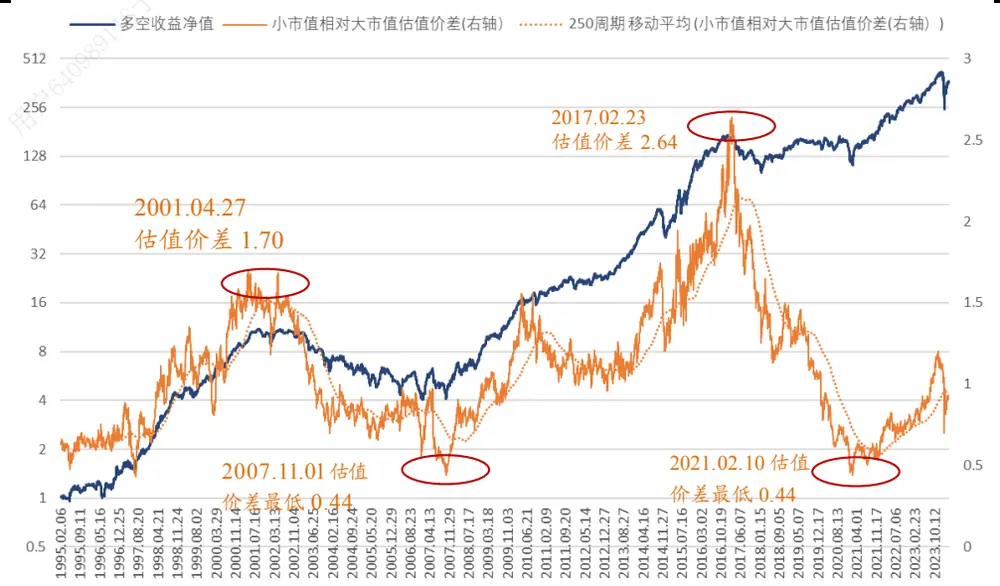
数据来源：wind，国泰君安证券研究。注：图的左轴均为对数坐标轴。

图 9：市值因子的估值价差滚动 5年分位数
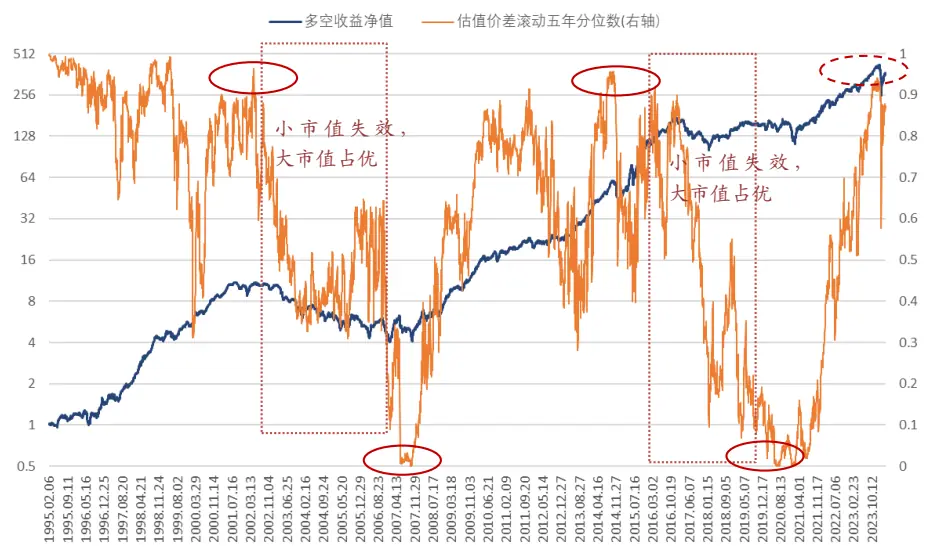
数据来源：wind，国泰君安证券研究。注：图的左轴均为对数坐标轴。

## 1.2.2.2. 因子反转

因子反转指标是因子过去三年滚动收益。在本报告，相比因子的多空收益，我们更关注因子的超额收益，所以分别计算了 3年滚动超额收益、年滚动超额收益。分析发现，使用 年滚动超额收益净值作为市值因子拥挤度的监测指标效果更好。具体见下图 10.

小市值因子的 5年滚动超额收益净值有 3轮上行和 2轮下行：

1) 上行阶段（1995年-2001年8月）：1995年以来小市值因子有效，然后向下。

2) 下行阶段（2001 年 8 月-2007 年 11 月）：持续下跌至 2007.01.16 达到阶段低点 0.56，底部震荡近一年左右，2007.11.01 达到历史低点0.57，开始持续上升。

3) 上行阶段（2007 年 11 月-2017 年 2 月）：2012.02.21 达到阶段高点4.7，宽幅震荡一年左右。经历 2014 年 12 月回撤，股市异常波动期间小市值因子仍然保持强势，5 年滚动收益净值继续上升2017.02.07 的 6.19。

5) 上行阶段（2021年2月至今）：随着风格切换，小市值持续占优，在 2024.01.04 达到本轮最高 2.74，当前（2024.04.03）5 年滚动超额收益净值为 2.30。

从市值因子 5年滚动超额收益净值指标简单外推，距离历史 4~6的顶部水平，小市值的 5 年滚动超额收益净值或许还有 100%左右的提升空间。需要注意的是，上述基于小样本归纳的结论，失效风险很大。

图 10：小市值因子5年滚动超额收益净值对判断市值风格切换具有较强的指导意义
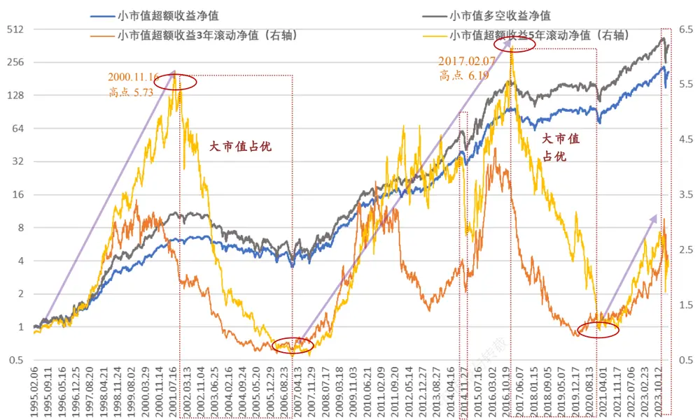
数据来源：wind，国泰君安证券研究

图 11：大市值组的 5年滚动超额收益净值
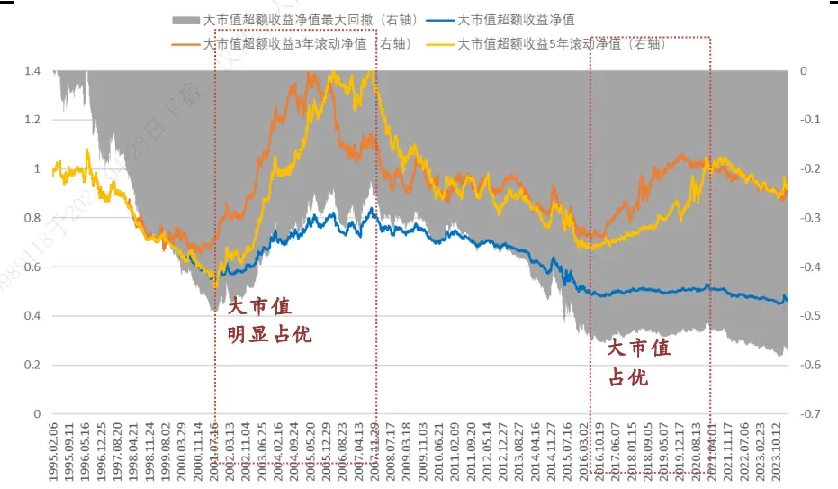
数据来源：wind，国泰君安证券研究

## 1.2.3. 小市值因子在 A股历史上大部分时间有效的原因分析

小市值因子在 A股历史上大部分时间有效，分析其背后的宏观经济、政策背景等因素，我们认为有以下几点原因：

经济处于复苏时期，小市值风格大概率占优。Switzer et al. (2010) 发现经济复苏时期，小市值股票上升空间更大价格弹性也比较大，收益率比大市值股票收益率要高，在经济衰退时期大市值公司的经济实力雄厚，抗跌能力比较强，大市值股票收益会高。

2) 流动性宽松的环境，小市值风格明显占优。具体的表现有：宽松的货币政策、较低的或处于下降通道的利率、M2-社融的剪刀差处于上升高位时，小市值大概率占优。流动性收紧，小市值因子可能失效。

3) 新产业趋势出现的初期，小市值占优。例如2013年至2016年4G移动互联网带来的新的模式和经济；2022 年 11 月 ChatGPT 发布引爆AI概念，带动 TMT整体上涨。

4) 监管政策放松或宽容时，小市值股票活跃（2013年IPO暂停6壳价值凸显、2014年并购重组放松7、2023年提出活跃资本市场）。2016年并购重组收紧8，加剧了小市值因子的失效。2024 年国九条严格上市公司持续监管，加大退市监管力度，加强交易监管等不利于小市值。

5) 增量资金推动。场内两融、场外配资等杠杆资金青睐小盘股。北向 等外资、机构资金倾向大盘股。2017 年以来杠杆资金清理9，北向 资金持续买入大市值蓝筹、公募基金集体抱团核心资产，导致小市 值因子失效。

6) 成本结构上，大市值成本结构恶化，抱团瓦解，小市值成本结构良好，可能有机会，比如 2021年春节后。

展望未来，经济稳步复苏、流动性较为宽松、AI 可能引发新的科技浪潮、IPO 节奏放缓、因子拥挤度指标处于低位等因素利好小市值，监管政策（退市、重组新规）趋严等不利于小盘股，对应增量资金变动和成本结构则后续需要保持跟踪。按照之前大小盘 4~10 年左右轮动一次的小样本规律，上述因素持续的情况下，小市值风格未来一两年大概率会延续。

需要说明的是，上述基于小样本归纳的结论，不具备常规量化研究要求的大样本统计显著性，存在失效风险。对于小市值风格的坚持和认同，需要相当大的定力。或许正如利弗莫尔在《股票大作手回忆录》中所说，市场的规律性缘因于不变的人性；日光之下，并无新事，前有之事，后必再有，已行的事，后必再行。

## 1.3. A股估值因子1995年以来表现回顾

价值投资的理念深入人心，估值因子是 A 股长期较为有效的因子，超额水平有所降低，适合长期配置。估值因子在市场震荡年份超额收益较高，牛市时效果较差。

## 1.3.1. 估值因子表现分析

本部分使用 PE、PB、PS等权合成估值因子。按照十分组考察估值因子表现，我们计算了估值因子多空收益、超额收益曲线、年度和月度超额收益，具体见图 11和表 4。主要结论有以下几点：

1) 因子有效性上，估值因子长期超额明显低于市值因子，但高低估值的因子轮动并不明显。除了2019年4月-2021年1月估值因子持续失效外，其他时间超额回撤幅度和时间都不大。从轮动上看，估值失效时段只有 1次，2019年 4月-2021年 1月期间超额收益累计回撤 30%（同期跑输市场基准指数 30%）。

2) 历史表现上，自 1995 年以来，十分组下估值因子多头组（估值最低10%股票组合）相对于万得全A指数的年化超额收益为10.8%，年化多空收益（估值最低 10%股票组合相对估值最高 10%股票组合的超额收益）为 13.3%。

3) 年度收益上看， 2006年超额小幅跑输基准 3%；2019和 2020年结构性牛市期间，机构持续抱团白马蓝筹赛道股，市场不关心估值高低，估值因子显著失效，跑输基准 10%。其他年份都有一定超额，特别是没有行情10的年份超额收益较高，超过 10%。

4) 月度收益上看，有一定的日历效应。1、2、3、7、8、11、12 月有效性较高，月均超额 1~2%以上。5、6 月超额收益略低，也超过1%。4月、12月因子失效，超额收益明显为负。

图 12：估值因子1995年以来多空收益、超额收益曲线
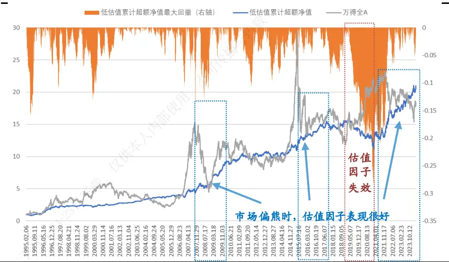
数据来源：wind，国泰君安证券研究

表 4：估值因子月度超额收益（相对万得全 A）
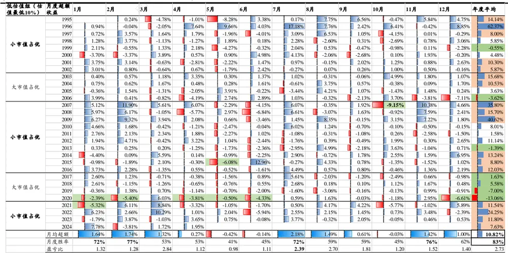

数据来源：Wind，国泰君安证券研究。数据区间 1995.02.01-2024.04.03。

## 1.3.2. 估值因子轮动不明显，明显失效只有一次

估值因子的轮动现象不如市值因子明显。由于估值因子长期较为有效，明显失效次数只有一次，主要是 2019年 4月-2021年 1月期间。5 年滚动超额收益、估值价差等因子拥挤度指标对于估值因子择时的指导意义不强。由下图 13和 14可以看出:

1) 3 年、5 年滚动超额收益净值虽然有一定周期性，但该指标见顶后，估值因子并没有明显失效。

2) 估值价差指标的周期性更不明显。在2019年4月-2021年1月估值因子明显失效期间，滚动净值和估值价差均处于低位。

估值因子失效并不是估值过高、过于拥挤导致，更多是牛市行情下，特别是结构性牛市下，股票动量效应显著，股票估值高低不是市场关注的关键因素。

图 13：估值因子的3年、5年滚动超额收益净值对因子失效的指示意义不强
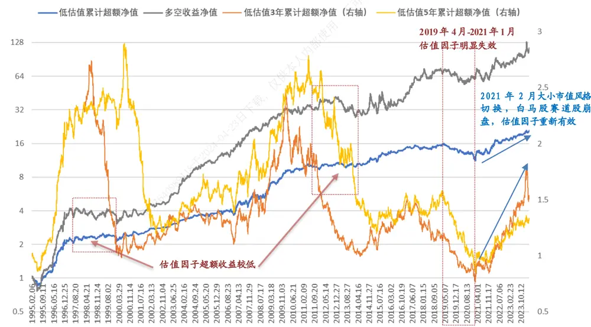
数据来源：wind，国泰君安证券研究。注：左轴是对数坐标轴。

图 14：估值因子的估值价差对因子失效的指示意义也不强
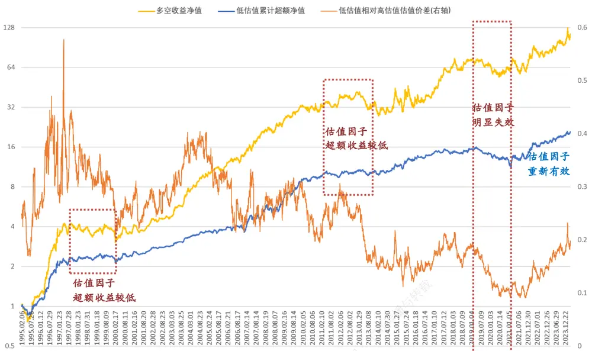
数据来源：wind，国泰君安证券研究。注：左轴是对数坐标轴。

## 2. 常用选股因子2005年以来表现复盘

本部分我们分析2005年以来常用选股因子表现。本部分主要结论如下：

（一）价量因子跟小市值高度相关。小市值占优时价量因子表现均较好，小市值失效时，价量因子也失效。小市值风格延续，价量因子未来一两年大概率仍占优。

（二）估值、股息率因子整体上在震荡市和没有行情时超额表现较好。牛市期间，超额较少，市场不关心估值高低，比如 2019-2020 年结构性牛市。没有行情时估值、股息率因子防守性较好，超额较好。震荡市估值、股息率因子的超额也较好。如果经济表现好、未来出现全面或结构性牛市，估值因子可能会表现平庸甚至失效。

（三）基本面因子整体上看有效性较强。主要回撤发生在金融股暴动（2014 年 11 月-12 月）、市场急跌时（2015 年 6 月、8 月），大市值风格表现极致（2020年 12月-2021年 1月）时，基本面因子均也大幅跑输。近 2 年基本面因子超额明显较少，有效性有所降低，近期超额反弹，未来有望重新有效。

在因子轮动上，A 股时间较短，选股因子轮动现象不明显。整体来看，在 2005-2012、2013-2016 年的两轮行情中，大多数因子超额较好，没有出现明显的轮动现象。在 2017-2023 年的一轮行情中，市场的有效性有所提高，大多数因子的超额相比 2013-2016 年有所降低；在小市值失效的大背景下，价量、估值、股息率因子出现了一定的轮动现象，主要是2017 年、2019-2020 年明显失效，2018 年、2021-2024 年再次有效。

## 2.1. 选股因子列表（只使用以往常用因子）

本部分在考察因子表现时，使用市值、量价（波动率、反转、流动性）、估值、股息率、盈利、成长、超预期、分析师、北向等大类因子。大类因子中使用的小因子见下表 5，为了尽可能减少上帝视角，仅选用因子库各类别中在 年经常使用的常规因子，后期改进的因子不选用。更多因子的定期表现跟踪可以参考每周的《权益因子观察周报》。

因子选股测试时，除了市值因子外，使用市值行业中性化处理因子原始值。考察因子表现时，使用全市场股票池，对无法交易的股票进行剔除：（1）剔除选股当日的 ST 股票；（2）剔除上市不满三个月的股票；（3）剔除选股日由于开盘涨停、停牌等原因而无法买入的股票。

考察因子收益表现主要是看分组收益。考察因子表现和因子轮动情况，主要看因子相对基准（中证全指11）的超额收益情况，根据因子的投资逻辑，对全市场股票排序分 10组；在每月进行分组调仓操作，等权配置，计算多头组（排名前 ）和输家组合（排名后 ）相对基准的超额收益、多空收益等指标。由于多头组是选前 10%股票构建等权重组合，即使做了市值行业中性化处理，还是会带着一定的市值暴露、行业特征。我们也使用单因子组合优化方法，即控制市值、行业暴露，使用线性规划求解因子最大化得分组合，考察该组合相对于基准指数的超额收益情况。

表 5： 因子列表

| 大类 | 因子名 | 大类 | 因子名 |
| --- | --- | --- | --- |
| 北向 | 5 日持股比例变动 | 股息率 | 股息率 |
|  | 60日持股比例变动 | 价量波动性 | 5日交易金额/波动率 |
|  | 5日净流入 |  | 20日特质波动率 |
|  | 60日净流入 |  | 3个月换手率标准差 |
| 成长 | 单季度扣非净利润同比增长率 | 价量反转 | 20日日内收益 |
|  | 单季度归母净利润同比增长率 |  | 60日信息比率 |
|  | 单季度营业利润同比增长率 |  | 一个月涨跌幅 |
|  | 单季度营业收入同比增长率 | 价量流动性 | 20日日均交易金额 |
|  | 单季度扣非 ROA 变动 |  | 1个月自由流通换手率 |
|  | 单季度归母 ROA 变动 |  | 1个月换手率 |
|  | 单季度扣非 ROE变动 |  | 3个月换手率 |
|  | 单季度归母 ROE变动 | 业绩超预期 | 标准化预期外单季度扣非净利润 |
| 分析师 | 分析师覆盖度 |  | 标准化预期外单季度扣非净利润-带漂移项 |
|  | 分析师预测目标价收益率 |  | 标准化预期外单季度归母净利润-带漂移项 |
|  | 过去90日机构最新盈利预测调整幅度 |  | 标准化预期外单季度营业收入-带漂移项 |
| 估值 | 市净率倒数 |  | 标准化预期外单季度归母净利润 |
|  | PCF倒数 |  | 标准化预期外单季度营业收入 |
|  | EBIT2EV | 盈利 | 单季度 GPOA |
|  | 市盈率（扣非）倒数 |  | 净经营资产收益率 |
|  | 市盈率（归母）倒数 |  | 单季度扣非 ROA |
|  | 单季度EP（营业利润）倒数 |  | 单季度扣非 ROE |
|  | 单季度 SP |  | 单季度归母 ROA |
| 市值 | 总市值 |  | 单季度归母 ROE |

数据来源：国泰君安证券研究。

## 2.2. 历史表现回顾

本部分，首先整体看 2005年-2024年选股因子表现。然后，大致按照 A股过往牛熊阶段，划分三个时间区间（2005-2012、2013-2016、2017 至今）分析选股因子的表现。在这个过程中，我们试图归纳因子轮动的规律，尝试总结出选股因子有效的适用环境和失效的原因。

## 2.2.1. 选股因子在 2005 年-2024 年的整体表现

考察因子表现，我们计算了各类因子多头组的每年超额收益、超额收益曲线，单因子组合优化的每年超额收益、超额收益曲线。整体上看，除了基本面因子表现结论有差异外，两种方式的结论基本一致。

1) 价量因子跟小市值高度相关，小市值占优时价量因子表现均较好，小市值失效（2017年初-2021年初）时，价量因子也失效。

2) 估值、股息率因子整体上在震荡市和没有行情时超额表现较好。牛市期间，超额较少，市场不关心估值高低，特别是 2013 年创业板牛市、2019-2020 年大盘蓝筹股的结构性牛市。没有行情时估值、股息率因子防守性较好，超额较好。震荡市估值、股息率因子的超额也较好。

基本面因子整体上看有效性较强；主要回撤发生在2022年-2023年时，基本面因子均大幅跑输。在控制市值行业暴露的最大化因子得分组合的超额收益看，2021 年 10 月以后基本面因子就已经开始失效，2022 年 10 月超额持续回撤，2023 年 11 月超额开始反弹，未来或有望重新有效。

4) 2017年以后，选股因子超额收益相对之前均有所降低。

表 6： 常用选股因子的多头组（前10%股票）每年超额收益（2005-2024年）

| 201701小市值、价量因子失效 |  |  |  | 价量类因子 |  |  |  |  |  |  |  |  |  | 基本面类因子 |  |  |  |  |  |  |  |  |  |  |  |
| --- | --- | --- | --- | --- | --- | --- | --- | --- | --- | --- | --- | --- | --- | --- | --- | --- | --- | --- | --- | --- | --- | --- | --- | --- | --- |
|  | 大类因子超额收益 | 市值 |  | 价量波动性 |  | 价量反转 |  | 价量流动性 |  | 估值 |  | 股息率 |  | 成长 |  | 分析师 |  | 业绩超预期 |  | 盈利 |  | 北向 |  | 大市值 |  |
|  | 2005 |  | -2.18% |  | 2.32% |  | 8.73% |  | 3.18% |  | 12.70% |  | 12.01% |  | 11.01% |  |  |  | 15.58% |  | 18.82% | 2006 |  | 年牛市6.2 | 3% |
|  | 2006 |  | -24.76% |  | 6.55% |  | -9.13% |  | 4.63% | n | -5.32% |  | -3.20% |  | -0.88% |  |  |  | 1.63% |  | -2.94% | 期间基本面 |  | 因-6 | 3% |
|  | 2007 |  | 36.94% |  | 33.65% |  | 20.08% |  | 13.22% |  | 3811% |  | -17.18% |  | 25.15% |  |  |  | 19.47% |  | 12.87% | 子表现一般 |  | ， 1.1 | 1% |
|  | 2008 |  | 56.32% |  | 54.53% |  | 39.33% |  | 34.83% |  | 42.36% |  | 25.42% |  | 25.50% |  |  |  | 27.93% |  | 3432% | 指数见顶后， |  | -21 | 37% |
|  | 2009 |  | 46.19% |  | 45.52% |  | 33.89% |  | 25.23% |  | 47.72% |  | 33.15% |  | 30.69% |  |  |  | 33.34% |  | 25.31% | 有效性增强 |  | -21 | 65% |
|  | 2010 |  | 40.33% |  | 31.53% |  | 25.44% |  | 29.66% |  | 20.17% |  | 25.53% |  | 37.66% |  | 25.73% |  | 45.41% |  | 37.25% |  |  | -B1 | 2% |
|  | 2011 |  | 11.73% |  | 9.59% |  | 9.00% |  | 9.58% |  | 10.91% |  | 0.88% |  | 6.27% |  | 9.50% |  | 8.86% |  | 4.59% |  |  | -06 | 9% |
|  | 2012 |  | 10.70% |  | 10.59% |  | 14.49% |  | 9.55% |  | 13.84% |  | 0.19% |  | 17.82% |  | 8.17% |  | 17.53% |  | 9.55% |  |  | 0.3 | 9% |
|  | 2013 |  | 48.10% |  | 34.64% |  | 30.79% |  | 32.48% |  | 16.10% |  | 18.59% |  | 26.25% |  | 3284% |  | 27.61% |  | 30.79% |  |  | 4 | 89% |
|  | 2014 |  | 20.02% |  | 16.79% |  | 1.79% |  | 14.53% |  | 13.14% |  | 8.01% |  | 4.14% |  | 5.36% |  | 4.43% | 0 | -8.88% |  |  | 0.8 | 7% |
|  | 2015 |  | 144.45% |  | 86.12% |  | 77.68% |  | 53.79% |  | 38.68% |  | 41.30% |  | 55.26% |  | 58.28% |  | 61.25% |  | 62.45% |  |  | -15 | 45% |
|  | 2016 |  | 41.70% |  | 28.22% |  | 12.43% |  | 24.89% |  | 22.11% |  | 15.88% |  | 16.21% |  | 9.42% |  | 19.83% |  | 11.68% |  |  | -19 | 7% |
|  | -202101 2017 |  | -24.73% |  | -14.05% |  | -14.60% |  | -13.68% |  | 6.59% | L | -7.90% |  | -3.62% |  | -2.05% |  | 0.36% |  | -6.56% |  | 0.93% | 7.7 | 4% |
|  | 类 2018 |  | 20.13% |  | 9.03% |  | 12.47% |  | 4.18% |  | 11.32% |  | 10.43% |  | 8.86% |  | 7.92% |  | 14.17% |  | 11.09% |  | 8.55% | 4.0 | 6% |
|  | 2019 |  | 5.30% |  | 1.86% |  | 2.27% |  | 2.98% |  | -0.17% |  | -1.67% |  | 14.31% |  | 4.31% |  | 11.64% |  | 7.45% |  | 3.98% | 2.1 | 2% |
|  | 2020 |  | -8.16% |  | -2.76% |  | -8.58% |  | -4.77% |  | 1.90% |  | 4.29% |  | 5.30% |  | 8.04% |  | 9.19% |  | 6.62% |  | 0.70% | 2.3 | 8% |
|  | 2021 |  | 38.59% |  | 25.93% |  | 22.53% |  | 26.79% |  | 24.28% |  | 18.98% |  | 21.28% |  | 19.89% |  | 27.34% |  | 18.57% |  | 15.75% | -15 | 8% |
|  | 2022 |  | 32.93% |  | 25.63% |  | 13.87% |  | 16.58% |  | 25.86% |  | 19.55% |  | 17.48% |  | 12.56% |  | 14.00% |  | 2.32% |  | 10.55%: |  | 52% |
|  | 2023 |  | 35.33% |  | 33.59% | a | 10.44% |  | 23.69% |  | 20.06% |  | 21.75% |  | 14.82% |  | 7.24% |  | 9.48% |  | ■9.58% |  | 3.44% | -B1 | 1% |
|  | 2024.04.03 |  | -12.25% |  | -8.51% |  | -3.85% |  | -9.36% |  | 5.65% |  | 0.86% | .. | ..5.17% |  | .1.84%. |  | ....283% | .. | :1.35% |  | 3.22%; | 3.8 | 8% |
|  | 整体 |  | 22.82% |  | 20.23% |  | 13.85% |  | 15.06% |  | 17.91% |  | 11.39% |  | 16.17% |  | 13.57% |  | 18.17% |  | 13.73% |  | -0.60% -04 |  | 6% |

数据来源：wind，朝阳永续，国泰君安证券研究。加入大市值组（市值最大的 10%股票）的超额收益，作为对比。请务必阅读正文之后的免责条款部分20 of 37

表 7： 常用选股因子单因子组合优化每年超额收益（2005-2024年）

| 201701小市值、价量因子失效 |  |  |  | 价量类因子 |  |  |  |  |  |  |  |  |  | 基本面类因子 |  |  |  |  |  |  |  |  |  | 2019-2020估值因子失效2021年10月-2023年基本面因子失效 |
| --- | --- | --- | --- | --- | --- | --- | --- | --- | --- | --- | --- | --- | --- | --- | --- | --- | --- | --- | --- | --- | --- | --- | --- | --- |
|  | 大类因子超额收益 | 市值 |  | 价量波动性 |  | 价量反转 |  | 价量流动性 |  | 估值 |  | 股息率 |  | 成长 |  | 分析师 |  | 业绩超预期盈 |  | 利 |  | 北向 |  |  |
|  | 2005 |  | 6.08% |  | 3.69% |  | 6.03% |  | 0.93% |  | 15.71% |  | 5.21% |  | 15.43% |  |  |  | 15.14% |  | 15.31% |  |  |  |
|  | 2006 |  | -5.02% |  | 6.21% |  | -1.71% |  | 1.07% |  | -0.78% |  | 1.39% |  | 5.29% |  |  |  | 3.42% |  | 7.15% |  |  |  |
|  | 2007 |  | 5.77% |  | 6.65% |  | 9.24% |  | -4.18% |  | 20.14% |  | 5.29% |  | 3.60% |  |  |  | 5.56% |  | -5.06% |  |  |  |
|  | 2008 |  | 11.39% |  | 20.51% |  | 10.02% |  | 4.30% |  | 11.24% |  | 6.28% |  | 2.96% |  |  |  | 7.51% |  | 8.32% |  |  |  |
|  | 2009 |  | 5.35% |  | 12.20% |  | 7.91% |  | -1.02% |  | 18.71% |  | 7.39% |  | 1.46% |  |  |  | 4.67% |  | 5.35% |  |  |  |
|  | 2010 |  | 1.02% |  | 6.59% |  | 3.74% |  | 6.92% |  | 4.17% |  | 2.21% |  | 19.50% |  | 14.07% |  | 18.70% |  | 14.83% |  |  |  |
|  | 2011 |  | 5.68% |  | 5.35% |  | 2.86% |  | 8.48% |  | 13.08% |  | 1.08% |  | 4.67% |  | 10.88% |  | 9.65% |  | 3.94% |  |  |  |
|  | 2012 |  | 6.30% |  | 3.14% |  | 10.30% |  | 5.28% |  | 9.54% |  | 1.25% |  | 12.37% |  | 11.54% |  | 12.58% |  | 9.12% |  |  |  |
|  | 2013 |  | 3.40% |  | 6.13% |  | 5.02% |  | 5.34% |  | 0.18% |  | -0.24% |  | 8.65% |  | 5.64% |  | 8.22% |  | 10.19% |  |  |  |
|  | 2014 |  | 15.28% |  | 7.79% |  | 1.19% |  | 4.22% |  | 16.26% |  | 13.71% |  | I3.78% |  | 1.79% |  | 5.35% |  | -7.95% |  |  |  |
|  | 2015 |  | 21.52% |  | 26.47% |  | 23.54% |  | 4.48% |  | 8.30% |  | 3.16% |  | 4.46% |  | 14.41% |  | 10.33% |  | 9.88% |  |  |  |
|  | 2016 |  | 16.91% |  | 15.39% |  | 2.29% |  | 10.86% |  | 18.44% |  | 12.59% |  | -0.29% |  | 5.30% |  | 6.37% |  | 6.55% |  |  |  |
|  | 2017 |  | 0.20% |  | -1.52% | m | -4.52% | m | -2.13% |  | 14.38% |  | 5.75% |  | 14.78% |  | 12.66% |  | 14.00% |  | 12.88% |  | 5.83% |  |
|  | -202101 2018 |  | 14.66% |  | 12.09% |  | 4.16% |  | 10.00% |  | 10.52% |  | 17.60% |  | 7.17% |  | 6.37% |  | 12.58% |  | 7.49% |  | 5.53% |  |
|  | 类 2019 |  | 3.28% |  | -0.63% |  | 7.07% |  | -3.89% |  | -0.39% |  | 0.96% |  | 9.23% |  | 11.99% |  | 7.87% |  | 7.34% |  | 5.06% |  |
|  | 2020 |  | 2.22% |  | -1.20% |  | -0.94% |  | -4.66% | : | -3.71% |  | -6.22% |  | 14.82% |  | 12.97% |  | 14.35% |  | 10.53% |  | 10.12% |  |
|  | 2021 |  | 5.27% |  | -0.10% |  | 2.38% |  | -0.91% |  | 2.16% |  | 2.41% |  | 1.70% |  | 3.07% |  | 6.24% |  | 0.35% |  | -0.66% |  |
|  | 2022 |  | 12.71% |  | 8.55% |  | 8.57% |  | 5.83% |  | 7.24% |  | 6.23% | 「 | -2.50% |  | 3.13% |  | -0.05% | D | -2.37% |  | 2.66% |  |
|  | 2023 |  | 15.46% |  | 7.51% |  | -1.83% |  | 6.12% |  | 9.40% |  | 14.06% |  | -6.44% |  | -6.72% |  | -5.09% |  | -5.44% |  | -3.46% |  |
|  | 2024.04.03 |  | 0.10% |  | 2.33% |  | 2.61% |  | 1.70% |  | 8.96% |  | 6.33% |  | 3.89% |  | 3.45% |  | 5.63% |  | 3.89% |  | 3.31% |  |
|  | 整体 |  | 7.43% |  | 7.40% |  | 4.91% |  | 2.94% |  | 9.28% |  | 5.88% |  | 6.25% |  | 7.62% |  | 8.31% |  | 5.60% |  | 4.00% |  |

数据来源：wind，朝阳永续，国泰君安证券研究。

价量因子跟小市值高度相关，小市值占优时价量因子表现均较好。小传市值失效（2005-2006年，2017年初-2021年初）时，价量因子也失效。具体见下图。

图 15：2005年以来市值因子、价量类因子多头组超额收益曲线供本
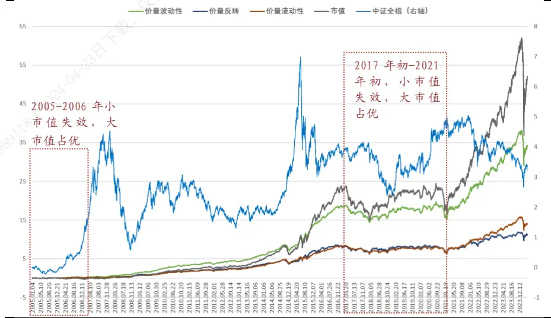
数据来源：wind，国泰君安证券研究。

图 16：2005年以来市值、价量类因子单因子组合优化超额收益曲线
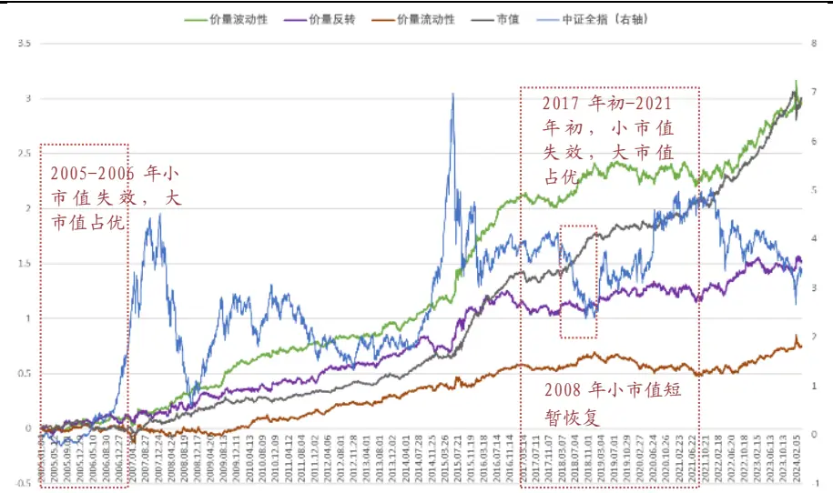
数据来源：wind，国泰君安证券研究。

估值、股息率因子整体上在震荡市和没有大行情时超额表现较好。牛市期间，超额较少，市场不关心估值高低，特别是 2013 年创业板牛市、年大盘蓝筹股的结构性牛市。没有行情时估值、股息率因子防守性较好，超额较好。震荡市估值、股息率因子的超额也较好。

估值因子主要失效时间是2019年初-2021年中。从多头组超额收益来看，估值因子在 2019 年 3 月开始失效，2021 年 2 月开始重新有效。从单因子组合优化的超额收益来看，估值因子在 2019 年年初就已经开始失效，2021 年年底才开始重新有效。两种方式的时间点有所不同，主要原因是低估值组（估值最低的10%股票）带有小市值风格，小市值有效也会带动低估值组表现。

图 17：2005年以来估值、股息率因子分十组多头组的超额收益曲线
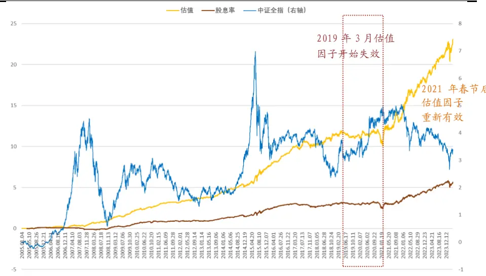
数据来源：wind，国泰君安证券研究。

图 18：2005年以来估值、股息率因子单因子组合优化的超额收益曲线
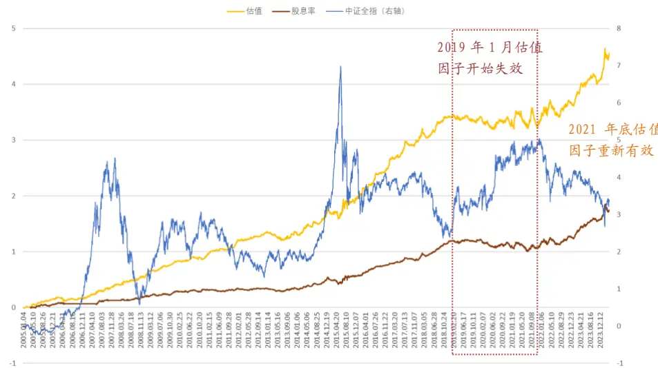
数据来源：wind，国泰君安证券研究。

基本面因子整体上看有效性较强。主要回撤发生在金融股暴涨（2014年 11月-12月）、市场急跌时（2015年 6月、8月），大市值风格表现极致（2020年 12月-2021年 1月）时，基本面因子均也大幅跑输。

从多头组超额收益来看，由于等权组合会带有小市值风格，多头组超额收益在 2022年 11月才开始震荡，因子出现失效。

在控制市值行业暴露的最大化因子得分组合的超额收益看，2021 年 10月以后基本面因子就已经开始失效，2022 年 10 月超额持续回撤，2023年 11月超额开始反弹，未来或有望重新有效。

图 19：2005年以来基本面类因子多头组超额收益曲线对比
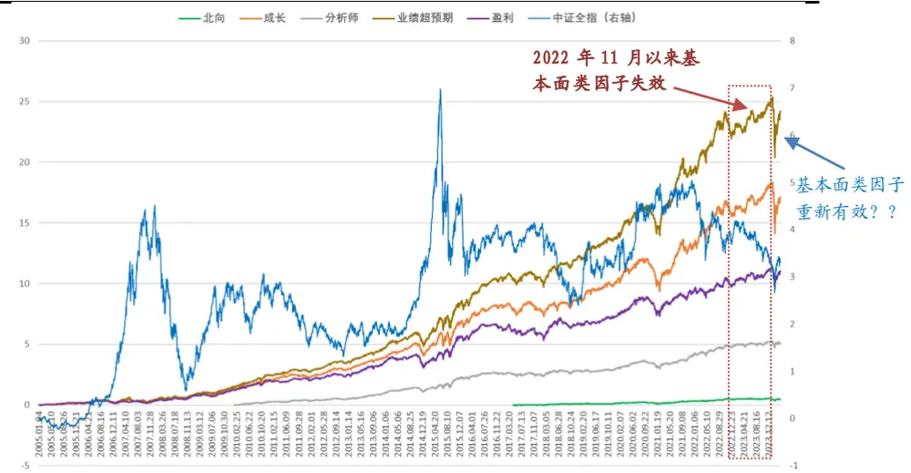
数据来源：wind，朝阳永续，国泰君安证券研究。

图 20：2005年以来基本面类因子单因子组合优化超额收益曲线
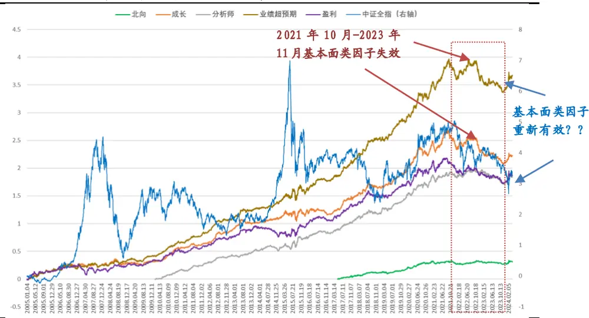
数据来源：wind，朝阳永续，国泰君安证券研究。

下面大致按 A股牛熊阶段划分三个时间区间分析因子表现。

## 2.2.2. 阶段一：2005 年-2012 年各类因子表现

从年度超额收益上看，2005、2006 年牛市期间，小市值因子失效，跑输基准指数。2007 年以后开始大幅跑赢。其他因子在 2006 年超额表现均不佳。2007年以后超额收益，但2011和2012年所有因子的超额收益

表 8：各类因子2005-2012年度超额收益

| 大类因子超额收益 | 2005 |  | 失效 2006 |  | 2007 |  | 2008 |  | 2009 |  | 2010 |  | 有效性减弱2012 |  |  |  |
| --- | --- | --- | --- | --- | --- | --- | --- | --- | --- | --- | --- | --- | --- | --- | --- | --- |
| 市值 |  | -2.18% |  | -24.76% |  | 36.94% |  | 56.32% |  | 46.19% |  | 40.33% |  | 11.73% |  | 10.70% |
| 价量波动性 |  | 2.32% |  | 6.55% |  | 33.65% |  | 54.53% |  | 45.52% |  | 31.53% |  | 9.59% | 10.59% |  |
| 价量反转 |  | 8.73% |  | -9.13% |  | 20.08% |  | 39.33% |  | 33.89% |  | 25.44% |  | 9.00% | 14.49% |  |
| 价量流动性 |  | 3.18% |  | 4.63% |  | 13.22% |  | 34.83% |  | 25.23% |  | 29.66% |  | 9.58% | 9.55% |  |
| 估值 |  | 12.70% | 1 | -5.32% |  | 38.11% |  | 42.36% |  | 47.72% |  | 20.17% |  | 10.91% | 13.84% |  |
| 股息率 |  | 12.01% |  | -3.20% |  | -17.18% |  | 25.42% |  | 33.15% |  | 25.53% |  | 0.88% | 0.19% |  |
| 成长 |  | 11.01% |  | -0.88% |  | 25.15% |  | 25.50% |  | 30.69% |  | 37.66% |  | 6.27% | 17.82% |  |
| 分析师 |  |  |  |  |  |  |  |  |  |  |  | 25.73% |  | 9.50% | 8.17% |  |
| 业绩超预期 |  | 15.58% |  | 1.63% |  | 19.47% |  | 27.93% |  | 33.34% |  | 45.41% |  | 8.86% | 17.53% |  |
| 盈利 |  | 18.82% | : | -2.94% |  | 12.87% |  | 34.32% |  | 25.31% |  | 37.25% |  | 4.59% | 9.55% |  |
| 大市值 |  | 6.23% |  | -1.63% |  | 1.11% |  |  |  |  |  |  |  |  |  |  |
|  |  |  |  |  |  |  |  |  |  |  |  | -3.12% |  |  |  |  |
|  |  |  |  |  |  |  |  |  |  |  |  |  |  | -0.69% | 0.39% |  |

数据来源：Wind，朝阳永续，国泰君安证券研究。大市值组（市值最大的 10%股票）表现主要是做对比。

## 2.2.2.1. 市值、价量因子

在 2005-2012 年期间，小市值因子在指数见顶后超额表现很好，在牛市(2005-2006 年)期间失效，没有太多超额。2005-2007 年是股权分置改革政策促成的大牛市，表现好的大都是国有改革和国有股流通股票，小市值股票并不受青睐，小市值因子表现不佳。

其他价量因子在2007年以前超额也不高，指数见顶后，受益于小市值风格，三类价量因子超额收益均较好。具体见下图。

图 21：2005-2012年市值、价量类因子超额收益曲线
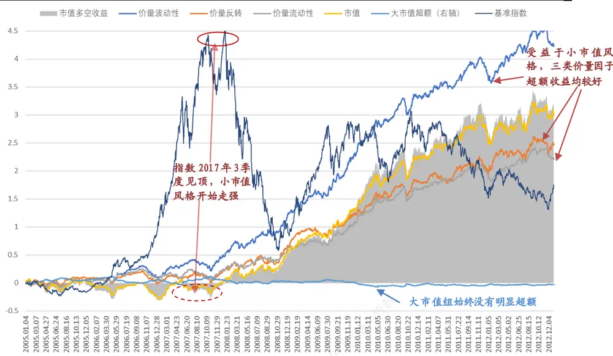
数据来源： ，朝阳永续，国泰君安证券研究。增加市值多空收益曲线、大市值组超额曲线做对比。

## 2.2.2.2. 估值、股息率因子

估值、股息率因子走势基本一致。估值因子在 2005-2007 年 10 月超额收益走平，之后在没有行情时和震荡市明显走强。股息率因子相比估值因子表现更弱，仅在 2008年底-2010年底超额较好。

图 22：2005-2012年估值、股息率因子超额收益曲线
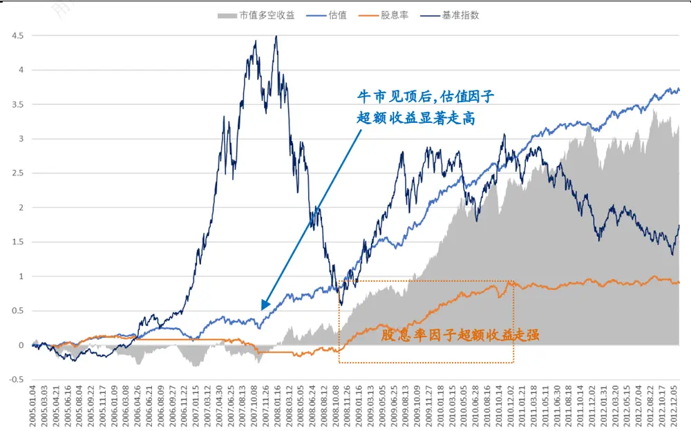
数据来源：Wind，朝阳永续，国泰君安证券研究。增加市值多空收益曲线做对比。

## 2.2.2.3. 基本面因子

基本面因子在牛市期间超额不高，有效性不强。2007年 10月指数见顶后，基本面因子的有效性明显提高。

图 23：2005-2012年基本面类因子超额收益曲线
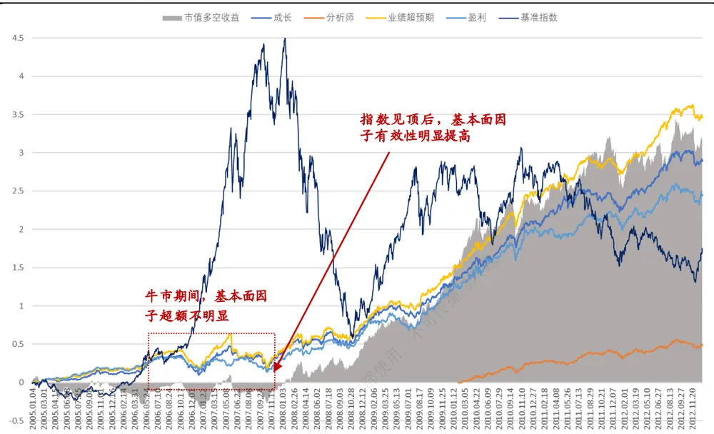
数据来源： ，朝阳永续，国泰君安证券研究。增加市值多空曲线做对比。

## 2.2.3. 阶段二：2013年到 2016年各类因子表现分析

在 2013-2016 年，在风格层面，主要是小市值风格占主导，期间有三次短暂的大市值风格占优，其中前两次导致小市值超额回撤明显。

从年度超额收益上看，各大类因子之间的轮动现象不算明显。分年度来看，小市值因子的每年的超额都是最高；其次是价量类因子，基本面类因子的超额也不低。整体上主导的风格还是小市值。基本面因子 2014年超额较低，盈利因子甚至跑输，主要是由于最后两个月超预期降息金融股暴动回撤导致的。2011、2012 年股息率因子也无超额。整体来看，2013-2016的一轮行情，大多数因子超额较好，没有出现明显的轮动效应。具体见下表。

表 9：大类因子2013-2016年度超额收益

| 大类因子超额收益 | 2012 |  | 2013 |  |  | 2014 |  | 2015 |  | 2016 |  | 2017 |  |
| --- | --- | --- | --- | --- | --- | --- | --- | --- | --- | --- | --- | --- | --- |
| 市值 |  | 10.70% |  | 48.10% |  |  | 20.02% |  | 144.45% |  | 41.70% |  | -24.73%: |
| 价量波动性 |  | 10.59% |  | 34.64% |  |  | 16.79% |  | 86.12% |  | 28.22% |  | -14.05% |
| 价量反转 |  | 14.49% |  | 30.79% |  |  | 1.79% |  | 77.68% |  | 12.43% |  | -14.60% |
| 价量流动性 |  | 9.55% |  | 32.48% |  |  | 14.53% |  | 53.79% |  | 24.89% |  | -13.68% |
| 估值 |  | 13.84% |  | 16.10% |  |  | 13.14% |  | 38.68% |  | 22.11% |  | 6.59% |
| 股息率 |  | 0.19% |  | 18.59% |  |  | 8.01% |  | 41.30% |  | 15.88% 1 |  | -7.90% |
| 成长 |  | 17.82% |  | 26.25% |  |  | 4.14% |  | 55.26% |  | 16.21% |  | -3.62% |
| 分析师 |  | 8.17% |  |  | 32.84% |  | 5.36% |  | 58.28% |  | 9.42% |  | -2.05% |
| 业绩超预期 |  | 17.53% |  |  | 27.61% |  | 4.43% |  | 61.25% |  | 19.83% |  | 0.36% |
| 盈利 |  | 9.55% |  |  | 30.79% | C | -8.88% |  | 162.45% |  | 11.68% |  | -6.56% |
| 大市值 |  | 0.39% |  | -4.89% |  |  | 0.87% | ■ | -15.45% |  | -1.97% |  | .7.74%: |

数据来源：Wind，朝阳永续，国泰君安证券研究。大市值（市值最大的 10%股票）表现主要是做参考对比。

## 2.2.3.1. 市值、价量因子

具体而言，在 2013-2016 期间，小市值因子失效只有三次，影响大的主要是前两次。

- 第一次是2014年11月-2014年12月，大市值占优；11月21日央行超预期降息导致金融股暴动，两个月银行指数上涨 53%、非银上涨105%。期间小市值组最大跑输基准-25%，大市值跑赢基准 12%。

- 第二次是 20150615-0715，两融等杠杆资金和场外配资监管加强，市场见顶后回落期间，大市值风格占优一个月；小市值跑输基准-26%，大市值跑赢基准 2%。

- 第三次是 20150826-0902，在市场第二轮下跌期间，大市值占优一周，时间较短。

小市值因子失效期间，其他价量因子的走势也同时受影响，相应超额收益也同步发生回撤。因子间的轮动现象不明显。具体见下图。行业上，市值上偏中小盘的、以 TMT为代表的科技成长行业涨幅最高。

图 24：2013-2016年市值、价量类因子超额收益曲线，回撤区间和小市值因子一致
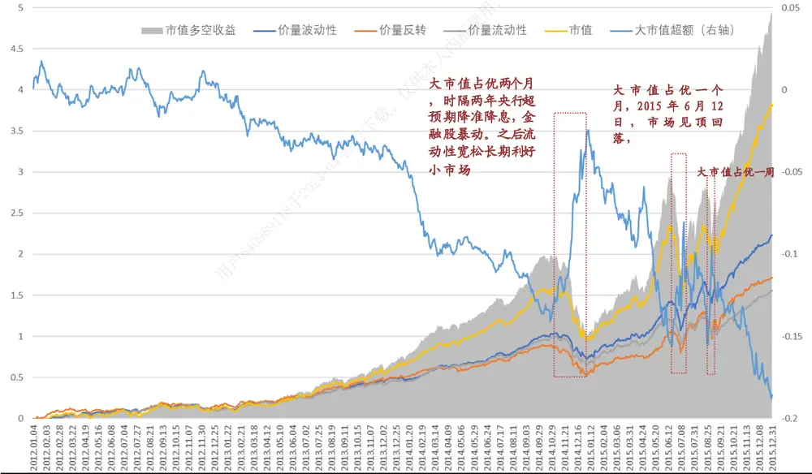
数据来源：Wind，朝阳永续，国泰君安证券研究。增加市值多空曲线、大市值超额曲线做对比。

## 2.2.3.2. 估值、股息率因子

估值、股息率因子走势基本一致。股息率因子在2012-2013年6月超额收益走平，之后才有明显超额。在2014年11月牛市得到确认后，估值因子、股息率因子超额较少，市场不再关注估值高低和分红高低。

图 25：2013-2016年估值、股息率因子超额收益曲线，回撤区间和小市值因子一致
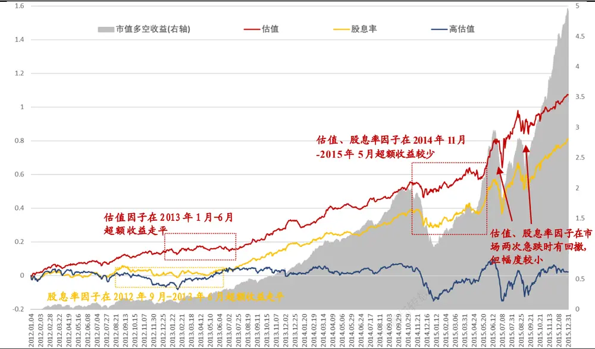
数据来源：Wind，朝阳永续，国泰君安证券研究。增加市值多空曲线、高估值组（估值最高 10%）超额曲线做对比。

## 2.2.3.3. 基本面因子

基本面因子在2013-2016年期间，整体上看有效性较强；主要回撤发生在金融股暴动（2014年11月-12月）、市场急跌时（2015年6月、8月）。其中，2014年超额收益较低，是由于 2014年最后两个月金融股暴动导致超额大幅回撤。另外，有两个时间段超额走平（2012年 9月-2013年1 月、2014 年 3 月-7 月）。

图 26：2013-2016年基本面类因子超额收益曲线，回撤区间和小市值因子一致
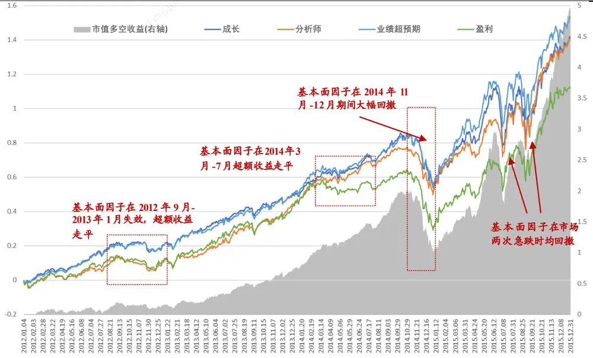

数据来源：Wind，朝阳永续，国泰君安证券研究。增加市值多空曲线。

## 2.2.4. 阶段三：2017至今各类因子表现分析

2017年-2021年春节，受金融去杠杆监管加强、业绩暴雷、成本结构恶化等因素影响，小市值风格持续走弱；同时经济由高速增长转向高质量发展、A股纳入MSCI后北向资金持续净流入、公募基金抱团白马蓝筹股，以核心资产为代表的大市值风格整体占优。

小市值因子在此期间失效，价量因子也同时失效。在结构性牛市下，估值、股息率因子失效，超额较少。基本面因子整体上有较好超额，但在大市值强势占优时，会小幅跑输；在大市值风格极致行情时，会大幅跑输。此外，2018 年，受中美贸易战影响，市场整体下跌，大市值补跌，多数因子有超额。2021 年春节后，小市值风格持续占优，价量、估值、股息率因子都重新有效。整体来看，在2017-2023年的一轮行情中，因子的有效性相比2013-2016年有所降低，在小市值失效的大背景下，价量、估值、股息率因子出现了一定的轮动现象，主要是2017 年、2019~2020 失效，2018 年、2021~2023 年再次有效。

2014 年 1 月中，受市场回调过程中恐慌情绪蔓延、雪球产品敲入导致基差扩大、 策略降仓位、量化产品的调仓等多重因素共振导致小市值因子短时间大幅回撤。价量因子也受影响，2014 年超额收益为负。4月 12日，国务院发布资本市场第三个“国九条”，提出严格上市公司持续监管，加大退市监管力度，加强交易监管等，短期不利于小市值风格。

2017年至今选股因子年度超额收益见下表。

表 10： 大类因子 2017-2024.04 年度超额收益

| 大类因子超额收益 |  | 2017 |  | 2018 |  | 2019 |  | 2020 |  | 2021 |  | 2022 |  | 2023 |  | 2024.04.03 |  |  |
| --- | --- | --- | --- | --- | --- | --- | --- | --- | --- | --- | --- | --- | --- | --- | --- | --- | --- | --- |
| 市值 |  |  | -24.73% |  | 20.13% |  | 5.30% |  | -8.16% |  | 38.59% |  | 32.93% |  | 35.33% |  | -12.25% | 短 |
| 价量波动性 |  |  | -14.05% |  | 9.03% |  | 1.86% |  | -2.76% |  | 25.93% |  | 25.63% |  | 33.59% | ：「 | -8.51% | 期 |
| 价量反转 |  |  | -14.60% |  | 12.47% |  | 2.27% | 失 | -8.58% |  | 22.53% | 次 | 13.87% |  | 10.44% |  | -3.85% | 失 |
| 价量流动性 |  |  | -13.68% |  | 4.18% |  | 2.98% | 效ı | -4.77% |  | 26.79% | 有 | 16.58% |  | 23.69% | ： | -9.36% | 效 |
| 估值 |  |  | 6.59% |  | 11.32% |  | -0.17% |  | -1.90% | 7 | 24.28% |  | 25.86% |  | 20.06% |  | 5.65% |  |
| 股息率 |  | 失厂 | -7.90% |  | 10.43% |  | -1.67% | C | -4.29% |  | 18.98% | 双 | 19.55% |  | 21.75% |  | 0.86% |  |
| 成长 |  | 效 | -3.62% |  | 8.86% |  | 14.31% |  | 5.30% |  | 21.28% |  | 17.48% |  | 14.82% |  | -5.17% |  |
| 分析师 |  |  | -2.05% |  | 7.92% |  | 4.31% |  | 8.04% |  | 19.89% |  | 12.56% |  | 7.24% |  | -1.84% |  |
| 业绩超预期 |  |  | 0.36% |  | 14.17% |  | 11.64% |  | 9.19% |  | 27.34% |  | 14.00% |  | 9.48% |  | -2.83% |  |
| 盈利 |  | 口 | -6.56% |  | ]11.09% |  | 7.45% |  | 6.62% |  | 18.57% |  | 2.32% |  | 9.58% |  | -1.35% |  |
| 大市值 | …… |  | 7.74% |  | 4.06% |  | 2.12% |  | 2.38% |  | -1.58% |  | -0.52% |  | -3.11% |  | 3.88% |  |

数据来源：Wind，朝阳永续，国泰君安证券研究。大市值（市值最大的 10%股票）表现主要是做参考。

## 2.2.4.1. 市值、价量因子

2017 年-2021 年 1 月，小市值因子基本失效，在 2018年市场下跌期间小市值有所反弹。之后2019-2020年下半年，小市值因子超额收益曲线震荡，没有明显的超额收益，处于失效状态。直到 2021 年春节后，小市值因子王者归来，开始大幅跑赢基准。期间，小市值有两次大幅跑输基准的情况出现。

- 第一次是2017年-2018年2月初，小市值持续大幅跑输基准，累计跑输基准-35%，而大市值相对基准跑赢 10%，大市值组相对小市值组跑赢了 70%。在此期间，以小市值风格暴露为主的量化产品损失惨重。BGI 三剑客的量化产品由于一直坚持市值中性不暴露，一战成名，管理规模迅速增长成头部量化团队。

- 第二次是2020年9月初-2021年2月春节，大市值风格持续占优，特别是 2020年 12月初-2021年 2初两个月时间，大市值风格演绎极致，相对小市值跑赢 37.5%。核心资产经过这最后一轮的疯狂上涨后，见顶回落、抱团瓦解。

在2017年-2021年1月期间，行业上，市值上偏中大盘的食品饮料、消费者服务、家电、建材等行业涨幅居前。

2021 年春节后，小市值重新有效，持续 3年之久。直到 2024年 1月受市场回调过程中恐慌、雪球产品敲入导致基差扩大、 策略降仓位、量化产品的调仓等多重因素影响，1 月中旬小市值因子开始大幅回撤，一直持续到春节前。春节后小市值因子超额收益开始修复，逐渐回升企稳。

价量类因子整体表现和小市值风格高度相关，小市值失效期间，价量因子同样失效。2021 年春节后，价量类因子开始持续有效。2024 年 1月小市值急剧回撤期间，同样失效，目前超额收益有所修复。

图 27：2017-2024.4年市值、价量类因子超额收益曲线
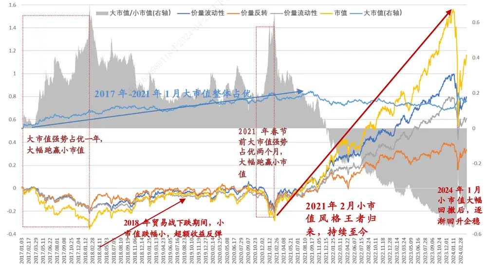
数据来源： ，朝阳永续，国泰君安证券研究。增加市值相对小市值超额曲线、大市值相对基准超额曲线做对比。

## 2.2.4.2. 估值、股息率、北向因子

估值因子，2017 年大小市值分化明显，估值因子超额较小，仅 6%。

2018 年受中美贸易战影响，市场全面下跌，估值因子超额较高，达11%。2019年4月开始至2020年10月，超额收益持续走平，处于失效状态；2020年 11月后受大市值加速赶顶影响，也大幅跑输基准。2021年春节后核心资产行情瓦解，估值因子有效性开始大幅回升，一直持续至今。

股息率因子类似，在 2019年 4月-2020年 11月超额曲线走平，之后 12月-2021年 1月大幅跑输。2021年 2月春节后开始持续有效。

北向因子整体有一定超额，但近一年多无超额。

图 28：2017-2023年估值、股息率、北向因子超额收益曲线
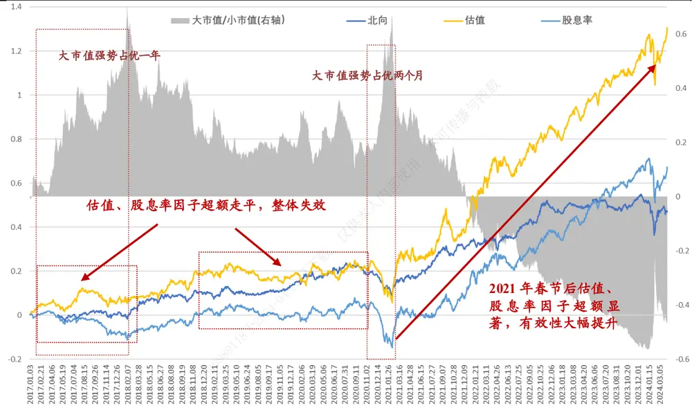
数据来源：Wind，朝阳永续，国泰君安证券研究。增加大市值相对小市值超额曲线做对比。

## 2.2.4.3. 基本面因子

基本面因子，成长、盈利、超预期等走势基本一致，整体上超额较好。但在大市值强势占优期间，基本面因子超额走平或小幅回撤。2020 年12月-2021年 1月大市值风格表现极致时，基本面因子均也大幅跑输。

从多头组超额来看，2022年 11月至今，基本面因子没有明显超额，部分原因是近两年 A股整体净利润增长率和 ROE均下滑，市场不太看业绩。而从单因子组合优化的超额收益看（图 20），2021 年 10 月以后基本面因子就已经开始失效，2022 年 10 月超额持续回撤，2023 年 11 月超额开始反弹，未来或有望重新有效。

图 29：2017-2021年基本面因子超额收益曲线
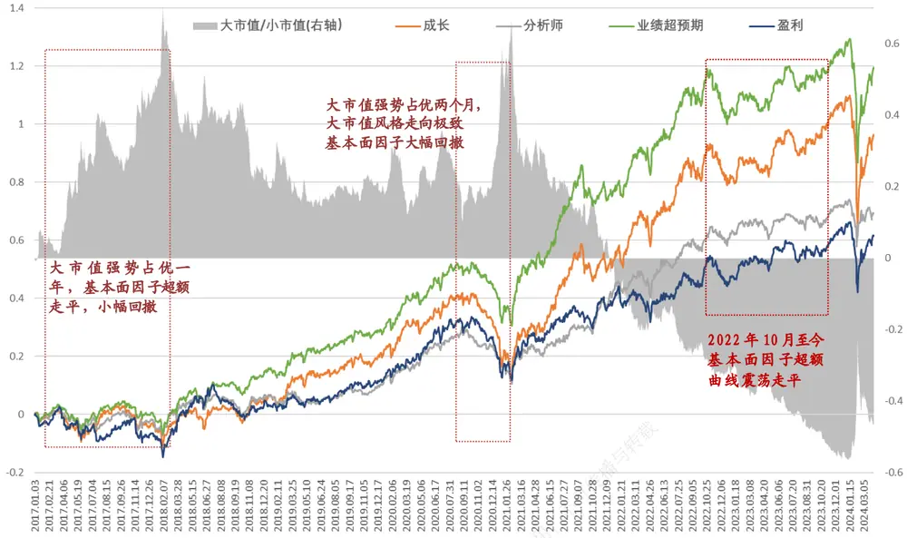
数据来源：Wind，朝阳永续，国泰君安证券研究。增加大市值相对小市值超额曲线做对比。

## 3. 总结

由于国内A股时间较短，基于轮动次数较少的小样本归纳的规律存在较大的失效风险。对于小市值风格的坚持和认同，需要相当大的定力。或许正如利弗莫尔所说，市场的规律性缘因于不变的人性。

（1） 美股市场存在典型的大小盘轮动现象，平均 5-10年切换一次。由于大小市值轮动频繁，在整个 83 年的时间区间，小市值平均每年跑赢大市值仅 。美股估值因子长期较为有效，高低估值轮动并不频繁。在整个 46 年的时间区间，低估值组跑赢高估值组的年化超额收益（年化多空收益）为 10.8%。

## （2）市值因子是 A股最强的风格因子。

- 历史表现上，1995年以来，小市值组（市值最小10%股票）相对于大市值组的年化超额收益（即市值因子的年化多空收益）达22%，相对于基准指数（万得全 A，881001.WI）的年化超额收益达 20%。从轮动上看，大小盘风格切换有 4次，小市值失效时段有两次：2003-2006年失效四年、2017年初-2021年初失效 4年。月度收益上，有明显的日历效应。2、3、5、8、11月有效性很高，月均超额达 3%以上，而且胜率（70%-80%）和盈亏比（1.7-2）均较高。4月、12月因子失效，超额收益明显为负。

- 小市值在 A 股大部分时间有效，有以下几点原因：经济处于复苏时期，流动性宽松的环境，新产业趋势出现的初期， 监管政策放松或宽容时， 增量资金推动、成本结构良好。市值因子失效由于小市值因子过于拥挤、估值过高、政策推动。从配置视角，市值因子 5-10 年轮动一次，可以考虑战略性超配或低配。估值价差和滚动五年收益对市值因子择时有较强指导意义。

- 展望未来，经济稳步复苏、流动性较为宽松、AI 可能引发新的科技浪潮、IPO 节奏放缓、因子拥挤度指标处于低位等因素利好小市值，监管政策（退市、重组新规）趋严等不利于小盘股，相关增量资金变动和成本结构变化则后续需要保持跟踪。按照之前大小盘 4~10 年左右轮动一次的小样本规律，上述因素持续的情况下，小市值风格未来一两年大概率会延续。

## （3）估值因子长期超额明显低于市值因子，但高低估值的因子轮动并不明显。

- 自 1995 年以来，十分组下估值因子多头组（估值最低 10%股票组合）相对于万得全A指数的年化超额收益为10.8%，年化多空收益（估值最低 10%股票组合相对估值最高 10%股票组合的超额收益）为 13.3%。

- 除了2019年4月-2021年1月估值因子持续失效外，其他时间超额回撤幅度和时间都不大。2019年 4月-2021年 1月结构性牛市期间，机构持续抱团白马蓝筹赛道股，估值因子显著失效，超额收益累计回撤 （同期跑输市场基准指数 ）。其他年份都有一定超额，没有行情的年份超额收益较高，超过 10%。

## （4）常用选股因子在2017年以后，因子超额收益相对之前均有所降低。

估值、股息率因子整体上在震荡市和没有行情时超额表现较好。牛市期间，超额较少，市场不关心估值高低，特别是 2013 年创业板牛市、年大盘蓝筹股的结构性牛市。没有行情时估值、股息率因子防守性较好，超额较好。震荡市估值、股息率因子的超额也较好。

价量因子跟小市值高度相关，小市值占优时价量因子表现均较好，小市值失效（2017年初-2021年初）时，价量因子也失效。

基本面因子整体上看有效性较强；主要失效发生在2022年-2023年，基本面因子均大幅跑输基准。从单因子组合优化的超额收益看，2021 年10 月以后基本面因子就已经开始失效，2022 年 10 月超额持续回撤，2023 年 11 月超额开始反弹，未来或有望重新有效。选股因子日常跟踪参见《权益因子观察周报》。

## 4. 风险提示

量化模型基于历史数据构建，而历史规律存在失效风险。本报告结论基于小样本归纳，或存在较大失效风险。

## 5. 附录

## 5.1. 选股因子的市值行业中性化处理

对于全市场选股而言，股票市值、行业差异较大，原始因子的选股效果受到市值、行业因素的影响。例如，不同行业、不同市值股票之际估值差别很大；以市盈率因子为例，按照分组法，低市盈率的一组主要是大市值的股票，行业多属于银行、周期性行业，市值、行业因素

目前使用最多的做法是对因子进行市值行业中性化处理。具体做法是：将每个股票标准化后的因子作为因变量，对对数市值和中信一级行业般认为，经过中性化处理后的因子，排除了市值和行业的影响，更好地反映因子的投资逻辑和选股效果。例如，使用市盈率因子分组，做了中性化处理之后，每组在各行业、市值区间上分布比较均匀。在实际使用上，除市值因子以外，其他因子均进行中性化处理。

$$
Factor_{n}=\beta_{mkt}\ln(MktVal_{i})+\sum_{i=1}^{I}\beta_{i}Industry_{ni}+\varepsilon_{ni}
$$

$Factor_{n}$ 是第 T期股票 n的因子值， $ln(MktVal_{i})$ 是第 T期对数总市值因子的值， Industr $y_{ni}$ 是第 T期第 i个中信一级行业因子哑变量（属于该行业为 1，否则为 0）。 $\varepsilon_{n}$ 是回归残差。我们以上述回归方程的残差项 $\varepsilon_{n}$ 作为原因子在市值行业中性化后的代理变量。

## 5.2. 单因子组合优化（控制市值行业暴露下因子得分最大化组合）

首先，每月计算股票每类因子值，并对因子进行去极值、标准化、缺失值填充、市值行业中性化处理。然后，按照各类因子逻辑，将股票池股票因子值排序，计算各类因子得分Score（rank分位数得分），对因子得分等权加权每只股票的最终得分。最后，每周末股票的得分$score_{i}^{T}$ 代入下面的组合优化模型，在控制行业暴露、风格暴露等约束条件下，以最大化股票组合得分∑N $score_{i}^{T}*w_{i}$ 为目标，求解组合股票的权重 ${\boldsymbol{w}}^{\mathrm{~\textquotedblleft~}}$ ：

$$
\underset{w_{i}}{max}\underset{1}{\overset{N}{\sum}}score_{i}^{T}*w_{i}
$$

$$
\left\{\begin{array}{ll}{\begin{aligned}{s.t.}&{{}\quad\sum w_{i}=1}\\{}&{{}w^{lower}\leq w_{i}\leq w^{upper},i=1,\ldots,N}\\{}&{{}\quad\sum_{1}^{N}x_{iI}w_{i}=w^{I}}\\{}&{{}\quad\left|\sum_{1}^{N}x_{ik}*w_{i}\right|\leq x_{k}^{limit}}\end{aligned}}&{\begin{aligned}{(\quad1)}\\{}&{{}\quad(\quad1)}\\{}&{{}\quad(\quad3)}\end{aligned}}\\{\begin{aligned}{(\quad3)}\\{}&{{}\quad(\quad4)}\end{aligned}}&{\begin{aligned}{(\quad4)}\\{}&{{}\quad(\quad4)}\end{aligned}}\end{array}\right.
$$

公式（2）为个股上下限约束：主要是不能卖空、避免某些个股权重过高。本报告设置个股权重上下限为[0%,1%]。

公式（3）为行业权重约束：可以按照基准中行业的权重设置行业偏离约束，也可以自行确定某些行业暴露程度。本报告按照中信一级行业分类严格控制行业中性，就是组合的每个行业权重和基准指数对应的行业权重相等。

公式（4）为市值因子暴露约束，控制市值主动暴露为 0。本报告设置组合的市值因子加权值和市值因子加权值相等。

## 5.3. 大市值组（市值最大的10%）月度收益

表 11： 大市值组（市值最大的10%）1995年以来月度超额收益

| 大市值组（市值最大10% | 月度超额1 | 月 |  | 2月 |  | 3月 |  | 4月 |  | 5月 |  | 6月 |  | 7月 |  | 8月 |  | 9月 |  | 10月 |  | 11月 |  | 12月 |  | 总计 |  |
| --- | --- | --- | --- | --- | --- | --- | --- | --- | --- | --- | --- | --- | --- | --- | --- | --- | --- | --- | --- | --- | --- | --- | --- | --- | --- | --- | --- |
| 小市值占优 | 1995 |  |  | 0 | .35% |  | 2.08% | 0 | .79% | 3. | 32% |  | -1.16% |  | 0.02% | 0 | .47% |  | 1.23% | 0 | .61% | 0 | .42% |  | 2.23% |  | 1% |
|  | 1996 |  | D1.20% | 0 | .36% |  | 0.63% | C | 3.51% |  | 1.09% |  | 8.98% |  | 7.41% | 口 | 2.77% |  | 1.74% | L | -0.95% | 5 | .49% | 0 | .79% |  | -10% |
|  | 1997 |  | 10.88% |  | 10.98% | -0 | .98% |  | 0.26% |  | 5.63% |  | 2.04% | D | 3.56% | 0 | .51% | 1 | 1.44% | 0 | .26% | 0 | .05% | 口 | 3.48% | 1 | -4% |
|  | 1998 | D | 1.18% | D | 1.45% |  | 0.02% | 3 | .02% |  | -4.39% | D | 1.63% |  | 0.04% | 7 | 3.37% | 1 | 2.01% | 7 | 2.51% | 0 | .15% |  | 1.27% |  | -18% |
|  | 1999 | 0 | .60% |  | 0.15% | 1. | 88% | 1 | 0.30% |  | 312% |  | 0.30% | D | 1.31% | 口 | 2.04% | 1 | .09% | L | 1.13% | 1. | 86% |  | 0.81% |  | -5% |
|  | 2000 | 2. | 25% | 0 | .44% |  | 4.52% | 1 | .86% | 1 | .20% |  | 0.18% | 0 | .50% | 1. | 62% |  | -1.41% | 口 | -2.13% | 0 | .13% | 口 | 2.56% |  | -14% |
|  | 2001 |  | 0.02% | 1 | .00% |  | 1.70% |  | 146% |  | 2.66% |  | -1.20% | 0 | .15% | 0 | .83% |  | 2.29% |  | 2.04% | L | 1.37% |  | 1.36% |  | -2% |
|  | 2002 |  | 4.62% | D | 1.49% | 口2 | .87% | 0 | .37% |  | 0.45% | 1 | .98% | 0 | .68% |  | 0.36% |  | 0.94% |  | 0.49% | 3 | .19% |  | 0.30% |  | 6% |
| 大市值占优 | 2003 | 0 | .66% |  | 0.34% |  | 248% | 4 | .85% |  | 1.12% |  | 0.62% |  | 3.44% | 1 | .06% |  | 0.13% |  | 4.53% | 0 | .19% |  | 4.28% |  | 20% |
|  | 2004 |  | -2.11% | D | 1.79% |  | 0.16% | 1. | 43% |  | 0.26% | 1 | .95% | 1 | .29% |  | 1.77% |  | 0.32% |  | 1.26% |  | 2.47% |  | 1.41% |  | 0% |
|  | 2005 |  | 1.33% | 0 | .81% |  | 292% | 3 | .88% | 3 | .10% | 1 | .80% |  | 3.22% |  | 3.19% |  | 0.81% | 0 | .15% | 0 | .70% |  | 43% |  | 1 7% |
|  | 2006 |  | 0.96% | 1 | .55% |  | 0.07% |  | 1.00% | 3 | .71% | 1. | 63% | 口3 | .39% |  | 0.64% |  | -0.94% |  | 1.23% | 3 | .64% |  | 0.58% |  | -1% |
|  | 2007 |  | 0.87% | 口 | 2.51% | 厂2 | .68% | 1. | 30% |  | 248% |  | 5.24% | 0 | .16% |  | .50% |  | 294% |  | 223% |  | 4.30% |  | 0.05% |  | 4% |
|  | 2008 |  | 2.61% | D | 1.55% | 口2 | .51% |  | 1.60% | 0 | .86% |  | 0.56% | D | 1.89% | 0 | 2.03% |  | 4.30% | 0 | .28% | 0 | .07% | L | 0.87% |  | -6% |
|  | 2009 | 口 | 1.82% |  | 10.13% |  | 0.00% |  | 0.35% |  | 0.26% |  | 0.74% | 2 | 90% | 口 | 2.66% |  | 0.00% | 0 | .11% | 0 | .02% | 口 | 1.95% |  | -2% |
|  | 2010 | 1 | 2.09% | 0 | .52% | 1. | 31% | 0 | .20% |  | 0.91% | 0 | .14% | 1 | .50% |  | 0.16% |  | 0.77% |  | 3.41% |  | 1.59% |  | .96% |  | 1% |
| 小市值占优 | 2011 |  | 0.30% |  | 0.46% | 口 | -2.45% | 0 | .32% | 1. | 04% |  | 0.48% |  | 10.75% |  | -0.63% |  | -0.55% |  | 0.76% | D1 | .66% | D | -0.94% |  | -8% |
|  | 2012 |  | 0.94% |  | 0.94% | 0 | .71% | 0 | .90% |  | 1.11% |  | -0.92% |  | 0.05% | 「 | 2.74% |  | 1.27% | 0 | .91% | 0 | .62% |  | .47% |  | 1% |
|  | 2013 |  | 0.15% | 0 | .79% |  | 0.25% |  | 0.05% | 1 | .45% |  | 0.51% | 1 | .08% | 0 | .16% |  | 0.12% | 0 | .35% | D | 1.02% | 0 | .63% |  | -5% |
|  | 2014 | 0 | 1.84% |  | 2.79% | 0 | .64% |  | 0.37% | L | -0.85% | 1. | 62% | L | 0.89% |  | 1.57% | ■ | 2.81% |  | 0.05% |  | 1.45% |  | 7.98% | _ | -3% |
|  | 2015 |  | -2.13% | I | 0.76% | 口 | 2.70% | 0 | .49% | 9 | .09% | 2 | 73% | 0 | .33% | 1 | .28% | 0 | .73% | 口 | 3.64% | 5 | .04% | 1. | 90% |  | -23% |
|  | 2016 |  | 3.77% |  | 0.19% | 口 | 2.53% | D | 1.75% |  | 0.04% | 2. | 45% |  | 271% | D | 1.14% | 1 | .02% |  | -0.78% |  | 0.17% | 0 | .79% |  | -4% |
| 大市值占优 | 2017 |  | 1.82% |  | 0.20% |  | 0.37% | 1 | .11% |  | 0.71% |  | 0.48% |  | 0.11% |  | 0.64% | 1 | .01% |  | 1.03% | 0 | .01% |  | 0.54% |  | 4% |
|  | 2018 |  | 1.08% |  | 0.78% | 1. | 39% |  | 0.42% |  | 1.10% |  | 0.23% | 0 | .28% |  | 0.33% |  | 0.33% | 0 | .47% | 0 | .75% |  | 0.53% |  | 1% |
|  | 2019 | 0 | .92% |  | 0.44% |  | 1.07% | 0 | .79% |  | 0.25% |  | 0.35% | 0 | .45% |  | 0.34% |  | -0.07% |  | 0.27% |  | 1.11% |  | 0.49% |  | 0% |
|  | 2020 |  | 0.88% |  | 0.20% | 1 | .10% | 0 | .98% |  | -0.90% |  | 0.51% | 0 | .56% | -0 | .74% |  | 0.36% | 0 | .62% | 0 | .29% |  | 1.09% |  | 2% |
| 小市值占优 | 2021 |  | 217% |  | 1.68% | 1 | .20% | 0 | .54% |  | 0.70% |  | 0.33% |  | 0.48% |  | 0.05% |  | 0.00% | 1 | .08% |  | 2.76% |  | 0.23% |  | -5% |
|  | 2022 |  | 0.46% |  | 0.06% | 01 | .55% |  | 234% |  | 0.75% |  | 0.20% | 2. | 06% |  | 0.32% |  | 0.82% |  | 0.32% | I | 1.04% |  | 0.45% |  | -3% |
|  | 2023 | I | 0.87% | 0 | .30% |  | 0.47% | 1 | 0.12% | 0 | .52% | D | 1.24% | 0 | .19% | 0 | .30% | L | 0.78% | 1 | -0.67% | D | 1.07% |  | 0.07% | 1 | -5% |
|  | 2024 |  | 259% |  | 1.86% |  | 1.30% |  | 0.03% |  |  |  |  |  |  |  |  |  |  |  |  |  |  |  |  |  | 3% |
|  | 月均超额 | -0.01% |  | .40% |  | 0.88% |  | 8% |  | -0.65% |  | 0.59% |  | .25% |  | 0.81% |  | 110% |  | 0.02% |  | 0.75% |  | 0.49% |  |  | -2% |
|  | 月度胜率 | 45% |  | 30% |  | 27% |  | 57% |  | 38% |  | 62% |  | 45% |  | 24% |  | 48% |  | 41% |  | 41% |  | 62% |  | 40% |  |
|  | 盈亏比 | 1.22 |  | 0.88 |  | 0.71 |  | 1.03 |  | 0.78 |  | 1.45 |  | 0.86 |  | 0.63 |  | 1.28 |  | 1.47 |  | 0.46 |  | 1.21 |  | 0.62 |  |

数据来源：Wind，国泰君安证券研究。

## 5.4. 中信一级行业的市值因子暴露情况

图 30：2011年-2023年各行业市值因子暴露情况，TMT、新能源、汽车、医药等行业市值暴露偏小市值
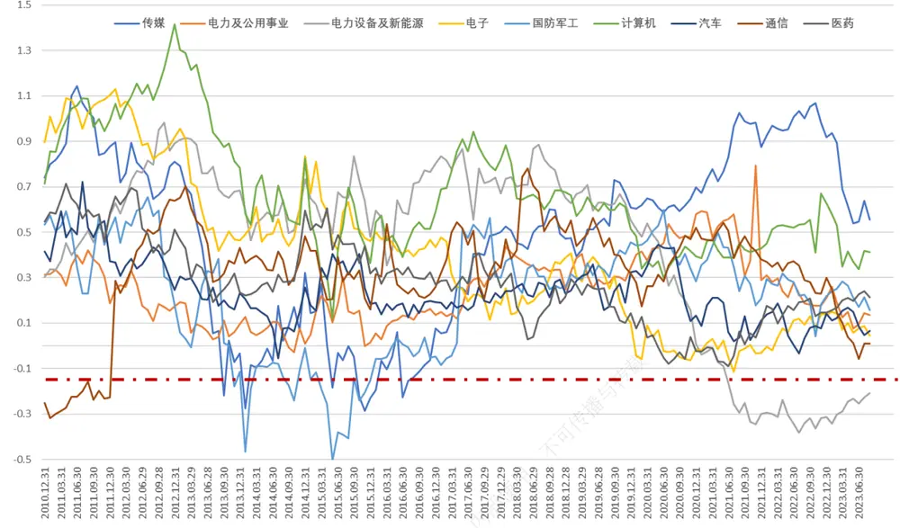
数据来源：Wind，国泰君安证券研究。

图 31：2011年-2023年各行业市值因子暴露情况，金融、食品饮料、家电、地产等行业市值暴露偏大市值
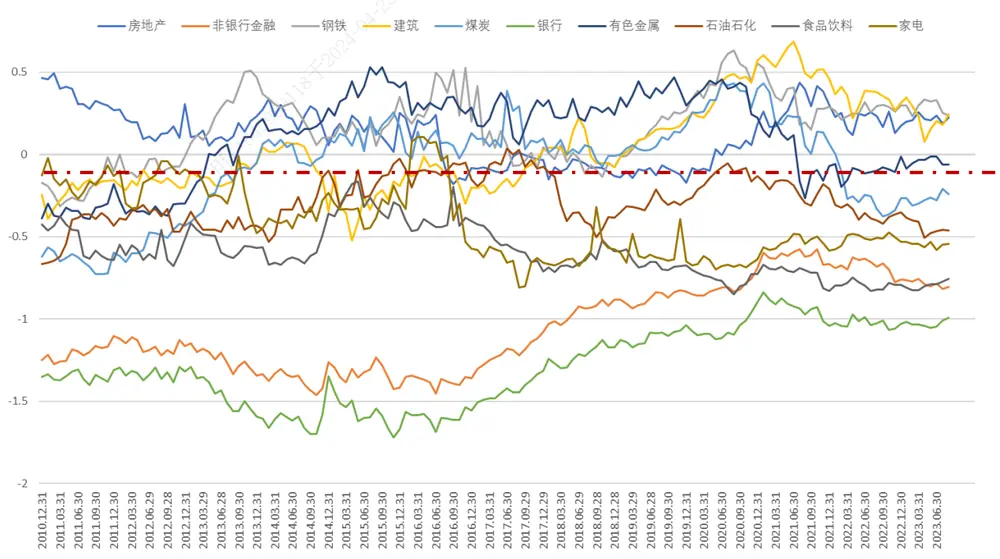
数据来源：Wind，国泰君安证券研究

## 本公司具有中国证监会核准的证券投资咨询业务资格

## 分析师声明

作者具有中国证券业协会授予的证券投资咨询执业资格或相当的专业胜任能力，保证报告所采用的数据均来自合规渠道，分析逻辑基于作者的职业理解，本报告清晰准确地反映了作者的研究观点，力求独立、客观和公正，结论不受任何第三方的授意或影响，特此声明。

## 免责声明

本报告仅供国泰君安证券股份有限公司（以下简称“本公司”）的客户使用。本公司不会因接收人收到本报告而视其为本公司的当然客户。本报告仅在相关法律许可的情况下发放，并仅为提供信息而发放，概不构成任何广告。

本报告的信息来源于已公开的资料，本公司对该等信息的准确性、完整性或可靠性不作任何保证。本报告所载的资料、意见及推测仅反映本公司于发布本报告当日的判断，本报告所指的证券或投资标的的价格、价值及投资收入可升可跌。过往表现不应作为日后的表现依据。在不同时期，本公司可发出与本报告所载资料、意见及推测不一致的报告。本公司不保证本报告所含信息保持在最新状态。同时，本公司对本报告所含信息可在不发出通知的情形下做出修改，投资者应当自行关注相应的更新或修改。

本报告中所指的投资及服务可能不适合个别客户，不构成客户私人咨询建议。在任何情况下，本报告中的信息或所表述的意见均不构成对任何人的投资建议。在任何情况下，本公司、本公司员工或者关联机构不承诺投资者一定获利，不与投资者分享投资收益，也不对任何人因使用本报告中的任何内容所引致的任何损失负任何责任。投资者务必注意，其据此做出的任何投资决策与本公司、本公司员工或者关联机构无关。

本公司利用信息隔离墙控制内部一个或多个领域、部门或关联机构之间的信息流动。因此，投资者应注意，在法律许可的情况下，本公司及其所属关联机构可能会持有报告中提到的公司所发行的证券或期权并进行证券或期权交易，也可能为这些公司提供或者争取提供投资银行、财务顾问或者金融产品等相关服务。在法律许可的情况下，本公司的员工可能担任本报告所提到的公司的董事。

市场有风险，投资需谨慎。投资者不应将本报告作为作出投资决策的唯一参考因素，亦不应认为本报告可以取代自己的判断。
在决定投资前，如有需要，投资者务必向专业人士咨询并谨慎决策。

本报告版权仅为本公司所有，未经书面许可，任何机构和个人不得以任何形式翻版、复制、发表或引用。如征得本公司同意进行引用、刊发的，需在允许的范围内使用，并注明出处为“国泰君安证券研究”，且不得对本报告进行任何有悖原意的引用、删节和修改。

若本公司以外的其他机构（以下简称“该机构”）发送本报告，则由该机构独自为此发送行为负责。通过此途径获得本报告的投资者应自行联系该机构以要求获悉更详细信息或进而交易本报告中提及的证券。本报告不构成本公司向该机构之客户提供的投资建议，本公司、本公司员工或者关联机构亦不为该机构之客户因使用本报告或报告所载内容引起的任何损失承担任何责任。

## 评级说明

## 1.投资建议的比较标准

投资评级分为股票评级和行业评级。以报告发布后的 12 个月内的市场表现为比较标准，报告发布日后的 12 个月内的公司股价（或行业指数）的涨跌幅相对同期的沪深 300 指数涨跌幅为基准。

## 2.投资建议的评级标准

报告发布日后的 12 个月内的公司股价（或行业指数）的涨跌幅相对同期的沪深 300 指数的涨跌幅。

| 评级 |  | 说明 |
| --- | --- | --- |
| 股票投资评级 | 增持 | 相对沪深 300 指数涨幅 15%以上 |
|  | 谨慎增持 | 相对沪深300指数涨幅介于5%～15%之间 |
|  | 中性 | 相对沪深300指数涨幅介于-5%～5% |
|  | 减持 | 相对沪深300指数下跌5%以上 |
| 行业投资评级 | 增持 | 明显强于沪深 300 指数 |
|  | 中性 | 基本与沪深300指数持平 |
|  | 减持 | 明显弱于沪深 300指数 |

## 国泰君安证券研究所

|  | 上海 | 深圳 | 北京 |
| --- | --- | --- | --- |
| 地址 | 上海市静安区新闸路 669 号博华广 场20层 | 深圳市福田区益田路6003号荣超商 务中心 B 栋 27 层 | 北京市西城区金融大街甲9号金融 街中心南楼18层 |
| 邮编 | 200041 | 518026 | 100032 |
| 电话 | (021)38676666 | (0755)23976888 | (010)83939888 |
|  | E-mail: gtjaresearch@gtjas.com |  |  |