2024.05.19

# 基于 Barra CNE6 的 A 股风险模型实践：风险因子篇

## ——权益配置因子研究系列 06

## 本报告导读：

本报告参考 Barra 的中国市场股票风险模型 CNE6，构建了 A 股风险因子体系；通过分组回测和构建纯因子组合，考察和跟踪风格因子表现，并对模型回归结果进行全面展示；该模型可以应用于股票组合的风险管理、风格暴露分析和收益归因。

## 摘要：

le_Summary] 股票风险模型主要用于风险管理和组合分析。因子投资思想来源于学术界的股票资产定价研究，通过使用因子来描述不同股票共同承担的某一方面的共性风险，能够有效降低分析的维度，提高预测的准确性。本报告的多因子风险模型主要是以风险管理和组合分析为目标，侧重于分析A股系统性的风格因子，而非捕捉超额收益。

A 股风格因子体系构建。以 Barra 的中国市场风险模型 CNE6 为基础，构建了涵盖国家因子、行业因子和风格因子的 A 股风格因子体系。其中，国家、行业因子均为 0-1 变量，20 个风格因子由根据财务数据、交易数据等计算得到的描述变量加权得到。此外，可以将相似属性的风格因子汇总为多个大类因子，为不同需求的投资者提供了多样化的选择。

多因子风险模型求解采用带约束的加权最小二乘法。为了应对异方差性和共线性问题，使用带约束的加权最小二乘法进行回归求解。同时，从回归计算的中间变量中获取纯因子组合（对特定因子暴露为 1，其他因子暴露为 0）用于对因子表现的跟踪。实证结果表明模型效果较好。为了全面检验风格因子模型的效果，进行了以下的测试。1）回归系数显著性方面，在测试期内，Beta、IndustryMomentum、Liquidity、Mid Capitalization、Momentum、ResidualVolatility、Short-Term Reversal、Size 风格因子的|T|平均值较高，均大于 2，说明这些风格因子对股票收益的解释力度较强。2）纯因子组合绩效方面，在测试期内，Beta、Momentum、Analyst Sentiment风格因子的正向累计收益较高，年化收益分别为 2.82%、2.20%、2.07%；Liquidity、Short-Term Reversal、Size、Mid Capitalization 风格因子的负向累计收益较高，年化收益分别为-8.72%、-6.91%、-4.37%、-3.42%。3）单因子分层回测方面，除了 GROWTH 和QUALITY 大类以及 Analyst Sentiment以外，其他类别因子的 IC、IR大多数都比较高，具有比较明显的选股区分度。

模型主要应用于组合风险管理、风格暴露分析与收益归因。可以分析不同投资组合在风格因子上的暴露情况、对组合收益进行分解，从而对其收益来源有更加深入的认识。作为应用举例，以常见的 A股宽基指数为例，计算了 2024年 3月底的风格暴露；对沪深 300指数在2024年3月的收益进行收益分解。

- 风险提示：量化模型基于历史数据构建，而历史规律存在失效风险。

大类资产配置研究

## 报告作者

张雪杰(分析师)

8 0755-23976751

zhangxuejie025900@gtjas.com

证书编号 S0880522040001

刘凯至(分析师)

8 0755-23976911

liukaizhi025861@gtjas.com

证书编号 S0880522110002

## 朱惠东(研究助理)

8 0755-23976176

zhuhuidong028682@gtjas.com

证书编号 S0880123070152

## Report] 相关报告

中美权益资产风险偏好剪刀差收敛进行时2024.05.07

看多化工、医药、有色、电新、地产、非银

2024.05.04

从“铜油比”到 CRB 商品宏观友好度评分的细化

2024.04.25

从量化视角复盘 A股 1995年以来的风格轮动和选股因子表现

2024.04.22

三维度刻画十年期美债隐含通胀预期

感谢实习生张涵、薛鹏飞、付田昊对本文的贡献。

2024.04.16

国君金融工程团队专注于量化选股、行业轮动、资产配置、量化择时等研究。在之前的因子研究系列报告中研究了超预期因子、分钟高频因子在不同股票池的选股效果，介绍了中证 500、1000 和 2000 指数增强策略的构建，复盘了A股历史上的风格轮动和因子表现。本文是基于Barra CNE6 模型构建 A 股风险模型实践的上篇，主要关注风格因子体系构建和应用。

## 1. 多因子风险模型简介

## 1.1. 因子投资思想源于资产定价研究

因子投资是一种系统化、定量化的投资思想，使用因子来描述不同资产共同承担的某一方面的共性风险。因子投资的思想可以用于大类资产配置（主要使用宏观因子，参见前述报告《基于宏观因子的大类资产配置框架》），也可以用于个股和股票投资组合的收益、风险分析（主要使用风格、行业因子等），本文聚焦于后者。

因子投资的思想最初起源于学术界的实证资产定价研究。根据经典的CAPM 模型（Sharpe，1964），任何风险资产的预期收益都可以分解为无风险收益和市场组合的预期收益两部分，下式中 $\beta_{i}$ 刻画了资产对市场收益变化的程度，即对市场风险的暴露程度，因此 CAPM 可以看作是考虑了市场因子的单因子模型。

$$
E[R_{i}]-R_{f}=\beta_{i}\big(E[R_{m}]-R_{f}\big)
$$

CAPM模型开创了因子投资思想的先河，但很快研究者就发现单一因子对市场的解释力不足。因此，后续的 APT 模型（Ross，1976）通过多个因素来解释风险资产的收益，下式中将资产预期超额收益记为E[Re]，$\beta_{i}$ 代表因子暴露，λ代表因子预期收益，也称因子溢价。

$$
E[R_{i}^{e}]=\beta_{i}^{\prime}\lambda
$$

该模型认为股票未来的收益可以用若干因素来解释。但是并没有指出哪些具体的因素。实证研究方面，1992年Fama和French提出三因素模型，使用市场、市值、估值三个因子作为自变量解释股票未来收益。2015年Fama和French从股利贴现模型出发，推导出与股票收益相关的因素，加入盈利和投资因子，提出五因子模型。

通过归纳和总结影响股票收益的共性的因子，使用多因子模型可以将原本对数量众多的股票进行收益、风险分析，转化为对相对较少的因子进行分析，能够有效降低问题的维度，提高准确性。

## 1.2. 多因子风险模型聚焦风险管理和组合分析

因子投资思想和多因子模型是非常宽泛的概念，在业界有众多应用方向。本系列所考虑的多因子风险模型主要是以风险管理和组合分析为目标，侧重于分析系统性的风格因子，而非捕捉超额收益。

Barra 风险模型是目前业界上最知名的多因子风险模型，广泛应用于投资组合分析领域。Barra 多因子模型由美国学者 Barr Rosenberg 在 1985年创办的 Barra公司推出，后 2004年 Barra公司被 MSCI所收购，并继续进行迭代改进。第一代的 Barra 多因子模型 USE1 专注于美国权益市场，于 1975年发布，后续陆续发布了改进的版本，经典版本为 2011年发布的USE4模型。2005年，MSCI推出了专注于中国权益市场的CHE2模型，其后于 2012 年推出的改进版本 CNE5 模型受到国内机构投资者的广泛使用。2018年MSCI推出了针对中国市场最新的CNE6模型，对因子框架进行了进一步细分和扩充。本系列主要基于 Barra CNE6 进行模型构建和实践检验，最终致力于在实际投资中进行风格管理、风险预测、组合归因等应用。具体来说，多因子风险模型有以下应用：

1) 管理投资组合风格暴露。通过构建合适的因子体系，可以计算每只股票在各个风格因子上的因子暴露，进一步可以计算得到投资组合的风格因子暴露。从而可以将投资组合的风格因子暴露带入组合优化求解中，对特定的目标风格暴露进行控制或调整，进行主动的组合管理。

2) 更准确地估计股票协方差矩阵进行风险预测。在对投资组合的波动率进行预测时，股票协方差矩阵的准确估计是一个关键问题。通过多因子风险模型，将高维度的股票协方差矩阵估计问题（4000 只股票）转化为较低维度的因子协方差矩阵估计问题（50个因子），能够大大提高估计的准确性，从而提高风险预测的精度。

3) 对投资组合进行事后归因。除了在事前进行投资组合的风格管理和风险预测，多因子风险模型还可以用于事后的组合归因。通过对基金产品的收益、风险来源进行风格和行业上的归因，可以更深入地了解基金产品的收益风险来源。

## 1.3. 多因子风险模型基本形式

多因子风险模型认为股票的收益受到一系列共同因子的驱动，因此可以将股票组合的收益、风险预测转化为因子的收益、风险预测。具体来说，参考 Barra CNE6 模型，引入三大类因子来刻画股票收益，分别是国家因子、行业因子和风格因子，则任一只股票的预期收益都可以表示为如下因子暴露和因子收益的线性组合。

$$
R_{n}=f_{c}+\sum_{i=1}^{P}X_{n}^{I_{i}}f_{I_{i}}+\sum_{j=1}^{Q}X_{n}^{S_{j}}f_{S_{j}}+\varepsilon_{n},
$$

其中， $R_{n}$ 代表股票预期收益率， $f_{c}$ 代表国家因子的预期收益率。 $X_{n}^{I_{i}}$ 为个股在行业i上的暴露，个股在其所属行业上暴露为1，其余行业则全部为 0。 $X_{n}^{S_{j}}$ 为个股在风格因子j上的暴露。在模型求解时，上式中的因子暴露即为根据财务数据、交易数据等计算得到的因子值，然后将股票收益率取为当期值，因子暴露取为上期值进行回归求解，得到的回归系数即为因子收益，具体的计算方式以及处理过程将在第 2章和第 3章详细介绍。

为了方便叙述，假设国家因子、行业因子和风格因子共有K个，将因子收益统一记为 $f_{k}$ ，股票在各因子的暴露值统一记为 $X_{nk}$ ，则通过多因子模型，可以对任一投资组合进行收益分解如下：

$$
R_{P}=\sum_{n=1}^{N}R_{n}=\sum_{k=1}^{K}X_{Pk}f_{k}+\sum_{n=1}^{N}w_{n}\varepsilon_{n},
$$

其中， $X_{Pk}$ 代表投资组合 P在因子 K上的暴露∑ $w_{n}X_{nk}.$ 。从而，在假设股票特异收益项 $\textstyle\sum_{n}w_{n}\varepsilon_{n}$ 能充分对冲的前提下，对含有 N 只股票的投资组合进行分析可以转化为对K个因子进行分析。同样，还可以对波动率进行分解，由于因子和股票的特异收益互不相关，并且不同股票的特异收益之间也互不相关，所以投资组合P的协方差矩阵为：

$$
\mathcal{L}_{P}=\sum_{j,k=1}^{K}X_{Pk}F_{jk}X_{Pk}+\sum_{n=1}^{N}w_{n}^{2}var(\varepsilon_{n}),
$$

其中 $F_{jk}$ 代表因子之间的协方差矩阵。从上面的推导可以看出，收益分解和风险预测是多因子风险模型想要解决的主要任务，本文主要关注因子构建和收益分解的部分。

## 2. 因子体系构建

参照 Barra CNE6 模型的做法，本文也选用国家因子、行业因子、风格因子三大类因子来构建多因子模型。其中，风格因子直接采用 CNE6的因子类别和计算方法，使用财务数据、交易数据等计算得到股票因子暴露，从而带入多因子回归模型中进行求解。

## 2.1. 国家因子构建

为了将市场整体的收益与行业、风格因子剥离开，我们在模型中显式地设置了国家因子。国家因子的概念可以类比于回归模型中的截距项，即不同股票所共有的无法被行业、风格所解释的部分。在 Barra 推出的中国权益风险模型 CNE5和 CNE6中都显式地设置了国家因子，能够有效提高模型解释力。Barra 研究团队在 USE4 模型论文中指出国家因子可以看作是按照市值加权的市场组合，能够将市场效应与纯粹的行业和风格因子相分离，从而能够更加直接地解释行业和风格因子。

举例来说，假设不引入国家因子，那么一个行业因子就相当于是一个以 100%仓位多头持有特定行业的投资组合，在其他行业上的持仓都为0；当引入国家因子时，一个行业因子相当于一个以100%仓位多头持有特定行业，同时 100%仓位空头持有市场组合的多空投资组合，从而将对于行业的刻画从市场组合中剥离出来。

国家因子的计算非常简单，将所有股票的国家因子暴露都设置为 1即可。

## 2.2. 行业因子构建

行业是解释股票收益的重要因素，本文采用中信一级行业作为行业因子划分依据。行业因子的计算采用 one-hot 编码形式，即对于特定股票的行业因子暴露，该股票所属的行业为 1，其他行业为 0。由于中信行业分类标准在 2019年 12月进行了调整，新增综合金融一级行业，因此在调整之前的历史数据计算中使用 29个行业因子，调整后则为 30个行业因子。

## 2.3. 风格因子构建

由于本文的目标是构建多因子风险模型，因此这里所讨论的风格因子意指代表某一类股票风格的风险因子。通过调整对特定风格风险的暴露，从而获得相应的风格溢价或者规避风格风险敞口，正是对风格因子进行建模和管理的目的。这里首先要区别两个概念——风险因子和alpha 因子。对于一个因子，可以考察因子的两个统计特征：因子收益和因子收益的波动率。根据这两个特征不同特点，可以将因子大致划分为四类：第一类是因子收益较大、波动较小的因子，一般认为是alpha 因子；第二类是因子收益较低、波动很大，对股票收益影响大，但方向不稳定，但可以描述某种系统性风险的风险因子；第三类兼具了前两类的特点，因子收益在大部分时间为正数但波动较大，这类因子的存在意味着 alpha 因子和风险因子的边界并不清晰，存在交集；第四类则是收益、波动均低的不显著因子。

图 1：风险因子与 alpha 因子
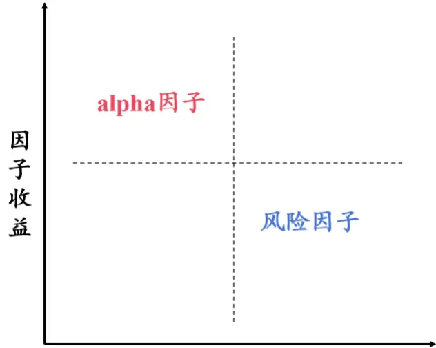
因子收益波动率
数据来源：国泰君安证券研究

由于 alpha 因子和风险因子的定义分界比较模糊，并且随着市场环境的变化，也有许多过去的 alpha 因子不再有效转变为风险因子，并没有统一的区分标准。Barra 多因子模型中对风格风险因子的定义比较宽泛，将一些过去认为是 alpha 的因子也包含在内。本文目前按照 Barra 的做法构建风格风险因子。未来也可以根据市场变化和实际需要进行调整。

相比于上一代的 CNE5 模型，新一代模型的 Barra CNE6 模型对风格因子体系进行了修改、整合和完善。具体来说，模型提供了两种版本的风格因子体系，其中 Long Term Model专注于较为长期的风险管理，包含16个偏长期的风格因子，而Trading Model提供更加高频的管理方式，额外引入了 4 个短期风格因子 Analyst Sentiment、Industry Momentum、Seasonality 和 Short-Term Reversal。本文为了全面性起见，使用了全部20 个风格因子来构建多因子风险模型。其中，每个风格因子的因子暴露由一个或数个根据财务数据、交易数据等计算而来的描述变量合成，如下表所示（各描述变量的具体计算方法参见附录）。对于多个描述变量的情况，本文采用等权的方法合成风格因子。本文所使用的数据来源为WIND数据库和朝阳永续数据库。

表1: 风格因子结构示意

| 风格因子 | 描述变量 | 说明 |
| --- | --- | --- |
| Analyst Sentiment分析师情绪 | RR | 评级调整比率 |
|  | ETOPF_C | 分析师预测 EP比变化 |
|  | EPSF C | 分析师预测 EPS 变化 |
| Beta贝塔 | HBETA | 历史 beta |
| Book-to-Price账面市值比 | BTOP | 账面市值比 |
| Dividend Yield股息率 | DTOP | 股息率 |
|  | DTOPF | 分析师预测股息率 |
| Earnings Quality盈利质量 | ABS | 资产负债表应计项目 |
|  | ACF | 现金流量表应计项目 |
| Earnings Variability盈利波动 | VSAL | 营业收入波动率 |
|  | VERN | 盈利波动率 |
|  | VFLO | 现金流波动率 |
|  | ETOPF_STD | 分析师预测 EP 比标准差 |
| Earnings Yield盈利收益 | CETOP | 现金盈利市值比 |
|  | ETOP | EP比 |
|  | EM | 企业乘数 |
|  | ETOPF | 分析师预测 EP 比 |
| Growth成长 | EGRLF | 分析师预测长期盈利增长率 |
|  | EGRO | 每股收益增长率 |
|  | SGRO | 每股营业收入增长率 |
| Industry Momentum行业动量 | INDMOM | 行业动量 |
| Investment Quality投资质量 | AGRO | 总资产增长率 |
|  | IGRO | 股票发行量增长率 |
|  | CXGRO | 资本支出增长率 |
| Leverage杠杆率 | MLEV | 市场杠杆率 |
|  | BLEV | 账面杠杆率 |
|  | DTOA | 资产负债率 |
| Liquidity流动性 | STOM | 月度换手率 |
|  | STOQ | 季度换手率 |
|  | STOA | 年度换手率 |
|  | ATVR | 年化交易量比率 |
| Long-Term Reversal长期反转 | LTRSTR | 长期相对强度 |
|  | LTHALPHA | 长期历史 Alpha |
| Mid Capitalization中市值 | MIDCAP | 中市值 |
| Momentum动量 | RSTR | 相对强度 |
|  | HALPHA | 历史 Alpha |
| Profitability收益能力 | ATO | 资产周转率 |
|  | GP | 资产毛利率 |
|  | GPM | 销售毛利率 |
|  | ROA | 总资产收益率 |
| Residual Volatility残差波动 | HSIGMA | 历史 Sigma |
|  | DASTD | 收益日标准差 |
|  | CMRA | 累计收益极差 |
| Seasonality季节性 | SEASON | 年度季节性 |
| Short-Term Reversal短期反转 | STREV | 短期反转 |
| Size市值 | LNCAP | 对数市值 |

数据来源：Barra，国泰君安证券研究

此外，Barra 还推出了一种大类因子架构，将 Long Term Model 中的 16个风格因子根据相似属性加权得到了 8个大类因子，并给出了相应的权重。为了满足投资者的不同需求，我们也按照原文给出的权重进行因子加权得到大类因子。由于 Mid Capitalization、Leverage 和 EarningsVariability三个风格因子逻辑上的相反性，与Barra原文的操作保持一致，在合成大类因子前进行取相反数处理。

图 2：大类因子结构及权重示意

| VALUE | (SMLSIZE | MOMENTUM | QUALITY | %YIELD | VOLATILITY | GROWTH | OLIQUIDITY |
| --- | --- | --- | --- | --- | --- | --- | --- |
| Book-to-Price(30%)Earnings Yield(60%)LT Reversal(10%) | Mid Cap (10%)Size (90%) | Momentum(100%) | Leverage(12.5%)InvestmentQuality (25%)EarningsVariability(12.5%)EarningsQuality (25%)Profitability(25%) | DividendYield (100%) | Beta (60%)ResidualVolatility(40%) | Growth(100%) | Liquidity(100%) |

数据来源：Barra

## 2.4. 因子处理细节

上面介绍了三种类型因子的基本结构和计算方法，其中国家因子和行业因子暴露均为 0-1 变量。而风格因子计算还涉及到数据处理（取极值、标准化、缺失值填充），下面依次进行介绍。

## 1）去极值

为了避免极端值对回归结果带来干扰，一般要对对描述变量进行去极值的处理。本文采用最为常见的 MAD 绝对中位差方法，上下限取为 5倍的绝对偏差中位数，对超出上下限的极端值进行截断。需要注意的是，由于部分描述变量在不同个股之间数值差别较大，或者缺失值较多，不适合去极值处理，则跳过此步。其中，IGRO 股票发行量增长率、DTOP股息率和DTOPF分析师预测股息率三个描述变量不进行去极值处理。

## 2）标准化

由于不同描述变量的计算逻辑不同，量纲也有差异，无法直接进行数值比较，因此会对因子值进行标准化操作。具体来说，设股票n对应描述变量k的原始值为XnkRaw，则标准化公式为：

$$
X_{nk}=\frac{X_{nk}^{Raw}-\mu_{k}}{\sigma_{k}}\quad\mu_{k}=\sum_{n=1}^{N}w_{n}X_{nk}^{Raw}.
$$

其中 $\sigma_{k}$ 代表等权标准差， $\mu_{k}$ 是根据自由流通市值加权计算的均值。使用自由流通市值加权而不是一般常用的等权，是希望市场基准组合对各个风格因子的暴露为 0。除了描述变量以外，在每一次加权合成风格因子和大类因子时，也要进行一次标准化的处理，从而保证市值加权均值为0的性质。

采用自由流通市值加权计算均值的好处就在于，对于一个市场基准组合（由所有股票根据自由流通市值计算得到的投资组合），在任一风格因子k的暴露均为0，即：

$$
\begin{aligned}&X_{Pk}=\sum_{n=1}^{N}w_n\cdot X_{nk}=\sum_{n=1}^{N}w_n\frac{X_{nk}^{Raw}-\mu_k}{\sigma_k}\\&=\frac{1}{\sigma_k}\left(\sum_{n=1}^{N}w_nX_{nk}^{Raw}-\mu_k\sum_{n=1}^{N}w_n\right)\\&=\frac{1}{\sigma_k}\left(\sum_{n=1}^{N}w_nX_{nk}^{Raw}-\mu_k\right)=0\\\end{aligned}
$$

## 3）填补缺失值

对于描述变量存在缺失值的情况，采用行业中位数进行填充。

## 4）正交化

为了避免因子之间的共线性对回归效果带来影响，参照 Barra CNE6 原文[5]的做法，对部分风格因子进行正交化处理。其中，分别将 ResidualVolatility 因子对 Beta、Size 因子进行正交，将 Long-Term Reversal 因子对 Momentum 因子进行正交。此外，由于 Long Term Model 和 TradingModel 分别采用了不同的因子体系，为了保证采用不同模型时的回归结果保持一致，还需要将 Trading Model 额外引入的四个短期因子 AnalystSentiment、Industry Momentum、Seasonality、Short-Term Reversal 对剩余16个长期因子进行正交。

在对描述变量进行了去极值、标准化、填补缺失值的处理流程后，再根据前文所述依次进行加权，合成得到风格因子；对风格因子进行正交化处理后，再加权得到对应的大类因子，用于后续的模型求解和因子测试。

## 3. 模型求解

## 3.1. 处理异方差和共线性问题

回顾前文提到的多因子模型表达式，根据前文所述计算得到的因子值对应表达式中的因子暴露 $X_{n}^{I_{i}}$ 和 $X_{n}^{S_{j}}$ （国家因子暴露全为 1，为表述简洁省略记号）。通过在横截面上将每一期的股票收益对上一期的因子暴露进行加权回归，可以求解得到因子收益率 $f_{c}$ 、 $f_{I_{i}}$ 、 $f_{S_{j}}$ 以及特异收益残差项 $\varepsilon_{n}$ 。接下来，我们介绍回归模型的求解细节，并介绍如何得到纯因子组合。

经典线性回归模型的一个重要假定是回归函数中的随机误差项具有同方差性，即它们都有相同的方差，这是为了保证回归参数估计量具有良好的统计性质。尽管多因子模型假定各只股票的特异收益率之间不相关，但特异收益率的方差并不相同，即存在异方差性，对于这种情况，需要采用加权最小二乘法求解回归方程。对于这类问题，理想中的回归权重是特异收益率方差的倒数，但此时是未知的；不过根据历史经验，特异收益率的方差通常与股票的自由流通市值成反比，因此本文在回归时采用自由流通市值的平方根作为权重。

$$
\begin{aligned}R_{n}=&f_{c}+\sum_{i=1}^{P}X_{n}^{I_{i}}f_{I_{i}}+\sum_{j=1}^{Q}X_{n}^{S_{j}}f_{S_{j}}+\varepsilon_{n}\\&w=(\frac{\sqrt{s_{1}}}{\sum_{i=1}^{N}\sqrt{s_{i}}},\ldots,\frac{\sqrt{s_{N}}}{\sum_{i=1}^{N}\sqrt{s_{i}}})\end{aligned}
$$

其中， $s_{i}$ 代表股票i的自由流通市值，股票数记为N，因子数记为K。此外，由于本文的回归模型中显式地包含了国家因子，任意股票在其暴露均为常数 1，与此同时单只股票在所有行业因子上的暴露之和显然也为 1，这带来了完全的共线性，导致回归模型无法求解。为了解决完全共线性的问题，需要额外引入新的约束条件，要求自由流通市值加权的行业因子均值为0，下式中 $s_{I_{i}}$ 代表行业 $I_{i}$ 的自由流通市值之和。

$$
\sum_{i}s_{I_{i}}f_{I_{i}}=0
$$

## 3.2. 使用带约束最小二乘法求解回归模型

现在，我们得到了一个带约束的加权回归模型，接下来借鉴石川等（2020）[6]中的做法，使用带约束的加权最小二乘法推导出模型解析解的形式。首先，引入一些矩阵记号，R代表股票收益率向量；X代表因子暴露矩阵，维度为 $N\times K$ ；W代表回归权重矩阵，即 $W=diag(w)=$ $\begin{array}{r}{diag(\frac{\sqrt{s_{1}}}{\sum_{i=1}^{N}\sqrt{s_{i}}},\dots,\frac{\sqrt{s_{N}}}{\sum_{i=1}^{N}\sqrt{s_{i}}})}\end{array}$ 。求解的难点在于如何表达加权行业因子均值为 0的约束条件，为此需要额外构建维度为 $K\times K-1$ 的约束矩阵C，将约束条件重新表达为如下的矩阵约束形式：

$$
\begin{bmatrix}f_{c}\\f_{l_{i}}\\\vdots\\f_{l_{p}}\\f_{S_{1}}\\\vdots\\f_{S_{Q}}\\\end{bmatrix}=\begin{bmatrix}1&0&0&\cdots&0&0&\cdots&0\\0&1&0&\cdots&0&0&\cdots&0\\\vdots&\vdots&\vdots&\ddots&\vdots&\vdots&\vdots&\ddots&\vdots\\0&-\frac{S_{I_{1}}}{S_{I_{p}}}&-\frac{S_{I_{2}}}{S_{I_{p}}}&\cdots&-\frac{S_{I_{p-1}}}{S_{I_{p}}}&0&\cdots&0\\0&0&0&\cdots&0&1&\cdots&0\\\vdots&\vdots&\vdots&\ddots&\vdots&\vdots&\ddots&\vdots\\0&0&0&\cdots&0&0&0&\cdots&1\\\end{bmatrix}\begin{bmatrix}f_{c}\\f_{i}\\f_{l_{i}}\\\vdots\\f_{I_{P-1}}\\f_{S_{1}}\\\vdots\\f_{S_{Q}}\\\end{bmatrix}+\begin{bmatrix}0\\0\\0\\\vdots\\0\\0\\\vdots\\0\\1\\\end{bmatrix}
$$

上式中等式右边的矩阵即为约束矩阵C，将原始的约束条件进行了形式上的转变，改写为了将最后一个行业因子的收益 $f_{I_{P}}$ 用其他行业收益的线性组合来表达，从而方便推导。在有了上述的记号以后，根据带约束的加权最小二乘法，就可以得到回归模型的解析解：

$$
\begin{aligned}&\hat{f}=C(C^{\prime}X^{\prime}WXC)^{-1}C^{\prime}X^{\prime}WR:=W^{*}R^{\prime}\\&\qquad W^{*}=C(C^{\prime}X^{\prime}WXC)^{-1}C^{\prime}X^{\prime}W\\\end{aligned}
$$

其中f̂即为由回归模型得到的因子收益估计值，用于后续的收益分解、风险预测等。在股票收益率向量R之前的W∗是一个K×N维的矩阵，根据定义可以将每一行看作是一个股票组合的权重向量，从而W∗就是各个因子的纯因子组合矩阵，满足每一个纯因子组合在目标因子的暴露为 1，在其他因子的暴露为 0，完全对应回归模型得到的因子收益率。通过对纯因子组合进行历史回测，可以更加全面地跟踪观察风格因子的收益表现。

具体操作上，我们在 2010年 6月-2024年3月期间进行月度回归，得到了因子收益和纯因子组合。同时，也计算了相应的回归显著性统计量和R方，用以评估回归模型的显著性水平和解释力度。

## 4. 模型测试与结果分析

## 4.1. 模型测试方法

## 4.1.1. 回归显著性和拟合度检验

回归系数的显著性是检验回归模型效果的重要依据，有助于评估各个因子是否显著有效或者可以看作噪音。本文主要使用T统计量来评估显著性，在正态假设下，T统计量的绝对值大于 2可以看作在 95%置信度下的显著。因此，我们统计每个因子在截面回归中的平均T统计量绝对值，以及T统计量绝对值大于2的占比，以评估回归模型的系数显著性。

参照 Barra 原文的定义，我们计算如下的非中心化(uncentered)回归 $R_{UC}^{2}$ ，用以检验模型的拟合度。其中 $w_{n}$ 代表回归权重， $R_{n}$ 代表股票收益， $\varepsilon_{n}$ 代表回归残差项。

$$
R_{UC}^{2}=1-\frac{\sum_{n}w_{n}\varepsilon_{n}^{2}}{\sum_{n}w_{n}R_{n}^{2}}
$$

需要注意的是，Barra所采用的非中心化 $.R_{UC}^{2}$ 与计量经济学中常用的中心化(centered)回归 $R_{C}^{2}$ 存在差异，后者使用离差平方和作为分母项。从数值上看，一般来说非中心化的 $R_{UC}^{2}$ 要大于中心化 ${}_{1}R_{C}^{2}$ 。

$$
R_{C}^{2}=1-\frac{\sum_{n}w_{n}\varepsilon_{n}^{2}}{\sum_{n}w_{n}(R_{n}-\overline{{R_{n}}})^{2}}
$$

## 4.1.2. 纯因子组合绩效统计

为了跟踪观察各风格因子表现，对纯因子组合进行历史回测并分别计算了年化收益、年化波动和最大回撤等绩效指标。

## 4.1.3. 因子稳定性测试

对月频的因子暴露计算截面相关性，从而得到因子稳定系数。因子稳定系数可以用来判断因子暴露变化的速度，从而对应不同周期视角的投资组合管理。一般来说，稳定系数较高的因子适用于长期组合管理，稳定系数较低的因子更适用于捕捉短期的市场变化。

## 4.1.4. 因子共线性检验

在构建回归模型时，自变量之间的多重共线性会对模型效果产生干扰。具有较强共线性的因子之间能够互相解释，从而导致回归模型的估计参数不稳健。我们使用方差膨胀系数VIF来判断因子之间的共线性，计算方法是依次选取其中一个自变量作为因变量，将其对其他自变量进行回归，通过计算回归 R方的大小从而得到 $\begin{array}{r}{VIF=\frac{1}{1-R^{2}}}\end{array}$ 。越大的 VIF值意味着该因子能够被其他因子所解释的程度越高，从而共线性程度越高。在统计学里一般认为在 $.VIF<5$ 时不存在共线性，在 $\mathsf{E}5<VIF<10$ 时具有弱共线性。

由于国家因子和行业因子都为 0-1 变量，不需要处理；对风格因子均进行共线性的检验，以对回归模型进行更好的拟合。

## 4.1.5. 单因子分层回测

最后，使用多因子选股中常用的分层回测进行单因子测试。具体来说，就是在每个截面期的最后一天（这里与回归模型保持一致，采用月频调仓，回测区间为2010年6月-2024年3月），在股票池中剔除掉停牌、ST、上市不满6个月的股票后，对因子值进行市值、行业中性化，然后按照因子值从大到小的顺序将池中股票划分为 5组，分别进行历史收益回测，并统计相应的绩效指标，从而对因子的分组效果进行测试。

## 4.2. 回归结果与纯因子绩效

通过将次月收益率作为因变量，月底最后一期的国家因子、行业因子和风格因子暴露作为自变量求解回归模型，模型的平均R2为0.39。

图 3：风格因子回归滚动1年R2
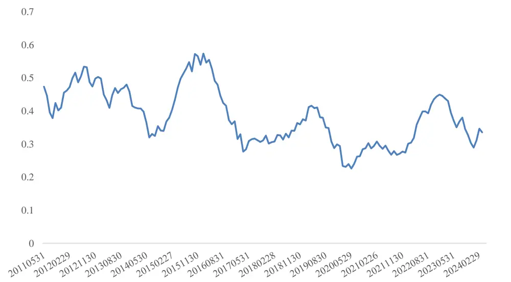
数据来源：Wind，朝阳永续，国泰君安证券研究

下面，分别展示 20 个风格因子的回归系数显著性、纯因子组合绩效、稳定系数和VIF。

回归系数显著性：在测试期内，Beta、Industry Momentum、Liquidity、Mid Capitalization、Momentum、Residual Volatility、Short-Term Reversal、Size 风格因子的|T|平均值较高，均大于 2，说明这些风格因子对股票收益的解释力度较强；Earnings Quality、Earnings Variability 风格因子的|T|平均值较小，对股票收益的解释力度较弱。

纯因子组合绩效：在测试期内，Beta、Momentum、Analyst Sentiment风格因子的正向累计收益较高，年化收益分别为2.82%、2.20%、2.07%；Liquidity、Short-Term Reversal、Size、Mid Capitalization 风格因子的负向累计收益较高，年化收益分别为-8.72%、-6.91%、-4.37%、-3.42%。

稳定系数：在测试期内，属于 Trading Model 的 Analyst Sentiment、Industry Momentum、Seasonality、Short-Term Reversal 风格因子的稳定系数较低，这与 Barra 区分 Long Term Model 和 Trading Model 的初衷一致，即这四个风格因子的因子暴露变化较快，更适用于捕捉短期的投资机会。

VIF：在测试期内，风格因子的VIF均小于 5，即不存在共线性。

表 2: 风格因子回归显著性

| 风格因子 | \|T\|平均值 | \|T\|>2 占比 | 年化收益 | 年化波动 | 最大回撤 | 稳定系数 | VIF |
| --- | --- | --- | --- | --- | --- | --- | --- |
| Analyst Sentiment | 1.43 | 28.31% | 2.07% | 0.97% | 2.19% | 0.73 | 1.01 |
| Beta | 2.79 | 50.60% | 2.82% | 3.77% | 8.43% | 0.98 | 1.92 |
| Book-to-Price | 1.98 | 42.17% | 1.65% | 2.28% | 8.17% | 0.98 | 2.57 |
| Dividend Yield | 1.22 | 17.47% | 1.06% | 1.05% | 2.69% | 0.96 | 1.57 |
| Earnings Quality | 1.14 | 14.46% | 0.21% | 1.15% | 5.87% | 0.87 | 1.22 |
| Earnings Variability | 1.12 | 16.87% | -0.35% | 1.00% | 7.23% | 0.94 | 1.30 |
| Earnings Yield | 1.72 | 34.34% | 1.50% | 1.83% | 4.40% | 0.97 | 2.49 |
| Growth | 1.22 | 19.28% | 0.81% | 1.19% | 2.36% | 0.96 | 1.49 |
| Industry Momentum | 2.09 | 43.37% | 0.65% | 3.67% | 10.25% | 0.40 | 1.34 |
| Investment Quality | 1.21 | 19.28% | -0.12% | 1.24% | 7.55% | 0.98 | 1.61 |
| Leverage | 1.69 | 37.35% | -0.48% | 1.66% | 13.09% | 0.99 | 1.45 |
| Liquidity | 3.11 | 63.25% | -8.72% | 3.86% | 71.75% | 0.91 | 2.27 |
| Long-Term Reversal | 1.54 | 30.72% | 0.86% | 1.81% | 9.34% | 0.92 | 1.88 |
| Mid Capitalization | 2.61 | 53.61% | -3.42% | 1.84% | 38.16% | 0.97 | 1.09 |
| Momentum | 3.25 | 66.87% | 2.20% | 3.74% | 14.85% | 0.84 | 1.90 |
| Profitability | 1.57 | 32.53% | 0.52% | 2.06% | 8.52% | 0.98 | 2.28 |
| Residual Volatility | 2.52 | 54.22% | -0.08% | 3.77% | 24.00% | 0.96 | 2.61 |
| Seasonality | 1.31 | 22.29% | -0.50% | 1.16% | 7.89% | -0.07 | 1.01 |
| Short-Term Reversal | 2.75 | 53.01% | -6.91% | 4.42% | 62.07% | 0.20 | 1.34 |
| Size | 5.13 | 74.10% | -4.37% | 4.53% | 48.11% | 0.99 | 2.14 |

数据来源：Wind，朝阳永续，国泰君安证券研究；数据区间：2010年 6月至 2024年 3月。

接下来，将各个风格因子的纯因子组合按照累计净值从大到小，绘制如图。

图 4：风格因子纯因子组合净值
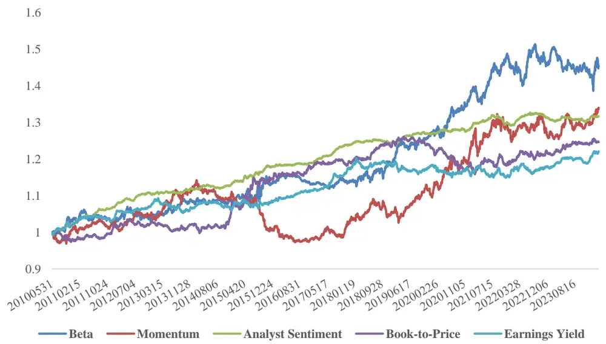
数据来源：Wind，朝阳永续，国泰君安证券研究

图5：风格因子纯因子组合净值（续）
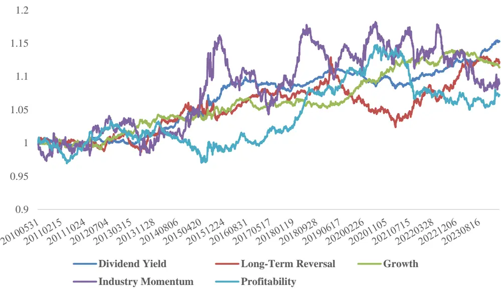
数据来源：Wind，朝阳永续，国泰君安证券研究

图6：风格因子纯因子组合净值（续）
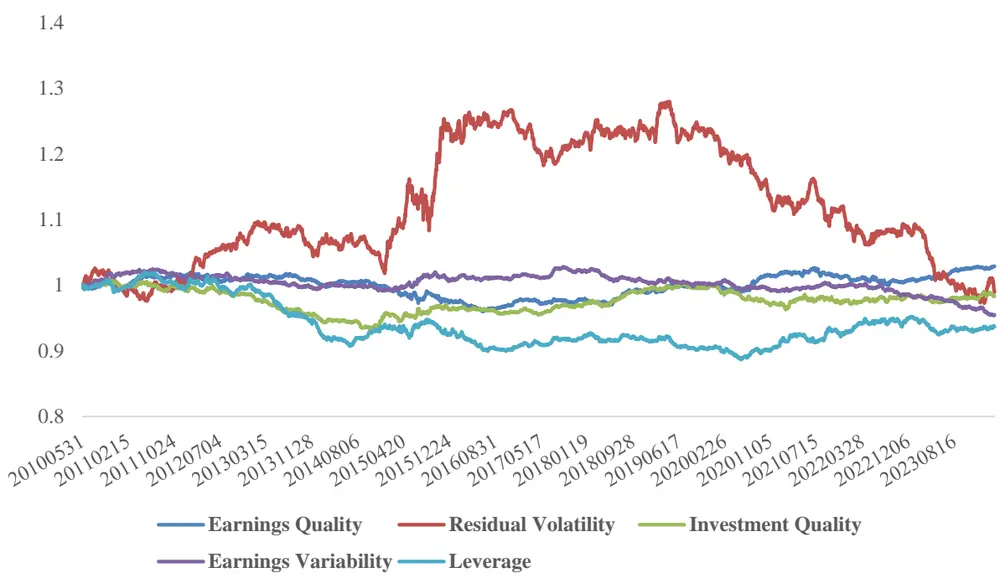
数据来源：Wind，朝阳永续，国泰君安证券研究

图7：风格因子纯因子组合净值（续）
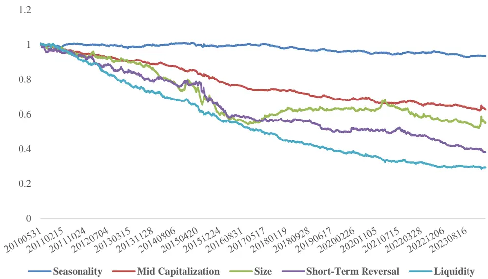
数据来源：Wind，朝阳永续，国泰君安证券研究

此外，我们也对 8个大类因子进行了回归模型检验，同样是使用国家因子、行业因子和大类因子作为自变量，求解回归模型的平均R2为 0.37。

图 8：大类因子回归滚动1年R2
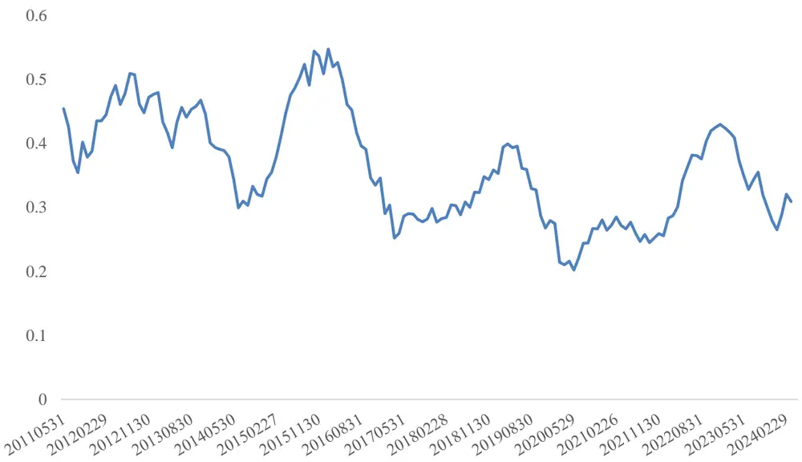
数据来源：Wind，朝阳永续，国泰君安证券研究

下面，分别展示 8个风格因子的回归系数显著性、纯因子组合绩效、稳定系数和VIF。

回归系数显著性：在测试期内， LIQUIDITY、MOMENTUM、SIZE、VOLATILITY 大类因子的|T|平均值较高，均超过 3，说明这些大类因子对股票收益的解释力度较强；QUALITY、YIELD 大类因子的|T|平均值较低，对股票收益的解释力度较弱。

纯因子组合绩效：在测试期内，LIQUIDITY、SIZE 大类因子具有明显负向收益，年化收益分别为-9.76%、-3.82%。

稳定系数：由于大类因子是根据 Long Term Model 的风格因子进行合成，因此稳定系数均较高。

VIF：在测试期内，所有大类因子的VIF均小于 5，即不存在共线性。

表 3: 大类因子回归显著性

| 风格因子 | \|T\|平均值 | \|T\|>2 占比 | 年化收益 | 年化波动 | 最大回撤 | 稳定系数 | VIF |
| --- | --- | --- | --- | --- | --- | --- | --- |
| GROWTH | 1.90 | 42.17% | 0.43% | 1.56% | 5.64% | 0.96 | 1.20 |
| LIQUIDITY | 3.52 | 63.86% | -9.76% | 3.82% | 75.88% | 0.91 | 1.92 |
| MOMENTUM | 3.58 | 66.27% | 1.74% | 3.81% | 12.12% | 0.84 | 1.44 |
| QUALITY | 1.41 | 24.70% | 0.67% | 1.23% | 5.26% | 0.95 | 1.17 |
| SIZE | 5.52 | 76.51% | -3.82% | 4.49% | 44.01% | 0.99 | 1.56 |
| VALUE | 2.77 | 52.41% | 2.48% | 2.56% | 4.83% | 0.97 | 1.81 |
| VOLATILITY | 3.10 | 55.42% | 2.49% | 4.19% | 12.72% | 0.98 | 2.18 |
| YIELD | 1.14 | 16.87% | 0.96% | 1.06% | 1.90% | 0.96 | 1.51 |

数据来源：Wind，朝阳永续，国泰君安证券研究；数据区间：2010年 6月至 2024年 3月。

同样，将大类因子的纯因子组合净值绘制如图。

图9：大类因子纯因子组合净值
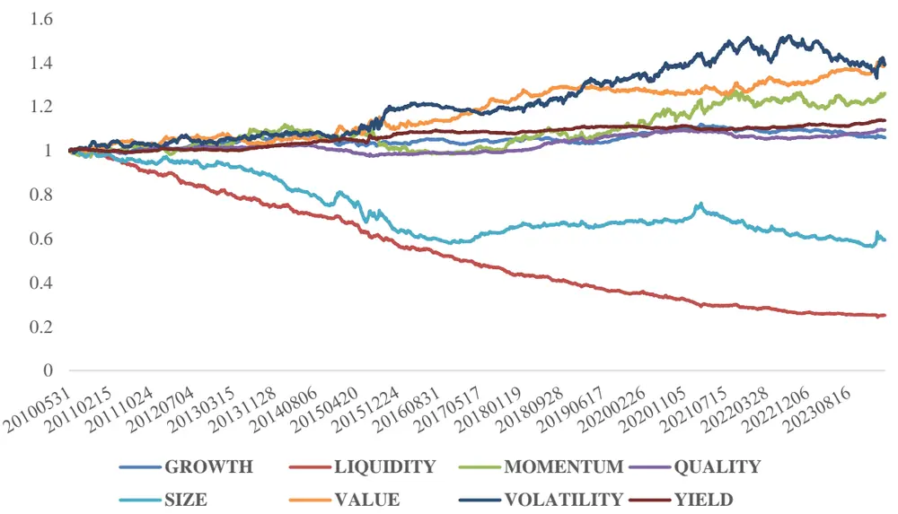
数据来源：Wind，朝阳永续，国泰君安证券研究

## 4.3. 单因子回测结果

上一节进行了回归模型显著性检验和纯因子组合展示。为了更加细致地分析每个因子的表现情况，这一节将对单因子分层回测结果进行分析，按照大类因子的分类顺序进行展示。其中分组回测按照因子值从大到小分为第1至第5组：

## 4.3.1. GROWTH 大类单因子回测

对GROWTH大类，包括风格因子Growth（大类因子GROWTH直接采用风格因子 Growth，故不再单独列出），描述变量 EGRLF、EGRO、SGRO进行单因子回测。从下表可以看到GROWTH大类的因子整体IC、IR均比较低，选股区分度较低。

表4：GROWTH大类单因子绩效统计

| 因子等级 | 因子名 | IC平均值 | IC标准差 | IC>0比例 | IR | 年化收益率 |
| --- | --- | --- | --- | --- | --- | --- |
| 风格因子 | Growth | -0.007 | 0.067 | 45.45% | -0.098 | 第1组：7.18%第 5 组：8.58 % |
| 描述变量 | EGRLF | -0.007 | 0.057 | 47.88% | -0.115 | 第1 组：8.14%第 5 组：8.46% |
| 描述变量 | EGRO | -0.004 | 0.044 | 42.42% | -0.093 | 第1 组：6.93%第 5 组：9.00% |
| 描述变量 | SGRO | 0.001 | 0.067 | 47.88% | 0.017 | 第1组：8.04%第 5 组：6.96% |

数据来源：Wind，朝阳永续，国泰君安证券研究；数据区间：2010年 6月至 2024年 3月。

图 10：风格因子 Growth分组超额
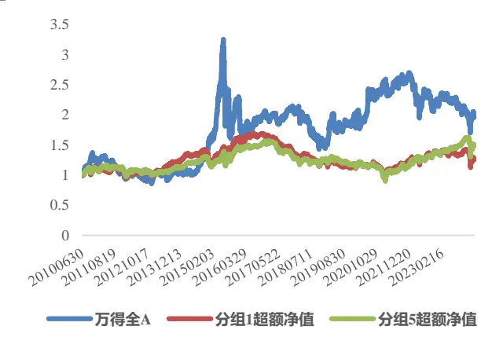
数据来源：Wind，朝阳永续，国泰君安证券研究

图 11：描述变量 EGRLF分组超额
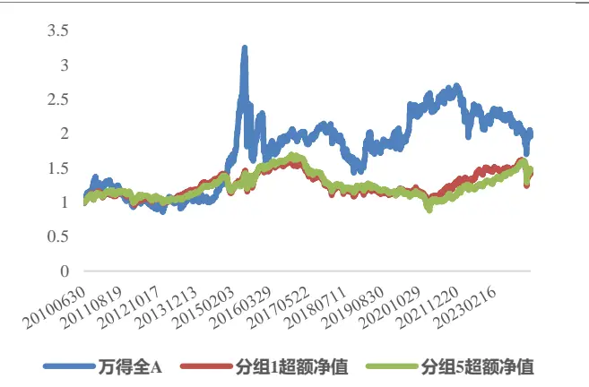
数据来源：Wind，朝阳永续，国泰君安证券研究

图 12：描述变量EGRO分组超额
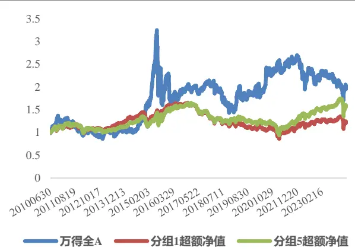
数据来源：Wind，朝阳永续，国泰君安证券研究

图 13：描述变量 SGRO分组超额
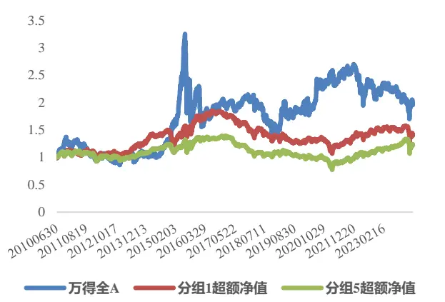
数据来源：Wind，朝阳永续，国泰君安证券研究

## 4.3.2. LIQUIDITY 大类单因子回测

对 LIQUIDITY 大类，包括风格因子 Liquidity（大类因子 LIQUIDITY 直接采用风格因子 Liquidity，故不再单独列出），描述变量 STOM、STOQ、STOA、ATVR进行单因子回测。从下表可以看到 LIQUIDITY大类的因子均具有较高的 IC、IR，选股区分度明显。

表 5：LIQUIDITY 大类单因子绩效统计

| 因子等级 | 因子名 | IC平均值 | IC标准差 | IC>0比例 | IR | 年化收益率 |
| --- | --- | --- | --- | --- | --- | --- |
| 风格因子 | Liquidity | -0.089 | 0.116 | 23.03% | -0.766 | 第 1 组：-4.82%第 5 组：15.91% |
| 描述变量 | STOM | -0.100 | 0.114 | 20.00% | -0.880 | 第1组：-7.23%第 5 组：15.84% |
| 描述变量 | STOQ | -0.089 | 0.114 | 23.64% | -0.777 | 第 1 组：-5.17%第 5 组：15.04% |
| 描述变量 | STOA | -0.069 | 0.109 | 27.27% | -0.636 | 第 1组：-1.59 %第 5 组：15.23% |
| 描述变量 | ATVR | -0.082 | 0.106 | 23.64% | -0.769 | 第1组：-3.55%第 5 组：15.91% |

数据来源：Wind，朝阳永续，国泰君安证券研究；数据区间：2010年 6月至 2024年 3月。

图 14：风格因子 Liquidity 分组超额
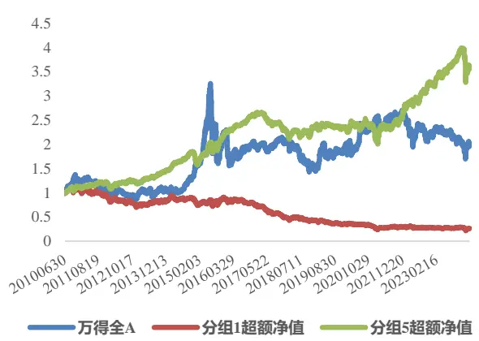
数据来源：Wind，朝阳永续，国泰君安证券研究

图 15：描述变量 STOM分组超额
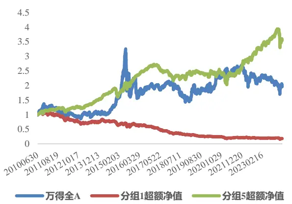
数据来源：Wind，朝阳永续，国泰君安证券研究

图 16：描述变量 STOQ 分组超额
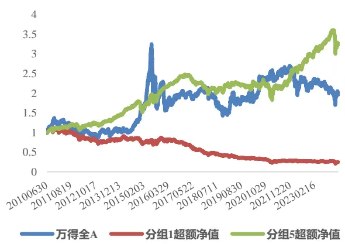
数据来源：Wind，朝阳永续，国泰君安证券研究

图 17：描述变量 STOA分组超额
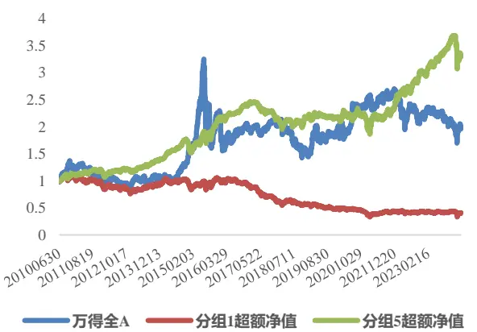
数据来源：Wind，朝阳永续，国泰君安证券研究

图 18：描述变量 ATVR分组超额
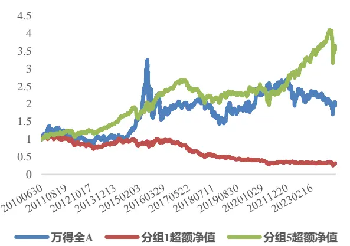
数据来源：Wind，朝阳永续，国泰君安证券研究

## 4.3.3. MOMENTUM 大类单因子回测

对 MOMENTUM 大类，包括风格因子 Short-Term Reversal、Seasonality、Industry Momentum、Momentum（大类因子 MOMENTUM 直接采用风格因子 Momentum，故不再单独列出），描述变量 RSTR、HALPHA 进行单因子回测。从下表可以看到 MOMENTUM 大类的因子中，风格因子 Short-Term Reversal 和 Industry Momentum 具有较高的 IC、IR，选股区分度明显。

表6：MOMENTUM大类单因子绩效统计

| 因子等级 | 因子名 | IC平均值 | IC标准差 | IC>0比例 | IR | 年化收益率 |
| --- | --- | --- | --- | --- | --- | --- |
| 风格因子 | Short-TermReversal | -0.061 | 0.104 | 29.09% | -0.582 | 第 1组：-4.18%第5 组：11.86% |
| 风格因子 | Seasonality | -0.004 | 0.048 | 47.88% | -0.077 | 第 1组：7.92%第5 组：9.31% |
| 风格因子 | IndustryMomentum | 0.054 | 0.107 | 66.06% | 0.507 | 第1组：12.30%第 5 组：-1.67% |
| 风格因子 | Momentum | -0.026 | 0.107 | 46.06% | -0.242 | 第 1组：3.85%第 5 组：6.79% |
| 描述变量 | RSTR | -0.022 | 0.108 | 46.67% | -0.208 | 第1组：3.24%第 5 组：5.94% |
| 描述变量 | HALPHA | -0.024 | 0.099 | 43.64% | -0.241 | 第 1 组：5.05%第 5 组：7.41% |

数据来源：Wind，朝阳永续，国泰君安证券研究；数据区间：2010年 6月至 2024年 3月。

图 19：风格因子 Short-Term Reversal 分组超额
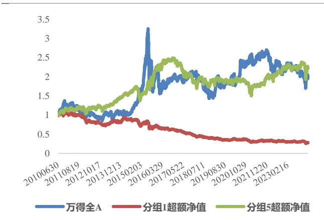
数据来源：Wind，朝阳永续，国泰君安证券研究

图 20：风格因子 Seasonality 分组超额
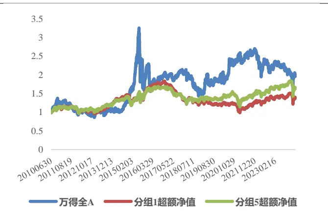
数据来源：Wind，朝阳永续，国泰君安证券研究

图 21：风格因子 Industry Momentum 分组超额
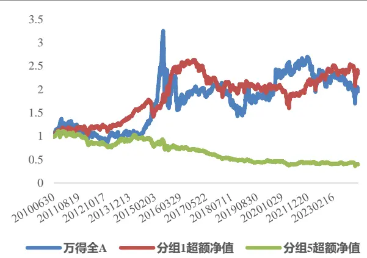
数据来源：Wind，朝阳永续，国泰君安证券研究

图 22：风格因子 Momentum 分组超额
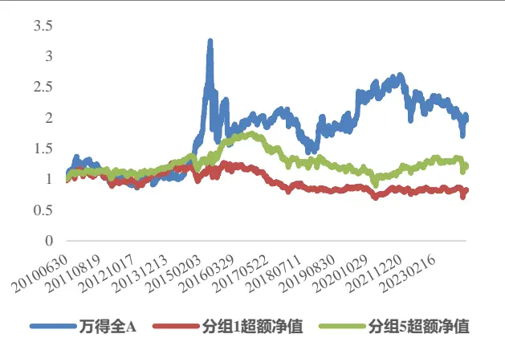
数据来源：Wind，朝阳永续，国泰君安证券研究

图 23：描述变量RSTR分组超额
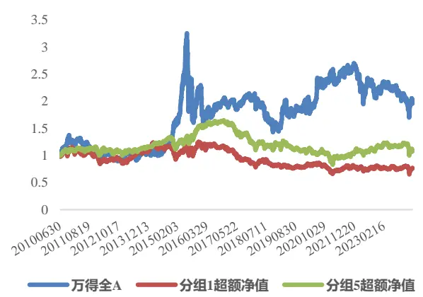
数据来源：Wind，朝阳永续，国泰君安证券研究

图 24：描述变量 HALPHA分组超额
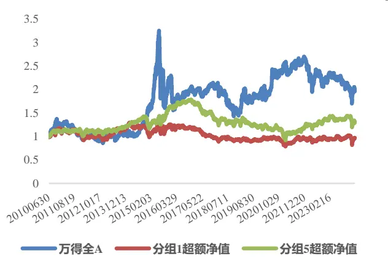
数据来源：Wind，朝阳永续，国泰君安证券研究

## 4.3.4. QUALITY 大类单因子回测

对 QUALITY 大类，包括大类因子 QUALITY、风格因子 Leverage、Earnings Variability、Earnings Quality、Profitability、Investment Quality，以及合成各风格因子的描述变量进行单因子回测。从下表可以看到QUALITY大类的因子 IC、IR均比较低，选股区分度一般。

表 7：QUALITY 大类绩效统计

| 因子等级 | 因子名 | IC平均值 | IC标准差 | IC>0比例 | IR | 年化收益率 |
| --- | --- | --- | --- | --- | --- | --- |
| 大类因子 | QUALITY | 0.014 | 0.044 | 63.03% | 0.322 | 第1组：9.12%第 5 组：6.40% |
| 风格因子 | Leverage | 0.004 | 0.083 | 50.91% | 0.047 | 第 1 组：8.54%第 5 组：6.17% |
| 描述变量 | MLEV | 0.013 | 0.082 | 52.73% | 0.157 | 第 1 组：9.26%第 5 组：5.85% |
| 描述变量 | BLEV | 0.001 | 0.060 | 47.88% | 0.020 | 第 1 组：7.91%第 5 组：6.09% |
| 描述变量 | DTOA | -0.003 | 0.073 | 47.88% | -0.042 | 第 1 组：8.66%第 5 组：7.90% |
| 风格因子 | EarningsVariability | 0.001 | 0.038 | 46.67% | 0.018 | 第1组：7.77%第 5 组：7.41% |
| 描述变量 | VSAL | -0.008 | 0.058 | 46.67% | -0.132 | 第 1组：6.85%第 5 组：7.95% |
| 描述变量 | VERN | 0.003 | 0.030 | 52.73% | 0.113 | 第1组：8.27%第5 组：7.63% |
| 描述变量 | VFLO | 0.001 | 0.023 | 51.52% | 0.045 | 第 1组：8.77%第 5 组：8.80% |
| 描述变量 | ETOPF_STD | 0.006 | 0.047 | 50.30% | 0.137 | 第1 组：9.26%第5 组：6.67% |
| 风格因子 | EarningsQuality | 0.007 | 0.054 | 54.55% | 0.124 | 第1组：9.41%第 5 组：7.00% |
| 描述变量 | ABS | 0.007 | 0.050 | 53.33% | 0.135 | 第 1 组：9.52%第5 组：7.26% |
| 描述变量 | ACF | 0.006 | 0.053 | 54.55% | 0.120 | 第 1 组：9.44%第 5 组：6.81% |
| 风格因子 | Profitability | 0.020 | 0.080 | 57.58% | 0.244 | 第1组：9.63%第 5 组：5.77% |
| 描述变量 | ATO | 0.010 | 0.042 | 58.79% | 0.250 | 第1组：9.13%第 5 组：6.46% |
| 描述变量 | GP | 0.017 | 0.083 | 57.58% | 0.202 | 第1组：8.75%第 5 组：6.15% |
| 描述变量 | GPM | 0.014 | 0.075 | 56.97% | 0.192 | 第1组：8.55%第 5 组：6.63% |
| 描述变量 | ROA | 0.021 | 0.085 | 55.15% | 0.249 | 第1组：9.83%第 5 组：5.18% |
| 风格因子 | InvestmentQuality | 0.002 | 0.073 | 53.94% | 0.029 | 第1组：8.10%第 5 组：7.44% |
| 描述变量 | AGRO | 0.003 | 0.086 | 54.55% | 0.039 | 第1组：8.28%第 5 组：7.84% |
| 描述变量 | IGRO | -0.010 | 0.074 | 47.27% | -0.132 | 第 1组：6.03%第 5 组：6.17% |
| 描述变量 | CXGRO | -0.000 | 0.050 | 55.15% | -0.001 | 第1组：8.11%第 5 组：8.44% |

数据来源：Wind，朝阳永续，国泰君安证券研究；数据区间：2010年 6月至 2024年 3月。

图 25：大类因子 QUALITY 分组超额
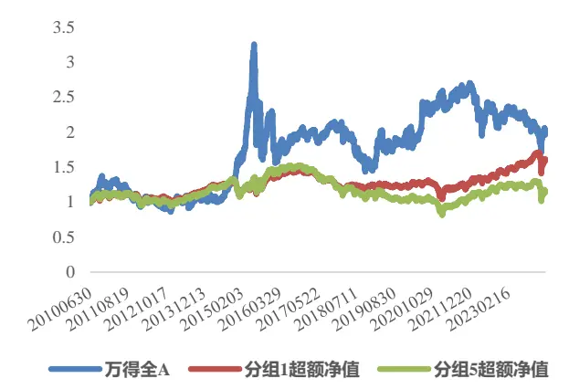
数据来源：Wind，朝阳永续，国泰君安证券研究

图 26：风格因子 Leverage分组超额
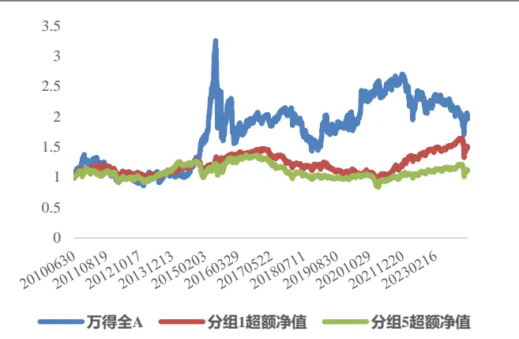
数据来源：Wind，朝阳永续，国泰君安证券研究

图 27：描述变量MLEV分组超额
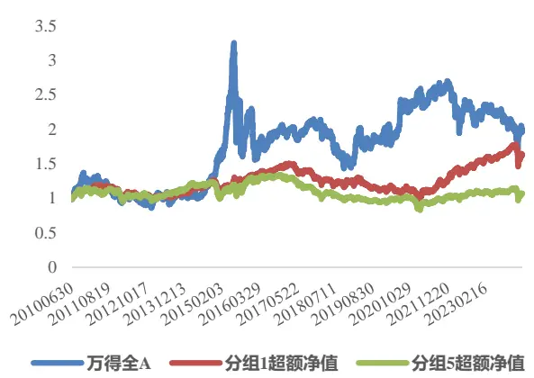
数据来源：Wind，朝阳永续，国泰君安证券研究

图 28：描述变量 BLEV分组超额
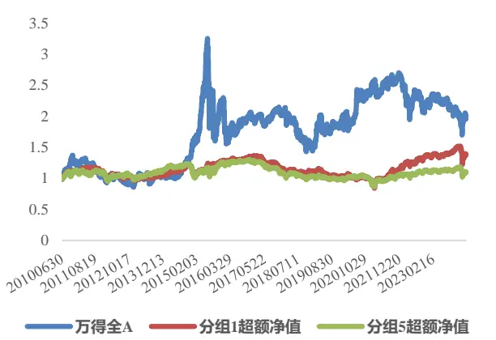
数据来源：Wind，朝阳永续，国泰君安证券研究

图 29：描述变量DTOA分组超额
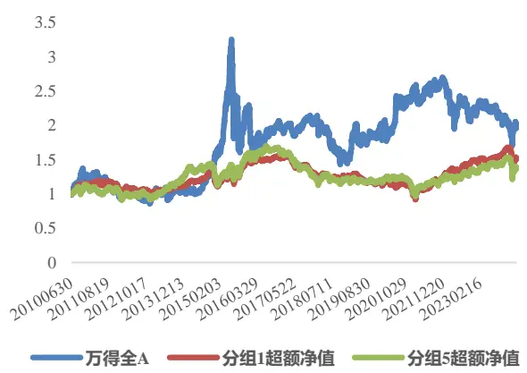
数据来源：Wind，朝阳永续，国泰君安证券研究

图 30：风格因子 Earnings Variability 分组超额
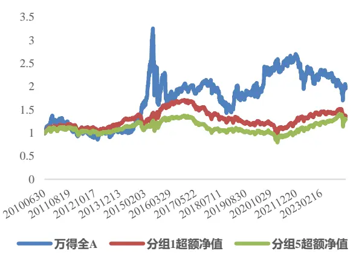
数据来源：Wind，朝阳永续，国泰君安证券研究

图 31：描述变量 VSAL分组超额
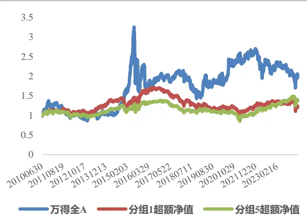
数据来源：Wind，朝阳永续，国泰君安证券研究

图 32：描述变量 VERN分组超额
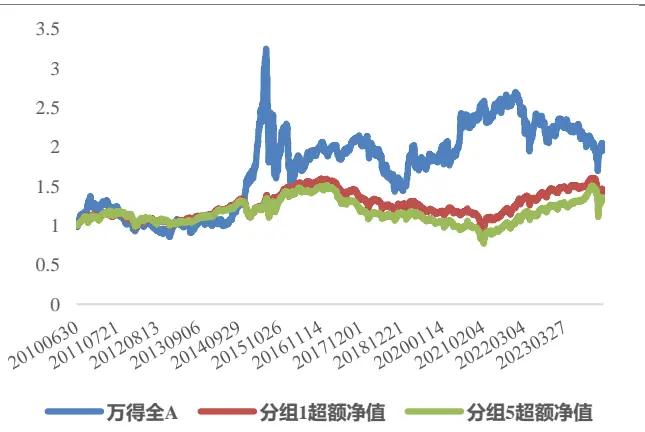
数据来源：Wind，朝阳永续，国泰君安证券研究

图 33：描述变量 VFLO分组超额
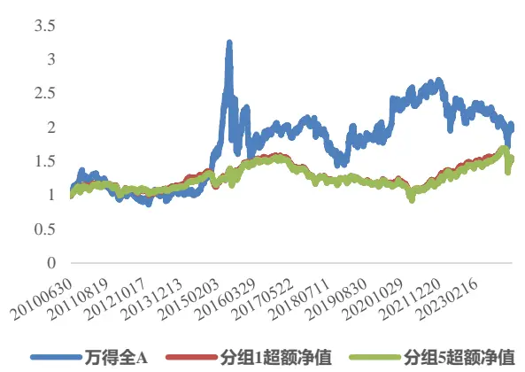
数据来源：Wind，朝阳永续，国泰君安证券研究

图 34：描述变量 ETOPF_STD 分组超额
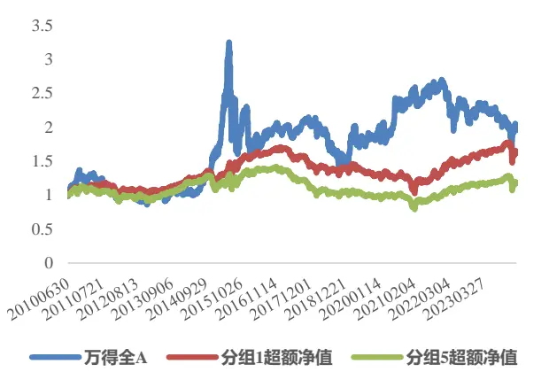
数据来源：Wind，朝阳永续，国泰君安证券研究

图 35：风格因子 Earnings Quality 分组超额
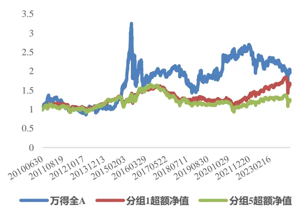
数据来源：Wind，朝阳永续，国泰君安证券研究

图 36：描述变量 ABS分组超额
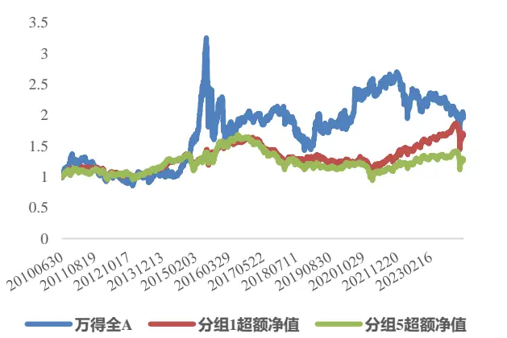
数据来源：Wind，朝阳永续，国泰君安证券研究

图 37：描述变量ACF分组超额
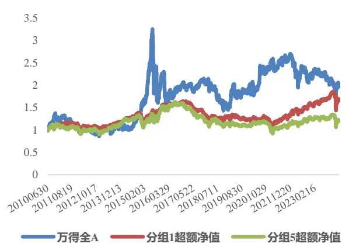
数据来源：Wind，朝阳永续，国泰君安证券研究

图 38：风格因子 Profitability 分组超额
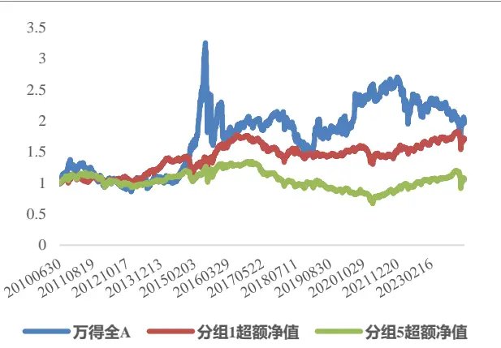
数据来源：Wind，朝阳永续，国泰君安证券研究

图 39：描述变量ATO分组超额
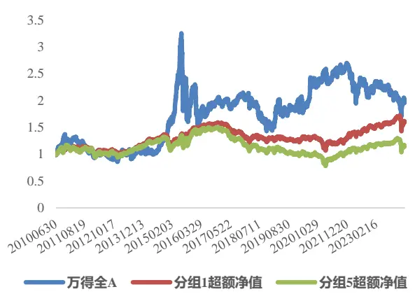
数据来源：Wind，朝阳永续，国泰君安证券研究

图 40：描述变量 GP分组超额
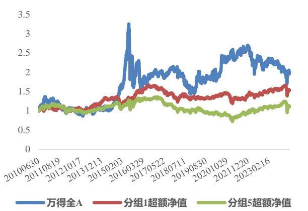
数据来源：Wind，朝阳永续，国泰君安证券研究

图 41：描述变量 GPM分组超额
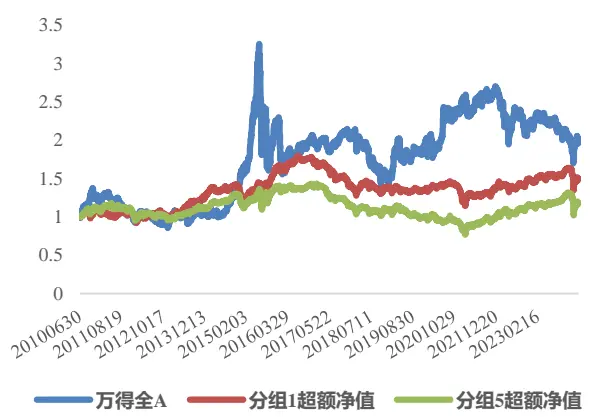
数据来源：Wind，朝阳永续，国泰君安证券研究

图 42：描述变量 ROA分组超额
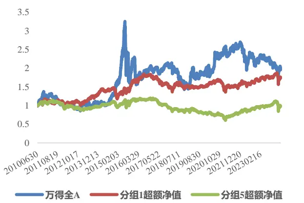
数据来源：Wind，朝阳永续，国泰君安证券研究

图 43：风格因子 Investment Quality 分组超额
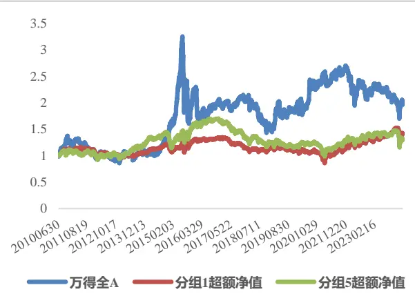
数据来源：Wind，朝阳永续，国泰君安证券研究

图 44：描述变量 AGRO 分组超额
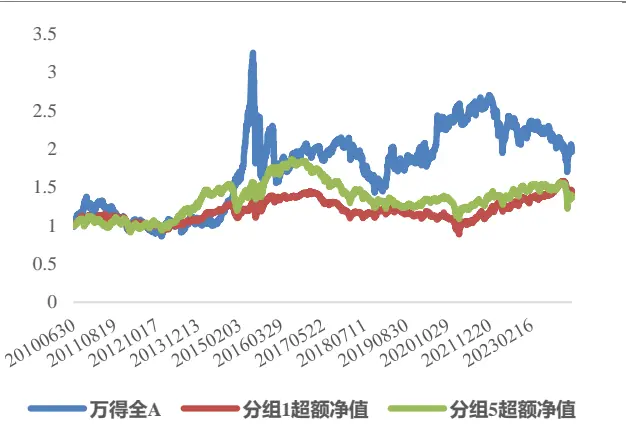
数据来源：Wind，朝阳永续，国泰君安证券研究

图 45：描述变量IGRO分组超额
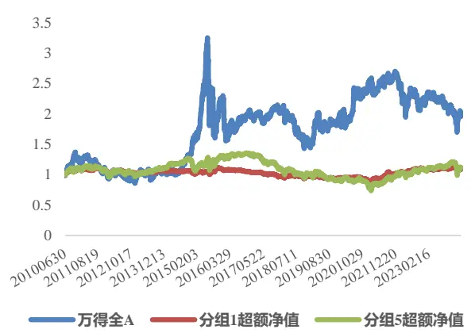
数据来源：Wind，朝阳永续，国泰君安证券研究

图 46：描述变量 CXGRO分组超额
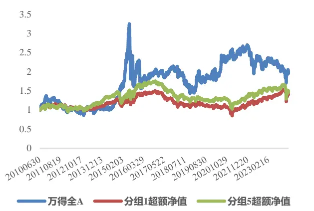
数据来源：Wind，朝阳永续，国泰君安证券研究

## 4.3.5. SIZE 大类单因子回测

对 SIZE 大类，包括大类因子 SIZE，风格因子 Size、Mid Capitalization进行单因子回测。从下表可以看到SIZE大类的因子整体IC、IR均比较高，选股区分度较为明显。

表8：SIZE大类绩效统计

| 因子等级 | 因子名 | IC平均值 | IC标准差 | IC>0比例 | IR | 年化收益率 |
| --- | --- | --- | --- | --- | --- | --- |
| 大类因子 | SIZE | 0.039 | 0.066 | 73.33% | 0.594 | 第 1 组：17.77%第 5 组：4.41% |
| 风格因子 | Size | -0.020 | 0.147 | 40.00% | -0.136 | 第 1 组：7.55%第 5 组：15.09% |
| 风格因子 | MidCapitalization | -0.039 | 0.066 | 26.06% | -0.589 | 第 1 组：4.45%第 5 组：17.82% |

数据来源：Wind，朝阳永续，国泰君安证券研究；数据区间：2010年 6月至 2024年 3月。

图 47：大类因子SIZE分组超额
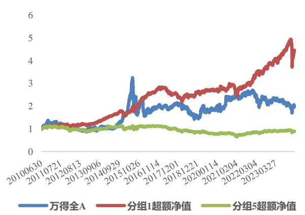
数据来源：Wind，朝阳永续，国泰君安证券研究

图 48：风格因子 Size分组超额
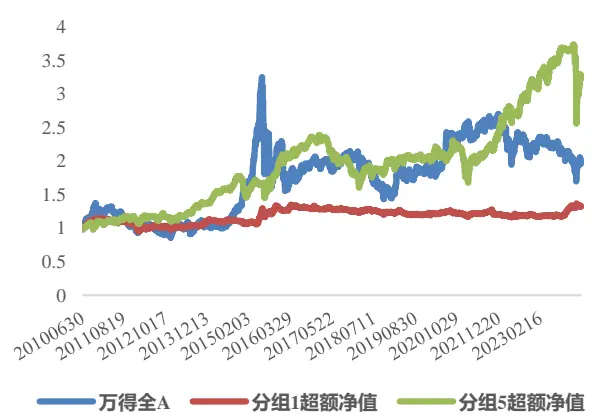
数据来源：Wind，朝阳永续，国泰君安证券研究

图 49：风格因子 Mid Capitalization 分组超额
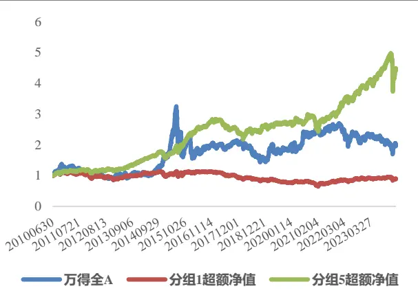
数据来源：Wind，朝阳永续，国泰君安证券研究

## 4.3.6. VALUE 大类单因子回测

对 VALUE 大类，包括大类因子 VALUE、风格因子 Book-to-Price、Earnings Yield、Long-Term Reversal，以及合成风格因子所用的描述变量进行单因子回测。从下表可以看到 VALUE 大类的因子除风格因子Long-Term Reversal 及其描述变量外，其他因子 IC、IR 都比较高，选股区分度较为明显。

表9：VALUE大类绩效统计

| 因子等级 | 因子名 | IC平均值 | IC标准差 | IC>0比例 | IR | 年化收益率 |
| --- | --- | --- | --- | --- | --- | --- |
| 大类因子 | VALUE | 0.054 | 0.090 | 71.52% | 0.589 | 第1 组：14.34%第 5 组：1.16% |
| 风格因子 | Book-to-Price | 0.049 | 0.105 | 64.24% | 0.462 | 第1组：13.35%第5 组：2.43% |
| 风格因子 | EarningsYield | 0.042 | 0.067 | 71.52% | 0.634 | 第1组：13.20%第 5 组：2.64% |
| 描述变量 | ETOP | 0.048 | 0.073 | 76.97% | 0.661 | 第1组：13.85%第 5 组：3.07% |
| 描述变量 | ETOPF | 0.034 | 0.068 | 66.67% | 0.506 | 第1组：12.11%第 5 组：3.90% |
| 描述变量 | CETOP | 0.036 | 0.060 | 72.73% | 0.605 | 第1组：12.84%第 5 组：4.63% |
| 描述变量 | EM | 0.009 | 0.036 | 56.97% | 0.258 | 第1 组：8.41%第 5 组：7.46% |
| 风格因子 | Long-TermReversal | 0.019 | 0.079 | 55.76% | 0.237 | 第1组：10.42%第 5 组：4.56% |
| 描述变量 | LTRSTR | 0.011 | 0.078 | 56.36% | 0.135 | 第1 组：10.48%第 5 组：6.64% |
| 描述变量 | LTHALPHA | 0.006 | 0.064 | 55.15% | 0.096 | 第1组：9.17%第 5 组：4.43% |

数据来源：Wind，朝阳永续，国泰君安证券研究；数据区间：2010年 6月至 2024年 3月。

图 50：大类因子 VALUE分组超额
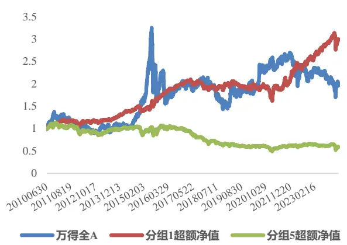
数据来源：Wind，朝阳永续，国泰君安证券研究

图 51：风格因子 Book-to-Price 分组超额
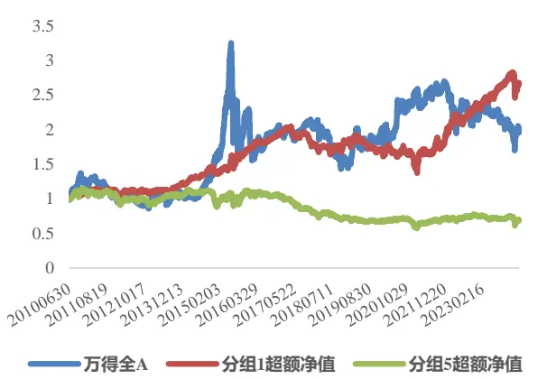
数据来源：Wind，朝阳永续，国泰君安证券研究

图 52：风格因子 Earnings Yield 分组超额
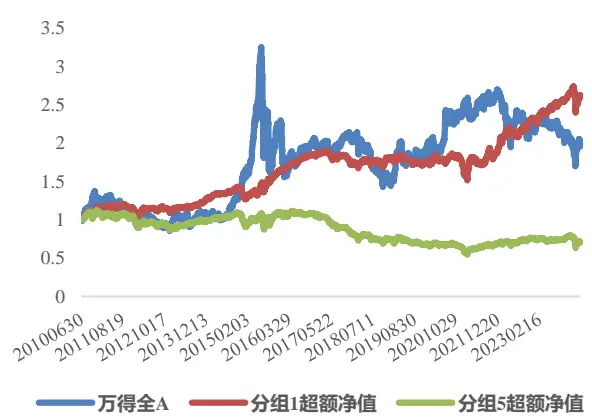
数据来源：Wind，朝阳永续，国泰君安证券研究

图 53：描述变量 ETOP分组超额
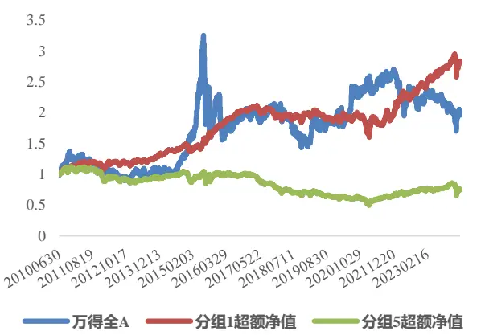
数据来源：Wind，朝阳永续，国泰君安证券研究

图 54：描述变量ETOPF分组超额
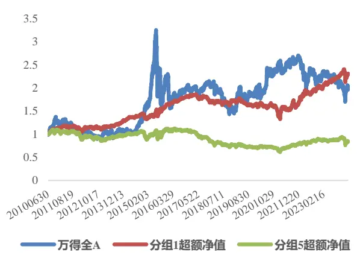
数据来源：Wind，朝阳永续，国泰君安证券研究

图 55：描述变量 CETOP分组超额
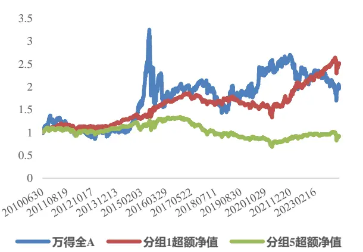
数据来源：Wind，朝阳永续，国泰君安证券研究

图 56：描述变量EM分组超额
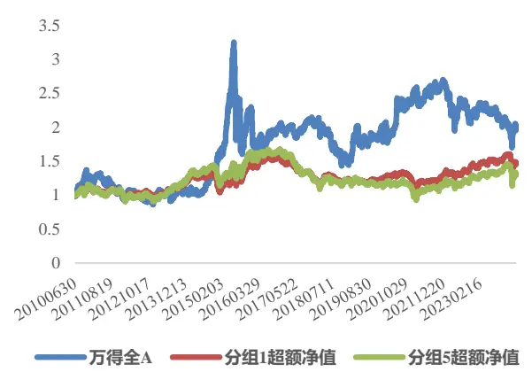
数据来源：Wind，朝阳永续，国泰君安证券研究

图 57：风格因子 Long-Term Reversal 分组超额
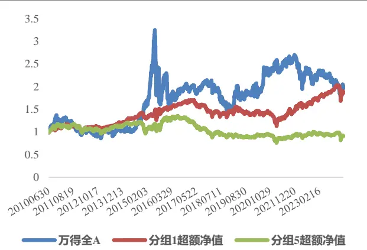
数据来源：Wind，朝阳永续，国泰君安证券研究

图 58：描述变量LTRSTR分组超额
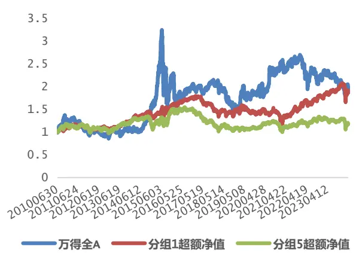
数据来源：Wind，朝阳永续，国泰君安证券研究

图 59：描述变量 LTHALPHA分组超额
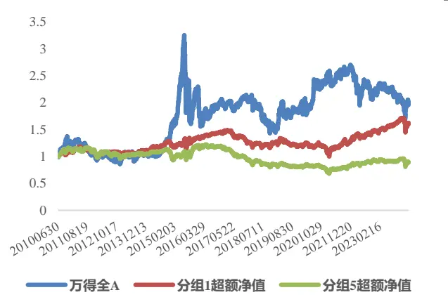
数据来源：Wind，朝阳永续，国泰君安证券研究

## 4.3.7. VOLATILITY 大类单因子回测

对 VOLATILITY 大类，包括大类因子 VOLATILITY，风格因子 Beta、Residual Volatility，描述变量 HSIMA、DASTD、CMRA 进行单因子回测。从下表可以看到 VOLATILITY 大类的因子除风格因子 Beta 外，其他因子IC、IR都比较高，选股区分度较为明显。

表 10：VOLATILITY 大类绩效统计

| 因子等级 | 因子名 | IC平均值 | IC标准差 | IC>0比例 | IR | 年化收益率 |
| --- | --- | --- | --- | --- | --- | --- |
| 大类因子 | VOLATILITY | -0.056 | 0.130 | 30.30% | -0.432 | 第1组：0.62%第 5 组：11.43% |
| 风格因子 | Beta | -0.012 | 0.092 | 40.61% | -0.134 | 第1组：6.32%第5 组：8.12% |
| 风格因子 | ResidualVolatility | -0.073 | 0.127 | 26.67% | -0.575 | 第 1组：-1.41%第 5 组：14.46% |
| 描述变量 | HSIGMA | -0.057 | 0.109 | 30.30% | -0.520 | 第 1组：1.14%第 5 组：14.17% |
| 描述变量 | DASTD | -0.084 | 0.135 | 25.45% | -0.619 | 第 1组：-3.22%第 5 组：13.93% |
| 描述变量 | CMRA | -0.041 | 0.109 | 33.33% | -0.376 | 第 1 组：2.80%第 5 组：10.85% |

数据来源：Wind，朝阳永续，国泰君安证券研究；数据区间：2010年 6月至 2024年 3月。

图 60：大类因子 VOLATILITY 分组超额
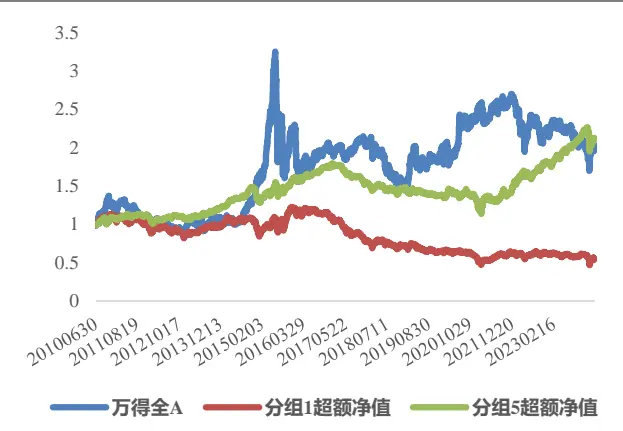
数据来源：Wind，朝阳永续，国泰君安证券研究

图 61：风格因子 Beta分组超额
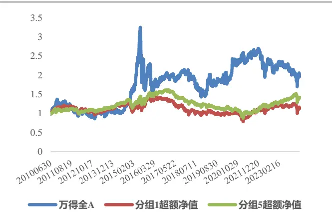
数据来源：Wind，朝阳永续，国泰君安证券研究

图 62：风格因子 Residual Volatility 分组超额
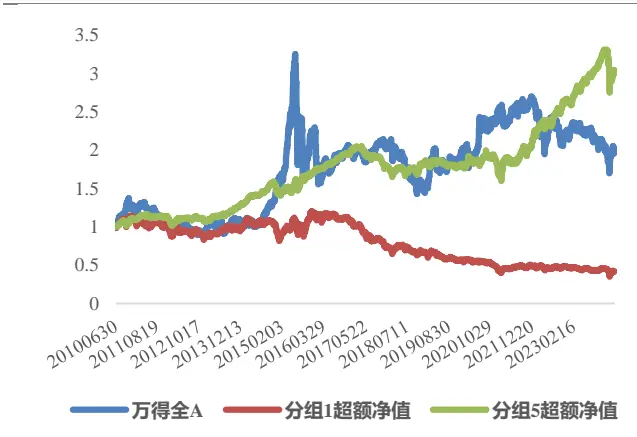
数据来源：Wind，朝阳永续，国泰君安证券研究

图 63：风格因子 HSIGMA分组超额
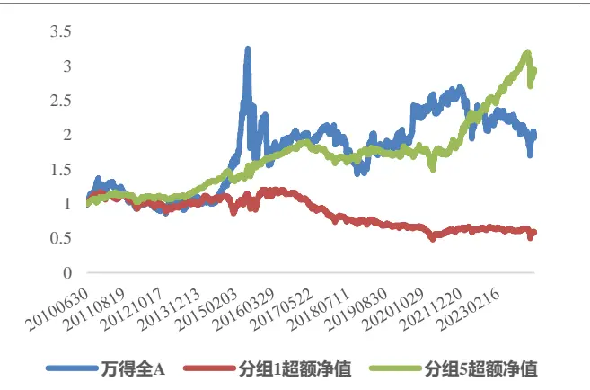
数据来源：Wind，朝阳永续，国泰君安证券研究

图 64：风格因子DASTD分组超额
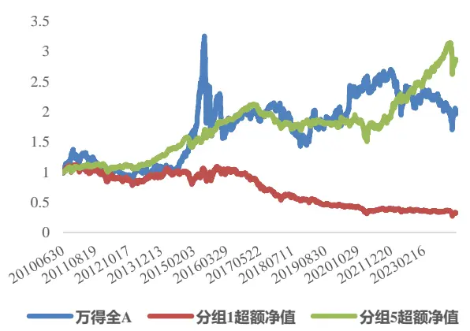
数据来源：Wind，朝阳永续，国泰君安证券研究

图 65：风格因子 CMRA分组超额
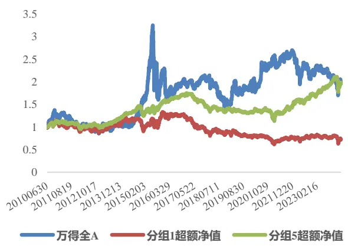
数据来源：Wind，朝阳永续，国泰君安证券研究

## 4.3.8. YIELD 大类单因子回测

对 YIELD大类，包括风格因子 Dividend Yield（大类因子 YIELD直接采用风格因子 Dividend Yield，故不再单独列出），描述变量 DTOP、DTOPF进行单因子回测。从下表可以看到YIELD大类的因子IC、IR都比较高，选股区分度较为明显。

表 11：YIELD大类绩效统计

| 因子等级 | 因子名 | IC平均值 | IC标准差 | IC>0比例 | IR | 年化收益率 |
| --- | --- | --- | --- | --- | --- | --- |
| 风格因子 | DividendYield | 0.045 | 0.049 | 83.03% | 0.923 | 第1组：13.59%第 5 组：1.88% |
| 描述变量 | DTOP | 0.043 | 0.051 | 81.82% | 0.835 | 第1组：13.65%第 5 组：1.86% |
| 描述变量 | DTOPF | 0.033 | 0.043 | 73.94% | 0.775 | 第1组：12.73%第 5 组：4.35% |

数据来源：Wind，朝阳永续，国泰君安证券研究；数据区间：2010年 6月至 2024年 3月。

图 66：风格因子 Dividend Yield 分组超额
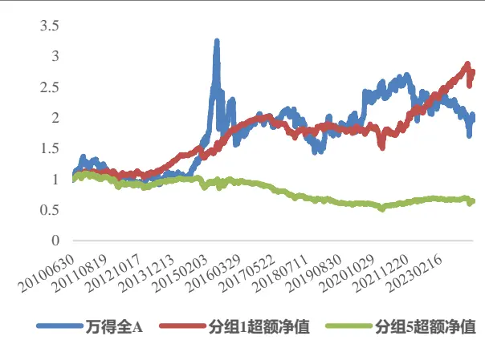
数据来源：Wind，朝阳永续，国泰君安证券研究

图 67：描述变量 DTOP 分组超额
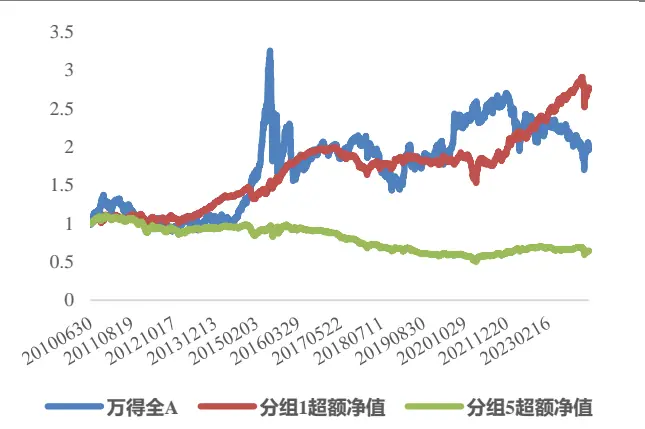
数据来源：Wind，朝阳永续，国泰君安证券研究

图 68：描述变量 DTOPF 分组超额
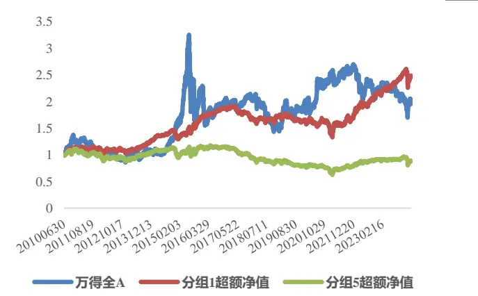
数据来源：Wind，朝阳永续，国泰君安证券研究

## 4.3.9. Analyst Sentiment 单因子回测

Analyst Sentiment 风格因子属于 Trading Model，在 Long Term Model 所构建的大类因子体系中无涉及。下面单独对Analyst Sentiment风格因子以及合成风格因子所用的描述变量进行单因子回测。整体而言 AnalystSentiment风格因子及描述变量的 IC、IR较低，选股区分度一般。

表 12：Analyst Sentiment 风格因子及描述变量绩效统计

| 因子等级 | 因子名 | IC平均值 | IC标准差 | IC>0比例 | IR | 年化收益率 |
| --- | --- | --- | --- | --- | --- | --- |
| 风格因子 | AnalystSentiment | 0.014 | 0.030 | 66.67% | 0.465 | 第1组：10.63%第 5 组：5.48% |
| 描述变量 | RR | 0.011 | 0.033 | 63.03% | 0.330 | 第1组：11.20%第 5 组：6.02% |
| 描述变量 | ETOPF_C | 0.007 | 0.038 | 56.36% | 0.189 | 第 1 组：9.19%第 5 组：6.51% |
| 描述变量 | EPSF_C | 0.014 | 0.041 | 67.88% | 0.340 | 第1 组：10.90%第 5 组：5.65% |

数据来源：Wind，朝阳永续，国泰君安证券研究；数据区间：2010年 6月至 2024年 3月。

图 69：风格因子 Analyst Sentiment 分组超额
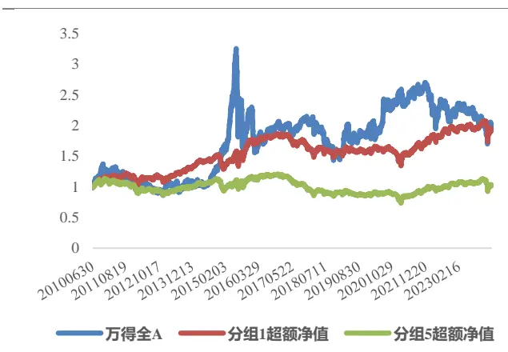
数据来源：Wind，朝阳永续，国泰君安证券研究

图 70：描述变量 RR分组超额
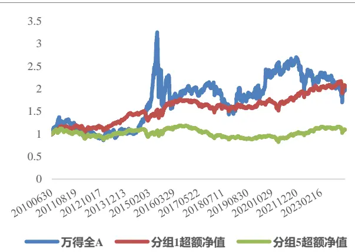
数据来源：Wind，朝阳永续，国泰君安证券研究

图 71：描述变量 ETOPF_C 分组超额
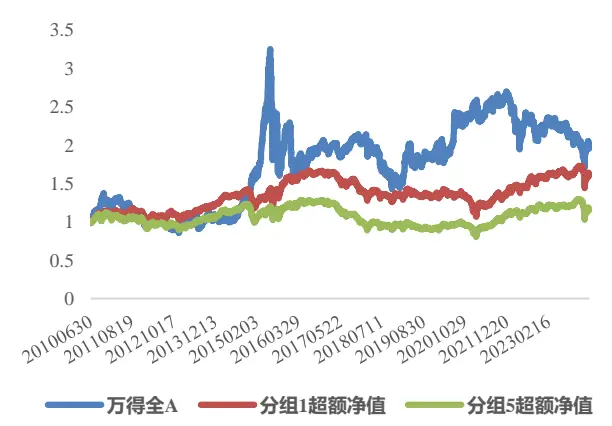
数据来源：Wind，朝阳永续，国泰君安证券研究

图 72：描述变量 EPSF_C 分组超额
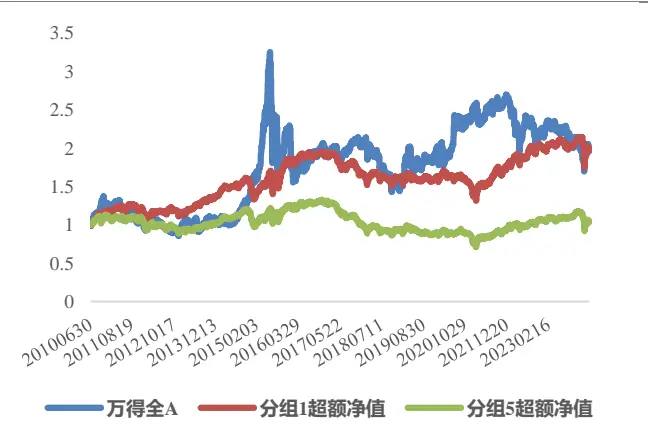
数据来源：Wind，朝阳永续，国泰君安证券研究

## 5. 模型应用：组合风格暴露分析与收益归因

上文构建了A股市场的多因子模型，并对模型效果进行了检验。本章将介绍如何使用多因子模型帮助投资者了解投资组合在各个因子上的暴露情况以及收益来源。

在上文中，首先根据因子定义，由财务数据、交易数据等可以计算得到每只股票在各个因子上的暴露，从而，直接根据投资组合的股票权重，进行加总就能得到投资组合在各因子上的暴露情况，帮助投资者了解组合的风格暴露情况。通过将组合的风格暴露作为组合优化的约束条件或者优化目标，投资者就可以其进行主动风险管理，追逐特定风格的收益或者规避特定风格的风险。

$$
R_{P}=\sum_{n=1}^{N}R_{n}=\sum_{k=1}^{K}X_{Pk}f_{k}+\sum_{n=1}^{N}w_{n}\varepsilon_{n},
$$

下面，我们计算一些常见指数在 2024 年 3 月底的风格因子暴露情况，以在全股票池中因子暴露百分位的形式进行展示，从而便于直观体现各指数在风格暴露上的特点。将中证全指的风格暴露作为基准，其他指数展示相对中证全指的风格暴露。其中，上证 50 的大盘风格非常明显，可以看到在 Size、Profitability、Earnings Yield、Dividend Yield 等风格因子上的相对正向暴露较大，在 Liquidity、Growth 等风格因子上的相对负向暴露较大。

图 73：中证全指风格因子暴露
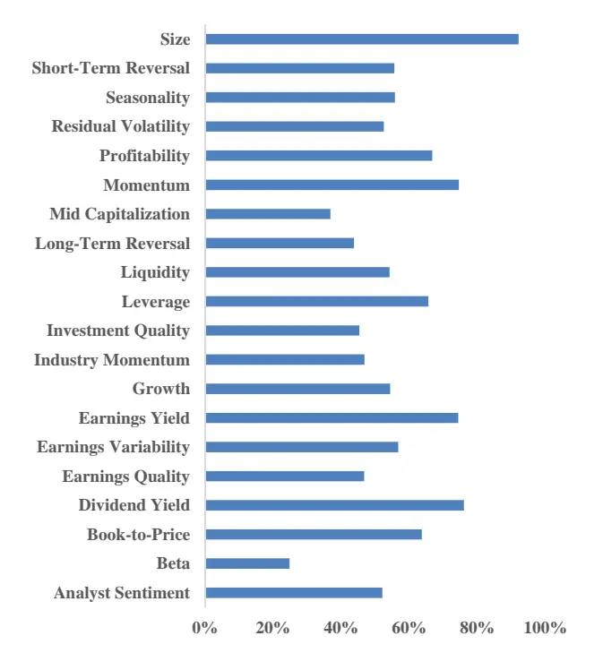
数据来源：Wind，朝阳永续，国泰君安证券研究

图 74：上证 50风格因子相对暴露
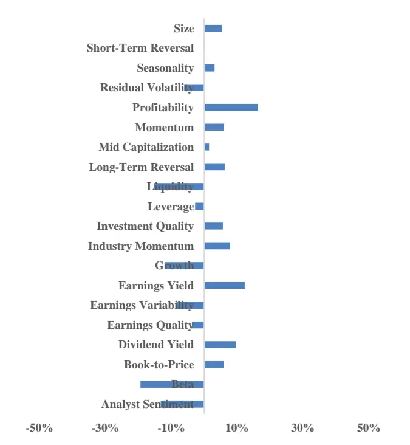
数据来源：Wind，朝阳永续，国泰君安证券研究

沪深 300 属于大盘指数，在 Profitability、Earnings Yield 等风格因子上的相对正向暴露也较大，与上证 50 比较接近。相比而言，中证 500 在相应因子上的暴露相较前两者明显下降，说明中盘股相较大盘股在盈利和资产收益能力方面有明显差距。

图 75：沪深300风格因子相对暴露
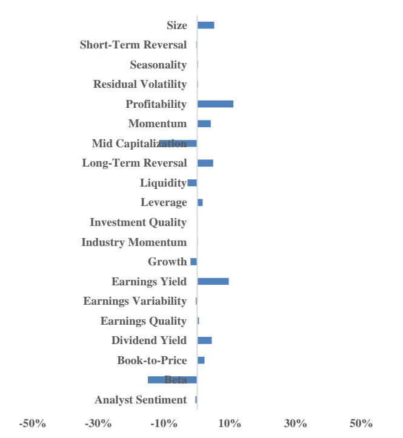
数据来源：Wind，朝阳永续，国泰君安证券研究

图 76：中证 500风格因子相对暴露
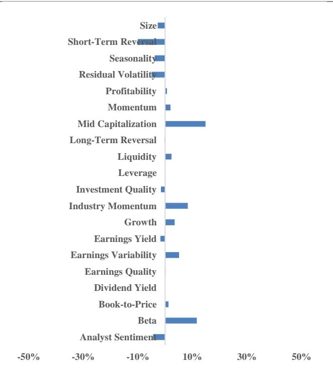
数据来源：Wind，朝阳永续，国泰君安证券研究

中证 1000 属于一般划分中的小盘股指数，不过其在全市场其实处于市值中位，因此其中市值风格明显，在 Mid Capitalization风格因子上的相对正向暴露较大。此外，市值更小的中证 2000 指数在 Size 风格因子上的相对负向暴露明显增大。

图 77：中证 1000 风格因子相对暴露
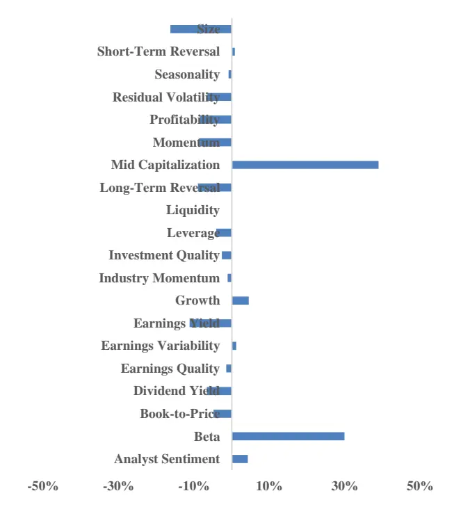
数据来源：Wind，朝阳永续，国泰君安证券研究

图 78：中证 2000风格因子相对暴露
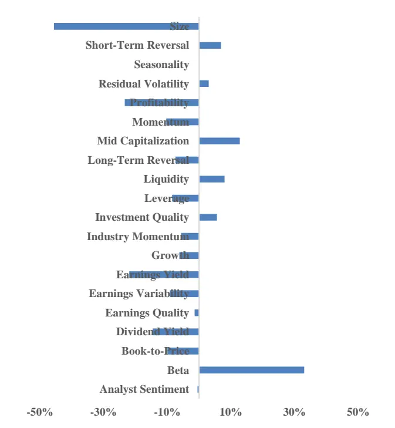
数据来源：Wind，朝阳永续，国泰君安证券研究

相较于主板指数，科创 50 和创业板指的成长属性明显更强，在 Growth、Analyst Sentiment 风格因子上的相对正向暴露较大，在 Book-to-Price、Investment Quality 风格因子上的相对负向暴露较大。

图 79：科创50风格因子相对暴露
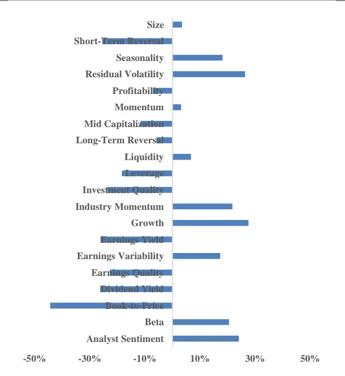
数据来源：Wind，朝阳永续，国泰君安证券研究

图 80：创业板指风格因子相对暴露
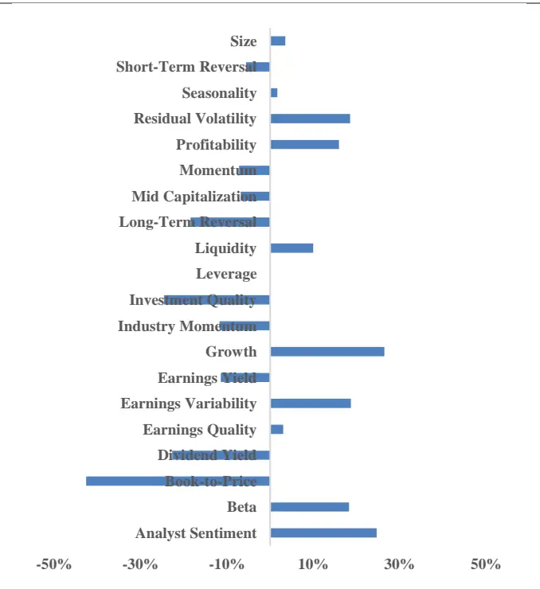
数据来源：Wind，朝阳永续，国泰君安证券研究

在上文中，我们通过回归模型得到了各因子收益及股票特异收益数据，同样根据投资组合的股票权重，可以将投资组合的收益分解为各个因子的收益加上组合中股票的特异收益，有助于对组合收益的来源进行跟踪。下面以沪深 300 为例，对其在 2024 年 3 月的收益进行归因。其中，国家因子贡献了 0.79%的收益；行业因子方面，煤炭贡献了-0.13%的收益，有色金属贡献了 0.31%的收益，医药贡献了-0.19%的收益，非银行金融贡献了-0.70%的收益；风格因子方面，Earnings Yield因子贡献了 0.17%的 收 益 ，Mid Capitalization 因 子 贡 献 了 0.93%的 收 益 ，Momentum 因子贡献了 0.28%的收益，Short-Term Reversal 因子贡献了0.21%的收益，Size 贡献了-3.21%的收益；除此之外，还有 1.46%的特异收益无法由因子体系所解释。根据我们的收益归因模型，沪深 300指数当月由各因子所贡献的收益以及特异收益之和为 0.61%，与真实的当月收益契合。

图 81：沪深300指数2024年 3月收益归因
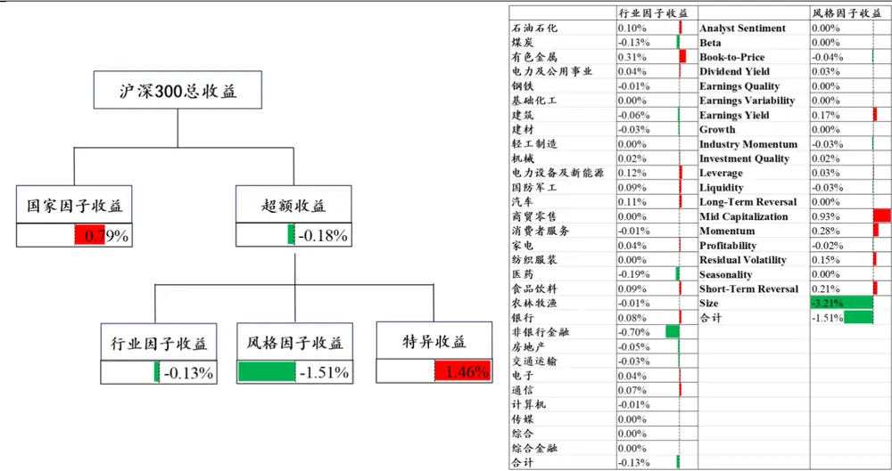
数据来源：Wind，朝阳永续，国泰君安证券研究

## 6. 总结

本文作为 A 股风险模型系列报告的上篇，对多因子风险模型的基本定义、风险因子体系构建和回归模型求解、模型测试结果进行了介绍和展示。首先，以 Barra 最新推出的 CNE6 模型为基础，构建了涵盖 1 个国家因子、30 个行业因子和 20 个风格因子的多因子体系，利用 WIND和朝阳永续数据库计算了相应的因子暴露。其次，通过带约束的加权最小二乘法求解回归模型，得到的回归系数即为因子收益，同时还能够从回归求解的中间变量中获取纯因子组合。接下来，分别对回归模型的显著性、纯因子组合绩效以及因子体系本身进行了全面的测试，以验证模型的有效性和正确性。最后，给出了模型的一个简单应用，通过多因子风险模型能够得到投资组合的风格暴露，对组合进行收益归因。

## 参考文献

[1] MSCI, The Barra USE Equity Model (USE4) - Methodology Notes, 2011- 08.

[2] MSCI, The Barra China Equity Model (CNE5) - Empirical Notes, 2012- 07.

[3] MSCI, INTRODUCING MSCI FACS: A New Factor Classification Standard for Equity Portfolios, 2018-01.

[4] MSCI, Barra China A Total Market Equity Model for Long-Term Investors - Empirical Notes, 2018-08.

[5] MSCI, Barra China A Total Market Equity Trading Model (CNTR) - Empirical Notes, 2018-09.

[6] 石川、刘洋溢、连祥斌, 因子投资：方法与实践, 2020-09.

## 风险提示

量化模型基于历史数据构建，而历史规律存在失效风险。

## 附录

风险因子各描述变量的具体定义[5]如下：

| 风格因子 | 描述变量 | 说明 | 定义 |
| --- | --- | --- | --- |
| AnalystSentiment分析师情绪 | RR | 评级调整比率 | 首先，计算月度调整比率：使用分析师预测盈利向上调整次数减去向下调整次数，除以总的调整次数；然后，再进行3个月的加权平均 |
|  | ETOPF_C | 分析师预测 EP比变化 | 首先，计算分析师预测EP比的月度相对变化；然后，再进行4个月的加权平均 |
|  | EPSF_C | 分析师预测 EPS变化 | 首先，计算分析师预测EPS的月度相对变化；然后，再进行4个月的加权平均 |
| Beta贝塔 | HBETA | 历史 beta | 将股票收益率对中证全指收益率进行时间序列回归，时间窗口504个交易日，半衰期252个交易日，取回归系数 |
| Book-to-Price账面市值比 | BTOP | 账面市值比 | 最近报告期的普通股账面价值除以当前市值 |
| Dividend Yield股息率 | DTOP | 股息率 | 上一财年的每股股息除以上个月末的股价 |
|  | DTOPF | 分析师预测股息率 | 分析师预测每股股息除以当前股价 |
| Earnings Quality盈利质量 | ABS | 资产负债表应计项目 | 首先，计算资产负债表应计项目总额ACCR_BS： $\mathrm{ACCR\_BS}=\mathrm{NOA_t}-\mathrm{NOA_{t-1}}-\mathrm{DA_t}$ $\mathrm{NOA}=(\mathrm{TA}-\mathrm{Cash})-(\mathrm{TL}-\mathrm{TD})$ 其中，NOA为净经营资产，Cash为现金及现金等价物，TA为总资产，TL为总负债，TD为总带息债务（负债合计-无息流动负债-无息非流动负债），DA为折旧与摊销之和；然后，将负的ACCR_BS除以总资产TA： $\mathrm{ABS}=\frac{-\mathrm{ACCR\_BS}}{\mathrm{TA}}$ |
|  | ACF | 现金流量表应计项目 | 首先，计算现金流量表应计项目总额ACCR_CF： $\mathrm{ACCR\_CF}=\mathrm{Ni_t-(CFO_t+CFI_t)+DA_t}$ 其中，Ni为净利润，CFO为经营现金流量净额，CFI为投资活动现金流量净额，DA为折旧与摊销之和；然后，将负的ACCR_CF除以总资产TA： $\mathrm{ACF}=\frac{-\mathrm{ACCR\_CF}}{\mathrm{TA}}$ |
| EarningsVariability盈利波动 | VSAL | 营业收入波动率 | 过去5个财年的年营业收入标准差除以平均年营业收入 |
|  | VERN | 盈利波动率 | 过去5个财年的年盈利标准差除以平均年盈利 |
|  | VFLO | 现金流波动率 | 过去5个财年的年现金流标准差除以平均年现金流 |
|  | ETOPF_STD | 分析师预测 EP比标准差 | 分析师预测每股收益标准差除以股价 |
| Earnings Yield盈利收益 | CETOP | 现金盈利市值比 | 过去12个月现金盈利除以当前市值 |
|  | ETOP | EP比 | 过去12个月盈利除以当前市值 |
|  | EM | 企业乘数 | 上一财年的息税前收入（EBIT）除以当前企业价值（EV） |
|  | ETOPF | 分析师预测 EP比 | 分析师预测盈利除以当前市值 |
| Growth成长 | EGRLF | 分析师预测长期盈利增长率 | 分析师预测的长期盈利增长 |
|  | EGRO | 每股收益增长率 | 计算过去5个财年的每股收益对时间回归的斜率系数，再除以平均每股年收益 |
|  | SGRO | 每股营业收入增长率 | 计算过去5个财年的每股营业收入对时间回归的斜率系数，再除以平均每股年营业收入 |
| IndustryMomentum行业动量 | INDMOM | 行业动量 | （1）首先，计算个股的相对强度RS：对股票对数收益率进行加权求和，时间窗口6个月，半衰期1个月；(2) 计算行业I的整体相对强度： $\mathrm{RS_{I}}=\sum_{\mathrm{i}\in\mathrm{I}}\mathrm{c_{i}RS_{i}}$ 其中 $c_{i}$ 为行业I内个股流通市值的平方根，然后计算股票s |
|  |  |  | 非滞后的行业动量： $\mathrm{INDMOM}=\mathrm{RS_{I}}-\mathrm{c_{s}RS_{s}}$ （3）最后，滞后3个交易日，在3个交易日的时间窗口内取非滞后值等权平均值 |
| InvestmentQuality投资质量 | AGRO | 总资产增长率 | 首先，计算过去5个财年的总资产对时间回归的斜率系数，除以平均总资产；然后，取相反数 |
|  | IGRO | 股票发行量增长率 | 首先，计算过去5个财年的流通股本对时间回归的斜率系数，除以平均流通股本；然后，取相反数 |
|  | CXGRO | 资本支出增长率 | 首先，计算过去5个财年的资本支出对时间回归的斜率系数，除以平均资本支出；然后，取相反数 |
| Leverage杠杆率 | MLEV | 市场杠杆率 | $\mathrm{MLEV}=\frac{\mathrm{ME}+\mathrm{PE}+\mathrm{LD}}{\mathrm{ME}}$ 其中ME为上一交易日的市值，PE和LD分别为上一财年的优先股和长期负债 |
|  | BLEV | 账面杠杆率 | $\boxed{BLEV=\frac{BE+PE+LD}{BE}}$ 其中 BE、PE和LD分别为上一财年的普通股账面价值、优先股和长期负债 |
|  | DTOA | 资产负债率 | $\boxed{\mathrm{DTOA}=\frac{\mathrm{TL}}{\mathrm{TA}}}$ 其中TL、TA分别为上一财年的总负债和总资产 |
| Liquidity流动性 | STOM | 月度换手率 | 最近一个月股票换手率求和，再取对数 |
|  | STOQ | 季度换手率 | 最近一个季度的平均月换手率，再取对数，即： $\mathrm{STOQ}=\ln(\frac{1}{\mathrm{T}}\sum_{\tau=1}^{\mathrm{T}}\exp(\mathrm{STOM}_{\tau})),\mathrm{T}=3个月$ |
|  | STOA | 年度换手率 | 最近一年的平均月换手率，再取对数，即： $\mathrm{STOA}=\ln(\frac{1}{\mathrm{T}}\sum_{\tau=1}^{\mathrm{T}}\exp(\mathrm{STOM}_{\tau})),\mathrm{T}=12$ 个月 |
|  | ATVR | 年化交易量比率 | 对日换手率进行加权求和，时间窗口为252个交易日，半衰期为 63 个交易日 |
| Long-TermReversal长期反转 | LTRSTR | 长期相对强度 | 首先，计算非滞后的长期相对强度：对股票对数收益率进行加权求和，时间窗口1040个交易日，半衰期260个交易日；然后，滞后273个交易日，在11个交易日的时间窗口内取非滞后值等权平均值，最后取相反数 |
|  | LTHALPHA | 长期历史 Alpha | 首先，计算非滞后的长期历史 Alpha：取CAPM回归（与计算 HBETA 时类似）的截距项，时间窗口1040个交易日，半衰期260个交易日；然后，滞后273个交易日，在11个交易日的时间窗口内取非滞后值等权平均值，最后取相反数 |
| MidCapitalization中市值 | MIDCAP | 中市值 | 首先，取Size因子的三次方；然后，通过加权回归的方式对 Size 因子进行正交 |
| Momentum动量 | RSTR | 相对强度 | 首先，计算非滞后的相对强度：对股票对数收益率进行加权求和 $\mathrm{RSTR}=\sum_{\mathrm{t}}^{\mathrm{T}}\mathrm{w}_{\mathrm{t}}[\ln(1+\mathrm{r}_{\mathrm{t}})]$ 其中，时间窗口T为252个交易日，半衰期为126个交易日；然后，滞后11个交易日，在11个交易日的时间窗口内取非滞后值等权平均值 |
|  | HALPHA | 历史 Alpha | 首先，计算非滞后的历史 Alpha：在计算 HBETA所进行的时间序列回归中，取截距项；然后，滞后11个交易日，在11个交易日的时间窗口内取非滞后值等权平均值 |
| Profitability收益能力 | ATO | 资产周转率 | $\mathrm{ATO}=\frac{\mathrm{Sales}}{\mathrm{TA}}$ 其中Sales为过去12个月的营业收入，TA为最近报告期的总资产 |
|  | GP | 资产毛利率 | $\mathrm{GP}={\frac{\mathrm{Sales}-\mathrm{COGS}}{\mathrm{TA}}}.$ 其中Sales、COGS和TA分别为上一财年的营业收入、营业成本和总资产 |
|  | GPM | 销售毛利率 | Sales - COGSGPM =Sales其中Sales和COGS分别为上一财年的营业收入和销货成本 |
|  | ROA | 总资产收益率 | EarningsROA =TA其中Earnings为过去12个月的净利润，TA为最近报告期的总资产 |
| ResidualVolatility残差波动 | HSIGMA | 历史 Sigma | 在计算HBETA所进行的时间序列回归中，取回归残差收益率的波动率 |
|  | DASTD | 收益日标准差 | 日收益率的波动率，时间窗口252个交易日，半衰期42个交易日 |
|  | CMRA | 累计收益极差 | 过去12个月内累计对数收益率的极差 |
| Seasonality季节性 | SEASON | 年度季节性 | 过去5年的已实现次月收益率的平均值 |
| Short-TermReversal短期反转 | STREV | 短期反转 | 首先，计算非滞后的短期反转：对股票对数收益率进行加权求和，时间窗口63个交易日，半衰期10个交易日；然后，滞后1个交易日，在3个交易日的时间窗口内取非滞后值等权平均值 |
| Size市值 | LNCAP | 对数市值 | 公司市值的自然对数 |

数据来源：Barra，国泰君安证券研究。

## 本公司具有中国证监会核准的证券投资咨询业务资格

## 分析师声明

作者具有中国证券业协会授予的证券投资咨询执业资格或相当的专业胜任能力，保证报告所采用的数据均来自合规渠道，分析逻辑基于作者的职业理解，本报告清晰准确地反映了作者的研究观点，力求独立、客观和公正，结论不受任何第三方的授意或影响，特此声明。

## 免责声明

本报告仅供国泰君安证券股份有限公司（以下简称“本公司”）的客户使用。本公司不会因接收人收到本报告而视其为本公司的当然客户。本报告仅在相关法律许可的情况下发放，并仅为提供信息而发放，概不构成任何广告。

本报告的信息来源于已公开的资料，本公司对该等信息的准确性、完整性或可靠性不作任何保证。本报告所载的资料、意见及推测仅反映本公司于发布本报告当日的判断，本报告所指的证券或投资标的的价格、价值及投资收入可升可跌。过往表现不应作为日后的表现依据。在不同时期，本公司可发出与本报告所载资料、意见及推测不一致的报告。本公司不保证本报告所含信息保持在最新状态。同时，本公司对本报告所含信息可在不发出通知的情形下做出修改，投资者应当自行关注相应的更新或修改。

本报告中所指的投资及服务可能不适合个别客户，不构成客户私人咨询建议。在任何情况下，本报告中的信息或所表述的意见均不构成对任何人的投资建议。在任何情况下，本公司、本公司员工或者关联机构不承诺投资者一定获利，不与投资者分享投资收益，也不对任何人因使用本报告中的任何内容所引致的任何损失负任何责任。投资者务必注意，其据此做出的任何投资决策与本公司、本公司员工或者关联机构无关。

本公司利用信息隔离墙控制内部一个或多个领域、部门或关联机构之间的信息流动。因此，投资者应注意，在法律许可的情况下，本公司及其所属关联机构可能会持有报告中提到的公司所发行的证券或期权并进行证券或期权交易，也可能为这些公司提供或者争取提供投资银行、财务顾问或者金融产品等相关服务。在法律许可的情况下，本公司的员工可能担任本报告所提到的公司的董事。

市场有风险，投资需谨慎。投资者不应将本报告作为作出投资决策的唯一参考因素，亦不应认为本报告可以取代自己的判断。
在决定投资前，如有需要，投资者务必向专业人士咨询并谨慎决策。

本报告版权仅为本公司所有，未经书面许可，任何机构和个人不得以任何形式翻版、复制、发表或引用。如征得本公司同意进行引用、刊发的，需在允许的范围内使用，并注明出处为“国泰君安证券研究”，且不得对本报告进行任何有悖原意的引用、删节和修改。

若本公司以外的其他机构（以下简称“该机构”）发送本报告，则由该机构独自为此发送行为负责。通过此途径获得本报告的投资者应自行联系该机构以要求获悉更详细信息或进而交易本报告中提及的证券。本报告不构成本公司向该机构之客户提供的投资建议，本公司、本公司员工或者关联机构亦不为该机构之客户因使用本报告或报告所载内容引起的任何损失承担任何责任。

## 评级说明

## 1.投资建议的比较标准

投资评级分为股票评级和行业评级。以报告发布后的 12 个月内的市场表现为比较标准，报告发布日后的 12 个月内的公司股价（或行业指数）的涨跌幅相对同期的沪深300指数涨跌幅为基准。

## 2.投资建议的评级标准

报告发布日后的 12 个月内的公司股价（或行业指数）的涨跌幅相对同期的沪深 300 指数的涨跌幅。

|  | 评级 说明 |  |
| --- | --- | --- |
| 股票投资评级 | 增持 | 相对沪深 300指数涨幅15%以上 |
|  | 谨慎增持 | 相对沪深300指数涨幅介于5%～15%之间 |
|  | 中性 | 相对沪深300指数涨幅介于-5%～5% |
|  | 减持 | 相对沪深300指数下跌5%以上 |
| 行业投资评级 | 增持 | 明显强于沪深 300 指数 |
|  | 中性 | 基本与沪深300指数持平 |
|  | 减持 | 明显弱于沪深 300指数 |

## 国泰君安证券研究所

|  | 上海 | 深圳 | 北京 |
| --- | --- | --- | --- |
| 地址 | 上海市静安区新闸路 669 号博华广 场20层 | 深圳市福田区益田路6003号荣超商 务中心 B 栋27 层 | 北京市西城区金融大街甲9号金融 街中心南楼18层 |
| 邮编 | 200041 | 518026 | 100032 |
| 电话 | （021)38676666 | （0755）23976888 | (010)83939888 |
|  | E-mail: gtjaresearch@gtjas.com |  |  |