[Table_Title2024.05.30

# 基于 Barra CNE6 的 A 股风险模型实践：股票协方差矩阵估计篇

## ——权益配置因子研究系列 07

## 本报告导读：

本文参考 Barra 的 CNE6 模型介绍和实现股票协方差矩阵估计方法。具体操作上，利用多因子风险模型，将股票协方差矩阵拆解为因子协方差矩阵和股票特质风险矩阵分别进行估计。首先，依次通过 Newey-West方法、特征值调整、波动率预测偏误调整进行因子协方差矩阵的估计。然后，依次通过 Newey-West方法、结构化模型、贝叶斯收缩方法、波动率预测偏误调整估计股票特质风险矩阵。最后，介绍股票协方差矩阵在投资组合风险预测、风险归因和组合构建中的应用。

## 摘要：

le_Summary]多因子风险模型简介：股票协方差矩阵估计是股票组合风险预测的核心，但简单的通过股票收益率样本协方差进行预测具有较大误差。本文参考Barra 中国股票风险模型CNE6（2018）的做法，在之前报告的基础上，利用多因子模型，将股票协方差矩阵拆解为因子协方差矩阵和股票特质风险矩阵分别进行估计，两者结合得到股票协方差矩阵估计。

因子协方差矩阵的估计：参考 CNE6，因子协方差矩阵估计分四个步骤进行：1）通过因子收益率时间序列计算移动加权协方差矩阵；2）采用 Newey-West 方法对协方差矩阵进行调整，以解决单因子收益率的时间序列自相关性问题；3）使用特征值风险调整法（Eigenfactor Risk Adjustment）调整因子协方差矩阵的相关性；4）使用波动率预测偏误调整方法（Volatility RegimeAdjustment），调整各因子的波动率以提高预测的稳健性。

股票特质性风险的估计：参考 CNE6，股票特质风险的估计分三个步骤：1）通过残差收益率时间序列并构建结构化模型（Structural Model）估计股票特质波动率；2）采用贝叶斯方法对股票特质波动率进行收缩调整，提升估计的样本外效果；3）根据波动率预测偏误进行调整，提升估计稳定性。

多因子风险模型的应用举例：股票协方差矩阵估计主要应用在投资组合风险预测、风险归因和组合构建。1）以中证 500 指数为例，预测股票组合波动率。2）计算沪深 300 指数、中证 500指数在各因子的风险贡献，进行事后风险归因。3）在指数成分股内构建最小方差策略、指数增强组合，介绍股票协方差矩阵在选股组合中的应用。

- 风险提示：量化模型基于历史数据构建，而历史规律存在失效风险。

大类资产配置研究

## or] 报告作者

张雪杰(分析师)

8 0755-23976751

zhangxuejie025900@gtjas.com

证书编号 S0880522040001

朱惠东(研究助理)

8 0755-23976176

zhuhuidong028682@gtjas.com

证书编号 S0880123070152

刘凯至(分析师)

8 0755-23976911

liukaizhi025861@gtjas.com

证书编号 S0880522110002

## cReport] 相关报告

宏观风险配置方法思考：以风险平价和风险最小化为例

2024.05.29

基于 Barra CNE6 的 A 股风险模型实践：风险因子篇

2024.05.19

中美权益资产风险偏好剪刀差收敛进行时2024.05.07

看多化工、医药、有色、电新、地产、非银 2024.05.04

从“铜油比”到 CRB 商品宏观友好度评分的细化

2024.04.25

感谢实习生张涵、张子讴、薛若禹、 蒋广对本文的贡献。

国泰君安金融工程团队专注于量化选股、行业轮动、资产配置、量化择时等研究。在之前的因子研究系列报告中研究了超预期因子、分钟高频因子在不同股票池的选股效果，介绍了中证 500、1000 和 2000 指数增强策略的构建，复盘了 A 股风格轮动和因子表现。本文是基于 BarraCNE6模型的A 股风险模型实践的下篇，主要介绍和实现股票协方差矩阵的估计方法。

## 1. 多因子风险模型简介

## 1.1. 传统股票收益率样本协方差预测模型具有局限性

1952 年，Markowitz 提出了著名的“均值-方差模型”（Mean-VarianceOptimization Model，MVO），创建了现代资产组合理论，将资产配置带入到量化配置时代。Markowitz 提出采用收益率方差的方式刻画风险，为投资者从量化角度认知风险提供了渠道。但是，在实际投资过程中，对于资产收益率协方差矩阵的预测并非易事，在求解协方差矩阵时，投资者们往往将输入的收益率作为精确的量，但在样本数目有限的情形下（尤其是股票数目较大，需要估计的参数较多时），协方差矩阵较为病态，此时预测投资组合的波动率预测的样本外表现往往不够稳定。Shepard（2009）分析了最优投资组合（最优投资组合的定义如附录所示）的波动率的偏差幅度。在假设正态性和平稳性下，最优投资组合波动率的真实值 $\sigma_{True}$ 和预测值 $\sigma_{pred}$ 存在如下的一个公式：

$$
\sigma_{True}\approx\frac{\sigma_{pred}}{1-\frac{N}{T}}\tag{1}
$$

这里的N 表示的是资产的数目，T 表示的是观测值的数量。不难看出当观测值数目较少时，预测值会明显低估真实波动。

其次，由于真实收益率的时变性，投资者往往会采用近期的收益率序列估计股票方差矩阵，这进一步放大了收益率方差矩阵预测的误差。为了解决这种资产数目带来的投资组合波动率估计困难问题，学界和业界通过使用多因子模型，将股票风险归因到风险因子上，通过分别估计因子风险和股票特质风险，实现对股票的风险预测（股票协方差矩阵估计）。

在 2024 年 5月 19 日发布的《基于 Barra CNE6 的 A 股风险模型实践：风险因子篇——权益配置因子研究系列 06》中，参考 Barra的CNE6模型，国泰君安金融工程团队已经完成了对A 股风险因子体系的构建。本文将基于前期构建的风险因子提下，实现对股票协方差矩阵的估计。

## 1.2. 多因子风险模型框架简介

Barra 的多因子风险模型是目前业界最知名的多因子风险模型，广泛应用于投资组合分析领域。该模型由美国学者Barr Rosenberg 在 1985年创办的Barra公司推出，后 2004年 Barra公司被 MSCI 所收购，并继续进行迭代改进。第一代的 Barra 多因子模型 USE1 专注于美国权益市场，于1975年发布，后续陆续发布了改进的版本，经典版本为2011年发布的 USE4 模型。2005 年，MSCI 推出了专注于中国权益市场的 CHE2 模型，其后于 2012 年推出的改进版本 CNE5 模型受到国内机构投资者的广泛使用。2018年 MSCI推出了针对中国市场最新的 CNE6 模型，对因子框架进行了进一步细分和扩充。

Barra 多因子风险模型认为股票的收益受到一系列共同因子的驱动，股票的收益由共同因子的驱动收益和特质收益组成。因此，可以将股票组合的风险预测转化为因子风险预测和股票特质风险预测分别估计，从而达到降低维度、提高准确率的效果。具体来说，Barra CNE6多因子模型引入三大类因子来刻画股票收益，分别是市场（国家）因子、行业因子和风格因子，则任一只股票的收益都可以表示为如下因子暴露和因子收益：

$$
r_{n}=\underbrace{f_{c}+\sum_{i}X_{ni}f_{i}+\sum_{s}X_{ns}f_{s}+\varepsilon_{n}}_{\substack{\frac{\pm}{\sqrt{3}}|\Xi|\|\vec{x}\|\vec{x}\|\vec{\Xi}\vec{\jmath}\|\vec{\Xi}\vec{\jmath}\|\vec{\Xi}}},\underbrace{\overset{,}{\cal{i}}\pm\beta\mathbb{\ H}\frac{\nu}{3}}_{\substack{\vec{\mathcal{I}}\pm\beta\mathbb{H}\frac{\nu}{3}\|\vec{\Xi}\frac{\nu}{3}}},\tag{2}
$$

其中， $r_{n}$ 代表第n 只股票收益率， $f_{c}$ 代表国家因子的收益率。 $X_{ni}$ 为个股n 在行业i上的暴露，个股在其所属行业上暴露为 1，其余行业则全部为0。 $X_{ns}$ 为个股在风格因子 s 上的暴露，在上式中的因子暴露一般取上一期的值。

根据公式(2)，由于各股票的残差 $\varepsilon_{n}$ 互不相关，可以得到股票组合的协方差矩阵与因子协方差矩阵的关系：

$$
Var(R)=X^{T}Var(f_{i})X+Var(\varepsilon_{n})\tag{3}
$$

记因子协方差矩阵为 $\Sigma_{F}$ ，股票风险协方差矩阵为 $\Sigma_{S}$ ，特质风险矩阵为 $\Sigma_{\varepsilon}$ （对角线为特质波动率），那么可以将公式改写为如下的形式：

$$
\Sigma_{S}=X^{T}\Sigma_{F}X+\Sigma_{\varepsilon}\tag{4}
$$

公式(4)建立了连接因子协方差矩阵与股票风险方差矩阵的桥梁。对于持仓权重为w的投资组合P 而言，其风险（波动率）定义为：

$$
\sigma(w)=\sqrt{w^{T}\Sigma_{S}w}\tag{5}
$$

经由公式(5)，结合t期的因子暴露和对应的因子协方差矩阵以及特质风险矩阵，投资者可以将对投资组合的风险预测问题转化为对因子协方差矩阵及各个股票的特质性风险矩阵的估计问题：

$$
\sigma(w)=\sqrt{w^{T}(X^{T}\Sigma_{F}X+\Sigma_{\varepsilon})w}\tag{6}
$$

因此，在多因子风险模型中，核心问题便是如何合理地估计因子协方差矩阵 $(\Sigma_{F})$ 与各个股票对应的特质波动率 $(\Sigma_{\varepsilon})$ ）。但是，直接通过样本协方差估计因子协方差矩阵与特质波动率，会有较大的估计偏误，因此Barra 提出了一系列调整方法，来改进因子协方差矩阵与股票特质性风险矩阵的估计。本文的第二章与第三章将分别从这两个方面入手，阐释如何对因子协方差矩阵（Factor Covariance Matrix）与股票特质波动率矩阵（Specific Risk）进行调整。

图 1：参考Barra CNE6模型，股票协方差矩阵估计流程图
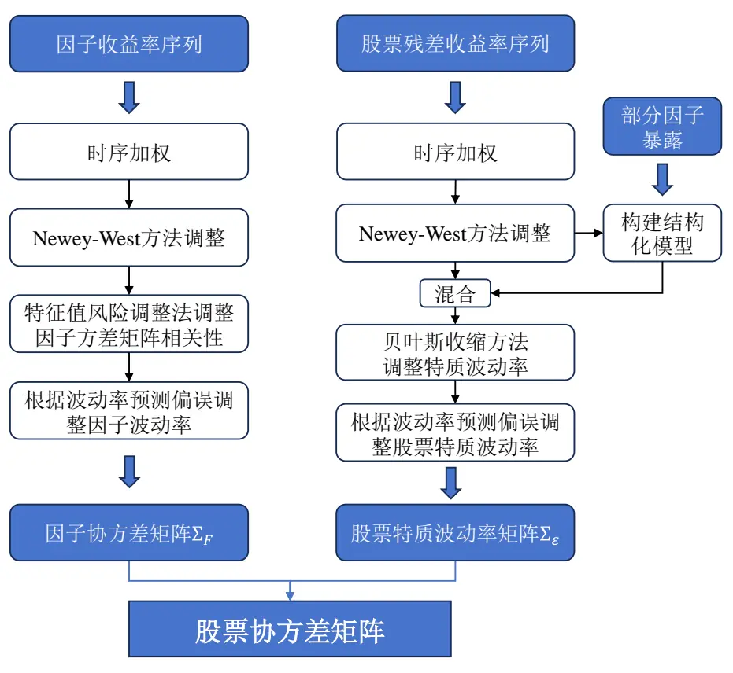
数据来源：Barra、国泰君安证券研究

## 2. 因子协方差矩阵的估计

前文已经指出，在多因子风险框架下，资产的风险是由核心的多个因子驱动的。在 2024 年 5 月 19 日发布的《基于 Barra CNE6 的 A 股风险模型实践：风险因子篇——权益配置因子研究系列 06》中，国泰君安金融工程团队构建了一套具有稳定解释力度的风险因子。下面本文将详细阐述如何从因子收益率的样本协方差矩阵出发，通过调整获得较为稳健的因子协方差矩阵（Factor Covariance Matrix）。大体上可以将其分为四个步骤：

1) 通过因子收益率计算时序移动加权因子协方差矩阵。

2) 采用Newey-West方法对协方差矩阵进行自相关调整。

3) 采用特征值风险调整法（Eigenfactor Risk Adjustment）调整因子协方差矩阵相关性。

4) 根据波动率预测偏误（Volatility Regime Adjustment）调整因子波动率。

经由以上步骤便可以实现对因子协方差矩阵 $\boldsymbol{\cdot}\sum_{F}$ 的有效估计。

## 2.1. 根据因子收益率时序计算因子加权协方差矩阵

因子协方差矩阵估计的第一步即为得到因子收益率协方差矩阵的原始估计。这里采用的方法是根据日度的因子收益率序列，采用移动加权样本协方差的计算方式对 T 期的因子收益率协方差矩阵 $F_{T}^{(0)}$ 进行估计。在估计时，本文采用了半衰期参数为 $\tau_{\rho}^{F}=200$ 的指数移动加权平均法对因子协方差矩阵进行了指数平滑，放大近期的日频因子收益率序列的影响。

$$
\begin{array}{l}{{F_{kl,T}^{(0)}=cov(f_{k},f_{t})_{T}=\sum_{s=t-h}^{T}\lambda^{T-s}(f_{k,s}-\overline{{{f_{k}}}})(f_{l,s}-\overline{{{f_{l}}}})\Big/}}\\{{\phantom{F_{kl,T}^{(0)}=cov(f_{k},f_{t})_{T}=}\sum_{s=T-h}^{T}\lambda^{t-s}(f_{k,s}-\overline{{{f_{k}}}})(f_{l,s}-\overline{{{f_{l}}}})\Big/}\sum_{s=T-h}^{T}\lambda^{t-s}}\end{array}\tag{7}
$$

其中， $F_{kl,T}^{(0)}$ 表示因子收益率协方差矩阵 $F_{T}^{(0)}$ 的(k,l)位置对应元素。ℎ表示的是样本矩阵的尺寸，λ表示的是指数权重。本文设定 $\lambda=0.5^{1/\tau_{\rho}^{F}}$ ，根据过去400个交易日的收益率数据滚动计算得到 $F_{T}^{(0)}$

## 2.2. 采用 Newey-West方法对协方差矩阵进行调整

由于单因子收益率存在一定的时间序列上的自相关性，投资者还需要在因子收益率协方差矩阵的基础上做进一步的调整。本文采用Newey-West方法，对前文求解出的因子协方差矩阵 $F_{T}^{(0)}$ 进行进一步的调整。

Newey-West方法被广泛用于普通最小二乘方法，可以有效地降低自相关性和异方差性的影响。本文的多因子风险模型根据 Newey-West 方法构建调整矩阵 $.F^{(NW)}$ ，其在T 时的计算方式如下公式所示：

$$
F_{T}^{(NW)}=\sum_{\Delta=1}^{lag}\left(1-\frac{\Delta}{lag+1}\right)\ast(C_{T,+\Delta}^{(NW)}+C_{T,-\Delta}^{(NW)})\tag{8}
$$

这里的 $C_{\mathrm{T},+\Delta}$ 与 $C_{\mathrm{T},-\Delta}$ 实际上是两个调整因子，其 $(k,l)$ 位置元素分别为$C_{kl,T+\Delta}^{(NW)}\stackrel{E}{\Finv}C_{kl,T-\Delta}^{(NW)}$ ，计算公式为：

$$
\begin{array}{r}{C_{kl,T+\Delta}^{(NW)}=cov(f_{k,T-\Delta},f_{l,T})}\\{~}\\{C_{kl,T-\Delta}^{(NW)}=cov(f_{k,T},f_{l,T-\Delta})}\end{array}\tag{9}
$$

将调整后的 $F_{T}^{(NW)}$ 与待调整的矩阵相加即可得到经由Newey-West方法调整后的因子收益率协方差矩阵。

为了保证调整后的矩阵具有正定性，本文根据不同的lag进行两次Newey-West 方法调整，具体操作过程如下：

1) 根据 $lag_{\rho}=2\AA$ 计算出经由 Newey-West 方法调整后的矩阵 $^{1}F_{T,\rho}^{(NW)}$ ，从中拆解出对应的相关系数矩阵 $.Corr_{T,\rho}^{(NW\ corr)}$

2) 根据 ${lag}_{\sigma}=1$ 计算出经由 Newey-West 方法调整后的矩阵 ${}^{2}F_{T,\sigma}^{(NW)}$ ，拆解出对应的矩阵标准差 $.\sigma_{T,\sigma}^{(NW\ std)}$

3) 结合 $\cdot\sigma_{T,\sigma}^{(NW\ std)}$ 与 $Corr_{T,\rho}^{(NW~corr)}$ ，得到经由两次Newey-West方法调整后的因子收益率协方差矩阵 $F_{T}^{(1)}$ 。

$$
F_{T}^{(1)}=\left(\sigma_{T,\sigma}^{\left(NW\ std\right)}\right)^{T}Corr_{T,\rho}^{\left(NW\ corr\right)}\left(\sigma_{T,\sigma}^{\left(NW\ std\right)}\right)\tag{10}
$$

经由 Newey-West 方法，时间序列上的自相关性带来的偏差得到一定程度的消除。

## 2.3. 使用特征值风险调整法调整因子协方差矩阵相关性

Muller (1993)的实证研究表明，风险模型倾向于低估优化投资组合的风险；根据 Shepard (2009)的分析，优化后的投资组合的实际波动性通常高于预测波动性。在 Menchero，Orr & Wang（2011）中，为了解决这一问题，Barra 提出了特征值风险调整方法（Eigenfactor Risk Adjustment）。特征值风险调整通过蒙特卡洛模拟方法估计这些偏差的大小，并调整因子协方差矩阵以消除这些偏差。

为了衡量风险调整的效果，Barra 定义了偏差统计量用以衡量风险矩阵在特定因子投资组合上的预测效果，偏差统计量的具体计算方法如附录所示。

图 2：未经特征值调整时最优投资组合的偏差统计量
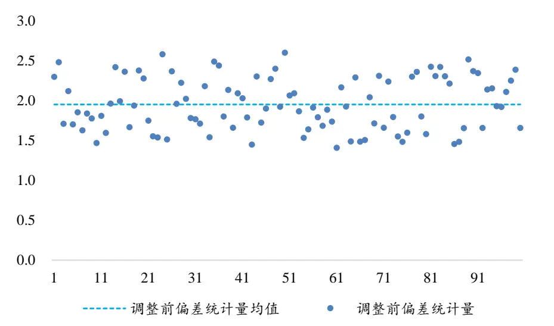
数据来源：国泰君安证券研究。数据区间：2013 年 4 月到 2024 年 3 月。

本文计算了 $F_{T}^{(1)}$ 下最优投资组合的偏差统计量，不难发现此时最优投资组合的整体偏差统计量均分布在 2.0 上下，这也表明此时的方差矩阵估计效果较为有限。

接下来本文参考Barra做法，介绍特征值风险调整的具体过程。定义F为K 维样本因子协方差矩阵（方阵）。这里的 K 表示的是因子的数目。定义T为时间窗口的长度。那么由于F自身的正定性（因子数目远小于样本数目），F可以做如下的矩阵对角化：

$$
D=U^{T}FU\tag{11}
$$

其中，D表示一个K维对角阵，其对角线元素表示F的K个特征值；U表示一个正交阵，其满足 $U^{T}U=I$ ，其每列向量表示 D 的特征值所对应的特征向量。本文把U中的每个特征向量理解为一个特征投资组合。此时，D的对角元素实际上表示各个特征投资组合的方差，即为根据当前因子协方差矩阵对每个特征投资组合进行对未来波动率的预测。本文将每期的特征值从小到大进行排序，计算对应的特征投资组合的偏差统计量如图 3所示：

图 3：未经特征值调整时各个特征值对应特征投资组合偏差统计量
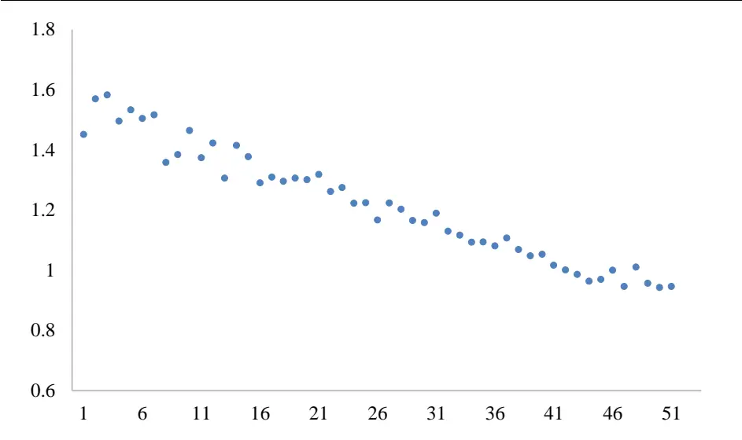
数据来源：国泰君安证券研究。数据区间：2013年4 月到2024年3月。

从图中可以直观的看出，对于较小特征值（特征值贴近 0）对应的特征投资组合其偏差统计量较大。实际上，较小特征值对应的特征投资组合恰好为满足权重平方和为1 的限制下的最小方差组合。这也就意味着当前的因子协方差矩阵此时具有较高的尾部风险。下面本文将对此进行调整。由于U为一正交阵，公式(11)可以被改写为：

$$
F=UDU^{T}\tag{12}
$$

公式(12)说明，因子协方差矩阵可以由特定矩阵经由正交合同化生成。如果假设因子的收益率服从均值为0，方差为D的正态分布。那么可以通过生成一系列随机变量来模拟这一过程。对于第m次模拟，定义 $f_{m}$ 为：

$$
f_{m}=Ub_{m}\tag{13}
$$

这里 $b_{m}$ 是 $K\times T$ 维矩阵，其每列元素均符合正态分布假设。 $f_{m}$ 实际上是第m次模拟出的特征因子收益率。由此可求解出全新的因子协方差矩阵$F_{m}$

$$
F_{m}=cov(f_{m},f_{m})\tag{14}
$$

由于 $E(F_{m})=F$ ，因此 $F_{m}$ 是无偏的。下面对于模拟出的因子协方差矩阵$F_{m}$ 按照公式(11)中进行变换：

$$
D_{m}=U_{m}^{T}F_{m}U_{m}\tag{15}
$$

这里可以认为 $U_{m}$ 的 K 个不同的列对应的特征向量代表 K 个投资组合，每个投资组合均满足其权重平方和为1 的限制。而 $D_{m}$ 的第n 个对角线元素恰好表示第n个投资组合对应的投资风险。模拟投资组合对应的方差${\widetilde{D}}_{m}$ 为：

$$
\widetilde{D}_{m}=U_{m}^{T}FU_{m}\tag{16}
$$

由此可以计算模拟波动率偏差v，v为一对角矩阵：

$$
v(k)=\sqrt{\frac{1}{M}\sum_{m}\frac{\widetilde{D}_{m}(k)}{D_{m}(k)}}\tag{17}
$$

这里的k表示矩阵对角线的第k个元素。假设样本协方差矩阵F与模拟协方差矩阵 $F_{m}$ 拥有相同的偏差，令 $\widetilde{D}$ 为经由波动率偏差调整过的特征值矩阵。

$$
\widetilde{D}=v^{2}D_{0}\tag{18}
$$

本文就此对因子收益率协方差矩阵 $\underline{{\boldsymbol{\pi}}}$ 交化后得到的纯因子矩阵进行调整，将其通过线性变化还原到原始协方差矩阵，即得到经由特征值调整后的因子协方差矩阵：

$$
\widetilde{F}=U\widetilde{D}U^{T}\tag{19}
$$

本文将如上调整方法应用到经由两次 Newey-West 方法调整后的因子收益率协方差矩阵 $F_{T}^{(1)}$ 中，得到了特征值调整后的因子协方差矩阵 $F_{T}^{(2)}$ 。由于合同矩阵的性质，根据公式(18)和公式(19)，这个过程并不改变 $F_{T}^{(1)}$ 的迹，即特征值调整方法并不改变F背后所代表的各个因子的收益率波动率，仅仅改变F所包含的各个因子间的相关性。

在实际操作过程中，投资者往往会面临这样的可能情况：

1) 所构建的风险因子（尤其是风格因子）并非所有的因子都具有强的显著性。这或导致不同因子的因子收益率波动率差距较大。

2) 所构建的风险因子具有共线性且难以去除。这亦或导致不同因子的

因子收益率波动率差距较大。

3) 计算矩阵特征值和特征向量的计算软件数字精度有限。

在实际投资过程中，这些异常情况的出现往往会导致特征值调整的效果极为有限。尤其是当 1)、2)两种情况出现时，其各个因子的因子收益率方差具有数量级上的差距，这导致在进行后续特征值分解与特征向量求解时计算精度难以保证。为此，利用特征值调整方法不改变因子收益率波动率这一性质，本文对根据F拆解出的因子协相关矩阵进行特征值调整，根据调整后的相关系数矩阵结合F拆解出的因子波动率，便可得到最终的经由特征值调整后的因子协方差矩阵。

图 4：特征值调整后各个特征值对应特征投资组合偏差统计量减小
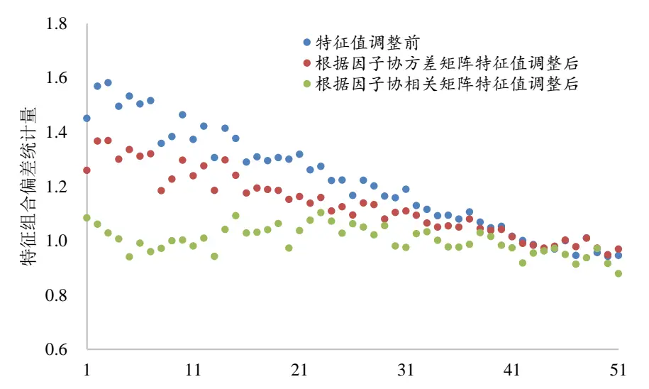
数据来源：国泰君安证券研究。数据区间：2013年4 月到2024年3月。

从图 4中可获知，经由特征值调整后，投资者观察到特征值对应的特征投资组合的偏差统计量整体有所下降。如若直接对因子协方差矩阵进行特征值调整，其特征投资组合的偏差统计量有所降低，但效果较为有限；但如若直接对其相关系数矩阵进行调整，其调整后的特征投资组合偏差统计量均落在1的附近，调整效果较为明显。

同时，最优投资组合的偏差统计量均值从2.0减小到了 1.0，这也证明本文采用的特征值调整方法确实提升了最优投资组合的波动率预测准确性。

图 5：特征值调整后各个最优投资组合平均偏差统计量减小
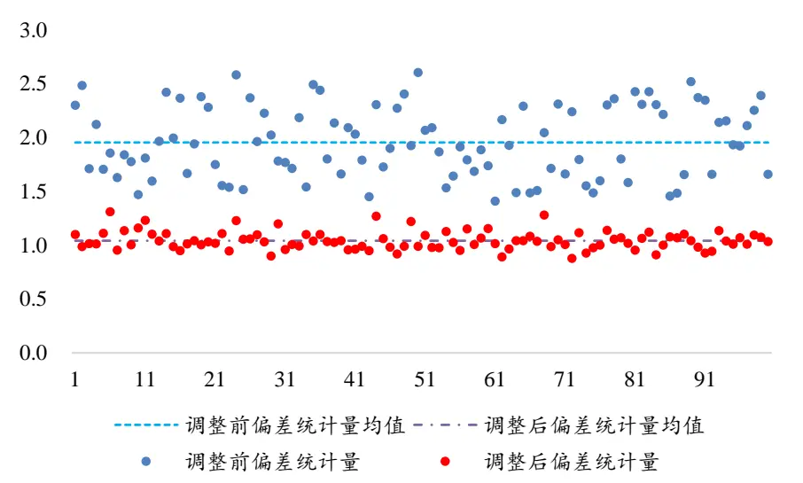
数据来源：国泰君安证券研究。数据区间：2013年4 月到2024年3月。

## 2.4. 根据波动率预测偏误调整因子波动率

在多因子风险模型中，风险预测误差的一个主要来源来自于其非平稳性带来波动率水平的变化。因此为了得到更为准确稳健的因子协方差矩阵，使用者不仅仅要对因子协方差矩阵的相关性进行调整，更需要对其波动率进行调整，即本节中的波动率偏误调整（Volatility Regime Adjustment，VRA）。而调整的依据是按照因子投资组合的截面偏差统计量这一概念。对截面偏差统计量的矫正可以降低部分风险估计偏差。

记 $f_{k,t}$ 为因子k在t期的收益率，记 $\sigma_{k,t}$ 为在t期开始时预测的当日因子波动率。定义统计量 $\mathbf{\tilde{\psi}}b_{n,t}=f_{n,t}/\sigma_{n,t},$ 。如果预测结果较为精准，其标准差应在1左右。本文在横截面上构建这样偏差统计量，用以判断波动率的预测准确度。

$$
B_{t}^{F}=\sqrt{\frac{1}{n}{\sum_{k=1}^{K}{\left(\frac{f_{k,t}}{\sigma_{k,t}}\right)}^{2}}}\tag{20}
$$

这里K表示因子的总数目。根据 $B_{t}^{F}$ 的定义可知，如果某天预测波动率小于实际波动率，则 $B_{t}^{F}$ 应大于 1；反之，如果某天的预测波动率大于实际波动率，则 $B_{t}^{F}$ 应小于 1。因此，根据偏差统计量可以对当天的预测结果进行调整。本文对偏差统计量进行时序上的加权调整：

$$
\lambda_{F}=\sqrt{\sum_{t}(B_{t}^{F})^{2}w_{t}}\tag{21}
$$

这里的 $w_{t}$ 由因子波动率偏误调整半衰期系数 $\tau_{VRA}^{F}=4$ 生成的指数加权序列。 $\tau_{VRA}^{F}$ 实际上一定程度上决定了多因子风险模型的反应速度。本文采用滚动60个交易日的方式计算每天的λ $P^{\circ}$经由因子波动率偏误调整的预测值 $\bar{\sigma}_{k}$ 为：

$$
\bar{\sigma}_{k}=\lambda_{F}\sigma_{k}\tag{22}
$$

公式(22)指出，进行波动率偏误调整时并未改变因子协方差矩阵的协相关性，仅仅改变了各个因子的自身波动率的估计大小。通过将调整后因子波动率与根据 $F_{T}^{(2)}$ 计算而得的因子协相关性矩阵结合，便可得到最终的因子协方差矩阵 ${\bf\nabla}\cdot{\cal F}_{T}$ 。

经由波动率预测偏误调整后，不难发现其横截面偏差统计量得到了较为有效的控制。其横截面偏差统计量均值从0.93提升至 0.98，且横截面偏差统计量时序变化波动幅度更低。

图 6：波动率预测偏误调整后协方差矩阵横截面偏差统计量在 1左右
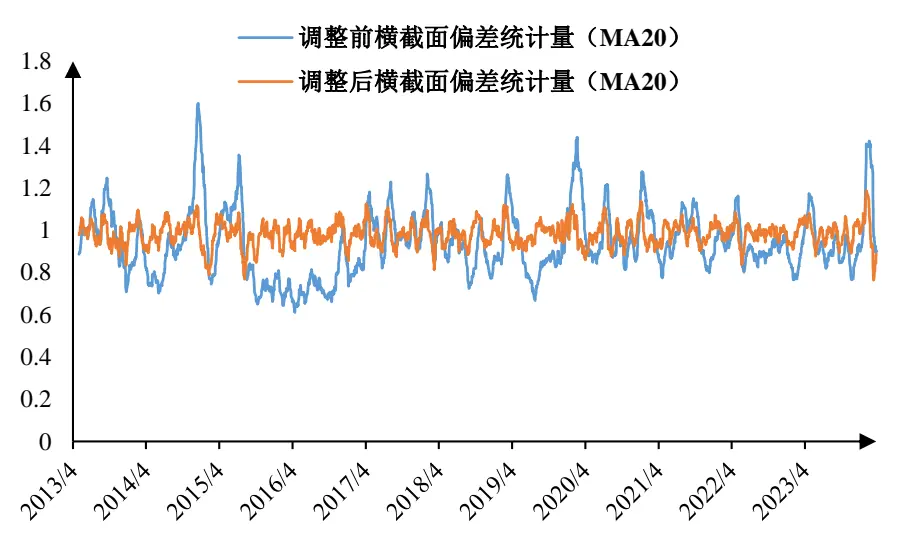
数据来源：国泰君安证券研究。数据区间：2013年4 月到2024年3月。

经由以上步骤，本文完成了对因子收益率波动率的调整。至此，本文完成了对因子协方差矩阵的估计。下面，本文将着重叙述如何对股票特质性风险进行估计。

## 3. 股票特质性风险的估计

前文通过 Newey-West 方法、特征值调整和根据波动率预测偏误调整方法，实现了对公式(6)中的因子协方差矩阵的估计。下面要实现对股票特质性风险的估计。在传统的多因子模型下，股票的特质风险被认为是回归模型的残差项的风险，其对特异风险的估计直接来源于股票的日度收益率序列。但是这种风险预测是具有一定偏误的。本文从时间序列估计出发，通过构建结构化模型、采用贝叶斯收缩并加以波动率预测偏误调整的方法对股票特质风险估计进行调整，实现股票特质性风险的预测。

## 3.1. 通过结构化模型计算股票特质性风险

## 3.1.1. 采用 Newey-West 方法估计特质风险

本文采用了时间序列收益率数据估计特质风险。采用的方法为分别对每个股票根据长期的收益率序列通过指数加权的方式计算特质性风险。

假设股票的特质性收益率如公式(2)所示。对于股票n，其股票特质波动率 $\sigma_{n}^{TS}$ 直接根据其收益率的时间序列计算而出：

$$
\sigma_{n}^{TS}=C_{n}^{NW}\Bigg[\sum_{t}w_{t}(\varepsilon_{nt}-\bar{\varepsilon}_{n})^{2}\Bigg]\tag{23}
$$

这里 $w_{t}$ 是半衰期为 $\tau_{\sigma}^{S}$ 的指数加权权重； $C_{n}^{NW}$ 是对于股票n的 Newey-West序列相关调整。这里本文使用半衰期为 $\tau_{\sigma}^{S}=42$ 同时滞后 $L_{\rho}^{S}=1$ 期进行Newey-West 方法对 $C_{n}^{NW}$ 进行估计3。

## 3.1.2. 结构化模型构造特质风险

尽管特质性风险可以从时间序列上直接计算而出，但在使用过程中投资者可能会遇到如下的问题：

1) 近期IPO的公司回测历史较短。较短的样本区间或导致样本波动率具有较高的估计误差。

2) 流动性不足的股票的收益率的分布与正态分布偏离过大。这容易导致其特质波动率估计会出现偏误。

3) 公司特定事件可能会在给收益分布造成较大的异常值。时间序列估计需要尽可能的消除大异常值带来的影响。

为了解决这些问题，Barra 提出了结构化模型[4]（Structural Model）进而提升股票特质风险估计的稳健性。如果认为具有相同特征的股票的特质波动率具有相似特征，那么可以根据那些特质波动率预测准度较高，预测较为稳健的股票根据其共同特征预测其他股票的特质波动率。

具体而言，对于每一个股票，其稳健标准差 $\widetilde{\sigma_{\varepsilon}}$ 为：

$$
\widetilde{\sigma_{\varepsilon}}=\frac{1}{1.35}(Q_{3}-Q_{1})\tag{24}
$$

这里的 $Q_{1}$ 和 $Q_{3}$ 表示的是股票残差收益率的第一个和第三个三分位数。股票的特质性收益率ε被截断处理在 $\pm10\widetilde{\sigma}_{\varepsilon}$ 以内。据此可以计算比例 $Z_{\varepsilon}$ 作为衡量股票特质波动率的敏感性：

$$
Z_{\varepsilon}=\left|\frac{\sigma_{\varepsilon,eq}-\widetilde{\sigma}_{\varepsilon}}{\widetilde{\sigma}_{\varepsilon}}\right|\tag{25}
$$

其中 $\sigma_{\varepsilon,eq}$ 表示残差收益率的标准差。如果某个股票的 $Z_{\varepsilon}$ 较大，说明该股票的残差收益率序列对异常值较为敏感。如果 $Z_{\varepsilon}$ 处于[0,1]区间内，那么一般认为这个股票的残差收益率时间序列是良好的。进而可以就此定义混合系数γ：

$$
\gamma=\left[\operatorname*{min}\left(1,max\left(0,\frac{h-60}{120}\right)\right)\right]\ \cdot\left[\operatorname*{min}(1,max(0,exp(1-Z_{\varepsilon})))\right]\tag{26}
$$

从公式(26)中不难看出，股票的γ越接近1，表明在该股票上根据时间序列进行特质波动率预测效果越好。图 7 绘制了2013 年 4月至2024年 3月γ等于 1的股票占全市场股票的比例与全市场平均γ水平，不难发现在2015年至 2016年市场出现异常波动时，全市场的股票混合系数γ普遍偏低，证明此时大多股票的特质性收益率序列出现了较大异常值。随着2016年北向资金入市后，市场整体波动率下降，近年来市场股票混合系数在逐渐上升，始终维持在较高水平。

图 7：γ = 1的股票占比在近些年逐渐提升
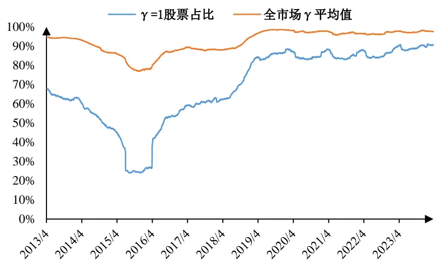
数据来源：国泰君安证券研究。数据区间：2013年4 月到2024年3月。

对于 $\gamma=1$ 的股票集合 $N_{\gamma=1}$ ，投资者可以将其视为股票特异性风险可预测性质较为良好的股票。如果认为股票的特质性风险是具有共性的，即具有相似特征的股票具有相似的特质性风险，那么对于 $\gamma<1$ 的股票，其特质波动率可以通过两个部分混合而成。一是来自于自身收益率时间序列的特质波动率预测 $\sigma_{n}^{TS}$ ，另一是来自于具有相似特征的股票（这里主要指γ = 1的股票）的特质波动率根据股票特性预测。因此对 $\gamma=1$ 的股票进行如下的最小二乘分解：

$$
ln(\sigma_{n}^{TS})=\sum_{k}X_{nk}b_{k}+\varepsilon_{n},n\in N_{\gamma=1}\tag{27}
$$

其中X $nk^{\sharp{\vec{\mathbf{\psi}}}}$ 为股票对应的因子暴露矩阵。公式(27)采用 WLS 回归的方法，根据市值加权日度在横截面上进行回归得到系数 $b_{k}$ 。由于公式(27)的目的是将特质波动率与股票特征建立强联系，本文并没有选用所有的因子暴露进行回归，而是根据T 统计量选用平均|T|值大于 2，且|T|>2 占比大于50%的风格因子和全部行业因子进行回归。

在 2024 年 5月 19 日发布的《基于 Barra CNE6 的 A 股风险模型实践：风险因子篇——权益配置因子研究系列 06》中计算了各个风格因子的T值如表 1 所示，本文最终选用 Size、Liquidity、Momentum、Beta、MidCapitalization 与 Residual Volatility 作为公式(27)中的回归项 $(X_{nk})$ ），通过WLS 方法回归求解出 $b_{k}$ 。

表 1：各风格因子 T值详情

| 风格因子 | 平均\|T\|值 | \|T\|>2占比 | 风格因子 | 平均\|T\|值 | \|T\|>2占比 |
| --- | --- | --- | --- | --- | --- |
| Size | 5.13 | 74.10% | Leverage | 1.69 | 37.35% |
| Momentum | 3.25 | 66.87% | Profitability | 1.57 | 32.53% |
| Liquidity | 3.11 | 63.25% | Long-Term Reversal | 1.54 | 30.72% |
| Beta | 2.79 | 50.60% | Analyst Sentiment | 1.43 | 28.31% |
| Short-Term Reversal | 2.75 | 53.01% | Seasonality | 1.31 | 22.29% |
| Mid Capitalization | 2.61 | 53.61% | Dividend Yield | 1.22 | 17.47% |
| Residual Volatility | 2.52 | 54.22% | Growth | 1.22 | 19.28% |
| Industry Momentum | 2.09 | 43.37% | Investment Quality | 1.21 | 19.28% |
| Book-to-Price | 1.98 | 42.17% | Earnings Quality | 1.14 | 14.46% |
| Earnings Yield | 1.72 | 34.34% | Earnings Variability | 1.12 | 16.87% |

数据来源：Wind，朝阳永续，国泰君安证券研究。数据区间：2010年6 至 2024 年 3 月。

将回归求解出的 $b_{k}$ 带入到 $\gamma<$ 1的股票中，便可以得到这些股票经由结构化模型调整后的特质风险 $\sigma_{n}^{STR}$

$$
\sigma_{n}^{STR}=E_{0}exp\left(\sum_{k}X_{nk}b_{k}\right)\tag{28}
$$

这里的 $E_{0}$ 是一个略大于 1的数，用于消除由残差的指数化产生的微小偏差。本文通过比照 $\gamma=1$ 的股票的预测效果确定 $E_{0}.$ 。最终的股票特质模型根据混合系数γ混合根据时序预测模型预测出的 $\sigma_{n}^{TS}$ 与结构化模型预测出的 $\sigma_{n}^{STR}$ ，得到的混合后的特质波动率预测为 $\hat{\sigma}_{n}$ ：

$$
\widehat{\sigma}_{n}=\gamma_{n}\sigma_{n}^{TS}+\left(1-\gamma_{n}\right)\ \sigma_{n}^{STR}\tag{29}
$$

经由以上步骤，本文实现了股票特质波动率的初步估计。下面将通过贝叶斯收缩方法调整股票特质风险。

## 3.2. 通过贝叶斯收缩方法调整股票特质风险

前文采用收益率的纯时间序列方法对特质波动率 $\cdot\hat{\sigma}_{n}$ 进行了预测。但在实际使用过程中，纯时间序列方法可能会导致特质波动率预测在样本外表现欠佳。对于波动率较高的股票容易产生高估，反之对波动率较低的股票容易产生低估。

图 8 展示了根据波动率从小到大分组后的特质波动率平均偏差统计量变化情况。波动率较大分组的股票，其特质波动率更容易出现高估，进而导致时序上偏差统计量上升；反之，波动率较小分组的股票，其特质波动率更容易出现低估，进而导致时序上偏差统计量下降。

图 8：波动率更小的股票的特质波动率的偏差统计量亦更小
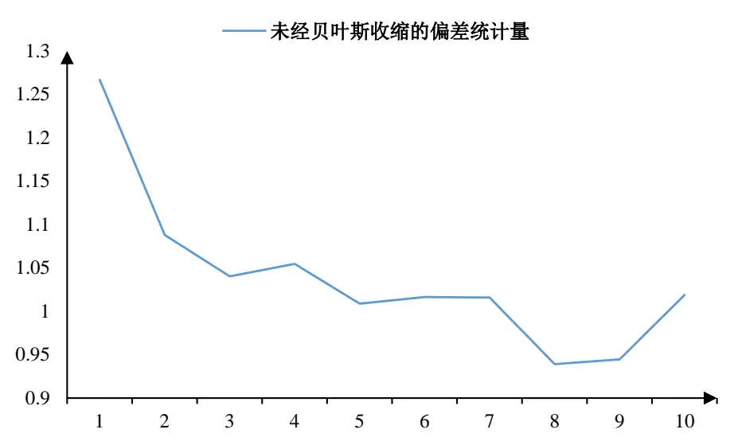
数据来源：国泰君安证券研究。数据区间：2013年4 月到2024年3月。

为了改变这一现象，本文使用贝叶斯收缩（Bayesian Shrinkage）[4]的方法对其进行调整。简而言之，对于每个股票，投资者可以根据其市值将其分为十分组。 $s_{n}$ 表示股票n所处的市值分类。所谓收缩正是希望将其向所在分组平均特质波动率进行收缩，进而提升特质波动率预测的稳定性。其收缩后的估计 $\sigma_{n}^{SH}$ 为：

$$
\sigma_{n}^{SH}=v_{n}\bar{\sigma}(s_{n})+(1-\textit{ v }_{n})\hat{\sigma}_{n}\tag{30}
$$

这里 ${\hat{\sigma}}_{n}$ 是前文介绍的经由结构化模型混合后的股票特质波动率； $v_{n}$ 为收缩密度，即被给与贝叶斯先验的权重：

$$
\bar{\sigma}(s_{n})=\sum_{n\in s_{n}}w_{n}\hat{\sigma}_{n}\tag{31}
$$

$$
v_{n}=\ \frac{q|\hat{\sigma}_{n}-\bar{\sigma}(s_{n})|}{\Delta_{\sigma}(s_{n})+q|\hat{\sigma}_{n}-\bar{\sigma}(s_{n})|}\tag{32}
$$

这里 $w_{n}$ 表示股票的流通市值； $q$ 为压缩系数。 $\Delta_{\sigma}$ 表示特质风险预测在该市值分组下的标准差。

$$
\Delta_{\sigma}(s_{n})=\ \sqrt{\frac{1}{N(s_{n})}\sum_{n\in s_{n}}(\hat{\sigma}_{n}-\bar{\sigma}(s_{n}))^{2}}\tag{33}
$$

从公式中可以看出，随着股票的预测风险与其所在市值分组的平均风险的偏离度越大时，其收缩密度 ${\ v{v}}_{n}$ 值越大，那么经过收缩后的风险值 $\sigma_{n}^{SH}$ 将对其贝叶斯先验风险 $\cdot\bar{\sigma}(s_{n})$ 赋予更高的权重。通过如上手段即可得到经由贝叶斯方法收缩后的最终特质性风险 $\sigma_{n}^{SH}$ 。

图 9：经由贝叶斯收缩后分组间偏差统计量差异缩小
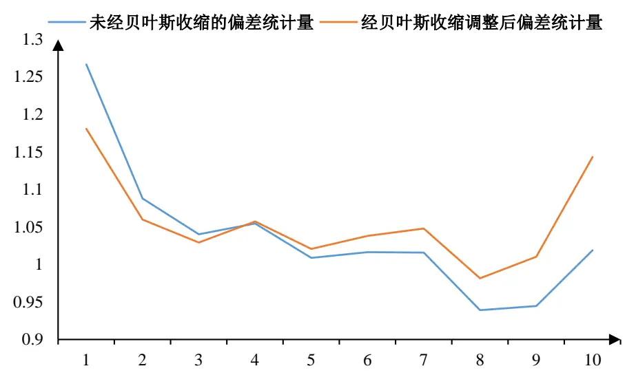
数据来源：国泰君安证券研究。数据区间：2013年4 月到2024年3月。

从图 9中不难发现经由贝叶斯收缩后，各个波动率分组间的偏差统计量差异在减小。但是同时意识到此时的偏差统计量大于 1。这说明本文模型整体低估了特质性投资组合的波动率。为了消除这部分估计偏差带来的影响，本文采用了根据波动率预测偏误调整股票特征风险的方法对股票特质波动率进行调整，得到最终的股票特质风险。

## 3.3. 根据波动率预测偏误调整股票特质波动率

在计算得出特质波动率后，本文采用与调整因子协方差矩阵相似的手段对其进行波动率偏误调整[4]（Volatility Regime Adjustment，VRA）。令 $\cdot\varepsilon_{n,t}$ 为股票n在时间t的特质波动率，令 $\sigma_{n,t}$ 为在当天的预测出的特质波动率。那么可以在t时间计算横截面加权的偏差统计量 $B_{t}^{S}$ ：

$$
B_{t}^{S}=\sqrt{\sum_{n}w_{nt}\left(\frac{\varepsilon_{n,t}}{\sigma_{n,t}}\right)^{2}}\tag{34}
$$

这里的 $w_{nt}$ 为股票 $\boldsymbol{\cdot n}$ 的流通市值。偏差统计量 $B_{t}^{S}$ 实际上是特质风险的一个实时度量。倘若模型低估了当天的特质波动率，则 $B_{t}^{S}>1$ 。就此可以通过时序上加权定义特质波动率乘数 $\lambda_{S}$ ：

$$
\lambda_{S}=\sqrt{\sum_{t}(B_{t}^{S})^{2}w_{t}}\tag{35}
$$

这里的 $w_{t}$ 为半衰期为 $\tau_{VRA}^{S}$ 的指数加权权重。为了使得特质波动率的估计与因子风险模型估计相同时效性相同，一般令 $\boldsymbol{\tau}_{VRA}^{S}=\boldsymbol{\tau}_{VRA}^{F}$ 。经由调整后特质波动率调整预测最终为 $\widehat{\sigma}_{n}^{s}$ ：

$$
\hat{\sigma}_{n}^{s}=\lambda_{S}\sigma_{n}^{SH}\tag{36}
$$

考察其在截面上的偏差统计量，发现经由调整后其横截面上偏差统计量波动减小，特质波动率预测精度得到提升。

图 10：波动率预测偏误调整后股票特质波动率截面偏差统计量在 1左右
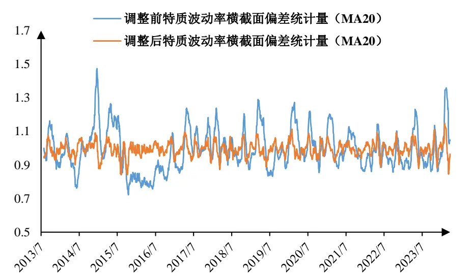
数据来源：国泰君安证券研究。数据区间：2013年7 月到2024年3月。

## 4. 股票协方差矩阵估计的应用举例

前两部分介绍了因子协方差矩阵预测、股票特质波动率的计算过程，两者结合可以得到股票协方差矩阵估计。下面举例介绍股票协方差矩阵估计在投资组合风险预测、风险归因和股票组合构建上的应用。

## 4.1. 投资组合风险预测

根据公式(6)，可以通过基于投资组合的持仓进行组合的波动率预测。本文将中证500指数视为投资组合，可以每天根据其成分股权重对其未来一个月波动率进行预测。同时根据未来一个月的实际日收益率序列计算其波动率作为预测的真实值，进而检验模型预测效果。

在实际的预测过程中，由于指数成分股可能具有 IPO 时间较短，缺少历史数据进而导致该股票的特质波动率预测出现缺失，影响对于持仓股票的风险矩阵的预测准确性。对于这些个别日期风险矩阵缺失的股票，本文采用该股票过去一段时间的样本协方差阵对股票风险矩阵进行填充，进而得到较为完整的股票风险矩阵预测。本文将其运用到中证 500指数中，中证500指数模型预测结果如图 11 所示。

整体而言，中证500指数的预测波动率分别和其未来一个月的实际波动率走势基本相同，预测相关性达到了70%。究其预测误差原因，一方面由于多因子模型本身仍具有一定的局限性，其预测效果具有一定时期的滞后性。另一方面由于本文对指数成分股权重的估计较为粗糙，也影响了对指数风险的预测效果。

图 11：中证 500指数波动率预测与实际未来一个月波动率
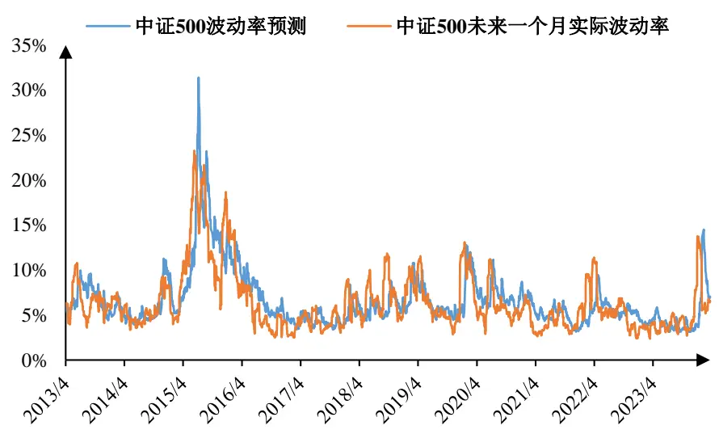
数据来源：Wind、国泰君安证券研究。数据区间：2013 年4 月至2024年3月。波动率统一进行月化处理。

## 4.2. 投资组合事后风险归因

在公式(6)中，投资组合的风险被归因到了因子上。在此基础上，可以从因子风险贡献的角度实现投资组合的风险归因。在2023年5月27日发布的《桥水全天候策略和风险平价模型全解析——大类资产配置量化模型研究系列之三》中，介绍了如何计算各资产对投资组合的风险贡献，进而实现对投资组合的风险归因。

简单来说，对于n个资产，其收益率为 $R=(R_{1},R,\ldots,R_{n})^{T}$ 。投资组合P 在这些资产上的权重为 $w=(w_{1},w_{2},\dots,w_{n})^{T}$ 。假设各个股票在m个因子上的因子暴露为X，如果我们假设各个因子之间相互独立，则根据公式(2)投资组合P 的收益率 $\cdot R_{P}$ 为：

$$
R_{P}=wR^{T}=w^{T}XF+w^{T}\varepsilon\tag{37}
$$

这里的X为n×m维因子暴露矩阵，F为m×1维因子收益率矩阵，ε为n×1维残差收益率矩阵。我们记 $.y=X^{T}w$ 为投资组合在各个因子上的暴露，$\eta=w^{T}\mathcal{E}$ 。对此过程求逆可以得到：

$$
w=B^{+}y+e\tag{38}
$$

这里的 $B=X^{T}$ $B^{+}$ 为B的广义逆矩阵。 $e=(I_{n}-B^{+}B)w$ 为B的核矩阵。结合2023年 5月 27日发布的《桥水全天候策略和风险平价模型全解析——大类资产配置量化模型研究系列之三》中的公式推导，根据多元函数求导法则可以得到投资组合的边际风险贡献 $\frac{\partial R(w)}{\partial w}$ 和因子的边际风险贡献 $\textstyle{\frac{\partial R(y,e)}{\partial y}}$ 具有如下关系：

$$
\frac{\partial R(w)}{\partial w}=\frac{\partial R(y,e)}{\partial y}\frac{dy}{dw}+\frac{\partial R(y,e)}{\partial e}\frac{de}{dw}\tag{39}
$$

那么对于第j个因子Fj，因子的边际风险贡献 $\frac{\partial R(y,e)}{\partial y}$ 为：

$$
\frac{\partial R(y,e)}{\partial y_{j}}=\left(X^{+}\frac{\partial R(w)}{\partial w}\right)_{j}=\frac{(X^{T}w)_{j}(X^{+}\Sigma w)_{j}}{\sigma_{p}}\tag{40}
$$

这里的Σ表示资产的协方差矩阵， $\sigma_{p}$ 为投资组合的波动率， $X^{+}$ 为X的广义逆矩阵。根据欧拉法则，其因子风险贡献率 $TRC_{j}(w)$ 即为：

$$
TRC_{j}(w)=\frac{\displaystyle\frac{\partial R(y,e)}{\partial y_{j}}}{\sigma_{p}}=\frac{(X^{T}w)_{j}(X^{+}\Sigma w)_{j}}{w^{T}\Sigma w}\tag{41}
$$

## 4.2.1. 投资组合风险归因

下面以沪深 300、中证 500指数作为投资组合，进行风险归因举例说明。考察全历史区间，计算可得对沪深 300、中证 500 指数平均风险贡献最高的前十个行业因子和风格因子如下：

图 12：沪深 300指数风险贡献拆解及贡献最大的10个行业因子与风格因子
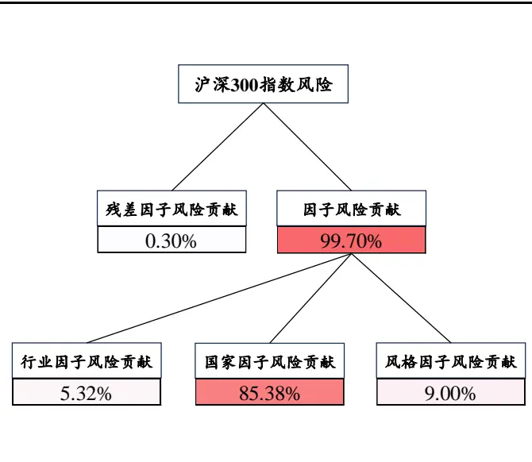

| 行业因子 | 风险贡献 | 风格因子 | 风险贡献 |
| --- | --- | --- | --- |
| 银行 | 1.45% | Size | 7.30% |
| 非银行金融 | 1.26% | Momentum | 0.41% |
| 食品饮料 | 0.70% | Residual Volatility | 0.34% |
| 医药 | 0.37% | Liquidity | 0.18% |
| 电子 | 0.25% | Beta | 0.16% |
| 电力设备及新能源 | 0.21% | Book-to-Price | 0.14% |
| 房地产 | 0.11% | Long-Term Reversal | 0.13% |
| 有色金属 | 0.09% | Earnings Yield | 0.10% |
| 家电 | 0.09% | Mid Capitalization | 0.09% |
| 汽车 | 0.09% | Dividend Yield | 0.05% |

数据来源：Wind，国泰君安证券研究。数据区间：2013年7 月至 2024年 3月。

图 13：中证 500指数风险贡献拆解及风险贡献最大的 10个行业因子与风格因子
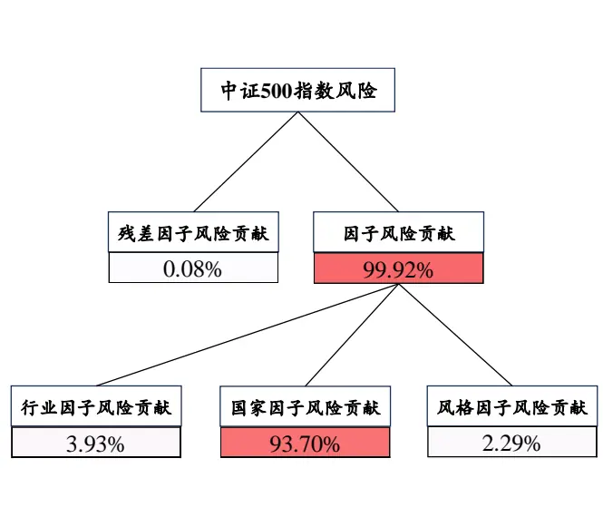

| 行业因子 | 风险贡献 | 风格因子 | 风险贡献 |
| --- | --- | --- | --- |
| 医药 | 0.69% | Size | 1.37% |
| 电子 | 0.38% | Beta | 0.33% |
| 计算机 | 0.31% | Momentum | 0.10% |
| 有色金属 | 0.24% | Book-to-Price | 0.09% |
| 房地产 | 0.20% | Residual Volatility | 0.09% |
| 电力设备及新能源 | 0.19% | Short-Term Reversal | 0.06% |
| 国防军工 | 0.19% | Long-Term Reversal | 0.05% |
| 传媒 | 0.18% | Mid Capitalization | 0.05% |
| 基础化工 | 0.15% | Industry Momentum | 0.04% |
| 电力及公用事业 | 0.13% | Earnings Yield | 0.03% |

数据来源：Wind，国泰君安证券研究。数据区间：2013年7 月至 2024年 3月。

对比沪深300指数与中证500 指数的各个因子风险贡献不难看出：

1） 整体而言，沪深300指数和中证500指数作为市场上备受投资者关注的宽基指数，国家因子对其风险贡献程度分别达到 85.4%和93.7%。

2） 行业上，沪深300指数中银行、非银金融行业的风险贡献程度较高，但中证500指数各个行业风险贡献较为分散。

3） 风格上，沪深300指数中Size因子对其风险贡献最高，达到7.30%；中证500指数中 Size因子的风险贡献占比仅为 1.37%。

## 4.2.2. 超额收益风险归因

上一小节介绍了如何对投资组合进行风险归因。在实际投资过程中，投资者可能会超额收益的风险来源。本小节通过分析中证 500 指数相对沪深300指数的超额收益波动为例，对其进行风险归因。

实际上，A投资组合针对B 投资组合的超额收益可以视为做空一份B投资组合的同时买入一份 A 投资组合。对于 A 投资组合的持仓权重 $w_{A}$ 与B投资组合的 $w_{B}$ ，超额收益的产生可以视为投资者持有一个投资组合E，其权重为 $w_{E}$ ：

$$
w_{E}=w_{A}-w_{B}\tag{42}
$$

尽管投资组合 $w_{E}$ 的权重和并不为 1，甚至有可能为 0（倘若 $w_{S}$ 与 $w_{B}$ 均和为 1），但这并不影响根据公式(41)可以得出其超额收益中的各个因子风险贡献的相对水平。同时，公式(41) 揭示了这样一条事实，无论是采用A 投资组合作为 B 投资组合的基准还是 B 投资组合作为 A 投资组合的基准，其各个因子的风险贡献的比例并不会发生改变。

考察中证500指数相对沪深 300指数超额收益，可以将超额收益的波动

率拆解各类因子上。各个因子风险贡献具体结果如下图 14 所示：

图 14：中证 500相对沪深 300超额收益的波动拆解及风险贡献最大的 10个行业与风格因子
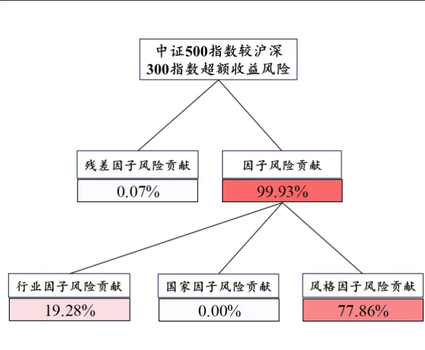

| 行业因子 | 风险贡献 | 风格因子 | 风险贡献 |
| --- | --- | --- | --- |
| 银行 | 4.59% | Size | 60.84% |
| 非银行金融 | 3.34% | Beta | 4.93% |
| 食品饮料 | 1.34% | Mid Capitalization | 4.84% |
| 计算机 | 0.32% | Momentum | 3.41% |
| 医药 | 0.28% | Long-Term Reversal | 2.02% |
| 传媒 | 0.27% | Book-to-Price | 1.83% |
| 电力设备新能源 | 0.24% | Liquidity | 1.66% |
| 国防军工 | 0.24% | Residual Volatility | 1.38% |
| 有色金属 | 0.14% | Earnings Yield | 0.76% |
| 基础化工 | 0.11% | Short-Term Reversal | 0.65% |

数据来源：Wind，国泰君安证券研究。数据区间：2013年7 月至 2024年 3月。

从上图可以看出，由于国家因子被完全对冲4，中证500 指数较沪深300指数超额收益的波动主要集中在风格因子上。由于中证 500 指数和沪深300指数主要在指数编制在市值上具有明显差异，因此 Size因子对超额收益的风险贡献较高，达到 60.84%，Beta 因子和 Mid Capitalization 因子风险贡献分别为 4.93%与 4.84%；在行业上，由于沪深 300 成分股中含有较多大市值银行与非银金融行业股票，其行业因子风险贡献分别为4.59%与 3.34%。

## 4.3. 投资组合构建上的应用

## 4.3.1. 最小方差组合

1952年Markowitz提出著名的“均值-方差模型”后，通过均值刻画预期收益，通过股票协方差矩阵刻画风险的配置方法逐渐被业界所认可。投资组合的构建依赖于股票协方差矩阵的良好预测。下面在中证500指数成分股内构建方差最小投资组合，用以介绍将风险模型在股票配置的应用 。

最小方差组合是指在寻求合适的资产权重使得投资组合的预期风险最小。以中证 500 指数成分股作为股票池，通过优化目标函数(43)，求解股票持仓权重。本文采用月度调仓的方式，同时限制各个股票持仓权重和为1，且控制其持仓相较指数偏离度不超过40%。

$$
\operatorname*{min}_{\boldsymbol{w}}\boldsymbol{w}^{T}\boldsymbol{\Sigma}_{S}\boldsymbol{w},\quad\boldsymbol{w}^{T}\mathbf{1}_{n}=1,\boldsymbol{w}>0,\sum\left|\boldsymbol{w}-\boldsymbol{w}_{0}\right|\leq40\%\tag{43}
$$

这里的 $\Sigma_{S}$ 为股票的协方差矩阵， $w_{0}$ 表示当期指数的成分股权重。作为对比，使用日度收益率序列计算样本协方差矩阵，构建最小方差策略进行对比。具体结果如图 15所示：

图 15：最小方差策略与中证 500指数走势对比
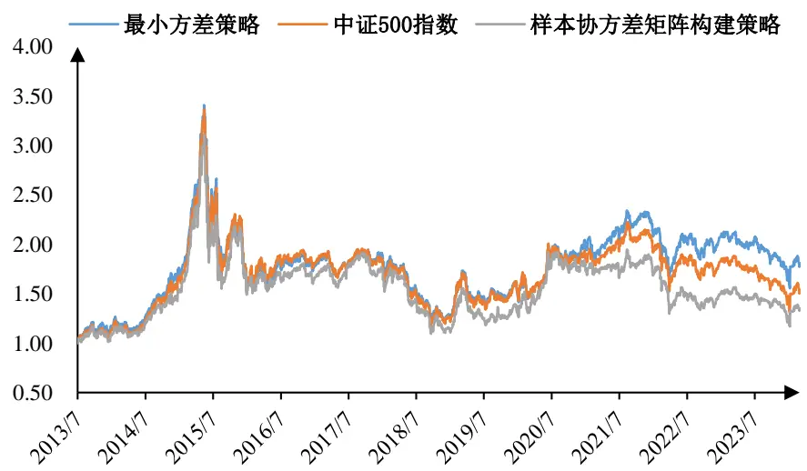

数据来源：Wind、国泰君安证券研究。数据区间：2013 年7 月至2024年3 月。

由表 2可以看出，本文所构建的最小方差策略年化收益为7.41%，相较于中证500指数具有一定的超额表现。重要的是策略的最大回撤与年化波动均较中证500指数有所降低，夏普比率与卡玛比率均有所提升。同时，本文所构建的最小方差策略相较样本协方差所构建的策略具有明显优势，其在最大回撤、年化波动和夏普比率方面表现更优。

表 2：最小方差策略收益表现

| 策略名称 | 年化收益 | 最大回撤 | 年化波动 | 夏普比率 | 卡玛比率 |
| --- | --- | --- | --- | --- | --- |
| 协方差矩阵估计构建最小方差策略 | 5.72% | 64.65% | 24.12% | 0.133 | 0.089 |
| 中证 500 指数 | 4.13% | 65.20% | 24.48% | 0.066 | 0.063 |
| 使用样本协方差矩阵构建最小方差策略 | 2.85% | 64.79% | 24.46% | 0.014 | 0.044 |

数据来源：Wind，国泰君安证券研究。数据区间：2013年7月至 2024 年3 月。

比较最小方差策略预测波动率和其未来一个月真实波动率的走势，最小方差策略的预测波动率与实际波动率走势较为贴合，其相关系数达到70%。

图 16：最小方差策略预测波动率与实际波动率对比
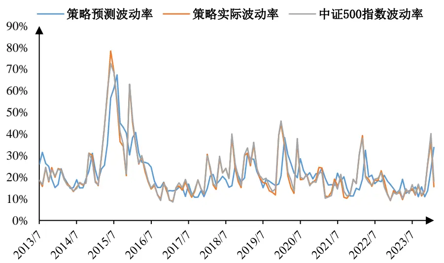
数据来源：Wind、国泰君安证券研究。数据区间：2013 年7 月至2024年3 月。

## 4.3.2. 指数增强组合

在指数增强策略组合构建中，需要控制跟踪误差时，会用到股票协方差矩阵估计。股票协方差矩阵估计的好坏，直接影响组合相对基准的跟踪效果。下面使用《权益因子观察周报》中的因子，在沪深 300指数、中证500指数成分股内分别构建指数增强策略。使用本文介绍的估计方法计算的股票协方差，约束条件只设置跟踪误差约束，来考察指数增强组合跟踪基准指数的效果。

对于样本池中的股票因子暴露（因子得分）为 ${\boldsymbol{\alpha}}=(\alpha_{1},\alpha_{2},\ldots,\alpha_{n})^{T}$ ，指数增强策略目标是实现投资组合α最大化：

$$
\operatorname*{max}_{w}\alpha^{T}w\tag{44}
$$

这里 $w=(w_{1},w_{2},\dots,w_{n})^{T}$ ，为各个股票的持仓权重。实际投资中，w需满足一系列限制条件：

1） 做空限制。即对所有的股票i均有 $0\leq w_{i}\leq1$

2） 权重之和为1。即 $\mathbf{1}_{n}^{T}w=1$ o

3） 跟踪误差控制。为了控制策略的与原指数持仓的贴合程度，投资者仍需对跟踪误差TE进行控制。本文设置年化跟踪误差小于 5%。跟踪误差TE计算公式如公式(46)所示：

$$
TE=\sqrt{(w-w_{b})^{T}\Sigma(w-w_{b})}\tag{45}
$$

这里的Σ表示股票的协方差矩阵，理想状态下其应为n维正定矩阵。因此，优化目标函数(44)由此转化为一个二阶锥规划问题（Second-Order ConeProgramming，SOCP）。

$$
\begin{array}{rl}&{TE=\sqrt{(w-w_{b})^{T}\Sigma(w-w_{b})}}\\&{TE^{2}=(w-w_{b})^{T}\Sigma(w-w_{b})}\\&{\qquad=(w-w_{b})^{T}U_{\Sigma}D_{\Sigma}U_{\Sigma}^{T}(w-w_{b})}\\&{\qquad=(w-w_{b})^{T}\Big(\sqrt{D_{\Sigma}}U_{\Sigma}^{T}\Big)^{T}\Big(\sqrt{D_{\Sigma}}U_{\Sigma}^{T}\Big)(w-w_{b})}\end{array}\tag{46}
$$

这 $\underline{{\Psi}}\Sigma=U_{\Sigma}D_{\Sigma}U_{\Sigma}^{T}$ 为股票协方差矩阵Σ的特征分解。根据前文所构建的股票协方差矩阵估计模型，投资者可以轻易的计算出每期的股票协方差矩阵，并将其带入公式(46)与公式(47)中，通过最优化 SOCP 问题进行指数增强策略构建。

沪深300和中证500指数增强策略表现如下所示。

图 17：沪深 300指数增强策略净值表现
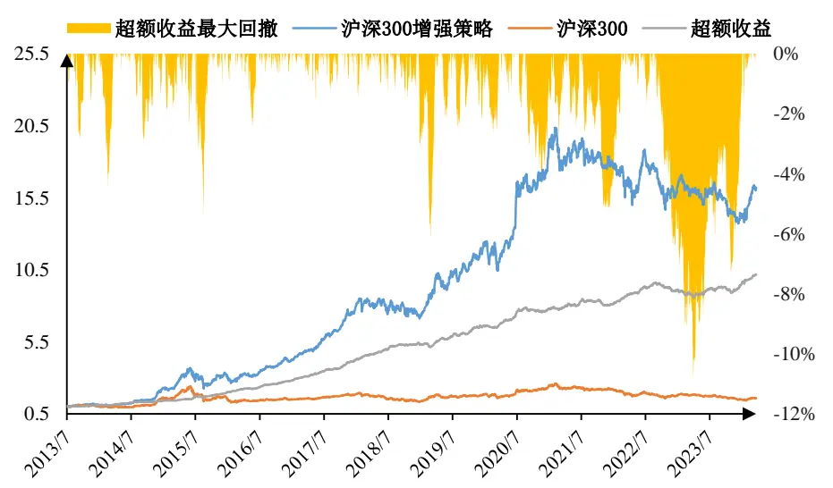
数据来源：Wind、国泰君安证券研究。数据区间：2013 年7 月至2024年3 月。

表 3：沪深300指数增强策略收益表现

| 策略名称 | 年化收益 | 最大回撤 | 年化波动/跟踪误差 | 夏普比率 | 卡玛比率 |
| --- | --- | --- | --- | --- | --- |
| 沪深 300 增强策略 | 29.61% | 39.13% | 23.30% | 1.16 | 0.76 |
| 沪深 300 指数 | 4.42% | 46.70% | 21.43% | 0.09 | 0.09 |
| 超额收益 | 24.13% | 10.82% | 6.26% | 3.45 | 2.23 |

数据来源：Wind，国泰君安证券研究。数据区间：2013年7月至 2024年3 月。

表 4：沪深300指数增强策略超额收益分年表现

| 年份 | 年化收益 | 最大回撤 | 跟踪误差 | 夏普比率 | 卡玛比率 |
| --- | --- | --- | --- | --- | --- |
| 2013 | 10.54% | 2.83% | 5.52% | 3.47 | 8.17 |
| 2014 | 26.21% | 4.53% | 5.82% | 3.76 | 5.73 |
| 2015 | 40.24% | 5.50% | 8.33% | 4.48 | 7.28 |
| 2016 | 42.96% | 2.44% | 5.96% | 6.86 | 17.55 |
| 2017 | 49.61% | 1.58% | 5.99% | 7.76 | 31.25 |
| 2018 | 30.39% | 1.51% | 5.68% | 4.83 | 20.13 |
| 2019 | 21.56% | 6.06% | 6.71% | 2.86 | 3.54 |
| 2020 | 16.95% | 4.39% | 6.24% | 2.39 | 3.86 |
| 2021 | 4.45% | 5.20% | 5.32% | 0.43 | 0.86 |
| 2022 | 12.60% | 6.38% | 5.51% | 1.98 | 1.98 |
| 2023 | 2.70% | 6.18% | 6.38% | 0.12 | 0.44 |
| 2024 | 8.67% | 1.70% | 6.44% | 6.14 | 24.47 |
| 合计 | 24.13% | 10.82% | 6.26% | 3.454 | 2.229 |

数据来源：Wind，国泰君安证券研究。数据区间：2013年7月至2024年 3 月。

图 18：中证 500指数增强策略净值表现
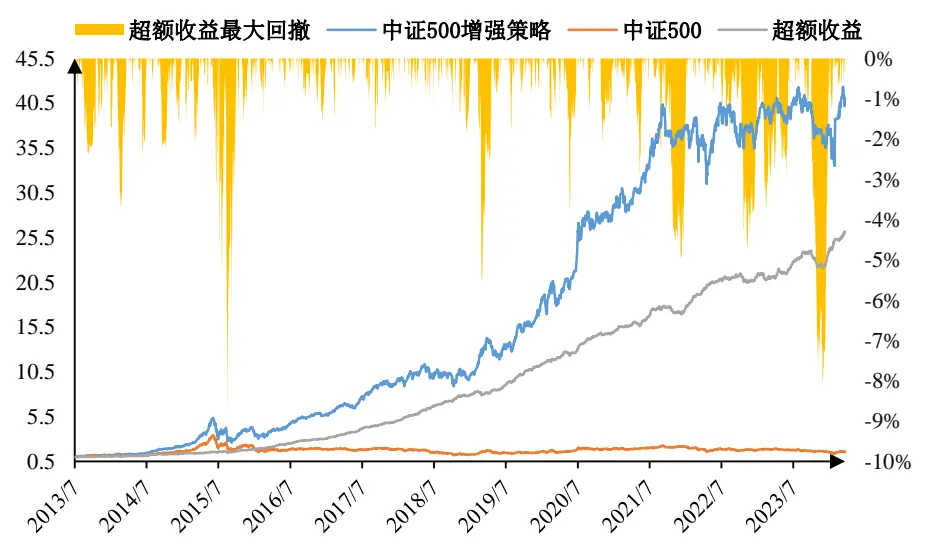
数据来源：Wind、国泰君安证券研究。数据区间：2013 年7 月至2024年3 月。

表 5：中证500指数增强策略收益表现

| 策略名称 | 年化收益 | 最大回撤 | 年化波动/跟踪误差 | 夏普比率 | 卡玛比率 |
| --- | --- | --- | --- | --- | --- |
| 中证 500 增强策略 | 41.34% | 51.64% | 27.24% | 1.42 | 0.80 |
| 中证 500 指数 | 4.31% | 65.20% | 24.49% | 0.07 | 0.07 |
| 超额收益 | 35.50% | 9.14% | 7.32% | 4.51 | 3.89 |

数据来源：Wind，国泰君安证券研究。数据区间：2013 年7 月至 2024年 3 月。

表 6：中证500指数增强策略超额收益分年表现

| 年份 | 年化收益 | 最大回撤 | 跟踪误差 | 夏普比率 | 卡玛比率 |
| --- | --- | --- | --- | --- | --- |
| 2013 | 8.80% | 2.44% | 5.58% | 2.72 | 7.86 |
| 2014 | 24.30% | 3.78% | 5.66% | 3.53 | 6.38 |
| 2015 | 37.05% | 9.14% | 13.03% | 2.62 | 4.04 |
| 2016 | 63.39% | 1.59% | 6.31% | 9.70 | 39.78 |
| 2017 | 65.93% | 1.81% | 6.56% | 9.57 | 36.32 |
| 2018 | 55.71% | 1.85% | 7.24% | 7.29 | 30.16 |
| 2019 | 43.59% | 5.61% | 7.08% | 5.81 | 7.74 |
| 2020 | 32.39% | 3.79% | 6.12% | 4.96 | 8.56 |
| 2021 | 16.13% | 5.13% | 5.94% | 2.35 | 3.15 |
| 2022 | 21.91% | 4.73% | 6.06% | 3.34 | 4.66 |
| 2023 | 10.58% | 8.08% | 6.61% | 1.32 | 1.31 |
| 2024 | 12.08% | 1.26% | 7.40% | 7.99 | 48.57 |
| 合计 | 35.50% | 9.14% | 7.32% | 4.51 | 3.89 |

数据来源：Wind，国泰君安证券研究。数据区间：2013年7月至2024年 3 月。

沪深 300 增强指数策略年化收益 29.61%，年化超额收益 24.13%，夏普比率 1.16，年化跟踪误差为 6.26%；中证 500 指数增强策略年化收益41.34%，年化超额收益 35.50%，夏普比率 1.42，年化跟踪误差为 7.32%。

本文同样测试了根据股票样本协方差带入公式(47)进行投资组合构建。但遗憾的是，股票样本协方差矩阵并不能正确的计算出策略结果。以沪深300指数为例，其 300个成分股的样本协方差矩阵受限于样本数量规模，其样本协方差矩阵并非为正定矩阵。在求解 SOCP 问题(45)时，公式(47)中的矩阵特征分解步骤并不可逆，导致求解结果并不稳定，进而影响策略的构建和使用。

当然，尽管本文控制年化跟踪误差为 5%以下，实际跟踪误差往往在 7%左右。这是由于对于风险模型而言，其所估计的风险仅仅解析了反应在过往收益率序列中的信息。但对于未来价格序列的风险，风险模型并不能进行完美预测，进而导致预测风险小于未来真实投资组合风险。在进行投资时，如果希望控制年化跟踪误差为5%以下，或应将目标年化跟踪误差控制在3%方可实现。

## 5. 总结

本文在2024 年 5月 19 日发布的《基于 Barra CNE6 的 A 股风险模型实践：风险因子篇——权益配置因子研究系列 06》的基础上，参考 Barra的中国股票风险模型 CNE6(2018)的方法，通过对因子协方差矩阵和股票特质性风险进行分别估计，进而实现了对股票协方差矩阵预测。

在估计因子协方差矩阵时，我们从各个因子的因子收益率出发，经由Newey-West方法调整；然后，根据特征值风险调整法对其矩阵相关性进行调整；最后，通过波动率预测偏误调整因子的波动率，完成了对因子协方差矩阵的估计。

在估计股票特质性风险的时，我们从各个股票的残差收益率时间序列出发，经由Newy-West方法估计各个股票的特质风险，并对于预测稳健性不足的股票构建了结构化模型增强其预测稳定性；然后，通过贝叶斯收缩方法增强股票特质性风险的预测一致性；最后，根据波动率预测偏误调整股票的特质波动率，完成对因子协方差矩阵的估计。

投资者可以利用本文所构建的多因子风险模型计算股票间的协方差矩阵，进而实现对投资组合的事前风险预测、事后风险归因，以及指数增强策略等股票投资组合的构建。

本文所构建的多因子风险组合相较于传统方法，即通过过去一段时间的股票收益率的样本协方差估计股票间协方差矩阵方法具有明显优势，其在时序上与截面上的偏差均有所控制。但模型中涉及参数众多，且模型运算较为复杂，投资者如若根据自己所构建的风险因子上进行协方差矩阵预测，仍需要对参数进行校对。

## 6. 参考文献

[1] Fama, E. F., & MacBeth, J. D. (1973). Risk, return, and equilibrium: Empirical tests. Journal of political economy, 81(3), 607-636.

[2] Grinold, R. C., & Kahn, R. N. (2000). Active portfolio management.

[3] Markowits, H. M. (1952). Portfolio selection. Journal of finance, 7(1), 71-91.

[4] Menchero, J., Orr, D., & Wang, J. (2011). The Barra US equity model (USE4), methodology notes. MSCI Barra.

[5] Menchero, J., Wang, J., & Orr, D. (2011). Eigen-adjusted covariance matrices. MSCI Barra Research Paper(2011-14).

[6] Morozov, J. Y. A. (2018). Barra China A Total Market Equity Trading Model (CNTR). MSCI Barra 2018.

[7] Nathan Sosner, X. L., and Guy Miller. (2005). CHE2: Forecasting Chinese Equity Risk. MSCI Barra.

[8] Newey, W. K., & West, K. D. (1987). Hypothesis testing with efficient method of moments estimation. International Economic Review, 777- 787.

[9] Orr, D., & Mashtaler, I. (2012). Supplementary Notes on the Barra China Equity Model (CNE5).

[10] Beat G. Briner.Rachael C. Smith.Paul Ward.(2009).The Barra Europe Equity Model (EUE3), Research Notes.

[11] Shepard, P. G. (2009). Second Order Risk. Papers.

[12] Zenios, S. A. (1993). Financial optimization: Cambridge university press.

[13] 石川，刘洋溢和连祥斌. (2020). 《因子投资:方法与实践》

## 7. 风险提示

量化模型基于历史数据构建，而历史规律存在失效风险。

## 8. 附录

## 8.1. 最优投资组合

我们首先回顾一下最小方差投资组合的构建过程。假设n个资产的协方差矩阵为Σ，最小方差组合w可以通过优化如下目标得到：

$$
\operatorname*{min}_{w}w^{T}\Sigma w,\quad w^{T}\mathbf{1}_{n}=1\tag{47}
$$

这里 ${\bf1}_{n}$ 表示一个n维列向量，其各个位置值为 1。根据Grinold and Kahn(2000)，我们可以得到其解析解 $w_{0}$ 为：

$$
w_{0}=\frac{\Sigma^{-1}\mathbf{1}_{n}}{\mathbf{1}_{n}^{T}\Sigma^{-1}\mathbf{1}_{n}}\tag{48}
$$

现在我们将其应用到m个因子及其因子协方差矩阵F上。如果我们的目标为限制因子收益率之和 $\alpha_{f}$ 为固定值（这里我们假设为 $\alpha_{f}=1)$ ），我们将此问题转化为指定收益率下风险最小化问题：

$$
\operatorname*{min}_{\boldsymbol{w}}\boldsymbol{w}^{T}\boldsymbol{F}\mathbf{w},\quad\boldsymbol{w}^{T}\boldsymbol{\alpha}_{m}=\boldsymbol{\alpha}_{f}\tag{49}
$$

这里 $\alpha_{m}$ 为各个因子的因子收益率序列。我们可以求得其解析解为：

$$
w_{f}=\frac{\Sigma^{-1}\alpha_{m}}{\alpha_{m}^{T}\Sigma^{-1}\alpha_{m}}\tag{50}
$$

我们通过随机生成 100 个因子收益率 $\alpha_{m}$ 即可得到对应 100 个对应的因子权重 $w_{f}$ ，我们称之为最优投资组合。

## 8.2. 偏差统计量

偏差统计量[4]被用来衡量风险模型的预测准确度。具体而 $\dot{\overline{{\overline{{\mathbf{u}}}}}}$ ，偏差统计量衡量的是真实风险和预测风险的相对比例。令 $R_{n,t}$ 表示投资组合n在t时间区间内的收益率。 $\sigma_{n,t}$ 表示区间开始时我们所做的投资组合波动率预测。令 $\cdot b_{n,t}$ 表示标准化后的收益率：

$$
b_{n,t}=\frac{R_{n,t}}{\sigma_{n,t}}\tag{51}
$$

如果对 $\cdot_{\pi,t}$ 是准确的，那么在中性条件下， $R_{n,t}$ 应服从均值为 0，方差为$\sigma_{n,t}^{2}$ 的正态分布。进一步可以得到 $b_{n,t}$ 的服从标准差接近于1的正态分布的猜想。记 $\boldsymbol{b}_{n,t}$ 的标准差为 $B_{n}$ ：

$$
B_{n}=\sqrt{\frac{1}{T-1}{\sum_{t=1}^{T}}\big(b_{nt}-\overline{{b_{nt}}}\big)^{2}}\tag{52}
$$

$B_{n}$ 即本文中的偏差统计量。相较于本文中所用到的波动率偏误调整法中出现的偏差统计量，这里的 $B_{n}$ 强调时序上的预测偏差，而本文中进行波动率预测偏误调整时用到的偏差统计量为界面上的预测偏差。

## 8.3. 国家因子为何对中性策略无风险贡献

在构建中性投资组合中，投资者往往希望通过某种投资组合对国家因子所造成的风险进行对冲。本小结将证明这一做法的合理性。

定义中性投资组合P的各个资产权重为 $w=(w_{1},w_{2},\dots,w_{n})^{T}$ ，其满足$w^{T}\mathbf{1}_{n}=0$ 。这里的 ${\bf1}_{n}$ 为n维列向量，其各个位置元素均为 1。

由于各个股票的国家因子暴露均为1，在公式(37)中，各个因子的因子暴露X可以改写为以下形式：

$$
{\cal X}=({\bf1}_{n},X_{0})\tag{53}
$$

这里的 $X_{0}$ 表示的是除了国家因子外其余所有因子的因子暴露。那么同样的，记 $.y=X^{T}w$ 为投资组合P在各个因子上的因子暴露。由于 $w^{T}\mathbf{1}_{n}=0$ 那么：

$$
y=X^{T}w=({\bf1}_{n},X_{0})^{T}w=(0,X_{0})^{T}\tag{54}
$$

即此时投资组合 P 在国家因子上无因子暴露。在公式(41)中，投资组合在国家因子上的风险贡献为 $TRC_{0}(w)$

$$
TRC_{0}(w)=\frac{\displaystyle\frac{\partial R(y,e)}{\partial y_{0}}}{\sigma_{p}}=\frac{(X^{T}w)_{0}(X^{+}\Sigma w)_{0}}{w^{T}\Sigma w}=\frac{0*(X^{+}\Sigma w)_{0}}{w^{T}\Sigma w}=0\tag{55}
$$

即此时国家因子对投资组合P无任何风险贡献。

## 本公司具有中国证监会核准的证券投资咨询业务资格

## 分析师声明

作者具有中国证券业协会授予的证券投资咨询执业资格或相当的专业胜任能力，保证报告所采用的数据均来自合规渠道，分析逻辑基于作者的职业理解，本报告清晰准确地反映了作者的研究观点，力求独立、客观和公正，结论不受任何第三方的授意或影响，特此声明。

## 免责声明

本报告仅供国泰君安证券股份有限公司（以下简称“本公司”）的客户使用。本公司不会因接收人收到本报告而视其为本公司的当然客户。本报告仅在相关法律许可的情况下发放，并仅为提供信息而发放，概不构成任何广告。

本报告的信息来源于已公开的资料，本公司对该等信息的准确性、完整性或可靠性不作任何保证。本报告所载的资料、意见及推测仅反映本公司于发布本报告当日的判断，本报告所指的证券或投资标的的价格、价值及投资收入可升可跌。过往表现不应作为日后的表现依据。在不同时期，本公司可发出与本报告所载资料、意见及推测不一致的报告。本公司不保证本报告所含信息保持在最新状态。同时，本公司对本报告所含信息可在不发出通知的情形下做出修改，投资者应当自行关注相应的更新或修改。

本报告中所指的投资及服务可能不适合个别客户，不构成客户私人咨询建议。在任何情况下，本报告中的信息或所表述的意见均不构成对任何人的投资建议。在任何情况下，本公司、本公司员工或者关联机构不承诺投资者一定获利，不与投资者分享投资收益，也不对任何人因使用本报告中的任何内容所引致的任何损失负任何责任。投资者务必注意，其据此做出的任何投资决策与本公司、本公司员工或者关联机构无关。

本公司利用信息隔离墙控制内部一个或多个领域、部门或关联机构之间的信息流动。因此，投资者应注意，在法律许可的情况下，本公司及其所属关联机构可能会持有报告中提到的公司所发行的证券或期权并进行证券或期权交易，也可能为这些公司提供或者争取提供投资银行、财务顾问或者金融产品等相关服务。在法律许可的情况下，本公司的员工可能担任本报告所提到的公司的董事。

市场有风险，投资需谨慎。投资者不应将本报告作为作出投资决策的唯一参考因素，亦不应认为本报告可以取代自己的判断。
在决定投资前，如有需要，投资者务必向专业人士咨询并谨慎决策。

本报告版权仅为本公司所有，未经书面许可，任何机构和个人不得以任何形式翻版、复制、发表或引用。如征得本公司同意进行引用、刊发的，需在允许的范围内使用，并注明出处为“国泰君安证券研究”，且不得对本报告进行任何有悖原意的引用、删节和修改。

若本公司以外的其他机构（以下简称“该机构”）发送本报告，则由该机构独自为此发送行为负责。通过此途径获得本报告的投资者应自行联系该机构以要求获悉更详细信息或进而交易本报告中提及的证券。本报告不构成本公司向该机构之客户提供的投资建议，本公司、本公司员工或者关联机构亦不为该机构之客户因使用本报告或报告所载内容引起的任何损失承担任何责任。

## 评级说明

## 1.投资建议的比较标准

投资评级分为股票评级和行业评级。以报告发布后的 12 个月内的市场表现为比较标准，报告发布日后的 12 个月内的公司股价（或行业指数）的涨跌幅相对同期的沪深 300 指数涨跌幅为基准。

## 2.投资建议的评级标准

报告发布日后的 12 个月内的公司股价（或行业指数）的涨跌幅相对同期的沪深 300 指数的涨跌幅。

|  | 评级 | 说明 |
| --- | --- | --- |
| 股票投资评级 | 增持 | 相对沪深 300指数涨幅15%以上 |
|  | 谨慎增持 | 相对沪深300指数涨幅介于5%～15%之间 |
|  | 中性 | 相对沪深 300指数涨幅介于-5%～5% |
|  | 减持 | 相对沪深 300指数下跌5%以上 |
| 行业投资评级 | 增持 | 明显强于沪深 300 指数 |
|  | 中性 | 基本与沪深300指数持平 |
|  | 减持 | 明显弱于沪深 300指数 |

## 国泰君安证券研究所

|  | 上海 | 深圳 | 北京 |
| --- | --- | --- | --- |
| 地址 | 上海市静安区新闸路 669 号博华广 场 20层 | 深圳市福田区益田路6003号荣超商 务中心 B 栋 27 层 | 北京市西城区金融大街甲9号金融 街中心南楼18层 |
| 邮编 | 200041 | 518026 | 100032 |
| 电话 | (021)38676666 | (0755)23976888 | (010)83939888 |
|  | E-mail: gtjaresearch@gtjas.com |  |  |