# 基于 level 2行情的高频因子选股效果研究：快照数据篇

——权益配置因子研究 08

## 本报告导读：

本报告研究快照数据高频因子的选股效果。因子类别有买卖价差、订单不平衡、订单簿斜率、快照数据价量相关性等。历史回测发现，整体上看，快照因子在中小市值股票池的选股效果较好；近 4 年或受益于小市值风格占优，在多数宽基指数（包括沪深 300）股票池中多头组超额收益均较好。

## 投资要点：

[T le_Summary] 快照因子介绍。快照因子类别有买卖价差、订单不平衡、订单簿斜率、快照数据价量相关性等。基于快照数据构建的因子投资逻辑较弱，部分因子超额收益来源是基于错误定价（过度反应后的反转效应）、承担风险溢价（低流动性、低波动的风险补偿）。

o数据处理上，使用专门的高频时间序列数据处理软件。主要因为Level2 数据量比较大，2014 年以来全部数据压缩后也有 8T 左右，每天增长几个 G。常用的有国外著名软件 KDB+、国内自主研发的后起之秀 DolphinDB 软件。

在各股票池进行单因子测试，筛选效果较好的快照因子。在多个宽基指数成分股内中都被选用的因子有 10 档买卖金额、10 档卖斜率和买卖比例相关性、价格高于卖一的比例、中间价相对买方均价均值。可以认为，这些因子在不同市值区间的适用性均较强。由于部分快照因子的投资逻辑不直观，偏数据挖掘，有效性需要样本外持续跟踪和观察。

等权加权的快照复合因子在各股票池的表现。从回测结果来看，快照因子在中小市值股票池(中证1000、中证2000）的选股效果较好，表现比较稳定；近 4 年或受益于小市值风格占优，在多数宽基指数（包括沪深 300）股票池中多头组超额收益均较好。控制市值行业无暴露，构建因子得分最大化组合，测算发现，2014 年 1月以来，沪深300内年化超额6.52%（2015年以来年化超额3.53%），超额最大回撤-20.16%；截至 2024 年 8 月 16 日，本年超额 11.39%，超额最大回撤-3.36%。中证 500 内年化超额 9.88%（2015 年以来年化超额7.67%），超额最大回撤-15.66%；本年超额8.1%，超额最大回撤3.11%。中证 1000 内年化超额收益 11.90%（2015 年以来年化超额11.01%），超额最大回撤-16.17%；本年超额10.74%，超额最大回撤-4.58%。中证 2000 内年化超额收益 13.06%（2016 年以来年化超额13.21%），超额最大回撤-20.47%；本年超额 5.7%，超额最大回撤-6.31%。允许市值行业适当暴露（相对基准指数，市值暴露最大偏离0.5 个标准差，行业权重最大偏离 2.5%），构建因子得分最大化组合，测算发现，2014 年 1 月以来，沪深 300 内年化超额 10.39%（2015年以来年化超额 7.22%），超额最大回撤-19.9%；截至 2024 年 8 月16 日，本年超额 11.2%，超额最大回撤-3.56%。中证 500 内年化超额 10.68%（2015 年以来年化超额 7.94%），超额最大回撤-16.21%；本年超额7.31%，超额最大回撤-4.62%。中证 1000内年化超额收益13.25%（2015 年以来年化超额 11.65%），超额最大回撤-18.20%；本年超额 8.42%，超额最大回撤-5.51%。中证 2000 内年化超额收益15.53%（2016 年以来年化超额 15.1%），超额最大回撤-18.92%；本年超额 4.72%，超额最大回撤-7.33%。

风险提示：量化模型基于历史数据构建，而历史规律存在失效风险。

able张雪杰(分析师)

0755-23976751

zhangxuejie025900@gtjas.com

登记编号S0880522040001

感谢实习生张中昊、张宇哲、董治麟对本文的贡献。

## [Table_Rep相关报告

低利率环境下的海外机构资产配置实践2024.09.10

莫迪 3.0 首秀引发股汇市场震荡 2024.07.25

大小盘均衡配置，成长略优于价值 2024.07.02

重视周期，把握结构性行业配置机会 2024.06.21总量与边际并重，通过景气度、超预期、估值和拥挤度构建行业轮动模型 2024.06.20在之前的多因子研究系列报告中，我们研究了超预期因子、分钟高频因子在不同股票池的选股效果，介绍了中证500、中证 1000 和中证2000等指数增强策略的构建，实现了基于 CNE6 的 A 股风险模型（风险因子和协方差矩阵估计）。本篇报告使用沪深交易所 level 2行情中 10档快照数据计算的高频因子，并对其选股效果进行测试。首先，介绍快照高频因子的计算方法。然后，在各股票池进行单因子测试，筛选出效果较好的因子。最后，等权加权得到复合因子，测试其在各股票池的表现，供投资者参考。

## 1. 基于快照数据的高频因子介绍

沪深 Level2 行情数据是目前 A 股市场上最完整、颗粒度最细、信息含量最丰富的行情数据。目前 Level2数据主要有四种类型：盘口快照数据（3秒）、逐笔成交数据、逐笔委托数据、委托队列数据。从市场微观结构出发，对于高频数据的研究和因子开发一直是近期量化选股研究的热点。本报告主要使用 3秒快照行情数据，计算快照类因子。

快照因子类别主要有买卖价差、订单不平衡、订单簿斜率1、快照数据价量相关性等。具体见表1。具体因子设计上，我们在每个时间截面常用快照指标的基础上，计算指标所有时刻的均值、标准差、IR（均值/标准差）、偏度、峰度等统计量构建新的因子。

从因子的算法可以看出，这些因子投资逻辑不强。部分因子超额收益来源是错误定价（过度反应后的反转效应）、承担风险溢价（低流动性、低波动的风险补偿）。整体上来说。多数因子的选用基于历史表现，偏数据挖掘，投资逻辑整体不如基本面类因子强。

数据处理上，使用专门的高频时间序列数据处理软件。常用的有国外著名软件 KDB+、国内自主研发的后起之秀 DolphinDB 软件。主要还是因为Level2数据量比较大，2014年以来全部数据压缩后也有 8T左右，每天增长几个G。常规软件比如python、Matlab等较难应对，处理起来相对吃力。

具体选股效果测算上，我们先按照表1的方法计算因子值，然后使用20日的平均值作为选股因子，分别测算因子原始值、市值行业中性化后因子的周度选股的效果。选股域上，分别将沪深300、中证 500、中证 1000、中证2000、中证全指五个指数成分股作为股票池。每周进行调仓操作，分组测试按因子值从小到大排序分5组或10组，分别为t0、t1、t2、…、t8、t9组。因子效果评价上，计算因子 IC、分组收益、多头组超额收益等绩效指标考察单因子表现。回测日期区间主要为 2014 年 1 月至 2024 年 8 月。分组超额收益使用第二天的VWAP 价格进行买卖。对于中证 1000和中证 2000指数，和报告《中证1000 和中证2000指数增强策略构建》中做法一样，按照指数编制方法，估算历史成分股名单用于回测。

表 1：快照因子列表及计算方法，投资逻辑不如财务类因子强

|  | 快照因子 |  | 具体算法说明 | 用法 |
| --- | --- | --- | --- | --- |
|  | 3秒成交金额 | 均值 |  | 越小越好 |
|  | 3秒成交金额 3秒成交金额 | 标准差 |  | 越大越好 越小越好 |
| 盘口价量 | 3秒成交金额 | IR |  |  |
|  |  | 偏度 峰度 |  | 越小越好 |
|  | 3秒成交金额 |  |  | 越大越好 越大越好 |
|  | 10档卖金额 10档卖金额 | 均值 | 首先计算每个时间截面的10档卖 |  |
|  |  | 标准差 | 金额之和，然后使用所有截面的 |  |
|  | 10档卖金额 |  | 值，分别计算均值、标准差、IR | 越大越好 |
|  |  | IR | (均值/标准差)、偏度峰度 | 越大越好 |
|  | 10档卖金额 10档卖金额 | 偏度 峰度 |  | 越小越好 越小越好 |
|  | 20档委托量的峰度 | 均值 | 直接使用每个时间截面的20档买 | 越小越好 |
|  | 20档委托量的峰度 |  |  |  |
|  |  | 标准差 | 卖量计算峰度，然后分别计算均 值、标准差、IR（均值/标准 | 越小越好 |
|  | 20档委托量的峰度 | IR |  | 越小越好 |
|  | 20档委托量的峰度 20档委托量的峰度 | 偏度 | 差）、偏度峰度 | 越大越好 越大越好 |
| 20档委托量的偏度 | 峰度 |  | 越小越好 |  |
| 20档委托量的偏度 | 均值 |  |  |  |
| 20档委托量的偏度 | 标准差 | 同上 | 越小越好 |  |
|  | IR |  | 越大越好 |  |
| 20档委托量的偏度 20档委托量的偏度 |  |  | 越大越好 |  |
|  |  | 偏度 |  | 越大越好 |
|  | 10档买均价相对买一比值+10档卖均价相对卖一比值 | 峰度 均值 |  | 越大越好 |
|  | 10档买均价相对买一比值+10档卖均价相对卖一比值 | 标准差 |  | 越大越好 |
|  | 10档买均价相对买一比值+10档卖均价相对卖一比值 | IR |  | 越小越好 越小越好 |
|  | 10档买均价相对买一比值+10档卖均价相对卖一比值 | 偏度 |  |  |
|  | 10档买均价相对买一比值+10档卖均价相对卖一比值 | 峰度 |  | 越大越好 越大越好 |
|  | （卖均价-买均价）除以中间价 | 均值 | 同上 | 越小越好 |
|  | （卖均价-买均价）除以中间价 | 标准差 IR |  | 越大越好 越小越好 |
|  | 关因子 | （卖均价-买均价）除以中间价 （卖均价-买均价）除以中间价 |  |  |
|  | （卖均价-买均价）除以中间价 买卖价差相 | 偏度 |  | 越小越好 |
|  | 价格高于卖一的比例 | 峰度 |  | 越小越好 |
|  | 价格低于买一的比例 |  |  | 越小越好 |
|  | 10档买均价相对买一比值和10档卖均价相对卖一比值的相关性 10档买卖金额相关性 |  |  | 越大越好 越大越好 |
|  | 全部买卖价格相关性 |  |  | 越小越好 |
| 10档买卖均价相关性 中间价相对买方均价 |  |  | 越小越好 |  |
| 中间价相对买方均价 | 均值 | 计算每个时间截面中间价相对买 方均价的比值，然后使用所有截 | 越大越好 |  |
| 中间价相对买方均价 | 标准差 | 面的值，分别计算均值、标准差 | 越小越好 |  |
| 中间价相对买方均价 | IR | 、IR（均值/标准差）、偏度峰 | 越大越好 越小越好 |  |
| 中间价相对买方均价 |  | 度 | 越小越好 |  |
|  |  | 偏度 峰度 |  |  |
| 订单不平衡 相关因子 |  |  | 同上 | 越大越好 |
|  | (委买量-委卖量)/(委买量+委卖量) | 均值 |  | 越小越好 |
|  | (委买量-委卖量)/(委买量+委卖量) | 标准差 |  | 越大越好 |
|  | (委买量-委卖量)/(委买量+委卖量) (委买量-委卖量)/(委买量+委卖量) | IR 偏度 |  | 越小越好 |
|  | (委买量-委卖量)/(委买量+委卖量) 10档买卖不平衡 | 峰度 |  | 越小越好 越大越好 |
|  |  | 均值 |  | 越小越好 |
|  | 10档买卖不平衡 | 标准差 | 10档卖金额之和-10档买金额之 和 | 越大越好 |
|  | 10档买卖不平衡 | IR |  | 越小越好 |
|  | 10档买卖不平衡 10档买卖不平衡 | 偏度 峰度 |  | 越小越好 越大越好 |
|  |  | 10档买卖不平衡除以总金额 10档买卖不平衡除以总金额 | 均值 计算每个时间截面10档买卖不平 标准差 | 越小越好 |
|  | 10档买卖不平衡除以总金额 |  | 衡/（10档卖金额之和+10档买金 额之和)，然后使用所有截面的 | 越大越好 |
|  |  | IR | 值，分别计算均值、标准差、IR | 越大越好 |
|  | 10档买卖不平衡除以总金额 | 偏度 | (均值/标准差)、偏度峰度 | 越小越好 |
|  | 10档买卖不平衡除以总金额 10档卖斜率 | 峰度 | 每个时间截面使用10档卖价和10 | 越大越好 |
|  |  |  | 越小越好 |  |
| 订单簿斜率 相关因子 | 10档卖斜率 | 均值 | 档卖量做回归，求斜率，然后使 |  |
|  | 10档卖斜率 | 标准差 IR | 用所有截面的值，分别计算均值 | 越小越好 |
|  | 10档卖斜率 | 偏度 | 、标准差、IR（均值/标准差） | 越小越好 越小越好 |
|  | 10档卖斜率 10档卖回归R方 | 峰度 均值 | 、偏度峰度 | 越大越好 |
|  | 10档卖回归R方 10档卖回归R方 | 标准差 | 同上 | 越大越好 越大越好 |
|  | 10档卖回归R方 | IR 偏度 |  | 越小越好 |
|  | 10档卖回归R方 10档卖残差 | 峰度 |  | 越小越好 越小越好 |
|  | 10档卖残差 | 均值 |  | 越小越好 |
|  | 10档卖残差 10档卖残差 | 标准差 IR | 同上 | 越大越好 越小越好 |
|  | 10档卖残差 |  | 偏度 峰度 | 越小越好 |
|  | 10档卖斜率和买卖不平衡比例相关性 |  |  | 越小越好 |
|  | 10档卖斜率和买卖比例相关性 |  |  |  |
|  |  |  |  | 越小越好 |
|  | 10档卖斜率和中间价相关性 |  |  | 越小越好 越小越好 |
| 10档卖斜率和成交价相关性 |  |  |  |  |
| 10档卖斜率和买卖价差相关性 |  |  |  |  |
|  |  |  | 越小越好 |  |
|  |  |  | 越小越好 |  |
| 10档买斜率和买卖不平衡比例相关性 |  |  |  |  |
| 10档买斜率和买卖比例相关性 |  |  |  |  |
| 10档买斜率和中间价相关性 |  |  | 越小越好 越小越好 |  |

数据来源：国泰君安证券研究

## 2. 单因子选股效果展示

## 2.1. 不同股票池的因子 IC

表 2：不同股票池快照因子的rankIC

|  |  | 000300.SH |  |  |  | 000852.SH |  |  |  | 000905.SH |  |  |  | 000985.SH |  |  |  | 932000.CSI |  |  |  |  |
| --- | --- | --- | --- | --- | --- | --- | --- | --- | --- | --- | --- | --- | --- | --- | --- | --- | --- | --- | --- | --- | --- | --- |
|  |  | 原始值市行业中 |  |  |  | 原始值市值行业中 |  |  |  | 医值市值行业中 |  |  |  | 原始值市值行业中 |  |  |  | 原始值市值行业中 |  |  |  |  |
|  | 均值 | L | 2.91% |  | 2.32% |  | 6.66% |  | 5.62% |  | 4.74% |  | 4.13% |  | 6.69% |  | 5.56% |  | 8.65% |  |  | 6.89% |
|  | 标准差 |  | 2.33% |  | 1.58% |  | 0.87% |  | 0.47% |  | 0.91% |  | 0.13% |  | 0.24% |  | 0.45% |  | 0.49% |  |  | 0.67% |
|  | IR |  | .50% |  | .62% | E | .19% |  | .34% | E | .86% |  | .86% |  | .64% |  | 1.28% |  | .98% |  |  | 1.56% |
|  | 峰度 |  | .08% |  | .82% |  | .63% |  | 1.26% |  | 1.23% |  | 3.89% |  | 4.61% |  | 3.93% |  | .19% |  |  | 4.53% |
|  | 均值 |  | .00% |  | .42% |  | 2.97% |  | .17% |  | .43% |  | 1.71% |  | .24% |  | 1.52% |  | 4.16% |  |  | 3.26% |
|  | 标准差 |  | 0.67% |  | 0.28% |  | 2.52% |  | 1.60% |  | 1.39% |  | 0.90% |  | 2.61% |  | 1.24% |  | 2.98% |  |  | 1.90% |
|  | IR |  | 0.48% |  | 0.27% | L | 1.93% |  | 0.98% |  | 1.11% |  | 0.53% | L | 2.18% |  | 0.37% | 2.34%1.10% |  |  |  |  |
| 10档买均价相对买一比值+10档卖均价相对卖一比值 | 偏度 |  | 1.85% |  | 1.15% | L | 1.77% |  | 0.99% |  | 1.77% |  | 1.12% |  | 1.19% |  | 1.27% | 01.96% |  |  |  |  |
| 10档买均价相对买一比值+10档卖均价相对卖一比值 | 峰度 |  | 0.40% |  | 0.69% |  | 0.08% |  | 0.12% |  | 0.37% |  | 0.65% |  | 10.38% |  | 0.10% |  | 0.27% |  |  | 0.09% |
| 10档卖金额 | 均值 |  | 154% |  | 0.86% |  | 0.85% | B | 0.82% |  | 0.00% |  | 0.37% | 1 | .61% |  | 0.12% | 2 | .03% |  |  | 0.58% |
| 10档卖金额 | 标准差 |  | 0.80% |  | 0.04% | 口 | 3.12% |  | 2.31% | D | 1.77% |  | 1.80% | 口 | 3.75% |  | 1.85% |  | 5.03% | 2. |  | 81% |
| 10档卖金额 | IR |  | 2.82% |  | 2.33% |  | 4.33% |  | 3.15% |  | 3.21% |  | 2.25% |  | 4.67% |  | 3.99% |  | 6.14% |  |  | 4.75% |
| 10档卖金额 | 偏度 | .8 | 2% | 5 | .82% | .0 | 1% | 1 | 3.74% |  | .86% | B. | 85% | 75. | 12% | □ | .27% |  | -6.19% 1 |  |  | 4.90% |
| 10档卖金额 | 峰度 | L | 3.00% | 2 | .17% | 日 | 4.70% | 3. | 68% | 口 | 3.60% | 口 | 2.65% |  | 4.78% | 4. | 18% |  | 5.87% 4.8 |  |  | 4% |
| （卖均价-买均价）除以中间价 | 均值 |  | 154% |  | 1.23% |  | 2.87% |  | 165% |  | 172% |  | 0.80% |  | 3.03% |  | 2.14% |  | 3.81% |  |  | 2.67% |
| (卖均价-买均价)除以中间价 | 标准差 |  | 0.55% |  | 0.21% |  | 0.82% |  | 0.41% |  | 0.17% |  | 0.16% |  | 1.33% |  | 0.08% |  | 146% |  |  | 0.46% |
| (卖均价-买均价)除以中间价 | IR |  | 186% |  | 163% |  | 1l95% |  | 0.97% |  | 186% |  | 0.92% |  | 158% |  | 178% |  | 2.26% |  |  | 210% |
| （卖均价-买均价）除以中间价 | 偏度 | 1. | 67% | B | 1.05% | 日 | 0.94% |  | 0.48% | 1 | .40% |  | E0.80% |  | 0.28% |  | 0.49% |  | 0.21% |  |  | 10.60% |
| (卖均价-买均价)除以中间价 | 峰度 | D | 0.79% |  | 10.59% | G | 1.19% |  | 10.62% |  | 0.67% |  | 0.21% |  | 10.68% |  | 10.58% |  | 0.74% B |  |  | 0.97% |
| (委买量-委卖量)/(委买量+委卖量) | 均值 |  | 2.56% |  | 1.17% |  | 0.67% |  | 0.74% |  | 0.96% |  | 0.77% |  | 0.34% |  | 0.18% |  | 0.17% |  |  | 0.29% |
| (委买量-委卖量)/（委买量+委卖量) | 标准差 |  | 0.56% |  | 0.50% | 0 | .90% |  | 0.52% | B | 0.89% |  | 0.31% |  | 10.59% |  | 1.21% | L | 1.32% | L |  | 1.06% |
| (委买量-委卖量)/（委买量+委卖量) | IR |  | 2.49% |  | 0.19% |  | 0.49% |  | 0.80% |  | 0.38% |  | 0.11% |  | 0.38% |  | 0.43% |  | 0.05% |  |  | 0.54% |
| (委买量-委卖量)/(委买量+委卖量)(委买量-委卖量)/(委买量+委卖量) | 偏度 | .9 | 6% | L | .75% | -6 | .24% | 3.0 | 5% | 4. | 68% | .8 | 6% |  | -6.55% |  | $.52% | L | 1.44% | 6. |  | 07% |
|  | 峰度 | 2. | 35% | E | 1.04% | 2. | 49% |  | 2.05% |  |  |  |  |  |  |  |  |  |  |  |  |  |
| 10档买卖不平衡 | 均值 |  | 3.55% |  | 2.30% |  | 4.90% |  | 3.98% |  | 4.23% |  | 3.22% |  | 5.41% |  | 4.46% |  | 5.77% |  |  | 4.77% |
| 10档买卖不平衡除以总金额 | 均值 |  | 3.39% |  | 2.24% |  | 3.45% |  | 3.09% |  | 3.36% |  | 2.73% |  | 4.00% |  | 3.51% |  | 3.93% |  |  | 3.51% |
| 10档买卖不平衡除以总金额 | 标准差 | 2. | 21% | 5 | .64% | 3. | 92% | B. | 81% | 2. | 72% |  | .83% | 4. | 09% | ☐. | 44% | 5. | 51% | .2 |  | 7% |
| 10档买卖不平衡除以总金额 | IR |  | 193% |  | 0.84% |  | 1.05% |  | 1.19% |  | 135% |  | 1.07% |  | 1.03% |  | 0.76% |  | 0.07% |  |  | 1.22% |
| 10档买卖不平衡除以总金额 | 偏度 |  | 173% |  | 0.92% |  | 1.42% |  | 0.46% |  | 1.15% |  | 0.31% |  | 0.99% |  | 0.47% |  | 0.98% |  |  | 0.46% |
| 10档买卖不平衡除以总金额 | 峰度 | E | .44% |  | 5.56% | L | .71% |  | .38% | L | 1.78% |  | 2.18% | L | .17% |  | .58% | L | 2.98% | L |  | 2.62% |
| 10档买卖不平衡 | 标准差 | -0 | .28% |  | -0.77% | -5 | .36% | L | 4.27% | L | 3.40% | C. | 04% | -. | 20% |  | .28% |  | .88% |  |  | 5.75% |
| 10档买卖不平衡 | IR |  | 3.00% |  | 2.02% |  | 2.83% |  | 2.50% |  | 2.89% |  | 2.33% |  | 3.27% |  | 2.91% |  | 3.00% |  |  | 2.66% |
| 10档买卖不平衡 | 偏度 | 口 | 2.55% | B | 1.66% | 3. | 93% | 2. | 88% | 口 | 3.31% | 口 | 2.46% | 3. | 79% | 3 | .26% |  | 4.54% | 3. |  | 76% |
| 10档买卖不平衡 | 峰度 |  | 0.50% |  | 0.38% |  | 0.38% |  | 0.15% |  | 0.60% |  | 0.27% |  | 0.14% |  | 0.01% |  |  |  |  |  |
| 价格高于卖一的比例价格低于买一的比例 |  |  | .83% |  | F.71% |  | .96% |  | .48% | - | 4.19% |  | 3.05% |  | .51% |  | .14% |  | .48% |  |  | .71% |
|  |  | D | 2.28% | L | 1.27% |  | 4.33% | 口 | 2.87% | 口 | 2.99% | L | 2.00% |  | 4.57% | 3 | .33% |  | 5.98% |  |  | 4.42% |
| 10档买均价相对买一比值和10档卖均价相对卖一比值 | 的相关性 |  | 2.21% |  | 1.76% |  | 3.36% |  | .52% |  | 2.69% |  | 1.95% |  | 2.80% |  | 2.26% |  | 2.69% |  |  | 2.60% |
| 10档买卖相关性 |  |  | 184% |  | 1.19% |  | 4.01% |  | 3.12% |  | 2.77% |  | 174% |  | 3.96% |  | 3.40% |  | 5.16% |  |  | 4.32% |
| 全部买卖价格相关性 |  | L | 1.45% |  | 0.52% |  | 10.29% |  | 0.02% | B | 1.05% |  | 10.64% |  | 0.43% |  | 0.14% |  | 0.17% |  |  | 0.20% |
| 10档买卖均价相关性 |  | 口 | 2.66% | 1 | .58% |  | 4.97% | 3. | 86% | D | 3.72% | L | 2.90% |  | 5.39% |  | 4.29% |  | 6.82% |  |  | 4.94% |
| 中间价相对买方均价 | 均值 |  | 2.83% |  | 2.23% |  | 5.82% |  | 4.43% |  | 4.06% |  | 2.88% |  | 6.35% |  | $.32% |  | 7.67% |  |  | 6.20% |
| 中间价相对买方均价 | 标准差 | L | 1.05% |  | 0.74% | L | 1.84% |  | 1.89% | L | 1.35% | L | 1.21% | 2 | .01% |  | 2.77% | 口 | 3.79% 口 |  |  | 3.61% |
| 中间价相对买方均价 | IR |  | 2.09% |  | 178% |  | 2.85% |  | 187% |  | 2.38% |  | 151% |  | 2.56% |  | 2.67% |  | 3.86% |  |  | 3.30% |
| 中间价相对买方均价 | 偏度 |  | 2.18% |  | B1.32% |  | 2.32% |  | 1.46% |  | 2.49% |  | L1.62% | L | 1.69% | L | 1.68% | 2 | .42% 2 |  |  | .19% |
| 中间价相对买方均价 | 峰度 |  | 0.13% |  | 0.14% |  | 0.36% |  | 0.70% |  | 0.20% |  | 0.48% |  | 1.05% |  | 0.61% |  | 0.69% |  |  | 0.19% |
| 20档委托量的峰度 | 均值 | 2 | .19% | D | 1.78% | D | 3.44% |  | 2.29% | 2 | .70% |  | L1.61% | 3. | 45% | 3 | .03% |  | 4.69% 3. |  |  | 77% |
| 20档委托量的峰度 | 标准差 | D | 1.86% | B | 1.40% | D | 2.29% | L | 1.32% | D | 1.89% | 1 | 1.02% | D | 2.16% | D | 1.87% | 口 | 2.94% D |  |  | 2.37% |
| 20档委托量的峰度 | IR | 2. | 39% |  | .85% | 3. | 70% |  | 1.48% | L | 2.88% | 5 | .72% | 3. | 76% | L | 3.29% | 4 | .87% B |  |  | 3.88% |
| 20档委托量的峰度 | 偏度 |  | 2.04% |  | 167% |  | 189% |  | 0.86% |  | 185% |  | 0.93% |  | 162% |  | 1.02% |  | 177% |  |  | 1.07% |
| 20档委托量的峰度 | 峰度 |  | 200% |  | 194% |  | 4.00% |  | 2.77% |  | 3.04% |  | 198% |  | 4.14% |  | 3.53% |  | 5.50% |  |  | 4.40% |
| 20档委托量的偏度 | 均值 | L | 2.03% |  | 1.66% | L | 3.18% | D | 2.05% | D | 2.47% |  | L1.45% |  | 3.18% | 2 | .79% |  | 4.38% D |  |  | 3.47% |
| 20档委托量的偏度 | 标准差 |  | 1.96% | L | 1.36% | L | 2.12% | L | 1.25% |  | L1.88% |  | 1.05% |  | 1.94% | 1 | .68% | 口 | 2.53% |  |  | 2.17% |
| 20档委托量的偏度 | IR |  | 0.21% |  | 10.54% |  | 1.72% | L | 0.94% |  | 0.72% |  | 0.35% |  | 1.86% | L | 1.58% | 口 | 2.88% |  |  | 2.03% |
| 20档委托量的偏度 | 偏度 |  | 2.05% |  | 146% |  | 160% |  | 0.65% |  | 160% |  | 0.80% |  | 1.27% |  | 0.68% |  | 1.19% |  |  | 0.59% |
| 20档委托量的偏度 | 峰度 |  | 39% |  | 1.63% |  | 3.73% |  | 1.57% |  | 1.75% |  | 1.87% |  | 4.03% |  | 3.39% |  | 5.30% |  |  | 4.14% |
| 10档卖斜率 | 均值 |  | 0.33% |  | 0.50% | L | 1.31% | L | 1.10% | L | 1.20% |  | 0.72% | L | 1.49% | 1 | .58% | 2 | .12% L |  |  | 1.66% |
| 10档卖斜率 | 标准差 | 1 | .69% |  | 0.83% |  | 1.89% | 1 | 0.69% |  | 1.40% |  | 10.34% | L | 1.50% | L | 1.43% | L | 2.48% |  |  | 1.84% |
| 10档卖斜率 | IR | 日 | 0.95% |  | 0.02% | 1 | 0.76% |  | 10.56% |  | L1.23% |  | 0.70% |  | E1.02% |  | 0.48% | H | 0.88% |  |  | 0.53% |
| 10档卖斜率 | 偏度 | B. | 72% |  | .47% | 3. | 57% |  | .15% | L | 3.19% |  | .85% | 3. | 72% | V | 3.10% | 7 | 5.27% |  |  | .88% |
| 10档卖斜率 | 峰度 |  | 10.73% |  | 0.52% | L | 1.72% |  | 1.51% | L | 1.78% | L | 1.35% | D | 2.12% | D | 2.39% | 7 | 3.38% 口 |  |  | 2.84% |
| 10档卖回归R方 | 均值 |  | 184% |  | 1.24% |  | 145% |  | 0.66% |  | 1.18% |  | 0.34% |  | 1.03% |  | 1.11% |  | 1.40% |  |  | 1.13% |
| 10档卖回归R方 | 标准差 |  | 146% |  | 1.25% |  | 1.06% |  | 0.47% |  | 0.71% |  | 0.34% |  | 0.39% |  | 0.71% |  | 0.64% |  |  | 0.78% |
| 10档卖回归R方 | IR |  | 179% |  | 1.12% |  | 192% |  | 1.01% |  | 162% |  | 0.65% |  | 178% |  | 149% |  | 2.28% |  |  | 165% |
| 10档卖回归R方 | 偏度 | B | 1.22% | B | 0.89% | 2. | 05% | L | 1.22% | B | 1.04% |  | 10.51% | L | 1.75% | L | 1.76% | L | 2.85% |  |  | 2.21% |
| 10档卖回归R方 | 峰度 |  | L1.43% |  | 10.66% | D | 1.90% |  | 1.02% |  | L1.16% |  | 0.19% | L | 1.61% |  | 1.53% | L | C2.40% Q |  |  | 11.81% |
| 10档卖残差 | 均值 | L | 3.01% |  | 1.73% |  | 3.70% |  | 2.15% | L | 3.12% | L | 1.76% | L | 3.53% | L | 3.06% |  | 4.41% |  |  | 3.15% |
| 10档卖残差 | 标准差 | L | 3.09% |  | 2.11% |  | 5.14% |  | 3.75% | L | 3.95% | 口 | 2.85% |  | 5.12% |  | 4.61% |  | 6.75% |  |  | 5.10% |
| 10档卖残差 | IR |  | 0.89% |  | 0.87% |  | 216% |  | 1.12% |  | 167% |  | 0.65% |  | 171% |  | 166% |  | 2.65% |  |  | 220% |
| 10档卖残差 | 偏度 | L | .25% |  | .82% |  | 3.50% | L | 2.70% | L | 3.54% | L | 2.36% | L | .43% | L | .26% |  | 4.89% R |  |  | .12% |
| 10档卖残差 | 峰度 | B | 1.43% | L | 1.13% | 口 | 2.42% |  | 1.82% | L | 1.96% | L | 1.31% | 2. | 17% |  | 2.35% |  | 4.12% |  |  | 3.65% |
| 10档卖斜率和买卖不平衡比例相关性 |  |  | L1.50% | B | 1.19% |  | 3.90% | L | 2.81% |  | 2.49% |  | 01.86% |  | 3.95% | L | 3.17% |  | 5.26% |  |  | 4.16% |
| 10档卖斜率和买卖比例相关性 |  | 5 | .71% |  | .42% | L | .51% | B | .39% | L | 2.92% |  | .21% | 1 | .57% | L | .79% |  | .12% |  |  | .93% |
| 10档卖斜率和中间价相关性 |  |  | B1.25% |  | 日1.24% |  | 3.88% | 2.94% |  |  | D |  | 1.91%1 |  | 4.11% | 7 | 3.43% |  | 5.60% |  |  | 4.59% |
| 10档卖斜率和成交价相关性 |  |  | D.27% |  | .23% | B | .87% | B.88% |  |  | 2.42% |  | .90% |  | 1.08% | C | .39% |  | 5.65% |  |  | .67% |
| 10档卖斜率和买卖价差相关性 |  | B | 1.25% |  | B1.25% | 1 | 3.76% | 2.80% |  |  | D2.40% |  | 1.89% | 1 | 4.05% | 13.36% |  |  | 5.58% |  |  | 4.59% |
| 10档买斜率和买卖不平衡比例相关性 |  |  | D1.83% | E | 1.36% | L | 3.48% | 2.43% |  |  | 2.32% L1.45% |  |  |  | 3.59% | 2.83% |  |  | 4.55% 1 |  |  | 3.41% |
| 10档买斜率和买卖比例相关性 |  | B | 1.73% | D | 1.27% | 3. | 15% | D2.12% |  | 2 | .09% L1.24% |  |  | 1 | 3.23% | 12.50% |  |  | 4.11% |  | - | 3.05% |
| 10档买斜率和中间价相关性 |  |  | L1.64% |  | L1.37% |  | 3.53% | 口2.42% |  |  | D2.24% L1.49% |  |  |  | 3.61% | 口2.94% |  |  | 4.52% |  | 3.43% |  |
| 10档买斜率和成交价相关性 |  | F | .64% | .36% |  | B | 3.58% | B.48% |  |  | F.47% |  |  | B | .63% | B.91% |  |  | .48% |  | B.36% |  |
|  |  |  |  |  |  |  |  |  |  |  |  |  |  |  |  |  |  |  | 4.46% 3.38% |  |  |  |

数据来源：Wind，国泰君安证券研究。测试区间：2014.01-2024.08。注：加粗为效果较好的因子。

## 2.2. 不同股票池的因子多头组超额收益、因子收益

由下表可以看出：

1) 和日频、分钟价量因子类似，多数因子的多头组超额收益数值偏小；这也表明，较高的因子收益中，主要是输家组合贡献的。

2) 对比不同股票池，多头组超额在中小市值股票池（中证1000、中证2000）超额更高，在中小市值中选股效果更好，市值中性化与否影响较小。对于沪深 300，2021 年以来超额收益较高。效果较好因子的分组超额收益、年度超额收益见附录7.2。

表 3：不同股票池快照因子多头组超额收益，中小市值中选股效果更好，市值中性化与否影响较小。

|  |  |  | 000300.SH |  |  | 000852.SH |  | 000905.SH |  | 000985.SH |  |  | 932000.CSI |  |  |
| --- | --- | --- | --- | --- | --- | --- | --- | --- | --- | --- | --- | --- | --- | --- | --- |
|  |  |  | 始值市值行业中 |  |  |  | 行业 |  | 中行业 | 原始值市值行业中 |  |  | 始值市值行业中 |  |  |
|  |  |  | 6.9%4.5% |  |  | 17.5% | 13.7% | 9.2% |  |  |  |  |  |  |  |
|  |  | 标准差 | 8.2% | 5.8% |  | 6.8% | 5.2% | 3.2% | 2.5% |  | 5.9% | 6.2% | 4.8% |  | 4.8% |
| 3秒成交金额 |  | IR | 8.0% | 6.7% |  | 10.4% | 8.2% | 7.2% | 5.0% |  | 11.3% | 8.7% | 10.0% |  | 8.4% |
| 3秒成交金额 |  | 峰度 | 1.9% | 2.1% |  | 94% | 8.9% | 7.1% | 7.0% |  | 10.3% | 7.9% | 14.1% |  | 13.4% |
| 10档买均价相对买一比值+10档卖均价相对卖一比值 |  | 偏度 | 5.7% | 1.5% |  | 8.4% | 3.9% | 5.5% | 2.0% |  | 7.6% | 8.5% | 8.2% |  | 6.5% |
| 10档卖金额 |  | 均值 | -1.6% | 0.6% |  | 6.2% | 6.0% | 3.6% | 4.5% |  | 14.2% | 1.3% | 13.3% |  | 6.1% |
| 10档卖金额 |  | IR | 6.9% | 3.7% |  | 8.5% | 6.8% | 5.1% | 3.2% |  | 8.2% | 7.4% | 11.8% |  | 9.7% |
| 10档卖金额 |  | 峰度 | 7.7% | 4.4% |  | 10.5% | 8.0% | 7.3% | 5.4% |  | 11.4% | 9.5% | 12.5% |  | 10.9% |
| （卖均价-买均价）除以中间价 |  | 均值 | 6.1% | 4.0% |  | 8.5% |  |  |  |  |  |  |  |  |  |
| (卖均价-买均价)除以中间价 |  | 标准差 | 0.0% | 0.7% |  | 4.5% | 3.9% | 1.5% | 1.4% |  | 6.4% | 1.9% | 6.9% |  | 4.6% |
| （卖均价-买均价）除以中间价 |  | 峰度 | 2.9% | 0.3% |  | 6.2% | 4.5% | 3.7% | 1.5% |  | 6.3% | 6.0% | 6.0% |  | 6.1% |
| (委买量-委卖量)/(委买量+委卖量) |  | IR | 5.7% | 2.1% |  | 4.8% | 3.2% | 2.0% | 2.7% |  | 3.3% | 3.0% | 1.3% |  | 1.1% |
| (委买量-委卖量)/(委买量+委卖量) |  | 峰度 | 1.7% | -0.6% |  | 1.1% | 1.4% | -0.1% | 0.3% |  | -3.4% | -3.3% | 1.4% |  | 1.4% |
| 10档买卖不平衡除以总金额 |  | 均值 | 8.7% | 6.7% |  | 10.9% | 9.2% | 9.2% | 7.4% |  | 11.9% | 10.0% | 10.9% |  | 9.4% |
| 10档买卖不平衡除以总金额 |  | 偏度 | 3.5% | 1.3% |  | 0.3% | -0.4% | 0.5% | -0.1% |  | -7.0% | -8.2% | -4.2% |  | -4.6% |
| 10档买卖不平衡 |  | 标准差 | 0.1% | 0.9% |  | 12.5% | 7.9% | 6.6% | 6.0% |  | 21.8% | 4.2% | 19.9% |  | 9.8% |
| 10档买卖不平衡 |  | 偏度 | 7.1% | 1.8% |  | 9.5% | 5.2% | 6.4% | 5.6% |  | 10.0% | 7.4% | 10.0% |  | 7.8% |
| 10档买卖不平衡 |  | 峰度 | -1.5% | -0.2% |  | 0.9% | 0.7% | 0.2% | 1.3% |  | -3.8% | -3.8% | -2.2% | -2.6% |  |
| 价格高于卖一的比例价格低于买一的比例 |  |  |  |  |  |  |  |  |  |  |  |  |  |  |  |
|  |  |  | 6.4% | 1.5% |  | 10.5% | 4.9% | 5.3% | 2.9% |  | 10.2% | 4.9% | 12.5% | 7.0% |  |
| 全部买卖价格相关性 |  |  | -0.2% | -2.2% |  | -1.5% | -1.9% | -1.2% | -0.9% |  | -6.8% | -6.6% | -4.2% | -5.0% |  |
| 10档买卖均价相关性 |  |  | 4.2% | 2.8% |  | 9.9% | 7.6% | 5.3% | 4.2% |  | 11.6% | 10.2% | 11.9% | 10.8% |  |
| 中间价相对买方均价 |  | 标准差 | -1.1% | -0.7% |  | -1.3% | -0.5% | -2.3% | -0.3% |  | -4.5% | 0.7% | 0.9% | 3.5% |  |
| 中间价相对买方均价 |  | IR | 5.9% | 4.2% |  | 6.4% | 4.6% | 4.8% | 3.0% |  | 7.5% | 7.2% | 8.4% | 7.5% |  |
| 中间价相对买方均价 |  | 峰度 | 0.0% | -0.6% |  | 3.6% | 2.9% | 2.0% | 2.1% |  | 4.9% | 2.0% | 3.7% | 2.3% |  |
| 20档委托量的峰度 |  | IR | 7.2% | 6.7% |  | 9.3% | 7.4% | 5.6% | 4.5% |  | 9.9% | 10.6% | 13.0% | 10.5% |  |
| 20档委托量的峰度 |  | 偏度 | 5.6% | 3.9% |  | 2.6% | 1.2% | 3.8% | 2.3% |  | -2.7% | -3.8% | 0.6% | -0.1% |  |
| 20档委托量的峰度 |  | 峰度 | 4.6% | 3.6% |  | 8.7% | 6.5% | 5.8% | 4.5% |  | 9.7% | 8.7% | 13.4% | 11.1% |  |
|  |  |  |  |  |  |  |  | 6.8% | 4.3% |  | 10.1% | 9.3% | 12.1% | 10.0% |  |
|  |  |  |  |  |  | 1.1% | 0.3% | 2.1% | 0.6% |  | -6.7% | -7.9% | -2.8% | -3.3% |  |
| 20档委托量的偏度 |  | 峰度 | 4.3% | 4.7% |  | 9.0% | 6.5% | 5.5% | 4.0% |  | 10.0% | 9.2% | 13.4% | 10.6% |  |
| 10 | 档卖斜率 | 均值 | I -0.9% | -1.8% |  | 3.2% | 3.4% | 4.0% | 3.3% |  | 1.6% | 3.6% | 5.1% | 4.3% |  |
| 10 | 档卖斜率 | 标准差 | 6.1% | 0.9% |  | 6.9% | 1.0% | 4.2% | -0.5% |  | 5.8% | 4.4% | 7.2% | 3.5% |  |
| 10档卖 | 回归R方 | 标准差 | 5.0% | 1.9% |  | ■ 2.0% | 1.0% | 1.5% | 2.5% |  | 0.6% | 0.1% | 1.2% | 1.4% |  |
| 10档卖 | 回归R方 | 峰度 | 5.4% | 4.1% |  | 4.8% | 3.2% | 1.7% | 0.8% |  | 5.3% | 5.0% | 5.2% | 4.4% |  |
| 10 | 档卖残差 | 偏度 | 7.5% | 2.9% |  | 9.8% | 6.4% | 7.3% | 3.7% |  | 9.6% | 9.5% | 13.7% | 10.4% |  |
| 10 | 档卖残差 | 峰度 | 3.8% | 2.6% |  | 7.3% | 6.4% | 5.3% | 3.5% |  | 7.2% | 7.8% | 10.8% | 9.6% |  |
| 10档卖斜率和买卖比例相关性 |  |  | 6.6% | 5.5% |  | 12.7% | 11.7% | 7.3% | 5.9% |  | 12.9% | 12.5% | 16.1% | 13.8% |  |
| 10档卖斜率和成交价相关性 |  |  | 6.4% |  | 4.4% | 11.1% | 9.6% | 6.7% | 5.5% |  | 11.7% | 11.0% | 15.3% | 13.9% |  |
| 10档卖斜率和买卖价差相关性 |  |  | 6.3% |  | 3.7% | 10.5% | 8.9% | 5.7% | 5.7% |  | 10.8% | 10.9% | 14.9% | 13.4% |  |
| 10档买斜率和中间价相关性 |  |  | 6.7% |  | 3.2% | 10.0% | 8.8% | 6.6% | 4.5% |  | 10.3% | 9.8% | 11.3% | 10.7% |  |

数据来源：Wind，国泰君安证券研究。测试区间： 2014.01-2024.08。注：加粗为效果较好的因子。

表 4：不同股票池内快照因子收益（多头组-输家组合）

|  |  | 000300.SH |  |  | 000852.SH |  | 000905.SH |  | 000985.SH |  | 932000.CSI |  |  |
| --- | --- | --- | --- | --- | --- | --- | --- | --- | --- | --- | --- | --- | --- |
|  |  | 原始值市值行业 |  |  |  | 值行业 | 原始值市值行业 |  |  | 值行业 | 原始值 | 市值行业 |  |
|  |  |  |  |  | 性化后 |  |  |  |  |  |  |  | 中性化后 |
|  |  | 110.1% |  | 8.1% | 34.2% | 29.7% | _17.0%6 | _ 15.4% | 41.5% | 38.0% | 49.8% | 38.2% |  |
|  | 标准差 | 113.3% |  | 8.3% | 3.5% | 2.1% | 2.9% | 2.5% | 0.9% | 4.2% | -1.1% | 0.4% |  |
|  | IR | 13.6% |  | 11.4% | 11.7% | 8.3% | 9.9% | 7.9% | 12.7% | 10.2% | 9.1% | 7.3% |  |
|  |  | 1 3.8% |  | 2.3% | 114.6% | 11.2% | 12.6% | 18.5% | 17.3% | 11.4% | 18.6% | 14.9% |  |
|  |  | 3.1% |  | 4.6% | 20.7% | 20.5% | 13.1% | 11.7% | 25.8% | 21.8% | 28.0% | 24.9% |  |
| 10档买均价相对买一比值+10档卖均价相对卖一比值 |  | 10.8% |  | 5.2% | 14.5% | 11.4% | 7.4% | 5.8% | 19.1% | 17.4% | 23.7% | 17.6% |  |
| 10档买均价相对买一比值+10档卖均价相对卖一比值 | 标准差 | 5.0% |  | 0.6% | 17.1% | 11.6% | 9.0% | 6.1% | 19.9% | 10.2% | 21.8% | 14.9% |  |
| 10档买均价相对买一比值+10档卖均价相对卖一比值 | IR | 7.4% |  | 3.4% | 17.3% | 12.9% | 9.2% | 6.7% | 21.6% | 12.2% | 21.9% | 14.7% |  |
| 10档买均价相对买一比值+10档卖均价相对卖一比值 | 偏度 | 7.6% |  | 3.2% | 8.0% | 4.2% | 5.6% | 3.4% | 4.2% | 10.0% | 7.5% | 7.2% |  |
| 10档买均价相对买一比值+10档卖均价相对卖一比值 峰度 |  | -1.3% |  | -1.0% | 1.9% | 2.2% | -0.2% | -1.2% | 3.9% | 0.1% | 3.6% | 3.3% |  |
| 10档卖金额 均值 |  | -7.0% |  | -2.3% | 7.6% | 8.0% | 3.3% | 5.1% | 17.1% | 5.6% | 18.6% | 9.1% |  |
| 10档卖金额 标准差 |  | -5.1% |  | -0.3% | 19.0% | 13.8% | 7.9% | 8.3% | 30.1% | 15.3% | 33.9% | 18.3% |  |
| 10档卖金额 IR |  | 7.9% |  | 3.0% | 11.7% | 7.1% | 6.3% | 3.5% | 17.5% | 15.8% | 23.4% | 16.7% |  |
| 10档卖金额 偏度 |  | 13.3% |  | 9.7% | 24.7% | 18.7% | 15.1% | 11.3% | 37.6% | 31.4% | 33.1% | 27.2% |  |
| 10档卖金额 峰度 |  | 10.3% |  | 7.1% | 19.3% | 15.2% | 11.3% | 9.6% | 30.2% | 27.2% | 30.0% | 24.1% |  |
| （卖均价-买均价）除以中间价 均值 |  | 8.0% |  | 4.4% | 14.0% | 9.6% | 6.8% | 3.9% | 19.8% | 15.1% | 20.2% | 13.0% |  |
| (卖均价-买均价）除以中间价 | 标准差 | 3.4% |  | 2.2% | 11.3% | 8.8% | 6.2% | 4.4% | 13.4% | 6.0% | 15.1% | 8.4% |  |
| (卖均价-买均价)除以中间价 | IR | 4.5% |  | 4.4% | 3.4% | 0.7% | 2.2% | 0.6% | 5.3% | 7.2% | 5.3% | 3.4% |  |
| （卖均价-买均价）除以中间价 | 偏度 | 8.0% |  | 6.0% | 5.8% | 3.6% | 5.7% | 3.1% | -0.9% | 6.6% | -0.1% | 2.9% |  |
| （卖均价-买均价）除以中间价 | 峰度 | 3.7% |  | 3.4% | 7.3% | 5.4% | 3.9% | 1.9% | 3.5% | 5.1% | 3.2% | 3.7% |  |
| (委买量-委卖量)/(委买量+委卖量) 均值(委买量-委卖量)/(委买量+委卖量) 标准差 |  | ■ 6.0% |  | 0.2% | -1.1% | 0.0% | -0.5% | -0.5% | -5.7% | -6.0% | -4.4% | -2.0% |  |
|  |  | -1.5% |  | 0.5% | -0.9% | -2.0% | -0.7% | -2.2% | -2.4% | 4.1% | 1.7% | 1.2% |  |
| (委买量-委卖量)/(委买量+委卖量) | IR | 8.4% |  | -1.4% | 3.5% | 1.3% | 1.7% | 0.8% | 1.2% | -1.1% | -0.8% | -0.7% |  |
| (委买量-委卖量)/(委买量+委卖量) 偏度(委买量-委卖量)/(委买量+委卖量) 峰度 |  | 偏度 |  | 11.4% | 9.0% | 26.8% | 21.5% | 14.1% | 12.2% | 39.1% | 34.3% | 38.7% |  |
|  |  | 4.8% |  | 2.2% | 4.0% | 4.7% | 0.0% | 0.1% | 2.8% | 3.1% | 7.3% | 6.9% |  |
| 10档买卖不平衡 均值 |  | 19.4% |  | 11.7% | 28.6% | 229% | 19.3% | 15.5% | 34.2% | 25.6% | 34.6% | 28.5% |  |
| 10档买卖不平衡除以总金额 均值 |  | 16.0% |  | 9.8% | 20.0% | 17.2% | 16.6% | 13.1% | 30.5% | 25.3% | 23.2% | 19.9% |  |
| 10档买卖不平衡除以总金额 | 标准差 | 6.9% |  | 3.1% | 10.6% | 6.0% | 5.5% | 3.2% | 14.5% | 13.1% | 22.3% | 14.0% |  |
| 10档买卖不平衡除以总金额 | IR | 9.0% |  | 3.6% | 7.9% | 7.4% | 6.8% | 1.9% | 9.2% | 6.6% | -2.5% | 6.2% |  |
| 10档买卖不平衡除以总金额 | 偏度 | 5.3% |  | 0.1% | 0.6% | -2.7% | -0.1% | -2.0% | -4.1% | -7.4% | -3.3% | -7.6% |  |
| 10档买卖不平衡除以总金额 峰度 |  | 16.4% |  | 8.7% | 17.5% | 14.8% | 16.5% | 12.6% | 33.5% | 27.9% | 20.9% | 17.1% |  |
| 10档买卖不平衡 标准差 |  | 0.9% |  | 3.2% | 32.1% | 24.9% | 15.0% | 15.0% | 51.3% | 34.3% | 55.0% | 37.7% |  |
| 10档买卖不平衡 IR |  | 14.0% |  | 7.8% | 16.5% | 15.0% | 14.5% | 10.8% | 25.0% | 20.8% | 17.4% | 16.1% |  |
| 10档买卖不平衡 | 偏度 | 10.6% |  | 6.4% | 17.0% | 12.5% | 11.9% | 10.7% | 21.5% | 17.9% | 18.4% | 15.1% |  |
| 10档买卖不平衡 | 峰度 | -0.7% |  | 0.3% | 0.9% | -0.4% | 0.2% | 0.7% | -1.6% | -2.5% | -2.5% | -3.9% |  |
| 价格高于卖一的比例 |  | 9.9% |  | ■ 4.9% | 26.0% | 18.8% | 12.0% | 10.6% | 37.9% | 34.0% | 45.4% | 36.3% |  |
| 价格低于买一的比例 |  | 9.5% |  | 2.8% | 16.7% | 10.6% | 8.4% | 6.6% | 23.2% | 18.3% | 25.8% | 18.2% |  |
| 10档买均价相对买一比值和10档卖均价相对卖一比值的 | 相关性 | 5.4% |  | 2.0% | 13.9% | 10.0% | 6.7% | 5.0% | 10.0% | 9.8% | 11.3% | 10.7% |  |
| 10档买卖相关性 |  | 3.9% |  | 0.6% | 11.8% | 8.5% | 4.8% | 3.1% | 17.1% | 16.8% | 20.0% | 18.7% |  |
| 全部买卖价格相关性 |  | -0.6% |  | -4.0% | -4.0% | -5.4% | -2.2% | -4.0% | -7.7% | -8.3% | -7.1% | -8.6% |  |
| 10档买卖均价相关性 |  | 7.2% |  | 4.1% | 21.1% | 13.3% | 9.3% | 7.2% | 28.7% | 20.8% | 28.3% | 17.2% |  |
| 中间价相对买方均价 | 均值 | 11.2% |  | 10.6% | 27.8% | 22.8% | 15.3% | 13.3% | 44.6% | 40.0% | 44.6% | 38.1% |  |
| 中间价相对买方均价 | 标准差 | 2.5% |  | 1.9% | 5.2% | 5.8% | n 2.3% | 3.1% | 6.3% | 16.2% | 18.2% | 20.3% |  |
| 中间价相对买方均价 | IR | 4.9% |  | 5.2% | 6.7% | 4.0% | 4.5% | 3.8% | 14.9% | 16.3% | 14.2% | 10.9% |  |
| 中间价相对买方均价 | 偏度 | 8.8% |  | 3.3% | 9.7% | 6.4% | 10.2% | 6.9% | 9.0% | 15.9% | 9.6% | 9.0% |  |
| 中间价相对买方均价 | 峰度 | -1.7% |  | -0.6% | 2.3% | 4.1% | 0.3% | 3.4% | 9.2% | 3.6% | 5.2% | 2.0% |  |
| 20档委托量的峰度 | 均值 | 8.5% |  | ロ6.5% | 11.4% | 6.3% | 8.2% | 6.8% | 17.5% | 17.2% | 22.1% | 16.2% |  |
| 20档委托量的峰度 | 标准差 |  | 7.9% | 4.5% | 4.8% | 0.7% | 4.6% | 1.7% | 5.2% | 4.9% | 9.2% | 5.8% |  |
| 20档委托量的峰度 | IR |  | 7.5% | 7.6% | 12.4% | 9.9% | 8.0% | 7.5% | 25.3% | 26.6% | 23.8% | 18.9% |  |
| 20档委托量的峰度 | 偏度 |  | 8.0% | 6.2% | 0.9% | -2.1% | 3.3% | 0.6% | -3.1% | -5.6% | -1.2% | -4.6% |  |
| 20档委托量的峰度 | 峰度 | 6.1% |  | 6.4% | 13.9% | 9.0% | 9.0% | 7.7% | 24.0% | 22.7% | 25.0% | 19.7% |  |
| 20档委托量的偏度 | 均值 | 7.4% |  | 5.3% | 9.5% | 5.2% | 7.2% | 4.9% | 15.9% | 14.9% | 19.3% | 14.1% |  |
| 20档委托量的偏度 | 标准差 | 9.1% |  | 3.8% | 4.2% | 0.8% | 5.4% | 3.1% | 5.5% | 4.8% | 7.4% | 6.3% |  |
| 20档委托量的偏度 | IR | 1.3% |  | 3.4% | 8.9% | ■ 5.0% | 4.3% | 1.5% | 21.2% | 21.0% | 16.9% | 12.6% |  |
| 20档委托量的偏度 | 偏度 | 8.4% |  | 4.7% | -0.4% | -4.1% | 2.7% | -0.4% | -6.6% | -9.8% | -4.3% | -7.1% |  |
| 20档委托量的偏度 | 峰度 | 4.1% |  | 6.7% | 14.5% | 9.9% | 9.5% | 7.7% | 26.7% | 25.6% | 26.6% | 20.9% |  |
| 10档卖斜率 | 均值 | 2.7% |  | -0.3% | 3.8% | ■ 4.2% | 4.4% | 3.9% | 5.5% | 9.5% | 8.1% | 7.9% |  |
| 10档卖斜率 | 标准差 | 6.1% |  | 2.5% | 5.9% | 1.3% | 2.8% | -1.2% | 5.3% | 8.8% | 10.3% | 5.6% |  |
| 10档卖斜率 | IR | 2.0% |  | -1.2% | 2.1% | 1.2% | 2.6% | 2.2% | 8.4% | 4.7% | 3.9% | 4.4% |  |
| 10档卖斜率 | 偏度 | 19.3% |  | 2.7% | 14.8% | 9.3% | 9.6% | 5.2% | 19.2% | 18.0% | 24.9% | 17.7% |  |
| 10档卖斜率 | 峰度 | 2.0% |  | 3.5% | 8.7% | 7.0% | 7.0% | 5.9% | 15.9% | 18.9% | 17.8% | 15.3% |  |
| 10档卖回归R方 | 均值 | 7.2% |  | 3.7% | 1.0% | -1.7% | 0.0% | -2.5% | 2.2% | 2.7% | 0.1% | -0.5% |  |
| 10档卖回归R方 | 标准差 |  | 6.4% | ■ 5.3% | 0.8% | -1.6% | -0.8% | -0.1% | -1.9% | 0.9% | -1.1% | -0.4% |  |
| 10档卖回归R方 | IR | L | 7.5% | 2.3% | 2.5% | 1.1% | 1.2% | -0.4% | 2.6% | 2.3% | 3.3% | 1.7% |  |
| 10档卖回归R方 | 偏度 |  | 5.9% | 6.0% | 7.1% | 3.8% | 1.5% | 0.4% | 8.5% | 10.4% | 12.0% | 7.6% |  |
| 10档卖回归R方 | 峰度 |  | 6.2% | 4.9% | 4.7% | 2.6% | 1.1% | -2.4% | 6.4% | 6.3% | 6.8% | 4.5% |  |
| 10档卖残差 | 均值 |  | 9.3% | 6.2% | 13.9% | 6.4% | 7.0% | 3.4% | 15.1% | 14.4% | 21.2% | 13.5% |  |
| 10档卖残差 | 标准差 |  | 8.3% | à6.8% | 19.9% | 13.4% | 10.4% | 8.2% | 22.3% | 21.3% | 34.5% | 23.6% |  |
| 10档卖残差 | IR |  | 1.5% | 1.3% | 5.9% | 0.5% | 0.9% | 0.5% | 7.6% | 7.7% | 8.1% | 4.6% |  |
| 10档卖残差 | 峰度 | 0 | 4.0% | 4.8% | 9.8% | 8.6% | 4.0% | 3.6% | 14.1% | 17.4% | 20.6% | 17.5% |  |
| 10档卖斜率和买卖不平衡比例相关性 |  | L | 6.9% | 4.7% | 16.0% | 12.1% | 6.3% | 4.9% | 20.1% | 19.0% | 25.4% | 20.5% |  |
| 10档卖斜率和买卖比例相关性 |  | L | 8.0% | 4.6% | 18.5% | 15.0% | 9.0% | 7.6% | 28.6% | 25.6% | 32.5% | 26.1% |  |
| 10档卖斜率和中间价相关性 |  |  | 4.5% | 2.5% | 13.7% | 10.1% | 5.2% | 5.4% | 18.5% | 16.9% | 25.1% | 20.7% |  |
| 10档卖斜率和成交价相关性 |  | 5.2% |  | 3.6% | 13.9% | 10.3% | 5.8% | 5.3% | 19.0% | 16.8% | 26.1% | 21.8% |  |
| 10档卖斜率和买卖价差相关性 |  | 4.6% |  | 2.6% | 12.6% | 19.0% | 4.8% | 4.9% | 17.2% | 15.5% | 24.3% | 20.0% |  |
| 10档买斜率和买卖不平衡比例相关性 |  | 1L | 9.3% | 4.2% | 13.3% | 9.9% | 5.6% | 3.5% | 15.7% | 15.1% | 19.7% | 12.9% |  |
| 10档买斜率和买卖比例相关性 |  |  | 8.8% | 2.5% | 11.3% | 7.9% | 4.2% | 2.5% | 13.4% | 12.5% | 15.0% | 9.7% |  |
| 10档买斜率和中间价相关性 |  |  | 9.2% | 3.7% | 13.6% | 9.3% | 5.4% | 4.6% | 17.2% | 15.0% | 15.8% | 11.6% |  |
| 10档买斜率和成交价相关性 |  | 9.0% |  | 4.2% | 15.4% | 10.4% | 6.4% | 5.1% | 18.6% | 16.7% | 17.9% | 13.1% |  |
| 10档买斜率和买卖价差相关性 |  | 8.9% |  | 3.8% | 13.4% | 9.1% | 5.1% | 4.2% | 17.2% | 14.9% | 15.2% | 11.9% |  |

数据来源：Wind，国泰君安证券研究。测试区间：2014.01-2024.08。注：加粗为效果较好的因子。

## 3. 快照复合因子效果

## 3.1. 选用因子介绍

我们按照年化超额收益大小、因子rankIC、年度超额收益的均匀分布程度的标准，在每个股票池筛选效果较好的因子，等权合成复合因子。具体选用因子见下表5。

在多个指数成分股内中都被选用的因子有：10 档买卖金额、10 档卖斜率和买卖比例相关性、价格高于卖一的比例、中间价相对买方均价均值。可以认为，这些因子在不同市值区间的适用性均较强。

表 5：不同股票池选用因子列表，入选次数越多适用范围较广

| 选用因子 |  | 000300.SH | 000852.SH | 000905.SH | 000985.SH | 932000.CSI | 入选次数 |  |
| --- | --- | --- | --- | --- | --- | --- | --- | --- |
| 3秒成交金额 | IR | V | V |  | V |  | 3 |  |
| 3秒成交金额 | 峰度 |  |  | √ |  | √ | 2 |  |
| 10档买均价相对买一比值+10档卖均价相对卖一比值 | 均值 |  |  |  | V | √ | 3 |  |
| 10档卖金额 | 偏度 | V | √ | √ | √ | √ | 5 |  |
| 10档卖斜率 | 偏度 |  |  |  |  | √ |  |  |
| 10档卖斜率和买卖比例相关性 |  |  | √ | √ | √ | √ | 4 |  |
| 10档卖斜率和成交价相关性 |  |  | √ |  | √ | √ | 3 |  |
| 10档卖残差 | 偏度 | V |  |  |  | √ | 2 |  |
| (委买量-委卖量)/(委买量+委卖量) | 偏度 |  | √ |  | √ | √ |  | 3 |
| 10档买卖不平衡除以总金额 | 均值 |  | √ | √ | √ |  | 3 |  |
| 10档买卖不平衡除以总金额 | 标准差 |  |  |  |  | √ | 1 |  |
| 10档买卖不平衡除以总金额 | 偏度 | V |  | √ | √ |  | 3 |  |
| 10档买卖不平衡 | 标准差 |  |  |  |  | √ | 1 |  |
| 10档买卖不平衡 | IR | V | √ | √ |  |  | 3 |  |
| 10档买斜率和买卖不平衡比例相关性 |  | V |  |  |  |  |  |  |
| 10档买斜率和成交价相关性 |  |  | √ |  | √ | √ | 3 |  |
| 价格高于卖一的比例 |  | V | √ |  | √ | √ | 4 |  |
| 10档均价比值相关性 |  |  | √ |  | √ | √ | 3 |  |
| 10档买卖均价相关性 |  |  |  |  | √ | √ | 2 |  |
| 中间价相对买方均价 | 均值 |  | V | √ | V | √ | 4 |  |
| 20档委托量的峰度 | IR | V |  |  |  | √ | 2 |  |
| 20档委托量的偏度 | 峰度 |  |  |  |  | √ |  |  |

数据来源：国泰君安证券研究。注：√表示被选用。

效果较好的因子分组绩效详细结果见附录 7.2。需要全部因子绩效结果，可联系我们获取。

## 3.2. 与日频价量因子、分钟高频因子相关性分析

我们计算了快照因子和常用的日频价量因子、分钟高频因子2的相关系数，发现相关性并不高，可以认为快照因子确实提供了不同的信息。

表 6：从快照因子和日频价量因子、分钟高频因子的相关系数平均值看出，整体相关性不高

|  | 公告后跳空 | 20日特质波动率 | 60日特异度 | 1个月自由流通换手率 | 3个月换手率波动率 | 1个月换手率 | 3个月换手率 | 20日日均交易金额 | 5日交易金额除以波动率 | 一个月涨跌幅 | 1分钟ILLIQ | 5分钟收益率成交量领先相关性 | 1分钟收益率峰度 | 1分钟路径动量 | 5分钟收益率偏度 | 除去早盘30分钟后的涨跌幅 | 1分钟下行波动率占比 | 5分钟交易量偏度 | 1分钟尾盘交易量波动率 | 5分钟特质残差的峰度 | 5分钟特质残差的偏度 | 成交量方差比例 |
| --- | --- | --- | --- | --- | --- | --- | --- | --- | --- | --- | --- | --- | --- | --- | --- | --- | --- | --- | --- | --- | --- | --- |
| 3秒成交金额的峰度 | 0.04 | -0.22 | 0.20 | -0.36 | -0.28 | -0.31 | -0.25 | -0.51 | -0.50 | -0.09 | 0.25 | -0.18 |  |  |  |  |  |  |  |  |  |  |
| 10档买均价相对买一比值+10档卖均价相对卖一比值的均值 | -0.02 | -0.22 | 0.19 | -0.29 | -0.17 | -0.22 | -0.19 | -0.26 | -0.18 | -0.14 | 0.41 | -0.10 | -0.29 | -0.11 | -0.15 | -0.07 | 0.26 | -0.25 | 0.41 | -0.26 | -0.14 | -0.40 |
| 10档买卖总金额偏度 | 0.00 | 0.42 | -0.31 | 0.33 | 0.26 | 0.33 | 0.27 | 0.22 | 0.10 | 0.24 | -0.17 | 0.14 | 0.37 | 0.18 | 0.19 | 0.12 | -0.26 | 0.21 | -0.15 | 0.26 | 0.14 | 0.17 |
| (委买量-委卖量)/（委买量+委卖量) | -0.01 | 0.39 | -0.32 | 0.42 | 0.34 | 0.38 | 0.33 | 0.40 | 0.33 | 0.20 | -0.30 | 0.23 |  |  |  |  |  |  |  |  |  |  |
| 10档买卖不平衡除以总金额 | 0.04 | -0.24 | 0.21 | -0.29 | -0.19 | -0.22 | -0.18 | -0.28 | -0.19 | 0.01 | 0.32 | 0.05 | -0.26 | 0.02 | -0.13 | 0.01 | 0.14 | -0.29 | 0.31 | -0.29 | -0.14 | -0.30 |
| 10档买卖不平衡除以总金额的标准差 | 0.03 | 0.47 | -0.42 | 0.39 | 0.25 | 0.35 | 0.31 | 0.28 | 0.10 | 0.25 | -0.34 | 0.17 | 0.45 | 0.12 | 0.18 | 0.13 | -0.36 | 0.15 | -0.32 | 0.33 | 0.14 | 0.36 |
| 10档买卖不平衡除以总金额 | -0.04 | 0.19 | -0.14 | 0.20 | 0.15 | 0.17 | 0.13 | 0.20 | 0.15 | -0.02 | -0.18 | -0.07 | 0.23 | 0.00 | 0.09 | -0.02 | -0.10 | 0.25 | -0.18 | 0.23 | 0.10 | 0.15 |
| 10档买卖不平衡 | 0.03 | -0.21 | 0.18 | -0.24 | -0.16 | -0.18 | -0.14 | -0.23 | -0.14 | 0.00 | 0.28 | 0.07 | -0.23 | 0.04 | -0.10 | 0.02 | 0.11 | -0.23 | 0.27 | -0.26 | -0.12 | -0.27 |
|  |  |  |  |  |  |  | 0.41 | 0.45 | 0.29 | 0.38 | -0.35 | 0.26 | 0.38 | 0.30 | 0.28 | 0.18 | -0.39 | 0.35 | -0.40 | 0.32 | 0.21 | 0.44 |
| 10档买均价相对买一比值和10档卖均价相对卖一比值的相关 | -0.01 | -0.23 | 0.23 | -0.25 | -0.16 | -0.19 | -0.18 | -0.17 | -0.05 | -0.06 | 0.31 | -0.07 | -0.36 | 0.00 | -0.12 | -0.02 | 0.23 | -0.18 | 0.32 | -0.32 | -0.13 | -0.35 |
| 10档买卖均价相关性 | 0.00 | 0.39 | -0.42 | 0.57 | 0.39 | 0.48 | 0.43 | 0.63 | 0.50 | 0.13 | -0.68 | 0.19 | 0.12 | 0.06 | 0.20 | 0.02 | -0.27 | 0.53 | -0.70 | 0.26 | 0.23 | 0.66 |
| 中间价相对买方均价的均值 | -0.01 | -0.43 | 0.30 | -0.38 | -0.30 | -0.35 | -0.29 | -0.27 | -0.16 | -0.26 | 0.37 | -0.19 | -0.50 | -0.32 | -0.32 | -0.14 | 0.38 | -0.31 | 0.31 | -0.41 | -0.26 | -0.33 |
| 20档委托量峰度的IR | 0.01 | 0.38 | -0.31 | 0.23 | 0.18 | 0.21 | 0.19 | 0.11 | -0.03 | 0.17 | -0.20 | 0.08 | 0.47 | 0.11 | 0.17 | 0.06 | -0.25 | 0.14 | -0.16 | 0.35 | 0.13 | 0.19 |
| 10档买斜率和成交价相关性 | 0.02 | 0.31 | -0.31 | 0.32 | 0.22 | 0.29 | 0.27 | 0.23 | 0.08 | 0.16 | -0.32 | 0.11 | 0.30 | 0.07 | 0.09 | 0.07 | -0.26 | 0.16 | -0.35 | 0.20 | 0.09 | 0.31 |
| 10档卖斜率和买卖比例相关性 | 0.00 | 0.41 | -0.34 | 0.35 | 0.25 | 0.31 | 0.26 | 0.24 | 0.09 | 0.21 | -0.30 | 0.14 | 0.43 | 0.13 | 0.23 | 0.11 | -0.33 | 0.23 | -0.28 | 0.36 | 0.20 | 0.32 |
| 10档卖斜率的偏度 | 0.01 | 0.34 | -0.26 | 0.19 | 0.16 | 0.19 | 0.15 | 0.08 | -0.04 | 0.22 | -0.08 | 0.14 | 0.34 | 0.18 | 0.18 | 0.15 | -0.23 | 0.08 | -0.07 | 0.24 | 0.13 | 0.08 |
| 10档卖残差的偏度 | 0.00 | 0.29 | -0.22 | 0.20 | 0.16 | 0.18 | 0.15 | 0.06 | -0.04 | 0.17 | -0.08 | 0.15 | 0.38 | 0.17 | 0.22 | 0.14 | -0.26 | 0.13 | -0.09 | 0.29 | 0.18 | 0.07 |

数据来源：Wind，国泰君安证券研究。测试区间：2014.01-2024.08。

表 7：快照因子之间的相关系数平均值看出，多数因子相关性不高

|  | 3秒成交金额的IR | 3秒成交金额的 | 10档买均价相对买一比 | 10档买卖总金额偏 | (委买量- | 10档 | 10档买卖 | 10档 | 10档 | 10档买卖不平衡 | 价格高于卖一的比例 | 10档买均价相对买一比值和10档卖均 | 10档买卖均价相关性 | 中间价相对买方均价的均值 | 20档委托量峰度的IR | 20档委托量峰度的峰度 | 10档买斜率和成交价相关性 | 10档卖斜率和成交价相关性 | 10档卖斜率和买卖比例相关性 | 10档卖斜率的偏度 | 10档卖残差的偏度 |  |
| --- | --- | --- | --- | --- | --- | --- | --- | --- | --- | --- | --- | --- | --- | --- | --- | --- | --- | --- | --- | --- | --- | --- |
|  |  |  |  |  |  | 委 | 买卖 |  |  |  |  |  |  |  |  |  |  |  |  |  |  |  |
|  |  |  |  |  |  |  |  | 不平 |  |  |  |  |  |  |  |  |  |  |  |  |  |  |
|  |  |  |  |  | 不平衡除以总金额的标准差 |  |  |  | 买卖不平衡除以总金额 |  |  |  |  |  |  |  |  |  |  |  |  | 买卖不平衡的标准差 |
|  |  | 峰度 | 值+10档卖均价 | 度 |  | 买量委卖量） | 以总金额 |  |  |  |  |  |  |  |  |  |  |  |  |  |  |  |
| 3秒成交金额的峰度 | 0.36 |  | 0.08 | 0.10 | -0.25 | 0.22 | 0.17 | -0.17 | -0.46 | 0.18 | -0.03 | -0.03 | -0.35 | 0.02 | 0.19 | -0.08 | 0.09 | -0.01 | 0.03 | 0.08 | -0.01 |  |
| 10档买均价相对买一比值+10档卖均价相对卖一比值的均值 | -0.32 | 0.08 |  | -0.21 | -0.21 | 0.44 | -0.52 | -0.24 | 0.00 | 0.42 | -0.40 | 0.49 | -0.39 | 0.41 | -0.38 | 0.10 | -0.42 | -0.44 | -0.43 | -0.17 | -0.18 |  |
| 10档买卖总金额偏度 | 0.38 | 0.10 | -0.21 |  | 0.30 | -0.15 | 0.51 | 0.21 | 0.16 | -0.09 | 0.64 | -0.24 | 0.17 | -0.50 | 0.46 | -0.34 | 0.39 | 0.35 | 0.40 | 0.38 | 0.35 |  |
| (委买量-委卖量)/(委买量+委卖量) | 0.03 | -0.25 | -0.21 | 0.30 |  | -0.19 | 0.21 | 0.19 | 0.34 | -0.17 | 0.37 | -0.20 | 0.28 | -0.32 | 0.29 | -0.24 | 0.17 | 0.24 | 0.28 | 0.19 | 0.22 |  |
| 10档买卖不平衡除以总金额 | -0.07 | 0.22 | 0.44 | -0.15 | -0.19 |  | -0.22 | -0.74 | -0.16 | 0.92 | -0.19 | 0.28 | -0.33 | 0.36 | -0.24 | 0.10 | -0.12 | -0.31 | -0.32 | -0.04 | -0.11 |  |
| 10档买卖不平衡除以总金额的标准差 | 0.63 | 0.17 | -0.52 | 0.51 | 0.21 | -0.22 |  | 0.11 | -0.04 | -0.18 | 0.74 | -0.56 | 0.38 | -0.56 | 0.65 | -0.33 | 0.71 | 0.63 | 0.66 | 0.44 | 0.33 |  |
| 10档买卖不平衡除以总金额 | 0.00 | -0.17 | -0.24 | 0.21 | 0.19 | -0.74 | 0.11 |  | 0.19 | -0.66 | 0.16 | -0.16 | 0.17 | -0.29 | 0.21 | -0.17 | 0.08 | 0.22 | 0.23 | 0.00 | 0.08 |  |
| 10档买卖不平衡的标准差 | -0.33 | -0.46 | 0.00 | 0.16 | 0.34 | -0.16 | -0.04 | 0.19 |  | -0.10 | 0.25 | 0.07 | 0.21 | -0.35 | 0.04 | -0.23 | -0.10 | 0.02 | 0.08 | 0.09 | 0.10 |  |
| 10档买卖不平衡 | -0.09 | 0.18 | 0.42 | -0.09 | -0.17 | 0.92 | -0.18 | -0.66 | -0.10 |  | -0.14 | 0.26 | -0.29 | 0.30 | -0.24 | 0.08 | -0.06 | -0.26 | -0.28 | -0.03 | -0.09 |  |
| 价格高于卖一的比例 | 0.45 | -0.03 | -0.40 | 0.64 | 0.37 | -0.19 | 0.74 | 0.16 | 0.25 | -0.14 |  | -0.36 | 0.41 | -0.71 | 0.58 | -0.40 | 0.56 | 0.50 | 0.56 | 0.45 | 0.34 |  |
| 10档买均价相对买一比值和10档卖均价相对卖一比值的相关 | -0.38 | -0.03 | 0.49 | -0.24 | -0.20 | 0.28 | -0.56 | -0.16 | 0.07 | 0.26 | -0.36 |  | -0.26 | 0.38 | -0.40 | 0.12 | -0.47 | -0.60 | -0.61 | -0.08 | -0.11 |  |
| 10档买卖均价相关性 | 0.14 | -0.35 | -0.39 | 0.17 | 0.28 | -0.33 | 0.38 | 0.17 | 0.21 | -0.29 | 0.41 | -0.26 |  | -0.33 | 0.17 | -0.03 | 0.36 | 0.38 | 0.31 | 0.11 | 0.11 |  |
| 中间价相对买方均价的均值 | -0.34 | 0.02 |  |  |  |  |  |  |  |  |  |  |  |  |  |  |  |  |  |  |  |  |
| 20档委托量峰度的IR | 0.48 | 0.19 | -0.38 | 0.46 | 0.29 | -0.24 | 0.65 | 0.21 | 0.04 | -0.24 | 0.58 | -0.40 | 0.17 | -0.57 |  | -0.67 | 0.44 | 0.46 | 0.53 | 0.38 | 0.30 |  |
| 20档委托量峰度的峰度 | -0.25 | -0.08 | 0.10 | -0.34 | -0.24 | 0.10 | -0.33 | -0.17 | -0.23 | 0.08 | -0.40 | 0.12 | -0.03 | 0.39 | -0.67 |  | -0.21 | -0.23 | -0.29 | -0.27 | -0.20 |  |
| 10档买斜率和成交价相关性 | 0.53 | 0.09 | -0.42 | 0.39 | 0.17 | -0.12 | 0.71 | 0.08 | -0.10 | -0.06 | 0.56 | -0.47 | 0.36 | -0.40 | 0.44 | -0.21 |  | 0.53 | 0.48 | 0.30 | 0.25 |  |
| 10档卖斜率和成交价相关性 | 0.41 | -0.01 | -0.44 | 0.35 | 0.24 | -0.31 | 0.63 | 0.22 | 0.02 | -0.26 | 0.50 | -0.60 |  |  |  |  |  |  |  |  |  |  |
| 10档卖斜率和买卖比例相关性 | 0.41 | 0.03 | -0.43 | 0.40 | 0.28 | -0.32 | 0.66 | 0.23 | 0.08 | -0.28 | 0.56 | -0.61 | 0.31 | -0.54 | 0.53 | -0.29 | 0.48 | 0.75 |  | 0.37 | 0.29 |  |
| 10档卖斜率的偏度 | 0.33 | 0.08 | -0.17 | 0.38 | 0.19 | -0.04 | 0.44 | 0.00 | 0.09 | -0.03 | 0.45 | -0.08 | 0.11 | -0.40 | 0.38 | -0.27 | 0.30 | 0.27 | 0.37 |  | 0.57 |  |
| 10档卖残差的偏度 | 0.23 | -0.01 | -0.18 | 0.35 | 0.22 | -0.11 | 0.33 | 0.08 | 0.10 | -0.09 | 0.34 | -0.11 | 0.11 | -0.34 | 0.30 | -0.20 | 0.25 | 0.25 | 0.29 | 0.57 |  |  |

数据来源：Wind，国泰君安证券研究。测试区间：2014.01-2024.08。

## 3.3. 不同股票池中快照复合因子选股效果

我们使用组合优化方式，添加多种约束条件，构建快照数据复合因子的最大化股票得分组合，考察复合因子的选股效果。具体每周构建组合的参数设置上，对于沪深300股票池，设置个股权重上限8%和个股权重偏离上限 3%；对于中证500、中证1000、中证2000、中证全指股票池，设置个股权重偏离上限 1%和个股权重上限 1%。风格暴露约束上，分别考察对比两种情况，1）相对基准指数，市值行业上完全不暴露；2）相对基准指数，市值暴露最大偏离 0.5个标准差，行业权重最大偏离2.5%。

## 3.3.1. 沪深 300 指数成分股

对于复合因子原始值，测算发现，沪深 300 指数成分股内复合因子分 10组超额收益单调性一般；年度上，2017-2020 年没有超额收益，2019、2020年大幅跑输，2021 年以来超额收益不错。整体上，多头组 2014 年 1 月以来，年化超额收益13.49%，超额收益最大回撤-38.02%，信息比率 0.69。截至2024年 8月 16日，本年超额收益 19.76%，超额收益最大回撤-4.92%。上述收益未考虑交易费用。

图 1：沪深 300内复合因子原始值分组单调性一般
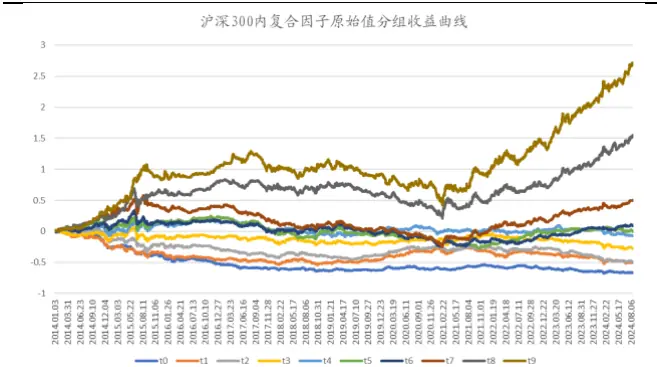
数据来源：Wind，国泰君安证券研究。测试区间：2014.01-2024.08。

表 8：沪深 300内复合因子原始值多头组近 4年超额较好

| 年度 | 组合收益 |  | 基准收益 |  | 超额收益 |  | 跟踪误差 | 最大回撤信 | 息比率 |  |
| --- | --- | --- | --- | --- | --- | --- | --- | --- | --- | --- |
| 2014 |  | 105.25% |  | 52.18% |  | 53.07% | 10.96% | -4.21% |  | 4.84 |
| 2015 |  | 4447% |  | 5.58% |  | 38.88% | 16.54% | -11.97% |  | 2.35 |
| 2016 |  | -2.43% | -1 | 1.28% |  | 8.85% | 8.41% | -7.15% |  | 1.05 |
| 2017 |  | 19.99% |  | 21.78% |  | -1.79% | 7.92% | -14.f23% |  | -0.23 |
| 2018 |  | -20.93% |  | -25.31% |  | 4.38% | 10.68% | -10.06% |  | 0.41 |
| 2019 |  | 23.32% |  | 36.07% |  | 12.75% | 9.70% | -14.17% |  | -1.31 |
| 2020 |  | 8.99% |  | 27.21% |  | 18.23% | 12.74% | -14..60% |  | -1.43 |
| 2021 |  | 12.57% |  | -5.20% |  | 17.77% | 17.38% | -12.92% |  | 1.02 |
| 2022 |  | -3.41% |  | -21.63% |  | 18.23% | 13.85% | -10.00% |  | 1.32 |
| 2023 |  | 13.40% |  | -11.38% |  | 24.78% | 10.55% | -5.55% |  | 2.35 |
| 2024.08 |  | 17.60% |  | -2.16% |  | 19.76% | 9.44% | -4.92% |  | 2.09 |
| 整体 |  | 17.00% |  | 3.51% |  | 13.49% | 19.57% | -38.02% |  | 0.69 |

数据来源：Wind，国泰君安证券研究。测试区间 2014.01-2024.08。

对于复合因子值进行市值行业中性化后。测算发现，沪深 300 指数成分股内复合因子市值行业中性化后分 10 组超额收益单调性一般；年度上，2016-2019年没有超额收益，2020年大幅跑输，2021年以来超额收益不错。整体上，多头组 2014 年 1 月以来，年化超额收益 9.76%，超额收益最大回撤-29.4%，信息比率 0.56。截至 2024 年 8 月 16 日，本年超额收益 12.36%，超额收益最大回撤-3.29%。上述收益未考虑交易费用。

图 2：沪深 300内复合因子中性化后分组单调性一般
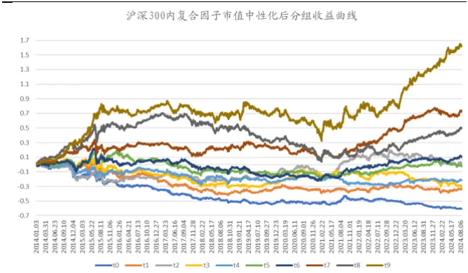
数据来源：Wind，国泰君安证券研究。测试区间：2014.01-2024.08。

表 9：沪深 300内复合因子中性化后多头组近 4年超额较好

| 年度 | 组合收益 |  | 基准收益 |  | 超额收益 |  | 跟踪误差 | 最大回撤信 | 息比率 |  |
| --- | --- | --- | --- | --- | --- | --- | --- | --- | --- | --- |
| 2014 |  | 95.11% |  | 52.18% |  | 42.92% | 9.85% | -3.93% |  | 4.36 |
| 2015 |  | 43.54% |  | 5.58% |  | 37.95% | 15.50% | -7.78% |  | 2.45 |
| 2016 | " | -8.89% | L | -11.28% |  | 2.39% | 8.06% | -7.79% |  | 0.30 |
| 2017 |  | 15.97% |  | 21.78% |  | -5.81% | 7.23% | -10.116% | 0 | -0.80 |
| 2018 |  | -25.12% |  | -25.31% |  | 0.19% | 10.77% | -9.34% |  | 0.02 |
| 2019 |  | 38.99% |  | 36.07% |  | 2.92% | 10.78% | -10.122% |  | 0.27 |
| 2020 |  | 8.69% |  | 27.21% |  | -18.52% | 10.48% | -15.89% |  | -1.77 |
| 2021 |  | 6.45% |  | -5.20% |  | 11.65% | 16.59% | -11.115% |  | 0.70 |
| 2022 |  | -15.47% |  | -21.63% |  | 6.17% | 12.63% | -11.32% |  | 0.49 |
| 2023 |  | 14.04% | 「 | -11.38% |  | 25.42% | 8.70% | -3.81% |  | 2.92 |
| 2024.08 |  | 10.20% |  | -2.16% |  | 12.36% | 7.39% | -3.29% |  | 1.67 |
| 整体 |  | 13.27% |  | 3.51% |  | 9.76% | 17.52% | -29.40% |  | 0.56 |

数据来源：Wind，国泰君安证券研究。测试区间 2014.01-2024.08。

控制市值行业无暴露，在沪深 300 指数成分股中构建复合因子得分最大化组合。测算发现：2014年1 月以来，年化超额收益6.52%，超额收益最大回撤-20.16%，信息比率 0.8，周度双边换手率 39.12%。截至 2024 年 8 月 16日，本年超额收益11.39%，超额收益最大回撤-3.36%。本报告收益为费前收益，按照39.12%的周度双边换手率，双边 0.3%交易费用，费用对收益影响大约为 39.12%*48 周*（0.3%/2）=2.82%。

表 10：沪深 300内无暴露组合近 3年收益较好

| 年度 | 组合收益 |  | 基准收益 |  | 超额收益 |  | 跟踪误差 | 超额收益最大回撤 | 信息比率 |  | 周度双边换手率 |
| --- | --- | --- | --- | --- | --- | --- | --- | --- | --- | --- | --- |
| 2014 |  | 93.30% |  | 52.18% |  | 41.11% | 6.90% | -2.09% |  | 5.96 | 43.7% |
| 2015 |  | 13.63% |  | 5.58% |  | 8.04% | 12.34% | -5.53% |  | 0.65 | 51.7% |
| 2016 |  | -4.85% |  | D-11.28% |  | 6.44% | 6.17% | -3.19% |  | 1.04 | 40.6% |
| 2017 |  | 21.45% |  | 21.78% |  | -0.33% | 4.89% | -3.97% |  | -0.07 | 46.5% |
| 2018 |  | -21.93% |  | -25.31% |  | 3.38% | 7.21% | -3.45% |  | 0.47 | 39.2% |
| 2019 |  | 32.75% |  | 36.07% |  | -3.32% | 6.95% | -4.89% | 一 | -0.48 | 39.5% |
| 2020 |  | 13.77% |  | 27.21% |  | -13.44% | 7.56% | -11.06% |  | -1.78 | 38.45% |
| 2021 |  | -6.10% |  | -5.20% |  | -0.90% | 10.41% | -835% |  | -0.09 | 31.71% |
| 2022 |  | 1-13.80% |  | -21.63% |  | 7.83% | 9.76% | -6.62% |  | 0.80 | 36.04% |
| 2023 |  | 4.87% |  | -11.38% |  | 16.25% | 7.18% | -2.97% |  | 2.26 | 32.32% |
| 2024.08 |  | 9.23% |  | -2.16% |  | 11.39% | 6.59% | -3.36% |  | 1.73 | 30.65% |
| 整体 |  | 10.03% |  | 3.51% |  | 6.52% | 8.15% | -20.16% |  | 0.80 | 39.12% |
| 2015年以来 |  |  |  |  |  | 3.53% |  |  |  |  |  |

数据来源：Wind，国泰君安证券研究。测试区间：2014.01-2024.08。

图 3：沪深 300内无暴露组合收益曲线近期走势较好
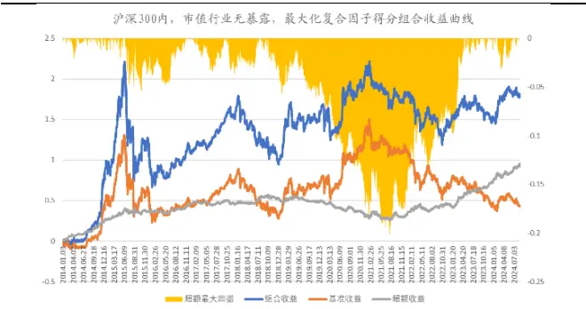
数据来源：Wind，国泰君安证券研究。测试区间 2014.01-2024.08。

允许市值行业适当暴露（市值暴露最大偏离0.5个标准差，行业权重最大偏离 2.5%），在沪深300指数成分股中构建复合因子得分最大化组合。测算发现：2014 年 1 月以来，年化超额收益 10.39%，超额收益最大回撤-19.90%，信息比率 0.56，周度双边换手率 53.73%。截至 2024 年 8 月 16 日，本年超额收益 10.78%，超额收益最大回撤-3.56%。本报告收益为费前收益，按照53.73%的周度双边换手率，双边 0.3%交易费用，费用对收益影响大约为53.73%*48 周*（0.3%/2）=3.87%。

表 11：沪深 300内允许暴露组合近 3年收益较好

| 年度 | 组合收益 |  | 基准收益 | 超额收益 |  | 跟踪误差 | 超额收益最大回撤 | 信息比率 | 周度双边换手率 |
| --- | --- | --- | --- | --- | --- | --- | --- | --- | --- |
| 2014 |  | 106.75% | 5218% |  | 54.57% | 7.53% | -2.54% | 7.25 | 52.0% |
| 2015 |  | 32.61% | 5.58% |  | 27.03% | 13.54% | -5.47% | 2.00 | 61.2% |
| 2016 |  | -7.18% | -11.28% |  | 4.10% | 7.02% | -4.81% | 0.58 | 49.4% |
| 2017 |  | 16.80% | 21.78% |  | -4.97% | 6.36% | -8.51% | -0.78 | 56.4% |
| 2018 |  | -24.30% | -25.31% |  | 1.01% | 9.06% | -5.14% | 0.11 | 54.5% |
| 2019 |  | 42.58% | 36.07% |  | 6.51% | 9.05% | -6.01% | 0.72 | 57.4% |
| 2020 |  | 13.94% | 27.21% |  | -13.27% | 9.16% | 11.66% | -1.45 | 58.52% |
| 2021 |  | 2.90% | -5.20% |  | 8.10% | 14.04% | -925% | 0.58 | 47.54% |
| 2022 |  | -12.95% | -21.63% |  | 8.69% | 11.42% | -6.35% | 0.76 | 49.64% |
| 2023 |  | 12.85% | -11.38% |  | 2423% | 8.21% | -3.77% | 2.95 | 54.91% |
| 2024.08 |  | 8.62% | -2.16% |  | 10.78% | 7.03% | -3.56% | 1.53 | 49.39% |
| 整体 |  | 13.90% | 3.51% |  | 10.39% | 18.46% | -19.90% | 0.56 | 53.73% |
| 2015年以来 |  |  |  |  | 7.22% |  |  |  |  |

数据来源：Wind，国泰君安证券研究。测试区间：2014.01-2024.08。

图 4：沪深 300内允许暴露组合收益曲线近期走势较好
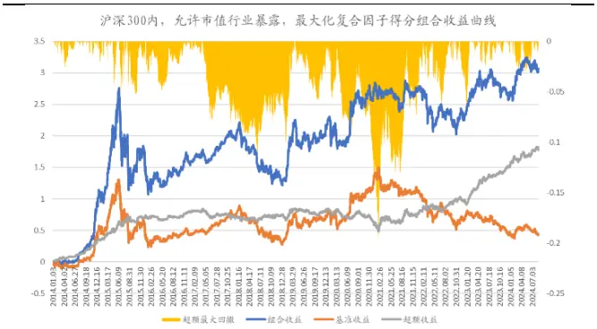
数据来源：Wind，国泰君安证券研究。测试区间 2014.01-2024.08。

## 3.3.2. 中证 500 指数成分股

对于复合因子原始值，测算发现，中证 500 指数成分股内复合因子分 10组超额收益单调性一般；年度上，2017-2020 年没有超额收益， 2021 年以来超额收益不错。整体上，多头组 2014 年 1 月以来，年化超额收益 13.02%，超额收益最大回撤-14.14%，信息比率 0.99。截至 2024 年 8 月 16 日，本年超额收益6.20%，超额收益最大回撤-6.13%。上述收益未考虑交易费用。

图 5：中证 500内复合因子原始值分组单调性较好
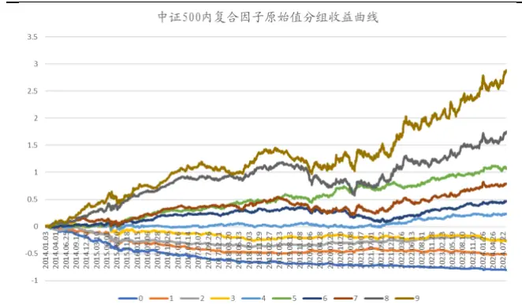
数据来源：Wind，国泰君安证券研究。测试区间：2014.01-2024.08。

表 12：中证 500内复合因子原始值多头组近 4年超额较好

| 年度 | 组合收益基 |  | 准收益 |  | 超额收益 | 跟踪误差 | 最大回撤信 | 息比率 |
| --- | --- | --- | --- | --- | --- | --- | --- | --- |
| 2014 |  | 99.35% |  | 38.33% | 61.02% | 7.56% | -2.80% | 8.07 |
| 2015 |  | 59.51% | 43.12% | 2% | 16.39% | 17.05% | -14.14% | 0.96 |
| 2016 |  | 0.09% |  | 17.78% | 17.87% | 8.19% | -2.05% | 2.18 |
| 2017 |  | -2.89% |  | -0.20% | -2.69% | 5.75% | -735% | -0.47 |
| 2018 |  | -25.16% |  | 33.32% | 8.16% | 8.74% | -3.24% | 0.93 |
| 2019 |  | 25.72% |  | 26.38% | -0.66% | 6.85% | -6.40% | -0.10 |
| 2020 |  | 21.40% |  | 20.87% | 0.53% | 10.89% | 9.45% | 0.05 |
| 2021 |  | 36.65% |  | 15.59% | 21.07% | 11.66% | -6.65% | 1.81 |
| 2022 |  | -4.87% | 2 | 0.31% | 15.45% | 11.45% | -4.26% | 1.35 |
| 2023 |  | 3.69% |  | -7.42% | 11.11% | 7.19% | -3.91% | 1.54 |
| 2024.08 |  | -7.55% | I | 13.74% | 6.20% | 8.80% | -6. 13% | 0.70 |
| 整体 |  | 14.88% |  | 1.86% | 13.02% | 13.13% | -14.14% | 0.99 |
| 2015年以来 |  |  |  |  | 9.34% |  |  |  |

数据来源：Wind，国泰君安证券研究。测试区间 2014.01-2024.08。

对于复合因子值进行市值行业中性化后。测算发现，中证500 指数成分股内复合因子市值行业中性化后分 10 组，超额收益单调性一般；年度上，2017-2020 年没有超额收益， 2021 年以来超额收益不错。整体上，多头组 2014年 1 月以来，年化超额收益 12.17%，超额收益最大回撤-17.0%，信息比率0.93。截至 2024 年 8 月 16 日，本年超额收益 9.81%，超额收益最大回撤-4.84%。上述收益未考虑交易费用。

图 6：中证 500内复合因子中性化后分组单调性一般
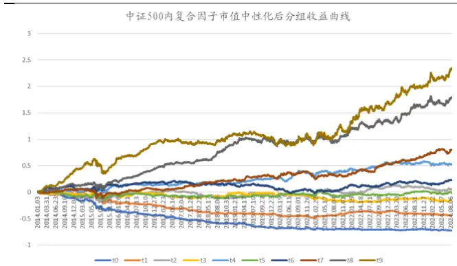
数据来源：Wind，国泰君安证券研究。测试区间：2014.01-2024.08。

表 13：中证 500内复合因子中性化后多头组近 4年超额较好

| 年度 | 组合收益基 |  | 准收益 |  | 超额收益跟 | 踪误差 | 最大回撤信 | 息比率 |
| --- | --- | --- | --- | --- | --- | --- | --- | --- |
| 2014 |  | 99.02% |  | 38.33% | 60.69% | 7.44% | -1.96% | 8.16 |
| 2015 |  | 54.32% |  | 43.12% | 11.20% | 16.75% | -17.00% | 0.67 |
| 2016 |  | 1.70% | 口 | 17.78% | 19.48% | 8.09% | -1.80% | 2.41 |
| 2017 |  | -0.48% |  | -0.20% | -0.28% | 5.69% | -5.63% | -0.05 |
| 2018 |  | -27.42% |  | 33.32% | 1 5.90% | 8.71% | -4.57 | % 0.68 |
| 2019 |  | 23.52% |  | 26.38% | -2.86% | 6.81% | -727% | -0.42 |
| 2020 |  | 19.04% |  | 20.87% | -1.83% | 10.85% | -792%1 | -0.17 |
| 2021 |  | 27.38% |  | 15.59% | 11.79% | 11.30% | -6.78% | 1.04 |
| 2022 |  | -2.89% | 20.31% |  | 17.42% | 11.98% | -4.28% | 1.45 |
| 2023 |  | 3.06% | -7.42% |  | 10.49% | 7.23% | -5.14% | 1.45 |
| 2024.08 |  | -3.94% | I | 13.74% | 9.81% | 8.87% | -4.84% | 1.11 |
| 整体 |  | 14.02% |  | 1.86% | 12.17% | 13.03% | -17.00% | 0.93 |
| 2015年以来 |  |  |  |  | 8.11% |  |  |  |

数据来源：Wind，国泰君安证券研究。测试区间 2014.01-2024.08。

控制市值行业无暴露，在中证 500 指数成分股中构建复合因子得分最大化组合。测算发现：2014年1 月以来，年化超额收益9.88%，超额收益最大回撤-15.66%，信息比率 1.27，周度双边换手率 43.26%。截至 2024 年 8 月 16日，本年超额收益8.10%，超额收益最大回撤-3.11%。本报告收益为费前收益，按照43.26%的周度双边换手率，双边 0.3%交易费用，费用对收益影响大约为 43.26%*48 周*（0.3%/2）=3.11%。

表 14：中证 500内无暴露组合近 3年收益较好

| 年度 | 组合收益 |  | 基准收益 |  | 超额收益 | 跟踪误差 | 超额收益最大回撤 | 信息比率 | 周度双边换手率 |
| --- | --- | --- | --- | --- | --- | --- | --- | --- | --- |
| 2014 |  | 66.11% |  | 38.33% | 27.79% | 6.20% | -1.23% | 4.48 | 50.6% |
| 2015 | 3 | 6.33% |  | 36.81% | -0.48% | 14.63% | -15.66% | -0.03 | 60.3% |
| 2016 | L | -5.90% | 17 | .78% | 11.88% | 7.08% | -1.89% | 1.68 | 47.1% |
| 2017 |  | 7.62% |  | -0.20% | 7.82% | 4.62% | -2.38% | 1.69 | 45.1% |
| 2018 | 2 | 4.10% | 3 | 3.32% | 9.22% | 7.16% | -0.99% | 1.29 | 40.9% |
| 2019 |  | 31.36% |  | 26.38% | 4.98% | 5.70% | -3.044% | 0.87 | 42.3% |
| 2020 | 2 | 7.07% |  | 20.87% | 6.20% | 7.52% | -2.42% | 0.82 | 42.43% |
| 2021 |  | 2449% |  | 15.59% | 8.91% | 6.27% | -2.54% | 1.42 | 41.88% |
| 2022 | 01 | 1.89% | D | 20.31% | 8.43% | 7.93% | -2.52% | 1.06 | 37.38% |
| 2023 | 4 | .21% | D | -7.42% | 1.63% | 5.93% | -1.97%% | 1.96 | 3413% |
| 2024.08 | 1 | -5.65% |  | 13.74% | 8.10% | 7.68% | -3.11% | 1.05 | 3370% |
| 整体 |  | 1.31% |  | 1.43% | 9.88% | 7.76% | -15.66% | 1.27 | 43.26% |
| 2015年以来 |  |  |  |  | 7.67% |  |  |  |  |

数据来源：Wind，国泰君安证券研究。测试区间：2014.01-2024.08。

图 7：中证 500内无暴露组合收益曲线近期走势较好
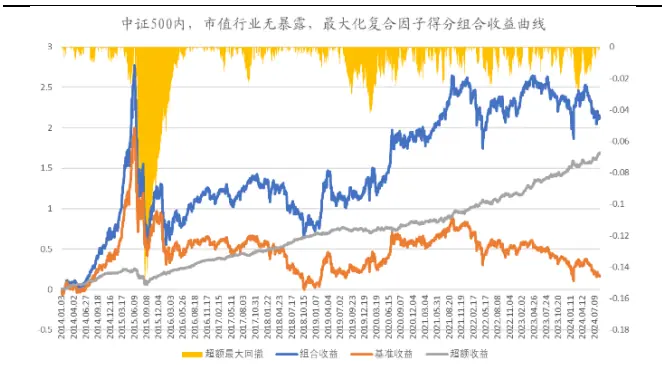
数据来源：Wind，国泰君安证券研究。测试区间 2014.01-2024.08。

允许市值行业适当暴露（市值暴露最大偏离0.5个标准差，行业权重最大偏离 2.5%），在中证500指数成分股中构建复合因子得分最大化组合。测算发现：2014 年 1 月以来，年化超额收益 10.68%，超额收益最大回撤-16.21%，信息比率 1.25，周度双边换手率 43.57%。截至 2024 年 8 月 16 日，本年超额收益7.31%，超额收益最大回撤-4.62%。本报告收益为费前收益，按照43.57%的周度双边换手率，双边0.3%交易费用，费用对收益影响大约为43.57%*48周*（0.3%/2）=3.14%。

表 15：中证 500内允许暴露组合近3年收益较好

| 年度 | 组合收益 |  | 基准收益 |  | 超额收益 | 跟踪误差 | 超额收益最大回撤 | 信息比率 | 周度双边换手率 |
| --- | --- | --- | --- | --- | --- | --- | --- | --- | --- |
| 2014 |  | 73.83% |  | 38.33% | 35.50% | 6.51% | -1.36% | 5.46 | 52.5% |
| 2015 |  | 43.19% |  | 36.81% | 6.38% | 14.92% | -16.21 | % 0.43 | 61.1% |
| 2016 |  | -0.34% | 口1 | 7.78% | 17.44% | 7.28% | -1.71% | 2.40 | 47.6% |
| 2017 |  | 2.95% |  | -0.20% | 3.16% | 4.84% | -3.01 | % 0.65 | 44.6% |
| 2018 |  | 23.32% | 1 | 33.32% | 10.00% | 7.78% | -1.58% | 1.29 | 41.4% |
| 2019 |  | 2849% |  | 2638% | 2.10% | 6.19% | -4.78 | % 0.34 | 45.2% |
| 2020 |  | 20.67% | 2 | 0.87% | -0.20% | 8.90% | -4.90% | -0.02 | 41.87% |
| 2021 |  | 2699% | 1 | 5.59% | 11.41% | 8.55% | -4.81% | 1.33 | 44.53% |
| 2022 | D | -9.22% | 口 | 20.31% | 11.10% | 9.65% | -4.16% | 1.15 | 3495% |
| 2023 |  | 3.27% | D | -7.42% | 10.69% | 6.72% | -3.29% | 1.59 | 3343% |
| 2024.08 | D | -6.43% | L | 13.74% | 7.31% | 8.40% | -4.62% | 0.87 | 32.09% |
| 整体 |  | 2.11% |  | 1.43% | 10.68% | 8.55% | -16.21% | 1.25 | 43.57% |
| 2015年以来 |  |  |  |  | 7.94% |  |  |  |  |

数据来源：Wind，国泰君安证券研究。测试区间：2014.01-2024.08。

图 8：中证 500内允许暴露组合收益曲线近期走势较好
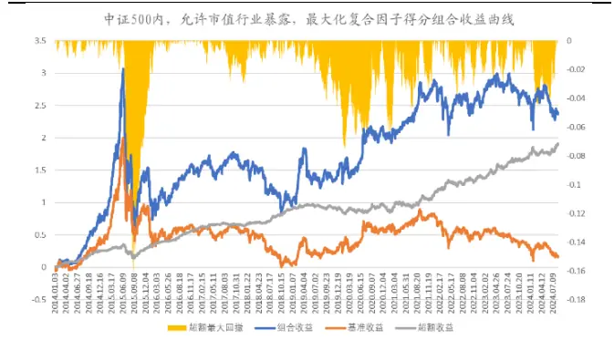
数据来源：Wind，国泰君安证券研究。测试区间 2014.01-2024.08。

## 3.3.3. 中证 1000 指数成分股

对于复合因子原始值，测算发现，中证1000 指数成分股内复合因子分10 组超额收益单调性较好；年度上，每年都有超额收益，2019、2020 年超额较低，2021年以来超额收益不错。整体上，多头组2014 年 1月以来，年化超额收益 18.78%，超额收益最大回撤-15.85%，信息比率 1.51。截至 2024 年 8月 16日，本年超额收益11.90%，超额收益最大回撤 9.13%。上述收益未考虑交易费用。

图 9：中证 1000内复合因子原始值分组单调性较好
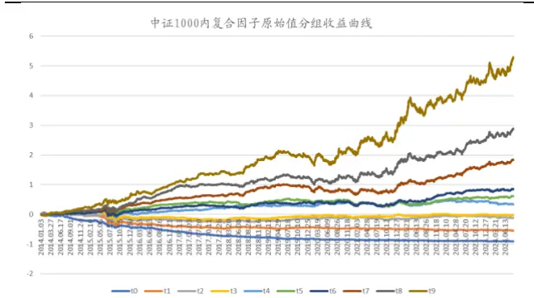
数据来源：Wind，国泰君安证券研究。测试区间：2014.01-2024.08。

表 16：中证 1000内复合因子原始值多头组每年都有超额

| 年度 | 组合收益 |  | 基准收益 |  | 超额收益 | 跟踪误差 | 最大回撤信 | 息比率 |
| --- | --- | --- | --- | --- | --- | --- | --- | --- |
| 2014 |  | 65.23% |  | 32.78% | 32.45% | 8.76% | -5.66% | 3.70 |
| 2015 |  | 123.07% |  | 76.10% | 46.97% | 19.46% | -12.53% | 2.41 |
| 2016 |  | 3.51% | -2 | 0.01% | 23.52% | 9.99% | -5.7% | 2.35 |
| 2017 |  | -3.93% | 0 | -17.35% | 13.43% | 5.98% | -2.75% | 2.25 |
| 2018 |  | -24.37% |  | -36.87% | 12.50% | 9.39% | -5.33% | 1.33 |
| 2019 |  | 30.70% |  | 25.67% | 5.04% | 8.24% | -6.98% | 0.61 |
| 2020 |  | 27.19% |  | 19.39% | 7.80% | 14.00% | -12.48% | 0.56 |
| 2021 |  | 45.25% |  | 20.52% | 24.73% | 15.22% | 9.85% | 1.62 |
| 2022 |  | 1.57% | -2 | 1.58% | 23.15% | 15.86% | -12.50% | 1.46 |
| 2023 |  | 3.77% |  | -6.28% | 10.05% | 9.79% | -6.48% | 1.03 |
| 2024.08 |  | -8.88% |  | -20.78% | 11.90% | 13.32% | -9.13% | 0.89 |
| 整体 |  | 19.03% |  | 0.25% | 18.78% | 12.41% | -15.85% | 1.51 |
| 2015年以来 |  |  |  |  | 17.91% |  |  |  |

数据来源：Wind，国泰君安证券研究。测试区间 2014.01-2024.08。

对于复合因子值进行市值行业中性化后。测算发现，中证 1000 指数成分股内复合因子市值行业中性化后分组超额收益单调性较好；年度上，每年都有超额收益，2021 年以来超额收益不错。整体上，多头组 2014 年 1 月以来，年化超额收益16.77%，超额收益最大回撤-12.54%，信息比率 1.5。截至2024年 8 月 16 日，本年超额收益 8.05%，超额收益最大回撤-6.09%。上述收益未考虑交易费用。

图 10：中证 1000内复合因子中性化后分组单调性较好
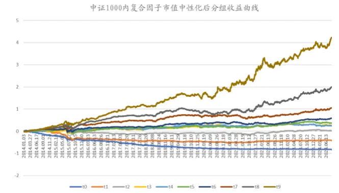
数据来源：Wind，国泰君安证券研究。测试区间：2014.01-2024.08。

表 17：中证 1000内复合因子中性化后多头组每年超额较好

| 年度 | 组合收益基 |  | 准收益 |  | 超额收益 | 跟踪误差最 | 大回撤信 | 息比率 |
| --- | --- | --- | --- | --- | --- | --- | --- | --- |
| 2014 |  | 63.73% |  | 32.78% | 30.95% | 8.02% | -3.75% | 3.86 |
| 2015 |  | 106.80% |  | 76.10% | 30.70% | 18.89% | -12.54% | 1.63 |
| 2016 |  | 1.05% | 20.01% |  | 21.06% | 9.18% | -3.88% | 2.29 |
| 2017 |  | -3.49% | 0-17.35% |  | 13.86% | 5.73% | -2.53% | 2.42 |
| 2018 |  | -28.14% | 36.87% |  | 8.73% | 8.77% | -5.30% | 1.00 |
| 2019 |  | 38.01% |  | 25.67% | 12.35% | 7.33% | -5.36% | 1.68 |
| 2020 |  | 30.30% |  | 9.39% | 10.91% | 12.12% | 10.37% | 0.90 |
| 2021 |  | 47.36% |  | 20.52% | 26.84% | 12.84% | -1.94% | 2.09 |
| 2022 |  | -6.78% |  | 21.58% | 14.80% | 14.35% | 10.69% | 1.03 |
| 2023 |  | 4.78% | -6.28% |  | 11.06% | 7.88% | -4.41% | 1.40 |
| 2024.08 | D | -12.73% | ■20.78% |  | 8.05% | 10.83% | -6.09% | 0.74 |
| 整体 |  | 17.02% | 0.25% |  | 16.77% | 11.16% | -12.54% | 1.50 |
| 2015年以来 |  |  |  |  | 15.84% |  |  |  |

数据来源：Wind，国泰君安证券研究。测试区间 2014.01-2024.08。

控制市值行业无暴露，在中证1000指数成分股中构建复合因子得分最大化组合。测算发现：2014年1 月以来，年化超额收益 11.9%，超额收益最大回撤-16.17%，信息比率 1.29，周度双边换手率 40.46%。截至 2024 年 8 月 16日，本年超额收益10.74%，超额收益最大回撤-4.85%。本报告收益为费前收益，按照40.46%的周度双边换手率，双边 0.3%交易费用，费用对收益影响大约为 40.46%*48 周*（0.3%/2）=2.91%。

表 18：中证 1000内无暴露组合近3年收益较好

| 年度 | 组合收益 |  | 基准收益 |  | 超额收益 | 跟踪误差 | 超额收益最大回撤 | 信息比率 | 周度双边换手率 |
| --- | --- | --- | --- | --- | --- | --- | --- | --- | --- |
| 2014 |  | 53.69% | 3 | 2\|78% | 20.91% | 7.21% | -2.43% | 2.90 | 46.6% |
| 2015 |  | 85.31% | 6 | 7.90% | 17.41% | 16.06% | -16.17% | 1.08 | 61.4% |
| 2016 |  | -3.81% |  | 20.01% | 16.20% | 7.90% | -2.23% | 2.05 | 43.4% |
| 2017 | 0 | -6.35% | 1 | 7.35% | 11.00% | 5.17% | -2.24% | 2.13 | 37.1% |
| 2018 | 3 | 2.36% | 3 | 6.87% | 4.51% | 8.15% | -4.52% | 0.55 | 36.5% |
| 2019 |  | 3493% | 2 | 5.67% | 9.26% | 6.56% | -5.19% | 1.41 | 43.2% |
| 2020 |  | 27.66% | 1 | 9.39% | 8.27% | 9.49% | -8.90% | 0.87 | 41.79% |
| 2021 |  | 35.26% | 2 | 0.52% | 14.74% | 7.77% | -5.39% | 1.90 | 41.89% |
| 2022 | D | 14.00% | 口2 | 1.58% | 7.58% | 11.34% | -8.43% | 0.67 | 33.01% |
| 2023 |  | 4.09% |  | -6.28% | 10.37% | 7.05% | -2.64% | 1.47 | 31.45% |
| 2024.08 | L | 10.04% | 2 | 0.78% | 10.74% | 10.18% | -4.85% | 1.05 | 28.59% |
| 整体 |  | 1.70% |  | -0.19% | 1190% | 9.21% | -16.17% | 1.29 | 40.46% |
| 2015年以来 |  |  |  |  | 11.01% |  |  |  |  |

数据来源：Wind，国泰君安证券研究。测试区间：2014.01-2024.08。

图 11：中证 1000内无暴露组合收益曲线历史走势较好
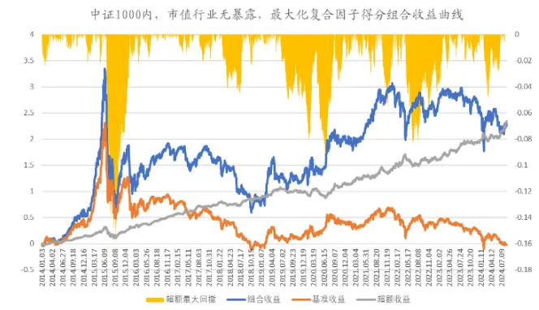
数据来源：Wind，国泰君安证券研究。测试区间 2014.01-2024.08。

允许市值行业适当暴露（市值暴露最大偏离0.5个标准差，行业权重最大偏离 2.5%），在中证 1000 指数成分股中构建复合因子得分最大化组合。测算发现：2014年1月以来，年化超额收益 13.25%，超额收益最大回撤-18.20%，信息比率 1.29，周度双边换手率 42.29%。截至 2024 年 8 月 16 日，本年超额收益8.42%，超额收益最大回撤-5.51%。本报告收益为费前收益，按照42.29%的周度双边换手率，双边0.3%交易费用，费用对收益影响大约为42.29%*48周*（0.3%/2）=3.05%。

表 19：中证1000内允许暴露组合近3年收益较好

| 年度 | 组合收益 |  | 基准收益 |  | 超额收益 | 跟踪误差 | 超额收益最大回撤 | 信息比率 |  | 周度双边换手率 |
| --- | --- | --- | --- | --- | --- | --- | --- | --- | --- | --- |
| 2014 |  | 57.83% |  | 3278% | 25.05% | 7.75% | -3.55% | 3.23 |  | 46.0% |
| 2015 |  | 83.25% | 6 | 7.90% | 15.36% | 16.86% | -18.20% | 0.91 |  | 65.4% |
| 2016 |  | 0.49% | 2 | 0.01% | 20.49% | 8.60% | -3.0196 | 238 |  | 43.6% |
| 2017 |  | -5.45% | D | 17.35% | 11.90% | 5.61% | -2.38% | 2.12 |  | 35.1% |
| 2018 |  | 27.96% |  | 36.87% | 8.91% | 8.59% | -4.744% | 1.04 |  | 40.5% |
| 2019 |  | 36.58% | 2 | 5.67% | 10.91% | 7.12% | -5.11% | 1.53 |  | 47.3% |
| 2020 |  | 25.37% | 1 | 9.39% | 5.98% | 11.24% | 10.78% | 0.53 |  | 42.15% |
| 2021 |  | 3357% | 2 | 0.52% | 13.05% | 10.36% | -7.47% |  | 1.26 | 40.97% |
| 2022 | L | 10.25% | 口 | 21.58% | 11.33% | 13.47% | -10.74% |  | 0.84 | 33.47% |
| 2023 |  | 3.90% |  | -6.28% | 10.18% | 7.69% | -3.79% |  | 1.32 | 3694% |
| 2024.08 | L | 12.36% | 2 | 0.78% | 8.42% | 10.62% | -5.51% |  | 0.79 | 33.86% |
| 整体 |  | 3.05% |  | -0.19% | 13.25% | 10.26% | -18.20% |  | 1.29 | 42.29% |
| 2015年以来 |  |  |  |  | 11.65% |  |  |  |  |  |

数据来源：Wind，国泰君安证券研究。测试区间：2014.01-2024.08。

图 12：中证1000内适当暴露组合收益曲线历史走势较好
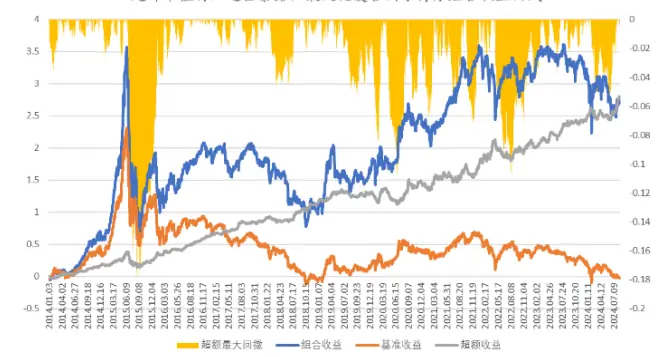
数据来源：Wind，国泰君安证券研究。测试区间 2014.01-2024.08。

## 3.3.4. 中证 2000 指数成分股

对于复合因子原始值，测算发现，中证2000 指数成分股内复合因子分10 组超额收益单调性较好；年度上每年都有超额收益，2021 年以来超额收益不错。整体上，多头组2014年 1月以来，年化超额收益 22.57%，超额收益最大回撤-13.40%，信息比率 1.86。截至 2024 年 8 月 16 日，本年超额收益10.50%，超额收益最大回撤-7.83%。上述收益未考虑交易费用。

图 13：中证 2000内复合因子原始值分组单调性较好
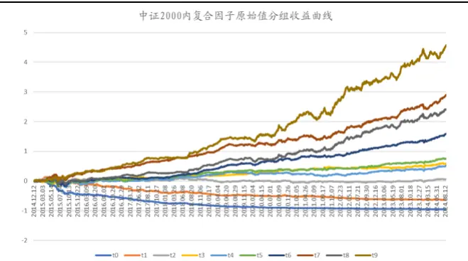
数据来源：Wind，国泰君安证券研究。测试区间：2014.12-2024.08。

表 20：中证 2000内复合因子原始值多头组每年都有超额

| 年度 | 组合收益 |  | 基准收益 |  | 超额收益 | 跟踪误差 | 最大回撤信 | 息比率 |
| --- | --- | --- | --- | --- | --- | --- | --- | --- |
| 2014 |  | -5.57% |  | -8.76% | 3.19% | 11.02% | -0.33% | 0.29 |
| 2015 |  | 188.26% |  | 109.78% | 78.47% | 21.00% | -13.40% | 3.74 |
| 2016 |  | 15.96% |  | -7.63% | 23.59% | 9.51% | -591% | 2.48 |
| 2017 |  | -9.86% |  | -24.10% | 14.24% | 6.04% | -2.90% | 2.36 |
| 2018 |  | -22.16% |  | -33.34% | 11.18% | 9.08% | -4.115% | 1.23 |
| 2019 |  | 40.81% |  | 21.96% | 18.85% | 7.90% | -5.65% | 2.39 |
| 2020 |  | 36.76% |  | 15.39% | 21.37% | 11.55% | -8.66% | 1.85 |
| 2021 |  | 49.10% |  | 25.89% | 23.20% | 11.95% | -9.64% | 1.94 |
| 2022 |  | 18.70% |  | -14.78% | 33.48% | 13.49% | -5.64% | 2.48 |
| 2023 |  | 18.64% |  | 5.57% | 13.08% | 9.89% | -7.53% | 1.32 |
| 2024.08 |  | -15.29% |  | -25.78% | 10.50% | 15.33% | -7.83% | 0.68 |
| 整体 |  | 23.15% |  | 0.58% | 22.57% | 12.13% | -13.40% | 1.86 |
| 2016年以来 |  |  |  |  | 18.83% |  |  |  |

数据来源：Wind，国泰君安证券研究。测试区间 2014.12-2024.08。

对于复合因子值进行市值行业中性化后。测算发现，中证 2000 指数成分股内复合因子市值行业中性化后分组超额收益单调性较好；年度上，每年都有超额收益，2019 年以来超额收益不错。整体上，多头组 2014 年 1 月以来，年化超额收益19.43%，超额收益最大回撤-13.07%，信息比率 1.76。截至2024年 8 月 16 日，本年超额收益 7.88%，超额收益最大回撤-6.02%。上述收益未考虑交易费用。

图 14：中证 2000内复合因子中性化后分组单调性较好
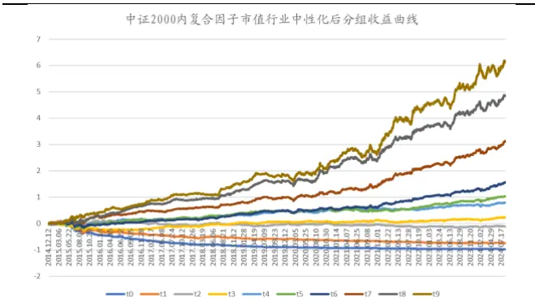
数据来源：Wind，国泰君安证券研究。测试区间：2014.12-2024.08。

表 21：中证 2000内复合因子中性化后多头组每年都有超额

| 年度 | 组合收益 |  | 基准收益 |  | 超额收益 | 跟踪误差 | 最大回撤信 | 息比率 |
| --- | --- | --- | --- | --- | --- | --- | --- | --- |
| 2014 | -6.04% |  |  | -8.76% | 2.72% | 10.66% | -0.68 | % 0.26 |
| 2015 |  | 157.29% |  | 109.78% | 47.51% | 20.20% | -13.07% | 2.35 |
| 2016 |  | 9.92% |  | -7.63% | 17.55% | 8.78% | -4.28% | 2.00 |
| 2017 | -10.55% |  |  | -24.10% | 13.55% | 6.00% | -2.86% | 2.26 |
| 2018 |  | -21.97% |  | -33.34% | 11.37% | 8.61% | -2.39% | 1.32 |
| 2019 |  | 44.30% |  | 21.96% | 22.34% | 6.97% | -3.02% | 3.21 |
| 2020 |  | 39.49% |  | 15.39% | 24.11% | 10.45% | -6.50% | 2.31 |
| 2021 |  | 48.02% |  | 25.89% | 22.13% | 9.93% | 8.09% | 2.23 |
| 2022 |  | 7.86% |  | D-14.78% | 22.63% | 11.99% | -3.79% | 1.89 |
| 2023 |  | 20.61% |  | 5.57% | 15.05% | 7.88% | -5.26% | 1.91 |
| 2024.08 |  | -17.91% |  | -25.78% | 7.88% | 13.20% | -602% | 0.60 |
| 整体 |  | 20.01% |  | 0.58% | 19.43% | 11.02% | -13.07% | 1.76 |
| 2016年以来 |  |  |  |  | 17.40% |  |  |  |

数据来源：Wind，国泰君安证券研究。测试区间 2014.12-2024.08。

控制市值行业无暴露，在中证2000指数成分股中构建复合因子得分最大化组合。测算发现：2014年1月以来，年化超额收益 13.06%，超额收益最大回撤-20.47%，信息比率 1.27，周度双边换手率 45.20%。截至 2024 年 8 月16 日，本年超额收益 5.7%，超额收益最大回撤-6.31%。本报告收益为费前收益，按照45.20%的周度双边换手率，双边0.3%交易费用，费用对收益影响大约为 45.20%*48 周*（0.3%/2）=3.25%。

表 22：中证 2000 内无暴露组合每年都有超额

| 年度 | 组合收益 |  | 基准收益 |  | 超额收益 | 跟踪误差 | 超额收益最大回撤 | 信息比率 | 周度双边换手率 |
| --- | --- | --- | --- | --- | --- | --- | --- | --- | --- |
| 2014 |  | -6.58% |  | -8.76% | 2.18% | 9.34% | -0.25% | 0.23 | 62.2% |
| 2015 |  | 100.77% |  | 102.01% | -1.24% | 17.14% | -20.47% | -0.07 | 43.9% |
| 2016 |  | 3.93% |  | -7.63% | 11.56% | 8.10% | -2.01% | 1.43 | 38.9% |
| 2017 | D | -11.35% |  | -24.10% | 12.75% | 5.54% | -2.71% | 2.30 | 36.2% |
| 2018 |  | -22.37% |  | -33.34% | 10.98% | 8.53% | -2.48% | 1.29 | 40.6% |
| 2019 |  | 4493% | 2 | 1.96% | 22.97% | 7.23% | -4.07% | 3.17 | 52.4% |
| 2020 |  | 31.15% |  | 15.39% | 15.76% | 10.08% | -7.08% | 1.56 | 45.60% |
| 2021 |  | 33.61% |  | 25.89% | 7.72% | 9.23% | -9.01% | 0.84 | 42.89% |
| 2022 |  | 5.09% | 0 | -14.78% | 19.87% | 11.96% | -3.14% | 1.66 | 43.48% |
| 2023 |  | 17.11% |  | 5.57% | 11.54% | 8.08% | -5.51% | 1.43 | 44.46% |
| 2024.08 |  | -20.08% |  | -25.78% | 5.70% | 13.08% | -6.31% | 0.44 | 46.59% |
| 整体 |  | 13.26% |  | 0.19% | 13.06% | 10.28% | -20.47% | 1.27 | 45.20% |
| 2016年以来 |  |  | 13.21% |  |  |  |  |  |  |

数据来源：Wind，国泰君安证券研究。测试区间：2014.12-2024.08。

图 15：中证 2000内无暴露组合收益曲线历史走势较好
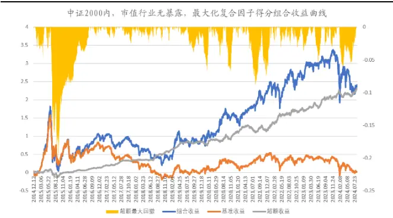
数据来源：Wind，国泰君安证券研究。测试区间 2014.12-2024.08。

允许市值行业适当暴露（市值暴露最大偏离0.5个标准差，行业权重最大偏离 2.5%），在中证 2000 指数成分股中构建复合因子得分最大化组合。测算发现：2014年1月以来，年化超额收益 15.53%，超额收益最大回撤-18.92%，信息比率 1.47，周度双边换手率 49.58%。截至 2024 年 8 月 16 日，本年超额收益4.72%，超额收益最大回撤-7.33%。本报告收益为费前收益，按照49.58%的周度双边换手率，双边0.3%交易费用，费用对收益影响大约为49.58%*48周*（0.3%/2）=3.31%。

表 23：中证 2000 内允许暴露组合每年都有超额

| 年度 | 组合收益 |  | 基准收益 |  | 超额收益 | 跟踪误差 | 超额收益最大回撤 | 信息比率 | 周度双边换手率 |
| --- | --- | --- | --- | --- | --- | --- | --- | --- | --- |
| 2014 |  | -6.72% |  | -8.76% | 2.04% | 9.24% | -0.20% | 0.22 | 57.9% |
| 2015 |  | 117.85% | 1 | 02.01% | 15.83% | 17.68% | -18.92% | 0.90 | 46.3% |
| 2016 |  | 6.52% | -7.63% |  | 14.15% | 8.17% | -2.75% | 1.73 | 36.6% |
| 2017 |  | 0-10.92% | -24.10% |  | 13.18% | 5.68% | -2.58% | 2.32 | 36.9% |
| 2018 |  | -23.01% |  | -33.34% | 10.33% | 8.64% | -2.6596 | 1.19 | 43.2% |
| 2019 |  | 43.27% |  | 21.96% | 21.31% | 7.17% | -3.21% | 2.97 | 53.1% |
| 2020 |  | 40.91% |  | 15.39% | 25.52% | 10.65% | -6.04% | 2.40 | 48.59% |
| 2021 |  | 38.63% |  | 25.89% | 12.74% | 10.14% | -9.72% | 1.26 | 45.27% |
| 2022 |  | 7.09% |  | 0-14.78% | 21.87% | 12.27% | -3.49% | 1.78 | 43.82% |
| 2023 |  | ■17.68% |  | 5.57% | 12.11% | 8.07% | -5.79% | 1.50 | 43.67% |
| 2024.08 |  | -21.07% |  | -25.78% | 4.72% | 13.25% | -7.33% | 0.36 | 50.38% |
| 整体 |  | 15.73% |  | 0.19% | 15.53% | 10.58% | -18.92% | 1.47 | 45.98% |

数据来源：Wind，国泰君安证券研究。测试区间：2014.12-2024.08。

图 16：中证 2000内允许暴露组合收益曲线历史走势较好
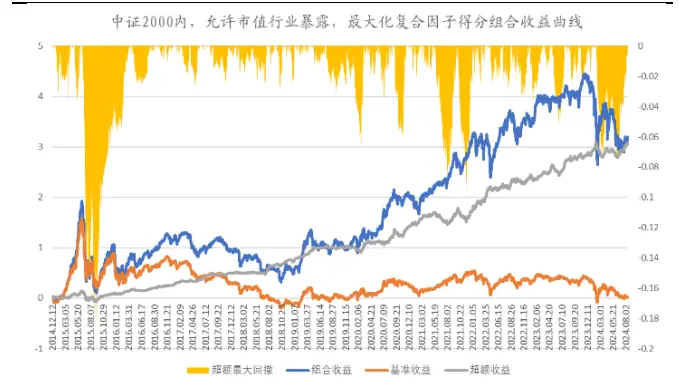
数据来源：Wind，国泰君安证券研究。测试区间 2014.12-2024.08。

## 3.3.5. 中证全指指数成分股

对于复合因子原始值，测算发现，中证全指成分股内复合因子分 10 组超额收益单调性较好；年度上，2017-2020 年没有超额收益，2019、2020年大幅跑输，2021年以来超额收益不错。整体上，多头组 2014年1 月以来，年化超额收益18.88%，超额收益最大回撤-21.83%，信息比率 1.51。截至2024年8 月16日，本年超额收益-0.93%，超额收益最大回撤-15.28%。上述收益未考虑交易费用。

图 17：中证全指内复合因子原始值分组单调性较好
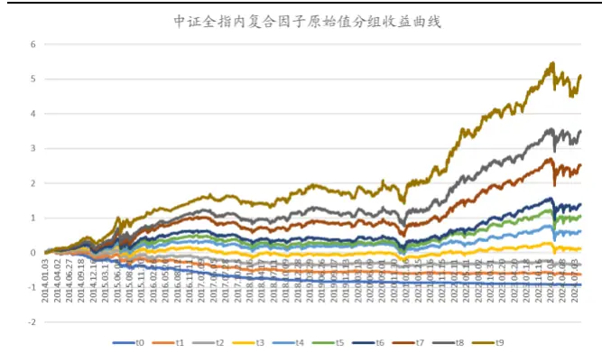
数据来源：Wind，国泰君安证券研究。测试区间：2014.01-2024.08。

表 24：中证全指内复合因子原始值多头组近 4年超额较好

| 年度 | 组合收益 |  | 基准收益 |  | 超额收益 | 跟踪误差 | 最大回撤信 | 息比率 |  |  |
| --- | --- | --- | --- | --- | --- | --- | --- | --- | --- | --- |
| 2014 |  | 84.89% |  | 45.45% | 39.44% | 9.05% | -12.27% |  | 4.36 |  |
| 2015 |  | 116.32% |  | 32.56% | 83.76% | 22.08% | -21.83% |  | 3.79 |  |
| 2016 |  | 4.20% |  | -14.41% | 18.60% | 7.49% | -3.73% |  | 2.48 |  |
| 2017 |  | -0.23% |  | 2.34% | -2.57% | 5.85% | -998% |  | -0.44 |  |
| 2018 |  | -22.87% |  | -29.94% | 7.07% | 10.51% | -7.54% |  | 0.67 |  |
| 2019 |  | 31.40% |  | 31.11% | 0.30% | 8.45% | -1008% |  | 0.04 |  |
| 2020 |  | 27.51% |  | 24.92% | 2.59% | 11.62% | -1001% |  | 0.22 |  |
| 2021 |  | 39.55% |  | 6.19% | 33.36% | 16.55% | -11.59% |  |  | 2.02 |
| 2022 |  | 10.87% |  | -20.32% | 31.19% | 13.94% | -5.40% |  |  | 2.24 |
| 2023 |  | 12.27% |  | -7.04% | 19.31% | 8.89% | -5.48% |  |  | 2.17 |
| 2024.08 |  | -12.91% |  | -11.97% | -0.93% | 13.91% | 15.28% |  | -0.07 |  |
| 整体 |  | 21.67% |  | 2.79% | 18.88% | 12.47% | -21.83% |  | 1.51 |  |
| 2016年以来 |  |  |  |  | 12.10% |  |  |  |  |  |

数据来源：Wind，国泰君安证券研究。测试区间 2014.01-2024.08。

对于复合因子值进行市值行业中性化后。测算发现，中证全指成分股内复合因子市值行业中性化后分组超额收益单调性较好；年度上，2017 年大幅基准，2018-2020年超额较低，2021年以来超额收益不错。整体上，多头组2014年 1月以来，年化超额收益16.27%，超额收益最大回撤 22.21%，信息比率1.38。截至 2024 年 8 月 16 日，本年超额收益-3.54%，超额收益最大回撤-16.24%。上述收益未考虑交易费用。

图 18：中证全指内复合因子中性化后分组单调性较好好
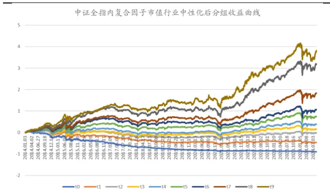
数据来源：Wind，国泰君安证券研究。测试区间：2014.01-2024.08。

表 25：中证全指内复合因子中性化后多头组近 3 年超额较

| 年度 | 组合收益基 |  | 准收益 |  | 超额收益 | 跟踪误差 | 最大回撤信 | 息比率 |  |
| --- | --- | --- | --- | --- | --- | --- | --- | --- | --- |
| 2014 |  | 86.94% |  | 45.45% | 41.49% | 8.29% | -10.61% |  | 5.00 |
| 2015 |  | 90.51% |  | 32.56% | 57.95% | 20.15% | -17.82% |  | 2.88 |
| 2016 |  | 3.01% |  | -14.41% | 17.41% | 7.19% | -2.39% |  | 2.42 |
| 2017 |  | -2.62% |  | 2.34% | -4.96% | 6.04% | -11.75% |  | -0.82 |
| 2018 |  | -25.06% |  | -29.94% | 4.88% | 10.32% | -7.30% |  | 0.47 |
| 2019 |  | 37.94% |  | 31.11% | 6.83% | 8.82% | -8.39% |  | 0.77 |
| 2020 |  | 29.05% |  | 24.92% | 4.13% | 10.65% | -10.43% |  | 0.39 |
| 2021 |  | 38.45% |  | 6.19% | 32.26% | 15.64% | -12.33% |  | 2.06 |
| 2022 |  | 0.72% |  | -20.32% | 21.04% | 13.05% | -5.92% |  | 1.61 |
| 2023 |  | 14.79% |  | -7.04% | 21.83% | 7.88% | -4.46% |  | 2.77 |
| 2024.08 | 1 | -15.52% | 「 | -11.97% | -3.54% | 14.02% | 16.24% |  | -0.25 |
| 整体 |  | 19.06% |  | 2.79% | 16.27% | 11.75% | -22.21% |  | 1.38 |
| 2016年以来 |  |  |  |  | 11.10% |  |  |  |  |

数据来源：Wind，国泰君安证券研究。测试区间 2014.01-2024.08。

控制市值行业无暴露，在中证全指成分股中构建复合因子得分最大化组合。测算发现：2014 年 1 月以来，年化超额收益 8.28%，超额收益最大回撤-10.34%，信息比率 1.01，周度双边换手率 36.40%。截至 2024 年 8 月 16 日，本年超额收益10.27%，超额收益最大回撤-5.81%。本报告收益为费前收益，按照 36.40%的周度双边换手率，双边0.3%交易费用，费用对收益影响大约为 36.40%*48 周*（0.3%/2）=2.62%。

表 26：中证全指内无暴露组合近 3年收益较好

| 年度 | 组合收益 |  | 基准收益 |  | 超额收益 | 跟踪误差 | 超额收益最大回撤 |  | 信息比率 | 周度双边换手率 |
| --- | --- | --- | --- | --- | --- | --- | --- | --- | --- | --- |
| 2014 |  | 85.20% |  | 45.45% | 39.75% | 6.12% | -1.53% |  | 6.50 | 48.4% |
| 2015 |  | 44.24% |  | 31.30% | 2.94% | 12.80% | -10.34% |  | 1.01 | 59.2% |
| 2016 |  | -7.24% |  | -14.41% | 7.16% | 6.90% | -3.27% |  | 1.04 | 39.0% |
| 2017 |  | 2.07% |  | 2.34% | -0.27% | 4.71% | 6.28% |  | -0.06 | 36.6% |
| 2018 |  | 26.60% |  | 29.94% | 3.34% | 7.67% | 6.17% |  | 0.44 | 29.3% |
| 2019 |  | 30.81% |  | 31.11% | -0.30% | 6.41% | -5.44% |  | -0.05 | 33.2% |
| 2020 |  | 22.12% |  | 24.92% | -2.80% | 8.02% |  | -7.62% | -0.35 | 31.49% |
| 2021 |  | 12.52% |  | 6.19% | 6.32% | 9.22% |  | -6.09% | 0.69 | 32.01% |
| 2022 |  | 14.07% |  | 20.32% | 6.25% | 10.21% |  | -7.92% | 0.61 | 29.98% |
| 2023 |  | 7.81% |  | -7.04% | 14.85% | 7.03% | -2.65% |  | 2.11 | 31.91% |
| 2024.08 |  | -1.70% |  | 11.97% | 10.27% | 8.11% | -5.81% |  | 1.27 | 29.25% |
| 整体 |  | 10.98% |  | 2.70% | 8.28% | 8.22% | -10.34% |  | 1.01 | 36.40% |
| 2016 | 年以来 |  |  |  | 4.98% |  |  |  |  |  |

数据来源：Wind，国泰君安证券研究。测试区间：2014.01-2024.08。

图 19：中证全指内无暴露组合收益曲线近期走势较好
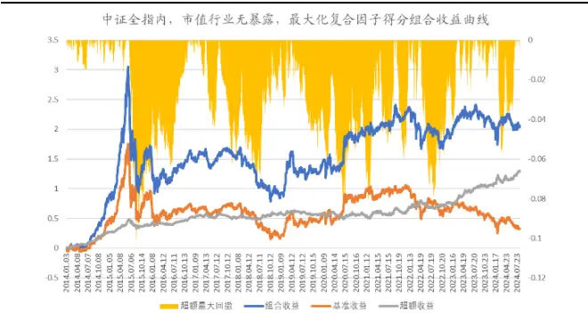
数据来源：Wind，国泰君安证券研究。测试区间 2014.01-2024.08。

允许市值行业适当暴露（市值暴露最大偏离0.5个标准差，行业权重最大偏离 2.5%），在中证全指成分股中构建复合因子得分最大化组合。测算发现：2014年 1月以来，年化超额收益 11.27%，超额收益最大回撤-19.83%，信息比率 1.16，周度双边换手率 45.42%。截至 2024 年 8 月 16 日，本年超额收益 4.14%，超额收益最大回撤-5.17%。本报告收益为费前收益，按照 45.42%的周度双边换手率，双边0.3%交易费用，费用对收益影响大约为45.42%*48周*（0.3%/2）=3.27%。

表 27：中证全指内允许暴露组合近3年收益较好

| 年度 | 组合收益 |  | 基准收益 |  | 超额收益 | 跟踪误差 | 超额收益最大回撤 | 信息比率 | 周度双边换手率 |
| --- | --- | --- | --- | --- | --- | --- | --- | --- | --- |
| 2014 |  | 96.94% |  | 45.45% | 51.49% | 6.89% | -2.74% | 7.47 | 48.7% |
| 2015 |  | 53.57% |  | 31.30% | 22.27% | 14.95% | -19.83% | 1.49 | 65.7% |
| 2016 |  | -2.69% | 0 | -14.41% | 11.71% | 7.22% | -5.16% | 1.62 | 48.4% |
| 2017 |  | 1.44% |  | 2.34% | -0.90% | 5.30% | -892% | -0.17 | 48.5% |
| 2018 |  | -26.56% |  | -29.94% | 3.37% | 8.59% | -6.85% | 0.39 | 44.3% |
| 2019 |  | 33.72% |  | 31.11% | 2.62% | 7.39% | -7.04 | % 0.35 | 46.6% |
| 2020 |  | 21.79% |  | 24.92% | -3.13% | 10.00% | -9.60% | -0.31 | 38.04% |
| 2021 |  | 19.50% |  | 6.19% | 13.31% | 13.54% | -9.46% | 0.98 | 35.41% |
| 2022 | 0 | -9.19% | 口 | -20.32% | 11.13% | 11.63% | -7.62% | 0.96 | 3730% |
| 2023 |  | 12.97% | D | -7.04% | 20.01% | 7.30% | -2.94% | 2.74 | 44.03% |
| 2024.08 |  | -7.83% | 0 | -11.97% | 4.14% | 8.05% | -5.17% | 0.51 | 42.72% |
| 整体 |  | 13.97% |  | 2.70% | 11.27% | 9.67% | -19.83% | 1.16 | 45.42% |
| 2016年以来 |  |  |  |  | 6.92% |  |  |  |  |

数据来源：Wind，国泰君安证券研究。测试区间：2014.01-2024.08。

图 20：中证全指内允许暴露组合收益曲线近期走势较好
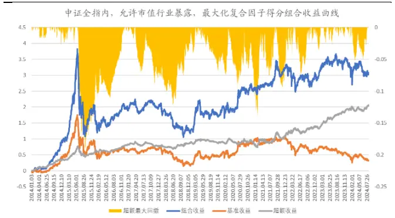
数据来源：Wind，国泰君安证券研究。测试区间 2014.01-2024.08。

## 4. 总结

本篇报告使用沪深交易所 level 2 行情中 10 档快照数据计算的高频因子选股效果进行测试。首先，介绍快照高频因子的计算方法。然后，在各股票池进行单因子测试，筛选出效果较好的因子。最后，等权加权得到复合因子，测试其在各股票池的表现，供投资者参考。

基于快照数据构建的因子投资逻辑较弱。部分因子超额收益来源是基于错误定价（过度反应后的反转效应）、承担风险溢价（低流动性、低波动的风险补偿）。快照因子类别有买卖价差、订单不平衡、订单簿斜率、快照数据价量相关性等。

在各股票池进行单因子测试，筛选效果较好的因子。在多个指数成分股内中都被选用的因子有10档买卖金额、10 档卖斜率和买卖比例相关性、价格高于卖一的比例、中间价相对买方均价均值。可以认为，这些因子在不同市值区间的适用性均较强。由于部分快照因子的投资逻辑不直观，偏数据挖掘，有效性需要样本外持续跟踪和观察。

等权加权得到复合因子，考察在各股票池的选股表现。从结果来看，快照因子在中小市值股票池(中证1000、中证2000）的选股效果较好，表现比较稳定，市值中性化与否影响较小。近4年或受益于小市值风格占优，在多数宽基指数（包括沪深300）股票池中多头组超额收益均较好。

1)控制市值行业无暴露，构建因子得分最大化组合，测算发现，2014 年1月以来，沪深300内年化超额6.52%（2015年以来年化超额 3.53%），超额最大回撤-20.16%；截至2024年8月16日，本年超额收益11.39%，超额最大回撤-3.36%。中证 500 内年化超额 9.88%（2015 年以来年化超额 7.67%），超额最大回撤-15.66%；本年超额收益 8.1%，超额最大回撤 3.11%。中证 1000 内年化超额收益 11.90%（2015 年以来年化超额11.01%），超额最大回撤-16.17%；本年超额收益10.74%，超额最大回撤-4.58%。中证 2000 内年化超额收益 13.06%（2016 年以来年化超额13.21%），超额最大回撤-20.47%；本年超额收益5.7%，超额最大回撤-6.31%。

2) 允许市值行业适当暴露（相对基准指数，市值暴露最大偏离 0.5 个标准差，行业权重最大偏离 2.5%），构建因子得分最大化组合，测算发现，2014 年 1 月以来，沪深 300 内年化超额 10.39%（2015 年以来年化超额7.22%），超额最大回撤-19.9%；截至 2024 年8 月16 日，本年超额收益 11.2%，超额最大回撤-3.56%。中证 500 内年化超额 10.68%（2015年以来年化超额7.94%），超额最大回撤-16.21%；本年超额收益7.31%，超额最大回撤-4.62%。中证 1000 内年化超额收益 13.25%（2015 年以来年化超额 11.65%），超额最大回撤-18.20%；本年超额收益 8.42%，超额最大回撤-5.51%。中证 2000 内年化超额收益 15.53%（2016 年以来年化超额15.1%），超额最大回撤-18.92%；本年超额收益4.72%，超额最大回撤-7.33%。

## 5. 参考文献

[1]深圳证券市场2022年度股票市场质量报告.深圳证券交易所研究所（金融创新实验室）.2023年 5月.

[2]kdb+中文教程.张文璋、郑轶、陈青、张瀛文、李书忞、钱嘉韵、吴晶、杨 琨等. https://mp.weixin.qq.com/s/2cVyuebVzhGN1J142LDCkg .

[3]KDB 教程官网. KxSystems 公司.https://code.kx.com/home/ .

[4]DolphinDB 用户手册 . 浙江智叟科技 .

https://docs.dolphindb.cn/zh/help/index.html

## 6. 风险提示

量化模型基于历史数据构建，而历史规律存在失效风险。

## 7. 附录

## 7.1. 高频数据处理软件介绍

## 7.1.1. KDB+

KDB+3是国外一款号称是世界上最快、性能极高的内存数据库，q是内置语言。kdb+不只是内存数据库，更是一款高性能大数据平台，使用统一的数据库处理实时数据和历史数据，同时具备CEP（复杂事件处理）引擎、内存数据库、磁盘数据库等功能。

图 21：Kdb+在国外金融市场的主要用途非常广泛
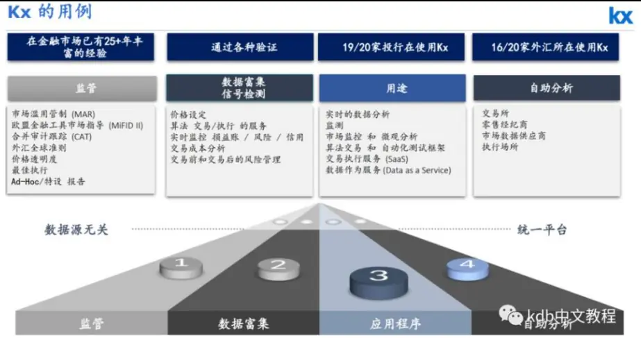
数据来源：KxSystems 公司，kdb+中文教程。

KDB+的缺点：首先是学习曲线相对陡峭，思维方式比较特别，不像常规语言那么好上手和容易切换。其次国内用户较少，学习交流的社群较少。最后，KX 公司似乎对国内市场不太重视，市场推广较少，相应的技术支持较少。

为满足不同的需求，kdb+提供了多种许可类型可供选择[5]。下表列出了各种许可的比较。64 位个人试用版可以从官网申请下载 https://kx.com/kdb-personal-edition-download/，需要获取授权试用文件 kc.lic，可以试用 1 年。

## 7.1.2. DolphinDB

DolphinDB 是国内一款高性能分布式时序数据库，由浙江智臾科技有限公司自主研发。根据官方产品简介4，DolphinDB 集成了功能强大的编程语言和流数据分析系统，为结构化数据的快速存储、检索、分析及计算提供一站式解决方案，在大规模数据处理与分析领域拥有世界领先的性能水平，特别适用于量化金融与物联网等领域对数据存储、查询及分析有极高要求的场景。DolphinDB 主要优势是快，体现在四个方面：开发快、运行快、部署快和学习快。能够对海量数据特别是时间序列数据和实时流数据进行存储、管理及复杂的交互分析。核心功能主要包括：高性能数据库、功能齐全的脚本语言、可扩展的分布式计算、实时数据流计算和便捷的系统访问方式。

DolphinDB 已经广泛应用于国内的头部券商、公募基金、私募基金和银行等机构。

DB-Engines最新发布的 2024年9月时序数据库排名榜单中，国产时序数据库DolphinDB荣登该榜单前8，也是目前唯一排名前10的国产时序数据库。自 2019 年参与 DB-Engines 排名以来，DolphinDB 凭借广大用户的支持与产品优异的性能，排名一路上升，发展势头迅猛。

表 28：2024年 9月时序数据库排名

| Rank |  | DBMS | Database Model | Score |  |  |
| --- | --- | --- | --- | --- | --- | --- |
| Sep 2024 2024 2023 | Sep Aug |  |  | Sep 2024 | Aug 2024 | Sep 2023 |
| 1. | 1. | 1. InfluxDB + | Time Series, Multi-model | 22.12 | -0.50 | -9.15 |
| 2. | 2. 2. | Kdb + | Multi-model | 7.73 | -0.24 | -1.21 |
| 3. | 3. 3. | Prometheus | Time Series | 7.56 +0.39 |  | -0.06 |
| 4. | 4. 4. | Graphite | Time Series | 5.19 | -0.16 | -0.26 |
| 5. | 5. 5. | TimescaleDB | Time Series, Multi-model | 4.06 | -0.01 | -1.33 |
| 6. | 6. ↑7. | Apache Druid | Multi-model | 2.85 | -0.10 | -0.35 |
| 7. | 7. 10. | QuestDB | Time Series, Multi-model | 2.81 | -0.06 | +0.43 |
| 8. | 8. 6. | DolphinDB | Multi-model | 2.72 | -0.05 | -1.32 |
| 9. | 9. 9. | TDengine + | Time Series, Multi-model | 2.48 | -0.03 | -0.14 |
| 10. | 10. 11. | GridDB | Time Series, Multi-model i | 1.91 | -0.07 | -0.26 |
| 11. | 11. 8. | RRDtool | Time Series | 1.70 | -0.02 | -1.43 |
| 12. | 12. 12. | OpenTSDB | Time Series | 1.59 | 0.00 | -0.52 |
| 13. | 13. 13. | Fauna | Multi-model | 1.55 | -0.01 | -0.13 |
| 14. | 14. 18. | Apache IoTDB | Time Series |  | 1.31 +0.03 | +0.33 |
| 15. | 15. 14. | VictoriaMetrics | Time Series |  | 1.23 +0.03 | -0.14 |
| 16. 16. | 15. | Amazon Timestream | Time Series |  | 1.22 +0.03 | +0.09 |
| 17. 17. | 16. | M3DB | Time Series |  | 1.02 +0.04 | -0.05 |
| 18. 19. | 17. | eXtremeDB | Multi-model |  | 0.79 +0.10 | -0.23 |
| 19. ↓18. 21. |  | CrateDB | Multi-model | 0.69 | 0.00 | -0.12 |
| 20. 20. | 19. | KairosDB | Time Series | 0.60 | -0.02 | -0.35 |

数据来源：DB-Engines。

相比于同类产品，DolphinDB 的技术支持、相关培训和售后服务非常完善，响应及时迅速，有很好的学习社区和社群。目前有社区版可以免费试用，有一定资源限制，可点击 https://dolphindb.cn/product#downloads 下载。不同于KDB+一般需要一个月左右才能上手写代码；DolphinDB 一般一周便可以上手编写因子。

## 7.2. 不同股票池中选用因子的分组超额收益和每年超额收益

## 7.2.1. 沪深 300 指数成分股

表 29：沪深 300内效果较好因子的分组年化超额收益

|  | 因子原始值 |  |  |  |  |  | 因子市值行业中性化 |  |  |  |  |  |
| --- | --- | --- | --- | --- | --- | --- | --- | --- | --- | --- | --- | --- |
| 沪深300因子分组年化超额收益 | t1 | t2 |  | t3 | t4 | 多空收益 (abs(t0-t4)) | t1 | t2 | t3 | t4 |  | 多空收益 (abs(t0-t4)) |
| 3秒成交金额的IR | 7.98% | 232% | 0.41% | 2.94% | 6.47% | 14.45% | 6.69% | 0.90% | 0.50% | 0.98% | 4.89% | 11.58% |
| 3秒成交金额的峰度 | D2.46% | 02.55% | 1.42% | 220% | 192% | 4.39% | 3.26% | 1.16% | 0.11% | 0.90% | 2.09% | 5.35% |
| 10档买均价相对买一比值+10档卖均价相对卖一比值的均值 | 5.11% | 0.86% | 0.51% | 0.34% | 6.42% | 11.53% | L1.67% | 0.95% | L1.56% | 0.87% | 4.07% | 5.74% |
| 10档买卖总金额偏度 | 7.63% | 3.99% | 1.42% | 5.29% | 6.91% | 14.54% | 3.34% | 3.72% | 1.41% | 0.73% | -6.65% | 9.99% |
| (委买量-委卖量)/(委买量+委卖量) | 5.88% | 238% | 1.50% | 2.27% | 6.46% | 12.34% | 3.28% | 3.28% | 1.57% | 10.86% | -5.96% | 9.24% |
| 10档买卖不平衡除以总金额 | 7.04% | 3.76% | 1.35% | 4.63% | 8.69% | 15.73% | 口3.24% | 2.33% | L1.90% | 1.95% | 6.66% | 9.90% |
| 10档买卖不平衡除以总金额的标准差 | 6.88% | 1.07% | 2.55% | 口3.05% | D2.24% | 9.11% | 4.79% | 0.66% | 口2.92% | D2.57% | 0.87% | 3.92% |
| 10档买卖不平衡除以总金额的偏度 | 0.02% | 0.65% | 10.71% | 2.82% | 15.87% | 15.89% | 6.35% | 1.53% | L1.57% | D2.60% | 02.48% | 8.83% |
| 10档买卖不平衡的标准差 | 0.06% | 0.29% | 1.99% | 0.26% | L1.51% | 1.57% | 0.88% | 1.89% | 10.83% | 1.77% | 日-2.78% | 3.66% |
| 10档买卖不平衡的IR | 4.96% | 4.45% | 0.52% | 1.80% | 8.93% | 13.89% | 0.72% | 3.04% | 5.11% | 264% | 7.35% | 807% |
| 价格高于卖一的比例 | 7.49% | 3.14% | L1.72% | 口3.87% | 口4.78% | 12.28% | 3.06% | 1.70% | 1.30% | 2.28% | -3.00% | 6.06% |
| 10档买均价相对买一比值和10档卖均价相对卖一比值的相关 | L1.26% | 2.15% | L1.45% | 0.36% | 5.79% | 7.05% | 0.63% | 2.54% | E0.95% | 0.44% | 324% | 2.60% |
| 10档买卖均价相关性 | 4.16% | 3.96% | 1.04% | L1.50% | 5.31% | 9.47% | 2176% | 0.25% | 1.11% | 1.52% | 2.16% | 4.92% |
| 中间价相对买方均价的均值 | 16.14% | 口3.15% | 0.39% | 273% | 6.54% | 12.67% | 口4.75% | D1.23% | 0.29% | 0.54% | 6.14% | 10.89% |
| 20档委托量峰度的IR | 7.18% | 1.97% | 3.17% | 3.24% | D2.41% | 9.60% | 6.67% | 10.58% | B1.36% | 2.22% | 1.49% | 8.16% |
| 20档委托量峰度的峰度 | 10.81% | 0.42% | 12.04% | 0.27% | 4.27% | 5.07% | 2.21% | 0.28% | 02.49% | 1.42% | 4.72% | 6.93% |
| 10档卖斜率的偏度 | 7.29% | 247% | 3.08% | 口2.50% | 3.64% | 10.93% | 0.89% | 4.71% | 1.14% | 口3.44% | -2.35% | 3.24% |
| 10档卖残差的偏度 | 7.48% | 304% | L1.31% | D2.82% | 5.66% | 13.15% | 292% | 223% | 0.69% | 0.57% | -5.30% | 8.22% |
| 10档卖斜率和买卖比例相关性 | 6.60% | 日0.91% | 3.46% | 1.25% | 口2.99% | 9.59% | 5.46% | 0.03% | 02.57% | L1.99% | 0.01% | 5.45% |
| 10档卖斜率和成交价相关性 | 6.43% | 口2.91% | L1.59% | B1.33% | 0.13% | 6.57% | 4.41% | 10.77% | 10.47% | D2.60% | 0.19% | 4.22% |
| 10档买斜率和买卖不平衡比例相关性 | 7.60% | 1.59% | 4.42% | 11.54% | 口2.81% | 10.42% | 4.18% | 1.42% | 10.39% | 口3.91% | -0.53% | 4.71% |
| 10档买斜率和成交价相关性 | 6.99% | 0.99% | 2.95% | 01.61% | 口2.98% | 9.97% | 3.73% | 278% | 口2.71% | L2.01% | -0.94% | 4.66% |

数据来源：Wind，国泰君安证券研究。测试区间：2014.01-2024.08。

表 30：沪深 300股票池内效果较好因子原始值的多头组每年超额

| 沪深300因子原始值多头组超额收益 | 2014 |  |  | 2015 |  | 2016 | 2017 |  |  | 2018 | 2019 |  |  | 2020 | 2021 |  | 2022 |  | 2023 | 2024.08 |  | 年度简单平均 |
| --- | --- | --- | --- | --- | --- | --- | --- | --- | --- | --- | --- | --- | --- | --- | --- | --- | --- | --- | --- | --- | --- | --- |
| 3秒成交金额的IR | 2 | 4.2% |  | 21.5% |  | 3.8% |  | -2.7% |  | 3.1% | -6 | .4% |  | 26.7% | 27.1% |  | 173% |  | 27.2% | 1 | 1.0% | 9.04% |
| 3秒成交金额的峰度 | 口1 | 7.7% | 3 | 7.2% | 3 | .4% | D | -5.8% |  | 9.9% |  | -0.5% |  | -0.9% | 8.2% |  | 6.0% |  | -5.8% | 0 | -4.8% | 2.65% |
| 10档买均价相对买一比值+10档卖均价相对卖一比值的均值 |  | 9.2% |  | 40.0% |  | 2.2% | C | -6.4% |  | -2.3% | I | -9.3% |  | 27.2% | 24.4% |  | 16.5% |  | 23.9% |  | 14.8% | 7.79% |
| 10档买卖总金额偏度 | 2 | 0.0% |  | 25.2% |  | 5.8% | D | 11.0% |  | -0.8% |  | -1.0% |  | 15.1% | 21.2% |  | 13.2% |  | 21.4% |  | 11.6% | 8.2% |
| (委买量-委卖量)/(委买量+委卖量) |  | -3.0% |  | 39.5% | ■ | 8.6% | 1 | 4.6% |  | 8.2% | C | -6.8% |  | 17.2% | 19.1% |  | 13.8% |  | 16.3% |  | 11.4% | 685% |
| 10档买卖不平衡除以总金额 | 2 | 5.0% | 1 | 3.2% |  | 1.3% |  | 3.7% |  | 12.9% | C | -8.1% | D | -6.6% | 14.7% |  | 11.0% |  | 13.9% |  | 16.5% | 8.86% |
| 10档买卖不平衡除以总金额的标准差 | 2 | 3.1% |  | 170% |  | 0.5% | -6 | .9% |  | 2.2% | 1 | 10.1% |  | 27.1% | 25.9% |  | 18.7% |  | 30.1% | 1 | 5.6% | 8.12% |
| 10档买卖不平衡除以总金额的偏度 |  | 177% |  | 180% |  | 3.7% |  | 3.2% | ■ | 9.0% |  | 0.7% |  | 3.1% | 16.2% |  | 7.9% |  | 15.9% |  | 13.6% | 9.90% |
| 10档买卖不平衡的标准差 | 口1 | 5.7% | 3 | 2.3% |  | 1.3% |  | 16.7% |  | 4.1% |  | -1.6% |  | 5.2% | 10.4% |  | 3.3% | D | -6.1% | 0 | -7.3% | 0.83% |
| 10档买卖不平衡的IR | 2 | 8.9% | 1 | 6.9% |  | 2.8% |  | 2.8% |  | 11.3% | 1 | -8.9% | 1 | 13.2% | 12.9% |  | 11.9% |  | 186% |  | 187% | 9.34% |
| 价格高于卖一的比例 | 2 | 3.2% | 3 | 3.7% |  | 2.1% | I | -6.8% |  | -0.4% | 1 | 11.5% |  | 26.7% | 24.9% |  | 171% |  | 26.5% | 1 | 5.6% | 8.87% |
| 10档买均价相对买一比值和10档卖均价相对卖一比值的相关性 |  | -4.6% |  | 32.3% |  | 1.3% |  | -6.0% |  | 5.0% |  | 11.6% |  | 25.9% | 23.6% |  | 20.2% |  | 28.0% |  | 16.0% | 712% |
| 10档买卖均价相关性 | 1 | 76% |  | 8.2% |  | 0.2% | 「 | 13.1% |  | 4.9% |  | 12.7% |  | 26.8% | 26.2% |  | 16.0% |  | 25.3% |  | 13.5% | 15.38% |
| 中间价相对买方均价的均值 | 3 | 2.8% |  | 2.7% | 5 | .0% |  | -7.1% |  | -0.2% | 1 | -8.3% | 7 | 23.8% | 23.7% |  | 171% |  | 26.2% |  | 16.0% | 7.64% |
| 20档委托量峰度的IR | 3 | 0.9% | 1 | 2.3% |  | 6.0% |  | -4.7% |  | 1.7% | 1 | -9.1% |  | 25.9% | 24.5% |  | 14.6% |  | 27.8% |  | 13.0% | 8.29% |
| 20档委托量峰度的峰度 |  | 1.9% |  | 9.8% |  | 4.7% | D | 10.6% |  | 3.7% |  | -4.5% |  | 19.2% | 20.7% |  | 10.6% |  | 182% |  | 7.6% | 4.81% |
| 10档卖斜率的偏度 |  | 22.2% |  | 16.6% |  | 8.4% |  | -9.5% |  | 5.4% | C | -6.4% |  | 22.3% | 19.2% | 1 | 8.2% |  | 23.8% |  | 13.5% | 8.10% |
| 10档卖残差的偏度 |  | 185% | 2 | 9.4% |  | 2.5% |  | -6.5% |  | 1.9% | 1 | 10.4% | 7 | 18.7% | 22.7% |  | 13.7% |  | 24.0% |  | 14.5% | 8.33% |
| 10档卖斜率和买卖比例相关性 |  | 4.5% | 2 | 1.1% |  | 3.5% |  | -7.8% |  | 6.7% | D | -7.4% |  | 23.5% | 26.3% |  | 175% |  | 26.8% |  | 15.3% | 7.54% |
| 10档卖斜率和成交价相关性 |  | 0.8% |  | 28.1% |  | 1.6% |  | -5.6% |  | 4.9% | 1 | 10.4% | 7 | 20.5% | 21.2% |  | 18.5% |  | 25.5% |  | 16.7% | 7.34% |
| 10档买斜率和买卖不平衡比例相关性 | 2 | 6.7% | 3 | 3.0% |  | 1.8% | 1 | -8.3% |  | 1.6% | 「 | 10.2% |  | 25.9% | 29.8% |  | 12.2% |  | 23.1% | 1 | 4.8% | 8.95% |
| 10档买斜率和成交价相关性 |  | 22.9% |  | 27.2% |  | 1.3% |  | 11.3% |  | 5.9% | N | -7.0% |  | 22.7% | 25.2% |  | 13.4% |  | 21.9% |  | 11.3% | 8.00% |

数据来源：Wind，国泰君安证券研究。测试区间：2014.01-2024.08。

表 31：沪深 300股票池内效果较好因子市值中性化后的多头组每年超额

| 沪深300因子市值行业中性化后多头组超额收益 | 2014 2015 |  |  |  | 2016 | 2017 |  |  | 2018 | 2019 |  | 2020 |  | 2021 2022 |  |  |  | 2023 |  | 2024.08 |  | 年度简单平均 |  |
| --- | --- | --- | --- | --- | --- | --- | --- | --- | --- | --- | --- | --- | --- | --- | --- | --- | --- | --- | --- | --- | --- | --- | --- |
| 3秒成交金额的IR |  | 19.1% | 140% |  | 6.7% |  | -3.4% |  | 0.5% |  | 0.7% | L | 12.3% |  | 21.4% |  | 8.3% |  | 17.3% |  | 4.3% | 695% |  |
| 3秒成交金额的峰度 | -6 | .6% | 24.5% |  | 3.0% | 口 | -7.7% |  | 2.4% |  | 0.2% | L | -3.0% |  | 6.4% |  | 5.8% |  | 2.0% |  | -1.3% | 2.34% |  |
| 10档买均价相对买一比值+10档卖均价相对卖一比值的均值 | 1 | 1.2% | 24.4% |  | 2.5% | 日 | -9.2% | 0 | -5.0% | D | -5.5% | 2 | 1.7% |  | 10.6% | 1 | 48% |  | 21.2% |  | 9.7% | 4.84% |  |
| 10档买卖总金额偏度 |  | 6.0% | 23.8% |  | 2.3% | -6 | .5% |  | -5.1% |  | 1.5% |  | 11.3% |  | 10.5% |  | 5.9% |  | 12.2% |  | 0.8% | 3.65% |  |
| (委买量-委卖量)/(委买量+委卖量) |  | -1.4% | 34.0% |  | 4.3% | 口 | 10.9% |  | -1.9% | -7 | .3% |  | -2.6% |  | 131% |  | 2.1% |  | 12.3% |  | 0.1% | 3.80% |  |
| 10档买卖不平衡除以总金额 |  | 141% | 24.0% | 1 | -2.2% | L | -3.6% |  | 6.0% |  | 0.1% |  | -5.8% |  | 15.6% |  | 11.4% |  | 10.7% |  | 4.7% | 6.82% |  |
| 10档买卖不平衡除以总金额的标准差 |  | 21.3% | 18.1% |  | -0.3% | 0 | -9.4% |  | 0.3% | -7 | .3% |  | 23.1% |  | 17.4% | 1 | 1.6% |  | 25.6% |  | 8.3% | 5.67% |  |
| 10档买卖不平衡除以总金额的偏度 |  | 8.5% | 22.8% |  | 3.6% |  | -3.6% |  | 10.1% |  | -0.8% | D | -5.0% |  | 12.1% |  | 5.0% |  | 139% |  | 4.2% | 6.44% |  |
| 10档买卖不平衡的标准差 | -7 | .8% | 16.3% |  | 1.7% | -7 | .5% |  | -1.2% |  | -3.5% |  | -1.7% |  | 9.5% |  | 3.0% |  | 1.6% |  | 1.5% | 1.07% |  |
| 10档买卖不平衡的IR |  | 144% | 22.5% |  | -0.9% | 1 | -5.3% |  | 5.5% |  | -4.7% | C | 11.5% |  | 20.1% |  | 148% |  | 18.2% |  | 11.8% | 7.72% |  |
| 价格高于卖一的比例 |  | 18.0% | 27.4% |  | -0.9% | 1 | 4.5% | 0 | -5.5% | D | -5.0% | 7 | 17.8% |  | 133% |  | 6.7% |  | 15.8% |  | 4.8% | 3.85% |  |
| 10档买均价相对买一比值和10档卖均价相对卖一比值的相关性 |  | 2.8% | 25.0% |  | 0.6% |  | -8.2% |  | 0.7% |  | -8.7% |  | 23.4% |  | 142% |  | 135% |  | 20.3% |  | 7.7% | 4.05% |  |
| 10档买卖均价相关性 |  | 7.8% | 15.0% |  | -1.2% |  | 13.9% |  | 0.2% | 日 | -8.0% |  | 25.1% |  | 16.7% | 1 | 2.8% |  | 25.2% |  | 1.5% | 3.73% |  |
| 中间价相对买方均价的均值 |  | 28.3% | 24.6% |  | -2.3% |  | 10.0% |  | -0.2% | D | -3.1% |  | 19.8% |  | 18.6% |  | 9.8% |  | 25.5% |  | 5.9% | 704% |  |
| 20档委托量峰度的IR |  | 24.0% | 26.5% |  | 2.8% | D | -6.1% |  | 2.3% | 「 | -7.3% |  | 20.8% |  | 19.2% |  |  |  |  |  | 8.0% | 7.54% |  |
| 20档委托量峰度的峰度 |  | 7.8% | 11.7% |  | 3.9% | -7 | .4% |  | 1.8% |  | -2.5% |  |  |  |  |  |  |  |  |  |  | 4.94% |  |
| 10档卖斜率的偏度 |  | -1.2% | 20.7% |  | -0.7% | 1 | -5.9% | 0 | -7.8% | D | -4.5% |  | 16.2% |  |  |  |  |  |  |  |  | 1.41% |  |
| 10档卖残差的偏度 |  | -1.2% | 25.2% | D | -3.2% | D | -7.3% |  | 0.5% |  | -0.8% | 「 | -8.0% |  |  |  |  |  |  |  | 1.1% | 3.28% |  |
| 10档卖斜率和买卖比例相关性 |  | 1.7% | 22.0% |  | 6.5% | 日 | -9.6% |  | 2.1% | D | -5.5% |  | 21.7% |  | 18.8% | 1 | 7.4% |  | 24.3% |  | 126% | 6.25% |  |
| 10档卖斜率和成交价相关性 |  | 0.6% | 24.0% |  | 0.7% | 日 | -9.0% |  | 2.5% | D | -4.9% |  | 18.9% |  | 16.0% | 1 | 36% |  | 23.6% |  | 8.0% |  | 5.09% |
| 10档买斜率和买卖不平衡比例相关性 |  | 19.2% | 30.3% |  | -1.9% | 「 | 10.7% |  | -2.9% | 「 | -8.4% |  | 24.3% |  | 18.6% |  | 17.8% |  | 21.7% |  | 8.6% |  | 5.27% |
| 10档买斜率和成交价相关性 |  | 142% | 20.0% |  | -0.4% | D | -7.8% |  | 0-4.8% | 「 | 8.3% |  | 21.1% |  | 19.4% |  |  |  |  |  |  |  | 4.52% |

数据来源：Wind，国泰君安证券研究。测试区间：2014.01-2024.08。

## 7.2.2. 中证 500 指数成分股

表 32：中证 500内效果较好因子的分组年化超额收益

|  | 因子原始值 |  |  |  |  |  |  |  |  |  |  | 因子市值行业中性化 |  |  |  |  |  |  |  |  |  |  |
| --- | --- | --- | --- | --- | --- | --- | --- | --- | --- | --- | --- | --- | --- | --- | --- | --- | --- | --- | --- | --- | --- | --- |
| 中证500因子分组年化超额收益 | t0 |  | t1 |  | t2 t3 |  |  |  | t4 |  | 多空收益(abs(t0-t4)) | t0 t1 |  |  |  | t2 t3 |  |  |  | t4 |  | 多空收益(abs(t0-t4)) |
| 3秒成交金额的IR | 7 | .23% | 2 | .72% |  | 196% |  | .69% | .5 | 2% | 10.76% | 4 | .96% | 2 | .28% |  | 2.26% | 0 | .84% | 3. | 08% | 8.04% |
| 3秒成交金额的峰度 | 7 | 6.93% | -0 | .50% |  | 117% |  | 6.51% |  | .12% | 14.05% | 1- | .30% | D | .84% |  | 73% |  | 6.01% |  | 7.01% | 12.31% |
| 10档买均价相对买一比值+10档卖均价相对卖一比值的均值 |  | .81% |  | 25% | -0 | .08% | $ | .44% |  | .21% | 8.02% | .6 | 9% |  | 107% |  | 24% |  | 4.07% |  | 3.42% | 6.10% |
| 10档买卖总金额偏度 | $ | .38% | 5 | .68% |  | 61% | 2 | .05% |  | 1.20% | 15.59% |  | 5.95% |  | 5.73% |  | 3.28% | 0 | .91% |  | 5.51% | 11.46% |
| (委买量-委卖量)/(委买量+委卖量) | 6 | .59% | 5 | .03% |  | 35% | 0 | .70% | . | 83% | 14.42% | 5 | .95% | 5 | .98% |  | 70% | 0 | .51% |  | 6.43% | 12.38% |
| 10档买卖不平衡除以总金额 | -6 | .99% | 0 | .93% |  | 25% |  | 4.13% | 9 | .16% | 16.15% | .3 | 4% |  | 0.77% |  | 0.34% |  | 4.37% |  | 7.45% | 12.79% |
| 10档买卖不平衡除以总金额的标准差 | 5 | .51% |  | 55% | 1 | 10% |  | φ.01% | 日 | .81% | 7.32% |  | .94% |  | 63% |  | 21% |  | 40% | 日 | 1.22% | 4.16% |
| 10档买卖不平衡除以总金额的偏度 | 9 | .35% | 5 | .36% | 0 | .02% |  | -0.39% | 7- | 6.54% | 15.90% | 7 | .49% |  | 413% |  | 0.82% |  | 68% |  | 4.84% | 12.33% |
| 10档买卖不平衡的标准差 |  | 6.55% | 5 | .02% |  | 3.28% |  | 43% |  | .77% | 15.32% |  | 6.02% |  | 4.59% |  | 5.04% |  | 94% |  | 8.80% | 14.82% |
| 10档买卖不平衡的IR | .4 | 4% | -0 | .08% |  | 14% |  | 4.11% | 7 | .66% | 14.10% | .4 | 6% |  | 0.15% |  | -0.18% |  | 5.76% |  | 6.12% | 10.58% |
| 价格高于卖一的比例 |  | 7.18% | 5 | .13% |  | 48% |  | -0.51% | .4 | 8% | 13.66% |  | 4.54% |  | 4.76% |  | 4.45% |  | 0.35% |  | 6.76% | 11.30% |
| 10档买均价相对买一比值和10档卖均价相对卖一比值的相关 | 0. | 45% |  | .51% | 0 | .50% |  | 103% | 6 | .34% | 7.79% |  | .03% |  |  |  |  |  | .88% |  | 5.71% | 5.68% |
| 10档买卖均价相关性 |  | 5.30% |  | 3.91% |  | 92% |  | 9.56% | . | 90% | 11.20% |  | .17% | 3 | 30% |  | 3.61% | φ | .04% | 口 | 3.92% | 8.09% |
| 中间价相对买方均价的均值 | - | 7.91% | 0 | .88% |  | 204% |  | 4.33% | 1 | .74% | 15.64% | -. | 01% |  | 233% |  |  |  | 4.61% |  | 5.12% | 13.12% |
| 20档委托量峰度的IR | 5 | .57% | 3 | .32% |  | 27% |  | φ.07% | .4 | 9% | 9.07% |  | 4.53% | 0 | .17% |  |  |  | 4.72% | D | 3.30% | 7.83% |
| 20档委托量峰度的峰度 | D | 4.39% | 0 | .30% | 3 | .00% |  | 2.83% | $ | .50% | 9.90% |  | 83% |  | 310% |  | 84% |  | 20% |  | 4.04% | 7.87% |
| 10档卖斜率的偏度 | 6 | .06% |  | 3.54% |  | 57% |  | φ.06% |  | 24% | 10.30% |  | 18% |  | 4.13% |  | 86% | 9 | .36% | 「 | 2.34% | 552% |
| 10档卖残差的偏度 |  | .29% | 3 | .43% | -0 | .07% |  | 65% | .1 | 4% | 12.42% | 3 | .66% | 5 | .01% |  | 17% | 0 | .82% | 4. | 32% | 7.98% |
| 10档卖斜率和买卖比例相关性 | 7 | .29% | 2 | .45% | D | .67% |  | 166% | 2. | 85% | 10.14% | 5 | .90% |  | 19% |  | 0.55% |  | 193% | D | 2.29% | 8.18% |
| 10档卖斜率和成交价相关性 | 6 | .66% |  | 39% | D. | 65% |  | 0.78% | -6 | .33% | 6.99% | 5 | .47% | 0 | .32% |  | -0.08% |  | 193% | 1 | 0.53% | 6.00% |
| 10档买斜率和买卖不平衡比例相关性 |  | 5.95% |  | 83% |  | 03% |  |  |  |  |  |  |  |  |  |  |  |  |  |  |  |  |
|  |  |  |  | 20% |  | 47% |  | -0.18% |  | .15% | 7.55% |  | 5.03% | 0 | .46% |  | 0.05% |  | 16% |  | 0.54% | 5.57% |

数据来源：Wind，国泰君安证券研究。测试区间：2014.01-2024.08。

表 33：中证 500股票池内效果较好因子原始值的多头组每年超额，近4年效果不错

| 中证500因子原始值多头组超额收益 | 2014 2015 |  |  | 2016 |  | 2017 |  | 2018 |  | 2019 |  | 2020 | 2021 2022 |  | 2023 |  | 2024.08年度简单平均 |  |  |
| --- | --- | --- | --- | --- | --- | --- | --- | --- | --- | --- | --- | --- | --- | --- | --- | --- | --- | --- | --- |
| 3秒成交金额的IR |  | 21.5% | 18.7% |  | 1.1% |  | -4.3% | 3.9% |  | -1.4% |  | -13.2% | 22.2% | 9.9% |  | 9.6% |  | 5.0% | 7.55% |
| 3秒成交金额的峰度 | -7 | .2% | 10.1% |  | 8.1% |  | 8.5% | 19.0% |  | 5.9% |  | 0.7% | 4.1% | 23.1% |  | 2.3% |  | 4.7% | 7.19% |
| 10档买均价相对买一比值+10档卖均价相对卖一比值的均值 | 1 | 1.6% | 19.0% |  | 8.3% |  | D-4.5% | 0.8% | n | -6.6% |  | -15.5% | 12.4% | 10.3% |  | 8.8% |  | 5.4% | 4.54% |
| 10档买卖总金额偏度 |  | 28.4% | 15.0% |  | 14.1% |  | 1.8% | 4.1% |  | 1.2% |  | -14.2% | 12.0% | 12.4% |  | 10.8% |  | 9.2% | 8.62% |
| (委买量-委卖量)/(委买量+委卖量) |  | 6.3% | 23.6% |  | 18.8% | 「 | -4.6% | 7.1% |  | 0.0% |  | -11.0% | 8.8% | 10.9% |  | 9.5% |  | 5.4% | 6.80% |
| 10档买卖不平衡除以总金额 |  | 22.2% | 7.4% |  | 11.8% |  | 6.9% | 10.4% | C | -4.9% |  | -1.2% | 6.4% | 20.4% |  | 10.6% |  | 10.7% | 9.15% |
| 10档买卖不平衡除以总金额的标准差 |  | 22.5% | 4.8% |  | 8.7% | 0 | -6.4% | 2.5% | C | -4.0% |  | -11.6% | 15.0% | 13.9% |  | 1.2% |  | 7.0% | 5.79% |
| 10档买卖不平衡除以总金额的偏度 |  | 28.3% | 0.8% |  | 13.0% |  | 2.5% | 16.7% |  | -2.4% |  | 3.7% | 2.9% | 17.3% |  | 11.8% |  | 8.8% | 9.40% |
| 10档买卖不平衡的标准差 |  | -0.8% | 32.4% |  | 14.7% | 「 | -4.8% | 11.4% |  | 5.8% |  | -1.3% | 10.6% | 13.7% |  | -0.5% | -5 | .6% | 6.87% |
| 10档买卖不平衡的IR |  | 26.5% | 4.5% |  | 10.3% |  | 5.3% | 8.6% | 口 | -7.6% | D | -6.5% | 7.6% | 170% |  | 10.7% |  | 9.6% | 7.82% |
| 价格高于卖一的比例 |  | 22.3% | 30.7% |  | 9.0% | 0 | -5.3% | I6.4% | C | -4.9% |  | -15.6% | 10.3% | 161% |  | 8.9% |  | I6.7% | 7.69% |
| 10档买均价相对买一比值和10档卖均价相对卖一比值的相关性 |  | 8.5% | 162% |  | 13.0% | 0 | -5.7% | 7.0% |  | -1.3% |  | -11.8% | 11.7% | 13.1% |  | 13.1% |  | 7.8% | 651% |
| 10档买卖均价相关性 |  | 6.7% | 2.3% |  | 13.7% | 0 | -4.6% | I7.9% |  | -3.0% |  | -12.8% | 12.8% | 19.3% |  | 10.2% |  | 8.4% | 5.53% |
| 中间价相对买方均价的均值 |  | 32.4% | 5.8% |  | 14.2% | D | -4.2% | 6.4% |  | -0.8% |  | -15.4% | 21.2% | 165% |  | 10.9% |  | 3.4% | 8.22% |
| 20档委托量峰度的IR |  | 24.5% | 5.7% |  | 10.4% |  | -0.7% | 6.3% | 1 | -4.1% |  | -15.4% | 12.2% | 9.8% |  | 10.0% |  | I15.9% | 5.87% |
| 20档委托量峰度的峰度 |  | 14.8% | 1.5% |  | 8.8% |  | -1.4% | 2.8% |  | 3.9% |  | -12.6% | 13.6% | 14.6% |  | 1.8% |  | 4.4% | 5.65% |
| 10档卖斜率的偏度 |  | 15.2% | 8.2% |  | 13.8% | n | -5.2% | 15.8% |  | -1.9% |  | -11.3% | 7.6% | 12.5% |  | 171% |  | 6.9% | 6.24% |
| 10档卖残差的偏度 |  | 20.5% | 12.2% |  | 13.4% |  | -1.8% | 面8.4% |  | -3.7% |  | -10.3% | 7.0% | 13.9% |  | 13.4% |  | 8.8% | 7.43% |
| 10档卖斜率和买卖比例相关性 |  | 12.4% | 159% |  | 14.1% |  | -3.2% | 9.0% |  | -2.1% |  | -11.4% | 11.1% | 13.7% |  | 12.2% |  | 9.9% | 7.42% |
| 10档卖斜率和成交价相关性 |  | 12.6% | 13.3% |  | 9.9% | 0 | -5.2% | 7.1% |  | -1.9% | 口 | -7.2% | 12.4% | 12.6% |  | 11.1% |  | 9.3% | 6.72% |
| 10档买斜率和买卖不平衡比例相关性 |  | 23.9% | 14.6% |  | 7.8% | 0 | -6.1% | 3.6% |  | -1.4% |  | -11.4% | 11.6% | 11.6% |  | 9.4% |  | 4.6% | 6.20% |
| 10档买斜率和成交价相关性 |  | 22.7% | 2.0% |  | 9.9% |  | -2.4% | 6.1% |  | -3.2% | C | -6.8% | 13.8% | 8.8% |  | 15.6% |  | 5.6% | 655% |

数据来源：Wind，国泰君安证券研究。测试区间：2014.01-2024.08。

表 34：中证 500股票池内效果较好因子市值中性化后的多头组每年超额，近4 年效果不错

| 中证500因子市值行业中性化后多头组超额收益 | 2014 2015 2016 2017 |  |  |  |  |  | 2018 |  | 2019 |  | 2020 2021 2022 2023 2024.08年度简单平均 |  |  |  |  |  |  |  |
| --- | --- | --- | --- | --- | --- | --- | --- | --- | --- | --- | --- | --- | --- | --- | --- | --- | --- | --- |
| 3秒成交金额的IR |  | 17.8% | 9.9% | 3.8% | L | -4.6% | -0.3% |  | -1.0% | L | -7.0% | 10.0% |  | 8.3% | 12.2% |  | 6.5% | 5.06% |
| 3秒成交金额的峰度 | 1 | -4.3% | 8.0% | 9.9% | 7 | .0% | 12.8% |  | 6.8% |  | 2.1% | 10.3% |  | 17.4% | 1.4% |  | 5.1% | 6.94% |
| 10档买均价相对买一比值+10档卖均价相对卖一比值的均值 |  | 15.1% | 16.2% | 4.4% | 1 | -8.2% | 0.1% |  | -3.6% |  | -14.9% | 13.0% |  | 7.4% | 8.7% |  | 3.0% | 3.75% |
| 10档买卖总金额偏度 |  | 20.0% | 5.9% | 13.4% |  | -1.1% | 3.2% |  | 5.7% |  | -11.9% | 5.1% |  | 10.2% | 1.4% |  | 4.9% | 6.07% |
| (委买量-委卖量)/(委买量+委卖量) |  | 7.5% | 6.8% | 17.2% |  | -0.7% | 8.8% |  | 1.6% | 1 | -8.4% | 10.1% |  | 9.3% | 9.2% |  | 4.3% | 5.97% |
| 10档买卖不平衡除以总金额 |  | 23.3% | 4.6% | 8.4% |  | 3.7% | 8.9% | I | -3.1% |  | -2.5% | 7.6% |  | 14.9% | 10.5% | I | 5.6% | 7.45% |
| 10档买卖不平衡除以总金额的标准差 |  | 22.3% | 1.5% | 4.7% |  | -11.6% | 3.9% | 巴 | -5.5% |  | -11.0% | 10.9% |  | 8.0% | 9.5% |  | 3.4% | 3.29% |
| 10档买卖不平衡除以总金额的偏度 |  | 27.7% | 1.0% | 8.9% |  | 0.9% | 156% | D | -5.4% |  | -0.9% | 2.5% |  | 10.9% | 13.0% |  | 9.6% | 7.62% |
| 10档买卖不平衡的标准差 |  | -2.5% | 10.8% | 10.3% |  | -0.3% | 12.5% |  | 8.4% |  | 2.9% | 12.6% |  | 9.5% | 0.4% |  | 1.0% | 5.98% |
| 10档买卖不平衡 |  | 26.2% | -2.0% | 6.9% |  | 3.5% | 6.4% | -5 | .6% | C | -4.8% | 8.1% |  | 13.0% | 12.0% | èI | 5.5% | 6.28% |
| 价格高于卖一的比例 |  | 21.9% | 18.2% | 5.3% | 口 | -7.2% | 4.2% |  | -2.4% |  | -15.6% | 9.0% |  | 10.2% | 7.5% | . | 3.0% | 4.91% |
| 10档买均价相对买一比值和10档卖均价相对卖一比值的相关性 |  | 6.6% | 13.9% | 11.4% | 口 | -7.6% | 6.9% |  | 0.5% |  | -6.9% | 14.3% |  | 11.2% | 10.8% |  | 2.7% | 5.81% |
| 10档买卖均价相关性 |  | 7.3% | 4.4% | 7.2% | 0 | -6.0% | 8.1% |  | -1.3% |  | -12.3% | 153% |  | 11.6% | 9.7% |  | 3.8% | 14.35% |
| 中间价相对买方均价的均值 |  | 31.3% | 1.5% | 9.7% | I | -6.8% | 6.2% |  | -1.5% |  | -15.3% | 12.2% |  | 1.3% | 11.8% |  | 1.1% | 5.59% |
| 20档委托量峰度的IR |  | 23.2% | 0.0% | 7.1% | 1 | -6.1% | 7.1% |  | 0.3% |  | -13.4% | 9.4% |  | 7.8% | 13.4% | I | 4.2% | 4.81% |
| 20档委托量峰度的峰度 |  | 17.5% | -0.7% | 4.5% |  | -0.3% | 0.5% |  | 3.3% |  | -12.5% | 8.1% | 1 | 1.7% | 9.2% | ■ | 5.0% | 4.20% |
| 10档卖斜率的偏度 |  | 3.9% | 0.9% | 5.6% | 0 | -6.3% | 2.5% |  | 2.1% | 「 | -7.0% | 9.2% |  | 9.2% | 11.9% | 1 | 3.7% | 3.24% |
| 10档卖残差的偏度 |  | 7.4% | 8.6% | 5.7% | 口 | -6.3% | 7.0% |  | -0.7% |  | -8.7% | 7.2% |  | 9.9% | 6.0% |  | 4.8% | 3.73% |
| 10档卖斜率和买卖比例相关性 |  | 13.4% | 7.1% | 10.2% | I | -5.7% | 8.2% |  | 0.2% | I | -7.2% | 12.7% |  | 9.2% | 10.8% |  | 6.5% | 5.94% |
| 10档卖斜率和成交价相关性 |  | 13.0% | 11.0% | 9.1% | 「 | -8.5% | 5.0% |  | 1.5% | 「 | -7.5% | 8.6% |  | 11.5% | 1.9% | 5 | .6% | 5.56% |
| 10档买斜率和买卖不平衡比例相关性 |  | 22.5% | 14.3% | 5.9% |  | -9.7% | 2.1% |  | -0.7% |  | -9.3% | 10.9% |  | 4.9% | 9.4% |  | 4.0% | 4.93% |
| 10档买斜率和成交价相关性 |  | 17.1% | 3.7% | 8.3% | I | -6.0% | 3.3% |  | 0.9% | 「 | -6.3% | 13.1% |  | 5.0% | 12.3% | èI | 4.9% | 5.12% |

数据来源：Wind，国泰君安证券研究。测试区间：2014.01-2024.08。

## 7.2.3. 中证 1000 指数成分股

表 35：中证 1000内效果较好因子的分组年化超额收益

|  | 因子原始值 |  |  |  |  | 因子市值行业中性化 |  |  |  |  |  |
| --- | --- | --- | --- | --- | --- | --- | --- | --- | --- | --- | --- |
| 中证1000因子分组年化超额收益 | t1 | t2 | t3 | t4 | 多空收益 (abs(t0-t4)) | t0 | tl | t2 | t3 | t4 | 多空收益 (abs(t0-t4)) |
| 3秒成交金额的IR | 10.39% | 5.06% | 065% | 1.43% | .59% 12.98% | 818% | 312% | 117% | 055% | -0.76% | 8.93% |
| 3秒成交金额的峰度 | -10.57% | 068% | 451% | 9.01% | 943% 20.00% | -10.45% | 086% | 5.02% | 9.00% | $.90% | 19.35% |
| 10档买均价相对买一比值+10档卖均价相对卖一比值的均值 | .65% | 035% | 185% | 4.98% | 9.91% 14.56% | 53% | 111% | 126% | 361% | 8.95% | 11.48% |
| 10档买卖总金额偏度 | 12.44% | 832% | 538% | -1.42% -1129% | 23.73% | 7.77% | 7.51% | 6.79% | 120% | -1.05% | 17.82% |
| (委买量-委卖量)/(委买量+委卖量) | 12.92% | 9.80% | 4.80% | -L.56% 11.97% | 24.89% | 9.92% | 9.37% | 4.66% | -0.08% | -10.30% | 20.22% |
| 10档买卖不平衡除以总金额 | -804% | 1105% | 223% | 691% | 10.90% 1894% | 08% | 144% | 218% | 717% | 9.25% | 16.33% |
| 10档买卖不平衡除以总金额的标准差 | 9.02% | 623% | 152% | 134% | .67% 12.69% | 651% | 352% | 197% | 082% | -6.76% | 7.26% |
| 10档买卖不平衡除以总金额的偏度 | 9.98% | 4.60% | 379% | 119% | -671% 16.69% | 802% | 5.58% | 298% | 241% | -6.21% | 14.23% |
| 10档买卖不平衡的标准差 | 1248% | 9.77% | 514% | 287% -1584% | 28.32% | 7.91% | 10.25% | 7.54% | 276% | 4.39% | 22.30% |
| 10档买卖不平衡的IR | .67% | 026% | 183% | 5.84% 10.42% | 16.09% | 497% | 206% | 119% | 471% | 9.61% | 14.59% |
| 价格高于卖一的比例 | 13.96% | 875% | 276% | -0.34% -1198% | 25.94% | 7.51% | 719% | 7.88% | 166% | 1.06% | 18.57% |
| 10档买均价相对买一比值和10档卖均价相对卖一比值的相关 | -49% | -1.17% | 123% | 3109% | 11.83% 4.33% | -023% | 056% | -0.89% | 271% | 10.26% | 10.49% |
| 10档买卖均价相关性 | 994% | 754% | 518% | 76% 149% | 21.43% | 7.59% | 9.08% | 199% | 041% | -6.32% | 13.91% |
| 中间价相对买方均价的均值 | -12.58% | -1.28% | 4.79% | 9.06% | 13.57% 26.15% | -1191% | 3.00% | 649% | 6.59% | 9.20% | 21.12% |
| 20档委托量峰度的IR | 9.32% 70% | 5.25% 140% | 324% | -1.50% | 421% 13.53% | 737% | 183% | 266% | 345% | B.09% | 10.46% |
| 20档委托量峰度的峰度 |  |  | 201% | 5.81% | 8.96% 14.66% | B63% | 4.80% | 180% | 297% | 6.51% | 10.14% |
| 10档卖斜率的偏度 | 9.73% | 515% | 093% | 215% | 58% 15.31% | 485% | 336% | 485% | 395% | 4.61% | 9.46% |
| 10档卖残差的偏度 | 9.78% | 448% | 205% | 199% 84% | 15.62% | 637% 1171% | 614% | 149% | 454% | B.93% | 12.30% |
| 10档卖斜率和买卖比例相关性 | 12.73% | 7.80% | 0.77% | 0.76% | L-628% 19\|01% |  | 352% | -017% | 131% q14% | B.76% | 15.47% |
| 10档卖斜率和成交价相关性 | 11.06% | 6.66% | -0.77% 136% | -0.72% | B83% 14.89% | 9.60% | 431% | -025% |  | .46% | 11.06% |
| 10档买斜率和买卖不平衡比例相关性 | 10.78% | 5.61% |  | -194% | B64% 4.42% | 9.39% | 362% | -011% | 066% | .23% | 10.62% |
| 10档买斜率和成交价相关性 | 10.69% | 5.09% | 258% | -0.56% | .51% 16.20% | 9.59% | 324% | 035% | 070% | .53% | 11.12% |

数据来源：Wind，国泰君安证券研究。测试区间：2014.01-2024.08。

表 36：中证 1000股票池内效果较好因子原始值的多头组每年超额，近4年效果不错

| 中证1000因子原始值多头组超额收益 | 2014 2015 |  |  | 2016 2017 2018 2019 2020 |  |  |  |  | 2021 2022 2023 2024年度简单平均 |  |  |  |  |  |
| --- | --- | --- | --- | --- | --- | --- | --- | --- | --- | --- | --- | --- | --- | --- |
| 3秒成交金额的IR |  | 16.3% | 3.2% | 15.9% | 9.2% | 11.4% | -0.8% | -5.1% | 20.7% | 18.2% | 15.2% |  | 9.6% | 10.36% |
| 3秒成交金额的峰度 |  | -3.7% | 19.0% | 7.8% | 6.2% | 16.4% | 14.5% | 6.0% | 6.2% | 19.8% | 6.5% |  | 4.4% | 9.36% |
| 10档买均价相对买一比值+10档卖均价相对卖一比值的均值 |  | 9.6% | 25.0% | 16.9% | 5.0% | 12.7% | -0.7% | -8.2% | 14.4% | 15.3% | 12.3% |  | 7.1% | 995% |
| 10档买卖总金额偏度 |  | 23.7% | 9.4% | 204% | 7.5% | 12.9% | 9.5% | 1.3% | 16.0% | 16.0% | 10.6% |  | 7.2% | 12.22% |
| (委买量-委卖量)/(委买量+委卖量) |  | 13.6% | 22.0% | 24.8% | 7.6% | 14.9% | 8.2% | -2.6% | 16.0% | 20.1% | 10.2% | 5.8% |  | 12.78% |
| 10档买卖不平衡除以总金额 |  | 1.7% | 3.0% | 18.4% | 10.7% | 2.1% | 0.0% | 2.1% | 13.1% | 22.5% | 14.8% |  | 9.9% | 10.76% |
| 10档买卖不平衡除以总金额的标准差 |  | 18.5% | -5.4% | 18.8% | 6.4% | 8.0% | -0.1% | -6.9% | 15.5% | 20.3% | 14.8% |  | 10.8% | 9.15% |
| 10档买卖不平衡除以总金额的偏度 |  | 16.2% | -5.4% | 17.2% | 11.2% | 14.9% | 3.2% | 3.6% | 11.3% | 20.1% | 13.6% | 3.5% |  | 9.93% |
| 10档买卖不平衡的标准差 |  | 10.8% | 36.7% | 22.6% | 0.2% | 18.5% | 15.3% | 2.3% | 10.1% | 16.8% | 5.7% |  | -0.6% | 12.57% |
| 10档买卖不平衡的IR |  | 2.9% | 2.0% | 20.6% | 10.5% | 12.0% | -2.4% | -3.6% | 14.8% | 22.3% | 16.8% |  | 8.7% | 10.41% |
| 价格高于卖一的比例 |  | 210% | 21.9% | 24.8% | 7.6% | 3.2% | 3.4% | -5.3% | 17.3% | 23.4% | 13.4% |  | 12.0% | 13.89% |
| 10档买均价相对买一比值和10档卖均价相对卖一比值的相关性 |  | 11.5% | 27.9% | 19.7% | 9.3% | 6.3% | -1.6% | -4.2% | 18.6% | 16.2% | 14.9% | 11.5% |  | 11.83% |
| 10档买卖均价相关性 |  | 5.8% | 7.9% | 23.2% | 3.7% | 12.0% | 4.7% | -9.2% | 15.0% | 23.9% | 3.4% | 9.6% |  | 10.00% |
| 中间价相对买方均价的均值 |  | 20.5% | 7.3% | 24.4% | 7.2% | 14.8% | 6.4% | -0.9% | 21.6% | 22.5% | 14.6% | 9.2% |  | 13.42% |
| 20档委托量峰度的IR |  | 16.8% | 2.3% | 17.3% | 8.4% | 1.7% | 0.3% | -9.5% | 15.9% | 16.0% | 14.2% | 9.3% |  | 9.35% |
| 20档委托量峰度的峰度 |  | 14.2% | -1.7% | 20.3% | 3.7% | 10.8% | 2.4% | -6.5% | 21.6% | 18.8% | 13.0% | 3.2% |  | 9.06% |
| 10档卖斜率的偏度 |  | 14.1% | -3.5% | 13.6% | 4.4% | 11.2% | 1.7% | -5.6% | 207% | 19.7% | 17.6% |  | 13.8% | 9.79% |
| 10档卖残差的偏度 |  | 17.9% | -2.1% | 15.2% | 9.0% | 7.2% | 1.8% | -4.5% | 19.4% | 18.6% | 2.6% |  | 12.4% | 978% |
| 10档卖斜率和买卖比例相关性 |  | 15.6% | 1.0% | 19.1% | 8.8% | 2.5% | 4.6% | -2.0% | 20.6% | 214% | 15.3% |  | 11.2% | 12.54% |
| 10档卖斜率和成交价相关性 |  | 14.3% | 2.1% | 18.0% | 8.9% | 11.3% | 2.8% | -3.3% | 20.8% | 21.5% | 13.4% | 11.0% |  | 10.99% |
| 10档买斜率和买卖不平衡比例相关性 |  | 19.5% | 6.3% | 18.2% | 7.2% | 9.7% | 2.9% | -5.7% | 16.1% | 18.0% | 13.9% | 1.5% |  | 10.69% |
| 10档买斜率和成交价相关性 |  | 23.1% | 3.3% | 205% | 9.7% | 7.5% | -3.0% | -5.4% | 21.8% | 18.7% | 12.8% | 9.3% |  | 10.76% |

数据来源：Wind，国泰君安证券研究。测试区间：2014.01-2024.08。

表 37：中证 1000股票池内效果较好因子市值中性化后的多头组每年超额，近 4年效果不错

| 中证1000因子市值行业中性化后多头组超额收益 | 2014 2015 |  |  | 2016 |  | 2017 |  | 2018 |  | 2019 |  | 2020 |  | 2021 2022 |  |  | 2023 | 2024 |  | 年度简单平均 |
| --- | --- | --- | --- | --- | --- | --- | --- | --- | --- | --- | --- | --- | --- | --- | --- | --- | --- | --- | --- | --- |
| 3秒成交金额的IR |  | 16.0% | 6.6% |  | 10.4% | 7 | .4% |  | 9.3% |  | 2.2% |  | -1.8% |  | 3.2% | 4.7% | 3.0% |  | 7.5% | 804% |
| 3秒成交金额的峰度 |  | -0.5% | 17.3% |  | 9.8% |  | 7.3% |  | 16.6% |  | 1.9% |  | ■6.0% |  | 6.0% | 14.7% | 5.4% |  | 1.9% | 8.7% |
| 10档买均价相对买一比值+10档卖均价相对卖一比值的均值 |  | ■7.8% | 25.9% |  | 12.8% |  | 3.0% |  | 12.5% |  | -0.1% | n | -5.8% |  | 14.0% | 11.3% | 12.0% |  | 5.2% | 8.97% |
| 10档买卖总金额偏度 |  | 19.7% | 3.8% |  | 9.5% |  | 4.0% |  | 1.8% |  | ■8.9% |  | -1.6% |  | 5.4% | 3.9% | 13.0% |  | 5.9% | 7.68% |
| (委买量-委卖量)/(委买量+委卖量) |  | 13.2% | 13.9% |  | 17.3% |  | 8.6% |  | 11.3% |  | 10.8% |  | 3.9% |  | 8.3% | 8.0% | 7.8% |  | 3.5% | 9.68% |
| 10档买卖不平衡除以总金额 |  | 11.6% | -2.8% |  | 16.0% |  | 8.8% |  | 11.0% |  | 2.4% |  | 0.7% |  | 15.5% | 16.5% | 13.6% |  | 7.4% | 9.15% |
| 10档买卖不平衡除以总金额的标准差 |  | 17.4% | -9.2% |  | 13.1% | 5 | .2% |  | 6.0% |  | 1.9% | ■ | -7.6% |  | 11.7% | 13.4% | 12.7% |  | 8.5% | 6.64% |
| 10档买卖不平衡除以总金额的偏度 |  | 15.6% | -10.7% |  | 2.0% |  | 9.4% |  | 12.7% |  | 3.8% |  | 1.9% |  | 13.8% | 14.1% | 2.2% |  | 3.7% | 805% |
| 10档买卖不平衡的标准差 |  | ■5.8% | 14.7% |  | 14.2% | 5 | .3% |  | 13.4% |  | 13.1% |  | 2.3% |  | 2.1% | 8.7% | à3.7% |  | 2.3% | 7.78% |
| 10档买卖不平衡的IR |  | 13.2% | -4.9% |  | 18.0% |  | 10.5% |  | 1.5% |  | -0.9% |  | -4.4% |  | 21.0% | 18.8% | 15.4% |  | 8.1% | 9.68% |
| 价格高于卖一的比例 |  | 15.4% | 10.5% |  | 9.8% |  | 6.4% |  | à5.7% |  | 14.8% | 口 | -4.9% |  | 6.5% | 8.0% | 11.5% |  | 7.4% | 7.40% |
| 10档买均价相对买一比值和10档卖均价相对卖一比值的相关性 |  | 8.9% | 205% |  | 17.0% | 9 | .2% |  | I7.4% |  | 1.4% |  | -2.6% |  | 14.1% | 1.5% | 13.7% |  | 10.5% | 10.13% |
| 10档买卖均价相关性 |  | D4.0% | 7.1% |  | 204% |  | 4.0% |  | 9.3% |  | 2.1% | 口 | -7.9% |  | 10.1% | 16.9% | 12.4% |  | 5.2% | 7.61% |
| 中间价相对买方均价的均值 |  | 22.0% | -1.2% |  | 1.7% |  | 7.1% |  | 12.2% |  | 6.4% | n | -6.4% |  | 13.1% | 16.5% | 3.0% |  | 6.6% | 9.19% |
| 20档委托量峰度的IR |  | 16.4% | -8.2% |  | 2.1% |  | 7.7% |  | 10.8% |  | 1.9% | 口 | -5.7% |  | 1.7% | 1.7% | 15.2% |  | 8.2% | 7.44% |
| 20档委托量峰度的峰度 |  | 1.9% | -3.9% |  | 14.4% |  | 3.9% |  | 1.7% |  | 3.8% | D | -5.5% |  | 10.3% | 9.5% | 12.1% |  | 3.3% | 6.51% |
| 10档卖斜率的偏度 |  | 3.5% | 1.5% |  | 3.6% |  | 3.4% |  | 12.9% |  | 6.5% | 「 | -6.4% |  | 1.7% | 7.1% | 11.3% |  | 8.1% | 4.83% |
| 10档卖残差的偏度 |  | à3.9% | -2.3% |  | 6.6% |  | 5.4% |  | 13.4% |  | 5.7% |  | -2.4% |  | 6.9% | 1.7% | 11.4% |  | 8.9% | 6.30% |
| 10档卖斜率和买卖比例相关性 |  | 14.1% | 10.4% |  | 16.4% |  | 7.5% |  | 12.4% |  | I6.6% |  | -1.0% |  | 16.0% | 15.6% | 16.1% |  | 12.2% | 11.47% |
| 10档卖斜率和成交价相关性 |  | 12.0% | 1.3% |  | 13.1% |  | 9.9% |  | 10.0% |  | 5.5% |  | -1.7% |  | 13.5% | 15.1% | 14.4% |  | 10.7% | 9.44% |
| 10档买斜率和买卖不平衡比例相关性 |  | 19.7% | D8.2% |  | 12.0% |  | 7.0% |  | 9.1% |  | 1.6% | 0 | -6.0% |  | 15.3% | 13.5% | 13.8% |  | 8.3% | 9.32% |
| 10档买斜率和成交价相关性 |  | 19.0% | 15.6% |  | 16.2% |  | 9.9% |  | 5.1% |  | 0.4% | C | -4.1% |  | 19.8% | 13.8% | 2.7% |  | 6.6% | 9.54% |

数据来源：Wind，国泰君安证券研究。测试区间：2014.01-2024.08。

## 7.2.4. 中证 2000 指数成分股

表 38：中证 2000内效果较好因子的分组年化超额收益

|  | 因子原始值 |  |  |  |  | 因子市值行业中性化 |  |  |  |  |  |
| --- | --- | --- | --- | --- | --- | --- | --- | --- | --- | --- | --- |
| 中证2000因子分组年化超额收益 | t1 | t2 | t3 | t4 | 因子收益 (abs(t0-t4)) | t0 | t1 | t2 | t3 | t4 | 因子收益 (abs(t0-t4)) |
| 3秒成交金额的IR | 1032% | 308% | 095% | -0.47% | -061% 10.92% | 876% | 431% | -042% | 084% | -0.03% | 8.79% |
| 3秒成交金额的峰度 | 山36% | -012% | 256% | 1003% | 1397% 25.33% | 983% | -092% | 451% | 7.84% | 13.27% | 2310% |
| 10档买均价相对买一比值+10档卖均价相对卖一比值的均值 | 1056% | 067% | 517% | 626% | 1323% 23.78% | 696% | -006% | 343% | 630% | 11.62% | 18.58% |
| 10档买卖总金额偏度 | 1448% | 997% | 672% | -012% | -1516% 29.64% | 999% | 998% | 607% | 316% | 日 .78% | 23.76% |
| (委买量-委卖量)/(委买量+委卖量) | 1606% | 1204% | 788% | -029% | -1842% 34.417% | 1248% | 1161% | 684% | 059% | -15.32% | 27.80% |
| 10档买卖不平衡除以总金额 | 1087% | 181% | 495% | 873% | 1020% 21.07% | 955% | 303% | 317% | 910% | 8.87% | 18.42% |
| 10档买卖不平衡除以总金额的标准差 | 1233% | 878% | 382% | -022% | 148% 22.81% | 941% | 777% | 256% | -031% | E.59% | 15.00% |
| 10档买卖不平衡除以总金额的偏度 | 1071% | 667% | 281% | 310% | 878% 19.48% | 872% | 668% | 331% | 257% | G.00% | 15.72% |
| 10档买卖不平衡的标准差 | 2019% | 1269% | 859% | 137% | -2363% 43.82% | 1012% | 1409% | 1194% | 302% | -2.31% | 31.43% |
| 10档买卖不平衡的IR | 60% | 003% | 314% | 721% | 1007% 16.67% | 575% | 126% | 340% | 5.42% | 9.71% | 15.46% |
| 价格高于卖一的比例 | 1861% | 1221% | 807% | -036% | -2091% 39.52% | 1213% | 1110% | 836% | 484% | -19.60% | 31.73% |
| 10档买均价相对买一比值和10档卖均价相对卖一比值的相关 | 011% | 155% | -176% | 455% | 1266% 12.55% | 008% | 144% | 188% | 671% | 1.59% | 11.51% |
| 10档买卖均价相关性 | 1233% | 1403% | 456% | 065% | -1576% 28.09% | 1138% | 919% | 396% | -201% | -8.01% | 19.39% |
| 中间价相对买方均价的均值 | -1992% | -015% | 1055% | 874% | 1810% 38.02% | -1878% | 382% | 778% | 991% | 13.95% | 32.73% |
| 20档委托量峰度的IR | 1354% | 645% | 386% | 048% | 978% 23.32% | 1095% | 692% | 232% | 157% | F.51% | 18.46% |
| 20档委托量峰度的峰度 | 山04% | 047% | 439% | 750% | 1371% 24.75% | 882% | 382% | 273% | 607% | 10.68% | 19.51% |
| 10档卖斜率的偏度 | 1335% | 790% | 251% | 070% | 975% 23.10% | 7.09% | 911% | 4.92% | 216% | .83% | 15.92% |
| 10档卖残差的偏度 | 1362% | 526% | 3103% | 042% | F789% 21.51% | 1044% | 6.66% | 374% | 182% | B.20% | 18.65% |
| 10档卖斜率和买卖比例相关性 | 1618% | 902% | 3189% | 0.00% F13 | 50% 29.69% | 1384% | 706% | 342% | 118% | F1.57% | 24.40% |
| 10档卖斜率和成交价相关性 | 1532% | 801% | 369% | 25% 9 | 85% 25.18% | 1396% | 663% | 319% | -176% | G.44% | 21.40% |
| 10档买斜率和买卖不平衡比例相关性 | 1200% | 583% | 574% | 34% 0 | 08% 20.08% | 1070% | 527% | 104% | 020% | 日.42% | 4.12% |
| 10档买斜率和成交价相关性 | 1214% | 723% | 380% | 89% | 20% 1934% | 1113% | 511% | 011% | 103% | B.51% | 14.65% |

数据来源：Wind，国泰君安证券研究。测试区间：2014.12-2024.08。

表 39：中证 2000股票池内效果较好因子原始值的多头组每年超额，近4年效果不错
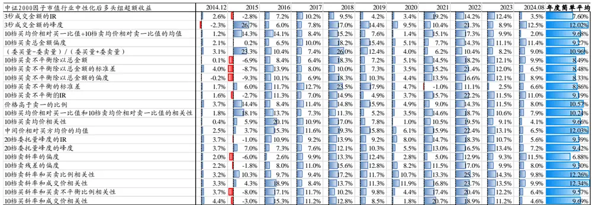
数据来源：Wind，国泰君安证券研究。测试区间：2014.12-2024.08。

表 40：中证 2000股票池内效果较好因子市值中性化后的多头组每年超额，近 4年效果不错
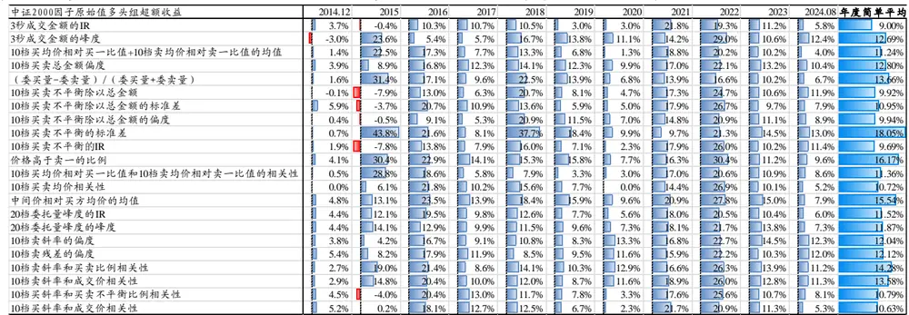
数据来源：Wind，国泰君安证券研究。测试区间：2014.12-2024.08。

## 7.2.5. 中证全指指数成分股

表 41：中证全指内效果较好因子的分组年化超额收益（因子原始值）

| 中证全指因子分组年化超额收益 | t0 |  | t2 | t3 | t4 | t5 | t6 | t7 |  | t8 | t9 | 因子收益 (abs(t0-t4)) |
| --- | --- | --- | --- | --- | --- | --- | --- | --- | --- | --- | --- | --- |
| 3秒成交金额的IR | 11.34% | 7.67% | 499% | 428% | 230% |  | 0.56% | -0.59% | 040% | -0.94% | -1.51% | 13.85% |
| 3秒成交金额的峰度 | 13.15% | L.95% | -1.45% | 190% | 330% |  | 5.04% | 7.56% | 9.27% | 12.28% | 1028% | 23.43% |
| 10档买均价相对买一比值+10档卖均价相对卖一比值的均值 | .17% | -f.69% | -1.60% | -091% | 235% |  | 2.30% | 652% | 817% | 10.74% | 11.07% | 18.24% |
| 10档买卖总金额偏度 | 13.34% | 11.90% | 11.13% | 8.95% | 7.04% |  | 4.27% | 164% | -1.44% | .85% | -1913% | 32.47% |
| (委买量-委卖量)/(委买量+委卖量) | 14.06% | 14.38% | 11.18% | 8.59% | 6.65% |  | 3.57% | 168% | -1.93% | 6.26% | -1915% | 33.21% |
| 10档买卖不平衡除以总金额 | -14.78% | .82% | 0.25% | 168% | 299% |  | 4.15% | 7.49% | 9.56% | 12.29% | 1192% | 26.70% |
| 10档买卖不平衡除以总金额的标准差 | 8.79% | 9.53% | 8.69% | 671% | 454% |  | 3.61% | 056% | -1.97% | .46% | 32% | 16.11% |
| 10档买卖不平衡除以总金额的偏度 | 14.68% | 9.40% | 7.45% | 471% | 456% |  | 2.33% | 288% | 094% | -1.93% | -1448% | 29.16% |
| 10档买卖不平衡的标准差 | 21.77% | 15.18% | 11.77% | 733% | 521% |  | 2.24% | 161% | -B.99% | E8.85% | -1975% | 41.52% |
| 10档买卖不平衡的IR | 11.19% | -B.03% | 100% | 083% | 175% |  | 2.45% | 539% | 8.09% | 12.74% | 11.59% | 22.78% |
| 价格高于卖一的比例 | 13.66% | 15.83% | 12.25% | 9.66% | 6.82% |  | 4.07% | 0.80% | -.81% | 8.55% | -1979% | 33.45% |
| 10档买均价相对买一比值和10档卖均价相对卖一比值的相关 | 155% | -0.99% | -.38% | -0.22% | -0.59% |  | 0.67% | 248% | 480% | 10.34% | 12.87% | 11.31% |
| 10档买卖均价相关性 | 11.58% | 11.49% | 11.46% | 837% | 5.05% |  | 4.86% | 143% | -1.19% | 6.59% | -1516% | 26.74% |
| 中间价相对买方均价的均值 | -21.20% | 6.92% | -E31% | 22% | 488% |  | 704% | 9.93% | 11.08% | 13.31% | 1632% | 37.52% |
| 20档委托量峰度的IR | 9.88% | 8.39% | 753% | 612% | 480% |  | .16% | 161% | 127% | 0.23% | -1406% | 23.93% |
| 20档委托量峰度的峰度 | -14.26% | 0.31% | 0.85% | 3130% | 274% |  | 3.66% | 5.81% | 7.74% | 9.75% | 998% | 24.24% |
| 10档卖斜率的偏度 | 11.31% | 837% | 7.53% | 478% | 298% |  | 2.07% | 291% | 097% | B.86% | 区 47% | 19.78% |
| 10档卖残差的偏度 | 9.60% | 8.68% | 6.84% | 447% | 143% |  | 1.79% | 252% | 440% | 心 77% | G 63% | 17.23% |
| 10档卖斜率和买卖比例相关性 | 12.93% | 11.74% 10.87% | 9.55% | 692% | 295% |  | 0.60% | 082% | 043% | 17% | F4 00% | 26.93% |
| 10档卖斜率和成交价相关性 10档买斜率和买卖不平衡比例相关性 | 11.71% 10.36% | 10.78% | 771% | 737% | 202% |  | 0.79% 3.21% | 0.06% | 12% | -f.90% | G 68% | 19.39% |
| 10档买斜率和成交价相关性 | 10.59% | 10.15% | 7.44% 8.57% | 637% 24% | 322% 432% |  | 1.93% | -0.38% 0.28% | -B.01% .29% | 07% -B.46% | 凹 79% G 90% | 16.14% 8.49% |

数据来源：Wind，国泰君安证券研究。测试区间：2014.01-2024.08。

表 42：中证全指内效果较好因子的分组年化超额收益（因子市值行业中性化）

|  | 因子市值行业中性化 |  |  |  |  |  |  |  |  |  |  |
| --- | --- | --- | --- | --- | --- | --- | --- | --- | --- | --- | --- |
| 中证全指因子分组年化超额收益 | t1 | t2 | t3 | t4 | t5 | t6 | t7 |  | t8 | t9 | 因子收益 (abs(t0-t4)) |
| 3秒成交金额的IR | 8.67% | 7.49% | 5.01% | 3.03% | 1.55% | 253% | 1.34% | 0.42% | 0.18% | -22% | 10.69% |
| 3秒成交金额的峰度 | 1284% | -340% | -0.07% | 2.81% | 4.38% | 5.09% | 6.47% | 8.55% | 10.42% | 7.93% | 20.26% |
| 10档买均价相对买一比值+10档卖均价相对卖一比值的均值 | -5156% | -1.09% | -1.8% | 2.10% | 1.60% | 194% | 3.78% | 7.02% | 9.08% | 11.5% | 16.81% |
| 10档买卖总金额偏度 | 8.80% | 11.56% | 9.74% | 8.36% | 5.96% | 5.25% | 4.98% | -0.80% | -5.40% | -17 98% | 26.78% |
| (委买量-委卖量)/(委买量+委卖量) | 10.54% | 11.35% | 10.67% | 9.34% | 6.17% | 5.08% | 3.32% | -0.08% | -17% | -18. 2% | 29.26% |
| 10档买卖不平衡除以总金额 | {12.52% | -339% | 1.43% | 2.79% | 2.57% | 322% | 6.1% | 9.02% | 10.83% | 10.05% | 22.57% |
| 10档买卖不平衡除以总金额的标准差 | 7.22% | 8.57% | 7.54% | 6.85% | 3.20% | 075% | 1.58% | -0.41% | -0. 54% | -6.42% | 13.64% |
| 10档买卖不平衡除以总金额的偏度 | 12.49% | 7.01% | 6.08% | 3.12% | 3.62% | 327% | 2.78% | 4.28% | -0.51% | 1288% | 24.87% |
| 10档买卖不平衡的标准差 | 4.20% | 7.27% | 10.29% | 11.65% | 11.93% | 9.47% | 6.53% | 0.76% | -5109% | -23.81% | 28.00% |
| 10档买卖不平衡的IR | 9.82% | -1.40% | 0.62% | 2.01% | 1.24% | 3.06% | 4.85% | 6.92% | 11.45% | 9.86% | 19.18% |
| 价格高于卖一的比例 | 8.81% | 9.50% | 10.94% | 8.59% | 8.43% | 7.28% | 5.42% | -0.40% | -6.29% | -20.48% | 29.29% |
| 10档买均价相对买一比值和10档卖均价相对卖一比值的相关 | 1.50% | 0.19% | -0.80% | -0.86% | -0.10% | 107% | 1.99% | 4.94% | 8.66% | 11.91% | 10.40% |
| 10档买卖均价相关性 | 10.6% | 8.77% | 7.56% | 6.80% | 4.54% | 269% | 2.33% | 0.65% | -381% | 10.32% | 20.48% |
| 中间价相对买方均价的均值 | -19.42% | -Z29% | 0.87% | 3.95% | 4.94% | 5.43% | 7.14% | 9.62% | 12.29% | 14.81% | 33.74% |
| 20档委托量峰度的IR | 10.62% | 7.95% | 6.73% | 6.26% | 1.81% | 164% | 2.5/4% | 2. 45% | 2.39% | {13.48% | 24.10% |
| 20档委托量峰度的峰度 | -13.74% | 3.27% | 2.40% | 3.5% | 2.97% | 337% | 4.17% | 6.29% | 8.42% | 9.24% | 22.98% |
| 10档卖斜率的偏度 | 6.91% | 8.04% | 6.68% | 5.79% | 3.68% | 4.01% | 3.90% | 2.03% | -20 B8% | D 7% | 16.68% |
| 10档卖残差的偏度 | 9.47% | 7.72% | 6.66% | 4.3% | 2.63% | 256% | 4.82% | 4.47% | -2 96% | -185% | 19.81% |
| 10档卖斜率和买卖比例相关性 | 12.55% | 10.54% | 7.46% | 4.99% | 1.21% | 136% | 3.06% | 1.48% | -0. 88% | m42% | 23.97% |
| 10档卖斜率和成交价相关性 | 11.02% | 10.45% | 6.52% | 3.34% | 1.38% | 061% | 1.30% | 0.70% | -1. | 77% -1 | 2% 16.74% |
| 10档买斜率和买卖不平衡比例相关性 | 10.27% | 9.93% | 7.28% | 3.70% | 0.89% | 036% | 0.65% | 0.87% | -0.58% | -415% | 15.02% |
| 10档买斜率和成交价相关性 | 10.31% | 8.45% | 8.3% | 4.27% | 1.9% | 0.23% | 1.9% | 0.65% | -0.28% | 6 | 07% 16.38% |

数据来源：Wind，国泰君安证券研究。测试区间：2014.01-2024.08。

表 43：中证全指股票池内效果较好因子原始值的多头组每年超额，近3年效果不错

| 中证全指因子原始值多头组超额收益 | 2014 2015 2016 |  |  | 2017 | 2018 2019 |  | 2020 | 2021 2022 2023 |  |  | 2024 | 年度简单平均 |
| --- | --- | --- | --- | --- | --- | --- | --- | --- | --- | --- | --- | --- |
| 3秒成交金额的IR | 21.4% | 32.1% | 7.8% | -2.1% | 9.7% | -2.8% | -13.9% | 46.4% | 26.0% | 18.2% | -7.0% | 12.34% |
| 3秒成交金额的峰度 1 | -18.4% | 45.3% | 10.8% | -12.2% | 12.4% | 7.7% | -3.1% | 34.4% | 35.1% | 22.8% | -5.6% | 11.73% |
| 10档买均价相对买一比值+10档卖均价相对卖一比值的均值 | .11.5% | 662% | 9.5% | -7.4% | 5.4% | -5.2%D | -16.8% | B9.8% | 27.0% | 18.1% | -6.2% | 12.89% |
| 10档买卖总金额偏度 | 22.6% | 43.6% | 16.0% | -9.1% | 5.7% | 1.5% | -7.2% | 35.3% | 28.0% | 22.5% | -2.8% | 14.18% |
| (委买量-委卖量)/(委买量+委卖量) | 8.1% | 69.3% | 26.5% | -11.5% | 11.5% | 0.3%1 | -10.7% | B9.4% | 22.3% | 26.7% | -7.9% | 15.83% |
| 10档买卖不平衡除以总金额 | 21.8% | 21.5% | 17.0% | -5.1% | 5.0% | -5.7% | -6.5% | 36.1% | 34.1% | 21.8% | -1.6% | 12.58% |
| 10档买卖不平衡除以总金额的标准差 | 20.1% | 23.1% | 6.7% | -4.3% | 2.8% | -3.2% | -15.0% | 31.9% | 26.9% | 16.9% | -1.5% | 9.48% |
| 10档买卖不平衡除以总金额的偏度 | 24.9% | 31.3% | 18.1% | -5.0% | 11.5% | -0.2% | -3.2% | 38.0% | 34.7% | 25.7% | -6.8% | 15.37% |
| 10档买卖不平衡的标准差 | 9.3% | 106.7% | 30.8% | -21.5% | 29.2% | 11.2% | -3.9% | 43.6% | 34.4% | 44.3% | -8.1% | 25.09% |
| 10档买卖不平衡的IR | 26.2% | 23.4% | 15.9% | -4.4% | 3.4% | -7.2%1 | -12.0% | B9.7% | 34.4% | 21.8% | -3.2% | 12.54% |
| 价格高于卖一的比例 | 21.1% | 60.2% | 11.2% | -6.5% | 5.1% | -0.8%C | -12.7% | 35.3% | 32.0% | 19.0% | 0.5% | 14.95% |
| 10档买均价相对买一比值和10档卖均价相对卖一比值的相关性 | 111.8% | 70.2%. | .17.7% | -4.5% | 3.5% | -5.1%一 | -12.8% | 35.9% | 25.3% | 17.9% | -0.9% | 14.45% |
| 10档买卖均价相关性 | 5.9% | 46.0% | 20.1% | -15.5% | 8.0% | -0.4%E | -13.8% | B8.6% | B6.9% | 32.7% | -12.1% | 13.31% |
| 中间价相对买方均价的均值 | 40.4% | 31.9%.. | l18.7% | -5.6% | 10.0% | 5.0%E | -11.4% | 51.4% | B6.7% | 22.2% | -6.4% | 17153% |
| 20档委托量峰度的IR | 23.6% | 22.2% | 12.6% | -2.5% | 5.1% | -3.5%C | -16.3% | 39.0% | 22.0% | 20.0% | -4.4% | 10.69% |
| 20档委托量峰度的峰度 | 11.9% | 20.2% | 16.5% | -12.4% | 4.0% | 3.2%C | -12.7% | 42.7% | 32.1% | 26.3% | -9.8% | 11.09% |
| 10档卖斜率的偏度 | 20.3% | 27.6% | 11.5% | -8.2% | 5.8% | -3.2%C | -10.6% | 32.8% | 25.7% | 25.1% | 4.6% | 11.94% |
| 10档卖残差的偏度 | 19.2% | 24.7%1 | 8.9% | -2.3% | 3.0% | -5.4% | -11.8% | 29.9% | 22.5% | 19.6% | 2.8% | 10.11% |
| 10档卖斜率和买卖比例相关性 | 17.8% | 35.5% | 13.1% | -6.2% | 9.4% | -0.7% | -8.2% | 35.0% | 29.8% | 22.4% | 1.2% | 13.55% |
| 10档卖斜率和成交价相关性 | 14.5% | 32.7% | 9.2% | -4.3% | 4.8% -0.6% |  | -8.9% | 39.0% | 28.4% | 21.2% | 0.0% | 12.37% |
| 10档买斜率和买卖不平衡比例相关性 | 24.4% | 36.1% | 10.3% | -8.2% | 4.1% | -3.6% | -14.5% | 34.7% | 26.5% | 19.5% | -4.3% | 11.36% |
| 10档买斜率和成交价相关性 | 25.3% | 27.3% | 10.6% | -7.9% | 2.7% | -4.3%I | -11.3% | 42.4% | 26.5% | 20.5% | -4.7% | 11.55% |

数据来源：Wind，国泰君安证券研究。测试区间：2014.01 -2024.08。
请务必阅读正文之后的免责条款部分 27 of29

表 44：中证全指股票池内效果较好因子市值中性化后的多头组每年超额，近3 年效果不错

| 中证全指因子市值行业中性化后多头组超额收益 | 2014 2015 2016 |  |  | 2017 | 2018 | 2019 | 2020 | 2021 2022 2023 2024年度简单平均 |  |  |  |  |  |
| --- | --- | --- | --- | --- | --- | --- | --- | --- | --- | --- | --- | --- | --- |
| 3秒成交金额的IR | 15.8% | 30.0% | 8.9%I | -12.1% | 3.6% | -1.3% | -10.9% | 43.9% | 13.6% | 24.6% |  | -9.1% | 9.73% |
| 3秒成交金额的峰度 | -14.1% | 35.7% | 12.6% | -12.1% | 10.7% | 9.3% | -3.1% | 29.2% | 21.5% | 13.1% |  | -5.9% | 18.80% |
| 10档买均价相对买一比值+10档卖均价相对卖一比值的均值 | 20.5% | 57.6% | 7.7% | -8.2% | 4.4% | -3.4% | -13.9% | 43.1% | 19.6% | 20.3% |  | -7.8% | 12.71% |
| 10档买卖总金额偏度 | 25.8% | 28.1% | 13.7%口 | -15.9% | 4.8% | 7.0% | -13.1% | ■21.9% | 13.4% |  | 25.1% | -5.2% | 9.60% |
| (委买量-委卖量)/(委买量+委卖量) | 13.1% | 52.0% | 22.3% | -9.7% | 7.8% | 4.2% | -9.3% | 26.4% | 10.4% |  | 19.0% | -8.3% | 11.62% |
| 10档买卖不平衡除以总金额 | 17.7% | 16.3% | 12.4% | -8.9% | 4.1% | -4.0% | -5.5% | 33.7% | 28.0% |  | 23.3% | -0.5% | 10.60% |
| 10档买卖不平衡除以总金额的标准差 | 21.7% | 16.8% | 7.0% | -9.2% | -0.3% | 0.9% | -12.7% | 34.2% | 16.5% |  | 20.1% | -7.6% | 7.95% |
| 10档买卖不平衡除以总金额的偏度 | 21.7% | 19.0% | 16.1% | -5.8% | 8.9% | 0.2% | -5.5% | 35.3% | 30.0% | 28.1% |  | -4.6% | 13.05% |
| 10档买卖不平衡的标准差 | -4.6% | 25.4% | 9.5% | -8.9% | 7.7% | 5.7% | 1.2% | 12.4% | 4.9% | 3.3% |  | -7.3% | 4.47% |
| 10档买卖不平衡的IR | 24.1% | 15.4% | 12.1% | -7.3% | 0.7% | -6.6% | -11.6% | 39.7% | 31.6% |  | 22.7% | -2.2% | 1078% |
| 价格高于卖一的比例 | 29.8% | 33.9% | 7.8% | -10.0% | 0.7% | 4.7% | -14.4% | 23.9% | 10.5% |  | 22.2% | -3.2% | 9.62% |
| 10档买均价相对买一比值和10档卖均价相对卖一比值的相关性 | 7.0% | 66.8% | 16.4% | -7.9% | 1.9% | -3.8% | -9.7% | 42.0% | 20.6% |  | 21.4% | -5.6% | 13.56% |
| 10档买卖均价相关性 | 4.6% | 42.7% | 18.5%口 | -14.9% | 7.3% | 0.1% | -13.3% | 37.7% | 29.3% |  | 28.3% | -12.2% | 11.64% |
| 中间价相对买方均价的均值 | 39.6% | 28.8% | 12.9% | -9.5% | 8.6% | 7.0% | -9.9% | 46.1% | 31.6% |  | 23.0% | -8.3% | 15.45% |
| 20档委托量峰度的IR | 21.6% | 31.1% | 12.1% | -5.0% | 5.4% | -1.5% | -6.9% | 33.7% | 19.6% |  | 20.6% | -7.2% | 11.24% |
| 20档委托量峰度的峰度 | 11.0% | 24.3% | 14.6% | -11.9% | 3.8% | 2.9% | 心-10.6% | 35.9% | 24.3% |  | 27.1% | -10.0% | 10.13% |
| 10档卖斜率的偏度 | 0.2% | 43.6% | 14.5%1 | -15.4% | 6.7% | 1.9% | -17.1% | 23.6% | 13.5% |  | 19.9% | -3.4% | 8.00% |
| 10档卖残差的偏度 | 1.2% | 46.4% | 14.4%C | -16.0% | 7.5% | 2.2% | -12.1% | 31.0% | 23.8% |  | 25.6% | -6.1% | 10.71% |
| 10档卖斜率和买卖比例相关性 | 16.2% | 37.1% | 16.4% | -8.7% | 9.3% | 1.5% | -5.6% | 38.9% | 22.6% |  | 22.7% | -4.7% | 13.25% |
| 10档卖斜率和成交价相关性 | 13.0% | 33.0% | 9.9% | -7.9% | 2.8% | 3.4% | -6.1% | 39.3% | 21.6% |  | 23.7% | -3.9% | 11.70% |
| 10档买斜率和买卖不平衡比例相关性 | 23.6% | B6.4% | 6.6% | -9.6% | 3.0% | 1.7% | -10.4% | 38.7% | 20.5% |  | 19.7% | -7.0% | 11.21% |
| 10档买斜率和成交价相关性 | 25.6% | 31.4% | 10.6% | -9.4% | 0.9% | 0.6% | -9.8% | 40.2% | 18.1% | 21.5% |  | -6.4% | 11.21% |

数据来源：Wind，国泰君安证券研究。测试区间：2014.01-2024.08。

## 本公司具有中国证监会核准的证券投资咨询业务资格

## 分析师声明

作者具有中国证券业协会授予的证券投资咨询执业资格或相当的专业胜任能力，保证报告所采用的数据均来自合规渠道，分析逻辑基于作者的职业理解，本报告清晰准确地反映了作者的研究观点，力求独立、客观和公正，结论不受任何第三方的授意或影响，特此声明。

## 免责声明

本报告仅供国泰君安证券股份有限公司（以下简称“本公司”）的客户使用。本公司不会因接收人收到本报告而视其为本公司的当然客户。本报告仅在相关法律许可的情况下发放，并仅为提供信息而发放，概不构成任何广告。

本报告的信息来源于已公开的资料，本公司对该等信息的准确性、完整性或可靠性不作任何保证。本报告所载的资料、意见及推测仅反映本公司于发布本报告当日的判断，本报告所指的证券或投资标的的价格、价值及投资收入可升可跌。过往表现不应作为日后的表现依据。在不同时期，本公司可发出与本报告所载资料、意见及推测不一致的报告。本公司不保证本报告所含信息保持在最新状态。同时，本公司对本报告所含信息可在不发出通知的情形下做出修改，投资者应当自行关注相应的更新或修改。

本报告中所指的投资及服务可能不适合个别客户，不构成客户私人咨询建议。在任何情况下，本报告中的信息或所表述的意见均不构成对任何人的投资建议。在任何情况下，本公司、本公司员工或者关联机构不承诺投资者一定获利，不与投资者分享投资收益，也不对任何人因使用本报告中的任何内容所引致的任何损失负任何责任。投资者务必注意，其据此做出的任何投资决策与本公司、本公司员工或者关联机构无关。

本公司利用信息隔离墙控制内部一个或多个领域、部门或关联机构之间的信息流动。因此，投资者应注意，在法律许可的情况下，本公司及其所属关联机构可能会持有报告中提到的公司所发行的证券或期权并进行证券或期权交易，也可能为这些公司提供或者争取提供投资银行、财务顾问或者金融产品等相关服务。在法律许可的情况下，本公司的员工可能担任本报告所提到的公司的董事。

市场有风险，投资需谨慎。投资者不应将本报告作为作出投资决策的唯一参考因素，亦不应认为本报告可以取代自己的判断。在决定投资前，如有需要，投资者务必向专业人士咨询并谨慎决策。

本报告版权仅为本公司所有，未经书面许可，任何机构和个人不得以任何形式翻版、复制、发表或引用。如征得本公司同意进行引用、刊发的，需在允许的范围内使用，并注明出处为“国泰君安证券研究”，且不得对本报告进行任何有悖原意的引用、删节和修改。

若本公司以外的其他机构（以下简称“该机构”）发送本报告，则由该机构独自为此发送行为负责。通过此途径获得本报告的投资者应自行联系该机构以要求获悉更详细信息或进而交易本报告中提及的证券。本报告不构成本公司向该机构之客户提供的投资建议，本公司、本公司员工或者关联机构亦不为该机构之客户因使用本报告或报告所载内容引起的任何损失承担任何责任。

## 评级说明

|  |  | 评级 | 说明 |
| --- | --- | --- | --- |
| 投资建议的比较标准 投资评级分为股票评级和行业评级。 | 股票投资评级 | 增持 | 相对沪深 300 指数涨幅 15%以上 |
| 以报告发布后的12个月内的市场表现为比 较标准，报告发布日后的12个月内的公司 股价（或行业指数）的涨跌幅相对同期的 沪深300指数涨跌幅为基准。 |  | 谨慎增持 | 相对沪深 300 指数涨幅介于 5%~15%之间 |
|  |  | 中性 | 相对沪深 300 指数涨幅介于-5%~5% |
|  | 行业投资评级 | 减持 | 相对沪深300 指数下跌 5%以上 |
|  |  | 增持 | 明显强于沪深 300指数 |
|  |  | 中性 减持 | 基本与沪深300指数持平 明显弱于沪深 300指数 |

## 国泰君安证券研究所

| 上海 |  | 深圳 | 北京 |
| --- | --- | --- | --- |
| 地址 | 上海市静安区新闸路669号博华广场 20层 | 深圳市福田区益田路6003号荣超商 务中心 B 栋 27 层 | 北京市西城区金融大街甲9号金融 街中心南楼18层 |
| 邮编 | 200041 | 518026 | 100032 |
| 电话 | （021)38676666 | （0755）23976888 | （010）83939888 |
| E-mail: gtjaresearch@gtjas.com |  |  |  |