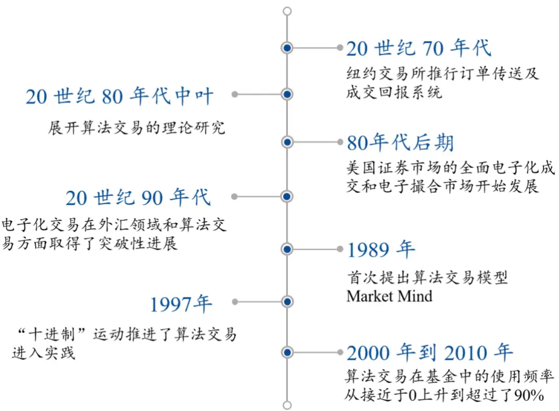
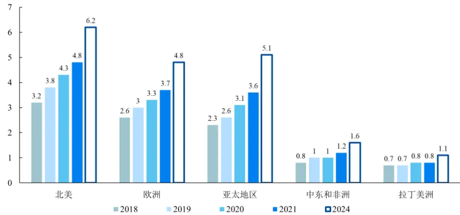
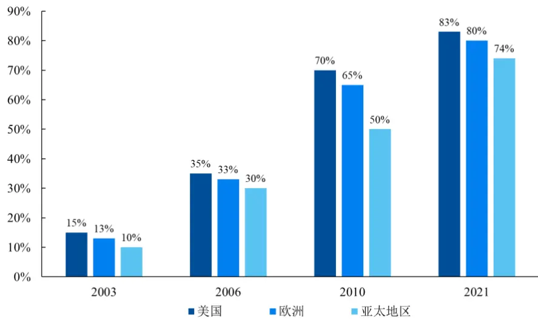
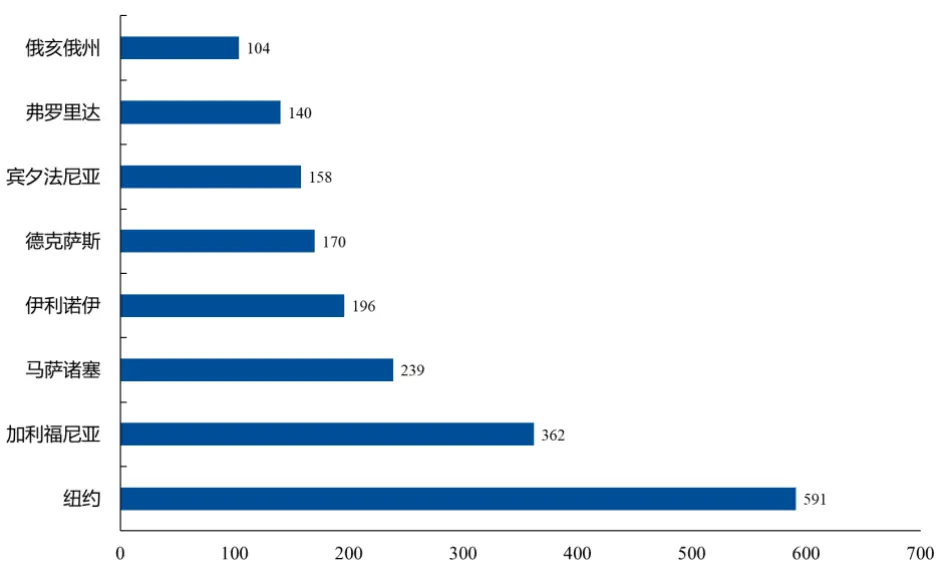
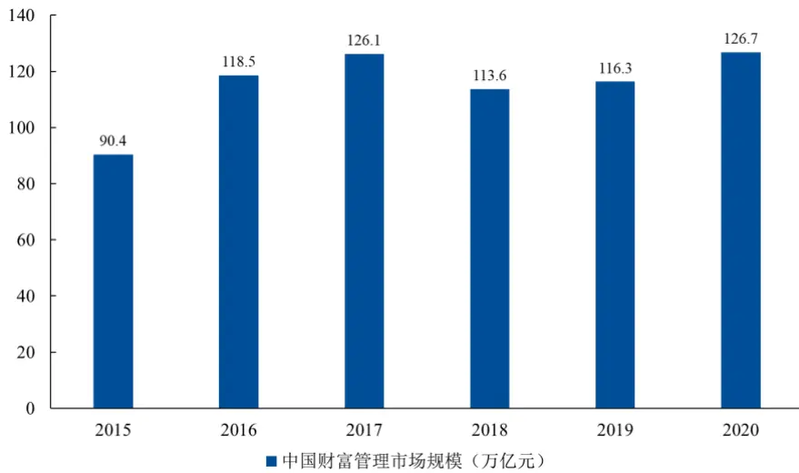
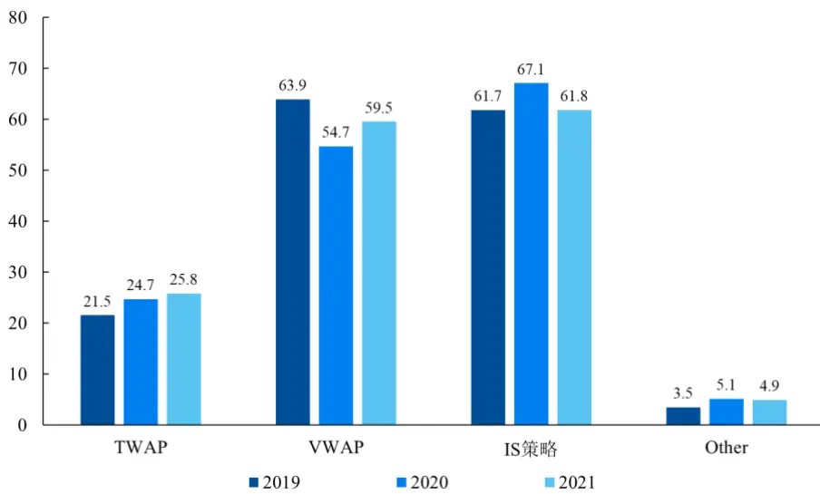

nInfo] [Table_Title] 2021.07.30

# 算法交易的历史与现状

## 算法交易系列一

陈奥林(分析师)

## 刘昺轶(分析师)

8 021-38674835

chenaolin@gtjas.com

021-38677309

证书编号 S0880516100001

liubingyi@gtjas.com

S0880520050001

## 本报告导读：

本报告介绍了算法交易在国内外的发展历程及使用现状。

## 摘要：

## [Table_Summary]• 算法交易空间广阔

Preqin 发布的 2019Q3 对冲基金报告显示，中国的量化基金规模不断增加，2019 年达到 4570 亿元，近三年的规模平均年复合增长率达到24%。同时，许多传统机构也转向量化/半量化发展其投资能力。目前，我国股票算法交易约占股市总交易量的 20-30%，与国外成熟市场约75%相比，有很大的增长空间。

## 算法交易常用算法

在目前国际市场上，通常采用的策略主要有 6-8 种，而采用：“VWAP”、“TWAP”、“VP”三种策略进行交易的成交量约占算法交易总成交量的60%。根据 Aite Group 对多头基金用户进行的调查统计结果，近三年，VWAP 和 IS 策略算法用户使用占比相近且最高，其次为 TWAP（约为VWAP 的一半）

## 国内算法交易服务商（部分）

- 深圳国泰安信息技术有限公司、上海卡方科技、上海金纳信息科技有限公司等。

金融工程

## 金融工程团队：

陈奥林：（分析师）

电话：021-38674835

邮箱：chenaolin@gtjas.com

证书编号：S0880516100001

## 杨能：（分析师）

电话：021-38032685

邮箱：yangneng@gtjas.com

证书编号：S0880519080008

## 殷钦怡：（分析师）

电话：021-38675855

邮箱：yinqinyi@gtjas.com

证书编号：S0880519080013

## 徐忠亚：（分析师）

电话：021- 38032692

邮箱：xuzhongya@gtjas.com

证书编号：S0880519090002

## 刘昺轶：（分析师）

电话：021-38677309

邮箱：liubingyi@gtjas.com

证书编号：S0880520050001

## 吕琪：（研究助理）

电话：021-38674754

邮箱：lvqi@gtjas.com

证书编号：S0880120080008

## 赵展成：（研究助理）

电话：021-38676911

邮箱：Zhaozhancheng@gtjas.com

证书编号：S0880120110019

## [Table_Re相关报告

ALPHA 再优化：完全市值行业中性法 2021.07.26

基于中美供应链的投资异象 2021.07.26

通胀环境下的投资策略 2021.07.22

明星基 金在主动买入哪些行业和个股2021.07.22

基于随机贴现模型的因子筛选法 2021.07.22

## 请输入摘要信息

## 1. 算法交易的历史

算法交易起源于配对交易 (Pairs Trading) ，1949 年，对冲基金之父阿尔弗雷德·琼斯利用多空比 7：3 的比例进行配对交易，在 1955 年到 1964年间综合回报率高达 28%。随后配对交易逐步发展。到 20 世纪 60 年代早期，投资者开始利用计算机分析股票的周线和月线，预测价格走势。配对交易逐步发展，演算为后来的算法交易，成为股票、期货等市场重要的组成部分。

20 世纪 70 年代，电子信息网络(Electronic Communication Networks，ECNs)迅速兴起，70 年代早期，纽约交易所(NYSE)引入订单传送及成交回报系统(Designated Order Turnaround,简称 DOT),并且很快又推出了超级订单传送及成交回报系统 (SuperDOT)。电子化交易革新了传统的手工下单, 金融市场订单实现了电脑化，整个周期缩短至秒量级，大大提升了交易效率。于此同时，政策与市场环境又进一步助推了证券交易市场的扩张。1975 年，SEC 颁布法令禁止固定交易佣金，全球经济领域推崇以商业自由为诉求的“放松管制”，证券交易从奢侈品转进入寻常百姓家。1978 年，SEC 又用一纸法令催生了 ITS（Inter-market TradingSystem），NASDQ 立即响应，为 ITS 提供与 NASDQ 互联的计算机辅助执行系统 CAES（Computer Assisted Execution System），ITS 和 CAES 以及各 ECNs 组成了全美的电子交易网络平台。在这样的政策以及技术环境下，机构投资者管理资产规模呈现指数式增长,各种多层级结构化衍生品的诞生,传统的人力下单已经无法满足投资者需求,算法交易也成了必然的发展方向。

图 1 算法交易发展历史

数据来源：国泰君安证券研究

80 年代中叶,欧美学界意识到下单方式与冲击成本之间的联系，逐渐展开对算法理论的研究。加州伯克利大学的金融学教授 David Leinweber于 1989 年首次提出了一个算法交易模型——Market Mind，受到了市场的广泛关注，使得算法交易迅速覆盖欧美金融市场。

20 世纪 90 年代，电子化交易大规模进入外汇交易领域，几乎所有的外汇操盘手都开始运用计算机指令进行交易下单和相关操作。通讯技术的蓬勃发展,给程序化交易创造了条件，也为算法交易的大规模发展提供了硬件方面的保障，计算机可以实现同一时间下的多指令交易，大规模投资组合订单的拆分并按设定时间进行交易成为可能。

美国、加拿大轰轰烈烈的“十进制”运动，称得上是算法交易历史上的里程碑事件，推进了算法交易进入实践。1997 年，纽约证券交易所批准了从分数制报价方式改为十进制小数点报价的方案，股票报价的最小变动单位由 1/16 美元或者 1/32 美元，调低到了 0.01 美元。买卖之间的最小变动差价缩小了七八成，减少了做市商的交易优势，降低了市场的流动性（买卖报价被稀释在更多的报价单位上），改变了证券市场的微观结构。市场流动性的降低促进机构投资者使用计算机来分割交易指令，以得到更优越的均价，形成了最初的算法交易。随后十年中，各大金融机构开始相继开发这一交易利器，算法交易快速成为金融市场主流的交易方式之一。

## 2. 算法交易各地区发展状况

## 2.1. 全球概览

进入 21 世纪以来，算法交易已成为发达金融市场上各类投资者的一把利器。目前市场上采用算法交易的证券基本涵盖了市场上的大部分品种，包括股票、期货、期权、债券、EFT、外汇等。算法交易的使用者可大致可分为以下三类：

第一类为大型公募机构,规模较大的私募,QFII 以及公司投资部门。这类客户资产规模庞大,交易量多,本身也具有很强的量化研究能力。

第二类为普通规模投资机构,私募以及大个人客户.算法交易平台提供脚本式算法协助编写交易策略,满足这些有思想,但编程能力有限的客户方便二次开发。

第三类为散户、中等规模及较大的个人客户.算法交易平台提供成型的策略及灵活的策略设置功能,可以满足广大基础客户的普遍需求。

图 2 算法交易市场规模逐年递增（十亿美元）

数据来源：MarketsandMarkets Analysis，国泰君安证券研究

近年来，算法交易越来越受到投资机构重视，市场规模逐步扩大。据金融资讯公司 MarketsandMarkets 统计，2018 年以来全球各地区算法交易市场规模均呈现增长的趋势。北美是全球规模最大的算法交易市场，预计 2024 年将突破六十亿美元。欧洲、亚太地区的算法交易都具有较大的市场规模且两个市场规模相近，欧洲市场规模略大于亚太地区。值得注意的是，到 2024 年，预测亚太地区将超过欧洲地区成为全球第二大算法交易市场。中东和非洲以及拉丁美洲等地区算法交易市场规模虽然相对较小，也一直呈现增长态势。

21 世纪以来，算法交易在全球股票交易市场取得了很大进展。金融资讯公司 Celent 数据显示，2003 年，美国股市中算法交易仅占市场交易量的15%左右，但在 7 年后，算法交易量就占到 70%左右，近年一直稳定在80%以上。欧洲算法交易发展情况与美国类似，2006 年所有欧盟和英国股票交易中只有约三分之一是由算法交易驱动的，但到 2010 年，算法交易占 65%。亚太地区紧随其后，也有着较为稳定的增长，还有着较大的增长空间。

图 3 算法交易在各地区股票市场的交易量占比逐年递增

数据来源：Celent，国泰君安证券研究

## 2.2. 欧美地区

算法交易已成为股票的主流模式，特别是在欧美地区，大部分的股票交易都是通过算法交易来完成。在 Top10 海外对冲基金机构中，70%为量化类管理人。Alogos 预测，在预测期（2021~2026 年），算法交易市场的复合年均增长率为 11.23%。

美国拥有者世界上最大的和流动性最大的金融市场。据金融资讯公司Celent 的统计，2003 年算法交易仅占市场交易量的 14%，2006 年增长至20%，在 2009 年至 2010 年间，美国 70%以上的交易都为算法交易，在过去 5 到 10 年中，算法交易的覆盖率稳定在 70~80%左右。

TIBCO 亚太区及日本首席技术官 Dan Ternes 统计,在美国衍生品市场上,90%以上的基金经理在建立投资组合时至少使用一次算法交易。目前美国算法交易主要投资者包括花旗集团、瑞士信贷、第一波士顿、德意志银行、高盛、摩根斯坦利、萨斯克汉纳投资集团、UBS 等。据 Market

Survey 2010 年报导，在美国算法交易已成为基金业界的主流，全美 79%投资经理在建立投资组合时至少使用一次算法交易。2000 年到 2010 年十年间,算法交易在基金中的使用频率从接近于 0 上升到超过了 90%，每日交易笔数激增了十几倍,而平均每笔订单的规模则缩小为 1/4。ValueWalk 数据统计显示，2018 年美国各州算法交易投资机构数量均超过了一百所，并且美国的金融心脏纽约州达到了接近 600 所，可见算法交易在美国金融交易市场中的重要性。

图 4 2018 年美国各州算法交易投资机构数量

数据来源：ValueWalk，国泰君安证券研究

美国算法交易在一定程度上推动了欧洲算法交易市场发展，2010 年全欧盟基金业内算法交易使用比例超过了 50%,其中比例最高的英国达到了80%。2006 年，欧盟、英国约三分之一的股票交易是由计算机交易算法驱动的，2008 年欧盟交易量占所有股票交易的 40%左右，2009 年算法交易占所有股票交易量的 65%左右，然而，这个数字在 2012 年下降到大约 50%。英国是欧洲地区使用算法交易比例最高的国家，2007 年，伦敦证券交易所的所有交易中 60%采用了算法交易，有 50%的基金经理使用算法交易进行投资管理，2009 年英国基金业使用算法交易者的比例达约 75%。

算法交易在外汇市场也分外活跃，据2015年Greenwich Associates 调研，全球外汇市场 73%的机构投资者使用算法开展交易，交易量占全市场电子交易量的 76%。2016 年算法交易驱动的订单约占订单的 80%，显著高于 2006 年的约 25%。近年来，国际主要外汇做市商都开始向客户提供订单执行算法产品，进一步推动了算法交易的应用与发展。在期货和期权等衍生产品市场，根据 Business Wire 公司调研结果，全球近 50%的期货和期权场内交易均通过算法达成。

值得一提的是，在新冠疫情中，算法交易表现亮眼，为市场反弹作出突出贡献。新冠疫情多次触发股票市场熔断，股市在 2020 年 3 月暴跌，在 3 月份的低点之后，算法交易在推动市场反弹起到了重要作用，外汇算法执行工具也显著增加。根据摩根大通的最新调查，超过 60%的规模大于 1000 万美元的交易是在 3 月份通过算法进行的。相比之下，2019年还不到 50%

## 2.3. 亚太地区

东京证券交易所、中国香港联交所和新加坡交易所是亚洲地区采用算法交易的主要市场。2006 年，亚洲股票交易中接近 10%是通过算法交易完成的，2010 年约有 50%的衍生品交易变成了电子交易，其中约 75%采用了算法交易。目前，在日本和中国香港有超过 80%机构客户的股票交易采用算法交易。与欧美市场相比，亚洲市场的股票价差更大、流动性更差、更难成交，因此，算法交易的价值也更为突出。但由于算法交易需要搭配先进的信息平台及完善的运用程序设计，且对交易网络和信息传输的速度有较高要求，因此亚洲地区在算法交易技术上的竞争不如欧美市场那么激烈。

在日本，算法交易也占整个市场交易量的很大比例。如今，在股票市场，东京证券交易所70%以上的订单现在都是由算法交易员完成的。在EBS2上交易的外汇现货市场中，交易算法贡献的市场份额在 2019 年上升至约70~80%。在印度等新兴经济体，算法交易的整体交易量估计约为40%。中国几十年的经济高速发展推动了居民财富绝对量的增加，统计显示2015 年~2020 年中国财富管理市场呈现波动增长，基本一直保持在 120万亿元左右。近年来尽管受到疫情冲击，中国经济仍呈现出强大的韧性和复苏能力，财富市场规模持续扩大，为算法交易市场的扩大提供了基础，计算机算力的提升及机器学习、自然语言处理等技术发展为算法交易赋能，进一步推动算法交易的落地与应用。

图 5 2015-2020 年中国财富管理市场规模

数据来源：Wind，艾瑞咨询，国泰君安证券研究

Preqin 发布的 2019Q3 对冲基金报告显示，中国的量化基金规模不断增加，2019 年达到 4570 亿元，近三年的规模平均年复合增长率达到 24%。同时，许多传统机构也转向量化/半量化发展其投资能力。目前，我国股票算法交易约占股市总交易量的20~30%，与国外成熟市场约75%相比，有很大的增长空间。

## 3. 算法交易基本算法

## 3.1. TWAP 策略

时间加权平均价格算法 TWAP（Time Weighted Average Price）是最为简单的一种传统算法交易策略，适用于流动性较好的市场和订单规模较小的交易。该模型将交易时间进行均匀分割，并在每个分割节点上将均匀拆分的订单进行提交。

$$
TWAP=\frac{\sum_{t=1}^{N}price_{t}}{N}
$$

TWAP 策略的目的是在使交易对市场影响最小化的同时，提供一个较低的平均成交价格，从而减小交易成本。但在订单规模很大的情况下，均匀分配到每个节点上的下单量仍然较大，仍有可能对市场造成一定的冲击。

## 3.2. VWAP 策略

成交量加权平均价格（VWAP）是一段时间内证券价格按成交量加权的平均值。VWAP 的实现方式是将交易日平均分成若干个时间段，然后利用历史数据拟合出交易量在各个时间段的分布，过去 N 个交易日的分布信息取平均,执行时按照每个时段交易量所占比例分别执行。简单来说，就是把大单拆成小单，市场交易活跃时多成交，不活跃时少成交。

$$
VWAP=\frac{\sum_{t}price_{t}\times volume_{t}}{\sum_{t}volume_{t}}
$$

VWAP算法交易策略的目的是尽可能地使订单拆细，让成交的VWAP（成交）盯住市场的 。其基本思路是从历史交易模式出发 统计归纳历史成交时间,成交量,价格分布等的规则, 并将这些规则应用于之后的交易。VWAP 策略在实现过程中主要分为两步，一是如何合理准确的对即将委托的大额订单进行拆分，二是对拆分后的订单进行下单委托。从VWAP 算法的角度来说,相对交易量的波动率越大,则算法拆单成交结果的波动率也会越大 期望单次交易实现的算法效果就越差。

## 3.3. VP 策略

成交量份额参与算法（Volume Participation）与 VWAP 策略类似，都是跟踪市场真实成交量的变化,从而制定相应的下单策略。所不同的是，VWAP建立在确定某个交易日需要成交数量或成交金额的基础上对订单进行拆分交易；而 VP 则是确定一个固定的跟踪比例，根据市场真实的分段成交量,按照该固定比例进行下单。

这样的策略所带来的结果是，当所需要成交的订单金额较小时，可能会在交易时间结束之前就完成所有交易，从而造成对市场均价跟踪偏离的风险。该策略适用于规模较大 计划多个交易日完成的订单交易 此时若能选择合适的固定百分比，会是一种可以较好跟踪市场均价的算法交易策略。

## 3.4. IS 策略

IS（Implementation Shortfall）策略即执行落差交易策略，是以执行落差最小化为目标的一种算法交易策略，是最常用的算法交易策略之一。执行落差为目标交易资产组合与实际成交资产组合在交易金额上的差异，包含交易成本（主要为冲击成本）与机会成本两部分。机会成本与交易成本的波动性有关，按照随机游走理论，交易成本的波动会随着时间的延长而增大，因此 IS 策略在交易日开市初期下单量大，是典型的初期大量成交策略。

假设目标交易价格为 P0，实际交易价格为 Pi，xi为对应权重，IS 策略的最终目标为

$$
min\colon\sum_{i}x_{i}(p_{i}-p_{0})
$$

IS 策略较为全面地分析了交易成本的各个部分,在冲击成本、时间风险、价格增长等因素之间取得了较好的平衡,更加符合最优交易操作的目标；IS 策略根据目标价格对交易过程的优化,更加符合投资决策的过程，多用于组合交易。相比传统算法交易策略，IS 策略中冲击成本变得更加透明化，这个优势可以减小母单数量较大的订单在交易时冲击成本的不确定性。同时，IS 策略可以在投资者具有较好的盘面预测能力时产生更优的绩效。

## 3.5. Step 策略

Step策略实际是一种对价格进行分层成交的策略，目标是在买入（卖出）交易中尽可能地压低（提升）成交均价。Step 策略就是在不同的价格区间进行不同成交量比例的配比交易。在 VWAP 或 TWAP 策略中，通常按照预测成交量的一定比例进行实际下单。假设开市前预计要买入某支前收盘价为 P 元的股票，则对其进行成交量分层设定：

$$
\begin{array}{rlr}{k=\left\{\begin{array}{ll}{0\qquad}&{price>P_{2}}\\{x^{0}/_{0}\qquad}&{P_{1}<price\leq P_{2}}\\{y^{0}/_{0}\qquad}&{price\leq P_{1}}\end{array}\right.}\end{array}
$$

开盘后在VWAP或TWAP的基础之上,当价格在P1至P2元浮动时,按预测成交量的 x%进行成交；当价格超过P2 元时则不做任何交易；当价格小于等于 P1 元时,按预测成交量的 y%买入。

更为激进的一种是称为 Aggressive Step 的策略，这种策略在价格低于最优交易区域边界时会将所有市场上的订单统统吃掉。Aggressive Step 策略同样在买入（卖出）交易中进行分层，例如在上述交易方案中，前两个区域的策略不变，当价格小于等于 P1 元时，不管市价跌到多少，都按 P1 元的限价报单成交，直至价格回升至 P1 元以上或拟交易订单全部完成。不过这种策略不容易对交易量进行控制，容易造成价格异动，增加证券交易的隐形成本。

## 3.6. Arrival Price 策略

市场参与者一般是择时的，希望获得的不是市场均价，而是下单时刻的市场价格。AP 策略算法的基本思路是对市场参与者的风险承受力和所期望的收益(更好的执行价格)进行权衡。

该算法根据使用者的风险偏好（如保守、适中、激进）来进行参数的设定，下单人的风险承受度越高算法的执行时间就越长,换句话说只等待“好”的价格去执行, 但风险是可能错过合适的执行时机甚至干脆不能被执行。相反下单人的风险承受度越低,该订单就会越快的被执行。相应的,所得到的执行价格也可能不够理想。一般来说，该算法会预先计算出交易量的执行轨迹,具体执行时按照轨迹所规定的交易量分时处理。

## 3.7. Guerrilla 策略

Guerrilla 是为了隐藏自己的策略和交易行为，在一些原有算法交易策略的基础之上进行进一步优化的一种策略,是一种反侦察策略。通过一定的随机算法，Guerrilla 策略会将每个时段应该提交的订单数量进一步打散成为不同尺寸的部分,从而使得其他竞争对手在交易明细中不容易看出算法交易者和相应算法的存在。与该策略相似的反侦察策略还有 Hidden策略，不同的是，Guerrilla 的出发点仅仅是下单数量，而 Hidden 是在主、被动成交及下单数量方面进行考虑。

算法交易策略在控制交易成本方面有着突出贡献，在科技迅猛发展，市场环境复杂多变的今天，交易者也需要顺适不断变化的市场环境，开发新的交易策略。

## 4. 我国算法交易发展现状

## 4.1. 算法的更新换代

第一代算法基于历史交易模式，使用历史交易记录对现在的交易进行指导。基本目标是冲击成本最小化及贴近市场成交均价，几乎没有考虑机会成本和成交风险。代表性的算法有 VWAP 策略、TWAP 策略、交易量参与（Volume Participation）策略等等。第一代算法为算法交易的发展打下了深厚的基础，当下许多算法模型的基础

为了更好地适应市场环境，静态方法逐步向动态方法改进，向机会导向算法倾斜，力图寻求相比 VWAP、TWAP 更好的价格。第二代算法以最大限度地贴近某一特定价格为目标，将机会成本和成交风险纳入到分析框架中，权衡各个不同的目标，通常更复杂、也更依赖于大型计算机的数据处理能力。这一类算法通常不怎么关心历史价格、交易量的分布，而是关注冲击成本以及用各种更精细的模型来刻画股票价格的随机运动方式。代表性的算法有包括执行差额(IS)策略、到达价格（AP-ArrivalPrice)策略、隐藏（Hidden）策略。

第三代算法在第二代算法的基础上,朝着深度和广度两个方向同时发展，开始着眼于算法对多资产之间的相互影响和平台的建立。第三代算法的特点是从单只股票到多股票组合，同时搜寻隐藏流动性（Hidden Liquidity）获得 Alpha。此外，一些投资机构开发了具有特殊目标的算法策略,开发出了最优隐藏流动性算法和相应的搜寻隐藏流动性算法。第三代算法的代表算法有搜寻隐藏流动性(Hidden Liquidity) 算法、游击战 （Guerrilla）、侦察员（Scout）等算法。主要是帮助寻找市场中的潜在流动性并加以执行。如果说前两代算法还是在已知的市场信息中寻求机会提高执行效率的话，第三代算法则是探索未知的市场信息并寻找潜在机会。第三代算法也是程序化交易多方博弈充分体现的一个领域之一。

新兴科技赋能算法交易发展，金融科技投资的增加、算法交易供应商的日益增多以及政府对全球贸易的支持，是推动算法交易增长的主要因素。云计算、机器学习模型、开源框架、人工智能正在改变交易模式。通过机器学习，可以了解最佳交易模式，并在无人干预下自动更新算法。在云部署时代，基于云的算法交易平台有望在市场增长中发挥重要作用，基于云的交易解决方案可帮助交易者实现交易流程自动化、维护交易数据、提升成本效益、可扩展性和有效管理等各种目标。交易者可以在云中部署算法交易，并检查新的交易策略、回测和运行时间序列分析，同时执行交易。

目前学界和部分投资界研究人士已开始着手开发第四代算法，第四代算法融合了新兴科技以及博弈论、心理学、行为经济学等领域的研究成果。这一代算法相比数学上的最优结果，更关注所有交易者间的博弈平衡。前三代算法主要都着眼于大规模的下单交易,量较小的单由于冲击成本很低,被认为不需要使用算法交易模型，而第四代算法的理念则是总即使规模再小的资产,同样可以使用算法进行交易。第四代算法技术更趋向于智能交易，例如复杂事件处理（CEP）、新闻交易（News Trading）等，根据不同的市场特点和交易需求设计交易策略。

算法交易已广泛应用于我国股票市场、外汇市场、期货市场。2010 年以来，随着 T+0 结算的股指期货以及交易型开放式指数基金（ETF）的推出，算法交易逐渐被应用于上述产品中。在商品期货市场中，算法交易策略主要包括日内交易、趋势交易和套利交易等类型。中国外汇交易中心加大研发资源投入，持续完善基础设施，加快推进先进技术在银行间外汇市场应用。同时，部分国内银行也自主搭建具备大数据实时处理功能、内嵌量化技术和风险防控措施的交易系统，积极投入算法交易。

投资者和金融业务多样化为算法交易提供催化剂。目前国内市场的投资者构与金融工具的多样化丰富了投资策略，进而对交易执行提出了新的要求。在当今的电子化交易市场中，几百个毫秒的落后就有可能导致交易策略的失效，因此计算机执行速度和网络传输速度的提高也必将成为算法交易的主要攻关目标。

## 4.2. 业内常用算法

算法交易的主要应用场景有大额交易、组合交易、回购交易等应用场景。对于大额交易，如果直接向市场下单容易造成严重的市场冲击，且易于被交易对手发现交易意图。算法交易的拆单功能可以缓和市场冲击，防止被交易对手发现；在组合交易中，通过自动化交易取代人工交易已成为大势所趋，交易员一次可以交易上百只证券，大大降低了交易成本。回购交易的交易时间长、金额大，极度耗费交易员精力，使用算法交易可以把交易员从繁琐的下单流程中解放出来，使得交易员专注择时，提高工作效率。

在目前国际市场上，通常采用的策略主要有 6~8 种，而采用：“VWAP”、“TWAP”、“VP”三种策略进行交易的成交量约占算法交易总成交量的60%。同时开发了“Sniper”、“HFT”等高级策略，满足了目前绝大多数金融机构的需求。

根据 Aite Group 对多头基金用户进行的调查统计结果，近三年，VWAP和 IS 策略算法用户使用占比相近且最高，其次为 TWAP（约为 VWAP的一半）。

图 6 多头基金算法策略使用状况（百分比）

数据来源：Aite Group，国泰君安证券研究

## 4.3. 趋势跟踪策略 (Trend Tracking)

趋势跟踪策略最常见的算法交易策略，是海归交易法则里一个经典的量化模型，其基本策略是“低买高卖”，在一个上扬趋势刚刚开始的时候买入，在这个趋势即将结束之前退出系统。使用 50 天和 200 天移动平均线是一种常用的趋势跟踪策略，交易者不需要预测或价格预测，通过跟踪价格变动趋势、移动平均线以及相关技术指标即可获利。趋势跟踪策略基于平均回归，认为资产的高低价格是一种暂时现象，会定期恢复到平均值，是一种易于理解并且被广泛使用的算法交易策略。

## 4.4. 套利策略 (Arbitrage)

无风险套利策略包括跨资产套利、跨市场套利等，常用于外汇市场和期货市场。在一个市场以较低价格购买标的并在另一个市场以较高价格出售，获得的价格差异是套利或无风险利润。通过算法交易和股票交易应用程序的使用，可以找到并利用市场中的套利机会。

统计套利策略也是一种常用的算法交易策略，常用于跨境 ETF。该策略基于某投资品种历史价格数据，寻找其价格规律，从而在一定概率上获取套利机会。实现方式是找出相关性较高的两个投资品种，追踪它们之间长期均衡的协整关系，当价差偏离一定程度时，买入被相对低估的品种，卖空被相对高估的品种，等到价差回归均衡时平仓获利。有别于无风险套利，统计套利是根据资产的历史价格规律进行的风险套利，其风险在于资产间的这种协整关系在未来可能会失效。

## 4.5. 高频交易（High Frequency Trading）

高频交易也是一种算法交易，它的目标是当市场上有极为短暂的机会出现时，能第一时间得知并从中获利。高频交易者每天进行大量交易，为了加快交易的执行速度，需要使用计算机程序和人工智能进行自动交易。高频交易虽然有很多种类，但其原理基本是一致的，首先是发现市场信息，包括差价信息、报价信息、流量信息等，其次是判断交易条件，发现符合预先设定的条件就促发交易，最后是交易执行，整个交易过程可能只需要不到一毫秒的时间。常用场景是根据不同交易提供的证券市场微小价格差异，结合算法交易来跟进套利。随着高频交易的日益发展，其在整个股票市场所占的比重也日益增加，在美国，高频交易已占到整个成交量 60%以上的份额。

高频交易是以做市商和统计学意义上的获利为基础的，它的最大特点是速度快、交易量大。它的核心有两个方面，一方面是速度，这取决于计算机的运行速度和交易网络的传输速度；另一方面是交易策略，HFT 基于各种量化数理模型，通过软件自运行自动优化算法。高频交易的每一笔成交的获利是很微小的，但是依靠大量成交累计起来的收益十分可观。但高频交易并不合适普通的市场投资者，它的参与者主要是做市商，私募基金以及一些机构投资者，他们利用技术架构和数据分析的优势，寻找短暂的交易机会，保留头寸的时间很短，价差往往转瞬即逝，难以捕捉，对算法响应速度有着较高要求。

高频交易的典型应用领域为对冲基金，对冲基金的投资期限普遍很短，往往使用高频交易模型对新闻或短期价格波动做出反应，决策及执行之间差十分关键，适合激进的短期交易模型。对冲基金采用算法交易有自己独特的优势，包括完善的基础设施，高水平的交易者，最小化的规章限制和高风险的承受度。当然还有许多的其他机构交易者采用算法交易，只要这些交易者有大额交易，同时希望降低风险和交易成本，他们就会有采用算法交易的需求，算法交易可以使买方实现直接市场链接(DMA)的目的。

## 5. 算法服务商

大量的算法交易是由卖方提供给买方，作为能够带来最佳执行价格的增值策略。这种算法交易的提供是双赢的，它的使用给作为算法交易提供者的卖方带来了买方客户更多的订单流，机构们为了获得每次交易执行的更好价格，也会给经纪商们带来更多的利润。欧美市场的算法交易起步较早，技术水平较高，早期各大基金和保险采用国际投行的算法服务，知名的算法交易系统的开发者有摩根斯坦利、高盛、美银美林、摩根大通、伯恩斯坦等。由于国际投行在服务理念上相对来说还是以国外的算法模型为主，针对 A股数据分析、修改和建模的相对较少，无法充分满足买方需求。国内开始自研算法交易系统，早期提供算法服务的机构有UBS、恒生电子、金纳等，服务对象主要是公募基金。

算法交易系统在设计和开发完成之后，按照国内的情况，一般会部署在机构投资者本地独立的服务器或交易计算机上。当交易系统根据实时行情发出下单指令后,订单通过网络发送至交易所,并在交易所主机进行撮合,如果成交，则返回成交结果给交易系统；如果未成交,则返回相关信息,并由交易系统确认是否撤单或重新挂单等事宜。

## 5.1. 深圳国泰安信息技术有限公司

全球金融信息分析系统“国泰安市场通”是一款媲美 Bloomberg 的综合金融信息分析系统，以目前国内最快的行情刷新速度接入上证交易所高速 Level Ⅱ数据和全球 60 多个国家及地区的股票、债券、期货、外汇、金融衍生品等上万种金融产品的实时或延时行情，使用户快捷获取精确、详细、全面、深入的市场数据和信息。同时，利用个性化功能如画面自定义、MVX Excel 导出、指数化基金自动配置协助用户进行实时监控，有效避险，抢占投资先机。除此之外，其多屏显示技术可支持一台主机控制多达 8 个屏幕的同时展示。该系统基于世界领先的百万分之一秒量级的高速压缩技术，拥有强大数据压缩和传输技术，其行情刷新频度和速度目前在国内同行业中是最快的，完全与交易所同步。

“国泰安股指期货套利系统”由国泰安和中国台湾宝来金融集团携手开发。可用于查看实时行情；内嵌 Excel策略平台，让用户以便捷的 Excel形式，查看宝来金融集团近 10 年的分析数据及投资策略，并可利用国泰安 CSMAR 数据库，快捷自由地创新交易模型；可通过灵活的投资组合策略和机会监控策略进行套利。

国泰安在国内算法交易的推广上走在前列，率先推出了完全自主知识产权的算法交易系统 1.0 版，填补了国内算法交易的空白。“国泰安算法交易系统”采用国际主流的“VWAP”、“VP”、“TWAP”等交易策略进行智能化下单交易，帮助用户减少市场冲击、降低交易成本、增加投资收益。利用自建数据库为算法交易系统赋能，其 CSMAR 中国财经数据库是国内目前规模最大、信息最精准的金融、经济数据库，由股票、基金、债券、金融衍生产品、上市公司、经济、行业、高频数据 8 大系列及个性化数据服务构成。国泰安算法交易系统的算法策略考虑了国内证券交易的实际规则，经过对数据库大量历史高频数据的检验分析，使其算法系统完全适合国内证券交易市场。

国泰安算法交易系统决策结构完整，在交易前收集历史交易数据，分析交易时间、价格、数量，制定多种交易策略；用户也可根据交易习惯、市场变化，选择不同算法，设置参与度、缓急度、交易时点等参数，灵活调整交易策略。用户可运用动态图形监控画面，用户可以轻松监控股票组合、个股的交易执行和风险等情况。并且可以设定各种预警指标和预警动作，有效地控制交易风险。若不满意交易结果，也可手动停止交易；交易完成后系统提供详细的交易报告，供用户盘后分析，可据此优化算法策略，增加投资回报。

## 5.2. 上海卡方科技

卡方科技成立于 2017 年，以算法交易执行切入量化交易领域。卡方科技的算法类主营业务为股票类业务，品类由中国大陆股票拓展至美股、港股等境外市场。除了股票业务算法，卡方科技还投入研发期权、期货及其他衍生品的算法，目前期权、期货算法已投入使用。在策略端，卡方目前专注在高级算法和顶级算法，服务对象主要为付费能力强、交易频率高且交易量大的量化对冲及私募基金，此外，在革新交易执行环节当面意愿强烈的证券机构也是其服务对象。目前，卡方的国内客户覆盖量化对冲基金头部客户的 30%~40%，同时交易系统已对接数十家券商。

卡方科技自行研发了主要面向对冲基金的 ATGO 交易系统(PB)，为客户提供算法交易策略和量化投资的整体解决方案，从而起到降低交易成本、提高交易效率的效果。产品基于机器学习，将行业内数据（新闻，公开信息等）聚合、清洗，建立模型并形成前端的预测模块，以更优的价格和渠道以及对市场影响较小的策略来进行股票买卖。通过人工智能算法，将交易所行情实时大数据进行集成整合，帮助金融机构选择合适的渠道与市场完成资产交易，根据用户需求帮助客户在最合适的价格和市场中筛选所需股票。在订单执行过程中根据数学模型、统计数据、市场实时信息等多方面的信息通过预先设计好的算法进行下单。从数据上看，卡方平均每笔交易可以比普通算法降低更多的交易成本，从而让客户在激烈的市场提升竞争力。

伴随业务类型的拓展，卡方科技的客群由私募资金为主转变为包括私募基金、券商、上市公司、高净值人群在内的综合客群。在上市公司方面，除了帮助对冲资金提供智能交易算法，卡方还为上市公司股东提供合规减持股票的算法，避免市场监控风险以及冲击成本带来的价差。

## 5.3. 上海金纳信息科技有限公司

金纳科技成立于2015年 6月，是国内领先的算法交易服务提供商之一，致力于为公募基金、保险资管、私募基金、券商、高净值个人等金融投资者提供算法交易策略和量化投资整体解决方案。

金纳科技专注交易执行层面的算法策略，为投资者解决大额订单执行环节中交易意图暴露导致交易成本过高的问题，从而提高投资收益。这些算法会提供按时间，价格，成交量，盘口等这种场景的最优算法群，为特别需求用户提供定制化交易算法，在此基础之上，通过捕捉实时市场信号，根据交易状况，事先提醒并规避可能的风险，为用户的交易过程提供有力的保障。目前金纳科技提供的标准算法包括时间加权均价（TWAP）、成交量加权均价（VWAP）、交易量百分比（Percent）、价格跟踪（PxInLine）和盘口捕捉（Sniper）等。

金纳智能算法交易囊括了预警系统、量化模型、分析工具、模拟系统、应急管理、执行管理等模块。金纳科技提供的交易算法则加入了很多智能功能，通过结合全息盘口和 Level II 行情数据对价格波动、市场参与度、撤单率等风控指标进行轮巡风控，优化算法中的买卖执行细节，进一步降低交易成本。金纳算法交易服务对外提供了 FIX 协议的接口，用户可以自行联系金纳科技购买账号（按年收费）。在盘前分析环节，交易员需要对应用场景进行判断，选择合适的算法组合；随后进入盘中监测阶段，系统的“智能风控”模块负责管理各种算法交易的行为，一旦某个算法可能造成行情的大幅波动并触发预警参数，系统就会自动暂停该算法并同时提醒交易员进行人工干预；在每笔交易完成后，系统进行绩效归因分析，帮助交易员总结经验。

## 6. 总结

随着中国股市机构化进程的加快，外资的涌入以及量化基金的规模增发，算法交易占比有望得到进一步提升，算法交易的使用在我国仍具备长足的发展空间。

算法交易让投资经理及分析师的工作变得简单，买方对算法交易的需求增长驱动着卖方开发新的算法策略。一些小券商近年来也致力与开发具有特色的算法交易系统或者为买方定制算法交易系统，以期在佣金市场中分一杯羹。在大量算法交易策略被市场了解和熟悉后，策略的开发也存在复杂化的趋势，加大了新策略开发的难度。

## 本公司具有中国证监会核准的证券投资咨询业务资格

## 分析师声明

作者具有中国证券业协会授予的证券投资咨询执业资格或相当的专业胜任能力，保证报告所采用的数据均来自合规渠道，分析逻辑基于作者的职业理解，本报告清晰准确地反映了作者的研究观点，力求独立、客观和公正，结论不受任何第三方的授意或影响，特此声明。

## 免责声明

本报告仅供国泰君安证券股份有限公司（以下简称“本公司”）的客户使用。本公司不会因接收人收到本报告而视其为本公司的当然客户。本报告仅在相关法律许可的情况下发放，并仅为提供信息而发放，概不构成任何广告。

本报告的信息来源于已公开的资料，本公司对该等信息的准确性、完整性或可靠性不作任何保证。本报告所载的资料、意见及推测仅反映本公司于发布本报告当日的判断，本报告所指的证券或投资标的的价格、价值及投资收入可升可跌。过往表现不应作为日后的表现依据。在不同时期，本公司可发出与本报告所载资料、意见及推测不一致的报告。本公司不保证本报告所含信息保持在最新状态。同时，本公司对本报告所含信息可在不发出通知的情形下做出修改，投资者应当自行关注相应的更新或修改。

本报告中所指的投资及服务可能不适合个别客户，不构成客户私人咨询建议。在任何情况下，本报告中的信息或所表述的意见均不构成对任何人的投资建议。在任何情况下，本公司、本公司员工或者关联机构不承诺投资者一定获利，不与投资者分享投资收益，也不对任何人因使用本报告中的任何内容所引致的任何损失负任何责任。投资者务必注意，其据此做出的任何投资决策与本公司、本公司员工或者关联机构无关。

本公司利用信息隔离墙控制内部一个或多个领域、部门或关联机构之间的信息流动。因此，投资者应注意，在法律许可的情况下，本公司及其所属关联机构可能会持有报告中提到的公司所发行的证券或期权并进行证券或期权交易，也可能为这些公司提供或者争取提供投资银行、财务顾问或者金融产品等相关服务。在法律许可的情况下，本公司的员工可能担任本报告所提到的公司的董事。

市场有风险，投资需谨慎。投资者不应将本报告作为作出投资决策的唯一参考因素，亦不应认为本报告可以取代自己的判断。
在决定投资前，如有需要，投资者务必向专业人士咨询并谨慎决策。

本报告版权仅为本公司所有，未经书面许可，任何机构和个人不得以任何形式翻版、复制、发表或引用。如征得本公司同意进行引用、刊发的，需在允许的范围内使用，并注明出处为“国泰君安证券研究”，且不得对本报告进行任何有悖原意的引用、删节和修改。

若本公司以外的其他机构（以下简称“该机构”）发送本报告，则由该机构独自为此发送行为负责。通过此途径获得本报告的投资者应自行联系该机构以要求获悉更详细信息或进而交易本报告中提及的证券。本报告不构成本公司向该机构之客户提供的投资建议，本公司、本公司员工或者关联机构亦不为该机构之客户因使用本报告或报告所载内容引起的任何损失承担任何责任。

## 评级说明

## 1.投资建议的比较标准

投资评级分为股票评级和行业评级。

以报告发布后的12个月内的市场表现为比较标准，报告发布日后的 12个月内的公司股价（或行业指数）的涨跌幅相对同期的沪深 300 指数涨跌幅为基准。

## 2.投资建议的评级标准

报告发布日后的 12 个月内的公司股价（或行业指数）的涨跌幅相对同期的沪深300 指数的涨跌幅。

|  | 评级 说明 |  |
| --- | --- | --- |
| 股票投资评级 | 增持 | 相对沪深 300指数涨幅15%以上 |
|  | 谨慎增持 | 相对沪深 300指数涨幅介于 5%～15%之间 |
|  | 中性 | 相对沪深 300指数涨幅介于-5%～5% |
|  | 减持 | 相对沪深 300指数下跌 5%以上 |
| 行业投资评级 | 增持 | 明显强于沪深 300 指数 |
|  | 中性 | 基本与沪深 300指数持平 |
|  | 减持 | 明显弱于沪深 300指数 |

## 国泰君安证券研究所

|  | 上海 | 深圳 | 北京 |
| --- | --- | --- | --- |
| 地址 | 上海市静安区新闸路669号博华广场 20层 | 深圳市福田区益田路 6009 号新世界 商务中心34层 | 北京市西城区金融大街甲9号金融 街中心南楼18层 |
| 邮编 | 200041 | 518026 | 100032 |
| 电话 | (021)38676666 | (0755）23976888 | （010)83939888 |
|  | E-mail: gtjaresearch@gtjas.com |  |  |