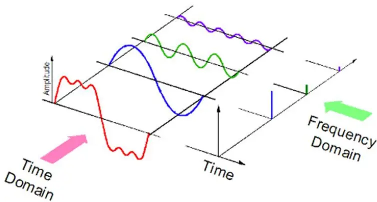
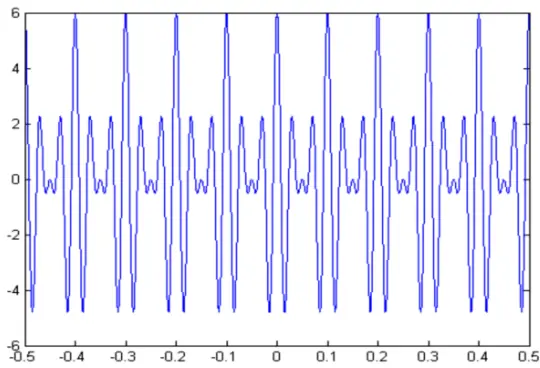
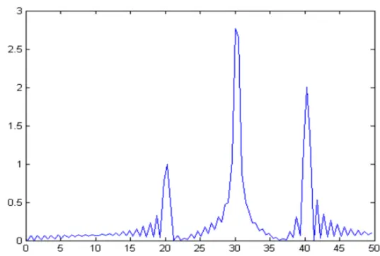
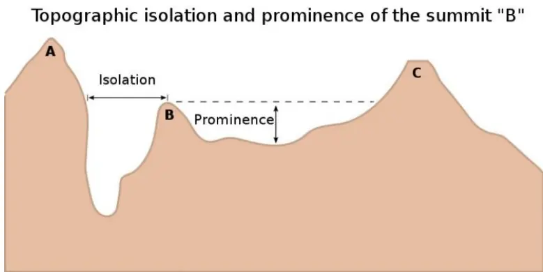
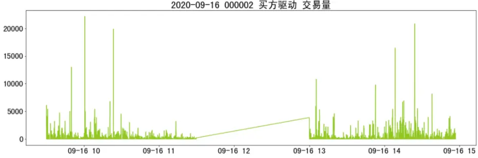
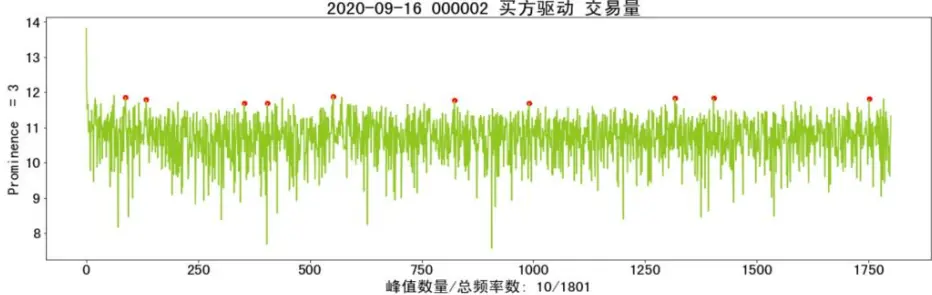
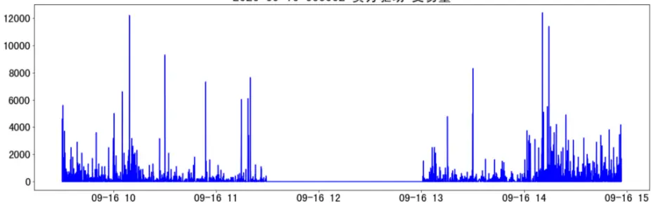
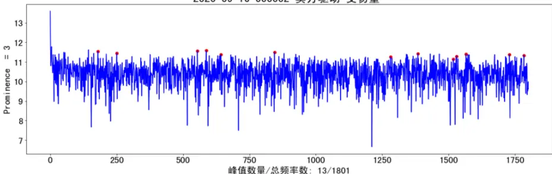

nInfo] [Table_Title] 2021.07.30

# 利用高频数据监测机构动向

## 算法交易系列二

陈奥林(分析师)

## 刘昺轶(分析师)

8 021-38674835

021-38677309

chenaolin@gtjas.com

liubingyi@gtjas.com

证书编号 S0880516100001

S0880520050001

## 本报告导读：

本报告利用傅里叶变化进行算法单探测，并研究算法单强度、交易方向与股价变动的关系。

## [Table_Summar• 分析工具

引入傅里叶变化来区分高低频交易，探测市场中算法交易规模，挖掘机构的交易活跃度，构造三个特征 B+S,B-S,B/S。

## 特征与股价相关性

日度时序数据中 B+S 与周涨跌幅有一定负相关关系，但 B/S 与 B-S与周涨跌幅的关系并不明显。

## 特征平稳性

- 几乎所有股票的 B-S 都表现出平稳性，超过 80%的股票的 B+S 在 10%显著性水平下平稳，近四成股票的 B/S 表现出平稳性。

## 特征与股价截面相关性

证券机构活跃地参与算法交易，往往会伴随着股价在中短期的下跌，算法单交易方向与股价的变动方向一致，与周涨跌幅截面相关系数显著为正

金融工程

## 金融工程团队：

陈奥林：（分析师）

电话：021-38674835

邮箱：chenaolin@gtjas.com

证书编号：S0880516100001

## 杨能：（分析师）

电话：021-38032685

邮箱：yangneng@gtjas.com

证书编号：S0880519080008

## 殷钦怡：（分析师）

电话：021-38675855

邮箱：yinqinyi@gtjas.com

证书编号：S0880519080013

## 徐忠亚：（分析师）

电话：021- 38032692

邮箱：xuzhongya@gtjas.com

证书编号：S0880519090002

## 刘昺轶：（分析师）

电话：021-38677309

邮箱：liubingyi@gtjas.com

证书编号：S0880520050001

## 吕琪：（研究助理）

电话：021-38674754

邮箱：lvqi@gtjas.com

证书编号：S0880120080008

## 赵展成：（研究助理）

电话：021-38676911

邮箱：Zhaozhancheng@gtjas.com

证书编号：S0880120110019

## [Table_Re相关报告

ALPHA 再优化：完全市值行业中性法 2021.07.26

基于中美供应链的投资异象 2021.07.26

通胀环境下的投资策略 2021.07.22

明星基 金在主动买入哪些行业和个股2021.07.22

基于随机贴现模型的因子筛选法 2021.07.22

## 1. 引言

进入 21 世纪以来，算法交易已成为发达金融市场上各类投资者的一把利器。算法交易在全球股票交易市场取得了很大进展。金融资讯公司Celent 数据显示，2003 年，美国股市中算法交易仅占市场交易量的 15%左右，但在 7 年后，算法交易量就占到 70%左右。

据 Survey 2010 年报导，全美 79%投资经理在建立投资组合时至少使用一次算法交易。2000 年到 2010 年十年间,算法交易在基金中的使用频率从接近于 0 上升到超过了 90%，每日交易笔数激增了十几倍,而平均每笔订单的规模则缩小为 1/4。而中国市场的财富规模持续扩大也为中国算法交易市场的扩大、算法交易的普及提供了夯实的基础。计算机算力的提升及机器学习、自然语言处理等技术发展为算法交易赋能，也将进一步推动算法交易的落地与应用。

传统大小单区分能力差，亟需将算法交易纳入分析。算法交易规模、数量的显著提升使得其本身已成为市场行为的重要部分。交易策略一大设计目的就是均匀拆分订单来减小大额委托单对市场价格的影响，这使得传统的大小单划分方法区分能力明显下降，难以预测股价变动。

算法交易提供了甄别机构操作和个体投资者操作的良好工具，算法交易是反映股价变动趋势的重要因素。相比于个体投资者，投资机构极为广泛地使用着高频、定时的算法交易。因此，我们可以假设由算法交易驱动的高频交易是由机构发起的，而随机的低频交易是由个体投资者发起的。算法单规模的扩大与缩小也就间接反映了机构方交易意愿的增强与减弱，反映了股价在中短期的变动趋势。通过判断算法交易规模的变动，我们能够了解机构在交易中的参与程度、交易意愿的变化。

本报告应用了流行的信号处理工具——傅里叶变化来同时提取买卖单中的高低频交易，通过探测由机构发起的高频算法交易，来获取机构在市场中的活跃度，进而进行收益预测等分析。

具体而言，本报告首先通过傅里叶变化将交易量的时序数据转换为一系列交易频率及其对应的幅度，区分高低频交易。下一步，报告通过峰值查找算法寻找生成峰值的频率，探测机构发起的高频算法单的规模。通过计算每日买卖单的峰值数量，构造相关的特征反映机构参与度。完成特征构造后，本报告从特征日度时序数据与涨跌幅的关系、特征平稳性、特征对个股收益预测能力三个方面，分析机构经由算法交易对市场产生的影响。

报告选用了 2020 年7 月3 日至 2021 年7 月2 日 A股 800 支股票的以 3秒为间隔盘口快照、委托队列数据。

## 2. 核心结论

分析工具：引入傅里叶变化来区分高低频交易，探测市场中算法交易规模，挖掘机构的交易活跃度，构造三个特征 B+S，B-S，B/S。

特征与股价相关性：日度时序数据中 B+S 与周涨跌幅有一定负相关关系，但 B/S 与 B-S 与周涨跌幅的关系并不明显。但这一相关关系在不同股票之间有较大差异，在机构持仓较多的股票中，相关关系更为明显。

特征平稳性：几乎所有股票的 B-S 都表现出平稳性，超过 80%的股票的B+S 在 10%显著性水平下平稳，近四成股票的 B/S 表现出平稳性。

特征与股价截面相关性：证券机构活跃地参与算法交易，往往会伴随着股价在中短期的下跌。机构在市场中的整体参与度与周涨跌幅在截面上呈负相关，时序上均值小于 0；算法单交易方向与股价的变动方向一致，与周涨跌幅截面相关系数显著为正，B+S 的截面相关系数显著大于 0，t值为-2.070，B/S 的 t 值为 0.0588。

## 3. 算法介绍

## 3.1. 算法原理

傅里叶变化在工程领域被广泛应用，尤其是信号处理领域，但较少被用于股票分析领域。本报告应用这一信号处理工具来提取股票交易中不同频率交易的模式，并构建峰值因子以预测股票变化趋势。

任意一个周期函数，都可通过傅里叶级数分解为多个不同频率的正弦波和余弦波的叠加。而对于一个非周期函数，如股票价格、交易量等，傅里叶级数则无法发挥作用，须转而使用傅里叶变化。傅里叶变化可将任一函数通过不同频率的幅值高低在频域中表示出来。换句话说，傅里叶变化可将函数从时域（时间维度）转化为频域（频率维度）

图 1 傅里叶变化示意图

数据来源：Ning Chen，国泰君安证券研究

傅里叶变化的一般形式如下，其中 x 表示以秒表示的时间，w 为以赫兹表示的频率，通过这一变化我们能将时域中的函数变化至频域。

$$
f(t)=\mathcal{F}^{-1}[F(\omega)]=\frac{1}{2\pi}{\int}_{-\infty}^{\infty}F(\omega)e^{i\omega t}d\omega.
$$

傅里叶逆变化将函数从频域变化至时域。

$$
F(\omega)=\mathcal{F}[f(t)]={\int_{-\infty}^{\infty}}f(t)e^{-i\omega t}dt.
$$

显然，上述公式仅能用于连续函数，不适用于股票数据。因此，我们需要使用离散傅里叶变化（DFT），对离散点进行等距离采样，转化成一系列有限的频率对应的幅值。因此，DFT 对样本进行求和而非积分。其中xn 为时域中的某一样本点，N 为样本点的数量，k 为频域上的一频率，Xk 则为频域上 xn 所包含的正弦成分的相及对应的振幅。因此，对所有样本点处理过后，我们可以挖掘到信号主要由哪些频率的信号组成，是高频还是低频？各频率信号的相对强度如何？

$$
X_{k}=\sum_{n=0}^{N-1}x_{n}\cdot e^{-{\frac{2\pi ikn}{N}}}
$$

如果某一信号的各个频率对应的幅值几乎一致，那么该信号很可能是噪音，如果某些频率存在显著峰值，那么信号中一定存在着一些周期性特征。

如图 2，一个混杂了多种频率的信号经傅里叶变化后，在图 3 中的频谱图中显示了 6 个频率对应的明显峰值（频谱图存在对称性，因而只保留单边频谱）。

图 2 信号在时域上的表示

数据来源：国泰君安证券研究

图 3 信号在频域上的表示

数据来源：国泰君安证券研究

## 3.2. 一般应用场景

傅里叶变化在物理学、电子类学科、数论、信号处理、医疗影像分析上都有广泛的应用，如信号降噪、图像去噪、边缘提取等。一方面，时域到频域的变化有助于将原始信号分解至不同频段，使得我们能够快速确认各频率成分及分布，提取时域中难以分析的精细信息；另一方面，对各频率的信号的筛选又提供了强力的信号降噪工具。

分解信号的频率成分，确认信号的频率分布，是最常见的应用场景。在军事领域，不同类型的雷达信号、通信电台信号、应答机信号、“敌我”识别器信号都有不同特征的频率分布。在医疗领域，研究者通过对医电信号进行分析确定患者的生理、病理状况，如研究者发现信号中频分量的高端减少表明患者可能存在心室传导阻滞，高频分量的增加则是室性心动过速的前兆。

傅里叶变化能够有效降低信号中的噪声，如图片去噪等。在检测信号的过程中，我们通常会遇到不计其数的干扰，如静电干扰、噪声干扰等，这使得信号内容无法被准确分析。通过傅里叶变化，我们可以将信号转化到频域后，筛除无关频率的噪音，再对信号进行傅里叶逆变化，对目标的高低频信号进行分析，实现分析目的，如图 4、图 5。

图 4 图片降噪—降噪前

数据来源：Halcon，国泰君安证券研究

图 5 图片降噪—降噪后

数据来源：Halcon，国泰君安证券研究

## 3.3. 本报告应用场景

傅立叶变化能够高效探测市场中的算法交易，个体投资者做出交易的时候，一般会花费较长时间制定投资策略，交易频率较低。相比于个体投资者，投资机构极为广泛地使用着高频、定时的算法交易，如常用的TWAP 算法会将一个大单划分为多个等额的小单之后，按照相同的时间间隔进行交易。我们推测，大部分由算法交易驱动的高频交易是由机构发起的，而大部分随机的低频交易是由个体投资者发起的。因此，问题的关键即为探测买卖单中的算法交易。此时，傅里叶变化即为算法单探测的重要工具。本报工对交易量的时序数据进行傅里叶变化，可将交易量数据从时域变化至频域，从而高效地区分不同频率的交易，即能对算法交易实现探测。

对算法交易的规模分析可以获得机构方的交易参与度。算法交易规模的扩大与缩小间接反映了机构方交易意愿的增强与减弱，参与程度的或深或浅。而机构方的交易意愿在很大程度上主导了股价在中短期的变动趋势。所以，问题的关键点在于探测买卖单中的算法交易，傅里叶变化提供了高效的区分工具。

频谱中的峰值反映了市场中的突出的交易规律，高频段的峰值往往反映了算法交易的存在。峰值表示某一频率的幅值要显著大于周围一定频率的峰值，某一频率的交易强度非常突出。高频段的峰值反映了一些交易以极高的频率、较稳定的周期定时出现在市场中，而此类交易很可能就是算法交易。低频段的峰值则更可能是个体投资者随机下单形成的。例如，卖方交易频谱图中表明一天 1 次的频率处存在峰值，这就表明市场中的卖方投资者常每天进行一次交易。

对于某一特定时间，较大的峰值个数出现反映了更高的机构参与度。买卖单峰值的数量反映了机构多空意愿。通过对一天内的交易量进行傅里叶变化，我们可以获得所有产生峰值的频率，也就是所有显著的交易频率。如果只有个体投资者进行低频交易，因为低频段的频率差距小，幅值接近，所以低频段上会不出现或只出现少量峰值；当机构广泛以算法交易地参与交易时，由于不同机构交易目的、交易策略不同，算法交易的时间间隔也有所不同，因此交易量的频谱图中高频段会有更多的频率出现峰值，峰值个数大。由此，通过分析多空双方的峰值数量，峰值数量在时序上的变化，我们可以分析机构的参与程度及中短期内的交易倾向。

## 4. 算法应用

## 4.1. 数据输入

本报告应用2020年7月 3日至2021年的7月 2日一年间 A股800支股票的盘口快照数据以及委托队列数据进行横截面比较，应用若干支重要股票对特征进行分析（数据的最小间隔为 3 秒）。

表 1：盘口快照数据结构

| 字段名称 | 字段示意 | 数据类型 |
| --- | --- | --- |
| Datetime | 时间(YYYY-MM-DD HH:MM:SS) | Datetime |
| Last-price | 最终成交价 | Double |
| Bid-price1 | 买一价 | Double |
| Ask-price1 | 卖一价 | Double |
| Vo1ume | 当日累计成交量 | Double |

数据来源：信易科技天勤量化，国泰君安证券研究

表 2：分析示例股票池

| 股票代码 | 股票简称 |
| --- | --- |
| 600352 | 浙江龙盛 |
| 600519 | 贵州茅台 |
| 601318 | 中国平安 |
| 000002 | 万科A |
| 000333 | 美的集团 |
| 002415 | 海康威视 |

数据来源：Wind，国泰君安证券研究

## 4.2. 数据处理

## 4.2.1. 数据清洗

首先，对数据进行必要的清洗以筛去交易数据中错误的数据点，如价格为 0 的交易、交易量为 0 的交易、空值等。具体而言，我们要求数据中的最终成交价、买一价、卖一价、累计成交量均大于 0。

## 4.2.2. 买卖方划分

买卖单的差额反映了多空双方的主动买卖意愿和力量抗衡状况。首先需要得到每笔委托和成交的交易方向，在实际操作中，交易方向难以得到，须根据已有的交易分类算法来推断交易方向。

本报告使用订单流算法进行买卖单方向划分，划分依据主要有以下几个

原则：

（1）如果当前的成交价格 >= 卖一价，交易为主动买入

（2）如果当前的成交价格 <= 买一价，交易为主动卖出

（3）如果当前的成交价格 = 买一价与卖一价的均值，

i. 成交价格更接近卖一价，交易为主动买入

ii. 成交价格更接近买一价，交易为主动卖出

iii. 同样接近，交易为主动买入

## 4.2.3. 傅里叶变化与峰值查找

本文应用快速离散傅里叶变化(DFT)，将一年内每一天的买单、卖单交易量转化为傅里叶频谱。

图6显示了2020年 9月16日万科股票的买卖单交易量及其对应的傅里叶频谱图。图中的 x 轴是频率，y 轴是振幅。y 轴为对数比例。频谱图中的频率以当天 tick 的数量为单位进行测量，下标从 0 开始，当天进行一次的交易的频率为 0，当天进行 244 次的交易频率为 244。考虑到交易机构在不同时期内可能会更改交易策略，本报告选择对每天的买卖交易量分别进行傅里叶变化，统计峰值个数。

根据 scipy 的峰值查找算法，调整 prominence 参数，计算出每一天的买卖方交易峰值频率。

峰值是具有显著高于左右一定范围内其他频率幅值的频率，可简单理解为局部最大值，也标志着投资者倾向于按照这一频率进行交易，有较固定的交易模式。如下图 7.b，在买方交易频谱图在 k=325 处出现峰值，这说明当天万科股票中存在约每 33.2 秒进行一次交易的交易模式（总周期长度 N/次数 k*时间间隔 t = 1801*2/325*3 = 33.2)。

股票交易峰值较多表明机构参与交易程度较高。

相比于个体投资者，机构以更高频、更固定的交易规律参与市场。证券公司以算法交易等方式进行高频交易，高强度参与市场交易的时候，会在高频段以不同频率形成更多的交易峰值，当天峰值数量较大。相反，个体投资者是交易的主体，市场集中进行低频交易时，高频段频率幅值偏低，不形成峰值，峰值仅在低频段出现，当天峰值数量较小。总而言之，当机构参与交易程度较高时，峰值数量较大，当参与程度较低时，峰值数量较小。

图 6 Prominence 参数示意图

数据来源：Wikipedia，国泰君安证券研究

2020-09-16 000002 买方驱动 交易量

Prominence 参数有效筛选出相对幅度最突出的峰值，限定一个峰值到另一个峰值需要经历的最小下降。峰值间需要下降距离越大，峰值的局部重要性越强。换而言之，prominence 越大，筛选出的峰值越重要，数量越少。报告中选用的 Prominence 参数为 3，以图 7.b 为例，选出的峰值约占所有 tick 数量的 0.5%（峰值数/tick 数=10/3602）。

2020-09-16 000002 买方驱动 交易量
图 7 万科（000002）在2020-09-16主动买卖单交易量及傅里叶频谱图

(a) 买单交易量

(b) 买单交易量傅里叶变化及峰值标注

2020-09-16 000002 卖方驱动 交易量

(c) 卖单交易量

2020-09-16 000002 卖方驱动 交易量

## (d) 卖单交易量傅里叶变化及峰值标注

数据来源：信易科技天勤量化，国泰君安证券研究。注：红色标记交易峰值。

## 4.2.4. 特征工程

高频峰值的数量很好地反映了市场中机构的活跃程度。由此，我们构造了三个特征，B+S，B-S，B/S。

其中 B表示买单中峰值数量，S 表示卖单的峰值数量，B+S 表买卖单产生峰值之和，B-S 表示买卖单峰值之差。峰值计算方法如 3。

表 3：由峰值、交易量构造的15 种特征

| 符号 | 含义 |
| --- | --- |
| B | 买单的峰值数量 |
| S | 卖单的峰值数量 |
| B+S | 买卖单峰值数量和 |
| B-S | 买卖单峰值数量差 |
| B/S | 买卖单峰值数量比 |

数据来源：国泰君安证券研究

## 4.3. 输出结果与结果分析

经检验，本报告选用 B+S、B-S、B/S 三个特征作为主要分析对象，从三个维度分析特征对中短期趋势的预测能力：特征与周涨跌幅的相关性，特征的平稳性，特征截面上与周度收益的相关系数在时序上的显著性。

## 4.3.1. 日度时序与涨跌幅的相关关系

表 4 计算了示例股票的各特征日度时序与周涨跌幅的相关系数，表 5 则记录了这些相关系数的统计量。

B+S 与周涨跌幅有一定负相关关系。

综合表 4、表 5 数据，B+S 与涨跌幅负相关，均值为-0.0559，75%的分位点的相关系数为 0.0014，接近于 0，说明大部分股票的 B+S 都与涨跌幅有负相关关系。六支机构重仓股票有五支股票的 B+S 都呈现负相关。B-S，B/S 与周涨跌幅的相关关系并不明显，相关系数均值很小。

B-S 与涨跌幅的相关关系均值为 0.0035，50%以上的股票与涨跌幅的相关系数为正。在 支证券公司重仓的股票中，有五支股票的 的相关系数为正，万科 A、浙江龙盛、联泓新科的相关系数都大于 0.05。B/S与周涨跌幅正相关，但相关系数很小，均值为 0.0029。25%分位点的相关系数为 0.0010，表明 75%以上的股票存在该正相关关系。

不同股票之间的相关系数差别较大。

两个特征的相关系数方差较大，股票间相关系数差别大。即使 B-S，B/S的相关系数均值很小，但个别股票的特征与周涨跌幅的关系也较为突出，最小值为-0.2350，最大值为 0.2633.

B-S，B/S 与周涨跌幅相关性在基金公司重仓的股票表现的较为明显。对于机构大量持股的股票，机构进行的交易更好地反映了市场的多空意愿，算法单交易方向与股价变动趋势相关性更强，如万科A、美的集团、浙江龙盛、贵州茅台。

表 4: 各特征与周涨跌幅的相关系数

| 特征/代码 | 000002 | 000333 | 600352 | 003022 | 600519 | 002415 |
| --- | --- | --- | --- | --- | --- | --- |
| 股票简称 | 万科A | 美的集团 | 浙江龙盛 | 联泓新科 | 贵州茅台 | 海康威视 |
| B+S | -0.0598 | 0.0073 | -0.0956 | -0.0027 | -0.0263 | -0.0793 |
| B-S B/S | 0.1073 | 0.0049 | 0.1108 | 0.0725 -0.0490 | 0.0087 0.0203 | -0.2350 -0.1761 |
|  | 0.1027 | 0.0460 | 0.0191 |  |  |  |

数据来源：信易科技天勤量化，国泰君安证券研究。

表 5: 特征与周涨跌幅的相关系数的统计量

| 统计量 | count | mean | std | min | 25% | 50% | 75% | max |
| --- | --- | --- | --- | --- | --- | --- | --- | --- |
| B+S | 800 | -0.0559 | 0.0902 | -0.5487 | -0.1147 | -0.0497 | 0.0014 | 0.2045 |
| B-S | 800 | 0.0035 | 0.0691 | -0.2350 | -0.0445 | 0.0028 | 0.0529 | 0.2633 |
| B/S | 800 | 0.0029 | 0.0667 | -0.2190 | -0.0384 | 0.0010 | 0.0468 | 0.2006 |

数据来源：信易科技天勤量化，国泰君安证券研究。

## 4.3.2. 平稳性检验

本报告对每支股票的 B+S、B-S、B/S 特征进行 ADF 平稳性检验，计算B+S，B-S，B/S 在 10%、5%、1%的显著性水平下，呈现平稳性的股票支数与股票总数的比例。进而分析特征是否在全局具有平稳性。结果如表 6。

B-S表现出了非常突出的平稳性，特征行为不随时间发生改变。B+S也表现出一定的平稳性。B-S在 1%显著性水平下、在 99.9%的股票中都表现出平稳性。B+S 在 10%的显著性水平下，在 86.3%的股票中表现出平稳性。B+S，B-S 的行为不随时间发生明显变化。

近四成的股票的 B/S表现出平稳性。B/S 即使 10%的显著性水平下，也仅有 37.9%的股票表现出平稳性。虽然 B/S 的平稳性并不普遍存在，但是表现出平稳性的股票大多在 1%的显著性水平下保持平稳。

表 6：各特征在 1%，5%，10%的水平下呈现平稳性的比例

| 特征/显著 1% 水平 | 5% | 10% |
| --- | --- | --- |
| B+S 0.656 | 0.799 | 0.863 |
| B-S | 0.999 0.999 | 1.000 |
| B/S | 0.375 0.379 | 0.379 |

数据来源：信易科技天勤量化，国泰君安证券研究。注：在 10%、5%、1%的显著性水平下，特征呈现平稳性的股票支数与股票总数的比例。

## 4.3.3. 横截面收益预测能力

本报告计算单日单个特征在截面上与周涨跌幅的秩相关系数，然后按日计算秩相关系数，形成截面秩相关系数的日度时序数据，后通过 t 检验计算日度数据的均值是否显著不等于 0. 结果如表 7.

截面数据上，机构整体参与度与周涨跌幅呈现显著的负相关关系。秩相关系数均值在 10%的水平下显著小于 0。由表 7 数据可得，B+S 截面相关系数 t 检验结果为-2.070，p 值为 0.0650。。

算法单峰值比例反映的机构算法交易方向与周涨跌幅正相关。表 7 数据可得 B/S 的 t 值为 3.381，在 10%的显著性水平下显著；但 B-S 反映的算法单交易方向与周涨跌幅无明显关系，t 值为 2.015，p 值大于 0.1。

证券机构活跃地参与算法交易，往往会伴随着股价在中短期的下跌。B+S为买卖单交易峰值数量之和，如前文分析，买单交易量的交易峰值反映了机构方进行算法交易、进行主动买入的程度，卖单则反映了参与主动卖出的程度。那么，对于某支股票而言，B+S 就反映了机构方参与该股票交易的整体活跃程度。结果表明，证券机构活跃的股票交易活动，往往会伴随着股价在中短期的下跌。

算法单交易方向与股价的变动方向一致，与周涨跌幅截面相关系数显著为正。买卖算法单峰值数量比反映了机构在多空双方的相对参与度，截面相关系数显著大于 0。B/S，B-S 表明了机构在买方、卖方参与度的相对强弱，当股票的买方有更多算法交易发生时，机构更多进行主动买入；当机构买方相对参与度较低时，机构更多进行主动卖出。B/S 的截面秩相关系数的 t 检验结果大于 0，且在 10%的显著性水平下显著。

表 7: 各特征截面相关系数 t检验结果（p值）

| 特征 | t 值 | p 值 |
| --- | --- | --- |
| B+S | -2.070 | 0.0650* |
| B-S | 2.015 | 0.2157 |
| B/S | 3.381 | 0.0588* |

数据来源：信易科技天勤量化，国泰君安证券研究。注：在 5%水平下显著，记为**；在10%显著性水平下显著，记为*。

## 5. 总结

买卖单交易量经傅里叶变化后产生的频率峰值可以反映出市场中多空交易的机构参与度。由机构发起的交易通常是以较为固定、较高频的算法交易，因此高频峰值的数量则很好地反映了市场中机构的活跃程度。由此，我们构造了三个特征，买卖单峰值数量和 B+S，买卖单峰值数量差 B-S，买卖单峰值数量比 B/S。

分析结果表明，证券机构活跃的算法交易活动，往往会伴随着股价在中短期的下跌。算法单交易方向与股价的变动方向一致，即使股价在时序分析上的相关性不明显，截面分析结果表明买卖单峰值的比与周涨跌幅的相关系数显著大于 0。另外，就特征的平稳性而言，几乎所有股票的B-S都表现出平稳性，超过80%的股票的B+S在10%显著性水平下平稳。

## 本公司具有中国证监会核准的证券投资咨询业务资格

## 分析师声明

作者具有中国证券业协会授予的证券投资咨询执业资格或相当的专业胜任能力，保证报告所采用的数据均来自合规渠道，分析逻辑基于作者的职业理解，本报告清晰准确地反映了作者的研究观点，力求独立、客观和公正，结论不受任何第三方的授意或影响，特此声明。

## 免责声明

本报告仅供国泰君安证券股份有限公司（以下简称“本公司”）的客户使用。本公司不会因接收人收到本报告而视其为本公司的当然客户。本报告仅在相关法律许可的情况下发放，并仅为提供信息而发放，概不构成任何广告。

本报告的信息来源于已公开的资料，本公司对该等信息的准确性、完整性或可靠性不作任何保证。本报告所载的资料、意见及推测仅反映本公司于发布本报告当日的判断，本报告所指的证券或投资标的的价格、价值及投资收入可升可跌。过往表现不应作为日后的表现依据。在不同时期，本公司可发出与本报告所载资料、意见及推测不一致的报告。本公司不保证本报告所含信息保持在最新状态。同时，本公司对本报告所含信息可在不发出通知的情形下做出修改，投资者应当自行关注相应的更新或修改。

本报告中所指的投资及服务可能不适合个别客户，不构成客户私人咨询建议。在任何情况下，本报告中的信息或所表述的意见均不构成对任何人的投资建议。在任何情况下，本公司、本公司员工或者关联机构不承诺投资者一定获利，不与投资者分享投资收益，也不对任何人因使用本报告中的任何内容所引致的任何损失负任何责任。投资者务必注意，其据此做出的任何投资决策与本公司、本公司员工或者关联机构无关。

本公司利用信息隔离墙控制内部一个或多个领域、部门或关联机构之间的信息流动。因此，投资者应注意，在法律许可的情况下，本公司及其所属关联机构可能会持有报告中提到的公司所发行的证券或期权并进行证券或期权交易，也可能为这些公司提供或者争取提供投资银行、财务顾问或者金融产品等相关服务。在法律许可的情况下，本公司的员工可能担任本报告所提到的公司的董事。

市场有风险，投资需谨慎。投资者不应将本报告作为作出投资决策的唯一参考因素，亦不应认为本报告可以取代自己的判断。
在决定投资前，如有需要，投资者务必向专业人士咨询并谨慎决策。

本报告版权仅为本公司所有，未经书面许可，任何机构和个人不得以任何形式翻版、复制、发表或引用。如征得本公司同意进行引用、刊发的，需在允许的范围内使用，并注明出处为“国泰君安证券研究”，且不得对本报告进行任何有悖原意的引用、删节和修改。

若本公司以外的其他机构（以下简称“该机构”）发送本报告，则由该机构独自为此发送行为负责。通过此途径获得本报告的投资者应自行联系该机构以要求获悉更详细信息或进而交易本报告中提及的证券。本报告不构成本公司向该机构之客户提供的投资建议，本公司、本公司员工或者关联机构亦不为该机构之客户因使用本报告或报告所载内容引起的任何损失承担任何责任。

## 评级说明

## 1.投资建议的比较标准

投资评级分为股票评级和行业评级。

以报告发布后的12个月内的市场表现为比较标准，报告发布日后的 12个月内的公司股价（或行业指数）的涨跌幅相对同期的沪深 300 指数涨跌幅为基准。

## 2.投资建议的评级标准

报告发布日后的 12 个月内的公司股价（或行业指数）的涨跌幅相对同期的沪深300 指数的涨跌幅。

|  | 评级 说明 |  |
| --- | --- | --- |
| 股票投资评级 | 增持 | 相对沪深 300指数涨幅15%以上 |
|  | 谨慎增持 | 相对沪深 300指数涨幅介于 5%～15%之间 |
|  | 中性 | 相对沪深 300指数涨幅介于-5%～5% |
|  | 减持 | 相对沪深 300指数下跌 5%以上 |
| 行业投资评级 | 增持 | 明显强于沪深 300 指数 |
|  | 中性 | 基本与沪深 300指数持平 |
|  | 减持 | 明显弱于沪深300指数 |

## 国泰君安证券研究所

|  | 上海 | 深圳 | 北京 |
| --- | --- | --- | --- |
| 地址 | 上海市静安区新闸路669号博华广场 20层 | 深圳市福田区益田路 6009 号新世界 商务中心34层 | 北京市西城区金融大街甲9号金融 街中心南楼18层 |
| 邮编 | 200041 | 518026 | 100032 |
| 电话 | (021)38676666 | (0755）23976888 | （010)83939888 |
|  | E-mail: gtjaresearch@gtjas.com |  |  |