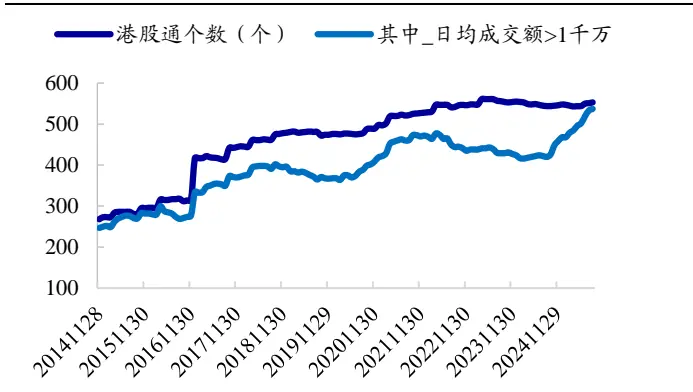
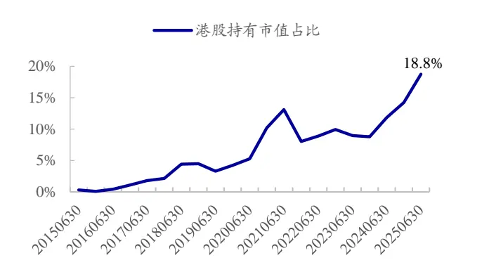
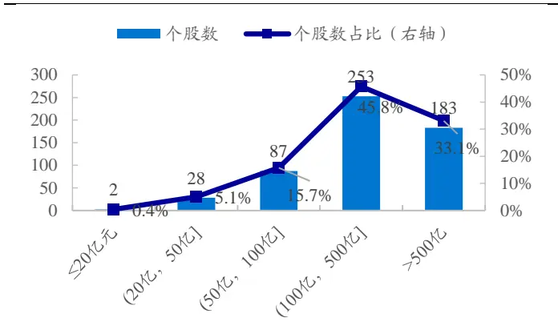
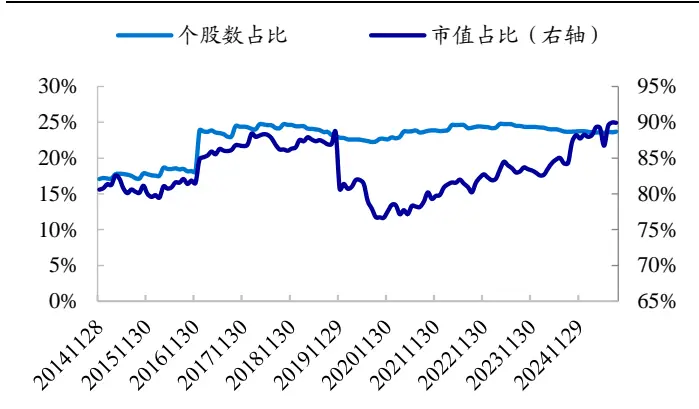
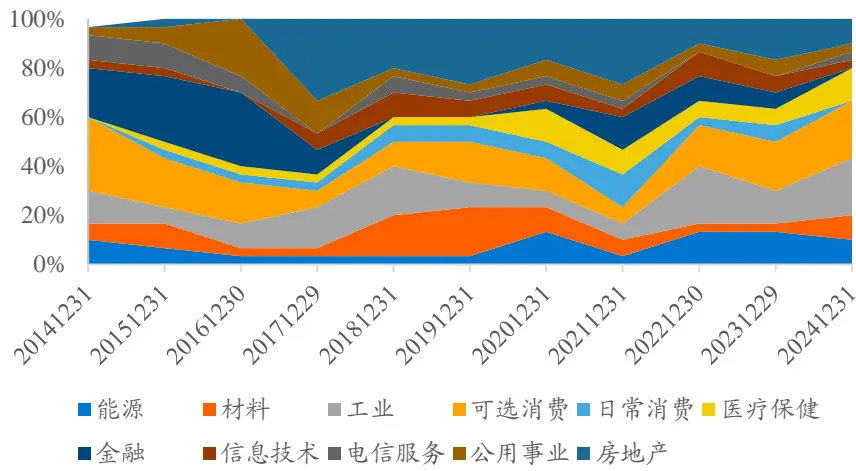
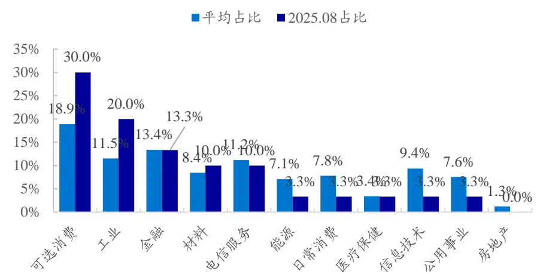
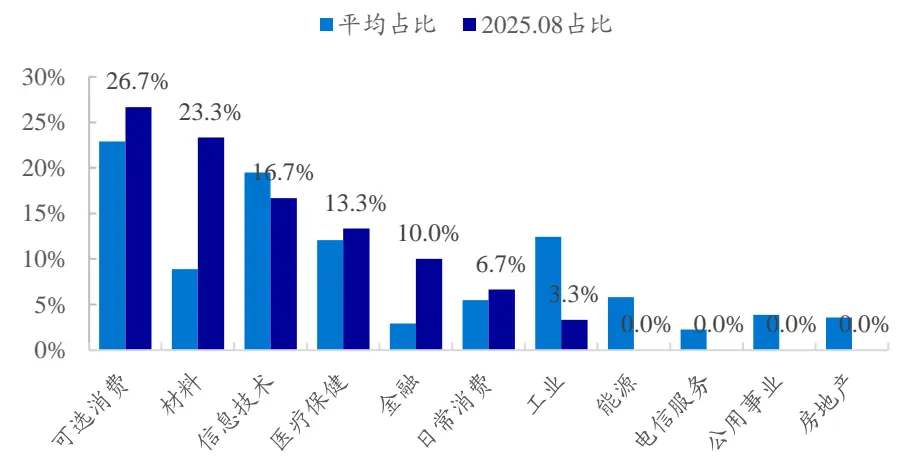
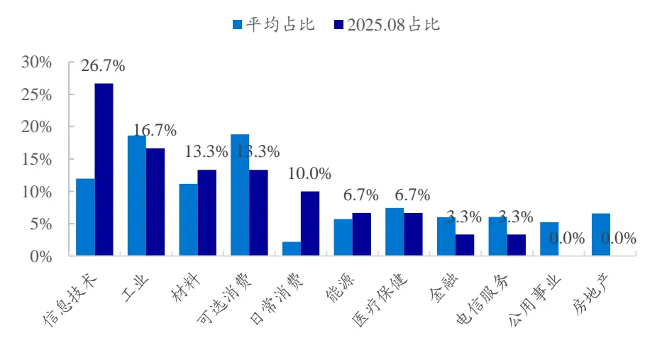
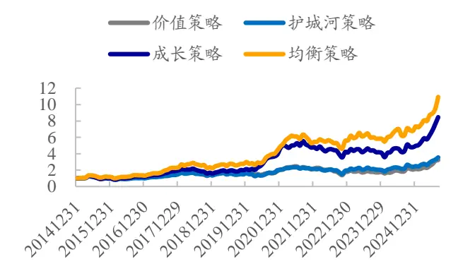
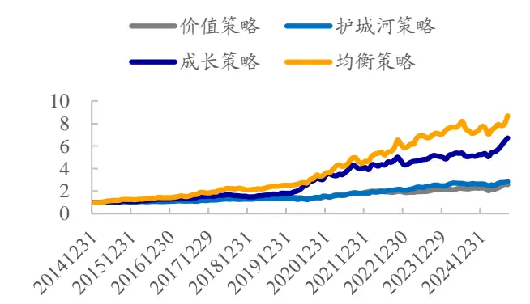

## 港股通量化选股策略初探

## 本报告导读：

本文在港股通选股池中，构建了投资理念和风格特征不一的价值策略、护城河策略、成长策略、以及均衡策略。2015.01.01-2025.08.26 期间，这 4个策略年化收益分别为11.7%、12.6%、22.2%、25.1%。

## 投资要点：

港股通个股市值普遍较大，小盘效应弱，而成长、动量效应突出，[Table_Summar价值因子表现优于港股主板。结合这些特征，参考海外经典大师选股策略，本文主要探讨价值策略、护城河策略、成长投资策略、以及均衡策略，在港股通选股池的表现。

价值策略总体在港股市场具有较优表现；但不同筛选方式的价值策略在个别年份表现可能存在较大差异。我们基于现金流比例、股息率、回购比例三个因子等权打分构建等权港股通价值策略，样本期间（2015.01.01-2025.08.26，下同），组合年化收益 11.7%，相较于港股通指数年化超额9.5%。

护城河策略无显著风格暴露，市场 beta接近于1，和港股通指数走势更为接近，4个策略中，该策略超额收益波动率和相对回撤最低。我们基于网络效应、无形资产、成本优势、转换成本等因子等权打分，选择得分最高的 30 只股票构建等权港股通护城河策略，2015年以来年化收益12.6%，相对于港股通指数年化超额 10.5%。

成长策略呈高 beta 属性，同时成长、动量、高估值暴露显著。我们基于增长、研发投入、盈利能力、盈利质量、股价相对强度 5 个因子等权排序打分，选择得分最高的 30 只股票构建等权港股通成长股投资策略，样本期间组合年化收益 22.2%，相对于港股通指数年化超额 20.0%。

均衡策略在各风格上都具有一定正暴露，整体比较均衡，4 个策略中该策略全区间信息比最高。我们基于市值、价值、成长、质量、动量 5 类经典因子等权排序打分，选择得分最高的 30 只股票构建市值加权港股通均衡策略，样本期间策略年化收益 25.1%，相对于港股通指数年化超额23.0%。

风险提示。本文根据客观数据和评价指标计算，不作为对未来走势的判断和投资建议。本文结论通过统计分析得出，存在历史统计规律失效风险、因子失效风险、模型误设风险。港股市场规律受多重因素影响，回测结果须谨慎对待。

郑雅斌(分析师)

心021-23219395

zhengyabin@gtht.com

登记编号S0880525040105

罗蕾(分析师)

021-23185653

luolei@gtht.com

登记编号S0880525040014

## [Table_Rep相关报告

波动率策略在 A股市场的配置价值 2025.09.12

如何克服因子表现的截面差异 2025.08.19

退市新规实施后风险警示和退市情况 2025.08.19

近年来，港股通个股数量逐渐增加（图 1）；公募基金持股中，持有港股市值的占比也不断扩大。截至 2025 年中报，偏股混+主动股票型基金持股中，港股持有市值占比达到18.8%（图2），即将近 1/5的持股配置于港股市场。鉴于此，本文尝试对港股通量化选股策略进行初步探索。

图1：港股通个股数量变化（2016.01-2025.08）

资料来源：Wind，国泰海通证券研究

图2：偏股混+主动股票型基金持股中港股持有市值占比（2015H1-2025H2）

资料来源：Wind，国泰海通证券研究

## 1. 港股通基础特征

市值分布上，港股通个股市值普遍较大。如图3所示，截至 2025.08.26，市值在100亿元（港币，下同）以上的港股通数量占比 79%，即市值在100亿元以下的股票仅占比 20%左右。我们也统计了港股通个股占港股主板总个股数、及总市值之比，如图4所示。虽然数量占比仅 1/4左右，但覆盖了港股主板约90%的市值。

图3：港股通个股市值分布（2025.08.26）

资料来源：Wind，国泰海通证券研究

图4：港股通个股占港股主板总个股数和总市值之比（2025.01-2025.08）

资料来源：Wind，国泰海通证券研究

我们按照Fama French 模型计算港股主板及港股通池子里，常见风格因子的收益表现（2*3 分组，等权组合多空收益差），结果如表 1所示。

整体来看，港股市场成长、动量风格突出。无论是港股通池子、还是港股主板，这两个因子的收益均显著为正。盈利因子在整个港股主板收益也显著为正，但在港股通池子里，因子有效性明显减弱。低波动异象，在两个池子表现都较为薄弱。

小盘效应上，两个池子具有较大差异。港股主板，小盘因子收益为正；而在港股通池子里，小盘失效，甚至呈微弱的大盘效应，小市值因子年化收益为负。

价值因子上，也存在较大区别。港股通池子里价值效应显著强于港股主板。

表1：港股市场常见风格因子收益统计（2015.01.01-2025.08.26）

|  | 港股通 |  |  |  | 港股主板 |  |  |  | 港股通-港股主板 |  |  |  |
| --- | --- | --- | --- | --- | --- | --- | --- | --- | --- | --- | --- | --- |
|  | 年化收 益 | 月胜率 | t值 | p值 | 年化收 益 | 月胜率 | t值 | p值 | 年化收 益 | 月胜率 | t值 | p值 |
| 小盘 | -2.4% | 43.0% | -1.01 | 0.316 | 6.2% | 57.0% | 1.33 | 0.187 | -8.6% | 39.1% | -1.79 | 0.076 |
| 价值 | 7.2% | 53.9% | 1.64 | 0.103 | 0.7% | 52.3% | 0.23 | 0.819 | 6.5% | 55.5% | 2.08 | 0.040 |
| 盈利 | 4.0% | 58.6% | 1.25 | 0.214 | 9.1% | 66.4% | 3.63 | 0.000 | -5.2% | 39.8% | -2.78 | 0.006 |
| 成长 | 8.7% | 61.7% | 3.25 | 0.001 | 11.6% | 68.0% | 5.96 | 0.000 | -2.9% | 41.4% | -1.70 | 0.092 |
| 动量 | 12.5% | 63.3% | 2.28 | 0.024 | 11.9% | 68.8% | 2.81 | 0.006 | 0.6% | 50.8% | 0.24 | 0.810 |
| 低波 | 4.7% | 55.5% | 1.04 | 0.302 | 4.4% | 59.4% | 1.12 | 0.264 | 0.3% | 52.3% | 0.11 | 0.911 |

资料来源：Wind，国泰海通证券研究
注：年化收益为月均收益*12

综上所述，港股通个股市值普遍较大，小盘效应弱，而成长、动量效应突出，价值因子表现优于港股主板。结合这些特征，参考海外经典大师选股策略，本文接下来将主要探讨价值策略、护城河策略、成长股投资策略、以及均衡策略等，在港股通选股池的表现。

## 2. 价值策略

价值投资，主张挖掘市场价格低于其内在价值的“被低估”资产。本杰明·格雷厄姆、查尔斯·布兰迪等，都是价值投资的代表人物。常见的价值指标有PB、PE、PCF、股息率、净流动资产价值、现金流比例、回购比例等。

表2：价值因子及其定义

| 因子 | 因子定义 |
| --- | --- |
| PB | 总市值/净资产 |
| PE | 总市值/TTM 净利润 |
| PCF | 总市值/TTM 经营活动产生的现金流量净额 |
| 1年股息率 | 过去1年现金分红总额/总市值 |
| 3年股息率 | 过去3年平均年现金分红/总市值 |
| 净流动资产价值 | (流动资产-流动负债)/总市值 |
| 现金流比例 | 企业自由现金流/企业价值，其中 自由现金流流=过去1年经营活动净现金流-构建固定资产、无形资 |
|  | 产和其他长期资产支付的现金，企业价值=总市值+总负债-货币资金 |
| 回购比例 | 过去1年累计回购金额/日均总市值 |

资料来源：国泰海通证券研究

我们测试了这些价值因子，在不同选股池中的业绩表现，结果如图 5所示。统计时间区间为 2015.01.01-2025.08.26，下同。

图5：价值因子在港股市场的选股效果统计（2015.01.01-2025.08.26）

|  | IC 港股通市 港股通市 全部港股主 |  |  |  | RankIC 港股通市 港股通市 |  |  |  | top30组合相对港股通指数年化超额收益 港股通市 港股通市 全部港股主 |  |  |  |
| --- | --- | --- | --- | --- | --- | --- | --- | --- | --- | --- | --- | --- |
|  | 港股通 | 值>50亿，日 均成交额 >1000万 | 值>50亿，日 均成交额 >5000万 | 板市值>50 亿，日均成 交额>5000万 | 港股通 | 值>50亿，日 均成交额 >1000万 | 值>50亿，日 均成交额 >5000万 | 板市值>50 亿，日均成 交额>5000万 | 港股通 >1000万 | 值>50亿，日 均成交额 | 值>50亿，日 均成交额 >5000万 | 板市值>50 亿，日均成 交额>5000万 |
| -1*PB | 1.0% | 1.0% | 0.1% | 0.7% | 1.9% | 1.6% | 0.6% | 1.0% | 1.1% | 1.0% | 2.6% | 2.9% |
| -1*PE | 1.9% | 1.3% | -0.6% | -0.1% | 2.8% | 2.4% | 0.5% | 0.8% | 2.1% | 2.1% | 1.9% | 1.9% |
| -1*PCF | 2.5% | 1.7% | 1.8% | 2.2% | 3.2% | 2.9% | 2.5% | 2.9% | 6.9% | 6.2% | 5.4% | 6.0% |
| 1年股息率 | 2.1% | 1.2% | 0.3% | 0.6% | 4.2% | 3.0% | 1.3% | 1.4% | 3.5% | 1.6% | 2.6% | 3.0% |
| 3年股息率 | 1.1% | 1.0% | 0.0% | 0.3% | 3.2% | 2.7% | 1.2% | 1.3% | -0.7% | 1.3% | 1.7% | 1.8% |
| 净流动资产价值 | 0.0% | 0.4% | -0.2% | 0.2% | 0.7% | 0.7% | 0.0% | 0.4% | -0.4% | 1.5% | 2.6% | 2.6% |
| 现金流比例 | 2.9% | 2.4% | 2.2% | 2.0% | 3.3% | 2.8% | 2.6% | 2.4% | 8.6% | 6.9% | 6.4% | 6.9% |
| 回购比例 | 0.0% | 0.4% | 0.1% | 0.1% | -0.1% | 0.5% | 0.2% | 0.2% | 2.2% | 1.9% | 0.5% | 0.3% |

资料来源：Wind，国泰海通证券研究

上述 8 个价值指标中，表现最优的为现金流比例。在全部港股通股票池中，该因子月均IC 为2.9%、RankIC 为3.3%；即使考虑流动性因素，剔除市值≤50 亿元、日均成交额<5000 万元的个股后，月均 IC 仍有 2.2%，RankIC 2.6%，统计显著。多头组合也具有较优表现，top30 等权组合相对港股通指数年化超额6.4%。

其次为股息率因子，1 年股息率在全部港股通中的月均 IC 为 2.1%，

RankIC为 4.2%，top30 组合年化超额收益为3.5%。但该因子受流动性影响相对较大，剔除市值较小、成交额较低个股后，表现一般。

而其他估值指标，如PB、PE 等，选股效果较弱，特别是剔除成交额较低个股后，月均 IC 不足1%。

考虑因子有效性和流动性，我们按照如下方式构建港股市场的价值策略：

- 1. 初筛股票池：

- 剔除股价小于 0.1元的股票；

要求市值>50亿元，过去1 年日均成交额>5000万元；

- 要求过去 1年、以及3 年平均红利支付率均在0-1之间。

- 2. 价值因子选股：

- 将现金流比例、股息率、回购比例 3 因子等权排序加总，选择复合得分最高的 30 只股票构建等权/股息率加权组合（市值加权方式下，限制单只个股权重上限不超过 10%）。

每年12月底调仓，扣除单边2‰交易成本后，港股通等权价值组合2015年以来年化收益11.7%（表3），股息率加权组合收益相对更优，年化15.8%。两种加权方式下，样本区间组合每年相对于港股通指数都具有正超额收益。

表3我们也统计了港股通红利、价值策略指数的业绩表现，在10年窗口下，这几个偏价值风格的指数都优于港股通指数。整体来看，价值策略在港股市场也具有较优表现。但筛选方式不同，最终价值策略的业绩表现可能有较大差异。例如，港股通高股息指数，2015年以来年化收益达11.8%，而价值策略指数年化收益仅 4.9%。分年度来看，2017年、2019年、2021-2024年，高股息指数均显著优于价值策略指数。

表3：港股通价值组合分年度收益表现（2015.01.01-2025.08.26）

|  | 港股通 指数 | 等权组合 |  | 股息率加权组合 |  | 价值指数(全收益指数) |  |  |  |
| --- | --- | --- | --- | --- | --- | --- | --- | --- | --- |
|  |  | 组合收益 | 超额收益 | 组合收益 | 超额收益 | 标普港股通低 波红利 | 港股通 高股息 | 港股通央企 红利 | 港股通价值 策略 |
| 2015 | -7.6% | -2.8% | 4.8% | 3.4% | 11.0% | 4.3% | -3.6% | -9.0% | -8.1% |
| 2016 | -0.8% | 6.5% | 7.2% | 12.1% | 12.8% | 17.2% | 8.1% | 0.4% | 7.3% |
| 2017 | 38.1% | 55.2% | 17.1% | 69.1% | 31.0% | 21.4% | 81.9% | 21.4% | 30.2% |
| 2018 | -16.2% | -13.7% | 2.5% | -13.5% | 2.8% | -1.0% | -10.6% | -4.6% | -8.2% |
| 2019 | 10.9% | 30.1% | 19.2% | 30.4% | 19.6% | 6.8% | 17.4% | 4.1% | 7.4% |
| 2020 | 13.8% | 13.8% | 0.0% | 16.9% | 3.1% | -19.9% | -9.1% | -16.4% | -7.3% |
| 2021 | -12.5% | 7.6% | 20.1% | 22.8% | 35.3% | 14.2% | 2.4% | 26.1% | -1.4% |
| 2022 | -18.1% | -17.9% | 0.2% | -16.7% | 1.4% | 3.5% | 1.6% | -3.0% | -5.5% |
| 2023 | -14.6% | -2.6% | 12.0% | 0.2% | 14.9% | 5.4% | 8.6% | 5.0% | -8.4% |
| 2024 | 15.6% | 21.9% | 6.3% | 26.3% | 10.7% | 34.2% | 32.0% | 40.3% | 28.7% |
| 2025 | 33.2% | 50.6% | 17.4% | 42.3% | 9.2% | 21.4% | 24.5% | 24.9% | 31.5% |
| 全区间 | 2.2% | 11.7% | 9.5% | 15.8% | 13.6% | 9.1% | 11.8% | 6.9% | 4.9% |

资料来源：Wind，国泰海通证券研究

此外，我们也考察了放松前述“初筛股票池”对流动性的要求，将日均成交额阈值由 5000 万元下调至 1000 万元，按照同样的方式选择价值复合得分最高的30只股票组合业绩表现。同时作为对比，我们也在所有港股主板股票池中进行了测试，结果如表4 所示。

在日均成交额≥1000 万元港股通股票池、以及港股主板池中，价值策略都显著有效，等权/股息率加权组合相对于港股通指数的年化超额收益率均不低于7%。相对而言，股息率加权方式对选股池更为敏感。在前文日均成交额≥5000 万元的港股通股票池中，价值策略年化超额收益 13.6%；而放松到≥1000万元的池子时，年化超额收益率衰减至 7.7%。而等权组合则无明显变化，年化超额收益率都在9-10%左右。

表4：港股价值组合分年度收益表现（2015.01.01-2025.08.26）

|  | 港股通指 数 | 港股通股票池，要求 市值>50亿元，日均成交额≥1000万元 |  |  | 港股主板，要求 |  |  |
| --- | --- | --- | --- | --- | --- | --- | --- |
|  |  | 等权组合 |  | 股息率加权 | 等权组合 | 市值>50亿元，日均成交额≥1000万元 | 股息率加权 |
|  |  | 组合收益 | 超额收益 | 组合收益 超额收益 | 组合收益 | 超额收益 | 组合收益 超额收益 |
| 2015 | -7.6% | -7.2% | 0.4% | -10.3% -2.8% | -11.5% | -3.9% | -14.8% -7.3% |
| 2016 | -0.8% | 8.6% | 9.4% | 12.5% 13.3% | 5.9% | 6.7% 7.6% | 8.3% |
| 2017 | 38.1% | 45.9% | 7.8% | 43.9% 5.8% | 45.0% | 6.9% 42.9% | 4.8% |
| 2018 | -16.2% | -14.4% | 1.9% | -13.0% 3.3% | -11.8% | 4.4% | -10.8% 5.4% |
| 2019 | 10.9% | 18.0% | 7.1% | 16.2% 5.3% | 18.0% | 7.1% | 16.1% 5.3% |
| 2020 | 13.8% | 23.6% | 9.8% | 10.9% -2.8% | 23.6% | 9.8% | 10.9% -2.8% |
| 2021 | -12.5% | 18.4% | 31.0% | 25.6% 38.1% | 18.7% | 31.2% | 26.8% 39.3% |
| 2022 | -18.1% -14.6% | -14.5% | 3.6% | -16.9% 1.2% | -13.6% | 4.5% | -16.6% 1.5% |
| 2023 | 15.6% | 4.1% | 18.8% | -1.7% 12.9% | 4.2% | 18.8% -1.7% | 12.9% |
| 2024 2025 | 33.2% | 18.1% 47.4% | 2.6% 14.2% | 20.8% 5.2% 36.1% 2.9% | 20.1% 44.0% | 4.5% 22.8% | 7.2% |
|  | 2.2% |  |  | 9.9% 7.7% | 11.6% | 10.8% | 33.4% 0.2% |
| 全区间 |  | 12.1% | 9.9% |  |  | 9.4% | 9.2% 7.0% |

资料来源：Wind，国泰海通证券研究

行业角度，我们以日均成交额≥1000 万元的股通股票池为例，统计了每期选股的Wind一级行业分布，结果如图6所示。整体来看，行业集中度不高，各大行业均有分布。相对而言，可选消费、房地产、工业、金融占比相对较高，样本期间平均占比分别为16.4%、14.8%、13.6%、10.9%。

图6：港股通价值策略行业分布（2015.01.01-2025.08.26）

数据来源：Wind，国泰海通证券研究

综上所述，价值策略总体在港股通市场具有较优表现；但不同筛选方式下的价值策略在个别年份表现可能存在较大差异。我们基于现金流比例、股息率、回购比例三因子等权打分构建等权港股通价值策略，2015.01.01-2025.08.26 期间年化收益 12%左右，相对于港股通指数年化超额 9%左右。

## 3. 护城河策略

“护城河”概念，由投资大师沃伦·巴菲特提出并广泛实践。它主要是指企业拥有的、能够长期保护其盈利能力、抵御竞争对手侵蚀的结构性竞争优势。拥有“护城河”的公司，更有可能具有相对优势。

我们按照如下方式筛选港股通股票中可能具有护城河的公司：

- 1. 选股池：

- 剔除股价小于 0.2 元的个股；

- 要求市值>50 亿元，过去 1 年日均成交额>1000 万元；

- 剔除盈利能力排名后 10%的公司。

- 2. 护城河公司筛选：

- 网络效应：用户越多，公司产品价值越高。我们通过市场份额，即公司营业收入占所属 Wind二级行业总营收之比，来刻画网络效应。

- 无形资产：无形资产能够为企业提供独特的竞争力。例如，拥有强大品牌的公司可以凭借品牌忠诚度获得更高的市场份额；拥有关键技术专利的企业则能够在特定领域内占据主导地位。我们用无形资产总额、无形资产占总资产之比两个指标等权排序打分，构建无形资产因子。

- 成本优势。成本优势允许企业在保持价格竞争力的同时还能保证利润率。我们采用半年度 ROE、ROE_TTM、毛利率、ROE同比变化 4个指标等权排序打分，来反映企业成本优势。

- 转换成本。转换成本是指客户从一个产品或服务转向另一个时所面临的成本。拥有较强转换成本的企业，客户支付意愿强，回款快，具有健康的现金流。我们以现金利润占比，来反映转换成本。

具体涉及的因子及组合构建方式，如下表所示：

表5：护城河策略实践方式

| 条目 要求 | 指标及释义 |  |  |
| --- | --- | --- | --- |
| 策略理念 | 具有强大护城河的企业，如品牌优势、专利技术、网络效应等，能够在市场竞争中保持领先地位，为投资者提供安全边际 （1）剔除股价小于0.2元的个股； |  |  |
| 选股范围 | (2)流动性要求：市值>50亿元，过去1年日均成交额>1000万元； （3）剔除盈利能力排名后10%的公司 港股通股票/港股主板个股 |  |  |
| 选股方法 | 护城河优选：采用营收占比、无形资产因子、盈利能力、现金利润 占比 4 个指标等权排序打分，选择复合得分最高的 30 只股票构建 等权组合 |  | (1)营收占比：公司营业收入占所属 Wind 二级行业总营收之比 |
|  |  |  | (2)无形资产因子：资产负债表中的无形资产(扣除商誉)、以及 无形资产/总资产两个指标等权排序打分 |
|  |  |  | (3)盈利能力：半年度ROE、ROE_TTM、毛利率、ROE同比变 化4个指标等权排序打分 |
| 调仓频率 | 月度换仓 | 交易费率 双边千四 | (4）现金利润占比：（经营净现金流-营业利润）/净资产 |

数据来源：国泰海通证券研究

月度换仓，扣除单边2‰交易成本后，按照上述方式构建的护城河策略年化收益12.6%，相对港股通指数年化超额10.6%。在满足同样条件的港股主板池中，业绩表现接近，年化收益12.4%，相对港股通指数年化超额 10.2%。分年度来看，2015-2025 年期间，护城河策略每年均跑赢港股通指数。

此外，我们也考察了“选股范围”不剔除低流动性个股对策略业绩表现的影响。如下表所示，两者无明显区别。“不剔除”策略年化收益 12.8%，而“剔除”策略年化收益12.6%。

表6：护城河策略分年度业绩表现（2015.01.01-2025.08.26）

|  | 港股通指数 | 港股通股票池 |  | 港股通股票池(剔除流动性较低个股) |  | 港股主板(剔除流动性较低个股) |  |
| --- | --- | --- | --- | --- | --- | --- | --- |
|  |  | 组合收益 | 超额收益 | 组合收益 | 超额收益 | 组合收益 | 超额收益 |
| 2015 | -7.6% | -1.6% | 6.0% | -2.2% | 5.4% | -2.0% | 5.5% |
| 2016 | -0.8% | 3.1% | 3.8% | 3.4% | 4.1% | 4.3% | 5.1% |
| 2017 | 38.1% | 51.4% | 13.3% | 51.4% | 13.3% | 51.8% | 13.7% |
| 2018 | -16.2% | -12.4% | 3.9% | -10.6% | 5.7% | -10.1% | 6.2% |
| 2019 | 10.9% | 19.5% | 8.7% | 20.5% | 9.6% | 21.3% | 10.4% |
| 2020 | 13.8% | 26.8% | 13.0% | 24.3% | 10.5% | 25.9% | 12.1% |
| 2021 | -12.5% | 3.2% | 15.7% | 5.2% | 17.7% | 1.5% | 14.0% |
| 2022 | -18.1% | -6.1% | 12.0% | -8.8% | 9.3% | -8.1% | 10.0% |
| 2023 | -14.6% | 0.2% | 14.8% | 2.3% | 16.9% | -0.1% | 14.6% |
| 2024 | 15.6% | 26.5% | 11.0% | 23.6% | 8.0% | 25.4% | 9.9% |
| 2025 | 33.2% | 43.9% | 10.7% | 43.3% | 10.1% | 39.7% | 6.5% |
| 全区间 | 2.2% | 12.8% | 10.6% | 12.6% | 10.5% | 12.4% | 10.2% |

数据来源：Wind，国泰海通证券研究

行业角度，图 7 统计了样本期间护城河策略各行业的平均权重占比以及最新行业分布情况。

图7：港股通护城河策略行业分布（2015.01.01-2025.08.26）

数据来源：Wind，国泰海通证券研究

综上所述，护城河策略总体在港股市场也具有较优表现。我们基于网络效应、无形资产、成本优势、现金利润占比等因子等权打分，选择得分最高的 30 只股票构建等权港股通护城河策略，2015.01.01-2025.08.26 期间，策略年化收益12.6%，相对于港股通指数年化超额10.5%；分年度来看，组合每年均跑赢港股通指数。

## 4. 成长策略

成长策略是一种投资于那些收入、利润等关键指标正在快速增长，且预计未来增长潜力较大的公司的投资方法。我们在港股通股票池中，根据增长、研发投入、盈利能力、盈利质量、股价相对强度 5 类因子等权排序打分，选择复合得分最高的 30只股票构建等权成长股策略。具体涉及的因子构建方式，如下表所示：

表7：成长策略实践方式

| 条目 要求 | 指标及释义 |  |  |  |
| --- | --- | --- | --- | --- |
| 策略理念 | 通过投资于高速发展企业，分享其业绩增长带来的边际增值 （1）剔除股价小于0.2元的股票； |  |  |  |
| 选股范围 | (2)可选：流动性要求，市值>50亿元，过去1年日均成交额>1000万元； 港股通股票/港股主板个股 (1）增长：净利润同比变化/过去3年净利润同比变化波动率（6期） |  |  |  |
| 选股方法 调仓频率 | 采用增长、研发投入、盈利能力、盈利质量、 股价相对强度5个因子等权排序打分，选择复 合得分最高的 30只股票构建等权组合 | (2)研发投入：过去1年研发投入金额 |  |  |
|  |  | (3）盈利能力：ROIC（息前税后经营利润/(股东权益+有息负债))、及ROE同比变 |  |  |
|  |  | 化等权排序复合 (4）盈利质量：现金利润占比，（经营净现金流-营业利润）/净资产 |  |  |
|  |  | (5）股价相对强度：过去1年累计收益率、收益排序、以及区间振幅3因子等权排序 |  |  |
|  |  | 打分。其中， 收益排序因子：计算每日个股收益截面排序，然后将过去1年日度排序等权平均： |  |  |
|  |  | 交易费率 双边千四 | 区间振幅：过去一年最高价/最低价-1 | 加权方式 等权 |

数据来源：国泰海通证券研究

月度换仓，扣除单边2‰交易成本后，按照上述方式构建的成长投资策略年化收益21.4%，相对港股通指数年化超额19.2%。若剔除流动性较低个股，则组合收益年化收益 22.2%，相对港股通指数年化超额 20.0%，相对港股通成长策略指数年化超额 16.6%。在满足同样条件的港股主板池中，业绩表现接近，年化收益 21.6%。分年度来看，除 2018 年略微跑输港股通指数外，其余年份均具有正超额收益。

表8：成长投资策略分年度业绩表现（2015.01.01-2025.08.26）

| 港股通股票池 |  |  |  | 港股通股票池 (剔除流动性较低个股) |  |  | 港股主板 (剔除流动性较低个股) |  |  |
| --- | --- | --- | --- | --- | --- | --- | --- | --- | --- |
|  | 港股通指 数 | 组合收益 | 相对港股 通指数 | 相对港股 通成长策 | 相对港股 组合收益 通指数 | 相对港股 通成长策 | 组合收益 | 相对港股 通指数 | 相对港股 通成长策 |
| 2015 | -7.6% | 1.0% | 8.6% | 略指数 2.7% | 1.3% | 略指数 8.9% 3.0% | -4.1% | 3.5% | 略指数 -2.5% |
| 2016 | -0.8% | 17.0% | 17.8% | 19.5% | 18.2% | 19.0% | 20.7% 8.3% | 9.0% | 10.7% |
| 2017 | 38.1% | 68.3% | 30.2% | 17.4% | 65.7% | 27.6% 14.8% | 64.8% | 26.6% | 13.8% |
| 2018 | -16.2% | -19.6% | -3.4% | -1.9% | -20.3% | -4.1% -2.6% | -16.9% | -0.7% | 0.8% |
| 2019 | 10.9% | 28.9% | 18.0% | 5.9% | 34.9% | 24.1% 12.0% | 33.3% | 22.4% | 10.3% |
| 2020 | 13.8% | 115.2% | 101.4% | 72.4% | 118.0% | 104.2% 75.2% | 119.3% | 105.6% | 76.5% |
| 2021 | -12.5% | -0.2% | 12.3% | 15.4% | 3.3% | 15.9% | 19.0% -2.1% | 10.5% | 13.5% |
| 2022 | -18.1% | -15.1% | 3.0% | 8.6% | -13.5% | 4.6% 10.3% | -7.6% | 10.4% | 16.1% |
| 2023 | -14.6% | -4.8% | 9.8% | 9.0% | -1.9% | 12.8% 11.9% | -4.7% | 9.9% | 9.1% |
| 2024 | 15.6% | 27.8% | 12.2% | 14.3% | 21.6% | 6.0% 8.1% | 21.7% | 6.1% | 8.2% |
| 2025 | 33.2% | 73.5% | 40.3% | 34.8% | 70.6% | 37.4% 31.9% | 85.0% | 51.8% | 46.3% |
| 全区间 | 2.2% | 21.4% | 19.2% | 15.6% | 22.2% | 20.0% 16.4% | 21.6% | 19.4% | 15.8% |

数据来源：Wind，国泰海通证券研究

行业角度，图 8 统计了样本期间港股通成长股投资策略各行业的平均权重占比以及最新行业分布情况。

图8：港股通成长投资策略行业分布（2015.01.01-2025.08.26）

数据来源：Wind，国泰海通证券研究

综上所述，成长股投资策略总体在港股市场也具有较优表现。我们基于增长、研发投入、盈利能力、盈利质量、股价相对强度 5 个因子等权排序打分，选择得分最高的 30 只股票构建等权港股通成长股投资策略，2015.01.01-2025.08.26 期间，策略年化收益 22.2%，相对于港股通指数年化超额 20.0%。

## 5. 均衡策略

本节我们从量化多因子角度出发，根据市值、价值、成长、质量、动量 5 类经典因子构建均衡选股策略。具体涉及的因子及组合构建方式，如下表所示：

表9：均衡策略实践方式

| 条目 | 要求 指标及释义 |  |
| --- | --- | --- |
| 策略理念 | 均衡配置市值、价值、成长、质量、动量5类因子 |  |
| 选股范围 | （1）剔除股价小于0.2元的股票； (2)流动性要求：市值>50亿元，过去1年日均成交额>1000万元； |  |
| 选股方法 | 采用市值、价值、成长、 质量、动量5个因子等权 排序打分，选择复合得分 | 或者，市值>100亿元，过去1年日均成交额>5000万元 (1)市值：-1*总市值 |
|  |  | (2)价值：现金流比例、3年股息率、-1*PB三因子等权排序复合 |
|  |  | (3)成长：SUE、ROE同比变化、研发投入3因子等权排序复合 |
|  |  | 最高的 30 只股票构建等 权/市值加权组合 (4)质量：现金利润占比、毛利率2因子等权排序复合 |

| (5)动量：过去1年收益排序因子 |  |  |  |  |  |
| --- | --- | --- | --- | --- | --- |
| 调仓频率 | 月度换仓 | 交易费率 | 双边千四 | 加权方式 | 等权/市值加权（个股权重上限5%） |

数据来源：国泰海通证券研究

在市值>50 亿元，日均成交额>1 千万元的港股通选股池里，按照上述方式构建的月度换仓均衡策略，扣除单边 2‰交易成本后，等权组合 2015年以来年化收益23.2%，市值加权组合年化收益25.1%，相对于港股通指数的年化超额收益分别为 21.0%、23.0%。

若流动性要求更严格，仅在市值>100亿元，日均成交额>5千万元的港股通选股池里选股，则上述均衡策略等权组合、市值加权组合 2015年以来的年化收益分别为22.2%、21.8%，收益无明显下滑。

表10：均衡策略分年度业绩表现（2015.01.01-2025.08.26）

|  | 港股通指 数 | 选股池：港股通 市值>50亿元，日均成交额>1千万元 |  |  | 选股池：港股通， 市值>100亿元，日均成交额>5千万元 |  |  |
| --- | --- | --- | --- | --- | --- | --- | --- |
|  |  | 等权组合 |  | 市值加权组合 | 等权组合 |  | 市值加权组合 |
|  |  | 组合收益 | 超额收益 | 组合收益 超额收益 | 组合收益 | 超额收益 | 组合收益 超额收益 |
| 2015 | -7.6% | 20.6% | 28.1% | 15.9% 23.4% | 11.1% | 18.6% | 9.3% 16.8% |
| 2016 | -0.8% | 11.4% | 12.1% | 13.6% 14.3% | 5.1% | 5.9% | 3.6% 4.4% |
| 2017 | 38.1% | 67.9% | 29.8% | 78.3% 40.2% | 66.6% | 28.5% | 75.0% 36.9% |
| 2018 | -16.2% | -7.8% | 8.4% | -5.0% 11.2% | -12.2% | 4.0% | -13.5% 2.7% |
| 2019 | 10.9% | 32.3% | 21.4% | 33.8% 22.9% | 26.7% | 15.8% | 22.0% 11.2% |
| 2020 | 13.8% | 56.7% | 43.0% | 63.3% 49.5% | 47.2% | 33.4% | 59.2% 45.4% |
| 2021 | -12.5% | 9.8% | 22.3% | 11.8% 24.3% | 17.4% | 29.9% | 17.3% 29.8% |
| 2022 2023 | -18.1% -14.6% | -2.2% 4.7% | 15.9% | 3.3% 21.4% 3.7% | -0.8% 6.6% | 17.3% | 0.8% 18.9% |
| 2024 | 15.6% | 24.5% | 19.3% 9.0% | 18.3% 25.7% 10.2% | 23.4% | 21.2% | 7.7% 22.4% |
| 2025 | 33.2% | 52.8% | 19.6% | 49.3% 16.1% | 74.3% | 7.8% 41.2% | 18.9% 3.4% |
|  |  |  |  | 23.0% | 22.2% |  | 62.9% 29.7% |
| 全区间 | 2.2% | 23.2% | 21.0% | 25.1% |  | 20.0% | 21.8% 19.6% |

数据来源：Wind，国泰海通证券研究

行业角度，图 9 统计了样本期间港股通均衡策略各行业的平均权重占比以及最新行业分布情况。

图9：港股通均衡策略行业分布（2015.01.01-2025.08.26）

数据来源：Wind，国泰海通证券研究

综上所述，均衡策略总体在港股通市场具有较优表现。我们基于市值、价值、成长、质量、动量 5 类经典因子等权排序打分，选择得分最高的 30只股票构建市值加权港股通均衡策略，2015.01.01-2025.08.26期间，策略年化收益25.1%，相对于港股通指数年化超额23.0%。

## 6. 对比与总结

本文主要在港股通选股池中，构建了价值策略、护城河策略、成长策略、以及均衡策略 4 种策略组合。涉及的因子及相关投资理念，如下表所示。

表11：4个策略构建思路总结与对比

| 策略 | 投资理念 | 涉及的选股因子 |
| --- | --- | --- |
| 价值策略 | 寻找市场价格低于内在价值的“被低估”个股，以减少市场 波动影响 | 现金流比例、股息率、回购比例 |
| 护城河策略 | 具有强大护城河的企业，能够在市场竞争中保持领先地位， 为投资者提供安全边际 | 市场份额、无形资产、成本优势、现金利润占比 |
| 成长策略 | 通过投资于高速发展企业，分享其业绩增长带来的边际增值 | 增长、研发、盈利能力、盈利质量、股价相对强度 |
| 均衡策略 | 均衡配置市值、价值、成长、质量、动量5类选股因子 | 市值、价值、成长、质量、动量 |

数据来源：国泰海通证券研究

业绩表现上，表 12 展示了上述 4 个组合在 2015.01.01-2025.08.26 期间的绝对收益、以及相对港股通指数的超额收益表现。整体来看，这 4 个策略在港股通池子里都具有较优的长期业绩表现，相对于港股通指数的年化超额收益均不低于 9%。相较而言，均衡配置策略回撤较小，信息比最高；护城河策略和指数更为接近，超额收益波动率和相对回撤都较低。

表12：策略全区间表现对比（2015.01.01-2025.08.26）

|  | 绝对收益 |  |  |  |  | 相对港股通指数超额收益 |  |  |  |  |
| --- | --- | --- | --- | --- | --- | --- | --- | --- | --- | --- |
|  | 收益率 | 波动率 | 信息比 | 最大回 撤 | 月胜率 | 收益率 | 波动率 | 信息比 | 最大回 撤 | 月胜率 |
| 港股通指数 | 2.2% | 22.3% | 0.21 | 55.4% | 55.5% |  |  |  |  |  |
| 价值策略 | 11.7% | 23.4% | 0.60 | 44.1% | 57.0% | 9.5% | 11.4% | 0.81 | 18.2% | 62.5% |
| 护城河策略 | 12.6% | 23.3% | 0.64 | 37.1% | 59.4% | 10.5% | 8.9% | 1.14 | 16.5% | 57.8% |
| 成长策略 | 22.2% | 27.3% | 0.89 | 38.9% | 60.9% | 20.0% | 13.8% | 1.40 | 22.4% | 66.4% |
| 均衡策略 | 25.1% | 23.4% | 1.09 | 32.5% | 63.3% | 23.0% | 13.9% | 1.50 | 22.4% | 68.8% |

数据来源：Wind，国泰海通证券研究

图10：策略累计净值走势（2015.01.01-2025.08.26）

资料来源：Wind，国泰海通证券研究

图11：策略相对净值走势（2015.01.01-2025.08.26）

资料来源：Wind，国泰海通证券研究

风格特征上，我们将这 4 个策略的月收益率，对市场（港股通指数）、小盘、价值、盈利、成长、动量因子月收益率（港股通池子）进行时序回归，回归系数如图 12所示。整体来看，

护城河策略在各风格因子上暴露都相对较低，超额收益更多来源于其本身 alpha。

- 价值策略最明显的风格特征是价值暴露显著。

成长策略呈高 beta 属性，市场因子暴露>1；风格因子上，成长、动量、高估值暴露显著。

均衡策略在各风格上都具有一定正暴露，整体比较均衡。剔除市场、风格影响后，策略仍具有年化13.7%的 alpha。

图12：各策略在风格因子上的回归暴露（2015.01.01-2025.08.26）

| 价值策略护城河策略成长策略 均衡策略 |  |  |  |  |
| --- | --- | --- | --- | --- |
| 年化alpha | 6.9% | 9.3% | 13.8% | 13.7% |
| 市场 | 1.00 | 1.00 | 1.06 | 0.94 |
| 小市值 | 0.21 | -0.02 | 0.21 | 0.34 |
| 价值 | 0.33 | 0.09 | -0.24 | 0.20 |
| 盈利 | 0.11 | -0.03 | 0.04 | 0.11 |
| 成长 | -0.03 | 0.03 | 0.42 | 0.40 |
| 动量 | 0.04 | 0.00 | 0.23 | 0.22 |

数据来源：Wind，国泰海通证券研究
注：年化 alpha为回归截距项*12

总体来看，价值策略、护城河策略、成长策略、以及均衡策略，在港股通市场都具有较优的长期业绩表现，相对于港股通指数的年化超额收益均不低于9%。

它们风格特征不一，但剥离市场、风格影响后，仍然具有显著为正的alpha。其中，护城河策略无显著风格暴露，市场 beta 接近于 1，和港股通指数走势更为接近，其超额收益波动率和相对回撤最低。价值策略，主要暴露风格为价值；而成长策略呈高 beta 属性，同时成长、动量、高估值暴露显著。均衡策略在各风格上都具有一定正暴露，整体比较均衡，全区间信息比最高。

## 7. 风险提示

本文根据客观数据和评价指标计算，不作为对未来走势的判断和投资建议。本文结论通过统计分析得出，存在历史统计规律失效风险、因子失效风险、模型误设风险。港股市场规律受多重因素影响，回测结果须谨慎对待。

## 本公司具有中国证监会核准的证券投资咨询业务资格

## 分析师声明

作者具有中国证券业协会授予的证券投资咨询执业资格或相当的专业胜任能力，保证报告所采用的数据均来自合规渠道，分析逻辑基于作者的职业理解，本报告清晰准确地反映了作者的研究观点，力求独立、客观和公正，结论不受任何第三方的授意或影响，特此声明。

## 免责声明

本报告仅供国泰海通证券股份有限公司（以下简称“本公司”）的客户使用。本公司不会因接收人收到本报告而视其为本公司的当然客户。本报告仅在相关法律许可的情况下发放，并仅为提供信息而发放，概不构成任何广告。

本报告的信息来源于已公开的资料，本公司对该等信息的准确性、完整性或可靠性不作任何保证。本报告所载的资料、意见及推测仅反映本公司于发布本报告当日的判断，本报告所指的证券或投资标的的价格、价值及投资收入可升可跌。过往表现不应作为日后的表现依据。在不同时期，本公司可发出与本报告所载资料、意见及推测不一致的报告。本公司不保证本报告所含信息保持在最新状态。同时，本公司对本报告所含信息可在不发出通知的情形下做出修改，投资者应当自行关注相应的更新或修改。

本报告中所指的投资及服务可能不适合个别客户，不构成客户私人咨询建议。在任何情况下，本报告中的信息或所表述的意见均不构成对任何人的投资建议。在任何情况下，本公司、本公司员工或者关联机构不承诺投资者一定获利，不与投资者分享投资收益，也不对任何人因使用本报告中的任何内容所引致的任何损失负任何责任。投资者务必注意，其据此做出的任何投资决策与本公司、本公司员工或者关联机构无关。

本公司利用信息隔离墙控制内部一个或多个领域、部门或关联机构之间的信息流动。因此，投资者应注意，在法律许可的情况下，本公司及其所属关联机构可能会持有报告中提到的公司所发行的证券或期权并进行证券或期权交易，也可能为这些公司提供或者争取提供投资银行、财务顾问或者金融产品等相关服务。在法律许可的情况下，本公司的员工可能担任本报告所提到的公司的董事。

市场有风险，投资需谨慎。投资者不应将本报告作为作出投资决策的唯一参考因素，亦不应认为本报告可以取代自己的判断。在决定投资前，如有需要，投资者务必向专业人士咨询并谨慎决策。

本报告版权仅为本公司所有，未经书面许可，任何机构和个人不得以任何形式翻版、复制、发表或引用。如征得本公司同意进行引用、刊发的，需在允许的范围内使用，并注明出处为“国泰海通证券研究”，且不得对本报告进行任何有悖原意的引用、删节和修改。

若本公司以外的其他机构（以下简称“该机构”）发送本报告，则由该机构独自为此发送行为负责。通过此途径获得本报告的投资者应自行联系该机构以要求获悉更详细信息或进而交易本报告中提及的证券。本报告不构成本公司向该机构之客户提供的投资建议，本公司、本公司员工或者关联机构亦不为该机构之客户因使用本报告或报告所载内容引起的任何损失承担任何责任。

## 评级说明

## 投资建议的比较标准

投资评级分为股票评级和行业评级。

以报告发布后的 12个月内的市场表现为比较标准，报告发布日后的 12个月内的公司股价（或行业指数）的涨跌幅相对同期的沪深 300 指数涨跌幅为基准。

| 评级 |  | 说明 |
| --- | --- | --- |
| 股票投资评级 | 增持 | 相对沪深 300 指数涨幅 15%以上 |
|  | 谨慎增持 | 相对沪深 300 指数涨幅介于 5%~15%之间 |
|  | 中性 | 相对沪深 300 指数涨幅介于-5%~5% |
|  | 减持 | 相对沪深 300 指数下跌 5%以上 |
| 行业投资评级 | 增持 | 明显强于沪深 300指数 |
|  | 中性 | 基本与沪深 300 指数持平 |
|  | 减持 | 明显弱于沪深 300 指数 |

## 国泰海通证券研究所

地址 上海市黄浦区中山南路 888号

电话（021）38676666