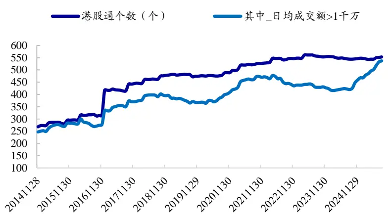
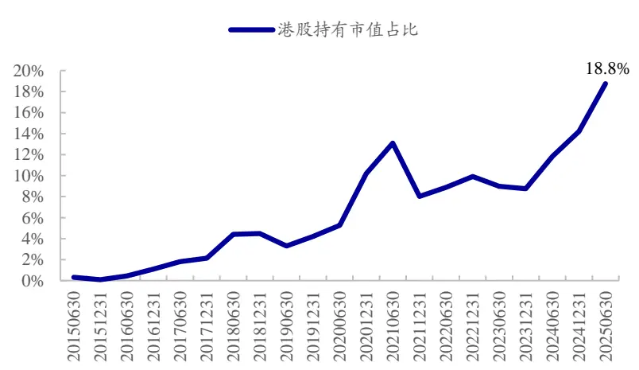
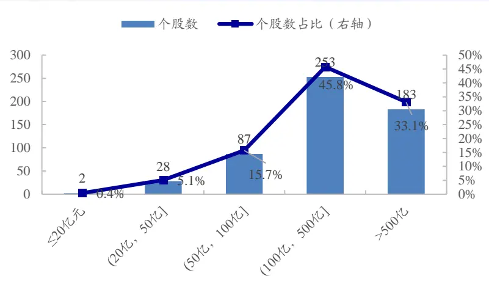
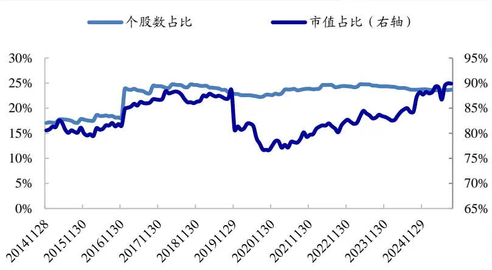
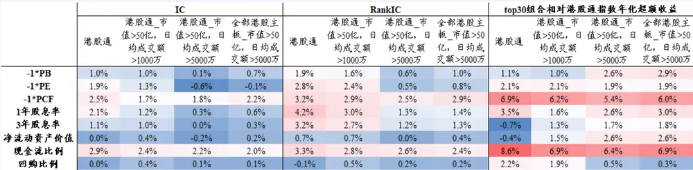

## 港股通量化选股策略初探

.2025/10/22/

姓名：郑雅斌（分析师）姓名：罗蕾（分析师）

邮箱：zhengyabin@gtht.com 邮箱：luolei@gtht.com

电话：021-23219395电话：0755-23976124

证书编号：S0880525040105 证书编号：S0880525040014

## 投资要点

要点：港股通个股市值普遍较大，小盘效应弱，而成长、动量效应突出，价值因子表现优于港股主板。

要点：基于现金流比例、股息率、回购比例3因子构建港股通价值策略，样本期间（2015.01.01-2025.08.26，下同）年化收益11.7%，相较于港股通指数年化超额9.5%。

要点：基于网络效应、无形资产、成本优势、转换成本等因子，构建港股通护城河策略，样本期间年化收益12.6%，相对于港股通指数年化超额10.5%。

## 成长策略

要点：基于增长、研发投入、盈利能力、盈利质量、股价相对强度5个因子等权排序打分，选择得分最高的30只股票构建等权港股通成长投资策略，样本期间组合年化收益22.2%，相对于港股通指数年化超额20.0%。

要点：基于市值、价值、成长、质量、动量5类经典因子等权排序打分，选择得分最高的30只股票构建市值加权港股通均衡策略样本期间策略年化收益25.1%，相对于港股通指数年化超额23.0%。

## 风险提示

要点：本文根据客观数据和评价指标计算，不作为对未来走势的判断和投资建议。本文结论通过统计分析得出，存在历史统计海通证规律失效风险、因子失效风险、模型误设风险。港股市场规律受多重因素影响，回测结果须谨慎对待参阅附注免责声明

## 01

## 近年来，港股通个股数量逐渐增加；公募基金持股中，持有港股市值的占比也不断扩大。

图：港股通个股数量变化（个，截至2025.08.26）

资料来源：wind，国泰海通证券研究

图：偏股混+主动股票型基金持股中港股持有市值占比(2015H1-2025H2)

## 港股通个股市值普遍较大；虽然数量占比仅1/4左右，但覆盖了港股主板约90%的市值。

图：港股通个股市值分布（2025.08.26）

资料来源：wind，国泰海通证券研究

图：港股通个股占港股主板总个股数和总市值之比(2014.11-2025.08)

## 01

风格因子：成长、动量效应强，小盘效应弱，价值效应强于港股主板。

表：港股市场常见风格因子收益统计（2015.01.01-2025.08.26)

|  | 港股通 |  |  |  | 港股主板 |  |  | 港股通-港股主板 |  |  |  |
| --- | --- | --- | --- | --- | --- | --- | --- | --- | --- | --- | --- |
|  | 年化收益 | 月胜率 | t值 | p值 | 年化收益 月胜率 | t值 | p值 | 年化收益 | 月胜率 | t值 | p值 |
| 小盘 | -2.4% | 43.0% | -1.01 | 0.316 | 6.2% 57.0% | 1.33 | 0.187 | -8.6% | 39.1% | -1.79 | 0.076 |
| 价值 | 7.2% | 53.9% | 1.64 | 0.103 | 0.7% 52.3% | 0.23 | 0.819 | 6.5% | 55.5% | 2.08 | 0.040 |
| 盈利 | 4.0% | 58.6% | 1.25 | 0.214 | 9.1% 66.4% | 3.63 | 0.000 | -5.2% | 39.8% | -2.78 | 0.006 |
| 成长 | 8.7% | 61.7% | 3.25 | 0.001 | 11.6% 68.0% | 5.96 | 0.000 | -2.9% | 41.4% | -1.70 | 0.092 |
| 动量 | 12.5% | 63.3% | 2.28 | 0.024 | 11.9% 68.8% | 2.81 | 0.006 | 0.6% | 50.8% | 0.24 | 0.810 |
| 低波 | 4.7% | 55.5% | 1.04 | 0.302 | 4.4% 59.4% | 1.12 | 0.264 | 0.3% | 52.3% | 0.11 | 0.911 |

资料来源：wind，国泰海通证券研究
注：因子收益采用FF模型计算，2*3分组

投资理念：寻找市场价格低于其内在价值的“被低估”资产。

表：价值因子及其定义

| 因子 | 因子定义 |
| --- | --- |
| PB | 总市值/净资产 |
| PE | 总市值/TTM净利润 |
| PCF | 总市值/TTM经营活动产生的现金流量净额 |
| 1年股息率 | 过去1年现金分红总额/总市值 |
| 3年股息率 | 过去3年平均年现金分红/总市值 |
| 净流动资产价值 | (流动资产-流动负债)/总市值 |
| 现金流比例 | 企业自由现金流/企业价值，其中 自由现金流=过去1年经营活动净现金流-构建固定资产、无形资产和其他长期资产支付的现金， |
| 回购比例 | 企业价值=总市值+总负债-货币资金 过去1年累计回购金额/日均总市值 |

资料来源：国泰海通证券研究

## 因子表现：现金流比例表现最优，其次为PCF、股息率因子。

图：价值因子在港股市场的选股效果统计(2015.01.01-2025.08.26)

资料来源：Wind，国泰海通证券研究

## 港股通价值策略构建步骤

## 1. 初筛股票池：

- 剔除股价小于0.1元的股票；

- 要求市值>50亿元，过去1年日均成交额>5000万元;

- 要求过去1年、以及3年平均红利支付率均在0-1之间。

## 2. 价值因子选股：

- 将现金流比例、股息率、回购比例3因子等权排序加总，选择复合得分最高的30只股票构建等权/股息率加权组合（股息率加权方式下，限制单只个股权重上限不超过10%）。

年度换仓：每年12月底调仓；交易费率：单边千2。

## 港股通价值策略：等权组合年化收益11.7%。

不同构建方式下，价值策略表现可能有较大差异（港股通高股息指数VS港股通价值策略指数）。

表：港股通价值策略分年度收益表现（2015.01.01-2025.08.26)

|  | 港股通指数 (H50069) | 等权组合 |  | 股息率加权组合 |  | 价值指数(全收益指数) |  |  |
| --- | --- | --- | --- | --- | --- | --- | --- | --- |
|  |  | 组合收益 | 超额收益 | 组合收益 | 超额收益 | 标普港股通 港股通高股 港股通央企 港股通价值 低波红利 | 息 红利 | 策略 |
| 2015 | -7.6% | -2.8% | 4.8% | 3.4% | 11.0% | 4.3% | -3.6% -9.0% | -8.1% |
| 2016 | -0.8% | 6.5% | 7.2% | 12.1% | 12.8% | 17.2% | 8.1% 0.4% | 7.3% |
| 2017 | 38.1% | 55.2% | 17.1% | 69.1% | 31.0% | 21.4% | 81.9% 21.4% | 30.2% |
| 2018 | -16.2% | -13.7% | 2.5% | -13.5% | 2.8% | -1.0% | -10.6% -4.6% | -8.2% |
| 2019 | 10.9% | 30.1% | 19.2% | 30.4% | 19.6% | 6.8% | 17.4% 4.1% | 7.4% |
| 2020 | 13.8% | 13.8% | 0.0% | 16.9% | 3.1% | -19.9% | -9.1% -16.4% | -7.3% |
| 2021 | -12.5% | 7.6% | 20.1% | 22.8% | 35.3% | 14.2% | 2.4% 26.1% | -1.4% |
| 2022 | -18.1% | -17.9% | 0.2% | -16.7% | 1.4% | 3.5% | 1.6% -3.0% | -5.5% |
| 2023 | -14.6% | -2.6% | 12.0% | 0.2% | 14.9% | 5.4% | 8.6% 5.0% | -8.4% |
| 2024 | 15.6% | 21.9% | 6.3% | 26.3% | 10.7% | 34.2% | 32.0% 40.3% | 28.7% |
| 2025 | 33.2% | 50.6% | 17.4% | 42.3% | 9.2% | 21.4% | 24.5% 24.9% | 31.5% |
| 全区间 | 2.2% | 11.7% | 9.5% | 15.8% | 13.6% | 9.1% | 11.8% 6.9% | 4.9% |

资料来源：Wind，国泰海通证券研究

## 放松流动性约束、港股主板，价值策略也具有较优表现

表：港股通价值策略分年度收益表现(2015.01.01-2025.08.26)

|  | 港股通指 数 | 港股通股票池，要求 |  | 港股主板，要求 市值>50亿元，日均成交额≥1000万元 |  |
| --- | --- | --- | --- | --- | --- |
|  |  | 市值>50亿元，日均成交额≥1000万元 等权组合 | 股息率加权 | 等权组合 | 股息率加权 |
|  |  | 组合收益 超额收益 | 组合收益 超额收益 | 组合收益 超额收益 | 组合收益 超额收益 |
| 2015 | -7.6% | -7.2% 0.4% | -10.3% -2.8% | -11.5% -3.9% | -14.8% -7.3% |
| 2016 | -0.8% | 8.6% 9.4% | 12.5% 13.3% | 5.9% 6.7% | 7.6% 8.3% |
| 2017 | 38.1% | 45.9% 7.8% | 43.9% 5.8% | 45.0% 6.9% | 42.9% 4.8% |
| 2018 | -16.2% | -14.4% 1.9% | -13.0% 3.3% | -11.8% 4.4% | -10.8% 5.4% |
| 2019 2020 | 10.9% | 18.0% 7.1% | 16.2% 5.3% | 18.0% 7.1% | 16.1% 5.3% |
| 2021 | 13.8% | 23.6% 9.8% | 10.9% -2.8% | 23.6% 9.8% | 10.9% -2.8% |
| 2022 | -12.5% | 18.4% 31.0% | 25.6% 38.1% | 18.7% 31.2% | 26.8% 39.3% |
| 2023 | -18.1% -14.6% | -14.5% 3.6% | -16.9% 1.2% | -13.6% 4.5% | -16.6% 1.5% |
| 2024 | 15.6% | 4.1% 18.8% | -1.7% 12.9% | 4.2% 18.8% | -1.7% 12.9% |
|  | 33.2% | 18.1% 2.6% | 20.8% 5.2% | 20.1% 4.5% | 22.8% 7.2% |
| 2025 | 2.2% | 47.4% 14.2% | 36.1% 2.9% | 44.0% 10.8% | 33.4% 0.2% |
| 全区间 |  | 12.1% 9.9% | 9.9% 7.7% | 11.6% 9.4% | 9.2% 7.0% |

资料来源：Wind，国泰海通证券研究

## “护城河”概念，由投资大师沃伦•巴菲特提出并广泛实践。

护城河策略：它主要是指企业拥有的、能够长期保护其盈利能力、抵御竞争对手侵蚀的结构性竞争优势。拥有“护城河”的公司，更有可能具有相对优势。

## 护城河的刻画：

- 网络效应。用户越多，公司产品价值越高。我们通过市场份额，即公司营业收入占所属Wind二级行业总营收之比，来刻画网络效应。

- 无形资产。无形资产能够为企业提供独特的竞争力，例如品牌、关键技术专利等。

·成本优势。成本优势允许企业在保持价格竞争力的同时还能保证利润率。我们采用半年度ROE、ROE_TTM、毛利率、ROE同比变化4个指标等权排序打分，来反映企业成本优势。

·转换成本。转换成本是指客户从一个产品或服务转向另一个时所面临的成本。拥有较强转换成本的企业，客户支付意愿强，回款快，具有健康的现金流。我们以现金利润占比，来反映转换成本。

## “护城河”策略具体构建步骤

| 条目 | 要求 | 指标及释义 |  |
| --- | --- | --- | --- |
| 策略理念 | 具有强大护城河的企业，如品牌优势、专利技术、网络效应等，能够在市场竞争中保持领先地位，为投资者提供安全边际 |  |  |
| 选股范围 | (1) 选股池：港股通股票/港股主板个股 | (3) 流动性要求：市值>50亿元，过去1年日均成交额>1000万元 |  |
|  | (2) 剔除股价小于0.2元的个股 | (4) 剔除盈利能力排名后10%的公司 |  |
| 选股方法 | 护城河优选：采用营收占比、无形资产因子、盈利能力、现金 利润占比4个指标等权排序打分，选择复合得分最高的30只股 票构建等权组合 | (2) 无形资产因子：资产负债表中的无形资产（扣除商誉）、以及无形资产/总资产两个指标等权排序打分 |  |
|  |  | (3)盈利能力：半年度ROE、ROE_TTM、毛利率、ROE同比变化4个指标等权排序打分 |  |
|  |  | (4)现金利润占比：(经营净现金流-营业利润)/净资产 | 加权方式 等权 |

## “护城河”策略涉及指标选股效果统计(2015.01.01-2025.08.26)

|  | IC |  |  |  |  |  |  |  |
| --- | --- | --- | --- | --- | --- | --- | --- | --- |
|  | 营收占比 | 无形资产 | 无形资产占比 | 毛利率 | 最新ROE | ROE同比变化 | ROE_TTM | 现金利润占比 |
| 月均值 | 1.58% | 1.15% | -0.14% | 0.76% | 1.74% | 1.71% | 1.90% | 1.00% |
| 月胜率 | 53.8% | 51.5% | 50.8% | 50.8% | 56.9% | 58.5% | 56.9% | 53.8% |
| t值 | 2.24 | 1.38 | -0.25 | 1.19 | 1.94 | 2.20 | 1.90 | 1.58 |
| p值 | 0.027 | 0.169 | 0.803 | 0.235 | 0.055 | 0.030 | 0.060 | 0.117 |
|  | RankIC |  |  |  |  |  |  |  |
|  | 营收占比 | 无形资产 | 无形资产占比 | 毛利率 | 最新ROE | ROE同比变化 | ROE_TTM | 现金利润占比 |
| 月均值 | 3.20% | 2.28% | -0.30% | 0.92% | 2.71% | 2.66% | 2.56% | 1.30% |
| 月胜率 | 60.8% | 52.3% | 50.0% | 54.6% | 60.8% | 61.5% | 59.2% | 57.7% |
| t值 | 3.95 | 2.44 | -0.42 | 1.40 | 2.96 | 3.38 | 2.62 | 2.02 |
| p值 | 0.000 | 0.016 | 0.675 | 0.164 | 0.004 | 0.001 | 0.010 | 0.045 |
|  | 多头超额(分5组) |  |  |  |  |  |  |  |
| 年超额 | 营收占比 | 无形资产 | 无形资产占比 | 毛利率 | 最新ROE | ROE同比变化 | ROE_TTM | 现金利润占比 |
|  | 2.26% | 2.00% | -0.80% | 3.22% | 1.28% | 3.75% | 0.65% | 1.73% |
| 月胜率 | 50.8% | 50.0% | 48.5% | 56.2% | 56.2% | 57.7% | 53.1% | 52.3% |
| t值 | 1.36 | 0.91 | -0.58 | 1.81 | 0.69 | 1.97 | 0.35 | 1.03 |
| p值 | 0.176 | 0.362 | 0.565 | 0.072 多空超额(分5组) | 0.494 | 0.051 | 0.729 | 0.303 |
|  | 营收占比 | 无形资产 | 无形资产占比 | 毛利率 | 最新ROE | ROE同比变化 | ROE_TTM | 现金利润占比 |
| 年超额 | 6.60% | 4.13% | 0.46% | 6.50% | 3.72% | 9.31% | 4.96% | 4.75% |
| 月胜率 | 57.7% | 52.3% | 53.1% | 56.9% | 56.2% | 64.6% | 60.0% | 55.4% |
| t值 | 2.08 | 1.23 | 0.19 | 2.22 | 1.03 | 3.20 | 1.28 | 1.91 |
| p值 | 0.039 | 0.222 | 0.850 | 0.028 | 0.303 | 0.002 | 0.202 | 0.058 |

资料来源：Wind，国泰海通证券研究

## 业绩表现：相对港股通指数年化超额10.5%，样本期间每年超额收益均为正。

表：港股通护城河策略分年度收益表现(2015.01.01-2025.08.26)

|  | 港股通指数 | 港股通股票池 |  | 港股通股票池（剔除流动性较低个股） |  | 港股主板（剔除流动性较低个股） |  |
| --- | --- | --- | --- | --- | --- | --- | --- |
|  |  | 组合收益 | 超额收益 | 组合收益 | 超额收益 | 组合收益 | 超额收益 |
| 2015 | -7.6% | -1.6% | 6.0% | -2.2% | 5.4% | -2.0% | 5.5% |
| 2016 | -0.8% | 3.1% | 3.8% | 3.4% | 4.1% | 4.3% | 5.1% |
| 2017 | 38.1% | 51.4% | 13.3% | 51.4% | 13.3% | 51.8% | 13.7% |
| 2018 | -16.2% | -12.4% | 3.9% | -10.6% | 5.7% | -10.1% | 6.2% |
| 2019 | 10.9% | 19.5% | 8.7% | 20.5% | 9.6% | 21.3% | 10.4% |
| 2020 | 13.8% | 26.8% | 13.0% | 24.3% | 10.5% | 25.9% | 12.1% |
| 2021 | -12.5% | 3.2% | 15.7% | 5.2% | 17.7% | 1.5% | 14.0% |
| 2022 | -18.1% | -6.1% | 12.0% | -8.8% | 9.3% | -8.1% | 10.0% |
| 2023 | -14.6% | 0.2% | 14.8% | 2.3% | 16.9% | -0.1% | 14.6% |
| 2024 | 15.6% | 26.5% | 11.0% | 23.6% | 8.0% | 25.4% | 9.9% |
| 2025 | 33.2% | 43.9% | 10.7% | 43.3% | 10.1% | 39.7% | 6.5% |
| 全区间 | 2.2% | 12.8% | 10.6% | 12.6% | 10.5% | 12.4% | 10.2% |

资料来源：Wind，国泰海通证券研究

## 04

## 成长策略

等权

成长策略：投资于收入、利润等关键指标正在快速增长，且预计未来增长潜力较大的公司。

| 条目 | 要求 |  | 指标及释义 |
| --- | --- | --- | --- |
| 策略理念 | 通过投资于高速发展企业，分享其业绩增长带来的边际增值 |  |  |
| 选股范围 | (1) 选股池：港股通股票/港股主板个股 (2) 剔除股价小于0.2元的个股 | (3) 流动性要求：市值>50亿元，过去1年日均成交额>1000万元 |  |
| 选股方法 |  | (1) 增长：净利润同比变化/过去3年净利润同比变化波动率(6期) |  |
|  |  | (2) 研发投入：过去1年研发投入金额 |  |
|  |  | 采用增长、研发投入、盈利能力、盈利质量、股价相对强度5 个因子等权排序打分，选择复合得分最高的30只股票构建等权 | (3)盈利能力：ROIC（息前税后经营利润/(股东权益+有息负债)、及ROE同比变化等权排序复合 |
|  |  | 组合 (4) 盈利质量：现金利润占比，(经营净现金流-营业利润)/净资产 |  |
|  |  | 区间振幅：过去一年最高价/最低价-1 | (5) 股价相对强度：过去1年累计收益率、收益排序、以及区间振幅3因子等权排序打分。其中， 收益排序因子：计算每日个股收益截面排序，然后将过去1年日度排序等权平均 |

交易费率
双边千四

月度换仓

加权方式

## “成长”策略涉及指标选股效果统计（2015.01.01-2025.08.26)

|  | IC |  |  |  |  |  |
| --- | --- | --- | --- | --- | --- | --- |
|  | 1年累计收益 | 收益排序 | 区间振幅 | 研发投入 | SUE |  |
| 月均值 | 3.28% | 4.74% | -0.67% | 2.74% | 2.63% |  |
| 月胜率 | 59.2% | 65.4% | 50.8% | 61.5% | 67.7% |  |
| t值 | 2.19 | 3.09 | -0.40 | 4.03 | 3.48 |  |
| p值 | 0.030 | 0.002 | 0.687 | 0.000 | 0.001 |  |
|  | RankIC |  |  |  |  |  |
|  | 1年累计收益 | 收益排序 | 区间振幅 | 研发投入 | SUE |  |
| 月均值 | 2.24% | 5.75% | -3.83% | 1.35% | 2.85% |  |
| 月胜率 | 60.0% | 68.5% | 43.8% | 57.7% | 59.2% |  |
| t值 | 1.48 | 3.52 | -2.18 | 1.38 | 3.45 |  |
| p值 | 0.142 | 0.001 | 0.031 | 0.171 | 0.001 |  |
|  | 多头超额(分5组) |  |  |  |  |  |
|  | 1年累计收益 5.06% | 收益排序 4.78% | 区间振幅 2.07% | 研发投入 6.19% |  | SUE |
| 年超额 月胜率 | 54.6% | 63.1% | 51.5% | 47.7% |  | 3.27% 56.9% |
| t值 | 1.48 | 1.46 | 0.55 | 3.61 |  | 1.76 |
| p值 | 0.142 | 0.147 | 0.586 | 0.000 |  | 0.080 |
|  | 多空超额(分5组) |  |  |  |  |  |
|  | 1年累计收益 | 收益排序 12.81% | 区间振幅 |  | 研发投入 | SUE |
| 年超额 | 10.32% | 62.3% | 2.46% 48.5% | 61.5% | 8.42% | 8.73% 60.8% |
| 月胜率 | 61.5% |  |  |  |  |  |
| t值 | 1.57 | 1.86 | 0.37 | 3.10 |  | 2.93 |
| p值 | 0.120 | 0.066 | 0.711 | 0.002 |  | 0.004 |

资料来源：Wind，国泰海通证券研究

## 业绩表现：相对港股通指数年化超额16.4%。

表：港股通成长策略分年度收益表现（2015.01.01-2025.08.26)

|  |  | 港股通股票池 |  |  | 港股通股票池 (剔除流动性较低个股) |  |  | 港股主板 (剔除流动性较低个股) |  |  |
| --- | --- | --- | --- | --- | --- | --- | --- | --- | --- | --- |
|  | 港股通指数 | 组合收益 | 相对港股通 指数 | 相对港股通 成长策略指 | 组合收益 | 相对港股通 指数 | 相对港股通 成长策略指 | 组合收益 | 相对港股通 指数 | 相对港股通 成长策略指 |
| 2015 | -7.6% | 1.0% | 8.6% | 数 2.7% | 1.3% | 8.9% | 数 3.0% | -4.1% | 3.5% | 数 -2.5% |
| 2016 | -0.8% | 17.0% | 17.8% | 19.5% | 18.2% | 19.0% | 20.7% | 8.3% | 9.0% | 10.7% |
| 2017 | 38.1% | 68.3% | 30.2% | 17.4% | 65.7% | 27.6% | 14.8% | 64.8% | 26.6% | 13.8% |
| 2018 | -16.2% | -19.6% | -3.4% | -1.9% | -20.3% | -4.1% | -2.6% | -16.9% | -0.7% | 0.8% |
| 2019 | 10.9% | 28.9% | 18.0% | 5.9% | 34.9% | 24.1% | 12.0% | 33.3% | 22.4% | 10.3% |
| 2020 | 13.8% | 115.2% | 101.4% | 72.4% | 118.0% | 104.2% | 75.2% | 119.3% | 105.6% | 76.5% |
| 2021 | -12.5% | -0.2% | 12.3% | 15.4% | 3.3% | 15.9% | 19.0% | -2.1% | 10.5% | 13.5% |
| 2022 | -18.1% | -15.1% | 3.0% | 8.6% | -13.5% | 4.6% | 10.3% | -7.6% | 10.4% | 16.1% |
| 2023 | -14.6% | -4.8% | 9.8% | 9.0% | -1.9% | 12.8% | 11.9% | -4.7% | 9.9% | 9.1% |
| 2024 | 15.6% | 27.8% | 12.2% | 14.3% | 21.6% | 6.0% | 8.1% | 21.7% | 6.1% | 8.2% |
| 2025 | 33.2% | 73.5% | 40.3% | 34.8% | 70.6% | 37.4% | 31.9% | 85.0% | 51.8% | 46.3% |
| 全区间 | 2.2% | 21.4% | 19.2% | 15.6% | 22.2% | 20.0% | 16.4% | 21.6% | 19.4% | 15.8% |

资料来源：Wind，国泰海通证券研究

## 05均衡策略

## 均衡策略：均衡配置市值、价值、成长、质量、动量5类因子

| 条目 | 要求 指标及释义 |  |
| --- | --- | --- |
| 策略理念 | 均衡配置市值、价值、成长、质量、动量5类因子 |  |
| 选股范围 | (1) 选股池：港股通股票/港股主板个股 | (3) 流动性要求：市值>50亿元，过去1年日均成交额>1000万元 |
| 选股方法 | (2) 剔除股价小于0.2元的个股 采用市值、价值、成长、质量、动量5个因子等权排序打分， 选择复合得分最高的30只股票构建等权/市值加权组合 | 或者，市值>100亿元，过去1年日均成交额>5000万元 |
|  |  | (1) 市值：-1*总市值 |
|  |  | (2)价值：现金流比例、3年股息率、-1*PB三因子等权排序复合 |
|  |  | (3)成长：SUE、ROE同比变化、研发投入3因子等权排序复合 |
|  |  | (4)质量：现金利润占比、毛利率2因子等权排序复合 |
|  |  | (5) 动量：过去1年日收益排序因子 交易费率 双边千四 加权方式 等权/市值加权（单只个股权重上限5%） |

## 业绩表现：相对港股通指数年化超额25.1%。

表：港股通均衡策略分年度收益表现（2015.01.01-2025.08.26)

|  | 港股通指数 | 选股池：港股通， |  |  | 市值>100亿元，日均成交额>5千万元 | 选股池：港股通， |  |
| --- | --- | --- | --- | --- | --- | --- | --- |
|  |  |  | 市值>50亿元，日均成交额>1千万元 | 市值加权组合 |  |  |  |
|  |  | 等权组合 |  |  |  | 等权组合 | 市值加权组合 |
|  |  | 组合收益 | 超额收益 | 组合收益 超额收益 | 组合收益 | 超额收益 | 组合收益 超额收益 |
| 2015 | -7.6% | 20.6% | 28.1% | 15.9% 23.4% | 11.1% | 18.6% | 9.3% 16.8% |
| 2016 | -0.8% | 11.4% | 12.1% | 13.6% 14.3% | 5.1% | 5.9% | 3.6% 4.4% |
| 2017 | 38.1% | 67.9% | 29.8% | 78.3% 40.2% | 66.6% | 28.5% | 75.0% 36.9% |
| 2018 | -16.2% | -7.8% | 8.4% | -5.0% 11.2% | -12.2% | 4.0% | -13.5% 2.7% |
| 2019 | 10.9% | 32.3% | 21.4% | 33.8% 22.9% | 26.7% | 15.8% | 22.0% 11.2% |
| 2020 | 13.8% -12.5% | 56.7% | 43.0% | 63.3% 49.5% | 47.2% | 33.4% | 59.2% 45.4% |
| 2021 | -18.1% | 9.8% | 22.3% | 11.8% 24.3% | 17.4% | 29.9% | 17.3% 29.8% |
| 2022 | -14.6% | -2.2% | 15.9% | 3.3% 21.4% | -0.8% | 17.3% | 0.8% 18.9% |
| 2023 2024 | 15.6% | 4.7% | 19.3% | 3.7% 18.3% 25.7% 10.2% | 6.6% 23.4% | 21.2% | 7.7% 22.4% |
| 2025 | 33.2% | 24.5% 52.8% | 9.0% 19.6% | 49.3% 16.1% | 74.3% | 7.8% | 18.9% 3.4% |
|  |  |  |  | 25.1% |  | 41.2% | 62.9% 29.7% |
| 全区间 | 2.2% | 23.2% | 21.0% | 23.0% | 22.2% | 20.0% | 21.8% 19.6% |

资料来源：Wind，国泰海通证券研究

## 投资理念对比

表：4个策略构建思路总结与对比

| 策略 | 投资理念 | 涉及的选股因子 |
| --- | --- | --- |
| 价值策略 | 寻找市场价格低于内在价值的“被低估”个股，以减少市场波动影响 | 现金流比例、股息率、回购比例 |
| 护城河策略 | 具有强大护城河的企业，能够在市场竞争中保持领先地位，为投资者提供安全边际 | 市场份额、无形资产、成本优势、现金利润占比 |
| 成长策略 | 通过投资于高速发展企业，分享其业绩增长带来的边际增值 | 增长、研发、盈利能力、盈利质量、股价相对强度 |
| 均衡策略 | 均衡配置市值、价值、成长、质量、动量5类选股因子 | 市值、价值、成长、质量、动量 |

资料来源：国泰海通证券研究

## 业绩表现：均衡策略信息比最高；护城河策略和指数跟踪最紧密。

护城河策略在各风格因子上暴露都相对较低，市场beta接近于1，和港股通指数走势更为接近，超额收益更多来源于其本身alpha，超额收益波动率和相对回撤最低。

价值策略最明显的风格特征是价值暴露显著。

成长策略呈高beta属性，市场因子暴露>1；风格因子上，成长、动量、高估值暴露显著。

均衡策略在各风格上都具有一定正暴露，整体比较均衡。剔除市场、风格影响后，策略仍具有年化13.7%的alpha。

图：月收益回归的风格暴露(2015.01.01-2025.08.26)

| 价值策略 护城河策略 成长策略 均衡策略 |  |  |  |  |
| --- | --- | --- | --- | --- |
| 年化alpha | 6.9% | 9.3% | 13.8% | 13.7% |
| 市场 | 1.00 | 1.00 | 1.06 | 0.94 |
| 小市值 | 0.21 | -0.02 | 0.21 | 0.34 |
| 价值 | 0.33 | 0.09 | -0.24 | 0.20 |
| 盈利 | 0.11 | -0.03 | 0.04 | 0.11 |
| 成长 | -0.03 | 0.03 | 0.42 | 0.40 |
| 动量 | 0.04 | 0.00 | 0.23 | 0.22 |

资料来源：Wind，国泰海通证券研究

## 业绩表现：均衡策略信息比最高；护城河策略和指数跟踪最紧密。

表：全区间表现对比(2015.01.01-2025.08.26)

|  |  |  |  |  |  | 相对港股通指数超额收益 |  |  |  |
| --- | --- | --- | --- | --- | --- | --- | --- | --- | --- |
|  | 收益率 | 波动率 | 信息比 | 最大回撤 | 月胜率 | 收益率 波动率 | 信息比 | 最大回撤 | 月胜率 |
| 港股通指数 | 2.2% | 22.3% | 0.21 | 55.4% | 55.5% |  |  |  |  |
| 价值策略 | 11.7% | 23.4% | 0.60 | 44.1% | 57.0% | 9.5% 11.4% | 0.81 | 18.2% | 62.5% |
| 护城河策略 | 12.6% | 23.3% | 0.64 | 37.1% | 59.4% | 10.5% 8.9% | 1.14 | 16.5% | 57.8% |
| 成长策略 | 22.2% | 27.3% | 0.89 | 38.9% | 60.9% | 20.0% 13.8% | 1.40 | 22.4% | 66.4% |
| 均衡策略 | 25.1% | 23.4% | 1.09 | 32.5% | 63.3% | 23.0% 13.9% | 1.50 | 22.4% | 68.8% |

资料来源：Wind，国泰海通证券研究

## 风险提示

本文根据客观数据和评价指标计算，不作为对未来走势的判断和投资建议。

本文结论通过统计分析得出，存在历史统计规律失效风险、因子失效风险、模型误设风险。

港股市场规律受多重因素影响，回测结果须谨慎对待。

## 免责声明

## 分析师声明

作者具有中国证券业协会授予的证券投资咨询执业资格或相当的专业胜任能力，保证报告所采用的数据均来自合规渠道，分析逻辑基于作者的职业理解，本报告清晰准确地反映了作者的研究观点，力求独立、客观和公正，结论不受任何第三方的授意或影响。分析师薪酬的任何组成部分，均与其在本研究报告中所表述的具体建议或观点无直接或间接的关系。特此声明。

## 免责声明

本报告仅供国泰海通证券股份有限公司或国泰海通证券(香港)有限公司（以下统称“国泰海通”或“本公司”）研究服务签约客户使用。本公司不会因接收人收到本报告而视其为本公司的当然客户。本报告仅在相关法律许可的情况下发放，并仅为提供信息而发放，概不构成任何广告。

本报告的信息来源于已公开的资料，本公司对该等信息的准确性、完整性或可靠性不作任何保证。本报告所载的资料、意见及推测仅反映本公司于发布本报告当日的判断，本报告所指的证券或投资标的的价格、价值及投资收入可升可跌。过往表现不应作为日后的表现依据。在不同时期，本公司可发出与本报告所载资料、意见及推测不一致的报告。本公司不保证本报告所含信息保持在最新状态。同时，本公司对本报告所含信息可在不发出通知的情形下做出修改，投资者应当自行关注相应的更新或修改。

本报告中所指的投资及服务可能不适合个别客户，不构成客户私人咨询建议。在任何情况下，本报告中的信息或所表述的意见均不构成对任何人的投资建议。在任何情况下，本公司、本公司员工或者关联机构不承诺投资者一定获利，不与投资者分享投资收益，也不对任何人因使用本报告中的任何内容所引致的任何损失负任何责任。投资者务必注意，其据此做出的任何投资决策与本公司、本公司员工或者关联机构无关。本公司利用信息隔离墙控制内部一个或多个领域、部门或关联机构之间的信息流动。因此，投资者应注意，在法律许可的情况下，本公司及其所属关联机构可能会持有报告中提到的公司所发行的证券或期权并进行证券或期权交易，也可能为这些公司提供或者争取提供投资银行、财务顾问或者金融产品等相关服务。在法律许可的情况下，本公司的员工可能担任本报告所提到的公司的董事。

市场有风险，投资需谨慎。投资者不应将本报告作为作出投资决策的唯一参考因素，亦不应认为本报告可以取代自己的判断。在决定投资前，如有需要，投资者务必向专业人士咨询并谨慎决策。

本报告并非意图发送、发布给在当地法律或监管规则下不允许向其发送、发布的机构或人员，也并非意图发送、发布给因可得到、使用本报告的行为而使国泰海通违反或受制于当地法律或监管规则的机构或人员。本报告版权仅为本公司所有，未经书面许可，任何机构和个人不得以任何形式翻版、复制、发表或引用。如征得本公司同意进行引用、刊发的，需在允许的范围内使用，并注明出处为“国泰海通证券研究”或“国泰海通香港研究”，且不得对本报告进行任何有悖原意的引用、删节和修改。

国泰海通证券(香港)有限公司依法就研究报告的内容和发布行为对国泰海通证券股份有限公司承担责任。

若本公司以外的其他机构（以下简称“该机构”）发送本报告，则由该机构独自为此发送行为负责。通过此途径获得本报告的投资者应自行联系该机构以要求获悉更详细信息或进而交易本报告中提及的证券。本报告不构成本公司向该机构之客户提供的投资建议，本公司、本公司员工或者关联机构亦不为该机构之客户因使用本报告或报告所载内容引起的任何损失承担任何责任。

| 评级说明 |  |  |  |
| --- | --- | --- | --- |
|  |  | 评级 | 说明 |
| 1.投资建议的比较标准 投资评级分为股票评级和行业评级。 | 股票投资评级 | 增持 | 相对沪深300指数涨幅15%以上 |
| 以报告发布后的12个月内的市场表现为比较标准，报告发布日后的12个月内的 |  | 谨慎增持 | 相对沪深300指数涨幅介于5%~15%之间 相对沪深300指数涨幅介于-5%~5% |
| 公司股价(或行业指数)的涨跌幅相对同期的沪深300指数涨跌幅为基准。 |  | 中性 |  |
|  |  | 减持 | 相对沪深300指数下跌5%以上 |
| 2.投资建议的评级标准 报告发布日后的12个月内的公司股价(或行业指数)的涨跌幅相对同期的沪深 | 行业投资评级中性 | 增持 | 明显强于沪深300指数 |
| 300指数的涨跌幅。 |  |  | 基本与沪深300指数持平 |
|  |  | 减持 | 明显弱于沪深300指数 |

## 国泰海通证券研究所

地址：上海市黄浦区中山南路888号

邮编：200011

电话：(021)38676666

E-mail: research@gtht.com

## THANKS FOR LISTENING

国泰海通证券研究所金融工程团队