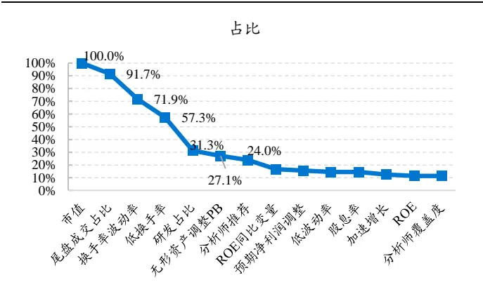
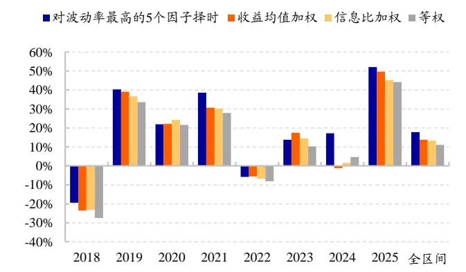
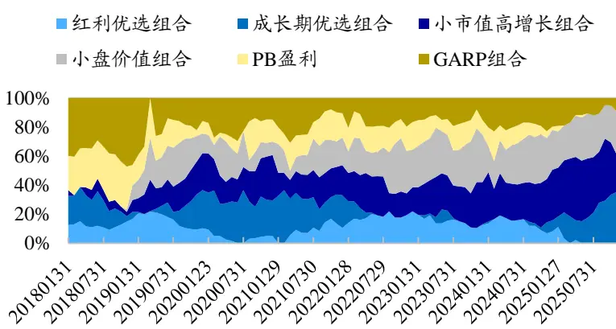
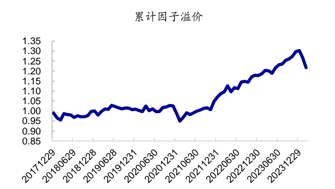
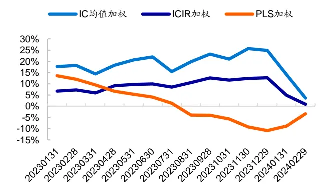

## 国泰海通量化选股系列（一）

## alpha 是否可以被预测？基于 PLS 模型的探索

## 本报告导读：

本文主要考察根据因子历史长短期收益、波动率等数据，采用 PLS模型预期因子收益在因子加权中的应用，包括单因子多策略、以及多因子单策略两个维度。

## 投资要点：

[Table_Summary] 在 20 个单因子 top100 组合配置中，对波动率最大的 5 个因子组合采用PLS 模型预期收益确定权重，相比于收益均值加权方式，年化收益提升约4.0%（2018.01-2025.11，下同）；相较于等权方式，年化收益提升6.6%。

风格组合配置维度，我们构建了 6个基础组合：1个红利优选、1 个成长期优选、两个小市值组合、以及两个风格相对均衡的组合--PB盈利和GARP 组合。对波动较大组合采用PLS 模型预期超额收益加权，相比于超额收益均值加权方式，年化收益提升3.3%；相较于等权方式，年化收益提升3.9%。

o量化固收+策略中的应用，股票端：PLS 预期收益加权复合风格组合；债券端：中证短债指数；构建 10%股票仓位的固收+量化策略，2018 年以来年化收益 5.6%，年化波动率 2.6%，信息比 2.17；权益比例为20%时，策略年化收益 8.4%，年化波动率5.1%，信息比1.65。

在多因子模型中，采用PLS 预期收益确定因子权重，可改善多因子模型预期IC、以及top100组合业绩表现。但需要注意的是，这种改善效果并非在每一个截面都成立，相对而言，PLS 或许更擅长风格之间的配置，而非同类之间的精细比较。时序角度，IC 均值加权、ICIR加权、PLS 加权方式各有优劣。整体而言，PLS 加权方式更为稳健；但在因子动量持续性强时，表现不如 IC 均值加权、ICIR 加权突出，例如2023年。

o以 PLS 预期收益加权多因子模型 top100 组合作为股票端资产，中证短债指数作为债券端资产，构建 20%股票仓位的股债复合量化固收+策略，2018.01-2025.11 期间年化收益 8.1%，年化波动率和最大回撤分别为5.6%、5.4%；在圈定的固收+基金中，收益排名除 2020年处于32.1%分位点外，其余年份均在前 1/2。

0风险提示。本文根据客观数据和评价指标计算，不作为对未来走势的判断和投资建议。本文结论通过统计分析得出，存在历史统计规律失效风险、因子失效风险、模型误设风险。采用PLS 模型确定因子权重，是模型基于历史数据自适应的过程，仅提供了一个可以尝试的选项，并不一定适用所有的因子组合。

郑雅斌(分析师)

心021-23219395

zhengyabin@gtht.com

登记编号S0880525040105

罗蕾(分析师)

021-23185653

luolei@gtht.com

登记编号S0880525040014

## [Table_Rep相关报告

如何克服因子表现的截面差异 2025.12.28

核心指数定期调整预测及全市场流动性冲击测算 2025.11.06

2026年度金融工程策略展望——高频资金流如何辅助宽基择时决策 2025.10.29

大类资产与中观配置研究（六） 2025.10.26

常见的因子择时指标有动量、波动率、拥挤度、市场涨跌等，但不同指标对因子的影响幅度不尽相同，且各择时指标之间也存在一定相关性，那么如何将这些具有一定相关性的择时指标复合起来呢？

与传统的最小二乘法相比，偏最小二乘法（PLS）可以在自变量存在相关性的条件下进行回归建模，同时允许样本点个数少于变量个数。通过潜变量的方式，PLS 能够在解释因变量的同时，尽可能提取自变量中的有效信息。因此本文尝试采用偏最小二乘法对多个因子择时指标的复合进行研究，并将该方法在选择与配置量化组合问题中进行应用。

## 1. 因子择时指标及 PLS加权模型介绍

在多因子模型中，因子权重通常基于因子预期收益确定，常见的确定方式有，近12个月收益均值或信息比加权，这些加权方式类似于因子收益动量加权。若我们有多个参考指标，除因子历史收益外，还有不同回看窗口的波动率、拥挤状态等，那么这些因素该怎么融入模型中呢？本节我们尝试采用PLS 方法构建因子收益预期模型，并以此为参考确定因子权重。

在构建PLS 模型时，因变量Y 为因子月收益率，自变量包括常见的因子择时指标：不同回看窗口的因子收益、波动率、拥挤度、市场涨跌状态等，具体为以下4类共 7个指标：

动量：不同时间窗口的因子收益，包括过去 3 个月、12 个月、5年、以及剔除过去 1年的 t-4至t-1年因子收益动量。

- 波动率：最近一个月日收益波动率与长期波动率之比。

- 拥挤度：最近一个月的因子收益是否达到过去1年月收益极大值。

- 市场涨跌：过去 1年市场（沪深 300 指数）月均收益是否大于 0。

表1：因子择时指标列表

| 序号 | 因子择时指标 | 计算方式 |
| --- | --- | --- |
| 1 | 动量1 | 过去12个月因子月均收益 |
| 2 | 动量2 | 过去3个月因子月均收益/过去3年月收益波动率 |
| 3 | 动量3 | 过去5年因子月均收益/过去10年月收益波动率 |
| 4 | 动量4 | (t-4)至(t-1)年因子月均收益/过去10年月收益波动率 |
| 5 | 波动率 | 过去1个月因子日收益波动率/过去10年因子月均波动率 |
| 6 | 拥挤度 | T月因子月收益>过去1年月收益最大值则为1；否则为0 |
| 7 | 市场涨跌 | 过去12个月市场月均收益是否>0 |

资料来源：国泰海通证券研究

对于因子i，t月末，在预测其 t+1月因子收益时，我们分如下两步骤进行：

根据历史数据，滚动计算因子收益对择时变量的响应系数beta。即以过去5年因子月收益率为因变量（60*1），上述7个择时指标为自变量（60*7），通过PLS 回归计算响应系数 beta。

- 代入最新一期择时变量数据（1*7），计算 t+1月因子预期收益。

我们以因子预期收益作为权重构建多因子模型，并将其与常见的等权、因子动量加权方式进行比较，以考察模型效果。具体因子包括市值、估值、低波、成长、盈利等20余个，如下表所示：

表2：因子列表

| 序号 | 因子 | 序号 | 因子 |
| --- | --- | --- | --- |
| 1 | 市值 | 11 | 无形资产调整PB |
| 2 | 中盘 | 12 | ROE |
| 3 | 反转 | 13 | ROE同比变量 |
| 4 | 低波动率 | 14 | SUE |
| 5 | 低换手率 | 15 | 加速增长 |
|  | 国天海通版权所有换手率波动率 | 16 | 研发占比 |

| 7 | 改进动量 | 17 |
| --- | --- | --- |
|  |  | 现金利润占比 |
| 8 | 尾盘成交占比 | 18 预期净利润调整 |
| 9 10 | 低 PB 股息率 | 19 分析师覆盖度 20 分析师推荐 |

资料来源：国泰海通证券研究

至于因子的组合形式，通常有单因子多策略、以及多因子单策略两种类型，接下来我们将分别对其进行考察。

## 2. 因子组合加权中的应用

本节们构建单因子多头组合，然后考察不同加权体系下，因子组合复合策略的业绩表现。

月度调仓，选择因子得分最高的 100 只股票构建等权组合，扣除单边前2交易成本后，单因子多头组合相对于wind全A 指数的业绩表现如表3所示。样本期间为2013.01-2025.11，但因子择时模型为滚动 60个月数据建模，因此择时窗口期为 2018.01-2025.11，下同。

需要注意的是，有些因子虽然多空收益显著，但多头端薄弱，例如反转、PB因子等。而在组合配置角度，我们通常不会选择一个没有显著超额收益的资产进行配置。因此在单因子多策略模块，我们只在历史上曾经有过显著超额的因子中进行选择。具体来看，月度滚动5年窗口，将从未出现过超额收益显著为正的因子剔除。回测下来，实际剔除的因子有反转、PB、改进动量、和现金利润占比 4个因子。

表3：单因子 top100 等权组合历史超额收益表现（2013.01-2025.11）

| 序号 | 因子 | 年化超额收益表现（2013.01-2025.11） |  | 年化超额收益表现（2018.01-2025.11） |  |  |
| --- | --- | --- | --- | --- | --- | --- |
|  |  | 年化超额 年化波动率 | 信息比 | 年化超额 | 年化波动率 | 信息比 |
|  | wind 全 A | 8.3% | 23.8% 0.46 | 4.1% | 20.3% | 0.30 |
| 1 | 市值 | 29.7% 19.7% | 1.40 | 23.3% | 21.7% | 1.09 |
| 2 | 中盘 | 9.6% | 5.9% 1.52 | 8.2% | 6.3% | 1.28 |
| 3 | 反转 | -4.1% | 13.8% -0.15 | -6.5% | 13.5% | -0.36 |
| 4 | 低波动率 | 10.9% | 11.0% 0.96 | 5.7% | 11.8% | 0.54 |
| 5 | 低换手率 | 16.3% | 12.6% 1.23 | 10.0% | 13.5% | 0.79 |
| 6 | 换手率波动率 | 17.3% | 14.2% 1.18 | 11.3% | 15.3% | 0.79 |
| 7 | 改进动量 | 1.0% | 12.6% 0.20 | 0.1% | 12.5% | 0.12 |
| 8 | 尾盘成交占比 | -2.2% | 15.5% 0.00 | -7.2% | 15.3% | -0.35 |
| 9 | 低PB | 0.5% | 12.2% 0.04 | -0.6% | 13.2% | -0.05 |
| 10 | 股息率 | 8.9% | 9.4% 0.89 | 6.6% | 10.2% | 0.63 |
| 11 | 无形资产调整PB | 8.2% | 9.6% 0.80 | 5.7% | 10.8% | 0.53 |
| 12 | ROE | 6.1% | 9.5% 0.68 | 2.9% | 9.7% | 0.38 |
| 13 | ROE 同比变量 | 5.6% | 11.0% 0.58 | 3.8% | 11.2% | 0.43 |
| 14 | SUE | 12.2% | 9.8% 1.22 | 9.2% | 9.0% | 1.06 |
| 15 | 加速增长 | 8.4% | 11.0% 0.80 | 7.5% | 11.0% | 0.73 |
| 16 | 研发占比 | 7.3% | 11.2% 0.71 | 6.4% | 12.0% | 0.63 |
| 17 | 现金利润占比 | 1.9% | 13.3% 0.25 | 0.9% | 14.6% | 0.18 |
| 18 | 预期净利润调整 | 11.3% | 11.3% 1.00 | 9.6% | 11.0% | 0.90 |
| 19 | 分析师覆盖度 | 6.5% | 11.4% 0.64 | 2.9% | 9.4% | 0.40 |
| 20 | 分析师推荐 | 9.8% | 12.1% 0.86 | 4.5% | 10.5% | 0.52 |

资料来源：Wind，朝阳永续，国泰海通证券研究

## 2.1. 单因子多头组合加权

滚动60个月构建因子择时模型，并根据模型预期收益加权各因子组合，得到的择时配置组合业绩表现如表 4 所示；为便于对比，我们也统计了收益均值加权（回看窗口为12 个月）、信息比加权的结果。

表4：单因子多头组合 PLS 模型配置效果（2018.01-2025.11）

| 因子组合加权方式 | 相对 wind 全 A 指数超额收益表现 |  |  | 相对因子组合等权策略超额收益表现统计 |  |  |  |  |
| --- | --- | --- | --- | --- | --- | --- | --- | --- |
|  | 收益率 | 波动率 | 信息比 | 年化超额 | 月胜率 | t值 | p值 |  |
| 等权 |  | 7.1% | 9.8% | 0.77 |  |  |  |  |
| 收益均值加权 |  | 9.7% | 40.8%海通版40.94 | 有 | 2.7% | 60.0% | 2.12 | 0.037 |
| 收益信息比加权 |  | 9.2% | 9.6% | 0.99 | 2.1% | 63.2% | 1.77 | 0.080 |
| 对所有指标择时 |  | 10.8% | 10.9% | 1.01 | 3.7% | 70.5% | 4.14 | 0.000 |
| 对波动率最 | N=3 | 14.3% | 11.8% | 1.21 | 7.2% | 71.6% | 4.77 | 0.000 |
| 大的N个因 | N=4 | 13.8% | 11.7% | 1.19 | 6.8% | 67.4% | 4.49 | 0.000 |
| 子组合择时 | N=5 | 13.7% | 11.5% | 1.20 | 6.6% | 69.5% | 4.58 | 0.000 |
| 波动率最小3个组合择时 |  | 9.5% | 10.7% | 0.93 | 2.5% | 61.1% | 1.79 | 0.076 |

资料来源：Wind，朝阳永续，国泰海通证券研究

结果显示，因子动量加权本身就是一个比较好的预测指标。超额收益均值加权单因子组合，2018 年以来年化超额（相对 wind 全 A 指数）9.7%，相较于等权加权方式年化收益增厚2.7%，月胜率60%，统计显著。

采用 PLS 择时模型预期收益加权单因子组合，收益表现进一步改善。复合组合相对于wind全A 指数的年化超额收益提升至 10.8%；相较于等权加权方式，收益年化提升3.7%，月胜率70.5%，统计显著。

那是不是所有因子都需要择时呢？实际并非如此，波动比较小的因子或许并不需要复杂的模型，直接采用因子动量即历史收益均值加权即可。

具体从回测结果来看，若我们对波动最小的 3 个因子构建择时模型，其他因子采用收益均值加权，则复合组合 2018 年以来相对 wind 全 A 指数年化超额收益 9.5%，信息比 0.93，相比于全部因子都基于收益均值加权方式并无明显改善。

因此在确定因子权重时，我们或许可以只针对波动最大的 N 个因子采用 PLS 模型择时收益加权，其他因子采用简单收益加权即可。例如，N 取3 时，复合组合相对 wind全 A 指数年化超额 14.3%，相较于等权加权方式年化收益提升 7.2%，月胜率 71.6%。整体来看，对波动最大的 3-5 个因子择时，相较于因子动量加权方式，年化收益都能得到 6-7%左右的提升。

若取N=5，即对波动（滚动12个月因子收益波动率）最大的5个因子采用 PLS 模型预期收益计算权重，各因子组合参与择时的月份数占比如图1所示。择时次数比较多的因子是市值、尾盘成交占比、换手率波动率和低换手率，择时月份数占比均超过 50%；基本面因子波动大的时候较少，因此择时次数较少，如SUE、股息率等。业绩表现上，择时复合组合相对于wind全A指数年化超额13.7%，相较于等权加权方式收益年化提升 6.6%，月胜率69.5%，年胜率100%（图2），统计显著。

图1：因子择时月份数占比（2018.01-2025.11）

资料来源：Wind，国泰海通证券研究

图2：N=5 时，因子组合择时策略相对 wind 全 A 指数分年度超额收益率（2018.01-2025.11）

资料来源：Wind，国泰海通证券研究

为考察模型对数据的敏感性，我们将选股池修改为剔除市值最小 10%个股后的剩余沪深 A 股，重新计算因子多头组合，并测算上述择时模型的效果，结果如表5所示。此时，等权加权略微优于 IC 均值加权；但因子择时模型仍保持相对优势。

表5：单因子 top100 组合 PLS 模型配置效果（2018.01-2025.11，剔除市值最小 10%个股）

|  | 收益率 | 波动率 | 信息比 | 年化超额 | 月胜率 | t值 | p值 |
| --- | --- | --- | --- | --- | --- | --- | --- |
| 等权 | 5.9% | 8.1% | 0.76 |  |  |  |  |
| 因子收益均值加权 | 5.4% | 8.5% | 0.69 | -0.4% | 52.6% | -0.26 | 0.798 |
| 因子收益信息比加权 | 4.8% | 7.8% | 0.67 | -1.1% | 52.6% | -0.58 | 0.561 |
| 对波动率最大5个因子择时 | 7.8% | 9.1% | 0.91 | 1.9% | 56.8% | 1.90 | 0.061 |

资料来源：Wind，国泰海通证券研究

## 2.2. 风格组合配置中的应用

结合不同因子，可以形成风格特征不一的主动量化股票组合，那么这些组合是否也可以采用 PLS 模型预期的超额收益进行加权配置呢？本节尝试对该问题进行实证分析。

我们构建了6个基础风格组合：1 个红利优选组合、1个成长期优选组合、两个小市值组合（一个偏高增长，一个偏价值）、以及两个风格相对均衡的组合——PB盈利和 GARP 组合，其构建方式具体如下表所示。

表6：基础风格组合构建思路概述

| 构建思路 |  |  |
| --- | --- | --- |
|  |  | 选择股息率较高、基本面较优的股票构建红利优选组合。具体步骤如下： 步骤1-流动性约束：剔除市值、日均成交额最小20%个股； |
|  | 红利优选组合 | 步骤2-分红基础池：过去1年红利支付率在 0-1之间； |
|  |  | 步骤3-红利+alpha因子综合打分：股息率、PB INT、SUE、ROE、盈利质量、分析师目标收益、以及低 换手率共7个因子等权打分; |
|  |  | 步骤4-选择得分最高50只股票构建股息率加权组合，并控制相对中证红利指数行业偏离不超过3%。 |
| 成长期优选组合 |  | 选择成长期公司中，增长较快、盈利能力较优的股票构建成长期优选组合。具体步骤： 步骤1-成长期个股池：经营净现金流为正、投资净现金流为负、筹资净现金流为正的股票池； |
|  |  | 步骤2-成长因子初筛：将一致预期净利润调整、SUE、加速增长3个因子等权打分，选择成长性最高的 |
|  |  | 100只股票构建初筛股票池； 步骤3-盈利能力优选：在上述100只股票池里，将ROE同比、ROE、研发投入、动量因子等权打分， |
|  |  | 选择得分最高的50只股票构建市值加权组合。 |
| 小市值高增长 |  | 选择增长较快的小市值个股，构建健康小市值组合。具体步骤如下： 根据小市值、高增长因子构建多因子模型，选择复合得分最高的50只股票，构建等权组合。 |
|  |  | 具体因子包括：小市值、盈利加速、SUE、预期净利润调整、累计研发投入、PB INT、尾盘成交占比、 开盘后大单净买入金额占比。 剔除高估值个股后，选择健康小市值公司构建组合。具体步骤如下： |
| 小盘价值组合 |  | 步骤1-剔除高估值个股：全 A，剔除 PB 最高的 20%的股票； 步骤2-多因子优选：在剩余股票中，选择多因子得分最高50只股票构建等权组合； |
|  |  | 因子包括：市值、价值、增长、加速增长、累计研发投入占比、预期净利润调整、反转、尾盘成交占比、 开盘大单净买入金额占比；为体现小盘特征，提升小市值因子权重至20%，其余因子权重均为10%。 选择估值较低、盈利能力较优的股票构建组合。具体步骤如下： 步骤 1-基础池：盈利（ROE+SUE）得分最高 1/5 股票与 PB 最低 1/5 股票的交集； |
| PB 盈利 |  | 步骤2-市场关注度优选：基于过去1个月日均换手率将全A个股等分为5组，剔除上述基础池中属于 全A换手率最高组（D5）股票； 步骤3-位序估值优选：剔除长期（3年）位序估值低于10%、短期（半年）位序估值高于90%的个股。 选择估值较低、增长较快的股票构建组合。具体步骤如下： |
| GARP 组合 |  | 步骤1-基础池：增长（SUE、预期净利润调整、一致预期2年复合增速）得分最高1/5股票与估值（BP、 EP、3年股息率、1年股息率）最低1/5股票的交集。 步骤2-市场关注度优选：基于过去1个月日均换手率将全A个股等分为5组，剔除上述基础池中属于 全A换手率最高组（D5）股票； 步骤3-位序估值优选：剔除长期（3年）位序估值低于10%、短期（半年）位序估值高于90%的个股。 |

资料来源：国泰海通证券研究

扣除单边千 2 交易成本后，基础风格组合的业绩表现如图 3 所示。整体来看，两个小市值组合收益弹性较大，但同时风险也相对更高，波动率、回撤水平较高；与之相反，红利组合则波动相对较低。PB盈利和GARP 组合则较为均衡，特别是 GARP 组合，与红利、成长、小市值组合都具有一定正相关性。

图3：6个基础风格组合历史业绩表现及相关性（2013.02-2025.11）

|  | 全区间业绩表现（2013.02-2025.11） |  |  |  |  | 相对wind全A月超额收益相关系数 |  |  |  |  |  |
| --- | --- | --- | --- | --- | --- | --- | --- | --- | --- | --- | --- |
|  | 收益率 | 波动率 | 信息比 | 最大回撤 | 月胜率 | 红利优选成长期优小市值高小盘价值 组合 | 选组合 | 增长组合 | 组合 | PB盈利 | GARP组 合 |
| wind全A | 7.9% | 23.8% | 0.45 | 56.0% | 53.2% |  |  |  |  |  |  |
| 红利优选组合 | 21.8% | 22.7% | 1.01 | 43.7% | 64.3% |  | -0.19 | -0.01 | 0.15 | 0.73 | 0.48 |
| 成长期优选组合 | 21.8% | 28.7% | 0.85 | 51.7% | 61.0% | -0.19 |  | 0.20 | 0.04 | -0.12 | 0.17 |
| 小市值高增长组合 | 40.2% | 30.2% | 1.31 | 54.1% | 66.9% | -0.01 | 0.20 |  | 0.83 | 0.22 | 0.42 |
| 小盘价值组合 | 37.3% | 28.7% | 1.28 | 50.7% | 68.8% | 0.15 | 0.04 | 0.83 |  | 0.28 | 0.37 |
| PB盈利 | 28.2% | 26.3% | 1.11 | 40.1% | 66.2% | 0.73 | -0.12 | 0.22 | 0.28 |  | 0.69 |
| GARP组合 | 34.1% | 26.5% | 1.28 | 45.9% | 69.5% | 0.48 | 0.17 | 0.42 | 0.37 | 0.69 |  |

资料来源：Wind，国泰海通证券研究

若将 6个基础风格组合等权复合，则2018年以来，复合策略年化收益24.7%（表7），相较于 wind全A 指数年化超额20.6%。对比单一策略，等权复合组合收益、波动都处于居中位置，收益比红利优选组合高，而波动、回撤小于小市值风格组合；相对市场超额收益更为稳健。

若按照 PLS 模型预期收益来加权，则复合策略年化收益 28.6%，相较于等权加权方式具有年化 3.9%的超额收益，且信息比有所改善。6 个组合的历史权重变化，则如图4 所示；可见，权重整体具有一定的持续性。分年度来看（表8），在超额持续性较强的年份，如2020年、2022-2023年、2025年，择时模型明显优于等权加权方式。

表7：风格组合 PLS 模型加权配置效果（2018.01-2025.11）

|  | 绝对收益表现 |  |  |  |  | 相对 wind 全 A 超额收益表现 |  |  |  |  |  |
| --- | --- | --- | --- | --- | --- | --- | --- | --- | --- | --- | --- |
|  | 收益率 | 波动率 | 信息比 | 最大回 撒 | 月胜率 | 收益率 | 波动率 | 信息比 | 最大回 撤 | 收益回 撒比 | 月胜率 |
| wind 全 A | 4.1% | 20.3% | 0.30 | 37.2% | 49.5% |  |  |  |  |  |  |
| PLS 模型加权（N=2） | 28.6% | 23.4% | 1.23 | 28.0% | 68.4% | 24.5% | 10.0% | 2.26 | 14.7% | 1.67 | 78.9% |
| 超额收益均值加权 | 25.3% | 22.8% | 1.14 | 28.9% | 66.3% | 21.2% | 9.5% | 2.08 | 15.1% | 1.41 | 73.7% |
| 超额收益 ICIR 加权 | 25.5% | 22.6% | 1.15 | 28.9% | 67.4% | 21.4% | 9.3% | 2.12 | 15.0% | 1.42 | 74.7% |
| 等权加权 | 24.7% | 22.2% | 1.14 | 28.2% | 67.4% | 20.6% | 8.9% | 2.15 | 11.8% | 1.75 | 74.7% |
| 红利优选组合 | 17.9% | 20.0% | 0.95 | 23.8% | 58.9% | 13.8% | 11.4% | 1.12 | 28.3% | 0.49 | 63.2% |
| 成长期优选组合 | 21.1% | 26.4% | 0.88 | 49.8% | 60.0% | 17.0% | 12.6% | 1.35 | 18.3% | 0.93 | 60.0% |
| 小市值高增长组合 | 30.3% | 27.5% | 1.13 | 40.0% | 66.3% | 26.2% | 15.1% | 1.65 | 28.1% | 0.93 | 70.5% |
| 小盘价值组合 | 31.9% | 26.4% | 1.21 | 37.0% | 67.4% | 27.8% | 15.8% | 1.64 | 26.8% | 1.04 | 72.6% |
| PB 盈利 | 19.0% | 22.4% | 0.91 | 24.8% | 61.1% | 14.9% | 13.8% | 1.03 | 20.8% | 0.72 | 60.0% |
| GARP 组合 | 24.6% | 23.2% | 1.10 | 31.4% | 67.4% | 20.5% | 11.6% | 1.65 | 18.1% | 1.14 | 66.3% |

资料来源：Wind，国泰海通证券研究

表8：风格组合PLS模型加权配置策略分年度收益率（2018.01-2025.11）

|  | 择时模型加权 | 超额收益均值 加权 | 超额收益 ICIR 加权 | 等权加权 |
| --- | --- | --- | --- | --- |
| 2018 | -17.7% | -19.2% | -19.5% | -18.4% |
| 2019 | 43.5% | 43.6% | 43.4% | 47.4% |
| 2020 | 56.6% | 53.4% | 53.7% | 49.4% |
| 2021 | 52.8% | 47.0% | 50.0% | 53.2% |
| 2022 | 12.9% | 10.5% | 11.4% | 7.1% |
| 2023 | 24.2% | 24.9% | 23.2% | 17.3% |
| 2024 | 15.0% | 7.6% | 8.7% | 15.8% |
| 2025 | 60.8% | 53.4% | 51.6% | 43.4% |
| 全区间 | 28.6% | 25.3% | 25.5% | 24.7% |

资料来源：Wind，国泰海通证券研究

图4：6 个基础组合历史权重变化（2018.01-2025.11）

数据来源：Wind，国泰海通证券研究

以上述择时复合策略作为股票端组合，中证短债指数（H11015）作为债券端资产，我们可以构建权益仓位为20%的股债复合量化固收+策略，其业绩表现如表9所示。

表9：量化固收+策略历史业绩表现（2018.01-2025.11）

|  | 收益率 | 波动率 | 信息比 | 最大回撤 | 月胜率 | 股票端组 合收益 | 中证短 债 | 固收+基金规 模加权收益 | 收益排名 分位点 |
| --- | --- | --- | --- | --- | --- | --- | --- | --- | --- |
| 2018 | 0.0% | 4.3% | 0.02 | 3.8% | 50.0% | -17.7% | 4.4% | -1.5% | 44.7% |
| 2019 | 11.3% | 5.6% | 2.01 | 4.0% | 75.0% | 43.5% | 3.3% | 12.8% | 51.2% |
| 2020 | 13.3% | 5.8% | 2.25 | 2.9% | 83.3% | 56.6% | 2.5% | 11.9% | 47.9% |
| 2021 | 12.9% | 4.3% | 2.89 | 3.3% | 91.7% | 52.8% | 2.9% | 5.5% | 94.7% |
| 2022 | 4.5% | 4.6% | 1.00 | 3.1% | 66.7% | 12.9% | 2.4% | -3.1% | 99.3% |
| 2023 | 6.9% | 3.2% | 2.20 | 1.9% | 83.3% | 24.2% | 2.6% | 0.5% | 99.1% |
| 2024 | 4.9% | 6.6% | 0.79 | 4.8% | 66.7% | 15.0% | 2.4% | 6.1% | 38.8% |
| 2025 | 13.2% | 5.6% | 2.53 | 3.3% | 81.8% | 60.8% | 1.3% | 5.0% | 98.6% |
| 全区间 | 8.4% | 5.1% | 1.65 | 4.9% | 74.7% | 28.6% | 2.8% |  |  |

数据来源：Wind，国泰海通证券研究
注：收益排名分位点为从小到大排序分位点

全区间来看，股债复合策略年化收益8.4%，年化波动率 5.1%，最大回撤4.9%，收益为正的月度占比 74.7%。分年度来看，除 2018年收益为0左右外，其余年份收益率均在 4%以上。在同类固收+基金中，除 2018、2020、2024年排名分位点在后 1/2 外，其余年份均排在前1/2。

其中，考察的固收+基金范围为：混合债券型一级基金、混合债券型二级基金、偏债混合型基金、灵活配置型基金以及偏债混合型 FOF 基金中，成立超过半年、过去 8 个季度平均股票仓位不超过 30%、最大仓位不超过40%、最低仓位不低于 2%、同时规模超过1亿元的基金产品。

权益端配置比例为 10%、30%时，前文所构建的量化固收+策略的业绩表现如表10所示。整体来看，权益配置比例越低，策略风险越小，但同时收益也有所下降。收益风险比角度，权益配置比例为 10%时，复合策略年化信息比2.17；权益配置比例为 30%时，复合策略年化信息比 1.48。

表10：权益配置比例为10%、30%的量化固收+策略历史业绩表现（2018.01-2025.11）

|  | 10%股票仓位，量化固收+策略分年度表现 |  |  |  |  | 30%股票仓位，量化固收+策略分年度表现 |  |  |  |  |
| --- | --- | --- | --- | --- | --- | --- | --- | --- | --- | --- |
|  | 收益率 | 波动率 | 信息比 | 最大回 撤 | 月胜率 | 收益率 | 波动率 | 信息比 | 最大回 撤 | 月胜率 |
| 2018 | 2.2% | 2.2% | 1.05 | 1.3% | 58.3% | -2.2% | 6.5% | -0.32 | 6.9% | 41.7% |
| 2019 | 7.3% | 2.9% | 2.54 | 2.0% | 83.3% | 15.4% | 8.1% | 1.85 | 5.9% | 66.7% |
| 2020 | 7.9% | 3.0% | 2.65 | 1.4% | 83.3% | 18.7% | 8.5% | 2.12 | 4.4% | 83.3% |
| 2021 | 7.9% | 2.3% | 3.47 | 1.6% | 91.7% | 17.9% | 6.3% | 2.71 | 4.8% | 83.3% |
| 2022 | 3.4% | 2.3% | 1.51 | 1.5% | 66.7% | 5.5% | 6.9% | 0.84 | 4.8% | 58.3% |
| 2023 | 4.8% | 1.6% | 2.97 | 0.9% | 83.3% | 9.1% | 4.7% | 1.94 | 2.9% | 75.0% |
| 2024 | 3.7% | 3.3% | 1.14 | 2.3% | 66.7% | 6.2% | 9.9% | 0.68 | 7.4% | 66.7% |
| 2025 | 7.3% | 2.9% | 2.76 | 1.6% | 90.9% | 19.2% | 8.3% | 2.46 | 5.0% | 81.8% |
| 全区间 | 5.6% | 2.6% | 2.17 | 2.3% | 77.9% | 11.1% | 7.5% | 1.48 | 7.6% | 69.5% |

数据来源：Wind，国泰海通证券研究

## 2.3. 小结

本节我们针对单因子多策略形式，基于因子历史收益率、波动率数据，采用 PLS 模型预期的因子收益作为权重来加总单因子组合，考察因子择时模型的实践效果。

在单因子多策略维度，对波动最大的 5 个因子组合采用 PLS 模型预期的因子收益作为加权权重，相比于收益均值加权方式，年化收益提升约4.0%；相较于等权方式，年化收益提升约 6.6%。

在风格组合复合维度，对超额收益波动最大的 2 个组合采用 PLS 模型预期的因子收益作为加权权重，相比于超额收益均值加权方式，年化收益提升3.3%；相较于等权方式，年化收益提升3.9%。若以PLS 预期收益加权复合组合作为股票端配置资产，中证短债指数为债券端资产，在 10%股票仓位时，股债复合量化固收+策略 2018 年以来年化收益 5.6%，年化波动率2.6%，信息比 2.17；在 20%股票仓位时，复合策略 2018 年以来年化收益8.4%，年化波动率 5.1%，信息比 1.65。

但需要注意的是，采用 PLS 模型确定组合权重，是模型基于历史数据自适应的过程，仅提供了一个可以尝试的选项，并不一定适用所有的组合。例如，当组合数量少、风格显著负相关时，或许引入外部择时变量的模型比自适应的PLS 模型会相对更优。

## 3. 多因子模型加权中的应用

本节我们考察因子的另一种组合形式，即多因子单策略，若采用上述PLS 择时模型进行权重配置，对业绩表现的影响。

## 3.1. PLS 预期收益加权的多因子模型

基于表2列示的20个因子，采用IC均值加权构建多因子模型，2018.01-2025.11 期间，模型预期 IC 均值为 7.5%（表 11），分 5 组年化多空收益26.4%；ICIR加权则稳定性相对更高，但收益水平略低于 IC 均值加权方式。若基于 PLS 模型预期收益加权，则模型月均预期 IC 可提升至 8.8%，波动指标则处于 IC 均值加权与 ICIR 加权之间，信息比相对更高。即采用 PLS模型加权的多因子模型，选股效果有所改善。

表11：PLS模型预期收益加权多因子模型的选股效果统计（2018.01-2025.11）

|  | IC 均值 |  |  | 多头超额 年化信息 |  |  | 多空超额 年化波动 | 年化信息 |
| --- | --- | --- | --- | --- | --- | --- | --- | --- |
|  | 月均IC | 年化波动 率 | 年化信息 比 | 年化超额 | 年化波动 率 | 年化超额 |  |  |
| IC 均值加权 | 7.5% | 39.3% | 2.27 | 11.1% | 6.9% | 比 1.61 | 率 26.4% 12.9% | 比 2.05 |
| ICIR 加权 | 6.7% | 30.6% | 2.61 | 10.3% | 5.5% | 1.88 | 24.3% 9.9% | 2.45 |
| PLS 模型加权 | 8.8% | 32.2% | 3.27 | 14.7% | 5.1% | 2.90 | 31.5% 10.4% | 3.04 |

数据来源：Wind，国泰海通证券研究

截面角度，我们根据市值将全A股票等分为10组，分别对比每个市值组别里面，PLS 模型预期收益加权、与其他加权方式分 5 组的多头收益表现，结果如表12 所示。从中可见，并非在每个市值组别里面，PLS 加权方式的信息比都优于ICIR加权方式。相对而言，PLS 或许更擅长风格之间的配置，而非同类之间的精细比较。

表12：不同市值分组里，PLS加权模型分 5组多头收益统计（2018.01-2025.11）

|  |  | D1 | D2 | D3 | D4 | D5 | D6 | D7 | D8 | D9 | D10 |
| --- | --- | --- | --- | --- | --- | --- | --- | --- | --- | --- | --- |
| 收益率 | IC 加权 | 3.7% | 9.3% | 11.3% | 10.8% | 8.1% | 9.9% | 10.2% | 8.1% | 7.7% | 6.9% |
|  | ICIR 加权 | 4.1% | 9.8% | 11.3% | 11.7% | 6.5% | 8.4% | 7.3% | 8.9% | 8.9% | 8.5% |
|  | PLS 加权 | 4.6% | 10.3% | 11.3% | 11.1% | 10.0% | 9.1% | 10.4% | 10.0% | 9.2% | 8.2% |
| 波动率 | IC加权 | 5.2% | 7.0% | 5.8% | 6.1% | 5.8% | 6.2% | 7.9% | 8.1% | 8.6% | 9.6% |
|  | ICIR 加权 | 5.6% | 5.6% | 5.7% | 5.6% | 5.5% | 5.6% | 7.0% | 7.2% | 7.4% | 8.4% |
|  | PLS 加权 | 5.2% | 6.7% | 5.3% | 5.5% | 5.9% | 6.6% | 7.5% | 7.6% | 7.9% | 9.9% |
| 信息比 | IC 加权 | 0.71 | 1.32 |  | 1.96海通版:78所有发141 |  | 1.59 | 1.29 | 1.00 | 0.90 | 0.72 |
|  | ICIR 加权 | 0.74 | 1.75 | 1.99 | 2.09 | 1.17 | 1.49 | 1.04 | 1.23 | 1.20 | 1.01 |
|  | PLS 加权 | 0.88 | 1.55 | 2.14 | 2.03 | 1.69 | 1.37 | 1.40 | 1.33 | 1.16 | 0.83 |

数据来源：Wind，国泰海通证券研究

我们构建 PLS 模型预期收益加权多因子模型，选择得分最高的 100 只股票构建等权组合。扣费后，组合2018.01-2025.11期间年化收益27.4%（表13），相对中证 500 指数年化超额 25.9%。相较于 IC 均值加权方式选取的top100 组合，年化收益提升约 9.8%；相较于 ICIR 加权方式选取的 top100组合，年化收益提升约 6.3%。

分年度来看，IC 均值加权、ICIR加权、PLS 加权方式各有优劣。整体而言，PLS 加权方式更为稳健；但在因子动量持续性强时，表现不如 IC均值加权、ICIR加权突出。

例如 2023年，由于PLS 模型将短期动量（3个月）、以及长期业绩（5年窗口）都纳入决策过程，因此在2023.04（图 6），小市值因子的权重即出现明显下降，而在2023年下半年，小市值因子收益仍较高（图5）。这使得2023 年 PLS 加权的 top100 收益明显低于 IC 均值、ICIR 加权方式。

表13：PLS 加权的多因子 top100 组合业绩表现（2018.01-2025.11）

|  | IC 均值加权 |  | ICIR 加权 |  | PLS 加权 |  |
| --- | --- | --- | --- | --- | --- | --- |
|  | 收益率 | 相对中证 500 超额 | 收益率 | 相对中证 500 超额 | 收益率 | 相对中证 500 超额 |
| 2018 | -22.0% | 11.3% | -21.3% | 12.0% | -14.2% | 19.1% |
| 2019 | 47.3% | 21.0% | 43.8% | 17.4% | 49.0% | 22.6% |
| 2020 | 33.8% | 12.9% | 48.1% | 27.2% | 45.6% | 24.7% |
| 2021 | 15.3% | -0.3% | 25.1% | 9.5% | 23.5% | 7.9% |
| 2022 | 9.1% | 29.4% | 0.5% | 20.8% | 11.6% | 32.0% |
| 2023 | 35.1% | 42.6% | 37.7% | 45.2% | 11.5% | 18.9% |
| 2024 | -14.5% | -20.0% | 0.2% | -5.2% | 37.6% | 32.2% |
| 2025 | 61.5% | 38.7% | 56.1% | 33.3% | 72.9% | 50.1% |
| 全区间 | 17.6% | 16.1% | 21.1% | 19.6% | 27.4% | 25.9% |

数据来源：Wind，国泰海通证券研究

图5：小市值因子累计溢价（2018.01-2024.02）

资料来源：Wind，国泰海通证券研究

图6：PLS 加权下，小市值因子权重（2023.01-2024.02）

资料来源：Wind，国泰海通证券研究

改变选股池，剔除市值最小10%/20%个股后再选 top100组合，PLS 加权的多因子多头组合仍保持相对优势（表 14）。Top100 组合年化收益分别为 24.9%、21.9%，均优于 IC 均值、ICIR 加权方式。

表14：剔除市值最小股票后，top100 组合分年度收益率（2018.01-2025.11）

|  | 剔除市值最小10%个股 |  |  | 剔除市值最小20%个股 |  |  |
| --- | --- | --- | --- | --- | --- | --- |
|  | IC 均值 | ICIR加 | PLS 加权 | IC 均值 | ICIR加 | PLS 加权 |
| 2018 | 加权 -22.8% | 权 -22.0% | -16.2% | 加权 -22.0% | 权 -23.1% | -16.3% |
| 2019 | 41.6% | 41.4% | 42.7% | 32.0% | 39.3% | 33.6% |
| 2020 | 35.4% | 51.1% | 46.9% | 38.2% | 46.7% | 46.6% |
| 2021 | 11.8% | 19.4% | 24.9% | 8.7% | 22.3% | 21.2% |
| 2022 | 14.1% | 0.9% | 11.3% | 7.8% | -7.0% | 9.3% |
| 2023 | 32.3% | 31.1% | 7.3% | 21.8% | 21.2% | 2.2% |
| 2024 | -13.3% | 1.7% | 35.4% | -11.9% | 1.5% | 33.0% |
| 2025 | 63.2% | 51.4% | 64.3% | 50.0% | 40.7% | 62.2% |
| 全区间 | 17.3% | 19.3% | 24.9% | 13.3% | 15.3% | 21.9% |

资料来源：Wind，国泰海通证券研究

此外，为考察模型对数据的敏感性，我们将波动较大的市值因子剔除（小市值、中盘），采用表 1 中剩余的 18 个因子重新进行回测，相应的多因子模型表现如表15所示。可见，PLS 模型预期收益加权仍具有一定相对优势；只是剔除波动较大的市值因子后，信息比的改善幅度有所减弱。这也进一步验证了前文提到的，不是所有因子都适合择时，波动比较小的因子或许并不需要复杂的模型，采用因子动量即历史收益均值或 IR加权即可。

表15：PLS加权的多因子模型选股效果统计（2018.01-2025.11，剔除市值因子）

|  | IC 均值 年化波动 |  |  | 多头超额 年化波动 年化信息 |  |  |  | 多空超额 年化波动 率 | 年化信息 比 |
| --- | --- | --- | --- | --- | --- | --- | --- | --- | --- |
|  | 月均IC | 率 | 年化信息 比 | 年化超额 | 率 | 年化超额 |  |  |  |
| IC 加权 | 6.7% | 34.2% | 2.36 | 8.8% | 5.4% | 比 1.62 | 23.3% | 11.0% | 2.11 |
| ICIR 加权 | 5.8% | 27.5% | 2.54 | 9.0% | 5.0% | 1.82 | 21.8% | 9.0% | 2.42 |
| PLS 模型加权 | 7.3% | 33.7% | 2.59 | 9.6% | 4.7% | 2.02 | 25.0% | 10.6% | 2.36 |

数据来源：Wind，国泰海通证券研究

## 3.2. top100 组合在固收+策略中的应用

接下来，我们同样以 PLS 加权的因子组合作为股票端资产，中证短债指数（H11015）作为债券端资产，构建 20%股票仓位的股债复合量化固收+策略，其业绩表现如表 16-17所示。

全区间来看，若全 A 选股，则固收+组合 2018 年以来年化收益 8.1%，年化波动率和最大回撤分别为 5.6%、5.4%；在圈定的固收+基金中，收益排名除 2020 年处于 32.1%分位点外，其余年份均在前 1/2。若剔除市值最小10%个股后选股，则固收+组合 2018 年以来年化收益 7.6%，年化波动率和最大回撤分别为5.3%、5.3%。

表16：基于多因子 top100 组合的固收+策略历史业绩表现（2018.01-2025.11）

|  | 收益率 | 波动率 | 信息比 | 最大回撤 | 月胜率 | 股票端组 合收益 | 中证短 债 | 固收+基金规 模加权收益 | 收益排名 分位点 |
| --- | --- | --- | --- | --- | --- | --- | --- | --- | --- |
| 2018 | 0.7% | 4.7% | 0.18 | 5.4% | 50.0% | -14.2% | 4.4% | -1.5% | 54.2% |
| 2019 | 12.4% | 6.2% | 1.96 | 4.3% | 83.3% | 49.0% | 3.3% | 12.8% | 58.7% |
| 2020 | 11.1% | 6.4% | 1.73 | 4.0% | 58.3% | 45.6% | 2.5% | 11.9% | 32.1% |
| 2021 | 7.0% | 3.6% | 1.98 | 1.9% | 58.3% | 23.5% | 2.9% | 5.5% | 57.3% |
| 2022 | 4.2% | 5.4% | 0.82 | 4.0% | 58.3% | 11.6% | 2.4% | -3.1% | 99.3% |
| 2023 | 4.4% | 3.3% | 1.37 | 2.4% | 41.7% | 11.5% | 2.6% | 0.5% | 97.0% |
| 2024 | 9.5% | 7.3% | 1.32 | 3.6% | 75.0% | 37.6% | 2.4% | 6.1% | 93.2% |
| 2025 | 15.6% | 6.5% | 2.56 | 4.2% | 100.0% | 72.9% | 1.3% | 5.0% | 99.2% |
| 全区间 | 8.1% | 5.6% | 1.47 | 5.4% | 65.3% | 27.4% | 2.8% |  |  |

数据来源：Wind，国泰海通证券研究

表17：基于多因子 top100 组合的固收+策略历史业绩表现（2018.01-2025.11，剔除市值最小 10%个股）

|  | 收益率 | 波动率 | 信息比 | 最大回撤 | 月胜率 | 股票端组 合收益 | 中证短 债 | 固收+基金规 模加权收益 | 收益排名 分位点 |
| --- | --- | --- | --- | --- | --- | --- | --- | --- | --- |
| 2018 | 0.3% | 4.6% | 0.09 | 5.3% | 50.0% | -16.2% | 4.4% | -1.5% | 47.1% |
| 2019 | 11.2% | 6.0% | 1.83 | 4.5% | 58.3% | 42.7% | 3.3% | 12.8% | 50.0% |
| 2020 | 11.4% | 6.5% | 1.74 | 3.8% | 66.7% | 46.9% | 2.5% | 11.9% | 35.0% |
| 2021 | 7.3% | 3.5% | 2.10 | 1.6% | 66.7% | 24.9% | 2.9% | 5.5% | 62.3% |
| 2022 | 4.2% | 4.9% | 0.88 | 3.5% | 66.7% | 11.3% | 2.4% | -3.1% | 99.3% |
| 2023 | 3.6% | 3.1% | 1.19 | 2.5% | 41.7% | 7.3% | 2.6% | 0.5% | 93.0% |
| 2024 | 9.0% | 6.7% | 1.36 | 3.5% | 75.0% | 35.4% | 2.4% | 6.1% | 91.1% |
| 2025 | 13.9% | 5.9% | 2.52 | 4.0% | 100.0% | 64.3% | 1.3% | 5.0% | 98.8% |
| 全区间 | 7.6% | 5.3% | 1.45 | 5.3% | 65.3% | 24.9% | 2.8% |  |  |

数据来源：Wind，国泰海通证券研究

## 3.3.国 泰小结海 通 版 权 所 有

本节我们考察了 PLS 择时模型在多因子模型中的应用效果。全区间来看，采用PLS 模型确定因子权重，可改善多因子模型预期 IC、以及top100多头组合业绩表现。但这种改善并非在每一个截面都成立，相对而言，PLS或许更擅长风格之间的配置，而非同类之间的精细比较。

时序角度，IC 均值加权、ICIR加权、PLS 加权方式各有优劣。整体而言，PLS 加权方式更为稳健；但在因子动量持续性强时，表现不如 IC 均值加权、ICIR加权突出，例如 2023年。

以基于PLS 加权构建的多因子模型 top100组合作为股票端资产，中证短债指数作为债券端资产，构建 20%股票仓位的股债复合量化固收+策略，2018.01-2025.11期间其年化收益8.1%，年化波动率和最大回撤分别为5.6%、5.4%；在圈定的固收+基金中，收益排名除 2020年处于 32.1%分位点外，其余年份均在前1/2。

## 4. 总结

本文主要考察基于因子历史收益率、波动率等指标，采用 PLS 模型预期因子收益在因子加权中的应用，包括单因子多策略、以及多因子单策略两个维度。

在单因子多组合维度，对波动最大的因子采用 PLS 模型预期的因子收益确定权重，相比于收益均值加权方式，年化收益提升约 4.0%；相较于等权方式，年化收益提升约6.6%。

在风格组合复合维度，对超额收益波动最大的组合采用 PLS 模型预期的因子收益作为加权权重，相比于超额收益均值加权方式，年化收益提升约3.3%；相较于等权方式，年化收益提升约 3.9%。若以择时复合组合作为股票端配置资产，中证短债指数为债券端资产，在10%股票仓位时，复合策略2018 年以来年化收益 5.6%，年化波动率 2.6%，信息比 2.17；在 20%股票仓位时，复合策略 2018 年以来年化收益 8.4%，年化波动率 5.1%，信息比1.65。

在多因子策略中，采用 PLS 模型确定因子权重，可改善多因子模型预期IC、以及top100多头组合业绩表现。但需要注意的是，这种改善并非在每一个截面都成立，相对而言，PLS 或许更擅长风格之间的配置，而非同类之间的精细比较。时序角度，IC 均值加权、ICIR加权、PLS 加权方式各有优劣。整体而言，PLS 加权方式更为稳健；但在因子动量持续性强时，表现不如 IC 均值加权、ICIR加权突出，例如2023年。

以基于PLS模型预期收益构建的多因子模型top100组合作为股票端资产，中证短债指数作为债券端资产，构建 20%股票仓位的股债复合量化固收+策略，2018.01-2025.11期间，策略年化收益8.1%，年化波动率和最大回撤分别为5.6%、5.4%；在圈定的固收+基金中，收益排名除2020年处于32.1%分位点外，其余年份均在前 1/2。

但需要注意的是，基于 PLS 模型确定因子权重，是模型基于历史数据自适应的过程，仅提供了一个可以尝试的选项，并不一定适用所有的因子组合。例如，当因子数量少、风格显著负相关时，或许引入外部择时变量的模型比自适应的 PLS 模型会相对更优；又或者因子波动都较小，则直接采用IC 均值或 ICIR加权，是一个参数较少、又较为稳定的方式。

## 5. 风险提示

本文根据客观数据和评价指标计算，不作为对未来走势的判断和投资建议。本文结论通过统计分析得出，存在历史统计规律失效风险、因子失效风险、模型误设风险。采用PLS 模型确定因子权重，是模型基于历史数据自适应的过程，仅提供了一个可以尝试的选项，并不一定适用所有的因子组合。

## 本公司具有中国证监会核准的证券投资咨询业务资格

## 分析师声明

作者具有中国证券业协会授予的证券投资咨询执业资格或相当的专业胜任能力，保证报告所采用的数据均来自合规渠道，分析逻辑基于作者的职业理解，本报告清晰准确地反映了作者的研究观点，力求独立、客观和公正，结论不受任何第三方的授意或影响，特此声明。

## 免责声明

本报告仅供国泰海通证券股份有限公司（以下简称“本公司”）的客户使用。本公司不会因接收人收到本报告而视其为本公司的当然客户。本报告仅在相关法律许可的情况下发放，并仅为提供信息而发放，概不构成任何广告。

本报告的信息来源于已公开的资料，本公司对该等信息的准确性、完整性或可靠性不作任何保证。本报告所载的资料、意见及推测仅反映本公司于发布本报告当日的判断，本报告所指的证券或投资标的的价格、价值及投资收入可升可跌。过往表现不应作为日后的表现依据。在不同时期，本公司可发出与本报告所载资料、意见及推测不一致的报告。本公司不保证本报告所含信息保持在最新状态。同时，本公司对本报告所含信息可在不发出通知的情形下做出修改，投资者应当自行关注相应的更新或修改。

本报告中所指的投资及服务可能不适合个别客户，不构成客户私人咨询建议。在任何情况下，本报告中的信息或所表述的意见均不构成对任何人的投资建议。在任何情况下，本公司、本公司员工或者关联机构不承诺投资者一定获利，不与投资者分享投资收益，也不对任何人因使用本报告中的任何内容所引致的任何损失负任何责任。投资者务必注意，其据此做出的任何投资决策与本公司、本公司员工或者关联机构无关。

本公司利用信息隔离墙控制内部一个或多个领域、部门或关联机构之间的信息流动。因此，投资者应注意，在法律许可的情况下，本公司及其所属关联机构可能会持有报告中提到的公司所发行的证券或期权并进行证券或期权交易，也可能为这些公司提供或者争取提供投资银行、财务顾问或者金融产品等相关服务。在法律许可的情况下，本公司的员工可能担任本报告所提到的公司的董事。

市场有风险，投资需谨慎。投资者不应将本报告作为作出投资决策的唯一参考因素，亦不应认为本报告可以取代自己的判断。在决定投资前，如有需要，投资者务必向专业人士咨询并谨慎决策。

本报告版权仅为本公司所有，未经书面许可，任何机构和个人不得以任何形式翻版、复制、发表或引用。如征得本公司同意进行引用、刊发的，需在允许的范围内使用，并注明出处为“国泰海通证券研究”，且不得对本报告进行任何有悖原意的引用、删节和修改。

若本公司以外的其他机构（以下简称“该机构”）发送本报告，则由该机构独自为此发送行为负责。通过此途径获得本报告的投资者应自行联系该机构以要求获悉更详细信息或进而交易本报告中提及的证券。本报告不构成本公司向该机构之客户提供的投资建议，本公司、本公司员工或者关联机构亦不为该机构之客户因使用本报告或报告所载内容引起的任何损失承担任何责任。

## 评级说明

## 投资建议的比较标准

投资评级分为股票评级和行业评级。

以报告发布后的 12个月内的市场表现为比较标准，报告发布日后的 12个月内的公司股价（或行业指数）的涨跌幅相对同期的沪深 300指数涨跌幅为基准。

## 国泰海通证券研究所

地址 上海市黄浦区中山南路 888 号

| 评级 |  | 说明 |
| --- | --- | --- |
| 股票投资评级 | 增持 | 相对沪深 300 指数涨幅 15%以上 |
|  | 谨慎增持 | 相对沪深 300 指数涨幅介于 5%~15%之间 |
|  | 中性 | 相对沪深 300 指数涨幅介于-5%~5% |
|  | 减持 | 相对沪深 300 指数下跌 5%以上 |
| 行业投资评级 | 增持 | 明显强于沪深300 指数 |
|  | 中性 | 基本与沪深 300 指数持平 |
|  | 减持 | 明显弱于沪深 300 指数 |

邮编 200011

电话（021）38676666