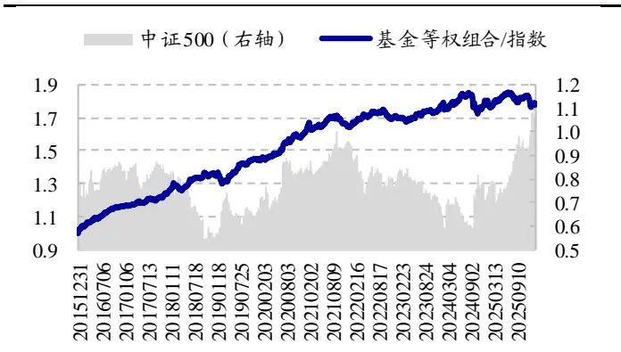
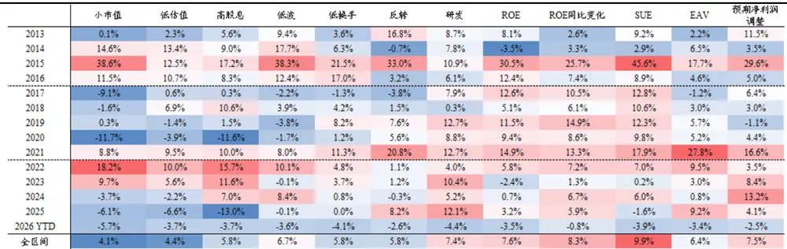
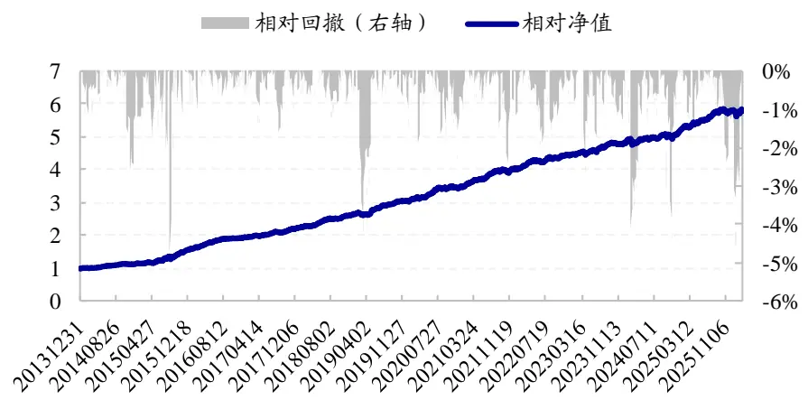
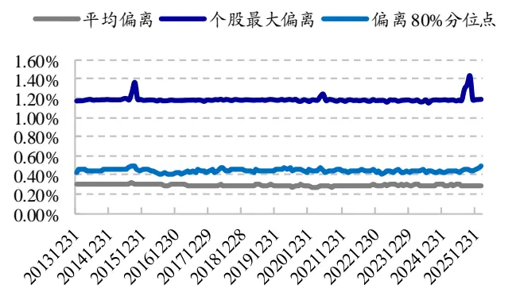
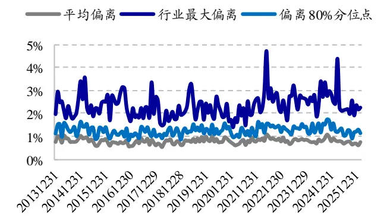
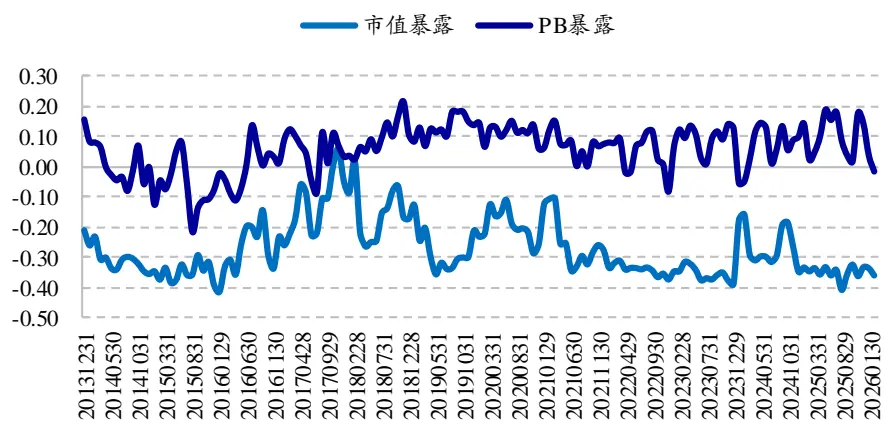

# 国泰海通量化选股系列（二）——中证 500指数增强策略的再探索

## 本报告导读：

基于 PLS 模型预期因子收益动态调整因子敞口，辅以成分股内 GARP50 卫星组合，构建复合中证 500 指数增强策略，2014.01-2026.02期间，组合相对基准指数年化超额 16.6%，2023 年以来年化超额收益 9.6%。

## 投资要点：

中证 500指数的特征演变：持股市值分位点上移，向中大市值特征[Table_Summary]演进；尾部个股权重减小，集中度增加； 年以来因子收益波动有所增大。结合这些特征与变化，本文尝试对中证 500 指数增强策略进行改进。

因子加权方式：在因子收益波动增加的背景下，考虑波动率的 ICIR加权相比仅考虑收益率的 IC均值方式更为稳定。2023年以来，ICIR加权的中证 500 指数增强策略年化超额 5.21%，相较于 IC 均值加权方式（年化超额 1.43%）收益明显提升。

O因子敞口的动态调整：在因子收益整体有所下滑的背景下，通过动态调整因子敞口来增加 alpha源，是可以提升收益的另一种有效方式。2023 年以来，基于 PLS 模型动态调整因子敞口，中证 500 指数增强策略的年化超额收益提升至 7.02%。

o搭建契合指数成分股的卫星策略：在中证 指数成分股内，构建GARP50 策略，2014年以来该组合相对基准年化超额收益 14.2%，年化跟踪误差 6.0%，信息比 2.20。将 30%的权重分配给 GARP50组合，复合增强策略 年以来相对基准的年化超额收益提升至9.6%，跟踪误差 4.38%。

风险提示。本文根据客观数据和评价指标计算，不作为对未来走势的判断和投资建议。历史回测不代表未来收益，存在历史统计规律失效风险、因子失效风险、模型误设风险，市场环境变化等均可能影响模型未来表现。

## 郑雅斌(分析师)

心021-23219395

zhengyabin@gtht.com

登记编号S0880525040105

罗蕾(分析师)

021-23185653

luolei@gtht.com

登记编号S0880525040014

## [Table_Repo相关报告

ETF 配置系列（一）：恰逢其时 2026.03.18

ETF配置系列（六）——四象限月度行业轮动策略2026.03.16

解码企业生命周期：股票投资的新范式探索2026.03.16

ETF配置系列（三）：构建不同风险偏好的 ETF配置策略 2026.03.03

量化 年度复盘系列——选股策略回顾2026.01.16

近年来，中证 500 指数增强策略获取超额收益难度加大。按年度等权汇总中证 500 指数增强基金，其相对中证 500 指数的超额收益相比于 2020年前，出现了明显下滑；跑赢基准指数的产品数量占比也明显降低。本文从指数特征变迁的角度分析可能存在的原因，并尝试通过多策略的方式，来改善中证 500 指数增强策略的业绩表现。

图1：等权中证 500 指数增强基金历年超额收益统计（2016.01-2026.02）

|  | 基金平均收 益 | 超额均值 | 超额中位数 | 超额为正基 金占比 |
| --- | --- | --- | --- | --- |
| 2016 | -17.8% | 13.7% | 11.6% | 100.0% |
| 2017 | -0.2% | 7.3% | 8.2% | 100.0% |
| 2018 | -33.3% | 5.8% | 6.5% | 100.0% |
| 2019 | 26.4% | 7.9% | 6.2% | 92.9% |
| 2020 | 20.9% | 13.3% | 12.9% | 92.6% |
| 2021 | 15.6% | 2.8% | 1.5% | 71.1% |
| 2022 | -20.3% | 2.9% | 2.9% | 87.5% |
| 2023 | -7.4% | 2.1% | 1.9% | 70.9% |
| 2024 | 5.5% | 2.4% | 3.0% | 77.4% |
| 2025 | 30.4% | 2.0% | 2.1% | 67.2% |
| 2026 | 16.0% | -2.3% | -2.2% | 7.8% |

资料来源：Wind，国泰海通证券研究

图2：等权中证 500指数增强基金相对净值走势

资料来源： ，国泰海通证券研究

## 1. 中证 500指数的特征演变

## 1.1. 中盘股向中大市值的演进

近年来，中证 500 指数的市值、权重结构都发生了一定变化。成分股市值由中盘股逐渐向中大市值演进，权重集中度也有所提升。

2011年，中证500指数成分股市值中位数46.8亿元，在全市场处于67.4%的分位点；而到 2025 年底，其市值中位数 310.1 亿元，在全市场处于 87.8%的分位点，逐渐接近 2011 年沪深 300 指数成分股市值分位点中位数水平。

除了市值增大以外，其权重集中度也有所提升。权重最大 20%个股的权重合计占比由 2011 年的 35.7%提升至 38.9%，而权重最小 20%个股的权重占比则由 10.8%下降至 7.9%。

图3：中证 500 指数成分股市值及权重集中度变化

|  | 市值中位数(亿元) |  |  | 市值分位点中位数 |  | bottom20%权重合计 |  | Top20%权重合计 |  |
| --- | --- | --- | --- | --- | --- | --- | --- | --- | --- |
|  | 全A | 沪深300 | 中证500 | 沪深300 | 中证500 | 沪深300 | 中证500 | 沪深300 | 中证500 |
| 2011.12 | 30.8 | 190.5 | 46.8 | 92.7% | 67.4% | 5.0% | 10.8% | 57.6% | 35.7% |
| 2012.12 | 30.5 | 214.4 | 53.6 | 93.4% | 71.3% | 5.0% | 11.0% | 58.8% | 35.9% |
| 2013.12 | 38.0 | 230.8 | 67.2 | 93.4% | 71.5% | 5.0% | 10.9% | 55.5% | 35.2% |
| 2014.12 | 53.8 | 345.3 | 99.6 | 93.7% | 73.7% | 4.9% | 11.9% | 58.2% | 40.4% |
| 2015.12 | 94.3 | 475.1 | 161.9 | 94.2% | 72.8% | 5.9% | 9.0% | 52.2% | 34.9% |
| 2016.12 | 83.8 | 407.7 | 148.8 | 94.1% | 75.4% | 5.8% | 10.6% | 54.0% | 33.2% |
| 2017.12 | 64.8 | 510.4 | 152.7 | 95.2% | 79.4% | 4.1% | 9.0% | 58.4% | 36.9% |
| 2018.12 | 40.9 | 381.9 | 113.2 | 95.5% | 80.9% | 4.2% | 8.5% | 59.6% | 36.1% |
| 2019.12 | 50.7 | 582.0 | 157.2 | 95.6% | 82.1% | 3.8% | 7.7% | 61.1% | 37.9% |
| 2020.12 | 55.2 | 853.8 | 199.1 | 96.1% | 82.4% | 4.0% | 7.0% | 60.4% | 41.4% |
| 2021.12 | 64.8 | 1095.8 | 248.1 | 96.6% | 84.1% | 4.6% | 7.2% | 56.7% | 38.8% |
| 2022.12 | 54.3 | 864.1 | 225.0 | 96.8% | 86.4% | 5.0% | 8.2% | 55.8% | 36.6% |
| 2023.12 | 56.6 | 818.3 | 226.2 | 97.0% | 87.7% | 5.1% | 8.6% | 53.9% | 34.7% |
| 2024.12 | 54.0 | 897.2 | 241.5 | 97.0% | 88.0% | 5.1% | 8.4% | 55.1% | 37.0% |
| 2025.12 | 70.3 | 1123.0 | 310.1 | 97.0% | 87.8% | 4.4% | 7.9% | 57.2% | 38.9% |

数据来源：国泰海通证券研究

随着成分股市值增加、尾部成分股权重合计占比减小，小市值因子在中证 500 指数成分股里的选股效果有所减弱。

如下表所示，我们统计指数成分股内权重最小 20%个股等权组合，相较于样本池（指数成分股）等权组合的超额收益。在小市值因子表现优异的年份，如 2014-2016 年、2021- 2023 年，中证 500 成分股内低权重组合也普遍具有较优表现。但这两年这一现象发生了明显变化，2025 年以来，即使小市值因子仍然表现突出，但在中证 500 指数成分股内，低权重个股却明显跑输基准。这种特征与沪深 300 指数成分股类似：小市值个股无明显优势，指数本身 beta 逐渐鲜明。

表1：中证 500指数成分股低权重组合 2025年以来表现减弱（截至 2026.02）

| 指数成分股内，低权重20%个股超额收益 中证 500 |  | 全A小市值因子 分5组多空收益 |
| --- | --- | --- |
|  | 沪深 300 |  |
| 2012 | -5.1% 2.8% | 7.7% |
| 2013 | -3.4% -0.1% | 36.7% |
| 2014 | -11.9% 2.9% | 30.2% |
| 2015 | 19.7% 22.0% | 167.2% |
| 2016 | -0.9% 8.0% | 29.6% |
| 2017 | -20.2% -4.3% | -30.1% |
| 2018 | -2.3% -2.8% | 7.6% |
| 2019 | -1.3% -6.5% | 3.8% |
| 2020 2021 | -14.7% -12.3% | -5.5% |
| 2022 | -4.4% 3.5% | 25.8% |
|  | 4.9% 13.0% | 25.6% |
| 2023 | 0.8% 2.7% | 41.5% |
| 2024 | 1.7% -1.6% | -5.5% |
| 2025 2026 YTD | -6.3% -5.3% | 36.7% |
|  | -0.6% -3.3% | 4.3% |
| 全区间 | -3.2% 1.0% | 21.2% |

资料来源：Wind，国泰海通证券研究

## 1.2. 因子收益波动增加

在中证 500 指数成分股中，选择单因子得分最高的 20%个股构建等权多头组合，考察其相对于中证 500 指数的日超额收益波动率，结果如下图所示。整体来看，近几年因子波动有所增加。

图4：中证 500 指数成分股内，因子多头超额收益分年度波动率（2013.01-2026.02）

|  | 小市值 低估值 高股息 低波 低换手 |  |  |  |  | 反转 | 研发 ROE |  | ROE同比变化 SUE |  | 预期净利润EAV调整 |  |
| --- | --- | --- | --- | --- | --- | --- | --- | --- | --- | --- | --- | --- |
| 2013 | 6.0% | 4.5% | 4.3% | 4.8% | 4.1% | 4.2% | 4.6% | 4.3% | 3.9% | 3.5% | 4.4% | 4.2% |
| 2014 | 6.0% | 4.4% | 4.7% | 4.8% | 4.3% | 3.9% | 4.0% | 3.7% | 3.8% | 3.8% | 3.6% | 3.6% |
| 2015 | 11.8% | 11.5% | 12.0% | 12.6% | 10.5% | 11.4% | 10.5% | 10.7% | 9.0% | 10.7% | 10.9% | 11.7% |
| 2016 | 5.4% | 4.6% | 4.5% | 4.4% | 4.4% | 5.5% | 3.9% | 4.1% | 4.1% | 3.7% | 4.2% | 4.4% |
| 2017 | 5.9% | 3.9% | 3.6% | 4.5% | 3.8% | 4.9% | 3.4% | 3.2% | 4.1% | 3.2% | 3.5% | 3.7% |
| 2018 | 8.3% | 4.7% | 4.2% | 5.0% | 4.0% | 5.6% | 4.9% | 4.2% | 4.1% | 3.9% | 4.2% | 3.7% |
| 2019 | 7.8% | 4.9% | 5.2% | 4.1% | 4.2% | 4.8% | 4.4% | 3.7% | 3.6% | 3.5% | 3.9% | 4.4% |
| 2020 | 10.1% | 8.0% | 9.0% | 6.9% | 5.5% | 4.9% | 4.5% | 4.5% | 4.5% | 3.9% | 4.9% | 6.1% |
| 2021 | 13.8% | 9.9% | 11.3% | 8.3% | 6.9% | 6.5% | 5.4% | 5.6% | 6.0% | 5.3% | 7.2% | 6.3% |
| 2022 | 9.6% | 7.7% | 10.5% | 5.5% | 5.0% | 5.0% | 5.1% | 4.6% | 4.2% | 3.8% | 5.4% | 4.9% |
| 2023 | 5.3% | 4.8% | 6.5% | 3.6% | 4.1% | 4.6% | 4.7% | 4.2% | 3.5% | 4.2% | 2.9% | 3.5% |
| 2024 | 12.0% | 6.7% | 8.7% | 4.4% | 5.5% | 6.7% | 6.2% | 4.7% | 4.5% | 3.4% | 4.2% | 4.3% |
| 2025 | 9.8% | 8.4% | 10.9% | 5.8% | 5.3% | 5.0% | 4.7% | 5.6% | 4.3% | 4.9% | 4.6% | 5.1% |
| 2026 | 13.2% | 9.3% | 12.8% | 8.0% | 6.3% | 5.4% | 5.3% | 9.0% | 5.5% | 6.6% | 5.6% | 6.1% |
| 全区间 | 9.1% 6.9% 8.0% |  |  | 6.2% | 5.5% | 5.9% 5.4% 5.3% |  |  | 4.8% 4.9% |  | 5.3% | 5.5% |

资料来源：Wind，国泰海通证券研究

## 1.3. 因子表现

统计中证 500 指数成分股中，单因子得分最高的 20%个股等权多头组合相对指数的超额收益，结果如图 5 所示。整体来看，基本面因子多头收益相对较高。特别是 ROE同比变化因子，年化超额收益 8.3%，分年度稳定性也较优。除增长类因子外，研发占比因子表现也相对较优，多头年化超额收益 。即在中证 指数成分股中，盈利能力是否改善、研发投入是否高，是相对较优的选股逻辑。

图5：中证 500 指数成分股内，因子分年度多头超额收益（2013.01-2026.02）

资料来源：Wind，国泰海通证券研究

图6：中证 500 指数成分股内，因子月超额收益相关系数（2013.01-2026.02）

|  |  | 小市值 低估值 高股息 低波 |  |  |  | 低换手 | 反转 | 研发 | ROE ROE同比变化 |  | SUE | EAV | 预期净利润调整 |
| --- | --- | --- | --- | --- | --- | --- | --- | --- | --- | --- | --- | --- | --- |
| 1 | 小市值 |  | 0.43 | 0.27 | 0.22 | -0.21 | -0.03 | -0.26 | -0.40 | -0.36 | -0.43 | -0.03 | -0.16 |
| 2 | 低估值 | 0.43 |  | 0.59 | 0.19 | 0.00 | -0.38 | -0.30 | -0.12 | -0.22 | -0.26 | -0.13 | -0.12 |
| 34 | 高股息 | 0.27 | 0.59 |  | 0.23 | -0.05 | -0.50 | -0.60 | 0.00 | -0.21 | -0.08 | -0.04 | 0.10 |
|  | 低波 | 0.22 | 0.19 | 0.23 |  | 0.31 | -0.08 | -0.16 | 0.04 | -0.12 | 0.07 | -0.11 | 0.17 |
| 5 | 低换手 | -0.21 | 0.00 | -0.05 | 0.31 |  | -0.03 | 0.12 | 0.28 | 0.06 | 0.31 | -0.01 | 0.07 |
| 6 | 反转 | -0.03 | -0.38 | -0.50 | -0.08 | -0.03 |  | 0.36 | 0.07 | 0.04 | 0.07 | 0.01 | -0.10 |
| 7 | 研发 | -0.26 | -0.30 | -0.60 | -0.16 | 0.12 | 0.36 |  | 0.15 | 0.11 | 0.13 | -0.09 | -0.27 |
| 8 | ROE | -0.40 | -0.12 | 0.00 | 0.04 | 0.28 | 0.07 | 0.15 |  | 0.48 | 0.64 | -0.03 | 0.28 |
|  | ROE同比变化 | -0.36 | -0.22 | -0.21 | -0.12 | 0.06 | 0.04 | 0.11 | 0.48 |  | 0.56 | 0.29 | 0.19 |
| 1 | 0 SUE | -0.43 | -0.26 | -0.08 | 0.07 | 0.31 | 0.07 | 0.13 | 0.64 | 0.56 |  | 0.07 | 0.30 |
| 1 | 1 EAV | -0.03 | -0.13 | -0.04 | -0.11 | -0.01 | 0.01 | -0.09 | -0.03 | 0.29 | 0.07 |  | 0.08 |
| 1 | 2 预期净利润调整 | -0.16 | -0.12 | 0.10 | 0.17 | 0.07 | -0.10 | -0.27 | 0.28 | 0.19 | 0.30 | 0.08 |  |

资料来源：Wind，国泰海通证券研究

## 1.4. 小结

2024 年以来，中证 500 指数成分股市值在全 A中的排序分位点中位数已超过 87%，反映指数由中盘特征向中大市值演进的特征。与之相应地，近几年中证 500 指数成分股中，小市值因子选股效果减弱，低权重个股相对指数并无明显优势，指数本身 beta 逐渐鲜明。

因子角度，在中证 500 指数成分股中，盈利能力是否改善、研发投入是否高，是相对较优的单因子选股逻辑。值得注意的是，近年来因子多头超额收益波动普遍有所增加。接下来，我们将以中证 500 指数的这些特征为基础，对可能的指数增强策略改进思路进行尝试。

## 2. 因子波动增加，ICIR加权稳定性优于IC加权

在因子收益波动增加的背景下，考虑波动率的 ICIR 加权方式，相比仅考虑收益率的 IC 均值方式，或许更具优势。

我们根据风格、量价、基本面等因子构建线性多因子收益预测模型，在市值 0.3、估值 0.1、个股 1%、行业 1%的偏离约束下，构建月度换仓的中证 500 指数增强组合。在多因子模型中，因子分别按照 IC 均值和 ICIR方式进行加权，其余条件保持不变，得到的两个优化组合相对指数扣费后的业绩表现如表 所示。

全区间来看，ICIR 加权相比于 IC 均值加权，年化收益提升约 0.8%，跟踪误差和相对回撤有所降低，信息比得到改善。特别是 2023 年以来，优化组合超额收益相较于前几年明显降低，但ICIR 加权方式受影响较小，相对优势明显。

换手率角度，改变加权方式对其无明显影响。IC 均值加权方式下，组合月均单边换手率 67%；ICIR 加权方式下，月均单边换手率 64%。

表2：ICIR 加权中证 500 指数增强组合历史业绩表现（2014.01-2026.02）

|  | 中证 | IC 均值加权 |  |  |  |  | ICIR加权 |  |  |  |  |
| --- | --- | --- | --- | --- | --- | --- | --- | --- | --- | --- | --- |
|  |  | 超额收 益 | 超额波 动率 | 信息比 | 相对回 撤 | 月胜率 | 超额收 益 | 超额波 动率 | 信息比 | 相对回 撤 | 月胜率 |
| 2014 | 500 39.0% | 26.9% | 4.4% | 4.08 | 3.2% | 83.3% | 18.0% | 4.2% | 2.95 | 3.2% | 75.0% |
| 2015 | 43.1% | 60.2% | 9.9% | 3.96 | 4.4% | 83.3% | 62.4% | 9.8% | 4.10 | 5.5% | 91.7% |
| 2016 | -17.8% | 23.3% | 4.4% | 5.85 | 2.0% | 100.0% | 21.9% | 4.6% | 5.42 | 2.2% | 100.0% |
| 2017 | -0.2% | 14.2% | 3.8% | 3.53 | 3.8% | 83.3% | 15.4% | 4.1% | 3.64 | 2.0% | 91.7% |
| 2018 | -33.3% | 10.9% | 4.7% | 3.29 | 3.2% | 83.3% | 13.4% | 4.3% | 4.44 | 1.7% | 100.0% |
| 2019 | 26.4% | 11.7% | 5.1% | 1.69 | 8.9% | 75.0% | 12.0% | 4.9% | 1.81 | 8.8% | 75.0% |
| 2020 | 20.9% | 14.3% | 5.2% | 2.21 | 4.7% | 83.3% | 13.5% | 5.3% | 2.07 | 4.2% | 75.0% |
| 2021 | 15.6% | 20.3% | 5.4% | 3.10 | 3.1% | 58.3% | 21.7% | 5.1% | 3.48 | 2.1% | 91.7% |
| 2022 | -20.3% | 7.8% | 4.8% | 1.95 | 3.0% | 66.7% | 6.7% | 4.2% | 1.96 | 2.3% | 58.3% |
| 2023 | -7.4% | 1.9% | 4.6% | 0.41 | 6.1% | 66.7% | 4.6% | 4.6% | 1.05 | 4.6% | 66.7% |
| 2024 | 5.5% | 2.4% | 7.5% | 0.19 | 10.9% | 50.0% | 4.6% | 5.9% | 0.61 | 7.0% | 50.0% |
| 2025 | 30.4% | 3.4% | 4.7% | 0.57 | 3.8% | 50.0% | 10.2% | 4.5% | 1.74 | 3.3% | 75.0% |
| 2026.02 | 16.0% | -3.4% | 8.3% | -2.73 | 3.4% | 0.0% | -2.6% | 9.3% | -1.92 | 3.7% | 0.0% |
| 全区间 | 6.9% | 14.6% | 5.7% | 2.34 | 10.9% | 72.6% | 15.4% | 5.4% | 2.60 | 8.8% | 78.1% |

资料来源：Wind，国泰海通证券研究

## 3. 因子暴露的动态调整

在因子收益整体下滑的背景下，通过动态调整因子暴露来增加 alpha 源，是可以尝试的另一种改善收益方式。

我们采用因子收益动量、波动、拥挤状态、市场涨跌等要素，构建预测下期因子收益的 PLS 模型。根据 PLS 模型预期收益将多因子模型中的因子从低到高分为 5 组，统计每组因子下期的平均收益如表 3 所示。

可见预期收益最低的一组因子表现相对较弱，波动大，而收益、胜率低。因此我们尝试在风控端，除了前文提到的市值、估值敞口暴露外，还将预期收益最低的 1/5 因子敞口暴露限制为 0.5。后文中，我们将增加了这条约束条件得到的优化组合简称为动态调整敞口组合。

注：由于 PLS 模型需要5 年回测窗口，因此在动态调整影响测试部分，我们主要回测 2018 年以来的收益。

表3：PLS 模型预期收益分组结果（2018.01-2026.02）

|  | 月均收益 | 月胜率 | 年化波动率 | 信息比 | p值 |
| --- | --- | --- | --- | --- | --- |
| D1 | 0.7% | 57.1% | 18.1% | 0.49 | 0.162 |
| D2 | 2.0% | 70.4% | 11.7% | 2.10 | 0.000 |
| D3 | 1.9% | 71.4% | 16.9% | 1.36 | 0.000 |
| D4 | 3.9% | 83.7% | 15.1% | 3.07 | 0.000 |
| D5 | 4.6% | 78.6% | 20.0% | 2.74 | 0.000 |

资料来源：Wind，国泰海通证券研究

全区间来看，动态调整敞口组合相比于基础组合，年化收益提升约 0.7%，跟踪误差和相对回撤有所降低，信息比得到改善。

表4：动态调整敞口组合历史业绩表现（2018.01-2026.02）

|  | 中证 超额收 | 基础组合（ICIR加权） |  |  |  |  | 动态调整敞口 |  |  |  |  |
| --- | --- | --- | --- | --- | --- | --- | --- | --- | --- | --- | --- |
|  |  | 益 | 超额波 动率 | 信息比 | 相对回 撤 | 月胜率 | 超额收 益 | 超额波 动率 | 信息比 | 相对回 撤 | 月胜率 |
| 2018 | 500 -33.3% | 13.3% | 4.3% | 4.40 | 1.7% | 100.0% | 13.4% | 4.3% | 4.41 | 1.7% | 100.0% |
| 2019 | 26.4% | 12.0% | 4.9% | 1.81 | 8.8% | 75.0% | 12.7% | 4.9% | 1.94 | 7.9% | 75.0% |
| 2020 | 20.9% | 13.5% | 5.3% | 2.07 | 4.2% | 75.0% | 13.5% | 5.3% | 2.07 | 4.2% | 75.0% |
| 2021 | 15.6% | 21.7% | 5.1% | 3.48 | 2.1% | 91.7% | 19.6% | 5.0% | 3.25 | 2.3% | 75.0% |
| 2022 | -20.3% | 6.7% | 4.2% | 1.96 | 2.3% | 58.3% | 7.3% | 4.0% | 2.24 | 2.7% | 66.7% |
| 2023 | -7.4% | 4.6% | 4.6% | 1.05 | 4.6% | 66.7% | 5.4% | 4.1% | 1.36 | 3.8% | 75.0% |
| 2024 | 5.5% | 4.6% | 5.9% | 0.61 | 7.0% | 50.0% | 5.0% | 5.6% | 0.73 | 7.2% | 50.0% |
| 2025 | 30.4% | 10.2% | 4.5% | 1.74 | 3.3% | 75.0% | 12.9% | 4.3% | 2.27 | 2.3% | 66.7% |
| 2026.02 | 16.0% | -2.6% | 9.3% | -1.92 | 3.7% | 0.0% | -0.7% | 8.8% | -0.60 | 3.5% | 0.0% |
| 全区间 | 4.1% | 10.3% | 5.0% | 1.93 | 8.8% | 72.4% | 11.0% | 4.8% | 2.12 | 7.9% | 71.4% |

资料来源：Wind，国泰海通证券研究

组合累计负超额收益 2.63%。而动态敞口调整组合，加入了预期收益较低因子——即 ROE、开盘后买入意愿强度、研发占比 3 个因子的敞口约束。实际上，研发占比、开盘后买入意愿强度这两个因子近期确实也发生了较大回撤，因此加入了敞口约束后的组合近期回撤小很多，近 3 个月的超额收益分别为 0.6%、-0.6%、-0.1%，明显优于初始组合。

表5：2025 年 12 月以来，具体调整的因子

|  | 2025.12 | 2026.01 | 2026.02 |
| --- | --- | --- | --- |
| ROE | 10.7% | 2.3% | -0.5% |
| 开盘后买入意愿强度 | -4.0% | 5.1% | -3.3% |
| 研发占比 | -3.0% | -3.9% | -4.2% |
| 基础组合超额 | 0.1% | -1.5% | -0.9% |
| 动态调整敞口超额 | 0.6% | -0.6% | -0.1% |

资料来源：Wind，国泰海通证券研究

## 4. 卫星策略

指数增强策略绝大部分权重都分布于成分股内，而近几年中证 500 指数尾部个股权重逐渐降低，指数本身特征有所加强。在这种情况下，我们可尝试在指数成分股内搭建针对性的多因子选股模型，以弥补全市场多因子模型在成分股内的局限性。

为减小波动，我们整体基于均衡逻辑来构建策略，平衡个股估值与公司基本面，具体来看：

- 低 beta 个股剔除：剔除中证 500 指数成分股中，权重最低的 100只股票。

GARP 选股：根据个股 PB、ROE同比变化、研发占比 3 个因子等权打分，选择复合得分最高的 50 只股票构建等权组合。

月度换仓，组合月均单边换手率 25%。扣除单边千 2 交易成本后，中证 500 域内 GARP 组合年化收益 21.1%，相较于指数年化超额 14.2%，跟踪误差 6.0%，信息比 2.2。

分年度来看，在指增 alpha 有所衰弱的近几年，GARP 策略体现了较优的稳健性，2021 年以来年化超额收益仍保持在 6%以上，与前文的多因子优化指增组合形成一定的互补。

表6：域内 GARP 组合历史业绩表现（2014.01-2026.02）

|  | 组合收 益 | 中证500 | 超额收 益 | 超额波 动率 | 信息比 | 相对回 撤 | 月胜率 |
| --- | --- | --- | --- | --- | --- | --- | --- |
| 2014 | 49.8% | 39.0% | 10.8% | 5.0% | 1.52 | 3.5% | 50.0% |
| 2015 | 69.4% | 43.1% | 26.3% | 10.8% | 1.88 | 9.9% | 75.0% |
| 2016 | -8.1% | -17.8% | 9.6% | 5.4% | 2.11 | 2.8% | 75.0% |
| 2017 | 16.0% | -0.2% | 16.2% | 4.3% | 3.62 | 2.1% | 83.3% |
| 2018 | -24.9% | -33.3% | 8.5% | 4.8% | 2.66 | 3.2% | 75.0% |
| 2019 | 51.5% | 26.4% | 25.2% | 5.3% | 3.54 | 2.1% | 83.3% |
| 2020 | 44.6% | 20.9% | 23.7% | 5.7% | 3.29 | 2.9% | 83.3% |
| 2021 | 25.0% | 15.6% | 9.4% | 6.8% | 1.25 | 10.6% | 58.3% |
| 2022 | -10.8% | -20.3% | 9.5% | 5.9% | 2.00 | 3.6% | 66.7% |
| 2023 | -0.7% | -7.4% | 6.7% | 4.1% | 1.80 | 3.3% | 83.3% |
| 2024 | 25.0% | 5.5% | 19.5% | 4.9% | 3.53 | 2.6% | 91.7% |
| 2025 | 41.9% | 30.4% | 11.5% | 6.1% | 1.40 | 4.7% | 58.3% |
| 2026 | 17.8% | 16.0% | 1.8% | 6.5% | 1.84 | 1.7% | 50.0% |
| 全区间 | 21.1% | 6.9% | 14.2% | 6.0% | 2.20 | 10.6% | 73.3% |

资料来源：Wind，国泰海通证券研究

我们采用核心-卫星的方式，将 70%的权重分配给原来优化框架下的指增组合，30%的权重则分配给域内GARP 策略，构建复合中证 500 指数增强策略。

2014 年以来，组合月均单边换手率 51.6%，年化双边换手 12.4 倍。扣除单边千 2 交易成本后，组合 2014 年以来相对指数年化超额收益 16.6%，跟踪误差 4.7%，信息比 3.21，月胜率 80%。

图7：复合中证 500指数增强策略相对指数净值走势（2014.01-2026.02）

数据来源：国泰海通证券研究

表7：复合中证 500指数增强策略历史业绩表现（2014.01-2026.02）

|  | 组合收 益 | 中证500 | 超额收 益 | 超额波 动率 | 信息比 | 相对回 撤 | 月胜率 |
| --- | --- | --- | --- | --- | --- | --- | --- |
| 2014 | 58.6% | 39.0% | 19.6% | 3.8% | 3.55 | 2.6% | 83.3% |
| 2015 | 99.1% | 43.1% | 56.0% | 9.2% | 4.00 | 4.8% | 91.7% |
| 2016 | 1.2% | -17.8% | 19.0% | 4.1% | 5.32 | 1.0% | 100.0% |
| 2017 | 14.4% | -0.2% | 14.7% | 3.4% | 4.14 | 1.6% | 91.7% |
| 2018 | -20.8% | -33.3% | 12.5% | 3.6% | 4.97 | 1.2% | 91.7% |
| 2019 | 43.9% | 26.4% | 17.5% | 3.9% | 3.34 | 4.2% | 83.3% |
| 2020 | 38.0% | 20.9% | 17.2% | 4.3% | 3.23 | 2.3% | 75.0% |
| 2021 | 33.8% | 15.6% | 18.2% | 4.2% | 3.63 | 2.8% | 66.7% |
| 2022 | -11.4% | -20.3% | 8.9% | 3.7% | 2.94 | 2.0% | 83.3% |
| 2023 | -0.2% | -7.4% | 7.2% | 3.4% | 2.26 | 2.6% | 75.0% |
| 2024 | 14.0% | 5.5% | 8.5% | 4.9% | 1.55 | 4.4% | 66.7% |
| 2025 | 44.2% | 30.4% | 13.8% | 4.2% | 2.43 | 2.4% | 58.3% |
| 2026 | 16.6% | 16.0% | 0.6% | 7.2% | 0.44 | 2.5% | 50.0% |
| 全区间 | 23.5% | 6.9% | 16.6% | 4.7% | 3.21 | 4.8% | 80.1% |

资料来源：Wind，国泰海通证券研究

统计复合组合相对中证 500 指数的个股偏离、行业偏离情况，结果如以下两图所示。平均个股偏离为 0.29%，个股偏离 80%分位点为 0.44%，即绝大部分股票相对基准的偏离均在 0.44%以内。行业角度，平均偏离 0.79%；偏离80%分位点为1.25%，即绝大部分行业相对基准的偏离均在1.25%以内。

图8：复合组合相对指数个股偏离（2014.01-2026.02）

资料来源：Wind，国泰海通证券研究

图9：复合组合相对指数行业偏离（2014.01-2026.02）

资料来源：Wind，国泰海通证券研究

风格角度，复合组合相对基准指数的市值暴露基本都在0.4 倍标准差内，估值暴露大部分时候在 0.2 倍标准差内。

图10：复合组合相对基准指数因子暴露（2014.01-2026.02）

数据来源：Wind，国泰海通证券研究

## 5. 总结

2024 年以来，中证 500 指数成分股市值在全 A中的排序分位点中位数已超过 87%，反映指数由中盘特征向中大市值演进的特征。与之相应地，近几年中证 500 指数成分股中，小市值因子选股效果减弱，低权重个股相对指数并无明显优势，且尾部个股权重逐渐降低，指数本身特征有所加强。

因子角度，在中证 500 指数成分股中，盈利能力是否改善、研发投入是否高，是相对较优的单因子选股逻辑。值得注意的是，近年来因子多头超额收益波动普遍有所增加。结合这些特征与变化，本文尝试对中证 500指数增强策略进行改进。

因子加权方式：在因子收益波动增加的背景下，考虑波动率的 ICIR 加权比仅考虑收益率的 均值方式更为稳定。 年以来， 加权的中证 500 指数增强策略年化超额 5.21%，相较于 IC 均值加权方式（年化超额1.43%）收益明显提升。

因子敞口的动态调整：在因子收益整体有所下滑的背景下，通过动态调整因子暴露来增加 alpha 源，是可以尝试的另一种改善收益方式。2023年以来，基于 PLS 模型动态调整因子敞口的中证 500 指数增强策略年化超额收益提升至 7.02%。

搭建契合指数成分股的卫星策略：在中证 500 指数成分股内，构建GARP50 策略，2014 年以来该组合相对基准年化超额收益 14.2%，年化跟踪误差 6.0%，信息比 2.20。将 30%的权重分配给 GARP50 组合，复合增强策略 2023 年以来相对基准的年化超额收益提升至 9.6%，跟踪误差 4.38%。

## 6. 风险提示

本文根据客观数据和评价指标计算，不作为对未来走势的判断和投资建议。历史回测不代表未来收益，存在历史统计规律失效风险、因子失效风险、模型误设风险，市场环境变化等均可能影响模型未来表现。

## 本公司具有中国证监会核准的证券投资咨询业务资格

## 分析师声明

作者具有中国证券业协会授予的证券投资咨询执业资格或相当的专业胜任能力，保证报告所采用的数据均来自合规渠道，分析逻辑基于作者的职业理解，本报告清晰准确地反映了作者的研究观点，力求独立、客观和公正，结论不受任何第三方的授意或影响，特此声明。

## 免责声明

本报告仅供国泰海通证券股份有限公司（以下简称“本公司”）的客户使用。本公司不会因接收人收到本报告而视其为本公司的当然客户。本报告仅在相关法律许可的情况下发放，并仅为提供信息而发放，概不构成任何广告。

本报告的信息来源于已公开的资料，本公司对该等信息的准确性、完整性或可靠性不作任何保证。本报告所载的资料、意见及推测仅反映本公司于发布本报告当日的判断，本报告所指的证券或投资标的的价格、价值及投资收入可升可跌。过往表现不应作为日后的表现依据。在不同时期，本公司可发出与本报告所载资料、意见及推测不一致的报告。本公司不保证本报告所含信息保持在最新状态。同时，本公司对本报告所含信息可在不发出通知的情形下做出修改，投资者应当自行关注相应的更新或修改。

本报告中所指的投资及服务可能不适合个别客户，不构成客户私人咨询建议。在任何情况下，本报告中的信息或所表述的意见均不构成对任何人的投资建议。在任何情况下，本公司、本公司员工或者关联机构不承诺投资者一定获利，不与投资者分享投资收益，也不对任何人因使用本报告中的任何内容所引致的任何损失负任何责任。投资者务必注意，其据此做出的任何投资决策与本公司、本公司员工或者关联机构无关。

本公司利用信息隔离墙控制内部一个或多个领域、部门或关联机构之间的信息流动。因此，投资者应注意，在法律许可的情况下，本公司及其所属关联机构可能会持有报告中提到的公司所发行的证券或期权并进行证券或期权交易，也可能为这些公司提供或者争取提供投资银行、财务顾问或者金融产品等相关服务。在法律许可的情况下，本公司的员工可能担任本报告所提到的公司的董事。

市场有风险，投资需谨慎。投资者不应将本报告作为作出投资决策的唯一参考因素，亦不应认为本报告可以取代自己的判断。在决定投资前，如有需要，投资者务必向专业人士咨询并谨慎决策。

本报告版权仅为本公司所有，未经书面许可，任何机构和个人不得以任何形式翻版、复制、发表或引用。如征得本公司同意进行引用、刊发的，需在允许的范围内使用，并注明出处为“国泰海通证券研究”，且不得对本报告进行任何有悖原意的引用、删节和修改。

若本公司以外的其他机构（以下简称“该机构”）发送本报告，则由该机构独自为此发送行为负责。通过此途径获得本报告的投资者应自行联系该机构以要求获悉更详细信息或进而交易本报告中提及的证券。本报告不构成本公司向该机构之客户提供的投资建议，本公司、本公司员工或者关联机构亦不为该机构之客户因使用本报告或报告所载内容引起的任何损失承担任何责任。

## 评级说明

## 投资建议的比较标准

投资评级分为股票评级和行业评级。

以报告发布后的 12个月内的市场表现为比较标准，报告发布日后的 个月内的公司股价（或行业指数）的涨跌幅相对同期的沪深 300 指数涨跌幅为基准。

## 国泰海通证券研究所

地址 上海市黄浦区中山南路 888号

| 评级 |  | 说明 |
| --- | --- | --- |
| 股票投资评级 | 增持 | 相对沪深 300 指数涨幅 15%以上 |
|  | 谨慎增持 | 相对沪深 300 指数涨幅介于5%~15%之间 |
|  | 中性 | 相对沪深 300 指数涨幅介于-5%~5% |
|  | 减持 | 相对沪深 300 指数下跌 5%以上 |
| 行业投资评级 | 增持 | 明显强于沪深 300 指数 |
|  | 中性 | 基本与沪深 300 指数持平 |
|  | 减持 | 明显弱于沪深 300 指数 |

邮编 200011

电话（021）38676666