# 国泰海通量化选股系列（三）

## 融合深度学习因子的500 增强多策略组合实证

## 本报告导读：

传统多因子受限于因子表现的时序、截面波动，指数增强效果已经有显著退化。通过多策略方式，最大化因子选股效果，可以显著的提升最终指数增强效果。

## 投资要点：

[T le_Summary] 常规多因子的指数增强策略在实践中已经有非常多的问题亟待解决：因子对于组合的表现提升，无论在时序上还是截面中，均有一定程度的波动特性，以IC 为选股效果度量，全市场范围内在过去一段时间段有很好表现的因子，并不一定意味着其在特定选股域内也有显著的选股效果。不同周期间因子难以复合，特异性复合方式难以实施，复合因子参数差异难以在回归中体现等问题也会拖累传统多因子组合表现。

通过构建不同因子类型子策略，再在终端进行组合优化可以显著提升指数增强效果：500 成分内，复合因子表现显著优于单纯的多粒度因子与小市值高增长因子，虽然相较于小市值高增长因子放大了回撤，但从收益与信息比角度有显著的增强。整体来看，多策略复合表现远优于传统多因子方法所构建的增强组合，年化收益提升10%左右，信息比也有明显提升。

0多策略的增强组合构建方案仍有很多问题值得研究探讨：一方面在子策略的逐步复合过程中，单纯参照策略的历史表现并不一定最优权重配置方案，需要进一步研究更多的权重配置可行性。另一方面，受限于目前策略不够丰富，在最终的组合构建时难以进行精细化的风险因子暴露控制，由于最终放入优化器的只有两个资产，因此强行进行行业或其他风险因子暴露控制会导致优化器无法求得最优解。目前的多策略方法会有换手率失控的风险，从本文所述策略来看，最终换手率往往高达 20倍左右，而同样因子的传统多因子组合换手率只有8倍左右。

风险提示。市场系统性风险、海外市场波动风险、模型误设风险。

郑雅斌(分析师)

心021-23219395

zhengyabin@gtht.com

登记编号S0880525040105

余浩淼(分析师)

021-23185650

yuhaomiao@gtht.com

登记编号S0880525040013

## [Table_Rep相关报告

相对收益策略之风格及行业轮动策略 2026.04.03国泰海通量化选股系列（二）——中证 500指数增强策略的再探索 2026.03.27

ETF 配置系列（一）：恰逢其时 2026.03.18

ETF配置系列（六）——四象限月度行业轮动策略 2026.03.16

解码企业生命周期：股票投资的新范式探索2026.03.16

## 1. 多因子模式的指数增强策略

## 1.1. 常规多因子方法的指数增强策略构建

对于量化指数增强模型，多因子方式往往是最常用的模型构建方法，该方式往往由以下三步：

- 挑选选股能力最优的多个因子。

- 挑选适合的收益预测模型，利用最新期多因子获得股票预期收益向量。

- 根据风控要求，利用优化器以预期收益向量为个股权重系数获得组合权重。

其中，决定组合收益高低的主要由前两步决定。随着量化选股的逐年发展，有效因子层面虽然依旧推陈出新，但找到在全域范围内均可以有效提升选股效果的因子难度已经愈发增大。很多时候，新老因子对于组合的表现提升，无论在时序上还是截面中，均有一定程度的波动特性，以IC 为选股效果度量，全市场范围内在过去一段时间段有很好表现的因子，并不一定意味着其在特定选股域内也有显著的选股效果。

以小市值高增长组合所用到的多因子为例，该组合使用盈利加速，改进市净率，研发占比，ROE（波动率调整与一致预期调整），SUE（波动率调整与一致预期调整），市值，尾盘成交占比，大单净买入占比 8个因子等权构建，其中，市值与尾盘成交占比因子值进行了取反处理。我们分别考察该8个因子在全市场与中证500指数中的表现，如下表：

表 1 小市值高增长不同因子表现（2020.01-2026.03）

|  | IC | IC-IR | 多头收益 | 多头胜率 |  | 空头收益 | 空头胜率 | 多空收益 | 多空胜率 |
| --- | --- | --- | --- | --- | --- | --- | --- | --- | --- |
| 盈利加速 | 全市场 | 0.012 | 2.554 | 0.48% | 58.1% | -0.07% | 45.9% | 0.55% | 63.5% |
|  | 500 成分 | 0.007 | 0.742 | 0.09% | 43.2% | -0.29% | 40.5% | 0.38% | 47.3% |
| 改进市净 | 全市场 | 0.035 | 1.897 | 0.13% | 43.2% | -0.85% | 29.7% | 0.99% | 51.4% |
| 率 | 500成分 | 0.022 | 0.765 | -0.09% | 40.5% | -0.15% | 44.6% | 0.05% | 47.3% |
| 研发占比 | 全市场 | 0.008 | 0.538 | 0.11% | 50.0% | -0.29% | 41.9% | 0.40% | 52.7% |
|  | 500成分 | 0.015 | 0.658 | 0.59% | 55.4% | -0.28% | 41.9% | 0.87% | 52.7% |
| ROE | 全市场 | -0.010 | -0.649 | -0.35% | 44.6% | -0.04% | 48.6% | -0.31% | 41.9% |
|  | 500成分 | -0.002 | -0.095 | -0.21% | 47.3% | 0.11% | 43.2% | -0.32% | 51.4% |
| SUE | 全市场 | 0.020 | 2.305 | 0.41% | 51.4% | -0.41% | 39.2% | 0.82% | 59.5% |
|  | 500成分 | 0.024 | 1.776 | 0.55% | 50.0% | -0.47% | 40.5% | 1.01% | 54.1% |
| 市值 | 全市场 | 0.037 | 1.893 | 1.02% | 78.4% | -0.49% | 40.5% | 1.52% | 67.6% |
|  | 500成分 | -0.001 | -0.060 | -0.29% | 39.2% | -0.11% | 48.6% | -0.18% | 44.6% |
| 尾盘成交 | 全市场 | 0.020 | 3.726 | 0.26% | 56.8% | -0.71% | 20.3% | 0.97% | 68.9% |
| 占比 | 500成分 | 0.015 | 1.987 | 0.19% | 48.6% | -0.50% | 35.1% | 0.69% | 60.8% |
| 大单净买 | 全市场 | 0.027 | 6.707 | 0.52% | 70.3% | -0.64% | 28.4% | 1.16% | 81.1% |
| 入占比 | 500 成分 | 0.024 | 2.669 | -0.05% | 47.3% | -0.74% | 36.5% | 0.69% | 60.8% |

资料来源：Wind，国泰海通证券研究

上表中因子表现可以看出，部分因子在全市场与 500 成分内有明显的差异，其中市值因子在全市场表现明显小盘股效应，而 500成分内IC 均值接近 0。绝大部分因子，无论全市场与500成分内表现差异是否很大，其全市场 IC-IR均显著高于 500成分内IC-IR。综上说明因子在截面与时序上均有显著的不稳定性，而缩小回归时的标的范围，虽然理论上可以体现因子截面表现的差异程度，但会大大增加回归参数的不稳定性，复合因子表现也会受到影响。

我们将小市值高增长因子以等权与域内加权两种形式分别构建复合因子，考察全市场复合因子与 500成分内复合因子的月度表现，如下表：

表 2 小市值高增长不同复合因子表现（2020.01-2026.03）

|  | IC | IC-IR | 多头收益 | 多头胜率 | 空头收益 | 空头胜率 | 多空收益 | 多空胜率 |
| --- | --- | --- | --- | --- | --- | --- | --- | --- |
| 市值等权 | 全市场 0.055 | 8.600 | 0.97% | 79.7% | -1.38% | 8.1% | 2.35% | 93.2% |
|  | 500成分 0.038 | 3.483 | 0.53% | 60.8% | -0.99% | 27.0% | 1.52% | 70.3% |
| 无市值等权 | 全市场 0.041 | 6.209 | 0.79% | 70.3% | -1.13% | 14.9% | 1.92% | 75.7% |
|  | 500成分 | 0.039 | 3.387 0.82% | 60.8% | -0.81% | 37.8% | 1.63% | 67.6% |
| 市值回归 | 全市场 0.043 | 2.334 | 0.65% | 55.4% | -0.87% | 37.8% | 1.52% | 62.2% |
|  | 500成分 | 0.018 0.693 | 0.01% | 51.4% | -0.13% | 48.6% | 0.14% | 52.7% |
| 无市值回归 | 全市场 0.041 | 2.384 | 0.42% | 50.0% | -1.03% | 32.4% | 1.45% | 58.1% |
|  | 500成分 | 0.023 0.905 | 0.31% | 54.1% | -0.30% | 44.6% | 0.61% | 54.1% |

资料来源：Wind，国泰海通证券研究

考虑到市值因子对于复合因子影响的差异性，我们分别以包含市值的8因子以及不包含市值的 7 因子构建复合因子，同时分别采用回归法与等权法确定因子系数。

总体来看，等权法的复合因子显著优于回归法的复合因子，尤其从 IC稳定性与多空、多头胜率的角度来看。这说明小市值高增长中部分因子由于受到自身稳定性较差的影响，回归法反而会给到更差的因子更高权重，从而导致复合因子表现更差。而从全市场与 500 比较的维度来看，在 500 成分内，去除市值因子后复合因子表现明显更优，而全市场角度来看，加入市值因子会在整体上给组合以更优的多头表现。这也充分体现了市值这一风格因子在截面上表现的巨大差异。

那么，对于多粒度因子，这种利用 Level2 行情，基于深度学习这一复杂非线性模型所构建的复合因子是否依然有截面表现与时序表现稳定性差异呢，我们考察多粒度因子周度表现，如下表：

表 3 多粒度因子表现（2020.01-2026.03）

|  | IC | IC-IR | 多头收益 | 多头胜率 | 空头收益 | 空头胜率 | 多空收益 | 多空胜率 |
| --- | --- | --- | --- | --- | --- | --- | --- | --- |
| 全市场 | 0.075 | 4.518 | 0.49% | 68.0% | -1.13% | 21.6% | 1.62% | 77.7% |
| 500 成分 | 0.046 | 2.129 | 0.23% | 54.5% | -0.52% | 37.0% | 0.74% | 61.1% |

资料来源：Wind，国泰海通证券研究

多粒度因子的全市场表现与 500 成分表现差异度远大于小市值高增长因子，其 500 成分内多头表现月度化后，与无市值的小市值高增长组合接近，但周度胜率很低，因子500 成分内表现大概率低于小市值高增长组合。

进一步的，我们用多粒度因子与小市值高增长的复合因子构建全市场空气值增组合，相对 wind全A 等权表现如下表：

表 4 多粒度与小市值高增长全市场等权组合超额表现（2020.01-2026.03）

| 年化收益 |  | 信息比 | 最大回撤 | 收益回撤比 |
| --- | --- | --- | --- | --- |
| 多粒度日度 | 25.03% | 2.202 | 20.82% | 1.202 |
| 多粒度周度 | 27.20% | 2.365 | 19.07% | 1.427 |
| 小市值高增长 | 14.03% | 2.215 | 7.48% | 1.875 |

资料来源：Wind，国泰海通证券研究

图1：多粒度与小市值高增长全市场等权组合净值超额走势（2020.01-2026.03）
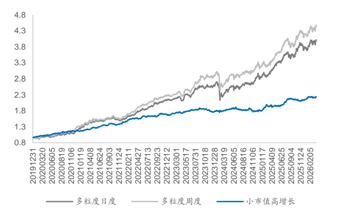
资料来源：Wind，国泰海通证券研究

图2：多粒度与小市值高增长全市场等权组合分年度超额表现（2020.01-2026.03）
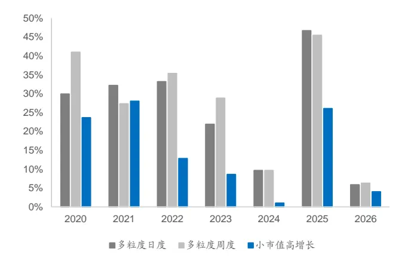
资料来源：Wind，国泰海通证券研究

而如果我们用同样因子，构建 500 成分内组合，其超额收益情况如下表：

表 5 多粒度与小市值高增长 500 成分内组合超额表现（2020.01-2026.03）25

|  | 年化收益 | 信息比 | 最大回撤 | 收益回撤比 |
| --- | --- | --- | --- | --- |
| 多粒度日度 | 8.52% | 0.865 | 15.78% | 0.539 |
| 多粒度周度 | 8.93% | 0.901 | 18.35% | 0.486 |
| 小市值高增长 | 9.67% | 1.899 | 6.28% | 1.542 |

资料来源：Wind，国泰海通证券研究

图3：多粒度与小市值高增长 500 成分内组合超额净值走势（2020.01-2026.03）
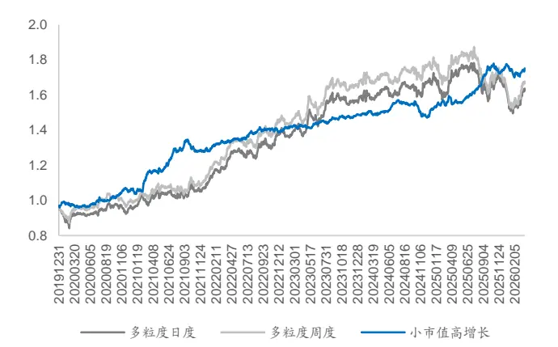
资料来源：Wind，国泰海通证券研究

图4：多粒度与小市值高增长 500 成分内组合超额分年度表现（2020.01-2026.03）
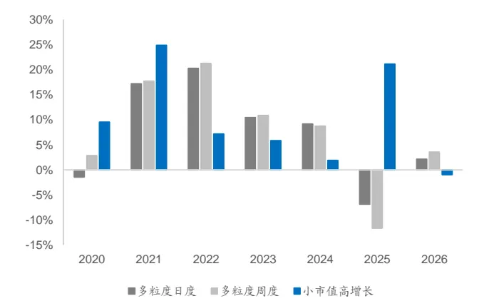
资料来源：Wind，国泰海通证券研究

整体来看，多粒度因子在全市场空气指增表现更稳突出，小市值高增长组合（剔除市值因子）在 500成分内有更好的表现。但如果仔细观察净值曲线，不同时间区段多粒度因子与小市值高增长的表现也会有一定程度分化，走势优劣并非长期稳定持续。

## 1.2. 多因子模式的指数增强组合劣势汇总

从上述分析可知，因子在时序与截面上表现往往会有显著分化，这会导致利用回归法进行多因子的因子收益回归时，无法基于因子的历史表现简单的给因子赋权。

单纯的域内回归会面临严重的回归系数波动问题，而全域回归的系数可能完全无法与域内的因子表现适配。简单的等权复合显然难称最优解，因子表现的优劣无法在因子权重中体现。从多粒度因子的表现来看，复杂的深度学习模型依然要面临线性模型相同的问题。

除此之外，多因子模型还有如下劣势：

不同周期间因子难以复合：多粒度因子的训练 Lable 窗口为一周与两周，因此因子往往用以构建日度或周度换仓组合。小市值高增长因子又是月度组合，不同周期频率的因子难以简单的混合叠加获得最优的因子权重。

特异性复合方式难以实施：无论用回归法还是简单等权，均是以因子多头信息为主，而从多粒度因子的表现情况来看，尤其在 500成分内，其空头效应显著的优于多头效应。因此空头反向剔除反到可能是更优的组合构建方法，而这种方法难以利用回归或简单等权构建，深度学习等黑盒模型又无法控制合成方式。

复合因子参数差异难以在回归中体现：复合因子的不同细微参数差异也会带来组合在时序上的表现提升，然而由于其高相关性，简单的将其放入回归或者等权模型，会导致在某些风格上的额外暴露，被动提升组合风险。

因此，我们尝试以多策略的形式，分层对不同因子，不同参数构建的多个子策略组合进行筛选、融合，并最终构建增强组合，从而争取达到相较于传统多因子组合更优的指数增强效果。

## 2. 多策略方法的指数增强策略

## 2.1. 基础子策略的构建

基础子策略以500 成分内、全市场两个选股域，以及小市值高增长、多粒度因子两类复合因子，构建四个大类子策略，即：

- 500成分内多粒度策略。

- 500成分内高增长策略（去除市值的小市值高增长复合因子）。

- 全市场多粒度策略。

- 全市场小市值高增长策略

上述同类参数策略，可以通过不同的参数叠加从而构建更加丰富的子策略，其选用的参数如下：

策略激进程度，即策略个股的最大权重。这里我们设定为 1%，2%，与5%三挡。

反向剔除权重即多粒度因子，小市值高增长因子各自利用对方负向效应，现对于股票池进行删减，然后在进行多头选股。有 1%，2%，5%，10%四组参数。小市值高增长对多粒度因子进行空头删减时，无论 500 成分内还是全市场，均采用不包含市值的高增长复合因子。用多粒度因子对小市值高增长因子进行空头删减时，以周频对股票池进行调整。

对于多粒度因子而言，考虑到日度换仓与周度换仓差异，会同时构建日度与周度换仓组合。

以上子策略组合中，小市值高增长为月度换仓组合，因此不进行任何换手约束。周度多粒度组合会进行 30%换手率约束，日度多粒度组合换手约束则设定为6%。考虑到多粒度因子在全市场表现往往远优于小市值高增长因子，因此这里并不添加全市场的小市值高增长因子。

## 2.2. 基础子策略的复合

对于最终以 500 增强为目标进行组合构建，我们需要将上述子策略复合为 500 成分内选股组合与全市场选股组合。考虑到同源子策略的高相关性，我们将复合过程分按如下步骤进行。

图5：基础子策略复合过程
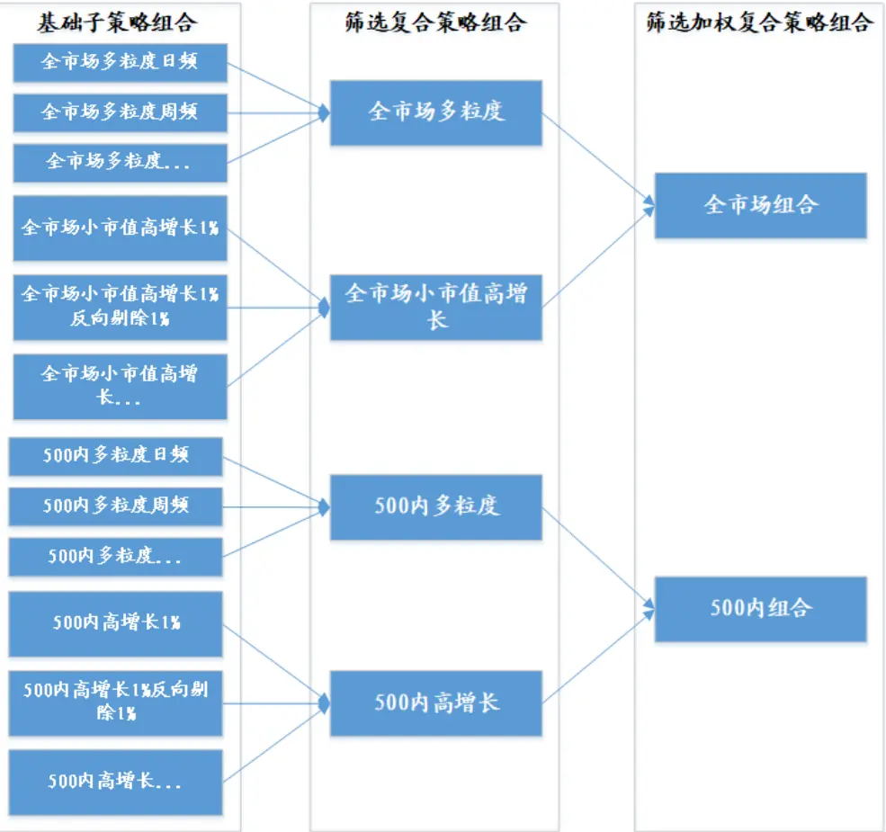
数据来源：Wind，国泰海通证券研究

首先，我们以过去一段时间，同选股域，同基础复合因子的基础子策略的收益率T 值进行比较，筛选出表现最好的组合得到四个复合策略。

考虑到不同基础策略相关性更低，因此第二步的复合过程虽然会同样参考因子收率 T 值，但不再是单纯筛选，如果策略间表现差异不够大，则会按照一定比例进行复合，最终得到 500 成分内与全市场的筛选加权复合策略。

我们分别比较复合策略与上述复合因子构建的策略全市场表现，如下表：

表6 多粒度，小市值高增长，复合因子全市场等权组合表现（2020.01-2026.03）

| 年化收益 | 信息比 | 最大回撤 | 收益回撤比 |
| --- | --- | --- | --- |
| 多粒度日度 25.03% | 2.202 | 20.82% | 1.202 |
| 多粒度周度 27.20% | 2.365 | 19.07% | 1.427 |
| 小市值高增长 14.03% | 2.215 | 7.48% | 1.875 |
| 复合因子 24.42% | 2.024 | 22.44% | 1.088 |

资料来源：Wind，国泰海通证券研究

图6：多粒度，小市值高增长，复合因子全市场组合超额净值走势（2020.01-2026.03）
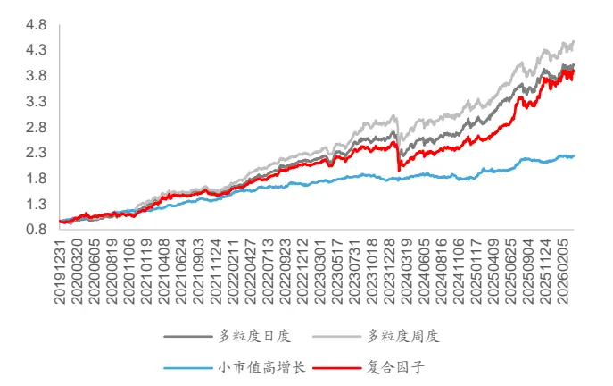
资料来源：Wind，国泰海通证券研究

图7：多粒度，小市值高增长，复合因子全市场组合超额分年度表现（2020.01-2026.03）
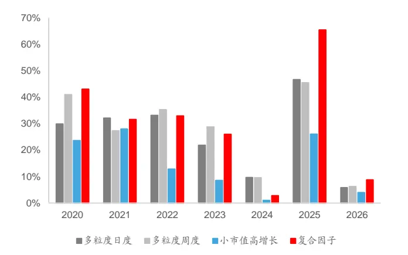
资料来源：Wind，国泰海通证券研究

复合因子表现整体位于多粒度因子与小市值高增长因子之间的水平，但在 25年以来，复合因子表现非常强势，明显强于多粒度因子与小市值高增长因子。

比较复合策略与上述复合因子构建的策略500成分内表现，如下表：

表7 多粒度，小市值高增长，复合因子成分内等权组合超额表现（2020.01-2026.03）

| 年化收益 |  | 信息比 | 最大回撤 | 收益回撤比 |
| --- | --- | --- | --- | --- |
| 多粒度日度 | 8.52% | 0.865 | 15.78% | 0.539 |
| 多粒度周度 | 8.93% | 0.901 | 18.35% | 0.486 |
| 小市值高增长 | 9.67% | 1.899 | 6.28% | 1.542 |
| 复合因子 | 12.72% | 1.921 | 9.70% | 1.311 |

资料来源：Wind，国泰海通证券研究

图8：多粒度，小市值高增长，复合因子 500 成分组合超额净值超额走势（2020.01-2026.03）
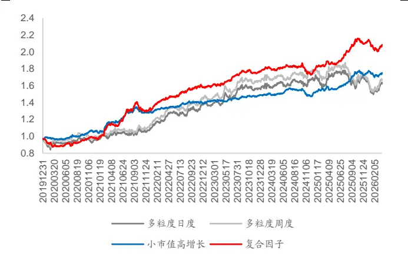
资料来源：Wind，国泰海通证券研究

图9：多粒度，小市值高增长，复合因子 500 成分组合超额分年度超额表现（2020.01-2026.03）
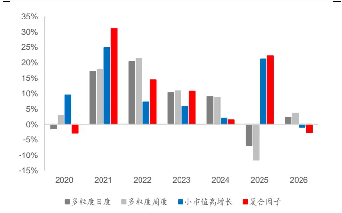
资料来源：Wind，国泰海通证券研究

500成分内，复合因子表现则显著优于单纯的多粒度因子与小市值高增长因子，虽然相较于小市值高增长因子放大了回撤，但从收益与信息比角度有显著的增强。

## 2.3. 多策略组合构建与表现

当我们得到 500 成分内组合与全市场组合后，我们还是通过优化器配置两个组合的权重，从而得到最终的组合。在这里，我们分别以历史收益率，相对 500 的超额收益与 Barra 因子暴露结合计算的信息比两种目标进行优化，为了方便与传统方式构建的增强组合比较，我们做了成分股占比大于等于80%的约束。以如下约束条件分别构建多粒度因子周度，日度，以及小市值高增长复合因子，剔除市值的高增长复合因子的增强组合作为对比组合。比较结果如下表：

表8 多粒度，小市值高增长，多策略复合 500增强超额表现（2020.01-2026.03）

|  | 年化收益 | 信息比 | 最大回撤 | 收益回撤比 |
| --- | --- | --- | --- | --- |
| 多粒度日度 | 9.28% | 1.437 | 7.47% | 1.242 |
| 多粒度周度 | 8.34% | 1.273 | 8.51% | 0.980 |
| 小市值高增长 | 7.50% | 1.689 | 7.35% | 1.021 |
| 高增长 | 8.20% | 1.843 | 6.31% | 1.300 |
| 多策略复合（收益率最优） | 17.15% | 2.138 | 7.47% | 2.295 |
| 多策略复合（信息比最优） | 18.32% | 2.273 | 9.04% | 2.027 |

资料来源：Wind，国泰海通证券研究

图10：多粒度，小市值高增长，多策略复合 500增强净值超额走势（2020.01-2026.03）
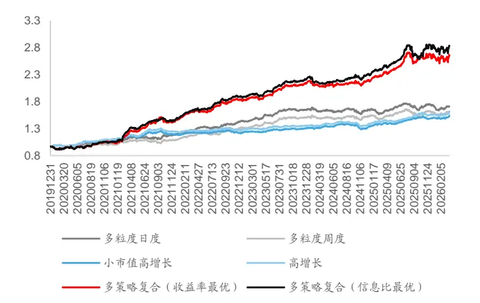
资料来源：Wind，国泰海通证券研究

图11：多粒度，小市值高增长，多策略复合 500增强分年度超额表现（2020.01-2026.03）
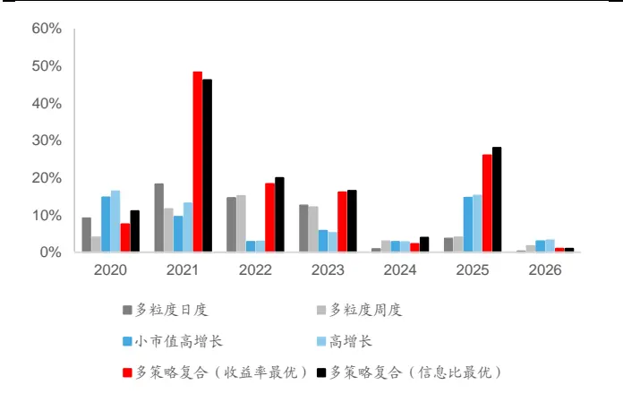
资料来源：Wind，国泰海通证券研究

整体来看，多策略复合表现远优于传统的复合因子方法所构建的增强组合，而在80%成分股限定下，以信息比为优化目标效果更优。

考虑到不同的跟踪误差弹性需求，我们把成分股占比限制逐步放开，考察组合表现，如下表：

表9 不同成分股约束下多策略复合 500增强超额表现（2020.01-2026.03）

|  | 年化收益 | 信息比 | 最大回撤 | 收益回撤比 |
| --- | --- | --- | --- | --- |
| 20%成分股（收益率最优） | 26.03% | 1.978 | 17.53% | 1.485 |
| 50%成分股（收益率最优） | 22.11% | 2.076 | 12.15% | 1.820 |
| 80%成分股（收益率最优） | 17.15% | 2.138 | 7.47% | 2.295 |
| 20%成分股（信息比最优） | 23.82% | 1.868 | 15.10% | 1.577 |
| 50%成分股（信息比最优） | 20.30% | 1.921 | 13.44% | 1.510 |
| 80%成分股（信息比最优） | 18.32% | 2.273 | 9.04% | 2.027 |

资料来源：Wind，国泰海通证券研究

图12：不同成分股约束下复合 500 增强净值超额走势（2020.01-2026.03）
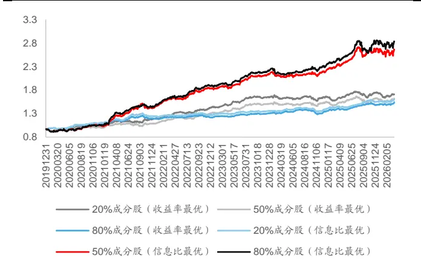
资料来源：Wind，国泰海通证券研究

图13：不同成分股约束下复合 500 增强分年度超额表现（2020.01-2026.03）
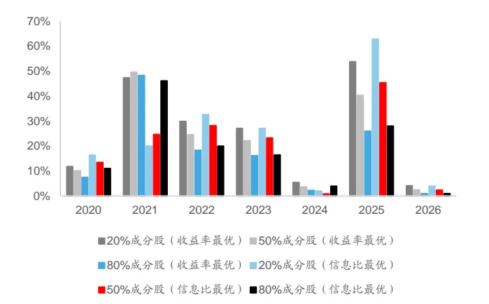
资料来源：Wind，国泰海通证券研究

整体看，随着成分股约束的逐步放开，组合收益会有显著提升，回撤与波动也会明显增大。在追求弹性条件下，以收益率为优化目标会有更大的组合弹性。

将上述组合与中证 500 股指期货进行对冲构建绝对收益组合，表现如下表：

表 10 不同成分股约束下多策略复合 500 增强对冲股指期货表现（2020.01-2026.03）

|  | 年化收益 | 夏普比 | 最大回撤 | 收益回撤比 |
| --- | --- | --- | --- | --- |
| 20%成分股（收益率最优） | 14.20% | 1.169 | 17.10% | 0.830 |
| 50%成分股（收益率最优） | 11.27% | 1.088 | 12.92% | 0.872 |
| 80%成分股（收益率最优） | 7.64% | 0.890 | 8.78% | 0.869 |
| 20%成分股（信息比最优） | 12.65% | 1.059 | 16.42% | 0.770 |
| 50%成分股（信息比最优） | 9.95% | 0.963 | 13.32% | 0.747 |
| 80%成分股（信息比最优） | 8.33% | 0.973 | 8.78% | 0.948 |

资料来源：Wind，国泰海通证券研究

图14：不同成分股约束下复合 500 增强对冲股指期货走势（2020.01-2026.03）
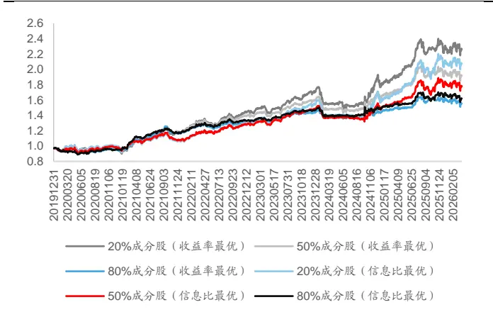
资料来源：Wind，国泰海通证券研究

图15：不同成分股约束下复合 500 增强分年度对冲股指期货表现（2020.01-2026.03）
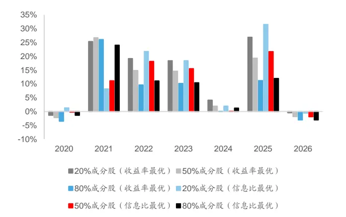
资料来源：Wind，国泰海通证券研究

与股指期货对冲可以得到 10%左右的绝对收益，但夏普比只能达到 1左右，结合基差的波动与超额收益的不稳定性，如果单纯的希望通过对冲股指期货构建绝对收益产品，策略表现还需要进一步改进。

## 3. 总结

由于因子截面表现与时序表现波动越发显著，传统的多因子方法构建量化投资组合可能会遇到越来越多的挑战。因此我们考虑换一个角度出发，以最大化现有策略选股效果为出发点，只在最终构建组合层面对选股范围进行约束，从而在使用同样因子前提下，获得更优的组合表现。

然而本文所提到的方案目前而言并没有十分完善。一方面在子策略的逐步复合过程中，单纯参照策略的历史表现并不一定是一种很好的子策略选择配置方案，需要进一步研究更多的权重配置可行性。

另一方面，受限于目前策略不够丰富，在最终的组合构建时难以进行精细化的风险因子暴露控制，由于最终放入优化器的只有两个资产，因此强行进行行业或其他风险因子暴露控制会导致优化器无法求得最优解。精细化的组合风控目标达成，需要对于策略进行极大地丰富，从而使得最终进行优化求解时有更多的组合输入，从而保证在更多约束条件下依然可以求得最优解。

最后，目前的多策略方法会有换手率失控的风险，从本文所述策略来看，最终换手率往往高达20倍左右，而同样因子的传统多因子组合换手率只有8倍左右。策略权重配置是换手放大的重要原因，因此如何在多策略前提下依然能压低换手率也是未来研究的重要方向。

## 4. 风险提示

市场系统性风险、海外市场波动风险、模型误设风险。

## 本公司具有中国证监会核准的证券投资咨询业务资格

## 分析师声明

作者具有中国证券业协会授予的证券投资咨询执业资格或相当的专业胜任能力，保证报告所采用的数据均来自合规渠道，分析逻辑基于作者的职业理解，本报告清晰准确地反映了作者的研究观点，力求独立、客观和公正，结论不受任何第三方的授意或影响，特此声明。

## 免责声明

本报告仅供国泰海通证券股份有限公司（以下简称“本公司”）的客户使用。本公司不会因接收人收到本报告而视其为本公司的当然客户。本报告仅在相关法律许可的情况下发放，并仅为提供信息而发放，概不构成任何广告。

本报告的信息来源于已公开的资料，本公司对该等信息的准确性、完整性或可靠性不作任何保证。本报告所载的资料、意见及推测仅反映本公司于发布本报告当日的判断，本报告所指的证券或投资标的的价格、价值及投资收入可升可跌。过往表现不应作为日后的表现依据。在不同时期，本公司可发出与本报告所载资料、意见及推测不一致的报告。本公司不保证本报告所含信息保持在最新状态。同时，本公司对本报告所含信息可在不发出通知的情形下做出修改，投资者应当自行关注相应的更新或修改。

本报告中所指的投资及服务可能不适合个别客户，不构成客户私人咨询建议。在任何情况下，本报告中的信息或所表述的意见均不构成对任何人的投资建议。在任何情况下，本公司、本公司员工或者关联机构不承诺投资者一定获利，不与投资者分享投资收益，也不对任何人因使用本报告中的任何内容所引致的任何损失负任何责任。投资者务必注意，其据此做出的任何投资决策与本公司、本公司员工或者关联机构无关。

本公司利用信息隔离墙控制内部一个或多个领域、部门或关联机构之间的信息流动。因此，投资者应注意，在法律许可的情况下，本公司及其所属关联机构可能会持有报告中提到的公司所发行的证券或期权并进行证券或期权交易，也可能为这些公司提供或者争取提供投资银行、财务顾问或者金融产品等相关服务。在法律许可的情况下，本公司的员工可能担任本报告所提到的公司的董事。

市场有风险，投资需谨慎。投资者不应将本报告作为作出投资决策的唯一参考因素，亦不应认为本报告可以取代自己的判断。在决定投资前，如有需要，投资者务必向专业人士咨询并谨慎决策。

本报告版权仅为本公司所有，未经书面许可，任何机构和个人不得以任何形式翻版、复制、发表或引用。如征得本公司同意进行引用、刊发的，需在允许的范围内使用，并注明出处为“国泰海通证券研究”，且不得对本报告进行任何有悖原意的引用、删节和修改。

若本公司以外的其他机构（以下简称“该机构”）发送本报告，则由该机构独自为此发送行为负责。通过此途径获得本报告的投资者应自行联系该机构以要求获悉更详细信息或进而交易本报告中提及的证券。本报告不构成本公司向该机构之客户提供的投资建议，本公司、本公司员工或者关联机构亦不为该机构之客户因使用本报告或报告所载内容引起的任何损失承担任何责任。

## 评级说明

## 投资建议的比较标准

投资评级分为股票评级和行业评级。

以报告发布后的 12个月内的市场表现为比较标准，报告发布日后的 12个月内的公司股价（或行业指数）的涨跌幅相对同期的沪深 300指数涨跌幅为基准。

## 国泰海通证券研究所

地址 上海市黄浦区中山南路 888 号

| 评级 |  | 说明 |
| --- | --- | --- |
| 股票投资评级 | 增持 | 相对沪深 300 指数涨幅 15%以上 |
|  | 谨慎增持 | 相对沪深 300 指数涨幅介于 5%~15%之间 |
|  | 中性 | 相对沪深 300 指数涨幅介于-5%~5% |
|  | 减持 | 相对沪深 300 指数下跌 5%以上 |
| 行业投资评级 | 增持 | 明显强于沪深300 指数 |
|  | 中性 | 基本与沪深 300 指数持平 |
|  | 减持 | 明显弱于沪深 300 指数 |

邮编 200011

电话（021）38676666