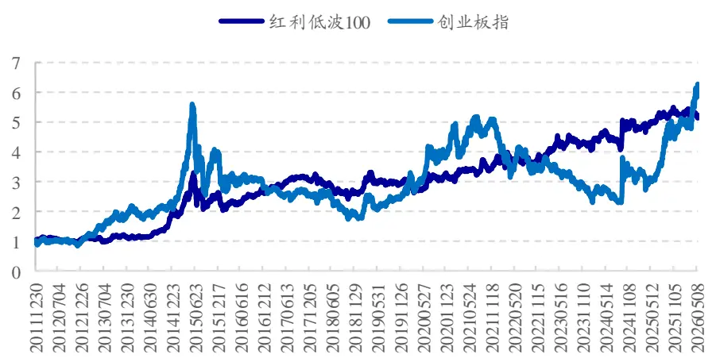
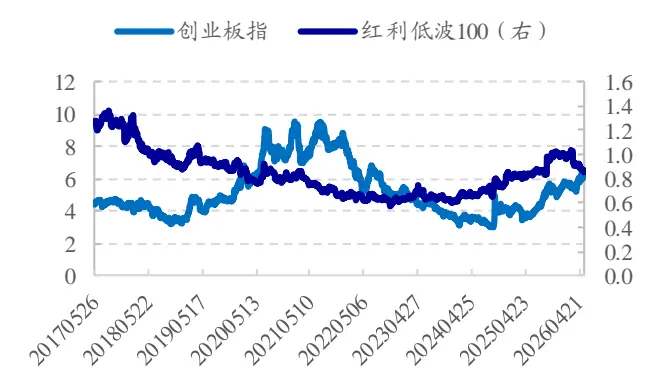
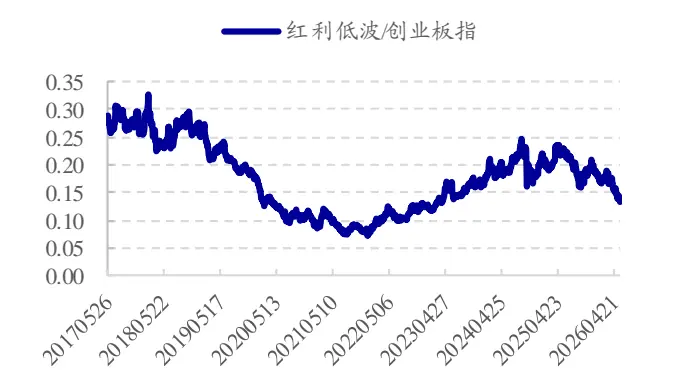
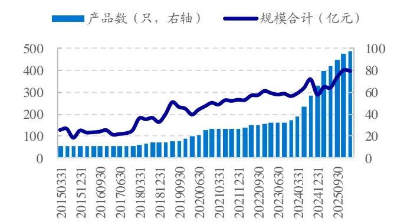
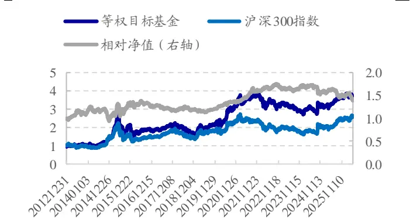
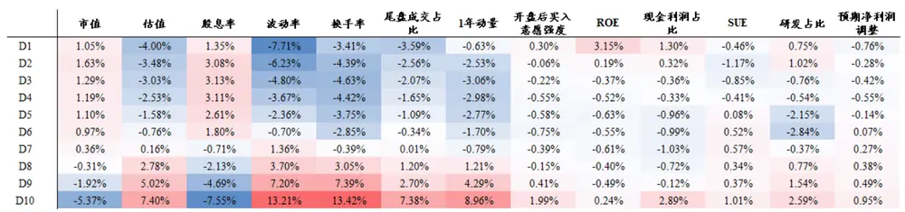
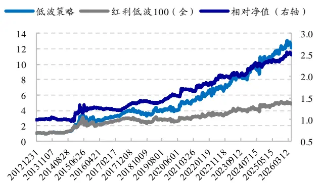
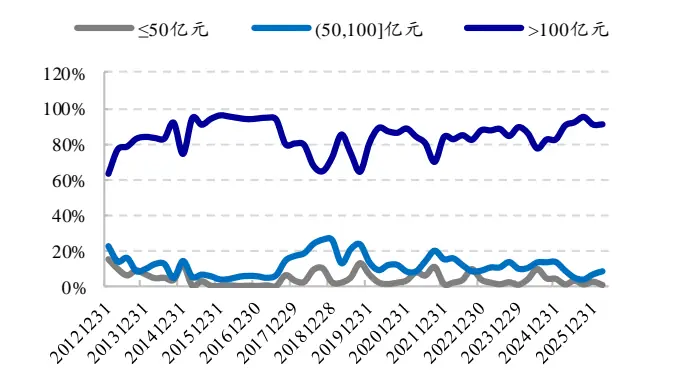
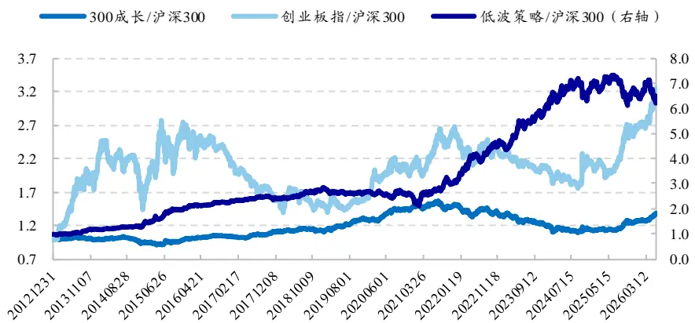

# 国泰海通量化选股系列（四）——如何构建低波策略

## 本报告导读：

本文尝试从个股特征出发，构建时序波动率较低的组合。我们在低波个股池中，结合基本面因子提升组合公司质量构建低波组合，2013.01-2026.05期间，组合年化收益 20.6%，且波动和回撤均略低于红利低波 100 指数。

## 投资要点：

[Table_Summary]低波策略对投资者择时能力依赖性相对较小。低波策略虽然上涨弹性相对较弱，但波动小、回撤较低，修复回撤所需时间往往更短。这类策略对买入时点具有较高的容错率，对投资者择时能力的依赖性相对较低，持有体验更佳。

哪些个股波动较低？基于因子分组，考察各组股票下月平均波动率水平我们发现，高股息、低波、低换手、低尾盘成交占比个股，波动显著低于市场平均水平。而基本面类因子，如 ROE、SUE 等，对于区分个股波动率，无显著效果。

我们主要结合红利、低波类因子，搭建低波个股池；然后结合基本面因子提升组合公司质量，构建低波增强策略。红利叠加低波类因子的策略得益于高现金分红、低波优势，在市场下跌时，具有更好的抗跌性与防御性。但与之对应的是，市场情绪高涨时，弹性相对较低。为在一定程度上弥补红利低波这种时序收益分布不均现象，我们尝试加入基本面因子提升组合里个股的公司质量，从“稳健防御”到“质量突围”，构建红利低波增强策略。

红利低波策略，2013.01-2026.05期间，年化收益 20.6%，年化波动率 18.7%，信息比 1.13，最大回撤34.0%，月胜率 64.0%。策略收益高于红利低波 100 指数，波动、回撤也更低。若限定个股市值不低于 50 亿元，则策略年化收益 19.9%，信息比 1.10；若限定市值不低于 100 亿元，则年化收益 18.6%，信息比 1.03，也具有较优表现。

o风险提示。本文根据客观数据和评价指标计算，不作为对未来走势的判断和投资建议。历史回测不代表未来收益，存在历史统计规律失效风险、因子失效风险、模型误设风险，市场环境变化等均可能影响模型未来表现。

郑雅斌(分析师)

心021-23219395

zhengyabin@gtht.com

登记编号S0880525040105

罗蕾(分析师)

021-23185653

luolei@gtht.com

登记编号S0880525040014

## [Table_Repo相关报告

低利率背景下的绝对收益探索 2026.05.29

ETF 配置系列（三）： 构建不同风险偏好的 ETF配置策略 2026.05.28

解构“固收+”系列（一）：公募 “固收+”全景解析 2026.05.25

ETF 配置系列（七）：海内外主动 ETF发展趋势及布局方向研究 2026.05.21

年报财务类风险预警模型效果更新2026.05.12

## 1. 低波策略的特征与优势

## 1.1. 高安全边际下的“择时弱化”

低波策略对买入时点具有较高的容错率，对投资者择时能力的依赖性相对较低。

如下表所示，我们统计在任一时点买入红利低波 、创业板指数的胜率和平均收益。结果显示，低波指数的胜率显著高于创业板指数。时间是低波策略的朋友，对于红利低波 100 指数而言，持有时间越长，收益为正的概率越高。持有 3 年，红利低波指数收益为正的概率占比高达 93.5%。

表1：任一交易日买入，各持有期下指数平均收益与胜率（2012.01-2026.05）

| 持有期 | 红利低波100（全）次均收益 次胜率 | 创业板R次均收益 次胜率 |
| --- | --- | --- |
| 3个月 | 3.3% 61.6% | 4.4% 53.7% |
| 1年 | 15.0% 83.4% | 17.9% 56.4% |
| 3年 | 52.5% 93.5% | 46.4% 63.6% |

资料来源：Wind，国泰海通证券研究

## 1.2. 持有体验

低波策略波动小、回撤较低，修复回撤所需时间往往更短，持有体验更佳。

如下图所示，高波策略上涨弹性更大，但同时从高点的回撤也更大，修复回撤通常花费的时间也更长。例如，2015.06.08-2018.10.18，创业板 R累计回撤近 70%，直至 2026.04 才突破 2015 年的高点；而红利低波 100指数在 2019 年 4 月，即修复了 2015 年期间的回撤。

图1：红利低波 100指数累计净值走势

数据来源：Wind，国泰海通证券研究

## 1.3. 红利低波指数的当前分位点

当前红利低波 100 指数的 PB 为 0.87 倍（2026.05.29），相对创业板估87值为 0.14，相对估值自 2024 年 8 月以来持续下降（图 3），目前大致与 2020年 2 月的相对估值水平接近。

图2：红利低波指数 PB 变化（2017.05-2026.05）

资料来源：Wind，国泰海通证券研究

图3：红利低波 100指数相对创业板指估值

资料来源：Wind，国泰海通证券研究

总结来看，低波策略虽然上涨弹性相对较低，但波动小、回撤较低，修复回撤所需时间往往更短；这类策略对买入时点具有较高的容错率，对投资者择时能力的依赖性相对较低，持有体验更佳。

## 2. 红利类基金

需要提及的一点是，本文所指“低波策略”，并非局限于选择历史波动率低的个股，而是从净值走势结果角度出发，那些波动较低、回撤相对较小的策略，即为本文所指策略。

下图我们对比分析了不同指数历史收益、风险表现情况，可见，红利叠加低波的模式，是波动最低、回撤最小的方式；且拉长时间（近 5 年、10年）来看，红利低波策略相比沪深 300、中证 800 指数都可产生正超额收益。另外，若低波叠加质量、或成长因子，策略的波动、回撤水平都有所放大。

图4：指数收益风险指标对比（2013.01-2026.05）

|  |  | 2013年以来 |  |  | 近10年，2016.06-2026.05 |  |  | 近5年，2021.06-2026.05 |  |  |  |  |  |
| --- | --- | --- | --- | --- | --- | --- | --- | --- | --- | --- | --- | --- | --- |
|  |  |  |  |  |  |  |  |  |  |  | 近3年，2023.06-2026.05 |  |  |
|  |  | 年化收益 | 年化波动率 最大回撤 |  | 年化收益 年化波动率 |  | 最大回撤 | 年化收益 年化波动率 最大回撤 |  |  | 年化收益 | 年化波动率 最大回撤 |  |
| H00300.CSI300收益 |  | 7.5% | 21.0% 46.1% |  | 6.9% | 17.8% | 41.6% | 0.8% | 17.2% | 36.6% | 11.9% | 17.0% | 20.6% |
| H00906.CSI | 800收益 | 7.7% | 21.2% | 48.5% | 6.3% | 18.1% | 38.7% | 2.1% | 17.6% | 35.1% | 12.3% | 18.1% | 21.9% |
| H00852.SH | 中证1000全收益 | 7.9% | 26.3% | 71.8% | 1.2% | 23.2% | 54.4% | 5.5% | 23.9% | 45.6% | 10.0% | 25.5% | 35.6% |
| 399606.SZ 创业板指R |  | 14.6% | 30.2% | 69.2% | 7.3% | 27.0% | 56.0% | 5.0% | 28.4% | 56.0% | 24.0% | 30.7% | 31.7% |
| 480092.CNI自由现金流R |  | 17.1% | 22.4% | 50.2% | 19.0% | 19.4% | 25.1% | 21.2% | 20.3% | 22.9% | 20.0% | 17.9% | 15.8% |
| H00922.CSI中证红利全收益 |  | 10.5% | 20.3% | 45.7% | 8.9% | 16.1% | 27.1% | 6.7% | 15.9% | 18.4% | 7.9% | 14.6% | 14.5% |
| H00803.CSI300波动全收益 |  | 10.4% | 18.7% | 42.0% | 7.5% | 14.7% | 26.4% | 6.8% | 13.9% | 17.5% | 8.7% | 13.0% | 11.5% |
| H00821.CSI | 沪深300红利全收益 | 10.3% | 19.4% | 39.0% | 9.3% | 15.9% | 24.9% | 5.6% | 15.4% | 16.2% | 10.1% | 14.3% | 11.8% |
| H20740.CSI | 300红利低波全收益 | 11.2% | 18.1% | 34.5% | 8.2% | 14.3% | 27.4% | 8.4% | 13.6% | 14.4% | 8.6% | 12.5% | 9.6% |
| h20269.CSI | 红利低波全收益 | 12.3% | 19.5% | 42.5% | 9.7% | 16.0% | 27.5% | 9.0% | 16.1% | 16.9% | 9.2% | 14.4% | 13.5% |
| h20955.CSI | 红利低波100全收益 | 12.6% | 18.8% | 38.7% | 8.7% | 14.7% | 26.2% | 9.1% | 14.6% | 13.6% | 7.2% | 14.2% | 13.6% |
| h21014.CSI | 成长低波全收益 | 9.9% | 20.2% | 42.2% | 4.4% | 17.3% | 36.1% | 2.9% | 17.7% | 29.2% | 4.1% | 18.0% | 26.1% |
| h21062.CSI | 质量低波全收益 | 12.1% | 22.1% | 48.5% | 7.5% | 18.6% | 30.1% | 1.6% | 18.2% | 26.9% | -0.6% | 17.6% | 24.8% |
| h21055.CSI | 稳健低波全收益 | 11.2% | 24.4% | 58.5% | 4.1% | 20.7% | 39.9% | 3.7% | 21.0% 34.5% |  | 4.4% | 21.4% | 29.7% |

资料来源：Wind，国泰海通证券研究
注：年化波动率为日收益标准差*sqrt(242)

因此在圈定低波类基金时，我们主要匹配业绩比较基准包含“红利”、“低波”、“股息”字样、同时该指数在比较基准中占比不低于 60%的产品。按照这种定义方式，满足条件的红利类基金共计 97 只（截至 2026Q1），规模合计 398 亿元。

季度再平衡，选择成立 3 个月的红利基金构建等权组合，其历史净值走势如下图右所示。2013.01-2026.05 期间，等权基金年化收益 10.2%，相较于沪深 300 全收益指数年化超额 2.8%；分年度来看，在大部分年份（8/14），红利类基金均跑赢沪深 300 全收益指数。

图5：红利类基金数量与规模变化（截至2026Q1）

资料来源：Wind，国泰海通证券研究

图6：等权红利类基金历史净值走势

资料来源：Wind，国泰海通证券研究

表2：等权红利基金历史收益表现（2013.01-2026.05）

|  | 等权红利基金 |  |  | 300收益 |  |  | 超额收 益 |
| --- | --- | --- | --- | --- | --- | --- | --- |
|  | 收益率 | 波动率 | 信息比 | 收益率 | 波动率 | 信息比 |  |
| 2013 | 7.5% | 18.8% | 0.50 | -5.3% | 22.1% | -0.15 | 12.8% |
| 2014 | 31.5% | 17.7% | 1.67 | 55.8% | 19.2% | 2.46 | -24.3% |
| 2015 | 51.7% | 40.7% | 1.25 | 7.2% | 39.2% | 0.38 | 44.5% |
| 2016 | -13.5% | 25.8% | -0.45 | -9.3% | 22.1% | -0.34 | -4.3% |
| 2017 | 15.2% | 11.4% | 1.33 | 24.3% | 10.1% | 2.25 | -9.0% |
| 2018 | -23.0% | 21.7% | -1.13 | -23.6% | 21.4% | -1.19 | 0.6% |
| 2019 | 40.1% | 18.2% | 1.99 | 39.2% | 19.8% | 1.81 | 0.9% |
| 2020 | 47.3% | 21.3% | 1.98 | 29.9% | 22.7% | 1.30 | 17.4% |
| 2021 | 13.2% | 17.3% | 0.82 | -3.5% | 18.5% | -0.11 | 16.7% |
| 2022 | -16.7% | 17.5% | -0.98 | -19.8% | 20.3% | -1.02 | 3.2% |
| 2023 | -9.0% | 10.3% | -0.89 | -9.1% | 13.4% | -0.67 | 0.2% |
| 2024 | 11.6% | 16.6% | 0.77 | 18.2% | 21.3% | 0.92 | -6.7% |
| 2025 | 13.3% | 10.9% | 1.24 | 21.0% | 15.2% | 1.36 | -7.7% |
| 2026 | 0.3% | 12.1% | 0.12 | 6.2% | 15.9% | 1.07 | -5.9% |
| 全区间 | 10.2% | 20.4% | 0.60 | 7.5% | 21.3% | 0.46 | 2.8% |

资料来源：Wind，国泰海通证券研究

根据 2025 年年报披露的全部持仓数据，我们对比统计红利类基金持股与中证红利指数成分股特征。为便于比较，我们将上述红利类基金中，业绩比较基准包含港股的产品剔除，只考察基准为 A股相关指数的产品。

表3：红利类基金持股特征（2025.12.31）

|  | 权重集中度 |  | 持股特征中位数 |  |  |  |
| --- | --- | --- | --- | --- | --- | --- |
|  | 持股数（个） | top10 权重占比 | 持股市值中位 数（亿元） | 股息率中位数 (亿元) | PB 中位数 (倍) | 25Q3 单季度 ROE(%) |
| 中证红利指数 | 100.0 | 16.1% | 352.2 | 5.0% | 1.17 | 2.22 |
| 均值 | 101.2 | 36.1% | 500.1 | 3.0% | 2.02 | 2.89 |
| 中位数 | 79.5 | 33.2% | 359.6 | 3.5% | 1.62 | 2.76 |

资料来源：Wind，国泰海通证券研究

如上表所示，平均来看，红利类基金持股集中度高于指数，top10 个股权重占比平均为 36.1%。

持股特征角度，红利类基金持股股息率较高，但低于中证红利指数；持股市值大，盈利能力优于中证红利指数。红利类基金在高红利 beta 基础上，会叠加其他要素来做选股和增强。基金业绩表现也呈类似特征，红利类基金在红利 beta 表现不佳年份，通过 alpha 的引入，显著减小红利 beta 与市场之间的差距。如 2019-2020、2025 年，中证红利指数显著跑输沪深 300 指数，而这几年红利类产品利用 alpha 显著降低了产品相对市场的回撤。

表4：红利类基金历年收益统计（2013.01-2026.05）

|  | 样本基金 数（只） | 相对中证红利（全）超额收益 |  | 基金平均收 益 | 300 收益 | 中证红利 (全) | 中证红利- 300 收益 |
| --- | --- | --- | --- | --- | --- | --- | --- |
|  |  | 平均超额 | 超额为正基金占 比 |  |  |  |  |
| 2013 | 13 | 13.2% | 76.9% | 6.5% | -5.3% | -6.7% | -1.4% |

请务必阅读正文之后的免责条款部分 5of11

| 2014 | 13 | -27.5% | 0.0% | 30.1% | 55.8% | 57.6% | 1.7% |
| --- | --- | --- | --- | --- | --- | --- | --- |
| 2015 | 13 | 19.0% | 76.9% | 48.9% | 7.2% | 29.9% | 22.7% |
| 2016 | 13 | -9.8% | 7.7% | -14.1% | -9.3% | -4.3% | 5.0% |
| 2017 | 13 | -5.6% | 30.8% | 15.7% | 24.3% | 21.3% | -2.9% |
| 2018 | 13 | -8.4% | 7.7% | -24.5% | -23.6% | -16.2% | 7.5% |
| 2019 | 15 | 18.3% | 86.7% | 39.1% | 39.2% | 20.9% | -18.3% |
| 2020 | 20 | 39.6% | 95.0% | 47.7% | 29.9% | 8.2% | -21.7% |
| 2021 | 27 | -7.5% | 22.2% | 10.7% | -3.5% | 18.2% | 21.7% |
| 2022 | 30 | -15.9% | 3.3% | -16.3% | -19.8% | -0.4% | 19.5% |
| 2023 | 34 | -14.8% | 2.9% | -8.5% | -9.1% | 6.3% | 15.5% |
| 2024 | 38 | -6.7% | 28.9% | 12.0% | 18.2% | 18.8% | 0.5% |
| 2025 | 71 | 9.1% | 80.3% | 12.8% | 21.0% | 3.8% | -17.2% |
| 2026 | 86 | -2.3% | 27.9% | 0.1% | 6.2% | 2.4% | -3.8% |

资料来源： ，国泰海通证券研究

总体来看，红利类基金整体波动低于沪深300指数，2013-2026年期间，等权基金组合累计收益比沪深 300 指数高，产品相比于市场指数可获更高信息比。

## 3. 如何构建低波策略

要构建低波策略，首先我们先考察哪些个股波动较低。下图我们统计了基于不同因子从低到高排序分为10组，每组个股下个月平均相对波动率（相对全 A平均波动率）。从中可见，高股息、低波、低换手、低尾盘成交占比个股，波动显著低于市场平均水平。而基本面类因子，如 ROE、SUE等，对于区分个股波动率，无显著效果。因此在体现策略的低波属性时，我们主要基于高股息率、低波因子来确定。

图7：因子分组组合的平均相对波动率（2013.01-2026.05）

资料来源：Wind，国泰海通证券研究
注：波动率为各分组个股次月波动率与全 A 个股平均波动率之差

红利叠加低波的策略，得益于低估值、高现金分红、低波优势，在市场下跌时，具有更好的抗跌性与防御性。但与之对应的是，市场情绪高涨时，弹性相对较低。如表 5 所示，在中证 800 指数跌幅超过 5%的 25 个月份，800 红利低波（全）指数显著优于中证 800 指数；但在指数涨幅超过 5%的24 个月份，800 红利低波指数跑输市场。

表5：红利+低波防御性较强，而上涨弹性相对较弱（2014.07-2026.05）

| 中证 800月 涨幅 | 月份数 (个) | 中证 800 | 800 成长 (全) | 800 红利低 波（全） | 800 红利低 波-中证 |
| --- | --- | --- | --- | --- | --- |
| ≤-5% | 25 | -7.8% | -8.6% | -4.4% | 800 3.5% |
| (-5%,0] | 41 | -1.5% | -1.6% | -0.1% | 1.5% |
| (0,5%] | 53 | 2.2% | 3.0% | 1.9% | -0.3% |
| >5% | 24 | 10.4% | 11.7% | 8.4% | -2.0% |

资料来源：Wind，国泰海通证券研究

## 注：统计指标为月均收益

为在一定程度上弥补红利低波这种时序收益分布不均现象，我们尝试加入基本面因子提升组合里个股的公司质量，从“稳健防御”到“质量突围”，以改善策略业绩表现。具体构建步骤如下所示：

- 选股池。全 A剔除 ST股、上市时间短于3 个月个股。

- 步骤 1——流动性剔除。剔除选股池市值最小 20%、日均成交额最小 20%个股。

- 步骤 2——低波个股池。（1）分红约束：过去 1 年红利支付率在0-1 之间；（2）高波个股剔除：剔除波动率最高的 20%个股。

- 步骤 3——股息率初筛。按照过去1 年股息率由高到低排序，选择股息率得分最高 300 只股票。

步骤 4——低波+质量因子选股。根据低波动率、与基本面质量因子等权打分，选择得分最高的 100 只股票。其中，低波因子为，低波动率、低换手率、低尾盘成交占比 3 因子等权复合得分；基本面质量因子为，ROE、SUE、加速增长、现金流占比因子等权复合得分。

组合每年 4、8、10、12 月底调仓。个股加权方式上，采用股息率、低波倾斜加权；同时为分散化考虑，限制个股最大权重不超过 5%。

一年调仓 4 次，策略平均年单边换手率为 2.25 倍。扣除单边千 2 交易成本后，2013 年以来该组合年化收益 20.6%，年化波动率 18.7%，信息比1.13，最大回撤 34.0%，月胜率 64.0%。分年度来看，除 2016 年收益微负、2018 年回撤 12.6%外，其余年份均获得正收益。

相比于同期红利低波 100 指数（全），组合具有更优业绩表现，年化超额 8.0%；且波动更低、回撤更小，信息比更优。

表6：红利低波策略历史业绩表现（2013.01-2026.05）

|  | 红利低波策略 |  |  |  |  | 红利低波100指数（全） |  |  |  |  | 超额收 益 |
| --- | --- | --- | --- | --- | --- | --- | --- | --- | --- | --- | --- |
|  | 收益率 | 波动率 | 信息比 | 最大回 撤 | 月胜率 | 收益率 | 波动率 | 信息比 | 最大回 撤 | 月胜率 |  |
| 2013 | 10.1% | 17.5% | 0.66 | 15.7% | 66.7% | 7.5% | 18.4% | 0.51 | 16.5% | 50.0% | 2.6% |
| 2014 | 66.8% | 19.0% | 2.85 | 7.8% | 75.0% | 73.2% | 18.1% | 3.18 | 7.0% | 83.3% | -6.4% |
| 2015 | 66.5% | 36.7% | 1.61 | 34.0% | 75.0% | 28.8% | 40.5% | 0.84 | 37.6% | 58.3% | 37.7% |
| 2016 | -0.6% | 19.6% | 0.07 | 21.1% | 58.3% | 2.1% | 21.1% | 0.21 | 21.2% | 58.3% | -2.7% |
| 2017 | 27.7% | 8.9% | 2.87 | 4.4% | 83.3% | 15.5% | 7.7% | 1.96 | 5.5% | 75.0% | 12.2% |
| 2018 | -12.6% | 17.2% | -0.72 | 23.4% | 41.7% | -14.1% | 17.2% | -0.82 | 26.2% | 41.7% | 1.5% |
| 2019 | 28.1% | 16.5% | 1.62 | 12.4% | 75.0% | 16.9% | 16.2% | 1.07 | 13.7% | 75.0% | 11.3% |
| 2020 | 13.8% | 19.9% | 0.77 | 14.6% | 50.0% | 2.3% | 19.0% | 0.22 | 15.2% | 50.0% | 11.5% |
| 2021 | 27.0% | 12.8% | 1.99 | 8.7% | 66.7% | 19.3% | 13.4% | 1.42 | 10.3% | 66.7% | 7.7% |
| 2022 | 11.4% | 18.4% | 0.70 | 12.2% | 50.0% | 0.8% | 17.5% | 0.13 | 13.0% | 50.0% | 10.6% |
| 2023 | 16.5% | 12.5% | 1.32 | 10.7% | 66.7% | 13.3% | 11.5% | 1.18 | 9.8% | 58.3% | 3.2% |
| 2024 | 33.5% | 19.1% | 1.66 | 12.1% | 66.7% | 18.6% | 19.2% | 1.02 | 13.6% | 58.3% | 14.9% |
| 2025 | 10.3% | 11.3% | 0.94 | 6.0% | 58.3% | 4.0% | 11.5% | 0.41 | 7.3% | 58.3% | 6.3% |
| 2026 | 2.3% | 13.0% | 0.53 | 7.2% | 60.0% | 0.4% | 11.9% | 0.15 | 5.8% | 40.0% | 1.9% |
| 全区间 | 20.6% | 18.7% | 1.13 | 34.0% | 64.0% | 12.6% | 19.1% | 0.73 | 38.7% | 59.6% | 8.0% |

资料来源：Wind，国泰海通证券研究
注：波动率为月收益波动率*sqrt(12)

图8：红利策略历史净值走势（截至2026.05）

资料来源：Wind，国泰海通证券研究

图9：组合持股市值分布

资料来源：Wind，国泰海通证券研究

持股特征角度，组合绝大部分权重，平均 84.3%的权重配置于市值在

100 亿元以上的个股，小于 50 亿元的个股权重仅占比不到 5%，整体流动性较优。

若限定市值不低于 50 亿元，则上述低波策略扣费后 2013 年以来年化收益 19.9%，信息比 1.10，相比不限定市值策略无明显减弱。若限定市值不低于 100 亿元个股，则策略年化收益 18.6%，信息比 1.03，也具有较优表现。

表7：剔除市值不满足条件个股后，低波策略业绩表现（2013.01-2026.05）

|  | 剔除市值<50亿元个股 |  |  |  |  | 剔除市值<100亿元个股 |  |  |  |  |
| --- | --- | --- | --- | --- | --- | --- | --- | --- | --- | --- |
|  | 收益率 | 波动率 | 信息比 | 最大回 撤 | 月胜率 | 收益率 | 波动率 | 信息比 | 最大回 撤 | 月胜率 |
| 2013 | 8.1% | 17.4% | 0.56 | 16.4% | 58.3% | 1.4% | 17.8% | 0.17 | 18.2% | 58.3% |
| 2014 | 67.5% | 19.2% | 2.84 | 8.3% | 66.7% | 67.4% | 19.6% | 2.79 | 9.2% | 66.7% |
| 2015 | 63.7% | 36.8% | 1.56 | 34.0% | 75.0% | 58.1% | 37.0% | 1.45 | 33.4% | 75.0% |
| 2016 | -0.6% | 19.6% | 0.07 | 21.1% | 58.3% | -0.8% | 19.3% | 0.05 | 20.8% | 50.0% |
| 2017 | 27.8% | 8.8% | 2.89 | 4.3% | 91.7% | 27.8% | 8.9% | 2.87 | 4.8% | 91.7% |
| 2018 | -12.5% | 17.2% | -0.71 | 23.2% | 41.7% | -10.4% | 16.7% | -0.60 | 21.1% | 33.3% |
| 2019 | 27.5% | 16.4% | 1.60 | 12.2% | 83.3% | 26.9% | 16.0% | 1.60 | 11.7% | 83.3% |
| 2020 | 13.3% | 19.8% | 0.75 | 15.3% | 50.0% | 12.0% | 19.8% | 0.69 | 16.6% | 50.0% |
| 2021 | 24.2% | 12.3% | 1.88 | 8.9% | 66.7% | 21.3% | 12.6% | 1.64 | 8.9% | 66.7% |
| 2022 | 11.2% | 18.5% | 0.68 | 12.2% | 50.0% | 9.4% | 18.6% | 0.59 | 12.0% | 50.0% |
| 2023 | 16.3% | 12.6% | 1.30 | 10.8% | 66.7% | 15.0% | 13.1% | 1.17 | 11.4% | 66.7% |
| 2024 | 33.3% | 19.0% | 1.66 | 11.9% | 66.7% | 35.3% | 19.0% | 1.74 | 11.6% | 66.7% |
| 2025 | 9.9% | 11.4% | 0.91 | 6.0% | 58.3% | 8.0% | 11.3% | 0.76 | 5.7% | 58.3% |
| 2026 | 1.6% | 13.0% | 0.38 | 7.6% | 60.0% | 1.6% | 13.0% | 0.38 | 7.5% | 60.0% |
| 全区间 | 19.9% | 18.7% | 1.10 | 34.0% | 64.0% | 18.6% | 18.7% | 1.03 | 33.4% | 62.7% |

资料来源：Wind，国泰海通证券研究

整体来看，红利低波策略波动较低，回撤相对较小，与成长风格具有一定互补性（图 10）。红利低波策略相对沪深 300 指数月超额收益序列，与300 成长、创业板指月超额收益序列的相关系数分别为-0.55、-0.27。因此，若以沪深 300 指数作为投资目标，我们可以结合红利低波策略、与成长相关指数进行配置。

图10：组合相对沪深 300指数累计净值走势

数据来源：Wind，国泰海通证券研究

具体来看，月度再平衡，我们以过去 1 年（12 个月）红利低波策略、成长指数相对沪深 300 指数月超额收益的信息比为基础进行权重配置（类似 ICIR 加权）。

如表 8 所示，若以 300 成长指数作为成长指数，按照上述方式的复合策略 2013 年以来年化收益 22.1%，优于红利低波策略的 20.6%，也优于300成长指数的 7.6%。分年度来看，除 2019 年略微跑输沪深 300 全收益指数外，其余年份均具有正超额。2026年，截至5月底，复合策略累计收益14.8%，相对于沪深 300 全收益指数累计超额 8.6%。

若以创业板指作为成长指数，按照上述方式的复合策略 2013 年以来年化收益 29.0%，优于红利低波策略的 20.6%，也优于创业板指的 14.6%。分年度来看，除2019年跑输沪深300全收益指数外，其余年份均具有正超额。2026 年，截至 5 月底，复合策略累计收益 26.4%，相对于沪深 300 全收益指数累计超额 20.2%。

若按照 加权复合红利低波策略、 成长指数、创业板指，则复合策略 2013 年以来年化收益 24.3%，相对于沪深 300 全收益指数年化超额16.9%。分年度来看，除 2019 年略微跑输指数外，其余年份均具有正超额。2026 年，截至 5 月底，复合策略累计收益 24.3%，相对于沪深 300 全收益指数累计超额 16.9%。

表8：红利低波叠加成长相关指数，业绩表现（2013.01-2026.05）

|  |  | 策略收益 |  |  | 相对 300 收益超额 |  |  |
| --- | --- | --- | --- | --- | --- | --- | --- |
|  | 300 收益 | 叠加300成 长 | 叠加创业板 指 | +创业板指 +300 成长 | 疊加 300成 长 | 叠加创业板 指 | +创业板指 +300 成长 |
| 2013 | -5.3% | 2.1% | 57.8% | 39.0% | 7.5% | 63.1% | 44.4% |
| 2014 | 55.8% | 65.5% | 67.2% | 66.0% | 9.6% | 11.4% | 10.2% |
| 2015 | 7.2% | 66.3% | 57.9% | 57.9% | 59.1% | 50.7% | 50.6% |
| 2016 | -9.3% | -4.6% | -7.9% | -9.1% | 4.6% | 1.4% | 0.1% |
| 2017 | 24.3% | 27.1% | 27.7% | 27.1% | 2.9% | 3.4% | 2.9% |
| 2018 | -23.6% | -20.3% | -12.6% | -20.3% | 3.4% | 11.0% | 3.4% |
| 2019 | 39.2% | 38.3% | 32.0% | 38.7% | -0.8% | -7.2% | -0.5% |
| 2020 | 29.9% | 44.5% | 62.4% | 48.2% | 14.6% | 32.5% | 18.3% |
| 2021 | -3.5% | 4.4% | 15.6% | 2.9% | 7.9% | 19.1% | 6.4% |
| 2022 | -19.8% | 9.6% | 0.8% | 0.0% | 29.5% | 20.6% | 19.9% |
| 2023 | -9.1% | 16.5% | 16.2% | 16.2% | 25.6% | 25.3% | 25.3% |
| 2024 | 18.2% | 33.5% | 30.7% | 30.7% | 15.3% | 12.5% | 12.5% |
| 2025 | 21.0% | 30.8% | 48.0% | 42.4% | 9.8% | 27.0% | 21.4% |
| 2026 | 6.2% | 14.8% | 26.4% | 21.3% | 8.6% | 20.2% | 15.1% |
| 全区间 | 7.5% | 22.1% | 29.0% | 24.3% | 14.6% | 21.5% | 16.9% |

数据来源：Wind，国泰海通证券研究

## 4. 总结

低波策略虽然上涨弹性相对较低，但波动小、回撤较低，修复回撤所需时间往往更短；特别是，这类策略对买入时点具有较高的容错率，对投资者择时能力的依赖性相对较低，持有体验更佳。

哪些个股波动较低？基于因子分组，考察各组股票下月平均波动率水平发现，高股息、低波、低换手、低尾盘成交占比个股，波动显著低于市场平均水平。而基本面类因子，如 ROE、SUE等，对于区分个股波动率，无显著效果。

因此我们可结合红利、低波类因子，来构建低波策略。这类策略得益于低估值、高现金分红、低波优势，在市场下跌时，具有更好的抗跌性与防御性。但与之对应的是，市场情绪高涨时，弹性相对较低。为在一定程度上弥补红利低波这种时序收益分布不均现象，我们尝试加入基本面因子提升组合里个股的公司质量，从“稳健防御”到“质量突围”，构建红利低波增强策略。

一年调仓 4 次，红利低波策略平均年单边换手率为 2.25 倍。扣费后，2013 年以来（截至 2026.05），该组合年化收益 20.6%，年化波动率 18.7%，信息比 1.13，最大回撤 34.0%，月胜率 64.0%。收益高于红利低波100指数，波动、回撤也更低。若限定个股市值不低于 50 亿元，则策略年化收益 19.9%，信息比 1.10；若限定市值不低于 100 亿元，则策略年化收益 18.6%，信息比1.03，也具有较优表现。

红利低波策略波动较低，回撤相对较小，与成长风格具有一定互补性。若以沪深 300 指数作为投资目标，我们可以结合红利低波策略、与成长相关指数进行配置。例如，若以 300 成长作为成长指数，采用两策略信息比滚动加权，则复合策略 2013 年以来年化收益 22.1%，相对沪深 300 全收益指数年化超额 14.6%；若以创业板指作为成长指数，则复合策略年化收益

29.0%，相对沪深 300 全收益指数年化超额 21.5%。

## 5. 风险提示

本文根据客观数据和评价指标计算，不作为对未来走势的判断和投资建议。历史回测不代表未来收益，存在历史统计规律失效风险、因子失效风险、模型误设风险，市场环境变化等均可能影响模型未来表现。

## 本公司具有中国证监会核准的证券投资咨询业务资格

## 分析师声明

作者具有中国证券业协会授予的证券投资咨询执业资格或相当的专业胜任能力，保证报告所采用的数据均来自合规渠道，分析逻辑基于作者的职业理解，本报告清晰准确地反映了作者的研究观点，力求独立、客观和公正，结论不受任何第三方的授意或影响，特此声明。

## 免责声明

本报告仅供国泰海通证券股份有限公司（以下简称“本公司”）授权客户使用。本公司不会因接收人收到本报告而视其为本公司的当然客户。本报告仅在相关法律许可的情况下发放，并仅为提供信息而发放，概不构成任何广告。

本报告的信息来源于已公开的资料，本公司对该等信息的准确性、完整性或可靠性不作任何保证。本报告所载的资料、意见及推测仅反映本公司于发布本报告当日的判断，本报告所指的证券或投资标的的价格、价值及投资收入可升可跌。过往表现不应作为日后的表现依据。在不同时期，本公司可发出与本报告所载资料、意见及推测不一致的报告。本公司不保证本报告所含信息保持在最新状态。同时，本公司对本报告所含信息可在不发出通知的情形下做出修改，投资者应当自行关注相应的更新或修改。

本报告中所指的投资及服务可能不适合个别客户，不构成客户私人咨询建议。在任何情况下，本报告中的信息或所表述的意见均不构成对任何人的投资建议。在任何情况下，本公司、本公司员工或者关联机构不承诺投资者一定获利，不与投资者分享投资收益，也不对任何人因使用本报告中的任何内容所引致的任何损失负任何责任。投资者务必注意，其据此做出的任何投资决策与本公司、本公司员工或者关联机构无关。

本公司利用信息隔离墙控制内部一个或多个领域、部门或关联机构之间的信息流动。因此，投资者应注意，在法律许可的情况下，本公司及其所属关联机构可能会持有报告中提到的公司所发行的证券或期权并进行证券或期权交易，也可能为这些公司提供或者争取提供投资银行、财务顾问或者金融产品等相关服务。在法律许可的情况下，本公司的员工可能担任本报告所提到的公司的董事。

市场有风险，投资需谨慎。投资者不应将本报告作为作出投资决策的唯一参考因素，亦不应认为本报告可以取代自己的判断。在决定投资前，如有需要，投资者务必向专业人士咨询并谨慎决策。

本报告版权仅为本公司所有，未经书面许可，任何机构和个人不得以任何形式翻版、复制、发表或引用。如征得本公司同意进行引用、刊发的，需在允许的范围内使用，并注明出处为“国泰海通证券研究”，且不得对本报告进行任何有悖原意的引用、删节和修改。

若本公司以外的其他机构（以下简称“该机构”）发送本报告，则由该机构独自为此发送行为负责。通过此途径获得本报告的投资者应自行联系该机构以要求获悉更详细信息或进而交易本报告中提及的证券。本报告不构成本公司向该机构之客户提供的投资建议，本公司、本公司员工或者关联机构亦不为该机构之客户因使用本报告或报告所载内容引起的任何损失承担任何责任。

## 评级说明

|  |  | 评级 | 说明 |
| --- | --- | --- | --- |
| 投资建议的比较标准 投资评级分为股票评级和行业评级。 以报告发布后的12个月内的市场表现为比 较标准，报告发布日后的12个月内的公司 股价（或行业指数）的涨跌幅相对同期的 | 股票投资评级 | 增持 | 相对沪深 300 指数涨幅 10%以上 |
|  |  | 谨慎增持 | 相对沪深 300 指数涨幅介于 5%~10%之间 |
|  |  | 中性 | 相对沪深 300 指数涨幅介于-5%~5% |
|  |  | 减持 | 相对沪深 300 指数下跌 5%以上 |
|  |  | 无评级 | 对于个股未来市场表现与基准指数相比无 明确观点 |
|  | 行业投资评级 | 增持 | 明显强于沪深 300 指数 |
|  |  | 中性 | 基本与沪深 300 指数持平 |
|  |  | 减持 | 明显弱于沪深 300 指数 |

## 国泰海通证券研究所

地址 上海市黄浦区中山南路 888 号

邮编 200011

电话（021）38676666