## 量化专题报告

# 多因子系列之一：多因子选股体系的思考

我们构建并重新审视了多因子体系，针对性地补充了因子配置、因子改进和尾部风险等模型，形成了我们自己的多因子选股体系。本篇报告首先简单阐述这一体系，然后就传统多因子模型中容易忽视的问题提出一些思考，并给出部分解决方案。未来我们会在后续的系列报告中一一揭开其他模型的面纱。

数据库和研究平台是多因子选股的基石。我们采用原始数据库+因子数据库的方式构建了底层数据，并在此之上构建了风险模型、Alpha 模型、组合优化系统三大系统，解决了一些系统构建中存在的问题，增强了系统的可靠性、可用性及灵活性。

本文参照 Barra构建风险模型，并在此基础上进行了改进。在实际投资中，我们经常会发现实现的风险高于预设的风险，我们对这一问题进行了细致地分析，给出了可能的解决方案。

我们在组合优化模块中详细考虑了各种实际交易中可能产生的问题。同时我们将该模块嵌入基于事件驱动的回测框架中，使优化及回测系统更加贴近实盘交易。

因子测试包括信息系数、分组测试、回归测试三种方法。我们详细比较了三种方法的优劣，并用具体示例介绍了整个测试流程。

收益和风险归因是组合管理中不可缺少的一环。传统的收益归因方法对风格收益和残差收益的剥离存在偏误，本文对这一问题进行了探讨。同时，本文还分别介绍了截面风险归因方法和多期风险归因方法。

多因子体系已日趋成熟，但对于其细节的思考依然很有意义。通过深入地思考模型的各个细节，我们能够更精确地把握策略的收益和风险特征，获得更稳定的策略表现。

风险提示：量化专题报告中的观点基于历史统计与量化模型，存在历史规律与量化模型失效的风险。

## 作者

分析师 殷明

执业证书编号：S0680518120001

邮箱：yinming@gszq.com

分析师 刘富兵

执业证书编号：S0680518030007

邮箱：liufubing@gszq.com

研究助理 李林井

邮箱：lilinjing@gszq.com

研究助理 丁一凡

邮箱：dingyifan@gszq.com

2、《量化周报：市场或有更好的买点》2019-01-06

3、《量化专题报告：量化视角挖掘化工产业链的 alpha收益》2019-01-04

4、《量化周报：300 决定中期趋势》2019-01-01

5、《量化周报：A股未来不破难立》2018-12-23

## 1 前言

## 1.1 多因子模型综述

多因子模型在海外已有较长的发展历史，许多研究学者和投资人对其展开深入研究并广泛将其运用到实际投资过程之中。得益于大量公开的研究文献和技术文档，以及Python等编程语言及开源平台迅猛发展，多因子模型实现的可行性在逐步提高，近几年在国内也获得了众多投资人的青睐。

我们致力于打造一套具有自身特色的多因子体系。在模型构建过程中，我们希望汲取众家之长处，借鉴目前市场上已经成熟的多因子选股策略思路作为研究基准。进一步我们又不断反思，当前的做法有什么劣势，如何弥补，亦或如何创新。譬如从因子角度来看，传统多因子选股对因子的定义太过粗糙，我们希望以更合理的方式重构已有因子；在因子配置过程中，传统大类因子 ICIR加权法仍然太过主观化，我们希望找到更加客观的因子配置算法；再说到风险控制，传统的多因子选股认为分散风险已足够而不够重视尾部风险，若我们回想 A 股 17、18 年频繁爆雷的现象，财务风险识别模型已经迫在眉睫。我们希望这些研究能够给大家带来更多启发。

从本篇报告开始，我们将开启国盛证券多因子选股报告系列，将这些研究陆续发布给投资者。本篇是该系列的第一篇，主要介绍我们的基础选股体系和平台，以及在构建这些数据和系统的过程中的一些思考。当前市场上针对多因子模型框架的研究报告已数不胜数，但是在实际模型构建的过程中，我们发现多因子模型中有诸多看似不起眼的细节问题，却能对最终的结果产生深远影响。在这里，我们不再赘述模型框架，而是将我们在实践过程中遇到的问题，做过的思考，或者容易被投资者忽略的细节进行阐述。希望本文一方面可以让投资者更好地了解我们多因子体系的系统结构，另一方面也可以对进一步完善自己的多因子体系提供些许帮助。

本篇报告的结构如下：本章后半部分是研究体系的概览，比较粗线条地勾勒我们的多因子选股体系画像；第二章开始进入细节内容，主要介绍基础数据库的构建和研究平台的搭建；第三到六章分别介绍风险模型、因子测试与检验、组合优化与回测、业绩归因；第七章我们回顾这段时间的工作，也提出了一些对未来的构想。

## 1.2 国盛多因子选股体系概览

如图 1所示，我们的多因子选股体系总的来说分为两大数据库和三大系统：即原始数据库和因子数据库，风险模型、Alpha模型、组合管理三大系统。

两大数据库：最底层我们对接了Wind 底层数据库作为我们的主要数据源，通过一个批量更新程序和在线更新程序将 Wind数据库原始数据保存到本地服务器，构造一个原始数据库，这个数据库储存了个股的状态信息、行情和财务数据、重要事件相关数据以及其他附加数据。程序执行过程中会进行基本的数据清洗和整理避免后续调用数据时重复劳动。同时使用批量更新程序和在线更新程序可以保证数据的可靠性和及时性。基于这个底层原始数据库，我们进一步构建了风险因子数据库和Alpha因子数据库，这部分主要计算了多因子选股需要使用到的两类因子，并以日级别为单位更新。

三大系统：基于这些数据，我们在上层构建了三大子系统：风险模型、Alpha 模型和组合管理系统。其中，风险模型系统是基于 Barra的CNE5技术文档构建的，这部分完成协方差矩阵估计。由于风险模型已经比较成熟，因此我们直接采纳了 Barra的做法，对这部分优化未过多着力。Alpha模型是我们着重研究的部分，这部分包括四个子模块，即因子挖掘与改进、因子检验与回测、因子配置算法和尾部风险Alpha 模型。因子挖掘与改进的主要工作是研究新的Alpha因子，以及改进已有的Alpha 因子；因子检验与回测是为了验证因子的有效性和模拟因子的过去表现；因子配置算法主要从因子信息出发，研究如何进行因子配置可以最大化利用所有因子；尾部风险Alpha 模型主要是通过负Alpha因子对尾部风险进行管理，目前初步建立了财务风险模型。

图表1:国盛多因子模型体系
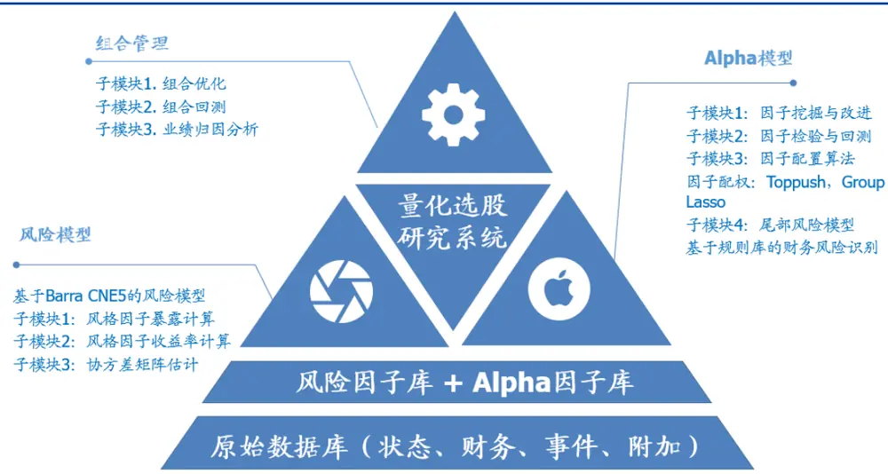
资料来源：国盛证券研究所

本文我们主要对三大数据库和风险模型、组合管理这几部分进行阐述。Alpha 模型部分由于包含内容较多，无法在一篇文章中阐述清楚，因此我们本文只介绍其中因子检验与回测部分，对于其他内容，我们也有所研究，例如关于因子配置问题，目前我们已经有顶端优化算法和 Group Lasso 两个算法；关于已有因子的改进，我们已经深入研究了价值因子，并做了相关优化。

## 2 基础数据库与研究平台构建

俗话说，“工欲善其事，必先利其器”，要想通过多因子选股体系获得稳定的收益，除了众所周知的Alpha因子和风险模型外，一个可靠、可用、可扩展的基础平台更是策略研究和运行的保障。例如，如果不在数据处理的时候考虑诸如财务数据调整变更的问题，可能会用到未来数据导致高估策略回测结果；如果在回测时不考虑滑点和股票流动性问题，可能会使得实际交易结果和模拟回测结果大相径庭；如果不考虑因子计算的可扩展性和性能效率，随着因子库的扩充，因子计算系统可能变得负重不堪，因子扩展也变得极为不易。因此，我们希望构建一个高度可靠、可用、可扩展的选股研究平台，使得选股研究更为轻便、灵活，而又不失严谨。

## 2.1 数据准备

构建因子数据库的第一大问题就是如何选择数据源。目前市场上有很多免费或者付费的数据源，甚至还可以通过爬虫技术主动搜集数据，但无论采用哪种方式，我们希望获取数据具备以下几个特征：

1).可靠性。这里的可靠，除了指数据本身质量较高，不存在重大错误之外，还有一个很关键的点是有很好的修复机制。由于很多数据（尤其是一些非结构化舆情数据）本身就存在难以获得或者复杂度较高的特点，数据收集过程中难免会有差错。然而，一旦出现差错后，是否有有效的机制恢复数据，并且将这些情况标记出来，成为制约我们在实盘交易中能否复现回测策略的重要因素。

2).及时性。数据能够及时获得。尤其是对高频数据，或者是日内数据，更需要有很强的及时性，保证实盘交易时能够获得最新的数据。

3).可回测性。这里重点强调数据不能被覆盖。最典型的例子是财务公告。上市公司对于某个财报期的公告经常是首先发一个正式报告，然后在未来某个时间发补充或者调整公告，调整过去某个财报期的数据。如果数据源本身就直接用后来的数据覆盖掉原始数据的话，我们就无法保证回测是可信的，因为用到了未来数据。再如有些数据商会提供衍生数据，比如 TTM 数据这种为了减轻研究者负担而提前算好的数据。如果要使用这类数据，依然需要确认没有使用未来数据，例如TTM数据，就不应该使用在计算当天之后发布的公告的数值来计算。综合考量以上因素，目前我们选择使用 Wind后台原始数据库作为我们的主要数据库，并运用我们自己的算法计算衍生指标数据库，再辅以爬虫等手段获取一些网络上的其他数据源作为辅助数据，综合构成我们所用的数据库。

## 2.2 基础数据库

我们首先编写了一个批量更新程序来对 Wind历史数据进行处理，然后再通过每天运行一个增量更新程序来处理增量数据。下面我们就对数据库设计、数据库具体形式和构建数据库相关的一些关键问题的思考展开本节内容的阐述。

## 2.2.1 基础数据库设计

相信有很多投资者会发现在实际研究中经常要重复处理很多数据，例如财务数据的对齐与填充，财务指标的计算，股票是否 ST或新股等状态的判断，个股和指数关系等信息，这些繁琐的数据处理工作占据了我们很多研究时间。因此，有必要对一些标准化的数据进行统一处理，以简化我们的日常工作。那么，哪些数据需要简化并且可以简化呢？我们将日常常用的数据表做了整理，如下表所示。

图表2：基础数据库设计

| 表名 | 描述 | 唯一标识 | 流量状 态信息 | 更新方式 |
| --- | --- | --- | --- | --- |
| trading_calendar | 交易日历 | 日期 | 静态表 | 每次运行时 |
| stock_desc | 个股基本描述 | 股票ID | 静态表 | 每次运行时 |
| index_desc | 指数基本描述 | 指数 ID | 静态表 | 每次运行时 |
| stock_status | 个股状态 | 股票ID+日期 | 状态表 | 每天 |
| stock_equity | 个股权益数据 | 股票ID+日期 状态表 |  | 每天 |
| stock_market | 个股市场表现 | 股票ID+日期 | 状态表 | 每天 |
| stock_balance | 资产负债表 | 股票ID+财报 期 | 状态表 | 上次运行时 间 |
| stock_income | 利润表 | 股票ID+财报 期 | 流量表 | 上次运行时 间 |
| stock_cashflow | 现金流量表 | 股票ID+财报 期 | 流量表 | 上次运行时 间 |
| stock_report_status | 个股财务状态 | 股票ID+日期 状态表 |  | 每天 |
| stock_financial_expense | 个股财务支出 明细 | 股票ID+财报 期 | 流量表 | 上次运行时 间 |
| stock_ttm | 个股TTM数据 | 股票ID+日期 | 状态表 | 每天 |
| stock_indicator | 个股指标数据 | 股票ID+日期 | 状态表 | 每天 |
| fin_notes_detail | 个股财务附注 | 股票ID+财报 期 | 流量表 | 上次运行时 间 |
| stock_dividend | 个股分红数据 | 股票ID+财报 期 | 状态表 | 上次运行时 间 |
| stock_rating_consus | 个股一致预期 数据 | 股票ID+日期 状态表 |  | 每天 |

资料来源：Wind，国盛证券研究所

如上表所示即为我们整理的原始数据库。仔细观察该表，我们发现将所有数据分为三类，即静态表、状态表和流量表。静态表的唯一标识是日期或者个股 ID。所谓“静态表”，并非完全静态保持不变，而是说该表在每次程序运行时更新，并不与日期相对应。状态表的唯一标识则是个股 ID和日期的组合，它表示在每天每只股票对于的状态，这使得我们能够直接取得个股当天的状态数据，很典型的例如财务状态表stock_report_status 就是这样，只需要将所有资产负债表的项目填充到每一天即可得到这张表的内容，使得我们可以直接根据个股 ID加上日期取到相对应的数据。最后一类是流量表，也是最复杂的一类。由于流量表是某段不确定时期（财务报表发布时间都不一样）的流量信息，因此没法统一处理，我们只能机械地将这部分信息直接按照原始格式保存，而将数据的处理留给具体的应用逻辑去完成（因为不同场景下处理方式不同）。

另外，不同表格的更新方式也不一样，一般来说有三种更新方式，即每天、上次运行时间后和每次运行时。具体而言，增量更新程序在每天的固定时间被触发，程序会首先执行需要从上次运行时间后开始更新的表格。我们通过一个简单的配置文件可以记录程序上次运行的时间，然后把从程序上次运行时间到本次执行时间内的数据进行处理，并保存到本地数据库。之后，程序会处理每次运行时需要更新的数据，并且将其保存。最后，程序处理每天需要更新的表格，并将表格中的数据持久化存储。

## 2.2.2 基础数据库概览

原始数据库中不同表因为自身的业务含义不同，其格式也不一样。一般来说，我们设计数据时会同时考虑数据存储的结构性、可靠性、便捷性和存取速度，对每张表格定义好其数据结构，并设定索引字段，对表内每一条数据的插入和更新设定时间戳，以及原始Wind 数据库中的 ID，使得每条数据有据可循。最后还会在程序更新时每天打印程序执行日志，做到 Wind原始数据、程序日志、本地数据三者互相呼应，有据可查。

由于列举具体每张表格的结构信息过于复杂，且细节较多，本篇报告不再赘述，感兴趣的投资者可以联系我们获取数据库结构信息以及样本数据。

## 2.2.3 关于基础数据的思考

1).关于源历史数据不可得问题和数据被修改问题。我们在做量化投资时，经常面临的一个棘手问题是，由于种种原因，导致历史数据在当时并不可得。具体来说，例如我们使用爬虫爬取历史新闻数据，如果使用新闻文章中的发布时间作为新闻的可得时间，那么很大概率我们使用到了未来数据，因为实际上新闻发出的时间很可能滞后于新闻文章中注明的时间，那么新闻数据在当时并不可得。类似还有数据被修改问题。例如，上市公司在时间DateA发布过去一期的公告数据A，之后又在时间DateB 对A数据进行补充公告修改为 B，那么实际上我们应该将数据 A 分割为两个时间段，如下图情况一所示，实际数据和保存数据保持一致。但是，如果是因为数据商本身的疏忽导致数据出错，那么我们可以忽略此情形，依然在 DateA 和 DateB 之间使用 DateB 之后才能获取的数据 B，如情况二所示。之所以这样做是因为我们认为这种疏忽是很偶发性的，而不是公司本身数据的问题。当然，如果数据商经常发生这样的错误，那么我们可能会考虑使用实际获取的数据存储。

图表3:数据被修改问题处理方式
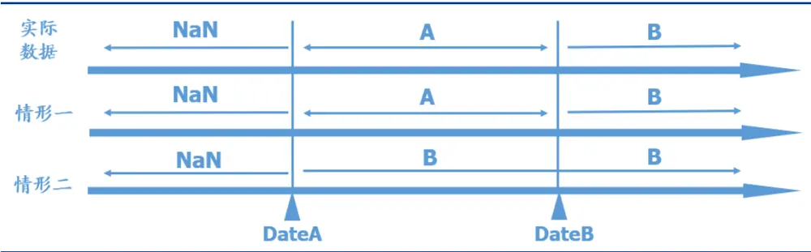
资料来源：国盛证券研究所

2).关于数据存储逻辑级别的思考。数据要处理到什么级别再存储才合理？这是个仁者见仁智者见智的问题。数据处理程度越深，未来使用到这条数据需要做预处理的工作就越少，但数据的应用面也就越窄。综合考虑数据处理的灵活性和未来使用的方便性，我们主要对财务数据做了以下处理：首先存储三大表原始数据，其次，我们做一些简单的数值填充，使得数据扩展到所有交易日上。这个填充是比较基本的前值填充，主要目的就是为了取数据方便。如果我们未来计算因子时确实只要用到某一天的截面数据，我们就可以取第二层的表，否则就取原始财务报表进行计算。

3).关于爬虫等相对不稳定的数据源。大数据因子在多因子当中扮演了越来越重要的角色，其不但可以提供很多增量信息，还具有高频、实时的特征。然而，大数据因子面临的最大问题是较高额的初期投入（数据获取门槛较高）以及数据的极度不稳定性（随时可能获取不到，或者获取方式需要做较大变动）。对于这一类不稳定的数据源，我们在做数据存储时，更要注意数据存储的灵活性和数据获取程序可修改的灵活性，否则将陷入无止境的代码调试-计算因子-程序奔溃的恶性循环中。另外，由于这类因子的有效性大幅取决于数据获取的及时性，所以不能仅仅用爬虫回溯过去的数据做模拟回测就认为数据非常有效，而一定要经历一定的数据观察期，确保实际能够获得的数据和历史爬虫获得的数据是同构的。

## 2.3 因子数据库

基于原始数据库，我们进一步构建了因子数据库，主要包括风险因子数据库和Alpha因子数据库，下面介绍因子数据内容。

## 2.3.1 因子数据库设计

因子数据库的设计面临以下几个问题：

1).如何设计数据库，使得因子具有较强的可扩展性，即每次增加新的因子，数据结构无需做过多改变？

2).如何设计数据库，使得因子存取速度较快，从而满足因子研究的需求？

3).如何设计数据库，使得同类型因子的数据结构更相近，从而在逻辑上表现出因子数据的美观性？

基于以上这些问题，我们将因子进行了分类，首先分为风险因子数据库和 Alpha 因子数据库。风险因子数据库属于风险模型部分要详细阐述的内容，我们放到后文中具体阐述。Alpha 因子又可以根据因子属性分为财务类因子、量价类因子和大数据因子。对于每一类因子，我们使用一张表存储，并以个股ID和日期的组合作为唯一索引。这样，我们能够将同一类因子的存取在一张表内完成，既满足了因子的结构特征，又避免太多的合并操作。

除了因子数据库设计之外，因子计算也是一个值得探讨的问题。由于因子计算逻辑千变万化，我们如何最大化利用结构化的代码进行因子计算，从而提高代码的复用性和性能呢？我们这里使用面向对象的编程方式，将每一个因子设计为一个对象，通过继承该类因子的因子模板（接口），实现该模板定义的函数，即可完成因子计算的撰写。一般来说，因子模板会要求实现因子的人员编写以下几个函数，即数据读取、数据预处理、因子计算、因子后处理、因子持久化等函数。

## 2.3.2 因子数据库概览

基于以上的因子数据库设计，以及因子计算逻辑，我们构建了一个较为完整的因子库。详情请投资者参考附录，我们将所有使用到的 Alpha 因子的名称、定义与使用数据逐一列出。

## 2.3.3 关于因子数据的思考

1).因子存储模式问题。我们有上百个因子，这些因子是应该存储到一张表中，还是每个因子存储在一张表中呢？是否要区分风险因子和 Alpha 因子？风险模型中的协方差矩阵这类矩阵数据怎样存储？这些都是数据存储的问题，要根据具体应用情况决定，并无统一答案。我们的做法是，根据因子逻辑将因子分为几个大组（这只是纯粹简单的分组，和因子合成与因子配置没有任何关系），每一个大组作为一张表存储。这样既不会使得表格特别庞大，又不会面临每个因子存储为一个表这种情况下，取因子数据要做很多补取数据、合并数据的繁琐操作。对于协方差矩阵的存储，我们用大部分语言都能够支持的JSON 格式存储，一方面比较标准化，另一方面和语言无关，适用于大部分应用场景。

2).因子批量计算的问题。当因子数据变多之后，因子计算是一件很耗时的工作。大部分科学计算语言提供了矩阵操作，使得因子计算变得相对简单。对于历史因子数据，由于数量非常庞大，我们大部分因子使用了矩阵运算方式进行计算存储。但是对于未来每天更新的数据，由于只涉及一个因子截面，可以不再使用矩阵方式，而是将逻辑相似的因子作为一个因子模板来统一计算和存储。例如，计算 PE、PB、PS 这些估值因子，因为计算逻辑相似，我们可以使用一套因子模板计算。这样我们构建了一套因子计算模板，并通过面向对象的方式将这些模板定义为接口，我们再进行因子计算时只要实现这些接口即可。这不但使得因子计算逻辑清晰，而且增加新的因子在逻辑和数据上都变得很容易。

## 2.4 研究平台

基础数据库和因子数据库构建完成后，我们还需要进一步构建基于其上的研究平台，主要包括风险模型的构建、因子测试与检验、组合优化与回测、业绩归因等。我们会在下文分章节对以上环节进行细节阐述，因此和研究平台系统相关的内容也放在相对应章节里介绍。

## 3 风险模型

我们基于 BarraUSE4的方法搭建风险模型，并在其基础上进行了改进。具体步骤可以分为计算因子暴露，回归得到因子收益，估计因子风险矩阵以及残差风险矩阵。目前国内关于风险模型的搭建已经有很多详细的资料，在这里我们只介绍在搭建风险模型时的一些细节处理以及改进方法。

## 3.1 因子暴露计算

## 3.1.1 因子定义

因子暴露的计算参考 BarraCNE5文档，文档中已经详细介绍了每个小类因子的计算方法以及小类因子合成大类因子的权重。考虑到中国市场的特殊情况，我们对因子的计算进行了细微的修改，有些细节孰对孰错并无定论，这里展示的方法仅供参考。

图表4:因子处理细节

| 因子 | 细节处理 |
| --- | --- |
| Size | Wind中总股本分A股总股本和总股本（包含B和H股），计算市值时我们使用总股本， 以更好的反映公司的市值大小 |
| Beta | 如果回归样本点停牌日期的 EWMA 权重超过 0.5，则当日 Beta 为 NaN |
| Momentum | 将滚动窗口长度504改为252，减小滚动窗口长度是为了保证次新股有Momentum因子的暴露。 停牌处理与 Beta 类似 |
| Volatility | 将CMRA因子中最后一步的取对数去掉，以防数值过小出现因子值无法计算的问题。 停牌处理与 Beta 类似 |
| Nlsize | 使用 WLSWLS 回归，回归的权重为根号总市值 |
| BTOP | 若账面价值为负，不做处理，我们认为负的账面价值并不是异常值，也包含一定的信息 |
| Liquidity | 停牌处理与 Beta 类似 数据均取自 Wind，其中 EPFWD 为净利润 FTTM/总市值 |
| EarningsYield | CETOP 为经营净现金流/总市值 ETOP 为归母净利润TTM/总市值 |
| Growth | EGRLG:Wind 一致预期净利润(fy3-fy0)/abs(fy0) EGRSF：Wind 一致预期净利润(fy1-fy0)/abs(fy0) EGRO和SGRO分别为净利润/销售收入与1-20 线性回归，插值，然后用斜率除以平均值的绝对 值。 这里分母都采用绝对值能够有效地避免负数造成的异常值影响。 |
| Leverage | 计算 EGRO 和SGRO 用净利润/销售收入而非每股指标是为了应对拆股导致 EPS 变化的问题 银行业负债指标和其他行业不同，因此只使用DTOA一个小类因子作为该行业的杠杆率因子 |
| Industry | 采用中信一级行业分类，其中将金融行业拆分为证券、保险和多元金融三个行业 |

资料来源：Wind，国盛证券研究所

计算完小类因子之后，我们对小类因子进行标准化，然后加权得到大类因子。因子权重参考 Barra CNE5文档中的权重。根据文档中的介绍，小类因子权重是一个拟合的值，目的是为了最大化因子对股票收益率的解释度。我们对比了直接等权和用 Barra的权重加权的方式，发现回归的平均日度 R方基本一致。因此，大类因子的计算用小类因子直接等权也是可以的。

## 3.1.2 缺失值处理方法

数据的质量是风险模型搭建中重要的一环。因此对数据中缺失值和异常值的处理尤为关键。缺失值的处理方法我们分为如下几类。

小类因子缺失：如果有小类因子缺失，不做任何处理，在合成大类因子时，将有值的小类因子权重按比例调整到和为 1，再计算大类因子。但如果大类因子下的所有小类因子均没有值，则大类因子缺失。

大类因子缺失：分情况讨论，对于财务类因子，如 EarningsYield、Leverage等，按行业平均进行填值；对于市场类因子，如 Momentum、Liquidity等，用回归的方式填值。例如，若某只股票，A因子缺失，则将A作为因变量，其他所有因子作为自变量进行回归，然后用回归结果来拟合A因子的暴露。这个方法借鉴了 Barra文档中的方法，我们认为行业、市值或者其他属性相似的股票会拥有相似的因子暴露。我们在实验中发现，这一方法的回归拟合程度大部分为 30%以上，有些甚至为 50%，因此也进一步证明了这一方法的可行性。下表展示了某一截面上，某个风格因子对其他所有因子回归的调整后的R2。可以看到，例如Liquidity、Volatility 等因子的拟合优度都在50%以上，这说明其他因子对这些的拟合程度较好，因此用回归的系数拟合的值会比较准确。

图表5:某一截面风格因子对其他所有因子的回归R方

| 因子 | 调整的 $\pmb{R}^{2}$ |
| --- | --- |
| Beta | 0.429 |
| Momentum | 0.472 |
| Size | 0.533 |
| Nlsize | 0.190 |
| EarningsYield | 0.367 |
| Volatility | 0.558 |
| Growth | 0.205 |
| Value | 0.507 |
| Leverage | 0.345 |
| Liquidity | 0.654 |

资料来源：Wind，国盛证券研究所

## 3.1.3 标准化处理方法

因子标准化分为两步，第一步是去极值，我们采用MAD 的方法，对于一个截面的样本$x_{i},i=1{,}2,\ldots,n$ ，首先求中位数， $x_{median}=median(x_{i})$ ，然后求所有样本点距离 $x_{median}$ 的中位数， $MAD=median(x_{i}-x_{median})$ 。我们将超出 $x_{median}\pm5MAD$ 的数据都拉回到$x_{median}$ ± 5MAD。

去完极值之后，我们对样本进行标准化。为了使得基准在某个因子上的暴露为 0，我们在计算样本均值的时候使用流通市值加权，计算标准差时直接使用样本标准差。

$$
x_{standard}=\frac{x-\mu}{\sigma}
$$

## 3.2 因子收益率计算

在计算完因子因子暴露之后，我们在每个交易日截面上，用当天的股票因子暴露对股票第二天的收益进行回归得到因子收益。

$$
r_{n}=f_{c}+\sum_{i}X_{ni}f_{i}+\sum_{s}X_{ns}f_{s}+u_{n}
$$

由于加入了国家因子 $\cdot f_{c}$ ，会造成多重共线性，因此这里我们限制行业的加权收益为 0。即

$$
\sum_{i}w_{i}f_{i}=0
$$

由于不同股票的残差波动率并不一样，直接用 OLS回归会产生异方差性，因此我们采用WLS 进行回归，且假设残差收益的波动与根号市值成反比。

上述回归问题由于存在一个线性限制，不能直接进行回归求解，我们可以采用以下几种方法：第一种方法是将约束条件带入回归方程，减少一个回归变量，这样就不存在共线性了；第二种方法是直接求一个带约束的优化问题，即最小化加权的残差平方和。我们采用第二种方式进行求解。

在具体回归的过程中，为了使得回归得到的因子收益能够更真实地反应该因子当前的收益，我们在回归样本中剔除了上市不满一年的股票、ST股以及长期停牌且刚复牌不久的股票。我们计算得到的因子表现如下

图表6:风格因子表现

|  | 年化 收益 | 年化 波动率 | 收益 风险比 | RankIC | \|t\|均值 | \|t\|>2 占比 | t>2 占比 | t<-2 占比 | 因子 方向 |
| --- | --- | --- | --- | --- | --- | --- | --- | --- | --- |
| Liquidity | 0.07 | 0.03 | 2.16 | -0.08 | 2.39 | 0.54 | 0.05 | 0.49 | -1 |
| Nlsize | 0.04 | 0.02 | 1.78 | -0.05 | 2.42 | 0.54 | 0.11 | 0.44 | -1 |
| Growth | 0.03 | 0.02 | 1.43 | 0.00 | 1.81 | 0.31 | 0.25 | 0.06 | 1 |
| Size | 0.08 | 0.06 | 1.35 | -0.07 | 5.11 | 0.78 | 0.24 | 0.54 | -1 |
| EarningsYield | 0.02 | 0.03 | 0.79 | 0.03 | 2.27 | 0.45 | 0.30 | 0.15 | 1 |
| Value | 0.03 | 0.04 | 0.79 | 0.05 | 2.33 | 0.51 | 0.31 | 0.19 | 1 |
| Beta | 0.04 | 0.05 | 0.68 | -0.01 | 3.34 | 0.57 | 0.31 | 0.26 | 1 |
| Momentum | 0.02 | 0.03 | 0.59 | -0.03 | 2.57 | 0.53 | 0.33 | 0.20 | 1 |
| Volatility | 0.02 | 0.04 | 0.45 | -0.07 | 2.75 | 0.54 | 0.20 | 0.34 | -1 |
| Leverage | 0.01 | 0.02 | 0.24 | -0.01 | 1.89 | 0.42 | 0.16 | 0.26 | -1 |

资料来源：Wind，国盛证券研究所

图表7：滚动12个月的R²
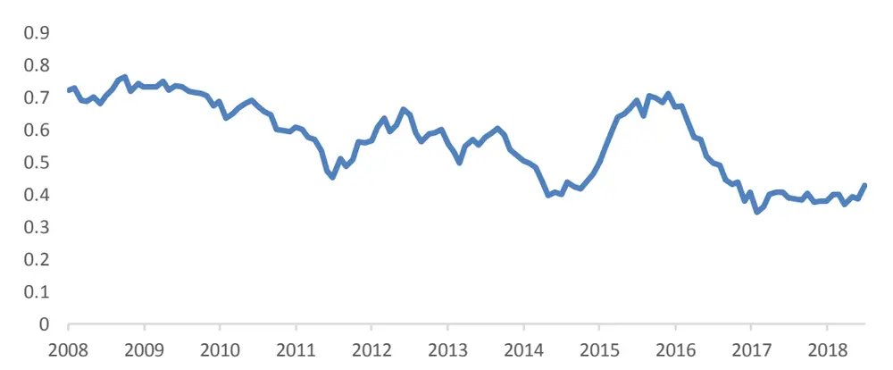
资料来源：Wind，国盛证券研究所

## 3.3 因子风险估计

因子风险的估计分为如下几步：首先是估计日度样本协方差矩阵并通过 NeweyWest 调整得到月度的协方差矩阵，然后进行特征根调整，最后进行 Volatility Regime 调整。整个流程的具体步骤在 Barra文档中都有详细的介绍。

但是，如果按照文档中的步骤进行估计，我们会发现预测的风险有时会被低估。具体来说，我们在预测给定权重的组合风险时，预测较准，而在预测由我们的风险矩阵计算出来的最优化组合的风险时，会有很大程度上的低估。下面我们来详细阐述一下这个问题。

Shepard（2009）提出，即使我们的估计方法是一个好的估计（无偏），但由于样本偏差

的存在，最优化组合的实际风险总是会被低估。他将这一现象称为 Second Order Risk。假设Ω̂是我们估计的协方差矩阵， $E\big(\widehat{\varOmega}\big)=\varOmega$ 。w是给定的权重（例如等权或者指数权重），那么 $E\big(w^{\prime}\hat{\varOmega}w\big)=w^{\prime}\varOmega w$ ，但是对于一个最优化组合，例如求解

$$
max\quad w^{\prime}\alpha-\frac{1}{2}w^{\prime}\hat{\Omega}w
$$

那么 $\widehat{w}=\widehat{\Omega}^{-1}\alpha$ ，此时 $E\big(\widehat{w}^{\prime}\widehat{\varOmega}\widehat{w}\big)=\widehat{w}^{\prime}\varOmega\widehat{w}$ 并不成立。这是因为此时权重和协方差矩阵均为估计值，因此 $i产$ 生了二阶偏误。如果收益率是满足正态分布的，那么Ω̂满足 Wishart分布，则有

$$
E\bigl(\widehat{w}^{\prime}\widehat{\varOmega}\widehat{w}\bigr)=\left(1-\frac{N}{T}\right)^{2}\widehat{w}^{\prime}\varOmega\widehat{w}.
$$

其中N 和 T分别为协方差矩阵维度以及估计窗口大小。也就是说，最优化组合的风险总会被系统性地低估。

由于因子收益、股票收益并不满足严格的正态性，因此 Barra 在调整这一偏误时，并没有直接使用上述公式，而是通过蒙特卡洛模拟的方法来修正协方差矩阵，即EigenfactorAdjustment。具体来说，我们假设历史因子收益率的分布为其真实分布，求得历史分布的参数（期望以及方差），利用该参数，通过蒙特卡洛模拟得到多个收益率样本，然后对于每次模拟的收益率样本预测其波动率，并与真实值进行比较得到平均的偏误统计量，最后利用这个统计量再对预测的波动率矩阵进行修正（详细步骤见 Barra USE4）。

然而我们发现，即使经过了上述调整，利用月频的风险模型来求解最优组合的时候，Barra定义的统计指标 Bias statistic 仍远大于 1，表明该组合的风险仍被严重的低估，这与预期不符。我们发现，这是由于多次模拟求得偏误统计量本质上是在计算当期样本协方差产生的二阶偏误，Barra 文档中的特征根调整是针对日频风险模型的，而由于月频的协方差矩阵中除了包含当期样本协方差矩阵之外，还包含 NeweyWest 调整中的滞后阶的协方差矩阵，在日频特征根调整中，这一部分的偏误并没有考虑到。因此我们在特征值调整中加入了 NeweyWest调整，这样能够更加准确地调整 second order risk带来的偏误。

## 3.4 残差风险估计

我们依据 Barra 的收益回归方程得到的个股特质收益率构建特质风险模型。整体构建方法依照Barra提供的USE4技术文档。

假设股票的残差风险互相独立，因此可以对于每只股票的残差风险进行单独建模。

首先，与因子风险估计相同，我们利用股票过去的残差收益率来得到残差波动的样本估计，并进行 NeweyWest 调整。

接下来，由于特质收益存在明显的尖峰厚尾特征，例如新上市的股票、经历长期停牌后复牌的股票等，利用时间序列模型来估计这些股票的特质波动率是不合适的。因此针对这些特征的股票，我们选用结构化模型来估计股票的特质波动率。我们首先根据股票历史收益率的厚尾程度以及样本数来确定一个参数 $\gamma_{\mathrm{n}}(0\leq\gamma_{\mathrm{n}}\leq1)$ 。若股票残差收益率样本历史数量足够且分布接近正态分布，则 $\gamma_{\mathrm{n}}=1;$ ；而 $\gamma_{\mathrm{n}}<1$ 时，股票的特质波动率需要由结构化模型调整。由所有 $\gamma_{\mathrm{n}}=1$ 的样本点回归得到估计系数 $\cdot b_{k}$ 并由此估计其他样本的波动率：

$$
ln(\sigma_{n}^{TS})=\sum_{k}X_{nk}b_{k}+\epsilon_{n}
$$

$$
\sigma_{n}^{STR}=E_{0}exp(\sum_{k}X_{nk}b_{k})
$$

最终得到特质波动率：

$$
\widehat{\sigma}_{n}=\gamma_{n}\sigma_{n}^{TS}+(1-\gamma_{n})\sigma_{n}^{STR}
$$

由于波动率还有均值回复的特性，上述时间序列模型总会高估残差波动率大的股票而低估残差波动率小的股票。因此我们利用利用另外一个估计量对上述结果进行压缩。

如果仅按照 Barra 的文档取压缩系数为 0.1 时，我们发现特质风险分组的估计偏误仍然存在一定的单调性。逐步增加压缩系数至 0.4，得到的偏误分布值较为合理。

图表8：贝叶斯压缩系数选择
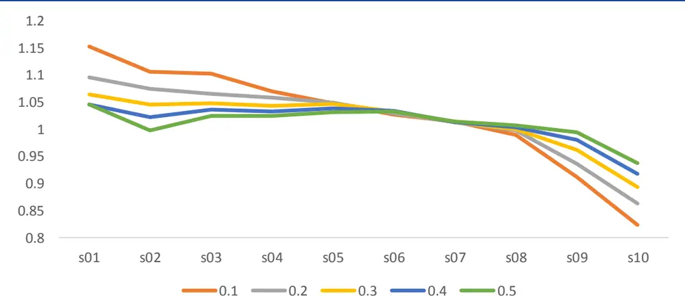
资料来源：Wind，国盛证券研究所

经过贝叶斯压缩后的特质波动率，我们同因子风险模型估计一样做了波动偏误调整（volatility regime adjustment）。

## 3.5 风险模型估计结果

以下是我们因子风险估计的最终结果与Barra的Bias Statistics的对比。对于所有的组合，我们的风险模型的BiasStatistics的均值和MRAD 都与Barra文档中结果接近，能够较好得刻画组合风险。

图表 9: 风险模型准确度与 Barra文档的对比

| 国盛风险模型 |  | Barra 风险模型 |  |
| --- | --- | --- | --- |
| Mean | MRAD | Mean | MRAD |
| 纯因子组合 0.91 | 0.24 | 1.08 | 0.22 |
| 随机权重组合 1.00 | 0.22 | 0.95 | 0.29 |
| 最优权重组合 1.13 | 0.24 | 1.21 | 0.32 |
| 残差风险 1.01 | 0.18 | 0.98 | 0.24 |

资料来源：Wind，国盛证券研究所

## 3.6 思考：实现的风险与目标风险的偏差来源

尽管 Barra 在估计股票风险矩阵的时候已经详细的考虑了各种可能出现的误差，并加以调整，使得 Barra 风险模型的 bias statistics 在 1 附近，这表明 Barra 风险模型已经能够很好地预测风险了。但是，在我们实际运用的过程中，却时常会发现实现的风险与我们预设的目标风险并不相同，且大部分时候会略微超过我们的目标风险。这是由于从风险模型的预测到组合实际实现的风险之间又会出现一些细微的偏差，这些偏差叠加会造成实现的风险与目标风险存在差距。

我们将对这一问题的思考总结成下表，在接下来的篇幅中，我们会对这些问题进行逐一介绍，并给出可能的解决方案。

图表10：影响组合风险的原因总结

| 序号原因 |  | 对组合风险的影响可能的解决方法 |  |
| --- | --- | --- | --- |
| 1 | 风险模型系统性的低估风险 | 增加 | 优化模型 |
| 2 | 月中股票权重的变化 | 增加 | 影响较小，暂时可忽略 |
| 3 | 月中因子暴露的变化 | 不定 | 必要时可以在月中进行调整 |
| 4 | 残差收益和因子收益的相关性 | 不定 | 根据策略来进行测算 |
| 5 | 策略风险 | 增加 | 根据过去策略实现的风险来进行调整(Qian，2007) |
| 6 | Alpha 因子与风险因子的不一 致问题 | 增加 | 在风险模型中加入更多因子，或者在优化中加入对 残差 Alpha 的风险惩罚 |

资料来源：国盛证券研究所

首先，我们考虑不同基准下的指数增强策略。设定策略的目标跟踪误差小于 5%，并最大化股票预期收益。我们用风格因子历史收益率的均值作为风格因子收益率的预测，然后代入回归模型求得股票预期收益率作为 Alpha 因子。这三个策略使用的 Alpha 相同，但是我们发现不同组合实现的跟踪误差却有很大的区别。我们利用风险归因的方法分别测算了不同度量下的总风险以及因子和残差部分贡献的风险。

图表11：不同策略事后风险归因

| 全市场 300 增强 | 全市场 500 增强 | 全市场 800 增强 |
| --- | --- | --- |
| 预测的总波动率（先验） 0.0498 | 0.0500 | 0.0498 |
| 预测的因子波动率（先验） 0.0433 | 0.0447 | 0.0443 |
| 预测的残差波动率（先验） 0.0243 | 0.0222 | 0.0224 |
| 全样本超额收益波动（无 NW 调整） 0.0578 | 0.0478 | 0.0552 |
| 全样本因子收益波动（无 NW调整） 0.0478 | 0.0445 | 0.0480 |
| 全样本残差收益波动（无 NW调整） 0.0308 | 0.0271 | 0.0281 |
| 全样本超额收益波动（NW调整） 0.0586 | 0.0513 | 0.0580 |
| 全样本因子收益波动（NW调整） 0.0497 | 0.0486 | 0.0508 |
| 全样本残差收益波动（NW调整） 0.0323 | 0.0280 | 0.0304 |
| 因子收益与残差收益的相关性 0.0335 资料来源：Wind，国盛证券研究所 | -0.1301 | -0.0190 |

## 3.6.1 偏差原因之一：风险模型低估风险

因子风险低估：表9中最优组合的biasstatistics略大于1，说明风险模型对于最优组合的风险仍会略微低估。我们参考 Barra CNE5 上面的结果，发现他们的最优组合的 biasstatistics 也大于1（见图12），这说明风险模型会系统性低估最优组合的风险。

残差风险低估：Barra特质风险也会有一定程度的低估，主要原因有两个，一是因为Barra假设股票的特质风险是相互独立的，即相关系数为 0，但事实上，同一行业、上下游间或其他相关形式的股票间的残差收益或多或少仍会有一些关联，因此实际上的相关系数会大于0，导致风险会有所增加。另一方面，由于事件导致的个股特质收益的剧烈波动，并不能被结构化模型所捕捉到，因此，Barra的残差风险模型也会低估这一方面的风险。

图表12:Barra风险模型对优化组合估计准确度
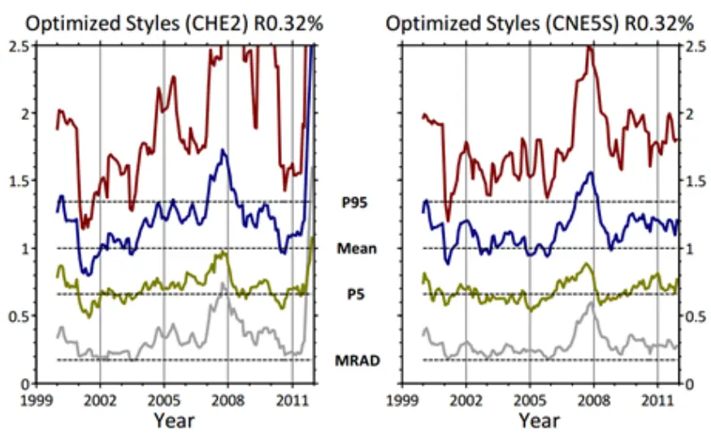
资料来源：MSCI，国盛证券研究所

## 3.6.2 偏差原因之二：组合权重与暴露的变化

我们在每个月底对优化问题求解时，对跟踪误差会进行如下约束：

$$
\sqrt{w_{a}^{\prime}(XFX^{\prime}+\Delta)w_{a}}\leq5\%/\sqrt{12}
$$

这其中有一个基本的假设就是权重 $\mathbf{w_{a}}$ 以及因子暴露矩阵X是不变的。但是在月中的时候，$w_{a}$ 将会随着股票的涨跌产生变化。Satchell和 Hwang（2001）研究了权重变化对跟踪误差的影响，他们证明了权重的随机变动总是会增加组合的跟踪误差，但是这一误差的大小无法精确估计。

同时，因子暴露矩阵 X 也会有略微变化。尽管 Barra 在构建风险因子时特别强调了因子的稳定性，但是对于与股票收益率相关的因子，例如 Momentum 等，月中的组合暴露值相对月初总会有一定程度的偏移。在财报季，财务类因子的暴露同样也会产生偏移。

## 3.6.3 偏差原因之三：组合残差收益与因子收益的相关关系

多因子模型的基本假设为股票的残差收益与因子收益是并不相关的，因此在预测风险时，将股票的总体风险分解为因子风险和残差风险两部分来预测。我们在每天截面回归计算因子收益时，只能保证股票的因子暴露和残差收益在截面上的相关系数为 0，但是在时间序列上，因子收益可能与残差收益存在一定的相关性。

也就是说，我们预测的风险为

$$
TE_{forecasted}=\sqrt{var[w_{a}^{\prime}(Xf+e)]}=\sqrt{var(w_{a}^{\prime}Xf)+var(w_{a}^{\prime}e)}.
$$

但实现的风险却为

$$
TE_{realized}=\sqrt{var[w_a'(Xf+e)]}=\sqrt{var(w_a'Xf)+var(w_a'e)+cov(w_a'Xf,w_a'e)}
$$

其中 $w_{a}$ 为主动权重，X为股票因子暴露矩阵，f,e分别为因子收益和残差收益。

对于不同的组合，残差收益与因子收益的相关性可能为正或者为负，因此，实现的跟踪误差会时有高估或者低估。这一部分带来的影响可以通过对收益归因得到。

从表 11 可以看到，尽管对于三个策略来说，因子收益和残差收益的波动都要高于预测值，但是 500增强的跟踪误差却相对其他两个策略较小。这就是因为 500增强残差收益和因子收益负相关导致的。

## 3.6.4 偏差原因之四：策略风险

在实际投资中，特别是相对基准的投资，我们经常用跟踪误差来衡量策略的风险。例如，若某只基金从 2016 年开始运行，我们想要计算它的跟踪误差，首先，计算从起始日开始基金每天的超额收益 $.r_{t}$ ，然后计算其样本标准差，那么基金的年化跟踪误差为 $std(r_{t})*$ √252。

回到我们的组合优化问题，在组合优化中，我们在每个月底预测下个月的股票协方差矩阵，并约束组合下个月的预期年化跟踪误差小于 5%。也就是说，我们的目标是组合每个月的跟踪误差小于5%/√12，而我们在计算组合绩效的时候却使用的是整个回测区间的收益率。这两者会有一定的差别。

我们把一年中每天的超额收益率记为 $r_{1,1},r_{1,2}\ldots r_{1,21},r_{2,1},r_{2,2}\ldots,r_{2,21}\ldots,r_{12,1}\ldots r_{12,21}。r_{i,j}中$ i代表月份，j代表月份中的第几个交易日。

如果假设组合日收益不存在自相关性，且我们的预测准确，那么有 $\scriptstyle{\left[r_{i,j}\sim N(\mu_{i},\sigma_{i}),\sigma_{i}=\right.}$ $5\%/\sqrt{252},$ ，即每月的日收益率满足同样的分布，但是不同月份之间的分布却不一定相同。如果用一年 252个交易日的样本求组合的跟踪误差，那么

$$
tracking\;error=\sqrt{252}*\sqrt{\frac{\sum_{i=1}^{12}\hat{\sigma}_{i}^{2}*(21-1)+21(\overline{{r_{\iota}}}-\bar{r})^{2}}{252-1}}
$$

若 $(\overline{{r_{\iota}}}-\bar{r})^{2}=0$ ，即不同月份的超额收益期望相同，则上述trackingerror的期望是5%，但是实际上，不同月份的平均收益并不相同，这会导致实现的tracking error会比 5%略大。但这一影响对一般的指数增强策略来说不会很大，因为指数增强策略的 Alpha 本来就相对稳定。经试验发现，对于较为稳定的 Alpha 策略，在控制跟踪误差为 5%的情况下，不同月份收益间的波动会使得实现的跟踪误差增加 0.2%左右。在表 11 的例子中，由于组合在沪深 300上的表现相对来说不太稳定，因此这一部分波动率导致了总风险的增加。

Qian（2007）也在书中提到了这个问题，他将这一风险称之为策略风险。在进行组合构建时，我们一般只对未来一周或者一个月进行预测，然后构建组合，即 single-periodportfolio optimization。但我们实现的投资组合却是 multi-period 的。在因子的预测能力保持不变，即 IC 不变或者波动较小的情况下，这一风险几乎可以忽略不计，但是因子的稳定性很差时，IC 的波动将会使得组合的风险增加。这一影响可以写成如下表达式，其中 $\sigma_{target}$ 为目标跟踪误差，N为股票数量， $dis(R_{t})$ 为风险调整后的残差收益的标准差，可近似为 1。

$$
\sigma=\sqrt{\cfrac{1}{N}+\sigma_{IC}^{2}}*\sqrt{N}*\sigma_{target}*dis(R_{t})
$$

该式的具体推导细节以及相关例子可以参考 Qian（2007）。

## 3.6.5 偏差原因之五：Alpha因子与风险因子的不一致问题

我们在构建投资组合的时候，Alpha 模型与风险模型一般来说都是分开构建的，因此Alpha 中的某些风险可能并没有被风险因子捕捉到，这会导致最终构建的组合对这部分风险有很大的暴露。除了会使得策略的风险超出预期之外，也可能会影响策略的收益。这一问题在组合构建文献中称为 Factor Alignment Problem（以下简称 FAP）。

具体来说，如果我们将 Alpha 因子对所有风险因子进行回归，那么α能表示为被风险因子表示的部分 $\alpha_{R}$ ，以及不能被风险因子表示的部分 $\alpha_{R\perp}$ 。其中 $X_{R}$ 为股票的风险因子暴露矩阵。

$$
\alpha=\alpha_{R}+\alpha_{R\perp}=X_{R}(X_{R}^{\prime}X_{R})^{-1}X_{R}^{\prime}\alpha+(I-X_{R}(X_{R}^{\prime}X_{R})^{-1}X_{R}^{\prime})\alpha
$$

$\alpha_{R\perp}$ 中包含的风险是无法被风险模型所捕捉的。例如如果我们的 Alpha 因子中含有反转因子，那么很大可能组合实现的跟踪误差会大于我们预设的跟踪误差，因为传统的 Barra模型中并不含有反转因子的风险。

FAP 问题除了会导致策略的风险不可控之外，还会导致组合在某些因子上产生未预期的暴露。详细的推导过程可见 Lee 和 Stefek（2008），其证明了 FAP 问题会导致组合过多的暴露在了 $\alpha_{R\perp}上$ o

## 3.6.6 解决方案

首先我们对上述偏差原因做一个总结。以表11中的三个指数增强为例。由于 Barra风险模型本身对风险略有低估（原因一）、组合的权重以及因子暴露在月中会产生变化（原因二），因此实现的因子风险和残差风险总会高于预测的因子风险和残差风险，那么按道理实现的跟踪误差一定会大于目标跟踪误差。但是由于因子收益和残差收益之间会有一定的相关性（原因三），对于那些残差收益和因子收益负相关的策略，实现的跟踪误差是有可能会小于目标跟踪误差的，如表 11 中的中证 500 增强策略。另一方面，由于策略风险的存在（原因四），策略风险高的策略最终实现的风险会进一步的变大，在表 11 中，由于Alpha因子在300策略上并不稳定，因此沪深300策略的跟踪误差远高于中证800。同时，如果Alpha因子中含有不能被风险模型线性解释的部分（原因五），也会造成风险的增大。

上述提到的几乎所有原因都会导致我们的风险被低估，但是在很多研究报告中，我们发现策略的风险总是被控制在了目标范围之内。究其原因，这是由于他们在计算跟踪误差时并没有考虑到收益之间的自相关性，由于策略的日收益一般来说都是有正的自相关性的，这会使得计算的跟踪误差相比实际的跟踪误差偏低。从表 11中可以看到，经过 NW调整后的波动率全部大于直接用标准差估计的波动率。如果在计算跟踪误差时考虑到收益的自相关性，那么由于上述一些原因的存在，组合实现的跟踪误差几乎总会略高于目标跟踪误差。那么如何解决上述这些问题呢。

对于风险模型估计方法的问题，我们可以强行调整模型的参数使得其历史的 biasstatistics 回到 1，但是这样并没有很强的逻辑，容易造成过拟合，在这里，我们倾向于不修改原始的风险模型。而对于权重和风格暴露在月中的变化，以及残差和风险因子的相关性问题，几乎没有很好的事前解决办法， $而$ 且对于不同的策略，产生偏误的原因也有所区别，我们可以对策略进行归因分析之后，对不同的策略再进行不同的调整。对于策略风险，Qian（2007）提出用 $\mathrm{k}=\sigma_{\mathrm{realized}}/\sigma_{\mathrm{target}}$ 作为参数，然后修正目标跟踪误差。对于原因五，已经有很多文献给出了这一问题的解决方法。例如我们可以在风险模型中加入更多的风险因子。或者直接在组合优化时加上对残差Alpha的风险的惩罚。

$$
\max(w-w_{bech})^T\alpha-\lambda\times TE^2-\theta\left[(w-w_{bech})^T\alpha_{R_\perp}\right]^2
$$

由于本文篇幅有限，这里我们只是简要地介绍了风险模型的搭建以及对风险模型的理解，对这一部分感兴趣的投资者可以联系我们做进一步的交流。

## 4. 因子测试

## 4.1 因子测试框架

我们将因子测试流程划分为三步，每一步的目的和其中存在的问题在下文进行详细讨论。因子处理流程：

1）因子处理：因子处理包括原始因子的计算，以及后续因子缺失值处理、极值处理、标准化和中性化处理；

2）因子测试：因子测试主要分为信息系数测试、分组测试法和回归法；

3）结果分析：针对第二步得到的测试结果，分析因子表现。

图表13：因子测试框架
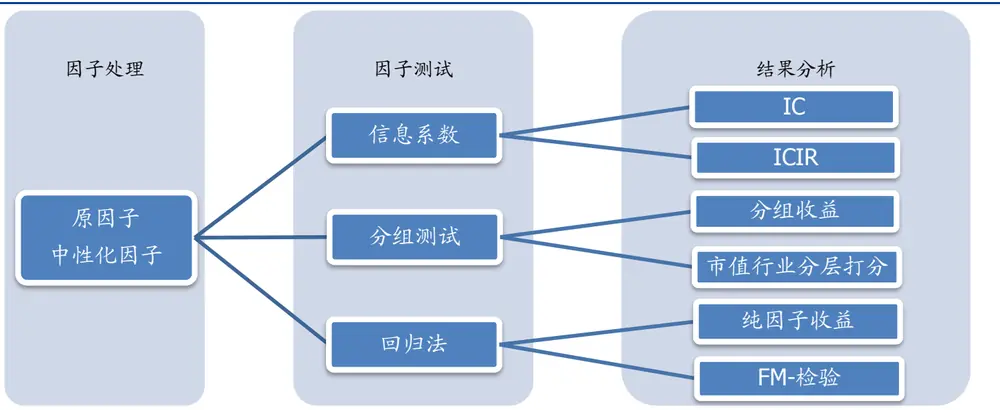
资料来源：国盛证券研究所

## 4.2 因子处理

在计算完因子之后，我们需要对原始因子值进行数据处理，常见的处理包括：缺失值处理，去极值，标注化和中性化。

缺失值：我们根据因子的特征选择是否进行缺失值填充，以及填充的方式，例如技术类因子可以选择前值填充，财务类因子缺失可以选择用行业均值填补，或某些特定选股因子例如股息率因子不建议填充等。

去极值：因子中的极值可能来自于异常的金融数据或者突发类事件，极端值也会影响到后面因子检验以及选股和组合构建，因此极值处理十分必要。常用的去极值方法包括分位数缩尾，3倍标准差法、中位数去极值法等。

标准化：使得不同因子之间可比较。

中性化：若因子间存在较强的相关性，其他因子的表现会干扰我们对该因子表现的判断，因此我们需要对原因子进行中性化处理。常见的中性化对象包括市值、行业，更进一步的提纯包括风险模型（例如 Barra/Axioma等风险模型）提供的所有风险因子。中性化手段较多，包括回归法、分层打分法等。

我们将同时测试原始因子与中性化因子。

## 4.3 因子测试

我们以盈利因子（EP：归母净利润/市值）为例展示因子测试的流程。

测试频率：我们需要根据策略的调仓频率设定测试频率。对于一个月频调仓策略，我们可以选择在每个月底计算因子值，考察因子与股票下一个月月度收益的关系。

测试域：不同因子在不同的样本内有不同的表现，例如不同的宽基指数：上证 50，沪深300，中证500，中证1000以及全样本等；或者不同行业：例如银行、化工等。我们根据研究需要设定相应的测试域。所有的测试样本均剔除新股、ST 股以及涨跌停的股票。

测试时间窗口：不同因子在不同市场环境和经济环境下有不同的表现。一般而言，测试时间窗口越长，反馈的信息越多。

## 4.3.1 信息系数

信息系数（information coefficient，缩写 IC）衡量截面上股票收益率与因子值之间的线性相关性，在线性模型的框架下，一般来说相关性越高，因子预测股票收益的能力越强。记月底全市场因子值向量为 $\mathbf{a_{t0}}$ ，下月样本股票收益率向量为 $\mathbf{r_{t1}}$ ，则二者间的 Pearson 相关系数即为 IC：

$$
\mathrm{IC}=\mathrm{corr}(\alpha_{\mathrm{t}0},\mathrm{r}_{\mathrm{t}1})
$$

与 IC 相关的另一个指标为秩相关信息系数（Rank-IC），衡量因子值与收益率之间的Spearman相关系数，等同于二者排序间的线性相关性，避免极端值对 IC 的影响。多数情况下在绝对数值上 Rank-IC 会高于 IC。

图表 14:Pearson相关系数与 Spearman相关系数
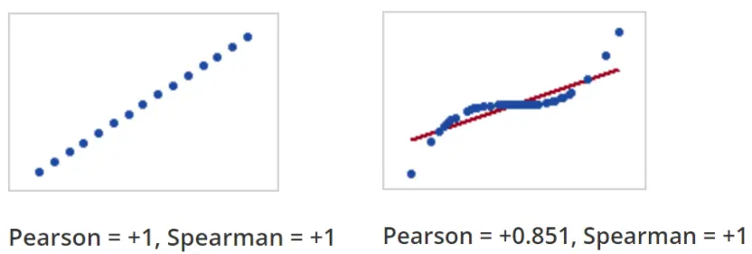
资料来源：国盛证券研究所

我们从两个角度考察 IC值（或 Rank-IC）：IC值的大小以及IC 的稳定性。第一点不必赘述，第二点我们一般用 ICIR来评价：

$$
\mathrm{ICIR}=\frac{mean(IC)}{std(IC)}\sqrt{12}
$$

以 EP因子为例，原因子与经过对市值和行业中性化处理后的 EP 因子月度 IC，均值分别为 0.0037 和 0.0258，Rank-IC 均值分别为 0.0159 和 0.0420，ICIR 值分别为 0.084 和1.209，Rank-ICIR 分别为 0.3433 和 1.8839，中性化之后均值和稳定性都有所提升.

图表 15:EP 因子 IC 均值与 ICIR，Rank-IC 均值与 Rank-ICIR

| 原EP |  |  | 中性化EP |  |
| --- | --- | --- | --- | --- |
|  | IC | Rank-IC | IC | Rank-IC |
| 均值 | 0.0037 | 0.0159 | 0.0258 | 0.0420 |
| ICIR | 0.0840 | 0.3433 | 1.2088 | 1.8839 |

资料来源：Wind，国盛证券研究所

信息系数时间序列分布如下图所示：

图表16:EP原因子月度IC时间序列分布
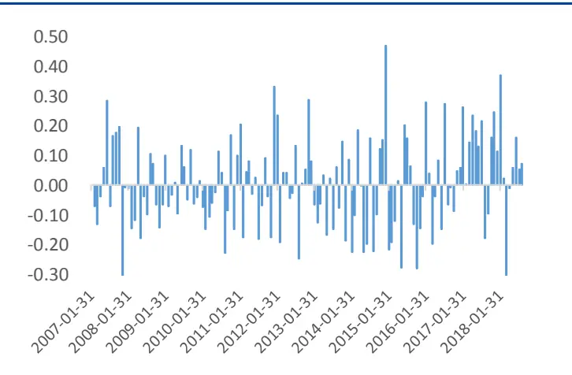
资料来源：Wind，国盛证券研究所

图表17：EP中性化因子月度IC时间序列分布
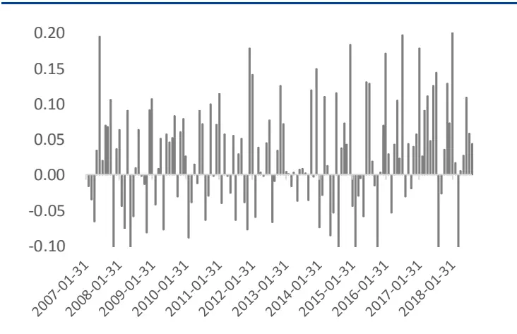
资料来源：Wind，国盛证券研究所

图表 18:EP原因子月度 Rank-IC时间序列分布
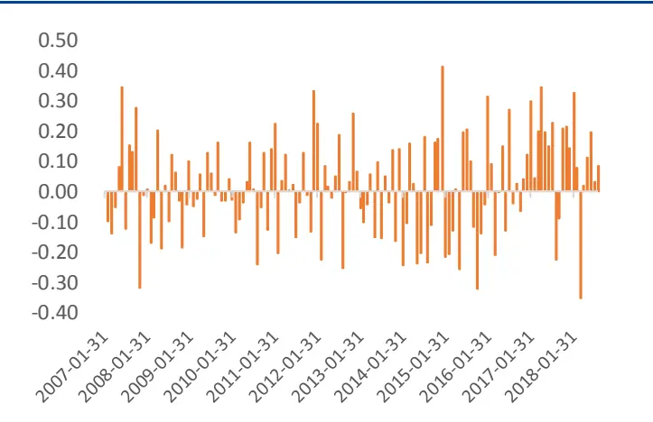
资料来源：Wind，国盛证券研究所

图表 19:EP 中性化因子月度Rank-IC时间序列分布
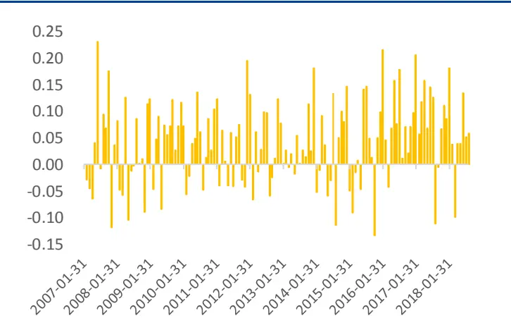
资料来源：Wind，国盛证券研究所

## 4.3.2 分组测试

## 1).分十组测试

相对 IC检验，我们从组合的角度更进一步观察因子对股票的区分度。常见做法是将股票池中按照因子的大小等分为十组构建投资组合，观察十个投资组合的表现是否依照因子值呈现单调性，单调性越强，因子对股票的区分度越好。

同时，我们买入因子值最高组，卖空因子值最低组（假设因子方向已经过调整），考察多空组合的收益表现。

分组检验的另一个优势在于考察因子的收益来自于多头还是空头，由于A股市场限制做空，因子多头部分的高收益比空头部分更具有实践意义。此外，还可以考察多头部分相对基准的超额收益。

我们可以分组检验分别考察原因子与中性化后的因子对股票收益的区分度。仍以 EP 为例，经过中性化之后，尽管不是完全单调，但十组收益区分度比原 EP 更加明显，因子选股能力有提升。同时，EP 因子体现出的非线性单调涉及到因子与股票收益间的非线性关系，这是另一块值得研究的内容，我们未来会针对这一问题进行更细致地探讨。

图表20：原EP因子等分十组净值走势
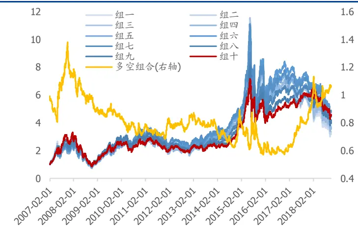
资料来源：Wind，国盛证券研究所

图表21：中性化EP等分十组净值走势
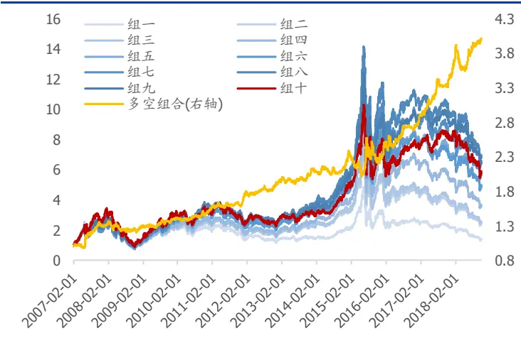
资料来源：Wind，国盛证券研究所

## 2).市值行业分层打分

虽然利用回归取残差的方式进行中性化处理能剔除大部分其他因子的影响，但是在数据分布两端仍会存在一定的相关性。另一种较为常用的中性化分组检验为分层打分。

我们采用市值和行业分层打分：我们将股票池按照市值大小分为三组，再按股票所属中信一级行业划分为 29组，共划分为87 组，每组按照因子值（原因子即可）大小等分五份，并分别抽取每组对应的因子分组，得到五个等分投资组合。

仍以 EP 为例，市值行业分层打分法得到的组合，其单调性较为明显，显示 EP因子有较好的选股能力。

图表22：EP因子行业市值分层打分法组合净值走势
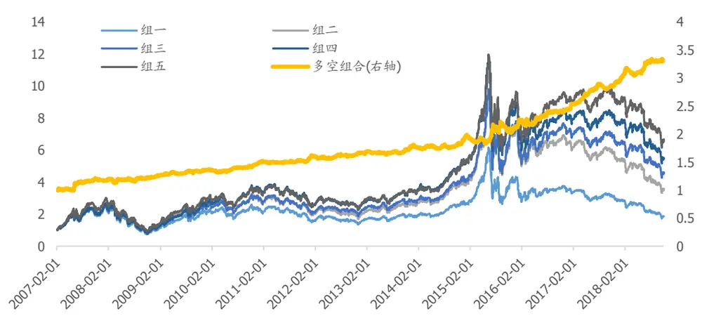
资料来源：Wind，国盛证券研究所

## 4.3.3 回归法

## 1).回归法与纯因子组合

最后一种因子检验方式为回归检验法，检验方式与风险模型中的风险因子检验一脉相承，将下一期股票收益对期初因子值线性回归，得到的系数可以视作在该因子上暴露为 1，在其他因子上暴露为 0的纯因子组合收益，通过考察纯因子组合的表现来理解因子的表现：

$$
\mathbf{r}=f_{0}+f_{\alpha}\alpha+\sum_{i}f_{i}x_{i}+\epsilon,
$$

其中r：股票收益率， $f_{0};$ ：市场因子收益， $f_{\alpha}$ ：α因子收益，α：α因子值， $f_{i};$ ：风险因子收益， $x_{i};$ 风险因子暴露，ε：残差收益。

由线性回归的性质可知，在回归时加入风险因子，会剥离 $f_{\alpha}$ 中受风险因子影响的因素，等价于将 $\cdot\alpha|$ 因子对风险因子中性化处理。风险因子可以根据需要选择市值、行业以及其他风险因子。

因子显著性检验：对于因子收益的稳定性，我们可以对因子收益进行时间序列上的Fama-MacBeth 检验：

$$
\mathrm{t}-\mathrm{value}=\frac{\mathrm{mean}(f_{\alpha})}{\mathrm{std}(f_{\alpha})}\sqrt{T-1}
$$

以 EP 为例，经过市值和行业中性化处理后的 EP 纯因子收益在时间序列上显示统计显著。

图表 23:EP纯因子收益 FM检验

| EP 纯因子收益 (原因子) | EP 纯因子收益 (市值行业中性化) | EP 纯因子收益 (所有风险因子中性化) |
| --- | --- | --- |
| t-value 0.12 | 3.76 | -1.66 |

资料来源：Wind，国盛证券研究所

经过市值和行业中性化处理之后的 EP 因子呈现出稳定向上的走势，但是将其与所有Barra风险因子回归之后，由于 Barra风险因子中的盈利因子包含了较多 EP的信息，价值因子 BP 也与其有部分信息重叠，将风险因子信息剔除后，EP 因子走势向下，不能提供稳定的超额收益。

图表24:EP纯因子收益净值走势
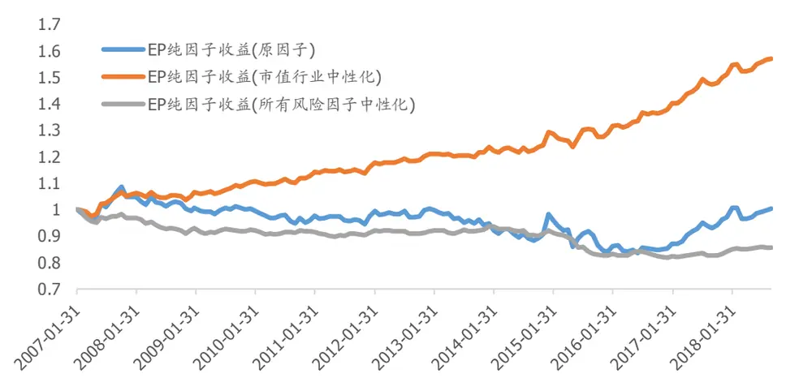
资料来源：Wind，国盛证券研究所

## 4.4 因子测试结果对比

经过上述分析我们对 EP因子有了一个初步的感知：

从信息系数来看：经过市值和行业中性化后的 EP 因子 IC 均值 0.0258，ICIR 为 1.209，说明 EP 与股票月度收益的有一定相关性，但并不稳定；

从分组测试来看：在分十组测试中，经过市值和行业中性化后的 EP 因子多空组合的收益稳定向上，但是分别观察十组收益会发现，虽然整体呈现因子值越高，收益越高的趋势，但因子值最高组的收益表现不如次高组，头部选股能力稍弱。从市值行业分层测试来看：五组收益呈现单调递增趋势；

从纯因子组合来看：EP 因子大部分信息已包含在风险因子中，在剔除市值和行业之后纯因子组合的收益在统计上显著为正，尤其在 2016~2017 年表现抢眼，但是剔除所有风险因子后，EP因子走势向下，不能提供除风险因子以外稳定的超额收益。

因此，从单因子角度来看，剔除市值和行业影响的 EP 因子具备一定的 Alpha 属性，稳定性较差，大部分信息能被风险因子所解释，无法提供风险因子以外的收益。

综上所述，我们将Alpha因子的测试方法总结如下：

Alpha 因子测试主要包括信息系数（IC）测试、分组测试法和回归法，IC 度量因子值与股票收益的相关性，分组测试帮助我们考察因子对股票的区分能力，收益的分布状态以及组合表现，而回归法能更深入地考察纯因子组合表现，与风险模型一脉相承，帮助我们更好地理解因子与组合优化的关系。

图表25：因子检验方法比较

| 方法 |  | 优势 | 劣势 |
| --- | --- | --- | --- |
| 信息系数 | IC | 含义简明；计算简便。 | 只能反映因子值与股票收益的线性相关 |
|  | ICIR |  | 性，未考虑非线性部分； |
|  | Rank-IC Rank-ICIR |  | 无法从选股角度反映因子头部选股能力。 |
|  | 分十组测试 |  | 直接考察组合收益与波动分布； 用回归取残差的方式无法做到完全中性； |
| 分组测试 | 市值行业分层打分 | 反映因子多头与空头收益； 辅助判断因子在时序上的表现。 直接考察组合收益与波动分布； 反映因子多头与空头收益； | 受市场风险及其他因子的影响； 受行业股票个数影响，分组组数受限； |
|  |  | 保持市值和行业中性； 辅助判断因子在时序上的表现 检验因子在时间序列上是否有显著 | 无法剔除其他α因子和风险因子的影响。 无法反映因子在组合中的表现； |
| 回归法 | 因子收益 FM-检验 | 收益； 辅助判断因子在时序上的表现。 能灵活控制风险因子对待检验因子 | 受回测时间窗口选取的影响 无法判断收益来自于多头还是空头； |
|  | 纯因子组合 | 的影响，提纯因子表现； 与风险模型、组合优化联系紧密。 | 纯因子组合不具可投资性，与实际投资组 合存在差别； 严格控制其他风险暴露为0，可能因子走 势与常识有出入 |

资料来源：国盛证券研究所

## 4.5 因子测试系统

基于以上思路我们搭建了一套统一的因子测试系统，便于输出完整且可比较的因子测试结果。

我们只需要给出以下配置信息，并且输入每期的原始因子值，便能够完成上述因子测试：

## 配置信息：

测试时间：测试起始日/结束日

调仓频率：月频

股票池：全A、中证1000、中证800、中证 500、沪深300、上证50，中信一级行业基准：全A、中证1000、中证800、中证500、沪深300、上证50是否中性化：是/否

中性化规则：Barra十大类风格因子，中信一级行业

输出结果：

IC/Rank-IC（原因子&中性化因子）；

纯因子组合收益（原因子&中性化因子）；

分十组组合及相对基准表现（原因子&中性化因子）；

市值行业分层打分组合表现（原因子）。

## 5 组合优化与回测

分别构建完风险模型和Alpha模型之后，我们可以通过组合优化来求解股票的最优权重，并且精准的控制组合在风格、行业上的暴露，以及组合的风险，同时进行回测。

我们的组合优化模块以及回测模块都是基于python的开源工具进行搭建。在搭建过程中进行了反复的测试以及优化，尽可能的考虑到了优化和回测中的各类细节问题。由于这一部分已经有一些标准化的方法，如果投资者已有自己成熟的组合优化以及回测模块，可以跳过这一节。

## 5.1 组合优化的基本形式和解法

一般来说，组合优化有两种基本形式。除了风险和收益之外，为了使得模型更加贴近实际交易，还需要考虑成本，这里我们采用简单的线性成本模型。

组合优化的第一种形式是，最大化风险调整的Alpha：

$$
\begin{array}{l}\max(w-w_{bench})^{T}\alpha-\lambda*TE^{2}-\delta*\mathbf{1}^{T}|w-w_{last}|\\\text{ s.t. }(w^{T}-w_{bench}^{T})X_{Style}\in[down_{-}cons,up_{-}cons]\\\quad(w^{T}-w_{bench}^{T})X_{ind}\in[down_{-}cons,up_{-}cons]\\\quad w^{T}1=total_{-}weight\\\quad0\leq w_{i}\leq max_{-}weight_{i}\end{array}
$$

其中，

$$
TE^{2}=(w-w_{bench})^{T}(XFX^{T}+\Delta)(w-w_{bench})
$$

第二种是，给定风险约束下，最大化Alpha：

$$
\begin{aligned}\max&(w-w_{bench})^{T}\alpha-\delta*\mathbf{1}^{T}|w-w_{last}|\\s.t.&(w^{T}-w_{bench}^{T})X_{Style}\in[down_{-}cons,up_{-}cons]\\&(w^{T}-w_{bench}^{T})X_{inie}\in[down_{-}cons,up_{-}cons]\\&(w-w_{bench})^{T}(XFX^{T}+\Delta)(w-w_{bench})<\operatorname{target}TE^{2}\\&w^{T}1=total_{-}weight\\&0\leq w\leq max_{-}weight\end{aligned}
$$

当然，目标函数中对换手率的惩罚项也可以添加到约束中，即限制组合的换手率小于某个值。

$$
\mathbf{1}^{T}|w-w_{last}|<max_{-}turnover
$$

我们使用python的cvxopt包，并使用mosek作为优化器进行求解。

第一种优化形式是一个简单的二次优化问题，可以直接用 cvxopt.solver.qp 进行求解。而对于第二种优化问题，我们可以将其转换为二阶锥优化问题，并使用 cvxopt.solver.socp进行求解。二阶锥约束的基本形式为

$$
\|Ax+b\|<c^{\prime}x+d
$$

那么跟踪误差约束可以转化为对应的形式

$$
\|Pw-Pw_{bench}\|<\operatorname{target}TE^{2}
$$

其中我们对股票的协方差矩阵做 Cholesky 分解得到P，即P′P = XFXT + ∆

由于在优化模型中加入了成本，使得模型中出现了绝对值项，我们需要对优化问题进行一定的变形，将权重变为净买入和净卖出的权重。

$$
\mathsf{w}=\mathsf{w}_{\mathrm{last}}+w^{+}-w^{-}
$$

然后将上式代入原优化问题中求解。

## 5.2 回测系统

为了使得策略的回测更加贴近实盘交易，我们没有采用简单的向量化回测方法，而是使用了事件驱动的回测框架。我们的回测系统是基于某开源平台的代码进行搭建，并在其中嵌入了上述组合优化模块，使得我们能够构建基于组合优化的多因子策略回测。

我们将上述代码封装成为了一个 python 包，只需要给出一些配置信息，并且输入每期的收益预测值，就能够进行策略的回测。下面是团队目前跟踪的一个中证 500 增强组合，我们通过这个组合示例呈现组合优化与回测系统的配置方法。

图表26：优化和回测模块配置信息

| 参数 |  | 例子中的参数 | 可选项 |
| --- | --- | --- | --- |
| 优化模块配 置信息 | 优化方式 | 最大化收益同时 约束跟踪误差 | 最大化风险调整的收益、最大化收益同时约束 跟踪误差 |
|  | 调仓频率 | 周频 | 日频、周频、月频 |
|  | 股票池 | 全A | 全A、中证1000、中证800、中证500、 沪深300、上证50、创业板指 |
|  | 基准 | 中证500 | 全A、中证1000、中证800、中证500、 沪深300、上证50、创业板指 |
|  | 风险厌恶系数 |  |  |
|  | 成本 | 0.2% |  |
|  | 风险因子约束上下限 | 市值行业中性 |  |
| 跟踪误差约束 | 5% |  |  |
| 个股最大权重 | 10% |  |  |
| 组合仓位 | 100% |  |  |
| 组合在基准中的仓位下限 | 0% |  |  |
| 开始结束日期 | 2011.1.1-2018.1 2.1 |  |  |
| 资金总额 回测模块配 滑点 | 100000000.00 |  |  |
| 置信息 |  | 0% |  |
|  | 手续费 | 0.16% |  |
|  | 股票最大成交量占 | 25% |  |
|  | 当天股票成交量的比例 成交价格 |  |  |
|  |  | 收盘价 | 收盘价、开盘价、VWAP |

资料来源：国盛证券研究所

图表27：策略分年表现

|  | 年化收益 | 年化波动 | IR | 最大回撤 | 回撤天数 | 开始时间 | 结束时间 |
| --- | --- | --- | --- | --- | --- | --- | --- |
| 2011 | 21.16% | 5.74% | 3.69 | 2.24% | 9 | 2011/5/11 | 2011/5/23 |
| 2012 | 33.27% | 6.22% | 5.35 | 2.69% | 15 | 2012/11/19 | 2012/12/7 |
| 2013 | 18.14% | 6.48% | 2.80 | 3.64% | 6 | 2013/12/2 | 2013/12/9 |
| 2014 | 23.30% | 6.03% | 3.87 | 2.98% | 10 | 2014/12/4 | 2014/12/17 |
| 2015 | 44.22% | 6.34% | 6.97 | 3.00% | 15 | 2015/6/25 | 2015/7/15 |
| 2016 | 28.08% | 5.89% | 4.77 | 2.80% | 40 | 2016/4/21 | 2016/6/20 |
| 2017 | 7.43% | 5.17% | 1.44 | 2.56% | 21 | 2017/3/22 | 2017/4/21 |
| 2018 | 20.23% | 5.94% | 3.41 | 3.00% | 19 | 2018/7/19 | 2018/8/14 |
| 全样本 | 24.15% | 6.01% | 4.02 | 3.64% | 6 | 2013/12/2 | 2013/12/9 |

资料来源：Wind，国盛证券研究所

图表28：策略净值曲线
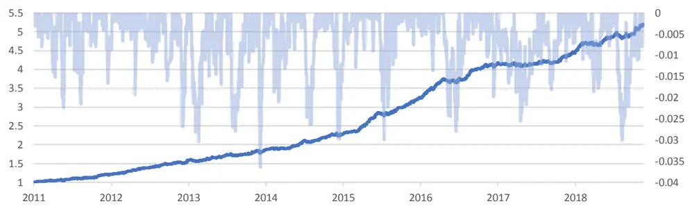
资料来源：Wind，国盛证券研究所

## 6. 业绩归因

## 6.1 收益归因

## 6.1.1 基于多因子体系的组合收益归因

在多因子模型的回归步骤，我们在每个交易日截面上，用当天的股票因子暴露对股票第二天的收益进行回归得到因子收益：

$$
r_{n}=X_{n,1}f_{1}+X_{n,2}f_{2}+\cdots+X_{n,k}f_{k}+u
$$

因此，将每个股票以组合权重向量 $\mathbf{w_{a}}$ （也可以是绝对权重）加权我们可以得到组合的收益分解：

$$
w_{a}^{T}r=w_{a}^{T}X_{1}\mathrm{f}_{1}+w_{a}^{\mathrm{T}}X_{2}\mathrm{f}_{2}+\cdots+w_{a}^{T}X_{\mathrm{k}}\mathrm{f}_{\mathrm{k}}+w_{a}^{T}u
$$

上式中每一项 $w_{a}^{\mathrm{T}}X_{\mathbf{k}}\mathbf{f}_{\mathbf{k}},$ 是第k个因子对组合收益的贡献，我们看到，若某个因子要对组合收益产生显著的影响，需要满足两个条件：首先，该因子有足够显著的收益；其次组合在该因子上有足够大的暴露。

当我们将因子贡献的收益从组合收益中剥离之后，剩下的残差收益即未能被风险因子解释的部分，这部分的收益可能来自于 Alpha 因子，也可能来自于运气，这一部分的收益能体现基金经理的选股能力。

## 6.1.2 多期收益归因问题

由于多因子模型是在截面上对当前的个股收益做一个分解，当我们在时间序列上对某个特定策略的收益进行归因分析时，必然会遇到由于多期收益累乘而产生的收益分解项的简单加和不等于组合收益的问题。

即：

图表29：多期收益分解

|  | 组合收益 | 因子贡献1 | m | 因子贡献k | 残差贡献 |
| --- | --- | --- | --- | --- | --- |
| t1 | $\mathtt{R_{1}}$ | $\mathrm{F_{1,1}}$ | ■ | $\mathrm{F_{k,1}}$ | $\mathrm{Res}_{1}$ |
| t2 | $\mathtt{R_{2}}$ | $\mathrm{F}_{1,2}$ | ■ | $\mathrm{F}_{\mathrm{k},2}$ | $\mathrm{Res}_{2}$ |
| 总计 | R | $\mathrm{F_{1}}$ | m | $\mathrm{F_{k}}$ | Res |

资料来源：国盛证券研究所

每一期满足 $\begin{array}{r}{\mathrm{.R}_{\mathrm{t}}=\sum_{k}F_{k,t}+Res_{t}}\end{array}$ ，但是我们会发现R $\begin{array}{r}{\neq\sum_{\mathrm{k}}F+Res.}\end{array}$

倘若希望将某一策略的多期总收益拆解为各项收益的算术加和，一些常用的调整算法有Carino(1999)，Menchero(2001)提出的系数调整法，将每期的收益贡献乘以对应的一个调整系数，Frongello(2004)提出从组合整体价值的变化来调整每期的收益贡献的方法等。这些算法在时间序列上对收益进行平滑处理，使得最终的结果呈现一个直观的算术加和形式，对横向比较各项收益源对组合收益影响的结论并不会有明显的区别。下文例举了Carino 和 Menchero 的调整算法以供参考。

对每期的收益贡献乘以一个调整系数，使得最终等式成立。

图表30：调整多期收益分解

|  | 组合收益 | 调整系数 | 因子贡献1 | … | 因子贡献k 残差贡献 |  |
| --- | --- | --- | --- | --- | --- | --- |
| t1 | $\mathtt{R_{1}}$ | $\mathbf{c_{1}}$ | $\mathtt{C_{1}F_{1,1}}$ |  | $\mathtt{C_{1}F_{k,1}}$ | $\mathtt{c_{1}Res_{1}}$ |
| t2 | $\mathtt{R_{2}}$ | $c_{2}$ | $\mathtt{C}_{2}\mathtt{F}_{1,2}$ |  | $\mathtt{C}_{2}\mathtt{F}_{\mathtt{k},2}$ | $\mathtt{c}_{2}\mathrm{Re}\mathtt{s}_{2}$ |
| 总计 | R |  | $\widetilde{\mathbf{F}}_{1}$ | · | $\widetilde{\mathbf{F}}_{\mathbf{k}}$ | $\widetilde{\mathrm{Res}}$ |

资料来源：国盛证券研究所

其中Carino 提出调整系数为：

$$
c_{\mathrm{t}}^{\mathrm{Car}}=\frac{\ln(1+R_{t})/R_{t}}{\ln(1+R)/R}
$$

Menchero 做法与Carino相似，每期对因子贡献乘以对应的调整系数：

$$
c_{t}^{\mathrm{Men}}=\frac{1}{T}\left[\frac{R}{(1+R)^{\frac{1}{T}}-1}\right]+\frac{R_{t}(R-\frac{1}{T}\left(\frac{R}{(1+R)^{\frac{1}{T}}}-1\right)\sum_{t}R_{t})}{\sum_{t}(R_{t})^{2}}
$$

6.1.3 收益相关性问题及修正

## 1).收益归因相关性

根据多因子模型对组合收益的拆解非常直观，但是如果简单地利用组合因子暴露和因子收益来计算因子收益贡献，其结果存在偏误。下面我们对其中的一类偏误现象进行说明。

首先我们给定一个投资组合，结合风险模型，利用过去三个月风格因子收益均值和月底股票的风格因子暴露来预测股票未来的收益，以中证 500为业绩基准，构建月度换仓策略。在每个月月底，我们输入预测的股票收益率，风险估计值和相关约束条件，计算组合最优权重。我们约束个股的绝对权重在 0至 10%之间，全仓买入，设定组合在行业上的主动暴露在 0.05以内，并设定年化跟踪误差为 5%。

我们按照多因子收益归因体系，并用Carino法进行多期平滑调整后，得到如下总收益归因结果。可以看到，该策略 151.47%的超额收益中，因子收益贡献达到208.83%，而特质收益则为-57.36%。在因子收益贡献中，由于我们在优化中限制了行业的主动暴露，因此大部分收益来自于风格因子，其中风格收益贡献达 218.71%，而行业收益贡献为-12.41%（共31个行业因子，只展示了轻工和证券两个行业）。风格因子收益中流动性因子贡献最大，达 80.97%，其次为非线性市值、市值和成长因子。

多因子模型为我们提供了一种收益分解的思路。虽然截面回归保证了每一期截面上残差与因子暴露间正交，但在时间序列上，因子收益贡献与残差收益部分仍存在一定相关性，且在中证 500中更为明显。如下表最后两行，我们对因子收益贡献和残差收益贡献在时间序列上做了Pearson相关性检验，统计显示二者相关系数达-0.109，检验p值1.33e-06。

图表31：组合收益归因

| 归因项 | 收益贡献 |
| --- | --- |
| 组合超额收益 | 151.47% |
| 特质收益 | -57.36% |
| 因子收益 | 208.83% |
| 风格收益 | 218.71% |
| Beta | 2.44% |
| 盈利 | 7.54% |
| 成长 | 21.67% |
| 杠杆 | 7.38% |
| 流动性 | 80.97% |
| 动量 | 6.10% |
| 非线性市值 | 41.22% |
| 市值 | 44.38% |
| 价值 | 2.47% |
| 残差波动率 | 4.54% |
| 行业收益 | -12.41% |
| 轻工制造 | -0.87% |
| 证券 | -1.10% |
| 国家因子收益 | 2.53% |
| 特质收益与因子收益 Pearson 相关系数 | -0.1094 |
| Pearson 相关性 p-value | 1.33E-06 |

资料来源：Wind，国盛证券研究所

## 2).理论探讨与收益归因调整

我们考虑组合 2期收益贡献，假设只有两个风险因子a和b：

图表32：多期收益归因示例

|  | 组合收益 | 因子贡献a | 因子贡献b | 残差贡献 |
| --- | --- | --- | --- | --- |
| t1 | $\mathtt{R_{1}}$ | $\mathrm{F_{a,1}}$ | $\mathrm{F_{b,1}}$ | $\epsilon_{1}$ |
| t2 | $\mathtt{R_{2}}$ | $\mathrm{F}_{\mathbf{a},2}$ | $\mathrm{F_{b,2}}$ | $\epsilon_{2}$ |
| 总计 | R | $\mathrm{F_{a}}$ | $\mathrm{F_{b}}$ | € |

资料来源：国盛证券研究所

平时在归因时，大部分人的做法是直接将组合收益减去因子收益贡献，将残差部分视作Alpha 来源：

$$
\begin{array}{c}组合收益=(1+\mathbb{R}_1)(1+\mathbb{R}_2)\\=\big(1+\mathbb{F}_{\mathsf{a},1}+\mathbb{F}_{\mathsf{b},1}+\epsilon_1\big)\big(1+\mathbb{F}_{\mathsf{a},2}+\mathbb{F}_{\mathsf{b},2}+\epsilon_2\big)\\=\big(1+\mathbb{F}_{\mathsf{a},1}+\mathbb{F}_{\mathsf{b},1}\big)\big(1+\mathbb{F}_{\mathsf{a},2}+\mathbb{F}_{\mathsf{b},2}\big)+\big(1+\mathbb{F}_{\mathsf{a},1}+\mathbb{F}_{\mathsf{b},1}\big)\epsilon_1+\big(1+\mathbb{F}_{\mathsf{a},2}+\mathbb{F}_{\mathsf{b},2}\big)\epsilon_2+\epsilon_1\epsilon_2\end{array}
$$

当满足因子间以及因子与残差收益间的不相关的假设时，我们可以简单地将 $(1+\epsilon_{1})(1+$ $\epsilon_{2})$ 视为残差收益贡献，将 $\left(1+\mathrm{F}_{\mathrm{a},1}\right)\left(1+\mathrm{F}_{\mathrm{a},2}\right)和\left(1+\mathrm{F}_{\mathrm{b},1}\right)\left(1+\mathrm{F}_{\mathrm{b},2}\right)$ 视为因子收益贡献。

但是观察上式我们注意到，除开上述两项，在等式展开时还存在许多冗余项，包括在时序上因子 a与因子b 的交叉项，以及残差与因子 a和因子b的交叉项。在实际建模的过程中，这些交叉项并不等于 0。如果我们简单地用组合收益减去因子贡献收益，得到的残差收益贡献会与实际的 Alpha 贡献有偏差，若交互项之和大于 0，则会高估 Alpha 因子的能力。

同样在多因子框架下，如果我们重新审视收益归因的出发点，我们希望对组合进行一个拆分，在风险模型的框架下，我们希望将目标组合表达为纯因子组合（factor mimickingportfolio）的线性组合：

$$
\mathbf{w}=\mathbf{H}\lambda+\mathbf{e}
$$

其中H的第k列代表因子k的纯因子组合权重，ϵ则为残差组合。

若在上式两边同时乘以股票收益率向量r，那么我们可以得到组合收益的分解：

$$
\mathbf{w}^{\mathrm{T}}\mathbf{r}=\mathbf{\lambda}^{\mathrm{T}}\mathbf{H}^{\mathrm{T}}\mathbf{r}+\mathbf{\epsilon}^{\mathrm{T}}\mathbf{r}
$$

而我们在风险模型的构建过程中，已事先计算了因子暴露，得到组合的因子暴露值 $\mathbf{X}^{\mathrm{T}}\boldsymbol{w}$ 截面回归过程中，已经获得了纯因子组合的收益 $\mathbf{f}=\mathbf{H}^{\mathrm{T}}\boldsymbol{r}$ ，从而有：

$$
\boldsymbol{\mathsf{w}}^{\mathrm{{T}}}\boldsymbol{r}=\boldsymbol{w}^{T}\boldsymbol{X}\boldsymbol{f}+\boldsymbol{w}^{T}\boldsymbol{\mathsf{u}}
$$

因此，当且仅当 $\lambda=\mathtt{X}^{\mathrm{T}}w$ 的时候，两种思路下的归因结果相同。

沿袭第一种思路，我们希望纯因子组合尽可能解释目标组合w，等价于我们希望在组合线性回归 $\mathrm{w}=\mathrm{H}\lambda+\mathrm{e}$ ，最小化残差组合的方差：

$$
\operatorname*{min}\epsilon^{T}\Delta\epsilon
$$

运用广义最小二乘法可得：

$$
\mathrm{H}^{\mathrm{T}}=(X^{T}\Delta^{-1}X)^{-1}X^{T}\varDelta^{-1}
$$

那么当我们求解λ的时候，易得：

$$
\lambda=(H^{T}\varDelta H)^{-1}H^{T}\varDelta w=X^{T}w
$$

但是应当注意到在风险模型体系下我们运用根号市值加权作为回归权重得到纯因子组合矩阵H：

$$
H^{T}=(X^{T}WX)^{-1}X^{T}W
$$

那么显然 $\lambda=(H^{T}\varDelta H)^{-1}H^{T}\varDelta w\neq X^{T}w\text{。 }$

## 3).归因调整

由于残差收益与因子收益在时间序列上仍然存在一定的相关性，我们不妨从时间序列上直接对其构建线性回归模型：

$$
r_{t}^{T}\epsilon_{t}=\sum_{j}f_{tj}X_{tj}^{T}w\beta_{j}+r^{T}\tilde{\epsilon}_{t}
$$

残差收益贡献为应变量，因子收益贡献为自变量，对每一个因子j都能得到其回归系数 $i\beta_{j}$ ， 回归残差rTε为剥离因子收益之后更准确的残差贡献。̃

那么原始因子收益归因可以转化为：

$$
r^{T}w=\sum_{j}f_{j}X_{j}^{T}w+r_{t}^{T}\epsilon_{t}=\sum_{j}f_{j}X_{j}^{T}w+\sum_{j}f_{tj}X_{tj}^{T}w\beta_{j}+r^{T}\bar{\epsilon}\\=\sum_{j}f_{j}X_{j}^{T}w\big(1+\beta_{j}\big)+r^{T}\bar{\epsilon}
$$

如果我们将分解后的残差收益重新代入原式，可以看做是将原有的因子收益贡献乘以一个相对调整系数 $\left(1+\beta_{j}\right)$ ，这样做的好处在于，一是因子收益在时序上是变化的，相对值调整能保留变化的特征；二是在于，乘以一个相对调整系数可以避免调整出现不合理的因子收益贡献突变。

还需注意在回归的过程中，我们应当尤其注意自变量的选择。在这里我们采用逐步剔除法，每次剔除p 值最大变量直至所有自变量都在统计上显著。最终得到如下回归结果：

图表33：收益贡献回归结果

| Coef $(\pmb{\beta}_{j})$ | std err | t | P>1t1 |
| --- | --- | --- | --- |
| beta -0.1876 | 0.0590 | -3.1760 | 0.0020 |
| 盈利 -0.3776 | 0.0840 | -4.4830 | 0.0000 |
| 成长 -0.4609 | 0.0860 | -5.3700 | 0.0000 |
| 流动性 -0.2034 | 0.0420 | -4.8850 | 0.0000 |
| 动量 -0.2444 | 0.0870 | -2.8200 | 0.0050 |
| 价值 -0.1980 | 0.0780 | -2.5220 | 0.0120 |
| 轻工制造 1.2168 | 0.5260 | 2.3140 | 0.0210 |
| 证券 -0.4964 | 0.2090 | -2.3750 | 0.0180 |
| R-squared: 0.0530 |  |  |  |
| Adj. R-squared: 0.0500 |  |  |  |
| F-statistic: 13.6600 |  |  |  |
| Prob (F-statistic): 0.0000 |  |  |  |

资料来源：Wind，国盛证券研究所

注意到大部分风格因子的贡献都有高估的嫌疑，回归调整后原始风格因子贡献下降，特质收益上升。而经过剥离后的特质收益贡献与因子收益贡献的时序相关性从-0.1094 在绝对值上下降至 0.0114，且 p 值由 1.33E-06变为 0.6167，即相关性统计检验不显著。

图表34:调整后组合收益归因

| 归因项 | 收益贡献 |
| --- | --- |
| 组合超额收益 | 151.47% |
| 特质收益 | -25.34% |
| 因子收益 | 176.80% |
| 风格收益 | 186.96% |
| Beta | 1.98% |
| 盈利 | 4.69% |
| 成长 | 11.69% |
| 杠杆 | 7.38% |
| 流动性 | 64.50% |
| 动量 | 4.61% |
| 非线性市值 | 41.22% |
| 市值 | 44.38% |
| 价值 | 1.98% |
| 残差波动率 | 4.54% |
| 行业收益 | -12.69% |
| 轻工制造 | -0.87% |
| 证券 | -1.10% |
| 国家因子收益 | 2.53% |
| 特质收益与因子收益 Pearson 相关系数 | 0.0114 |
| Pearson 相关性 p-value | 0.6167 |

资料来源：Wind，国盛证券研究所

## 6.2 风险归因

当我们谈到构建投资组合时，组合的收益和风险是不可忽略的在组合优化的风险管理端，投资经理希望确认组合的风险来源并找到合适的手段来对冲风险。但是由于常用的风险度量指标（如标准差、在险价值等）的特性，简单的组合中各类资产的风险相加并不直接等于组合的风险。而风险归因作为一种技术手段，将组合的风险进一步拆分，以帮助投资经理对组合风险有更为清晰的认知并指导投资组合管理。

与收益归因不同，当前较为成熟的风险归因手段大多基于先验风险进行分解和分析。

## 6.2.1 基于多因子模型的风险归因

在多因子模型的框架下，我们关注不同因子对组合风险的影响。回顾 Barra 模型对股票收益的拆解：

$$
R=\sum_{k}X_{k}f_{k}+\sum_{n}h_{n}u_{n}
$$

其中 $X_{k}$ 为组合在因子k上的暴露，而 $f_{k}$ 为该因子组合（factor-mimicking portfolio）的收益， $h_{n}$ 为组合中个股n的权重（也可以是主动权重）， $u_{n}$ 为个股n的残差收益。

## 1).多期风险归因

在实际投资过程中，投资经理关注组合的风险分配，因此往往是基于先验风险对组合进行风险归因分析。

当然我们也可以从后验的角度，利用策略整个回测时间窗口的收益序列，进行风险划分：

$$
\mathrm{var}(R)=\mathrm{cov}\left(R,\sum_{k}x_{k}f_{k}\right)=\sum_{k}\mathrm{cov}(R,x_{k}f_{k})
$$

## 2).截面风险归因

沿袭 Barra 对收益率的拆解，我们按上文对波动率做进一步的演化：

$$
\sigma(R)=\frac{\sigma^{2}(R)}{\sigma(R)}=\frac{Cov(R,\ \sum_{k}X_{k}f_{k}+\sum_{n}h_{n}u_{n})}{\sigma(R)}=\frac{Cov(R,\ \sum_{k}X_{k}f_{k})+Cov(R,\ \sum_{n}h_{n}u_{n})}{\sigma(R)}
$$

因此我们有

$$
\sigma(R)=\sum_{k}X_{k}\sigma(f_{k})\rho(f_{k},R)+\sum_{n}h_{n}\sigma(u_{n})\rho(u_{n},R),
$$

其中， $\sigma(f_{k})\rho(f_{k},\mathsf{R})$ 为因子的边际风险贡献。

由此可见，组合风险的来源可以拆分为共同风险和特质风险，且分别由三个因素驱动：- 组合在因子上的暴露；收益源因子的波动率；收益源因子与组合收益的相关性。

而当我们考虑因子收益与组合收益的相关性时，我们有：

$$
\rho\big(f_{k},r_{p}\big)=\sum_{l}X_{l}\left[\frac{\sigma(f_{l})}{\sigma(R)}\right]\rho(f_{l},f_{k}),
$$

换言之，因子收益 $f_{k}$ 与组合收益的相关系数是该因子与其他因子收益的相关系数以$\begin{array}{r}{X_{l}\left[\frac{\sigma(f_{l})}{\sigma(R)}\right]}\end{array}$ 为权重的加和。因此，多因子模型中因子之间的千丝万缕的联系会对组合的风险分布产生至关重要的影响。

我们仍使用收益归因中的例子，将某个调仓日最优组合的先验风险归因结果（只列出风格因子项）按照风险贡献按绝对值降序排列如下：

图表35：三因素风险归因

|  | 因子暴露 | 因子波动率 | 相关系数 | 风格因子风险贡献 |
| --- | --- | --- | --- | --- |
| 非线性市值 | -0.7421 | 0.0126 | -0.7972 | 0.746% |
| 价值 | -0.5544 | 0.0162 | -0.8127 | 0.728% |
| 盈利 | 0.5333 | 0.0136 | 0.5869 | 0.425% |
| 流动性 | -0.6284 | 0.0056 | -0.3005 | 0.105% |
| Beta | -0.0748 | 0.0316 | 0.1500 | -0.035% |
| 市值 | 0.2655 | 0.0080 | 0.1228 | 0.026% |
| 杠杆 | 0.1614 | 0.0059 | 0.1285 | 0.012% |
| 动量 | 0.1527 | 0.0089 | 0.0797 | 0.011% |
| 成长 | 0.5130 | 0.0085 | 0.0094 | 0.004% |
| 波动率 | -0.2891 | 0.0086 | -0.0026 | 0.001% |

资料来源：Wind，国盛证券研究所

从上述归因结果来看，beta 因子对组合风险贡献为负，或者说组合在 beta 上的暴露起到了风险分散的效果。观察风险贡献最高的三项非线性市值、价值和盈利因子，可以看到无论是组合在这些因子上的暴露，还是这些因子本身含有的波动率，亦或是因子收益与组合收益的相关性都非常高，导致三者最终对组合的风险贡献也较大。比较市值和波动率我们发现，即使组合在二者的因子暴露程度相似，因子波动率相似，但是由于波动率与组合收益之间的相关性较市值更低，因此最终波动率贡献的风险也远远低于市值因子贡献的风险。

## 7. 总结与展望

多因子选股在国内的发展几经坎坷，从最开始的打分法选股开始，到对小市值因子的追逐，再到使用风险模型和组合优化控制风险暴露，再到反转等传统因子的失效，市场一次又一次地告诉量化投资者，多因子模型绝非用几个过去表现很好的因子组合打分那么简单。无论是对于因子本身的理解，还是对因子算法的选择，甚至是因子计算中微小的细节，都会对组合绩效产生巨大的影响。站在当下，我们有必要重新认真审视多因子选股这个体系，看看它到底有着怎样的风险和不足。一方面，我们希望通过多因子选股系列的研究，能够使得多因子体系能够更加面向实际投资交易，并在模型回撤的时候能够给出更有效更及时的反馈；另一方面，我们也希望能够给坚守在多因子选股策略的投资者们带来一些启发，因为我们知道，虽然想在已经很成熟的多因子选股体系上提供研究增量很难，但正是因为你们的存在使得我们有动力在如此艰难的环境下，继续坚定我们多因子模型的信念。我们也衷心希望多因子选股能在未来焕发新的生命力，给投资者带来满意的收益。

## 参考文献

Bender J, Lee J H, Stefek D. Refining Portfolio Construction by Penalizing Residual Alpha-Empirical Examples[J]. 2009.

Bender J, Lee J H, Stefek D, et al. Forecast risk bias in optimized portfolios[J]. MSCI Barra Research Insight, 2009.

Bianchi S, Goldberg L R, Rosenberg A. The Impact of Estimation Error on Latent Factor Model Forecasts of Portfolio Risk[J]. 2016.

Karels R, Sun M. Active Portfolio Construction When Risk and Alpha Factors are Misaligned[M]//Rethinking Valuation and Pricing Models. 2013: 399-410.

Shepard, P.G. Second order risk. 2009, arXiv:0908.2455.

Lee J H, Stefek D. Do risk factors eat alphas?[J]. The Journal of Portfolio Management, 2008, 34(4): 12-25.

Menchero J. FACTOR MISALIGNMENT AND PORTFOLIO CONSTRUCTION[J]. Journal Of Investment Management, 2016, 14(2): 71-85.

Satchell S E, Hwang S. Tracking error: Ex ante versus ex post measures[J]. Journal of Asset Management, 2001, 2(3): 241-246.

Saxena A, Stubbs R A. An empirical case study of factor alignment problems using the USER model[J]. The Journal of Investing, 2012, 21(1): 25-43.

Frongello A S B. Attribution linking: proofed and clarified[J]. Journal of Performance Measurement, 2002, 7(1): 54-67.

Stubbs R A, Jeet V. Adjusted factor-based performance attribution[J]. Journal of Portfolio Management, 2016, 42(5): 67.

Davis B, Menchero J. Risk Contribution is Exposure times Volatility times Correlation[J]. MSCI Research Insight, 2010.

## 附录

## 因子数据库一览

图表36：因子数据库一览

| 因子名称 | 定义 | 使用数据 |
| --- | --- | --- |
| asset_turnover | 过去12个月营业收入/过去12个月平均总资产 | 营业收入,总资产 |
| inv_turnover | 过去12个月营业成本/过去12个月平均存货 | 营业成本,存货 |
| net_profit_ratio | 过去12 个月净利润/过去12 个月营业总收入 | 净利润,营业总收入 |
| gross_profit_ratio | (过去12个月营业收入-过去12个月营业支出)/过 去12 个月营业收入 | 营业收入,营业支出 |
| expense_ratio | (销售费用+管理费用+财务费用)/营业收入 | 销售费用，管理费用，财务费用， 营业收入 |
| admin_ratio | 管理费用/营业收入 | 管理费用，营业收入 |
| financial_ratio | 财务费用/营业收入 | 财务费用，营业收入 |
| sales_ratio | 销售费用/营业收入 | 销售费用,营业收入 |
| roe | 过去十二个月的 roe | roe |
| roa | 过去十二个月的 roa | roa |
| roic | 过去十二个月的 roic | roic |
| bps | (归属母公司股东的权益-其他权益工具)/总股本 | 归属母公司股东的权益，其他权 益工具,总股本 |
| fixed_ratio | 固定资产/归属母公司股东权益 | 固定资产，归属母公司股东权益 |
| eps | 扣除非经常损益后的净利润/总股本 | 扣除非经常损益后的净利润，总 股本 |
| nwc_ratio | 流动资产-流动负债/总资产 | 流动资产,流动负债,总资产 |
| money_ratio | 现金/总资产 | 现金,总资产 |
| mom_est_dps | 一致预期 dps 环比增长率 | 一致预期 dps |
| mom_est_eps | 一致预期 eps 环比增长率 | 一致预期 eps |
| mom_est_np | 一致预期净利润环比增长率 | 一致预期 np |
| mom_est_rev | 一致预期营业收入环比增长率 | 一致预期 rev |
| mom_est_roe | 一致预期 roe 环比增长率 | 一致预期 roe |
| est_eps | 一致预期 eps | 一致预期 eps |
| est_dps | 一致预期 dps | 一致预期 dps |
| fttm_np | 未来12个月一致预期净利润 | 未来12个月一致预期净利润 |
| fttm_eps | 未来 12 个月一致预期 eps | 未来 12 个月一致预期 eps |
| est_roe | 一致预期 roe | 一致预期 roe |
| ocf_ratio | 经营活动产生的现金净流量/净利润 | 经营活动产生的现金净流量,净 利润 |
| fcffps | 企业自由现金流/总股本 | 息税前利润,折旧与摊销，营运资 金增加，购建固定资产，无形资产 和其他长期资产支付的现金,总 |
| fcffp | 企业自由现金流/总市值 | 股本 息税前利润,折旧与摊销，营运资 |
|  |  | 金增加，,购建固定资产，无形资产 和其他长期资产支付的现金,总 市值 |
| float_ratio | 流通股本/总股本 | 流通股本,总股本 |
| current_ratio | 流动资产/流动负债 | 流动资产,流动负债 |
| quick_ratio | 速动资产/流动负债 | 速动资产,流动负债 |
| liability_asset_ratio | 资产/负债 | 资产，负债 |
| cla_ratio | 流动负债/总资产 | 流动负债,总资产 |
| ncla_ratio | 非流动负债/总负债 | 非流动负债,总负债 |
| Ita_ratio | 负债合计/有形资产 | 负债合计,有形资产 |
| nl_equity_ratio | 非流动负债/归属母公司股东的权益 | 非流动负债，归属母公司股东的 权益 |
| bp | 股东权益(报告期)/总市值 | 股东权益(报告期),总市值 |
| ep | 市盈率倒数 | 市盈率 |
| fttm_ep | 未来12个月一致预期市盈率倒数 | 未来12个月一致预期市盈率 |
| est_ep | 年报一致预期市盈率倒数fy1 | 年报一致预期市盈率 |
| est_ep_2y | 第二年年报一致预期市盈率倒数fy2 | 第二年年报一致预期市盈率 |
| est_ep_3y | 第三年年报一致预期市盈率倒数fy3 | 第三年年报一致预期市盈率 |
| sp | 市销率倒数 | 市销率 |
| peg | peg | 市盈率，一致预期增长 |
| est_ep | 一致预期市盈率倒数 | 一致预期市盈率 |
| cfp | 市现率倒数 | 市现率 |
| ocfp | 经营现金流/总市值 | 经营现金流,总市值 |
| dividend_yield_ratio | 股息率 | 过去一年现金分红，总市值 |
| adjust_value | 调整过的总市值 | 总市值,账面价值 |
| yoy_bps | BPS 同比增长率 | 每股帐面价值 |
| yoy_equity | 股东权益同比增长率 | 股东权益 |
| yoy_assets | 总资产增长率 | 总资产 |
| yoy_orps | 每股营业收入同比增长率 | 每股营业收入 |
| yoy_orps_q | 单季度每股营业收入同比增长率 | 每股营业收入 |
| yoy_eps | 每股收益同比增长率 | 每股收益 |
| yoy_eps_q | 单季度每股收益同比增长率 | 每股收益 |
| yoy_ocfps | 每股经营现金流同比增长率 | 每股经营现金流 |
| yoy_ocfps_q | 单季度每股经营现金流同比增长率 | 每股经营现金流 |
| yoy_np | 净利润同比增长率 | 净利润 |
| yoy_np_q | 单季度净利润同比增速 | 净利润 |
| yoy_or | 营业收入同比增速 | 营业收入 |
| yoy_or_q | 单季度营业收入同比增速 | 营业收入 |
| yoy_op | 经营利润同比增速 | 经营利润 |
| yoy_op_q | 单季度经营利润同比增速 | 经营利润 |
| yoy_ocf | 经营现金流同比增速 | 经营现金流 |
| yoy_ocf_q | 单季度经营现金流同比增速 | 经营现金流 |
| yoy_roe | roe 同比增速 | roe |
| op_ttm_growth_std | (营业利润 ttm-过去八个季度的营业利润 ttm 均值)/ 过去八个季度的营业利润 ttm 标准差 | 营业利润 |
| or_ttm_growth_std | (营业收入 ttm-过去八个季度的营业收入 ttm 均值)/ 过去八个季度的营业收入 ttm 标准差 | 营业收入 |
| op_yoy_std | (营业利润同比-过去八个季度的营业利润同比均 值)/过去八个季度的营业利润同比标准差 | 营业利润 |
| or_yoy_std | (营业收入同比-过去八个季度的营业收入同比均 值)/过去八个季度的营业收入同比标准差 | 营业收入 |
| np_yoy_std | (净利润同比-过去八个季度的净利润同比均值)/过 去八个季度的净利润同比标准差 | 净利润 |
| roe_ttm_growth_std | (roe_ttm-过去八个季度的 roe_ttm 均值)/过去八个 季度的 roe_ttm 标准差 | roe |
| or_growth_std | (营业收入-过去八个季度的营业收入均值)/过去八 个季度的营业收入标准差 | 营业收入 |
| np_ttm_growth_std | (净利润 ttm-过去八个季度的净利润 ttm 均值)/过去 八个季度的净利润 ttm 标准差 | 净利润 |
| cfop_ttm_growth_std | (经营现金流净额 ttm-过去八个季度的经营现金流 净额ttm均值)/过去八个季度的经营现金流净额ttm 标准差 | 经营现金流净额 |
| op_growth_std | (营业利润-过去八个季度的营业利润均值)/过去八 个季度的营业利润标准差 | 营业利润 |
| cfop_growth_std | (经营现金流净额-过去八个季度的经营现金流净额 均值)/过去八个季度的经营现金流净额标准差 | 经营现金流净额 |
| np_growth_std | (净利润-过去八个季度的净利润均值)/过去八个季 度的净利润标准差 | 净利润 |
| yoy_est_np | 一致预期净利润未来12个月同比增速 | 一致预期净利润 |
| est_yoy_np | 年报一致预期净利润同比增速 | 一致预期净利润，净利润 |
| est_yoy_np_2y | 第二年年报一致预期净利润同比增速 | 一致预期净利润，净利润 |
| est_yoy_np_3y | 第三年年报一致预期净利润同比增速 | 一致预期净利润，净利润 |
| target_return_30d | 30日一致预期目标价格/当天收盘价 | 预期目标价格,收盘价 |
| target_return_90d | 90日一致预期目标价格/当天收盘价 | 预期目标价格,收盘价 |
| target_return_180d | 180日一致预期目标价格/当天收盘价 | 预期目标价格,收盘价 |
| rate_up_30d | 过去30日上调评级家数 | 一致预期评级 |
| rate_up_90d | 过去90日上调评级家数 | 一致预期评级 |
| rate_up_180d | 过去180日上调评级家数 | 一致预期评级 |
| rate_up_rate_30d | 过去30日上调评级占比 | 综合评级,评级家数 |
| rate_up_rate_90d | 过去90日上调评级占比 过去180日上调评级占比 | 综合评级,评级家数 综合评级,评级家数 |
| rate_up_rate_180d mom_rating_score_3 |  |  |
| 0d mom_rating_score_9 | 过去30日综合评级1个月环比 | 综合评级 |
| 0d mom_rating_score_1 | 过去90日综合评级1个月环比 | 综合评级 |
| 80d | 过去180日综合评级1个月环比 | 综合评级 |
| amt_1m_div_3m | 过去一个月平均成交额/过去三个月平均成交额 | 成交额 |
| swap_1m | 过去21 交易日平均换手率 | 换手率 |
| swap_3m | 过去63 交易日平均换手率 | 换手率 |
| swap_1y | 过去252 交易日平均换手率 | 换手率 |
| corr_close_turnover | 收盘价和换手率相关系数 | 收盘价,换手率 |
| ivol | Fama French 回归的残差波动率 | Fama French 回归三因子 |
| ivr | 1-Fama French 回归的拟合优度 | Fama French 回归三因子 |
| illiq | 单位成交量下价格的波动 | 收盘价,成交额 |
| volume_mean_1m | 过去一个月平均交易量 | 成交量 |
| volume_mean_1y | 过去一年平均交易量 | 成交量 |
| volume_std_1m | 过去一个月交易量标准差 | 成交量 |
| volume_std_1y | 过去一年交易量标准差 | 成交量 |
| turnover_mean_1m | 过去一个月平均换手率 | 成交量 |
| turnover_mean_1y | 过去一年平均换手率 | 成交量 |
| turnover_std_1m | 过去一个月换手率标准差 | 成交量 |
| turnover_std_1y | 过去一年换手率标准差 | 成交量 |
| volume_mean_1m_di v_1y | 过去一个月平均交易量/过去一年平均交易量 | 成交量 |
| volume_std_1m_div_ 1y | 过去一个月交易量标准差/过去一年交易量标准差 | 成交量 |
| close_1m_max_div_m in | 过去一个月最高价/过去一个月最低价 | 收盘价 |
| close_1y_max_div_mi n | 过去一年最高价/过去一年最低价 | 收盘价 |
| vwap_1w_div_1m | 过去一周 vwap/过去一个月 vwap | vwap 价格 |
| vwap_1m_div_6m | 过去一个月 vwap/过去半年 vwap | vwap 价格 |
| return_10pct_1m | 过去一个月收益率第10%位数 | 收盘价 |
| return_90pct_1m | 过去一个月收益率第 90%位数 | 收盘价 |
| return_std_1m | 过去一个月收益率标准差 | 收盘价 |
| return_std_1y | 过去一年收益率标准差 | 收盘价 |
| momentum | 过去1年的收益率 | 收盘价 |
| reverse | 过去1个月的收益率 | 收盘价 |
| adjust_reversal | 调整过的反转因子 | 收盘价 |

资料来源：Wind，国盛证券研究所

## 风险提示

量化专题报告中的观点基于历史统计与量化模型，存在历史规律与量化模型失效的风险。

## 免责声明

国盛证券有限责任公司（以下简称“本公司”）具有中国证监会许可的证券投资咨询业务资格。本报告仅供本公司的客户使用。本公司不会因接收人收到本报告而视其为客户。在任何情况下，本公司不对任何人因使用本报告中的任何内容所引致的任何损失负任何责任。

本报告的信息均来源于本公司认为可信的公开资料，但本公司及其研究人员对该等信息的准确性及完整性不作任何保证。本报告中的资料、意见及预测仅反映本公司于发布本报告当日的判断，可能会随时调整。在不同时期，本公司可发出与本报告所载资料、意见及推测不一致的报告。本公司不保证本报告所含信息及资料保持在最新状态，对本报告所含信息可在不发出通知的情形下做出修改，投资者应当自行关注相应的更新或修改。

本公司力求报告内容客观、公正，但本报告所载的资料、工具、意见、信息及推测只提供给客户作参考之用，不构成任何投资、法律、会计或税务的最终操作建议,本公司不就报告中的内容对最终操作建议做出任何担保。本报告中所指的投资及服务可能不适合个别客户，不构成客户私人咨询建议。投资者应当充分考虑自身特定状况，并完整理解和使用本报告内容，不应视本报告为做出投资决策的唯一因素。

投资者应注意，在法律许可的情况下，本公司及其本公司的关联机构可能会持有本报告中涉及的公司所发行的证券并进行交易，也可能为这些公司正在提供或争取提供投资银行、财务顾问和金融产品等各种金融服务。

本报告版权归“国盛证券有限责任公司”所有。未经事先本公司书面授权，任何机构或个人不得对本报告进行任何形式的发布、复制。任何机构或个人如引用、刊发本报告，需注明出处为“国盛证券研究所”，且不得对本报告进行有悖原意的删节或修改。

## 分析师声明

本报告署名分析师在此声明：我们具有中国证券业协会授予的证券投资咨询执业资格或相当的专业胜任能力，本报告所表述的任何观点均精准地反映了我们对标的证券和发行人的个人看法，结论不受任何第三方的授意或影响。我们所得报酬的任何部分无论是在过去、现在及将来均不会与本报告中的具体投资建议或观点有直接或间接联系。

投资评级说明

| 投资建议的评级标准 |  | 评级 | 说明 |
| --- | --- | --- | --- |
| 评级标准为报告发布日后的6个月内公司股价（或行业指数）相对同期基准指数的相对市场表现。其中A股市场以沪深300指数为基准；新三板市场以三板成指（针对协议转让标的）或三板做市指数（针对做市转让标的）为基准；香港市场以摩根士丹利中国指数为基准，美股市场以标普500指数或纳斯达克综合指数为基准。 | 股票评级 | 买入 | 相对同期基准指数涨幅在15%以上 |
|  |  | 增持 | 相对同期基准指数涨幅在 5%~15%之间 |
|  |  | 持有 | 相对同期基准指数涨幅在-5%~+5%之间 |
|  |  | 减持 | 相对同期基准指数跌幅在 5%以上 |
|  | 行业评级 | 增持 | 相对同期基准指数涨幅在10%以上 |
|  |  | 中性 | 相对同期基准指数涨幅在-10%~+10%之间 |
|  |  | 减持 | 相对同期基准指数跌幅在10%以上 |

## 国盛证券研究所

北京

地址：北京市西城区锦什坊街 35号南楼

上海

地址：上海市浦明路 868号保利 One56 10 层

邮编：100033

邮编：200120

传真：010-57671718

邮箱：gsresearch@gszq.com

电话：021-38934111

邮箱：gsresearch@gszq.com

南昌

深圳

地址：南昌市红谷滩新区凤凰中大道 1115 号北京银行大厦

地址：深圳市福田区益田路 5033 号平安金融中心 101层

邮编：330038

传真：0791-86281485

邮编：518033

邮箱：gsresearch@gszq.com

邮箱：gsresearch@gszq.com