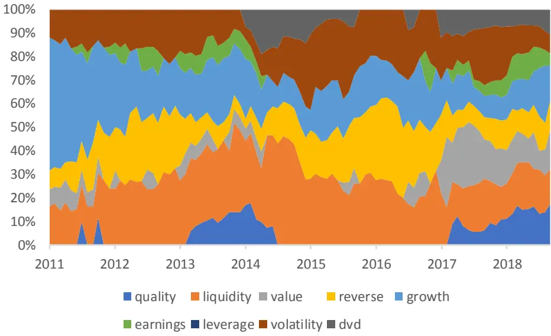
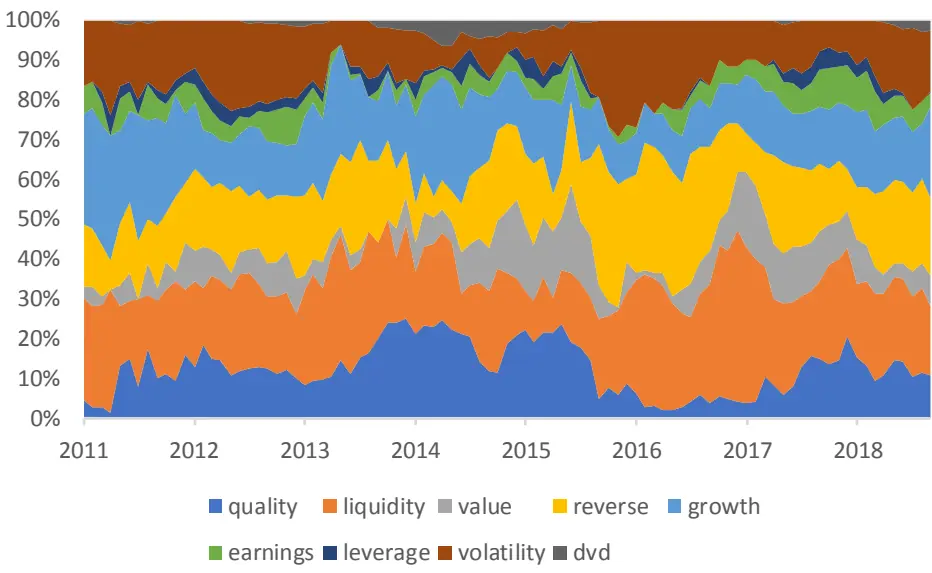
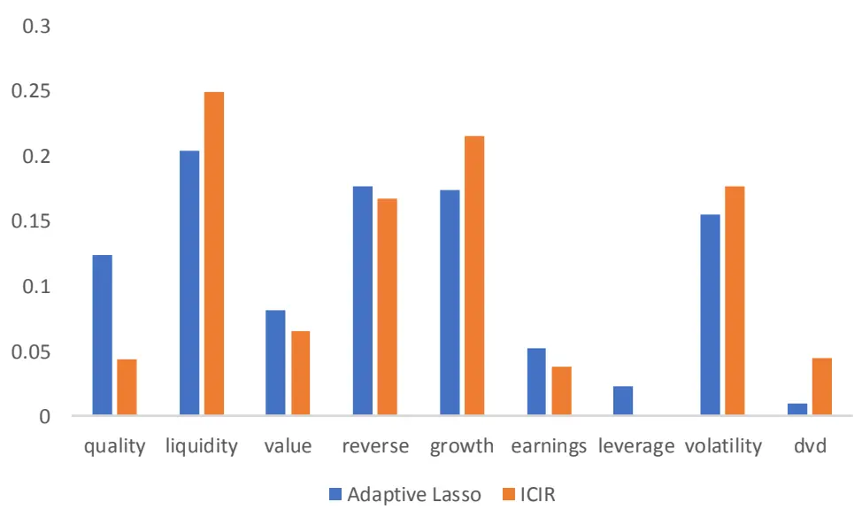
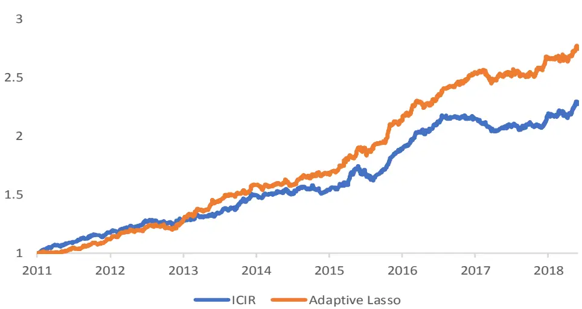
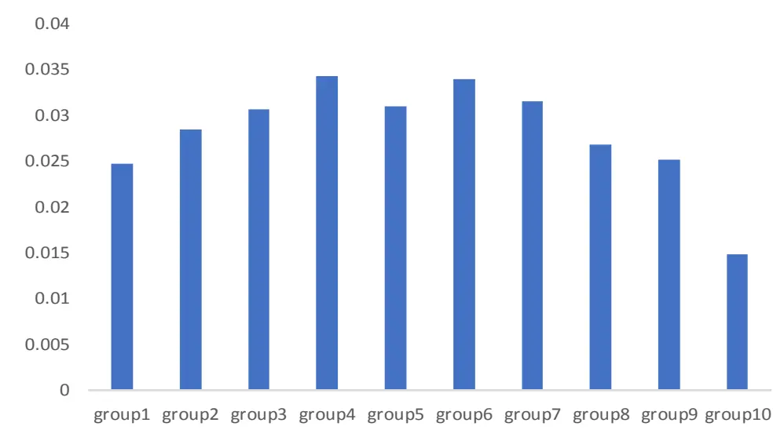
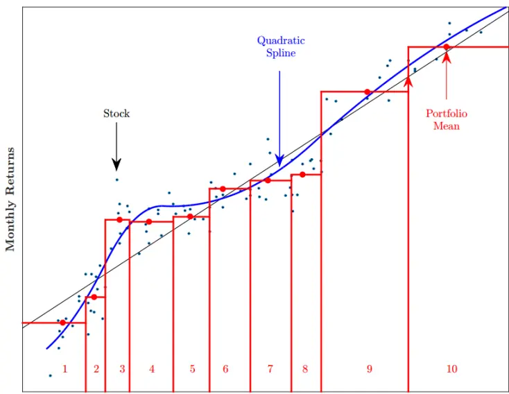
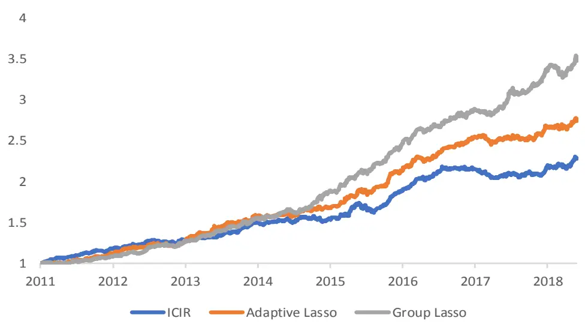
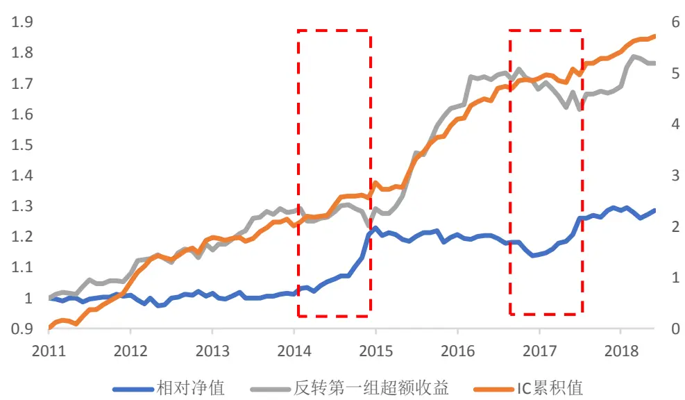
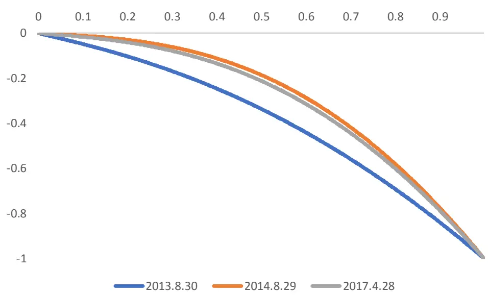

## 量化专题报告

# 多因子系列之二：Alpha 因子高维度与非线性问题——基于 Lasso

Alpha 预测时面临两个重要的问题：高维度问题和非线性问题。高维度问题指目前已知的 Alpha因子个数有成百上千个，我们该如何选择有效的因子并且进行预测呢？非线性问题指因子和收益之间的关系并不是呈严格线性的，我们如何捕捉这一非线性关系呢？本报告使用基于 Lasso 的模型，尝试解决这两个问题。

传统模型无法应对上述问题。常用的 Alpha模型有等权、ICIR加权、最大化复合 ICIR等。通常的做法是先进行单因子筛选，再基于逻辑小类合成大类，最后大类加权。这些方法都没有考虑因子间的相关性而可能造成一定的信息损失。同时，它们都是线性模型而未考虑因子间的非线性关系。

Lasso模型同时解决了高维度下因子筛选和收益预测的问题。为了考虑因子的相关关系，我们需要将因子放在一个统一模型中来预测收益。线性回归是最简单的收益预测模型，但是在高维度下线性回归变量筛选的能力较弱且容易造成过拟合。Lasso 模型在回归中加入 L1正则项，在避免过拟合的同时，并具有变量筛选的功能。由于 Lasso 模型满足一致性的条件过于严格，我们采用了变量筛选效果更好的 Adaptive Lasso 模型。

Lasso 模型相比于传统模型具有更好的收益预测能力。从测试结果来看，Lasso 模型预测的 Alpha 不管是从 IC还是分组收益的角度来说，都要略优于传统方法。通过对因子权重进行分析，我们发现传统方法在过去较为稳定的因子上权重较大且较为集中，而 Lasso 方法的因子权重较为分散，任何提供线性增量信息的因子都会有一定的权重。这是两种不同的加权思路，因此Lasso 不能稳定的战胜传统方法，但是整体上来看，Lasso 方法的预测能力较强。

考虑非线性问题的 Group Lasso方法有效的考虑到了因子和收益的非线性关系。17 年以来，用线性模型例如 ICIR 方法进行 Alpha 预测会有一定程度的失效，这是由于尽管一些技术类因子例如反转的 IC 值依旧稳定为负，但是其第一组收益却没有任何超额收益甚至产生回撤。这是由于因子和收益的非线性问题带来的。我们利用二次样条函数拟合因子和收益的非线性关系，并用 Group Lasso 方法来进行估计。得到的 Alpha预测显著好于线性 Lasso。且在策略由于因子非线性问题表现较差的时候，对策略有较为明显的改善。

风险提示：以上结论均基于历史数据和统计模型的测算，如果未来市场环境发生改变，不排除模型失效的可能性。

## 作者

分析师 刘富兵

执业证书编号：S0680518030007

邮箱：liufubing@gszq.com

研究助理 丁一凡

邮箱：dingyifan@gszq.com

## 相关研究

1、《量化周报：日线反弹尚未结束，短期调整幅度有限》2019-02-17

2、《量化专题报告：宏观逻辑的量化验证：映射关系混沌初开》2019-02-13

5、《量化周报：市场本周或将确立方向》2019-01-20

## 一、实证资产定价理论

## 1.1 实证资产定价理论发展

Sharpe（1964）的资本资产定价模型（CAPM）通过理论证明，提出了股票截面期望收益（the cross section of expected return）是由股票的系统性风险，即股票的 beta 所决定的，而那些不能被解释的部分为股票的特质风险，无法预测。基于 CAPM，Merton（1973）、Lucas（1978）又分别从理论上提出了 ICAPM、CCAPM 等模型，这些模型都是使用几个简单的变量来解释股票的截面收益。

但在此之后，学者们又发现了很多不能被这些模型所解释的变量。Fama和French（1992）发现市场、市值和价值三因子模型能够解释大部分存在的异象。他们通过一个简洁的模型，成功的对资产定价问题进行了降维，任何人想要解释股票的截面收益，只需要去解释市值和价值这两个维度。虽然这篇文章在资产定价领域有着极大影响力，但是它有一个备受争议的地方，就是在文中作者并没有从理论上推导市值和价值为何能作为定价因子，而只是从实证结果中给出了证明，并解释了市值和估值因子产生风险溢价的可能原因。这一做法也开启了资产定价理论的新思路，即通过实证的方法来寻找可能的定价因子。

在随后的 20 年内，很多学者致力于寻找那些不能被三因子模型所解释的股票特征，大量关于资产定价异象（Anomaly）的文章涌现出来，这些文章基本都发表在几大顶级期刊之中。其中比较有名的例如动量因子（Jegadeesh和Titman，1993）、盈利因子（Haugen和 Baker，1996）、特质波动率因子（Ang 等，2006）。Harvey 等（2016）对这类文章进行了总结，统计了超过 300个已经公开的股票异象。对于这一现象，Cochrane（2011）在他的主席演讲中说到股票截面收益又一次陷入混乱（”is once again descending intochaos”）。目前的实证资产定价领域有一些亟须解决的问题：1）已经公开的这些异象是真的存在风险溢价或者错误定价呢，还是因为数据挖掘（data snooping）？2）这 300多个异象都能够提供关于股票截面收益的独立信息吗？哪些能够被其他因子解释呢？3）在众多资产定价模型中，哪个因子模型才最为有效？或者哪些因子是最关键的因子呢？4）大多数资产定价模型都有很强的线性假设，如何能够有效的解决因子和收益的非线性关系呢？（Fama 和 French，2008）

近年来，很多学者对于上述问题做了尝试。Harvey 等（2016）引入了 family-wise error和 false discovery rate 的概念，他们认为已经发表的因子存在“发表偏差”（publicationbias），因此他们提高了T统计量的阈值，发现大多数异象都是不成立的。McLean和Pontiff（2016）对已发布的因子进行了样本外（即发布后）的检验，发现很多因子在发布后的显著性都有所下降甚至失效。这些文章都帮助我们有效的甄别了哪些因子是真正存在的异象，但是它们并没有把所有因子放在一起同时考虑。Green等（2017）使用了将近100个异象，同时进行Fama-Macbeth回归，发现只有12个因子能够提供股票截面收益的独立信息。

由于传统的研究方法，例如 Fama-Macbeth 回归、面板回归在解决高维问题时会存在共线性等问题，导致系数的统计检验有极高的不确定性。越来越多的学者开始使用新的方法来解决高维度因子的问题，Lasso 模型就是其中之一。获得 2018 年 AQR Insight Award一等奖的论文《Taming the Factor Zoo》就是使用了 Double-Selection Lasso 的方法来筛选因子，他们发现近期发表的新因子相对于已经发表的因子大多都是多余的，并不能提供新的信息，除了少数的因子例如盈利因子和投资因子（Hou 等，2014）。Marcial 和Francesco（2017）使用 Adaptive Lasso 的方法检验了美国市场 68 个著名的因子，发现只有 14 个因子能够提供独立的信息。Freyberger（2018）使用 Group Lasso 的方法，同样发现很多已经发布的因子并不能提供关于股票收益的增量信息，同时他们还利用该方法将非线性问题加入模型，使得模型对收益预测能力有所提高。

## 1.2 实证资产定价理论与 Alpha 预测

我们在构建Alpha模型时，本质上也是通过因子对股票进行定价来预测股票收益，因此，与当前学术领域关注的问题有多相似之处。目前大家已经公开知道的财务因子和价量因子已经有上百个，而对于因子的简单变形或者参数调整又能衍生出很多相关的因子。在已知如此多因子的情况下，我们该选取哪些因子来预测股票的截面收益呢？是否每一个因子都能够给我们提供增量信息呢？我们似乎能从以上一些学术论文中找到一些启发。

但是，Alpha 模型的构建与实证资产定价领域的关注点却又不同。在学术领域，研究者们注重的是筛选尽可能少的因子，来构建一个简洁的模型对股票收益进行定价。他们更注重选取哪些因子，然后再对这些的定价逻辑进行理论上的研究。同时，他们还会试图去区分哪些异象是由于风险溢价带来，哪些是由于错误定价带来的。但是在构建 Alpha策略的时候，我们更加重视对收益预测的准确度，以及组合最终的收益以及风险，而不会刻意去寻找尽可能少的定价因子。由于关注的重点不同，最后希望得到的结果也有所不同。

尽管 Alpha 预测模型与实证资产定价模型存在差别，但是有两点是这两个领域共同关注的重点：1）高维度问题。即面对这么多的因子，我们该如何去选择因子和预测收益。2）非线性问题。我们该如何描述股票和收益的非线性关系。在本报告的研究中，我们借鉴了学术论文中用 Lasso 及其相关的改进模型的方法来构建 Alpha 模型，尝试解决以上两个问题。

## 二、Lasso方法与传统 Alpha模型的对比

回到上一节提出的问题，在拥有几十上百个 Alpha 因子的情形下，我们如何构建 Alpha策略呢？在这一节中，我们分别介绍了传统使用的 Alpha 模型以及基于 Lasso 的 Alpha模型。

## 2.1 ICIR 加权

使用传统方法构建 Alpha 模型时，我们将问题分为两步。第一步是筛选因子，即从所有的因子中，筛选出有效的 Alpha 因子。但是即使经过筛选，有效的 Alpha 因子个数通常还会有几十个，其中某些因子之间可能高度相关，蕴含的信息也类似。这种情况下，我们通常会先将因子进行降维，将因子个数缩减到十个左右，再进行因子的合成。因子降维的方法有很多，可以基于统计，也可以基于逻辑。最简单常用的因子降维方式便是基于因子业务逻辑的的等权。例如，对于 EP、BP、SP、一致预期的 EP这些因子，我们将其等权合成为一个价值因子。在合成完大类因子之后，我们再对大类因子进行加权合成，最后得到对股票收益的预测。

在用该方法进行回测的过程中，我们通常会陷入一个不易被发觉的过拟合问题中。这是由于在筛选有效因子时，我们会根据因子全样本的表现来进行排序，选出表现较好的因子，然后小类因子合成大类，再大类加权合成 Alpha 的预测。这个方法会自然的排除掉那些开始表现很好而后来产生回撤的因子，从而夸大了回测的结果。在本文的测试中，我们筛选因子时，就是用滚动的时间窗口进行筛选，而不是全样本筛选，以尽量避免这一过拟合问题的出现。当然，严格的来说，我们使用的因子池本身也是一个后验的结果，但是这一问题不在本文讨论范围内。

具体回测的步骤如下：

1）选取数据库中一共 59 个因子作为因子池。先验的定义九类因子，分别是质量、流动性、估值、反转、成长、盈利、杠杆、红利、波动。

2）在每个月底，先计算每个因子过去 N 个月的 ICIR，筛选出 ICIR 大于 k 的因子。如果某一大类因子中，选出的因子数大于等于2个，则等权合成，然后进行标准化。

3）计算每个大类因子过去 M 个月的 ICIR 值，并以 ICIR 作为权重加权合成 Alpha的预测。

其中N 选为常用的12个月和24个月。M=24个月、12个月、6个月，且M 小于等于N。K=1、1.5、2。以下是合成的 Alpha 信号全样本测试结果。其中第一组的收益和波动指的是持有Alpha因子最高的前10%的股票相对于基准获得的超额收益以及跟踪误差。

图表1：ICIR方法各参数表现

| N, M, k | 第一组年化收益 | 第一组年化波动 | 信息比率 | IC | ICIR | 因子个数 |
| --- | --- | --- | --- | --- | --- | --- |
| 24, 12, 1.5 | 0.144 | 0.052 | 2.688 | 0.091 | 4.536 | 23.452 |
| 24, 24, 1.5 | 0.143 | 0.050 | 2.741 | 0.092 | 4.493 | 23.452 |
| 24,24,2 | 0.142 | 0.054 | 2.485 | 0.086 | 4.468 | 15.065 |
| 12, 12, 2 | 0.149 | 0.054 | 2.631 | 0.084 | 4.461 | 19.602 |
| 24,12,2 | 0.139 | 0.051 | 2.601 | 0.085 | 4.452 | 15.065 |
| 24, 12, 1 | 0.129 | 0.050 | 2.498 | 0.087 | 4.444 | 33.258 |
| 12, 12, 1.5 | 0.155 | 0.052 | 2.827 | 0.086 | 4.318 | 27.849 |
| 24, 24, 1 | 0.136 | 0.050 | 2.605 | 0.088 | 4.313 | 33.258 |
| 12, 12, 1 | 0.144 | 0.053 | 2.616 | 0.085 | 4.306 | 37.172 |
| 24, 6, 2 | 0.136 | 0.051 | 2.547 | 0.081 | 4.248 | 15.065 |
| 12,6, 2 | 0.138 | 0.055 | 2.432 | 0.080 | 4.248 | 19.602 |
| 24, 6, 1.5 | 0.134 | 0.054 | 2.395 | 0.084 | 4.237 | 23.452 |
| 24,6, 1 | 0.116 | 0.052 | 2.184 | 0.080 | 4.125 | 33.258 |
| 12, 6, 1.5 | 0.126 | 0.047 | 2.605 | 0.079 | 4.084 | 27.849 |
| 12, 6,1 | 0.120 | 0.047 | 2.494 | 0.079 | 3.989 | 37.172 |

资料来源：Wind，国盛证券研究所

由于 ICIR方法预测的目标就是Alpha 实现的ICIR值，因此我们将测试结果按 ICIR值进行排序。通过对参数进行遍历，我们发现当 M 取 24 个月、N 取 12 个月、K 取 1.5 时，因子的 IC 值越高，ICIR值也较为稳定。

ICIR方法在实际投资中可操作性强，且易于解释，也被证明有着不错的效果，但是其中存在着一定的问题：

1) 首先，在小类因子合成大类的时候，对于因子的分类存在主观性。有时候一些因子蕴含的信息并不相同，也可能被分到一组内，最典型的例子是质量类因子中，一些财务比率的相关程度并不是很高。

2) 即使这些因子通过统计或者逻辑的方法正确的进行了聚类，在小类合成大类的过程中仍会损失一定的信息。小类合成大类的思想类似于主成分分析，例如，我们将EP、BP、SP等权合成为一个复合因子，期望复合因子中包含小类因子中共同含有“价值”因子的信息，但这一做法可能弱化小类因子包含的特质的收益预测信息。

3) 最后，在大类合成的时候，等权和 ICIR加权也没有考虑大类因子间的相关性。

以上都是 ICIR方法在面对高维度信息时所面临的问题。

## 2.2 Lasso 回归

想要考虑因子之间的相关关系，并运用因子池中尽可能多的信息，我们需要将所有因子放在一个统一的模型中来预测收益，其中最简单的模型就是线性模型。线性模型是资产定价理论中一个常见的假设。传统的实证资产定价模型检验方法例如 Fama-Macbeth、面板回归，风险模型例如BARRA模型，都是基于因子与收益率是线性关系的假设。

由于因子数量众多，因子间产生共线性的可能性较大，如果直接进行 OLS回归，会产生较大的方差，那么对于因子的统计检验是不可信的，几乎不具备因子筛选的能力。同时，过多的自变量可能会造成模型的过拟合，导致样本外的预测不准确。

Tibshirani（1996）提出了Lasso方法，通过压缩的方法来解决线性回归问题中维度过高以及变量筛选的问题。具体方法如下：

$$
\begin{array}{r}{min\frac{\|Y-X\beta\|_{2}^{2}}{n}+\lambda\|\beta\|_{1}}\end{array}
$$

在用Lasso回归时，涉及两个参数，一个参数是训练所选取的样本的长度M个月，二是调节参数λ。调节参数（tuningparameter）的选取一般是通过训练数据训练得到。通过实验我们发现，利用滚动窗口训练出的调节参数变化不大。因此我们不使用滚动窗口来训练参数，而是将调节参数作为超参数。

具体回测步骤如下：

在每个月月底，将前M 个月的数据作为训练样本，求解Lasso的参数，预测股票下个月的收益。其中 M=12，24。Lambda=0.001，0.0005，0.0001，0.00005

图表2:Lasso方法各参数表现

| M, lambda | 第一组年化收益 | 第一组年化波动 | 信息比率 | IC | ICIR | 因子个数 | MSE |
| --- | --- | --- | --- | --- | --- | --- | --- |
| 12, 0.001 | 0.143 | 0.048 | 2.853 | 0.088 | 4.523 | 19.699 | 0.12566 |
| 12,0.0005 | 0.157 | 0.050 | 3.010 | 0.091 | 4.843 | 29.785 | 0.12569 |
| 12, 0.0001 | 0.155 | 0.050 | 2.981 | 0.091 | 5.092 | 48.978 | 0.12576 |
| 12,0.00005 | 0.154 | 0.050 | 2.938 | 0.091 | 5.104 | 53.215 | 0.12578 |
| 24, 0.001 | 0.135 | 0.044 | 2.900 | 0.091 | 4.624 | 18.656 | 0.12613 |
| 24,0.0005 | 0.147 | 0.047 | 2.924 | 0.094 | 5.003 | 28.258 | 0.12613 |
| 24,0.0001 | 0.161 | 0.046 | 3.296 | 0.096 | 5.392 | 46.409 | 0.12615 |
| 24,0.00005 | 0.156 | 0.045 | 3.252 | 0.096 | 5.412 | 51.602 | 0.12617 |

资料来源：Wind，国盛证券研究所

与 ICIR方法不同，线性模型直接预测组合的收益率，因此线性模型参数选择的标准应该为收益率预测的准确度，即均方误差（Mean Square Error）。但是低的MSE并不代表好的组合表现，因此我们也需要结合收益率，IC 等指标来进行辅助判断。

我们将测试结果按均方误差从小到大排序，发现当滚动窗口取 12 个月，且调节参数为0.001 时，预测的误差最小。但是，预测Alpha的IC值，ICIR值以及第一组的年化收益确几乎是同类参数下最差的结果，每期平均选出 19个因子。而要使 IC和收益率最高，每期平均选出 53个因子，而我们一共才使用了59个因子，这一模型几乎没有帮助我们有效的进行因子筛选。

这说明 Lasso 并不是一个很好的因子筛选的方法，这可能是由于 Lasso 对不同因子权重给予相同的惩罚。若惩罚很小（调节参数小），那么无法有效的筛选出因子，使得模型过拟合，在样本外表现较差。若惩罚项很大，在将无效因子系数压缩至0 的时候，同时也会损失部分有效因子的信息。另外，Lasso 回归要保证得到系数估计结果以及变量选择结果是一致的，需要满足两个较为严格的条件，一个是 Beta-Min条件，简单的说就是模型需要满足稀疏性，即只有一部分变量能够影响因变量。另外一个是 IrrepresentableCondition，有效变量和无效变量的相关性不能过高。更加详细的讨论可以参照Buhlmann和 VanDeGeer（2011）。

出于以上的考虑，我们可以使用Adaptive Lasso的方法，对不同因子权重赋予不同的惩罚项。Zou（2006）对 Lasso 方法进行了改进，提出了 Adaptive Lasso 方法。Adaptive Lasso在第二个条件不满足的时候，估计结果仍然能保持一致性。同时，由于在研究金融问题时，数据一般为时间序列数据而不是截面数据，模型的残差项可能会存在非正态，异方差，时间序列相关等各种问题。Medeiros 和 Mendes（2012）证明了在上述情况下，Adaptive Lasso 的结果仍然是一致的。因此，相比于 Lasso 来说，Adaptive Lasso 在各种严格假设不满足的情况下，仍然能够有较好的估计结果以及变量筛选的能力。

Adaptive Lasso 的具体方法如下：

1) 首先进行Lasso回归（OLS也可），得到每个变量的系数。

2) 将变量的系数作为权重，进行第二次回归。

$$
\begin{array}{r}{min\ \frac{\|Y-X\beta\|_{2}^{2}}{n}+\lambda\sum_{j=1}^{p}\frac{|\beta_{j}|}{\left|\widehat{\beta}_{init,j}\right|}}\end{array}
$$

我们利用 Adaptive Lasso 再次进行 Alpha 的预测，结果如下

图表 3: Adaptive Lasso 方法各参数表现

| M, lambda |  | 第一组年化收益 | 第一组年化波动 | 信息比率 | IC | ICIR | 因子个数 | MSE |
| --- | --- | --- | --- | --- | --- | --- | --- | --- |
|  | 12, 0.00005 | 0.158 | 0.050 | 2.995 | 0.091 | 4.945 | 31.280 | 0.12568 |
| 12,0.0001 |  | 0.158 | 0.051 | 2.952 | 0.091 | 4.948 | 31.903 | 0.12568 |
| 12,0.0005 |  | 0.156 | 0.051 | 2.923 | 0.091 | 5.050 | 28.978 | 0.12577 |
| 12, 0.001 |  | 0.155 | 0.051 | 2.891 | 0.089 | 4.894 | 19.634 | 0.12578 |
| 24, 0.00005 |  | 0.162 | 0.047 | 3.219 | 0.097 | 5.354 | 36.796 | 0.12613 |
| 24, 0.0001 |  | 0.160 | 0.047 | 3.225 | 0.096 | 5.375 | 37.849 | 0.12613 |
| 24,0.0005 |  | 0.155 | 0.045 | 3.285 | 0.095 | 5.409 | 27.839 | 0.12618 |
| 24, 0.001 |  | 0.147 | 0.046 | 3.022 | 0.091 | 4.901 | 18.516 | 0.12619 |

资料来源：Wind，国盛证券研究所

从上表中可以看到，当调节参数变小时，因子数量增多时，均方误差也在变小，同时因子的 IC 值在变大，这说明新增加进来的因子都能提供稳定的增量信息。当调节参数从0.0001 变为0.00005时，MSE和IC几乎不再增加，滚动12期训练的样本因子数稳定在31个左右。因此在全部 59个因子中，平均每期有 31个因子能够提供独立的信息。此时的 IC 值为 0.091，第一组年化收益为 15.8%。在 Lasso 方法中，与此相同表现的模型，选出的选出的因子数量为53个。AdaptiveLasso方法通过更少的因子就达到了和Lasso模型相同的表现，这说明Adaptive Lasso方法确实是一个更加有效的因子筛选方式。

## 2.3 ICIR 方法与 Adaptive Lasso 回归的对比

## 2.3.1 Alpha 预测对比

在全样本最优参数的情况下，ICIR 方法合成的复合 Alpha 的 IC 值为 0.091，ICIR 值为4.536，第一组年化超额收益为 14.4%。而 Adaptive Lasso 回归预测的 Alpha 的 IC 值为0.097，ICIR 值为 5.354，第一组年化超额收益为 16.2%。如果从最优的预测能力上来看，Adaptive Lasso回归预测的方法是要显著好于ICIR方法的。

我们也进行了分年度的测试，以及样本内外的测试，发现参数较为稳定，因此这里仅展示了全样本的测试结果。

## 2.3.2 因子权重对比

我们再来比较一下二者的因子权重分配。由于因子数量众多，为了使分析更为直观，我们将因子按照 ICIR中的分类方法将因子分为九大类，分别计算每期大类因子权重的占比。

图表4:ICIR方法权重分布

资料来源：Wind，国盛证券研究所

图表 5:Lasso方法权重分布

资料来源：Wind，国盛证券研究所

从上面两张图可以很直观的看到。ICIR 方法的权重较为集中，而 Lasso 回归的权重较为分散。同时从时间序列的角度来说，Lasso 方法中，每类因子每期所占权重相对较为稳定。这是由于这两者的合成方法所决定的。ICIR 方法筛选出过去表现最为稳定的因子，然后按过去表现的稳定性进行加权，而并不考虑因子之间的相关性。因此，ICIR方法的权重集中在过去表现最为稳定的因子上。而对于 Lasso 回归来说，考虑了因子之间的相关性，对于每一个能够提供增量信息的因子，都会给与一定的权重，因此权重较为分散，运用到的因子中的信息也更多，在因子数量众多的时候也会更加有优势。

图表6:ICIR方法和LassO方法权重对比

资料来源：Wind，国盛证券研究所

上图展示了各类因子的平均权重。我们发现 ICIR方法在传统较为稳定的流动性因子、波动性因子和成长因子上权重较高，符合 ICIR方法暴露在较为稳定的因子上的预期。对于Lasso 方法来说，我们发现其在 Quality 和 Leverage 上的平均权重要远高于 ICIR 方法。这两类因子在我们的单因子测试中一般表现较差，因此在 ICIR方法一般都不会选择这类因子或者在上面给予较小的权重。而在 Lasso 方法中，这两类因子却仍有一定的权重，这说明这两类因子在某些时间段能够提供收益预测的增量信息。另外，红利因子在Lasso方法中几乎没有权重，这可能是由于红利因子中蕴含的信息能够被其他的基本面因子所解释的结果。

## 2.3.3 组合收益对比

我们用两个方法合成的 Alpha 分别构建 500 增强组合。我们首先用最优参数构建组合。即对于 ICIR方法选取24个月ICIR大于1.5的因子，然后12个月ICIR作为权重加权得到 Alpha。对于 Adaptive Lasso 方法选取 12 个月训练窗口，且调节参数选取 0.00005。在回测过程中，我们严格限制市值和行业暴露，且将年化跟踪误差约束为小于 5%。得到的回测结果如下图所示。

图表7:ICIR方法和LassO方法指数增强策略超额净值对比

资料来源：Wind，国盛证券研究所

对于 500 增强策略来说，Adaptive Lasso 方法的年化超额收益为 16.5%，相比 ICIR 方法高出 4.3%。信息比率为 2.786，相比 ICIR方法要高出0.6。因此，从构建组合的角度来说，Adaptive Lasso 方法也是较为优秀的。

图表8:ICIR方法和LassO方法指数增强策略表现对比

| 年化收益 | 年化波动 | 最大回撤 | 信息比率 |
| --- | --- | --- | --- |
| Adaptive Lasso 0.165 | 0.059 | 0.038 | 2.786 |
| ICIR 0.122 | 0.056 | 0.07 | 2.183 |

资料来源：Wind，国盛证券研究所

尽管 ICIR 方法选取了使得实现的 ICIR 最大的参数，但是模型的回撤达到了 7%。这是由于我们在构造 Alpha 模型时，仅仅考虑了 Alpha 模型全样本的平均预测能力，但是没有考虑 Alpha 模型的预测能力随时间的变化。尽管选取较长的训练窗口能够保证训练得到的因子预测是较为稳定的，但是如果市场结构发生巨大变化时，可能由于模型预测的滞后性较强，导致策略产生很大的回撤，尤其是对于月度换仓的策略。在上面两个例子中，最大回撤产生时间都是在 17 年初附近，这是由于市场逐渐转向基本面风格，盈利因子、估值因子的效果逐渐显现，而传统强势的价量类因子例如反转因子开始失效，如果风格切换不及时，就会造成较大的回撤。

## 2.3.4 小结

经过上述的分析，我们对传统的 ICIR方法与Lasso回归方法的比较做一个小结：

1）Adaptive Lasso 回归方法对于收益的预测能力总是要优于 ICIR 方法。用这两个方法构建的组合，Adaptive Lasso 方法也要显著好于 ICIR 方法。

2）Adaptive Lasso 方法和 ICIR 方法在对 Alpha 的预测上是两种不同的思路。AdaptiveLasso 考虑了因子间的相关性，任何对于收益预测有增量信息的因子都能获得一定的权重。而 ICIR 更看重的是单个因子的有效性，选择那些最为稳定的因子赋予权重。因此AdaptiveLasso方法并不能在每一时段都稳定的战胜ICIR方法，但是从总体的预测能力上来讲，Adaptive Lasso 方法较好。

3）从预测角度来说，如果选取合适的参数，AdaptiveLasso 方法与Lasso方法差别不大，但是从因子筛选的角度来说，Adaptive Lasso 更加有效。

4）从因子降维的角度来说，ICIR 方法简单的将小类因子等权合成大类，损失了小类因子独立的增量信息，而AdaptiveLasso方法能够有效筛选出对收益有线性增量信息的因子。如果仅用这两种方法进行因子筛选，再用其他方法进行预测，Adaptive Lasso 显然是更加有效的方法。

## 三、考虑非线性问题的 Group Lasso 方法

上一部分分析了在有众多 Alpha 因子的情况下，如何有效的构建 Alpha 模型。虽然Adaptive Lasso 回归是一个较为有效的方法，但是其仍然有较强的线性假设。那么如何解决因子和收益之间为非线性关系呢？

## 3.1 非线性问题

非线性问题一直是大家非常关注的问题。目前大多数解决非线性问题的方法都是机器学习的算法，例如树模型、神经网络模型等，这些模型都有较为复杂的结构。在本报告中，我们只试图解决因子和收益间的非线性关系，例如下图描述的因子和收益间的非线性关系。

图表9:2014年反转因子分组平均收益

资料来源：Wind，国盛证券研究所

在传统的实证资产定价领域，研究者往往采用较为简单的模型来检测因子与收益的非线性关系。例如在线性模型中加入二次项、三次项，arctan 项（Freeman 和 Tse，1992）等。这些非线性项的显著确实能够证明因子和收益之间存在非线性的关系。

我们构建 Alpha 模型的目的是为了预测，而不是检验因子和收益之间的非线性关系。尽管简单的多项式能够探测因子和收益之间的非线性关系，但是我们尝试用二次项、三次项去拟合单因子和收益的关系时，发现对单因子的提升并不大，甚至会下降。这可能的原因之一是因子和收益之间本就不存在稳定的非线性关系，加入非线性项带来了噪声。还有一个可能的原因是单用二次项、三次项等形式去拟合，模型假设并不正确，即使二者之间本身存在稳定的非线性关系，多项式拟合的参数也可能不是稳定的。因此，我们需要用其他的方法来尝试解决这一问题。

## 3.2 模型假设

首先，我们定义要研究的问题，即股票的期望收益为：

$$
m_{t}(f_{1},\dots,f_{s})=E[R_{it}|F_{1,it-1}=f_{1},\dots,F_{S,it-1}=f_{S}]
$$

对于一个线性模型有

$$
\begin{array}{r}{R_{it}=\alpha+\sum_{s=1}^{S}\beta_{s}F_{s,it-1}+\varepsilon_{it}}\end{array}
$$

我们采用非参的方法来对因子和收益的非线性问题进行建模。实际上，通过分组收益测因子的方法就类似于非参截面回归。如果我们将股票的分组定义为哑变量，与未来一期的收益进行加权线性回归（加权是由于不同期的样本数量不同），得到的系数就是分组收益。这相当于把因子和收益的关系拟合成了一个阶梯函数。在此方法中，我们试图利用非参的方法将阶梯函数变换成一个连续光滑的函数。

图表10：因子暴露和收益的拟合关系

资料来源：国盛证券研究所

由于因子数量众多，如果要考虑含有因子相关性的非参模型，变量数将非常大而导致难以估计。在这里先不考虑因子间的相关关系，即假设模型满足可加性。同时，为了使得时间序列上，不同截面因子暴露可比，我们将因子暴露转化为分位数。

$$
\begin{array}{r}{m_{t}(f_{1},\dots,f_{S})=\sum_{s=1}^{S}m_{ts}(f_{s})}\end{array}
$$

对于每一个 $m_{ts};$ ，我们希望 $m_{ts}$ 是一个连续光滑的函数，即满足连续并处处可导。具体的做法是，与因子分组的方法类似，先将因子分为十组，然后在每一组内用一个二次样条函数拟合，并保证在整个定义域上，函数是连续且处处可导的。

具体来说， $m_{ts}$ 可以写成如下形式

$$
\begin{array}{r}{m_{ts}(f)\approx\sum_{k=1}^{L+2}\beta_{tsk}p_{k}(f)}\end{array}
$$

其中

$$
\begin{array}{r}{\begin{array}{c}{p_{1}(f)=1}\\{p_{2}(f)=f}\\{p_{3}(f)=f^{2}}\\{p_{k}(f)=max\{f-t_{k-3},0\}^{2}\ ,k=4,\ldots,L+2}\end{array}}\end{array}
$$

此时，股票的期望收益 $m_{ts}$ 可以成

$$
\begin{array}{r}{m_{t}(f_{1},\dots,f_{s})=\sum_{s=1}^{s}\sum_{k=1}^{L+2}\beta_{sk}p_{k}\bigl(f_{s,it-1}\bigr)}\end{array}
$$

该函数一共有 ${\mathsf S}^{*}$ （L+2）个变量。以上一节中的因子数量为例，如果我们将拟合函数分为十组，那么待估计的变量一共有 708个。对于如此高维的问题，用 Lasso的方法可以帮助我们降低过拟合。同时，我们还希望在对这些变量进行压缩的时候，对同一个因子的系数同时进行压缩，即如果一个因子不有效，那么这个因子的表达 $\dot{\overline{{x}}}\ mm_{ts}$ 中的所有系数都被压缩为 0。因此我们采用Group Lasso 的方式，对每一组变量进行同时的压缩。

上述对模型的所有描述可以表达为求解以下优化问题：

$$
\begin{array}{r}{min\sum_{i=1}^{N}\left(R_{it}-\sum_{s=1}^{S}\sum_{k=1}^{L+2}\beta_{sk}p_{k}\left(f_{s,it-1}\right)\right)^{2}+\lambda\sum_{s=1}^{S}(\sum_{k=1}^{L+2}\beta_{sk}^{2})^{\frac{1}{2}}}\end{array}
$$

## 3.3 实验

我们用第二部分中同样的因子来求解这个模型，并遍历参数，得到如下结果。

图表 11：Group Lasso 方法不同参数表现

| M, lambda | 第一组年化收益 | 第一组年化波动 | 信息比率 | IC | ICIR |  | MSE |
| --- | --- | --- | --- | --- | --- | --- | --- |
| 12, 0.00001 | 0.168 | 0.066 | 2.420 | 0.089 |  | 3.942 | 0.125658 |
| 12, 0.00005 | 0.158 | 0.059 | 2.511 | 0.089 |  | 4.055 | 0.125599 |
| 12,0.0001 | 0.157 | 0.061 | 2.442 | 0.087 |  | 4.001 | 0.125568 |
| 24, 0.00001 | 0.155 | 0.043 | 3.412 | 0.094 | 5.004 |  | 0.126164 |
| 24, 0.00005 | 0.155 | 0.041 | 3.519 | 0.093 |  | 4.920 | 0.126139 |
| 24,0.0001 | 0.149 | 0.039 | 3.630 | 0.090 |  | 4.688 | 0.126128 |

资料来源：Wind，国盛证券研究所

与 Lasso 的结论类似，当调节参数越大的时候，选取的因子数越少，此时的均方误差越小，IC值以及第一组的年化收益越小。这可能是模型选取的因子太少，使得模型欠拟合的结果。如果要选取正确的因子，且使得模型的预测能力较好，可以参照第二部分使用Adaptive Group Lasso 方法。但是由于这一部分我们的重点在于预测，而 Adaptive Lasso方法并不能有效的提升模型的预测能力，因此我们在这里暂时不进行第二步回归。

由于模型的预测目标与实际组合实现的收益不能统一，因此我们以第一组年化收益作为判断标准。此时，应该选取过去 12个月的数据作为训练样本，调节参数选0.00001。具体的 500增强回测表现如下：

图表12：不同策略指数增强策略超额净值对比

资料来源：Wind，国盛证券研究所

图表13:不同策略指数增强策略表现对比

|  | 年化收益 | 年化波动 | 最大回撤 | 信息比率 |
| --- | --- | --- | --- | --- |
| ICIR | 0.126 | 0.054 | 0.060 | 2.339 |
| Adaptive Lasso | 0.165 | 0.059 | 0.038 | 2.786 |
| Group Lasso | 0.190 | 0.058 | 0.048 | 3.310 |

资料来源：Wind，国盛证券研究所

从回测结果中可以看到，Group Lasso 方法合成的复合 Alpha 相比于 Lasso 方法的收益有显著的提高，平均年化提高了 2.5%，信息比例提升了 0.5。

由于滚动 12 个月窗口和调节参数取 0.00001 是样本内最好的参数。我们同样也尝试了其他的参数，尽管效果略有下降，但是都能稳定的战胜简单的 Lasso 方法。

图表 14: Group Lasso 不同参数指数增强策略表现

|  | 年化收益 | 年化波动 | 最大回撤 | 信息比率 |
| --- | --- | --- | --- | --- |
| Group Lasso(M=12,lambda=0.0001) | 0.180 | 0.057 | 0.042 | 3.131 |
| Group Lasso(M=12,lambda=0.00005) | 0.180 | 0.058 | 0.047 | 3.102 |
| Group Lasso(M=12,lambda=0.00001) | 0.190 | 0.058 | 0.048 | 3.310 |

资料来源：Wind，国盛证券研究所

## 3.4 对结果的解释

采用统计或者机器学习的 Alpha 模型，常被人质疑的一点就是模型的结果不易于解释。对于 ICIR方法来说，我们能够明确的知道每个因子的权重是如何得到的，即单因子过去的表现强弱。而对于Lasso和AdaptiveLasso来说，即便它们已经是最简单的统计模型，但是可解释性也远远弱于 ICIR方法。由于多元线性回归的系数表示的是偏相关关系，即控制其他变量不变的时候，该变量每增加一单位被解释变量增加的数量，也就是该变量能够提供的增量信息。但是当模型中有着几十个变量的时候，这一系数可能就无法有直接的经济学意义。甚至可能某因子做单因子测试时提供的是正向收益，而在多元回归中的系数却为负数。Group Lasso方法在传统的Lasso中进一步加入了非线性关系的描述，因此，想要直接用模型的参数来解释模型为何能够带来更好的效果是比较困难的，很难有直观的经济学解释。下面我们尝试对上述实验的结果做出解释。

对于一个预测模型来说，收益的准确度是评判模型的好坏的重要标准之一。我们对比Adaptive Lasso 和 Group Lasso 的样本外均方误可以发现，Group Lasso 的平均均方误差总是要小于 Adaptive Lasso。同时，我们也做了分年度的测试，这一现象在所有年份几乎稳定成立。因此我们可以认为 Group Lasso 方法相比原始的 Lasso 方法确实能够更准确的预测收益率，这是Group Lasso方法预测的Alpha能够带来更好的策略表现的可能原因之一。

我们画出两个策略的相对净值曲线。发现 Group Lasso 相对Adaptive Lasso的超额收益基本上是 14-15 年，以及 17 年带来的。而这两段时间正好是反转、流动性因子等技术因子失效的时间。我们认为可能的一个解释是，由于 Group Lasso 方法能够捕捉到因子的非线性，因此对于技术因子暴露较高的股票，该模型预测的收益要低于线性模型，即低配了技术因子。以反转因子为例子，我们将反转因子第一组的收益，反转因子累计 IC值以及 Group Lasso 相对于 Adaptive Lasso 的净值曲线画在一个图里，发现在 14-15 年以及 17年前半段，累计的IC值是一直向上的，也就是说线性模型所衡量的反转一直有着稳定的收益。但是第一组相对于基准的超额收益几乎是走平的，甚至还有略微回撤。如果我们按照线性模型拟合的收益来预测反转带来的收益，那么依旧会认为反转因子暴露最小的第一组能带来稳定的超额收益，但事实上此时的反转和因子收益的关系已经不是线性的了，反转因子第一组的收益并不稳定好于基准收益。

图表 15:Group Lasso 超额收益与因子非线性关系

资料来源：Wind，国盛证券研究所

下图展示了三个时间段Group Lasso 预测的反转和股票收益（标准化）的关系。可以看到 2013 年 8 月预测的反转因子暴露的分位数与收益的线性关系更强，即第一组会显著好于其他组。而 2014年和 2017年两个样本中，反转因子暴露的分位数与收益的具有较强的非线性关系，尽管这几个月通过 IC 描述的暴露和收益的线性关系一致，但是 2014年和 2017年的反转因子对收益的预测能力可能都是空头带来的。

图表16:Group Lasso拟合的因子分位数与股票收益之间的关系

资料来源：Wind，国盛证券研究所

Group Lasso 方法在14年和17年的市场表现较为突出，但是在 13年以及15，16年是要略微弱于线性模型的。这一现象与我们的预期相符合。我们在对单因子进行非线性关系的拟合时发现几乎很少有因子存在长期稳定的非线性关系，当因子与收益的关系逐渐从非线性转为线性时，由于非线性模型用过去的数据进行训练，存在滞后性，在这段时间可能会弱于线性模型。从整体来看，Group Lasso 方法要优于线性模型。

## 四、总结与展望

本报告主要研究了基于 Lasso 的收益预测模型。传统的 ICIR 方法在进行 Alpha 预测方面已经被证明了有不错的效果，但是它不能解决两个重要的问题，一个是高维度问题，即因子数量过多的时候该如何预测。二是非线性问题，即线性加权并不能考虑因子和收益的非线性关系。这两个问题与实证资产定价领域目前遇到的困境较为类似，越来越多的资产定价异象导致研究者们不知道哪些因子能够带来增量信息，哪个因子模型才是较好的资产定价模型。同时传统的分组以及 FamaMacbeth 回归无法解决因子维度高以及非线性的问题。我们借鉴了学术上使用的模型来帮助我们解决上述两个问题。

我们使用 Lasso 回归的方法来解决因子高维度的问题。Lasso 回归在传统回归中加入 L1正则项，使得模型具有稀疏性，即回归模型得到因子系数有些会被压缩至 0，从而具有因子筛选的功能。同时，相比于最小二乘回归，正则项的加入能够帮助控制模型过拟合而提高样本外的预测精度。在实验中我们发现，Lasso 方法并不能够很好的筛选因子，这可能是由于 Lasso满足因子选择一致性的条件过于严格。我们进一步采用了 AdaptiveLasso，这一模型能够帮助我们更好的筛选出有用的因子，但是在预测方面，相较于Lasso并没有很大的提升。

通过比较 Lasso 和 ICIR 在收益预测上的表现，我们发现不管从 IC 值，第一组收益，或者是增强组合的收益上来看，Lasso 方法总是优于ICIR方法。但是Lasso方法并不是在每一时间段都稳定的战胜ICIR方法，因为这两种方法毕竟是两种不同的因子加权的思路。

在面对众多因子时，ICIR方法首先是进行主观分类，然后小类因子加权（等权）合成大类因子，接着大类因子ICIR加权（等权）合成对Alpha的预测。在这个过程中，没有考虑小类因子特质的信息从而丢失了这一部分信息。同时 ICIR方法有时过于严格，能通过单因子筛选的因子数量较少。与 ICIR不同，Lasso方法每期选出的因子个数要较多，任何能带来增量信息的因子都会有一定的权重。也就是说 ICIR方法是将权重集中在那些过去表现较好，较为稳定的因子上面，而不考虑因子之间的相关性。而 Lasso 方法是考虑了整个因子池中所有可能蕴含的对收益预测的线性信息。尽管 ICIR方法可能会丢失了一些信息，但是这些增量信息不一定比的过较为稳定的因子。因此因子池中过去表现最稳定的因子一直表现较好时，ICIR可能会战胜 Lasso。而一旦这些因子变弱甚至发生回撤，Lasso方法就会好于ICIR方法。因为 Lasso 方法中含有更多的因子信息，单个因子的回撤并不会造成组合的回撤，除非是某一大类因子整体发生回撤。从我们选取的时间段以及因子池来说，我们认为Lasso方法是要好于 ICIR方法的。

Lasso 方法虽然能够解决高维度的问题，但是它仍然是一个线性模型。为了描述因子和股票收益之间的非线性关系，我们采用非参的方法，用一个二次样条函数拟合这一关系，同时采用 Group Lasso 的方式来估计模型。Group Lasso 预测 Alpha 的准确度稳定好于Adaptive Lasso 方法，同时其构建的组合几乎也能够稳定的战胜 Adaptive Lasso 方法构建的组合。通过对结果进行分析，我们发现这一模型的表现在 14 年和 17 年尤为突出，这正好与反转、流动性等技术类因子失效的时间段相符。因此，Group Lasso 方法表现优秀的可能原因之一是它能更好的捕捉到因子和收益之间的非线性关系。

综上所述，基于 Lasso 的预测例如 Adaptive Lasso，Group Lasso 能够更准确的预测收益率，通过其构建的组合有着更高的超额收益以及信息比。同时基于 Lasso 的收益预测模型本质上还是线性模型，相比其他的机器学习模型有着较好的可解释性，但是相比 ICIR方法来说，可解释性还是较弱，投资者可以根据自己的实际需求来选择合适的模型。

除了 Lasso 模型之外，我们对其他线性模型例如 Ridge 等也做了相关研究，这些模型相对于 Lasso 来说有优势也有劣势。另外，Group Lasso 模型如果能够考虑因子间的相关性带来的非线性问题，其预测能力可能有进一步的提升，以上问题还有待进一步研究。

## 五、参考文献

Freyberger J, Neuhierl A, Weber M. Dissecting characteristics nonparametrically[R]. National Bureau of Economic Research, 2017.

Feng G, Giglio S, Xiu D. Taming the factor zoo[J]. 2017.

Friedman J, Hastie T, Tibshirani R. A note on the group Lasso and a sparse group Lasso[J]. arXiv preprint arXiv:1001.0736, 2010.

Green J, Hand J R M, Zhang X F. The characteristics that provide independent information about average us monthly stock returns[J]. The Review of Financial Studies, 2017, 30(12): 4389-4436.

Huang J, Horowitz J L, Wei F. Variable selection in nonparametric additive models[J]. Annals of statistics, 2010, 38(4): 2282.

Kozak S, Nagel S, Santosh S. Shrinking the cross section[R]. National Bureau of Economic Research, 2017.

Light N, Maslov D, Rytchkov O. Aggregation of information about the cross section of stock returns: A latent variable approach[J]. The Review of Financial Studies, 2017, 30(4): 1339-1381.

Messmer M, Audrino F. The (adaptive) Lasso in the Zoo-Firm Characteristic Selection in the Cross-Section of Expected Returns[J]. 2017.

Simon N, Friedman J, Hastie T, et al. A sparse-group Lasso[J]. Journal of Computational and Graphical Statistics, 2013, 22(2): 231-245.

Yuan M, Lin Y. Model selection and estimation in regression with grouped variables[J]. Journal of the Royal Statistical Society: Series B (Statistical Methodology), 2006, 68(1): 49-67.

## 六、附录

图表19：因子列表

|  | 因子名称 | 因子类别 因子描述 |  |
| --- | --- | --- | --- |
| 1 | ivol | 波动性 | 特质波动率 |
| 2 | ivr | 波动性 | 特异度 |
| 3 | return_std_1m | 波动性 | 一个月收益率波动率 |
| 4 | yoy_bps | 成长 | (当期 BPS-去年同期 BPS)/去年同期 BPS 绝对值， 其中 BPS 表示每股帐面价值 |
| 5 | yoy_orps | 成长 | 每股营业收入同比增长率 |
| 6 | yoy_eps | 成长 | 每股收益同比增速 |
| 7 | yoy_tot_equity | 成长 | (当期股东权益-去年同期股东权益)/去年同期股东权益绝对值 |
| 8 | yoy_total_assets | 成长 | (当期总资产-去年同期总资产)/去年同期总资产绝对值 |
| 9 | yoy_orps_q | 成长 | 单季度每股营业收入同比增长率 |
| 10 | yoy_eps_q | 成长 | 单季度每股收益同比增速 |
| 11 | yoy_ocfps | 成长 | 每股经营现金流同比增速 |
| 12 | yoy_ocfps_q | 成长 | 单季度每股经营现金流同比增速 |
| 13 | yoy_np | 成长 | 净利润同比增速 |
| 14 | yoy_np_q | 成长 | 单季度净利润同比增速 |
| 15 | yoy_or | 成长 | 营业收入同比增速 |
| 16 | yoy_or_q | 成长 | 单季度营业收入同比增速 |
| 17 | yoy_op | 成长 | 经营利润同比增速 |
| 18 | yoy_op_q | 成长 | 单季度经营利润同比增速 |
| 19 | yoy_ocf | 成长 | 经营现金流同比增速 |
| 20 | yoy_ocf_q | 成长 | 单季度经营现金流同比增速 |
| 21 | yoy_roe | 成长 | (当期 ROE-去年同期 ROE)/去年同期 ROE 绝对值 |
| 22 | clo_5d_60d | 反转 | 5 日均价/60 日均价 |
| 23 | mom_1y | 反转 | 1年的收益率 |
| 24 | reverse_1m | 反转 | 1 个月的收益率 |
| 25 | close_max_div_min_1m 反转 |  | 1月最高价/1月最低价 |
| 26 | return_max_1m | 反转 | 过去一个月单日最高涨幅 |
| 27 | current_ratio | 杠杆 | 流动资产/流动负债 |
| 28 | debt_asset_ratio | 杠杆 | 资产/负债 |
| 29 | current_liab_ratio | 杠杆 | 流动负债/总资产 |
| 30 | dividend_yield_ratio | 红利 | 股息率 |
| 31 | bp | 价值 | 股东权益(报告期)/总市值 |
| 32 | ep | 价值 | 市盈率倒数 |
| 33 | cfp | 价值 | 市现率倒数 |
| 34 | sp | 价值 | 市销率倒数 |
| 35 | fcffp | 价值 | 企业自由现金流 ttm/总市值 |
| 36 | ocfp | 价值 | 经营现金流_TTM/总市值 |
| 37 | value_residual | 价值 | 总市值的对数对账面价值对数，净利润对数以及负债合计对数 做横截面回归的取残差 |
| 38 | amt_1m_3m | 流动性 | 过去1个月日均成交额/过去三个月日均成交额 |
| 39 | corr_close_turnover | 流动性 | 收盘价与换手率的相关系数 |
| 40 | illiq | 流动性 | 每天一个亿成交量能推动的股价涨幅 |
| 41 | In_volume_mean_1m | 流动性 | 成交量对数一个月均值 |
| 42 | turnover_mean_1m | 流动性 | 换手率一个月均值 |
| 43 | roe | 盈利 | roe_ttm |
| 44 | eps_adjust | 盈利 | 扣除非经常损益后的净利润/总股本 |
| 45 | grossmargin_ratio | 盈利 | 毛利_TTM/TTM营业总收入 |
| 46 | grossprofit_assets | 盈利 | 毛利_TTM/总资产 |
| 47 | grossprofit | 盈利 | (营业收入-营业支出)/营业收入 |
| 48 | roa | 盈利 | roa2_ttm |
| 49 | roic | 盈利 | roic_ttm |
| 50 | safexp_operrev | 质量 | (销售费用_TTM+管理费用_TTM+财务费用_TTM)/营业收入 |
| 51 | adm_exp_ratio | 质量 | _TTM 管理费用_TTM/营业收入_TTM |
| 52 | bps | 质量 | (归属母公司股东的权益-其他权益工具)/总股本 |
| 53 | currency_ratio | 质量 | 经营活动产生的现金净流量/净利润 |
| 54 | asset_turnover | 质量 | 营业收入_TTM/平均总资产 |
| 55 | inv_turnover | 质量 | 营业成本_TTM/平均存货 |
| 56 | fina_exp_ratio | 质量 | 财务费用_TTM/营业收入_TTM |
| 57 | fix_ratio | 质量 | 固定资产/归属母公司股东权益 |
| 58 | networkcap_assets | 质量 | 净运营资本/总资产(其中净营运资本=流动资产-流动负债) |
| 59 | moneycap_assets | 质量 | 现金/总资产 |

资料来源：国盛证券研究所

## 风险提示

以上结论均基于历史数据和统计模型的测算，如果未来市场环境发生改变，不排除模型失效的可能性。

## 免责声明

国盛证券有限责任公司（以下简称“本公司”）具有中国证监会许可的证券投资咨询业务资格。本报告仅供本公司的客户使用。本公司不会因接收人收到本报告而视其为客户。在任何情况下，本公司不对任何人因使用本报告中的任何内容所引致的任何损失负任何责任。

本报告的信息均来源于本公司认为可信的公开资料，但本公司及其研究人员对该等信息的准确性及完整性不作任何保证。本报告中的资料、意见及预测仅反映本公司于发布本报告当日的判断，可能会随时调整。在不同时期，本公司可发出与本报告所载资料、意见及推测不一致的报告。本公司不保证本报告所含信息及资料保持在最新状态，对本报告所含信息可在不发出通知的情形下做出修改，投资者应当自行关注相应的更新或修改。

本公司力求报告内容客观、公正，但本报告所载的资料、工具、意见、信息及推测只提供给客户作参考之用，不构成任何投资、法律、会计或税务的最终操作建议,本公司不就报告中的内容对最终操作建议做出任何担保。本报告中所指的投资及服务可能不适合个别客户，不构成客户私人咨询建议。投资者应当充分考虑自身特定状况，并完整理解和使用本报告内容，不应视本报告为做出投资决策的唯一因素。

投资者应注意，在法律许可的情况下，本公司及其本公司的关联机构可能会持有本报告中涉及的公司所发行的证券并进行交易，也可能为这些公司正在提供或争取提供投资银行、财务顾问和金融产品等各种金融服务。

本报告版权归“国盛证券有限责任公司”所有。未经事先本公司书面授权，任何机构或个人不得对本报告进行任何形式的发布、复制。任何机构或个人如引用、刊发本报告，需注明出处为“国盛证券研究所”，且不得对本报告进行有悖原意的删节或修改。

## 分析师声明

本报告署名分析师在此声明：我们具有中国证券业协会授予的证券投资咨询执业资格或相当的专业胜任能力，本报告所表述的任何观点均精准地反映了我们对标的证券和发行人的个人看法，结论不受任何第三方的授意或影响。我们所得报酬的任何部分无论是在过去、现在及将来均不会与本报告中的具体投资建议或观点有直接或间接联系。

投资评级说明

| 投资建议的评级标准 |  | 评级 | 说明 |
| --- | --- | --- | --- |
| 评级标准为报告发布日后的6个月内公司股价（或行业指数）相对同期基准指数的相对市场表现。其中A股市场以沪深300指数为基准；新三板市场以三板成指（针对协议转让标的）或三板做市指数（针对做市转让标的）为基准；香港市场以摩根士丹利中国指数为基准，美股市场以标普500指数或纳斯达克综合指数为基准。 | 股票评级 | 买入 | 相对同期基准指数涨幅在15%以上 |
|  |  | 增持 | 相对同期基准指数涨幅在 5%~15%之间 |
|  |  | 持有 | 相对同期基准指数涨幅在-5%~+5%之间 |
|  |  | 减持 | 相对同期基准指数跌幅在 5%以上 |
|  | 行业评级 | 增持 | 相对同期基准指数涨幅在10%以上 |
|  |  | 中性 | 相对同期基准指数涨幅在-10%~+10%之间 |
|  |  | 减持 | 相对同期基准指数跌幅在10%以上 |

## 国盛证券研究所

北京

地址：北京市西城区锦什坊街 35号南楼

上海

地址：上海市浦明路 868号保利 One56 10 层

邮编：100033

邮编：200120

传真：010-57671718

邮箱：gsresearch@gszq.com

电话：021-38934111

邮箱：gsresearch@gszq.com

南昌

深圳

地址：南昌市红谷滩新区凤凰中大道 1115号北京银行大厦

地址：深圳市福田区益田路 5033 号平安金融中心 101层

邮编：330038

传真：0791-86281485

邮编：518033

邮箱：gsresearch@gszq.com

邮箱：gsresearch@gszq.com