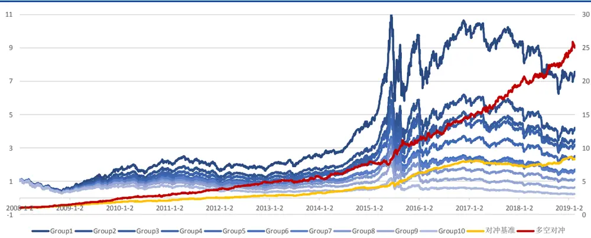
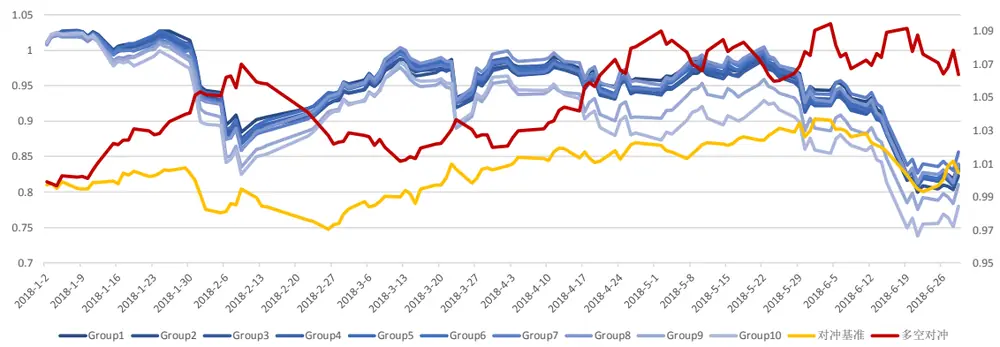
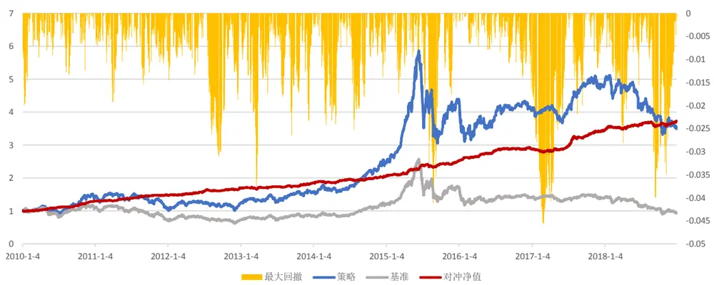
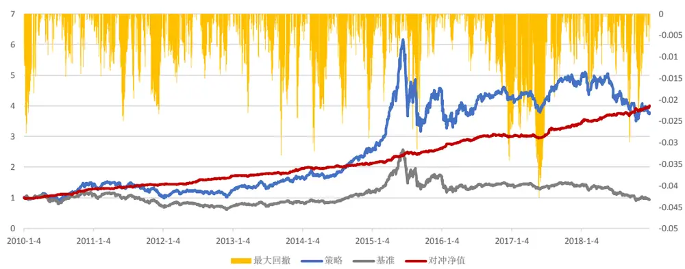
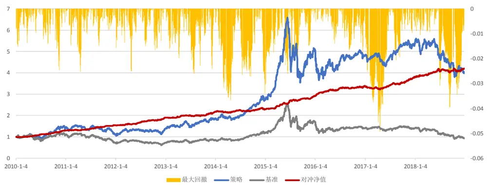
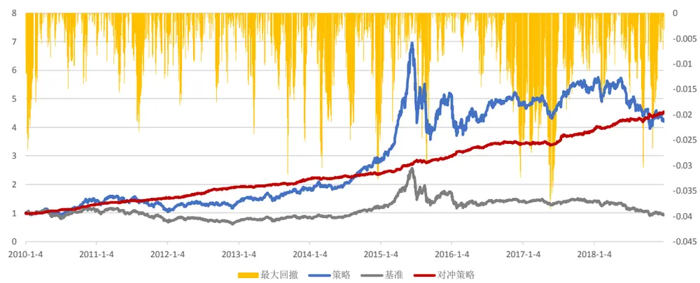
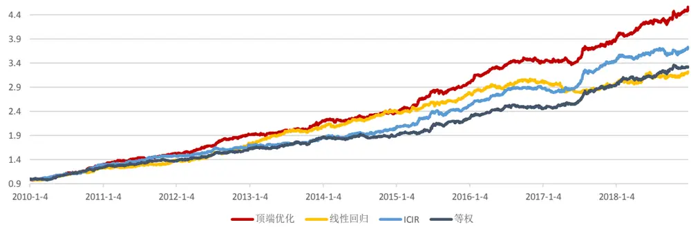

# 量化专题报告

## 多因子系列之三：因子空头问题及其“顶端”优化

因子空头问题已经成为影响多因子组合的重要问题。传统的 ICIR 加权模型考虑的是整个截面的因子表现，而由于 A 股市场不能做空个股，因子空头端的收益无法在多因子策略中很好转化，因此，我们应该更加侧重考察因子多头端的的表现。

目前市场上已有的解决该问题的办法包括带权重的 ICIR法和空头剔除法。我们在 A股市场上对这两种方法进行了实证检验，发现两者都可以或多或少地解决一部分因子空头问题，但同时也存在着各自缺陷，主要问题是参数的选择对模型绩效影响较大，模型有过拟合嫌疑。

顶端优化模型侧重于因子多头端的优化，其目的是使得因子顶端的表现更优。实证检验表明，在使用我们已有的 ALPHA 因子下，对于收益率较高的股票，顶端优化模型可以给予预测能力更强的因子更高的权重。自 2010 年起的月换仓策略年化收益率为 19.47%，最大回撤为 3.76%，信息比率为3.489。策略分年度表现较为平均，整体表现稳健。

我们将顶端优化模型和传统的等权、线性回归、ICIR 等模型进行了比较。经过实证检验，顶端优化模型对 ICIR 模型的增强效果明显，策略的信息比率从 2.932 提升到 3.489，并且策略在每一年的表现更加平均，最大回撤从4.57%降低到 3.76%，尤其对于风格切换的 2017 年初位臵，顶端优化模型没有遭受很严重的回撤，表现更优。

顶端优化模型为多因子选股提供新的视角。因子的 alpha 能力决定策略收益的下限，而模型的选股能力决定了策略收益的上限，我们认为顶端优化模型具有优秀的选股能力，它在一定程度上可以拉升因子超额收益的上限。模型得到的因子线性权重也可以与传统多因子策略进行结合，我们期待顶端优化模型在更多的切入点发挥作用。

风险提示：量化专题报告中的观点基于历史统计与量化模型，存在历史规律与量化模型失效的风险。

## 作者

分析师 殷明

执业证书编号：S0680518120001

邮箱：yinming@gszq.com

分析师 刘富兵

执业证书编号：S0680518030007

邮箱：liufubing@gszq.com

## 相关研究

1、《量化周报：市场仍将震荡上行》2019-03-03

2、《量化专题报告：因子择时系列之一：风险溢价时钟视角下的攻守因子配臵》2019-02-25

3、《量化周报：言顶尚早，市场未到减仓时》2019-02-244、《量化专题报告：多因子系列之二：Alpha因子高维度与非线性问题——基于 Lasso 的收益预测模型》2019-02-20

5、《量化周报：日线反弹尚未结束，短期调整幅度有限》2019-02-17

## 1. 引言

在《多因子系列之一：多因子选股体系的思考》一文中，我们对多因子组合构建的一些基本问题进行了探讨，并给出了一些思考。然而，在实际构建多因子模型的过程中，我们还会遇到很多影响其绩效的问题，其中因子的空头问题就是其中一个非常重要的因素。众所周知，在当前的 A 股市场投资中，由于交易限制，我们没有办法做空个股，因此，传统多因子的多空组合收益是无法获取的，一般通过股指期货构建策略的空头端，而在多头端配臵个股。这样带来一个的问题是，如果一个因子的多头端并不是很强，但是空头端非常强，那么传统的因子评价指标信息系数 IC会认为这个因子是一个还不错的因子，从而基于该指标的收益预测模型例如 ICIR因子配权会给该因子一个相对高估的权重，而事实上空头端的收益我们却是无法获取的。

为了解决该问题，目前市场上已经有了很多研究，例如通过空头因子先进行股票池剔除，再用其他因子进行选股；使用带权重的 IC（weighted IC）指标进行因子配权等等。这些方法或多或少的解决了一部分该问题，但也可能引入新的问题。本文将对这些方法进行探讨，并通过一个新的模型——顶端优化模型来解决该问题。该模型的思路和以上方法非常相近，但它是通过机器学习中的优化方法进行问题求解的，给解决因子空头问题带来了新的思路。所谓“顶端”优化，其实是指在进行因子权重优化时更多地考虑收益率较高的股票是否都预测正确了，而忽略那些收益率较低的股票，这里“顶端”也就是收益率的较高的股票。通过这种优化方式，我们会使得因子的配权更倾向于那些顶端表现更优的因子。另外，我们还比较了传统的线性回归模型、因子等权配臵模型、ICIR因子配权模型、带权重的ICIR配权模型、顶端优化模型等算法的表现，我们发现解决了因子空头问题的顶端优化模型表现相对更为稳健。

本文的结构如下：第二章开始我们先通过一些具体的例子阐述了因子空头问题，以及该问题对多因子策略表现的影响；第三章我们先构造了一个比较基准，也就是传统的 ICIR加权方法，通过介绍该策略，让投资者进一步了解我们多因子策略的细节，然后分别通过使用空头因子剔除选股池，带权重的 ICIR来改进这个策略；第四章我们着重介绍了顶端优化模型，其代表算法是 TOPPUSH 算法，并分析了该算法的表现；最后，我们在第五章将顶端优化模型和市场上目前较为主流的ALPHA预测模型进行了比较，包括因子等权配臵、线性回归加权、ICIR 加权、带权重的 ICIR 加权等模型，发现顶端优化算法具有相对更稳健的表现，尤其在多因子回撤相对较大的 17 年初，更是表现出了自身的优势。

## 2.因子空头问题

## 2.1 因子空头问题及基于 IC 的因子评价体系的缺陷

首先我们来介绍本文主要要解决的问题：因子空头问题。该问题的主要含义是，由于我们在构建多因子组合多头的时候，希望因子打分越高的股票收益率越高（同理，负ALPHA因子打分越低的股票收益率越高），尤其是希望那些收益率很高的股票具有很高的打分，而至于那些收益率一般的股票是不是打分足够低，我们并不是那么关心。这主要是因为我们无法针对个股进行做空，从而获得打分足够低的股票带来的空头收益。正是因为这一点，如果有某个因子，其收益率较低的那些股票（即“因子空头端”，或“底端”）打分很低， 而收益率较高的那些股票（即“因子多头端”，或“顶端”）打分并不是很高，那么这样的因子在实际投资中在股票多头并不能给我们带来类似其空头那么好的收益，因此我们希望降低这种类型因子的权重。

然而，在现阶段对于因子的评价方式中，很大一部分是依赖于因子的信息系数（即 IC）的，甚至基于 IC 的因子配权 ICIR 方法在投资者中使用甚为广泛。但通过上面的分析，我们发现，基于IC这种因子评价体系的策略会高估空头效应很强的因子，从而导致策略的表现不佳，这主要是因为基于 IC的因子评价体系考察的是整个截面因子打分和因子收益率的线性相关性，而并不是只是考虑顶端。下面，我们通过一个具体的例子介绍这一现象。

## 2.2 特质波动率因子示例

这一节我们通过特质波动率这个因子来给投资者介绍因子多头问题在实际投资中的表现。特质波动率因子是被投资者熟知的波动率因子，该因子在A股市场历史表现优异，因子是使用 Fama-French 三因子回归得到：

$$
r_{i}=\alpha_{i}+\beta_{i}*MKT+\gamma_{i}*SMB+\mu_{i}*HML+\varepsilon_{i}
$$

其中，Fama-French三因子回归的残差即为 $\varepsilon_{i}$ ，而特质波动率因子即定义为其标准差：

$$
\mathrm{IVOL}_{i}=std(\varepsilon_{i})
$$

如图 1 所示，是特质波动率因子从 2008 年初至今的历史表现，我们将因子经过缩尾、中性化、标准化等一系列处理后，再将所有股票根据因子打分大小分为十组，通过渐变的蓝色曲线展示了从第一组到第十组的收益情况，并计算出第一组对冲第十组的多空收益，以及第一组对冲中证500指数的收益，在坐标轴右轴标示其净值。

图表1：特质波动率因子历史表现

资料来源：Wind，国盛证券研究所

观察该图不难发现，特质波动率因子过去几年是非常好的ALPHA 因子，其不但十组收益分的非常开，而且收益也很可观，每年都较稳健。然而，我们发现在 2018 年上半年，第一组对冲中证 500指数并没有获得像之前那样好的收益。我们把这一时段放大，如图2所示。

图表2：特质波动率因子2018年上半年表现

资料来源：Wind，国盛证券研究所

可以看到，18年上半年该因子第一组股票相对中证500指数几乎没有收益，而多空组合依然获得了不错的 7%的收益，这显然是因为因子空头端的股票带来的。如果我们使用IC 来评价该因子，这段时间其因子 IC为 0.066，ICIR为2.75，是一个相当不错的因子。然而实际上该因子这段时间并不能给我们带来稳定的收益。因此，如果我们使用只考虑因子顶端的模型，就可以降低该因子的配权权重。

## 3.使用带权重 IC和空头剔除法解决空头问题

本章开始我们一步步介绍解决空头问题的若干办法，包括市场上已有不少投资者使用的带权重的 ICIR配权方式，以及空头剔除法等等。我们实证检验了这些方法是否能够切实有效地解决因子空头问题，并阐述了这些方法自身的局限性。在此之前，我们还是先回归到 ICIR配权方法，该方法将成为我们后面其他算法的比较基准。因此，我们先来看看基准能有怎样的表现。

## 3.1 ICIR 加权的多因子策略

这一节我们先来介绍业绩比较基准：基于 ICIR 加权的多因子策略。ICIR 方法是目前多因子收益预测模型中最常用的方法之一，其优势在于不但考虑了因子的预测能力，还考虑了因子的稳定性，因此是相对较为稳健的预测方法，其效果在A股历史上略优于等权重配臵模型（见第五章）。因此，以 ICIR 作为我们算法检验比较的基准相对比较公平、真实。我们构建月换仓的 ICIR加权的多因子策略步骤如下：

1）对数据库中的所有因子（因子列表见附录）进行缩尾、中性化、标准化处理；

2）对这些因子进行筛选，选出过去 12个月ICIR绝对值最高的k个因子，并且要求这k个因子之间的两两相关性小于c。

3）计算筛选出来的所有因子的 ICIR值，并以该值作为权重对所有因子进行加权，给出合成的打分值作为股票的ALPHA预测。

上述步骤中涉及两个参数：筛选的因子数量 k 和因子的相关性要求 c，我们这里选取默认的参数k=50，c=0.2，之后我们会检验不同参数下策略表现的差异。

假设我们选定以上参数，月换仓的 ICIR多因子策略具体交易方式为：

样本池：全部A股，剔除上市半年以内的新股、ST股；

换仓时间：每月第一个交易日

交易价格：交易当天的VWAP 价格

跟踪基准：中证 500指数

交易成本：双边共 0.4%

年化跟踪误差约束：小于 5%

行业风格约束：行业、市值中性

具体的优化形式为：

$$
\begin{aligned}&\max\ (w-w_{bench})^T\alpha-\delta*\mathbf{1}^T|w-w_{last}|\\s.t.&(w^T-w^T_{bench})X_{Style}\in[down\_coss,up\_coss]\\&\quad(w^T-w^T_{bench})X_{ind}\in[down\_coss,up\_coss]\\&\quad(w-w_{bench})^T(XF^T+\Delta)(w-w_{bench})<\operatorname{target}TE^2\\&\quad w^T1=total\_weight\\&\quad0\leq w\leq max\_weight\end{aligned}
$$

其中约束条件上文已经给出。这里的α即为我们使用ICIR方式加权合成的α。

根据以上交易策略，我们回测了从 2010年初至今的表现，如下图所示：

图表3:ICIR加权方式历史表现

资料来源：Wind，国盛证券研究所

图表4:策略分年表现

|  | 年化收益 | 年化波动 | 信息比率 | 最大回撤 | 回撤天数 | 回撤开始时间 | 回撤结束时间 |
| --- | --- | --- | --- | --- | --- | --- | --- |
| 2010 | 31.25% | 5.94% | 5.258 | 1.99% | 7 | 2010-1-4 | 2010-1-12 |
| 2011 | 14.14% | 4.84% | 2.922 | 1.93% | 13 | 2011-3-15 | 2011-3-31 |
| 2012 | 16.21% | 5.33% | 3.04 | 3.12% | 42 | 2012-7-18 | 2012-9-13 |
| 2013 | 9.70% | 5.79% | 1.675 | 3.76% | 31 | 2013-2-1 | 2013-3-22 |
| 2014 | 11.92% | 5.67% | 2.103 | 2.52% | 14 | 2014-7-8 | 2014-7-25 |
| 2015 | 23.08% | 6.18% | 3.737 | 4.11% | 24 | 2015-7-24 | 2015-8-26 |
| 2016 | 14.59% | 4.58% | 3.188 | 1.62% | 11 | 2016-12-16 | 2016-12-30 |
| 2017 | 20.69% | 6.27% | 3.298 | 3.32% | 27 | 2017-1-13 | 2017-2-27 |
| 2018 | 8.51% | 5.32% | 1.598 | 4.00% | 25 | 2018-8-9 | 2018-9-12 |
| 总计 | 16.37% | 5.58% | 2.932 | 4.57% | 46 | 2016-12-16 | 2017-2-27 |

资料来源：国盛证券研究所

可以看到，使用ICIR加权构造的多因子组合整体获得了相对不错的表现，在2010年到2018 年这九年的时间内获得了平均 16%的年化超额收益，信息比率 2.932，最大回撤4.57%，发生在16年末17年初的时候，该时间段是典型的小盘成长性风格向大盘蓝筹型风格的转换，该策略是基于过去 12个月的ICIR进行加权，因此出现了这个回撤。

那么，在k和c取其他参数情况下策略会有怎样的表现呢？我们对临近参数进行了测试，结果如下：

图表5：参数敏感性测试

| 因子个数k | 相关性阈值c | 年化收益 | 年化波动 | 信息比率 | 最大回撤 |
| --- | --- | --- | --- | --- | --- |
| k=20 | c=0.2 | 16.26% | 5.69% | 2.856 | 4.25% |
| k=30 | c=0.2 | 16.52% | 5.59% | 2.956 | 4.99% |
| k=40 | c=0.2 | 16.63% | 5.62% | 2.959 | 4.81% |
| k=50 | c=0.2 | 16.37% | 5.58% | 2.932 | 4.57% |
| k=60 | c=0.2 | 16.23% | 5.61% | 2.893 | 4.88% |
| k=30 | c=0.1 | 13.64% | 5.54% | 2.464 | 5.76% |
| k=30 | c=0.3 | 17.33% | 5.62% | 3.083 | 4.47% |
| k=30 | c=0.4 | 16.14% | 5.55% | 2.91 | 4.27% |
| k=30 | c=0.5 | 15.87% | 5.55% | 2.86 | 5.38% |
| k=30 | c=0.6 | 15.77% | 5.64% | 2.796 | 5.22% |

资料来源：Wind，国盛证券研究所

从上表可以看出，当因子个数 k=30，相关性阈值 c=0.3 时，策略获得最高的信息比率3.083。我们选取的参数 k=50，c=0.2 并不是最好的参数，在该参数附近策略表现较为稳定。说明 ICIR策略确实能收获不错的表现。

下面，我们开始使用一些简单的思考来对以上策略进行改进，主要就是为了解决策略中的因子空头问题。

## 3.2 改进一：带权重的 ICIR配权方式

首先想到的一个可能的改进办法是将传统的 IC 指标改为带权重的 IC。由于 IC指标考察的是整个截面上因子暴露和下一期收益率的相关系数，相当于对于因子多头和因子空头赋予了相同的权重，那么我们可以降低空头部分的权重，提高多头部分的权重，这样就能更好地表达我们希望因子“顶端”表现更优。基于这个思路，我们定义带权重的 IC指标为：

$$
IC_{weighted}=\frac{\sum_{i}^{n}w_{i}x_{i}r_{i}-(\sum_{i}^{n}w_{i}x_{i})(\sum_{i}^{n}w_{i}r_{i})}{\sqrt{\sum_{i}^{n}w_{i}x_{i}^{2}-(\sum_{i}^{n}w_{i}x_{i})^{2}}\sqrt{\sum_{i}^{n}w_{i}r_{i}^{2}-(\sum_{i}^{n}w_{i}r_{i})^{2}}}
$$

其中， $x_{i}$ 表示第 i只股票的因子暴露， $r_{i}.$ 表示第 i只股票下一期的收益率，n 代表当期截面股票个数， $w_{i}.$ 表示第i只股票的权重，其给定方式为以 int(n/2)为半衰期进行加权，即位于因子打分 50%分位数的股票的权重为 0.5，以此类推。

为了更清晰的表达这个方法的思路，我们举个简单的例子。假设有A、B两个因子，其t时刻的因子暴露和 t+1时刻的收益率分别如下表所示：

图表6:带权重的ICIR举例

| 股票序号 | 因子A | 因子B | 收益率r |
| --- | --- | --- | --- |
| 1 | X1=0.7 | X2=0.1 | r=5% |
| 2 | X1=0.3 | X2=0.4 | r=4% |
| 3 | X1=0 | X2=0.3 | r=3% |
| 4 | X1=0.1 | X2=0.4 | r=2% |
| 5 | X1=0.2 | X2=-0.2 | r=1% |
| 6 | X1=-0.1 | X2=0.2 | r=0% |
| 7 | X1=-0.3 | X2=0.5 | r=-1% |
| 8 | X1=0.4 | X2=-0.3 | r=-2% |
| 9 | X1=-0.5 | X2=-0.7 | r=-3% |
| 10 | X1=-0.3 | X2=-0.9 | r=-4% |

资料来源：Wind，国盛证券研究所

如果用 IC 指标计算这两个因子，得到：

$$
\mathrm{IC}_{\mathrm{A}}=0.707,\mathrm{IC}_{\mathrm{B}}=0.716
$$

B 因子的 IC 略高于 A 因子，但显然在多头端 A 因子表现更优，B 因子 IC 相对更高更多来源于空头部分。我们计算加权的 IC，得到：

$$
\mathrm{IC}_{\mathrm{Aweighted}}=0.747,\mathrm{IC}_{\mathrm{Bweighted}}=0.633
$$

可以看到，A 因子的 IC 变高了，而 B 因子 IC 大幅降低，因此更好的表示出了两者在多头端的表现差异。根据这个 IC 值我们可以同样计算带权重的 ICIR：

$$
\mathrm{ICIR}_{\text{weighted }}=\frac{\operatorname{mean}(IC_{\text{weighted }})}{\operatorname{std}(IC_{\text{weighted }})}\sqrt{\frac{252}{d}}
$$

下面，我们使用带权重的 ICIR加权方式重新构建多因子组合，依然保持上文参数 k=50，c=0.2不变，组合构建的细节也完全参照之前的ICIR，回测结果如下图所示：

图表7：带权重的ICIR加权方式历史表现

资料来源：Wind，国盛证券研究所

策略的分年度表现如下：

图表8: 带权重的ICIR策略分年表现

|  | 年化收益 | 年化波动 | 信息比率 | 最大回撤 | 回撤天数 | 回撤开始时间 | 回撤结束时间 |
| --- | --- | --- | --- | --- | --- | --- | --- |
| 2010 | 30.63% | 5.82% | 5.264 | 2.78% | 10 | 2010-1-4 | 2010-1-15 |
| 2011 | 12.47% | 5.20% | 2.398 | 2.51% | 15 | 2011-5-17 | 2011-6-7 |
| 2012 | 20.05% | 5.33% | 3.764 | 1.61% | 37 | 2012-1-17 | 2012-3-14 |
| 2013 | 15.28% | 5.85% | 2.613 | 3.31% | 12 | 2013-8-29 | 2013-9-13 |
| 2014 | 8.43% | 5.69% | 1.482 | 3.21% | 19 | 2014-2-7 | 2014-3-5 |
| 2015 | 24.37% | 5.63% | 4.325 | 3.16% | 36 | 2015-7-8 | 2015-8-26 |
| 2016 | 14.96% | 4.88% | 3.065 | 3.42% | 55 | 2016-9-29 | 2016-12-21 |
| 2017 | 14.63% | 5.93% | 2.466 | 3.92% | 23 | 2017-4-24 | 2017-5-25 |
| 2018 | 17.28% | 5.78% | 2.988 | 3.00% | 13 | 2018-8-27 | 2018-9-12 |
| 总计 | 17.26% | 5.59% | 3.09 | 4.29% | 157 | 2016-9-29 | 2017-5-25 |

资料来源：Wind，国盛证券研究所

可以看到，使用带权重的 ICIR 加权的多因子组合比传统的 ICIR 方法无论从年化收益率还是信息比率上都表现更优。尤其是在每个年份的表现更加稳定，例如最近三年 2016年到 2018 年，无论市场处于怎样的风格，都能获得 14%以上的年化收益，信息比稳定在 2.4 以上，这一点相比原始的ICIR要更稳健，由此带来的超额收益最大回撤也降低到了 4.29%，信息比率提高到 3.090.

那么，是不是“顶部”的权重给的越高，策略效果越好呢？我们可以调整 w 的半衰期，将w的半衰期从int(n/2)调整为int(n/10)，这样相当于10%分位的股票就有一半的权重。我们测试了 w的半衰期从int(n/2)到 int(n/10)的情况，发现策略表现变化如下表所示。

图表9:不同半衰期下带权重的ICIR表现

| w半衰期 | 年化收益 | 年化波动 | 信息比率 | 最大回撤 |
| --- | --- | --- | --- | --- |
| int(n/2) | 17.26% | 5.59% | 3.09 | 4.29% |
| int(n/5) | 16.11% | 5.44% | 2.961 | 4.61% |
| int(n/10) | 13.76% | 5.92% | 2.324 | 5.22% |

资料来源：Wind，国盛证券研究所

可以看到，半衰期的选择对于带权重的 ICIR策略影响很大，如果半衰期选的不好，将太多的权重给予“顶端”，那么策略表现反而不如原始的ICIR（信息比从2.932降低到2.324）。可见，使用带权重的 ICIR的最主要问题是参数不是很稳定，合适的半衰期可能对策略有着很大的影响。

## 3.3 改进二：空头剔除法

除了带权重的 ICIR之外，还有一种做法是通过空头剔除法解决因子空头问题，其思想是找出空头最强的 m 个因子，通过这 m 个因子先对选股池做剔除，例如针对这m 个因子中的每个因子，剔除其后10%的股票，然后再在剩下的选股池中进行选股。这种方式的好处是可以充分利用空头端股票表现差的特点，使得这些很差的股票直接不会被选到。然而，我们通过研究发现，空头因子个数 m的选择对策略影响也较大。我们下面先使用默认参数 m=5 进行测试，方法是首先把股票在因子 i 上分为 10 组，计算空头收益（第六组减第十组）和多头（第一组减第五组）收益的比值，选取该比值最大的 5 个因子，分别从选股池中剔除这五个因子的 10%股票，其他策略细节同 ICIR 策略。策略的表现如下图所示：

图表10:空头剔除法ICIR加权方式历史表现

资料来源：Wind，国盛证券研究所

图表11：空头剔除法ICIR策略分年表现

|  | 年化收益 | 年化波动 | 信息比率 | 最大回撤 | 回撤天数 | 回撤开始时间 | 回撤结束时间 |
| --- | --- | --- | --- | --- | --- | --- | --- |
| 2010 | 31.74% | 6.32% | 5.021 | 2.47% | 15 | 2010-10-26 | 2010-11-15 |
| 2011 | 19.54% | 5.03% | 3.883 | 2.54% | 18 | 2011-3-23 | 2011-4-19 |
| 2012 | 24.33% | 5.78% | 4.211 | 2.51% | 15 | 2012-4-5 | 2012-4-25 |
| 2013 | 15.16% | 6.21% | 2.439 | 2.62% | 24 | 2013-6-26 | 2013-7-29 |
| 2014 | 5.49% | 5.60% | 0.981 | 3.67% | 63 | 2014-1-17 | 2014-4-23 |
| 2015 | 28.81% | 5.96% | 4.831 | 2.62% | 18 | 2015-5-21 | 2015-6-15 |
| 2016 | 16.65% | 4.95% | 3.363 | 1.84% | 15 | 2016-11-24 | 2016-12-14 |
| 2017 | 12.92% | 5.57% | 2.321 | 4.91% | 72 | 2017-1-3 | 2017-4-21 |
| 2018 | 11.83% | 5.68% | 2.084 | 3.98% | 60 | 2018-6-22 | 2018-9-13 |
| 总计 | 17.01% | 5.71% | 2.979 | 4.93% | 73 | 2016-12-30 | 2017-4-21 |

资料来源：Wind，国盛证券研究所

可以看到，空头剔除法在该参数下比传统 ICIR 方法表现略有提高，信息比率提高到了2.979，那么空头因子到底应该选多少个呢？我们发现，如果因子个数选择不好，业绩会大打折扣：

图表12：不同半衰期下带权重的ICIR表现

| 空头因子个数m | 年化收益 | 年化波动 | 信息比率 | 最大回撤 |
| --- | --- | --- | --- | --- |
| m=1 | 16.15% | 5.63% | 2.868 | 4.83% |
| m=5 | 17.01% | 5.71% | 2.979 | 4.93% |
| m=10 | 13.73% | 5.84% | 2.351 | 6.12% |
| m=20 | 9.87% | 5.86% | 1.686 | 8.64% |
| m=30 | 7.24% | 5.61% | 1.291 | 7.51% |
| m=50 | NA | NA | NA | NA |

资料来源：Wind，国盛证券研究所

可以看到，随着因子个数的增长，策略表现不但没有提高，还变得更差了，甚至弱于原来的 ICIR策略。在空头因子个数为 50的时候，由于选股域被压缩的太厉害，很多期甚至优化无解，导致回测没有太大意义。所以，在 m=5 的时候策略的微弱提高看来根本不值一提。

可以看出，虽然带权重的 ICIR和空头剔除法或多或少地解决了一些因子空头问题，但是两个方法也都存在着一些问题，使得这些方法还不能够让我们满意。下面，我们来介绍一个稳定性更强，策略表现更优的机器学习模型——顶端优化模型。

## 4.顶端优化模型

近年来，机器学习算法在语音识别、图像处理等方面的卓越性能引起了广泛关注，通过使用机器学习算法构建的量化投资策略也逐渐进入了公众的视野，但是这些策略目前都有其无法回避的弊端：线性模型无法解释因子之间的非线性关系，而很多非线性模型又对参数比较敏感，市场风格的切换导致策略鲁棒性降低，同时模型可解释性低也使得投资者望而却步。然而，我们把注意力转移到信息检索领域，发现量化投资与信息检索有相通之处，即用户在进行信息检索时，他只关注搜索出来排序前几名的结果是否与搜索关键词相关，而并不关心排名靠后的网页。类比到投资领域，正是我们上文提到的，我们对空头端的表现并没有那么关心，而相对更关心因子多头端的情况。因此，我们使用顶端优化模型，将优化目标着眼于股票收益率排序顶端，赋予排序顶端的负例更大的错误代价，从而达到顶端正例（绩优股票）聚集的效果。该算法时间复杂度低（线性），模型可解释性强，符合投资者思维及市场逻辑。

接下来，我们从顶端优化模型的基础模型——二分排序模型引入，介绍这些算法的原理，之后我们利用数据库中的ALPHA因子构建基于顶端优化的多因子组合，并分析顶端排序模型的表现和及其试适用条件，最后我们将顶端排序模型与其他模型进行比较。

## 4.1 二分排序模型

在量化选股过程中，排序模型被广泛应用，大部分输出结果为实值的选股模型在最后都需要根据结果对个股进行排序，所以排序结果对选股效果的好坏至关重要，我们首先考虑直接对排序结果进行优化。

机器学习中的二分排序模型(Bipartite ranking)是排序模型的一种，输入的样本只有两个分类，可以类比为股票之中的上涨的下跌，其目标是学得一个实值的排序模型，使得模型在测试时将正例样本排列在负例之前。而在选股问题上，我们认为优化排序顶端的二分排序模型更加符合量化选股的逻辑，下面我们就介绍该模型的原理，并探究其与传统线性回归的区别与优势。

## 4.1 顶端优化模型的原理

顶端优化模型是李楠等人发表于 NIPS 2014 上《Top Rank Optimization in Linear Time》一文中的算法，其以二分排序为基础，在二分排序模型之中，广泛使用的评价准则是AUC，为了优化AUC，传统排序优化的损失函数为：

$$
\mathcal{L}_{\operatorname{rank}}(f;S)=\frac{1}{mn}\sum_{i=1}^{m}\sum_{j=1}^{n}\mathbb{I}\big(f(\mathbf{x}_{i}^{+})\leq f(\mathbf{x}_{j}^{-})\big)\;,\tag{1}
$$

其中 f 表示预测模型，m 与 n 表示正例样本数与负例样本数， $x_{i}^{+}$ 与 $x_{j}^{-}$ 表示正例样本和负例样本，I表示指示函数，这个损失函数可以理解为：当模型对正例样本的预测值小于负例样本时，记为 1错误，遍历所有正例与负例样本对，得到整体错误率。

然而，AUC强调的是模型整体的排序效果好坏，最大化AUC并不能满足对排序最顶端的优化目标，为了解决这一问题，顶端优化算法着眼于优化排序最顶端的精度：高于排名最高负例的正例比例，又被称为顶端正例率，其损失函数为：

$$
\mathcal{L}(f;S)=\frac{1}{m}et{}{_{i=1}^{m}}\sum\mathbb{I}\Big(f(\mathbf{x}_{i}^{+})\leq\operatorname*{max}_{1\leq j\leq n}f(\mathbf{x}_{j}^{-})\Big)\tag{2}
$$

损失函数(2)可以理解为：当模型对正例x+的预测值 $f(x_{i}^{+})$ 比模型预测排序最靠前的负例$\operatorname*{max}_{1\leq j\leq\mathrm{n}}f(x_{j}^{-})$ 预测值小的时候，记为 1 错误，对所有正例进行遍历，得到排名在最高负例之下的正例比例，通过降低(2)中的损失函数，我们将更多的正例排在了所有负例之前，使得在排序顶端的正例纯度升高。

由于指示函数为非凸函数，不利于模型的优化，模型使用凸函数对损失函数进行替代：

$$
\mathcal{L}^{\ell}(f;S)=\frac{1}{m}\sum_{i=1}^{m}\;\ell\Big(\operatorname*{max}_{1\leq j\leq n}f(\mathbf{x}_{j}^{-})-f(\mathbf{x}_{i}^{+})\Big)\tag{3}
$$

其中l 为截断二次损失 $l(z)=[1+z]_{+}^{2}$ ，为了最小化损失函数，我们将 $\cdot f(x)以w^{T}x$ 的形式表示，那么模型的目的就是学得各因子的权重 $w$ ，最终，模型的优化问题为：

$$
\begin{aligned}\min_{\mathbf{w}}\ \frac{\lambda}{2}\|\mathbf{w}\|^2+\frac{1}{m}\sum_{i=1}^{m}\ell\Big(\max_{1\leq j\leq n}\mathbf{w}^{\top}\mathbf{x}_j^{-}-\mathbf{w}^{\top}\mathbf{x}_i^{+}\Big)\end{aligned}\tag{4}
$$

其中λ为正则化参数，由于max操作符难以优化，我们对优化问题求其对偶形式：

$$
\operatorname*{min}_{(\mathbf{\alpha},\mathbf{\beta})\in\Xi}\;g(\mathbf{\alpha},\mathbf{\beta})=\frac{1}{2\lambda m}\|\mathbf{\alpha}^{\top}\mathbf{X}^{+}-\mathbf{\beta}^{\top}\mathbf{X}^{-}\|^{2}+\textstyle\sum_{i=1}^{m}\ell_{*}(\alpha_{i})\tag{5}
$$

其中α与 $\beta$ 为对偶变量，其定义域Ξ为：

$$
\begin{array}{rlr}{\Xi}&{=}&{\left\{\pmb{\alpha}\in\mathbb{R}_{+}^{m},\:\pmb{\beta}\in\mathbb{R}_{+}^{n}:\:\mathbf{1}_{m}^{\top}\pmb{\alpha}=\mathbf{1}_{n}^{\top}\pmb{\beta}\:\right\}}\end{array}\tag{6}
$$

令 $-\alpha^{*}$ 与 $\beta^{*}$ 为对偶问题的最优解，那么原问题的最优解 $\cdot w^{*}$ 可由对偶变量推出：

$$
\mathbf{w}^{*}=\frac{1}{\lambda m}\big(\mathbf{a}^{*\top}\mathbf{X}^{+}-\mathbf{\beta}^{*\top}\mathbf{X}^{-}\big)\tag{7}
$$

所以若求得对偶变量α与β的最优解，我们也得到了因子权重的最优解 $w^{*}$ ，为了求解对偶变量，我们使用加速梯度下降来对(5)式进行求解，对偶变量的梯度为：

(8)

$$
\nabla_{\pmb{\alpha}}g(\pmb{\alpha},\pmb{\beta})=\mathbf{X}^{+}\pmb{\nu}^{\top}/\lambda m+\ell_{*}^{\prime}(\pmb{\alpha})\tag{9}
$$

$$
\nabla_{\pmb{\beta}}g(\pmb{\alpha},\pmb{\beta})=-\mathbf{X}^{-}\pmb{\nu}^{\top}/\lambda m\tag{10}
$$

$$
\pmb{\nu}=\pmb{\alpha}^{\top}\mathbf{X}^{+}-\pmb{\beta}^{\top}\mathbf{X}^{-}
$$

其中 $l_{*}^{'}(\cdot)$ 为截断二次损失 $l(z)=[1+z]_{+}^{2}$ 凸共轭的导数。同时使用 Nesterov 方法来加快收敛过程。具体细节及理论见论文 N. Li, R. Jin and Z.-H. Zhou. Top Rank Optimizationin Linear Time. In NIPS-2014，这里不再赘述。

我们用一句话总结顶端排序模型：模型在训练时，通过对偶、加速梯度下降结合 Nesterov方法不断优化(3)式来降低顶端排序损失，也就意味着在训练集上排序最顶端的正例纯度升高，最终得到针对顶端进行优化的因子权重，在具体的操作上，顶端排序模型的输入为+1与-1的样本集合，输出为顶端优化后的排序权重。

顶端排序模型与线性模型最大的区别就在于损失函数上，线性模型最小化的是平方损失函数，而顶端排序模型自定义了损失函数(2)，这也是造成两者得到的因子权重不同的原因。那么接下来让我们构建基于顶端优化的多因子选股策略，同时与线性模型的结果进行比较分析。

## 4.3 基于顶端优化模型的多因子选股策略

在上一节中，我们介绍了顶端优化模型的主要原理。本节我们将使用该模型进行多因子选股。首先，我们介绍策略怎样进行模型训练。

## 4.3.1 模型训练

样本空间：在模型训练时，样本空间选取全部A股标的池（去除新股、ST股票）。

样本数据：样本数据的特征 X 矩阵为数据库中所有因子在 t 时刻的暴露，标签 y 为个股在 t+1期的收益率。

样本数据处理：包括缺失值处理、去极值、中性化和标准化四个步骤，这部分和 ICIR方法一样，先使用当日个股横截面均值来补足股票因子暴露度缺失，再使用 5 倍 MAD(中位数绝对偏差)对异常值进行处理，即将个股横截面序列上大于因子中位数 5倍绝对偏差的因子臵为中位数 5倍绝对偏差，小于中位数-5倍绝对偏差的因子臵为中位数-5倍绝对偏差。之后是中性化，对市值和行业进行中性处理（这里使用流通市值和中信行业分类）。最后再进行标准化，即计算因子的 z-score。

## 4.3.2 策略组合构建

我们同样通过顶端优化算法构建月换仓的交易策略，在每个月最后一个交易日结束后提取个股过去 12 个月月末的因子值及下一期收益率，对每一期分别运行顶端排序模型，得到因子权重，最后以 6个月为半衰期求得加权均值，使用此因子权重与当期个股因子暴露加权后得到个股的因子总得分，该得分即为合成的ALPHA值。依然根据3.1节中的目标函数进行组合优化：

$$
\operatorname*{max}(w-w_{bench})^{T}\alpha-\delta*\mathbf{1}^{T}|w-w_{last}|
$$

我们回测的细节如下：

回测时间：从 2010年1月至今

样本池：全部A股，剔除上市半年以内的新股、ST股

换仓时间：每月第一个交易日，每次都滚动使用过去 12 个月的数据作为训练数据得到模型的权重，然后用该权重对本期因子进行加权。训练时，设定当期收益率排名前 30%的股票作为正例(y=1)，当期收益率排名后 30%的股票作为负例(y=-1)

交易价格：交易当天的 VWAP 价格

跟踪基准：中证 500指数

交易成本：双边共 0.4%

年化跟踪误差约束：小于5%

行业风格约束：行业、市值中性

策略回测结果如下：

图表13：顶端优化组合历史表现

资料来源：Wind，国盛证券研究所

图表14:顶端优化策略分年表现

|  | 年化收益 | 年化波动 | 信息比率 | 最大回撤 | 回撤天数 | 回撤开始时间 | 回撤结束时间 |
| --- | --- | --- | --- | --- | --- | --- | --- |
| 2010 | 31.31% | 5.81% | 5.386 | 2.68% | 10 | 2010-1-4 | 2010-1-15 |
| 2011 | 18.53% | 5.02% | 3.689 | 2.33% | 27 | 2011-7-1 | 2011-8-8 |
| 2012 | 26.52% | 5.90% | 4.489 | 1.81% | 12 | 2012-2-21 | 2012-3-7 |
| 2013 | 15.67% | 5.92% | 2.647 | 3.18% | 12 | 2013-8-29 | 2013-9-13 |
| 2014 | 8.01% | 5.57% | 1.437 | 3.29% | 12 | 2014-12-4 | 2014-12-19 |
| 2015 | 27.20% | 5.68% | 4.789 | 2.98% | 37 | 2015-7-8 | 2015-8-27 |
| 2016 | 14.71% | 4.90% | 3.001 | 3.24% | 21 | 2016-11-23 | 2016-12-21 |
| 2017 | 13.97% | 5.84% | 2.393 | 3.76% | 23 | 2017-4-24 | 2017-5-25 |
| 2018 | 17.52% | 5.94% | 2.95 | 3.05% | 13 | 2018-8-27 | 2018-9-12 |
| 总计 | 19.47% | 5.58% | 3.489 | 3.76% | 23 | 2017-4-24 | 2017-5-25 |

资料来源：Wind，国盛证券研究所

可以看到，顶端优化组合整体表现稳健，策略获得了总体19.47%的年化收益率和3.489的信息比率，并且在每一年度的表现较为平均，除了 2014 年因为因子整体表现不佳以外，其他年份都获得了至少 2.4 以上的信息比率。考虑到这是使用 VWAP 回测的结果，技术因子因交易层面的收益贡献对我们回测组合的表现影响不大，应该说这是较为贴近实盘可得业绩的结果。

## 4.3.3 参数敏感性测试

认真考察顶端优化算法会发现，整个算法其实只有两个参数，即正则化参数•和选择正例、负例的百分比。下面我们来看看这两个参数是否会对策略造成显著影响。

图表15:参数敏感性测试

| 正则化参数λ | 正例百分比 | 年化收益 | 年化波动 | 信息比率 | 最大回撤 |
| --- | --- | --- | --- | --- | --- |
| λ=0.01 | 30% | 19.47% | 5.58% | 3.489 | 3.76% |
| λ=0.02 | 30% | 20.42% | 5.61% | 3.64 | 3.99% |
| λ=0.03 | 30% | 19.21% | 5.68% | 3.382 | 3.56% |
| λ=0.05 | 30% | 17.84% | 5.77% | 3.092 | 4.62% |
| λ=0.01 | 40% | 16.39% | 5.62% | 2.916 | 4.12% |
| λ=0.01 | 50% | 15.32% | 5.42% | 2.826 | 4.59% |

资料来源：Wind，国盛证券研究所

从上表不难看出，如果固定正例百分比参数为 30%，正则化参数•的变化对策略表现影响不大。而如果选用更高的正例百分比，策略效果略有下降，这应该是符合我们认知的，因为如果正例百分比提高，那么“顶端”的程度降低，优化效果变弱。经验的看，固定在 30%左右的正例百分比，策略较为稳定。

## 5.因子配权模型比较

上文中我们对顶端优化多因子组合进行了分析与测试，我们发现顶端优化算法可以获得不错的业绩。那么相对传统的选股模型，该模型表现如何呢？我们这一章将会就顶端优化模型和传统的等权模型、线性回归模型、ICIR加权模型，以及本文介绍的带权重的 ICIR模型、空头剔除法 ICIR模型进行比较，考察他们的差异。

## 5.1 主要模型实证检验

我们首先来说明待比较模型的构建方式：

等权模型：根据因子相关性和过去 12个月的表现选择最优秀的 50个因子，所有因子等权重配臵；

线性回归模型：根据因子相关性和过去 12个月的表现选择最优秀的 50个因子，滚动进行训练，即在每一个换仓日，使用过去 12个月每个月的数据分别做一个线性回归模型，最后将这 12个月回归模型的权重求平均作为当期的因子权重；

ICIR加权模型：无须赘述，请参考上文 3.1节；

带权重的 ICIR模型：请参考上文 3.2节；

空头剔除法 ICIR模型：请参考上文 3.3节。

为了比较结果的公平，我们尽量保证所有算法使用的参数都保持一致，具体来说，每个算法的主要异同点如下表所示：

图表16：各算法异同比较

|  | 等权 | 线性回归 | ICIR | 带权重 ICIR | 空头剔除法 ICIR | 顶端优化 |
| --- | --- | --- | --- | --- | --- | --- |
| 训练周期 | NA | 过去12个月 | 过去12个月 | 过去12个月 | 过去12个月 | 过去12个月 |
| 权重配 置方式 | 权重相等 | 线性回归权 重 | 过去12期ICIR | 过去12期带权重 的 ICIR | 使用空头因子剔除 后的 12 个月 ICIR | 顶端优化权重 |
| 换仓周期 | 交易日 | 交易日 | 每月第一个 每月第一个 每月第一个交 每月第一个交易 易日 | 日 | 每月第一个交易日 | 每月第一个交 易日 |
| 因子数量 | 50个 | 50个 | 50个 | 50 个 | 50 个 | 50个 |
| 交易价格 | VWAP | VWAP | VWAP | VWAP | VWAP | VWAP |
| 市值行 业约束 | 中性 | 中性 | 中性 | 中性 | 中性 | 中性 |

资料来源：Wind，国盛证券研究所

各模型根据以上设定回测结果如下表和下图所示：

图表17：不同策略表现

|  | 年化收益 | 年化波动 | 信息比率 | 最大回撤 |
| --- | --- | --- | --- | --- |
| 等权 | 14.84% | 5.67% | 2.619 | 4.11% |
| 线性回归 | 14.72% | 5.83% | 2.524 | 5.94% |
| ICIR | 16.37% | 5.58% | 2.932 | 4.57% |
| 带权重 ICIR | 17.26% | 5.59% | 3.09 | 4.29% |
| 空头剔除法 ICIR | 17.01% | 5.71% | 2.979 | 4.93% |
| 顶端优化 | 19.47% | 5.58% | 3.489 | 3.76% |

资料来源：Wind，国盛证券研究所

图表18:不同模型历史表现

资料来源：Wind，国盛证券研究所

另外，我们还可以从分年的维度来看看不同策略每年信息比率的差异。

图表19：不同策略分年度表现

|  | 等权 | 线性回归 | ICIR方法 | 带权重 ICIR | 剔除法 ICIR | 顶端优化 |
| --- | --- | --- | --- | --- | --- | --- |
| 2010 | 4.059 | 3.388 | 5.258 | 5.264 | 5.021 | 5.386 |
| 2011 | 2.027 | 2.828 | 2.922 | 2.398 | 3.883 | 3.682 |
| 2012 | 3.582 | 4.382 | 3.04 | 3.764 | 4.211 | 4.488 |
| 2013 | 2.782 | 4.361 | 1.675 | 2.613 | 2.439 | 2.646 |
| 2014 | 0.359 | 1.875 | 2.103 | 1.482 | 0.981 | 1.437 |
| 2015 | 2.953 | 3.876 | 3.737 | 4.325 | 4.831 | 4.789 |
| 2016 | 1.865 | 1.151 | 3.188 | 3.065 | 3.363 | 3.001 |
| 2017 | 3.564 | 0.003 | 3.298 | 2.466 | 2.321 | 2.393 |
| 2018 | 2.433 | 1.525 | 1.598 | 2.988 | 2.084 | 2.95 |
| 总计 | 2.619 | 2.524 | 2.932 | 3.09 | 2.979 | 3.489 |

资料来源：Wind，国盛证券研究所

从绩效结果的对比中可以看到，在参数、因子及行业中性设臵完全相同的情况下，将因子权重由线性回归权重或者 ICIR权重替换为顶端优化权重，年化收益率由 14.84%提高至 19.47%，信息比率由2.62提升至 3.48，同时在获取更高的年化收益率的同时，还保持了较低的回撤，最大回撤由 4.11%降至 3.76%。从这些绩效数据可以看出，顶端优化总体确实表现更为优秀。下面，我们用一些具体的指标分析顶端优化模型的优势。

## 5.2 顶端优化模型优势分析

我们知道，通过顶端优化方法进行因子配权的目的是为了使得加权过后的因子得分在“顶端”具有更好的预测能力。那么，有没有什么办法判断这个预测能力是否真的提升了呢？我们这里使用一个更直观的指标来考察顶端优化模型和 ICIR 模型在排序最顶部的正确率差异，即考察两种方法合成的因子暴露在每一期超过基准中证500因子暴露的正确率。具体计算方式是，在每一期，根据中证 500指数个股权重计算该基准的因子得分，记该期所有超过该基准得分的个股数量为 N，在这些个股中，t+1 期收益率又高于中证 500的个股记为 M，那么 M/N 就代表“顶端正例率”，即在“顶端”打分高的股票真正跑赢基准的概率。

我们对顶端优化、线性回归、ICIR三个模型计算全样本平均顶端正例率，结果如下；

图表20:顶端正例率指标比较

|  | 线性回归 | ICIR | 顶端优化 |
| --- | --- | --- | --- |
| 顶端正例率 | 55.50% | 58.20% | 63.80% |

资料来源：Wind，国盛证券研究所

从指标比较结果可以看出，顶端优化在超过基准中证 500 打分的股票中的正例率高达63.8%，高于线性回归和ICIR。这使得使用顶端优化算法在组合多头贡献了更加良好的收益，真正解决了我们报告开始提到的因子空头问题。

另外，从分年度绩效比较表中我们可以看出，顶端优化模型在因子较为强势的 2010 年到 2013 年每年都获得了比ICIR模型更好的绩效，而在风格剧烈变换的 2017年到2018年，顶端优化算法受风格影响更小，每一年的表现更加平均，显示出抗跌的效果。另外，所有模型在 2014年的表现都相对不佳，这更大可能是因子相对弱势，而非模型的失效。这也说明了任何算法和模型都不是万能的，正所谓“垃圾进，垃圾出”，如果没有有效的

ALPHA因子，在不过拟合的情况下，算法模型也是无能为力的。因此，我们在研究因子配权的同时，也需要不断挖掘有效的ALPHA因子。

## 6. 总结与展望

近年来，因子空头问题已经成为影响多因子绩效表现的重要因素。本篇报告我们从问题的描述出发，一步步地介绍解决因子空头问题的可能办法，最后引入顶端优化模型，相对更好地解决了该问题，并通过实证检验证明，顶端优化组合有更好的绩效表现。

至此，我们的多因子系列已经解决了以下几个问题：1.多因子选股体系如何搭建，搭建过程中有哪些需要关注的问题？2.因子测试怎样完成，A股市场有哪些有效的ALPHA因子？3.组合优化如何进行，怎样根据ALPHA得分和各种限制条件对组合进行优化？4.业绩归因有哪些值得注意的问题，如何进行多期归因？5.如果数据库中因子数量庞大，如何有效筛选合适的因子？6.因子配权有哪些方法，这些方法之间有何异同？7.因子空头问题是如何影响组合绩效的，如何解决该问题？未来，我们还将对已有因子进行更加深度的挖掘，进一步完善我们的体系，欢迎各位投资者关注。

## 附录

## 因子数据库一览

图表21：因子数据库

| 因子名称 | 定义 | 使用数据 |
| --- | --- | --- |
| asset_turnover | 过去12个月营业收入/过去12个月平均总资产 | 营业收入,总资产 |
| inv_turnover | 过去12个月营业成本/过去12个月平均存货 | 营业成本,存货 |
| net_profit_ratio | 过去12 个月净利润/过去12 个月营业总收入 | 净利润,营业总收入 |
| gross_profit_ratio | (过去 12 个月营业收入-过去 12 个月营业支出)/ 过去12 个月营业收入 | 营业收入,营业支出 |
| expense_ratio | (销售费用+管理费用+财务费用)/营业收入 | 销售费用，管理费用，财务费用，营业收 入 |
| admin_ratio | 管理费用/营业收入 | 管理费用,营业收入 |
| financial_ratio | 财务费用/营业收入 | 财务费用,营业收入 |
| sales_ratio | 销售费用/营业收入 | 销售费用，营业收入 |
| roe | 过去十二个月的 roe | Roe |
| roa | 过去十二个月的 roa | Roa |
| roic | 过去十二个月的 roic | Roic |
| bps | (归属母公司股东的权益-其他权益工具)/总股本 | 归属母公司股东的权益，其他权益工 具,总股本 |
| fixed_ratio | 固定资产/归属母公司股东权益 | 固定资产，归属母公司股东权益 |
| eps | 扣除非经常损益后的净利润/总股本 | 扣除非经常损益后的净利润,总股本 |
| nwc_ratio | 流动资产-流动负债/总资产 | 流动资产,流动负债,总资产 |
| money_ratio | 现金/总资产 | 现金,总资产 |
| mom_est_dps | 一致预期 dps 环比增长率 | 一致预期 dps |
| mom_est_eps | 一致预期 eps 环比增长率 | 一致预期 eps |
| mom_est_np | 一致预期净利润环比增长率 | 一致预期 np |
| mom_est_rev | 一致预期营业收入环比增长率 | 一致预期 rev |
| mom_est_roe | 一致预期 roe 环比增长率 | 一致预期 roe |
| est_eps | 一致预期 eps | 一致预期 eps |
| est_dps | 一致预期 dps | 一致预期 dps |
| fttm_np | 未来12 个月一致预期净利润 | 未来12个月一致预期净利润 |
| fttm_eps | 未来 12 个月一致预期 eps | 未来 12 个月一致预期 eps |
| est_roe | 一致预期 roe | 一致预期 roe |
| ocf_ratio | 经营活动产生的现金净流量/净利润 | 经营活动产生的现金净流量，净利润 息税前利润，折旧与摊销，营运资金增 |
| fcffps | 企业自由现金流/总股本 | 加，购建固定资产，无形资产和其他长 期资产支付的现金,总股本 息税前利润，折旧与摊销，营运资金增 |
| fcffp | 企业自由现金流/总市值 | 加，购建固定资产，无形资产和其他长 期资产支付的现金,总市值 |
| float_ratio | 流通股本/总股本 | 流通股本,总股本 |
| current_ratio | 流动资产/流动负债 | 流动资产,流动负债 |
| quick_ratio | 速动资产/流动负债 | 速动资产,流动负债 |
| liability_asset_ratio | 资产/负债 | 资产,负债 |
| cla_ratio | 流动负债/总资产 | 流动负债,总资产 |
| ncla_ratio | 非流动负债/总负债 | 非流动负债,总负债 |
| Ita_ratio | 负债合计/有形资产 | 负债合计,有形资产 |
| nl_equity_ratio | 非流动负债/归属母公司股东的权益 |  |
| bp |  | 非流动负债，归属母公司股东的权益 |
| ep | 股东权益(报告期)/总市值 | 股东权益(报告期),总市值 |
| fttm_ep | 市盈率倒数 | 市盈率 |
| est_ep | 未来12个月一致预期市盈率倒数 | 未来12个月一致预期市盈率 |
| est_ep_2y | 年报一致预期市盈率倒数fy1 | 年报一致预期市盈率 |
|  | 第二年年报一致预期市盈率倒数fy2 | 第二年年报一致预期市盈率 |
| est_ep_3y | 第三年年报一致预期市盈率倒数fy3 | 第三年年报一致预期市盈率 |
| sp | 市销率倒数 | 市销率 |
| peg est_ep | peg | 市盈率，一致预期增长 |
| cfp | 一致预期市盈率倒数 | 一致预期市盈率 |
| ocfp | 市现率倒数 经营现金流/总市值 | 市现率 |
| dividend_yield_ratio | 股息率 | 经营现金流,总市值 过去一年现金分红，总市值 |
| adjust_value | 调整过的总市值 | 总市值,账面价值 |
| yoy_bps | BPS 同比增长率 | 每股帐面价值 |
|  | 股东权益同比增长率 | 股东权益 |
| yoy_equity yoy_assets | 总资产增长率 | 总资产 |
| yoy_orps | 每股营业收入同比增长率 | 每股营业收入 |
| yoy_orps_q | 单季度每股营业收入同比增长率 | 每股营业收入 |
| yoy_eps | 每股收益同比增长率 | 每股收益 |
| yoy_eps_q | 单季度每股收益同比增长率 | 每股收益 |
| yoy_ocfps | 每股经营现金流同比增长率 | 每股经营现金流 |
| yoy_ocfps_q | 单季度每股经营现金流同比增长率 | 每股经营现金流 |
| yoy_np | 净利润同比增长率 | 净利润 |
| yoy_np_q | 单季度净利润同比增速 | 净利润 |
| yoy_or | 营业收入同比增速 | 营业收入 |
| yoy_or_q | 单季度营业收入同比增速 | 营业收入 |
| yoy_op | 经营利润同比增速 | 经营利润 |
| yoy_op_q | 单季度经营利润同比增速 | 经营利润 |
| yoy_ocf | 经营现金流同比增速 | 经营现金流 |
| yoy_ocf_q | 单季度经营现金流同比增速 | 经营现金流 |
| yoy_roe | roe 同比增速 | Roe |
| op_ttm_growth_std | (营业利润 ttm-过去八个季度的营业利润 ttm 均 值)/过去八个季度的营业利润 ttm 标准差 | 营业利润 |
| or_ttm_growth_std | (营业收入 ttm-过去八个季度的营业收入 ttm 均 值)/过去八个季度的营业收入 ttm 标准差 | 营业收入 |
| op_yoy_std | (营业利润同比-过去八个季度的营业利润同比均 值)/过去八个季度的营业利润同比标准差 | 营业利润 |
| or_yoy_std | (营业收入同比-过去八个季度的营业收入同比均 值)/过去八个季度的营业收入同比标准差 | 营业收入 |
| np_yoy_std | (净利润同比-过去八个季度的净利润同比均值)/过 去八个季度的净利润同比标准差 | 净利润 |
| roe_ttm_growth_std | (roe_ttm-过去八个季度的 roe_ttm 均值)/过去八个 季度的 roe_ttm 标准差 | Roe |
| or_growth_std | (营业收入-过去八个季度的营业收入均值)/过去八 个季度的营业收入标准差 | 营业收入 |
| np_ttm_growth_std | (净利润 ttm-过去八个季度的净利润 ttm 均值)/过 去八个季度的净利润 ttm标准差 | 净利润 |
| cfop_ttm_growth_std | (经营现金流净额 ttm-过去八个季度的经营现金流 净额 ttm 均值)/过去八个季度的经营现金流净额 经营现金流净额 ttm 标准差 |  |
| op_growth_std | (营业利润-过去八个季度的营业利润均值)/过去八 个季度的营业利润标准差 | 营业利润 |
| cfop_growth_std | (经营现金流净额-过去八个季度的经营现金流净额 均值)/过去八个季度的经营现金流净额标准差 | 经营现金流净额 |
| np_growth_std | (净利润-过去八个季度的净利润均值)/过去八个季 度的净利润标准差 | 净利润 |
| yoy_est_np | 一致预期净利润未来12个月同比增速 | 一致预期净利润 |
| est_yoy_np | 年报一致预期净利润同比增速 | 一致预期净利润，净利润 |
| est_yoy_np_2y | 第二年年报一致预期净利润同比增速 | 一致预期净利润，净利润 |
| est_yoy_np_3y | 第三年年报一致预期净利润同比增速 | 一致预期净利润，净利润 |
| target_return_30d | 30日一致预期目标价格/当天收盘价 | 预期目标价格,收盘价 |
| target_return_90d | 90日一致预期目标价格/当天收盘价 | 预期目标价格,收盘价 |
| target_return_180d | 180日一致预期目标价格/当天收盘价 | 预期目标价格,收盘价 |
| rate_up_30d | 过去30日上调评级家数 | 一致预期评级 |
| rate_up_90d | 过去90日上调评级家数 | 一致预期评级 |
| rate_up_180d | 过去180日上调评级家数 | 一致预期评级 |
| rate_up_rate_30d | 过去30日上调评级占比 | 综合评级,评级家数 |
| rate_up_rate_90d | 过去90日上调评级占比 | 综合评级,评级家数 |
| rate_up_rate_180d | 过去180日上调评级占比 | 综合评级,评级家数 |
| mom_rating_score_30d | 过去30日综合评级1个月环比 | 综合评级 |
| mom_rating_score_90d | 过去90日综合评级1个月环比 | 综合评级 |
| mom_rating_score_180d | 过去180日综合评级1个月环比 | 综合评级 |
| amt_1m_div_3m | 过去一个月平均成交额/过去三个月平均成交额 | 成交额 |
| swap_1m | 过去21 交易日平均换手率 | 换手率 |
| swap_3m | 过去 63 交易日平均换手率 | 换手率 |
| swap_1y | 过去252 交易日平均换手率 | 换手率 |
| corr_close_turnover | 收盘价和换手率相关系数 | 收盘价,换手率 |
| ivol | Fama French 回归的残差波动率 | Fama French 回归三因子 |
| ivr | 1-Fama French 回归的拟合优度 | Fama French 回归三因子 |
| illiq | 单位成交量下价格的波动 | 收盘价,成交额 |
| volume_mean_1m | 过去一个月平均交易量 | 成交量 |
| volume_mean_1y | 过去一年平均交易量 | 成交量 |
| volume_std_1m | 过去一个月交易量标准差 | 成交量 |
| volume_std_1y | 过去一年交易量标准差 | 成交量 |
| turnover_mean_1m | 过去一个月平均换手率 | 成交量 |
| turnover_mean_1y | 过去一年平均换手率 | 成交量 |
| turnover_std_1m | 过去一个月换手率标准差 | 成交量 |
| turnover_std_1y | 过去一年换手率标准差 | 成交量 |
| volume_mean_1m_div_1y | 过去一个月平均交易量/过去一年平均交易量 | 成交量 |
| volume_std_1m_div_1y | 过去一个月交易量标准差/过去一年交易量标准差 | 成交量 |
| close_1m_max_div_min | 过去一个月最高价/过去一个月最低价 | 收盘价 |
| close_1y_max_div_min | 过去一年最高价/过去一年最低价 | 收盘价 |
| vwap_1w_div_1m | 过去一周 vwap/过去一个月 vwap | vwap 价格 |
| vwap_1m_div_6m | 过去一个月 vwap/过去半年 vwap | vwap 价格 |
| return_10pct_1m | 过去一个月收益率第10%位数 | 收盘价 |
| return_90pct_1m | 过去一个月收益率第90%位数 | 收盘价 |
| return_std_1m | 过去一个月收益率标准差 | 收盘价 |
| return_std_1y | 过去一年收益率标准差 | 收盘价 |
| momentum | 过去1年的收益率 | 收盘价 |
| reverse | 过去1个月的收益率 | 收盘价 |
| adjust_reversal | 调整过的反转因子 | 收盘价 |

资料来源：Wind，国盛证券研究所

## 致谢

感谢实习生王嘉时对本篇报告的贡献。

## 风险提示

量化专题报告中的观点基于历史统计与量化模型，存在历史规律与量化模型失效的风险。

## 免责声明

国盛证券有限责任公司（以下简称“本公司”）具有中国证监会许可的证券投资咨询业务资格。本报告仅供本公司的客户使用。本公司不会因接收人收到本报告而视其为客户。在任何情况下，本公司不对任何人因使用本报告中的任何内容所引致的任何损失负任何责任。

本报告的信息均来源于本公司认为可信的公开资料，但本公司及其研究人员对该等信息的准确性及完整性不作任何保证。本报告中的资料、意见及预测仅反映本公司于发布本报告当日的判断，可能会随时调整。在不同时期，本公司可发出与本报告所载资料、意见及推测不一致的报告。本公司不保证本报告所含信息及资料保持在最新状态，对本报告所含信息可在不发出通知的情形下做出修改，投资者应当自行关注相应的更新或修改。

本公司力求报告内容客观、公正，但本报告所载的资料、工具、意见、信息及推测只提供给客户作参考之用，不构成任何投资、法律、会计或税务的最终操作建议,本公司不就报告中的内容对最终操作建议做出任何担保。本报告中所指的投资及服务可能不适合个别客户，不构成客户私人咨询建议。投资者应当充分考虑自身特定状况，并完整理解和使用本报告内容，不应视本报告为做出投资决策的唯一因素。

投资者应注意，在法律许可的情况下，本公司及其本公司的关联机构可能会持有本报告中涉及的公司所发行的证券并进行交易，也可能为这些公司正在提供或争取提供投资银行、财务顾问和金融产品等各种金融服务。

本报告版权归“国盛证券有限责任公司”所有。未经事先本公司书面授权，任何机构或个人不得对本报告进行任何形式的发布、复制。任何机构或个人如引用、刊发本报告，需注明出处为“国盛证券研究所”，且不得对本报告进行有悖原意的删节或修改。

## 分析师声明

本报告署名分析师在此声明：我们具有中国证券业协会授予的证券投资咨询执业资格或相当的专业胜任能力，本报告所表述的任何观点均精准地反映了我们对标的证券和发行人的个人看法，结论不受任何第三方的授意或影响。我们所得报酬的任何部分无论是在过去、现在及将来均不会与本报告中的具体投资建议或观点有直接或间接联系。

投资评级说明

| 投资建议的评级标准 |  | 评级 | 说明 |
| --- | --- | --- | --- |
| 评级标准为报告发布日后的6个月内公司股价（或行业指数）相对同期基准指数的相对市场表现。其中A股市场以沪深300指数为基准；新三板市场以三板成指（针对协议转让标的）或三板做市指数（针对做市转让标的）为基准；香港市场以摩根士丹利中国指数为基准，美股市场以标普500指数或纳斯达克综合指数为基准。 | 股票评级 | 买入 | 相对同期基准指数涨幅在15%以上 |
|  |  | 增持 | 相对同期基准指数涨幅在 5%~15%之间 |
|  |  | 持有 | 相对同期基准指数涨幅在-5%~+5%之间 |
|  |  | 减持 | 相对同期基准指数跌幅在 5%以上 |
|  | 行业评级 | 增持 | 相对同期基准指数涨幅在10%以上 |
|  |  | 中性 | 相对同期基准指数涨幅在-10%~+10%之间 |
|  |  | 减持 | 相对同期基准指数跌幅在10%以上 |

## 国盛证券研究所

北京

地址：北京市西城区锦什坊街 35号南楼

上海

地址：上海市浦明路 868 号保利 One56 10 层

邮编：100033

邮编：200120

传真：010-57671718

邮箱：gsresearch@gszq.com

电话：021-38934111

邮箱：gsresearch@gszq.com

南昌

地址：南昌市红谷滩新区凤凰中大道 1115号北京银行大厦

深圳

邮编：330038

地址：深圳市福田区益田路 5033 号平安金融中心 101层

传真：0791-86281485

邮箱：gsresearch@gszq.com

邮编：518033

邮箱：gsresearch@gszq.com