## 量化专题报告

## 多因子系列之四-对价值因子的思考和改进

本篇报告探讨常用价值因子 SP、EP、BP和 CFP（我们称为权益价值因子）在构建和使用过程中存在的问题，提出了改进的去杠杆价值因子，发现去杠杆价值因子在选股能力上较原有的权益价值因子有了显著的提高。

常用的权益价值因子存在较多问题。首先，当价值因子分子的指标会同时影响到债权人和股东的利益时，常用权益价值的分母仅包含股票市值，分子与分母的含义并不匹配。其次，权益价值未剔除杠杆的影响，当企业盈利水平大于融资成本时，高杠杆会提高权益 EP，夸大公司盈利水平。最后，权益价值未区分经营性活动和金融性活动，而投资者更关心企业的经营活动。

构建去杠杆价值因子。为了使因子不受企业杠杆的影响，同时能剥离金融性活动更好地体现企业的核心资产，分母端我们在所有者权益的基础上，加入负债，并剔除部分非核心资产，我们称这一部分资产为经营性净资产，并取这部分资产的市场定价。为了使分子分母匹配，分子端我们选择主营收入，经营性毛利润，经营性净现金流和经营性净资产来匹配分母，并更准确地反映企业经营活动。

去杠杆 SP/EP/CFP 在选股能力上有较显著的提高。因子测试结果表明，去杠杆价值 SP/EP/CFP 对股票收益的区分度更明显；IC 值也有较为显著的提高，SP 因子 IC 从 0.02 提升至 0,036，EP 从 0.042 提升至 0.049，CFP 从 0.014提升至 0.041；多空组合的收益也有大幅提升。

权益价值在大市值股票中表现更佳，去杠杆价值因子在中小市值中更有优势。原因子中 SP、EP 和 CFP 在沪深 300 里的选股能力强于中证 500，BP在中证 500 的表现有优势；去杠杆价值因子中 SP、CFP 在中证 500 内的表现更佳，去杠杆 EP则表现相当。

去杠杆价值因子相对权益价值在大部分行业中均有提升。去杠杆价值在多数非金融板块行业内比权益价值更有优势，但在杠杆率较高的建筑和交通运输行业，以及杠杆偏低的计算机和食品饮料行业表现较差。

去杠杆价值因子能弥补权益价值在经济下行阶段失效的不足。我们测试了因子在不同经济状态下的表现，发现在滞胀和衰退阶段权益表现变差甚至失效，而去杠杆价值依然有较强的选股能力。

去杠杆价值因子在纯价值增强组合中能提供超额收益。利用合成价值因子作为 alpha信号，控制组合在除价值风格以外其他所有风险因子的暴露，构建中证 500 纯价值增强组合，去杠杆价值增强相对权益价值增强，在年化收益上平均提升 5.42%，IR 从-0.08 提升至 0.87。

风险提示：以上结论均基于历史数据和统计模型测算，如果未来市场环境发生明显改变，不排除因子失效的可能。

## 作者

分析师 刘富兵

执业证书编号：S0680518030007

邮箱：liufubing@gszq.com

研究助理 李林井

邮箱：lilinjing@gszq.com

## 相关研究

1、《量化周报：市场本周处于牛熊分界线》2019-03-24

2、《量化专题报告：券商行业基本面量化——择时与选股》2019-03-19

3、《量化周报：谨防上证 50冲顶回落》2019-03-17

5、《量化专题报告：因子择时的三个标尺：因子动量、因子离散度与因子拥挤度》2019-03-11

## 前言

本篇报告围绕价值因子展开。作为常用的大类 alpha 因子和风险因子，我们常用估值的倒数作为价值因子，将企业的财务指标除以该企业股权市值，以衡量企业当前的估值状况，例如 SP（营业收入/总市值），EP（净利润/总市值），BP（净资产/总市值），CFP（经营性净现金流/总市值）等，我们也可以称这些因子为权益价值因子。但是现有的权益价值因子存在分子分母不匹配、未剔除杠杆影响、未区分经营性活动和金融性活动等诸多问题。为解决上述问题，本文我们提出并构建了去杠杆价值因子，发现去杠杆价值因子在选股能力上较原有的权益价值因子有了显著的提高。

报告主要分为三个部分：

1）探讨权益价值因子存在的问题；

2）构建去杠杆价值因子；

3）对去杠杆价值因子与权益价值因子进行对比。

## 1. 权益价值因子存在的问题

常用价值因子，例如 SP（营业收入/总市值），EP（净利润/总市值），BP（净资产/总市值），CFP（经营性净现金流/总市值）等，分母为股票市值，是市场对代表股东权益的净资产部分的定价，因此我们也可以称这些因子为权益价值因子。

在A股市场，权益价值因子虽然表现尚可，但因子波动比较大也是不争的事实，我们认为价值因子仍有很多需要改进的地方。

图表1：权益价值因子RankIC均值与多空组合绩效

|  |  | RankIC | 年化收益 | 年化波动率 | 夏普比 | 最大回撤 |
| --- | --- | --- | --- | --- | --- | --- |
| SP | 原始因子 | 0.0194 | 5.63% | 11.53% | 0.49 | 32.58% |
|  | 中性化因子 | 0.0197 | 8.19% | 6.55% | 1.25 | 10.73% |
| EP | 原始因子 | 0.0171 | 0.23% | 15.59% | 0.01 | 58.25% |
|  | 中性化因子 | 0.0425 | 12.78% | 8.54% | 1.50 | 9.58% |
| BP | 原始因子 | 0.0542 | 14.28% | 16.19% | 0.88 | 36.42% |
|  | 中性化因子 | 0.0514 | 15.38% | 10.33% | 1.49 | 19.56% |
| CFP | 原始因子 | 0.0108 | 1.91% | 10.21% | 0.19 | 24.72% |
|  | 中性化因子 | 0.0142 | 5.32% | 6.17% | 0.86 | 7.08% |

资料来源：Wind，国盛证券研究所

## 1.1 权益价值因子未考虑分子分母匹配性问题

权益价值因子的分母端仅包含了代表股东权益的净资产的市场价值，反观分子端，例如营业收入、毛利润、EBIT 等指标，其所包含的利益会同时影响到债权人和股东的权益。对于负债经营的企业而言，当分子的指标会同时影响到债权人和股东的利益时，分母仅包含股票市值并不合理，应当为市场对相应企业包括负债和所有者权益两部分的总核心资产的定价。这一点从SP和 CFP因子历史上较差的业绩便可见一斑。

图表2:利润指标与资产负债表
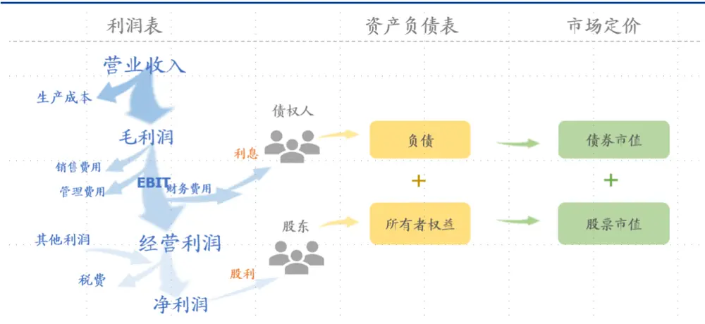
资料来源：国盛证券研究所

## 1.2. 权益价值因子未剔除企业杠杆的影响

从杜邦分析的角度出发，我们可以将 ROE拆分为销售利润率、资产周转率和杠杆率三部分，换言之，三者中任意一者的提高最终都会反映到 ROE 的抬升上，倘若 ROE 的抬升大部分来自于杠杆的运作，那么我们对企业真实盈利水平持怀疑态度。

这一问题同样存在于 EP 因子中。若我们假设有两家公司，总资产相同，其中一家负债经营，另一家无负债经营，最近一期的息前利润相同，并不考虑税费影响，可知：

$$
净利润=息前利润-利息费用
$$

$$
权益EP=\frac{净利润}{股权市值},调整EP=\frac{息前利润}{股权市值+债权市值}
$$

其中利息费用/债权市值可以看做是一家公司的融资成本。调整 EP 则可以看做公司整体的盈利水平，那么权益 EP和调整 EP二者之间满足等式：

$$
权益\;EP=调整\;EP+\frac{债权市值}{股权市值}\times[调整\;EP-\frac{利息费用}{债权市值}]
$$

对无负债的公司而言，其无需支付利息费用，也不存在负债部分，权益 EP 与调整EP 相等；而对负债经营的公司而言，其需要分拨部分利润作为利息支付给债权人，从而降低净利润，所需的净资产也少于无负债公司的净资产，因此负债经营对权益 EP 的影响取决于两者影响的相对强弱。当企业融资成本较低，企业有能力降低利息费用而尽可能的提高企业杠杆，那么支付利息的影响远小于降低净资产的影响，从而抬高EP。

综上可知，当企业的盈利水平大于融资成本时，高杠杆会大幅提高权益 EP，夸大公司的盈利水平，反之亦然，而调整 EP 则不受企业杠杆率的影响。

## 1.3 价值因子未区分经营性活动和金融性活动

上节分析中，我们假设企业所有活动均是为了辅助企业核心业务经营而发生的，但结合到实例我们会发现，大部分公司在自己的主营业务之外还会从事一些投资性的活动。我们称与企业核心经营业务相关的活动为经营性活动，其他活动为金融性活动，因此我们可以进一步划分企业财务报表中的负债、资产和利润为经营性科目和金融性科目。对于绝大数企业而言，投资者更为关心的是经营性科目。

负债科目中，举债支付的利息会减少利润，因此我们把涉及利息支付的负债均划分为金融负债。

对资产而言，非金融行业的企业的金融资产区别于如存货、固定资产等经营性资产，并非企业经营业务的核心资产。我们测算发现全市场一般企业金融性资产占总资产比例大约在 24%上下浮动；同时，金融性资产易受金融市场环境影响，其波动相对于经营性资产的波动更大，也会对企业价值的衡量产生较大的干扰。

图表3：全市场（剔除金融）金融性资产占总资产比例
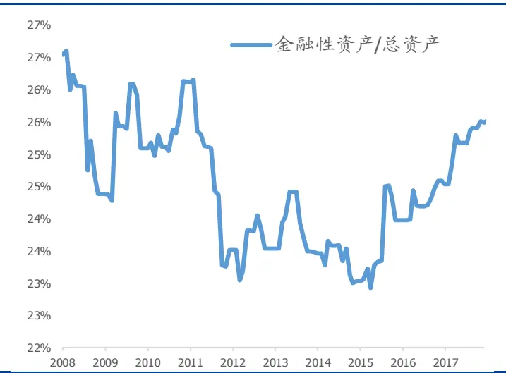
资料来源：Wind，国盛证券研究所

图表4：全市场（剔除金融）经营性资产与金融性资产同比增长率
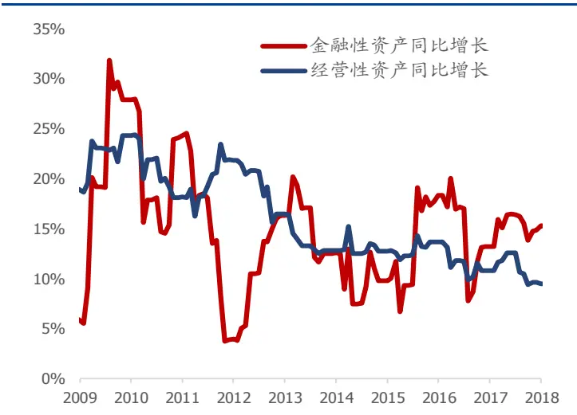
资料来源：Wind，国盛证券研究所

对利润而言，企业的净利润也是包含了经营性净收益与价值变动净收益，前者来自于企业主营业务，后者主要包括公允价值变动净收益、投资净收益和汇兑净收益，来自于企业持有资产的价值变动，例如投资性房地产、对外投资、买卖股票债券及外币等带来的收益。我们统计了全市场除金融行业外企业的经营性净收益与价值变动净收益同比增长率，如下图所示，价值变动净收益易受金融、房地产市场等影响，可持续性较差。

图表5：全市场（剔除金融）经营性净收益与价值变动净收益同比
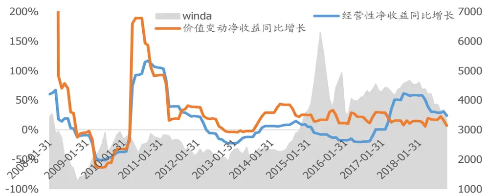
资料来源：Wind，国盛证券研究所

## 2. 改进权益价值因子

针对第一章节中提出的问题，我们尝试构建一套基于企业核心资产的价值因子，该因子分子分母之间可比，不受企业杠杆率的影响，同时剥离金融性活动使指标更接近企业的经营活动，我们称之为去杠杆价值因子。

## 2.1 用经营性净资产更准确地反映企业核心资产

为了使因子不受企业杠杆的影响，同时能剥离金融性活动更好地体现企业的核心资产，分母端我们在所有者权益的基础上，加入负债，并剔除部分非核心资产，我们称这一部分资产为经营性净资产，并取这部分资产的市场定价。

$$
经营性净资产(NOA)=0A-0L=FL-FA+权益
$$

OA：经营性资产；OL：经营性负债；FA：金融资产；FL：金融负债。

图表 6:利润指标与经营性净资产(*MV: Market Value)
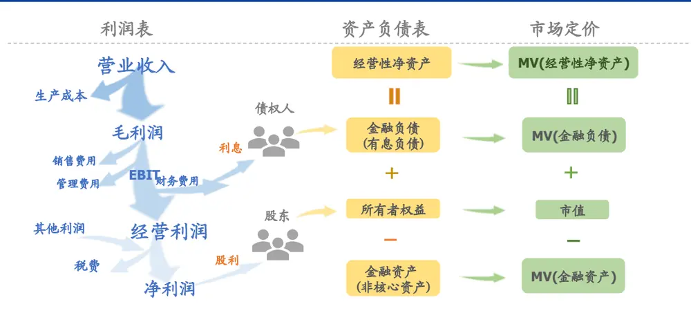
资料来源：国盛证券研究所

需要指出的是，受分析对象和分析目的影响，对企业资产负债表和利润表进行经营性和金融性活动的区分需要一对一详细分析，从量化选股的角度出发，我们这里只能从广义上给出一个较符合科目含义的划分。具体划分方式请参照附录。

为了得到NOA的市场价值，权益部分我们用上市企业的股票市值作为代理指标，但对金融资产和金融负债而言，鉴于二者交易不活跃，市场价值较难获取，我们用它们的账面价值近似代替：

$$
\begin{aligned}&\texttt{MarketValue}(\texttt{NOA})\\&\quad=\texttt{MarketValue}(\texttt{金融负债})-\texttt{MarketValue}(\texttt{金融资产})\\&\quad+\texttt{MarketValue}(\texttt{权益})\\&\quad\approx\texttt{BobkValue}(\texttt{金融负债})-\texttt{BobkValue}(\texttt{金融资产})+\texttt{股票市值}\\\end{aligned}
$$

另外，银行和其他金融企依赖高杠杆经营，金融资产也是其经营活动的核心资产，经营逻辑有别于其他企业，因此该调整法不适用于这些企业。下文的讨论均不考虑银行和非银金融企业。

## 2.2 用经营性指标调整分子

为了解决分子分母不匹配问题，我们尝试从收入、利润、现金流、净资产四个维度寻找分子端的代理指标。

收入方面我们选择主营收入，其位于利润表首端，尚未扣除利息费用，已与企业经营性净资产所包含的意义相匹配；

利润方面我们需要寻找息前经营性利润的代理指标，如毛利润、EBIT等；

现金流指标我们考虑经营性净现金流，它能反映企业在经营活动中现金的充沛程度；
净资产则可以考虑用为经营性净资产的账面价值。

下面我们着重分析利润指标。经我们测试，在多个利润指标中，经营性毛利润是最佳选择。相比于 EBIT，经营性毛利润不考虑价值变动净收益，也不考虑销售费用和管理费用。

会计计量中的配比原则要求每售出一单位货物或劳务，就需要在成本端确认其相关的成本费用。其中，生产成本与营业收入的同步性较高，而销售费用和管理费用则属于期间发生的费用，存在一定的时间错配，因此往往不能准确反映当前企业的成本水平。费用的计量避不开摊销期和摊销方式的选择，一则不同行业间费用的摊销期和摊销方式差异较大，可比性较差，二则摊销期与摊销方式的选择易受审计师的主观判断影响，更容易被企业操纵。并且从因子表现来看，不扣除销售费用和管理费用的因子表现确实更优于扣除后的因子。

图表7：营业收入、生产成本、销售费用和管理费用（TTM）同比
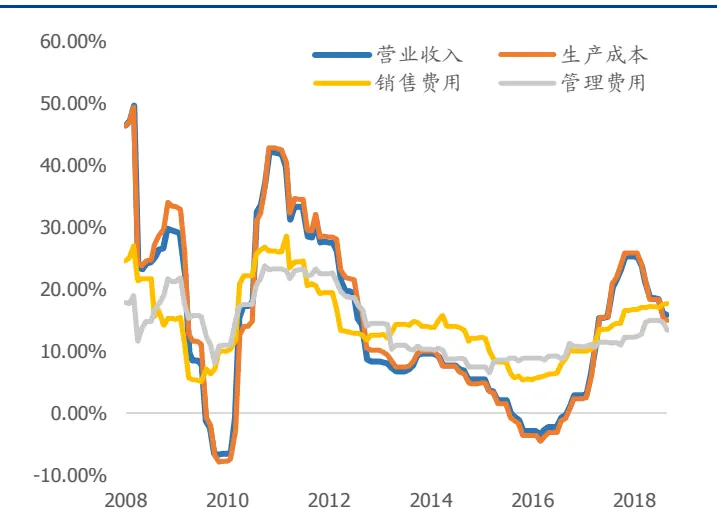
资料来源：Wind，国盛证券研究所

图表8:成本费用对去杠杆EP纯因子组合的影响
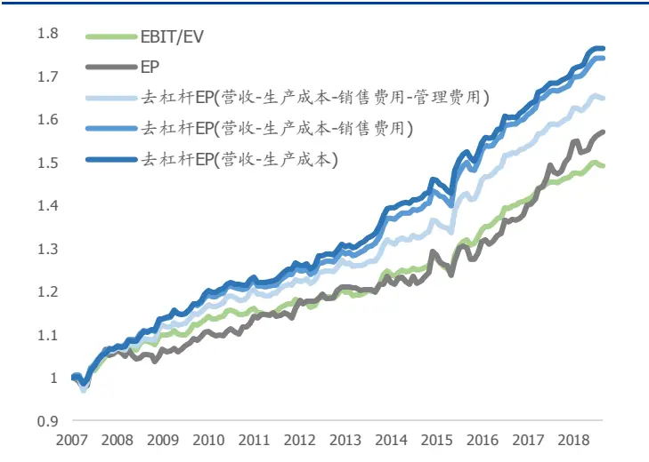
资料来源：Wind，国盛证券研究所

## 2.3 调整后 EP 与权益 EP 的关系

若我们定义：

净负债 = 金融负债 − 金融资产

经营性净资产市值 = 股权市值+净负债市值

$$
经营性净利润=息前经营性利润-财务费用
$$

$$
财务费用=利息费用-价值变动净收益
$$

那么权益 EP 和剥离经营性活动的调整EP可表述为：

$$
权益EP=\frac{净利润}{股权市值},调整EP=\frac{息前经营性利润}{经营性净资产市值}
$$

二者满足等式关系：

$$
权益\;EP=调整\;EP+\frac{净负债}{股权市值}\times[调整\;EP-\frac{财务费用}{净负债}]
$$

调整后的 EP 衡量了企业经营性净资 $\cdot 产$ 的盈利水平。我们也可继续将 $\frac{\left|财务费用\right|}{净负债}$ 看作融资成本，[调整 $\mathrm{EP}-\frac{财务费用}{净负债}\mathrm{]}$ 称作经营利差，记 $L^{\frac{净负债}{股权市值}}$ 为杠杆率，二者乘积称作杠杆贡献率。因此我们可以将等式写作：

$$
权益\;EP=调整\;EP+杠杆率\times[调整\;EP-融资成本]
$$

我们用总和法统计A股全市场股票（剔除金融和综合板块）的上述代理指标，发现过去 10 多年，受益于企业金融资产带来的收益，整体融资成本较低，企业经营利差整体为正，由于杠杆的贡献，权益 EP要远高于经营性资产的真实盈利水平。

图表9:全市场(剔除金融)经营利差整体为正
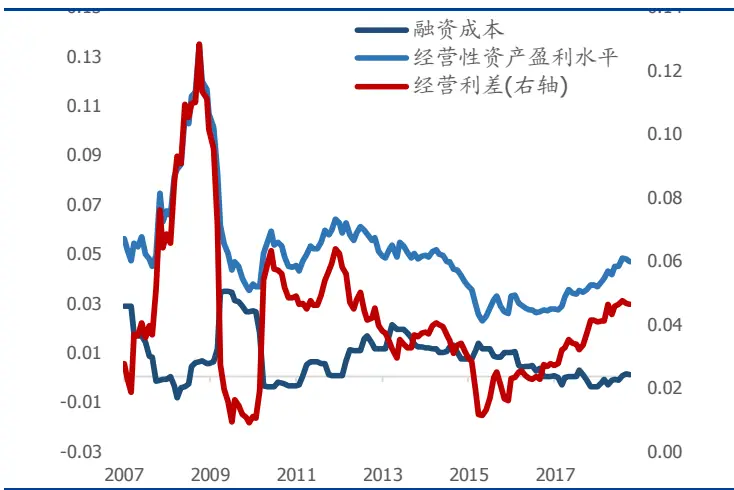
资料来源：Wind，国盛证券研究所

图表10:杠杆贡献率抬升全市场EP(剔除金融)
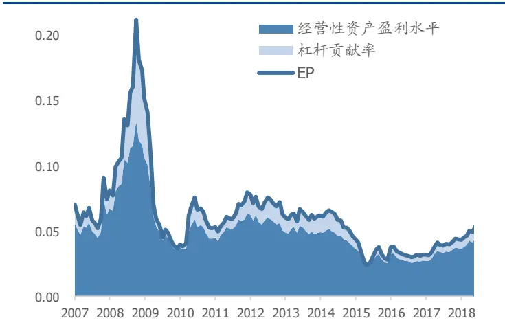
资料来源：Wind，国盛证券研究所

## 2.4 构建去杠杆价值因子

综上所述，我们将价值因子分子端的科目替换为与企业经营活动更接近的指标，其中SP和 CFP分子端仍然采用营业收入和经营性净现金流，EP 分子端我们用营业收入减去生产成本替换，BP 的分子端替换为经营性净资产的账面价值；分母端股权市值替换为经营性净资产的市场价值，构建去杠杆价值因子。

图表11：去杠杆价值因子调整方法

| 权益价值因子 |  | 去杠杆价值因子 |
| --- | --- | --- |
| 营业收入 | 营业收入 | 营业收入 |
|  | 市值 | Market Value(经营性净资产) |
| 利润 | 净利润 | 营业收入－生产成本 |
|  | 市值 | Market Value(经营性净资产) |
| 净资产价值 | 净资产 | 经营性净资产 |
|  | 市值 | Market Value(经营性净资产) |
| 现金流 | 经营性净现金流 | 经营性净现金流 |
|  | 市值 | Market Value(经营性净资产) |

资料来源：国盛证券研究所

## 3. 权益价值因子与去杠杆价值因子表现对比

经测试发现 EP因子的提高效果最佳，SP和CFP 次之，BP效果较弱，下文展示四个因子调整前后的统计结果。所有统计对比均不考虑银行和非银金融企业。

## 3.1 去杠杆价值因子对股票收益的区分度更明显

以 EP为例，我们将全市场股票分成十组，观察权益EP 和去杠杆 EP 对股票的区分度。

权益 EP 因子分组来看收益存在非线性单调问题，即第十组（EP 最高）的股票收益反而落后于第八组。但去杠杆EP 因子的分组单调性优于权益EP 因子。即使未经中性化之前也有较好的区分度。

从分组收益来看，多头部分的收益提升更明显，第十组年化绝对收益从 16.92%上升至21.38%，提升 4.46%，超额收益从 11.41%上升至 15.31%，提升 3.9%，夏普比从 0.50上升至 0.64，信息比从 1.28 上升至 1.56。

图表12：原始因子分组年化收益
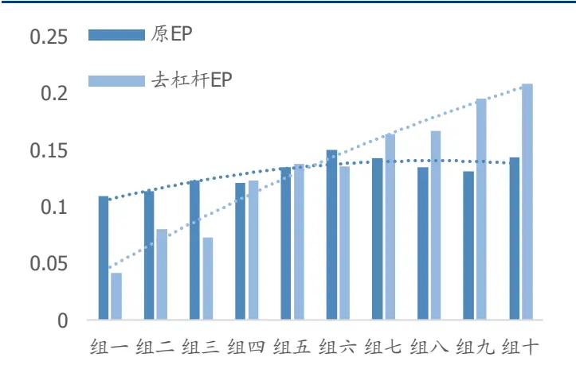
资料来源：Wind，国盛证券研究所

图表13:中性化后因子分组年化收益
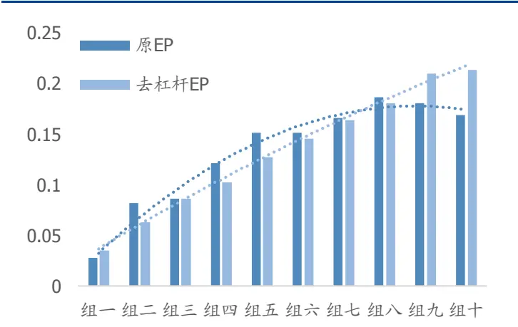
资料来源：Wind，国盛证券研究所

## 3.2 去杠杆 EP/SP/CFP 的 IC 有大幅提高

我们分别统计了 2007年1月至2019年 2月，全市场原始因子和对市值行业中性化后的因子RankIC、ICIR均值。从IC 值对比来看，除了BP 因子以外，EP、SP和CFP 因子均有较大幅度的提升。并且去杠杆之后，未经中性化的因子就有不错的表现。

图表 14:改进前后价值因子 RankIC均值与ICIR

| SP |  |  | EP |  | BP |  | CFP |  |
| --- | --- | --- | --- | --- | --- | --- | --- | --- |
|  | 原因子 | 新因子 | 原因子 | 新因子 | 原因子 | 新因子 | 原因子 | 新因子 |
| RankIC | 0.018 | 0.033 | 0.017 | 0.045 | 0.053 | 0.039 | 0.011 | 0.031 |
| RankICIR | 0.467 | 1.283 | 0.393 | 1.698 | 1.155 | 1.072 | 0.516 | 1.032 |
| 中性化 RankIC | 0.020 | 0.036 | 0.042 | 0.049 | 0.051 | 0.043 | 0.014 | 0.041 |
| 中性化 RankICIR | 0.870 | 2.109 | 1.908 | 2.875 | 1.746 | 1.870 | 1.241 | 2.908 |

资料来源：Wind，国盛证券研究所

## 3.3 去杠杆 EP/SP/CFP 因子多空收益提升

从分组多空收益来看，去杠杆EP 年化收益提升 4.56%，夏普比从 1.44提升至2.27；去杠杆 SP 年化收益提升 4.85%，夏普比从 1.27 提升至 2.15；去杠杆 CFP 年化收益提升8.03%，夏普比从0.80 提升至2.10；去杠杆BP 收益下降，但夏普比从 1.45提升 1.86。因子月度 IC整体位于零轴上方。

图表15:SP因子多空收益前后对比和RankIC值
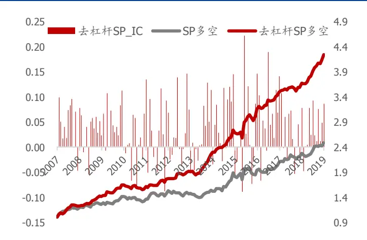
资料来源：Wind，国盛证券研究所

图表16:EP因子多空收益前后对比和RankIC值
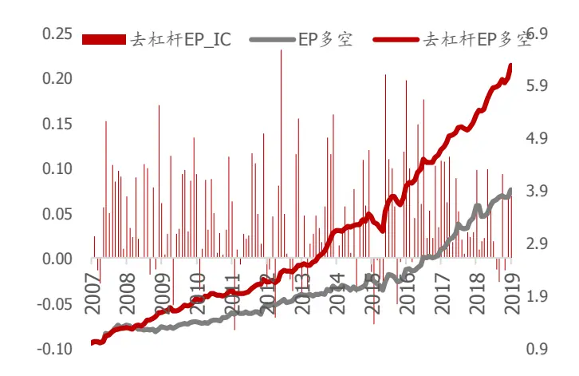
资料来源：Wind，国盛证券研究所

图表17：CFP因子多空收益前后对比和RankIC值
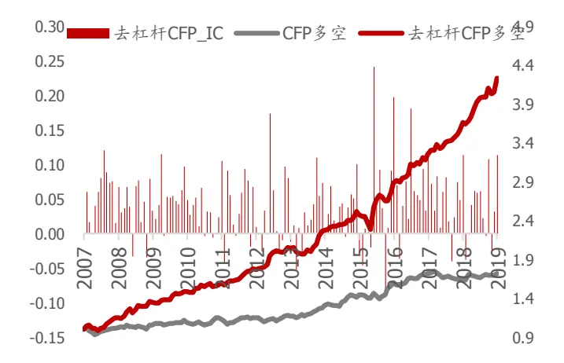
资料来源：Wind，国盛证券研究所

图表 18:BP因子多空收益前后对比和RankIC值
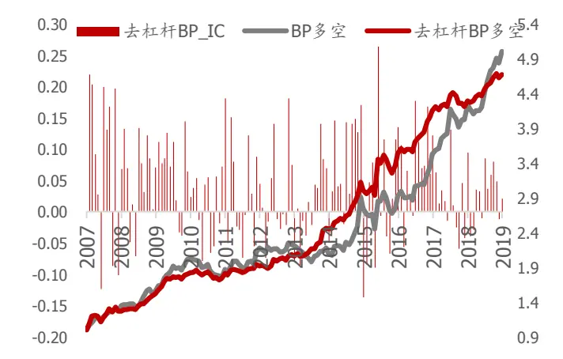
资料来源：Wind，国盛证券研究所

价值因子多空组合绩效统计如下：

图表19：价值因子多空组合绩效汇总

|  | 总收益 | 年化收益 | 年化波动率 | 夏普比 | 最大回撤 |
| --- | --- | --- | --- | --- | --- |
| SP | 154.73% | 8.36% | 6.57% | 1.27 | 10.65% |
| 去杠杆 SP | 324.20% | 13.20% | 6.14% | 2.15 | 6.21% |
| EP | 285.17% | 12.27% | 8.55% | 1.44 | 10.07% |
| 去杠杆EP | 512.33% | 16.83% | 7.41% | 2.27 | 13.19% |
| CFP | 76.10% | 4.98% | 6.20% | 0.80 | 7.32% |
| 去杠杆 CFP | 315.50% | 13.00% | 6.19% | 2.10 | 11.88% |
| BP | 417.49% | 15.15% | 10.43% | 1.45 | 19.83% |
| 去杠杆 BP | 378.36% | 14.38% | 7.85% | 1.83 | 12.34% |

资料来源：Wind，国盛证券研究所

## 3.4 因子分域表现

## 3.4.1 指数分域 IC

权益价值因子在大市值股票中表现更佳，去杠杆价值在中小市值上更有优势。总体来说，原因子中 SP、EP和 CFP在沪深300里的选股能力强于中证500，BP在中证500的表现有优势；去杠杆价值因子中 SP、CFP 在中证 500内的表现更佳，去杠杆 EP 则表现相当。对市值和行业做中性化之后，因子全市场的选股能力胜于域内选股能力。

图表20：价值因子分域（剔除银行和非银金融）RankIC均值

| SP 去杠杆 SP |  |  |  |  |  |  |
| --- | --- | --- | --- | --- | --- | --- |
| 沪深 300 |  | 中证 500 wind 全 A 沪深 300 中证500 wind 全 A |  |  |  |  |
| 原始因子 | 0.0254 | 0.0186 | 0.0180 | 0.0235 | 0.0310 | 0.0336 |
| 中性化因子 | 0.0223 | 0.0175 | 0.0197 | 0.0216 | 0.0322 | 0.0358 |
|  |  | EP |  |  | 去杠杆EP |  |
|  | 沪深 300 | 中证500 | wind 全 A | 沪深300 | 中证500 | wind 全 A |
| 原始因子 | 0.0498 | 0.0315 | 0.0164 | 0.0463 | 0.0470 | 0.0441 |
| 中性化因子 | 0.0547 | 0.0396 | 0.0421 | 0.0376 | 0.0479 | 0.0487 |
|  |  | BP |  |  | 去杠杆 BP |  |
|  | 沪深 300 | 中证500 | wind 全 A | 沪深 300 | 中证 500 | wind 全 A |
| 原始因子 | 0.0368 | 0.0525 | 0.0531 | 0.0120 | 0.0376 | 0.0387 |
| 中性化因子 | 0.0376 | 0.0553 | 0.0506 | 0.0162 | 0.0437 | 0.0428 |
|  |  | CFP |  |  | 去杠杆 CFP |  |
|  | 沪深 300 | 中证 500 | wind 全 A 沪深 300 |  | 中证500 | wind 全 A |
| 原始因子 | 0.0225 | 0.0112 | 0.0111 | 0.0291 | 0.0337 | 0.0308 |
| 中性化因子 | 0.0179 | 0.0161 | 0.0141 | 0.0307 | 0.0372 | 0.0409 |

资料来源：Wind，国盛证券研究所

去杠杆价值因子在中小市值股票上的信息增量更多：我们将四类价值因子去极值、标准和市值行业中性化处理后等权合成去杠杆价值因子，分别从去杠杆价值因子剥离原始价值因子和风险因子，观察残差因子是否能带来新的信息增量。风险因子包括 Barra 风格因子和中信行业一级哑变量。

$$
待检验因子=\alpha+\beta\times 剥离因子+残差
$$

去杠杆价值因子在剥离原价值因子之后，残差在中证500和中证 1000中的IC 均值仍有0.0247 和0.0223，仍有选股效果，能带来一定的信息增量。

图表21：去杠杆价值因子剥离后IC检验（剔除银行和非银金融）

| 待检验因子 | 去杠杆价值因子 |  |
| --- | --- | --- |
| 剥离因子 | 原价值因子+风格因子+行业因子 |  |
|  | IC 均值 | ICIR 月胜率 |
| 沪深 300 | 0.0041 | 0.17 56.25% |
| 中证500 | 0.0247 1.77 | 68.75% |
| 中证 1000 | 0.0223 1.31 | 66.67% |

资料来源：Wind，国盛证券研究所

## 3.4.2 行业分域 IC

不同行业间因子的逻辑有所区别，我们测试了权益价值与去杠杆价值在不同行业内 IC值的变化。

除了改进效果较差的 BP 以外，去杠杆 SP 在交通运输、食品饮料行业，去杠杆 EP 在建筑、食品饮料行业，去杠杆 CFP在建筑、计算机、石油石化行业中的改进效果较差。其中建筑、交通运输等行业资产负债率偏高，而计算机和食品饮料行业资产负债率较低。

某些高杠杆行业受其经营模式的特殊性，高杠杆更有经营优势，对这些行业去杠杆处理丢失了杠杆信息，降低因子效果；对轻杠杆行业而言，去杠杆的影响相对较小，同时若对这些行业进行金融性资产和负债的划分不够准确，带来噪声的负面影响更大，反而使因子效果变差。

图表22：行业内权益价值与去杠杆价值IC对比（剔除银行和非银金融）

| 行业 | 权益 SP | 去杠杆 SP | 差值 | 权益 EP | 去杠杆 EP | 差值 | 权益 BP | 去杠杆 BP | 差值 | 权益 CFP | 去杠杆 CFP | 差值 |
| --- | --- | --- | --- | --- | --- | --- | --- | --- | --- | --- | --- | --- |
| 农林牧渔 | 0.024 | 0.043 | 0.019 | 0.026 | 0.045 | 0.019 | 0.068 | 0.059 | -0.010 | 0.005 | 0.040 | 0.035 |
| 汽车 | 0.024 | 0.040 | 0.017 | 0.026 | 0.046 | 0.020 | 0.067 | 0.054 | -0.013 | -0.001 | 0.033 | 0.034 |
| 基础化工 | 0.018 | 0.042 | 0.024 | 0.011 | 0.038 | 0.027 | 0.052 | 0.051 | -0.001 | 0.005 | 0.035 | 0.030 |
| 煤炭 | 0.017 | 0.033 | 0.016 | 0.043 | 0.049 | 0.006 | 0.062 | 0.060 | -0.002 | 0.009 | 0.039 | 0.029 |
| 通信 | 0.022 | 0.036 | 0.014 | 0.026 | 0.042 | 0.016 | 0.074 | 0.047 | -0.026 | -0.007 | 0.013 | 0.020 |
| 综合 | 0.021 | 0.025 | 0.003 | 0.008 | 0.011 | 0.002 | 0.065 | 0.021 | -0.043 | 0.038 | 0.030 | -0.007 |
| 计算机 | 0.011 | 0.031 | 0.020 | 0.025 | 0.048 | 0.023 | 0.048 | 0.038 | -0.010 | 0.029 | 0.025 | -0.004 |
| 建筑 | -0.001 | 0.010 | 0.011 | 0.028 | 0.026 | -0.002 | 0.043 | 0.035 | -0.007 | 0.027 | 0.016 | -0.011 |
| 建材 | 0.039 | 0.054 | 0.015 | 0.036 | 0.058 | 0.022 | 0.068 | 0.060 | -0.007 | 0.029 | 0.068 | 0.039 |
| 国防军工 | 0.037 | 0.046 | 0.009 | 0.037 | 0.060 | 0.023 | 0.079 | 0.045 | -0.034 | 0.013 | 0.040 | 0.028 |
| 电力设备 | 0.011 | 0.031 | 0.019 | 0.011 | 0.040 | 0.029 | 0.054 | 0.045 | -0.009 | -0.010 | 0.030 | 0.041 |
| 电子元器件 | 0.031 | 0.045 | 0.014 | 0.029 | 0.052 | 0.023 | 0.061 | 0.056 | -0.005 | 0.008 | 0.033 | 0.025 |
| 食品饮料 | 0.023 | 0.016 | -0.007 | 0.027 | 0.018 | -0.009 | 0.055 | 0.031 | -0.023 | 0.015 | 0.061 | 0.046 |
| 餐饮旅游 | 0.016 | 0.023 | 0.007 | 0.002 | 0.030 | 0.029 | 0.088 | 0.062 | -0.026 | 0.024 | 0.055 | 0.031 |
| 家电 | 0.015 | 0.038 | 0.023 | 0.033 | 0.045 | 0.012 | 0.051 | 0.018 | -0.033 | -0.017 | 0.032 | 0.049 |
| 轻工制造 | 0.022 | 0.062 | 0.040 | 0.027 | 0.072 | 0.044 | 0.051 | 0.057 | 0.005 | 0.005 | 0.033 | 0.028 |
| 机械 | 0.017 | 0.042 | 0.025 | 0.004 | 0.046 | 0.042 | 0.061 | 0.047 | -0.014 | 0.028 | 0.041 | 0.013 |
| 传媒 | 0.049 | 0.051 | 0.002 | 0.008 | 0.066 | 0.058 | 0.036 | 0.036 | 0.000 | 0.000 | 0.007 | 0.007 |
| 医药 | 0.015 | 0.021 | 0.006 | 0.006 | 0.036 | 0.030 | 0.038 | 0.026 | -0.012 | 0.011 | 0.039 | 0.028 |
| 有色金属 | 0.019 | 0.031 | 0.011 | 0.030 | 0.051 | 0.021 | 0.057 | 0.035 | -0.022 | 0.015 | 0.043 | 0.028 |
| 石油石化 | 0.016 | 0.022 | 0.006 | -0.005 | 0.014 | 0.019 | 0.077 | 0.028 | -0.049 | 0.056 | 0.022 | -0.034 |
| 电力及公用事业 | -0.006 | 0.025 | 0.031 | 0.011 | 0.050 | 0.039 | 0.047 | 0.021 | -0.026 | 0.016 | 0.031 | 0.015 |
| 房地产 | 0.019 | 0.035 | 0.016 | 0.016 | 0.033 | 0.017 | 0.062 | 0.054 | -0.008 | 0.019 | 0.029 | 0.010 |
| 商贸零售 | 0.029 | 0.043 | 0.013 | 0.019 | 0.047 | 0.027 | 0.072 | 0.056 | -0.016 | 0.017 | 0.033 | 0.016 |
| 钢铁 | 0.002 | 0.038 | 0.035 | 0.045 | 0.055 | 0.010 | 0.025 | 0.021 | -0.004 | 0.014 | 0.016 | 0.002 |
| 纺织服装 | 0.034 | 0.044 | 0.010 | 0.010 | 0.031 | 0.021 | 0.062 | 0.045 | -0.017 | 0.012 | 0.040 | 0.028 |
| 交通运输 | 0.021 | 0.019 | -0.002 | 0.029 | 0.037 | 0.008 | 0.069 | 0.039 | -0.029 | 0.006 | 0.047 | 0.041 |

资料来源：Wind，国盛证券研究所

## 3.4.3 不同经济状态分域 IC

我们利用 OECD 中国综合领先指标作为经济景气度的代理变量，利用 10 年期国债收益率（滚动 3 个月均值平滑处理）作为利率的代理变量，根据指标当前月相对于上个月的变化划分上行与下行，从而将经济划分为复苏、过热、滞胀和衰退四个阶段，并统计了不同经济状态下权益价值与去杠杆价值的表现。

图表23:价值因子在不同经济状态下RankIC均值

|  | SP |  | EP |  | BP |  | CFP |  |
| --- | --- | --- | --- | --- | --- | --- | --- | --- |
|  | 原因子 | 新因子 | 原因子 | 新因子 | 原因子 | 新因子 | 原因子 | 新因子 |
| 复苏 | 0.0069 | 0.0219 | 0.0302 | 0.0312 | 0.0359 | 0.0296 | 0.0188 | 0.0302 |
| 过热 | 0.0443 | 0.0535 | 0.0672 | 0.0600 | 0.0787 | 0.0576 | 0.0188 | 0.0536 |
| 滞胀 | -0.0075 | 0.0248 | 0.0316 | 0.0596 | 0.0377 | 0.0398 | 0.0075 | 0.0459 |
| 衰退 | 0.0068 | 0.0252 | 0.0179 | 0.0420 | 0.0282 | 0.0361 | 0.0060 | 0.0289 |

资料来源：Wind，国盛证券研究所

我们观察到，在滞胀和衰退阶段，去杠杆SP/EP/CFP 的选股能力相比于权益价值因子有明显的提升，而在过热阶段，权益 EP 则略优于去杠杆EP。

正如我们之前所提到的，只有当企业的盈利能力高于融资成本，经营利差为正时，叠加杠杆才对企业产生正面的影响。当整体经济进入上行阶段，基本面持续改善时，大部分企业的经营状况较好，运用杠杆能锦上添花；而在经济下行阶段则会造成盈利能力的虚高。由于去杠杆价值因子未反映企业杠杆信息，避免考虑企业在下行阶段由于杠杆承压的负面影响，但也无法体现高杠杆的优质企业在上行阶段的优势，因此去杠杆价值相比于权益价值，呈现出在经济下行阶段优势更明显，而在上行阶段优势不明显的特点。

进一步考虑去杠杆 EP 的分子，由于我们用毛利润代替净利润、EBIT 等指标，放松了对成本的惩罚，因此降低了成本端对因子的影响。换言之，我们在滞胀阶段不考虑由于销售管理费用提升造成企业经营状况的恶化，在衰退阶段也避免考虑常规费用支出，而重点关注经营性活动的毛利润，削弱了成本估计准确度的影响，从而去杠杆 EP 因子获得较好的选股效果；但是在过热阶段，大部分企业基本面向好，对成本控制能力更强的企业更具竞争力，因此利用完整考虑成本费用的净利润构建的原 EP表现更有优势。

## 3.5 杠杆中性化权益价值与去杠杆价值对比

许多研究多因子模型的读者或许会考虑另一个问题：如果我们从后期因子处理的角度将权益价值因子对杠杆做中性化，是不是能得到同样的效果呢？

如下图展示的是 EP对Barra风格因子中的杠杆因子中性化后的分组表现，我们发现因子头部选股能力较弱，IC均值0.017，远低于去杠杆EP

图表24:权益EP对杠杆中性化分组表现
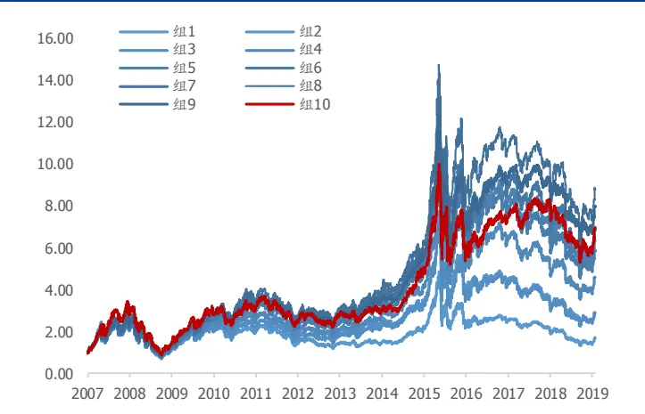
资料来源：Wind，国盛证券研究所

图表25：去杠杆EP分组表现
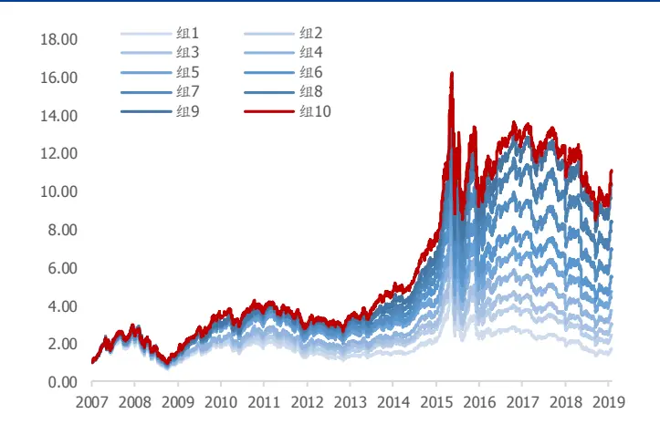
资料来源：Wind，国盛证券研究所

我们再次引用 2.3节中权益EP和调整 EP 间的等式关系：

$$
权益\;EP=调整\;EP+\frac{净负债}{股权市值}\times[调整\;EP-\frac{财务费用}{净负债}]
$$

我们看到中性化方法的缺陷主要有两点：

1). 上式中的杠杆并非 Barra 风格因子定义的杠杆，而是做了金融负债和资产划分后的净负债比股权市值：

$$
杠杆=\frac{净负债}{股权市值}=\frac{金融负债-金融资产}{股权市值}
$$

2). 杠杆对权益 EP 并非简单的线性影响，做线性中性化并不能完全剥离杠杆的影响。

因此我们不建议用中性化的方式构建去杠杆价值。

## 3.6 因子相关性

我们统计了改进后的价值因子与 Barra 风险因子截面上因子相关性的均值，看到经过调整后的因子与风险因子，尤其是杠杆、价值和盈利因子的相关性均有下降。

在其他因子中，去杠杆EP因子与毛利率/总资产、货币资金/总资产因子的相关性相对较高，均值分别在 0.16 和 0.15，去杠杆 SP 与资产周转率、SP、经营利润/总资产的相关性相对较高，均值分别为0.24、0.22 和0.22，去杠杆 CFP与原CFP和企业自由现金流/市值的相关性相对较高，分别为 0.18 和 0.13，而去杠杆 BP 与原 BP 相关性会高一些，为 0.24。

图表26:价值因子与风险因子相关性

|  | SP | 新 SP | EP | 新EP | BP | 新 BP | CFP | 新 CFP |
| --- | --- | --- | --- | --- | --- | --- | --- | --- |
| beta | 0.024 | 0.016 | -0.003 | 0.010 | 0.041 | 0.012 | 0.017 | 0.010 |
| 盈利 | 0.226 | 0.073 | 0.529 | 0.086 | 0.246 | 0.090 | 0.121 | 0.109 |
| 成长 | -0.019 | 0.011 | 0.130 | 0.028 | -0.183 | -0.017 | 0.059 | 0.026 |
| 杠杆 | 0.352 | 0.000 | 0.047 | -0.050 | 0.158 | 0.060 | 0.144 | 0.011 |
| 流动性 | -0.117 | 0.039 | -0.091 | 0.057 | -0.192 | 0.057 | 0.008 | 0.051 |
| 动量 | -0.053 | -0.038 | 0.017 | -0.029 | -0.287 | -0.075 | -0.009 | -0.024 |
| 非线性市值 | -0.006 | 0.006 | 0.029 | 0.005 | 0.001 | -0.022 | 0.026 | -0.015 |
| 市值 | 0.000 | 0.051 | 0.000 | 0.058 | -0.001 | 0.069 | -0.001 | 0.076 |
| 价值 | 0.355 | 0.101 | 0.233 | 0.059 | 0.883 | 0.219 | 0.229 | 0.063 |
| 波动率 | -0.189 | -0.028 | -0.242 | -0.020 | -0.412 | -0.058 | -0.072 | -0.015 |

资料来源：Wind，国盛证券研究所

## 3.7 去杠杆价值因子在组合中的表现

我们考察利用去杠杆价值因子对指数增强组合是否有贡献。为了避免其他大类因子对价值因子的干扰，我们分别利用原价值因子和去杠杆价值因子作为 alpha 信号，控制组合在除价值以外其他风格和行业上的暴露，测试其相对中证500是否有超额收益，即构建纯价值增强组合。

组合构建：月频调仓，将原四个价值因子和去杠杆价值因子去极值和标准化等权合成大类因子，对风险因子和行业中性化后作为 alpha，组合优化形式如下：

$$
\begin{aligned}&\max\mathrm{w^{T}alpha}\\s.t.&\mathrm{Tracking\:error\leq5\%}\\&\quad\left|\mathrm{w^{T}Style_{i}}\right|\leq0.05\\&\quad\left|\mathrm{w^{T}Industry_{j}}\right|\leq0.05\\&0\leq\mathrm{w_{n}}+\mathrm{w_{bench}}\leq0.1\\&\mathrm{sum(w_{n}+w_{bench})=1}\end{aligned}
$$

由于Barra风险模型中的价值因子本身即包含BP的信息，盈利因子也包含部分EP和CFP的信息，因此我们将原价值因子作为 alpha 且控制了其他风险暴露时，相对风险因子外的 alpha 增量较少；而去杠杆价值因子相比于原价值因子，EP/SP/CFP 均有较大程度的增强，这些因子还能提供风险因子外的增量信息，因此在指数增强组合上有正向贡献。

图表27：中证500纯价值增强组合超额收益净值与OECD领先指标（右轴）
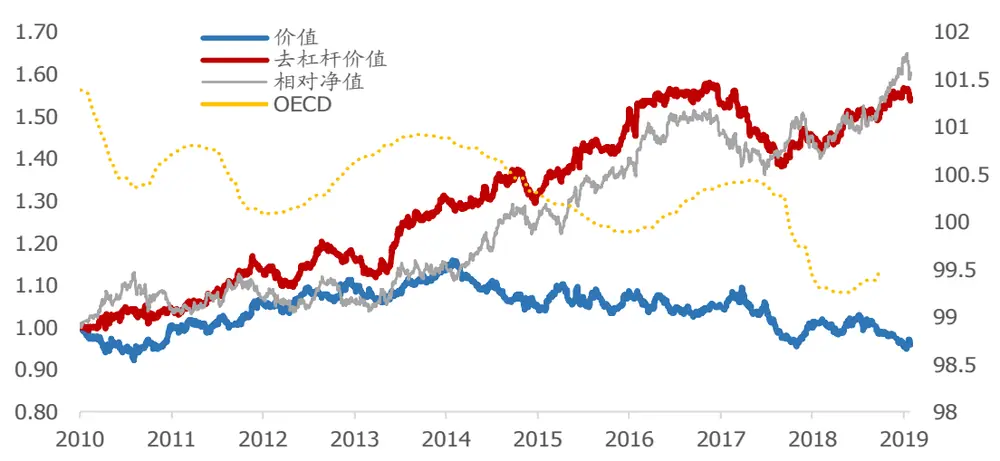
资料来源：Wind，国盛证券研究所

从相对收益来看，从 2010 年、2014~2016年去杠杆价值相对于权益价值有较明显的超额收益，在 2012~2014 年、2016~2017 年并不稳定。我们注意到这两段时间正对应于经济景气度上升，权益价值较为强势的时间区间，因此去杠杆价值较难获得超额收益。

图表28：中证500纯价值增强组合绩效

| 去杠杆价值 500 纯价值增强 |  |  |  |  | 价值因子 500 纯价值增强 |  |  |  |
| --- | --- | --- | --- | --- | --- | --- | --- | --- |
| 年份 | 年化收益 | 年化波动率 | 最大回撤 | IR | 年化收益 | 年化波动率 | 最大回撤 | IR |
| 2010 | 5.05% | 7.02% | 4.31% | 0.72 | -4.20% | 6.50% | 7.78% | -0.65 |
| 2011 | 10.74% | 5.75% | 1.96% | 1.87 | 9.56% | 6.18% | 3.34% | 1.55 |
| 2012 | 2.06% | 5.45% | 4.57% | 0.38 | 5.29% | 5.86% | 3.28% | 0.90 |
| 2013 | 9.71% | 6.17% | 5.54% | 1.57 | 2.76% | 5.60% | 4.89% | 0.49 |
| 2014 | 3.02% | 5.96% | 4.54% | 0.51 | -6.60% | 5.82% | 10.25% | -1.13 |
| 2015 | 10.06% | 5.54% | 3.11% | 1.82 | -1.13% | 6.44% | 6.57% | -0.18 |
| 2016 | 9.08% | 6.38% | 4.27% | 1.42 | 0.48% | 5.91% | 5.79% | 0.08 |
| 2017 | -7.14% | 5.99% | 12.36% | -1.19 | -6.93% | 5.49% | 12.94% | -1.26 |
| 2018 | 5.68% | 5.25% | 3.32% | 1.08 | -0.84% | 5.53% | 5.43% | -0.15 |
| 2019 | -5.79% | 5.28% | 2.15% | 4.38 | -6.73% | 6.59% | 2.71% | -1.02 |
| 平均 | 5.02% | 5.96% | 12.68% | 0.87 | -0.39% | 5.95% | 18.30% | -0.07 |

资料来源：Wind，国盛证券研究所

## 总结

基于权益价值因子存在的问题，我们尝试构建一套基于企业核心资产的价值因子。该因子不受企业杠杆的影响，并剥离金融性活动使指标更接近企业的经营活动，同时分子分母之间可比，我们称之为去杠杆价值因子。

EP、SP 和 CFP 因子在去杠杆化后选股能力有所增强。截面上来看，去杠杆价值因子在中小市值股票上的表现优于大市值股票；在大部分非金融行业中也体现出选股优势；从时间序列上看，去杠杆价值因子在经济周期下行阶段的表现优于权益价值因子，从而填补权益价值因子在经济下行阶段的不足。同时，去杠杆价值因子在多因子组合中能提供相对于风险价值因子外的alpha收益。

## 参考文献

1. Penman S H, Reggiani F, Richardson S A, et al. A framework for identifying accounting characteristics for asset pricing models, with an evaluation of book‐to‐price[J]. European Financial Management, 2018, 24(4): 488-520.

2. Penman S. Accounting for value[M]. Columbia University Press, 2010: 95-103.

3. Qian E E, Hua R H, Sorensen E H. Quantitative equity portfolio management: modern techniques and applications[M]. Chapman and Hall/CRC, 2007: 111-125.

## 风险提示

以上结论均基于历史数据和统计模型测算，如果未来市场环境发生明显改变，不排除因子失效的可能性。

## 附录

## 经营性净资产计算

我们首先划分报表科目的经营性与金融性。以企业资产负债表为例，表中科目按其运用目的，可以划分为经营性科目和金融性科目。对于一般企业而言，经营性资产与企业经营活动息息相关，而金融性资产更多服务于资本运作，不属于一般企业经营核心资产。

图表29：资产负债表划分

| 资产 | 负债和权益 |
| --- | --- |
| 经营性资产（OA） | 经营性负债（OL） |
|  | 金融负债（FL） |
| 金融资产（FA） | 权益 |

资料来源：国盛证券研究所

利用资产负债表的数据计算 NOA：

$$
经营性净资产(NOA)=0A-0L=FL-FA+权益
$$

OA：经营性资产；OL：经营性负债；FA：金融资产；FL：金融负债。

2018年开始对金融资产的计量发生了变化，金融资产的划分不再以交易目的为依据，而是通过判断业务模式和合同现金流量特征划分，分类上由原来的四类变为三类：（1）以摊余成本计量的金融资产；（2）以公允价值计量且其变动计入其他综合收益的金融资产；（3）以公允价值计量且其变动计入当期损益的金融资产。在资产负债表上不再有“持有到期投资”和“可供出售金融资产”科目，分别改为“债权投资”和“其他债权投资”、“其他权益工具投资”。

对应到 wind 底层数据如下所示（括号中的项目为 2018年会计准则调整项目）：

图表30：经营性净资产计算

| 带息流动负债 | +流动负债 | 流动负债 | tot_cur_liab |
| --- | --- | --- | --- |
|  | -无息流动负债 | 应付账款 | acct_payable |
|  |  | 应付手续费及佣金 | adv_from_cust |
|  |  | 应付职工薪酬 | empl_ben_payable |
|  |  | 应交税费 | taxes_surcharges_payable |
|  |  | 其他应付款 | oth_payable |
|  |  | 预提费用 | acc_exp |
| 递延收益 |  | deferred_inc |  |
|  | 其他流动负债 | oth_cur_liab |  |
| 带息非流动负债+带息非流动负债 权益 +股权 | 长期借款 | It_borrow |  |
|  | 应付债券 所有者权益 | bonds_payable tot_shrhldr_eqy_excl_min_int |  |
|  | 货币资金 |  |  |
| 非核心资产 -金融资产 | 交易性金融资产 | monetary_cap |  |
|  | 可供出售金融资产 | tradable_fin_assets |  |
|  |  | fin_assets_avail_for_sale |  |
|  | (其他债权投资、 | (other_debt_investment, |  |
|  | 其他权益工具投资） | other_equity_investment) |  |
|  | 持有至到期投资 | held_to_mty_invest |  |
|  | (债权投资） | (debt_investment) |  |
|  | 投资性房地产 | invest_real_estate |  |
|  | 定期存款 | time_deposits |  |
|  | 衍生金融资产 | derivative_fin_assets |  |
|  | 应收股利 | dvd_rcv |  |
|  | 应收利息 | int_rcv |  |
|  | 买入返售金融资产 | red_monetary_cap_for_sale |  |
|  | (其他非流动金融资产) | (other_illiquidfinancial_assets) NOA |  |

资料来源：Wind，国盛证券研究所

## 免责声明

国盛证券有限责任公司（以下简称“本公司”）具有中国证监会许可的证券投资咨询业务资格。本报告仅供本公司的客户使用。本公司不会因接收人收到本报告而视其为客户。在任何情况下，本公司不对任何人因使用本报告中的任何内容所引致的任何损失负任何责任。

本报告的信息均来源于本公司认为可信的公开资料，但本公司及其研究人员对该等信息的准确性及完整性不作任何保证。本报告中的资料、意见及预测仅反映本公司于发布本报告当日的判断，可能会随时调整。在不同时期，本公司可发出与本报告所载资料、意见及推测不一致的报告。本公司不保证本报告所含信息及资料保持在最新状态，对本报告所含信息可在不发出通知的情形下做出修改，投资者应当自行关注相应的更新或修改。

本公司力求报告内容客观、公正，但本报告所载的资料、工具、意见、信息及推测只提供给客户作参考之用，不构成任何投资、法律、会计或税务的最终操作建议,本公司不就报告中的内容对最终操作建议做出任何担保。本报告中所指的投资及服务可能不适合个别客户，不构成客户私人咨询建议。投资者应当充分考虑自身特定状况，并完整理解和使用本报告内容，不应视本报告为做出投资决策的唯一因素。

投资者应注意，在法律许可的情况下，本公司及其本公司的关联机构可能会持有本报告中涉及的公司所发行的证券并进行交易，也可能为这些公司正在提供或争取提供投资银行、财务顾问和金融产品等各种金融服务。

本报告版权归“国盛证券有限责任公司”所有。未经事先本公司书面授权，任何机构或个人不得对本报告进行任何形式的发布、复制。任何机构或个人如引用、刊发本报告，需注明出处为“国盛证券研究所”，且不得对本报告进行有悖原意的删节或修改。

## 分析师声明

本报告署名分析师在此声明：我们具有中国证券业协会授予的证券投资咨询执业资格或相当的专业胜任能力，本报告所表述的任何观点均精准地反映了我们对标的证券和发行人的个人看法，结论不受任何第三方的授意或影响。我们所得报酬的任何部分无论是在过去、现在及将来均不会与本报告中的具体投资建议或观点有直接或间接联系。

投资评级说明

| 投资建议的评级标准 |  | 评级 | 说明 |
| --- | --- | --- | --- |
| 评级标准为报告发布日后的6个月内公司股价（或行业指数）相对同期基准指数的相对市场表现。其中A股市场以沪深300指数为基准；新三板市场以三板成指（针对协议转让标的）或三板做市指数（针对做市转让标的）为基准；香港市场以摩根士丹利中国指数为基准，美股市场以标普500指数或纳斯达克综合指数为基准。 | 股票评级 | 买入 | 相对同期基准指数涨幅在15%以上 |
|  |  | 增持 | 相对同期基准指数涨幅在 5%~15%之间 |
|  |  | 持有 | 相对同期基准指数涨幅在-5%~+5%之间 |
|  |  | 减持 | 相对同期基准指数跌幅在 5%以上 |
|  | 行业评级 | 增持 | 相对同期基准指数涨幅在10%以上 |
|  |  | 中性 | 相对同期基准指数涨幅在-10%~+10%之间 |
|  |  | 减持 | 相对同期基准指数跌幅在10%以上 |

## 国盛证券研究所

北京

地址：北京市西城区锦什坊街 35号南楼

上海

地址：上海市浦明路 868 号保利 One56 10 层

邮编：100033

邮编：200120

传真：010-57671718

电话：021-38934111

邮箱：gsresearch@gszq.com

邮箱：gsresearch@gszq.com

南昌

地址：南昌市红谷滩新区凤凰中大道 1115号北京银行大厦

深圳

地址：深圳市福田区益田路 5033 号平安金融中心 101层

邮编：330038

传真：0791-86281485

邮编：518033

邮箱：gsresearch@gszq.com

邮箱：gsresearch@gszq.com