# 量化专题报告

# 多因子系列之五：使用预测数据改进财报月基本面因子

我们发现基本面多因子组合在财报月的换仓滞后问题会影响组合业绩表现。大部分基本面因子的数据来源于公司发布的财务报告，因此在财报频发的 4、8、10三个月中，如果不及时换仓，会使得很多公司发布财报后很多天信息才能反映到我们的策略当中，造成换仓滞后的问题。经测算，我们发现组合确实在财报月表现不佳。

简单增加换仓频率能缓解部分滞后问题，但是使用该方法有先决条件。在财报月增加换仓频率虽然能提升因子表现，但同时也增加了换手率，提高了交易成本。经测算，在不控制换手率且只投资于基本面多因子的情况下，该方法适用的临界成本约为双边千五左右。

进一步地，我们尝试使用预测数据在不提高换手率的前提下改进基本面因子的预测能力。我们借鉴海外文献中的做法，使用基本面预测模型对财报月的基本面因子表现进行增强，并且分别采用线性模型和非线性模型进行了尝试。实证结果表明，大部分基本面因子可以通过该方法提升因子 IC。

将分析师预测数据和模型预测数据结合效果更佳。由于分析师预测数据相比模型预测数据具有预测更准确但覆盖率不高的特点，因此我们可以将两者结合，扬长避短。我们发现使用两者结合的数据在组合端能较好的地提高基本面多因子业绩表现，年化收益从 13.79%提升到 16.25%，信息比率从 2.481提高到 2.764。

风险提示：量化专题报告中的观点基于历史统计与量化模型，存在历史规律与量化模型失效的风险。

## 作者

分析师 殷明

执业证书编号：S0680518120001

邮箱：yinming@gszq.com

分析师 刘富兵

执业证书编号：S0680518030007

邮箱：liufubing@gszq.com

## 相关研究

1、《量化周报：当下不是加仓的最佳时机》2019-05-05

2、《量化周报：市场逼近日线级别调整，但仍需时日确认》2019-04-28

3、《量化周报：市场中期上涨结构依旧》2019-04-21

、《量化周报：短调不改市场中期上涨趋势》 2019-04-14

5、《量化专题报告：宏观逻辑的量化验证：动态因子 模型》2019-04-08

## 1 前言

基于月频换仓的多因子体系存在换仓滞后问题。具体来说，由于多因子使用截面回归来进行建模，因此必须在同一时间节点使用所谓“因子暴露”大小来比较不同公司在因子上的打分高低。对于大部分基本面因子来说，其数据来源于公司发布的财务报告。由于在财报频发的 4、8、10 三个月中，每个公司发布财报的时间有先后差异，而我们月频多因子策略往往使用固定时间（例如每月最后一个交易日）换仓，这样使得很多公司发布财报后很多天信息才能反映到我们的策略当中，造成换仓滞后的问题。本篇报告就该问题如何影响我们的多因子组合绩效进行了测算。

解决该问题最直观的想法是在财报月增加换仓频率，例如由月频变为周频或者日频，然而该方法提升因子表现的同时也增加了换手率，提高了交易成本，经过我们的测算，发现如果不控制换手率，让组合充分换手，投资于基本面多因子组合，在某个临界交易成本下，该方法是适用的，而如果交易成本大于该阈值，则该方法失效，需要考虑其他方法。

我们借鉴海外文献中的做法，尝试使用预测数据对财报月的基本面多因子表现进行增强，具体来说，我们在财报月前一个月对财报月的核心数据进行预测，并进一步计算预测的因子。在预测的时候，我们同时结合分析师一致预期数据和基本面数据的预测模型，以期使用该方法得到的基本面因子能获得更好的预测能力，我们给出了主要因子的测试结果，并进行了简要分析。

本篇报告是多因子选股报告系列的第五篇，在之前的篇幅中，我们介绍了目前我们的多因子组合的 ALPHA 预测模型和组合的构建方式，本篇开始我们将对模型的细节进行完善。本篇报告的结构如下：第二章介绍 ALPHA 因子在财报月的滞后问题以及该问题对组合表现的影响，并介绍使用增加换仓频率的方法适用的条件，从而引出使用预测数据改进基本面因子的重要性；第三章我们使用前视模型先对预测模型做了一个简要分析；第四章则介绍使用线性模型和非线性模型分别通过基本面数据进行因子改进的方法，第五章我们将分析师一致预期数据和模型结合，分析两者优劣，并将两者结合进一步提高因子表现。最后一章是对全文核心结论的总结。

## 2 ALPHA 因子在财报月的滞后问题

基本面因子的换手率一般不高，主要原因是其信息来源大多都来自于上市公司的财务报表。正是由于这个原因，每当公司发布财报的时候，基本面因子的换手率就大幅提高。并且财务类因子在这时候反映的信息是最充分的。如果换仓不及时，很可能错过这些因子的最佳调仓时机。本章我们将从多个角度描述该问题会如何影响我们的月频多因子组合表现。

## 2.1 问题一：换仓日滞后时间较长

首先第一个角度是换仓日的滞后时间长度。我们假设固定换仓的月频多因子组合在每月月底统一进行因子计算，并在第二个月月初进行换仓。那么，由于不同公司发布财报时间不同，有些公司可能在月初或月中就发出报告，而我们选择在月底进行因子值计算，具有一定的时间滞后。具体来说，我们统计了 2010 年1 月至 2019 年4 月期间的所有财务报表，发现各个季报的平均滞后天数分别为：一季报 13 天，半年报 11.5 天，三季报9.1 天，年报12 天。其中2018 年一季报平均滞后时间最长，高达 18.8 天。总体样本平均滞后天数为 12.03 天，如图表 1 所示。

图表1：不同财报期的滞后天数统计
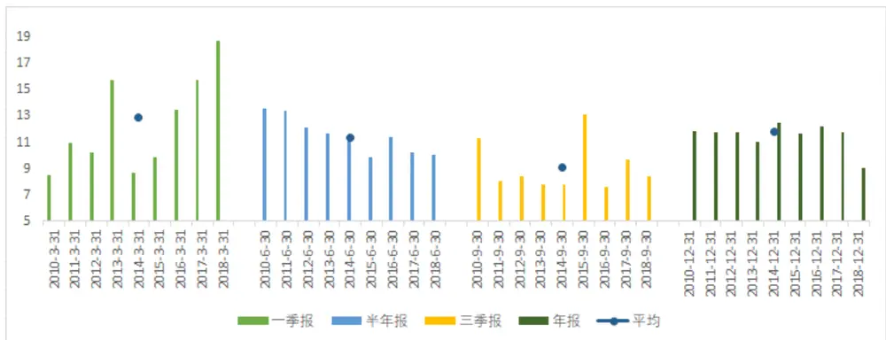
资料来源：国盛证券研究所，Wind

## 2.2 问题二：固定周期月频换仓的基本面因子在财报发布月表现不佳

从绝对天数上来看，目前月频多因子策略换仓确实滞后了，那么这种滞后是否会影响基本面因子的表现呢？我们对不同月份基本面因子表现进行了统计，并进一步根据是否财报月进行了分类，发现不同月份下，以及不同财报月属性下，基本面因子表现差异很大。

## 2.2.1 基本面因子的分月表现

首先我们来观察基本面因子的分月表现。我们统计了主要基本面因子在 2010 年 1 月至2018 年 12 月的分月表现，如下图所示。该图中横轴代表月份，纵轴代表因子的月均收益，每条曲线代表一个基本面因子，并对因子进行了市值行业中性化处理。每个因子的具体含义可以参照附录中的“本文提到的基本面因子一览”。

图表2:不同月份主要基本面因子收益率表现
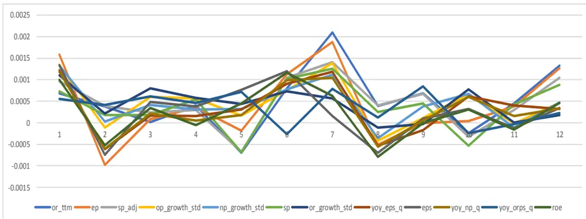
资料来源：国盛证券研究所，Wind

从图中不难看出，基本面因子在2月和8月两个月表现最差，大部分因子都出现了回撤。而在 4 月、5 月、10 月则是少部分因子出现回撤。这几个月中，8 月是中报发布月，4月是年报发布月，10 月是三季报发布月，这些财报发布月的表现都比较一般。除此之外，2 月份因子表现也不佳，我们查阅了海内外文献，对此主要解释有两种假说，一种是春节效应假说，即 2 月所在的春节月份决定市场表现的主要因素为情绪类因子，而不是基本面因子；另一种则认为二月份是很多中小板、创业板公司发布报告的月份，因此产生了信息漂移，导致部分基本面因子表现一般。

## 2.2.2 基本面因子在财报月表现不佳

进一步地，我们将财报频发的 4、8、10 这三个月作为一组，称为财报月组，其他月份作为另外一组，称为非财报月组，那么基本面因子在这两组中的表现是否有显著差异呢？我们对此进行了统计，如下图所示，图中横轴为不同的基本面因子，纵轴为因子组内平均收益，蓝色柱状图表示非财报月因子表现，红色柱状图则代表财报月因子表现。

图表3:基本面因子在财报月和非财报月的表现差异
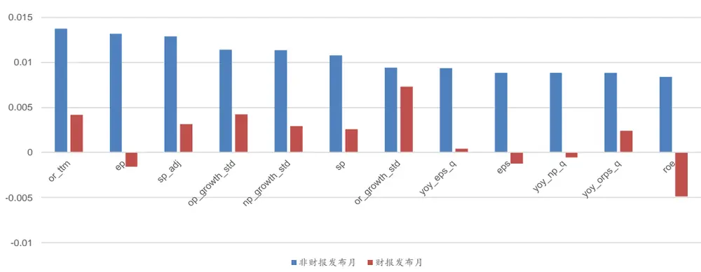
资料来源：国盛证券研究所，Wind

从图中不难看出，我们列出的所有基本面因子在非财报月都是有效 ALPHA 因子，能够提供显著的正向收益，而在财报月，则有四个因子出现了反向，分别是 EP、EPS、YOY_NP_Q和ROE，其他因子虽然能够提供正向收益，但相较于非财报月都出现了不同程度的减弱。可见从整体上来说，财报月基本面因子表现不佳。

## 2.3 问题三：换仓滞后问题拖累基本面单因子表现

那么，由于换仓滞后导致的基本面因子表现不佳问题程度有多严重呢？我们需要进行进一步的测算。对于该问题，我们的测算方法是，假设因子能够在第一时间完全使用每个公司的财报信息，即计算因子按照日频计算，并在第二天开盘就进行交易。这样我们的组合就变成了日频换仓的组合。由于日频换仓带来的手续费更高，产生更大的磨损，这不利于我们对该问题的测算，因子在这一节中我们先假定没有任何交易磨损，下一节我们再考虑在不同交易费率下组合的表现情况。

下面我们举例说明。以 EP（市盈率倒数）因子为例，测试结果如下图所示。图中横轴为不同的月份，纵轴是 EP 因子在该月份的平均收益，蓝色柱状图表示按照月频换仓的因子表现，红色柱状图则表示按照日频换仓的因子表现。折线图表示两者的差异。该图中因子收益的计算过程就假定了没有交易摩擦，并且投资于市值行业中性化后的 EP 因子的投资组合。

图表4:月频换仓和日频换仓的EP因子表现差异
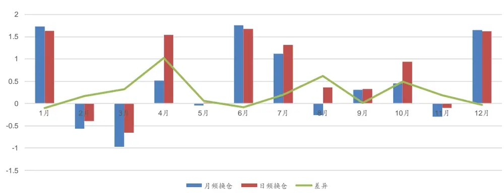
资料来源：国盛证券研究所，Wind

从图中不难看出，如果能够充分换仓，日频模型在4 月、8 月、10 月能够非常显著地跑赢月频模型，而在其他月份两者表现差异则不如财报月这么大。具体来说，EP 因子在4月、8 月、10 月日频模型分别能跑赢月频模型平均 1.02%、0.62%、0.49%。类似地，我们测算了主要基本面因子在财报月的表现，如下表所示。可以看到基本上所有因子都表现出日频模型效果更好的特点。

图表5：不同基本面因子财报月收益差

| 因子名称 | 4月收益差 | 8月收益差 | 10月收益差 |
| --- | --- | --- | --- |
| or_ttm | 0.89 | 0.63 | 0.21 |
| ep | 1.02 | 0.62 | 0.49 |
| sp_adj | 0.77 | 0.45 | 0.23 |
| op_growth_std | 0.67 | 0.39 | 0.29 |
| np_growth_std | 0.78 | 0.52 | 0.26 |
| sp | 0.76 | 0.42 | 0.31 |
| or_growth_std | 0.42 | 0.04 | -0.24 |
| yoy_eps_q | 0.88 | 0.52 | 0.19 |
| eps | 0.96 | 0.59 | 0.32 |
| yoy_np_q | 0.86 | 0.57 | 0.41 |
| yoy_orps_q | 0.37 | 0.29 | 0.14 |
| roe | 1.23 | 0.58 | 0.63 |

资料来源：国盛证券研究所，Wind

## 2.4 问题四：使用简单提高换仓频率解决该问题需要满足一定条件

从上一节可以看出，日频模型在不考虑交易成本的情况下确实在财报月表现更优。然而，在实际投资过程中，交易成本是不可忽略的重要因素。提高了换手频率的日频模型换手率更高，从而使得其成本也更高。提高换仓频率带来的收益和提高换手率带来的成本之间显然存在一个互相制约、此消彼长的关系。在足够小的交易成本下，前者占优；而如果交易成本超过某个临界值，则后者起主导作用。我们测算了该临界值，约为双边千五左右，如下表所示。

图表6：不同交易费率下的组合比较

| 交易费率 | 月频换仓 | 日频换仓 | 差异 |
| --- | --- | --- | --- |
| 0.1% | 16.21% | 17.61% | 1.40% |
| 0.3% | 14.67% | 15.33% | 0.66% |
| 0.5% | 13.12% | 13.07% | -0.05% |
| 0.7% | 11.57% | 10.78% | -0.79% |

资料来源：国盛证券研究所，Wind

可以看到，如果投资于上述基本面因子，同时不考虑换手率限制，即让组合充分换手的情况下，月频模型和日频模型等价的临界成本约为 0.5%左右。也就是说，如果实际交易成本（包括交易手续费或佣金、印花税、冲击成本等）小于 0.5%，则在财报月简单增加换仓频率即可，否则的话该方法性价比不高。

## 3 使用前视模型分析预测效果

通过上文分析我们发现，基本面因子的滞后问题在交易成本小于双边千五的时候可以通过增加换仓频率来解决。然而在实际交易中，由于各种成本因素的限制（尤其是如果组合的容量很大，则冲击成本很高），实际交易成本可能很接近这个临界值。那么，能否有不提高组合换手率的其他思路呢？我们借鉴了海外的一些学术研究，提出可以在财报发布月的前一个月使用财务指标预测模型来解决该问题。

## 3.1 海外研究简介

海外对于使用财务数据预测模型进行因子增强的研究有很多，最典型且有影响力的当数Alberg, J. and Z. C. Lipton 在 2017 年 NIPS Worshop 上发表的 Improving factor-basedquantitative investing by forecasting company fundamentals 一文。他们使用多任务学习模型进行财务指标预测，通过 RNN 算法将财务数据历史信息和截面信息输入到模型中进行学习，将因子模型年化从 14.4%提高到17.1%。这是一个很典型的在美股投资中进行增强的案例。本文将借鉴该论文中的核心思想，分别使用线性模型和非线性时间序列模型来对 A 股进行类似的研究。在此之前，我们简要介绍一下使用财务数据预测模型进行因子增强的主要思路和步骤。

图表 7 是我们使用该模型的基本流程，主要分为三步。我们还是举 EP 这个因子为例来说明。假如我们站在三月底，即年报发布月的前一个月底，我们需要进行因子计算。传统的做法对于 EP 因子来说，是用当前可得的净利润 TTM值（即去年三季报前推四个季度的 TTM 值），除以当前的股票市值。而如果我们使用预测模型的话，第一步需要进行财务数据预测，即站在 3 月底，用当前可得的历史基本面数据去预测即将发布的年报的核心财务指标，例如净利润。然后，在第二步使用我们预测得到的净利润来计算最新的的净利润 TTM值，最后再在第三步和原来的 EP 因子进行比较，我们主要在因子端比较两者的 IC、ICIR 值等指标。这就是我们这一章整体的研究思路。

从以上的研究步骤不难看出，因子能否得到有效的改善，其核心要素是预测模型的好坏。如果预测模型对于核心财务指标的预测足够准确，或者说只要比当前可得值准确，那么我们的因子表现就会有所提高，因此，我们有必要测试一下模型预测需要达到的精度。我们会在 3.3 节通过模拟方法进行测试。在此之前，我们先来看看如果预测精度达到 100%正确，主要的基本面因子能够达到怎样的提升水平。这就引出了我们下一节的前视模型。

图表7：研究思路

资料来源：国盛证券研究所

## 3.2 使用前视模型分析预测效果

如上文所述，我们首先来考察如果模型 100%预测正确的情况下基本面因子的表现，也就是我们能提高到的上界水平。我们使用前视模型来进行该测试，即假设能看到未来一个月数据，看看模型的表现如何。

如下图所示，是前视模型对于主要基本面因子的提升情况。再一次解释一下前视模型是如何构造的：即用未来一个月的实际基本面数据在当月计算因子值。以 EP 为例，如果计算 3 月 EP 因子值，前视模型是使用 4 月份的净利润 TTM数据除以当前的价格得到。下图中蓝色曲线即为各个基本面因子前视模型业绩。灰色曲线代表历史模型的业绩，例如 EP 就是用当前可得的净利润 TTM值除以当前价格得到。两者是差异是红色柱形图。纵轴是因子 IC 值。该图从左到右按照 IC 差异大小排序。

图表8:前视模型下基本面因子提升效果
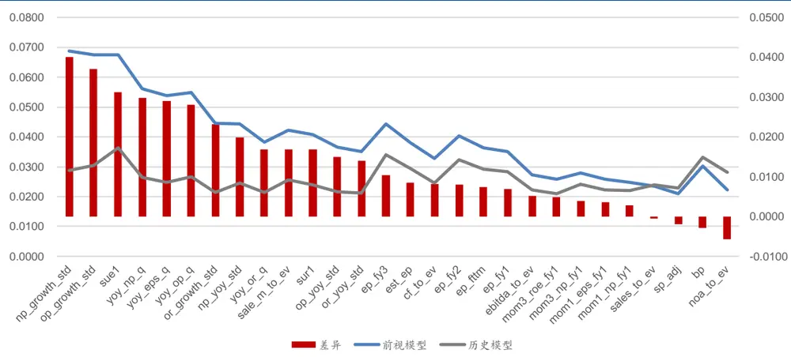
资料来源：国盛证券研究所，Wind

从上图不难看出，使用未来一个月数据情况下，只有 sales_to_ev、sp_adj、bp、noa_to_ev四个因子没有提升，表现反而更差，其他因子表现都得到了提升，其中 np_growth_std因子提升效果最强，IC 可以从 0.03 提高到接近 0.07。虽然这个提升效果我们设计上无法得到，但该结果依然说明了净利润预测的重要性：如果净利润能够较准确预测，因子预测能力将得到极大提升。

除此之外，我们继续观察前视模型在时间序列上的变化情况。如下图所示，是前视模型的分月表现图。横轴是月份，纵轴是前视模型相对历史模型因子表现的提高程度（即的提升绝对值）。注意这里每个点的值是假设前一个月底使用这个月的真实数据计算因子，并在这个月的表现情况。我们可以看到，4、8、10 三个月前视模型表现明显优于历史模型，5 月份也有部分因子有提高，但其他月份提升均不显著。最差的月份是 9 月份，该月不但没有提升，收益还略微下降。从该图中不难得出以下结论：即使是 100%预测正确下一个月的基本面数据，只有 4、8、10 三个月因子表现有提升，其他月份均很难提升，因此我们只需要在 4、8、10 这三个月的前一个月，即 3、7、9 月使用预测模型更新我们的因子截面即可，其他月份均不需要更新。因此，我们每年实际上只需要预测三次，因子截面相对原来也只有三个月有所变更。

图表9:前视模型IC提升分月表现
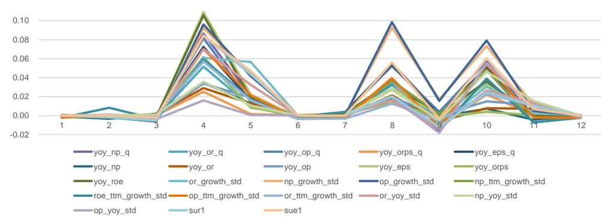
资料来源：国盛证券研究所，Wind

## 3.3 模型精度测算

上文提到，模型必须达到一定的预测精度才能有效提升因子表现。那么该精度需要提升到多少呢？我们可以通过模拟进行测算，如下表所示。

图表10： 不同精度模型的表现比较

|  | 拟合优度 | yoy_eps | yoy_roe | roa | ep | yoy_or_q | yoy_np_q | 较原始模型提升 |
| --- | --- | --- | --- | --- | --- | --- | --- | --- |
| 原始模型 | 74.20% | 0.0185 | 0.0195 | 0.0143 | 0.0326 | 0.0205 | 0.0265 | NA |
| 不同 R2 下 的预测模型 | 80% | 0.0211 | 0.0229 | 0.0165 | 0.0312 | 0.0227 | 0.0354 | 0.003 |
|  | 85% | 0.0232 | 0.0255 | 0.0237 | 0.0399 | 0.0312 | 0.0364 | 0.008 |
|  | 90% | 0.0336 | 0.0299 | 0.0291 | 0.0412 | 0.0325 | 0.0422 | 0.013 |
|  | 95% | 0.0472 | 0.0451 | 0.0362 | 0.0514 | 0.0363 | 0.0427 | 0.024 |
| 前视模型 | 100% | 0.0501 | 0.0517 | 0.0410 | 0.0626 | 0.0478 | 0.0582 | 0.030 |

资料来源：国盛证券研究所，Wind

从该表可以看出，原始模型的 R2 高达74.20%，即简单使用线性外推法来预测财务指标准确度也比较高，说明大部分 A 股上市公司的营业收入、净利润等核心指标是有一定延续性的，可以线性外推。但是，如果我们能够将该精度提升至 85%，则主要基本面因子的 IC 平均可以提升 0.008%，这是一个较为理想的水平。下面，我们就使用线性和非线性预测模型分别对基本面因子进行改进。

## 4 使用预测模型改进基本面因子

本章我们将借鉴第三章中提到的论文思路，分别使用线性模型和非线性模型进行基本面因子预测，并比较预测因子和原始因子的效果。

## 4.1 线性预测模型

## 4.1.1 模型构建

使用线性模型进行因子预测的构建过程如下：

步骤一：抽取预测所需的特征变量，分为四大类：

1. 财务指标 TTM 类。'or_ttm', 'oc_ttm', 'fee_ttm', 'op_ttm', 'np_ttm';

2. 当期财务指标类。'money_mrq', 'receivables_mrq', 'inventories_mrq', 'other_current_asset_mrq', 'fix_asset_mrq', 'current_liab_mrq', 'payable_mrq', 'tax_payable_mrq', 'other_current_liab_mrq', 'tot_liab_mrq';

3. 财务指标当季数据类。'or_q','oc_q','fee_q', 'op_q','np_q';

4. 财务指标同比增长类。'yoy_or_ttm', 'yoy_oc_ttm', 'yoy_fee_ttm', 'yoy_op_ttm', 'yoy_np_ttm', 'yoy_money_mrq' 'yoy_receivables_mrq','yoy_inventories_mrq', 'yoy_other_current_asset_mrq', 'yoy_fix_asset_mrq','yoy_current_liab_mrq', 'yoy_payable_mrq', 'yoy_tax_payable_mrq', 'yoy_other_current_liab_mrq', 'yoy_tot_liab_mrq’.

具体特征变量的含义参加附录“基本面数据代码表”。

步骤二：对抽取的特征和要预测的变量进行标准化处理。具体来说，分为缩尾（三倍标准差以外数据拉回）、填值（空值使用行业均值填充）、标准化（截面标准化）三部分。

步骤三：根据中信一级行业进行分类。针对不同行业分别构建回归模型，并采用 Lasso回归进行 L1 正则处理，剔除冗余特征。对于当期训练结果计算样本内 R2，若样本内R2<90%，则丢弃该模型预测结果，使用历史数据进行预测，否则使用 Lasso 模型预测结果进行预测。这里有两个处理方面的注意点：

1. 要进行分行业回归。实证当中我们发现不同行业使用上述特征的预测效果差异非常大，因此我们有必要对行业分别处理，并根据样本内 R2 评估模型的效果。如果 R2过低，说明这些特征的解释能力不强，那么合理的做法是丢弃该预测模型，直接用历史值填充。否则，我们采有足够的理由使用预测数据填充。每个行业的样本外R2在 2010 年至 2018年间统计结果如表 11 所示，相对预测精度较高的行业为银行、煤炭、汽车等行业；精度较低的为电子、轻工制造、综合、计算机、电力设备等行业。另外多元金融和保险行业股票数量太少，回归没有意义，也使用前值进行填充。也就是说，我们在构建因子截面的时候，整个截面的因子值由三部分构成：第一，如果当月已经公布财报，则使用财报数据计算因子；第二，如果没有公布财报，查看该股票所属行业过去 3 年的样本内 R2 均值决定是否可以回归，如果可以，则用当期回归结果填充；第三，如果上述两个条件都不满足，则用前值填充。

图表11：各行业拟合优度

| 行业 | R2 | 行业 | R2 |
| --- | --- | --- | --- |
| 银行 | 0.977555 | 基础化工 | 0.698678 |
| 煤炭 | 0.959208 | 农林牧渔 | 0.656985 |
| 汽车 | 0.943208 | 证券 | 0.646555 |
| 食品饮料 | 0.931385 | 商贸零售 | 0.644045 |
| 石油化工 | 0.887775 | 传媒 | 0.642096 |
| 建筑 | 0.866823 | 国防军工 | 0.637228 |
| 建材 | 0.835509 | 通信 | 0.617743 |
| 家电 | 0.825159 | 有色金属 | 0.600731 |
| 电力及公用事业 | 0.817368 | 电子 | 0.576569 |
| 餐饮旅游 | 0.816917 | 轻工制造 | 0.550509 |
| 医药 | 0.804966 | 综合 | 0.509517 |
| 钢铁 | 0.769297 | 计算机 | 0.48456 |
| 纺织服装 | 0.765206 | 电力设备 | 0.46787 |
| 机械 | 0.747223 | 多元金融 | NA |
| 交通运输 | 0.723842 | 保险 | NA |
| 房地产 | 0.704876 |  |  |

资料来源：国盛证券研究所，Wind

2. 要对特征进行压缩处理。原始的线性回归模型是以最小化残差平方和为优化目标，我们在这个基础上增加了 L1 正则处理，即最小化残差平方和与回归系数的绝对值之和，通过该处理，将每个行业的特征压缩到 10 维以内。当然，亦可使用分行业单因子检验法进行特征压缩。这里我们使用简单的 Lasso 进行算法处理。

步骤四：分别针对当期营业收入和净利润构建上述模型。根据模型得到的结果重新计算最新的因子，只更新 3、7、9 月的因子结果（即在 3、7、9月底的因子是 4、8、10月因子的领先预测值）。

步骤五：将预测的因子和原始因子在月频换仓的多因子体系中进行因子检验，分别比较两者的 IC、ICIR 等指标，以及多空组合和纯因子组合的表现。

基于以上步骤，我们就可以将预测因子的表现和原始因子的表现进行对比，下面我们就来进行单因子测试。

## 4.1.2 因子测试

我们将所有和预测变量营业收入和净利润相关的因子列出如表 12 所示。从表中不难发现，除了 sp、sp_adj、yoy_eps_q、peg这四个因子以外，其他因子预测能力都得到了不同程度的提高，其中提高幅度较大的因子为 yoy_eps、yoy_roe、yoy_np_q、yoy_or_q、or_growth_std 这五个因子，IC 提升都在0.003 以上。考虑到这个 IC 是 IC 均值的提升，而根据我们上文所述，每年我们只做三次预测，也就是说每年只有三个截面变化了，通过对三个截面的改变在全年 IC 均值有了提升。

当然，从另一个维度，我们发现尽管从大部分因子来看，我们的线性模型预测能力还不错，但是从 IC 提升的绝对幅度上来说比较一般。下一节我们会使用原始论文中的模型再进行一次非线性的尝试。

图表 12: 线性模型因子表现

| 因子名称 | 原始IC | 原始 ICIR | 预测 IC | 预测 ICIR | IC变化 | ICIR变化 |
| --- | --- | --- | --- | --- | --- | --- |
| yoy_eps | 0.0185 | 1.3675 | 0.0225 | 1.5988 | 0.0040 | 0.2314 |
| yoy_roe | 0.0195 | 1.4111 | 0.0233 | 1.6348 | 0.0038 | 0.2237 |
| yoy_np_q | 0.0265 | 2.0390 | 0.0303 | 2.3060 | 0.0038 | 0.2670 |
| yoy_or_q | 0.0205 | 1.5707 | 0.0239 | 1.6385 | 0.0034 | 0.0678 |
| or_growth_std | 0.0265 | 1.8985 | 0.0296 | 2.1290 | 0.0031 | 0.2305 |
| np_growth_std | 0.0318 | 2.2319 | 0.0346 | 2.4814 | 0.0028 | 0.2495 |
| yoy_orps | 0.0156 | 1.8336 | 0.0181 | 1.5899 | 0.0025 | -0.2437 |
| roe | 0.0190 | 1.0848 | 0.0215 | 1.1887 | 0.0025 | 0.1039 |
| roa | 0.0143 | 0.8182 | 0.0166 | 0.8933 | 0.0022 | 0.0751 |
| ep | 0.0326 | 1.7840 | 0.0344 | 1.8506 | 0.0018 | 0.0666 |
| asset_turnover | 0.0089 | 0.8392 | 0.0105 | 0.9628 | 0.0016 | 0.1236 |
| eps | 0.0253 | 1.2501 | 0.0265 | 1.2811 | 0.0012 | 0.0310 |
| or_ttm | 0.0285 | 1.1981 | 0.0293 | 1.2380 | 0.0008 | 0.0400 |
| yoy_orps_q | 0.0218 | 2.0572 | 0.0220 | 1.6698 | 0.0002 | -0.3874 |
| sp | 0.0244 | 1.0025 | 0.0243 | 0.9923 | -0.0001 | -0.0102 |
| sp_adj | 0.0279 | 1.1828 | 0.0277 | 1.1522 | -0.0002 | -0.0306 |
| yoy_eps_q | 0.0269 | 2.3434 | 0.0263 | 2.1822 | -0.0006 | -0.1612 |
| peg | -0.0384 | -1.9645 | -0.0359 | -1.8077 | -0.0025 | -0.1567 |

资料来源：国盛证券研究所，Wind

图表 13: YOY_EPS因子 IC
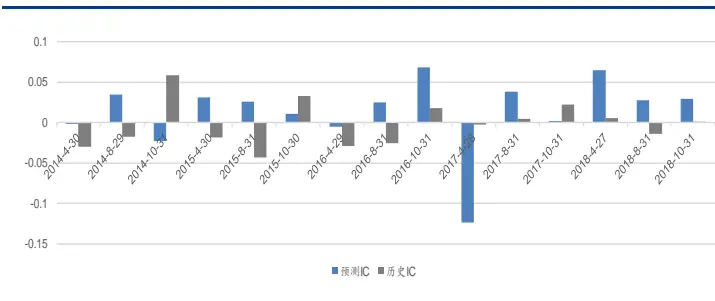
资料来源：国盛证券研究所，Wing

图表 14:YOY_EPS因子净值
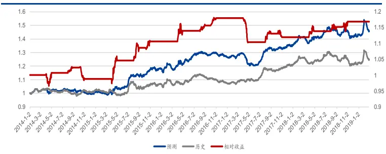
资料来源：国盛证券研究所，Wind

图表 15: YOY_ROE因子IC
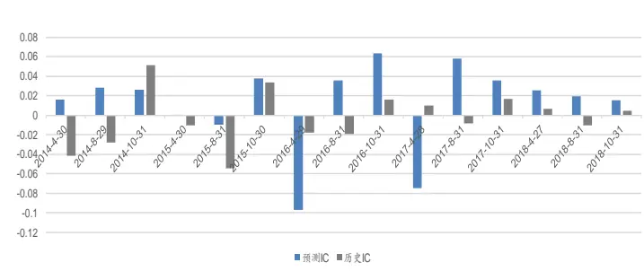
资料来源：国盛证券研究所，Wind

图表 16:YOY_ROE因子净值
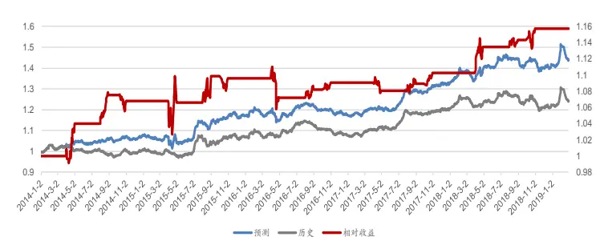
资料来源：国盛证券研究所，Wind

图表 17：YOY_NP_Q因子IC
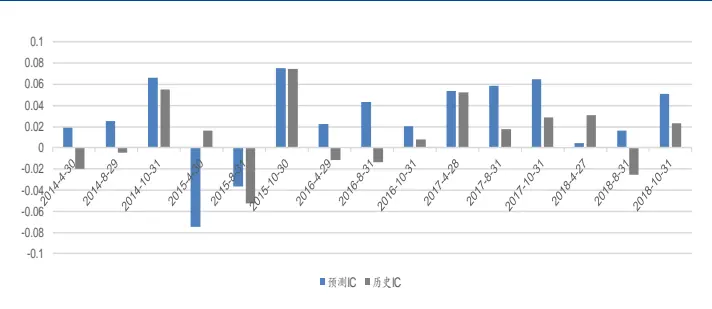
资料来源：国盛证券研究所，Wind

图表 18: YOY_NP_Q因子净值
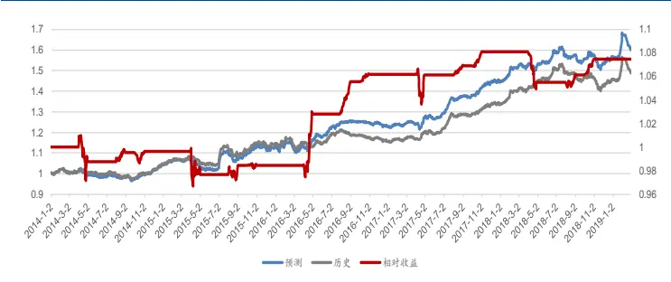
资料来源：国盛证券研究所，Wind

我们将一些表现较好的单因子效果展示在图 图 中，分别展示了 、YOY_ROE、YOY_NP_Q 三个因子的表现。左图是因子每次预测的情况，其中蓝色柱状图代表通过我们模型预测的因子截面的 IC，灰色柱状图代表原始因子的 IC，如果前者高则代表本次预测要比简单从前值填充的预测效果好，否则说明预测效果不好。从图中可以看到，一年只在4 月、8 月、10 月有柱形图，也就是一年只预测三次。右图是因子的净值表现，其中蓝色曲线是预测因子的净值，灰色曲线是历史因子的净值，两者的相对收益净值由红色曲线表示。从图中依然可以看出，红色的相对净值曲线是一个阶跃曲线，其中平台代表在这些非财报月两者使用的数据完全相同，只在财报月会有变化。左轴是绝对净值，右轴为相对净值，例如 YOY_ROE 因子在 14年至 19 年累计提升相对收益为16%。

## 4.2 非线性时间序列预测模型

上一节我们使用线性模型做了一个简单的尝试，可以看到，线性模型具有一定的预测能力，但是因子提升幅度较为一般。本节我们使用原论文中的 RNN 模型进行尝试。

## 4.2.1 模型构建

1.将数据集根据历史时间轴划分为训练集（前 70%）和验证集（后 30%），作为网络的超参数寻优集合，并在循环达到 25 次验证集效果没有提升的情况下停止拟合。使用该状态下的神经网络参数作为初始参数；

2.使用多任务学习，对第三章中的前三类财务数据进行学习，并给予营业收入、净利润更高的损失函数权重；

3.分别使用 GRU 单元对模型进行每一层进行训练，并使用 AdaDelta 进行最优化，最优化目标为最小化残差平方和，训练的时候我们使用了过去五年滚动的财务数据作为训练集合。

4.对优化完成的结果进一步计算预测因子，并和原始因子进行比较。

## 4.2.2 因子测试

我们将非线性模型的因子测试结果展示如表 19 到 25 所示。

图表 19: 非线性模型因子表现

| 因子名称 | 原始IC | 原始ICIR | 预测 IC | 预测 ICIR | IC变化 | ICIR变化 |
| --- | --- | --- | --- | --- | --- | --- |
| or_growth_std | 0.026506 | 1.898519 | 0.03674 | 2.486171 | 0.010234 | 0.587653 |
| yoy_roe | 0.019483 | 1.411107 | 0.025978 | 1.864301 | 0.006495 | 0.453193 |
| yoy_np_q | 0.026478 | 2.038989 | 0.032571 | 2.34192 | 0.006093 | 0.302931 |
| yoy_np | 0.006735 | 0.58559 | 0.011869 | 0.912684 | 0.005134 | 0.327094 |
| np_growth_std | 0.031758 | 2.231883 | 0.036815 | 2.450206 | 0.005057 | 0.218323 |
| yoy_eps | 0.018505 | 1.367494 | 0.022522 | 1.598867 | 0.004017 | 0.231373 |
| yoy_or_q | 0.020535 | 1.570665 | 0.024344 | 1.735079 | 0.003809 | 0.164414 |
| roa | 0.01434 | 0.818174 | 0.017962 | 0.982662 | 0.003622 | 0.164488 |
| roe | 0.018999 | 1.084781 | 0.02249 | 1.285975 | 0.003491 | 0.201195 |
| ep | 0.032575 | 1.784049 | 0.035921 | 1.924415 | 0.003346 | 0.140367 |
| yoy_or | 0.010085 | 0.65351 | 0.012971 | 0.767548 | 0.002886 | 0.114038 |
| eps | 0.025311 | 1.25006 | 0.027912 | 1.335281 | 0.002602 | 0.085222 |
| yoy_orps | 0.015554 | 1.83363 | 0.018055 | 1.594564 | 0.002501 | -0.23907 |
| asset_turnover | 0.008878 | 0.839185 | 0.010659 | 0.985176 | 0.00178 | 0.145991 |
| or_ttm | 0.028491 | 1.198055 | 0.029327 | 1.238066 | 0.000836 | 0.040011 |
| sp | 0.027894 | 1.182787 | 0.027713 | 1.154864 | -0.00018 | -0.02792 |
| yoy_eps_q | 0.026894 | 2.343408 | 0.026342 | 2.182187 | -0.00055 | -0.16122 |
| peg | -0.03837 | -1.96446 | -0.03427 | -1.7202 | -0.0041 | -0.24426 |

资料来源：国盛证券研究所，Wind

图表 20: OR_ GROWTH STD 因子 IC
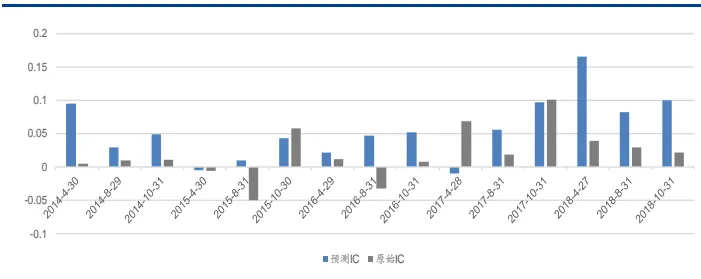
资料来源：国盛证券研究所，Wind

图表 21:OR_GROWTH STD 因子净值
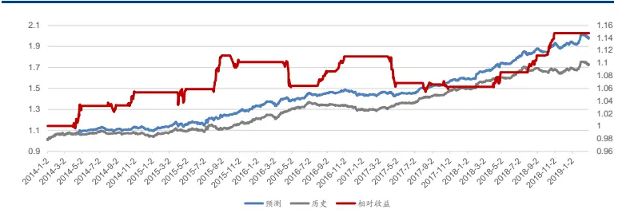
资料来源：国盛证券研究所，Wind

图表 22: YOY_ROE因子IC
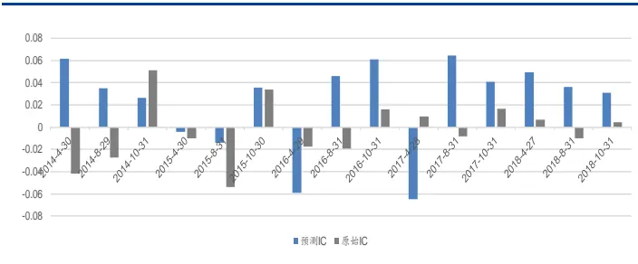
资料来源：国盛证券研究所，Wing

图表 23: YOY_ROE 因子净值
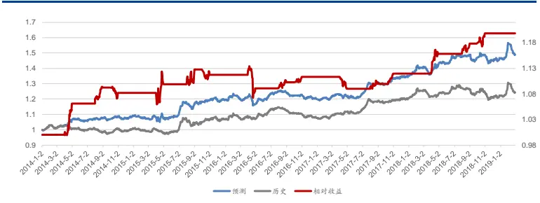
资料来源：国盛证券研究所，Wind

图表 24:YOY_NP_Q因子IC
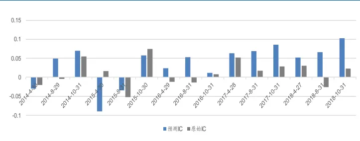
资料来源：国盛证券研究所，Wind

图表 25:YOY_NP_Q 因子净值
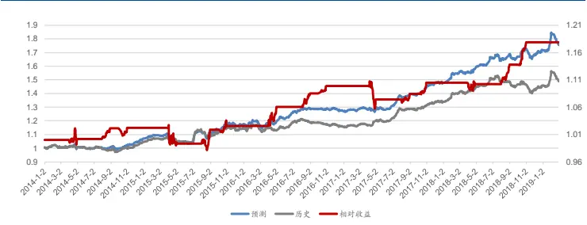
资料来源：国盛证券研究所，Wind

从测试结果可以看出，该模型对于因子的提升效果要好于之前的线性模型，其中因子 IC提升在 0.003 以上的因子达到 10个，其中最好的因子 or_growth_std（营业收入标准化增长）提升达到0.01，单因子的预测胜率为86.7%。

## 5. 分析师预期数据和预测模型预测的结合使用

## 5.1 分析师预期数据和预测模型数据的比较

除了自己构造预测模型进行因子预测外，我们还有一种更便捷地获取预测数据的方法，即分析师一致预期数据。目前，市场上很多数据提供商都整理并提供了分析师预测数据，这些数据也可以有效地对收益进行预测。因此，有必要将分析师预期数据和我们的模型进行对比，并争取对两者进行结合使用。

我们首先测试了在全 A 股中模型预测因子和分析师预测因子的表现，如表 26 所示。

图表26:一致预期数据和预测模型数据比较（全A）

| 因子名称 | 一致预期IC | 一致预期 ICIR | 预测 IC | 预测 ICIR | IC变化 | ICIR变化 |
| --- | --- | --- | --- | --- | --- | --- |
| or_growth_std | 0.016841 | 1.381592 | 0.03674 | 2.486171 | 0.019899 | 1.104579 |
| yoy_np | -0.007280 | -0.594486 | 0.011869 | 0.912684 | 0.01949 | 1.50717 |
| yoy_or | -0.002147 | -0.122271 | 0.012971 | 0.767548 | 0.015118 | 0.889819 |
| np_growth_std | 0.022431 | 1.414823 | 0.036815 | 2.450206 | 0.014384 | 1.035383 |
| roe | 0.014286 | 0.714667 | 0.02249 | 1.285975 | 0.008204 | 0.571308 |
| roa | 0.013331 | 0.847103 | 0.017962 | 0.982662 | 0.004631 | 0.135559 |
| yoy_eps | 0.019517 | 1.384293 | 0.022522 | 1.598867 | 0.003005 | 0.214574 |
| yoy_roe | 0.023753 | 1.621931 | 0.025978 | 1.864301 | 0.002225 | 0.24237 |
| ep | 0.033912 | 1.672512 | 0.035921 | 1.924415 | 0.002009 | 0.251903 |

资料来源：国盛证券研究所，Wind

从上表可以看出，总体来说，模型预测因子在全 A 股的表现是优于分析师预期数据的，尤其是yoy_np, yoy_or 几个同比因子，分析师预期数据并没有特别好的预测能力。我们分析这可能是因为分析师覆盖率较低（wind 底层数据库平均过去十年约 37%左右），大部分公司都使用行业均值进行处理导致。因此，我们进一步地，在分析师覆盖股票域中对两个模型进行了测试，结果如表 27 所示。

图表27：一致预期数据和预测模型数据比较（分析师覆盖域）

| 因子名称 | 一致预期IC | 一致预期 ICIR | 预测 IC | 预测 ICIR | IC变化 | ICIR变化 |
| --- | --- | --- | --- | --- | --- | --- |
| or_growth_std | 0.02761 | 2.054981 | 0.034145 | 2.381051 | 0.006535 | 0.32607 |
| yoy_np | 0.018235 | 1.539123 | 0.01395 | 0.829841 | -0.00429 | -0.70928 |
| yoy_or | 0.014729 | 0.923986 | 0.014581 | 0.692051 | -0.00015 | -0.23194 |
| np_growth_std | 0.039516 | 2.565411 | 0.034198 | 2.291525 | -0.00532 | -0.27389 |
| roe | 0.021451 | 1.17571 | 0.025185 | 1.319401 | 0.003734 | 0.143691 |
| roa | 0.016928 | 0.947004 | 0.016439 | 0.962967 | -0.00049 | 0.015963 |
| yoy_eps | 0.029491 | 1.754273 | 0.027419 | 1.572941 | -0.00207 | -0.18133 |
| yoy_roe | 0.02591 | 1.529401 | 0.024398 | 1.862196 | -0.00151 | 0.332795 |
| ep | 0.041215 | 2.318414 | 0.036195 | 1.815406 | -0.00502 | -0.50301 |

资料来源：国盛证券研究所，Wind

我们发现，在分析师覆盖股票域中，出现了较明显的分化。or_growth_std、roe、roa、yoy_roe 几个因子预测模型表现更优，而其他因子分析师数据表现更优。总体上看，分析师数据预测能力更强。这进一步验证了我们的猜测：在分析师覆盖领域内，分析师预测可能使用了除了基本面数据更多的信息，所以预测更为准确；而由于其覆盖率还较低，因子如果在全 A选股，我们的预测模型会更胜一筹。

## 5.2 分析师预期数据和预测模型数据的结合使用

通过上一节的分析，我们发现分析师预期数据和模型预测数据各有优势，那么能否将两者有机地结合呢？我们可以在截面端做如下处理，将两者信息结合：

第一步，在因子计算时间截面，首先查看已经发布财报的公司列表。如果该公司已经发布报告，则使用正式报告的数据计算因子截面；

第二步，在剩下的公司列表中查看已经有分析师覆盖的公司，使用分析师预期数据计算该股票的因子数据；

第三步，对于没有分析师覆盖，并且没有发布财报的公司，使用模型预测数据进行因子计算，最后通过以上三步合成总的全 A 因子截面。

通过将两者有机结合，我们能更好地对基本面多因子体系进行增强。我们将使用营业收入和净利润相关的因子通过构建组合的方式进行实证检验。组合构建过程如下：

样本池：全部 A 股，剔除上市半年以内的新股、ST 股；

换仓时间：每月第一个交易日

交易价格：交易当天的 VWAP 价格

跟踪基准：中证 500 指数

交易成本：双边共 0.4%

年化跟踪误差约束：小于 5%

行业风格约束：行业、市值中性

α信号合成方式：历史组合直接根据表 19 中的所有基本面因子进行正交化处理后 ICIR加权；预测组合用同样的因子，但是使用本节上文中所述计算过程得到的预测结果作为因子值，依然使用 ICIR 加权。

具体的优化形式为：

$$
\begin{array}{rl}&{\quad\quad\mathrm{max~}(w-w_{bench})^{T}\alpha-\delta*\mathbf{1}^{T}|w-w_{last}|}\\&{\mathrm{s.t.}(w^{T}-w_{bench}^{T})X_{Style}\in[down_{-}cons,up_{-}cons]}\\&{\quad\quad(w^{T}-w_{bench}^{T})X_{ind}\in[down_{-}cons,up_{-}cons]}\\&{\quad\quad(w-w_{bench})^{T}(XFX^{T}+\Delta)(w-w_{bench})<\mathrm{target}TE^{2}}\\&{\quad\quad\quad w^{T}\mathbf{1}=total_{-}weight}\\&{\quad\quad\quad0\leq w\leq max_{-}weight}\end{array}
$$

其中约束条件上文已经给出。我们分别对历史因子和预测因子构建α信号，并构造两个不同的组合，我们回测了从 2010 年初至今的表现，如下图所示：

图表28: 预测模型在组合端对原始模型的增强
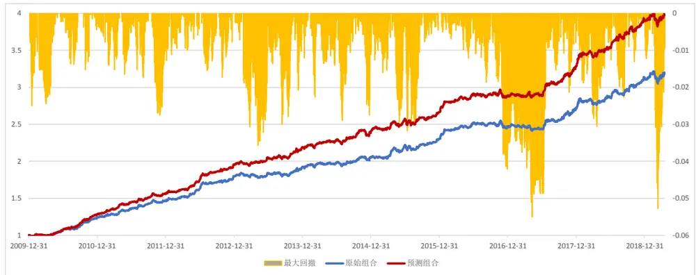
资料来源：国盛证券研究所，Wind

两个组合的主要指标结果如下：

图表29：历史组合和预测组合表现

|  | 年化收益 | 年化波动 | 信息比率 | 最大回撤 | 最大回撤 持续时间 |
| --- | --- | --- | --- | --- | --- |
| 历史组合 | 13.79% | 5.56% | 2.481 | 5.11% | 102天 |
| 预测组合 | 16.25% | 5.88% | 2.764 | 5.66% | 107 天 |

资料来源：国盛证券研究所，Wind

可以看到，通过预测数据构建基本面组合，可以比历史数据的基本面组合有较为明显的提高，年化收益从 13.79%提升到 16.25%，信息比率从 2.481 提高到2.764。该结果也进一步证实了我们通过预测模型数据和分析师预期数据结合的可行性。

## 6. 总结与展望

本篇报告我们通过预测数据改进了基本面因子在财报月的表现。报告的核心结论包括两点：第一，如果我们希望通过提高换仓频率来解决财报月的换仓滞后问题，那么我们要注意自己的实际交易成本是否大于临界成本。经过我们的测算，如果在不控制换手率，且只投资于基本面因子的情况下，临界成本约为双边千五左右。第二，通过预测数据确实能改进一部分基本面因子的财报月表现，而且通过将分析师预期数据和预测模型结合效果更佳。预测模型从广度上提升了分析师预期数据的覆盖率低问题。

当然，对基本面数据的预测使用财务数据肯定远远不够，例如文中也提到，很多行业其实我们的模型不能给出很好的预测结果。如果希望进一步提升模型的表现，我们可能还需要从更多的角度进行分析，例如使用更宏观或者更高频的数据，分行业进一步挖掘其内在特征。后续我们也将在这方面做更深入的研究。

## 参考文献

Alberg, J. and Z. C. Lipton (2017). Improving factor-based quantitative investing by forecasting company fundamentals. NIPS Time Series Workshop 2017.

Barack Wamkaya Wanjawa and Lawrence Muchemi. Ann model to predict stock prices at stock exchange markets. arXiv:1502.06434, 2014.

Zachary C Lipton, David C Kale, and Randall Wetzel. Directly modeling missing data in sequences with rnns: Improved classification of clinical time series. Machine Learning for Healthcare (MLHC), 2016.

Hengjian Jia. Investigation into the effectiveness of long short term memory networks for stock price prediction. arXiv:1603.07893, 2016.

## 附录

## 本文提到的基本面因子一览

图表 30:因子数据库一览

| 因子名称 | 定义 | 使用数据 |
| --- | --- | --- |
| asset_turnover | 过去12个月营业收入/过去12个月平均总资产 | 营业收入,总资产 |
| net_profit_ratio | 过去12个月净利润/过去12个月营业总收入 | 净利润，营业总收入 |
| gross_profit_ratio | (过去12个月营业收入-过去12 个月营业支出)/过去12 个月营业收入 | 营业收入,营业支出 |
| expense_ratio | (销售费用+管理费用+财务费用)/营业收入 | 销售费用，管理费用，财务费用，营业 收入 |
| admin_ratio | 管理费用/营业收入 | 管理费用，营业收入 |
| financial_ratio | 财务费用/营业收入 | 财务费用，营业收入 |
| sales_ratio | 销售费用/营业收入 | 销售费用，营业收入 |
| roe | 过去十二个月的 roe | roe |
| roa | 过去十二个月的 roa | roa |
| roic | 过去十二个月的 roic | roic |
| eps | 扣除非经常损益后的净利润/总股本 | 扣除非经常损益后的净利润，总股 本 |
| mom_est_eps | 一致预期 eps 环比增长率 | 一致预期 eps |
| mom_est_np | 一致预期净利润环比增长率 | 一致预期 np |
| mom_est_rev | 一致预期营业收入环比增长率 | 一致预期 rev |
| mom_est_roe | 一致预期 roe 环比增长率 | 一致预期 roe |
| est_eps | 一致预期 eps | 一致预期 eps |
| fttm_np | 未来12个月一致预期净利润 | 未来12个月一致预期净利润 |
| fttm_eps | 未来12个月一致预期 eps | 未来 12 个月一致预期 eps |
| est_roe | 一致预期 roe | 一致预期 roe |
| ep | 市盈率倒数 | 市盈率 |
| fttm_ep | 未来12个月一致预期市盈率倒数 | 未来12个月一致预期市盈率 |
| est_ep | 年报一致预期市盈率倒数 fy1 | 年报一致预期市盈率 |
| est_ep_2y | 第二年年报一致预期市盈率倒数fy2 | 第二年年报一致预期市盈率 |
| est_ep_3y | 第三年年报一致预期市盈率倒数fy3 | 第三年年报一致预期市盈率 |
| sp | 市销率倒数 | 市销率 |
| peg | peg | 市盈率，一致预期增长 |
| est_ep | 一致预期市盈率倒数 | 一致预期市盈率 |
| yoy_orps | 每股营业收入同比增长率 | 每股营业收入 |
| yoy_orps_q | 单季度每股营业收入同比增长率 | 每股营业收入 |
| yoy_eps | 每股收益同比增长率 | 每股收益 |
| yoy_eps_q | 单季度每股收益同比增长率 | 每股收益 |
| yoy_np | 净利润同比增长率 | 净利润 |
| yoy_np_q | 单季度净利润同比增速 | 净利润 |
| yoy_or | 营业收入同比增速 | 营业收入 |
| yoy_or_q | 单季度营业收入同比增速 | 营业收入 |
| yoy_roe | roe同比增速 | roe |
| or_ttm_growth_std | (营业收入 ttm-过去八个季度的营业收入 ttm 均值)/过去 八个季度的营业收入ttm标准差 | 营业收入 |
| or_yoy_std | (营业收入同比-过去八个季度的营业收入同比均值)/过 去八个季度的营业收入同比标准差 | 营业收入 |
| np_yoy_std | (净利润同比-过去八个季度的净利润同比均值)/过去八 个季度的净利润同比标准差 | 净利润 |
| roe_ttm_growth_std | (roe_ttm-过去八个季度的 roe_ttm 均值)/过去八个季度 的 roe_ttm 标准差 | roe |
| or_growth_std | (营业收入-过去八个季度的营业收入均值)/过去八个季 度的营业收入标准差 | 营业收入 |
| np_ttm_growth_std | (净利润 ttm-过去八个季度的净利润 ttm 均值)/过去八个 季度的净利润 ttm标准差 | 净利润 |
| np_growth_std | (净利润-过去八个季度的净利润均值)/过去八个季度的 净利润标准差 | 净利润 |
| yoy_est_np | 一致预期净利润未来12个月同比增速 | 一致预期净利润 |
| est_yoy_np | 年报一致预期净利润同比增速 | 一致预期净利润，净利润 |
| est_yoy_np_2y | 第二年年报一致预期净利润同比增速 | 一致预期净利润，净利润 |
| est_yoy_np_3y | 第三年年报一致预期净利润同比增速 | 一致预期净利润，净利润 |

资料来源：Wind，国盛证券研究所

## 基本面数据代码表

图表31：基本面数据代码表

| 代码名称 | 字段含义 | 数据来源 |
| --- | --- | --- |
| or_ttm | 营业收入 TTM | 利润表 |
| oc_ttm | 营业成本TTM | 利润表 |
| fee_ttm | 管理费用 TTM+销售费用 TTM+财务费用 TTM | 利润表 |
| op_ttm | 经营性利润 TTM | 利润表 |
| np_ttm | 净利润 TTM | 利润表 |
| money_mrq | 货币资金 MRQ | 资产负债表 |
| receivables_mrq | 应收账款 MRQ | 资产负债表 |
| inventories_mrq | 存货MRQ | 资产负债表 |
| other_current_asset_mrq | 其他流动资产MRQ | 资产负债表 |
| fix_asset_mrq | 固定资产 MRQ | 资产负债表 |
| current_liab_mrq | 流动负债 MRQ | 资产负债表 |
| payable_mrq | 应付账款 MRQ | 资产负债表 |
| tax_payable_mrq | 应交税费 MRQ | 资产负债表 |
| other_current_liab_mrq | 其他流动负债MRQ | 资产负债表 |
| tot_liab_mrq | 总负债MRQ | 资产负债表 |
| or_q | 单季度营业收入 | 利润表 |
| oc_q | 单季度营业成本 | 利润表 |
| fee_q | 单季度管理费用+单季度销售费+单季度财务费用 | 利润表 |
| op_q | 单季度经营性利润 | 利润表 |
| np_q | 单季度净利润 | 利润表 |
| or_ttm_growth | 营业收入 TTM增长率 | 利润表 |
| oc_ttm_growth | 营业成本 TTM增长率 | 利润表 |
| fee_ttm_growth | （管理费用 TTM+销售费用 TTM+财务费用 TTM)增长 率 | 利润表 |
| op_ttm_growth | 经营性利润 TTM增长率 | 利润表 |
| np_ttm_growth | 净利润 TTM增长率 | 利润表 |
| money_mrq_growth | 货币资金MRQ增长率 | 资产负债表 |
| receivables_mrq_growth | 应收账款 MRQ 增长率 | 资产负债表 |
| inventories_mrq_growth | 存货 MRQ增长率 | 资产负债表 |
| other_current_asset_mrq_growth | 其他流动资产MRQ增长率 | 资产负债表 |
| fix_asset_mrq_growth | 固定资产 MRQ增长率 | 资产负债表 |
| current_liab_mrq_growth | 流动负债 MRQ 增长率 | 资产负债表 |
| payable_mrq_growth | 应付账款 MRQ 增长率 | 资产负债表 |
| tax_payable_mrq_growth | 应交税费 MRQ 增长率 | 资产负债表 |
| other_current_liab_mrq_growth | 其他流动负债MRQ增长率 | 资产负债表 |
| tot_liab_mrq_growth | 总负债 MRQ增长率 | 资产负债表 |
| or_q_growth | 单季度营业收入增长率 | 利润表 |
| oc_q_growth | 单季度营业成本增长率 | 利润表 |
| fee_q_growth | （单季度管理费用+单季度销售费+单季度财务费用) | 利润表 |
| op_q_growth | 增长率 单季度经营性利润增长率 | 利润表 |
| np_q_growth | 单季度净利润增长率 | 利润表 |

资料来源：Wind，国盛证券研究所

## 风险提示

量化专题报告中的观点基于历史统计与量化模型，存在历史规律与量化模型失效的风险。

## 免责声明

国盛证券有限责任公司（以下简称“本公司”）具有中国证监会许可的证券投资咨询业务资格。本报告仅供本公司的客户使用。本公司不会因接收人收到本报告而视其为客户。在任何情况下，本公司不对任何人因使用本报告中的任何内容所引致的任何损失负任何责任。

本报告的信息均来源于本公司认为可信的公开资料，但本公司及其研究人员对该等信息的准确性及完整性不作任何保证本报告中的资料、意见及预测仅反映本公司于发布本报告当日的判断，可能会随时调整。在不同时期，本公司可发出与本报告所载资料、意见及推测不一致的报告。本公司不保证本报告所含信息及资料保持在最新状态，对本报告所含信息可在不发出通知的情形下做出修改，投资者应当自行关注相应的更新或修改。

本公司力求报告内容客观、公正，但本报告所载的资料、工具、意见、信息及推测只提供给客户作参考之用，不构成任何投资、法律、会计或税务的最终操作建议,本公司不就报告中的内容对最终操作建议做出任何担保。本报告中所指的投资及服务可能不适合个别客户，不构成客户私人咨询建议。投资者应当充分考虑自身特定状况，并完整理解和使用本报告内容，不应视本报告为做出投资决策的唯一因素。

投资者应注意，在法律许可的情况下，本公司及其本公司的关联机构可能会持有本报告中涉及的公司所发行的证券并进行交易，也可能为这些公司正在提供或争取提供投资银行、财务顾问和金融产品等各种金融服务。

本报告版权归“国盛证券有限责任公司”所有。未经事先本公司书面授权，任何机构或个人不得对本报告进行任何形式的发布、复制。任何机构或个人如引用、刊发本报告，需注明出处为“国盛证券研究所”，且不得对本报告进行有悖原意的删节或修改。

## 分析师声明

本报告署名分析师在此声明：我们具有中国证券业协会授予的证券投资咨询执业资格或相当的专业胜任能力，本报告所表述的任何观点均精准地反映了我们对标的证券和发行人的个人看法，结论不受任何第三方的授意或影响。我们所得报酬的任何部分无论是在过去、现在及将来均不会与本报告中的具体投资建议或观点有直接或间接联系。

## 投资评级说明

| 投资建议的评级标准 |  | 评级 | 说明 |
| --- | --- | --- | --- |
| 评级标准为报告发布日后的6个月内公司股价（或行业指数）相对同期基准指数的相对市场表现。其中A股市场以沪深300指数为基准；新三板市场以三板成指（针对协议转让标的）或三板做市指数（针对做市转让标的）为基准；香港市场以摩根士丹利中国指数为基准，美股市场以标普500指数或纳斯达克综合指数为基准。 | 股票评级 | 买入 | 相对同期基准指数涨幅在15%以上 |
|  |  | 增持 | 相对同期基准指数涨幅在 5%~15%之间 |
|  |  | 持有 | 相对同期基准指数涨幅在-5%~+5%之间 |
|  |  | 减持 | 相对同期基准指数跌幅在 5%以上 |
|  | 行业评级 | 增持 | 相对同期基准指数涨幅在10%以上 |
|  |  | 中性 | 相对同期基准指数涨幅在-10%~+10%之间 |
|  |  | 减持 | 相对同期基准指数跌幅在10%以上 |

## 国盛证券研究所

北京

地址：北京市西城区锦什坊街 35号南楼

上海

地址：上海市浦明路868号保利 One56 10层

邮编：100033

传真：010-57671718

邮编：200120

邮箱：gsresearch@gszq.com

电话：021-38934111

南昌

邮箱：gsresearch@gszq.com

邮编：330038

地址：南昌市红谷滩新区凤凰中大道 1115号北京银行大厦

地址：深圳市福田区益田路5033号平安金融中心 101层

传真：0791-86281485

深圳

邮箱：gsresearch@gszq.com

邮编：518033

邮箱：gsresearch@gszq.com