## 寻找财务数据中的alpha信息

多因子系列之六：寻找财务数据中的alpha信息

随着大量的财务因子被发掘出来 能够提供增量信息的财务因子越来越少 本文使用公式化， 。的方法 构造出大量财务因子 并利用多重检验 得到在考虑了数据挖掘的影响下 仍然显， ， ， ，著的因子 最后 我们通过找寻因子的逻辑 找到了一些逻辑清晰 且效果显著的财务类。 ， ， ，alpha因子。

简单财务指标的构造有一定的规则 Yan和Zheng（2017）总结了过往文献中的六种常用规。
则例如同比增长 X/Y等6种规则 我们筛选出了三张报表中平均覆盖率大于40%的92个指、 。
标 构造了超过4000个财务因子， 。

公式化的构造方法容易遭到数据挖掘的质疑 这是由于测试了大量因子之后 总可以找到几。 ，个非常显著的因子 这类问题在学术上已有诸多讨论 很多论文试图去研究基金经理表现。 ， 、技术趋势策略的收益等现象是由于运气还是实力 而这类研究的核心问题是传统的单变量检。验在面对多个检验时失效了 导致我们找到由运气产生的现象的概率变大 因此我们需要寻， 。找新的检验方法。

证 最后 我们筛选出了多重检验下仍然显著的364个因子。 ， 。

统计检验只能帮助我们降低犯第一类错误的概率 但是不能帮助我们确定因子影响股票收益，的内在驱动因素 因子逻辑是因子表现持续性的保证 且能够帮助我们更好的理解因子表现。 ， 。我们对筛选出的部分因子进行了分析 找出了逻辑较为清晰的几类因子例如应付员工薪酬增，长 应交税费增长等等、 。

## 一 综述、

常见的财务因子有例如ROE 净利润同比增长 ROE增长等等 通过对这些常见的财务因， ， ，子进行归纳 我们发现这些因子的构造形式都较为简洁 有例如X/Y X的同比增长 X/Y的， ， ， ，同比增长 ΔX/Y等形式 我们通过遍历三张报表中的所有指标 就能构造出大量的财务因， 。 ，子 从而挑选出有用的alpha因子， 。

在上述方法中 经常被人质疑的一点是该方法有数据挖掘的嫌疑：由于测试的指标足够多， ，那么总可以找到一两个十分有效的因子 这些因子的表现可能仅仅只在样本内较好 而在样， ，本外没有效果 这一质疑是非常合理的 就如同让1000个人抛20次硬币 其中有人能连续。 ， ，抛20次正面的概率很大 而这个人是依靠运气还是实力 我们不能确定， ， 。

事实上 数据挖掘（data mining/snooping）的问题在统计学中有很多的探讨 近年来 随， 。 ，着大量资产定价异象在学术期刊上出现 对于数据挖掘的质疑也出现在了实证资产定价领域， 。例如Harvey（2016）检验了过去已经发表的316个因子 为了考虑数据挖掘的影响 他使用。 ，三种不同的方法对传统的t统计量进行调整 发现很多发表的因子并不能通过显著性检验， ，同时指出 未来在寻找市场异象时 该异象的t统计量应该至少大于3才能通过检验， ， 。

图表1:异象显著性阈值
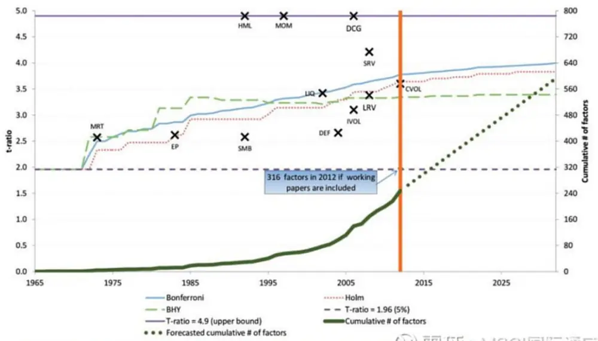
资料来源：国盛证券研究所，Harvey（2016）

我们从寻找alpha因子的角度对上述问题进行描述 对于alpha因子的寻找即在进行假设检验。 ，其中原假设H0为：该 alpha 因子的期望收益=0 一般来说 我们使用t统计量来判断H0是否。 ，被拒绝 如果t大于2 第一类错误出现的概率小于5% 则我们拒绝原假设 并认为该因子， ， ， ，的是一个有效的alpha因子 如果我们找到了100个alpha因子 就不能再进行单变量检验。 ， ，而需要进行多重检验（multiple test） 在多重检验中 我们不是只单单控制单个检验犯第一， ，类错误的概率 而是将多个检验看成一个整体 希望控制FWE（Family Wise Error） 即至， ， ，少有一个检验犯第一类错误的概率 除了FWE之外 常用的检验量还有FDR。 ，

## 二 财务因子池构建、

我们从wind的三张报表共计366个指标中 筛选满足如下要求的指标：，

1. 2007年至2018年所有报告期中 指标的平均覆盖率大于40%，

2. 指标的季报平均覆盖率大于40%

3. 指标的每期覆盖率的最小值大于20%

4. 删除掉与其他指标不可比的指标和重复指标 例如期末总股本TOT_SHR 负债及股东权， 、益总计TOT_LIAB_SHRHLDR_EQY等。

最终选取的资产负债表43个指标 利润表20个指标以及现金流量表29个指标， 。

整理好数据之后 我们开始对因子的计算 Yan和Zheng（2017）总结了过往论文中的各种， 。财务指标构造方法 这些构造方法基本涵盖了大部分的简单财务因子 这六种构造方法分别， 。为：1）X的同比变化；2）X/Y；3）X/Y的同比变化；4）X/Y-lag(X/Y)；5）（X-lagX ）/lagY；6）X的同比变化-Y的同比变化。

其中X为上面选取的所有指标 而Y并不是同样对上述所有财务指标进行遍历 而是选取某， ，些特定的指标 我们在比较不同公司的财务指标例如利润 现金流 负债等时 通常会除以。 ， ， ，

图表3:作为Y的指标

| 字段 |  | 指标 |
| --- | --- | --- |
| 1 | TOT_ASSETS | 资产总计 |
| 2 | TOT_CUR_ASSETS | 流动资产合计 |
| 3 | INVENTORIES | 存货 |
| 4 | STM_BS_TOT | 固定资产(合计) |
| 5 | TOT_LIAB | 负债合计 |
| 6 | TOT_CUR_LIAB | 流动负债合计 |
| 7 | TOT_NON_CUR_LIAB | 非流动负债合计 |
| 8 | TOT_SHRHLDR_EQY_EXCL_MIN_INT | 股东权益合计(不含少数股东 权益） |
| 9 | TOT_IC | 投入资本 |
| 10 | TOT_OPER_REV | 营业总收入 |
| 11 | TOT_OPER_COST | 营业总成本 |
| 12 | XSGA 02 | 销售管理费用 |

资料来源：国盛证券研究所，wind

在计算的过程中 由于X与Y中有相同的指标 我们删除掉了一些冗余的指标 例如如果我， ， 。
们计算过了总负债/总资产这类因子 那么就不再计算总资产/总负债相关因子 由于指标的， 。
缺失原因 会导致一些因子覆盖率较低 在这里我们同样删除掉平均覆盖率低于40%的因子， ， 。
最后 总共构造出了4680个因子 对于所有的因子 我们统一进行异常值处理 然后将其， 。 ， ，对所有风格因子以及行业因子做中性化 将缺失值填为0， 。

## 三 因子检验与筛选、

从传统实证方法的角度来看 这些因子在过去十年的样本中是能够提供显著的超额收益的， 。这显然存在一定数据挖掘的嫌疑 那么如何证明我们得到的因子并不是完全来源于数据挖掘。或者是取样偏差（sampling variation） 而是包含一定的信息呢？，

图表4：因子收益率（%）分布
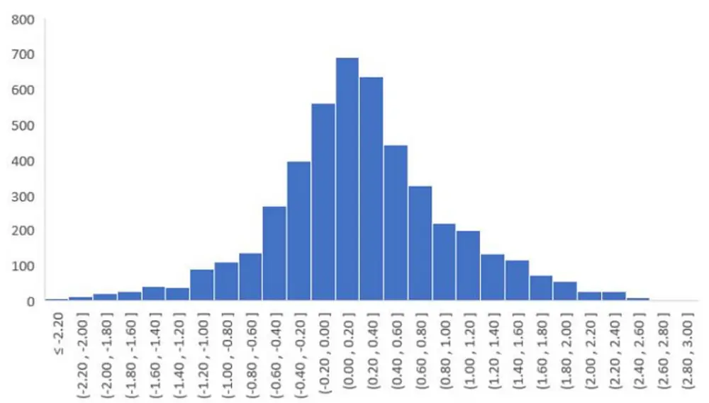
资料来源：国盛证券研究所，wind

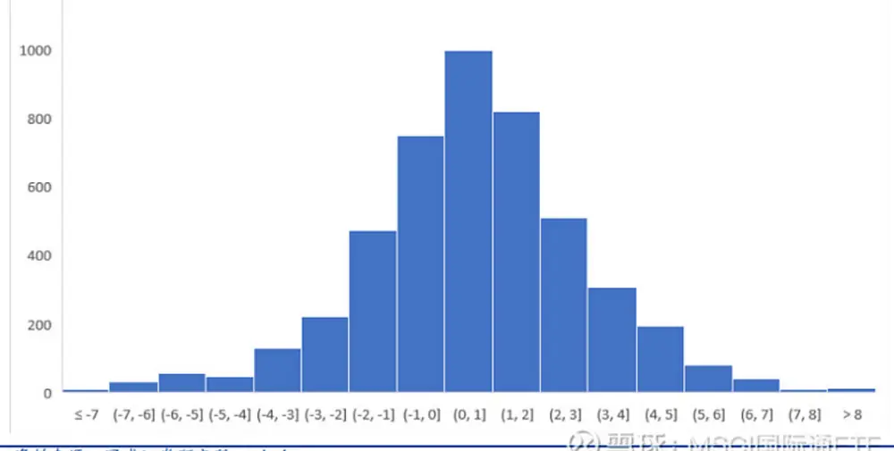
资料来源：国盛证券研究所，wind

我们通过两种方法来证明因子池中的因子表现并不是运气的结果 而是真的包含超额超额收，益。

White（2000）提出了著名的Reality Check方法 他尝试用boostrap的方法去检验在多个检。验中最好的那个模型是否真的战胜了基准 还是仅仅依靠运气 我们借鉴上述思想 给出了， 。 ，一个相应的检验方法 检验的原假设为。

H0：因子池中最好的因子没有超额收益

方法具体方法如下：

2.将所有因子的纯因子收益减去其全样本均值 这个方法使得所有因子的超额收益变为0。 ，但是仍保留其波动的信息 同时也保留了因子间相关性的信息， 。

3.对月份进行boostrap 具体做法为进行带放回的抽样 整个样本长度与原样本长度一致， ， ，为117个月 Boostrap的方法有很多 例如考虑自相关性的block boostrap或者stationary。 ，boostrap 我们认为月频因子收益的自相关性较弱 因此采用最简单的boostrap 方法。 ， 。

4.得到boostrap的样本之后 计算所有因子在此样本下的T统计量绝对值的最大值， 。

5.重复3 4步骤5000次 得到因子收益T统计量最大值的经验分布 也就是仅通过运气能够， 。 。
得到的因子T统计量最大值的分布。

6.比较原样本T统计量最大值在其经验分布上的位置 得到boostrap-p值， 。

在5000次模拟中 T统计量最大值的最大值仅有5.61 也就是说 仅通过测试大量的无效因， 。 ，子 在任何样本下 最好因子的T统计量为5.61 而在原样本中 最好因子的T统计量达到， ， ， ，了9.57 此时的boostrap p值为0 因此我们可以拒绝原假设 即认为构建的财务因子池中， 。 ，确实有能够产生显著超额收益的因子 而并不是运气造成的， 。

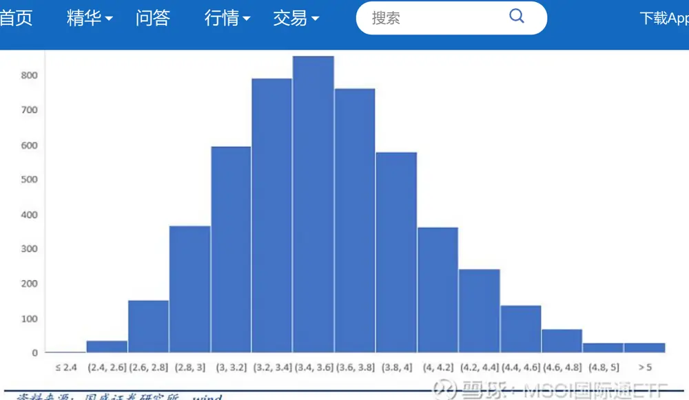
资料来源：国盛证券研究所，wind

要想检验因子是否是真正的alpha因子 除了检验全样本的显著性之外 还可以检验因子表， ，现的持续性 我们将全样本117个月分为前后两部分 时长分比为60个月和57个月 然后将。 ， 。每个时间段的因子表现进行排名 并分为十组 我们计算因子表现的概率转移矩阵 即因子， 。 ，在前一段时间在第M组 而第二段时间变为第N组的概率， 。

| 雪球 | 首页 | 精华 | 问答 | 行情 | 交易 | 搜索 |  |  | Q |  | 下载App | 8 登录/注册 |
| --- | --- | --- | --- | --- | --- | --- | --- | --- | --- | --- | --- | --- |
|  | 2 | 0.21 | 0.17 | 0.13 | 0.09 | 0.07 | 0.05 | 0.03 | 0.08 | 0.07 | 0.09 |  |
|  | 3 | 0.10 | 0.13 | 0.11 | 0.10 | 0.10 | 0.11 | 0.07 | 0.10 | 0.09 | 0.09 |  |
|  | 4 | 0.07 | 0.11 | 0.13 | 0.13 | 0.08 | 0.10 | 0.10 | 0.10 | 0.11 | 0.09 |  |
|  | 5 | 0.05 | 0.06 | 0.11 | 0.11 | 0.10 | 0.13 | 0.12 | 0.12 | 0.11 | 0.10 |  |
|  | 6 | 0.04 | 0.09 | 0.09 | 0.08 | 0.11 | 0.11 | 0.14 | 0.11 | 0.11 | 0.12 |  |
|  | 7 | 0.04 | 0.07 | 0.07 | 0.09 | 0.14 | 0.13 | 0.12 | 0.11 | 0.12 | 0.11 |  |
|  | 8 | 0.01 | 0.09 | 0.07 | 0.09 | 0.12 | 0.13 | 0.13 | 0.10 | 0.13 | 0.14 |  |
|  | 9 | 0.01 | 0.07 | 0.10 | 0.13 | 0.12 | 0.09 | 0.11 | 0.12 | 0.13 | 0.13 |  |
|  | 10 | 0.01 | 0.05 | 0.09 | 0.11 | 0.11 | 0.14 |  | .雪球0.MSC\|国际通E0.19 |  |  |  |

资料来源：国盛证券研究所，wind

从上表中可以看到 在第一阶段排名前10%的因子 在后一阶段有46%的概率仍然排名前， ，10% 有74%的概率仍然排名前30% 而在第一阶段排名后30%的因子 只有3%的3%的概， 。 ，率在下一阶段进入前10% 排名前10%的因子的概率转移矩阵呈非常明显的头部效应 即第。 。一阶段表现好的因子下一阶段有很大概率表现较好 而第一阶段表现差的因子在第二阶段几。乎不会进入头部 这进一步证明了我们的因子池中表现较好的那些因子确实具有持续性 是。 ，真正的alpha因子 而表现后70%的因子 我们发现其再次在后70%的概率较为平均 从第。 ， ，M（M>3）组变为第N（N>3）组的概率几乎都在10%左右 这也说明了后面这些因子几乎，都是一些随机的噪声 并不产生显著的超额收益， 。

## 四 因子逻辑、

尽管上述因子是在考虑了数据挖掘的影响之后 仍然显著的因子 数据和统计手段只能够告， 。诉我们在当前样本下 只有极小的概率将一个假alpha因子判断为显著 但是小概率的事情， 。也有可能发生 我们不能保证挑选出来的因子一定不是随机挖掘的结果 另一方面 即使在， 。 ，过去样本中显著有效的因子 在未来也有失效的可能性 这些问题不再是统计学能够解决的， 。

经济学逻辑延续的概率较高 那么因子样本外仍然有效的概率也会较高， 。

通过对显著的因子进行观察 我们发现一个比较有意思的现象 就是排名靠前的这100个因， ，子 中 会 反 复 的 出 现 某 些 指 标 例 如 排 名 前 10 的 因 子 中 几 乎 全 部 包 含。 ，EMPL_BEN_PAYABLE （ 应 付 职 工 薪 酬 ） 这 个 指 标 而 该 指 标 的 变 化 量。deltaEMPL_BEN_PAYABLE不论是除以总资产 营业利润还是总负债 都有较好的表现、 ， 。这说明这类因子是十分稳健（robust）的 我们能够更加确信应付职工薪酬中的确包含对收，益的预测信息 由于篇幅关系 本节只展示几类因子。 ， 。

## 1）应付职工薪酬相关因子

图表10: deltaEMPL_BEN_PAYABLE_TOT_ASSETS因子纯因子收益
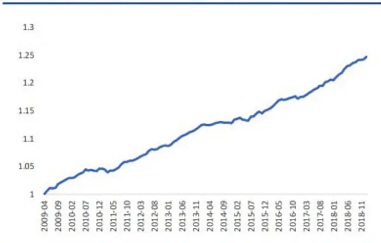
资料来源：国盛证券研究所，wind

图表11:deltaEMPL_BEN_PAYABLE_TOT_ASSETS因子IC
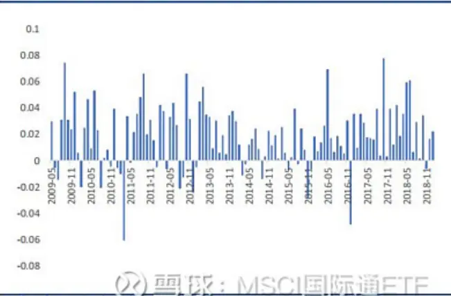
资料来源：国盛证券研究所，wind

职工薪酬是一类较为常用的ESG因子 例如前三高管薪酬 CEO薪酬都是较为有效的因子， ， 。这里我们将应付职工薪酬作为公司员工薪酬以及福利的代理指标 计算其增长率 有着非常， ，显著的效果 我们认为这可能是由于职工薪酬的增长反应了公司业务的扩张 从而有较好的。 ，因子表现。

事实上 公司过去一年所发职工薪酬=本期应付职工薪酬-上期应付职工薪酬+支付给职工以，及为职工支付的现金 如果用该指标作为职工薪酬的代理指标 然后同样计算（本期值-上。 ，期值）/上期总资产 得到的因子效果与直接用应付职工薪酬比较相近 但单纯使用薪酬而， ，不是使用薪酬变化 因子表现较弱， 。

对于分母的标准化变量 选取总资产 投入资本或者总权益等指标 因子的表现差别不大， 、 ， 。但是如果除以存货 非流动负债 固定资产等指标 其业务逻辑性较弱 这可能是由于标准、 、 ， 。化的变量例如资产 负债等本身相关性较强 因此上述因子不论除以哪个指标 最后得到的、 ， ，因子相关性也较强 导致因子表现较为一致 我们在做挖掘的时候没有考虑因子的逻辑 经， 。 ，常会发现这样的现象 对于这一问题 我们只需要从中找到一个逻辑性较强的因子即可 从。 ， 。另一方面来说 分子项除以任何标准化变量都有较好的效果 结果十分稳健 这说明这个指， ， ，标的变化中确实含有一定的信息 而不是由于选取某一特定的分母而导致因子效果变好的， 。这个问题在后文中不再赘述了。

## 2）预收款项相关因子

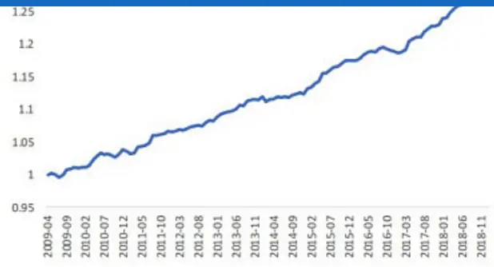
资料来源：国盛证券研究所，wind

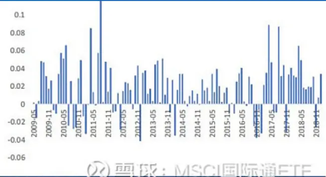
资料来源：国盛证券研究所，wind

上面的图表展示了预收款项增长类因子的表现 其因子构造方法均为（本期预收款项-上期。
预收款项）/上期某一标准化变量（例如总负债 总流动负债等等） 预收款项在资产负债表， 。
的负债端 指的是在企业销售交易成立以前 预先收取的部分货款 代表了企业在供应链中， ， 。
的地位 预收账款的增加代表企业在供应链中的地位有所增加 因此是一个正向因子 这个。 ， 。
因子与应付款项（应付票据及应付账款）比较类似 应付款项的变化/总负债在我们的测试。
中也是一个非常好的因子 T值为5.03 ICIR为1.5， ， 。

## 3）应交税费相关因子

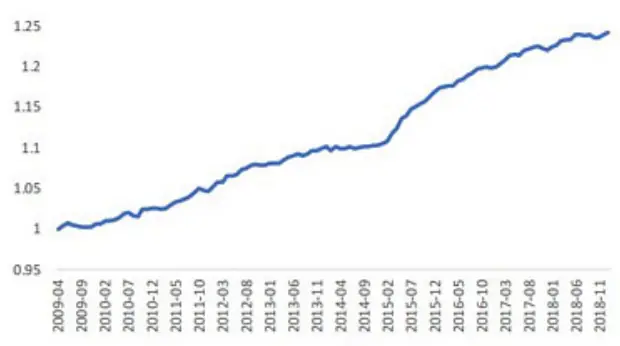
资料来源：国盛证券研究所，wind

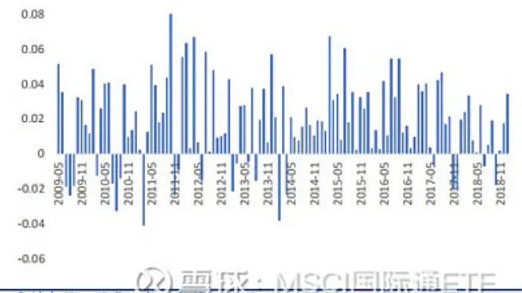
资料来源：国盛证券研究所，wind

上面的图表展示了应交税费类因子的表现 其因子构造方法均为（本期应交税费-上期应交。税费）/上期某一标准化变量（例如总负债 总流动负债等等） 应交税费是指企业根据在一， 。定时期内取得的营业收入 实现的利润等 按照现行税法规定 采用一定的计税方法计提的、 ， ，应交纳的各种税费 因此 应交税费的增加代表着业务规模扩大 应该与公司营业收入 利。 ， ， 、润的增加呈正向关系 经测算 我们发现因子和营业收入增长和利润增长的线性相关性并不。 ，高 因此我们可以认为该因子能够从另外一个角度反映公司业务规模的扩张 具有增量信息。 ， 。

## 4）杠杆率变化相关因子

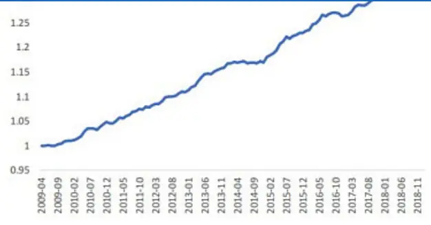
资料来源：国盛证券研究所，wind

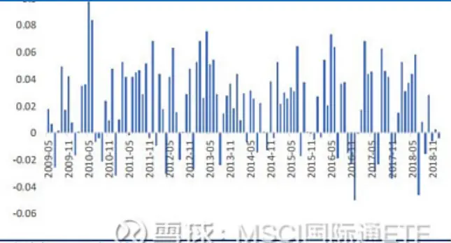
资料来源：国盛证券研究所，Wind

杠杆率变化类因子较多 表现前100个指标中有38是杠杆变化率类因子 由于总资产可以写， 。
成负债和权益的和 因此这些因子中大部分都是相关性非常高的 这里只展示其中的一部分， ， 。

杠杆率的指标总结来看 代表了两个现象 一个是流动负债的增长的越多 那么未来收益越， ， ，高 二是资产负债率（总负债/总资产）增加的越多 那么未来收益越高 Dimitrov和Jain。 ， 。（2008） Cai和Zhang（2011）均在美国市场做了相关实证 他们发现杠杆率变高的股票未、 ，来收益较低 其可能的原因是资产负债率变高可能使得经理人减少投资 从而降低公司的价， ，值 本文的发现与其正好相反 一个可能的解释是在A股市场 上市公司在扩张的过程中。 ， ， ，发债是比增发更加方便的融资手段 因此在控制了市值 估值 杠杆率绝对值等条件的情况。 ， ，下 杠杆率增加的公司可能代表了公司的增长 因此与收益正相关， ， 。

## 五 总结、

本文通过对三张报表的财务指标进行遍历 按照常用财务因子的计算方法 构造了一个财务， ，因子池 并通过多重检验等方法 筛选出了在排除了数据挖掘影响之后仍然十分显著的因子， ， 。

该方法最容易被人质疑的问题就是有数据挖掘的嫌疑 在寻找了上千个因子之后 总可以找。 ，到一个不错的因子 那么这个因子可能仅仅是由于挖掘的因子数量多 凭借运气所找到的， ， ，而非真正的含有超额收益 其表现并不可持续 这一质疑也出现在了众多其他因子的寻找之， 。中 尤其是业务逻辑较弱的技术类因子 事实上 几乎任何因子的寻找都离不开对数据的挖， 。 ，掘 本文的方法只是将这一问题凸显了出来 数据挖掘并不是产生伪因子的核心原因 原因。 。 ，是传统的单变量检验在面对多个假设检验时失效了 导致我们找到由运气产生的因子的概率，变大 但是 只要我们使用合理的统计手段 能够最小化FWE发生的概率 那么我们就能。 ， ， ，够尽可能的排除数据挖掘或者是运气带来的影响 找到真正的alpha因子， 。

在考虑数据挖掘的影响下 本文从生成的4680个因子中 找到了364个仍然显著的财务因子， ， 。那这些财务因子是否是真正的alpha因子 其表现在未来会持续呢？其实我们也不能完全确，定 统计学只能帮助我们降低犯第一类错误的概率 但是不能帮助我们确定因子影响股票收。 ，益的内在驱动因素 即使犯第一类错误的概率较低 但仍存在一定的可能性 因此我们需要。 ， 。确认因子的逻辑 通过主观的方法进一步的降低犯第一类错误的概率 另外 由于市场环境， 。 ，变化较快 过去好的因子未来表现不一定好 通过找到因子的逻辑 我们能够更加清晰的应， ， ，对这一问题。

本文是对财务报表因子挖掘的一个简单尝试 仍有较多的不足之处 例如我们使用的财务指， 。标均为简单的报表科目 而没有其他更为复杂的变形；我们构造的因子形式较为简单 只使， ，用了两个指标的变换 且只用到了过去两年的信息 这主要是为了使计算得到的因子仍然保， 。持相对来说较为清晰的逻辑 在未来的研究中 我们可以尝试更加复杂的算法来进行财务因。 ，子和技术因子的挖掘。

文章来源：留富兵法 作者/编辑： 刘富兵 丁一凡、

原文标题：《多因子系列之六：寻找财务数据中的alpha信息》

免责声明：转载内容仅供读者参考 版权归原作者所有 内容为作者个人观点 不代表其任， ， ，职机构立场及任何产品的投资策略 本文只提供参考并不构成任何投资及应用建议 如您认。 。为本文对您的知识产权造成了侵害 请立即告知 我们将在第一时间处理， ， 。

风险提示：任何在本文出现的信息（包括但不限于评论 预测 图表 指标 理论 任何形、 、 、 、 、式的表述等）均只作为参考 投资人须对任何自主决定的投资行为负责 另 本文中的任何， 。 ，观点 分析及预测不构成对阅读者任何形式的投资建议 本公司亦不对因使用本文内容所引、 ，发的直接或间接损失负任何责任 基金投资有风险 基金的过往业绩并不代表其未来表现。 ， ，投资需谨慎 货币基金投资不等同于银行存款 不保证一定盈利 也不保证最低收益。 ， ， 。

$上证指数(SH000001)$ $创业板指(SZ399006)$ $沪深300(SH000300)$

@蛋卷基金 @今日话题 @景顺长城 @望京博格 @益君财 @尽享快乐 @赤箭 @run寜-支持huawei @乐骑牛 @一统天下哥 @月光下的石头 @MSCI指数增强 @Oklaho01 @居心宽容@翌日明星 @礼白水 @占卜涨跌 @沉默元素

打赏

评论...

聪明的投资者都在这里

常见问题 加入我们 关于雪球

风险提示：雪球里任何用户或者嘉宾的发言，都有其特定立场，投资决策需要建立在独立思考之上

A 股开户

蛋卷基金

港股开户

私募中心

美股开户

互联网违法和不良信息投诉：01061840634 / tousu@xueqiu.com 违法(含侵权)及不良信息投诉指引 雪球服务协议 雪球隐私政策© 2021 XUEQIU.COM 北京雪球信息科技有限公司 京公网安备 11010502040379号 京ICP证100666号 京ICP备10040543 营业执照证券业协会会员单位（代码817027） 广播电视节目制作经营许可证: (京)字第08638号 互联网药品信息服务资格证书 出版物经营许可证