# 量化专题报告

# 多因子系列之七：对成长的分解及多维度寻找成长因子

本篇报告从企业盈利增长的角度考察企业的成长性，梳理高盈利增长的来源，并尝试构建相关因子并考察其在多因子组合中的表现。

企业盈利增长主要来自三个维度：投资回报率、新投资规模和投资效率提升。处于企业生命周期的成长期的企业，盈利增长主要来自于新投资；处于企业生命周期的成熟期的企业，获得盈利增长最快的方式是提高效率，一旦低效率问题得到解决，则需要寻找新投资以刺激业绩增长。

投资回报率是企业盈利增长之源。企业在维持较高的投资回报率，并源源不断地将经营所得再投入生产的情况下，能实现净利润增长复利式增长。长期来看，超过投资回报率的增长较难持续，投资回报率是增长之源，也是长期增长中枢。因此，虽然我们视 ROIC和 ROE 为反映企业盈利能力指标，但其本质反映了企业的内生成长性。

从企业负债增长与资产增长反映企业新投资规模。A 股上市企业的资产增长是以外源融资为主导的，包括股权再融资与债权再融资。过去十年 A 股扩张以债权融资为主，因此负债增长率因子表现较好。股权再融资会引发股价剧烈波动。总资产增长更多反映企业的外延式增长，例如并购等，容易出现以低效率换取高增长，后期伴随因业绩承诺不达标发生商誉减值的情况。

从边际投资回报率、经营效率变动及刺激未来业绩增速的投入角度反映企业投资效率提升。边际投资回报率反映企业相比于上期新投入资本带来的回报变化，比简单利用回报率同比因子有更好的选股效果；经营效率变动包括利润率和周转率变动，衡量企业经营效率的改善；另外，部分能够刺激未来业绩增长的支出，例如研发费用、广告宣传费用等，在相关行业内也有较好的选股效果。

成长因子对股票收益有较好的区分度。在控制风格和行业之后，成长因子能提供 alpha 信息；相对于常见的业绩增长类因子，投资回报率、边际投资回报率和资产增长类因子仍然能提供新的增量；从时间序列上来看，在外延式增长占主导时期（2014~2016），市场情绪较为激进，投资者追逐业绩增长，并不对投资质量进行严格评判；而内生增长占主导时期（如 2010 年、2017~2018 年），投资者偏向保守，更注重企业内生增长和效率提升。

利用多维度成长性因子能提升组合表现。我们尝试利用大类成长因子构建中证 500 成长增强策略，相比于基准能提供 11.54%的年化收益，信息比 1.97；相比于单纯用业绩增长因子策略，年化收益提高 5.45%，信息比提高 0.95。

风险提示：以上结论均基于历史数据和统计模型测算，如果未来市场环境发生明显改变，不排除因子失效的可能。

## 作者

分析师 刘富兵

执业证书编号：S0680518030007

邮箱：liufubing@gszq.com

研究助理 李林井

邮箱：lilinjing@gszq.com

2、《量化周报：市场反弹继续》2019-06-24

3、《量化周报：反弹或已开启》2019-06-16

4、《量化周报：准备迎接反弹》2019-06-09

5、《量化周报：回调加仓仍是主旋律》2019-06-02

## 1. 成长的界定与分解

## 1.1 成长的界定

投资成长风格的逻辑认为，企业的快速扩张、盈利高速增长能推动股价上涨，然而如何从量化的角度刻画成长性一直是困扰投资者的一大难题。

常见的对成长股的界定有四个维度：

1. 规模维度：通常人们会认为市值偏小的企业未来的成长性会更大；

2. 行业维度：认为科技含量高、未来市场空间广阔的新兴行业为成长行业，而将业务模式成熟、增速较低的行业视为成熟行业，并从行业属性角度界定企业是否为成长股；

3. 估值维度：认为市场在有效的情形下，会对有高成长性的企业更高的估值；

4. 基本面指标维度：根据财报数据呈现的企业历史的业绩增长、盈利水平等角度界定成长股；

本篇报告着重从企业盈利增长的角度考察企业的成长性，梳理高盈利增长的来源，并尝试构建相关因子并考察其在多因子组合中的表现。

## 1.2 盈利增长的来源

Damodaran 在《估值：难点、解决方案及相关案例》中将企业要素增长分解为两个来源：拓展业务的新投资和已有投资的效能改善。将利润增长率进行分解有助于我们更好地评估增长：我们定义t时期的利润为 $\mathrm{E}_{\mathrm{t}}.$ ，t时期开始的投资为 $\mathrm{I_{t}}$ ，该项投资的回报率为 $\mathrm{ROI}_{\mathrm{t}}$ 那么我们可得：

$$
\mathrm{E}_{\mathrm{t}}=ROI_{t}\times I_{t}
$$

假设利润从t−1期到t期的变化额为 $\Delta E$ ，投资额的变化为ΔI，那么利润的增长率g可以分解为：

$$
\mathbf{g}={\frac{\Delta\mathrm{E}}{\mathrm{E}_{\mathrm{t}-1}}}={\frac{ROI_{t}\times I_{t}-ROI_{t-1}\times I_{t-1}}{E_{t-1}}}=\mathrm{ROI_{t}}\times{\frac{\Delta I}{E_{t-1}}}+{\frac{\mathrm{ROI_{t}}-\mathrm{ROI_{t-1}}}{ROI_{t-1}}}
$$

等式的第一项体现了新投资带来的增长，受新投资的回报率 $\mathrm{\cdot ROI_{t}}$ 和投入比例 $\frac{\Delta I}{E_{t-1}}$ 的影响，第二项则体现现有资产投资回报率变化的影响，这部分也被称作效率的增长。

图表1：企业盈利增长来源
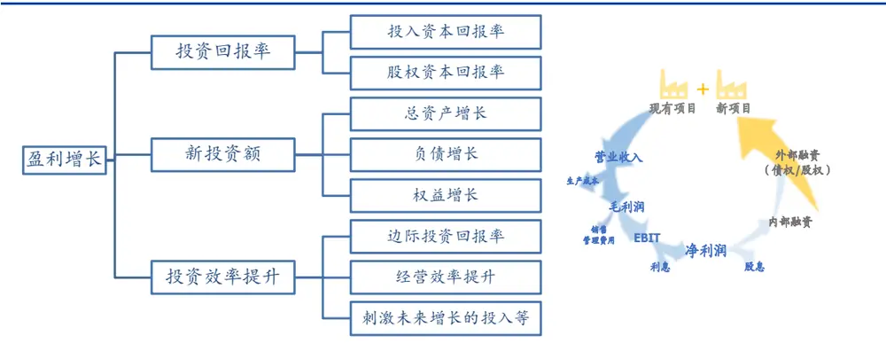
资料来源：国盛证券研究所

根据上述分解，我们在考察企业未来的盈利是否增长时，需着重考虑三个问题：

1. 新投资的回报率有多高？

2. 新投资的规模有多大？

3. 投资的效率是否有提升？

## 1.3 定义投资和投资回报率

如何定义投资和投资回报率取决于投资者重视股权利润还是营业利润。聚焦于股权投资和股权利润的投资者，其回报率是指股权回报率（ROE）；聚焦于资本投资和营业利润的投资者，着眼点是资本投资和资本回报率（ROIC）。

图表2:投资和投资回报率及增长定义

|  | 投资变动额 | 再投资率 | 投资回报率 | 效率性增长 |
| --- | --- | --- | --- | --- |
| 营业利润 | 资本性支出-折旧与摊销+ Δ营运资本 | 资本性支出－折旧与摊销+Δ营运资本 | EBIT(1 − tax rate) ROIC = | ROICt − ROICt-1 ROICt-1 |
|  |  | EBIT(1 − tax rate) | Investment Cap |  |
| 股权利润 | 净利润-分红 | 净利润－分红 | 净利润 | ROEt − ROEt-1 |
|  |  | 净利润 | ROE = 净资产 | ROEt-1 |

资料来源：国盛证券研究所

## 2. 成长因子构建

我们从 1.2节的三个问题出发，寻找相关的成长因子。

## 2.1 新投资的回报率有多高？

我们考虑企业的股权利润。假设一家企业 ROE不变，并且在本期将上期净利润全部投入再生产，则

$$
\mathbf{g}=\mathsf{ROE}
$$

换言之即使一家企业没有进行大量的研发和技术革新，只要公司能维持较高的投资回报率，并源源不断地将经营所得再投入生产，扩大规模，同样也能实现净利润的增长，并且是复利式增长。长期来看，超过ROE的增长较难持续，ROE是增长之源，也是长期增长中枢。因此，虽然我们视ROIC和ROE为反映企业盈利能力指标，但其本质反映了企业的内生成长性。

从选股的角度，我们用当期投资回报率来考察企业当前的内生增长。

图表3:投资回报率因子检验结果

|  | IC | ICIR | 中性化 IC | 中性化 ICIR | 多空 年化收益 | 多空 波动率 | IR | 最大 回撤 | Top 组 年化收益 | Top 组 年化波动率 |
| --- | --- | --- | --- | --- | --- | --- | --- | --- | --- | --- |
| roic | 0.0197 | 0.7092 | 0.0321 | 1.77 | 11.66% | 6.62% | 1.76 | 11.18% | 13.67% | 28.02% |
| roe | 0.0205 | 0.6634 | 0.0383 | 2.01 | 15.45% | 7.09% | 2.18 | 10.59% | 13.19% | 27.18% |

资料来源：Wind，国盛证券研究所

图表4:投资回报率因子分十组多空组合净值
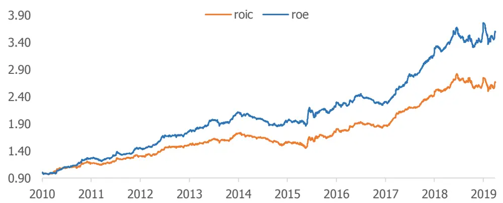
资料来源：Wind，国盛证券研究所

从因子检验来看，基于净资产的回报率roe整体表现优于基于全部投入资本的回报率roic，对于二级市场投资者来说，更看重企业股权的回报。

## 2.2 新投资的规模有多大？

从资产的角度出发，企业的新投资包括对长期固定资产和短期流动资产的投资：

再投资额= 资本性支出−折旧与摊销+Δ营运资本

资本性支出反映了企业对未来的固定资产、无形资产等长期资产的投资，营运资本的变化反映了企业资金在存货、应收等流动资产被占用的情况。从再投资额来衡量企业新投资规模，我们尝试计算了再投资额、股权再投资额、再投资比率、股权再投资比率及其衍生指标，发现这些因子并不能提供稳定的超额收益。这其中主要存在两个问题：

1. 只有当新项目能提供高于成本的回报，高再投资额才有意义：

2. 再投资额的会计计量易失真：财报涉及折旧与摊销数据的可操纵性较高，且部分指标季报并不披露，基于上式计算的数据存在较多问题。

但换个角度，我们可以从新投资的资金来源衡量企业的扩张程度，即企业总资产、以及负债和权益规模的增长。企业若要进行新投资，其资金既可以来自于企业上期留存的收益，也可以利用外部融资手段，例如发行债券或者股权再融资；资金来源越充沛，新投资的可行性也越高。

我们着重测试了三类与扩张程度相关的因子，包括：资产增长率因子 tot_assets_yoy、负债增长率因子 tot_liab_yoy 和权益增长率因子 equity_yoy。

图表5:规模扩张因子检验结果

|  | IC | ICIR | 中性化 IC | 中性化 ICIR | 多空 年化收益 | 多空 波动率 | IR | 最大 回撤 | Top 组 年化收益 | Top 组 年化波动率 |
| --- | --- | --- | --- | --- | --- | --- | --- | --- | --- | --- |
| tot_assets_yoy | 0.0003 | 0.01 | 0.0112 | 0.71 | 5.67% | 6.51% | 0.87 | 17.35% | 7.03% | 30.02% |
| tot_liab_yoy | 0.0134 | 0.75 | 0.0176 | 1.30 | 7.08% | 4.99% | 1.42 | 9.22% | 11.91% | 30.48% |
| equity_yoy | -0.0088 | -0.45 | 0.0040 | 0.29 | 3.24% | 6.41% | 0.51 | 12.82% | 3.37% | 29.49% |

资料来源：Wind，国盛证券研究所

图表6:规模扩张因子分十组多空组合净值
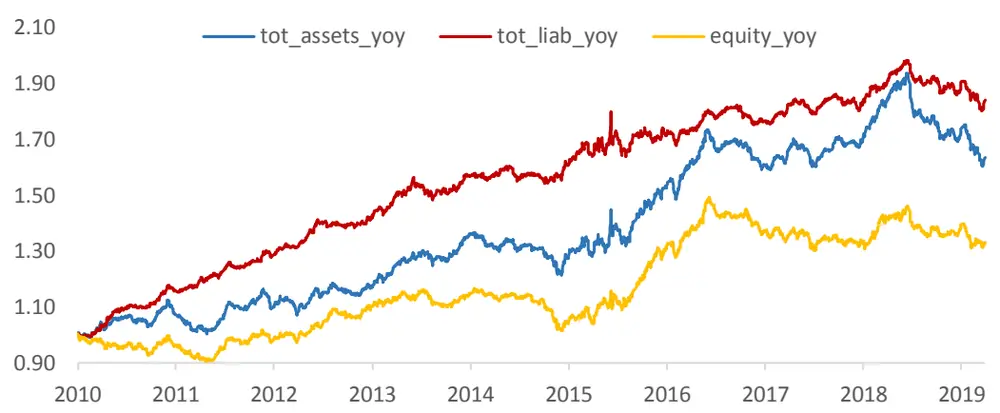
资料来源：Wind，国盛证券研究所

从因子检验结果来看，负债增长率因子的 IC、多空收益以及头部选股能力均高于总资产增长率因子和权益增长率因子；三个因子从2018年年中开始出现较为明显的回撤。

海外很多学术研究对资产增长对股价影响有较为详细的分析。许多基于美股的实证研究发现，资产增长是解释股价波动的显著因素，且资产扩张的企业在未来的收益较低，而资产收缩的企业在未来反而能获得较高的收益。Louis 等研究者认为伴随资产增长的负收益可能来自于几个原因：长期以来并购事件中的收购方在未来的业绩表现较差；投资者由历史业绩外推时低估企业的业绩；由于管理层的代理问题导致企业过度扩张等。

但是A 股市场上资产增长类因子的表现与多数学术论文结果相悖。为了刻画A 股企业的成长模式，我们首先考察这类规模增速比较快的公司所依赖的手段。我们在每个月月底，将全市场股票按总资产增长率高低等分为十组（g9 为总资产增速最高组），并统计每组股票在过去 12 个月中融资来源比例：我们以吸收投资收到的现金估算股权融资额，以取得借款和发行债券得到的现金减去偿还债务支付的现金估算债权融资额，以当期净利润估算内部融资额（不考虑分红影响），并计算三者占比；并统计了各组在过去 12 个月发生过并购事件的股票数量占比。从结果上来看，我们认为可能有以下几点原因：

1. A股上市企业的资产增长是以外源融资为主导的。测算发现，总资产增速最高组的融资主要来自于股权融资，增速较高组别的债权融资比例和股权融资比例逐渐上升，内源融资比例逐渐下降。

2. 过去十年 A股扩张以债权融资为主，去杠杆政策导致负债增长率因子表现疲缓。我们统计了 A 股资本运作中各类事件融资金额占比，其中股权融资包括首发、增发和配股，债券融资包括各类企业债、公司债、中期票据、短期融资债、金融债和可转债，我们观察到：

自 2010 年至2017年，A股上市公司债权融资占比整体呈上升趋势，股权融资比例呈下降趋势；换言之，这段时间内借助杠杆扩大经营规模的企业增长模式占主导地位，加之债权融资比股权融资成本更低，流程更简洁，这部分企业能获得更好的发展机会；因此反映到股价上，表现为负债增长率比净资产增长率因子更有效；

自 2017 年以来，各类去杠杆政策出台，债权融资比例和股权融资比例变化较小；受去杠杆政策影响，以及信贷环境收紧，市场逐渐选择回避负债过高或财务状况较差的公司，因此负债增长率因子在该经济环境下表现不佳。

件的企业。外延式并购能在短期内实现业绩增长，但公司的经营质量是否能够提升仍需时间验证。一般企业发生收购兼并后会有三年业绩承诺期，若被收购企业的业务难以高质量地整合到现有业务中，无法实现业绩承诺，则后期往往伴随高额的商誉减值处理，例如 2014~2015年并购潮导致2018年出现大量商誉减值处理事件。当外延式增长被证伪后，市场对于此类增长难以给予高定价。

图表7:总资产增长分组组合融资来源比例和发生并购家数占比(右轴)
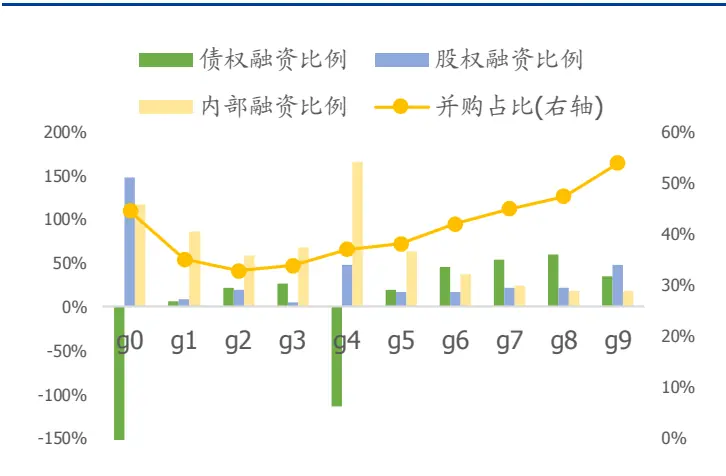
资料来源：国盛证券研究所，Wind

图表8：A股企业资本运作融资金额占比及并购事件数量（右轴）
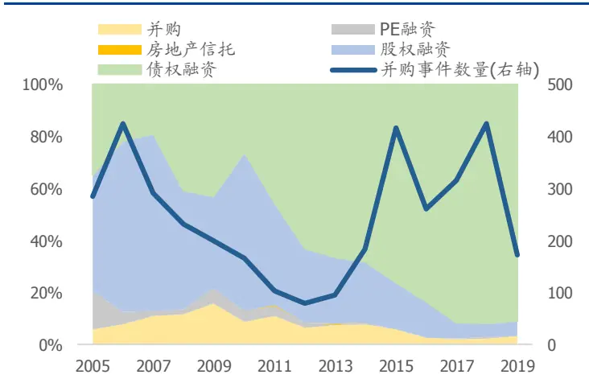
资料来源：国盛证券研究所，Wind

## 2.3 投资的效率是否有提升？

我们尝试从不同角度刻画企业的投资效率是否提升。

## 2.3.1 边际投资回报率

除了考虑 2.1 节中所提到的投资回报率，我们还需要考虑当期平均投资回报率同比和边际投资回报率的区别，很多时候我们并不对这两个指标进行仔细区分，但因子所代表的含义并不一致：平均投资回报率综合考量投入额的回报，假设税率不变，平均投资回报率提升：

$$
roicyoy=\frac{roic_{t}-roic_{t-1}}{roic_{t-1}},roeyoy=\frac{roe_{t}-roe_{t-1}}{roe_{t-1}}
$$

边际投资回报率反映企业在该期新投入的资金带来新增的回报：

$$
\begin{array}{c}{{Marginal~ROIC=\displaystyle\frac{(EBIT_{t}-EBIT_{t-1})(1-tax~rate)}{Investment~Cap_{t}-Investment~Cap_{t-1}}}}\\{{Marginal~ROE=\displaystyle\frac{NP_{t}-NP_{t-1}}{Equity_{t}-Equity_{t-1}}}}\end{array}
$$

图表9:边际回报率因子和回报率同比因子检验结果

|  | IC | ICIR | 中性化 IC | 中性化 ICIR | 多空 年化收益 | 多空 波动率 | IR | 最大 回撤 | Top 组 年化收益 | Top 组 年化波动率 |
| --- | --- | --- | --- | --- | --- | --- | --- | --- | --- | --- |
| marginal_roic | 0.0340 | 2.17 | 0.0348 | 3.19 | 12.49% | 4.58% | 2.72 | 4.78% | 17.00% | 29.48% |
| marginal_roe | 0.0341 | 1.98 | 0.0341 | 2.60 | 13.90% | 4.51% | 3.08 | 5.52% | 17.15% | 30.18% |
| roic_yoy | 0.0271 | 1.91 | 0.0266 | 2.57 | 9.47% | 4.78% | 1.98 | 7.71% | 14.45% | 30.58% |
| roe_yoy | 0.0221 | 1.14 | 0.0231 | 1.57 | 7.74% | 5.46% | 1.42 | 8.96% | 11.81% | 30.53% |

资料来源：Wind，国盛证券研究所

图表10：边际投资回报率因子分十组多空组合净值
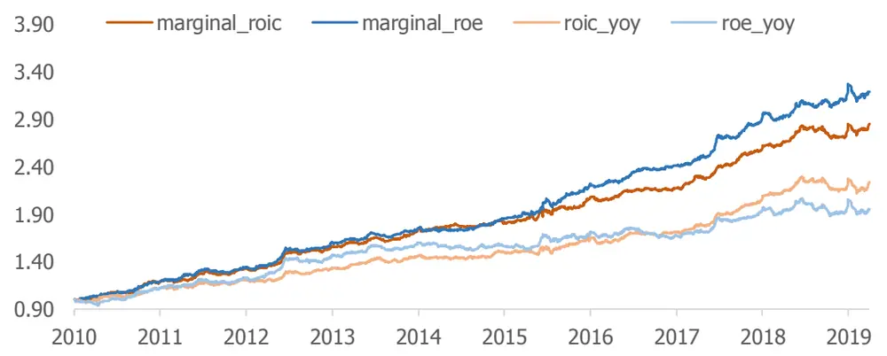
资料来源：Wind，国盛证券研究所

从边际回报率因子的定义方式来看，分子端利润的增长本身就带有规模增长的影响；从因子回测表现来看，边际回报率因子比回报率同比因子的选股能力更强，因子的ICIR和多空组合的信息比也更高。

## 2.3.2 经营效率提升

为了更进一步考虑投资效率提升的来源，我们可以将 ROIC 和 ROE 拆分为利润率和周转率：

$$
\begin{array}{c}{{\mathrm{ROIC}=\displaystyle\frac{EBIT(1-taxrate)}{Investment~Cap}=\displaystyle\frac{EBIT(1-taxrate)}{Sales}\times\displaystyle\frac{Sales}{Investment~Cap}}}\\{{\mathrm{ROE}=\displaystyle\frac{NetProfit}{Equity}=\displaystyle\frac{NetProfit}{Sales}\times\displaystyle\frac{Sales}{Equity}}}\end{array}
$$

企业可以通过提高利润率或者加快资产周转率来提升自身的经营效率。利润率衡量了企业将销售额转化为利润的能力，周转率反映企业资产变现为销售额的能力。一家实施产品差异化战略的企业，会专注于新产品研发提升产品利润率；而一家实施成本领先战略的企业，其主要目标在于解决企业经营中无效率的问题，提高资产周转率，从而实现利润的增长；当然，二者间也往往存在交互影响。

企业毛利率（Operation Profit/Sales）很大程度上是由产品或者行业的天然属性决定的，高毛利率往往是高盈利的出发点。而毛利率的提高，更有可能来自于企业对产品或业务的革新，为最终投资回报率的提升打好基础。而其他利润率指标，比如 EBIT/Sales、NetProfit/Sales 等指标的提升，可能来自于毛利润的提升，也可能来自于企业期间费用、税率、非经常性损益的变动。从该逻辑出发，我们构建利润率变动因子。

$$
profitmargindelta_{t}=\frac{profit_{t}}{sales_{t}}-\frac{profit_{t-1}}{sales_{t-1}}
$$

不同企业经营所依赖的资产有较大区别，着重考察的资产周转率也有所侧重，例如相对于轻资产企业来说，重资产行业的企业更加重视固定资产的周转率。因此我们在考察总资产周转率及其变动因子的同时，也同时考察了不同类型资产的周转率变化因子。

$$
assetturnoverdelta_{t}=\frac{sales_{t}}{assets_{t}}-\frac{sales_{t-1}}{assets_{t-1}}
$$

图表11：经营效率提升因子检验结果

|  | IC | ICIR | 中性化 IC | 中性化 ICIR | 多空 年化收益 | 多空 波动率 | IR | 最大 回撤 | Top 组 年化收益 | Top 组 年化波动率 |
| --- | --- | --- | --- | --- | --- | --- | --- | --- | --- | --- |
| op_margin_delta | 0.0233 | 1.66 | 0.0254 | 2.30 | 8.58% | 4.49% | 1.91 | 6.62% | 11.49% | 30.02% |
| ebit_margin_delta | 0.0237 | 1.78 | 0.0255 | 2.53 | 9.81% | 4.51% | 2.18 | 4.26% | 12.06% | 29.98% |
| np_margin_delta | 0.0199 | 1.34 | 0.0219 | 1.85 | 7.08% | 4.55% | 1.56 | 5.60% | 10.75% | 30.13% |
| totassets_trnv_delta | 0.0300 | 2.21 | 0.0242 | 2.56 | 10.45% | 4.31% | 2.43 | 8.56% | 14.40% | 30.34% |
| curassets_trnv_delta | 0.0217 | 1.81 | 0.0175 | 2.15 | 6.49% | 4.06% | 1.60 | 7.46% | 11.50% | 29.52% |
| fixassets_trnv_delta | 0.0175 | 1.68 | 0.0181 | 2.30 | 6.74% | 4.12% | 1.63 | 4.28% | 12.36% | 29.97% |

资料来源：Wind，国盛证券研究所

图表12：毛利率变动因子分十组多空组合净值
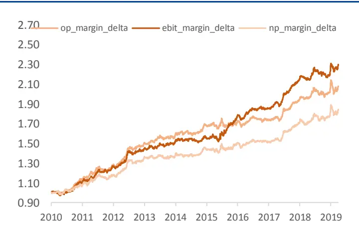
资料来源：国盛证券研究所，Wind

图表13：周转率变动因子分十组多空组合净值
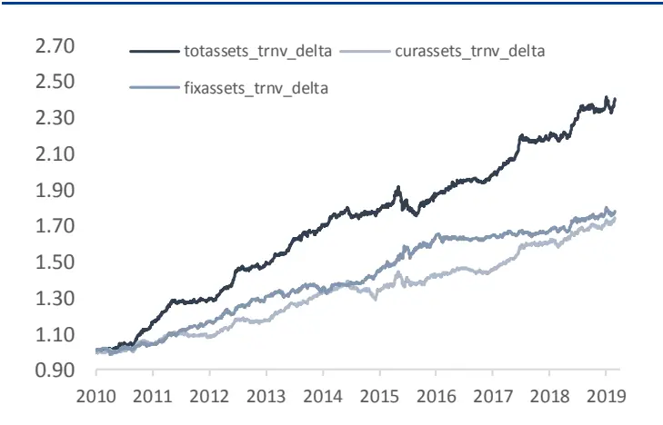
资料来源：国盛证券研究所，Wind

从因子表现来看，从分解项考察，totassets_trnv_delta 因子、ebit_margin_delta 因子和op_margin_delta 因子表现较为突出。

## 2.3.3 刺激未来增长的投入

从营业收入转化为净利润的过程，也是考量企业经营效率高低的关键环节。由于会计计量具有保守性的特征，审计师会倾向于推迟确认收入和利润，而尽量提前确认成本支出，对于无法确认（例如研发支出、广告投入、人力成本等）能否给企业带来收入的支出，会计准则会要求将其作为费用从利润中扣除，使得这些企业的当期净利润偏低，然而这些支出有可能在未来给企业带来爆发式的业绩增长。

我们在这里例举两类支出：研发费用与广告宣传推广费(wind 底层数据库中销售费用字段APE_COS)。我们尝试构建以下因子：

研发投入意愿：当期研发支出/期初营业收入（RDtoSales0）

研发投入强度：当期研发支出/同行业研发支出总额（RDtoIndRD）

研发支出转化率：营收增长/上期研发支出（MarginalSalestoRD）

广告宣传推广投入意愿：当期广告宣传推广费/期初营业收入（ADtoSales0）

广告宣传推广投入强度：当期广告宣传推广费/同行业广告宣传支出总额（ADtoIndAD）宣传推广投入转化率：营收增长/上期广告宣传推广费（MarginalSalestoAD）

图表14：研发费用与广告宣传推广费相关因子检验结果

|  | IC | ICIR | 中性化 IC | 中性化 ICIR | 多空 年化收益 | 多空 波动率 | IR | 最大 回撤 | Top 组 年化收益 | Top 组 年化波动率 |
| --- | --- | --- | --- | --- | --- | --- | --- | --- | --- | --- |
| RDtoSales0 | 0.0020 | 0.05 | 0.0036 | 0.19 | 1.23% | 6.16% | 0.20 | 12.69% | 2.25% | 39.15% |
| RDtoIndRD | 0.0142 | 0.61 | 0.0195 | 2.03 | 8.34% | 5.39% | 1.55 | 5.46% | 8.76% | 32.56% |
| MarginalSalestoRD | 0.0122 | 0.50 | 0.0191 | 1.36 | 6.28% | 9.27% | 0.68 | 17.57% | 7.99% | 34.23% |
| ADtoSales0 | 0.0031 | 0.16 | 0.0018 | 0.18 | 1.75% | 5.75% | 0.30 | 8.82% | 15.51% | 31.81% |
| ADtoIndAD | 0.0030 | 0.18 | 0.0100 | 1.26 | 8.66% | 6.95% | 1.25 | 11.98% | 6.39% | 35.96% |
| MarginalSalestoAD | 0.0133 | 0.71 | 0.0189 | 1.35 | 8.95% | 5.73% | 1.56 | 5.14% | 6.09% | 36.45% |

资料来源：Wind，国盛证券研究所

由于研发费用项数据公布历史较短，更新频率较低，研发费用类因子在获取近期超额收益的能力有限。从全市场样本的检验效果来看，大部分费用类的因子表现并不理想。我们进一步统计了经市值行业中性化后的因子在不同行业内的 IC值均值，结果如下：

图表15：研发费用相关因子（中性化）行业内IC均值

| 类别 | 行业 | RDtoSales0 | RDtoIndRD | MarginalSalestoRD | 覆盖率 | 平均股票数 |  |
| --- | --- | --- | --- | --- | --- | --- | --- |
| 周期 | 有色金属 | 0.0057 | 0.0320 | 0.0210 | 71% | 101 |  |
|  | 石油石化 | -0.0286 | 0.0271 | 0.0444 | 67% | 43 |  |
|  | 汽车 | -0.0204 | 0.0269 | 0.0378 | 75% | 151 |  |
|  | 煤炭 | -0.0078 | 0.0277 | 0.0531 | 70% | 38 |  |
|  | 交通运输 | 0.0319 | 0.0309 | 0.0153 | 28% | 98 |  |
|  | 建筑 | 0.0256 | 0.0346 | 0.0140 | 70% | 100 |  |
|  | 建材 | -0.0014 | 0.0133 | 0.0386 | 69% | 87 |  |
|  | 基础化工 | 0.0224 | 0.0359 | 0.0159 | 76% | 255 |  |
|  | 机械 | 0.0060 | 0.0058 | 0.0366 | 80% | 299 |  |
|  | 国防军工 | -0.0302 | 0.0115 | -0.0077 | 90% | 51 |  |
|  | 钢铁 | 0.0464 | 0.0420 | 0.0633 | 79% | 53 |  |
|  | 电力设备 | -0.0054 | 0.0172 | 0.0239 | 86% | 141 |  |
|  | 电力及公用事业 | 0.0067 | 0.0024 | 0.0162 | 49% | 140 |  |
|  | 医药 | 0.0010 | 0.0185 | 0.0042 | 77% | 240 |  |
|  | 消费 | 食品饮料 | -0.0013 | -0.0027 | 0.0404 | 71% | 88 |
| 商贸零售 |  | 0.0175 | 0.0278 | 0.0088 | 21% | 96 |  |
| 轻工制造 |  | -0.0269 | 0.0174 | 0.0206 | 71% | 85 |  |
| 农林牧渔 |  | 0.0217 | 0.0396 | 0.0608 | 69% | 89 |  |
| 家电 |  | -0.0183 | 0.0190 | 0.0027 | 83% | 64 |  |
| 纺织服装 |  | 0.0065 | 0.0172 | 0.0050 | 75% | 81 |  |
| 餐饮旅游 |  | 0.0121 | -0.0128 | -0.0007 | 17% | 33 |  |
| 通信 |  | 0.0167 | 0.0602 | 0.0115 | 81% | 101 |  |
| TMT | 计算机 | 0.0168 | 0.0464 | 0.0111 | 83% | 160 |  |
|  | 电子元器件 | 0.0171 | 0.0459 | 0.0154 | 83% | 188 |  |
|  | 传媒 | -0.0175 | -0.0052 | 0.0151 | 63% | 103 |  |

资料来源：Wind，国盛证券研究所

除了一些研发费用覆盖度比较低以及行业股票数较少的行业（例如餐饮旅游、交运、商贸零售、钢铁、煤炭等），从研发投入意愿来看，RDtoSales0 因子在周期类的建筑、基础化工，消费类的农林牧渔，以及 TMT行业中的电子元器件、计算机和通信行业中有较好的区分度；从研发投入强度来看，RDtoIndRD因子在大部分行业有效；从转化效率来看，MarginalSalestoRD因子在农林牧渔、食品饮料、建材、汽车、机械等行业的区分度较好。

对于广告宣传投入费用，我们同样测算了因子在不同行业内的表现。

图表16：广告宣传投入相关因子（中性化）行业内IC均值

| 类别 | 行业 | ADtoSales0 | ADtoIndAD | MarginalSalestoAD | 覆盖率 | 平均股票数 |  |
| --- | --- | --- | --- | --- | --- | --- | --- |
| 周期 | 有色金属 | -0.0024 | -0.0002 | 0.0166 | 39% | 101 |  |
|  | 石油石化 | 0.0208 | 0.0233 | 0.0179 | 52% | 43 |  |
|  | 汽车 | -0.0243 | -0.0015 | 0.0117 | 61% | 151 |  |
|  | 煤炭 | -0.0217 | 0.0214 | -0.1593 | 18% | 38 |  |
|  | 交通运输 | 0.0105 | 0.0224 | -0.0118 | 38% | 98 |  |
|  | 建筑 | -0.0193 | 0.0047 | 0.0114 | 49% | 100 |  |
|  | 建材 | 0.0045 | 0.0151 | 0.0719 | 66% | 87 |  |
|  | 基础化工 | 0.0066 | 0.0080 | 0.0240 | 56% | 255 |  |
|  | 机械 | 0.0149 | -0.0053 | 0.0470 | 65% | 299 |  |
|  | 国防军工 | -0.0059 | 0.0164 | -0.0061 | 84% | 51 |  |
|  | 钢铁 | -0.0102 | 0.0097 | 0.0073 | 37% | 53 |  |
|  | 电力设备 | 0.0233 | 0.0413 | 0.0364 | 61% | 141 |  |
|  | 电力及公用事业 | 0.0198 | 0.0250 | 0.0153 | 43% | 140 |  |
|  | 医药 | 0.0037 | 0.0053 | 0.0032 | 80% | 240 |  |
|  |  | 食品饮料 | 0.0062 | 0.0172 | -0.0113 | 80% | 88 |
|  | 商贸零售 | 0.0102 | 0.0227 | 0.0212 | 82% | 96 |  |
| 消费 | 轻工制造 | 0.0134 | 0.0232 | -0.0058 | 62% | 85 |  |
|  | 农林牧渔 | 0.0102 | 0.0443 | 0.0055 | 78% | 89 |  |
|  | 家电 | 0.0014 | 0.0095 | -0.0117 | 62% | 64 |  |
|  | 纺织服装 | 0.0015 | 0.0101 | 0.0150 | 76% | 81 |  |
|  | 餐饮旅游 | 0.0257 | 0.0128 | 0.0613 | 82% | 33 |  |
| TMT | 通信 | -0.0072 | 0.0100 | -0.0002 | 61% | 101 |  |
|  | 计算机 | 0.0087 | 0.0200 | 0.0259 | 64% | 160 |  |
|  | 电子元器件 | -0.0021 | -0.0066 | 0.0207 | 61% | 188 |  |
|  | 传媒 | -0.0063 | 0.0134 | 0.0096 | 72% | 103 |  |

资料来源：Wind，国盛证券研究所

同样除去一些广告宣传费用覆盖度比较低的行业（例如石油石化、电力及公用事业、交运等），从宣传投入意愿来看，ADtoSales0 因子在周期类的电力设备和机械，消费类的餐饮旅游、轻工制造中有较好的区分度；从推广投入强度来看，ADtoIndAD因子在消费类行业中的有效性更高一些；从转化效率来看，MarginalSalestoAD 因子在建材、机械、电力设备、餐饮旅游、计算机、电子元器件等行业的区分度较好。

## 2.4 A股企业盈利增长分析

## 2.4.1 整体盈利增长分解

我们尝试对2008年至2018年A股上市企业的息税前利润EBIT增长率进行分解，为了降低极值的影响，我们选取了上期 EBIT处于[5%,95%]分位内的股票，用总和法得到行业的ROIC、EBIT增长、ROIC增长，并反推得到新增投资带来的增长，分解得到各项均值如下。

图表17：A股上市企业盈利增长率分解（除金融和综合板块）
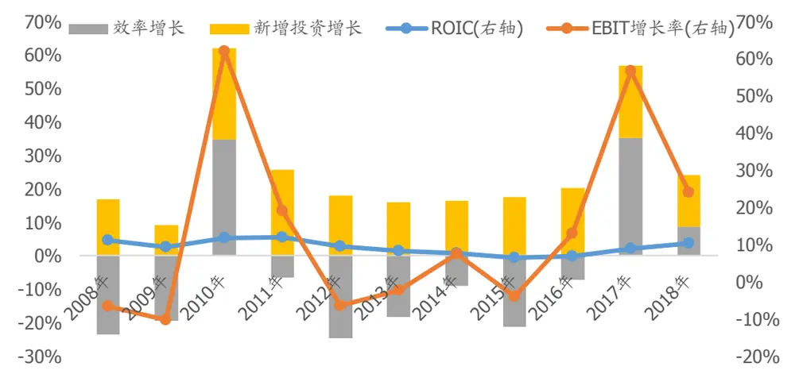
资料来源：Wind，国盛证券研究所

从过去 10年来看，新投资带来的增长为正，而投资效率方面，除了 2010年（地产调控和信贷紧缩迫使厂商调整库存）、2017~2018 年（去产能和去杠杆政策淘汰落后产能）效率增长为正，其他年份企业的投资效率增长均为负。换言之，2008~2009 年、2011~2016 年 A 股整体利润增长是由新投资扩张主导，“增量空间”成主要投资逻辑；2010年、2017年至今，A股的增长更多来自于效率的改善，“存量结构”成为投资的基调。这也从侧面解释了自2017年以来成长风格疲软的现象。

## 2.4.2 行业盈利增长分解

我们同样考察各行业的盈利增长来源，得到如下分解项：

图表18:行业盈利增长分解均值（除金融和综合板块）

|  |  | ROIC | EBIT增长率 | 效率增长 | 新增投资增长 |  |
| --- | --- | --- | --- | --- | --- | --- |
| 周期 | 汽车 | 10.63% | 11.76% | -3.08% | 14.84% |  |
|  | 基础化工 | 7.26% | 9.75% | -7.14% | 16.89% |  |
|  | 煤炭 | 12.84% | 35.82% | 19.69% | 16.13% |  |
|  | 建筑 | 11.53% | 20.06% | -5.01% | 25.07% |  |
|  | 建材 | 8.46% | 26.25% | 7.45% | 18.79% |  |
|  | 国防军工 | 7.90% | 13.54% | -5.89% | 19.44% |  |
|  | 电力设备 | 8.86% | 7.75% | -12.86% | 20.61% |  |
|  | 机械 | 8.61% | 4.65% | -13.08% | 17.74% |  |
|  | 有色金属 | 6.77% | 20.65% | -0.33% | 20.99% |  |
|  | 石油石化 | 6.22% | 12.00% | -7.36% | 19.36% |  |
|  | 电力及公用事业 | 6.33% | 20.44% | 1.84% | 18.60% |  |
|  | 钢铁 | 5.75% | -1.80% | -13.12% | 11.31% |  |
|  | 交通运输 | 7.40% | 13.23% | -1.23% | 14.46% |  |
|  | 消费 | 农林牧渔 | 6.67% | 1.11% | -13.32% | 14.44% |
|  |  | 食品饮料 | 15.80% | 6.72% | -6.07% | 12.79% |
|  |  | 餐饮旅游 | 10.91% | 14.14% | -1.37% | 15.52% |
|  |  | 家电 | 12.01% | 10.75% | -5.01% | 15.76% |
|  |  | 轻工制造 | 7.64% | 8.56% | -4.98% | 13.54% |
| 医药 |  | 13.94% | 16.06% | -3.91% | 19.97% |  |
| 商贸零售 |  | 10.83% | 5.90% | -12.83% | 18.73% |  |
| 纺织服装 |  | 8.52% | 7.82% | -9.46% | 17.27% |  |
| TMT | 通信 | 8.17% | 16.81% | -3.73% | 20.54% |  |
|  | 计算机 | 9.57% | 12.76% | -11.74% | 24.50% |  |
|  | 电子元器件 | 7.97% | 10.46% | -12.54% | 23.00% |  |
|  | 传媒 | 10.81% | 10.86% | -13.21% | 24.07% |  |
| 总计 | 9.26% | 12.62% | -5.54% | 18.16% |  |  |

资料来源：Wind，国盛证券研究所

历史上，周期性行业中煤炭、建材、有色、电力及公用事业和建筑行业的营业利润获得20%以上的增长，消费行业中医药、餐饮旅游、家电以及 TMT 行业的营业利润均获得10%以上的增长。从分解项来看，在周期性行业中，煤炭、建材和电力及公用事业（受今年行业周期上行以及淘汰落后产能政策影响）这三个行业的效率有明显改善；消费和TMT行业的经营效率整体下滑，利润的增长主要来自于新增投资增长。

这里再做一步说明，“投资效率”与我们常说的“效率”有些许区别，以 ROE 的提升为例，若是盈利增长驱动的投资效率提升，既可能来自于营收增长，也可能来自于成本削减，因此周期股受行业上行周期影响表现出的盈利增长也属于投资效率提升范畴。

## 3. 成长因子在组合中的应用

综上，我们在传统的业绩增长类因子：sales_yoy，op_yoy，np_yoy 的维度上，加入多维度在全市场测试表现较好的指标，包括投资回报率、规模增长和效率增长，综合如下：

图表19:成长类因子列表

| 类别 | 因子 |  | 计算方式 |
| --- | --- | --- | --- |
| 业绩增长 | 营收增长 | sales_yoy | 单季度营业收入同比 |
|  | 毛利润增长 | op_yoy | 单季度毛利润同比 |
|  | 净利润增长 | np_yoy | 单季度净利润同比 |
| 投资回报率 | 投入资本回报率 | roic | ebit/investment cap |
|  | 股权投资回报率 | roe | 净利润/净资产 |
| 边际投资回报率 | 边际投入资本回报率 | marginal_roic | Δ ebit/ ∆ investment cap |
|  | 边际股权回报率 | marginal_roe | ∆np/∆equity |
| 规模增长 | 总资产增长 | tot_assets_yoy | 总资产同比 |
|  | 总负债增长 | tot_liab_yoy | 总负债同比 |
| 效率提升 | 毛利率变动 | op_margin_delta | Δ单季度毛利率 |
|  | 经营利润率变动 | ebit_margin_delta | Δ单季度经营利润率 |
|  | 净利润率变动 | np_margin_delta | Δ单季度净利润率 |
|  | 总资产周转率变动 | totassets_trnv_delta | Δ单季度总资产周转率 |

资料来源：国盛证券研究所

## 3.1 成长类因子相关性

我们测算了成长类因子的相关性，所有因子均对 Barra 风格因子与行业因子正交处理。经营效率增长类因子、边际投资回报率因子与业绩增长类因子的相关性较高，其他因子的相关性较低。

图表20：成长因子相关性（剥离风格与行业）

|  |  | 业绩增长 |  | 经营效率增长 |  |  |  | 投资回报率 |  | 边际投资回报率 |  | 资产增长 |  |
| --- | --- | --- | --- | --- | --- | --- | --- | --- | --- | --- | --- | --- | --- |
|  | sales_yoy | op_yoy | np_yoy | op_margin_delta | ebit_margin_delta | np_margin_delta | totassets_trnv_delta | roic | roe | marginal_roic | marginal_roe | tot_assess_yoy | tot_liab_yoy |
| sales_yoy | 1.00 | 0.35 | 0.33 | 0.20 | 0.27 | 0.13 | 0.65 | 0.16 | 0.16 | 0.32 | 0.26 | 0.31 | 0.34 |
| op_yoy | 0.35 | 1.00 | 0.82 | 0.67 | 0.49 | 0.56 | 0.26 | 0.22 | 0.36 | 0.48 | 0.60 | 0.08 | 0.05 |
| np_yoy | 0.33 | 0.82 | 1.00 | 0.61 | 0.43 | 0.68 | 0.24 | 0.18 | 0.42 | 0.42 | 0.72 | 0.08 | 0.05 |
| op_margin_delta | 0.20 | 0.67 | 0.61 | 1.00 | 0.66 | 0.87 | 0.13 | 0.16 | 0.29 | 0.42 | 0.56 | 0.00 | -0.05 |
| ebit_margin_delta | 0.27 | 0.49 | 0.43 | 0.66 | 1.00 | 0.55 | 0.16 | 0.26 | 0.19 | 0.60 | 0.39 | 0.02 | 0.01 |
| np_margin_delta | 0.13 | 0.56 | 0.68 | 0.87 | 0.55 | 1.00 | 0.09 | 0.13 | 0.33 | 0.34 | 0.63 | -0.01 | -0.07 |
| totassets_trnv_delta | 0.65 | 0.26 | 0.24 | 0.13 | 0.16 | 0.09 | 1.00 | 0.11 | 0.12 | 0.31 | 0.25 | -0.17 | 0.01 |
| roic | 0.16 | 0.22 | 0.18 | 0.16 | 0.26 | 0.13 | 0.11 | 1.00 | 0.59 | 0.35 | 0.19 | 0.12 | 0.08 |
| roe | 0.16 | 0.36 | 0.42 | 0.29 | 0.19 | 0.33 | 0.12 | 0.59 | 1.00 | 0.26 | 0.38 | 0.11 | 0.07 |
| marginal_roic | 0.32 | 0.48 | 0.42 | 0.42 | 0.60 | 0.34 | 0.31 | 0.35 | 0.26 | 1.00 | 0.47 | 0.03 | 0.05 |
| marginal_roe | 0.26 | 0.60 | 0.72 | 0.56 | 0.39 | 0.63 | 0.25 | 0.19 | 0.38 | 0.47 | 1.00 | 0.01 | 0.01 |
| tot_assess_yoy | 0.31 | 0.08 | 0.08 | 0.00 | 0.02 | -0.01 | -0.17 | 0.12 | 0.11 | 0.03 | 0.01 | 1.00 | 0.67 |
| tot_liab_yoy | 0.34 | 0.05 | 0.05 | -0.05 | 0.01 | -0.07 | 0.01 | 0.08 | 0.07 | 0.05 | 0.01 | 0.67 | 1.00 |

资料来源：Wind，国盛证券研究所

## 3.2 残差因子检验

我们将各个因子对风格因子和行业因子中性化，考察残差在不同指数中的选股能力。

整体来看因子在不同指数域内相对风险模型能提供增量信息。沪深 300中营收增长和负债增长因子的增量较多；中证500中毛利率增长、边际投资回报率因子的增量较多；1000中业绩增长、投资回报率、边际投资回报率因子增量较多。

图表21：成长因子对风险模型中性化后残差分域检验

| hs300 |  |  | zz500 |  | zz1000 |  |
| --- | --- | --- | --- | --- | --- | --- |
|  | IC | ICIR | IC | ICIR | IC | ICIR |
| sales_yoy | 0.0384 | 1.64 | 0.0291 | 1.70 | 0.0280 | 2.18 |
| op_yoy | 0.0141 | 0.65 | 0.0376 | 2.28 | 0.0339 | 2.38 |
| np_yoy | 0.0085 | 0.38 | 0.0352 | 1.94 | 0.0338 | 2.29 |
| op_margin_delta | 0.0051 | 0.27 | 0.0326 | 2.23 | 0.0262 | 1.82 |
| ebit_margin_delta | 0.0105 | 0.57 | 0.0276 | 1.93 | 0.0278 | 2.05 |
| np_margin_delta | -0.0037 | -0.19 | 0.0286 | 1.84 | 0.0223 | 1.62 |
| totassets_trnv_delta | 0.0251 | 1.35 | 0.0262 | 1.71 | 0.0182 | 1.68 |
| roic | 0.0221 | 0.65 | 0.0250 | 1.13 | 0.0292 | 2.12 |
| roe | 0.0143 | 0.50 | 0.0342 | 1.62 | 0.0322 | 2.20 |
| marginal_roic | 0.0247 | 1.16 | 0.0437 | 2.95 | 0.0294 | 2.13 |
| marginal_roe | 0.0159 | 0.72 | 0.0439 | 2.85 | 0.0318 | 2.40 |
| tot_assess_yoy | 0.0215 | 0.86 | 0.0118 | 0.68 | 0.0171 | 1.20 |
| tot_liab_yoy | 0.0427 | 1.75 | 0.0145 | 0.85 | 0.0217 | 1.49 |

资料来源：Wind，国盛证券研究所

我们进一步考察不同维度的因子剥离业绩增长因子后的表现。由于业绩增长本身是经营效率增长的结果呈现，大类因子的信息本身包含在业绩增长因子中，而在剔除了业绩增长类因子后，投资回报率、边际投资回报率因子仍然能提供增量信息。

从不同指数域检验来看因子的表现也有所不同。沪深 300内的成分股属于市场上投资效率较高的标的，在投资效率上的增长空间有限，再者沪深300中金融股和地产股等高杠杆经营的企业权重较大，因此更注重扩大规模来拉动业绩增长；中证 500 和中证 1000的成分股的投资效率相对薄弱一些，因此我们会更加注重企业的边际投资回报率和整体的投资效率。

图表22：大类成长因子对业绩增长因子中性化后残差分域检验

|  | winda |  | hs300 |  | zz500 |  | zz1000 |  |
| --- | --- | --- | --- | --- | --- | --- | --- | --- |
|  | IC | ICIR | IC | ICIR | IC | ICIR | IC | ICIR |
| 经营效率增长 | 0.0053 | 0.64 | -0.0046 | -0.24 | 0.0129 | 0.89 | 0.0051 | 0.40 |
| 投资回报率 | 0.0200 | 1.65 | 0.0128 | 0.40 | 0.0199 | 0.90 | 0.0212 | 1.56 |
| 边际投资回报率 | 0.0183 | 2.90 | 0.0096 | 0.50 | 0.0298 | 2.08 | 0.0121 | 1.03 |
| 资产增长 | 0.0156 | 1.41 | 0.0305 | 1.25 | 0.0068 | 0.39 | 0.0137 | 0.94 |

资料来源：Wind，国盛证券研究所

我们也反向做了一次残差检验，我们发现，将业绩增长因子对其他几大类因子剥离后，所剩信息较少，即多维度因子所包含的信息能覆盖大部分业绩增长因子的信息，进一步说明多维度考虑业绩增长来源能更全面地反映企业的成长性。

图表23：业绩增长因子对大类成长因子中性化后残差分域检验

| winda |  |  | hs300 |  | zz500 |  | zz1000 |  |
| --- | --- | --- | --- | --- | --- | --- | --- | --- |
|  | IC | ICIR | IC | ICIR | IC | ICIR | IC | ICIR |
| 业绩增长 | 0.0334 | 3.33 | 0.0245 | 1.03 | 0.0415 | 2.33 | 0.0388 | 2.61 |
| 业绩增长残差 | 0.0084 | 1.08 | 0.0061 | 0.32 | 0.0037 | 0.24 | 0.0131 | 1.05 |

资料来源：Wind，国盛证券研究所

## 3.3 业绩增长与投资回报率信号在不同经济环境下的强弱性

我们在因子测试中发现，虽然大多数成长类因子具有选股效果，但在不同时间区间内因子的选股能力有强有弱。其中，业绩增长因子易受前期基数较低的影响，增长率越高，未来得以延续的难度越大，而投资回报率因子更注重业绩的质量，因此相对而言业绩增长因子比投资回报率因子更加激进。我们以这两类因子为代表，分别将小类因子等权合成 alpha信号，并测试其在中证 500指数增强型组合中的表现。

从测试结果来看，业绩增长信号在2014年到2016年整体比投资回报率信号的表现要强，而在 2010年、2017年至2019年则相反。我们认为，首先在 2014年至 2015年，A股企业的基本面整体下滑，而市场经历了一波大牛市，股市与企业基本面之间存在一定脱节；其次当时正处于外延式并购爆发时期，较多公司进行并购且在短期内实现业绩的增长，在激进的投资情绪下，市场对业绩增长的股票马上给予反馈而较少区分业绩质量，因此业绩增长类因子的表现更为强势；从 2016年到2019年，经济景气度在前半程回暖后又回落，去杠杆政策致使企业盈利增速疲软，市场更注重企业的内生性增长，因此投资回报率因子的表现比业绩增长类因子表现更好。

图表24：投资回报率信号与业绩增长信号策略超额收益与相对净值（右轴）
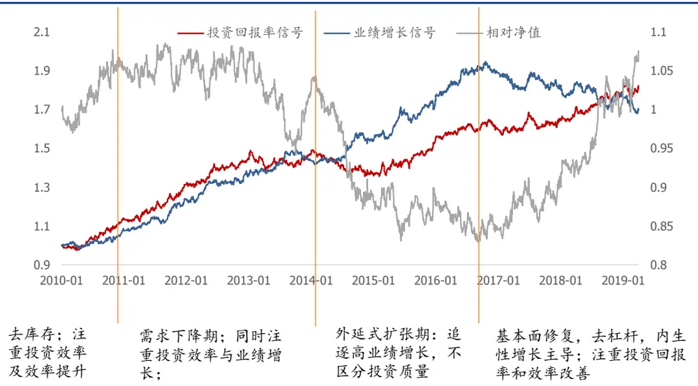
资料来源：Wind，国盛证券研究所

## 3.4 成长增强策略

我们考察利用成长因子对指数增强组合是否有贡献。我们根据上述几个维度分别合成相应成长因子，分别用等权和过去 12 个月的 ICIR 加权合成 alpha 信号，控制组合在除成长以外其他风格和行业上的暴露，测试其相对中证500是否有超额收益，即构建成长增强组合。月频调仓，组合优化形式如下：

$$
\begin{array}{rl}&{\qquad\mathrm{max~w^{T}{alpha}~}}\\&{\mathrm{s.t.Tracking~error}\leq5\%}\\&{\qquad\bigl|{\bf w}^{\mathrm{T}}\mathrm{Style_{i}}\bigr|\leq0.05}\\&{\qquad\bigl|{\bf w}^{\mathrm{T}}\mathrm{Industry_{j}}\bigr|\leq0.05}\\&{\qquad0\leq\mathrm{w_{n}}+{\bf w}_{\mathrm{bench}}\leq0.1}\\&{\qquad\mathrm{sum}({\bf w}_{\mathrm{n}}+{\bf w}_{\mathrm{bench}})=1}\end{array}
$$

成长增强策略整体表现比仅关注业绩增速的策略在年化化收益上提升 5.45%，信息比从1.02 提升至 1.97。

图表25：成长增强型组合净值走势
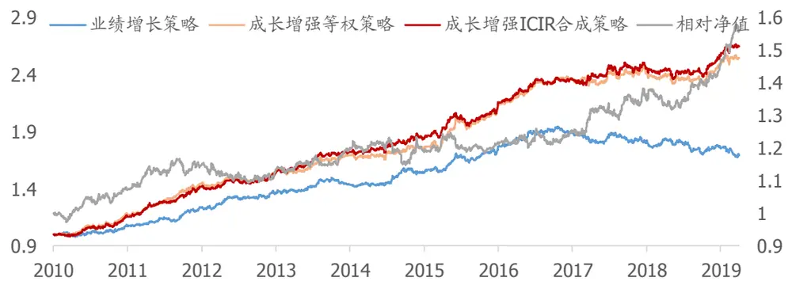
资料来源：Wind，国盛证券研究所

图表26:成长增强策略绩效对比

| 业绩增强策略 |  |  |  |  |  | 成长增强 ICIR 合成策略 |  |  |  |
| --- | --- | --- | --- | --- | --- | --- | --- | --- | --- |
|  | 年化收益 | 年化波动 | IR | 最大回撤 | 年化收益 | 年化波动 |  | IR | 最大回撤 |
| 2010 | 5.44% | 6.29% | 0.87 | 3.63% | 13.61% | 6.60% |  | 2.06 | 2.87% |
| 2011 | 15.34% | 5.58% | 2.75 | 3.13% | 23.28% | 6.35% |  | 3.67 | 2.58% |
| 2012 | 13.26% | 6.18% | 2.14 | 2.40% | 9.67% |  | 5.28% | 1.83 | 2.96% |
| 2013 | 6.81% | 6.15% | 1.11 | 3.56% | 15.39% |  | 5.78% | 2.66 | 2.98% |
| 2014 | 7.08% | 5.61% | 1.26 | 3.45% | 8.46% |  | 6.01% | 1.41 | 2.82% |
| 2015 | 12.94% | 5.43% | 2.38 | 4.75% | 12.75% |  | 5.83% | 2.19 | 5.43% |
| 2016 | 9.68% | 6.02% | 1.61 | 2.87% | 12.99% |  | 4.97% | 2.61 | 2.14% |
| 2017 | -2.46% | 6.10% | -0.40 | 5.75% | 6.11% |  | 6.13% | 1.00 | 3.52% |
| 2018 | -5.67% | 5.89% | -0.96 | 8.11% | 0.65% |  | 5.70% | 0.11 | 5.74% |
| 2019 | -10.24% | 6.40% | -1.60 | 6.05% | 19.75% |  | 5.42% | 3.64 | 2.10% |
| total | 6.09% | 5.95% | 1.02 | 13.78% |  | 11.54% | 5.86% | 1.97 | 5.74% |

资料来源：Wind，国盛证券研究所

## 总结

企业业绩增长主要来自三个维度：投资回报率、新投资规模和投资效率提升；处于企业生命周期的成长期的企业，盈利增长主要来自于新投资；处于企业生命周期的成熟期的企业想要获得盈利增长，最快的方式是提高效率，一旦低效率问题得到解决，则需要寻找新投资以刺激业绩增长。

我们尝试从三个维度寻找成长因子，刻画企业的成长性，包括：

1. 投资回报率：roic，roe；

2. 新投资规模：资产与负债同比；

3. 投资效率提升：边际回报率，利润率和周转率变动等，以及研发、广告费用类能刺激未来业绩增长的支出等。

从截面上来看，大部分成长因子对股票收益有较好的区分度，研发广告费用类因子在部分行业也有较好的选股效果；在控制风格和行业之后，成长因子能提供 alpha 信息；相对于常见的业绩增长类因子，投资回报率、边际投资回报率和资产增长类因子仍然能提供新的增量；从时间序列上来看，在外延式增长占主导时期（2014~2016），市场情绪较为激进，追逐业绩增长，并不对成长的质量严格评判；而内生增长占主导时期（如 2010年，2017~2018年），市场偏向保守，更偏好企业内生增长和效率提升。

利用多维度的成长性因子构建中证 500 成长增强策略，相比于基准能提供 11.54%的年化收益，信息比 1.97；相比于单纯用业绩增长因子策略，年化收益提高 5.45%，信息比提高 0.95。

## 参考文献

[1] Damodaran A. The origins of growth: past growth, predicted growth and fundamental growth[J]. Predicted Growth and Fundamental Growth (June 14, 2008), 2008.

[2] Damodaran A. Return on capital (ROC), return on invested capital (ROIC) and return on equity (ROE): Measurement and implications[J]. Return on Invested Capital (ROIC) and Return on Equity (ROE): Measurement and Implications (July 2007), 2007.

[3] Chan L K C, Karceski J, Lakonishok J, et al. Balance sheet growth and the predictability of stock returns[J]. University of Illinois at Urbana-Champaign working paper, 2008.

[4] Fama E F, French K R. The anatomy of value and growth stock returns[J]. Financial Analysts Journal, 2007, 63(6): 44-54.

[5] Chan L K C, Lakonishok J, Sougiannis T. The stock market valuation of research and development expenditures[J]. The Journal of Finance, 2001, 56(6): 2431-2456.

[6] Mohanram P S . Separating Winners from Losers among LowBook-to-Market Stocks using Financial Statement Analysis[J]. Review of Accounting Studies, 2005, 10(2-3):133-170.

## 风险提示

以上结论均基于历史数据和统计模型测算，如果未来市场环境发生明显改变，不排除因子失效的可能。

## 免责声明

国盛证券有限责任公司（以下简称“本公司”）具有中国证监会许可的证券投资咨询业务资格。本报告仅供本公司的客户使用。本公司不会因接收人收到本报告而视其为客户。在任何情况下，本公司不对任何人因使用本报告中的任何内容所引致的任何损失负任何责任。

本报告的信息均来源于本公司认为可信的公开资料，但本公司及其研究人员对该等信息的准确性及完整性不作任何保证。本报告中的资料、意见及预测仅反映本公司于发布本报告当日的判断，可能会随时调整。在不同时期，本公司可发出与本报告所载资料、意见及推测不一致的报告。本公司不保证本报告所含信息及资料保持在最新状态，对本报告所含信息可在不发出通知的情形下做出修改，投资者应当自行关注相应的更新或修改。

本公司力求报告内容客观、公正，但本报告所载的资料、工具、意见、信息及推测只提供给客户作参考之用，不构成任何投资、法律、会计或税务的最终操作建议,本公司不就报告中的内容对最终操作建议做出任何担保。本报告中所指的投资及服务可能不适合个别客户，不构成客户私人咨询建议。投资者应当充分考虑自身特定状况，并完整理解和使用本报告内容，不应视本报告为做出投资决策的唯一因素。

投资者应注意，在法律许可的情况下，本公司及其本公司的关联机构可能会持有本报告中涉及的公司所发行的证券并进行交易，也可能为这些公司正在提供或争取提供投资银行、财务顾问和金融产品等各种金融服务。

本报告版权归“国盛证券有限责任公司”所有。未经事先本公司书面授权，任何机构或个人不得对本报告进行任何形式的发布、复制。任何机构或个人如引用、刊发本报告，需注明出处为“国盛证券研究所”，且不得对本报告进行有悖原意的删节或修改。

## 分析师声明

本报告署名分析师在此声明：我们具有中国证券业协会授予的证券投资咨询执业资格或相当的专业胜任能力，本报告所表述的任何观点均精准地反映了我们对标的证券和发行人的个人看法，结论不受任何第三方的授意或影响。我们所得报酬的任何部分无论是在过去、现在及将来均不会与本报告中的具体投资建议或观点有直接或间接联系。

投资评级说明

| 投资建议的评级标准 |  | 评级 | 说明 |
| --- | --- | --- | --- |
| 评级标准为报告发布日后的6个月内公司股价（或行业指数）相对同期基准指数的相对市场表现。其中A股市场以沪深300指数为基准；新三板市场以三板成指（针对协议转让标的）或三板做市指数（针对做市转让标的）为基准；香港市场以摩根士丹利中国指数为基准，美股市场以标普500指数或纳斯达克综合指数为基准。 | 股票评级 | 买入 | 相对同期基准指数涨幅在15%以上 |
|  |  | 增持 | 相对同期基准指数涨幅在 5%~15%之间 |
|  |  | 持有 | 相对同期基准指数涨幅在-5%~+5%之间 |
|  |  | 减持 | 相对同期基准指数跌幅在 5%以上 |
|  | 行业评级 | 增持 | 相对同期基准指数涨幅在10%以上 |
|  |  | 中性 | 相对同期基准指数涨幅在-10%~+10%之间 |
|  |  | 减持 | 相对同期基准指数跌幅在10%以上 |

## 国盛证券研究所

北京

地址：北京市西城区锦什坊街 35号南楼

上海

地址：上海市浦明路 868号保利 One56 10 层

邮编：100033

邮编：200120

传真：010-57671718

电话：021-38934111

邮箱：gsresearch@gszq.com

邮箱：gsresearch@gszq.com

南昌

深圳

地址：南昌市红谷滩新区凤凰中大道 1115号北京银行大厦

地址：深圳市福田区益田路 5033 号平安金融中心 101层

邮编：330038

传真：0791-86281485

邮编：518033

邮箱：gsresearch@gszq.com

邮箱：gsresearch@gszq.com