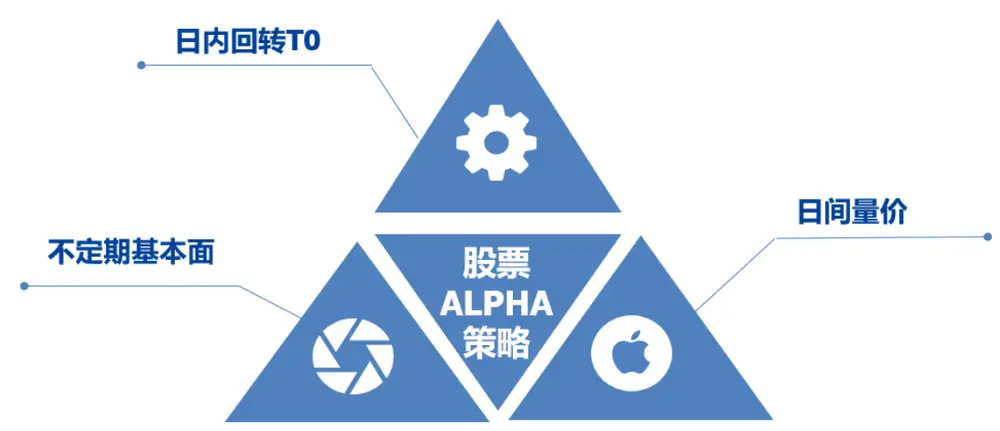
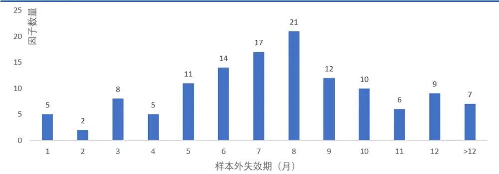
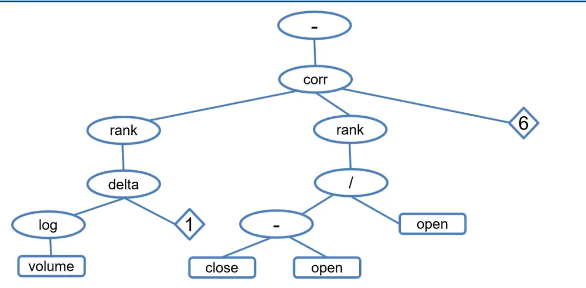
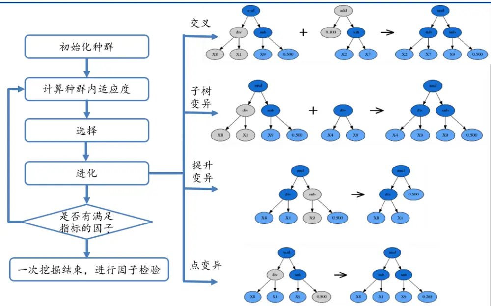
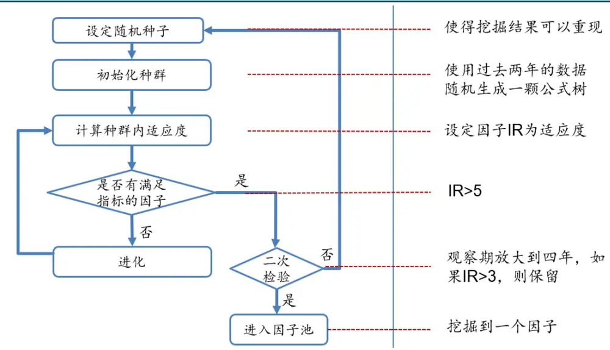
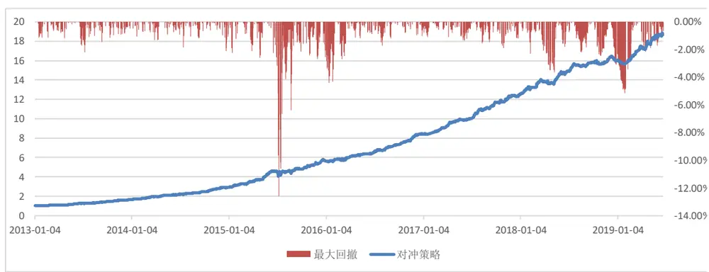

# 量化专题报告

## 多因子系列之八：日间量价模型研究

日间量价模型是独立于低频多因子模型的策略体系。日间量价模型基于 T+1的换仓频率，通过量价因子形成对短期收益率的预测，是一种高换手、高频率、低容量的策略。本篇报告我们将从模型特性、因子体系、组合构建三方面展开，为投资者介绍模型的细节，尤其是和低频多因子模型存在差异的关键节点。

日间量价模型已具较大市场规模，快速高效地迭代因子成为重中之重。我们经调查研究发现，目前该模型的因子来源主要包括交易逻辑和算法挖掘两种。本文我们会介绍使用遗传规划算法进行 T+1因子挖掘的过程。另外，我们还专门提到因子挖掘过程中要注意因子的中性化处理，这部分细节直接关系到因子挖掘的成败。

使用遗传规划算法构建日间量价因子体系。我们通过“因子挖掘器”的流程图介绍了挖掘全过程，在该过程中，最重要的方面是适应度函数的选择，以及在挖掘过程内部进行因子中性化处理。目前市场上有很多成熟的软件包可以支持遗传规划的各类算法操作，其中 deap 包可以支持多种数据结构。使用遗传规划进行挖掘核心的步骤是合法因子树的生成与检验。我们通过该方法启发式地搜索了约 15万个因子，最后得到了 127个两两正交的有效因子。如投资者对因子表达式感兴趣，可联系国盛金工团队获取。

在构建组合时，日间量价模型与低频多因子模型有着较大的区别。其中最重要的区别是组合优化的形式和回测中的冲击成本问题，我们修改了这些细节以适应更加高频、高换手的日间量价策略。同时，在不考虑策略容量情况下，我们发现日间量价模型能够提供非常稳定的超额收益，信息比率高达6以上。然而，随着规模的增加，模型逐渐失效。可见日间量价模型适合小资金低成本运作。

风险提示：量化专题报告中的观点基于历史统计与量化模型，存在历史规律与量化模型失效的风险。

## 作者

分析师 殷明

执业证书编号：S0680518120001

邮箱：yinming@gszq.com

分析师 刘富兵

执业证书编号：S0680518030007

邮箱：liufubing@gszq.com

## 相关研究

1、《量化周报：继续看多市场》2019-10-13

2、《量化周报：持股过节》2019-09-29

3、《量化周报：调整不改上行趋势》2019-09-22

4、《量化周报：市场上行趋势继续》2019-09-15

5、《量化专题报告：资产配置 vs 风险配置：打造一个系统化的宏观风险配置框架》2019-09-11

## 1 前言

多因子模型给投资者提供了一套评价公司的综合指标体系，从公司基本情况、财务状况、估值水平、投资者预期、股票特性等多个角度描述了公司的投资价值。一般来说，公司的基本面状况反应了公司股票的长期走向和趋势，但是短期的价格则受到更多因素的影响，其中很重要的一方面就是交易因素。在之前的多因子系列报告中，我们更多的是研究低频（即月频或者季频调仓）多因子体系，所以我们把更多注意力集中在如何通过基本面指标构造有效因子，描述公司的基本面状况。然而，如果仅仅只关注个股长期走势，则会损失不少短期的价格波动收益，而这正是量化模型最擅长的地方，毕竟，量化模型需要足够的数据支撑，越短期的预测会给模型提供更多有效的独立数据。因此，我们有必要对更高频换仓的多因子模型进行研究。

对于股票高频模型的研究主要可以分为两大类：日间换仓的ALPHA 模型和日内T0回转的交易模型。考虑到后者对于盘口等信息更加敏感，并且模型需要在实盘中进行调试，我们在本文中暂且不研究这类模型，而是把主要精力放在日频换仓的ALPHA模型上，通过实例来展示模型的方方面面。另外，由于日频模型对计算资源较为依赖，我们会在构建模型过程中根据实际的硬件资源做一些调整，以在不损失主要信息的前提下尽力还原模型的细节，以帮助投资者更好地理解模型是如何运作的。

本篇报告的结构如下：第二章是日间ALPHA模型基本情况和发展现状的介绍；第三章我们主要阐述如何构建日间ALPHA模型的因子体系；第四章则介绍如何有效地将这些因子结合起来形成投资组合；最后一章是对全文核心结论的总结。在每篇章节中，我们都会专门介绍高频日间ALPHA模型和传统低频基本面模型的关键区别，这些区别决定了简单将低频模型直接应用到高频模型中是不可行的。

## 2 日间量价模型简介

## 2.1 股票 ALPHA 模型的分解

日间量价模型很少会被单独使用，因为该模型受规模和流动性影响较大，这一点我们在后文会通过一些实验让读者有一个更清晰的认识。正是因为这个原因，一般来说该模型会和传统的低频基本面模型，日内回转交易模型等一起使用。为了更好地对该模型进行研究，我们有必要对股票ALPHA模型进行分解。

如图 1所示，一般来说，股票ALPHA模型可以分解为三部分：不定期基本面模型、日间量价模型、日内回转模型。其中，不定期基本面模型主要是基于公司的基本面状况进行组合换仓的，因此换仓频率和公司财报及其他公开报告的发布时间紧密相关，一般换手率较低；日间量价模型更多的是使用股票的量价信息，而量价信息是随着股票在市场上的交易不断产生的，因此信息更迭更快，从而该模型换仓更频繁，换手率更高，也即所谓的 T+1 交易；最后，日内回转模型又称为T+0模型，投资者根据股票日内的价格、盘口、挂单等信息做出投资决策，在有底仓的前提下，在当日进行买入卖出。三部分共同构成了当下股票ALPHA模型的主体。我们从多因子系列报告第一篇开始，就主要讨论了低频基本面多因子模型的细节，这部分正好是第一部分不定期基本面模型的主要实现方式；考虑到日内 T+0策略非常依赖实盘的测试，因此我们本文也暂且不研究；剩下的就是日间量价ALPHA模型，也是从股票ALPHA模型中剥离出来的独立的一部分，即本文的研究重点。

图表1：股票ALPHA模型的分解

资料来源：国盛证券研究所

如上文所述，本篇报告中使用的主要因子都是量价因子，因为量价信息最适应 T+1换仓模型。在我们多因子模型系列的后续报告中，我们会进一步讨论日间ALPHA模型如何和传统低频模型进行有效结合。

## 2.2 日间 ALPHA 模型发展现状

日间ALPHA模型被广泛运用在海外的对冲基金和国内的各类投资机构中。为了让读者进一步了解该模型的一些基本情况，我们对海内外相关的文献进行了整理，同时对海内外知名的投资机构进行了调研，得到了关于该模型的一些基本结论。下面，我们将分别从学术论文研究和国内主要投资机构角度来一一介绍。

## 2.2.1 学术研究

日间量价模型被国内投资者所熟知要归功于Zura Kakushadze于2015年9月发布的《101Formulaic Alphas》一文，文章中列出了 World Quant（世坤投资）使用的 101 个量价因子，并声称其中很多因子在论文发布日还在被使用，这引起了国内投资者对量价因子研究的热潮。此后，Kakushadze 又陆续发布了很多报告，其中，《Decoding stock market withquant alphas》更是较为详尽地阐述了因子表达式生成的细节，《Performance v. Turnover:A Story by 4,000 Alphas》则通过实证分析描述了组合业绩和换手率的关系，《How tocombine a billion alphas》讨论了因子组合的相关问题，这些文章为后续高频量价的研究提供了核心思路。其实，除了投资者广为熟悉的 101 alpha 外，海外还有很多学术文献和投资机构都发布了类似的论文和研究报告，并从不同角度对量价因子的使用进行了阐述。

Thomas Wiecki 在 《 All That Glitters Is Not Gold: Comparing Backtest andOut-of-Sample Performance on a Large Cohort of Trading Algorithms》一文中详细讨论了使用过去数据进行因子挖掘可能面临的过拟合问题；Jifeng Sun等人在《Using machinelearning for cryptocurrency trading》一文中使用 101 alphas 中的因子作为已知输入，通过随机森林模型进一步提高因子预测能力；Chi Chen 在《Investment Behaviors CanTell What Inside: Exploring Stock Intrinsic Properties for Stock Trend Prediction》中发现交易行为可以抽取出对股票价格有预测能力的短期特征等等。

总体而言，海内外主要学术研究将精力集中在论证短期特征的有效性以及这些特征的抽取方式研究上，主要结合了传统的数理统计模型和相对较为复杂的机器学习模型，总体来说更偏理论推导和实证检验，对模型如何帮助投资者进行有效投资阐述不多。但从这些论文中我们已经可以看到高频特征对日间换仓模型的指导意义。

## 2.2.2 业界应用

国内方面，自股指期货开放以来，越来越多的投资机构使用多头端的量价模型和空头端的股指期货进行多空对冲进行套利获取稳定收益。考虑到该模型的高频属性以及对交易成本的极度敏感性，该模型被广泛使用在自营资金的管理和私募基金的投资中。据私募排排网数据，截至 9月底，已经有超过 5家量化私募管理规模超过了百亿大关，而高频量价模型在大部分私募管理机构的成长过程中都起到了重要作用。

为了进一步展示股票ALPHA模型在私募投资机构在中的作用，笔者从国内几大数据提供商查询了前 20 家量化私募的产品情况，并通过不同数据源对比进行了筛选和排查，对策略规模进行了估算。以2018年全年均值来说，该策略的规模超过 1000亿，如果假设策略换手率约为 50%（叠加基本面策略和日内回转策略），占 A 股全年日平均交易量的近 20%，这说明该策略提供了市场相当大一部分流动性，同时也说明该策略被广泛应用在国内各大投资机构中。

从另一个角度看，量价模型由于都是对股票短期收益的预测，大部分情况下策略获取的是股票短期定价偏差的收益，而这部分收益更多来自于市场上投资者的非理性行为。然而，随着该策略的市场规模逐步增加，短期定价偏差收益缩窄，在提高了市场有效性的同时，策略目前已经具有一定的拥挤现象。

我们通过调研发现，目前大部分投资机构在构建日间量价模型时还是基于传统的多因子选股体系，然而，和之前几篇多因子系列报告中描述的模型不同的是，日间量价多因子模型可容纳的因子数量更多，交易更加频繁，策略的收益也更加可观。下面我们就日间量价多因子模型中的关键问题进行阐述，这些问题对我们构建模型尤其重要。

## 2.3 日间量价多因子模型中的关键问题

由于我们在多因子系列报告的前几篇中已经就低频模型的核心内容进行了阐述，因此本篇报告不再赘述和多因子模型本身相关的细节，我们会就模型构建中的关键问题进行分别阐述。主要分为以下几个方面：

1. 日间量价因子的主要来源是什么？如何找到大量有效的因子？

2. 既然是基于多因子模型，必然涉及风格因子和ALPHA因子。在构建模型过程中，风格因子是怎样设定的？ALPHA 因子是否要做正交化处理？

3. 日间量价因子和低频基本面因子的区别是什么？有什么显著的特点？

4. 如何避免因子验证的过拟合问题？因子失效后怎么办？

以上问题是模型的核心问题，其中有些问题有多种处理方式，未必有标准答案，我们会介绍我们在构建模型时选用的方案，以及做出这样选择的原因。

## 2.3.1日间量价因子来源

我们研究发现，目前主流的量价因子来源包括两类，即交易逻辑和算法挖掘。两者由于因子产生的方式不同，各自具有一定的优势和不足。

1.交易逻辑。该类因子来源于海内外学术论文、机构研究报告等，其因子有效的原因是因为存在交易行为导致的短期定价偏差可以量化表示，典型因子如反转因子、路径动量因子、收盘 30分钟异象因子等。这类因子好处是逻辑清晰，具有较强的经济学含义，或者有学术理论作为支撑。缺点是这种经过论证的因子较难找到，即使在海外有效的很多因子未必在国内有效，而且大部分因子在论文发出后失效严重。

2.算法挖掘。近些年越来越多的投资机构开始使用算法进行挖掘，例如遗传规划、随机森林、神经网络等。该方法好处是简单易行，只要有挖掘算法和足够的硬件资源支持，就可以源源不断产生因子。缺点是因子逻辑性不强，有过拟合的可能。

两类因子来源的比较如表1所示。

图表2：不同因子来源比较

| 交易逻辑 |  | 算法挖掘 |
| --- | --- | --- |
| 因子来源 | 海内外学术论文、机构研究报告 | 通过算法挖掘生成 |
| 因子含义 | 交易行为异象 | 无显著含义或者较难解释 |
| 因子数量 | 相对有限 | 数量众多 |
| 泛化能力 | 较强 | 容易过拟合，需要进行控制 |
| 迭代能力 | 较难迭代，新因子产生较难 | 可以通过优化挖掘算法不断迭代 |
| 资源依赖 | 几乎不依赖于硬件资源 | 极度依赖硬件资源 |

资料来源：国盛证券研究所

本文在做日间量价因子研究的过程中使用算法挖掘的方式来寻找有效因子。我们通过算法挖掘测试了超过 150000个因子，最终挖掘出 127个有效因子，虽然因子数量不多，但是所有这些因子都是两两正交的，即两两相关性均为 0，且在观察期（过去四年）的因子 IR均大于5。

## 2.3.2因子正交化问题

日间ALPHA模型的本质还是基于多因子模型：

$$
r_{n}=\sum_{i}X_{ni}f_{i}+\sum_{s}X_{ns}f_{s}+u_{n},
$$

其中 $X_{ni}$ 是风格因子， $X_{ns}$ 是ALPHA 因子。风格因子一般使用能够解释选股域主要风格且不易判断方向的因子构成，例如本文在构建因子体系过程中使用 BarraCNE5所有风格因子；ALPHA 因子则使用希望主动暴露的具有超额收益的因子构成，这里即为我们挖掘到的所有有效因子。那么，这里有两个问题：1.我们挖掘到的这些ALPHA因子是否要和风格因子进行中性化处理？2.这些ALPHA 因子之间是否要做正交处理？

关于这两个问题，目前学术研究并没有统一的答案。我们这里使用的方式是所有ALPHA因子对风格因子全部线性正交，所有ALPHA因子之间则按照因子挖掘顺序线性正交。这样做的原因主要是基于两个假设：

假设一：无论是我们自身，还是挖掘出来的ALPHA因子，都没有稳定的风格因子择时的能力；

假设二：我们对ALPHA因子本身没有太多理解，对其做正交操作不损失因子逻辑。

关于这两个假设，我们可以稍作展开。关于第一个假设，我们挖掘出来的量价因子缺失或多或少带有一些风格特征，而且甚至可能在样本内这些风格对因子收益有稳定的增强，但这并不代表因子就具备了稳定的样本外风格择时能力，毕竟我们的样本内时间很短，在这么短时间内风格因子的切换次数很少，并不具备统计显著性。因此，我们更倾向于不做这种冒险，单纯获取因子的ALPHA 收益。关于第二个假设，我们在之前的多因子系列中已经提到，对因子进行正交化会改变因子截面特征，使得原来较为清晰的因子逻辑变得不再清晰，不利于我们理解所要投资的因子。然而，在日间量价模型中，一来由于因子大部分都是通过挖掘得到，本身就不具备很明显的因子逻辑，二来由于因子数量众多，交易频率更快，我们更依赖于因子的胜率而非逻辑，因此，在这样的模型中，正交化损失因子逻辑问题也就无足轻重了。

由于我们在进行因子挖掘时因子的产生是有先后顺序的，因此，在本文的场景中，顺序线性正交是最好的方式，即对于挖掘到的第 s+1个因子，将其对所有风格因子和前s个因子进行线性正交：

$$
X_{s+1}=\sum_{i}X_{ni}f_{i}+\sum_{s}X_{ns}f_{s}+u_{ni}
$$

其中 $X_{ni}$ 是风格因子， $X_{ns}$ 是s个已经挖掘到的ALPHA因子， $X_{s+1}$ 是原始因子截面， $u_{n}$ 是正交之后我们要求的因子残差截面。

本例中，所有因子一起正交的方式，例如对称正交等，不适用于该环境。因为我们的因子库是动态因子库，使用对称正交会使得后面挖掘产生的新因子对之前的因子产生影响。

## 2.3.3日间量价因子的特点

上文提到，我们挖掘出 127 个有效因子，所有这些因子两两相关性均为 0，且在观察期因子 IR均大于5。关于上述因子特点，我们需要做一些解释。

在构建日间量价因子时，还有一种常见的做法是先不做正交化，直接生成成千上万个 IR很高的因子，再通过一些非线性模型（例如机器学习算法）来进行收益率的预测。由于这种方式对数据的处理要求很高，而且非线性模型更加复杂。为了简单起见，本文暂且不讨论这些复杂的模型，还是秉承之前的系列报告，在线性模型体系下构建策略。因此，我们正交化之后的因子数量虽然不多，但其实是从更多的有效因子中筛选得到的，这和直接先把所有因子生产好的做法本质是类似的。

## 2.3.4因子的过拟合问题及样本外有效性

通过挖掘方法生成因子最容易被质疑的一点就是过拟合问题。学术上已经有很多类似的研究，但在实践中我们还是需要通过一些方法来避免过拟合。在本篇报告中，我们主要采取两种方法避免过拟合，即传统的验证集方法和样本外快速滚动方法。

验证集方法。为了避免过拟合，我们采取两步测试的方法。首先，在因子挖掘过程中，我们使用过去两年的数据进行样本内挖掘；然后，我们将观察期放大到过去四年，观察挖掘到的因子在四年内 IR是否显著降低，如果是则丢弃该因子，否则纳入因子库。通过该方法，我们可以将一部分样本内过拟合的因子剔除。

样本外快速滚动方法。我们测试了挖掘出的 ALPHA 因子的样本外有效期，如下图所示。其中，有效期的含义是从因子挖掘时间开始，到过去两年内 IR 首次从大于 5 降到 5 以下的时间点为结束之间的时间。从图中不难看出，大部分因子的有效期为 6-8 个月，因此，我们可以每半年进行一次因子库的完全轮动，即抛弃原来所有因子，加入最近半年的新数据重新挖掘因子。实际上，在很多投资机构中，这种轮动的时间会更快，甚至达到每个月或者每天迭代。考虑到我们的计算资源有限，目前我们从测试的 15 万个因子中挖掘出 127个因子约需耗时2个月，因此无法做到很高频率的迭代，这里使用简单的半年迭代方式进行模拟。

图表3：样本外有效期

资料来源：国盛证券研究所,Wind

本章我们针对日间量价模型的关键问题进行了探讨，下面我们将分两个章节分别介绍因子挖掘的过程和组合对这些因子进行有效组合。

## 3 日间量价模型因子体系

本章我们给读者展现日间量价模型因子体系的构建细节，其核心是通过算法来进行因子挖掘。一般来说，因子挖掘方法有遗传规划、随机森林、神经网络等多种方法，本文介绍其中最简单的一种——使用遗传规划方法进行算法挖掘。

## 3.1 因子表达式和公式树

因子的表达方式很多，其中最简单的就是直接写出因子表达式，并且通过因子表达式计算出因子截面。因此，因子的挖掘问题其实就是因子表达式的生成问题。由于因子表达式必须是可以正确计算的，因此一个有效的因子除了对应的因子截面 IR 要足够高以外，一个大的前提是因子表达式必须是合法的。如何生成一个合法的表达式呢？我们可以将因子看成一棵“公式树”，生成一棵合法的公式树则可以对应一个合法的因子。例如，以下因子

$$
-I^{*}corr(rank(delta(log(volume),I)),rank((close-open)/open),6)
$$

对应的公式树即为下图所示：

图表4：公式树示意

资料来源：国盛证券研究所

可以看到，公式树和因子表达式是一一对应的关系，我们可以通过将公式树自下而上加括号写出来来得到因子表达式。现在，为了得到这棵树，我们还需要指定树的结构以及树上每个节点的内容。

为了公式树不会生长的过于复杂，本文中我们限制树的最大层数不超过 10 层，并且是非完全树。非完全树的含义是指树的生成未必要延伸到叶子节点，如果树的 IR已经很高，那么直接在中间截断也是可以的。这些设定都是为了使得树的生长尽量简单，不至于引入过于复杂的形式。

一旦规定树的基本参数（层数，是否完全树），则树的框架就确定了，下面只需要在树中填充算子和数据即可。那么，公式树的节点包含哪些内容呢？从上图例子中不难看出，公式树包括三类节点：

图表5：公式树的三类节点

资料来源：国盛证券研究所

其中，算子节点使用的算子如下图所示：

图表6:算子列表

| 计算符号 | 含义 |
| --- | --- |
| rank(A) | 截面排序 |
| max(a, b),min(a, b) | 最大值、最小值 |
| delay(A, n) | 过去n 天的数值 |
| stddev(A, n) | 过去n 天标准差 |
| corr(A, B, n) | 过去 n 天相关系数 |
| delta(A, n) | 当日值-过去n 天值 |
| vadd(A,B),vsub(A,B) | 矩阵加减 |
| vmul(A,B),vdiv(A,B) | 矩阵乘除 |
| log(A) | 自然对数 |
| abs(A) | 绝对值 |
| prod(A, n) | 过去n天累乘 |
| wma(A, n, m) | 加权平均，alpha 参数为 n/m |
| vneg(A) | 相反数 |
| sign(A) | 符号函数 |
| decay_linear(A, d) | 计算移动平均加权 |
| A?B:C | 如果 A，则 B，否则 C |
| cov(A,B,n) | A,B 过去 n 天协方差 |
| ts_sum(A, n) | 过去 n 天求和 |
| sma(A, n) | 过去n 天均值 |
| ts_rank(A, n) | 过去 n 天排序 |
| ts_min(A, n) | 过去n 天的最小值 |
| ts_max(A, n) | 过去n 天的最大值 |
| mean2(a,b) | (a+b)/2 |
| mean3(a,b,c) | (a+b+c)/3 |
| argmax(A, n) | 过去n 天最大值序号 |
| argmin(A, n) | 过去 n天最小值序号 |
| clear_by_cond(A, B, C) | 如果 A<B，则 0，否则C |
| power(A,B) | A^B |
| if_then_else(A,B,C,D) | 如果 A<B，则C，否则 D |
| itself(A) | 返回自身A |

资料来源：国盛证券研究所

数据则包含日频的以下数据：

最高价：high

开盘价：open

最低价：low

收盘价：close

VWAP 价：vwap

成交量：volume

常数项则是从 1~10之间随机生成，也就是说我们算子中的参数不超过 10，即最多向前看十天的信息。

## 3.2 公式树的检验

一旦公式树唯一确定下来，则因子截面也唯一确定，下面就可以对因子表现进行检验。其步骤是：

1. 计算股票池中所有个股 t 期因子截面 X 和下一期收益率 y（下一期收益率使用 t+1日开盘 30min vwap 价格到 t+2 日开盘 30min vwap 价格收益率）；

2. 对 t 期因子截面 X，将其对所有风格因子和已知 ALPHA 因子进行中性化，得到残差作为 t期实际因子截面X’；

3. 使用风格因子和已知ALPHA因子对下一期收益率y 进行调整，得到实际收益率 y’；

4. 使用 X’和y’计算因子的年化收益和信息比率 IR，如果IR 大于阈值，则因子通过检验。

对以上步骤有些关键点我们需要做一些说明：

首先，在对公式树检验的过程中，与低频模型最大的不同就是关于下一期收益率 y 的选取。在低频模型例如月频模型中，下一期收益率可以简单使用下一个月的收益率来表示，但在日间量价模型中，y 的选取不能简单使用下一个交易日的收益率，因为这相当于在使用收盘价进行测试，而在实际交易中，该价格是不可得的。为了避免交易价格不可得，或者过大的冲击成本，我们在 t日求得的因子，在 t+1日开盘前 30分钟进行铺单买入，并在 t+2日开盘前30分钟再卖出换仓。也就是说，使用t+1日到 t+2日开盘前30分钟价格之间的收益率作为y更加合理。

其次，中性化的具体步骤和低频模型类似，这里要注意对 y 的中性化操作，因为我们需要验证的是 X中性化后残差的预测能力，因此我们需要将y进行调整，剔除风格收益和已知ALPHA因子的收益。

最后，我们得到样本内所有因子的 IR，这个 IR 仅仅是样本内因子表现，还不能说明因子是否就真实有效。下面章节中，我们会具体介绍二次检验的方法，只有通过二次检验，因子才能真正进入因子池。

## 3.3 遗传规划算法进行因子挖掘

下面我们来介绍因子挖掘过程中最重要的一环：遗传规划算法。通过该算法，我们可以生成合法的因子表达式，并且算法会启发式地帮助我们搜索 IR更高的因子。算法实现过程如下图所示。

图表7：因子挖掘过程

资料来源：国盛证券研究所

我们对该过程做一个简单的拆解。总体而言可以分为初始化种群、计算适应度、选择与进化、检验等四个步骤。因为有关遗传算法和遗传规划的细节文献汗牛充栋，我们不打算在本篇报告中赘述算法的细节，感兴趣的读者可以自行查阅相关资料。我们将把重点放在具体使用该算法进行因子挖掘时需要注意的环节。

1. 初始化种群。在这一步我们需要随机生成因子表达式，并计算因子截面，对因子进行去极值、中性化、标准化处理，从而得到最后的因子截面。在第二章中我们已经提到，计算因子截面过程包括了中性化步骤，即对所有风格因子和已经挖掘到的ALPHA因子进行线性正交。该步骤是整个过程中最耗时的一步，为了保证挖掘效率，需要对这部分过程进行代码优化。在我们的实验中，我们测算了 1000个因子，平均每个因子耗时 6秒左右，每个过程的耗时如下表所示。

图表8:初始化过程执行效率

|  | 生成表 达式 | 计算因 子截面 | 去极值 | 中性化 | 标准化 | 计算因 子IR | 总计 |
| --- | --- | --- | --- | --- | --- | --- | --- |
| 耗时(s) | 0.34 | 1.37 | 0.52 | 2.88 | 0.24 | 0.93 | 6.28 |

资料来源：国盛证券研究所，Wind

在初始化种群时，另一个核心问题是种群的数量。关于该参数没有统一的标准答案，具体需要根据自己的硬件性能来决定。总体而言，种群数量越大，则所需迭代的次数可以设置的稍微小一点，但是消耗的计算资源也会更大。对于计算资源相对有限的情况，可以将种群设置的稍小一点，并且在进化一定的代数之后强制停止本次挖掘过程，重新设定随机种子，在另外一条路径上重启挖掘过程。

2. 计算适应度。适应度的选取一般可以使用因子的年化收益率、IC、IR 等指标。本篇报告中我们使用信息比率 IR作为适应度函数，原因是随着因子挖掘数量的增加，因为我们做了因子之间的两两中性化，因此的IC和年化收益率都会逐步降低，使用统一的IC或者年化收益率指标不利于后续因子的挖掘。因此，我们在初始化完种群后，使用 IR作为适应度函数。

3. 选择与进化。遗传算法的选择与进化过程是启发式地寻找更优因子的核心。这部分算法在各大遗传算法的文献中均有介绍，这边我们不再赘述。目前，很多语言也都有支持遗传规划算法的包，例如在 python语言中，有gplearn和 deap两种包支持。最新发布的版本中，deap可以自定义数据格式，并且可以自行增加算子，计算操作除了支持简单的数据运算外，还可以支持向量、矩阵、面板以及高维数组等多重复杂的数据形式，这里作特别推荐。

4. 检验。最后，在每一步迭代的过程中，我们都要判断是否有因子已经满足我们的需求。例如，假设我们认定 IR>5是一个不错的因子判断条件，那么当一旦在这一步迭代中有因子满足这个条件，那么，我们就找到了一个样本内有效的因子，该因子将会在下一节介绍的因子挖掘器中进行二次检验，并且立刻停止此次挖掘过程，在另一个路径上重启因子挖掘算法。

## 3.4 因子挖掘器

本节我们在一个更宏观的视角来看看因子挖掘的全过程。如下图所示，我们在挖掘开始的时候先设定随机种子，这样可以保证挖掘过程可以重现。然后，我们进入上一节中的遗传算法挖掘过程，在得到一个样本内有效的因子后，将观察期放大到四年，并检验在更大的观察期内因子是否失效。如果二次检验可以通过，则因子进入因子池，否则丢弃该因子，从新的路径上重新挖掘。

图表9:因子挖掘器

资料来源：国盛证券研究所

根据我们在第二章中的解释，以上过程每半年进行一次，每次完成后都将生成完全崭新的因子库。通过这种不断迭代的方式，我们可以让样本外使用的因子保持最新状态。

如果各位投资者对我们挖掘出的因子具体形式感兴趣，欢迎联系国盛证券金融工程团队获取因子样例列表。

## 4 策略与实践

这一章我们讨论如何将挖掘到的因子进行有效组合形成投资组合，并介绍日间量价模型的特点以及面临的问题。

## 4.1 投资组合的构建

在得到一系列有效的因子后，第一步是要通过这些因子给出股票的最终得分。由于我们是在线性模型体系下讨论该问题，因此唯一要考虑的问题便是这些因子组合时候的权重。在这里，我们使用因子过去一年的因子收益率作为权重来进行因子加权，以得到个股的最终得分α。

在得到个股的打分后，我们依然使用组合优化的方式来得到每一期的持仓，具体优化方式如下：

$$
\begin{array}{l}\max(w-w_{bench})^{T}\alpha-\delta*\mathbf{1}^{T}|w-w_{last}|\\\text{ s.t. }(w^{T}-w_{bench}^{T})X_{Style}\in[-0.01\text{,}0.01]\\\quad(w^{T}-w_{bench}^{T})X_{ind}\in[-0.01\text{,}0.01]\\\quad w^{T}1=1\\\quad0\leq w_{i}\leq0.05\end{array}
$$

其中，w是要求的个股权重， $w_{bench}$ 是对冲基准的个股权重，例如后文中使用中证500指数进行对冲。 $w_{last}$ 是组合上一期的持仓，δ是换手率惩罚系数。另外，我们在限制条件中设定组合在所有行业和风格均没有超额暴露，限制股票权重之和为 1，且每只股票投资比例不超过 5%。

细心的读者可能会发现，以上的优化过程正是我们在《多因子系列之一：多因子选股体系的思考》一文第5.1节中介绍的组合优化基本形式的第一种，唯一的区别是我们在目标函数里舍去了风险模型对于组合的风险预测项λ∗TE2。这正是日间ALPHA模型的好处：因为我们的组合是每天调仓的，如果我们每天都控制行业和风格的零偏离，那么组合就自然会很“贴近”基准，从而对组合的风险预测也就不那么重要了。实际上，我们实证研究发现，除了股灾这种极度特殊的场景外，组合的年化跟踪误差一般都可以控制在 10%以内，具体数据我们会在下文的回测章节中展现。

## 4.2 日间量价模型的回测

之所以要把日间量价模型的回测单独作为一个章节来介绍，是因为这部分对评价模型的表现至关重要。如果我们还使用之前低频模型的回测框架，我们大概率会高估我们的模型业绩表现。其中最典型的原因就是交易价格的不可得问题。在月度换仓模型中，由于一年换仓最多只有 12次，因此每一次的冲击成本对于模型的业绩影响甚微，可以忽略不计。然而，日间量价模型每天都可能存在必要的换仓，模型换手率和低频模型也不可同日而语，因此，有必要对回测中的关键细节进行修正。总体来说，有以下三点需要注意：

## 1. 以怎样的价格回测？

正如之前提到的，在月频回测中，我们使用 t+0日的收盘价，t+1日的开盘价，t+1 日的全天 vwap价格等进行回测差异都不会很大，但是对于日频策略，使用开盘 30min vwap 测试相对较为贴合策略实际情况。事实上，我们发现券商和第三方机构提供的很多自动化下单算法都包含了前三十分钟下单模块，因此这也使得使用该价格的回测更有依据。

## 2. 交易买入卖出的限制问题？

对于月频策略的回测，一般的限制包括涨跌停、新股、ST 股以及流动性限制。在日频策略中，除了这些限制之外，还需要对实际的交易情况进行更严格的限制。这里，我们假设以开盘 30分钟VWAP 成交，则增加限制：每只股票成交额不高于该只股票当天前 30分钟成交额的 20%，且30分钟内涨停或跌停的股票不交易。显然如果没有这样的限制，股票要么无法交易，要么交易的冲击成本极高，都会导致模型绩效被高估。

由于该限制条件，投资者可能会发现，该策略会是极度规模敏感的。例如，如果资金容量是 10亿，假设通过组合优化出最优股票权重为前 100只股票，而这100只股票开盘前 30分钟的交易量只有 5亿，那么我们只能交易 1亿的资金，另外9亿只能买“次优”股票，从而导致策略绩效受到规模影响。

## 3. 滑点问题如何考虑？

在月频策略中，滑点问题几乎可以不考虑，而对于日频策略，滑点一定大幅影响交易结果。一般来说，很多投资机构都开发了自己的滑点预测模型，而这个模型很依赖实盘的交易情况。在本篇报告中，通过限制每只股票成交额不高于该只股票当天成交额的 20%，我们已经可以降低一部分该影响，但是还是难以做到完全解决。目前我们的回测假定固定成本为双边 0.3%，在算法交易的情景下，大部分时候该成本可以覆盖滑点成本，实际情况中需要有交易算法进行铺单，该问题未来可能会进一步研究。

从以上讨论不难看出，交易成本极大地影响着模型的业绩表现，因此，基于纯手工交易的下单方式可能难以满足这类模型的需求。一方面，每天下单的工作量实在太大，组合很难管理；另一方面，手工下单方式也很难控制组合的交易成本。通过调研我们发现，目前大部分使用该模型的投资机构均使用算法交易来减少下单成本。

## 4.3 组合绩效分析

组合优化得到每一期的个股权重后，我们就可以在上文的限制条件下进行策略回测与绩效分析，回测的一些设定如下：

业绩基准：中证 500 指数

换仓方式：t日收盘后计算因子，t+1日开盘前30分钟VWAP 价格成交

因子加权方式：过去一年调整后因子收益率加权

交易成本：双边千三

优化限制条件：限定风格中性、行业中性，不限定跟踪误差

优化目标：交易成本调整后的收益最大化

这里我们考虑了交易成本，但没有考虑对冲成本。考虑到对冲成本在不同年份并不稳定，为了回测曲线更能展示策略本身ALPHA 的稳定性，我们暂且先忽略这些外部因素的影响。另外，由于策略净值上涨会导致组合的规模逐步增大，甚至是初始资金的几倍，为了先剔除规模对模型的影响，我们假设对资金进行再平衡，每一期都按照初始规模进行回测，则得到不考虑规模情况下的回测曲线如下图所示。

图表10：不考虑规模情况下的策略表现

资料来源：国盛证券研究所，Wind

组合的分年度业绩表现如下：

图表11：不考虑规模情况下的策略分年表现

|  | 年化收益 | 年化波动 | 信息比率 | 最大回撤 | 最大回撤天数 | 换手率（倍） |
| --- | --- | --- | --- | --- | --- | --- |
| 2013 | 65.01% | 8.23% | 7.89 | 2.68% | 10 | 126.3 |
| 2014 | 77.63% | 8.86% | 8.76 | 2.98% | 9 | 131.6 |
| 2015 | 92.95% | 18.71% | 4.97 | 12.61% | 27 | 102.3 |
| 2016 | 49.43% | 8.86% | 5.58 | 5.18% | 12 | 125.9 |
| 2017 | 48.08% | 7.62% | 6.31 | 2.29% | 6 | 110.1 |
| 2018 | 30.08% | 7.98% | 3.77 | 5.98% | 15 | 119.5 |
| 2019 | 43.66% | 7.67% | 5.69 | 6.25% | 13 | 108.7 |
| 总计 | 59.86% | 10.69% | 5.59 | 12.61% | 27 | 118.8 |

资料来源：国盛证券研究所，Wind

通过分析不考虑规模情况下的回测结果不难发现，即使在考虑对冲期指存在的负基差问题情况下，策略依然可以获得超过 40%的年化收益。策略在大部分年份都表现比较稳健，在 2015 年是例外，股灾阶段大多数股票无法卖出，导致策略遭到较大回撤。但是，从2018年开始，策略的最大回撤显著增加，说明该策略在近期已经表现出较为明显的因子拥挤和交易拥挤现象，这也和报告开头提到的目前策略交易容量在全市场占比很高有着较大关系。

## 4.4 日间量价模型的若干问题讨论

在上一节我们回测了模型在不考虑容量情况下的表现，然而实际投资过程中，资金容量绝对是不可忽视的一环。那么，该策略对容量到底有多么敏感呢？我们在不同规模下对该策略做了测试，如下表所示。

图表12：不同规模下模型业绩表现

| 规模 | 持仓股票数量 | 年化收益 | 信息比率 |
| --- | --- | --- | --- |
| 100万 | 40 | 70.10% | 7.72 |
| 1000万 | 52 | 68.26% | 7.12 |
| 1亿 | 137 | 49.91% | 5.22 |
| 5亿 | 296 | 38.71% | 3.86 |
| 10亿 | 318 | 34.79% | 3.11 |
| 30亿 | 475 | 17.14% | 1.72 |
| 100亿 | 753 | 3.21% | 0.45 |

资料来源：国盛证券研究所，Wind

通过该表格不难发现，随着策略规模的增加，持仓股票数量也逐步变多，在100亿的资金规模下持仓股票数量已经达到 753只，这几乎是全部股票池的近一半水平（全A股剔除新股、ST股、涨跌停股和流动性最差的20%股票）。因此，在这种极限状态下，策略的ALPHA 几乎完全被交易成本所吞噬（约118倍的换手率），从而无法提供收益，策略失效。从表格中可以看到，策略的极限容量约为 10亿左右，在这种规模以内，相对低频策略，这种高换手率频繁换仓的策略具有一定优势。

除此之外，我们就因子挖掘的性能再做一些展示。以 2019年1月1日这一天为例，我们使用 2017年1月1日至2019年1月1日之间的数据作为样本内数据，挖掘出的因子使用在 2019年1月1日至2019年7月1日之间。为了挖掘这部分因子，我们测试了约

15万个因子，并最终获得了 127个有效因子，每测试 1万个因子的效率如下表所示：

图表13：因子挖掘性能

| 测试因子数量 | 耗时 | 挖掘到有效因子数 | 挖掘效率 |
| --- | --- | --- | --- |
| 10000 | 24h45min | 52 | 28min |
| 20000 | 26h17min | 19 | 34min |
| 30000 | 24h43min | 27 | 55min |
| 40000 | 22h53min | 14 | 42min |
| 50000 | 24h16min | 12 | 121min |
| 60000 | 26h25min | 7 | 226min |
| 70000 | 26h51min | 6 | 269min |
| 80000 | 25h27min | 9 | 169min |
| 90000 | 26h53min | 4 | 403min |
| 100000 | 27h9min | 2 | 815min |
| 110000 | 29h15min | 0 | NA |
| 120000 | 29h11min | 0 | NA |
| 130000 | 29h7min | 2 | 874min |
| 140000 | 30h3min | 0 | NA |
| 150000 | 29h49min | 3 | 596min |

资料来源：国盛证券研究所，Wind

我们发现，随着挖掘到的有效因子增多，因子的挖掘效率急剧降低，到最后需要约 600分钟才能挖掘到一个有效因子。这主要是因为我们在挖掘过程中对因子进行了中性化，导致因子增多后，想找到一个完全正交于原来因子的新因子变得困难。但是，即便是这样，我们已经测试过的因子数量（约 15 万）在所有可能的因子中依然是沧海一粟，可见，硬件资源对于日间ALPHA模型意义重大。

## 5. 总结与展望

本篇报告我们构建了基于量价因子的日间ALPHA模型。报告从模型综述、因子体系、组合构建三个方面展开。第一，在模型综述部分，我们经调研发现目前日间量价模型主要应用在自营资金和私募投资基金中，且策略规模逐年增长，目前已经占据相当大的规模。在这种状况下，模型出现交易拥挤现象。日间量价模型的因子来源主要分为两类，即交易逻辑和算法挖掘，在使用算法挖掘进行因子体系构建时，要着重考虑如何进行正交化处理。第二，在因子体系构建部分，我们通过具体的案例介绍了如何生成合法的因子表达式，并且通过“因子挖掘器”的流程图介绍了因子挖掘的全过程。第三，在组合构建部分，我们着重阐述了日间量价模型和低频多因子模型的区别，我们发现该模型非常规模敏感，并且很依赖硬件资源。

那么，高频量价策略容量是否已经到了极限？从本文的实验来看，基于日间ALPHA的存量策略确实存在一定的规模约束问题，但这个问题主要来源是策略自身的相关性问题。对于新思路下的ALPHA策略，未必会出现收益受限的现象。我们认为解决该问题可能有以下几种方法：迭代新因子；更换策略思路，例如引入神经网络等更多模型；和基本面策略结合，增加容量。未来我们会在这些方面进行进一步的研究。

## 参考文献

Kakushadze, Zura. "101 formulaic alphas." Wilmott 2016.84 (2016): 72-81.

Danna, Anthony, and Oscar H. Gandy. "All that glitters is not gold: Digging beneath the surface of data mining." Journal of Business Ethics 40.4 (2002): 373-386.

Kakushadze, Zura, and Willie Yu. "Decoding stock market with quant alphas." Journal of Asset Management 19.1 (2018): 38-48.

Sun, Jifeng, Yi Zhou, and Jianwu Lin. "Using machine learning for cryptocurrency trading." 2019 IEEE International Conference on Industrial Cyber Physical Systems (ICPS). IEEE, 2019.

Bender J, Lee J H, Stefek D, et al. Forecast risk bias in optimized portfolios[J]. MSCI Barra Research Insight, 2009.

Kakushadze, Zura, and Igor Tulchinsky. "Performance v. Turnover: A Story by 4,000 Alphas." The Journal of Investment Strategies 5.2 (2016): 75-89.

Hengjian Jia. Investigation into the effectiveness of long short term memory networks for stock price prediction. arXiv:1603.07893, 2016.

Kakushadze, Zura, and Willie Yu. "How to combine a billion alphas." Journal of Asset Management 18.1 (2017): 64-80.

Chen, Chi, et al. "Investment Behaviors Can Tell What Inside: Exploring Stock Intrinsic Properties for Stock Trend Prediction." Proceedings of the 25th ACM SIGKDD International Conference on Knowledge Discovery & Data Mining. ACM, 2019.

## 风险提示

量化专题报告中的观点基于历史统计与量化模型，存在历史规律与量化模型失效的风险。

## 免责声明

国盛证券有限责任公司（以下简称“本公司”）具有中国证监会许可的证券投资咨询业务资格。本报告仅供本公司的客户使用。本公司不会因接收人收到本报告而视其为客户。在任何情况下，本公司不对任何人因使用本报告中的任何内容所引致的任何损失负任何责任。

本报告的信息均来源于本公司认为可信的公开资料，但本公司及其研究人员对该等信息的准确性及完整性不作任何保证。本报告中的资料、意见及预测仅反映本公司于发布本报告当日的判断，可能会随时调整。在不同时期，本公司可发出与本报告所载资料、意见及推测不一致的报告。本公司不保证本报告所含信息及资料保持在最新状态，对本报告所含信息可在不发出通知的情形下做出修改，投资者应当自行关注相应的更新或修改。

本公司力求报告内容客观、公正，但本报告所载的资料、工具、意见、信息及推测只提供给客户作参考之用，不构成任何投资、法律、会计或税务的最终操作建议,本公司不就报告中的内容对最终操作建议做出任何担保。本报告中所指的投资及服务可能不适合个别客户，不构成客户私人咨询建议。投资者应当充分考虑自身特定状况，并完整理解和使用本报告内容，不应视本报告为做出投资决策的唯一因素。

投资者应注意，在法律许可的情况下，本公司及其本公司的关联机构可能会持有本报告中涉及的公司所发行的证券并进行交易，也可能为这些公司正在提供或争取提供投资银行、财务顾问和金融产品等各种金融服务。

本报告版权归“国盛证券有限责任公司”所有。未经事先本公司书面授权，任何机构或个人不得对本报告进行任何形式的发布、复制。任何机构或个人如引用、刊发本报告，需注明出处为“国盛证券研究所”，且不得对本报告进行有悖原意的删节或修改。

## 分析师声明

本报告署名分析师在此声明：我们具有中国证券业协会授予的证券投资咨询执业资格或相当的专业胜任能力，本报告所表述的任何观点均精准地反映了我们对标的证券和发行人的个人看法，结论不受任何第三方的授意或影响。我们所得报酬的任何部分无论是在过去、现在及将来均不会与本报告中的具体投资建议或观点有直接或间接联系。

投资评级说明

| 投资建议的评级标准 |  | 评级 | 说明 |
| --- | --- | --- | --- |
| 评级标准为报告发布日后的6个月内公司股价（或行业指数）相对同期基准指数的相对市场表现。其中A股市场以沪深300指数为基准；新三板市场以三板成指（针对协议转让标的）或三板做市指数（针对做市转让标的）为基准；香港市场以摩根士丹利中国指数为基准，美股市场以标普500指数或纳斯达克综合指数为基准。 | 股票评级 | 买入 | 相对同期基准指数涨幅在15%以上 |
|  |  | 增持 | 相对同期基准指数涨幅在5%~15%之间 |
|  |  | 持有 | 相对同期基准指数涨幅在-5%~+5%之间 |
|  |  | 减持 | 相对同期基准指数跌幅在5%以上 |
|  | 行业评级 | 增持 | 相对同期基准指数涨幅在10%以上 |
|  |  | 中性 | 相对同期基准指数涨幅在-10%~+10%之间 |
|  |  | 减持 | 相对同期基准指数跌幅在10%以上 |

## 国盛证券研究所

北京

地址：北京市西城区平安里西大街 26 号楼 3层

上海

地址：上海市浦明路 868 号保利 One56 1 号楼 10层

邮编：100032

邮编：200120

传真：010-57671718

邮箱：gsresearch@gszq.com

电话：021-38934111

邮箱：gsresearch@gszq.com

南昌

深圳

地址：南昌市红谷滩新区凤凰中大道 1115 号北京银行大厦

地址：深圳市福田区福华三路 100 号鼎和大厦 24楼

邮编：330038

传真：0791-86281485

邮编：518033

邮箱：gsresearch@gszq.com

邮箱：gsresearch@gszq.com