## 量化专题报告

# 多因子系列之九：海外市场市值和价值因子演化研究

本篇报告阐述了市值与价值因子在海外市场上的演化过程。首先，我们以美国市场为主要研究对象，复盘了市值与价值因子的历史表现；其次，从风险承担和错误定价两方面梳理了市场对因子异象背后的主流解释；进一步，我们探讨了日本在资本市场开放进程中大小盘风格的演变，以及价值策略在近十年来失效可能的原因。

相比于动量和质量，价值和市值因子收益较低，且在样本外出现明显的衰退。从 1927 年 1月到 2019 年 12月底，美国市场上动量因子最强，年化收益达7.16%；其次为质量因子；小市值年化收益 2.15%，价值因子 3.06%，且在样本外出现明显的衰退。

美股市值溢价大部分来自于小市值多头的收益，主要是由于小公司承担了更多的流动性风险。小市值更像是一个风险代理变量，市值因子在剥离流动性风险后几乎不存在超额收益。流动性从两个渠道影响小市值公司的风险：在金融市场层面，小票的交易难度更大，流动性更差；在实体经济层面，货币供应量影响公司融资成本，小规模公司更容易受到信贷周期的影响，承担更高的经营风险，因此投资者要求风险补偿。同时，小票更易被低估，存在被错误定价的可能。

日本在市场开放进程中，外资的进入与交叉持股限制的放开，引起市场流动性变化，导致大小盘风格切换。日本自 90 年代完全放开资本市场以后，出现小盘向大盘风格切换，原因其一，在 1990 年以前，国际机构投资者主要流入小盘股，推动小票价格上升，而在 90 年后更多流入大盘股；其二，市场放开交叉持股限制，股票流动性进一步提升。

美股价值溢价主要来自于估值的均值回复效应。由于价值股往往被市场低估，因此存在较多错误定价的机会，价值股的估值修复带来多头收益，而成长股的估值回落贡献空头收益。我们发现，在错误定价可能性更高的小市值样本、低质量样本和低机构投资者样本中，价值效应更明显。

美股近十年来价值策略的失效主要来自于市场定价效率的提升、因子失真以及策略的行业偏离。从历史演化来看，美国市场上价值策略失效已将近十年。其一，随着美国市场逐渐成熟，定价效率不断提升，错误定价的机会逐步减少，价值因子的套利空间也被逐步压缩；其二，受会计计量的扭曲，以及经济周期的影响，价值因子失真程度日益严重；其三，价值策略存在行业偏离，在每一轮科技创新过程中，均经历了泡沫时期的回撤和泡沫破裂后的反弹。当前，在公司基本面没有发生恶化的情况下，估值偏离越严重，未来回复的潜力越大。

风险提示：量化专题报告的观点全部基于历史统计与量化模型，存在历史规律与量化模型失效的风险。

## 作者

分析师 刘富兵

执业证书编号：S0680518030007

邮箱：liufubing@gszq.com

研究助理 李林井

邮箱：lilinjing@gszq.com

## 相关研究

1、《量化周报：后市走势不乐观》2020-02-09

2、《量化专题报告：风险配置新思路：宏观风险平价策略》2020-02-06

3、《量化周报：疫情打乱市场节奏》2020-02-02

4、《量化周报：持股过节》2020-01-19

5、《量化周报：市场上涨行情将会继续》2020-01-12

## 前言

自实证资产定价模型发展以来，学术界或业界一直试图寻找能够解释股票预期收益率的因子，多因子模型成为一种常见的定价手段。若某个因子的收益率不能被已有的定价模型（例如CAPM）所解释，则通常被称为一个异象（Anomaly）。

当前学术界对于因子背后的经济学逻辑分析主要分成两派：

风险补偿：认为当前市场有效，股价及时反映信息，因子溢价来自于在因子上有高暴露的资产承担了更多的风险；

错误定价：认为当前市场并不完全有效，投资者对信息的反应不足或反应过度，导致对标的定价出现偏差。

两派的讨论从未达成共识，一来风险补偿或错误定价本身很难清晰拆分与刻画，二来历史上出现因子回撤的样本点过少，且背后的驱动因素可能并不一致，盲目追求统一的样本检验显著不可信。这无疑增加了研究因子背后逻辑的难度。

我们并非某一派的支持者，市场本身受成千上万个因素共同影响，更何况在因子层面探讨逻辑，更是抽象与复杂。在这篇报告中，我们首先试图结合已有的研究，对历史上的因子表现做一个复盘，以期对后续的研究提供一些思路。

本篇报告中，我们主要针对海外市场上市值和价值因子做了以下几方面工作：

1. 以美国市场为主要研究对象，结合当时经济金融背景，复盘因子历史表现；

2. 梳理总结对因子异象的主流解释。包括风险承担和错误定价；

3. 探讨了日本市场在资本市场开放进程中大小盘风格的切换；

4. 探讨了近十年来价值策略失效可能的原因。

## 一、因子表现

## 1.1 研究范围

有关因子选股的学术论文自上世纪 80年代以来便呈现出迅速上升的趋势。根据 Harvey,Liu & Zhang(2016)整理，截至2013年被学术文献记录在案的因子就高达316个，大部分以美国股票为研究目标，时间区间、检验方法及实证检验结果存在较多差异。

将对异象的研究停留在统计检验这一层面往往是非常危险的，容易陷入数据挖掘的陷阱，这将导致大量挖掘的因子在样本外失效。Harvey 等花费大量精力复现了这些因子，并利用多重检验进一步考察因子的有效性，结果发现在 296 个统计显著的因子中，158个无法通过 Bonferonni 检验，这表明这些因子很有可能是数据挖掘的结果。相似的Linnainmaa & Roberts(2018)检验了美国股票市场中的 36 个异象在样本内外的表现，结果表明，大部分异象在样本外的效果不尽如人意。

我们缩小研究范围，仅关注四类因子：市值(SMB)、价值(HML)、动量(UMD)和质量(QMJ)，在海外股票市场上的演化。

图表1：主流定价因子相关文献

| Research Factor |  | Test Period |
| --- | --- | --- |
| Banz(1981) | Size | 1936-1975 |
| rosenberg reid and lanstein (1985) | Value | 1980-1984 |
| Amihud & Mendelson(1989) | Illiquidity | 1961-1980 |
| Fama&French(1992) | Size | 1962-1989 |
|  | Value |  |
| jegadeesh & titman(1993) | Momentum | 1965-1989 |
| Sloan(1996) | Accruals | 1962-1991 |
| Penman & Zhang(2002) | earnings sustainability | 1975-1997 |
| Ang et al.(2006) | systematic volatility | 1963-2000 |
|  | idiosyncratic volatility |  |
| Fama&French(2006) | Profitability | 1963-2004 |
|  | Investment |  |
|  | Value |  |
| Cooper, Gulen & Schill(2008) | asset growth | 1963-2003 |
| Moskowitz, Ooi & Pedersen(2012) | time-sesries momentum | 1965-2009 |
| Novy-Marx(2012) | gross profitability | 1962-2010 |
| Frazzini,Pedersen(2013) | betting-against-beta | 1926-2012 |
| Asness, Frazzini,Pedersen(2013) | QMJ(profitability/growth/safety/payout) | 1951-2012 |

资料来源：Harvey，国盛证券研究所

## 1.2 因子表现分析

AQR与 Fama&French（后文简称 FF）都在其网站上公布了市值、价值、动量和质量因子在多个国家内的因子收益，AQR 提供的市值、价值和动量因子从 1927 年开始计算，质量因子从 1957年开始计算，为我们的研究提供了便利。

因子收益的构建方式总体上与 FF 三因子相同，在每年 6 月根据最新的数据构建组合，并统计多空组合的收益，与 FF三因子略微有些不同的是：

- 利用最新可得的财报数据来构建 value因子，而非最近一期年报数据；

- 逐步分层，使得组合构成更均匀，而非 FF 在全截面上同时分层再分组；

FF 以经营性利润投资回报率作为质量指标，而 AQR 则是由利润率/成长/安全性/派息多个因子合成的复合质量因子。

## 1.2.1 美股市场因子表现对比

全样本表现对比：

截至 2019 年 12 月底，美国市场上基于市值(SMB)、价值(HML)、动量(UMD)和质量(QMJ)因子构建的多空组合均表现出正向溢价，并且

动量因子最强，因子年化收益达 7.16%，但回撤也非常明显，尤其是集中于几次股灾期间；

- 质量因子的因子收益和 SR较高，表现稳定，市场给予质地优良的公司更高的溢价；

市值和价值因子收益相对较低，且波动逐渐增大，信息比均在 0.2 左右；自上世纪八十年代以来，因子表现疲软。

图表2：美国市场因子收益对数净值走势
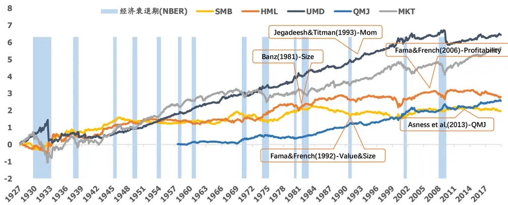
资料来源：AQR，NBER，国盛证券研究所整理

图表3:因子多空组合收益表现

| 样本区间 | 因子 | 年化收益 | 年化波动 | SR | 最大回撤 | 胜率 |
| --- | --- | --- | --- | --- | --- | --- |
| 1927.1~2019.12 | SMB | 2.15% | 10.38% | 0.21 | 54.50% | 50.27% |
|  | HML | 3.06% | 14.72% | 0.21 | 37.64% | 48.66% |
|  | UMD | 7.16% | 15.64% | 0.46 | 58.41% | 63.80% |
| 1957.7~2019.12 | QMJ | 4.20% | 7.48% | 0.56 | 28.45% | 55.60% |

资料来源：AQR，国盛证券研究所

## 样本内外对比：市值和价值溢价在样本外出现明显的衰退

我们以 Fama&French 在 1992 年发表的三因子模型样本测试时间（1927~1989）作为样本内，统计了样本外每十年，因子组合的夏普比。

我们看到，因子虽然在样本内表现优秀，但在样本外，除了质量因子，市值、价值和动量均出现明显的波动：在 1990、2010 年的两个十年样本中，大市值公司与高估值公司的股价表现更强；在2000年的样本中，动量表现较差，主要集中于2008年出现的动量崩塌。

图表4:因子组合样本内外夏普比
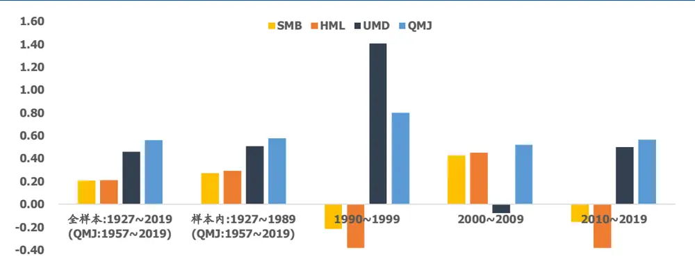
资料来源：AQR，国盛证券研究所

## 1.2.2 全球市场因子表现对比

对比不同市场（1988~2019）上因子的表现，我们观察到，北美市场和欧洲市场均呈现出较强的动量和质量风格，价值效应较弱；太平洋市场（日本、香港、新西兰、新加坡和澳大利亚）上，价值风格较强，而质量和动量其次。

图表5:不同市场因子多空组合夏普比
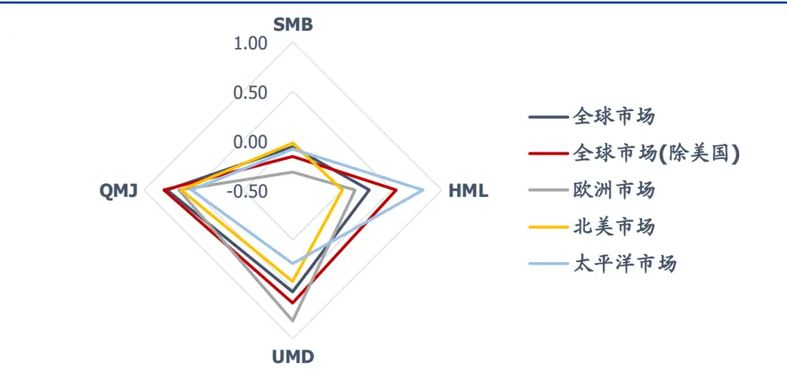
资料来源：AQR，国盛证券研究所整理

## 二、市值因子演化分析

## 2.1 美股市值因子演化

我们利用 FF 数据构建小市值溢价的多空组合，并统计每年多头与空头的收益，我们发现，SMB 组合大部分收益来自于多头，大市值组合的表现并不差，且 SMB 组合收益的波动主要来自于小市值组合的波动。

从历史来看，小盘风格大致在四个时间段占主导；1931~1946，1964~1968，1975~1983

以及 1999~2011。

早期 1931~1946 年，正值美国大萧条之后，罗斯福新政实施，经济开始复苏，金融市场逐步趋于规范化；1939~1945年由于二战影响，政府对经济金融的管制均以服务战争为导向，在 1942 年美军取得太平洋战争主动权后，政府与民众信心倍增，标普指数也开始触底反弹，同时小市值公司也录得较高收益；而 50年代美国进入战后经济腾飞期，大小盘风格分化并不明显。

第二次小盘股暴涨出现在1964~1968年间，其一，彼时正值美股成长股投资流行时期，投机气氛浓厚，股价严重脱离公司基本面，能讲好故事的公司就能获得上百倍的估值，炒作题材层出不穷；其二，兼并收购流行，套利资金推高收购标的股价；在这样一个疯狂炒作时期，小盘股表现强势。过高的估值难以持续，之后的“漂亮 50”行情迅速扭转了市场风格。

第三次小盘行情出现于 1975~1983 年左右，期间遭遇两次石油危机，经济动力衰减，陷入滞胀，股市长期低迷。为了解决中小型企业的融资问题，美国设立NASDAQ交易所，为中小型企业股票注入流动性。

随着市场逐渐成熟，以及养老金计划等实施，进入 80 年代之后，美国市场进入机构化时代，特定风格的基金产品逐步流行。尤其是学术界对小市值异象的讨论，引起市场对小票的关注，也推动了大量小盘风格基金的风行。此后小盘风格消退了近十年，而自1999~2011年间又逐渐回归强势。但此后，小盘异象已逐步退化成为周期性的风格切换，而非投资者追求的 alpha来源。

图表6:SMB年度收益分解及美国经济金融市场背景回顾
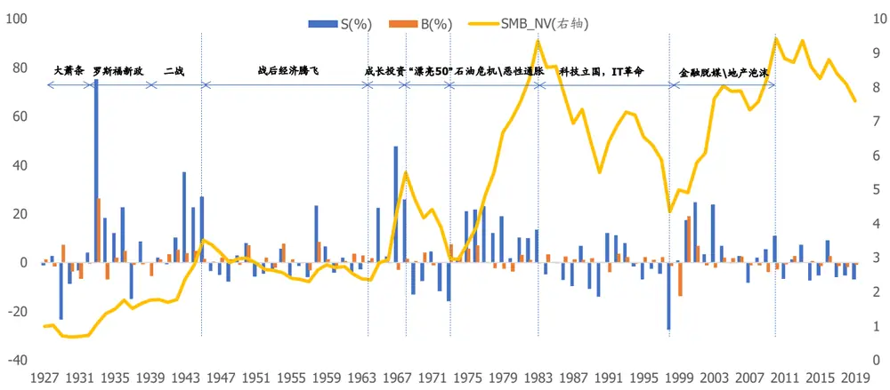
资料来源：Fama&French，国盛证券研究所

我们进一步讨论小市值公司的收益来源。

FF 在2007年发表的论文“Migration”中做了一些统计，他们在构建三因子模型时，将全市场股票基于市值和 BP 分组，进一步观察了股票在第二年的分组变化，以及收益表现。结果显示：小市值组中的高估值股票（SG）平均有 11.8%在第二年进入大市值组，这部分股票平均贡献 8.5%的收益，而估值落在中间和后分位的股票（SM 和 SV）也贡献约 5%的收益；小市值组中的价值股（SV），在第二年虽然仍然落在小市值区间，但估值明显提升的股票，也贡献了 4.2%的收益。换言之，那些从小市值成长为大市值的股票贡献了极高的收益；小盘成长股比小盘价值股更容易成为大盘股，且小盘成长股贡献了极高的收益。从这一角度来看，其实市值异象带有比较强的幸存者偏差。

图表7:Fama-French三因子模型分组迁移概率与收益贡献（1926~2005）

| 平均迁移概率 平均组合收益贡献 组合收益 |  |  |  |  |  |  |  |  |  |  |  |  |  |  |  |
| --- | --- | --- | --- | --- | --- | --- | --- | --- | --- | --- | --- | --- | --- | --- | --- |
|  | 小市值 | 小市值 小市值 进入大 小市值 小市值 小市值 进入大市值组 |  |  |  |  |  |  |  |  |  |  |  |  |  |
|  | 估值下降 |  |  |  |  |  |  |  |  | 估值不变 | 估值上升 | 市值组 | 估值下降 | 估值不变 | 估值上升 |
| SG | 25.8 | 60.0 | 2.4 | 11.8 | -5.3 | -1.5 | 0.5 | 8.5 | 2.2 |  |  |  |  |  |  |
| SN | 16.7 | 61.1 | 11.9 | 10.2 | -2.7 | 0.6 | 2.6 | 5.1 | 5.6 |  |  |  |  |  |  |
| SV | 1.0 | 70.9 | 19.6 | 8.5 | -0.2 | -0.5 | 4.2 | 5.6 | 9.2 |  |  |  |  |  |  |
|  | 大市值 | 大市值 | 大市值 | 进入小 | 大市值 | 大市值 | 大市值 | 进入小 |  |  |  |  |  |  |  |
|  | 估值下降 | 估值不变 | 估值上升 | 市值组 | 估值下降 | 估值不变 | 估值上升 | 市值组 |  |  |  |  |  |  |  |
| BG | 10.9 | 87.5 | 0.7 | 0.9 | -1.2 | 0.6 | 0.1 | -0.4 | -0.9 |  |  |  |  |  |  |
| BN | 8.6 | 75.1 | 15.0 | 1.2 | -0.9 | 0.3 | 2.2 | -0.4 | 1.2 |  |  |  |  |  |  |
| BV | 0.1 | 75.2 | 22.5 | 2.2 | 0.0 | 2.3 | 3.3 | -0.7 | 4.8 |  |  |  |  |  |  |

资料来源：Fama&French，国盛证券研究所整理

## 2.2 市值异象的主流解释

对市值异象的解释可以从两个角度进行：

风险承担：小市值公司比大市值公司承担了更高的风险：比如市场风险、流动性风险、经营风险等；

错误定价：市场对小市值公司存在错误定价：例如，由于小规模企业信息不对称更强，市场往往低估小市值公司，等。

相对而言，从风险承担的角度分析市值溢价的研究更多一些。

## 2.2.1 风险承担-市值溢价主要来自于流动性风险

通过梳理市场从风险承担的角度对市值异象的解释，我们认为小市值公司的风险主要来自于流动性风险，包括金融市场上交易层面的流动性，和实体经济层面的流动性。

I 金融市场流动性：主要指股票市场上交易资金相对于股票供给的多少，以及对个股而言买卖的难易程度。小市值公司股票的流动性较差，股价更易受交易行为影响；

II 实体经济流动性：指经济体系中货币的多少，央行创造基础货币以及银行等运用信贷创造派生货币的过程会影响实体经济的流动性，从而影响公司的融资成本与生产经营活动，进而改变市场对公司股价的预期。由于小市值公司相比于大公司在资金成本上处于劣势，更容易受通胀、信贷周期的影响，由此带来的经营风险也更高。

回溯美国金融市场和实体经济流动性的变化，大小盘风格的转变也不难理解。

## I 金融市场流动性变化

1）国家证券化水平上升，股票市场规模扩张：

股票市场总市值与美国总体 GDP 占比，在一定程度上反映资金在二级股票市场的参与程度。我们观察到，20 世纪 50 年代的战后黄金时期，80 到 90 年代大缓和时期以及最近十年来看，在经济平稳向上的情况下，股票市场参与度上升，市场流动性增加，小市值股票的交易成本降低，溢价也随之衰减；

2）市场机构化以及小市值风格基金的流行：

随着 1981 年市值异象在学术界引发关注，大量机构发行小盘风格的基金产品，使得小市值因子被过度交易，使得套利空间被压缩，因子在样本外表现变差。其次，美国市场结构发生明显变化，机构投资者占比逐步提升，对公司的研究也更加深入，与 60~70年代那样盲目追逐题材炒作的疯狂历史形成对比。

## 3）并购套利推升股价：

小市值的企业更容易成为收购目标；投资者采取并购套利策略，一旦发现有并购意向，会及时布局被收购标的，推高被收购方股价，不断接近并购价位。因此并购活动也会影响市值溢价。正如美国 1963~1974 年的第三次并购浪潮，以股权收购为主要形式，且出现多例“蛇吞象”案例，也在一定程度上推动了小盘股的价格。

## 4）市场交易成本变化；

如果说早期小市值异象受到市场投机行为的影响，那么后期小市值溢价更多与微观交易层面的流动性相关。我们尝试做了一个简单的实验，利用Lubos Pastor 教授根据个股收益率对成交量的敏感性构建的个股非流动性指标，并加总全市场股票的非流动性指标Innov Illiq来度量市场整体的流动性风险，并做了以下回归：

$$
\mathrm{SMB}=\alpha+\beta_{\mathrm{t}}\mathrm{Mkt}\mathrm{RF_{t}}+\beta_{\mathrm{t-1}}\mathrm{Mkt}\mathrm{RF_{t-1}}+\beta_{3}InnovIlliq+SMB_{resid}
$$

指标显著，且在剥离了流动性指标后，残差收益几乎不存在超额收益，从侧面反映了小市值股票在交易层面的流动性风险。

图表8:美股总市值/GDP与 SMB组合净值
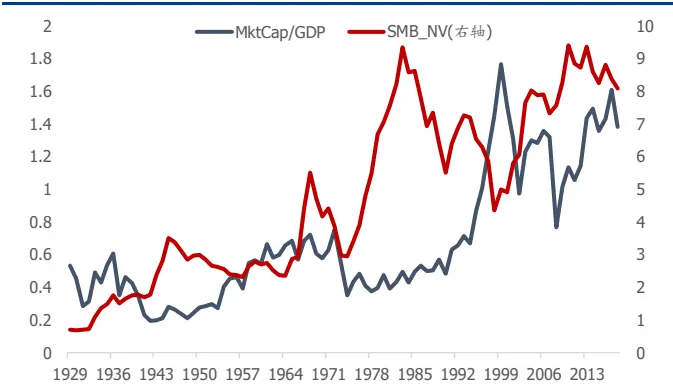
资料来源：Wind，Fama&French，国盛证券研究所

图表9：美国股票市场投资者结构
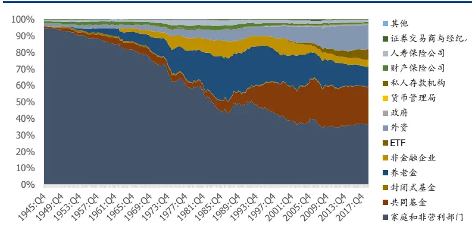
资料来源：FED，国盛证券研究所

图表10：美国第三波并购浪潮推升小盘股股价
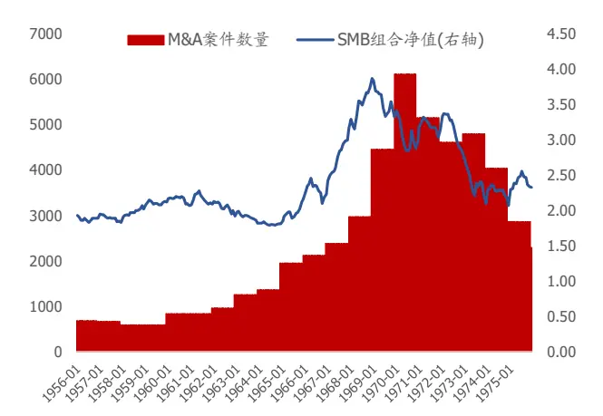
资料来源：IMAA，Fama&French，国盛证券研究所

图表11：市场交易成本变化影响小盘股股价
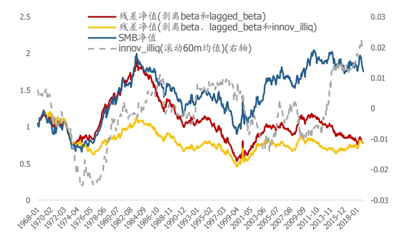
资料来源：Lubos Pastor，Fama&French，国盛证券研究所

## II 实体经济流动性

由于规模小的公司比大公司的经营风险更高，其融资成本更易受信贷周期的影响。当信用利差上升时，小规模公司的经营风险上升，未来现金流的不确定性增加，从风险收益比的角度来看，投资者会要求更高的预期收益率。我们检验了信用利差及其变化值对市值因子收益的解释能力，观察到，控制其他条件不变，信用利差水平对市值因子收益有正向影响，而控制了信用利差水平后，信贷环境的边际恶化反而会降低市值因子收益：

$$
\begin{array}{ccc}{{SMB\sim a+\beta_{t}MktRF_{t}+\beta_{t-1}MktRF_{t-1}+\beta_{3}CreditSpread+\beta_{4}ACreditSpread}}&{{}}&{{}}\\{{\beta:\ -0.528}}&{{0.2159}}&{{0.0893}}&{{0.413}}&{{-1.587}}\\{{\mathrm{tval.}}}&{{(-2.77)}}&{{(11.57)}}&{{(4.59)}}&{{(2.53)}}&{{(-1.89)}}\end{array}
$$

Alquist 等研究者在“Fact, Fiction, and the Size Effect”一文中，就市值溢价与流动性溢价的关系做了一组较为全面的，且时间窗口较长的测试：他们分别将 Fama&French 的SMB 收益率，以及按市值大小分十组的多空收益，对多个流动性指标回归，包括lagged_beta、Amihud liquidity factor、TAQ spread 等等，发现在美国市场上，市值溢价在剥离流动性风险后，几乎不存在超额收益。

## 图表12：剥离流动性风险后市值溢价消失

EXHIBIT 21
Size Portfolio Regressed on Liquidity Factors, Market Return, and Lagged Market Return

|  | Alpha | Alpha t-Stat | Liquidity Beta |  |  |  |
| --- | --- | --- | --- | --- | --- | --- |
|  | vs. Liquidity | vs. Liquidity | Liquidity Beta | t-Stat | Start Date | End Date |
| Panel A: SMB |  |  |  |  |  |  |
| Lagged Beta | 0.1% | 0.09 | 0.13 | 7.45 | 8/31/1926 | 12/31/2017 |
| Frazzini, Israel, and Moskowitz (2018) | -4.3% | -3.05 | 0.51 | 19.25 | 7/31/1988 | 6/30/2017 |
| AQR trading costs (MI in bps) |  |  |  |  |  |  |
| Amihud (2002) | -2.6% | -2.74 | 0.41 | 27.91 | 7/31/1963 | 6/30/2017 |
| TAQ Spread | -0.7% | -0.41 | 0.48 | 15.73 | 7/31/1993 | 6/30/2017 |
| TAQ Price Impact (Kyle [1985] lambda) | 0.7% | 0.34 | 0.38 | 8.68 | 7/31/1993 | 6/30/2017 |
| Proportion of Zero Return Days | -2.1% | -1.74 | 0.38 | 15.00 | 7/31/1963 | 6/30/2017 |
| Modified Roll (1984) | 0.9% | 0.90 | 0.38 | 23.79 | 7/31/1963 | 6/30/2017 |
| Panel B: 1–10 Decile |  |  |  |  |  |  |
| Lagged Beta | -0.1% | -0.03 | 0.33 | 8.77 | 8/31/1926 | 12/31/2017 |
| Frazzini, Israel, and Moskowitz (2018) AQR trading costs (MI in bps) | -7.1% | -4.05 | 0.84 | 25.79 | 7/31/1988 | 6/30/2017 |
| Amihud (2002) | -4.9% |  | 0.74 | 39.12 | 7/31/1963 | 6/30/2017 |
| TAQ Spread | -1.1% | -4.13 -0.49 | 0.76 | 19.56 | 7/31/1993 | 6/30/2017 |
|  | 1.2% | 0.41 | 0.62 | 10.11 | 7/31/1993 | 6/30/2017 |
| TAQ Price Impact (Kyle [1985] lambda) Proportion of Zero Return Days | -4.5% | -2.61 | 0.73 | 20.28 | 7/31/1963 | 6/30/2017 |
| Modified Roll (1984) | 1.2% | 0.81 | 0.62 | 26.22 | 7/31/1963 | 6/30/2017 |

资料来源：“Fact, Fiction, and the Size Effect”，国盛证券研究所

## 2.2.2 错误定价-小市值公司往往被市场低估

从错误定价的角度来看，小市值公司更容易被低估。我们对比了不同市值规模下的成长股（sl&bl）、价值股（sh&bh）以及估值位于中间的股票，在组合构建时平均估值PB 的比值。在大部分时间段内，估值之比位于 1下方，即小市值股票相对与大市值股票更容易被低估，因此其未来估值修复的可能性越大，而当小市值股票的估值过高时，股价也会迅速回落。

图表13：小市值股票相对于大市值股票长期被低估
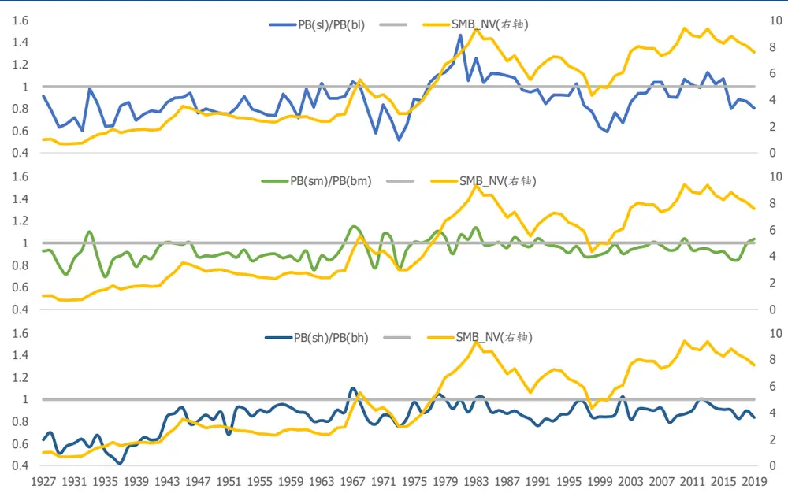
资料来源：Fama&French，国盛证券研究所

## 2.3 市场开放对市值因子的影响：以日本市场为例

在日本市场上，小盘行情主要出现 1989 以前，2002~2005 年以及 2009~2012 年，而在 1990~2002 年，2006~2009 年出现明显的回撤。在分析日本市场的市值效应时，我们不能忽视 90年代日本资本账户开放后，外盘资金流入对市场风格的影响。

图表14：美、日两国SMB净值走势、日经225净值走势与日本证券投资组合净流入额（美元）
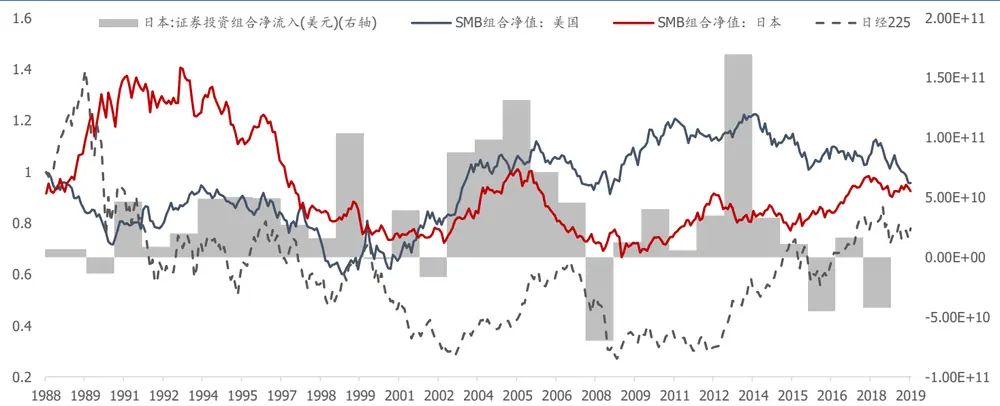
资料来源：Wind，AOR，国盛证券研究所

到 1989 年底，日本股市处于牛市的末端，泡沫化严重，小盘风格明显；随后经济崩盘，市场暴跌，日本陷入长期经济低迷。

1990开始，日本全面开放资本市场，市场流动性发生了深刻变化，主要包括：

## 1） 大量国际资本流入，影响指数走势与大小盘风格切换：

Hao Jiang & Takeshi Yamada 在他们的一篇文章中详细分析了国际机构投资者对日本市值效应的影响。第一：将票池按国际机构投资者持股比例从低到高分五组，并统计每组的市值溢价，他们发现：国际机构投资者占比低的一组在 1990 年以前表现出明显的市值溢价效应；而国际机构投资者占比高的一组在 1990 年以前的小市值溢价较弱，90年之后呈现出大市值效应。第二，他们测算了SMB 组合自构建到持有未来一年内，小盘相对于大盘，国际机构投资者持有比例的变化ΔIIO与国内个人投资者持有比例的变化ΔDIND，观察到在 1990 年以前，国际机构投资者流入小盘股推动小盘股价上升，90 年后更多机构流入大盘股并引起小市值溢价反转。

图表15：按国际机构投着持股比例分组的SMB组合表现
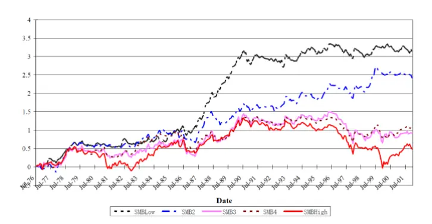
资料来源：Hao Jiang & Takeshi Yamada，国盛证券研究所

图表16：SMB未来一年超额收益及持有人结构变化
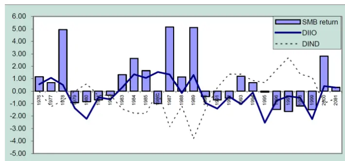
资料来源：Hao Jiang & Takeshi Yamada，国盛证券研究所

## 2） 放开“交叉持股”限制，股票流动性增加：

日本股市存在“交叉持股”的特点：为了避免低股价和股权分散带来的敌意收购的风险，前财阀集团内部企业间开始相互持股，金融机构和企业法人的稳定持股比例上升，至1989 年高达 70.8%。企业间交叉持股一般不会因为股价涨跌而轻易抛出，这些长期持有的股票的流通性很差。1990年美国强烈要求日本降低相互持股的做法，要求将银行持股标准由 5%下降到2%；综合商社被允许持有制造业企业股份；强化子公司持有母公司股份的限制。整个九十年代，由于交叉持股限制的放开，股票的流动性得到提升，也在一定程度上降低了股票的交易成本，减少了小市值溢价中来自于流动性的溢价部分。

图表17：90年代日本逐步放开“交叉持股”限制
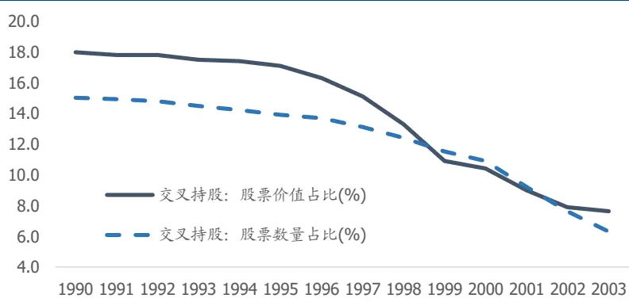
资料来源：《现代日本经济》，国盛证券研究所

长期熊市使得大量上市公司股票市值跌破净资产，资产价格便宜，正是适合兼并收购的好时机。步入 2000 年后，第五波全球化并购浪潮席卷日本。此间，小盘股更易获得资本的青睐。与此同时，日本政府也陆续出台经济刺激政策，小型企业也获得更多融资支持，市场对小盘股的预期也逐步好转。

图表18:日本并购浪潮影响小盘股走势
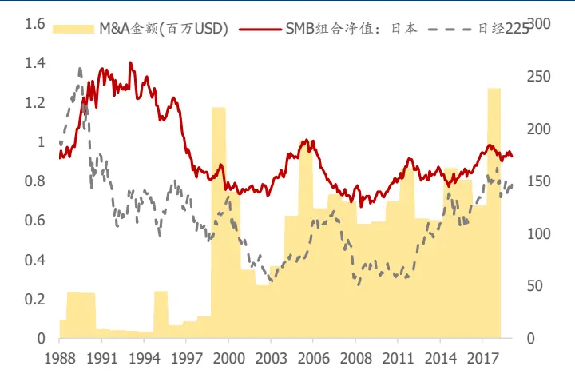
资料来源：IMAA，国盛证券研究所

图表19:复苏阶段小型企业获得更多融资支持
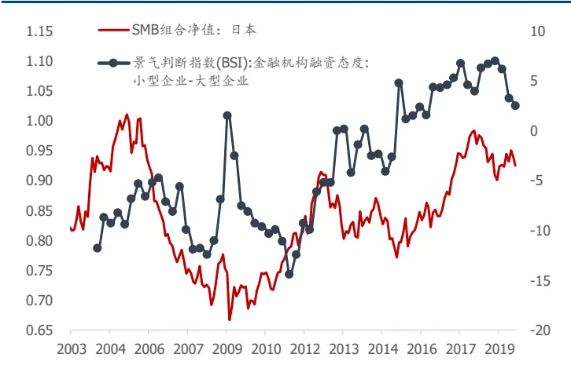
资料来源：Wind，国盛证券研究所

## 三、价值因子演化分析

## 3.1 美股价值因子演化

价值因子比市值因子的收益高很多，至少到 2006 年前，价值股远远跑赢成长股（指高估值的股票）。

早期 1926~1942 年间，价值成长的分化并不明显，但从 43 年开始，直到 79 年，美国经历二战、战后经济腾飞，以及后期陷入石油危机和恶性通胀，价值股均表现出优势。此后价值策略几乎每十年都会出现明显回撤，例如 79~80、89~91、98~99 以及 2000年初的科网泡沫，最近十年来看，价值表现令人失望。

图表20：美国股票市场价值因子收益
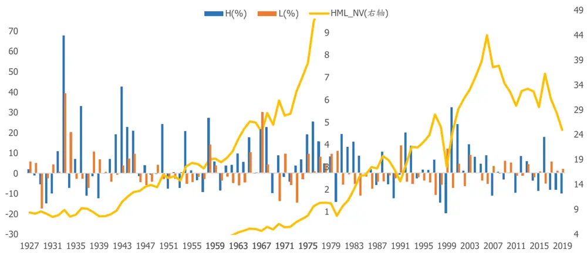
资料来源：Fama&French，国盛证券研究所

回顾 Fama&French 在测算市值和价值分组的迁移情况时，发现，价值溢价来自于三部分：价值股估值回升，贡献多头收益；成长股估值回落，贡献空头收益；那些落在相同市值组合内的股票，价值股的收益更高一些。换言之，价值溢价其实是来自于估值的均值回复特征，赚取高抛低吸的收益。

图表21:Fama-French三因子模型分组迁移概率与收益贡献（1926~2005）

| 平均迁移概率 平均组合收益贡献 组合收益 |  |  |  |  |  |  |  |  |  |
| --- | --- | --- | --- | --- | --- | --- | --- | --- | --- |
|  | 小市值 小市值 小市值 进入大 小市值 小市值 小市值 进入大 |  |  |  |  |  |  |  |  |
|  | 估值下降 | 估值不变 | 估值上升 | 市值组 | 估值下降 | 估值不变 | 估值上升 | 市值组 |  |
| SG | 25.8 | 60.0 | 2.4 | 11.8 | -5.3 | -1.5 | 0.5 | 8.5 | 2.2 |
| SV | 1.0 | 70.9 | 19.6 | 8.5 | -0.2 | -0.5 | 4.2 | 5.6 | 9.2 |
|  | 大市值 | 大市值 | 大市值 | 进入小 | 大市值 | 大市值 | 大市值 | 进入小 |  |
|  | 估值下降 | 估值不变 | 估值上升 | 市值组 | 估值下降 | 估值不变 | 估值上升 | 市值组 |  |
| BG | 10.9 | 87.5 | 0.7 | 0.9 | -1.2 | 0.6 | 0.1 | -0.4 | -0.9 |
| BV | 0.1 | 75.2 | 22.5 | 2.2 | 0.0 | 2.3 | 3.3 | -0.7 | 4.8 |

资料来源：Fama&French，国盛证券研究所整理

## 3.2 价值异象的主流解释

我们仍然从风险承担和错误定价两个角度梳理价值溢价的主流解释。相对而言，从错误定价的角度分析价值溢价的研究更多。

## 3.2.1 风险承担-价值溢价与消费风险、现金流久期、经营杠杆风险等有关

从风险承担角度来解释价值因子的研究，有以下几个角度：

## I 长期经济增长风险（Long run risk based）

Bansal et al(2007)表明，企业的现金流受经济增长影响，而价值股的现金流与分红增长在长期经济增长风险上的暴露更高，因此投资者要求更高的风险补偿。Hansen etal.(2008)表明，成长股的现金流增长与长期的消费增长存在负相关性，而价值股与之相反。

## II 现金流久期风险

Lettau(2007)则发现，从现金流折现的角度来看，市场赋予成长股未来现金流的权重更高，而赋予价值股当前现金流的权重更高，因此价值股的现金流久期比成长股短一些，而现金流久期较短的资产往往有更高的预期回报率。

## III 经营杠杆风险

固定成本的投入使得资产的风险度提升，而价值股多是杠杆率更高的股票，因此他们需要更高的风险补偿。Novy-Marx(2010)发现，价值溢价多数来自于行业内BP 的差异，这些差异主要来自于以经营杠杆的差异；而行业间 BP 的差异来自于资本密集程度，这部分差异与价值溢价无关。

## 3.2.2 错误定价-价值股有估值修复的潜力

从错误定价角度来看，投资者对价值股存在过度反应与反应不足:例如，投资者容易忽视价值股而被成长股吸引，通常会低估价值股而高估成长股；再比如，当投资者看涨，高估企业未来盈利增长，超买成长股而超卖价值股，导致成长股被高估，价值股被低估；

当投资者看跌，低估企业未来盈利增长，超买价值股而超卖成长股，导致价值股被高估。

既然价值效应来自于错误定价，那么我们是否可以认为，如果市场定价效率低，资产的估值偏离基本面程度较高，那么未来估值修复的潜力越大，价值效应就会越明显；反之，如果市场的定价效率高，那么价值溢价就越少。

我们尝试从不同维度构建票池，考察在不同定价效率的票池中，价值策略表现是否满足上述假设。简单来说，我们利用 FF 数据库，分别测试了大盘股和小盘股，高 ROE 组和低 ROE组中的HML策略表现。

由于大盘股的公司信息公开程度高，覆盖的分析师多，市场对其研究较为深入，因此错误定价的可能性比小盘股票池要低；

对于ROE较高的票池，估值低的股票有更高概率是由于其质地差而便宜，未来估值修复的可能性低，价值策略失效的可能性更大。

我们也可以选择从机构投资者占比的角度来划分票池。一般而言，机构投资者的研究能力、平台资源和信息优势使得他们对公司的研究比个人投资者要更深入一些，因此机构投资者占比较高的票池中，错误定价的可能性相对偏低，价值策略失效的可能性更大。Ludovic 的研究结果也显示，机构投资者占比（IO: Institution Ownership）低的票池中，HML策略的表现更加，价值效应越明显。

图表22：不同样本中HML组合表现
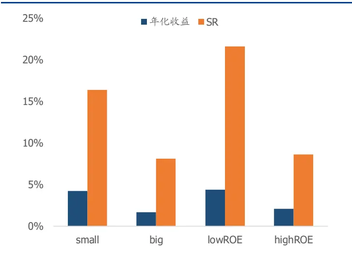
资料来源：Fama&French，国盛证券研究所

图表23：按机构投资者占比划分样本HML组合夏普比
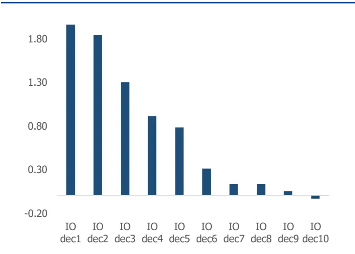
资料来源：Ludovic Phalippou，国盛证券研究所

## 3.3 价值策略失效的原因分析

从历史来看，价值策略在美股市场上失效已久，我们认为可能有三个原因：

1） 市场定价效率提升，价值溢价减少；

2） 价值因子失真，引发策略失效；

3） 科技发展与行业变迁影响价值成长风格切换。

## 3.3.1 市场定价效率提升，价值溢价减少

在上节中，我们从截面上对比了不同票池中价值策略的表现，我们观察到，定价效率越高的票池里价值溢价越少。如果我们从历史演化的角度来考虑，随着市场逐步信息化，机构化，成熟化，市场的定价效率也在不断提高，在未来价值策略的收益空间将会逐步减少。

## 3.3.2 价值因子失真，引发策略失效

价值因子存在失真的可能，引发策略失效。

例如我们本文讨论的价值策略均是基于公司的市净率倒数构建的，而由于 GAAP 准则，我们从财报获取的公司的净资产数值，存在以下不合理之处：

1） 低估无形资产：例如商誉、人力资本、广告宣传、R&D 等；1975 年以前企业被允许资本化 R&D 费用，但是 SFAS2 准则发生变化后，不再允许资本化操作；健康医疗、IT行业等无形资产占比较高的公司更易受到影响。从历史趋势上来看，企业在无形资产的投入在不断增加，研发、商誉等资产的地位在不断提升，企业也有轻资产化的趋势；2） 低估长期资产：会计准则通常要求资产以快于实际使用年限加速折旧，例如企业拥有的房产，固定资产等，从而低估企业的价值；

3） 回购和分红：公司的回购与分红超过净利润时，净资产降低，也会引起估值指标扭曲。

图表24:R&D对经济的影响逐步提高
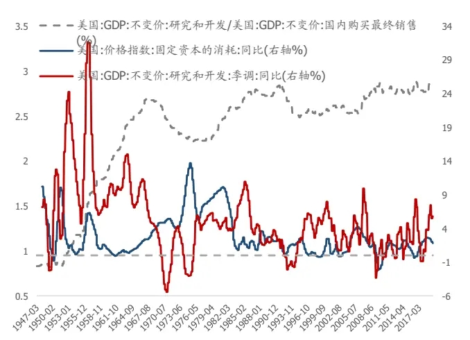
资料来源：Wind，国盛证券研究所

图表25：大型企业中积极回购公司占比逐步上升
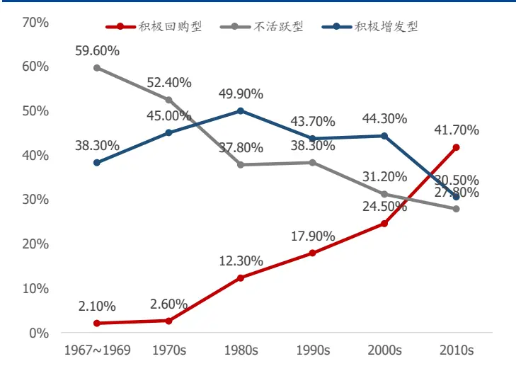
资料来源：OSAM，国盛证券研究所

投资者也发现净资产为负的公司，股价表现并不差；而那些以 BP 筛选出来的比较贵的公司，以其他估值指标看其实很便宜，这一部分公司的权重占比在逐步升高。

相比于易失真的BP因子，EP和CFP因子在历史上获取了更高的收益。参考Fama&French的数据，EP 和 CFP 的多空年化收益分别为 3.78%和 3.40%（1951~2019），均好于 BP多空组合的 3.18%。但是企业的盈利和现金流容易受经济周期和市场情绪的影响，例如在经济由过热向滞胀转变时，我们往往会高估企业的盈利和现金流，而经济从衰退向复苏转变时，我们反而会低估企业的盈利和现金流，因此它们也并非完美的估值指标。

图表 26:美股市场CFP/EP/BP 因子收益净值
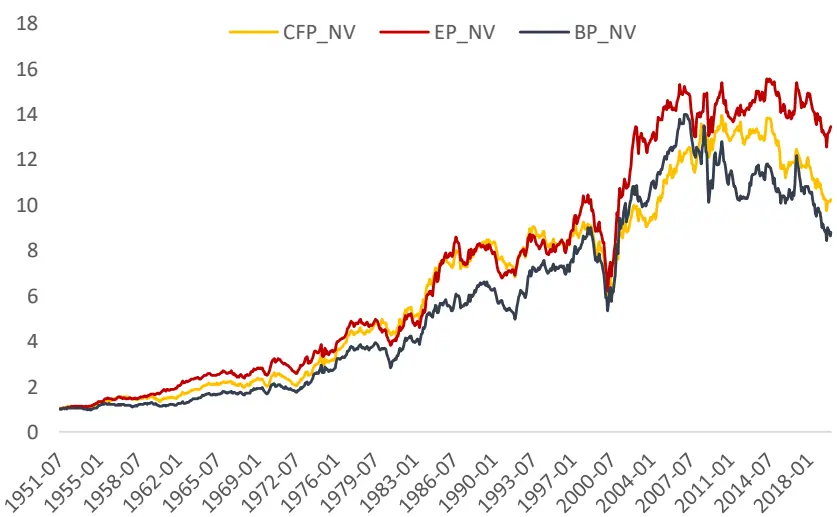
资料来源：Fama&French，国盛证券研究所

## 3.3.3 科技发展与行业变迁影响价值成长风格切换

我们在讨论 FF 的 HML 组合时，应注意到我们其实没有做行业中性，因此价值股组合与成长股组合在不同行业内的分布是不均匀的，组合表现会受到科技发展与行业变迁的影响。

OSAM 从这个角度对比了两次科技革命前后价值溢价的表现。科技创新从研发到最后大规模应用一般会经历五个阶段：爆发期-疯狂期-转折期-协同效应期-成熟期。在前半阶段，科技创新开始吸引人们的视线，逐步受到重视与推广，人们开始探索新技术的应用场景；进入转折期，资本开始流入，当金融资产超过生产资产时，市场开始出现泡沫，泡沫破裂后，市场才对真正有应用价值的企业开始建立合理的估值水平；进入后半段，新技术开始发挥协同效应，新的产品也变得低廉而被广泛应用，并逐渐成为一项成熟的技术。

自二十世纪以来，人们经历了 1908 年以来以石油、汽车为代表的第四次科技革命，推动大规模生产时代的到来；以及1971年以来以信息通信技术为代表的第五次科技革命。

图表27：科技创新从发现到应用过程以及第四次、第五次科技革命
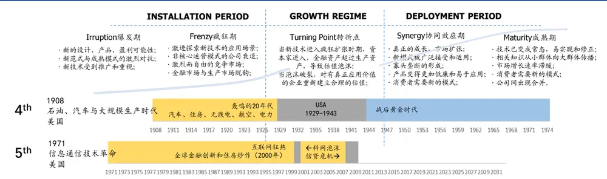
资料来源：OSAM，国盛证券研究所

随着新技术的发现到应用，价值股和成长股的行业分布也在不断演变。在 1926~1941年间，价值股集中于钢铁、重型工程行业，例如公用事业，成长股集中于制造业；而最近十年来看，得益于信息技术的发展，价值股多处于金融行业，而成长股则多分布于科技型行业。

回顾 1927年至1950年，价值策略在新技术发展初期表现疲软，彼时，成长股偏向于制造业和零售业的股票，而价值股中有较多依托杠杆融资和并购形成的金字塔式集团，多集中于公用事业、铁路等。由于经济大萧条，这些金字塔集团在市场崩盘后也迅速因其高杠杆经营模式破产，且随后受到金融部门更严格的监管，对应的价值股股价表现长期低迷。其后，随着市场复苏，部分制造业中的成长股业绩达到预期，逐渐演变为价值股；同时，由于技术被广泛应用，部分公用事业和铁路公司淘汰落后技术，开始采用新的生产设备，重新焕发生机，也改变了市场对其股价的预期。

回顾 90 年代以来的信息通信技术发展，90 年代末期，以苹果、亚马逊等为代表的科技型企业获得高估值，尤其在科网泡沫时期，投资者对互联网企业的盲目追求也一再推高成长股的股价；与此同时，以金融企业为代表的价值股表现低迷。2000 年初 NASDAQ指数暴跌，科网泡沫破裂，随后价值股迅速获得市场的青睐。

进入 2000 年后，由于金融工程学科的发展，金融创新产品市场迅速扩张，加之房地产泡沫，金融地产行业景气上升，而原先的科技股由于估值回落，也逐步落入价值股范畴。我们也看到在次贷危机前夕，价值策略出现了巨幅回撤，并伴随着泡沫破裂，策略有较强的反弹。信贷危机后，美国金融行业进入严监管时期，价值策略也一蹶不振。

图表28：两次科技革命过程中价值策略的回撤与复生
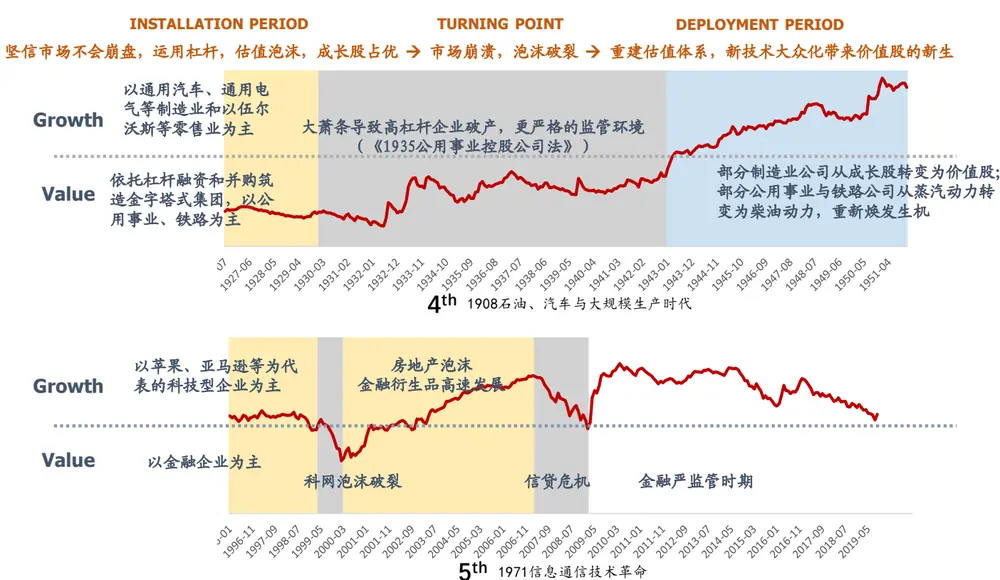
资料来源：OSAM，国盛证券研究所

如果我们对比海外其他市场价值策略的表现，不管是欧洲市场还是太平洋市场，以及全球股市，价值策略在 2000年科网泡沫破裂时期和 2009年后信贷危机时期，均获得了较高的收益。

图表29：全球市场价值策略净值走势
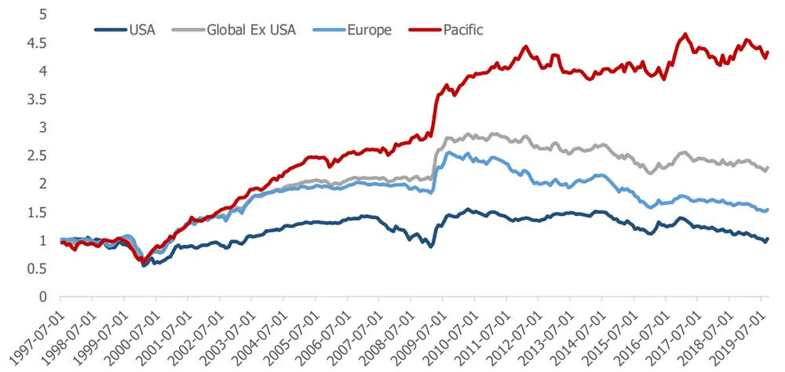
资料来源：AOR，国盛证券研究所

市场对美股近十年来价值因子失效的讨论也非常热烈，但我们认为，在当前公司基本面不发生恶化的情况下，估值偏离得越远，未来回复的潜力越大。

## 四、总结与展望

本篇报告我们回顾了海外市场上市值和价值因子的演化过程，从近 100年的历史样本来看，小市值和价值股确实存在溢价，但是相比其他风格因子，例如动量、质量等，市值和价值的溢价在逐步衰减，波动逐渐放大，演化成为主流的风险因子。进一步分析多头与空头的收益，我们发现，市值溢价大部分来自于从小市值成长为大市值的股票，而价值溢价来自于价值股和成长股的估值修复。

市场从风险承担和错误定价两个维度来解释市值与价值异象背后的金融学逻辑。虽然小市值公司更容易被公司低估而存在错误定价，但我们更偏向于认为小市值是一个不完美的风险代理变量，这部分公司的股票承担了更多的流动性风险，包括金融市场上交易层面的流动性风险，和实体经济中公司经营层面因受信贷周期影响而承受的流动性风险。对价值股而言，他们也在不同维度上承担了更多风险，诸如长期经济增长风险、经营杠杆等，但价值投资的核心思路还是在赚取错误定价的收益。

非理性炒作行为影响估值，经济周期波动与科技创新影响基本面，进而产生了大小盘和价值成长风格的切换。随着市场在不断发展，因子承担的风险可能会发生变化，市场的错误定价也会在某些时刻得到修正。并不存在一个永恒的逻辑来支撑因子的异象能够一直存在。

讨论因子背后的逻辑，是一个由“果”到“因”的过程，但是借鉴历史或许能为我们未来的因子研究提供些许帮助。由于宏观风险导致的因子异象由于其样本点少，且背后驱动因素在不断变化，统计检验难以发挥优势，需要我们自上而下的逻辑去把握；对于因子失真等问题，我们还有很多工作可以做，例如如何对公司的无形资产定价，进而调整估值因子，使其更符合我们的投资逻辑等等。未来我们也会继续着手这部分工作，为因子投资提供有价值的研究。

## 参考文献

Fama E F, French K R. The cross‐section of expected stock returns[J]. the Journal of Finance, 1992, 47(2): 427-465.

Harvey C R, Liu Y, Zhu H. … and the cross-section of expected returns[J]. The Review of Financial Studies, 2016, 29(1): 5-68.

Linnainmaa J T, Roberts M R. The history of the cross-section of stock returns[J]. The Review of Financial Studies, 2018, 31(7): 2606-2649.

Fama, E F. and French, K R., Migration (February 2007). CRSP Working Paper No. 614. Available at SSRN: https://ssrn.com/abstract=926556

Alquist R, Israel R, Moskowitz T. Fact, fiction, and the size effect[J]. The Journal of Portfolio Management, 2018, 45(1): 34-61.

Asness C, Frazzini A, Israel R, et al. Fact, fiction, and value investing[J]. The Journal of Portfolio Management, 2015, 42(1): 34-52.

Jiang H, Yamada T. The impact of international institutional investors on local equity prices: Reversal of the size premium[J]. Financial Analysts Journal, 2011, 67(6): 61-76.

Bansal R. Long-run risks and financial markets[R]. National Bureau of Economic Research, 2007.

Lettau M, Wachter J A. Why is long‐horizon equity less risky? A duration‐based explanation of the value premium[J]. The Journal of Finance, 2007, 62(1): 55-92.

Novy-Marx R. Operating leverage[J]. Review of Finance, 2011, 15(1): 103-134.

Phalippou L. Institutional ownership and the value premium[J]. 2004.

Chris Meredith. Value is dead, long live value[S].2019. Available at https://osam.com/Commentary/value-is-dead-long-live-value.

Baltussen, Guido and Swinkels, Laurens and van Vliet, Pim, Global Factor Premiums (January 31, 2019). Available at SSRN: https://ssrn.com/abstract=3325720

Ilmanen, Antti S. and Israel, Ronen and Moskowitz, Tobias J. and Thapar, Ashwin K and Wang, Franklin, How Do Factor Premia Vary Over Time? A Century of Evidence (December 18, 2019). Available at SSRN: https://ssrn.com/abstract=3400998

崔学东. 交叉持股的变化与日本公司治理改革[J]. 现代日本经济, 2007, 2007(2): 43-47.

## 风险提示

量化专题报告的观点全部基于历史统计与量化模型，存在历史规律与量化模型失效的风险。

## 免责声明

国盛证券有限责任公司（以下简称“本公司”）具有中国证监会许可的证券投资咨询业务资格。本报告仅供本公司的客户使用。本公司不会因接收人收到本报告而视其为客户。在任何情况下，本公司不对任何人因使用本报告中的任何内容所引致的任何损失负任何责任。

本报告的信息均来源于本公司认为可信的公开资料，但本公司及其研究人员对该等信息的准确性及完整性不作任何保证。本报告中的资料、意见及预测仅反映本公司于发布本报告当日的判断，可能会随时调整。在不同时期，本公司可发出与本报告所载资料、意见及推测不一致的报告。本公司不保证本报告所含信息及资料保持在最新状态，对本报告所含信息可在不发出通知的情形下做出修改，投资者应当自行关注相应的更新或修改。

本公司力求报告内容客观、公正，但本报告所载的资料、工具、意见、信息及推测只提供给客户作参考之用，不构成任何投资、法律、会计或税务的最终操作建议,本公司不就报告中的内容对最终操作建议做出任何担保。本报告中所指的投资及服务可能不适合个别客户，不构成客户私人咨询建议。投资者应当充分考虑自身特定状况，并完整理解和使用本报告内容，不应视本报告为做出投资决策的唯一因素。

投资者应注意，在法律许可的情况下，本公司及其本公司的关联机构可能会持有本报告中涉及的公司所发行的证券并进行交易，也可能为这些公司正在提供或争取提供投资银行、财务顾问和金融产品等各种金融服务。

本报告版权归“国盛证券有限责任公司”所有。未经事先本公司书面授权，任何机构或个人不得对本报告进行任何形式的发布、复制。任何机构或个人如引用、刊发本报告，需注明出处为“国盛证券研究所”，且不得对本报告进行有悖原意的删节或修改。

## 分析师声明

本报告署名分析师在此声明：我们具有中国证券业协会授予的证券投资咨询执业资格或相当的专业胜任能力，本报告所表述的任何观点均精准地反映了我们对标的证券和发行人的个人看法，结论不受任何第三方的授意或影响。我们所得报酬的任何部分无论是在过去、现在及将来均不会与本报告中的具体投资建议或观点有直接或间接联系。

投资评级说明

| 投资建议的评级标准 |  | 评级 | 说明 |
| --- | --- | --- | --- |
| 评级标准为报告发布日后的6个月内公司股价（或行业指数）相对同期基准指数的相对市场表现。其中A股市场以沪深300指数为基准；新三板市场以三板成指（针对协议转让标的）或三板做市指数（针对做市转让标的）为基准；香港市场以摩根士丹利中国指数为基准，美股市场以标普500指数或纳斯达克综合指数为基准。 | 股票评级 | 买入 | 相对同期基准指数涨幅在15%以上 |
|  |  | 增持 | 相对同期基准指数涨幅在 5%~15%之间 |
|  |  | 持有 | 相对同期基准指数涨幅在-5%~+5%之间 |
|  |  | 减持 | 相对同期基准指数跌幅在 5%以上 |
|  | 行业评级 | 增持 | 相对同期基准指数涨幅在10%以上 |
|  |  | 中性 | 相对同期基准指数涨幅在-10%~+10%之间 |
|  |  | 减持 | 相对同期基准指数跌幅在10%以上 |

## 国盛证券研究所

北京

地址：北京市西城区平安里西大街 26 号楼 3层

上海

地址：上海市浦明路 868 号保利 One56 1 号楼 10层

邮编：100032

邮编：200120

传真：010-57671718

电话：021-38934111

邮箱：gsresearch@gszq.com

邮箱：gsresearch@gszq.com

南昌

地址：南昌市红谷滩新区凤凰中大道 1115 号北京银行大厦

深圳

地址：深圳市福田区福华三路 100 号鼎和大厦 24楼

邮编：330038

传真：0791-86281485

邮编：518033

邮箱：gsresearch@gszq.com

邮箱：gsresearch@gszq.com