# 量化专题报告

## 多因子系列之十：行业内选股初探

随着全市场基本面 alpha 增量信息的挖掘变得越来越困难，行业内选股模型开始备受关注。一方面，分行业建模能够更方便的加入行业特质因子，另一方面，由于不同行业特性不同，分行业建模预测准确度可能更高。基于上述两个原因，我们尝试构建行业内选股模型，期望该方法能够对原有的全市场模型有所改进。

我们采用测试和逻辑相结合的方法来寻找行业内适用的因子。行业内适用因子的寻找有很多不同的方法，但我们在研究过程中发现基于纯测试的方法和基于纯逻辑的方法都存在一定的问题，因此我们采用了测试和逻辑相结合的方法。由于行业成份股较少，缺乏大样本的显著性，对于每一个因子，我们都尝试寻找到其合理的行业逻辑，以降低过拟合的概率。

不同行业行业内建模的表现有所差别。银行和证券行业行业内模型要显著好于全市场建模，而其他行业，二者差别较小，部分行业行业内建模较优，而部分行业全市场建模较优。行业内建模与全市场建模的预测相关性并不是很高，将二者结合后，基本在每个行业，行业内模型都要优于原来的全市场模型。

300 增强组合有所提升，而 500 增强组合提升不明显。我们基于结合后的预测分别构建了两个增强组合并进行了归因，发现 300 增强的主要超额收益的贡献来自于银行和券商两个行业，其他行业的增量有限。而对于 500增强模型，提升不明显。这可能是由于 500 的权重行业例如医药、电子等，我们并没有找到很多的特质因子，因此增量信息并不多，另一方面，500 的行业权重较为分散，如果想要有显著的提升，可能需要对大部分行业都要有比较明显的提升。

对未来行业内选股研究的展望。本文是我们对行业内选股的初步探索，我们采用传统多因子的方法，发现对原有组合的提升较为有限，只有银行券商有较明显的提升效果，这与目前市场上的研究结论较为一致。对于未来行业内选股的研究，我们认为有三点改进方向，首先，应将精力集中在新信息的寻找，而非原有因子分域逻辑的研究。其次，对于因子的寻找可以抛弃传统多因子大样本的思路，从细分样本的特质逻辑出发。最后，并不是所有行业使用行业内建模都一定会有提升，我们需要针对具体的策略对一些行业进行有针对性的建模。

风险提示：以上结论均基于历史数据和统计模型的测算，如果未来市场环境发生改变，不排除模型失效的可能性。

## 作者

分析师 刘富兵

执业证书编号：S0680518030007

邮箱：liufubing@gszq.com

研究助理 丁一凡

邮箱：dingyifan@gszq.com

## 相关研究

1、《量化周报：当下宜减不宜增》2020-02-16

2、《量化专题报告：多因子系列之九：海外市场市值和价值因子演化研究》2020-02-14

3、《量化周报：后市走势不乐观》2020-02-09

4、《量化专题报告：风险配置新思路：宏观风险平价策略》2020-02-06

5、《量化周报：疫情打乱市场节奏》2020-02-02

## 一、综述

随着全市场基本面 alpha 增量信息的挖掘变得越来越困难，行业内选股模型开始备受关注。一方面是因为有很多因子只在某一行业，或者某些特定行业有效，而全市场建模无法方便的加入这些信息。另一方面，由于不同行业的属性不同，细分行业建模可能比全市场建模预测的更加准确。基于上述两个原因，我们尝试构建行业内选股模型，期望该方法能够对原有的全市场模型有所改进。

目前市场上对行业内选股的研究已经有很多，我们将其分为三类：

第一类是纯测试的方法。给定一个标准，例如 IC 或者 ICIR 的阈值，然后滚动筛选出每个行业满足该筛选标准的因子，分行业进行预测，最后合起来构建组合。通过回测，我们发现此方法最终的策略表现相对于原来的全市场策略并没有增强，即使是全样本筛选因子而不是滚动筛选，在可能过拟合的情况下，该方法也并没有显著的好于原策略。究其原因，我们认为有两点：

1）不同行业应该有不同的筛选标准。由于不同行业的股票数量相差较大，对不同行业有相同预测能力的因子，在股票数量少的行业，其稳定性即 ICIR也会较低。过严的筛选标准会使得某些行业没有有效因子，而过松的筛选标准会使得某些行业加入过多的噪声。而对不同行业使用不同筛选标准，则会增加大量的参数而导致模型容易过拟合。

2）行业内股票数量过少，尽管筛选出来的因子可能更加符合行业特征，使得预测的偏差更小，但是由于行业样本少，预测的方差会增大。考虑一种特殊情况，假设某行业股票收益的预测函数与全市场股票完全一致。那么行业内选股是用该行业（50 只股票）的历史数据进行训练来预测该行业股票收益，而全市场模型是用 3000只股票的历史数据来进行预测，显然后者的预测会更加准确。在实验中我们也发现像综合行业的样本内选股收益总是要弱于全市场选股的。

第二类是纯逻辑的方法。即先有行业的逻辑，再根据逻辑构造因子。这个方法是最为理想的方法，我们也尝试通过行业研究的逻辑来寻找因子，但遇到了一些困难：

1） 行业研究的精力集中在对公司业务的拆解，通过对子行业发展或者公司业务的发展的分析来预测公司未来的营收以及净利润，这种基于公司业务的逻辑较难形成选股因子。例如对于净利率和毛利率这两个因子，在每个行业都是有用的基本面指标，但如果去测试，会发现不同行业毛利率和净利率的因子表现相差巨大。行业研究和因子选股的是两种思路，不管是毛利率还是净利率，都只是研究员对公司未来盈利预测时需要考虑的变量之一，除此之外，他们更加关心的是公司业务或者所属子行业的发展，实地调研的结果等。而从因子选股的角度来说，对于基本面因子，我们是需要该变量有预测公司未来基本面的能力，从而才可能预测股票未来的收益。

2） 行业研究的逻辑较为微观，一个细分领域的可比公司可能只有不到十家，这与我们量化选股要求广度的思路相违背。

第三类是测试和逻辑相结合的方法，即先测试每个行业每个因子的表现，然后从中找到一些行业逻辑。这类方法较为方便，但十分容易找到伪逻辑，从而陷入过拟合。例如我们在交运行业测试因子，发现资产周转率增长表现很好，在所有测试的因子中ICIR排名第一，我们认为这是由于交运行业较为重视公司的周转率，于是将该因子纳入交运行业的因子池，但这显然是靠测试得到的逻辑，有很高的过拟合的概率。因为资产周转率的提升在每个行业都代表着公司运营效率的提升，按照这个逻辑，资产周转率增长因子应该在每个行业都表现较好，但事实是只有部分行业中该因子有选股能力。因此如果我们没有找到为何资产周转率在不同行业表现不同的核心逻辑，那么我们在交运行业中就不该选入资产周转率增长这一因子。对于这类逻辑在各个行业都通用的传统财务因子，我们需要进行行业间的横向比较，从而找出因子适用的行业。

对于纯逻辑的方法，我们目前还没有找到一个有效的构建选股因子或者模型的方法。因此，在本篇报告中，我们还是使用测试和逻辑相结合的方法来构建行业内模型。那么对于这个方法，最需要注意的就是其过拟合的可能性，我们在研究中尽量避免这一问题，使得模型在样本外有较好的表现。

本报告的研究主要分为两部分，第一部分是行业内因子的选取，第二部分是如何将各行业的预测结合起来最后形成投资组合。由于行业内选股是偏基本面的策略，因此本文只采用线性加权的方式进行预测，我们将重点放在第一部分，即寻找各个行业适用的因子。

## 二、行业内因子筛选

由于行业内的样本过少，当前成分股最多的行业也只有不到 300 只股票，而最少的只有30只左右，在我们样本区间的早期，大部分行业成分股的样本数量都不到100只。因此在选取行业内因子时，我们必须找到因子的逻辑。

图表1：各行业样本数

|  | 2009年1月 | 2019年6月 |
| --- | --- | --- |
| 机械 | 86 | 328 |
| 基础化工 | 109 | 273 |
| 医药 | 105 | 270 |
| 电子元器件 | 62 | 207 |
| 计算机 | 29 | 191 |
| 汽车 | 61 | 173 |
| 电力及公用事业 | 67 | 150 |
| 电力设备 | 47 | 149 |
| 房地产 | 108 | 134 |
| 传媒 | 15 | 132 |
| 通信 | 30 | 118 |
| 建筑 | 31 | 117 |
| 轻工制造 | 31 | 103 |
| 交通运输 | 66 | 101 |
| 有色金属 | 50 | 97 |
| 食品饮料 | 37 | 95 |
| 商贸零售 | 79 | 91 |
| 纺织服装 | 55 | 84 |
| 建材 | 41 | 83 |
| 农林牧渔 | 48 | 76 |
| 家电 | 23 | 65 |
| 国防军工 | 19 | 56 |
| 石油石化 | 18 | 45 |
| 钢铁 | 40 | 44 |
| 证券 | 8 | 39 |
| 综合 | 23 | 38 |
| 煤炭 | 28 | 34 |
| 餐饮旅游 | 20 | 30 |
| 银行 | 14 | 26 |
| 多元金融 | 2 | 17 |
| 保险 | 3 | 6 |

资料来源：国盛证券研究所，Wind

我们将因子分为两类，之所以这样分类，是因为我们认为对于这两类因子，我们寻找逻辑的方式是不同的：

1）基础因子：这类因子基本都是各行业适用的传统财务指标，全市场有效，但在不同行业的表现不同。这类因子由于已经通过全市场的验证，在大样本下证明了其有效性，且一般来说都有一个较为合理的全市场逻辑，因此不会存在过拟合的可能。对于这类因子，我们的假设是这些因子在不同行业表现不同，从而通过行业的横向比较，寻找到哪些行业更适用的逻辑，并在这些行业使用该因子。

2）特质因子：这类因子是只有某些特定行业逻辑的因子，一般来说全市场无效，只在少数几个行业有效，例如研发、商誉、经营类、杠杆类因子等。这类因子是最需要注意过拟合风险的。对于一个因子，分二十多个样本测试一遍，几乎总可能找到显著的子样本。那么对于这类因子，必须要先有逻辑，然后再进行测试。或者是该因子足够显著，能够通过多重检验。

为了避免过拟合，我们选取尽可能少的，逻辑清晰的因子作为我们的基础因子池。

图表2：因子列表

|  | 类别 | 指标 | 含义 |
| --- | --- | --- | --- |
| 1 | 估值 | ep | 市盈率倒数 |
| 2 | 估值 | bp | 市净率倒数 |
| 3 | 成长 | yoy_np_q | 单季度净利润增长 |
| 4 | 成长 | yoy_or_q | 单季度营收增长 |
| 5 | 成长 | roe_q_delta | 单季度 roe 变化 |
| 6 | 盈利 | roe_q | 单季度 roe |
| 7 | 盈利 | netmargin_ratio_q | 单季度净利率 |
| 8 | 盈利 | grossmargin_ratio_q | 单季度毛利率 |
| 9 | 盈利 | netmargin_ratio_q_delta | 单季度凈利率变化 |
| 10 | 盈利 | grossmargin_ratio_q_delta | 单季度毛利率变化 |
| 11 | 运营 | inv_turnover_q_delta | 单季度存货周转率变化 |
| 12 | 运营 | asset_turnover_q_delta | 单季度资产周转率变化 |
| 13 | 运营 | acct_rcv_q_delta | 单季度应收账款周转率变化 |
| 14 | 特质 | nim | 银行业净息差 |
| 15 | 特质 | npc | 银行业拨备覆盖率 |
| 16 | 特质 | ep_12m | 券商月报数据构建的 ep |
| 17 | 特质 | sp_12m | 券商月报数据构建的 sp |
| 18 | 特质 | adv_to_sales | 房地产行业业绩保证系数 |
| 19 | 特质 | yoy_cur_liab | 流动负债增长 |
| 20 | 特质 | rd_or | 研发强度 |
| 21 | 特质 | goodwill_to_bv | 商誉占比 |

资料来源：国盛证券研究所，Wind

下面我们分别对这些因子进行测试以及分析，以下测试中剔除了综合行业以及金融行业。

我们首先对所有因子进行异常值处理，然后分别在行业内对市值进行中性化。由于 12年之前的股票数量过少，我们的样本从 13 年开始。不同行业的股票数量不一样，其 ICIR的大小不具备可比性，对于不满足硬性标准（ICIR>0.6）的因子，我们还会综合考虑该因子在行业内的相对表现。

## 2.1 基础因子

在基础因子中，经过测试我们发现其中有几个因子几乎在所有行业中的有效。可以看到，这几个因子都与公司的净利润相关，这也是公司基本面最核心的因素。同时这几个指标分别代表了公司的三的方面，估值，盈利能力，以及成长性。

图表3:因子无效行业

| 指标 | 无效行业 |
| --- | --- |
| ep | 餐饮旅游 |
| yoy_np_q | 餐饮旅游，零售，农林牧渔 |
| roe_q | 餐饮旅游 |
| roe_q_delta | 家电，农林牧渔，餐饮旅游 |

资料来源：国盛证券研究所

我们发现餐饮旅游行业，这些最基本的因子都没有效果。我们认为可能有两点原因。第一是餐饮旅游行业的股票数量过少，截止目前只有 30只左右，因子中包含的噪声较多。同时其子行业又分旅行社、景区、酒店、餐饮，成分股之间差异较大，题材频出，因此市场表现可能会与基本面有较大的偏离。对于餐饮旅游行业，我们将不进行单独的行业内预测。

在农林牧渔行业，成长因子净利润增长和 roe 变化并没有效果。但我们测试农林牧渔行业的其他因子，会发现 sue 因子表现很好，这可能是由于农林牧渔行业的净利润波动性较大，单季度的净利润增长可能是由于周期性原因导致，并不代表公司过去业绩的稳定增长。因此使用 sue 能够帮助我们过滤掉利润波动大的公司。这一逻辑在可能在其他周期性的行业中也同样适用，我们比较了周期性行业 sue 与 yoy_np_q 的 ICIR 值，在周期性行业中，sue确实要稳定好于单季度净利润的增长。

图表 4:周期行业 yoy_np_q 因子与 sue 因子 ICIR 值对比

| yoy_np_q sue |
| --- |
| 基础化工 1.332 2.085 |
| 电力设备 1.235 1.430 |
| 机械 0.958 1.199 |
| 钢铁 0.744 1.109 |
| 建材 0.675 1.027 |
| 有色金属 0.881 0.916 |
| 轻工制造 0.629 0.901 |
| 石油石化 0.764 0.864 |
| 农林牧渔 0.600 0.829 |
| 建筑工程 0.421 0.590 |
| 煤炭 0.594 0.569 |

资料来源：国盛证券研究所，Wind

除了上述四个因子之外，其他因子基本上都只在半数行业显著。对于这类因子，我们根据测试结果提出猜想，然后寻找行业的逻辑，且在有逻辑的行业使用他们。需要注意的是我们不可能找到所有表现好的行业的逻辑，一些行业因子表现较好可能刚好是随机样本造成的，其表现并不可持续。因此，我们尽可能找到一些简单直观的逻辑，并只在有逻辑的行业中使用他们。

yoy_or_q：营收增长按道理在每个行业都是较为重要的指标，但是在很多行业中，其并没有选股效果例如煤炭，农林牧渔，军工，食品饮料，轻工，公用，石油石化，纺织服装，建材。这些行业并没有明显的共性。但是在 TMT 行业，营收增长因子效果非常好，排在所有行业的前列。这可能的原因是在 TMT 行业中，有较多公司或者项目尚未盈利，但其未来成长性较好，因此在评价公司成长性时会更加重视公司的营收增长。

图表5：单季度营收增长因子测试

| IC | ICIR |
| --- | --- |
| 通信 | 0.053 1.368 |
| 计算机 | 0.048 1.575 |
| 传媒 | 0.045 0.856 |
| 商贸零售 | 0.042 1.320 |
| 餐饮旅游 | 0.042 0.684 |
| 电力设备 | 0.037 1.007 |
| 基础化工 | 0.037 1.439 |
| 机械 | 0.035 1.042 |
| 医药 | 0.035 1.091 |
| 有色金属 | 0.031 0.950 |
| 电子元器件 | 0.031 1.026 |
| 建筑 | 0.031 0.751 |
| 家电 | 0.030 0.671 |
| 钢铁 | 0.029 0.611 |
| 石油石化 | 0.029 0.495 |
| 汽车 | 0.026 0.874 |
| 交通运输 | 0.026 0.746 |
| 建材 | 0.025 0.567 |
| 纺织服装 | 0.023 0.535 |
| 国防军工 | 0.021 0.313 |
| 轻工制造 | 0.021 0.470 |
| 食品饮料 | 0.018 0.452 |
| 电力及公用事业 | 0.016 0.488 |
| 农林牧渔 | 0.008 0.196 |
| 煤炭 | -0.002 -0.041 |

资料来源：国盛证券研究所，Wind

bp: 按照逻辑我们应该在强周期行业中使用 bp 指标，这是由于强周期行业在不同时期市盈率波动较大，而企业的净资产相对于盈利来说周期性并不强，因此 bp是一个较为有效的指标。我们在金融和周期板块中测试了该因子，均有不错的表现。

inv_turnover_q_delta：Alan 等（2014）研究了存货周转率在零售行业的表现，他们认为存货周转率的提升代表着企业效率的提升，其未来的营收和利润也会有所增加，而这一因子并不能被市场及时的定价。之所以在零售行业分析是因为零售行业的主要业务就是直接进行商品的买卖，其存货周转率对盈利有较大的影响。其他消费类行业例如食品饮料，家电与此有类似的逻辑。我们在这些行业测试了存货周转率因子，除了纺服行业，都有较好的表现。

图表6：存货周转率变化因子测试

| IC | ICIR |
| --- | --- |
| 通信 | 0.042 1.094 |
| 交通运输 | 0.038 1.174 |
| 食品饮料 | 0.035 0.819 |
| 电力设备 | 0.033 1.008 |
| 医药 | 0.033 1.298 |
| 石油石化 | 0.030 0.696 |
| 基础化工 | 0.029 1.116 |
| 家电 | 0.028 0.695 |
| 商贸零售 | 0.026 0.817 |
| 汽车 | 0.025 0.845 |
| 有色金属 | 0.024 0.725 |
| 钢铁 | 0.022 0.536 |
| 煤炭 | 0.022 0.434 |
| 建材 | 0.022 0.538 |
| 电子元器件 | 0.019 0.792 |
| 电力及公用事业 | 0.016 0.560 |
| 计算机 | 0.013 0.482 |
| 建筑 | 0.011 0.294 |
| 机械 | 0.009 0.405 |
| 纺织服装 | 0.007 0.189 |
| 国防军工 | 0.007 0.140 |
| 农林牧渔 | -0.009 -0.215 |
| 轻工制造 | -0.010 -0.291 |
| 传媒 | -0.015 -0.351 |

资料来源：国盛证券研究所，Wind

acct_rcv_turnover_q_delta：应收账款周转率增长代表企业的回款速度变快，也代表着企业面对下游供应更加强势。但在许多行业中，应收账款并不是问题，例如上游资源型行业，石油石化，煤炭等，应收账款占总营收比率不到 5%。而在一些行业，例如机械，建筑，应收账款比例非常高达到 20%甚至30%。这是由于这些行业很多时候都是赊账进行购买。例如机械行业，对于一些零售端客户，会使用分期付款的方式进行促销，导致该行业应收账款占比较高。而对于这些行业，应收账款周转率的变化显得非常重要。我们将各行业应收账款占比与因子表现进行回归，回归系数非常显著。因此我们在较为重视应收账款的机械，建筑，电力设备，计算机行业使用该因子。

图表7：应收账款占比与应收账款周转率变化因子表现
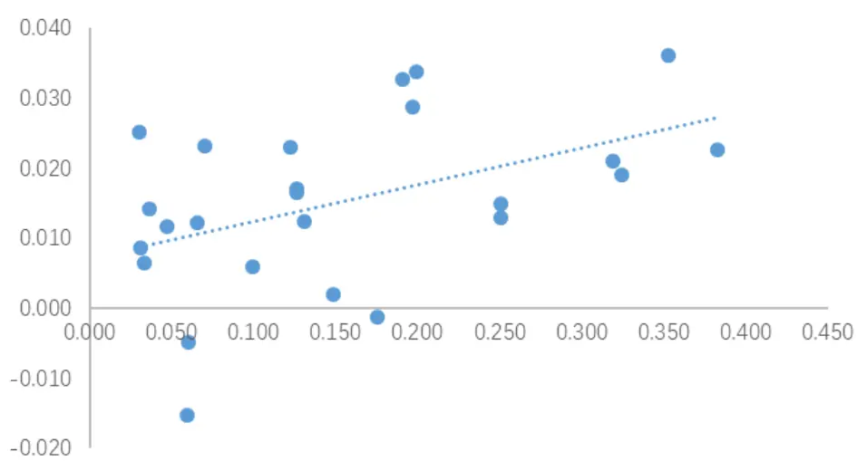
资料来源：国盛证券研究所，Wind

图表8:应收账款周转率变化因子测试

|  | 应收账款占比 IC | ICIR |
| --- | --- | --- |
| 电力设备 | 0.383 0.023 | 0.663 |
| 国防军工 | 0.353 0.036 | 0.687 |
| 机械 0.324 | 0.019 | 0.812 |
| 计算机 0.319 | 0.021 | 0.613 |
| 电子元器件 0.251 | 0.015 | 0.592 |
| 医药 0.250 | 0.013 | 0.567 |
| 传媒 0.199 | 0.034 | 0.854 |
| 建筑 0.196 | 0.029 | 0.821 |
| 通信 0.191 | 0.033 | 0.800 |
| 电力及公用事业 0.175 | -0.001 | -0.044 |
| 轻工制造 0.149 | 0.002 | 0.048 |
| 建材 0.131 | 0.012 | 0.374 |
| 基础化工 0.126 | 0.016 | 0.758 |
| 纺织服装 0.126 | 0.017 | 0.418 |
| 汽车 0.122 | 0.023 | 0.823 |
| 家电 0.099 | 0.006 | 0.164 |
| 交通运输 0.070 | 0.023 | 0.767 |
| 餐饮旅游 0.065 | 0.012 | 0.248 |
| 煤炭 0.060 | -0.005 | -0.085 |
| 农林牧渔 0.059 | -0.015 | -0.475 |
| 有色金属 0.047 | 0.012 | 0.377 |
| 商贸零售 0.036 0.033 | 0.014 | 0.423 |
| 食品饮料 | 0.006 | 0.176 |
| 钢铁 0.031 | 0.009 | 0.168 |
| 石油石化 0.030 | 0.025 | 0.487 |

资料来源：国盛证券研究所，Wind

还有一些因子，例如 asset_turnover_q_delta，netmargin_ratio_q 等，尽管它们有很强的全市场逻辑以及全市场表现，但是我们在测试中发现只有半数行业这些因子有显著的选股效果，我们并没有找到在哪些行业这些因子更加适用的逻辑，也有可能该因子在不同行业的表现本身并没有显著的差异，我们测试的结果是由于历史样本造成的,因此我们不在模型中加入他们。而对于上述找到逻辑的因子，由于因子和股票未来收益的逻辑并不是那么直接，我们基本上都是通过寻找子样本的方法来寻找逻辑，这一方法在学术研究中也非常常见，例如Titman（2004）通过寻找子样本因子表现的方法来证明过度投资是导致超额资本支出和股票收益负相关的原因。但由于上述的一些因子我们是先测试再寻找的逻辑，我们不排除该方法存在过拟合的可能性。

## 2.2 特质因子

特质因子由于只在某些行业里面有特定的逻辑，因此不需要进行行业的横向比较。对于这类因子，最好是自上而下的寻找行业的逻辑，然后再进行测试。而对于先测试出来的结果，我们需要谨慎对待。因为尽管某个因子全市场无效，但分 29个样本测试，在其中一个样本有效的概率也较大，对于这类因子，我们需要进行多重检验。

由于财务指标例如运营效率类指标，负债类指标大多都是各行业均较为适用的指标，因此行业内特质的财报因子并不多，下面我们列出了一些常见的行业特质因子。

## 2.2.1 银行

通过参考我们前期的报告《银行行业基本面量化——选股与择时》，我们选取了净息差和和拨备覆盖率两个因子。其中净息差代表了银行的盈利能力，净息差越高，说明银行单位生息资产的盈利能力。因此净息差越高的公司，未来营收和净利润的增长也会越快。

图表9:净息差因子分组超额收益
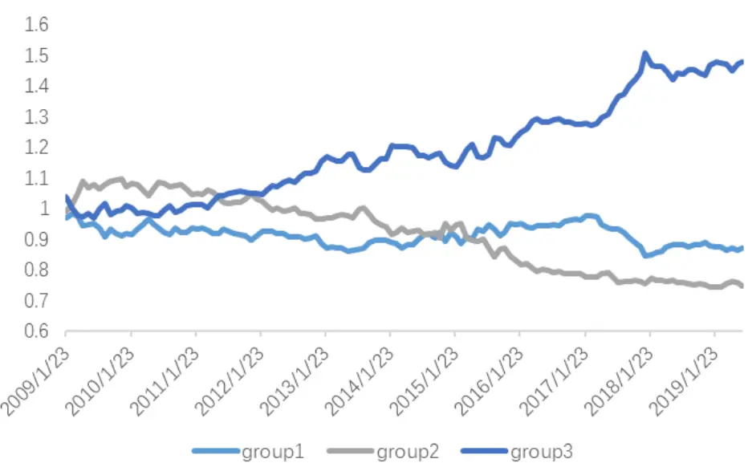
资料来源：国盛证券研究所，Wind

拨备覆盖率本来是一个衡量银行风险的因子，指贷款损失准备对不良贷款的比率，主要反映商业银行对贷款损失的弥补能力和对贷款风险的防范能力。但是这个指标经常被银行作为调节利润的工具。例如某银行资产规模和营收同步增长，对应的不良资产也同比例增长，如果要维持前期的拨备覆盖率，就要计提更多的减值准备，从而使得净利润的增长降低。有些银行会选择不计提，保持较高的报表净利润增速，但使得拨备覆盖率降低。因此维持一个较高的拨备覆盖率代表公司对其当前以及未来盈利有足够的信心。但这个因子未来有失效的可能，这是由于新政策规定银行的拨备覆盖率不得高于 2，使得银行无法通过提高减值准备的计提来隐藏利润。

图表10:拨备覆盖率因子第一组超额收益
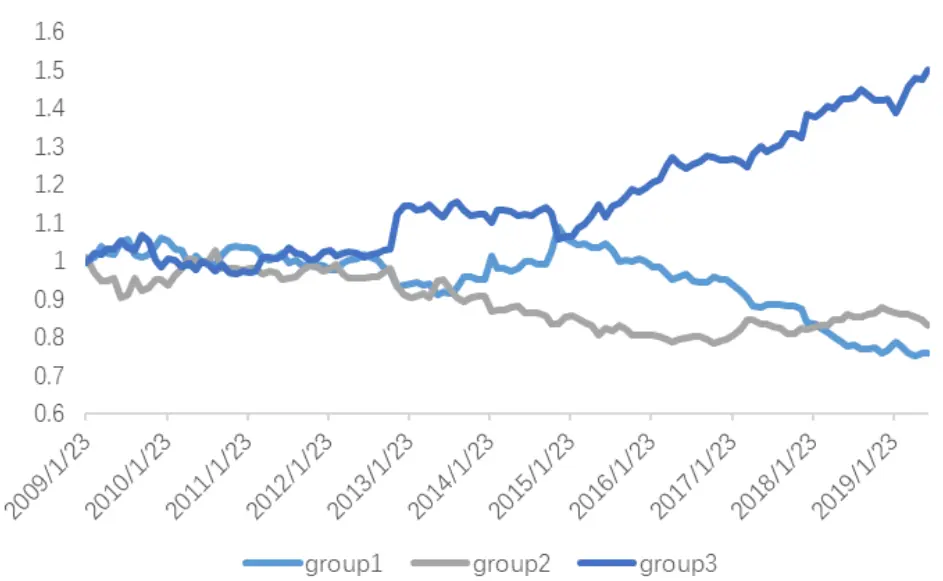
资料来源：国盛证券研究所，Wind

## 2.2.2 券商

估值因子是券商行业最有效的因子。由于券商行业每个月会及时的发布其上月的经营情况，我们根据最新的月报数据构造估值因子ep、bp、sp，并与使用财务报表构建的估值因子相比较。尽管 IC 和 ICIR 上与原因子没有显著差别，但是 ep，sp 因子的单调性变好，第一组的收益有略微提升，bp几乎没有差别。

图表11：券商估值因子第一组超额收益
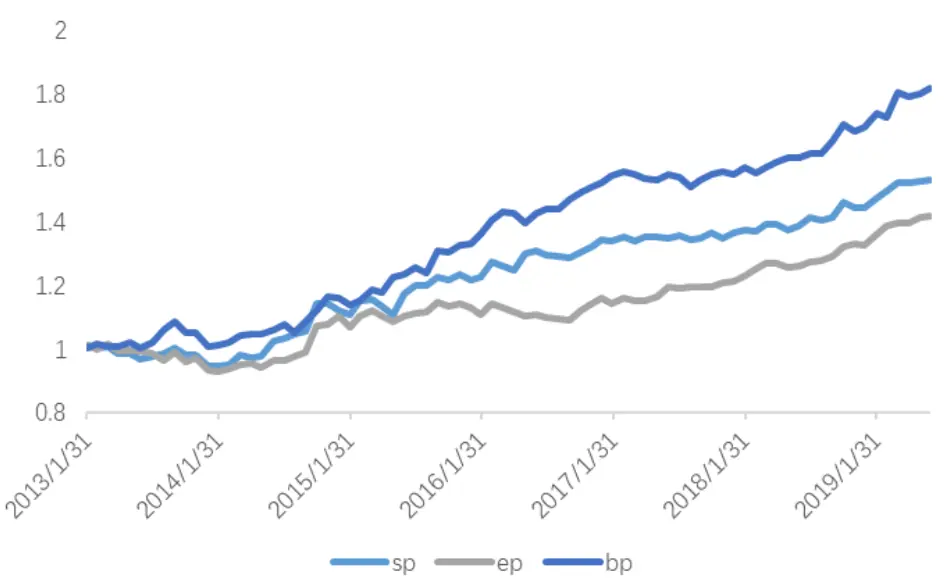
资料来源：国盛证券研究所，Wind

## 2.2.3 地产

受“预售制”的影响，房企利润表通常为历史项目的现实确认，因此利润表科目是滞后于企业当前的经营状况的，我们需要从另外两张报表来寻找地产企业当前的增长情况。现金流量表相比利润表更能反映地产公司目前的经营状况，但是销售商品提供劳务获得的现金流增长这一指标最近几年表现一般。我们使用业绩保障系数=预收账款/营业收入TTM 来作为房地产公司增长的代理指标。预收账款代表着企业当前的销售情况，而营业收入代表这过去，业绩保障系数越大，代表企业未来年度的业绩更有保障。

图表12：地产行业成长因子第一组超额收益
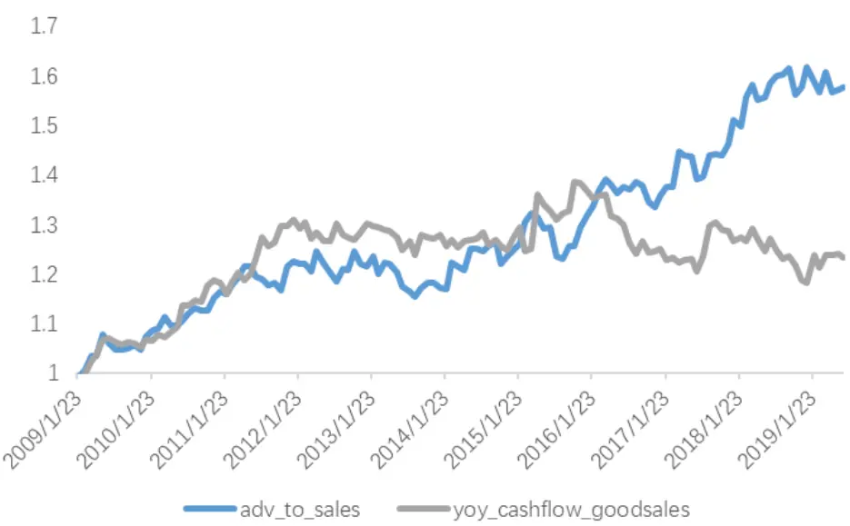
资料来源：国盛证券研究所，Wind

另外，流动负债和总负债增长因子在地产行业有较好的表现。这是由于房地产行业为高杠杆经营的行业，发债是其主要的融资渠道。负债的增长能够侧面反映公司的业务的扩张，能够预测其未来营收的增长。但随着宏观去杠杆的进行，该因子在 18年之后表现一般，其未来的表现需要进一步的观察。

图表13：流动负债增长因子第一组超额收益
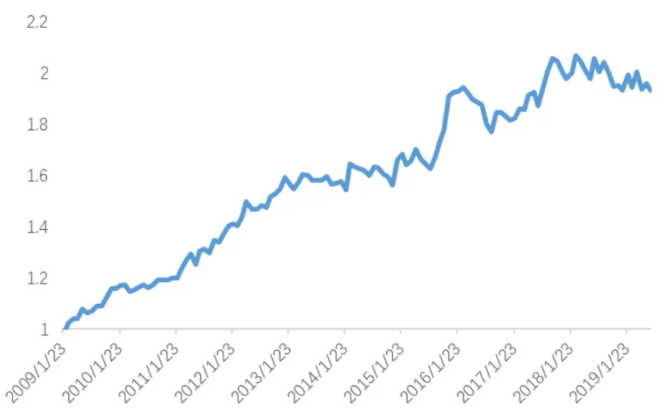
资料来源：国盛证券研究所，Wind

## 2.2.4 其他

传媒行业近年来最受关注的便是商誉因子。我们测了商誉占净资产比例这一因子，发现其效果较好。但这个因子更多的是一个负向因子，即商誉占比最高的一组，几乎稳定跑输市场。

图表14:商誉占比因子IC累计值
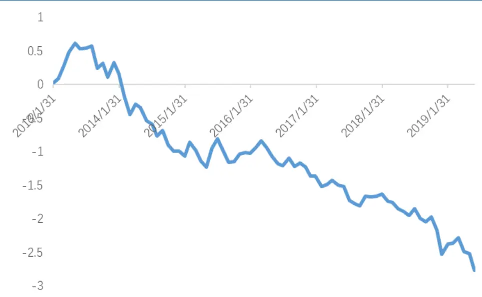
资料来源：国盛证券研究所，Wind

电子，计算机，医药行业，研发强度因子均有较好的表现。

图表15：各行业研发强度第一组超额收益
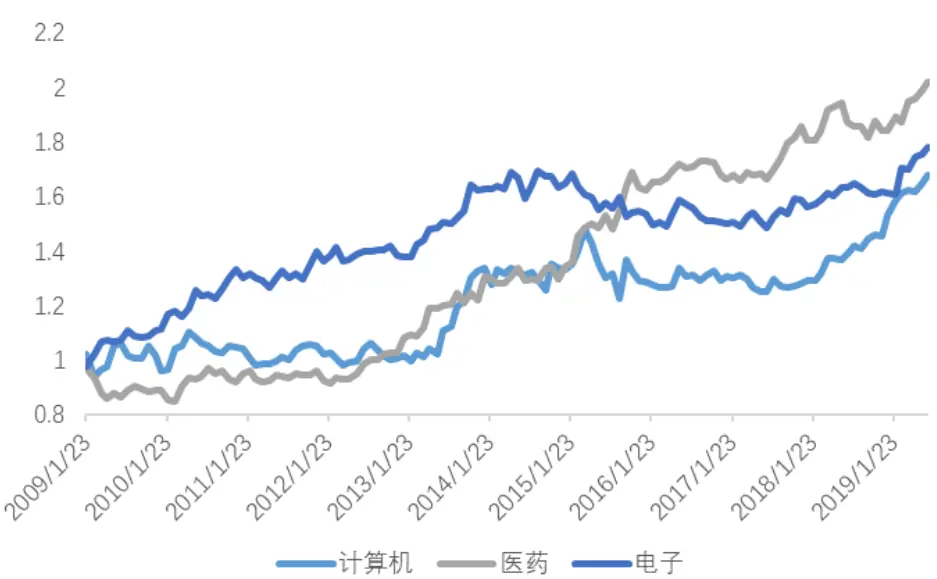
资料来源：国盛证券研究所，Wind

除此之外，对于那些并不是行业特有的逻辑，而是在测试中发现的特质因子，我们需要使用多重检验来排除过拟合的可能。尤其是一些经营类因子，或者杠杆类因子，由于其全市场并没有稳定的 alpha，只是在某些行业测出来好，因此很容易得出某行业较为重视该方面的经营效率或者杠杆风险这样的伪逻辑而陷入过拟合。

从纯测试的角度来说，我们对一个因子在所有行业内的测试结果进行多重检验，采用 BHY调整，发现大部分原本在少数两三个行业中有效的因子，经过调整之后变得都不显著了。这可能是由于财务因子显著性相对于价量因子不是特别高，在多重检验下，我们通过单纯的测试得到的财务因子基本上都不能通过检验。因此通过纯测试的方法得到的因子我们需要谨慎考虑其过拟合的可能性。

## 2.3 汇总

在上述的分析中，我们尽可能的从逻辑出发，针对因子在不同行业的适用性，以及一些行业的特质逻辑，选取了每个行业适用的因子。因子最少的行业只有 3 个因子，而因子最多的行业也只有 8 个因子。虽然我们选取的因子不多且都是一些常见的因子，但是基本能够保证这些因子在行业内是有逻辑的，其因子表现是可以持续的。如果今后能够再找到某些因子的行业逻辑，我们可以对该因子列表进行持续的填充。

图表16:各行业选取因子汇总

| 行业 | 因子 |
| --- | --- |
| 交通运输 | ep、yoy_np_q、roe_q_delta、roe_q |
| 证券 | bp、ep_12m、sp_12m |
| 有色金属 | ep、yoy_np_q、roe_q_delta、roe_q、bp |
| 银行 | bp、ep、yoy_or_q、yoy_np_q、roe_q_delta、roe_q、nim、npc |
| 医药 | ep、yoy_np_q、roe_q_delta、roe_q、rd_or、inv_turnover_q_delta |
| 通信 | ep、yoy_np_q、roe_q_delta、roe_q、yoy_or_q |
| 食品饮料 | ep、yoy_np_q、roe_q_delta、roe_q、inv_turnover_q_delta |
| 石油石化 | ep、yoy_np_q、roe_q_delta、roe_q、bp |
| 商贸零售 | ep、yoy_or_q、roe_q_delta、roe_q、inv_turnover_q_delta |
| 轻工制造 | ep、yoy_np_q、roe_q_delta、roe_q |
| 汽车 | ep、yoy_np_q、roe_q_delta、roe_q、inv_turnover_q_delta |
| 农林牧渔 | ep、bp、sue1 |
| 煤炭 | ep、yoy_np_q、roe_q_delta、roe_q、bp |
| 建筑 | ep、yoy_np_q、roe_q_delta、roe_q、bp、acct_rcv_turnover_q_delta |
| 建材 | ep、yoy_np_q、roe_q_delta、roe_q、bp |
| 家电 | ep、yoy_np_q、roe_q、inv_turnover_q_delta |
| 计算机 | ep、yoy_np_q、roe_q_delta、roe_q、yoy_or_q、acct_rcv_turnover_q_delta、rd_or |
| 基础化工 | ep、yoy_np_q、roe_q_delta、roe_q |
| 机械 | ep、yoy_np_q、roe_q_delta、roe_q、bp、acct_rcv_turnover_q_delta |
| 国防军工 | ep、yoy_np_q、roe_q_delta、roe_q |
| 钢铁 | ep、yoy_np_q、roe_q_delta、roe_q、bp |
| 纺织服装 | ep、yoy_np_q、roe_q_delta、roe_q |
| 房地产 | bp、cur_liab_yoy、adv_to_sales |
| 电子元器件 | ep、yoy_np_q、roe_q_delta、roe_q、yoy_or_q、rd_or |
| 电力设备 | ep、yoy_np_q、roe_q_delta、roe_q、acct_rcv_turnover_q_delta |
| 电力及公用事业 | ep、yoy_np_q、roe_q_delta、roe_q |
| 传媒 | ep、yoy_np_q、roe_q_delta、roe_q、yoy_or_q、goodwill_to_bv |

资料来源：国盛证券研究所

## 三、组合构建

得到每个行业适用的指标之后，我们尝试构建行业内的选股模型。我们将因子分为估值，成长，盈利和其他四类，然后在小类中等权合成，再将大类因子用 ICIR加权。由于行业中样本过少，ICIR较为不稳定，这里我们使用过去24个月的ICIR值作为权重。得到各行业内的组合之后，我们将其和全市场选股的模型进行对比。

第二节中提到餐饮旅游行业的股票过少，而且常见的因子对其也没有预测能力，因此我们不对餐饮旅游行业进行行业内预测。综合行业没有特定的行业逻辑，我们也不对其进行行业内的预测。对于银行券商行业，全市场模型几乎没有预测能力。其他行业中，建筑，国防，石油石化等行业，行业内模型是要略好于全市场模型的，但是电力设备，建材等行业，行业模型要略差于全市场模型。

图表17：模型表现对比

| 全市场选股 |  |  |  |  | 行业内选股 |  |  |  |
| --- | --- | --- | --- | --- | --- | --- | --- | --- |
|  | 年化收益 | 年化波动 | IR | 最大回撤 | 年化收益 | 年化波动 | IR | 最大回撤 |
| 银行 | 0.00 | 0.06 | 0.01 | 0.17 | 0.08 | 0.06 | 1.43 | 0.04 |
| 证券 | 0.01 | 0.07 | 0.18 | 0.26 | 0.09 | 0.07 | 1.29 | 0.10 |
| 建筑 | 0.09 | 0.08 | 1.15 | 0.11 | 0.11 | 0.08 | 1.45 | 0.10 |
| 国防军工 | 0.04 | 0.08 | 0.56 | 0.11 | 0.06 | 0.08 | 0.75 | 0.12 |
| 石油石化 | 0.07 | 0.08 | 0.86 | 0.16 | 0.09 | 0.08 | 1.17 | 0.07 |
| 汽车 | 0.06 | 0.07 | 0.79 | 0.10 | 0.10 | 0.05 | 1.95 | 0.04 |
| 有色金属 | 0.06 | 0.06 | 1.03 | 0.12 | 0.07 | 0.06 | 1.19 | 0.07 |
| 纺织服装 | 0.03 | 0.07 | 0.62 | 0.09 | 0.05 | 0.05 | 0.96 | 0.08 |
| 计算机 | 0.08 | 0.06 | 1.19 | 0.05 | 0.08 | 0.06 | 1.24 | 0.07 |
| 房地产 | 0.03 | 0.05 | 0.58 | 0.14 | 0.06 | 0.05 | 1.15 | 0.09 |
| 交通运输 | 0.07 | 0.06 | 0.99 | 0.09 | 0.06 | 0.07 | 0.82 | 0.08 |
| 家电 | 0.04 | 0.08 | 0.57 | 0.14 | 0.05 | 0.09 | 0.57 | 0.22 |
| 食品饮料 | 0.08 | 0.08 | 1.08 | 0.19 | 0.11 | 0.06 | 1.69 | 0.05 |
| 轻工制造 | 0.09 | 0.08 | 1.17 | 0.07 | 0.11 | 0.07 | 1.50 | 0.08 |
| 传媒 | 0.06 | 0.08 | 0.68 | 0.12 | 0.08 | 0.08 | 0.87 | 0.12 |
| 电力及公用事业 | 0.06 | 0.06 | 1.10 | 0.08 | 0.08 | 0.07 | 1.17 | 0.12 |
| 商贸零售 | 0.05 | 0.07 | 0.80 | 0.10 | 0.08 | 0.06 | 1.33 | 0.06 |
| 医药 | 0.09 | 0.05 | 1.87 | 0.05 | 0.10 | 0.04 | 2.23 | 0.02 |
| 煤炭 | 0.10 | 0.07 | 1.29 | 0.09 | 0.09 | 0.07 | 1.31 | 0.13 |
| 电子元器件 | 0.10 | 0.06 | 1.62 | 0.05 | 0.10 | 0.05 | 1.86 | 0.04 |
| 农林牧渔 | 0.09 | 0.08 | 1.14 | 0.10 | 0.07 | 0.05 | 1.15 | 0.05 |
| 通信 | 0.11 | 0.07 | 1.42 | 0.08 | 0.09 | 0.07 | 1.32 | 0.05 |
| 钢铁 | 0.11 | 0.11 | 0.96 | 0.10 | 0.08 | 0.10 | 0.83 | 0.11 |
| 基础化工 | 0.10 | 0.05 | 1.84 | 0.04 | 0.10 | 0.05 | 1.96 | 0.02 |
| 机械 | 0.10 | 0.04 | 2.23 | 0.03 | 0.08 | 0.04 | 1.85 | 0.05 |
| 建材 | 0.12 | 0.09 | 1.24 | 0.10 | 0.10 | 0.08 | 1.14 | 0.09 |
| 电力设备 | 0.12 | 0.06 | 2.15 | 0.03 | 0.10 | 0.06 | 1.71 | 0.03 |

资料来源：国盛证券研究所，Wind

由上表我们发现，即使我们按照行业的逻辑选取了因子，我们也很难做到在所有行业中都能够跑赢全市场模型。我们认为这也是做行业选股一个常见的误区，就是希望每个行业我们都能做的较好，战胜全市场模型。可能从理论上，这个结论就无法实现。在综述中我们提到，行业股票的数量是制约行业选股效果最重要的原因。尽管我们能够选取出行业适用的因子，但是由于行业样本量太少，我们的对行业内股票收益的估计仍然可能不太准确。这其实对应着机器学习中的 biasvariancetradeoff。行业内选股减小了 bias，但是增加了 variance，因此最后的结果不一定比原来高 bias 低 variance 的全市场模型好。另一方面，我们在行业模型中加入的因子信息较少，这是由于很多因子没有典型的行业逻辑，例如薪酬类，分析师类因子，以及我们前一部分没有找到逻辑的财务因子。因此我们发现尽管我们有针对性的对每个行业选取了因子，还是有很多行业的行业内模型要弱于全市场模型。行业内选股模型的 alpha的整体IC 要低于全市场模型（图表 18）

从逻辑上来讲，我们认为券商，银行，地产这三个行业行业内选股模型预测的会更加准确，因为其行业逻辑与其他行业有较大差别。而综合，餐饮旅游这两个行业由于股票数量过少，且没有共同的行业内逻辑，我们使用全市场模型。对于其他行业，我们无法从逻辑出发来判定哪个模型会更好。但值得注意的是，两个模型的预测值相关度较低，平均只有 0.4 左右。因此对于其他行业，一个更好的方法就是将两个预测结合起来从而进一步提高模型预测的准确性。

图表18:全市场模型和行业选股模型相关系数
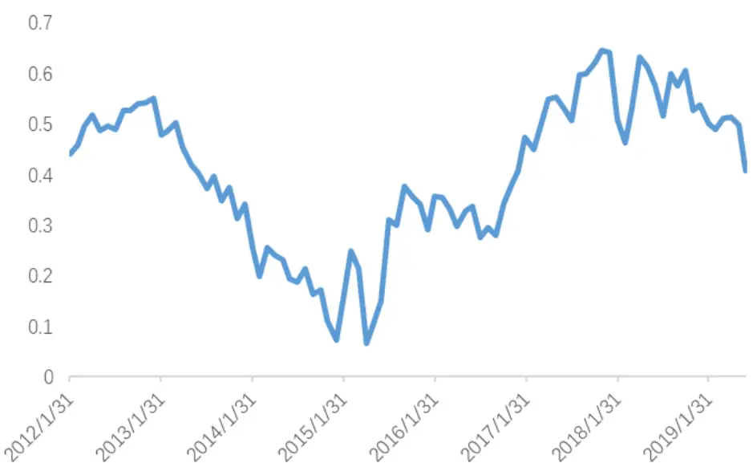
资料来源：国盛证券研究所，Wind

我们分别测试两种结合预测的方法：

1）在每个行业内，将两个预测按其过去两年 ICIR进行加权，如果其中一个模型过去两年无效，即 ICIR为负，则使用另外一个预测，如果两个模型都无效，则等权加权。2）不区分行业，直接用全截面过去两年的表现进行加权，其他细节与方法一一致。

图表19:各模型表现

|  | 第一组年化收益 | 第一组年化波动 | 信息比 | IC | ICIR |
| --- | --- | --- | --- | --- | --- |
| 全市场选股 | 0.084 | 0.028 | 2.896 | 0.063 | 3.443 |
| 行业内选股 | 0.095 | 0.021 | 4.443 | 0.055 | 3.741 |
| 方法一 | 0.099 | 0.024 | 3.974 | 0.070 | 4.186 |
| 方法二 | 0.103 | 0.025 | 4.047 | 0.070 | 4.135 |

资料来源：国盛证券研究所，Wind

尽管行业内选股模型的 IC值要低于全市场选取模型，但是将二者结合之后，alpha信号的 IC 以及其 ICIR 都有显著的提高。但是对于结合方法，方法一和方法二并无显著的差别。

图表20:各模型表现对比

|  | 方法二合成 |  | 行业内选股 |  | 全市场模型 |  | 合成模型-全市场模型 |  |
| --- | --- | --- | --- | --- | --- | --- | --- | --- |
|  | 年化收益 | IC | 年化收益 | IC | 年化收益 | IC | 收益差值 | IC 差值 |
| 石油石化 | 0.136 | 0.095 | 0.094 | 0.081 | 0.070 | 0.066 | 0.066 | 0.028 |
| 传媒 | 0.110 | 0.060 | 0.075 | 0.047 | 0.061 | 0.049 | 0.049 | 0.011 |
| 计算机 | 0.118 | 0.067 | 0.084 | 0.057 | 0.078 | 0.052 | 0.040 | 0.015 |
| 轻工制造 | 0.125 | 0.082 | 0.116 | 0.069 | 0.091 | 0.066 | 0.035 | 0.016 |
| 食品饮料 | 0.105 | 0.095 | 0.100 | 0.084 | 0.082 | 0.081 | 0.023 | 0.014 |
| 基础化工 | 0.121 | 0.080 | 0.091 | 0.062 | 0.100 | 0.079 | 0.021 | 0.001 |
| 建材 | 0.139 | 0.103 | 0.097 | 0.069 | 0.118 | 0.091 | 0.021 | 0.012 |
| 汽车 | 0.076 | 0.066 | 0.098 | 0.068 | 0.056 | 0.054 | 0.021 | 0.012 |
| 建筑 | 0.105 | 0.079 | 0.110 | 0.088 | 0.085 | 0.053 | 0.019 | 0.027 |
| 通信 | 0.126 | 0.083 | 0.076 | 0.067 | 0.107 | 0.078 | 0.019 | 0.005 |
| 钢铁 | 0.127 | 0.090 | 0.081 | 0.069 | 0.110 | 0.081 | 0.017 | 0.009 |
| 国防军工 | 0.060 | 0.062 | 0.061 | 0.073 | 0.043 | 0.049 | 0.016 | 0.014 |
| 有色金属 | 0.071 | 0.064 | 0.067 | 0.061 | 0.059 | 0.051 | 0.012 | 0.012 |
| 家电 | 0.054 | 0.055 | 0.043 | 0.053 | 0.044 | 0.049 | 0.010 | 0.006 |
| 商贸零售 | 0.060 | 0.053 | 0.075 | 0.051 | 0.051 | 0.051 | 0.008 | 0.002 |
| 医药 | 0.100 | 0.077 | 0.093 | 0.068 | 0.092 | 0.073 | 0.008 | 0.003 |
| 煤炭 | 0.103 | 0.099 | 0.083 | 0.079 | 0.096 | 0.086 | 0.007 | 0.013 |
| 电力及公用事业 | 0.067 | 0.068 | 0.075 | 0.060 | 0.061 | 0.059 | 0.006 | 0.009 |
| 电子元器件 | 0.109 | 0.078 | 0.098 | 0.069 | 0.106 | 0.079 | 0.002 | -0.001 |
| 交通运输 | 0.069 | 0.061 | 0.059 | 0.054 | 0.069 | 0.047 | 0.001 | 0.014 |
| 机械 | 0.098 | 0.072 | 0.078 | 0.060 | 0.097 | 0.077 | 0.001 | -0.005 |
| 电力设备 | 0.120 | 0.084 | 0.097 | 0.063 | 0.121 | 0.094 | -0.001 | -0.009 |
| 纺织服装 | 0.022 | 0.040 | 0.046 | 0.045 | 0.033 | 0.035 | -0.011 | 0.004 |
| 农林牧渔 | 0.078 | 0.056 | 0.060 | 0.042 | 0.092 | 0.052 | -0.014 | 0.004 |

资料来源：国盛证券研究所，Wind

分行业来看，合成后的预测模型不管是从 IC的角度还是从分组收益的角度，基本在所有行业都优于全市场模型。但只在少数行业有显著的提升，大部分行业提升较少，分组收益和 IC都仅在1%左右。

我们用上述两个方法分别构建 500 增强和 300增强组合，结果如下

图表21：300增强策略净值
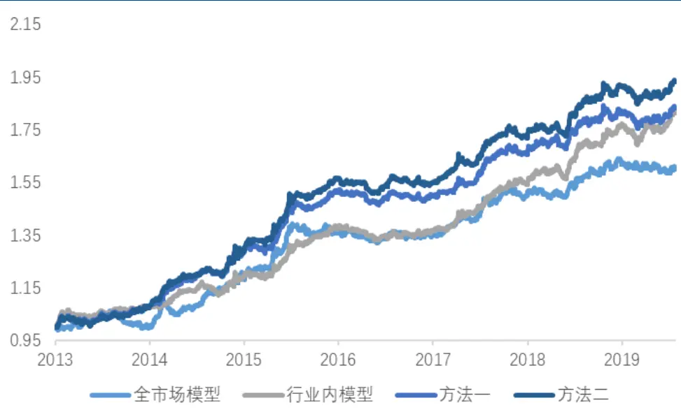
资料来源：国盛证券研究所，Wind

图表22：300增强结果对比

|  | 全市场模型 | 行业内模型 | 方法一 | 方法二 |
| --- | --- | --- | --- | --- |
| 年化收益 | 0.077 | 0.098 | 0.100 | 0.109 |
| 年化波动 | 0.053 | 0.048 | 0.050 | 0.051 |
| IR | 1.452 | 2.061 | 2.017 | 2.140 |
| 最大回撤 | 0.061 | 0.046 | 0.048 | 0.041 |

资料来源：国盛证券研究所，Wind

图表23:300增强归因分析
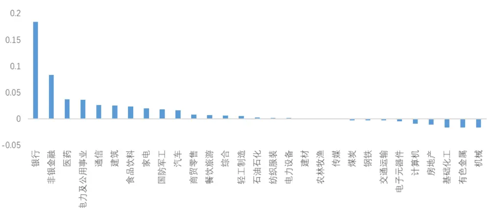
资料来源：国盛证券研究所，Wind

图表24:500增强策略净值
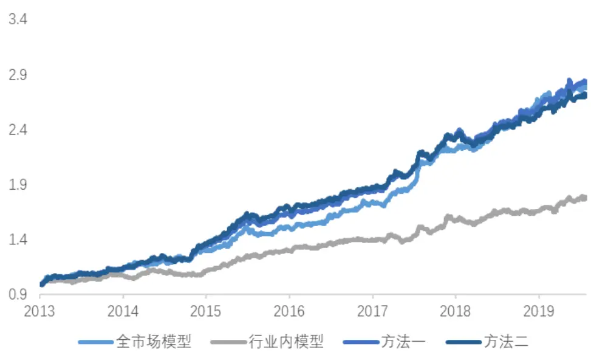
资料来源：国盛证券研究所，Wind

图表25：500增强结果对比

|  | 全市场模型 | 行业内模型 | 方法一 | 方法二 |
| --- | --- | --- | --- | --- |
| 年化收益 | 0.175 | 0.095 | 0.179 | 0.171 |
| 年化波动 | 0.061 | 0.054 | 0.058 | 0.058 |
| IR | 2.880 | 1.777 | 3.096 | 2.928 |
| 最大回撤 | 0.055 | 0.051 | 0.055 | 0.051 |

资料来源：国盛证券研究所，Wind

图表26:500增强归因分析
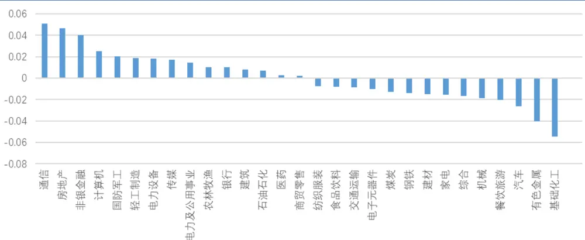
资料来源：国盛证券研究所，Wind

从测试结果来看，行业内选股模型对 300增强有较为显著的提升作用，但通过归因，我们发现超额收益的来源主要是银行和券商两个行业。由于全市场模型对这两个行业没有任何超额收益，行业内模型对这个行业有较为显著的提升。另一方面，银行和券商占 300指数的权重较大，因此 300增强模型提升较为显著。而对于500 增强模型，我们发现行业内选股基本上没有任何的提升，从归因结果来看，也是一半行业变好，一半行业变差。

这可能是由于500的权重行业例如医药、电子等，我们并没有找到很多的特质因子，因此增量信息并不多，另一方面，500 的行业权重较为分散，如果想要有显著的提升，可能需要对大部分行业都要有比较明显的提升。

## 四、总结、思考与展望

如何将行业内的信息纳入进传统的多因子模型是大家一直较为关心的问题。本报告对行业内选股模型进行了初步的探索，试图寻找到行业内选股的有效解决办法。通过阅读已有的报告和结论，我们放弃了纯测试的方法。但在试图通过纯逻辑的方法去寻找有效因子时，总是会跟随着行业研究的思路把逻辑拆的越来越细，从而很难形成有效的选股因子。因此，我们最终采取了测试和逻辑相结合的方法，为了避免该方法过拟合的可能，我们将因子分为基础因子和特质因子，并用不同的方法分别去寻找他们的逻辑，从而得到了每个行业的适用因子列表。我们使用这些因子构建行业内选股模型，并与原来的全市场预测相结合，在大部分行业内，结合后的预测都略好于原本的全市场预测。最后我们构建了 300和 500增强组合，300增强模型有所提升，而500 增强模型提升不大。其中 300增强的提升主要是由于银行和券商两个行业。

本报告是我们对于行业内选股的初步尝试，得到的结论与目前市场上的认识基本一致。基于研究过程中的思考以及研究结论，我们认为行业内模型未来的研究方向如下：

1） 首先，我们在研究过程中花大量的时间研究了基础类因子在不同行业的表现及其逻辑，试图对于每个行业给出有逻辑且适用的因子。但如果仅使用全市场模型已有的因子，即使正确且有逻辑的选取了每个行业有效的因子，分行业建模带来的增量信息并不多。这一方法对于行业指数增强策略有一定的意义，但如果想提升宽基指数增强策略或者全行业的主动量化策略，这一方法可能不会有显著效果。因此未来的研究应该更加集中在新因子的寻找，而不是对原有因子的分域研究。

2） 其次，我们在寻找选股因子时，还是基于多因子的思路，希望找到对整个行业都有选股效果的因子，但对整个行业有意义的指标基本上都是常见的财务指标，这就导致很难寻找到新的增量信息。因此，未来的研究中，我们不一定要延续多因子大样本的思想，可以先从逻辑出发，找到细分小样本中的特质因子，这样至少能够保证该因子是有增量信息的，再想办法将该信息结合进原有模型。

3） 最后，不同行业由于行业特征和行业样本不同，不一定都适合在行业内进行建模预测。因此，我们如果想使用行业内选股提高原有策略，应当针对策略的特征进行研究。例如对于 500增强策略，我们可以对其进行归因分析，对贡献超额收益较少的行业以及权重较大的行业进行针对性的研究，最终的提升效果可能会更加显著。

除了以上改进方向之外，在我们的研究过程中，也发现了一些难以解决的问题：

1) 行业逻辑并不是一成不变的，在不同的时间段，行业的选股逻辑可能完全不同。即使我们找到一些有行业逻辑且有选股效果的指标，但这个指标是有适用环境的，可能只在该行业某一历史时间段有用，这样的逻辑较难结合进量化的选股模型。

2) 行业的基本面逻辑，大部分只研究指标和公司盈利的关系，而我们寻找的指标需要其有直接预测收益的能力。很多时候在寻找特质因子时，也是先基于另类数据的测试，然后给出结论，例如测试研发强度在医药行业有选股效果，我们可能会直接给出研发强度高的公司，创新能力高，未来成长性较好这种直觉得到的结论，但事实上可能研发强度的选股效果并不是由于上述的逻辑。由于行业样本少，即使是使用另类数据，在寻找特质因子时同样容易陷入过拟合的问题。因此在我们通过逻辑寻找因子时，如何建立指标与未来收益的逻辑关系有待进一步研究。

3) 在改进思路中，我们提出可以缩小样本以寻找细分领域的逻辑，但如何将大量子样本的信息结合到模型中也有待研究。

事实上，上述问题也是当前主动投资和量化投资在结合过程中面临的重要问题，在未来的报告中，我们将会进一步对这些问题进行思考，提出可行解决方案。

## 五、参考文献

Alan Y, Gao G P, Gaur V. Does inventory productivity predict future stock returns? A retailing industry perspective[J]. Management Science, 2014, 60(10): 2416-2434.

Timmermann A. Forecast combinations[J]. Handbook of economic forecasting, 2006, 1: 135-196.

张然. 基本面量化投资: 运用财务分析和量化策略获取超额收益[M]. 北京大学出版社,2017.

## 风险提示

以上结论均基于历史数据和统计模型的测算，如果未来市场环境发生改变，不排除模型失效的可能性。

## 免责声明

国盛证券有限责任公司（以下简称“本公司”）具有中国证监会许可的证券投资咨询业务资格。本报告仅供本公司的客户使用。本公司不会因接收人收到本报告而视其为客户。在任何情况下，本公司不对任何人因使用本报告中的任何内容所引致的任何损失负任何责任。

本报告的信息均来源于本公司认为可信的公开资料，但本公司及其研究人员对该等信息的准确性及完整性不作任何保证。本报告中的资料、意见及预测仅反映本公司于发布本报告当日的判断，可能会随时调整。在不同时期，本公司可发出与本报告所载资料、意见及推测不一致的报告。本公司不保证本报告所含信息及资料保持在最新状态，对本报告所含信息可在不发出通知的情形下做出修改，投资者应当自行关注相应的更新或修改。

本公司力求报告内容客观、公正，但本报告所载的资料、工具、意见、信息及推测只提供给客户作参考之用，不构成任何投资、法律、会计或税务的最终操作建议,本公司不就报告中的内容对最终操作建议做出任何担保。本报告中所指的投资及服务可能不适合个别客户，不构成客户私人咨询建议。投资者应当充分考虑自身特定状况，并完整理解和使用本报告内容，不应视本报告为做出投资决策的唯一因素。

投资者应注意，在法律许可的情况下，本公司及其本公司的关联机构可能会持有本报告中涉及的公司所发行的证券并进行交易，也可能为这些公司正在提供或争取提供投资银行、财务顾问和金融产品等各种金融服务。

本报告版权归“国盛证券有限责任公司”所有。未经事先本公司书面授权，任何机构或个人不得对本报告进行任何形式的发布、复制。任何机构或个人如引用、刊发本报告，需注明出处为“国盛证券研究所”，且不得对本报告进行有悖原意的删节或修改。

## 分析师声明

本报告署名分析师在此声明：我们具有中国证券业协会授予的证券投资咨询执业资格或相当的专业胜任能力，本报告所表述的任何观点均精准地反映了我们对标的证券和发行人的个人看法，结论不受任何第三方的授意或影响。我们所得报酬的任何部分无论是在过去、现在及将来均不会与本报告中的具体投资建议或观点有直接或间接联系。

## 投资评级说明

| 投资建议的评级标准 |  | 评级 | 说明 |
| --- | --- | --- | --- |
| 评级标准为报告发布日后的6个月内公司股价（或行业指数）相对同期基准指数的相对市场表现。其中A股市场以沪深300指数为基准；新三板市场以三板成指（针对协议转让标的)或三板做市指数(针对做市转让标的)为基准；香港市场以摩根士丹利中国指数为基准，美股市场以标普500指数或纳斯达克综合指数为基准。 | 股票评级 | 买入 | 相对同期基准指数涨幅在15%以上 |
|  |  | 增持 | 相对同期基准指数涨幅在5%15%之间 |
|  |  | 持有 | 相对同期基准指数涨幅在-5%~+5%之间 |
|  |  | 减持 | 相对同期基准指数跌幅在5%以上 |
|  | 行业评级 | 增持 | 相对同期基准指数涨幅在10%以上 |
|  |  | 中性 | 相对同期基准指数涨幅在-10%~+10%之间 |
|  |  | 减持 | 相对同期基准指数跌幅在10%以上 |

## 国盛证券研究所

北京

地址：北京市西城区平安里西大街 26 号楼 3 层

邮编：100032

传真：010-57671718

地址：上海市浦明路 868 号保利 One56 1 号楼 10 层

邮箱：gsresearch@gszq.com

南昌

上海

地址：南昌市红谷滩新区凤凰中大道 1115 号北京银行大厦

邮编：330038

传真：0791-86281485

邮箱：gsresearch@gszq.com

邮编：200120

电话：021-38934111

邮箱：gsresearch@gszq.com

深圳

地址：深圳市福田区福华三路 100 号鼎和大厦 24 楼

邮编：518033

邮箱：gsresearch@gszq.com