# 量化专题报告

# 多因子系列之十一：主题的风险与收益

本报告从风险和收益两个方面探讨了主题在多因子模型中的应用。近年来A 股市场股票分化较大，不少主题跑出了独立行情，我们认为研究如何将主题纳入传统的多因子模型十分必要。风险方面，当主题成为市场主要波动来源，如果不对其进行约束，可能会增大策略的风险。收益方面，主题的超额收益是独立于传统因子之外的信息源，如果能使用量化的方法获取主题的收益，则可以提升策略的表现。

主题的选取需要满足一定的条件。主题的成分股除了在基本面上有共同的驱动因素外，其涨跌幅的相关性也需要在统计上显著。我们选取了由中证指数公司等机构编制的主题指数和成分股数据，并使用回归的方法计算了主题因子的显著性、主题收益的波动以及信息比等指标。

约束主题能够有效降低策略的回撤。我们测试了将主题纳入风险模型并进行约束的策略表现，发现在月频调仓时，约束过去一个月波动较大的主题的暴露，策略的回撤有所改善，其中 19年改善最为显著，在 1%以上。通过归因，我们发现通过约束主题来控制风险的核心是通过约束大量异动的主题，在有可能牺牲一定 alpha 的情况下，降低尾部主题风险带来的策略大幅回撤。

主题存在非常显著的动量效应。我们分别测试了主题的时间序列动量和截面动量效应，发现二者都非常显著。基于该现象，我们测试了两种不同的应用方法。第一种是在做组合优化时，在高动量主题上进行主动暴露，该方法大约能够提升 1-2%的年化收益，回撤也有所改善。第二种是将主题动量因子化，主题因子在对所有风格因子中性化后十分稳定，ICIR 达到2.22，且因子与所有传统 alpha 因子均正交，能够给策略带来显著的增量信息。

未来对主题的研究需要基本面相结合。本报告使用的主题为编制好的主题指数，在未来的应用过程中，我们可以自行定义主题，这样时效性更强，而且主题的定义可以不局限在产业类或者事件类，任何我们认为可能成为未来市场波动来源的主题，都可以纳入到主题池，这样能够进一步的拓宽主题池，从而更加有效的控制策略风险或者获取收益。

风险提示：以上结论均基于历史数据和统计模型的测算，如果未来市场环境发生改变，不排除模型失效的可能性。

## 作者

分析师 刘富兵

执业证书编号：S0680518030007

邮箱：liufubing@gszq.com

研究助理 丁一凡

邮箱：dingyifan@gszq.com

## 相关研究

1、《量化周报：本轮上涨顶多还有一波 30分钟级别反弹》2020-05-17

2、《量化专题报告：利率债收益预测框架——大类资产定价系列之二》2020-05-14

3、《量化分析报告：对当下风格轮动的三点思考——因子投资 2020（三）》2020-05-11

4、《量化周报：继续等待》2020-05-10

5、《量化周报：等待回调》2020-05-05

## 一、 综述

近几年来，A 股市场的结构分化较为明显，少部分股票跑出了较强的独立行情，例如白酒、医药、猪肉、半导体等等。重仓这些股票的基金往往名列前茅，成为当年的爆款。但对于量化多因子策略来说，我们却很难获取这些主题的收益。这是因为多因子策略大多基于历史财务因子或者价量因子带来的 alpha 信息，而主题收益的来源往往是某个公司或者行业由于政策或事件的原因，短期基本面或者市场预期变好，并不是长期有效的alpha因子。其次，对主题的投资需要投资者对某个领域的基本面有较强的深度研究，和多因子策略基于广度的思想并不一致，也并不是量化所擅长的领域。因此，量化多因子策略大部分时候都并不能获取主题带来收益。

一方面传统多因子策略无法获取主题的收益，但另一方面主题却会给多因子策略带来一定的风险。当主题成为市场的关注点之一之后，其涨跌幅的波动会增大，成为市场中除了 barra 风险因子之外，又一新的风险源。而如果增强策略在主题风险上有主动的暴露，必然会增大策略的波动，回撤也有增大的可能，比如去年以来中证500增强策略的回撤。下图展示了市场上主要中证 500 增强基金的加权超额收益净值，可以看到从去年 10 月份到今年 2 月份，500 增强策略的表现比较一般，而这段时间正好是半导体主题和新能源车主题开始产生超额收益的时候，这一现象的可能原因就是由于策略在这些主题上有较大的负向主动暴露。尽管这一分析较为粗糙，更为严谨的分析应该使用组合持仓来进行归因，但从这个现象中，我们能够发现在主题上的暴露偏离确实增加了策略的风险。

图表1：公募基金500增强超额收益净值与主题超额收益净值对比
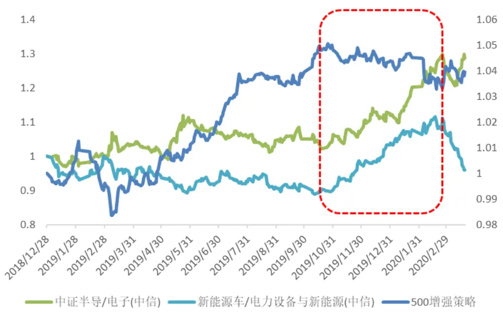
资料来源：国盛证券研究所，wing

海外市场也有对主题风险的相关研究。例如 TwoSigma曾研究了美中贸易敏感度这个主题对美股市场的影响，他们发现 15年到18年这段时间，该因子对股票收益的解释度排到了所有风格因子的前几名，在风险模型中加入该因子能够很好地提升模型的解释力度，从而更好的控制风险。

图表2：贸易敏感性因子表现
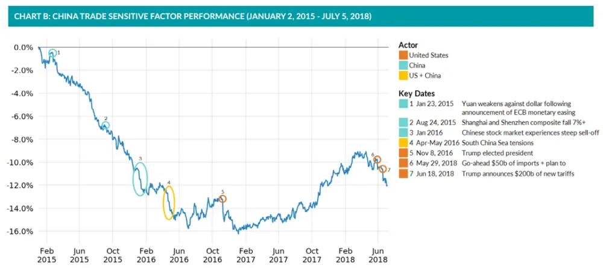
资料来源：国盛证券研究所，Two Sigma

图表3：贸易敏感性因子对收益的解释度
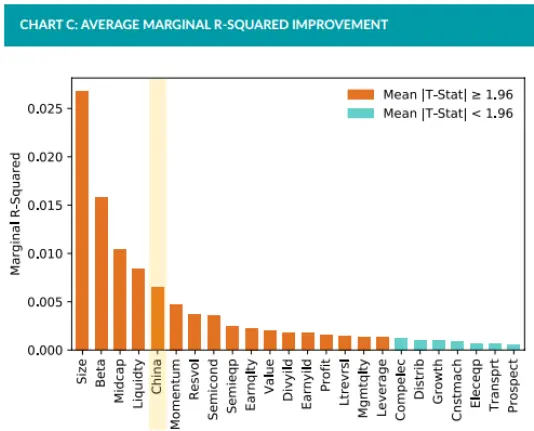

CHART D: CHINA MARGINAL R-SQUARED IMPROVEMENT - ROLLING 3 MONTH (MARCH 30, 2015 - JULY 5, 2018)
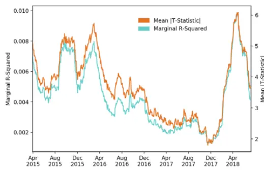
资料来源：国盛证券研究所，Two Sigma

对于以上两个问题，多因子策略该如何应对呢？从收益的角度，我们可以通过量化的方法来研究能否获得主题的超额收益，从而对主题进行主动的暴露。从风险的角度，一旦我们发现一个主题成为市场波动的主要来源之一，可以将其作为一个新的风险因子加入风险模型。本报告基于以上两个思路进行研究，主要分为以下三个部分：1）获取主题的数据并对其进行检验。2）将主题加入风险模型以降低策略的风险。3）获取主题的超额收益。

## 二、 主题的统计

市场上存在着大大小小很多主题，大的例如国企指数，成份股有上千只；小的如电子烟指数，成份股只有几只。并不是所有的主题都会对策略产生影响，成份股达到上千只的主题，其涨跌波动已经与大盘几乎一致，而成分股只有几只的主题，由于市值权重太小，几乎不会对策略产生任何的影响。因此我们需要对主题进行一定的筛选。

主题成分股的定义也需要有一定的条件。首先，成分股必须要有共同的基本面驱动因素，其次，其涨跌幅也要高度相关，具有统计显著性。有些主题虽然有很好的基本面相似性，例如 ESG 主题，但是其成份股的涨跌却并不一致，无法通过控制暴露来控制风险。而如果从历史行情的相关系数中直接挖掘出一批涨跌幅相关性很高的股票，有很高的概率这些股票基本面并不相关。例如两只股票因为不同的原因最近都是一字涨停，纯数据的方法可能会把他们归纳为一个主题，但是这两只股票未来的走势肯定不会很相似。

总结来说，我们认为主题需要满足如下三个条件：

1) 有共同的基本面驱动因素

2) 股票的涨跌相关性较高

3) 主题的成分股数量满足一定的条件，即不能过多，也不能过少

## 2.1 数据

在给定了主题的选取标准之后，我们便可以开始进行主题的寻找。对于主题最好的寻找方式是对A股市场上每一段行情进行复盘，寻找到在每一段行情中突出的主题，然后根据自身的理解，从每个公司的具体业务出发，筛选出与该主题有关联的成份股。但这需要对A 股历史行情足够了解，而且需要很强的行业研究知识，这里我们更倾向于使用已经编制好的主题指数。使用主题指数的另外一个好处是这些指数一般都是在主题出现之后才发布，而自定义的主题由于是站在当下对历史主题进行复盘，容易在回测中引入未来信息。

市场上有很多不同的主题指数。我们认为指数公司专业性更强，对成份股的选取会更加可靠，因此采用指数公司编制的指数。当然，指数公司编制的指数也一定的问题，就是较为滞后，在主题出现之后几个月才会发布相关指数。但我们发现事实上新出现的主题并不多，很多主题都是反复炒作，或者有些主题很早之前就定义好了，因此这一问题并不严重。指数公司编制的主题已经满足了第一个条件，其成份股基本面已有较强的关联性，因此，我们接下来只需要从统计上进行检验。

我们从 wind 底层数据库提取出由中证指数公司和深交所编制的所有主题指数，共计617个。但数据库中定义的主题指数较为宽泛，有些非主题的指数也包含在其中，我们对指数按一定的规则进行筛选，剔除红利类指数、一级行业类指数、风格类指数例如上游周期等。另外，我们也剔除了一些定义较为宽泛的主题指数，例如 tmt 指数，民企发展指数，国产替代指数等。根据前文对主题成份股数量的要求，删除掉指数成份股数量大于150 只，小于 10 只的指数。2020 之后发布的指数由于样本过少，我们也予以剔除，最终剩下 207个主题指数，下表列举其中的10个作为示例。

图表4：主题列表

| 代码 | 简称 | 指数名称 | 发布日期 | 发布方 |
| --- | --- | --- | --- | --- |
| 399363.SZ | 云科技 | 国证云端在线科技指数 | 20090803 | 深交所 |
| 399359.SZ | 国证基建 | 国证基建指数 | 20090803 | 深交所 |
| 399417.SZ | 新能源车 | 国证新能源车指数 | 20140924 | 深交所 |
| 399807.SZ | 高铁产业 | 中证高铁产业指数 | 20150120 | 中证公司 |
| h30597.CSI | 新材料 | 中证新材料主题指数 | 20150213 | 中证公司 |
| 930701.CSI | CS京津冀 | 中证京津冀协同发展主题指数 | 20150709 | 中证公司 |
| 930713.CSI | CS人工智 | 中证人工智能主题指数 | 20150731 | 中证公司 |
| 930728.CSI | CS 乐园 | 中证上海主题乐园指数 | 20150805 | 中证公司 |
| 930719.CSI | CS精准医 | 中证精准医疗主题指数 | 20150805 | 中证公司 |
| 399699.SZ | 金融科技 | 国证香蜜湖金融科技指数 | 20170609 | 深交所 |

资料来源：国盛证券研究所，wind

可以看到，近期收益或者波动较高的特斯拉产业链（新能源车）、医疗器械（精准医疗）等主题，都有对应的或者相关性较高的且发布时间较早的主题指数，这也部分缓解了指数公司编制的主题较为滞后的问题。主题指数大致可以分为以下几类：地域类的如京津冀指数、大湾区指数，子行业类的如白酒指数、畜牧指数，事件类的如上海主题乐园指数，以及一些复合不同行业的产业指数如新能源车、金融科技等。

## 2.2 计算主题收益

我们使用回归的方法来计算主题的日频收益，时间区间为 2016年 1 月至 2020 年 2 月。具体做法为首先将股票收益对 barra 所有的风格和行业因子进行加权回归，得到股票的特质收益。然后将主题作为一个因子，定义主题成份股值为 1，非成份股值为0，用特质收益对主题哑变量进行加权回归，得到主题的日度收益率序列，以及回归 T统计量。同时，我们也能够在时间序列上计算该主题收益一段时间的 FamaMacbethT统计量。以上方法等同于在构建 barra 模型时，将主题作为一个新的风险因子加入回归。通过使用该方法，我们完全剥离了主题收益中的市场、行业以及风格带来的收益和波动，得到主题的特质收益。我们参照 barra 对风险因子的评价方法对主题因子进行评价，计算以下统计量：

1) 因子回归 T 统计量绝对值的均值以及绝对值大于 2 的比例，该统计量能够反映该因子是否能够很好地解释股票的日度收益率。

2) 因子收益的年化波动率大小。

3) 因子收益的年化 IR大小。

若波动高，且回归的 T 统计量较为显著，则因子为风险因子。若因子波动低，回归的 T统计量不显著，则说明该因子并不是影响市场收益的主要因素。IR则代表主题历史收益的稳定性。但即使历史IR高，我们也不能认为主题因子为一个有效的 alpha因子，因为并没有逻辑来支撑主题未来仍会带来稳定的 alpha。下面我们分别展示了这三个指标的全样本排名前十的主题。其中由于有一些指数较为类似的，我们删除掉了收益率相关性高于 0.8的指数。同时，为了使得样本量足够，我们剔除了发布不满半年的指数。

图表5：全样本年化IR最高的主题

| 代码 | 名称 年化IR |
| --- | --- |
| 931081.CSI | 中证半导 2.75 |
| 931176.CSI | 台州综指 2.51 |
| h30368.CSI | 中证高新 2.32 |
| 931003.CSI | 农业改革 2.14 |
| 931152.CSI | CS 创新药 1.79 |
| h30003.CSI | 中证泛珠三角 1.68 |
| 930707.CSI | 中证畜牧 1.63 |
| 930743.CSI | 中证生科 1.56 |
| 931012.CSI | CS黄金 1.35 |
| 931087.CSI | 科技龙头 1.34 |

资料来源：国盛证券研究所，wind

图表6：全样本年化IR最高的主题收益净值
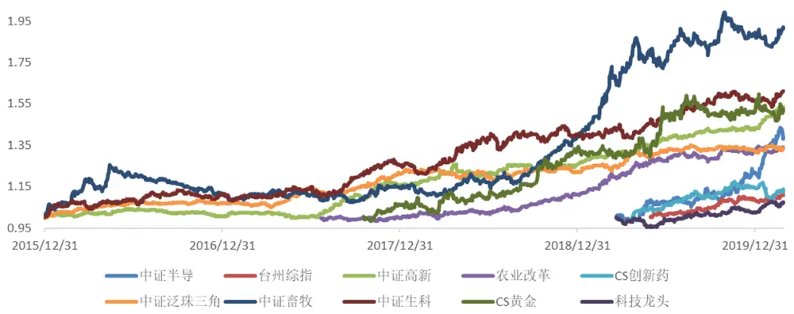
资料来源：国盛证券研究所，Wind

图表7：全样本T统计量最显著的主题

| 代码 | 名称 | IT\|均值 | \|T\|>2 比例 |
| --- | --- | --- | --- |
| 931081.CSI | 中证半导 | 2.37 | 0.48 |
| 399417.SZ | 新能源车 | 1.90 | 0.38 |
| 931012.CSI | CS黄金 | 1.79 | 0.31 |
| 399997.SZ | 中证白酒 | 1.71 | 0.33 |
| 930598.CSI | 稀土产业 | 1.61 | 0.25 |
| 931087.CSI | 科技龙头 | 1.51 | 0.28 |
| 930721.CSI | CS 智汽车 | 1.46 | 0.26 |
| 930701.CSI | CS 京津冀 | 1.44 | 0.21 |
| 931007.CSI | 新生消费 | 1.44 | 0.27 |
| 931152.CSI | CS 创新药 | 1.43 | 0.25 |

资料来源：国盛证券研究所，wind

图表8:全样本年化波动最高的主题

| 代码 | 名称 年化波动 |
| --- | --- |
| 931012.CSI CS黄金 | 0.143 |
| 931081.CSI | 中证半导 0.136 |
| 930598.CSI | 稀土产业 0.123 |
| 930632.CSI | CS稀金属 0.119 |
| 930706.CSI | 中证水泥 0.115 |
| 399997.SZ | 中证白酒 0.110 |
| 931022.CSI | 大气治理 0.107 |
| 399804.SZ | 中证体育 0.105 |
| 930707.CSI | 中证畜牧 0.102 |
| 930986.CSI | 金融科技 0.102 |

资料来源：国盛证券研究所，wind

从收益的角度看，由于中证半导指数去年 3月才发布，样本较少，而去年半导体指数表现较好，因此IR高达 2.75。其他指数例如代表高研发科技股的中证高新、与猪周期相关的中证畜牧以及创新药都有着较为稳定的收益。从主题日度收益的显著性看，半导体、新能源车、白酒、黄金这些主题在剔除了本身行业的影响外，仍有较高的收益显著性，T 统计量绝对值大于 2 的天数占比也较高，同时，这几个主题的波动也排在所有主题波动率的前列。我们计算了同样时间区间 barra 行业因子的统计量，T 统计量绝对值均值的中位数为 1.3，T 统计量绝对值大于 2 的天数占比中位数为 20%，年化波动率的均值为 11%。通过横向对比，我们认为在历史样本中，以上这些主题的风险要大于我们在barra 模型中控制的部分行业的风险，进一步确认了在风险模型中加入某些主题的必要性。

与行业因子不同的是，行业因子是从基本面逻辑出发，而且这一逻辑在任何时候都是成立的。而对于主题来说，时变性较强的，有很多主题仅仅只在短短的几个月波动较高，之后又回归正常，例如京津冀主题，只在雄安政策发布的那段时间有过短暂的行情。因此，我们不能仅仅通过全部样本的表现，来推断这些主题未来仍然会是市场的主要波动来源之一。我们除了关心全样本主题的波动，也关心其短期波动。下表列举了滚动21个交易日 T统计量绝对值和波动较高的主题。

图表9:滚动21个交易日波动最高的主题

| 代码 | 名称 | IT\|均值 | 年化波动 |
| --- | --- | --- | --- |
| 930701.CSI | CS京津冀 | 8.15 | 0.39 |
| 930598.CSI | 稀土产业 | 5.17 | 0.34 |
| 931012.CSI | CS黄金 | 4.39 | 0.29 |
| 931081.CSI | 中证半导 | 3.92 | 0.21 |
| 399417.SZ | 新能源车 | 3.74 | 0.20 |
| 930707.CSI | 中证畜牧 | 3.44 | 0.23 |
| 930663.CSI | 中证创投 | 3.35 | 0.19 |
| 399997.SZ | 中证白酒 | 2.94 | 0.20 |
| h30597.CSI | 新材料 | 2.92 | 0.12 |
| 930702.CSI | CS西部 | 2.91 | 0.18 |

资料来源：国盛证券研究所，wind

从上表我们可以找到几个只短暂出现过一段时间，而长期波动并不高的主题，例如CS京津冀、中证创投、CS 西部等。下图我们展示了区间波动最大的几个主题的收益率净值。

图表10：滚动21个交易日波动最高的主题收益净值
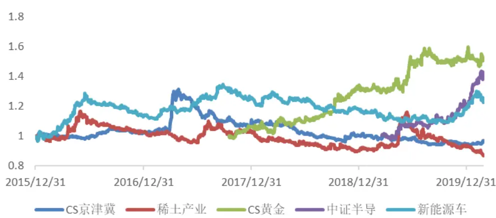
资料来源：国盛证券研究所，wing

## 三、 使用主题进行风险控制

通过上一节我们已经对主题的收益和波动有了一个初步的了解，本节我们主要研究是否能够通过控制主题的暴露来控制风险。如果一个主题产生了异动，使得其成为市场的主要波动（风险）的来源之一，而组合在该主题上有暴露，那么可能使得组合的波动增大，例如跟踪误差增加，或者回撤增大。因此，当我们发现一个主题波动变大时，如果能够将其加入风险模型，并对其进行及时控制，那么就有可能降低组合的风险。

判断主题能否成为未来市场主要波动来源的最好办法是基于对市场基本面的研究，例如Two Sigma 的研究中关于中美贸易风险因子的纳入，就是基于当时的宏观经济环境的分析得到的。但由于基本面的定义难以进行系统的回测，本节的研究主要基于主题的历史波动率来进行判断。

主题因子收益率的波动是衡量主题异动较为有效的变量。但如果要将主题作为一个风险因子，其对收益解释的显著性也是十分重要的，因此我们最终选取主题收益T统计量绝对值的滚动均值来作为主题是否成为风险因子的衡量标准。

## 3.1 每天监控主题并进行约束

我们选取主题收益率的 T统计量绝对值的历史均值作为主题异动的评判标准，然后对参数进行遍历，即滚动天数N 以及阈值 m。由于主题大多是较为短期的，我们选定N 的取值范围为 10、21、42 个交易日。对于 m 的选取，我们同样横向比较了 barra 行业因子的数据。通过计算得到不同行业因子滚动的 T 统计量绝对值前 20%分位数的中位数在1.5左右，因此我们认为T统计量绝对值至少大于 1.5时，才能认为主题发生异动。M 的取值分别为 1.5、2、3。

测试方法如下，我们以一个月频换仓的中证500增强策略作为基准。每天监控主题池中的所有主题，如果有主题发生异动，则将其作为一个风险因子进行约束，即控制组合相对于中证 500 指数在主题上的主动暴露为 0，当主题波动减小到小于阈值时，则放松约束。使用此方法我们对上述参数进行了遍历，以下仅展示 N=21的结果。

图表11：不同参数下策略超额收益的表现（不扣费）

|  | 年化收益 | 年化波动 | IR | 最大回撤 |
| --- | --- | --- | --- | --- |
| 基准策略 | 0.173 | 0.057 | 3.009 | 0.049 |
| N=21, m=1.5 | 0.166 | 0.055 | 2.997 | 0.047 |
| N=21，m=2 | 0.183 | 0.056 | 3.267 | 0.046 |
| N=21, m=3 | 0.171 | 0.056 | 3.026 | 0.050 |

资料来源：国盛证券研究所，wind

我们一般使用跟踪误差和最大回撤来衡量策略的风险。从上表可以看到，加上约束后，年化跟踪误差确实有略微降低，但是相比跟踪误差，我们更加关注模型向下的风险，即最大回撤。上表仅仅列出了全样本的最大回撤，只有一个样本点，并不具有代表性，下图我们展示了策略在每个时点的回撤。其中m=3时触发的主题数量较少，导致回撤与基准策略较为一致，因此没有展示。

图表12：约束主题策略与基准策略回撤对比
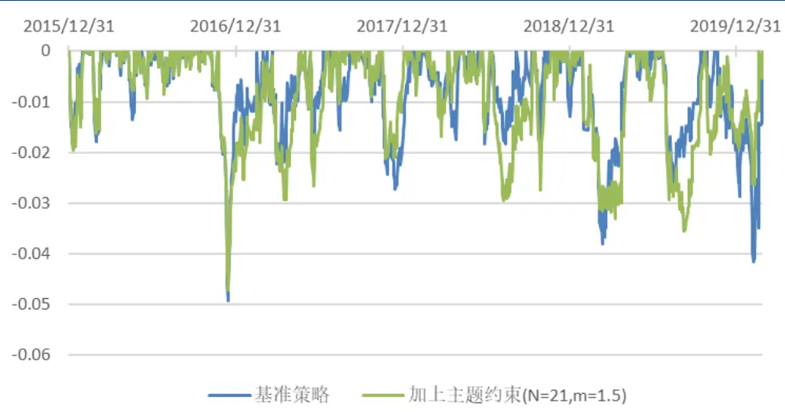
资料来源：国盛证券研究所，wind

图表13：约束主题策略与基准策略回撤对比
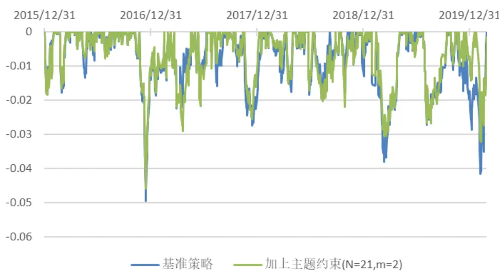
资料来源：国盛证券研究所，wind

从以上两张图中可以看到，加上主题约束之后，大部分时候策略的回撤都要小于基准策略。其中 19年以来的回撤改善最为明显，回撤减少将近1%，而在其余的时间，也有略微改善，但幅度较小，在0.5%以内。从不同参数的情况来看，尽管 m=1.5时约束的主题较多，但回撤反而在某些时候变得更大，可能的原因是约束的主题过多减小了选股域，反而降低了原有alpha的收益，使得部分时候回撤增大。

从策略收益的角度来说，在以上测试不考虑交易费用的情况下，加上主题约束并不会限制策略的 alpha，年化收益甚至会有一定的提升。但如果加上交易费用，所有参数下策略的收益都有明显下降。经过归因我们发现，日频触发的策略会增加大概年化 1%以上的成本，这显然是不太合适的。

图表14：主题约束策略相对于基准策略多支付的交易成本
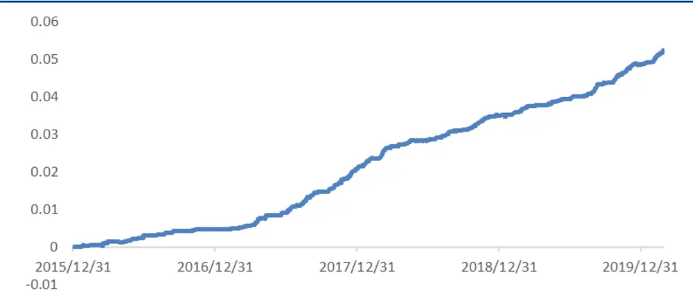
资料来源：国盛证券研究所，wind

## 3.2 降低换仓频率

为了解决成本过高的问题，我们尝试降低换仓的频率，分别测试了只在周末和月末对主题进行约束的策略。使用N=21，m=2进行测试，我们发现降低换仓频率并不影响该方法对策略风险的优化效果。

图表15：不同频率触发主题时各策略表现

|  | 年化收益 | 年化波动 | IR | 最大回撤 |
| --- | --- | --- | --- | --- |
| 基准策略 | 0.173 | 0.057 | 3.009 | 0.049 |
| 日频 | 0.183 | 0.056 | 3.267 | 0.046 |
| 周频 | 0.177 | 0.056 | 3.163 | 0.046 |
| 月频 | 0.184 | 0.057 | 3.203 | 0.047 |

资料来源：国盛证券研究所，wind

图表16：不同频率触发主题时各策略回撤
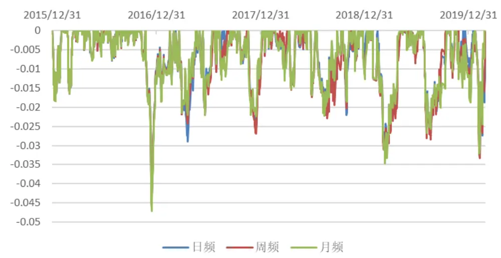
资料来源：国盛证券研究所，wind

从以上图表可以很明显的看到，降低换仓频率并不会使得约束主题策略的效果变差，不同频率的策略在大部分回撤区间的表现较为一致。我们认为这一现象的主要原因是大部分主题持续时间都是较为短期的，我们统计了日频下从主题触发到主题被移除的平均天数，大部分持续时间都只有不到一个月，而对于这种主题，我们迅速的控制再移除，会损耗较高的手续费，且对这样的短期主题进行约束并不会显著的影响策略表现。因此，降低换仓的频率能够较好的解决这一问题。

图表17：主题从纳入到剔除的时间分布
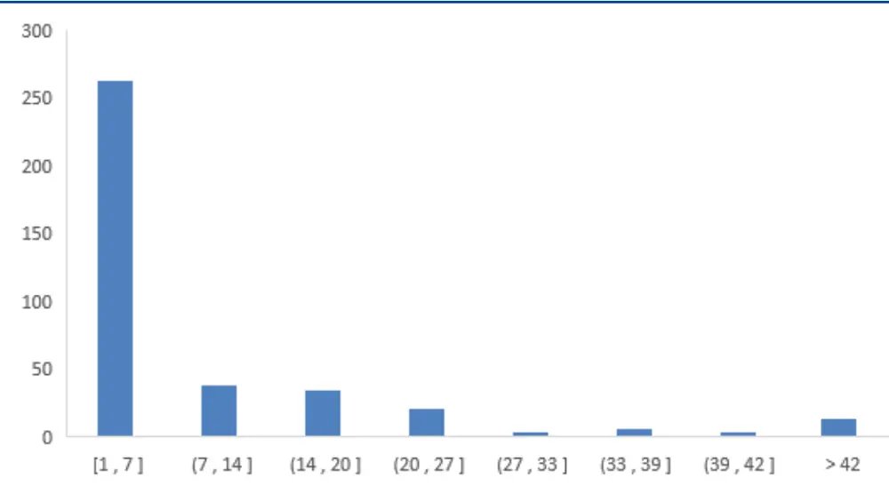
资料来源：国盛证券研究所，wind

从交易成本的角度，周频约束的策略，仍然增加了年化0.8%左右的成本，而月频触发的策略与基准策略的调仓频率完全一致，仅仅在求解权重时增加了几个主题的约束，增加的成本几乎可以忽略不计，因此我们认为月频约束主题的策略更好。

我们进一步测试了在不同参数下，月频约束主题的表现。通过比较不同参数下策略的平均表现，我们得到的结论与日频策略比较相似。m=1.5 和 m=2 时，策略的回撤相对于基准策略都有一定幅度的改善。当 m=3 时，回撤的改善仍然较差，因为触发的主题较少。不同滚动窗口参数下，回撤表现差别不大，在不同时间各有优势。而收益方面，整个回测区间内不同参数下策略的年化收益表现差别较小，但在不同年份略有差别。由于策略收益、信息比等在不同参数下表现差别不大，这里不再进行展示。下图展示了 m=1.5时，不同滚动窗口策略的平均回撤与基准策略的比较。回撤的改善效果仍然较为较为显著。

图表18：月频约束主题策略与基准策略回撤对比
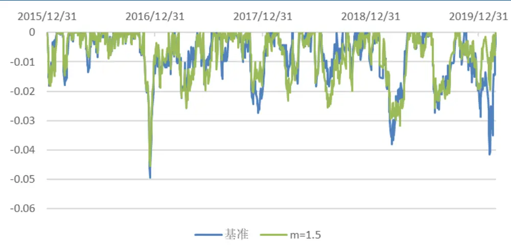
资料来源：国盛证券研究所，wind

## 3.3 小结与思考

总结来说，我们发现在月频换仓时，使用主题滚动一个月的波动判断主题异动，然后将主题作为风险因子，约束主题的主动暴露为 0，对基准策略的回撤有所改善，策略的收益也基本不变，甚至略有提升。分年度来看，19年回撤改善幅度较为明显，在 1%以上，其他年份平均幅度大概在0.5%以内。以下是我们对该策略的几点思考：

1）策略主要降低了尾部主题带来的风险。我们统计了从触发到剔除每个主题的收益率分布，发现该分布呈明显的右偏。即大部分主题的收益都在正负 5%以内，由于单个主题的暴露一般也不大，在 5%以内，因此这部分主题对策略的影响较小。而真正对策略回撤有显著影响的是在分布尾部的主题，分别是中证畜牧，新能源车，以及中证半导，这也是为何 19年改善幅度最为的明显的原因。也就是说，通过约束主题来控制风险的核心是通过约束大量异动的主题，在有可能牺牲一定 alpha 的情况下，降低尾部风险带来的策略大幅回撤。

图表19：主题纳入时间段收益的分布
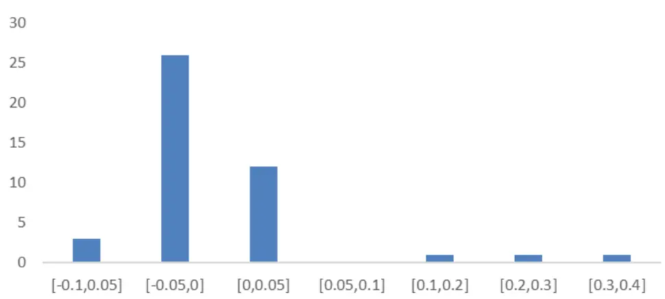
资料来源：国盛证券研究所，wind

2）策略回撤的改善主要是约束了主题的波动给策略带来的回撤增加，但并不能保证在每个回撤点都减小回撤。要想进一步缩小策略的最大回撤，应该从 alpha 信号的角度做进一步优化。

3）主题研究的样本较少，并不具有很强的统计显著性。上述的测试结果只能够证明在我们选取的主题池以及时间区间中，使用上述策略加入主题风险因子，回撤改善效果较好。样本中出现的主题数量是较为有限的，在测试中纳入策略的主题只有 40多个，样本较少也使得上述测试的统计显著性并不强，因此，对于这个策略我们更应该从逻辑出发来进行使用。

本节我们完全基于主题收益的历史波动来动态的将主题因子纳入风险模型，并没有结合主题自身的基本面和估值来对策略进行优化，这是由于主题基本面的研究很难纳入量化的回测中来。但是只用波动率来进行判断较为滞后，也无法区分炒作类的主题以及有基本面支撑的主题。像京津冀这类主题如果在其上涨一段时间后进行约束，反而在未来会带来较大的负面影响。因此我们认为如果要将主题加入风险模型，除了对其波动进行监测外，还要结合基本面进行研究，就像在第一章中介绍的TwoSigma的研究一样，这样策略效果才能达到最优。如果我们认定某些主题或者概念可能会是市场未来的主要波动来源，而不是一时炒作的主题概念，我们就可以将其纳入风险模型，并进行约束，这样可以有效地降低策略的风险，某些情况下甚至能够提升收益。

## 四、 获取主题的 alpha 收益

上一节中，我们探讨了是否能够通过控制主题暴露来改善模型风险，采取被动跟踪的策略，将主题作为一个风险因子，并控制策略在主题上的相对暴露为 0，以防主题大幅波动带来的风险。本节我们研究能否主动的获取主题产生的超额收益，以提升策略的表现。

## 4.1 主题的时序动量和截面动量

第二章我们统计了所有主题的历史表现，其中不乏表现较为优异的主题。但对单个主题超额收益的研究需要较强的基本面分析。本节，我们主要从量化的角度出发，将主题因子池作为一个整体，测试主题是否存在较强的时间序列动量和截面动量。

首先我们测试时间序列动量，在每个月底，计算主题过去N 个交易日的收益率(信息比)，筛选出收益率(信息比)>M的主题，等权持有。通过遍历计算得到以下结果。

图表20：不同参数下时间序列动量策略的年化收益

| N=10 | N=21 | N=63 | N=126 |
| --- | --- | --- | --- |
| M=0 0.012 | 0.011 | 0.022 | 0.025 |
| M=0.5 0.012 | 0.011 | 0.023 | 0.029 |
| M=1 0.012 | 0.011 | 0.033 | 0.031 |
| M=1.5 0.013 | 0.012 | 0.035 | 0.050 |

资料来源：国盛证券研究所，wind

图表21：不同参数下时间序列动量策略的信息比

|  | N=10 | N=21 | N=63 | N=126 |
| --- | --- | --- | --- | --- |
| M=0 | 1.01 | 0.93 | 1.81 | 2.14 |
| M=0.5 | 0.92 | 0.87 | 1.70 | 2.12 |
| M=1 | 0.91 | 0.85 | 2.08 | 1.85 |
| M=1.5 | 0.97 | 0.83 | 1.94 | 2.35 |

资料来源：国盛证券研究所，wind

图表22：时间序列动量策略净值
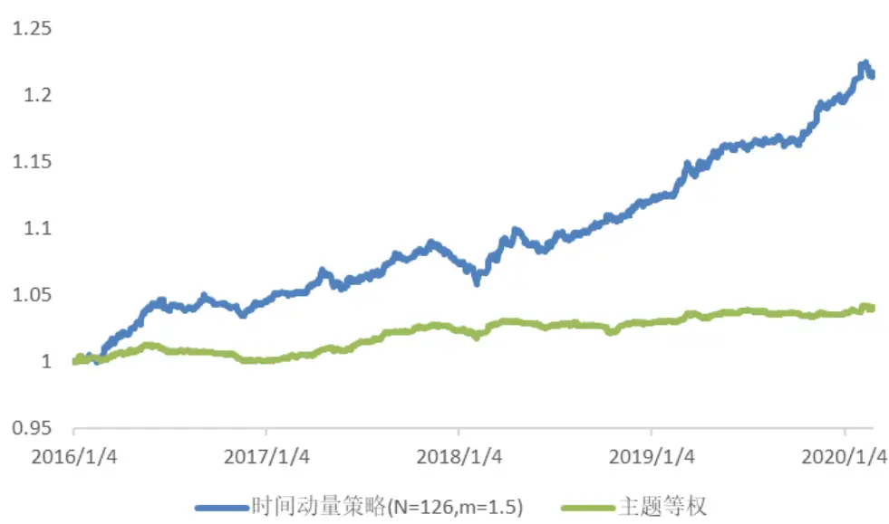
资料来源：国盛证券研究所，wind

以上是用信息比作为动量指标进行的测试，用收益结果比较相似，这里不做展示。从上表中很明显的可以看到，当滚动窗口时间越长，筛选标准越高时，策略的收益越高，信息比也更稳定。对比策略与所有主题等权基准，发现策略收益和信息比远高于基准策略，这证明主题收益确实存在明显的时间序列动量特征。

我们也测试了截面动量的结果，在每个月底，计算主题过去 N个交易的收益率(信息比)，筛选出排名前M 个主题，等权持有。通过遍历计算得到以下结果。

图表23：不同参数下截面动量策略的年化收益

| N=10 | N=21 | N=63 | N=126 |
| --- | --- | --- | --- |
| M=5 0.017 | 0.027 | 0.072 | 0.081 |
| M=10 0.017 | 0.020 | 0.052 | 0.056 |
| M=20 0.016 | 0.020 | 0.044 | 0.046 |
| M=30 0.016 | 0.014 | 0.032 | 0.031 |

资料来源：国盛证券研究所，wind

图表24：不同参数下截面动量策略的信息比

| N=10 | N=21 | N=63 | N=126 |
| --- | --- | --- | --- |
| M=5 0.49 | 0.72 | 1.85 | 2.03 |
| M=10 0.62 | 0.71 | 1.76 | 1.99 |
| M=20 0.77 | 0.93 | 2.08 | 2.20 |
| M=30 0.90 | 0.79 | 1.79 | 1.89 |

资料来源：国盛证券研究所，wind

图表25：截面动量策略净值
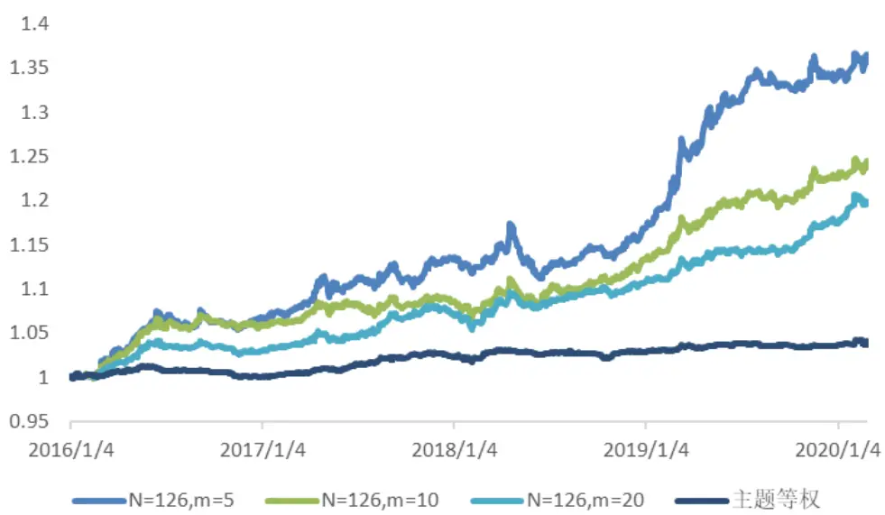
资料来源：国盛证券研究所，wind

以上结果同样是使用信息比作为动量指标得到结论，滚动的时间窗口越长，策略的收益越高，信息比也越高。而选入主题的数量越多，收益有所下降，但策略的稳定性提升。当选入主题数量过多，达到 30只时，策略的收益和稳定性都有所下降。我们同样对比了策略与主题等权的净值曲线，策略相对于等权净值有较为稳定的超额收益，说明截面动量也同样存在。

我们进一步做了以下两个测试，

测试一：主题间不等权配置，而是使用其过去的表现进行加权配置。

测试二：每期选取历史表现最差的N 个主题等权配置。

测试一的结果显示相比等权，按过去表现进行加权，整体策略效果从收益和信息比都有略微的提升。而测试二的结果显示每期选取表现较差的主题，策略并没有显著差于主题等权，我们很难获取负向的主题收益。同时我们也计算了主题动量与主题未来一个月收益的IC值，IC 值在正负之间波动较大，而不是显著为正。

通过以上测试，我们可以认定主题同时存在稳定的时间序列动量效应和截面动量效应。但主题动量与其未来收益的线性关系并不显著，只有头部的主题呈现明显的动量效应。对于动量时间窗口的选择，较短的时间窗口 10、21个交易日的动量几乎没有效果，而较为长期的 63 和 126 个交易日的动量，表现效果较好。产生这个现象的原因可能源于因子动量，也可能源于市场的滞后反应，这里我们不做探究。我们的另外一篇报告《基金alpha进化史》中基于基金历史alpha进行选基的策略与这里的结论也比较契合，因为主题收益是基金 alpha重要的收益来源之一。

得到以上结果之后，我们如何加以利用呢？接下来我们基于主题的截面动量效应，尝试了两种可能的办法，分别是在主题上进行主动暴露，以及将主题动量因子化。

## 4.2 在主题上进行主动暴露

由上一部分的结论我们得到在历史表现较好的主题上主动进行暴露，平均暴露每提升 1个点，组合收益有 5%点左右的提升。因此一个自然的想法是在进行组合优化时，主动的限制组合在主题上相对于基准的暴露大于某个阈值。我们进行如下测试：

在每个月底，筛选出过去126个交易日动量最大的前 N个主题，并在组合优化时，限制组合在这些主题上相对于基准指数的主动暴露大于m。以下是测试的结果，回测时考虑双边千 3的手续费。

图表26：不同参数下主动暴露策略的表现

|  | 年化收益 年化波动 | IR | 最大回撤 |
| --- | --- | --- | --- |
| N=20,m=0 0.134 | 0.055 | 2.427 | 0.047 |
| N=20，m=0.005 0.131 | 0.055 | 2.396 | 0.051 |
| N=20, m=0.01 0.129 | 0.054 | 2.375 | 0.053 |
| N=20，m=0.015 0.128 | 0.054 | 2.357 | 0.053 |
| N=10，m=0 0.140 | 0.057 | 2.473 | 0.049 |
| N=10, m=0.01 0.143 | 0.056 | 2.540 | 0.047 |
| N=10, m=0.02 0.145 | 0.056 | 2.560 | 0.045 |
| N=10, m=0.03 0.149 | 0.057 | 2.612 | 0.046 |
| N=5，m=0 0.134 | 0.057 | 2.353 | 0.050 |
| N=5,m=0.02 0.144 | 0.056 | 2.563 | 0.046 |
| N=5，m=0.04 0.148 | 0.057 | 2.610 | 0.047 |
| N=5, m=0.06 0.154 | 0.057 | 2.716 | 0.040 |
| 基准策略，行业约束0.01 0.135 | 0.058 | 2.342 | 0.051 |
| 基准策略，行业约束0.05 0.136 | 0.058 | 2.356 | 0.061 |

资料来源：国盛证券研究所，wind

所有策略控制了市值行业中性，其中行业约束的暴露上下限为[-0.01，0.01]。需要注意的是，当主题主动暴露偏离过高，例如大于 3%时，可能与行业约束相冲突，我们在 m较高时，放松行业约束为[-0.01，0.05]，因此也回测了该约束下基准策略的表现。同时，对于不同 N，m 测试的范围并不相同，但我们保证约束主题的总权重，即 N*m 是一致的。

从上表很明显的看到，当N=20时，约束主题反而会使得收益有所下降，而N=10，N=5时，组合收益有显著的上升。同时主动暴露 m 越大，收益上升的越明显。取最优参数N=5，m=0.06 时，组合收益相较基准策略有 2%的提升，信息比从 2.3上升至 2.7，回撤也有所下降。当 m大于0.6时，即使使用较松的行业约束，也有无解的情况出现，因此我们不做考虑。

限制主题暴露尽管能够获取主题的收益，但是选股域缩小，从而降低了原有alpha，因此最终组合的表现取决于主题带来的超额收益大小以及原 alpha 损失大小。当 N 较大时（N=20），限制的主题数量较多，alpha损失较大，同时主题的平均收益较小，导致策略收益没有提升，甚至有所下降。而如果只选取5-10个最好的主题，主题的平均收益更高，约束也没有 N=20时严格，alpha损失较小，因此最终提升较为显著。

图表27：最优参数下策略的净值
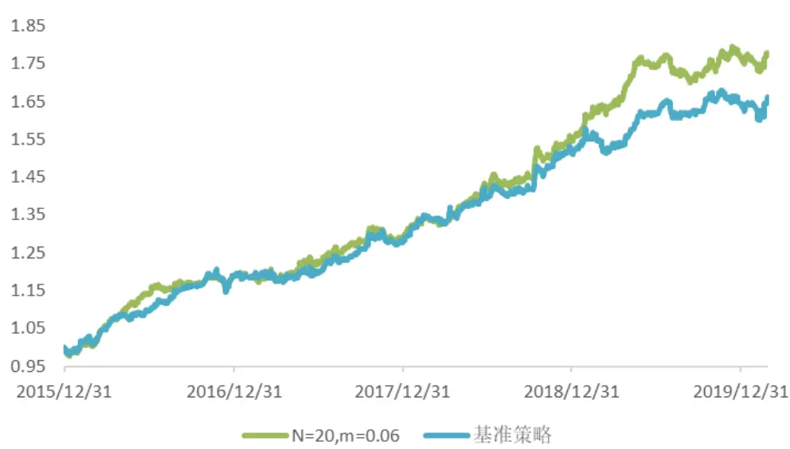
资料来源：国盛证券研究所，wind

图表28:最优参数下策略的回撤
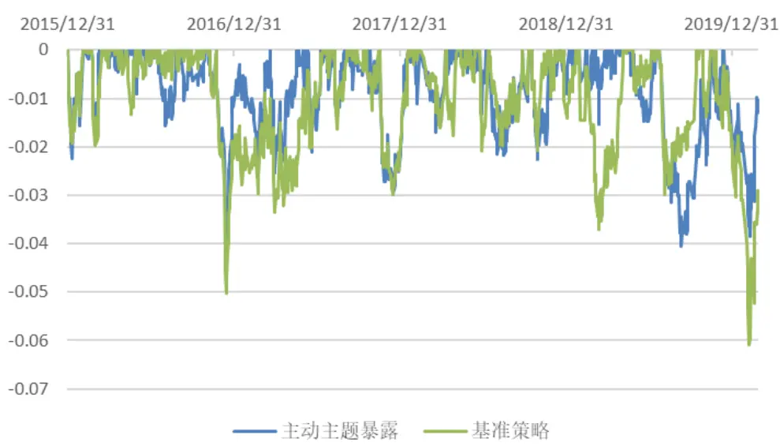
资料来源：国盛证券研究所，wind

图表29:基准策略分年表现

|  | 年化收益 年化波动 | IR |  | 最大回撤 | 回撤天数 | 开始时间 | 结束时间 |
| --- | --- | --- | --- | --- | --- | --- | --- |
| 2016 | 0.202 | 0.056 | 3.622 | 0.051 | 16 | 2016/11/23 | 2016/12/14 |
| 2017 | 0.074 | 0.056 | 1.311 | 0.029 | 21 | 2017/11/17 | 2017/12/15 |
| 2018 | 0.190 0.057 |  | 3.309 | 0.021 | 21 | 2018/7/16 | 2018/8/13 |
| 2019 | 0.090 0.056 |  | 1.616 | 0.042 | 28 | 2019/1/29 | 2019/3/14 |
| 截止 2020.02 | 0.029 0.094 |  | 2.292 | 0.029 | 12 | 2020/1/15 | 2020/2/7 |
| all | 0.135 0.058 |  | 2.342 | 0.051 | 16 | 2016/11/23 | 2016/12/14 |

资料来源：国盛证券研究所，wind

图表30：最优参数下策略的分年表现

|  | 年化收益 年化波动 | IR | 最大回撤 |  | 回撤天数 | 开始时间 | 结束时间 |
| --- | --- | --- | --- | --- | --- | --- | --- |
| 2016 | 0.205 | 0.053 | 3.857 | 0.039 | 16 | 2016/11/23 | 2016/12/14 |
| 2017 | 0.082 | 0.055 | 1.482 | 0.029 | 38 | 2017/10/27 | 2017/12/19 |
| 2018 | 0.209 | 0.058 | 3.588 | 0.023 | 10 | 2018/10/17 | 2018/10/30 |
| 2019 | 0.145 | 0.057 | 2.528 | 0.040 | 35 | 2019/7/25 | 2019/9/11 |
| 截止 2020.02 | 0.009 0.072 |  | 0.866 | 0.028 | 13 | 2020/1/15 | 2020/2/10 |
| all | 0.154 | 0.057 | 2.716 | 0.040 | 35 | 2019/7/25 | 2019/9/11 |

资料来源：国盛证券研究所，wind

以上展示了策略的净值曲线和回撤。从超额收益和回撤的角度来说，加入主题的主动暴露后都有明显的改善。策略回撤降低的一个可能原因是主题和策略 alpha 的收益相关性较低，这一点我们在下节会提到。策略提升的主要时间段是 16 年6月份以前以及 18年5月份至今，而其他时间段相对于基准策略有所下降，这也与主题动量策略的收益有关，从上一节的主题截面动量策略的净值曲线可以看到，该策略在 16年6月-18年5月收益较低，因此在此段时间主动暴露主题无法带来收益，反而会使得约束变严，损失原有策略的 alpha。但 18年至今，主动暴露主题带来了显著的超额收益，同时改善了回撤。

## 4.3 主题策略因子化

除了直接约束主题暴露之外，获取主题动量策略超额收益的另外一个方法就是将主题策略因子化。构建因子的方法如下，计算所有主题过去N天的动量，筛选前m个主题，并将这 m 个主题成分股的因子值标记为 1，其余股票标记为 0。我们将因子对所有的风格因子和行业因子做中性化，然后进行测试，得到以下结果：

图表31：不同参数下因子表现

| IC | ICIR |
| --- | --- |
| N=63,m=5 0.012 | 1.72 |
| N=63,m=10 | 0.015 2.29 |
| N=63,m=20 | 0.013 1.86 |
| N=126,m=5 | 0.010 1.47 |
| N=126,m=10 | 0.016 1.93 |
| N=126,m=20 | 0.018 2.22 |

资料来源：国盛证券研究所，wind

下面我们以 N=126,m=20 构建的因子为例，分别计算了该因子在全市场，中证 500 和沪深 300 中的表现。

图表32：不同选股域中因子表现

|  | ic | icir | 多空收益 | 多空信息比 |
| --- | --- | --- | --- | --- |
| 全市场 | 0.018 | 2.22 | 0.061 | 2.43 |
| 中证500 | 0.019 | 0.70 | 0.049 | 0.72 |
| 沪深300 | 0.021 | 0.92 | 0.032 | 0.56 |
| 中证1000 | 0.017 | 1.28 | 0.059 | 1.25 |

资料来源：国盛证券研究所，wind

图表33：不同选股域中多空收益净值（分三组）
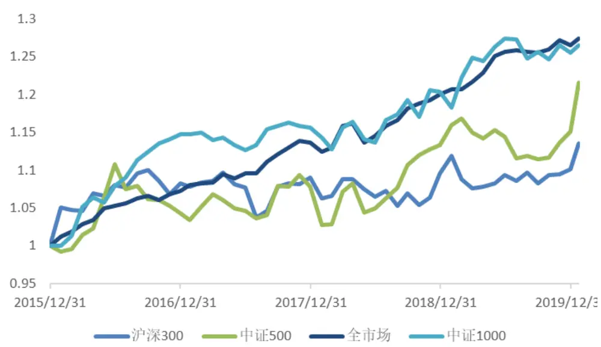
资料来源：国盛证券研究所，wind

以上图表显示该因子在全市场有较为稳定的选股效果，但在指数成份股中波动较大。这一现象也较符合逻辑，因为我们在测试主题动量策略以及构造主题因子时都是基于全市场的股票和全市场的主题，因此该因子在全市场中不管是 IC值还是因子多头收益都较为稳定。而在指数成分股中涵盖的主题与全市场的主题并不完全一致，有些主题可能没有出现在指数成份股中，因此导致该因子在成份股内选股不如全市场稳定。如果要在成份股中有较好表现，应当根据成份股中的主题进行测试并构建因子。但如果我们是在全市场范围选股来构建指数增强策略，该因子效果表现也十分不错。

我们将市场按市值大小分为两组，分别测试因子的表现，从图中可以看到因子在小市值股票中区分度更加明显，收益也较高。这说明主题带来的收益主要是主题中的市值较小的股票表现出的超额收益，这也符合我们的直觉，在主题上涨的过程中，一般小市值股票弹性更大，带来的超额收益也越多。

图表34:大市值股票中因子表现
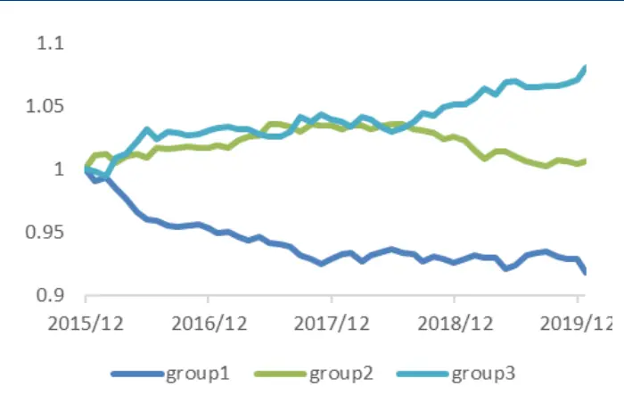
资料来源：国盛证券研究所，wind

图表35:小市值股票中因子表现
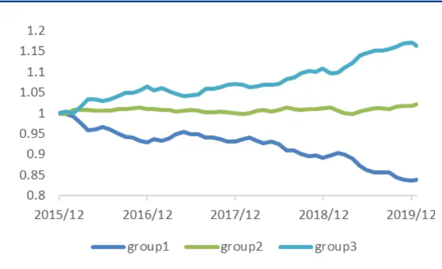
资料来源：国盛证券研究所，wind

我们计算了主题因子与数据库中所有因子的相关性，发现主题因子与传统 alpha 因子的相关系数非常低，绝对值几乎均在 0.05以内，这说明该因子确实能够带来新的增量信息。

图表36：因子与几个传统因子的相关系数

| 平均相关系数 |
| --- |
| ivr 0.019 |
| reverse_1m -0.008 |
| ep_q_adv -0.012 |
| sue1 -0.016 |
| mom_1y_1m -0.023 |
| illiq -0.083 |

资料来源：国盛证券研究所，wind

## 五、 总结与展望

本报告从对近期市场和多因子策略的思考出发，尝试研究了如何将主题融入传统多因子策略。我们首先从市场上的所有主题中筛选出可能影响因子策略的主题池，然后通过回归的方法计算了主题收益，并对其进行检验。接下来，我们分别从两方面尝试将主题纳入多因子策略。

从风险的角度，如果市场上有主题波动较大，我们就将其作为一个新的风险因子，约束策略在这些主题上的主动暴露为 0。通过测试，我们发现月频调仓时约束过去一个月波动较大的主题，回撤能够得到有效的控制，且收益没有损失。经过分析我们发现大部分主题从纳入风险模型到移出风险模型的时间段中，波动较小，在正负 5%以内，少部分主题达到 20%以上。而回撤大幅改善的时间段，正是由于约束了这些尾部主题造成的。因此我们认为纳入主题风险因子的主要目的是通过跟踪大量的异动主题，以防范尾部主题带来的策略回撤或者策略收益跟不上基准指数。但单纯的使用主题历史波动较为粗糙，尤其是如果该主题为炒作主题，约束后主题大幅下跌可能反而会造成策略收益下降，因此我们认为对于主题是否要纳入风险模型需要进一步结合基本面研究，这样才能更加有效的控制风险。

从收益的角度，我们首先将主题池作为一个整体进行研究，发现主题存在明显的时间序列动量效应和截面动量效应，等权持有历史表现较优的主题大概能够获得 5%左右的特质收益。利用主题的动量特征，我们分别尝试了两种应用方法。第一种是直接在优化时强制使得主题的主动暴露大于某个阈值，发现在一定参数下，收益和回撤都有明显的提升。第二种是将主题的动量策略因子化，通过测试，我们发现该因子在全市场的 IC值在0.02左右，ICIR值在2左右，且因子与传统 alpha因子的相关性都非常低，可以带来明显的增量信息。我们进一步测试了因子在不同域的表现，发现主题因子在小市值股票中表现较好，这说明主题的超额收益主要是小市值股票的超额收益带来的。

本报告使用的主题池是基于指数公司提供的主题指数，其时效性并不是很强，有些指数可能晚于主题出现很久才出现，覆盖的主题也较为有限，在未来的研究中，我们可以尝试自行构建主题，这样一旦主题异动我们能够更加及时的发现，同时主题的构建也可以不局限在产业类或者事件类，任何我们认为可能成为市场主要波动来源的概念都可以纳入主题池，例如北上资金主题，漂亮 50主题，疫情主题等等，这样可以进一步的拓宽主题池，从而更加有效地控制风险或获取超额收益。

## 风险提示

以上结论均基于历史数据和统计模型的测算，如果未来市场环境发生改变，不排除模型失效的可能性。

## 免责声明

国盛证券有限责任公司（以下简称“本公司”）具有中国证监会许可的证券投资咨询业务资格。本报告仅供本公司的客户使用。本公司不会因接收人收到本报告而视其为客户。在任何情况下，本公司不对任何人因使用本报告中的任何内容所引致的任何损失负任何责任。

本报告的信息均来源于本公司认为可信的公开资料，但本公司及其研究人员对该等信息的准确性及完整性不作任何保证。本报告中的资料、意见及预测仅反映本公司于发布本报告当日的判断，可能会随时调整。在不同时期，本公司可发出与本报告所载资料、意见及推测不一致的报告。本公司不保证本报告所含信息及资料保持在最新状态，对本报告所含信息可在不发出通知的情形下做出修改，投资者应当自行关注相应的更新或修改。

本公司力求报告内容客观、公正，但本报告所载的资料、工具、意见、信息及推测只提供给客户作参考之用，不构成任何投资、法律、会计或税务的最终操作建议,本公司不就报告中的内容对最终操作建议做出任何担保。本报告中所指的投资及服务可能不适合个别客户，不构成客户私人咨询建议。投资者应当充分考虑自身特定状况，并完整理解和使用本报告内容，不应视本报告为做出投资决策的唯一因素。

投资者应注意，在法律许可的情况下，本公司及其本公司的关联机构可能会持有本报告中涉及的公司所发行的证券并进行交易，也可能为这些公司正在提供或争取提供投资银行、财务顾问和金融产品等各种金融服务。

本报告版权归“国盛证券有限责任公司”所有。未经事先本公司书面授权，任何机构或个人不得对本报告进行任何形式的发布、复制。任何机构或个人如引用、刊发本报告，需注明出处为“国盛证券研究所”，且不得对本报告进行有悖原意的删节或修改。

## 分析师声明

本报告署名分析师在此声明：我们具有中国证券业协会授予的证券投资咨询执业资格或相当的专业胜任能力，本报告所表述的任何观点均精准地反映了我们对标的证券和发行人的个人看法，结论不受任何第三方的授意或影响。我们所得报酬的任何部分无论是在过去、现在及将来均不会与本报告中的具体投资建议或观点有直接或间接联系。

## 投资评级说明

| 投资建议的评级标准 |  | 评级 | 说明 |
| --- | --- | --- | --- |
| 评级标准为报告发布日后的6个月内公司股价(或行业指数）相对同期基准指数的相对市场表现。其中A股市场以沪深300指数为基准；新三板市场以三板成指（针对协议转让标的)或三板做市指数(针对做市转让标的)为基准；香港市场以摩根士丹利中国指数为基准，美股市场以标普500指数或纳斯达克综合指数为基准。 | 股票评级 | 买入 | 相对同期基准指数涨幅在15%以上 |
|  |  | 增持 | 相对同期基准指数涨幅在5%~15%之间 |
|  |  | 持有 | 相对同期基准指数涨幅在-5%~+5%之间 |
|  |  | 减持 | 相对同期基准指数跌幅在 5%以上 |
|  | 行业评级 | 增持 | 相对同期基准指数涨幅在10%以上 |
|  |  | 中性 | 相对同期基准指数涨幅在-10%~+10%之间 |
|  |  | 减持 | 相对同期基准指数跌幅在10%以上 |

## 国盛证券研究所

北京

地址：北京市西城区平安里西大街 26号楼 3层

上海

地址：上海市浦明路 868 号保利 One56 1 号楼 10层

邮编：100032

邮编：200120

传真：010-57671718

邮箱：gsresearch@gszq.com

电话：021-38934111

邮箱：gsresearch@gszq.com

南昌

地址：南昌市红谷滩新区凤凰中大道 1115 号北京银行大厦

邮编：330038

深圳

地址：深圳市福田区福华三路 100 号鼎和大厦 24楼

传真：0791-86281485

邮箱：gsresearch@gszq.com

邮编：518033

邮箱：gsresearch@gszq.com