# 量化专题报告

## 多因子系列之十二：无形资产估值因子

本篇报告尝试用量化的方式刻画公司的无形资产，并构建无形资产估值因子。价值因子在海内外失效的原因之一，是估值因子失真，使得我们对公司合理估值的判断出现严重偏差。本篇报告中，我们尝试重新资本化处理公司的研发、销售、管理支出，并剥离商誉，形成对无形资产账面价值的计量，从而弥补传统估值因子 BP低估公司无形资产的缺陷。

TMT 等行业在财报中披露的资产存在严重的计量扭曲。会计准则要求费用化处理公司的研发、广告宣传和职工薪酬开支，导致公司自有的研发、品牌和人力资本被低估，尤其是分布于计算机、电子、通信、家电、医药、食品饮料等行业的企业，该现象更为严重；而来自于并购溢价的商誉则存在被高估的风险，例如 16年的传媒、消费者服务等行业中的企业。

构建回归模型测算 A股企业历史研发支出折旧率。我们从行业层面测算了 A股上市公司历史上的研发支出对未来经营利润率的影响，并据此确定该行业内公司的研发支出折旧率。回归结果表明 A股上市公司的研发支出折旧率处于 30%~80%不等，其中汽车、医药行业研发折旧率较低，电子行业研发折旧率偏高。

利用折旧方式资本化处理公司研发、职工薪酬和广告宣传开支，并扣减商誉，来估计无形资产账面价值。公司本期的无形资产，一部分来自于上期无形资产的留存（以折旧率的方式测算），一部分来自于本期新的投入。对于公司从成立到初次财报发布的历史空白期，我们假设以一定增速倒推测算历年相关开支，再一并折算历年支出，从而降低由披露数据点少带来的误差。

无形资产估值因子对股票有较好的区分能力。在 2014~2020 年测试期内，利用重新资本化形成的无形资产构建的估值因子，在全市场内分组收益表现出较好的单调性；在控制了所有的风格和行业之后，因子自 2017 年起持续提供正超额收益，且在 TMT 和消费类行业内与股票收益相关性更为显著。

无形资产估值因子为 TMT行业选股难题提供了一种解决思路。我们利用无形资产估值因子在 TMT 行业内构建策略，每月月底等权买入打分最高的 50只股票，并控制市值暴露，该组合年化超额收益 8.84%，信息比 1.39，且相较于传统的 BP因子有明显优势。说明在 TMT 行业内公司的净资产数值与公司的内在价值存在较大偏差，尤其是公司无形资产部分被严重低估。

风险提示：量化专题报告的观点全部基于历史统计与量化模型，存在历史规律与量化模型失效的风险。

## 作者

分析师 刘富兵

执业证书编号：S0680518030007

邮箱：liufubing@gszq.com

分析师 李林井

执业证书编号：S0680520040002

邮箱：lilinjing@gszq.com

2、《量化分析报告：当前哪些行业估值被低估？

基本面量化系列思考（一）》2020-05-25

4、《量化专题报告：多因子系列之十一：主题的风险与收益》2020-05-22

5、《量化周报：本轮上涨顶多还有一波 30 分钟级别反弹》2020-05-17

## 前言

我们在报告《海外市场市值和价值因子的演化研究》中提出，价值因子的失效，有部分源自因子失真程度日趋严重，例如 BP 因子，要求我们对公司净资产做出较为准确的计量，然而随着美国上市公司的‚轻资产化‛趋势，投资者往往低估企业的无形资产和长期资产，导致无法准确选出被低估的标的，A 股市场同样出现类似的情况。

在本篇报告中，我们尝试重新对公司的研发、销售和管理费用进行资本化处理，剥离商誉，测算公司的无形资产，并以此构建无形资产估值因子。在选股逻辑上，我们认为市场会对公司无形资产存在错误定价，买入那些无形资产被市场低估的企业，希望能获得未来估值修复带来的收益。

本篇报告主要解决三个问题：

1. 如何计量无形资产的价值？

2. 无形资产估值因子的选股能力如何？

3. 无形资产价值因子适用哪些领域？

## 一、无形资产定义和折旧率测算

## 1.1 从研发、销售管理和商誉三个维度估计无形资产

无形资产指的是企业所拥有，无一定型态，不具实体，但可构成竞争优势或者对生产经营发挥作用的非货币性资产，例如知识产权、品牌、人力资源、企业文化等。

由于无形资产的真实价格和产出不可观测，因此对无形资产的定价是一个比较棘手的问题。但我们可以从财报中获取部分信息，例如企业在研发、销售、管理等方面的支出可以在一定程度上反映公司在这三方面的投入力度。且这部分支出带来的效用，例如在研发过程中获取的研究成果，积累的销售渠道资源，日常经营管理中形成的组织文化等，会逐步沉淀为公司的无形资产。

商誉也是一种无形资产，然而由于在商誉问题上暴雷的公司层出不穷，我们认为应当对高商誉采取谨慎的态度，因此选择扣除商誉，降低商誉被高估而带来的潜在风险。

因此我们在这篇报告中，对无形资产的估计选择了以下形式：

无形资产 ≈ 研发资产+ 销售管理资产−商誉

## 1.2 会计准则对无形资产计量的影响

会计对企业的支出计量有两种方式：

## 一、费用化，即在当期就从营业收入中扣除；

二、资本化，即将这部分支出记入资产，并在未来若干期内以一定的折旧率在每期中进

行摊销。

通常企业在研发、销售、管理上的支出大部分被费用化处理，因此在财报上无法完全流入公司净资产，在这里我们考虑将公司历史上在研发、销售和管理上的支出全部资产化处理，并以一定的折旧率折算成公司的无形资产。我们首先回顾这部分支出的体量及行业分布情况。

## 1.2.1 行业研发支出占总资产比

据 2019 年财报披露，若我们假设当期所有的研发支出均做资产化处理，那么这部分资产占现有总资产的比例如下图所示。从资产的角度考察，我们观察到：

研发支出整体占比较高的行业多分布于 TMT 行业，计算机、电子、通信、家电、汽车、机械、医药、国防军工、钢铁等行业的研发支出占资产比例在 2%以上，其中计算机行业整体研发支出占总资产比例达到 5.15%；

从研发支出的处理方式来看，上市企业费用化处理的研发支出远远高于资本化处理的研发支出，导致大部分研发支出无法体现在资产负债表中；

分行业来看，计算机、汽车、医药行业的资本化率较高，参考上市公司财报披露我们发现，医药、计算机行业的企业对研发支出资本化标准的披露更加清晰（例如医药公司根据临床批件划分研究与开发时点，软件公司会依照交易所要求列出项目具体实施进度），其他行业的研发资本化率较低。

图表1：2019年年报披露中信一级非金融行业研发支出占总资产比
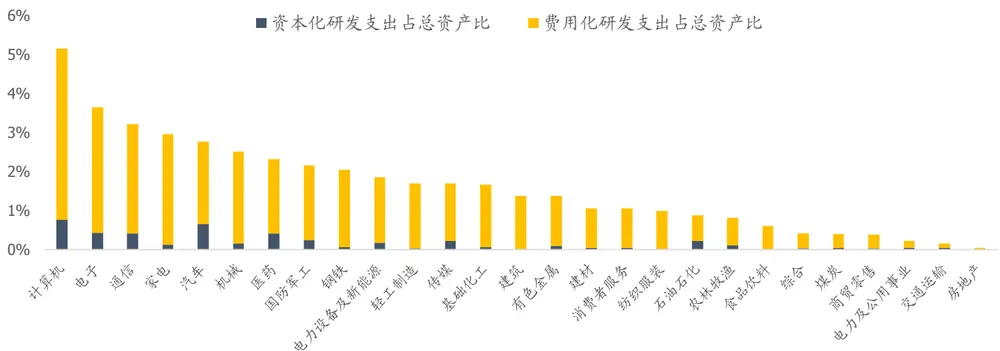
资料来源：Wind，国盛证券研究所

## 1.2.2 行业销售管理费用占总资产比

同样，若我们假设所有的销售管理支出均做资产化处理，那么这部分资产占现有总资产的比例如下图所示。我们观察到：

工资薪酬和广告宣传费之和占资产比较高的公司集中于消费类行业中，占比较高的行业有医药、食品饮料、消费者服务、传媒、纺织服装、计算机、商贸零售等；

消费类行业中，医药和食品饮料行业的工资薪酬和广告宣传推广费用是两项较大的开支，占到两费的三分之二左右；

TMT 行业中，传媒、计算机的工资薪酬开支占到两项费用总额的近二分之一，是公司除了研发之外的重要支出项。

图表2：2019年年报披露中信一级行业销售管理费用细分项占总资产比
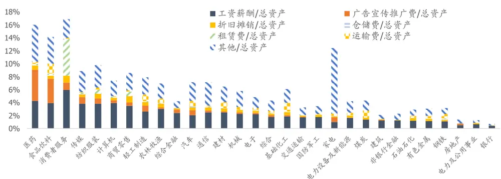
资料来源：Wind，国盛证券研究所

## 1.2.3 行业商誉占总资产比

从历史走势来看，经历 2014~2015 年并购潮后，企业支付的市场溢价体现在公司的资产负债表中，商誉增加的企业数也迅速攀升，但从 2016 年财报披露开始，经历商誉减值的企业数也相继抬升。当前时点来看，消费者服务、传媒等行业的商誉占总资产比依然非常高，且不少企业的商誉出现减值。高商誉仍旧是一个值得警惕的风险点。

但从趋势来看，商誉减值的企业数增长势头有所放缓，加之当前经济环境恶化，一则企业会尽量避免计提商誉减值，二则有实力的公司会趁着当下较低的资产价格进行并购，未来我们可以尝试更谨慎地甄别商誉的质量，但在本篇报告中我们暂时先做剥离处理。

图表3:A股市场历年商誉变化家数
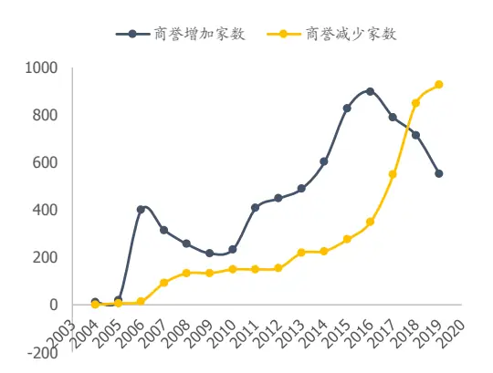
资料来源：Wind，国盛证券研究所

图表4：2019年年报披露中信一级行业商誉占总资产比与商誉降低公司家数
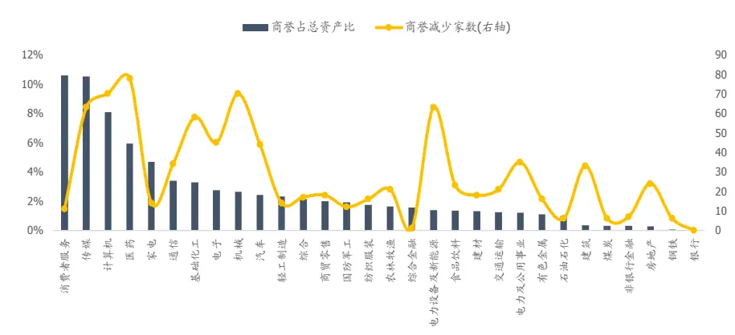
资料来源：Wind，国盛证券研究所

## 1.3 测算无形资产折旧率

正如有形资产需要进行折旧一样，无形资产对公司盈利的贡献也会随着时间推移而衰减，且衰减速度随着时间和行业不同而存在差异。当我们重新资本化处理时，我们需要确定无形资产的折旧率。在这里我们重点研究公司研发支出的折旧率。

## 1.3.1 美国研发支出折旧率

海外研究中，对美国公司无形资产的折旧率，较为传统的做法设定约为 15%。也有学者用不同方法建模，对不同行业折旧率的估计值处于 10%到 88%不等。

图表5:美国不同行业R&D折旧率

| 估计样本数据源 | 上市公司披露数据 Compustat Data | 行业披露数据 BEA-NSF Data |
| --- | --- | --- |
| 时间区间 | 1989~2008 | 1987~2007 |
| 电脑与外围设备 | 53.5% | 36.3% |
| 软件 | 35.0% | 30.8% |
| 制药 | 15.1% | 11.2% |
| 半导体 | 29.3% | 22.6% |
| 航空航天 | 88.0% | 33.9% |
| 通信设备 | 30.8% | 19.2% |
| 计算机系统设计 | 31.4% | 48.9% |
| 汽车及零部件 | 56.0% | 73.3% |
| 导航、测量、电子医学和控制仪器 | 47.2% | 32.9% |
| 科研开发 | 32.6% | 29.5% |

资料来源："Depreciation ofBusinessR&D Capital"，国盛证券研究所整理

## 1.3.2 A 股公司研发支出折旧率测算

我们认为真正有价值的研发投入，应当对公司当前的经营效率产生正向影响，如果正向作用很强，那么我们可以采用较低的折旧率；反之，应当加速折旧。

本篇报告采用回归方式，测算过去若干期的研发、销售和管理支出对当期利润率的影响，从而确定合适的折旧率。由于不同行业间研发与管理费用的折旧速度是不同的，我们分别针对中信一级行业和二级行业进行建模。这里我们设定同行业的折旧率是恒定的。

回归方程设定：

我们认为企业的利润受以下因素影响：

$$
oper\ profit_{t}=\alpha+\beta_{1}t+\beta_{2}TA_{t-1}+\sum(1-d_{rd})^{i}RD_{t-i}+\sum\bigl(1-d_{sga}\bigr)^{j}SGA_{t-j}+\epsilon_{\mathrm{t}}
$$

其中， $operprofit_{t}\mathrm{:}$ t期营业利润；

$TA_{t}\colon$ t期有形资产，包括企业存货、固定资产、生物性资产、油气资产、商誉等；

$RD_{t}\colon$ ：t期研发总支出；

$SGA_{t}\mathbf{.}$ ：t期销售费用、管理费用之和，扣除其中费用化的研发支出；

$d_{rd}$ 和 $\cdot d_{sga}$ ：研发支出折旧率和销售管理支出折旧率，我们限制 $d_{rd}$ 和 $\tau d_{sga}$ 在 $^{(0,1)}$ 之间；
t：时间趋势项。

为了降低规模的影响，我们将所有变量除以营业收入，转换为刻画研发、销售和管理费用投入占营收比对本期营业利润率的影响。同时我们认为研发的影响持续期较长，而销售管理支出的影响持续期较短，因此我们对研发取了滞后 5 期数据，而对销售管理取滞后 2 期数据：

$$
\begin{array}{l}{\left(\frac{operprofit}{Sales}\right)_{t}}\\{=\alpha+\beta_{1}t+\beta_{2}\left(\frac{TA}{Sales}\right)_{t-1}+\displaystyle\sum(1-d_{rd})^{i}\left(\frac{RD}{Sales}\right)_{t-i}}\\{~+\displaystyle\sum\left(1-d_{sga}\right)^{j}\left(\frac{SGA}{Sales}\right)_{t-j}+\epsilon_{\mathrm{t}}}\end{array}
$$

利用非线性最小二乘法拟合上式，将问题转化为：

resid

$$
\begin{array}{c}{{\operatorname*{min}resid^{2}}}\\{{}}\\{{=\left(\displaystyle{\frac{oper\ profit}{Sales}}\right)_{t}-\beta_{1}t-\beta_{2}\left(\displaystyle{\frac{TA}{Sales}}\right)_{t-1}-\sum(1-d_{rd})^{i}\left(\displaystyle{\frac{RD}{Sales}}\right)_{t-i}}}\\{{-\sum(1-d_{sga})^{j}\left(\displaystyle{\frac{SGA}{Sales}}\right)_{t-j}}}\\{{\mathrm{s.t.~}0<\mathrm{d}_{\mathrm{rg}}<1}}\\{{0<\mathrm{d}_{sga}<1}}\end{array}
$$

下表我们展示几个重点一级行业及其二级行业的拟合结果：

图表6：一级、二级行业研发、销售管理费用折旧率

| 一级行业 | $\pmb{d}_{rd}$ | $\pmb{d}_{sga}$ | 二级行业 | $\pmb{d}_{rd}$ | $\pmb{d}_{sga}$ |
| --- | --- | --- | --- | --- | --- |
| 计算机 | 56.30% | 34.06% | 计算机设备 | 59.69% | 26.46% |
|  |  |  | 计算机软件 | 59.82% | 33.52% |
| 医药 | 37.61% | 31.14% | 化学制药 | 29.11% | 29.53% |
|  |  |  | 中药生产 | 33.96% | 30.28% |
|  |  |  | 生物医药Ⅱ | 54.93% | 32.85% |
|  |  |  | 其他医药医疗 | 99.99% | 33.54% |
| 电子 | 73.88% | 29.17% | 半导体 | 99.99% | 16.75% |
|  |  |  | 元器件 | 72.49% | 28.44% |
| 国防军工 | 57.95% | 19.57% | 航空航天 | 21.90% | 15.30% |
|  |  |  | 其他军工Ⅱ | 68.70% | 20.98% |
| 通信 | 43.49% | 47.63% | 通信设备制造 | 39.65% | 59.65% |
|  |  |  | 增值服务Ⅱ | 65.38% | 20.37% |
| 汽车 | 32.15% | 64.99% | 乘用车Ⅱ | 67.99% | 99.99% |
|  |  |  | 商用车 | 48.58% | 28.94% |
| 传媒 | 49.57% | 41.23% | 汽车零部件Ⅱ | 23.35% | 55.54% |
|  |  |  | 媒体 | 49.57% | 41.23% |

资料来源：Wind，国盛证券研究所

我们看到医药行业中，制药领域中的化药和中药行业的研发折旧率低于生物医药，且低于其他医药医疗；而计算机行业中，计算机设备、计算机软件的研发折旧率较高，销售管理费用折旧率较低，而 IT 服务的研发折旧率较低；而电子行业中，无论是半导体还是元器件，对研发的折旧率相对较高。

中美拟合结果存在一些差异，主要有以下两点原因：

1） 回归模型中选择的 A 股上市公司的研发费用数据覆盖时间为 2012~2018 年，美股覆盖时间为 1989~2008年，期间行业所处的发展阶段存在差异；

2） 行业分类不明晰，以及成分股变动，导致估计偏差较大。

## 二、构建无形资产价值因子

## 2.1 原始数据

I 研究开发支出：我们以企业的研发投入总额来表征企业研究支出。

## 研发投入总额：

来自于表 AShareRDexpenditure，取字段 item_name 为‘1900015003’，

若公司有研发投入总额数据，则用总额数据；若研发投入总额缺失，则用费用化研究支出填值；再有缺失，用管理费用中的研发费填值。其中：

## 费用化研究支出：

来自于表 AShareRDexpenditure，取字段 item_name 为'1900015001'，

若公司有研发投入总额数据，则用总额数据；若研发投入总额缺失，则用研发支出总额减去资本化研发支出（item_name 为'1900015002'）推算；若再有缺失，用管理费用中与研发相关的费用填值。

## 管理费用中的研发费用：

来自于表 AShareManagementExpense，字段 ann_item 中包含‚研发‛、‚开发‛、‚研究‛、‚技术‛等字样的数据之和。一般而言，管理费用中的研发费只是研发投入中记在管理费用中的一部分开支，会低估公司的研发费用和研发总投入。

II 销售管理支出：我们重点考察企业在销售费用和管理费用中涉及广告宣传推广费和工资薪酬部分的支出之和，这部分支出更直接地反映企业在品牌建设和人力资源建设中的开支。

## 销售支出：

来自于表 AShareSaleExpense，取字段 item_name 为'广告宣传推广费(销售费用)'和'工资薪酬(销售费用)'

## 管理支出：

来自于表 AShareManagementExpense，取字段 item_name 为'工资薪酬(管理费用)'。

## III 商誉

来自于资产负债表。

## 2.2 因子计算

## 计算思路

以研发支出为例，我们希望将公司历史上所有在研发上的支出，根据支出时间和折旧率折算到当前时间点，作为公司在研究创新上沉淀下来的资本。

计算时涉及两个时间段：

1） 公司从成立（记为 T0）到第一次披露研发支出之间的年份（记为 Tn），我们假设公司的研发支出以每年 g=15%的速度增长，则可以利用第一次披露的研发支出 $RD_{Tn}$ 倒推出之前每年的研发支出费用，再用相应的折现率折算到 Tn：

$$
\mathrm{Krd}_{Tn}=RD_{Tn}+(1-d_{rd})\frac{RD_{Tn}}{(1+g)}+(1-d_{rd})^{2}\frac{RD_{Tn}}{(1+g)^{2}}+\cdots+(1-d_{rd})^{n}\frac{RD_{Tn}}{(1+g)^{n}}
$$

2） 公司披露研发支出后：每年根据披露的研发支出总额，由以下迭代式计算当期的研发资产：

$$
\mathrm{Krd}_{\mathrm{i,t}}=(1-\mathrm{d}_{\mathrm{rd}})Krd_{i,t-1}+RD_{i,t}
$$

图表7：研发支出资本化处理图示

$$
\begin{array}{rl}&\begin{array}{rlr}&{RD_{Tn}/(1+\mathbf{g})^{n}}&{RD_{Tn}/(1+\mathbf{g})}&{RD_{Tn}}\\&{\quad\quad\quad\quad\quad\quad\quad\quad\quad\quad\quad\quad\quad\quad\quad\quad\quad\quad\quad\quad\quad\quad\quad\quad\quad\quad\quad\quad\quad\quad\quad\quad\quad\quad\quad\quad\quad\quad\quad\quad\quad\quad}\\&{\quad\quad\quad\quad\quad\quad\quad\quad\quad\quad\quad\quad\quad\quad\quad\quad\quad\quad\quad\quad\quad\quad\quad\quad\quad\quad\quad\quad\quad\quad\quad\quad\quad\quad\quad\quad\quad\quad\quad\quad\quad\quad\quad\quad\quad\quad\quad\quad\quad\quad\quad\quad\quad\quad\quad\quad}\\&{\quad\quad\quad\quad\quad\quad\quad\quad\quad\quad\quad\quad\quad\quad\quad\quad\quad\quad\quad\quad\quad\quad\quad\quad\quad\quad\quad\quad\quad\quad\quad\quad\quad\quad\quad\quad\quad\quad\quad\quad\quad\quad\quad\quad\quad\quad\quad\quad\quad\quad\quad\quad\quad\quad}\\&\quad\quad\quad\quad\quad\quad\quad\quad\quad\quad\quad\quad\quad\quad\quad\quad\quad\quad\quad\quad\quad\quad\quad\quad\quad\quad\quad\quad\quad\quad\mathrm{~trd_{\ell}~s~}\mathcal{RH}\cdot\mathcal{RH}\cdot\mathcal{RH}\cdot\mathcal{RH}\cdot\mathcal{RH}\cdot\mathcal{RH}\cdot\mathcal{RH}\cdot\mathcal{RH}\cdot\mathcal{RH}\mathcal{RH}\cdot\mathcal{RH}\cdot\mathcal{RH}\mathcal{RH}\cdot\mathcal{RH}\mathcal{RH}\cdot\mathcal{RH}\mathcal{RH}\cdot\mathcal{RH}\mathcal{RH}\cdot\mathcal{RH}\mathcal{RH}\cdot\mathcal{RH}\mathcal{RH}\cdot\mathcal{RH}\mathcal{RH}\cdot\mathcal{RH}\mathcal{RH}\cdot\mathcal{RH}\mathcal{RH}\cdot\mathcal{RH}\mathcal{RH}\cdot\mathcal{RH}\mathcal{RH}\cdot\mathcal{RH}\mathcal{RH}\cdot\mathcal{RH}\mathcal{RH}\cdot\mathcal{RH}\mathcal{RH}\cdot\mathcal RH\end{array}\end{array}
$$

资料来源：国盛证券研究所

## 因子计算步骤：

## 1）折算研发资 $\cdot\vec{p}^{\mathbf{\chi}}\kappa\mathbf{r}\mathbf{d}_{\mathbf{i,t}}$

每年根据披露的研发支出总额，对应所属行业折旧率，计算每股的研发资产。

## 2）折算销售管理资产 ${\bf Ksga_{i,t}}$

计算思路类似于研发资产，但是我们设定每期的只有 15%的销售管理费用进入资产，并将历史资产以 20%的折旧率折算：

$$
\mathrm{Ksga_{i,t}}=0.8Ksga_{i,t-1}+0.15SGA_{i,t}
$$

而对于公司成立年份早于披露财报年份的时间段，我们依然设 15%的年增长率，以第一期披露额倒推计算之前每年的销售管理支出，再折算到 Tn。

## 3）折算商誉Goodwilli,t

取报告期资产负债表中披露的商誉。

## 4）构建无形资产价值因子Intangible Capital Valuei,t

我们加总企业的研发资产、销售管理资产，减去商誉，并除以市值构建无形资产的价值因子 ICV（Intangible Capital Value）：

$$
\mathrm{ICV}_{i,t}=\frac{\mathrm{Krd}_{\mathrm{i,t}}+\mathrm{Ksga}_{\mathrm{i,t}}-\mathrm{Goodwill}_{\mathrm{i,t}}}{\mathrm{Market}\mathrm{Cap}_{\mathrm{i,t}}}
$$

从最终计算得到的结果来看，三项资产中，Krd 平均占比 38.8%，Ksga 平均占比25.7%，商誉平均占比 35.4%。

图表 8:全市场研发资产Krd，销售管理Ksga和商誉Goodwill百分比图
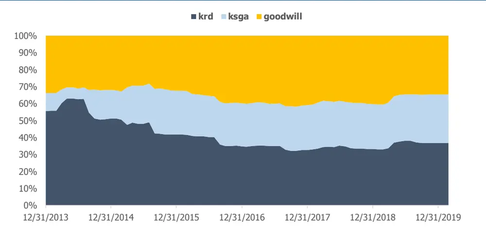
资料来源：wind，国盛证券研究所

## 三、无形资产估值因子表现

## 3.1 因子表现

## 3.1.1 因子分组收益

ICV 因子分组收益整体呈现单调性。我们在测试了 2014年1 月~2020年3 月为止，wind全 A 样本内 ICV 原始因子，市值中性化以及市值行业中性化后因子分组表现，下图为分十组组合相对 wind 全 A 超额年化收益，我们看到因子对股票收益有一定区分度，其中因子值最大的第十组相对于第一组存在明显的优势。

图表9:ICV因子分组相对wind全A超额收益（等权）
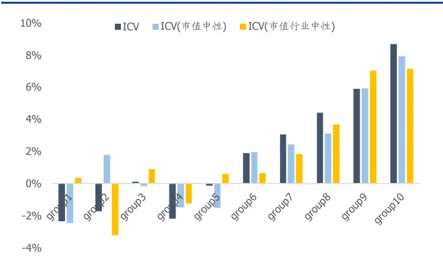
资料来源：wind，国盛证券研究所

图表10:ICV因子分组相对wind全A超额收益（市值加权）
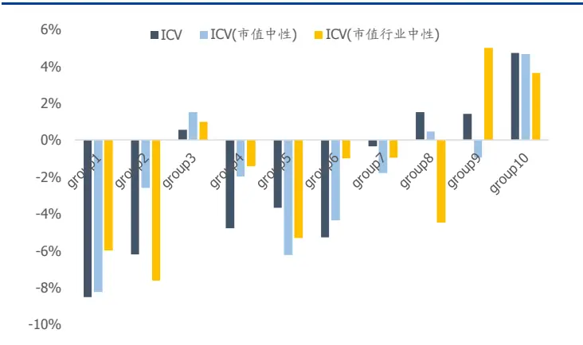
资料来源：wind，国盛证券研究所

从 IC 检验来看，ICV 因子在样本内的 IC 值显著异于 0。原始因子 IC 均值 0.0262，t检验值3.93；而对市值中性化后因子IC均值0.0219，对市值行业中性化后IC均值0.0206。

从多空组合表现来看，ICV因子多头组合整体跑赢空头组合。原始因子多空组合年化收益 13.7%，对市值和行业中性化后有所降低。由于 ICV 因子偏向于选择在研发、销售和管理上投入较大的企业，这部分企业有较明显的行业偏离特征，也有较高概率在本行业内处于龙头地位，即原始因子带有部分市值和行业因子贡献的收益。而当我们对原始因子做市值和行业中性化后，反而会降低因子的择股能力。

图表11:ICV因子多空净值（等权）
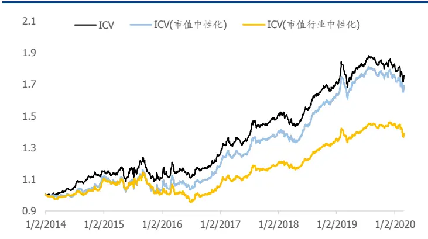
资料来源：wind，国盛证券研究所

图表12：ICV因子多空净值（市值加权）
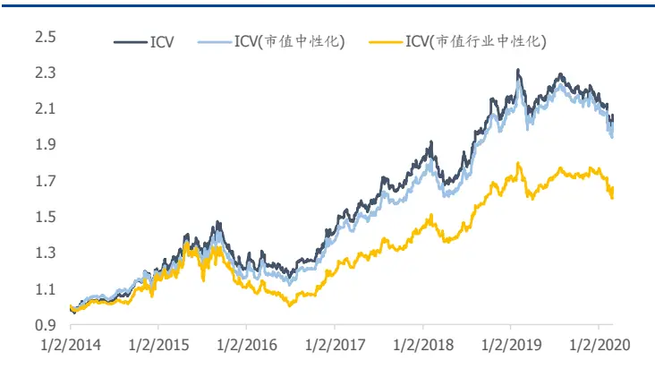
资料来源：wind，国盛证券研究所

图表13:wind全A样本ICV因子IC，ICIR，多空组合及多头组合绩效（市值加权）

|  | IC | t-val | 年化收益 | 年化波动率 | SR | 最大回撤 | 多头对冲基准 年化收益 | IR |
| --- | --- | --- | --- | --- | --- | --- | --- | --- |
| ICV | 0.0262 | 3.93 | 13.7% | 12.3% | 1.11 | 14.43% | 4.73% | 0.56 |
| ICV(市值中性化) | 0.0219 | 3.40 | 13.3% | 11.9% | 1.12 | 13.86% | 4.67% | 0.56 |
| ICV(市值行业中性化) | 0.0206 | 3.48 | 9.6% | 11.3% | 0.85 | 26.08% | 3.65% | 0.45 |

资料来源：wind，国盛证券研究所

## 3.1.2 宽基指数分域测试

从不同宽基指数的因子表现来看，原始因子多空组合在创业板综中表现最强，而对市值和行业中性化后的因子在中证 500 中的表现更突出。

图表14：不同宽基指数ICV因子IC，ICIR，多空组合及多头组合绩效（市值加权）

|  | IC | t-val | 年化收益 | 年化波动率 | SR | 最大回撤 | 多头对冲基准年化收益 | IR |  |
| --- | --- | --- | --- | --- | --- | --- | --- | --- | --- |
|  | 沪深 300 |  |  |  |  |  |  |  |  |
| ICV | 0.0270 | 2.78 | 11.56% | 16.87% |  | 0.68 | 28.48% | 8.56% | 0.61 |
| ICV(市值中性化) | 0.0223 | 2.33 | 10.70% | 16.83% |  | 0.64 | 28.33% | 8.48% | 0.61 |
| ICV(市值行业中性化) | 0.0179 | 2.68 | 5.00% | 11.90% | 0.42 |  | 24.18% | 2.49% | 0.22 |
|  |  |  |  |  | 中证 500 |  |  |  |  |
| ICV | 0.0349 | 3.24 | 9.77% | 12.11% |  | 0.81 | 21.82% | 6.72% | 0.82 |
| ICV(市值中性化) | 0.0312 | 2.96 | 10.91% | 11.89% |  | 0.92 | 19.51% | 8.03% | 0.98 |
| ICV(市值行业中性化) | 0.0314 | 3.62 | 14.24% | 10.92% |  | 1.30 | 22.74% | 10.27% | 1.38 |
|  |  |  |  |  | 中证 1000 |  |  |  |  |
| ICV | 0.0192 | 2.29 | 11.79% | 10.57% |  | 1.12 | 8.41% | 10.03% | 1.26 |
| ICV(市值中性化) | 0.0123 | 1.49 | 9.94% | 10.55% |  | 0.94 | 19.30% | 10.37% | 1.34 |
| ICV(市值行业中性化) | 0.0108 | 1.46 | 5.16% | 8.85% |  | 0.58 | 19.75% | 8.32% | 1.08 |
|  |  |  |  |  |  | 创业板综 |  |  |  |
| ICV | 0.0286 | 3.53 | 28.57% |  | 12.92% | 2.21 | 13.49% | 17.07% | 1.46 |
| ICV(市值中性化) | 0.0155 | 2.36 | 6.29% | 14.74% |  | 0.43 | 40.17% | 8.26% | 0.70 |
| ICV(市值行业中性化) | 0.0115 | 1.86 | 0.81% |  | 15.43% | 0.05 | 48.23% | 2.07% | 0.18 |

资料来源：Wind，国盛证券研究所

## 3.1.3 纯因子收益率

我们进一步考察因子相对于风险因子，对个股收益解释度的信息增量。我们观察到，在控制所有风险因子后，ICV 因子仍然能提供一定的超额收益。

下图为回归法测试中，控制了风险模型中的十大类风格因子（size、nlsize、beta、momentum、residual volatility、liquidity、value、earnings y ield、growth 和 leverage）与行业因子（中信一级行业分类）后，ICV 因子在 wind 全 A、沪深 300、中证500 和创业板综中的纯因子收益率。

从不同的指数样本来看，ICV 因子自 2016 年起中证 500 样本中有持续的超额收益，而在 2014 年以及 2017 年6 月至今在创业板综样本中也有持续的超额收益；此外，因子在沪深 300 样本内的收益相对较低，但自 2018 年至今依然能提供一定的超额收益。

图表15：ICV因子分域纯因子收益率（控制所有风格因子与行业因子）
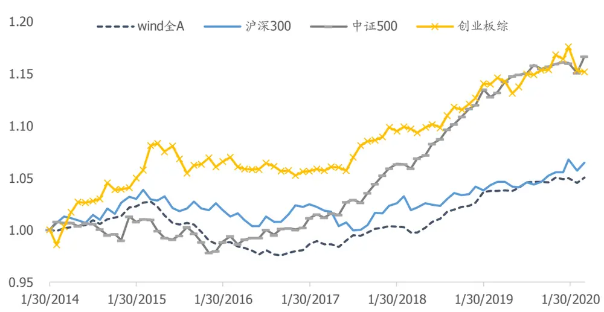
资料来源：wind，国盛证券研究所

## 3.2 分行业因子及其细分项统计检验

由上文我们注意到 ICV 因子涉及三个细分项：研发资产价值Krd，销售管理资产Ksga，和商誉资产Goodwill，且三项资产的重要性与公司所属行业有较强的关联性，我们分别从行业维度考察 ICV 的细分项：Krd Cap，Ksga Cap和Negative_Goodwill Cap(商誉取负)的选股效果。对于行业内股票个数少于30个或者覆盖历史少于3年的细分项不做统计。

从因子的细分表现来看，我们注意到 ICV 因子选股能力较强的行业包括电子元器件、建筑、传媒、汽车、建材、农林牧渔、计算机、商贸零售、通信和交通运输等行业；从细分项来看：

- 研发资产估值在计算机、建筑、电子元器件、汽车、建材，以及基础化工、电力设备新能源等行业与股价相关性较为显著；

- 销售管理资产估值在建筑、农林牧渔、计算机、建材，以及轻工制造、房地产、有色金属等行业与股价相关性较高；

- 负商誉估值在传媒行业的统计检验值较高，该因子确实能帮助我们降低高商誉公司暴雷风险。

图表16：行业内ICV细分因子IC及t检验值统计（行业内市值中性化）

| ICV |  | Krd/Cap |  | Ksga/Cap |  | Negative Goodwill/Cap |  |
| --- | --- | --- | --- | --- | --- | --- | --- |
| 行业 | IC | t-val | IC | t-val | IC | t-val IC | t-val |
| 电子元器件 | 0.0332 | 3.86 | 0.0366 | 3.65 | 0.0164 | 1.37 0.0040 | 0.34 |
| 建筑 | 0.0412 | 3.22 | 0.0416 | 3.74 | 0.0673 4.16 | -0.0074 | -0.55 |
| 传媒 | 0.0478 | 3.11 | 0.0144 | 0.97 | 0.0254 1.74 | 0.0363 | 2.29 |
| 汽车 | 0.0337 | 2.99 | 0.0411 | 3.23 | 0.0149 0.92 | 0.0031 | 0.22 |
| 建材 | 0.0351 | 2.51 | 0.0360 | 3.00 | 0.0450 2.57 | 0.0120 | 0.67 |
| 农林牧渔 | 0.0313 | 2.43 | 0.0382 | 2.24 | 0.0421 | 2.89 -0.0083 | -0.58 |
| 计算机 | 0.0291 | 2.43 | 0.0453 | 4.04 | 0.0391 | 2.77 -0.0130 | -1.08 |
| 通信 | 0.0339 | 2.15 | 0.0311 | 2.12 | 0.0144 | 0.91 0.0169 | 1.02 |
| 商贸零售 | 0.0304 | 2.13 |  | ■ | 0.0243 | 1.53 0.0246 | 1.13 |
| 餐饮旅游（消费者服务） | 0.1203 | 2.08 | 0.0417 | 0.21 | 0.0787 | 1.26 0.0793 | 1.22 |
| 交通运输 | 0.0280 | 2.01 | ■ | - | 0.0280 | 2.21 | 一 |
| 电力设备及新能源 | 0.0250 | 2.00 | 0.0315 | 2.40 | 0.0296 | 2.02 -0.0009 | -0.09 |
| 综合 | 0.0554 | 1.68 | 0.0310 | 1.18 | 0.0478 | 1.71 0.0447 | 1.40 |
| 房地产 | 0.0220 | 1.55 | ■ | ■ | 0.0341 | 2.31 0.0082 | 0.50 |
| 医药 | 0.0159 | 1.47 | 0.0177 | 1.73 | -0.0059 | -0.48 0.0146 | 1.39 |
| 机械 | 0.0168 | 1.28 | 0.0144 | 1.16 | 0.0139 | 1.02 -0.0001 | -0.01 |
| 石油石化 | 0.0233 | 1.27 | 0.0275 | 1.57 | 0.0432 | 1.92 | - |
| 国防军工 | 0.0283 | 1.21 | 0.0288 | 1.32 | 0.0299 | 1.19 |  |
| 基础化工 | 0.0095 | 0.94 | 0.0223 | 2.44 | 0.0031 | 0.24 -0.0006 | -0.04 |
| 轻工制造 | 0.0159 | 0.88 | 0.0218 | 1.27 | 0.0389 | 2.41 0.0090 | 0.45 |
| 食品饮料 | 0.0127 | 0.88 | 0.0189 | 1.32 | -0.0048 | -0.36 0.0193 | 1.25 |
| 电力及公用事业 | 0.0092 | 0.70 | -0.0103 | -0.47 | 0.0226 | 2.01 0.0114 | 0.82 |
| 钢铁 | 0.0155 | 0.65 | 0.0227 | 0.96 | 0.0195 | 0.84 - | - |
| 煤炭 | 0.0115 | 0.46 | -0.0013 | -0.05 | 0.0077 | 0.24 - | - |
| 有色金属 | 0.0049 | 0.34 | 0.0123 | 0.87 | 0.0367 | 2.21 |  |
| 家电 | 0.0054 | 0.28 | -0.0060 | -0.35 | 0.0093 | 0.46 0.0570 | 0.98 |
| 纺织服装 | -0.0074 | -0.45 | 0.0025 | 0.16 | 0.0113 | 0.84 |  |

资料来源：wind，国盛证券研究所

研发资本估值在医药行业的选股效果没有预想中来的明显。我们认为，医药行业是政策敏感性非常强的行业，对制药企业来说，药品从研发到投产过程所经历的审核环节繁多，风险较大，且药品销售受政策影响也不容小觑；对于非药企业，医疗服务在我国正处于兴起阶段，创新产品落地仍需时间消化，因此研发投入时间长且投入高的医药企业并不一定能在基本面和股价上有及时的表现。

分域测试容易带来过拟合的问题，我们在行业内选用因子时应当更谨慎地辨别因子背后的逻辑在未来的延续性。

## 3.3 因子相关性

## 3.3.1 因子与风格因子相关性

我们统计了 ICV 因子与风格因子平均相关系数。ICV 因子整体与量价类因子的相关性较低，但与波动率和流动性因子存在一定负相关；基本面因子中，ICV 因子与估值类因子中的价值（BP）和盈利（EP 等）因子的正相关性较高，与成长因子负相关性较高。

图表17：ICV因子及细分项与风格因子暴露平均相关系数

|  | beta | 动量 | 市值 | 非线性市值 | 盈利 | 波动率 | 成长 | 价值 | 杠杆 | 流动性 |
| --- | --- | --- | --- | --- | --- | --- | --- | --- | --- | --- |
| ICV | -0.0132 | 0.0045 | -0.0591 | -0.0914 | 0.0807 | -0.1330 | -0.2226 | 0.1325 | 0.0263 | -0.1080 |
| Krd/Cap | 0.0606 | -0.0828 | -0.0763 | 0.0075 | 0.0455 | -0.1199 | -0.0979 | 0.1663 | 0.0019 | -0.0435 |
| Ksga/Cap | -0.0744 | -0.1253 | 0.0883 | -0.0105 | 0.1967 | -0.2475 | -0.1546 | 0.4011 | 0.2793 | -0.2692 |
| Negative Goodwill/Cap | -0.0071 | 0.0567 | -0.1265 | -0.1687 | 0.0047 | 0.0104 | -0.1604 | -0.0708 | -0.0737 | -0.0097 |

资料来源：Wind，国盛证券研究所

## 3.3.2 因子与 BP 因子相关性走势

从因子及细分项与传统 BP因子的相关性来看，研发资产和销售管理资产估值整体与 BP的相关性较为稳定，研发资产与 BP 的相关系数稳定在约 0.17 左右，销售管理资产与 BP 的相关性偏高，但自 16年起有一定程度下降；负商誉估值整体与 BP呈负相关，拉低了 ICV因子与BP因子的相关性。

图表18:ICV因子与BP因子相关性走势
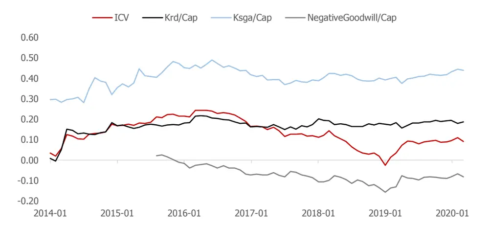
资料来源：Wind，国盛证券研究所

## 3.4 研发资产估值因子与研发类因子对比

我们统计了 wind 全 A 样本内与研发支出相关的因子，包括：

(1) R D Assets：研发支出/总资产；

(2) R D Equitys：研发支出/净资产；

(3) R D Sales：研发支出/营业收入；

(4) Krd Cap：研发资本/总市值。

对比前三个因子表现，我们看到 R&D/Assets 和 R&D/Equitys 因子表现优于 R&D/Sales，从侧面说明将研发支出作为一项资本比作为费用来考察更合适。

同时，前三个因子完全基于财报信息；而研发资本估值包含价格信息，因此带有估值因子的特征，一定程度上能反映市场情绪。而从因子检验结果来看，估值因子的 IC 均值和ICIR 值更高。

图表 19:研发类因子IC均值
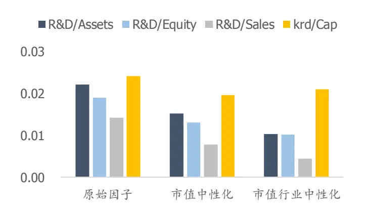
资料来源：wind，国盛证券研究所

图表 20:研发类因子ICIR
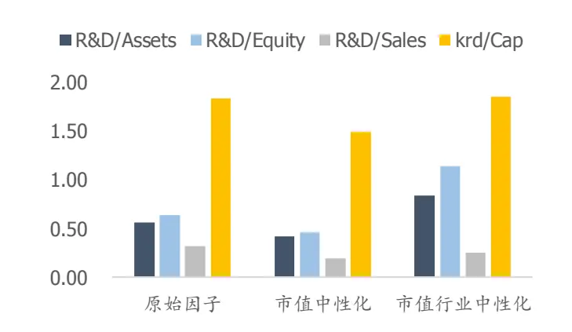
资料来源：wind，国盛证券研究所

## 3.5 折旧率敏感性测试

我们测试了折旧率为 0 和为1 情况下，ICV 因子在全市场中 ICIR 值对比（市值行业中性化）。当折旧率为 0，意味着历史上所有研发、广告宣传和薪酬支出全部保留为资本；折旧率为 1，即历史支出没有留存。

在不同样本测试结果来看，折旧率的高低对因子表现的影响有所区别。若是全市场选股，因子对折旧率的敏感性相对弱一些，但对比中小票中因子表现，设定折旧率为 0 的因子表现更占优势，即我们测算的折旧率有偏高的嫌疑。因此如果未来能基于更深入的行业研究给出更合适的折旧率，那么对公司的无形资产刻画将会更加合理。

图表21:ICV因子对折旧率敏感性测试
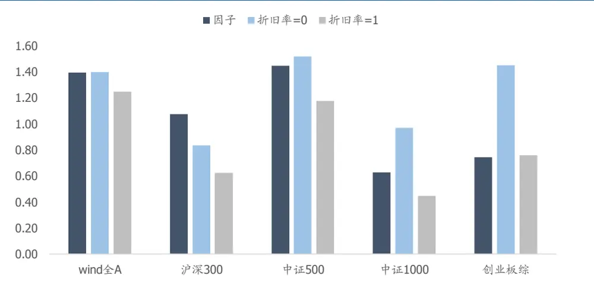
资料来源：wind，国盛证券研究所

## 四、无形资产价值因子在TMT行业内选股效果

我们对比了 ICV 因子及其细分项在不同行业内的选股效果，发现因子在 TMT 行业内的IC 以及 ICIR 值较高，我们尝试利用 ICV 因子在 TMT 行业内选股，月频调仓，构建策略。

选股范围：中信一级行业中电子元器件、计算机、通信和传媒成分股，剔除 ST 股、新股和停牌股票。

策略构建规则：每月月底，计算样本内股票的 ICV 值，进行去极值、标准化并对市值因子中性化处理，按因子值从大到小排序，取前 50 只股票。

回测方式：日收盘价回测，双边按千三扣费。

我们分别测试了等权和按市值加权两种方式构建策略，并且对比了BP因子的选股效果。

我们注意到根据无形资产估值因子构建的组合能相对 TMT 行业基准提供超额收益，并且相对于传统 BP 因子在选股上有明显优势，相对于 BP 选股策略，无形资产估值选股的等权策略年化收益提升 9.04%，信息比从-0.02 提升至1.39。这也说明了 TMT 行业内公司的净资产数值与公司的内在价值存在较大偏差，尤其是公司无形资产部分被严重低估。

图表 22:TMT行业 ICV因子与 BP因子选股超额净值（等权）
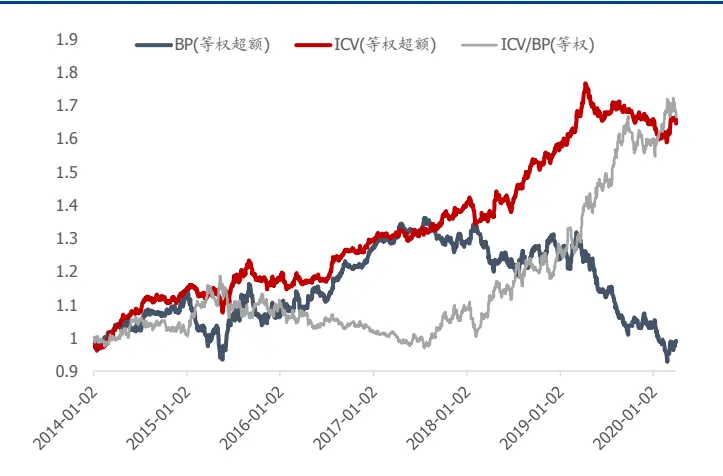
资料来源：wind，国盛证券研究所

图表 23:TMT行业 ICV因子与 BP因子选股超额净值（流通市值加权）
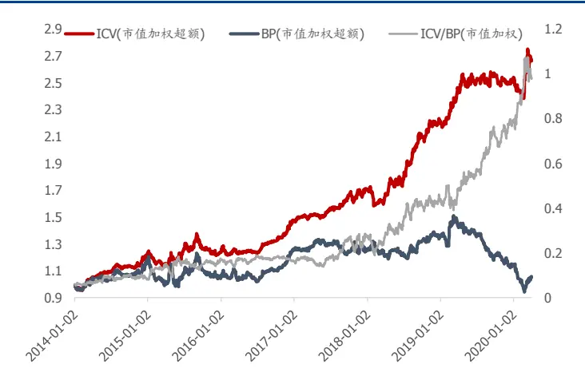
资料来源：wind，国盛证券研究所

策略分年度绩效：

图表 24:TMT行业选股策略分年度超额收益

| BP(等权) |  |  |  |  |  |  |  |
| --- | --- | --- | --- | --- | --- | --- | --- |
| year | 年化收益 年化波动率 | IR | 最大回撤 | 年化收益 | ICV(等权) 年化波动率 | IR | 最大回撤 |
| 2014 | 13.52% | 7.72% | 1.75 | 3.80% | 14.93% | 5.67% 2.63 | 3.25% |
| 2015 | -6.18% | 14.03% | -0.44 | 18.63% | 2.69% | 8.32% 0.32 | 7.14% |
| 2016 | 20.21% | 8.56% | 2.36 | 5.80% | 10.35% | 5.50% 1.88 | 4.27% |
| 2017 | 1.48% | 5.91% | 0.25 | 7.52% | 8.86% | 5.25% 1.69 | 2.53% |
| 2018 | -3.47% | 9.80% | -0.35 | 11.54% | 11.99% | 6.73% 1.78 | 5.71% |
| 2019 | -17.27% | 9.69% | -1.78 | 23.51% | 6.25% | 5.97% 1.05 | 7.04% |
| 2020 | -19.05% | 14.02% | -1.36 | 11.83% | -3.78% | 6.84% -0.55 | 4.03% |
| 总计 | -0.20% | 9.85% | -0.02 | 31.72% | 8.84% | 6.38% 1.39 | 10.08% |
| BP(流通市值加权) |  |  |  |  |  | ICV(流通市值加权) |  |
| 2014 | 18.87% | 10.44% | 1.81 | 4.22% | 23.89% | 7.98% 2.99 | 4.06% |
| 2015 | -11.71% | 19.22% | -0.61 | 18.79% | 0.42% | 12.70% 0.03 | 11.84% |
| 2016 | 19.93% | 10.22% | 1.95 | 8.92% | 19.16% | 7.12% 2.69 | 5.40% |
| 2017 | 0.82% | 10.09% | 0.08 | 8.36% | 17.32% | 8.17% 2.12 | 4.65% |
| 2018 | 8.29% | 11.76% | 0.70 | 10.13% | 30.04% | 10.89% 2.76 | 8.35% |
| 2019 | -16.48% | 12.84% | -1.28 | 25.80% | 15.95% | 9.75% 1.64 | 4.08% |
| 2020 | -30.98% | 19.99% | -1.55 | 18.24% | 22.29% | 17.56% 1.27 | 5.62% |
| 总计 | 0.81% | 13.21% | 0.06 | 37.82% | 18.25% | 10.07% | 1.81 7.80% |

资料来源：wind，国盛证券研究所

## 总结

由于财报数据往往低估了公司在研发、销售、人力资本上的无形资产，而高估并购形成的商誉，本篇报告中，我们尝试重新资本化处理公司研发、销售和管理费用，剥离商誉，形成对公司无形资产账面价值的计量，并构建无形资产的价值因子 ICV。

在 年测试期内，利用重新资本化形成的无形资产构建的估值因子，在全市场内分组收益表现出较好的单调性；在控制了所有的风格和行业之后，因子自 2017 年起持续提供正超额收益，且在 TMT 和消费类行业内与股票收益相关性更为显著。无形资产估值因子弥补了传统估值因子 BP 低估公司无形资产的缺陷，为 TMT 行业选股难题提供了一种解决思路。

未来展望，我们发现财报提供的结构化数据仍然是有限且滞后的，可以考虑从其他数据源挖掘公司信息，以更好地衡量企业的内在价值。

## 参考文献

【1】Baruch, Lev, and, et al. The capitalization, amortization, and value-relevance of R&D[J]. Journal of Accounting & Economics, 1996.

【2】Park, Hyuna. An intangible-adjusted book-to-market ratio still predicts stock returns [J]. European Financial Management, 2019.

【3】Li W C Y , Hall B H . Depreciation of Business R&D Capital[J]. Bea Working Papers, 2016.

## 风险提示

量化专题报告的观点全部基于历史统计与量化模型，存在历史规律与量化模型失效的风险。

## 免责声明

国盛证券有限责任公司（以下简称“本公司”）具有中国证监会许可的证券投资咨询业务资格。本报告仅供本公司的客户使用。本公司不会因接收人收到本报告而视其为客户。在任何情况下，本公司不对任何人因使用本报告中的任何内容所引致的任何损失负任何责任。

本报告的信息均来源于本公司认为可信的公开资料，但本公司及其研究人员对该等信息的准确性及完整性不作任何保证。本报告中的资料、意见及预测仅反映本公司于发布本报告当日的判断，可能会随时调整。在不同时期，本公司可发出与本报告所载资料、意见及推测不一致的报告。本公司不保证本报告所含信息及资料保持在最新状态，对本报告所含信息可在不发出通知的情形下做出修改，投资者应当自行关注相应的更新或修改。

本公司力求报告内容客观、公正，但本报告所载的资料、工具、意见、信息及推测只提供给客户作参考之用，不构成任何投资、法律、会计或税务的最终操作建议 本公司不就报告中的内容对最终操作建议做出任何担保。本报告中所指的投资及服务可能不适合个别客户，不构成客户私人咨询建议。投资者应当充分考虑自身特定状况，并完整理解和使用本报告内容，不应视本报告为做出投资决策的唯一因素。

投资者应注意，在法律许可的情况下，本公司及其本公司的关联机构可能会持有本报告中涉及的公司所发行的证券并进行交易，也可能为这些公司正在提供或争取提供投资银行、财务顾问和金融产品等各种金融服务。

本报告版权归“国盛证券有限责任公司”所有。未经事先本公司书面授权，任何机构或个人不得对本报告进行任何形式的发布、复制。任何机构或个人如引用、刊发本报告，需注明出处为“国盛证券研究所”，且不得对本报告进行有悖原意的删节或修改。

## 分析师声明

本报告署名分析师在此声明：我们具有中国证券业协会授予的证券投资咨询执业资格或相当的专业胜任能力，本报告所表述的任何观点均精准地反映了我们对标的证券和发行人的个人看法，结论不受任何第三方的授意或影响。我们所得报酬的任何部分无论是在过去、现在及将来均不会与本报告中的具体投资建议或观点有直接或间接联系。

投资评级说明

| 投资建议的评级标准 |  | 评级 | 说明 |
| --- | --- | --- | --- |
| 评级标准为报告发布日后的6个月内公司股价（或行业指数）相对同期基准指数的相对市场表现。其中A股市场以沪深300指数为基准；新三板市场以三板成指（针对协议转让标的）或三板做市指数（针对做市转让标的）为基准；香港市场以摩根士丹利中国指数为基准，美股市场以标普500指数或纳斯达克综合指数为基准。 | 股票评级 | 买入 | 相对同期基准指数涨幅在15%以上 |
|  |  | 增持 | 相对同期基准指数涨幅在 5%~15%之间 |
|  |  | 持有 | 相对同期基准指数涨幅在-5%~+5%之间 |
|  |  | 减持 | 相对同期基准指数跌幅在 5%以上 |
|  | 行业评级 | 增持 | 相对同期基准指数涨幅在10%以上 |
|  |  | 中性 | 相对同期基准指数涨幅在-10%~+10%之间 |
|  |  | 减持 | 相对同期基准指数跌幅在10%以上 |

## 国盛证券研究所

北京

地址：北京市西城区平安里西大街26号楼 3层

上海

地址：上海市浦明路868号保利 One56 1号楼 10层

邮编：100032

邮编：200120

传真：010-57671718

邮箱：gsresearch@gszq.com

电话：021-38934111

南昌

邮编：330038

地址：南昌市红谷滩新区凤凰中大道 1115号北京银行大厦

邮箱：gsresearch@gszq.com

传真：0791-86281485

地址：深圳市福田区福华三路 100号鼎和大厦 24楼

深圳

邮箱：gsresearch@gszq.com

邮编：518033

邮箱：gsresearch@gszq.com