# 量化专题报告

## 多因子系列之十三：基金重仓股研究

本报告从不同维度寻找了对基金重仓股超额收益有预测作用的指标，然后筛选出超额收益较高的重仓股票池，并纳入多因子策略，显著提升了策略的表现。为了剥离出基金重仓股单纯的选股能力，我们以残差收益作为预测目标，从基金特征、股票特征、持仓特征等三个维度寻找了对重仓股残差收益有预测能力的指标，并进行结合筛选出重仓股股票池，然后以权重约束的方式加入到原有指数增强策略，近年来提升效果十分显著。

不同基金的重仓股超额收益有显著差别。业绩越好的基金其重仓股超额收益越高，且具有很强的头部效应和单调性。而业绩排名靠后以及规模较小的基金独立持有的重仓股近年来超额收益显著为负。

重仓股在不同的股票域中获取超额收益的能力不同。2017 年以前，重仓股在小票成长风格的股票中能够获取更多的超额收益，而 2017 年以来，重仓股在偏高估值的板块超额收益更高，在低估值板块超额收益并不明显。行业方面，重仓股在 TMT 以及中游行业能获取持续的超额收益，而在上游行业以及券商军工等行业几乎没有稳定的超额收益。

基金的持仓信息对重仓股超额收益有明显的预测作用。我们使用持仓信息构建持仓因子，发现各因子与重仓股超额收益都是正向相关，有一定的预测作用。但持仓市值占流通市值的比例及其变化的预测效果较好，而持仓市值占所有重仓股持仓市值的比例以及持仓占比均值等因子效果较弱。

持仓信息在优选基金的重仓股中区分度并不显著。我们先使用业绩筛选基金，再使用优选基金的持仓信息构建持仓因子，发现在样本内确实存在一定的单调性，但大部分指标统计检验并不显著。最为显著的指标是使用全部基金持仓构建的重仓市值占流通市值比例的季度环比变化。

筛选出的股票池获取的是热门股票盈利预期的增量所带来的收益。我们使用业绩和重仓市值占流通市值比例的变化因子筛选出一个股票池，发现该股票的风格暴露为高流动性、高估值和高动量，但其在分析师于盈利预测上暴露也较高，说明这个股票池是在非常热门的股票中寻找未来盈利预期的增量。

在增强组合中纳入该股票池近年来带来明显的提升。我们使用权重约束的方法纳入筛选出来的股票池，发现在 2017 年以来提升效果明显，而 2017 年以前反而降低原策略的表现。主要原因是尽管我们能够持续的获取这些股票的残差收益，但 2017 年以前，这些股票的风格带来了较大的负向贡献。2017年以来，市场风格和该股票池风格相似，而残差收益部分相对于多因子又能获取较高的收益，这是该策略带来提升的主要原因。

风险提示：以上结论均基于历史数据和统计模型的测算，如果未来市场环境发生改变，不排除模型失效的可能性。

## 作者

分析师 刘富兵

执业证书编号：S0680518030007

邮箱：liufubing@gszq.com

研究助理 丁一凡

邮箱：dingyifan@gszq.com

## 相关研究

1、《量化周报：创出新高再追涨也不迟》2020-08-30

2、《量化周报：快调还是慢调？》2020-08-23

3、《量化周报：短期震荡仍不够充分》2020-08-16

4、《量化周报：短期震荡继续》2020-08-09

5、《量化分析报告：当前周期行业有哪些投资机会？——基本面量化思考（三）》2020-08-07

## 一、综述

去年以来，主动基金业绩大幅跑赢市场，其重仓的股票连续创出新高，因此主动基金的重仓股备受市场关注。事实上，一直以来，基金重仓股的简单跟踪策略就一直能够获取稳定的超额收益，下图展示了 2011 年以来偏股基金（规模大于 1 个亿）所有重仓股的特质收益率等权净值曲线。

图表1:所有基金重仓股的等权特质收益净值
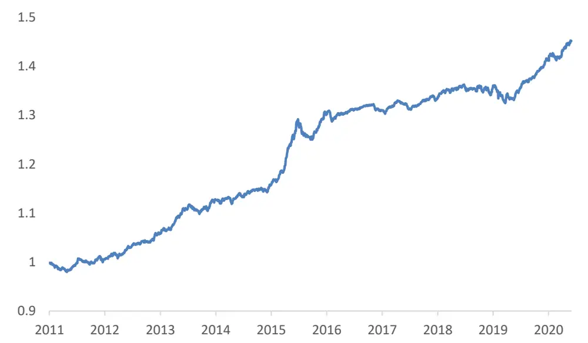
资料来源：国盛证券研究所，Wind

尽管重仓股长期来看能够提供显著的超额收益，但其表现并不稳定。去年以来明显由机构主导的行情中，重仓股超额收益较高，但在 16-18 年这三年中，超额收益明显较小。同时图表 2 显示，基金重仓股平均数量在 1000 只左右，虽然近两年持股集中度有所增加，但仍在 700只左右。我们如果想从公募重仓股中获取超额收益，显然不能简单的跟随所有重仓股。本报告分别通过对基金特征、股票特征、持仓特征进行研究，试图筛选出基金重仓股中超额收益较高的股票，然后将其应用到策略之中。

图表2:基金重仓股数量
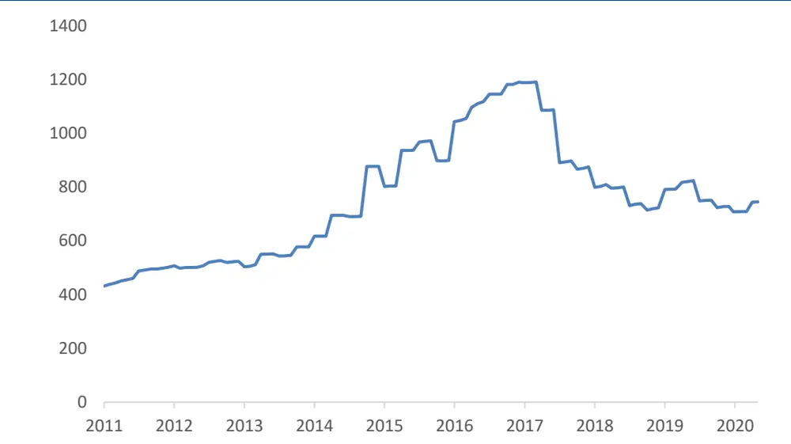
资料来源：国盛证券研究所，Wind

## 二、影响重仓股超额收益的因素

## 2.1 数据

我们选取的样本区间为 2011年1 月到 2020年6月。基金样本为所有的偏股混合型基金以及普通股票型基金，其中剔除了被动指数型基金、指数增强型基金以及主动量化基金。若同一只基金有除A类份额以外的份额，我们只保留A类份额，并记其规模为所有份额之和。另外，在本文的研究中，只包含基金季报的前十大重仓股数据，年报和半年报的完整持仓数据由于太过滞后，我们不做考虑。由于基金在季度结束之后 15 个工作日以内会公告其最新的重仓股持仓，因此数据的及时性得到保证。

图表3：样本基金数量
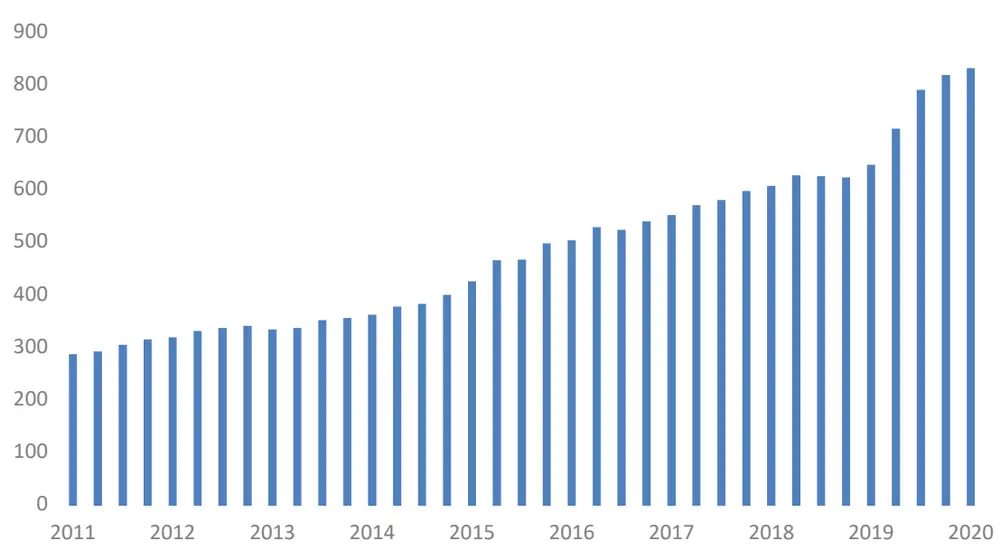
资料来源：国盛证券研究所，Wind

在本文的所有测试中，我们都以股票的残差收益率作为预测目标，即股票原始收益对所有的风格和行业因子加权回归得到的残差收益（后文中的特质收益、超额收益均指残差收益）。这样我们能够单纯的研究重仓股的选股能力，而公募基金在行业或者风格上的配置能力，我们可以在后续研究中做进一步探讨。

## 2.2 基金特征

## 2.2.1 基金业绩

如果基金经理有很强的管理能力，其管理的基金的重仓股可能会有更高的超额收益。那么如何衡量基金经理的管理能力呢？历史业绩是较好的代理变量之一，例如过去N 个月的收益率、过去 N个月的夏普比等。但直接使用历史业绩会存在风格和仓位的影响，比如有些基金的过往业绩较好可能只是因为暴露了小市值风格的原因，而我们更想要衡量的是基金经理的选股能力。因此，我们借鉴了我们团队 FOF 研究报告《基金 ALPHA 进化史：深入ALPHA的创造与湮灭》中的 Sharpe 资产因子模型来剥离掉风格和仓位的影响。Sharpe资产因子模型将基金所能投资的所有资产作为 Beta 组，以仓位估计的思路剥离基金的 Beta，并把剩余无法解释的部分作为基金的 Alpha。具体细节可参考原报告。

图表4：资产因子组

| 资产因子 | 代理指数 |
| --- | --- |
| 大市值价值 | 沪深 300 价值 |
| 大市值成长 | 沪深 300 成长 |
| 中市值价值 | 中证 500 价值 |
| 中市值成长 | 中证 500 成长 |
| 小市值 | 中证 1000 |
| 短久期 | 中债-总财富（1-3年） |
| 中久期 | 中债-总财富（5-7年） |
| 长久期 | 中债-总财富（10年以上） |
| 现金 |  |

资料来源：国盛证券研究所，《基金ALPHA进化史：深入ALPHA的创造与湮灭》

下面，我们测试了分别用基金 alpha，基金夏普比以及基金收益率来筛选基金重仓股的方法。具体来说，我们在每个月底，利用过去 12 个月的数据计算上述 3 个指标，分别筛选出指标最高的N个基金，取这N个基金的重仓股等权构建组合，并计算其残差收益，以下是测试结果。

图表5：不同指标筛选的基金的重仓股超额收益的年化收益

| 基金个数 | 1 | 3 | 5 | 10 | 20 | 50 | 100 |
| --- | --- | --- | --- | --- | --- | --- | --- |
| 夏普比 | 0.084 | 0.042 | 0.063 | 0.061 | 0.062 | 0.066 | 0.052 |
| 收益率 | 0.106 | 0.101 | 0.101 | 0.090 | 0.072 | 0.068 | 0.059 |
| Alpha | 0.053 | 0.091 | 0.091 | 0.082 | 0.077 | 0.068 | 0.059 |

资料来源：国盛证券研究所，Wind

图表6：不同指标筛选的基金的重仓股超额收益的信息比

| 基金个数 | 1 | 3 | 5 | 10 | 20 | 50 | 100 |
| --- | --- | --- | --- | --- | --- | --- | --- |
| 夏普比 | 0.61 | 0.51 | 0.97 | 1.22 | 1.64 | 2.16 | 1.96 |
| 收益率 | 0.74 | 1.16 | 1.44 | 1.63 | 1.70 | 2.13 | 2.21 |
| Alpha | 0.37 | 1.02 | 1.29 | 1.50 | 1.82 | 2.21 | 2.27 |

资料来源：国盛证券研究所，Wind

图表7：不同指标筛选5只基金的重仓股的表现对比
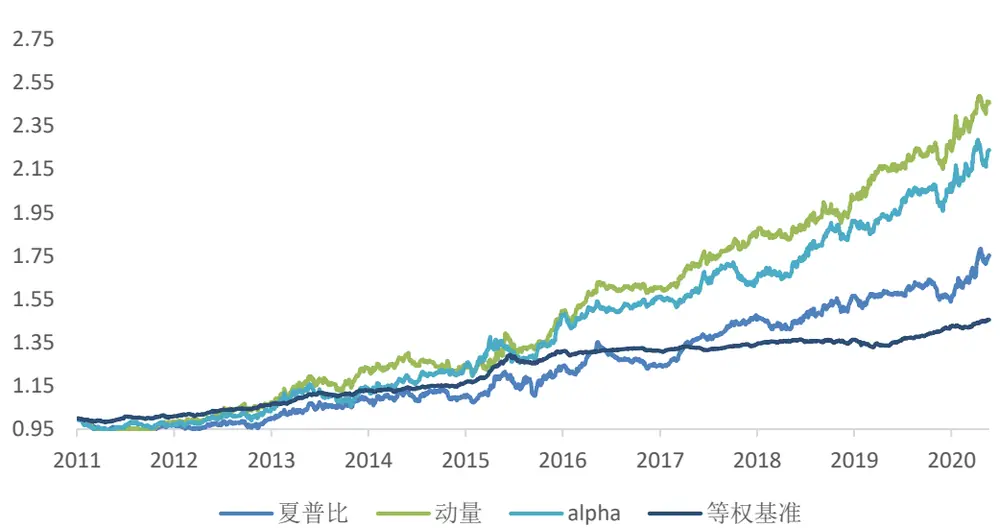
资料来源：国盛证券研究所，Wind

从测试结果上来看，我们发现不管是年化收益还是信息比，利用基金夏普比筛选出的基金重仓股要明显弱于其他两种方法。而利用基金 alpha 和基金收益率筛选的方法差别不大，但基金收益率要略好。同时，使用基金收益率筛选出来的重仓股超额收益呈显著的单调性，随着选取的基金数量越来越多，重仓股的平均收益也在逐渐降低。

尽管基金 alpha 能够更好的剥离出基金的选股能力，但是其筛选基金重仓股的表现却弱于基金业绩，尤其是在基金数量较少的时候。这从侧面反映了，跟随绩优基金重仓股的收益来源并不只是基金经理的选股能力，还有可能包含投资者行为方面的原因，比如明星基金的重仓股会更受市场追捧，或者基金经理会将新的资金继续买入其重仓股，从而产生自我强化的现象。因此过去一段时间业绩表现最好的基金，其重仓股在未来也会有更好的表现。另外由于我们进行的是月频的测试，策略收益中也包含股票动量的因素。但总体来看二者差别并不大，由于基金 alpha 和基金收益率有较强的正相关性，当选取基金数量较多的时候，二者筛选出来的基金重仓股重合度较高，因此当选取 20 个以上的基金时，二者表现比较接近。

无论是基金业绩还是基金 alpha，都没有剔除行业的影响，因此在某些行业表现较好的时候，容易筛选出偏行业的主动基金，例如近期筛选出的基金大部分是医药和科技类的基金。但市场上的医药主题基金也有很多只，既然这些基金能够从医药主题基金中脱颖而出，说明这些基金在医药行业确实有较强的选股能力，至于医药行业未来的 beta如何，并不在这篇报告研究的范围之内。

上述测试显示业绩较好的基金的重仓股确实能够带来较高的超额收益。但基金数量有将近 1000 只，基金的重仓股之间必然会有重叠，业绩较差的基金也可能持有业绩较好的基金的重仓股，跟随业绩较差的基金的重仓股也可能获取超额收益。但是排名靠后的基金所单独持有的重仓股能否带来超额收益呢？我们进行以下测试，将基金分为 5组，分别测试其增量重仓股带来的超额收益。具体来说，我们将基金按过去 12 个月的收益率从好到差分为 5组，股票组合1为第一组基金的重仓股，股票组合 2为第二组基金的重仓股，同时剔除掉已经在股票组合 1 中的股票，以此类推，直到最后一组，此时最后一组的股票即业绩较差的基金单独持有的增量重仓股。使用该方法，我们能够有效的剥离出每一组基金新加入的重仓股，从而测试这些新出现的重仓股是否能够带来显著的超额收益。

图表8:基金业绩分组下不同重仓股的表现
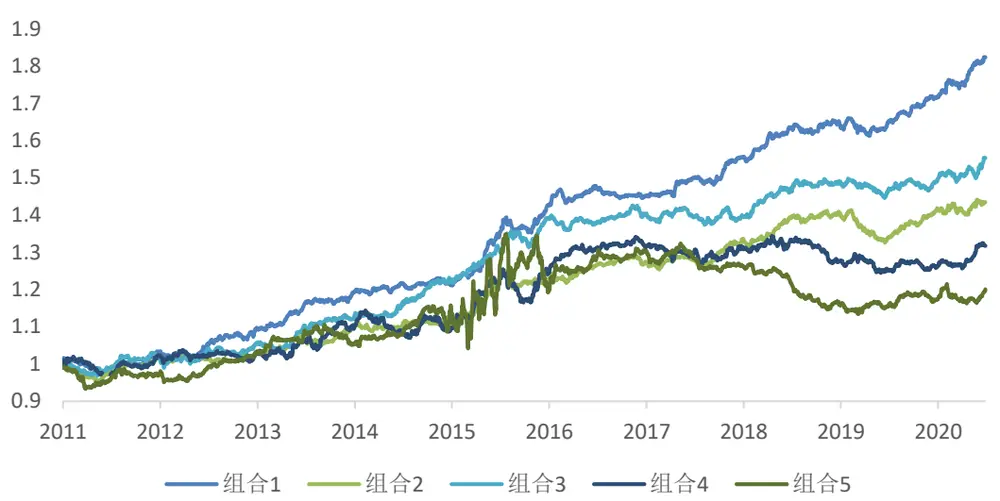
资料来源：国盛证券研究所，Wind

从上图可以看出，不同业绩基金的重仓股在 2017 年前后发生明显变化。2017 年以前，不同业绩基金持有的重仓股差别并不是很大，所有基金的重仓股都能够提供明显的超额收益，但业绩排名前 20%的基金的重仓股超额收益仍稳定好于其他重仓股。在 2017 年之后，业绩较差的基金所单独持有的重仓股已经不能贡献任何超额收益，甚至提供负的超额收益。也就是说，业绩较差的基金单独持有的重仓股几乎没有参考价值，在后面的研究中我们应予以剔除。

## 2.2.2 基金换手

除了基金业绩之外，基金的换手率也是可能影响重仓股跟随策略表现的因素之一。因为基金的持仓并不是实时披露的，因此如果一个基金换手率较高，我们当下获取的持仓信息较为滞后，对滞后的持仓进行跟随可能并不能获取超额收益。

为了测试跟随换手较高的基金的重仓股是否无法获取超额收益，我们仍采用上一节的测试方法进行测试，即首先将基金按换手率从低到高分为 5组，股票组合 1是换手率最低的基金的重仓股，股票组合 2是换手率次低的基金的重仓股且剔除掉股票组合 1中的股票，以此类推，直到最后一组。其中基金换手率是使用半年报和年报数据构建的换手率。

图表9:2017年之前不同换手率分组下基金的重仓股表现
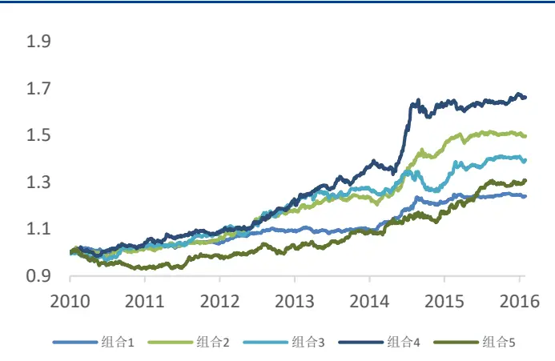
资料来源：国盛证券研究所，Wind

图表10:2017年之后不同换手率分组下基金的重仓股表现
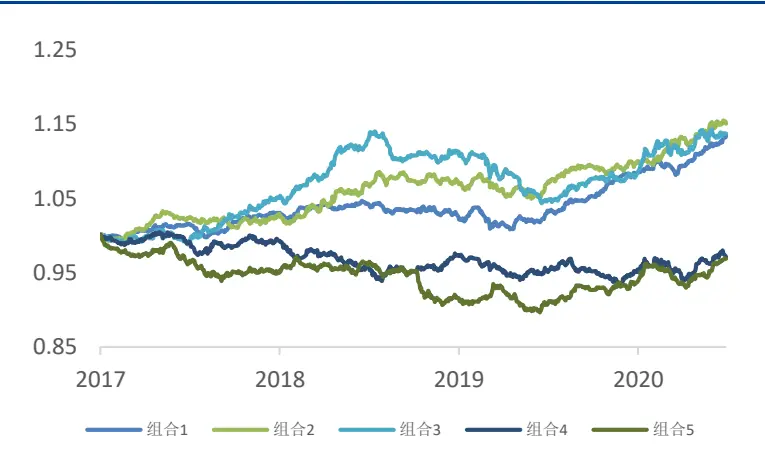
资料来源：国盛证券研究所，Wind

从上图可以看出，2017 年以前，基金换手率与其重仓股超额收益没有明显的单调关系，但 2017 年之后，跟随高换手率基金重仓股的策略超额收益明显要弱于低换手率基金，这似乎与我们的直觉相符，即高换手基金披露的重仓股较为滞后，带来了信息损失。

但如果先筛选业绩排名前20%的基金，再在这些基金样本中按基金换手率不同对重仓股进行分组，我们发现换手率不同的基金的重仓股超额收益并没有明显的差别。那么2017年之后高换手基金重仓股超额收益较低的一个可能解释是 2017 年以后市场风格偏长期价值投资，高换手基金的业绩整体来看弱于低换手的基金，根据上一节的结论，业绩较差的基金重仓股的超额收益也越差。因此，并没有足够的证据表明跟随高换手基金重仓股的策略超额收益要显著低于低换手的基金，换手率不能作为一个有效的筛选指标。

图表11:业绩前20%的基金中不同换手率分组下基金的重仓股表现
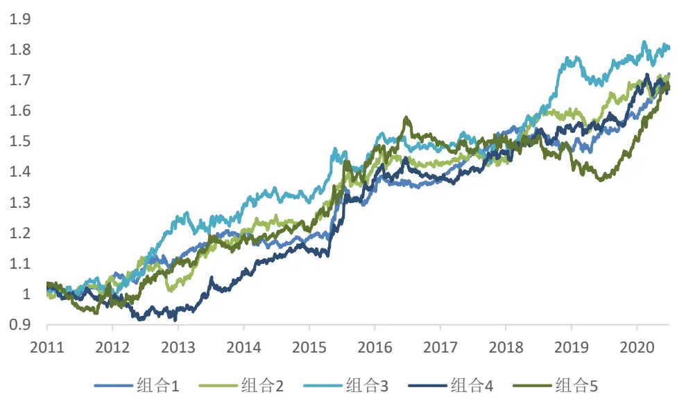
资料来源：国盛证券研究所，Wind

## 2.2.3 基金规模

基金规模也可能对重仓股的超额收益产生影响，基金的规模过大，使得基金经理的选股范围有限，从而限制了重仓股的超额收益，而基金规模过小，从侧面反映了基金历史业绩较差，其重仓股的超额收益可能也会较小。我们分五组测试了不同规模基金重仓股的超额收益。

图表12：基金规模分组下基金的重仓股的表现
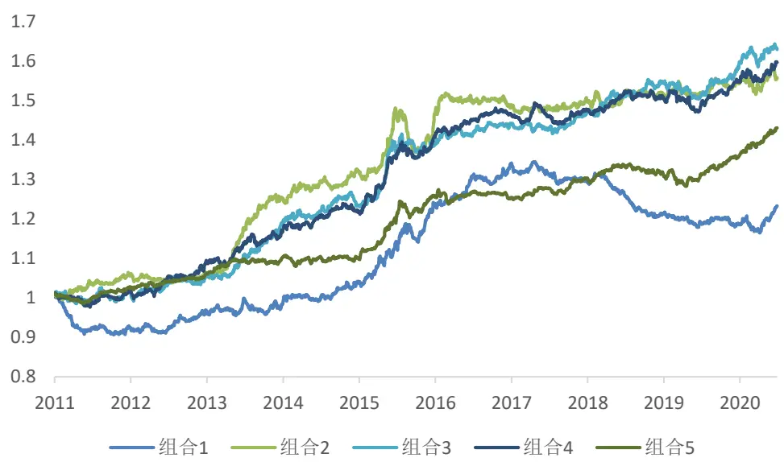
资料来源：国盛证券研究所，Wind

从上图可以看到，规模中等的基金的重仓股确实在全样本有着较高的超额收益。其中规模较大的基金的重仓股的超额收益主要是在 2013-2014年的创业板行情中较弱，近几年的超额收益仍十分稳定。而规模较小的基金单独持有的重仓股在 2017 年之后稳定的产生负向超额收益。因此，我们在后续测试中考虑剔除规模较小的后 20%的基金。

## 2.3 股票特征

除了基金特征以外，基金重仓股票的特征可能也会影响其超额收益，这是由于基金经理在不同风格或者行业中的选股能力并不相同。由上一节我们可以看到，由于市场风格的变化，基金重仓股在 2017 年前后也表现出完全不同的超额收益特征，因此以下的分析我们也分两个不同时间段来进行研究。

## 2.3.1 风格

我们将基金重仓股按 barra 的基本面风格因子分为 5 组，然后计算不同风格下超额收益的表现。得到如下结果，其中第一组是因子值最小的一组。

图表13:2017年之前基金重仓股在不同风格中的超额收益

|  | growth | earnings_yield | size | leverage | value |
| --- | --- | --- | --- | --- | --- |
| 1 | 0.039 | 0.053 | 0.105 | 0.075 | 0.013 |
| 2 | 0.025 | 0.029 | 0.068 | 0.026 | 0.051 |
| 3 | 0.018 | 0.054 | 0.050 | 0.058 | 0.048 |
| 4 | 0.071 | 0.052 | 0.003 | 0.035 | 0.063 |
| 5 | 0.089 | 0.049 | 0.013 | 0.048 | 0.059 |

资料来源：国盛证券研究所，Wind

图表14:2017年之后基金重仓股在不同风格中的超额收益

|  | growth | earnings_yield | size | leverage | value |
| --- | --- | --- | --- | --- | --- |
| 1 | 0.065 | 0.041 | 0.044 | 0.048 | 0.061 |
| 2 | 0.035 | 0.075 | 0.034 | 0.052 | 0.052 |
| 3 | 0.052 | 0.043 | 0.049 | 0.053 | 0.082 |
| 4 | 0.032 | 0.032 | 0.047 | 0.035 | 0.010 |
| 5 | 0.028 | 0.023 | 0.041 | 0.023 | 0.009 |

资料来源：国盛证券研究所，Wind

基金重仓股在不同的风格域中表现出显著的差别。在成长风格方面，2017年之前，在高成长的股票域中，基金重仓股的超额收益更高，而2017年之后，这一效应有所反转，低成长的重仓股能获取的超额收益反而更多。价值风格方面，2017年以前，不管是采用市盈率还是市净率衡量股票的估值，在不同估值水平下，基金重仓股获取超额收益的水平没有任何差别。而在 2017年之后，低估值板块中重仓股超额收益的水平要显著低于高估值板块。大小盘方面，2017 年之前，小票中重仓股获取超额收益的能力明显更高，而近几年来，不同市值水平下重仓股的超额收益差别并不明显。从上述图表中，我们很容易总结出基金重仓股超额收益的风格画像。在 2017年之前，基金在偏小票、成长的股票中更容易获取超额收益。而在 2017年之后，基金重仓股在偏高估值的股票中获取更多的超额，在低估值板块中获取的超额收益较少。

## 2.3.2 行业

图表15:不同行业中基金重仓股的超额收益

|  | 2017年之后 |  | 2017年之前 |  |
| --- | --- | --- | --- | --- |
|  | 年化收益 | 信息比 | 年化收益 | 信息比 |
| 医药 | 0.10 | 2.07 | 0.02 | 0.38 |
| 机械 | 0.13 | 2.04 | 0.04 | 0.61 |
| 保险 | 0.08 | 1.40 | 0.04 | 0.84 |
| 基础化工 | 0.08 | 1.34 | 0.05 | 0.74 |
| 商贸零售 | 0.11 | 1.28 | 0.02 | 0.25 |
| 交通运输 | 0.07 | 0.98 | 0.06 | 0.58 |
| 计算机 | 0.05 | 0.88 | 0.06 | 0.95 |
| 食品饮料 | 0.04 | 0.84 | 0.02 | 0.24 |
| 餐饮旅游 | 0.07 | 0.80 | 0.13 | 1.06 |
| 银行 | 0.02 | 0.79 | 0.04 | 1.03 |
| 电力及公用事业 | 0.05 | 0.66 | 0.05 | 0.54 |
| 通信 | 0.06 | 0.66 | 0.06 | 0.64 |
| 汽车 | 0.04 | 0.63 | 0.05 | 0.69 |
| 建材 | 0.05 | 0.59 | -0.01 | -0.13 |
| 电子元器件 | 0.03 | 0.59 | 0.07 | 0.96 |
| 房地产 | 0.05 | 0.55 | 0.05 | 0.63 |
| 轻工制造 | 0.04 | 0.52 | 0.10 | 0.58 |
| 有色金属 | 0.05 | 0.51 | 0.04 | 0.35 |
| 农林牧渔 | 0.04 | 0.47 | 0.04 | 0.46 |
| 传媒 | 0.03 | 0.36 | 0.17 | 1.55 |
| 石油石化 | 0.02 | 0.21 | 0.07 | 0.50 |
| 钢铁 | 0.02 | 0.13 | 0.04 | 0.23 |
| 电力设备 | 0.01 | 0.12 | 0.03 | 0.36 |
| 多元金融 | 0.00 | 0.01 | 0.14 | 0.61 |
| 建筑 | 0.00 | 0.01 | 0.06 | 0.56 |
| 煤炭 | 0.00 | 0.01 | 0.06 | 0.41 |
| 综合 | -0.02 | -0.07 | 0.02 | 0.08 |
| 国防军工 | -0.01 | -0.07 | 0.00 | -0.03 |
| 证券 | -0.01 | -0.10 | -0.05 | -0.67 |
| 家电 | -0.02 | -0.23 | 0.02 | 0.17 |
| 纺织服装 | -0.07 | -0.55 | 0.05 | 0.42 |

资料来源：国盛证券研究所，Wind

上图总结了基金重仓股在不同行业的选股能力。基金重仓股在 TMT以及中游例如机械化工等行业有持续较强的超额收益，而消费板块例如医药、食品饮料、商贸零售在 2017年之后才有显著的超额收益，这可能是由于 2017 年以来，机构以及外资对消费板块的股票偏好相似，抱团行为导致了基金重仓股跑出了较好的超额收益。而对于强周期板块例如上游资源类以及波动较大的券商、军工等板块，基金重仓股几乎不提供超额收益，可能的原因是这些行业大多都是板块型的行情，股票间的分化并不明显，导致本身这几个行业较难以跑出稳定alpha。

本节中，我们找到了一些机构重仓股超额收益的分布特征，例如近几年来，重仓股在高估值以及科技、消费等行业能够获取更高的超额收益。但这些特征在历史上并不是一直存在，可能随着市场的变化而变化，同时估值市值等风格与超额收益的线性关系并不明显，因此这里我们只对这些特征进行观察，并不使用这些特征来筛选重仓股。

## 2.4 持仓特征

除了基金特征与股票特征之外，持仓特征也是可能影响重仓股收益的重要因素。基金的重仓程度以及持仓变化不同，重仓股的超额收益也会有所不同。我们使用重仓股的持仓信息构建因子进行测试，本节的测试只在业绩排名前50%的基金的重仓股中进行，同时收益率数据仍使用的是残差收益。我们测试的因子如下表所示。

图表16：持仓因子列表

| 因子 | 因子定义 |
| --- | --- |
| Topten_mean | 重仓股占基金股票持仓比例的均值 |
| Topten_max | 重仓股占基金股票持仓比例的最大值 |
| Topten_count | 重仓该股票基金的数量 |
| Topten_value_weight | 基金重仓该股票的市值/基金重仓股持仓总市值 |
| Topten_to_float_ashare | 基金重仓该股票的市值/该股票的流通市值 |
| delta_value_weight | 基金重仓该股票的市值/基金重仓股持仓总市值的环比变化 |
| delta_to_float_ashare | 基金重仓该股票的市值/该股票的流通市值的环比变化 |

资料来源：国盛证券研究所

我们对原始因子和中性化后的因子分别进行了测试。测试结果显示几乎所有因子的原始值的表现都要好于中性化后的因子，不管是从 ic 的角度，还是从多头收益的角度。这说明机构重仓股的超额收益带有明显的风格或者行业特征，这与我们在上一节的结论比较相符。举例说明，比如医药股 A 持仓权重为 9%，医药股 B 持仓权重为 7%，煤炭股 C持仓权重为 5%，煤炭股 D 持仓权重为 3%。在不中性化的测试中，第一组持有 A、B，而中性化的测试中，第一组持有 A、C。而事实上 A、B 的特质收益要显著高于 C、D。即使C 为煤炭股中平均持仓权重最高的股票，但其超额收益可能较弱。也就是说基金经理在其持仓权重高的行业或者风格下获取超额收益的能力更强。因此，在后面的测试中，我们都使用原始因子值来进行研究。

图表17：持仓因子测试

| 原始因子 |  |  |  |  | 中心化因子 |  |  |  |
| --- | --- | --- | --- | --- | --- | --- | --- | --- |
|  | IC | ICIR | 第一组 收益 | 第一组 信息比 | IC | ICIR | 第一组 收益 | 第一组 信息比 |
| Topten_to_float_ashare | 0.020 | 1.024 | 0.093 | 1.244 | 0.011 | 0.633 | 0.063 | 0.901 |
| delta_to_float_ashare | 0.019 | 1.180 | 0.106 | 1.472 | 0.011 | 0.706 | 0.069 | 1.107 |
| delta_value_weight | 0.012 | 0.721 | 0.060 | 1.196 | 0.008 | 0.545 | 0.049 | 0.940 |
| Topten_max | 0.011 | 0.790 | 0.068 | 1.367 | 0.006 | 0.403 | 0.064 | 1.068 |
| Topten_count | 0.010 | 0.587 | 0.055 | 1.075 | 0.004 | 0.240 | 0.060 | 0.948 |
| Topten_mean | 0.009 | 0.587 | 0.053 | 0.834 | 0.004 | 0.251 | 0.045 | 0.717 |
| Topten_value_weight | 0.006 | 0.387 | 0.062 | 1.246 | 0.002 | 0.118 | 0.032 | 0.544 |

资料来源：国盛证券研究所，Wind

图表 18: Topten_to_float_ashare 分组净值
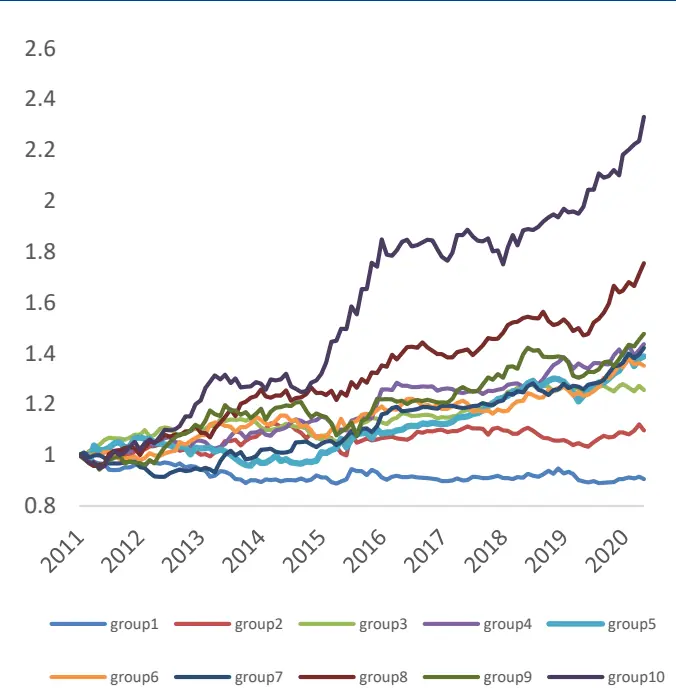
资料来源：国盛证券研究所，Wind

图表 19: Topten_to_float_ashare 分组表现
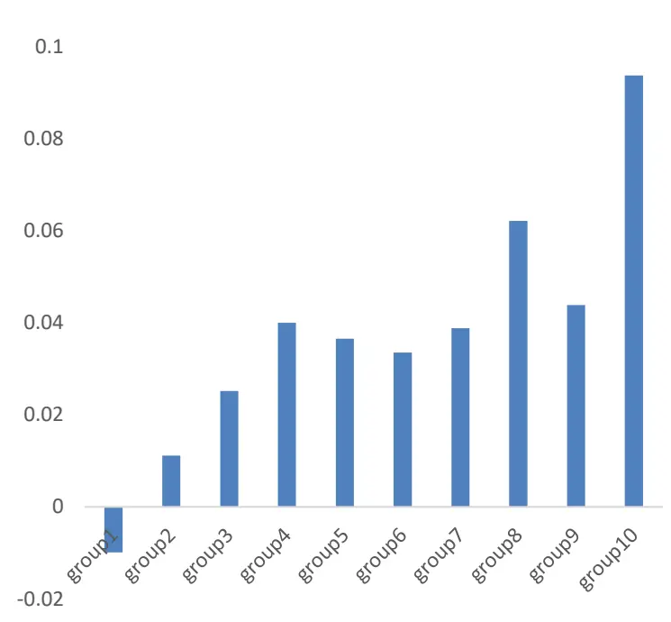
资料来源：国盛证券研究所，Wind

图表 20:Topten_value_weight分组净值
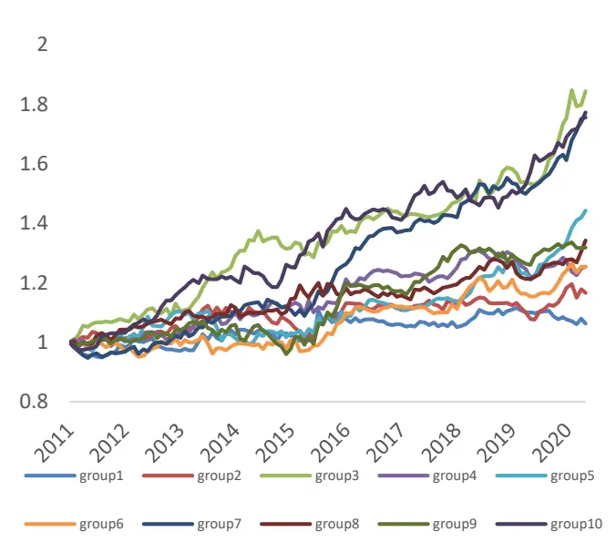
资料来源：国盛证券研究所，Wind

图表 21：Topten_value_weight分组表现
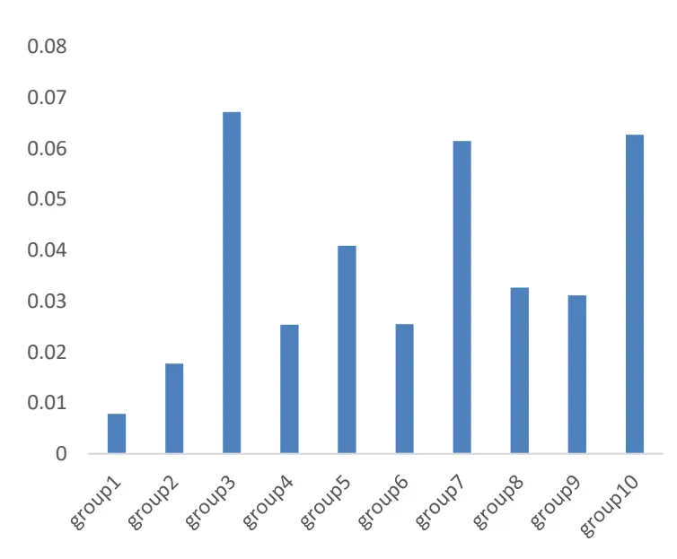
资料来源：国盛证券研究所，Wind

上述因子具有较强的相关性，重仓基金个数与持仓市值占所有重仓股持仓市值的比例相关系数达到 0.89，而平均重仓权重和最大重仓权重的相关性也达到了 0.81。因此我们这里只展示了其中两个因子的表现。

从测试结果来看，重仓市值占流通市值比例以及比例的变化表现较好，IC在0.02左右，ICIR在 1左右，且第一组的超额收益年化达到 10%。重仓占比相关的因子表现稍弱，IC在 0.01 左右，第一组的超额收益在 6%左右。从分组收益也可以看出，Topten_to_float_ashare 因子和股票的超额收益有非常显著的线性关系，空头和多头效应都很强。Topten_value_weight 因子与股票的超额收益也呈线性相关，但是单调性不如 Topten_to_float_ashare，且多头和空头效应稍弱。产生这一现象的可能原因是基金重仓比例较高的股票偏大市值，而基金重仓市值占流通市值比例高的股票偏小市值，上一节中我们提到，全样本来看，重仓股在小市值股票中能够获取更多的超额收益，可能原因是持仓市值越大的股票被市场定价的越充分，因此从中获取超额收益的难度也会更大一点。

## 三、股票池筛选与组合构建

## 3.1 股票池筛选

上一节我们测试了很多影响重仓股表现的因素，在这一部分，我们试图将这些因素进行结合，得到重仓股超额收益最终的预测。首先我们要明确预测的目标。对于重仓股的收益预测有两种可能的形式。第一是对每一个重仓股进行打分形成因子，希望最终因子和其特质收益有较强的线性关系；第二是筛选的出N只股票，使得这N只股票的特质收益越高越好。通过构建成因子再加入策略的方法对组合的提升十分有限，这里我们希望学习主动基金的持仓信息，并直接买入这些股票，因此我们采取筛选前N 只股票的方式来测试，希望对基金重仓股票的超额收益率的头部有更加准确的预测。

图表22：影响基金重仓股超额收益的因素汇总

| 分类 | 因子 | 对超额收益的区分程度 |
| --- | --- | --- |
| 基金特征 基金业绩 |  | 业绩好的基金重仓股超额收益更高，业绩差的基金独立持有的重仓股 2017年以后表现出显著为负的超额收益。 |
|  | 基金换手 | 有一定区分能力，但主要是因为不同换手率的基金业绩表现不同带来的。 |
|  | 基金规模 | 2017年以来，小规模基金单独持有的重仓股超额收益持续为负。 2017年之前，重仓股在小票成长风格中超额收益更高，2017年以来重 |
| 股票特征 风格 |  | 仓股在高估值板块超额收益更高。 |
|  | 行业 | 在TMT、中游周期行业有有持续的较好的超额收益，在上游周期、券商 军工等板块没有超额收益。2017年之后在医药消费行业的超额收益变高。 |
| 持仓特征 | 基金重仓该股票的市值/ 该股票的流通市值 基金重仓该股票的市值/ | 与超额收益有显著线性关系，且多头收益较强。 |
|  | 该股票的流通市值的环与超额收益有显著线性关系，且多头收益较强。 比变化 |  |
|  | 重仓股占基金股票持仓 比例的均值 | 与超额收益有线性关系，但单调关系较弱。 |
|  | 重仓股占基金股票持仓 比例的最大值 | 与超额收益有线性关系，但单调关系较弱。 |
|  | 重仓该股票基金的数量 | 与超额收益有线性关系，但单调关系较弱。 |
|  | 基金重仓该股票的市值/ 基金重仓股持仓总市值 | 与超额收益有线性关系，但单调关系较弱。 |
|  | 基金重仓该股票的市值/ 基金重仓股持仓总市值与超额收益有线性关系，但单调关系较弱。 的环比变化 |  |

资料来源：国盛证券研究所

上表总结了前文我们测试的所有可能影响基金重仓股超额收益的因素。其中规模作为剔除指标，剔除了后20%的基金，换手没有区分度，不同风格和行业下重仓股的超额收益可能会随市场不断变化，无法作为持续的预测指标。因此最终能够用来筛选重仓股的影响因素为基金的业绩以及持仓特征。那么最直接的想法便是先用基金业绩筛选基金，然后再使用这些基金的持仓特征来筛选重仓股。其潜在假设为业绩越好的基金，其持仓权重和持仓变化能够提供更多的信息。基于以上假设，我们分别测试了在不同业绩基金的重仓股中，不同持仓因子的多头表现。具体来说，我们使用过去一年数据筛选业绩排名前 M%的基金，使用这些基金的持仓信息构建持仓因子，然后筛选因子排名靠前的N只股票等权持有，并计算这些股票下一期的等权超额收益。同时，为了检验N只股票的超额收益是否显著高于同样基金样本下所有重仓股等权的超额收益，我们采用双样本T检验来计算显著性，其中***代表1%的显著性水平。

图表 23:Topten_max 因子测试

|  | 20 | 50 | 100 | 200 | 所有股票 |
| --- | --- | --- | --- | --- | --- |
| 业绩前 100% | 0.036 | 0.058 | 0.065 | 0.057 | 0.040 |
| 业绩前 50% | 0.072 | 0.073 | 0.058 | 0.057 | 0.044 |
| 业绩前 20% | 0.095 | 0.068 | 0.071 | 0.058 | 0.054 |
| 业绩前10% | 0.081 | 0.073 | 0.073 | 0.073 | 0.066 |
| 业绩前 5% | 0.090 | 0.079 | 0.070 | 0.070 | 0.071 |

资料来源：国盛证券研究所，Wind

图表 24: Topten_value_weight 因子测试

|  | 20 | 50 | 100 | 200 | 所有股票 |
| --- | --- | --- | --- | --- | --- |
| 业绩前 100% | 0.028 | 0.032 | 0.037 | 0.047 | 0.040 |
| 业绩前 50% | 0.036 | 0.034 | 0.050 | 0.047 | 0.044 |
| 业绩前 20% | 0.056 | 0.063 | 0.063 | 0.066 | 0.054 |
| 业绩前10% | 0.045 | 0.058 | 0.061 | 0.065 | 0.066 |
| 业绩前 5% | 0.028 | 0.050 | 0.073 | 0.071 | 0.071 |

资料来源：国盛证券研究所，Wind

从 Topten_max 测试结果可以看到，随着筛选的基金业绩越好，持有重仓比例最大值前N 的股票能够获得更高的超额收益，且有较强的单调性，同时，在同样的基金样本下，持有的股票因子排名越高，收益也越高，说明这两个指标确实存在着一定的交互效应，业绩越好的基金，持仓比例最大值越大的股票，超额收益越高。但整体来看，因子的区分程度并不强，未通过显著性检验。因此，我们也无法确定在样本外持仓占比最大值越高的重仓股的超额收益一定会高于其他重仓股。从 Topten_value_weight 的测试结果可以看到，该指标对股票超额收益没有任何的区分程度，反而重仓市值越高的股票带来的超额收益要少于其他重仓股，这可能是由于这些持仓市值最大股票被充分定价的结果。

通过以上测试我们发现，尽管重仓持股占比相关的因子与超额收益大体呈线性关系，但是因子的多头收益并不是非常显著，尤其是在筛选完基金样本之后。我们在业绩最好的5 只或者 10 只基金的重仓股内也测试了上述因子的表现，发现几乎没有明显的区分度。上述结果表明在头部基金的重仓股中，重仓程度越高或者持仓增长越多的股票的超额收益并没有显著高于其他的重仓股，因此这些指标并不能作为筛选重仓股的有效指标。

图表 25: Topten_to_float_ashare 因子测试

|  | 20 | 50 | 100 | 200 | 所有股票 |
| --- | --- | --- | --- | --- | --- |
| 业绩前100% | 0.087 | 0.078 | 0.081** | 0.070** | 0.040 |
| 业绩前 50% | 0.068 | 0.108*** | 0.082** | 0.064 | 0.044 |
| 业绩前 20% | 0.104 | 0.108** | 0.085 | 0.067 | 0.054 |
| 业绩前10% | 0.136** | 0.082 | 0.074 | 0.068 | 0.066 |
| 业绩前 5% | 0.099 | 0.075 | 0.076 | 0.071 | 0.071 |

资料来源：国盛证券研究所，Wind

图表 26:Delta_to_float_ashare 因子测试

|  | 20 | 50 | 100 | 200 | 所有股票 |
| --- | --- | --- | --- | --- | --- |
| 业绩前100% | 0.140*** | 0.111*** | 0.109*** | 0.080*** | 0.040 |
| 业绩前50% | 0.124** | 0.108** | 0.090** | 0.070* | 0.044 |
| 业绩前 20% | 0.129** | 0.100* | 0.073 | 0.057 | 0.054 |
| 业绩前10% | 0.113 | 0.087 | 0.078 | 0.065 | 0.066 |
| 业绩前 5% | 0.075 | 0.091 | 0.073 | 0.071 | 0.071 |

资料来源：国盛证券研究所，Wind

从 Topten_to_float_ashare 和 delta_to_float_ashare 的测试结果可以看到，两个因子和超额收益有着明显的单调关系，且统计检验在某些参数下非常显著。但基金业绩较好的样本中，因子表现反而不如全部基金的表现。因此我们认为这两个因子的超额收益并不完全源于基金经理的选股能力，更多的是资金层面的因素。

由于这两个因子相关性较强，如果进一步的对这两个指标进行双因子分组测试，我们发现重仓股占流通市值的绝对值在 15 年之后几乎不提供超额收益，该因子的超额收益主要由其变化提供。

图表 27: Topten to float ashare 和 delta to float ashare 双分组下因子表现
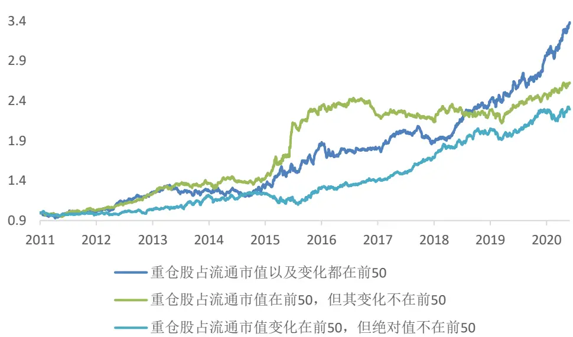
资料来源：国盛证券研究所，Wind

总结来看，我们发现只有两个指标有非常明显的单调性以及头部特征，一个是 2.2.1 中测试的业绩排名前几的基金的重仓股，一个是基金重仓市值占流通市值变化比例较高的股票。如何将这两个指标进行融合，我们测试了不同的办法，例如打分，取交集，并集等，各种方法差别并不是很大，同时最终股票池的筛选也取决于想要筛选的股票数量以及具体想要应用的策略。下面我们做一个简单的应用，分别采用两个指标的头部取并集来构建组合，即筛选业绩最好的 3只基金的重仓股和基金重仓股占流通市值变化比例较高的 20只股票的并集作为最终筛选的股票池。该股票池的平均超额收益如下。

图表28:筛选股票池的超额收益净值
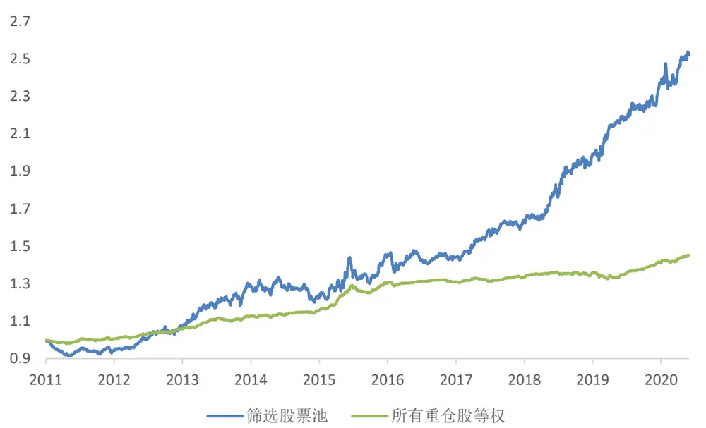
资料来源：国盛证券研究所，Wind

图表29：筛选股票池中的股票数量
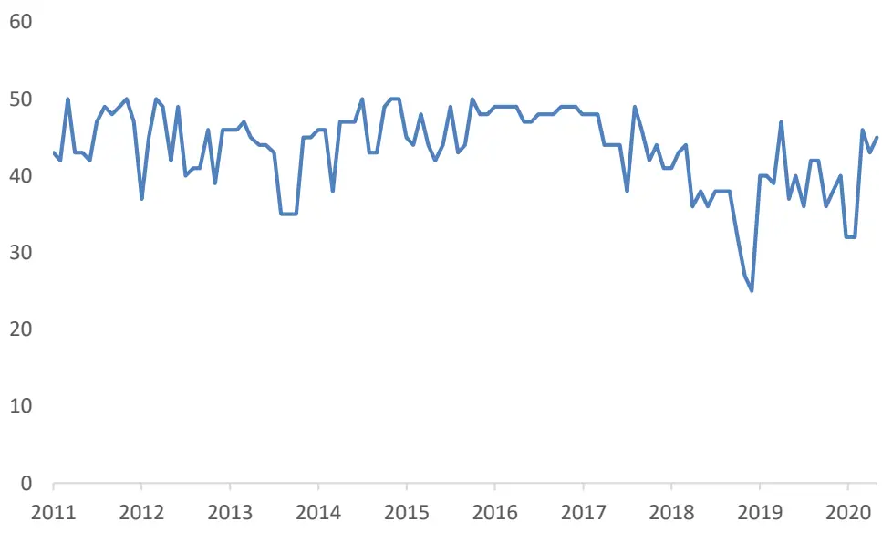
资料来源：国盛证券研究所，Wind

可以看到，我们筛选出来的重仓股的超额收益要远远高于所有重仓股等权的超额收益，其中 2011、2014 年表现较弱，其他年份尤其是近几年超额收益较高。平均来看，股票池中的股票个数在 40个左右。我们计算了组合在各类因子和行业上的暴露，结果如下。

图表30:股票池的因子暴露
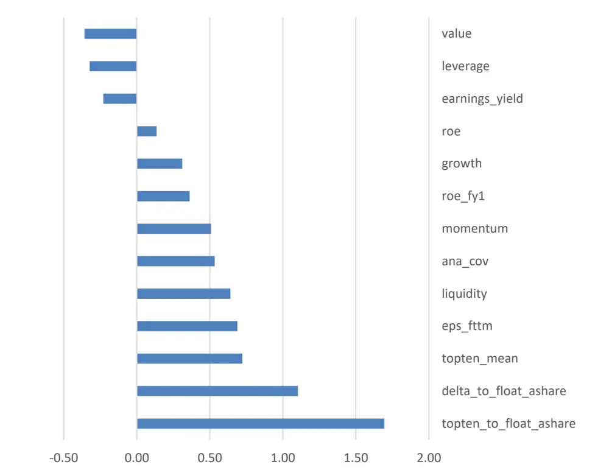
资料来源：国盛证券研究所，Wind

图表31：股票池的行业暴露
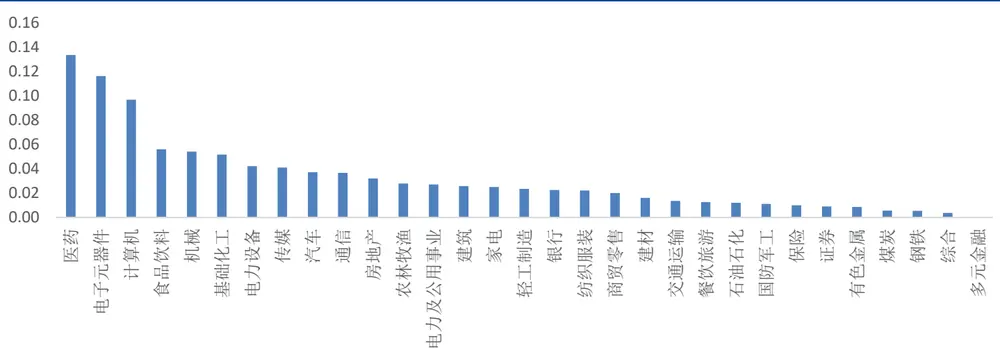
资料来源：国盛证券研究所，Wind

从因子暴露上来看，组合在机构重仓股相关因子上的暴露较高，符合预期。组合在流动性和动量上有较高的暴露，在估值指标上有较低的暴露，表明这些股票已经是市场上非常热门的股票。但股票池在分析师覆盖，以及分析师预期的盈利以及 roe 上有较高的暴露，而在历史 roe 以及盈利上暴露相对较低，说明该股票池获取的主要是在热门股票中寻找预期边际增长带来的收益。从行业暴露上来看，组合在 TMT、食品饮料、医药、机械化工等行业有着较高的权重，而在上游板块、以及金融板块权重较低，这与我们上一节对行业分析的结论相似。

## 3.2 组合构建

本节我们将 3.1 中筛选出来的组合纳入到指数增强策略中。其中基准策略为我们在周报中跟踪的月频中证500增强策略，在优化时限制了市值行业中性，且约束跟踪误差在5%以内，设定交易成本为双边 0.3%。我们以权重约束的方式将组合纳入到原始策略中，即在优化时限制策略在重仓股组合中的权重占比要高于 N%以上，并对参数进行遍历，以下是分年度的测试结果。

图表32:不同参数下策略的分年表现

| 基准策略 | 5% | 10% | 20% | 30% |
| --- | --- | --- | --- | --- |
| 2011 0.380 | 0.400 | 0.419 | 0.412 | 0.377 |
| 2012 0.422 | 0.427 | 0.433 | 0.436 | 0.437 |
| 2013 0.330 | 0.336 | 0.329 | 0.308 | 0.294 |
| 2014 0.147 | 0.150 | 0.146 | 0.125 | 0.105 |
| 2015 0.464 | 0.460 | 0.455 | 0.411 | 0.337 |
| 2016 0.216 | 0.221 | 0.214 | 0.209 | 0.205 |
| 2017 0.125 | 0.128 | 0.129 | 0.131 | 0.135 |
| 2018 0.175 | 0.173 | 0.176 | 0.197 | 0.215 |
| 2019 0.182 | 0.198 | 0.217 | 0.238 | 0.257 |
| 2020上半年 0.088 | 0.090 | 0.093 | 0.102 | 0.116 |
| ALL 0.263 | 0.269 | 0.272 | 0.268 | 0.259 |

资料来源：国盛证券研究所，Wind

从分年测试的结果来看，2017 年前后有明显的差别。2017 年之前，加入基金重仓组合几乎没有任何的增强，反而在某些年份下降明显，而在 2017 年之后，增强效果非常稳定，约束的权重越高，增强效果也越好。由上一节的分析可以看到，尽管基金重仓股能够获取稳定的残差收益，但是其重仓股偏向于在高估值、高流动性、高动量的股票中选股，而 2017 年以前的市场风格是偏小票炒作的行情，低流动性、反转等技术因子表现十分突出，如果分出部分仓位来持有机构重仓的股票，尽管在残差部分能够获取较高的收益，但是风格方面却产生负的贡献，因而会削弱策略的表现。而在 2017 年之后，市场行情偏基本面，与机构重仓股的风格偏好相匹配，同时残差部分又能过获取很高的收益，因此 2017年以来的改善效果显著。平均来看，年化收益有 2%以上的提升，信息比也有 0.4左右的提升。

图表33:不同参数下策略2017年以来的超额收益净值
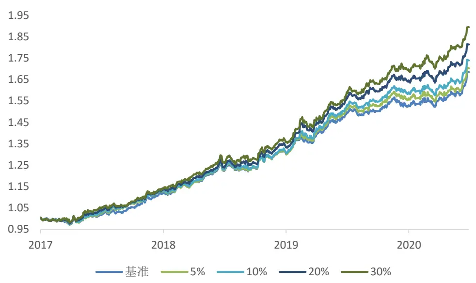
资料来源：国盛证券研究所，Wind

图表34：不同参数下策略2017年以来的表现

|  | 基准策略 | 5% | 10% | 20% | 30% |
| --- | --- | --- | --- | --- | --- |
| 年化收益 | 0.167 | 0.170 | 0.177 | 0.192 | 0.208 |
| 年化波动 | 0.057 | 0.058 | 0.058 | 0.059 | 0.061 |
| 年化 IR | 2.925 | 2.936 | 3.047 | 3.255 | 3.419 |
| 最大回撤 | 0.032 | 0.036 | 0.032 | 0.033 | 0.035 |

资料来源：国盛证券研究所，Wind

我们在组合优化中限制部分权重在重仓股股票池中，本质上是认为这部分股票相对于其他股票平均来看有更高的超额收益，但具体在这 40 多只股票中选取哪些股票持有，还是由 alpha模型决定，我们测试了 alpha因子在这40多只股票中的选股效果，发现仍然存在非常明显的预测作用，alpha排名前50%的重仓股有显著的超额收益，而排名后50%的重仓股超额收益较弱。我们对基准的中证500增强策略进行业绩归因，剥离出了基准策略的残差部分，我们发现，重仓股组合 alpha前50%的股票的超额收益，显著高于基准策略的超额收益，说明这部分基金重仓股的选股能力确实要好于多因子模型，这是2017年以来策略改善效果明显的重要原因。

图表35：业绩归因
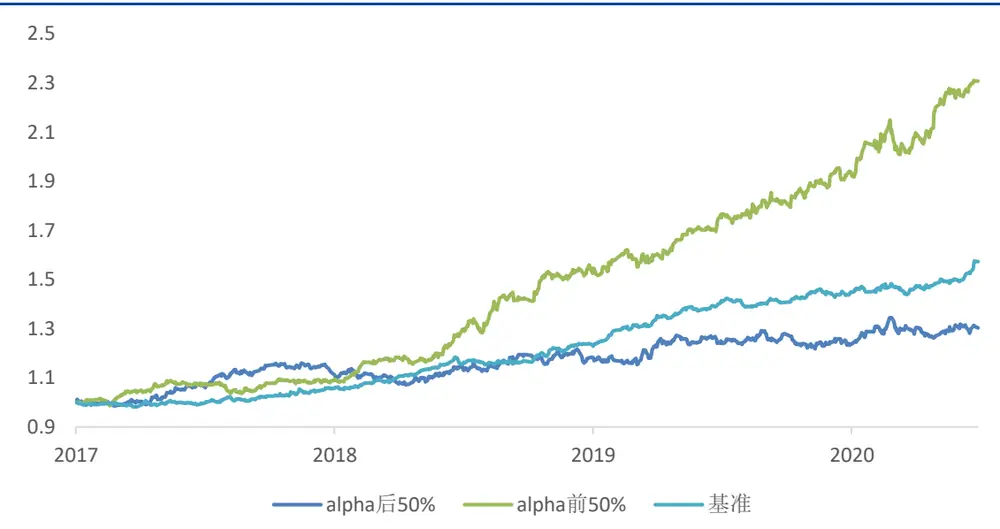
资料来源：国盛证券研究所，Wind

以下展示了最新一期的 alpha排名前 50%的重仓股组合列表。

图表 36：2020-07-31 股票列表

| 股票代码 | 股票名称 | 中信行业 | 总市值 (亿) | 重仓占比均 值 | 最大重仓占 比 | 重仓基金个 数 | 占流通市值比 例 | 占流通市值比例 变化 |
| --- | --- | --- | --- | --- | --- | --- | --- | --- |
| 300661.SZ | 圣邦股份 | 电子 | 564.20 | 6.13 | 13.33 | 18 | 0.168 | 0.031 |
| 300782.SZ | 卓胜微 | 电子 | 789.84 | 7.07 | 11.59 | 8 | 0.052 | -0.062 |
| 603238.SH | 诺邦股份 | 纺织服装 | 49.33 | 6.15 | 7.18 | 3 | 0.059 | 0.059 |
| 603501.SH | 韦尔股份 | 电子 | 1,775.86 | 5.60 | 9.24 | 15 | 0.092 | 0.029 |
| 603129.SH | 春风动力 | 汽车 | 130.62 | 4.95 | 8.38 | 5 | 0.079 | 0.079 |
| 600276.SH | 恒瑞医药 | 医药 | 5,008.51 | 5.83 | 9.13 | 68 | 0.020 | 0.005 |
| 603686.SH | 龙马环卫 | 电力及公用 事业 | 104.12 | 4.17 | 5.63 | 13 | 0.060 | 0.055 |
| 300037.SZ | 新宙邦 | 基础化工 | 234.64 | 5.44 | 9.51 | 27 | 0.111 | 0.068 |
| 300529.SZ | 健帆生物 | 医药 | 585.44 | 5.76 | 11.28 | 26 | 0.082 | 0.006 |
| 603986.SH | 兆易创新 | 电子 | 1,089.86 | 5.75 | 10.17 | 32 | 0.054 | 0.015 |
| 603890.SH | 春秋电子 | 计算机 | 63.24 | 4.21 | 5.26 | 3 | 0.052 | 0.052 |
| 002810.SZ | 山东赫达 | 基础化工 | 74.21 | 3.88 | 5.63 | 4 | 0.143 | 0.106 |
| 601012.SH | 隆基股份 | 电力设备及 新能源 | 2,142.51 | 5.90 | 9.23 | 52 | 0.037 | 0.013 |
| 603520.SH | 司太立 | 医药 | 169.12 | 4.58 | 6.92 | 16 | 0.082 | 0.053 |
| 300525.SZ | 博思软件 | 计算机 | 129.04 | 4.55 | 5.83 | 3 | 0.078 | 0.074 |
| 688019.SH | 安集科技 | 基础化工 | 232.05 | 5.43 | 6.64 | 3 | 0.049 | 0.049 |
| 300601.SZ | 康泰生物 | 医药 | 1,512.17 | 4.92 | 8.44 | 32 | 0.075 | 0.007 |
| 300073.SZ | 当升科技 | 基础化工 | 152.11 | 4.78 | 8.46 | 7 | 0.052 | 0.049 |
| 600745.SH | 闻泰科技 | 通信 | 1,892.93 | 5.85 | 10.54 | 16 | 0.031 | 0.010 |

资料来源：国盛证券研究所，Wind

## 四、总结与思考

本报告从不同维度寻找了可能对基金重仓股超额收益有预测作用的指标，然后使用这些指标筛选出超额收益较高的重仓股票池，并纳入多因子策略，有效的提升了策略的表现。具体来说，我们以股票的残差收益为预测目标，从基金特征、股票特征、持仓特征三个方面进行了测试，发现尽管大部分指标都有较好的逻辑以及一定的预测能力，但是预测效果不太显著，且单调性以及头部性较弱。最终我们使用了基金业绩和重仓市值占流通市值的季度环比变化作为的筛选指标，构建了一个重仓股股票池，并以权重约束的方式纳入到传统的增强策略中，2017 年以来提升效果十分显著。

我们在测试中发现两个现象，一是直接用业绩筛选基金要好于用 alpha 筛选基金，二是使用重仓市值比流通市值的变化来选股时，反而在业绩好的基金样本中，效果变差。这两个现象都说明了，我们从基金持仓中获取的不仅仅是基金经理选股的 alpha，还有资金推动的因素。因此在后续对基金持仓数据的研究中，我们可以从这两方面思考如何进一步获取更多的信息。

基金持仓数据中包含了明显的增量信息，但对其可以有不同的使用方法。研究的出发点不同，得到的结论也有所差别。首先持仓数据可以构建成 alpha 因子，这样能够更好的融入原有预测模型，但存在覆盖度低、非线性以及提升不明显等问题，其次也可以用来筛选股票池或者构建策略，本报告采用的就是这种方法。由于我们的目的是获取基金经理的选股能力从而纳入多因子模型，如果直接以原始收益作为预测目标，股票池中会带有明显的风格以及行业的暴露。为了将重仓股的选股能力剥离出来，我们以残差收益作为最终的预测目标。对于基金重仓股在行业和风格上的配置能力，我们可以再单独进行研究。我们也测试过将筛选出来的股票池直接等权构建成策略，发现效果并不稳定。这是由于尽管这些股票的残差收益较高，但是我们选取的都是较为热门的股票，例如最近的医药电子等，这些行业或者风格的 beta可能不会延续，甚至大幅下跌。因此如果要使用重仓股信息直接构建策略，应该结合重仓股在行业和风格上的配置能力，或者更直接的使用股票的原始收益作为预测目标来进行研究。

本报告先使用基金信息筛选出了超额收益最高的 40 只重仓股，然后加入到多因子模型中，并持有了 打分高的股票，这相当于求解了两次局部最优化问题，有一定的提升效果，但该方法并不一定是全局最优的做法，改变筛选指标或者筛选股票的数量，提升效果可能更加显著。另外，尽管我们在研究中测试了很多指标，都有一定的逻辑，而且有一定的预测作用，但统计显著性较弱，且头部效应不显著，因此最终只选取了两个头部显著的指标作为最终的筛选指标，未来如何将报告中测试的指标进行结合也有待进一步的研究。

## 风险提示

以上结论均基于历史数据和统计模型的测算，如果未来市场环境发生改变，不排除模型失效的可能性。

## 免责声明

国盛证券有限责任公司（以下简称“本公司”）具有中国证监会许可的证券投资咨询业务资格。本报告仅供本公司的客户使用。本公司不会因接收人收到本报告而视其为客户。在任何情况下，本公司不对任何人因使用本报告中的任何内容所引致的任何损失负任何责任。

本报告的信息均来源于本公司认为可信的公开资料，但本公司及其研究人员对该等信息的准确性及完整性不作任何保证。本报告中的资料、意见及预测仅反映本公司于发布本报告当日的判断，可能会随时调整。在不同时期，本公司可发出与本报告所载资料、意见及推测不一致的报告。本公司不保证本报告所含信息及资料保持在最新状态，对本报告所含信息可在不发出通知的情形下做出修改，投资者应当自行关注相应的更新或修改。

本公司力求报告内容客观、公正，但本报告所载的资料、工具、意见、信息及推测只提供给客户作参考之用，不构成任何投资、法律、会计或税务的最终操作建议,本公司不就报告中的内容对最终操作建议做出任何担保。本报告中所指的投资及服务可能不适合个别客户，不构成客户私人咨询建议。投资者应当充分考虑自身特定状况，并完整理解和使用本报告内容，不应视本报告为做出投资决策的唯一因素。

投资者应注意，在法律许可的情况下，本公司及其本公司的关联机构可能会持有本报告中涉及的公司所发行的证券并进行交易，也可能为这些公司正在提供或争取提供投资银行、财务顾问和金融产品等各种金融服务。

本报告版权归“国盛证券有限责任公司”所有。未经事先本公司书面授权，任何机构或个人不得对本报告进行任何形式的发布、复制。任何机构或个人如引用、刊发本报告，需注明出处为“国盛证券研究所”，且不得对本报告进行有悖原意的删节或修改。

## 分析师声明

本报告署名分析师在此声明：我们具有中国证券业协会授予的证券投资咨询执业资格或相当的专业胜任能力，本报告所表述的任何观点均精准地反映了我们对标的证券和发行人的个人看法，结论不受任何第三方的授意或影响。我们所得报酬的任何部分无论是在过去、现在及将来均不会与本报告中的具体投资建议或观点有直接或间接联系。

投资评级说明

| 投资建议的评级标准 |  | 评级 | 说明 |
| --- | --- | --- | --- |
| 评级标准为报告发布日后的6个月内公司股价（或行业指数）相对同期基准指数的相对市场表现。其中A股市场以沪深300指数为基准；新三板市场以三板成指（针对协议转让标的）或三板做市指数（针对做市转让标的）为基准；香港市场以摩根士丹利中国指数为基准，美股市场以标普500指数或纳斯达克综合指数为基准。 | 股票评级 | 买入 | 相对同期基准指数涨幅在15%以上 |
|  |  | 增持 | 相对同期基准指数涨幅在5%~15%之间 |
|  |  | 持有 | 相对同期基准指数涨幅在-5%~+5%之间 |
|  |  | 减持 | 相对同期基准指数跌幅在5%以上 |
|  | 行业评级 | 增持 | 相对同期基准指数涨幅在10%以上 |
|  |  | 中性 | 相对同期基准指数涨幅在-10%~+10%之间 |
|  |  | 减持 | 相对同期基准指数跌幅在10%以上 |

## 国盛证券研究所

北京

地址：北京市西城区平安里西大街 26号楼 3层

上海

地址：上海市浦明路 868 号保利 One56 1 号楼 10层

邮编：100032

邮编：200120

传真：010-57671718

电话：021-38934111

邮箱：gsresearch@gszq.com

邮箱：gsresearch@gszq.com

南昌

深圳

地址：南昌市红谷滩新区凤凰中大道 1115 号北京银行大厦

地址：深圳市福田区福华三路 100 号鼎和大厦 24楼

邮编：330038

传真：0791-86281485

邮编：518033

邮箱：gsresearch@gszq.com

邮箱：gsresearch@gszq.com