# 量化专题报告

## 多因子系列之十四：刻画财报信息质量

本篇报告尝试对公司财报信息质量进行评分。基本面因子依赖财报信息，但上市公司有可能通过盈余调节手段平滑公司利润，导致盈利数据可比性下降。我们在本篇报告中尝试构建因子刻画公司的财报信息质量。

梳理企业盈余调节手段并构建因子，刻画企业账面资产真实性和会计政策稳定性。激进的会计政策偏向于提前确认收入，推迟确认费用，从而夸大当期利润，反之则偏保守。盈余调节严重的公司在报表上呈现出四大特征：

特征一：应收款的账龄和坏账比例高。激进的收入确认伴随应收款激增，且应收款的账龄和坏账较高，收回可能性下降，降低收入确认政策的可信度。因子检验结果显示高账龄、高坏账比的公司股票跑输低账龄、低坏账比的公司股票，且未来盈利能力和成长性较差。

特征二：资产摊销/折旧、坏账/跌价/减值的计提政策大幅偏离。若资产审计过程中会计政策多次出现大幅偏离，则公司极有可能在利用这些科目进行盈余调节。长期会计政策偏离的公司，盈余调节嫌疑大，盈利波动高。

特征三：非折旧型资产占比异常。由于在建工程、无形资产、开发支出、商誉等资产不需要计提或较少计提折旧和摊销，因此企业有做高此类资产的倾向。非折旧型资产占比偏离越大，未来经营恶化可能性更高。

特征四：所得税率波动率越高。按税法及相关规定计算的所得税率波动越高，企业会计政策波动越大，粉饰业绩的可能性越大。所得税率波动高的公司长期跑输波动率低的公司，且盈利可持续性较差。

利用财报信息质量因子降低风险。我们标记因子值低于 2倍标准差为异常，并筛选有异常值的股票作为考察组。从统计结果看，进入考察组的公司在未来有更高可能出现风险事件。因子库对我们的排雷指标和规则起补充作用。综合财报信息质量评分对股票收益有区分能力，且多头组合的盈利可持续性更强。经过复合的财报信息质量因子在 wind 全 A内分十组超额收益呈现单调性，多空组合年化收益 6.90%，夏普比 1.10，IC 均值 0.0148，t 检验值为 3.03，且多头组合未来在 roe波动率和 np_yoy波动率上的暴露值更低。投资者对不同质量的财报信息存在反应不足，从而表现出盈余惯性。双因子分组结果显示，财报信息质量高的分域中，超预期组合的正向价格漂移更明显；财报信息质量低的分域中，未达预期组合的负向价格漂移更明显。

结合财报信息质量能提升高盈利超预期策略表现。我们测试了用 ROE 与信息质量平均得分，或者用异常因子得分剔除部分股票的方式来提升高盈利超预期策略。一方面，财报信息质量因子帮助我们在高 ROE 的票池中筛去部分潜在风险较高的股票；另一方面，高质量的组合表现出更强的盈余惯性，使得策略在业绩真空期有更好的收益表现。

风险提示：企业盈余调节手段复杂，因子库无法穷尽所有盈余调节情形；报告利用当前已有的数据进行指标构建和测试，未来存在数据质量较低的风险；以上结论均基于历史数据和统计模型的测算，如果未来市场环境发生改变，不排除模型失效的可能性。

## 作者

分析师 刘富兵

执业证书编号：S0680518030007

邮箱：liufubing@gszq.com

分析师 李林井

执业证书编号：S0680520040002

邮箱：lilinjing@gszq.com

## 相关研究

1、《量化专题报告：多因子系列之十三：基金重仓股研究》2020-09-07

3、《量化周报：创出新高再追涨也不迟》2020-08-30

4、《量化周报：快调还是慢调？》2020-08-23

5、《量化周报：短期震荡仍不够充分》2020-08-16

## 前言

## 研究动机

基本面因子的构建依赖于上市公司披露的财报数据，因此数据的准确性至关重要。但是市场上不乏公司通过盈余平滑手段，调节公司盈利。

对于量化研究而言，研究盈余调节的难点在于：

1) 公司调节报表保守/激进程度的动机复杂；

2) 公司调节盈余手段多样，涉及科目繁多；

3) 缺乏业绩对比基准，仅凭财报信息还原企业真实盈利水平困难；

因此我们首先将问题转化为报表的信息质量研究，构建因子库对报表信息质量进行评分。

## 研究方法

梳理企业盈余调节的手段，挖掘财报里反映企业盈余调节的信息，构建因子，刻画公司账面资产的真实程度，以及是否存在不断调节报表的保守/激进程度从而调节利润的行为。

## 因子检验

除了考察财报信息质量高的公司是否相对于财报质量低的公司存在溢价外，我们也会考察公司未来盈利的可持续性。因为财报数据质量越差，公司行为越具有误导性，虽然短期内可能表现出高盈利和高成长，但未来长期的盈利能力和成长能力较难持续。

## 一、财报信息质量与盈余质量

## 1.1报表的保守与激进

保守的会计政策，往往反映公司对风险持有更谨慎的态度，通常会推迟确认收入，提前确认费用，保守估计利润；

激进的会计政策，则会偏向于提前确认收入，推迟确认费用，夸大当期利润。

## 激进的收入确认方式包括：

利用关联交易虚增收入，再通过其他科目洗出资金；

通过短期折扣、软性信贷等方式提高收入，往往对应较低的现金流和较高的应收账款等。

## 激进的费用确认方式包括：

过低计量折旧与摊销费用，过低计提坏账，过低计提资产减值准备等。

同时，由于三大表间的勾稽关系：利润=收入-成本和费用；资产=负债+权益；当公司夸大利润的同时，必定会对应公司做高资产或减少负债。过去我国的会计准则是以“收入费用观”为导向，导致利润有很强的主观性。而当前会计准则在不断往“资产负债观”方向靠拢，强调以净资产的增加来确认收入的实现。从资产负债表入手是一个不错的选择。

图表1：会计报表的保守与激进

| 信息失真 信息准确 信息失真 |  |
| --- | --- |
| 推迟确认收入，提前确认费用 | 提前确认收入，推迟确认费用 |
| 保守 降低利润，做低资产 | 激进 提高利润，做高资产 |

资料来源：国盛证券研究所整理

无论公司最终通过何种手段达到调节盈余的目的，从结果来看会呈现以下几种特征：

1) 应收款激增且账龄和坏账比较高，收回可能性下降；

2) 在资产审计过程中，摊销/折旧、坏账/跌价/减值的计提政策出现大幅变动；

3) 不需要计提折旧的资产占比异常；

4) 所得税率出现大幅波动等。

## 1.2财报信息质量与盈利能力

财报信息质量与公司盈利能力之间并不完全等同，本篇报告所指的财报信息质量高，仅指公司在编制报表的过程中对盈余的调节程度较低，信息的真实度较高；在这种情况下，好公司与差公司的区分较为明晰；但是若公司报表充斥较多的盈余调节痕迹，那么财报数据失真程度较为严重，一般而言，好公司有藏利润的倾向，而差公司有夸大业绩的倾向。由于我们在财报中只能看到公司核算的结果，因此过度盈余调节会让我们对公司盈利能力的判断产生偏差。

图表2：财报信息质量与盈余质量不完全等同

| 盈利能力强 | 盈利能力弱 |
| --- | --- |
| 财报信息质量高 真实的好公司 | 真实的差公司 |
| 财报信息质量低 | 有藏利润倾向 有夸大业绩倾向 |

资料来源：国盛证券研究所整理

## 二、构建财报信息质量因子

## 2.1利用基础排雷指标筛选样本池

我们先利用常用排雷指标筛去一部分会计师无法给出“标准无保留意见”或有极强盈余调节动机的企业，指标主要包括：

1) 审计意见：会计师认为符合准则的报表会给出标准无保留意见，其他非标准意见包括：带强调事项段的无保留意见、保留意见、否定意见、无法表示意见等，非标准意见的公司存在问题的可能性较大；

2) ST/预期 ST：ST 即交易所制定的 ST 规则标记；预期ST 根据年度结束后的首次年报预告筛选预期会继续亏损的公司，作为预期 ST 样本；

3) 违规/立案：近一年有违规/立案记录的企业，包括未及时披露公司重大事项，未按时披露定期报告，信息披露虚假或严重误导性陈述等；

4) 亏损/扭亏：过去一年亏损，或者扭亏为盈的企业；

5) “壳价值”高的企业：连续两年亏损，最新披露净资产为负，且最近四个季度营收小于 10 亿元的公司为“壳价值”高的企业。

我们看到其实非标准审计意见和 ST 两条标准就已剔除很多财务状况异常，且风险较高

的企业了。同时，亏损或扭亏为盈的企业有很强的盈余调节动机，我们在测试时也一并剔除，在一定程度上也降低了 A 股市场“壳价值”因素的影响。

图表 3:样本池占 wind全A 比例
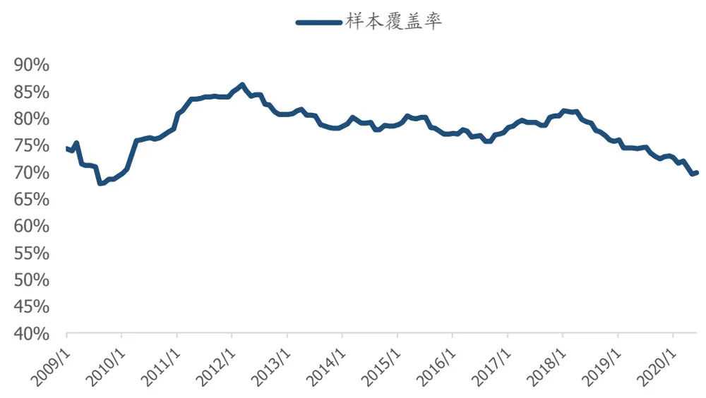
资料来源：wind，国盛证券研究所

## 2.2刻画财报信息质量

根据上文对报表特征的总结，我们沿着以下四条思路构建因子：

1) 应收款的账龄和坏账比例：账龄越高，坏账比例越高，应收款收回可能性越低，信息质量越差，收入确认政策的可信程度下降；

2) 资产摊销/折旧、坏账/跌价/减值的计提政策偏离程度：偏离程度越大，会计政策稳健性越差，盈余可比性降低；

3) 非折旧型资产占比偏离程度：偏离程度越大，盈余调节可能性越大；

4) 所得税率波动率：波动率越高，企业粉饰业绩的可能性越大。

其中第二条和第三条思路涉及科目如下：

图表4：盈余操纵手段涉及资产科目

| 资产科目 | 折旧/摊销 | 減值准备 | 提高利润的手段 |
| --- | --- | --- | --- |
| 应收账款/其他应收款 | - | 坏账准备 | 不提/少提坏账准备 |
| 存货 | - | 跌价准备 | 不提/少提跌价准备 |
| 固定资产、油气、生物资产 | 折旧 | 减值准备 | 不折旧/少折旧，不提/少提减值准备 |
| 长期待摊费用 | 摊销 | - | 不摊销/少摊销 |
| 在建工程 | - | 减值准备 | 长期挂账，避免转入固定资产后提折旧和减值准备 |
| 无形资产 | 摊销 | 减值准备 | 不摊销/少摊销，不提/少提减值准备 |
| 开发支出 | - | - | 过高资本化研发支出，降低研发费用 |
| 商誉 | - | 减值准备 | 不提/少提减值准备 |

资料来源：国盛证券研究所整理

在因子测试的过程中，我们特别注意以下几点：

1) 缺失值的处理：由于公司间的差异性，数据的覆盖率会低于营收、总资产等覆盖率较高的科目，对于本身没有该科目数据的公司，我们将因子值设为空值；对于科目有值而摊销/折旧/坏账/跌价/减值等无记录的公司，填为 0 值；

2) 关注多空组合的表现：由于财报信息质量并不直接反映公司的基本面，且基本面也只能解释一部分股价信息，因此我们可以预想到财报信息质量对股价的预测能力有限；因此我们更关注因子的多空组合，尤其是近年来偏向于基本面行情的市场环境中，是否有区分效果；

3) 关注多空组合的盈利可持续性：财报信息质量高的企业，在报表编制政策上更加稳健，长期来看盈利的可持续性更强；而信息质量低的企业，盈利或成长指标的波动率更高；我们会更加关注多空组合未来三年内在 roe，净利润增速等因子暴露上的演化情况。

## 2.2.1 应收款的账龄和坏账比

应计量（accruals）是常见衡量企业盈利质量的指标，高应收款往往是企业高营收增长的伴生物。下表是某上市公司 2019 年年报中披露的应收款明细，我们可以通过分析应收账款和其他应收款的账龄、坏账比例等特征，来反映企业过去几期报表的收入确认政策的激进程度。

数据来源：wind 底层数据库的表 Ashareagingstructure 和 Ashareotheraccountsreceivable。

图表5：某上市企业2019年年报披露应收账款明细

| 报告期 | 账龄 | 占总应收款比例(%) | 应收账款金额（元） | 提取的坏账准备（元） | 坏账计提准备 |
| --- | --- | --- | --- | --- | --- |
| 2019 年报 | 1年以内 | 78.61 | 7,267,865,933.86 | 363,393,296.77 | 5% |
| 2019年报 | 1-2年 | 5.68 | 524,837,349.35 | 104,967,469.87 | 20% |
| 2019 年报 | 2-3年 | 0.14 | 13,053,449.24 | 6,526,724.64 | 50% |
| 2019 年报 | 3年以上 | 0.21 | 19,470,426.89 | 19,470,426.89 | 100% |
| 2019 年报 | 单项计提 | 1.44 | 132,904,666.21 | 132,904,666.21 | 100% |
| 2019年报 | 其他 | 13.92 | 1,286,892,325.00 | 104,427,021.09 | 8% |

资料来源：wind，国盛证券研究所

## 应收账款/其他应收款账龄

应收款的账龄是应收账款质量的指标之一，账龄越长，应收账款收回的可能性越低，从而成为一种劣质资产，是未来潜在亏损源。我们同时考虑应收账款和其他应收款的账龄。

$$
\sin\angle A=\frac{\sin B=\pm\beta}{\sin B=\frac{\sin B=\pm\beta}{\cos\beta}}=\frac{\sum\limits_{i=1}^{n}B=\pm\frac{1}{2}\sin B=\pm\beta}{\sum\frac{\sin B=\pm\beta}{\cos\beta}\sin B=\pm\beta}_{\mathrm{i}}
$$

其中：

$$
\begin{array}{r}\mathbb{H}_{\mathrm{KBC}}^{\mathrm{k\cdot k\cdot k}}\bot\mathbb{F}_{\mathrm{K}}^{\mathrm{R}}=\left\{\begin{array}{cc}{1,1\nF(\ast\chi),}&{\left(0,1\nFinv\ast\chi\chi_{\mathrm{K}}\right),}\\{2,1\sim2\ nF;}&{;\mathbb{H}_{\mathrm{KBC}}^{\mathrm{k\cdot k\cdot K}}\mathbb{F}_{\mathrm{K}}^{\mathrm{R}}=\left\{\begin{array}{c}{0,1\ nF\ast\chi_{\mathrm{K}}}\\{1,1\sim2\ nF;}\\{\dots}\\{\dots}\end{array}\right.;\mathbb{H}_{\mathrm{KBR}}^{\mathrm{k\cdot k\cdot K}}=\frac{\mathbb{H}_{\mathrm{KBR}}^{\mathrm{k\cdot k\cdot}}\mathbb{F}_{\mathrm{K}}^{\mathrm{R}}+\mathbb{H}_{\mathrm{KBR}}^{\mathrm{k\cdot k\cdot K}}\mathbb{F}_{\mathrm{K}}^{\mathrm{R}}=0,}\\{n+5,n\#\nu\chi_{\mathrm{L}},}\end{array}\right.}\end{array}
$$

从多空组合未来的表现来看，不管是应收账款账龄还是其他应收款账龄，自 2017 年以来，账龄高的股票组跑输账龄低的股票组，整体的 roe 水平低于账龄短的股票组，净利润同比也出现大幅的波动。

## 应收账款账龄单因子多空组合净值走势及未来基本面演化如下：

图表6：应收账款账龄因子多空组合收益（相对全市场等权）
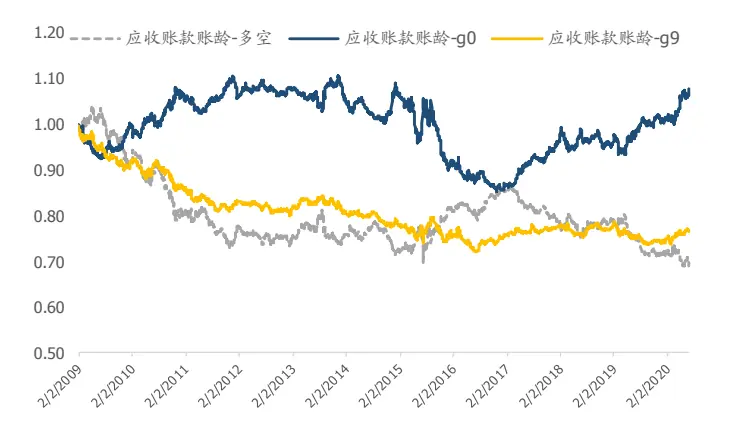
资料来源：Wind，国盛证券研究所

图表7：多空组未来三年基本面演化
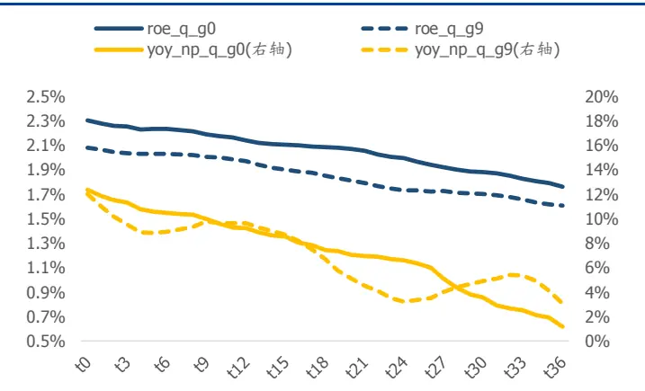
资料来源：Wind，国盛证券研究所

其他应收款账龄单因子多空组合净值走势及未来基本面演化如下：

图表8：其他应收款账龄因子多空组合收益（相对全市场等权）
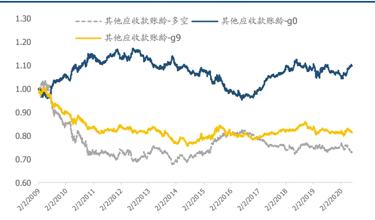
资料来源：Wind，国盛证券研究所

图表9:多空组未来基本面演化
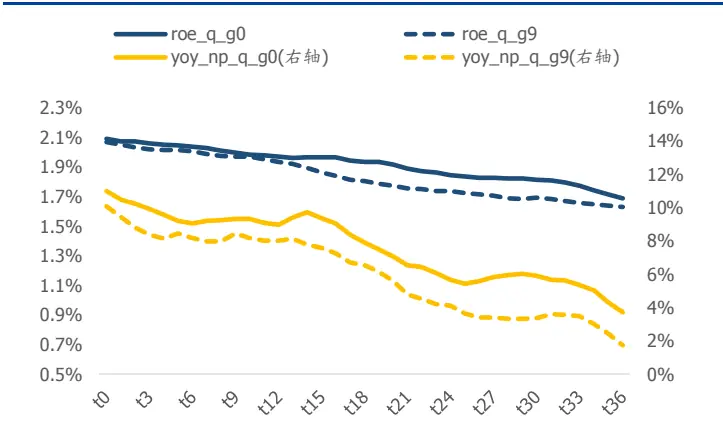
资料来源：Wind，国盛证券研究所

## 应收账款/其他应收款坏账占比

应收款的坏账计提比例也是衡量应收款质量的指标之一。坏账占比越高，应收账款的质量越低，收回可能性越低。应收款同样考虑了应收账款和其他应收款的坏账计提情况。

$$
\pm\pi\rfloor\mu\mu\mu=\frac{\ddag\ddag\mu\sin\left(\sqrt{\mu}\right)\pm\pi\Im\left(\ddag\right)\pm\pi\ll\arctan}{\therefore\hfill\overrightarrow/\overrightarrow{\mu}\ll\Bbbk\ll\Bbbk\ll\Bbbk}\doteq\mp\pi
$$

从多空组合未来的表现来看，应收账款坏账比高的组合跑输市场基准，坏账比低的组合跑赢基准；且坏账高的二组合整体的 roe 水平和净利润增速水平也较低。

应收账款坏账比单因子多空组合净值走势及未来基本面演化如下：

图表10：应收账款坏账比因子多空组合收益（相对全市场等权）
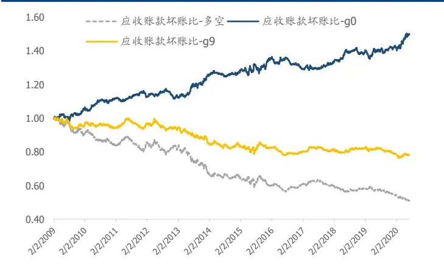
资料来源：Wind，国盛证券研究所

图表11：多空组未来基本面演化
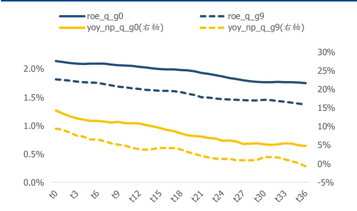
资料来源：Wind，国盛证券研究所

其他应收款坏账计提比例高的股票组合，未来的净利润增速水平整体偏低。

注：2018 年会计准则对其他应收款的计量口径发生了变化：其他应收款包括了应收利息和应收股利。

图表12：其他应收款坏账比因子多空组合收益（相对全市场等权）
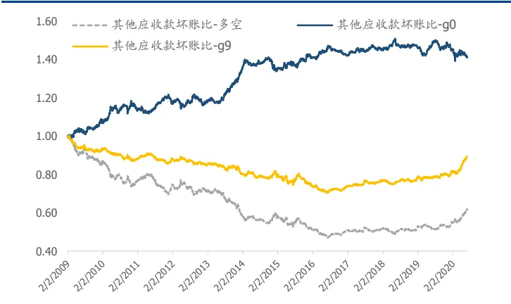
资料来源：Wind，国盛证券研究所

图表13:多空组未来基本面演化
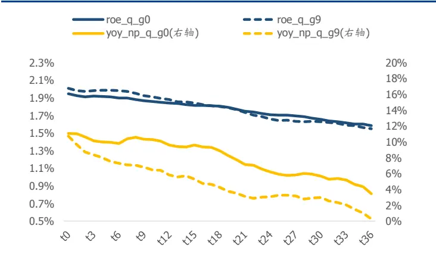
资料来源：Wind，国盛证券研究所

## 2.2.2 资产摊销/折旧和坏账/跌价/减值的计提政策偏离程度

我们在本节和下节构建的因子旨在刻画上市公司在资产审计过程中是否存在严重的盈余调节行为，均采取以下形式：

$$
\rlap/\varepsilon\big/\ddagger\big/\ddagger\ddagger\big)\xrightarrow[]{\Bbbk}abs\big(\ m\mathrm{\textmu\in/\lvert\ddagger\rvert_{\mathrm{i}}}-\mathbin{\langle\bar{\tau}\lrcorner\lvert\downarrow\rangle}\oplus\lvert\hat{\textmd z}\rvert_{\ast}^{\ast}\big\rvert_{\ast}^{\ast\mu}\big),i=1,2,3
$$

我们以应收账款的坏账计提偏离为例说明因子构建逻辑。

## 应收款坏账计提政策

我们在构建因子的时候考虑了两方面因素：

## 回看窗口：看过去三年

盈余操纵会形成近期和远期的利润调节，当期夸大的利润大概率会在未来回落，而被低估的业绩也大概率会在未来释放，因此看多期报告数据能包含更多信息。

计算方式：取绝对值再求和

1) 公司过高或过低计提坏账背后的动机较为复杂，如下表的动机分析显示，我们不能简单认为坏账低即代表应收账款没有问题；

2) 过于保守或激进的会计政策都会降低财报数据的信息，误导投资者，我们认为两者均不可取；

3) 多期的利润调节可能会产生正负抵消的效果，从而加大识别难度，取绝对值可以避免这个问题。

图表14:异常坏账计提比例的动机分析

| 长期坏账计提过高 |  | 影响 | 长期坏账计提过低 | 影响 |
| --- | --- | --- | --- | --- |
| 可能性1 | 应收款的质量低 | 较准确地反映了应收款质量较 | 应收款的质量高 | 较准确地反映了应收款质量较 |
|  |  | 差，未来业绩下滑可能性增高 |  | 高，未来大概率能收回 |
| 可能性2 | 公司盈利能力强， 多提坏账以平滑利润 | 报表业绩呈现稳定增长， 降低股价波动 | 为夸大利润，故意少提/ | 短期内呈现较强的盈利能力， |
|  | 公司经营困难，多提坏账，为未来 |  | 不提坏账，美化财报 | 但未来有盈利下滑的可能 |
| 可能性3 |  | 报表业绩波动加大，未来可能表 | … |  |
|  | 形成高增长/扭亏为盈做准备 | 现出高增长，但持续性较差 |  | … |

资料来源：国盛证券研究所整理

## 我们进一步构建了以下三种因子进行对比：

图表 15: 坏账比偏离因子释义

| 因子计算方法 | GO(因子值最低) | G9(因子值最高) |
| --- | --- | --- |
| ∑abs(坏账计提比例− 行业中位数),i = 1,2,3 | 过去三年坏账比位于行业中位数附近 | 过去三年坏账比多次偏离行业中位数 |
| ∑lrzrind(坏账计提比例i — 行业中位数),i = 1,2,3 |  | 过去三年坏账比多次高于行业中位数 |
| -∑rsrind(坏账计提比例i— 行业中位数), i = 1,2,3 |  | 过去三年坏账比多次低于行业中位数 |

资料来源：国盛证券研究所

下面我们对比释义的四类组合的股价及基本面表现。

从股价表现来看，过去坏账计提比：

1) 多次低于行业中值的组合(negative-g9)，持续跑赢市场；

2) 多次高于行业中值的组合(positive-g9)，持续跑输市场；

3) 多次偏离行业中值的组合(abs-g9)长期来看跑输市场基准，而处于行业中值水平的企业(abs-g0)，自 2017 年以来表现优于偏离度大的企业。

图表16：应收帐款坏账比因子超额收益净值（相对全市场等权）
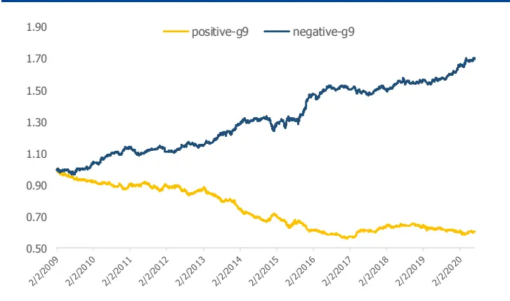
资料来源：Wind，国盛证券研究所

图表17：应收账款坏账比因子超额收益净值（相对全市场等权）
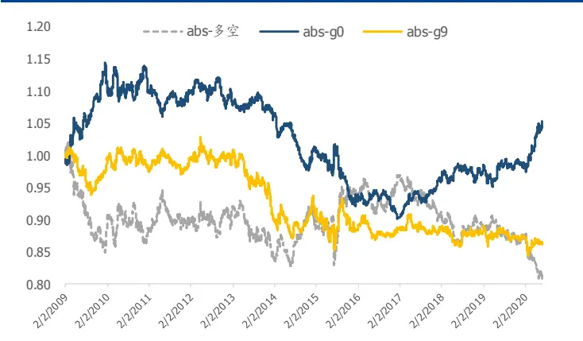
资料来源：Wind，国盛证券研究所

从未来基本面表现来看，过去坏账计提比：

1) 多次低于行业中值的企业(negative-g9)，roe水平更稳定，盈利增速也能维持得更久；2) 多次高于行业中值的企业(positive-g9)，当前 roe 水平和盈利增速表现较好，但是长期来看，roe 和盈利增速下滑的力度更大；

3) 多次偏离行业中值的企业(abs-g9)，roe 水平和盈利增速水平都比较低，并且我们观察到该组企业未来长期盈利增速的波动更大，在未来一年反而呈现出盈利增速上行的趋势，但之后迅速回落，因此这部分公司进行盈余操纵的可能性更高。

图表 18: 异常坏账计提企业未来 roe表现
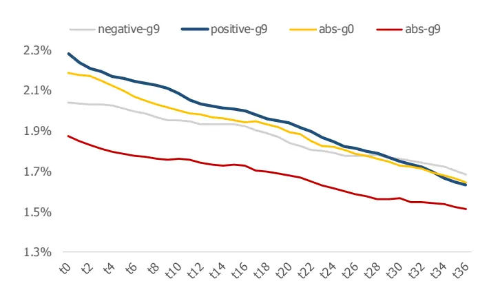
资料来源：Wind，国盛证券研究所

图表 19: 异常坏账计提企业未来 yoy_np_q 表现
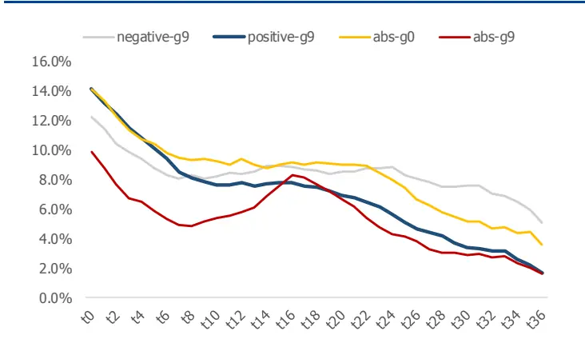
资料来源：Wind，国盛证券研究所

从因子逻辑出发，我们认为采用取绝对值再求和的因子构建方式筛选出的公司更符合我们的要求。涉及其他资产类科目的因子均沿用该种构建方式。

## 存货跌价准备计提政策

我们测算公司的存货跌价准备计提比例，并计算过去 3 年存货跌价准备计提比例偏离行业中位数的绝对值之和：

$$
\begin{array}{r}{\frac{16}{4}\frac{16}{3!}\frac{3+2}{3!}\times\langle\rangle\hat{\Sigma}\frac{3}{4}\frac{16}{60}\cdot\mu\hat{\Sigma}\vert=\frac{16}{4}\frac{16}{3!}\frac{3+4}{3!}\langle\rangle\hat{\Sigma}\frac{3}{4}\frac{16}{60}\Big/(\frac{4}{3!}\frac{3+2}{3!}\times\langle\rangle\hat{\Sigma}\frac{3}{4}+\frac{4}{4!}\frac{32}{3!}\frac{16}{3!}\frac{3}{4!}\frac{3}{12})}\end{array}
$$

$$
inventoryrate\ abssum=\sum abs\Big(\ddagger\mathinner{\frac{\sqrt{6}}{3!}}\mathinner{\frac{\sqrt{6}}{3!}}\mathinner{\frac{\sqrt{6}}{1!}}\mathinner{\frac{\sqrt{6}}{1!}}\mathinner{\frac{\sqrt{6}}{1!}}\mathinner{\frac{\sqrt{6}}{1!}}\mathinner{\frac{\sqrt{6}}{1!}}\mathinner{\frac{\sqrt{6}}{1!}}\mathinner{\frac{\sqrt{6}}{1!}}\mathinner{\frac{\sqrt{6}}{1!}}\mathinner{\frac{\sqrt{6}}{1!}}\mathinner{\frac{\sqrt{6}}{1!}}\mathinner{\frac{\sqrt{6}}{1!}}\mathinner{\frac{\sqrt{6}}{1!}}\mathinner{\frac{\sqrt{6}}{1!}}\mathinner{\frac{\sqrt{6}}{1!}}\mathinner{\frac{\sqrt{6}}{1!}}\mathinner{\frac{\sqrt{6}}{1!}}\mathinner{\frac{\sqrt{6}}{1!}}\mathinner{\frac{\sqrt{6}}{1!}}\mathinner{\frac{\sqrt{6}}{1!}}\mathinner{\frac{\sqrt{6}}{1!}}\mathinner{\frac{\sqrt{6}}{1!}}\mathinner{\frac{\sqrt{6}}{1!}}\mathinner{\frac{\sqrt{6}}{1!}}\mathinner{\frac{\sqrt{6}}{1!}}\mathinner{\frac{\sqrt{6}}{1!}}\mathinner{\frac{\sqrt{6}}{1!}}\mathinner{\frac{\sqrt{6}}{1!}}\mathinner{\frac{\sqrt{6}}{1!}}\mathinner{\frac{\sqrt{6}}{1!}}\mathinner{\frac{\sqrt{6}}{1!}}\mathinner{\frac{\sqrt{6}}{1!}}\mathinner{\frac{\sqrt{6}}{1!}}\mathinner\frac{\sqrt{6}}
$$

数据来源：wind 底层数据库的表 Asharedevaluationpreparation。

图表20：存货跌价准备比偏离因子多空组合收益（相对全市场等权）
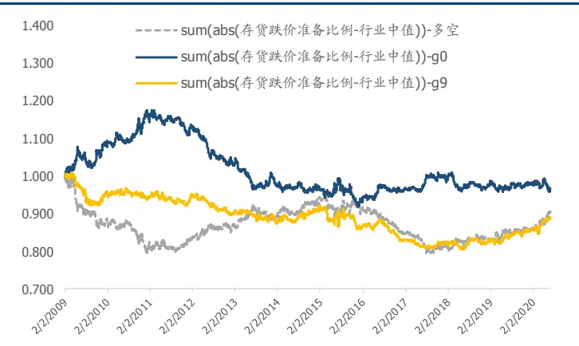
资料来源：Wind，国盛证券研究所

图表21:多空组未来基本面演化
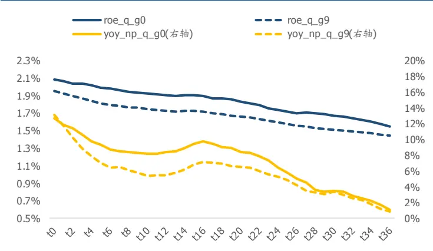
资料来源：Wind，国盛证券研究所

## 固定资产、油气资产、生物性生物资产折旧与减值准备政策

涉及折旧和摊销的经营性资产主要包括固定资产、油气资产和生产性生物资产、长期待摊费用和无形资产。

我们测算各类经营性资产的折旧与减值准备计提比例，其中油气资产和生物性生物资产一并归入固定资产范畴，并计算固定资产、长期待摊费用和无形资产过去 3 年计提比例偏离行业中位数的绝对值之和。

我们利用报表附注中的累计折旧和累计减值准备推算资产在提折旧和减值准备前的原值：

资产账面原值 = 资产账面价值+ 累计折旧期末余额+ 累计减值准备期末余额因此，折旧率和减值比例计算方式如下：

$$
\frac{25}{35}-\frac{3}{2}\geq\frac{1}{2}\geq\frac{3}{4}=\frac{5}{4}+\frac{1}{25}-\frac{3}{2}\geq\frac{1}{2}\geq\frac{3}{4}\geq\frac{1}{25}\geq\frac{3}{2}\geq\frac{1}{25}\geq\frac{5}{25}\geq\frac{5}{25}\leq\frac{5}{25}
$$

$$
\frac{1}{3!}\dot{x}-3\dot{x}\dot{x}/\dot{\textmd{dir}}\times\langle\dot{y}|=3\dot{x}/\dot{\textmd{E}}/\dot{\textmd{E}}/\dot{\textmd{E}}/\dot{\textmd{H}}+\frac{1}{3!}\dot{x}-\frac{3}{3!}\dot{x}-\frac{3}{3!}\dot{x}-\frac{3}{3!}\dot{x}-\frac{3}{3!}\dot{x}-\frac{3}{3!}\dot{y}/\dot{\textmd{dir}}\times\frac{3}{3!}+\frac{1}{3!}\dot{x}-\frac{3}{3!}\dot{y}/\dot{\textmd{dir}}\times\frac{3}{3!}=\frac{3}{3!}\dot{x}-\frac{3}{3!}\dot{y}/\dot{\textmd{dir}}\times\frac{3}{3!}
$$

$$
depreciaterateabssum=\sum abs\Big(\frac{\varkappa}{\mathfrak{F}}\mathring{\mathcal{F}}^{\sharp}\mathring{\mathcal{H}}\mathring{\Gamma}\mathring{\Xi}_{i}^{\sharp}-\mathring{\mathcal{H}}\mathring{\Xi}\mathring{\Psi}\mathring{\mathcal{H}}_{i}\Big),i=1,2,3
$$

$$
devaluerateabssum\ =\sum abs\Big(\frac{\varkappa}{\mathfrak{P}}\ j^{\pm}\ j\sharp^{\pm}/\mathbb{E}\ j\mathbb{E}\ j\mathbb{E}\ _{i}-\mathcal{I}\ j\mathbb{E}\ \psi/\mathbb{E}\ j\mathbb{E}\ _{i}\Big),i=1,2,3
$$

数据来源：wind 底层数据库的表 Asharefixedassets 或者 api 接口。

图表22：固定资产折旧率偏离因子多空组合收益（相对全市场等权）
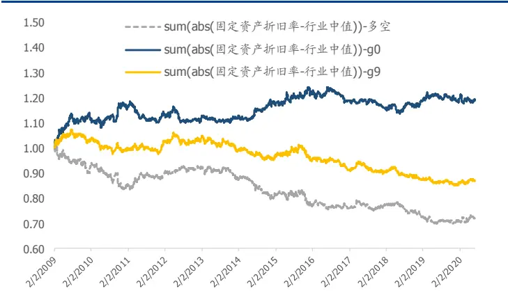
资料来源：Wind，国盛证券研究所

图表23:多空组未来基本面演化
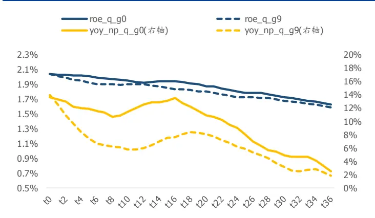
资料来源：Wind，国盛证券研究所

图表24：固定资产减值准备偏离因子多空组合收益（相对全市场等权）
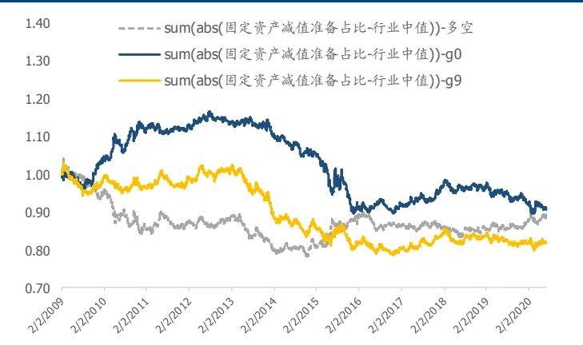
资料来源：Wind，国盛证券研究所

图表25：多空组未来基本面演化
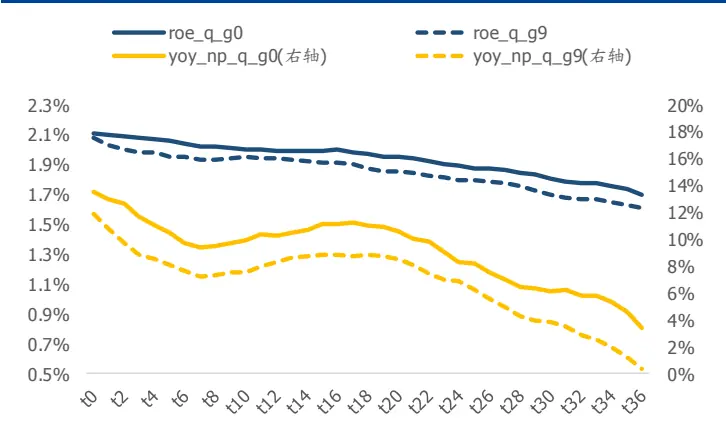
资料来源：Wind，国盛证券研究所

## 长期待摊费用和无形资产摊销政策

我们直接利用现金流量表和资产负债表科目计算摊销率：

长期待摊费用摊销率 = 长期待摊费用摊销⁄(长期待摊费用摊销 +长期待摊费用)无形资产摊销率 = 无形资产摊销⁄(无形资产摊销 +无形资产)

$$
amortizationrateabssum=\sum abs\Big(\frac{\ddot{\gamma}}{\beta}\dot{\bar{z}}\frac{\dot{\gamma}\dot{\bar{z}}+\dot{\gamma}\dot{\bar{z}}\dot{\bar{\mu}}\dot{\bar{z}}\dot{\bar{\mu}}|\dot{\gamma}|}{\beta}\dot{\langle\bar{z}\vert}\dot{z}\frac{\dot{\gamma}\dot{\bar{z}}}{\beta}\dot{\Psi}\dot{\langle\bar{z}\vert}\dot{\bar{z}}\frac{\dot{\gamma}\dot{\bar{z}}}{\beta}\dot{\Psi}\dot{\langle\bar{z}\vert}\dot{\bar{z}}\frac{\dot{\gamma}\dot{\bar{z}}}{\beta}\dot{\Psi}\dot{\langle\bar{z}\vert}\dot{\bar{z}}\dot{\bar{\mu}}\dot{\bar{\Psi}}\dot{\bar{z}}\dot{\bar{\Psi}}\dot{\bar{z}}\dot{\bar{\Psi}}\dot{\bar{z}}\dot{\bar{\Psi}}\dot{\bar{z}}\dot{\bar{z}}\dot{\bar{\Psi}}\dot{\bar{z}}\dot{\bar{z}}\dot{\bar{\Psi}}\dot{\bar{z}}\dot{\bar{z}}\dot{\bar{z}}\dot{\bar{\Psi}}\dot{\bar{z}}\dot{\bar{z}}\dot{\bar{z}}\dot{\bar{\Psi}}\dot{\bar{z}}\dot{\bar{z}}\dot{\bar{z}}\dot{\bar{z}}\dot{\bar{z}}\dot{\bar{z}}\dot{\bar{z}}\dot{\bar{z}}\dot{\bar{z}}\dot{\bar{z}}\dot{\bar{z}}\dot{\bar{z}}\dot{\bar{z}}\dot{\bar{z}}\dot{\bar{z}}\dot{\bar{z}}\dot{\bar{z}}\dot{\bar{z}}\dot{\bar{z}}\dot{\bar{z}}\dot{\bar{z}}
$$

图表26：长期待摊费用摊销率偏离因子多空组合收益（相对全市场等权）
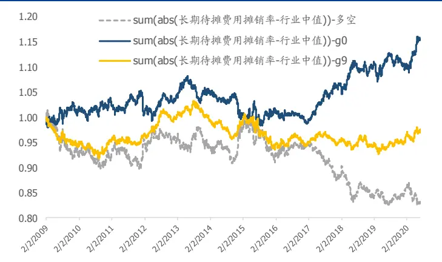
资料来源：Wind，国盛证券研究所

图表27：多空组未来基本面演化
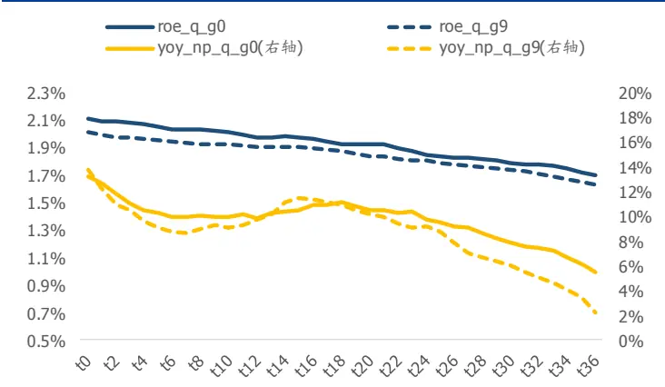
资料来源：Wind，国盛证券研究所

图表28：无形资产摊销率偏离因子多空组合收益（相对全市场等权）
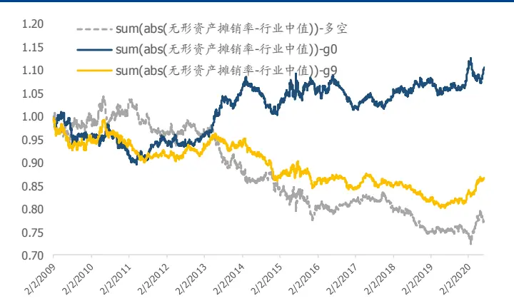
资料来源：Wind，国盛证券研究所

图表29：多空组未来基本面演化
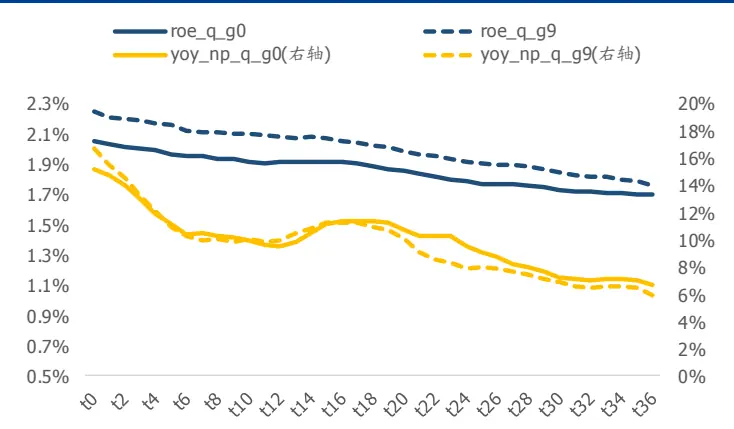
资料来源：Wind，国盛证券研究所

## 2.2.3 非折旧型资产占比偏离程度

由于在建工程、无形资产、开发支出、商誉等资产不需要计提或者较少计提折旧和摊销，因此企业有做高此类资产的倾向。常见操纵手段有推迟在建工程转结固定资产的时间，高估无形资产，开发支出转回研发费用，并购支付过高溢价导致高商誉等。但是此类资产过低也会损害公司的竞争力。因此我们考察此类资产相对于固定资产比例是否长期偏离行业平均水平：

$$
45+111>\frac{35}{35}>56=4549>\frac{35}{35}>\frac{5}{2}>(4549>\frac{35}{35}>^{2}+155>\frac{35}{35}>^{2})
$$

$$
454+111\div\frac{2}{35}=\frac{1}{12}\times\frac{1}{35}=\frac{1}{12}\times\frac{1}{35}+\frac{1}{12}\times\frac{1}{35}=\frac{1}{12}\times\frac{1}{35}=\frac{1}{12}\times\frac{1}{35}
$$

$$
non\ depreciate\ assetratio\ abssum=\sum abs\Big(\mathbb{H}\mathbb{H}\mathbb{H}\mathbb{H}\mathbb{H}\mathbb{H}\Big)\beta\mathbb{\hat{x}}\mathbb{H}_{i}-\mathbb{\hat{\eta}}\mathbb{\hat{x}}\mathbb{H}\mathbb{\Psi}\mathbb{\hat{\Psi}}\mathbb{\hat{H}}_{i}\Big),i=1,2,3
$$

图表30:非折旧资产占比偏离因子多空组合收益（相对全市场等权）
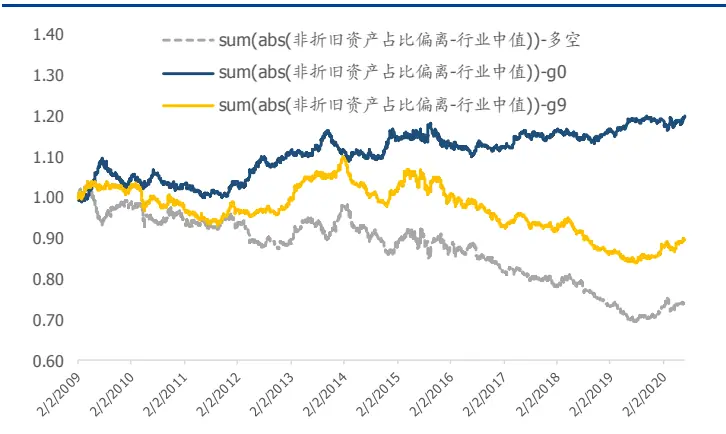
资料来源：Wind，国盛证券研究所

图表31：多空组未来基本面演化
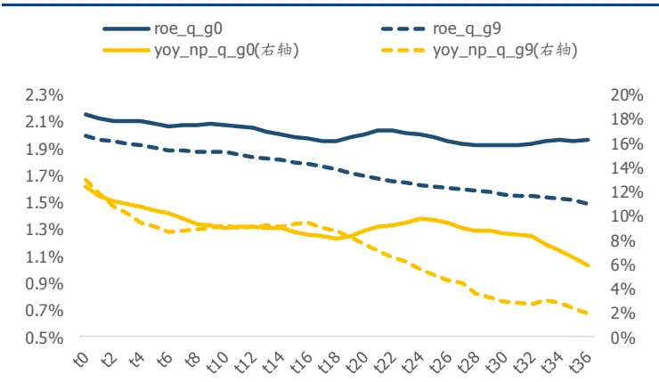
资料来源：Wind，国盛证券研究所

## 2.2.4 所得税率波动率

关注企业按税法及相关规定计算的所得税率的稳定性。通常而言，税务局计量的真实性要高于财务计量的真实性，因此我们考察“按税法及相关规定计算的当期所得税”可以大致推算出税务局认定的公司当年的税前利润。当税务局认定的税前利润与公司净利润的比例相差较大，且呈现较高的波动，则应警惕公司可能存在大幅调节利润的情况。

税率的计算依赖于递延所得税资产和负债两个科目，由于公司财务计算的利润和税务局计算的利润不一致，因此设立这两个科目来存放多缴纳或少缴纳的税，且递延所得税资产和负债不得相互抵消：

图表32:递延所得税资产和负债释义

|  | 递延所得税资产 | 递延所得税负债 |
| --- | --- | --- |
| 产生原因 | 财务计算的利润<税务局计算的利润 | 财务计算的利润>税务局计算的利润 |
|  | 财务计算的税<税务局要求缴纳的税 | 财务计算的税>税务局要求缴纳的税 |
| 核算结果 | 多缴纳的部分进入递延所得税资产 | 少缴纳的部分进入递延所得税负债 |

资料来源：国盛证券研究所整理

我们直接利用现金流量表和利润表科目计算所得税率波动率：

$$
\begin{array}{rl}&\quad\frac{1}{45}\exp(\frac{1}{4}\frac{x}{35}\frac{x}{16}+\frac{x}{16}\frac{x}{16}\frac{x}{15}+\frac{1}{4}\frac{x}{16}\frac{1}{2}\frac{1}{35}\frac{1}{16}\frac{1}{16}\frac{1}{16}\frac{1}{35}\frac{1}{16}\frac{1}{16}\frac{1}{16}\frac{1}{16}\frac{1}{16}\frac{1}{16}\frac{1}{16}\frac{1}{16}\frac{1}{16}\frac{1}{16}\frac{1}{16}\frac{1}{16}\frac{1}{16}\frac{1}{16}\frac{1}{16}\frac{1}{16}\frac{1}{16}\frac{1}{16}\frac{1}{16}\frac{1}{16}\frac{1}{16}\frac{1}{16}\frac{1}{16}\frac{1}{16}\frac{1}{16}\frac{1}{16}\frac{1}{16}\frac{1}{16}\frac{1}{16}\frac{1}{16}\frac{1}{16}\frac{1}{16}\frac{1}{16}\frac{1}{16}\frac{1}{16}\frac{1}{16}\frac{1}{16}\frac{1}{16}\frac{1}{16}\frac{1}{16}\frac{1}{16}\frac{1}{16}\frac{1}{16}\frac{1}{16}\frac{1}{16}\frac{1}{16}\frac{1}{16}\frac{1}{16}\frac{1}{16}\frac{1}{16}\frac{1}{16}\frac{1}1\end{array}
$$

$$
taxratevol=i\downarrow\pm\frac{1}{2}\pm\frac{1}{2}\mp1\pm1\pm3\frac{1}{2}\sqrt{2}\mp1\pm3\sqrt{2}\mp\frac{1+3\mp3\sqrt{2}\pm3\sqrt{2}\pm1\pm3\sqrt{2}\pm3\pm4\frac{1}{2}\pm3\sqrt{2}\pm3\sqrt{2}\sqrt{2\mp4\frac{1}{2}\mp3\sqrt{2}}}{\sqrt{2}\mp1\pm1\sqrt{2}}\biggr)
$$

图表33：当期所得税税率波动率多空组合收益（相对全市场等权）
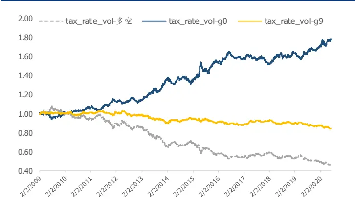
资料来源：Wind，国盛证券研究所

图表34:多空组未来基本面演化
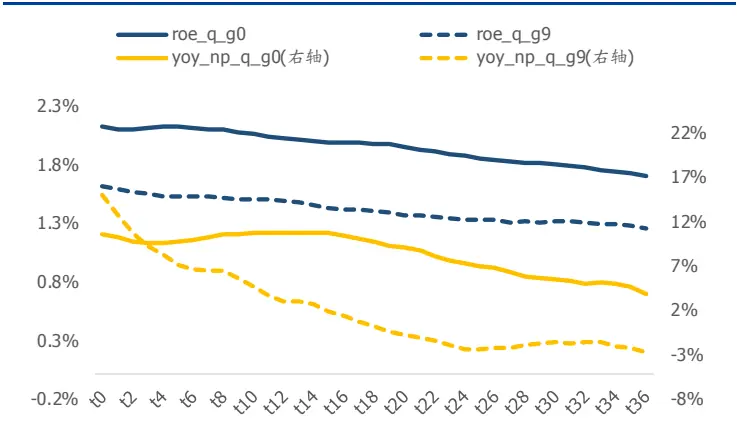
资料来源：Wind，国盛证券研究所

## 2.2.5 因子列表

至此，我们将上述四条逻辑下构建并测试的因子，按涉及科目顺序总结如下：

图表 35：因子列表

| 科目 | 因子 | factor | 释义 |
| --- | --- | --- | --- |
| 应收账款 | 应收账款账龄 | acct rcv age | 应收账款账龄 |
|  | 应收账款坏账占比 | bad debt ratio | 应收账款坏账计提比例 |
|  | 应收账款坏账比偏离 | bad debt ratio abs sum | 过去3年应收账款坏账占比偏离行业中位数的绝对值之和 |
| 其他应收款 | 其他应收款账龄 | acct rcv oth age | 其他应收款账龄 |
|  | 其他应收款坏账占比 | bad debt ratio oth | 其他应收款坏账计提比例 |
|  | 其他应收款坏账比偏离 | bad debt ratio oth abs sum | 过去3年其他应收款坏账占比偏离行业中位数的绝对值之和 |
| 存货 | 存货跌价准备比偏离 | inv entory dev alue abs sum | 过去3年存货跌价准备占比偏离行业中位数的绝对值之和 |
| 固定资产、油气资产与 | 资产折旧率偏离 | fix assets depreciation abs sum | 过去3年资产折旧率偏离行业中位数的绝对值之和 |
| 生产性生物资产 | 资产减值准备率偏离 | fix assets dev alue abs sum | 过去3年资产减值准备占比偏离行业中位数的绝对值之和 |
| 长期待摊费用 | 长期待摊费用摊销率偏离 | It defered expense amortization abs sum | 过去3年长期待摊费用摊销率偏离行业中位数的绝对值之和 |
| 无形资产 | 无形资产摊销率偏离 | intang assets amortization abs sum | 过去3年无形资产摊销率偏离行业中位数的绝对值之和 |
| 在建工程、无形资产、开发支出、商誉 | 非折旧型资产占比偏离 | non-depreciation assets abs sum | 过去3年非折旧型资产占比偏离行业中位数的绝对值之和 |
| 递延所得税资产/负债 | 所得税率的波动率 | tax rate v ol | 过去3年标准化波动率(按税法及相关规定计算的当期所得税/净利润) |

资料来源：国盛证券研究所整理

下面我们介绍因子的两种应用方式。

## 三、利用财报信息质量因子降低风险

面对众多投资标的，我们对公司质量的要求应该是越严苛越好。我们尝试利用上述因子对公司质量进行评分。在这里我们选择非线性的方式汇总评分，即我们标记因子值低于2 倍标准差为异常，并对每家公司加总异常因子数：

$$
\frac{e}{\phi}\stackrel{\star\star}{\vec{\eta}}\equiv\Bigr|\vec{\mathcal{I}}\stackrel{/\forall}{\mathcal{I}}\Bigr\rangle=\sum_{i}I_{factor_{i}\le-2}
$$

即有任一指标异常，即纳入风险池考量。

为了检验指标的有效性，我们统计了不同得分下公司在未来年报出现“非标”意见或被处罚的公司数。

我们筛选了 2009 年到 2018 年每年12 月底年报发布前共 26570 个样本，其中次年发布的年报无法给出标准无保留意见的样本共 1220 条，加上未来 12 个月有违规/立案的样本共 2501 条。

用基础排雷指标筛选样本后，总计 20685 条记录，其中当年年报无法给出标准无保留意见的样本共 187 条，加上有违规/立案的样本共 983 条。再结合国盛财务风险识别规则库中的其他规则再筛去一批样本，此时非标意见样本召回率为 85.49%，非标意见或违规立案样本召回率 62.61%。

我们在此基础上利用异常因子得分进行筛选，覆盖到了新的 435 条非标意见或违规立案记录，说明我们的因子库对已有排雷指标和规则起到了补充的作用。

图表36:异常因子得分对非标意见及违规/立案样本数的覆盖度

|  | 全样本 | 基础排雷指标覆盖数 | 基础排雷后样本 | 规则库新覆盖样本数 | 召回率1 | 异常因子覆盖数 | 召回率2 |
| --- | --- | --- | --- | --- | --- | --- | --- |
| 次年非标意见 | 1220 | 1033 | 187 | 10 | 85.49% | 77 | 91.80% |
| 次年非标意见/违规立案 | 2501 | 1518 | 983 | 48 | 62.61% | 435 | 80.01% |

资料来源：wind，国盛证券研究所

我们也统计了在基础排雷指标筛选之后的样本中，不同得分下出现问题的公司，具体分布如下：

图表37：不同异常因子得分下公司数分布

| 异常因子数 | 全样本数 | 次年非标 意见数 | 次年非标意见或 违规立案数 | 次年非标意见/ 全样本数 | 次年非标意见或违 规立案/全样本数 | 次年非标意见/次年 非标意见总数 | 次年非标意见或违规立案/ 非标意见或违规立案总数 |
| --- | --- | --- | --- | --- | --- | --- | --- |
| 0 | 12647 | 105 | 529 | 0.83% | 4.18% | 56.15% | 53.81% |
| 1 | 4887 | 48 | 256 | 0.98% | 5.24% | 25.67% | 26.04% |
| 2 | 1904 | 18 | 111 | 0.95% | 5.83% | 9.63% | 11.29% |
| 3 | 718 | 10 | 57 | 1.39% | 7.94% | 5.35% | 5.80% |
| 4 | 317 | 2 | 15 | 0.63% | 4.73% | 1.07% | 1.53% |
| 5 | 133 | 2 | 9 | 1.50% | 6.77% | 1.07% | 0.92% |
| 6 | 54 | 2 | 5 | 3.70% | 9.26% | 1.07% | 0.51% |
| 7 | 17 | 0 | 1 | 0.00% | 5.88% | 0.00% | 0.10% |
| 8 | 6 | 0 | 0 | 0.00% | 0.00% | 0.00% | 0.00% |
| 9 | 2 | 0 | 0 | 0.00% | 0.00% | 0.00% | 0.00% |

资料来源：wind，国盛证券研究所

在异常因子数较高的样本中，次年出现非标意见以及被违规/立案公司的比例高于异常因子数为 0 的样本；而异常因子数极高（6 以上）的样本，虽然没有出现非标意见，或者违规行为，但也多是刚摘帽，或处于重大资产重组或充斥其他负面信息的股票。

如果我们将异常因子数大于 0 的股票做一个等权组合，该异常组合整体跑输市场基准，相对净值走势如下：

图表38：异常组合相对净值曲线（相对全市场等权）
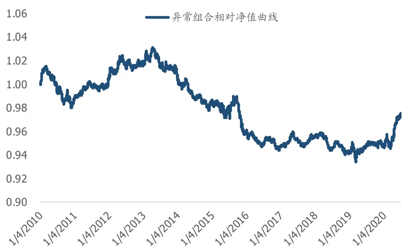
资料来源：wind，国盛证券研究所

## 四、综合财报信息质量评分

第二种方式我们采取直接线性合成来形成对公司财报信息质量的综合评分。我们将上述因子分为账龄、坏账率、坏账率偏离、资产折旧/摊销率偏离、资产减值/跌价偏离、非折旧资产占比偏离、所得税率波动率七类，并且将小类因子去极值、标准化、市值行业中性化并调整方向，等权求均值。检验结果显示综合评分高的公司长期跑赢综合评分低的公司。

测试区间：2009~2020.6。

测试样本：wind 全 A 并剔除 2.1 节中的问题公司。

我们发现经过复合的因子对股票有更稳定区分能力。从分组结果来看，十组收益整体呈现出单调性，财报信息质量越高，年化超额收益越高。

图表 39:wind全A分十组超额收益（相对全A等权）
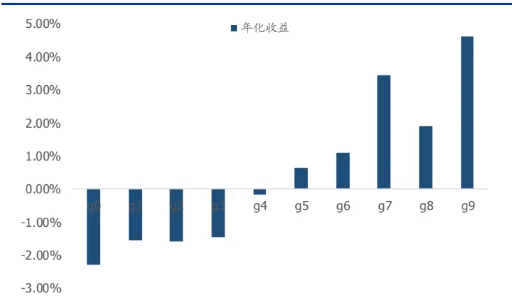
资料来源：wind，国盛证券研究所

图表40:wind全A分十组超额收益（相对全A 市值加权）
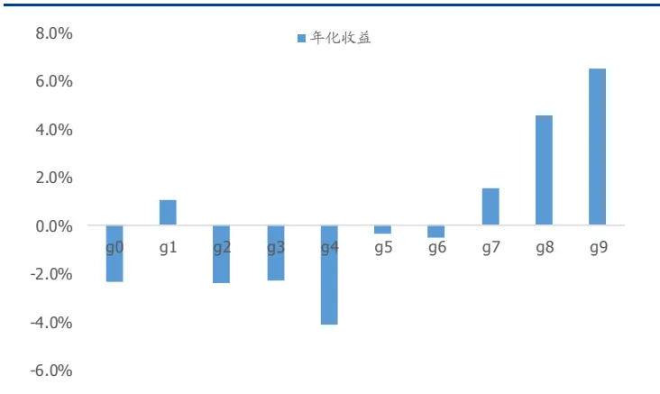
资料来源：wind，国盛证券研究所

从多空组合净值走势来看，多头组合跑赢空头组合。

图表 41:wind全A分十组多空收益净值（相对全A等权）
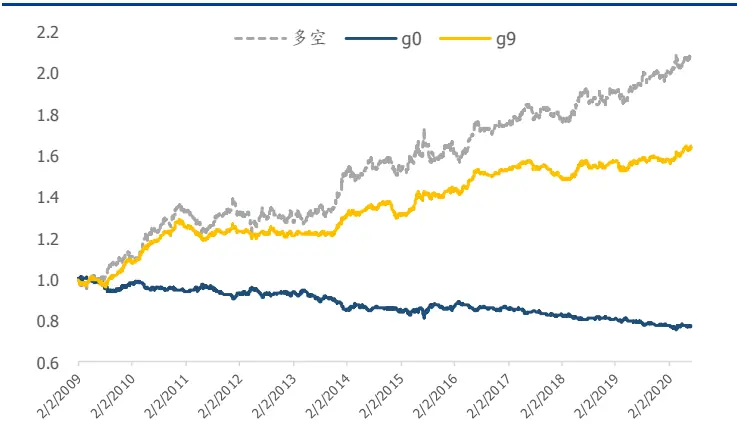
资料来源：wind，国盛证券研究所

图表42：wind全A分十组多空收益净值（相对全A市值加权）
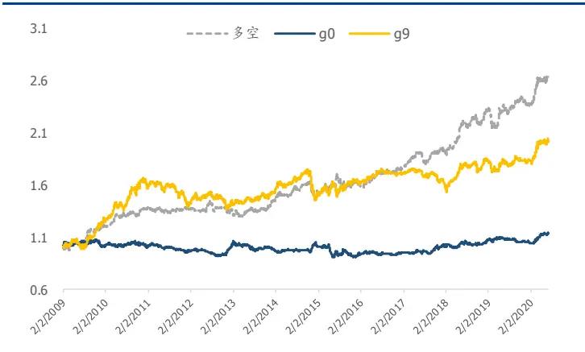
资料来源：wind，国盛证券研究所

从多空组合未来基本面演化情况来看，财报信息质量高的组合，在未来三年里，平均 roe水平更高，净利润增速的维持度更好，且 roe 波动率和净利润增速波动率更低，即这部分企业盈利的可持续性更强。

图表43:多空组合未来roe与净利润同比演化
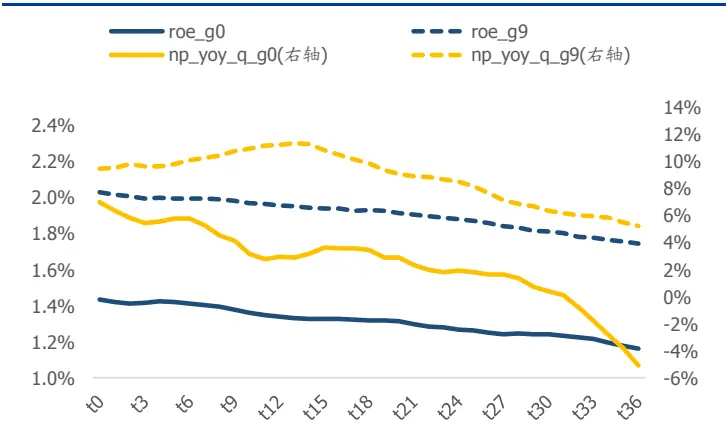
资料来源：wind，国盛证券研究所

图表44: 多空组合未来roe波动率与净利润同比波动率演化
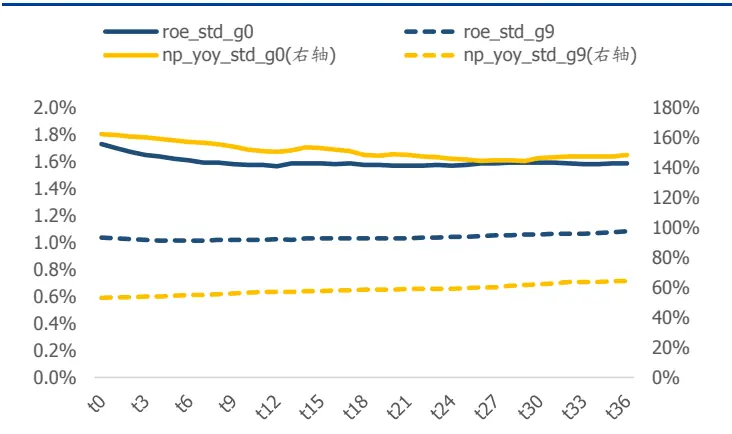
资料来源：wind，国盛证券研究所

## 五、财报信息质量与盈余惯性

## 5.1 高质量的超预期组合具有更强的盈余惯性

盈余惯性（PEAD）是指盈余公告后，未预期盈余较高的公司未来的市场回报会显著地高于未预期盈余较低的公司，并且价格漂移现象会持续 3~6 个月。

支持有效市场假说学派认为，超额收益来自于承担了额外的风险或额外的交易成本；
反对有效市场假说学派认为，投资者对盈余公告信息的反应不足导致了盈余惯性。

从盈余管理视角来看，投资者对不同质量的盈余信息存在反应不足，从而表现出高盈余质量的票池中，价格存在明显的正向漂移，而在低盈余质量的票池中，存在明显的负向漂移。

我们用财报信息质量作为盈利质量的代理变量，在不考虑交易成本的情况下，进行财报信息质量和超预期因子的双因子分组检验：

1) 根据 sue 和 sur 因子平均得分作为超预期（growth）打分；

2) 根据上文整理的财报信息质量因子平均得分作为盈利质量（quality）打分；

3) 在每个月/季度/半年度调仓，等分五组，构建组合，组合表现如下。

组合年化超额收益如下：

图表45:财报信息质量与超预期因子分组年化收益（相对全市场等权）
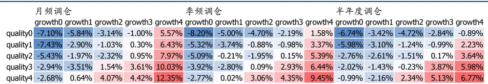
资料来源：wind，国盛证券研究所

不同财报信息质量分组下超预期组合相对净值曲线：

图表46：不同财报信息质量分组下超预期组合相对净值（相对全市场等权）
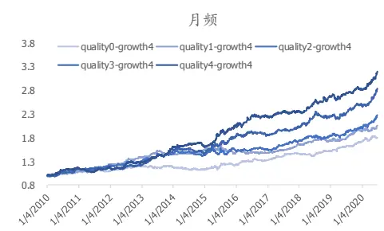
资料来源：wind，国盛证券研究所

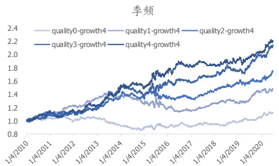

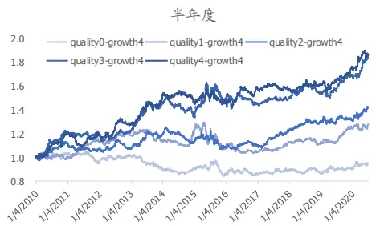

无论是哪种调仓频率的分组测试，我们观察到：

1) 在财报信息质量较高的分组中，高超预期组合有较强的正向价格漂移，未达预期组合的负向价格漂移不明显；

2) 在财报信息质量较低的分组中，未达超预期组合有较强的负向价格漂移，高超预期组合的正向价格漂移不明显。

因此，我们可以结合财报信息质量与超预期信息获取更高的收益。

## 5.2 结合盈利与质量获取更强的盈余惯性

我们在报告开头提到，财报信息质量的高低与企业盈利能力的强弱并非完全等同，作为投资者，我们更愿意投资那些盈利能力强且真实度高的企业。在这里我们选取代表企业内生成长性的指标 ROE 作为其盈利能力的代理指标，尝试结合财报信息质量来获取更高的盈余惯性带来的超额收益。我们测试了用 ROE 与信息质量平均得分，或者用异常因子得分剔除潜在风险组合的方式来增强收益。

样本池：wind 全 A，剔除新股，ST，停牌，以及被基础排雷指标标记的股票。

基准策略：月频调仓，每月底在样本池中筛选 ROE 排名最高的前 20%股票，再根据超预期得分筛选前 20%的股票，构建组合。

增强策略：月频调仓，每月底在样本池中计算 ROE 标准分和财报信息质量标准分，并选择均分排名最高的前 20%股票，再根据超预期得分筛选前 20%的股票，构建组合。

剔除策略：月频调仓，每月底在样本池中剔除异常因子得分大于 0 的股票，筛选 ROE 排名前 20%股票，再根据超预期得分筛选前 20%的股票，构建组合。

图表47：等权策略相对净值曲线（相对全市场等权）
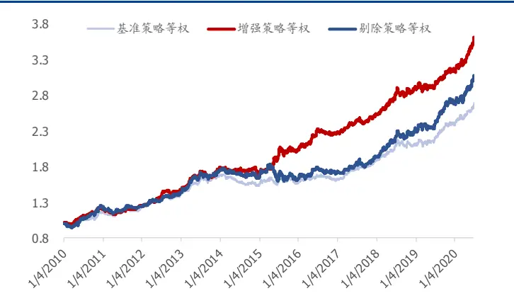
资料来源：wind，国盛证券研究所

图表48: 市值加权策略相对净值曲线（相对全市场市值加权）
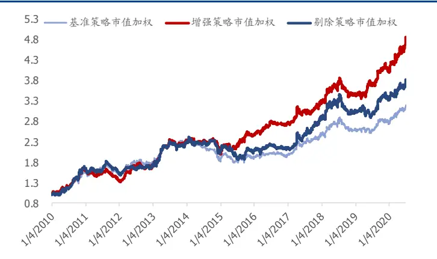
资料来源：wind，国盛证券研究所

图表 49: 策略绩效汇总

|  | 总收益 | 年化收益 | 年化波动率 | SR | 年化超额收益 | 年化超额波动率 | IR | 最大回撤 |
| --- | --- | --- | --- | --- | --- | --- | --- | --- |
| 基准策略等权 | 477.32% | 18.93% | 29.38% | 0.64 | 10.28% | 5.82% | 1.77 | 53.53% |
| 增强策略等权 | 677.66% | 22.49% | 29.74% | 0.76 | 13.58% | 5.90% | 2.30 | 52.58% |
| 剔除策略等权 | 561.41% | 20.54% | 30.08% | 0.68 | 11.78% | 7.54% | 1.56 | 55.74% |
| 基准策略市值加权 | 399.99% | 17.25% | 28.29% | 0.61 | 12.14% | 10.43% | 1.16 | 50.96% |
| 增强策略市值加权 | 661.83% | 22.24% | 28.25% | 0.79 | 16.90% | 11.19% | 1.51 | 47.70% |
| 剔除策略市值加权 | 499.83% | 19.38% | 29.11% | 0.67 | 14.17% | 12.51% | 1.13 | 53.71% |

资料来源：wind，国盛证券研究所

我们看到，结合了质量因子之后，高盈利超预期组合的收益有一定提升，采用平均分法的增强策略能获得更高的夏普比和信息比。

为了探究财报信息质量的作用，我们做了两方面的统计。

第一方面，我们猜想财报信息质量因子能帮助我们剔除部分潜在风险较高的股票。

为了探究财报信息质量与 roe 的交互关系，我们在每年 12 月底将样本池按 roe 和财报信息质量和异常因子得分分组，并统计随后年报出现非标意见的公司数量分布：

- 按 roe 分组来看，roe 越低的公司，出现风险事件的频率越高；但 roe 最高一组也有不少公司出现风险事件；

在高 roe 组（g4）中，财报信息质量得分越高的组，未来出现风险事件的频率越低；
而用异常因子得分也帮助我们剔除了约 10%的风险样本。

换言之，财报信息质量能帮助我们在高盈利能力的票池中，筛去部分潜在风险较高的股票。

图表50:roe与财报信息质量分组后次年年报非标意见公司数量分布

|  | 财报信息质量得分 |  |  |  |  | 异常因子得分 |  |  |  |  |  |  |  |
| --- | --- | --- | --- | --- | --- | --- | --- | --- | --- | --- | --- | --- | --- |
| roe | g0 | g1 | g2 | g3 | g4 | 0 | 1 | 2 | 3 | 4 | 5 | 6 | sum |
| g0 | 10.1% | 6.1% | 3.9% | 5.6% | 5.0% | 14.0% | 8.4% | 5.0% | 1.7% | 0.0% | 0.6% | 1.1% | 30.7% |
| g1 | 4.5% | 6.1% | 3.4% | 3.4% | 4.5% | 12.8% | 6.7% | 1.1% | 1.1% | 0.0% | 0.0% | 0.0% | 21.8% |
| g2 | 3.4% | 0.6% | 4.5% | 4.5% | 4.5% | 13.4% | 2.2% | 1.1% | 0.0% | 0.6% | 0.0% | 0.0% | 17.3% |
| g3 | 2.8% | 0.6% | 2.8% | 5.0% | 2.2% | 8.4% | 2.2% | 2.2% | 0.6% | 0.0% | 0.0% | 0.0% | 13.4% |
| g4 | 7.8% | 5.0% | 1.1% | 2.8% | 0.0% | 7.3% | 6.1% | 0.6% | 1.7% | 0.6% | 0.6% | 0.0% | 16.8% |
| sum | 28.5% | 18.4% | 15.6% | 21.2% | 16.2% | 55.9% | 25.7% | 10.1% | 5.0% | 1.1% | 1.1% | 1.1% |  |

资料来源：wind，国盛证券研究所

第二方面，由于超预期信息往往集中在财报发布季，因此超预期策略收益会存在一定的季节效应，我们猜想结合质量信息的超预期策略应该在业绩真空期有更好的表现。

我们统计了三个策略平均每月超额收益。从平均月度收益来看，在快报、预告和财报集中发布的 1~4 月，基准策略和增强、剔除策略收益差距不大，但是在年报披露完毕的5~6 月，中报发布完毕的 9 月，三季报发布完毕的 11 月，增强策略和剔除策略录得更高的超额收益，即高质量的高盈利超预期组合在业绩真空期有更好的收益表现。

图表51：等权策略平均月度超额收益（相对全市场等权）
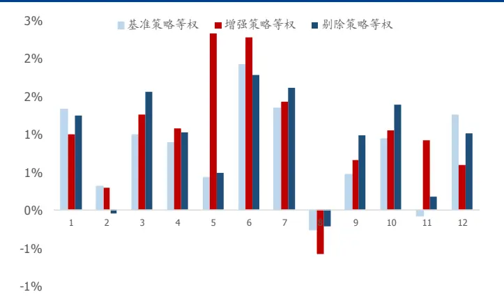
资料来源：wind，国盛证券研究所

图表52：市值加权策略平均月度超额收益（相对全市场市值加权）
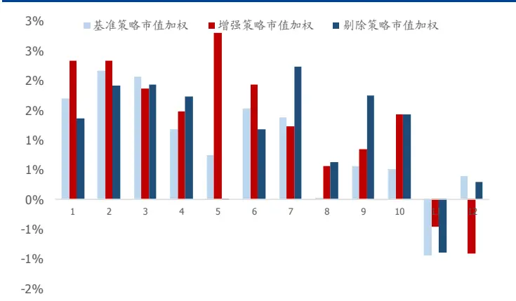
资料来源：wind，国盛证券研究所

## 总结

本篇报告尝试对公司财报信息质量进行评分。财报信息质量高并不意味着企业盈利质量高；但财报信息质量低的公司进行盈余调节的可能性更大。我们梳理并设计因子来刻画企业利润调节的手段，涉及信息包括：

- 应收账款/其他应收款的账龄、坏账比例、坏账计提政策；

- 资产的累计折旧/摊销计提政策；

- 资产的减值准备计提政策；

- 非折旧型资产占比；

- 所得税率波动率等；

我们首先可以利用财报信息质量因子降低风险。我们标记因子值低于 2 倍标准差为异常，并筛选有异常值的股票作为考察组。从统计结果看，进入考察组的公司在未来有更高可能出现风险事件。因子库对我们的排雷指标和规则起到补充作用。

其次，综合财报信息质量评分对股票收益有区分能力，且多头组合的盈利可持续性更强。经过复合的财报信息质量因子在 wind 全 A 内分十组超额收益呈现单调性，多空组合年化收益 6.90%，夏普比 1.10，IC 均值 0.0148，t 检验值为 3.03，且多头组合未来在 roe波动率和 np_yoy 波动率上的暴露值更低。

投资者对不同的财报信息质量存在反应不足，我们发现在财报信息质量高的样本池中，超预期组合表现出更强的正向盈余惯性；反之，在财报信息质量低的样本池中，未达预期组合表现出更强的负向盈余惯性。这在一定程度上帮助我们理解盈余惯性这一市场异象，并结合财报信息质量与超预期信息获取更高的收益。

最后，我们尝试结合财报信息质量来提升高盈利超预期策略的表现。我们测试了用 ROE与信息质量平均得分，或者用异常因子得分剔除部分股票两种方式，均有一定增强。一方面，财报信息质量因子能帮助我们在高 ROE 的票池中筛去部分潜在风险较高的股票；另一方面，高质量的组合表现出更强的盈余惯性，使得策略在业绩真空期有更好的收益表现。

我们在这篇报告中初步尝试对企业的财报信息质量进行打分，未来仍有更多值得探索的课题，例如：

1) 刻画盈利数据的夸大程度，从而更好地刻画公司的盈利水平；

2) 更科学地将财报信息质量与盈利、成长等基本面因子结合，提高公司间基本面指标的可比性，从而提升基本面因子的选股效果等；

## 参考文献

[1] Ismail, Vinola and Witarno, Kiki, Analysis the Effect of Company's Fundamental Characteristics and Real Earnings Management to Stock Return Moderated by Audit Quality (February 29, 2016). OIDA International Journal of Sustainable Development, Vo l. 09, No. 02, pp. 23-44, 2016, Available at SSRN: https://ssrn.com/abstract=2739785.

[2] Penman, Stephen H. and Zhang, Xiao-Jun, Accounting Conservatism, the Quality of Earnings, and Stock Returns (December 1999). Available at SSRN: https://ssrn.com/abstract=201048 or http://dx.doi.org/10.2139/ssrn.201048.

[3] Cohen, Daniel A. and Dey, Aiyesha and Lys, Thomas Z., Real and Accrual-Based Earnings Management in the Pre- and Post-Sarbanes Oxley Periods (June 2007). AAA 2006 Financial Accounting and Reporting Section (FARS) Meeting Paper, Available at SSRN: https://ssrn.com/abstract=813088 or http://dx.doi.org/10.2139/ssrn.813088.

[4] 唐朝.手把手教你读财报[M].中国经济出版社:,2015.

[5] 黄世忠.财务报表分析：理论框架方法与案例[M].中国财政经济出版社:,2007:41-121.

## 风险提示

风险提示：企业盈余调节手段复杂，因子库无法穷尽所有盈余调节情形；报告利用当前已有的数据进行指标构建和测试，未来存在数据质量较低的风险；以上结论均基于历史数据和统计模型的测算，如果未来市场环境发生改变，不排除模型失效的可能性。

## 免责声明

国盛证券有限责任公司（以下简称“本公司”）具有中国证监会许可的证券投资咨询业务资格。本报告仅供本公司的客户使用。本公司不会因接收人收到本报告而视其为客户。在任何情况下，本公司不对任何人因使用本报告中的任何内容所引致的任何损失负任何责任。

本报告的信息均来源于本公司认为可信的公开资料，但本公司及其研究人员对该等信息的准确性及完整性不作任何保证。本报告中的资料、意见及预测仅反映本公司于发布本报告当日的判断，可能会随时调整。在不同时期，本公司可发出与本报告所载资料、意见及推测不一致的报告。本公司不保证本报告所含信息及资料保持在最新状态，对本报告所含信息可在不发出通知的情形下做出修改，投资者应当自行关注相应的更新或修改。

本公司力求报告内容客观、公正，但本报告所载的资料、工具、意见、信息及推测只提供给客户作参考之用，不构成任何投资、法律、会计或税务的最终操作建议 本公司不就报告中的内容对最终操作建议做出任何担保。本报告中所指的投资及服务可能不适合个别客户，不构成客户私人咨询建议。投资者应当充分考虑自身特定状况，并完整理解和使用本报告内容，不应视本报告为做出投资决策的唯一因素。

投资者应注意，在法律许可的情况下，本公司及其本公司的关联机构可能会持有本报告中涉及的公司所发行的证券并进行交易，也可能为这些公司正在提供或争取提供投资银行、财务顾问和金融产品等各种金融服务。

本报告版权归“国盛证券有限责任公司”所有。未经事先本公司书面授权，任何机构或个人不得对本报告进行任何形式的发布、复制。任何机构或个人如引用、刊发本报告，需注明出处为“国盛证券研究所”，且不得对本报告进行有悖原意的删节或修改。

## 分析师声明

本报告署名分析师在此声明：我们具有中国证券业协会授予的证券投资咨询执业资格或相当的专业胜任能力，本报告所表述的任何观点均精准地反映了我们对标的证券和发行人的个人看法，结论不受任何第三方的授意或影响。我们所得报酬的任何部分无论是在过去、现在及将来均不会与本报告中的具体投资建议或观点有直接或间接联系。

投资评级说明

| 投资建议的评级标准 |  | 评级 | 说明 |
| --- | --- | --- | --- |
| 评级标准为报告发布日后的6个月内公司股价（或行业指数）相对同期基准指数的相对市场表现。其中A股市场以沪深300指数为基准；新三板市场以三板成指（针对协议转让标的）或三板做市指数（针对做市转让标的）为基准；香港市场以摩根士丹利中国指数为基准，美股市场以标普500指数或纳斯达克综合指数为基准。 | 股票评级 | 买入 | 相对同期基准指数涨幅在15%以上 |
|  |  | 增持 | 相对同期基准指数涨幅在 5%~15%之间 |
|  |  | 持有 | 相对同期基准指数涨幅在-5%~+5%之间 |
|  |  | 减持 | 相对同期基准指数跌幅在 5%以上 |
|  | 行业评级 | 增持 | 相对同期基准指数涨幅在10%以上 |
|  |  | 中性 | 相对同期基准指数涨幅在-10%~+10%之间 |
|  |  | 减持 | 相对同期基准指数跌幅在10%以上 |

## 国盛证券研究所

北京

地址：北京市西城区平安里西大街26号楼 3层

上海

地址：上海市浦明路868号保利 One56 1号楼 10层

邮编：100032

邮编：200120

传真：010-57671718

邮箱：gsresearch@gszq.com

电话：021-38934111

南昌

邮编：330038

地址：南昌市红谷滩新区凤凰中大道 1115号北京银行大厦

邮箱：gsresearch@gszq.com

传真：0791-86281485

地址：深圳市福田区福华三路 100号鼎和大厦 24楼

邮箱：gsresearch@gszq.com

深圳

邮编：518033

邮箱：gsresearch@gszq.com