# 量化专题报告

## 多因子系列之十五：分析师盈利修正后的股价漂移

本报告研究了分析师盈利修正后股价漂移（PFRD）带来的超额收益。我们从盈利修正的大小和质量出发，使用事件研究的方法，分析了影响 PFRD 的因素，并使用这些因素对不同盈利修正事件的超额收益进行预测，最终生成月频因子。不管从线性的角度，还是从头部筛选的角度，该因子相对于传统的一致预期盈利修正因子有着明显的增量信息。

盈利修正事件获取的是市场对新信息的反应不足。我们使用了包括点评报告在内的所有报告相对于其上次报告的盈利修正数据，希望获取这些报告中分析师对非结构化信息的处理所带来的超额收益。由于分析师的预测整体偏乐观，平均来看，盈利修正的均值显著为负。

盈利修正的大小与盈利修正的超额收益正相关。我们测试了不同的衡量盈利修正大小的指标，发现盈利预测增长率以及报告日附近的股票超额收益是较好的衡量指标。同时我们发现近几年来，负向的盈利修正并没有明显的负向超额收益，这可能是由于市场定价效率提升的结果。

盈利修正的质量对盈利修正的超额收益影响显著。盈利修正的质量可以分为三点，创新性、可靠性和及时性。我们分别使用盈利预测是否同时高于一致预期以及前次预测、盈利修正方向与一致预期修正方向的同步性、盈利修正的时间间隔作为上述因素的代理变量，发现这些因素确实显著影响了盈利修正后的超额收益，质量越高的盈利修正，后续的超额收益越高。

使用盈利修正事件构建的因子带来显著的增量信息。我们发现盈利修正后的超额收益在大约 60 个交易日后衰减十分明显，因此我们在每个月底选取了过去 90 天的盈利修正事件打分的平均作为因子值，该因子不管是在全市场、分析师覆盖域或者中证 800 中，都相对于一致预期的盈利修正存在明显的增量信息。

盈利修正因子的增量信息来源于对盈利预测数据不同的处理方法。一致预期的盈利修正存在前后分析师不可比、同等对待所有盈利修正等问题。而盈利修正因子的构建考虑了上述问题，并增加了盈利修正质量的信息。

盈利修正类策略的改进需要结合更多的信息。尽管本文构建的因子解决了一致预期盈利修正因子中的部分问题，但是由于原始的预测数据中包含无信息的修正、过于主观的修正、发布滞后等等一系列问题，使得我们在获取 PFRD的超额收益时，带有较大的噪声。这需要我们结合主动研究的信息来对这些噪声进行进一步的剔除，这样才能从本质上提升策略的效果。

风险提示：以上结论均基于历史数据和统计模型的测算，如果未来市场环境发生改变，不排除模型失效的可能性。

## 作者

分析师 丁一凡

执业证书编号：S0680520100001

邮箱：dingyifan@gszq.com

分析师 刘富兵

执业证书编号：S0680518030007

邮箱：liufubing@gszq.com

2、《量化周报：逢反弹减仓》2021-02-28

3、《量化点评报告：小盘股的困扰：高赔率与低胜率的矛盾》2021-02-22

4、《量化周报：短期警惕冲高回落》2021-02-21

5、《量化周报：市场将迎开门红》2021-02-17

## 一、 综述

近几年来，主动研究的 alpha 收益在 A 股市场上越来越强，我们在之前的报告中分别从主题和机构重仓入手，试图使用主动投资的信息给多因子模型带来一些增量信息。本篇报告我们继续延续这一思路，研究分析师盈利预测中的 alpha信息。

分析师预期数据可以构造很多不同的因子，例如预期的估值，预期的利润增速等等，但其中比较稳定的要数一致预期的盈利修正因子，例如以下展示的 3 个月一致预期盈利修正因子，在历史样本中一直维持着不错的表现。由于分析师的盈利预测并不精准，整体偏乐观，而不同分析师对不同公司的乐观程度不同，因此如果直接使用分析师盈利预测数据来构建估值成长等因子，会存在截面不可比的问题。而使用分析师预期的变化来作为因子，能够很好地消除不同股票乐观程度不同的问题，因此因子表现较为稳定。

图表1：三个月一致预期盈利修正因子表现
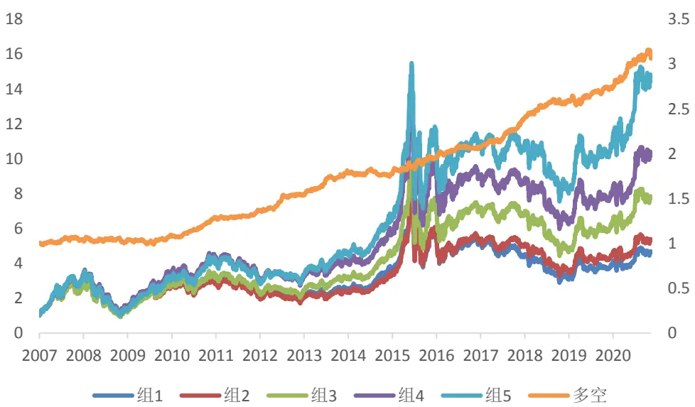
资料来源：国盛证券研究所，Wind

尽管 3 个月一致预期盈利修正因子表现稳定，但仍有一定的提升空间。首先，该因子在计算过程中并没有考虑前后分析师是否一致的问题；其次，一致预期将不同盈利修正同等对待，但不同的盈利预测所含有的信息可能有较大的差别；另外在计算一致预期时，我们通常采用过去 90 天或者 180 天的数据进行平均，存在滞后性问题。因此，本报告我们将先使用事件研究的方式，研究单个分析师盈利修正的影响，然后再将这些事件因子化或者进行其他方式的应用。

事实上，分析师盈利修正后的超额收益在资产定价的论文中是较为著名的异象，一般称之为盈利修正后的价格漂移（Post Forecast Revision Drift，后文简记为 PFRD）。Givoly andLakonishok（1979）最早发现了盈利修正后的价格漂移。Stickel（1991）发现一致预期提升的公司相对于下降的公司在随后的3到12个月有明显的超额收益。Chan等（1996）也确认了 PFRD 的存在，认为这一现象是市场对新信息反应不足的策略之一，同时论证了 PFRD是区别于其他类似异象的，例如盈利后的价格漂移（PEAD）、动量等。Gleason和 Lee（2003）发现高创新的盈利修正能够带来更高的超额收益，同时发现知名度高的分析师所做出的修正以及较多的分析师覆盖数能够更好的帮助传播盈利修正的信息，从而降低了修正后的超额收益。

有多篇论文研究了PFRD与其他投资异象的关系。例如Barth 和 Hutton（2004）研究了盈利修正与应计利润间的关系，他们发现二者可以相互补充，在正向盈利修正的股票中，高应计利润的公司的超额收益显著较差，这可能是由于分析师对高应计利润的股票过于乐观而未考虑盈利的不可延续性。Francis和 Soffer（1997）发现盈利修正和分析师推荐能够独立提供增量信息，且二者有明显的交互作用，上调盈利预期且买入的事件要显著好于上调盈利预期且持有或者卖出的事件。

对于PFRD的解释，多数论文支持投资者反应不足这一论点。例如 Zhang（2006）认为盈利公告后的价格漂移（PEAD）、分析师修正后的价格漂移、动量等异象都是来源于投资者对新信息的反应不足，从而导致了短期的价格延续。同时文章认为影响投资者反应不足的最重要的因素是信息的不确定性，对于信息不确定性越强的公司，股价漂移程度越高。但学术界对此也有不同的解释，例如 Po-chang 等（2020）认为除了投资者反应不足，分析师反应不足也是 PFRD 存在的原因。分析师的盈利修正有较强的自相关性，自相关性越强说明分析师的反应越不足，从而盈利修正后的超额收益越高。

我们在阅读了大量相关文献的基础上，结合论文的思路以及自身的想法，研究了不同因素对PFRD 的影响，并构建了分析师盈利修正因子。

## 二、 数据

我们选取了 wind 底层数据库中的中国A股盈利预测明细数据，时间区间为2009年 1月1 日到 2020 年 10 月 30 日。下图展示了样本中每年的盈利预测数据，由于分析师在每篇报告中都包含对未来几个报告期的盈利预测，我们只选取了其对当年盈利的预测。从下表可以看到，盈利预测的报告数量在逐年上涨，而股票的覆盖率从 2016 年以前的 8成左右降低到近两年的 5成左右。

图表2:盈利预测的覆盖度
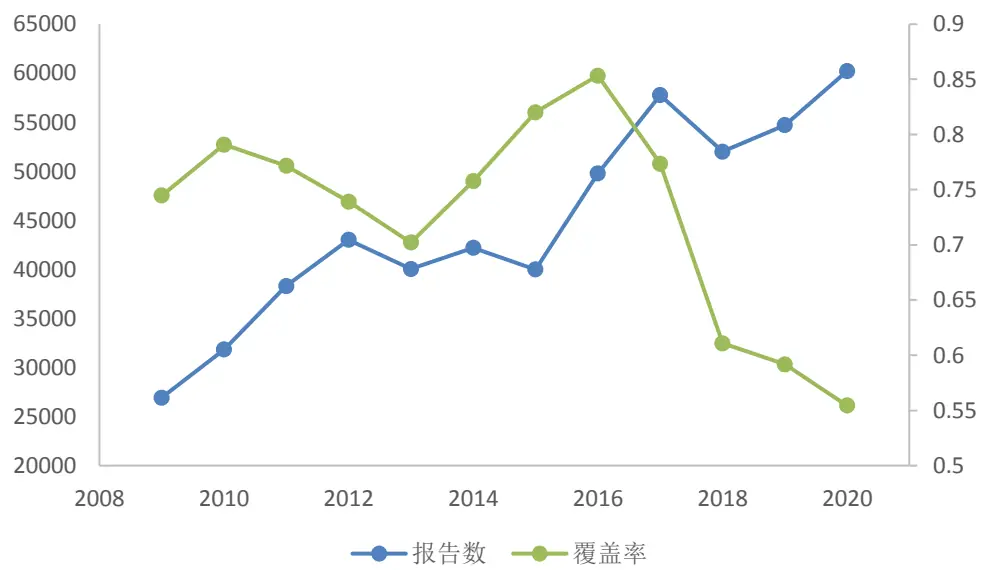
资料来源：国盛证券研究所，Wind

图表3:盈利预测分月数量
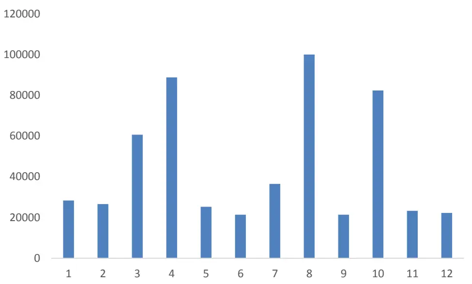
资料来源：国盛证券研究所，Wind

从分月的角度来看，我们发现 3、4、8、10月份的报告数量最多，这是因为这几个月处在公司财报发布的密集期，会有大量的财报点评报告发出。在很多相关的研究中，只使用了深度报告来进行研究，认为深度报告的信息才更有价值，希望获取分析师的研究能力带来的超额收益。但本篇报告中我们并没有作区分，这是由于 PFRD 本质上是在获取利好消息后短期价格低估带来的超额收益，我们只是单纯的将分析师作为信息处理，传输的中介。分析师的任何一次盈利修正都是其对期间公司基本面信息的解读所作出的反应，含有一定的信息。尤其是分析师盈利修正中包含的公司的非结构化信息，例如对各种产销事件、投资扩产事件的点评是对传统基本面因子很好的补充。

对于每一次盈利预测，我们寻找相同券商最近一次对该股票相同报告期的盈利预测作为前次盈利预测，然后构建盈利修正因子。在综述中我们提到一致预期盈利修正存在的一个问题是前后分析师并不可比，但是构建单个分析师盈利修正也无法完全避免这个问题，因为同一机构的分析师可能存在更换的情况。由于这些样本在总体样本中占比较少，同时我们剔除了两次盈利预测相隔 180天的样本，这样能够部分缓解该问题的影响。

数据库中有当年盈利预测的数据一共有 50 万条左右，但有一些报告是首次覆盖，或者在过去 180天内没有同期的盈利预测，因此无法计算盈利修正，最终得到有盈利修正的数据为 35万条左右，其中盈利修正为 0的数据有15万条。由于微利股的存在，有些盈利修正幅度达到 10 倍以上，我们将数据进行了缩尾处理，并统计了非 0 盈利修正的分布情况。

图表4:盈利修正分年统计

|  | 数量 | 均值 | 标准差 | 最小值 | 25%分位 | 50%分位 | 75%分位 | 最大值 |
| --- | --- | --- | --- | --- | --- | --- | --- | --- |
| 2009 | 9922 | 0.016 | 0.275 | -0.715 | -0.090 | 0.001 | 0.095 | 1.374 |
| 2010 | 10899 | 0.024 | 0.198 | -0.543 | -0.054 | 0.006 | 0.089 | 0.924 |
| 2011 | 14162 | -0.015 | 0.170 | -0.575 | -0.085 | -0.003 | 0.048 | 0.662 |
| 2012 | 18011 | -0.069 | 0.180 | -0.815 | -0.130 | -0.037 | 0.010 | 0.512 |
| 2013 | 17131 | -0.019 | 0.177 | -0.658 | -0.082 | -0.003 | 0.043 | 0.661 |
| 2014 | 14542 | -0.024 | 0.196 | -0.721 | -0.083 | -0.005 | 0.031 | 0.860 |
| 2015 | 12672 | -0.027 | 0.265 | -1.020 | -0.108 | -0.008 | 0.034 | 1.189 |
| 2016 | 16959 | 0.011 | 0.312 | -0.759 | -0.092 | -0.002 | 0.054 | 1.918 |
| 2017 | 22299 | 0.021 | 0.216 | -0.518 | -0.062 | 0.000 | 0.063 | 1.159 |
| 2018 | 22456 | -0.003 | 0.158 | -0.478 | -0.065 | -0.002 | 0.042 | 0.684 |
| 2019 | 24125 | -0.019 | 0.158 | -0.517 | -0.081 | -0.005 | 0.034 | 0.659 |
| 2020 | 27552 | -0.013 | 0.200 | -0.815 | -0.085 | -0.002 | 0.059 | 0.740 |
| 全样本 | 210730 | -0.012 | 0.199 | -0.667 | -0.084 | -0.003 | 0.046 | 0.897 |

资料来源：国盛证券研究所，Wind

图表5:盈利修正分布
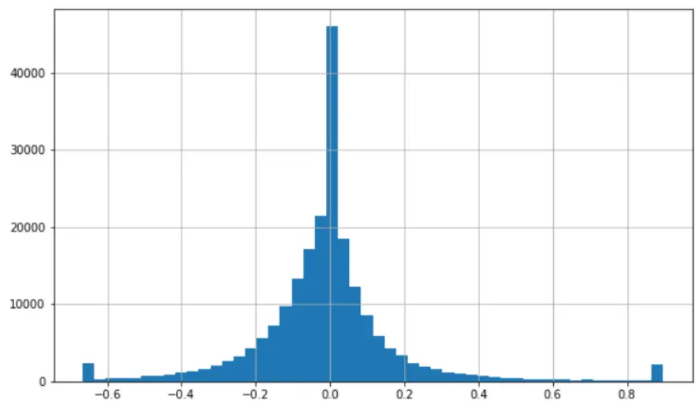
资料来源：国盛证券研究所，Wind

从分布中可以看到，盈利修正的均值并不为 0，而是显著小于 0，且分布略向左偏，不同年份的分布较为稳定，这是由于一般来说分析师的盈利预测偏乐观，而随着年报期逐渐到来，盈利预测会更加接近真实值，从而整体来看会有一个负向的修正，因此负的盈利修正并不一定代表分析师对其不看好或者期间发生了负面消息。另一方面，绝对值在5%以内的盈利修正样本占总体样本的 40%左右，这些微小的盈利修正所包含的信息较为有限，有些甚至与分析师对其的观点并不一致，很多推荐报告中，盈利预期是有所下调的。

我们使用事件研究的方式来分析影响 PFRD 的因素，因此需要计算股票的异常收益率。我们使用 barra 风险模型中的残差收益作为股票每天的异常收益率。由于发布报告以及获取报告信息的时间不定，我们统一以报告发布日的后一天的收盘价作为可交易的价格，即报告发布日的下一个交易日作为 T+0日，然后计算事件带来的超额收益。

## 三、 影响 PFRD 的因素

Gleason 和 Lee(2003)从盈利修正的大小（quantity）和盈利修正的质量（quality）两方面来分析影响 PFRD 的因素，由于 PFRD 本质是在获取好消息之后的价格漂移，那么好消息的幅度和质量是获取该因子超额收益的核心。我们参照这一思路，并结合其他论文的研究，测试了多个可能影响PFRD 的因素。

## 3.1 盈利修正的大小

## 3.1.1 盈利修正大小的度量

首先是盈利修正的大小。常见的盈利修正的定义为

（当期盈利预测-上期盈利预测）/上期盈利预测的绝对值

也有论文使用前一天的净资产以及市值作为分母，即计算盈利修正相对于其净资产或者市值的大小。Imhoff 和 Lobo（1984）使用盈利变化除以过去盈利预期的标准差作为盈利修正的度量，他们认为盈利预测分歧较大的公司的盈利更难以估计，因此出现大幅变动的可能性较大，因此使用了盈利预期的标准差作为分布来进行修正。Gleason 和 Lee（2003）使用盈利修正日附近股票的涨跌作为盈利修正的度量，因为相比于盈利修正的数值，市场对盈利修正的即时反应是盈利修正程度较好的度量指标。我们分别测试了上述不同定义下的盈利修正与随后 120个交易日（T+1到 T+120）股票的超额收益（CAR）的关系。其中 rev_ret 指股票 T-1 到 T+0 的超额收益，rev_to_p、rev_to_bv、rev_to_dev、rev_growth 分别为预期盈利变化除以总市值、净资产、近3月盈利预测的标准差以及前次预测的绝对值。

图表6：不同指标的相关系数

|  | rev_ret | rev_to_p | rev_to_bv | rev_growth | rev_to_dev | CAR |
| --- | --- | --- | --- | --- | --- | --- |
| rev_ret | 1.000 | 0.144 | 0.163 | 0.147 | 0.165 | 0.064 |
| rev_to_p |  | 1.000 | 0.835 | 0.826 | 0.696 | 0.062 |
| rev_to_bv |  |  | 1.000 | 0.840 | 0.723 | 0.071 |
| rev_growth |  |  |  | 1.000 | 0.701 | 0.068 |
| rev_to_dev |  |  |  |  | 1.000 | 0.074 |
| CAR |  |  |  |  |  | 1.000 |

资料来源：国盛证券研究所，Wind

图表7：不同指标分组收益
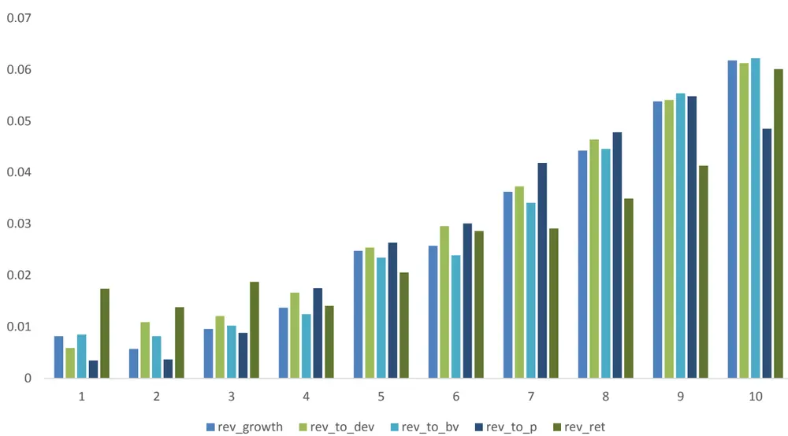
资料来源：国盛证券研究所，Wind

从相关关系矩阵中看到，rev_to_bv、rev_to_p、rev_to_dev、rev_growth 之间有非常强的相关性，两两间的相关系数在 0.7 以上，而 rev_ret 相较于其他变量较为独立。从与CAR的相关系数与分组收益可以看出，rev_to_p 与CAR的相关性较弱，且分组收益的头部显著低于其他变量。这可能是由于 rev_to_p与股票的估值关系较大，rev_to_p 的头部组合更倾向于选取低估值股票中盈利大幅上调的标的，而 PFRD 策略在低估值的股票中超额收益相对较低。另外尽管从分组收益和相关性的角度来看，rev_to_dev都要略微占优，但是rev_to_dev 计算中需要使用过去一段时间盈利预测的标准差数据，这一数据分析师覆盖较低的股票中缺失严重，使得 rev_to_dev 因子覆盖率较低。因此 rev_to_p 和rev_to_dev 并不是合适的盈利修正度量指标。rev_to_bv 与 rev_growth 相关性在 0.8 以上，且二者表现差别不大，我们最终选取 rev_growth作为盈利修正的直接度量。

## 3.1.2 rev_growth 数据中的问题

在上一章中我们提到，由于分析师的盈利预测偏乐观，但随着年报日期逐渐来临，盈利预测值会逐渐接近真实值，因此平均来看盈利修正是显著为负的。也就是说负向的盈利修正并不代表股票有负面消息，可能只是分析师在调整自身的盈利预测。

除此之外，我们检查了样本中大幅下调盈利预测的报告，发现一些报告的观点与盈利预测调整的方向并不一致，且多数报告仍维持着买入或者推荐评级。例如以下例子全部大幅下调了盈利预测，但对股票仍然十分看好。我们认为这是由于分析师通过发布报告来更新盈利预测的频率并不高，且发布的几乎都是买入或者推荐报告。如果股票出现了较大的负面消息，分析师可能不会立刻通过发布报告的方式来修正其盈利，而是会等到例行的业绩点评才发布，但在这段时间内市场可能已经充分反映了这一预期。

图表8:大幅下修盈利同时推荐的例子

| 报告标题 |  | 盈利预测变动幅度 |
| --- | --- | --- |
| 1 | 业绩符合预期，******优势显著 | -32.49 |
| 2 | 行业景气复苏，******业绩提升可期 | -33.16 |
| 3 | ******提升竞争力，******未来可期 | -35.61 |

资料来源：国盛证券研究所，Wind

我们计算了不同调整幅度的修正间隔时间，发现下调盈利预期的修正的时间间隔要稳定的大于上调盈利预期的时间间隔，侧面印证了上述猜想。

图表9:不同盈利修正的时间间隔
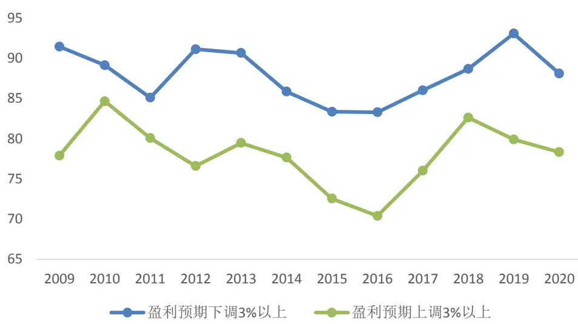
资料来源：国盛证券研究所，Wind

从分年的角度来看，我们发现2017年以前，rev_growth与CAR呈非常明显的线性关系，而 2018 年以后，盈利修正为负的样本中，不同盈利修正幅度的股票的超额收益几乎没有任何区分度，而盈利修正为正的样本中仍然呈显著的线性关系。这可能是由于 2018年以来，分析师覆盖的股票定价效率提升明显，而盈利修正为负的报告由于信息比较滞后，在其发布报告期之前，其股价已经充分反映了已知信息，因此报告后的异常收益并无区分度。

图表 10:不同年份 rev_growth 的分组收益
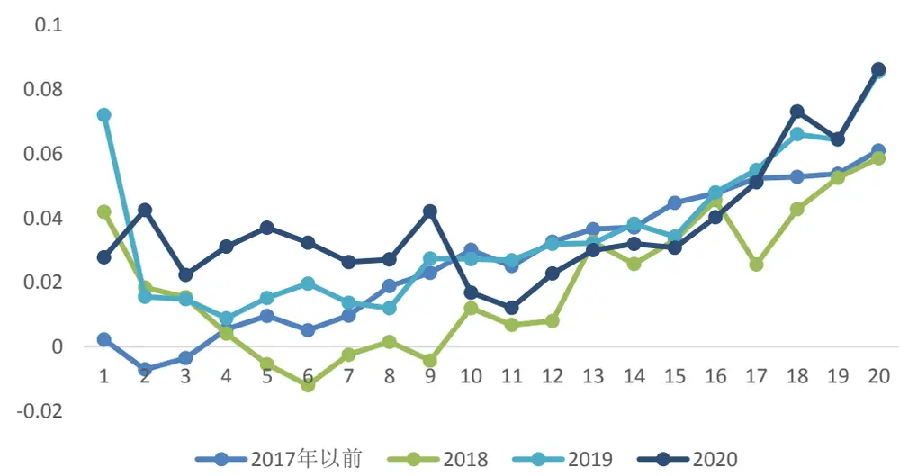
资料来源：国盛证券研究所，Wind

## 3.1.3 rev_ret 在不同报告类型下的表现

除了 rev_growth 之外，报告发布日 T-1 到 T+0 超额收益对随后 T+1 到 T+120 的超额收益也有很强的区分，这是由于相比于盈利修正的数值，市场对盈利修正的即时反应是盈利修正程度较好的度量指标。从图表 7 可以看到，rev_ret 对 CAR 也有非常明显的区分度，但线性关系相对于 rev_growth 较弱。

我们将公司业绩预告、业绩快报、正式财报公布日三天内的报告标记为财报点评报告，其他报告标记为非财报点评报告，发现在非财报点评报告附近的股票涨跌对股票随后的CAR没有影响，而财报附近的股票涨跌对随后的 CAR有显著影响，T-1到 T+0日的超额收益越高，未来的CAR也越高。这可能是在非财报日，市场不会对分析师的某篇报告产生显著的反应，因此报告附近的收益并不能体现该盈利修正是否是好消息，而财报日附近的股票的涨跌反映了市场对财报的反应。当然市场对非财报的其他事件也会有所反应，但是由于我们的数据中点评报告类型的信息，因此暂时不作考虑。与 rev_growth 类似，我们也发现在负向的反应中，rev_ret 对 CAR 没有区分度，而在正向的反应中，有着明显的线性关系。

图表 11：不同报告下rev_ret的分组收益
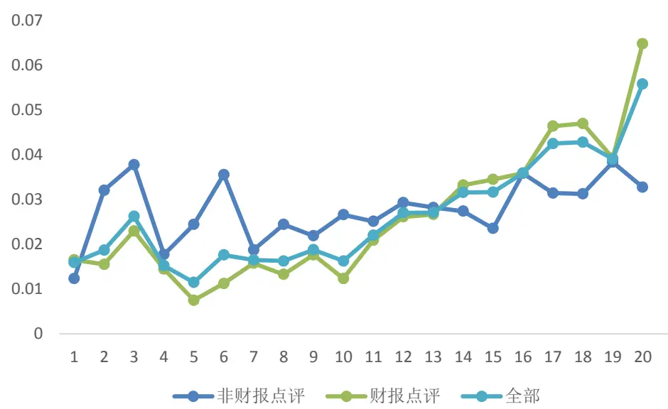
资料来源：国盛证券研究所，Wind

## 3.2 盈利修正的质量

除了盈利修正的大小外，盈利修正的质量也是需要考虑的因素之一。盈利修正的质量可以分为三点，可靠性、创新性和及时性。可靠性是指分析师的盈利修正是可靠的，和市场对其的解读是一致的，如果分析师的盈利修正与市场的认知有较大的偏差，那么该盈利修正可能不会带来正向的超额收益。创新性和及时性是指盈利修正的信息是最新的，如果盈利修正的信息已经被市场所消化，那么该股票之后也不会跑出超额收益。

## 3.2.1 创新的盈利修正

Gleason和 Lee(2003)认为分析师在做预测时，其自身的过往预测以及当前其他分析师的预测都是其参考的基准。如果分析师在此参考上，仅仅只将其预测调整到更接近其他分析的预测，那么这个预测中包含了较少的信息，我们称之为Low-Innovation Revision，而如果分析师在上调或者下调预测时，同时超出或低于了自身和其他分析师的一致预期，我们认为其中包含了较多的信息，称之为 High-Innovation Revision。

图表 12: Innovation Revision 的解释
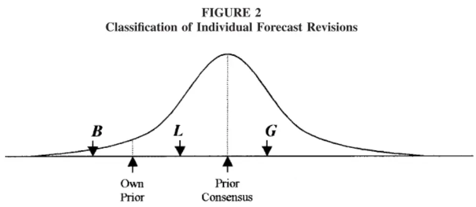
Figure 2a: When an analyst's own prior forecast is less than the current consensus

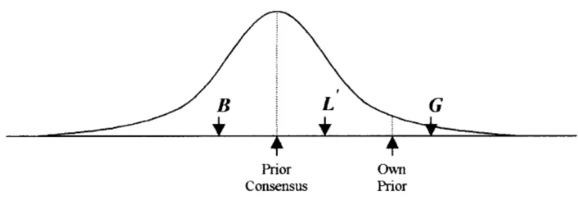
Figure 2b: When an analyst's own prior forecast is greater than the current consensus
资料来源：国盛证券研究所，Gleason和Lee(2003)

我们统计了上述四类样本的超额收益，从上表可以看到，在正向盈利修正的股票中，如果该盈利修正同时高于一致预期，即高创新（High Innovation）组合，那么其超额收益要显著高于低于一致预期的低创新组合。在负向修正中这一效应同样存在，但显著程度不如正向修正的股票。

图表13:分组收益

| 相对于一致预期 | 低 | 高 | 高-低 |
| --- | --- | --- | --- |
| 相对于自身前次预期 |  |  |  |
| 低 | 0.0116 | 0.0176 | 0.0060 |
|  |  |  | (4.45) |
| 高 | 0.0377 | 0.0488 | 0.0111 |
|  |  |  | (7.25) |

资料来源：国盛证券研究所，Wind

## 3.2.2 更新的盈利修正

Stickel（1991）认为过往的盈利修正可能已经被市场充分反应，因此当下市场对盈利修正的反应应该剔除过往的盈利修正，例如计算更新的盈利修正（updated revision）。更新的盈利修正等于当期盈利预测相对于市场预期的该分析师的盈利预测的差值。而市场预期的盈利预测由过去该分析师的盈利预测、一致预期的盈利修正以及一致预期盈利相对于分析师历史盈利预测回归得到。

$$
\begin{aligned}UpdateIndividualSUF_{i,a,t}=(FRCCT_{i,a,t}-E_{t-1}(FRCCT_{i,a,t}))/FRCCT_{i,a,t}\\E_{t-1}(FRCCT_{i,a,t})=FRCCT_{i,a,t-v}+\hat{\beta}_0+\hat{\beta}_1(CONSX_{i,t-1}-CONSX_{i,t-v})\\+\hat{\beta}_2(CONSX_{i,t-v}-FRCCT_{i,a,t-v}),\end{aligned}
$$

由于上述模型较为复杂，且要进行参数估计，我们使用一个简单版的更新的盈利修正。即分析师的盈利修正减去截止前一天最新的一致预期的盈利修正，作为更新的盈利修正。例如分析师本次盈利预测发布日期为 T1，其上次报告的发布日期为 T2。那么我们分别取得 T1-1日以及T2的市场一致预期，并计算一致预期的盈利修正，使用分析师的盈利修正与一致预期盈利修正的差作为更新的盈利修正，即认为前一天的一致预期盈利修正已经被市场所反应，而更新的盈利修正才能真正决定未来的超额收益。

图表14:：更新的盈利修正与原始盈利修正的分组收益对比
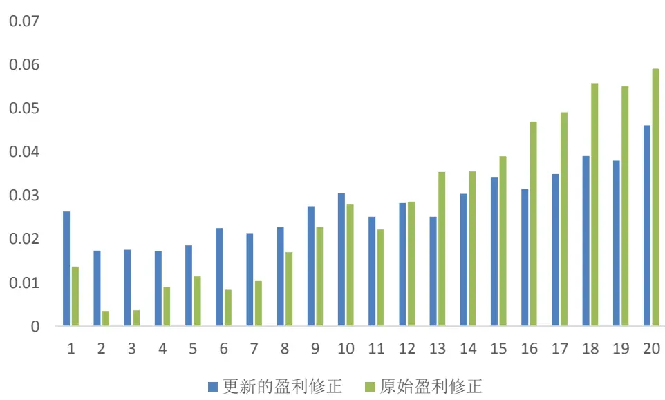
资料来源：国盛证券研究所，Wind

但从统计结果来看，上述猜想并不成立。我们认为可能的原因是相对于美股市场，A 股的定价效率较低，因此前期的盈利修正仍然能够带来非常显著的超额收益，而并没有被市场反应完全。

另一方面，分析师的盈利修正与前一天的一致预期盈利修正有较强的相关性，全样本相关系数在 0.7 以上。那么二者是否都能够提供独立的增量信息呢？我们将样本分为如下四类，发现不管在正向还是负向盈利修正的样本中，一致预期仍然能够提供非常强的超额收益，是对分析师盈利修正很好地补充。分析师盈利修正与一致预期盈利修正同向为正的样本的超额收益远高于二者反向的样本。我们认为这是由于分析师与一致预期的看法方向一致，从而增加了盈利修正的可靠性。

图表15:分组收益

| 一致预期盈利修正方向 | 负向 | 正向 | 正向-负向 |
| --- | --- | --- | --- |
| 分析师盈利修正方向 |  |  |  |
| 负向 | 0.0092 | 0.0313 | 0.0221 |
|  |  |  | (13.75) |
| 正向 | 0.0255 | 0.0516 | 0.0261 |
|  |  |  | (15.95) |

资料来源：国盛证券研究所，Wind

## 3.2.3 盈利修正的时间间隔

在 3.1.2 中我们提到，由于分析师一般不发布卖出评级的报告，因此负向盈利修正的时间间隔会比较久，而在此期间市场对信息已经进行了充分反应，这导致近几年来，不同的负向盈利修正样本随后的 CAR区分度并不显著。因此我们猜想，如果盈利修正的时间间隔特别长，即当前盈利预测距上一次盈利预测的相隔天数较长，那么该事件随后的CAR会有所减弱。从下表可以看到，在盈利修正最高的一组，一个月以内的盈利修正平均带来 7.1%的超额收益，而三个月以上的盈利修正平均只能带来 4.8%的超额收益，印证了我们的猜想。

图表16：不同时间间隔的盈利修正分组收益

|  | 一个月内 | 1-3个月 3个月以上 |
| --- | --- | --- |
| 1（低盈利修正） | 0.015 0.008 | 0.008 |
| 2 | 0.014 | 0.004 0.006 |
| 3 | 0.010 | 0.007 0.013 |
| 4 | 0.020 | 0.011 0.015 |
| 5 | 0.035 | 0.023 0.022 |
| 6 | 0.032 | 0.025 0.018 |
| 7 | 0.046 | 0.034 0.029 |
| 8 | 0.042 | 0.047 0.037 |
| 9 | 0.056 | 0.059 0.043 |
| 10（高盈利修正） | 0.071 | 0.062 0.048 |

资料来源：国盛证券研究所，Wind

## 3.2.4 分析师的特征

分析师特征是影响盈利修正质量非常重要的因素。Gleason 和 Lee（2003）使用了两种不同的分析师评价体系，发现了截然不同的结果。对于 the Institutional Investor’s All-American Research Team 评选，他们发现获奖分析师的盈利修正后的 CAR 更低，这是由于这些分析师影响力更大，他们的盈利修正的信息会被市场及时反应，从而降低了超额收益。而对于 the Wall Street Journal’s Survey of Award Winning Analysts 评选，获奖分析师盈利修正的价格漂移现象非常显著，这是由于该评选完全参考历史分析师盈利预测的准确度，而不是影响力，很多分析师都是小机构的分析师，但他们的盈利修正又较为准确，因此这些分析师的盈利修正质量很高，而且并没有被市场充分反应，从而能够获取较为稳定的超额收益。本篇报告我们暂时不对这一因素进行研究。

## 3.3 盈利修正和信息不确定性

对于 PRFD 现象的解释有很多，其中 Zhang（2006）认为信息不确定是影响 PRFD 的重要因素。对于信息不确定性越强的公司，股价漂移程度越高。我们以股票总市值作为信息不确定的代理变量，从盈利修正与规模的双分组可以看到，同样的盈利修正分组下，小市值的超额收益要明显高于大市值股票，这与论文中的结论相符。

图表17：不同规模股票盈利修正的分组收益

| 规模分组 | 1（小） | 2 | 3 | 4 | 5(大) |
| --- | --- | --- | --- | --- | --- |
| 盈利修正分组 |  |  |  |  |  |
| 1(低) | 0.006 | 0.012 | 0.000 | 0.007 | 0.017 |
| 2 | 0.024 | 0.026 | 0.028 | 0.014 | 0.019 |
| 3 | 0.035 | 0.031 | 0.026 | 0.016 | 0.026 |
| 4 | 0.038 | 0.044 | 0.036 | 0.021 | 0.025 |
| 5（高） | 0.061 | 0.066 | 0.059 | 0.035 | 0.040 |

资料来源：国盛证券研究所，Wind

## 3.4 回归模型

在上述分析中，我们研究了各指标可能对 PFRD的影响，我们汇总为下表。

图表18:指标列表

| 变量 | 定义 | 解释 |
| --- | --- | --- |
| rev_growth | 分析师盈利预测相对前自身前次预测(180天内)的变化率 | 盈利修正的大小：盈利修正幅度 |
| rev_ret | 报告发布 T-1 至 T+0 日的超额收益 | 盈利修正的大小：市场反应 |
| rev_to_cons | 盈利预测相对于前一天的一致预期的变化率 | 盈利修正的质量：创新性 |
| innovation | 创新的好消息标记为1，创新的坏消息标记为-1，其余为0 | 盈利修正的质量：创新性 |
| innovation1 | rev_growth 与 cons_rev 同向为正记为 1，同向为负记为-1， 其余为0 | 盈利修正的质量：可靠性 |
| cons_rev | 同期一致预期的变化率 | 盈利修正的质量：可靠性 |
| est_date_interval | 分析师盈利修正的间隔，小于一个月为1，大于1个月小于 3个月为2，其余为3 | 盈利修正的质量：及时性 |
| growth_size | rev_growth 与 size 的乘积，表征信息不确定对 PRFD 的影响 PFRD 的一种解释 |  |

资料来源：国盛证券研究所

对于以上指标，我们在全样本分别进行了三次回归检验。回归 1告诉我们盈利修正与随后的CAR确实存在非常显著的线性关系。而当我们将innovation 和rev_to_cons变量加入之后，显著性仍然明显，但是 rev_to_cons 并不显著，这说明 innovation 中已经包含了 rev_to_cons 的信息，即 rev_to_cons 的具体数值并不重要，如果分析师盈利预测同时高于一致预期和自身前次预测，则能够带明显的增量信息。最后我们将上述变量全部放入回归模型，回归结果与我们上述分析基本一致。Rev_ret以及cons_rev的系数显著为正，而 est_date_interval 和 growth_size 的系数显著为负。但由于变量 rev_growth、innovation、innovation1相关性较高，使得部分变量的系数显著性变低。

图表19：回归结果

|  | 1 2 | 3 |  |
| --- | --- | --- | --- |
| const | 0.03 | 0.03 | 0.04 |
|  | (62.47) | (62.92) | (24.94) |
| rev_growth | 0.09 | 0.06 | 0.00 |
|  | (31.02) | (17.20) | (-0.54) |
| rev_to_cons |  | -0.01 | 0.03 |
|  |  | (-1.73) | (5.22) |
| innovation |  | 0.01 | 0.00 |
| cons_rev |  | (14.21) | (-0.36) |
|  |  |  | 0.02 |
| innovation1 |  |  | (3.33) |
|  |  |  | 0.02 |
|  |  |  | (16.05) |
| est_date_interval |  |  | 0.00 |
|  |  |  | (-6.01) |
| growth_size |  |  | -0.02 |
|  |  |  | (-7.25) |
| rev_ret |  |  | 0.26 |
|  |  |  | (16.23) |

资料来源：国盛证券研究所，Wind

以上回归均采用了异方差稳健的标准误，但是由于不同分析师的盈利预测存在较强的相关性，而且由于一些分析师在同一天或者相近的几天发布研究报告，使得残差收益并不完全独立，因此以上回归仍然存在一定的内生性以及残差相关性问题，导致统计检验的结果可能不稳健。在 Gleason 和 Lee（2003）中，作者在更小的样本中进行了测试，以排除上述问题，由于本文的目的是用以上指标进行预测，因此不在推断部分做进一步的深入。

## 四、 应用

## 4.1 构建月频因子

本章我们将前面的分析进行整合，然后构建成新的盈利修正因子。首先我们生成对每个盈利修正事件的 CAR的预测，然后在每个月底将股票过去发生的盈利修正事件汇总，得到月频的盈利修正因子。

我们采用滚动回归的方式来进行预测，即在每年年初，使用过去N年的样本作为训练集，得到每个因素对 CAR 的回归系数，然后在当年进行预测。选取的变量为表 18 中的所有变量，由于 growth_size 实际上衡量的是盈利修正在不同市值域的预测能力，我们这里暂时不将其作为预测指标。另外一方面，除了使用回归线性预测外，如果只预测头部股票，使用筛选法进行预测也有着不错的表现，甚至略微好于回归的方法，但涉及到较多的参数，本文只展示回归法的测试结果。

我们测试了不同训练时间窗口的表现，并以样本外 IC 以及分组多空收益作为衡量标准。

图表20：不同训练窗口下因子表现

| 时间窗口 | IC | 第十组超额收益 | 第一组超额收益 |
| --- | --- | --- | --- |
| 1 | 0.085 | 0.073 | 0.006 |
| 2 | 0.088 | 0.073 | 0.006 |
| 3 | 0.087 | 0.075 | 0.007 |
| 4 | 0.087 | 0.074 | 0.007 |
| 5 | 0.088 | 0.075 | 0.007 |

资料来源：国盛证券研究所，Wind

可以明显的看到，不同训练样本下，样本外预测的表现差别并不是很大。为了保持参数的稳健性，我们选取 5年作为参数训练的样本。

我们也检验了不同变量加入预测模型后，模型预测能力的变化。从下图可以看到，rev_to_cons 以及cons_rev 相对于分析师的盈利修正带来的信息比较有限。而真正带来显著增量信息的是 innovation、innovation1、rev_ret。这说明除了盈利修正的大小，盈利修正的质量尤其重要，例如是否是创新的盈利修正，该盈利修正和市场一致预期的盈利修正是否有较大的偏差，以及市场对盈利修正的反应等。

图表21：加入不同指标后IC的变化
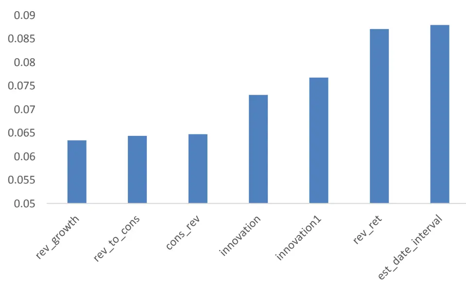
资料来源：国盛证券研究所，Wind

构建完预测之后，我们在每个月底将上述预测汇总。首先要解决的第一个问题是选取多长的时间窗口。我们将股票按照上述模型的预测值分为 4 组，分别计算了每组 T+1 到T+120之间滚动10个交易日的平均超额收益。从多头组（组 4）可以看出，PFRD 的超额收益在前几个交易日最高，平均日度超额达到 0.1%左右，然后逐渐下滑稳定在 0.05%左右，大概在 60个交易日之后开始衰减至 0.02%左右。而空头组（组1）与多头组较为类似，在前几个交易日平均日度超额收益为负，然后迅速收敛到 0 以上。在 60 个交易日之后，不同组的超额收益并没有显著的区分度了。

图表 22：PFRD的时间衰减
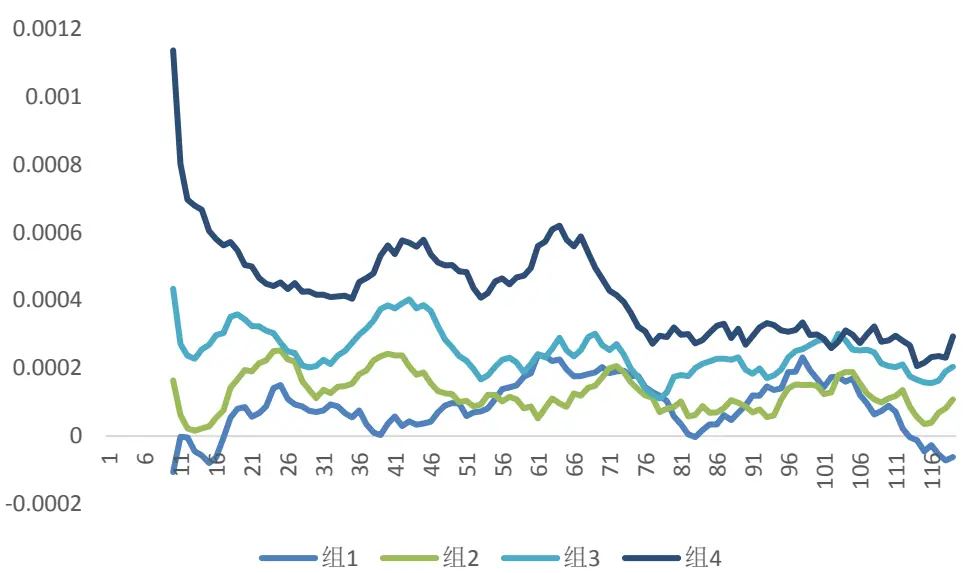
资料来源：国盛证券研究所，Wind

我们对不同样本进行了测试，对于财报点评报告样本以及非财报点评报告样本，我们发现了类似的结论，因此我们认为 60个交易日，或者大约3个月的时间窗口是获取PFRD超额收益最优的参数。

我们分别测试了在每个月底求所有盈利修正事件超额收益预测值的均值、中位数、最大值，以及每个机构最新一次修正事件超额收益预测值的均值、中位数、最大值等方法，发现差别并不明显。因此我们最终构建因子的方法为在每个月底，寻找个股 90 天内的非 0盈利修正，然后将每个机构的最新盈利修正打分取平均，作为最终的因子值。我们同时也测试了使用 180天窗口构建的因子。

图表23:因子覆盖率
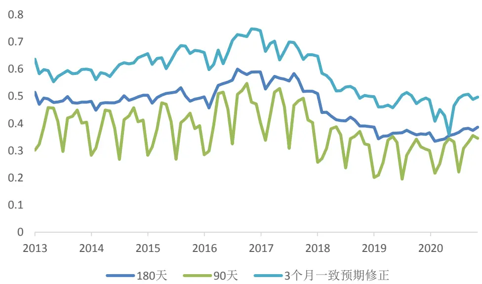
资料来源：国盛证券研究所，Wind

使用盈利修正构建的因子的覆盖度明显低于一致预期因子，因为单个分析师盈利修正在计算时必须对应到自身的前次预测，而一致预期因子不需要。同时使用 90 天的时间窗口构建的因子覆盖率更低，这是由于对于很多股票分析师只在财报公告时进行点评，导致这部分股票在 1 月份或者 7 月份无法计算 90 天内的修正。我们分别在全 A 域中以及分析师覆盖域中计算了因子的表现。结果如下。

图表24:因子表现

| 全a |  | 分析师覆盖 |  |
| --- | --- | --- | --- |
|  | IC | ICIR IC | ICIR |
| 3个月一致预期修正 | 0.025 | 2.486 0.032 | 2.373 |
| 90天内盈利修正 | 0.024 | 2.398 0.031 | 2.360 |
| 90天内盈利修正(对一致预期因子中性) | 0.014 | 1.754 0.018 | 1.787 |
| 180天内盈利修正 | 0.023 | 2.089 0.030 | 2.033 |
| 180天内盈利修正(对一致预期因子中性) | 0.012 | 1.463 0.016 | 1.455 |

资料来源：国盛证券研究所，Wind

图表25：纯因子收益
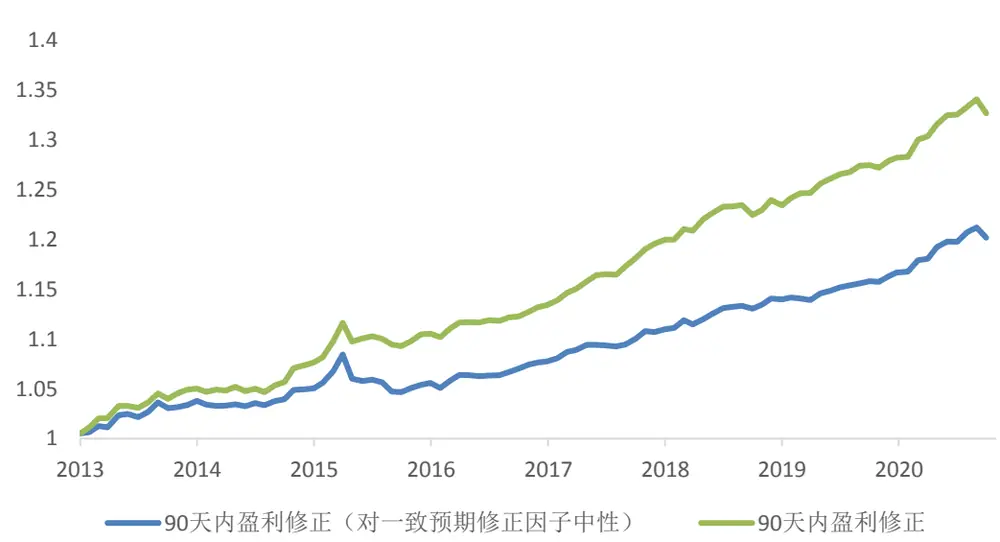
资料来源：国盛证券研究所，Wind

图表26:因子双分组表现

| 3个月一致预期盈利修正 | 1（低） | 2 | 3 | 4 | 5（高） |
| --- | --- | --- | --- | --- | --- |
| 90 天内盈利修正 |  |  |  |  |  |
| 1（低） | 0.007 | 0.010 | 0.010 | 0.011 | 0.014 |
| 2 | 0.012 | 0.010 | 0.012 | 0.014 | 0.014 |
| 3 | 0.013 | 0.005 | 0.014 | 0.007 | 0.017 |
| 4 | 0.012 | 0.006 | 0.018 | 0.014 | 0.018 |
| 5（高） | 0.017 | 0.018 | 0.020 | 0.022 | 0.025 |

资料来源：国盛证券研究所，Wind

从以上结果可以看到，不管是从 IC 的角度还是从双分组的角度，90 天内的盈利修正因子相对于 3个月一致预期盈利修正都有显著的增量信息。

## 4.2 筛选头部股票

图表27：盈利修正因子全A选股超额收益
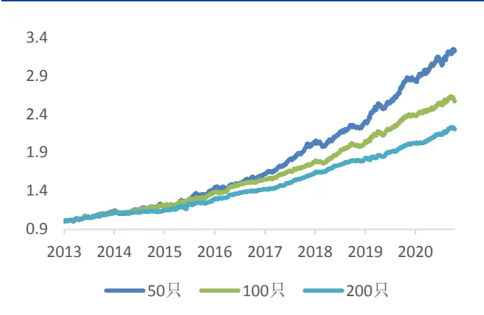
资料来源：国盛证券研究所，Wind

图表28：一致预期盈利修正因子全A选股超额收益
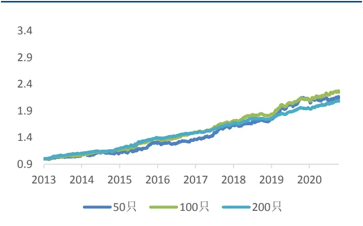
资料来源：国盛证券研究所，Wind

图表29:盈利修正因子中证800选股超额收益
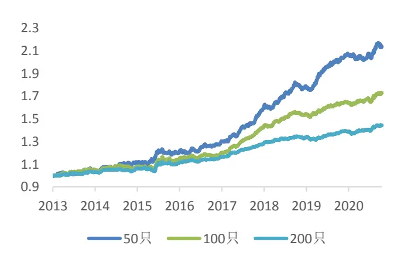
资料来源：国盛证券研究所，Wind

图表30：一致预期盈利修正因子中证800选股超额收益
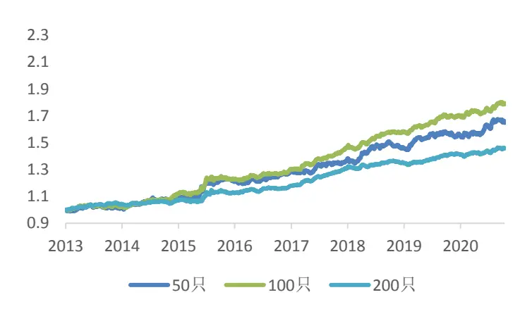
资料来源：国盛证券研究所，Wind

图表31：头部选股表现

|  | 50只 | 100 只 | 200 只 |
| --- | --- | --- | --- |
| 90天内盈利修正（全A） | 0.169 | 0.134 | 0.111 |
| 一致预期修正（全A） | 0.107 | 0.114 | 0.102 |
| 90天内盈利修正（中证800） | 0.107 | 0.076 | 0.050 |
| 一致预期修正（中证800） | 0.069 | 0.080 | 0.052 |

资料来源：国盛证券研究所，Wind

从筛选头部股票的角度来看，在全A样本内，90天内盈利修正筛选出的股票超额收益显著较高，其中 50 只股票的年化超额收益为 16.88%，而一致预期盈利修正的头部 50 只股票超额收益只有 10.07%。我们同样在中证 800 中进行了以上测试，发现也有一定的提升效果，但仅限于头部，当筛选 100只股票或者200只时，差距并不大。

## 4.3 思考

## 4.3.1 超额收益的来源

从因子测试角度来说，我们发现 90 天内盈利修正因子尽管表现和一致预期修正因子差距不大，但是提供了一定的增量信息。这是由于二者本质上是对分析师预期数据不同的处理方法。一致预期修正存在的问题是当前一致预期和上一期一致预期的分析师并不可比，导致该因子选出来的股票可能只是由于不同分析师的预期偏差或者说乐观程度不同导致的。而对于 90 天内单个分析师盈利修正因子来说，尽管解决了可比的问题，但是信息丢失却很严重，大部分股票可能 90 天内只有一两个有效的分析师盈利修正数据，而有很多的分析师预测是无法计算盈利修正的，比如首次覆盖或者近期未发报告。因此二者本质上是对分析师盈利数据的不同处理方法。如果存在一种理想状况，即每个分析师都高频率的更新自身的观点，那么二者的结论会比较相似。这也是为何我们在 800成分股中筛选头部股票，增强效果会降低，因为 800成分股不管是分析师覆盖的家数还是频率都是较高的，尤其是选股数量越来越多的时候，两个因子的表现基本一致。而在全A 中由于分析师覆盖较少，一致预期盈利修正受分析师不可比的问题影响较大，从而使得单个分析师盈利修正的选股效果会有显著的提升。

## 4.3.2 因子未来的有效性

2020年以来超预期、分析师类因子表现较好，但是去年下半年出现过短暂的回撤，有人可能会质疑这类策略有所失效，或者说该策略的超额收益完全是由风格带来的，我们认为未来这个因子的表现仍然会延续。因为这类策略本质上是在获取投资者反应不足带来的超额收益，类似于一种套利策略，而套利策略的失效的原因只会是套利空间完全消失，即在事件发生的瞬间股价就已经反应完全了，例如在美股市场，由于定价效率提升，近十年来 PEAD 策略已经完全没有超额收益。

图表 32:2014.1-2020.3 中美市场 PEAD策略表现
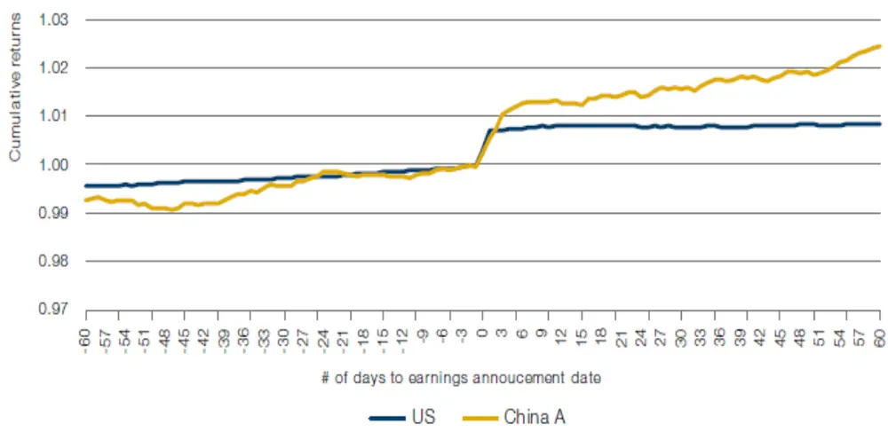
资料来源：国盛证券研究所，Man Group

我们认为因子在去年短期失效最重要的原因是市场对超预期事件，或者说优质股票的业绩过度反应，导致了因子波动率的加大，从下图可以看到，整体来看 2020 年下半年以来 PFRD 的超额收益与之前基本没有差别，但是这段时间股票回归内在价值的速度要明显加快，而在后 40 个交易日基本无超额收益，甚至产生负的超额收益。这从侧面反映了市场整体效率是在逐渐提升的，策略超额收益的衰减速度变快。

图表 33：2020 下半年 PFRD 的超额收益
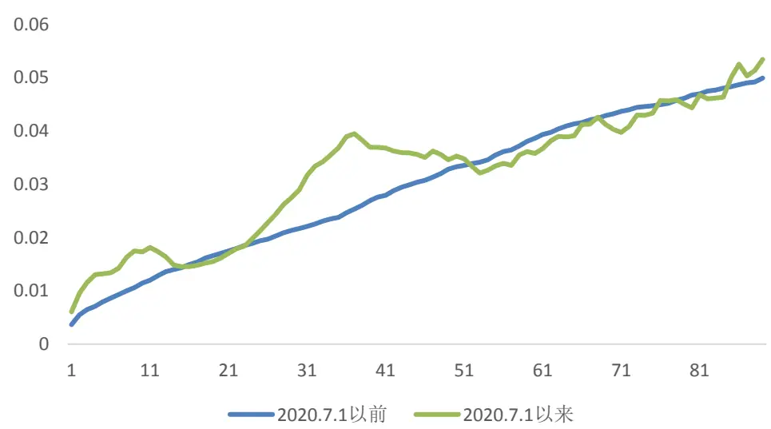
资料来源：国盛证券研究所，Wind

## 五、 总结与展望

本报告试图获取分析师盈利修正后股价漂移（PFRD）带来的超额收益，我们从盈利修正的大小和质量出发，分析了影响 PFRD 的因素，进一步使用上述因素为特征进行训练，来预测当前的盈利修正可能带来的超额收益。不管从线性的角度，还是从头部筛选的角度，该因子相对于传统的一致预期盈利修正因子有着明显的增量信息，

尽管我们构建的因子相较于传统的一致预期盈利修正因子提供了增量信息，但是仍然有非常大的改进空间，尤其是在盈利修正的质量方面。

1. 首先，我们发现很多分析师在进行盈利上下调时没有非常明确的逻辑，可能仅仅来源于其预测模型中参数的变动，该现象在小幅盈利调整中尤为明显，给策略带来了一定的噪声。

2. 其次，在第三部分的分析中，我们提到分析师的信息存在较为明显的滞后问题，尤其是在下修盈利中，很多下修盈利的报告伴随着推荐的评级。下修盈利的报告随后的价格飘移现象并不显著。

3. 分析师的盈利修正带有比较强的主观性，其中含有的信息可能与市场预期并不一致。但目前盈利修正的数据量偏少，使得股票的因子值仍取决于少数分析师的观点，从而选出来的股票可能存在偏差。

4. 我们在研究时只考虑未来一年的盈利修正，但我们发现有一些报告在维持 FY1 盈利不变的情况下，上调了 FY2 和 FY3 的盈利，在成长股中尤其明显。因此纳入这部分信息可能能够对策略有进一步的增量。

总结来看，PFRD 希望获取的是及时的、真正的好消息带来的价格漂移。主动投资者可以通过人工筛选的方式去获取研报中真正的有效信息。而对于因子投资来说，分析师数据中存在例如无信息的修正、过于主观的修正、发布滞后等等一系列问题，使得我们在获取 PFRD 的超额收益时，也带有一定的噪声。对于该策略未来改进，我们认为可以结合主动投资的观点，在筛选出一部分股票后，再人工的方法筛掉其中的噪声。而从因子的角度来说，我们需要借助更多的信息，来获取质量更好的盈利修正信息。例如使用股票过去的涨幅来判断盈利修正信息是否已经反应，通过对研报标题或者摘要的分析来剔除掉其中的噪声，或者通过分析师历史盈利修正的可靠性对其当前的盈利修正进行加权等等。

## 六、 参考文献

Barth M E , Hutton A P . Analyst Earnings Forecast Revisions and the Pricing of Accruals[J]. Review of Accounting Studies, 2004, 9(1):59-96.

Chan L K C, Jegadeesh N, Lakonishok J. Momentum strategies[J]. The Journal of Finance, 1996, 51(5): 1681-1713.

Francis J, Soffer L. The relative informativeness of analysts' stock recommendations and earnings forecast revisions[J]. Journal of Accounting Research, 1997, 35(2): 193-211.

Givoly D , Lakonishok J . The information content of financial analysts' forecasts of earnings: Some evidence on semi-strong inefficiency[J]. Journal of Accounting and Economics, 1979, 1(3):165-185.

Gleason C A, Lee C M C. Analyst forecast revisions and market price discovery[J]. The Accounting Review, 2003, 78(1): 193-225.

Imhoff E A, Lobo G J. Information content of analysts' composite forecast revisions[J]. Journal of Accounting Research, 1984: 541-554.

Po-chang Chen, Narayanamoorthy G S , Sougiannis T , et al. Analyst underreaction and the post‐forecast revision drift[J]. Journal of Business Finance & Accounting, 2020.

Stickel S E. Common stock returns surrounding earnings forecast revisions: More puzzling evidence[J]. Accounting Review, 1991: 402-416.

Zhang X F . Information Uncertainty and Stock Returns[J]. The Journal of Finance, 2006, 61(1).

## 风险提示

以上结论均基于历史数据和统计模型的测算，如果未来市场环境发生改变，不排除模型失效的可能性。

## 免责声明

国盛证券有限责任公司（以下简称“本公司”）具有中国证监会许可的证券投资咨询业务资格。本报告仅供本公司的客户使用。本公司不会因接收人收到本报告而视其为客户。在任何情况下，本公司不对任何人因使用本报告中的任何内容所引致的任何损失负任何责任。

本报告的信息均来源于本公司认为可信的公开资料，但本公司及其研究人员对该等信息的准确性及完整性不作任何保证。本报告中的资料、意见及预测仅反映本公司于发布本报告当日的判断，可能会随时调整。在不同时期，本公司可发出与本报告所载资料、意见及推测不一致的报告。本公司不保证本报告所含信息及资料保持在最新状态，对本报告所含信息可在不发出通知的情形下做出修改，投资者应当自行关注相应的更新或修改。

本公司力求报告内容客观、公正，但本报告所载的资料、工具、意见、信息及推测只提供给客户作参考之用，不构成任何投资、法律、会计或税务的最终操作建议,本公司不就报告中的内容对最终操作建议做出任何担保。本报告中所指的投资及服务可能不适合个别客户，不构成客户私人咨询建议。投资者应当充分考虑自身特定状况，并完整理解和使用本报告内容，不应视本报告为做出投资决策的唯一因素。

投资者应注意，在法律许可的情况下，本公司及其本公司的关联机构可能会持有本报告中涉及的公司所发行的证券并进行交易，也可能为这些公司正在提供或争取提供投资银行、财务顾问和金融产品等各种金融服务。

本报告版权归“国盛证券有限责任公司”所有。未经事先本公司书面授权，任何机构或个人不得对本报告进行任何形式的发布、复制。任何机构或个人如引用、刊发本报告，需注明出处为“国盛证券研究所”，且不得对本报告进行有悖原意的删节或修改。

## 分析师声明

本报告署名分析师在此声明：我们具有中国证券业协会授予的证券投资咨询执业资格或相当的专业胜任能力，本报告所表述的任何观点均精准地反映了我们对标的证券和发行人的个人看法，结论不受任何第三方的授意或影响。我们所得报酬的任何部分无论是在过去、现在及将来均不会与本报告中的具体投资建议或观点有直接或间接联系。

投资评级说明

| 投资建议的评级标准 |  | 评级 | 说明 |
| --- | --- | --- | --- |
| 评级标准为报告发布日后的6个月内公司股价（或行业指数）相对同期基准指数的相对市场表现。其中A股市场以沪深300指数为基准；新三板市场以三板成指（针对协议转让标的）或三板做市指数（针对做市转让标的）为基准；香港市场以摩根士丹利中国指数为基准，美股市场以标普500指数或纳斯达克综合指数为基准。 | 股票评级 | 买入 | 相对同期基准指数涨幅在15%以上 |
|  |  | 增持 | 相对同期基准指数涨幅在 5%~15%之间 |
|  |  | 持有 | 相对同期基准指数涨幅在-5%~+5%之间 |
|  |  | 减持 | 相对同期基准指数跌幅在 5%以上 |
|  | 行业评级 | 增持 | 相对同期基准指数涨幅在10%以上 |
|  |  | 中性 | 相对同期基准指数涨幅在-10%~+10%之间 |
|  |  | 减持 | 相对同期基准指数跌幅在10%以上 |

## 国盛证券研究所

北京

地址：北京市西城区平安里西大街 26 号楼 3层

上海

地址：上海市浦明路 868号保利 One56 1 号楼 10层

邮编：100032

邮编：200120

传真：010-57671718

电话：021-38934111

邮箱：gsresearch@gszq.com

邮箱：gsresearch@gszq.com

南昌

深圳

地址：南昌市红谷滩新区凤凰中大道 1115号北京银行大厦

地址：深圳市福田区福华三路 100 号鼎和大厦 24楼

邮编：330038

传真：0791-86281485

邮编：518033

邮箱：gsresearch@gszq.com

邮箱：gsresearch@gszq.com