# 量化专题报告

## 多因子系列之十六：基本面因子的收益分解

本报告研究了常见基本面因子的收益来源。基本面因子的收益来源于市场对基本面信息的反应不足，而反应不足的解释可以分为两种，由于行为不理性带来的反应滞后和由于认知错误带来的预期偏差。我们思考了不同基本面因子的收益来源，进而加深了对这些基本面因子的理解。

假设由反应滞后带来的超额收益会在下个财报前逐渐反应完全，而由预期偏差带来的超额收益在下个财报公告之后才会修正。因此我们定义因子在股票下个财报公告后业绩超预期带来的超额收益为预期偏差修正的超额收益，而在下个财报公告前获取的超额收益为反应滞后的超额收益，从而对因子收益进行分解。

超预期事件的超额收益主要来源于反应滞后。超预期事件后 120 个交易日超额收益十分显著，而反应滞后的收益占到 8 成以上，预期偏差的占比较小，即市场在这些股票下个财报前就反应了超预期利好消息中的大部分信息，但是由于投资者不理性的原因反应的较慢。

分析师因子的超额收益中预期偏差的占比较高。我们认为这是由于分析师的信息较为主观而且私有，当分析师对某只股票进行盈利修正时，市场可能并不会及时反应分析师报告中的信息，而当股票的财报发布时，市场才会发现分析师之前的修正是正确的，这些股票的业绩确实要好于预期，从而带来股票价格的修正。

不同财报类因子差别较大。单季度因子的收益基本上来源于反应滞后，其中单季度增速的预期偏差收益为负，说明市场最终会高估单季度增速高的股票的未来业绩。质量类因子的预期偏差收益较多，这较符合质量类因子的基本逻辑，即因子值高的股票未来业绩好，而市场未认知到这部分信息，从而在这些股票的下个财报公告后，超额收益较为明显。

基金重仓股因子中存在预期偏差修正的超额收益。机构重仓股在过去几年表现很好，但近期波动较大，因此有投资者认为机构重仓股因子是一种风格因子而并非 alpha因子。通过测试我们发现重仓股在财报公告日附近相对于非重仓股超额收益显著，说明基金重仓股中包含对未来业绩的预测信息。

超预期策略在短期内并不会由于拥挤交易而失效。我们认为超预期策略的收益来源主要是投资者行为偏差带来的反应滞后，而 A 股市场的定价权仍然由主观投资者所主导，只要这些投资者的行为偏差未消失，那么短期内超预期策略就不会失效。我们通过分析师财报点评报告后的盈利修正行为观测到主观投资者的行为偏差现象较为稳定，因此我们继续看好超预期类策略在 A股市场上的表现。

基本面量化策略的超额收益主要来源于投资者行为偏差带来的反应滞后。对于量化策略来说，由于我们大都使用的是公开财报数据，而较少使用前瞻的行业数据或者逻辑，在公司未来业绩上相对于市场上的其他投资者很难有领先性，因此我们能够获取的预期偏差收益较少，主要是获取反应滞后带来的超额收益，超额收益的预测能力大都在短期几个月之内，与本文的结论相符。如果能够提升预期偏差带来的收益，将给传统量化策略带来显著增量信息。

风险提示：以上结论均基于历史数据和统计模型的测算，如果未来市场环境发生改变，不排除模型失效的可能性。

## 作者

分析师 丁一凡

执业证书编号：S0680520100001

邮箱：dingyifan@gszq.com

分析师 刘富兵

执业证书编号：S0680518030007

邮箱：liufubing@gszq.com

相关研究

3、《量化专题报告：A 股收益预测框架——大类资产定价系列之三》2021-08-14

4、《量化分析报告：掘金 ETF：中证 500 投资正当时——国泰中证 500ETF 投资价值分析》2021-08-10

5、《量化分析报告：基思广益：跑赢赛道 ETF 容易吗？》2021-08-08

## 一、 综述

本报告主要研究了常见基本面 Alpha 因子的收益来源。通过对 Alpha因子收益来源进行分解，我们能够更加深入的理解 Alpha 因子的本质，从而能够提升 Alpha因子的收益或者对其未来表现做出一定的判断。

对于基本面 Alpha 因子，学术论文中常见的解释是反应不足，即当信息出现后，股票价格并没有立刻调整到位，因此我们在下个交易日买入仍然能够获取超额收益。但反应不足的原因，学术上有很多不同的解释，以下列举了几种：

1）处臵效应：股票发生好消息，且处于浮盈，投资者倾向于卖出，从而压低股票的价 格，反之倾向于持有，从而高估了股票的价格。(Frazzini(2006))

2）有限关注：投资者同时接受处理多个信息的能力有限。(Hirshleifer et al.(2009))

3）心理偏差：投资者由于例如过度自信等心理偏差（pyschological bias），导致短时间内对市场新信息的低估。且股票的信息不确定性越强，低估程度越高。(Daniel(1998)、Zhang(2006a)、Zhang(2006b))

4）预期偏差：投资者对因子所包含的未来基本面信息的解读有所偏差，例如因子能够预测股票未来基本面，但市场没有认知到该信息或认知不准确。

对于以上几种解释，我们认为可以分为两类，其中处臵效应、有限关注、心理偏差都是从投资者行为的角度进行解释的，认为这些因子之所以可以获取超额收益是因为投资者不理性的行为导致股价反应的较慢，即有反应滞后，而预期偏差是从基本面预期角度进行解释，即市场对股票的基本面没有正确认知，有所低估，因此我们能够获取超额收益。

我们以研发费用占比为例来简单说明上述分类。市场在 Q0 财报公告前，对某公司 Q1财报的净利润预测为 5 亿元，Q0 时刻发布了最新财报，其研发费用占比较高，根据该信息，对股票 Q1 净利润的合理预期应该上调到 10 亿元，而市场低估了研发费用对公司业绩的影响，认为公司 Q1 净利润的预期为 8 亿元。那么我们通过高研发因子选股可以获取这 2个亿的预期差带来的超额收益，我们称之为预期偏差带来的。但同时，股票从 5亿预期对应的价格调整到 8亿预期对应的价格也不是瞬间反应的，由于上述的一些投资者行为不理性的原因，股价的反应较为缓慢，因此我们在信息公告后买入仍然能够获取一部分超额收益，我们称这部分收益为反应滞后带来的。

对于反应滞后带来的收益，市场会在信息公开后逐渐反应直到反应完全，而对于预期偏差带来的收益，市场在有新的基本面信息公开时，才会修正自己的预期，从而带来超额收益的反应。Engelberg 等（2018）发现在公司新闻日，股票异象的超额收益是平日的1.5 倍，而在盈利公告日，异象的收益是平日的 7 倍，印证了我们的观点。由于公司其他事件的数据难以处理，在本文的研究中，我们仅定义下个财报公告后的超额收益为预期偏差带来的收益。

我们以财报类因子为例，使用简化版的超额收益路径图来进一步说明上述分解的结果。Q0 代表当季财报公告日，Q1 代表下季财报公告日，为了方面起见，我们假设 Q0-Q1之间没有任何其他信息。那么不同的路径代表不同的含义：

路径 1：市场是有效的，即股价立刻反应了财报信息带来的预期变化，且新的预期是没有偏差的，即市场在财报公布当日迅速且正确的反应了财报因子中的信息，此时无法获取超额收益。

路径 2：市场虽然能够在下个财报前无偏差的反应财报中的信息，但由于有限关注或者处臵效应等原因，市场反应的较慢，在数个交易日后才反应完全，因而能够获取反应滞后带来的超额收益。

路径 3：市场迅速反应了财报中的信息，但是反应错误，原因是该因子高的股票未来基本面会较好（或者较差），市场低估（也可能是高估）了该信息，即产生了预期偏差，因此在下个财报公告后，市场才会修正其预期，从而带来超额收益。路径 4：反应滞后与预期偏差同时存在，因此能获取两部分的收益。

图表1:路径1
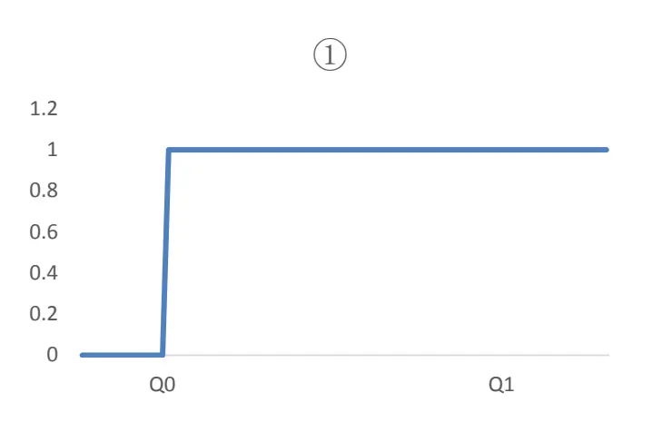
资料来源：国盛证券研究所

图表2：路径2
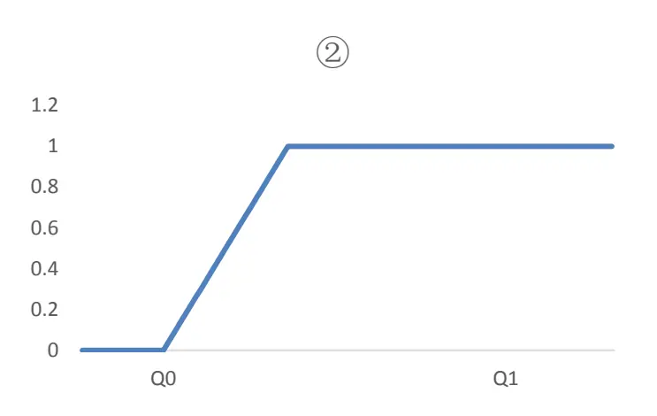
资料来源：国盛证券研究所
图表3：路径3

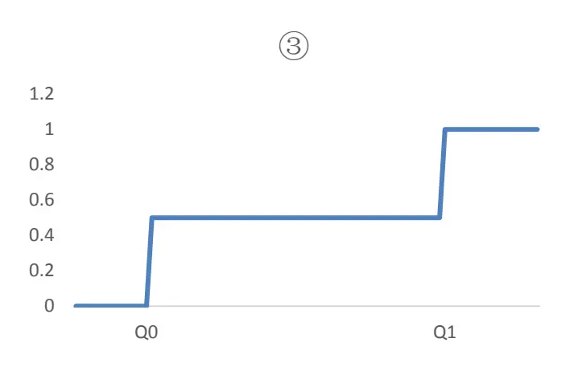
资料来源：国盛证券研究所

图表4：路径4
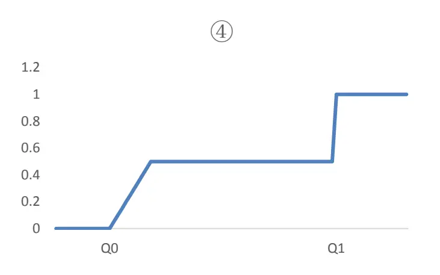
资料来源：国盛证券研究所

更直白的解释，反应滞后是在赚取市场由于不理性反应慢的钱，而预期偏差是在赚取市场认知偏差反应错的钱。我们将常见的基本面因子分为超预期类，分析师类，财报类，机构重仓类，然后将这些因子按照上述方式进行分解，得到了不同的结论。

## 二、 实证研究

## 2.1 超预期类策略

超预期类策略是近两年较为热门的策略，我们首先从该策略入手来对收益进行分解。

## 2.1.1 样本

超预期样本的选取有多种不同的选择，由于不知道市场的真实预期水平，我们只能使用不同的指标来作为是否超市场预期的代理变量，常见的超预期策略的代理变量有：

1）财报净利润-使用历史财报数据构建的市场预期净利润

2）财报净利润-使用分析师数据构建的市场预期净利润

3）分析师自身前后预期的对比

4）市场对财报的反应

不同的代理变量都包含一定的信息和噪声，且数据的覆盖率也有所区别，在构建策略时使用多个指标的结合能够更好的筛选出超预期的股票样本。但本文的目的是为了分析超预期策略的收益来源，不需要考虑数据的覆盖率，而希望在选取的样本中，对超预期股票的定义更加准确。因此我们选取分析师自身预期的比对来定义超预期。

具体来说，我们选取了所有股票业绩快报，业绩预告，以及正式财报的样本。然后寻找在业绩公告日 5天内的分析师报告，如果有分析师报告的标题出现“超预期”或类似字眼，则认为该股票的财报超预期，如果有分析师报告标题出现“符合预期”或者“低于预期”等字眼，则认为该股票未超预期。我们主要关注超预期的样本和未超预期的样本在财报日附近的超额收益的差别，标题中未出现上述字眼的报告不包含在我们的样本中。其中超额收益使用的是 barra 模型中回归得到的残差收益。事件样本区间为 2015 年至今。

图表5：超预期事件累计超额收益
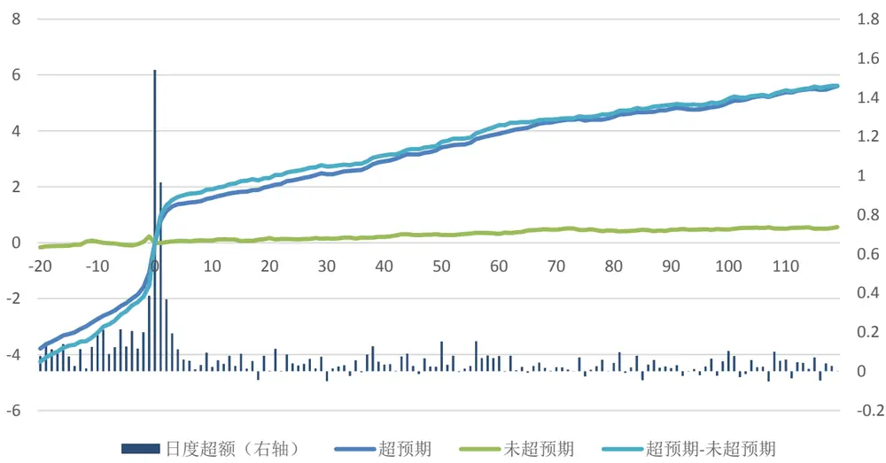
资料来源：国盛证券研究所，WIND

上图展示了超预期策略的累计超额收益表现，在 A 股市场上，超预期事件发生之后，股价在事件当天并没有反应到位，其超额收益仍将延续超过 100 个交易日以上，平均单个事件的超额收益能够达到 6%。那么这些超额收益的来源是什么呢？

## 2.1.2 反应滞后

首先，通过观察事件发生后 10 个交易日内的超额收益，我们认为反应滞后这一因素是肯定存在的。由于财报发生后 10 个交易日内，基本没有新的基本面信息到来，因此此时不会存在明显的由预期偏差修正带来的超额收益，而只可能存在反应滞后带来的超额收益。我们发现财报公布后 2 到 10 个交易日平均超额收益为 0.9%，T 统计量为 7.27，十分显著，由此说明反应滞后这一因素是存在的。

除了从事件后的收益来印证，我们也可以从盈利的角度来直接印证市场对超预期股票的信息反应滞后。分析师在其财报点评报告中会给出对当前年度的盈利预测，我们寻找分析师 3个月内的下次盈利预测，并计算盈利上下调的幅度。我们分别统计了当季度超预期的样本和未超预期的样本随后的平均盈利修正幅度，如下表所示。

图表6:超预期与未超预期样本的分析师盈利修正幅度

|  | 未超预期 超预期 |
| --- | --- |
| 样本数量 2310 | 1685 |
| 均值 | -0.028 0.025 |
| 标准差 0.198 | 0.153 |
| 最小值 -1 | -1 |
| 25%分位数 | -0.093 -0.030 |
| 50%分位数 -0.019 | 0.007 |
| 75%分位数 | 0.026 0.069 |
| 最大值 1 | 1 |

资料来源：国盛证券研究所，WIND

由于异常值的存在，我们将修正幅度绝对值大于 1的样本进行了缩尾。从上表可以看到，超预期的样本在财报后，分析师会再次上调对其的盈利预测，而未超预期的样本盈利预期是有所下调的。如果对两个样本均值的差做统计检验，T 值为 12.31，十分显著。这说明由于一些行为偏差方面的原因（保守、过度自信等，见 Bareris 和 Thaler（2003）），分析师在超预期事件发生的时候对股票的盈利预测并没有立刻调整到位，而是有所滞后的，在随后的报告中，分析师会继续上调这些股票的盈利预测值，从而带来超额收益。

## 2.1.3 预期偏差

那么在下个财报公告前，市场是否能够完全消化当前财报中的基本面信息呢，即超预期的股票在下个季度财报公告时是否存在预期差？对于该问题，也有一个简单的验证方式，我们可以观察当季超预期的股票相对未超预期的股票在下个财报日附近的表现。我们寻找当前财报公告日后最早公布的业绩预告、业绩快报以及正式报告的公告日作为下一个财报公告日。

图表7：超预期样本下个财报公告日附近的超额收益
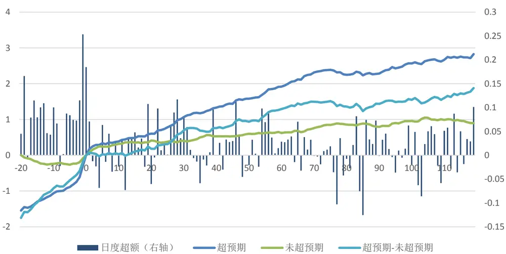
资料来源：国盛证券研究所，WIND

从上图可以看到，在下个财报日附近，超预期的股票相对于未超预期的股票仍然存在着非常明显的超额收益。观察下个财报公布日 t-2 到 t+2 的窗口，发现这段时间的超额收益显著更高，说明由于新的盈利信息的到来，市场迅速修正了之前的预期偏差。但我们同时发现除了在财报公布前后几天，在财报公布前 20 个公告日内，超额收益持续较高，这与 Engelberg 等（2018）的结论不符。我们认为这有可能是有些财报公告日相隔太近，导致下个财报公告日前的事件窗口中仍然含有反应滞后部分的超额收益。我们进一步筛选出公告日间隔在 3个月以上的样本，尽可能减少这一部分影响。下图展示了该样本下的结果，在下一公告日 t-2 到 t+2 附近，超额收益均为正而且显著，与我们的预期相符。至此，我们确认了超预期的股票也存在预期偏差的收益，即在下个财报公告前，市场对超预期利好消息中包含的未来盈利预期信息并没有正确反应，而是有所低估，超预期的股票未来基本面继续超预期，从而我们能够获取预期偏差带来的超额收益。

图表8：超预期样本下个财报公告日附近的超额收益（筛选下个公告日在3个月以上的样本）
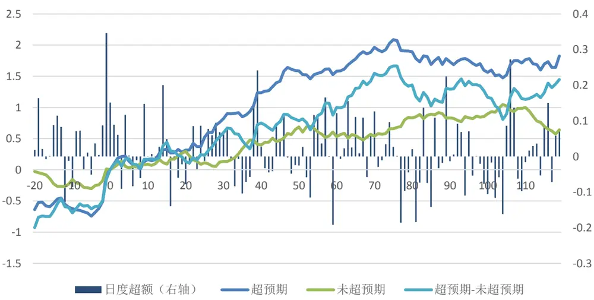
资料来源：国盛证券研究所，WIND

## 2.1.4 收益分解

通过上述分析我们知道了超预期策略的来源有两方面，一方面是市场的反应滞后带来的超额收益，一方面是下个财报季预期偏差修正带来的超额收益。那么超预期策略的收益主要是由哪方面主导呢，这两部分的超额收益各占比多少，这是我们接下来想要研究的问题。

想要拆分出不同的部分的收益，那么就需要寻找特殊的子样本，即一些样本只有反应滞后带来的超额收益，而一些样本只有预期偏差带来的超额收益，但这些样本较难定义。我们采用控制变量的方法来进行研究。具体来说，我们定义下个财报公布日附近[T-5,T+60]为预期偏差修正带来超额收益的窗口，即如果市场对超预期的股票有预期偏差，由于股票更新了最新财报，这部分收益会在这段时间反应。对于超预期的样本和未超预期的样本，如果控制了预期偏差的收益一致，那么二者事件后的收益差则能够代表单纯的反应滞后带来的超额收益。

## 具体计算方法如下：

1. 计算所有样本下一个财报窗口[T-5,T+60]的超额收益作为预期偏差的超额收益M。

2. 将样本按 M 的大小分为十组，计算每组内超预期样本和未超预期样本事件日附近的超额收益的差，此时二者的差只代表反应滞后的收益。

3. 将十组的差取平均作为对反应滞后的衡量。

4. 最后用所有样本事件日前后的超额收益减去反应滞后带来的超额收益，即衡量了预期偏差带来的超额收益。

图表9:超预期事件超额收益分解
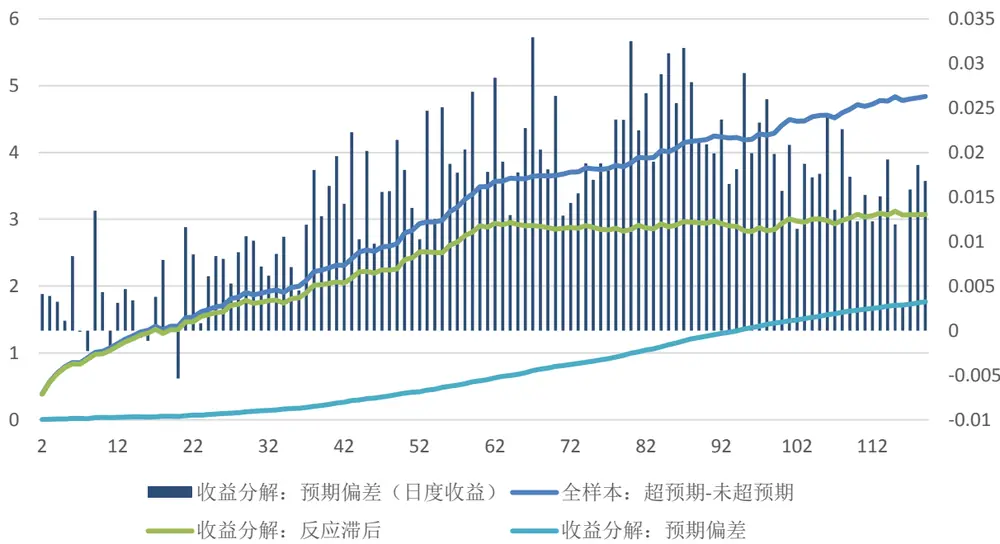
资料来源：国盛证券研究所，WIND

通过上述方法，我们得到如图所示的分解。反应滞后的收益从第一个交易日开始平稳上行至大概 60 个交易日左右，之后再无超额收益，说明市场对于超预期信息大概在 3 个月左右才会完全反应。而对于预期偏差的部分，在财报后的 20 个交易日以内并无稳定的超额收益，而在 20 个交易日之后，超额收益才开始逐渐增加，日度超额稳定在 0.01%以上。这是由于在财报发布的短时间内，并无新的公司基本面信息，因此不存在预期偏差修正带来的超额收益，而在 20 个交易日之后，逐渐有公司发布新的财报更新市场的预期，从而带来超额收益。从收益占比的角度看，超预期事件 120 个交易日的多空收益为 4.8%，其中预期偏差部分为 1.8%，反应滞后的部分为 3%，即反应滞后贡献了超预期策略的大部分收益。

上述分解中存在一个问题，如果下一个季度财报在短时间例如 2个月内发布，那么反应滞后的收益仍未反应完全，而由于新一季财报信息的来临，市场迅速的修正了其之前的预期偏差，此时未反应完的部分全部被计入预期偏差的部分，从而高估了预期偏差的收益。因此，收益分解的结果与前后两期财报的间隔有较大的关系。本质上，我们希望分解出的是市场完全反应了其预期后，下一季财报附近，预期偏差还能够带来多少收益。为了使得反应滞后的部分和预期偏差不重叠，我们筛选出下季财报在 3个月以后的样本，再次进行分解，事件后 120个交易日的超额收益为 4.6%，其中反应不足部分为 3.83%，业绩兑现部分为 0.77%，预期偏差部分的收益进一步降低。因此，我们认为尽管超预期策略的收益来源于反应滞后和预期偏差两部分，但是反应滞后部分主导了超预期策略的表现。

## 2.2 分析师类策略

对于分析师类策略，我们同样可以进行以上分解。以分析师盈利修正因子为例，由于多数分析师的报告都是财报点评报告，分析师在报告中会根据最新财报修正其预期，这一信息与上一节中的超预期策略有所重复，因此我们只筛选出不在财报窗口（财报发布后一周以内）作出的盈利修正样本，同时我们限制该盈利修正的时间间隔为 2个月以内。

首先，我们计算盈利修正事件后的超额收益。无论是盈利上修样本还是下修样本，事件后的残差收益均大于 0，这是由于分析师覆盖的样本本身相对于全市场存在超额收益。但比较二者的差额，盈利上修的样本相对于盈利下修的样本在事件后的也存在明显的超额收益。

图表10：分析师修正事件累计超额收益
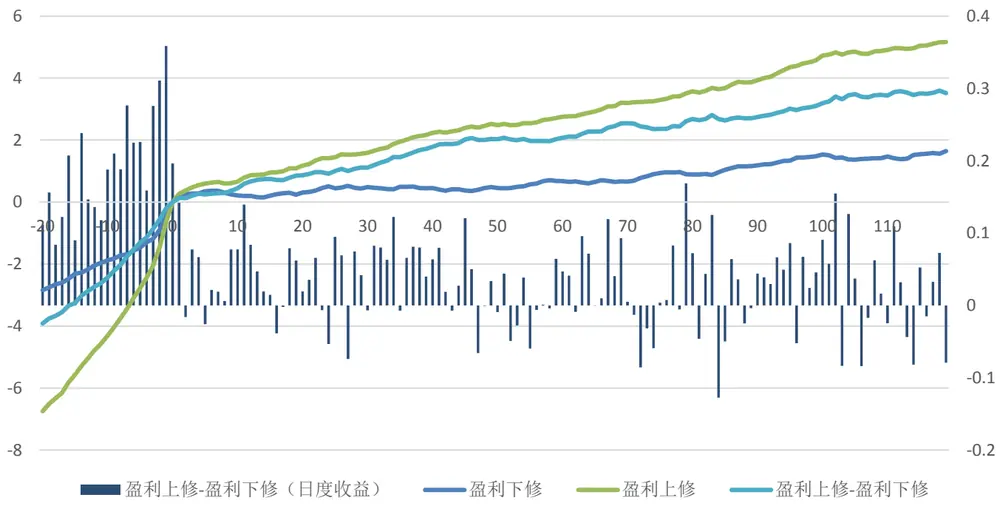
资料来源：国盛证券研究所，WIND

我们进一步计算这些样本下一个财报公告日附近的超额收益，发现盈利上修的样本相对于盈利下修的样本在下个财报公告日附近存在非常明显的超额收益，这说明盈利上修的样本相对于下修样本确实在股票基本面上更有优势。

图表11：分析师修正事件下个财报公告日附近的超额收益
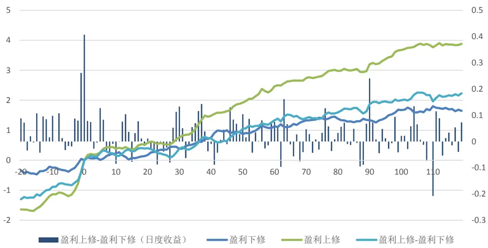
资料来源：国盛证券研究所，WIND

同样，我们定义下个财报日[t-5,t+60]为业绩兑现窗口，按照上一节的方法对分析师修正事件的超额收益进行分解。从分解结果来看，分析师盈利修正带来的超额收益来源比较均衡，其中预期偏差部分的收益较高。我们认为这是由于分析师的信息较为主观而且私有，当分析师对某只股票进行盈利修正时，市场可能并不会即时反应分析师报告中的信息，而当股票新的财报发布时，市场才会发现分析师之前的修正是正确的，这些股票的业绩要好于预期，从而带来股票超额收益的。因此分析师类因子可能并不存在很强的时效性，其表现应该在财报季有大量预期修正的时候表现较好。

图表12：分析师修正事件超额收益分解
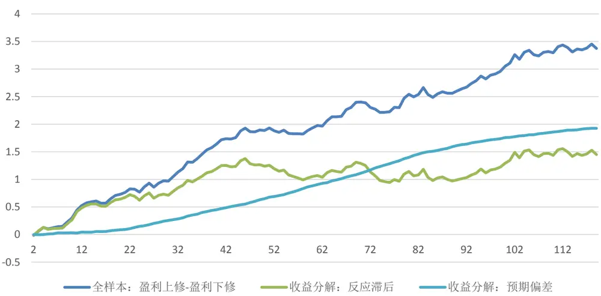
资料来源：国盛证券研究所，WIND

如果我们观察分析师一致预期盈利修正因子（当月分析师一致预期相对于上个月的变化率）的表现，发现该因子在 1、6、7、12 月的表现较差，这可能是由于这几个月处于财报发布的真空期，因子的超额收益中只包含反应滞后的收益，而无预期偏差的收益，与我们上述的分析一致。另一方面，这几个月的报告数量有所减少，大部分的股票的一致预期没有产生变化，因此因子的区分度不强，这也可能是导致因子在这几个月 IC 较低的原因。

图表13:一致预期修正因子不同月份IC值
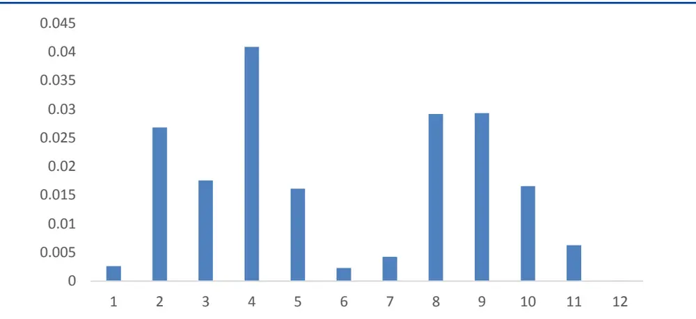
资料来源：国盛证券研究所，WIND

## 2.3 财务因子

除了上述两类事件型策略外，对于常见的财务因子，我们也进行了分解。具体方法不再赘述，以下为分解的结果。

图表14:财务因子列表

| 因子名称 | 因子解释 |
| --- | --- |
| yoy_np_q | 单季度净利润增速 |
| roe_q | 单季度 roe |
| roe_q_delta | 单季度 roe 的变化 |
| ep_q | 单季度ep |
| sue | 预期外盈利 |
| yoy_or_q | 单季度营收增速 |
| tot_liab_yoy | 总负债增速 |
| tot_rd_ttm_to_equity | 研发费用/净资产 |
| yoy_ocf_q | 单季度经营性现金流增速 |
| roe_ttm | 过去四个季度的 roe |
| manager_ben | 高管薪酬 |
| np_ttm_growth_std | 净利润 ttm 的标准化增速 |
| grossprofit | 毛利率 |
| delta_ben_asset | 应付职工薪酬的增长 |

资料来源：国盛证券研究所

图表15：财务因子收益分解
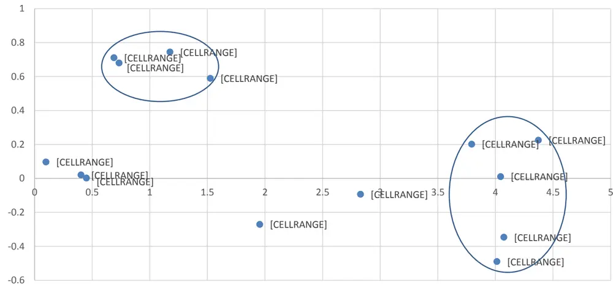
资料来源：国盛证券研究所，WIND

上图中，横轴为反应滞后带来的超额收益，纵轴为预期偏差部分的收益。从图中明显看到，分解后因子可以分为两大类。其中单季度因子例如单季度净利润增速，单季度 roe，单季度 roe 变化等因子，业绩兑现部分的收益都较低，甚至为负值，也就是说投资这些因子主要在获取市场对财报利好信息反应滞后带来的超额收益。在下一季财报前，市场基本已经正确的反映了这些因子中包含的未来基本面信息，因此预期偏差部分的收益较低。在这些因子中，不同因子的表现也有差别，例如单季度增速和单季度 ep 因子盈利兑现部分带来的超额收益为负，即市场对这些股票的基本面预期会有所高估，可能原因是市场对单季度增速较高的股票存在简单的线性外推，而到了下个季度，市场发现这些高增速的股票未来业绩并没有延续，即之前的预期有所高估，从而在下个财报公布后出现负向的预期偏差带来的收益。

另外一部分因子例如研发费用占比，高管薪酬，负债增长等因子，预期偏差部分较高，这与我们的认识相符。这些因子都是质量类因子，其带来超额收益的主要逻辑是高质量的股票未来基本面更好，因此这些因子的收益在下个季度财报公布后会迅速的兑现。另外我们也发现这些因子值高的股票在未来两三个季度的财报公告日附近超额收益都十分显著，这说明质量类因子对股票基本面的预测能力较为持续。

还有一些因子，例如 roe_ttm，毛利率在一些研究中被认为是质量类因子，但是在我们的测试中，发现其并没有基本面预测能力，即不能带来预期偏差的收益。这与 Kyosevet al. (2020)的研究结论类似，在这篇文章中，作者认为质量类因子应该能够对股票未来的盈利增长有预测作用，而 roe 因子没有这个能力。对应到本文的研究，我们认为如果因子收益中存在预期偏差的收益，才能够被认为是质量类因子，例如研发费用，高管薪酬等因子都有较多的业绩兑现的超额收益，而 roe_ttm，毛利率等因子，其超额收益可能来源于与单季度 roe 因子的相关性，事实上在中性掉单季度 roe 因子后，这两个因子的选股能力完全消失。

综合来看，反应滞后带来的超额收益更高，平均有 4%左右，而预期偏差的收益较低，只有 1%不到，因此我们在因子测试中会发现单季度因子的 IC 更高，而质量类因子的IC 普遍较低，我们在多因子策略中，获取的也更多的是由于行为偏差导致的反应滞后带来的超额收益。

## 2.4 机构重仓因子

机构重仓股在过去几年表现很好，但近期波动较大。因此部分投资者认为机构重仓股因子是一种风格因子，而并非 alpha 因子。我们也可以用上述方法来检验机构重仓因子是否为 alpha 因子。学术上的一个经典的检验方法是观测特定窗口的因子超额收益大小。如果该因子是风格因子，则其超额收益的来源是由于其承担了某种风险，而一般来说股票在不同时间点的风险暴露不会产生变化，因此该因子的超额收益在不同的日期应该差别不大，不会受股票特质事件的影响。

我们测试了机构重仓股相对于非重仓股在基金持仓公告日前后的超额收益，以及股票下一个财报公告日附近的超额收益。

图表16：机构重仓股披露前后的超额收益
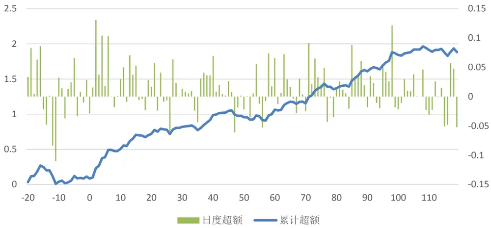
资料来源：国盛证券研究所，WIND

图表17：机构重仓股下个财报日附近的超额收益
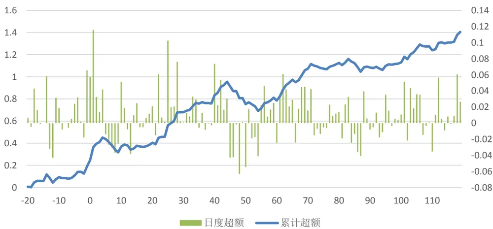
资料来源：国盛证券研究所，WIND

在基金持仓公告日后的 120 个交易日内，重仓股相对于非重仓股的平均日度超额收益为 0.009%，而在重仓股信息公告日后的 5 个交易日，平均日度超额收益为 0.064%，双样本 T 统计量为 3.9，在股票下个财报公布日后的 5 个交易日，平均日度超额收益为0.056%，双样本 T 统计量为 4.0。通过上述检验，我们发现重仓股在事件后以及股票财报公告日窗口的收益都要显著更高，这说明重仓股的超额收益可能部分来源于风格，但是确实有一部分来源于重仓股的基本面更好这一因素。

## 2.5 思考：超预期类策略展望

我们统计了不同年份的收益分解结果，如下图所示。由于 2021 年股票的中报尚未发布，无法计算预期偏差部分的收益，因此这里没有展示。2016 年以来，超预期策略的超额收益十分稳定，并未发生明显的衰减。尽管近两年超预期策略已经成为非常热门的策略，反应滞后的超额收益仍然维持稳定，并没有出现因为拥挤交易而失效的情况。

图表18:不同年份超预期策略收益的分解
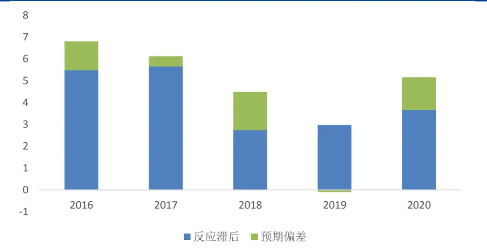
资料来源：国盛证券研究所，WIND

我们观察超预期事件发生后 30 个交易日内事件的超额收益，发现这部分超额收益也不存在明显的逐年单调递减，因此也印证了反应滞后的收益没有明显衰减。

图表19:不同年份超预期策略30个交易日内的超额收益
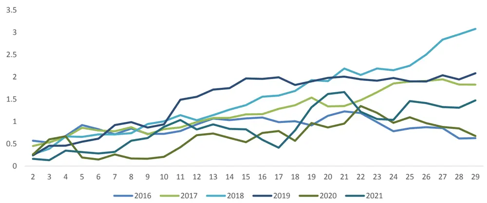
资料来源：国盛证券研究所，WIND

为什么超预期策略的关注度越来越高，交易的资金越来越多，但策略的收益却没有明显变少呢？我们认为超预期策略中市场反应滞后部分的超额收益与高频交易中事件驱动型策略获取市场反应不足的收益来源并不相同，并不是在比拼对信息处理的速度，因此不会因为交易拥挤而迅速失效。在第一章中我们也提到，学术上对于超预期策略超额收益的解释都是从投资者行为的角度来解释的。由于 A 股市场的股票定价权仍然是由主观投资者占主导，如果这些投资者在行为方面的不理性持续存在，那么超预期策略中反应不足的收益就会延续。

我们可以用分析师的盈利修正行为来检验主观投资者的心理偏差是否存在。我们统计了不同年份超预期和未超预期样本事件后分析师预期调整的幅度，发现主观投资者的行为偏差现象较为稳定，今年超预期样本随后的预期盈利变化仍然显著好于未超预期样本，也就是说在事件发生后，市场对超预期股票的基本面预期并没有立刻反应到位，而是有所滞后。因此，我们认为这类策略短期内并不会由于拥挤交易而失效。

图表20：不同年份超预期事件发生后分析师预期的修正

| 未超预期 | 超预期 |
| --- | --- |
| 2015 -0.077 | -0.003 |
| 2016 -0.030 | 0.051 |
| 2017 -0.018 | 0.035 |
| 2018 -0.054 | 0.003 |
| 2019 -0.044 | 0.017 |
| 2020 -0.016 | 0.027 |
| 2021 -0.020 | 0.026 |

资料来源：国盛证券研究所，WIND

但如果市场逐渐走向成熟，由投资者行为偏差带来的超额收益也会逐渐消失。例如Frazzini（2006）提到机构投资者占比高的股票处臵效应会更弱，因为机构投资者会更加理性。同时如果市场信息的透明度增加，市场投研人员数量逐渐增加，也会消除股票的信息不确定性，从而消除投资者的心理偏差。因此尽管短期来看，策略的超额收益会持续存在，但随着股票市场逐渐发展成熟，这类策略最终也会失效。

图表 21：2014.1-2020.3 中美市场 PEAD策略表现
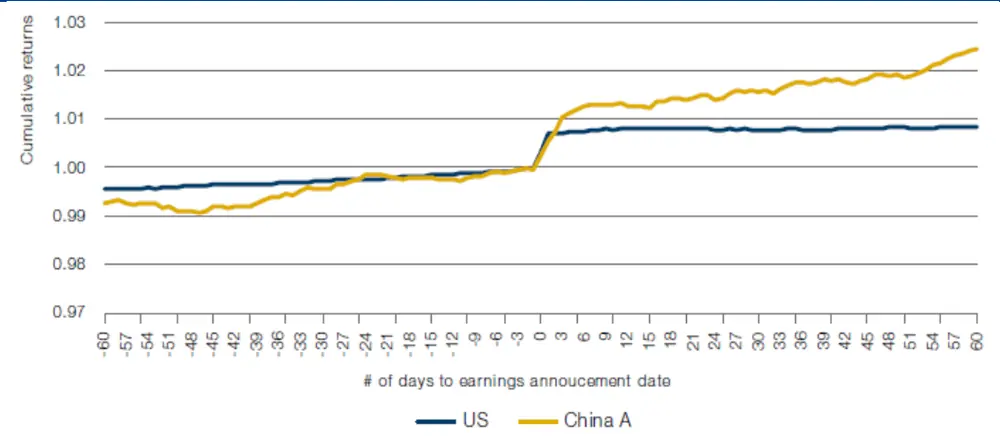
资料来源：国盛证券研究所，Man Group

## 三、 总结

本文定义了股票下个财报附近[t-5,t+60]为预期偏差修正的窗口，从而对基本面因子的收益进行分解，得到了不同的结论。其中超预期类因子，单季度财报因子的主要收益来源是市场的反应滞后，而质量类因子，分析师类因子的主要收益来源是预期偏差。对于前两类因子，在下个财报前，市场能够完全反应因子中包含的对未来基本面的预期信息，但是反应较慢，因此我们能够获得超额收益，而对后两类因子，直到下个财报公布前，市场对这些因子中包含的未来基本面信息仍然低估，那么这些因子值高的股票在下个财报业绩超预期，从而带来预期偏差修正的超额收益。

整体来看，我们发现反应滞后的超额收益远大于预期偏差的超额收益，也就是说，在下个季度财报前，其实市场已经反映了大部分历史财报中包含的未来基本面信息，但由于投资者行为偏差的因素存在，反应过程较慢，因此能够从中获取超额收益。对于这部分收益，在市场完全有效之前，只要投资者的行为偏差持续存在，超额收益就不会消失。

对于量化策略来说，由于我们大都使用的是历史财报数据，而较少使用前瞻的行业数据或者逻辑，在公司未来业绩上相对于市场上的其他投资者很难有领先性，因此我们能够获取的预期偏差收益较少，主要是获取由于行为不理性导致的反应滞后带来的超额收益，因此超额收益的预测能力大都在短期几个月之内，与本文的结论相符。如果能够提升预期偏差带来的收益，将给传统量化策略带来显著的增量信息。

## 参考文献

Abarbanell J S, Bernard V L. Tests of analysts' overreaction/underreaction to earnings information as an explanation for anomalous stock price behavior[J]. The journal of finance, 1992, 47(3): 1181-1207.

Barberis N, Thaler R. A survey of behavioral finance[M]. Princeton University Press, 2005.

Chen P C, Narayanamoorthy G S, Sougiannis T, et al. Analyst underreaction and the post‐forecast revision drift[J]. Journal of Business Finance & Accounting, 2020, 47(9-10): 1151-1181.

Daniel K D, Hirshleifer D, Subrahmanyam A. Overconfidence, arbitrage, and equilibrium asset pricing[J]. The Journal of Finance, 2001, 56(3): 921-965.

Engelberg J, McLean R D, Pontiff J. Anomalies and news[J]. The Journal of Finance, 2018, 73(5): 1971-2001.

Frazzini A. The disposition effect and underreaction to news[J]. The Journal of Finance, 2006, 61(4): 2017-2046.

Hirshleifer D, Lim S S, Teoh S H. Driven to distraction: Extraneous events and underreaction to earnings news[J]. The Journal of Finance, 2009, 64(5): 2289-2325.

Kyosev G, Hanauer M X, Huij J, et al. Does earnings growth drive the quality premium?[J]. Journal of Banking & Finance, 2020, 114: 105785.

Zhang X F. Information uncertainty and analyst forecast behavior[J]. Contemporary Accounting Research, 2006, 23(2): 565-590.

Zhang X F. Information uncertainty and stock returns[J]. The Journal of Finance, 2006, 61(1): 105-137.

## 风险提示

以上结论均基于历史数据和统计模型的测算，如果未来市场环境发生改变，不排除模型失效的可能性。

## 免责声明

国盛证券有限责任公司（以下简称“本公司”）具有中国证监会许可的证券投资咨询业务资格。本报告仅供本公司的客户使用。本公司不会因接收人收到本报告而视其为客户。在任何情况下，本公司不对任何人因使用本报告中的任何内容所引致的任何损失负任何责任。

本报告的信息均来源于本公司认为可信的公开资料，但本公司及其研究人员对该等信息的准确性及完整性不作任何保证。本报告中的资料、意见及预测仅反映本公司于发布本报告当日的判断，可能会随时调整。在不同时期，本公司可发出与本报告所载资料、意见及推测不一致的报告。本公司不保证本报告所含信息及资料保持在最新状态，对本报告所含信息可在不发出通知的情形下做出修改，投资者应当自行关注相应的更新或修改。

本公司力求报告内容客观、公正，但本报告所载的资料、工具、意见、信息及推测只提供给客户作参考之用，不构成任何投资、法律、会计或税务的最终操作建议,本公司不就报告中的内容对最终操作建议做出任何担保。本报告中所指的投资及服务可能不适合个别客户，不构成客户私人咨询建议。投资者应当充分考虑自身特定状况，并完整理解和使用本报告内容，不应视本报告为做出投资决策的唯一因素。

投资者应注意，在法律许可的情况下，本公司及其本公司的关联机构可能会持有本报告中涉及的公司所发行的证券并进行交易，也可能为这些公司正在提供或争取提供投资银行、财务顾问和金融产品等各种金融服务。

本报告版权归“国盛证券有限责任公司”所有。未经事先本公司书面授权，任何机构或个人不得对本报告进行任何形式的发布、复制。任何机构或个人如引用、刊发本报告，需注明出处为“国盛证券研究所”，且不得对本报告进行有悖原意的删节或修改。

## 分析师声明

本报告署名分析师在此声明：我们具有中国证券业协会授予的证券投资咨询执业资格或相当的专业胜任能力，本报告所表述的任何观点均精准地反映了我们对标的证券和发行人的个人看法，结论不受任何第三方的授意或影响。我们所得报酬的任何部分无论是在过去、现在及将来均不会与本报告中的具体投资建议或观点有直接或间接联系。

## 投资评级说明

| 投资建议的评级标准 |  | 评级 | 说明 |
| --- | --- | --- | --- |
| 评级标准为报告发布日后的6个月内公司股价（或行业指数）相对同期基准指数的相对市场表现。其中A股市场以沪深300指数为基准；新三板市场以三板成指（针对协议转让标的）或三板做市指数（针对做市转让标的）为基准；香港市场以摩根士丹利中国指数为基准，美股市场以标普500指数或纳斯达克综合指数为基准。 | 股票评级 | 买入 | 相对同期基准指数涨幅在15%以上 |
|  |  | 增持 | 相对同期基准指数涨幅在5%~15%之间 |
|  |  | 持有 | 相对同期基准指数涨幅在-5%~+5%之间 |
|  |  | 减持 | 相对同期基准指数跌幅在5%以上 |
|  | 行业评级 | 增持 | 相对同期基准指数涨幅在10%以上 |
|  |  | 中性 | 相对同期基准指数涨幅在-10%~+10%之间 |
|  |  | 减持 | 相对同期基准指数跌幅在10%以上 |

## 国盛证券研究所

北京

地址：北京市西城区平安里西大街 26号楼 3层

邮编：100032

传真：010-57671718

邮箱：gsresearch@gszq.com

地址：上海市浦明路 868号保利 One56 1号楼 10层

南昌

上海

地址：南昌市红谷滩新区凤凰中大道 1115 号北京银行大

厦

邮编：330038

传真：0791-86281485

邮箱：gsresearch@gszq.com

邮编：200120

电话：021-38124100

邮箱：gsresearch@gszq.com

深圳

地址：深圳市福田区福华三路 100号鼎和大厦 24楼

邮编：518033

邮箱：gsresearch@gszq.com